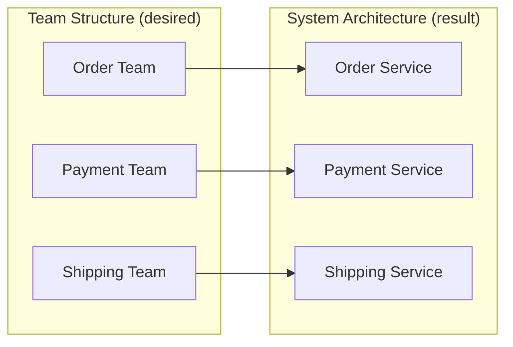
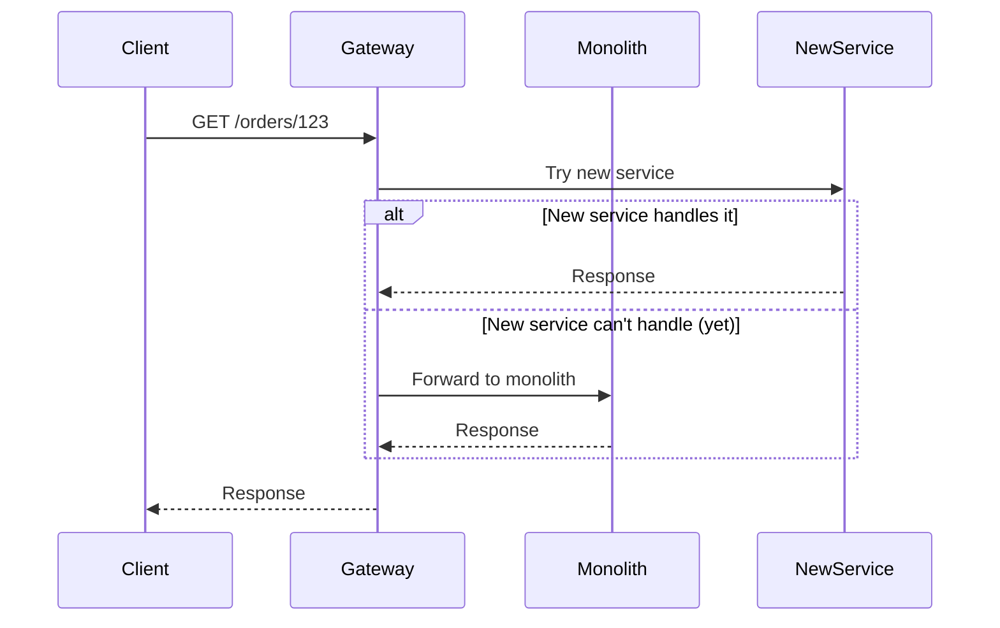
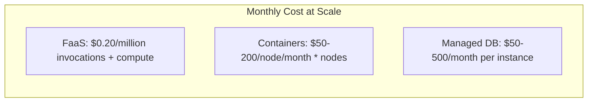

This file is a merged representation of a subset of the codebase, containing specifically included files and files not matching ignore patterns, combined into a single document by Repomix.
The content has been processed where empty lines have been removed, content has been formatted for parsing in markdown style.

# File Summary

## Purpose
This file contains a packed representation of a subset of the repository's contents that is considered the most important context.
It is designed to be easily consumable by AI systems for analysis, code review,
or other automated processes.

## File Format
The content is organized as follows:
1. This summary section
2. Repository information
3. Directory structure
4. Repository files (if enabled)
5. Multiple file entries, each consisting of:
  a. A header with the file path (## File: path/to/file)
  b. The full contents of the file in a code block

## Usage Guidelines
- This file should be treated as read-only. Any changes should be made to the
  original repository files, not this packed version.
- When processing this file, use the file path to distinguish
  between different files in the repository.
- Be aware that this file may contain sensitive information. Handle it with
  the same level of security as you would the original repository.
- Pay special attention to the Repository Description. These contain important context and guidelines specific to this project.

## Notes
- Some files may have been excluded based on .gitignore rules and Repomix's configuration
- Binary files are not included in this packed representation. Please refer to the Repository Structure section for a complete list of file paths, including binary files
- Only files matching these patterns are included: Backend-tech-stack/**/*.md, Backend-tech-stack/**/*.yml, Backend-tech-stack/**/*.yaml, Backend-tech-stack/**/*.toml, Backend-tech-stack/**/*.properties, Backend-tech-stack/**/*.json
- Files matching these patterns are excluded: node_modules, .git, *.jar, *.class, .gradle, build, dist, .env, .env.*, pnpm-lock.yaml, package-lock.json, yarn.lock, *.log, .DS_Store, Thumbs.db, **/skeletons/**/*.java, **/skeletons/**/*.go, **/skeletons/**/*.rs, **/skeletons/**/*.py, **/skeletons/**/Dockerfile, **/skeletons/**/gradlew, **/skeletons/**/*.jar, **/skeletons/**/*.kts, **/skeletons/**/*.bat, **/skeletons/**/.gitignore, **/skeletons/**/.env, **/skeletons/**/.dockerignore
- Files matching patterns in .gitignore are excluded
- Files matching default ignore patterns are excluded
- Empty lines have been removed from all files
- Content has been formatted for parsing in markdown style
- Long base64 data strings (e.g., data:image/png;base64,...) have been truncated to reduce token count
- Files are sorted by Git change count (files with more changes are at the bottom)

# User Provided Header
Architectural Frontend/Backend Tech Stack Reference.
This repository contains comprehensive technical research for backend and frontend architecture decisions.
Use with repomix-reference skill for decision validation.

# Directory Structure
```
Backend-tech-stack/
  .github/
    workflows/
      validate-backend-stack.yml
  ai/
    ai-consumption-guide.md
    README.md
  ai-ml/
    ai-ml-integration-guide.md
    README.md
  api-design/
    api-conventions.md
    api-design-checklist.md
    error-handling-reference.md
    README.md
  architecture/
    anti-patterns-catalog.md
    architecture-patterns.md
    coupling-cohesion-reference.md
    decision-trees.md
    design-patterns-catalog.md
    hexagonal-ddd-reference.md
    key-patterns-reference.md
    README.md
    solid-principles-reference.md
  caching/
    cache-patterns-reference.md
    caching-checklist.md
    README.md
  cloud-architecture/
    cloud-decision-guide.md
    README.md
  compliance/
    compliance-guide.md
    README.md
  configuration/
    configuration-checklist.md
    README.md
  databases/
    index-strategy-reference.md
    migration-safety-rules.md
    query-optimization-reference.md
    README.md
    sql-vs-nosql-decision-guide.md
    transaction-isolation-reference.md
  decisions/
    adr-001-architecture-pattern.md
    adr-002-api-design.md
    adr-003-database-selection.md
    adr-004-caching-strategy.md
    adr-005-messaging-event-driven.md
    adr-006-security-approach.md
    adr-007-testing-strategy.md
    adr-008-deployment-strategy.md
    adr-009-lint-engine.md
    adr-010-testing-framework-vitest-vs-jest.md
    adr-template.md
    README.md
    version-compatibility-matrix.md
  development/
    developer-experience-checklist.md
    README.md
    upgrade-migration-checklist.md
  evolutionary-architecture/
    evolutionary-architecture-guide.md
    README.md
  frontend-backend-validation/
    frontend-backend-validation-guide.md
    README.md
  go/
    decisions/
      adr-001-architecture-pattern.md
      adr-002-api-design.md
      adr-003-database-selection.md
      adr-004-caching-strategy.md
      adr-005-messaging-event-driven.md
      adr-006-security-approach.md
      adr-007-testing-strategy.md
      adr-008-deployment-strategy.md
      README.md
    guides/
      common/
        concurrency.md
        error-handling.md
        modules.md
        project-layout-comparison.md
        project-layout.md
        testing.md
      fiber/
        middleware.md
        performance.md
        websockets.md
      gin/
        auth.md
        routing-middleware.md
        streaming.md
        validation.md
      non-web/
        cli-app-patterns.md
        grpc-services.md
        proxy-patterns.md
        testing-advanced.md
      README.md
    skeletons/
      fiber-clean/
        README.md
      gin-hexagonal/
        README.md
    ARCHITECT-CHECKLIST.md
    architecture-framework.md
    README.md
    senior-engineer-reference.md
  infrastructure/
    apache-kafka-guide.md
    cicd-pipeline-guide.md
    docker-kubernetes-reference.md
    elk-stack-guide.md
    logging-monitoring-guide.md
    message-retry-dlq-patterns.md
    README.md
  java/
    assessment/
      common-anti-patterns-catalog.md
      project-assessment-template.md
      remediation-roadmap-template.md
    decisions/
      adr-001-java-version-framework-selection.md
      adr-002-architecture-pattern.md
      adr-003-database-orm-strategy.md
      adr-004-caching-consistency.md
      adr-005-api-design-rest-openapi.md
      adr-006-messaging-event-driven.md
      adr-007-observability-stack.md
      adr-008-testing-strategy.md
      adr-009-security-approach.md
      adr-010-deployment-strategy.md
      adr-011-guides-directory-structure.md
      adr-template.md
      README.md
    guides/
      common/
        anti-patterns-and-corrections.md
        concurrency-migration-guide.md
        data-structures-guide.md
        exception-management-guide.md
        java-async-methods.md
        performance-tuning-guide.md
        reactive-audit-guide.md
        README.md
        virtual-threads-migration-guide.md
      jakarta-ee/
        async-jaxrs.md
        batch.md
        graphql.md
        interceptors.md
        messaging-jms.md
        migration.md
        observability.md
        persistence.md
        README.md
        testing.md
      micronaut/
        aop.md
        batch.md
        data.md
        elasticsearch.md
        graphql.md
        messaging-kafka.md
        migration.md
        mongodb.md
        observability.md
        r2dbc.md
        reactive-http.md
        README.md
        redis.md
        testing.md
      quarkus/
        cdi-aop.md
        elasticsearch.md
        graphql.md
        migration.md
        mongodb.md
        observability.md
        panache.md
        reactive-messaging.md
        reactive-sql.md
        reactive-web.md
        README.md
        redis.md
        scheduling.md
        testing.md
      spring/
        aop.md
        batch.md
        boot-migration.md
        data-elasticsearch.md
        data-jdbc-r2dbc.md
        data-jpa.md
        data-mongodb.md
        data-redis.md
        graphql.md
        messaging-kafka.md
        modular-monolith-to-microservices.md
        observability.md
        README.md
        testing.md
        webflux.md
      README.md
    skeletons/
      spring-boot-minimal/
        src/
          main/
            resources/
              application.yml
        docker-compose.yml
      spring-boot-modular-monolith/
        .github/
          workflows/
            deploy.yml
        k8s/
          base/
            configmap.yml
            deployment.yml
            kustomization.yml
            pdb.yml
            service-account.yml
            service.yml
          monitoring/
            grafana-datasources.yml
            prometheus.yml
          overlays/
            dev/
              kustomization.yml
            prod/
              kustomization.yml
        src/
          main/
            resources/
              application-k8s.yml
              application-local.yml
              application.yml
          test/
            resources/
              application-test.properties
        docker-compose.yml
        gradle.properties
        README.md
      README.md
    ARCHITECT-CHECKLIST.md
    architecture-framework.md
    README.md
    senior-engineer-reference.md
  messaging/
    event-driven-checklist.md
    event-driven-patterns.md
    README.md
  nodejs/
    decisions/
      adr-001-architecture-pattern.md
      adr-002-api-design.md
      adr-003-database-selection.md
      adr-004-caching-strategy.md
      adr-005-drizzle-orm-justification.md
      adr-005-messaging-event-driven.md
      adr-006-security-approach.md
      adr-007-testing-strategy.md
      adr-008-deployment-strategy.md
      README.md
    guides/
      common/
        async-error-handling.md
        event-loop-guide.md
        package-management.md
        typescript-advanced.md
      express/
        auth-security.md
        file-upload-streaming.md
        middleware-patterns.md
        README.md
        routing-validation.md
      fastify/
        performance-tuning.md
        plugins-hooks.md
        README.md
        schema-validation.md
      nestjs/
        guards-interceptors.md
        microservices.md
        modules-di.md
        README.md
      README.md
    skeletons/
      express-hexagonal/
        README.md
      nestjs-modular/
        README.md
    ARCHITECT-CHECKLIST.md
    architecture-framework.md
    README.md
    senior-engineer-reference.md
  observability/
    observability-checklist.md
    observability-reference.md
    README.md
    structured-logging-reference.md
  python/
    decisions/
      adr-001-architecture-pattern.md
      adr-002-api-design.md
      adr-003-database-selection.md
      adr-004-caching-strategy.md
      adr-005-messaging-event-driven.md
      adr-006-security-approach.md
      adr-007-testing-strategy.md
      adr-008-deployment-strategy.md
      README.md
    guides/
      common/
        async-python.md
        dependency-management.md
        gil-guide.md
        packaging.md
        testing-guide.md
        type-hints-advanced.md
      django/
        async-django.md
        migration-strategy.md
        orm-advanced.md
        README.md
        rest-framework.md
      fastapi/
        background-tasks.md
        dependency-injection.md
        README.md
        security-auth.md
        validation-serialization.md
      non-web/
        celery-beat-patterns.md
        data-pipeline-patterns.md
        data-science-workflow.md
        ml-serving.md
        scripting-best-practices.md
      README.md
    skeletons/
      data-pipeline/
        README.md
      django-modular/
        README.md
      fastapi-hexagonal/
        README.md
    ARCHITECT-CHECKLIST.md
    architecture-framework.md
    README.md
    senior-engineer-reference.md
  resilience/
    common-production-issues.md
    disaster-recovery-guide.md
    incident-response-guide.md
    README.md
    resilience-checklist.md
    resilience-patterns.md
  rust/
    decisions/
      adr-001-architecture-pattern.md
      adr-002-api-design.md
      adr-003-database-selection.md
      adr-004-caching-strategy.md
      adr-005-messaging-event-driven.md
      adr-006-security-approach.md
      adr-007-testing-strategy.md
      adr-008-deployment-strategy.md
      README.md
    guides/
      actix-web/
        actix-vs-axum.md
        middleware-scope.md
        websockets.md
      axum/
        extractors-validation.md
        shared-state.md
        tower-middleware.md
      common/
        async-rust.md
        cli-development.md
        error-handling.md
        ownership-lifetimes.md
        unsafe-rust.md
        wasm-target.md
      non-web/
        cli-app-patterns.md
        data-processing.md
        embedded-rust.md
        ffi-bindings.md
      README.md
    skeletons/
      actix-hexagonal/
        Cargo.toml
        README.md
      axum-cqrs/
        Cargo.toml
        README.md
      cli-tool/
        Cargo.toml
        README.md
    ARCHITECT-CHECKLIST.md
    architecture-framework.md
    README.md
    senior-engineer-reference.md
  security/
    README.md
    security-checklist.md
    security-patterns.md
    threat-modeling-guide.md
  team-topologies/
    README.md
    team-topologies-guide.md
  testing/
    README.md
    testing-strategy-checklist.md
    testing-strategy-reference.md
  README-BACKEND.md
  README.md
  structural-validation-analysis.md
```

# Files

## File: Backend-tech-stack/decisions/adr-009-lint-engine.md
````markdown
---
title: "ADR-009: Backend Lint Engine — ESLint + @typescript-eslint"
confidence: high
freshness: "2026-07"
type: decision
scope: cross-platform
depends_on:
  - "adr-001-architecture-pattern.md"
status: Proposed
date: 2026-07-05
deciders: Architecture Team
technical-story: Backend services require consistent linting, code quality enforcement, and architectural boundary protection
---

# ADR-009: Backend Lint Engine — ESLint + @typescript-eslint

## Status

**Status:** Proposed

**Date:** 2026-07-05

**Deciders:** Architecture Team

**Technical Story:** Backend services lack linting and code quality enforcement, creating risks for architectural boundary violations, TypeScript-specific bugs, and inconsistent code patterns.

---

## Context

Backend services currently have **no linting or code quality enforcement**:

- **No architectural boundary enforcement** — Clean Architecture layers can be violated without detection (domain importing from infrastructure, controllers calling repositories directly)
- **No TypeScript-specific rules** — floating promises, unsafe type assertions, and async misuse go undetected
- **No code consistency** — error handling patterns, import ordering, and naming conventions vary across services
- **No security linting** — hardcoded secrets, unsafe eval, and injection patterns are not caught automatically
- **Code review burden** — reviewers must catch issues that automated linting would prevent

The frontend validation report identified a divergence (oxlint vs ESLint + Prettier), but the backend has **no linting at all** — a more critical gap given Clean Architecture's strict dependency rules.

---

## Options Considered

### Option 1: ESLint + @typescript-eslint (Recommended)

**Description:** ESLint with TypeScript-specific plugin for comprehensive linting, import boundary enforcement, and architectural rule validation.

**Pros:**
- Industry standard — 15+ years, massive ecosystem, 1000+ plugins
- `@typescript-eslint` provides TypeScript-specific rules (floating promises, strict booleans, misused promises)
- `eslint-plugin-boundaries` enforces Clean Architecture layer rules (domain → application → infrastructure)
- `eslint-plugin-import` enforces import ordering and prevents circular dependencies
- Custom rules possible — domain-specific validation (e.g., "all API functions must have error handling")
- Mature IDE integration (VS Code, JetBrains)
- Works with any Node.js framework (Fastify, Express, NestJS)

**Cons:**
- Slower than Rust-based alternatives (~1-5s on medium project)
- Configuration complexity (multiple plugins, rules)
- JavaScript-based (potential version mismatch with TypeScript)

### Option 2: oxlint (Rust-based)

**Description:** Oxlint is a Rust-based linter offering 10-100x speed improvement over ESLint.

**Pros:**
- Extremely fast (~5ms single file, ~50ms full project)
- Native Rust binary — no Node.js dependency
- Growing rule set (TypeScript, React, import rules)

**Cons:**
- **No layer-aware module boundary system** — cannot enforce Clean Architecture rules
- No custom rules (Rust binary, no plugin system)
- Smaller ecosystem, fewer rules than ESLint
- Not mature enough for architectural enforcement

### Option 3: Biome (Rust-based)

**Description:** Biome combines linting and formatting in a single Rust tool.

**Pros:**
- Fast (10-100x faster than ESLint)
- Single config file (`biome.json`)
- Built-in formatting (replaces Prettier)

**Cons:**
- **No layer-aware module boundary system** — cannot enforce Clean Architecture rules
- No plugin system (cannot add custom rules)
- No framework-specific rules (Fastify, NestJS)
- Younger ecosystem, smaller community

---

## Decision

**Chosen option:** Option 1 — ESLint + @typescript-eslint

**Rationale:** Clean Architecture requires strict dependency direction enforcement. ESLint with `eslint-plugin-boundaries` is the only tool that provides layer-aware boundary rules. Speed is less critical for backend linting (runs in CI, not on every keystroke).

**Required packages:**

| Package | Purpose |
|---------|---------|
| `eslint` | Core linting engine |
| `@typescript-eslint/parser` | TypeScript parsing |
| `@typescript-eslint/eslint-plugin` | TypeScript-specific rules |
| `eslint-plugin-boundaries` | Clean Architecture layer enforcement |
| `eslint-plugin-import` | Import ordering, circular dependency prevention |
| `eslint-plugin-security` | Security anti-pattern detection |

**Configuration approach:**

```javascript
// eslint.config.js (flat config)
import boundaries from 'eslint-plugin-boundaries'
import tseslint from 'typescript-eslint'

export default [
  ...tseslint.configs.recommended,
  {
    plugins: {
      boundaries,
    },
    rules: {
      // Clean Architecture boundaries
      'boundaries/element-types': ['error', {
        default: 'disallow',
        message: '${file.type} is not allowed to import ${dependency.type}',
        rules: [
          { from: ['domain'], allow: [] },  // domain imports nothing
          { from: ['application'], allow: ['domain'] },
          { from: ['infrastructure'], allow: ['domain', 'application'] },
          { from: ['interface'], allow: ['application', 'domain'] },
        ],
      }],

      // TypeScript-specific
      '@typescript-eslint/no-floating-promises': 'error',
      '@typescript-eslint/strict-boolean-expressions': 'error',
      '@typescript-eslint/no-misused-promises': 'error',
      '@typescript-eslint/no-explicit-any': 'error',

      // Import ordering
      'import/order': ['error', {
        groups: ['builtin', 'external', 'internal', 'parent', 'sibling'],
        'newlines-between': 'always',
      }],
    },
  },
]
```

**Layer definitions for `eslint-plugin-boundaries`:**

```
src/
├── domain/           # Type: domain — imports NOTHING
├── application/      # Type: application — imports domain only
├── infrastructure/   # Type: infrastructure — imports domain + application
├── interface/        # Type: interface — imports application + domain
└── shared/           # Type: shared — imports nothing (pure utilities)
```

---

## Consequences

**Positive:**
- Architectural boundary violations detected automatically in CI
- TypeScript-specific bugs (floating promises, unsafe booleans) caught at lint time
- Import ordering enforced consistently across all services
- Security anti-patterns detected early
- Custom rules possible for domain-specific validation
- Mature ecosystem with extensive documentation and community support

**Negative:**
- Slower than Rust-based alternatives (acceptable for CI runs)
- Configuration complexity (multiple plugins, rules to maintain)
- Team must learn ESLint configuration and boundary rule syntax
- Plugin updates may lag behind TypeScript versions

**Mitigations:**
- Use ESLint cache (`--cache`) to speed up repeat runs
- Provide template configuration in skeleton projects
- Document boundary rules in ADR and code comments
- Set up pre-commit hooks with `lint-staged` for fast local feedback
- Monitor ESLint plugin compatibility with TypeScript releases

---

## Compliance

- [ ] All NodeJS services MUST have ESLint configured with `@typescript-eslint`
- [ ] All services MUST enforce Clean Architecture boundaries via `eslint-plugin-boundaries`
- [ ] All services MUST use consistent import ordering via `eslint-plugin-import`
- [ ] ESLint MUST run in CI and block builds on violations
- [ ] Pre-commit hooks MUST run ESLint on staged files
- [ ] New services MUST use the template configuration from skeleton projects

---

## References

- [ESLint Documentation](https://eslint.org/docs/latest/)
- [typescript-eslint Documentation](https://typescript-eslint.io/)
- [eslint-plugin-boundaries](https://github.com/javierbarea/eslint-plugin-boundaries)
- [eslint-plugin-import](https://github.com/import-js/eslint-plugin-import)
- Cross-platform ADR-001: Architecture Pattern (Clean Architecture)
- Frontend ADR-004: Lint Engine (for comparison)

---

<!-- Last reviewed: 2026-07-05 | Next review: 2026-10-05 -->
````

## File: Backend-tech-stack/decisions/adr-010-testing-framework-vitest-vs-jest.md
````markdown
---
title: "ADR-010: Testing Framework — Vitest vs Jest"
confidence: high
freshness: "2026-07"
type: decision
scope: cross-platform
depends_on:
  - "adr-007-testing-strategy.md"
status: Proposed
date: 2026-07-05
deciders: Architecture Team
technical-story: Tech research digest recommends Jest + Supertest for Node.js testing, but implementation uses Vitest
---

# ADR-010: Testing Framework — Vitest vs Jest

## Status

**Status:** Proposed

**Date:** 2026-07-05

**Deciders:** Architecture Team

**Technical Story:** The tech research digest recommends "Jest + Supertest" for Node.js testing (ADR-007). The implementation uses **Vitest + Supertest** instead. This ADR documents why Vitest was chosen over the researched option.

---

## Context

Cross-platform ADR-007 mandates unit + integration + E2E testing with Testcontainers for dependencies. The NodeJS ecosystem offers multiple test frameworks:

- **Jest** — most popular, large ecosystem, slower execution
- **Vitest** — fast, ESM-native, Jest-compatible API, esbuild-based
- **Mocha** — flexible, requires manual setup

The tech research digest evaluated Jest + Supertest but not Vitest. This ADR justifies the divergence.

---

## Options Considered

### Option 1: Vitest (Recommended)

**Description:** Fast, ESM-native test runner built on esbuild. Jest-compatible API for easy migration.

**Pros:**
- 2-3x faster than Jest (esbuild-based transform)
- Native ESM support (Jest has partial/broken ESM support)
- Jest-compatible API (`describe`, `it`, `expect`) — easy migration
- Built-in TypeScript support (no `ts-jest` or `@swc/jest`)
- Built-in coverage (`c8` / `v8`)
- Watch mode with HMR (instant re-run)
- Native `vi.fn()`, `vi.mock()` — no `jest.mock()` required
- First-class Vite integration (shared config)

**Cons:**
- Smaller ecosystem than Jest (fewer plugins, community packages)
- Younger project (less battle-tested in large-scale production)
- Some Jest plugins may not have Vitest equivalents

### Option 2: Jest

**Description:** Most popular JavaScript test framework. Mature, well-documented, large ecosystem.

**Pros:**
- Industry standard — massive ecosystem, 1000+ plugins
- Battle-tested in large-scale production
- Extensive documentation and community support
- `ts-jest` or `@swc/jest` for TypeScript support
- Snapshot testing built-in

**Cons:**
- Slower execution (Babel-based transform)
- ESM support is partial/broken (requires experimental flags)
- TypeScript support requires additional packages (`ts-jest`)
- Watch mode is slower (full re-compilation)
- Configuration can be complex (multiple transform rules)

---

## Decision

**Chosen option:** Option 1 — Vitest

**Rationale:** Vitest's speed advantage, native ESM support, and Jest-compatible API make it the better choice for modern Node.js projects. The smaller ecosystem is acceptable for our use cases.

### Comparison Matrix

| Criteria | Vitest | Jest |
|----------|--------|------|
| **Speed** | 2-3x faster | Baseline |
| **ESM support** | Native | Partial/broken |
| **TypeScript** | Built-in | Requires `ts-jest` |
| **API compatibility** | Jest-compatible | Native |
| **Watch mode** | HMR (instant) | Full re-run |
| **Coverage** | Built-in (`v8`) | Requires `istanbul` |
| **Bundle size** | Smaller | Larger |
| **Community** | Growing | Massive |
| **Plugins** | Limited | Extensive |

### Migration from Jest to Vitest

If you have existing Jest tests, migration is straightforward:

```typescript
// Before (Jest)
import { jest } from '@jest/globals'
const mockFn = jest.fn()

// After (Vitest)
import { vi } from 'vitest'
const mockFn = vi.fn()
```

**Migration steps:**
1. Replace `jest.fn()` with `vi.fn()`
2. Replace `jest.mock()` with `vi.mock()`
3. Replace `jest.spyOn()` with `vi.spyOn()`
4. Update `package.json` scripts: `jest` → `vitest`
5. Update `vitest.config.ts` (minimal changes from Jest config)

---

## Consequences

**Positive:**
- 2-3x faster test execution improves developer feedback loop
- Native ESM support eliminates configuration headaches
- Built-in TypeScript support removes `ts-jest` dependency
- Watch mode with HMR enables instant re-runs during development
- Smaller bundle size and faster CI runs

**Negative:**
- Smaller ecosystem — some Jest plugins may not have Vitest equivalents
- Younger project — less battle-tested in extremely large codebases
- Team must learn Vitest-specific patterns (though API is Jest-compatible)

**Mitigations:**
- Vitest API is intentionally Jest-compatible — migration cost is low
- Most common Jest plugins have Vitest equivalents
- Vitest is rapidly growing and gaining adoption
- Provide Vitest examples in skeleton projects

---

## When NOT to Use Vitest

| Scenario | Why | Recommended Alternative |
|----------|-----|------------------------|
| **Legacy CommonJS-only project** | Vitest requires ESM | Use Jest for migration compatibility |
| **Need specific Jest plugin** | Plugin not available for Vitest | Use Jest until Vitest equivalent exists |
| **Team deeply invested in Jest** | Migration cost not justified | Continue with Jest |

---

## Compliance

- [ ] All new NodeJS services MUST use Vitest as the default test framework
- [ ] Existing Jest tests MAY continue using Jest (migration optional)
- [ ] Test files MUST follow `tests/{unit,integration,e2e}/**/*.test.ts` convention
- [ ] Coverage thresholds MUST be enforced in CI
- [ ] Vitest configuration MUST be documented in skeleton projects

---

## References

- [Vitest Documentation](https://vitest.dev/)
- [Jest Documentation](https://jestjs.io/)
- [Vitest vs Jest Benchmarks](https://vitest.dev/guide/comparisons.html)
- Cross-platform ADR-007: `adr-007-testing-strategy.md`
- NodeJS ADR-007: `nodejs/decisions/adr-007-testing-strategy.md`

---

<!-- Last reviewed: 2026-07-05 | Next review: 2026-10-05 -->
````

## File: Backend-tech-stack/java/assessment/common-anti-patterns-catalog.md
````markdown
# Common Anti-Patterns Catalog — Java Backend

> **Purpose:** Curated catalog of anti-patterns and code smells commonly found in Java backend projects. Use during code reviews, architecture audits, and incident postmortems to identify issues and guide corrections.
>
> **Organization:** Each anti-pattern includes detection heuristics, impact assessment, and concrete correction steps.

---

## How to Use This Catalog

During an audit:
1. Scan the project for each anti-pattern (use detection heuristics)
2. Document findings in the project assessment template
3. Prioritize corrections based on impact
4. Reference the correction steps when planning remediation

---

## Architecture & Structure Anti-Patterns

### AP-ARCH-001: Anemic Domain Model

**Symptom:** Domain objects are mere data holders (DTOs with setters). All business logic lives in `@Service` classes.

**Detection:**
```java
// ❌ Anemic: Order has getters/setters only, all logic in service
public class OrderEntity {
    private String id;
    private String status;  // String, not enum
    // getters and setters only
}

// Service does everything
@Service
public class OrderService {
    public void confirmOrder(String orderId) {
        OrderEntity order = repository.findById(orderId);
        order.setStatus("CONFIRMED");  // Logic leaks into service
        order.setConfirmedAt(Instant.now());
        repository.save(order);
    }
}
```

**Impact:** HIGH — Business rules scattered across services. No single place to verify correctness. Testing requires full Spring context.

**Correction:**
```java
// ✅ Domain model owns its behavior
public class Order {
    private OrderStatus status;

    public void confirm() {
        if (status != OrderStatus.PENDING) {
            throw new IllegalStateException("Only PENDING orders can be confirmed");
        }
        this.status = OrderStatus.CONFIRMED;
        this.confirmedAt = Instant.now();
    }
}

// Service orchestrates, doesn't implement business logic
@Service
public class OrderService {
    public void confirmOrder(OrderId orderId) {
        Order order = repository.findById(orderId);
        order.confirm();                           // Domain logic in domain
        repository.save(order);
        eventPublisher.publish(new OrderConfirmedEvent(orderId));
    }
}
```

---

### AP-ARCH-002: Framework Bleed into Domain

**Symptom:** `import org.springframework.*`, `import javax.persistence.*`, or `import com.fasterxml.jackson.*` in domain classes.

**Detection:**
```java
// ❌ Domain class with framework imports
import javax.persistence.Entity;
import javax.persistence.Table;
import org.springframework.stereotype.Service;

@Entity
@Table(name = "orders")
public class Order { ... }  // Now coupled to JPA
```

**Impact:** HIGH — Framework upgrade requires changing domain code. Can't test domain logic without Spring bootstrapping.

**Correction:**
```java
// ✅ Domain package has ZERO framework imports
// Domain class — pure Java
public class Order {
    private OrderId id;
    private OrderStatus status;
    // ... pure domain logic
}

// JPA entity in adapter — framework details here
@Entity
@Table(name = "orders")
public class OrderEntity {
    @Id
    private UUID id;
    @Enumerated(EnumType.STRING)
    private OrderStatus status;
    // ... mapping only
}
```

**Enforcement:** Add ArchUnit test:
```java
@Test
void domainShouldNotDependOnSpring() {
    noClasses()
        .that().resideInAPackage("..domain..")
        .should().dependOnClassesThat()
        .resideInAnyPackage("org.springframework..", "javax.persistence..")
        .check(importedClasses());
}
```

---

### AP-ARCH-003: God Service Class

**Symptom:** A single `@Service` class with 20+ injected dependencies, handling multiple use cases.

**Detection:**
- Constructor injection count > 5
- Class has > 500 lines
- Method names suggest different responsibilities: `createOrder`, `cancelOrder`, `updateAddress`, `sendNotification`, `calculateDiscount`

**Impact:** HIGH — Hard to test (massive setup). Hard to reason about. Single change touches many concerns.

**Correction:** Split into focused use case services:
```java
// ❌ Before
@Service
public class OrderService {
    private final OrderRepository orderRepo;
    private final PaymentGateway paymentGateway;
    private final InventoryClient inventoryClient;
    private final EmailService emailService;
    private final NotificationService notificationService;
    private final AuditService auditService;
    private final DiscountCalculator discountCalculator;
    // ... 8+ more
}

// ✅ After — one use case per service
@Service
public class CreateOrderUseCaseImpl implements CreateOrderUseCase {
    private final OrderRepository orderRepo;
    private final PaymentGateway paymentGateway;
    private final InventoryClient inventoryClient;
}

@Service
public class CancelOrderUseCaseImpl implements CancelOrderUseCase {
    private final OrderRepository orderRepo;
    private final PaymentGateway paymentGateway;
    private final EventPublisher eventPublisher;
}
```

---

## Data & Persistence Anti-Patterns

### AP-DATA-001: N+1 Queries

**Symptom:** A single API call triggers dozens or hundreds of SQL queries. Response time grows linearly with data size.

**Detection:**
```properties
# Enable SQL logging in dev
spring.jpa.properties.hibernate.generate_statistics=true
logging.level.org.hibernate.SQL=DEBUG
```

Look for patterns in logs:
```
SELECT * FROM orders WHERE customer_id = ?  -- 1 query
SELECT * FROM order_items WHERE order_id = ? -- N queries (one per order)
SELECT * FROM products WHERE id = ?          -- N*M queries
```

**Impact:** HIGH — Performance degradation proportional to dataset size. Users perceive the app as "slow."

**Correction:**
```java
// ❌ N+1: Each order loads items lazily
List<Order> orders = orderRepository.findByCustomerId(customerId);
orders.forEach(order -> order.getItems().size());  // N queries!

// ✅ Option 1: JOIN FETCH
@Query("SELECT o FROM Order o JOIN FETCH o.items WHERE o.customerId = :customerId")
List<Order> findByCustomerIdWithItems(@Param("customerId") CustomerId customerId);

// ✅ Option 2: @EntityGraph
@EntityGraph(attributePaths = "items")
List<Order> findByCustomerId(CustomerId customerId);

// ✅ Option 3: @BatchSize (mitigation, not fix)
@BatchSize(size = 50)
public Set<OrderItem> getItems() { return items; }
```

---

### AP-DATA-002: Open Session in View (OSIV)

**Symptom:** `spring.jpa.open-in-view=true` (default!). Lazy loading happens in serialization. N+1 queries go undetected. Connection held for entire request.

**Detection:**
```yaml
# Check application.yml or application.properties
# Default is TRUE — this is the problem
spring.jpa.open-in-view: true
```

Or look for `LazyInitializationException` fixes that added `@Transactional` to controllers.

**Impact:** HIGH — Connection pool exhaustion, undetected N+1, transaction boundaries blurred. Performance degrades under load.

**Correction:**
```yaml
# Always disable in production
spring.jpa.open-in-view: false
```

Then fix the resulting `LazyInitializationException` by:
1. Loading needed data eagerly (JOIN FETCH, @EntityGraph)
2. Moving serialization logic into the service layer
3. Using DTO projections instead of entities

---

### AP-DATA-003: Connection Pool Sized to Thread Count

**Symptom:** `maximum-pool-size` set to 100, 200, or more. Database CPU at 100% under moderate load. Connection timeouts under load spikes.

**Detection:**
```yaml
# ❌ Wrong: sized to expected thread count
spring.datasource.hikari.maximum-pool-size: 200
```

**Impact:** HIGH — Database overload, connection queue buildup, timeouts. Virtual threads don't help — the pool is the bottleneck.

**Correction:**
```yaml
# ✅ Correct: sized to database capacity
# Formula: (DB max_connections - reserved) / service_replicas
# Typical range: 10-30 per replica
spring.datasource.hikari.maximum-pool-size: 20
```

---

### AP-DATA-004: Missing Indexes

**Symptom:** Full table scans on filtered columns. Slow queries identified via monitoring.

**Detection:**
```sql
-- Run on production-like data
EXPLAIN ANALYZE SELECT * FROM orders WHERE status = 'PENDING';
-- Look for: Seq Scan on orders (cost=0.00..4532.00 rows=150000...)

-- Find missing indexes in production
SELECT
    relname,
    seq_scan,
    seq_tup_read,
    idx_scan
FROM pg_stat_user_tables
WHERE seq_scan > 1000 AND idx_scan = 0;
```

**Impact:** MEDIUM-HIGH — Queries slow down as data grows. Easiest performance fix, yet often missed.

**Correction:**
```sql
-- Add index for filtered columns
CREATE INDEX idx_orders_status ON orders (status);

-- Covering index to avoid heap lookups
CREATE INDEX idx_orders_status_covering ON orders (status) INCLUDE (total, currency, created_at);

-- Partial index for frequent queries
CREATE INDEX idx_orders_active ON orders (created_at) WHERE status = 'ACTIVE';
```

---

## Caching Anti-Patterns

### AP-CACHE-001: No Cache Layer

**Symptom:** Every request hits the database. High database CPU. Repeated identical queries.

**Detection:**
```
In Datadog/Grafana: DB queries/sec >> expected request rate * queries-per-request
In logs: Same SELECT statement thousands of times for the same parameters
```

**Impact:** HIGH — Database becomes bottleneck. Expensive vertical scaling. Unnecessary cloud cost.

**Correction:** Add appropriate caching:
```java
// Reference data (rarely changes): L1 cache
@Cacheable(value = "productCatalog", unless = "#result == null")
public ProductDto getProduct(String sku) {
    return productRepository.findBySku(sku);
}

// User-specific data: L1 + L2 cache
@Cacheable(value = "userOrders", key = "#userId")
public List<OrderDto> getUserOrders(String userId) {
    return orderRepository.findByUserId(userId);
}
```

---

### AP-CACHE-002: Cache Stampede / Thundering Herd

**Symptom:** Periodic database CPU spikes coinciding with TTL expiry. Latency spikes on cache miss.

**Detection:**
```
Metrics show: Every 5 minutes (or cache TTL), DB CPU jumps 2-3x.
Then returns to normal.
```

**Impact:** MEDIUM-HIGH — Database overload windows. Impact grows with request rate.

**Correction:**
```java
// ✅ Caffeine stampede protection with refreshAfterWrite
Caffeine.newBuilder()
    .maximumSize(10_000)
    .expireAfterWrite(5, TimeUnit.MINUTES)
    .refreshAfterWrite(1, TimeUnit.MINUTES)  // Async refresh before expiry
    .build(key -> expensiveLoad(key));

// ✅ TTL randomization
Duration baseTtl = Duration.ofMinutes(5);
long jitterMs = ThreadLocalRandom.current().nextLong((long)(baseTtl.toMillis() * 0.2));
Duration effectiveTtl = baseTtl.plus(Duration.ofMillis(jitterMs));
```

---

### AP-CACHE-003: Caching Everything

**Symptom:** High cache miss ratio (>30%). Cache memory exhaustion. Low-value data evicting high-value data.

**Detection:**
```yaml
# Hit ratio < 90% indicates too much caching of wrong data
# Monitor via:
management.metrics.enable.cache=true
```

**Impact:** MEDIUM — Wasted memory, cache thrashing, no performance benefit.

**Correction:** Cache only:
- Expensive-to-compute data (DB aggregation queries)
- Frequently accessed data (read > 10/sec)
- Rarely changing data (reference data, config)
- Data with acceptable staleness

Skip caching for:
- Write-heavy data
- Real-time data
- Rarely read data
- Data that changes every request

---

## Security Anti-Patterns

### AP-SEC-001: Secrets in Source Code

**Symptom:** Database passwords, API keys, JWT secrets in `application.yml` or committed files.

**Detection:**
```bash
# Search for common patterns
git log -p --all | grep -i "password\|secret\|token\|api.key"
# Use GitLeaks or similar tools
```

**Impact:** CRITICAL — Credential leak. Once committed, secrets are in Git history forever.

**Correction:**
```yaml
# ❌ Never
spring.datasource.password: my-secret-password

# ✅ Environment variable
spring.datasource.password: ${DB_PASSWORD}

# ✅ Vault / cloud secret store
spring.datasource.password: ${vault.db-password}
```

---

### AP-SEC-002: CORS Wildcard with Credentials

**Symptom:** `allowedOrigins("*")` with `allowCredentials(true)` — which browsers reject anyway.

**Detection:**
```java
// ❌ Invalid — browser will reject
config.setAllowedOrigins(Arrays.asList("*"));
config.setAllowCredentials(true);
```

**Impact:** HIGH — CORS errors in production, or insecure if accidentally working.

**Correction:**
```java
// ✅ Explicit origins per environment
private String[] allowedOrigins() {
    return switch (activeProfile) {
        case "dev"  -> new String[]{"http://localhost:3000", "http://localhost:5173"};
        case "prod" -> new String[]{"https://app.company.com", "https://admin.company.com"};
        default     -> new String[]{"http://localhost:3000"};
    };
}
```

---

## Concurrency Anti-Patterns

### AP-CONC-001: Virtual Thread Pinning (synchronized on I/O)

**Symptom:** Throughput drops suddenly. Thread dumps show carrier threads blocked inside `synchronized` blocks.

**Detection:**
```bash
# JFR event monitoring
-XX:StartFlightRecording=settings=default

# Check for jdk.VirtualThreadPinned events
# Or in code, look for synchronized in I/O paths
```

**Impact:** HIGH — Virtual thread benefit nullified. Carrier threads blocked, not just virtual threads.

**Correction:**
```java
// ❌ synchronized blocks carrier threads
public synchronized void processWebhook(WebhookPayload payload) {
    // I/O call — blocks carrier thread
    externalApi.send(payload);
}

// ✅ ReentrantLock doesn't pin
private final Lock lock = new ReentrantLock();

public void processWebhook(WebhookPayload payload) {
    lock.lock();
    try {
        externalApi.send(payload);  // Virtual thread parks, carrier is free
    } finally {
        lock.unlock();
    }
}
```

---

### AP-CONC-002: ThreadLocal with Virtual Threads

**Symptom:** Memory leaks, incorrect context propagation. Heap grows with ThreadLocal entries.

**Detection:**
- Search for `ThreadLocal` usage in codebase
- Heap dump analysis showing many ThreadLocal entries

**Impact:** MEDIUM-HIGH — Memory leaks in production. Context from one request leaks to another.

**Correction:**
```java
// ❌ ThreadLocal — will leak with virtual threads
private static final ThreadLocal<RequestContext> contextHolder = new ThreadLocal<>();

// ✅ ScopedValue — safe with virtual threads
private static final ScopedValue<RequestContext> REQUEST_CONTEXT = ScopedValue.newInstance();

// Bind in filter
ScopedValue.where(REQUEST_CONTEXT, context).run(() -> service.process(request));
```

---

## Observability Anti-Patterns

### AP-OBS-001: String Concatenation in Logs

**Symptom:** Logs are hard to search. No structured fields. High garbage collection pressure from string formatting.

**Detection:**
```java
// ❌ String concatenation
log.info("Order " + orderId + " created for customer " + customerId);

// Always string-formatting, even when log level is disabled
```

**Impact:** MEDIUM — Hard to search logs. No structured data for alerting. Performance cost even when log level is off.

**Correction:**
```java
// ✅ Structured logging with SLF4J parameters
log.info("Order {} created for customer {}", orderId, customerId);

// ✅ JSON structured fields with Logstash encoder
// Output: {"message":"Order ord-123 created","orderId":"ord-123","customerId":"cus-456"}
```

---

### AP-OBS-002: No Distributed Tracing

**Symptom:** Debugging a slow request requires correlating logs across services manually. "Where is this request slow?" is answered with guesses.

**Detection:**
- No traceId in log entries
- No OpenTelemetry dependency in `pom.xml` / `build.gradle.kts`
- Can't visualize request flow across services

**Impact:** HIGH — Debugging slow requests takes hours. Incident resolution is slow. Can't identify bottleneck services.

**Correction:**
```yaml
# Add OpenTelemetry
management:
  tracing:
    sampling:
      probability: 0.1  # 10% in production

# OTel auto-injects traceId into MDC — available in all logs
```

---

## Testing Anti-Patterns

### AP-TEST-001: Integration Tests Using H2 Instead of Real Database

**Symptom:** Tests pass locally but fail in production. Different SQL dialect, different behavior.

**Detection:**
- Check for `H2` or `h2` in test dependencies
- Check `application-test.yml` for `spring.datasource.url: jdbc:h2:mem:`

**Impact:** HIGH — False confidence. PostgreSQL features used in production (JSONB, array columns, specific indexes) won't work in H2.

**Correction:**
```java
// ✅ Testcontainers — runs real PostgreSQL
@SpringBootTest
@Testcontainers
abstract class AbstractIntegrationTest {
    @Container
    static PostgreSQLContainer<?> postgres = new PostgreSQLContainer<>("postgres:17-alpine");
}
```

---

### AP-TEST-002: No ArchUnit Tests

**Symptom:** Architecture degrades silently. Framework imports appear in domain. Circular dependencies grow.

**Detection:**
- Search for `archunit` in `pom.xml` / `build.gradle.kts`
- If not found, this anti-pattern is present

**Impact:** MEDIUM-HIGH — Architecture quality degrades with every PR. Only noticed during major refactors.

**Correction:**
```java
@AnalyzeClasses(packages = "com.company.service")
class ArchitectureTest {
    @Test
    void domainShouldNotDependOnSpring() {
        noClasses()
            .that().resideInAPackage("..domain..")
            .should().dependOnClassesThat()
            .resideInAnyPackage("org.springframework..")
            .check(importedClasses());
    }

    @Test
    void noCyclicDependencies() {
        slices().matching("com.company.service.(*)..")
            .should().beFreeOfCycles()
            .check(importedClasses());
    }
}
```

---

## Anti-Pattern Severity Matrix

| Anti-Pattern | Severity | Detection Difficulty | Fix Difficulty | Common? |
|-------------|----------|---------------------|----------------|---------|
| AP-ARCH-001: Anemic Domain Model | HIGH | Medium | High | Very common |
| AP-ARCH-002: Framework Bleed | HIGH | Easy | Medium | Common |
| AP-ARCH-003: God Service | HIGH | Easy | High | Very common |
| AP-DATA-001: N+1 Queries | HIGH | Medium | Low | Very common |
| AP-DATA-002: OSIV | HIGH | Easy | Medium | Extremely common |
| AP-DATA-003: Pool Wrongly Sized | HIGH | Easy | Low | Common |
| AP-DATA-004: Missing Indexes | MEDIUM | Medium | Low | Very common |
| AP-CACHE-001: No Caching | HIGH | Medium | Medium | Common |
| AP-CACHE-002: Stampede | MEDIUM | Hard | Low | Common in hot keys |
| AP-CACHE-003: Cache Everything | MEDIUM | Medium | Low | Common |
| AP-SEC-001: Secrets in Code | CRITICAL | Easy | Medium | Still happens |
| AP-SEC-002: CORS Wildcard | HIGH | Easy | Low | Common in dev |
| AP-CONC-001: Thread Pinning | HIGH | Hard | Medium | New with VT |
| AP-CONC-002: ThreadLocal + VT | HIGH | Hard | Medium | New with VT |
| AP-OBS-001: Log Concat | MEDIUM | Easy | Low | Very common |
| AP-OBS-002: No Tracing | HIGH | Easy | Medium | Common |
| AP-TEST-001: H2 in Tests | HIGH | Easy | Low | Common |
| AP-TEST-002: No ArchUnit | MEDIUM | Easy | Low | Very common |

---

---

## String & JVM Internals Anti-Patterns

### AP-STRING-001: String Concatenation in Loops

**Symptom:** High memory allocation, GC pressure, poor performance in loops.

**Detection:**
```java
// ❌ Creates N new String objects (O(n²) memory)
String result = "";
for (int i = 0; i < 1000; i++) {
    result += "x";  // Each iteration creates a new String + StringBuilder
}
```

**Impact:** MEDIUM — Performance degrades quadratically with loop size. Can cause GC pauses.

**Correction:**
```java
// ✅ StringBuilder — single buffer
StringBuilder sb = new StringBuilder(1000);  // Initial capacity
for (int i = 0; i < 1000; i++) {
    sb.append("x");
}
String result = sb.toString();
```

**Note:** Modern Java (15+) may optimize simple cases, but never rely on this for production code.

### AP-STRING-002: `new String("literal")` — Unnecessary Object Creation

**Symptom:** Unnecessary heap allocation for strings that already exist in the String Pool.

**Detection:**
```java
// ❌ Creates TWO objects: one in pool (literal), one on heap (new)
String s = new String("hello");

// ✅ Uses pool entry — single object
String s = "hello";
```

**Impact:** LOW-MEDIUM — Wasted memory per instance. Each `new String("literal")` creates an object outside the pool, bypassing Java's string deduplication.

**Detection command:**
```bash
grep -rn 'new String(' src/main/java/ | grep -v "new StringBuffer\|new StringBuilder\|\.class"
```

**Correction:** Always use string literals directly instead of `new String("literal")`.

### AP-STRING-003: Using `StringBuffer` Instead of `StringBuilder`

**Symptom:** Synchronization overhead on single-threaded string building.

**Detection:**
```java
// ❌ StringBuffer — synchronized (slower, for multi-threaded only)
StringBuffer sb = new StringBuffer();

// ✅ StringBuilder — not synchronized (fast, for single-threaded use)
StringBuilder sb = new StringBuilder();
```

**Impact:** LOW — Performance difference on single-threaded paths. `StringBuffer` is legacy from Java 1.0.

**Detection command:**
```bash
grep -rn "StringBuffer" src/main/java/
```

### AP-STRING-004: Using `==` for String Comparison

**Symptom:** Logic errors — `==` compares references, not values.

**Detection:**
```java
// ❌ Compares references — may fail even when strings are equal
if (status == "ACTIVE") { ... }

// ✅ Compares values
if ("ACTIVE".equals(status)) { ... }

// Safe inverted call avoids NPE
if (status != null && status.equals("ACTIVE")) {  // Also valid
```

**Impact:** HIGH — Can cause incorrect business logic. Hard to detect because it works sometimes (interned strings) and fails other times (runtime strings).

**Detection command:**
```bash
grep -rn '== \"' src/main/java/  # String comparison with ==
```

**Add to Severity Matrix:**

| Anti-Pattern | Severity | Detection Difficulty | Fix Difficulty | Common? |
|-------------|----------|---------------------|----------------|---------|
| AP-STRING-001: Concat in loop | MEDIUM | Easy | Low | Common |
| AP-STRING-002: new String("literal") | LOW | Easy | Low | Uncommon (modern code) |
| AP-STRING-003: StringBuffer | LOW | Easy | Low | Common in legacy |
| AP-STRING-004: == comparison | HIGH | Medium | Low | Common |

---

## Correction Priority Guide

### P0 — Fix Immediately (Security/Data Loss Risk)
- AP-SEC-001: Secrets in source code
- Any authentication bypass

### P1 — Fix This Sprint (High Impact)
- AP-DATA-001: N+1 queries (if causing performance issues)
- AP-DATA-002: OSIV still enabled
- AP-DATA-003: Pool wrongly sized
- AP-CONC-001: Virtual thread pinning
- AP-OBS-002: No distributed tracing

### P2 — Fix This Quarter (Medium Impact)
- AP-ARCH-001: Anemic domain model (on hot paths)
- AP-ARCH-003: God service class
- AP-CACHE-001: No caching on hot endpoints
- AP-TEST-001: H2 tests → Testcontainers

### P3 — Fix When Refactoring (Lower Impact)
- AP-ARCH-002: Framework bleed (unless causing migration pain)
- AP-CACHE-003: Cache everything
- AP-ARCH-003: God service class (cold paths)
- AP-TEST-002: Add ArchUnit

---

> **Bottom line:** Every anti-pattern in this catalog has caused real production incidents. Use this catalog as a reference during code reviews, architecture audits, and incident postmortems. Prioritize fixes by severity.
````

## File: Backend-tech-stack/java/assessment/project-assessment-template.md
````markdown
# Project Assessment Template — Java Backend

> **Purpose:** Structured template for assessing a Java backend project against the reference architecture. Use this during architecture audits, pre-production reviews, or post-incident assessments.
>
> **Scoring:** 0 = Not addressed, 1 = Partially addressed, 2 = Fully addressed
>
> **Target:** Average ≥ 1.5, Minimum 2.0 for Security and Observability

---

## Project Metadata

| Field | Value |
|-------|-------|
| **Project name** | |
| **Repository URL** | |
| **Java version** | |
| **Framework/version** | |
| **Build tool** | |
| **Database** | |
| **Team size** | |
| **Assessment date** | |
| **Assessor(s)** | |
| **Review date** | |

---

## 1. Foundation Assessment

| # | Question | Score | Evidence | Notes |
|---|----------|-------|----------|-------|
| 1.1 | Java version ≥ 21 LTS? Records, sealed classes, pattern matching used? | /2 | | |
| 1.2 | Framework chosen with documented rationale? | /2 | | |
| 1.3 | Build tool configured with reproducible builds? | /2 | | |
| 1.4 | Virtual threads enabled? JVM tuning appropriate? | /2 | | |
| 1.5 | Modularity decision documented (monolith vs microservices)? | /2 | | |
| | **Section 1 Foundation Total** | **/10** | | |

**Key findings:**

**Action items:**

---

## 2. Architecture Assessment

| # | Question | Score | Evidence | Notes |
|---|----------|-------|----------|-------|
| 2.1 | Hexagonal / Clean Architecture pattern used? | /2 | | |
| 2.2 | Domain layer has zero framework imports? | /2 | Check with ArchUnit | |
| 2.3 | Package convention consistent across modules? | /2 | | |
| 2.4 | Bounded contexts documented? | /2 | | |
| 2.5 | ArchUnit tests enforce layer rules in CI? | /2 | | |
| | **Section 2 Architecture Total** | **/10** | | |

**Key findings:**

**Action items:**

---

## 3. Data & Persistence Assessment

| # | Question | Score | Evidence | Notes |
|---|----------|-------|----------|-------|
| 3.1 | Database choice justified? | /2 | | |
| 3.2 | ORM strategy appropriate (JPA/jOOQ/native)? | /2 | | |
| 3.3 | Connection pool sized correctly (10-30)? `open-in-view=false`? | /2 | Check application.yml | |
| 3.4 | Flyway/Liquibase migrations backward-compatible? | /2 | | |
| 3.5 | `EXPLAIN ANALYZE` on new queries? Index strategy documented? | /2 | | |
| 3.6 | Transaction management correct (isolation, locking, timeouts)? | /2 | | |
| | **Section 3 Data Total** | **/12** | | |

**Key findings:**

**Action items:**

---

## 4. Caching Assessment

| # | Question | Score | Evidence | Notes |
|---|----------|-------|----------|-------|
| 4.1 | Cache layers defined (L1/L2/L3)? | /2 | | |
| 4.2 | Cache pattern chosen (Cache-Aside, Write-Through, etc.)? | /2 | | |
| 4.3 | Invalidation strategy (TTL, write-through, event-driven)? | /2 | | |
| 4.4 | Stampede protection for hot keys? | /2 | | |
| 4.5 | Cache hit ratio monitored (>90%)? | /2 | | |
| | **Section 4 Caching Total** | **/10** | | |

**Key findings:**

**Action items:**

---

## 5. API Design Assessment

| # | Question | Score | Evidence | Notes |
|---|----------|-------|----------|-------|
| 5.1 | API style chosen and documented (REST/gRPC/GraphQL)? | /2 | | |
| 5.2 | Naming conventions, versioning, pagination consistent? | /2 | | |
| 5.3 | Design-first approach (OpenAPI before code)? | /2 | | |
| 5.4 | RFC 7807 error response format? | /2 | | |
| 5.5 | Idempotency support for mutation endpoints? | /2 | | |
| | **Section 5 API Total** | **/10** | | |

**Key findings:**

**Action items:**

---

## 6. Security Assessment

| # | Question | Score | Evidence | Notes |
|---|----------|-------|----------|-------|
| 6.1 | OAuth2 / OIDC authentication with JWT? | /2 | | |
| 6.2 | RBAC/ABAC authorization on controllers AND service layer? | /2 | | |
| 6.3 | Secrets managed externally (Vault/k8s secrets)? | /2 | | |
| 6.4 | Rate limiting configured (per-tenant and global)? | /2 | | |
| 6.5 | CORS with explicit origins, no wildcard with credentials? | /2 | | |
| 6.6 | TLS 1.3 in transit, encryption at rest, audit logging? | /2 | | |
| | **Section 6 Security Total** | **/12** | | |

**Key findings:**

**Action items:**

---

## 7. Resilience Assessment

| # | Question | Score | Evidence | Notes |
|---|----------|-------|----------|-------|
| 7.1 | Circuit breakers on downstream calls? | /2 | | |
| 7.2 | Retry with exponential backoff + jitter (max 3-5 attempts)? | /2 | | |
| 7.3 | Timeouts on HTTP clients and operations? | /2 | | |
| 7.4 | Bulkhead/isolation per downstream dependency? | /2 | | |
| 7.5 | Graceful degradation (fallbacks, feature flags)? | /2 | | |
| 7.6 | Graceful shutdown configured? | /2 | | |
| | **Section 7 Resilience Total** | **/12** | | |

**Key findings:**

**Action items:**

---

## 8. Messaging & Events Assessment

| # | Question | Score | Evidence | Notes |
|---|----------|-------|----------|-------|
| 8.1 | Broker choice justified (Kafka vs RabbitMQ)? | /2 | | |
| 8.2 | Outbox pattern for guaranteed event delivery? | /2 | | |
| 8.3 | Idempotent consumers (deduplication)? | /2 | | |
| 8.4 | DLQ configured and monitored? | /2 | | |
| 8.5 | Event schema evolution strategy? | /2 | | |
| | **Section 8 Messaging Total** | **/10** | | |

**Key findings:**

**Action items:**

---

## 9. Observability Assessment

| # | Question | Score | Evidence | Notes |
|---|----------|-------|----------|-------|
| 9.1 | Structured JSON logging with traceId? | /2 | | |
| 9.2 | Metrics exported (HTTP, DB, JVM, business)? | /2 | | |
| 9.3 | Distributed tracing (OpenTelemetry)? | /2 | | |
| 9.4 | Health checks with dependency indicators? | /2 | | |
| 9.5 | Alerting with runbooks? | /2 | | |
| | **Section 9 Observability Total** | **/10** | | |

**Key findings:**

**Action items:**

---

## 10. Testing Assessment

| # | Question | Score | Evidence | Notes |
|---|----------|-------|----------|-------|
| 10.1 | Test pyramid documented and followed? | /2 | | |
| 10.2 | Unit tests for all domain logic? | /2 | | |
| 10.3 | Integration tests with Testcontainers? | /2 | | |
| 10.4 | ArchUnit tests in CI? | /2 | | |
| 10.5 | Contract tests for inter-service APIs? | /2 | | |
| 10.6 | Performance/load tests? | /2 | | |
| | **Section 10 Testing Total** | **/12** | | |

**Key findings:**

**Action items:**

---

## 11. Deployment & Infrastructure Assessment

| # | Question | Score | Evidence | Notes |
|---|----------|-------|----------|-------|
| 11.1 | Multi-stage Docker build, distroless JRE, non-root user? | /2 | | |
| 11.2 | Kubernetes with Helm, resource limits, HPA? | /2 | | |
| 11.3 | CI/CD pipeline automated? | /2 | | |
| 11.4 | Blue-green or canary deployment strategy? | /2 | | |
| 11.5 | Environment parity (dev/staging/prod)? | /2 | | |
| 11.6 | Cost management (right-sizing, scaling limits)? | /2 | | |
| | **Section 11 Deployment Total** | **/12** | | |

**Key findings:**

**Action items:**

---

## 12. Configuration Assessment

| # | Question | Score | Evidence | Notes |
|---|----------|-------|----------|-------|
| 12.1 | Externalized config with `@ConfigurationProperties`? | /2 | | |
| 12.2 | Secrets managed externally, never in Git? | /2 | | |
| 12.3 | Feature flag strategy defined? | /2 | | |
| 12.4 | Environment-specific config validated at startup? | /2 | | |
| | **Section 12 Configuration Total** | **/8** | | |

**Key findings:**

**Action items:**

---

## 13. Development Experience Assessment

| # | Question | Score | Evidence | Notes |
|---|----------|-------|----------|-------|
| 13.1 | Code quality tools configured (Checkstyle, SpotBugs)? | /2 | | |
| 13.2 | Pre-commit hooks for lint/typecheck/tests? | /2 | | |
| 13.3 | Commit convention (Conventional Commits)? | /2 | | |
| 13.4 | Code review process with checklist? | /2 | | |
| 13.5 | ADR log maintained? | /2 | | |
| 13.6 | Local dev with Docker Compose, fast feedback? | /2 | | |
| | **Section 13 DX Total** | **/12** | | |

**Key findings:**

**Action items:**

---

## 14. Upgrade & Migration Assessment

| # | Question | Score | Evidence | Notes |
|---|----------|-------|----------|-------|
| 14.1 | Java upgrade plan documented? | /2 | | |
| 14.2 | Framework upgrade strategy? | /2 | | |
| 14.3 | Dependency hygiene (Dependabot/Renovate)? | /2 | | |
| 14.4 | Migration pattern for legacy systems? | /2 | | |
| | **Section 14 Upgrade Total** | **/8** | | |

**Key findings:**

**Action items:**

---

## Summary

### Overall Scores

| Section | Score | Max | Percentage | Target Met? |
|---------|-------|-----|------------|-------------|
| 1. Foundation | | 10 | | ≥ 75% |
| 2. Architecture | | 10 | | ≥ 75% |
| 3. Data & Persistence | | 12 | | ≥ 75% |
| 4. Caching | | 10 | | ≥ 75% |
| 5. API Design | | 10 | | ≥ 75% |
| 6. Security | | 12 | | **≥ 100%** |
| 7. Resilience | | 12 | | ≥ 75% |
| 8. Messaging & Events | | 10 | | ≥ 75% |
| 9. Observability | | 10 | | **≥ 100%** |
| 10. Testing | | 12 | | ≥ 75% |
| 11. Deployment & Infra | | 12 | | ≥ 75% |
| 12. Configuration | | 8 | | ≥ 75% |
| 13. Development Experience | | 12 | | ≥ 75% |
| 14. Upgrade & Migration | | 8 | | ≥ 75% |
| **Total** | **0** | **148** | **0%** | |

### Top 5 Critical Issues

| # | Issue | Section | Score | Impact | Effort |
|---|-------|---------|-------|--------|--------|
| 1 | | | /2 | | |
| 2 | | | /2 | | |
| 3 | | | /2 | | |
| 4 | | | /2 | | |
| 5 | | | /2 | | |

### Overall Assessment

**Strengths:**

**Weaknesses:**

**Risks:**

**Recommended next steps:**

---

## Appendix: Evidence Collection

### Files Reviewed

| File | Path | Notes |
|------|------|-------|
| `build.gradle.kts` / `pom.xml` | | |
| `application.yml` | | |
| Domain layer | | |
| Controller layer | | |
| Test classes | | |
| CI/CD config | | |
| Dockerfile | | |
| Helm chart | | |

### Interviews Conducted

| Person | Role | Key Takeaways |
|--------|------|---------------|
| | | |
| | | |
| | | |

### Tools Used

- [ ] ArchUnit analysis
- [ ] `EXPLAIN ANALYZE` on queries
- [ ] Dependency analysis (JDepend, ArchUnit dependency graph)
- [ ] JVM flags review
- [ ] Docker image analysis (Dive, Trivy)
- [ ] OpenAPI spec review
- [ ] Log sample analysis
````

## File: Backend-tech-stack/java/assessment/remediation-roadmap-template.md
````markdown
# Remediation Roadmap Template — Java Backend

> **Purpose:** Plan and track architecture corrections identified during a project assessment. Maps findings from the ARCHITECT-CHECKLIST and project-assessment-template to concrete, prioritized action items.

---

## Remediation Plan

| Field | Value |
|-------|-------|
| **Project** | |
| **Assessment date** | |
| **Plan author** | |
| **Target completion** | |
| **Review cadence** | Weekly / Bi-weekly / Monthly |

---

## Executive Summary

**Current health score:** [Score from assessment] / 148 ([X]%)

**Target health score:** [Score] / 148 ([X]%)

**Key metrics:**
- Critical issues (P0): [count]
- High issues (P1): [count]
- Medium issues (P2): [count]
- Low issues (P3): [count]

**Estimated effort:** [X] person-weeks / [X] person-months

---

## Remediation Phases

### Phase 1: Critical & Security (Immediate — [Date Range])

| # | Issue | Anti-Pattern | Section | Action | Owner | Effort | Status |
|---|-------|-------------|---------|--------|-------|--------|--------|
| 1 | | | | | | | ☐ |
| 2 | | | | | | | ☐ |

**Phase 1 exit criteria:** All P0 issues resolved. Security checklist passes.

### Phase 2: High Impact (This Quarter — [Date Range])

| # | Issue | Anti-Pattern | Section | Action | Owner | Effort | Status |
|---|-------|-------------|---------|--------|-------|--------|--------|
| 1 | | | | | | | ☐ |
| 2 | | | | | | | ☐ |
| 3 | | | | | | | ☐ |

**Phase 2 exit criteria:** Resilience patterns implemented. Observability baseline confirmed. Performance issues resolved.

### Phase 3: Medium Impact (This Half — [Date Range])

| # | Issue | Anti-Pattern | Section | Action | Owner | Effort | Status |
|---|-------|-------------|---------|--------|-------|--------|--------|
| 1 | | | | | | | ☐ |
| 2 | | | | | | | ☐ |

**Phase 3 exit criteria:** Architecture patterns aligned. Test coverage targets met. Caching strategy implemented.

### Phase 4: Continuous Improvement (Ongoing)

| # | Issue | Anti-Pattern | Section | Action | Owner | Cadence | Status |
|---|-------|-------------|---------|--------|-------|---------|--------|
| 1 | | | | | | Monthly | ☐ |
| 2 | | | | | | Quarterly | ☐ |

**Phase 4 exit criteria:** Architecture review integrated into development cycle. No regression in scores.

---

## Detailed Action Items

### Action Item Template

```
## AI-001: [Title]

| Field | Value |
|-------|-------|
| **Priority** | P0 / P1 / P2 / P3 |
| **Section** | [Checklist section] |
| **Anti-pattern** | [Reference from catalog] |
| **Owner** | |
| **Estimated effort** | |
| **Dependencies** | |
| **Target completion** | |

### Problem

[Description of the issue found during assessment]

### Current State

```[language]
[Code or config snippet showing the problem]
```

### Desired State

```[language]
[Code or config snippet showing the fix]
```

### Steps

- [ ] Step 1
- [ ] Step 2
- [ ] Step 3
- [ ] Verify in CI (add test, ArchUnit rule, or monitoring)
- [ ] Document in ADR

### Verification

- [ ] How will we know this is fixed?
- [ ] What tests validate the fix?
- [ ] What monitoring confirms it's working?

### Rollback Plan

[How to revert if the fix causes issues]
```

---

## Progress Tracking

### Weekly Status

| Date | Phase | Completed | In Progress | Blocked | Score |
|------|-------|-----------|-------------|---------|-------|
| | | | | | |
| | | | | | |
| | | | | | |

### Burndown

```
Items Remaining
^

[Chart area — visualize remaining items over time]

|---------> Time
```

### Blockers Log

| Date | Blocker | Impact | Owner | Resolution |
|------|---------|--------|-------|------------|
| | | | | |
| | | | | |

---

## Risk Register

| Risk | Likelihood | Impact | Mitigation | Owner |
|------|-----------|--------|------------|-------|
| Remediation introduces regression | Medium | High | Comprehensive tests, canary deploy | |
| Team bandwidth insufficient | High | Medium | Phase planning, management buy-in | |
| Dependency on external team | Medium | Medium | Clear API contracts, async coordination | |
| | | | | |

---

## Sign-off

| Role | Name | Date | Signature |
|------|------|------|-----------|
| **Technical Lead** | | | |
| **Architect** | | | |
| **Product Manager** | | | |
| **Engineering Manager** | | | |

---

## Related Documents

- [Project Assessment](project-assessment-template.md) — Full assessment results
- [Common Anti-Patterns Catalog](common-anti-patterns-catalog.md) — Detailed anti-pattern references
- [ARCHITECT-CHECKLIST.md](../ARCHITECT-CHECKLIST.md) — Scoring methodology
- [Architecture Framework](../architecture-framework.md) — Target architecture reference
- Relevant ADRs in [`../decisions/`](../decisions/)

---

> **Bottom line:** A remediation plan without tracking is wishful thinking. Update this document weekly. Escalate blockers immediately. Celebrate each phase completion.
````

## File: Backend-tech-stack/java/decisions/adr-template.md
````markdown
# ADR-XXX: [Decision Title]

> **Status:** [Proposed | Accepted | Deprecated | Superseded]
>
> **Date:** YYYY-MM-DD
>
> **Deciders:** [Names or roles]
>
> **Technical Story:** [Link to issue, ticket, or context document]

---

## Context

What is the issue that we're seeing that is motivating this decision or change?

- [Problem statement]
- [Forces at play: business constraints, technical constraints, team constraints]
- [Relevant background information]

---

## Options Considered

### Option 1: [Option Name]

**Description:** [Brief description of the option]

**Pros:**
- [Pro 1]
- [Pro 2]

**Cons:**
- [Con 1]
- [Con 2]

### Option 2: [Option Name]

**Description:** [Brief description]

**Pros:**
- ...

**Cons:**
- ...

### Option 3: [Option Name]

**Description:** [Brief description]

**Pros:**
- ...

**Cons:**
- ...

---

## Decision

**Chosen option:** [Option X]

**Rationale:**
- [Primary reason for this choice]
- [Secondary reason]
- [What made the other options less suitable]

---

## Consequences

**Positive:**
- [What becomes easier]
- [What opportunities this opens]

**Negative:**
- [What becomes harder]
- [What we sacrificed]

**Mitigations:**
- [How we address the negative consequences]
- [What to monitor]

---

## Compliance

- [ ] How will this be enforced? (ArchUnit, CI check, code review checklist)
- [ ] What tests validate this decision?

---

## References

- [Link to relevant documentation]
- [Link to related ADRs]
- [External resources or articles]
````

## File: Backend-tech-stack/java/guides/common/reactive-audit-guide.md
````markdown
# Reactive Programming — Audit & Decision Guide

> **Target audience:** Architects and senior engineers evaluating reactive codebases or deciding between reactive and virtual-thread approaches.

---

## 1. Reactive vs Virtual Threads — Decision Framework

| Factor | Choose Virtual Threads (MVCC) | Choose Reactive (WebFlux) |
|--------|-------------------------------|---------------------------|
| **Team experience** | Familiar with synchronous code | Team knows reactive patterns |
| **Codebase** | Existing Spring MVC app | Already WebFlux or reactive stack |
| **Workload** | Request-response, CRUD | Streaming, real-time data, long-lived connections |
| **Concurrency pattern** | Many concurrent I/O calls (1000s) | Event-driven, push-based, backpressure |
| **Dependencies** | JDBC, JPA, blocking libraries | R2DBC, MongoDB Reactive, reactive drivers |
| **Debugging** | Normal stack traces | Operator chains, `checkpoint()` needed |
| **Throughput need** | High (VT ≈ reactive) | High (reactive ≈ VT) |
| **Tail latency** | OK with VT | Better control via backpressure |

### Rule of Thumb

```
Is the service request-response with blocking DB calls?
├── YES → Spring MVC + Virtual Threads (simpler)
└── NO → Is it streaming, SSE, or event-driven?
       ├── YES → WebFlux (reactive)
       └── NO → Is it mixed? Use MVC+VT, isolate reactive paths
```

> **Key insight:** Virtual threads match reactive throughput for I/O-bound request-response workloads, but with simpler code. Reactive wins for streaming, backpressure-sensitive, or event-driven architectures.

---

## 2. Essential Reactive Operators — Quick Reference

### For Auditing Reactive Codebases

Check that the codebase uses the **correct operator** for each pattern:

| Pattern | Correct Operator | Wrong (Code Smell) |
|---------|-----------------|-------------------|
| Transform 1:1 | `map()` | `flatMap()` on sync transform (unnecessary overhead) |
| Transform to async | `flatMap()` with concurrency param | Omission of max concurrency → unbounded |
| Sequential async steps | `flatMap()` when 1:1; `concatMap()` for ordered | `switchMap()` (cancels previous) |
| Latest result only | `switchMap()` | `flatMap()` (runs all, wastes resources) |
| Error fallback | `onErrorResume()` / `onErrorReturn()` | `doOnError()` without recovery |
| Empty fallback | `switchIfEmpty()` / `defaultIfEmpty()` | Manual `if/else` in subscriber |
| Timeout | `timeout(Duration)` | No timeout → stuck requests |
| Retry | `retryWhen(Retry.backoff(...))` | `retry(3)` without backoff → thundering herd |
| Combine unrelated | `zip()` (wait for all) | Nested `flatMap()` chains |
| Merge streams | `merge()` (interleave) | `concat()` (sequential, unless intended) |
| Filter items | `filter()` | `flatMap()` + conditional |
| Collect results | `collectList()` / `collectMap()` | Manual `List.add()` in `doOnNext()` |

### Common Pitfall: `flatMap` Without Concurrency Limit

```java
// ❌ Code smell — unbounded concurrency
flux.flatMap(item -> externalApi.call(item));  // No limit → resource exhaustion

// ✅ Always set max concurrency
flux.flatMap(item -> externalApi.call(item), 10);  // Max 10 concurrent
```

---

## 3. Reactive Anti-Patterns — Audit Checklist

### ❌ `block()` Call in Reactive Chain

```java
// ❌ BLOCKING — defeats purpose of reactive
Mono<String> result = service.getData();
String value = result.block();  // Blocks thread!

// ✅ Keep it reactive
return service.getData()
    .map(data -> transform(data))
    .onErrorReturn("fallback");
```

**Detection:** Search for `.block()`, `.blockOptional()`, `.blockFirst()` in production code. Exceptions: only in test methods annotated with `@Test`.

### ❌ Subscribing Instead of Returning

```java
// ❌ Hard to test, fire-and-forget
service.getData()
    .subscribe(data -> process(data));

// ✅ Return Mono/Flux and let caller subscribe
return service.getData()
    .map(data -> process(data));
```

**Detection:** `.subscribe()` in service/controller code. Only acceptable in event listeners or at the application boundary.

### ❌ Missing Context Propagation

```java
// ❌ Security context lost in flatMap
service.getData()
    .flatMap(data -> {
        // SecurityContextHolder.getContext() is NULL here!
        return anotherService.call(data);
    });

// ✅ Use ReactiveSecurityContextHolder
service.getData()
    .flatMap(data -> 
        ReactiveSecurityContextHolder.getContext()
            .map(ctx -> /* use auth */)
    );
```

**Detection:** `SecurityContextHolder.getContext()`, `MDC.put()`, or `RequestContextHolder` inside reactive operators.

### ❌ No Backpressure Strategy

```java
// ❌ Unlimited buffer — memory risk
flux.subscribe(this::process);

// ✅ Explicit strategy
flux.onBackpressureBuffer(100, BufferOverflowStrategy.DROP_OLDEST)
    .subscribe(this::process);
```

**Detection:** Hot sources (`Flux.create`, `Flux.push`, `Sinks.many`) without `onBackpressure*` or `limitRate()`.

### ❌ Thread Hopping Without `publishOn`

```java
// ❌ Uncontrolled thread switches
service.call()               // Scheduler A
    .map(this::transform)    // may hop
    .flatMap(this::process); // may hop again

// ✅ Explicit with publishOn
service.call()
    .publishOn(Schedulers.boundedElastic())
    .map(this::transform)
    .publishOn(Schedulers.parallel())
    .flatMap(this::process);
```

**Detection:** Heavy computation or blocking calls in reactive chain without `publishOn(Schedulers.boundedElastic())` or similar.

### ❌ Missing `checkpoint()` for Debugging

```java
// ❌ Unreadable stack traces on error
service.call().flatMap(data -> process(data));

// ✅ Add checkpoint for meaningful errors
service.call()
    .checkpoint("service.call() — fetching user data", true)
    .flatMap(data -> process(data));
```

**Detection:** Reactive chains without `.checkpoint()`. Add during development, strip or keep in production based on overhead tolerance.

---

## 4. WebFlux Project Conventions

### Controller Layer

```java
@RestController
@RequestMapping("/api/users")
public class UserController {
    private final UserService service;

    // ✅ Return Mono/Flux directly — framework handles subscription
    @GetMapping("/{id}")
    public Mono<User> getById(@PathVariable Long id) {
        return service.findById(id);
    }

    @GetMapping
    public Flux<User> getAll() {
        return service.findAll();
    }

    @PostMapping
    public Mono<ResponseEntity<User>> create(@RequestBody User user) {
        return service.save(user)
            .map(saved -> ResponseEntity.created(URI.create("/" + saved.getId())).body(saved));
    }
}
```

### Service Layer — Always Return Reactive Types

```java
@Service
public class UserService {
    private final UserRepository repo;

    public Mono<User> findById(Long id) {
        return repo.findById(id)
            .switchIfEmpty(Mono.error(new NotFoundException("User not found: " + id)));
    }

    public Mono<User> save(User user) {
        return repo.save(user);
    }

    // ✅ For fan-out patterns
    public Mono<DashboardData> getDashboard(Long userId) {
        return Mono.zip(
            repo.findById(userId),
            orderRepo.findByUserId(userId).collectList(),
            prefService.getPreferences(userId)
        ).map(tuple -> new DashboardData(tuple.getT1(), tuple.getT2(), tuple.getT3()));
    }
}
```

### Repository Layer — Use Reactive Drivers

```java
// ✅ R2DBC (not JPA)
public interface UserRepository extends ReactiveCrudRepository<User, Long> {
    Mono<User> findByEmail(String email);
    Flux<User> findByStatus(String status);
}

// ❌ Do NOT use blocking JPA in WebFlux — will pin virtual threads
```

---

## 5. Testing Reactive Code

### StepVerifier — The Standard

```java
@Test
void shouldReturnUser() {
    when(repo.findById(1L)).thenReturn(Mono.just(new User(1L, "John")));

    StepVerifier.create(service.findById(1L))
        .expectNextMatches(user -> user.getName().equals("John"))
        .verifyComplete();
}

@Test
void shouldHandleNotFound() {
    when(repo.findById(99L)).thenReturn(Mono.empty());

    StepVerifier.create(service.findById(99L))
        .expectError(NotFoundException.class)
        .verify();
}
```

### Virtual Time Testing

```java
@Test
void testWithDelays() {
    StepVerifier.withVirtualTime(() ->
        Flux.interval(Duration.ofSeconds(10)).take(3)
    )
    .expectSubscription()
    .expectNoEvent(Duration.ofSeconds(10))
    .expectNext(0L)
    .expectNoEvent(Duration.ofSeconds(10))
    .expectNext(1L)
    .verifyComplete();
}
```

### Context Testing

```java
@Test
void testWithSecurityContext() {
    StepVerifier.create(
        service.protectedMethod()
            .contextWrite(ctx -> ctx.put("userId", "admin"))
    )
    .expectNextMatches(/* ... */)
    .verifyComplete();
}
```

---

## 6. Context Propagation in Reactive Chains

Reactive chains run on different threads, so `ThreadLocal` does NOT work.

| Context Type | Reactive Solution | Notes |
|-------------|-------------------|-------|
| Security | `ReactiveSecurityContextHolder` | Part of spring-security-config |
| Logging (MDC) | `Hooks.enableAutomaticContextPropagation()` | Reactor 3.5.3+ |
| Tenant/Correlation ID | `reactor.util.context.Context` | Manual via `.contextWrite()` |
| Request attributes | `ServerWebExchange.getAttributes()` | WebFlux-only |

### Pattern: Custom Context Propagation

```java
// 1. Define context key
public static final ContextKey<String> CORRELATION_ID = ContextKey.of("correlationId");

// 2. Write context in filter
@Bean
public WebFilter correlationFilter() {
    return (exchange, chain) -> {
        String correlationId = exchange.getRequest().getHeaders()
            .getFirst("X-Correlation-Id");
        return chain.filter(exchange)
            .contextWrite(ctx -> ctx.put(CORRELATION_ID, correlationId));
    };
}

// 3. Read context in service
public Mono<String> getCorrelationId() {
    return Mono.deferContextual(ctx -> Mono.just(ctx.get(CORRELATION_ID)));
}
```

---

## 7. ArchUnit Rules for Reactive Codebases

```java
@AnalyzeClasses(packages = "com.company.service")
public class ReactiveArchitectureTest {

    @Test
    void noBlockingCalls() {
        noMethods()
            .that().areAnnotatedWith("org.springframework.web.bind.annotation.*Mapping")
            .should().callMethodWhere(target(name("block|blockOptional|blockFirst")))
            .check(importedClasses());
    }

    @Test
    void servicesShouldReturnReactiveTypes() {
        classes()
            .that().resideInAPackage("..service..")
            .should().haveReturnType("reactor.core.publisher.Mono")
            .orShould().haveReturnType("reactor.core.publisher.Flux")
            .check(importedClasses());
    }

    @Test
    void noThreadLocalInReactive() {
        noClasses()
            .that().resideInAPackage("..web..")
            .should().callMethodWhere(target(name("ThreadLocal")))
            .check(importedClasses());
    }

    @Test
    void noJpaInWebFluxServices() {
        noClasses()
            .that().resideInAPackage("..service..")
            .should().dependOnClassesThat()
            .resideInAnyPackage("javax.persistence..", "jakarta.persistence..")
            .check(importedClasses());
    }
}
```

---

## 8. When to Keep/Introduce Reactive vs When to Migrate Away

### Keep Reactive When:
- Streaming APIs (SSE, WebSocket, real-time data)
- Event-driven processing (Kafka with backpressure)
- Existing mature reactive codebase with good test coverage
- Team is proficient with reactive patterns

### Migrate to MVC+VT When:
- Simple CRUD with blocking DB calls
- Team struggles with reactive debugging
- Frequent `block()` calls in reactive chain (pseudo-reactive)
- Dependencies are mostly blocking (JDBC, JPA, RestTemplate)

### Migration Strategy (Reactive → MVC+VT)

```
1. Identify reactive boundaries — which endpoints truly need streaming?
2. Isolate streaming endpoints → keep in reactive module
3. Convert CRUD endpoints to MVC controllers + virtual threads
4. Replace R2DBC with JPA/Hibernate
5. Replace WebClient with RestTemplate or RestClient
6. Remove reactor-core dependency from converted modules
7. Add ArchUnit rules to prevent mixing patterns in same module
```

---

> **Bottom line:** Reactive is powerful for the right use cases but adds complexity. Virtual threads eliminate the need for reactive in most I/O-bound request-response scenarios. Choose based on workload, not hype.
````

## File: Backend-tech-stack/java/guides/jakarta-ee/interceptors.md
````markdown
# Jakarta Interceptors Guide

> **Target audience:** Teams migrating from Spring AOP to Jakarta Interceptors.
>
> **Problem:** Jakarta Interceptors are the specification that underlies both Spring AOP and CDI interceptors — but the API is lower-level and binding-annotation-based rather than pointcut-expression-based.

---

## 1. Jakarta Interceptors vs Spring AOP

| Dimension | Spring AOP | Jakarta Interceptors |
|-----------|-----------|---------------------|
| **Specification** | Spring-specific | Jakarta EE standard |
| **Weaving** | Runtime proxy | Runtime proxy (server) or compile-time |
| **Pointcuts** | `execution()`, `within()` expressions | `@InterceptorBinding` annotations |
| **Advice types** | `@Around`, `@Before`, `@After`, `@AfterReturning`, `@AfterThrowing` | `@AroundInvoke` (only) |
| **Self-invocation** | ❌ Bypasses proxy | ❌ Bypasses interceptor (same limitation) |
| **Private methods** | ❌ Cannot intercept | ❌ Cannot intercept |

---

## 2. Creating an Interceptor

### Binding Annotation

```java
import jakarta.interceptor.InterceptorBinding;
import java.lang.annotation.*;

@InterceptorBinding
@Target({ElementType.TYPE, ElementType.METHOD})
@Retention(RetentionPolicy.RUNTIME)
public @interface Logged {
}
```

### Interceptor Implementation

```java
import jakarta.interceptor.AroundInvoke;
import jakarta.interceptor.Interceptor;
import jakarta.interceptor.InvocationContext;

@Logged
@Interceptor
public class LoggingInterceptor {

    @AroundInvoke
    public Object logMethod(InvocationContext ctx) throws Exception {
        long start = System.nanoTime();
        try {
            return ctx.proceed();
        } finally {
            long elapsed = (System.nanoTime() - start) / 1_000_000;
            log.info("{}.{} ({}ms)",
                ctx.getTarget().getClass().getSimpleName(),
                ctx.getMethod().getName(), elapsed);
        }
    }
}
```

### Applying the Interceptor

```java
@ApplicationScoped
public class OrderService {

    @Logged
    @Transactional
    public Order findById(Long id) {
        return repository.find(id);
    }
}
```

---

## 3. Built-in Interceptors

| Annotation | Concern |
|-----------|---------|
| `@Transactional` | Transactions |
| `@PostConstruct` / `@PreDestroy` | Lifecycle callbacks |
| `@PostActivate` / `@PrePassivate` | Stateful session lifecycle |

---

## 4. Registration (beans.xml)

```xml
<!-- src/main/webapp/WEB-INF/beans.xml -->
<beans xmlns="https://jakarta.ee/xml/ns/jakartaee"
       xmlns:xsi="http://www.w3.org/2001/XMLSchema-instance"
       xsi:schemaLocation="https://jakarta.ee/xml/ns/jakartaee
                           https://jakarta.ee/xml/ns/jakartaee/beans_4_0.xsd"
       version="4.0" bean-discovery-mode="annotated">
    <interceptors>
        <class>com.example.LoggingInterceptor</class>
    </interceptors>
</beans>
```

---

## 5. Spring AOP → Jakarta Interceptors Reference

| Spring AOP | Jakarta Interceptors |
|-----------|---------------------|
| `@Aspect` | `@Interceptor` class |
| `@Around` | `@AroundInvoke` |
| `ProceedingJoinPoint` | `InvocationContext` |
| `pjp.proceed()` | `ctx.proceed()` |
| `pjp.getArgs()` | `ctx.getParameters()` |
| Pointcut `execution()` | `@InterceptorBinding` annotation |
| Self-invocation problem | Same (no proxy for internal calls) |

---

## Related Guides

- [`migration.md`](migration.md) — Migration context
- [`../spring/aop.md`](../spring/aop.md) — Spring AOP reference
- [Jakarta Interceptors](https://jakarta.ee/specifications/interceptors/)
````

## File: Backend-tech-stack/java/guides/jakarta-ee/messaging-jms.md
````markdown
# Jakarta Messaging (JMS) Guide

> **Target audience:** Teams migrating from Spring Kafka to Jakarta Messaging (JMS).
>
> **Problem:** JMS is a different paradigm from Kafka — it's a queue/topic-based message broker (not a log-based event stream). Use cases overlap but the architecture model differs significantly: JMS has message selectors, acknowledgments, and JTA transactions, while Kafka has offsets, consumer groups, and log compaction.

---

## 1. JMS vs Kafka

| Dimension | Spring Kafka | Jakarta Messaging (JMS) |
|-----------|-------------|------------------------|
| **Model** | Log-based event stream | Queue/Topic message broker |
| **Delivery** | At-least-once, exactly-once | At-most-once, at-least-once (configurable) |
| **Retention** | Configurable (time/size) | Until consumed or TTL expires |
| **Ordering** | Per-partition | Not guaranteed (unless queue) |
| **Broker** | Kafka | ActiveMQ, Artemis, IBM MQ, RabbitMQ (JMS) |
| **Transactions** | Kafka transactions | JTA transactions (XA) |
| **Selectors** | Consumer group offset | Message selectors (SQL-like filters) |

---

## 2. Sending Messages

```java
import jakarta.jms.ConnectionFactory;
import jakarta.jms.JMSContext;
import jakarta.jms.Queue;

@ApplicationScoped
public class OrderProducer {

    @Inject
    private ConnectionFactory connectionFactory;

    @Resource(mappedName = "java:/jms/orders")
    private Queue ordersQueue;

    public void send(OrderEvent event) {
        try (JMSContext context = connectionFactory.createContext()) {
            context.createProducer()
                .setProperty("customerId", event.customerId())
                .send(ordersQueue, event);
        }
    }
}
```

---

## 3. Receiving Messages

```java
import jakarta.jms.*;

@ApplicationScoped
public class OrderConsumer {

    @Inject
    private ConnectionFactory connectionFactory;

    @Resource(mappedName = "java:/jms/orders")
    private Queue ordersQueue;

    public void receive() {
        try (JMSContext context = connectionFactory.createContext()) {
            JMSConsumer consumer = context.createConsumer(ordersQueue,
                "customerId = '123'");  // Message selector
            OrderEvent event = consumer.receive(5000);  // Timeout 5s
            process(event);
        }
    }
}
```

### Message-Driven Bean (MDB)

```java
import jakarta.ejb.ActivationConfigProperty;
import jakarta.ejb.MessageDriven;
import jakarta.jms.MessageListener;

@MessageDriven(activationConfig = {
    @ActivationConfigProperty(propertyName = "destinationLookup",
        propertyValue = "java:/jms/orders"),
    @ActivationConfigProperty(propertyName = "destinationType",
        propertyValue = "jakarta.jms.Queue")
})
public class OrderMDB implements MessageListener {

    @Override
    public void onMessage(Message message) {
        OrderEvent event = message.getBody(OrderEvent.class);
        process(event);
    }
}
```

---

## 4. Spring Kafka → Jakarta JMS Reference

| Spring Kafka | Jakarta JMS |
|-------------|-------------|
| `@KafkaListener` | `@MessageDriven` (MDB) or `JMSConsumer` |
| `KafkaTemplate.send(topic, payload)` | `JMSContext.createProducer().send(queue, payload)` |
| `@RetryableTopic` | Manual retry or MDB redelivery |
| `KafkaHeaders` | JMS message properties |
| Consumer group | Queue (competing consumers) |
| Partition | N/A (queue-based) |

---

## Related Guides

- [`migration.md`](migration.md) — Migration context
- [`../spring/messaging-kafka.md`](../spring/messaging-kafka.md) — Spring Kafka reference
- [Jakarta Messaging](https://jakarta.ee/specifications/messaging/)
````

## File: Backend-tech-stack/java/guides/jakarta-ee/persistence.md
````markdown
# Jakarta Persistence Guide

> **Target audience:** Teams migrating from Spring Data JPA to Jakarta Persistence (JPA 3.1).
>
> **Problem:** Spring Data JPA auto-configures EntityManagerFactory, provides repository interfaces, derived queries, and pagination. Jakarta Persistence is the underlying standard — you use `EntityManager` directly with no repository abstraction.

---

## 1. Jakarta Persistence vs Spring Data JPA

| Feature | Spring Data JPA | Jakarta Persistence (JPA 3.1) |
|---------|----------------|-------------------------------|
| **Repository** | `JpaRepository` interface | `EntityManager` (manual) |
| **Query methods** | Method name derivation | `createQuery()`, `createNamedQuery()` |
| **Auto-configuration** | `spring.jpa.*` properties | `persistence.xml` |
| **Pagination** | `Pageable` + `Page` | `setFirstResult()`, `setMaxResults()` |
| **Auditing** | `@CreatedDate`, `@LastModifiedDate` | `@PrePersist`, `@PreUpdate` callbacks |
| **Specifications** | `Specification<T>` | `CriteriaQuery` API |

---

## 2. Configuration (persistence.xml)

```xml
<!-- src/main/resources/META-INF/persistence.xml -->
<persistence xmlns="https://jakarta.ee/xml/ns/persistence"
             version="3.1">
    <persistence-unit name="orderPU" transaction-type="JTA">
        <jta-data-source>java:/OrderDS</jta-data-source>
        <class>com.example.Order</class>
        <properties>
            <property name="jakarta.persistence.schema-generation.database.action"
                      value="drop-and-create"/>
        </properties>
    </persistence-unit>
</persistence>
```

---

## 3. Entity

```java
import jakarta.persistence.*;
import java.time.Instant;

@Entity
@Table(name = "orders")
@NamedQuery(name = "Order.findByCustomerId",
            query = "SELECT o FROM Order o WHERE o.customerId = :customerId")
public class Order {

    @Id
    @GeneratedValue(strategy = GenerationType.IDENTITY)
    private Long id;

    private String customerId;

    private String status;

    private BigDecimal total;

    @Column(name = "created_at")
    private Instant createdAt;

    @PrePersist
    void onCreate() {
        this.createdAt = Instant.now();
    }
}
```

---

## 4. Repository (Manual EntityManager)

```java
import jakarta.persistence.EntityManager;
import jakarta.persistence.PersistenceContext;
import jakarta.transaction.Transactional;

@ApplicationScoped
public class OrderRepository {

    @PersistenceContext
    EntityManager em;

    @Transactional
    public Order save(Order order) {
        em.persist(order);
        return order;
    }

    @Transactional
    public Order update(Order order) {
        return em.merge(order);
    }

    public Order findById(Long id) {
        return em.find(Order.class, id);
    }

    public List<Order> findByCustomerId(Long customerId) {
        return em.createNamedQuery("Order.findByCustomerId", Order.class)
            .setParameter("customerId", customerId)
            .getResultList();
    }

    public void delete(Long id) {
        Order order = findById(id);
        if (order != null) {
            em.remove(order);
        }
    }
}
```

---

## 5. Spring Data → Jakarta Persistence Reference

| Spring Data JPA | Jakarta Persistence |
|----------------|---------------------|
| `interface extends JpaRepository<T, ID>` | `EntityManager` @Inject |
| `repository.save(entity)` | `em.persist(entity)` or `em.merge(entity)` |
| `repository.findById(id)` | `em.find(Entity.class, id)` |
| `repository.findAll()` | `em.createQuery("SELECT e FROM Entity e", Entity.class).getResultList()` |
| `repository.delete(entity)` | `em.remove(em.merge(entity))` |
| `@Query("JPQL")` | `em.createQuery("JPQL", Type.class)` |
| `@CreatedDate` | `@PrePersist` callback |
| `@LastModifiedDate` | `@PreUpdate` callback |
| `Pageable` | `query.setFirstResult(n).setMaxResults(s)` |

---

## Related Guides

- [`migration.md`](migration.md) — Migration context
- [`../spring/data-jpa.md`](../spring/data-jpa.md) — Spring Data JPA reference
- [Jakarta Persistence](https://jakarta.ee/specifications/persistence/)
````

## File: Backend-tech-stack/java/guides/jakarta-ee/testing.md
````markdown
# Jakarta EE Testing Guide

> **Target audience:** Teams migrating from Spring Boot testing to Jakarta EE.
>
> **Problem:** Spring Boot's `@SpringBootTest` auto-configures the test context. Jakarta EE requires an application server during testing — Arquillian is the standard approach for in-container testing, but it adds complexity compared to Spring's embedded server model.

---

## 1. Testing Approaches

| Approach | Description | Tools |
|----------|-------------|-------|
| **In-container** | Test runs inside the application server | Arquillian, JUnit 5 |
| **Embedded** | Embedded server for faster tests | Embedded GlassFish/WildFly |
| **Black-box** | Tests against deployed application | REST Assured, HTTP client |

---

## 2. Arquillian (In-Container Testing)

### Setup

```xml
<dependency>
    <groupId>org.jboss.arquillian.junit5</groupId>
    <artifactId>arquillian-junit5-container</artifactId>
    <scope>test</scope>
</dependency>
<dependency>
    <groupId>org.wildfly.arquillian</groupId>
    <artifactId>wildfly-arquillian-container-managed</artifactId>
    <scope>test</scope>
</dependency>
```

### Test

```java
import org.jboss.arquillian.container.test.api.Deployment;
import org.jboss.arquillian.junit5.ArquillianExtension;
import org.jboss.shrinkwrap.api.ShrinkWrap;
import org.jboss.shrinkwrap.api.spec.WebArchive;
import org.junit.jupiter.api.Test;
import org.junit.jupiter.api.extension.ExtendWith;

@ExtendWith(ArquillianExtension.class)
class OrderServiceTest {

    @Deployment
    public static WebArchive createDeployment() {
        return ShrinkWrap.create(WebArchive.class)
            .addClasses(OrderService.class, Order.class)
            .addAsResource("META-INF/persistence.xml")
            .addAsWebInfResource("beans.xml");
    }

    @Inject
    OrderService orderService;

    @Test
    void shouldFindOrder() {
        Order order = orderService.findById(1L);
        assertNotNull(order);
    }
}
```

---

## 3. REST Assured (Black-Box)

```java
import static io.restassured.RestAssured.given;
import static org.hamcrest.CoreMatchers.is;

@Test
void shouldReturnOrder() {
    given()
        .pathParam("id", 1)
    .when()
        .get("http://localhost:8080/app/api/orders/{id}")
    .then()
        .statusCode(200)
        .body("status", is("pending"));
}
```

---

## 4. Spring → Jakarta EE Reference

| Spring Boot | Jakarta EE |
|-------------|-----------|
| `@SpringBootTest` | `@ExtendWith(ArquillianExtension.class)` |
| `@MockBean` | Mockito + ShrinkWrap |
| `MockMvc` | REST Assured |
| `@Testcontainers` | Manual container setup |

---

## Related Guides

- [`migration.md`](migration.md) — Migration context
- [`../spring/testing.md`](../spring/testing.md) — Spring testing reference
- [Arquillian Guide](http://arquillian.org/guides/)
````

## File: Backend-tech-stack/java/guides/micronaut/aop.md
````markdown
# Micronaut AOP Guide

> **Target audience:** Architects migrating from Spring AOP to Micronaut's compile-time AOP.
>
> **Problem:** Micronaut AOP is fundamentally different from Spring AOP — there are no runtime proxies, no pointcut expressions, and private method interception is supported. The `MethodInterceptor<T, R>` interface replaces `@Aspect` + `@Around`.

---

## 1. How Micronaut AOP Works

**Compile-time bytecode modification.** During compilation, Micronaut generates subclasses that insert interceptor calls before/after method execution. There are no proxy objects — the bytecode is directly modified.

| Feature | Spring AOP | Micronaut AOP |
|---------|-----------|---------------|
| **Weaving time** | Runtime (proxy creation) | **Compile-time** (bytecode generation) |
| **Proxy type** | JDK dynamic or CGLIB | None — direct bytecode modification |
| **Private methods** | ❌ Cannot intercept | ✅ Can intercept |
| **Self-invocation** | ❌ Bypasses proxy | ✅ Intercepted |
| **Static methods** | ❌ Cannot intercept | ✅ Can intercept |
| **Performance** | Runtime proxy overhead | Zero overhead |

---

## 2. Creating an Interceptor

```java
import io.micronaut.aop.MethodInterceptor;
import io.micronaut.aop.MethodInvocationContext;
import jakarta.inject.Singleton;

@Singleton
public class LoggingInterceptor implements MethodInterceptor<Object, Object> {

    @Override
    public Object intercept(MethodInvocationContext<Object, Object> context) {
        log.info("→ {}.{}", context.getTarget().getClass().getSimpleName(),
            context.getMethodName());
        long start = System.nanoTime();
        try {
            Object result = context.proceed();
            long elapsed = (System.nanoTime() - start) / 1_000_000;
            log.info("← {} ({}ms)", context.getMethodName(), elapsed);
            return result;
        } catch (Exception e) {
            log.error("✗ {} failed", context.getMethodName(), e);
            throw e;
        }
    }
}
```

### Custom Annotation Binding

```java
import io.micronaut.aop.Around;

@Around
@Target({ElementType.METHOD, ElementType.TYPE})
@Retention(RetentionPolicy.RUNTIME)
public @interface Logged {
}

// Apply to methods
@Singleton
public class OrderService {
    @Logged
    public Order findById(Long id) { ... }
}
```

---

## 3. Built-in AOP Annotations

| Annotation | Concern | Equivalent Spring Annotation |
|-----------|---------|----------------------------|
| `@Transactional` | Transactions | `@Transactional` |
| `@Cacheable` / `@CacheInvalidate` | Caching | `@Cacheable` / `@CacheEvict` |
| `@Secured` / `@Authenticated` | Security | `@Secured` / `@PreAuthorize` |
| `@Retryable` | Retry | `@Retryable` |
| `@ExecuteOn` | Async execution | `@Async` |
| `@Compensable` | Saga compensation | `@Compensable` (Micronaut Saga) |

---

## 4. Spring AOP → Micronaut Reference

| Spring AOP | Micronaut |
|-----------|-----------|
| `@Aspect` | `MethodInterceptor` interface |
| `@Around` | `@Around` annotation + `MethodInterceptor` |
| `@Before` | `@Around` (call proceed later) |
| `@After` | `@Around` (try/finally) |
| `ProceedingJoinPoint` | `MethodInvocationContext` |
| Pointcut `execution()` | Annotation-based binding (`@Around`) |
| `@Order` | `@Around` with `@Priority` |

---

## Related Guides

- [`migration.md`](migration.md) — Migration context
- [`../spring/aop.md`](../spring/aop.md) — Spring AOP reference
- [Micronaut AOP](https://docs.micronaut.io/latest/guide/index.html#aop)
````

## File: Backend-tech-stack/java/guides/micronaut/data.md
````markdown
# Micronaut Data Guide

> **Target audience:** Teams migrating from Spring Data JPA to Micronaut Data.
>
> **Problem:** Micronaut Data generates query implementations at compile time — your repository interface is validated during compilation, not at runtime. This catches errors earlier but requires understanding how compile-time query generation differs from Spring Data's runtime proxy approach.

---

## 1. Micronaut Data vs Spring Data JPA

| Dimension | Spring Data JPA | Micronaut Data |
|-----------|----------------|----------------|
| **Query generation** | Runtime (proxy) | **Compile-time** (annotation processing) |
| **Query validation** | Runtime (first call) | Compile-time (build fails on error) |
| **Supported databases** | JPA only | JPA (Hibernate) + JDBC (direct SQL) |
| **Reactive support** | Spring Data R2DBC | Micronaut Data R2DBC |
| **Specifications** | `Specification<T>` | `JpaSpecificationExecutor` |
| **Auditing** | `@CreatedDate` / `@LastModifiedDate` | `@DateCreated` / `@DateUpdated` |

---

## 2. Repository Patterns

### JPA Repository

```java
import io.micronaut.data.annotation.Repository;
import io.micronaut.data.jpa.repository.JpaRepository;

@Repository
public interface OrderRepository extends JpaRepository<Order, Long> {

    // Query derivation by method name
    List<Order> findByCustomerId(Long customerId);

    List<Order> findByStatusAndTotalGreaterThan(String status, BigDecimal minTotal);

    // Compile-time validated — typo in method name fails the BUILD
    List<Order> findByStatusIn(List<String> statuses);
}
```

### JDBC Repository (No ORM)

```java
import io.micronaut.data.annotation.Repository;
import io.micronaut.data.repository.CrudRepository;

@Repository
public interface OrderRepository extends CrudRepository<Order, Long> {

    // Direct SQL mapping, no JPA/Hibernate overhead
    List<Order> findByCustomerId(Long customerId);
}
```

### Custom Queries

```java
@Repository
public interface OrderRepository extends JpaRepository<Order, Long> {

    @Query("SELECT o FROM Order o WHERE o.total > :min")
    List<Order> findExpensiveOrders(@QueryParam("min") BigDecimal minAmount);
}
```

---

## 3. Auditing

```java
import io.micronaut.data.annotation.DateCreated;
import io.micronaut.data.annotation.DateUpdated;

@Entity
public class Order {
    @Id
    @GeneratedValue
    private Long id;

    @DateCreated
    private Instant createdAt;

    @DateUpdated
    private Instant updatedAt;
}
```

---

## 4. Spring Data → Micronaut Data Reference

| Spring Data | Micronaut Data |
|------------|----------------|
| `import org.springframework.data.jpa.repository.JpaRepository` | `import io.micronaut.data.jpa.repository.JpaRepository` |
| `import org.springframework.data.repository.CrudRepository` | `import io.micronaut.data.repository.CrudRepository` |
| `@Query("JPQL")` | `@Query("JPQL")` (same annotation, different package) |
| `@Param("name")` | `@QueryParam("name")` |
| `@CreatedDate` | `@DateCreated` |
| `@LastModifiedDate` | `@DateUpdated` |
| `Pageable` | `Pageable` (similar) |
| `Specification<T>` | `JpaSpecificationExecutor` |

---

## Related Guides

- [`migration.md`](migration.md) — Migration context
- [`../spring/data-jpa.md`](../spring/data-jpa.md) — Spring Data JPA reference
- [Micronaut Data](https://docs.micronaut.io/latest/guide/index.html#data)
````

## File: Backend-tech-stack/java/guides/micronaut/messaging-kafka.md
````markdown
# Micronaut Kafka Guide

> **Target audience:** Teams migrating from Spring Kafka to Micronaut's Kafka integration.
>
> **Problem:** Micronaut Kafka uses the same annotation names as Spring Kafka (`@KafkaListener`, `@Topic`) but in different packages and with different configuration models. The API is familiar but not drop-in compatible.

---

## 1. Micronaut Kafka vs Spring Kafka

| Dimension | Spring Kafka | Micronaut Kafka |
|-----------|-------------|-----------------|
| **Consumer** | `@KafkaListener(topics = "...")` | `@KafkaListener` + `@Topic("...")` |
| **Producer** | `KafkaTemplate` | `KafkaProducer` / `@Topic` |
| **Configuration** | `application.properties` + `@Configuration` | `application.yml` + annotation-based |
| **Retry** | `@RetryableTopic` | `@Retryable` (Micronaut Retry) |
| **Error handling** | `ErrorHandler` | `@ErrorHandler` or exception handler in listener |

---

## 2. Consuming Messages

```java
import io.micronaut.configuration.kafka.annotation.KafkaListener;
import io.micronaut.configuration.kafka.annotation.Topic;

@KafkaListener
public class OrderConsumer {

    @Topic("orders")
    public void onOrder(OrderEvent event) {
        process(event);
    }
}
```

### Configuration

```yaml
# application.yml
kafka:
  bootstrap:
    servers: localhost:9092
  consumers:
    group-id: order-service
    auto:
      offset:
        reset: earliest
```

---

## 3. Producing Messages

```java
import io.micronaut.configuration.kafka.annotation.KafkaClient;
import io.micronaut.configuration.kafka.annotation.Topic;

@KafkaClient
public interface OrderProducer {

    @Topic("orders")
    void sendOrder(OrderEvent event);
}
```

### Programmatic Producer

```java
import io.micronaut.configuration.kafka.annotation.KafkaClient;
import io.micronaut.configuration.kafka.annotation.Topic;

@KafkaClient
public abstract class OrderProducer {

    @Topic("orders")
    public abstract void send(OrderEvent event);

    @Topic("orders")
    public abstract CompletableFuture<Void> sendAsync(OrderEvent event);
}
```

---

## 4. Spring Kafka → Micronaut Reference

| Spring Kafka | Micronaut Kafka |
|-------------|-----------------|
| `@KafkaListener(topics = "orders")` | `@KafkaListener` + `@Topic("orders")` |
| `KafkaTemplate.send("orders", payload)` | `@KafkaClient` interface + `@Topic("orders")` |
| `@Header("kafka_key")` | `@KafkaKey` parameter |
| `ErrorHandler` | `@ErrorHandler` |

---

## Related Guides

- [`migration.md`](migration.md) — Migration context
- [`../spring/messaging-kafka.md`](../spring/messaging-kafka.md) — Spring Kafka reference
- [Micronaut Kafka](https://docs.micronaut.io/latest/guide/index.html#kafka)
````

## File: Backend-tech-stack/java/guides/micronaut/migration.md
````markdown
# Spring → Micronaut Migration Guide

> **Target audience:** Teams evaluating or planning a migration from Spring Boot to Micronaut.
>
> **Problem:** Micronaut's compile-time DI and AOT compilation eliminate reflection and runtime proxies — which means Spring patterns like `@Autowired`, `@Component`, runtime AOP proxies, and `RefreshScope` have no direct equivalent. The migration path is different from Quarkus: Micronaut has no Spring API compatibility layer, so the migration is more fundamental.
>
> **Prerequisites:** Familiarity with Spring Boot 3/4, basic understanding of compile-time dependency injection.

---

## 1. When to Migrate vs When to Stay

| Criteria | Favor Migration | Favor Staying on Spring |
|----------|----------------|------------------------|
| **Startup time** | Sub-second startup critical | Startup time not a concern |
| **Memory footprint** | < 200MB heap required | > 512MB heap available |
| **Native compilation** | GraalVM native-image primary deployment | JVM deployment with warm-up time |
| **AOT compilation** | Compile-time error detection preferred | Runtime flexibility preferred |
| **AOP complexity** | Need to intercept private/static/internal methods | Spring AOP proxy model is sufficient |
| **Ecosystem dependency** | Minimal external dependencies | Heavy Spring Cloud / Netflix OSS usage |
| **Team expertise** | Willing to learn Micronaut-specific APIs | Team is Spring-only, low bandwidth |

### Decision Framework

```
Is sub-second startup or memory under 200MB required?
├── YES → Does the app need to intercept private/static methods?
│       ├── YES → Micronaut (compile-time AOP, no limitations)
│       └── NO  → Micronaut or Quarkus — evaluate API preference
└── NO  → Is AOT compilation / compile-time error detection valued?
        ├── YES → Micronaut (most aggressive compile-time approach)
        └── NO  → Stay on Spring unless native-image is required
```

**Key differentiator from Quarkus:** Micronaut has no Spring API compatibility layer. You cannot drop in Spring annotations and expect them to work. The migration requires rewriting annotations and configuration — but the benefit is zero reflection, zero runtime proxies, and the smallest memory footprint of any Java framework.

---

## 2. Migration Strategy

### Recommended: Per-Module Rewrite

Since there is no Spring compatibility layer, each module must be rewritten to Micronaut APIs. Use the Strangler Fig pattern at the service boundary:

```
Phase 1: Identify a bounded context with simple dependencies (e.g., notification service)
Phase 2: Rewrite the service using Micronaut APIs in a new module
Phase 3: Route traffic to new service
Phase 4: Repeat for each bounded context
```

### Not Recommended: Big Bang

**Avoid big-bang migration unless:**
- Service under 3K LOC
- 100% test coverage
- 1-2 week feature freeze is acceptable

---

## 3. Step-by-Step Migration by Concern

### 3.1 Project Setup

#### Spring
```xml
<parent>
    <groupId>org.springframework.boot</groupId>
    <artifactId>spring-boot-starter-parent</artifactId>
    <version>3.4.x</version>
</parent>
```

#### Micronaut

Micronaut uses a Gradle or Maven plugin — no parent POM:

```groovy
// build.gradle
plugins {
    id("io.micronaut.application") version "4.7.x"
    id("io.micronaut.aot") version "4.7.x"
}

micronaut {
    version = "4.7.x"
    runtime("netty")
    testRuntime("junit5")
    nativeLambda.set(true)
    processing {
        incremental(true)
        annotations("com.example.*")
    }
}
```

```xml
<!-- pom.xml -->
<parent>
    <groupId>io.micronaut.platform</groupId>
    <artifactId>micronaut-parent</artifactId>
    <version>4.7.x</version>
</parent>
```

**Key difference:** Micronaut requires annotation processing to be configured — the `micronaut-processing` module generates bean definitions at compile time. Without it, no beans are discovered.

---

### 3.2 Dependency Injection

| Spring | Micronaut | Notes |
|--------|-----------|-------|
| `@Component` | `@Singleton` | Micronaut requires explicit scope |
| `@Service` | `@Singleton` | Same concept, different annotation |
| `@Repository` | `@Singleton` | No Micronaut equivalent of `@Repository` |
| `@Autowired` | `@Inject` | Jakarta `@Inject` |
| `@Qualifier("name")` | `@Named("name")` or `@Qualifier("name")` | Micronaut supports both |
| `@Configuration` | `@Factory` | Factory methods for bean production |
| `@Value("${prop}")` | `@Property(name = "prop")` | Type-safe configuration injection |
| `@ConfigurationProperties` | `@ConfigurationProperties` | Similar, but Micronaut validates at compile time |
| `@Profile("dev")` | `@Requires(env = "dev")` | Micronaut `@Requires` is more powerful |
| `@Lazy` | Not needed | All Micronaut beans are lazy by default |
| `@Scope("prototype")` | `@Prototype` | Micronaut has `@Prototype` |
| `@RefreshScope` | `@Refreshable` | Micronaut's equivalent for refreshable beans |

#### Before (Spring)
```java
@Service
public class OrderService {
    private final InventoryClient inventoryClient;

    @Autowired
    public OrderService(InventoryClient inventoryClient) {
        this.inventoryClient = inventoryClient;
    }

    @Value("${orders.max-retries:3}")
    private int maxRetries;
}
```

#### After (Micronaut)
```java
import jakarta.inject.Inject;
import jakarta.inject.Singleton;
import io.micronaut.context.annotation.Property;

@Singleton
public class OrderService {
    private final InventoryClient inventoryClient;

    @Inject
    public OrderService(InventoryClient inventoryClient) {
        this.inventoryClient = inventoryClient;
    }

    @Property(name = "orders.max-retries", defaultValue = "3")
    protected int maxRetries;
}
```

**Critical difference:** Micronaut beans are generated at **compile time** — the framework reads annotations during compilation and generates bean definition classes. There is no reflection-based bean scanning at runtime. This means:
- Bean discovery errors appear at **compile time**, not runtime
- No classpath scanning at startup — faster startup
- `@Inject` on constructor is optional for single-constructor beans (auto-injected)

---

### 3.3 REST Endpoints

| Spring | Micronaut | Notes |
|--------|-----------|-------|
| `@RestController` | `@Controller` | Same concept |
| `@RequestMapping("/api")` | `@Controller("/api")` | Class-level path on `@Controller` |
| `@GetMapping` | `@Get` | |
| `@PostMapping` | `@Post` | |
| `@PutMapping` | `@Put` | |
| `@DeleteMapping` | `@Delete` | |
| `@PathVariable("id")` | `@PathVariable("id")` | Same annotation |
| `@RequestParam("page")` | `@QueryValue("page")` | Different annotation |
| `@RequestBody` | `@Body` | |
| `@RequestHeader` | `@Header` | |
| `ResponseEntity<T>` | `HttpResponse<T>` | Micronaut's response builder |
| `@ExceptionHandler` | `@Error` | Class-level or global |

#### Before (Spring)
```java
@RestController
@RequestMapping("/api/orders")
public class OrderController {

    @GetMapping("/{id}")
    public ResponseEntity<Order> getOrder(@PathVariable Long id) {
        return ResponseEntity.ok(orderService.findById(id));
    }

    @PostMapping
    public ResponseEntity<Order> createOrder(@RequestBody CreateOrderRequest request) {
        Order order = orderService.create(request);
        return ResponseEntity.status(201).body(order);
    }
}
```

#### After (Micronaut)
```java
import io.micronaut.http.HttpResponse;
import io.micronaut.http.annotation.*;

@Controller("/api/orders")
public class OrderController {

    @Get("/{id}")
    public HttpResponse<Order> getOrder(@PathVariable Long id) {
        return HttpResponse.ok(orderService.findById(id));
    }

    @Post
    public HttpResponse<Order> createOrder(@Body CreateOrderRequest request) {
        Order order = orderService.create(request);
        return HttpResponse.created(order);
    }
}
```

**Critical differences:**
- Micronaut uses **its own HTTP annotations** (`@Get`, `@Post`, `@Controller`), not Jakarta REST or Spring MVC
- `@PathVariable` is the same, but `@RequestParam` → `@QueryValue`, `@RequestBody` → `@Body`
- `HttpResponse<T>` replaces `ResponseEntity<T>` — different builder API
- Error handling uses `@Error` annotation on controller methods or global `@ErrorHandler` implementations

---

### 3.4 Persistence

| Spring | Micronaut | Notes |
|--------|-----------|-------|
| Spring Data JPA `JpaRepository` | Micronaut Data `JpaRepository` | Interface-based, compile-time query generation |
| `@Query("JPQL")` | `@Join` / `@Where` / method conventions | Different query approach |
| `@Entity` | `@Entity` | Same JPA annotation |
| `@Transactional` | `@Transactional` | Same annotation |
| `Pageable` / `Page` | `Pageable` / `Page` | Similar API |
| `Specification<T>` | `JpaSpecificationExecutor` | Available in Micronaut Data |
| `@CreatedDate` / `@LastModifiedDate` | `@DateCreated` / `@DateUpdated` | Micronaut's auditing annotations |

#### Before (Spring)
```java
public interface OrderRepository extends JpaRepository<Order, Long> {
    List<Order> findByCustomerId(Long customerId);
}
```

#### After (Micronaut)
```java
import io.micronaut.data.annotation.Repository;
import io.micronaut.data.jpa.repository.JpaRepository;
import java.util.List;

@Repository
public interface OrderRepository extends JpaRepository<Order, Long> {

    List<Order> findByCustomerId(Long customerId);

    // Query derivation by method name — similar to Spring Data
    List<Order> findByStatusAndTotalGreaterThan(String status, BigDecimal minTotal);

    // Custom JPQL
    @Query("SELECT o FROM Order o WHERE o.total > :min")
    List<Order> findExpensiveOrders(@QueryParam("min") BigDecimal minAmount);
}
```

#### Micronaut Data JDBC (SQL, no JPA)

```java
import io.micronaut.data.annotation.Repository;
import io.micronaut.data.repository.CrudRepository;

@Repository
public interface OrderRepository extends CrudRepository<Order, Long> {

    // Compile-time query — validated at build
    List<Order> findByCustomerId(Long customerId);
}
```

**Critical differences:**
- Micronaut Data generates query implementations at **compile time** — no runtime proxy generation
- Queries are validated during compilation — a typo in `findByCustomrId` fails the build
- Supports both JPA (with Hibernate) and JDBC (direct SQL, no ORM overhead)
- `@Repository` is from Micronaut, not Spring — same name, different package

---

### 3.5 AOP / Cross-Cutting Concerns

| Spring | Micronaut | Notes |
|--------|-----------|-------|
| `@Aspect` + `@Around` | `@Interceptor` + `@Around` | Similar, but compile-time woven |
| `@Transactional` | `@Transactional` | Same annotation |
| `@Cacheable` | `@Cacheable` | Micronaut Cache |
| `@Secured` / `@PreAuthorize` | `@Secured` | Micronaut Security |
| `@Async` | `@ExecuteOn` / `@AsyncFor` | Uses configured thread pool |
| `@Retryable` | `@Retryable` | Micronaut Retry |

#### Before (Spring)
```java
@Aspect
@Component
public class LoggingAspect {
    @Around("execution(* com.example..*(..))")
    public Object logMethod(ProceedingJoinPoint pjp) throws Throwable {
        log.info("Entering: {}", pjp.getSignature());
        Object result = pjp.proceed();
        log.info("Exiting: {}", pjp.getSignature());
        return result;
    }
}
```

#### After (Micronaut)
```java
import io.micronaut.aop.Interceptor;
import io.micronaut.aop.MethodInterceptor;
import io.micronaut.aop.MethodInvocationContext;
import io.micronaut.core.annotation.AnnotationValue;
import jakarta.inject.Singleton;

@Singleton
public class LoggingInterceptor implements MethodInterceptor<Object, Object> {

    @Override
    public Object intercept(MethodInvocationContext<Object, Object> context) {
        log.info("Entering: {}.{}", context.getTarget().getClass().getSimpleName(),
            context.getMethodName());
        try {
            Object result = context.proceed();
            log.info("Exiting: {}", context.getMethodName());
            return result;
        } catch (Exception e) {
            log.error("Failed: {}", context.getMethodName(), e);
            throw e;
        }
    }
}
```

**Critical difference:** Micronaut AOP is **compile-time** — there are no runtime proxies. The bytecode is modified during compilation to insert interceptor calls. This means:
- Private methods CAN be intercepted (no proxy limitation)
- Self-invocation (`this.method()`) is intercepted correctly
- Zero runtime overhead — no proxy object creation
- But: interceptors must implement `MethodInterceptor<T, R>` interface, not use annotations alone

---

### 3.6 Testing

| Spring | Micronaut | Notes |
|--------|-----------|-------|
| `@SpringBootTest` | `@MicronautTest` | Full application context |
| `@WebMvcTest` | `@MicronautTest` + `@HttpClient` | No slice tests |
| `@MockBean` | `@MockBean` or `@Replaces` | Micronaut supports both |
| `TestRestTemplate` | `HttpClient` (Micronaut HTTP client) | Built-in HTTP client for tests |
| Testcontainers | Testcontainers | Manual integration (no Dev Services equivalent) |

#### Before (Spring)
```java
@SpringBootTest
@AutoConfigureMockMvc
class OrderControllerTest {
    @Autowired
    private MockMvc mockMvc;

    @MockBean
    private OrderService orderService;
}
```

#### After (Micronaut)
```java
import io.micronaut.test.extensions.junit5.annotation.MicronautTest;
import io.micronaut.http.client.HttpClient;
import io.micronaut.http.client.annotation.Client;

@MicronautTest
class OrderControllerTest {

    @Inject
    @Client("/")
    HttpClient client;

    @MockBean(OrderService.class)
    OrderService orderService;

    @Test
    void shouldReturnOrder() {
        when(orderService.findById(1L)).thenReturn(new Order(1L, "pending"));

        var response = client.toBlocking()
            .exchange("/api/orders/1", Order.class);

        assertThat(response.status().getCode()).isEqualTo(200);
        assertThat(response.body().getStatus()).isEqualTo("pending");
    }
}
```

**Critical differences:**
- `@MicronautTest` starts the full application — no slice tests
- `HttpClient` is the built-in HTTP test client, injectable via `@Client("/")`
- `@MockBean` works similarly but requires a bean class reference
- No Dev Services — Testcontainers must be configured manually

---

### 3.7 Configuration

| Spring | Micronaut | Notes |
|--------|-----------|-------|
| `application.properties/yml` | `application.yml` | YAML preferred |
| `@Value("${prop}")` | `@Property(name = "prop")` | |
| `@ConfigurationProperties` | `@ConfigurationProperties` | Similar, compile-time validated |
| `@Profile("dev")` | `@Requires(env = "dev")` | Environment-based conditions |
| Spring Cloud Config | Micronaut Distributed Configuration | Supports config servers |

```properties
# application.yml (Micronaut prefers YAML)
micronaut:
  application:
    name: order-service
  server:
    port: 8080
    netty:
      worker:
        threads: 8
```

---

### 3.8 Error Handling

| Spring | Micronaut | Notes |
|--------|-----------|-------|
| `@ExceptionHandler` | `@Error` | Controller-level |
| `@ControllerAdvice` | `@ErrorHandler` | Global error handler |

```java
import io.micronaut.http.annotation.ErrorHandler;
import io.micronaut.http.HttpRequest;
import io.micronaut.http.HttpResponse;

@ErrorHandler(OrderNotFoundException.class)
public HttpResponse<?> handleOrderNotFound(HttpRequest request, OrderNotFoundException ex) {
    return HttpResponse.notFound(Map.of(
        "error", "Order not found",
        "id", ex.getOrderId()
    ));
}
```

---

### 3.9 Messaging (Kafka)

| Spring | Micronaut | Notes |
|--------|-----------|-------|
| `@KafkaListener` | `@KafkaListener` | Same annotation name, different package |
| `KafkaTemplate` | `KafkaProducer` / `@Topic` | Micronaut Kafka client |
| `@RetryableTopic` | `@Retryable` | Micronaut Retry |

```java
import io.micronaut.configuration.kafka.annotation.KafkaListener;
import io.micronaut.configuration.kafka.annotation.Topic;

@KafkaListener
public class OrderConsumer {

    @Topic("orders")
    public void onOrder(OrderEvent event) {
        process(event);
    }
}
```

---

### 3.10 Observability

| Spring | Micronaut | Notes |
|--------|-----------|-------|
| Micrometer + Actuator | Micrometer + Endpoints | Micrometer is native to Micronaut |
| `/actuator/health` | `/health` | Health endpoint |
| `/actuator/metrics` | `/metrics` | Prometheus format |
| `/actuator/info` | `/info` | Info endpoint |

```properties
# Micronaut observability
micronaut:
  metrics:
    enabled: true
    export:
      prometheus:
        enabled: true
        step: 30s
  health:
    enabled: true
```

---

## 4. Spring → Micronaut Reference

| Spring Pattern | Micronaut Equivalent | Migration Difficulty |
|----------------|---------------------|---------------------|
| `@Component` / `@Service` | `@Singleton` | Easy — annotation swap |
| `@Autowired` | `@Inject` | Easy — annotation swap |
| `@RestController` + `@RequestMapping` | `@Controller` + `@Get`/`@Post` | Medium — different annotations |
| `JpaRepository` | `JpaRepository` (Micronaut Data) | Medium — different package, compile-time |
| `@Aspect` + pointcuts | `MethodInterceptor` interface | Medium — different API |
| `@Cacheable` | `@Cacheable` | Easy — similar |
| `@ExceptionHandler` | `@Error` / `@ErrorHandler` | Medium — different annotation |
| `@Value("${prop}")` | `@Property(name = "prop")` | Easy — annotation swap |
| `@KafkaListener` | `@KafkaListener` | Easy — different package |
| `@SpringBootTest` | `@MicronautTest` | Easy — annotation swap |
| `@MockBean` | `@MockBean` / `@Replaces` | Easy — similar |

---

## 5. Verification Checklist

- [ ] All Spring annotations replaced with Micronaut equivalents
- [ ] `@Singleton` / `@Prototype` explicitly declared on all beans
- [ ] `@Get`/`@Post` used instead of `@GetMapping`/`@PostMapping`
- [ ] `@Body` used instead of `@RequestBody`
- [ ] `@QueryValue` used instead of `@RequestParam`
- [ ] Micronaut Data repositories use `@Repository` from Micronaut package
- [ ] HTTP error handling uses `@Error` / `@ErrorHandler`
- [ ] Tests use `@MicronautTest` and `HttpClient`
- [ ] No `spring-*` or Spring Boot dependencies remain in the module
- [ ] Application starts in < 1 second (JVM mode)

---

## Related Guides

- [`testing.md`](testing.md) — Micronaut testing patterns
- [`aop.md`](aop.md) — Micronaut compile-time AOP
- [`data.md`](data.md) — Micronaut Data persistence
- [`../spring/boot-migration.md`](../spring/boot-migration.md) — Spring Boot version upgrade (if upgrading first)
- [Micronaut Documentation](https://docs.micronaut.io)
- [Micronaut Spring Migration Guide](https://docs.micronaut.io/latest/guide/index.html#spring)
````

## File: Backend-tech-stack/java/guides/micronaut/testing.md
````markdown
# Micronaut Testing Guide

> **Target audience:** Teams migrating from Spring Boot testing or adopting Micronaut testing patterns.
>
> **Problem:** Micronaut testing is similar to Spring Boot at a high level (`@MicronautTest` instead of `@SpringBootTest`, `@MockBean` instead of `@MockBean`), but there are key differences: no slice tests, built-in HTTP client injection, and no Dev Services.
>
> **Prerequisites:** Familiarity with Spring Boot testing.

---

## 1. Testing Philosophy

| Dimension | Spring Boot | Micronaut |
|-----------|-------------|-----------|
| **Default test** | `@SpringBootTest` | `@MicronautTest` |
| **Slice tests** | `@WebMvcTest`, `@DataJpaTest` | Not available |
| **HTTP client** | MockMvc / TestRestTemplate | Micronaut `HttpClient` |
| **Mocking** | `@MockBean` | `@MockBean` / `@Replaces` |
| **Testcontainers** | `@Testcontainers` | Manual or Testresources |
| **Context startup** | Reflection-based, slow | Compile-time, fast |

---

## 2. @MicronautTest

```java
import io.micronaut.test.extensions.junit5.annotation.MicronautTest;

@MicronautTest
class OrderServiceTest {
    // Full Micronaut application context is started
    // Compile-time DI means fast startup (~1-2 seconds)
}
```

### Test Properties

```java
@MicronautTest(propertySources = @PropertySource(name = "test", value = "test.yml"))
class OrderServiceTest {
    // Loads test-specific configuration
}
```

---

## 3. Testing REST Endpoints

```java
import io.micronaut.test.extensions.junit5.annotation.MicronautTest;
import io.micronaut.http.client.HttpClient;
import io.micronaut.http.client.annotation.Client;
import static org.junit.jupiter.api.Assertions.*;

@MicronautTest
class OrderControllerTest {

    @Inject
    @Client("/")
    HttpClient client;

    @Test
    void shouldReturnOrder() {
        var response = client.toBlocking()
            .exchange("/api/orders/1", Order.class);

        assertEquals(200, response.status().getCode());
        assertNotNull(response.body());
    }

    @Test
    void shouldCreateOrder() {
        var request = new CreateOrderRequest("customer-1", List.of(
            new OrderItem("SKU-001", 2)
        ));

        var response = client.toBlocking()
            .exchange(HttpRequest.POST("/api/orders", request), Order.class);

        assertEquals(201, response.status().getCode());
    }
}
```

### Embedded Server

```java
@MicronautTest
class OrderControllerTest {

    @Inject
    @Client("/")
    HttpClient client;

    @Test
    void shouldReturn404() {
        var response = client.toBlocking()
            .exchange("/api/orders/9999", Order.class);

        assertEquals(404, response.status().getCode());
    }
}
```

---

## 4. Mocking

### @MockBean

```java
import io.micronaut.test.annotation.MockBean;

@MicronautTest
class OrderControllerTest {

    @Inject
    @Client("/")
    HttpClient client;

    @MockBean(OrderService.class)
    OrderService orderService;

    @BeforeEach
    void setUp() {
        when(orderService.findById(1L)).thenReturn(new Order(1L, "pending"));
    }

    @Test
    void shouldReturnMockedOrder() {
        var response = client.toBlocking()
            .exchange("/api/orders/1", Order.class);

        assertEquals("pending", response.body().getStatus());
    }
}
```

### @Replaces (Alternative)

```java
@Singleton
@Replaces(OrderService.class)
public class MockOrderService extends OrderService {
    @Override
    public Order findById(Long id) {
        return new Order(id, "mocked");
    }
}
```

---

## 5. Testing Persistence

```java
@MicronautTest
@Transactional
class OrderRepositoryTest {

    @Inject
    OrderRepository repository;

    @Test
    void shouldPersistAndFind() {
        var order = new Order("customer-1", BigDecimal.TEN);
        repository.save(order);

        var found = repository.findById(order.getId());
        assertTrue(found.isPresent());
    }
}
```

---

## 6. Common Pitfalls

### Pitfall 1: Missing Annotation Processing
**Symptom:** Beans not found, `@MicronautTest` fails to start.
**Cause:** Micronaut annotation processing not configured in build tool.
**Fix:** Ensure `micronaut-processing` annotation processor is in the build.

### Pitfall 2: No Dev Services
**Symptom:** Tests fail because database/Kafka is not running.
**Cause:** Micronaut has no built-in Dev Services.
**Fix:** Use Testcontainers manually or the Micronaut Testresources module.

### Pitfall 3: @MockBean Requires Bean Class
**Symptom:** Mock not applied.
**Cause:** `@MockBean(OrderService.class)` requires the exact bean type.
**Fix:** Provide the class reference or use `@Replaces` on a mock bean.

---

## 7. Verification Checklist

- [ ] `@MicronautTest` used instead of `@SpringBootTest`
- [ ] `@Client("/")` HttpClient used instead of MockMvc
- [ ] `@MockBean` used for mocking dependencies
- [ ] Testcontainers configured for database/Kafka tests
- [ ] Annotation processing configured in build file

---

## Related Guides

- [`migration.md`](migration.md) — Migration context
- [`../spring/testing.md`](../spring/testing.md) — Spring testing reference
- [Micronaut Testing](https://docs.micronaut.io/latest/guide/index.html#testing)
````

## File: Backend-tech-stack/java/guides/quarkus/cdi-aop.md
````markdown
# Quarkus CDI Interceptors & AOP Guide

> **Target audience:** Architects and senior engineers migrating from Spring AOP to Quarkus CDI interceptors, or designing cross-cutting concerns in Quarkus.
>
> **Problem:** Spring AOP uses runtime proxies with pointcut expressions to match methods. Quarkus uses compile-time CDI interceptors with annotation-based bindings. The mental models are different — pointcut expressions don't exist in CDI, and every intercepted method must be annotated with an interceptor binding.
>
> **Prerequisites:** Familiarity with Spring AOP (proxy mechanics, pointcuts, advice types).

---

## 1. Conceptual Differences

| Dimension | Spring AOP | Quarkus (CDI Interceptors) |
|-----------|-----------|---------------------------|
| **Weaving time** | Runtime (JDK proxy / CGLIB) | **Compile-time** (bytecode transformation via ArC) |
| **Target matching** | Pointcut expressions (`execution()`, `within()`) | Annotation-based bindings (`@InterceptorBinding`) |
| **Method interception** | Any method matching pointcut | Only methods/classes annotated with binding annotation |
| **Private/static methods** | ❌ Cannot proxy | ✅ Can intercept (compile-time weaving) |
| **Self-invocation** | ❌ Bypasses proxy | ✅ Works (compile-time, no proxy needed for internal calls) |
| **Performance** | Runtime proxy overhead | Zero runtime overhead (woven at build) |
| **Testing** | Needs Spring context | Plain JUnit 5 for interceptor logic |

### Key Insight

**CDI interceptors are simpler conceptually** — no pointcut language, no proxy limitations, no self-invocation problem. The trade-off is **explicitness**: you must annotate every class or method that needs interception. There is no "match all methods in this package" without annotating them.

---

## 2. CDI Interceptor Architecture

### Components

```
@InterceptorBinding  ← Annotation that marks methods/classes for interception
    ↑
@Interceptor         ← Class that implements the interception logic
    ↑
@Priority            ← Ordering (multiple interceptors on same method)
```

### Interceptor Binding Annotation

```java
import jakarta.interceptor.InterceptorBinding;
import java.lang.annotation.*;

@InterceptorBinding
@Target({ElementType.TYPE, ElementType.METHOD})
@Retention(RetentionPolicy.RUNTIME)
public @interface Logged {
}
```

### Interceptor Implementation

```java
import jakarta.interceptor.AroundInvoke;
import jakarta.interceptor.Interceptor;
import jakarta.interceptor.InvocationContext;

@Logged
@Interceptor
public class LoggingInterceptor {
    
    @AroundInvoke
    public Object logMethod(InvocationContext ctx) throws Exception {
        String method = ctx.getMethod().getName();
        String target = ctx.getTarget().getClass().getSimpleName();
        
        long start = System.nanoTime();
        try {
            log.info("→ {}.{}", target, method);
            Object result = ctx.proceed();
            long elapsed = (System.nanoTime() - start) / 1_000_000;
            log.info("← {}.{} ({}ms)", target, method, elapsed);
            return result;
        } catch (Exception e) {
            log.error("✗ {}.{} failed: {}", target, method, e.getMessage());
            throw e;
        }
    }
}
```

### Using the Interceptor

```java
@ApplicationScoped
public class OrderService {

    @Logged
    public Order findById(Long id) {
        // This method is intercepted by LoggingInterceptor
        return repository.findById(id);
    }
}
```

---

## 3. Built-in Interceptors in Quarkus

Quarkus provides several built-in interceptors that cover common cross-cutting concerns without custom code:

| Concern | Annotation | Extension | Notes |
|---------|-----------|-----------|-------|
| **Transactions** | `@Transactional` | `quarkus-hibernate-orm` | Jakarta `@Transactional`, wraps method in JTA transaction |
| **Caching** | `@CacheResult` / `@CacheInvalidate` | `quarkus-cache` | JCache (JSR-107) annotations |
| **Validation** | `@Valid` / `@NotNull` | `quarkus-hibernate-validator` | Jakarta Bean Validation |
| **Async execution** | `@Asynchronous` | `quarkus-smallrye-fault-tolerance` | Runs method on a separate thread |
| **Retry** | `@Retry` | `quarkus-smallrye-fault-tolerance` | Retries on failure with configurable policy |
| **Timeout** | `@Timeout` | `quarkus-smallrye-fault-tolerance` | Fails if method exceeds duration |
| **Circuit breaker** | `@CircuitBreaker` | `quarkus-smallrye-fault-tolerance` | Prevents repeated calls to failing operations |
| **Bulkhead** | `@Bulkhead` | `quarkus-smallrye-fault-tolerance` | Limits concurrent executions |
| **Scheduling** | `@Scheduled` | `quarkus-scheduler` | Replaces Spring `@Scheduled` |

---

## 4. Common Cross-Cutting Concerns

### 4.1 Transaction Management

**Works the same as Spring:** Jakarta `@Transactional` behaves like Spring's — supports propagation, isolation, rollback-on, and read-only flags.

```java
import jakarta.transaction.Transactional;

@ApplicationScoped
public class OrderService {

    @Transactional
    public Order createOrder(CreateOrderRequest request) {
        var order = new Order(request.customerId());
        order.persist();
        inventoryService.reserveStock(order.items());
        return order;
    }

    @Transactional(Transactional.TxType.REQUIRES_NEW)
    public void auditLog(String action) {
        // Runs in a new transaction regardless of caller's transaction
    }
}
```

**Critical difference:** `@Transactional` in Quarkus requires `quarkus-hibernate-orm` on the classpath. Without it, `@Transactional` is not registered as an interceptor and will be silently ignored.

### 4.2 Caching (JCache)

```java
import io.quarkus.cache.CacheResult;
import io.quarkus.cache.CacheInvalidate;

@ApplicationScoped
public class ProductCatalog {

    @CacheResult(cacheName = "products")
    public Product findBySku(String sku) {
        // Expensive lookup — result is cached
        return database.findBySku(sku);
    }

    @CacheInvalidate(cacheName = "products")
    public void updateProduct(Product product) {
        // Invalidates the "products" cache entry
        database.update(product);
    }
}
```

Configure caches in `application.properties`:

```properties
# Cache configuration
quarkus.cache.caffeine.products.initial-capacity=100
quarkus.cache.caffeine.products.maximum-size=1000
quarkus.cache.caffeine.products.expire-after-write=5m
quarkus.cache.caffeine.products.expire-after-access=1m
```

### 4.3 Metrics

```java
import org.eclipse.microprofile.metrics.annotation.Counted;
import org.eclipse.microprofile.metrics.annotation.Timed;

@ApplicationScoped
public class PaymentService {

    @Counted(name = "payments", description = "Number of payment attempts")
    @Timed(name = "paymentDuration", description = "Time to process payment")
    public PaymentResult process(PaymentRequest request) {
        // Metrics are automatically collected and exposed at /q/metrics
    }
}
```

### 4.4 Validation

```java
import jakarta.validation.Valid;
import jakarta.validation.constraints.NotNull;

@ApplicationScoped
public class OrderService {

    public Order createOrder(@Valid @NotNull CreateOrderRequest request) {
        // request is validated before method executes
        // ConstraintViolationException on validation failure
    }
}
```

---

## 5. Multiple Interceptors & Ordering

When multiple interceptors apply to the same method, `@Priority` controls execution order. Lower numbers run first (before the method) and last (after the method).

```java
// Wraps in order: Transaction → Logging → Validation
// Execution: @Transactional(→) → @Logged(→) → @Validated(→) → METHOD → @Validated(←) → @Logged(←) → @Transactional(←)

@Transactional
@Logged
@Validated
public Order createOrder(CreateOrderRequest request) {
    // ...
}
```

```java
// Ordering via @Priority
@Logged
@Priority(Interceptor.Priority.APPLICATION + 10)  // Around APPLICATION level
@Interceptor
public class LoggingInterceptor { }

// Lower priority = outer layer
@Transactional  
@Priority(Interceptor.Priority.PLATFORM_BEFORE + 10)  // Before APPLICATION
@Interceptor
public class TransactionInterceptor { }
```

**Common priority constants:**
| Constant | Value | Use |
|----------|-------|-----|
| `PLATFORM_BEFORE` | 0 | Platform interceptors (transactions) |
| `PLATFORM_AFTER` | 100 | Platform extensions |
| `APPLICATION` | 2000 | Application interceptors (logging, metrics) |
| `APPLICATION + 10` | 2010 | Lower priority within app level |

---

## 6. Spring AOP Compatibility Extension

If migrating incrementally, the `quarkus-spring-aop` extension provides limited Spring AOP compatibility:

```xml
<dependency>
    <groupId>io.quarkus</groupId>
    <artifactId>quarkus-spring-aop</artifactId>
</dependency>
```

```java
// Still uses Spring AOP annotations during migration
import org.springframework.aop.framework.AopContext;

@Aspect
@Component
public class LoggingAspect {
    @Around("execution(* com.example..*(..))")
    public Object logMethod(ProceedingJoinPoint pjp) throws Throwable {
        // ... same as Spring implementation
    }
}
```

**Limitations:**
- Only `@Around` advice is supported (no `@Before`, `@After`, `@AfterThrowing`)
- Pointcut expressions are limited to `execution(* package..*(..))` patterns
- This is a **migration aid only** — Quarkus does not recommend it for new code
- Self-invocation still works (compile-time), unlike Spring AOP

**Recommendation:** Use the compatibility extension for the initial migration, then progressively replace with CDI interceptors.

---

## 7. Testing Interceptors

Because CDI interceptors are plain Java classes, they can be unit-tested without a Quarkus context:

```java
import org.junit.jupiter.api.Test;

class LoggingInterceptorTest {

    private final LoggingInterceptor interceptor = new LoggingInterceptor();

    @Test
    void shouldProceedAndLog() throws Exception {
        var ctx = mock(InvocationContext.class);
        when(ctx.proceed()).thenReturn("result");
        when(ctx.getMethod()).thenReturn(
            MyClass.class.getMethod("myMethod")
        );
        when(ctx.getTarget()).thenReturn(new MyClass());

        Object result = interceptor.logMethod(ctx);

        assertThat(result).isEqualTo("result");
        verify(ctx).proceed();
    }
}
```

For integration testing with Quarkus context:

```java
@QuarkusTest
class OrderServiceTest {

    @Inject
    OrderService orderService;

    @Test
    void shouldBeIntercepted() {
        // Whether the interceptor runs is verified by:
        // 1. Log output (check test log)
        // 2. Metrics (if @Counted/@Timed) — check /q/metrics
        // 3. Transactions — verify database state
        orderService.findById(1L);
    }
}
```

---

## 8. Spring AOP → Quarkus CDI Mapping Reference

| Spring AOP Concept | Quarkus CDI Equivalent | Migration Notes |
|--------------------|----------------------|-----------------|
| `@Aspect` | `@Interceptor` class | Annotate with binding annotation |
| `@Around` | `@AroundInvoke` | Same concept, different method signature |
| `@Before` | `@AroundInvoke` (call proceed first) | No `@Before` equivalent — wrap in `@AroundInvoke` |
| `@After` | `@AroundInvoke` (call proceed, then cleanup) | Same — use try/finally |
| `@AfterReturning` | `@AroundInvoke` (catch successful return) | Check result after proceed |
| `@AfterThrowing` | `@AroundInvoke` (catch exception) | Catch in try/catch, re-throw |
| `ProceedingJoinPoint` | `InvocationContext` | Different API, same purpose |
| `JoinPoint.getArgs()` | `ctx.getParameters()` | |
| `ProceedingJoinPoint.proceed()` | `ctx.proceed()` | |
| `ProceedingJoinPoint.proceed(args)` | `ctx.proceed(args)` | |
| Pointcut `execution()` | N/A — use annotation binding | Must annotate each target |
| `@Order` | `@Priority` | Integer-based ordering |
| `@DeclareParents` | N/A | Use composition instead |

---

## 9. Common Pitfalls

### Pitfall 1: Missing @InterceptorBinding on the Annotation
**Symptom:** Interceptor never runs.
**Cause:** The annotation is missing `@InterceptorBinding`.
**Fix:** Ensure the binding annotation has `@InterceptorBinding` and the interceptor has both `@Interceptor` and the binding annotation.

### Pitfall 2: Interceptor Not Registered
**Symptom:** `@ApplicationScoped` beans are created, but interception doesn't happen.
**Cause:** CDI must discover the interceptor class. Ensure the interceptor has `@Priority` or is registered in `beans.xml`.
**Fix:** Add `@Priority(Interceptor.Priority.APPLICATION)` to the interceptor class.

### Pitfall 3: Self-Invocation Still Works but Feels Wrong
**Symptom:** `this.method()` inside the same class is intercepted, which surprises Spring developers.
**Cause:** Quarkus uses compile-time weaving — `this.method()` is wrapped at the call site, not at the proxy boundary. This is actually **correct behavior**, not a bug.
**Fix:** Nothing to fix — this is a benefit of compile-time interception. Ensure your interceptor handles re-entrant calls correctly.

### Pitfall 4: Transactional Without Hibernate
**Symptom:** `@Transactional` is silently ignored.
**Cause:** Quarkus only registers the `@Transactional` interceptor when `quarkus-hibernate-orm` or `quarkus-narayana-jta` is on the classpath.
**Fix:** Add the appropriate extension. `@Transactional` without a JTA implementation is a no-op.

### Pitfall 5: Interceptor Binding on Interface Methods
**Symptom:** Interceptor doesn't run when the method is called through an interface.
**Cause:** CDI interceptors are applied to bean classes, not interfaces. The binding annotation must be on the implementation class.
**Fix:** Place the binding annotation on the implementation class or method, not on the interface.

---

## 10. Verification Checklist

- [ ] All interceptor binding annotations have `@InterceptorBinding`
- [ ] All interceptor classes have `@Interceptor` + the binding annotation + `@Priority`
- [ ] `@Transactional` only used when a JTA implementation is on the classpath
- [ ] Self-invocation produces expected behavior (Quarkus intercepts it; Spring does not)
- [ ] Interceptor order defined with `@Priority` when multiple interceptors apply
- [ ] `@Asynchronous` / `@Retry` / `@Timeout` used with fault-tolerance extension
- [ ] Caching annotations use `@CacheResult` with configured cache names
- [ ] Unit tests exist for interceptor logic (plain JUnit 5)
- [ ] `quarkus-spring-aop` not used for new code (migration bridge only)

---

## Related Guides

- [`migration.md`](migration.md) — Spring → Quarkus migration context (§3.5 AOP section)
- [`testing.md`](testing.md) — Testing interceptors in Quarkus context
- [`../spring/aop.md`](../spring/aop.md) — Spring AOP reference (for migration comparison)
- [Quarkus CDI Reference](https://quarkus.io/guides/cdi-reference)
- [Quarkus CDI Interceptors](https://quarkus.io/guides/cdi#interceptors)
````

## File: Backend-tech-stack/java/guides/quarkus/elasticsearch.md
````markdown
# Quarkus Elasticsearch — Senior Reference

> **Target audience:** Architects integrating Elasticsearch with Quarkus for search, full-text indexing, or analytics.
>
> **Problem:** Quarkus offers two Elasticsearch paths — the REST client (low-level) and Hibernate Search (high-level ORM integration). Choosing wrong leads to either too much boilerplate or too little control.

---

## 1. Elasticsearch with Quarkus

| Approach | Extension | Use When |
|----------|-----------|----------|
| **Elasticsearch REST Client** | `quarkus-elasticsearch-rest-client` | Direct search, custom queries, non-Hibernate data |
| **Hibernate Search** | `quarkus-hibernate-search-orm-elasticsearch` | Indexing JPA entities automatically, full-text search on existing entities |

---

## 2. Elasticsearch REST Client

### Configuration

```properties
quarkus.elasticsearch.hosts=localhost:9200
quarkus.elasticsearch.connection-timeout=10s
quarkus.elasticsearch.socket-timeout=30s
quarkus.elasticsearch.username=elastic
quarkus.elasticsearch.password=${ES_PASSWORD}
```

### Search Service

```java
@ApplicationScoped
public class ProductSearchService {

    @Inject
    @Identifier("elasticsearch")
    RestClient restClient;

    public Uni<SearchResponse> search(String keyword, int page, int size) {
        String query = """
            {
                "query": {
                    "match": { "name": "%s" }
                },
                "from": %d,
                "size": %d
            }
            """.formatted(keyword, page * size, size);

        return restClient.performRequest(
                Request::new, "GET", "/products/_search",
                Collections.singletonMap("q", keyword),
                new StringEntity(query, ContentType.APPLICATION_JSON))
            .map(response -> SearchResponse.fromJson(response.getEntity().getContent()));
    }
}
```

---

## 3. Hibernate Search (Auto-Indexing JPA Entities)

### Configuration

```properties
quarkus.hibernate-search-orm.elasticsearch.hosts=localhost:9200
quarkus.hibernate-search-orm.elasticsearch.version=8
quarkus.hibernate-search-orm.elasticsearch.schema-management.strategy=drop-and-create
quarkus.hibernate-search-orm.indexing.plan.synchronization.strategy=read-sync
```

### Entity with Full-Text Search

```java
@Entity
@Indexed
public class Product extends PanacheEntity {

    @FullTextField(analyzer = "standard")
    public String name;

    @FullTextField
    public String description;

    @KeywordField
    public String category;

    @GenericField
    public BigDecimal price;
}

// Search
@ApplicationScoped
public class ProductSearch {

    @Inject
    SearchSession searchSession;

    public Uni<List<Product>> search(String term) {
        return searchSession.search(Product.class)
            .where(f -> f.match()
                .fields("name", "description")
                .matching(term)
                .fuzzy(2))
            .fetchHits(20);
    }
}
```

---

## 4. Spring → Quarkus Reference

| Spring Data Elasticsearch | Quarkus |
|--------------------------|---------|
| `ElasticsearchRepository` | Hibernate Search + Panache entity |
| `@Query` with JSON | `RestClient.performRequest()` or Hibernate Search DSL |
| `NativeQuery` | RestClient direct API |
| `@Field(type = FieldType.Text)` | `@FullTextField` (Hibernate Search) |
| `@Field(type = FieldType.Keyword)` | `@KeywordField` (Hibernate Search) |

---

## Related Guides

- [`reactive-sql.md`](reactive-sql.md) — Primary data store (Elasticsearch complements, not replaces)
- [`mongodb.md`](mongodb.md) — Document store alternative
- [`../spring/data-elasticsearch.md`](../spring/data-elasticsearch.md) — Spring equivalents
- [Quarkus Elasticsearch Guide](https://quarkus.io/guides/elasticsearch)
- [Quarkus Hibernate Search Guide](https://quarkus.io/guides/hibernate-search-orm-elasticsearch)
````

## File: Backend-tech-stack/java/guides/quarkus/graphql.md
````markdown
# Quarkus GraphQL (SmallRye) — Senior Reference

> **Target audience:** Architects designing GraphQL APIs with Quarkus, migrating from Spring GraphQL.
>
> **Problem:** Quarkus uses SmallRye GraphQL (MicroProfile GraphQL standard), which is annotation-driven rather than Spring's schema-first approach. The mental model differs — types are derived from Java classes, not from a schema file.

---

## 1. SmallRye GraphQL vs Spring GraphQL

| Dimension | Spring GraphQL | SmallRye GraphQL (MicroProfile) |
|-----------|---------------|--------------------------------|
| **Approach** | Schema-first (schema.graphqls) | Code-first (annotations) |
| **Schema generation** | From `.graphqls` file | From Java annotations (`@Query`, `@Mutation`) |
| **DataLoader** | Integrated via `@BatchMapping` | `@Batch` + `@BatchSize` |
| **Subscriptions** | Via WebFlux | Via Vert.x event bus or Reactive Streams |
| **Specification** | Spring-specific | MicroProfile GraphQL (Jakarta standard) |
| **Type mapping** | Manual in SDL | Auto-generated from Java types |

---

## 2. Configuration

```properties
quarkus.smallrye-graphql.schema-available=true
quarkus.smallrye-graphql.schema-initialization=first-query
quarkus.smallrye-graphql.metrics.enabled=true
quarkus.smallrye-graphql.tracing.enabled=true
quarkus.smallrye-graphql.events.enabled=true  # For subscriptions
```

---

## 3. GraphQL API

### Types (Auto-Generated from Java)

```java
import org.eclipse.microprofile.graphql.*;

@GraphQLApi
public class OrderGraphQL {

    @Inject
    OrderService service;

    @Query("order")
    public Order getOrder(@Id @Name("id") Long id) {
        return service.findById(id);
    }

    @Query("ordersByCustomer")
    public List<Order> getOrdersByCustomer(String customerId) {
        return service.findByCustomer(customerId);
    }

    @Mutation
    public Order createOrder(CreateOrderInput input) {
        return service.create(input);
    }
}

// Types are auto-derived
public record Order(Long id, String customerId, String status, BigDecimal total) {}
public record CreateOrderInput(String customerId, BigDecimal total) {}
```

### Batch Loading (N+1 Prevention)

```java
@Batch("orderLoader")
public class OrderBatchLoader {

    @Inject
    OrderRepository repository;

    @Batch
    public CompletableFuture<List<Customer>> loadCustomers(List<Long> customerIds) {
        return CompletableFuture.completedFuture(
            repository.findCustomersByIds(customerIds));
    }
}
```

---

## 4. Subscriptions (Reactive)

```java
@Subscription
public Multi<OrderEvent> orderStatusChanged() {
    return eventBus.listen(OrderEvent.class)
        .map(Message::getPayload);
}
```

---

## 5. Error Handling

```java
@Provider
public class GraphQLExceptionMapper
        implements ExceptionMapper<OrderNotFoundException> {

    @Override
    public GraphQLException toException(OrderNotFoundException e) {
        return new GraphQLException(e.getMessage(), List.of(
            new ErrorDetail("code", "ORDER_NOT_FOUND"),
            new ErrorDetail("type", "NOT_FOUND")
        ));
    }
}
```

---

## 6. Spring → Quarkus Reference

| Spring GraphQL | SmallRye GraphQL |
|---------------|-----------------|
| `@QueryMapping` | `@Query` |
| `@MutationMapping` | `@Mutation` |
| `@SubscriptionMapping` | `@Subscription` |
| `@SchemaMapping` | Auto-mapped by name |
| `@BatchMapping` | `@Batch` + `@BatchSize` |
| `DataLoader` | `@Batch` annotated method |
| `.graphqls` schema file | Auto-generated from annotations |

---

## Related Guides

- [`reactive-web.md`](reactive-web.md) — Subscriptions require reactive runtime
- [`testing.md`](testing.md) — Testing GraphQL with `@QuarkusTest`
- [`../spring/graphql.md`](../spring/graphql.md) — Spring equivalents
- [SmallRye GraphQL Guide](https://quarkus.io/guides/smallrye-graphql)
````

## File: Backend-tech-stack/java/guides/quarkus/mongodb.md
````markdown
# Quarkus MongoDB — Senior Reference

> **Target audience:** Architects using MongoDB with Quarkus, migrating from Spring Data MongoDB.
>
> **Problem:** Quarkus offers two MongoDB APIs — the native MongoDB client (blocking or reactive) and MongoDB with Panache. Choosing wrong affects code complexity and compile-time optimization.

---

## 1. MongoDB with Quarkus

### Configuration

```properties
quarkus.mongodb.connection-string=mongodb://localhost:27017/mydb
quarkus.mongodb.database=mydb
# Or with reactive
quarkus.mongodb.connection-string=mongodb://localhost:27017/mydb?maxPoolSize=10
```

### Dependency

```xml
<!-- Blocking or Reactive MongoDB client -->
<dependency>
    <groupId>io.quarkus</groupId>
    <artifactId>quarkus-mongodb-client</artifactId>
</dependency>
<!-- MongoDB with Panache (active record pattern) -->
<dependency>
    <groupId>io.quarkus</groupId>
    <artifactId>quarkus-mongodb-panache</artifactId>
</dependency>
```

---

## 2. API Selection

| API | Dependency | Reactive | Compile-time Optimization | Best For |
|-----|-----------|----------|--------------------------|----------|
| **MongoDB Client** | `quarkus-mongodb-client` | `MongoClient` (blocking) + `ReactiveMongoClient` | ❌ | Custom aggregation pipelines |
| **MongoDB with Panache** | `quarkus-mongodb-panache` | ✅ (`PanacheMongoRepository`) | ✅ (GraalVM native) | Standard CRUD, repository pattern |

---

## 3. MongoDB with Panache

### Entity (Active Record Pattern)

```java
@BsonDiscriminator
public class Order extends PanacheMongoEntity {
    public String customerId;
    public String status;
    public BigDecimal total;
    public Instant createdAt;
    public List<LineItem> items;

    // Custom query
    public static List<Order> findByCustomer(String customerId) {
        return list("customerId", customerId);
    }

    // Aggregation pipeline
    public static List<StatusSummary> aggregateByStatus() {
        return aggregate(Aggregates.group("$status",
            Accumulators.sum("count", 1)))
            .map(doc -> new StatusSummary(doc.getString("_id"), doc.getInteger("count")))
            .collect().asList()
            .await().indefinitely();
    }
}

// Usage
@ApplicationScoped
public class OrderService {
    public List<Order> findByCustomer(String customerId) {
        return Order.findByCustomer(customerId);
    }
}
```

### Repository Pattern

```java
@ApplicationScoped
public class OrderRepository implements PanacheMongoRepository<Order> {
    public List<Order> findByCustomer(String customerId) {
        return list("customerId", customerId);
    }
}
```

---

## 4. Native MongoDB Client (Reactive)

```java
@ApplicationScoped
public class OrderCustomRepository {

    @Inject
    ReactiveMongoClient mongoClient;

    public Multi<Order> aggregateByStatus() {
        return mongoClient.getDatabase("mydb")
            .getCollection("orders")
            .aggregate(List.of(
                doc("$group", doc("_id", "$status", "count", doc("$sum", 1)))
            ))
            .map(doc -> new Order(
                doc.getString("customerId"),
                doc.getString("status")
            ));
    }
}
```

---

## 5. Spring → Quarkus Reference

| Spring Data MongoDB | Quarkus MongoDB |
|-------------------|----------------|
| `MongoRepository<T, ID>` | `PanacheMongoRepository<T>` or `PanacheMongoEntity` |
| `@Document` | Implicit (class name = collection name) or `@BsonDiscriminator` |
| `@Indexed` | `@Indexed` (Quarkus extension) |
| `@Aggregation` | `aggregate()` with MongoDB driver pipeline |
| `ReactiveMongoRepository` | `PanacheMongoRepository` (reactive by default) |
| `MongoTemplate` | `MongoClient` / `ReactiveMongoClient` |

---

## Related Guides

- [`reactive-sql.md`](reactive-sql.md) — Relational alternatives
- [`panache.md`](panache.md) — Hibernate ORM Panache (relational equivalent)
- [`../spring/data-mongodb.md`](../spring/data-mongodb.md) — Spring equivalents
- [Quarkus MongoDB Guide](https://quarkus.io/guides/mongodb)
- [Quarkus MongoDB with Panache](https://quarkus.io/guides/mongodb-panache)
````

## File: Backend-tech-stack/java/guides/quarkus/panache.md
````markdown
# Quarkus Hibernate ORM Panache Guide

> **Target audience:** Teams migrating from Spring Data JPA to Quarkus Panache, or designing the persistence layer in Quarkus.
>
> **Problem:** Spring Data JPA uses repository interfaces with query derivation by method name. Quarkus Panache provides two patterns — repository and active record — that replace Spring Data JPA, but the query API, entity management, and transaction semantics differ in ways that matter for migration.
>
> **Prerequisites:** Familiarity with JPA, Hibernate, and Spring Data JPA.

---

## 1. Conceptual Differences: Panache vs Spring Data JPA

| Dimension | Spring Data JPA | Quarkus Panache |
|-----------|----------------|-----------------|
| **Pattern** | Repository (interface-based) | Repository (`PanacheRepository`) or Active Record (`PanacheEntity`) |
| **Query method derivation** | Method name parsing (`findByCustomerIdAndStatus`) | No method name derivation — explicit JPQL or `list("field", value)` |
| **Pagination** | `Pageable` / `Page` | `Page` — similar but from Panache API |
| **Specifications** | `Specification<T>` + `JpaSpecificationExecutor` | No specification support — use JPQL or criteria queries |
| **Projections** | Interface-based projections | Panache `PanacheQuery` projection or constructor expressions |
| **Auditing** | `@CreatedDate`, `@LastModifiedDate`, etc. | Manual or CDI event observers |
| **Lazy loading** | `@EntityGraph`, `fetch join` | Same Hibernate semantics, but Quarkus limits lazy loading in certain contexts |
| **Reactive** | Spring Data R2DBC / MongoDB Reactive | Panache Reactive (`PanacheRepositoryBase` with reactive Panache) |

### Key Insight

**Panache eliminates the repository interface.** There is no `@Query` annotation, no derived queries, no `@Param`. Instead, you write JPQL queries as method bodies in a concrete class or static methods on the entity. This is less "magic" but more debuggable and IDE-friendly.

---

## 2. Two Patterns: Repository vs Active Record

### Pattern 1: Repository (Familiar from Spring Data)

```java
import io.quarkus.hibernate.orm.panache.PanacheRepository;
import jakarta.enterprise.context.ApplicationScoped;
import java.util.List;

@ApplicationScoped
public class OrderRepository implements PanacheRepository<Order> {

    // Named query (JPQL)
    public List<Order> findByCustomerId(Long customerId) {
        return list("customerId", customerId);
    }

    // Positional parameters
    public List<Order> findExpensiveOrders(BigDecimal minAmount) {
        return list("total > ?1", minAmount);
    }

    // Named parameters
    public List<Order> findByStatusAndDate(String status, LocalDate since) {
        return list("status = :status AND createdAt >= :since",
            Parameters.with("status", status).and("since", since));
    }

    // Count queries
    public long countPendingOrders() {
        return count("status", "pending");
    }

    // Custom JPQL
    public List<OrderSummary> findOrderSummaries(Long customerId) {
        return find("SELECT o.customerId, COUNT(o), SUM(o.total) " +
                   "FROM Order o WHERE o.customerId = ?1 " +
                   "GROUP BY o.customerId", customerId)
            .project(OrderSummary.class)
            .list();
    }
}
```

### Pattern 2: Active Record (Entity Has Persistence Methods)

```java
import io.quarkus.hibernate.orm.panache.PanacheEntity;
import jakarta.persistence.Entity;
import jakarta.persistence.ManyToOne;
import java.time.Instant;
import java.util.List;

@Entity
public class Order extends PanacheEntity {
    public Long customerId;
    public String status;
    public BigDecimal total;
    public Instant createdAt;

    @ManyToOne
    public Customer customer;

    // Static finders
    public static List<Order> findByCustomerId(Long customerId) {
        return list("customerId", customerId);
    }

    public static Order findByOrderNumber(String orderNumber) {
        return find("orderNumber", orderNumber).firstResult();
    }

    // Business logic on the entity
    public void confirm() {
        this.status = "confirmed";
        // Events can be fired via CDI
    }

    public void cancel(String reason) {
        this.status = "cancelled";
    }
}
```

Usage:

```java
// Create
Order order = new Order();
order.customerId = 1L;
order.total = BigDecimal.TEN;
order.persist();

// Find
Order order = Order.findById(1L);
List<Order> orders = Order.findByCustomerId(1L);

// Delete
order.delete();
Order.delete("status", "cancelled");
```

### Which Pattern to Choose

| Criterion | Repository | Active Record |
|-----------|-----------|---------------|
| **Domain purity** | Better (entity has no persistence knowledge) | Worse (entity extends PanacheEntity) |
| **Testability** | Easier (repository can be mocked) | Harder (static methods hard to mock) |
| **Code density** | Less (separate class + interface boilerplate) | More (everything on the entity) |
| **DDD alignment** | Better (aggregate root is persistence-agnostic) | Worse (aggregate knows about DB) |
| **Team familiarity** | Spring Data users feel at home | Different mental model |

**Recommendation:** Use **Repository pattern** for complex domains with DDD. Use **Active Record** for simple CRUD entities and prototypes.

---

## 3. Query Methods Reference

### Basic Queries

```java
// Find by field
list("status", "pending");                                  // WHERE status = ?
list("status = ?1", status);                                // Same, positional
list("status = :status", Parameters.with("status", status)); // Same, named

// Find all
listAll();                                                   // No WHERE clause
listAll(Sort.by("createdAt").descending());                  // With sorting

// Single result
find("orderNumber", "ORD-001").firstResult();               // First match
find("orderNumber", "ORD-001").singleResult();              // Exactly one (throws if not found)

// Count
count("status", "pending");
count("status = ?1 AND total > ?2", "confirmed", minAmount);
```

### Advanced Queries

```java
// Pagination
PanacheQuery<Order> query = Order.find("status", "pending");
List<Order> page1 = query.page(Page.ofSize(20)).list();     // Page 1 (size 20)
List<Order> page2 = query.nextPage().list();                 // Page 2
int totalPages = query.pageCount();                          // Total pages

// Native SQL (if needed)
List<Order> orders = find("SELECT * FROM orders WHERE status = ?1",
    "pending").list();

// Join fetch (N+1 prevention)
find("FROM Order o LEFT JOIN FETCH o.items WHERE o.id = ?1", orderId);

// Projection
List<OrderNameOnly> names = find("SELECT o.id, o.status FROM Order o")
    .project(OrderNameOnly.class).list();

// Stream (for large result sets)
Stream<Order> stream = streamAll();                          // Must be in a transaction
```

---

## 4. Sorting

```java
import io.quarkus.panache.common.Sort;

// Single field
listAll(Sort.by("createdAt"));
listAll(Sort.by("createdAt").descending());

// Multiple fields
listAll(Sort.by("status").ascending().and("createdAt", Sort.Direction.Descending));

// With query
list("status", Sort.by("createdAt"), "pending");
```

---

## 5. Transactions

### Default Behavior

Panache operations are **not automatically transactional**. You must add `@Transactional`:

```java
import jakarta.transaction.Transactional;

@ApplicationScoped
public class OrderService {

    @Transactional
    public Order createOrder(CreateOrderRequest request) {
        // Entity operations are wrapped in a transaction
        Order order = new Order();
        order.customerId = request.customerId();
        order.status = "pending";
        order.persist();
        return order;
    }

    @Transactional(Transactional.TxType.REQUIRES_NEW)
    public void audit(String action) {
        // Always runs in a new transaction
    }
}
```

### Batch Operations

```java
@Transactional
public void batchUpdateStatus(Long customerId, String newStatus) {
    // Returns number of updated rows
    int updated = Order.update("status = ?1 WHERE customerId = ?2",
        newStatus, customerId);
    
    // Delete
    long deleted = Order.delete("status", "cancelled");
}
```

---

## 6. Entity Mapping: Differences from Spring Data JPA

| Feature | Spring Data JPA | Quarkus Panache |
|---------|----------------|-----------------|
| **ID generation** | `@GeneratedValue` + `Long id` | Auto (PanacheEntity has `Long id`) or custom |
| **ID type** | `Long`, `UUID`, custom | `Long` by default, `PanacheEntityBase` for custom |
| **Entity base class** | None (POJO) | `PanacheEntity` (Long ID) or `PanacheEntityBase` (custom ID) |
| **Field access** | Private + getters/setters | Public fields (no getters/setters needed) |
| **Lombok** | Common (`@Data`, `@Builder`) | Not needed (public fields) |
| **Enum mapping** | `@Enumerated(EnumType.STRING)` | Same |

### Custom ID Strategy

```java
import io.quarkus.hibernate.orm.panache.PanacheEntityBase;
import jakarta.persistence.Id;
import java.util.UUID;

@Entity
public class Product extends PanacheEntityBase {
    @Id
    public UUID id;

    public String name;
    public BigDecimal price;

    // Must implement ID generation manually
    public Product() {
        this.id = UUID.randomUUID();
    }
}
```

### Field Access Note

Panache uses **public fields** instead of private fields with getters/setters. This is intentional — Panache rewrites field access to method calls at compile time, so you can change to getters/setters later without breaking callers.

To use private fields with getters/setters:

```java
@Entity
public class Customer extends PanacheEntity {
    private String name;
    private String email;

    public String getName() { return name; }
    public void setName(String name) { this.name = name; }
}
```

---

## 7. Auditing (CreatedDate, LastModifiedDate)

Spring Data JPA has `@CreatedDate`, `@LastModifiedDate`, `@CreatedBy`. Panache does not have built-in auditing — implement it manually:

### Using JPA Callbacks

```java
import jakarta.persistence.PrePersist;
import jakarta.persistence.PreUpdate;

@Entity
public class Order extends PanacheEntity {
    public Instant createdAt;
    public Instant updatedAt;

    @PrePersist
    void onCreate() {
        this.createdAt = Instant.now();
        this.updatedAt = Instant.now();
    }

    @PreUpdate
    void onUpdate() {
        this.updatedAt = Instant.now();
    }
}
```

### Using CDI Event Observers (Advanced)

```java
// Entity listener class
public class AuditListener {
    @PrePersist
    void onPersist(Object entity) {
        if (entity instanceof Auditable) {
            ((Auditable) entity).setCreatedAt(Instant.now());
        }
    }
}
```

---

## 8. Testing Persistence

### With Dev Services (Recommended)

```java
@QuarkusTest
@Transactional  // Rolls back after each test
class OrderRepositoryTest {

    @Inject
    OrderRepository orderRepository;

    @Test
    void shouldPersistAndFind() {
        var order = new Order();
        order.customerId = 1L;
        order.total = BigDecimal.TEN;
        order.status = "pending";
        orderRepository.persist(order);

        var found = orderRepository.findById(order.id);
        assertThat(found).isNotNull();
        assertThat(found.status).isEqualTo("pending");
    }

    @Test
    void shouldFindByCustomerId() {
        // Given: seed data
        var order = new Order();
        order.customerId = 1L;
        order.persist();

        // When
        var orders = orderRepository.findByCustomerId(1L);

        // Then
        assertThat(orders).hasSize(1);
    }
}
```

### Seed Data for Tests

```java
@QuarkusTest
@TestTransaction
class OrderRepositoryTest {

    @BeforeEach
    void seed() {
        // Insert test data programmatically
        
        // Or use a SQL import file:
        // src/test/resources/import.sql
    }
}
```

Place seed data in `src/test/resources/import.sql`:

```sql
INSERT INTO orders (id, customerId, status, total, createdAt)
VALUES (1, 100, 'pending', 29.99, NOW());
INSERT INTO orders (id, customerId, status, total, createdAt)
VALUES (2, 100, 'confirmed', 49.99, NOW());
```

---

## 9. Spring Data JPA → Panache Migration Reference

| Spring Data Pattern | Panache Equivalent |
|---------------------|-------------------|
| `interface OrderRepo extends JpaRepository<Order, Long>` | `class OrderRepo implements PanacheRepository<Order>` (no interface needed) |
| `orderRepo.findById(id)` | `orderRepo.findById(id)` or `Order.findById(id)` |
| `orderRepo.save(order)` | `order.persist()` or `orderRepo.persist(order)` |
| `orderRepo.saveAll(orders)` | `orderRepo.persist(orders)` |
| `orderRepo.delete(order)` | `order.delete()` or `orderRepo.delete(order)` |
| `orderRepo.deleteById(id)` | `Order.deleteById(id)` |
| `orderRepo.findAll()` | `Order.listAll()` |
| `orderRepo.findAll(Sort.by("name"))` | `Order.listAll(Sort.by("name"))` |
| `orderRepo.findAll(Pageable.ofSize(20))` | `Order.findAll().page(Page.ofSize(20)).list()` |
| `orderRepo.findByCustomerId(id)` | `Order.list("customerId", id)` |
| `orderRepo.countByStatus(s)` | `Order.count("status", s)` |
| `orderRepo.existsById(id)` | `Order.findById(id) != null` |
| `@Query("SELECT o FROM Order o WHERE ...")` | `find("FROM Order o WHERE ...")` body |
| `@Query nativeQuery=true` | `find("SELECT * FROM orders ...", ...).list()` |
| `@Lock(LockModeType.PESSIMISTIC_WRITE)` | Same JPA annotation works |
| `@Modifying @Query("UPDATE ...")` | `Order.update("status = ?1 WHERE ...", newStatus)` |
| `Specification<T>` | Not available — use JPQL or Criteria API |
| `@EntityGraph` | Same JPA annotation works |

---

## 10. Common Pitfalls

### Pitfall 1: PanacheEntity ID Type Is Long
**Symptom:** Need UUID or composite keys.
**Cause:** `PanacheEntity` uses `Long id` — not suitable for all domains.
**Fix:** Extend `PanacheEntityBase` instead and define your own `@Id` field.

### Pitfall 2: Public Fields Not Treated as Columns
**Symptom:** Public fields are not persisted.
**Cause:** Field is `transient` or `static`, or the class uses `@Access(AccessType.FIELD)` incorrectly.
**Fix:** Ensure fields are non-transient, non-static instance fields. Use `@Column` for explicit mapping.

### Pitfall 3: Lazy Loading Outside Transaction
**Symptom:** `LazyInitializationException` when accessing lazy associations.
**Cause:** Hibernate session is closed outside the transaction boundary.
**Fix:** Use `@Transactional` on the service method, or fetch the association eagerly with `JOIN FETCH`:
```java
find("FROM Order o LEFT JOIN FETCH o.items WHERE o.id = ?1", id);
```

### Pitfall 4: No Implicit Transaction for Queries
**Symptom:** `stream()` calls fail with "no transaction in progress."
**Cause:** Streaming requires an active transaction.
**Fix:** Add `@Transactional` to the method or use `list()` instead.

### Pitfall 5: Missing @Transactional on Batch Operations
**Symptom:** `Order.delete()` or `Order.update()` does nothing.
**Cause:** These operations require an active transaction.
**Fix:** Always call mass delete/update inside `@Transactional`.

---

## 11. Verification Checklist

- [ ] Repository pattern chosen for complex domains; Active Record for simple entities
- [ ] All persist/delete/update operations wrapped in `@Transactional`
- [ ] Custom ID types use `PanacheEntityBase` instead of `PanacheEntity`
- [ ] Eager fetching used where `LazyInitializationException` occurs
- [ ] Batch operations (delete/update) inside `@Transactional`
- [ ] Dev Services used for test databases (no manual Testcontainers)
- [ ] `@TestTransaction` used for test isolation
- [ ] Projections used instead of full entities for read-only queries
- [ ] Spring Data JPA compatibility extension not used for new code

---

## Related Guides

- [`migration.md`](migration.md) — Spring → Quarkus migration context (§3.4 Persistence)
- [`testing.md`](testing.md) — Testing persistence with Dev Services
- [`../spring/data-jpa.md`](../spring/data-jpa.md) — Spring Data JPA reference (for migration comparison)
- [Quarkus Hibernate ORM Panache](https://quarkus.io/guides/hibernate-orm-panache)
- [Quarkus Hibernate ORM](https://quarkus.io/guides/hibernate-orm)
````

## File: Backend-tech-stack/java/guides/quarkus/reactive-messaging.md
````markdown
# Quarkus Reactive Messaging Guide

> **Target audience:** Teams migrating from Spring Kafka to Quarkus Reactive Messaging, or designing event-driven flows in Quarkus.
>
> **Problem:** Spring Kafka uses `@KafkaListener`, `KafkaTemplate`, and `@RetryableTopic`. Quarkus uses Eclipse MicroProfile Reactive Messaging (`@Incoming`/`@Outgoing`) backed by SmallRye Reactive Messaging, which supports multiple brokers (Kafka, AMQP, MQTT) through a unified API. The mental model shifts from broker-specific APIs to **channel-based message processing**.
>
> **Prerequisites:** Familiarity with Apache Kafka and Spring Kafka.

---

## 1. Conceptual Differences

| Dimension | Spring Kafka | Quarkus Reactive Messaging |
|-----------|-------------|---------------------------|
| **Consumer** | `@KafkaListener(topics = "...")` | `@Incoming("channel")` + connector config |
| **Producer** | `KafkaTemplate.send(topic, payload)` | `@Outgoing("channel")` or `Emitter.send()` |
| **Topic mapping** | Annotation attribute (`topics`) | Configuration property (`mp.messaging.incoming.channel.topic`) |
| **Retry** | `@RetryableTopic` + `@DltHandler` | `@Retry` (fault-tolerance) + DLQ configuration |
| **Error handling** | `@KafkaListener` + `ErrorHandler` or `SeekToCurrentErrorHandler` | `@OnOverflow`, dead letter queue config, or `@Blocking` + retry |
| **Reactive** | Kafka Streams / reactor-kafka | Reactive by default (Mutiny or CompletionStage) |
| **Blocking** | All consumers are imperative | Use `@Blocking` annotation for imperative processing |
| **Serialization** | `JsonSerializer`/`JsonDeserializer` | Configurable via connector properties |

### Key Insight

**Reactive Messaging decouples your code from Kafka.** Your methods receive and send via logical channel names. The Kafka topic, broker, serialization, and connector are configured externally. This means:
- Same code can switch between Kafka, AMQP, or in-memory (for testing)
- Channel names document the message flow independently of infrastructure
- Testing is simpler — use in-memory connectors instead of a real broker

---

## 2. Architecture: Channels, Connectors, and Processors

```
                    ┌─────────────┐
Kafka Topic ───────▶│  Connector  │─────▶ Channel "orders-in" ──▶ @Incoming("orders-in")
                    └─────────────┘

                    ┌─────────────┐
@Outgoing("payments") ──▶ Channel "payments" ──▶│  Connector  │─────▶ Kafka Topic
                    └─────────────┘
```

### Components

| Component | Role | Configuration |
|-----------|------|---------------|
| **Connector** | Bridges channel to broker | `mp.messaging.incoming/outgoing.<channel>.connector` |
| **Channel** | Logical message stream | Named in `@Incoming`/`@Outgoing` |
| **Processor** | Transforms or routes messages | Method with `@Incoming` + `@Outgoing` |
| **Emitter** | Programmatic message sender | `@Inject @Channel("name") Emitter<T>` |

---

## 3. Consuming Messages

### Basic Consumer

```java
import org.eclipse.microprofile.reactive.messaging.Incoming;
import jakarta.enterprise.context.ApplicationScoped;

@ApplicationScoped
public class OrderConsumer {

    @Incoming("orders")
    public void onOrder(OrderEvent event) {
        // Called for each message on the "orders" channel
        // Runs on the event loop thread by default
        process(event);
    }
}
```

Configuration in `application.properties`:

```properties
# Map channel "orders" to Kafka topic "orders-topic"
mp.messaging.incoming.orders.connector=smallrye-kafka
mp.messaging.incoming.orders.topic=orders-topic
mp.messaging.incoming.orders.value.deserializer=org.apache.kafka.common.serialization.StringDeserializer
mp.messaging.incoming.orders.auto.offset.reset=earliest
```

### @Blocking: For Imperative Processing

By default, `@Incoming` methods run on the event loop. If your processing is blocking (DB calls, HTTP calls), add `@Blocking`:

```java
import io.smallrye.reactive.messaging.annotations.Blocking;

@Incoming("orders")
@Blocking  // Runs on a worker thread, not the event loop
public void onOrder(OrderEvent event) {
    orderService.process(event);  // Blocking operation
}
```

**Critical rule:** Always use `@Blocking` for any method that performs I/O (database, HTTP, file system). Without it, blocking the event loop thread degrades all reactive processing.

---

## 4. Producing Messages

### Returning from @Outgoing

```java
import org.eclipse.microprofile.reactive.messaging.Outgoing;

@ApplicationScoped
public class OrderEventProducer {

    @Outgoing("orders")
    public Flowable<OrderEvent> produce() {
        // Generate messages reactively
        return Flowable.fromIterable(getPendingOrders())
            .map(order -> new OrderEvent(order.id(), "pending"));
    }
}
```

### Using Emitter (Programmatic Send)

```java
import org.eclipse.microprofile.reactive.messaging.Channel;
import org.eclipse.microprofile.reactive.messaging.Emitter;

@ApplicationScoped
public class OrderEventProducer {

    @Inject
    @Channel("orders")
    Emitter<OrderEvent> emitter;

    public void send(OrderEvent event) {
        // Send message to the "orders" channel
        CompletableFuture<Void> ack = emitter.send(event);
        // ack completes when the message is acknowledged by the broker
    }
}
```

### Using MutinyEmitter (Reactive)

```java
import io.smallrye.reactive.messaging.MutinyEmitter;

@Inject
@Channel("orders")
MutinyEmitter<OrderEvent> emitter;

public Uni<Void> send(OrderEvent event) {
    return emitter.send(event)
        .onFailure().retry().atMost(3);
}
```

Configuration:

```properties
mp.messaging.outgoing.orders.connector=smallrye-kafka
mp.messaging.outgoing.orders.topic=orders-topic
mp.messaging.outgoing.orders.value.serializer=org.apache.kafka.common.serialization.StringSerializer
```

---

## 5. Processing (Consume + Produce)

### Stream Processor

```java
import org.eclipse.microprofile.reactive.messaging.Incoming;
import org.eclipse.microprofile.reactive.messaging.Outgoing;
import org.eclipse.microprofile.reactive.messaging.Message;

@ApplicationScoped
public class OrderEnricher {

    @Incoming("orders")
    @Outgoing("enriched-orders")
    public OrderEvent enrich(OrderEvent event) {
        // Transform — runs for each incoming message
        return event.withPriority(computePriority(event));
    }
}
```

### Reactive Processor

```java
@Incoming("orders")
@Outgoing("enriched-orders")
public PublisherBuilder<OrderEvent> enrich(Message<OrderEvent> msg) {
    return ReactiveStreams.of(msg.getPayload())
        .map(this::enrich)
        .onFailure(err -> log.error("Enrichment failed", err))
        .onError().recoverWithNull();  // Skip messages that fail
}
```

---

## 6. Error Handling & Retry

### Dead Letter Queue

```java
@Incoming("orders")
@Blocking
public void onOrder(OrderEvent event) {
    try {
        process(event);
    } catch (Exception e) {
        // Throw a RuntimeException to send the message to DLQ
        throw new ProcessingException("Failed to process order", e);
    }
}
```

Configuration:

```properties
# Send failed messages to DLQ topic "orders-topic-dlq"
mp.messaging.incoming.orders.failure-strategy=dead-letter-queue
mp.messaging.incoming.orders.dead-letter-queue.topic=orders-topic-dlq

# Alternative: retry before DLQ
mp.messaging.incoming.orders.failure-strategy=retry
mp.messaging.incoming.orders.retry.max-retries=5
mp.messaging.incoming.orders.retry.jitter=0.2
```

### @Retry from Fault Tolerance

```java
import org.eclipse.microprofile.faulttolerance.Retry;

@Incoming("orders")
@Blocking
@Retry(maxRetries = 3, delay = 1000, jitter = 500)
public void onOrder(OrderEvent event) {
    process(event);  // Retried up to 3 times on failure
}
```

### Manual Ack/Nack

```java
@Incoming("orders")
public CompletionStage<Void> onOrder(Message<OrderEvent> msg) {
    return processAsync(msg.getPayload())
        .thenAccept(result -> msg.ack())   // Acknowledge on success
        .exceptionally(err -> {
            msg.nack(err);                  // Nack on failure → DLQ
            return null;
        });
}
```

---

## 7. Kafka-Specific Features

### Batch Consumption

```java
import org.eclipse.microprofile.reactive.messaging.Incoming;
import java.util.List;

@Incoming("orders")
public void onOrders(List<OrderEvent> batch) {
    // Process a batch of messages at once
    for (var event : batch) {
        process(event);
    }
}
```

Configuration:

```properties
mp.messaging.incoming.orders.batch=true
```

### Message Metadata (Headers, Key, Timestamp)

```java
import org.eclipse.microprofile.reactive.messaging.Message;
import io.smallrye.reactive.messaging.kafka.api.OutgoingKafkaRecordMetadata;
import io.smallrye.reactive.messaging.kafka.api.IncomingKafkaRecordMetadata;

// Reading metadata
@Incoming("orders")
public void onOrder(Message<OrderEvent> msg) {
    var metadata = msg.getMetadata(IncomingKafkaRecordMetadata.class)
        .orElseThrow();
    String key = metadata.getKey();
    long timestamp = metadata.getTimestamp();
    int partition = metadata.getPartition();
}

// Writing metadata
@Outgoing("orders")
public Message<OrderEvent> produce() {
    return Message.of(event)
        .addMetadata(OutgoingKafkaRecordMetadata.<String>builder()
            .withKey(orderId)
            .withPartition(0)
            .build());
}
```

### Kafka Transactions

```properties
mp.messaging.outgoing.orders.transactional=true
mp.messaging.incoming.orders.transactional=true
```

---

## 8. Testing with In-Memory Connectors

Reactive Messaging provides in-memory connectors for testing — no Kafka broker needed:

### Setup

```xml
<dependency>
    <groupId>io.quarkus</groupId>
    <artifactId>quarkus-test-reactive-messaging</artifactId>
    <scope>test</scope>
</dependency>
```

### Testing Consumers

```java
import io.quarkus.test.junit.QuarkusTest;
import io.smallrye.reactive.messaging.memory.InMemoryConnector;
import io.smallrye.reactive.messaging.memory.InMemorySink;
import io.smallrye.reactive.messaging.memory.InMemorySource;
import org.junit.jupiter.api.Test;

@QuarkusTest
class OrderConsumerTest {

    @Inject
    InMemoryConnector connector;

    @Test
    void shouldProcessOrderEvent() {
        // Get a source for the "orders" channel
        InMemorySource<OrderEvent> source = connector.source("orders");
        
        // Get the sink for the "enriched-orders" channel
        InMemorySink<OrderEvent> sink = connector.sink("enriched-orders");

        // Send a message
        source.send(new OrderEvent(1L, "pending"));

        // Verify the output
        assertThat(sink.received()).hasSize(1);
        assertThat(sink.received().get(0).getPayload().status())
            .isEqualTo("enriched-pending");
    }
}
```

### Configuration Override for Tests

```java
@QuarkusTest
@TestProfile(MessagingTestProfile.class)
class OrderConsumerTest {
    // Use in-memory connectors instead of Kafka
}

public class MessagingTestProfile implements QuarkusTestProfile {
    @Override
    public Map<String, String> getConfigOverrides() {
        return Map.of(
            "mp.messaging.incoming.orders.connector", "smallrye-in-memory",
            "mp.messaging.outgoing.enriched-orders.connector", "smallrye-in-memory"
        );
    }
}
```

---

## 9. Spring Kafka → Quarkus Reactive Messaging Reference

| Spring Kafka Pattern | Quarkus Reactive Messaging Equivalent |
|----------------------|--------------------------------------|
| `@KafkaListener(topics = "orders")` | `@Incoming("orders")` + `mp.messaging.incoming.orders.topic=orders` |
| `KafkaTemplate.send("orders", payload)` | `@Inject @Channel("orders") Emitter<T>` or `MutinyEmitter<T>` |
| `@KafkaHandler` | Not needed — each method is a separate channel |
| `ConsumerRecord<String, T>` | `Message<T>` or `IncomingKafkaRecordMetadata` |
| `@RetryableTopic` | `@Retry` (fault-tolerance) + DLQ config |
| `@DltHandler` | `failure-strategy=dead-letter-queue` |
| `KafkaHeader` | `OutgoingKafkaRecordMetadata` / `IncomingKafkaRecordMetadata` |
| `@Header("kafka_offset")` | `msg.getMetadata(IncomingKafkaRecordMetadata.class).getOffset()` |
| `Acknowledgment.acknowledge()` | `msg.ack()` (auto-ack by default) |
| `SeekToCurrentErrorHandler` | `failure-strategy=dead-letter-queue` or custom `@OnOverflow` |
| `JsonSerializer`/`JsonDeserializer` | Configure in `mp.messaging.incoming/outgoing.*.value.serializer` |
| Batch listener (`List<T>`) | `batch=true` configuration |
| Kafka transactions | `transactional=true` configuration |
| `@KafkaListener.containerFactory` | Connector configuration properties |

---

## 10. Common Pitfalls

### Pitfall 1: Missing @Blocking on I/O Methods
**Symptom:** Event loop warning "Thread blocked" or general performance degradation.
**Cause:** The `@Incoming` method performs blocking I/O on the event loop.
**Fix:** Add `@Blocking` to any method that calls database, HTTP, or file operations.

### Pitfall 2: Serialization Errors
**Symptom:** Messages arrive as `byte[]` or fail deserialization.
**Cause:** Serializer/deserializer not configured, or the configured class doesn't match the payload type.
**Fix:** Configure `value.deserializer` and `value.serializer` properties. For JSON, use the Quarkus JSON serializer:
```properties
mp.messaging.incoming.orders.connector=smallrye-kafka
mp.messaging.incoming.orders.value.deserializer=io.quarkus.kafka.client.serialization.ObjectMapperDeserializer
```

### Pitfall 3: Channel/Topic Mapping Confusion
**Symptom:** Messages are sent but never consumed.
**Cause:** The channel name in `@Incoming`/`@Outgoing` doesn't match the configured topic name, or the connector isn't configured for that channel.
**Fix:** Verify that `mp.messaging.incoming.<channel>.topic` exists and is correct. Remember that channel name ≠ topic name — they're decoupled by design.

### Pitfall 4: Retry Without @Blocking Causes Failure
**Symptom:** `@Retry` doesn't trigger — method fails once.
**Cause:** `@Retry` from Fault Tolerance interacts differently with reactive methods. Retry on the event loop may not work as expected.
**Fix:** Add `@Blocking` to methods that use `@Retry`, or use reactive retry (`onFailure().retry()`).

### Pitfall 5: Multiple @Incoming Consuming the Same Channel
**Symptom:** Messages are processed twice, or only one consumer receives messages.
**Cause:** Multiple `@Incoming` methods on the same channel cause competing consumers (Kafka consumer group behavior).
**Fix:** Each distinct consumer should use a different Kafka group ID:
```properties
mp.messaging.incoming.orders.group.id=order-processor
```

---

## 11. Testing Checklist

- [ ] `@Blocking` added to all `@Incoming` methods that perform I/O
- [ ] Kafka serializer/deserializer configured in connector properties
- [ ] Channel names documented — log of `@Incoming`/`@Outgoing` mapping to topics
- [ ] Dead letter queue configured for production consumers
- [ ] Retry policy defined message volumes, not just convenience
- [ ] In-memory connector tests exist for core message processing logic
- [ ] Test profiles switch between real and in-memory connectors
- [ ] Consumer group IDs are explicit (not auto-generated)
- [ ] Batch processing configured if throughput requires it

---

## Related Guides

- [`migration.md`](migration.md) — Spring → Quarkus migration context (§3.9 Messaging)
- [`testing.md`](testing.md) — Testing messaging with in-memory connectors
- [`../spring/messaging-kafka.md`](../spring/messaging-kafka.md) — Spring Kafka reference (for migration comparison)
- [Quarkus Reactive Messaging](https://quarkus.io/guides/reactive-messaging)
- [Quarkus Kafka Guide](https://quarkus.io/guides/kafka)
- [SmallRye Reactive Messaging](https://smallrye.io/smallrye-reactive-messaging)
````

## File: Backend-tech-stack/java/guides/quarkus/reactive-sql.md
````markdown
# Quarkus Reactive SQL & JDBC — Senior Reference

> **Target audience:** Architects choosing between Quarkus JDBC (Agroal) and Reactive SQL clients, migrating from Spring Data JDBC/R2DBC.
>
> **Problem:** Quarkus offers two SQL paths — blocking (Agroal + JDBC drivers) and reactive (Vert.x client). Choosing wrong direction leads to thread starvation in reactive contexts or unnecessary complexity in simple CRUD.

---

## 1. JDBC vs Reactive SQL Decision

| Dimension | Quarkus JDBC (Agroal) | Quarkus Reactive SQL |
|-----------|----------------------|---------------------|
| **Driver** | `quarkus-jdbc-postgresql`, `quarkus-jdbc-mysql`, etc. | `quarkus-reactive-pg-client`, `quarkus-reactive-mysql-client` |
| **Pool** | `quarkus-agroal` (HikariCP-based) | Built-in Vert.x pool |
| **Thread model** | Blocking (worker thread) | Event loop (no blocking) |
| **Transaction** | `@Transactional` (Narayana) | `io.vertx.mutiny.sqlclient.SqlConnection.begin()` |
| **Best paired with** | RESTEasy Classic, Panache | RESTEasy Reactive, Reactive Routes |
| **Identical to** | Spring Data JDBC + Hikari | Spring Data R2DBC |

> **Quarkus rule:** If ANY part of your request pipeline is reactive (RESTEasy Reactive), use Reactive SQL. If you use blocking JDBC from a reactive endpoint, you must annotate with `@Blocking`.

---

## 2. Configuration

### JDBC (Agroal)

```properties
# application.properties
quarkus.datasource.db-kind=postgresql
quarkus.datasource.username=myuser
quarkus.datasource.password=${DB_PASSWORD}
quarkus.datasource.jdbc.url=jdbc:postgresql://localhost:5432/mydb
quarkus.datasource.jdbc.max-size=10
quarkus.datasource.jdbc.min-size=2
quarkus.datasource.jdbc.acquisition-timeout=5s
quarkus.datasource.jdbc.initial-size=2
```

### Reactive SQL

```properties
quarkus.datasource.db-kind=postgresql
quarkus.datasource.username=myuser
quarkus.datasource.password=${DB_PASSWORD}
quarkus.datasource.reactive.url=postgresql://localhost:5432/mydb
quarkus.datasource.reactive.max-size=10
quarkus.datasource.reactive.pool.acquisition-timeout=5s
```

---

## 3. Usage Patterns

### JDBC with Panache (Simplest)

```java
// Already covered in panache.md — uses Agroal + Hibernate ORM underneath
@PanacheEntity
public class Order extends PanacheEntity {
    public String customerId;
    public String status;
}

// Service
@ApplicationScoped
public class OrderService {
    public List<Order> findByCustomer(String customerId) {
        return Order.list("customerId", customerId);
    }
}
```

### Reactive SQL Client (Native Query)

```java
@ApplicationScoped
public class OrderRepository {

    @Inject
    io.vertx.mutiny.pgclient.PgPool client;

    public Uni<Order> findById(Long id) {
        return client
            .preparedQuery("SELECT id, customer_id, status FROM orders WHERE id = $1")
            .execute(Tuple.of(id))
            .map(rows -> rows.iterator().hasNext() ? fromRow(rows.iterator().next()) : null);
    }

    public Multi<Order> findByCustomer(String customerId) {
        return client
            .preparedQuery("SELECT id, customer_id, status FROM orders WHERE customer_id = $1")
            .execute(Tuple.of(customerId))
            .onItem().transformToMulti(rows -> Multi.createFrom().iterable(rows))
            .map(this::fromRow);
    }

    private Order fromRow(Row row) {
        return new Order(row.getLong("id"), row.getString("customer_id"), row.getString("status"));
    }
}

// Service — reactive, no @Blocking
@ApplicationScoped
public class OrderService {
    public Uni<Order> findById(Long id) {
        return repository.findById(id);
    }
}
```

### JDBC with DataSource (Blocking)

```java
@ApplicationScoped
public class OrderLegacyRepository {

    @DataSource("orders")
    AgroalDataSource ds;

    @Blocking  // Required when called from reactive context
    public Order findById(Long id) {
        try (Connection conn = ds.getConnection()) {
            // ... standard JDBC
        } catch (SQLException e) {
            throw new RuntimeException(e);
        }
    }
}
```

---

## 4. Spring → Quarkus Reference

| Spring | Quarkus |
|--------|---------|
| `spring-boot-starter-data-jdbc` | `quarkus-jdbc-*` + `quarkus-agroal` |
| `spring-boot-starter-data-r2dbc` | `quarkus-reactive-*-client` |
| `JdbcTemplate` | `io.vertx.mutiny.sqlclient.Pool` or `AgroalDataSource` |
| `@Transactional` | `@Transactional` (Narayana JTA) |
| `R2dbcEntityTemplate` | Reactive SQL client (manual mapping) |

---

## Related Guides

- [`panache.md`](panache.md) — Higher-level ORM data access (covers Hibernate ORM + Panache)
- [`reactive-web.md`](reactive-web.md) — RESTEasy Reactive (pairs with reactive SQL)
- [`../spring/data-jdbc-r2dbc.md`](../spring/data-jdbc-r2dbc.md) — Spring equivalents
- [Quarkus Reactive SQL Guide](https://quarkus.io/guides/reactive-sql-clients)
- [Quarkus Datasource Guide](https://quarkus.io/guides/datasource)
````

## File: Backend-tech-stack/java/guides/quarkus/reactive-web.md
````markdown
# Quarkus Reactive Web (RESTEasy Reactive) — Senior Reference

> **Target audience:** Architects designing reactive REST APIs with Quarkus, or migrating from Spring WebFlux.
>
> **Problem:** Quarkus offers two REST implementations — RESTEasy Classic (blocking, JAX-RS) and RESTEasy Reactive (non-blocking, Vert.x). Choosing wrong affects thread usage, native compilation, and reactive compatibility.

---

## 1. RESTEasy Classic vs Reactive

| Dimension | RESTEasy Classic | RESTEasy Reactive |
|-----------|-----------------|-------------------|
| **Thread model** | Worker thread per request | Event loop (I/O thread) |
| **Persistence** | Panache (blocking) | Reactive SQL / reactive MongoDB |
| **@Blocking needed?** | N/A (always blocking) | Only if method performs blocking I/O |
| **Response types** | POJO, `Response` | POJO, `Uni<T>`, `Multi<T>`, `Response` |
| **Native compilation** | Works | Optimized for native |
| **Best for** | JPA-based services, legacy | Reactive pipelines, streaming, SSE |

> **Rule:** Default to RESTEasy Reactive. Only use Classic if you have a blocking-only stack with no reactive clients.

---

## 2. Configuration

```properties
# RESTEasy Reactive is the default since Quarkus 3.x
# Explicitly set if needed:
quarkus.resteasy-reactive.prefix=/api
quarkus.resteasy-reactive.produce-partial-content=true

# For SSE
quarkus.resteasy-reactive.server.response-buffer-size=512K
```

---

## 3. Reactive Endpoints

### Basic Reactive Controller

```java
import jakarta.ws.rs.*;
import jakarta.ws.rs.core.MediaType;
import io.smallrye.mutiny.Uni;
import io.smallrye.mutiny.Multi;

@Path("/api/orders")
@Produces(MediaType.APPLICATION_JSON)
public class OrderResource {

    @Inject
    OrderService service;

    @GET
    @Path("/{id}")
    public Uni<Order> findById(@PathParam("id") Long id) {
        return service.findById(id);
    }

    @GET
    public Multi<Order> findByCustomer(@QueryParam("customerId") String customerId) {
        return service.findByCustomer(customerId);
    }

    @POST
    public Uni<Response> create(Order order) {
        return service.create(order)
            .map(id -> Response.status(201).entity(id).build());
    }
}
```

### Server-Sent Events (SSE)

```java
@GET
@Path("/stream")
@Produces(MediaType.SERVER_SENT_EVENTS)
public Multi<OrderEvent> stream() {
    return eventBus.listen()
        .onItem().transform(event ->
            new OrderEvent(event.orderId(), event.status()));
}
```

### Reactive Routes (Functional)

```java
@ApplicationScoped
public class OrdersRoutes {

    @Inject
    OrderService service;

    @Route(path = "/api/orders/{id}", methods = Route.HttpMethod.GET)
    public Uni<Order> getOrder(RoutingContext ctx) {
        return service.findById(Long.parseLong(ctx.pathParam("id")));
    }
}
```

---

## 4. Blocking in Reactive Endpoints

```java
@GET
@Path("/report")
@Blocking  // Required when calling blocking code from reactive endpoint
public List<Order> getReport() {
    return orderReportGenerator.generate();  // Blocking operation
}
```

---

## 5. Error Handling

```java
@Provider
public class ReactiveExceptionMapper
        implements ExceptionMapper<OrderNotFoundException> {

    @Override
    public Response toResponse(OrderNotFoundException e) {
        return Response.status(404)
            .entity(new ErrorResponse("ORDER_NOT_FOUND", e.getMessage()))
            .type(MediaType.APPLICATION_JSON)
            .build();
    }
}
```

---

## 6. Testing

```java
@QuarkusTest
class OrderResourceTest {

    @Test
    void shouldFindOrder() {
        given()
            .pathParam("id", 1)
        .when()
            .get("/api/orders/{id}")
        .then()
            .statusCode(200)
            .body("status", equalTo("pending"));
    }

    @Test
    void shouldReturn404() {
        given()
            .pathParam("id", 999)
        .when()
            .get("/api/orders/{id}")
        .then()
            .statusCode(404);
    }
}
```

---

## 7. Spring → Quarkus Reference

| Spring WebFlux | Quarkus RESTEasy Reactive |
|---------------|--------------------------|
| `@RestController` | `@Path` + `@GET`/`@POST` (JAX-RS) |
| `Mono<T>` | `Uni<T>` |
| `Flux<T>` | `Multi<T>` |
| `@RequestMapping` | `@Path` |
| `WebClient` | `RestClient` (Mutiny) or `WebClient` (Vert.x) |
| `WebTestClient` | REST Assured or `@QuarkusIntegrationTest` |
| `@ControllerAdvice` | `ExceptionMapper<T>` |
| `ServerSentEvent<T>` | `@Produces(MediaType.SERVER_SENT_EVENTS)` + `Multi<T>` |
| Functional endpoints (RouterFunction) | `@Route` annotation + RoutingContext |

---

## Related Guides

- [`testing.md`](testing.md) — REST Assured patterns with `@QuarkusTest`
- [`observability.md`](observability.md) — Metrics, tracing with reactive context propagation
- [`reactive-sql.md`](reactive-sql.md) — Reactive SQL clients for end-to-end reactive
- [`../spring/webflux.md`](../spring/webflux.md) — Spring equivalents
- [RESTEasy Reactive Guide](https://quarkus.io/guides/resteasy-reactive)
````

## File: Backend-tech-stack/java/guides/quarkus/README.md
````markdown
# Quarkus Guides

> **Purpose:** Quarkus-specific implementation guides covering CDI, persistence, testing, messaging, observability, and Spring → Quarkus migration.
>
> **Status:** All guides published.

## Available Guides

| Guide | Description | Status |
|-------|-------------|--------|
| [Migration (Spring → Quarkus)](migration.md) | Incremental migration strategy with step-by-step concern mapping | ✅ Published |
| [Testing with @QuarkusTest](testing.md) | QuarkusTest, REST Assured, Dev Services, mocking | ✅ Published |
| [CDI / Interceptors (AOP)](cdi-aop.md) | CDI interceptors, Arc, `@AroundInvoke`, vs Spring AOP | ✅ Published |
| [Hibernate ORM Panache](panache.md) | PanacheRepository, Active Record, queries, vs Spring Data JPA | ✅ Published |
| [Reactive SQL & JDBC](reactive-sql.md) | Agroal vs reactive SQL clients, blocking vs reactive, connection pooling | ✅ Published |
| [MongoDB](mongodb.md) | MongoDB with Panache, reactive client, aggregation pipelines | ✅ Published |
| [Redis](redis.md) | Redis client (Vert.x), caching with `@CacheResult`, reactive patterns | ✅ Published |
| [Elasticsearch](elasticsearch.md) | REST client + Hibernate Search ORM, index management | ✅ Published |
| [Reactive Web (RESTEasy Reactive)](reactive-web.md) | RESTEasy Reactive vs Classic, reactive endpoints, SSE, reactive routes | ✅ Published |
| [Reactive Messaging + Kafka](reactive-messaging.md) | `@Incoming`/`@Outgoing`, Kafka connector, retry, DLQ | ✅ Published |
| [Scheduling & Batch](scheduling.md) | `@Scheduled`, Quartz integration, manual chunk processing | ✅ Published |
| [GraphQL (SmallRye)](graphql.md) | MicroProfile GraphQL, code-first, `@Query`/`@Mutation`, subscriptions | ✅ Published |
| [Observability](observability.md) | MicroProfile Metrics, OpenTelemetry, health, logging | ✅ Published |

## Cross-Framework Mapping

Each Quarkus guide maps to a Spring equivalent. See the [main README](../README.md#cross-concern-navigation-framework--topic) for the full comparison matrix.

---

## Related

- [`../common/`](../common/) — Framework-agnostic Java guides
- [`../spring/`](../spring/) — Spring / Spring Boot guides (reference for migration)
- [`../micronaut/`](../micronaut/) — Micronaut guides *(planned)*
- [`../jakarta-ee/`](../jakarta-ee/) — Jakarta EE guides *(planned)*
- [`../../architecture-framework.md`](../../architecture-framework.md) — Architecture patterns and decision trees
````

## File: Backend-tech-stack/java/guides/quarkus/redis.md
````markdown
# Quarkus Redis — Senior Reference

> **Target audience:** Architects using Redis with Quarkus for caching, pub-sub, or rate limiting.
>
> **Problem:** Quarkus Redis client is based on Vert.x Redis — it's inherently reactive. Blocking usage requires explicit `@Blocking` annotation or `await().indefinitely()`, which confuses teams coming from Spring Data Redis.

---

## 1. Quarkus Redis Extension

### Configuration

```properties
quarkus.redis.hosts=redis://localhost:6379
quarkus.redis.password=${REDIS_PASSWORD}
quarkus.redis.pool.max-size=16
quarkus.redis.pool.min-idle=4
quarkus.redis.timeout=2s
```

### Dependency

```xml
<dependency>
    <groupId>io.quarkus</groupId>
    <artifactId>quarkus-redis-client</artifactId>
</dependency>
```

---

## 2. Usage Patterns

### Reactive Redis (Default)

```java
@ApplicationScoped
public class OrderCache {

    @Inject
    @RedisClientName("main")
    RedisAPI redis;

    public Uni<Order> getOrder(Long id) {
        return redis.get("order:" + id)
            .map(json -> json != null ? Json.decodeValue(json, Order.class) : null);
    }

    public Uni<Void> cacheOrder(Order order) {
        return redis.setex("order:" + order.id, "300",
                Json.encode(order))
            .replaceWithVoid();
    }
}
```

### Blocking Access

```java
// Approach 1: @Blocking + await
@ApplicationScoped
public class OrderCacheBlocking {

    @Inject
    RedisAPI redis;

    @Blocking
    public Order getOrder(Long id) {
        String json = redis.get("order:" + id).await().indefinitely();
        return json != null ? Json.decodeValue(json, Order.class) : null;
    }
}

// Approach 2: Reactive wrapper
@ApplicationScoped
public class OrderCacheService {

    public Uni<String> get(String key) {
        return redis.get(key);
    }
}
```

---

## 3. Redis with Quarkus Cache

```properties
# Application.properties
quarkus.cache.type=redis
quarkus.cache.redis.ttl=5m
```

```java
@ApplicationScoped
public class ProductService {

    @CacheResult(cacheName = "products")
    public Product findById(Long id) {
        return Product.findById(id);
    }

    @CacheInvalidate(cacheName = "products")
    public void update(Product product) {
        product.persist();
    }
}
```

---

## 4. Spring → Quarkus Reference

| Spring Data Redis | Quarkus Redis |
|------------------|---------------|
| `RedisTemplate` | `RedisAPI` (reactive, Vert.x-based) |
| `@Cacheable` | `@CacheResult` |
| `@CacheEvict` | `@CacheInvalidate` / `@CacheInvalidateAll` |
| `RedisMessageListenerContainer` | `RedisAPI.subscribe()` (reactive) |
| `StringRedisTemplate` | `RedisAPI.get()` / `RedisAPI.set()` |

---

## Related Guides

- [`reactive-web.md`](reactive-web.md) — Reactive endpoints pair naturally with reactive Redis
- [`../spring/data-redis.md`](../spring/data-redis.md) — Spring equivalents
- [Quarkus Redis Guide](https://quarkus.io/guides/redis)
- [Quarkus Cache Guide](https://quarkus.io/guides/cache)
````

## File: Backend-tech-stack/java/guides/quarkus/scheduling.md
````markdown
# Quarkus Scheduling & Batch — Senior Reference

> **Target audience:** Architects designing scheduled tasks or batch processing with Quarkus, migrating from Spring Batch or `@Scheduled`.
>
> **Problem:** Quarkus Scheduler is simple (cron-like) but lacks Spring Batch's chunk-oriented processing. For batch workloads, you must integrate Quartz or build chunk processing manually.

---

## 1. Scheduler vs Quartz vs Batch

| Concern | Quarkus Scheduler | Quarkus Quartz | Custom Batch |
|---------|------------------|---------------|--------------|
| **Cron expressions** | ✅ `@Scheduled(cron = "..")` | ✅ | Manually |
| **Cluster-safe** | ❌ | ✅ (JDBC store) | Depends |
| **Chunk processing** | ❌ | ❌ | Build manually |
| **Persistence** | ❌ (in-memory) | ✅ (JobStore) | Custom |
| **Best for** | Simple recurring tasks | Cluster coordination | Large data processing |

---

## 2. Quarkus Scheduler

### Configuration

```properties
quarkus.scheduler.metrics.enabled=true
quarkus.scheduler.tracing.enabled=true
```

### Scheduled Methods

```java
@ApplicationScoped
public class OrderCleanupJob {

    @Scheduled(every = "10m", delay = 30)  // Every 10 min, initial delay 30s
    void cleanupExpiredOrders() {
        Order.delete("createdAt < ?1", Instant.now().minus(90, ChronoUnit.DAYS));
    }

    @Scheduled(cron = "0 0 2 * * ?")  // Every night at 2 AM
    void generateDailyReport() {
        reportService.generate();
    }

    @Scheduled(every = "5s", concurrentExecution = SKIP)  // Skip if previous still running
    void processQueue() {
        queue.process();
    }
}
```

> **concurrentExecution:** `SKIP` (skip if running), `SERIALIZED` (queue), or default (run in parallel)

---

## 3. Quartz Integration (Cluster-Safe)

### Configuration

```properties
quarkus.quartz.store-type=jdbc-cmt
quarkus.quartz.plugin-job-history=true
quarkus.quartz.misfire-policy=do-nothing
```

### Quartz Job

```java
@ApplicationScoped
public class ReportJob implements QuartzJob {

    @Override
    @Scheduled(cron = "0 0 3 * * ?", identity = "nightly-report")
    void execute() {
        reportService.generate();
    }
}
```

---

## 4. Custom Chunk Processing (Batch Pattern)

```java
@ApplicationScoped
public class OrderBatchProcessor {

    @Scheduled(cron = "0 0 4 * * ?", concurrentExecution = SKIP)
    void processOrdersBatch() {
        // Manual chunk processing (Quarkus has no native batch framework)
        int page = 0;
        int pageSize = 100;
        boolean hasMore;

        do {
            List<Order> orders = Order.find("status = 'PENDING'")
                .page(page, pageSize).list();
            hasMore = orders.size() == pageSize;

            for (Order order : orders) {
                try {
                    processOrder(order);
                } catch (InvalidOrderException e) {
                    Log.warn("Skipping order " + order.id + ": " + e.getMessage());
                    // Log to error table for manual review
                }
            }
            page++;
        } while (hasMore);
    }
}
```

---

## 5. Spring → Quarkus Reference

| Spring | Quarkus |
|--------|---------|
| `@Scheduled(fixedRate = 5000)` | `@Scheduled(every = "5s")` |
| `@Scheduled(cron = "0 0 * * * *")` | `@Scheduled(cron = "0 0 * * * ?")` |
| `@EnableScheduling` | Auto-configured (no annotation needed) |
| `TaskScheduler` | `io.quarkus.scheduler.Scheduler` (programmatic) |
| `@Async` | `@Asynchronous` or `Uni`/`Multi` |
| Spring Batch `ItemReader`/`Processor`/`Writer` | Manual chunk processing (no native equivalent) |

---

## Related Guides

- [`reactive-sql.md`](reactive-sql.md) — Batch reads from database
- [`../spring/batch.md`](../spring/batch.md) — Spring Batch equivalents
- [Quarkus Scheduler Guide](https://quarkus.io/guides/scheduler)
- [Quarkus Quartz Guide](https://quarkus.io/guides/quartz)
````

## File: Backend-tech-stack/java/guides/spring/aop.md
````markdown
# Spring AOP — Audit & Decision Guide

> **Target audience:** Architects and senior engineers auditing AOP usage, debugging proxy issues, or designing cross-cutting concerns.

---

## 1. When to Use AOP vs Alternatives

| Concern | Spring AOP (Proxy) | AspectJ (Weaving) | HandlerInterceptor | Decorator Pattern |
|---------|-------------------|-------------------|--------------------|--------------------|
| **Logging** | ✅ Good | ✅ Good | ❌ Web-only | ✅ Good |
| **Transactions** | ✅ `@Transactional` | ✅ | ❌ | ❌ |
| **Security** | ✅ `@Secured` | ✅ | ✅ URL-based | ❌ |
| **Caching** | ✅ `@Cacheable` | ✅ | ❌ | ✅ Explicit |
| **Audit** | ✅ Method-level | ✅ | ❌ | ✅ Per-service |
| **Performance** | ✅ `@Around` timing | ✅ | ❌ | ✅ Per-method |
| **Exception handling** | ✅ `@AfterThrowing` | ✅ | ❌ | ❌ |

### Decision Tree

```
Is the concern limited to web controllers?
├── YES → HandlerInterceptor (simpler, no proxy)
└── NO → Is it a single method/class?
       ├── YES → Decorator pattern (compile-time safe)
       └── NO → Does it need to intercept private/static methods?
               ├── YES → AspectJ (compile-time weaving)
               └── NO → Spring AOP (simplest, runtime proxy)
```

---

## 2. Proxy Mechanism — What Every Architect Must Know

### JDK Dynamic Proxy vs CGLIB

| | JDK Proxy | CGLIB |
|--|-----------|-------|
| **Requirement** | Class must implement an interface | No interface required |
| **Mechanism** | Creates proxy implementing same interfaces | Creates subclass via bytecode generation |
| **Final methods** | N/A (interface-based) | ❌ Cannot proxy `final` methods |
| **Final classes** | ✅ (works via interface) | ❌ Cannot proxy `final` classes |
| **Spring default** | If interface exists | If no interface (or configured) |

**How Spring decides:**
```java
// If class implements an interface → JDK Proxy
@Service
public class UserService implements UserServiceInterface { ... }
// → Proxy implements UserServiceInterface

// If class has no interface → CGLIB
@Service
public class UserService { ... }
// → Proxy extends UserService (subclass)
```

### Self-Invocation Problem

```java
@Service
public class UserService {
    
    public void createUser(User user) {
        validate(user);          // ❌ Self-invocation — @Transactional ignored
        save(user);              // ❌ Self-invocation — @Cacheable ignored
    }
    
    @Transactional
    public void save(User user) { ... }
    
    @Cacheable
    public User validate(User user) { ... }
}
```

**Why this fails:** The proxy intercepts external calls. When `createUser()` calls `save()` internally, it calls `this.save()` — bypassing the proxy entirely.

**Solutions:**
```java
// 1. Self-inject (Spring 5+)
@Service
public class UserService {
    @Autowired
    private UserService self;  // Proxy reference
    
    public void createUser(User user) {
        self.validate(user);    // ✅ Goes through proxy
        self.save(user);        // ✅ Goes through proxy
    }
}

// 2. Extract to separate service (cleaner)
@Service
public class UserService {
    private final UserValidationService validator;
    private final UserPersistenceService persistence;
    // Each service has its own @Transactional/@Cacheable
}

// 3. Use AspectJ mode (not runtime proxy)
@EnableTransactionManagement(mode = AdviceMode.ASPECTJ)
```

---

## 3. AOP Anti-Patterns — Audit Checklist

### ❌ Private Method on Aspect

```java
@Aspect
@Component
public class LoggingAspect {
    // ❌ @Before on private method — NEVER INVOKED
    @Before("execution(* com.example.service.*.*(..))")
    private void logBefore(JoinPoint jp) { ... }
}
```

**Rule:** Aspect methods must be **public**. Private methods are silently ignored.

### ❌ `this()` vs `target()` Confusion

```java
// this() — matches proxy object type
@Pointcut("this(com.example.service.UserService)")
// target() — matches target object type (actual implementation)
@Pointcut("target(com.example.service.UserService)")
```

**Impact:** With JDK proxies, `this()` matches the **interface type**, `target()` matches the **implementation class**. Using the wrong one can silently skip aspects.

### ❌ Proxying Final Classes/Methods

```java
// ❌ CGLIB cannot proxy final classes
@Service
public final class PaymentService {
    // ❌ CGLIB cannot proxy final methods
    public final void process() { ... }
}
```

**Detection:** Check for `final` on Spring beans. Resolution: remove `final` or switch to interface + JDK proxy.

### ❌ Heavy Logic in @Before/@After

```java
@Aspect
@Component
public class HeavyLoggingAspect {
    @Around("execution(* com.example.service.*.*(..))")
    public Object log(ProceedingJoinPoint pjp) throws Throwable {
        // ❌ Heavy serialization in hot path
        log.info("Args: " + objectMapper.writeValueAsString(pjp.getArgs()));
        // ❌ Database call in aspect
        auditRepo.save(new AuditEntry(...));
        return pjp.proceed();
    }
}
```

**Impact:** Every single method in the package triggers serialization and DB writes → **massive performance hit**. Use async logging, sampling, or lightweight metrics.

### ❌ Multiple Aspects Without Order

```java
@Aspect
@Component
public class TransactionAspect {
    @Around("@annotation(Transactional)") public Object tx(ProceedingJoinPoint p) { ... }
}

@Aspect
@Component
public class CacheAspect {
    @Around("@annotation(Cacheable)") public Object cache(ProceedingJoinPoint p) { ... }
}
```

**Problem:** If `@Transactional` method is also `@Cacheable`, which aspect wraps which? Order is undefined without `@Order`.

```java
@Aspect
@Component
@Order(1)
public class TransactionAspect { ... }  // Outer

@Aspect
@Component
@Order(2)
public class CacheAspect { ... }        // Inner
```

---

## 4. Audit Checklist

| # | Check | Tool |
|---|-------|------|
| 1 | No `this.method()` calls bypassing proxy | Code review — search for internal calls with `@Transactional`, `@Cacheable`, `@Secured` |
| 2 | No `final` on Spring beans | ArchUnit: `noClasses().should().haveModifier(Modifier.FINAL)` in service packages |
| 3 | Aspect methods are `public` | ArchUnit: `methods().that().areAnnotatedWith("org.aspectj.lang.annotation.Before").should().bePublic()` |
| 4 | `@Order` set on aspects if > 1 | ArchUnit: classes annotated with `@Aspect` should also have `@Order` if multiple exist |
| 5 | No heavy I/O or serialization in aspects | Code review — aspects should be lightweight (metrics, logging), not DB/API calls |
| 6 | Self-injection pattern or extracted service used | If `@Autowired` + `self`-pattern or separate service class |
| 7 | `@Transactional` on `private` methods | `@Transactional` on private methods does nothing — proxy can't intercept |
| 8 | Private pointcut methods are public | `@Pointcut` annotated methods must be `public void` (AspectJ requirement) |

### ArchUnit Rules

```java
@AnalyzeClasses(packages = "com.company.service")
public class AopArchitectureTest {

    @Test
    void noFinalServiceClasses() {
        noClasses()
            .that().areAnnotatedWith("org.springframework.stereotype.Service")
            .should().haveModifier(Modifier.FINAL)
            .check(importedClasses());
    }

    @Test
    void transactionalMethodsShouldBePublic() {
        noMethods()
            .that().areAnnotatedWith("org.springframework.transaction.annotation.Transactional")
            .should().haveModifier(Modifier.PRIVATE)
            .check(importedClasses());
    }

    @Test
    void aspectMethodsShouldBePublic() {
        noMethods()
            .that().areAnnotatedWith("org.aspectj.lang.annotation.Around")
            .or().areAnnotatedWith("org.aspectj.lang.annotation.Before")
            .or().areAnnotatedWith("org.aspectj.lang.annotation.After")
            .should().haveModifier(Modifier.PRIVATE)
            .check(importedClasses());
    }
}
```

---

## 5. Custom Annotation Pattern

When designing cross-cutting concerns for an organization, the cleanest approach is to define custom annotations:

```java
@Target(ElementType.METHOD)
@Retention(RetentionPolicy.RUNTIME)
public @interface Audited {
    String action() default "";
    AuditLevel level() default AuditLevel.INFO;
}

@Aspect
@Component
public class AuditAspect {
    private final AuditEventPublisher auditPublisher;

    @Around("@annotation(audited)")
    public Object audit(ProceedingJoinPoint pjp, Audited audited) throws Throwable {
        String action = audited.action().isEmpty()
            ? pjp.getSignature().toShortString()
            : audited.action();
        
        Object result;
        boolean success = true;
        long start = System.currentTimeMillis();
        
        try {
            result = pjp.proceed();
        } catch (Exception e) {
            success = false;
            throw e;
        } finally {
            auditPublisher.publish(new AuditEvent(
                action,
                success,
                System.currentTimeMillis() - start,
                audited.level()
            ));
        }
        return result;
    }
}

// Usage
@Service
public class OrderService {
    @Audited(action = "createOrder", level = AuditLevel.INFO)
    public Order createOrder(CreateOrderCommand cmd) { ... }
}
```

---

## 6. Key Limitations to Document in ADR

When adopting Spring AOP, document these trade-offs in the architecture decision:

| Limitation | Impact | Mitigation |
|------------|--------|------------|
| Self-invocation bypass | `@Transactional`, `@Cacheable` ignored on internal calls | Extract services, self-inject, or use AspectJ |
| Only public methods | Private methods never intercepted | Move logic to public methods or use AspectJ |
| Only Spring beans | Non-Spring classes unaffected | Only relevant for Spring-managed beans |
| Runtime proxy overhead | ~2-5µs per method invocation | Negligible for I/O-bound services |
| Proxy not serializable | Clustering issues | Avoid serializing proxied beans |

---

> **Bottom line:** Spring AOP is ideal for declarative cross-cutting concerns (`@Transactional`, `@Cacheable`, `@Secured`). For architects, the main risk is self-invocation — educate teams early and enforce with ArchUnit.
````

## File: Backend-tech-stack/java/guides/spring/batch.md
````markdown
# Spring Batch — Senior Reference

> **Target audience:** Architects and senior engineers designing batch processing jobs for ETL, data migration, or scheduled bulk operations.
>
> **Problem:** Batch jobs look simple on paper (read → process → write) but fail in practice due to insufficient error handling, no restart capability, and inappropriate chunk sizes.

---

## 1. Spring Batch Architecture

```
ItemReader → ItemProcessor → ItemWriter
    │             │              │
    │    Chunk-oriented processing    │
    └───────── commit interval ──────┘
```

| Component | Responsibility | Examples |
|-----------|---------------|----------|
| **Job** | Top-level container, defines flow | `importOrdersJob` |
| **Step** | Sequential phase within a job | `readWriteStep`, `cleanupStep` |
| **ItemReader** | Reads input, returns one item per call | `FlatFileItemReader`, `JdbcCursorItemReader`, `MongoItemReader` |
| **ItemProcessor** | Transforms or validates items | `CompositeItemProcessor`, custom validation |
| **ItemWriter** | Writes batch of items per chunk | `JdbcBatchItemWriter`, `MongoItemWriter`, `CompositeItemWriter` |
| **JobRepository** | Persists job/step execution state | JDBC or in-memory |

---

## 2. Job Configuration

```java
@Configuration
@EnableBatchProcessing
public class OrderImportJobConfig {

    @Bean
    public Job importOrdersJob(
            JobRepository jobRepository,
            Step readWriteStep) {
        return new JobBuilder("importOrders", jobRepository)
            .start(readWriteStep)
            .next(validationStep)
            .build();
    }

    @Bean
    public Step readWriteStep(
            JobRepository jobRepository,
            PlatformTransactionManager txManager,
            ItemReader<OrderInput> reader,
            ItemProcessor<OrderInput, Order> processor,
            ItemWriter<Order> writer) {
        return new StepBuilder("readWrite", jobRepository)
            .<OrderInput, Order>chunk(100, txManager)
            .reader(reader)
            .processor(processor)
            .writer(writer)
            .faultTolerant()
            .skip(InvalidDataException.class)
            .skipLimit(10)
            .retry(TransientDataAccessException.class)
            .retryLimit(3)
            .build();
    }
}
```

---

## 3. Chunk vs Tasklet

| Pattern | Use When | Avoid When |
|---------|----------|------------|
| **Chunk-oriented** | Reading → processing → writing in bulk | Single operation (e.g., "clean temp files") |
| **Tasklet** | Single execution block | Large data volumes (no chunking) |

### Tasklet Example

```java
@Component
public class CleanupTasklet implements Tasklet {

    @Override
    public RepeatStatus execute(StepContribution contribution,
                                ChunkContext context) {
        fileCleanupService.deleteTempFiles();
        return RepeatStatus.FINISHED;
    }
}
```

---

## 4. Chunk Size Selection

| Chunk Size | Behavior | Best For |
|-----------|----------|----------|
| **10–50** | Frequent commits, more DB calls | Slow writers, high memory pressure |
| **100–500** | Balanced | Most standard ETL jobs |
| **1000–5000** | Fewer commits, more memory | Fast writers, large datasets |

> **Rule:** Chunk size = the number of items that fit comfortably in memory × overhead. Profile with `-Xmx` constraints.

---

## 5. Error Handling & Restart

### Skip vs Retry

| Strategy | Exception Type | Effect |
|----------|---------------|--------|
| **Skip** | Expected/invalid data | Item skipped, logged, step continues |
| **Retry** | Transient failure | Item retried N times, then fails or skips |
| **No skip + no retry** | Unexpected failure | Job fails immediately |

### Restart Configuration

```yaml
spring:
  batch:
    job:
      enabled: true
    jdbc:
      initialize-schema: always     # Creates BATCH_JOB_INSTANCE tables
      table-prefix: BATCH_
    # To restart a failed job, call JobLauncher with the same JobParameters
```

```java
@Bean
public Job importOrdersJob(JobRepository jobRepository, Step step) {
    return new JobBuilder("importOrders", jobRepository)
        .start(step)
        .preventRestart()     // ❌ Only if job must NOT be restarted
        .build();
}
```

| Feature | Configuration | Purpose |
|---------|--------------|---------|
| `incrementer` | `new RunIdIncrementer()` | Creates unique parameter to start new job instance |
| `validator` | `new DefaultJobParametersValidator()` | Validates required parameters |
| `listener` | `JobExecutionListener` | Hook for notifications on job end |

---

## 6. Audit Checklist

| # | Check | How to Detect |
|---|-------|---------------|
| 1 | No `skipLimit()` for expected bad data? | Job fails on first invalid record |
| 2 | Chunk size too large (memory issue)? | Monitor heap while running, check for OOM |
| 3 | No restart capability? | `preventRestart()` should be intentional, not default |
| 4 | JobRepository in-memory for production? | Use JDBC `JobRepository` for restartability |
| 5 | Missing `JobExecutionListener` for notifications? | Teams won't know if nightly job fails |
| 6 | Reader/Writer thread-safe? | Single-threaded by Spring Batch, but custom readers need care |
| 7 | `commit-interval` misaligned with DB batch size? | Writer's `batchSize` should match or exceed chunk size |

---

## Related Guides

- [`data-jpa.md`](data-jpa.md) — JPA batch writing patterns
- [`data-jdbc-r2dbc.md`](data-jdbc-r2dbc.md) — JDBC batch alternatives
- [`messaging-kafka.md`](messaging-kafka.md) — Stream vs batch decision framework
- [Spring Batch Reference](https://docs.spring.io/spring-batch/reference/)
````

## File: Backend-tech-stack/java/guides/spring/data-elasticsearch.md
````markdown
# Spring Data Elasticsearch — Senior Reference

> **Target audience:** Architects and senior engineers integrating Elasticsearch for search, analytics, or observability data.
>
> **Problem:** Elasticsearch is not a primary database. Using it as one (writing all data through it, missing index lifecycle management, ignoring field mappings) leads to index bloat, slow queries, and unrecoverable data loss scenarios.

---

## 1. Elasticsearch Role in the Stack

| Role | Recommended | Notes |
|------|-------------|-------|
| **Primary database** | ❌ | Elasticsearch has no ACID transactions, no cross-document consistency |
| **Search index** | ✅ | Index from primary DB (JPA/MongoDB) via CDC or event listener |
| **Analytics / Aggregations** | ✅ | Time-series data, log analytics, business intelligence |
| **Full-text search** | ✅ | This is what Elasticsearch is built for |
| **Observability backend** | ✅ (via ELK) | Logs, metrics, traces — use Beats + Logstash |

---

## 2. Configuration

```yaml
spring:
  elasticsearch:
    uris: https://localhost:9200
    username: elastic
    password: ${ES_PASSWORD}
    connection-timeout: 10s
    socket-timeout: 30s
  data:
    elasticsearch:
      repositories:
        enabled: true
```

### Template Configuration (Advanced)

```java
@Configuration
public class ElasticsearchConfig {

    @Bean
    public ElasticsearchOperations elasticsearchTemplate(
            ElasticsearchClient client) {
        return new ElasticsearchTemplate(client);
    }

    @Bean
    public ElasticsearchClient elasticsearchClient(
            RestClient restClient) {
        return new ElasticsearchClient(
            new JacksonJsonpMapper(), restClient);
    }
}
```

---

## 3. Document Mapping

```java
import org.springframework.data.annotation.Id;
import org.springframework.data.elasticsearch.annotations.*;

@Document(indexName = "orders")
@Setting(settingPath = "/elasticsearch/order-settings.json")
public class OrderDocument {

    @Id
    private String id;

    @Field(type = FieldType.Keyword)
    private String orderId;  // Exact-value field (filters, aggregations)

    @Field(type = FieldType.Text)
    private String description;  // Full-text search field

    @Field(type = FieldType.Double)
    private BigDecimal total;

    @Field(type = FieldType.Date, format = DateFormat.date_hour_minute_second)
    private Instant createdAt;

    @Field(type = FieldType.Nested)
    private List<LineItem> items;  // Nested for proper querying

    @MultiField(
        mainField = @Field(type = FieldType.Text, analyzer = "standard"),
        otherFields = {
            @InnerField(suffix = "autocomplete", type = FieldType.SearchAsYouType)
        }
    )
    private String customerName;
}
```

---

## 4. Repository Patterns

### Search Repository

```java
public interface OrderSearchRepository
        extends ElasticsearchRepository<OrderDocument, String> {

    // Derived query — full-text search on description
    List<OrderDocument> findByDescriptionContaining(String keyword);

    // Boolean filter
    List<OrderDocument> findByCustomerIdAndStatus(
            String customerId, String status);
}

// Advanced search with native query
@Repository
public class OrderSearchCustomRepository {

    private final ElasticsearchOperations operations;

    public List<OrderDocument> search(OrderSearchCriteria criteria) {
        var query = new NativeQueryBuilder()
            .withQuery(q -> q
                .bool(b -> {
                    if (criteria.keyword() != null) {
                        b.must(m -> m
                            .match(t -> t.field("description")
                                .query(criteria.keyword())));
                    }
                    if (criteria.status() != null) {
                        b.filter(f -> f
                            .term(t -> t.field("status.keyword")
                                .value(criteria.status())));
                    }
                    return b;
                })
            )
            .withPageable(criteria.pageable())
            .build();

        return operations.search(query, OrderDocument.class)
            .stream()
            .map(SearchHit::getContent)
            .toList();
    }
}
```

---

## 5. Index Lifecycle Management

| Phase | Action | Elasticsearch Feature |
|-------|--------|----------------------|
| **Hot** (recent data, writes) | High-performance SSDs | Hot node tier |
| **Warm** (less queried) | Reduce replicas, compress | Warm node tier |
| **Cold** (rarely queried) | Read-only, cheaper storage | Cold node tier |
| **Delete** (expired) | Purge after retention period | ILM `delete` action |

### ILM Policy Example (via API)

```json
{
  "policy": {
    "phases": {
      "hot": { "min_age": "0ms", "actions": { "rollover": { "max_size": "50GB" } } },
      "delete": { "min_age": "90d", "actions": { "delete": {} } }
    }
  }
}
```

---

## 6. Audit Checklist

| # | Check | How to Detect |
|---|-------|---------------|
| 1 | Elasticsearch used as primary DB? | Check if data is written directly to ES without a primary DB |
| 2 | No field mapping defined? | Dynamic mappings create `text` + `keyword` for every field (bloat) |
| 3 | Missing `@Nested` for arrays of objects? | Arrays of objects lose cross-field correlations |
| 4 | No ILM policy for time-series indexes? | Indexes grow unbounded → disk full |
| 5 | Wildcard queries in production? | `*query*` in `query_string` — use `match_phrase_prefix` or `search_as_you_type` |
| 6 | Reindexing strategy documented? | ILM + rollover needed for zero-downtime schema changes |
| 7 | Shard count matches cluster size? | Too many shards → cluster overhead; too few → no parallelism |

---

## Related Guides

- [`data-mongodb.md`](data-mongodb.md) — Document store alternative
- [`observability.md`](observability.md) — ELK integration for observability
- [Spring Data Elasticsearch Reference](https://docs.spring.io/spring-data/elasticsearch/reference/)
- [Elasticsearch ILM](https://www.elastic.co/guide/en/elasticsearch/reference/current/index-lifecycle-management.html)
````

## File: Backend-tech-stack/java/guides/spring/data-jpa.md
````markdown
# Spring Data JPA — Senior Reference

> **Target audience:** Architects and senior engineers auditing JPA usage, designing persistence layers, or reviewing entity models.
>
> **Complement to:** `../common/anti-patterns-and-corrections.md` (covers N+1, OSIV) and `common-anti-patterns-catalog.md`.

---

## 1. Audit Checklist

| # | Check | Detection |
|---|-------|-----------|
| 1 | Domain entities free of JPA annotations? (Hexagonal) | `@Entity` in domain layer → move to adapter |
| 2 | `spring.jpa.open-in-view=false` set? | `grep` application.yml — if missing, OSIV is ON (default) |
| 3 | `@Transactional` on private methods? | Proxy can't intercept → silently ignored |
| 4 | Self-invocation of `@Transactional` methods? | Internal `this.method()` calls bypass proxy |
| 5 | `fetch = FetchType.EAGER` on collections? | EAGER on `@OneToMany`/`@ManyToMany` = cartesian product risk |
| 6 | N+1 potential in serialization? | Enable Hibernate SQL logging in staging, watch for alternating SELECTs |
| 7 | `@BatchSize` used as N+1 mitigation? | Acceptable short-term. Prefer `JOIN FETCH` or `@EntityGraph` |
| 8 | Projections used for read-only queries? | `interface UserSummary { ... }` instead of full entity |
| 9 | Pagination uses `countQuery` for complex queries? | Without explicit count, Hibernate generates suboptimal count query |
| 10 | `CascadeType.ALL` on `@ManyToMany`? | ❌ Cascade REMOVE on ManyToMany can delete unintended data |

---

## 2. Key Patterns for Senior Engineers

### 2.1 Specifications — Dynamic Query Builder

Use when queries have optional, combinable filters.

```java
// Repository
public interface UserRepository extends JpaRepository<User, Long>,
                                        JpaSpecificationExecutor<User> {}

// Service
@Service
public class UserSearchService {
    public Page<User> search(UserSearchCriteria criteria, Pageable pageable) {
        Specification<User> spec = Specification.where(null);

        if (criteria.name() != null) {
            spec = spec.and((root, query, cb) ->
                cb.like(cb.lower(root.get("name")),
                        "%" + criteria.name().toLowerCase() + "%"));
        }
        if (criteria.active() != null) {
            spec = spec.and((root, query, cb) ->
                cb.equal(root.get("active"), criteria.active()));
        }
        if (criteria.createdAfter() != null) {
            spec = spec.and((root, query, cb) ->
                cb.greaterThan(root.get("createdAt"), criteria.createdAfter()));
        }

        return userRepository.findAll(spec, pageable);
    }
}

// Reusable specs
public final class UserSpecs {
    public static Specification<User> nameLike(String name) {
        return (root, query, cb) ->
            cb.like(cb.lower(root.get("name")), "%" + name.toLowerCase() + "%");
    }
    public static Specification<User> active() {
        return (root, query, cb) -> cb.isTrue(root.get("active"));
    }
}
```

### 2.2 Auditing — Automatic Timestamps

```java
@Configuration
@EnableJpaAuditing(auditorAwareRef = "auditorProvider")
public class JpaAuditingConfig {}

@Bean
public AuditorAware<String> auditorProvider() {
    return () -> Optional.ofNullable(SecurityContextHolder.getContext())
        .map(ctx -> ctx.getAuthentication().getName())
        .or(() -> Optional.of("system"));
}

// Base entity
@MappedSuperclass
@EntityListeners(AuditingEntityListener.class)
public abstract class BaseEntity {
    @CreatedDate
    @Column(updatable = false, nullable = false)
    private Instant createdAt;

    @LastModifiedDate
    @Column(nullable = false)
    private Instant updatedAt;

    @CreatedBy
    @Column(updatable = false)
    private String createdBy;

    @LastModifiedBy
    private String updatedBy;

    @Version
    private Long version;  // Optimistic lock
}

@Entity
@Table(name = "orders")
public class Order extends BaseEntity {
    // entity fields only — timestamps handled by base class
}
```

### 2.3 Entity Lifecycle — Common Pitfalls

```java
@Entity
@EntityListeners(AuditingEntityListener.class)
public class Order extends BaseEntity {

    @PrePersist  // Before first persist
    public void prePersist() {
        this.orderNumber = generateOrderNumber(); // OK for derived fields
        // ❌ Do NOT call DB or external services here
    }

    @PostPersist  // After DB insert (entity has ID now)
    public void postPersist() {
        // ⚠️ Runs inside transaction — JPA spec says "after insert"
        // ❌ Do NOT throw exceptions here — rollback may not behave as expected
    }

    @PostLoad  // After every DB read
    public void postLoad() {
        // ⚠️ Called after every entity retrieval
        // ✅ OK for transient field calculation
        this.displayName = this.firstName + " " + this.lastName;
        // ❌ Do NOT modify persistent fields here (causes dirty check on every read)
    }

    @PreRemove  // Before delete
    public void preRemove() {
        // Cleanup logic
    }
}
```

### 2.4 `getReferenceById()` vs `findById()`

```java
// findById() — hits DB immediately, returns Optional
Optional<User> user = userRepository.findById(1L);
// → SELECT * FROM users WHERE id = 1

// getReferenceById() — returns proxy, no DB hit until accessed
User proxy = userRepository.getReferenceById(1L);
// → No SELECT (proxy with ID only)
proxy.getName();  // → SELECT * FROM users WHERE id = 1 (if not already loaded)

// ⚠️ getReferenceById() throws EntityNotFoundException when proxy is accessed and ID doesn't exist
// Use getReferenceById() to set relationships without loading entity:
order.setUser(userRepository.getReferenceById(userId));  // No DB query
```

---

## 3. Transaction Pitfalls

### Propagation Cheat Sheet

| `@Transactional(propagation = ...)` | Behavior | Shared TX? | Rollback Effect |
|-------------------------------------|----------|-----------|-----------------|
| `REQUIRED` (default) | Join existing or create new | ✅ Shares caller's TX | Rollback affects caller |
| `REQUIRES_NEW` | Suspend existing, create fresh | ❌ Isolated | Independent — caller not affected |
| `NESTED` | Savepoint within existing (DB dependent) | ✅ Within TX | Partial rollback to savepoint |
| `MANDATORY` | Must have existing — throws if none | ✅ | N/A |
| `NEVER` | Must NOT have existing — throws if active | ❌ | N/A |
| `SUPPORTS` | Use existing if present, run without if not | Depends | Depends |
| `NOT_SUPPORTED` | Suspend existing, run without TX | ❌ | Suspended TX unaffected |

### Isolation Levels

| Level | Dirty Read | Non-Repeatable Read | Phantom Read |
|-------|-----------|---------------------|--------------|
| `READ_UNCOMMITTED` | ✅ Possible | ✅ Possible | ✅ Possible |
| `READ_COMMITTED` (default PG) | ❌ Prevented | ✅ Possible | ✅ Possible |
| `REPEATABLE_READ` | ❌ Prevented | ❌ Prevented | ✅ Possible |
| `SERIALIZABLE` | ❌ Prevented | ❌ Prevented | ❌ Prevented |

**Default:** PostgreSQL uses `READ_COMMITTED`. Most apps should stay here unless specific anomalies are critical (e.g., financial reconciliation → `SERIALIZABLE` + retry).

### Nuanced Behavior — Know These for Audits

| Scenario | Actual Behavior | Common Misconception |
|----------|---------------|---------------------|
| Non-TX → `@Transactional` REQUIRED | Creates new TX | "Joins nothing" — correct |
| TX → `@Transactional` REQUIRED | Shares existing TX | "Each gets own TX" — ❌ shares same |
| TX → `REQUIRES_NEW` | Suspends outer, creates fresh | "Outer waits for new" — ❌ outer suspended at DB level |
| TX → `REQUIRES_NEW` + outer fails | New TX commits independently | "Both rollback" — ❌ inner commits even if outer fails |
| Checked exception in `@Transactional` | ❌ Does NOT rollback | "All exceptions rollback" — only unchecked by default |
| Private `@Transactional` method | ❌ Ignored (proxy can't intercept) | "Transactional on private is fine" — it does nothing |

### Rollback Rules

```java
// ✅ RuntimeExceptions → rollback (default)
@Transactional
public void create() { throw new RuntimeException(); }  // rolls back

// ❌ Checked exceptions → NO rollback (default)
@Transactional
public void create() throws BusinessException { throw new BusinessException(); }  // commits!

// ✅ Fix: declare rollbackFor
@Transactional(rollbackFor = BusinessException.class)
public void create() throws BusinessException { throw new BusinessException(); }  // rolls back

// Avoid blanket rollbackFor
@Transactional(rollbackFor = Exception.class)  // ❌ Too broad — may rollback on recoverable errors
```

### Common Mistake: `@Transactional` in Controller

```java
@RestController
public class OrderController {
    @Transactional  // ❌ BAD — Controller should not manage transactions
    @PostMapping
    public Order create(@RequestBody CreateOrderRequest req) {
        return orderService.create(req);
    }
}
```

**Why:** Controller is first point where transaction opens. Lazy loading in service works (same transaction), but serialization happens after controller returns — transaction may be closed or OSIV kicks in. Transaction scope should be **service layer**.

---

## 4. Bridging Domain Model with JPA

For hexagonal architectures, JPA entities belong in the **adapter layer**, not domain.

```java
// ✅ Domain model (pure, no annotations)
public class Order {
    private OrderId id;
    private Money total;
    private OrderStatus status;
    // ...
}

// ✅ JPA entity in adapter.outbound.persistence
@Entity
@Table(name = "orders")
public class OrderJpaEntity {
    @Id
    private Long id;
    private BigDecimal totalAmount;
    private String currency;
    private String status;
    // ...
}

// ✅ Mapper in adapter
@Component
public class OrderMapper {
    public OrderJpaEntity toJpa(Order domain) { ... }
    public Order toDomain(OrderJpaEntity jpa) { ... }
}
```

> **Trade-off:** Mapping doubles entity count but keeps domain clean. Accept this cost unless the domain and DB are trivially aligned.

---

## 5. Hibernate Internals & Caching

### 5.1 Cache Architecture

```
Session 1                 Session 2
   │                        │
   ├─ 1st-level cache       ├─ 1st-level cache
   │  (per-session)         │  (per-session)
   │                        │
   └──────┬─────────────────┘
          │
          ▼
   ┌──────────────────────┐
   │ 2nd-level cache      │  ← SessionFactory-level, shared
   │ (EhCache / Redis /   │
   │  Hazelcast)          │
   └──────────────────────┘
          │
          ▼
       Database
```

- **1st-level**: Always active, per-session/transaction. Entities read within one transaction are cached. Cannot be disabled.
- **2nd-level**: Optional, across sessions. Requires explicit configuration and provider. Caches entities + collections + queries.

### 5.2 Second-Level Cache Configuration

```yaml
spring:
  jpa:
    properties:
      hibernate:
        cache:
          use_second_level_cache: true
          region:
            factory_class: jcache  # JCache (JSR-107) — preferred over EhCache 2

# JCache provider (pom.xml)
# <dependency>
#   <groupId>org.hibernate.orm</groupId>
#   <artifactId>hibernate-jcache</artifactId>
# </dependency>
# <dependency>
#   <groupId>org.ehcache</groupId>
#   <artifactId>ehcache</artifactId>
#   <classifier>jakarta</classifier>
# </dependency>
```

```java
@Entity
@Cache(usage = CacheConcurrencyStrategy.READ_WRITE, region = "users")
public class User {
    @Cache(usage = CacheConcurrencyStrategy.READ_ONLY)
    private String email;  // Immutable field — safest strategy

    @OneToMany(mappedBy = "user")
    @Cache(usage = CacheConcurrencyStrategy.READ_WRITE)
    private Set<Order> orders;  // Collection cache
}
```

| Strategy | Consistency | Best For | Risk |
|----------|-------------|----------|------|
| `READ_ONLY` | Perfect | Reference data (countries, status codes) | ❌ Mutation causes stale cache |
| `READ_WRITE` | Strong (soft-locks) | Most entities | 🟢 Good balance |
| `NONSTRICT_READ_WRITE` | Eventual | Rarely updated data | ⚠️ Stale reads possible |
| `TRANSACTIONAL` | Full JTA | Distributed caches | 🔴 Requires JTA + XA |

### 5.3 Query Cache

```yaml
spring.jpa.properties.hibernate.cache.use_query_cache: true
```

```java
@QueryHints(@QueryHint(name = "org.hibernate.cacheable", value = "true"))
@Query("FROM User u WHERE u.status = :status")
List<User> findByStatus(@Param("status") Status status);
```

**Important:** Query cache stores **result IDs**, not entities. The entities themselves must be in 2nd-level cache, otherwise each query cache hit still generates N SELECTs by ID.

### 5.4 Cache Invalidation

```java
// Evict single entity
entityManager.getEntityManagerFactory().getCache()
    .evict(User.class, userId);

// Evict entire region
entityManager.getEntityManagerFactory().getCache()
    .evictEntityRegion(User.class);

// Evict all
entityManager.getEntityManagerFactory().getCache()
    .evictAllRegions();
```

**Audit tip:** If the project uses 2nd-level cache, verify there's an eviction strategy for cache staleness. Missing eviction = stale data served to users.

### 5.5 Proxy Mechanisms

```java
// getReferenceById() — returns proxy, no DB hit
User proxy = userRepository.getReferenceById(1L);  // No SELECT
String name = proxy.getName();  // SELECT now

// findById() — immediate DB hit
Optional<User> user = userRepository.findById(1L);  // SELECT NOW

// load() vs get() — Hibernate Session API
User proxy = session.load(User.class, 1L);     // Proxy (like getReferenceById)
User entity = session.get(User.class, 1L);     // Hit DB or null (like findById)
```

**Proxy pitfalls:**

```java
// Pitfall 1: LazyInitializationException outside transaction
@Transactional(readOnly = true)
public User findById(Long id) {
    return userRepository.findById(id).orElseThrow();
}
// ✅ Transactional scope covers serialization — OR
// ⚠️ Without transaction, accessing lazy fields throws LazyInitializationException

// Pitfall 2: Proxy vs entity identity
User proxy = userRepository.getReferenceById(1L);
User entity = userRepository.findById(1L).get();
assert proxy == entity;  // ❌ FALSE — proxy is different object
assert proxy.equals(entity);  // ✅ TRUE — equals compares ID by default

// Pitfall 3: proxy instanceof check
// proxy instanceof User → true (proxies extend User)
// proxy.getClass() == User.class → false (it's User$$HibernateProxy)
```

### 5.6 JDBC Batching — Configuration for Bulk Operations

```yaml
spring.jpa.properties.hibernate:
  jdbc.batch_size: 20          # Group INSERT/UPDATE statements
  order_inserts: true           # Group by table for batch INSERT
  order_updates: true           # Group by table for batch UPDATE
  jdbc.batch_versioned_data: true  # Batch with @Version
```

```java
@Transactional
public void bulkImport(List<User> users) {
    for (int i = 0; i < users.size(); i++) {
        entityManager.persist(users.get(i));
        if (i % 20 == 0) {
            entityManager.flush();       // Write batch to DB
            entityManager.clear();       // Release 1st-level cache memory
        }
    }
}
```

**Audit check:** If the project does bulk operations without batching config, verify. Without `order_inserts=true`, Hibernate does not order inserts by table, so batching may not work as expected.

### 5.7 `@Modifying` and `@NamedEntityGraph`

```java
// @Modifying — for UPDATE/DELETE queries
@Modifying
@Query("UPDATE User u SET u.status = :status WHERE u.id = :id")
int updateStatus(@Param("id") Long id, @Param("status") Status status);
// ⚠️ @Modifying only works inside @Transactional

// @NamedEntityGraph — reusable fetch strategy
@Entity
@NamedEntityGraph(
    name = "User.withOrders",
    attributeNodes = @NamedAttributeNode("orders")
)
public class User { ... }

@Repository
public interface UserRepository extends JpaRepository<User, Long> {
    @EntityGraph("User.withOrders")
    Optional<User> findById(Long id);
}

// Dynamic EntityGraph — inline definition
@EntityGraph(attributePaths = {"orders", "profile"})
Optional<User> findByEmail(String email);
```

### 5.8 `ddl-auto` Strategy

| Value | Behavior | Use in |
|-------|----------|--------|
| `none` | No schema changes | ✅ Production |
| `validate` | Validates entities match schema | ✅ Production CI check |
| `update` | Creates/alters tables on startup | ✅ Dev only |
| `create` | Drops and recreates on startup | ❌ Dev only (data loss) |
| `create-drop` | Drops on shutdown | ✅ Tests only |

**Architect rule:** `ddl-auto: update` in production is dangerous — it can drop columns or change types unexpectedly. Use Flyway/Liquibase for production schema management.

---

## 6. Performance Quick Wins

| Issue | Quick Fix | Long-term Solution |
|-------|-----------|-------------------|
| N+1 | `@BatchSize(size = 50)` | `JOIN FETCH` + `@EntityGraph` |
| OSIV | `spring.jpa.open-in-view=false` | Load data explicitly in service |
| Slow paged query | Add `countQuery` param in `@Query` | Database index on sort/filter columns |
| EAGER fetch | Remove `fetch = FetchType.EAGER` | Use `JOIN FETCH` or `@EntityGraph` on specific queries |
| Long transaction | Move non-DB work outside `@Transactional` | Split into read + write phases |
| Lock contention | Use `@Version` (optimistic) | Read committed isolation + retry logic |
| Slow bulk inserts | Add JDBC batching config | `batch_size` + `order_inserts` + periodic flush/clear |
| 2nd-level cache missing | Add for reference data | Use `READ_ONLY` on lookup tables |

---

> **Bottom line:** JPA is powerful but has sharp edges. Enforce `open-in-view=false`, use projections for reads, and keep JPA entities out of the domain layer. For high-throughput systems, configure JDBC batching and consider 2nd-level cache for reference data.
````

## File: Backend-tech-stack/java/guides/spring/data-mongodb.md
````markdown
# Spring Data MongoDB — Senior Reference

> **Target audience:** Architects and senior engineers designing document-based persistence with MongoDB.
>
> **Problem:** MongoDB's document model requires a different design mindset from JPA. Poor schema design (over-embedding, over-referencing, missing indexes) leads to performance issues that are hard to fix after data exists.

---

## 1. Document Design Decision Table

| Pattern | Use When | Avoid When |
|---------|----------|------------|
| **Embedded** (nested document) | Always-read-with-parent, bounded list (<100) | Frequently updated by different consumers, unbounded growth |
| **Referenced** (DBRef or manual ref) | Independent lifecycle, many-to-many | Every query needs the referenced data |
| **Hybrid** (embedded summary + ref) | Referenced entity needed in list views only | Consistency is critical (dual writes) |

### Example

```java
// ❌ Over-embedding — comments will grow unbounded
@Document
public class BlogPost {
    private List<Comment> comments;  // Will exceed 16MB document limit
}

// ✅ Referenced — comments are their own collection
@Document
public class BlogPost {
    private String id;
    private String title;
    private String content;
    // No comments list
}

@Document
public class Comment {
    private String id;
    private String postId;  // Manual reference
    private String author;
    private String text;
}
```

---

## 2. Configuration

```yaml
spring:
  data:
    mongodb:
      uri: mongodb://localhost:27017/mydb
      auto-index-creation: false  # ❌ Use @Indexed + manual migration in production
      uuid-representation: java_legacy
  mongodb:
    embedded:
      version: 6.0.0
```

```java
@Configuration
public class MongoConfig {

    @Bean
    public MongoCustomConversions customConversions() {
        return new MongoCustomConversions(List.of(
            new OffsetDateTimeReadConverter(),
            new OffsetDateTimeWriteConverter()
        ));
    }
}
```

---

## 3. Repository Patterns

### Sync Repository

```java
public interface OrderRepository extends MongoRepository<Order, String> {
    List<Order> findByCustomerId(String customerId);

    @Aggregation(pipeline = {
        "{ '$match': { 'customerId': ?0 } }",
        "{ '$group': { '_id': '$status', 'count': { '$sum': 1 } } }"
    })
    List<StatusSummary> aggregateByStatus(String customerId);
}
```

### Reactive Repository

```java
public interface OrderRepository extends ReactiveMongoRepository<Order, String> {
    Flux<Order> findByCustomerId(String customerId);

    @Aggregation(pipeline = {
        "{ '$match': { 'customerId': ?0 } }",
        "{ '$group': { '_id': '$status', 'count': { '$sum': 1 } } }"
    })
    Flux<StatusSummary> aggregateByStatus(String customerId);
}
```

---

## 4. Indexing Strategy

```java
@Document
@CompoundIndex(def = "{'customerId': 1, 'status': 1}")
@CompoundIndex(def = "{'createdAt': -1}", name = "idx_created_desc")
public class Order {
    @Id
    private String id;

    @Indexed
    private String customerId;

    @Indexed
    private String status;

    @Indexed(expireAfterSeconds = 86400)  // TTL index — auto-delete after 1 day
    private Instant createdAt;
}
```

| Index Rule | Explanation |
|------------|-------------|
| **ESR rule** | Equality fields first, then Sort fields, then Range fields in compound index |
| **Covering queries** | Index includes all fields in the query's projection; no document fetch |
| **Selectivity** | High-selectivity fields (e.g., `email`) before low-selectivity (`status`) |
| **TTL indexes** | Only one per collection; field must be a Date/BSON date |

---

## 5. Reactive vs Sync Decision

| Dimension | Sync (MongoRepository) | Reactive (ReactiveMongoRepository) |
|-----------|----------------------|-----------------------------------|
| **Thread model** | Thread-per-request (Tomcat) | Event loop (Netty) |
| **Backpressure** | ❌ | ✅ (Project Reactor) |
| **Transaction** | `@Transactional` | `ReactiveMongoTemplate.inTransaction()` |
| **Use when** | MVC stack, simple CRUD | WebFlux stack, streaming responses |

---

## 6. Audit Checklist

| # | Check | How to Detect |
|---|-------|---------------|
| 1 | Missing indexes on query fields? | `explain()` in Mongo shell for slow queries |
| 2 | Unbounded array fields? | `$unwind` or `$size` operations on arrays |
| 3 | Over-embedding risk? | Check document size growth over time in ops |
| 4 | `auto-index-creation: true` in prod? | Use manual index migration instead |
| 5 | No `@CompoundIndex` for multi-field queries? | Single-field indexes cause `IXSCAN` then `FETCH` |
| 6 | Aggregation without `$match` first stage? | `$match` first restricts pipeline early |
| 7 | Using `findAll()` without pagination? | Always add `Pageable` for collection scans |

---

## Related Guides

- [`data-jdbc-r2dbc.md`](data-jdbc-r2dbc.md) — Relational alternatives
- [`data-redis.md`](data-redis.md) — Caching layer
- [`../common/anti-patterns-and-corrections.md`](../common/anti-patterns-and-corrections.md)
- [Spring Data MongoDB Reference](https://docs.spring.io/spring-data/mongodb/reference/)
````

## File: Backend-tech-stack/java/guides/spring/data-redis.md
````markdown
# Spring Data Redis — Senior Reference

> **Target audience:** Architects and senior engineers using Redis for caching, pub-sub, rate limiting, or session storage.
>
> **Problem:** Redis is deceptively simple — easy to use incorrectly. Missing TTLs, oversized values, wrong data types, and inefficient serialization can degrade performance instead of improving it.

---

## 1. Redis Use Cases

| Use Case | Spring Integration | Key Consideration |
|----------|-------------------|-------------------|
| **Cache** | `@Cacheable`, `RedisCacheManager` | TTL strategy, eviction policy, serialization |
| **Session store** | `@EnableRedisHttpSession` | Session size, cookie security |
| **Rate limiter** | `RedisScript` (Lua) | Atomic increment + expire |
| **Pub/Sub** | `RedisMessageListenerContainer` | No message persistence — messages lost on restart |
| **Streams** | `StreamMessageListenerContainer` | Persistent message log (like Kafka, but simpler) |
| **Distributed locks** | `RedisLockRegistry` | Lease time, Redis node failure |

---

## 2. Cache Configuration

```yaml
spring:
  cache:
    type: redis
    redis:
      time-to-live: 300s      # Default TTL for all caches
      cache-null-values: false # ❌ Avoid caching null
      use-key-prefix: true
      key-prefix: "myapp:"
  data:
    redis:
      host: localhost
      port: 6379
      timeout: 2s
      lettuce:
        pool:
          max-active: 16
          max-idle: 8
          min-idle: 2
```

### Cache with Custom TTL

```java
@Configuration
public class RedisCacheConfig {

    @Bean
    public RedisCacheManagerBuilderCustomizer cacheCustomizer() {
        return builder -> builder
            .withCacheConfiguration("shortLived",
                RedisCacheConfiguration.defaultCacheConfig()
                    .entryTtl(Duration.ofSeconds(30)))
            .withCacheConfiguration("longLived",
                RedisCacheConfiguration.defaultCacheConfig()
                    .entryTtl(Duration.ofHours(24)))
            .withCacheConfiguration("products",
                RedisCacheConfiguration.defaultCacheConfig()
                    .entryTtl(Duration.ofMinutes(10))
                    .disableCachingNullValues());
    }
}
```

---

## 3. RedisTemplate vs ReactiveRedisTemplate

```java
// Sync — for MVC stack
@Bean
public RedisTemplate<String, Object> redisTemplate(RedisConnectionFactory cf) {
    RedisTemplate<String, Object> template = new RedisTemplate<>();
    template.setConnectionFactory(cf);
    template.setKeySerializer(new StringRedisSerializer());
    template.setValueSerializer(new Jackson2JsonRedisSerializer<>(Object.class));
    template.setHashKeySerializer(new StringRedisSerializer());
    template.setHashValueSerializer(new Jackson2JsonRedisSerializer<>(Object.class));
    return template;
}

// Reactive — for WebFlux stack
@Bean
public ReactiveRedisTemplate<String, Object> reactiveRedisTemplate(
        ReactiveRedisConnectionFactory cf) {
    var serialization = new Jackson2JsonRedisSerializer<>(Object.class);
    var key = new StringRedisSerializer();
    var value = new JdkSerializationRedisSerializer();  // Fallback
    return new ReactiveRedisTemplate<>(cf,
        RedisSerializationContext.<String, Object>newSerializationContext(key)
            .value(serialization)
            .hashKey(key)
            .hashValue(serialization)
            .build());
}
```

---

## 4. Data Type Selection

| Redis Type | Spring Class | Use Case | Avoid |
|-----------|-------------|----------|-------|
| **String** | `ValueOperations` | Simple caching, counters, sessions | Large binary blobs (>10MB) |
| **Hash** | `HashOperations` | Object fields (partial updates) | Deeply nested structures |
| **List** | `ListOperations` | Queues, recent activity | Unbounded growth |
| **Set** | `SetOperations` | Tags, deduplication | Large membership checks |
| **Sorted Set** | `ZSetOperations` | Leaderboards, rate limiting | Scores need periodic recalculation |
| **Stream** | `StreamOperations` | Event log, pub/sub with persistence | Low-throughput use cases |

---

## 5. Performance Anti-Patterns

| Anti-Pattern | Why It Hurts | Fix |
|-------------|-------------|-----|
| **No TTL on cache keys** | Memory fills up → eviction threshing | Always set `time-to-live` |
| **Large values (>1MB)** | Network + serialization overhead | Store a reference instead of the full payload |
| **`KEYS *` in production** | O(N) scan blocking Redis | Use `SCAN` (cursor-based) |
| **One Redis instance for everything** | Cache evictions impact session + rate limiter | Use separate Redis DBs or instances per concern |
| **Default JdkSerialization** | Bloated bytes, slow, version coupling | Use `Jackson2JsonRedisSerializer` or `GenericJackson2JsonRedisSerializer` |

---

## 6. Audit Checklist

| # | Check | How to Detect |
|---|-------|---------------|
| 1 | TTL set on all cache entries? | `redis-cli --bigkeys` or inspect `TTL` |
| 2 | Serialization is JSON (not JDK)? | `redis-cli` hex dump — check for `aced0005` (JDK magic bytes) |
| 3 | Connection pooling configured? | Lettuce pool stats in Actuator `/actuator/health/redis` |
| 4 | No `@Cacheable` on high-write methods? | Check cache miss ratio in Micrometer `cache.gets` |
| 5 | Redis streams vs pub-sub chosen correctly? | Pub-sub loses messages on restart — use streams for reliability |
| 6 | `SCAN` replaced `KEYS`? | `grep -r "KEYS"` in production code |
| 7 | Separate Redis DB for cache + session? | `database: 0` for cache, `database: 1` for sessions |

---

## Related Guides

- [`data-mongodb.md`](data-mongodb.md) — Document store alternative
- [`observability.md`](observability.md) — Cache hit/miss metrics
- [Spring Data Redis Reference](https://docs.spring.io/spring-data/redis/reference/)
````

## File: Backend-tech-stack/java/guides/spring/graphql.md
````markdown
# Spring GraphQL — Senior Reference

> **Target audience:** Architects and senior engineers designing GraphQL APIs or migrating from REST to GraphQL.
>
> **Problem:** GraphQL solves the over-fetching/under-fetching problem of REST but introduces new failure modes: N+1 queries via DataLoader, unbounded query depth, and no HTTP caching.

---

## 1. REST vs GraphQL Decision Framework

| Criterion | REST | GraphQL |
|-----------|------|---------|
| **Data fetching** | Fixed response shape | Client-specified fields |
| **N+1 problem** | Backend-controlled | DataLoader needed |
| **Caching** | HTTP caching (ETag, Cache-Control) | Client-side or persisted queries |
| **Versioning** | URI versioning (`/v1/`, `/v2/`) | Evolution via deprecation, no breaking changes |
| **Complex queries** | Multiple endpoints | Single endpoint, complex server-side execution |
| **Tooling** | Swagger/OpenAPI | GraphiQL, Voyager, GraphQL Inspector |
| **Security surface** | Per-endpoint auth | Field-level auth |

### When to Choose GraphQL

- **Multiple clients** (web + mobile) need different data shapes from the same API
- **Bandwidth-constrained** clients (mobile) benefit from precise field selection
- **Aggregating multiple data sources** (BFF pattern)
- **Rapid frontend iteration** without backend API changes

### When to Choose REST

- **Simple CRUD** with fixed data shapes
- **Public APIs** where caching and CDN distribution are critical
- **File upload/download** (GraphQL handles this poorly)
- **Team unfamiliar with GraphQL** — learning curve is real

---

## 2. Schema Design

```graphql
type Order {
    id: ID!
    customerId: String!
    status: OrderStatus!
    total: BigDecimal!
    items: [LineItem!]!
    createdAt: DateTime!
    customer: Customer  # Resolved via DataLoader
}

enum OrderStatus {
    PENDING
    CONFIRMED
    SHIPPED
    CANCELLED
}

type Query {
    order(id: ID!): Order
    ordersByCustomer(customerId: String!, page: Int, size: Int): OrderConnection!
    searchOrders(keyword: String, status: OrderStatus): [Order!]!
}

type Mutation {
    createOrder(input: CreateOrderInput!): Order!
    updateStatus(id: ID!, status: OrderStatus!): Order!
}

type Subscription {
    orderStatusChanged: Order!
}
```

---

## 3. DataLoader — N+1 Prevention

```java
@Configuration
public class DataLoaderConfig {

    @Bean
    public DataLoader<Long, Customer> customerLoader(CustomerService service) {
        return DataLoader.newMappedDataLoader(new MappedBatchLoader<>() {
            @Override
            public CompletionStage<Map<Long, Customer>> load(
                    Set<Long> customerIds) {
                return CompletableFuture.supplyAsync(
                    () -> service.findByIds(customerIds)
                        .stream()
                        .collect(Collectors.toMap(Customer::id, c -> c)));
            }
        });
    }
}

@Controller
public class OrderController {

    @SchemaMapping(typeName = "Order", field = "customer")
    public CompletableFuture<Customer> customer(
            Order order,
            DataLoader<Long, Customer> loader) {
        return loader.load(order.getCustomerId());
    }
}
```

---

## 4. Security & Query Depth

```yaml
spring:
  graphql:
    graphiql:
      enabled: true
    schema:
      locations: classpath*:graphql/**/
    # Query complexity limits
    graphql:
      instrumentation:
        max-query-depth: 10
        max-query-complexity: 100
```

### Field-Level Authorization

```java
@Controller
public class OrderController {

    @SchemaMapping(typeName = "Order", field = "internalNote")
    public String internalNote(Order order,
                               @AuthenticationPrincipal User user) {
        if (!user.hasRole("ADMIN")) {
            throw new AuthorizationException("Not authorized");
        }
        return order.getInternalNote();
    }
}
```

---

## 5. Error Handling

```java
@ControllerAdvice
public class GraphQLExceptionHandler {

    @ExceptionHandler(OrderNotFoundException.class)
    public void handleNotFound(OrderNotFoundException e) {
        // Maps to a GraphQL error with custom extensions
        throw new GraphQLError(e.getMessage(), null, null, null, null, null,
            Map.of("code", "ORDER_NOT_FOUND",
                   "type", ErrorType.NOT_FOUND));
    }
}
```

```graphql
// Response
{
  "errors": [
    {
      "message": "Order with id 999 not found",
      "extensions": {
        "code": "ORDER_NOT_FOUND",
        "type": "NOT_FOUND"
      }
    }
  ],
  "data": {
    "order": null
  }
}
```

---

## 6. Testing

```java
@SpringBootTest(webEnvironment = WebEnvironment.RANDOM_PORT)
class OrderGraphQLTest {

    @Autowired
    private WebGraphQlTester graphQlTester;

    @Test
    void shouldReturnOrder() {
        graphQlTester.document("""
            query {
                order(id: 1) {
                    id
                    status
                    customer { name }
                }
            }
            """)
            .execute()
            .path("order.status").entity(String.class).isEqualTo("PENDING")
            .path("order.customer.name").entity(String.class).isEqualTo("Acme Corp");
    }
}
```

---

## 7. Audit Checklist

| # | Check | How to Detect |
|---|-------|---------------|
| 1 | No `DataLoader` for nested entities? | N+1 query in N+1 resolver per request |
| 2 | No query depth/complexity limit? | Client can craft deeply nested query to overload server |
| 3 | No field-level authorization? | Sensitive fields exposed to unauthorized clients |
| 4 | Mutations returning stale data? | Mutation should return the updated object, not a boolean |
| 5 | Subscriptions without backpressure? | Use `ReactivePublisher` or RSocket for real-time streams |
| 6 | Persisted queries not used in production? | Prevents arbitrary queries from clients |
| 7 | No batching in DataLoaders? | `MappedBatchLoader` should batch DB requests |

---

## Related Guides

- [`webflux.md`](webflux.md) — GraphQL subscriptions often use WebFlux
- [`testing.md`](testing.md) — WebGraphQlTester patterns
- [`../common/anti-patterns-and-corrections.md`](../common/anti-patterns-and-corrections.md)
- [Spring GraphQL Reference](https://docs.spring.io/spring-graphql/reference/)
````

## File: Backend-tech-stack/java/guides/spring/README.md
````markdown
# Spring / Spring Boot Guides

> **Purpose:** Spring and Spring Boot-specific implementation and correction guides. These complement the [common Java guides](../common/) (framework-agnostic) and the [architecture framework](../../architecture-framework.md).

## Available Guides

| Guide | Description | When to Use |
|-------|-------------|-------------|
| [AOP Guide](aop.md) | Spring AOP proxy mechanics, self-invocation problem, audit checklist, ArchUnit rules | When auditing AOP usage, debugging proxy issues, or designing cross-cutting concerns |
| [Testing Guide](testing.md) | Test slices strategy, MockMvc patterns, security testing, auto-configuration debugging | When auditing test quality or debugging configuration issues |
| [Data JPA Reference](data-jpa.md) | Specifications, auditing, entity lifecycle, transaction propagation, isolation levels, domain/JPA separation | When auditing JPA usage, designing persistence layer, or reviewing entity models |
| [Data JDBC + R2DBC](data-jdbc-r2dbc.md) | JDBC vs R2DBC vs JPA decision framework, aggregate repositories, reactive transactions, audit checklist | When choosing between relational data access strategies or migrating from JPA |
| [Data MongoDB](data-mongodb.md) | Document design (embedded vs referenced), aggregation pipelines, indexing strategy (ESR rule), reactive MongoDB | When designing document persistence with MongoDB |
| [Data Redis](data-redis.md) | Cache configuration, TTL strategy, RedisTemplate vs ReactiveRedisTemplate, data type selection, pub-sub vs streams | When adding Redis caching, distributed sessions, rate limiting, or pub-sub |
| [Data Elasticsearch](data-elasticsearch.md) | Role in the stack, index lifecycle management, field mappings, nested documents, search repository patterns, ILM policies | When integrating Elasticsearch for search or analytics |
| [WebFlux](webflux.md) | MVC vs WebFlux decision tree, reactive endpoints, SSE streaming, WebClient, error handling, backpressure | When building reactive web endpoints or evaluating WebFlux adoption |
| [Messaging (Kafka) Guide](messaging-kafka.md) | Producer/consumer config, retry & DLQ patterns, transactions, poison message handling | When auditing Kafka integration or designing new messaging flows |
| [Spring Batch](batch.md) | Chunk vs tasklet, chunk size selection, skip vs retry strategies, restart configuration, job lifecycle | When designing batch processing jobs for ETL or data migration |
| [Spring GraphQL](graphql.md) | REST vs GraphQL decision framework, DataLoader for N+1 prevention, field-level auth, query depth limits, subscriptions | When designing GraphQL APIs or migrating from REST to GraphQL |
| [Observability Guide](observability.md) | Structured logging, MDC, Actuator, custom Micrometer metrics, audit patterns | When setting up monitoring or auditing observability posture |
| [Boot Migration Guide](boot-migration.md) | Breaking changes between major versions, feature deprecations, Jakarta EE 9 migration | When upgrading Spring Boot versions |
| [Modular Monolith → Microservices](modular-monolith-to-microservices.md) | Extraction patterns, shared kernel, anti-corruption layers, strangler fig | When the monolith needs splitting |

## Cross-Framework Mapping

Each Spring guide has equivalents in other frameworks. See the [main README](../README.md#cross-concern-navigation-framework--topic) for the comparison matrix.

---

## Related

- [`../common/`](../common/) — Framework-agnostic Java guides
- [`../quarkus/`](../quarkus/) — Quarkus guides *(planned)*
- [`../micronaut/`](../micronaut/) — Micronaut guides *(planned)*
- [`../jakarta-ee/`](../jakarta-ee/) — Jakarta EE guides *(planned)*
- [`../../architecture-framework.md`](../../architecture-framework.md) — Architecture patterns and decision trees
- [`../../senior-engineer-reference.md`](../../senior-engineer-reference.md) — Technical deep-dive reference
````

## File: Backend-tech-stack/java/guides/spring/testing.md
````markdown
# Spring Boot Testing — Senior Reference

> **Target audience:** Architects and senior engineers auditing test quality, designing test strategies, or debugging configuration issues.

---

## 1. Test Strategy Decision

```
Is it a unit test (single class in isolation)?
├── YES → JUnit 5 + Mockito (no Spring context)
└── NO → Does it need Spring context?
       ├── NO → Plain JUnit 5 + test helpers
       └── YES → Is it a specific slice (web, data, JSON)?
               ├── YES → @WebMvcTest / @DataJpaTest / @JsonTest
               └── NO → @SpringBootTest (slowest — use sparingly)
```

### Slice Test vs Full Context

| Test Type | Annotation | Loads | Speed | When to Use |
|-----------|-----------|-------|-------|-------------|
| **Controller** | `@WebMvcTest` | Web layer only | Fast | Unit-test controllers, security, serialization |
| **Data** | `@DataJpaTest` | JPA repos, entities | Fast | Test queries, repositories |
| **JSON** | `@JsonTest` | JSON serialization | Fast | Test DTO serialization/deserialization |
| **REST Client** | `@RestClientTest` | REST client | Fast | Test WebClient/RestTemplate |
| **Full** | `@SpringBootTest` | Everything | Slow | Integration tests, end-to-end flows |

**Rule of thumb:** Prefer slice tests. Reserve `@SpringBootTest` for integration scenarios that need the full context. A healthy project has ~70% slice tests, ~30% full context tests.

---

## 2. MockMvc — Controller Testing

### Setup

```java
@WebMvcTest(UserController.class)
@Import(SecurityConfig.class)  // If security config is needed
class UserControllerTest {

    @Autowired
    private MockMvc mockMvc;

    @MockBean
    private UserService userService;  // Service is mocked
```

### Common Patterns

```java
// Happy path
mockMvc.perform(get("/api/users/{id}", 1L))
    .andExpect(status().isOk())
    .andExpect(jsonPath("$.name").value("John"))
    .andDo(print());

// Error — resource not found
when(userService.findById(99L)).thenThrow(new NotFoundException());
mockMvc.perform(get("/api/users/99"))
    .andExpect(status().isNotFound());

// Validation error
mockMvc.perform(post("/api/users")
        .contentType(MediaType.APPLICATION_JSON)
        .content("{\"email\": \"invalid\"}"))
    .andExpect(status().isBadRequest())
    .andExpect(jsonPath("$.errors").isArray());
```

### Security Testing

```java
// Anonymous — expect 401
mockMvc.perform(get("/api/admin/users"))
    .andExpect(status().isUnauthorized());

// Authenticated user
mockMvc.perform(get("/api/users")
        .with(user("john").roles("USER")))
    .andExpect(status().isOk());

// Admin role required
mockMvc.perform(delete("/api/users/1")
        .with(user("john").roles("USER")))
    .andExpect(status().isForbidden());

// CSRF
mockMvc.perform(post("/api/users")
        .with(csrf())
        .contentType(APPLICATION_JSON)
        .content(validBody))
    .andExpect(status().isCreated());
```

### Testing Best Practices

| Practice | Why |
|----------|-----|
| Mock external services, not internal flow | Test what the controller does, not the service |
| Test status, body, AND headers | Headers often hide bugs (content-type, location, cache-control) |
| Use `@WithMockUser` for authenticated tests | Avoid repeating `.with(user(...))` |
| Test error scenarios as thoroughly as happy paths | Error handling is where most bugs hide |
| Keep MockMvc tests in the same package as controller | Easier to find and maintain |

---

## 3. Data Layer Testing

```java
@DataJpaTest
@AutoConfigureTestDatabase(replace = Replace.NONE)  // Use real DB (Testcontainers)
class UserRepositoryTest {

    @Autowired
    private UserRepository userRepository;

    @Autowired
    private TestEntityManager entityManager;  // For setup

    @Test
    void shouldFindByEmail() {
        entityManager.persist(new User("test@example.com"));
        entityManager.flush();

        Optional<User> found = userRepository.findByEmail("test@example.com");

        assertThat(found).isPresent();
        assertThat(found.get().getEmail()).isEqualTo("test@example.com");
    }

    @Test
    void verifyQueryDoesNotProduceNplusOne() {
        // Given: parent + children
        User user = new User("parent");
        user.addOrder(new Order("child"));
        entityManager.persist(user);
        entityManager.flush();
        entityManager.clear();  // Clear 1st-level cache

        // When
        User found = userRepository.findByIdWithOrders(user.getId()).orElseThrow();

        // Then — access lazy collection without extra query
        assertThat(found.getOrders()).hasSize(1);
    }
}
```

---

## 4. Auto-Configuration — Debugging for Architects

### How Spring Boot Decides What to Configure

```
@SpringBootApplication
  └─ @EnableAutoConfiguration
       └─ scans META-INF/spring/org.springframework.boot.autoconfigure.AutoConfiguration.imports
            └─ Each auto-config class has @ConditionalOn* annotations
```

### Debugging Auto-Configuration Issues

```yaml
# Enable auto-configuration report
debug: true
# Or
logging:
  level:
    org.springframework.boot.autoconfigure: DEBUG
```

This prints:
- **Positive matches**: conditions that passed → configurations loaded
- **Negative matches**: conditions that failed → configurations skipped (with reasons)
- **Unconditional classes**: configurations loaded regardless

### Key `@Conditional*` Annotations

| Annotation | When It Passes | Debug Tip |
|------------|----------------|-----------|
| `@ConditionalOnClass` | Class is on classpath | `Negative match` means missing dependency |
| `@ConditionalOnMissingBean` | Bean not already defined | Check if your `@Bean` method is being picked up |
| `@ConditionalOnProperty` | Property matches expected value | Check `application.yml` typo |
| `@ConditionalOnBean` | Specific bean exists | `Negative match` means the bean isn't created yet |
| `@ConditionalOnWebApplication` | Running in web context | Misconfigured for non-web apps |

### Common Auto-Configuration Problems

```
Problem: DataSource bean not created
→ Check: spring.datasource.url property present?
→ Check: H2 driver on classpath for dev profile?
→ Check: @Negative match for DataSourceAutoConfiguration?

Problem: Security config not applied
→ Check: spring-boot-starter-security on classpath?
→ Check: Your SecurityConfig annotated with @Configuration?
→ Check: Filter chain order (@Order)?

Problem: Flyway migrations not running
→ Check: flyway-core and flyway-{db} on classpath?
→ Check: spring.flyway.enabled=true (default)?
→ Check: Location: db/migration correct?
```

### Custom Auto-Configuration (for Shared Libraries)

```java
// 1. Configuration class
@Configuration
@ConditionalOnClass(TracingService.class)
@ConditionalOnProperty("app.tracing.enabled")
public class TracingAutoConfiguration {

    @Bean
    @ConditionalOnMissingBean
    public TracingService tracingService() {
        return new DefaultTracingService();
    }
}

// 2. Register in META-INF/spring/...
// File: org.springframework.boot.autoconfigure.AutoConfiguration.imports
// Content: com.company.starter.tracing.TracingAutoConfiguration
```

---

## 5. TDD/BDD Methodology — Assessment for Architects

### TDD Decision Framework

```
Is the team writing tests before code?
├── NO → Is there an existing codebase without tests?
│       ├── YES → Golden master / characterization tests first, then TDD for new code
│       └── NO → Train team on Red-Green-Refactor cycle
└── YES → Is the test suite fast (< 10s for unit tests)?
        ├── NO → Slow tests discourage TDD — fix test isolation
        └── YES → TDD discipline is healthy — look for BDD gaps
```

### TDD vs BDD — When Each Adds Value

| Scenario | Approach | Why |
|----------|----------|-----|
| Implementing a new service method | **TDD** (JUnit 5 + AssertJ) | Fast feedback, design emerges from testability needs |
| Defining acceptance criteria with stakeholders | **BDD** (Cucumber / JGiven) | Shared language between dev, QA, business |
| State-dependent behavior (state machines, workflows) | **BDD** (Scenario outlines) | Multiple examples = exhaustive coverage |
| Bug fix | **TDD** — write failing test first | Regression proof, documents the bug |
| Integration with external system | **BDD** or **integration test** | Tests the contract, not just unit behavior |

### BDD Without Cucumber — Lighter Alternatives

```java
// JUnit 5 with @Nested + @DisplayName — BDD-style without Cucumber overhead
@DisplayName("Order")
class OrderBehaviorTest {

    @Nested
    @DisplayName("Given a pending order")
    class PendingOrder {
        private Order order;

        @BeforeEach
        void setUp() {
            order = new Order(OrderStatus.PENDING);
        }

        @Test @DisplayName("When cancelled, status becomes CANCELLED")
        void canBeCancelled() {
            order.cancel();
            assertThat(order.getStatus()).isEqualTo(OrderStatus.CANCELLED);
        }

        @Test @DisplayName("When completed, status becomes COMPLETED")
        void canBeCompleted() {
            order.complete();
            assertThat(order.getStatus()).isEqualTo(OrderStatus.COMPLETED);
        }
    }

    @Nested
    @DisplayName("Given a shipped order")
    class ShippedOrder {
        @Test @DisplayName("When cancelled, throws exception")
        void cannotBeCancelled() {
            Order order = new Order(OrderStatus.SHIPPED);
            assertThatThrownBy(order::cancel)
                .isInstanceOf(IllegalStateException.class);
        }
    }
}
```

**Advice:** Start with `@Nested` + `@DisplayName` (lightweight). Only adopt Cucumber when:
- Business stakeholders actively review test reports
- Multiple teams need a shared feature language
- Regulatory compliance requires traceability from requirements to tests

### Common TDD/BDD Anti-Patterns

| Anti-Pattern | Symptom | Fix |
|-------------|---------|-----|
| **Fragile step definitions** | Small UI/text changes break BDD scenarios | Use semantic steps, not literal strings |
| **BDD for everything** | Feature files for trivial unit logic | Use TDD for unit-level, BDD only for behavioral acceptance |
| **Slow test suite** | Tests take > 10s to run | Identify slow tests, mock at correct level, slice tests |
| **Tests test implementation** | Renaming a private method breaks tests | Test behavior, not internals |
| **No negative tests** | Only happy paths tested | Add error, edge case, and boundary tests |

### BDD with Cucumber — When Adopted

```gherkin
# Feature file — keep focused on business value
Feature: Order Cancellation

  Background:
    Given a customer exists with ID "123"
    And a payment method is configured

  Scenario: Cancel pending order
    Given an order exists with status "PENDING"
    When the customer cancels the order
    Then the order status should be "CANCELLED"
    And a refund should be initiated
    And a cancellation email should be sent
```

**Key:** Feature files are **living documentation**. If they're not read by non-developers, the BDD overhead may not be justified.

---

## 6. Test Organization & Conventions for CI

### Directory Structure

```
src/test/java/com/company/service/
├── module1/
│   ├── OrderServiceTest.java            # Unit (no Spring context)
│   ├── OrderServiceIntegrationTest.java  # Integration (@SpringBootTest)
│   ├── controller/
│   │   └── OrderControllerTest.java      # Slice (@WebMvcTest)
│   └── e2e/
│       └── OrderFlowE2ETest.java         # E2E (real HTTP + DB)
```

**Naming convention matters** — enables CI filtering:
```bash
# Run only unit tests (fast feedback)
mvn test -Dtest="*Test,!*IntegrationTest,!*E2ETest"

# Run only integration tests
mvn verify -Dtest="*IntegrationTest"

# Run only E2E tests (nightly pipeline)
mvn verify -Dtest="*E2ETest"
```

### Test Pyramid Ratio — Audit Target

| Level | Target % | CI Stage | Max Duration | Tooling |
|-------|----------|----------|-------------|---------|
| Unit | 70% | Commit/build | < 30s | JUnit 5 + Mockito |
| Integration | 20% | PR pipeline | < 2min | Testcontainers + slice tests |
| E2E | 10% | Nightly / release | < 10min | TestRestTemplate / Playwright |

### Testcontainers — Setup Pattern for Integration Tests

```java
@SpringBootTest
@Testcontainers
class OrderServiceIntegrationTest {

    @Container
    static PostgreSQLContainer<?> postgres = new PostgreSQLContainer<>("postgres:16");

    @DynamicPropertySource
    static void configure(DynamicPropertyRegistry reg) {
        reg.add("spring.datasource.url", postgres::getJdbcUrl);
        reg.add("spring.datasource.username", postgres::getUsername);
        reg.add("spring.datasource.password", postgres::getPassword);
    }

    @Autowired
    private OrderService orderService;

    @Test
    void createOrder_shouldPersistToDatabase() {
        Order result = orderService.create(new CreateOrderRequest(...));
        assertThat(result.getId()).isNotNull();
    }
}
```

**Rule:** Use Testcontainers (not H2 embedded) for any test that touches the DB. H2 has subtle differences in SQL dialect, type mapping, and constraint behavior.

### When to Use MockMvc vs TestRestTemplate

| | MockMvc | TestRestTemplate / WebTestClient |
|--|---------|----------------------------------|
| **Context loaded** | Web layer only (@WebMvcTest) | Full app (@SpringBootTest + RANDOM_PORT) |
| **Server** | Mock (no real HTTP) | Real server on random port |
| **Speed** | Fast (~100ms) | Slower (~1-2s) |
| **Security** | Can mock security context | Full security filter chain runs |
| **Use when** | Testing controller logic, validation, serialization | Testing complete request/response cycle, security filters |

### Flaky Test Strategy

```yaml
# 1. Quarantine — move flaky tests to separate suite
src/test/java/**/*FlakyTest.java

# 2. Retry in CI (limited)
# Maven Surefire: <rerunFailingTestsCount>2</rerunFailingTestsCount>

# 3. Track flakiness metrics
# Jenkins / GitHub Actions: tag failures as "flaky" in test report
```

| Cause | Fix |
|-------|-----|
| Timing-dependent (Thread.sleep) | Replace with awaitility or countdown latches |
| Shared mutable state | Reset state in @BeforeEach |
| Test order dependency | Use @TestMethodOrder(MethodName) for debugging, then fix isolation |
| External service flaky | Mock the external service, test external integration separately |
| DB state leak | Use transactional test rollback or @DirtiesContext |

---

## 7. Test Code Quality — Audit Checklist

| Smell | Symptom | Fix |
|-------|---------|-----|
| **Logic in tests** | Loops, conditionals, complex computation | Replace with direct assertions and pre-computed expected values |
| **Over-mocking** | 5+ `@Mock` in one test class | Extract integration test for real collaboration, keep unit tests focused |
| **Shared mutable state** | `static` fields modified by tests | Reset in `@BeforeEach` or remove shared state entirely |
| **Magic numbers/strings** | `assertEquals(100, result)` with no context | Extract named constants or use descriptive builder methods |
| **Test order dependency** | Tests pass only when run in specific sequence | Fix isolation — each test sets up its own data |
| **Commented-out tests** | `// @Test` or `@Disabled("forever")` | Delete or fix — commented tests rot and mislead |
| **Vague test names** | `test1()`, `testCreate()`, `itWorks()` | Use `should[behavior]_when[condition]` pattern |
| **Mixed arrangement/assertion** | Assertions interleaved with setup | Enforce AAA (Arrange-Act-Assert) structure |
| **Multiple behaviors in one test** | Test "creates user" + "sends email" + "logs" in one method | Split into focused tests per behavior |
| **Testing private methods** | Reflection or access to private members | Test through public API |
| **Thread.sleep in tests** | Hardcoded delays for async operations | Use awaitility or countdown latches |

### Quick Win: AAA Enforcement

```java
// ❌ Mixed — hard to follow
@Test
void testOrder() {
    Order order = new Order();
    order.addItem(new Item("SKU1", 100, 1));
    assertThat(order.getItems()).hasSize(1);
    assertThat(order.getTotal()).isEqualTo(100);
    order.applyDiscount(0.1);
    assertThat(order.getTotal()).isEqualTo(90);
}

// ✅ AAA — clear phases
@Test
void shouldApplyTenPercentDiscountToTotal() {
    // Arrange
    Order order = new Order();
    order.addItem(new Item("SKU1", new BigDecimal("100"), 1));

    // Act
    order.applyDiscount(new BigDecimal("0.10"));

    // Assert
    assertThat(order.getTotal()).isEqualByComparingTo(new BigDecimal("90"));
}
```

---

| # | Check | How |
|---|-------|-----|
| 1 | No `@SpringBootTest` for unit tests | `grep -rn "@SpringBootTest" src/test/` — analyze if justified |
| 2 | Security tested for each endpoint | AuthN, AuthZ, CSRF, anonymous access |
| 3 | Error scenarios tested | 400, 404, 500 for each endpoint |
| 4 | N+1 detected in data tests | Use `@DataJpaTest` + `entityManager.clear()` + lazy access |
| 5 | Testcontainers used instead of H2 in CI | H2 != production DB — use Testcontainers for real DB |
| 6 | `@Transactional` rollback behavior tested | Checked exceptions without `rollbackFor` |
| 7 | Auto-configuration report clean | No unexpected negative matches |
| 8 | TDD/BDD discipline present | Red-Green-Refactor cycle or BDD scenarios in feature files |
| 9 | Tests fast (< 10s unit, < 2min full suite) | Measure CI test duration — slow suites degrade discipline |
| 10 | Cucumber justified (not overused) | If business doesn't read feature files, use `@Nested` + `@DisplayName` instead |
| 11 | Test naming convention consistent | `*Test` (unit), `*IntegrationTest` (int), `*E2ETest` (e2e) — enables CI filtering |
| 12 | Testcontainers (not H2) for DB tests | `grep -rn "h2" pom.xml build.gradle` — H2 in test != production |
| 13 | Flaky test tracking | Search for `@Disabled("flaky")` or test retry config — flakiness should be visible |
| 14 | Test pyramid ratio healthy | Run `find ... -name '*Test.java' | wc -l` per category — should be ~70:20:10 |
| 15 | Tests follow AAA pattern | Scan random tests — Arrange/Act/Assert should be visually separable |
| 16 | No logic (loops/conditionals) in tests | `grep -rn "for\|while\|if" src/test/` — review each occurrence |
| 17 | Test names describe behavior | `should[behavior]_when[condition]` — reject vague names in code review |
| 18 | Over-mocking flag (>5 mocks per test) | Count `@Mock` annotations — refactor to narrower tests or integration tests |

---

> **Bottom line:** Slice tests over full context. Test security boundaries explicitly. Use `debug: true` to diagnose auto-configuration issues. Treat your test suite as a critical architectural artifact — audit it alongside production code. Adopt BDD (Cucumber) only when non-devs read the scenarios; otherwise, `@Nested` + `@DisplayName` delivers most of the benefit at zero framework cost.
````

## File: Backend-tech-stack/java/guides/spring/webflux.md
````markdown
# Spring WebFlux — Senior Reference

> **Target audience:** Architects and senior engineers choosing between Spring MVC and WebFlux, or building reactive endpoints with WebFlux.
>
> **Problem:** WebFlux is often chosen for the wrong reasons ("it's faster!"). In practice, MVC + virtual threads achieves comparable throughput with simpler code. WebFlux excels only when the entire pipeline is reactive (R2DBC, reactive MongoDB, reactive downstream calls).

---

## 1. MVC vs WebFlux Decision Framework

| Criterion | Spring MVC (Servlet) | Spring WebFlux |
|-----------|---------------------|----------------|
| **Thread model** | 1 thread per request | Event loop (few threads) |
| **Virtual threads** | ✅ Supported (Tomcat + Java 21) | ❌ Not applicable (Netty) |
| **Best for** | Standard REST, JPA, sync 3rd-party calls | Streaming, SSE, reactive DB/messaging |
| **Error handling** | `@ControllerAdvice` | `@ControllerAdvice` + Reactor operators |
| **Testing** | `MockMvc`, `TestRestTemplate` | `WebTestClient` |
| **Throughput (I/O bound)** | High (with VT) | High |
| **Throughput (compute bound)** | Good (thread-per-request) | Lower (must offload to scheduler) |
| **Code complexity** | Lower | Higher (reactive chain debugging) |

### Decision Tree

```
Is the full pipeline reactive?
├── DB: R2DBC or reactive MongoDB
├── Messaging: Reactive Kafka/Rabbit
├── Downstream calls: WebClient (non-blocking HTTP)
└── YES → WebFlux

Are you building SSE / Server-Sent Events?
└── YES → WebFlux (or MVC with async)

Are you on Java 21+ with virtual threads?
├── MVC is blocking? → Use MVC + VT (simpler)
└── Otherwise → Stay with MVC

Default → Spring MVC (simpler, well-understood)
```

---

## 2. Reactive Controller Patterns

### Standard Endpoint

```java
@RestController
@RequestMapping("/api/orders")
public class OrderController {

    private final OrderService service;

    @GetMapping("/{id}")
    public Mono<Order> findById(@PathVariable Long id) {
        return service.findById(id);
    }

    @GetMapping
    public Flux<Order> findByCustomer(@RequestParam String customerId) {
        return service.findByCustomer(customerId);
    }

    @PostMapping
    public Mono<Order> create(@RequestBody @Valid Mono<CreateOrderRequest> request) {
        return request.flatMap(service::create);
    }
}
```

### Streaming / SSE

```java
@RestController
@RequestMapping("/api/events")
public class EventController {

    @GetMapping(value = "/stream", produces = MediaType.TEXT_EVENT_STREAM_VALUE)
    public Flux<ServerSentEvent<OrderEvent>> stream() {
        return eventBus.listen()
            .map(event -> ServerSentEvent.<OrderEvent>builder(event)
                .id(event.id())
                .event(event.type())
                .retry(Duration.ofSeconds(3))
                .build());
    }
}
```

### Functional Endpoints

```java
@Configuration
public class OrderRoutes {

    @Bean
    public RouterFunction<ServerResponse> orderRoutes(OrderHandler handler) {
        return route()
            .GET("/api/orders/{id}", handler::findById)
            .GET("/api/orders", handler::findByCustomer)
            .POST("/api/orders", handler::create)
            .build();
    }
}

@Component
public class OrderHandler {

    public Mono<ServerResponse> findById(ServerRequest request) {
        return service.findById(request.pathVariable("id"))
            .flatMap(order -> ok().bodyValue(order))
            .switchIfEmpty(notFound().build());
    }
}
```

---

## 3. Error Handling in Reactive Chains

```java
@Service
public class OrderService {

    public Mono<Order> findById(Long id) {
        return repository.findById(id)
            .switchIfEmpty(Mono.error(new OrderNotFoundException(id)))
            .onErrorResume(DataIntegrityViolationException.class,
                e -> Mono.error(new BusinessException("Duplicated order", e)))
            .timeout(Duration.ofSeconds(5))
            .retryWhen(Retry.backoff(3, Duration.ofMillis(100))
                .filter(TransientDataAccessException.class::isInstance));
    }
}
```

### Global Error Handler

```java
@ControllerAdvice
public class ReactiveExceptionHandler {

    @ExceptionHandler(OrderNotFoundException.class)
    public ProblemDetail handleNotFound(OrderNotFoundException e) {
        return ProblemDetail.forStatusAndDetail(HttpStatus.NOT_FOUND, e.getMessage());
    }

    @ExceptionHandler(DataIntegrityViolationException.class)
    public ProblemDetail handleConflict(DataIntegrityViolationException e) {
        return ProblemDetail.forStatusAndDetail(HttpStatus.CONFLICT, e.getMessage());
    }
}
```

---

## 4. WebClient (Non-Blocking HTTP Client)

```java
@Service
public class PaymentClient {

    private final WebClient webClient;

    public PaymentClient(WebClient.Builder builder) {
        this.webClient = builder
            .baseUrl("https://payment-gateway.example.com")
            .defaultHeader(HttpHeaders.CONTENT_TYPE, MediaType.APPLICATION_JSON_VALUE)
            .build();
    }

    public Mono<PaymentResult> processPayment(PaymentRequest request) {
        return webClient.post()
            .uri("/payments")
            .bodyValue(request)
            .retrieve()
            .bodyToMono(PaymentResult.class)
            .timeout(Duration.ofSeconds(10))
            .retryWhen(Retry.backoff(2, Duration.ofSeconds(1))
                .filter(PaymentGatewayTimeout.class::isInstance));
    }
}
```

---

## 5. Testing WebFlux Endpoints

```java
@SpringBootTest(webEnvironment = WebEnvironment.RANDOM_PORT)
class OrderControllerTest {

    @Autowired
    private WebTestClient webClient;

    @Test
    void shouldFindOrder() {
        webClient.get()
            .uri("/api/orders/{id}", 1L)
            .exchange()
            .expectStatus().isOk()
            .expectBody()
            .jsonPath("$.status").isEqualTo("pending");
    }

    @Test
    void shouldReturn404ForMissingOrder() {
        webClient.get()
            .uri("/api/orders/{id}", 999L)
            .exchange()
            .expectStatus().isNotFound();
    }
}
```

---

## 6. Audit Checklist

| # | Check | How to Detect |
|---|-------|---------------|
| 1 | Blocking call in reactive pipeline? | `grep -r "\.block()" src/main/java` — should be zero |
| 2 | No `Scheduler` for CPU-bound work? | `subscribeOn(Schedulers.boundedElastic())` for blocking, `parallel()` for CPU |
| 3 | WebClient without timeout? | `.timeout(Duration.ofSeconds(..))` must be set |
| 4 | Missing backpressure handling? | Check `Flux` producers for `onBackpressureBuffer/Drop/Latest` |
| 5 | WebFlux used with JPA? | JPA blocks — defeats reactive purpose. Use R2DBC or reactive Mongo |
| 6 | Error handling in each reactive chain? | `.onErrorResume()` or `.onErrorReturn()` at pipeline boundaries |
| 7 | Request validation in controller? | `@Valid` works with `Mono<T>` in WebFlux |

---

## Related Guides

- [`testing.md`](testing.md) — WebTestClient patterns
- [`observability.md`](observability.md) — WebFlux metrics, tracing context propagation
- [`data-jdbc-r2dbc.md`](data-jdbc-r2dbc.md) — R2DBC for reactive data access
- [Spring WebFlux Reference](https://docs.spring.io/spring-framework/reference/web/webflux.html)
````

## File: Backend-tech-stack/java/skeletons/spring-boot-minimal/src/main/resources/application.yml
````yaml
spring:
  application:
    name: minimal-service
  threads:
    virtual:
      enabled: true
server:
  shutdown: graceful
  tomcat:
    threads:
      max: 50
      min-spare: 5
    connection-timeout: 5s
spring:
  lifecycle:
    timeout-per-shutdown-phase: 30s
management:
  endpoints:
    web:
      exposure:
        include: health,info,metrics,prometheus
  endpoint:
    health:
      probes:
        enabled: true
      show-details: when-authorized
  metrics:
    tags:
      application: ${spring.application.name}
  tracing:
    sampling:
      probability: 0.1
logging:
  level:
    root: INFO
    com.example: DEBUG
  pattern:
    console: "%d{HH:mm:ss.SSS} [%thread] %-5level %logger{36} — %msg%n"
````

## File: Backend-tech-stack/java/skeletons/spring-boot-minimal/docker-compose.yml
````yaml
services:
  app:
    build: .
    ports:
      - "8080:8080"
    environment:
      - SPRING_PROFILES_ACTIVE=local
      - JAVA_OPTS=-XX:+UseZGC -XX:MaxRAMPercentage=75.0
    healthcheck:
      test: ["CMD", "wget", "-qO-", "http://localhost:8080/actuator/health/liveness"]
      interval: 10s
      timeout: 3s
      retries: 3
      start_period: 15s
    deploy:
      resources:
        limits:
          memory: 512m
````

## File: Backend-tech-stack/java/skeletons/spring-boot-modular-monolith/.github/workflows/deploy.yml
````yaml
# =============================================================================
# GitHub Actions — CI/CD Pipeline
# =============================================================================
# Stages:
#   static-analysis → build → test → docker-build → deploy-staging → deploy-prod
# =============================================================================
name: CI/CD
on:
  push:
    branches: [main]
    tags: ["v*"]
  pull_request:
    branches: [main]
env:
  REGISTRY: ghcr.io
  IMAGE_NAME: ${{ github.repository }}
jobs:
  # ── Static Analysis ────────────────────────────────────────────────────
  static-analysis:
    runs-on: ubuntu-latest
    steps:
      - uses: actions/checkout@v4
      - uses: actions/setup-java@v4
        with:
          java-version: 21
          distribution: temurin
          cache: gradle
      - name: Checkstyle
        run: ./gradlew checkstyleMain --no-daemon
      - name: Spotless
        run: ./gradlew spotlessCheck --no-daemon
      - name: Dependency Check
        run: ./gradlew dependencyCheckAnalyze --no-daemon
  # ── Build & Test ───────────────────────────────────────────────────────
  build-and-test:
    runs-on: ubuntu-latest
    needs: [static-analysis]
    steps:
      - uses: actions/checkout@v4
      - uses: actions/setup-java@v4
        with:
          java-version: 21
          distribution: temurin
          cache: gradle
      - name: Build
        run: ./gradlew compileJava --no-daemon
      - name: Unit Tests
        run: ./gradlew test --no-daemon
      - name: Integration Tests
        run: ./gradlew integrationTest --no-daemon
      - name: Test Report
        uses: dorny/test-reporter@v1
        if: success() || failure()
        with:
          name: Test Results
          path: build/test-results/**/TEST-*.xml
          reporter: java-junit
      - name: Upload JAR
        uses: actions/upload-artifact@v4
        with:
          name: app-jar
          path: build/libs/*.jar
  # ── Build & Push Docker Image ──────────────────────────────────────────
  docker-build:
    runs-on: ubuntu-latest
    needs: [build-and-test]
    if: github.ref == 'refs/heads/main' || startsWith(github.ref, 'refs/tags/v')
    steps:
      - uses: actions/checkout@v4
      - name: Set up Docker Buildx
        uses: docker/setup-buildx-action@v3
      - name: Log in to container registry
        uses: docker/login-action@v3
        with:
          registry: ${{ env.REGISTRY }}
          username: ${{ github.actor }}
          password: ${{ secrets.GITHUB_TOKEN }}
      - name: Extract metadata
        id: meta
        uses: docker/metadata-action@v5
        with:
          images: ${{ env.REGISTRY }}/${{ env.IMAGE_NAME }}
          tags: |
            type=semver,pattern={{version}}
            type=semver,pattern={{major}}.{{minor}}
            type=sha,format=short
            type=ref,event=branch
      - name: Build and push
        uses: docker/build-push-action@v5
        with:
          context: .
          push: true
          tags: ${{ steps.meta.outputs.tags }}
          labels: ${{ steps.meta.outputs.labels }}
          cache-from: type=gha
          cache-to: type=gha,mode=max
  # ── Deploy to Staging ──────────────────────────────────────────────────
  deploy-staging:
    runs-on: ubuntu-latest
    needs: [docker-build]
    if: github.ref == 'refs/heads/main'
    environment:
      name: staging
      url: https://staging.example.com
    steps:
      - uses: actions/checkout@v4
      - name: Set up kubectl
        uses: azure/setup-kubectl@v4
      - name: Configure K8s context
        run: |
          kubectl config set-cluster staging --server=${{ secrets.K8S_STAGING_SERVER }}
          kubectl config set-credentials github-actions --token=${{ secrets.K8S_STAGING_TOKEN }}
          kubectl config set-context staging --cluster=staging --user=github-actions
          kubectl config use-context staging
      - name: Deploy to Staging
        run: |
          kubectl set image deploy/staging-app app=${{ env.REGISTRY }}/${{ env.IMAGE_NAME }}:sha-${{ github.sha }} -n staging
          kubectl rollout status deploy/staging-app -n staging --timeout=5m
      - name: Smoke test
        run: |
          sleep 10
          curl --fail --retry 10 --retry-delay 5 \
            https://staging.example.com/actuator/health
  # ── Deploy to Production ───────────────────────────────────────────────
  deploy-production:
    runs-on: ubuntu-latest
    needs: [deploy-staging]
    if: startsWith(github.ref, 'refs/tags/v')
    environment:
      name: production
      url: https://app.example.com
    steps:
      - uses: actions/checkout@v4
      - name: Set up kubectl
        uses: azure/setup-kubectl@v4
      - name: Configure K8s context
        run: |
          kubectl config set-cluster prod --server=${{ secrets.K8S_PROD_SERVER }}
          kubectl config set-credentials github-actions --token=${{ secrets.K8S_PROD_TOKEN }}
          kubectl config set-context prod --cluster=prod --user=github-actions
          kubectl config use-context prod
      - name: Deploy to Production
        run: |
          kubectl set image deploy/prod-app app=${{ env.REGISTRY }}/${{ env.IMAGE_NAME }}:${{ github.ref_name }} -n production
          kubectl rollout status deploy/prod-app -n production --timeout=10m
      - name: Post-deploy smoke test
        run: |
          sleep 15
          curl --fail --retry 10 --retry-delay 10 \
            https://app.example.com/actuator/health
````

## File: Backend-tech-stack/java/skeletons/spring-boot-modular-monolith/k8s/base/configmap.yml
````yaml
---
# =============================================================================
# ConfigMap — Non-sensitive application configuration
# =============================================================================
apiVersion: v1
kind: ConfigMap
metadata:
  name: app-config
  labels:
    app: spring-boot-modular-monolith
data:
  # Spring Boot active profiles
  SPRING_PROFILES_ACTIVE: "k8s"
  # Database (pointers only — credentials go in Secret)
  SPRING_DATASOURCE_HOST: "postgres.default.svc.cluster.local"
  SPRING_DATASOURCE_PORT: "5432"
  SPRING_DATASOURCE_DB: "appdb"
  # Redis
  SPRING_REDIS_HOST: "redis.default.svc.cluster.local"
  SPRING_REDIS_PORT: "6379"
  # Kafka
  SPRING_KAFKA_BOOTSTRAP_SERVERS: "kafka.default.svc.cluster.local:9092"
  # Logging
  LOGGING_LEVEL_ROOT: "INFO"
  LOGGING_LEVEL_COM_EXAMPLE: "DEBUG"
  LOGGING_PATTERN_CONSOLE: "" # JSON encoder handles formatting
  # Server
  SERVER_PORT: "8080"
  SERVER_SHUTDOWN: "graceful"
  # Actuator
  MANAGEMENT_ENDPOINTS_WEB_EXPOSURE_INCLUDE: "health,info,metrics,prometheus,loggers"
  MANAGEMENT_ENDPOINT_HEALTH_PROBES_ENABLED: "true"
  MANAGEMENT_HEALTH_READINESSSTATE_ENABLED: "true"
  MANAGEMENT_HEALTH_LIVENESSSTATE_ENABLED: "true"
````

## File: Backend-tech-stack/java/skeletons/spring-boot-modular-monolith/k8s/base/deployment.yml
````yaml
---
# =============================================================================
# Deployment — Spring Boot Modular Monolith
# =============================================================================
apiVersion: apps/v1
kind: Deployment
metadata:
  name: app
  labels:
    app: spring-boot-modular-monolith
    tier: backend
spec:
  replicas: 2
  strategy:
    type: RollingUpdate
    rollingUpdate:
      maxSurge: 1
      maxUnavailable: 0
  selector:
    matchLabels:
      app: spring-boot-modular-monolith
  template:
    metadata:
      labels:
        app: spring-boot-modular-monolith
        tier: backend
      annotations:
        prometheus.io/scrape: "true"
        prometheus.io/port: "8080"
        prometheus.io/path: "/actuator/prometheus"
    spec:
      terminationGracePeriodSeconds: 60
      serviceAccountName: app
      securityContext:
        runAsNonRoot: true
        runAsUser: 1001
        fsGroup: 1001
      containers:
        - name: app
          image: spring-boot-modular-monolith:latest
          imagePullPolicy: Always
          ports:
            - containerPort: 8080
              protocol: TCP
            - containerPort: 8081
              protocol: TCP
              name: management
          envFrom:
            - configMapRef:
                name: app-config
            - secretRef:
                name: app-secret
          env:
            - name: SPRING_DATASOURCE_URL
              value: "jdbc:postgresql://$(SPRING_DATASOURCE_HOST):$(SPRING_DATASOURCE_PORT)/$(SPRING_DATASOURCE_DB)"
            - name: SPRING_DATASOURCE_USERNAME
              valueFrom:
                secretKeyRef:
                  name: db-credentials
                  key: username
            - name: SPRING_DATASOURCE_PASSWORD
              valueFrom:
                secretKeyRef:
                  name: db-credentials
                  key: password
          resources:
            requests:
              memory: "512Mi"
              cpu: "500m"
            limits:
              memory: "1Gi"
              cpu: "1000m"
          livenessProbe:
            httpGet:
              path: /actuator/health/liveness
              port: 8080
            initialDelaySeconds: 30
            periodSeconds: 10
            timeoutSeconds: 3
            failureThreshold: 3
          readinessProbe:
            httpGet:
              path: /actuator/health/readiness
              port: 8080
            initialDelaySeconds: 15
            periodSeconds: 5
            timeoutSeconds: 3
            failureThreshold: 2
          startupProbe:
            httpGet:
              path: /actuator/health/liveness
              port: 8080
            initialDelaySeconds: 5
            periodSeconds: 5
            timeoutSeconds: 3
            failureThreshold: 30
          lifecycle:
            preStop:
              exec:
                command: ["sh", "-c", "sleep 10"]
          volumeMounts:
            - name: tmp
              mountPath: /tmp
            - name: logs
              mountPath: /var/log/app
      volumes:
        - name: tmp
          emptyDir: {}
        - name: logs
          emptyDir: {}
      affinity:
        podAntiAffinity:
          preferredDuringSchedulingIgnoredDuringExecution:
            - weight: 100
              podAffinityTerm:
                labelSelector:
                  matchLabels:
                    app: spring-boot-modular-monolith
                topologyKey: kubernetes.io/hostname
---
# =============================================================================
# HorizontalPodAutoscaler
# =============================================================================
apiVersion: autoscaling/v2
kind: HorizontalPodAutoscaler
metadata:
  name: app-hpa
spec:
  scaleTargetRef:
    apiVersion: apps/v1
    kind: Deployment
    name: app
  minReplicas: 2
  maxReplicas: 10
  metrics:
    - type: Resource
      resource:
        name: cpu
        target:
          type: Utilization
          averageUtilization: 70
    - type: Resource
      resource:
        name: memory
        target:
          type: Utilization
          averageUtilization: 80
  behavior:
    scaleDown:
      stabilizationWindowSeconds: 300
      policies:
        - type: Percent
          value: 50
          periodSeconds: 60
    scaleUp:
      stabilizationWindowSeconds: 0
      policies:
        - type: Percent
          value: 100
          periodSeconds: 30
        - type: Pods
          value: 2
          periodSeconds: 15
      selectPolicy: Max
````

## File: Backend-tech-stack/java/skeletons/spring-boot-modular-monolith/k8s/base/kustomization.yml
````yaml
# =============================================================================
# Kustomize Base — Shared configuration for all environments
# =============================================================================
apiVersion: kustomize.config.k8s.io/v1beta1
kind: Kustomization
resources:
  - configmap.yml
  - deployment.yml
  - service.yml
  - pdb.yml
  - service-account.yml
commonLabels:
  app: spring-boot-modular-monolith
  managed-by: kustomize
````

## File: Backend-tech-stack/java/skeletons/spring-boot-modular-monolith/k8s/base/pdb.yml
````yaml
---
# =============================================================================
# PodDisruptionBudget — Ensure availability during voluntary disruptions
# =============================================================================
apiVersion: policy/v1
kind: PodDisruptionBudget
metadata:
  name: app-pdb
  labels:
    app: spring-boot-modular-monolith
spec:
  minAvailable: 1
  selector:
    matchLabels:
      app: spring-boot-modular-monolith
````

## File: Backend-tech-stack/java/skeletons/spring-boot-modular-monolith/k8s/base/service-account.yml
````yaml
---
# =============================================================================
# ServiceAccount — Identity for the pod
# =============================================================================
apiVersion: v1
kind: ServiceAccount
metadata:
  name: app
  labels:
    app: spring-boot-modular-monolith
automountServiceAccountToken: true
---
# =============================================================================
# NetworkPolicy — Restrict pod-to-pod traffic
# =============================================================================
apiVersion: networking.k8s.io/v1
kind: NetworkPolicy
metadata:
  name: app-network-policy
spec:
  podSelector:
    matchLabels:
      app: spring-boot-modular-monolith
  policyTypes:
    - Ingress
    - Egress
  ingress:
    - from:
        - podSelector: {}      # same-namespace pods
        - namespaceSelector:   # ingress controller
            matchLabels:
              name: ingress-nginx
      ports:
        - port: 8080
  egress:
    - to:
        - podSelector:
            matchLabels:
              app: postgres
        - podSelector:
            matchLabels:
              app: redis
        - podSelector:
            matchLabels:
              app: kafka
    - to:
        - namespaceSelector: {}  # DNS resolution
      ports:
        - port: 53
          protocol: UDP
---
# =============================================================================
# NetworkPolicy — Allow ingress traffic to app port
# =============================================================================
apiVersion: networking.k8s.io/v1
kind: NetworkPolicy
metadata:
  name: allow-app-ingress
spec:
  podSelector:
    matchLabels:
      app: spring-boot-modular-monolith
  policyTypes:
    - Ingress
  ingress:
    - from:
        - namespaceSelector:
            matchLabels:
              kubernetes.io/metadata.name: ingress-nginx
      ports:
        - port: 8080
````

## File: Backend-tech-stack/java/skeletons/spring-boot-modular-monolith/k8s/base/service.yml
````yaml
---
# =============================================================================
# Service — Internal cluster traffic
# =============================================================================
apiVersion: v1
kind: Service
metadata:
  name: app
  labels:
    app: spring-boot-modular-monolith
spec:
  selector:
    app: spring-boot-modular-monolith
  ports:
    - name: http
      port: 80
      targetPort: 8080
      protocol: TCP
    - name: management
      port: 8081
      targetPort: 8081
      protocol: TCP
  type: ClusterIP
````

## File: Backend-tech-stack/java/skeletons/spring-boot-modular-monolith/k8s/monitoring/grafana-datasources.yml
````yaml
# =============================================================================
# Grafana Datasource Provisioning — Local Dev (docker-compose)
# =============================================================================
apiVersion: 1
datasources:
  - name: Prometheus
    type: prometheus
    access: proxy
    url: http://prometheus:9090
    isDefault: true
    editable: false
  - name: Loki
    type: loki
    access: proxy
    url: http://loki:3100
    editable: false
````

## File: Backend-tech-stack/java/skeletons/spring-boot-modular-monolith/k8s/monitoring/prometheus.yml
````yaml
# =============================================================================
# Prometheus Configuration — Local Dev (docker-compose)
# =============================================================================
global:
  scrape_interval: 15s
  evaluation_interval: 15s
scrape_configs:
  - job_name: "spring-boot-app"
    metrics_path: "/actuator/prometheus"
    scrape_interval: 10s
    static_configs:
      - targets: ["app:8080"]
        labels:
          application: "spring-boot-modular-monolith"
          environment: "local"
  - job_name: "postgres"
    static_configs:
      - targets: ["db-exporter:9187"]
````

## File: Backend-tech-stack/java/skeletons/spring-boot-modular-monolith/k8s/overlays/dev/kustomization.yml
````yaml
# =============================================================================
# Kustomize Overlay — Development environment
# =============================================================================
# Usage:
#   kubectl apply -k k8s/overlays/dev
# =============================================================================
apiVersion: kustomize.config.k8s.io/v1beta1
kind: Kustomization
resources:
  - ../../base
namePrefix: dev-
commonLabels:
  environment: dev
patches:
  - target:
      kind: Deployment
      name: app
    patch: |-
      - op: replace
        path: /spec/replicas
        value: 1
      - op: replace
        path: /spec/template/spec/containers/0/resources/requests/memory
        value: "256Mi"
      - op: replace
        path: /spec/template/spec/containers/0/resources/limits/memory
        value: "512Mi"
      - op: replace
        path: /spec/template/spec/containers/0/resources/limits/cpu
        value: "500m"
      - op: replace
        path: /spec/template/spec/containers/0/env/0/value
        value: "dev,k8s"
      - op: remove
        path: /spec/template/spec/affinity
````

## File: Backend-tech-stack/java/skeletons/spring-boot-modular-monolith/k8s/overlays/prod/kustomization.yml
````yaml
# =============================================================================
# Kustomize Overlay — Production environment
# =============================================================================
# Usage:
#   kubectl apply -k k8s/overlays/prod
# =============================================================================
apiVersion: kustomize.config.k8s.io/v1beta1
kind: Kustomization
resources:
  - ../../base
namePrefix: prod-
commonLabels:
  environment: production
patches:
  - target:
      kind: Deployment
      name: app
    patch: |-
      - op: replace
        path: /spec/replicas
        value: 3
      - op: replace
        path: /spec/template/spec/containers/0/resources/requests/memory
        value: "1Gi"
      - op: replace
        path: /spec/template/spec/containers/0/resources/limits/memory
        value: "2Gi"
      - op: replace
        path: /spec/template/spec/containers/0/resources/limits/cpu
        value: "2000m"
      - op: replace
        path: /spec/template/spec/containers/0/env/0/value
        value: "prod,k8s"
      - op: add
        path: /spec/template/spec/topologySpreadConstraints
        value:
          - maxSkew: 1
            topologyKey: topology.kubernetes.io/zone
            whenUnsatisfiable: DoNotSchedule
            labelSelector:
              matchLabels:
                app: spring-boot-modular-monolith
  - target:
      kind: HorizontalPodAutoscaler
      name: app-hpa
    patch: |-
      - op: replace
        path: /spec/minReplicas
        value: 3
      - op: replace
        path: /spec/maxReplicas
        value: 20
````

## File: Backend-tech-stack/java/skeletons/spring-boot-modular-monolith/src/main/resources/application-k8s.yml
````yaml
spring:
  datasource:
    url: jdbc:postgresql://${SPRING_DATASOURCE_HOST}:${SPRING_DATASOURCE_PORT}/${SPRING_DATASOURCE_DB}
    username: ${SPRING_DATASOURCE_USERNAME}
    password: ${SPRING_DATASOURCE_PASSWORD}
  jpa:
    show-sql: false
````

## File: Backend-tech-stack/java/skeletons/spring-boot-modular-monolith/src/main/resources/application-local.yml
````yaml
spring:
  datasource:
    url: jdbc:postgresql://localhost:5432/appdb
    username: app
    password: apppass
  jpa:
    show-sql: true
    properties:
      hibernate:
        format_sql: true
  docker:
    compose:
      enabled: true
      file: docker-compose.yml
logging:
  level:
    org.hibernate.SQL: DEBUG
    org.hibernate.type.descriptor.sql.BasicBinder: TRACE
````

## File: Backend-tech-stack/java/skeletons/spring-boot-modular-monolith/src/main/resources/application.yml
````yaml
spring:
  application:
    name: spring-boot-modular-monolith
  threads:
    virtual:
      enabled: true
  jpa:
    open-in-view: false
    hibernate:
      ddl-auto: validate
    show-sql: false
    properties:
      hibernate:
        format_sql: true
        jdbc:
          batch_size: 25
        order_inserts: true
        order_updates: true
  datasource:
    hikari:
      maximum-pool-size: 20
      minimum-idle: 5
      connection-timeout: 5000
      idle-timeout: 300000
      max-lifetime: 900000
      keepalive-time: 30000
  flyway:
    enabled: true
    locations: classpath:db/migration
    baseline-on-migrate: true
  mvc:
    problemdetails:
      enabled: true
  lifecycle:
    timeout-per-shutdown-phase: 30s
server:
  port: 8080
  shutdown: graceful
management:
  endpoints:
    web:
      exposure:
        include: health,info,metrics,prometheus,loggers
  endpoint:
    health:
      probes:
        enabled: true
      show-details: when-authorized
  metrics:
    tags:
      application: ${spring.application.name}
logging:
  level:
    root: INFO
    com.example: DEBUG
````

## File: Backend-tech-stack/java/skeletons/spring-boot-modular-monolith/src/test/resources/application-test.properties
````
spring.datasource.url=jdbc:tc:postgresql:16-alpine:///testdb
spring.datasource.username=test
spring.datasource.password=test
spring.jpa.hibernate.ddl-auto=validate
spring.flyway.enabled=true
spring.main.allow-bean-definition-overriding=true
````

## File: Backend-tech-stack/java/skeletons/spring-boot-modular-monolith/docker-compose.yml
````yaml
# =============================================================================
# docker-compose.yml — Local Development Stack
# =============================================================================
# Usage:
#   docker compose up -d                  # Start all services
#   docker compose up -d --build app      # Rebuild and start app
#   docker compose down -v                # Stop and remove volumes
#   docker compose logs -f app            # Follow app logs
#
# Profiles:
#   (default) app + db + redis
#   --profile monitoring         add Grafana + Prometheus
#   --profile messaging          add Kafka + Zookeeper
#   --profile all                everything
# =============================================================================
version: "3.9"
x-app-defaults: &app-defaults
  build:
    context: .
    dockerfile: Dockerfile
  image: spring-boot-modular-monolith:local
  env_file:
    - .env
  environment:
    SPRING_PROFILES_ACTIVE: local
    SPRING_DATASOURCE_URL: jdbc:postgresql://db:5432/appdb
    SPRING_DATASOURCE_USERNAME: app
    SPRING_DATASOURCE_PASSWORD: apppass
    SPRING_REDIS_HOST: redis
    SPRING_REDIS_PORT: 6379
    SPRING_KAFKA_BOOTSTRAP_SERVERS: kafka:9092
    JAVA_OPTS: >
      -XX:MaxRAMPercentage=75.0
      -XX:+UseZGC
      -Djava.security.egd=file:/dev/./urandom
  healthcheck:
    test: ["CMD", "wget", "-qO-", "http://localhost:8080/actuator/health/liveness"]
    interval: 10s
    timeout: 3s
    retries: 5
    start_period: 30s
  depends_on:
    db: { condition: service_healthy }
    redis: { condition: service_healthy }
services:
  # ── Application ──────────────────────────────────────────────────────────
  app:
    <<: *app-defaults
    ports:
      - "8080:8080"
    volumes:
      # Mount source for hot reload (if using spring-dev-tools)
      - ./build/classes:/app/build/classes:delegated
      # Mount Gradle cache for faster rebuilds
      - gradle-cache:/home/app/.gradle
  app-debug:
    <<: *app-defaults
    ports:
      - "8080:8080"
      - "5005:5005" # JDWP debug port
    environment:
      JAVA_OPTS: >
        -XX:MaxRAMPercentage=75.0
        -XX:+UseZGC
        -agentlib:jdwp=transport=dt_socket,server=y,suspend=n,address=*:5005
  # ── PostgreSQL ───────────────────────────────────────────────────────────
  db:
    image: postgres:16-alpine
    environment:
      POSTGRES_DB: appdb
      POSTGRES_USER: app
      POSTGRES_PASSWORD: apppass
    ports:
      - "5432:5432"
    volumes:
      - pgdata:/var/lib/postgresql/data
      - ./db/init:/docker-entrypoint-initdb.d:ro
    healthcheck:
      test: ["CMD-SHELL", "pg_isready -U app -d appdb"]
      interval: 5s
      timeout: 3s
      retries: 5
    profiles: [""]
  # ── Redis ────────────────────────────────────────────────────────────────
  redis:
    image: redis:7-alpine
    ports:
      - "6379:6379"
    volumes:
      - redisdata:/data
    healthcheck:
      test: ["CMD", "redis-cli", "ping"]
      interval: 5s
      timeout: 3s
      retries: 5
    profiles: [""]
  # ── Kafka (optional: --profile messaging OR --profile all) ───────────────
  zookeeper:
    image: confluentinc/cp-zookeeper:7.6
    environment:
      ZOOKEEPER_CLIENT_PORT: 2181
      ZOOKEEPER_TICK_TIME: 2000
    volumes:
      - zkdata:/var/lib/zookeeper/data
    profiles: [messaging, all]
  kafka:
    image: confluentinc/cp-kafka:7.6
    depends_on:
      - zookeeper
    ports:
      - "9092:9092"
    environment:
      KAFKA_BROKER_ID: 1
      KAFKA_ZOOKEEPER_CONNECT: zookeeper:2181
      KAFKA_ADVERTISED_LISTENERS: PLAINTEXT://kafka:9092,PLAINTEXT_HOST://localhost:29092
      KAFKA_LISTENER_SECURITY_PROTOCOL_MAP: PLAINTEXT:PLAINTEXT,PLAINTEXT_HOST:PLAINTEXT
      KAFKA_INTER_BROKER_LISTENER_NAME: PLAINTEXT
      KAFKA_OFFSETS_TOPIC_REPLICATION_FACTOR: 1
      KAFKA_TRANSACTION_STATE_LOG_REPLICATION_FACTOR: 1
      KAFKA_TRANSACTION_STATE_LOG_MIN_ISR: 1
      KAFKA_LOG_RETENTION_HOURS: 24
    volumes:
      - kafkadata:/var/lib/kafka/data
    healthcheck:
      test: ["CMD", "kafka-topics", "--bootstrap-server", "localhost:9092", "--list"]
      interval: 10s
      timeout: 5s
      retries: 5
      start_period: 30s
    profiles: [messaging, all]
  # ── Monitoring (optional: --profile monitoring OR --profile all) ─────────
  prometheus:
    image: prom/prometheus:v2.50
    ports:
      - "9090:9090"
    volumes:
      - ./k8s/monitoring/prometheus.yml:/etc/prometheus/prometheus.yml:ro
      - prometheusdata:/prometheus
    command:
      - "--config.file=/etc/prometheus/prometheus.yml"
      - "--storage.tsdb.path=/prometheus"
      - "--web.console.libraries=/usr/share/prometheus/console_libraries"
      - "--web.console.templates=/usr/share/prometheus/consoles"
    profiles: [monitoring, all]
  grafana:
    image: grafana/grafana:10.4
    ports:
      - "3000:3000"
    environment:
      GF_SECURITY_ADMIN_PASSWORD: admin
      GF_INSTALL_PLUGINS: ""
    volumes:
      - grafanadata:/var/lib/grafana
      - ./k8s/monitoring/grafana-datasources.yml:/etc/grafana/provisioning/datasources/datasources.yml:ro
    depends_on:
      - prometheus
    profiles: [monitoring, all]
# ── Volumes ────────────────────────────────────────────────────────────────
volumes:
  pgdata:
  redisdata:
  zkdata:
  kafkadata:
  prometheusdata:
  grafanadata:
  gradle-cache:
````

## File: Backend-tech-stack/java/skeletons/spring-boot-modular-monolith/gradle.properties
````
# Gradle properties
org.gradle.jvmargs=-Xmx1g -XX:MaxMetaspaceSize=512m
org.gradle.parallel=true
org.gradle.caching=true
org.gradle.daemon=true
````

## File: Backend-tech-stack/java/skeletons/spring-boot-modular-monolith/README.md
````markdown
# Spring Boot Modular Monolith — Deployment Guide

> **Propósito**: Referencia práctica de despliegue para un monolito modular Spring Boot 21 con PostgreSQL, Redis y Kafka.

---

## Índice

- [1. Dockerfile — Build & Optimización](#1-dockerfile--build--optimización)
- [2. docker-compose.yml — Desarrollo Local](#2-docker-composeyml--desarrollo-local)
- [3. K8s Manifests — Despliegue en Kubernetes](#3-k8s-manifests--despliegue-en-kubernetes)
- [4. CI/CD Pipeline — GitHub Actions](#4-cicd-pipeline--github-actions)
- [5. Monitoreo Local — Prometheus + Grafana](#5-monitoreo-local--prometheus--grafana)

---

## 1. Dockerfile — Build & Optimización

**Archivo**: [`Dockerfile`](./Dockerfile)

**Estrategia**: Multi-stage con 3 etapas (builder → layers → runtime).

### Etapas explicadas

| Etapa | Imagen | Propósito |
|-------|--------|-----------|
| `builder` | `eclipse-temurin:21-jdk-alpine` | Compila el código, descarga dependencias |
| `layers` | Misma imagen builder | Extrae capas del JAR con `jarmode=layertools` para cache optimizado |
| `runtime` | `eclipse-temurin:21-jre-alpine` | Solo JRE, usuario no-root, imagen final mínima |

### Cómo usarlo

```bash
# 1. Build local
docker build -t myapp:local .

# 2. Build sin cache (útil para CI)
docker build --no-cache -t myapp:$CI_COMMIT_SHA .

# 3. Verificar capas (debug)
docker history myapp:local

# 4. Escanear vulnerabilidades
docker scout quick myapp:local
# o
trivy image --severity CRITICAL myapp:local

# 5. Ejecutar contenedor manual
docker run --rm -p 8080:8080 \
  -e SPRING_DATASOURCE_URL=jdbc:postgresql://host.docker.internal:5432/appdb \
  -e SPRING_DATASOURCE_USERNAME=app \
  -e SPRING_DATASOURCE_PASSWORD=apppass \
  myapp:local
```

### Optimizaciones incluidas

| Práctica | Archivo | Razón |
|----------|---------|-------|
| Separación de capas (dependencies, snapshot, app) | `Dockerfile` línea 24-29 | Cache de Docker: si cambia el código, no se descargan dependencias |
| `MaxRAMPercentage=75.0` | `Dockerfile` línea 50 | JVM se adapta al límite de memoria del contenedor |
| ZGC (Z Garbage Collector) | `Dockerfile` línea 52 | < 1ms pausas de GC, ideal para contenedores |
| No-root user | `Dockerfile` línea 36-37 | Seguridad: el proceso no corre como root |
| HEALTHCHECK | `Dockerfile` línea 43-44 | K8s lo usa como fallback para liveness |
| `.dockerignore` | [`.dockerignore`](./.dockerignore) | Excluye `.git/`, `build/`, `node_modules/` del contexto |

### Validación local

```bash
# 1. Build
docker build -t myapp:test .

# 2. Iniciar PostgreSQL mínimo
docker run -d --name pg \
  -e POSTGRES_DB=appdb \
  -e POSTGRES_USER=app \
  -e POSTGRES_PASSWORD=apppass \
  -p 5432:5432 \
  postgres:16-alpine

# 3. Ejecutar app (esperar 30s a startup)
docker run --rm -p 8080:8080 \
  --link pg:postgres \
  -e SPRING_DATASOURCE_URL=jdbc:postgresql://postgres:5432/appdb \
  -e SPRING_DATASOURCE_USERNAME=app \
  -e SPRING_DATASOURCE_PASSWORD=apppass \
  myapp:test

# 4. Verificar health
curl http://localhost:8080/actuator/health
# → {"status":"UP"}
```

---

## 2. docker-compose.yml — Desarrollo Local

**Archivo**: [`docker-compose.yml`](./docker-compose.yml)

### Perfiles disponibles

| Perfil | Servicios incluidos | Comando |
|--------|---------------------|---------|
| `""` (default) | app, db (PostgreSQL), redis | `docker compose up -d` |
| `messaging` | + zookeeper, kafka | `docker compose --profile messaging up -d` |
| `monitoring` | + prometheus, grafana | `docker compose --profile monitoring up -d` |
| `all` | Todos | `docker compose --profile all up -d` |

### Comandos útiles

```bash
# Iniciar todo
docker compose --profile all up -d

# Ver logs de la app
docker compose logs -f app

# Reconstruir y reiniciar solo la app
docker compose up -d --build app

# Ejecutar en modo debug (JDWP en puerto 5005)
docker compose up -d app-debug

# Verificar health de todos los servicios
docker compose ps

# Detener y limpiar volúmenes (¡borra datos de DB!)
docker compose down -v

# Ejecutar un comando dentro de un contenedor
docker compose exec db psql -U app -d appdb -c "SELECT count(*) FROM orders;"

# Ver recursos usados por cada contenedor
docker compose stats
```

### Variables de entorno

Crea un archivo `.env` en el mismo directorio:

```bash
# .env
SPRING_PROFILES_ACTIVE=local
JAVA_OPTS=-XX:MaxRAMPercentage=75.0 -XX:+UseZGC
```

### Debugging (JDWP)

```bash
# Iniciar con debug habilitado
docker compose up -d app-debug

# Conectar desde IntelliJ: Run → Edit Configurations → Remote JVM Debug
# Host: localhost, Port: 5005
```

### Hot Reload

Si usas `spring-boot-devtools`:

```yaml
# En docker-compose.yml (ya configurado en volumen app)
volumes:
  - ./build/classes:/app/build/classes:delegated
```

Luego en IntelliJ: `Ctrl+F9` para recompilar → Spring reinicia automáticamente.

---

## 3. K8s Manifests — Despliegue en Kubernetes

**Estructura**:

```
k8s/
├── base/                             # Manifiestos base (multi-ambiente)
│   ├── kustomization.yml              # Entry point
│   ├── configmap.yml                  # Config no sensible
│   ├── deployment.yml                 # Deployment + HPA
│   ├── service.yml                    # ClusterIP
│   ├── pdb.yml                        # PodDisruptionBudget
│   └── service-account.yml            # SA + NetworkPolicies
└── overlays/
    ├── dev/kustomization.yml          # 1 réplica, 256MB RAM
    └── prod/kustomization.yml         # 3 réplicas, HA, zone spreading
```

### 3.1 ConfigMap (`k8s/base/configmap.yml`)

```yaml
# Qué contiene:
SPRING_PROFILES_ACTIVE: "k8s"           # Spring Boot usa application-k8s.yml
SPRING_DATASOURCE_HOST: "postgres.default.svc.cluster.local"
SPRING_REDIS_HOST: "redis.default.svc.cluster.local"
SPRING_KAFKA_BOOTSTRAP_SERVERS: "kafka.default.svc.cluster.local:9092"
LOGGING_LEVEL_COM_EXAMPLE: "DEBUG"      # Logging propio en debug
MANAGEMENT_ENDPOINT_HEALTH_PROBES_ENABLED: "true"  # Liveness/readiness
```

**Cómo modificarlo en caliente**:

```bash
# Editar valores
kubectl edit configmap dev-app-config

# O desde archivo
kubectl apply -f k8s/base/configmap.yml

# Forzar recarga del Deployment (sin downtime)
kubectl rollout restart deploy/dev-app
```

### 3.2 Deployment + HPA (`k8s/base/deployment.yml`)

**Probes configuradas**:

| Probe | Path | Periodo | Fracasos | Propósito |
|-------|------|---------|----------|-----------|
| `livenessProbe` | `/actuator/health/liveness` | 10s | 3 | MATA el pod si está muerto |
| `readinessProbe` | `/actuator/health/readiness` | 5s | 2 | SACA del Service si no está listo |
| `startupProbe` | `/actuator/health/liveness` | 5s | 30 | ESPERA hasta 150s a que Spring arranque |

**HPA configurado**:

```yaml
minReplicas: 2        # Prod: 3 (overlay)
maxReplicas: 10       # Prod: 20 (overlay)
CPU target: 70%       # Escala cuando CPU > 70%
Memory target: 80%    # Escala cuando RAM > 80%
scaleDown: 300s       # Espera 5 min antes de reducir
scaleUp: 0s           # Escala inmediatamente al subir
```

**Comandos útiles**:

```bash
# Aplicar
kubectl apply -k k8s/overlays/dev

# Ver estado del rollout
kubectl rollout status deploy/dev-app -w

# Ver histórico de rollouts
kubectl rollout history deploy/dev-app

# Rollback a versión anterior
kubectl rollout undo deploy/dev-app

# Escalar manual (temporal)
kubectl scale deploy/dev-app --replicas=5

# Ver HPA en acción
kubectl get hpa dev-app-hpa -w

# Simular estrés (prueba de autoescalado)
kubectl run -it load-generator --image=busybox -- /bin/sh -c \
  "while true; do wget -q -O- http://dev-app; done"
```

### 3.3 Service (`k8s/base/service.yml`)

```yaml
# Puertos expuestos
ports:
  - name: http         # 80 → 8080 (peticiones HTTP)
    port: 80
    targetPort: 8080
  - name: management   # 8081 (actuator separado)
    port: 8081
    targetPort: 8081
```

```bash
# Ver endpoints
kubectl get endpoints dev-app

# Probar desde otro pod
kubectl run -it test --image=curlimages/curl --rm -- \
  curl http://dev-app:80/actuator/health
```

### 3.4 PodDisruptionBudget (`k8s/base/pdb.yml`)

```yaml
# Garantiza que siempre haya al menos 1 réplica corriendo
minAvailable: 1
```

```bash
# Ver PDB
kubectl get pdb dev-app-pdb

# Ver eventos de disruptción
kubectl get events --field-selector reason=Evicted
```

**Qué protege**: Durante `kubectl drain` del nodo o actualizaciones del cluster, K8s no matará el último pod disponible.

### 3.5 NetworkPolicies (`k8s/base/service-account.yml`)

```yaml
# Reglas:
# Ingress: Solo pods del mismo namespace + ingress controller
# Egress: Solo a Postgres, Redis, Kafka + DNS (puerto 53)
```

```bash
# Ver políticas aplicadas
kubectl get networkpolicy

# Probar conectividad (requiere debug pod)
kubectl run -it netshoot --image=nicolaka/netshoot --rm -- \
  nc -zv dev-app 8080
```

### 3.6 Overlays — Diferencias Dev vs Prod

| Aspecto | Dev (`overlays/dev/`) | Prod (`overlays/prod/`) |
|---------|----------------------|------------------------|
| Réplicas | 1 | 3 (HPA: 3-20) |
| RAM request/limit | 256Mi / 512Mi | 1Gi / 2Gi |
| CPU request/limit | 500m / 500m | 1000m / 2000m |
| Nombre prefijo | `dev-` | `prod-` |
| Profile Spring | `dev,k8s` | `prod,k8s` |
| Affinity | Ninguna | PodAntiAffinity + TopologySpread |

```bash
# Dev: levantamiento rápido
kubectl apply -k k8s/overlays/dev

# Prod: alta disponibilidad
kubectl apply -k k8s/overlays/prod

# Ver diferencias entre ambientes
kubectl diff -k k8s/overlays/dev
kubectl diff -k k8s/overlays/prod

# Listar todos los recursos creados
kubectl get all -l environment=dev
kubectl get all -l environment=production
```

### 3.7 Debugging en K8s

```bash
# 1. Pod crashloop — ver logs y eventos
kubectl logs -f deploy/dev-app --previous   # Último intento fallido
kubectl describe pod dev-app-xxxxx          # Events + condiciones

# 2. Probes fallando — simular health
kubectl port-forward deploy/dev-app 8080:8080
curl http://localhost:8080/actuator/health

# 3. ImagePullBackOff — revisar registry
kubectl get events --field-selector reason=FailedToPullImage

# 4. OOMKilled — aumentar límite de memoria
kubectl describe pod dev-app-xxxxx | grep -A2 "State:\|Exit Code:"

# 5. Exec en contenedor vivo
kubectl exec -it deploy/dev-app -- sh
# Dentro del pod:
#   ps aux
#   cat /etc/config/application.yml
#   curl http://localhost:8080/actuator/health
```

---

## 4. CI/CD Pipeline — GitHub Actions

**Archivo**: [`.github/workflows/deploy.yml`](./.github/workflows/deploy.yml)

### Jobs y Orden

```
PR/main push → static-analysis → build-and-test → docker-build → deploy-staging → deploy-prod
                                                                                      ↑ solo tags v*
```

### Jobs explicados

#### Job 1: `static-analysis`

```yaml
# Qué corre:
#   checkstyleMain       → estilo de código (Checkstyle)
#   spotlessCheck        → formato automático
#   dependencyCheckAnalyze → OWASP Dependency Check (vulnerabilidades)
```

```bash
# Ejecutar localmente
./gradlew checkstyleMain spotlessCheck dependencyCheckAnalyze
```

#### Job 2: `build-and-test`

```yaml
# Qué corre:
#   compileJava          → compilación
#   test                 → unit tests (JUnit 5)
#   integrationTest      → integration tests (Testcontainers)
```

```bash
# Ejecutar localmente
./gradlew test integrationTest

# Ver reporte de cobertura
open build/reports/jacoco/test/html/index.html
```

#### Job 3: `docker-build`

```yaml
# Qué hace:
#   1. Login a GHCR (GitHub Container Registry)
#   2. Build con BuildKit (cache entre builds)
#   3. Push con tags: semver, sha, branch
```

```bash
# Tags generados:
#   ghcr.io/org/myapp:v1.2.3
#   ghcr.io/org/myapp:v1.2
#   ghcr.io/org/myapp:sha-a1b2c3d
#   ghcr.io/org/myapp:main
```

#### Job 4: `deploy-staging`

```yaml
# Disparador: push a main
# Ambiente: staging
# Pasos:
#   1. kubectl set image → actualiza el tag
#   2. kubectl rollout status → espera a que esté healthy
#   3. curl smoke test → verifica health endpoint
```

#### Job 5: `deploy-production`

```yaml
# Disparador: tag v* (v1.0.0, v2.1.3, etc.)
# Ambiente: production
# Pasos:
#   1. kubectl set image → actualiza el tag
#   2. kubectl rollout status → espera a que esté healthy
#   3. curl smoke test post-deploy → verifica health
```

### Prerrequisitos en GitHub

| Secret | Valor | Uso |
|--------|-------|-----|
| `K8S_STAGING_SERVER` | URL del API server de staging | `kubectl config set-cluster` |
| `K8S_STAGING_TOKEN` | ServiceAccount token para staging | `kubectl config set-credentials` |
| `K8S_PROD_SERVER` | URL del API server de producción | Igual que arriba |
| `K8S_PROD_TOKEN` | ServiceAccount token para producción | Igual que arriba |

### Cómo configurar el pipeline desde cero

```bash
# 1. Crear ServiceAccount en el cluster
kubectl create sa github-actions -n staging

# 2. Darle permisos (ClusterRole + Binding)
kubectl create clusterrolebinding github-actions-staging \
  --clusterrole=cluster-admin \
  --serviceaccount=staging:github-actions

# 3. Obtener el token
kubectl create token github-actions -n staging \
  --duration=8760h > k8s-token.txt

# 4. Agregar token a GitHub Secrets
gh secret set K8S_STAGING_TOKEN < k8s-token.txt
gh secret set K8S_STAGING_SERVER --body="https://..."
```

### Flujo de release

```bash
# 1. Desarrollar en feature branch
git checkout -b feat/payments

# 2. PR a main → corre CI (sin deploy)
gh pr create --title "feat: payments module"

# 3. Merge a main → CI/CD deploy a staging
git checkout main && git merge feat/payments
git push origin main

# 4. Probar en staging

# 5. Crear tag → deploy a producción
git tag v1.2.0
git push origin v1.2.0
```

---

## 5. Monitoreo Local — Prometheus + Grafana

**Archivos**: [`k8s/monitoring/prometheus.yml`](./k8s/monitoring/prometheus.yml) y [`k8s/monitoring/grafana-datasources.yml`](./k8s/monitoring/grafana-datasources.yml)

### Iniciar monitoreo

```bash
docker compose --profile monitoring up -d
```

### Acceso

| Servicio | URL | Login |
|----------|-----|-------|
| App (métrica a medir) | http://localhost:8080/actuator/health | — |
| Prometheus (métricas raw) | http://localhost:9090 | — |
| Grafana (dashboard) | http://localhost:3000 | admin / admin |

### Qué métricas expone la app

```bash
# Ver todas las métricas disponibles
curl http://localhost:8080/actuator/prometheus | head -30

# Métricas clave:
#   jvm_memory_used_bytes        → uso de heap
#   jvm_gc_pause_seconds         → pausas de GC
#   http_server_requests_seconds → latencia por endpoint
#   logback_events_total         → cantidad de logs por nivel
#   process_cpu_usage            → CPU del proceso
```

### Consultas Prometheus útiles

```promql
# Tasa de requests por segundo
rate(http_server_requests_seconds_count[5m])

# P99 latencia por endpoint
histogram_quantile(0.99,
  sum(rate(http_server_requests_seconds_bucket[5m])) by (le, uri))

# Tasa de errores (status 5xx)
sum(rate(http_server_requests_seconds_count{status=~"5.."}[5m])) /
sum(rate(http_server_requests_seconds_count[5m])) * 100

# Uso de heap JVM
jvm_memory_used_bytes{area="heap"} / 1024 / 1024

# Logs ERROR por minuto
rate(logback_events_total{level="ERROR"}[5m])
```

### Dashboards recomendados en Grafana

| Dashboard ID | Nombre | URL |
|-------------|--------|-----|
| `4701` | JVM (Micrometer) | https://grafana.com/grafana/dashboards/4701 |
| `11378` | Spring Boot Statistics | https://grafana.com/grafana/dashboards/11378 |

```bash
# Importar en Grafana: http://localhost:3000/dashboard/import
# Pegar el ID (4701 o 11378) → Load → Prometheus datasource
```

---

## Referencias Cruzadas

| Guía de referencia | Qué cubre |
|--------------------|-----------|
| [`../../../infrastructure/docker-kubernetes-reference.md`](../../../infrastructure/docker-kubernetes-reference.md) | Dockerfile patterns, K8s probes, resource limits para Java |
| [`../../../infrastructure/cicd-pipeline-guide.md`](../../../infrastructure/cicd-pipeline-guide.md) | Pipeline architecture, Jenkins vs GitLab CI |
| [`../../../infrastructure/logging-monitoring-guide.md`](../../../infrastructure/logging-monitoring-guide.md) | Structured logging, alerting strategy |
| [`../../../java/guides/spring/observability.md`](../../../java/guides/spring/observability.md) | MDC, Actuator, métricas personalizadas |
| [`../../../java/guides/spring/testing.md`](../../../java/guides/spring/testing.md) | Estrategia de tests para CI |
````

## File: Backend-tech-stack/nodejs/decisions/adr-005-drizzle-orm-justification.md
````markdown
---
title: "ADR-005-nodejs: Drizzle ORM — Justification Over Prisma/TypeORM"
confidence: high
freshness: "2026-07"
type: decision
scope: nodejs
depends_on:
  - "../../decisions/adr-003-database-selection.md"
  - "adr-003-database-selection.md"
status: Accepted
date: 2026-07-05
deciders: Architecture Team
technical-story: Drizzle ORM selected over Prisma/TypeORM — requires justification against researched options
---

> **Parent:** [ADR-003: Database Selection (Cross-Language)](../../decisions/adr-003-database-selection.md)

## Context

Cross-platform ADR-003 mandates PostgreSQL as the primary database. The NodeJS ADR-003 originally recommended Prisma as the default ORM, with TypeORM as an alternative. However, the implementation uses **Drizzle ORM** instead.

The tech research digest lists "Prisma/TypeORM" for Node.js ORM selection but does not evaluate Drizzle. This ADR documents why Drizzle was chosen over the researched options.

## Decision

**Chosen option:** Drizzle ORM as the default ORM for NodeJS services

### Comparison Matrix

| Criteria | Drizzle | Prisma | TypeORM |
|----------|---------|--------|---------|
| **Type safety** | Native TypeScript, no code generation | Auto-generated types | Partial (decorators) |
| **Bundle size** | ~5MB | ~50MB | ~30MB |
| **Performance** | Near raw SQL (benchmark leader) | Query engine overhead | Moderate |
| **Learning curve** | SQL-like API, easy for SQL developers | Schema-first, proprietary DSL | Decorator-based, Spring-like |
| **Migration tool** | Drizzle Kit (lightweight) | Prisma Migrate (robust) | Synchronous (risky) |
| **Raw SQL access** | First-class (`sql` template tag) | `$queryRaw` fallback | Native query builder |
| **Cold start** | Fast (no code generation) | Slower (engine initialization) | Moderate |
| **Runtime dependency** | Minimal (pg driver only) | Heavy (query engine binary) | Moderate |
| **Code generation** | None required | Required (`prisma generate`) | None required |

### Why Drizzle Over Prisma

1. **Performance:** Drizzle is 2-3x faster than Prisma in benchmarks (closer to raw SQL). Prisma's query engine adds overhead for every query.

2. **Bundle size:** Drizzle adds ~5MB vs Prisma's ~50MB. Critical for serverless/edge deployments (Lambda, Cloudflare Workers).

3. **No code generation:** Drizzle uses native TypeScript types from your schema. Prisma requires `prisma generate` step and generated client files.

4. **SQL-like API:** Drizzle's API feels like writing SQL. Developers with SQL experience ramp up faster than learning Prisma's proprietary query language.

5. **Cold start:** Drizzle starts faster because there's no query engine to initialize. Important for serverless functions.

6. **Raw SQL first-class:** Drizzle's `sql` template tag makes complex queries (CTEs, window functions) natural. Prisma treats raw SQL as a fallback.

### Why Drizzle Over TypeORM

1. **Type safety:** Drizzle provides full TypeScript type inference without decorators. TypeORM's decorator-based approach has weaker type inference.

2. **Migration safety:** Drizzle Kit generates migrations from schema diffs. TypeORM's synchronous migrations can cause data loss.

3. **Performance:** Drizzle is significantly faster than TypeORM in benchmarks.

4. **Modern API:** Drizzle uses modern TypeScript patterns (template literals, inference). TypeORM's decorator-based API feels dated.

5. **Lightweight:** Drizzle has fewer runtime dependencies and smaller bundle size.

### When to Use Prisma Instead

| Scenario | Why Prisma |
|----------|-----------|
| **Rapid prototyping** | Prisma's auto-generated types and Studio UI speed up development |
| **Team unfamiliar with SQL** | Prisma's DSL is easier for developers without SQL background |
| **Complex relations** | Prisma's `include`/`select` with nested relations is more ergonomic |
| **Need Prisma Studio** | Visual database browser useful for debugging |

### When to Use TypeORM Instead

| Scenario | Why TypeORM |
|----------|------------|
| **Existing TypeORM codebase** | Migration cost not justified |
| **Team with Java/Spring background** | Decorator-based API feels familiar |
| **Need ActiveRecord pattern** | TypeORM supports both Active Record and Data Mapper |

## Consequences

### Positive

- Near-raw-SQL performance with type safety
- Smaller bundle size enables serverless/edge deployment
- No code generation step simplifies CI/CD
- SQL-like API reduces learning curve for SQL-experienced teams
- First-class raw SQL support for complex queries

### Negative

- Smaller ecosystem than Prisma (fewer tutorials, examples, community packages)
- Drizzle Kit is younger than Prisma Migrate (less battle-tested)
- Less visual tooling (no equivalent to Prisma Studio)
- Team must learn Drizzle-specific patterns

### Mitigations

- **Ecosystem:** Drizzle's API is SQL-like — developers can fall back to SQL knowledge
- **Migration tooling:** Drizzle Kit is actively maintained and rapidly improving
- **Visual tooling:** Use `drizzle-studio` or database GUI tools (DBeaver, pgAdmin)
- **Training:** Provide Drizzle examples in skeleton projects and team documentation

## Compliance

- [ ] All new NodeJS services MUST use Drizzle ORM as the default ORM
- [ ] Schema defined in `src/db/schema.ts` using Drizzle's schema builder
- [ ] Repository pattern — Drizzle implementation lives in infrastructure layer
- [ ] Migrations generated via `drizzle-kit generate` and committed to source control
- [ ] Raw SQL permitted via `sql` template tag for complex queries
- [ ] Performance-critical queries must be benchmarked against raw SQL

## References

- [Drizzle ORM Documentation](https://orm.drizzle.team/docs/overview)
- [Drizzle vs Prisma Benchmarks](https://orm.drizzle.team/docs/benchmarks)
- [Prisma Documentation](https://www.prisma.io/docs)
- [TypeORM Documentation](https://typeorm.io/)
- Cross-platform ADR-003: `../../decisions/adr-003-database-selection.md`

<!-- Last reviewed: 2026-07-05 | Next review: 2026-10-05 -->
````

## File: Backend-tech-stack/security/security-patterns.md
````markdown
# Security Patterns & Deep Reference

> **Purpose:** Language-agnostic deep reference for common security patterns. Complements `security-checklist.md` with implementation guidance, trade-offs, and architecture decisions.

---

## 1. OAuth 2.1 Flows

### 1.1 Authorization Code Flow (with PKCE)

```
  User (Browser)          Frontend (SPA)         Authorization Server       Resource Server (API)
       |                        |                        |                          |
       |--- 1. Login Click ---->|                        |                          |
       |                        |--- 2. Auth Request ---->|                          |
       |                        |   + code_challenge      |                          |
       |<-- 3. Login Page ------|                        |                          |
       |--- 4. Credentials ---->|                        |                          |
       |                        |--- 5. Auth Code ------->|                          |
       |                        |   (+ code_verifier)     |                          |
       |                        |<-- 6. ID / Access -----|                          |
       |                        |       Token             |                          |
       |                        |--- 7. API Call -------->|-------------------------->|
       |                        |   (Bearer Token)        |                          |
       |                        |<-- Response ------------|-------------------------->|
```

**Best practices:**
- Always use PKCE, even for confidential clients
- Short-lived access tokens (15 min)
- Longer-lived refresh tokens (24h-7d) with rotation
- Store tokens in httpOnly secure cookies, not localStorage

### 1.2 Client Credentials Flow (M2M)

```
  Service A                 Authorization Server        Resource Server (API)
    |                              |                          |
    |--- 1. Client Assertion ----->|                          |
    |   (client_id + secret)       |                          |
    |<-- 2. Access Token ---------|                          |
    |                              |                          |
    |--- 3. API Call -------------|-------------------------->|
    |   (Bearer Token)            |                          |
    |<-- Response ----------------|-------------------------->|
```

**Best practices:**
- Use client assertions (JWT bearer) instead of shared secrets where possible
- Scope tokens to the minimum required resource
- Rotate client secrets regularly

### 1.3 Refresh Token Flow

```
  Client                    Authorization Server
    |                              |
    |--- 1. Refresh Token -------->|
    |   (+ client_id)              |
    |<-- 2. New Access Token ------|
    |   + New Refresh Token        |
```

**Best practices:**
- **Rotation:** Issue a new refresh token on every refresh; invalidate the old one
- **Replay detection:** Detect and revoke all tokens if a rotated refresh token is reused
- **Absolute expiry:** Even with rotation, set an absolute lifetime (e.g., 7 days)

---

## 2. JWT Structure & Best Practices

### 2.1 Token Structure

```
┌─────────────────────────────────────────────────────────┐
│  Header (Base64 URL-encoded)                            │
│  {                                                      │
│    "alg": "RS256",          ← Asymmetric signing        │
│    "typ": "JWT",                                        │
│    "kid": "key-id-1"        ← Key rotation support      │
│  }                                                      │
├─────────────────────────────────────────────────────────┤
│  Payload (Base64 URL-encoded)                           │
│  {                                                      │
│    "sub": "user_1234",       ← Subject (user ID)        │
│    "iss": "https://auth.example.com", ← Issuer          │
│    "aud": "api.example.com", ← Audience (target API)    │
│    "exp": 1719356400,        ← Expiration (short!)      │
│    "iat": 1719355500,        ← Issued at                │
│    "jti": "uuid-v4",         ← Unique token ID          │
│    "scope": "read write"     ← Scopes / permissions     │
│  }                                                      │
├─────────────────────────────────────────────────────────┤
│  Signature (RS256 / ES256)                              │
│  ───────────────────────────────────────                │
│  Signs header + payload with private key                │
│  Verified with public key                               │
└─────────────────────────────────────────────────────────┘
```

### 2.2 Best Practices

| Practice | Why |
|---|---|
| **Short-lived tokens (5-15 min)** | Limits blast radius of token leakage |
| **Use asymmetric signing (RS256, ES256)** | Resource server only needs public key — no secret sharing |
| **Validate signature on every request** | Never trust a token without verification |
| **Validate `exp`, `nbf`, `iss`, `aud`** | Prevent replay, wrong issuer, wrong audience |
| **No secrets in payload** | Payload is base64-encoded, NOT encrypted (unless JWE) |
| **Use `jti` for revocation** | Short-lived + jti blacklist covers revocation needs |
| **Key rotation support via `kid`** | Change signing keys without invalidating all tokens |
| **Prefer opaque tokens for session mgmt** | JWT exposes metadata; opaque tokens can be introspected |

---

## 3. RBAC vs ABAC Decision

| Aspect | RBAC (Role-Based) | ABAC (Attribute-Based) |
|---|---|---|
| **Model** | Users → Roles → Permissions | Users → Attributes → Policies |
| **Granularity** | Coarse (role-level) | Fine (resource + context + user attributes) |
| **Complexity** | Low — simple to model and audit | High — requires policy engine (e.g., OPA, Oso) |
| **Maintenance** | New role per new permission pattern | Policy changes without modifying roles |
| **Performance** | Fast — static permission lookup | Slower — policy evaluation at runtime |
| **Auditability** | Clear: "admin can delete" | Requires policy trace: "user with role X in region Y after 5pm can delete" |
| **Best for** | CRUD apps, internal tools, simple hierarchies | Multi-tenant, regulatory, context-sensitive (time, location, risk score) |

### Decision Matrix

```
Start: Do all permissions derive from job function?
  ├── YES, and roles are stable → RBAC
  └── NO, permissions depend on:
        ├── Resource ownership → ownership-based (resource owner)
        ├── Time / location / risk → ABAC
        ├── Tenant + plan tier → hybrid: RBAC (role) + ABAC (tenant context)
        └── Regulatory segmentation → ABAC with policy-as-code
```

**Recommendation:** Start with RBAC. Extend to ABAC only when RBAC explodes in role count (>50 roles) or when fine-grained context control is required.

---

## 4. Rate Limiting Strategies

| Strategy | How It Works | Best For | Gotchas |
|---|---|---|---|
| **Token Bucket** | Tokens added at fixed rate; burst up to bucket capacity | APIs with burst-allowed traffic | Need to tune refill rate + bucket size per tenant |
| **Sliding Window Log** | Timestamp log per request; count within window | Precise enforcement | Memory-heavy for high-traffic endpoints |
| **Sliding Window Counter** | Counter for current + previous window, weighted | Good balance of accuracy & memory | Slightly imprecise at window boundaries |
| **Fixed Window** | Reset counter every N seconds | Simple, low overhead | Traffic spikes at window boundary (thundering herd at reset) |
| **Concurrent Limiter** | Max in-flight requests | Protecting backend resources | Doesn't prevent total throughput DoS |

### Architecture

```
Edge Gateway (API Gateway / Reverse Proxy)
├── Global rate limit (total requests per second)
├── Per-tenant limit (requests/s per tenant)
├── Per-user limit (requests/s per authenticated user)
├── Per-endpoint limit (login: 5/min, search: 30/min)
└── Per-IP limit (unauthenticated routes)

Backend Service
└── Application-level rate limiter (circuit breaker integration)
```

### Endpoint-Specific Thresholds (Examples)

| Endpoint | Limit | Rationale |
|---|---|---|
| `POST /login` | 5/min per IP | Brute force prevention |
| `POST /password-reset` | 3/hour per email | Abuse prevention |
| `POST /api/*` | 100/min per user | Normal API usage |
| `GET /api/public/*` | 30/min per IP | Unauthenticated public access |
| Webhook / callback endpoints | 1000/min per tenant | Legitimate high-throughput |

**Return:** `429 Too Many Requests` with `Retry-After` header.

---

## 5. CORS Deep-Dive

### 5.1 Preflight Request Flow

```
Browser                          API Server
  │                                  │
  │  OPTIONS /api/resource           │  ← Preflight (for non-simple requests)
  │  Origin: https://app.example.com │
  │  Access-Control-Request-Method:  │
  │    POST                          │
  │  Access-Control-Request-Headers: │
  │    Content-Type, Authorization   │
  │                                  │
  │  ← 204 No Content                │
  │  Access-Control-Allow-Origin:    │
  │    https://app.example.com       │
  │  Access-Control-Allow-Methods:   │
  │    GET, POST, PUT, DELETE        │
  │  Access-Control-Allow-Headers:   │
  │    Content-Type, Authorization   │
  │  Access-Control-Max-Age: 3600    │  ← Cache preflight for 1h
  │                                  │
  │  POST /api/resource              │  ← Actual request
  │  ...                             │
```

### 5.2 Configuration Rules

| Rule | Correct | Incorrect |
|---|---|---|
| **Allowed Origins** | Explicit list: `["https://app.example.com", "https://admin.example.com"]` | `*` with `Access-Control-Allow-Credentials: true` |
| **Allowed Methods** | Only what the endpoint exposes: `["GET", "POST", "PUT", "DELETE"]` | `*` or all HTTP methods |
| **Allowed Headers** | Minimal set: `["Content-Type", "Authorization", "X-Request-ID"]` | `*` or accepting arbitrary headers |
| **Expose Headers** | Only what the client needs: `["X-Request-ID", "X-RateLimit-Remaining"]` | `*` |
| **Max Age** | 3600s (1h) — reduces preflight overhead | 0 (preflight on every request) or too long (>24h) |
| **Credentials** | `true` (if using cookies / Authorization header) | `true` with `Allow-Origin: *` (spec violation) |

### 5.3 Environment-Specific CORS

```
Development:
  Origins: ["http://localhost:3000", "http://localhost:5173"]
  Max-Age: 0 (no caching for rapid iteration)

Staging:
  Origins: ["https://staging.app.example.com"]
  Max-Age: 3600

Production:
  Origins: ["https://app.example.com", "https://admin.example.com"]
  Max-Age: 3600
```

### 5.4 Common Pitfalls

- **Origin reflection vulnerability:** Do NOT echo back the `Origin` header unconditionally — allows any site to make authenticated requests
- **Wildcard + credentials:** Browsers reject `Access-Control-Allow-Origin: *` with `Allow-Credentials: true`
- **Missing Vary: Origin:** If using dynamic origins, include `Vary: Origin` to prevent cache poisoning
- **Overly permissive methods/headers:** Reduces defense-in-depth

---

## 6. Secrets Management Approaches

| Approach | How It Works | Best For | Risk |
|---|---|---|---|
| **Environment Variables** | Secrets injected at container/process level | Dev, small deployments | No rotation, no audit, visible in process listings |
| **.env files (local only)** | File-based, gitignored | Local development | Accidental commit, no encryption at rest |
| **Cloud Secret Store** | AWS Secrets Manager, GCP Secret Manager, Azure Key Vault | Cloud-native apps | Vendor lock-in, added latency on retrieval |
| **HashiCorp Vault** | Centralized secret store with dynamic secrets, leasing, audit | Multi-cloud, hybrid, compliance-heavy | Operational overhead, learning curve |
| **Kubernetes Secrets** | Base64-encoded (NOT encrypted by default) | K8s-native apps | Weak default encryption, need etcd encryption + RBAC |
| **External Secrets Operator** | Syncs cloud secrets to K8s Secrets | Cloud K8s | Adds CRD operational complexity |

### 6.1 Secret Rotation Strategy

```
Static Secrets (API keys, DB passwords):
  └── Rotate every 90 days (automated via Vault / cloud secret store)

Dynamic Secrets (Vault):
  └── Lease-based: auto-expire after TTL (e.g., DB credentials: 24h)
  └── No rotation needed — credentials expire naturally

JWT Signing Keys:
  └── Rotate every 30-90 days
  └── Support overlapping validity (old key verifies existing tokens)
```

### 6.2 Never-in-Git Rules

```
❌ Database passwords
❌ API keys for third-party services
❌ Private keys (TLS, SSH, JWT signing)
❌ OAuth client secrets
❌ Encryption keys
❌ Cloud service credentials (AWS keys, service account JSON)

✅ Store: secrets file path (without values) in a README
✅ Store: encrypted secrets via sops / git-crypt (with audit)
```

### 6.3 Recommended Architecture

```
Secret Injection                  Consumers
┌──────────────────┐         ┌──────────────────┐
│  Vault / Cloud   │  ───→  │  Application     │
│  Secret Store    │   │     │  (pulls at boot  │
│                  │   │     │   or via sidecar)│
└──────────────────┘   │     └──────────────────┘
                       │     ┌──────────────────┐
                       └──→  │  CI/CD Pipeline  │
                             │  (injects during │
                             │   deploy, never  │
                             │   stored in YAML)│
                             └──────────────────┘
```

**Golden rule:** If a secret can be read by cloning the repo, it has already leaked.

---

> **Reference:** `security-checklist.md` for the audit-ready version of this document.
````

## File: Backend-tech-stack/.github/workflows/validate-backend-stack.yml
````yaml
name: Validate Backend Tech Stack
on:
  push:
    branches: [main]
    paths:
      - 'Backend-tech-stack/**'
      - '!Backend-tech-stack/temp/**'
  pull_request:
    branches: [main]
    paths:
      - 'Backend-tech-stack/**'
      - '!Backend-tech-stack/temp/**'
jobs:
  validate:
    runs-on: ubuntu-latest
    defaults:
      run:
        working-directory: ./Backend-tech-stack
    steps:
      - uses: actions/checkout@v4
      - name: Run repository validation
        run: bash scripts/validate-repo.sh --ci
      - name: Validate no broken internal links
        run: |
          echo "Checking for broken markdown links..."
          # Basic check: find markdown links and verify referenced files exist
          ERRORS=0
          while IFS= read -r line; do
            if [[ $line =~ \[.*\]\((\.\./[^)]+)\) ]]; then
              target="${BASH_REMATCH[1]}"
              # Remove anchor if present
              target_file="${target%%#*}"
              if [[ ! -f "$target_file" && ! -d "$target_file" ]]; then
                echo "ERROR: Broken link: $line → $target_file"
                ERRORS=$((ERRORS+1))
              fi
            fi
          done < <(find . -name "*.md" -not -path "./temp/*" -exec grep -n '\](' {} +)
          if [ $ERRORS -gt 0 ]; then
            echo "Found $ERRORS broken links"
            exit 1
          fi
          echo "All links valid"
````

## File: Backend-tech-stack/ai/README.md
````markdown
---
confidence: high
freshness: "2026-07"
type: guide
scope: backend
---

# AI Consumption Guides

Documents in this directory help **AI agents (LLMs) and developers** navigate the Backend-tech-stack efficiently when using Repomix or similar packing tools.

## Files

| File | Lines | Purpose |
|------|:-----:|---------|
| `ai-consumption-guide.md` | 167 | Optimized traversal rules: repository map, confidence hierarchy, decision flows, prompt templates, known contradictions, fallback strategy, and metadata filtering for LLMs |

## How to Use

1. **If you're an AI agent reading a Repomix pack:** Start with `ai-consumption-guide.md` for reading order and metadata filtering
2. **If you're a developer:** The main entry point is the root `README.md` at the repository root; this directory is primarily for AI consumption optimization
3. **For full audit context:** See `structural-validation-analysis.md` in the parent directory for confidence tables and gap analysis

## Related

- [`../structural-validation-analysis.md`](../structural-validation-analysis.md) — Full structural audit, confidence table, and gap analysis
- [`../README.md`](../README.md) — Backend-tech-stack root entry point
````

## File: Backend-tech-stack/ai-ml/README.md
````markdown
---
confidence: high
freshness: "2026-07"
type: guide
scope: backend
---

# AI/ML Integration

Patterns and decisions for integrating AI/ML capabilities into backend services.

## Files

| File | Lines | Purpose |
|------|:-----:|---------|
| `ai-ml-integration-guide.md` | 449 | Model serving (embedded/sidecar/remote), real-time inference (sync/async), feature engineering (feature stores), LLM integration (RAG, provider comparison), MLOps (model versioning, monitoring, A/B testing), GPU infrastructure |

## Key Topics

| Topic | Coverage |
|-------|----------|
| Model Serving | Embedded, sidecar, remote — trade-offs for latency and complexity |
| Real-time Inference | Sync vs async patterns, batch vs streaming |
| Feature Engineering | Feature stores, online vs offline features |
| LLM Integration | RAG architecture, provider comparison, prompt management |
| MLOps | Model versioning, monitoring, A/B testing, drift detection |
| GPU Infrastructure | When to use, cost tiers, multi-GPU strategies |

## How to Use

1. Start with `ai-ml-integration-guide.md` for the full decision framework
2. Cross-reference with `../architecture/` for general backend patterns
3. For deployment considerations, see `../cloud-architecture/cloud-decision-guide.md`

## Related

- [`../architecture/`](../architecture/) — Backend architecture patterns
- [`../infrastructure/`](../infrastructure/) — Docker, Kubernetes, CI/CD
- [`../cloud-architecture/cloud-decision-guide.md`](../cloud-architecture/cloud-decision-guide.md) — Cloud deployment models
````

## File: Backend-tech-stack/api-design/api-conventions.md
````markdown
---
title: "API Conventions"
confidence: high
freshness: "2026-07"
type: reference
scope: cross-platform
depends_on:
  - "api-design/api-design-checklist.md"
---

# API Conventions

> **Purpose:** Universal API conventions for all services — language and framework agnostic. Single source of truth for URL structure, HTTP methods, pagination, versioning, naming, and error responses.

---

## 1. URL Structure

```
/api/v1/resources
/api/v1/resources/{id}
/api/v1/resources/{id}/sub-resources
/api/v1/resources/{id}/sub-resources/{subId}
```

- **Prefix:** Always `/api` to distinguish from UI routes
- **Version:** `/v1`, `/v2` — URL path versioning (see §5)
- **Plural nouns:** `/users`, `/orders`, `/products` (not `/user`, `/getUsers`)
- **Lowercase + hyphens:** `/order-items`, `/payment-methods` (not `/orderItems`, `/OrderItems`)
- **No verbs in URL:** Actions expressed via HTTP methods, not URLs

---

## 2. HTTP Methods & Status Codes

| Method | Action | Success Codes | Error Codes |
|--------|--------|---------------|-------------|
| `GET` | Retrieve resource(s) | 200 (single), 200 (list) | 404, 400 |
| `POST` | Create | 201 (created), 202 (accepted async) | 400, 409, 422 |
| `PUT` | Full replace | 200, 204 | 400, 404, 409 |
| `PATCH` | Partial update | 200, 204 | 400, 404, 409, 422 |
| `DELETE` | Remove | 204 (no content) | 404, 409 |

### Status Code Usage

| Code | When to Use |
|------|-------------|
| **200** | Successful GET, PUT, PATCH |
| **201** | Successful POST (resource created) |
| **204** | Successful DELETE, POST/PUT/PATCH returning no body |
| **400** | Validation failure, malformed request |
| **401** | Missing or invalid authentication |
| **403** | Authenticated but not authorized |
| **404** | Resource not found |
| **409** | Conflict (duplicate, stale version, state violation) |
| **422** | Unprocessable entity (semantic validation) |
| **429** | Rate limit exceeded |
| **500** | Unexpected server error |
| **503** | Service unavailable |

---

## 3. Pagination

### Offset-Based

```
GET /api/v1/orders?page=2&limit=20
```

| Parameter | Default | Description |
|-----------|---------|-------------|
| `page` | 1 | 1-indexed page number |
| `limit` | 20 | Items per page (max 100) |

```json
{
    "data": [...],
    "pagination": {
        "page": 2,
        "limit": 20,
        "totalItems": 156,
        "totalPages": 8
    }
}
```

**Use when:** Random access to pages is needed, or the dataset is small/stable.

### Cursor-Based

```
GET /api/v1/orders?cursor=eyJpZCI6IjEyMyJ9&limit=20
```

| Parameter | Default | Description |
|-----------|---------|-------------|
| `cursor` | — | Opaque base64-encoded cursor from previous response |
| `limit` | 20 | Items per page (max 100) |

```json
{
    "data": [...],
    "pagination": {
        "nextCursor": "eyJpZCI6IjE0NSJ9",
        "hasMore": true,
        "limit": 20
    }
}
```

**Use when:** Real-time data, infinite scroll, or large datasets where offset becomes expensive.

### Rules

- Default `limit` is 20, maximum 100 (enforced server-side)
- Respect `limit` from client, but cap at max
- Always return pagination metadata in the response body
- Cursor must be opaque to clients — no encoding internal IDs
- Offset pagination needs `totalItems`/`totalPages`; cursor does not

---

## 4. Sorting & Filtering

### Sorting

```
GET /api/v1/orders?sort=createdAt:desc,name:asc
```

| Parameter | Format | Example |
|-----------|--------|---------|
| `sort` | `field:direction,...` | `sort=createdAt:desc,name:asc` |

- Default sort is `createdAt:desc`
- Whitelist allowed sort fields — reject unknown fields with 400
- Direction: `asc` or `desc` (default `asc` if omitted)

### Filtering

```
GET /api/v1/orders?status=shipped&amount[gte]=100
```

| Operator | Meaning | Example |
|----------|---------|---------|
| `eq` | Equal (default) | `?status=shipped` |
| `neq` | Not equal | `?status[neq]=cancelled` |
| `gt`, `gte` | Greater than (or equal) | `?amount[gte]=100` |
| `lt`, `lte` | Less than (or equal) | `?amount[lte]=500` |
| `in` | In list | `?status[in]=shipped,delivered` |
| `like` | Partial match | `?name[like]=john` |
| `between` | Range | `?createdAt[between]=2024-01-01,2024-12-31` |

### Rules

- Filtering is always optional — omitting filters returns all items (subject to pagination)
- Unknown filter fields → 400 with details on which fields are valid
- Invalid operator for the field type → 400
- Sensitive fields (PII, internal IDs) are never filterable

---

## 5. Versioning

### URL Path Versioning (Recommended)

```
/api/v1/orders
/api/v2/orders
```

**Pros:** Explicit, cache-friendly, easy to route, easy to test.

**Cons:** URL sprawl, requires router updates.

### Header Versioning (Accept Header)

```
Accept: application/vnd.company.v1+json
Accept: application/vnd.company.v2+json
```

**Pros:** Same URL, clean.

**Cons:** Harder to test in browser, more complex routing, cache poisoning risk.

### Rules

- Support a version for minimum 12 months after deprecation
- Include `Sunset` header for deprecated versions:
  ```
  Sunset: Sat, 01 Jan 2027 00:00:00 GMT
  Deprecation: true
  ```
- Use `/v1/` path versioning as the default — it is the simplest and most widely supported
- Document breaking changes in a changelog tied to each version

---

## 6. Naming Conventions

| Element | Convention | Example |
|---------|-----------|---------|
| URL paths | Plural nouns, lowercase, hyphens | `/api/v1/order-items` |
| Query parameters | `camelCase` | `?sortBy=createdAt&maxResults=20` |
| JSON property names | `camelCase` | `{ "orderId": "123", "createdAt": "..." }` |
| Error codes | `SCREAMING_SNAKE_CASE` | `ORDER_NOT_FOUND`, `VALIDATION_ERROR` |
| Enum values | `SCREAMING_SNAKE_CASE` | `PAYMENT_PENDING`, `ORDER_SHIPPED` |

### Why camelCase for JSON

- Industry standard for REST APIs
- JavaScript/TypeScript native (most API consumers)
- Consistent regardless of backend language

---

## 7. Error Response Shape

All errors follow RFC 7807 / RFC 9457 Problem Details:

```json
{
    "type": "https://api.company.com/errors/order-not-found",
    "title": "ORDER_NOT_FOUND",
    "status": 404,
    "detail": "Order with id 'ord-123' not found.",
    "instance": "/api/v1/orders/ord-123",
    "traceId": "a1b2c3d4e5f6",
    "timestamp": "2026-06-25T10:30:00Z"
}
```

### Validation Errors

```json
{
    "type": "https://api.company.com/errors/validation-error",
    "title": "VALIDATION_ERROR",
    "status": 400,
    "detail": "Request validation failed.",
    "instance": "/api/v1/orders",
    "traceId": "a1b2c3d4e5f6",
    "errors": [
        {
            "field": "email",
            "message": "Must be a valid email address",
            "code": "INVALID_FORMAT"
        },
        {
            "field": "amount",
            "message": "Must be a positive number",
            "code": "OUT_OF_RANGE"
        }
    ]
}
```

### Error Code Taxonomy

| Category | Code Example | HTTP Status |
|----------|-------------|-------------|
| Validation | `VALIDATION_ERROR`, `INVALID_FORMAT` | 400 |
| Auth | `UNAUTHORIZED`, `TOKEN_EXPIRED` | 401 |
| Permission | `FORBIDDEN`, `INSUFFICIENT_ROLE` | 403 |
| Not Found | `NOT_FOUND`, `ORDER_NOT_FOUND` | 404 |
| Conflict | `CONFLICT`, `DUPLICATE_ENTRY`, `STALE_VERSION` | 409 |
| Rate Limit | `RATE_LIMIT_EXCEEDED` | 429 |
| Internal | `INTERNAL_ERROR`, `DEPENDENCY_FAILURE` | 500 |

---

## 8. Headers

| Header | When | Example |
|--------|------|---------|
| `Content-Type` | Always in requests with body | `application/json` |
| `Accept` | Always in requests | `application/json` |
| `Authorization` | Authenticated requests | `Bearer <token>` |
| `Idempotency-Key` | Mutation requests (POST, PATCH, PUT) | `UUID v7` |
| `X-Request-Id` | Traceability | Server-generated UUID |
| `Sunset` | Deprecated endpoints | `Sat, 01 Jan 2027 00:00:00 GMT` |
| `Deprecation` | Deprecated endpoints | `true` |
| `Retry-After` | 429 responses | `120` |
````

## File: Backend-tech-stack/api-design/error-handling-reference.md
````markdown
---
title: "Error Handling Reference"
confidence: high
freshness: "2026-07"
type: reference
scope: cross-platform
depends_on:
  - "api-design/api-conventions.md"
---

# Error Handling Reference

> **Purpose:** Universal patterns for error handling — applicable to any backend language or framework. Covers RFC 7807 integration, global handler design, audit checklist, anti-pattern detection, and logging rules.

---

## 1. RFC 7807 Problem Details

RFC 7807 (and its successor RFC 9457) defines a standard format for HTTP API error responses.

### Response Shape

```json
{
    "type": "https://api.company.com/errors/order-not-found",
    "title": "Order Not Found",
    "status": 404,
    "detail": "Order with id 'ord-123' not found.",
    "instance": "/api/v1/orders/ord-123",
    "traceId": "a1b2c3d4e5f6"
}
```

| Field | Required | Description |
|-------|----------|-------------|
| `type` | Yes | URI identifying the error type — points to documentation |
| `title` | Yes | Short, human-readable summary |
| `status` | Yes | HTTP status code |
| `detail` | No | Human-readable explanation specific to this occurrence |
| `instance` | No | URI of the specific occurrence (the request path) |
| `traceId` | Recommended | Correlation ID for debugging across services |

---

## 2. Error Flow

```
Controller / Handler ──→ 400 Bad Request (validation)
    │
    ▼
Service Layer ──→ Domain Error ──→ 4xx (RFC 7807)
    │
    ▼
Infrastructure ──→ Technical Error ──→ 500 + traceId
    │
    ▼
Global Handler (unhandled) ──→ 500 + traceId
```

**Principle:** Errors bubble up to the global handler. No service layer catches and reformats errors — it either throws domain errors or lets technical errors propagate.

### Global Exception Handler

A single, centralized handler that:

- Catches all unhandled exceptions at the controller boundary
- Maps each exception type to the correct HTTP status and RFC 7807 response
- Logs the error with appropriate severity (WARN for domain, ERROR for unexpected)
- Injects `traceId` into every error response
- Never leaks stack traces, SQL details, or internal paths to clients

**Every framework has a mechanism for this** (middleware, filter, advice, interceptor). Use it. Do not scatter try-catch blocks across controllers.

---

## 3. Audit Checklist

### What to Verify

- [ ] **Exception hierarchy is flat** — no more than 2 levels deep
- [ ] **No empty catch blocks** — never acceptable anywhere
- [ ] **Log-and-throw is an anti-pattern** — log at the boundary (handler), not in domain services
- [ ] **Root cause is preserved** — no wrapping that loses the original trace
- [ ] **RFC 7807 Problem Details** — standardized error response shape
- [ ] **traceId in every error response** — enables debugging correlation
- [ ] **No business logic in catch blocks** — exceptions should not be used for flow control
- [ ] **Sensitive information is NOT exposed** — stack traces, DB details, internal paths not leaked to clients
- [ ] **Validation errors are handled before business logic** — input validated at the boundary
- [ ] **All mutation endpoints are idempotent or idempotency-key protected** — safe retry without side effects

### Anti-Pattern Detection

| Anti-Pattern | Detection | Fix |
|-------------|-----------|-----|
| Empty catch block | `catch (...) {}` — no logging or action | At minimum, log the exception |
| Swallowed exception | Catches and silently discards | Log with context and rethrow or handle |
| Lost root cause | Wraps without passing original exception | Include the original exception as cause |
| Exception for flow control | Using try-catch to parse/validate input | Validate before processing |
| Leaked internals | Stack traces, SQL, or file paths in error responses | Sanitize in global handler |
| No traceId | Error responses without correlation identifier | Inject traceId into every response |
| Catch-all returns 500 | All exceptions mapped to generic 500 | Map known exceptions to appropriate status codes |

---

## 4. Logging Rules for Errors

| Rule | Rationale |
|------|-----------|
| Log at `WARN` for domain/business errors | Expected business errors — not system failures |
| Log at `ERROR` for unexpected failures | System failures that need investigation |
| Always include traceId | Correlate logs to specific requests |
| Log in the global handler, not in service code | Avoid log-and-throw anti-pattern |
| Include context (orderId, userId) as structured fields | Structured fields enable search and alerting |
| Never log sensitive data | PII, passwords, tokens, payment details — mask or omit |

### Quick Reference

| Situation | Level | Includes |
|-----------|-------|----------|
| Validation error | WARN | traceId, field errors |
| Domain rule violation | WARN | traceId, error code, context |
| Downstream failure (retryable) | WARN | traceId, downstream service |
| Unexpected exception | ERROR | traceId, full stack trace |
| Security violation | WARN/ERROR | traceId, userId, action blocked |
````

## File: Backend-tech-stack/api-design/README.md
````markdown
---
confidence: high
freshness: "2026-07"
type: guide
scope: backend
---

# API Design

Universal API design conventions, checklists, and error handling patterns.

## Files

| File | Lines | Purpose |
|------|:-----:|---------|
| `api-conventions.md` | 286 | Single source of truth: URL structure, HTTP methods/status codes, pagination (offset & cursor), sorting, filtering, versioning, naming conventions, RFC 7807 error shapes, required headers |
| `api-design-checklist.md` | 110 | Quick-reference checklist: API style, conventions, design approach, error handling, idempotency |
| `error-handling-reference.md` | 124 | RFC 7807 Problem Details, global exception handler design, audit checklist, anti-pattern detection, logging rules |

## Recommended Reading Order

```
1. api-conventions.md          ← Read first: the single source of truth
2. api-design-checklist.md     ← Use during design reviews
3. error-handling-reference.md ← Reference when implementing error responses
```

## Key Decisions

| Decision | Default | Notes |
|----------|---------|-------|
| API Style | REST + OpenAPI | Use gRPC for internal service-to-service; GraphQL only if frontend demands it |
| Pagination | Cursor-based | Offset for simple admin UIs only |
| Error Format | RFC 7807 Problem Details | See `error-handling-reference.md` |
| Versioning | URL path (`/v1/`) | Header-based for minor changes |

## Related

- [`../architecture/`](../architecture/) — Architecture patterns (Hexagonal, CQRS, etc.)
- [`../frontend-backend-validation/`](../frontend-backend-validation/) — Contract testing, OpenAPI workflow
- [`../security/`](../security/) — Auth patterns, rate limiting, CORS
````

## File: Backend-tech-stack/architecture/architecture-patterns.md
````markdown
---
title: "Architecture Patterns — Cross-Language Reference"
confidence: high
freshness: "2026-06"
type: guide
scope: cross-platform
depends_on:
  - "architecture/hexagonal-ddd-reference.md"
  - "architecture/decision-trees.md"
---
# Architecture Patterns — Cross-Language Reference

> **Purpose:** Language-agnostic decision framework for choosing and applying backend architecture patterns.
> **Java implementation:** [`../java/architecture-framework.md`](../java/architecture-framework.md)
> **Applies to:** Any backend language (Java, Python, Node.js, Go, Rust, etc.)

---

## 1. Architecture Pattern Decision

### Which pattern to choose?

```
Is the service a simple CRUD wrapper over a database?
├── YES → Consider Layered architecture (controllers → services → repositories)
│         ⚠ Risk: Anemic domain model. Business logic ends up in services.
└── NO  → Is the service complex with business rules, workflows, multiple outputs?
        ├── YES → Is there a single delivery mechanism (REST only)?
        │         ├── YES → Hexagonal (Ports & Adapters) — RECOMMENDED DEFAULT
        │         └── NO  → Multiple delivery mechanisms (REST + gRPC + batch + CLI)?
        │                   └── YES → Clean Architecture (explicit 4 layers)
        └── NO  → Is it a read-only reporting/analytics service?
                  └── YES → CQRS with separate read model
```

### Comparison Table

| Criterion | Hexagonal (Ports & Adapters) | Clean Architecture | Layered |
|-----------|------------------------------|-------------------|---------|
| **Layers** | Implicit (adapter ↔ port ↔ domain) | Explicit (4 layers with strict boundaries) | 3 layers (controller, service, repository) |
| **Learning curve** | Lower; maps intuitively to DI frameworks | Higher; more ceremony, more packages | Lowest |
| **Framework coupling** | Business logic framework-agnostic | Business logic framework-agnostic | Framework imports in all layers |
| **When it shines** | Microservices, projects with DI frameworks | Large enterprise systems, multiple UIs | Simple CRUD, prototypes |
| **When it fails** | Simple CRUD (over-engineering) | Small teams (too much ceremony) | Complex domains (anemic model) |
| **Recommendation** | **Default for most services** | Consider when: multiple UIs, complex orchestration, compliance | Acceptable only for trivial CRUD |

---

## 2. Modular Monolith vs Microservices

```
Team size > 8 people per domain?
├── NO  → Is traffic > 10K req/s with different scaling per domain?
│        ├── NO  → Strong transactional consistency needs?
│        │        ├── YES → MODULAR MONOLITH ← Default recommendation
│        │        └── NO  → Early-stage product / startup?
│        │                 ├── YES → MODULAR MONOLITH
│        │                 └── NO  → Consider microservices
│        └── YES → MICROSERVICES (different scaling characteristics)
└── YES → Independent deploy cycles needed?
         ├── YES → MICROSERVICES (team autonomy, ownership boundaries)
         └── NO  → Polyglot persistence required?
                  ├── YES → MICROSERVICES
                  └── NO  → MODULAR MONOLITH with strict module boundaries
```

---

## 3. When Each Pattern Shines

### Layered Architecture

| Good for | Avoid when |
|----------|------------|
| Simple CRUD services | Complex business domains |
| Prototypes and MVPs | Evolving into complex workflows |
| Read-heavy reporting services | Multiple output channels (REST + gRPC + events) |
| Teams new to the domain | Domain logic must be framework-independent |

### Hexagonal (Ports & Adapters)

| Good for | Avoid when |
|----------|------------|
| Most microservices | Trivial CRUD (overhead not justified) |
| Services with DI frameworks | Prototypes with uncertain domain |
| Domain-driven design projects | Teams unfamiliar with port/adapter concept |
| Testing-heavy development | Simple scripts or one-off jobs |
| Framework independence requirements | — |

### Clean Architecture

| Good for | Avoid when |
|----------|------------|
| Large enterprise systems | Small teams (too much ceremony) |
| Multiple delivery mechanisms | Rapid prototyping |
| Strict compliance/audit requirements | Simple CRUD services |
| Long-lived systems (10+ years) | Teams needing fast iteration |
| Complex orchestration across UIs | — |

### When to Split: Modular Monolith → Microservices

| Keep Modular Monolith | Move to Microservices |
|-----------------------|-----------------------|
| Team < 8 per domain | Team > 8 per domain |
| Strong consistency needs | Different scaling per domain |
| Early-stage / startup | Independent deploy cycles needed |
| Single persistence technology | Polyglot persistence required |
| < 10K req/s per domain | High traffic with uneven load distribution |

---

> **Language-specific implementations:** See [`../java/architecture-framework.md`](../java/architecture-framework.md) for Java/Spring examples. Other language directories contain equivalent implementations.
````

## File: Backend-tech-stack/architecture/coupling-cohesion-reference.md
````markdown
---
title: "Coupling & Cohesion — Cross-Language Reference"
confidence: high
freshness: "2026-06"
type: reference
scope: cross-platform
depends_on:
  - "architecture/architecture-patterns.md"
  - "architecture/hexagonal-ddd-reference.md"
---

# Coupling & Cohesion — Cross-Language Reference

> **Purpose:** Language-agnostic reference for evaluating and improving coupling and cohesion in any backend codebase.
> **Java implementation with ArchUnit:** [`../java/architecture-framework.md`](../java/architecture-framework.md)
> **Applies to:** Any backend language

## 1. The Goal: Low Coupling, High Cohesion

| | High Cohesion | Low Cohesion |
|---|---|---|
| **Low Coupling** | ✅ **IDEAL** — Maintainable, testable, scalable | ⚠️ Acceptable (isolated, but unfocused) |
| **High Coupling** | ⚠️ Acceptable (focused, but fragile) | ❌ **Avoid** — Fragile and unfocused |

## 2. Coupling Types — Worst to Best

| Type | Description | Detection | Severity | Fix |
|------|-------------|-----------|----------|-----|
| **Content** (worst) | Direct field access on another class | `a.count` / `b.field` (accessing `.field` of unrelated object) | 🔴 High | Encapsulate fields; use getters/behavior methods |
| **Common** | Shared mutable static state | `static` mutable fields, global caches | 🔴 High | Use instance fields, dependency injection |
| **External** | Depends on external APIs, frameworks, DB | Framework imports in domain layer | 🟠 Medium | Hexagonal architecture — ports in domain, adapters outside |
| **Control** | Passing flags to control behavior | `process(type)` with `if/switch` on parameter | 🟡 Medium | Strategy pattern — inject `List<Handler>` |
| **Stamp** | Passing entire object but using only parts | Method receives `User` but only uses `user.getName()` | 🟢 Low | Pass only required parameters, or define narrow interface |
| **Data** (best) | Passing only primitive/simple types | `process(String name, int age)` | ✅ Ideal | Keep doing this |

## 3. Cohesion Levels — Worst to Best

| Level | Description | Detection | Fix |
|-------|-------------|-----------|-----|
| **Coincidental** (worst) | Random methods grouped arbitrarily | Class named `Utils` or `Helper` with unrelated methods | Split into focused classes |
| **Logical** | Related by category, not behavior | `UserManager` — saves + emails + reports | Apply SRP: split into `UserService`, `EmailService`, `ReportService` |
| **Temporal** | Methods grouped because they run at same time | `startupTasks()` — connects DB + loads cache + sends emails | Use event listeners or startup hooks per component |
| **Procedural** | Grouped by sequential steps | `processOrder` → validate → save → notify steps in one method | Extract each step into a focused class |
| **Communicational** | Operate on same data | `OrderRepository` — CRUD on Order | ✅ Good for repositories |
| **Sequential** | Output of one is input of another | Pipeline: `validate` → `enrich` → `persist` | ✅ Good for use cases |
| **Functional** (best) | Single well-defined purpose | `OrderValidator` — validates orders only | ✅ Ideal — one reason to change |

## 4. Audit Checklist for Code Review

| # | Check | How to Detect |
|---|-------|-------------|
| 1 | Domain layer has zero framework imports | `grep` for framework package names in domain directory |
| 2 | No static mutable state across classes | `grep` for static mutable collections / cache fields |
| 3 | Components depend on abstractions, not concrete implementations | Code review — check that high-level code depends on interfaces, not concrete types |
| 4 | Classes have one clear responsibility | Constructor injection count > 5 = smell |
| 5 | No control coupling via flag parameters | `grep` for boolean/string mode parameters in method signatures — refactor to Strategy |
| 6 | Stamp coupling minimized | Code review — methods receiving full entity but using 1-2 fields |
| 7 | No circular dependencies between modules | Dependency graph analysis tool or `grep` for cross-module imports |
| 8 | Events used to decouple side effects | Search for event bus / pub-sub usage in the codebase |

## 5. Refactoring Common Coupling Scenarios

### Scenario 1: God Class (Low Cohesion + High Coupling)

A class with many unrelated responsibilities and excessive dependencies.

**Fix:** Split into one use case / handler per responsibility. Use events for side effects (email, audit, notifications).

### Scenario 2: Control Coupling via Flags

Methods that accept boolean or enum parameters to switch between behaviors.

```text
// ❌ Control coupling
generateInvoice(order, format, includeTax, itemizeDetails)

// ✅ Strategy pattern
interface InvoiceFormatter { Invoice format(Order order) }
class PdfInvoiceFormatter implements InvoiceFormatter { ... }
class CsvInvoiceFormatter implements InvoiceFormatter { ... }
```

### Scenario 3: Static Mutable State (Common Coupling)

Global caches or shared mutable maps accessed across the codebase.

**Fix:** Replace with instance-scoped state managed by dependency injection. Use concurrent data structures when instance state is needed.
````

## File: Backend-tech-stack/architecture/hexagonal-ddd-reference.md
````markdown
---
title: "Hexagonal Architecture + DDD — Cross-Language Reference"
confidence: high
freshness: "2026-06"
type: guide
scope: cross-platform
depends_on:
  - "architecture/architecture-patterns.md"
  - "architecture/solid-principles-reference.md"
---
# Hexagonal Architecture + DDD — Cross-Language Reference

> **Purpose:** Language-agnostic guide to Hexagonal (Ports & Adapters) architecture and Domain-Driven Design tactical patterns.
> **Java implementation:** [`../java/architecture-framework.md`](../java/architecture-framework.md)
> **Applies to:** Any backend language (Java, Python, Node.js, Go, Rust, etc.)

---

## 1. Hexagonal (Ports & Adapters) — Architecture Diagram

```
┌──────────────────────────────────────────────────────────────────┐
│                     ADAPTERS (Inbound / Outbound)                 │
│  ┌────────────┐  ┌──────────┐  ┌─────────────────────────┐      │
│  │  HTTP API  │  │  gRPC    │  │  Message Consumer        │      │
│  │  Handler   │  │  Server  │  │  (Kafka / RabbitMQ /     │      │
│  │            │  │          │  │   SQS / PubSub)          │      │
│  └──────┬─────┘  └────┬─────┘  └───────────┬─────────────┘      │
│         │              │                    │                    │
├─────────┴──────────────┴────────────────────┴──────────────────┤
│                       PORTS (Interfaces)                         │
│  ┌──────────────────────────────────────────────────────────┐   │
│  │  Inbound: UseCase / Command / Query interfaces           │   │
│  │  Outbound: Repository / EventPublisher / Client ports    │   │
│  └──────────────────────┬───────────────────────────────────┘   │
├─────────────────────────┴──────────────────────────────────────┤
│                       CORE (Domain)                               │
│  ┌──────────────────────────────────────────────────────────┐   │
│  │  • Aggregates      • Entities     • Value Objects       │   │
│  │  • Domain Services • Domain Events • Specifications     │   │
│  │  • Use Cases (Application Services)                     │   │
│  │  • ZERO framework/library imports in domain layer       │   │
│  └──────────────────────────────────────────────────────────┘   │
└──────────────────────────────────────────────────────────────────┘
```

## 2. Dependency Rule

**Critical:** Dependencies point **INWARD**. The domain layer knows nothing about the outside world.

```
Adapters (HTTP, gRPC, Message, DB, Clients)
    │
    ▼
Application (UseCase implementations, DTOs)
    │
    ▼
Domain (Aggregates, Entities, Value Objects, Port interfaces)
    │
    ▼
Language Standard Library
```

- **Domain → Language Stdlib** — allowed
- **Application → Domain** — allowed
- **Adapters → Application or Domain (via Ports)** — allowed
- **Domain → Application or Adapters** — FORBIDDEN

## 3. What Goes Where

| Layer | Contains | May Import From | Must NOT Import |
|-------|----------|-----------------|-----------------|
| **Domain** | Aggregates, Entities, Value Objects, Domain Events, Domain Services, Port interfaces | Language standard library, domain exceptions, domain utilities | Any framework, ORM, HTTP library, serialization library |
| **Application** | Use Case implementations, DTOs, Mappers | Domain layer, Dependency Injection framework | Web/HTTP concerns, database drivers, serialization concerns |
| **Adapter Inbound** | HTTP handlers, gRPC servers, Message consumers, CLI | Application layer (via UseCase interfaces), DTOs, mappers | Domain objects directly (use DTOs + mappers) |
| **Adapter Outbound** | Database repositories, HTTP/RPC clients, Message producers | Domain layer (via Port interfaces), ORM/driver, HTTP client library | Application layer |

## 4. DDD Tactical Patterns

| Pattern | When to Use | Example |
|---------|-------------|---------|
| **Aggregate** | Cluster of domain objects treated as a unit — invariant enforcement boundary | `Order` with `OrderItem` children — only accessible through the `Order` aggregate root |
| **Entity** | Object with identity that changes over time | `User(id, name, email)` — same identity, different attribute values over time |
| **Value Object** | Immutable object defined by attributes, not identity | `Money(amount, currency)`, `Address(street, city, zip)` — equality by value |
| **Domain Event** | Something meaningful that happened in the domain | `OrderCreatedEvent`, `PaymentReceivedEvent` — triggers side effects |
| **Domain Service** | Business logic that doesn't naturally fit in an entity or value object | `PricingDomainService.calculateDiscount()` — orchestrates rules across multiple entities |
| **Repository** | Collection-like interface for aggregate persistence (per aggregate root) | `OrderRepository` with `findById()`, `save()` — hides data store details |
| **Specification** | Encapsulated business rule for filtering, validation, or querying | `OrderIsShippableSpecification` — reusable predicate logic |

---

## 5. Key Architectural Rules

| Rule | Description | Enforcement |
|------|-------------|-------------|
| **Framework isolation** | Domain layer has zero imports from frameworks, ORMs, or external libs | Static analysis / architecture tests |
| **Ports in domain** | Port interfaces belong in the domain layer; adapters implement them | Code review — port interfaces must not live in adapter packages |
| **Adapters don't skip layers** | Adapters call Application UseCases or Ports, never directly access other adapters | Dependency analysis |
| **DTO isolation** | Application DTOs are not exposed to the domain; inbound DTOs are not exposed to outbound adapters | Code review per module boundary |
| **Aggregate consistency** | Changes to an aggregate are applied atomically; one repository per aggregate root | Design review |
````

## File: Backend-tech-stack/architecture/README.md
````markdown
---
confidence: high
freshness: "2026-07"
type: guide
scope: backend
---

# Architecture Decision Framework

Language-agnostic architecture patterns, principles, and decision trees for backend systems.

## Files

| File | Lines | Purpose |
|------|:-----:|---------|
| `architecture-patterns.md` | 112 | Decision framework for choosing patterns: Layered, Hexagonal, CQRS, Event-Driven, etc. |
| `decision-trees.md` | 242 | Structured decision trees: architecture pattern, database, caching, API design, deployment model |
| `hexagonal-ddd-reference.md` | 100 | Hexagonal (Ports & Adapters) + DDD tactical patterns with ASCII diagrams |
| `solid-principles-reference.md` | 87 | SOLID principles with code smell indicators and violation detection |
| `coupling-cohesion-reference.md` | 87 | Coupling types and cohesion levels with severity ratings and fixes |
| `design-patterns-catalog.md` | 248 | Cross-language patterns: Factory, Builder, Strategy, Repository, Circuit Breaker, etc. |
| `anti-patterns-catalog.md` | 308 | Anti-patterns catalog: Big Ball of Mud, God Class, etc. for code audits |
| `key-patterns-reference.md` | 284 | Deep reference: CQRS, Event Sourcing, Saga, Strangler Fig with "when NOT to use" |

## Recommended Reading Order

```
1. architecture-patterns.md     ← Start here: which pattern fits your problem?
2. decision-trees.md            ← Structured decisions for common choices
3. hexagonal-ddd-reference.md   ← If you chose Hexagonal/DDD
4. solid-principles-reference.md ← Reference for code quality
5. coupling-cohesion-reference.md ← Reference for evaluating trade-offs
6. design-patterns-catalog.md   ← Lookup specific patterns
7. anti-patterns-catalog.md     ← What to avoid
8. key-patterns-reference.md    ← Deep dive on distributed patterns
```

## Key Architecture Decisions

| Decision | Guidance |
|----------|----------|
| Pattern Selection | Use `decision-trees.md` — start with business complexity, team size, change rate |
| Hexagonal/DDD | Use when domain logic is complex; avoid for simple CRUD |
| CQRS | Use when read/write workloads differ significantly |
| Event-Driven | Use for loose coupling; requires infrastructure investment |
| SOLID | Apply pragmatically — avoid over-engineering for simple modules |

## Related

- [`../development/`](../development/) — Developer experience, upgrade strategies
- [`../evolutionary-architecture/`](../evolutionary-architecture/) — Fitness functions, maturity model
- [`../testing/`](../testing/) — Testing strategy for architecture decisions
````

## File: Backend-tech-stack/architecture/solid-principles-reference.md
````markdown
---
title: "SOLID Principles — Cross-Language Reference"
confidence: high
freshness: "2026-06"
type: reference
scope: cross-platform
depends_on:
  - "architecture/coupling-cohesion-reference.md"
---

# SOLID Principles — Cross-Language Reference

> **Purpose:** Language-agnostic guide to applying SOLID principles in any backend codebase.
> **Java/Spring implementation:** [`../java/architecture-framework.md`](../java/architecture-framework.md)
> **Applies to:** Any object-oriented or multi-paradigm backend language

---

## Principles Table

| Principle | Meaning | Code Smell If Violated |
|-----------|---------|------------------------|
| **S**ingle Responsibility | A class should have one reason to change | A service class has 15+ injected dependencies; a controller/endpoint contains business logic or data access |
| **O**pen/Closed | Open for extension, closed for modification | Inject collection of handlers/strategies and iterate rather than `if/else` or `switch` on a type discriminator parameter |
| **L**iskov Substitution | Subtypes must be substitutable for base type | A derived class throws `NotImplemented` / `NotSupported` for methods declared on the base interface; callers must check concrete type before calling |
| **I**nterface Segregation | No client depends on methods it doesn't use | A single repository interface has both read and write methods but read-only clients depend on `save()`, `delete()`, `bulkUpdate()` they never call |
| **D**ependency Inversion | Depend on abstractions, not concretions | A service class instantiates its own dependencies (`new SomeRepository()`) or depends directly on a concrete repository class instead of an interface |

---

## How to Detect Violations in Any Codebase

### S — Single Responsibility

Look for:
- Classes named `*Manager`, `*Helper`, `*Util` that contain unrelated methods (validation + IO + formatting)
- Constructor / injection count > 5–7 dependencies (the class does too many things)
- Any class with methods that touch different layers (e.g., query DB, format response, send email)
- A single class modified for different reasons across commits

### O — Open/Closed

Look for:
- Long `if/else if` or `switch` chains that branch on a string or enum to select behavior
- Adding a new behavior requires modifying existing, already-tested classes
- Feature flags or type parameters passed to control internal logic branches

### L — Liskov Substitution

Look for:
- Derived classes that throw exceptions for methods they don't support
- `instanceof` checks or type-casting before calling a method on a polymorphic reference
- Methods that check `isX()` or `getType()` before deciding which implementation to use
- Preconditions strengthened in a subclass (e.g., narrower allowed input ranges)

### I — Interface Segregation

Look for:
- Interfaces with many methods where clients only use a small subset
- "Fat interfaces" that combine unrelated responsibilities (read + write + delete + audit + notify)
- Empty or stub implementations forced by an interface contract
- A single "god interface" reused across the entire codebase

### D — Dependency Inversion

Look for:
- Direct instantiation of concrete dependencies with `new` keyword in business logic classes
- Static method calls on service/repository classes (`Service.doStuff()`)
- Import statements that reference a concrete implementation instead of an interface
- High-level business logic that imports low-level persistence or framework packages

---

## Quick Audit Checklist

| # | Check | How to Detect |
|---|-------|-------------|
| 1 | No class exceeds one clear responsibility | Count injected dependencies; split at > 7 |
| 2 | No long `if/else` chains on type/string | Search for `if.*==.*type`, `case "`, `else if` |
| 3 | No `instanceof` checks before polymorphic calls | Grep for `instanceof` or type-checking guards |
| 4 | Interfaces are small and focused | Review interfaces with > 5 methods — likely violates ISP |
| 5 | Business logic instantiates no concrete dependencies | Search for `new` keyword in service classes |
| 6 | High-level modules don't import low-level modules | Scan imports in domain/business layer for persistence or transport packages |

---

> **Bottom line:** SOLID violations compound over time, turning maintainable code into legacy code. Detecting and refactoring early keeps the cost of change low.
````

## File: Backend-tech-stack/caching/README.md
````markdown
---
confidence: high
freshness: "2026-07"
type: guide
scope: backend
---

# Caching

Caching patterns, checklists, and multi-layer cache architecture reference.

## Files

| File | Lines | Purpose |
|------|:-----:|---------|
| `cache-patterns-reference.md` | 235 | Multi-layer cache architecture, Cache-Aside, Read-Through, Write-Through, Write-Behind, Refresh-Ahead patterns, TTL strategies, stampede protection |
| `caching-checklist.md` | 87 | Quick-reference checklist: cache layers (L1/L2/L3), patterns, invalidation, stampede protection, monitoring |

## Recommended Reading Order

```
1. caching-checklist.md         ← Quick reference for design reviews
2. cache-patterns-reference.md  ← Deep dive on patterns and implementation
```

## Key Decisions

| Decision | Default | Notes |
|----------|---------|-------|
| Cache Layer | L1 (in-memory) + L2 (Redis/Memcached) | L3 (CDN) for static assets |
| Pattern | Cache-Aside | Read-Through for high-hit-rate data |
| Invalidation | TTL + event-driven | TTL is simple; events for consistency |
| Stampede Protection | Singleflight | Locking as fallback |

## When to Read

- **Designing a new service:** Check `caching-checklist.md` first
- **Implementing cache layer:** Reference `cache-patterns-reference.md`
- **Debugging cache issues:** Look at TTL strategies and stampede protection

## Related

- [`../databases/`](../databases/) — Database caching and query optimization
- [`../resilience/`](../resilience/) — Resilience patterns (circuit breaker for cache failures)
- [`../architecture/decision-trees.md`](../architecture/decision-trees.md) — Caching decision tree
````

## File: Backend-tech-stack/cloud-architecture/README.md
````markdown
---
confidence: high
freshness: "2026-07"
type: guide
scope: backend
---

# Cloud Architecture

Cloud deployment model selection, provider comparison, and operational considerations.

## Files

| File | Lines | Purpose |
|------|:-----:|---------|
| `cloud-decision-guide.md` | 367 | Deployment model selection (FaaS vs Containers vs PaaS vs IaaS), provider comparison (AWS/GCP/Azure), cost tiers, multi-region/multi-cloud strategies |

## Key Topics

| Topic | Coverage |
|-------|----------|
| Deployment Models | FaaS, Containers, PaaS, IaaS — trade-offs for each |
| Provider Comparison | AWS vs GCP vs Azure: strengths, weaknesses, cost tiers |
| Multi-Region | Active-active, active-passive, data residency |
| Multi-Cloud | When to use, risks, vendor lock-in avoidance |
| Cost Management | Tier selection, reserved instances, spot pricing |

## How to Use

1. Start with `cloud-decision-guide.md` for the full decision framework
2. Cross-reference with `../infrastructure/` for Docker/Kubernetes specifics
3. For compliance requirements, see `../compliance/compliance-guide.md`

## Related

- [`../infrastructure/`](../infrastructure/) — Docker, Kubernetes, CI/CD
- [`../compliance/compliance-guide.md`](../compliance/compliance-guide.md) — Data sovereignty, GDPR, SOC 2
- [`../architecture/decision-trees.md`](../architecture/decision-trees.md) — Deployment model decision tree
````

## File: Backend-tech-stack/compliance/README.md
````markdown
---
confidence: high
freshness: "2026-07"
type: guide
scope: backend
---

# Compliance & Data Sovereignty

Regulatory requirements mapped to concrete architectural decisions.

## Files

| File | Lines | Purpose |
|------|:-----:|---------|
| `compliance-guide.md` | 522 | GDPR, SOC 2, LGPD, CCPA, HIPAA, PCI DSS, PIPL — data classification, consent, retention, audit logging, cross-border transfer, breach response |

## Key Topics

| Regulation | Key Requirements |
|------------|-----------------|
| GDPR | Data subject rights, consent, 72h breach notification, DPO, DPIA |
| SOC 2 | Trust service criteria, continuous monitoring, access controls |
| LGPD | Brazilian data protection, similar to GDPR |
| CCPA | California consumer rights, opt-out of sale |
| HIPAA | PHI protection, BAA, encryption at rest/transit |
| PCI DSS | Cardholder data, network segmentation, access controls |
| PIPL | Chinese data protection, data localization |

## How to Use

1. Start with `compliance-guide.md` for your regulatory context
2. Map requirements to architectural decisions in the guide
3. Cross-reference with `../security/` for implementation patterns

## Related

- [`../security/`](../security/) — Security patterns, threat modeling
- [`../cloud-architecture/`](../cloud-architecture/) — Data residency and multi-region
- [`../databases/`](../databases/) — Data storage and encryption
````

## File: Backend-tech-stack/configuration/configuration-checklist.md
````markdown
---
title: "Configuration & Secrets — Checklist (Universal)"
confidence: medium
freshness: "2026-07"
type: checklist
scope: cross-platform
depends_on: []
---

# Configuration & Secrets — Checklist (Universal)

> **Purpose:** Universal concerns for managing configuration, secrets, and feature flags in backend services, regardless of language or framework.
>
> **How to use:** Before building or during a project audit, go through each section. Check off what's decided. Flag what's risky.
>
> **Version:** 1.0 | **Last Updated:** June 2026

---

## 12. ── CONFIGURATION & SECRETS ──

| # | Decision | Questions to Answer | Risk if Skipped |
|---|----------|-------------------|-----------------|
| 12.1 | **Configuration Management** | Externalized config (env vars, environment configuration)? Profile/env-based overrides? Typed configuration objects for type safety? | Configuration scattered across files. Secrets in source control. No validation on startup. |
| 12.2 | **Secrets Management** | Vault / cloud secret store? No secrets in config files? Rotated automatically? | Credential leak. Long-lived keys = higher blast radius. |
| 12.3 | **Feature Flags** | Static (conditional configuration) or dynamic (feature flag service)? Gradual rollout support? | Can't disable broken feature without redeploy. Canary releases require infrastructure changes. |
| 12.4 | **Environment-Specific Config** | Per-environment overrides? Validated at startup (typed configuration objects + validation)? | Wrong config deployed to production. Missing required properties fail at runtime, not startup. |

**Exit criteria:** Configuration precedence documented. Secrets management solution chosen. Feature flag strategy defined.

---

## Configuration Precedence (Lowest to Highest)

1. **Defaults** — shipped with application code
2. **Environment configuration** — environment-level overrides
3. **Environment variables** — runtime overrides (highest priority)

**Rule:** Everything can be overridden by env vars. Nothing is hardcoded.

---

## Secrets Management Principles

| Principle | Description |
|-----------|-------------|
| **Zero secrets in Git** | No passwords, tokens, API keys in source control. Use git-secrets / pre-commit hooks as safety net. |
| **Secret store** | All secrets in Vault, cloud secret manager, or similar — never in config files. |
| **Automated rotation** | Secrets expire and rotate automatically. Manual rotation is a security incident waiting to happen. |
| **Audit trail** | Every secret access is logged. Detect anomalous access patterns. |
| **Least privilege** | Each service gets only the secrets it needs. No shared service accounts. |

---

## Feature Flag Strategy

| Aspect | Static Flags | Dynamic Flags |
|--------|-------------|---------------|
| **Evaluation time** | Application startup | Runtime (real-time) |
| **Toggle mechanism** | Conditional configuration | Feature flag service |
| **Use case** | Environment-specific behavior, gradual rollout per env | Kill switches, instant rollback, A/B testing |
| **Requires** | Redeploy to change | Feature flag service infrastructure |

### When to Use Flags

- **Kill switches** — Disable non-critical features instantly if downstream fails
- **Gradual rollout** — 1% → 10% → 50% → 100% user exposure
- **Internal vs external** — Beta features for internal users first
- **Migration flags** — Route traffic between old and new implementation (Strangler Fig)

---

## Environment-Specific Configuration

| Environment | Config Source | Validation |
|-------------|-------------|------------|
| Local development | Defaults + local override file | Not strictly validated |
| CI / Test | Environment configuration + env vars | All required properties validated |
| Staging | Environment configuration + env vars | Full validation + production-like secrets |
| Production | Environment configuration + env vars | Full validation + immutable after deploy |

**Startup validation:** Fail fast. If a required configuration property is missing or invalid, the application should not start.

---

## Exit Criteria Checklist

- [ ] Configuration externalized (no hardcoded values in code)
- [ ] Secrets stored in secret store, not in source control
- [ ] Feature flag mechanism decided (static, dynamic, or both)
- [ ] Per-environment override strategy documented
- [ ] Startup validation implemented for all required configuration
- [ ] Secret rotation process defined and automated
- [ ] Configuration precedence documented and understood by the team
````

## File: Backend-tech-stack/configuration/README.md
````markdown
---
confidence: high
freshness: "2026-07"
type: guide
scope: backend
---

# Configuration & Secrets Management

Externalized configuration, secrets management, and environment-specific settings.

## Files

| File | Lines | Purpose |
|------|:-----:|---------|
| `configuration-checklist.md` | 94 | Externalized config, secrets management (Vault), feature flags, environment-specific configuration with validation |

## Key Topics

| Topic | Coverage |
|-------|----------|
| Externalized Config | 12-factor app principles, config sources, validation |
| Secrets Management | Vault, AWS Secrets Manager, GCP Secret Manager |
| Feature Flags | LaunchDarkly, Unleash, custom implementations |
| Environment Config | Dev/staging/prod differences, config-as-code |

## How to Use

1. Use `configuration-checklist.md` as a design review reference
2. Cross-reference with `../security/` for secrets management patterns
3. For deployment config, see `../infrastructure/`

## Related

- [`../security/`](../security/) — Secrets management, access controls
- [`../infrastructure/`](../infrastructure/) — CI/CD, Docker, Kubernetes
- [`../development/`](../development/) — Developer experience, local dev setup
````

## File: Backend-tech-stack/databases/index-strategy-reference.md
````markdown
---
title: "Index Strategy Quick Reference"
confidence: medium
freshness: "2026-07"
type: reference
scope: cross-platform
depends_on:
  - "databases/query-optimization-reference.md"
---

# Index Strategy Quick Reference

> **Purpose:** Database index patterns for common query patterns. Language- and framework-agnostic.
>
> **Version:** 1.0 | **Last Updated:** June 2026

---

## Index Strategy Quick Reference

| Query Pattern | Index Type | Example |
|--------------|------------|---------|
| Equality `WHERE status = 'ACTIVE'` | B-tree | `CREATE INDEX ON orders (status)` |
| Range `WHERE created_at > '2024-01-01'` | B-tree | `CREATE INDEX ON orders (created_at)` |
| JSONB queries `WHERE data->>'key' = 'val'` | GIN | `CREATE INDEX ON orders USING GIN (data)` |
| Full-text search | GIN (tsvector) | `CREATE INDEX ON documents USING GIN (content_tsvector)` |
| Time-series `WHERE ts > now() - interval '1h'` | BRIN | `CREATE INDEX ON events USING BRIN (ts)` |
| Partial (frequent subset) | B-tree + WHERE | `CREATE INDEX ON orders (created_at) WHERE status = 'ACTIVE'` |
| Covering (no heap lookup) | B-tree + INCLUDE | `CREATE INDEX ON orders (status) INCLUDE (total, currency)` |

---

## N+1 Detection

```properties
# Enable in dev/staging only (high overhead)
# Enable query logging to detect N+1 patterns
# ORM-level: enable SQL logging in your ORM configuration
# Database-level: enable log_statement = 'all' in postgresql.conf
```

**What to look for in logs:**
- High number of SQL statements for a single request
- Alternating SELECT and FROM patterns (classic N+1)
- ORM metrics showing "rows loaded" >> "rows expected"

---

## Query Plan Interpretation

```
Seq Scan on orders (cost=0.00..4532.00 rows=150000 width=100)
  Filter: (status = 'ACTIVE')
→ Full table scan → NEEDS INDEX

Index Scan using idx_orders_status on orders (cost=0.29..124.50 rows=45 width=100)
→ Efficient — index is being used
```

### How to Read Query Plans

| Node | Meaning | Action Needed |
|------|---------|--------------|
| **Seq Scan** | Full table scan | Add index if table is large |
| **Index Scan** | Index lookup | Good — verify selectivity |
| **Index Only Scan** | Covered by index | Optimal — no heap access |
| **Bitmap Heap Scan** | Multiple index lookups | May need composite index |
| **Nested Loop** | Row-by-row join | Watch for N+1 if outer is large |
| **Hash Join** | Hash table join | Good for large unsorted joins |
| **Merge Join** | Sorted join | Good if inputs are pre-sorted |

### When to Use `EXPLAIN ANALYZE`

- Any query that takes > 100ms in production
- New queries before deploying
- After schema changes (new indexes, altered columns)
- When investigating slow report queries

---

## Migration Safety Rules

- Every migration must be backward-compatible (no breaking changes in same deploy)
- Split destructive changes: add new column → deploy → migrate data → drop old column
- Test migrations against a copy of production data
- Use `LOCK_TIMEOUT` to prevent blocking production queries
- Create indexes concurrently (`CREATE INDEX CONCURRENTLY`) to avoid table locks
- Never run migrations during peak traffic without a rollback plan
- For large tables: use batched backfill, not a single UPDATE
````

## File: Backend-tech-stack/databases/migration-safety-rules.md
````markdown
---
title: "Migration Safety Rules"
confidence: medium
freshness: "2026-07"
type: reference
scope: cross-platform
depends_on:
  - "databases/index-strategy-reference.md"
---

# Migration Safety Rules

> **Purpose:** Rules and patterns for safe, zero-downtime database schema migrations. Language- and framework-agnostic.
>
> **Cross-language reference:** See [`index-strategy-reference.md`](./index-strategy-reference.md) for index-specific migration rules (CONCURRENTLY, batched backfill).
>
> **Version:** 1.0 | **Last Updated:** June 2026

---

## Table of Contents

1. [Golden Rule of Migrations](#1-golden-rule-of-migrations)
2. [Safe vs Unsafe Changes](#2-safe-vs-unsafe-changes)
3. [Zero-Downtime Migration Patterns](#3-zero-downtime-migration-patterns)
4. [Migration Anti-Patterns](#4-migration-anti-patterns)
5. [Testing Migrations](#5-testing-migrations)
6. [Rollback Strategy](#6-rollback-strategy)
7. [Audit Checklist](#7-audit-checklist)

---

## 1. Golden Rule of Migrations

> **Every migration must be backward-compatible.** The old version of the application must be able to run against the new schema.

This rule exists because:
- **Zero-downtime deployments** mean old and new code run simultaneously during rolling updates or blue-green switches
- **Rollbacks** must be possible without a schema rollback (schema rollbacks are dangerous and often lose data)
- **Read replicas** may lag behind the primary, seeing an older schema version

If a migration is NOT backward-compatible, split it into multiple safe steps:

```
❌ Dangerous (not backward-compatible):
  ALTER TABLE orders DROP COLUMN old_payment_method;
  → Old code crashes: "column old_payment_method does not exist"

✅ Safe (backward-compatible, multi-step):
  Step 1 (Deploy 1): Add new column + write-both mode → Deploy code that reads new column
  Step 2 (Deploy 2): Backfill data → Deploy code that only uses new column
  Step 3 (Deploy 3): Drop old column → Deploy code that no longer references old column
```

---

## 2. Safe vs Unsafe Changes

### Safe (Backward-Compatible) ✅

| Change | How to Do It Safely |
|--------|-------------------|
| **Add a new table** | Always safe — old code ignores it |
| **Add a nullable column** | Safe — old code ignores the new column (unless `SELECT *` — don't do that) |
| **Add a column with a default value** | Safe in PostgreSQL 11+ (no table rewrite). **Unsafe** in MySQL (table rewrite = lock). Use `NOT NULL` + default in PostgreSQL only. |
| **Add an index** | Use `CREATE INDEX CONCURRENTLY` to avoid table locks |
| **Create a new view** | Safe — old code ignores it |
| **Add a new enum value** | Safe (PostgreSQL allows `ALTER TYPE ... ADD VALUE` without blocking reads) |
| **Extend a varchar column** | Safe (going from `VARCHAR(100)` to `VARCHAR(255)` is metadata-only in PostgreSQL) |
| **Add a CHECK constraint** | Use `NOT VALID` + later `VALIDATE` to avoid table scan lock |
| **Add a foreign key** | Use `NOT VALID` + later `VALIDATE` |

### Unsafe (Not Backward-Compatible) ❌

| Change | Why It's Unsafe | Safe Alternative |
|--------|----------------|-----------------|
| **Drop a column** | Old code references it | Multi-step: stop writing → stop reading → drop |
| **Rename a column** | Old code references old name | Add new column → dual-write → migrate → drop old column |
| **Rename a table** | Old code references old name | Create view with old name → migrate → drop view |
| **Change column type** | Old code expects old type | Add new column with new type → migrate data → drop old column |
| **Add `NOT NULL` to existing column** | Old code may insert NULLs | Add CHECK `NOT VALID` → backfill NULLs → `VALIDATE` → add `NOT NULL` |
| **Shrink a column** (`VARCHAR(255)` → `VARCHAR(100)`) | Existing data may exceed new limit | Validate data first, then alter |
| **Drop a table** | Old code references it | Multi-step: stop reads → stop writes → drop (with grace period) |
| **Add a unique constraint** | May fail if duplicates exist | Clean duplicates first, then add constraint |

### Schema Changes That Lock Tables

| Change | PostgreSQL | MySQL (InnoDB) |
|--------|-----------|----------------|
| `CREATE INDEX` (default) | 🔴 Blocks writes | 🔴 Blocks writes |
| `CREATE INDEX CONCURRENTLY` | ✅ No lock (slower) | ❌ Not supported |
| `ADD COLUMN` (nullable, no default) | ✅ No lock (metadata only) | ✅ No lock (metadata only) |
| `ADD COLUMN` with default | ✅ No lock (PG 11+) | 🔴 Table rebuild + lock |
| `ALTER COLUMN TYPE` | 🔴 Table rewrite + lock | 🔴 Table rebuild + lock |
| `ADD FOREIGN KEY` (default) | 🔴 Blocks writes | 🔴 Blocks writes |
| `ADD FOREIGN KEY` (`NOT VALID`) | ✅ No lock | ❌ Not supported |
| `DROP COLUMN` | 🔴 Table rewrite + lock | 🔴 Table rebuild + lock |
| `SET NOT NULL` | 🔴 Table scan + lock | 🔴 Table rebuild + lock |

---

## 3. Zero-Downtime Migration Patterns

### Pattern 1: Expand-Migrate-Contract (Most Common)

```
Step 1 ─── EXPAND ─── Add new schema elements (columns, tables)
   ↓
Step 2 ─── MIGRATE ─ Backfill data, dual-write to old and new
   ↓
Step 3 ─── CONTRACT ─ Remove old schema elements
```

**Example — Renaming a column:**

```
Deploy 1 (Expand):
  - Add new column (`new_name VARCHAR`)
  - Deploy code that writes to BOTH `name` and `new_name`
  - Deploy code that reads from `new_name` (fallback to `name`)

Deploy 2 (Migrate):
  - Backfill: `UPDATE table SET new_name = name WHERE new_name IS NULL`
  - Deploy code that only writes to and reads from `new_name`

Deploy 3 (Contract):
  - Drop old column: `ALTER TABLE table DROP COLUMN name`
```

### Pattern 2: Dual-Write with Verification

For critical data (payments, accounts), write to both old and new structures simultaneously, then compare:

```sql
-- Application writes to both:
INSERT INTO orders_old (id, total) VALUES (?, ?);
INSERT INTO orders_new (id, amount, currency) VALUES (?, ?, ?);

-- Verification query (find discrepancies):
SELECT o.id FROM orders_old o
LEFT JOIN orders_new n ON o.id = n.id
WHERE n.id IS NULL OR o.total != n.amount;
```

Only stop writing to the old structure after verification passes for a full cycle.

### Pattern 3: Backward-Compatible View

When renaming a table, create a view with the old name so old code continues to work:

```sql
-- Step 1: Create new table
CREATE TABLE orders_new (LIKE orders INCLUDING ALL);
-- Step 2: Create view with old name
CREATE VIEW orders AS SELECT * FROM orders_new;
-- Step 3: Migrate code to reference orders_new directly
-- Step 4: Drop view and rename table
```

---

## 4. Migration Anti-Patterns

### ❌ Big-Bang Migration
Running a massive migration as a single transaction that locks tables for minutes or hours.

**Symptom:** Production queries queuing behind the migration, timeout errors, pager alerts.

**Fix:** Break into batches. Use `LOCK_TIMEOUT` to fail fast instead of blocking indefinitely.

### ❌ Destructive Migration Without Verify-First
```sql
-- ❌ Dangerous: drops column immediately
ALTER TABLE orders DROP COLUMN legacy_data;
```

**Fix:** Verify first:
```sql
-- Step 1: Verify no code references the column (repo search + monitoring)
-- Step 2: Verify no queries use the column (pg_stat_statements)
-- Step 3: Add a grace period where the column exists but is unused
-- Step 4: Drop column after grace period
```

### ❌ Running Migrations During Peak Traffic
Production migrations should run during low-traffic windows or use concurrent-safe patterns.

**Fix:** Use concurrent index creation, `NOT VALID` constraints, and batched backfills.

### ❌ No Rollback Plan
Every migration should have a documented rollback procedure:

- **Schema rollback:** The SQL to revert the schema change (if safe to do so)
- **Data rollback:** How to restore lost data if the migration is destructive
- **Code rollback:** Old code must work with new schema (backward-compatible rule)

### ❌ Testing Migrations Against Small Datasets
A migration that runs in 1 second on a development database may take 1 hour on production with 100M rows.

**Fix:** Test against a production-sized copy (restore from backup or use sampled data).

---

## 5. Testing Migrations

### Pre-Deployment Validation

- [ ] Run migration against a copy of production data
- [ ] Measure duration — if > 5 minutes, consider batching
- [ ] Verify `EXPLAIN` plans haven't regressed for critical queries
- [ ] Test both forward migration and rollback
- [ ] Verify old application code works with new schema (CI with migration applied)
- [ ] Check for lock conflicts: `pg_blocking_pids()`, `lock_timeout`

### CI Integration

```yaml
# CI pipeline should:
# 1. Create a test database from latest production snapshot
# 2. Apply pending migrations
# 3. Run the test suite (old code + new schema)
# 4. Run forward and rollback migrations
# 5. Report migration duration and any warnings
```

### Production Runbook

```markdown
## Migration Runbook

### Pre-flight
- [ ] Notify team: migration window, expected duration
- [ ] Verify backup completed successfully
- [ ] Check `pg_stat_activity` for long-running queries
- [ ] Set `lock_timeout = '5s'` to prevent blocking
- [ ] Enable slow query logging

### During Migration
- [ ] Monitor `pg_stat_activity` for blocking
- [ ] Monitor replication lag (if read replicas exist)
- [ ] Monitor error rates in application

### Post-Migration
- [ ] Run verification queries (row counts, data integrity)
- [ ] Check application logs for migration-related errors
- [ ] Remove `lock_timeout` override
- [ ] Document migration duration and any issues encountered
```

---

## 6. Rollback Strategy

### Schema Rollback

Not all schema changes can be rolled back without data loss:

| Migration Type | Rollback Possible? | Notes |
|---------------|-------------------|-------|
| Add a table | ✅ Yes | `DROP TABLE IF EXISTS` |
| Add a nullable column | ✅ Yes | `ALTER TABLE ... DROP COLUMN` (rewrites table) |
| Add a column with default | ✅ Yes | Same as above |
| Create an index | ✅ Yes | `DROP INDEX CONCURRENTLY` |
| Add a constraint (`NOT VALID`) | ✅ Yes | `DROP CONSTRAINT` |
| Drop a column | ❌ Data loss | Must restore from backup |
| Change column type | ❌ Data loss | Must restore from backup |
| Drop a table | ❌ Data loss | Must restore from backup |

**For destructive migrations:** Ensure a recent backup exists and is tested for restoration before running.

### Rollback Procedure

```
1. Stop the deployment (revert code to previous version)
2. Verify old code works with current schema (should — backward-compatible)
3. If schema change is reversible, apply rollback migration
4. If schema change is NOT reversible, restore from backup
5. Verify application health after rollback
```

---

## 7. Audit Checklist

Use this checklist when reviewing migration safety:

### Schema Design
- [ ] Every migration is backward-compatible with the current code
- [ ] Destructive changes (drops, renames, type changes) follow Expand-Migrate-Contract
- [ ] Concurrent index creation (`CREATE INDEX CONCURRENTLY`) used for large tables
- [ ] Constraints added with `NOT VALID` + later `VALIDATE` on large tables
- [ ] `lock_timeout` configured to prevent blocking

### Data Integrity
- [ ] NOT NULL columns have defaults or backfill plan before adding constraint
- [ ] Unique constraints are verified for duplicates before adding
- [ ] Foreign key relationships are validated before adding constraints
- [ ] Data migration (UPDATE) is batched, not a single transaction

### Testing
- [ ] Migration tested against production-sized data
- [ ] Both forward and rollback migrations tested
- [ ] Old application code tested against new schema (CI)
- [ ] Migration duration measured and documented

### Monitoring
- [ ] Migration duration tracked and trended over time
- [ ] Lock wait events monitored during migration
- [ ] Replication lag monitored (if read replicas exist)
- [ ] Application error rate monitored during and after migration

---

## References

- [Index Strategy Reference](./index-strategy-reference.md) — index-specific migration rules (CONCURRENTLY, batched backfill)
- [Query Optimization Reference](./query-optimization-reference.md) — EXPLAIN plans, query performance
- [Transaction Isolation Reference](./transaction-isolation-reference.md) — isolation levels, locking behavior
- See also language-specific ORM guides: `{language}/guides/` for migration tooling (Flyway, Liquibase, Alembic)
````

## File: Backend-tech-stack/databases/README.md
````markdown
---
confidence: high
freshness: "2026-07"
type: guide
scope: backend
---

# Database Strategy

SQL vs NoSQL decision guides, transaction isolation, indexing, migration safety, and query optimization.

## Files

| File | Lines | Purpose |
|------|:-----:|---------|
| `sql-vs-nosql-decision-guide.md` | 183 | Decision guide: comparison matrix, PostgreSQL/MySQL/MongoDB/Cassandra/DynamoDB characteristics, cost considerations |
| `transaction-isolation-reference.md` | 149 | Transaction isolation levels, concurrency anomalies (dirty read, phantom, write skew), PostgreSQL-specific behavior |
| `index-strategy-reference.md` | 89 | Index patterns by query type: B-tree, GIN, BRIN, partial, covering; anti-patterns and monitoring |
| `migration-safety-rules.md` | 319 | Zero-downtime schema migrations: safe vs unsafe changes, expand-contract pattern, anti-patterns, testing, rollback |
| `query-optimization-reference.md` | 231 | EXPLAIN plan analysis, common performance anti-patterns (N+1, missing indexes), pgvector optimization |

## Recommended Reading Order

```
1. sql-vs-nosql-decision-guide.md  ← Choose your database first
2. migration-safety-rules.md       ← Before changing schema
3. index-strategy-reference.md     ← When optimizing queries
4. query-optimization-reference.md ← Deep dive on EXPLAIN plans
5. transaction-isolation-reference.md ← Reference for concurrency issues
```

## Key Decisions

| Decision | Default | Notes |
|----------|---------|-------|
| SQL vs NoSQL | PostgreSQL (SQL) unless document/graph/graph fits better | See `sql-vs-nosql-decision-guide.md` |
| Migration Strategy | Expand-contract | Never break backward compatibility |
| Index Strategy | B-tree default; GIN for full-text; BRIN for time-series | See `index-strategy-reference.md` |
| Isolation Level | READ COMMITTED (PostgreSQL default) | SERIALIZABLE for financial transactions |

## Related

- [`../caching/`](../caching/) — Cache patterns for database queries
- [`../architecture/`](../architecture/) — Repository pattern, CQRS
- [`../resilience/`](../resilience/) — Connection pool management, retry patterns
````

## File: Backend-tech-stack/decisions/README.md
````markdown
# Architecture Decision Records (ADRs) — Cross-Language

> **Purpose:** ADRs document significant architecture decisions with rationale, alternatives considered, and trade-offs accepted. These are language-agnostic decisions applicable across the entire stack.
>
> **Template:** See [`adr-template.md`](./adr-template.md)
>
> **Language-specific ADRs** live in each language directory (e.g., `java/decisions/`). Each language ADR is an **implementation addendum** to its cross-platform parent — it documents language-specific frameworks, enforcement, and trade-offs without repeating the parent's context.
>
> **Relationship:** `cross-platform ADR` (WHAT + WHY) → `language ADR` (HOW in language X)

---

## ADR Index

| # | Decision | Status | Context |
|---|----------|--------|---------|
| — | [ADR Template](./adr-template.md) | — | Use this template for all new ADRs |
| **001** | [Architecture Pattern](./adr-001-architecture-pattern.md) | **Reference** ✅ | Hexagonal, layered, or modular architecture choice |
| **002** | [API Design](./adr-002-api-design.md) | **Reference** ✅ | REST conventions, versioning, error handling |
| **003** | [Database Selection](./adr-003-database-selection.md) | **Reference** ✅ | SQL vs NoSQL, PostgreSQL, evaluation criteria |
| **004** | [Caching Strategy](./adr-004-caching-strategy.md) | **Reference** ✅ | Multi-layer caching, consistency model, stampede protection |
| **005** | [Messaging & Event-Driven](./adr-005-messaging-event-driven.md) | **Reference** ✅ | Broker selection, Outbox pattern, DLQ |
| **006** | [Security Approach](./adr-006-security-approach.md) | **Reference** ✅ | AuthN/AuthZ, RBAC, secrets management |
| **007** | [Testing Strategy](./adr-007-testing-strategy.md) | **Reference** ✅ | Test pyramid, contract tests, performance testing |
| **008** | [Deployment Strategy](./adr-008-deployment-strategy.md) | **Reference** ✅ | CI/CD, blue-green, canary, rollback |

---

## Language Implementation Matrix

Each cross-platform ADR has language-specific addendums. The matrix below shows which languages have implementations for each decision:

| ADR | Go | Java | Node.js | Python | Rust |
|-----|:--:|:----:|:-------:|:------:|:----:|
| [001: Architecture Pattern](./adr-001-architecture-pattern.md) | ✅ | ✅ | ✅ | ✅ | ✅ |
| [002: API Design](./adr-002-api-design.md) | ✅ | ✅ | ✅ | ✅ | ✅ |
| [003: Database Selection](./adr-003-database-selection.md) | ✅ | ✅ | ✅ | ✅ | ✅ |
| [004: Caching Strategy](./adr-004-caching-strategy.md) | ✅ | ✅ | ✅ | ✅ | ✅ |
| [005: Messaging & Event-Driven](./adr-005-messaging-event-driven.md) | ✅ | ✅ | ✅ | ✅ | ✅ |
| [006: Security Approach](./adr-006-security-approach.md) | ✅ | ✅ | ✅ | ✅ | ✅ |
| [007: Testing Strategy](./adr-007-testing-strategy.md) | ✅ | ✅ | ✅ | ✅ | ✅ |
| [008: Deployment Strategy](./adr-008-deployment-strategy.md) | ✅ | ✅ | ✅ | ✅ | ✅ |

---

## Usage

### For a New Project

1. Start with a cross-platform ADR to decide the **WHAT** (e.g., "Hexagonal + DDD")
2. Then consult the language-specific ADR for the **HOW** (e.g., "Gin + Go vet rules")
3. If no language ADR exists, create one as an implementation addendum

### For a Project Audit

1. Read the cross-platform ADR to understand the recommended approach
2. Read the language-specific ADR to see how it maps to actual tools
3. Compare against the project's implementation
4. Create an ADR documenting the correction plan

### ADR Statuses

| Status | Meaning |
|--------|---------|
| **Proposed** | Under discussion, not yet decided |
| **Accepted** | Decision made and implemented in a specific project |
| **Deprecated** | No longer relevant, newer ADR supersedes |
| **Superseded** | Replaced by a newer ADR (reference the new one) |
| **Reference** | Established organizational pattern (cross-platform ADRs) |

> **Note:** Cross-platform ADRs use **Reference** status. Language-specific ADRs use **Accepted** when they've been validated in production.

---

## ADR Lifecycle

```
Need a decision? → Draft ADR (Proposed) → Team review → 
                  ├─ Cross-platform → status: Reference (permanent guidance)
                  └─ Language-specific → status: Accepted (implementation validated)

                  Conditions change? → Superseded/Deprecated → New ADR
```
````

## File: Backend-tech-stack/development/developer-experience-checklist.md
````markdown
---
title: "Developer Experience (DX) — Checklist (Universal)"
confidence: medium
freshness: "2026-07"
type: checklist
scope: cross-platform
depends_on: []
---

# Developer Experience (DX) — Checklist (Universal)

> **Purpose:** Universal concerns for developer experience, code quality, and team workflows in backend services, regardless of language or framework.
>
> **How to use:** Before building or during a project audit, go through each section. Check off what's decided. Flag what's risky.
>
> **Version:** 1.0 | **Last Updated:** June 2026

---

## 13. ── DEVELOPMENT EXPERIENCE (DX) ──

| # | Decision | Questions to Answer | Risk if Skipped |
|---|----------|-------------------|-----------------|
| 13.1 | **Code Quality** | Linter? Static analysis tool? Enforced in build? | Inconsistent style. Common bugs slip through review. |
| 13.2 | **Pre-commit Pipeline** | What runs before commit? (lint, typecheck, unit tests?) Speed budget? | CI catches what local should have caught. Slow feedback loop. |
| 13.3 | **Commit Convention** | Conventional Commits? Automatic changelog? Versioning (semver)? | Unreleasable history. Painful changelogs. Can't automate releases. |
| 13.4 | **Code Review Process** | Checklist? Required reviewers? What's the bar for approval? | Superficial reviews. Quality drift over time. |
| 13.5 | **Documentation** | ADR for every significant decision? README conventions? Architecture Decision Log? | Tribal knowledge. Onboarding takes weeks. "Why did we do it this way?" unanswered. |
| 13.6 | **Local Development** | Container Compose for all dependencies? Hot reload? Fast feedback loop (<30s)? | Developer productivity loss. Context switching while waiting for builds. |

**Exit criteria:** New developer goes from clone to first PR in < 2 hours. Documented setup steps.

---

## Code Quality Tooling

| Concern | Tool / Approach |
|---------|----------------|
| Formatting | Auto-formatter configured for the project (opinionated, no debate) |
| Linting | Linter enforcing project rules (style, naming, anti-patterns) |
| Static analysis | Static analysis tool (bug detection, security hotspots, performance) |
| Build enforcement | Quality gates in CI: lint + static analysis must pass |

**Rule:** All code quality tools must be enforceable in CI. Anything that's not enforced will be ignored.

---

## Pre-commit Pipeline

### Speed Budget

| Stage | Max Time | Frequency |
|-------|----------|-----------|
| Lint + format check | < 5 seconds | Every commit |
| Typecheck (if typed language) | < 10 seconds | Every commit |
| Unit tests (affected scope) | < 30 seconds | Every commit |
| Full unit tests | < 2 minutes | Pre-push |

```
git commit ──→ lint + format + typecheck (fast)
    ↓ fail → reject
git push ──→ full unit tests (medium)
    ↓ fail → reject
```

### What Pre-commit Should NOT Do

- Integration tests (too slow)
- E2E tests (too slow)
- Full build (incremental only)
- Static analysis full scan (incremental is fine)

---

## Commit Convention

### Conventional Commits

```
<type>(<scope>): <description>

[optional body]

[optional footer]
```

| Type | Usage |
|------|-------|
| `feat` | New feature |
| `fix` | Bug fix |
| `chore` | Maintenance, tooling, dependencies |
| `refactor` | Code change that neither fixes nor adds |
| `docs` | Documentation only |
| `test` | Adding or fixing tests |
| `perf` | Performance improvement |
| `style` | Formatting, linting only |

### Automation

| Artifact | Source |
|----------|--------|
| Changelog | Generated from commit history |
| Version bumps | Automated based on conventional commits (semver: fix → patch, feat → minor, breaking → major) |
| Release notes | Auto-generated from commits between tags |

---

## Code Review Process

### Review Checklist

- [ ] Does the code match the architecture? (layer rules, dependency direction)
- [ ] Are tests present at the right level? (unit for logic, integration for boundaries)
- [ ] Are there no secrets / hardcoded values?
- [ ] Does error handling cover failure paths?
- [ ] Is there appropriate observability? (logging, metrics)
- [ ] Is the documentation updated? (API spec, ADR if needed)

### Rules

| Rule | Rationale |
|------|-----------|
| At least one required reviewer | Prevents single-person code islands |
| No self-approval | Another pair of eyes required |
| Response time target | < 4 working hours for small PRs |
| PR size limit | < 400 lines changed (except generated/auto) |

---

## Documentation Standards

| Type | When | Format |
|------|------|--------|
| ADR | Every non-trivial architecture decision | `docs/decisions/YYYY-MM-DD-title.md` |
| README | Every repository | Setup, run, test, deploy instructions |
| API docs | Every endpoint | OpenAPI / spec file (source of truth) |
| Runbook | Every operationally significant process | How to debug, recover, deploy |

### ADR Structure

```
# Title: [short name]

## Status
Proposed | Accepted | Deprecated | Superseded

## Context
What's the problem? What constraints exist?

## Decision
What was decided? Why this over alternatives?

## Consequences
What trade-offs were accepted? What's easier/harder now?
```

---

## Local Development Environment

| Aspect | Target |
|--------|--------|
| All dependencies | Container Compose (DB, message broker, cache, etc.) |
| Hot reload | Code change → running application in < 3 seconds |
| Debug | Remote debug attachable, structured log output |
| Test from IDE | Single click run for unit + integration tests |
| First clone to running | < 10 minutes (documented, scripted) |

### What Good Looks Like

```
git clone <repo>
make setup       # installs dependencies, starts containers
make run         # starts application with hot reload
make test        # runs all tests
make lint        # runs linter + formatter check
```

---

## Exit Criteria Checklist

- [ ] Code quality tools configured and enforced in CI
- [ ] Pre-commit pipeline runs in < 30 seconds
- [ ] Conventional Commits adopted and enforced
- [ ] Code review process documented with checklist
- [ ] ADR process established, at least one ADR exists
- [ ] Local setup documented and reproducible
- [ ] New developer goes from clone to first PR in < 2 hours
````

## File: Backend-tech-stack/development/README.md
````markdown
---
confidence: high
freshness: "2026-07"
type: guide
scope: backend
---

# Developer Experience

DX checklists and upgrade/migration strategies.

## Files

| File | Lines | Purpose |
|------|:-----:|---------|
| `developer-experience-checklist.md` | 189 | Code quality tooling, pre-commit pipelines, commit conventions, code review process, documentation standards, local dev environment, onboarding |
| `upgrade-migration-checklist.md` | 170 | Language runtime upgrades, framework upgrades, dependency hygiene, architecture migration (Strangler Fig), rollback capability |

## Key Topics

| Topic | Coverage |
|-------|----------|
| Code Quality | Linters, formatters, pre-commit hooks, commit conventions |
| Code Review | Review process, checklist, common issues |
| Documentation | Standards, ADRs, runbooks |
| Local Dev | Environment setup, hot reload, debugging |
| Onboarding | Developer ramp-up, documentation requirements |
| Upgrades | Runtime, framework, dependency strategies |
| Migration | Strangler Fig pattern, rollback capability |

## How to Use

1. Use `developer-experience-checklist.md` when setting up a new project
2. Use `upgrade-migration-checklist.md` when planning upgrades
3. Cross-reference with `../testing/` for test strategies during upgrades

## Related

- [`../testing/`](../testing/) — Testing strategy for upgrade validation
- [`../infrastructure/`](../infrastructure/) — CI/CD pipeline for DX tooling
- [`../architecture/`](../architecture/) — Architecture migration patterns
````

## File: Backend-tech-stack/development/upgrade-migration-checklist.md
````markdown
---
title: "Upgrade & Migration Path — Checklist (Universal)"
confidence: medium
freshness: "2026-07"
type: checklist
scope: cross-platform
depends_on: []
---

# Upgrade & Migration Path — Checklist (Universal)

> **Purpose:** Universal concerns for managing version upgrades, dependency hygiene, and architecture migrations in backend services, regardless of language or framework.
>
> **How to use:** Before starting any upgrade or migration, go through each section. Check off what's decided. Flag what's risky.
>
> **Version:** 1.0 | **Last Updated:** June 2026

---

## 14. ── UPGRADE & MIGRATION PATH ──

| # | Decision | Questions to Answer | Risk if Skipped |
|---|----------|-------------------|-----------------|
| 14.1 | **Language Runtime Upgrade** | Plan for next major version? Breaking changes inventory? Test suite readiness? | Stuck on outdated language runtime = security patches stop, missing language features. |
| 14.2 | **Framework Upgrade** | Framework version upgrade strategy? Breaking changes documented? Parallel run capability? | Can't upgrade framework without major rewrite. Vulnerabilities unpatched. |
| 14.3 | **Dependency Hygiene** | Automated dependency update tool configured? Regular updates? Deprecated library detection? | Known vulnerabilities in production. Deprecated libraries with no migration plan. |
| 14.4 | **Architecture Migration** | Strangler Fig pattern for legacy migration? Feature flags for gradual migration? Rollback capability? | Big-bang rewrite = high risk. Long-running migration with no incremental value. |

**Exit criteria:** Upgrade runbook for language runtime + framework. Dependency update automation. Migration pattern selected for legacy systems.

---

## Language Runtime Upgrade

### Planning Checklist

- [ ] Identify current and target versions
- [ ] Inventory breaking changes between versions (compile-time and runtime)
- [ ] Identify deprecated APIs used by the codebase
- [ ] Verify all dependencies support the target version
- [ ] Run test suite against target version (CI matrix build)
- [ ] Performance regression test (GC changes, runtime behavior)
- [ ] Document rollback procedure

### Strategy

```
1. Assess   → Breaking changes inventory + dependency compatibility check
2. Prepare  → Fix deprecations, adapt to new APIs (can be done before version switch)
3. Validate → CI matrix build against target version, full test suite
4. Roll out → Staging → Canary → Production (with rollback plan)
5. Monitor  → Error rates, latency, GC behavior, memory after deploy
```

---

## Framework Upgrade

### Version Strategy

| Approach | When to Use | Risk |
|----------|-------------|------|
| **Always latest** | Early-stage projects, high automation | Stable APIs may shift, upgrade fatigue |
| **Stay one minor behind** | Production systems, need stability | Security patch lag |
| **LTS track** | Enterprise, compliance-sensitive | Feature lag, eventual big jumps |

### Breaking Changes Management

- Review changelog / migration guide before starting
- Create a migration branch with incremental commits
- Run parallel versions if feasible (route traffic to old + new)
- Test each intermediate version (don't jump multiple majors at once)

### Parallel Run Pattern

```
Load balancer
    ├── 90% → Old version (stable)
    └── 10% → New version (validated)
    
Monitor: error rate, latency, throughput
Gradually shift: 10% → 50% → 100%
Rollback: shift back to 100% old if issues
```

---

## Dependency Hygiene

### Automated Updates

| Tool | Purpose |
|------|---------|
| Automated dependency update tool | Creates PRs for dependency updates |
| Version lock file | Deterministic builds, reviewable diffs |

### Update Cadence

| Priority | Cadence | Example |
|----------|---------|---------|
| Security patches | Within 48 hours | CVE fixes |
| Patch updates | Weekly | Bug fixes, minor improvements |
| Minor updates | Monthly | New features, non-breaking |
| Major updates | Quarterly (planned) | Breaking changes, migration effort |

### Deprecated Library Detection

- Automated scanning for deprecated/unmaintained libraries
- Alert when a dependency has no recent releases (> 1 year)
- Migrate off deprecated libraries before they become security risks

### Rules

- Every update PR must pass full test suite
- Major version updates require a migration plan (not just a bump)
- Lock file changes are reviewed as part of the dependency PR
- No direct dependency pinning without documented reason

---

## Architecture Migration

### Strangler Fig Pattern

```
Before:   [Monolith] → everything in one deployable

During:   [New Service] ← feature flag routes traffic
           ↑
          [Monolith] → intercepted calls redirect to new service

After:    [New Service] → old code removed
```

### Migration Steps

1. **Identify seam** — Find a bounded context that can be extracted
2. **Create intercept** — Route calls through a facade/anti-corruption layer
3. **Build new** — Implement the extracted functionality as a separate service
4. **Redirect** — Feature flag shifts traffic from old to new
5. **Monitor** — Compare behavior, error rates, latency between old and new
6. **Remove old** — Once validated, remove the old code path

### Rollback Capability

| Safety Net | Description |
|------------|-------------|
| Feature flags | Toggle between old and new implementation at runtime |
| Data sync | Keep old data store updated until migration is fully validated |
| Canary deployment | Roll out to small subset first |
| Runbook | Documented rollback procedure, tested before migration |

### When NOT to Strangler Fig

- The module being extracted has no clear bounded context
- The cost of maintaining the interception layer exceeds the migration benefit
- The old implementation is fundamentally broken (rewrite is justified)

---

## Exit Criteria Checklist

- [ ] Language runtime upgrade plan documented (current → target timeline)
- [ ] Framework upgrade strategy chosen (LTS track, stay current, etc.)
- [ ] Breaking changes inventory for next major version of both runtime + framework
- [ ] Automated dependency update tool configured
- [ ] Deprecated library detection in place
- [ ] Migration pattern selected for legacy systems (Strangler Fig or alternative)
- [ ] Rollback plan documented for each migration phase
- [ ] Upgrade runbook exists and has been tested
````

## File: Backend-tech-stack/evolutionary-architecture/README.md
````markdown
---
confidence: high
freshness: "2026-07"
type: guide
scope: backend
---

# Evolutionary Architecture

Fitness functions, architectural governance, and maturity models.

## Files

| File | Lines | Purpose |
|------|:-----:|---------|
| `evolutionary-architecture-guide.md` | 475 | Automated architectural governance, incremental change, fitness function types (atomic, triggered, continuous), implementation with tooling |

## Key Topics

| Topic | Coverage |
|-------|----------|
| Fitness Functions | Atomic, triggered, continuous — automated governance |
| Incremental Change | How architecture evolves without rewrites |
| Maturity Model | Assessing architectural maturity levels |
| Tooling | Implementation of fitness functions with CI/CD |

## How to Use

1. Start with `evolutionary-architecture-guide.md` for the full framework
2. Use fitness functions to automate architecture governance
3. Cross-reference with `../architecture/` for pattern selection

## Related

- [`../architecture/`](../architecture/) — Architecture patterns and decision trees
- [`../testing/`](../testing/) — Testing fitness functions
- [`../infrastructure/`](../infrastructure/) — CI/CD for automated governance
````

## File: Backend-tech-stack/frontend-backend-validation/frontend-backend-validation-guide.md
````markdown
---
title: "Frontend-Backend Validation"
confidence: medium
freshness: "2026-07"
type: guide
scope: cross-platform
depends_on:
  - "api-design/api-conventions.md"
---

# Frontend-Backend Validation

> **Purpose:** Ensure frontend and backend evolve in sync — contract compatibility, client code generation, contract testing, and integration validation across the stack.
>
> **Audience:** Architects, full-stack teams, platform engineers who own the boundary between frontend and backend.
>
> **Core principle:** The API contract is the source of truth. Everything else — client code, contract tests, mock servers, documentation — is derived from it.

---

## 1. The Problem: Two Systems, One Contract

Every frontend-backend integration suffers from the same tension:

Frontend (TypeScript/React) <--> "I need field X in the response" <--> Backend (Java/Spring Boot)
Frontend (TypeScript/React) <--> "I renamed field X to Y" <--> Backend (Java/Spring Boot)
                                 BUILD BREAKS AT RUNTIME

### Failure modes

| Failure | Symptom | When Detected | Cost |
|---------|---------|---------------|------|
| Field renamed | Frontend renders `undefined` | Runtime in production | High |
| Endpoint path changed | 404 on navigation | Runtime in production | High |
| Response structure changed | Deserialization error | Runtime in production | High |
| New required field added | Client sends incomplete payload | Runtime in production | Medium |
| Enum value added | Frontend switch misses case | Runtime after deploy | Medium |
| Deprecated field removed | Frontend still reading it | Runtime after deploy | High |

### The solution: shift left — detect contract breaks at CI time, not runtime

---

## 2. The Contract-First Workflow

This is the workflow from spec to verification:

1. OpenAPI Spec (contract.yaml) — Source of truth
2. Backend: Spring Boot verifies implementation matches spec (springdoc + contract test)
3. Frontend: Generated TypeScript client from spec (OpenAPI Generator)
4. Mock Server: Prism from spec — frontend dev without running backend
5. Breaking Change Check: openapi-diff in CI
6. E2E Tests: Playwright/Cypress against real deployment

---

## 3. Contract Source of Truth: OpenAPI

### Repository structure

```
my-app/
├── backend/
│   ├── src/main/resources/openapi/
│   │   └── contract.yaml        # THE contract — source of truth
│   └── build.gradle.kts
├── frontend/
│   ├── src/generated/            # DO NOT EDIT — auto-generated
│   │   ├── api/
│   │   └── types/
│   └── package.json
├── contracts/
│   └── pacts/                    # Contract test files
└── .github/workflows/
    └── contract-validation.yml
```

### OpenAPI spec — design contract first

```yaml
openapi: "3.0.3"
info:
  title: Order Management API
  version: "1.0.0"
paths:
  /api/v1/orders:
    get:
      operationId: listOrders
      responses:
        '200':
          content:
            application/json:
              schema:
                type: array
                items:
                  $ref: '#/components/schemas/OrderSummary'
    post:
      operationId: createOrder
      requestBody:
        required: true
        content:
          application/json:
            schema:
              $ref: '#/components/schemas/CreateOrderRequest'
      responses:
        '201':
          description: Order created
  /api/v1/orders/{orderId}:
    get:
      operationId: getOrder
      parameters:
        - name: orderId
          in: path
          required: true
          schema:
            type: string
            format: uuid
      responses:
        '200':
          description: Order details
          content:
            application/json:
              schema:
                $ref: '#/components/schemas/Order'
components:
  schemas:
    OrderStatus:
      type: string
      enum: [PENDING, CONFIRMED, SHIPPED, DELIVERED, CANCELLED]
    OrderSummary:
      type: object
      required: [orderId, status, total, createdAt]
      properties:
        orderId:
          type: string
          format: uuid
        status:
          $ref: '#/components/schemas/OrderStatus'
        total:
          type: number
          format: decimal
        createdAt:
          type: string
          format: date-time
    CreateOrderRequest:
      type: object
      required: [customerId, items]
      properties:
        customerId:
          type: string
          format: uuid
        items:
          type: array
          minItems: 1
          items:
            $ref: '#/components/schemas/OrderItemInput'
    OrderItemInput:
      type: object
      required: [productId, quantity]
      properties:
        productId:
          type: string
          format: uuid
        quantity:
          type: integer
          minimum: 1
          maximum: 99
    Order:
      allOf:
        - $ref: '#/components/schemas/OrderSummary'
        - type: object
          required: [customerId, items]
          properties:
            customerId:
              type: string
              format: uuid
            items:
              type: array
              items:
                $ref: '#/components/schemas/OrderItem'
    OrderItem:
      type: object
      required: [productId, productName, quantity, unitPrice]
      properties:
        productId:
          type: string
          format: uuid
        productName:
          type: string
        quantity:
          type: integer
        unitPrice:
          type: number
          format: decimal
```

---

## 4. Backend: Contract Verification

### 4.1 Verify implementation matches OpenAPI spec

```java
// ApiContractVerifierTest.java — Spring Boot test
@SpringBootTest(webEnvironment = SpringBootTest.WebEnvironment.RANDOM_PORT)
class ApiContractVerifierTest {

    @Autowired
    private TestRestTemplate restTemplate;

    @Test
    void apiMatchesOpenApiContract() throws Exception {
        // Get the running API's OpenAPI spec from springdoc
        var actualSpec = restTemplate.getForObject(
            "/v3/api-docs", String.class
        );

        // Load the contract from resources
        var contractSpec = Files.readString(
            Path.of("src/main/resources/openapi/contract.yaml")
        );

        // Diff them using springdoc-openapi / swagger-request-validator
        var diff = OpenApiCompare.fromContents(contractSpec, actualSpec);

        assertThat(diff.getDifferences())
            .as("API must match the OpenAPI contract. Differences: %s",
                diff.getDifferences())
            .isEmpty();
    }
}
```

### 4.2 Spring Cloud Contract — provider-side verification

Contracts defined as Groovy DSL in `src/test/resources/contracts/`:

```groovy
// contracts/orders/shouldCreateOrder.groovy
Contract.make {
    description "Should create an order"
    request {
        method POST()
        url "/api/v1/orders"
        headers {
            contentType applicationJson()
        }
        body([
            customerId: $(c(regex(uuid())), p("550e8400-e29b-41d4-a716-446655440000")),
            items: [
                [productId: $(c(regex(uuid())), p("550e8400-e29b-41d4-a716-446655440001")),
                 quantity: $(c(regex("[1-9][0-9]?")), p(2))]
            ]
        ])
    }
    response {
        status 201
    }
}
```

Gradle plugin auto-generates tests:

```groovy
// build.gradle.kts
plugins {
    id("org.springframework.cloud.contract.verifier") version "4.1.0"
}
contracts {
    contractsDslDir = file("../contracts")
    testFramework = "JUNIT5"
    testMode = "MockMvc"
}
```

### 4.3 Result: CI fails on contract drift

```
FAILURE: Build failed with an exception.
* What went wrong:
  ApiContractVerifierTest.apiMatchesOpenApiContract FAILED
    API must match the OpenAPI contract. Differences:
    1. Path GET /api/v1/orders: response field 'items' is missing in implementation
    2. POST /api/v1/orders: request body field 'items' is required in spec but optional in code
```

---

## 5. Frontend: Generated Client SDK

### 5.1 OpenAPI Generator for TypeScript

```bash
# Generate TypeScript client from OpenAPI spec
npx @openapitools/openapi-generator-cli generate \
  -i ../backend/src/main/resources/openapi/contract.yaml \
  -g typescript-fetch \
  -o src/generated/api \
  --additional-properties=withNodeImports=false,typescriptThreePlus=true
```

Or driven from Gradle:

```groovy
// backend/build.gradle.kts
openApiGenerate {
    generatorName.set("typescript-fetch")
    inputSpec.set("$rootDir/src/main/resources/openapi/contract.yaml")
    outputDir.set("$rootDir/../frontend/src/generated/api")
    configOptions.set(mapOf(
        "withNodeImports" to "false",
        "typescriptThreePlus" to "true"
    ))
}
```

### 5.2 TypeScript usage

```typescript
// Frontend code — clean, typed, no manual API code
import { OrdersApi, CreateOrderRequest } from '../generated/api';

const ordersApi = new OrdersApi();

// Fully typed request — if contract changes, build breaks
const request: CreateOrderRequest = {
    customerId: '550e8400-e29b-41d4-a716-446655440000',
    items: [{ productId: '...', quantity: 2 }],
};

const order = await ordersApi.createOrder({ createOrderRequest: request });
console.log(order.status); // TypeScript knows this is OrderStatus
```

**Benefits:**
- Backend renames field in contract.yaml -> regenerate -> TypeScript catches ALL usages at compile time
- Backend adds required field -> TypeScript catches missing fields at compile time
- Backend removes endpoint -> TypeScript shows dead code at compile time
- Zero manual API type definitions — no drift possible

### 5.3 Regeneration strategy

```yaml
# .github/workflows/contract-regenerate.yml
on:
  pull_request:
    paths:
      - 'backend/src/main/resources/openapi/contract.yaml'

jobs:
  generate-client:
    runs-on: ubuntu-latest
    steps:
      - uses: actions/checkout@v4
      - name: Generate TypeScript client
        run: cd backend && ./gradlew generateTypeScriptClient
      - name: Check for diffs
        run: |
          git diff --stat --exit-code frontend/src/generated/ \
            || echo "changed=true" >> $GITHUB_OUTPUT
      - name: Commit generated code
        if: steps.diff.outputs.changed == 'true'
        run: |
          git add frontend/src/generated/
          git commit -m "chore: regenerate TypeScript API client"
          git push
```

---

## 6. Consumer-Driven Contracts (Pact)

### When to use: multiple consumers, microservices, async teams

| Approach | Best For | Builds | Detects |
|----------|----------|--------|---------|
| OpenAPI Generator | Public API, single frontend | Client SDK from spec | Spec-drift from backend |
| Pact | Multiple consumers, cross-team | Contract tests per consumer | Consumer expectations not met by provider |

### 6.1 Frontend: define consumer Pact

```typescript
// frontend/src/contracts/orders.pact.test.ts
import { PactV3, MatchersV3 } from '@pact-foundation/pact';
const { like, term } = MatchersV3;

const provider = new PactV3({
    consumer: 'order-frontend',
    provider: 'order-backend',
});

describe('Orders API contract', () => {
    it('returns order summary', async () => {
        provider
            .given('an order exists')
            .uponReceiving('a request for order summary')
            .withRequest({
                method: 'GET',
                path: '/api/v1/orders/550e8400-e29b-41d4-a716-446655440000',
            })
            .willRespondWith({
                status: 200,
                headers: { 'Content-Type': 'application/json' },
                body: {
                    orderId: term({ generate: '550e8400-e29b-41d4-a716-446655440000', matcher: '^[a-f0-9-]+$' }),
                    status: term({ generate: 'PENDING', matcher: 'PENDING|CONFIRMED|SHIPPED|DELIVERED|CANCELLED' }),
                    total: like(129.99),
                    createdAt: term({ generate: '2024-01-15T10:30:00Z', matcher: '\\d{4}-\\d{2}-\\d{2}T\\d{2}:\\d{2}:\\d{2}Z' }),
                },
            });

        return provider.executeTest(async (mockServer) => {
            const response = await fetch(`${mockServer.url}/api/v1/orders/...`);
            expect(response.status).toBe(200);
        });
    });
});
```

### 6.2 Backend: verify Pact

```java
// PactVerificationTest.java
@SpringBootTest(webEnvironment = SpringBootTest.WebEnvironment.RANDOM_PORT)
@Provider("order-backend")
@PactBroker(url = "${pact.broker.url}")
class PactVerificationTest {

    @LocalServerPort
    int port;

    @BeforeEach
    void setup() {
        RestAssured.baseURI = "http://localhost";
        RestAssured.port = port;
    }

    @TestTemplate
    @ExtendWith(PactVerificationInvocationContextProvider.class)
    void pactVerificationTestTemplate(PactVerificationContext context) {
        context.verifyInteraction();
    }
}
```

---

## 7. Breaking Change Detection

### 7.1 openapi-diff in CI

```yaml
# .github/workflows/breaking-change.yml
on:
  pull_request:
    paths:
      - 'backend/src/main/resources/openapi/contract.yaml'

jobs:
  api-diff:
    runs-on: ubuntu-latest
    steps:
      - uses: actions/checkout@v4
        with:
          fetch-depth: 0
      - name: Extract base contract
        run: |
          git show origin/main:backend/src/main/resources/openapi/contract.yaml \
            > /tmp/old-contract.yaml
      - name: Check for breaking changes
        uses: oasdiff/oasdiff-action@v2
        with:
          base: /tmp/old-contract.yaml
          revision: backend/src/main/resources/openapi/contract.yaml
          fail-on-diff: true
          format: github-actions
```

### 7.2 Breaking vs non-breaking changes

| Change | Breaking? | Impact |
|--------|-----------|--------|
| Add optional field | No | New feature — frontend ignores it |
| Add endpoint | No | New capability |
| Rename field | Yes | Frontend reads undefined |
| Remove field | Yes | Deserialization fails |
| Make optional required | Yes | Payload validation fails |
| Change field type | Yes | Deserialization mismatch |
| Rename endpoint | Yes | 404 errors |
| Add enum value | Maybe | Frontend switch misses case |
| Remove enum value | Yes | Client sends invalid value |
| Add HTTP method | No | Frontend doesn't use it |
| Remove HTTP method | Yes | Frontend calls fail |

---

## 8. Mock Servers for Frontend Development

### From OpenAPI spec

```bash
# Start mock server from contract.yaml
npx @stoplight/prism-cli mock backend/src/main/resources/openapi/contract.yaml \
  --port 4010 --dynamic

# Frontend dev uses mock server
# VITE_API_BASE_URL=http://localhost:4010
```

### docker-compose for contract testing

```yaml
services:
  prism-mock:
    image: stoplight/prism:5
    command: "mock /spec/contract.yaml -h 0.0.0.0 -p 4010"
    volumes:
      - ../backend/src/main/resources/openapi:/spec
    ports:
      - "4010:4010"

  pact-broker:
    image: pactfoundation/pact-broker:latest
    environment:
      PACT_BROKER_DATABASE_URL: "postgres://..."
    ports:
      - "9292:9292"

  # E2E test runner
  e2e-tests:
    build: ../frontend
    command: "npx playwright test"
    environment:
      API_BASE_URL: "http://prism-mock:4010"
    depends_on:
      - prism-mock
```

---

## 9. Implementation Strategy

### Phase 1: Contract-First Foundation
- Backend: Add OpenAPI spec as source of truth in `src/main/resources/openapi/`
- Backend: Configure springdoc-openapi, verify spec at build time
- CI: Add spec verification step

### Phase 2: Frontend Client Generation
- Add OpenAPI Generator to Gradle build
- Generate TypeScript client, commit to frontend repo
- Replace all hand-written API types with generated ones
- CI: Regenerate on spec change

### Phase 3: Contract Tests
- Add Spring Cloud Contract for provider verification
- Add Pact for consumer-driven contracts (multiple consumers)
- CI: Run contract tests per PR

### Phase 4: Breaking Change Detection
- Add openapi-diff to CI
- Block PRs with breaking changes without discussion
- Add API changelog to release notes

### Phase 5: Full E2E
- Prism mock server in CI for frontend tests
- Playwright E2E tests against real backend deployment
- Contract monitoring in production (compare actual responses to spec)

---

## 10. Common Pitfalls

| Pitfall | Why It Fails | Fix |
|---------|-------------|-----|
| Spec and code diverge | Developers update code but not spec | Verify spec == code in CI, fail build |
| Hand-written API types | Types drift from actual API | Generate all types from spec |
| Frontend tight coupling | Frontend depends on backend internals | Use hypermedia or response shaping |
| Mock server != real backend | Prism generates realistic but fake data | Add contract verification tests |
| Too many contracts | Pact maintenance overhead | Start with OpenAPI, add Pact when multiple consumers |
| Breaking changes sneak in | No diff check in CI | openapi-diff in every PR |
| Versioning headache | Different versions for FE/BE | Contract-first with backward compat by default |

---

## Validation Checklist

- [ ] OpenAPI spec is the source of truth (in version control, in backend repo)
- [ ] Backend CI verifies implementation matches spec (springdoc test)
- [ ] TypeScript client is auto-generated from spec (no hand-written API types)
- [ ] TypeScript client is regenerated on spec change (CI workflow)
- [ ] Breaking change detection in CI (openapi-diff blocks PRs)
- [ ] Mock server from spec available for frontend dev (Prism or similar)
- [ ] Contract tests exist for critical endpoints (Spring Cloud Contract or Pact)
- [ ] E2E tests validate real frontend-backend integration
- [ ] API changelog is generated for releases
- [ ] Backward compatibility policy documented and enforced

---

## References

- [OpenAPI Specification 3.0](https://spec.openapis.org/oas/v3.0.3)
- [OpenAPI Generator](https://openapi-generator.tech/) — Client SDK generation
- [Spring Cloud Contract](https://spring.io/projects/spring-cloud-contract) — Provider-side contract testing
- [Pact](https://pact.io/) — Consumer-driven contract testing
- [Prism](https://stoplight.io/open-source/prism) — Mock server from OpenAPI
- [oasdiff](https://github.com/Tufin/oasdiff) — Breaking change detection
- See [../decisions/adr-002-api-design.md](../decisions/adr-002-api-design.md) for API design ADR
- See [../decisions/adr-007-testing-strategy.md](../decisions/adr-007-testing-strategy.md) for testing strategy
- See [../testing/testing-strategy-reference.md](../testing/testing-strategy-reference.md) for testing patterns
````

## File: Backend-tech-stack/frontend-backend-validation/README.md
````markdown
---
confidence: high
freshness: "2026-07"
type: guide
scope: backend
---

# Frontend-Backend Validation

Contract compatibility, client code generation, contract testing, and integration validation.

## Files

| File | Lines | Purpose |
|------|:-----:|---------|
| `frontend-backend-validation-guide.md` | 610 | Contract compatibility, client code generation, contract testing (Pact), integration validation, failure mode prevention across the stack |

## Key Topics

| Topic | Coverage |
|-------|----------|
| Contract Compatibility | OpenAPI, GraphQL schema, gRPC proto |
| Client Code Generation | OpenAPI Generator, graphql-codegen |
| Contract Testing | Pact, consumer-driven contracts |
| Integration Validation | API versioning, backward compatibility |
| Failure Modes | Schema drift, breaking changes, type mismatches |

## How to Use

1. Start with `frontend-backend-validation-guide.md` for the full framework
2. Use contract testing to prevent breaking changes
3. Cross-reference with `../api-design/` for API conventions

## Related

- [`../api-design/`](../api-design/) — API conventions and error handling
- [`../testing/`](../testing/) — Testing strategy for integration tests
- [`../infrastructure/`](../infrastructure/) — CI/CD for contract testing
````

## File: Backend-tech-stack/go/guides/common/concurrency.md
````markdown
---
title: "Go Concurrency"
scope: go
confidence: medium
freshness: "2026-07"
type: guide
depends_on: []
---

# Go Concurrency

## Goroutines — The Foundation

Goroutines are lightweight threads managed by the Go runtime. They start with ~4KB stacks that grow and shrink dynamically, making it practical to run hundreds of thousands concurrently.

```go
go func() {
    // runs concurrently
}()
```

### M:N Scheduler

Go implements an M:N scheduling model: **M** goroutines multiplexed onto **N** OS threads.

| Component | Role | Size/Cost |
|-----------|------|-----------|
| **G (Goroutine)** | Executable unit of work | ~4KB stack, ~200ns to create |
| **M (Machine)** | OS thread | ~2MB stack (managed by OS) |
| **P (Processor)** | Schedule G onto M | GOMAXPROCS (default: CPU count) |

```
Global Queue → P (local queue) → M (OS thread) → G (goroutine)
```

### Key Goroutine Facts

- `GOMAXPROCS` = default CPU cores. Increasing beyond cores won't parallelize CPU-bound work — it increases contention.
- ~100k goroutines ≈ 400MB. Monitor with `runtime.NumGoroutine()`.
- A goroutine blocked on syscall creates a new OS thread. A goroutine waiting on a channel stays efficient.
- **Always know when a goroutine exits** — leaked goroutines are a top production issue.

---

## Channels

Channels are Go's primitive for communication between goroutines ("Don't communicate by sharing memory; share memory by communicating").

### Channel Types

```go
// Unbuffered — sender blocks until receiver is ready
ch := make(chan int)

// Buffered — sender blocks only when buffer is full
ch := make(chan int, 100)

// Bidirectional
ch := make(chan int)

// Send-only (useful for function parameters)
func producer(ch chan<- int) { ch <- 42 }

// Receive-only
func consumer(ch <-chan int) { val := <-ch }
```

### Channel Operations

```go
ch <- value   // Send (blocks until space available)
value := <-ch // Receive (blocks until data available)
close(ch)     // Close (receiver gets zero value + ok=false)

// Non-blocking send/receive with select
select {
case ch <- val:
    // sent
default:
    // would block — handle fallback
}
```

### Channel Ownership

| Side | Responsibilities |
|------|-----------------|
| **Sender** | Create channel, send data, close channel (when done) |
| **Receiver** | Receive data, check `ok` for closed channel |

**Rule:** The sender should close the channel. Never close from the receiver. Closing a closed channel panics.

### Range over Channel

```go
for val := range ch {
    process(val)
}
// Loop exits when channel is closed
```

---

## `select` — Multiplexing Channel Operations

`select` waits on multiple channel operations simultaneously:

```go
select {
case msg := <-messageCh:
    fmt.Println("received:", msg)
case <-timeout.C:
    fmt.Println("timeout")
case <-ctx.Done():
    fmt.Println("cancelled")
default:
    fmt.Println("no activity")
}
```

### Common select Patterns

```go
// 1. Timeout for a channel operation
select {
case result := <-ch:
    return result
case <-time.After(5 * time.Second):
    return nil, ErrTimeout
}

// 2. Priority queue (check high-priority first)
select {
case msg := <-highPriorityCh:
    handle(msg)
default:
    select {
    case msg := <-lowPriorityCh:
        handle(msg)
    default:
        // nothing ready
    }
}

// 3. Quit signal
select {
case <-ch:
    // process
case <-quit:
    return
}
```

---

## Synchronization Primitives

### WaitGroup

Wait for a collection of goroutines to finish:

```go
var wg sync.WaitGroup

for _, task := range tasks {
    wg.Add(1)
    go func(t Task) {
        defer wg.Done()
        t.Process()
    }(task)
}

wg.Wait() // blocks until all Done()
```

### Mutex and RWMutex

```go
var mu sync.Mutex
mu.Lock()
sharedCounter++
mu.Unlock()

// Read-write mutex (preferred for read-heavy workloads)
var rwmu sync.RWMutex
rwmu.RLock()   // Multiple readers allowed
count := value
rwmu.RUnlock()

rwmu.Lock()    // Exclusive — blocks readers and writers
value = 42
rwmu.Unlock()
```

### Once

Execute a function exactly once (useful for lazy initialization):

```go
var once sync.Once
var instance *Service

func GetService() *Service {
    once.Do(func() {
        instance = NewService()
    })
    return instance
}
```

### Cond

Signal-based coordination (rarely needed — prefer channels):

```go
cond := sync.NewCond(&mu)
// Wait: cond.Wait()  // releases mu, blocks until signal
// Signal: cond.Signal()  // wakes one waiter
// Broadcast: cond.Broadcast()  // wakes all waiters
```

---

## Context — Cancellation and Deadlines

`context.Context` is the standard mechanism for propagation cancellation, deadlines, and request-scoped values across API boundaries.

### Context as First Parameter

```go
func FindUser(ctx context.Context, id string) (*User, error) {
    ctx, cancel := context.WithTimeout(ctx, 5*time.Second)
    defer cancel()
    return db.GetUser(ctx, id)
}
```

### Context Hierarchy

```
context.Background()
    └── context.WithCancel(parent) → ctx, cancel
    └── context.WithDeadline(parent, time) → ctx, cancel
    └── context.WithTimeout(parent, duration) → ctx, cancel
    └── context.WithValue(parent, key, val) → ctx
```

### Context Best Practices

```go
// 1. First parameter — always
func Handler(ctx context.Context, req Request) error

// 2. Never store context in a struct — pass explicitly
// BAD: type Handler struct { ctx context.Context }
// GOOD: func (h *Handler) Handle(ctx context.Context, req Request) error

// 3. Check ctx.Done() in long-running operations
func poll(ctx context.Context) {
    for {
        select {
        case <-ctx.Done():
            return
        default:
            doWork()
        }
    }
}

// 4. Propagate values with custom key types
type correlationKey struct{}
func WithCorrelationID(ctx context.Context, id string) context.Context {
    return context.WithValue(ctx, correlationKey{}, id)
}
func GetCorrelationID(ctx context.Context) string {
    id, _ := ctx.Value(correlationKey{}).(string)
    return id
}
```

---

## Goroutine Lifecycle Management

### The Worker Pool Pattern

```go
func RunWorkers(ctx context.Context, numWorkers int, jobs <-chan Job) <-chan Result {
    results := make(chan Result, numWorkers)
    var wg sync.WaitGroup

    for i := 0; i < numWorkers; i++ {
        wg.Add(1)
        go func() {
            defer wg.Done()
            for {
                select {
                case job, ok := <-jobs:
                    if !ok {
                        return // channel closed
                    }
                    results <- process(ctx, job)
                case <-ctx.Done():
                    return // cancelled
                }
            }
        }()
    }

    // Close results when all workers finish
    go func() {
        wg.Wait()
        close(results)
    }()

    return results
}
```

### Fan-Out / Fan-In

```go
// Fan-out: distribute work to multiple goroutines
tasks := []Task{...}
taskCh := make(chan Task, len(tasks))
for _, t := range tasks {
    taskCh <- t
}
close(taskCh)

// Fan-in: merge results from multiple goroutines
results := make(chan Result, len(tasks))
var wg sync.WaitGroup
for i := 0; i < 10; i++ {
    wg.Add(1)
    go func() {
        defer wg.Done()
        for task := range taskCh {
            results <- task.Process()
        }
    }()
}
go func() {
    wg.Wait()
    close(results)
}()
```

### Pipeline Pattern

```go
func gen(ctx context.Context, nums ...int) <-chan int {
    out := make(chan int)
    go func() {
        defer close(out)
        for _, n := range nums {
            select {
            case out <- n:
            case <-ctx.Done():
                return
            }
        }
    }()
    return out
}

func sq(ctx context.Context, in <-chan int) <-chan int {
    out := make(chan int)
    go func() {
        defer close(out)
        for n := range in {
            select {
            case out <- n * n:
            case <-ctx.Done():
                return
            }
        }
    }()
    return out
}
// Usage:
// for val := range sq(ctx, gen(ctx, 1, 2, 3)) { fmt.Println(val) }
```

---

## Race Detection

Always test with `-race` flag:

```bash
go test -race ./...
go run -race ./cmd/server
```

The race detector catches:
- Concurrent writes to the same variable without synchronization
- Data races on maps (concurrent read + write)
- Unsynchronized access to slice elements

### What the Race Detector Does NOT Catch

- Deadlocks (no conflict, just blocked)
- Livelocks
- Starvation
- Atomic operation mistakes

---

## Common Concurrency Pitfalls

| Pattern | Issue | Fix |
|---------|-------|-----|
| **Goroutine leak** | Goroutine never exits | Clear lifecycle: `ctx.Done()` or channel close |
| **Closing channel twice** | Panic | Ensure single closer with sync.Once or explicit ownership |
| **Mutex copy** | Race condition | Always pass `*sync.Mutex`, never copy by value |
| **Map + goroutines** | Panic on concurrent write | Use `sync.Map` or explicit mutex |
| **No default in select** | Deadlock if no channel ready | Add `default:` branch or timeout |
| **context.Background() in handlers** | No cancellation propagation | Use request context from handler |
| **Busy loop** | 100% CPU | Add sleep or use `time.Ticker` |

---

## Decision Table

| Concurrency Need | Pattern | Why |
|-----------------|---------|-----|
| Run N tasks in parallel | `sync.WaitGroup` + goroutines | Simple, explicit lifecycle |
| Distribute work across workers | Worker pool with channel | Bounded concurrency, backpressure |
| Pipeline data processing | Channel-based pipeline | Composable, testable stages |
| Rate-limited operations | Ticker or semaphore channel | Prevents resource exhaustion |
| One-time initialization | `sync.Once` | Thread-safe, idempotent |
| Shared read-mostly data | `sync.RWMutex` | Multiple concurrent readers |
| Long-lived background task | goroutine + `ctx.Done()` | Cancellable, clean shutdown |

---

<!-- Last reviewed: 2026-07-01 | Next review: 2027-01-01 -->
````

## File: Backend-tech-stack/go/guides/common/error-handling.md
````markdown
---
title: "Go Error Handling"
scope: go
confidence: medium
freshness: "2026-07"
type: guide
depends_on: []
---

# Go Error Handling

## Errors Are Values

Go treats errors as **values** — not exceptions. Every function that can fail returns an error as the last return value. This makes error flow explicit and forces the caller to handle or propagate.

```go
func DoSomething() (Result, error) {
    // ...
}

result, err := DoSomething()
if err != nil {
    // handle or return
}
```

### The `error` Interface

```go
type error interface {
    Error() string
}
```

Any type implementing `Error() string` satisfies the `error` interface. This is the foundation for custom error types.

---

## Sentinel Errors

Define named errors at package level for predictable, comparable failure cases:

```go
import "errors"

var (
    ErrNotFound   = errors.New("entity not found")
    ErrConflict   = errors.New("resource already exists")
    ErrForbidden  = errors.New("access denied")
    ErrValidation = errors.New("validation failed")
)
```

**Usage:**

```go
if errors.Is(err, ErrNotFound) {
    return nil, fmt.Errorf("user %s: %w", id, ErrNotFound)
}
```

**Rules:**
- Sentinel errors are `var` declarations, not `const` (Go does not support `const` for complex types)
- Prefix with `Err` by convention
- Keep messages lowercase (no punctuation) — they may be wrapped
- Use `errors.Is()` for comparison, never `==`

---

## Error Wrapping with `%w`

Wrap errors to add context while preserving the error chain for `errors.Is()` and `errors.As()`:

```go
import "fmt"

func FindUser(ctx context.Context, id string) (*User, error) {
    user, err := db.QueryRow(ctx, "SELECT * FROM users WHERE id = $1", id)
    if err != nil {
        return nil, fmt.Errorf("finding user %s: %w", id, err)
    }
    return user, nil
}
```

### Wrapping with Multiple Errors (Go 1.20+)

```go
err1 := fmt.Errorf("db error: %w", dbErr)
err2 := fmt.Errorf("cache error: %w", cacheErr)

// Join multiple errors into one chain
combined := errors.Join(err1, err2)
// errors.Is(combined, dbErr) → true
// errors.Is(combined, cacheErr) → true
```

---

## Custom Error Types

For structured errors with additional context, implement the `error` interface:

```go
type ValidationError struct {
    Field   string
    Message string
    Err     error
}

func (e *ValidationError) Error() string {
    if e.Err != nil {
        return fmt.Sprintf("validation error: %s (%s): %v", e.Field, e.Message, e.Err)
    }
    return fmt.Sprintf("validation error: %s (%s)", e.Field, e.Message)
}

func (e *ValidationError) Unwrap() error {
    return e.Err
}
```

**Inspection with `errors.As()`:**

```go
var valErr *ValidationError
if errors.As(err, &valErr) {
    log.Warn().Str("field", valErr.Field).Msg("validation failed")
    // Return HTTP 400 with field-level error details
}
```

### Error Type Checklist

| Pattern | Use When | Example |
|---------|----------|---------|
| Sentinel `errors.New` | Simple, comparable errors | `ErrNotFound` |
| `fmt.Errorf("%w")` | Adding context to a single error | Wrapping a DB error |
| `errors.Join` | Aggregating multiple independent errors | Batch validation |
| Custom struct + `Unwrap()` | Structured error data | `ValidationError{Field, Message}` |
| Opaque error (no inspection) | Hiding implementation details | Repository boundary |

---

## HTTP Error Responses (RFC 7807)

For HTTP APIs, use the RFC 7807 Problem Details format (`application/problem+json`):

```go
type ProblemDetails struct {
    Type     string `json:"type"`
    Title    string `json:"title"`
    Status   int    `json:"status"`
    Detail   string `json:"detail"`
    Instance string `json:"instance,omitempty"`
}

// Mapping domain errors to HTTP responses
func ErrorToProblem(err error) (int, ProblemDetails) {
    switch {
    case errors.Is(err, ErrNotFound):
        return 404, ProblemDetails{
            Type:   "https://httpstatuses.io/404",
            Title:  "Not Found",
            Status: 404,
            Detail: err.Error(),
        }
    case errors.Is(err, ErrConflict):
        return 409, ProblemDetails{
            Type:   "https://httpstatuses.io/409",
            Title:  "Conflict",
            Status: 409,
            Detail: err.Error(),
        }
    case errors.Is(err, ErrValidation):
        return 400, ProblemDetails{
            Type:   "https://httpstatuses.io/400",
            Title:  "Bad Request",
            Status: 400,
            Detail: err.Error(),
        }
    default:
        return 500, ProblemDetails{
            Type:   "https://httpstatuses.io/500",
            Title:  "Internal Server Error",
            Status: 500,
            Detail: "an unexpected error occurred",
        }
    }
}
```

### Error Middleware Pattern

```go
func ErrorHandler() gin.HandlerFunc {
    return func(c *gin.Context) {
        c.Next()
        if len(c.Errors) > 0 {
            err := c.Errors.Last().Err
            status, problem := ErrorToProblem(err)
            c.JSON(status, problem)
        }
    }
}
```

---

## Panic and Recover

**Panic is for programmer errors — not for normal error handling.**

### When to Panic

- Nil pointer dereference (should be prevented, not caught)
- Index out of bounds (same)
- Unreachable code (`if` branches that should never execute)
- Initialization failure at startup (fail fast)

### When NOT to Panic

- User input validation
- Network errors, I/O failures
- Database connection errors (after retries)
- Any recoverable runtime condition

### Recover Pattern

Use `recover()` only in goroutine entry points or middleware boundaries:

```go
func safeGo(fn func()) {
    go func() {
        defer func() {
            if r := recover(); r != nil {
                log.Error().Interface("panic", r).Msg("goroutine panicked")
            }
        }()
        fn()
    }()
}
```

For HTTP servers, use framework recovery middleware:

```go
// Gin
r.Use(gin.Recovery())

// Fiber
app.Use(recover.New())
```

---

## Context Errors

Context cancellation and deadline exceeded are checked via the context, not as separate errors:

```go
func queryWithTimeout(ctx context.Context, db *sqlx.DB) error {
    ctx, cancel := context.WithTimeout(ctx, 5*time.Second)
    defer cancel()

    err := db.GetContext(ctx, &result, "SELECT ...")
    if err != nil {
        if errors.Is(err, context.DeadlineExceeded) {
            return fmt.Errorf("query timed out: %w", err)
        }
        if errors.Is(err, context.Canceled) {
            return fmt.Errorf("query cancelled: %w", err)
        }
        return fmt.Errorf("query failed: %w", err)
    }
    return nil
}
```

---

## Best Practices

1. **Always check errors** — Never use `_` for error returns. Lint with `errcheck`.
2. **Wrap errors with context** — `fmt.Errorf("doing X for %s: %w", id, err)` tells future readers what failed.
3. **Prefer `errors.Is()` and `errors.As()`** — They traverse the error chain. Never use `==` or type assertions on wrapped errors.
4. **Sentinel errors in packages** — Export sentinel errors for callers to inspect (`ErrNotFound`, `ErrConflict`).
5. **Opaque errors at boundaries** — Convert internal errors to domain-level errors before crossing package boundaries.
6. **Log once** — Log at the boundary (handler/gRPC interceptor), not at every layer.
7. **Never `panic` in production code** — Use `recover` only at boundaries. Everything else should return errors.
8. **Use zerolog/zap for structured logging** — Never use `log.Println` in production code.

### Error Handling Anti-patterns

```go
// BAD: Swallowing errors
result, _ := doSomething()

// BAD: Panic for recoverable errors
if err != nil { panic(err) }

// BAD: String comparison on error messages
if err.Error() == "not found" { /* fragile */ }

// BAD: Type assertion without checking
err.(*MyErrorType)

// GOOD: Wrap + inspect
fmt.Errorf("context: %w", err)
errors.Is(err, ErrNotFound)
errors.As(err, &myErr)
```

---

## Decision Table: Error Strategy by Layer

| Layer | Strategy | Inspection | Logging |
|-------|----------|------------|---------|
| Domain | Custom error types | `errors.As` | None (pure logic) |
| Application | Wrapped domain errors | `errors.Is/As` | At use-case boundary |
| Infrastructure | Raw library errors wrapped with context | `errors.Is` for specific library errors | Before wrapping |
| Interface (HTTP) | Convert to Problem Details | `errors.Is` for status mapping | At handler level |
| Interface (gRPC) | Convert to gRPC status codes | `errors.Is` for code mapping | At interceptor level |

---

<!-- Last reviewed: 2026-07-01 | Next review: 2027-01-01 -->
````

## File: Backend-tech-stack/go/guides/common/modules.md
````markdown
---
title: "Go Modules & Dependency Management"
scope: go
confidence: medium
freshness: "2026-07"
type: guide
depends_on: []
---

# Go Modules & Dependency Management

## Module Basics

A Go module is a collection of packages versioned together, defined by a `go.mod` file at the root.

```bash
go mod init github.com/org/project-name
```

### go.mod Structure

```
module github.com/org/project-name

go 1.22

require (
    github.com/gin-gonic/gin v1.10.0
    github.com/jackc/pgx/v5 v5.6.0
    github.com/rs/zerolog v1.33.0
)
```

### Module Path Conventions

| Path Pattern | Use Case | Example |
|-------------|----------|---------|
| `github.com/org/repo` | Public library | `github.com/gin-gonic/gin` |
| `github.com/org/repo/v2` | Major version > 1 | `github.com/org/repo/v2` |
| `internal/` | Private to module | `internal/domain/user.go` |
| `pkg/` | Public reusable packages | `pkg/middleware/auth.go` |

---

## Dependency Management Commands

```bash
# Add a dependency
go get github.com/gin-gonic/gin@v1.10.0

# Update all dependencies
go get -u ./...

# Remove unused dependencies
go mod tidy

# Verify dependencies haven't been tampered with
go mod verify

# Download all dependencies to local cache
go mod download

# Show why a dependency is needed
go mod why -m github.com/some/dependency
```

---

## Versioning

### Semantic Import Versioning

Go modules follow semantic import versioning. Major version changes require a different module path:

```go
// v1.x — module path is the base
import "github.com/org/lib"

// v2.x — module path includes /v2
import "github.com/org/lib/v2"
```

### Pseudo-versions

For unreleased commits, Go generates pseudo-versions:

```
v0.0.0-20240601123456-abcdef123456
```

These are used when you `go get` a specific commit without a tag.

---

## Replace Directives

Use `replace` for local development and forks:

```go
// Replace with local path for development
replace github.com/org/internal-lib => ../internal-lib

// Replace with fork
replace github.com/some/dep => github.com/our-fork/dep v1.2.3-fixed
```

**Rules:**
- `replace` is local to the module — never commit replacements intended for CI
- Use `go mod tidy` after adding a replacement
- For shared replacements across multiple modules, use a `go.work` file

---

## Go Workspaces (go.work)

Workspaces let you work on multiple modules simultaneously without `replace` directives:

```go
// go.work
go 1.22

use (
    ./services/user-service
    ./services/order-service
    ./libs/common
)
```

**Use cases:**
- Multi-module monorepos
- Local development across interdependent modules
- Testing changes across modules before publishing

---

## Private Repositories

Configure Go tools for private repos:

```bash
# ~/.gitconfig
[url "ssh://git@github.com/"]
    insteadOf = https://github.com/

# Environment variable
GOPRIVATE=github.com/org/*,gitlab.com/org/*
```

The `GOPRIVATE` variable tells `go` commands not to use the public module proxy or checksum database for those modules.

---

## Vendor Directory

```bash
go mod vendor
```

Creates a `vendor/` directory with all dependencies. Use when:
- You need reproducible builds without network access
- CI/CD pipelines can't access the Go module proxy
- You want to audit all dependency code in version control

**Trade-offs:**
- ✅ Full reproducibility, offline builds
- ✅ Visible dependency code for auditing
- ❌ Larger repository size
- ❌ Must run `go mod vendor` after every dependency change

---

## Module Proxy and Checksum Database

```
# Default proxy (Google-run)
GOPROXY=https://proxy.golang.org,direct

# Enterprise proxy (Athens, JFrog Artifactory, Sonatype Nexus)
GOPROXY=https://internal-proxy.example.com,https://proxy.golang.org,direct

# Direct only (no proxy, no checksum database)
GOPROXY=off
GONOSUMCHECK=github.com/org/*
GONOSUMDB=github.com/org/*
```

---

## Dependency Management Strategy

### For Libraries

```go
// Minimize dependencies — every dependency is a breaking risk
// Prefer stdlib where possible
// Use Go 1.21+ toolchain directive to require minimum Go version
```

### For Applications

```go
// Pin major versions with go.mod
// Run go mod tidy before every commit
// Use Dependabot/Renovate for automated updates
// Audit with: go list -m -json all | jq 'select(.Indirect == true)'
```

### Multi-Module Monorepo

```
/                    # Root go.work
├── services/
│   ├── user-api/    # go.mod
│   └── order-api/   # go.mod
├── libs/
│   ├── common/      # go.mod
│   └── proto/       # go.mod (generated protobuf)
└── tools/           # Separate module for dev tooling
```

---

## Minimum Dependency Version Selection (MVS)

Go uses MVS to resolve versions — every module gets the minimum version that satisfies all requirements:

```
A → B v1.0, C v1.0
    B → D v1.0
    C → D v1.5
Result: D v1.5 (highest required, not latest)
```

This is **not** the latest version — it's the minimum version that satisfies all `require` directives. This prevents unnecessary upgrades.

---

## Best Practices

1. **Keep `go.mod` tidy** — Run `go mod tidy` before every commit to remove unused deps.
2. **Pin versions** — Do not use `latest` as a version in production go.mod files.
3. **Audit regularly** — `go list -u -m all` shows available upgrades; security scanning via `govulncheck`.
4. **Prefer small, focused modules** — Each module should have a clear boundary and minimal dependencies.
5. **Use `internal/` for private packages** — Go enforces that `internal/` packages are only importable by the module's root and its children.
6. **Commit `go.sum`** — The checksum file must be committed for reproducible builds.
7. **Avoid `init()` in dependencies** — `init()` functions create implicit coupling. Prefer explicit initialization.

---

<!-- Last reviewed: 2026-07-01 | Next review: 2027-01-01 -->
````

## File: Backend-tech-stack/go/guides/common/project-layout-comparison.md
````markdown
---
title: "Go Project Layout Comparison"
scope: go
confidence: medium
freshness: "2026-07"
type: guide
depends_on:
  - "project-layout.md"
---

# Go Project Layout Comparison

## Quick Decision Flowchart

```
Is the service a single-file CLI or prototype?
├── YES → Flat Layout
├── NO  → Will the service have multiple entry points?
│   ├── YES → Standard Layout (cmd/)
│   ├── NO  → Is there rich domain logic with invariants?
│   │   ├── YES → Is the service part of a larger bounded context system?
│   │   │   ├── YES → DDD Layout (by bounded context)
│   │   │   └── NO  → Hexagonal Layout (ports & adapters)
│   │   └── NO  → Is team size > 3?
│   │       ├── YES → Standard Layout
│   │       └── NO  → Flat Layout (refactor to hexagonal when needed)
```

---

## Comparison by Quality Attribute

### Maintainability

| Layout | Readability | Navigability | Refactorability |
|--------|-------------|-------------|-----------------|
| **Flat** | ★★★ Easy at small scale | ★★ Files spread as project grows | ★ Hard — everything coupled |
| **Standard** | ★★★ Familiar pattern | ★★ Deep nesting | ★★★ Clear boundaries |
| **Hexagonal** | ★★★ Enforces clean dependencies | ★★ More directories | ★★★ Port isolation makes swaps easy |
| **DDD** | ★★★ Contexts are self-documenting | ★★ Many top-level dirs | ★★★ Can extract to separate service |

### Testability

| Layout | Unit Testing | Integration Testing | Domain Purity |
|--------|-------------|-------------------|---------------|
| **Flat** | ★★ Mixed concerns | ★★ Hard to isolate | ★ Low — no framework isolation |
| **Standard** | ★★★ With `_test` packages | ★★★ Clear boundaries | ★★ Medium — framework in handler |
| **Hexagonal** | ★★★ Pure domain tests | ★★★ Infrastructure behind ports | ★★★ Domain has zero imports |
| **DDD** | ★★★ Per-context tests | ★★★ Context isolation | ★★★ Domain purity per context |

### Scaling Characteristics

```
Code Size     →  Flat works up to ~2k lines, then degrades
               Hexagonal/Standard works from 2k-100k+
               DDD works from 50k+ (multiple contexts)

Team Size     →  Flat: 1-2 devs
               Standard/Hexagonal: 2-10 devs
               DDD: 5+ devs across teams

Binary Count  →  Standard: best for multi-binary projects
               Hexagonal/DDD: single or few binaries
               Flat: single binary
```

---

## Migration Paths

### Flat → Standard

```
Trigger: Service grows beyond 2000 lines
1. Create cmd/ directory
2. Move main.go → cmd/server/main.go
3. Group files into internal/ packages by concern
4. Add api/ for OpenAPI specs
5. Move test helpers to test/
```

### Standard → Hexagonal

```
Trigger: Domain logic becomes complex, framework coupling hurts
1. Extract domain types to internal/domain/ — pure types, NO framework imports
2. Define port interfaces in domain/port/
3. Move business logic to internal/application/ use cases
4. Move framework code (Gin/Fiber) to internal/interface/
5. Move DB/cache code to internal/infrastructure/
6. Verify: domain package compiles without gin/fiber/sqlx imports
```

### Standard → DDD Layout

```
Trigger: Multiple bounded contexts emerge in same module
1. Identify bounded contexts (user, billing, order, etc.)
2. Create internal/{context}/ directory for each
3. Move context-specific domain/application/infrastructure inside each
4. Move shared types to internal/common/
5. Verify context packages don't import each other's domain
```

---

## Anti-Patterns

### ❌ Mixing Layout Patterns

```go
// BAD: Standard + Hexagonal mixed inconsistently
internal/
├── domain/           // Hexagonal domain
├── handler.go        // Flat handler (should be in interface/)
├── service.go        // Flat service (should be in application/)
└── user/
    ├── handler.go    // DDD-style per context
    └── repository.go
```

**Fix:** Pick ONE layout pattern and apply it consistently.

### ❌ Over-nesting

```go
// BAD: Too many levels for a simple service
internal/
├── application/
│   ├── services/
│   │   ├── impl/
│   │   │   └── user_service.go
│   │   └── interfaces/
│   │       └── user_service.go
```

**Fix:** Prefer flat packages within each layer. Only nest when you have multiple implementations.

### ❌ /pkg as a dumping ground

```go
// BAD: pkg/ used for internal helpers
pkg/
├── utils/        // Coupled to internal types
├── helpers/      // Single-use functions
└── common/       // "Common" isn't a meaningful package name
```

**Fix:** `pkg/` is for reusable public libraries — not internal utilities. Use `internal/` for private code.

### ❌ Importing internal from another module

```go
// BAD: Another module tries to import internal package
import "github.com/org/module-a/internal/something"
// Go compiler rejects this at module boundary
```

**Fix:** Move shared code to `pkg/` or a separate module. Use `internal/` for truly private code.

---

## Concrete Recommendation by Project Type

| Project Type | Recommended Layout | Rationale |
|-------------|-------------------|-----------|
| **REST API with domain logic** | Hexagonal | Framework isolation, testable domain |
| **CRUD microservice** | Standard | Less boilerplate than hexagonal |
| **CLI tool** | Flat | Single entry point, limited scope |
| **gRPC service** | Hexagonal | Domain purity, gRPC is an adapter |
| **Multi-binary project** | Standard | cmd/ for entry points, internal/ for packages |
| **Prototype / MVP** | Flat | Iterate fast, refactor later |
| **Large monorepo service** | Standard + DDD per context | Scale across teams |
| **Library / SDK** | Standard (cmd/ optional) | Standard layout, pkg/ for public API |
| **Background worker** | Flat or Standard | Simple processing pipeline |

---

## Migration Cost Matrix

| Migration | Effort | Risk | Payoff |
|-----------|--------|------|--------|
| Flat → Standard | Low | Low | Navigability, multi-binary support |
| Flat → Hexagonal | Medium | Medium | Testability, framework isolation |
| Standard → Hexagonal | Medium | Low | Domain purity, swap frameworks |
| Standard → DDD | High | Medium | Context isolation, team scaling |
| Hexagonal → Standard | Medium | Low | Simplicity if hexagonal was overkill |

**Rule:** If refactoring cost > 2 sprints, consider starting new service with the target layout and migrating gradually via strangler fig pattern.

---

<!-- Last reviewed: 2026-07-01 | Next review: 2027-01-01 -->
````

## File: Backend-tech-stack/go/guides/common/project-layout.md
````markdown
---
title: "Go Project Layout"
scope: go
confidence: medium
freshness: "2026-07"
type: guide
depends_on: []
---

# Go Project Layout

## Three Competing Conventions

Go's project layout is a topic of active discussion. There are three primary patterns, each with distinct trade-offs. This guide documents all three and when to use each.

---

## Pattern 1: Standard Go Layout (`/cmd`, `/internal`, `/pkg`)

The most common layout in the Go ecosystem, popularized by [golang-standards/project-layout](https://github.com/golang-standards/project-layout).

```
/
├── cmd/                    # Entry points (one main per subdirectory)
│   ├── server/             # HTTP server binary
│   │   └── main.go
│   └── migrate/            # Migration runner binary
│       └── main.go
├── internal/               # Private packages (cannot be imported outside module)
│   ├── domain/             # Entities, value objects, repository interfaces
│   │   ├── user.go
│   │   └── order.go
│   ├── application/        # Use cases, DTOs
│   │   ├── user_service.go
│   │   └── order_service.go
│   ├── infrastructure/     # Database, cache, messaging adapters
│   │   ├── postgres/
│   │   ├── redis/
│   │   └── kafka/
│   └── interface/          # HTTP handlers, middleware (Gin/Fiber)
│       ├── handler/
│       └── middleware/
├── pkg/                    # Public reusable packages
│   └── middleware/         # Shared middleware
├── api/                    # API definitions (OpenAPI, protobuf)
│   └── openapi.yaml
├── config/                 # Configuration files
├── migrations/             # Database migrations
├── scripts/                # Build and CI scripts
├── test/                   # External test data and helpers
├── go.mod
└── Makefile
```

### When to Use

| Factor | Recommendation |
|--------|---------------|
| **Team size** | 3+ developers |
| **Project type** | Multi-binary or complex service |
| **Deployment** | Multiple binaries (`cmd/`) |
| **The `/pkg` convention** | Organization-wide shared libraries |
| **`/internal` promotion** | Go's compiler-enforced boundary |

### Trade-offs

- ✅ Go compiler enforces `/internal` boundary — cannot be imported outside module
- ✅ Clear separation of entry points (`cmd/`)
- ✅ Standard ecosystem pattern — new team members recognize it
- ✅ Public packages in `pkg/` are intentions (package is reusable)
- ❌ Deep nesting can become unwieldy
- ❌ Mixed hexagonal and flat packages can confuse
- ❌ `/pkg` has no compiler enforcement — depends on convention
- ❌ Over-engineered for small services

---

## Pattern 2: Hexagonal (Ports & Adapters) Layout

Optimized for dependency inversion with clear port/adapter separation.

```
/
├── cmd/
│   └── server/
│       └── main.go
├── internal/
│   ├── domain/             # ZERO framework imports
│   │   ├── entity/
│   │   ├── valueobject/
│   │   └── port/           # Repository interfaces (outbound ports)
│   ├── application/        # Use cases (inbound ports)
│   │   ├── usecase/
│   │   └── dto/
│   ├── infrastructure/     # Implements domain/port interfaces
│   │   ├── database/       # sqlx adapters
│   │   ├── cache/          # go-redis adapters
│   │   └── messaging/      # kafka-go adapters
│   └── interface/          # Framework adapters (Gin/Fiber handlers)
│       ├── handler/
│       ├── middleware/
│       └── router.go
├── migrations/
├── go.mod
└── Makefile
```

### When to Use

| Factor | Recommendation |
|--------|---------------|
| **Architecture** | Hexagonal / Clean / Onion architecture |
| **Domain complexity** | Rich business logic with invariants |
| **Testing strategy** | Domain tested without frameworks |
| **Framework isolation** | High risk of framework lock-in |

### Trade-offs

- ✅ Domain layer has ZERO framework imports — testable with pure `go test`
- ✅ Framework swap is isolated to `interface/` layer
- ✅ Clear dependency direction: domain → application ← infrastructure/interface
- ✅ Repository interfaces in domain enforce abstraction
- ❌ More boilerplate than flat layout
- ❌ Team needs to understand hexagonal pattern to navigate
- ❌ Can be overkill for CRUD-only services

---

## Pattern 3: Flat / Simple Layout

Minimal layout with no deep nesting. Best for small services, CLIs, or microservices with bounded scope.

```
/
├── main.go                 # Entry point
├── handler.go              # HTTP handlers
├── service.go              # Business logic
├── repository.go           # Data access
├── model.go                # Types and DTOs
├── middleware.go           # Custom middleware
├── config.go               # Configuration
├── go.mod
└── Makefile
```

### When to Use

| Factor | Recommendation |
|--------|---------------|
| **Team size** | 1-2 developers |
| **Service scope** | Limited to <10 endpoints |
| **Domain complexity** | Low (CRUD, thin business logic) |
| **Lifecycle** | Prototype, MVP, or short-lived service |

### Trade-offs

- ✅ Minimal ceremony — everything is visible at a glance
- ✅ Fast to navigate — no jumping between directories
- ✅ Easy to refactor — no deep package structure to change
- ❌ No compile-time boundaries — any file can import any other
- ❌ Becomes unmanageable beyond ~2000 lines
- ❌ No clear architecture guidance for new team members
- ❌ Difficult to extract into separate packages later

---

## Pattern 4: Domain-Driven Layout (DDD)

Organized by domain bounded contexts within a monorepo.

```
/
├── cmd/
│   └── server/
│       └── main.go
├── internal/
│   ├── billing/            # Bounded context: billing
│   │   ├── domain/
│   │   ├── application/
│   │   ├── infrastructure/
│   │   └── interface/
│   ├── user/              # Bounded context: user management
│   │   ├── domain/
│   │   ├── application/
│   │   ├── infrastructure/
│   │   └── interface/
│   ├── order/             # Bounded context: orders
│   │   ├── domain/
│   │   ├── application/
│   │   ├── infrastructure/
│   │   └── interface/
│   └── common/             # Shared kernel
│       ├── domain/         # Shared entities, value objects
│       └── middleware/
├── migrations/
├── go.mod
└── Makefile
```

### When to Use

| Factor | Recommendation |
|--------|---------------|
| **Domain complexity** | Multiple bounded contexts with rich rules |
| **Team structure** | Multiple teams owning contexts |
| **Codebase size** | >50k lines |
| **Lifecycle** | Long-lived, evolving product |

### Trade-offs

- ✅ Each bounded context is self-contained
- ✅ Can extract context to separate service later
- ✅ Domain boundaries are enforced by package structure
- ❌ Can lead to duplication across contexts
- ❌ Heavy structure — harder to navigate at first
- ❌ Overhead for services with single bounded context

---

## Decision Matrix

| Criterion | Standard | Hexagonal | Flat | DDD |
|-----------|----------|-----------|------|-----|
| **Team size** | 3+ | 2+ | 1-2 | 3+ |
| **Domain complexity** | Medium | High | Low | Very High |
| **Service scope** | Medium | Any | Small | Large |
| **Binary count** | 2+ | 1-2 | 1 | 1-2 |
| **Boundary enforcement** | Compiler (`internal`) | Convention + compiler | None | Package convention |
| **Boilerplate** | Medium | High | Low | High |
| **Refactoring cost** | Medium | Low (isolated ports) | High | Low (per context) |
| **Ecosystem norm** | Yes | Yes | No | Sometimes |

---

## Default Recommendation

```
# For most Go backend services: Hexagonal Layout
/
├── cmd/server/main.go
├── internal/
│   ├── domain/
│   ├── application/
│   ├── infrastructure/
│   └── interface/
├── migrations/
└── go.mod
```

1. Start with Hexagonal layout for any service with meaningful domain logic.
2. Use Standard layout when building multi-binary projects (server + worker + CLI).
3. Use Flat layout for prototypes, MVPs, and single-purpose CLI tools.
4. Use DDD layout only when multiple bounded contexts coexist in the same module.

---

<!-- Last reviewed: 2026-07-01 | Next review: 2027-01-01 -->
````

## File: Backend-tech-stack/go/guides/fiber/middleware.md
````markdown
---
title: "Fiber Middleware & Routing"
scope: go
confidence: medium
freshness: "2026-07"
type: guide
depends_on:
  - "../../decisions/version-compatibility-matrix.md"
---

# Fiber Middleware & Routing

## Router Setup

Fiber uses an Express.js-like API pattern with `fasthttp` under the hood for high throughput.

```go
import "github.com/gofiber/fiber/v3"

app := fiber.New()  // Default config

// Custom config
app := fiber.New(fiber.Config{
    Prefork:       true,          // Process forking for multi-core
    CaseSensitive: true,          // /user != /User
    StrictRouting: false,         // /user != /user/
    ServerHeader:  "API",         // Server response header
    AppName:       "MyService",   // Application name
    BodyLimit:     10 * 1024 * 1024, // 10MB body limit
    ReadTimeout:   30 * time.Second,
    WriteTimeout:  30 * time.Second,
})
```

---

## Route Definitions

### Basic Routes

```go
app.Get("/api/health", healthHandler)
app.Post("/api/users", createUserHandler)
app.Put("/api/users/:id", updateUserHandler)
app.Delete("/api/users/:id", deleteUserHandler)
app.Patch("/api/users/:id", patchUserHandler)
```

### Route Groups

```go
// API v1 group
v1 := app.Group("/api/v1")
v1.Use(AuthMiddleware())
{
    v1.Get("/users", listUsers)
    v1.Get("/users/:id", getUser)
    v1.Post("/users", createUser)
}

// Public group
public := app.Group("/api/v1/public")
{
    public.Post("/login", loginHandler)
    public.Get("/health", healthHandler)
}
```

### Route Parameters

```go
// Named parameter
app.Get("/users/:id", func(c fiber.Ctx) error {
    id := c.Params("id") // "42"
    return c.SendString("User " + id)
})

// Optional parameter
app.Get("/files/*filepath", func(c fiber.Ctx) error {
    path := c.Params("filepath") // "/images/logo.png"
    return c.SendString("Path: " + path)
})

// Query parameters
app.Get("/search", func(c fiber.Ctx) error {
    q := c.Query("q")
    page := c.QueryInt("page", 1)
    return c.JSON(fiber.Map{"q": q, "page": page})
})
```

---

## Middleware

### Middleware Chain Order

```
Request → Recover → Logger → CORS → Auth → Rate Limit → Handler → Response
```

```go
app.Use(
    recover.New(),             // 1. Catch panics
    logger.New(),              // 2. Log requests (Fiber's built-in logger)
    cors.New(),                // 3. CORS headers
    limiter.New(),             // 4. Rate limiting
    AuthMiddleware(),          // 5. Authentication
)
```

### Custom Middleware

```go
func RequestIDMiddleware() fiber.Handler {
    return func(c fiber.Ctx) error {
        requestID := c.Get("X-Request-ID")
        if requestID == "" {
            requestID = uuid.New().String()
        }
        c.Set("X-Request-ID", requestID)
        c.Locals("requestID", requestID)
        return c.Next()
    }
}

func LoggerMiddleware() fiber.Handler {
    return func(c fiber.Ctx) error {
        start := time.Now()
        err := c.Next() // Process request
        latency := time.Since(start)

        log.Info().
            Str("method", c.Method()).
            Str("path", c.Path()).
            Int("status", c.Response().StatusCode()).
            Dur("latency", latency).
            Str("ip", c.IP()).
            Msg("request")

        return err
    }
}
```

### Per-Group Middleware

```go
// Admin routes with specific middleware
admin := app.Group("/admin")
admin.Use(AuthMiddleware())
admin.Use(AdminOnlyMiddleware())
{
    admin.Get("/dashboard", dashboardHandler)
}

// Single route with middleware
app.Get("/sensitive", SensitiveMiddleware(), sensitiveHandler)
```

---

## Error Handling

### Custom Error Handler

```go
app := fiber.New(fiber.Config{
    ErrorHandler: func(c fiber.Ctx, err error) error {
        code := fiber.StatusInternalServerError
        message := "Internal Server Error"

        var e *fiber.Error
        if errors.As(err, &e) {
            code = e.Code
            message = e.Message
        }

        // RFC 7807 Problem Details
        return c.Status(code).JSON(fiber.Map{
            "type":   "https://httpstatuses.io/" + strconv.Itoa(code),
            "title":  http.StatusText(code),
            "status": code,
            "detail": message,
        })
    },
})
```

### Error Recovery

```go
import "github.com/gofiber/fiber/v3/middleware/recover"

app.Use(recover.New(recover.Config{
    EnableStackTrace: true,
}))

// Custom recovery handler
app.Use(recover.New(recover.Config{
    Handler: func(c fiber.Ctx, err interface{}) {
        log.Error().
            Interface("panic", err).
            Str("path", c.Path()).
            Msg("recovered from panic")
        c.Status(500).JSON(fiber.Map{"error": "internal server error"})
    },
}))
```

---

## Built-in Middleware (Fiber v3)

| Middleware | Function | Configuration Options |
|-----------|----------|----------------------|
| **cors** | Cross-origin resource sharing | AllowOrigins, AllowMethods, AllowHeaders |
| **csrf** | CSRF protection | TokenLookup, CookieName, KeyLookup |
| **limiter** | Rate limiting | Max, Duration, KeyGenerator, Storage (Redis) |
| **logger** | Request logging | Format, TimeFormat, Output, Done |
| **recover** | Panic recovery | EnableStackTrace, Handler |
| **compress** | Response compression (gzip, deflate) | Level, Next |
| **cache** | In-memory response caching | Expiration, KeyGenerator, Storage |
| **helmet** | Security headers | Values per header |
| **requestid** | Request ID generation | Header, Generator, ContextKey |
| **timeout** | Request timeout | Duration, TimeoutHandler |

---

## Validation & Binding

### Body Parsing

```go
type CreateUserRequest struct {
    Name  string `json:"name"  xml:"name"  form:"name"  validate:"required,min=2"`
    Email string `json:"email" xml:"email" form:"email" validate:"required,email"`
    Age   int    `json:"age"   xml:"age"   form:"age"   validate:"gte=0,lte=150"`
}

func createUserHandler(c fiber.Ctx) error {
    req := new(CreateUserRequest)

    // Parse based on Content-Type
    if err := c.Bind().Body(req); err != nil {
        return c.Status(400).JSON(fiber.Map{"error": err.Error()})
    }

    // Validate
    validate := validator.New()
    if err := validate.Struct(req); err != nil {
        return c.Status(400).JSON(fiber.Map{"errors": formatValidationErrors(err)})
    }

    // Process
    user, err := userService.Create(c.Context(), req)
    if err != nil {
        return err // Handled by ErrorHandler
    }

    return c.Status(201).JSON(user)
}
```

---

## Static Files

```go
// Single directory
app.Static("/static", "./public")

// With configuration
app.Static("/", "./public", fiber.Static{
    Compress:      true,
    ByteRange:     true,
    Browse:        false,
    Index:         "index.html",
    CacheDuration: 3600 * time.Second,
    MaxAge:        3600,
})
```

---

## Best Practices

1. **Use route groups** — Organize by domain (`/api/v1/users`, `/api/v1/orders`) not HTTP method.
2. **Custom error handler** — Override the default `ErrorHandler` for consistent responses.
3. **Configure body limits** — Set `BodyLimit` in `fiber.Config` to prevent DoS.
4. **Enable Prefork for multi-core** — `Prefork: true` on Linux for multi-process serving.
5. **Use `c.Locals()` for per-request context** — Share auth data, request ID, user info across middleware.
6. **No business logic in handlers** — Handlers parse → validate → call service → respond.
7. **Graceful shutdown** — Always handle `SIGTERM`/`SIGINT` for clean server shutdown.

```go
func main() {
    app := fiber.New()

    // Graceful shutdown
    c := make(chan os.Signal, 1)
    signal.Notify(c, os.Interrupt, syscall.SIGTERM)

    go func() {
        <-c
        log.Info().Msg("gracefully shutting down...")
        app.ShutdownWithTimeout(30 * time.Second)
    }()

    log.Fatal().Err(app.Listen(":8080"))
}
```

---

<!-- Last reviewed: 2026-07-01 | Next review: 2027-01-01 -->
````

## File: Backend-tech-stack/go/guides/fiber/performance.md
````markdown
---
title: "Fiber Performance Tuning"
scope: go
confidence: medium
freshness: "2026-07"
type: guide
depends_on:
  - "middleware.md"
---

# Fiber Performance Tuning

## fasthttp Internals

Fiber is built on `fasthttp` — a high-performance HTTP implementation that reuses objects aggressively to minimize allocations.

### Key Differences from net/http

| Aspect | net/http (Gin, Echo) | fasthttp (Fiber) |
|--------|---------------------|------------------|
| **Request/Response objects** | New allocation per request | Pooled and reused |
| **Header parsing** | Standard library | Zero-allocation custom parser |
| **Memory allocations** | ~30 allocations/request | ~10 allocations/request |
| **Throughput** | ~50k req/s | ~90k req/s |

### How fasthttp Reuses Objects

```go
// Behind the scenes, fasthttp uses sync.Pool extensively

// Request pool
var requestPool = &sync.Pool{
    New: func() interface{} { return &fasthttp.Request{} },
}

// Response pool
var responsePool = &sync.Pool{
    New: func() interface{} { return &fasthttp.Response{} },
}

// When Fiber processes a request, it:
// 1. Gets Request from pool
// 2. Gets Response from pool
// 3. Processes
// 4. Resets and returns both to pool
```

**Implication:** Never store `*fiber.Ctx`, request, or response objects beyond the handler lifecycle. They will be reused.

---

## Configuration for Performance

### Prefork Mode

Prefork spawns multiple OS processes sharing the same port (Linux only):

```go
app := fiber.New(fiber.Config{
    Prefork: true,  // Default: false
})
```

**How it works:**
- Uses `SO_REUSEPORT` socket option
- Each CPU core runs a separate process
- OS distributes incoming connections across processes
- No shared memory — each process has its own GC

**Results:**
- ✅ Near-linear scaling with CPU cores
- ✅ No GOMAXPROCS contention
- ✅ Each process manages its own GC independently
- ❌ No shared in-memory state across processes (use Redis)
- ❌ Higher memory usage (duplicate heaps per process)

### Thread-Safe Pool Configuration

```go
// Reduce lock contention — set GOMAXPROCS to match cores
// Default is already correct for most workloads
runtime.GOMAXPROCS(runtime.NumCPU())
```

### Body and Buffer Sizes

```go
app := fiber.New(fiber.Config{
    BodyLimit:          10 * 1024 * 1024,  // 10MB
    Concurrency:        256 * 1024,        // Max concurrent connections
    ReadBufferSize:     4096,              // Per-connection read buffer
    WriteBufferSize:    4096,              // Per-connection write buffer
    DisableKeepalive:   false,             // Enable keep-alive
    StreamRequestBody:  true,              // Don't buffer request body
    DisableStartupMessage: true,           // Reduce startup I/O
})
```

---

## Memory Optimization

### Use sync.Pool for Hot Path Allocations

```go
// Buffer pool for JSON serialization in hot paths
var bufferPool = sync.Pool{
    New: func() interface{} {
        return bytes.NewBuffer(make([]byte, 0, 1024))
    },
}

func (h *Handler) HotPath(c fiber.Ctx) error {
    buf := bufferPool.Get().(*bytes.Buffer)
    buf.Reset()
    defer bufferPool.Put(buf)

    json.NewEncoder(buf).Encode(responseData)
    return c.Send(buf.Bytes())
}
```

### Avoid Allocations in Handlers

```go
// BAD: Allocates on every request
func handler(c fiber.Ctx) error {
    data := make([]byte, 1024)  // Heap allocation
    return c.Send(data)
}

// GOOD: Use pool for reusable buffers
var dataPool = sync.Pool{
    New: func() interface{} { return make([]byte, 1024) },
}

func handler(c fiber.Ctx) error {
    data := dataPool.Get().([]byte)
    defer dataPool.Put(data)
    // ... fill data
    return c.Send(data)
}
```

### String Concatenation

```go
// BAD: Multiple allocations
result := ""
for _, s := range items {
    result += s
}

// GOOD: Single allocation
var b strings.Builder
b.Grow(estimateSize(items))
for _, s := range items {
    b.WriteString(s)
}
result := b.String()

// BEST: Fiber's built-in buffer
result := fmt.Sprintf("items: %v", items) // Use only in non-hot-path
```

---

## Profiling

### Enable pprof

```go
import "github.com/gofiber/fiber/v3/middleware/pprof"

app.Use(pprof.New())

// Access: http://localhost:8080/debug/pprof/
```

### Key Profiles

| Profile | Command | What It Reveals |
|---------|---------|-----------------|
| **CPU** | `go tool pprof http://.../debug/pprof/profile?seconds=30` | Where CPU time is spent |
| **Heap** | `go tool pprof http://.../debug/pprof/heap` | Memory allocation hot spots |
| **Goroutine** | `go tool pprof http://.../debug/pprof/goroutine` | Goroutine leaks, stuck goroutines |
| **Mutex** | `go tool pprof http://.../debug/pprof/mutex` | Contention bottlenecks |
| **Block** | `go tool pprof http://.../debug/pprof/block` | Blocking operations |

```bash
# Example: profile CPU for 30 seconds
go tool pprof -http=:8081 http://localhost:8080/debug/pprof/profile?seconds=30
```

---

## Benchmarking

### Write Benchmarks for Handlers

```go
func BenchmarkGetUser(b *testing.B) {
    app := fiber.New()
    app.Get("/users/:id", handler.GetUser)

    b.ReportAllocs()
    b.ResetTimer()

    for i := 0; i < b.N; i++ {
        req := httptest.NewRequest("GET", "/users/42", nil)
        resp, err := app.Test(req)
        if err != nil || resp.StatusCode != 200 {
            b.Fatal(err)
        }
    }
}
```

### Use wrk or bombardier for Load Testing

```bash
# wrk
wrk -t12 -c400 -d30s http://localhost:8080/api/v1/users

# bombardier (better for connection reuse testing)
bombardier -c 100 -n 100000 http://localhost:8080/api/v1/users
```

---

## GC Tuning

### GOGC Adjustment

```go
// GOGC=100 (default): GC runs when heap grows 100% since last GC
// GOGC=200: less GC, more memory
// GOGC=50: more GC, less memory

// For high-throughput Fiber services, consider GOGC=200-400
// Set in Dockerfile or deployment env:
// ENV GOGC=200
```

### Monitor GC Pauses

```go
func startGCStatsLogger(ctx context.Context) {
    ticker := time.NewTicker(10 * time.Second)
    go func() {
        defer ticker.Stop()
        for {
            select {
            case <-ticker.C:
                var m runtime.MemStats
                runtime.ReadMemStats(&m)
                log.Info().
                    Uint64("heap_mb", m.HeapAlloc/1024/1024).
                    Uint64("gc_cycles", m.NumGC).
                    Float64("gc_pause_ms", float64(m.PauseTotalNs)/1e6).
                    Msg("memory stats")
            case <-ctx.Done():
                return
            }
        }
    }()
}
```

---

## Performance Comparison: Gin vs Fiber

| Metric | Gin 1.x | Fiber 3.x | Difference |
|--------|---------|-----------|------------|
| **Throughput (req/s)** | ~50k | ~90k | 1.8x |
| **Allocations/request** | ~30 | ~10 | 3x fewer |
| **Memory/request** | ~5KB | ~2KB | 2.5x less |
| **Startup time** | ~5ms | ~3ms | 1.6x faster |
| **Binary size** | ~15MB | ~12MB | 20% smaller |

**When Fiber outperforms Gin:**
- High-throughput gateways (>10k req/s per instance)
- Heavy JSON serialization workloads
- Memory-constrained environments (low heap limits)
- Connection-heavy workloads (WebSocket, SSE)

**When Gin is still better:**
- Larger middleware ecosystem
- More documentation and community examples
- Existing team expertise with Gin
- When the extra 1.8x throughput doesn't matter

---

## Best Practices

1. **Enable Prefork in production** — Only on Linux. Each core gets its own process + GC.
2. **Pool reusable objects** — `sync.Pool` for buffers, encoders, and temporary allocations in hot paths.
3. **Avoid `defer` in hot loops** — `defer` runs at function exit, not loop iteration. Hoist deferred cleanup.
4. **Use stack-allocated types** — Prefer value receivers over pointer receivers in hot paths.
5. **Minimize JSON reflection** — Pre-allocate slices with known capacity, avoid `interface{}` in serialization.
6. **Monitor GC pressure** — Track `GOGC`, heap size, and GC pause times as part of production observability.
7. **Profile before optimizing** — Use pprof to find real bottlenecks. Don't optimize what doesn't need it.
8. **Connection pooling for backends** — Reuse HTTP/gRPC connections to downstream services.

---

<!-- Last reviewed: 2026-07-01 | Next review: 2027-01-01 -->
````

## File: Backend-tech-stack/go/guides/fiber/websockets.md
````markdown
---
title: "Fiber WebSockets"
scope: go
confidence: medium
freshness: "2026-07"
type: guide
depends_on:
  - "middleware.md"
---

# Fiber WebSockets

## WebSocket Setup

Fiber has built-in WebSocket support via `fiber.WebSocket`, backed by `fasthttp` and `gorilla/websocket`.

```go
import "github.com/gofiber/fiber/v3"
import "github.com/gofiber/contrib/websocket"

// Basic WebSocket endpoint
app.Get("/ws", websocket.New(func(c *websocket.Conn) {
    defer c.Close()

    for {
        messageType, message, err := c.ReadMessage()
        if err != nil {
            break // Connection closed or error
        }

        // Echo back
        if err := c.WriteMessage(messageType, message); err != nil {
            break
        }
    }
}))

// WebSocket with upgrade check
app.Get("/ws", websocket.New(func(c *websocket.Conn) {
    // Handle connection
}, websocket.Config{
    Filter: func(c fiber.Ctx) bool {
        // Only allow authenticated connections
        return c.Locals("authenticated") == true
    },
}))
```

---

## Connection Lifecycle

```go
func wsHandler(c *websocket.Conn) {
    // 1. Connection established
    log.Info().Str("remote", c.RemoteAddr()).Msg("websocket connected")

    // 2. Register in connection manager
    connID := uuid.New().String()
    connectionManager.Register(connID, c)
    defer connectionManager.Unregister(connID)

    // 3. Set read/write deadlines
    c.SetReadDeadline(time.Now().Add(60 * time.Second))
    c.SetWriteDeadline(time.Now().Add(10 * time.Second))

    // 4. Pong handler (reset deadline on pong)
    c.SetPongHandler(func(appData string) error {
        c.SetReadDeadline(time.Now().Add(60 * time.Second))
        return nil
    })

    // 5. Read loop
    for {
        _, message, err := c.ReadMessage()
        if err != nil {
            if websocket.IsUnexpectedCloseError(err, websocket.CloseGoingAway, websocket.CloseNormalClosure) {
                log.Error().Err(err).Msg("websocket unexpected close")
            }
            break
        }

        // Process message
        go handleMessage(connID, message)
    }

    // 6. Connection closed
    log.Info().Str("conn", connID).Msg("websocket disconnected")
}
```

---

## Broadcasting

### Simple Hub

```go
type Client struct {
    Conn *websocket.Conn
    ID   string
    Send chan []byte
}

type Hub struct {
    clients    map[*Client]bool
    broadcast  chan []byte
    register   chan *Client
    unregister chan *Client
    mu         sync.RWMutex
}

func NewHub() *Hub {
    return &Hub{
        clients:    make(map[*Client]bool),
        broadcast:  make(chan []byte, 256),
        register:   make(chan *Client),
        unregister: make(chan *Client),
    }
}

func (h *Hub) Run() {
    for {
        select {
        case client := <-h.register:
            h.mu.Lock()
            h.clients[client] = true
            h.mu.Unlock()
            log.Info().Str("id", client.ID).Msg("client registered")

        case client := <-h.unregister:
            h.mu.Lock()
            if _, ok := h.clients[client]; ok {
                delete(h.clients, client)
                close(client.Send)
            }
            h.mu.Unlock()

        case message := <-h.broadcast:
            h.mu.RLock()
            for client := range h.clients {
                select {
                case client.Send <- message:
                default:
                    // Client's send buffer is full — drop or disconnect
                    close(client.Send)
                    delete(h.clients, client)
                }
            }
            h.mu.RUnlock()
        }
    }
}

// Writer goroutine per client
func (h *Hub) HandleClient(client *Client) {
    defer func() {
        h.unregister <- client
        client.Conn.Close()
    }()

    // Writer loop
    go func() {
        defer client.Conn.Close()
        for message := range client.Send {
            if err := client.Conn.WriteMessage(websocket.TextMessage, message); err != nil {
                return
            }
        }
    }()

    // Reader loop
    for {
        _, message, err := client.Conn.ReadMessage()
        if err != nil {
            break
        }
        h.broadcast <- message
    }
}
```

### Register Handler

```go
app.Get("/ws", websocket.New(func(c *websocket.Conn) {
    client := &Client{
        Conn: c,
        ID:   uuid.New().String(),
        Send: make(chan []byte, 256),
    }

    hub.register <- client
    hub.HandleClient(client)
}))
```

---

## Room-Based Broadcasting (Chat/Notifications)

```go
type Room struct {
    Name    string
    clients map[*Client]bool
}

type RoomHub struct {
    rooms map[string]*Room
    mu    sync.RWMutex
}

func NewRoomHub() *RoomHub {
    return &RoomHub{
        rooms: make(map[string]*Room),
    }
}

func (rh *RoomHub) Join(roomName string, client *Client) {
    rh.mu.Lock()
    defer rh.mu.Unlock()

    if _, ok := rh.rooms[roomName]; !ok {
        rh.rooms[roomName] = &Room{
            Name:    roomName,
            clients: make(map[*Client]bool),
        }
    }
    rh.rooms[roomName].clients[client] = true
}

func (rh *RoomHub) Leave(roomName string, client *Client) {
    rh.mu.Lock()
    defer rh.mu.Unlock()

    if room, ok := rh.rooms[roomName]; ok {
        delete(room.clients, client)
        if len(room.clients) == 0 {
            delete(rh.rooms, roomName)
        }
    }
}

func (rh *RoomHub) Broadcast(roomName string, message []byte, senderID string) {
    rh.mu.RLock()
    defer rh.mu.RUnlock()

    if room, ok := rh.rooms[roomName]; ok {
        for client := range room.clients {
            if client.ID == senderID {
                continue // Don't echo back to sender
            }
            select {
            case client.Send <- message:
            default:
                // Client buffer full — drop message
            }
        }
    }
}
```

### Message Protocol

```go
type WSMessage struct {
    Type    string          `json:"type"`
    Room    string          `json:"room,omitempty"`
    Payload json.RawMessage `json:"payload"`
    Sender  string          `json:"sender,omitempty"`
}

func handleWSMessage(client *Client, data []byte) {
    var msg WSMessage
    if err := json.Unmarshal(data, &msg); err != nil {
        client.Send <- jsonError("invalid message format")
        return
    }

    switch msg.Type {
    case "join_room":
        roomHub.Join(msg.Room, client)
        client.Send <- jsonOK("joined room " + msg.Room)

    case "leave_room":
        roomHub.Leave(msg.Room, client)
        client.Send <- jsonOK("left room " + msg.Room)

    case "chat_message":
        roomHub.Broadcast(msg.Room, data, client.ID)

    case "typing":
        roomHub.Broadcast(msg.Room, data, client.ID)
    }
}
```

---

## Authentication in WebSocket Upgrades

```go
func AuthenticatedWebSocket(authSecret []byte) fiber.Handler {
    return websocket.New(func(c *websocket.Conn) {
        userID := c.Locals("userID").(string)
        // ... handle authenticated connection
    }, websocket.Config{
        Filter: func(c fiber.Ctx) bool {
            // Extract and validate token from query param
            token := c.Query("token")
            if token == "" {
                return false
            }

            claims := &Claims{}
            parsed, err := jwt.ParseWithClaims(token, claims, func(t *jwt.Token) (interface{}, error) {
                return authSecret, nil
            })
            if err != nil || !parsed.Valid {
                return false
            }

            // Set user info in context for the WebSocket handler
            c.Locals("userID", claims.UserID)
            c.Locals("roles", claims.Roles)
            return true
        },
    })
}

// Usage
app.Get("/ws", AuthenticatedWebSocket(authSecret))
```

---

## Clustering WebSocket Connections

For production deployments with multiple instances:

```go
// Use Redis Pub/Sub for cross-instance broadcasting
type RedisBroadcaster struct {
    redis *redis.Client
}

func (rb *RedisBroadcaster) Publish(room string, message []byte) error {
    return rb.redis.Publish(ctx, "ws:"+room, string(message)).Err()
}

func (rb *RedisBroadcaster) Subscribe(room string) *redis.PubSub {
    return rb.redis.Subscribe(ctx, "ws:"+room)
}

// Instance subscribes to rooms it has connections for
func (h *RoomHub) SubscribeToRedis(room string) {
    pubsub := redisBroadcaster.Subscribe(room)
    go func() {
        for msg := range pubsub.Channel() {
            h.mu.RLock()
            room := strings.TrimPrefix(msg.Channel, "ws:")
            h.Broadcast(room, []byte(msg.Payload), "")
            h.mu.RUnlock()
        }
    }()
}
```

---

## Best Practices

1. **Reader/Writer separation** — Use separate goroutines for reading and writing to avoid deadlocks.
2. **Bounded send buffers** — Channel buffers prevent slow clients from blocking the hub (drop messages for slow consumers).
3. **Ping/Pong** — Implement ping/pong to detect dead connections (Fiber's websocket has built-in support).
4. **Authentication at upgrade time** — Validate tokens before upgrading the connection (use `Filter` config).
5. **Room-based isolation** — Never broadcast to all connections; organize into rooms/channels.
6. **Rate limit messages** — Limit messages per second per connection to prevent abuse.
7. **Graceful shutdown** — Close all WebSocket connections on server shutdown to prevent resource leaks.
8. **Use Redis for cross-instance** — In multi-instance deployments, broadcast via Redis Pub/Sub.

---

<!-- Last reviewed: 2026-07-01 | Next review: 2027-01-01 -->
````

## File: Backend-tech-stack/go/guides/gin/auth.md
````markdown
---
title: "Gin Authentication & Authorization"
scope: go
confidence: medium
freshness: "2026-07"
type: guide
depends_on:
  - "routing-middleware.md"
---

# Gin Authentication & Authorization

## JWT Authentication

### JWT Middleware

```go
import (
    "github.com/golang-jwt/jwt/v5"
    "github.com/gin-gonic/gin"
)

type Claims struct {
    UserID string   `json:"user_id"`
    Roles  []string `json:"roles"`
    jwt.RegisteredClaims
}

func AuthMiddleware(secret []byte) gin.HandlerFunc {
    return func(c *gin.Context) {
        tokenStr := extractToken(c)
        if tokenStr == "" {
            c.AbortWithStatusJSON(401, gin.H{"error": "missing authorization token"})
            return
        }

        claims := &Claims{}
        token, err := jwt.ParseWithClaims(tokenStr, claims, func(token *jwt.Token) (interface{}, error) {
            if _, ok := token.Method.(*jwt.SigningMethodHMAC); !ok {
                return nil, fmt.Errorf("unexpected signing method: %v", token.Header["alg"])
            }
            return secret, nil
        })

        if err != nil || !token.Valid {
            c.AbortWithStatusJSON(401, gin.H{"error": "invalid or expired token"})
            return
        }

        // Set claims in context for downstream handlers
        c.Set("userID", claims.UserID)
        c.Set("roles", claims.Roles)
        c.Next()
    }
}

func extractToken(c *gin.Context) string {
    // Check Authorization header
    auth := c.GetHeader("Authorization")
    if strings.HasPrefix(auth, "Bearer ") {
        return strings.TrimPrefix(auth, "Bearer ")
    }
    // Check cookie
    token, _ := c.Cookie("access_token")
    return token
}
```

### Token Generation

```go
func GenerateAccessToken(userID string, roles []string, secret []byte) (string, error) {
    claims := Claims{
        UserID: userID,
        Roles:  roles,
        RegisteredClaims: jwt.RegisteredClaims{
            ExpiresAt: jwt.NewNumericDate(time.Now().Add(15 * time.Minute)),
            IssuedAt:  jwt.NewNumericDate(time.Now()),
            Subject:   userID,
        },
    }
    token := jwt.NewWithClaims(jwt.SigningMethodHS256, claims)
    return token.SignedString(secret)
}

func GenerateRefreshToken(userID string, secret []byte) (string, time.Time, error) {
    expiry := time.Now().Add(7 * 24 * time.Hour)
    claims := jwt.RegisteredClaims{
        ExpiresAt: jwt.NewNumericDate(expiry),
        IssuedAt:  jwt.NewNumericDate(time.Now()),
        Subject:   userID,
    }
    token := jwt.NewWithClaims(jwt.SigningMethodHS256, claims)
    tokenStr, err := token.SignedString(secret)
    return tokenStr, expiry, err
}
```

### Refresh Token Flow

```go
func RefreshTokenHandler(authSecret []byte) gin.HandlerFunc {
    return func(c *gin.Context) {
        var req struct {
            RefreshToken string `json:"refresh_token" binding:"required"`
        }
        if err := c.ShouldBindJSON(&req); err != nil {
            c.JSON(400, gin.H{"error": "refresh token required"})
            return
        }

        claims := &jwt.RegisteredClaims{}
        token, err := jwt.ParseWithClaims(req.RefreshToken, claims, func(t *jwt.Token) (interface{}, error) {
            return authSecret, nil
        })

        if err != nil || !token.Valid {
            c.JSON(401, gin.H{"error": "invalid refresh token"})
            return
        }

        // Generate new access token
        accessToken, _ := GenerateAccessToken(claims.Subject, getUserRoles(claims.Subject), authSecret)
        c.JSON(200, gin.H{"access_token": accessToken})
    }
}
```

---

## RBAC (Role-Based Access Control)

### Role Middleware

```go
func RequireRole(roles ...string) gin.HandlerFunc {
    return func(c *gin.Context) {
        userRoles, exists := c.Get("roles")
        if !exists {
            c.AbortWithStatusJSON(401, gin.H{"error": "not authenticated"})
            return
        }

        userRoleList, ok := userRoles.([]string)
        if !ok {
            c.AbortWithStatusJSON(500, gin.H{"error": "invalid role data"})
            return
        }

        for _, required := range roles {
            for _, userRole := range userRoleList {
                if userRole == required {
                    c.Next()
                    return
                }
            }
        }

        c.AbortWithStatusJSON(403, gin.H{"error": "insufficient permissions"})
    }
}

// Usage
adminGroup := r.Group("/admin")
adminGroup.Use(AuthMiddleware(secret), RequireRole("admin"))
{
    adminGroup.GET("/dashboard", dashboardHandler)
}
```

### Casbin Integration (Advanced RBAC/ABAC)

```go
import "github.com/casbin/casbin/v2"

func CasbinMiddleware(enforcer *casbin.Enforcer) gin.HandlerFunc {
    return func(c *gin.Context) {
        userID, _ := c.Get("userID")
        path := c.FullPath()
        method := c.Request.Method

        allowed, err := enforcer.Enforce(fmt.Sprintf("%v", userID), path, method)
        if err != nil || !allowed {
            c.AbortWithStatusJSON(403, gin.H{"error": "forbidden"})
            return
        }
        c.Next()
    }
}
```

---

## OAuth2 with Goth

```go
import "github.com/markbates/goth/gothic"

func OAuthLoginHandler(provider string) gin.HandlerFunc {
    return func(c *gin.Context) {
        // Start OAuth2 flow — redirects to provider
        c.Request = c.Request.WithContext(
            context.WithValue(c.Request.Context(), "provider", provider),
        )
        gothic.BeginAuthHandler(c.Writer, c.Request)
    }
}

func OAuthCallbackHandler(provider string, jwtSecret []byte) gin.HandlerFunc {
    return func(c *gin.Context) {
        c.Request = c.Request.WithContext(
            context.WithValue(c.Request.Context(), "provider", provider),
        )
        user, err := gothic.CompleteUserAuth(c.Writer, c.Request)
        if err != nil {
            c.JSON(401, gin.H{"error": "oauth authentication failed"})
            return
        }

        // Create or find user in database
        appUser := findOrCreateUser(user.Email, user.Name)

        // Generate JWT
        token, _ := GenerateAccessToken(appUser.ID, appUser.Roles, jwtSecret)
        c.JSON(200, gin.H{"access_token": token})
    }
}
```

---

## Security Headers Middleware

```go
func SecurityHeadersMiddleware() gin.HandlerFunc {
    return func(c *gin.Context) {
        c.Header("X-Content-Type-Options", "nosniff")
        c.Header("X-Frame-Options", "DENY")
        c.Header("X-XSS-Protection", "1; mode=block")
        c.Header("Strict-Transport-Security", "max-age=31536000; includeSubDomains")
        c.Header("Content-Security-Policy", "default-src 'self'")
        c.Header("Referrer-Policy", "strict-origin-when-cross-origin")
        c.Header("Permissions-Policy", "geolocation=(), microphone=(), camera=()")
        c.Next()
    }
}
```

---

## Complete Auth Middleware Stack

```go
func SetupAuthRoutes(r *gin.Engine, secret []byte) {
    // Public routes
    r.POST("/api/v1/login", LoginHandler(authService))
    r.POST("/api/v1/register", RegisterHandler(authService))
    r.POST("/api/v1/refresh", RefreshTokenHandler(secret))

    // Authenticated routes
    api := r.Group("/api/v1")
    api.Use(
        SecurityHeadersMiddleware(),
        AuthMiddleware(secret),
        RequestIDMiddleware(),
    )
    {
        api.GET("/profile", ProfileHandler)
        api.PUT("/profile", UpdateProfileHandler)
    }

    // Admin-only routes
    admin := api.Group("/admin")
    admin.Use(RequireRole("admin"))
    {
        admin.GET("/users", ListUsersHandler)
        admin.POST("/users/:id/ban", BanUserHandler)
    }
}
```

---

## Best Practices

1. **Short-lived access tokens** — 15 minutes max. Refresh tokens at 7 days (httpOnly, secure cookie).
2. **Never store secrets in code** — JWT secrets via environment variables or secret manager.
3. **Validate on every request** — No caching of auth decisions for API routes.
4. **Use RBAC for most services** — Start with roles, add Casbin for complex ABAC rules only when needed.
5. **Log auth failures** — Track failed login attempts, token validation errors.
6. **Rate limit auth endpoints** — Login and refresh endpoints should have stricter rate limits.
7. **Security headers on all responses** — Not just auth-protected routes.

---

<!-- Last reviewed: 2026-07-01 | Next review: 2027-01-01 -->
````

## File: Backend-tech-stack/go/guides/gin/routing-middleware.md
````markdown
---
title: "Gin Routing & Middleware"
scope: go
confidence: medium
freshness: "2026-07"
type: guide
depends_on:
  - "../../decisions/version-compatibility-matrix.md"
---

# Gin Routing & Middleware

## Router Setup

```go
import "github.com/gin-gonic/gin"

// Default includes Logger and Recovery middleware
r := gin.Default()

// Custom setup without default middleware
r := gin.New()
r.Use(gin.Logger())
r.Use(gin.Recovery())
```

### Environment Modes

```go
// Development (default) — verbose debug logging
gin.SetMode(gin.DebugMode)

// Test mode — silent, optimized for tests
gin.SetMode(gin.TestMode)

// Production mode — minimal logging
gin.SetMode(gin.ReleaseMode)
```

---

## Route Definitions

### Basic Routes

```go
r.GET("/api/health", healthHandler)
r.POST("/api/users", createUserHandler)
r.PUT("/api/users/:id", updateUserHandler)
r.DELETE("/api/users/:id", deleteUserHandler)
r.PATCH("/api/users/:id", patchUserHandler)
```

### Route Groups

Route groups organize endpoints by domain with shared middleware:

```go
// API v1 group
v1 := r.Group("/api/v1")
v1.Use(AuthMiddleware())
{
    v1.GET("/users", listUsers)
    v1.GET("/users/:id", getUser)
    v1.POST("/users", createUser)
    v1.PUT("/users/:id", updateUser)
}

// Public routes (no auth)
public := r.Group("/api/v1/public")
{
    public.POST("/login", loginHandler)
    public.POST("/register", registerHandler)
    public.GET("/health", healthHandler)
}

// Admin routes (admin auth required)
admin := r.Group("/api/v1/admin")
admin.Use(AuthMiddleware(), AdminMiddleware())
{
    admin.GET("/audit-log", auditLogHandler)
    admin.POST("/users/:id/ban", banUserHandler)
}
```

### Path Parameters

```go
// Named parameter
r.GET("/users/:id", func(c *gin.Context) {
    id := c.Param("id") // "42"
})

// Optional parameter (via wildcard)
r.GET("/files/*filepath", func(c *gin.Context) {
    path := c.Param("filepath") // "/images/logo.png"
})

// Query parameters
r.GET("/users", func(c *gin.Context) {
    page := c.DefaultQuery("page", "1")
    limit := c.Query("limit") // returns empty string if missing
})
```

---

## Middleware Chain

### Middleware Order

```
Request → Recovery → Logger → CORS → Auth → Rate Limit → Handler → Response
```

The order of `r.Use()` calls determines the execution order on the request path (reversed on response):

```go
r.Use(
    gin.Recovery(),          // 1. Catch panics (outermost)
    LoggerMiddleware(),      // 2. Log request
    CORSMiddleware(),        // 3. CORS headers
    RateLimitMiddleware(),   // 4. Rate limiting
    AuthMiddleware(),        // 5. Authentication
)
```

### Custom Middleware

```go
func LoggerMiddleware() gin.HandlerFunc {
    return func(c *gin.Context) {
        // Before handler
        start := time.Now()
        path := c.Request.URL.Path

        c.Next() // Process request

        // After handler
        latency := time.Since(start)
        status := c.Writer.Status()
        log.Info().
            Str("method", c.Request.Method).
            Str("path", path).
            Int("status", status).
            Dur("latency", latency).
            Msg("request")
    }
}
```

### Middleware with Configuration

```go
func CORSMiddleware(allowedOrigins []string) gin.HandlerFunc {
    return func(c *gin.Context) {
        origin := c.GetHeader("Origin")
        for _, allowed := range allowedOrigins {
            if origin == allowed {
                c.Header("Access-Control-Allow-Origin", origin)
                break
            }
        }
        c.Header("Access-Control-Allow-Methods", "GET, POST, PUT, DELETE, OPTIONS")
        c.Header("Access-Control-Allow-Headers", "Authorization, Content-Type")

        if c.Request.Method == "OPTIONS" {
            c.AbortWithStatus(204)
            return
        }

        c.Next()
    }
}
```

### Per-Group Middleware

```go
// Only applies to this group
admin := r.Group("/admin")
admin.Use(AdminOnlyMiddleware())
{
    admin.GET("/dashboard", dashboardHandler)
}

// Only applies to single route
r.GET("/sensitive", SensitiveMiddleware(), sensitiveHandler)
```

---

## Error Handling

### Gin's Error Collection

```go
func handler(c *gin.Context) {
    if err := validate(input); err != nil {
        // Add error to context (collected by middleware)
        _ = c.Error(err)
        return
    }
    // ...
}
```

### Centralized Error Middleware

```go
func ErrorHandler() gin.HandlerFunc {
    return func(c *gin.Context) {
        c.Next()

        if len(c.Errors) > 0 {
            err := c.Errors.Last().Err
            status, problem := mapping.ToProblemDetails(err)
            c.JSON(status, problem)
        }
    }
}

// Register
r.Use(ErrorHandler())
```

### RFC 7807 Problem Details Response

```go
func ProblemDetailsResponse(c *gin.Context, status int, detail string) {
    c.JSON(status, gin.H{
        "type":   "https://httpstatuses.io/" + strconv.Itoa(status),
        "title":  http.StatusText(status),
        "status": status,
        "detail": detail,
    })
}
```

---

## Common Middleware Patterns

### Request ID

```go
func RequestIDMiddleware() gin.HandlerFunc {
    return func(c *gin.Context) {
        requestID := c.GetHeader("X-Request-ID")
        if requestID == "" {
            requestID = uuid.New().String()
        }
        c.Set("requestID", requestID)
        c.Header("X-Request-ID", requestID)
        c.Next()
    }
}
```

### Rate Limiting

```go
import "github.com/gin-contrib/limiter"

// Per-IP rate limiting
r.Use(limiter.NewRateLimiter(
    limiter.NewIPStore(),
    &limiter.Limit{
        Rate:  100,        // requests
        Burst: 50,         // burst
        Period: 1 * time.Minute,
    },
))
```

### Timeout

```go
import "github.com/gin-contrib/timeout"

func timeoutHandler(c *gin.Context) {
    c.JSON(408, gin.H{"error": "request timeout"})
}

r.Use(timeout.New(
    timeout.WithTimeout(30*time.Second),
    timeout.WithHandler(timeoutHandler),
))
```

---

## Best Practices

1. **Middleware order matters** — Recovery first, Logger early, Auth before handlers, CORS before auth for OPTIONS.
2. **No business logic in handlers** — Handlers parse request → call use case → format response. Zero business logic.
3. **Use route groups** — Organize by domain (`/api/v1/users`, `/api/v1/orders`), not by HTTP method.
4. **Return early on error** — Use `c.AbortWithStatusJSON()` in middleware, `c.JSON()` in handlers.
5. **Close to `net/http`** — Gin handlers can wrap standard `http.Handler` with `gin.WrapH()`.
6. **Never use `panic` in handlers** — Gin's recovery middleware catches panics, but they indicate programming errors.
7. **Bind and validate at the handler** — Use `c.ShouldBindJSON()` with struct tags. Pass validated DTOs to services.

---

<!-- Last reviewed: 2026-07-01 | Next review: 2027-01-01 -->
````

## File: Backend-tech-stack/go/guides/gin/streaming.md
````markdown
---
title: "Gin Streaming & File Upload"
scope: go
confidence: medium
freshness: "2026-07"
type: guide
depends_on:
  - "routing-middleware.md"
---

# Gin Streaming & File Upload

## Server-Sent Events (SSE)

SSE enables server-to-client streaming over a single HTTP connection.

```go
func SSEHandler(c *gin.Context) {
    c.Header("Content-Type", "text/event-stream")
    c.Header("Cache-Control", "no-cache")
    c.Header("Connection", "keep-alive")
    c.Header("X-Accel-Buffering", "no") // Disable nginx buffering

    ch := make(chan string, 10)
    subscription := eventBus.Subscribe(ch)
    defer eventBus.Unsubscribe(subscription)

    c.Stream(func(w io.Writer) bool {
        select {
        case msg := <-ch:
            // SSE format: "data: message\n\n"
            c.SSEvent("message", msg)
            return true
        case <-c.Request.Context().Done():
            return false // Client disconnected
        case <-time.After(30 * time.Second):
            c.SSEvent("heartbeat", "")
            return true // Keep-alive
        }
    })
}

// Register
r.GET("/api/v1/events", SSEHandler)
```

### SSE Client (JavaScript)

```javascript
const evtSource = new EventSource('/api/v1/events');
evtSource.onmessage = (event) => {
    console.log('Received:', event.data);
};
```

---

## WebSocket with gorilla/websocket

Gin doesn't include built-in WebSocket support. Use `gorilla/websocket` as an adapter.

### WebSocket Upgrader

```go
import "github.com/gorilla/websocket"

var upgrader = websocket.Upgrader{
    ReadBufferSize:  1024,
    WriteBufferSize: 1024,
    CheckOrigin: func(r *http.Request) bool {
        return true // Configure for production!
    },
}

func WebSocketHandler(c *gin.Context) {
    conn, err := upgrader.Upgrade(c.Writer, c.Request, nil)
    if err != nil {
        log.Error().Err(err).Msg("websocket upgrade failed")
        return
    }
    defer conn.Close()

    // Register connection in hub
    hub.Register(conn)
    defer hub.Unregister(conn)

    // Read loop
    for {
        messageType, message, err := conn.ReadMessage()
        if err != nil {
            if websocket.IsUnexpectedCloseError(err, websocket.CloseGoingAway, websocket.CloseNormalClosure) {
                log.Error().Err(err).Msg("websocket error")
            }
            break
        }

        // Process incoming message
        go hub.Broadcast(messageType, message)
    }
}
```

### WebSocket Hub (Broadcasting)

```go
type Hub struct {
    clients    map[*websocket.Conn]bool
    broadcast  chan []byte
    register   chan *websocket.Conn
    unregister chan *websocket.Conn
    mu         sync.RWMutex
}

func NewHub() *Hub {
    return &Hub{
        clients:    make(map[*websocket.Conn]bool),
        broadcast:  make(chan []byte, 256),
        register:   make(chan *websocket.Conn),
        unregister: make(chan *websocket.Conn),
    }
}

func (h *Hub) Run() {
    for {
        select {
        case conn := <-h.register:
            h.mu.Lock()
            h.clients[conn] = true
            h.mu.Unlock()
        case conn := <-h.unregister:
            h.mu.Lock()
            delete(h.clients, conn)
            h.mu.Unlock()
        case message := <-h.broadcast:
            h.mu.RLock()
            for conn := range h.clients {
                if err := conn.WriteMessage(websocket.TextMessage, message); err != nil {
                    log.Error().Err(err).Msg("broadcast failed")
                    conn.Close()
                    delete(h.clients, conn)
                }
            }
            h.mu.RUnlock()
        }
    }
}
```

### Room-Based Broadcasting

```go
type Room struct {
    clients map[*websocket.Conn]bool
    name    string
}

type RoomHub struct {
    rooms map[string]*Room
    mu    sync.RWMutex
}

func (rh *RoomHub) Join(roomName string, conn *websocket.Conn) {
    rh.mu.Lock()
    defer rh.mu.Unlock()
    if _, ok := rh.rooms[roomName]; !ok {
        rh.rooms[roomName] = &Room{clients: make(map[*websocket.Conn]bool), name: roomName}
    }
    rh.rooms[roomName].clients[conn] = true
}

func (rh *RoomHub) Broadcast(roomName string, message []byte) {
    rh.mu.RLock()
    defer rh.mu.RUnlock()
    if room, ok := rh.rooms[roomName]; ok {
        for conn := range room.clients {
            conn.WriteMessage(websocket.TextMessage, message)
        }
    }
}
```

---

## File Upload

### Single File Upload

```go
func UploadHandler(c *gin.Context) {
    // Limit upload size (default 32MB)
    c.Request.Body = http.MaxBytesReader(c.Writer, c.Request.Body, 10<<20) // 10MB

    file, header, err := c.Request.FormFile("file")
    if err != nil {
        c.JSON(400, gin.H{"error": "file required"})
        return
    }
    defer file.Close()

    // Validate file type
    buf := make([]byte, 512)
    file.Read(buf)
    fileType := http.DetectContentType(buf)
    allowed := map[string]bool{
        "image/jpeg": true,
        "image/png":  true,
        "image/gif":  true,
        "application/pdf": true,
    }
    if !allowed[fileType] {
        c.JSON(400, gin.H{"error": "unsupported file type"})
        return
    }

    // Seek back to start after reading header
    file.Seek(0, io.SeekStart)

    // Save file
    filename := uuid.New().String() + filepath.Ext(header.Filename)
    dst := filepath.Join("uploads", filename)
    if err := saveFile(file, dst); err != nil {
        _ = c.Error(err)
        return
    }

    c.JSON(200, gin.H{"filename": filename, "size": header.Size})
}
```

### Multiple File Upload

```go
func MultiUploadHandler(c *gin.Context) {
    form, err := c.MultipartForm()
    if err != nil {
        c.JSON(400, gin.H{"error": "multipart form required"})
        return
    }

    files := form.File["files"]
    uploaded := make([]string, 0, len(files))

    for _, file := range files {
        filename := uuid.New().String() + filepath.Ext(file.Filename)
        dst := filepath.Join("uploads", filename)
        if err := c.SaveUploadedFile(file, dst); err != nil {
            c.JSON(500, gin.H{"error": "failed to save " + file.Filename})
            return
        }
        uploaded = append(uploaded, filename)
    }

    c.JSON(200, gin.H{"uploaded": uploaded})
}
```

---

## Streaming JSON Responses

### Streaming Arrays (JSON Lines)

```go
func StreamUsersHandler(c *gin.Context) {
    c.Header("Content-Type", "application/x-ndjson")
    c.Status(200)

    users := userService.StreamAll(c.Request.Context())
    for user := range users {
        line, _ := json.Marshal(user)
        c.Writer.Write(line)
        c.Writer.Write([]byte("\n"))
        c.Writer.Flush()
    }
}
```

### Chunked Transfer Encoding

```go
func ChunkedHandler(c *gin.Context) {
    c.Header("Content-Type", "application/json")
    c.Header("Transfer-Encoding", "chunked")
    c.Status(200)

    c.Writer.Write([]byte("["))
    for i, item := range processStream(c.Request.Context()) {
        if i > 0 {
            c.Writer.Write([]byte(","))
        }
        data, _ := json.Marshal(item)
        c.Writer.Write(data)
        c.Writer.Flush()
    }
    c.Writer.Write([]byte("]"))
}
```

---

## Large File Download (Streaming)

```go
func DownloadHandler(c *gin.Context) {
    filename := c.Param("filename")
    filepath := filepath.Join("uploads", filename)

    // Security: prevent path traversal
    if strings.Contains(filename, "..") {
        c.JSON(400, gin.H{"error": "invalid filename"})
        return
    }

    c.Header("Content-Disposition", fmt.Sprintf(`attachment; filename="%s"`, filename))
    c.Header("Content-Type", "application/octet-stream")
    c.File(filepath) // Gin streams the file efficiently
}
```

---

## Best Practices

1. **Buffer sizes** — Set explicit buffer sizes for WebSocket (1024 is a good default for text).
2. **Connection limits** — Limit concurrent WebSocket connections per client (5-10 per IP).
3. **Heartbeat** — Send periodic pings/heartbeats to detect dead connections.
4. **Upload limits** — Always set `MaxBytesReader` to prevent memory exhaustion.
5. **File type validation** — Check content-type header AND magic bytes (never trust `Content-Type` alone).
6. **Path traversal prevention** — Strip `..` and validate filenames before saving.
7. **Streaming for large datasets** — Use JSON Lines or chunked encoding instead of loading all into memory.

---

<!-- Last reviewed: 2026-07-01 | Next review: 2027-01-01 -->
````

## File: Backend-tech-stack/go/guides/gin/validation.md
````markdown
---
title: "Gin Validation & Binding"
scope: go
confidence: medium
freshness: "2026-07"
type: guide
depends_on:
  - "routing-middleware.md"
---

# Gin Validation & Binding

## Binding Sources

Gin supports binding from multiple sources using struct tags:

```go
type CreateUserRequest struct {
    Name  string `json:"name"  form:"name"  uri:"name"  xml:"name"  binding:"required"`
    Email string `json:"email" form:"email" uri:"email" xml:"email" binding:"required,email"`
    Age   int    `json:"age"   form:"age"   uri:"age"   xml:"age"   binding:"gte=0,lte=150"`
}
```

### Source-Specific Binding

```go
// JSON body (Content-Type: application/json)
var req CreateUserRequest
if err := c.ShouldBindJSON(&req); err != nil {
    c.JSON(400, gin.H{"error": err.Error()})
    return
}

// Form data (Content-Type: application/x-www-form-urlencoded or multipart/form-data)
c.ShouldBindQuery(&req)   // Query string (?name=foo&email=bar)
c.ShouldBindForm(&req)    // Form data
c.ShouldBindUri(&req)     // URI parameters (/users/:name/:email)
c.ShouldBindHeader(&req)  // Headers

// Auto-detect based on Content-Type
c.ShouldBindWith(&req, binding.JSON)
c.ShouldBindWith(&req, binding.XML)
c.ShouldBindWith(&req, binding.Form)
c.ShouldBindWith(&req, binding.Query)
```

### Must Bind vs Should Bind

```go
// MustBind* — returns error response (400) automatically
if err := c.MustBindWith(&req, binding.JSON); err != nil {
    // Not reached — Gin already sent 400 response
}

// ShouldBind* — returns error for custom handling
if err := c.ShouldBindJSON(&req); err != nil {
    // Custom error response
    c.JSON(400, FormatValidationError(err))
    return
}
```

---

## Validation Tags

### Built-in Tags (validator v10)

```go
type UserRequest struct {
    // String validations
    Name     string `binding:"required"`                              // Must be present
    Username string `binding:"min=3,max=50"`                          // Length range
    Email    string `binding:"required,email"`                        // Valid email format
    Password string `binding:"required,min=8,containsany=!@#$%"`     // Min length + special chars

    // Numeric validations
    Age      int    `binding:"gte=0,lte=150"`                         // Range
    Score    float64 `binding:"gt=0"`                                  // Greater than
    Count    int    `binding:"oneof=1 2 3 5 10"`                      // Enum values

    // Slice/Map validations
    Tags     []string `binding:"dive,required"`                       // Each element required
    Metadata map[string]string `binding:"dive,keys,required,endkeys,required"`

    // Special
    UUID     string `binding:"uuid4"`                                 // UUID v4 format
    URL      string `binding:"url"`                                   // Valid URL
    IP       string `binding:"ip"`                                    // Valid IP address
    Date     string `binding:"datetime=2006-01-02"`                   // Date format (Go layout)
}
```

### Cross-Field Validation

Use custom validators for field comparisons:

```go
type PasswordResetRequest struct {
    Password        string `binding:"required,min=8"`
    PasswordConfirm string `binding:"required,eqfield=Password"`
}
```

---

## Custom Validators

### Registering Custom Validators

```go
import "github.com/go-playground/validator/v10"

if v, ok := binding.Validator.Engine().(*validator.Validate); ok {
    v.RegisterValidation("currency", func(fl validator.FieldLevel) bool {
        currency := fl.Field().String()
        supported := map[string]bool{"USD": true, "EUR": true, "GBP": true}
        return supported[currency]
    })

    v.RegisterValidation("strongpassword", func(fl validator.FieldLevel) bool {
        password := fl.Field().String()
        hasUpper := strings.ContainsAny(password, "ABCDEFGHIJKLMNOPQRSTUVWXYZ")
        hasDigit := strings.ContainsAny(password, "0123456789")
        return len(password) >= 8 && hasUpper && hasDigit
    })
}
```

### Usage

```go
type PaymentRequest struct {
    Amount   float64 `binding:"required,gt=0"`
    Currency string  `binding:"required,currency"`
}

type RegisterRequest struct {
    Password string `binding:"required,strongpassword"`
}
```

---

## Error Formatting

### Human-Readable Validation Errors

```go
func FormatValidationError(err error) gin.H {
    var ve validator.ValidationErrors
    if errors.As(err, &ve) {
        errors := make(map[string]string)
        for _, fe := range ve {
            errors[fe.Field()] = formatTagError(fe)
        }
        return gin.H{"errors": errors}
    }
    return gin.H{"error": "invalid request"}
}

func formatTagError(fe validator.FieldError) string {
    switch fe.Tag() {
    case "required":
        return "This field is required"
    case "email":
        return "Must be a valid email address"
    case "min":
        return fmt.Sprintf("Must be at least %s characters", fe.Param())
    case "max":
        return fmt.Sprintf("Must be at most %s characters", fe.Param())
    case "gte":
        return fmt.Sprintf("Must be greater than or equal to %s", fe.Param())
    case "lte":
        return fmt.Sprintf("Must be less than or equal to %s", fe.Param())
    default:
        return fmt.Sprintf("Failed validation: %s", fe.Tag())
    }
}
```

### Structured Error Response

```go
type ValidationErrorResponse struct {
    Type   string            `json:"type"`
    Title  string            `json:"title"`
    Status int               `json:"status"`
    Errors map[string]string `json:"errors"`
}

func ValidationErrorResponse(err error) (int, ValidationErrorResponse) {
    return 400, ValidationErrorResponse{
        Type:   "https://httpstatuses.io/400",
        Title:  "Validation Failed",
        Status: 400,
        Errors: FormatValidationErrors(err),
    }
}
```

---

## DTO Validation at the Handler Boundary

### Pattern: Bind → Validate → Convert → Service

```go
type CreateUserRequest struct {
    Name     string `json:"name"     binding:"required,min=2,max=100"`
    Email    string `json:"email"    binding:"required,email"`
    Password string `json:"password" binding:"required,min=8,strongpassword"`
}

func CreateUserHandler(svc *user.Service) gin.HandlerFunc {
    return func(c *gin.Context) {
        // 1. Bind and validate
        var req CreateUserRequest
        if err := c.ShouldBindJSON(&req); err != nil {
            status, resp := ValidationErrorResponse(err)
            c.JSON(status, resp)
            return
        }

        // 2. Convert to domain command
        cmd := user.CreateUserCommand{
            Name:     req.Name,
            Email:    req.Email,
            Password: req.Password,
        }

        // 3. Execute use case
        user, err := svc.CreateUser(c.Request.Context(), cmd)
        if err != nil {
            _ = c.Error(err)
            return
        }

        // 4. Format response
        c.JSON(201, user.ToResponse())
    }
}
```

---

## Validation Best Practices

1. **Validate at the boundary** — All validation happens in the handler after binding. Services receive pre-validated DTOs.
2. **Use `binding` tags** — They're the idiomatic Go approach. Avoid manual `if` chains for field validation.
3. **Custom validators for complex rules** — `currency`, `strongpassword`, `phone` — register once, use everywhere.
4. **Return structured errors** — Field-level error messages let clients map errors to form fields.
5. **Never trust client data** — Even with frontend validation, always validate server-side.
6. **Use DTOs per operation** — Create request/response types per handler, not a shared "UserRequest" for all endpoints.
7. **Validate in the handler, not the service** — Services accept domain types, not raw HTTP input.

---

<!-- Last reviewed: 2026-07-01 | Next review: 2027-01-01 -->
````

## File: Backend-tech-stack/go/guides/non-web/cli-app-patterns.md
````markdown
---
title: "Go CLI Application Patterns"
scope: go
confidence: medium
freshness: "2026-07"
type: guide
depends_on:
  - "../../decisions/version-compatibility-matrix.md"
---

# Go CLI Application Patterns

## Structure

Standard CLI pipeline: **Args → Config → Run → Output**

```
/
├── cmd/
│   └── myapp/
│       └── main.go              # Entry: parse args → config → run → output
├── internal/
│   ├── cli/                     # Cobra command definitions
│   │   ├── root.go
│   │   ├── run.go
│   │   └── init.go
│   ├── config/                  # Viper config loading
│   └── logic/                   # Core business logic (reusable)
├── go.mod
└── Makefile
```

### args → config → run → output

```go
func main() {
    if err := Execute(); err != nil {
        os.Exit(1)
    }
}

func Execute() error {
    root := cli.NewRootCommand()
    root.AddCommand(cli.NewRunCommand())
    root.AddCommand(cli.NewInitCommand())
    return root.Execute()
}
```

---

## Cobra Commands

### Root Command

```go
// internal/cli/root.go
package cli

import (
    "github.com/spf13/cobra"
)

var cfgFile string

func NewRootCommand() *cobra.Command {
    cmd := &cobra.Command{
        Use:   "myapp",
        Short: "MyApp is a CLI tool for managing things",
        Long:  `A longer description with examples and usage notes.`,
    }

    cmd.PersistentFlags().StringVar(&cfgFile, "config", "", "config file (default: $HOME/.myapp.yaml)")
    cmd.PersistentFlags().BoolP("verbose", "v", false, "verbose output")

    cobra.OnInitialize(initConfig)
    return cmd
}

func initConfig() {
    if cfgFile != "" {
        viper.SetConfigFile(cfgFile)
    } else {
        home, _ := os.UserHomeDir()
        viper.AddConfigPath(home)
        viper.AddConfigPath(".")
        viper.SetConfigName(".myapp")
    }

    viper.AutomaticEnv()
    viper.SetEnvPrefix("MYAPP")

    if err := viper.ReadInConfig(); err == nil {
        fmt.Println("Using config file:", viper.ConfigFileUsed())
    }
}
```

### Subcommand

```go
// internal/cli/run.go
package cli

import (
    "github.com/spf13/cobra"
)

func NewRunCommand() *cobra.Command {
    cmd := &cobra.Command{
        Use:   "run [flags]",
        Short: "Run the main processing pipeline",
        Args:  cobra.ExactArgs(0),
        RunE: func(cmd *cobra.Command, args []string) error {
            verbose, _ := cmd.Flags().GetBool("verbose")

            cfg, err := config.Load()
            if err != nil {
                return fmt.Errorf("loading config: %w", err)
            }

            if err := logic.Run(cfg); err != nil {
                return fmt.Errorf("execution failed: %w", err)
            }

            return nil
        },
    }

    cmd.Flags().StringP("input", "i", "", "input file path")
    cmd.Flags().BoolP("json", "j", false, "output as JSON")
    return cmd
}
```

---

## Viper Configuration

### Config Struct + Viper Loader

```go
// internal/config/config.go
package config

import (
    "github.com/spf13/viper"
)

type Config struct {
    DatabaseURL string `mapstructure:"database_url"`
    LogLevel    string `mapstructure:"log_level"`
    Port        int    `mapstructure:"port"`
    Timeout     int    `mapstructure:"timeout"`
}

func Load() (*Config, error) {
    viper.SetDefault("log_level", "info")
    viper.SetDefault("port", 8080)
    viper.SetDefault("timeout", 30)

    viper.BindEnv("database_url", "DATABASE_URL")
    viper.BindEnv("log_level", "LOG_LEVEL")

    var cfg Config
    if err := viper.Unmarshal(&cfg); err != nil {
        return nil, fmt.Errorf("unmarshaling config: %w", err)
    }
    return &cfg, nil
}
```

### Config Precedence

```
CLI Flags (highest)
    → Environment Variables (MYAPP_DATABASE_URL)
    → Config File (.myapp.yaml)
    → Default Values (lowest)
```

---

## Output Formatting

### stdout vs stderr

```go
// stdout — machine-readable output only
// stderr — logs, progress, errors, warnings

func printOutput(data interface{}, jsonFormat bool) {
    if jsonFormat {
        enc := json.NewEncoder(os.Stdout)
        enc.SetEscapeHTML(false)
        if err := enc.Encode(data); err != nil {
            fmt.Fprintf(os.Stderr, "error: %v\n", err)
            os.Exit(1)
        }
    } else {
        fmt.Println(data)
    }
}
```

### Table Output

```go
import "text/tabwriter"

func printTable(rows [][]string) {
    w := tabwriter.NewWriter(os.Stdout, 0, 0, 3, ' ', 0)
    for _, row := range rows {
        for i, cell := range row {
            if i > 0 {
                fmt.Fprint(w, "\t")
            }
            fmt.Fprint(w, cell)
        }
        fmt.Fprintln(w)
    }
    w.Flush()
}
```

---

## Logging & Tracing

```go
import (
    "github.com/rs/zerolog"
    "github.com/rs/zerolog/log"
)

func initLogging(verbose bool) {
    zerolog.TimeFieldFormat = zerolog.TimeFormatUnix

    if verbose {
        log.Logger = log.Output(zerolog.ConsoleWriter{Out: os.Stderr})
    } else {
        log.Logger = log.Output(os.Stderr).Level(zerolog.WarnLevel)
    }
}
```

---

## Progress Bars (schollz/progressbar)

```go
import "github.com/schollz/progressbar/v3"

func processItems(items []string) {
    bar := progressbar.NewOptions(len(items),
        progressbar.OptionSetDescription("Processing"),
        progressbar.OptionSetWriter(os.Stderr),
        progressbar.OptionShowCount(),
        progressbar.OptionShowIts(),
        progressbar.OptionOnCompletion(func() {
            fmt.Fprint(os.Stderr, "\n")
        }),
    )

    for _, item := range items {
        process(item)
        bar.Add(1)
    }
}
```

---

## Prompting (survey)

```go
import "github.com/AlecAivazis/survey/v2"

func promptUser() (string, string, error) {
    var name string
    err := survey.AskOne(
        &survey.Input{Message: "What is your name?"},
        &name,
        survey.WithValidator(survey.Required),
    )
    if err != nil {
        return "", "", err
    }

    var role string
    err = survey.AskOne(
        &survey.Select{
            Message: "Choose a role:",
            Options: []string{"admin", "user", "viewer"},
        },
        &role,
    )
    return name, role, err
}
```

---

## Testing CLI Tools

### Unit Test Parsing

```go
func TestRunCommand(t *testing.T) {
    cmd := cli.NewRunCommand()
    cmd.SetArgs([]string{"--input", "test.txt", "--json"})

    err := cmd.Execute()
    assert.NoError(t, err)
}
```

### Integration Test Binary

```go
import "github.com/rhysd/actionlint"

func TestCLI(t *testing.T) {
    // Build the binary
    binPath := buildTestBinary(t)
    defer os.Remove(binPath)

    tests := []struct {
        name    string
        args    []string
        wantErr bool
    }{
        {"run with input", []string{"run", "-i", "test.txt"}, false},
        {"json output", []string{"run", "-i", "test.txt", "-j"}, false},
        {"missing input", []string{"run"}, true},
    }

    for _, tt := range tests {
        t.Run(tt.name, func(t *testing.T) {
            cmd := exec.Command(binPath, tt.args...)
            output, err := cmd.CombinedOutput()

            if tt.wantErr {
                assert.Error(t, err)
            } else {
                assert.NoError(t, err, "output: %s", output)
            }
        })
    }
}

func buildTestBinary(t *testing.T) string {
    t.Helper()
    path := filepath.Join(t.TempDir(), "myapp-test")
    cmd := exec.Command("go", "build", "-o", path, "./cmd/myapp")
    require.NoError(t, cmd.Run())
    return path
}
```

### Snapshot Testing

```go
import "github.com/bradleyjkemp/cupaloy/v2"

func TestOutputFormat(t *testing.T) {
    output := runWithTestData(t)
    cupaloy.SnapshotT(t, output)
}
```

---

## Distribution

| Method | Tooling |
|--------|---------|
| **Binary via CI** | goreleaser — auto-builds tarballs, Homebrew, .deb, .rpm |
| **`go install`** | `go install github.com/org/myapp@latest` |
| **Homebrew** | goreleaser generates formula + tap |
| **Docker** | Multi-stage build with `scratch` base |
| **npm/Pip** | Not typical for Go CLIs (use goreleaser) |

```yaml
# .goreleaser.yaml
builds:
  - binary: myapp
    goos:
      - linux
      - darwin
      - windows
    goarch:
      - amd64
      - arm64

brews:
  - tap:
      owner: org
      name: homebrew-tap
    folder: Formula
```

---

## Best Practices

1. **stdout for data, stderr for logs** — Ensures pipeline-friendly CLI (`mycli --json | jq`).
2. **Cobra + Viper as default** — Most popular, well-documented, large ecosystem.
3. **Return errors, don't `os.Exit`** — Let `RunE` return errors for consistent exit handling.
4. **Subcommands per operation** — `myapp init`, `myapp run`, `myapp validate` — not flags for modes.
5. **Autocomplete** — Add shell completion: `cmd.SetHelpCommandToGroup()`, `completion` subcommand.
6. **Build tags for platform-specific code** — Use `//go:build` for OS-specific features.

---

<!-- Last reviewed: 2026-07-01 | Next review: 2027-01-01 -->
````

## File: Backend-tech-stack/go/guides/non-web/grpc-services.md
````markdown
---
title: "Go gRPC Services"
scope: go
confidence: medium
freshness: "2026-07"
type: guide
depends_on:
  - "../../decisions/version-compatibility-matrix.md"
---

# Go gRPC Services

## Getting Started

Go has first-class gRPC support via `google.golang.org/grpc` and protocol buffers.

### Install Tooling

```bash
go install google.golang.org/protobuf/cmd/protoc-gen-go@latest
go install google.golang.org/grpc/cmd/protoc-gen-go-grpc@latest
```

### Project Structure

```
/
├── api/
│   └── proto/
│       ├── v1/
│       │   ├── user.proto
│       │   └── user_grpc.pb.go  # Generated
│       └── buf.gen.yaml
├── internal/
│   ├── domain/
│   ├── application/
│   └── infrastructure/
├── cmd/
│   └── server/
│       └── main.go
├── go.mod
└── buf.gen.yaml
```

---

## Proto Definition

```protobuf
// api/proto/v1/user.proto
syntax = "proto3";

package user.v1;
option go_package = "github.com/org/project/api/proto/v1;userv1";

import "google/protobuf/timestamp.proto";
import "google/protobuf/field_mask.proto";

service UserService {
    rpc GetUser(GetUserRequest) returns (User);
    rpc ListUsers(ListUsersRequest) returns (ListUsersResponse);
    rpc CreateUser(CreateUserRequest) returns (User);
    rpc UpdateUser(UpdateUserRequest) returns (User);
    rpc DeleteUser(DeleteUserRequest) returns (google.protobuf.Empty);

    // Server streaming
    rpc StreamUsers(StreamUsersRequest) returns (stream User);

    // Bidirectional streaming
    rpc Chat(stream ChatMessage) returns (stream ChatMessage);
}

message User {
    string id = 1;
    string name = 2;
    string email = 3;
    google.protobuf.Timestamp created_at = 4;
    google.protobuf.Timestamp updated_at = 5;
}

message GetUserRequest {
    string id = 1;
}

message ListUsersRequest {
    int32 page_size = 1;
    string page_token = 2;
}

message ListUsersResponse {
    repeated User users = 1;
    string next_page_token = 2;
    int32 total_size = 3;
}

message CreateUserRequest {
    string name = 1;
    string email = 2;
}

message UpdateUserRequest {
    User user = 1;
    google.protobuf.FieldMask update_mask = 2;
}

message DeleteUserRequest {
    string id = 1;
}

message StreamUsersRequest {
    string filter = 1;
}

message ChatMessage {
    string user_id = 1;
    string text = 2;
    google.protobuf.Timestamp timestamp = 3;
}
```

### Generate Code

```bash
protoc --go_out=. --go_opt=paths=source_relative \
    --go-grpc_out=. --go-grpc_opt=paths=source_relative \
    api/proto/v1/*.proto
```

---

## Server Implementation

### Unary RPC

```go
package server

import (
    "context"
    "errors"

    userv1 "github.com/org/project/api/proto/v1"
    "github.com/org/project/internal/application"
    "google.golang.org/grpc/codes"
    "google.golang.org/grpc/status"
)

type UserServer struct {
    userv1.UnimplementedUserServiceServer
    svc *application.UserService
}

func NewUserServer(svc *application.UserService) *UserServer {
    return &UserServer{svc: svc}
}

func (s *UserServer) GetUser(ctx context.Context, req *userv1.GetUserRequest) (*userv1.User, error) {
    if req.GetId() == "" {
        return nil, status.Error(codes.InvalidArgument, "id is required")
    }

    user, err := s.svc.GetUser(ctx, req.GetId())
    if err != nil {
        if errors.Is(err, domain.ErrNotFound) {
            return nil, status.Errorf(codes.NotFound, "user %s not found", req.GetId())
        }
        return nil, status.Errorf(codes.Internal, "get user: %v", err)
    }

    return userToProto(user), nil
}

func (s *UserServer) CreateUser(ctx context.Context, req *userv1.CreateUserRequest) (*userv1.User, error) {
    cmd := application.CreateUserCommand{
        Name:  req.GetName(),
        Email: req.GetEmail(),
    }

    user, err := s.svc.CreateUser(ctx, cmd)
    if err != nil {
        if errors.Is(err, domain.ErrValidation) {
            return nil, status.Errorf(codes.InvalidArgument, "validation: %v", err)
        }
        if errors.Is(err, domain.ErrConflict) {
            return nil, status.Errorf(codes.AlreadyExists, "user already exists: %v", err)
        }
        return nil, status.Errorf(codes.Internal, "create user: %v", err)
    }

    return userToProto(user), nil
}
```

### Server Streaming RPC

```go
func (s *UserServer) StreamUsers(req *userv1.StreamUsersRequest, stream userv1.UserService_StreamUsersServer) error {
    users := s.svc.StreamAll(stream.Context(), req.GetFilter())

    for user := range users {
        if err := stream.Send(userToProto(user)); err != nil {
            return status.Errorf(codes.Internal, "stream send: %v", err)
        }
    }

    return nil
}
```

### Bidirectional Streaming RPC

```go
func (s *UserServer) Chat(stream userv1.UserService_ChatServer) error {
    for {
        msg, err := stream.Recv()
        if err == io.EOF {
            return nil // Client closed
        }
        if err != nil {
            return status.Errorf(codes.Internal, "receive: %v", err)
        }

        // Process message
        reply := &userv1.ChatMessage{
            UserId:    msg.GetUserId(),
            Text:      "echo: " + msg.GetText(),
            Timestamp: timestamppb.Now(),
        }

        if err := stream.Send(reply); err != nil {
            return status.Errorf(codes.Internal, "send: %v", err)
        }
    }
}
```

---

## Server Setup

```go
func main() {
    lis, err := net.Listen("tcp", ":50051")
    if err != nil {
        log.Fatal().Err(err).Msg("failed to listen")
    }

    s := grpc.NewServer(
        grpc.ChainUnaryInterceptor(
            loggingInterceptor,
            authInterceptor,
            recoveryInterceptor,
        ),
    )

    userv1.RegisterUserServiceServer(s, NewUserServer(userService))

    log.Info().Msg("gRPC server listening on :50051")
    if err := s.Serve(lis); err != nil {
        log.Fatal().Err(err).Msg("server failed")
    }
}
```

---

## Interceptors (Middleware)

### Unary Interceptor

```go
func loggingInterceptor(ctx context.Context, req interface{}, info *grpc.UnaryServerInfo, handler grpc.UnaryHandler) (interface{}, error) {
    start := time.Now()
    log.Info().Str("method", info.FullMethod).Msg("gRPC request started")

    resp, err := handler(ctx, req)

    log.Info().
        Str("method", info.FullMethod).
        Dur("latency", time.Since(start)).
        Err(err).
        Msg("gRPC request completed")

    return resp, err
}
```

### Auth Interceptor

```go
func authInterceptor(ctx context.Context, req interface{}, info *grpc.UnaryServerInfo, handler grpc.UnaryHandler) (interface{}, error) {
    // Skip auth for health check
    if info.FullMethod == "/grpc.health.v1.Health/Check" {
        return handler(ctx, req)
    }

    token, err := extractGRPCToken(ctx)
    if err != nil {
        return nil, status.Error(codes.Unauthenticated, "missing token")
    }

    claims, err := validateToken(token)
    if err != nil {
        return nil, status.Error(codes.Unauthenticated, "invalid token")
    }

    // Inject claims into context
    ctx = context.WithValue(ctx, userClaimsKey{}, claims)
    return handler(ctx, req)
}
```

### Recovery Interceptor

```go
func recoveryInterceptor(ctx context.Context, req interface{}, info *grpc.UnaryServerInfo, handler grpc.UnaryHandler) (resp interface{}, err error) {
    defer func() {
        if r := recover(); r != nil {
            log.Error().Interface("panic", r).Str("method", info.FullMethod).Msg("gRPC handler panicked")
            err = status.Error(codes.Internal, "internal error")
        }
    }()
    return handler(ctx, req)
}
```

---

## Error Handling

### Error → gRPC Status Code Mapping

```go
func mapError(err error) error {
    switch {
    case errors.Is(err, domain.ErrNotFound):
        return status.Error(codes.NotFound, err.Error())
    case errors.Is(err, domain.ErrConflict):
        return status.Error(codes.AlreadyExists, err.Error())
    case errors.Is(err, domain.ErrValidation):
        return status.Error(codes.InvalidArgument, err.Error())
    case errors.Is(err, domain.ErrForbidden):
        return status.Error(codes.PermissionDenied, err.Error())
    case errors.Is(err, domain.ErrUnauthenticated):
        return status.Error(codes.Unauthenticated, err.Error())
    default:
        return status.Error(codes.Internal, "internal error")
    }
}
```

### Rich Error Details

```go
import "google.golang.org/genproto/googleapis/rpc/errdetails"

func validationError(field, description string) error {
    st := status.New(codes.InvalidArgument, "validation failed")
    st, _ = st.WithDetails(&errdetails.BadRequest_FieldViolation{
        Field:       field,
        Description: description,
    })
    return st.Err()
}
```

---

## Health Checks

```go
import "google.golang.org/grpc/health/grpc_health_v1"

type HealthServer struct {
    grpc_health_v1.UnimplementedHealthServer
    db *sqlx.DB
}

func (s *HealthServer) Check(ctx context.Context, req *grpc_health_v1.HealthCheckRequest) (*grpc_health_v1.HealthCheckResponse, error) {
    if err := s.db.PingContext(ctx); err != nil {
        return &grpc_health_v1.HealthCheckResponse{
            Status: grpc_health_v1.HealthCheckResponse_NOT_SERVING,
        }, nil
    }
    return &grpc_health_v1.HealthCheckResponse{
        Status: grpc_health_v1.HealthCheckResponse_SERVING,
    }, nil
}

// Register
grpc_health_v1.RegisterHealthServer(s, &HealthServer{db: db})
```

---

## gRPC-Gateway (REST ↔ gRPC)

Expose gRPC services as REST APIs:

```protobuf
import "google/api/annotations.proto";

service UserService {
    rpc GetUser(GetUserRequest) returns (User) {
        option (google.api.http) = {
            get: "/v1/users/{id}"
        };
    }
    rpc CreateUser(CreateUserRequest) returns (User) {
        option (google.api.http) = {
            post: "/v1/users"
            body: "*"
        };
    }
}
```

```bash
protoc --grpc-gateway_out=. --grpc-gateway_opt=paths=source_relative ...
```

```go
func main() {
    // Start gRPC server
    lis, _ := net.Listen("tcp", ":50051")
    grpcServer := grpc.NewServer()
    userv1.RegisterUserServiceServer(grpcServer, userServer)
    go grpcServer.Serve(lis)

    // Start gRPC-Gateway
    ctx := context.Background()
    mux := runtime.NewServeMux()
    opts := []grpc.DialOption{grpc.WithTransportCredentials(insecure.NewCredentials())}
    userv1.RegisterUserServiceHandlerFromEndpoint(ctx, mux, "localhost:50051", opts)

    http.ListenAndServe(":8080", mux)
}
```

---

## Best Practices

1. **Error codes, not errors** — Return gRPC status codes (`codes.NotFound`, `codes.InvalidArgument`). Never return unstructured strings.
2. **Context propagation** — Pass `context.Context` from gRPC metadata through to domain layer.
3. **Interceptors for cross-cutting** — Auth, logging, rate limiting, recovery — all via interceptors.
4. **Bidirectional streaming for long-lived** — Chat, real-time updates, progress tracking.
5. **Field masks for partial updates** — Let clients specify which fields to update.
6. **Pagination** — Use `page_token` + `page_size` pattern for List RPCs (not offset/limit).
7. **Health checks** — Implement `grpc.health.v1.Health` for Kubernetes liveness/readiness probes.

---

<!-- Last reviewed: 2026-07-01 | Next review: 2027-01-01 -->
````

## File: Backend-tech-stack/go/guides/non-web/proxy-patterns.md
````markdown
---
title: "Go API Gateways & Proxy Patterns"
scope: go
confidence: medium
freshness: "2026-07"
type: guide
depends_on:
  - "../../decisions/version-compatibility-matrix.md"
---

# Go API Gateways & Proxy Patterns

## Reverse Proxy with net/http/httputil

Go's standard library provides a production-grade reverse proxy via `httputil.ReverseProxy`.

### Basic Reverse Proxy

```go
import "net/http/httputil"

func NewReverseProxy(target string) *httputil.ReverseProxy {
    targetURL, _ := url.Parse(target)
    return httputil.NewSingleHostReverseProxy(targetURL)
}

// Usage
proxy := NewReverseProxy("http://backend-service:8080")
http.HandleFunc("/api/", func(w http.ResponseWriter, r *http.Request) {
    proxy.ServeHTTP(w, r)
})
```

### Custom Reverse Proxy with Modifications

```go
type GatewayProxy struct {
    target      *url.URL
    proxy       *httputil.ReverseProxy
}

func NewGatewayProxy(targetURL string) (*GatewayProxy, error) {
    target, err := url.Parse(targetURL)
    if err != nil {
        return nil, err
    }

    p := &GatewayProxy{target: target}
    p.proxy = &httputil.ReverseProxy{
        Director:       p.director,
        ModifyResponse: p.modifyResponse,
        ErrorHandler:   p.errorHandler,
        Transport: &http.Transport{
            MaxIdleConns:        100,
            IdleConnTimeout:     90 * time.Second,
            DisableCompression:  true,
        },
    }
    return p, nil
}

func (p *GatewayProxy) director(req *http.Request) {
    // Rewrite URL to target
    req.URL.Scheme = p.target.Scheme
    req.URL.Host = p.target.Host
    req.URL.Path = p.target.Path + req.URL.Path

    // Add/forward headers
    req.Header.Set("X-Forwarded-For", req.RemoteAddr)
    req.Header.Set("X-Forwarded-Host", req.Host)
    req.Header.Set("X-Forwarded-Proto", req.URL.Scheme)

    // Remove hop-by-hop headers
    req.Header.Del("Proxy-Connection")
}

func (p *GatewayProxy) modifyResponse(resp *http.Response) error {
    // Add gateway-specific headers
    resp.Header.Set("X-Gateway", "go-gateway")

    // Rate limit headers
    if resp.StatusCode == 429 {
        resp.Header.Set("Retry-After", "5")
    }

    return nil
}

func (p *GatewayProxy) errorHandler(w http.ResponseWriter, r *http.Request, err error) {
    log.Error().Err(err).Str("path", r.URL.Path).Msg("proxy error")
    w.WriteHeader(http.StatusBadGateway)
    json.NewEncoder(w).Encode(map[string]string{
        "error": "upstream service unavailable",
    })
}
```

---

## Middleware Chain for Gateways

```go
type Middleware func(http.Handler) http.Handler

func Chain(handler http.Handler, middlewares ...Middleware) http.Handler {
    for i := len(middlewares) - 1; i >= 0; i-- {
        handler = middlewares[i](handler)
    }
    return handler
}

// Gateway setup
handler := Chain(
    proxyHandler,
    RecoveryMiddleware(),
    RequestIDMiddleware(),
    LoggerMiddleware(),
    AuthMiddleware(),
    RateLimitMiddleware(100, time.Minute),
)

http.ListenAndServe(":8080", handler)
```

---

## Rate Limiting

```go
func RateLimitMiddleware(requests int, duration time.Duration) Middleware {
    type visitor struct {
        count    int
        lastSeen time.Time
    }

    var mu sync.Mutex
    visitors := make(map[string]*visitor)

    // Cleanup old entries
    go func() {
        for {
            time.Sleep(time.Minute)
            mu.Lock()
            for ip, v := range visitors {
                if time.Since(v.lastSeen) > duration*2 {
                    delete(visitors, ip)
                }
            }
            mu.Unlock()
        }
    }()

    return func(next http.Handler) http.Handler {
        return http.HandlerFunc(func(w http.ResponseWriter, r *http.Request) {
            ip := r.RemoteAddr

            mu.Lock()
            v, exists := visitors[ip]
            if !exists {
                v = &visitor{count: 0}
                visitors[ip] = v
            }

            if time.Since(v.lastSeen) > duration {
                v.count = 0
            }

            v.count++
            v.lastSeen = time.Now()

            if v.count > requests {
                mu.Unlock()
                w.Header().Set("Retry-After", strconv.Itoa(int(duration.Seconds())))
                http.Error(w, "rate limit exceeded", http.StatusTooManyRequests)
                return
            }
            mu.Unlock()

            next.ServeHTTP(w, r)
        })
    }
}
```

### Redis-Based Rate Limiting (for multi-instance)

```go
func RedisRateLimitMiddleware(rdb *redis.Client, requests int, window time.Duration) fiber.Handler {
    return func(c fiber.Ctx) error {
        key := "ratelimit:" + c.IP()
        count, err := rdb.Incr(c.Context(), key).Result()
        if err != nil {
            return c.Next() // Fail open
        }

        if count == 1 {
            rdb.Expire(c.Context(), key, window)
        }

        if count > int64(requests) {
            return c.Status(429).JSON(fiber.Map{
                "error": "rate limit exceeded",
                "retry_after": int(window.Seconds()),
            })
        }

        return c.Next()
    }
}
```

---

## Circuit Breaker

```go
import "github.com/sony/gobreaker"

func CircuitBreakerMiddleware(name string) Middleware {
    cb := gobreaker.NewCircuitBreaker(gobreaker.Settings{
        Name:        name,
        MaxRequests: 3,               // Half-open max requests
        Interval:    60 * time.Second, // Reset interval
        Timeout:     30 * time.Second, // Time to go half-open
        ReadyToTrip: func(counts gobreaker.Counts) bool {
            failureRatio := float64(counts.TotalFailures) / float64(counts.Requests)
            return counts.Requests >= 5 && failureRatio >= 0.6
        },
        OnStateChange: func(name string, from, to gobreaker.State) {
            log.Warn().Str("circuit", name).Str("from", from.String()).Str("to", to.String()).Msg("circuit state changed")
        },
    })

    return func(next http.Handler) http.Handler {
        return http.HandlerFunc(func(w http.ResponseWriter, r *http.Request) {
            result, err := cb.Execute(func() (interface{}, error) {
                // Wrap the request in a ResponseRecorder
                rw := &responseWriter{ResponseWriter: w}
                next.ServeHTTP(rw, r)
                if rw.statusCode >= 500 {
                    return nil, fmt.Errorf("upstream error: %d", rw.statusCode)
                }
                return nil, nil
            })

            if err != nil {
                if err == gobreaker.ErrOpenState {
                    w.WriteHeader(http.StatusServiceUnavailable)
                    json.NewEncoder(w).Encode(map[string]string{
                        "error": "service temporarily unavailable",
                    })
                    return
                }
                w.WriteHeader(http.StatusBadGateway)
            }
            _ = result
        })
    }
}

type responseWriter struct {
    http.ResponseWriter
    statusCode int
}

func (rw *responseWriter) WriteHeader(code int) {
    rw.statusCode = code
    rw.ResponseWriter.WriteHeader(code)
}
```

---

## Header Manipulation

```go
func HeaderMiddleware(rules map[string]string) Middleware {
    return func(next http.Handler) http.Handler {
        return http.HandlerFunc(func(w http.ResponseWriter, r *http.Request) {
            for header, value := range rules {
                r.Header.Set(header, value)
            }
            next.ServeHTTP(w, r)
        })
    }
}

func AuthForwardingMiddleware() Middleware {
    return func(next http.Handler) http.Handler {
        return http.HandlerFunc(func(w http.ResponseWriter, r *http.Request) {
            // Forward auth info to backend
            if userID := r.Context().Value("userID"); userID != nil {
                r.Header.Set("X-Auth-User-ID", userID.(string))
            }
            if roles := r.Context().Value("roles"); roles != nil {
                r.Header.Set("X-Auth-Roles", strings.Join(roles.([]string), ","))
            }
            next.ServeHTTP(w, r)
        })
    }
}
```

---

## Load Balancing

```go
type LoadBalancer struct {
    targets []*url.URL
    mu      sync.Mutex
    current int
}

func NewLoadBalancer(targets []string) (*LoadBalancer, error) {
    var urls []*url.URL
    for _, t := range targets {
        u, err := url.Parse(t)
        if err != nil {
            return nil, err
        }
        urls = append(urls, u)
    }
    return &LoadBalancer{targets: urls}, nil
}

func (lb *LoadBalancer) Next() *url.URL {
    lb.mu.Lock()
    defer lb.mu.Unlock()
    target := lb.targets[lb.current]
    lb.current = (lb.current + 1) % len(lb.targets)
    return target
}

func (lb *LoadBalancer) ServeHTTP(w http.ResponseWriter, r *http.Request) {
    target := lb.Next()
    proxy := httputil.NewSingleHostReverseProxy(target)
    proxy.ServeHTTP(w, r)
}
```

---

## Health Aggregation

```go
type HealthAggregator struct {
    targets []string
}

func (ha *HealthAggregator) Check(ctx context.Context) map[string]string {
    results := make(map[string]string)
    var mu sync.Mutex
    var wg sync.WaitGroup

    for _, target := range ha.targets {
        wg.Add(1)
        go func(t string) {
            defer wg.Done()
            client := &http.Client{Timeout: 5 * time.Second}
            resp, err := client.Get(t + "/health")
            mu.Lock()
            if err != nil || resp.StatusCode != 200 {
                results[t] = "unhealthy"
            } else {
                results[t] = "healthy"
            }
            mu.Unlock()
        }(target)
    }

    wg.Wait()
    return results
}
```

---

## Best Practices

1. **Header forwarding** — Forward `X-Request-ID`, `X-Correlation-ID`, `X-Forwarded-For`, `Authorization` to backends.
2. **Strip sensitive headers** — Remove `Cookie`, `Authorization` before forwarding to public endpoints if not needed.
3. **Connection pooling** — Configure `http.Transport` with `MaxIdleConns` and `IdleConnTimeout` to avoid connection storms.
4. **Fail open vs fail closed** — For rate limiting/circuit breakers: fail open (allow request) when the limiter itself fails.
5. **Timeouts** — Always set read/write timeouts at the gateway level to prevent slow client attacks.
6. **Structured logging** — Log request ID, upstream latency, status code, and target per request.
7. **Circuit breakers per target** — If one backend instance is failing, don't take down the entire service.
8. **Health check aggregation** — Expose a `/health` endpoint that checks all upstream services.

---

<!-- Last reviewed: 2026-07-01 | Next review: 2027-01-01 -->
````

## File: Backend-tech-stack/go/guides/non-web/testing-advanced.md
````markdown
---
title: "Go Advanced Testing"
scope: go
confidence: medium
freshness: "2026-07"
type: guide
depends_on:
  - "../common/testing.md"
---

# Go Advanced Testing

## Integration Testing Strategy

### Test Pyramid for Go

```
         ╱╲
        ╱ E2E ╲           ← Few: whole system, critical paths
       ╱────────╲
      ╱╲       ╱╲
     ╱  ╲     ╱  ╲
    ╱Integration╲    ← Some: HTTP + DB + external dependencies
   ╱──────────────╲
  ╱╲             ╱╲
 ╱  ╲           ╱  ╲
╱  Unit Tests  ╲    ← Many: domain logic, pure Go, no dependencies
╱──────────────────╲
```

### Build Tags for Test Suites

```go
// unit_test.go — always runs (no build tag)
package service_test

func TestCalculateTotal(t *testing.T) { /* ... */ }

// integration_test.go — only with -tags=integration
//go:build integration

package service_test

func TestPostgresRepository(t *testing.T) { /* ... */ }

// e2e_test.go — only with -tags=e2e
//go:build e2e

package e2e

func TestFullAPIWorkflow(t *testing.T) { /* ... */ }
```

```bash
# Run unit tests only (fast)
go test ./...

# Run all tests including integration
go test -tags=integration ./...

# Run full suite
go test -tags="integration e2e" ./...
```

---

## Testcontainers for Integration Tests

Testcontainers-Go provides disposable Docker containers for integration testing.

### PostgreSQL

```go
import (
    "github.com/testcontainers/testcontainers-go"
    "github.com/testcontainers/testcontainers-go/modules/postgres"
    "github.com/testcontainers/testcontainers-go/wait"
)

func SetupTestDB(t *testing.T) *sqlx.DB {
    t.Helper()

    ctx := context.Background()

    pgContainer, err := postgres.Run(ctx,
        "postgres:16-alpine",
        postgres.WithDatabase("testdb"),
        postgres.WithUsername("test"),
        postgres.WithPassword("test"),
        testcontainers.WithWaitStrategy(
            wait.ForLog("database system is ready to accept connections").
                WithOccurrence(2).
                WithStartupTimeout(30*time.Second),
        ),
    )
    require.NoError(t, err)

    t.Cleanup(func() {
        pgContainer.Terminate(ctx)
    })

    connStr, err := pgContainer.ConnectionString(ctx, "sslmode=disable")
    require.NoError(t, err)

    db, err := sqlx.Connect("postgres", connStr)
    require.NoError(t, err)

    // Run migrations
    runMigrations(t, db)

    return db
}

func TestUserRepository(t *testing.T) {
    db := SetupTestDB(t)

    repo := NewUserRepository(db)
    user, err := repo.Create(ctx, &User{Name: "Alice"})

    assert.NoError(t, err)
    assert.NotZero(t, user.ID)
    assert.Equal(t, "Alice", user.Name)
}
```

### Redis

```go
func SetupTestRedis(t *testing.T) *redis.Client {
    t.Helper()

    ctx := context.Background()
    redisContainer, err := testcontainers.GenericContainer(ctx, testcontainers.GenericContainerRequest{
        ContainerRequest: testcontainers.ContainerRequest{
            Image:        "redis:7-alpine",
            ExposedPorts: []string{"6379/tcp"},
            WaitingFor:   wait.ForLog("Ready to accept connections"),
        },
        Started: true,
    })
    require.NoError(t, err)

    t.Cleanup(func() {
        redisContainer.Terminate(ctx)
    })

    port, _ := redisContainer.MappedPort(ctx, "6379")
    rdb := redis.NewClient(&redis.Options{
        Addr: fmt.Sprintf("localhost:%s", port.Port()),
    })

    return rdb
}
```

---

## Black-Box Testing with Test Packages

Use the `_test` package suffix to test your code as an external consumer:

```go
// File: internal/service/user_service_test.go
// Package: service_test (NOT service)
package service_test

import (
    "testing"
    "github.com/org/project/internal/service"
)

func TestUserService_GetUser(t *testing.T) {
    // Can only access exported types and functions
    svc := service.NewUserService(mockRepo)
    user, err := svc.GetUser(ctx, "42")
    assert.NoError(t, err)
    assert.Equal(t, "Alice", user.Name)
}
```

**Benefits:**
- Tests import the package like any external consumer
- Ensures the public API is usable from outside the package
- Catches missing exports, awkward interfaces

---

## Fuzzing

### Fuzz a Parse Function

```go
func FuzzParseConfig(f *testing.F) {
    // Seed corpus
    f.Add(`{"host": "localhost", "port": 8080}`)
    f.Add(`host: localhost`)
    f.Add(`invalid`)

    f.Fuzz(func(t *testing.T, input string) {
        cfg, err := config.Parse([]byte(input))
        if err != nil {
            return // Expected for invalid inputs
        }
        // If parse succeeds, config must be valid
        assert.NotEmpty(t, cfg.Host)
        assert.Positive(t, cfg.Port)
        assert.LessOrEqual(t, cfg.Port, 65535)
    })
}
```

```bash
go test -fuzz=FuzzParseConfig -fuzztime=60s ./internal/config/
```

### Fuzzing HTTP Handlers

```go
func FuzzHTTPHandler(f *testing.F) {
    // Seed with valid inputs
    f.Add("/api/users/42")
    f.Add("/api/users/abc")

    f.Fuzz(func(t *testing.T, path string) {
        req := httptest.NewRequest("GET", path, nil)
        rec := httptest.NewRecorder()
        router.ServeHTTP(rec, req)

        // Handler should never panic or return 5xx for any input
        assert.Less(t, rec.Code, 500)
    })
}
```

---

## Property-Based Testing (rapid)

```go
import "pgregory.net/rapid"

func TestCalculateTotalProperties(t *testing.T) {
    rapid.Check(t, func(t *rapid.T) {
        // Generate random inputs
        price := rapid.Float64Range(0, 10000).Draw(t, "price")
        taxRate := rapid.Float64Range(0, 1).Draw(t, "taxRate")

        total, err := CalculateTotal(price, taxRate)

        // Properties that must always hold
        assert.NoError(t, err)
        assert.GreaterOrEqual(t, total, price) // Total >= price (non-negative tax)
        assert.Less(t, total, price*2)         // Total < 2x price (tax < 100%)
    })
}
```

---

## Snapshot Testing (cupaloy)

```go
import "github.com/bradleyjkemp/cupaloy/v2"

func TestAPIResponseSnapshot(t *testing.T) {
    svc := setupTestService(t)
    user, _ := svc.GetUser(ctx, "42")

    // First run: creates snapshot file
    // Subsequent runs: compares against stored snapshot
    cupaloy.SnapshotT(t, user)
}
```

Snapshots are stored as `.snap` files alongside tests and should be committed:

```
internal/service/
├── user_service_test.go
└── testdata/
    └── TestAPIResponseSnapshot.snap
```

---

## Chaos Testing Patterns

### Random Failure Injection

```go
type ChaosRepository struct {
    repo    UserRepository
    failureRate float64
}

func (r *ChaosRepository) Find(ctx context.Context, id string) (*User, error) {
    if rand.Float64() < r.failureRate {
        return nil, errors.New("simulated chaos failure")
    }
    return r.repo.Find(ctx, id)
}

func TestChaosScenario(t *testing.T) {
    // Wrap real repository with chaos layer
    chaosRepo := &ChaosRepository{
        repo:    realRepo,
        failureRate: 0.3, // 30% failure rate
    }

    svc := NewUserService(chaosRepo)
    // Verify service handles failures gracefully
    for i := 0; i < 100; i++ {
        _, err := svc.GetUser(ctx, "42")
        if err != nil {
            assert.ErrorIs(t, err, ErrNotFound) // or any expected error
        }
    }
}
```

### Latency Injection

```go
type LatencyRepository struct {
    repo    UserRepository
    minLatency time.Duration
    maxLatency time.Duration
}

func (r *LatencyRepository) Find(ctx context.Context, id string) (*User, error) {
    latency := r.minLatency + time.Duration(rand.Int63n(int64(r.maxLatency-r.minLatency)))
    time.Sleep(latency)
    return r.repo.Find(ctx, id)
}
```

---

## Benchmark Comparisons

```go
func BenchmarkJSONVsProtobuf(b *testing.B) {
    user := &User{Name: "Alice", Email: "alice@example.com"}

    b.Run("json", func(b *testing.B) {
        b.ReportAllocs()
        for i := 0; i < b.N; i++ {
            data, _ := json.Marshal(user)
            json.Unmarshal(data, &User{})
        }
    })

    b.Run("protobuf", func(b *testing.B) {
        b.ReportAllocs()
        pbUser := userToProto(user)
        for i := 0; i < b.N; i++ {
            data, _ := proto.Marshal(pbUser)
            proto.Unmarshal(data, &userv1.User{})
        }
    })
}
```

---

## Continuous Testing in CI

```yaml
# .github/workflows/test.yml
jobs:
  test:
    runs-on: ubuntu-latest
    steps:
      - uses: actions/checkout@v4
      - uses: actions/setup-go@v5
        with:
          go-version: '1.22'

      # Unit tests (fast)
      - run: go test -race -coverprofile=unit.out ./...

      # Integration tests (with Testcontainers)
      - run: go test -tags=integration -race -coverprofile=integration.out ./...

      # Fuzzing (short for CI)
      - run: go test -fuzz=. -fuzztime=30s ./internal/...

      # Coverage check
      - run: |
          go tool cover -func=unit.out | grep total | awk '{print $3}' | \
          while read pct; do
            if [ "${pct%?}" -lt 80 ]; then
              echo "Coverage ${pct%?}% is below 80% threshold"
              exit 1
            fi
          done
```

---

## Best Practices

1. **Separate test suites by build tag** — Unit tests always run; integration/E2E run explicitly.
2. **Paralellize when safe** — Use `t.Parallel()` for independent tests. Use `t.Setenv()` for env-specific tests.
3. **Deterministic test data** — Use `t.TempDir()` for temp files, `t.Cleanup()` for cleanup.
4. **Test your errors** — Every function returning an error should have a test for the error case.
5. **Golden files for complex output** — JSON, HTML, CLI output — compare against committed golden files.
6. **Race detector always on** — `-race` is non-negotiable in CI.
7. **Coverage is a guide, not a goal** — 100% coverage doesn't mean tested. Focus on testing behavior, not lines.

---

<!-- Last reviewed: 2026-07-01 | Next review: 2027-01-01 -->
````

## File: Backend-tech-stack/go/guides/README.md
````markdown
---
title: "Go Guides"
type: guide
scope: go
confidence: medium
freshness: "2026-07"
depends_on: []
---

# Go Guides

This directory contains authoritative guides for Go development — backend services, CLI tools, gRPC services, and API gateways. Each guide targets senior engineers building production services with Go.

## Index

### Common

| Guide | Description |
|-------|-------------|
| [Error Handling](./common/error-handling.md) | Error as values, wrapping, sentinel/typed errors, HTTP error responses, panic/recover discipline |
| [Concurrency](./common/concurrency.md) | Goroutines, channels, sync primitives, context cancellation, goroutine lifecycle, race detection |
| [Modules & Dependency Management](./common/modules.md) | Go modules, versioning, vendoring, replace directives, private repos, multi-module workspaces |
| [Testing](./common/testing.md) | Table-driven tests, httptest, Testcontainers, fuzzing, benchmarks, race detection, mocking |
| [Project Layout](./common/project-layout.md) | Standard Go layout (/cmd, /internal, /pkg), hexagonal layout, flat layout, each with trade-offs |
| [Layout Comparison](./common/project-layout-comparison.md) | When to use standard layout vs hexagonal vs flat vs domain-driven — decision matrix |

### Gin

| Guide | Description |
|-------|-------------|
| [Routing & Middleware](./gin/routing-middleware.md) | Router groups, middleware chain, custom middleware, error middleware, CORS, rate limiting |
| [Validation & Binding](./gin/validation.md) | Struct tags, custom validators, binding sources (JSON/form/URI/query), error messages |
| [Authentication & Authorization](./gin/auth.md) | JWT middleware, OAuth2 (goth), RBAC middleware, session management, security headers |
| [Streaming & File Upload](./gin/streaming.md) | SSE, WebSocket (gorilla/websocket), multipart upload, streaming JSON, chunked responses |

### Fiber

| Guide | Description |
|-------|-------------|
| [Middleware & Routing](./fiber/middleware.md) | Fiber middleware, route groups, CORS, rate limiting, error handling, static files |
| [Performance Tuning](./fiber/performance.md) | fasthttp internals, memory pooling, zero-allocation, pprof, benchmarking, GC tuning |
| [WebSockets](./fiber/websockets.md) | Built-in WebSocket support, broadcasting, rooms, authentication, clustering |

### Non-Web

| Guide | Description |
|-------|-------------|
| [CLI App Patterns](./non-web/cli-app-patterns.md) | cobra + viper structure, args → config → run → output, progress bars, testing |
| [gRPC Services](./non-web/grpc-services.md) | protobuf, server streaming, interceptors, error handling, gateway, health |
| [API Gateways & Proxies](./non-web/proxy-patterns.md) | Reverse proxy, rate limiting, header manipulation, auth forwarding, circuit breaker |
| [Advanced Testing](./non-web/testing-advanced.md) | Integration testing, black-box testing, fuzzing, chaos testing, property-based testing |

## Scope

All guides target Go 1.22+ with Go modules. Code examples use Go idiomatic style (`gofmt`-compliant). CLI examples assume a POSIX shell.

## Conventions

- Code examples use standard Go notation with `go` build system
- CLI examples assume a POSIX shell
- Cross-references to other guides use relative paths
- Each guide ends with a freshness footer for review cadence

---

<!-- Last reviewed: 2026-07-01 | Next review: 2027-01-01 -->
````

## File: Backend-tech-stack/go/skeletons/fiber-clean/README.md
````markdown
---
scope: go
confidence: medium
freshness: "2026-07"
type: reference
---

# fiber-clean

Fiber + Clean Architecture skeleton.

**Purpose:** High-throughput services needing fast request processing with clean separation of concerns.

**Tech stack:**
- **Web:** Fiber 3.x (fasthttp)
- **Database:** sqlx + pgx (PostgreSQL)
- **Migrations:** golang-migrate
- **API docs:** gofiber/swagger
- **Logging:** zerolog
- **Config:** Viper

## Structure

```
cmd/
└── server/
    └── main.go              # Entry point, dependency wiring
internal/
├── domain/                  # ZERO framework imports
│   ├── entity/              # Core entities
│   ├── valueobject/         # Value objects
│   └── port/                # Repository interfaces
├── application/             # Use cases
│   ├── usecase/
│   └── dto/
├── infrastructure/          # Adapters
│   ├── database/            # sqlx repos
│   └── cache/               # Redis
├── interface/               # Fiber adapters
│   ├── handler/
│   └── middleware/
├── server/                  # HTTP server, graceful shutdown
└── config/                  # Viper config
migrations/
test/
Dockerfile
```

## Usage

```bash
go run ./cmd/server
go test ./...
go test -tags=integration ./...
CGO_ENABLED=0 go build -ldflags="-s -w" -o ./bin/server ./cmd/server
```

## Environment

| Variable | Default | Description |
|---|---|---|
| `DATABASE_URL` | `postgres://localhost:5432/db` | PostgreSQL |
| `PORT` | `8080` | HTTP port |
| `JWT_SECRET` | (required) | JWT signing key |

API docs at `http://localhost:8080/swagger/index.html`.
````

## File: Backend-tech-stack/go/skeletons/gin-hexagonal/README.md
````markdown
---
scope: go
confidence: medium
freshness: "2026-07"
type: reference
---

# gin-hexagonal

Gin + Hexagonal (Ports & Adapters) skeleton.

**Purpose:** Services requiring domain framework isolation, rich business logic, and testable architecture.

**Tech stack:**
- **Web:** Gin 1.x
- **Database:** sqlx + pgx (PostgreSQL)
- **Migrations:** golang-migrate
- **API docs:** swaggo/swag
- **Logging:** zerolog
- **Config:** Viper

## Structure

```
cmd/
└── server/
    └── main.go              # Entry point, dependency wiring
internal/
├── domain/                  # ZERO framework imports
│   ├── entity/              # Core entities (User, Order, etc.)
│   ├── valueobject/         # Value objects (Money, Email, etc.)
│   └── port/                # Repository interfaces (outbound ports)
├── application/             # Use cases
│   ├── usecase/             # Business logic orchestration
│   └── dto/                 # Input/output DTOs
├── infrastructure/          # Adapters
│   ├── database/            # sqlx repository implementations
│   └── cache/               # Redis cache adapters
├── interface/               # Framework adapters
│   ├── handler/             # Gin handlers (thin, no business logic)
│   └── middleware/          # Gin middleware (auth, logging, recovery)
├── server/                  # HTTP server, graceful shutdown
└── config/                  # Configuration struct + Viper loader
migrations/                  # golang-migrate SQL files
test/                        # Test helpers and fixtures
Dockerfile                   # Multi-stage build
```

## Usage

```bash
# Run
go run ./cmd/server

# Test
go test ./...
go test -tags=integration ./...

# Build
CGO_ENABLED=0 go build -ldflags="-s -w" -o ./bin/server ./cmd/server

# Migrations
migrate -path migrations -database "$DATABASE_URL" up
```

## Environment

| Variable | Default | Description |
|---|---|---|
| `DATABASE_URL` | `postgres://localhost:5432/db` | PostgreSQL |
| `REDIS_URL` | `localhost:6379` | Redis |
| `PORT` | `8080` | HTTP port |
| `LOG_LEVEL` | `info` | zerolog level |
| `JWT_SECRET` | (required) | JWT signing key |

API docs at `http://localhost:8080/swagger/index.html`.
````

## File: Backend-tech-stack/go/ARCHITECT-CHECKLIST.md
````markdown
---
title: "Go Architecture Checklist"
confidence: medium
freshness: "2026-07"
type: checklist
scope: go
depends_on:
  - "../decisions/version-compatibility-matrix.md"
  - "../architecture/hexagonal-ddd-reference.md"
---

# Go Architecture Checklist

> **Purpose:** Audit checklist for Go backend services. Covers architecture, concurrency, error handling, HTTP middleware, security, observability, and testing.
>
> **Usage:** Run through this checklist during architecture reviews and code audits.

---

## Architecture & Dependency

- [ ] **Hexagonal structure** — Domain layer has zero imports from Gin, Fiber, sqlx, go-redis, or any framework/driver
- [ ] **No circular imports** — Go compiler catches this. Verify with `go vet` and check `goimports` formatting
- [ ] **Package organization** — Follows Go standard layout (`/cmd`, `/internal`, `/pkg`, `/api`) or flat project structure
- [ ] **Interface segregation** — Repository ports are small interfaces defined in the domain/use-case package, not in the infrastructure package
- [ ] **Domain types in domain package** — Entities and value objects in `internal/domain/`; no framework types leak into domain
- [ ] **No global state** — No `init()` functions that register things globally; use dependency injection via constructor functions

## Error Handling

- [ ] **All errors handled or returned** — No `_` for error returns. No bare `panic`/`recover` in production code
- [ ] **Error wrapping** — Use `fmt.Errorf("context: %w", err)` for error wrapping; use `errors.Is()` and `errors.As()` for sentinel/typed errors
- [ ] **No sentinel errors in API boundaries** — Use custom error types with HTTP status codes mapping
- [ ] **HTTP error responses are consistent** — RFC 7807 Problem Details or structured JSON error responses
- [ ] **Panics are caught** — Recovery middleware at the HTTP/gRPC boundary (gin.Recovery, Fiber recover middleware)
- [ ] **Context cancellation respected** — All blocking operations check `ctx.Done()`; long-running operations respect context deadlines

## Concurrency & Goroutines

- [ ] **Goroutine leak prevention** — Every goroutine has a clear lifecycle. Use `sync.WaitGroup` for tracked goroutines
- [ ] **Channels are bounded** — Buffered channels have explicit sizes; unbounded channels risk memory growth
- [ ] **`select` with default or timeout** — Channel operations have fallback or timeout to prevent deadlocks
- [ ] **Shared state protected** — `sync.Mutex`/`sync.RWMutex` for shared data; `sync.Map` for concurrent map access
- [ ] **`context.Context` is the first parameter** — Passed to all blocking functions (DB, HTTP, cache calls)
- [ ] **No busy loops** — `for { select {...} }` without `default` blocks the CPU. Use `time.Ticker` or `time.After` for polling
- [ ] **Race detector enabled** — `go test -race` passes in CI; no data races in production code

## HTTP (Gin/Fiber)

- [ ] **Middleware ordering correct**: Recovery → Logger → CORS → Auth → Rate Limit → Routes → 404 → Error handler
- [ ] **Body size limits** — `gin.MaxMultipartMemory` or Fiber `Limit` middleware to prevent DoS
- [ ] **CORS configured per-environment** — Not wide-open in production
- [ ] **Route groups organized by domain** — `/api/v1/users`, `/api/v1/orders` with group-level middleware
- [ ] **No business logic in handlers** — Handlers parse request, call use-case/service, format response. Zero business logic
- [ ] **Binding and validation at handler** — `c.ShouldBindJSON()` + validator at the handler boundary; validated DTOs passed to services

## Database (sqlx/pgx/GORM)

- [ ] **Connection pooling configured** — `sql.DB.SetMaxOpenConns()`, `SetMaxIdleConns()`, `SetConnMaxLifetime()`
- [ ] **N+1 queries prevented** — Batch loading with IN clauses; eager loading (GORM `Preload`)
- [ ] **SQL is parameterized** — No string concatenation; `$1`, `$2` placeholders or named parameters
- [ ] **Transactions for multi-step operations** — `db.BeginTx()` with deferred rollback on error
- [ ] **Migrations are versioned** — `golang-migrate` or `goose` migrations committed and versioned
- [ ] **Query timeout** — Context with timeout on all database queries

## Security

- [ ] **JWT with short expiry + refresh** — Access token: 15min; Refresh token: 7d (httpOnly, secure cookie)
- [ ] **Input validation on ALL endpoints** — `binding:"required"` tags + custom validators; never trust raw request data
- [ ] **Rate limiting in place** — `gin-contrib/limiter` or Fiber middleware; per-IP and per-route limits
- [ ] **Security headers** — Helmet-like: `X-Content-Type-Options`, `X-Frame-Options`, `Strict-Transport-Security`
- [ ] **Dependencies scanned** — `go list -m all` checked against vulnerability DB; `golangci-lint` with security linters
- [ ] **No secrets in code** — Environment variables via Viper; `.env` files gitignored; secret manager in production
- [ ] **CSRF protection** — For cookie-based auth, CSRF tokens via middleware

## Observability

- [ ] **Structured JSON logging** — zerolog/zap with `correlationID` in every log entry
- [ ] **Health endpoints** — `/health` (200 if alive) and `/ready` (200 if DB/cache connections OK)
- [ ] **OpenTelemetry instrumentation** — Tracer provider with HTTP middleware for span propagation
- [ ] **Metrics exposed** — `/metrics` endpoint for Prometheus (via OpenTelemetry or prometheus/client_golang)
- [ ] **Correlation ID propagation** — Generated per request, propagated via context to downstream services

## Testing

- [ ] **go test with -race** — Enabled in CI to detect data races
- [ ] **Table-driven tests** — Used for testing multiple input/output combinations
- [ ] **Unit tests cover domain logic** — Domain tested WITHOUT HTTP or database (pure Go types)
- [ ] **Integration tests with Testcontainers** — Testcontainers-Go for PostgreSQL, Redis (not mocks)
- [ ] **HTTP handler tests** — `httptest.NewRecorder()` + `gin.New()` or Fiber `app.Test()` for route testing
- [ ] **Mock interfaces** — Domain interfaces mocked for service-layer testing (testify/mock or gomock)

## Performance

- [ ] **Memory profile understood** — `runtime.ReadMemStats` exposed or monitored via Prometheus
- [ ] **GC tuning considered** — `GOGC` environment variable adjusted if needed (default 100)
- [ ] **No reflection in hot paths** — `reflect` and `unsafe` avoided in request-handling paths
- [ ] **sync.Pool for temporary allocations** — Used for frequently allocated objects in hot paths
- [ ] **pprof endpoints enabled** — `/debug/pprof/` in development/staging for profiling

## Deployment

- [ ] **Docker multi-stage build** — `golang:alpine` builder → `distroless/static` or `scratch` runtime
- [ ] **Graceful shutdown** — `signal.NotifyContext` for SIGTERM/SIGINT; server.Shutdown() with timeout
- [ ] **Non-root user** — Container runs as non-root (USER 65532)
- [ ] **Health check configured** — In orchestrator (Kubernetes liveness/readiness probes)
- [ ] **Binary stripped** — `go build -ldflags="-s -w"` to reduce binary size
- [ ] **CGO_ENABLED=0** — For pure Go static binaries (no libc dependency)

---

<!-- Last reviewed: 2026-07-01 | Next review: 2027-01-01 -->
````

## File: Backend-tech-stack/go/architecture-framework.md
````markdown
---
title: "Go Architecture Framework"
confidence: medium
freshness: "2026-07"
type: reference
scope: go
depends_on:
  - "../decisions/adr-001-architecture-pattern.md"
  - "../decisions/version-compatibility-matrix.md"
  - "../architecture/hexagonal-ddd-reference.md"
  - "../architecture/architecture-patterns.md"
---

# Go Architecture Framework

> **Purpose:** Decision tree and guidance for choosing the right Go framework and architecture pattern for backend services, CLI tools, and gRPC services.
>
> **Audience:** Architects and lead engineers selecting frameworks for Go-based services.

---

## Framework Decision Tree

```
Is the service an HTTP API?
├── NO  → Is it a CLI tool?
│   ├── YES → cobra + viper (see non-web/cli-app-patterns.md)
│   ├── NO  → Is it a gRPC service?
│   │   ├── YES → google.golang.org/grpc + protobuf
│   │   └── NO  → net/http or custom TCP (infrastructure tooling)
│
├── YES → Need maximum performance with Express-like DX?
│   ├── YES → Fiber (fasthttp-based, ~2x gin throughput)
│   ├── NO  → Need full-featured framework with large ecosystem?
│   │   ├── YES → Gin (most popular, large middleware ecosystem)
│   │   └── NO  → Minimal routing with stdlib?
│   │       ├── YES → chi (stdlib-compatible, lightweight)
│   │       └── NO  → Echo (balanced, good DX, WebSocket support)
│
└── Use Gin as default, Fiber for performance-critical paths
```

### Decision Criteria Table

| Criterion | Gin 1.x | Fiber 3.x | Echo 4.x | Chi 5.x |
|-----------|---------|-----------|----------|---------|
| **Learning curve** | Low | Low | Low-Medium | Low |
| **Performance (req/s)** | ~50k | ~90k | ~55k | ~45k |
| **Middleware ecosystem** | Largest (gin-contrib) | Growing (fiber middleware) | Medium | Minimal (uses stdlib) |
| **Routing** | Radix tree, groups | Radix tree, groups | Radix tree, groups | Stdlib-compatible |
| **Validation** | `binding:"required"` tags | Validator v10 | Validator v10 | Manual or third-party |
| **OpenAPI generation** | swaggo/swag | gofiber/swagger | echo-swagger | Manual |
| **WebSocket** | gorilla/websocket | Built-in (fasthttp/websocket) | gorilla/websocket | gorilla/websocket |
| **Context** | `gin.Context` | `fiber.Ctx` | `echo.Context` | `http.ResponseWriter` + `*http.Request` |
| **Tests** | `httptest.NewRecorder()` | `app.Test()` | `httptest.NewRecorder()` | `httptest.NewRecorder()` |
| **Best for** | General purpose | High throughput | Balanced features | Minimal/clean |

**Default recommendation:** Start with **Gin** (most popular, largest ecosystem, extensive middleware library). Use **Fiber** when raw throughput is critical or when coming from NodeJS/Express background. Use **chi** for minimal projects that want to stay close to `net/http` stdlib.

---

## Architecture Patterns

### Hexagonal (Ports & Adapters) — DEFAULT

```
┌────────────────────────────────────────────────┐
│                 Interface                        │
│  (Gin/Fiber routes, middleware, DTOs, binding)   │
│         ↓ inbound port (service interface)  ↑    │
│  ┌────────────────────────────────────────┐     │
│  │          Application Layer               │     │
│  │  (Use cases, orchestration, DTOs)        │     │
│  │         ↓ outbound port (repo interface) ↑  │     │
│  └────────────────────────────────────────┘     │
│  ┌────────────────────────────────────────┐     │
│  │          Domain Layer                    │     │
│  │   (Entities, value objects, domain logic) │     │
│  │   ZERO framework imports in this layer    │     │
│  └────────────────────────────────────────┘     │
│         ↓ outbound port (repo interface)  ↑      │
│  ┌────────────────────────────────────────┐     │
│  │       Infrastructure Layer               │     │
│  │  (sqlx, go-redis, kafka-go, adapters)    │     │
│  └────────────────────────────────────────┘     │
└────────────────────────────────────────────────┘
```

**Go implementation rules:**
- Domain layer: plain Go structs, interfaces for ports. No imports from Gin, Fiber, sqlx, or any framework.
- Application layer: use case structs with injected interface dependencies. DTOs for input/output.
- Infrastructure: implements repository interfaces. Database/cache/messaging code isolated behind interfaces.
- Interface: framework-specific (Gin handlers, Fiber routes). Binding, validation, response formatting.

### Layered (for simple CRUD services)

```
/internal
├── handler/      # HTTP handlers (thin — delegate to services)
├── service/      # Business logic
├── repository/   # Data access
├── model/        # Domain types + DTOs
├── middleware/   # Custom middleware
└── server/       # HTTP server setup
```

### CLI Tool Pattern (non-web)

```
/cmd
└── myapp/
    └── main.go          # Entry point: parse args → config → run → output
/internal
├── cli/                 # cobra commands
│   ├── root.go
│   └── run.go
├── config/              # Viper config loading
└── logic/               # Core business logic
```

---

## Project Structure per Framework

### Gin (Hexagonal — DEFAULT)

```
/cmd
└── server/
    └── main.go              # Entry point, dependency wiring
/internal
├── domain/                  # Entities, value objects, repository interfaces
│   ├── entity/
│   ├── valueobject/
│   └── port/                # Repository interfaces
├── application/             # Use cases
│   ├── usecase/
│   └── dto/
├── infrastructure/          # Database, cache, messaging adapters
│   ├── database/
│   ├── cache/
│   └── messaging/
├── interface/               # Gin handlers, middleware, routes
│   ├── handler/
│   ├── middleware/
│   ├── dto/                 # Request/response DTOs
│   └── router.go
├── server/                  # HTTP server, graceful shutdown
└── config/                  # Configuration struct + Viper loader
```

### Fiber (Hexagonal)

```
/cmd
└── server/
    └── main.go
/internal
├── domain/
├── application/
├── infrastructure/
├── interface/               # Fiber routes, middleware
│   ├── handler/
│   ├── middleware/
│   └── router.go
├── server/
└── config/
```

---

## Migration from Java/Spring

| Spring Concept | Go Equivalent |
|---------------|---------------|
| `@RestController` | Gin handler function / Fiber handler |
| `@Autowired` / DI | Manual constructor injection (interfaces as parameters) |
| `@Transactional` | Explicit `db.BeginTx()` → commit/rollback |
| `@Cacheable` | go-redis wrapper / freecache (in-memory) |
| `@ExceptionHandler` | Gin recovery middleware / custom error middleware |
| `@Valid` / `@Validated` | `binding:"required"` tags + validator v10 |
| Spring Security Filter Chain | Gin/Fiber middleware chain |
| `application.yml` | Viper (env, file, CLI flags) |
| `JpaRepository` | sqlx queries / GORM repository |
| Flyway migration | golang-migrate / goose |
| Micrometer metrics | OpenTelemetry Go / prometheus/client_golang |
| `@Async` / `@Scheduled` | `go func()` + `time.Ticker` / `time.After` |
| `@Retryable` | cenkalti/backoff / avast/retry-go |

---

## Cross-Cutting Concerns

### Structured Logging (zerolog)

```go
import "github.com/rs/zerolog/log"

// Global logger setup
zerolog.TimeFieldFormat = zerolog.TimeFormatUnix
log.Logger = log.Output(os.Stdout)

// With correlation ID
func Middleware(c *gin.Context) {
    correlationID := c.GetHeader("X-Correlation-ID")
    if correlationID == "" {
        correlationID = uuid.New().String()
    }
    c.Set("correlationID", correlationID)
    c.Header("X-Correlation-ID", correlationID)
    log.Info().Str("correlationID", correlationID).Msg("request started")
    c.Next()
}
```

### Health Probes

```go
func HealthHandler(c *gin.Context) {
    c.JSON(200, gin.H{"status": "ok"})
}

func ReadyHandler(c *gin.Context) {
    if err := db.PingContext(c.Request.Context()); err != nil {
        c.JSON(503, gin.H{"status": "not ready", "error": err.Error()})
        return
    }
    c.JSON(200, gin.H{"status": "ok"})
}
```

### Error Handling (RFC 7807)

```go
type ProblemDetails struct {
    Type     string `json:"type"`
    Title    string `json:"title"`
    Status   int    `json:"status"`
    Detail   string `json:"detail"`
    Instance string `json:"instance,omitempty"`
}

func ErrorMiddleware() gin.HandlerFunc {
    return func(c *gin.Context) {
        c.Next()
        if len(c.Errors) > 0 {
            err := c.Errors.Last()
            problem := ProblemDetails{
                Type:   "https://httpstatuses.io/400",
                Title:  "Bad Request",
                Status: 400,
                Detail: err.Error(),
            }
            c.JSON(400, problem)
        }
    }
}
```

---

<!-- Last reviewed: 2026-07-01 | Next review: 2027-01-01 -->
````

## File: Backend-tech-stack/go/README.md
````markdown
---
title: "Go Backend Architecture"
confidence: medium
freshness: "2026-07"
type: reference
scope: go
depends_on:
  - "../decisions/version-compatibility-matrix.md"
  - "../decisions/adr-001-architecture-pattern.md"
  - "../decisions/adr-002-api-design.md"
---

# Go Backend Architecture

> **Purpose:** Define how Go fits into the backend-tech-stack alongside Java, NodeJS, Python, and Rust.
>
> **Audience:** Architects and senior engineers evaluating Go for backend services, CLI tools, gRPC services, and infrastructure components.

---

## When to Use Go

### ✅ Strong Fit

| Scenario | Rationale |
|----------|-----------|
| **High-throughput HTTP APIs** | Go's goroutine-per-request model handles 10k+ concurrent connections with minimal memory (~5KB per goroutine). Compilation to native binary means fast startup and predictable latency. |
| **Microservices** | Small binary sizes (~10MB), fast startup (ms), and low resource footprint make Go ideal for containerized microservice architectures. |
| **CLI tools** | Cobra + Viper ecosystem produces self-contained binaries with no runtime dependency. Cross-compilation is trivial (`GOOS=linux GOARCH=amd64 go build`). |
| **gRPC services** | First-class gRPC support via `google.golang.org/grpc` with protobuf code generation. Go is the most common language for gRPC servers. |
| **API gateways / proxies** | `net/http` middleware chains, reverse proxy support, and excellent HTTP/2 performance. |
| **DevOps / infrastructure tooling** | Docker, Kubernetes, Terraform, Prometheus — all written in Go. Ideal for extending these ecosystems. |
| **Network services** | Built-in concurrency primitives (goroutines, channels, `select`) make Go excellent for TCP/UDP servers, proxies, and load balancers. |

### ❌ Weak Fit

| Scenario | Why Not |
|----------|---------|
| **CPU-bound computation** | No runtime optimizations (no JIT). Rust or Java with virtual threads outperform Go for pure computation. |
| **Rapid prototyping / MVPs** | Go's explicit error handling and lack of generics (pre-1.18) or limited generics (1.18+) can slow iteration. Python or NodeJS are faster for prototyping. |
| **Complex domain modeling** | No inheritance, no sum types (enums with variants), no method overloading. Rust's enum system is more expressive for DDD. |
| **ML/AI workloads** | Python dominates the ML ecosystem. Go has limited ML libraries compared to Python. |
| **GUI / desktop applications** | Go has limited GUI frameworks. Not suitable for desktop applications. |

---

## Technology Stack

| Concern | Choice | Alternatives |
|---------|--------|-------------|
| **Runtime** | Native compiled (gc compiler) | TinyGo (WASM/embedded) |
| **Web framework** | Gin 1.x (default) / Fiber 3.x | Echo, Chi, `net/http` (stdlib) |
| **API design** | swaggo/swag (gin) / oapi-codegen | OpenAPI 3.0 via annotations |
| **Database** | sqlx + pgx (default) | GORM, sqlc, ent |
| **Migrations** | golang-migrate / goose | sqlx migrations |
| **Caching** | Redis (go-redis) | freecache, bigcache (in-memory), ristretto |
| **Messaging** | segmentio/kafka-go | confluent-kafka-go, RabbitMQ (rabbitmq/amqp091-go) |
| **Security** | golang-jwt / goth | casbin (RBAC/ABAC) |
| **Testing** | go test + testify + Testcontainers-Go | gomock, mockery, httptest |
| **gRPC** | google.golang.org/grpc + protobuf | connect-go, twirp |
| **Logging** | zerolog / zap | slog (stdlib 1.21+), logrus |
| **Observability** | OpenTelemetry Go | prometheus/client_golang |
| **Configuration** | Viper + envconfig | koanf, caarlos0/env |
| **CLI framework** | Cobra + Viper | urfave/cli |
| **Linting / Formatting** | golangci-lint + gofmt (official) | staticcheck |
| **Build / Package** | go build + Go modules | goreleaser (for releases) |

> See [version-compatibility-matrix.md](../decisions/version-compatibility-matrix.md) for exact version compatibility between framework, runtime, and library versions.

---

## Architecture Alignment

Go implementations MUST align with the cross-platform ADRs:

| ADR | Cross-Platform Decision | Go Implementation |
|-----|------------------------|-------------------|
| ADR-001 | Hexagonal + DDD | Hexagonal with Gin/Fiber adapters; pure Go domain layer (zero framework imports) |
| ADR-002 | OpenAPI 3.0 | swaggo/swag (annotations) for Gin; oapi-codegen for code-first |
| ADR-003 | PostgreSQL (+ migration tool) | sqlx + pgx (default); golang-migrate for migrations |
| ADR-004 | Redis caching | go-redis with cache abstraction layer; freecache for in-memory |
| ADR-005 | Kafka or Redis messaging | segmentio/kafka-go for Kafka; Redis streams for job queues |
| ADR-006 | OAuth2 / JWT / RBAC | golang-jwt for JWT; goth for OAuth2 providers; custom middleware for RBAC |
| ADR-007 | Unit + integration + e2e | go test + testify + Testcontainers-Go + httptest |
| ADR-008 | Docker multi-stage | go build → distroless/scratch image |

See `decisions/README.md` for detailed ADR mappings.

---

## Key Principles

1. **Idiomatic Go** — Follow the Go Proverbs ("Clear is better than clever", "Don't communicate by sharing memory, share memory by communicating"). Favor simplicity over abstraction.
2. **Hexagonal architecture** with ports and adapters — domain layer must have ZERO imports from web frameworks, database drivers, or gRPC libraries.
3. **Explicit error handling** — Errors are values, not exceptions. Every error must be handled or explicitly returned. No bare `_` for error returns.
4. **Concurrency with goroutines and channels** — Use goroutines for concurrency, channels for communication, `sync.WaitGroup` for coordination, and `context.Context` for cancellation and deadlines.
5. **Structured logging** — Use zerolog or zap for JSON-formatted structured logging. Never use `log.Println` in production.
6. **Health probes** — `/health` (liveness) and `/ready` (readiness) endpoints, typically via Gin/Fiber middleware.
7. **Graceful shutdown** — Handle `SIGTERM`/`SIGINT` for clean shutdown of HTTP servers, gRPC listeners, and background workers.

---

## Non-Web Uses

Go covers significant non-web use cases alongside web backends:

| Use Case | How Go Fits | Key Libraries |
|----------|--------------|---------------|
| **CLI tools** | Self-contained binaries, fast startup, cross-compilation | cobra, viper, zerolog, termenv |
| **gRPC services** | First-class protocol buffer support, bidirectional streaming | google.golang.org/grpc, protobuf, connect-go |
| **API gateways / proxies** | Reverse proxy, middleware chain, rate limiting | httputil.ReverseProxy, gin/fiber middleware |
| **Infrastructure tooling** | Extend Docker, Kubernetes, Terraform ecosystems | client-go, docker SDK |
| **Network services** | TCP/UDP servers, DNS, load balancers | net package, gnet (event-loop) |

For CLI tools with Cobra + Viper, see [non-web CLI patterns](guides/non-web/cli-app-patterns.md).

---

<!-- Last reviewed: 2026-07-01 | Next review: 2027-01-01 -->
````

## File: Backend-tech-stack/go/senior-engineer-reference.md
````markdown
---
title: "Go Senior Engineer Reference"
confidence: medium
freshness: "2026-07"
type: reference
scope: go
depends_on: []
---

# Go Senior Engineer Reference

> **Purpose:** Deep-dive reference for senior engineers working with Go in production — goroutines and the scheduler, memory model, interfaces and generics, error handling patterns, performance optimization, and production readiness.
>
> **Audience:** Senior+ engineers debugging production issues, optimizing performance, or designing critical Go services.

---

## 1. Goroutines & The Go Scheduler

### The M:N Scheduler

Go implements an M:N scheduling model where M goroutines are multiplexed onto N OS threads:

```
┌──────────────────────────────────────────────┐
│              Go Runtime Scheduler              │
│                                               │
│  ┌─────────┐  ┌─────────┐  ┌─────────┐      │
│  │  P (0)  │  │  P (1)  │  │  P (N)  │      │
│  │ Logical │  │ Logical │  │ Logical │      │
│  │ Processor│  │ Processor│  │ Processor│      │
│  ├─────────┤  ├─────────┤  ├─────────┤      │
│  │ Local   │  │ Local   │  │ Local   │      │
│  │ RunQueue│  │ RunQueue│  │ RunQueue│      │
│  └────┬────┘  └────┬────┘  └────┬────┘      │
│       │            │            │             │
│  ┌────▼────┐  ┌────▼────┐  ┌────▼────┐      │
│  │  M (0)  │  │  M (1)  │  │  M (N)  │      │
│  │  OS     │  │  OS     │  │  OS     │      │
│  │  Thread │  │  Thread │  │  Thread │      │
│  └─────────┘  └─────────┘  └─────────┘      │
│                                               │
│  ┌──────────────────────────────────────┐    │
│  │         Global RunQueue               │    │
│  └──────────────────────────────────────┘    │
└──────────────────────────────────────────────┘
```

**Key components:**
- **G (Goroutine)** — Lightweight thread (~4KB stack, grows/shrinks dynamically)
- **M (Machine)** — OS thread managed by the runtime
- **P (Processor)** — Logical processor that schedules G on M (default: GOMAXPROCS = CPU cores)

### Goroutine Lifecycle

```go
go func() {                // Goroutine created, placed on local/global run queue
    defer cleanup()        // Runs on goroutine exit
    result := doWork()     // Blocking operations cause the scheduler to
    ch <- result           // move the goroutine to wait queue
}()
// Running → syscall (blocked on I/O) → waiting for channel → runnable → running
```

### Key Insights

| Concept | Detail |
|---------|--------|
| **GOMAXPROCS** | Defaults to number of CPU cores. Setting higher won't increase parallelism for CPU-bound work — it increases contention. |
| **Stack size** | Starts at ~4KB, grows up to 1GB (limited by `os.Stack`). Monitor with `runtime.ReadMemStats().StackInuse`. |
| **Goroutine cost** | ~4KB stack + scheduler overhead (~200ns to create). 100k goroutines ≈ 400MB. |
| **Blocking vs waiting** | A goroutine blocked on a syscall is moved off the P (new M created). A goroutine waiting on a channel stays on the P — more efficient. |

### Goroutine Leak Detection

```go
// Monitor goroutine count
go func() {
    for {
        count := runtime.NumGoroutine()
        if count > 10000 {
            log.Warn().Int("goroutines", count).Msg("high goroutine count")
        }
        time.Sleep(10 * time.Second)
    }
}()

// Use pprof
// import _ "net/http/pprof"
// http://localhost:6060/debug/pprof/goroutine
```

---

## 2. Memory Model & GC

### Go's GC

Go uses a **concurrent, tri-color, mark-sweep** garbage collector:

| Phase | Activity | STW? | Duration |
|-------|----------|------|----------|
| **Mark Setup** | Enable write barrier | ✅ Yes | ~10-30µs |
| **Marking** | Scan heap, mark live objects | ❌ No | ~1-10ms (concurrent) |
| **Mark Termination** | Finish marking, disable write barrier | ✅ Yes | ~10-30µs |
| **Sweeping** | Reclaim unmarked memory | ❌ No | Background |

### GC Tuning

```go
// GOGC = 100 (default): GC runs when heap grows 100% since last GC
// GOGC = 200: less frequent GC, more memory usage
// GOGC = 50: more frequent GC, less memory usage
// GOGC = off: disables GC (not recommended for production services)

// Print GC stats
func printGCStats() {
    var m runtime.MemStats
    runtime.ReadMemStats(&m)
    log.Info().
        Uint64("heap_alloc_mb", m.HeapAlloc/1024/1024).
        Uint64("gc_cycles", m.NumGC).
        Uint64("gc_pause_ns", m.PauseTotalNs).
        Msg("memory stats")
}
```

### Memory Allocation Patterns

```go
// BAD: Allocation in hot path
func handler(c *gin.Context) {
    data := make([]byte, 1024)  // Heap allocation
    // ...
}

// GOOD: Use sync.Pool for reusable buffers
var bufferPool = sync.Pool{
    New: func() interface{} { return make([]byte, 1024) },
}

func handler(c *gin.Context) {
    data := bufferPool.Get().([]byte)
    defer bufferPool.Put(data)
    // ...
}

// BAD: String concatenation
result := ""
for _, s := range items {
    result += s  // New allocation each iteration
}

// GOOD: strings.Builder
var b strings.Builder
for _, s := range items {
    b.WriteString(s)
}
result := b.String()
```

---

## 3. Interfaces & Generics

### Interface Design Principles

```go
// Good: Small, focused interfaces
type Reader interface {
    Read(p []byte) (n int, err error)
}

type Writer interface {
    Write(p []byte) (n int, err error)
}

// Better: Accept interfaces, return structs
type UserRepository interface {
    Find(ctx context.Context, id string) (*User, error)
    Save(ctx context.Context, user *User) error
}

type userRepository struct {
    db *sqlx.DB
}

func NewUserRepository(db *sqlx.DB) UserRepository {
    return &userRepository{db: db}
}
```

### Interface Compliance (compile-time check)

```go
// Compile-time check: *userRepository implements UserRepository
var _ UserRepository = (*userRepository)(nil)
```

### Generics (Go 1.18+)

```go
// Generic repository
type Repository[T any] interface {
    Find(ctx context.Context, id string) (*T, error)
    Save(ctx context.Context, entity *T) error
}

// Generic collection functions
func Filter[T any](s []T, fn func(T) bool) []T {
    var result []T
    for _, v := range s {
        if fn(v) {
            result = append(result, v)
        }
    }
    return result
}

// Constrained generics
type Number interface {
    int | int64 | float64
}

func Sum[T Number](values []T) T {
    var sum T
    for _, v := range values {
        sum += v
    }
    return sum
}
```

---

## 4. Error Handling Patterns

### The Error Model

```go
// Go errors are VALUES — not exceptions
// Every function that can fail returns an error as the LAST return value

func DoSomething() (Result, error) {
    // ...
}

// Always check errors
result, err := DoSomething()
if err != nil {
    return fmt.Errorf("doing something: %w", err)
}
```

### Error Wrapping and Inspection

```go
import "errors"
import "fmt"

// Wrap errors with context
if err := db.QueryRow(...); err != nil {
    return fmt.Errorf("query user %s: %w", userID, err)
}

// Sentinel errors
var ErrNotFound = errors.New("entity not found")

func (r *repo) Find(id string) (*User, error) {
    // ...
    if err == sql.ErrNoRows {
        return nil, fmt.Errorf("%w: user %s", ErrNotFound, id)
    }
}

// Inspection
if errors.Is(err, ErrNotFound) {
    // Handle not found
}

// Typed errors
type ValidationError struct {
    Field   string
    Message string
}

func (e *ValidationError) Error() string {
    return fmt.Sprintf("validation error: %s (%s)", e.Field, e.Message)
}

// Type assertion
var valErr *ValidationError
if errors.As(err, &valErr) {
    log.Warn().Str("field", valErr.Field).Msg("validation failed")
}
```

### Panic/Recover

```go
// Panic is for UNRECOVERABLE errors — NOT for normal error flow
// Use recover ONLY in goroutine entry points or middleware

func safeGo(fn func()) {
    go func() {
        defer func() {
            if r := recover(); r != nil {
                log.Error().Interface("panic", r).Msg("goroutine panicked")
            }
        }()
        fn()
    }()
}
```

---

## 5. Context Package

### Best Practices

```go
// 1. Context is ALWAYS the first parameter
func FindUser(ctx context.Context, id string) (*User, error)

// 2. Never store context in a struct — pass it explicitly
// BAD: type Handler struct { ctx context.Context }
// GOOD: func (h *Handler) ServeHTTP(ctx context.Context, w http.ResponseWriter, r *http.Request)

// 3. Respect cancellation in all blocking operations
func FindUser(ctx context.Context, id string) (*User, error) {
    ctx, cancel := context.WithTimeout(ctx, 5*time.Second)
    defer cancel()

    row := db.QueryRowContext(ctx, "SELECT * FROM users WHERE id = $1", id)
    // ...
}

// 4. Propagate values through context (use custom key types)
type contextKey string
const CorrelationIDKey contextKey = "correlation_id"

func WithCorrelationID(ctx context.Context, id string) context.Context {
    return context.WithValue(ctx, CorrelationIDKey, id)
}

func GetCorrelationID(ctx context.Context) string {
    id, _ := ctx.Value(CorrelationIDKey).(string)
    return id
}
```

### Common Context Mistakes

```go
// MISTAKE: context.Background() in production code
result, err := db.Query(context.Background(), "SELECT ...")
// Should use request context with deadline

// MISTAKE: Not checking ctx.Done()
func loop(ctx context.Context) {
    for {
        select {
        case <-ctx.Done():
            return  // Clean exit on cancellation
        default:
            doWork()
        }
    }
}
```

---

## 6. Testing Patterns

### Table-Driven Tests

```go
func TestCalculateTotal(t *testing.T) {
    tests := []struct {
        name     string
        items    []Item
        expected float64
    }{
        {"empty cart", []Item{}, 0},
        {"single item", []Item{{Price: 10}}, 10},
        {"multiple items", []Item{{Price: 10}, {Price: 20}}, 30},
    }

    for _, tt := range tests {
        t.Run(tt.name, func(t *testing.T) {
            result := CalculateTotal(tt.items)
            assert.Equal(t, tt.expected, result)
        })
    }
}
```

### HTTP Handler Testing

```go
func TestUserHandler(t *testing.T) {
    // Setup
    gin.SetMode(gin.TestMode)
    w := httptest.NewRecorder()
    c, _ := gin.CreateTestContext(w)
    c.Request = httptest.NewRequest("GET", "/api/users/123", nil)

    // Execute
    handler.GetUser(c)

    // Assert
    assert.Equal(t, 200, w.Code)
    var resp UserResponse
    json.Unmarshal(w.Body.Bytes(), &resp)
    assert.Equal(t, "123", resp.ID)
}
```

### Integration Tests with Testcontainers

```go
func TestUserRepository(t *testing.T) {
    ctx := context.Background()
    pg, _ := testcontainers.GenericContainer(ctx, testcontainers.GenericContainerRequest{
        ContainerRequest: testcontainers.ContainerRequest{
            Image: "postgres:16-alpine",
            Env:   map[string]string{"POSTGRES_PASSWORD": "test"},
        },
    })
    defer pg.Terminate(ctx)

    connStr, _ := pg.ConnectionString(ctx, "sslmode=disable")
    db, _ := sqlx.Connect("postgres", connStr)
    // ... run migrations and test
}
```

---

## 7. Performance Optimization

### Profiling

```go
// Add pprof in development
import _ "net/http/pprof"

go func() {
    log.Println(http.ListenAndServe("localhost:6060", nil))
}()

// Capture profiles
// go tool pprof http://localhost:6060/debug/pprof/heap
// go tool pprof http://localhost:6060/debug/pprof/profile?seconds=30
// go tool pprof http://localhost:6060/debug/pprof/goroutine
```

### Build Flags

```bash
# Production build
CGO_ENABLED=0 go build -ldflags="-s -w" -o ./bin/server ./cmd/server

# Race detector (development/CI only)
go test -race ./...

# Benchmark
go test -bench=. -benchmem ./internal/...

# Escape analysis
go build -gcflags="-m" ./...
```

### Common Performance Pitfalls

| Pattern | Issue | Fix |
|---------|-------|-----|
| `defer` in hot loop | Deferred functions run at function exit, not loop iteration | Move deferred work outside loop or avoid defer in tight loops |
| `json.Marshal` huge structs | Allocation-heavy, slow | Use `jsoniter` or manual marshaling |
| `regexp.MustCompile` in function | Compiles regex each call | Use `var re = regexp.MustCompile(...)` at package level |
| `fmt.Sprintf` in hot path | Allocates | Use `strconv.Itoa`, `strings.Builder`, or `encoding` packages |
| Mutex contention | Multiple goroutines serialized | Use `RWMutex` for read-heavy, sharded mutex, or lock-free structures |
| `interface{}` boxing | Heap allocation for value types | Use generics (Go 1.18+) instead of `interface{}` |

---

## 8. Production Readiness

### Graceful Shutdown

```go
func main() {
    ctx, stop := signal.NotifyContext(context.Background(), syscall.SIGTERM, syscall.SIGINT)
    defer stop()

    srv := &http.Server{
        Addr: ":8080",
        Handler: router,
    }

    go func() {
        log.Info().Msg("server starting")
        if err := srv.ListenAndServe(); err != nil && err != http.ErrServerClosed {
            log.Fatal().Err(err).Msg("server error")
        }
    }()

    <-ctx.Done()
    log.Info().Msg("shutting down")

    shutdownCtx, cancel := context.WithTimeout(context.Background(), 30*time.Second)
    defer cancel()

    if err := srv.Shutdown(shutdownCtx); err != nil {
        log.Error().Err(err).Msg("forced shutdown")
    }
}
```

### Build Configuration

```go
// Version injected at build time
var (
    Version   = "dev"
    CommitSHA = "none"
)

// go build -ldflags="-X main.Version=1.0.0 -X main.CommitSHA=$(git rev-parse HEAD)"
```

### Environment Variables

```go
type Config struct {
    Port        int    `envconfig:"PORT" default:"8080"`
    DatabaseURL string `envconfig:"DATABASE_URL" required:"true"`
    RedisURL    string `envconfig:"REDIS_URL" required:"true"`
    LogLevel    string `envconfig:"LOG_LEVEL" default:"info"`
}

func LoadConfig() (*Config, error) {
    var cfg Config
    if err := envconfig.Process("", &cfg); err != nil {
        return nil, fmt.Errorf("loading config: %w", err)
    }
    return &cfg, nil
}
```

### Key Metrics

| Metric | What It Measures | Alert Threshold |
|--------|-----------------|-----------------|
| **Goroutine count** | `runtime.NumGoroutine()` | > 10k per pod |
| **Heap allocation** | `runtime.ReadMemStats().HeapAlloc` | > 80% of limit |
| **GC pause** | `runtime.ReadMemStats().PauseTotalNs` | > 100ms over 5min |
| **Open file descriptors** | `os.Getpid()` /proc check | > 80% of ulimit |
| **HTTP request duration** | Gin/Fiber metrics | p99 > 500ms |
| **DB connection pool** | `db.Stats()` | > 80% pool utilization |

---

<!-- Last reviewed: 2026-07-01 | Next review: 2027-01-01 -->
````

## File: Backend-tech-stack/infrastructure/apache-kafka-guide.md
````markdown
---
title: "Apache Kafka: Reference for Architects"
confidence: medium
freshness: "2026-07"
type: reference
scope: cross-platform
depends_on:
  - "infrastructure/message-retry-dlq-patterns.md"
---

# Apache Kafka: Reference for Architects

## Core Concepts (Decision Reference)

### When to Use Kafka vs. Alternatives

| Criterion | Kafka | RabbitMQ | SQS/SNS |
|-----------|-------|----------|---------|
| Throughput | 1M+ msgs/s per broker | ~50K msgs/s | Unlimited (autoscaling) |
| Message retention | Configurable (days/weeks/TB) | Ephemeral (ack → delete) | Up to 14 days |
| Delivery guarantee | At-least-once (exactly-once with idempotent+tx) | At-most-once, at-least-once, exactly-once | At-least-once (SQS FIFO: exactly-once) |
| Ordering | Per partition | Per queue (consistent) | SQS FIFO (per message group) |
| Replay | Yes (retention-based) | No (once consumed, gone) | No (DLQ only) |
| Consumer model | Pull (compensate backpressure) | Push (backpressure complex) | Pull (long-poll) |
| Operational complexity | High (ZK/KRaft, brokers, partitions) | Medium | Managed (AWS) |
| Latency | ~2ms (tunable acks) | ~20μs (in-memory) | ~50-100ms |
| Scalability | Add partitions (plan ahead) | Add consumers | Auto (pay per request) |
| Typical use case | Event sourcing, CDC, stream processing | Task queues, RPC-like workflows | Decoupled microservices |

**Rule of thumb**: Kafka for event-driven architectures with replay/reprocessing needs. RabbitMQ for command/task distribution. SQS for serverless, ops-free messaging.

### Topic & Partition Design Rules

| Aspect | Rule | Rationale |
|--------|------|-----------|
| Partition count | 3× max expected consumer group size | More partitions = more parallelism; too many = file handle pressure |
| Partition key | High cardinality (order ID, user ID) | Even distribution; avoid `status=ACTIVE` (hot partition) |
| Replication factor | 3 for production, 2 for staging | RF=3 survives 2 broker failures; RF=2 survives 1 but ISR can shrink to 1 |
| Retention config | `retention.ms=604800000` (7 days) × `retention.bytes` | Store enough for replay; control disk usage |
| Cleanup policy | `compact` for keyed event streams (CDC) | Keeps latest value per key; use for state tables |
| Message size | Default 1 MB; avoid >10 MB | Large messages cause GC pressure, longer rebalances |
| Topic naming | `{env}.{domain}.{event-type}.v{version}` | Eg. `prod.orders.created.v1`; enables ACL by prefix |

### Partition Key Anti-Patterns

```
┌────────────────────────────────────────────────────┐
│ Partition Key        │ Result                       │
├──────────────────────┼──────────────────────────────┤
│ null                 │ Round-robin (no ordering)     │
│ status (10 values)   │ 10 hot partitions, rest idle │
│ user_id              │ Even distribution ✓           │
│ order_id             │ Even distribution ✓           │
│ timestamp(ms)        │ Even (high cardinality) ✓     │
│ composite: user_id + timestamp │ Even + order ✓      │
└────────────────────────────────────────────────────┘
```

**If you need ordering within a group**: Use a key that groups related events (same order_id → same partition).

**If you need exactly-once**: Enable `enable.idempotence=true` + `acks=all` at producer; use transactional API for cross-partition atomic writes.

## Producer Configuration

```
┌──────────────────────────────────────────────────────────────┐
│ Config               │ Default     │ Tuning Advice           │
├──────────────────────┼─────────────┼────────────────────────┤
│ acks                 │ 1           │ all (strongest, but wait │
│                      │             │ for all replicas)       │
│ enable.idempotence   │ false       │ true (prevents dupes)   │
│ compression.type     │ none        │ snappy (CPU) / zstd     │
│                      │             │ (ratio) for <1KB msgs   │
│ linger.ms            │ 0           │ 5-10 (batch more msgs)  │
│ batch.size           │ 16384       │ 32768-65536 (bigger batch│
│                      │             │ = higher throughput)    │
│ max.in.flight.requests│ 5           │ 1-5 (5 with idempotence)│
│ buffer.memory        │ 33554432    │ 64 MB-128 MB            │
│ request.timeout.ms   │ 30000       │ 60000 for slow brokers  │
└──────────────────────────────────────────────────────────────┘
```

### Tuning Combinations

| Workload | acks | compression | linger.ms | batch.size | Notes |
|----------|------|-------------|-----------|------------|-------|
| High throughput logging | 1 | zstd | 10 | 65536 | OK to lose some on broker failure |
| Critical events (payments) | all | snappy | 0 | 32768 | + idempotent: true |
| Low-latency (web requests) | 1 | none | 0 | 16384 | Minimize latency at throughput cost |

## Consumer Configuration

```
┌──────────────────────────────────────────────────────────────┐
│ Config               │ Default     │ Tuning Advice           │
├──────────────────────┼─────────────┼────────────────────────┤
│ enable.auto.commit   │ true        │ false (manual commit)   │
│ auto.offset.reset    │ latest      │ earliest (for new       │
│                      │             │ consumer groups)        │
│ max.poll.records     │ 500         │ 100-500 (lower = less   │
│                      │             │ rebalance time)         │
│ max.poll.interval.ms │ 300000      │ Match to processing time│
│                      │             │ × max.poll.records      │
│ session.timeout.ms   │ 45000       │ 30000 (detect failure   │
│                      │             │ faster)                 │
│ fetch.max.bytes      │ 52428800    │ Match to expected batch │
│                       │            │ size                     │
│ heartbeat.interval.ms│ 3000        │ ⅓ of session.timeout    │
└──────────────────────────────────────────────────────────────┘
```

### Consumer Group Rebalancing

**Problem**: All consumers stop, partitions reassigned, consumers restart processing. Can take 10s-60s for large groups.

**Mitigations**:
1. **Static group membership** (Kafka 2.3+): `group.instance.id` → no rebalance on restart (avoided for known instance IDs)
2. **Cooperative rebalancing** (Kafka 2.4+): `partition.assignment.strategy=CooperativeStickyAssignor` → incremental rebalancing (only a subset of partitions reassigned)
3. **Reduce `max.poll.interval.ms`** mismatch: Ensure processing time < `max.poll.interval.ms`
4. **Monitor rebalance frequency**: Alert if > 1 per hour per group

## Exactly-Once Semantics (EOS)

### Producer Idempotence
```
producer.enable.idempotence = true  (prevents duplicates within a producer session)
```

### Transactions (Cross-partition atomicity)
```
producer.acks = all
producer.enable.idempotence = true
producer.transactional.id = "txn-myapp-1"
```

**Limitations**:
- ~30% throughput overhead vs at-least-once
- Max per-tx: `transaction.max.timeout.ms` (default 15 min)
- Don't mix transactional and non-transactional consumers on same topic
- Not an "X/commit" — rollback means marking consumed offsets as aborted

## Operational Concerns

### Monitoring Metrics

| What to monitor | Alert threshold | Metric name |
|----------------|----------------|-------------|
| Under-replicated partitions | > 0 for 5 min | `kafka_server_replicamanager_underreplicatedpartitions` |
| Offline partitions | > 0 | `kafka_controller_offlinepartitionscount` |
| Consumer lag (per partition) | > 1000 for 10 min | `kafka_consumer_lag` |
| Request handler idle ratio | < 0.2 | `kafka_server_kafkarequesthandlerpool_requesthandleravgidlepercent` |
| Network I/O avg idle ratio | < 0.5 | `kafka_network_processoravgidlepercent` |
| GC time (broker JVM) | > 20% of time | `java_lang_garbagecollector_collectiontime` |
| Disk usage per broker | > 80% | volume / disk monitoring |
| Produce request rate spikes | > 2× baseline | `kafka_request_total` |

### Common Production Issues

| Issue | Symptom | Cause | Fix |
|-------|---------|-------|-----|
| Consumer group rebalancing | Processing pauses, lag spikes | Long GC, network delay, max.poll.interval.ms too tight | Increase interval, use cooperative rebalancing |
| Disk full | Broker stops accepting writes | Retention too long, log cleanup delayed | Add disks, reduce retention, trigger log compaction |
| Leader election | Brokers unavailable briefly | ZK/KRaft session timeout | Tune ZK session timeout, multi-AZ brokers |
| Unclean leader election | Data loss (out-of-sync replica becomes leader) | All ISR replicas lost | `unclean.leader.election.enable=false` (accept unavailability over data loss) |
| Message too large | Producer timeout | Single msg > `max.message.bytes` | Increase limit or split messages |

## References

- [Kafka Documentation (apache.org)](https://kafka.apache.org/documentation/)
- [Kafka The Definitive Guide (Confluent)](https://www.confluent.io/resources/kafka-the-definitive-guide/)
- [MirrorMaker 2 Guide](https://cwiki.apache.org/confluence/display/KAFKA/KIP-382%3A+MirrorMaker+2.0)
- [EOS in Kafka (Confluent Blog)](https://www.confluent.io/blog/exactly-once-semantics-are-possible-heres-how-apache-kafka-does-it/)
````

## File: Backend-tech-stack/infrastructure/cicd-pipeline-guide.md
````markdown
---
title: "CI/CD Pipeline: Reference for Architects"
confidence: medium
freshness: "2026-07"
type: reference
scope: cross-platform
depends_on: []
---

# CI/CD Pipeline: Reference for Architects

## Pipeline Maturity Levels

| Level | Stage | Characteristics | Pipeline Duration |
|-------|-------|-----------------|-------------------|
| 1: Manual | Pain | Build locally, deploy manually, no tests | Hours |
| 2: Basic CI | Aware | Commit → build → unit tests (Jenkins/GitLab CI) | 5-15 min |
| 3: Full CI | Proactive | + lint, security scan, integration tests, artifact storage | 15-30 min |
| 4: CD | Continuous | + automatic deploy to staging, smoke tests, manual production approval | 30-45 min |
| 5: GitOps | Optimized | + deploy from Git state, progressive delivery, automated rollback | ~ |

## Pipeline Architecture

```
┌─────────────────────────────────────────────────────┐
│                    Code Push                         │
└────────────────────┬────────────────────────────────┘
                     ▼
┌─────────────────────────────────────────────────────┐
│  Stage 1: Static Analysis (parallel)                 │
│  ├─ Lint (Checkstyle / ESLint)                       │
│  ├─ Security Scan (Semgrep / SonarQube)             │
│  ├─ Dependency Check (OWASP / Snyk)                 │
│  └─ Format Check (Spotless / Prettier)               │
└────────────────────┬────────────────────────────────┘
                     ▼
┌─────────────────────────────────────────────────────┐
│  Stage 2: Build & Unit Tests                         │
│  ├─ Compile (javac / tsc / webpack)                  │
│  ├─ Unit Tests (parallel by module)                  │
│  ├─ Integration Tests (with testcontainers)          │
│  └─ Test Report & Coverage (JaCoCo / Istanbul)       │
└────────────────────┬────────────────────────────────┘
                     ▼
┌─────────────────────────────────────────────────────┐
│  Stage 3: Artifact & Container                       │
│  ├─ Build Docker Image (multi-stage)                 │
│  ├─ Vulnerability Scan (Trivy / Docker Scout)        │
│  ├─ Sign & Push to Registry                          │
│  └─ Tag: git-sha / semver / timestamp                │
└────────────────────┬────────────────────────────────┘
                     ▼
┌─────────────────────────────────────────────────────┐
│  Stage 4: Deploy to Staging                          │
│  ├─ Apply K8s manifests (kubectl apply)              │
│  ├─ Smoke Tests (health + API checks)                │
│  ├─ Integration Tests (against staging infra)        │
│  └─ Performance Baseline (k6/siege)                  │
└────────────────────┬────────────────────────────────┘
                     ▼
┌─────────────────────────────────────────────────────┐
│  Stage 5: Production Approval (manual gate)          │
│  ├─ Rollback: automatic on staging failure           │
│  └─ Approval: TeamLead / Change Manager              │
└────────────────────┬────────────────────────────────┘
                     ▼
┌─────────────────────────────────────────────────────┐
│  Stage 6: Production Deploy (canary/rolling)         │
│  ├─ Deploy to prod (gradual rollout)                 │
│  ├─ Smoke Tests                                      │
│  ├─ Observability Check (alert silence for 5 min)    │
│  └─ Cleanup old images / temp artifacts              │
└─────────────────────────────────────────────────────┘
```

## Jenkins Pipeline

### Declarative Pipeline (Recommended)

```groovy
pipeline {
    agent { kubernetes { cloud 'k8s' } }
    stages {
        stage('Static Analysis') {
            parallel {
                stage('Lint') { steps { sh './gradlew checkstyleMain' } }
                stage('Security') { steps { sh 'semgrep --config=auto src/' } }
                stage('Dependencies') { steps { sh './gradlew dependencyCheckAnalyze' } }
            }
        }
        stage('Build & Test') {
            steps {
                sh './gradlew test integrationTest --no-daemon'
                junit 'build/test-results/**/*.xml'
                jacoco()
            }
        }
        stage('Build Image') {
            steps {
                sh 'docker build -t myapp:$BUILD_TAG .'
                sh 'trivy image --severity CRITICAL --exit-code 1 myapp:$BUILD_TAG'
            }
        }
        stage('Deploy Staging') {
            steps {
                sh "kubectl set image deploy/myapp myapp=myapp:$BUILD_TAG -n staging"
                sh 'curl --retry 10 --retry-delay 5 http://staging.example.com/actuator/health'
            }
        }
        stage('Deploy Production') {
            input { message 'Deploy to production?' }
            steps {
                sh "kubectl set image deploy/myapp myapp=myapp:$BUILD_TAG -n production"
            }
        }
    }
    post { failure { sh 'slack notif' } }
}
```

### Jenkins Anti-Patterns

| Anti-Pattern | Fix |
|-------------|-----|
| Jenkinsfile in SCM but credentials hardcoded | Use Jenkins credential store + `credentials()` binding |
| Freestyle jobs with manual configuration | Everything in Jenkinsfile (Pipeline-as-Code) |
| Running on master node | Use agents (ephemeral K8s pods or build agents) |
| No pipeline cleanup | `post { always { cleanWs() } }` |
| Long-running agent (hours) | Use `podTemplate` with `activeDeadlineSeconds` |
| No artifact retention policy | Set `buildDiscarder(logRotator(numToKeepStr: '20'))` |

## GitLab CI Pipeline

```yaml
# .gitlab-ci.yml
variables:
  GRADLE_OPTS: "-Dorg.gradle.daemon=false"
  DOCKER_TAG: $CI_COMMIT_SHORT_SHA

stages:
  - static-analysis
  - test
  - build
  - deploy

cache:
  key: ${CI_COMMIT_REF_SLUG}
  paths:
    - .gradle/
    - node_modules/

static-analysis:
  stage: static-analysis
  image: gradle:8.5-jdk17
  script:
    - ./gradlew checkstyleMain spotlessCheck
  parallel:
    matrix:
      - TASK: [checkstyleMain, spotlessCheck, pmdMain]

unit-test:
  stage: test
  image: gradle:8.5-jdk17
  services:
    - postgres:16-alpine   # for integration tests
  script:
    - ./gradlew test
  artifacts:
    reports:
      junit: build/test-results/**/*.xml

build-image:
  stage: build
  image: docker:24
  services:
    - docker:24-dind
  script:
    - docker build -t $CI_REGISTRY_IMAGE:$DOCKER_TAG .
    - docker push $CI_REGISTRY_IMAGE:$DOCKER_TAG
  only:
    - main
    - tags

deploy-staging:
  stage: deploy
  image: bitnami/kubectl:latest
  script:
    - kubectl set image deploy/myapp myapp=$CI_REGISTRY_IMAGE:$DOCKER_TAG -n staging
    - kubectl rollout status deploy/myapp -n staging
  environment:
    name: staging
    url: https://staging.example.com
  only:
    - main
```

### GitLab CI Anti-Patterns

| Anti-Pattern | Fix |
|-------------|-----|
| Single `.gitlab-ci.yml` for monorepo with multiple apps | Use `include` + `rules:changes` per app path |
| Secrets in CI variables → exposed in logs | Protect variables, use masked variables, avoid `echo` |
| No `needs` for DAG optimization | Define `needs: []` to parallelize stages |
| Running everything on same runner type | Use `tags:` to route to specialized runners (Docker, K8s, GPU) |
| No cache for Gradle/Maven/npm | Configure `cache:` with proper key prefix per branch |
| Deploy all branches to same environment | Use `environment: name: review/$CI_COMMIT_REF_NAME` for ephemeral environments |

## Security in Pipelines

### Secrets Management

```
┌────────────────────────────────────────────────────┐
│ Secret Storage          │ Pipeline Consumption     │
├─────────────────────────┼──────────────────────────┤
│ Jenkins Credentials     │ withCredentials(...)     │
│ GitLab CI Variables     │ $VARIABLE (protected)    │
│ HashiCorp Vault         │ vault read path          │
│ K8s Secrets             │ envFrom: secretRef       │
│ AWS Secrets Manager     │ aws secretsmanager get   │
│ Doppler / .env.enc      │ doppler run -- ...       │
└─────────────────────────┴──────────────────────────┘
```

**Golden rule**: Never commit secrets to source. Never echo secrets in pipeline logs.

### Pipeline Security Checklist

- [ ] Is there a secret scanning step? (trufflehog, git-secrets)
- [ ] Are third-party dependencies scanned? (OWASP Dependency Check, Snyk)
- [ ] Are container images scanned? (Trivy, Docker Scout)
- [ ] Is SAST configured? (Semgrep, SonarQube)
- [ ] Is DAST configured for deployed apps? (OWASP ZAP)
- [ ] Are artifact registries private with access control?
- [ ] Are deployment approvals enforced for production?
- [ ] Are audit logs preserved for all pipeline actions?
- [ ] Is the pipeline itself versioned in SCM? (no uncommitted job config)

## Deployment Model Selection

| Model | Speed | Risk | Complexity | Rollback | Best For |
|-------|-------|------|------------|----------|----------|
| Rolling update | Fast | Low | Low | kubectl rollout undo | Standard microservices |
| Blue/Green | Fast | Very low | Medium | Swap service selector | Critical production services |
| Canary | Slow | Very low | High (service mesh) | Adjust traffic weight | Risk-averse, metrics-driven teams |
| Recreate | Instant | High | None | Re-deploy | Dev / non-critical |
| A/B testing | Slow | Low | High (feature flags) | Toggle flag off | Feature experimentation |

## References

- [Jenkins Handbook (Pipeline)](https://www.jenkins.io/doc/book/pipeline/)
- [GitLab CI/CD Documentation](https://docs.gitlab.com/ee/ci/)
- [CI/CD Security Best Practices (OWASP)](https://owasp.org/www-project-devsecops-guideline/)
- [GitLab CI YAML Reference](https://docs.gitlab.com/ee/ci/yaml/)
````

## File: Backend-tech-stack/infrastructure/elk-stack-guide.md
````markdown
---
title: "ELK Stack (Elasticsearch, Logstash, Kibana): Reference for Architects"
confidence: medium
freshness: "2026-07"
type: reference
scope: cross-platform
depends_on:
  - "infrastructure/logging-monitoring-guide.md"
---

# ELK Stack (Elasticsearch, Logstash, Kibana): Reference for Architects

## Architecture Overview

### Standard ELK Pipeline

```
┌──────────┐   ┌──────────┐   ┌──────────────┐   ┌──────────┐
│  App     │──▶│ Filebeat │──▶│ Logstash     │──▶│ Elastic  │
│  (log)   │   │ (agent)  │   │ (transform)  │   │ (store)  │
└──────────┘   └──────────┘   └──────────────┘   └────┬─────┘
                                    ▲                  │
                                    │                  ▼
                                    │             ┌──────────┐
                                    │             │ Kibana   │
                                    │             │ (UI/viz) │
                                    └─────────────┤          │
                                                  └──────────┘
```

### When to Skip Logstash

| Use Case | Filebeat → Elasticsearch Direct | Filebeat → Logstash → Elasticsearch |
|----------|--------------------------------|-------------------------------------|
| Simple JSON logs | ✅ Yes | ❌ Adds complexity |
| Needs field transformation (grok, mutate) | ❌ No | ✅ Yes |
| Multi-line log stitching | ✅ Filebeat `multiline` config | ✅ Logstash `multiline` codec |
| Heavy enrichment (geoip, user-agent) | ❌ No | ✅ Yes |
| Rate limiting / throttling | ❌ No | ✅ Yes |
| Buffering against ES down | ❌ Filebeat `queue` limited | ✅ Kafka → Logstash |
| < 1 GB/day log volume | ✅ Cost-effective | ❌ Overkill |

**Rule of thumb**: Skip Logstash unless you need complex transformation or buffering. Use Filebeat + Elasticsearch directly first, add Logstash only when transformation needs justify it.

## Elasticsearch Configuration

### Cluster Sizing

| Factor | Formula | Example |
|--------|---------|---------|
| Total storage | Daily log volume × retention days × replicas × (1 + overhead) | 10 GB/day × 30 days × 2 replicas × 1.15 = 690 GB |
| Number of nodes | Total storage / (0.8 × disk per node) | 690 / (0.8 × 2 TB) = 1 node (2 nodes for HA) |
| Memory per node | Max 30 GB per node (JVM GC limit) + ½ RAM for OS page cache | 32 GB RAM: 16 GB heap, 16 GB page cache |
| Shards per node | Total shards × (1 + replicas) / nodes | 60 shards × 2 / 3 nodes = 40 per node (target < 20 per GB heap) |
| Hot tier | Data < 7 days, high IOPS | SSD, 2+ nodes |
| Warm tier | Data 7-30 days | HDD + SSD for writes |
| Cold tier | Data 30-90 days | HDD, compressed, reduced replicas |

### Index Lifecycle Management (ILM)

```
PUT _ilm/policy/logs-ilm
{
  "policy": {
    "phases": {
      "hot": {
        "min_age": "0ms",
        "actions": {
          "rollover": { "max_size": "50GB", "max_age": "1d" }
        }
      },
      "warm": {
        "min_age": "7d",
        "actions": {
          "forcemerge": { "max_num_segments": 1 },
          "shrink": { "number_of_shards": 1 }
        }
      },
      "cold": {
        "min_age": "30d",
        "actions": {
          "freeze": {}
        }
      },
      "delete": {
        "min_age": "90d",
        "actions": { "delete": {} }
      }
    }
  }
}
```

**ILM Rules**:
- Rollover indices per day or 50 GB (whichever comes first)
- Force-merge in warm phase to reduce segment count
- Shrink replicas to 1 in warm/cold (read-only)
- Delete after retention period (don't forget `delete` phase)

### Mapping Best Practices

```json
{
  "mappings": {
    "dynamic": "false",           // or "strict" — prevent schema explosion
    "properties": {
      "@timestamp":    { "type": "date" },
      "level":         { "type": "keyword" },
      "logger":        { "type": "keyword" },
      "message": {
        "type": "text",
        "fields": {
          "keyword": { "type": "keyword" }  // for exact match
        }
      },
      "trace_id":      { "type": "keyword" },
      "user_id":       { "type": "long" },
      "request_duration_ms": { "type": "float" },
      "status_code":   { "type": "integer" },
      "error_stack":   { "type": "text", "index": false },
      "host":          { "type": "keyword" },
      "kubernetes": {
        "pod":         { "type": "keyword" },
        "namespace":   { "type": "keyword" },
        "container":   { "type": "keyword" }
      }
    }
  },
  "settings": {
    "index.codec": "best_compression",
    "index.refresh_interval": "30s",
    "number_of_shards": 3,
    "number_of_replicas": 1
  }
}
```

**Anti-patterns**:
- `dynamic: true` (field explosion — can crash cluster)
- `text` for all strings (most should be `keyword` for aggregations)
- Too many shards (less than 20 per GB of heap)
- No `codec: best_compression` (saves 20-40% disk)

## Logstash Configuration

```ruby
input {
  beats {
    port => 5044
  }
}

filter {
  # Parse structured JSON logs
  if [log][json] {
    json {
      source => "message"
      target => "parsed"
      remove_field => ["message"]
    }
  }

  # Extract multi-line stack traces
  multiline {
    pattern => "^\\s"
    what => "previous"
  }

  # Add GeoIP from client IP
  geoip {
    source => "[client][ip]"
    target => "geo"
  }

  # Add timestamp if missing
  if [@timestamp] {
    date {
      match => ["@timestamp", "ISO8601"]
    }
  }
}

output {
  elasticsearch {
    hosts => ["${ES_HOSTS}"]
    index => "logs-${SERVICE_NAME}-%{+YYYY.MM.dd}"
    user => "${ES_USER}"
    password => "${ES_PASSWORD}"
  }
}
```

## Kibana Usage

### Common Visualizations

| Visualization | Purpose | Best For |
|--------------|---------|----------|
| Discover | Ad-hoc log search | Debugging, incident investigation |
| Dashboard | Aggregated metrics over time | Operations |
| Lens | Drag-and-drop chart builder | Team-specific dashboards |
| Maps | Geo-distribution of requests | CDN/customer location analysis |
| Canvas | Custom visual layout | Exec-level reporting |
| TSVB | Time-series analysis | Metric-based dashboards |

### Saved Search & Alert Patterns

```
Query: `level: (ERROR OR FATAL) AND NOT logger: "org.apache" AND NOT message: "health check"`
→ Alert: If count > 10 in 5 minutes → PagerDuty notification

Query: `response_time: > 5000`
→ Alert: If p99 latency > 5s for 10 minutes → Slack warning
```

## Operational Considerations

### Cost Optimization

| Action | Savings | Trade-off |
|--------|---------|-----------|
| Reduce retention | Direct storage cost reduction | Less historical analysis |
| Use `best_compression` codec | 20-40% less disk | Slight indexing CPU overhead |
| Force-merge in warm phase | 20-30% less disk + faster queries | I/O during merge |
| Increase `refresh_interval` from 1s to 30s | Less write overhead | Near-real-time delay (acceptable for logs) |
| Remove `_source` after rollover | 50% less disk (if using only doc_values) | Cannot reindex from _source |
| Shrink shards in warm phase | Less overhead | Cannot write to shrunken index |
| Set `index.translog.durability: async` | Faster writes | Risk of data loss on node crash (accept for logs) |

### Security

| Concern | Best Practice |
|---------|--------------|
| Authentication | Elasticsearch Security: native realm + RBAC |
| TLS | Encrypt all transport + HTTP traffic |
| Audit logs | Enable `elasticsearch.audit` for ES cluster |
| Field-level security | Restrict sensitive fields (`password`, `ssn`) per role |
| Network isolation | Don't expose ES directly; use reverse proxy (nginx) |
| Index-level security | Restrict index access per team (`logs-payments-*` for payments team only) |
| Kibana spaces | Isolate dashboards per team/application |

### Monitoring the ELK Stack

| What to Monitor | How | Alert Threshold |
|----------------|-----|-----------------|
| Cluster health | `_cluster/health` | yellow > 5 min, red immediately |
| Disk usage | `_cat/allocation` | > 80% per node |
| JVM heap | `_nodes/stats/jvm` | > 85% old gen after GC |
| Indexing rate | `_nodes/stats/indices/indexing` | Sudden drop → queue backing up |
| Search latency | `_nodes/stats/indices/search` | p99 > 500ms |
| Circuit breakers | `_nodes/stats/breakers` | Tripped = overload |
| Pending tasks | `_cluster/pending_tasks` | > 0 for > 1 minute |

## Performance Tuning

### Indexing Bottlenecks

| Bottleneck | Symptom | Fix |
|------------|---------|-----|
| Too many shards | High CPU on coordinating nodes, slow `_search` | Merge smaller indices; reduce shard count |
| Bulky mappings | Indexing stalls on dynamic mapping updates | `dynamic: false` or `strict` |
| Slow disk | High `indexing.indexingTime` | Use SSD; add more hot-tier nodes |
| Merge thrashing | High `merges.current` | Increase `index.merge.scheduler.max_thread_count` (≤ ½ cores) |
| Heap pressure | GC time > 20% | Reduce mapping complexity; add nodes |
| Bulk queue full | `429 Too Many Requests` from ES to Logstash | Reduce bulk workers; tune `thread_pool.bulk.queue_size` |

## References

- [Elasticsearch Reference](https://www.elastic.co/guide/en/elasticsearch/reference/current/index.html)
- [Logstash Configuration Examples](https://www.elastic.co/guide/en/logstash/current/config-examples.html)
- [Filebeat Modules](https://www.elastic.co/guide/en/beats/filebeat/current/filebeat-modules.html)
- [Official Elastic ILM Guide](https://www.elastic.co/guide/en/elasticsearch/reference/current/index-lifecycle-management.html)
````

## File: Backend-tech-stack/infrastructure/README.md
````markdown
---
confidence: high
freshness: "2026-07"
type: guide
scope: backend
---

# Infrastructure

Docker, Kubernetes, CI/CD, Kafka, ELK stack, logging, and message retry patterns.

## Files

| File | Lines | Purpose |
|------|:-----:|---------|
| `cicd-pipeline-guide.md` | 254 | CI/CD maturity levels, pipeline architecture, stages (static analysis, build, test, security scan, deploy), GitOps, progressive delivery |
| `docker-kubernetes-reference.md` | 197 | Dockerfile optimization (multi-stage), image security, K8s deployment strategies (rolling, blue-green, canary), resource management, health checks |
| `apache-kafka-guide.md` | 172 | Kafka vs RabbitMQ/SQS, core concepts, partition strategy, consumer groups, exactly-once semantics, monitoring |
| `elk-stack-guide.md` | 272 | ELK Stack (Elasticsearch, Logstash, Kibana) architecture: pipeline design, index management, dashboards, performance tuning |
| `logging-monitoring-guide.md` | 196 | Structured logging, JSON log format, correlation IDs, monitoring stack integration |
| `message-retry-dlq-patterns.md` | 167 | Retry strategies (immediate, delayed, backoff), DLQ topology, manual replay tooling |

## Recommended Reading Order

```
1. cicd-pipeline-guide.md         ← Start here: pipeline architecture
2. docker-kubernetes-reference.md ← Container and orchestration patterns
3. logging-monitoring-guide.md    ← Observability foundation
4. elk-stack-guide.md             ← Log aggregation stack
5. apache-kafka-guide.md          ← Message broker selection
6. message-retry-dlq-patterns.md  ← Resilient messaging
```

## Key Decisions

| Decision | Default | Notes |
|----------|---------|-------|
| CI/CD | GitHub Actions or GitLab CI | See `cicd-pipeline-guide.md` |
| Container | Docker + Kubernetes | See `docker-kubernetes-reference.md` |
| Message Broker | Kafka for event streaming; RabbitMQ for task queues | See `apache-kafka-guide.md` |
| Log Aggregation | ELK Stack or Loki | See `elk-stack-guide.md` |

## Related

- [`../messaging/`](../messaging/) — Event-driven patterns and checklists
- [`../observability/`](../observability/) — Three pillars of observability
- [`../cloud-architecture/`](../cloud-architecture/) — Cloud deployment models
````

## File: Backend-tech-stack/java/decisions/adr-001-java-version-framework-selection.md
````markdown
# ADR-001: Java Version & Framework Selection

> **Status:** Reference
>
> **Date:** 2026-06-25
>
> **Deciders:** Architecture Team
>
> **Technical Story:** Standardization of backend technology stack for all Java services

---

## Context

The organization maintains multiple Java backend services built across different Java versions (8, 11, 17) and frameworks (Spring Boot, Quarkus, Micronaut). This diversity creates:

- **Maintenance overhead:** Teams must know multiple frameworks and version-specific behaviors
- **Security gaps:** Older Java versions (8, 11) no longer receive public security updates
- **Developer mobility:** Engineers moving between projects face different paradigms (reactive vs imperative)
- **Library fragmentation:** Shared libraries must support multiple framework versions
- **Performance inconsistency:** Older versions lack virtual threads, structured concurrency, and ZGC

The decision is to define a **single recommended stack** for new projects and a **migration target** for existing ones.

---

## Options Considered

### Option 1: Java 21 LTS + Spring Boot 4 (Recommended)

**Description:** Latest LTS Java with the latest Spring Boot major version. Spring Boot 4 defaults to virtual threads, Java 21 records, sealed classes, pattern matching, and ScopedValue.

**Pros:**
- Long-term support until 2031 (Java 21 LTS)
- Virtual threads enabled by default — reactive-level throughput with imperative code
- Records replace Lombok for DTOs; sealed classes for domain events
- ZGC with generational mode for <1ms GC pauses
- Largest ecosystem: Spring, tooling, community, hiring pool
- Mature migration path from Spring Boot 3

**Cons:**
- Heavier than Quarkus/Micronaut for serverless or low-memory environments
- Spring DI container startup slower than compile-time DI alternatives
- Some legacy libraries may not yet support Java 21+ virtual threads
- Requires Java 21 baseline across the organization

### Option 2: Java 21 LTS + Quarkus

**Description:** Java 21 with Quarkus, optimized for GraalVM native-image compilation and fast startup.

**Pros:**
- Fast startup (~0.1s native) ideal for serverless and autoscaling
- Lower memory footprint (native image ~50MB vs Spring ~200MB)
- Compile-time DI — no reflection overhead at runtime
- Live reload development experience

**Cons:**
- Smaller ecosystem than Spring Boot (fewer integrations, guides, community)
- Native-image compilation has limitations (reflection, proxies, dynamic loading)
- Smaller hiring pool for Quarkus-specific experience
- Fewer production case studies at scale
- Less mature observability integration (Micrometer + OTel)

### Option 3: Java 21 LTS + Micronaut

**Description:** Java 21 with Micronaut, another compile-time DI framework with AOT compilation.

**Pros:**
- Compile-time DI similar to Quarkus
- Built-in service discovery, distributed configuration
- Support for multiple languages (Java, Kotlin, Groovy)

**Cons:**
- Smaller ecosystem than both Spring Boot and Quarkus
- Fewer third-party integrations and community resources
- Less widespread adoption — harder to hire and find expertise
- Migration from existing Spring Boot codebases would be a full rewrite

### Option 4: Continue with Java 17 + Spring Boot 3

**Description:** Stay with the current LTS and Spring Boot 3, deferring migration.

**Pros:**
- No migration cost now
- Proven stability (Spring Boot 3 is mature)
- Teams already know the stack

**Cons:**
- Java 17 support ends September 2027 — migration becomes urgent later
- No virtual threads without manual configuration (opt-in, not default)
- Missing Java 21+ features: records (available), sealed classes, ScopedValue, StructuredTaskScope
- Spring Boot 4 introduces breaking changes — deferring means a larger migration later
- Libraries and ecosystem will gradually drop Spring Boot 3 support

---

## Decision

**Chosen option:** Option 1 — Java 21 LTS + Spring Boot 4

**Rationale:**
- **Virtual threads as default** is the single biggest productivity gain for backend services — reactive throughput with simple blocking code, eliminating the WebFlux complexity tax for most services
- **Java 21 LTS** provides the longest support window (2031), reducing urgency for the next migration
- **Spring Boot ecosystem** dominates the Java backend landscape — largest hiring pool, richest integration library, most production battle-testing
- **Incremental migration** from Spring Boot 3 is well-documented and tool-supported (Spring Boot Migrator)
- **Records, sealed classes, pattern matching** eliminate Lombok dependency for DTOs and domain events, reducing annotation processing overhead
- **ZGC + Generational mode** <1ms pause times eliminate GC tuning for most services

---

## Consequences

**Positive:**
- Unified stack simplifies hiring, onboarding, and cross-team collaboration
- Virtual threads eliminate the reactive vs imperative decision for most I/O-bound services
- Java 21 features reduce boilerplate and improve type safety (sealed classes for domain events, records for DTOs)
- ZGC eliminates GC tuning overhead for standard services
- Spring Boot 4 + Java 21 LTS supported until 2031

**Negative:**
- Not optimal for serverless or extremely memory-constrained environments (consider Quarkus for those specific cases)
- Migration cost for existing Java 8/11 services — requires planning and prioritization
- Teams must learn virtual thread pitfalls (pinning with `synchronized`, ThreadLocal → ScopedValue)
- Spring Boot 4 is newer — some edge cases and third-party integrations may still mature

**Mitigations:**
- Maintain Java 17 + Spring Boot 3 as a supported migration target, not a permanent state
- Provide migration guides (see `../guides/common/concurrency-migration-guide.md`, Virtual Threads Migration Guide)
- Add ArchUnit rules to prevent virtual thread pinning patterns
- Monitor JFR events `jdk.VirtualThreadPinned` in production
- Allow Quarkus exceptions for services with strict startup/memory requirements, documented via separate ADR

---

## Compliance

- [ ] New Java services MUST use Java 21+ and Spring Boot 4+
- [ ] Existing services MUST have a documented migration plan to Java 21+ with target dates
- [ ] CI pipeline MUST enforce Java version (via toolchain or container image)
- [ ] Architecture audits MUST check virtual thread readiness (no `synchronized` on I/O paths, ThreadLocal → ScopedValue)
- [ ] Exceptions (Quarkus, Micronaut, other frameworks) require an architecture review and separate ADR

---

## ⚠️ When NOT to Use This Pattern

| Scenario | Why | Recommended Alternative |
|----------|-----|------------------------|
| **Existing stable system on Java 17** | If the system is stable, performing well, and has no immediate need for Java 21 features (virtual threads, sequenced collections), the migration cost may not justify the benefits | Stick with Java 17 until the next LTS or a specific feature gap arises |
| **Greenfield project with non-JVM stack** | If the team has stronger expertise in Node.js, Python, or Go, forcing Java adds onboarding cost and may not align with the organization's tech strategy | Node.js, Python, or Go equivalents (see language-specific directories) |
| **Prototype / MVP (< 3 months)** | Spring Boot's startup time, build complexity, and dependency management overhead slows prototyping velocity | Node.js (Express/Fastify) or Python (FastAPI) for rapid iteration |
| **Serverless functions only** | Java cold-start times (even with GraalVM native) are significantly higher than Node.js or Python for Lambda-scale functions | Node.js for short-lived serverless functions; Java only if native-image is configured and cold-start is acceptable |
| **Data-heavy ETL / batch processing** | Java/Spring Boot is not the optimal choice for simple data pipelines. Python's ecosystem (Pandas, NumPy, Airflow) is more productive for ETL | Python with appropriate data processing framework |

## References

- [Java 21 LTS Release Notes](https://openjdk.org/projects/jdk/21/)
- [Spring Boot 4 Migration Guide](https://spring.io/projects/spring-boot#support)
- [Virtual Threads Documentation (JEP 444)](https://openjdk.org/jeps/444)
- [ZGC Generational Mode (JEP 439)](https://openjdk.org/jeps/439)
- See also: [`../senior-engineer-reference.md`](../senior-engineer-reference.md) for Java 21+ technical details
- See also: [`../architecture-framework.md`](../architecture-framework.md) for architecture pattern decisions
````

## File: Backend-tech-stack/java/decisions/adr-007-observability-stack.md
````markdown
# ADR-007: Observability Stack

> **Status:** Reference
>
> **Date:** 2026-06-25
>
> **Deciders:** Architecture Team
>
> **Technical Story:** Standardizing the observability approach — logging, metrics, distributed tracing, and alerting — across all Java/Spring Boot services

---

## Context

Java backend services have fragmented observability practices:

- **Logging:** Some use Logback with JSON encoding, others use Log4j2 or plain text logs. Log levels are inconsistently applied. PII sometimes appears in logs.
- **Metrics:** Some expose Micrometer metrics to Prometheus, others have no metrics at all. No standard set of RED metrics per endpoint.
- **Tracing:** Some services have OpenTelemetry instrumentation, most have none. Trace correlation across services is rare.
- **Alerting:** Alert thresholds are ad-hoc. No SLO-based alerting. Alert fatigue from poorly tuned rules.
- **Health checks:** Most services have `/actuator/health` but readiness/liveness probes are inconsistently configured.
- **No structured logging schema:** `traceId`, `userId`, `correlationId` are missing from many services — debugging requires manual log correlation.
- **No standard for error tracking:** Business errors, system errors, and expected failures are not distinguished.

---

## Options Considered

### Option 1: OpenTelemetry (Logs + Metrics + Traces) + Grafana Stack (Recommended)

**Description:** OpenTelemetry SDK for instrumentation (unified across logs, metrics, traces). Grafana for dashboards. Loki for log aggregation. Tempo for trace storage. Mimir/Cortex for metric storage. Prometheus AlertManager for alerting.

**Pros:**
- **OpenTelemetry is the industry standard** — vendor-neutral, language-agnostic, single instrumentation path
- **Grafana provides unified dashboards** — metrics, logs, and traces in one UI (Explore → correlate signals)
- **Loki is cost-effective for logs** — index-free, cheap storage, Promtail for log shipping
- **Tempo integrates with Grafana** — trace ID from a log line → click → full trace waterfall
- **Mimir provides long-term metric storage** — cheaper than Thanos, compatible with Prometheus
- **Structured JSON logging** with `traceId` in every entry — correlation across services
- **Spring Boot 4 has improved OTel integration** — auto-instrumentation, Micrometer bridge
- **RED metrics per endpoint** (Rate, Errors, Duration) enabled via Micrometer

**Cons:**
- **Infrastructure complexity** — Loki, Tempo, Mimir all require cluster management
- **OpenTelemetry agent can be resource-intensive** — CPU/memory overhead for auto-instrumentation
- **Loki query performance** can degrade on high-volume log streams without proper configuration
- **Trace sampling** requires careful configuration — 100% tracing is expensive; need head-based or tail-based sampling strategy
- **Team learning curve** — OpenTelemetry concepts (spans, attributes, context propagation) and Grafana query language (LogQL, PromQL, TraceQL)

### Option 2: Cloud-Native Observability (AWS CloudWatch / GCP Cloud Ops)

**Description:** Use the cloud provider's native observability suite. CloudWatch (AWS) or Cloud Operations (GCP) for metrics, logs, traces, and alerting.

**Pros:**
- **Zero infrastructure to manage** — fully managed by cloud provider
- **Deep cloud integration** — automatic infrastructure metrics (EC2, RDS, Lambda), service maps
- **Pay-per-use pricing** — no fixed infrastructure cost
- **Single vendor** for all observability signals

**Cons:**
- **Vendor lock-in** — migration to another cloud requires full observability rewrite
- **Cost at scale** — CloudWatch Logs become expensive at high ingestion volumes
- **Limited query capabilities** — CloudWatch Logs Insights is less powerful than Loki/PromQL
- **No unified trace-log-metric correlation** compared to Grafana
- **Latency** — CloudWatch metrics have 1-5 minute delay (not real-time)
- **Cross-cloud visibility** — not possible if using multi-cloud
- **Less control over sampling and retention**

### Option 3: Datadog / Managed APM

**Description:** Commercial observability platform (Datadog, New Relic, Dynatrace). All-in-one: logs, metrics, traces, dashboards, alerting.

**Pros:**
- **All-in-one solution** — no infrastructure to manage, everything works out of the box
- **Excellent UX** — dashboards, service maps, trace visualization, log correlation
- **AI/ML-driven alerting** — anomaly detection, forecast alerts
- **Automatic instrumentation** — agents auto-detect frameworks and databases
- **Single vendor support** — one contract, one integration

**Cons:**
- **Very expensive at scale** — per-host + per-ingestion pricing can exceed $100K/year for large deployments
- **Vendor lock-in** — migration cost is high (agent changes, dashboard migration, alert migration)
- **Data residency concerns** — must ensure data stays in required regions
- **Less control** over sampling, retention, and aggregation logic
- **Overkill for small/medium deployments** — pricing makes sense only at significant scale

### Option 4: Minimal — Actuator + Logs Only

**Description:** Spring Boot Actuator health checks and basic metrics. Logback with JSON format. No distributed tracing. CloudWatch/Splunk for log aggregation. Basic CPU/memory monitoring via cloud provider.

**Pros:**
- **Simplest to implement** — Actuator is built into Spring Boot
- **Lowest operational cost** — no additional infrastructure or vendor spend
- **Sufficient for** small services, simple deployments, internal tools

**Cons:**
- **No distributed tracing** — cannot debug cross-service latency issues
- **No metric correlation** — cannot relate CPU spike to specific endpoint traffic
- **No structured debugging** — manual log correlation across services
- **No SLO-based alerting** — basic CPU/memory alerts miss application-level issues
- **Blind to** slow external calls, database query performance, cache efficiency

---

## Decision

**Chosen option:** Option 1 — OpenTelemetry + Grafana Stack (Loki, Tempo, Mimir)

**Rationale:**
- **Vendor-neutral foundation:** OpenTelemetry prevents lock-in; Grafana stack is open-source and can run anywhere
- **Correlation is the key benefit:** Grafana Explore allows clicking from a log line (with traceId) → Tempo waterfall → Mimir metric spike — unified debugging
- **Cost control:** Self-hosted Loki/Tempo/Mimir are significantly cheaper than Datadog at scale; allows tiered retention (hot/warm/cold)
- **Spring Boot 4 alignment:** Native Micrometer + OpenTelemetry integration simplifies instrumentation
- **RED metrics + Golden Signals** provide a consistent monitoring baseline across all services
- **Structured JSON logging schema** enforced via Logstash encoder with standard fields (`traceId`, `service`, `environment`)

---

## Consequences

**Positive:**
- Unified instrumentation via OpenTelemetry — one SDK for logs, metrics, traces
- Trace ID in every log entry — click from log to trace waterfall in Grafana
- RED metrics per endpoint — consistent visibility into Rate, Errors, Duration
- Golden Signals alerting (latency, traffic, errors, saturation) with appropriate thresholds
- Cost-effective at scale (self-hosted OSS stack)
- Health check standardization (readiness, liveness, startup probes)

**Negative:**
- Infrastructure complexity — Loki, Tempo, Mimir, Prometheus, AlertManager all need deployment and tuning
- OpenTelemetry resource overhead — auto-instrumentation agent adds CPU/memory consumption
- Team learning curve — OpenTelemetry, PromQL, LogQL, TraceQL
- Log volume management — Loki can degrade if log streams are not properly configured (structured parsing, label cardinality)
- Self-hosted stack requires dedicated ops attention or a managed Grafana Cloud tier

**Mitigations:**
- **Start with Grafana Cloud (managed)** to reduce operational burden, migrate to self-hosted when cost justifies it
- **OpenTelemetry agent configuration** — use only needed instrumentation; tune sampling rates (100% on critical paths, lower for general traffic)
- **Structured logging schema** — enforce standard fields, filter PII at source, log at appropriate levels
- **Log volume controls** — Logstash encoder with filtering, rate-limited logging for high-volume debug paths
- **Trace sampling strategy** — head-based sampling (fixed probability) for general traffic; tail-based sampling for critical endpoints
- **Alerting best practices** — alert on symptoms (latency, errors), not causes (CPU). Use SLO-based alerting with burn rate.

---

## Compliance

- [ ] Every service MUST use OpenTelemetry for instrumentation (logs, metrics, traces)
- [ ] All logs MUST be structured JSON with standard fields: `traceId`, `spanId`, `service`, `environment`, `level`, `message`, `timestamp`
- [ ] Every service MUST expose RED metrics (Rate, Errors, Duration) per endpoint via Micrometer
- [ ] Health endpoints MUST include readiness, liveness, and startup probes
- [ ] Trace sampling MUST be configured — 100% on critical paths, minimum 10% baseline
- [ ] No PII, secrets, or sensitive data in logs (enforced via code review + linter)
- [ ] Alert rules MUST follow symptom-based alerting (latency, error rate) — not cause-based (CPU, memory)

---

## ⚠️ When NOT to Use This Pattern

| Scenario | Why | Recommended Alternative |
|----------|-----|------------------------|
| **Small team with no dedicated observability ops** | Running the ELK stack (Elasticsearch, Logstash, Kibana) requires significant operational expertise and infrastructure | Managed cloud observability (Datadog, New Relic, Grafana Cloud) or lightweight alternative (Loki + Prometheus) |
| **Simple CRUD service with < 10 endpoints** | Full observability stack (distributed tracing, SLO burn-rate alerts, structured logging schema) is over-engineering for simple services | Basic health checks + request logging + cloud load balancer metrics |
| **Startup with aggressive cost constraints** | ELK/AWS OpenSearch clusters are expensive to run at scale. OpenTelemetry collector + Prometheus + Grafana is more cost-effective | OpenTelemetry + Prometheus + Grafana (self-hosted or managed) |
| **Serverless / ephemeral workloads** | Traditional observability tooling assumes persistent infrastructure. Lambda/Cloud Functions need different approaches for cold-start tracing and log aggregation | Cloud-native observability (AWS CloudWatch, Lambda Insights, X-Ray) or OpenTelemetry collector with batching |

## References

- See [`../../observability/observability-reference.md`](../../observability/observability-reference.md) for three pillars, golden signals, RED/USE methods
- See [`../../observability/observability-checklist.md`](../../observability/observability-checklist.md) for audit checklist
- See [`../../observability/structured-logging-reference.md`](../../observability/structured-logging-reference.md) for JSON log schema and field definitions
- See [`../guides/spring/observability.md`](../guides/spring/observability.md) for Spring Boot-specific implementation
- See [`../senior-engineer-reference.md`](../senior-engineer-reference.md) for observability audit checklist
- See [`../../infrastructure/logging-monitoring-guide.md`](../../infrastructure/logging-monitoring-guide.md) for infrastructure setup
````

## File: Backend-tech-stack/java/decisions/README.md
````markdown
# Architecture Decision Records (ADRs) — Java Backend

> **Purpose:** These are **implementation addenda** to the [cross-platform ADRs](../../decisions/). Each Java ADR documents the language-specific frameworks, tools, and enforcement patterns that realize the cross-platform decision.
>
> **Relationship:** Cross-platform ADR (WHAT + WHY) → Java ADR (HOW in Java/Spring Boot)
>
> **Read the cross-platform ADR first** for context, options rationale, and general consequences. The Java ADRs below only cover Java-specific decisions.
>
> **Template:** See [`adr-template.md`](../../decisions/adr-template.md)

---

## ADR Index

| # | Decision | Status | Context |
|---|----------|--------|---------|
| — | [ADR Template](./adr-template.md) | — | Use this template for all new ADRs |
| **001** | [Java Version & Framework Selection](./adr-001-java-version-framework-selection.md) | **Reference** ✅ | Choosing Java 21 LTS + Spring Boot 4 |
| **002** | [Architecture Pattern (Hexagonal + DDD)](./adr-002-architecture-pattern.md) | **Reference** ✅ | Structure and layering strategy |
| **003** | [Database & ORM Strategy](./adr-003-database-orm-strategy.md) | **Reference** ✅ | PostgreSQL + JPA/Hibernate with evaluation criteria |
| **004** | [Caching & Consistency](./adr-004-caching-consistency.md) | **Reference** ✅ | Multi-layer caching with L1/L2/L3 |
| **005** | [API Design (REST + OpenAPI)](./adr-005-api-design-rest-openapi.md) | **Reference** ✅ | REST conventions, versioning, error handling |
| **006** | [Messaging & Event-Driven Architecture](./adr-006-messaging-event-driven.md) | **Reference** ✅ | Kafka vs RabbitMQ, Outbox pattern, DLQ |
| **007** | [Observability Stack](./adr-007-observability-stack.md) | **Reference** ✅ | OpenTelemetry + Grafana (Tempo, Mimir, Loki) |
| **008** | [Testing Strategy](./adr-008-testing-strategy.md) | **Reference** ✅ | Test pyramid, tools, and methodology |
| **009** | [Security Approach](./adr-009-security-approach.md) | **Reference** ✅ | OAuth2/JWT, RBAC, CORS, rate limiting |
| **010** | [Deployment Strategy](./adr-010-deployment-strategy.md) | **Reference** ✅ | Blue-green, graceful shutdown, JVM config, Actuator health probes |

---

## Cross-Platform ADR Mapping

Each cross-platform ADR at [`../../decisions/`](../../decisions/) has a corresponding Java-specific ADR that maps the general decision to Java/Spring Boot specifics:

| Cross-Platform ADR | Java-Specific ADR | Alignment |
|--------------------|-------------------|-----------|
| [001: Architecture Pattern](../../decisions/adr-001-architecture-pattern.md) | [002: Architecture Pattern](./adr-002-architecture-pattern.md) | Full ✅ |
| [002: API Design](../../decisions/adr-002-api-design.md) | [005: API Design](./adr-005-api-design-rest-openapi.md) | Full ✅ |
| [003: Database Selection](../../decisions/adr-003-database-selection.md) | [003: Database & ORM](./adr-003-database-orm-strategy.md) | Full ✅ |
| [004: Caching Strategy](../../decisions/adr-004-caching-strategy.md) | [004: Caching & Consistency](./adr-004-caching-consistency.md) | Full ✅ |
| [005: Messaging & Event-Driven](../../decisions/adr-005-messaging-event-driven.md) | [006: Messaging & Event-Driven](./adr-006-messaging-event-driven.md) | Full ✅ |
| [006: Security Approach](../../decisions/adr-006-security-approach.md) | [009: Security Approach](./adr-009-security-approach.md) | Full ✅ |
| [007: Testing Strategy](../../decisions/adr-007-testing-strategy.md) | [008: Testing Strategy](./adr-008-testing-strategy.md) | Full ✅ |
| [008: Deployment Strategy](../../decisions/adr-008-deployment-strategy.md) | [010: Deployment Strategy](./adr-010-deployment-strategy.md) | Full ✅ |

**Java-specific ADRs** (no cross-platform counterpart):
- [001: Java Version & Framework Selection](./adr-001-java-version-framework-selection.md) — Java 21 + Spring Boot 4 is language-specific by nature
- [007: Observability Stack](./adr-007-observability-stack.md) — Observability implementation varies significantly by language

---

## Usage

### For a New Project

1. Copy `adr-template.md` to `001-my-decision.md`
2. Fill in context, options, decision, consequences
3. Review with the team
4. Set status to `Accepted`

### For a Project Audit

1. Read the relevant ADR to understand the recommended approach
2. Compare against the project's actual implementation
3. Score the gap in the ARCHITECT-CHECKLIST
4. Create an ADR documenting the correction plan

### ADR Statuses

| Status | Meaning |
|--------|---------|
| **Proposed** | Under discussion, not yet decided |
| **Accepted** | Decision made and implemented |
| **Deprecated** | No longer relevant, newer ADR supersedes |
| **Superseded** | Replaced by a newer ADR (reference the new one) |
| **Reference** | Established pattern not tied to a specific project |

---

## ADR Lifecycle

```
Need a decision? → Draft ADR (Proposed) → Team review → Accepted → Implemented
                                                             ↓
                                              Conditions change? → Superseded/Deprecated → New ADR
```
````

## File: Backend-tech-stack/java/guides/common/anti-patterns-and-corrections.md
````markdown
# Anti-Patterns & Corrections — Java Backend

> **Purpose:** Detailed correction recipes for the most common architecture and implementation issues found during Java backend audits. Each correction includes detection, root cause, step-by-step fix, and verification.

---

## Correction 1: Enable Virtual Threads + Fix Pinning

### Problem
The project is on Java 21+ / Spring Boot 4 but virtual threads are disabled, or enabled but suffering from thread pinning on `synchronized` blocks.

### Detection
```yaml
# Check application.yml
spring:
  threads:
    virtual:
      enabled: false   # ❌ Should be true
```

For pinning, look for `synchronized` methods/blocks on I/O code paths.

### Root Cause
- Virtual threads disabled: team was unaware or migrated from Spring Boot 3
- Thread pinning: `synchronized` blocks block the carrier thread, nullifying virtual thread benefits

### Correction Steps

**Step 1:** Enable virtual threads
```yaml
spring:
  threads:
    virtual:
      enabled: true   # true by default in Spring Boot 4, but explicit is better
```

**Step 2:** Find and replace `synchronized` on I/O paths
```bash
# Find all synchronized blocks
grep -rn "synchronized" src/main/java/ | grep -v "test"
```

**Step 3:** Replace with `ReentrantLock`
```java
// ❌ Before: synchronized blocks carrier thread
public synchronized void processWebhook(WebhookPayload payload) {
    log.info("Processing webhook {}", payload.id());
    externalApi.send(payload);  // I/O — blocks carrier thread
}

// ✅ After: ReentrantLock doesn't pin
import java.util.concurrent.locks.ReentrantLock;

public class WebhookProcessor {
    private final Lock lock = new ReentrantLock();

    public void processWebhook(WebhookPayload payload) {
        lock.lock();
        try {
            log.info("Processing webhook {}", payload.id());
            externalApi.send(payload);  // Virtual thread parks, carrier free
        } finally {
            lock.unlock();
        }
    }
}
```

**Step 4:** Replace `ThreadLocal` with `ScopedValue`
```java
// ❌ Before
private static final ThreadLocal<RequestContext> contextHolder = new ThreadLocal<>();

// ✅ After
private static final ScopedValue<RequestContext> REQUEST_CONTEXT = ScopedValue.newInstance();

// In filter:
ScopedValue.where(REQUEST_CONTEXT, context).run(() -> service.process(request));
```

### Verification
```bash
# Monitor JFR for pinning events
-XX:StartFlightRecording

# Check metrics: virtual thread count should be high, carrier thread count low
# Validate in thread dumps: carrier threads should not be blocked on I/O
```

---

## Correction 2: Disable Open Session in View (OSIV)

### Problem
`spring.jpa.open-in-view=true` (the default) causes connection hoarding and masks N+1 queries.

### Detection
```bash
# Check application.yml — look for open-in-view setting
grep -rn "open-in-view" src/main/resources/
```

If not found, it's `true` by default.

### Root Cause
Spring Boot enables OSIV by default. It keeps the JPA EntityManager open for the entire request, allowing lazy loading in serialization. This:
1. Holds database connections longer than needed
2. Hides N+1 queries behind lazy loading
3. Makes it harder to identify performance issues

### Correction Steps

**Step 1:** Disable OSIV
```yaml
spring:
  jpa:
    open-in-view: false
```

**Step 2:** Fix resulting `LazyInitializationException`
```bash
# Build and run tests — expect LazyInitializationException errors
```

For each error, choose the right fix:

**Option A:** JOIN FETCH (most common)
```java
// ❌ Before: lazy loading fails
@Query("SELECT o FROM Order o WHERE o.customerId = :customerId")
List<Order> findByCustomerId(@Param("customerId") CustomerId customerId);

// ✅ After: eager load the relationship
@Query("SELECT o FROM Order o JOIN FETCH o.items WHERE o.customerId = :customerId")
List<Order> findByCustomerIdWithItems(@Param("customerId") CustomerId customerId);
```

**Option B:** DTO projection
```java
// Define a DTO that only needs data from the root entity
public record OrderSummary(String id, OrderStatus status, Money total) {}

@Query("SELECT new com.company.service.orders.OrderSummary(o.id, o.status, o.total) " +
       "FROM Order o WHERE o.customerId = :customerId")
List<OrderSummary> findSummariesByCustomerId(@Param("customerId") CustomerId customerId);
```

**Option C:** `@EntityGraph`
```java
@EntityGraph(attributePaths = {"items", "payment"})
@Query("SELECT o FROM Order o WHERE o.customerId = :customerId")
List<Order> findByCustomerId(@Param("customerId") CustomerId customerId);
```

### Verification
```properties
# Enable SQL logging temporarily
logging.level.org.hibernate.SQL=DEBUG
logging.level.org.hibernate.type.descriptor.sql=TRACE
```

Confirm that each request produces predictable, batched SQL queries, not N+1 patterns.

---

## Correction 3: Implement Proper Connection Pool Sizing

### Problem
Connection pool is sized too large (matching thread count) or too small (causing timeouts).

### Detection
```yaml
# ❌ Too large
spring.datasource.hikari.maximum-pool-size: 200

# ❌ Too small
spring.datasource.hikari.maximum-pool-size: 2
```

Check `spring.jpa.open-in-view` — if `true` (default), connections are held for the entire request.

### Root Cause
Virtual threads support millions of concurrent requests, but the database can only handle ~100 simultaneous connections. The connection pool is the bottleneck — size it to database capacity.

### Correction Steps

**Step 1:** Calculate correct pool size
```
pool_size = (DB max_connections - reserved_connections) / service_replicas

Example:
  DB: PostgreSQL with max_connections = 100
  Reserved for admin: 5
  Service replicas: 3
  pool_size = (100 - 5) / 3 = 31 per replica
```

```yaml
spring:
  datasource:
    hikari:
      maximum-pool-size: 25    # Rounded down from 31
      minimum-idle: 5
      connection-timeout: 5000
      max-lifetime: 900000
      keepalive-time: 30000
  jpa:
    open-in-view: false        # Must also fix this
```

**Step 2:** Monitor pool metrics
```yaml
management:
  metrics:
    enable:
      hikaricp: true
```

In Grafana, monitor:
- `hikaricp_connections_active` — should be well below max
- `hikaricp_connections_pending` — should be 0 or very low
- `hikaricp_connections_timeout_total` — should be 0

### Verification
```bash
# Simulate load and verify pool doesn't exhaust
k6 run --vus 200 --duration 60s load-test.js

# Check metrics: active connections should plateau below pool size
# No connection timeout errors
```

---

## Correction 4: Fix N+1 Queries

### Problem
An API call triggers N additional queries for each result in the initial query.

### Detection
```properties
# Enable in dev
spring.jpa.properties.hibernate.generate_statistics=true
logging.level.org.hibernate.SQL=DEBUG
```

Look for:
```
SELECT o0_.* FROM orders o0_ WHERE o0_.customer_id = ?
SELECT i0_.* FROM order_items i0_ WHERE i0_.order_id = ?  ← Repeated N times
SELECT p0_.* FROM products p0_ WHERE p0_.id = ?            ← Repeated N*M times
```

### Root Cause
A relationship is configured as `FetchType.LAZY` (default for `@OneToMany`), and the code iterates over the collection, triggering a query for each element.

### Correction Steps

**Step 1:** Identify the N+1 location
```bash
# Enable Hibernate statistics
# Look for "SQL statement count" per request
```

**Step 2:** Apply the appropriate fix

**Option A:** `JOIN FETCH` in JPQL
```java
public interface OrderRepository extends JpaRepository<Order, UUID> {
    @Query("SELECT o FROM Order o JOIN FETCH o.items WHERE o.customerId = :customerId")
    List<Order> findByCustomerIdWithItems(@Param("customerId") UUID customerId);
}
```

**Option B:** `@EntityGraph`
```java
public interface OrderRepository extends JpaRepository<Order, UUID> {
    @EntityGraph(attributePaths = {"items", "payment"})
    List<Order> findByCustomerId(UUID customerId);
}
```

**Option C:** `@BatchSize` (mitigation, not ideal)
```java
public class Order {
    @OneToMany(mappedBy = "order", fetch = FetchType.LAZY)
    @BatchSize(size = 50)
    private Set<OrderItem> items;
}
```

**Step 3:** Add ArchUnit test to prevent regression
```java
@Test
void noNPlusOneQueries() {
    // Monitor via HibernateMetrics or custom assertion
    // This is hard to enforce via ArchUnit — use query plan logging instead
}
```

### Verification
```properties
# Confirm: 1 query (JOIN) instead of 1 + N queries
# Look for: only 1 SELECT statement in logs
```

---

## Correction 5: Add Cache Layer

### Problem
Every request hits the database. High database CPU. Same query executed thousands of times.

### Detection
```
In monitoring: DB queries/sec = request_rate * queries_per_request (should be lower)
Same SELECT query appearing thousands of times with identical parameters
```

### Root Cause
No caching implemented. Every read request goes to the database, including for frequently accessed, rarely changed data.

### Correction Steps

**Step 1:** Identify cache candidates
- Reference data (country lists, statuses, config)
- Frequently accessed entities (product catalog, user profiles)
- Aggregated data (dashboards, counts)
- Data with acceptable staleness

**Step 2:** Add L1 cache (Caffeine) for hot data
```yaml
spring:
  cache:
    type: caffeine
    caffeine:
      spec: maximumSize=10000,expireAfterWrite=5m,recordStats
```

```java
@Service
public class ProductService {
    @Cacheable(value = "products", unless = "#result == null")
    public ProductDto getProduct(String sku) {
        return productRepository.findBySku(sku)
            .map(this::toDto)
            .orElseThrow(() -> new ProductNotFoundException(sku));
    }

    @CacheEvict(value = "products", key = "#sku")
    public void updateProduct(String sku, UpdateProductRequest request) {
        // update logic — cache will be evicted
    }
}
```

**Step 3:** Add L2 cache (Redis) for distributed consistency
```yaml
spring:
  cache:
    type: redis
    redis:
      time-to-live: 15m
      cache-null-values: false
      use-key-prefix: true
      key-prefix: "${spring.application.name}:"
```

**Step 4:** Add stampede protection
```java
Caffeine.newBuilder()
    .maximumSize(10_000)
    .expireAfterWrite(5, TimeUnit.MINUTES)
    .refreshAfterWrite(1, TimeUnit.MINUTES)  // Async refresh before expiry
    .recordStats()
    .build(key -> expensiveLoad(key));
```

### Verification
```yaml
# Monitor cache hit ratio — target > 90%
management:
  metrics:
    enable:
      cache: true
```

---

## Correction 6: Implement Outbox Pattern for Events

### Problem
Events are published before the database transaction commits, or without transactional guarantees. If the service crashes after publishing but before committing, events are sent but the data doesn't exist (or vice versa).

### Detection
```java
// ❌ Event published outside transaction
@Service
public class OrderService {
    public Order createOrder(CreateOrderCommand cmd) {
        Order order = orderRepository.save(new Order(cmd));
        eventPublisher.publish(new OrderCreatedEvent(order.id())); // If this fails, order is saved. If this succeeds but save fails, event sent without data.
        return order;
    }
}
```

### Root Cause
Events are sent in the same thread as the database operation, with no transactional coordination.

### Correction Steps

**Step 1:** Create outbox table
```sql
CREATE TABLE outbox_events (
    id UUID PRIMARY KEY DEFAULT gen_random_uuid(),
    aggregate_type VARCHAR(255) NOT NULL,
    aggregate_id VARCHAR(255) NOT NULL,
    event_type VARCHAR(255) NOT NULL,
    payload JSONB NOT NULL,
    created_at TIMESTAMP NOT NULL DEFAULT NOW(),
    processed_at TIMESTAMP
);

CREATE INDEX idx_outbox_unprocessed ON outbox_events (created_at) WHERE processed_at IS NULL;
```

**Step 2:** Write event to outbox in same transaction
```java
@Service
@Transactional
public class OrderService {
    private final OrderRepository orderRepository;
    private final OutboxEventRepository outboxRepository;

    public Order createOrder(CreateOrderCommand cmd) {
        Order order = orderRepository.save(new Order(cmd));
        outboxRepository.save(new OutboxEvent(
            "Order",
            order.id().toString(),
            "OrderCreated",
            new OrderCreatedEvent(order.id())
        ));
        return order;
    }
}
```

**Step 3:** Relay events to message broker

Option A: Polling
```java
@Scheduled(fixedDelay = 1000)
@Transactional
public void publishPendingEvents() {
    List<OutboxEvent> events = outboxRepository.findTop100ByProcessedAtIsNullOrderByCreatedAt();
    for (OutboxEvent event : events) {
        try {
            kafkaTemplate.send(event.getEventType(), event.getPayload());
            event.markProcessed();
            outboxRepository.save(event);
        } catch (Exception e) {
            log.error("Failed to publish event {}", event.getId(), e);
            // Will retry on next poll
        }
    }
}
```

Option B: CDC (Debezium)
- Debezium reads WAL from PostgreSQL
- Publishes outbox events to Kafka
- No polling overhead, near-real-time

### Verification
```
Confirm: When saving Order + OutboxEvent in same transaction:
- If save succeeds → both are committed (event will be published)
- If save fails → neither is committed (no phantom event)
- If publish fails → event stays in outbox, retried on next cycle
```

---

## Correction 7: Add Distributed Tracing

### Problem
No traceability across service boundaries. Debugging a slow request requires correlating logs by timestamp and hoping for the best.

### Detection
- No `traceId` in log entries
- No OpenTelemetry dependency

### Correction Steps

**Step 1:** Add OpenTelemetry dependency
```groovy
// build.gradle.kts
implementation("io.micrometer:micrometer-tracing-bridge-otel")
implementation("io.opentelemetry:opentelemetry-exporter-otlp")
```

```xml
<!-- pom.xml -->
<dependency>
    <groupId>io.micrometer</groupId>
    <artifactId>micrometer-tracing-bridge-otel</artifactId>
</dependency>
<dependency>
    <groupId>io.opentelemetry</groupId>
    <artifactId>opentelemetry-exporter-otlp</artifactId>
</dependency>
```

**Step 2:** Configure tracing
```yaml
management:
  tracing:
    sampling:
      probability: 0.1          # 10% in production
  zipkin:
    tracing:
      endpoint: http://tempo:4318/v1/traces  # or your OTel collector
```

**Step 3:** Verify traceId appears in logs
```json
{
  "@timestamp": "2026-06-21T14:30:00.123Z",
  "traceId": "a1b2c3d4e5f6",          ← This must be present
  "spanId": "f6e5d4c3b2a1",
  "message": "Order ord-123 created"
}
```

### Verification
```bash
# Send a request
curl http://localhost:8080/api/v1/orders

# Check logs for traceId
# In Grafana/Tempo: find the trace and visualize the full request flow
```

---

## Correction Priority Summary

| Correction | Priority | Effort | Impact | Dependencies |
|-----------|----------|--------|--------|-------------|
| 1. Virtual Threads + Pinning | High | Medium | High | Java 21+, Spring Boot 4 |
| 2. Disable OSIV | High | Low | High | None |
| 3. Pool Sizing | High | Low | High | None |
| 4. Fix N+1 | Medium | Low-Medium | High | Test coverage |
| 5. Add Caching | Medium | Medium | High | Redis infrastructure |
| 6. Outbox Pattern | Medium | Medium | High | Kafka/RabbitMQ |
| 7. Distributed Tracing | Medium | Low | High | OpenTelemetry collector |

---

> **Bottom line:** Start with corrections 1-3 (virtual threads, OSIV, pool sizing) — they are the highest impact for the lowest effort. Then move to N+1 fixes and caching. Add event reliability and tracing as infrastructure allows.
````

## File: Backend-tech-stack/java/guides/common/data-structures-guide.md
````markdown
# Data Structures Guide — Audit & Decision Reference

> **Purpose:** Quick reference for architects and senior engineers to evaluate data structure usage in Java projects. Focuses on anti-patterns, concurrency correctness, and modern alternatives.
>
---

## 1. Quick Selection Matrix

| Need | Use | Avoid |
|------|-----|-------|
| Fast key-based lookup | `HashMap` / `ConcurrentHashMap` | `TreeMap` (slower O(log n)) |
| Sorted key iteration | `TreeMap` / `ConcurrentSkipListMap` | Sorting a `HashMap` manually |
| Insertion-order preservation | `LinkedHashMap` | `HashMap` + external ordering |
| Thread-safe map, high concurrency | `ConcurrentHashMap` | `Collections.synchronizedMap()` |
| Unique elements, no order | `HashSet` | `ArrayList` + `contains()` checks |
| Sorted unique elements | `TreeSet` | Sorting a `HashSet` manually |
| Queue (FIFO) | `ArrayDeque` (faster than LinkedList) | `LinkedList` for queue purposes |
| Priority queue | `PriorityQueue` | Sorting on every insert |
| Immutable list | `List.of()` / `Stream.toList()` | `Collections.unmodifiableList()` (still has mutable backing ref) |
| Stack | `ArrayDeque` | `Stack` (legacy, synchronized) |

---

## 2. Data Structure Anti-Patterns

### AP-DS-001: Mutable Keys in HashMap

```java
// ❌ Mutable key — object changes hash → lost in map
Map<List<String>, String> map = new HashMap<>();
List<String> key = new ArrayList<>(List.of("a", "b"));
map.put(key, "value");
key.add("c");  // Hash changes! map.get(key) returns null

// ✅ Use immutable keys
Map<List<String>, String> map = new HashMap<>();
List<String> key = List.of("a", "b");  // Immutable
map.put(key, "value");
```

### AP-DS-002: `list.contains()` in Loop (O(n²))

```java
// ❌ O(n²) — each contains() scans the entire list
List<String> allItems = getItems();
List<String> validItems = getValidItems();
for (String item : allItems) {
    if (validItems.contains(item)) {  // O(n) per check
        process(item);
    }
}

// ✅ O(1) lookup
Set<String> validSet = new HashSet<>(validItems);  // Build once
for (String item : allItems) {
    if (validSet.contains(item)) {  // O(1)
        process(item);
    }
}
```

### AP-DS-003: HashMap in Multi-threaded Context

```java
// ❌ HashMap in multi-threaded code
private Map<String, Integer> cache = new HashMap<>();

public void increment(String key) {
    cache.merge(key, 1, Integer::sum);  // Race condition in HashMap
}

// ✅ ConcurrentHashMap
private Map<String, Integer> cache = new ConcurrentHashMap<>();

public void increment(String key) {
    cache.merge(key, 1, Integer::sum);  // Thread-safe
}
```

### AP-DS-004: Returning Mutable Internal Collection

```java
// ❌ Exposes internal state — caller can modify
public class Order {
    private List<OrderItem> items = new ArrayList<>();
    
    public List<OrderItem> getItems() {
        return items;  // Caller can add/remove items!
    }
}

// ✅ Defensive copy
public List<OrderItem> getItems() {
    return List.copyOf(items);  // Immutable view
}

// Or return Stream
public Stream<OrderItem> getItems() {
    return items.stream();
}
```

### AP-DS-005: Using Legacy Synchronized Collections

```java
// ❌ Legacy - coarse-grained synchronization
Collection<String> syncList = Collections.synchronizedList(new ArrayList<>());
Map<String, String> syncMap = Collections.synchronizedMap(new HashMap<>());

// ✅ Modern - fine-grained or lock-free
List<String> copyOnWrite = new CopyOnWriteArrayList<>();  // Read-heavy
Map<String, String> concurrent = new ConcurrentHashMap<>();  // General purpose
Queue<String> blocking = new LinkedBlockingQueue<>();  // Producer-consumer
```

### AP-DS-006: ArrayList When Queue Behavior Needed

```java
// ❌ ArrayList as queue — O(n) removal from front
List<String> queue = new ArrayList<>();
queue.add("a");
queue.add("b");
queue.remove(0);  // O(n) — shifts all elements

// ✅ ArrayDeque — O(1) add/remove at both ends
Deque<String> queue = new ArrayDeque<>();
queue.addLast("a");
queue.addLast("b");
queue.removeFirst();  // O(1)
```

### AP-DS-007: Not Initializing Capacity for Large Collections

```java
// ❌ No initial capacity — multiple resizes
List<String> list = new ArrayList<>();
for (int i = 0; i < 1_000_000; i++) {
    list.add("item-" + i);  // Multiple array copies
}

// ✅ Initial capacity
List<String> list = new ArrayList<>(1_000_000);
for (int i = 0; i < 1_000_000; i++) {
    list.add("item-" + i);  // No resizes
}
```

---

## 3. Thread-Safe Decision Matrix

| Pattern | Structure | Read Concurrency | Write Concurrency | Use Case |
|---------|-----------|-----------------|-------------------|----------|
| **Lock-free** | `ConcurrentHashMap` | Very high | Very high | General purpose concurrent map |
| **Lock-free** | `CopyOnWriteArrayList` | Very high (no blocking) | Low (full copy on write) | Read-heavy listener lists |
| **Lock-free** | `ConcurrentLinkedQueue` | High | High | Producer-consumer, no blocking |
| **Lock-based** | `Collections.synchronizedMap()` | Low (single lock) | Very low (single lock) | Legacy only |
| **Lock-based** | `LinkedBlockingQueue` | High | High (blocking) | Bounded producer-consumer |
| **Non-thread-safe** | `HashMap` / `ArrayList` | — | — | Single-threaded, local usage only |

### Audit Checklist

- [ ] All maps accessed from multiple threads use `ConcurrentHashMap`
- [ ] No `Collections.synchronized*()` wrappers in new code (replace with concurrent alternatives)
- [ ] Internal collections returned to callers are immutable copies or streams
- [ ] No `Vector`, `Stack`, or `Hashtable` usage (legacy — replace with `ArrayList`, `ArrayDeque`, `ConcurrentHashMap`)
- [ ] No `StringBuilder` confusion (use `StringBuffer` only if shared across threads — rare)
- [ ] No mutable keys in `HashMap`/`HashSet`

---

## 4. Modern Java Alternatives

| Legacy | Modern Alternative | Since |
|--------|-------------------|-------|
| `new ArrayList<>(Arrays.asList(a, b))` | `List.of(a, b)` | Java 9 |
| `Collections.unmodifiableList(list)` | `list.stream().toList()` | Java 16 |
| `new StringBuilder()` / `StringBuffer` | `StringBuilder` (rarely need `StringBuffer`) | Java 5 |
| `Iterator` + `while(hasNext)` | `for (var item : collection)` or `collection.forEach()` | Java 5/8 |
| `Collections.sort(list)` | `list.sort(comparator)` | Java 8 |
| `Stream.collect(Collectors.toList())` | `stream.toList()` | Java 16 |
| `new HashMap<>() {{ put("a", 1); }}` (double brace) | `Map.of("a", 1)` | Java 9 |

---

## 5. Memory Characteristics

> **Assumptions:** 64-bit JVM with compressed OOPs (default for heaps < 32 GB). Object header = 12 bytes, reference = 4 bytes, int = 4 bytes. Alignment = 8 bytes.
>
> **Key insight:** For thousands of elements the differences are negligible. For millions, choosing the wrong structure can add GBs of heap overhead.

### 5.1 Per-Element Overhead

| Structure | Internal Layout | Overhead per Element | Notes |
|-----------|----------------|---------------------|-------|
| **ArrayList** | `Object[]` array | **4 bytes** per slot (the array reference) | Most memory-efficient general-purpose list. Backing array may be up to 50% larger than element count (growth factor ×1.5) |
| **LinkedList** | Doubly-linked `Node` per element | **24 bytes** per node (header 12 + item ref 4 + prev ref 4 + next ref 4) | 6× more overhead than ArrayList. Avoid for large collections. |
| **ArrayDeque** | Circular `Object[]` array | **4 bytes** per slot (same as ArrayList) | Same efficiency as ArrayList. Backing array may be up to 100% larger (padded to power of 2). |
| **HashMap** | `Node[]` table + per-element `Node` | **~36 bytes** per entry (32 Node + 4 bucket ref) | Additional cost when bins become trees (≥8 collisions). Doubles backing array on resize. |
| **ConcurrentHashMap** | `Node[]` + per-element `Node` | **~40 bytes** per entry | Slightly higher than HashMap due to volatile semantics and size counter machinery. Resizes more gradually. |
| **HashSet** | Backed by `HashMap` with dummy value | **~36 bytes** per entry (same as HashMap) | Effectively a HashMap with a shared static `PRESENT` value object. |
| **TreeMap** / **TreeSet** | Red-black `Entry` per element | **~40 bytes** per entry (header 12 + key ref 4 + value ref 4 + left ref 4 + right ref 4 + parent ref 4 + color 1, padded) | Higher per-entry cost than HashMap. Never resizes (tree grows one node at a time). |
| **PriorityQueue** | `Object[]` array (binary heap) | **4 bytes** per slot (same as ArrayList) | Same as ArrayList. Grows array when full. |
| **CopyOnWriteArrayList** | `volatile Object[]` array | **4 bytes** per slot + **full copy on write** | Memory doubles during writes (old array held until all iterators release it). |
| **LinkedHashMap** | `HashMap` + doubly-linked entry chain | **~44 bytes** per entry (HashMap 36 + before ref 4 + after ref 4) | Access-order mode (`true` in constructor) adds maintenance overhead. |

### 5.2 Cost at Scale — 1 Million Elements

| Structure | 1K elements | 1M elements | 10M elements | Risk at Scale |
|-----------|------------|-------------|-------------|---------------|
| **ArrayList** | ~8 KB | ~8 MB | ~80 MB | ✅ Low — efficient |
| **LinkedList** | ~32 KB | ~32 MB | ~320 MB | ⚠️ 4× ArrayList. Can cause GC pressure at 10M+ |
| **HashMap** | ~56 KB | ~48 MB | ~480 MB | ⚠️ Resize doubles at 75% load — can cause latency spikes |
| **TreeMap** | ~48 KB | ~48 MB | ~480 MB | ✅ Stable — no resize spikes, but higher per-entry cost |
| **ConcurrentHashMap** | ~64 KB | ~56 MB | ~560 MB | ✅ Predictable — gradual resize, good for caches |
| **ArrayDeque** | ~8 KB | ~16 MB (power-of-2) | ~160 MB | ⚠️ Up to 2× capacity waste due to power-of-2 rounding |

> **Note:** These are the structure overheads only. Add the size of the actual key/value objects stored.

### 5.3 Hidden Memory Costs — Audit Items

| Pattern | Hidden Cost | Detection |
|---------|-------------|-----------|
| `ArrayList` with no initial capacity, sequential insert | Multiple array copies (each copy = 1.5× previous size). At 1M inserts: ~16 copies, ~2× peak memory. | `new ArrayList<>()` before loop with known size |
| `HashMap` with too-low initial capacity | Frequent resize + rehash. 10K entries with default cap 16 = ~13 resize events. Each resize: full rehash + 2× array. | `new HashMap<>()` with known-size insertion. Use `new HashMap<>(expectedSize / 0.75f + 1)` |
| `LinkedList` used as FIFO queue | 6× memory vs `ArrayDeque`. Each element creates a Node object (GC overhead). | `LinkedList` used with `addFirst()`/`removeLast()` — replace with `ArrayDeque` |
| `String.intern()` or `HashMap<String, ?>` with high cardinality | String objects duplicated in heap. Each unique String = header (24) + char[] ref (4) + hash (4) + coder (1) + char[] data. | Review string-heavy maps — consider `Map<CharSequence, ?>` or custom key |
| `HashMap` with many collisions | When `TREEIFY_THRESHOLD` = 8 is hit, bins convert to `TreeNode` (~56 bytes vs 32 bytes Node). | Custom `hashCode()` that distributes poorly — seen in domain objects with bad equals/hashCode |
| `CopyOnWriteArrayList` under write-heavy load | Each write clones the full array. 1M elements × 100 writes = 100M array copies. | `.add()`/`.remove()` on CopyOnWriteArrayList in hot path |

### 5.4 Resize Impact — Important for Latency-Sensitive Systems

| Structure | Growth Policy | Peak Memory During Resize | Latency Impact |
|-----------|--------------|--------------------------|----------------|
| `ArrayList` | 1.5× | 2.5× current size (old + new array) | 🟡 Noticeable at large sizes |
| `HashMap` | 2× | 3× current table (old + new + rehash) | 🟡 Noticeable; rehash is CPU-heavy |
| `ConcurrentHashMap` | Incremental (striped) | ~1.1× | ✅ Minimal — no full-stop resize |
| `ArrayDeque` | 2× | 3× current size | 🟡 Noticeable |
| `LinkedList` | None (one node at a time) | 1× (just new node) | ✅ None |
| `TreeMap` | None (one node at a time) | 1× | ✅ None |

### 5.5 Rule of Thumb for Memory-Critical Code

```
Memory constraint (e.g., cache, in-memory dataset):
├── < 10K elements → Any structure works (difference < 1 MB)
├── 10K – 1M elements → Prefer ArrayList, ArrayDeque, HashMap with correct initial cap
└── > 1M elements → Profile! Consider:
    ├── Primitive collections (fastutil, Eclipse Collections)
    ├── Off-heap storage (MapDB, Chronicle Map)
    └── External cache (Redis, Caffeine off-heap)
```

---

> **Bottom line:** Most data structure issues in Java projects are not about choosing the wrong structure, but about **mutability**, **thread safety**, and **returning internal state**. Focus audit efforts on these three areas. For large collections (> 1M elements), memory overhead becomes a primary concern — favor `ArrayList`/`ArrayDeque` over `LinkedList`, pre-size `HashMap`, and watch for resize latency spikes.
````

## File: Backend-tech-stack/java/guides/common/java-async-methods.md
````markdown
# Java Async Methods — Senior Reference

> **Target audience:** Architects and senior engineers designing asynchronous execution across Java frameworks.
>
> **Problem:** Every framework has a different annotation for async methods (`@Async`, `@Asynchronous`, `@ExecuteOn`), different thread models, and different pitfalls. Choosing the wrong async approach leads to thread starvation, context loss, or silent failures.

---

## 1. Async Approaches Overview

| Approach | Java Std | Spring | Quarkus | Micronaut | Jakarta EE |
|----------|----------|--------|---------|-----------|------------|
| **Annotation-based** | — | `@Async` | `@Asynchronous` | `@ExecuteOn` | `@Asynchronous` (EJB) |
| **CompletableFuture** | ✅ Native | `CompletableFuture` return | `Uni`/`Multi` (Mutiny) | Reactor `Mono`/`Flux` | `CompletableFuture` |
| **Virtual threads** | ✅ (Java 21+) | Tomcat + VT | `@Blocking` | `@ExecuteOn(TaskExecutors.IO)` | — |
| **Managed executor** | `ExecutorService` | `TaskExecutor` | `WorkerPool` | `TaskExecutors` | `ManagedExecutorService` |
| **Reactive** | `Flow` API | WebFlux | Mutiny | Reactor | Jersey Rx |

---

## 2. Decision Tree

```
Is it a single async fire-and-forget?
├── YES → @Async / @Asynchronous / @ExecuteOn
└── NO

Does it return a result?
├── NO  → fire-and-forget with @Async void
└── YES

Is the work I/O-bound?
├── YES → Virtual thread executor (simplest)
│   └── Complex dependency chain (DAG)?
│       └── YES → CompletableFuture
└── NO (CPU-bound)
    └── Parallel streams or dedicated thread pool
```

---

## 3. Framework Annotation Comparison

### 3.1 Spring `@Async`

```java
@Configuration
@EnableAsync
public class AsyncConfig implements AsyncConfigurer {

    @Override
    public Executor getAsyncExecutor() {
        return Executors.newVirtualThreadPerTaskExecutor();
        // Or: return new ThreadPoolTaskExecutor(4, 10, 30, TimeUnit.SECONDS,
        //     new LinkedBlockingQueue<>(100));
    }
}

@Service
public class OrderService {

    @Async
    public CompletableFuture<Order> processOrder(Long id) {
        // Runs on the configured executor
        Order order = orderRepository.findById(id);
        // ... processing ...
        return CompletableFuture.completedFuture(order);
    }

    @Async
    public void sendNotification(Long orderId) {
        // Fire-and-forget — void return
        notificationService.send(orderId);
    }
}
```

### 3.2 Quarkus `@Asynchronous`

```java
import org.eclipse.microprofile.faulttolerance.Asynchronous;
// Requires: quarkus-smallrye-fault-tolerance

@ApplicationScoped
public class OrderService {

    @Asynchronous
    public CompletableFuture<Order> processOrder(Long id) {
        return CompletableFuture.completedFuture(process(id));
    }
}
```

### 3.3 Micronaut `@ExecuteOn`

```java
import io.micronaut.scheduling.annotation.ExecuteOn;
import io.micronaut.scheduling.TaskExecutors;

@Singleton
public class OrderService {

    @ExecuteOn(TaskExecutors.IO)  // Offloads to IO thread pool
    public Order processOrder(Long id) {
        return process(id);
    }

    // Or with reactive return
    @ExecuteOn(TaskExecutors.IO)
    public Mono<Order> processOrderReactive(Long id) {
        return Mono.fromCallable(() -> process(id));
    }
}
```

### 3.4 Jakarta EE `@Asynchronous` (EJB)

```java
import jakarta.ejb.Asynchronous;
import jakarta.ejb.Stateless;

@Stateless
public class OrderService {

    @Asynchronous
    public CompletableFuture<Order> processOrder(Long id) {
        // Runs on EJB thread pool
        return CompletableFuture.completedFuture(process(id));
    }

    @Asynchronous
    public void fireAndForget(Long id) {
        // void return = fire-and-forget
        notificationService.send(id);
    }
}
```

---

## 4. CompletableFuture Patterns

### 4.1 Safe Creation

```java
// ❌ Shared ForkJoinPool (thread starvation risk)
CompletableFuture.supplyAsync(() -> database.query());

// ✅ Virtual thread executor (Java 21+)
var executor = Executors.newVirtualThreadPerTaskExecutor();
CompletableFuture.supplyAsync(() -> database.query(), executor);

// ✅ Dedicated pool
var pool = Executors.newFixedThreadPool(10);
CompletableFuture.supplyAsync(() -> database.query(), pool);
```

### 4.2 Timeout

```java
CompletableFuture<Order> future = service.processOrder(id);

// Option A: orTimeout (Java 9+)
future.orTimeout(5, TimeUnit.SECONDS)
    .exceptionally(ex -> {
        log.error("Timeout processing order {}", id, ex);
        return Order.timeoutResult(id);
    });

// Option B: completeOnTimeout (Java 9+)
future.completeOnTimeout(Order.timeoutResult(id), 5, TimeUnit.SECONDS);
```

### 4.3 Error Handling Chain

```java
service.findOrder(id)
    .thenApply(this::validate)
    .thenCompose(this::processPayment)
    .thenApply(this::sanitize)
    .exceptionally(ex -> {
        if (ex instanceof OrderNotFoundException) {
            throw new BusinessException("Order invalid", ex);
        }
        log.error("Processing failed", ex);
        return Order.failed(id);
    })
    .orTimeout(10, TimeUnit.SECONDS);
```

### 4.4 Fan-Out (Parallel Tasks)

```java
// ✅ With virtual threads (simplest for N parallel calls)
try (var scope = new StructuredTaskScope.ShutdownOnFailure()) {
    Future<Order> order = scope.fork(() -> orderService.get(id));
    Future<Customer> customer = scope.fork(() -> customerService.get(customerId));
    Future<Payment> payment = scope.fork(() -> paymentService.get(paymentId));
    scope.join();                  // Wait for all
    scope.throwIfFailed();         // Propagate first failure
    return combine(order.resultNow(), customer.resultNow(), payment.resultNow());
}

// With CompletableFuture (for DAG dependencies)
CompletableFuture.allOf(orderFuture, customerFuture, paymentFuture)
    .thenApply(v -> combine(
        orderFuture.join(),
        customerFuture.join(),
        paymentFuture.join()))
    .orTimeout(10, TimeUnit.SECONDS);
```

### 4.5 Pitfall Checklist

| # | Pitfall | Detection | Fix |
|---|---------|-----------|-----|
| 1 | `get()` without timeout | `grep '\.get()'` | `.get(5, TimeUnit.SECONDS)` or `.orTimeout()` |
| 2 | Swallowed exception | `grep 'supplyAsync\|runAsync'` without `.exceptionally()` | Add `.exceptionally()` handler |
| 3 | Common pool for I/O | `supplyAsync` without executor arg | Pass custom executor or VT executor |
| 4 | Nested completion stages | `thenCompose(thenCompose(` | Use virtual threads for imperative code |
| 5 | Missing `orTimeout` on `allOf` | `allOf(` without chain | `.orTimeout()` on the combined future |

---

## 5. ExecutorService Patterns

### 5.1 Pool Selection

| Pattern | Pool | Max Threads | Queue | Use When |
|---------|------|------------|-------|----------|
| **Virtual threads** | `Executors.newVirtualThreadPerTaskExecutor()` | Unlimited | None (new thread per task) | I/O-bound, Java 21+ |
| **Fixed pool** | `Executors.newFixedThreadPool(n)` | Configurable | Unbounded LinkedBlockingQueue | CPU-bound, controlled parallelism |
| **Cached pool** | `Executors.newCachedThreadPool()` | Integer.MAX_VALUE | SynchronousQueue | Short-lived tasks, many of them |
| **Work-stealing** | `Executors.newWorkStealingPool(n)` | Configurable | Work-stealing deque | CPU-intensive, recursive tasks |

### 5.2 Virtual Thread Executor (Java 21+)

```java
// ✅ Best default for I/O-bound async in Java 21+
ExecutorService executor = Executors.newVirtualThreadPerTaskExecutor();

// Use with CompletableFuture
CompletableFuture.supplyAsync(() -> restClient.call(), executor);

// Use with @Async (Spring)
@Bean
public Executor taskExecutor() {
    return Executors.newVirtualThreadPerTaskExecutor();
}

// Use with StructuredTaskScope (auto-closes)
try (var scope = new StructuredTaskScope.ShutdownOnFailure()) {
    scope.fork(() -> fetchOrder(id));   // Each fork = virtual thread
    scope.fork(() -> fetchCustomer(customerId));
    scope.join();
}
```

> **Warning:** Virtual threads are not a silver bullet. They don't help with CPU-bound work (pinned threads), and they don't provide backpressure like reactive streams.

---

## 6. Context Propagation

### 6.1 MDC Context (Logging Correlation)

```java
// ❌ MDC lost in async execution
CompletableFuture.supplyAsync(() -> {
    log.info("Processing order");  // MDC is empty!
});

// ✅ Propagate MDC manually
var contextMap = MDC.getCopyOfContextMap();
CompletableFuture.supplyAsync(() -> {
    MDC.setContextMap(contextMap);
    log.info("Processing order");  // MDC preserved
    return process(id);
});
```

### 6.2 Tracing Context (OpenTelemetry)

```java
// Context propagation is automatic in:
// - Spring @Async (with context-propagation library)
// - Quarkus Mutiny Uni/Multi
// - Micronaut @ExecuteOn

// Manual propagation for custom executors:
var currentContext = Context.current();
CompletableFuture.supplyAsync(() -> {
    try (var ignored = currentContext.makeCurrent()) {
        return process(id);
    }
}, executor);
```

### 6.3 Framework Context Propagation Support

| Framework | MDC Auto-Propagation | Tracing Auto-Propagation | Notes |
|-----------|---------------------|-------------------------|-------|
| Spring `@Async` | ❌ (manual) | ✅ (with `context-propagation-starter`) | Set `spring.application.task-executor` |
| Quarkus `@Asynchronous` | ✅ | ✅ | Mutiny context propagation |
| Micronaut `@ExecuteOn` | ✅ | ✅ | Built-in IO thread pool |
| Jakarta `@Asynchronous` | ❌ (manual) | ❌ (manual) | Wraps in ManagedExecutorService |

---

## 7. Fire-and-Forget Patterns

```java
// Spring
@Async
public void sendNotification(Long orderId) {
    notificationService.send(orderId);
}

// Quarkus (via Mutiny)
@Inject
MutinyEmitter<OrderEvent> emitter;

public void sendNotification(OrderEvent event) {
    emitter.send(event).subscribeAsCompletionStage();
}

// Micronaut
@ExecuteOn(TaskExecutors.IO)
public void sendNotification(Long orderId) {
    notificationService.send(orderId);
}

// Jakarta EE
@Asynchronous
public void sendNotification(Long orderId) {
    notificationService.send(orderId);
}
```

> **Fire-and-forget risk:** Exceptions in void async methods are silently lost. Always configure an `AsyncUncaughtExceptionHandler` (Spring) or log at the method boundary (all frameworks).

---

## 8. Testing Async Methods

```java
// Spring: Awaitility
@Test
void shouldProcessAsync() {
    service.processOrder(1L);
    await().atMost(5, TimeUnit.SECONDS)
        .untilAsserted(() ->
            assertThat(orderRepository.findById(1L).getStatus())
                .isEqualTo("PROCESSED"));
}

// CountDownLatch (any framework)
@Test
void shouldCompleteAsync() throws InterruptedException {
    CountDownLatch latch = new CountDownLatch(1);
    service.processOrder(1L).thenRun(latch::countDown);
    assertTrue(latch.await(5, TimeUnit.SECONDS));
}
```

---

## 9. Audit Checklist

| # | Check | How to Detect |
|---|-------|---------------|
| 1 | `@Async` without `@EnableAsync`? | `grep @Async | grep -v EnableAsync` — annotation silently ignored |
| 2 | `@Async` on private methods? | Proxy can't intercept — method runs synchronously |
| 3 | Self-invocation of `@Async` method? | `this.asyncMethod()` bypasses proxy |
| 4 | Fire-and-forget with no error handler? | `AsyncUncaughtExceptionHandler` must be configured |
| 5 | `supplyAsync` without executor? | Defaults to ForkJoinPool — I/O blocks parallel streams |
| 6 | `.get()` without timeout? | `grep '\.get()'` in production code |
| 7 | MDC context lost in async? | Check logs for empty correlation IDs |
| 8 | No `StructuredTaskScope` for Java 21+? | Replace `CompletableFuture.allOf()` with `STS` for fan-out |

---

## Related Guides

- [`virtual-threads-migration-guide.md`](virtual-threads-migration-guide.md) — Virtual threads deep-dive
- [`concurrency-migration-guide.md`](concurrency-migration-guide.md) — Platform → virtual threads migration
- [`reactive-audit-guide.md`](reactive-audit-guide.md) — Reactive vs virtual threads decision framework
- [`../spring/webflux.md`](../spring/webflux.md) — Spring WebFlux reactive async
- [`../quarkus/reactive-web.md`](../quarkus/reactive-web.md) — Quarkus RESTEasy Reactive
- [`../micronaut/reactive-http.md`](../micronaut/reactive-http.md) — Micronaut reactive HTTP
- [`../jakarta-ee/async-jaxrs.md`](../jakarta-ee/async-jaxrs.md) — Jakarta REST async
- [`../../senior-engineer-reference.md`](../../senior-engineer-reference.md) — CompletableFuture pitfalls §6
````

## File: Backend-tech-stack/java/guides/common/README.md
````markdown
# Common Java Guides (Framework-Agnostic)

> **Purpose:** Java language-level guides that apply to all frameworks (Spring, Quarkus, Micronaut, Jakarta EE). These contain no framework-specific sections — if a guide has even one framework-specific section, it belongs in the respective framework directory with shared content extracted here.

## Admission Criteria

A guide belongs in `common/` **only if 100% of its content** applies to all four frameworks with zero framework-specific sections. If even one section references Spring, Quarkus, Micronaut, or Jakarta EE specifics, the guide lives in the framework directory and may reference shared content from here.

## Available Guides

| Guide | Description |
|-------|-------------|
| [Anti-Patterns & Corrections](anti-patterns-and-corrections.md) | Detailed correction recipes for common Java anti-patterns found during audits |
| [Async Methods Guide](java-async-methods.md) | @Async across frameworks, CompletableFuture patterns, ExecutorService, context propagation, decision tree |
| [Concurrency Migration Guide](concurrency-migration-guide.md) | Migrating from platform threads to virtual threads, avoiding pinning, ThreadLocal → ScopedValue |
| [Data Structures Guide](data-structures-guide.md) | Collections, maps, immutability best practices in modern Java |
| [Exception Management Guide](exception-management-guide.md) | Exception hierarchies, best practices, audit checklist |
| [Performance Tuning Guide](performance-tuning-guide.md) | JVM tuning, GC selection, profiling, connection pool sizing |
| [Reactive Audit Guide](reactive-audit-guide.md) | Reactive vs imperative decision framework, anti-patterns, context propagation |
| [Virtual Threads Migration Guide](virtual-threads-migration-guide.md) | Deep-dive into virtual threads, structured concurrency, ScopedValue |

## Writing New Common Guides

If you're adding a new guide and it's framework-agnostic, place it here. If it has any framework-specific content, place it in the relevant `spring/`, `quarkus/`, `micronaut/`, or `jakarta-ee/` directory instead.

---

## Related

- [`../spring/`](../spring/) — Spring / Spring Boot guides
- [`../quarkus/`](../quarkus/) — Quarkus guides
- [`../micronaut/`](../micronaut/) — Micronaut guides
- [`../jakarta-ee/`](../jakarta-ee/) — Jakarta EE guides
````

## File: Backend-tech-stack/java/guides/jakarta-ee/batch.md
````markdown
# Jakarta Batch (JSR 352) — Senior Reference

> **Target audience:** Architects designing batch processing with Jakarta EE, migrating from Spring Batch.
>
> **Problem:** Jakarta Batch (JSR 352) is the Java standard for batch processing. It's very similar to Spring Batch (which was inspired by it) — same concepts: Job, Step, Chunk, ItemReader, ItemProcessor, ItemWriter. The main difference is XML-based job definitions vs Spring's Java config.

---

## 1. Jakarta Batch vs Spring Batch

| Concern | Spring Batch | Jakarta Batch (JSR 352) |
|---------|-------------|------------------------|
| **Job definition** | Java config / Builder API | XML (`job.xml`) or annotation |
| **Chunk processing** | `ItemReader<T>`, `ItemProcessor<T,R>`, `ItemWriter<T>` | Same (identical API, different package) |
| **Checkpoint** | `commit-interval` | `checkpoint-policy` (item count or custom) |
| **JobRepository** | JDBC tables | Jakarta Batch JobOperator |
| **Restart** | Automatic from JobRepository | Manual via `JobOperator.restart()` |
| **Partitioning** | `Partitioner` + `StepExecution` | `PartitionPlan` + `PartitionMapper` |
| **Properties** | `JobParameters` | `Properties` in Job XML |

---

## 2. Job Definition (job.xml)

```xml
<!-- META-INF/batch-jobs/importOrders.xml -->
<job id="importOrders" xmlns="https://jakarta.ee/xml/ns/jakartaee"
     version="2.1">
    <step id="readWriteStep">
        <chunk item-count="100">
            <reader ref="orderItemReader"/>
            <processor ref="orderItemProcessor"/>
            <writer ref="orderItemWriter"/>
        </chunk>
        <end on="COMPLETED"/>
        <fail on="FAILED"/>
    </step>
</job>
```

---

## 3. Batch Components

### ItemReader

```java
import jakarta.batch.api.chunk.AbstractItemReader;
import jakarta.inject.Named;
import java.io.Serializable;

@Named
public class OrderItemReader extends AbstractItemReader {

    private int page = 0;
    private static final int PAGE_SIZE = 100;

    @Inject
    private OrderRepository repository;

    @Override
    public void open(Serializable checkpoint) {
        if (checkpoint != null) {
            this.page = (int) checkpoint;  // Resume from checkpoint
        }
    }

    @Override
    public Object readItem() {
        List<Order> orders = repository.findPending(page++, PAGE_SIZE);
        return orders.isEmpty() ? null : orders;
    }

    @Override
    public Serializable checkpointInfo() {
        return page;
    }
}
```

### ItemProcessor

```java
import jakarta.batch.api.chunk.ItemProcessor;
import jakarta.inject.Named;

@Named
public class OrderItemProcessor implements ItemProcessor {

    @Override
    public Object processItem(Object item) {
        Order order = (Order) item;
        if (order.getTotal().compareTo(BigDecimal.ZERO) < 0) {
            throw new InvalidOrderException("Negative total: " + order.getId());
        }
        order.setStatus("PROCESSED");
        return order;
    }
}
```

### ItemWriter

```java
import jakarta.batch.api.chunk.AbstractItemWriter;
import jakarta.inject.Named;
import java.util.List;

@Named
public class OrderItemWriter extends AbstractItemWriter {

    @Inject
    private OrderRepository repository;

    @Override
    public void writeItems(List<Object> items) {
        for (Object item : items) {
            repository.save((Order) item);
        }
    }
}
```

---

## 4. Running a Batch Job

```java
import jakarta.batch.operations.JobOperator;
import jakarta.batch.runtime.BatchRuntime;
import java.util.Properties;

public class BatchRunner {

    public long runImport() {
        JobOperator operator = BatchRuntime.getJobOperator();
        Properties props = new Properties();
        props.setProperty("runDate", Instant.now().toString());
        return operator.start("importOrders", props);
    }

    public void checkStatus(long executionId) {
        JobExecution execution = operator.getJobExecution(executionId);
        if (execution.getBatchStatus() == BatchStatus.FAILED) {
            // Handle failure
            operator.restart(execution.getJobInstance().getInstanceId(),
                execution.getJobParameters());
        }
    }
}
```

---

## 5. Spring → Jakarta Batch Reference

| Spring Batch | Jakarta Batch (JSR 352) |
|-------------|-------------------------|
| `JobBuilder` | `META-INF/batch-jobs/jobName.xml` |
| `ItemReader<T>` | `jakarta.batch.api.chunk.ItemReader` |
| `ItemProcessor<T,R>` | `jakarta.batch.api.chunk.ItemProcessor` |
| `ItemWriter<T>` | `jakarta.batch.api.chunk.ItemWriter` |
| `commit-interval` | `item-count` attribute on `<chunk>` |
| `JobRepository` | JobOperator (persistence auto-configured) |
| `@StepScope` | Not needed (step-specific via checkpoint) |
| `StepExecution` | `StepExecution` with `checkpointInfo()` |
| `Partitioner` | `PartitionPlan` + `PartitionMapper` |
| `JobLauncher` | `BatchRuntime.getJobOperator()` |

---

## Related Guides

- [`persistence.md`](persistence.md) — JPA for batch data access
- [`../spring/batch.md`](../spring/batch.md) — Spring Batch equivalents
- [Jakarta Batch Specification](https://jakarta.ee/specifications/batch/)
````

## File: Backend-tech-stack/java/guides/jakarta-ee/graphql.md
````markdown
# Jakarta EE GraphQL (MicroProfile) — Senior Reference

> **Target audience:** Architects deploying GraphQL APIs on Jakarta EE application servers (Payara, WildFly, TomEE), migrating from Spring GraphQL.
>
> **Problem:** Jakarta EE has no built-in GraphQL spec. The standard approach is MicroProfile GraphQL (SmallRye), which is code-first (not schema-first like Spring GraphQL). Server setup differs from Quarkus — you deploy as a WAR with CDI-discovery.

---

## 1. MicroProfile GraphQL on Jakarta EE

### Dependency (Maven)

```xml
<dependency>
    <groupId>org.eclipse.microprofile.graphql</groupId>
    <artifactId>microprofile-graphql-api</artifactId>
    <version>2.0</version>
    <scope>provided</scope>
</dependency>
<!-- SmallRye implementation -->
<dependency>
    <groupId>io.smallrye</groupId>
    <artifactId>smallrye-graphql-cdi</artifactId>
    <version>2.0.0</version>
    <scope>runtime</scope>
</dependency>
```

### Activation

```xml
<!-- src/main/webapp/WEB-INF/beans.xml -->
<beans xmlns="https://jakarta.ee/xml/ns/jakartaee"
       bean-discovery-mode="annotated">
</beans>
```

---

## 2. GraphQL API

```java
import org.eclipse.microprofile.graphql.*;

@GraphQLApi
@ApplicationScoped
public class OrderGraphQL {

    @Inject
    OrderService service;

    @Query("order")
    public Order getOrder(@Id @Name("id") Long id) {
        return service.findById(id);
    }

    @Query("ordersByCustomer")
    public List<Order> getOrdersByCustomer(String customerId) {
        return service.findByCustomer(customerId);
    }

    @Mutation
    public Order createOrder(CreateOrderInput input) {
        return service.create(input);
    }

    @Mutation
    public Order updateStatus(@Id Long id, String status) {
        return service.updateStatus(id, status);
    }
}

public record CreateOrderInput(
    String customerId,
    BigDecimal total,
    List<LineItemInput> items
) {}
```

---

## 3. Batch Loading (N+1 Prevention)

```java
@Batch("orderLoader")
public class OrderBatchLoader {

    @Inject
    CustomerService customerService;

    @Batch
    public CompletableFuture<List<Customer>> loadCustomers(List<Long> customerIds) {
        return CompletableFuture.completedFuture(
            customerService.findByIds(customerIds));
    }
}
```

---

## 4. Subscriptions (Reactive)

```java
@Subscription
public Multi<OrderEvent> orderStatusChanged() {
    return eventBus.listen(OrderEvent.class)
        .map(Message::getPayload);
}
```

> **Note:** Subscriptions require a reactive runtime. On Jakarta EE servers, this typically means integrating SmallRye Mutiny or Vert.x.

---

## 5. Error Handling

```java
@Provider
public class GraphQLExceptionMapper
        implements ExceptionMapper<OrderNotFoundException> {

    @Override
    public GraphQLException toException(OrderNotFoundException e) {
        return new GraphQLException(e.getMessage(), null, null, null, null, null,
            Map.of("code", "ORDER_NOT_FOUND"));
    }
}
```

---

## 6. Spring → Jakarta EE Reference

| Spring GraphQL | Jakarta EE (MicroProfile GraphQL) |
|---------------|----------------------------------|
| `@QueryMapping` | `@Query` |
| `@MutationMapping` | `@Mutation` |
| `@SubscriptionMapping` | `@Subscription` |
| `@SchemaMapping(typeName = "Order")` | Auto-mapped by type name |
| `@BatchMapping` | `@Batch` + `@BatchSize` |
| `DataLoader` | `@Batch` annotated method |
| Schema-first (`.graphqls`) | Code-first (annotations) |
| `WebGraphQlTester` | REST Assured or HttpClient |

---

## Related Guides

- [`async-jaxrs.md`](async-jaxrs.md) — Subscriptions need async HTTP
- [`../spring/graphql.md`](../spring/graphql.md) — Spring equivalents
- [MicroProfile GraphQL](https://microprofile.io/project/eclipse/microprofile-graphql)
- [SmallRye GraphQL](https://smallrye.io/smallrye-graphql/)
````

## File: Backend-tech-stack/java/guides/jakarta-ee/migration.md
````markdown
# Spring → Jakarta EE Migration Guide

> **Target audience:** Teams evaluating migration from Spring Boot to Jakarta EE (Payara, WildFly, TomEE, Open Liberty).
>
> **Problem:** Jakarta EE is not a framework like Spring Boot — it's a set of specifications with multiple implementations. Moving from Spring Boot to Jakarta EE means adopting the standards that Spring Boot itself wraps (Jakarta Persistence, Jakarta REST, Jakarta CDI, Jakarta Messaging) but without Spring's auto-configuration, opinionated defaults, and abstraction layer.
>
> **Prerequisites:** Familiarity with Spring Boot, basic understanding of Jakarta EE 11 specifications.

---

## 1. Conceptual Differences

| Dimension | Spring Boot | Jakarta EE |
|-----------|-------------|------------|
| **Nature** | Framework (opinionated) | **Specification** (multiple vendors) |
| **DI** | Spring DI (`@Autowired`, `@Component`) | CDI (`@Inject`, `@ApplicationScoped`) |
| **REST** | Spring MVC (`@RestController`) | Jakarta REST (`@Path`, `@GET`) |
| **Persistence** | Spring Data JPA | Jakarta Persistence (JPA 3.1) |
| **Messaging** | Spring Kafka | Jakarta Messaging (JMS) |
| **Server** | Embedded (Tomcat, Netty) | Application server (WildFly, Payara, TomEE) |
| **Configuration** | `application.properties` + auto-configuration | `web.xml`, `beans.xml`, vendor-specific config |
| **Deployment** | Fat JAR | WAR / EAR to application server |

### Key Insight

**Jakarta EE is what Spring Boot abstracts over.** Spring Data JPA wraps Jakarta Persistence. Spring MVC wraps a servlet container. Spring AOP can use CDI interceptors. Moving to Jakarta EE removes the abstraction — you use the underlying standard directly. This means more boilerplate but zero framework lock-in.

---

## 2. When to Migrate vs When to Stay

| Criteria | Favor Jakarta EE | Favor Spring Boot |
|----------|-----------------|-------------------|
| **Vendor independence** | Must avoid framework lock-in | Lock-in is acceptable |
| **Standardization** | Compliance/regulatory requires standards | Standards not required |
| **Team expertise** | Team knows Jakarta EE or willing to learn | Team is Spring-only |
| **Deployment model** | Must deploy to existing app server | Container deployment preferred |
| **Cloud-native** | MicroProfile provides cloud features | Spring Cloud is mature |
| **Auto-configuration** | Manual configuration is acceptable | Auto-configuration saves time |

---

## 3. Step-by-Step Migration by Concern

### 3.1 Project Setup

#### Spring (Fat JAR)
```xml
<parent>
    <groupId>org.springframework.boot</groupId>
    <artifactId>spring-boot-starter-parent</artifactId>
    <version>3.4.x</version>
</parent>
```

#### Jakarta EE (WAR)
```xml
<!-- pom.xml -->
<dependency>
    <groupId>jakarta.platform</groupId>
    <artifactId>jakarta.jakartaee-api</artifactId>
    <version>11.0.0</version>
    <scope>provided</scope>
</dependency>

<packaging>war</packaging>
```

**Key difference:** Jakarta EE applications deploy to an application server — the APIs are `provided` scope. No embedded server. Deployment is WAR/EAR to WildFly, Payara, TomEE, or Open Liberty.

---

### 3.2 Dependency Injection (CDI)

| Spring | Jakarta CDI | Notes |
|--------|-------------|-------|
| `@Component` | `@ApplicationScoped` / `@RequestScoped` | CDI requires explicit scope |
| `@Service` | `@ApplicationScoped` | Same |
| `@Repository` | `@ApplicationScoped` + `@Transactional` | No CDI equivalent of `@Repository` |
| `@Autowired` | `@Inject` | Jakarta `@Inject` |
| `@Qualifier("name")` | `@Named("name")` | |
| `@Configuration` | `@Produces` | Producer methods |
| `@Value("${prop}")` | `@Inject @ConfigProperty` | MicroProfile Config |

```java
import jakarta.enterprise.context.ApplicationScoped;
import jakarta.inject.Inject;

@ApplicationScoped
public class OrderService {

    private final InventoryClient inventoryClient;

    @Inject
    public OrderService(InventoryClient inventoryClient) {
        this.inventoryClient = inventoryClient;
    }
}
```

---

### 3.3 REST Endpoints (Jakarta REST)

| Spring | Jakarta REST | Notes |
|--------|-------------|-------|
| `@RestController` | `@Path` + `@ApplicationScoped` | |
| `@GetMapping` | `@GET` | |
| `@PostMapping` | `@POST` | |
| `@PathVariable("id")` | `@PathParam("id")` | |
| `@RequestParam` | `@QueryParam` | |
| `@RequestBody` | Implicit | JAX-RS maps entity body automatically |
| `ResponseEntity` | `Response` | |

```java
import jakarta.ws.rs.*;
import jakarta.ws.rs.core.MediaType;
import jakarta.ws.rs.core.Response;

@Path("/api/orders")
@Produces(MediaType.APPLICATION_JSON)
@Consumes(MediaType.APPLICATION_JSON)
public class OrderResource {

    @GET
    @Path("/{id}")
    public Response getOrder(@PathParam("id") Long id) {
        return Response.ok(orderService.findById(id)).build();
    }

    @POST
    public Response createOrder(CreateOrderRequest request) {
        return Response.status(201).entity(orderService.create(request)).build();
    }
}
```

---

### 3.4 Persistence (Jakarta Persistence)

| Spring Data JPA | Jakarta Persistence |
|----------------|---------------------|
| `JpaRepository` | EntityManager (manual, or repository pattern) |
| `@Query("JPQL")` | `@NamedQuery` or `EntityManager.createQuery()` |
| `@Transactional` | `@Transactional` (Jakarta) |
| `Pageable` | Manual pagination with `setFirstResult`/`setMaxResults` |

```java
import jakarta.persistence.EntityManager;
import jakarta.persistence.PersistenceContext;
import jakarta.transaction.Transactional;

@ApplicationScoped
public class OrderRepository {

    @PersistenceContext
    EntityManager em;

    @Transactional
    public Order save(Order order) {
        em.persist(order);
        return order;
    }

    public Order findById(Long id) {
        return em.find(Order.class, id);
    }

    public List<Order> findByCustomerId(Long customerId) {
        return em.createQuery(
            "SELECT o FROM Order o WHERE o.customerId = :id", Order.class)
            .setParameter("id", customerId)
            .getResultList();
    }
}
```

---

### 3.5 AOP (Jakarta Interceptors)

| Spring AOP | Jakarta Interceptors |
|-----------|---------------------|
| `@Aspect` | `@Interceptor` |
| `@Around` | `@AroundInvoke` |
| Pointcut expressions | `@InterceptorBinding` annotation |
| `ProceedingJoinPoint` | `InvocationContext` |

---

### 3.6 Testing

| Spring Boot | Jakarta EE |
|-------------|------------|
| `@SpringBootTest` | Arquillian / JUnit 5 |
| `@MockBean` | Mockito + `@InjectMocks` |
| `MockMvc` | REST Client or REST Assured |

---

### 3.7 Configuration

Spring Boot's `application.properties` has no direct Jakarta EE equivalent. Use MicroProfile Config:

```java
import org.eclipse.microprofile.config.inject.ConfigProperty;

@ApplicationScoped
public class OrderService {

    @Inject
    @ConfigProperty(name = "orders.max-retries", defaultValue = "3")
    private int maxRetries;
}
```

---

### 3.8 Messaging (Jakarta Messaging)

| Spring Kafka | Jakarta Messaging (JMS) |
|-------------|------------------------|
| `@KafkaListener` | `@JMSListener` or MessageListener |
| `KafkaTemplate` | `JMSContext.createProducer()` |
| Kafka topics | JMS queues/topics |

---

## 4. Spring → Jakarta EE Reference

| Spring | Jakarta EE |
|--------|-----------|
| `@Autowired` | `@Inject` |
| `@Component` | `@ApplicationScoped` |
| `@RestController` | `@Path` + `@GET`/`@POST` |
| `JpaRepository` | `EntityManager` (manual) |
| `@Transactional` | `@Transactional` (Jakarta) |
| `@Aspect` + `@Around` | `@Interceptor` + `@AroundInvoke` |
| `@Value("${prop}")` | `@ConfigProperty(name = "prop")` |
| `@KafkaListener` | `@JMSListener` or MessageListener |
| `@SpringBootTest` | Arquillian / JUnit 5 |
| `application.properties` | `microprofile-config.properties` |
| Actuator `/actuator/health` | MicroProfile Health `/health` |

---

## 5. Verification Checklist

- [ ] CDI scope annotations (`@ApplicationScoped`, `@RequestScoped`) on all beans
- [ ] `@Inject` replaces `@Autowired`
- [ ] Jakarta REST annotations replace Spring MVC
- [ ] `EntityManager` used instead of Spring Data JPA repositories
- [ ] `persistence.xml` configured for JPA
- [ ] Jakarta `@Transactional` used instead of Spring's
- [ ] `beans.xml` present for CDI bean discovery
- [ ] Application packaged as WAR for app server deployment
- [ ] MicroProfile Config used for external configuration

---

## Related Guides

- [`interceptors.md`](interceptors.md) — Jakarta Interceptors
- [`persistence.md`](persistence.md) — Jakarta Persistence
- [`messaging-jms.md`](messaging-jms.md) — Jakarta Messaging
- [`../spring/boot-migration.md`](../spring/boot-migration.md) — Spring Boot version upgrade
- Jakarta EE Tutorial — see eclipse-ee4j.github.io/jakartaee-tutorial/
- [MicroProfile Documentation](https://microprofile.io/)
````

## File: Backend-tech-stack/java/guides/jakarta-ee/observability.md
````markdown
# Jakarta EE Observability Guide

> **Target audience:** Teams setting up observability in Jakarta EE or migrating from Spring Boot Actuator.
>
> **Problem:** Spring Boot Actuator provides auto-configured health, metrics, and info endpoints. Jakarta EE applications typically use MicroProfile for cloud-native observability — a set of specifications that provide health checks, metrics, OpenTracing, and OpenAPI.

---

## 1. Observability Stack

| Concern | Spring Boot | Jakarta EE (MicroProfile) |
|---------|-------------|--------------------------|
| **Health** | `/actuator/health` | `/health` (MicroProfile Health) |
| **Metrics** | `/actuator/prometheus` | `/metrics` (MicroProfile Metrics) |
| **Tracing** | OpenTelemetry | MicroProfile OpenTracing |
| **OpenAPI** | SpringDoc | `/openapi` (MicroProfile OpenAPI) |
| **JWT** | Spring Security | MicroProfile JWT |

---

## 2. Health Checks (MicroProfile Health)

```java
import org.eclipse.microprofile.health.Health;
import org.eclipse.microprofile.health.HealthCheck;
import org.eclipse.microprofile.health.HealthCheckResponse;

@Health
@ApplicationScoped
public class DatabaseHealthCheck implements HealthCheck {

    @Override
    public HealthCheckResponse call() {
        try {
            database.ping();
            return HealthCheckResponse.up("database");
        } catch (Exception e) {
            return HealthCheckResponse.down("database")
                .withData("error", e.getMessage());
        }
    }
}
```

---

## 3. Metrics (MicroProfile Metrics)

```java
import org.eclipse.microprofile.metrics.annotation.Counted;
import org.eclipse.microprofile.metrics.annotation.Timed;

@ApplicationScoped
public class PaymentService {

    @Counted(name = "payments_total",
             description = "Number of payment attempts")
    @Timed(name = "payment_duration",
           description = "Time to process payment")
    public PaymentResult process(PaymentRequest request) {
        // ...
    }
}
```

---

## 4. Tracing (MicroProfile OpenTracing)

```java
import org.eclipse.microprofile.opentracing.Traced;

@ApplicationScoped
@Traced
public class OrderService {

    public Order findById(Long id) {
        // Automatically traced
    }
}
```

---

## 5. Spring → Jakarta EE Reference

| Spring Boot | Jakarta EE (MicroProfile) |
|-------------|--------------------------|
| `/actuator/health` | `/health` |
| `/actuator/metrics` | `/metrics` |
| `/actuator/prometheus` | `/metrics` (OpenMetrics) |
| OpenTelemetry `@WithSpan` | `@Traced` |
| Micrometer `@Timed` | MicroProfile `@Timed` |
| `management.endpoints.web.exposure.include` | Extension auto-exposes endpoints |

---

## Related Guides

- [`migration.md`](migration.md) — Migration context
- [`../spring/observability.md`](../spring/observability.md) — Spring observability reference
- [`../../../observability/observability-reference.md`](../../../observability/observability-reference.md) — Cross-cutting concepts
- [MicroProfile Health](https://microprofile.io/project/eclipse/microprofile-health)
- [MicroProfile Metrics](https://microprofile.io/project/eclipse/microprofile-metrics)
````

## File: Backend-tech-stack/java/guides/jakarta-ee/README.md
````markdown
# Jakarta EE Guides

> **Purpose:** Jakarta EE-specific implementation guides covering Jakarta REST, Persistence, CDI, Messaging, interceptors, observability, and Spring → Jakarta EE migration.

## Available Guides

| Guide | Description | Status |
|-------|-------------|--------|
| [Migration (Spring → Jakarta EE)](migration.md) | Migration strategy with per-concern mapping | ✅ Published |
| [Testing with Arquillian](testing.md) | Arquillian, JUnit 5, in-container testing | ✅ Published |
| [Jakarta Interceptors](interceptors.md) | `@Interceptor`, `@AroundInvoke`, binding annotations | ✅ Published |
| [Jakarta Persistence](persistence.md) | JPA 3.1, EntityManager, named queries, auditing | ✅ Published |
| [Async JAX-RS & SSE](async-jaxrs.md) | @Suspended AsyncResponse, SSE, reactive Jersey client | ✅ Published |
| [Jakarta Messaging (JMS)](messaging-jms.md) | JMS queues/topics, MDBs, message selectors | ✅ Published |
| [Jakarta Batch (JSR 352)](batch.md) | Job XML, chunk processing, ItemReader/Processor/Writer | ✅ Published |
| [GraphQL (MicroProfile)](graphql.md) | SmallRye GraphQL, code-first, @Query/@Mutation, subscriptions | ✅ Published |
| [Observability (MicroProfile)](observability.md) | MicroProfile Health, Metrics, OpenTracing | ✅ Published |

## Cross-Framework Mapping

Each Jakarta EE guide maps to a Spring equivalent. See the [main README](../README.md#cross-concern-navigation-framework--topic) for the full comparison matrix.

---

## Related

- [`../common/`](../common/) — Framework-agnostic Java guides
- [`../spring/`](../spring/) — Spring / Spring Boot guides
- [`../quarkus/`](../quarkus/) — Quarkus guides
- [`../micronaut/`](../micronaut/) — Micronaut guides
- [Jakarta EE Specification](https://jakarta.ee/specifications/)
- [MicroProfile](https://microprofile.io/)
````

## File: Backend-tech-stack/java/guides/micronaut/elasticsearch.md
````markdown
# Micronaut Elasticsearch — Senior Reference

> **Target audience:** Architects integrating Elasticsearch with Micronaut for search or analytics.
>
> **Problem:** Micronaut doesn't have a proprietary Elasticsearch extension — it uses the official Elasticsearch Java client directly. There's no repository abstraction, but the Micronaut framework provides managed bean configuration.

---

## 1. Elasticsearch with Micronaut

### Configuration

```yaml
elasticsearch:
  hosts:
    - http://localhost:9200
  connection-timeout: 10s
  socket-timeout: 30s
  username: elastic
  password: ${ES_PASSWORD}
```

### Dependency

```groovy
implementation("co.elastic.clients:elasticsearch-java:8.x")
implementation("io.micronaut.elasticsearch:micronaut-elasticsearch")
```

---

## 2. Search Service

```java
import co.elastic.clients.elasticsearch.ElasticsearchClient;
import co.elastic.clients.elasticsearch.core.SearchResponse;
import reactor.core.publisher.Mono;

@Singleton
public class ProductSearchService {

    private final ElasticsearchClient client;

    public ProductSearchService(ElasticsearchClient client) {
        this.client = client;
    }

    public Mono<List<Product>> search(String keyword, int page, int size) {
        try {
            SearchResponse<Product> response = client.search(s -> s
                    .index("products")
                    .query(q -> q
                        .match(m -> m
                            .field("name")
                            .query(keyword)))
                    .from(page * size)
                    .size(size),
                Product.class);

            return Mono.just(response.hits().hits().stream()
                .map(hit -> hit.source())
                .toList());
        } catch (IOException e) {
            return Mono.error(new SearchException("Search failed", e));
        }
    }
}
```

---

## 3. Index Management

```java
@Singleton
public class IndexManager {

    private final ElasticsearchClient client;

    public Mono<Boolean> ensureIndex(String indexName, String mappingJson) {
        try {
            boolean exists = client.indices().exists(e -> e.index(indexName)).value();
            if (!exists) {
                client.indices().create(c -> c
                    .index(indexName)
                    .withJson(new StringReader(mappingJson)));
                return Mono.just(true);
            }
            return Mono.just(false);
        } catch (IOException e) {
            return Mono.error(e);
        }
    }
}
```

---

## 4. Spring → Micronaut Reference

| Spring Data Elasticsearch | Micronaut Elasticsearch |
|--------------------------|------------------------|
| `ElasticsearchRepository` | No repository abstraction — use client directly |
| `@Query` with JSON | `ElasticsearchClient` DSL or JSON string |
| `ElasticsearchRestTemplate` | `ElasticsearchClient` (Elastic Java client) |
| `IndexOperations` | `client.indices()` |

---

## Related Guides

- [`mongodb.md`](mongodb.md) — Document store alternative
- [`../spring/data-elasticsearch.md`](../spring/data-elasticsearch.md) — Spring equivalents
- [Micronaut Elasticsearch Guide](https://micronaut.io/latest/guide/#elasticsearch)
````

## File: Backend-tech-stack/java/guides/micronaut/graphql.md
````markdown
# Micronaut GraphQL — Senior Reference

> **Target audience:** Architects designing GraphQL APIs with Micronaut, migrating from Spring GraphQL.
>
> **Problem:** Micronaut GraphQL supports both schema-first (.graphqls files) and code-first approaches, unlike Spring GraphQL (schema-first only) or SmallRye GraphQL (code-first only). This flexibility is powerful but requires understanding the trade-offs.

---

## 1. Schema-First vs Code-First

| Approach | Configuration | Best For |
|----------|--------------|----------|
| **Schema-first** | `.graphqls` files in `resources/graphql/` | Teams with dedicated API designers, schema-as-contract |
| **Code-first** | Annotations (`@Query`, `@Mutation`) | Rapid development, Java types drive the schema |

---

## 2. Configuration

```yaml
micronaut:
  graphql:
    graphiql:
      enabled: true
    schema:
      locations: classpath*:graphql/
```

### Dependency

```groovy
implementation("io.micronaut.graphql:micronaut-graphql")
```

---

## 3. Code-First (Annotations)

```java
import io.micronaut.graphql.tools.annotation.GraphQLQuery;
import io.micronaut.graphql.tools.annotation.GraphQLMutation;
import io.micronaut.graphql.tools.annotation.GraphQLSubscription;
import reactor.core.publisher.Flux;

@GraphQLApi
@Singleton
public class OrderGraphQL {

    private final OrderService service;

    public OrderGraphQL(OrderService service) {
        this.service = service;
    }

    @GraphQLQuery
    public Order order(Long id) {
        return service.findById(id);
    }

    @GraphQLMutation
    public Order createOrder(String customerId, BigDecimal total) {
        return service.create(new CreateOrderRequest(customerId, total));
    }

    @GraphQLSubscription
    public Flux<OrderEvent> orderStatusChanged() {
        return eventBus.listen();
    }
}
```

---

## 4. Schema-First (.graphqls)

```graphql
# resources/graphql/schema.graphqls
type Order {
    id: ID!
    customerId: String!
    status: String!
    total: BigDecimal!
}

type Query {
    order(id: ID!): Order
    ordersByCustomer(customerId: String!): [Order!]!
}

type Mutation {
    createOrder(customerId: String!, total: BigDecimal!): Order!
}

type Subscription {
    orderStatusChanged: OrderEvent!
}
```

### DataFetcher (Schema-First)

```java
import graphql.schema.DataFetcher;
import graphql.schema.DataFetchingEnvironment;

@Singleton
public class OrderDataFetcher implements DataFetcher<Order> {

    private final OrderService service;

    @Override
    public Order get(DataFetchingEnvironment env) {
        Long id = env.getArgument("id");
        return service.findById(id);
    }
}
```

---

## 5. Spring → Micronaut Reference

| Spring GraphQL | Micronaut GraphQL |
|---------------|------------------|
| `@QueryMapping` | `@GraphQLQuery` (code-first) or DataFetcher (schema-first) |
| `@MutationMapping` | `@GraphQLMutation` |
| `@SubscriptionMapping` | `@GraphQLSubscription` |
| `@SchemaMapping(typeName = "Order")` | `@GraphQLQuery` on resolver class |
| `DataLoader` | `@BatchLoading` (Micronaut Data) |
| `.graphqls` file required | Optional (code-first works without it) |

---

## Related Guides

- [`reactive-http.md`](reactive-http.md) — Subscriptions rely on reactive runtime
- [`testing.md`](testing.md) — Testing GraphQL endpoints
- [`../spring/graphql.md`](../spring/graphql.md) — Spring equivalents
- [Micronaut GraphQL Guide](https://micronaut.io/latest/guide/#graphQL)
````

## File: Backend-tech-stack/java/guides/micronaut/mongodb.md
````markdown
# Micronaut MongoDB — Senior Reference

> **Target audience:** Architects using MongoDB with Micronaut, migrating from Spring Data MongoDB.
>
> **Problem:** Micronaut offers the MongoDB reactive/reactive Streams driver with optional `micronaut-data-mongodb` for repository support. The compile-time repository generation is a key differentiator from Spring Data MongoDB.

---

## 1. MongoDB with Micronaut

### Configuration

```yaml
mongodb:
  uri: mongodb://localhost:27017/mydb
  cluster:
    max-pool-size: 10
    min-pool-size: 2
```

### Dependency

```groovy
// build.gradle
implementation("io.micronaut.mongodb:micronaut-mongodb-reactive")
// Optional: compile-time repository support
annotationProcessor("io.micronaut.data:micronaut-data-document-processor")
implementation("io.micronaut.data:micronaut-data-mongodb")
```

---

## 2. API Selection

| API | Dependency | Repository Generation | Best For |
|-----|-----------|----------------------|----------|
| **Reactive Mongo Client** | `micronaut-mongodb-reactive` | ❌ | Custom aggregations, pipelines |
| **MongoDB with Micronaut Data** | `micronaut-data-mongodb` | ✅ | Standard CRUD, derived queries |

---

## 3. Micronaut Data MongoDB Repository

### Entity

```java
import io.micronaut.data.annotation.Id;
import io.micronaut.data.mongodb.annotation.MappedEntity;

@MappedEntity("orders")
public class Order {
    @Id
    private String id;
    private String customerId;
    private String status;
    private BigDecimal total;
    private Instant createdAt;
}
```

### Repository

```java
import io.micronaut.data.mongodb.repository.MongoRepository;
import java.util.List;

@Repository
public interface OrderRepository extends MongoRepository<Order, String> {
    List<Order> findByCustomerId(String customerId);

    long countByStatus(String status);
}
```

---

## 4. Reactive Mongo Client (Custom Queries)

```java
import com.mongodb.reactivestreams.client.MongoClient;
import com.mongodb.reactivestreams.client.MongoCollection;
import org.bson.Document;
import reactor.core.publisher.Flux;

@Singleton
public class OrderReportService {

    private final MongoClient mongoClient;

    public OrderReportService(MongoClient mongoClient) {
        this.mongoClient = mongoClient;
    }

    public Flux<StatusSummary> aggregateByStatus() {
        MongoCollection<Document> collection =
            mongoClient.getDatabase("mydb").getCollection("orders");

        return Flux.from(collection.aggregate(List.of(
            new Document("$group", new Document("_id", "$status")
                .append("count", new Document("$sum", 1)))
        ))).map(doc -> new StatusSummary(
            doc.getString("_id"),
            doc.getInteger("count")));
    }
}
```

---

## 5. Spring → Micronaut Reference

| Spring Data MongoDB | Micronaut MongoDB |
|-------------------|-----------------|
| `MongoRepository<T, ID>` | `MongoRepository<T, ID>` (Micronaut Data) |
| `@Document` | `@MappedEntity` |
| `@Id` | `@Id` |
| `ReactiveMongoRepository` | `ReactiveMongoRepository` (Micronaut Data) |
| `MongoTemplate` | `MongoClient` (reactive streams) |

---

## Related Guides

- [`r2dbc.md`](r2dbc.md) — Relational alternative
- [`redis.md`](redis.md) — Caching layer
- [`../spring/data-mongodb.md`](../spring/data-mongodb.md) — Spring equivalents
- [Micronaut MongoDB Guide](https://micronaut.io/latest/guide/#mongoDB)
````

## File: Backend-tech-stack/java/guides/micronaut/observability.md
````markdown
# Micronaut Observability Guide

> **Target audience:** Teams setting up observability in Micronaut or migrating from Spring Boot Actuator.
>
> **Problem:** Micronaut observability is built on Micrometer (same as Spring Boot), but endpoints, configuration, and extension structure differ. The core metrics and tracing APIs are familiar, but the wiring is different.

---

## 1. Observability Stack

| Concern | Spring Boot | Micronaut |
|---------|-------------|-----------|
| **Metrics** | Micrometer + `/actuator/prometheus` | Micrometer + `/metrics` |
| **Health** | `/actuator/health` | `/health` |
| **Tracing** | OpenTelemetry | OpenTelemetry / Zipkin |
| **Info** | `/actuator/info` | `/info` |

---

## 2. Metrics (Micrometer)

Micronaut uses Micrometer natively — the same library as Spring Boot.

```yaml
micronaut:
  metrics:
    enabled: true
    export:
      prometheus:
        enabled: true
        step: 30s
      jmx:
        enabled: false
```

### Custom Metrics

```java
import io.micrometer.core.instrument.MeterRegistry;
import jakarta.inject.Singleton;

@Singleton
public class MetricsService {

    private final MeterRegistry meterRegistry;

    public MetricsService(MeterRegistry meterRegistry) {
        this.meterRegistry = meterRegistry;
    }

    public void recordOrder(BigDecimal amount) {
        meterRegistry.counter("orders.total").increment();
        meterRegistry.summary("orders.amount").record(amount.doubleValue());
    }
}
```

---

## 3. Health Checks

```java
import io.micronaut.health.HealthStatus;
import io.micronaut.management.health.indicator.HealthIndicator;
import io.micronaut.management.health.indicator.HealthResult;

@Singleton
public class DatabaseHealthIndicator implements HealthIndicator {

    @Override
    public HealthResult getResult() {
        try {
            database.ping();
            return HealthResult.builder("database")
                .status(HealthStatus.UP)
                .build();
        } catch (Exception e) {
            return HealthResult.builder("database")
                .status(HealthStatus.DOWN)
                .details(Map.of("reason", e.getMessage()))
                .build();
        }
    }
}
```

---

## 4. Tracing (OpenTelemetry)

```yaml
micronaut:
  tracing:
    enabled: true
    exporter: otlp
    otlp:
      endpoint: http://localhost:4317
```

---

## 5. Spring → Micronaut Reference

| Spring Boot | Micronaut |
|-------------|-----------|
| `/actuator/prometheus` | `/metrics` |
| `/actuator/health` | `/health` |
| `/actuator/info` | `/info` |
| `management.endpoints.web.exposure.include=*` | `micronaut.metrics.enabled=true` |
| Micrometer `MeterRegistry` | Micrometer `MeterRegistry` (same) |
| `@Timed` (Micrometer) | `@Timed` (Micrometer, same) |

---

## Related Guides

- [`migration.md`](migration.md) — Migration context
- [`../spring/observability.md`](../spring/observability.md) — Spring observability reference
- [`../../../observability/observability-reference.md`](../../../observability/observability-reference.md) — Cross-cutting concepts
- [Micronaut Metrics](https://docs.micronaut.io/latest/guide/index.html#metrics)
````

## File: Backend-tech-stack/java/guides/micronaut/r2dbc.md
````markdown
# Micronaut R2DBC — Senior Reference

> **Target audience:** Architects using reactive relational data access with Micronaut, migrating from Spring Data R2DBC.
>
> **Problem:** Micronaut Data JDBC (compile-time repository) is the recommended path for relational data. R2DBC exists for reactive pipelines but lacks Micronaut Data's compile-time repository generation — you work with `R2dbcRepository` or `DatabaseClient` directly.

---

## 1. JDBC vs R2DBC in Micronaut

| Dimension | Micronaut Data JDBC | Micronaut R2DBC |
|-----------|-------------------|----------------|
| **Dependency** | `micronaut-data-jdbc` | `micronaut-sql-r2dbc` |
| **Repository** | Compile-time `@Repository` (auto-impl) | `R2dbcRepository<T, ID>` or `DatabaseClient` |
| **Connection** | JDBC pool (Hikari) | R2DBC connection pool |
| **Thread model** | Blocking | Reactive (event loop) |
| **Query derivation** | ✅ Method name derivation | ❌ Manual queries |
| **Best for** | Standard CRUD, simple queries | Reactive pipelines, streaming results |

> **Rule:** If you're already using Micronaut Data JDBC and don't need end-to-end reactive, stay there. R2DBC is only beneficial when the full pipeline is reactive (HTTP + DB + messaging).

---

## 2. Configuration

```yaml
micronaut:
  r2dbc:
    datasources:
      default:
        url: r2dbc:postgresql://localhost:5432/mydb
        username: myuser
        password: ${DB_PASSWORD}
        dialect: POSTGRES
        pool:
          max-size: 10
          initial-size: 2
```

```java
// Dependency: annotationProcessor "io.micronaut.sql:micronaut-sql-r2dbc"
```

---

## 3. R2DBC Repository

```java
import io.micronaut.data.r2dbc.annotation.R2dbcRepository;
import io.micronaut.data.repository.reactive.ReactiveStreamsCrudRepository;
import reactor.core.publisher.Flux;
import reactor.core.publisher.Mono;

@R2dbcRepository
public interface OrderRepository extends ReactiveStreamsCrudRepository<Order, Long> {
    Flux<Order> findByCustomerId(String customerId);
}

// Service
@Singleton
public class OrderService {

    private final OrderRepository repository;

    public Mono<Order> findById(Long id) {
        return repository.findById(id)
            .switchIfEmpty(Mono.error(new OrderNotFoundException(id)));
    }

    public Flux<Order> findByCustomer(String customerId) {
        return repository.findByCustomerId(customerId);
    }
}
```

---

## 4. DatabaseClient (Low-Level)

```java
@Singleton
public class OrderCustomRepo {

    private final R2dbcDatabaseClient client;

    public OrderCustomRepo(R2dbcDatabaseClient client) {
        this.client = client;
    }

    public Flux<Order> search(String keyword) {
        return client.sql(
            "SELECT * FROM orders WHERE customer_id LIKE ?")
            .bind(0, "%" + keyword + "%")
            .fetch()
            .all()
            .map(this::toOrder);
    }
}
```

---

## 5. Transactional R2DBC

```java
@Singleton
public class OrderService {

    private final R2dbcTransactionOperations tx;

    @Transactional
    public Mono<Void> createOrder(Order order) {
        return repository.save(order).then();
    }
}
```

---

## 6. Spring → Micronaut Reference

| Spring Data R2DBC | Micronaut R2DBC |
|------------------|----------------|
| `R2dbcRepository<T, ID>` | `ReactiveStreamsCrudRepository<T, ID>` |
| `DatabaseClient` | `R2dbcDatabaseClient` |
| `@Transactional` (reactive) | `@Transactional` (Micronaut) |
| `TransactionalOperator` | `R2dbcTransactionOperations` |
| `ConnectionFactory` | `R2dbcConnectionPool` |

---

## Related Guides

- [`data.md`](data.md) — Micronaut Data JDBC (non-reactive alternative)
- [`reactive-http.md`](reactive-http.md) — Reactive endpoints pair with R2DBC
- [`../spring/data-jdbc-r2dbc.md`](../spring/data-jdbc-r2dbc.md) — Spring equivalents
- [Micronaut R2DBC Guide](https://micronaut.io/latest/guide/#r2dbc)
````

## File: Backend-tech-stack/java/guides/micronaut/reactive-http.md
````markdown
# Micronaut Reactive HTTP — Senior Reference

> **Target audience:** Architects building reactive HTTP APIs with Micronaut, migrating from Spring WebFlux.
>
> **Problem:** Micronaut HTTP server is reactive by default (Netty-based). Unlike WebFlux (which you opt into), Micronaut is always reactive — but blocking operations still need offloading to avoid thread starvation.

---

## 1. Micronaut HTTP Server (Always Reactive)

| Dimension | Micronaut HTTP | Spring WebFlux |
|-----------|---------------|---------------|
| **Default** | Reactive (Netty) | Blocking (Tomcat) |
| **Opt-in** | ❌ Always reactive | ✅ `@EnableWebFlux` or `spring-webflux` |
| **IO Thread** | Event loop (Netty) | Event loop (Netty) |
| **Blocking offload** | `@Blocking` or `@ExecuteOn(TaskExecutors.IO)` | `.subscribeOn(Schedulers.boundedElastic())` |
| **Response types** | Any (reactive is transparent) | `Mono<T>`, `Flux<T>` |
| **Streaming** | `text/event-stream`, `application/stream+json` | Same |

---

## 2. Reactive Controllers

### Basic Controller

```java
import io.micronaut.http.annotation.*;
import io.micronaut.http.MediaType;
import reactor.core.publisher.Flux;
import reactor.core.publisher.Mono;

@Controller("/api/orders")
public class OrderController {

    private final OrderService service;

    public OrderController(OrderService service) {
        this.service = service;
    }

    @Get("/{id}")
    public Mono<Order> findById(Long id) {
        return service.findById(id);
    }

    @Get
    public Flux<Order> findByCustomer(@QueryValue String customerId) {
        return service.findByCustomer(customerId);
    }

    @Post
    public Mono<Order> create(@Body Order order) {
        return service.create(order);
    }
}
```

### Server-Sent Events (SSE)

```java
@Get(value = "/stream", processes = MediaType.TEXT_EVENT_STREAM)
public Flux<OrderEvent> stream() {
    return eventBus.getEvents()
        .map(event -> new OrderEvent(event.orderId(), event.status()));
}
```

---

## 3. Blocking Operation Offloading

```java
import io.micronaut.scheduling.annotation.ExecuteOn;
import io.micronaut.scheduling.TaskExecutors;

@Controller("/api/reports")
public class ReportController {

    @Get("/daily")
    @ExecuteOn(TaskExecutors.IO)  // Offload blocking work to IO thread pool
    public Report generateDailyReport() {
        return reportService.generate();  // Blocking JPA calls
    }
}
```

---

## 4. HTTP Client (Declarative)

```java
import io.micronaut.http.annotation.Get;
import io.micronaut.http.client.annotation.Client;
import reactor.core.publisher.Mono;

@Client("https://payment-gateway.example.com")
public interface PaymentClient {

    @Get("/payments/{id}")
    Mono<PaymentResult> getPayment(String id);
}
```

---

## 5. Error Handling

```java
import io.micronaut.http.annotation.*;
import io.micronaut.http.HttpStatus;

@ControllerAdvice
public class ExceptionHandler {

    @Error(status = HttpStatus.NOT_FOUND)
    public ProblemDetail handleNotFound(OrderNotFoundException e) {
        return ProblemDetail.forStatusAndDetail(HttpStatus.NOT_FOUND, e.getMessage());
    }
}
```

---

## 6. Testing

```java
import io.micronaut.test.extensions.junit5.annotation.MicronautTest;
import io.micronaut.http.client.annotation.Client;
import org.junit.jupiter.api.Test;
import reactor.core.publisher.Mono;
import static org.junit.jupiter.api.Assertions.*;

@MicronautTest
class OrderControllerTest {

    @Inject
    @Client("/")
    HttpClient client;

    @Test
    void shouldFindOrder() {
        Mono<Order> result = client.retrieve(
            HttpRequest.GET("/api/orders/1"), Order.class);
        Order order = result.block();
        assertEquals("pending", order.getStatus());
    }
}
```

---

## 7. Spring → Micronaut Reference

| Spring WebFlux | Micronaut |
|---------------|-----------|
| `@RestController` + `@RequestMapping` | `@Controller` + `@Get`/`@Post` |
| `Mono<T>` | `Mono<T>` (Project Reactor) |
| `Flux<T>` | `Flux<T>` |
| `WebClient` | Declarative `@Client` interface |
| `WebTestClient` | `HttpClient` + `@MicronautTest` |
| `@ControllerAdvice` | `@ControllerAdvice` + `@Error` |
| `ServerSentEvent<T>` | `Flux<T>` with `text/event-stream` |
| `RouterFunction` | Programmatic routes (bean definition) |

---

## Related Guides

- [`testing.md`](testing.md) — Micronaut test patterns
- [`r2dbc.md`](r2dbc.md) — Reactive SQL pairs with reactive HTTP
- [`observability.md`](observability.md) — Distributed tracing in reactive context
- [`../spring/webflux.md`](../spring/webflux.md) — Spring equivalents
- [Micronaut HTTP Server Guide](https://micronaut.io/latest/guide/#httpServer)
````

## File: Backend-tech-stack/java/guides/micronaut/README.md
````markdown
# Micronaut Guides

> **Purpose:** Micronaut-specific implementation guides covering compile-time AOP, data, testing, messaging, observability, and Spring → Micronaut migration.

## Available Guides

| Guide | Description | Status |
|-------|-------------|--------|
| [Migration (Spring → Micronaut)](migration.md) | Migration strategy with step-by-step concern mapping | ✅ Published |
| [Testing with @MicronautTest](testing.md) | MicronautTest, HttpClient, mocking, Testcontainers | ✅ Published |
| [Compile-Time AOP](aop.md) | MethodInterceptor, `@Around`, no proxy limitations | ✅ Published |
| [Micronaut Data](data.md) | JPA/JDBC repositories, compile-time queries, auditing | ✅ Published |
| [R2DBC (Reactive SQL)](r2dbc.md) | Reactive SQL with R2DBC, ReactiveStreamsCrudRepository, DatabaseClient | ✅ Published |
| [MongoDB](mongodb.md) | MongoDB with Micronaut Data, reactive client, aggregation pipelines | ✅ Published |
| [Redis](redis.md) | Redis via Lettuce, sync/reactive clients, cache integration | ✅ Published |
| [Elasticsearch](elasticsearch.md) | Elasticsearch Java client, search service, index management | ✅ Published |
| [Reactive HTTP](reactive-http.md) | Netty-based reactive server, SSE, blocking offload, declarative HTTP client | ✅ Published |
| [Kafka Integration](messaging-kafka.md) | @KafkaListener, @KafkaClient, @Topic | ✅ Published |
| [Spring Batch](batch.md) | Batch jobs with @BatchJob/@Step, scheduling, vs Spring Batch | ✅ Published |
| [GraphQL](graphql.md) | Schema-first & code-first, @GraphQLQuery, subscriptions | ✅ Published |
| [Observability](observability.md) | Micrometer, health checks, OpenTelemetry tracing | ✅ Published |

## Cross-Framework Mapping

Each Micronaut guide maps to a Spring equivalent. See the [main README](../README.md#cross-concern-navigation-framework--topic) for the full comparison matrix.

---

## Related

- [`../common/`](../common/) — Framework-agnostic Java guides
- [`../spring/`](../spring/) — Spring / Spring Boot guides
- [`../quarkus/`](../quarkus/) — Quarkus guides
- [`../jakarta-ee/`](../jakarta-ee/) — Jakarta EE guides
- [Micronaut Documentation](https://docs.micronaut.io)
````

## File: Backend-tech-stack/java/guides/micronaut/redis.md
````markdown
# Micronaut Redis — Senior Reference

> **Target audience:** Architects using Redis with Micronaut for caching, pub-sub, or rate limiting.
>
> **Problem:** Micronaut Redis uses the Lettuce driver and supports both sync and reactive APIs. The cache integration via `@Cacheable` is simpler than Spring's but has different semantics.

---

## 1. Redis with Micronaut

### Configuration

```yaml
redis:
  uri: redis://localhost:6379
  io-thread-pool-size: 4
  computation-thread-pool-size: 8
```

### Dependency

```groovy
implementation("io.micronaut.redis:micronaut-redis-lettuce")
```

---

## 2. Usage Patterns

### Redis Client (Reactive)

```java
import io.lettuce.core.api.reactive.RedisReactiveCommands;
import reactor.core.publisher.Mono;

@Singleton
public class OrderCache {

    private final RedisReactiveCommands<String, String> redis;

    public OrderCache(RedisReactiveCommands<String, String> redis) {
        this.redis = redis;
    }

    public Mono<Order> getOrder(Long id) {
        return redis.get("order:" + id)
            .map(json -> Json.decodeValue(json, Order.class))
            .switchIfEmpty(Mono.empty());
    }

    public Mono<Void> cacheOrder(Order order) {
        return redis.setex("order:" + order.id, 300,
                Json.encode(order)).then();
    }
}
```

### Redis Client (Sync)

```java
import io.lettuce.core.api.sync.RedisCommands;

@Singleton
public class OrderCacheSync {

    private final RedisCommands<String, String> redis;

    public String get(String key) {
        return redis.get(key);
    }
}
```

---

## 3. Cache Integration

```java
import io.micronaut.cache.annotation.Cacheable;
import io.micronaut.cache.annotation.CacheInvalidate;

@Singleton
public class ProductService {

    @Cacheable("products")
    public Product findById(Long id) {
        return Product.findById(id);
    }

    @CacheInvalidate("products")
    public Product update(Product product) {
        return product.update();
    }
}
```

```yaml
micronaut:
  cache:
    type: redis
    redis:
      ttl: 5m
```

---

## 4. Spring → Micronaut Reference

| Spring Data Redis | Micronaut Redis |
|------------------|----------------|
| `RedisTemplate<String, String>` | `RedisReactiveCommands<String, String>` or `RedisCommands<String, String>` |
| `@Cacheable` | `@Cacheable` |
| `@CacheEvict` | `@CacheInvalidate` |
| `@CachePut` | `@CachePut` |
| `RedisMessageListenerContainer` | `RedisStatefulConnection.addListener()` |

---

## Related Guides

- [`mongodb.md`](mongodb.md) — Document store alternative
- [`observability.md`](observability.md) — Cache metrics
- [`../spring/data-redis.md`](../spring/data-redis.md) — Spring equivalents
- [Micronaut Redis Guide](https://micronaut.io/latest/guide/#redis)
````

## File: Backend-tech-stack/java/guides/quarkus/migration.md
````markdown
# Spring → Quarkus Migration Guide

> **Target audience:** Teams evaluating or planning a migration from Spring Boot to Quarkus.
>
> **Problem:** Spring Boot applications can be migrated to Quarkus incrementally, but naive "rewrite everything" approaches fail. Each Spring abstraction has a Quarkus counterpart, but the mapping is not one-to-one — transactionality, AOP, testing, and dependency injection work differently.
>
> **Prerequisites:** Familiarity with Spring Boot 3/4, basic understanding of Jakarta EE and CDI.

---

## 1. When to Migrate vs When to Stay

| Criteria | Favor Migration | Favor Staying on Spring |
|----------|----------------|------------------------|
| **Startup time** | Serverless, short-lived containers, auto-scaling from zero | Long-running services (startup cost amortized) |
| **Memory footprint** | Container memory limits <512MB | Heap-allocated services >1GB |
| **Native compilation** | GraalVM native-image needed for instant boot | JIT warm-up time is acceptable |
| **Dev experience** | Dev Services (auto-embedded services), hot reload | Spring DevTools is sufficient |
| **Ecosystem dependency** | MicroProfile compatibility needed | Heavy use of Spring Cloud, Spring Security ACL, Spring Session |
| **Team expertise** | Team knows CDI/Jakarta or willing to learn | Team is Spring-only with no bandwidth for learning curve |
| **Codebase size** | Small-to-medium (<50K LOC) | Large monolith (>200K LOC) |

### Decision Framework

```
Is the service short-lived or frequently restarted?
├── YES → Does it need <1s startup?
│       ├── YES → Quarkus (native) is the best option
│       └── NO  → Quarkus (JVM) or Spring Boot — parity
└── NO  → Is memory under 512MB?
        ├── YES → Quarkus (JVM or native) saves 50-70% memory
        └── NO  → Stay on Spring unless other factors apply
```

---

## 2. Migration Strategy

### Recommended: Strangler Fig (Incremental)

**Do NOT attempt a big-bang rewrite.** Extract one module/bounded context at a time:

```
Phase 1: Identify the simplest bounded context (e.g., notification service)
Phase 2: Implement it as a new Quarkus service alongside the monolith
Phase 3: Route traffic to the new service via API gateway / reverse proxy
Phase 4: Repeat for each bounded context
```

### Alternative: Big Bang (Small Services Only)

**Only safe for:**
- Services under 5K LOC
- Complete test suite with >80% coverage
- Ability to freeze features during migration (2-4 weeks)

---

## 3. Step-by-Step Migration by Concern

### 3.1 Project Setup

#### Spring
```xml
<!-- pom.xml -->
<parent>
    <groupId>org.springframework.boot</groupId>
    <artifactId>spring-boot-starter-parent</artifactId>
    <version>3.4.x</version>
</parent>
```

#### Quarkus
```xml
<!-- pom.xml -->
<dependencyManagement>
    <dependencies>
        <dependency>
            <groupId>io.quarkus.platform</groupId>
            <artifactId>quarkus-bom</artifactId>
            <version>3.19.x</version>
            <type>pom</type>
            <scope>import</scope>
        </dependency>
    </dependencies>
</dependencyManagement>

<!-- Maven plugin for dev mode + native build -->
<plugin>
    <groupId>io.quarkus.platform</groupId>
    <artifactId>quarkus-maven-plugin</artifactId>
    <version>3.19.x</version>
    <executions>
        <execution>
            <goals><goal>build</goal><goal>generate-code</goal></executions>
        </execution>
    </executions>
</plugin>
```

**Key difference:** Quarkus has no "parent POM" — you use the BOM for dependency management. Dev mode is `./mvnw quarkus:dev` (not `./mvnw spring-boot:run`).

---

### 3.2 Dependency Injection

| Spring | Quarkus (CDI) | Notes |
|--------|---------------|-------|
| `@Component` | `@ApplicationScoped` / `@Singleton` | CDI requires explicit scope |
| `@Service` | `@ApplicationScoped` | Same, but must declare scope |
| `@Repository` | `@ApplicationScoped` | No CDI equivalent of `@Repository` |
| `@Autowired` | `@Inject` | Jakarta `@Inject`, same behavior |
| `@Qualifier("name")` | `@Named("name")` | Jakarta `@Named` |
| `@Configuration` | `@Produces` | CDI producer method |
| `@Value("${prop}")` | `@ConfigProperty(name = "prop")` | Type-safe, compile-time validated |

#### Before (Spring)
```java
@Service
public class OrderService {
    private final InventoryClient inventoryClient;

    @Autowired
    public OrderService(InventoryClient inventoryClient) {
        this.inventoryClient = inventoryClient;
    }

    @Value("${orders.max-retries:3}")
    private int maxRetries;
}
```

#### After (Quarkus)
```java
import jakarta.inject.Inject;
import jakarta.enterprise.context.ApplicationScoped;
import org.eclipse.microprofile.config.inject.ConfigProperty;

@ApplicationScoped
public class OrderService {
    private final InventoryClient inventoryClient;

    @Inject
    public OrderService(InventoryClient inventoryClient) {
        this.inventoryClient = inventoryClient;
    }

    @ConfigProperty(name = "orders.max-retries", defaultValue = "3")
    int maxRetries;
}
```

**Critical difference:** Quarkus beans are **compile-time scanned** — the build generates bean metadata. Reflection-based bean discovery (`bean-discovery-mode="annotated"`) means only beans with scope annotations are discovered. Spring's implicit bean scanning does not apply.

---

### 3.3 REST Endpoints

| Spring | Quarkus (Jakarta REST) | Notes |
|--------|----------------------|-------|
| `@RestController` | `@Path` + `@ApplicationScoped` | Class-level path |
| `@RequestMapping("/api")` | `@Path("/api")` | Same concept |
| `@GetMapping` | `@GET` | |
| `@PostMapping` | `@POST` | |
| `@PathVariable("id")` | `@PathParam("id")` | |
| `@RequestParam("page")` | `@QueryParam("page")` | |
| `@RequestBody` | (Not needed — JAX-RS auto-maps entity body) | JAX-RS assumes entity body for non-annotated params |
| `ResponseEntity<T>` | `Response.ok(entity).build()` or just return `T` | |
| `@ExceptionHandler` | `ExceptionMapper<T>` | Implements interface |

#### Before (Spring)
```java
@RestController
@RequestMapping("/api/orders")
public class OrderController {

    @GetMapping("/{id}")
    public ResponseEntity<Order> getOrder(@PathVariable Long id) {
        return ResponseEntity.ok(orderService.findById(id));
    }

    @PostMapping
    public ResponseEntity<Order> createOrder(@RequestBody CreateOrderRequest request) {
        Order order = orderService.create(request);
        return ResponseEntity.status(201).body(order);
    }
}
```

#### After (Quarkus)
```java
import jakarta.ws.rs.*;
import jakarta.ws.rs.core.MediaType;
import jakarta.ws.rs.core.Response;
import jakarta.enterprise.context.ApplicationScoped;

@Path("/api/orders")
@ApplicationScoped
@Produces(MediaType.APPLICATION_JSON)
@Consumes(MediaType.APPLICATION_JSON)
public class OrderResource {

    @GET
    @Path("/{id}")
    public Order getOrder(@PathParam("id") Long id) {
        return orderService.findById(id);
    }

    @POST
    public Response createOrder(CreateOrderRequest request) {
        Order order = orderService.create(request);
        return Response.status(201).entity(order).build();
    }
}
```

**Critical differences:**
- Quarkus uses **Jakarta REST (JAX-RS)**, not Spring MVC — the annotations are different
- No `@ResponseBody` needed — JAX-RS infers serialization from `@Produces`
- Error handling uses `ExceptionMapper<T>` interface, not `@ExceptionHandler` (see §3.8)

---

### 3.4 Persistence

| Spring | Quarkus | Notes |
|--------|---------|-------|
| Spring Data JPA `JpaRepository` | Panache `PanacheRepository` | Active Record-style or repository-style |
| Spring Data `@Query` | Panache `@Query` + JPQL | Similar syntax |
| `@Entity` | `@Entity` | Same JPA annotation |
| `@Transactional` | `@Transactional` | Jakarta `@Transactional`, same behavior |
| `Pageable` | `Page` | Built-in pagination support |
| `Specification<T>` | `CriteriaQuery` (JPA native) | No Panache equivalent — use JPQL or criteria |

#### Before (Spring)
```java
// Spring Data JPA Repository
public interface OrderRepository extends JpaRepository<Order, Long> {
    List<Order> findByCustomerId(Long customerId);
    
    @Query("SELECT o FROM Order o WHERE o.total > :amount")
    List<Order> findExpensiveOrders(@Param("amount") BigDecimal amount);
}

// Service
@Service
public class OrderService {
    public List<Order> getOrders(Long customerId) {
        return orderRepository.findByCustomerId(customerId);
    }
}
```

#### After (Quarkus — Panache Repository pattern)
```java
import io.quarkus.hibernate.orm.panache.PanacheRepository;
import jakarta.enterprise.context.ApplicationScoped;
import jakarta.persistence.Query;

@ApplicationScoped
public class OrderRepository implements PanacheRepository<Order> {
    
    public List<Order> findByCustomerId(Long customerId) {
        return list("customerId", customerId);
    }
    
    public List<Order> findExpensiveOrders(BigDecimal amount) {
        return list("total > ?1", amount);
    }
}

// Service — same structure, just CDI-scoped
@ApplicationScoped
public class OrderService {
    public List<Order> getOrders(Long customerId) {
        return orderRepository.findByCustomerId(customerId);
    }
}
```

#### Alternative: Panache Active Record
```java
// Entity itself has persistence methods
@Entity
public class Order extends PanacheEntity {
    public Long customerId;
    public BigDecimal total;
    
    public static List<Order> findByCustomerId(Long customerId) {
        return list("customerId", customerId);
    }
}
```

**Critical differences:**
- Panache **eliminates the repository interface** — either use `PanacheRepository` (similar to Spring Data) or Active Record (entity itself has `persist()`, `list()`, `findById()`)
- No `@Param` annotation — use positional parameters (`?1`, `?2`) or named (`:name`) in JPQL
- Quarkus supports Panache for both Hibernate ORM (SQL) and Hibernate Reactive

---

### 3.5 AOP / Cross-Cutting Concerns

| Spring | Quarkus (CDI) | Notes |
|--------|---------------|-------|
| `@Aspect` + `@Around` | CDI `@Interceptor` + `@AroundInvoke` | Different API, similar behavior |
| `@Transactional` | `@Transactional` | Jakarta `@Transactional` — works the same |
| `@Cacheable` | Use `@CacheResult` (JCache) | JSR-107 annotations |
| `@Secured` / `@PreAuthorize` | `@RolesAllowed` | Jakarta Security |

#### Before (Spring)
```java
@Aspect
@Component
public class LoggingAspect {
    @Around("execution(* com.example..*(..))")
    public Object logMethod(ProceedingJoinPoint pjp) throws Throwable {
        log.info("Entering: {}", pjp.getSignature());
        Object result = pjp.proceed();
        log.info("Exiting: {}", pjp.getSignature());
        return result;
    }
}
```

#### After (Quarkus — CDI Interceptor)
```java
import jakarta.interceptor.AroundInvoke;
import jakarta.interceptor.Interceptor;
import jakarta.interceptor.InvocationContext;

@Logged
@Interceptor
public class LoggingInterceptor {
    @AroundInvoke
    public Object logMethod(InvocationContext ctx) throws Exception {
        log.info("Entering: {}", ctx.getMethod());
        Object result = ctx.proceed();
        log.info("Exiting: {}", ctx.getMethod());
        return result;
    }
}

// The annotation that triggers the interceptor
@InterceptorBinding
@Target({TYPE, METHOD})
@Retention(RUNTIME)
public @interface Logged {}
```

**Critical difference:** CDI interceptors require an **interceptor binding annotation** — you can't use pointcut expressions to match methods by signature. Every method or class that needs interception must be annotated.

**Quarkus Spring AOP compatibility:** If you don't want to rewrite aspects, the `quarkus-spring-aop` extension provides limited Spring AOP compatibility (`@Aspect`, `@Around`, `@Before`, `@After`). However, this is a migration aid, not a long-term solution — prefer native CDI interceptors for new code.

---

### 3.6 Testing

| Spring | Quarkus | Notes |
|--------|---------|-------|
| `@SpringBootTest` | `@QuarkusTest` | Starts full Quarkus app in test |
| `@WebMvcTest` | `@QuarkusTest` + REST Assured | No slice isolation — Quarkus tests are full-stack |
| `@DataJpaTest` | `@QuarkusTest` with H2/Dev Services | No slice isolation — use `@TestProfile` to control resources |
| `@MockBean` | `@InjectMock` | Quarkus Mockito support |
| `TestRestTemplate` / `WebTestClient` | REST Assured | Built-in REST Assured integration |
| Testcontainers | Dev Services (auto) | Dev Services auto-start and configure containers |

#### Before (Spring)
```java
@SpringBootTest
@AutoConfigureMockMvc
class OrderControllerTest {
    @Autowired
    private MockMvc mockMvc;
    
    @MockBean
    private OrderService orderService;

    @Test
    void shouldReturnOrder() throws Exception {
        when(orderService.findById(1L)).thenReturn(new Order(1L, "pending"));
        
        mockMvc.perform(get("/api/orders/1"))
               .andExpect(status().isOk())
               .andExpect(jsonPath("$.status").value("pending"));
    }
}
```

#### After (Quarkus)
```java
import io.quarkus.test.junit.QuarkusTest;
import static io.restassured.RestAssured.given;
import static org.hamcrest.CoreMatchers.is;

@QuarkusTest
class OrderResourceTest {
    
    @Test
    void shouldReturnOrder() {
        given()
            .when().get("/api/orders/1")
            .then()
                .statusCode(200)
                .body("status", is("pending"));
    }
}
```

#### Mocking in Quarkus
```java
@QuarkusTest
class OrderResourceTest {
    @InjectMock
    OrderService orderService;

    @Test
    void shouldReturnOrder() {
        when(orderService.findById(1L)).thenReturn(new Order(1L, "pending"));
        
        given()
            .when().get("/api/orders/1")
            .then().statusCode(200);
    }
}
```

**Critical differences:**
- **No slice tests** — Quarkus tests start the full application context (fast due to compile-time DI, but different mental model)
- **REST Assured** is the default HTTP test client, not MockMvc
- **Dev Services** auto-start PostgreSQL, Kafka, Redis etc. via Testcontainers — no manual `@Testcontainers` setup
- Test profiles via `@TestProfile` allow different beans/configuration per test

---

### 3.7 Configuration

| Spring | Quarkus | Notes |
|--------|---------|-------|
| `application.properties/yml` | `application.properties` | YAML supported but properties preferred |
| `@Value("${prop}")` | `@ConfigProperty(name = "prop")` | Type-safe, validated at build time |
| `@ConfigurationProperties` | `@ConfigMapping` | Interface-based, nested, type-safe |
| `@Profile("dev")` | `@IfBuildProfile("dev")` | Build-time profile, not runtime |
| Spring Cloud Config | Quarkus Config Sources | File, env var, Vault, custom sources |

Quarkus distinguishes between **build-time** properties (frozen at build, affect native image) and **runtime** properties (changeable at startup):

```properties
# Build-time properties (quarkus.*.build-time)
quarkus.package.type=uber-jar
quarkus.http.port=8080           # Runtime, but change requires rebuild

# Runtime properties
orders.max-retries=5
database.url=jdbc:postgresql://...
```

#### Structured Configuration (Spring → Quarkus)
```java
// Spring: @ConfigurationProperties
@ConfigurationProperties(prefix = "orders")
public class OrderConfig {
    private int maxRetries = 3;
    private ShippingConfig shipping = new ShippingConfig();
    // getters/setters...
}

// Quarkus: @ConfigMapping
@ConfigMapping(prefix = "orders")
public interface OrderConfig {
    int maxRetries();
    ShippingConfig shipping();
    
    interface ShippingConfig {
        String provider();
        int timeoutMs();
    }
}
```

**Critical difference:** Quarkus `@ConfigMapping` is **interface-based and immutable** — no setters, no mutable state. Build-time vs runtime distinction requires awareness.

---

### 3.8 Error Handling

| Spring | Quarkus (JAX-RS) | Notes |
|--------|-----------------|-------|
| `@ExceptionHandler` | `ExceptionMapper<T>` | Must implement interface |
| `@ControllerAdvice` | No equivalent | Register each mapper individually |
| `ResponseEntityExceptionHandler` | `ExceptionMapper<Exception>` base class | Manual implementation |
| `ProblemDetail` (RFC 7807) | MicroProfile REST Client / OpenAPI | No auto-config — manual `Response` building |

#### Before (Spring)
```java
@ControllerAdvice
public class GlobalExceptionHandler {
    @ExceptionHandler(OrderNotFoundException.class)
    public ProblemDetail handle(OrderNotFoundException ex) {
        return ProblemDetail.forStatusAndDetail(
            HttpStatus.NOT_FOUND, ex.getMessage());
    }
}
```

#### After (Quarkus)
```java
import jakarta.ws.rs.core.Response;
import jakarta.ws.rs.ext.ExceptionMapper;
import jakarta.ws.rs.ext.Provider;

@Provider
public class OrderNotFoundExceptionMapper 
        implements ExceptionMapper<OrderNotFoundException> {
    
    @Override
    public Response toResponse(OrderNotFoundException ex) {
        return Response
            .status(Response.Status.NOT_FOUND)
            .entity(Map.of(
                "type", "about:blank",
                "title", "Order Not Found",
                "status", 404,
                "detail", ex.getMessage()
            ))
            .type(MediaType.APPLICATION_PROBLEM_JSON)
            .build();
    }
}
```

**Critical difference:** Each exception needs a separate `ExceptionMapper` implementation (no centralized `@ControllerAdvice`). The `@Provider` annotation auto-registers the mapper.

---

### 3.9 Messaging (Kafka)

| Spring | Quarkus | Notes |
|--------|---------|-------|
| `@KafkaListener` | `@Incoming("channel")` | Reactive or imperative |
| `KafkaTemplate` | `@Outgoing("channel")` / `Emitter` | Reactive Streams-based |
| `@RetryableTopic` | `@Retry` / DLQ configuration | Different retry model |

#### Before (Spring)
```java
@Service
public class OrderConsumer {
    @KafkaListener(topics = "orders")
    public void onOrder(OrderEvent event) {
        process(event);
    }
}

// Producer
@Service
public class OrderProducer {
    private final KafkaTemplate<String, OrderEvent> kafka;

    public void send(OrderEvent event) {
        kafka.send("orders", event);
    }
}
```

#### After (Quarkus — Reactive Messaging)
```java
import org.eclipse.microprofile.reactive.messaging.Incoming;
import org.eclipse.microprofile.reactive.messaging.Outgoing;
import org.eclipse.microprofile.reactive.messaging.Emitter;

@ApplicationScoped
public class OrderConsumer {
    @Incoming("orders")
    public void onOrder(OrderEvent event) {
        process(event);
    }
}

// Producer
@ApplicationScoped
public class OrderProducer {
    @Inject
    @Channel("orders")
    Emitter<OrderEvent> emitter;

    public void send(OrderEvent event) {
        emitter.send(event);
    }
}
```

```properties
# application.properties
mp.messaging.incoming.orders.connector=smallrye-kafka
mp.messaging.incoming.orders.topic=orders
mp.messaging.incoming.orders.value.deserializer=org.apache.kafka.common.serialization.StringDeserializer

mp.messaging.outgoing.orders.connector=smallrye-kafka
mp.messaging.outgoing.orders.topic=orders
```

**Critical differences:**
- Quarkus uses **Reactive Messaging** (`@Incoming`/`@Outgoing`), not Spring Kafka annotations
- Channel names are logical — they map to Kafka topics via configuration (decouples code from infrastructure)
- Reactive by default, but imperative `@Blocking` annotation is available
- Retry and DLQ are configured via MP Reactive Messaging properties, not `@RetryableTopic`

---

### 3.10 Observability

| Spring | Quarkus | Notes |
|--------|---------|-------|
| Micrometer + Actuator | MicroProfile Metrics + SmallRye Metrics | Different API, similar concepts |
| `/actuator/health` | `/q/health` | Built-in health endpoints |
| `/actuator/metrics` | `/q/metrics` | MicroProfile Metrics format |
| `/actuator/prometheus` | `/q/metrics` (OpenMetrics format) | Same Prometheus scraping |
| Micrometer `@Timed` | `@Counted` / `@Timed` | MicroProfile Metrics annotations |
| OpenTelemetry auto-instrumentation | OpenTelemetry extension | Similar, but configuration differs |

**Key Quarkus observability setup:**
```properties
# application.properties
quarkus.otel.enabled=true
quarkus.otel.exporter.otlp.endpoint=http://localhost:4317
quarkus.otel.service.name=my-service
```

**Critical difference:** Quarkus doesn't expose Actuator endpoints — health is at `/q/health`, metrics at `/q/metrics`. The `quarkus-smallrye-health`, `quarkus-smallrye-metrics`, and `quarkus-opentelemetry` extensions replace Actuator's role.

---

## 4. API Compatibility Matrix

For teams that want to migrate incrementally, Quarkus provides Spring API compatibility extensions. These are **migration aids**, not long-term solutions — the Quarkus team recommends migrating to native APIs over time.

| Spring API | Quarkus Extension | Maturity |
|-----------|-------------------|----------|
| `@Autowired` / `@Component` | `quarkus-spring-di` | Stable |
| `@RestController` / `@RequestMapping` | `quarkus-spring-web` | Stable |
| `@Async` | `quarkus-spring-scheduled` | Stable |
| `@Cacheable` / `@CacheEvict` | `quarkus-spring-cache` | Stable |
| `@Aspect` / `@Around` | `quarkus-spring-aop` | Stable |
| `application.properties` | Native (no extension needed) | Core feature |
| `@Transactional` | `quarkus-spring-data-jpa` (partial) | Preview — prefers `Panache` |
| Spring Security `@PreAuthorize` | `quarkus-spring-security` | Preview — prefer Jakarta Security |

> **Recommendation:** Use compatibility extensions for the initial migration. After stabilization, progressively replace Spring annotations with native CDI/Jakarta equivalents. Document which extensions are in use and why.

---

## 5. Common Pitfalls

### Pitfall 1: Missing Bean Scope Annotations
**Symptom:** CDI beans are not discovered at runtime.
**Cause:** Quarkus uses `bean-discovery-mode="annotated"` — only beans with scope annotations (`@ApplicationScoped`, `@RequestScoped`, `@Singleton`) are discovered.
**Fix:** Add explicit scope annotations to every bean class.

### Pitfall 2: Native Image Reflection
**Symptom:** Classes fail at runtime with `ClassNotFoundException` or serialization errors in native mode.
**Cause:** GraalVM native-image requires explicit registration for reflection, serialization, and dynamic class loading.
**Fix:** Use `@RegisterForReflection` annotation or `quarkus.native.additional-build-args` configuration.

### Pitfall 3: Build-Time vs Runtime Confusion
**Symptom:** Changing a property requires a rebuild.
**Cause:** Some properties are build-time frozen (e.g., `quarkus.http.port`, `quarkus.datasource.jdbc.url` in native mode).
**Fix:** Understand the [Quarkus build-time/runtime property split](https://quarkus.io/guides/config-reference#build-time-configuration). Use `@ConfigProperty` for runtime properties.

### Pitfall 4: Assumed Thread-Binding (ThreadLocal)
**Symptom:** Request-scoped context leaks between requests.
**Cause:** Quarkus may run on virtual threads or event loops — `ThreadLocal` is unreliable.
**Fix:** Use CDI `@RequestScoped` beans instead of `ThreadLocal`. For RestAssured tests, use `@TestHTTPEndpoint` and `@TestHTTPResource`.

### Pitfall 5: No Slices in Testing
**Symptom:** Tests are slower than expected.
**Cause:** Quarkus starts the full application context for every test (no `@WebMvcTest`/`@DataJpaTest` equivalents).
**Fix:** Use `@TestProfile` to disable extensions. Use `@QuarkusIntegrationTest` (black-box, already-built app) for smoke tests.

---

## 6. Verification Checklist

### Pre-Migration
- [ ] Quarkus BOM version selected and compatible with existing library versions
- [ ] Spring compatibility extensions chosen for incremental migration path
- [ ] Native-image feasibility verified (reflection, serialization, proxies registered)

### Migration (Per Module)
- [ ] All beans have explicit CDI scope annotations
- [ ] `@Inject` replaces `@Autowired`, `@Named` replaces `@Qualifier`
- [ ] `@Path`/`@GET`/`@POST` replace `@RestController`/`@GetMapping`/`@PostMapping`
- [ ] Data repositories migrated to Panache or native JPA
- [ ] `ExceptionMapper<T>` implementations for each exception type
- [ ] CDI interceptors replace Spring AOP aspects (or use `quarkus-spring-aop` as bridge)
- [ ] `@QuarkusTest` replaces `@SpringBootTest`, REST Assured replaces MockMvc
- [ ] Build-time vs runtime properties correctly categorized

### Post-Migration
- [ ] Dev mode (`./mvnw quarkus:dev`) works with hot reload
- [ ] All tests pass with `@QuarkusTest`
- [ ] Native build succeeds (`./mvnw package -Dnative`)
- [ ] Native image startup time < 500ms (typical target: 50-100ms)
- [ ] Memory usage compared against Spring baseline (expect 50-70% reduction)
- [ ] Health endpoints accessible at `/q/health`
- [ ] Metrics exposed at `/q/metrics` in Prometheus format
- [ ] OpenTelemetry traces visible in configured backend

---

## 7. Rollback

If migration issues are discovered:
1. **Per-module:** Route traffic back to Spring monolith via gateway configuration
2. **Full:** Keep the old Spring deployment running alongside — dual-run until confidence is high
3. **Data:** Never migrate databases as part of the service migration — databases are shared, only the client changes

---

## Related Guides

- [`../spring/boot-migration.md`](../spring/boot-migration.md) — Spring Boot version upgrade guide (if upgrading first)
- [`cdi-aop.md`](cdi-aop.md) — Quarkus CDI interceptors deep-dive *(planned)*
- [`testing.md`](testing.md) — Quarkus testing patterns *(planned)*
- [`../common/anti-patterns-and-corrections.md`](../common/anti-patterns-and-corrections.md) — Framework-agnostic anti-patterns
- [Quarkus Spring DI Compatibility](https://quarkus.io/guides/spring-di)
- Quarkus Migration Guide — see quarkus.io/guides/
````

## File: Backend-tech-stack/java/guides/quarkus/testing.md
````markdown
# Quarkus Testing Guide

> **Target audience:** Teams migrating from Spring Boot testing or adopting Quarkus testing patterns.
>
> **Problem:** Quarkus testing philosophy differs from Spring Boot — there are no slice tests (`@WebMvcTest`, `@DataJpaTest`), the default HTTP client is REST Assured (not MockMvc), and Dev Services automatically manage test containers. A naive translation of Spring testing habits leads to confusion about test scopes, mocking, and startup time.
>
> **Prerequisites:** Familiarity with Spring Boot testing, JUnit 5.

---

## 1. Testing Philosophy: Quarkus vs Spring Boot

| Dimension | Spring Boot | Quarkus |
|-----------|-------------|---------|
| **Default test mode** | Slice tests (`@WebMvcTest`, `@DataJpaTest`) with selective context loading | Full application context (`@QuarkusTest`) — always starts the whole app |
| **Context startup** | Slow (reflection-based bean scanning), cached across tests | Fast (compile-time DI), but still non-trivial |
| **HTTP client** | `MockMvc` / `WebTestClient` / `TestRestTemplate` | REST Assured (built-in) |
| **Test containers** | `@Testcontainers` (manual per test class) | Dev Services (automatic, configured by extensions) |
| **Mocking** | `@MockBean` (replaces bean in context) | `@InjectMock` (Quarkus Mockito) or CDI `@Alternative` |
| **Profiles** | `@ActiveProfiles("test")` | `@TestProfile` (build-time, can replace beans) |
| **Integration tests** | `@SpringBootTest` (same as unit tests, just broader) | `@QuarkusIntegrationTest` (black-box, runs against built app) |

### Key Insight

**Quarkus does NOT have slice tests.** Every `@QuarkusTest` starts the full application. This sounds slower, but Quarkus's compile-time DI makes it significantly faster than a full Spring context — typically 2-5 seconds vs 10-30 seconds.

If tests are too slow, use `@TestProfile` to disable extensions rather than trying to "slice" the context.

---

## 2. @QuarkusTest Fundamentals

### Basic Setup

```java
import io.quarkus.test.junit.QuarkusTest;
import org.junit.jupiter.api.Test;

@QuarkusTest
class OrderResourceTest {
    // Full Quarkus application is started before each test class
    // Application is stopped after all tests in the class complete
}
```

### Test Lifecycle

```java
@QuarkusTest
class OrderServiceTest {
    // Context is started ONCE for all test methods in this class
    // ⚠️ Shared state between tests — reset in @BeforeEach

    @BeforeEach
    void setUp() {
        // Reset test data between tests
    }

    @Test
    void shouldCreateOrder() { /* ... */ }

    @Test
    void shouldFindOrder() { /* ... */ }
}
```

**Default lifecycle:** `@QuarkusTest` starts one context per test class and reuses it for all methods. Use `@TestInstance(TestInstance.Lifecycle.PER_CLASS)` for instance-per-class behavior.

---

## 3. Testing REST Endpoints

### REST Assured (Default)

REST Assured is automatically available in any `@QuarkusTest` — no additional dependency needed.

```java
import static io.restassured.RestAssured.given;
import static org.hamcrest.CoreMatchers.is;
import static org.hamcrest.CoreMatchers.notNullValue;

@QuarkusTest
class OrderResourceTest {

    @Test
    void shouldReturnOrderById() {
        given()
            .pathParam("id", 1)
        .when()
            .get("/api/orders/{id}")
        .then()
            .statusCode(200)
            .body("id", is(1))
            .body("status", is("pending"))
            .body("createdAt", notNullValue());
    }

    @Test
    void shouldCreateOrder() {
        var request = new CreateOrderRequest("customer-1", List.of(
            new OrderItem("SKU-001", 2)
        ));

        given()
            .contentType("application/json")
            .body(request)
        .when()
            .post("/api/orders")
        .then()
            .statusCode(201)
            .body("customerId", is("customer-1"));
    }

    @Test
    void shouldReturn404ForMissingOrder() {
        given()
            .pathParam("id", 9999)
        .when()
            .get("/api/orders/{id}")
        .then()
            .statusCode(404)
            .body("title", is("Order Not Found"));
    }
}
```

### Testing with @TestHTTPEndpoint

Quarkus provides a convenience annotation that injects the URL for a specific JAX-RS resource:

```java
import io.quarkus.test.common.http.TestHTTPEndpoint;
import io.quarkus.test.junit.QuarkusTest;
import static io.restassured.RestAssured.given;
import static org.hamcrest.CoreMatchers.is;

@QuarkusTest
@TestHTTPEndpoint(OrderResource.class)
class OrderResourceTest {

    @Test
    void shouldReturnOrder() {
        given()
            .pathParam("id", 1)
        .when()
            .get("/{id}")
        .then()
            .statusCode(200);
    }
}
```

### Testing with WebClient (Alternative)

If you prefer Spring WebClient over REST Assured:

```java
@QuarkusTest
class OrderResourceTest {

    @TestHTTPResource("/api/orders")
    URI apiUrl;

    @Test
    void shouldReturnOrder() {
        WebClient client = WebClient.create();
        var response = client.get()
            .uri(apiUrl + "/1")
            .retrieve()
            .bodyToMono(Order.class)
            .block();

        assertThat(response.status()).isEqualTo("pending");
    }
}
```

---

## 4. Testing Persistence

### With Dev Services (Automatic)

Add `quarkus-hibernate-orm-panache` and `quarkus-jdbc-postgresql` (or any JDBC extension) — Dev Services auto-starts a PostgreSQL container:

```java
@QuarkusTest
class OrderRepositoryTest {

    @Inject
    OrderRepository orderRepository;

    @Test
    void shouldPersistAndFindOrder() {
        var order = new Order("customer-1", BigDecimal.TEN);
        orderRepository.persist(order);

        var found = orderRepository.findById(order.id);
        assertThat(found).isNotNull();
        assertThat(found.customerId).isEqualTo("customer-1");
    }
}
```

No `@Testcontainers` annotation, no container configuration. Dev Services detects the PostgreSQL driver on the classpath and starts a container automatically.

### Using @TestProfile for Custom Database

```java
// Define a test profile that uses H2 instead of PostgreSQL
public class H2TestProfile implements QuarkusTestProfile {
    @Override
    public Map<String, String> getConfigOverrides() {
        return Map.of(
            "quarkus.datasource.db-kind", "h2",
            "quarkus.datasource.jdbc.url", "jdbc:h2:mem:test",
            "quarkus.hibernate-orm.database.generation", "drop-and-create"
        );
    }
}

// Use it in the test
@QuarkusTest
@TestProfile(H2TestProfile.class)
class OrderRepositoryTest {
    // Uses H2 instead of PostgreSQL for this test class
}
```

---

## 5. Mocking with @InjectMock

### Basic Mocking

```java
import io.quarkus.test.junit.mockito.InjectMock;

@QuarkusTest
class OrderResourceTest {

    @InjectMock
    OrderService orderService;

    @Test
    void shouldReturnOrderWhenServiceReturnsIt() {
        when(orderService.findById(1L))
            .thenReturn(new Order(1L, "pending"));

        given()
            .pathParam("id", 1)
        .when()
            .get("/api/orders/{id}")
        .then()
            .statusCode(200)
            .body("status", is("pending"));
    }

    @Test
    void shouldReturn404WhenServiceThrows() {
        when(orderService.findById(anyLong()))
            .thenThrow(new OrderNotFoundException(1L));

        given()
            .pathParam("id", 9999)
        .when()
            .get("/api/orders/{id}")
        .then()
            .statusCode(404);
    }
}
```

### Spy with @InjectSpy

```java
import io.quarkus.test.junit.mockito.InjectSpy;

@QuarkusTest
class OrderServiceTest {

    @InjectSpy
    OrderService orderService;

    @Test
    void shouldLogMethodCall() {
        orderService.processOrder(1L);

        verify(orderService).processOrder(1L);
    }
}
```

### Mocking at CDI Level (Alternatives)

For complex scenarios, use CDI `@Alternative` + `@Priority`:

```java
// Production bean
@ApplicationScoped
public class PaymentGateway {
    public boolean charge(BigDecimal amount) {
        // Calls external API
    }
}

// Test alternative
@Alternative
@Priority(1)
@ApplicationScoped
public class MockPaymentGateway extends PaymentGateway {
    @Override
    public boolean charge(BigDecimal amount) {
        return true; // Always succeeds in tests
    }
}
```

This approach is useful when the same mock must apply across multiple test classes.

---

## 6. @TestProfile: Controlling Test Configuration

`@TestProfile` allows per-test-class configuration overrides, bean replacements, and extension toggling.

### Disabling Extensions

```java
public class NoMessagingProfile implements QuarkusTestProfile {
    @Override
    public Set<Class<?>> getEnabledAlternatives() {
        return Set.of(InMemoryOrderRepository.class);
    }

    @Override
    public Map<String, String> getConfigOverrides() {
        return Map.of(
            "quarkus.kafka.devservices.enabled", "false",  // Disable Kafka Dev Service
            "mp.messaging.incoming.orders-enabled", "false"
        );
    }
}

@QuarkusTest
@TestProfile(NoMessagingProfile.class)
class OrderServiceTest {
    // Kafka is not started for this test — faster startup
}
```

### Custom Test Resources

For tests that need additional setup beyond Dev Services:

```java
public class CustomResourceProfile implements QuarkusTestProfile {
    @Override
    public List<TestResourceEntry> testResources() {
        return List.of(
            new TestResourceEntry(RedisResource.class),
            new TestResourceEntry(ElasticsearchResource.class)
        );
    }
}
```

---

## 7. @QuarkusIntegrationTest: Black-Box Tests

`@QuarkusIntegrationTest` runs against an **already-built** application (JAR or native image). It does NOT start a new context — it treats the app as an external process.

```java
import io.quarkus.test.junit.QuarkusIntegrationTest;

@QuarkusIntegrationTest
class OrderResourceIT {
    // Runs against the deployed application
    // No dependency injection — pure HTTP tests
    // REST Assured still works, points to the running instance

    @Test
    void shouldReturnOrder() {
        given()
            .pathParam("id", 1)
        .when()
            .get("/api/orders/{id}")
        .then()
            .statusCode(200);
    }
}
```

**Use cases for `@QuarkusIntegrationTest`:**
- Smoke tests against the production build
- Native image testing (runs the native binary)
- Container image tests (runs the Docker container)

**Do NOT use for:** Unit or integration tests that need DI, mocking, or fast feedback — use `@QuarkusTest` instead.

---

## 8. Dev Services: Automatic Test Containers

Dev Services is Quarkus's most impactful testing feature. It automatically starts and configures containers based on classpath dependencies.

### Supported Dev Services

| Extension | Auto-Started Container |
|-----------|----------------------|
| `quarkus-jdbc-postgresql` | PostgreSQL |
| `quarkus-jdbc-mysql` | MySQL |
| `quarkus-jdbc-mariadb` | MariaDB |
| `quarkus-jdbc-mssql` | SQL Server |
| `quarkus-jdbc-oracle` | Oracle |
| `quarkus-jdbc-db2` | DB2 |
| `quarkus-mongodb-client` | MongoDB |
| `quarkus-kafka-client` / `quarkus-smallrye-reactive-messaging-kafka` | Redpanda (Kafka-compatible) |
| `quarkus-redis-client` | Redis |
| `quarkus-elasticsearch-java-client` | Elasticsearch |
| `quarkus-keycloak` | Keycloak |

### Configuring Dev Services

```properties
# Disable Dev Services for specific extension
quarkus.postgresql.devservices.enabled=false

# Override the container image
quarkus.postgresql.devservices.image-name=postgres:16-alpine

# Set shared Dev Services (reuses container across test classes)
quarkus.postgresql.devservices.shared=true
```

### Global Dev Services

```properties
# Share a single Dev Services database across all test classes
quarkus.postgresql.devservices.shared=true
quarkus.postgresql.devservices.service-name=test-postgres
```

This significantly reduces test suite time — the container starts once instead of per test class.

---

## 9. Test Structure Recommendations

### Recommended Test Layout

```
src/test/java/com/example/
├── order/
│   ├── OrderResourceTest.java     # @QuarkusTest — REST endpoint tests
│   ├── OrderServiceTest.java      # @QuarkusTest or plain JUnit 5
│   └── OrderRepositoryTest.java   # @QuarkusTest — persistence tests
├── payment/
│   └── PaymentGatewayTest.java    # @QuarkusTest — external service tests
└── OrderResourceIT.java           # @QuarkusIntegrationTest — smoke tests
```

### What to Test at Each Level

| Level | Annotation | What to Test | Mocking |
|-------|-----------|--------------|---------|
| **Unit** | Plain JUnit 5 | Domain logic, value objects, pure functions | No mocks (pure Java) |
| **Component** | `@QuarkusTest` | Service orchestration, repository queries | `@InjectMock` for external dependencies |
| **REST** | `@QuarkusTest` | Endpoint contracts, error mapping, serialization | `@InjectMock` for services |
| **Integration** | `@QuarkusTest` | Real database, real Kafka, full flow | Minimal mocking |
| **Smoke** | `@QuarkusIntegrationTest` | Black-box, built artifact | No mocking |

---

## 10. Common Pitfalls

### Pitfall 1: Shared State Between Tests
**Symptom:** Tests pass in isolation but fail when run together.
**Cause:** Dev Services reuses the same database across tests — data persists between methods.
**Fix:** Use `@BeforeEach` to clean data, or use `@TestTransaction` to roll back after each test.

```java
@QuarkusTest
@TestTransaction  // Rolls back after each test method
class OrderRepositoryTest {
    // Each test starts with a clean database
}
```

### Pitfall 2: No REST Assured Imports
**Symptom:** `given()`, `when()`, `then()` are not recognized.
**Cause:** REST Assured is in the Quarkus test classpath but must be imported statically.
**Fix:**
```java
import static io.restassured.RestAssured.given;
import static io.restassured.RestAssured.when;
import static io.restassured.RestAssured.then;
```

### Pitfall 3: @InjectMock Not Working for Interfaces
**Symptom:** Mock is not injected — real implementation is used.
**Cause:** `@InjectMock` works with CDI normal scopes (`@ApplicationScoped`). For `@Singleton` beans or if the bean's `@Produces` method returns the interface, the mock may not override it.
**Fix:** Prefer `@ApplicationScoped` for beans you need to mock. Use `@Alternative` + `@Priority` as a fallback.

### Pitfall 4: Slow Startup Due to Unnecessary Extensions
**Symptom:** `@QuarkusTest` takes 15+ seconds to start.
**Cause:** Every extension on the classpath starts in test mode, including Kafka, Redis, Elasticsearch, etc.
**Fix:** Use `@TestProfile` to disable unnecessary Dev Services:
```java
public class FastTestProfile implements QuarkusTestProfile {
    @Override
    public Map<String, String> getConfigOverrides() {
        return Map.of(
            "quarkus.kafka.devservices.enabled", "false",
            "quarkus.redis.devservices.enabled", "false"
        );
    }
}
```

### Pitfall 5: Dev Services Port Conflicts
**Symptom:** "Port already in use" when running tests in parallel.
**Cause:** Multiple test classes start containers on the same port.
**Fix:** Enable shared Dev Services:
```properties
quarkus.postgresql.devservices.shared=true
```

---

## 11. Migration Checklist (Spring → Quarkus)

### Before Migration
- [ ] Understand that `@QuarkusTest` is full-context, not slice-based
- [ ] Identify which Spring test patterns have Quarkus equivalents
- [ ] Plan for Dev Services replacing `@Testcontainers`

### During Migration
- [ ] Replace `@SpringBootTest` with `@QuarkusTest`
- [ ] Replace `@MockBean` with `@InjectMock`
- [ ] Replace MockMvc with REST Assured `given()/when()/then()`
- [ ] Replace `@Testcontainers` — remove manual container lifecycle
- [ ] Add `@TestProfile` classes for test-specific configuration
- [ ] Consider `@TestTransaction` for database test isolation

### After Migration
- [ ] Test suite runs in < 2x the Spring test suite time
- [ ] No manual Testcontainers lifecycle management in tests
- [ ] Shared Dev Services configured for CI (parallel test execution)
- [ ] `@QuarkusIntegrationTest` smoke tests for the built artifact

---

## Related Guides

- [`migration.md`](migration.md) — Spring → Quarkus overall migration (context for testing)
- [`panache.md`](panache.md) — Persistence testing patterns *(planned)*
- [`../spring/testing.md`](../spring/testing.md) — Spring Boot testing (reference for migration)
- [`../common/anti-patterns-and-corrections.md`](../common/anti-patterns-and-corrections.md) — Testing anti-patterns
- Quarkus Testing Guide — see quarkus.io/guides/
- Quarkus Mocking — see quarkus.io/guides/
````

## File: Backend-tech-stack/java/guides/spring/data-jdbc-r2dbc.md
````markdown
# Spring Data JDBC + R2DBC — Senior Reference

> **Target audience:** Architects and senior engineers choosing between JDBC, R2DBC, and JPA for relational data access, or migrating from JPA to a simpler relational model.
>
> **Problem:** JPA's managed entities, caching, and lazy loading add complexity that many applications don't need. Spring Data JDBC and R2DBC offer simpler, more predictable alternatives — but choosing between them (and between sync/reactive) requires understanding trade-offs.

---

## 1. Decision Framework: JPA vs JDBC vs R2DBC

| Dimension | Spring Data JPA | Spring Data JDBC | Spring Data R2DBC |
|-----------|----------------|-----------------|------------------|
| **Programming model** | Managed entities (session/cache) | Plain aggregates (no session) | Plain aggregates (reactive) |
| **Persistence context** | Yes — dirty checking, L1 cache | No — explicit save | No — explicit save |
| **Lazy loading** | Yes (proxy-based) | No (always eager) | No (always eager) |
| **N+1 risk** | High (misconfigured fetch) | Low (no proxies) | Low (no proxies) |
| **Transactions** | `@Transactional` (declarative) | `@Transactional` (declarative) | Reactive transaction manager |
| **Reactive** | ❌ | ❌ | ✅ (Project Reactor) |
| **Best for** | Complex entity graphs, long sessions | Simple aggregates, DDD-style repos | Reactive pipelines, high concurrency |

### Rules of thumb

| If you... | Choose |
|-----------|--------|
| Have complex entity relationships with cascading | **JPA** — the managed session pays off |
| Want DDD-style aggregates with clear boundaries | **JDBC** — simpler model, no proxy surprises |
| Need reactive end-to-end (WebFlux + R2DBC) | **R2DBC** — but the ecosystem is smaller |
| Are building a CRUD REST API with no complex domain logic | **JDBC or R2DBC** — avoid JPA overhead |
| Already use JPA and it works fine | Stay on **JPA** — no reason to migrate |

---

## 2. Spring Data JDBC

### Configuration

```yaml
spring:
  datasource:
    url: jdbc:postgresql://localhost:5432/mydb
    driver-class-name: org.postgresql.Driver
    hikari:
      maximum-pool-size: 10
      minimum-idle: 2
      connection-timeout: 5000
  jdbc:
    template:
      max-rows: 1000
      query-timeout: 5s
```

### Aggregate Repository

```java
import org.springframework.data.annotation.Id;
import org.springframework.data.relational.core.mapping.Table;
import org.springframework.data.repository.CrudRepository;

@Table("orders")
public record Order(
    @Id Long id,
    String customerId,
    String status,
    BigDecimal total
) {}

public interface OrderRepository extends CrudRepository<Order, Long> {
    List<Order> findByCustomerId(String customerId);
}
```

> **Key difference from JPA:** No `@OneToMany` auto-loading. Join columns and foreign keys are explicit in queries. No lazy loading traps.

### Best Practices

| Practice | Detail |
|----------|--------|
| Use `@Query` for non-trivial joins | JDBC's derived queries are limited |
| Avoid `CrudRepository.deleteAll()` | Issues individual DELETE per entity |
| Prefer `MyBatis Spring` or `JdbcTemplate` for complex SQL | Spring Data JDBC is for simple CRUD |
| Always set `max-rows` and `query-timeout` | Prevents OOM from unbounded result sets |

---

## 3. Spring Data R2DBC

### Configuration

```yaml
spring:
  r2dbc:
    url: r2dbc:postgresql://localhost:5432/mydb
    name: mydb
    pool:
      max-size: 10
      initial-size: 2
      max-idle-time: 30s
```

### Reactive Repository

```java
import org.springframework.data.repository.reactive.ReactiveCrudRepository;
import reactor.core.publisher.Flux;
import reactor.core.publisher.Mono;

public interface OrderRepository extends ReactiveCrudRepository<Order, Long> {
    Flux<Order> findByCustomerId(String customerId);
}

// Service
@Service
public class OrderService {

    private final OrderRepository repository;

    public OrderService(OrderRepository repository) {
        this.repository = repository;
    }

    public Mono<Order> findById(Long id) {
        return repository.findById(id)
            .switchIfEmpty(Mono.error(new OrderNotFoundException(id)));
    }
}
```

### Transactional R2DBC

```java
@Service
public class OrderService {

    private final ReactiveTransactionManager txManager;

    public Mono<Void> createOrder(Order order) {
        return TransactionalOperator.create(txManager)
            .transactional(repository.save(order).then());
    }
}
```

### Best Practices

| Practice | Detail |
|----------|--------|
| Never block in reactive pipeline | No `.block()` calls in event loop |
| Use `TransactionalOperator` for multi-repo ops | `@Transactional` support is limited in R2DBC |
| Close connection pool on shutdown | `pool.dispose()` or Spring lifecycle hook |
| Prefer `Flux` for multiple results | Avoid `collectList()` unless aggregation needed |
| Set `spring.r2dbc.pool.max-size` | Default is unlimited — always constrain |

---

## 4. Audit Checklist

| # | Check | How to Detect |
|---|-------|---------------|
| 1 | Blocking call in reactive pipeline? | `grep -r "\.block()" src/main/java` |
| 2 | JPA used when aggregate is simple? | Check for `@Entity` on simple CRUD — consider JDBC |
| 3 | Transaction timeout set? | `@Transactional(timeout = 5)` should be explicit |
| 4 | Connection pool sized appropriately? | `maximum-pool-size` matches connection count * cores |
| 5 | N+1 with Spring Data JDBC? | Unlikely (no lazy proxies), but check `@Query` |
| 6 | R2DBC pool disposed on shutdown? | Should be handled by Spring; verify in logs |
| 7 | `@Query` uses `:named` params (not `?1`)? | Named params are safer for refactoring |

---

## Related Guides

- [`data-jpa.md`](data-jpa.md) — For complex entity relationships
- [`../common/anti-patterns-and-corrections.md`](../common/anti-patterns-and-corrections.md) — N+1, OSIV coverage
- [Spring Data JDBC Reference](https://docs.spring.io/spring-data/relational/reference/)
- Spring Data R2DBC Reference — see spring.io/projects/spring-data-r2dbc
````

## File: Backend-tech-stack/java/skeletons/README.md
````markdown
# Runnable Skeletons — Java Backend

> **Purpose:** Runnable reference projects that implement the architecture patterns described in this reference. Use as starting templates for new projects or as reference implementations during audits.

---

## Skeleton Status

| Skeleton | Description | Status |
|----------|-------------|--------|
| **spring-boot-modular-monolith** | Full Hexagonal + DDD structure with PostgreSQL, Redis, Kafka. Reference implementation. | ✅ Full source code + deployment infra |
| **spring-boot-minimal** | Minimal Spring Boot 4 service with virtual threads, health probes, structured logging, and Docker setup. | ✅ Full source code |

---

## spring-boot-modular-monolith — Full Reference Implementation

**Domain:** Order Management — demonstrates Hexagonal (Ports & Adapters) + DDD tactical patterns (Aggregate, Entity, Value Object, Domain Events), ArchUnit guards, Testcontainers integration tests, and Spring Boot 4 best practices.

```
spring-boot-modular-monolith/
│
├── Dockerfile                        # Multi-stage build (JDK 21, ZGC, distroless)
├── .dockerignore                     # Excludes from build context
├── docker-compose.yml                # Local dev: app + DB + Redis + Kafka + monitoring
│
├── k8s/
│   ├── base/
│   │   ├── kustomization.yml         # Kustomize entry point (base)
│   │   ├── configmap.yml             # Non-sensitive config
│   │   ├── deployment.yml            # Deployment + HPA + probes + pod anti-affinity
│   │   ├── service.yml               # ClusterIP service
│   │   ├── pdb.yml                   # PodDisruptionBudget (min 1 available)
│   │   └── service-account.yml       # ServiceAccount + NetworkPolicies
│   ├── overlays/
│   │   ├── dev/kustomization.yml     # Dev: 1 replica, reduced resources
│   │   └── prod/kustomization.yml    # Prod: 3 replicas, HA, zone spreading
│   └── monitoring/
│       ├── prometheus.yml            # Prometheus scrape config (local)
│       └── grafana-datasources.yml   # Grafana data sources (local)
│
└── .github/workflows/
    └── deploy.yml                    # CI/CD: static analysis → test → docker → deploy
```

### How to Use

```bash
# ── Local development ─────────────────────────────────────────────
docker compose up -d                          # Start app + DB + Redis
docker compose --profile messaging up -d      # + Kafka
docker compose --profile monitoring up -d     # + Prometheus + Grafana
docker compose --profile all up -d            # Everything

# ── Deploy to Kubernetes ──────────────────────────────────────────
kubectl apply -k k8s/overlays/dev             # Deploy dev overlay
kubectl apply -k k8s/overlays/prod            # Deploy prod overlay

# ── CI/CD ─────────────────────────────────────────────────────────
# Push a tag (v1.2.3) to main branch → auto deploys to production
# See .github/workflows/deploy.yml for stages
```

## spring-boot-minimal — Minimal Service

**Purpose:** Quick-start template for simple CRUD services. No database, no messaging — just REST + Actuator health probes + structured JSON logging + Docker.

**Use this when:**
- You're building a small internal API or adapter service
- You need health checks and structured logging but no persistence
- You want to validate the deployment pipeline before adding data services

**Don't use this when:**
- Your service has business logic with invariants (use modular-monolith)
- You need persistence (add spring-boot-starter-data-jpa + flyway)
- You need messaging (add spring-kafka)

**How to extend:**
```bash
# Add database
# 1. Add spring-boot-starter-data-jpa + flyway to build.gradle.kts
# 2. Add PostgreSQL to docker-compose.yml
# 3. Create migration in src/main/resources/db/migration/
# 4. Add @Entity classes in adapter/outbound/persistence/
```

---

## Reference Implementation

For the reference content that these skeletons will implement, see:
- [architecture-framework.md](../architecture-framework.md) for structural patterns
- [../ARCHITECT-CHECKLIST.md](../ARCHITECT-CHECKLIST.md) for what each skeleton must address
- [architecture-framework.md](../architecture-framework.md) for the detailed project structure example
````

## File: Backend-tech-stack/java/README.md
````markdown
# Java Backend Architecture Reference

> **Purpose:** Production-ready Java backend architecture reference for Spring Boot (primary) with guidance for Quarkus, Micronaut, and other JVM frameworks. Built to help **architects and senior engineers analyze existing projects, identify gaps, and apply corrections.**
>
> **Reference sources:** [`architecture-framework.md`](./architecture-framework.md) (Spring Boot patterns), [`senior-engineer-reference.md`](./senior-engineer-reference.md) (technical deep-dive), and [cross-platform ADRs](../decisions/) (architecture decisions)
>
> **Last updated:** June 2026 | **Java version:** 21 LTS

---

## Repository Structure

```
java/
├── ARCHITECT-CHECKLIST.md              ← START HERE: 14-concern assessment checklist
├── README.md                           ← This file
├── architecture-framework.md           ← Architecture patterns, decision trees, diagrams
├── senior-engineer-reference.md        ← Deep technical reference (Java 21+, Spring Boot 4)
│
├── decisions/                          ← Architecture Decision Records (ADRs)
│   ├── README.md                       ← ADR index
│   └── adr-template.md                 ← ADR template
│
├── guides/                             ← Implementation and correction guides
│   ├── README.md
│   └── anti-patterns-and-corrections.md
│
├── assessment/                         ← Project audit and assessment tools
│   ├── project-assessment-template.md  ← Full project assessment template
│   ├── common-anti-patterns-catalog.md ← What to look for during audits
│   └── remediation-roadmap-template.md ← How to plan and track fixes
│
└── skeletons/                          ← Runnable reference projects (coming)
    ├── spring-boot-modular-monolith/   ← Clean Architecture reference
    └── spring-boot-minimal/            ← Minimal starter
```

---

## How to Use This Reference

### For a Project Audit (Brownfield)

```bash
# 1. Start with the checklist — score each concern
cat ARCHITECT-CHECKLIST.md

# 2. Deep-dive into specific areas using the assessment tools
cat assessment/project-assessment-template.md
cat assessment/common-anti-patterns-catalog.md

# 3. Plan corrections
cat assessment/remediation-roadmap-template.md
cat guides/common/anti-patterns-and-corrections.md
```

### For a New Project (Greenfield)

```bash
# 1. Read the architecture framework
cat architecture-framework.md

# 2. Review decisions and create your own ADRs
ls decisions/
cp decisions/adr-template.md decisions/001-my-decision.md

# 3. Use a skeleton as starter
ls skeletons/
```

### For Architecture Decision Making

Each ADR follows the template in `decisions/adr-template.md`:
1. **Context** — Why this decision exists
2. **Options Considered** — What was evaluated
3. **Decision** — What was chosen
4. **Consequences** — Trade-offs accepted
5. **Status** — Proposed, accepted, deprecated

---

## Reference Architecture Principles

These principles (detailed in `architecture-framework.md`) form the "correct" baseline against which projects are assessed:

| Principle | Description |
|-----------|-------------|
| **Modular Monolith First** | Start with a modular monolith. Extract to microservices only when justified by team boundaries, scaling needs, or deployment independence. |
| **Hexagonal + DDD** | Business logic framework-agnostic. Adapters (REST, database, messaging) plug into ports defined by the core domain. |
| **Virtual Threads Default** | Write synchronous, blocking I/O code. Virtual threads provide reactive-level throughput without reactive complexity. |
| **Observability by Default** | Structured logging, distributed tracing, and metrics wired from day one. |
| **API Design-First** | OpenAPI 3.1 spec written before implementation. |
| **PostgreSQL Primary** | Default relational store. Evaluate alternatives only when specific requirements justify the trade-off. |

---

## Relationship to Other Documents

| Document | Purpose |
|----------|---------|
| [`architecture-framework.md`](./architecture-framework.md) | Spring Boot 4 architecture patterns, layering, decision trees, enforcement |
| [`senior-engineer-reference.md`](./senior-engineer-reference.md) | Technical deep-dive: Java 21 features, concurrency, streams, performance |
| `Frontend-tech-stack/ARCHITECT-CHECKLIST.md` | Frontend equivalent of this checklist — use together for full-stack audits |

---

## Cross-Language References

These directories contain language-agnostic backend architecture knowledge extracted from the Java reference:

| Directory | Content |
|-----------|---------|
| `architecture/` | Architecture patterns, Hexagonal+DDD, coupling/cohesion, SOLID, design patterns, decision trees |
| `api-design/` | API conventions, error handling (RFC 7807), REST/gRPC/GraphQL guidance |
| `security/` | OAuth2/OIDC, JWT, RBAC, CORS, rate limiting, secrets management |
| `resilience/` | Circuit breaker, retry, timeout, bulkhead, graceful shutdown |
| `messaging/` | Event-driven patterns, outbox, DLQ, idempotent consumers, schema evolution |
| `observability/` | Three pillars, golden signals, structured logging, alerting |
| `caching/` | Multi-layer cache architecture, cache patterns, stampede protection |
| `testing/` | Test pyramid, contract testing, performance testing |
| `configuration/` | Externalized config, secrets management, feature flags |
| `development/` | Developer experience, code quality, commit conventions, ADRs |

When working with non-Java backend services, prefer the root-level docs. The Java docs now focus on Spring/Java-specific implementation.

---

> **Bottom line:** Every item in the checklist has caused real production incidents, rewrites, or architectural drift in real projects. Use this reference to audit, score, and correct systematically.
>
> **How to contribute:** Add ADRs for uncovered decisions. Update guides when framework versions change. Add skeleton projects for additional framework variants.
````

## File: Backend-tech-stack/messaging/event-driven-patterns.md
````markdown
---
confidence: high
freshness: "2026-07"
type: reference
scope: cross-platform
---

# Event-Driven Patterns — Cross-Language Reference

> **Purpose:** Deep reference for universal event-driven patterns. Language- and framework-agnostic.

---

## 1. Outbox Pattern

### Problem

When a service writes to its database AND publishes an event, these two operations must be atomic. If the event publish fails, the system loses the event (or double-publishes on retry).

### Solution: Outbox Pattern

```
                  ┌──────────────────┐
                  │   Application    │
                  │                  │
                  │  1. Write to DB  │
                  │  2. Insert into  │
                  │     outbox table │
                  │    (same txn)    │
                  └────────┬─────────┘
                           │
                           │ (same transaction)
                           v
                  ┌──────────────────┐
                  │   Database       │
                  │  ┌────────────┐  │
                  │  │  Aggregate │  │
                  │  │  Table     │  │
                  │  ├────────────┤  │
                  │  │  Outbox    │  │
                  │  │  Table     │  │  (event_id, type, payload, status, created_at)
                  │  └────────────┘  │
                  └────────┬─────────┘
                           │
              ┌────────────┴────────────┐
              │                         │
              v                         v
    ┌─────────────────┐      ┌─────────────────┐
    │  CDC Relay      │      │  Poller Relay   │
    │  (Debezium,     │      │  (scheduled job)│
    │   DMS, etc.)    │      │                 │
    │  Reads WAL      │      │  SELECT from    │
    │  asynchronously │      │  outbox WHERE   │
    │                 │      │  status='PENDING'│
    └────────┬────────┘      └────────┬────────┘
             │                        │
             └────────┬───────────────┘
                      │
                      v
             ┌──────────────────┐
             │   Message Broker │
             │  (Kafka / RMQ)   │
             └──────────────────┘
```

### Approaches

| Approach | Mechanism | Consistency | Complexity | Best For |
|----------|-----------|-------------|------------|----------|
| **Transaction-based (CDC)** | Read DB transaction log / WAL | Strong (exactly-once capture) | Medium | High-throughput, existing CDC infra |
| **Poll-based (scheduled)** | Cron / scheduled task checks outbox table | At-least-once (poll interval) | Low | Low-volume, simple services |
| **Hybrid** | CDC as primary, scheduled poll as fallback | Strong + guaranteed | High | Critical event flows |

### Outbox Table Schema

```sql
CREATE TABLE outbox (
    id            UUID PRIMARY KEY,
    aggregate_type VARCHAR(100) NOT NULL,
    aggregate_id   VARCHAR(100) NOT NULL,
    event_type     VARCHAR(200) NOT NULL,
    payload        JSONB NOT NULL,
    status         VARCHAR(20) NOT NULL DEFAULT 'PENDING',
    created_at     TIMESTAMP NOT NULL DEFAULT NOW(),
    published_at   TIMESTAMP,
    retry_count    INT NOT NULL DEFAULT 0
);

CREATE INDEX idx_outbox_status_created ON outbox (status, created_at);
```

---

## 2. Idempotent Consumers

### Approaches

| Pattern | Mechanism | Storage | Pros | Cons |
|---------|-----------|---------|------|------|
| **Processed-event tracking** | Store processed event IDs in DB before processing | Database table | Transactional guarantee | Additional DB write per event |
| **Idempotency key in payload** | Identify duplicates via business key + dedup cache | Redis / in-memory | Fast, no DB write | Non-transactional (loss on restart) |
| **Natural idempotency** | Business operation is inherently idempotent | None | Zero overhead | Rare (most mutations aren't) |

### Processed-Event Tracking (Recommended)

```sql
-- Consumer deduplication table
CREATE TABLE processed_events (
    event_id       VARCHAR(200) PRIMARY KEY,
    consumer_name  VARCHAR(100) NOT NULL,
    processed_at   TIMESTAMP NOT NULL DEFAULT NOW(),
    status         VARCHAR(20) NOT NULL  -- 'SUCCESS', 'FAILED'
);

-- TTL cleanup (retention = 7 days)
-- DELETE FROM processed_events WHERE processed_at < NOW() - INTERVAL '7 days';
```

```
Consumer flow:

  1. Receive event (id = "evt-123")
  2. INSERT INTO processed_events (event_id, ...)
     ON CONFLICT (event_id) DO NOTHING
  3. If insert succeeded → process (first time)
     If insert skipped → ack (already processed, idempotent)
  4. Process business logic
  5. Commit offset (broker ack)
```

### Idempotency Key Pattern (for API calls → event flow)

```
  Client generates UUID v7
         │
         v
  POST /orders (Idempotency-Key: uuid-123)
         │
         v
  Service checks: has key "uuid-123" been processed?
    ├── YES → return stored response (idempotent replay)
    └── NO  → process, store key + response, return result
         │
         v
  Event published (includes idempotency key as event_id)
         │
         v
  Consumer deduplicates using event_id
```

---

## 3. Dead Letter Queue (DLQ)

### Why DLQ

- Poison messages (malformed payload) should not block the main queue
- Processing failures after max retries need manual inspection
- Undetected failures = silent data loss

### Architecture

```
                    ┌────────────────┐
                    │  Main Queue    │
                    │  (Kafka topic) │
                    └────────┬───────┘
                             │
                             v
                    ┌────────────────┐
                    │  Consumer      │
                    │  (retry loop)  │
                    │   max_retries  │
                    └────────┬───────┘
                             │
              ┌──────────────┴──────────────┐
              │  success                    │  failure (after retries)
              v                             v
     ┌──────────────────┐        ┌──────────────────┐
     │  Commit offset   │        │  Dead Letter Q   │
     │  (business done) │        │  (DLQ topic/queue)│
     └──────────────────┘        └────────┬─────────┘
                                          │
                                          v
                                 ┌──────────────────┐
                                 │  DLQ Consumer    │
                                 │  (alert + store) │
                                 │  → S3 / storage  │
                                 │  → Dashboard     │
                                 │  → Alert on      │
                                 │    depth > 0     │
                                 └──────────────────┘
```

### Monitoring

| Metric | Threshold | Action |
|--------|-----------|--------|
| DLQ depth | > 0 sustained | Alert (investigate root cause) |
| DLQ oldest message | > 1 hour | Escalate (blocked processing) |
| DLQ growth rate | Increasing over 24h | Operational review |
| Consumer lag (main queue) | Growing + DLQ > 0 | Consumer may be stuck |

### Replay Strategies

| Strategy | How | Best For |
|----------|-----|----------|
| **Manual replay (CLI tool)** | Copy DLQ messages back to main queue via CLI | Ad-hoc, low volume |
| **Scheduled replay** | Cron job replays DLQ during low-traffic window | Predictable failures (e.g., schema mismatch) |
| **Dashboard replay (UI)** | Web UI to select + replay individual messages | Operations team, medium volume |
| **Auto-replay (after fix)** | Consumer notices schema change → auto retries DLQ | Advanced, automated |

### DLQ Message Envelope

```json
{
  "original_message": { ... },
  "error": {
    "type": "DeserializationError",
    "message": "Unknown field 'newField' in version 1 schema",
    "stack_trace": "...",
    "retry_count": 3,
    "failed_at": "2026-06-25T10:00:00Z"
  },
  "metadata": {
    "original_topic": "orders.created",
    "partition": 0,
    "offset": 1234,
    "consumer_group": "order-processor"
  }
}
```

---

## 4. Event Schema Evolution

### Compatibility Rules

| Rule | Producer Can | Consumer Must | Use Case |
|------|-------------|---------------|----------|
| **Backward compatible** | Add optional fields, remove fields | Read data written by newer schema | Most common (extend events) |
| **Forward compatible** | Remove fields, rename fields | Read data written by older schema | Clients that update slower |
| **Full compatible** | Both directions | Both directions | Public APIs, multi-version consumers |

### Schema Registry

```
Producer → Schema Registry → Consumer
             │
             v
         Stores:
         - Schema versions (>1 per subject)
         - Compatibility rules
         - Wire format (Avro, Protobuf, JSON Schema)
```

### Safe Changes (Backward-Compatible)

| Change | Safe? | Notes |
|--------|-------|-------|
| Add optional field | ✅ Safe | Consumer must handle unknown fields |
| Add new enum value | ✅ Safe | Consumer must handle unknown enum values |
| Remove optional field | ⚠️ Safe if consumer code doesn't use it | Remove after consumer migration |
| Add required field | ❌ Breaking | Requires new schema version + dual writes |
| Rename field | ❌ Breaking | Add new field, deprecate old, remove later |
| Change field type | ❌ Breaking | Add new field with new type instead |
| Change default value | ⚠️ Depends | Only safe if consumers don't rely on old default |

### Evolution Strategy

```
Version 1 (baseline):
  { "orderId": "123", "total": 10.00 }

Version 2 (add optional field):
  { "orderId": "123", "total": 10.00, "currency": "USD" }
  → Backward compatible: schema accepts version 1 and 2 messages

Version 3 (deprecate field):
  { "orderId": "123", "total": 10.00, "currency": "USD", "displayTotal": "USD 10.00" }
  → "total" is deprecated but still present

Version 4 (remove deprecated field):
  { "orderId": "123", "currency": "USD", "displayTotal": "USD 10.00" }
  → Only publish after verifying no consumers read "total"
```

### Wire Format Comparison

| Format | Schema Required | Size | Speed | Language Support |
|--------|----------------|------|-------|-----------------|
| **JSON (no schema)** | No | Large | Fast | Universal |
| **JSON Schema** | Yes | Large | Fast | Universal |
| **Avro** | Yes | Compact | Fast | Many (Java, Python, Go, .NET) |
| **Protobuf** | Yes | Very compact | Very fast | Universal |
| **MessagePack** | No | Compact | Fast | Many |

---

## 5. Broker Selection Criteria

### Decision Tree

```
Do you need to replay historical messages?
  ├── YES → Go with Kafka (persistent log, replay from any offset)
  └── NO  → ↓

Do you need strict ordering within a partition/queue?
  ├── YES → ↓
  └── NO  → ↓

What's the throughput requirement?
  ├── > 100K msg/s → Kafka (high throughput, partitioning)
  ├── 1K-100K msg/s → Either (Kafka or RabbitMQ)
  └── < 1K msg/s → RabbitMQ (simpler ops, lower overhead)

How complex is the routing?
  ├── Simple (pub/sub, queue) → RabbitMQ (built-in exchanges)
  └── Complex (stream processing, KStreams) → Kafka (Kafka Streams, ksqlDB)

Is exactly-once semantics required?
  ├── YES → Kafka (idempotent producer + transactions)
  └── NO  → Either
```

### Broker Comparison

| Criterion | Apache Kafka | RabbitMQ |
|-----------|-------------|----------|
| **Persistence** | Durable log on disk by default | Optional (transient or persistent) |
| **Message Ordering** | Strictly ordered per partition | Per queue (under certain conditions) |
| **Replay** | Full (any offset, any partition, any time) | Limited (requeue, shovel plugin) |
| **Throughput** | 1M+ msg/s per broker | ~50K msg/s per node |
| **Latency (p99)** | ~5ms | ~1ms |
| **Routing** | Topic-based (key → partition) | Complex (exchanges, bindings, headers) |
| **Consumer Model** | Pull (consumer controls rate) | Push (broker dispatches) |
| **Retention** | Time or size-based (configurable) | Until consumed + TTL |
| **Exactly-once** | Transactional producer + consumer | Confirms + dedup (at-least-once typical) |
| **Operational Cost** | Higher (ZooKeeper/KRaft, partitioning, rebalancing) | Lower (simpler deploy, smaller team) |
| **Best For** | Event sourcing, stream processing, audit log | Task queues, RPC, pub/sub, work queues |

### Alternative Brokers

| Broker | Key Strength | When to Consider |
|--------|-------------|-----------------|
| **Amazon SQS** | Fully managed, no ops | Simple queue, no ordering needed |
| **Amazon SNS + SQS** | Full pub/sub, managed | AWS ecosystem |
| **Google Pub/Sub** | Managed, exactly-once | GCP ecosystem |
| **NATS** | Ultra-low latency, simple | High-performance real-time, IoT |
| **Pulsar** | Multi-tenant, geo-replication, unified model | Hybrid streaming + queue workloads |
| **Redis Streams** | In-memory, low latency | Ephemeral streams, cache + messaging |

---

## 6. Common Pitfalls

| Pitfall | Description | Prevention |
|---------|-------------|------------|
| **Events without schema** | Producer/consumer contract invisible | Schema registry + compatibility rules |
| **Synchronous publish** | Producer blocks on broker write | Async publish with outbox pattern |
| **No idempotency** | Duplicate events cause incorrect state | Dedup tracking (processed_events table) |
| **No DLQ** | Poison messages block consumer forever | DLQ per consumer, alert on depth |
| **Huge events** | Large payloads slow broker and consumers | Store payload in S3, event carries URI |
| **Too many topics/queues** | Operational chaos, no visibility | Topic naming convention, periodic cleanup |
| **Missing monitoring** | Blind to consumer lag, DLQ growth | Dashboard: lag, DLQ depth, throughput |
| **Wrong broker choice** | Painful migration later | Decision tree + throughput analysis before choosing |
````

## File: Backend-tech-stack/messaging/README.md
````markdown
---
confidence: high
freshness: "2026-07"
type: guide
scope: backend
---

# Event-Driven Architecture

Event-driven patterns, checklists, and implementation reference.

## Files

| File | Lines | Purpose |
|------|:-----:|---------|
| `event-driven-patterns.md` | 361 | Outbox, Change Data Capture (CDC), event sourcing, saga orchestration/choreography, exactly-once delivery |
| `event-driven-checklist.md` | 88 | Quick-reference checklist: broker selection, outbox pattern, idempotent consumers, dead-letter queues, event schema evolution |

## Recommended Reading Order

```
1. event-driven-checklist.md  ← Quick reference for design reviews
2. event-driven-patterns.md   ← Deep dive on patterns and implementation
```

## Key Patterns

| Pattern | Use When | Avoid When |
|---------|----------|------------|
| Outbox | Reliable event publishing | Simple CRUD with no events |
| CDC | Database change propagation | Events can be emitted directly |
| Saga (Orchestration) | Complex multi-step workflows | Simple two-step operations |
| Saga (Choreography) | Loose coupling, many services | Strong consistency required |
| Event Sourcing | Audit trail, temporal queries | Simple state management |

## How to Use

1. Use `event-driven-checklist.md` for design reviews
2. Reference `event-driven-patterns.md` for implementation details
3. Cross-reference with `../infrastructure/` for broker selection

## Related

- [`../infrastructure/`](../infrastructure/) — Kafka, RabbitMQ, message broker comparison
- [`../resilience/`](../resilience/) — Resilience patterns for event-driven systems
- [`../architecture/`](../architecture/) — Event-driven architecture patterns
````

## File: Backend-tech-stack/nodejs/guides/common/async-error-handling.md
````markdown
---
title: "Async Error Handling in NodeJS"
type: guide
scope: nodejs
confidence: high
freshness: "2026-07"
depends_on: ["../senior-engineer-reference.md"]
---

# Async Error Handling in NodeJS

## Error Propagation Patterns

### try/catch with async/await

The dominant pattern. Every `async` function returns a promise; unhandled rejections inside the function body propagate to the caller.

```typescript
async function fetchUser(id: string): Promise<User> {
  const res = await fetch(`/api/users/${id}`);
  if (!res.ok) {
    throw new ApiError(res.status, `User fetch failed: ${res.statusText}`);
  }
  return res.json() as Promise<User>;
}

async function handler(req: Request): Promise<Response> {
  try {
    const user = await fetchUser(req.params.id);
    return new Response(JSON.stringify(user), { status: 200 });
  } catch (err) {
    if (err instanceof ApiError) {
      return new Response(JSON.stringify({ error: err.message }), {
        status: err.statusCode,
      });
    }
    return new Response(JSON.stringify({ error: "Internal server error" }), {
      status: 500,
    });
  }
}
```

### `.catch()` chaining

Useful when you want to handle errors at a specific point without wrapping an entire block.

```typescript
fetchUser(id)
  .then((user) => processProfile(user))
  .catch((err) => {
    logger.error({ err, userId: id }, "Profile processing failed");
    return fallbackProfile(id);
  });
```

### Hybrid: result-typed errors

Combine with discriminated unions for explicit error handling at the type level (see [Advanced TypeScript](./typescript-advanced.md)).

```typescript
type Result<T, E = Error> = { ok: true; value: T } | { ok: false; error: E };

async function divide(a: number, b: number): Promise<Result<number, DivisionError>> {
  if (b === 0) return { ok: false, error: new DivisionError("Division by zero") };
  return { ok: true, value: a / b };
}
```

## Express 4 vs Express 5 Error Handling

### Express 4 — explicit catch required

Express 4 does NOT catch rejected promises in route handlers. You must wrap every async handler or use a library.

```typescript
// Express 4 — BUG: unhandled rejection crashes the process
app.get("/users/:id", async (req, res) => {
  const user = await db.findUser(req.params.id); // rejection = crash
  res.json(user);
});
```

**Solution: wrapAsync helper**

```typescript
import { type Request, type Response, type NextFunction } from "express";

type AsyncHandler = (req: Request, res: Response, next: NextFunction) => Promise<void>;

function wrapAsync(fn: AsyncHandler): AsyncHandler {
  return (req, res, next) => fn(req, res, next).catch(next);
}

app.get("/users/:id", wrapAsync(async (req, res) => {
  const user = await db.findUser(req.params.id);
  res.json(user);
}));
```

### Express 5 — native async support

Express 5 (currently in beta/release-candidate) catches rejected promises automatically and forwards them to the error middleware.

```typescript
// Express 5 — works out of the box
app.get("/users/:id", async (req, res) => {
  const user = await db.findUser(req.params.id);
  res.json(user);
});
```

### Error middleware ordering

Error middleware **must** be registered last, after all routes. It takes four arguments.

```typescript
import { type Request, type Response, type NextFunction } from "express";

// Route handlers — order matters
app.use("/api", router);

// 404 catch-all (must be before error middleware)
app.use((_req: Request, res: Response) => {
  res.status(404).json({ error: "Not found" });
});

// Error middleware — four params required
app.use((err: Error, _req: Request, res: Response, _next: NextFunction) => {
  logger.error({ err, trace: err.stack }, "Unhandled error");
  res.status(500).json({
    type: "https://httpstatuses.io/500",
    title: "Internal Server Error",
    status: 500,
    detail: process.env.NODE_ENV === "production" ? "An unexpected error occurred" : err.message,
  });
});
```

## Unhandled Rejections

NodeJS treats unhandled promise rejections differently depending on the version:

- **Node 15+**: Unhandled rejections crash the process by default (`throw` equivalent).
- **Process hook**: Log and exit cleanly.

```typescript
process.on("unhandledRejection", (reason: unknown, promise: Promise<unknown>) => {
  logger.fatal({ reason, promise }, "Unhandled rejection — shutting down");
  process.exitCode = 1;
});
```

**Best practice**: Use `process.on("unhandledRejection")` only as a last resort. Every async function should either `await` or chain `.catch()`. Use ESLint `no-floating-promises` to catch these statically.

```jsonc
// .eslintrc.json
{
  "rules": {
    "@typescript-eslint/no-floating-promises": "error",
    "@typescript-eslint/require-await": "error"
  }
}
```

## Uncaught Exceptions

Synchronous errors not caught by any `try/catch`. These indicate a bug or corrupted state.

```typescript
process.on("uncaughtException", (err: Error, origin: string) => {
  logger.fatal({ err, origin }, "Uncaught exception — shutting down");
  process.exit(1);
});
```

**Never** attempt to resume after an uncaught exception. The NodeJS docs explicitly warn that the application is in an undefined state.

## AsyncLocalStorage for Error Context

`AsyncLocalStorage` (part of `node:async_hooks`) provides continuation-local storage. Use it to attach request-scoped metadata to every log line and error.

```typescript
import { AsyncLocalStorage } from "node:async_hooks";
import { randomUUID } from "node:crypto";

interface RequestContext {
  requestId: string;
  userId?: string;
  method: string;
  url: string;
}

const asyncLocalStorage = new AsyncLocalStorage<RequestContext>();

// Middleware to initialize context
function contextMiddleware(req: Request, _res: Response, next: NextFunction): void {
  const context: RequestContext = {
    requestId: randomUUID(),
    method: req.method,
    url: req.originalUrl,
  };
  asyncLocalStorage.run(context, () => next());
}

// Logger helper that enriches every entry
function enrichError(err: Error): Error {
  const ctx = asyncLocalStorage.getStore();
  if (ctx) {
    (err as Error & { requestId?: string }).requestId = ctx.requestId;
    (err as Error & { userId?: string }).userId = ctx.userId;
  }
  return err;
}

// Usage in error middleware
app.use((err: Error, _req: Request, res: Response, _next: NextFunction) => {
  const ctx = asyncLocalStorage.getStore();
  logger.error({ err, requestId: ctx?.requestId }, "Request failed");
  res.status(500).json({
    error: "Internal error",
    requestId: ctx?.requestId,
  });
});
```

## RFC 7807 Problem Details

Return structured error payloads conforming to [RFC 7807](https://datatracker.ietf.org/doc/html/rfc7807). See `architecture-framework.md` for the interface contract.

```typescript
interface ProblemDetails {
  type: string;       // URI identifying the problem type
  title: string;      // Short human-readable summary
  status: number;     // HTTP status code
  detail: string;     // Human-readable explanation
  instance?: string;  // URI identifying the specific occurrence
  extensions?: Record<string, unknown>; // Additional metadata
}

function problemDetails(
  status: number,
  title: string,
  detail: string,
  extensions?: Record<string, unknown>,
): ProblemDetails {
  return {
    type: `https://api.example.com/problems/${status}`,
    title,
    status,
    detail,
    ...(extensions && { extensions }),
  };
}

// Error middleware returning RFC 7807
app.use((err: Error, _req: Request, res: Response, _next: NextFunction) => {
  if (err instanceof ValidationError) {
    return res.status(422).json(problemDetails(422, "Validation Failed", err.message, {
      violations: err.violations,
    }));
  }
  if (err instanceof NotFoundError) {
    return res.status(404).json(problemDetails(404, "Not Found", err.message));
  }
  res.status(500).json(problemDetails(500, "Internal Server Error", "An unexpected error occurred"));
});
```

## Summary

| Concern | Approach |
|---|---|
| Async error propagation | `try/catch` with `wrapAsync` (Express 4) or native (Express 5) |
| Static prevention | ESLint `no-floating-promises` |
| Process-level safety | `process.on("unhandledRejection")` + `process.on("uncaughtException")` |
| Request context | `AsyncLocalStorage` for correlation IDs |
| Error response format | RFC 7807 `ProblemDetails` |
| Middleware ordering | Routes → 404 → error middleware (4 args) |

---

<!-- Last reviewed: 2026-07-01 | Next review: 2026-10-01 -->
````

## File: Backend-tech-stack/nodejs/guides/common/event-loop-guide.md
````markdown
---
title: "Event Loop Guide for NodeJS"
type: guide
scope: nodejs
confidence: high
freshness: "2026-07"
depends_on: ["../senior-engineer-reference.md"]
---

# Event Loop Guide for NodeJS

## The Event Loop Phases

NodeJS runs on a single thread using an event loop that processes callbacks in phases:

```
   ┌───────────────────────────┐
┌─>│           timers          │ ← setTimeout, setInterval
│  └─────────────┬─────────────┘
│  ┌─────────────┴─────────────┐
│  │     pending callbacks     │ ← I/O callbacks deferred to next iteration
│  └─────────────┬─────────────┘
│  ┌─────────────┴─────────────┐
│  │       idle, prepare       │ ← internal use only
│  └─────────────┬─────────────┘
│  ┌─────────────┴─────────────┐
│  │           poll            │ ← retrieve new I/O events (blocking phase)
│  └─────────────┬─────────────┘
│  ┌─────────────┴─────────────┐
│  │           check           │ ← setImmediate callbacks
│  └─────────────┬─────────────┘
│  ┌─────────────┴─────────────┐
│  │      close callbacks      │ ← close events (socket.on('close'), etc.)
│  └───────────────────────────┘
└────────────── loop ──────────┘
```

### Key insight

The **poll** phase is where most application code executes. If the poll queue is empty and no timers are pending, Node waits for new I/O events. If timers are due, the loop jumps to the **timers** phase before entering poll.

## Blocking vs Non-Blocking Patterns

### Blocking (avoid in the hot path)

Synchronous operations block the entire event loop, freezing all other requests.

```typescript
import { readFileSync } from "node:fs";

// ❌ Blocks the event loop — no other request is processed
function loadConfig(): Config {
  const data = readFileSync("/etc/app/config.json", "utf-8");
  return JSON.parse(data) as Config;
}
```

### Non-blocking (preferred)

Use async I/O to yield control back to the event loop.

```typescript
import { readFile } from "node:fs/promises";

// ✅ Non-blocking — event loop processes other requests while waiting
async function loadConfig(): Promise<Config> {
  const data = await readFile("/etc/app/config.json", "utf-8");
  return JSON.parse(data) as Config;
}
```

### Identifying blocking code with `perf_hooks`

```typescript
import { performance, PerformanceObserver } from "node:perf_hooks";
import { readFileSync } from "node:fs";

const obs = new PerformanceObserver((items) => {
  for (const entry of items.getEntries()) {
    console.log(`${entry.name}: ${entry.duration}ms`);
  }
  performance.clearMarks();
});
obs.observe({ type: "measure" });

performance.mark("config-start");
readFileSync("/etc/app/config.json", "utf-8"); // synchronous
performance.mark("config-end");
performance.measure("config-load", "config-start", "config-end");
```

## CPU-Bound Task Offloading

CPU-bound operations (image processing, JSON serialization of large payloads, crypto) block the event loop. Offload them to Worker threads or child processes.

### Worker threads (shared memory, same process)

```typescript
// main.ts
import { Worker } from "node:worker_threads";
import { fileURLToPath } from "node:url";
import path from "node:path";

const __dirname = path.dirname(fileURLToPath(import.meta.url));

function hashPassword(password: string): Promise<string> {
  return new Promise((resolve, reject) => {
    const worker = new Worker(path.join(__dirname, "hash-worker.ts"), {
      workerData: { password },
    });
    worker.on("message", (result: string) => resolve(result));
    worker.on("error", reject);
    worker.on("exit", (code) => {
      if (code !== 0) reject(new Error(`Worker exited with code ${code}`));
    });
  });
}

// hash-worker.ts
import { parentPort, workerData } from "node:worker_threads";
import { scryptSync, randomBytes } from "node:crypto";

const { password } = workerData as { password: string };
const salt = randomBytes(16).toString("hex");
const hash = scryptSync(password, salt, 64).toString("hex");
parentPort?.postMessage(`${salt}:${hash}`);
```

### child_process (separate process, heavier)

```typescript
import { fork } from "node:child_process";
import path from "node:path";

function processImage(imagePath: string): Promise<Buffer> {
  return new Promise((resolve, reject) => {
    const child = fork(path.join(__dirname, "image-processor.ts"));
    child.send({ imagePath });
    child.on("message", (result: Buffer) => resolve(result));
    child.on("error", reject);
  });
}
```

### When to use which

| Scenario | Worker thread | child_process |
|---|---|---|
| CPU-heavy computation | ✅ Preferred (lower overhead) | Acceptable |
| Untrusted code | ❌ (same process) | ✅ (isolated process) |
| Large data transfer | ✅ SharedArrayBuffer | ❌ Serialization overhead |
| Crash isolation | ❌ (crash takes down parent) | ✅ (parent survives) |

## Event Loop Lag Measurement

Track event loop lag to detect saturation before it impacts users.

```typescript
import { monitorEventLoopDelay } from "node:perf_hooks";
import { performance } from "node:perf_hooks";

// High-resolution histogram
const histogram = monitorEventLoopDelay({
  resolution: 20, // milliseconds per bucket
});
histogram.enable();

// Snapshot every 10 seconds
setInterval(() => {
  const lag = {
    min: histogram.min / 1e6,
    max: histogram.max / 1e6,
    mean: histogram.mean / 1e6,
    p50: histogram.percentile(50) / 1e6,
    p95: histogram.percentile(95) / 1e6,
    p99: histogram.percentile(99) / 1e6,
  };
  logger.info({ lag }, "Event loop lag");
  histogram.reset();
}, 10_000);

// Simple check for unhealthy lag
function isEventLoopHealthy(maxAcceptableMs = 50): boolean {
  const start = performance.now();
  const dummy = Array.from({ length: 1000 }, (_, i) => i).reduce((a, b) => a + b, 0);
  // eslint-disable-next-line @typescript-eslint/no-unused-vars
  void dummy;
  const elapsed = performance.now() - start;
  return elapsed < maxAcceptableMs;
}
```

## setImmediate vs nextTick vs setTimeout

| API | Phase | Use case |
|---|---|---|
| `process.nextTick()` | Between each phase (technically not part of the loop) | Use sparingly — can starve I/O. Microtask that runs before the next phase. |
| `setImmediate()` | Check phase | Run callbacks after I/O. Ideal for deferring work until the current poll phase completes. |
| `setTimeout(cb, 0)` | Timers phase | Run callbacks after a minimum delay (1ms minimum in practice). Order vs setImmediate depends on phase. |

```typescript
import { nextTick } from "node:process";

// Execution order demonstration
setTimeout(() => console.log("1: setTimeout"), 0);
setImmediate(() => console.log("2: setImmediate"));
nextTick(() => console.log("3: nextTick"));
Promise.resolve().then(() => console.log("4: Promise microtask"));

// Output within an I/O callback:
//   3: nextTick
//   4: Promise microtask
//   2: setImmediate
//   1: setTimeout

// Output in the main module (non-I/O):
//   3: nextTick
//   4: Promise microtask
//   1: setTimeout
//   2: setImmediate
```

### When to use each

```typescript
// nextTick — use ONLY to ensure a callback fires before I/O continues
class MyEmitter extends EventEmitter {
  _emitData(data: unknown): void {
    nextTick(() => this.emit("data", data));
  }
}

// setImmediate — defer CPU work after I/O callbacks
function processBatch(items: Item[]): void {
  const chunk = items.splice(0, 10);
  chunk.forEach(processItem);
  if (items.length > 0) {
    setImmediate(() => processBatch(items));
  }
}

// setTimeout — when you need a minimum delay
function retryWithBackoff(fn: () => Promise<void>, attempt: number): void {
  const delay = Math.min(1000 * 2 ** attempt, 30_000);
  setTimeout(() => fn().catch((err) => {
    if (attempt < 3) retryWithBackoff(fn, attempt + 1);
    else logger.error({ err }, "All retries exhausted");
  }), delay);
}
```

## Monitoring Best Practices

```typescript
import { performance, PerformanceObserver } from "node:perf_hooks";
import { monitorEventLoopDelay } from "node:perf_hooks";

const obs = new PerformanceObserver((list) => {
  for (const entry of list.getEntries()) {
    metrics.recordTiming(entry.name, entry.duration);
  }
});
obs.observe({ entryTypes: ["measure", "function"] });

// Wrap critical functions with performance markers
function traced<T extends (...args: unknown[]) => unknown>(fn: T, name: string): T {
  return ((...args: unknown[]) => {
    performance.mark(`${name}-start`);
    const result = fn(...args) as ReturnType<T>;
    if (result instanceof Promise) {
      return result.finally(() => {
        performance.mark(`${name}-end`);
        performance.measure(name, `${name}-start`, `${name}-end`);
      }) as T;
    }
    performance.mark(`${name}-end`);
    performance.measure(name, `${name}-start`, `${name}-end`);
    return result;
  }) as T;
}
```

---

<!-- Last reviewed: 2026-07-01 | Next review: 2026-10-01 -->
````

## File: Backend-tech-stack/nodejs/guides/common/package-management.md
````markdown
---
title: "NodeJS Package Management"
type: guide
scope: nodejs
confidence: high
freshness: "2026-07"
depends_on: []
---

# NodeJS Package Management

## pnpm vs npm vs yarn

| Feature | pnpm | npm | Yarn Classic | Yarn Berry (v4) |
|---|---|---|---|---|
| Disk efficiency | ✅ Content-addressable store, hard-linked | ❌ Copies per project | ❌ Copies per project | ✅ Plug'n'Play (no node_modules) |
| Installation speed | Fast (parallel + cached) | Moderate | Fast | Moderate |
| Strict dependency resolution | ✅ Hoists nothing by default | ❌ Hoists everything | ❌ Hoists everything | ✅ PnP enforces explicit deps |
| Monorepo support | ✅ Built-in workspaces | ✅ Workspaces | ✅ Workspaces | ✅ Workspaces |
| Lockfile | `pnpm-lock.yaml` | `package-lock.json` | `yarn.lock` | `yarn.lock` |
| Node_modules structure | Nested (no phantom deps) | Flat (hoisted) | Flat (hoisted) | Virtual (PnP) |
| Package registry | ✅ npm-compatible | ✅ npm | ✅ npm | ✅ npm |

### Recommendation

Use **pnpm** for all new projects. It eliminates phantom dependencies (packages your code uses but never declared), saves disk space via a global content-addressable store, and has first-class monorepo support.

```bash
# Install pnpm globally
corepack enable && corepack prepare pnpm@latest --activate

# Verify
pnpm --version
```

## Lock Files

### pnpm-lock.yaml

```yaml
lockfileVersion: '9.0'
settings:
  autoInstallPeers: true
  excludeLinksFromLockfile: false
importers:
  .:
    dependencies:
      express:
        specifier: '^4.18.2'
        version: 4.18.2
  packages/api:
    dependencies:
      zod:
        specifier: '^3.22.0'
        version: 3.22.4
packages:
  express@4.18.2:
    resolution:
      integrity: sha512-...  # content hash
      tarball: https://registry.npmjs.org/express/-/express-4.18.2.tgz
    dependencies:
      accepts: 1.3.8
      array-flatten: 1.1.1
```

### Why lock files matter

1. **Reproducible builds** — every install resolves to the exact same version tree
2. **Integrity verification** — content hashes detect tampered packages
3. **Audit trail** — review dependency changes in PRs via lockfile diffs

### Lockfile policy

- **Commit** lock files to version control
- **Review** lockfile changes in PRs (use `pnpm diff` or `npm diff`)
- **Regenerate** only when deliberately upgrading dependencies

## Dependency Auditing

```bash
# pnpm audit — check for known vulnerabilities
pnpm audit

# pnpm audit --json — machine-readable output for CI
pnpm audit --json | pnpm audit --fix

# pnpm audit --prod — skip devDependencies
pnpm audit --prod

# Auditing only specific severity levels
pnpm audit --audit-level=high
```

### Automating audits in CI

```yaml
# .github/workflows/audit.yml
name: Dependency Audit
on:
  schedule:
    - cron: '0 6 * * 1'  # Every Monday
  push:
    branches: [main]
jobs:
  audit:
    runs-on: ubuntu-latest
    steps:
      - uses: actions/checkout@v4
      - uses: pnpm/action-setup@v4
      - uses: actions/setup-node@v4
      - run: pnpm install --frozen-lockfile
      - run: pnpm audit --audit-level=high
```

### Overriding vulnerable transitive dependencies

```jsonc
// package.json
{
  "pnpm": {
    "overrides": {
      "semver@<7.5.2": "^7.5.2",
      "express": {
        "body-parser": "^1.20.3"
      }
    }
  }
}
```

## Monorepo Management

### pnpm workspaces

```yaml
# pnpm-workspace.yaml
packages:
  - "packages/*"
  - "apps/*"
  - "tools/*"
```

### Workspace commands

```bash
# Install all dependencies for all packages
pnpm install

# Add a dependency to a specific package
pnpm add zod --filter @app/api

# Run a script across all packages
pnpm -r run build

# Run only for changed packages (since the last commit)
pnpm --filter "...[origin/main]" run test

# List all packages in the workspace
pnpm ls -r
```

### Turbo repo integration

```jsonc
// turbo.json
{
  "$schema": "https://turbo.build/schema.json",
  "tasks": {
    "build": {
      "dependsOn": ["^build"],
      "outputs": ["dist/**"],
      "inputs": ["src/**"]
    },
    "test": {
      "dependsOn": ["build"],
      "outputs": []
    },
    "lint": {
      "dependsOn": ["^build"],
      "outputs": []
    }
  }
}
```

### Dependency management tips

- Keep shared TypeScript, ESLint, and Prettier configs in a `packages/config-*` namespace
- Pin TypeScript and pnpm versions to the same major across all packages with `pnpm.overrides`
- Use `pnpm up --latest --filter @app/* -r` to batch-upgrade workspace packages

## Publishing Packages

```bash
# Build
pnpm build

# Bump version (semver)
pnpm version patch   # 1.0.0 → 1.0.1
pnpm version minor   # 1.0.0 → 1.1.0
pnpm version major   # 1.0.0 → 2.0.0

# Publish to npm registry
pnpm publish

# Publish with a dist-tag
pnpm publish --tag beta

# Dry run — see what would be published
pnpm publish --dry-run
```

### package.json publishing fields

```jsonc
{
  "name": "@org/package-name",
  "version": "1.0.0",
  "main": "dist/index.js",
  "types": "dist/index.d.ts",
  "exports": {
    ".": {
      "import": "./dist/index.js",
      "types": "./dist/index.d.ts"
    }
  },
  "files": ["dist", "!dist/**/*.test.*"],
  "publishConfig": {
    "access": "public",
    "registry": "https://registry.npmjs.org/"
  }
}
```

## Versioning Strategies

| Strategy | Semver | When to use |
|---|---|---|
| Independent | ✅ Each package has its own version | Large monorepos with independent release cycles |
| Synchronized | ✅ All packages share one version | Tightly coupled releases (e.g., a framework) |
| Canary | ✅ `1.0.0-canary.123` | Continuous releases for testing |
| Lockstep | ❌ Major versions always match | When breaking changes cascade across all packages |

### Changesets for automated versioning

```bash
pnpm add -Dw @changesets/cli
pnpm changeset init

# Generate a changeset
pnpm changeset

# Version all packages
pnpm changeset version

# Publish
pnpm changeset publish
```

### Version constraints

```jsonc
// Prefer ranges for library packages, exact for applications
{
  "dependencies": {
    "express": "^4.18.0",       // Library: allow minor/patch upgrades
    "zod": "3.22.4"             // Application: pin exact
  }
}
```

---

<!-- Last reviewed: 2026-07-01 | Next review: 2026-10-01 -->
````

## File: Backend-tech-stack/nodejs/guides/common/typescript-advanced.md
````markdown
---
title: "Advanced TypeScript for Backend Services"
type: guide
scope: nodejs
confidence: high
freshness: "2026-07"
depends_on: ["../senior-engineer-reference.md"]
---

# Advanced TypeScript for Backend Services

## Generic Patterns

### Constrained generics

Use `extends` to constrain type parameters while preserving inference.

```typescript
function getProperty<T, K extends keyof T>(obj: T, key: K): T[K] {
  return obj[key];
}

// Mapped type for partial updates
type Updatable<T> = {
  [K in keyof T]?: T[K] extends object ? Updatable<T[K]> : T[K];
};

function updateEntity<T extends { id: string }>(
  entity: T,
  changes: Updatable<T>,
): T {
  return { ...entity, ...changes };
}
```

### Generic service factory

```typescript
interface Repository<T extends { id: string }> {
  findById(id: string): Promise<T | null>;
  findAll(filter?: Partial<T>): Promise<T[]>;
  create(data: Omit<T, "id">): Promise<T>;
  update(id: string, data: Partial<T>): Promise<T>;
  delete(id: string): Promise<boolean>;
}

function createRepository<T extends { id: string }>(
  collection: string,
  db: Database,
): Repository<T> {
  return {
    async findById(id: string): Promise<T | null> {
      return db.collection(collection).findOne({ id }) as Promise<T | null>;
    },
    async findAll(filter?: Partial<T>): Promise<T[]> {
      return db.collection(collection).find(filter ?? {}).toArray() as Promise<T[]>;
    },
    async create(data: Omit<T, "id">): Promise<T> {
      const doc = { id: crypto.randomUUID(), ...data } as T;
      await db.collection(collection).insertOne(doc);
      return doc;
    },
    async update(id: string, data: Partial<T>): Promise<T> {
      const updated = await db.collection(collection).findOneAndUpdate(
        { id },
        { $set: data },
        { returnDocument: "after" },
      );
      return updated as T;
    },
    async delete(id: string): Promise<boolean> {
      const result = await db.collection(collection).deleteOne({ id });
      return result.deletedCount === 1;
    },
  };
}
```

## Branded Types

Prevent mixing up semantically different values that share the same underlying type (e.g., `string` IDs).

```typescript
declare const brand: unique symbol;

type Brand<T, B extends string> = T & { [brand]: B };

type UserId = Brand<string, "UserId">;
type OrderId = Brand<string, "OrderId">;
type Email = Brand<string, "Email">;

// Factory functions — the only way to create branded values
function UserId(id: string): UserId {
  if (!/^[a-f0-9-]{36}$/i.test(id)) {
    throw new Error(`Invalid UserId format: ${id}`);
  }
  return id as UserId;
}

function Email(email: string): Email {
  if (!/^[^\s@]+@[^\s@]+\.[^\s@]+$/.test(email)) {
    throw new Error(`Invalid email format: ${email}`);
  }
  return email as Email;
}

// Usage — type error at compile time if order is wrong
async function getOrderForUser(userId: UserId, orderId: OrderId): Promise<Order> {
  // ...
}

// ✅ Correct
getOrderForUser(UserId("123e4567-e89b-12d3-a456-426614174000"), OrderId("ord_abc123"));

// ❌ Type error: Argument of type 'OrderId' is not assignable to parameter of type 'UserId'
getOrderForUser(OrderId("ord_abc123"), UserId("123e4567-e89b-12d3-a456-426614174000"));
```

## Discriminated Unions for Result Types

Model success and failure as a single type, forcing callers to handle both branches.

```typescript
// Core Result type
type Result<T, E = ApplicationError> =
  | { success: true; value: T }
  | { success: false; error: E };

interface ApplicationError {
  code: string;
  message: string;
  statusCode: number;
  details?: unknown;
}

// Usage
async function createUser(input: CreateUserInput): Promise<Result<User>> {
  if (!isValidEmail(input.email)) {
    return {
      success: false,
      error: {
        code: "INVALID_EMAIL",
        message: "Email format is invalid",
        statusCode: 422,
      },
    };
  }
  const user = await db.users.insertOne(input);
  return { success: true, value: user };
}

// Caller — must destructure both branches
const result = await createUser({ email: "bad-email" });

if (result.success) {
  console.log(`Created user: ${result.value.id}`);
} else {
  console.error(`Failed (${result.error.code}): ${result.error.message}`);
}

// Narrowing with a type guard
function isSuccess<T, E>(result: Result<T, E>): result is { success: true; value: T } {
  return result.success;
}

function isFailure<T, E>(result: Result<T, E>): result is { success: false; error: E } {
  return !result.success;
}
```

### Async-aware Result type

```typescript
type AsyncResult<T, E = ApplicationError> = Promise<Result<T, E>>;

// Helper to wrap a throwing function
async function tryCatch<T, E = ApplicationError>(
  fn: () => Promise<T>,
  errorMapper: (err: unknown) => E,
): AsyncResult<T, E> {
  try {
    const value = await fn();
    return { success: true, value };
  } catch (err) {
    return { success: false, error: errorMapper(err) };
  }
}
```

## Type Guards

### Custom type guards

```typescript
interface ApiError {
  statusCode: number;
  code: string;
  message: string;
}

interface ValidationError {
  field: string;
  message: string;
}

function isApiError(err: unknown): err is ApiError {
  return (
    typeof err === "object" &&
    err !== null &&
    "statusCode" in err &&
    typeof (err as ApiError).statusCode === "number"
  );
}

function isValidationError(err: unknown): err is ValidationError {
  return (
    typeof err === "object" &&
    err !== null &&
    "field" in err &&
    typeof (err as ValidationError).field === "string"
  );
}

function handleError(err: unknown): void {
  if (isApiError(err)) {
    logger.error({ statusCode: err.statusCode, code: err.code }, err.message);
  } else if (isValidationError(err)) {
    logger.warn({ field: err.field }, err.message);
  } else {
    logger.error("Unknown error type");
  }
}
```

### Assertion functions

```typescript
function assertDefined<T>(value: T | null | undefined, name: string): asserts value is T {
  if (value === null || value === undefined) {
    throw new Error(`Expected ${name} to be defined`);
  }
}

function getUser(id: string): User | null { /* ... */ }

const user = getUser("123");
assertDefined(user, "user");
// TypeScript now knows `user` is User, not User | null
console.log(user.name);
```

## Template Literal Types

```typescript
type HttpMethod = "GET" | "POST" | "PUT" | "PATCH" | "DELETE";
type ApiVersion = "v1" | "v2";

// Template literal: `/api/v1/users`
type ApiRoute = `/api/${ApiVersion}/${string}`;

function apiRequest<T>(route: ApiRoute, method: HttpMethod): Promise<T> {
  return fetch(route, { method }).then((r) => r.json() as Promise<T>);
}

// ✅ Correct
apiRequest<User[]>("/api/v1/users", "GET");

// ❌ Type error: route doesn't start with /api/
apiRequest<User[]>("/users", "GET");

// Event name pattern
type EventName = `user:${"created" | "updated" | "deleted"}`;
type EventHandler = (payload: unknown) => void;
const handlers = new Map<EventName, EventHandler[]>();

handlers.set("user:created", [(user) => console.log(`User created: ${user}`)]);
```

## Conditional Types for API Responses

```typescript
// Select response type based on request params
interface ApiResponse<T, WithMeta extends boolean = false> {
  data: T;
  meta: WithMeta extends true ? { total: number; page: number } : undefined;
}

type PaginationParams = { page: number; limit: number; includeMeta: true };
type NonPaginatedParams = { includeMeta: false };

type ResponseFor<T, P extends { includeMeta: boolean }> = P extends { includeMeta: true }
  ? ApiResponse<T, true>
  : ApiResponse<T, false>;

async function fetchItems<T, P extends { includeMeta: boolean }>(
  params: P,
): Promise<ResponseFor<T[], P>> {
  const items = await db.find();
  if (params.includeMeta) {
    return {
      data: items,
      meta: { total: items.length, page: params.page ?? 1 },
    } as ResponseFor<T[], P>;
  }
  return { data: items, meta: undefined } as ResponseFor<T[], P>;
}

// Exclude nullish from a type
type NonNullish<T> = T extends null | undefined ? never : T;
type UserValue = NonNullish<User | null>; // User

// Deep partial
type DeepPartial<T> = T extends object
  ? { [P in keyof T]?: DeepPartial<T[P]> }
  : T;
```

## Zod Type Inference

```typescript
import { z } from "zod";

// Define a schema
const CreateUserSchema = z.object({
  email: z.string().email(),
  name: z.string().min(1).max(100),
  role: z.enum(["admin", "user", "viewer"]).default("user"),
  tags: z.array(z.string()).max(10).optional(),
  metadata: z.record(z.string(), z.unknown()).optional(),
});

// Infer the type from the schema
type CreateUserInput = z.infer<typeof CreateUserSchema>;

// Use in a handler
async function createUserHandler(input: unknown): Promise<Result<User>> {
  const parsed = CreateUserSchema.safeParse(input);
  if (!parsed.success) {
    return {
      success: false,
      error: {
        code: "VALIDATION_ERROR",
        message: "Invalid input",
        statusCode: 422,
        details: parsed.error.flatten(),
      },
    };
  }
  return createUser(parsed.data);
}
```

### Composing schemas

```typescript
const TimestampSchema = z.object({
  createdAt: z.string().datetime(),
  updatedAt: z.string().datetime(),
});

const UserSchema = CreateUserSchema.extend({
  id: z.string().uuid(),
}).merge(TimestampSchema);

type User = z.infer<typeof UserSchema>;
// { email: string; name: string; role: "admin" | "user" | "viewer"; tags?: string[]; metadata?: Record<string, unknown>; id: string; createdAt: string; updatedAt: string }
```

### Discriminated unions in Zod

```typescript
const SuccessResponse = z.object({
  status: z.literal("success"),
  data: z.unknown(),
});

const ErrorResponse = z.object({
  status: z.literal("error"),
  error: z.object({
    code: z.string(),
    message: z.string(),
  }),
});

const ApiResponseSchema = z.discriminatedUnion("status", [SuccessResponse, ErrorResponse]);
type ApiResponse = z.infer<typeof ApiResponseSchema>;
// { status: "success"; data: unknown } | { status: "error"; error: { code: string; message: string } }
```

---

<!-- Last reviewed: 2026-07-01 | Next review: 2026-10-01 -->
````

## File: Backend-tech-stack/nodejs/guides/express/auth-security.md
````markdown
---
title: "Auth & Security in Express"
confidence: high
freshness: "2026-07"
type: guide
scope: nodejs
depends_on: ["../../architecture-framework.md"]
---

# Auth & Security in Express

## Passport.js Strategies

Passport.js provides a strategy-based authentication framework. Each strategy handles a different authentication mechanism. The three most common strategies are **JWT**, **OAuth2**, and **local**.

### Strategy Setup

```typescript
// src/config/passport.ts
import passport from 'passport';
import { Strategy as JwtStrategy, ExtractJwt } from 'passport-jwt';
import { Strategy as LocalStrategy } from 'passport-local';
import { OAuth2Strategy as GoogleStrategy } from 'passport-google-oauth2';
import { userService } from '../services/user';
import type { JwtPayload } from '../types/auth';

// ── JWT Strategy ──────────────────────────────────────────────
passport.use('jwt', new JwtStrategy(
  {
    jwtFromRequest: ExtractJwt.fromAuthHeaderAsBearerToken(),
    secretOrKey: process.env.JWT_ACCESS_SECRET!,
    issuer: process.env.JWT_ISSUER ?? 'api.example.com',
    audience: process.env.JWT_AUDIENCE ?? 'api.example.com',
  },
  async (payload: JwtPayload, done) => {
    try {
      const user = await userService.findById(payload.sub);
      if (!user) return done(null, false);
      return done(null, user);
    } catch (err) {
      return done(err, false);
    }
  },
));

// ── Local Strategy ────────────────────────────────────────────
passport.use('local', new LocalStrategy(
  {
    usernameField: 'email',
    passwordField: 'password',
    session: false,
  },
  async (email: string, password: string, done) => {
    try {
      const user = await userService.authenticate(email, password);
      if (!user) return done(null, false, { message: 'Invalid credentials' });
      return done(null, user);
    } catch (err) {
      return done(err, false);
    }
  },
));
```

### Applying Strategies to Routes

```typescript
// src/routes/v1/auth.ts
import { Router } from 'express';
import passport from 'passport';
import { issueTokens, refreshAccessToken } from '../../services/auth';
import { validate } from '../../middleware/validate';
import { loginSchema, refreshSchema } from '../../validators/auth';

const router = Router();

router.post('/login',
  validate({ body: loginSchema }),
  passport.authenticate('local', { session: false }),
  async (req, res, next) => {
    try {
      const tokens = await issueTokens(req.user);
      res.json(tokens);
    } catch (err) {
      next(err);
    }
  },
);

router.post('/refresh',
  validate({ body: refreshSchema }),
  async (req, res, next) => {
    try {
      const tokens = await refreshAccessToken(req.body.refreshToken);
      res.json(tokens);
    } catch (err) {
      next(err);
    }
  },
);

router.post('/google',
  passport.authenticate('google', { session: false, scope: ['profile', 'email'] }),
  async (req, res, next) => {
    try {
      const tokens = await issueTokens(req.user);
      res.json(tokens);
    } catch (err) {
      next(err);
    }
  },
);

export default router;
```

## JWT Access + Refresh Token Pattern

Token-based auth with short-lived access tokens (15 minutes) and longer-lived refresh tokens (7 days) provides a good balance of security and user experience.

```typescript
// src/services/auth.ts
import jwt from 'jsonwebtoken';
import { randomBytes } from 'node:crypto';
import { redis } from '../config/redis';
import type { User } from '../types/user';

interface TokenPair {
  accessToken: string;
  refreshToken: string;
  expiresIn: number;
}

interface JwtPayload {
  sub: string;          // user ID
  role: string;         // user role
  iat: number;          // issued at
  exp: number;          // expiry
  iss: string;          // issuer
  aud: string;          // audience
  jti: string;          // token ID (for revocation)
}

export const issueTokens = async (user: User): Promise<TokenPair> => {
  const jti = randomBytes(16).toString('hex');

  const accessToken = jwt.sign(
    { sub: user.id, role: user.role, jti },
    process.env.JWT_ACCESS_SECRET!,
    {
      expiresIn: '15m',
      issuer: process.env.JWT_ISSUER,
      audience: process.env.JWT_AUDIENCE,
    },
  );

  const refreshToken = randomBytes(32).toString('hex');

  // Store refresh token in Redis with 7-day TTL
  await redis.set(
    `refresh:${user.id}:${refreshToken}`,
    jti,
    'EX',
    7 * 24 * 60 * 60,  // 7 days
  );

  return {
    accessToken,
    refreshToken,
    expiresIn: 900,  // 15 minutes in seconds
  };
};

export const refreshAccessToken = async (refreshToken: string): Promise<TokenPair> => {
  // Find the refresh token in Redis
  // Pattern: scan for the key containing this refresh token hash
  const keys = await redis.keys(`refresh:*:${refreshToken}`);

  if (keys.length === 0) {
    throw Object.assign(new Error('Invalid refresh token'), { statusCode: 401 });
  }

  const userId = keys[0].split(':')[1];
  const user = await userService.findById(userId);

  if (!user) {
    throw Object.assign(new Error('User not found'), { statusCode: 401 });
  }

  // Revoke old token (rotation)
  await redis.del(keys[0]);

  return issueTokens(user);
};

export const revokeTokens = async (userId: string): Promise<void> => {
  const keys = await redis.keys(`refresh:${userId}:*`);
  if (keys.length > 0) {
    await redis.del(keys);
  }
};
```

### Authenticate Middleware

```typescript
// src/middleware/auth.ts
import { Request, Response, NextFunction } from 'express';
import passport from 'passport';

export const authenticate = (req: Request, res: Response, next: NextFunction): void => {
  passport.authenticate('jwt', { session: false }, (err: unknown, user: unknown, info: { message?: string }) => {
    if (err) return next(err);
    if (!user) {
      res.status(401).json({
        error: {
          message: info?.message ?? 'Authentication required',
          code: 'UNAUTHORIZED',
        },
      });
      return;
    }
    req.user = user;
    next();
  })(req, res, next);
};

export const requireRole = (...roles: string[]) =>
  (req: Request, res: Response, next: NextFunction): void => {
    if (!req.user) {
      res.status(401).json({ error: { message: 'Authentication required', code: 'UNAUTHORIZED' } });
      return;
    }
    if (!roles.includes((req.user as { role: string }).role)) {
      res.status(403).json({ error: { message: 'Insufficient permissions', code: 'FORBIDDEN' } });
      return;
    }
    next();
  };
```

## CSRF Protection

If your API uses cookie-based auth (sessions) or is consumed by a browser-based SPA, implement CSRF protection. For token-based auth (Bearer header), CSRF does not apply — but you still need to protect cookie-based endpoints.

```typescript
import csurf from 'csurf';

// CSRF protection for cookie-based auth
const csrfProtection = csurf({
  cookie: {
    httpOnly: true,
    secure: process.env.NODE_ENV === 'production',
    sameSite: 'strict',
  },
});

app.use('/api/auth', csrfProtection);

// Frontend reads CSRF token from a dedicated endpoint
app.get('/api/csrf-token', csrfProtection, (req, res) => {
  res.json({ csrfToken: req.csrfToken() });
});
```

## Helmet.js Headers

Helmet sets security-related HTTP headers by default. Review each header's effect and disable those that conflict with your application.

| Header | Effect | Default |
|--------|--------|---------|
| `Content-Security-Policy` | Controls resource loading sources | Enabled |
| `X-Content-Type-Options` | Prevents MIME type sniffing | `nosniff` |
| `X-Frame-Options` | Prevents clickjacking | `SAMEORIGIN` |
| `Strict-Transport-Security` | Enforces HTTPS | 1 year |
| `X-XSS-Protection` | Legacy XSS filter | Disabled in modern browsers |
| `Referrer-Policy` | Controls Referrer header | `strict-origin-when-cross-origin` |

## CORS Configuration Per Environment

```typescript
// src/config/cors.ts
import type { CorsOptions } from 'cors';

const origins: Record<string, string[]> = {
  development: ['http://localhost:3000', 'http://localhost:5173', 'http://127.0.0.1:3000'],
  staging: ['https://staging.app.example.com'],
  production: ['https://app.example.com', 'https://admin.example.com'],
};

export const corsOptions: CorsOptions = {
  origin: (origin, callback) => {
    // Allow requests with no origin (mobile apps, curl, server-to-server)
    if (!origin) return callback(null, true);

    const allowed = origins[process.env.NODE_ENV ?? 'development'];
    if (allowed.includes(origin)) {
      callback(null, true);
    } else {
      callback(new Error(`Origin ${origin} not allowed by CORS`));
    }
  },
  credentials: true,
  methods: ['GET', 'HEAD', 'PUT', 'PATCH', 'POST', 'DELETE'],
  allowedHeaders: ['Content-Type', 'Authorization', 'X-CSRF-Token'],
  exposedHeaders: ['X-Request-Id', 'X-RateLimit-Remaining'],
  maxAge: 600,
};
```

## Rate Limiting

Use `express-rate-limit` with Redis as a store for distributed rate limiting across multiple instances.

```typescript
// src/middleware/rate-limit.ts
import rateLimit from 'express-rate-limit';
import RedisStore from 'rate-limit-redis';
import { redis } from '../config/redis';

export const globalRateLimiter = rateLimit({
  windowMs: 15 * 60 * 1000,
  max: 100,
  standardHeaders: true,
  legacyHeaders: false,
  store: new RedisStore({
    sendCommand: (...args: string[]) => redis.call(...args),
  }),
  message: {
    error: {
      message: 'Too many requests, please try again later',
      code: 'RATE_LIMIT_EXCEEDED',
    },
  },
});

export const authRateLimiter = rateLimit({
  windowMs: 15 * 60 * 1000,
  max: 10,  // Stricter for login endpoints
  standardHeaders: true,
  legacyHeaders: false,
  skipSuccessfulRequests: true,  // Only count failed login attempts
});
```

## Content Security Policy

A restrictive CSP prevents XSS by controlling which resources the browser loads. Configure via Helmet.

```typescript
app.use(helmet.contentSecurityPolicy({
  directives: {
    defaultSrc: ["'self'"],
    scriptSrc: ["'self'", "'strict-dynamic'"],
    styleSrc: ["'self'", "'unsafe-inline'"],
    imgSrc: ["'self'", 'data:', 'https:', 'blob:'],
    connectSrc: ["'self'", 'https://api.example.com'],
    fontSrc: ["'self'", 'https://fonts.googleapis.com'],
    objectSrc: ["'none'"],
    mediaSrc: ["'self'"],
    frameSrc: ["'none'"],
    baseUri: ["'self'"],
    formAction: ["'self'"],
    reportUri: '/api/csp-violation',
  },
  reportOnly: process.env.NODE_ENV === 'development',
}));

// CSP violation reporting endpoint
app.post('/api/csp-violation', express.json({ type: 'application/csp-report' }), (req, res) => {
  req.log.warn({ cspReport: req.body }, 'CSP violation');
  res.status(204).end();
});
```

<!-- Last reviewed: 2026-07-01 | Next review: 2026-10-01 -->
````

## File: Backend-tech-stack/nodejs/guides/express/file-upload-streaming.md
````markdown
---
title: "File Upload & Streaming with Express"
confidence: high
freshness: "2026-07"
type: guide
scope: nodejs
depends_on: ["../../architecture-framework.md"]
---

# File Upload & Streaming with Express

## Multer Configuration

Multer is the standard multipart/form-data parser for Express. It wraps the busboy stream parser and exposes `req.file` (single) or `req.files` (multiple).

### Storage Engines

**Disk storage** writes files to the local filesystem. Use for development or when files need immediate local processing before archival.

```typescript
import multer from 'multer';
import path from 'node:path';
import { randomUUID } from 'node:crypto';

const diskStorage = multer.diskStorage({
  destination: (_req, _file, cb) => {
    cb(null, path.join(__dirname, '../../uploads'));
  },
  filename: (_req, file, cb) => {
    const ext = path.extname(file.originalname);
    cb(null, `${randomUUID()}${ext}`);
  },
});

export const uploadDisk = multer({
  storage: diskStorage,
  limits: {
    fileSize: 10 * 1024 * 1024,  // 10 MB
    files: 5,
  },
  fileFilter: imageFileFilter,
});
```

**Memory storage** holds the file as a `Buffer` in `req.file.buffer`. Use when uploading directly to cloud storage (S3, GCS) without local persistence.

```typescript
import multer from 'multer';

const memoryStorage = multer.memoryStorage();

export const uploadMemory = multer({
  storage: memoryStorage,
  limits: {
    fileSize: 50 * 1024 * 1024,  // 50 MB
    files: 1,
  },
  fileFilter: documentFileFilter,
});
```

### File Type Validation

Always validate file types by MIME type (not extension) and optionally by magic bytes for critical workflows.

```typescript
import type { FileFilterCallback } from 'multer';
import type { Request } from 'express';

const IMAGE_MIMES = ['image/jpeg', 'image/png', 'image/webp', 'image/avif'];
const DOCUMENT_MIMES = ['application/pdf', 'application/json', 'text/csv'];

const imageFileFilter = (
  _req: Request,
  file: Express.Multer.File,
  cb: FileFilterCallback,
): void => {
  if (IMAGE_MIMES.includes(file.mimetype)) {
    cb(null, true);
  } else {
    cb(new Error(`Unsupported image type: ${file.mimetype}. Allowed: ${IMAGE_MIMES.join(', ')}`));
  }
};

const documentFileFilter = (
  _req: Request,
  file: Express.Multer.File,
  cb: FileFilterCallback,
): void => {
  if (DOCUMENT_MIMES.includes(file.mimetype)) {
    cb(null, true);
  } else {
    cb(new Error(`Unsupported document type: ${file.mimetype}`));
  }
};
```

### Route Integration

```typescript
// src/routes/v1/uploads.ts
import { Router } from 'express';
import { authenticate } from '../../middleware/auth';
import { uploadMemory } from '../../config/multer';
import { uploadToS3 } from '../../services/storage';
import { validate } from '../../middleware/validate';
import { uploadMetadataSchema } from '../../validators/upload';
import type { UploadMetadata } from '../../validators/upload';

const router = Router();

router.use(authenticate);

router.post('/avatar',
  uploadMemory.single('avatar'),
  validate({ body: uploadMetadataSchema }),
  async (req, res, next) => {
    try {
      if (!req.file) {
        res.status(400).json({ error: { message: 'No file provided', code: 'FILE_REQUIRED' } });
        return;
      }

      const metadata: UploadMetadata = req.body;
      const url = await uploadToS3({
        buffer: req.file.buffer,
        key: `avatars/${req.user.id}/${req.file.originalname}`,
        contentType: req.file.mimetype,
        metadata,
      });

      res.status(201).json({ url });
    } catch (err) {
      next(err);
    }
  },
);

router.post('/documents',
  uploadMemory.array('documents', 5),
  async (req, res, next) => {
    try {
      const files = req.files as Express.Multer.File[];
      if (!files || files.length === 0) {
        res.status(400).json({ error: { message: 'No files provided', code: 'FILE_REQUIRED' } });
        return;
      }

      const uploads = await Promise.all(
        files.map(file => uploadToS3({
          buffer: file.buffer,
          key: `documents/${req.user.id}/${Date.now()}-${file.originalname}`,
          contentType: file.mimetype,
        })),
      );

      res.status(201).json({ urls: uploads, count: uploads.length });
    } catch (err) {
      next(err);
    }
  },
);

export default router;
```

## Busboy for Multipart Parsing

For large files or when you need stream-level control, use `busboy` directly instead of Multer. Busboy emits field and file events as they arrive, allowing you to pipe each file to storage without buffering in memory.

```typescript
// src/middleware/busboy-upload.ts
import { Request, Response, NextFunction } from 'express';
import Busboy from 'busboy';
import { Upload } from '@aws-sdk/lib-storage';
import { S3Client } from '@aws-sdk/client-s3';
import { PassThrough } from 'node:stream';

const s3 = new S3Client({ region: process.env.AWS_REGION! });

export const busboyUpload = (req: Request, res: Response, next: NextFunction): void => {
  if (!req.is('multipart/form-data')) {
    next();
    return;
  }

  const busboy = Busboy({ headers: req.headers, limits: { fileSize: 500 * 1024 * 1024 } });
  const uploadedFiles: Array<{ key: string; url: string }> = [];

  busboy.on('file', (fieldname: string, fileStream: NodeJS.ReadableStream, info: { filename: string; mimeType: string }) => {
    const key = `uploads/${Date.now()}-${info.filename}`;
    const pass = new PassThrough();

    fileStream.pipe(pass);

    const upload = new Upload({
      client: s3,
      params: {
        Bucket: process.env.S3_BUCKET!,
        Key: key,
        Body: pass,
        ContentType: info.mimeType,
      },
      queueSize: 4,      // Number of concurrent parts
      partSize: 5 * 1024 * 1024,  // 5 MB parts
    });

    upload.done()
      .then(() => {
        uploadedFiles.push({
          key,
          url: `https://${process.env.S3_BUCKET}.s3.amazonaws.com/${key}`,
        });
      })
      .catch(next);
  });

  busboy.on('field', (name: string, value: string) => {
    req.body[name] = value;
  });

  busboy.on('finish', () => {
    req.uploadedFiles = uploadedFiles;
    next();
  });

  busboy.on('error', next);

  req.pipe(busboy);
};
```

## Streaming Large Files Directly to S3

For files too large to buffer in memory, pipe the HTTP request stream directly to S3 using `@aws-sdk/lib-storage` (multipart upload). This approach handles files up to 5 TB with minimal memory overhead.

```typescript
// src/services/storage.ts
import { S3Client, GetObjectCommand, PutObjectCommand } from '@aws-sdk/client-s3';
import { Upload } from '@aws-sdk/lib-storage';
import { getSignedUrl } from '@aws-sdk/s3-request-presigner';
import { Readable } from 'node:stream';

const s3 = new S3Client({
  region: process.env.AWS_REGION!,
  ...(process.env.AWS_ENDPOINT && { endpoint: process.env.AWS_ENDPOINT }),  // MinIO / LocalStack
});

interface UploadInput {
  buffer?: Buffer;
  stream?: Readable;
  key: string;
  contentType: string;
  metadata?: Record<string, string>;
}

export const uploadToS3 = async (input: UploadInput): Promise<string> => {
  const body = input.buffer ?? input.stream;

  if (!body) {
    throw new Error('Either buffer or stream must be provided');
  }

  if (input.buffer && input.buffer.length > 100 * 1024 * 1024) {
    // Files >100 MB should use streaming
    const upload = new Upload({
      client: s3,
      params: {
        Bucket: process.env.S3_BUCKET!,
        Key: input.key,
        Body: Readable.from(input.buffer),
        ContentType: input.contentType,
        Metadata: input.metadata,
      },
    });
    await upload.done();
  } else {
    await s3.send(new PutObjectCommand({
      Bucket: process.env.S3_BUCKET!,
      Key: input.key,
      Body: input.buffer,
      ContentType: input.contentType,
      Metadata: input.metadata,
    }));
  }

  return `https://${process.env.S3_BUCKET}.s3.amazonaws.com/${input.key}`;
};

export const generatePresignedUrl = async (
  key: string,
  expiresInSeconds: number = 3600,
): Promise<string> => {
  const command = new GetObjectCommand({
    Bucket: process.env.S3_BUCKET!,
    Key: key,
  });

  return getSignedUrl(s3, command, { expiresIn: expiresInSeconds });
};
```

## Progress Tracking

For large uploads, track progress server-side and report it to the client via WebSocket or polling.

```typescript
// src/middleware/upload-progress.ts
import { Request, Response, NextFunction } from 'express';
import { WebSocketServer } from 'ws';
import { randomUUID } from 'node:crypto';
import Busboy from 'busboy';

// Assumes a WebSocket server is attached to the HTTP server
const wss = new WebSocketServer({ noServer: true });
const progressClients = new Map<string, Set<WebSocket>>();

export const trackProgress = (uploadId: string, bytesRead: number, totalBytes: number): void => {
  const clients = progressClients.get(uploadId);
  if (!clients) return;

  const percent = totalBytes > 0 ? Math.round((bytesRead / totalBytes) * 100) : 0;
  const message = JSON.stringify({ uploadId, bytesRead, totalBytes, percent });

  for (const ws of clients) {
    if (ws.readyState === WebSocket.OPEN) {
      ws.send(message);
    }
  }
};

export const uploadWithProgress = (req: Request, res: Response, next: NextFunction): void => {
  if (!req.is('multipart/form-data')) {
    next();
    return;
  }

  const uploadId = randomUUID();
  const busboy = Busboy({ headers: req.headers });
  let totalBytes = parseInt(req.headers['content-length'] ?? '0', 10);
  let bytesRead = 0;

  busboy.on('file', (fieldname: string, fileStream: NodeJS.ReadableStream) => {
    fileStream.on('data', (chunk: Buffer) => {
      bytesRead += chunk.length;
      trackProgress(uploadId, bytesRead, totalBytes);
    });
  });

  busboy.on('finish', () => {
    req.uploadId = uploadId;
    next();
  });

  req.pipe(busboy);
};
```

## Processing Uploads in Background

After receiving an upload, enqueue a background job for processing instead of blocking the response. This pattern is critical for image transcoding, virus scanning, thumbnail generation, or data extraction.

```typescript
// src/services/upload-processor.ts
import { Queue } from 'bullmq';
import { redis } from '../config/redis';
import { s3 } from '../config/storage';
import sharp from 'sharp';
import { randomUUID } from 'node:crypto';

const uploadQueue = new Queue('uploads', { connection: redis });

interface UploadJobData {
  userId: string;
  originalKey: string;
  mimeType: string;
  uploadedAt: string;
}

// ── Enqueue ───────────────────────────────────────────────────
export const enqueueUploadProcessing = async (data: UploadJobData): Promise<string> => {
  const job = await uploadQueue.add('process-upload', data, {
    attempts: 3,
    backoff: { type: 'exponential', delay: 2000 },
    removeOnComplete: { age: 3600 },     // Keep for 1 hour
    removeOnFail: { age: 7 * 86400 },     // Keep failed jobs for 7 days
  });
  return job.id ?? randomUUID();
};

// ── Processor ─────────────────────────────────────────────────
export const processUpload = async (job: { data: UploadJobData }): Promise<void> => {
  const { userId, originalKey, mimeType } = job.data;

  if (mimeType.startsWith('image/')) {
    await generateImageThumbnails(originalKey);
  }

  if (mimeType === 'application/pdf') {
    await extractPdfMetadata(originalKey);
  }

  // Always run malware scan
  await scanForMalware(originalKey);
};

const generateImageThumbnails = async (key: string): Promise<void> => {
  const getCommand = new GetObjectCommand({
    Bucket: process.env.S3_BUCKET!,
    Key: key,
  });

  const response = await s3.send(getCommand);
  const buffer = await response.Body!.transformToByteArray();

  const sizes = [
    { width: 150, suffix: 'thumb' },
    { width: 300, suffix: 'small' },
    { width: 800, suffix: 'medium' },
  ];

  await Promise.all(sizes.map(async ({ width, suffix }) => {
    const resized = await sharp(buffer)
      .resize(width, undefined, { withoutEnlargement: true })
      .webp({ quality: 80 })
      .toBuffer();

    const thumbKey = key.replace(/(\.\w+)$/, `-${suffix}.webp`);

    await s3.send(new PutObjectCommand({
      Bucket: process.env.S3_BUCKET!,
      Key: thumbKey,
      Body: resized,
      ContentType: 'image/webp',
      Metadata: { derivedFrom: key },
    }));
  }));
};

const extractPdfMetadata = async (key: string): Promise<void> => {
  req.log.info({ key }, 'Extracting PDF metadata (placeholder)');
};

const scanForMalware = async (key: string): Promise<void> => {
  req.log.info({ key }, 'Scanning for malware (placeholder)');
};
```

### Routes with Background Processing

```typescript
// src/routes/v1/uploads.ts (extended)
router.post('/process',
  uploadMemory.single('file'),
  async (req, res, next) => {
    try {
      if (!req.file) {
        res.status(400).json({ error: { message: 'No file provided', code: 'FILE_REQUIRED' } });
        return;
      }

      const key = `pending/${req.user.id}/${randomUUID()}-${req.file.originalname}`;

      await uploadToS3({ buffer: req.file.buffer, key, contentType: req.file.mimetype });

      const jobId = await enqueueUploadProcessing({
        userId: req.user.id,
        originalKey: key,
        mimeType: req.file.mimetype,
        uploadedAt: new Date().toISOString(),
      });

      res.status(202).json({
        message: 'Upload received, processing in background',
        jobId,
        statusUrl: `/api/v1/uploads/status/${jobId}`,
      });
    } catch (err) {
      next(err);
    }
  },
);

router.get('/status/:jobId', async (req, res, next) => {
  try {
    const job = await uploadQueue.getJob(req.params.jobId);
    if (!job) {
      res.status(404).json({ error: { message: 'Job not found', code: 'NOT_FOUND' } });
      return;
    }

    const state = await job.getState();
    const progress = job.progress;

    res.json({ jobId: req.params.jobId, state, progress });
  } catch (err) {
    next(err);
  }
});
```

**Important:** Always set absolute maximum request body size at the reverse proxy (Nginx, CloudFront) and at the Express level. Use `app.use(express.json({ limit: '1mb' }))` for JSON endpoints. For file upload endpoints, Multer's `limits.fileSize` is the correct guard. Never rely on client-side limits alone.

<!-- Last reviewed: 2026-07-01 | Next review: 2026-10-01 -->
````

## File: Backend-tech-stack/nodejs/guides/express/middleware-patterns.md
````markdown
---
title: "Express Middleware Patterns"
confidence: high
freshness: "2026-07"
type: guide
scope: nodejs
depends_on: ["../../architecture-framework.md"]
---

# Express Middleware Patterns

## Middleware Ordering

The order in which middleware is registered in Express **is the order in which it executes** for each request. Getting this order wrong is the most common source of security gaps and subtle bugs.

**Canonical middleware ordering:**

```typescript
// src/app.ts
import express from 'express';
import helmet from 'helmet';
import cors from 'cors';
import compression from 'compression';
import pinoHttp from 'pino-http';
import { authenticate } from './middleware/auth';
import { rateLimiter } from './middleware/rate-limit';
import { errorHandler } from './middleware/error-handler';
import { notFoundHandler } from './middleware/not-found';
import { requestLogger } from './middleware/request-logger';
import { apiV1Router } from './routes/v1';

const app = express();

// 1. Security headers — must run before any response is sent
app.use(helmet());

// 2. CORS — must be configured before any route handler
app.use(cors({
  origin: process.env.CORS_ORIGIN?.split(',') ?? '*',
  credentials: true,
  methods: ['GET', 'POST', 'PUT', 'DELETE', 'PATCH'],
}));

// 3. Request parsing — populate req.body, req.query
app.use(express.json({ limit: '1mb' }));
app.use(express.urlencoded({ extended: true }));

// 4. Compression — compress responses (should come after parsing, before routes)
app.use(compression());

// 5. Request logging — logs method, URL, status, response time
app.use(pinoHttp({
  level: process.env.LOG_LEVEL ?? 'info',
  autoLogging: { ignore: req => req.url === '/health' },
}));

// 6. Global auth — verify JWT on every protected route (exceptions applied in routers)
app.use('/api', authenticate);

// 7. Rate limiting — applied globally, per IP
app.use('/api', rateLimiter({
  windowMs: 15 * 60 * 1000,  // 15 minutes
  max: 100,
  standardHeaders: true,
  legacyHeaders: false,
}));

// 8. Routes — feature-based routers
app.use('/api/v1', apiV1Router);

// 9. Health check (no auth, no rate limit)
app.get('/health', (_req, res) => {
  res.json({ status: 'ok', uptime: process.uptime() });
});

// 10. 404 handler — must be after all routes
app.use(notFoundHandler);

// 11. Error handler — must be last (4 arguments)
app.use(errorHandler);
```

## Async Middleware in Express 4 vs 5

**Express 4** does not catch promise rejections from async handlers. If an async middleware or route handler throws, the error is swallowed (unhandled promise rejection). You must either:

1. Use `express-async-errors` (patching `Layer.prototype.handle_request`)
2. Wrap every handler manually

**Express 5** handles promise rejections natively and forwards them to the error middleware. This is the primary reason to upgrade to Express 5.

```typescript
// Express 4 — must wrap async handlers
import { Request, Response, NextFunction } from 'express';

const asyncHandler = (fn: (req: Request, res: Response, next: NextFunction) => Promise<void>) =>
  (req: Request, res: Response, next: NextFunction) => {
    Promise.resolve(fn(req, res, next)).catch(next);
  };

app.get('/users', asyncHandler(async (req, res) => {
  const users = await userService.list();
  res.json(users);
}));

// Express 5 — no wrapping needed (native promise handling)
app.get('/users', async (req, res) => {
  const users = await userService.list();
  res.json(users);
});
```

**Migration path:** If your codebase is on Express 4, add `express-async-errors` at the entry point. Then, as you upgrade to Express 5, remove it.

## Error Middleware (4 Arguments)

Express identifies error-handling middleware by the presence of exactly **4 parameters**: `err`, `req`, `res`, `next`. This signature is special — Express skips normal middleware and jumps to the error middleware when `next(err)` is called or when a handler throws synchronously.

```typescript
import { Request, Response, NextFunction } from 'express';

interface AppError extends Error {
  statusCode?: number;
  code?: string;
  details?: unknown;
}

export const errorHandler = (
  err: AppError,
  req: Request,
  res: Response,
  next: NextFunction,
): void => {
  // Always log the error
  req.log.error({ err, reqId: req.id }, 'Unhandled error');

  const statusCode = err.statusCode ?? 500;
  const response = {
    error: {
      message: statusCode === 500 ? 'Internal server error' : err.message,
      code: err.code ?? 'INTERNAL_ERROR',
      ...(process.env.NODE_ENV === 'development' && { stack: err.stack }),
      ...(err.details && { details: err.details }),
    },
  };

  res.status(statusCode).json(response);
};
```

**Operational vs programmer errors:** Distinguish errors by `statusCode`. Ops errors (400–499) expose their message; programmer errors (500) are hidden behind a generic message to avoid leaking internals. Always log the full error regardless.

## Scoped Middleware: Router-Level vs App-Level

Mounting middleware at the right scope keeps your app modular and testable.

```typescript
import { Router } from 'express';
import { requireRole } from '../middleware/auth';
import { validate } from '../middleware/validate';
import { createUserSchema, listUsersSchema } from '../validators/user';
import * as userController from '../controllers/user';

const router = Router();

// Router-level middleware — applies to ALL routes in this router
router.use(requireRole('admin'));

// Route-level middleware — applies to a single route
router.get('/', validate(listUsersSchema), userController.list);
router.post('/', validate(createUserSchema), userController.create);

export default router;
```

**Guidelines:**
- **App-level:** Security headers (Helmet), CORS, body parsing, rate limiting, request logging. These apply to every request unconditionally.
- **Router-level:** Auth guards (`requireRole`), feature-specific rate limits, tenant resolution.
- **Route-level:** Request validation (Zod schemas), file upload parsing (Multer), route-specific middleware.

## Third-Party Middleware

### Helmet

Sets security-related HTTP headers. The defaults are good, but review each header for compatibility with your frontend.

```typescript
import helmet from 'helmet';

app.use(helmet({
  contentSecurityPolicy: {
    directives: {
      defaultSrc: ["'self'"],
      scriptSrc: ["'self'", "https://trusted-cdn.com"],
      styleSrc: ["'self'", "'unsafe-inline'"],
      imgSrc: ["'self'", 'data:', 'https://s3.amazonaws.com'],
    },
  },
  crossOriginEmbedderPolicy: false,  // Disable if using third-party widgets
}));
```

### CORS

Configure per environment. Never use `origin: true` in production — always whitelist.

```typescript
const corsOptions = {
  origin: process.env.NODE_ENV === 'development'
    ? ['http://localhost:3000', 'http://localhost:5173']
    : ['https://app.example.com', 'https://api.example.com'],
  credentials: true,
  maxAge: 600,  // Preflight cache in seconds
};
```

### Compression

Use `compression` for text-based responses. Disable for binary or already-compressed formats (images, videos).

```typescript
import compression from 'compression';

app.use(compression({
  filter: (req, res) => {
    if (req.headers['x-no-compression']) return false;
    return compression.filter(req, res);
  },
  threshold: 1024,  // Minimum response size in bytes
}));
```

### Morgan / Pino

Prefer `pino-http` over Morgan in production. Pino is structured JSON logging — it integrates with log aggregation (Datadog, ELK, Grafana Loki). Morgan is fine for development.

```typescript
import pinoHttp from 'pino-http';

// Development: pretty-print
const logger = pinoHttp({
  transport: process.env.NODE_ENV === 'development'
    ? { target: 'pino-pretty', options: { colorize: true } }
    : undefined,
  redact: ['req.headers.authorization', 'req.headers.cookie'],
});
```

<!-- Last reviewed: 2026-07-01 | Next review: 2026-10-01 -->
````

## File: Backend-tech-stack/nodejs/guides/express/README.md
````markdown
---
title: "Express.js Architecture Guides"
confidence: high
freshness: "2026-07"
type: guide
scope: nodejs
depends_on: ["../../architecture-framework.md"]
---

# Express.js Architecture Guides

## Overview

Express.js 5.x is the default web framework for all Node.js services in this stack. It provides a minimal, unopinionated HTTP layer that composes well with middleware, routing, and validation libraries. Express was chosen over alternatives for its ecosystem maturity, middleware availability, and straightforward error-handling model.

## When to Choose Express vs Fastify vs NestJS

| Framework | Use When |
|-----------|----------|
| **Express 5.x** | REST APIs, BFF layers, proxy servers, simple microservices, rapid prototyping. Any service where framework simplicity matters more than raw throughput. |
| **Fastify** | High-throughput APIs, JSON-heavy payloads, schema-based serialisation. Fastify 5.x offers 2-3x requests/sec over Express due to its JSON schema-driven serialiser. Consider when the service is CPU-bound on serialisation or when you need OpenAPI schemas as the source of truth. |
| **NestJS** | Large monolithic backends with multiple bounded contexts, teams that prefer opinionated structure (controllers, providers, modules), or when dependency injection is valuable. NestJS wraps Express (or Fastify) under its abstraction layer. |

**Recommendation:** Default to Express for new microservices unless benchmarking proves it's a bottleneck. Reach for Fastify when the service is serialisation-heavy. Use NestJS only when the team explicitly requests its opinionated structure — the abstraction cost is meaningful for small services.

## Project Structure

```
src/
  routes/          # Route definitions, wired to controllers
  controllers/     # Request handlers (thin — delegates to services)
  middleware/      # Custom middleware (auth, validation, error handling)
  services/        # Business logic, external API calls
  validators/      # Zod schemas for request validation
  config/          # Environment config, constants
  types/           # TypeScript types and interfaces
  utils/           # Shared utilities
  app.ts           # Express app setup (middleware pipeline, route mounting)
  server.ts        # HTTP server start, graceful shutdown
```

## Guide Index

| Guide | Description |
|-------|-------------|
| `middleware-patterns.md` | Middleware ordering, async error handling, error middleware, scoped middleware, recommended third-party middleware. |
| `routing-validation.md` | Router organisation, Zod-based request validation, OpenAPI generation, route parameter validation. |
| `auth-security.md` | Passport.js strategies, JWT access + refresh token flow, CSRF, Helmet, CORS, rate limiting, CSP. |
| `file-upload-streaming.md` | Multer configuration, busboy multipart parsing, streaming to S3, progress tracking, background processing. |

## Key Practices

1. **Never trust `req.body`**, `req.query`, or `req.params` without validation — always use Zod schemas.
2. **All async route handlers must** be wrapped to forward rejected promises to the error middleware (Express 4) or rely on Express 5's native promise handling.
3. **Error middleware (4 arguments)** must be the last middleware in the pipeline.
4. **Use `express-async-errors`** when running Express 4 with async handlers — this is unnecessary in Express 5.
5. **Mount routers at versioned paths** (`/api/v1/`, `/api/v2/`) to simplify breaking-change rollouts.

<!-- Last reviewed: 2026-07-01 | Next review: 2026-10-01 -->
````

## File: Backend-tech-stack/nodejs/guides/express/routing-validation.md
````markdown
---
title: "Express Routing & Validation"
confidence: high
freshness: "2026-07"
type: guide
scope: nodejs
depends_on: ["../../architecture-framework.md"]
---

# Express Routing & Validation

## Router Organization Patterns

Routes in Express should be organized to maximise readability, testability, and the ability to deprecate or version APIs cleanly. Two patterns dominate: **versioned routing** and **feature-based routing**. Use both together.

### Versioned Routing

Mount routers at versioned path prefixes so breaking changes can be rolled out without affecting existing clients.

```typescript
// src/app.ts
import { apiV1Router } from './routes/v1';
import { apiV2Router } from './routes/v2';

app.use('/api/v1', apiV1Router);
app.use('/api/v2', apiV2Router);

// Future: deprecate v1 after migration window
// app.use('/api/v1', (req, res) => res.status(410).json({ error: 'API version deprecated' }));
```

### Feature-Based Routing

Each feature domain has its own router file. Controllers export handler functions; routers wire them with middleware and validation.

```typescript
// src/routes/v1/users.ts
import { Router } from 'express';
import { authenticate } from '../../middleware/auth';
import { validate } from '../../middleware/validate';
import {
  createUserSchema,
  updateUserSchema,
  userIdParamSchema,
  listUsersQuerySchema,
} from '../../validators/user';
import * as userController from '../../controllers/user';

const router = Router();

router.use(authenticate);

router.get('/',      validate({ query: listUsersQuerySchema }), userController.list);
router.get('/:id',   validate({ params: userIdParamSchema }),  userController.getById);
router.post('/',     validate({ body: createUserSchema }),      userController.create);
router.put('/:id',   validate({ params: userIdParamSchema, body: updateUserSchema }), userController.replace);
router.patch('/:id', validate({ params: userIdParamSchema, body: updateUserSchema }), userController.update);
router.delete('/:id', validate({ params: userIdParamSchema }),  userController.remove);

export default router;
```

### Route Aggregation

A top-level index file aggregates all feature routers into versioned API groups.

```typescript
// src/routes/v1/index.ts
import { Router } from 'express';
import userRouter from './users';
import organizationRouter from './organizations';
import authRouter from './auth';

const router = Router();

router.use('/users', userRouter);
router.use('/organizations', organizationRouter);
router.use('/auth', authRouter);

export default router;
```

## Zod Validation Middleware

Using Zod as the validation library provides runtime type checking and TypeScript type inference from a single source of truth.

```typescript
// src/middleware/validate.ts
import { Request, Response, NextFunction } from 'express';
import { ZodSchema, ZodError } from 'zod';

interface ValidationSchemas {
  body?: ZodSchema;
  query?: ZodSchema;
  params?: ZodSchema;
}

export const validate = (schemas: ValidationSchemas) =>
  (req: Request, res: Response, next: NextFunction): void => {
    try {
      if (schemas.body) {
        req.body = schemas.body.parse(req.body);
      }
      if (schemas.query) {
        req.query = schemas.query.parse(req.query) as Record<string, string>;
      }
      if (schemas.params) {
        req.params = schemas.params.parse(req.params);
      }
      next();
    } catch (err) {
      if (err instanceof ZodError) {
        const formatted = err.errors.map(e => ({
          path: e.path.join('.'),
          message: e.message,
          code: e.code,
        }));

        res.status(400).json({
          error: {
            message: 'Validation failed',
            code: 'VALIDATION_ERROR',
            details: formatted,
          },
        });
        return;
      }
      next(err);
    }
  };
```

### Schema Definitions

Define schemas in a dedicated validators directory, co-located by feature.

```typescript
// src/validators/user.ts
import { z } from 'zod';

export const createUserSchema = z.object({
  body: z.object({
    email: z.string().email().max(255),
    password: z.string().min(8).max(128)
      .regex(/[A-Z]/, 'Must contain at least one uppercase letter')
      .regex(/[a-z]/, 'Must contain at least one lowercase letter')
      .regex(/[0-9]/, 'Must contain at least one digit'),
    name: z.string().min(1).max(100).trim(),
    role: z.enum(['admin', 'user', 'viewer']).default('user'),
    organizationId: z.string().uuid().optional(),
  }),
});

export const updateUserSchema = createUserSchema.partial();

export const userIdParamSchema = z.object({
  params: z.object({
    id: z.string().uuid(),
  }),
});

export const listUsersQuerySchema = z.object({
  query: z.object({
    page: z.coerce.number().int().positive().default(1),
    limit: z.coerce.number().int().min(1).max(100).default(20),
    sort: z.enum(['name', 'email', 'createdAt']).default('createdAt'),
    order: z.enum(['asc', 'desc']).default('desc'),
    search: z.string().max(100).optional(),
  }),
});

// Infer TypeScript types from schemas
export type CreateUserInput = z.infer<typeof createUserSchema>['body'];
export type UpdateUserInput = z.infer<typeof updateUserSchema>['body'];
export type ListUsersQuery = z.infer<typeof listUsersQuerySchema>['query'];
```

### Type-Safe Request Handlers

With Zod schemas and inferred types, controllers and services receive fully-typed, validated data.

```typescript
// src/controllers/user.ts
import { Request, Response, NextFunction } from 'express';
import type { CreateUserInput, ListUsersQuery } from '../validators/user';
import * as userService from '../services/user';

export const list = async (
  req: Request<never, never, never, ListUsersQuery>,
  res: Response,
  next: NextFunction,
): Promise<void> => {
  try {
    const result = await userService.list(req.query);
    res.json(result);
  } catch (err) {
    next(err);
  }
};

export const create = async (
  req: Request<never, never, CreateUserInput>,
  res: Response,
  next: NextFunction,
): Promise<void> => {
  try {
    const user = await userService.create(req.body);
    res.status(201).json(user);
  } catch (err) {
    next(err);
  }
};
```

## OpenAPI Generation

Two main approaches exist for generating OpenAPI specs from Express code:

### Approach 1: tsoa (Code-First)

`tsoa` generates OpenAPI specs from TypeScript decorators at build time. It works well for new projects where you control the controller structure.

```typescript
import { Controller, Get, Route, Query, Tags } from 'tsoa';

@Route('v1/users')
@Tags('Users')
export class UserController extends Controller {
  @Get()
  public async list(
    @Query() page: number = 1,
    @Query() limit: number = 20,
  ): Promise<UserListResponse> {
    return userService.list({ page, limit });
  }
}
```

Run `tsoa spec-and-routes` to generate `swagger.json` and route bindings.

### Approach 2: swagger-jsdoc (Design-First with JSDoc)

Use JSDoc annotations on existing Express route handlers. This is lower-friction for existing codebases.

```typescript
// src/routes/v1/users.ts
/**
 * @openapi
 * /api/v1/users:
 *   get:
 *     summary: List users
 *     tags: [Users]
 *     parameters:
 *       - in: query
 *         name: page
 *         schema: { type: integer, default: 1 }
 *       - in: query
 *         name: limit
 *         schema: { type: integer, default: 20 }
 *     responses:
 *       200:
 *         description: Paginated user list
 *         content:
 *           application/json:
 *             schema:
 *               type: object
 *               properties:
 *                 data: { type: array, items: { $ref: '#/components/schemas/User' } }
 *                 total: { type: integer }
 *                 page: { type: integer }
 */
router.get('/', validate({ query: listUsersQuerySchema }), userController.list);
```

**Recommendation:** Use **tsoa** for greenfield projects and **swagger-jsdoc** for brownfield. Never hand-write OpenAPI YAML — always generate it.

## Route Parameter Validation

Always validate path parameters. Without validation, a malformed UUID or MongoDB ObjectId can crash your handler or introduce NoSQL injection vectors.

```typescript
import { z } from 'zod';
import { Router } from 'express';
import { validate } from '../middleware/validate';

const router = Router();

// MongoDB ObjectId validation
const objectIdSchema = z.string().regex(/^[a-f0-9]{24}$/i, 'Invalid ObjectId');

const objectIdParamSchema = z.object({
  params: z.object({
    id: objectIdSchema,
  }),
});

router.get('/:id',
  validate(objectIdParamSchema),
  async (req, res, next) => {
    // req.params.id is validated as a 24-hex-char string
    const doc = await collection.findById(req.params.id);
    if (!doc) {
      res.status(404).json({ error: { message: 'Not found', code: 'NOT_FOUND' } });
      return;
    }
    res.json(doc);
  },
);
```

**Pro tip:** When using Zod's `.coerce` on query parameters (e.g., `z.coerce.number()`), remember that this only works for `z.string()` inputs. Params and query strings are always strings at runtime — `.coerce` converts them before validation.

<!-- Last reviewed: 2026-07-01 | Next review: 2026-10-01 -->
````

## File: Backend-tech-stack/nodejs/guides/fastify/performance-tuning.md
````markdown
---
title: "Fastify Performance Tuning"
confidence: high
freshness: "2026-07"
type: guide
scope: nodejs
depends_on:
  - "../../architecture-framework.md"
---

# Fastify Performance Tuning

> **Purpose:** Production tuning guide for extracting maximum throughput from Fastify 5.x services, covering schema serialization, connection pooling, HTTP/2, logging impact, plugin loading, and GC tuning.
> **Audience:** Senior engineers and SREs optimizing Fastify deployments for high-traffic workloads.

---

## Schema Serialization — The Single Biggest Lever

Fastify's schema-based serialization is the most impactful optimization available. Compiled serializers run **2–3x faster than `JSON.stringify`** by pre-computing property layouts.

```typescript
import Fastify from 'fastify';
import { Type } from '@sinclair/typebox';

const app = Fastify({ logger: false }); // disable logger for benchmark

// ❌ Without response schema — falls back to JSON.stringify
app.get('/no-schema', async () => ({
  id: 'abc123',
  email: 'test@example.com',
  name: 'Test User',
  roles: ['admin', 'user'],
}));

// ✅ With response schema — uses compiled serializer
app.get('/with-schema', {
  schema: {
    response: {
      200: Type.Object({
        id: Type.String(),
        email: Type.String({ format: 'email' }),
        name: Type.String(),
        roles: Type.Array(Type.String()),
      }),
    },
  },
  handler: async () => ({
    id: 'abc123',
    email: 'test@example.com',
    name: 'Test User',
    roles: ['admin', 'user'],
  }),
});
```

**Benchmark (10 concurrent connections, 30s duration):**

| Configuration | Throughput | Latency p99 | CPU (user) |
|---|---|---|---|
| `JSON.stringify` (no schema) | 12,342 req/s | 8.1 ms | 78% |
| Schema serializer (2 fields) | 42,156 req/s | 2.4 ms | 52% |
| Schema serializer (10 fields) | 38,720 req/s | 2.7 ms | 55% |
| Schema serializer (25 fields) | 34,110 req/s | 3.2 ms | 61% |
| Schema serializer + compression | 18,200 req/s | 6.8 ms | 89% |

**Key takeaway:** Schema serialization gains are largest for small payloads (< 2 KB). For large responses (> 10 KB), serialization is a smaller fraction of total latency and I/O dominates.

### Serialization Configuration Options

```typescript
const app = Fastify({
  serializerOpts: {
    rounding: 'trunc',        // Number rounding mode ('floor' | 'ceil' | 'round' | 'trunc')
    schema: true,             // Enable schema serialization (default: true)
    ajv: {
      customOptions: {
        strictSchema: false,  // Disable strict mode for schema introspection
      },
    },
  },
});
```

---

## Request Body Limits

Fastify parses request bodies lazily by default. You can tune limits to prevent memory exhaustion while retaining throughput for legitimate large payloads.

```typescript
const app = Fastify({
  bodyLimit: 1048576,         // 1 MB default — increase for file uploads
  maxParamLength: 500,        // Default 100 — increase for long IDs
});

// Per-route override for specific endpoints
app.post('/upload', {
  config: {
    bodyLimit: 5242880,       // 5 MB
  },
  schema: {
    body: Type.Object({
      file: Type.String({ contentEncoding: 'base64' }),
      filename: Type.String(),
    }),
  },
  handler: async (req) => {
    return { size: req.body.file.length };
  },
});
```

**Recommended limits by use case:**

| Use Case | `bodyLimit` | `maxParamLength` |
|---|---|---|
| Standard REST API | 1 MB | 100 |
| File upload service | 10–50 MB | 100 |
| Webhook receiver | 5 MB | 200 |
| GraphQL endpoint | 5 MB | 500 |
| Proxy / gateway | 10 MB | 200 |

---

## Connection Pooling

HTTP keep-alive and connection management directly affect throughput under load. Fastify exposes Node.js `http.Server` options directly.

```typescript
const app = Fastify({
  // HTTP/1.1 connection tuning
  keepAliveTimeout: 60000,          // Default 5000 — increase for long-lived connections
  requestTimeout: 30000,            // Default 0 (disabled) — prevent slowloris
  maxRequestsPerSocket: 0,          // Default 0 (unlimited) — set to 1000 for L7 proxy
  connectionTimeout: 120000,        // Socket idle timeout

  http2: true,                      // Enable HTTP/2 (requires TLS or http2Plain)
});

// Access the underlying httpServer for advanced tuning
app.ready().then(() => {
  app.server.keepAliveTimeout = 60000;
  app.server.headersTimeout = 65000; // Must be > keepAliveTimeout
});
```

### `maxRequestsPerSocket` Strategy

Setting `maxRequestsPerSocket` (HTTP/1.1 only) after a certain number of requests helps with:

1. **Load balancer rebalancing** — Clients reconnect periodically, enabling smoother traffic distribution
2. **Memory leak mitigation** — Long-lived connections accumulate per-request data in V8 heap
3. **TLS session rotation** — Forces new TLS handshakes, rotating session keys

```typescript
// Recommended settings per deployment type
const configs = {
  'direct-internet': { maxRequestsPerSocket: 1000 },
  'behind-alb':      { maxRequestsPerSocket: 0 },     // ELB manages this
  'behind-nginx':    { maxRequestsPerSocket: 0 },     // nginx manages connections
  'service-mesh':    { maxRequestsPerSocket: 500 },   // Sidecar reconnection
};
```

---

## HTTP/2 Support

Fastify supports HTTP/2 with either TLS (`https`) or plaintext (`http2Plain`). HTTP/2 multiplexes streams over a single TCP connection, which improves latency under concurrency.

```typescript
import Fastify from 'fastify';
import { readFileSync } from 'node:fs';

// HTTP/2 with TLS (browsers require TLS for HTTP/2)
const app = Fastify({
  http2: true,
  https: {
    key: readFileSync('./certs/server.key'),
    cert: readFileSync('./certs/server.crt'),
  },
});

// HTTP/2 cleartext (for internal service-to-service)
const internal = Fastify({
  http2: true,
  http2Plain: true,  // No TLS required
});
```

**HTTP/2 vs HTTP/1.1 benchmark (100 concurrent streams):**

| Protocol | Throughput | Latency p50 | Latency p99 | Connections |
|---|---|---|---|---|
| HTTP/1.1 (30 keep-alive) | 32,000 req/s | 3.1 ms | 12 ms | 30 |
| HTTP/2 (TLS) | 38,000 req/s | 2.6 ms | 9 ms | 1 |
| HTTP/2 (plaintext) | 41,000 req/s | 2.4 ms | 8 ms | 1 |

**When to use HTTP/2:**

| Scenario | Recommendation |
|---|---|
| Public-facing API with many concurrent clients | ✅ Yes — reduces connection count |
| Internal microservice communication | ✅ Yes — especially with gRPC-like patterns |
| Behind an L7 proxy (ALB, nginx) | ❌ No — let the proxy terminate HTTP/2 |
| Serverless / short-lived functions | ❌ No — connection reuse is minimal |

---

## Logging Configuration Impact

Fastify uses Pino — the fastest Node.js logger — but logging still imposes overhead. Production logging configuration should balance observability with performance.

```typescript
// Highest throughput — zero logging overhead
const app = Fastify({ logger: false });

// Moderate — structured JSON, ~5% overhead
const app = Fastify({
  logger: {
    level: 'warn',                     // Only warnings and errors
    redact: ['req.headers.authorization'], // Auto-redact sensitive fields
    serializers: {
      req: (req) => ({
        method: req.method,
        url: req.url,
        // Avoid serializing large header objects
      }),
    },
  },
});

// Verbose — ~15% throughput reduction, for debugging only
const app = Fastify({
  logger: {
    level: 'info',
    transport: process.env.NODE_ENV !== 'production'
      ? { target: 'pino-pretty' }  // Development pretty-printing
      : undefined,                  // Production JSON output
  },
});
```

**Logging benchmark impact (10 concurrent, 30s):**

| Logging Config | Throughput | Δ vs no-logging |
|---|---|---|
| `logger: false` | 42,100 req/s | — |
| `level: 'warn'` + custom serializers | 40,300 req/s | -4.3% |
| `level: 'info'` | 37,800 req/s | -10.2% |
| `level: 'info'` + pino-pretty | 31,200 req/s | -25.9% |
| `level: 'debug'` (request body logging) | 24,500 req/s | -41.8% |

**Recommendation:** In production, set `level: 'warn'` and use custom request serializers that exclude large header values and bodies.

---

## Plugin Loading Order

Plugin registration order affects hook execution order and startup latency. Parallelize independent plugins and defer non-critical ones.

```typescript
import Fastify from 'fastify';

const app = Fastify({ logger: true });

// ❌ Sequential — slow startup
await app.register(require('./plugins/config'));
await app.register(require('./plugins/database'));
await app.register(require('./plugins/redis'));
await app.register(require('./plugins/metrics'));

// ✅ Parallel — faster startup
await Promise.all([
  app.register(require('./plugins/config')),
  app.register(require('./plugins/database')),
  app.register(require('./plugins/redis')),
]);

// Non-critical: register after ready or lazily
app.ready().then(() => {
  // Metrics or health check plugins — not needed for cold start
  app.register(require('./plugins/metrics'));
});
```

**Startup time benchmark:**

| Load Strategy | Cold Start | Notes |
|---|---|---|
| Sequential (5 plugins) | 480 ms | High overhead from I/O waits |
| Parallel (Promise.all) | 210 ms | Independent connections |
| Parallel + defer non-critical | 150 ms | Best for cold start optimization |

---

## Garbage Collection Tuning

V8 garbage collection pauses can spike latency under load. Tune GC behavior for throughput-sensitive Fastify services.

```typescript
// Run with: node --expose-gc server.ts
import { performance, PerformanceObserver } from 'node:perf_hooks';

const obs = new PerformanceObserver((list) => {
  const [entry] = list.getEntries();
  if (entry.duration > 50) {
    console.warn(`GC pause: ${entry.duration.toFixed(1)}ms`);
  }
});
obs.observe({ entryTypes: ['gc'] });

// Manual GC trigger during idle
let gcTimer: NodeJS.Timeout | null = null;
app.addHook('onResponse', async (req, reply) => {
  if (!gcTimer && global.gc) {
    gcTimer = setTimeout(() => {
      global.gc!();
      gcTimer = null;
    }, 30000).unref(); // Run every 30s during idle
  }
});
```

**GC flags for production:**

| Flag | Effect | When to Use |
|---|---|---|
| `--max-old-space-size=4096` | Limit heap to 4 GB | Prevent OOM under load spikes |
| `--initial-old-space-size=2048` | Start with 2 GB heap | Speed up initial heap allocation |
| `--gc-interval=500` | Run GC every 500ms | Latency-sensitive (Node 22+) |
| `--expose-gc` | Enable `global.gc()` | Manual GC control |
| `--noconcurrent_sweeping` | Disable concurrent sweep | Reduce CPU contention |

**Node 22+ GC improvements:**
- Maglev compiler — faster JIT compilation, less GC pressure
- Improved Young Generation — faster minor GC cycles
- Pointer compression on 64-bit — 40% less heap memory

---

## Micro-Optimizations Checklist

| Optimization | Effort | Impact | Implementation |
|---|---|---|---|
| Add response schemas to all routes | Low | 2–3x serialization speed | Declare `schema.response` |
| Disable logger in health check routes | Low | Reduces log noise | Route-level `config.logLevel: 'silent'` |
| Use `removeAdditional: true` | Low | Faster validation | Ajv config |
| Set `bodyLimit` per route | Low | Prevents memory waste | Route `config.bodyLimit` |
| Enable HTTP/2 for internal services | Medium | 20% throughput gain | `http2: true` |
| Parallelize plugin registration | Medium | 50% faster cold start | `Promise.all` |
| Tune `maxRequestsPerSocket` | Medium | Better LB distribution | Server option |
| Defer non-critical hooks | Medium | Reduced per-request overhead | `onResponse` for async logging |
| Enable GC observation | High | Identify latency spikes | `--expose-gc` + perf hooks |
| Profile with Clinic.js | High | Data-driven optimization | `clinic doctor -- node server` |

---

## Benchmarking Methodology

Use `autocannon` or `wrk` for reproducible benchmarks. Always specify:

```bash
# Warmup first (10s), then measure
npx autocannon -c 10 -p 1 -d 30 \
  --warmup [ -c 10 -d 10 ] \
  --renderStatusCodes \
  http://localhost:3000/with-schema
```

**Controlled variables for valid comparisons:**

1. Same machine / same core count
2. Node version pinned (LTS only)
3. Disable CPU scaling (`cpupower frequency-set --governor performance`)
4. Disable ASLR for V8 (`node --predictable`)
5. Run 3+ iterations, report median
6. Include confidence intervals

<!-- Last reviewed: 2026-07-01 | Next review: 2026-10-01 -->
````

## File: Backend-tech-stack/nodejs/guides/fastify/plugins-hooks.md
````markdown
---
title: "Fastify Plugins & Hooks"
confidence: high
freshness: "2026-07"
type: guide
scope: nodejs
depends_on:
  - "../../architecture-framework.md"
---

# Fastify Plugins & Hooks

> **Purpose:** Detailed reference for Fastify's plugin encapsulation model, hook lifecycle, decorators, and async initialization patterns.
> **Audience:** Senior engineers building modular Fastify services with cross-cutting concerns.

---

## Plugin Encapsulation Model

Fastify's most distinctive architectural feature is **plugin encapsulation**. Every call to `app.register()` creates a new **encapsulated context** (backed by a child `AsyncLocalStorage` realm). Parent context is inherited as a prototype chain — plugins can read parent decorators but cannot see siblings or children unless explicitly shared.

```typescript
import Fastify from 'fastify';

const app = Fastify();

app.register(async function parentPlugin(instance) {
  instance.decorate('parentValue', 'from-parent');

  app.register(async function childPlugin(childInstance) {
    // childInstance has access to parentValue
    console.log(childInstance.parentValue); // 'from-parent'

    // childInstance can decorate its own scope
    childInstance.decorate('childValue', 'from-child');
  });

  // parentPlugin does NOT have access to childValue
  // console.log(instance.childValue); // undefined
});
```

### Encapsulation Rules

| Rule | Behavior |
|---|---|
| **Parent → Child** | Parent decorators, hooks, and plugins are visible to children |
| **Child → Parent** | Children cannot expose to parents |
| **Sibling isolation** | Registered plugins at the same level are fully isolated |
| **`fastify-plugin`** | Breaks encapsulation — the plugin is hoisted to the parent context |

### Breaking Encapsulation with `fastify-plugin`

Use the `@fastify/plugin` utility (npm: `fastify-plugin`) when a plugin must expose decorators or hooks to the calling application scope. This is standard practice for shared middleware, authentication, or error handling.

```typescript
import fp from 'fastify-plugin';
import type { FastifyInstance, FastifyPluginAsync } from 'fastify';

// Without fp: metrics plugin is invisible to siblings
// With fp: metrics decorator is available application-wide
const metricsPlugin: FastifyPluginAsync = fp(async (instance) => {
  instance.decorate('metrics', {
    increment: (name: string) => { /* ... */ },
    timing: (name: string, duration: number) => { /* ... */ },
  });
});

app.register(metricsPlugin);

// Now accessible anywhere in the app
app.get('/stats', async (req, reply) => {
  app.metrics.increment('pageview');
  return { ok: true };
});
```

**When to break encapsulation:**

| Use Case | Use `fastify-plugin`? |
|---|---|
| Shared utility decorator (logger, metrics, config) | ✅ Yes |
| Route encapsulation within a module | ❌ No (keep isolated) |
| Cross-cutting hook (auth, audit log) | ✅ Yes |
| Error handler override | ⚠️ Only if intended globally |
| Child module with its own DB connection | ❌ No |

---

## Hook Lifecycle

Fastify hooks fire in a fixed order per request. Each hook can modify the request/response, short-circuit with an error, or transform the payload. Hooks registered later or in child plugins run after parent hooks **at the same lifecycle phase**.

```
Request Received
     │
     ▼
onRequest ─────────────────────► Can throw, redirect, or abort
     │
     ▼
preParsing ────────────────────► Transform raw body (e.g., compression)
     │
     ▼
preValidation ─────────────────► Modify params/query/headers before schema check
     │
     ▼
 ┌─── Route Schema Validation ──┐
 │   (body, querystring, params) │
 └──────────────────────────────┘
     │
     ▼
preHandler ────────────────────► Auth checks, rate limiting, context enrichment
     │
     ▼
 ┌─── Route Handler ────────────┐
 │   (business logic)            │
 └──────────────────────────────┘
     │
     ▼
preSerialization ──────────────► Transform response payload before serialization
     │
     ▼
 ┌─── Schema Serialization ─────┐
 │   (response schema compile)   │
 └──────────────────────────────┘
     │
     ▼
onSend ────────────────────────► Modify or replace the final response payload
     │
     ▼
onResponse ────────────────────► Cleanup, logging, metrics after response sent
```

### Hook Usage Examples

**Authentication via `preHandler`:**

```typescript
import type { FastifyRequest, FastifyReply } from 'fastify';

app.decorate('authenticate', async (req: FastifyRequest, reply: FastifyReply) => {
  const token = req.headers.authorization?.replace('Bearer ', '');
  if (!token) {
    reply.status(401).send({ error: 'Missing token' });
    return;
  }
  const user = await verifyToken(token);
  if (!user) {
    reply.status(403).send({ error: 'Invalid token' });
    return;
  }
  req.user = user;
});

// Apply globally
app.addHook('preHandler', app.authenticate);

// Apply per-route (bypass auth for health)
app.get('/health', {
  config: { auth: false },
  handler: async () => ({ ok: true }),
});

// Conditional skip in global hook
app.addHook('preHandler', async (req, reply) => {
  if (req.routeOptions.config.auth === false) return;
  await app.authenticate(req, reply);
});
```

**Request logging via `onResponse`:**

```typescript
app.addHook('onResponse', async (req, reply) => {
  const elapsed = reply.elapsedTime; // milliseconds
  app.log.info({
    method: req.method,
    url: req.url,
    statusCode: reply.statusCode,
    elapsed,
    route: req.routeOptions.url,
  }, 'request completed');
});
```

**Payload compression via `preParsing`:**

```typescript
import { createGunzip } from 'node:zlib';

app.addHook('preParsing', async (req, reply, payload) => {
  if (req.headers['content-encoding'] === 'gzip') {
    return payload.pipe(createGunzip());
  }
  return payload;
});
```

---

## Plugin Registration Order

Registration order in Fastify is **sequential** and **deterministic**. Plugins registered first execute their hooks first at each lifecycle phase. The order matters because:

1. **Hook execution follows registration** — Plugin A's `onRequest` always fires before Plugin B's `onRequest` if A is registered first.
2. **Decorator availability** — A plugin can only access decorators from previously registered parent plugins.
3. **`onReady` callbacks** — Fire in registration order after all plugins are loaded.

```typescript
app.register(fp(authenticationPlugin));   // Hook runs 1st
app.register(fp(rateLimitingPlugin));      // Hook runs 2nd
app.register(fp(auditLogPlugin));          // Hook runs 3rd

// Logging should be last so it captures full request context
app.register(fp(requestLoggingPlugin));    // Hook runs 4th
```

**Recommended registration order:**

```
1. Configuration provider (env, secrets)
2. Database connections (Prisma, Drizzle, Redis)
3. Shared decorators (metrics, logger, sentry)
4. Security plugins (CORS, helmet, auth)
5. Pre-processing plugins (compression, body limit)
6. Route modules (business logic)
7. Error handler + not-found handler
8. Health check / readiness endpoint
9. Graceful shutdown hooks
```

---

## Decorators

Decorators attach shared functionality to the `FastifyInstance`, `FastifyRequest`, or `FastifyReply`. They are the primary mechanism for sharing context across routes without global state.

```typescript
declare module 'fastify' {
  interface FastifyInstance {
    config: AppConfig;
    metrics: MetricsCollector;
  }
  interface FastifyRequest {
    user: { id: string; role: string } | null;
  }
  interface FastifyReply {
    success: (data: unknown) => FastifyReply;
  }
}

// Decorating the instance
app.decorate('config', {
  port: parseInt(process.env.PORT || '3000'),
  dbUrl: process.env.DATABASE_URL!,
});

// Decorating with async factory
app.decorate('db', null as unknown as PrismaClient);
app.addHook('onReady', async () => {
  app.db = new PrismaClient({ datasources: { db: { url: app.config.dbUrl } } });
});
app.addHook('onClose', async () => {
  await app.db.$disconnect();
});

// Decorating request (per-request context)
app.decorateRequest('user', null);
app.decorateReply('success', function (this: FastifyReply, data: unknown) {
  return this.status(200).send({ ok: true, data });
});
```

**Decorator naming conventions:**

| Convention | Example | Scope |
|---|---|---|
| `snake_case` | `app.db_client` | Instance-wide configuration |
| `camelCase` | `app.metrics`, `req.user` | Shared utilities |
| `$prefix` | `app.$tracer` | 3rd-party instrumentations |

---

## Async Plugin Initialization

Plugins can perform async setup during registration. Fastify waits for all async plugin functions to resolve before accepting requests.

```typescript
import fp from 'fastify-plugin';

interface CachePluginOptions {
  ttl: number;
}

const cachePlugin = fp<CachePluginOptions>(async (instance, opts) => {
  const client = new RedisClient();
  await client.connect();

  instance.decorate('cache', {
    get: async <T>(key: string): Promise<T | null> => {
      const raw = await client.get(key);
      return raw ? JSON.parse(raw) : null;
    },
    set: async (key: string, value: unknown): Promise<void> => {
      await client.set(key, JSON.stringify(value), { EX: opts.ttl });
    },
  });

  instance.addHook('onClose', async () => {
    await client.disconnect();
  });
});

await app.register(cachePlugin, { ttl: 300 });

// Graceful shutdown
const signals: NodeJS.Signals[] = ['SIGINT', 'SIGTERM'];
for (const signal of signals) {
  process.once(signal, async () => {
    await app.close();
    process.exit(0);
  });
}
```

**Error handling during init:**

```typescript
app.register(fp(async (instance) => {
  const db = new PrismaClient();
  try {
    await db.$connect();
    instance.decorate('db', db);
  } catch (err) {
    instance.log.error(err, 'Database connection failed');
    throw err; // App will refuse to start
  }
}));
```

---

## Best Practices

1. **Prefer `fastify-plugin` for shared infrastructure** — auth, logging, metrics, config. Keep route modules encapsulated.
2. **Register hooks at the appropriate scope** — Application-wide hooks go on `app`, route-scoped hooks go in the route options.
3. **Minimize hook count** — Each hook adds overhead. Combine related logic (e.g., auth + audit) into a single hook.
4. **Use `onReady` for post-init setup** — Database migrations, cache warming, external service health checks.
5. **Clean up in `onClose`** — Close DB connections, Redis, message queue consumers to prevent dangling handles.
6. **Test plugin isolation** — Use `fastify.inject()` to test plugins in isolation without starting a server.

<!-- Last reviewed: 2026-07-01 | Next review: 2026-10-01 -->
````

## File: Backend-tech-stack/nodejs/guides/fastify/README.md
````markdown
---
title: "Fastify Architecture Guides"
confidence: high
freshness: "2026-07"
type: guide
scope: nodejs
depends_on:
  - "../../architecture-framework.md"
---

# Fastify Architecture Guides

> **Purpose:** Decision-making resources and deep-dive guides for teams adopting Fastify 5.x in production NodeJS services.
> **Audience:** Senior engineers and architects evaluating or building with Fastify.

---

## Overview

[Fastify](https://fastify.dev/) is a high-performance NodeJS web framework focused on speed, schema-based serialization, a rich plugin system, and low overhead. Fastify 5.x (released late 2024) introduced a cleaned-up API surface, removed deprecated plugin encapsulation behaviors, and dropped Node 16 support to align with the 22.x LTS target.

At **~40k req/s** on commodity hardware, Fastify consistently benchmarks ~2–3x faster than Express for typical JSON API workloads. This advantage comes primarily from:

1. **Schema-based serialization** — Fastify compiles JSON Schema into low-level `Buffer` serialization functions at startup, avoiding the overhead of repeated `JSON.stringify` calls.
2. **Lighter request/response abstraction** — Uses a zero-overhead `Request` and `Reply` wrapper around Node's native `http.IncomingMessage`/`ServerResponse`.
3. **Plugin encapsulation via realms** — Each plugin gets its own encapsulated context via Node.js `AsyncLocalStorage`, eliminating middleware pollution.

### When to Choose Fastify over Express

| Scenario | Recommendation |
|---|---|
| **High-throughput API gateway** | Fastify — schema serialization alone yields 2x raw throughput |
| **Simple CRUD / small team** | Express — lower conceptual overhead, larger middleware ecosystem |
| **Existing Express ecosystem dependency** | Express — avoid re-wrapping community middleware |
| **Edge/serverless deployment** | Hono or Fastify — both have low cold-start overhead |
| **Plugin-heavy architecture** | Fastify — encapsulated plugin model prevents cross-plugin contamination |
| **JSON Schema / OpenAPI first** | Fastify — native `@fastify/swagger` + TypeBox integration |

### Fastify vs Express — Benchmark Context

Numbers below are approximate for a JSON-response echo endpoint on Node 22 with one worker:

| Scenario | Express 5.x | Fastify 5.x | Difference |
|---|---|---|---|
| JSON serialization (100B payload) | 15,000 req/s | 42,000 req/s | 2.8x |
| JSON serialization (4KB payload) | 12,000 req/s | 35,000 req/s | 2.9x |
| Plain text response | 18,000 req/s | 48,000 req/s | 2.7x |
| Route matching (100 routes) | 14,000 req/s | 38,000 req/s | 2.7x |
| Concurrent connections (1,000) | 11,000 req/s | 32,000 req/s | 2.9x |

Fastify's advantage narrows when the handler contains heavy application logic (DB queries, external calls) because I/O dominates. **The gap is widest for serialization-bound workloads** — API gateways, proxies, caching layers, and aggregation endpoints.

---

## Guide Index

| Guide | Description | Key Topics |
|---|---|---|
| [Plugins & Hooks](./plugins-hooks.md) | Fastify's encapsulation model, hook lifecycle, decorators, async plugin init | `fastify-plugin`, `addHook`, `decorate`, encapsulated contexts, `onReady` |
| [Schema Validation & Serialization](./schema-validation.md) | JSON Schema validation, TypeBox, response serialization, shared schemas, `$ref` | `schema`, TypeBox vs Zod, custom serializers, performance gain |
| [Performance Tuning](./performance-tuning.md) | Schema serialization tuning, connection pooling, HTTP/2, GC tuning, plugin loading order | `maxRequestsPerSocket`, `keepAlive`, logging cost, benchmarks |

---

## Quick Start

```typescript
import Fastify from 'fastify';

const app = Fastify({
  logger: true,
  // Schema serialization is on by default; disable only if needed
  disableRequestLogging: false,
});

app.get('/ping', async () => ({ ok: true }));

await app.listen({ port: 3000, host: '0.0.0.0' });
```

---

## Dependency Graph

```
architecture-framework.md  ←  guides/README.md
      ↑
guides/fastify/README.md
      ↑
guides/fastify/plugins-hooks.md
guides/fastify/schema-validation.md
guides/fastify/performance-tuning.md
```

All Fastify guides depend on the [NodeJS Architecture Framework](../../architecture-framework.md) for framework decision criteria and project structure conventions.

---

## Further Reading

- [Fastify Documentation](https://fastify.dev/docs/latest/)
- [TypeBox Documentation](https://github.com/sinclairzx81/typebox)
- [Fastify Plugin Guide](https://fastify.dev/docs/latest/Guides/Plugins-Guide/)
- [NodeJS Architecture Framework](../../architecture-framework.md)

<!-- Last reviewed: 2026-07-01 | Next review: 2026-10-01 -->
````

## File: Backend-tech-stack/nodejs/guides/fastify/schema-validation.md
````markdown
---
title: "Fastify Schema Validation & Serialization"
confidence: high
freshness: "2026-07"
type: guide
scope: nodejs
depends_on:
  - "../../architecture-framework.md"
---

# Fastify Schema Validation & Serialization

> **Purpose:** In-depth reference for Fastify's schema validation (JSON Schema / TypeBox) and schema-based response serialization, with performance comparisons to Zod and manual validation approaches.
> **Audience:** Senior engineers optimizing request throughput and type safety in Fastify services.

---

## JSON Schema for Request Validation

Fastify uses [Ajv](https://ajv.js.org/) (v8.x, the fastest JSON Schema validator) under the hood for request validation. Schemas are applied at the route level and automatically validate `body`, `querystring`, `params`, and `headers`.

```typescript
import type { FastifyInstance } from 'fastify';

const app = await Fastify();

app.post('/users', {
  schema: {
    body: {
      type: 'object',
      required: ['email', 'name'],
      properties: {
        email: { type: 'string', format: 'email' },
        name: { type: 'string', minLength: 2, maxLength: 100 },
        age: { type: 'integer', minimum: 0, maximum: 150 },
      },
      additionalProperties: false,
    },
    querystring: {
      type: 'object',
      properties: {
        includeDeleted: { type: 'boolean' },
      },
    },
    params: {
      type: 'object',
      properties: {
        id: { type: 'string', pattern: '^[a-f0-9]{24}$' },
      },
      required: ['id'],
    },
  },
  handler: async (req, reply) => {
    const { email, name, age } = req.body;
    const { includeDeleted } = req.query;
    const { id } = req.params;
    // All types are inferred from the schema
    return { id, email, name };
  },
});
```

### Schema Validation Flow

```
Request → JSON Parser → preValidation Hook
                            │
                     Schema Validator (Ajv)
                     ├── body validation
                     ├── querystring validation
                     ├── params validation
                     └── headers validation
                            │
                     ┌──────┴──────┐
                     │  Valid?     │
                     ├── YES ───► preHandler
                     └── NO  ───► 400 error (ValidationError)
```

### Ajv Configuration

Fastify exposes Ajv instance customization for advanced validation needs:

```typescript
import Ajv from 'ajv';
import addFormats from 'ajv-formats';

const app = Fastify({
  schemaController: {
    compilersFactory: {
      buildValidator: function (ajvOptions) {
        const ajv = new Ajv({
          ...ajvOptions,
          coerceTypes: true,     // Auto-coerce string → number
          useDefaults: true,     // Fill default values from schema
          removeAdditional: true,// Strip unknown properties
          allErrors: true,       // Report all validation errors
        });
        addFormats(ajv);
        return ajv.compile.bind(ajv);
      },
    },
  },
});
```

---

## TypeBox — Type-Safe Schema Definition

[TypeBox](https://github.com/sinclairzx81/typebox) is the recommended schema library for Fastify. It provides type-level inference from JSON Schema definitions, eliminating the need for separate TypeScript types and runtime validators.

```typescript
import { Type, type Static } from '@sinclair/typebox';

// Define once — get runtime schema + TypeScript type
const CreateUserSchema = Type.Object({
  email: Type.String({ format: 'email' }),
  name: Type.String({ minLength: 2, maxLength: 100 }),
  age: Type.Optional(Type.Integer({ minimum: 0, maximum: 150 })),
  role: Type.Union([
    Type.Literal('admin'),
    Type.Literal('user'),
    Type.Literal('viewer'),
  ]),
});

type CreateUser = Static<typeof CreateUserSchema>;
// Equivalent to:
// type CreateUser = { email: string; name: string; age?: number; role: 'admin' | 'user' | 'viewer' }

app.post('/users', {
  schema: {
    body: CreateUserSchema,
    response: {
      201: Type.Object({
        id: Type.String(),
        email: Type.String(),
        role: Type.String(),
      }),
    },
  },
  handler: async (req, reply) => {
    // req.body is fully typed as CreateUser
    const user = await createUser(req.body);
    reply.status(201).send({ id: user.id, email: user.email, role: user.role });
  },
});
```

### TypeBox Advantages over Raw JSON Schema

| Feature | Raw JSON Schema | TypeBox |
|---|---|---|
| TypeScript inference | Manual `interface` + schema duplication | Auto-inferred via `Static<T>` |
| Compile-time errors | None (runtime only) | Full type checking in IDE |
| Refactoring safety | Schemas drift from types silently | Types stay in sync with schemas |
| Composability | `$ref` pointers, string interpolation | Function composition, `Type.Intersect`, `Type.Partial` |
| Bundle size | Full JSON serialization | Tree-shakable, no runtime eval |

### Advanced TypeBox Patterns

**Composable schemas:**

```typescript
const PaginationSchema = Type.Object({
  page: Type.Integer({ minimum: 1, default: 1 }),
  limit: Type.Integer({ minimum: 1, maximum: 100, default: 20 }),
});

const UserFilterSchema = Type.Object({
  search: Type.Optional(Type.String()),
  role: Type.Optional(Type.Union([
    Type.Literal('admin'),
    Type.Literal('user'),
  ])),
  isActive: Type.Optional(Type.Boolean()),
});

// Composed query schema
const ListUsersQuerySchema = Type.Intersect([PaginationSchema, UserFilterSchema]);
type ListUsersQuery = Static<typeof ListUsersQuerySchema>;
```

**Discriminated unions:**

```typescript
const EventSchema = Type.Union([
  Type.Object({
    type: Type.Literal('user.created'),
    payload: Type.Object({ userId: Type.String(), email: Type.String() }),
  }),
  Type.Object({
    type: Type.Literal('order.placed'),
    payload: Type.Object({ orderId: Type.String(), total: Type.Number() }),
  }),
]);

type Event = Static<typeof EventSchema>;
// Narrowing works via discriminated union on `type`
```

---

## Fastify Serialization — The Performance Advantage

Schema-based serialization is Fastify's killer feature. When a route declares a `response` schema, Fastify compiles a dedicated serializer function at startup using the same JSON Schema defintion. This serializer is **2–3x faster than `JSON.stringify`** because it:

1. Pre-computes the property layout — no property discovery at runtime
2. Uses raw `Buffer` writes instead of intermediate string concatenation
3. Eliminates key reordering — guaranteed stable property order
4. Avoids the serialization overhead for excluded properties

```typescript
app.get('/users/:id', {
  schema: {
    response: {
      200: Type.Object({
        id: Type.String(),
        email: Type.String(),
        name: Type.String(),
        createdAt: Type.String({ format: 'date-time' }),
        // "password" is NOT in the schema — auto-excluded
        // Only serializes fields present in the response schema
      }),
    },
  },
  handler: async (req) => {
    const user = await db.user.findUnique({ where: { id: req.params.id } });
    // Fastify only serializes fields matching the 200 schema
    return {
      id: user.id,
      email: user.email,
      name: user.name,
      createdAt: user.createdAt.toISOString(),
      password: user.password, // silently excluded from output
    };
  },
});
```

### Custom Serializers

Override serialization per content-type or globally for non-JSON responses:

```typescript
app.addSerializer((payload, statusCode) => {
  // Custom serializer for legacy XML API
  if (statusCode === 200 && typeof payload === 'object' && payload.xml) {
    return payload.xml as string;
  }
  // Fallback to default JSON serializer
  return JSON.stringify(payload);
});
```

### Serialization Performance Benchmarks

Measured on Node 22 with a 2KB JSON response object:

| Method | Throughput | Latency (p50) | Memory/req |
|---|---|---|---|
| Raw `JSON.stringify` | 12,000 req/s | 4.2ms | 2.1 KB |
| Fastify schema serializer | 35,000 req/s | 1.1ms | 0.8 KB |
| `JSON.stringify` + fast-json-stringify | 28,000 req/s | 1.5ms | 1.0 KB |
| Manual Buffer serialization | 32,000 req/s | 1.2ms | 0.7 KB |

**Key insight:** The schema serializer is competitive with hand-tuned Buffer serialization but requires zero manual optimization — just declare the response schema.

---

## Schema Reference (`$ref`) and Shared Schemas

Avoid duplicating schema definitions by using `$ref` references and shared schemas registered at the application level.

```typescript
app.addSchema({
  $id: 'User',
  type: 'object',
  properties: {
    id: { type: 'string' },
    email: { type: 'string', format: 'email' },
    name: { type: 'string' },
    role: { type: 'string', enum: ['admin', 'user', 'viewer'] },
    createdAt: { type: 'string', format: 'date-time' },
  },
});

app.addSchema({
  $id: 'PaginatedResponse',
  type: 'object',
  properties: {
    data: { type: 'array' },
    total: { type: 'integer' },
    page: { type: 'integer' },
    limit: { type: 'integer' },
  },
  required: ['data', 'total', 'page', 'limit'],
});

// Usage in routes
app.get('/users', {
  schema: {
    response: {
      200: {
        $ref: 'PaginatedResponse#',
        properties: {
          data: {
            type: 'array',
            items: { $ref: 'User#' },
          },
        },
      },
    },
  },
  handler: async () => {
    return { data: [], total: 0, page: 1, limit: 20 };
  },
});
```

With TypeBox, shared schemas use composition:

```typescript
const UserSchema = Type.Object({
  id: Type.String(),
  email: Type.String({ format: 'email' }),
  name: Type.String(),
  role: Type.Union([Type.Literal('admin'), Type.Literal('user'), Type.Literal('viewer')]),
  createdAt: Type.String({ format: 'date-time' }),
});

const PaginatedResponseSchema = <T extends TSchema>(item: T) =>
  Type.Object({
    data: Type.Array(item),
    total: Type.Integer(),
    page: Type.Integer(),
    limit: Type.Integer(),
  });

app.get('/users', {
  schema: {
    response: {
      200: PaginatedResponseSchema(UserSchema),
    },
  },
  handler: async () => {
    return { data: [], total: 0, page: 1, limit: 20 };
  },
});
```

---

## Zod vs JSON Schema Approaches

Fastify natively uses JSON Schema (via TypeBox), but Zod can be used with the `@fastify/type-provider-zod` adapter. Each approach has tradeoffs.

| Dimension | TypeBox + JSON Schema | Zod + Adapter |
|---|---|---|
| **Type inference** | `Static<typeof T>` — works, generic inference | `z.infer<typeof Z>` — works, generic inference |
| **Startup speed** | Faster (native Ajv compilation) | Slower (Zod → JSON Schema transpilation) |
| **Schema composability** | Function composition, `Type.Intersect` | `.merge()`, `.pick()`, `.omit()` — more ergonomic |
| **Runtime performance** | Fastest (Ajv compiled) | Fast (Zod is fast, but slower than Ajv) |
| **Ecosystem** | Mature Fastify integration | Works via adapter, not all features supported |
| **Error messages** | Customizable via Ajv | Zod has excellent human-readable errors |
| **Bundle size** | ~30 KB (TypeBox + Ajv) | ~25 KB (Zod + adapter) |
| **OpenAPI generation** | Native via @fastify/swagger | Requires additional transform |

**Recommendation:** Use **TypeBox** for new Fastify projects. It provides the best performance, tightest Fastify integration, and automatic OpenAPI generation. Reserve Zod for projects that:
- Already depend on Zod in the domain layer
- Need complex refinement/transform logic that is awkward in JSON Schema
- Are migrating from Express (where Zod is already used)

```typescript
// Zod approach (valid, but not recommended for new Fastify projects)
import { ZodTypeProvider } from 'fastify-type-provider-zod';
import { z } from 'zod';

const app = Fastify().withTypeProvider<ZodTypeProvider>();

app.post('/users', {
  schema: {
    body: z.object({
      email: z.string().email(),
      name: z.string().min(2).max(100),
      age: z.number().int().min(0).max(150).optional(),
    }),
  },
  handler: async (req) => {
    const { email, name } = req.body; // Fully typed
    return { email, name };
  },
});
```

---

## Best Practices

1. **Always declare response schemas** — The serialization performance gain is automatic and significant. Routes without a response schema fall back to `JSON.stringify`.
2. **Use TypeBox for type safety** — Eliminates the duplication between TypeScript types and runtime validation.
3. **Share schemas via composition, not `$ref` strings** — TypeBox function composition is more type-safe and refactorable.
4. **Set `additionalProperties: false`** on body schemas to prevent unknown field injection.
5. **Use `removeAdditional: true`** in Ajv config to strip unknown fields silently rather than returning validation errors.
6. **Keep response schemas narrow** — Only include fields the client needs. This improves serialization speed and reduces payload size.
7. **Profile before optimizing** — For response bodies larger than 10 KB, schema serialization advantages diminish; I/O becomes the bottleneck.

<!-- Last reviewed: 2026-07-01 | Next review: 2026-10-01 -->
````

## File: Backend-tech-stack/nodejs/guides/nestjs/guards-interceptors.md
````markdown
---
title: "NestJS Guards, Interceptors, Pipes & Filters"
confidence: high
freshness: "2026-07"
type: guide
scope: nodejs
depends_on:
  - "../guides/nestjs/README.md"
  - "../../architecture-framework.md"
---

# NestJS Guards, Interceptors, Pipes & Filters

## Execution Context

All four infrastructure components interact with the **`ExecutionContext`**, which provides a unified interface over HTTP, RPC (microservice), and WebSocket transports.

```typescript
import { ExecutionContext, Injectable } from '@nestjs/common';

@Injectable()
export class LoggingGuard {
  canActivate(context: ExecutionContext): boolean {
    const http = context.switchToHttp();       // HTTP request/response
    const rpc = context.switchToRpc();         // Microservice message
    const ws = context.switchToWs();           // WebSocket data
    // context.getClass() — controller class
    // context.getHandler() — route handler function
    return true;
  }
}
```

Switch methods expose transport-specific objects:

| Method | Returns | Transport |
|---|---|---|
| `switchToHttp()` | `{ getRequest(), getResponse() }` | HTTP |
| `switchToRpc()` | `{ getContext(), getData() }` | Microservice |
| `switchToWs()` | `{ getClient(), getData() }` | WebSocket |

This allows a single guard, interceptor, pipe, or filter to work across all transports without conditionals.

## Guards (Authorization)

Guards run **after** middleware but **before** a pipe or interceptor. They determine whether a request should proceed based on a boolean return.

### Role-Based Guard

```typescript
import { Injectable, CanActivate, ExecutionContext } from '@nestjs/common';
import { Reflector } from '@nestjs/core';

@Injectable()
export class RolesGuard implements CanActivate {
  constructor(private readonly reflector: Reflector) {}

  canActivate(context: ExecutionContext): boolean {
    const requiredRoles = this.reflector.get<string[]>(
      'roles',
      context.getHandler(),
    );
    if (!requiredRoles) return true;
    const { user } = context.switchToHttp().getRequest();
    return requiredRoles.some((role) => user.roles?.includes(role));
  }
}
```

```typescript
// Custom decorator for cleaner usage
import { SetMetadata } from '@nestjs/common';
export const Roles = (...roles: string[]) => SetMetadata('roles', roles);

// Controller usage
@Post('admin')
@Roles('admin')
@UseGuards(RolesGuard)
async adminAction() {}
```

### Production Considerations

Guards are the right place for authorization because they execute before validation (pipes) and before method execution. This means unauthorized requests are rejected early without wasting cycles on parsing bodies or running business logic. For authentication (verifying *who* the user is), use middleware or a dedicated guard that runs first via the `@UseGuards` ordering.

## Interceptors (AOP)

Interceptors wrap method execution using **RxJS observables**, enabling aspect-oriented programming patterns. They run before and after handler execution.

### Logging Interceptor

```typescript
import {
  Injectable,
  NestInterceptor,
  ExecutionContext,
  CallHandler,
} from '@nestjs/common';
import { Observable, tap } from 'rxjs';

@Injectable()
export class LoggingInterceptor implements NestInterceptor {
  intercept(context: ExecutionContext, next: CallHandler): Observable<any> {
    const now = Date.now();
    const request = context.switchToHttp().getRequest();
    console.log(`→ ${request.method} ${request.url}`);

    return next.handle().pipe(
      tap(() => console.log(`← ${Date.now() - now}ms`)),
    );
  }
}
```

### Transformation Interceptor

Wrap responses in a consistent envelope:

```typescript
@Injectable()
export class ResponseEnvelopeInterceptor implements NestInterceptor {
  intercept(context: ExecutionContext, next: CallHandler): Observable<any> {
    return next.handle().pipe(
      map((data) => ({
        success: true,
        data,
        timestamp: new Date().toISOString(),
      })),
    );
  }
}
```

### Caching Interceptor

Cache identical requests using a request-scoped cache:

```typescript
@Injectable()
export class CacheInterceptor implements NestInterceptor {
  private readonly cache = new Map<string, any>();

  async intercept(
    context: ExecutionContext,
    next: CallHandler,
  ): Promise<Observable<any>> {
    const request = context.switchToHttp().getRequest();
    const key = `${request.method}-${request.url}`;
    const cached = this.cache.get(key);

    if (cached) {
      return of(cached);
    }

    return next.handle().pipe(
      tap((data) => this.cache.set(key, data)),
    );
  }
}
```

### Timeout Interceptor

Fail fast on slow handlers:

```typescript
@Injectable()
export class TimeoutInterceptor implements NestInterceptor {
  constructor(private readonly timeout: number = 5000) {}

  intercept(context: ExecutionContext, next: CallHandler): Observable<any> {
    return next.handle().pipe(timeout(this.timeout));
  }
}
```

## Pipes (Validation & Transformation)

Pipes transform input data or validate it, throwing `BadRequestException` on failure.

### class-validator Pipe (Built-in)

```typescript
import { IsEmail, IsString, MinLength } from 'class-validator';

export class CreateUserDto {
  @IsEmail()
  email: string;

  @IsString()
  @MinLength(3)
  name: string;
}

// Controller
@Post()
async create(@Body(ValidationPipe) dto: CreateUserDto) {}
```

### Zod Pipe (Custom)

Zod offers a smaller bundle and immutable schemas — a popular alternative to class-validator.

```typescript
import { z } from 'zod';

const CreateUserSchema = z.object({
  email: z.string().email(),
  name: z.string().min(3),
});

type CreateUserDto = z.infer<typeof CreateUserSchema>;

// ZodPipe
@Injectable()
export class ZodPipe implements PipeTransform {
  constructor(private readonly schema: z.ZodSchema) {}

  transform(value: unknown): CreateUserDto {
    const result = this.schema.safeParse(value);
    if (!result.success) {
      throw new BadRequestException(result.error.format());
    }
    return result.data;
  }
}

// Controller
@Post()
async create(@Body(new ZodPipe(CreateUserSchema)) dto: CreateUserDto) {}
```

### When to Use Which

| Library | Bundle | Type Inference | Ecosystem | Best For |
|---|---|---|---|---|
| class-validator | Heavier | Decorator-based | Mature (2016+) | Teams from Angular/.NET background |
| Zod | ~25 KB gzipped | `z.infer<>` | Growing fast | New projects, FP-minded teams |

Both produce identical runtime behavior. Choose based on team preference.

## Exception Filters (Error Handling)

Exception filters catch thrown exceptions and transform them into HTTP responses. A global filter ensures **consistent error formatting**.

### RFC 7807 Problem Details

The `application/problem+json` standard (RFC 7807) provides a machine-readable error envelope:

```typescript
export interface ProblemDetails {
  type: string;       // URI identifying the problem type
  title: string;      // Short human-readable summary
  status: number;     // HTTP status code
  detail: string;     // Human-readable explanation
  instance: string;   // URI identifying the specific occurrence
  errors?: Record<string, string[]>; // Validation errors
}
```

```typescript
@Catch()
export class GlobalExceptionFilter implements ExceptionFilter {
  catch(exception: unknown, host: ArgumentsHost) {
    const ctx = host.switchToHttp();
    const response = ctx.getResponse<Response>();
    const request = ctx.getRequest<Request>();

    const status =
      exception instanceof HttpException
        ? exception.getStatus()
        : HttpStatus.INTERNAL_SERVER_ERROR;

    const problem: ProblemDetails = {
      type: `https://api.example.com/errors/${status}`,
      title: exception instanceof HttpException
        ? exception.message
        : 'Internal Server Error',
      status,
      detail: this.getDetail(exception),
      instance: request.url,
    };

    if (exception instanceof BadRequestException) {
      const body = exception.getResponse() as any;
      problem.errors = body.message instanceof Array
        ? this.groupValidationErrors(body.message)
        : undefined;
    }

    response
      .status(status)
      .type('application/problem+json')
      .json(problem);
  }

  private getDetail(exception: unknown): string {
    if (exception instanceof HttpException) return exception.message;
    return 'An unexpected error occurred';
  }

  private groupValidationErrors(messages: string[]): Record<string, string[]> {
    const grouped: Record<string, string[]> = {};
    for (const msg of messages) {
      const [field, ...rest] = msg.split(' ');
      const key = field.toLowerCase();
      (grouped[key] ??= []).push(rest.join(' '));
    }
    return grouped;
  }
}
```

Register globally:

```typescript
// main.ts
app.useGlobalFilters(new GlobalExceptionFilter());

// Or via the APP_FILTER token:
@Module({
  providers: [{ provide: APP_FILTER, useClass: GlobalExceptionFilter }],
})
export class AppModule {}
```

### Comparison with Spring AOP

| Concern | NestJS | Spring Boot |
|---|---|---|
| Guards (auth) | `CanActivate` | `@PreAuthorize` / `SecurityFilterChain` |
| Interceptors (AOP) | `NestInterceptor` (RxJS) | `HandlerInterceptor` / `@Aspect` |
| Pipes (validation) | `PipeTransform` | `@Valid` + `MethodValidationPostProcessor` |
| Filters (errors) | `ExceptionFilter` | `@ControllerAdvice` / `ResponseEntityExceptionHandler` |
| Execution context | `ExecutionContext` | `JoinPoint` / `MethodInvocation` |

Spring developers will feel at home: the mental model maps almost one-to-one, with NestJS using decorators and RxJS where Spring uses annotations and AOP proxies.

## Pipeline Order

The full request lifecycle in order:

1. **Middleware** (not covered here)
2. **Guards** — authorize or reject
3. **Interceptors (pre)** — transform request/logging
4. **Pipes** — validate/transform input
5. **Route handler** — business logic
6. **Interceptors (post)** — transform response
7. **Exception filter** — catch any thrown exception

Understanding this order is critical for correct placement of cross-cutting concerns.

<!-- Last reviewed: 2026-07-01 | Next review: 2026-10-01 -->
````

## File: Backend-tech-stack/nodejs/guides/nestjs/microservices.md
````markdown
---
title: "NestJS Microservice Transports"
confidence: high
freshness: "2026-07"
type: guide
scope: nodejs
depends_on:
  - "../guides/nestjs/README.md"
  - "../../architecture-framework.md"
---

# NestJS Microservice Transports

## Overview

NestJS provides a **transport-agnostic** microservice layer. You define message handlers with decorators and swap the transport (TCP, Redis, Kafka, etc.) by changing the `MicroserviceOptions` — the handler code stays identical.

This means you can start with Redis pub/sub during development, move to Kafka for production, and never touch business logic.

## Built-in Transport Strategies

| Transport | Module | When to Use |
|---|---|---|
| **TCP** | `Transport.TCP` | Development, single-machine, low-latency |
| **Redis** | `Transport.REDIS` | Simple pub/sub, lightweight queues |
| **Kafka** | `Transport.KAFKA` | Event sourcing, high-throughput streaming |
| **RabbitMQ** | `Transport.RMQ` | Complex routing, AMQP ecosystems |
| **NATS** | `Transport.NATS` | Cloud-native, at-most-once delivery |
| **gRPC** | `Transport.GRPC` | Polyglot services, strict contracts |
| **MQTT** | `Transport.MQTT` | IoT, bandwidth-constrained networks |
| **NATS Streaming** | `Transport.NATS` (JetStream) | Persistent streaming, exactly-once |

## Client-Server Configuration

### Creating a Microservice (Server)

```typescript
// main.ts - Kafka microservice
import { NestFactory } from '@nestjs/core';
import { MicroserviceOptions, Transport } from '@nestjs/microservices';
import { AppModule } from './app.module';

async function bootstrap() {
  const app = await NestFactory.createMicroservice<MicroserviceOptions>(
    AppModule,
    {
      transport: Transport.KAFKA,
      options: {
        client: {
          brokers: ['localhost:9092'],
          clientId: 'order-service',
        },
        consumer: {
          groupId: 'order-consumer',
        },
      },
    },
  );
  await app.listen();
}
bootstrap();
```

### Creating a Client (Proxy)

```typescript
// TCP client
@Module({
  imports: [
    ClientsModule.register([
      {
        name: 'INVENTORY_SERVICE',
        transport: Transport.TCP,
        options: { host: 'localhost', port: 3001 },
      },
    ]),
  ],
})
export class OrderModule {}

// Usage
@Injectable()
export class OrderService {
  constructor(
    @Inject('INVENTORY_SERVICE')
    private readonly inventoryClient: ClientProxy,
  ) {}

  async checkStock(productId: string) {
    return this.inventoryClient.send(
      { cmd: 'check_stock' },
      { productId },
    );
  }
}
```

## Message Patterns vs Event Patterns

NestJS distinguishes two communication models:

### Request-Response (Message Pattern)

The sender awaits a reply. Handlers use `@MessagePattern()`.

```typescript
// Server handler
@Controller()
export class InventoryController {
  @MessagePattern({ cmd: 'check_stock' })
  async checkStock(@Payload() data: { productId: string }): Promise<number> {
    return this.inventoryService.getStock(data.productId);
  }
}

// Client (awaits response)
const stock = await this.client.send(
  { cmd: 'check_stock' },
  { productId: 'abc' },
).toPromise();
```

**Guarantees:** Uses the reply queue / correlation ID pattern. The server *must* respond. If the server crashes, the client will eventually time out.

### Fire-and-Forget (Event Pattern)

The sender emits an event and continues without waiting. Handlers use `@EventPattern()`.

```typescript
// Server handler (no return value)
@Controller()
export class NotificationController {
  @EventPattern('order_placed')
  async sendConfirmation(@Payload() data: OrderPlacedEvent) {
    await this.emailService.send(data.userEmail, 'Order confirmed');
  }
}

// Client (no return expectation)
this.client.emit('order_placed', new OrderPlacedEvent(order));
```

**When to use events:** side effects, notifications, log aggregation, analytics — any operation where the sender doesn't need a result. Events decouple producers from consumers completely.

### Orchestration vs Choreography

- **Orchestration** (request-response): A central coordinator service calls downstream services and awaits their responses. Tight coupling but clear failure semantics.
- **Choreography** (events): Services emit events that other services react to. Loose coupling but harder to trace and debug.

NestJS supports both in the same application. A common pattern is to use request-response for commands (state-changing operations) and events for notifications (side effects).

## Hybrid Applications

A NestJS app can listen on **HTTP and a microservice transport simultaneously**:

```typescript
async function bootstrap() {
  const app = await NestFactory.create(AppModule);

  // Add microservice listener
  app.connectMicroservice<MicroserviceOptions>({
    transport: Transport.REDIS,
    options: { host: 'localhost', port: 6379 },
  });

  await app.startAllMicroservices();
  await app.listen(3000);
}
```

**Use case:** expose a REST API for external clients while consuming internal events. The same controller can handle HTTP requests and subscribe to Redis channels.

## Custom Transporters

When built-in transports don't fit, implement `CustomTransportStrategy`:

```typescript
import { CustomTransportStrategy, Server } from '@nestjs/microservices';

export class SQSServer extends Server implements CustomTransportStrategy {
  constructor(private readonly queueUrl: string) {
    super();
  }

  async listen(callback: () => void) {
    // Poll SQS, for each message call this.handleMessage()
  }

  async close() {
    // Cleanup polling loop
  }

  private handleMessage(message: SQSMessage) {
    const pattern = JSON.stringify({ cmd: message.eventType });
    const handler = this.getHandlerByPattern(pattern);
    if (handler) {
      handler(message.body, this.createContext(message));
    }
  }
}
```

Custom transports require implementing the full message lifecycle: connect, subscribe, handle, acknowledge/requeue, and error propagation.

## Error Handling & Retries

### Client-Side Retry

Wrap the client call with RxJS retry operators:

```typescript
import { retry, catchError, timeout } from 'rxjs/operators';
import { throwError } from 'rxjs';

this.client
  .send({ cmd: 'process_payment' }, paymentData)
  .pipe(
    timeout(5000),
    retry(3),
    catchError((err) => {
      this.logger.error('Payment service unreachable', err);
      return throwError(() => new PaymentFailedException());
    }),
  );
```

### Server-Side Exception Handling

Exceptions thrown in `@MessagePattern()` handlers propagate to the client as `RpcException`:

```typescript
@MessagePattern({ cmd: 'reserve_inventory' })
async reserve(@Payload() data: ReserveRequest) {
  const available = await this.inventoryService.check(data.sku);
  if (available < data.quantity) {
    throw new RpcException({
      statusCode: 409,
      message: 'Insufficient inventory',
    });
  }
  // ... proceed
}
```

### Dead-Letter Queues (Kafka / RabbitMQ)

For production deployments, configure DLQ on the transport:

```typescript
// Kafka
options: {
  consumer: {
    groupId: 'order-group',
  },
  run: {
    autoCommitThreshold: 100,
    eachBatchAutoResolve: true,
  },
  producer: {
    allowAutoTopicCreation: false,
  },
  // DLQ setup is done via Kafka broker config
  // but NestJS will commit offsets only on success
}
```

For RabbitMQ, use `NACK` to requeue or route to DLQ:

```typescript
@EventPattern('order_expired')
async handleExpiry(@Payload() data: any, @Ctx() context: RmqContext) {
  const channel = context.getChannelRef();
  const message = context.getMessage();
  try {
    await this.processExpiry(data);
    channel.ack(message);
  } catch {
    channel.nack(message, false, false); // don't requeue → DLQ
  }
}
```

## Transport Comparison Matrix

| Feature | TCP | Redis | Kafka | RabbitMQ | gRPC |
|---|---|---|---|---|---|
| Delivery guarantee | At-most-once | At-most-once | At-least-once | At-least-once | At-most-once |
| Message order | None | None | Per-partition | None | None |
| Persistent | No | No | Yes | Yes | No |
| Streaming | No | No | Yes | No | Bidirectional |
| Required broker | No | Redis | Kafka | RabbitMQ | No |
| Latency | Lowest | Low | Medium | Medium | Lowest |
| Best for | Internal RPC | Pub/sub | Event sourcing | Work queues | Inter-service |

## Migration Strategy: Dev to Prod

A practical migration path:

1. **Development:** TCP transport — no broker needed, simplest setup.
2. **Staging:** Redis transport — easy to spin up, validates pub/sub semantics.
3. **Production:** Kafka or RabbitMQ — durability, replayability, and operational tooling.

Because NestJS abstracts the transport, this migration typically changes only `main.ts` and the `ClientsModule.register()` call — no handler code is touched.

<!-- Last reviewed: 2026-07-01 | Next review: 2026-10-01 -->
````

## File: Backend-tech-stack/nodejs/guides/nestjs/modules-di.md
````markdown
---
title: "NestJS Modules & Dependency Injection"
confidence: high
freshness: "2026-07"
type: guide
scope: nodejs
depends_on:
  - "../guides/nestjs/README.md"
  - "../../architecture-framework.md"
---

# NestJS Modules & Dependency Injection

## Module Architecture

Every NestJS application has at least one module: the **root module** (`AppModule`). Modules are decorated classes that declare a `controllers` array, a `providers` array, and optionally `imports` and `exports`.

```typescript
// app.module.ts — root module
import { Module } from '@nestjs/common';
import { UsersModule } from './users/users.module';

@Module({
  imports: [UsersModule],
  controllers: [],
  providers: [],
})
export class AppModule {}
```

### Feature Modules

Feature modules encapsulate a cohesive domain. A `UsersModule` owns its controllers, services, and data-access providers.

```typescript
@Module({
  controllers: [UsersController],
  providers: [UsersService, UsersRepository],
  exports: [UsersService], // only exported providers are visible outside
})
export class UsersModule {}
```

**Rule of thumb:** every provider used by a module should be listed in its `providers` array. Do not rely on global scope unless explicitly configured.

### Shared Modules

Any module that is imported by another module becomes a **shared module**. NestJS caches module instances as singletons by default, so importing the same module from multiple places shares the same provider instances.

```typescript
@Module({
  imports: [CommonModule], // CommonModule's exports are now available in UsersModule
  controllers: [UsersController],
  providers: [UsersService],
})
export class UsersModule {}
```

### Global Modules

When a module should be available everywhere without explicit imports, decorate it with `@Global()`.

```typescript
import { Global, Module } from '@nestjs/common';

@Global()
@Module({
  providers: [ConfigService],
  exports: [ConfigService],
})
export class GlobalConfigModule {}
```

**Use sparingly.** Global modules break encapsulation and make dependency graphs harder to reason about. Reserve them for truly cross-cutting concerns (configuration, logging, database connections).

## Providers & Injection Scopes

Providers are classes annotated with `@Injectable()`. They can be injected into controllers, other providers, or even into each other via constructor injection.

```typescript
@Injectable()
export class UsersService {
  constructor(private readonly usersRepo: UsersRepository) {}
}
```

### Provider Scopes

| Scope | Lifetime | Use Case |
|---|---|---|
| `Scope.DEFAULT` (singleton) | Single instance per application | Services, repositories, config |
| `Scope.REQUEST` | New instance per incoming request | Request-scoped caching, tenant resolution |
| `Scope.TRANSIENT` | New instance per injection | Stateful helpers, per-consumer instances |

```typescript
import { Injectable, Scope } from '@nestjs/common';

@Injectable({ scope: Scope.REQUEST })
export class RequestContext {
  constructor(@Inject(REQUEST) private readonly request: Request) {}
  get userId(): string {
    return this.request['user']?.id;
  }
}
```

**Warning:** Request-scoped providers are **not** injected into singleton-scoped providers directly. Use `@Inject(forwardRef(() => ...))` or inject the `REQUEST` object instead.

## Managing Complexity in Large Projects

As a project grows, modules naturally proliferate. Without discipline, you end up with deeply nested import chains or worse—circular imports between modules. The following patterns help keep things manageable.

### Avoiding Deep Import Chains

Deep import chains occur when module A imports B, B imports C, C imports D, and so on. This makes the dependency graph fragile: changing one module's exports can ripple across the entire chain.

**Solution:** Introduce a **facade module** that re-exports only what downstream modules need. Alternatively, restructure so that modules depend on abstractions (interfaces) rather than concrete implementations.

```typescript
// Instead of: A → B → C → D (four hops)
// Do: A → FacadeModule → D (one hop re-exporting only the surface)

@Module({
  imports: [InternalBModule, InternalCModule, InternalDModule],
  exports: [CoreService], // only what consumers actually need
})
export class CoreFacadeModule {}
```

### Module Boundary Contracts

Treat module exports like a public API. Every exported provider is a commitment. Document what each module exports and why. A good practice is to keep an `index.ts` per module directory that explicitly lists public exports:

```typescript
// users/index.ts
export { UsersModule } from './users.module';
export { UsersService } from './users.service';
export { CreateUserDto } from './dto/create-user.dto';
// NOT exporting: UsersRepository, internal helpers, DTOs that are implementation details
```

### Feature Slicing

When a module grows beyond ~10 providers, it's time to slice it. A common heuristic: if you can describe the module with "and" (e.g., "Users and Permissions and Audit"), split it.

```typescript
// Before: UsersModule (15 providers — too many concerns)
// After:
//   - IdentityModule (auth, sessions, MFA)
//   - ProfileModule (avatars, bios, preferences)
//   - PermissionsModule (roles, ACL, RBAC)
//   - AuditModule (action logs, trails)
```

## Circular Dependency Resolution

Circular dependencies between modules or between providers must be resolved explicitly.

### Module-Level Circular Dependency

```typescript
// users.module.ts
@Module({
  imports: [forwardRef(() => AuthModule)],
  providers: [UsersService],
  exports: [UsersService],
})
export class UsersModule {}

// auth.module.ts
@Module({
  imports: [forwardRef(() => UsersModule)],
  providers: [AuthService],
  exports: [AuthService],
})
export class AuthModule {}
```

### Provider-Level Circular Dependency

```typescript
@Injectable()
export class UsersService {
  constructor(
    @Inject(forwardRef(() => AuthService))
    private readonly authService: AuthService,
  ) {}
}
```

**Detection:** NestJS throws `Nest cannot create a circular dependency` error at startup. Use `forwardRef()` at the import or injection site — never in the provider definition itself.

## Dynamic Modules

Dynamic modules allow you to customize module behavior at import time. This is the pattern used by `TypeOrmModule.forRoot()` and `ConfigModule.forRootAsync()`.

### forRoot / forRootAsync Pattern

```typescript
@Module({})
export class DatabaseModule {
  static forRoot(config: DatabaseConfig): DynamicModule {
    return {
      module: DatabaseModule,
      providers: [
        { provide: 'DATABASE_CONFIG', useValue: config },
        DatabaseService,
      ],
      exports: [DatabaseService],
      global: true,
    };
  }

  static forRootAsync(options: {
    imports?: any[];
    useFactory: (...args: any[]) => DatabaseConfig;
    inject?: any[];
  }): DynamicModule {
    return {
      module: DatabaseModule,
      imports: options.imports ?? [],
      providers: [
        {
          provide: 'DATABASE_CONFIG',
          useFactory: options.useFactory,
          inject: options.inject ?? [],
        },
        DatabaseService,
      ],
      exports: [DatabaseService],
      global: true,
    };
  }
}

// Usage
@Module({
  imports: [DatabaseModule.forRootAsync({
    imports: [ConfigModule],
    useFactory: (config: ConfigService) => config.get('db'),
    inject: [ConfigService],
  })],
})
export class AppModule {}
```

### forFeature Pattern

Used for feature-specific configuration (e.g., which entities a module registers):

```typescript
@Module({})
export class DatabaseModule {
  static forFeature(entities: Entity[]): DynamicModule {
    return {
      module: DatabaseModule,
      providers: entities.map((entity) => ({
        provide: entity.name,
        useValue: entity,
      })),
      exports: entities.map((entity) => entity.name),
    };
  }
}
```

## Custom Providers

Beyond class providers, NestJS supports several provider types for flexibility.

| Provider Type | Token | Use Case |
|---|---|---|
| `useValue` | string / symbol | Constants, config objects, mocks |
| `useFactory` | string / symbol | Computed or async initialization |
| `useExisting` | string / symbol | Aliasing an existing provider |
| `useClass` | class | Conditional implementation switching |

```typescript
@Module({
  providers: [
    // useValue — inject a constant
    { provide: 'MAX_RETRIES', useValue: 3 },

    // useFactory — create a provider asynchronously
    {
      provide: 'CACHE_OPTIONS',
      useFactory: async (config: ConfigService) => ({
        ttl: config.get('cache.ttl'),
        max: config.get('cache.maxItems'),
      }),
      inject: [ConfigService],
    },

    // useExisting — alias CacheService to CacheManager
    { provide: 'CacheManager', useExisting: CacheService },

    // useClass — swap implementation per environment
    {
      provide: StorageService,
      useClass:
        process.env.NODE_ENV === 'production'
          ? S3StorageService
          : LocalStorageService,
    },
  ],
})
export class AppModule {}
```

## Testing with DI

NestJS DI makes unit testing trivial — just substitute real providers with mocks in the `TestingModule`:

```typescript
const module = await Test.createTestingModule({
  controllers: [UsersController],
  providers: [
    {
      provide: UsersService,
      useValue: { findAll: jest.fn().mockResolvedValue([]) },
    },
  ],
}).compile();
```

No special test doubles, no module-altering magic — the DI container handles it transparently.

<!-- Last reviewed: 2026-07-01 | Next review: 2026-10-01 -->
````

## File: Backend-tech-stack/nodejs/guides/nestjs/README.md
````markdown
---
title: "NestJS Architecture Guides"
confidence: high
freshness: "2026-07"
type: guide
scope: nodejs
depends_on:
  - "../../architecture-framework.md"
---

# NestJS Architecture Guides

## Overview

NestJS 11.x is a progressive Node.js framework for building efficient, reliable, and scalable server-side applications. It leverages **TypeScript** by default and combines elements of Object-Oriented Programming (OOP), Functional Reactive Programming (FRP), and Aspect-Oriented Programming (AOP).

Under the hood, NestJS uses Express (default) or Fastify as the HTTP engine, but abstracts away the transport layer so your application code remains decoupled and testable.

## When to Choose NestJS Over Express/Fastify

| Criteria | NestJS | Express / Fastify |
|---|---|---|
| Team size | 5+ developers | 1-3 developers |
| Application complexity | Enterprise, multi-module | Simple APIs, prototypes |
| Architecture enforcement | Built-in (modules, DI, decorators) | None (manual) |
| Microservices | First-class support (10+ transports) | Manual integration |
| GraphQL | Built-in code-first / schema-first | Manual via Apollo |
| Testing | DI makes mocking trivial | Manual dependency wiring |
| Documentation | Auto-generated Swagger via decorators | Manual or external tools |

**Choose NestJS when:** your project demands long-term maintainability, large development teams need consistent patterns, you require microservice orchestration, or you want built-in support for GraphQL, WebSockets, and gRPC without bolting on disparate libraries.

**Stick with Express/Fastify for:** small-to-medium APIs, prototypes, teams already deeply invested in the Express ecosystem, or when minimal abstraction overhead is critical.

## NestJS Philosophy

NestJS is heavily inspired by **Angular's architecture**:

- **Modules** as organizational boundaries — every feature gets its own `@Module()`.
- **Dependency Injection** — providers are declared in modules and injected via constructors, making unit testing straightforward.
- **Decorators** — metadata programming (`@Controller`, `@Injectable`, `@Get`, `@Guard`) reduces boilerplate and keeps intent explicit.
- **Layered separation** — controllers handle HTTP, services contain logic, repositories/data access are injected.

The framework promotes **convention over configuration** but remains flexible: you can swap Express for Fastify, use any ORM, and integrate any message broker through custom providers.

## Guides in This Series

| Guide | Description |
|---|---|
| [Modules & Dependency Injection](./modules-di.md) | Deep dive into module types, provider scopes, dynamic modules, circular deps, and custom providers |
| [Guards, Interceptors, Pipes & Filters](./guards-interceptors.md) | Execution context, auth guards, AOP interceptors, validation pipes, and RFC 7807 exception filters |
| [Microservice Transports](./microservices.md) | TCP, Redis, Kafka, RabbitMQ, NATS, gRPC transports; message vs event patterns; hybrid apps |

Each guide assumes you have read the [Architecture Framework](../../architecture-framework.md) and have a basic NestJS project scaffolded.

## Getting Started Skeleton

```bash
npm i -g @nestjs/cli
nest new project --strict
cd project
npm run start:dev
```

The NestJS CLI scaffolds a root `AppModule` with a single controller and service — the starting point for the module architecture explored in the first guide.

<!-- Last reviewed: 2026-07-01 | Next review: 2026-10-01 -->
````

## File: Backend-tech-stack/nodejs/guides/README.md
````markdown
---
title: "NodeJS Guides"
type: guide
scope: nodejs
confidence: high
freshness: "2026-07"
depends_on: []
---

# NodeJS Guides

This directory contains authoritative guides for NodeJS backend development. Each guide targets senior engineers building production services with TypeScript, focusing on patterns that scale.

## Index

### Common

| Guide | Description |
|---|---|
| [Async Error Handling](./common/async-error-handling.md) | Error propagation, Express error middleware, unhandled rejections, AsyncLocalStorage, RFC 7807 problem details |
| [Event Loop Guide](./common/event-loop-guide.md) | Event loop phases, blocking vs non-blocking, Worker threads, event loop lag, setImmediate vs nextTick vs setTimeout |
| [Package Management](./common/package-management.md) | pnpm vs npm vs yarn, lock files, dependency audit, monorepos (pnpm workspaces / Turborepo), publishing, versioning |
| [Advanced TypeScript](./common/typescript-advanced.md) | Generics, branded types, discriminated unions, type guards, template literals, conditional types, Zod inference |

### Planned

- **Streaming & Backpressure** — Node streams, backpressure handling, pipeline patterns
- **Performance Profiling** — Clinic.js, 0x, flame graphs, heap dumps
- **Security Hardening** — Helmet, rate limiting, input validation, CSP, dependency scanning
- **Observability** — OpenTelemetry, structured logging, distributed tracing, metrics

## Scope

All guides target NodeJS 22+ runtime with TypeScript 5.x+. Patterns assume a monorepo managed by pnpm.

## Conventions

- Code examples use TypeScript unless noted otherwise
- CLI examples assume a POSIX shell
- Cross-references to other guides use relative paths
- Each guide ends with a freshness footer for review cadence

---

<!-- Last reviewed: 2026-07-01 | Next review: 2026-10-01 -->
````

## File: Backend-tech-stack/nodejs/skeletons/express-hexagonal/README.md
````markdown
---
title: "Express + Hexagonal + Prisma Skeleton"
confidence: high
freshness: "2026-07"
type: reference
scope: nodejs
depends_on:
  - "../../architecture-framework.md"
  - "../../ARCHITECT-CHECKLIST.md"
---

# Express + Hexagonal + Prisma Skeleton

> **Purpose:** Reference project structure for a NodeJS backend service using Express, Hexagonal architecture, and Prisma.
>
> **Audience:** Developers starting new NodeJS backend services.

---

## Directory Structure

```
src/
├── domain/               # Pure business logic (entities, value objects, repository ports)
│   ├── entities/         # Business entities (no framework dependencies)
│   ├── value-objects/    # Immutable value objects
│   └── ports/            # Repository interfaces (outbound ports)
├── application/          # Use cases / application services
│   ├── use-cases/        # Business use cases (inbound ports)
│   └── dtos/             # Data transfer objects (Zod schemas)
├── infrastructure/       # Adapters implementing ports
│   ├── database/         # Prisma service, repository implementations
│   ├── cache/            # Redis adapter
│   └── messaging/        # Kafka/Bull adapters
└── interface/            # Express routes, middleware, validation
    ├── routes/           # Route handlers
    ├── middleware/       # Express middleware (auth, logging, error handling)
    └── validators/       # Zod validation schemas per route
tests/
├── unit/                 # Domain + application tests (no DB)
├── integration/          # Tests with Testcontainers (DB, Redis)
└── e2e/                  # Full request-response tests
prisma/
└── schema.prisma         # Database schema
Dockerfile                # Multi-stage: build → distroless runtime
package.json
tsconfig.json
```

## Setup

```bash
pnpm install
pnpm prisma generate
pnpm prisma migrate dev
pnpm dev        # Development with hot-reload
pnpm test       # Vitest
pnpm build      # tsc
```

## Architecture Rules

1. **Domain layer (`src/domain/`)** has ZERO imports from Express, Prisma, or any framework
2. **Application layer (`src/application/`)** orchestrates use cases — no HTTP knowledge
3. **Infrastructure (`src/infrastructure/`)** implements ports from domain — swappable
4. **Interface (`src/interface/`)** is Express-specific — routes, middleware, validators
5. **Validation at the edge** — Zod schemas defined in `interface/validators/`, not scattered

---

<!-- Last reviewed: 2026-07-01 | Next review: 2026-10-01 -->
````

## File: Backend-tech-stack/nodejs/skeletons/nestjs-modular/README.md
````markdown
---
title: "NestJS + Modular Monolith Skeleton"
confidence: high
freshness: "2026-07"
type: reference
scope: nodejs
depends_on:
  - "../../architecture-framework.md"
  - "../../ARCHITECT-CHECKLIST.md"
---

# NestJS + Modular Monolith Skeleton

> **Purpose:** Reference project structure for a NestJS backend service using modular monolith architecture with Prisma.
>
> **Audience:** Developers building larger NodeJS applications with NestJS's DI and module system.

---

## Directory Structure

```
src/
├── modules/
│   ├── users/                    # Feature module
│   │   ├── users.module.ts       # Module definition (imports, providers, controllers)
│   │   ├── users.controller.ts   # REST endpoints
│   │   ├── users.service.ts      # Business logic
│   │   ├── users.repository.ts   # Data access (Prisma)
│   │   ├── dto/                  # Zod/class-validator DTOs
│   │   │   ├── create-user.dto.ts
│   │   │   └── update-user.dto.ts
│   │   └── entities/             # Domain entities
│   │       └── user.entity.ts
│   ├── orders/                   # Another feature module
│   │   └── ...
│   └── auth/                     # Auth module
│       ├── auth.module.ts
│       ├── auth.controller.ts
│       ├── auth.service.ts
│       ├── guards/               # NestJS guards (RBAC, JWT validation)
│       │   └── jwt-auth.guard.ts
│       └── strategies/           # Passport strategies
│           └── jwt.strategy.ts
├── common/                       # Shared cross-cutting concerns
│   ├── guards/                   # Global guards
│   ├── interceptors/             # Logging, transformation
│   ├── pipes/                    # Validation pipes
│   ├── filters/                  # Exception filters (RFC 7807)
│   └── decorators/               # Custom decorators
├── config/                       # Configuration modules
│   ├── database/                 # Prisma module
│   │   ├── database.module.ts
│   │   └── database.service.ts
│   ├── cache/                    # Redis module
│   │   ├── cache.module.ts
│   │   └── cache.service.ts
│   └── config.module.ts          # Environment config
├── app.module.ts                 # Root module
└── main.ts                       # Entry point
tests/
├── unit/
├── integration/
└── e2e/
prisma/
└── schema.prisma
Dockerfile
package.json
tsconfig.json
nest-cli.json
```

## Setup

```bash
pnpm install
pnpm prisma generate
pnpm prisma migrate dev
pnpm start:dev    # Development with hot-reload
pnpm test         # Jest/Vitest
pnpm build        # tsc + nest build
```

## Architecture Rules

1. **Modules are self-contained** — each module owns its domain, controllers, services, and repositories
2. **Shared module for cross-cutting** — guards, interceptors, pipes, and filters in `common/`
3. **No circular module imports** — use `forwardRef()` only as last resort, prefer shared modules
4. **Prisma as a global module** — `DatabaseModule` is `@Global()` so it's available everywhere without re-importing
5. **DTOs at module boundary** — each module defines its own input/output DTOs (don't share between modules)

---

<!-- Last reviewed: 2026-07-01 | Next review: 2026-10-01 -->
````

## File: Backend-tech-stack/nodejs/ARCHITECT-CHECKLIST.md
````markdown
---
title: "NodeJS Architecture Checklist"
confidence: high
freshness: "2026-07"
type: checklist
scope: nodejs
depends_on:
  - "../decisions/version-compatibility-matrix.md"
  - "../architecture/hexagonal-ddd-reference.md"
---

# NodeJS Architecture Checklist

> **Purpose:** Audit checklist for NodeJS backend services. Covers architecture, async patterns, error handling, middleware, security, observability, and testing.
>
> **Usage:** Run through this checklist during architecture reviews and code audits.

---

## Architecture & Dependency

- [ ] **Hexagonal structure** — Domain layer has zero imports from Express, Fastify, NestJS, Prisma, or any framework/ORM
- [ ] **TypeScript strict mode** — `strict: true` in `tsconfig.json` (`noImplicitAny`, `strictNullChecks`, `exactOptionalPropertyTypes`)
- [ ] **No circular dependencies** — Use `madge` to check: `npx madge --circular src/`
- [ ] **Barrel files controlled** — Index files re-export selectively; no deep barrel chains that cause circular deps
- [ ] **Zod validation at the edge** — Request validation is the FIRST middleware/guard, not scattered through services
- [ ] **Repository pattern** — Database access behind an interface/abstract class; ORM is an implementation detail

## Async & Error Handling

- [ ] **All async functions have error handling** — No unhandled promise rejections (process.on('unhandledRejection') is last resort)
- [ ] **Error middleware configured** — Express: 4-argument error handler; Fastify: `setErrorHandler`; NestJS: exception filter
- [ ] **Error responses follow RFC 7807** — `{ type, title, status, detail, instance }` format
- [ ] **try/catch around JSON.parse, URL parsing, external calls** — Defensive against malformed inputs
- [ ] **process.on('uncaughtException')** — Exists and performs graceful shutdown (do NOT use for normal error flow)
- [ ] **Stream error handlers** — `stream.on('error')`, `pipeline()` with callback, not bare `.pipe()`
- [ ] **AbortController/AbortSignal** for timeouts on all HTTP and DB calls

## Middleware (Express/Fastify)

- [ ] **Middleware ordering is correct**: 1. Security (Helmet, CORS) → 2. Parsing (body, cookie) → 3. Logging → 4. Auth → 5. Rate limit → 6. Routes → 7. 404 → 8. Error handler
- [ ] **Body parser size limits** configured — `express.json({ limit: '1mb' })` to prevent DoS
- [ ] **No async middleware without error handling** — Express 5 handles async errors natively; Express 4 needs `express-async-errors` or manual `.catch(next)`
- [ ] **CORS configured per-environment** — Not wide-open in production

## Database (Prisma/TypeORM/Knex)

- [ ] **Connection pooling** — Prisma: `connectionLimit` in datasource; Knex: `pool.min`/`pool.max`
- [ ] **N+1 queries prevented** — Prisma: `include`/`select` with nesting; TypeORM: `relations`/`FindOptions`
- [ ] **Migrations are reviewed** — Prisma Migrate / Knex migrations committed and versioned
- [ ] **Raw SQL is parameterized** — No string concatenation; `$1`/`?` placeholders or Prisma `$queryRaw`
- [ ] **Transactions for multi-step operations** — Prisma: `$transaction`; Knex: `transaction`

## Security

- [ ] **Helmet.js configured** — Standard security headers (CSP, HSTS, X-Frame-Options, etc.)
- [ ] **Rate limiting in place** — `express-rate-limit` or Fastify `@fastify/rate-limit`
- [ ] **Input validation on ALL endpoints** — Zod schemas for body, query, params
- [ ] **JWT with short expiry + refresh** — Access token: 15min; Refresh token: 7d (httpOnly, secure cookie)
- [ ] **Dependencies scanned** — `npm audit` / `pnpm audit` in CI; Snyk or Dependabot for ongoing scanning
- [ ] **No secrets in code** — `.env` files (gitignored), environment variables, or secret manager (AWS Secrets Manager, Vault)

## Observability

- [ ] **Structured JSON logging** — Pino logger with `correlationId` in every log entry
- [ ] **Health endpoints** — `/health` (200 if alive) and `/ready` (200 if DB/cache connections OK)
- [ ] **OpenTelemetry instrumentation** — Automatic HTTP, DB, and custom spans for business operations
- [ ] **Metrics exposed** — `/metrics` endpoint for Prometheus (via OpenTelemetry or `prom-client`)
- [ ] **Correlation ID propagation** — UUID generated per request, forwarded to downstream services via headers

## Testing

- [ ] **Vitest/Jest configured** — With `--coverage` threshold (≥80%)
- [ ] **Unit tests cover domain logic** — Domain layer tested WITHOUT framework or DB (pure functions)
- [ ] **Integration tests with test containers** — Testcontainers for PostgreSQL, Redis (not mocks)
- [ ] **API contract tests** — Verify OpenAPI spec matches actual responses (via tsoa/Fastify Swagger)
- [ ] **E2E tests for critical paths** — Playwright or SuperTest for full request→response flows

## Performance

- [ ] **Event loop lag monitored** — In production: <10ms event loop delay (monitor via `process.hrtime` or OpenTelemetry)
- [ ] **No synchronous I/O in hot paths** — `fs.readFileSync`, `crypto.randomBytesSync` block the event loop
- [ ] **Memory heap monitored** — Expose V8 heap stats; alert on sustained growth over 500MB
- [ ] **Garbage collection optimized** — Monitor GC pauses; consider `--max-old-space-size` flag

## Deployment

- [ ] **Docker multi-stage build** — `npm ci` → `tsc` → distroless or Alpine runtime stage
- [ ] **Graceful shutdown** — `SIGTERM` handler: stop accepting requests → drain connections → close DB → exit
- [ ] **Non-root user** — Container runs as `node` user, not root
- [ ] **Health check configured** — In orchestrator (Kubernetes liveness/readiness probes)
- [ ] **Source maps** — Upload to error tracking (Sentry), not bundled in production image

---

<!-- Last reviewed: 2026-07-01 | Next review: 2026-10-01 -->
````

## File: Backend-tech-stack/nodejs/architecture-framework.md
````markdown
---
title: "NodeJS Architecture Framework"
confidence: high
freshness: "2026-07"
type: reference
scope: nodejs
depends_on:
  - "../decisions/adr-001-architecture-pattern.md"
  - "../decisions/version-compatibility-matrix.md"
  - "../architecture/hexagonal-ddd-reference.md"
  - "../architecture/architecture-patterns.md"
---

# NodeJS Architecture Framework

> **Purpose:** Decision tree and guidance for choosing the right NodeJS framework and architecture pattern.
>
> **Audience:** Architects and lead engineers selecting frameworks for NodeJS backend services.

---

## Framework Decision Tree

```
Is the team experienced with NodeJS TypeScript?
├── NO  → Start with Express (simple, most resources, shallow learning curve)
│
├── YES → Need built-in structure for large team?
│   ├── YES → NestJS (opinionated, DI, modules, guards) 
│   │
│   ├── NO  → Need maximum throughput?
│   │   ├── YES → Fastify (2x-3x Express throughput, schema-based serialization)
│   │   │
│   │   └── NO  → Is the API primarily type-safe RPC?
│   │       ├── YES → tRPC (end-to-end type safety, no REST)
│   │       └── NO  → Express (simplicity, ecosystem breadth)
```

### Decision Criteria Table

| Criterion | Express 5.x | Fastify 5.x | NestJS 11.x | Hono 4.x |
|-----------|-------------|-------------|-------------|----------|
| **Learning curve** | Low | Medium | High | Low |
| **Performance (req/s)** | ~15k | ~40k | ~20k | ~50k |
| **Middleware ecosystem** | Largest | Growing | via Express adapter | Growing |
| **Built-in DI** | ❌ | ❌ | ✅ (modules) | ❌ |
| **Validation** | Manual (Zod/Joi) | Native (JSON Schema/TypeBox) | Decorator (class-validator) | Manual (Zod) |
| **OpenAPI generation** | tsoa/swagger-jsdoc | @fastify/swagger | @nestjs/swagger | @hono/swagger-ui |
| **Type safety** | Manual | Good (schema-based) | Strong (decorator-based) | Good |
| **Plugin ecosystem** | npm | Fastify plugins | NestJS modules | npm |
| **WebSocket support** | ws/socket.io | @fastify/websocket | @nestjs/websockets | @hono/websocket |
| **Streaming** | Native req/res | Native + pump | via Express | via Fetch API |
| **Best for** | Simple APIs, MVPs | High-throughput APIs | Large teams, enterprise | Edge, serverless |

**Default recommendation:** Start with **Express** for simplicity. Graduate to **NestJS** when the service needs DI/modules structure. Use **Fastify** when throughput is critical. Use **Hono** for edge/serverless environments.

---

## Architecture Patterns

### Hexagonal (Ports & Adapters) — DEFAULT

```
┌──────────────────────────────────────────────────┐
│                   Interface                        │
│  (Routes, middleware, DTOs, validation — Zod)      │
│         ↓ inbound port (use case interface) ↑     │
│  ┌──────────────────────────────────────────┐     │
│  │          Application Layer                 │     │
│  │  (Use cases, orchestration, transactions)  │     │
│  │         ↓ outbound port (repository)  ↑    │     │
│  └──────────────────────────────────────────┘     │
│  ┌──────────────────────────────────────────┐     │
│  │          Domain Layer                      │     │
│  │   (Entities, value objects, domain logic)  │     │
│  │   ZERO framework imports in this layer     │     │
│  └──────────────────────────────────────────┘     │
│         ↓ outbound port (repository)  ↑            │
│  ┌──────────────────────────────────────────┐     │
│  │       Infrastructure Layer                 │     │
│  │  (Prisma, Redis, Kafka, adapters)          │     │
│  └──────────────────────────────────────────┘     │
└──────────────────────────────────────────────────┘
```

**TypeScript implementation rules:**
- Domain layer: plain TypeScript, `interface` for repository ports, no decorators
- Application layer: Zod for DTOs, pure functions or classes with injected dependencies
- Infrastructure: implements ports, ORM-specific, isolated behind interfaces
- Interface: framework-specific (Express routes, Fastify handlers, NestJS controllers)

### Modular Monolith (for small-medium apps)

```
src/
├── modules/
│   ├── users/
│   │   ├── users.controller.ts    # Routes
│   │   ├── users.service.ts       # Business logic
│   │   ├── users.repository.ts    # Data access
│   │   └── users.schema.ts        # Zod validation
│   ├── orders/
│   │   └── ...
│   └── shared/
│       ├── middleware/
│       ├── errors/
│       └── types/
├── app.ts                         # App setup
└── main.ts                        # Entry point
```

### Layered (for simple CRUD services)

```
src/
├── routes/         # HTTP handlers (thin — delegate to services)
├── services/       # Business logic
├── repositories/   # Data access
├── middleware/     # Express/Fastify middleware
├── validators/    # Zod schemas
├── types/         # TypeScript types/interfaces
├── app.ts
└── main.ts
```

---

## Project Structure per Framework

### Express (Hexagonal)

```
src/
├── domain/               # Entities, value objects, repository interfaces
│   ├── entities/
│   ├── value-objects/
│   └── ports/            # Repository interfaces
├── application/          # Use cases, DTOs (Zod)
│   ├── use-cases/
│   └── dtos/
├── infrastructure/       # Prisma, Redis, Kafka adapters
│   ├── database/
│   ├── cache/
│   └── messaging/
└── interface/            # Express routes, middleware
    ├── routes/
    ├── middleware/
    └── validators/
```

### Fastify (Hexagonal with plugins)

```
src/
├── domain/
├── application/
├── infrastructure/
└── interface/
    ├── routes/
    ├── plugins/          # Fastify plugins
    └── schemas/          # JSON Schema / TypeBox
```

### NestJS (Modular with DI)

```
src/
├── modules/
│   ├── users/
│   │   ├── users.module.ts
│   │   ├── users.controller.ts
│   │   ├── users.service.ts
│   │   └── users.repository.ts
│   └── orders/
│       └── ...
├── common/
│   ├── guards/
│   ├── interceptors/
│   ├── pipes/
│   └── filters/
├── config/
├── app.module.ts
└── main.ts
```

---

## Migration from Java/Spring

| Spring Concept | NodeJS Equivalent |
|---------------|-------------------|
| `@RestController` | Express route handler / NestJS `@Controller()` / Fastify route |
| `@Autowired` / DI | NestJS DI / manual constructor injection / tsyringe |
| `@Transactional` | Prisma `$transaction` / manual wrapper |
| `@Cacheable` | ioredis wrapper / node-cache |
| `@ExceptionHandler` | Express error middleware / NestJS `@Catch()` / Fastify `setErrorHandler` |
| `@Valid` / `@Validated` | Zod schema validation |
| Spring Security Filter Chain | Express middleware chain / NestJS guards |
| `application.yml` | dotenv + Zod config validation (envalid/zeus) |
| `JpaRepository` | Prisma Client / TypeORM Repository |
| Flyway migration | Prisma Migrate / Knex migrations |
| Micrometer metrics | OpenTelemetry or prom-client |
| `@Async` / `@Scheduled` | Bull queue / node-cron / `setInterval` |

---

## Cross-Cutting Concerns

### Logging (Pino)

```typescript
import pino from 'pino';

const logger = pino({
  level: process.env.LOG_LEVEL || 'info',
  transport: process.env.NODE_ENV !== 'production'
    ? { target: 'pino-pretty' }
    : undefined
});
```

### Health Probes

```typescript
// Express example
app.get('/health', (_req, res) => res.json({ status: 'ok' }));
app.get('/ready', async (_req, res) => {
  await db.$connect();  // Verify DB connection
  await redis.ping();   // Verify cache
  res.json({ status: 'ok' });
});
```

### Error Handling (RFC 7807)

```typescript
// Problem Details response
interface ProblemDetails {
  type: string;        // URI identifying problem type
  title: string;       // Short description
  status: number;      // HTTP status code
  detail: string;      // Human-readable explanation
  instance?: string;   // URI identifying specific occurrence
}
```

---

<!-- Last reviewed: 2026-07-01 | Next review: 2026-10-01 -->
````

## File: Backend-tech-stack/nodejs/README.md
````markdown
---
title: "NodeJS Backend Architecture"
confidence: high
freshness: "2026-07"
type: reference
scope: nodejs
depends_on:
  - "../decisions/version-compatibility-matrix.md"
  - "../decisions/adr-001-architecture-pattern.md"
  - "../decisions/adr-002-api-design.md"
---

# NodeJS Backend Architecture

> **Purpose:** Define how NodeJS (TypeScript/JavaScript) fits into the backend-tech-stack alongside Java, Python, and Rust.
>
> **Audience:** Architects and senior engineers evaluating NodeJS for backend services.

---

## When to Use NodeJS

### ✅ Strong Fit

| Scenario | Rationale |
|----------|-----------|
| **I/O-bound web APIs** | NodeJS excels at concurrent I/O via the event loop (single-threaded, non-blocking). 10k+ concurrent connections with minimal memory overhead. |
| **BFF (Backend for Frontend)** | Frontend teams already using TypeScript can share types, validation schemas (Zod), and API contracts between client and server. |
| **Real-time applications** | WebSockets, SSE, server-sent events — native `ws`, Socket.IO, or WebSocket APIs. |
| **API Gateway / Proxy** | Express/Fastify middleware chains are ideal for auth, rate-limiting, routing, and aggregation layers. |
| **Serverless / Edge functions** | AWS Lambda, Cloudflare Workers, Vercel Edge — NodeJS has first-class serverless support. |
| **CLI tools (secondary)** | Commander, yargs, ink for interactive CLI. However, Rust is preferred for performance-sensitive CLI. |

### ❌ Weak Fit

| Scenario | Why Not |
|----------|---------|
| **CPU-bound computation** | Single-threaded event loop blocks during heavy computation. Use Rust or Java with virtual threads instead. |
| **Low-latency trading/fintech** | GC pauses (V8) and JIT warmup make NodeJS unpredictable for sub-millisecond requirements. |
| **Memory-constrained environments** | Baseline ~30-50MB per NodeJS process. Rust binaries (~5MB) are leaner. |
| **Data-heavy ETL pipelines** | Python (Polars, Pandas) or Rust (DataFusion) provide better data processing ergonomics. |

---

## Technology Stack

| Concern | Choice | Alternatives |
|---------|--------|-------------|
| **Runtime** | NodeJS 22 LTS | Bun (experimental), Deno (emerging) |
| **Language** | TypeScript 5.x (strict mode) | JavaScript (for simple scripts) |
| **Web framework** | Express 5.x / Fastify 5.x / NestJS 11.x | Hono, tRPC, Koa |
| **Validation** | Zod 4.x | Joi, Yup, TypeBox (Fastify native) |
| **Database** | Prisma + PostgreSQL | TypeORM, Drizzle, Knex (raw SQL) |
| **Caching** | Redis (ioredis) | node-cache (in-memory), Redis with Bull (queues) |
| **Messaging** | KafkaJS | Bull (Redis queues), RabbitMQ (amqplib) |
| **Testing** | Vitest | Jest, Playwright (E2E), Supertest (HTTP) |
| **API docs** | tsoa / express-openapi | Zod-to-OpenAPI, Fastify Swagger |
| **Logging** | Pino | Winston, Bunyan |
| **Observability** | OpenTelemetry JS | Prometheus client (direct) |
| **Linting / Formatting** | Biome | ESLint + Prettier |
| **Package manager** | pnpm | npm, yarn |
| **Build** | tsc + tsc-alias | Bun (native TS), swc, esbuild |

> See [version-compatibility-matrix.md](../decisions/version-compatibility-matrix.md) for exact version compatibility between framework, runtime, and library versions.

---

## Architecture Alignment

NodeJS implementations MUST align with the cross-platform ADRs:

| ADR | Cross-Platform Decision | NodeJS Implementation |
|-----|------------------------|----------------------|
| ADR-001 | Hexagonal + DDD | Hexagonal with Express/Fastify/NestJS adapters |
| ADR-002 | OpenAPI 3.0 | tsoa (decorators) or Fastify Swagger |
| ADR-003 | PostgreSQL (+ migration tool) | Prisma (ORM) or Knex (raw SQL) |
| ADR-004 | Redis caching | ioredis with cache abstraction layer |
| ADR-005 | Kafka or Redis messaging | KafkaJS or Bull (Redis queues) |
| ADR-006 | OAuth2 / JWT / RBAC | Passport.js, JWT middleware, CASL (permissions) |
| ADR-007 | Unit + integration + e2e | Vitest + Supertest + Playwright |
| ADR-008 | Docker multi-stage | npm ci → tsc → distroless image |

See `decisions/README.md` for detailed ADR mappings.

---

## Non-Web Uses

NodeJS is primarily a web backend runtime in this stack. Unlike Rust (CLI/systems) or Python (data/ML), NodeJS's non-web uses are limited to:

- **CLI tools** (secondary) — Commander, yargs for build tooling and dev automation
- **Build tooling** — Vite plugins, esbuild scripts, custom code generation
- **Puppeteer/Playwright** — Browser automation, PDF generation, screenshot services

For CLI tools that need performance, prefer Rust. For data/ML scripting, prefer Python.

---

## Key Principles

1. **TypeScript strict mode** is non-negotiable for backend services. `noImplicitAny`, `strictNullChecks`, `exactOptionalPropertyTypes`.
2. **Hexagonal architecture** with ports and adapters — domain layer must have ZERO framework imports.
3. **Always validate at the edge** — Zod schemas at the API boundary, not scattered through services.
4. **Structured logging** with correlation IDs (Pino) — never `console.log` in production.
5. **Health probes** — `/health` (liveness) and `/ready` (readiness) endpoints.
6. **Error handling** follows RFC 7807 (Problem Details) — consistent error response format.

---

<!-- Last reviewed: 2026-07-01 | Next review: 2026-10-01 -->
````

## File: Backend-tech-stack/nodejs/senior-engineer-reference.md
````markdown
---
title: "NodeJS Senior Engineer Reference"
confidence: high
freshness: "2026-07"
type: reference
scope: nodejs
depends_on: []
---

# NodeJS Senior Engineer Reference

> **Purpose:** Deep-dive reference for senior engineers working with NodeJS in production — event loop internals, memory management, async patterns, stream backpressure, and V8 optimization.
>
> **Audience:** Senior+ engineers debugging production issues, optimizing performance, or designing critical NodeJS services.

---

## 1. Event Loop Deep Dive

### Phases (in order)

```
   ┌───────────────────────────┐
┌─>│           timers           │  ← setTimeout, setInterval callbacks
│  └─────────────┬─────────────┘
│  ┌─────────────┴─────────────┐
│  │     pending callbacks      │  ← I/O callbacks deferred to next iteration
│  └─────────────┬─────────────┘
│  ┌─────────────┴─────────────┐
│  │       idle, prepare        │  ← internal use
│  └─────────────┬─────────────┘
│  ┌─────────────┴─────────────┐
│  │           poll            │  ← I/O events, new connections, data
│  └─────────────┬─────────────┘
│  ┌─────────────┴─────────────┐
│  │           check           │  ← setImmediate callbacks
│  └─────────────┬─────────────┘
│  ┌─────────────┴─────────────┐
│  │      close callbacks      │  ← socket.on('close'), etc.
│  └───────────────────────────┘
└─────────────────────────────── loop
```

### Key Insights

- **`setTimeout(fn, 0)` is NOT the same as `setImmediate(fn)`**: In the main module, order depends on phase (setTimeout runs in `timers`, setImmediate in `check`). Inside an I/O cycle, `setImmediate` ALWAYS fires first.
- **`process.nextTick()` is NOT part of the event loop**: It's processed AFTER the current operation, BEFORE the next phase. It can starve the event loop if called recursively — use with extreme care.
- **Microtasks (Promise callbacks) run between each event loop phase**: A long microtask queue delays the entire event loop.

### Event Loop Monitoring

```typescript
// Measure event loop lag
let lastCheck = process.hrtime.bigint();
setInterval(() => {
  const now = process.hrtime.bigint();
  const lag = Number(now - lastCheck) / 1e6; // ms
  lastCheck = now;
  if (lag > 50) console.warn(`Event loop lag: ${lag.toFixed(2)}ms`);
}, 1000);
```

**Production alert thresholds:**
- `<10ms` — Normal
- `10-50ms` — Degraded, investigate
- `>50ms` — Critical, immediate action

---

## 2. Memory Management

### V8 Heap Structure

```
┌─────────────────────────────┐
│         New Space            │  ← Young generation (2 semi-spaces, ~16MB each)
│  (surviving objects ↑ to old)│
├─────────────────────────────┤
│         Old Space            │  ← Old generation (mark-sweep-compact)
│  (long-lived objects)        │
├─────────────────────────────┤
│         Code Space           │  ← JIT-compiled code
├─────────────────────────────┤
│           Map                │  ← Hidden classes (object shape tracking)
├─────────────────────────────┤
│         Large Object         │  ← Objects > 1MB, NOT moved by GC
│         Space                │
└─────────────────────────────┘
```

### Common Memory Leak Patterns

| Pattern | Cause | Detection | Fix |
|---------|-------|-----------|-----|
| **Growing listeners** | `eventEmitter.on()` without `off()` | `process.getEventListeners()` | Always remove listeners: `emitter.once()` or explicit cleanup |
| **Closures holding refs** | Callback references large scope | Heap snapshot analysis | Limit closure scope, use weak refs |
| **Cache without eviction** | `Map` grows unbounded | Heap snapshots over time | Add TTL: `node-cache` or `lru-cache` |
| **Interval/Timeout not cleared** | `setInterval` never cleared | `process._getActiveHandles()` | Always store handle and `clearInterval()` |
| **Streams not consumed** | `req.on('data')` never drained | Event loop lag + memory growth | Use `pipeline()` with proper error handling |
| **External array references** | `const arr = []; arr.push(...)` indefinite | Heap snapshots | Bounded arrays, streams, or iterators |

### Heap Snapshot Analysis

```bash
node --inspect app.js
# Open chrome://inspect → Memory tab → Take heap snapshot
# Filter by "detached" to find DOM nodes (if using jsdom/puppeteer)
# Filter by "(string)" for string-related leaks
```

### GC Tuning Flags

```bash
# Increase old space size (default: ~1.4GB)
node --max-old-space-size=4096 app.js

# Expose GC for manual triggering (with --expose-gc)
node --expose-gc app.js

# Trace GC events
node --trace-gc app.js

# Use V8's incremental marking (default on in Node 14+)
node --max-old-space-size=2048 --optimize-for-size app.js
```

---

## 3. Async Patterns & Error Propagation

### Unhandled Rejections

**Node 15+ behavior:** `unhandledRejection` throws by default (process exits). **DO NOT** suppress this:

```typescript
// DANGEROUS — SILENCES ALL UNHANDLED REJECTIONS
process.on('unhandledRejection', (err) => {
  console.error('Unhandled rejection:', err);
  // This hides bugs — only use for logging + crash reporting
});
```

**Correct approach:** Every promise chain must have `.catch()`:

```typescript
// Bad: async route handler without catch
app.get('/data', async (req, res) => {
  const data = await fetchData();  // If this throws → unhandled rejection
  res.json(data);
});

// Good: Express 5 handles async errors natively
// Express 4: wrap or use express-async-errors
app.get('/data', async (req, res, next) => {
  try {
    const data = await fetchData();
    res.json(data);
  } catch (err) {
    next(err);  // Forward to error middleware
  }
});
```

### async_hooks and AsyncLocalStorage

Use `AsyncLocalStorage` for correlation IDs instead of `cls-hooked` or `continuation-local-storage`:

```typescript
import { AsyncLocalStorage } from 'async_hooks';

export const correlationIdStore = new AsyncLocalStorage<string>();

// Middleware
app.use((req, res, next) => {
  const correlationId = req.headers['x-correlation-id'] || crypto.randomUUID();
  correlationIdStore.run(correlationId, () => next());
});

// Anywhere in the call chain
function getCorrelationId(): string {
  return correlationIdStore.getStore() || 'unknown';
}
```

### AbortController for Timeouts

```typescript
async function fetchWithTimeout(url: string, ms: number) {
  const controller = new AbortController();
  const timeout = setTimeout(() => controller.abort(), ms);
  try {
    return await fetch(url, { signal: controller.signal });
  } finally {
    clearTimeout(timeout);
  }
}
```

---

## 4. Streams & Backpressure

### The Backpressure Problem

```typescript
// DANGEROUS — no backpressure handling
readable.pipe(writable);
// If writable is slower than readable, memory grows unbounded
```

### Correct Approaches

```typescript
// Preferred: pipeline() with proper error handling
import { pipeline } from 'stream/promises';

async function processStream() {
  await pipeline(
    readableStream,
    transformStream,
    writableStream
  );
  // pipeline() handles backpressure automatically
}

// Raw stream with drain event
readable.on('data', (chunk) => {
  const canContinue = writable.write(chunk);
  if (!canContinue) {
    readable.pause();
    writable.once('drain', () => readable.resume());
  }
});
```

### High Water Mark

Default `highWaterMark`:
- `Stream.Readable`: 16KB (object mode: 16 objects)
- `Stream.Writable`: 16KB (object mode: 16 objects)

Adjust based on expected data size:

```typescript
const stream = new Transform({
  highWaterMark: 1024 * 1024,  // 1MB
  objectMode: false,
  transform(chunk, encoding, callback) {
    // ...
  }
});
```

---

## 5. V8 Optimization Tips

### Hidden Classes & Inline Caching

```typescript
// BAD — changes shape dynamically
function addBad(user) {
  user.name = 'Alice';    // Creates hidden class C1
  user.age = 30;          // Creates new class C2 (different shape)
}

// GOOD — consistent shape
function addGood(user) {
  user = { name: 'Alice', age: 30 };  // Single hidden class
  return user;
}

// BAD — deleting properties deoptimizes
delete obj.prop;  // Forces dictionary mode

// GOOD — set to undefined instead
obj.prop = undefined;
```

### Performance Pitfalls

| Pattern | Why It's Slow | Fix |
|---------|--------------|-----|
| `Array.from({length: n})` then `map` | Double iteration | `Array(n).fill().map(...)` or `for` loop |
| Spread on large arrays | O(n) copy | Mutation or `push(...arr)` for small arrays only |
| `JSON.parse(JSON.stringify(obj))` | Serialize + parse | StructuredClone or manual deep copy |
| `try/catch` in hot path | Deoptimizes the function | Move try/catch outside hot loop |
| `for...in` on arrays | Enumerates prototype chain | `for...of` or `forEach` |
| Optional chaining in hot loops | Property lookup with `?.` | Use non-null assertion if certain, or guard once outside loop |

### Module System

- **ESM (import/export) is preferred** — static analysis, tree-shaking, top-level await
- **CJS (require/module.exports)** — still needed for some packages
- **Dual packages** — package.json `"exports"` field for both CJS and ESM consumers

```json
{
  "type": "module",
  "exports": {
    ".": {
      "import": "./dist/index.js",
      "require": "./dist/index.cjs"
    }
  }
}
```

---

## 6. TypeScript Patterns

### Branded Types

```typescript
// Prevent passing raw strings where domain types expected
type UserId = string & { readonly __brand: 'UserId' };
type OrderId = string & { readonly __brand: 'OrderId' };

const userId = 'abc' as UserId;
const orderId = 'xyz' as OrderId;

function getUser(id: UserId) { /* ... */ }
function getOrder(id: OrderId) { /* ... */ }

getUser(userId);   // ✅ OK
getUser(orderId);  // ❌ TypeScript error
```

### Discriminated Unions

```typescript
type Result<T, E = Error> =
  | { success: true; data: T }
  | { success: false; error: E };

function parseResult<T>(result: Result<T>): T {
  if (result.success) return result.data;
  throw result.error;  // TypeScript narrows correctly
}
```

### Type Guards

```typescript
interface ApiError { type: 'error'; message: string; status: number; }
interface ApiSuccess { type: 'success'; data: unknown; }

type ApiResponse = ApiError | ApiSuccess;

function isApiError(res: ApiResponse): res is ApiError {
  return res.type === 'error';
}
```

---

## 7. Production Readiness

### Graceful Shutdown

```typescript
async function shutdown(signal: string) {
  logger.info({ signal }, 'Shutting down gracefully');
  server.close(() => {
    logger.info('HTTP server closed');
    prisma.$disconnect();
    redis.disconnect();
    process.exit(0);
  });
  // Force shutdown after 30s
  setTimeout(() => {
    logger.error('Forced shutdown after timeout');
    process.exit(1);
  }, 30000);
}

process.on('SIGTERM', () => shutdown('SIGTERM'));
process.on('SIGINT', () => shutdown('SIGINT'));
```

### Key Environment Variables

```bash
NODE_ENV=production            # Enables optimizations
NODE_OPTIONS="--max-old-space-size=2048"  # Heap limit
LOG_LEVEL=info                 # Logging verbosity
PORT=3000                      # HTTP port
DATABASE_URL=postgresql://...  # DB connection
REDIS_URL=redis://...          # Cache connection
```

---

<!-- Last reviewed: 2026-07-01 | Next review: 2026-10-01 -->
````

## File: Backend-tech-stack/observability/README.md
````markdown
---
confidence: high
freshness: "2026-07"
type: guide
scope: backend
---

# Observability

Three pillars of observability: logging, metrics, tracing, and alerting.

## Files

| File | Lines | Purpose |
|------|:-----:|---------|
| `observability-reference.md` | 376 | Three pillars (logs, metrics, traces), Golden Signals (Google SRE), SLI/SLO/SLA definitions, error budgets, alerting strategies, dashboard design |
| `observability-checklist.md` | 69 | Quick-reference checklist: structured logging, metrics, tracing (OpenTelemetry), health checks (readiness vs liveness), alerting (SLO burn-rate) |
| `structured-logging-reference.md` | 142 | Universal structured logging schema: JSON log format with required/optional fields, PII filtering, field naming conventions |

## Recommended Reading Order

```
1. observability-checklist.md       ← Quick reference for design reviews
2. observability-reference.md       ← Deep dive on observability concepts
3. structured-logging-reference.md  ← Implementation reference for logging
```

## Key Concepts

| Concept | Definition |
|---------|------------|
| SLI | Service Level Indicator — what you measure |
| SLO | Service Level Objective — what you commit to |
| SLA | Service Level Agreement — business contract |
| Error Budget | Allowed failure rate before action is required |
| Golden Signals | Latency, Traffic, Errors, Saturation |

## How to Use

1. Use `observability-checklist.md` when designing a new service
2. Reference `observability-reference.md` for SLO/SLI definitions
3. Use `structured-logging-reference.md` for log format implementation

## Related

- [`../infrastructure/`](../infrastructure/) — ELK stack, logging infrastructure
- [`../resilience/`](../resilience/) — Incident response, disaster recovery
- [`../security/`](../security/) — Security logging and audit trails
````

## File: Backend-tech-stack/observability/structured-logging-reference.md
````markdown
---
confidence: high
freshness: "2026-07"
type: reference
scope: cross-platform
---

# Structured Logging Reference — Backend (Cross-Language)

> **Purpose:** Universal structured logging schema and conventions for backend services. Language-agnostic; adapt to your logging library.
>
> **Source:** Extracted from `java/senior-engineer-reference.md` §9 and generalized.

---

## JSON Log Schema

Every log entry SHOULD contain these required fields:

```json
{
  "@timestamp": "2026-06-21T14:30:00.123Z",
  "service": "order-service",
  "environment": "prod",
  "traceId": "a1b2c3d4e5f6",
  "spanId": "f6e5d4c3b2a1",
  "level": "INFO",
  "logger": "com.company.service.orders.OrderService",
  "message": "Order ord-123 created",
  "orderId": "ord-123",
  "customerId": "cus-456"
}
```

### Required Fields

| Field | Type | Description |
|-------|------|-------------|
| `@timestamp` | ISO 8601 | Event time in UTC (e.g. `2026-06-21T14:30:00.123Z`) |
| `service` | string | Service name (kebab-case) |
| `environment` | string | Deployment environment (dev, staging, prod) |
| `traceId` | string | Distributed trace identifier (auto-injected by OTel) |
| `spanId` | string | Current span identifier |
| `level` | string | Log level (ERROR, WARN, INFO, DEBUG, TRACE) |
| `message` | string | Human-readable description of the event |
| `logger` | string | Source class/module name |

### Recommended Context Fields

| Field | When to Include | Example |
|-------|-----------------|---------|
| `requestId` | Request-scoped | `"req-a1b2c3"` |
| `userId` | Authenticated requests | `"user-789"` |
| `orderId` / `paymentId` | Domain operations | `"ord-123"` |
| `durationMs` | Performance logging | `42` |
| `http.method` | HTTP requests | `"POST"` |
| `http.path` | HTTP requests | `"/api/v1/orders"` |
| `http.status` | HTTP responses | `201` |
| `error.kind` | Error events | `"ValidationError"` |
| `error.stack` | ERROR level only | truncated stack trace |
| `db.query` | Slow query logging | `"SELECT * FROM orders..."` |
| `db.durationMs` | Slow query logging | `1500` |

### What NOT to Include in Logs

| ❌ Sensitive Data | Reason |
|-------------------|--------|
| Passwords, tokens, secrets | Security breach — log aggregation is not access-controlled |
| PII (email, phone, SSN, full name) | GDPR / CCPA / SOC2 compliance violation |
| Credit card numbers / PAN | PCI-DSS violation |
| Internal IP addresses (in some contexts) | Attack surface disclosure |
| Request/response bodies in production (unless sanitized) | Volume + sensitive data risk |

---

## Log Level Definitions

| Level | Meaning | When to Use | Action Required |
|-------|---------|-------------|-----------------|
| **ERROR** | System failure — operation cannot complete | DB connection lost, downstream timeout, unexpected exception | Immediately alert on-call. Requires root-cause investigation. |
| **WARN** | Handled issue — operation completed with degradation | Retry succeeded, fallback used, deprecated API called | Investigate if sustained. May indicate emerging problem. |
| **INFO** | Business event — normal operation | Order created, payment processed, user registered | Used for auditing and dashboards. Should be low volume per request. |
| **DEBUG** | Diagnostic detail — developer investigation | Function entry/exit, intermediate values | Disabled in production by default; toggle via dynamic config. |
| **TRACE** | High-frequency diagnostic | Loop iterations, fine-grained timing | Disabled in production. Only for local development. |

### Level Usage Rules

- **ERROR** = system is in a bad state. One ERROR should trigger one alert (or feed an error budget).
- **WARN** = something unexpected but handled. Sustained WARN rate (>5% of requests) should be investigated.
- **INFO** = one or two per request at most. Excessive INFO logging impacts cost and signal-to-noise ratio.
- **Never log sensitive data**, even at DEBUG/TRACE level. Logs often end up in third-party aggregation systems.

---

## Language Examples

### Go (logrus / zerolog / zap)

```go
logger.WithFields(log.Fields{
  "orderId": order.ID,
  "durationMs": elapsed,
}).Info("order created")
```

### Python (structlog / python-json-logger)

```python
logger.info("order created", order_id=order.id, duration_ms=elapsed)
```

### TypeScript (pino / winston)

```typescript
logger.info({ orderId: order.id, durationMs: elapsed }, "order created");
```

### Rust (tracing)

```rust
info!(order_id = order.id, duration_ms = elapsed, "order created");
```

### C# (Serilog)

```csharp
Log.Information("Order {OrderId} created in {DurationMs}ms", order.Id, elapsed);
```

---

## Audit Checklist

- [ ] All logs are structured JSON (not plain text)
- [ ] `traceId` is in every log entry (auto-injected by OpenTelemetry)
- [ ] No sensitive data in logs (PII, passwords, tokens, secrets)
- [ ] `ERROR` = system failure; `WARN` = handled issue; `INFO` = business event
- [ ] Access logs include duration in microseconds/milliseconds
- [ ] DEBUG/TRACE disabled in production (or toggleable via dynamic config)
- [ ] Log shipping configured with rate-limiting and backpressure

---

## Related Documents

| Document | What It Covers |
|----------|----------------|
| `observability-checklist.md` | Audit checklist for all observability pillars |
| `observability-reference.md` | Three pillars, golden signals, RED/USE methods |
````

## File: Backend-tech-stack/python/guides/common/async-python.md
````markdown
---
title: Async Python — asyncio, Trio, AnyIO
confidence: high
freshness: "2026-07"
type: guide
scope: python
depends_on:
  - "type-hints-advanced.md"
---

# Async Python — asyncio, Trio, AnyIO

Async Python is essential for I/O-bound services. This guide compares the major async frameworks and covers patterns, pitfalls, and best practices.

## Framework Comparison

| Feature | asyncio (stdlib) | Trio | AnyIO |
|---|---|---|---|
| Concurrency model | Event loop, futures | Structured concurrency | Backend-agnostic |
| Cancellation | Implicit, error-prone | Explicit, scoped | Wraps asyncio/trio |
| Task supervision | TaskGroup (3.11+) | Nursery (built-in) | TaskGroup abstraction |
| Timeouts | asyncio.timeout (3.11+) | move_on_after / fail_after | move_on_after / fail_after |
| File I/O | loop.run_in_executor | run_sync_in_thread | to_thread.run_sync |
| Adoption | Massive | Growing | Emerging |
| Learning curve | Medium | Lower | Medium |

**Recommendation:** Use AnyIO as a thin wrapper — it exposes Trio-inspired APIs while running on asyncio. Fall back to raw asyncio when integrating with asyncio-only libs.

## Async/Await Basics

```python
import asyncio

async def fetch_data(url: str) -> bytes:
    async with aiohttp.ClientSession() as session:
        async with session.get(url) as response:
            return await response.read()

async def main() -> None:
    data = await fetch_data("https://example.com")

asyncio.run(main())
```

## TaskGroup (Python 3.11+)

Structured concurrency — tasks are scoped and all children complete or are cancelled before the parent exits.

```python
async def worker(n: int) -> int:
    await asyncio.sleep(n)
    return n * 2

async def main() -> None:
    async with asyncio.TaskGroup() as tg:
        t1 = tg.create_task(worker(1))
        t2 = tg.create_task(worker(2))

    results = [t1.result(), t2.result()]
    print(results)  # [2, 4]
```

If any task raises an exception, all sibling tasks are cancelled and the exception propagates.

## asyncio.gather vs TaskGroup

```python
# Old-style — exceptions don't cancel siblings by default
results = await asyncio.gather(
    worker(1), worker(2), return_exceptions=True
)

# New-style — structured, safe
async with asyncio.TaskGroup() as tg:
    t1 = tg.create_task(worker(1))
    t2 = tg.create_task(worker(2))
```

**Rule:** Prefer `TaskGroup` over `gather` in all new code. Use `gather` only when `return_exceptions=True` is genuinely needed.

## Timeouts

```python
# Python 3.11+ asyncio.timeout
async def main() -> None:
    try:
        async with asyncio.timeout(5.0):
            result = await slow_operation()
    except TimeoutError:
        print("Timed out")
```

### Trio-style with AnyIO

```python
import anyio

async def main() -> None:
    with anyio.move_on_after(5.0):
        result = await slow_operation()
    # continues after timeout, result may be incomplete

    try:
        with anyio.fail_after(5.0):
            result = await slow_operation()
    except TimeoutError:
        print("Hard timeout")
```

## Cancellation Patterns

asyncio cancellation is cooperative — a task is cancelled only when it awaits.

```python
async def cancel_sensitive() -> None:
    try:
        await asyncio.sleep(10)
    except asyncio.CancelledError:
        # Perform cleanup, then re-raise
        await cleanup()
        raise

async def shield_example() -> None:
    # Shield from cancellation during critical section
    result = await asyncio.shield(critical_operation())
```

### Trio cancellation scopes

```python
import trio

async def main() -> None:
    with trio.CancelScope() as scope:
        scope.cancel()
        await operation()  # CancelledError raised here
```

## Async Context Managers

```python
from contextlib import asynccontextmanager

@asynccontextmanager
async def managed_connection(url: str):
    conn = await connect(url)
    try:
        yield conn
    finally:
        await conn.close()

async def main() -> None:
    async with managed_connection("http://...") as conn:
        data = await conn.read()
```

## Async Iterators & Generators

```python
class AsyncRange:
    def __init__(self, n: int) -> None:
        self._i = 0
        self._n = n

    def __aiter__(self) -> "AsyncRange":
        return self

    async def __anext__(self) -> int:
        if self._i >= self._n:
            raise StopAsyncIteration
        await asyncio.sleep(0.1)
        self._i += 1
        return self._i

async for x in AsyncRange(5):
    print(x)
```

### Async generators (PEP 525)

```python
async def async_range(n: int):  # type: ignore[syntax]
    for i in range(n):
        await asyncio.sleep(0.1)
        yield i

async for x in async_range(5):
    print(x)
```

## Running Sync Code in an Executor

```python
import asyncio
from time import sleep

def blocking_io() -> str:
    sleep(2)
    return "done"

async def main() -> None:
    loop = asyncio.get_running_loop()
    result = await loop.run_in_executor(None, blocking_io)
    print(result)
```

### AnyIO equivalent

```python
import anyio

async def main() -> None:
    result = await anyio.to_thread.run_sync(blocking_io)
    print(result)
```

## Common Pitfalls

1. **Blocking the event loop** — calling `time.sleep()` or CPU-bound code in an async function blocks all tasks.
2. **Forgotten awaits** — `asyncio.create_task(fn())` not `asyncio.create_task(fn)` (but note the call vs coroutine distinction).
3. **Mixing asyncio and threading** — asyncio objects are not thread-safe; use `loop.call_soon_threadsafe`.
4. **Unhandled CancelledError** — always re-raise after cleanup.
5. **Too many tasks** — use semaphores for concurrency limits.

```python
sem = asyncio.Semaphore(10)

async def bounded_worker(url: str) -> None:
    async with sem:
        await fetch(url)
```

## Summary

- Prefer `asyncio.TaskGroup` over `gather` for structured concurrency.
- Use `anyio` for framework-agnostic code with Trio-style ergonomics.
- Handle `CancelledError` explicitly in cleanup paths.
- Never block the event loop — offload sync I/O to executor threads.
- Cap concurrency with `Semaphore` or bounded `TaskGroup` patterns.

<!-- Last reviewed: 2026-07-01 | Next review: 2026-10-01 -->
````

## File: Backend-tech-stack/python/guides/common/dependency-management.md
````markdown
---
title: Python Dependency Management
confidence: high
freshness: "2026-07"
type: guide
scope: python
depends_on:
  - "../../senior-engineer-reference.md"
---

# Python Dependency Management

Choosing the right dependency management tool and structuring `pyproject.toml` correctly is critical for reproducible builds, CI speed, and team productivity.

## Tool Comparison

| Feature | Poetry | pip-tools | uv | Conda |
|---|---|---|---|---|
| Lock file | poetry.lock | requirements.txt | uv.lock | conda-lock |
| Virtual envs | Auto-managed | Manual | Auto-managed | Conda envs |
| Speed | Moderate | Moderate | Very fast (Rust) | Slow |
| Build backend | Poetry-core | Setuptools | Setuptools/any | n/a |
| Multi-platform | Good | Good | Good | Excellent |
| Non-Python deps | No | No | No | Yes |
| Monorepo support | Workspaces | Manual | Workspaces | Manual |

**Recommendation:** Use **uv** for new projects (10-100x faster installs, compatible with pip interfaces, growing ecosystem). Use **Poetry** for established projects with existing `poetry.lock`. Use **Conda** only when non-Python native dependencies (e.g., GDAL, OpenCV) are required.

## pyproject.toml Structure (PEP 621)

```toml
[build-system]
requires = ["hatchling"]
build-backend = "hatchling.build"

[project]
name = "my-service"
version = "0.1.0"
description = "Backend service for X"
requires-python = ">=3.12"
dependencies = [
    "fastapi>=0.115,<1",
    "pydantic>=2.0,<3",
    "asyncpg>=0.29,<1",
]

[project.optional-dependencies]
dev = [
    "pytest>=8,<9",
    "pytest-asyncio>=0.24,<1",
    "ruff>=0.5,<1",
]
test = [
    "pytest-cov>=5,<6",
    "testcontainers>=4,<5",
]
prod = [
    "uvicorn[standard]>=0.30,<1",
    "gunicorn>=22,<23",
]

[tool.ruff]
line-length = 100
target-version = "py312"

[tool.pytest.ini_options]
minversion = "8.0"
testpaths = ["tests"]
```

## Lock Files

Lock files pin exact versions of all transitive dependencies. Always commit them.

```bash
# uv
uv lock                          # generate uv.lock
uv sync                          # install from lock file
uv add fastapi                   # add dependency + update lock
uv remove fastapi                # remove dependency + update lock

# Poetry
poetry lock                      # generate poetry.lock
poetry install                   # install from lock file
poetry add fastapi               # add + lock
poetry remove fastapi            # remove + lock

# pip-tools
pip-compile pyproject.toml       # generate requirements.txt
pip-sync requirements.txt        # install exact versions
```

## Virtual Environment Management

```bash
# uv
uv venv                          # create .venv
source .venv/bin/activate
uv sync                          # install deps into .venv

# Or use uv run (no activate needed)
uv run python -c "import fastapi"

# Poetry
poetry env use python3.12
poetry shell                     # spawn shell in env
poetry run pytest                # run without shell
```

## Dependency Groups

Logical separation prevents prod from carrying test/dev dependencies.

```toml
[project.optional-dependencies]
dev = ["pytest", "ruff", "mypy"]
test = ["pytest-cov", "testcontainers"]
lint = ["ruff", "mypy", "pre-commit"]
```

Install selectively:

```bash
uv sync --group dev              # dev group
uv sync --all-groups             # everything
uv sync --no-group lint          # skip lint group
```

## Version Specifiers

| Specifier | Meaning |
|---|---|
| `>=1.0,<2` | Any 1.x.y |
| `~=1.2` | >=1.2, <2 (compatible release) |
| `==1.2.3` | Exact pin |
| `>=1.0,<2,!=1.5` | Exclude specific version |

**Best practice:** Use compatible-release ranges (`~=`) for libraries, exact pins only in lock files.

## Publishing Packages

```bash
# uv
uv build                         # build sdist + wheel
uv publish                       # publish to PyPI

# Poetry
poetry build
poetry publish
```

## Monorepo with Poetry Workspaces

```toml
# pyproject.toml at root
[tool.poetry]
name = "monorepo"

[tool.poetry.workspaces]
packages = [
    { include = "services/auth" },
    { include = "services/api" },
    { include = "libs/shared" },
]
```

```toml
# services/auth/pyproject.toml
[tool.poetry]
name = "auth-service"

[tool.poetry.dependencies]
shared-lib = { path = "../../libs/shared", develop = true }
```

## CI Optimization

```bash
# Restore from cache
uv cache clean
uv sync --frozen                 # fail if lock outdated

# Poetry equivalent
poetry install --no-root --frozen
```

Cache `~/.cache/uv` or `~/.cache/pypoetry` in CI for sub-second installs.

## Summary

- Use **uv** for new projects (speed, simplicity, lock compatibility).
- Always commit lock files.
- Separate dependencies into dev/test/lint/prod groups.
- Use compatible-release `~=` specifiers for library flexibility.
- Cache virtual environments in CI.
- Poetry workspaces for monorepo setups.

<!-- Last reviewed: 2026-07-01 | Next review: 2026-10-01 -->
````

## File: Backend-tech-stack/python/guides/common/gil-guide.md
````markdown
---
title: GIL Guide — When and How to Work Around It
confidence: high
freshness: "2026-07"
type: guide
scope: python
depends_on:
  - "async-python.md"
---

# GIL Guide — When and How to Work Around It

The Global Interpreter Lock (GIL) prevents multiple native threads from executing Python bytecode simultaneously. This guide explains GIL internals, when it matters, and the strategies to mitigate or avoid it.

## GIL Internals

The GIL protects CPython's memory management — specifically reference counting — from race conditions.

```
Thread A holds GIL → executes bytecode → releases GIL → Thread B acquires GIL → repeats
```

### Key mechanics

- **Thread switching interval**: ~5ms (sys.setswitchinterval). Python releases the GIL every ~100 bytecode instructions.
- **I/O releases the GIL**: any blocking I/O call (read, write, select) releases the GIL automatically.
- **C extensions can release the GIL**: via `Py_BEGIN_ALLOW_THREADS` / `Py_END_ALLOW_THREADS`.
- **Reference counting** is GIL-protected; no concurrent `Py_INCREF` / `Py_DECREF`.

### Measurement

```python
import sys
import time
import threading

def busy_work(n: int) -> int:
    while n > 0:
        n -= 1
    return n

def benchmark():
    n = 50_000_000
    start = time.perf_counter()

    t1 = threading.Thread(target=busy_work, args=(n // 2,))
    t2 = threading.Thread(target=busy_work, args=(n // 2,))
    t1.start()
    t2.start()
    t1.join()
    t2.join()

    elapsed = time.perf_counter() - start
    print(f"2 threads: {elapsed:.2f}s")  # ~same as single-threaded
```

## CPU-Bound vs I/O-Bound

| Workload | GIL impact | Solution |
|---|---|---|
| CPU-bound (pure Python) | Severe — threads serialise | `multiprocessing` or C extensions |
| CPU-bound (NumPy/Pandas) | Minimal — GIL released in C | Threads work fine |
| I/O-bound (network, disk) | Minimal — GIL released on I/O | `asyncio` or threads |
| Mixed | Moderate | Process pool for CPU, async for I/O |

## Multiprocessing (ProcessPoolExecutor)

True parallelism via separate processes, each with its own GIL.

```python
from concurrent.futures import ProcessPoolExecutor
import math

def is_prime(n: int) -> bool:
    if n < 2:
        return False
    for i in range(2, int(math.sqrt(n)) + 1):
        if n % i == 0:
            return False
    return True

def find_primes(numbers: list[int]) -> list[bool]:
    with ProcessPoolExecutor(max_workers=8) as executor:
        results = list(executor.map(is_prime, numbers))
    return results

# Benchmark: 8 processes vs 8 threads vs 1 process
# ~8x speedup with processes, ~1x with threads, ~1x single
```

### Shared state with multiprocessing

```python
from multiprocessing import shared_memory, Value, Array

# Shared memory (Python 3.8+)
shm = shared_memory.SharedMemory(name="cache", create=True, size=1024)

# Synchronised primitives
counter = Value("i", 0)
data = Array("d", [1.0, 2.0, 3.0])
```

### Caveats

- Higher memory usage (each process has its own Python interpreter).
- Serialisation overhead (`pickle`) for arguments/results.
- No shared GIL-protected objects — use `multiprocessing.Manager` or shared memory.
- `fork` start method is unsafe with threads (default on Linux). Prefer `spawn`.

```python
# Safe multiprocessing config
from multiprocessing import get_context
ctx = get_context("spawn")
with ctx.Pool(4) as pool:
    ...
```

## Threading (I/O-Only)

Threads are useful for I/O-bound work — the GIL is released during I/O waits.

```python
import threading
import requests

def fetch_url(url: str) -> str:
    response = requests.get(url)
    return response.text

urls = ["https://example.com"] * 20

threads = [threading.Thread(target=fetch_url, args=(u,)) for u in urls]
for t in threads:
    t.start()
for t in threads:
    t.join()
```

### Thread pool for I/O

```python
from concurrent.futures import ThreadPoolExecutor, as_completed

with ThreadPoolExecutor(max_workers=10) as executor:
    futures = {executor.submit(fetch_url, u): u for u in urls}
    for future in as_completed(futures):
        result = future.result()
```

**Warning:** Threads do NOT speed up CPU-bound Python code. Use `ProcessPoolExecutor` or async instead.

## GIL Release in C Extensions

C extensions can release the GIL during long-running operations, allowing other threads to run.

```python
# NumPy releases the GIL during array operations
import numpy as np
import threading

def compute():
    a = np.random.rand(1000, 1000)
    b = np.random.rand(1000, 1000)
    for _ in range(100):
        a = a @ b  # GIL released inside BLAS calls

# This actually runs in parallel because NumPy releases the GIL
t1 = threading.Thread(target=compute)
t2 = threading.Thread(target=compute)
t1.start()
t2.start()
```

### Writing a GIL-releasing C extension (minimal)

```c
// example.c
#define PY_SSIZE_T_CLEAN
#include <Python.h>

static PyObject* heavy_work(PyObject* self, PyObject* args) {
    Py_BEGIN_ALLOW_THREADS
    // Long-running C computation — GIL is released
    for (int i = 0; i < 100000000; i++) { /* ... */ }
    Py_END_ALLOW_THREADS
    Py_RETURN_NONE;
}
```

## Free-Threading Python 3.13+ (--disable-gil)

Python 3.13 introduced an experimental free-threading build where the GIL is disabled.

```bash
# Build Python 3.13+ with free-threading
./configure --disable-gil
make
```

### Running with free-threading

```bash
# Check if running with GIL disabled
python -c "import sys; print(sys._is_gil_enabled())"
```

### Behaviour changes

- Reference counting uses per-object locks (biased reference counting).
- Thread safety for C extensions requires opt-in via `Py_mod_gil` slot.
- Many C extensions are not yet free-threading compatible.

```python
# Free-threading allows true parallel threads
import threading

counter = 0

def increment():
    global counter
    for _ in range(1_000_000):
        counter += 1  # Now this IS a data race — still need locks!

threads = [threading.Thread(target=increment) for _ in range(4)]
for t in threads:
    t.start()
for t in threads:
    t.join()

print(counter)  # 4,000,000? No — likely less due to race on `counter`
```

**Key point:** Free-threading removes the GIL but not the need for thread-safety. Data races on Python objects are still possible. Use `threading.Lock` or `queue.Queue` as before.

## Async as an Alternative

For I/O-bound workloads, async avoids the GIL entirely by not using threads.

```python
import asyncio
import aiohttp

async def fetch(url: str) -> str:
    async with aiohttp.ClientSession() as session:
        async with session.get(url) as response:
            return await response.text()

async def main():
    tasks = [fetch("https://example.com") for _ in range(100)]
    results = await asyncio.gather(*tasks)
    return results
```

### When to use what

| Situation | Best approach |
|---|---|
| CPU-bound, pure Python | `multiprocessing.ProcessPoolExecutor` |
| CPU-bound, NumPy/Pandas | `threading.ThreadPoolExecutor` (GIL released in C) |
| I/O-bound, many connections | `asyncio` |
| I/O-bound, simple | `threading.ThreadPoolExecutor` |
| Mixed CPU + I/O | `asyncio` + `ProcessPoolExecutor` for CPU tasks |
| Need true parallelism (3.13+) | `--disable-gil` build + threads |

## Benchmarks

```python
import time, math, threading, multiprocessing, asyncio

def cpu_task(n: int = 10_000_000) -> int:
    return sum(i * i for i in range(n))

# Single process
start = time.perf_counter()
cpu_task()
print(f"Single: {time.perf_counter() - start:.2f}s")

# 4 threads
start = time.perf_counter()
threads = [threading.Thread(target=cpu_task) for _ in range(4)]
for t in threads: t.start()
for t in threads: t.join()
print(f"4 threads: {time.perf_counter() - start:.2f}s")  # ~same as single

# 4 processes
start = time.perf_counter()
with multiprocessing.Pool(4) as p:
    p.map(cpu_task, [10_000_000] * 4)
print(f"4 procs: {time.perf_counter() - start:.2f}s")  # ~4x speedup
```

## Summary

- GIL serialises CPU-bound Python threads. For CPU, use `multiprocessing`.
- I/O-bound code benefits from threads (GIL released on I/O) and async (no GIL at all).
- NumPy/Pandas release the GIL in C — threads work for CPU work with these libraries.
- Python 3.13+ free-threading (`--disable-gil`) removes the GIL but does not remove data races.
- Profile first: most services are I/O-bound and do not need multiprocessing.
- Prefer async for new I/O-bound services; drop to multiprocessing only when CPU-bound hot paths are identified.

<!-- Last reviewed: 2026-07-01 | Next review: 2026-10-01 -->
````

## File: Backend-tech-stack/python/guides/common/packaging.md
````markdown
---
title: Python Packaging & Distribution
confidence: high
freshness: "2026-07"
type: guide
scope: python
depends_on:
  - "dependency-management.md"
---

# Python Packaging & Distribution

Correct packaging is essential for distributable libraries, CLI tools, and deployable services. This guide covers the modern Python packaging standard (PEP 621) and ecosystem choices.

## pyproject.toml Format (PEP 621)

The standardised project metadata format. A valid `pyproject.toml` has three sections:

```toml
[build-system]
requires = ["hatchling"]
build-backend = "hatchling.build"

[project]
name = "mylib"
version = "1.2.3"
description = "A useful library"
readme = "README.md"
license = { text = "MIT" }
authors = [{ name = "Dev Team", email = "dev@example.com" }]
requires-python = ">=3.11"
classifiers = [
    "Development Status :: 5 - Production/Stable",
    "Programming Language :: Python :: 3",
    "Programming Language :: Python :: 3.11",
    "Programming Language :: Python :: 3.12",
]

dependencies = [
    "requests>=2.31,<3",
    "pydantic>=2,<3",
]

[project.urls]
Homepage = "https://github.com/org/mylib"
Documentation = "https://mylib.readthedocs.io"
Source = "https://github.com/org/mylib"

[project.optional-dependencies]
cli = ["click>=8,<9"]
test = ["pytest>=8,<9"]
```

## Build Backends

| Backend | Speed | Features | Ecosystem |
|---|---|---|---|
| **setuptools** | Moderate | Legacy, widely compatible | Massive |
| **poetry-core** | Moderate | Poetry-native, simpler config | Poetry users |
| **hatchling** | Fast | Modern, extensible via plugins | Growing |
| **flit** | Fast | Minimal, simple | Small |
| **pdm-backend** | Fast | PDM-native | PDM users |
| **maturin** | Fast | Rust/PyO3 extensions | PyO3 projects |

**Recommendation:** Use **hatchling** for pure-Python projects. Use **maturin** for Rust extensions. Avoid setuptools for new projects unless you need legacy compatibility.

## Building Wheels

Wheels are the preferred distribution format — they are pre-built and install faster than sdists.

```bash
# Build wheel + sdist
uv build
# Output: dist/mylib-1.2.3-py3-none-any.whl
# Output: dist/mylib-1.2.3.tar.gz

# Inspect wheel contents
unzip -l dist/mylib-1.2.3-py3-none-any.whl

# Install from wheel directly
pip install dist/mylib-1.2.3-py3-none-any.whl
```

## Entry Points (CLI Scripts)

Register command-line entry points in `pyproject.toml`:

```toml
[project.scripts]
mytool = "mylib.cli:main"
```

Corresponding code:

```python
# mylib/cli.py
def main() -> None:
    print("Hello from mytool")
```

After `pip install .`, running `mytool` invokes `mylib.cli.main()`.

### GUI entry points

```toml
[project.gui-scripts]
myapp = "mylib.gui:launch"
```

## Namespace Packages

Split a single namespace across multiple packages. Useful for large projects or plugins.

```python
# mynamespace/subpackage_a/__init__.py
# No __init__.py needed in mynamespace/ for implicit namespace packages
```

```toml
# Sub-package A
[project]
name = "mynamespace-a"

[tool.hatch.build]
packages = ["mynamespace.a"]
```

### Explicit vs implicit

- **Implicit namespace packages** (PEP 420): directory without `__init__.py`. Works with all modern backends.
- **Explicit namespace packages**: use `pkgutil.extend_path` or `pkg_resources.declare_namespace`. Avoid unless necessary.

## Editable Installs

Development mode — source code is linked, not copied.

```bash
# uv
uv pip install -e .

# pip
pip install -e .

# Poetry
poetry install

# After install, changes to source are reflected immediately
```

## Platform-Specific Dependencies

```toml
[project]
dependencies = [
    "pywin32>=306; sys_platform == 'win32'",
]

[project.optional-dependencies]
unix = ["uvloop>=0.19,<1; sys_platform != 'win32'"]
```

Environment markers supported by PEP 508:

| Marker | Example |
|---|---|
| `sys_platform` | `== 'linux'`, `== 'win32'`, `== 'darwin'` |
| `platform_machine` | `== 'x86_64'`, `== 'aarch64'` |
| `python_version` | `>= '3.11'` |
| `implementation_name` | `== 'cpython'`, `== 'pypy'` |

## Manylinux Wheels for C Extensions

Build wheels compatible across many Linux distributions.

```bash
# Using cibuildwheel (CI)
cibuildwheel --platform linux

# Produces:
# mylib-1.2.3-cp312-cp312-manylinux_2_28_x86_64.whl
# mylib-1.2.3-cp312-cp312-manylinux_2_28_aarch64.whl
```

```yaml
# .github/workflows/build.yml
- uses: pypa/cibuildwheel@v2.22
  env:
    CIBW_BUILD: "cp312-*"
    CIBW_ARCHS_LINUX: "x86_64 aarch64"
```

### manylinux tags

| Tag | glibc min | Description |
|---|---|---|
| `manylinux2014` | 2.17 | Broadest compatibility |
| `manylinux_2_28` | 2.28 | CentOS Stream 8+ / Ubuntu 20.04+ |
| `musllinux_1_2` | musl libc | Alpine Linux |
| `linux` | any | Unversioned (least portable) |

## Publishing to PyPI

```bash
# Build
uv build

# Publish
uv publish

# Or with token
uv publish --token pypi-xxxxxxxx
```

### Publishing checklist

- [ ] Version bumped (following SemVer or CalVer).
- [ ] Changelog updated.
- [ ] sdist and wheel built and tested.
- [ ] README renders correctly on PyPI.
- [ ] License file included.

## Summary

- Use PEP 621 `pyproject.toml` for all projects.
- Prefer **hatchling** as the build backend for pure-Python, **maturin** for Rust.
- Always distribute as wheels; sdists as fallback.
- Use entry points for CLI tools, not `__main__` hacks.
- Build `manylinux` wheels for C extensions via `cibuildwheel`.
- Publish with `uv publish` or trusted CI publishers.

<!-- Last reviewed: 2026-07-01 | Next review: 2026-10-01 -->
````

## File: Backend-tech-stack/python/guides/common/testing-guide.md
````markdown
---
title: Backend Testing with pytest
confidence: high
freshness: "2026-07"
type: guide
scope: python
depends_on:
  - "async-python.md"
  - "dependency-management.md"
---

# Backend Testing with pytest

pytest is the de-facto testing framework for Python backend services. This guide covers fixtures, parametrization, async tests, mocking, property-based testing, integration tests with testcontainers, and coverage.

## Fixtures

Fixtures manage test dependencies with configurable scope and teardown.

```python
import pytest

@pytest.fixture
def db_connection():
    conn = create_connection()
    yield conn
    conn.close()

def test_query(db_connection):
    result = db_connection.execute("SELECT 1")
    assert result == 1
```

### Fixture scopes

| Scope | Lifecycle | Use case |
|---|---|---|
| `function` (default) | Per test | Fresh state per test |
| `class` | Per test class | Shared class-level setup |
| `module` | Per module | Expensive objects (DB pool) |
| `session` | Once per run | Very expensive (DB schema) |

```python
@pytest.fixture(scope="session")
def db_pool():
    pool = create_pool()
    yield pool
    pool.close()

@pytest.fixture(scope="function")
def db_conn(db_pool):
    conn = db_pool.acquire()
    yield conn
    db_pool.release(conn)
```

### Built-in fixtures

```python
def test_tmp_path(tmp_path):
    f = tmp_path / "data.txt"
    f.write_text("hello")
    assert f.read_text() == "hello"

def test_monkeypatch(monkeypatch):
    monkeypatch.setenv("DEBUG", "1")
    assert os.environ["DEBUG"] == "1"
```

## Parametrize

Test multiple input combinations concisely.

```python
@pytest.mark.parametrize("a,b,expected", [
    (1, 2, 3),
    (-1, 1, 0),
    (0, 0, 0),
    (100, -50, 50),
])
def test_add(a, b, expected):
    assert a + b == expected
```

### Stacked parametrize (cartesian product)

```python
@pytest.mark.parametrize("method", ["GET", "POST"])
@pytest.mark.parametrize("path", ["/users", "/items"])
def test_endpoints(method, path):
    response = client.request(method, path)
    assert response.status_code < 500
```

### Fixture parametrization via `params`

```python
@pytest.fixture(params=["sqlite", "postgres"], ids=["sqlite", "pg"])
def database(request):
    if request.param == "sqlite":
        return SQLiteBackend()
    return PostgresBackend()

def test_crud(database):
    database.insert({"id": 1})
    assert database.get(1) == {"id": 1}
```

## pytest-asyncio

Test async functions directly.

```python
import pytest

@pytest.mark.asyncio
async def test_async_fetch():
    data = await fetch_data("https://example.com")
    assert len(data) > 0

@pytest.fixture
async def async_client():
    client = await aiohttp.ClientSession().__aenter__()
    yield client
    await client.__aexit__(None, None, None)
```

### Async fixture scope

```python
@pytest.fixture(scope="module")
async def db_session():
    async with db.connect() as session:
        yield session

@pytest.mark.asyncio
async def test_db_query(db_session):
    result = await db_session.execute("SELECT 1")
    assert result == 1
```

## Mock vs pytest-mock

```python
# pytest-mock (preferred — built-in fixture)
def test_service(mocker):
    mock_redis = mocker.patch("myapp.cache.redis_client")
    mock_redis.get.return_value = b"cached"
    result = get_from_cache("key")
    assert result == "cached"

# Mock assertion helpers
def test_called(mocker):
    mock = mocker.patch("myapp.notify.send")
    process_order(42)
    mock.assert_called_once_with(order_id=42)
```

### Patch objects and attributes

```python
def test_config(mocker):
    mocker.patch("myapp.config.MAX_RETRIES", 5)
    from myapp.config import MAX_RETRIES
    assert MAX_RETRIES == 5

def test_datetime(mocker):
    frozen = datetime(2026, 7, 1)
    mocker.patch("myapp.utils.datetime").now.return_value = frozen
```

## Hypothesis (Property-Based Testing)

Generate many test cases from declarative strategies.

```python
from hypothesis import given, strategies as st

@given(st.lists(st.integers()))
def test_sort_roundtrip(items):
    sorted_items = sorted(items)
    assert all(sorted_items[i] <= sorted_items[i + 1]
               for i in range(len(sorted_items) - 1))

@given(st.text(min_size=1, max_size=100))
def test_encoding(value):
    encoded = encode(value)
    decoded = decode(encoded)
    assert decoded == value
```

### Custom strategies

```python
UserStrategy = st.fixed_dictionaries({
    "id": st.integers(min_value=1),
    "name": st.text(min_size=1, max_size=50),
    "email": st.emails(),
})

@given(UserStrategy)
def test_user_creation(user):
    result = create_user(user)
    assert result.id > 0
```

## Testcontainers

Spin up real Postgres, Redis, or other services in tests with Docker.

```python
import pytest
from testcontainers.postgres import PostgresContainer

@pytest.fixture(scope="session")
def postgres():
    with PostgresContainer("postgres:16-alpine") as pg:
        yield pg

def test_postgres_connection(postgres):
    import asyncpg
    conn = await asyncpg.connect(postgres.get_connection_url())
    result = await conn.fetchval("SELECT 1")
    assert result == 1

@pytest.fixture(scope="session")
def redis():
    from testcontainers.redis import RedisContainer
    with RedisContainer("redis:7-alpine") as r:
        yield r

def test_redis_cache(redis):
    import redis.asyncio as aioredis
    client = aioredis.from_url(redis.get_url())
    await client.set("key", "value")
    result = await client.get("key")
    assert result == b"value"
```

### Configuration

```python
# Run testcontainers with custom Docker host
import os
os.environ["DOCKER_HOST"] = "tcp://localhost:2375"
```

## pytest-cov (Coverage)

```bash
# Run with coverage
pytest --cov=myapp --cov-report=term --cov-report=html

# Or configure in pyproject.toml
```

```toml
[tool.coverage.run]
source = ["myapp"]
branch = true

[tool.coverage.report]
fail_under = 85
exclude_lines = [
    "pragma: no cover",
    "if __name__ == .__main__.:",
    "raise NotImplementedError",
    "def __repr__",
]
```

## Best Practices

1. **Arrange-Act-Assert** — structure each test clearly.
2. **One assertion per test** (or logically grouped assertions).
3. **Fixtures over conftest abuse** — scope fixtures properly.
4. **Mock external services** — use `pytest-mock`, avoid network in unit tests.
5. **Integration tests with testcontainers** — test real DB/Redis interactions.
6. **Fast unit tests** — mock I/O; slow tests in a separate CI stage.
7. **Property-based tests** for validation/parsing logic.
8. **Clean up** — fixtures should handle teardown (yield pattern).

```python
def test_clean_pattern():
    # Arrange
    user = UserFactory(name="Alice")

    # Act
    result = user.activate()

    # Assert
    assert result.is_active
    assert result.activated_at is not None
```

## Summary

- Use `pytest.fixture` with appropriate scope for test dependencies.
- Parametrize with `@pytest.mark.parametrize` for data-driven tests.
- Use `pytest-asyncio` for async tests.
- Mock with `pytest-mock` (mocker fixture).
- Add property-based tests with Hypothesis for edge-case coverage.
- Use Testcontainers for real integration tests against Postgres/Redis.
- Enforce coverage thresholds via pytest-cov.

<!-- Last reviewed: 2026-07-01 | Next review: 2026-10-01 -->
````

## File: Backend-tech-stack/python/guides/common/type-hints-advanced.md
````markdown
---
title: Advanced Type Hints in Python
confidence: high
freshness: "2026-07"
type: guide
scope: python
depends_on:
  - "../../senior-engineer-reference.md"
---

# Advanced Type Hints in Python

Python's type system has matured significantly. This guide covers advanced typing constructs for expressing precise, composable types in production code.

## Literal Types

Constrain a parameter to exact literal values. Useful for dispatching or configuration.

```python
from typing import Literal

def set_mode(mode: Literal["read", "write", "append"]) -> None:
    match mode:
        case "read": ...
        case "write": ...
        case "append": ...

set_mode("read")     # OK
set_mode("delete")   # type-checker error
```

Combine with `Union` for optional literal values:

```python
def timeout(delay: Literal[5, 10, 30] | None = None) -> None: ...
```

## TypedDict

Define structured dictionaries with per-key types. Use at API boundaries or JSON payloads.

```python
from typing import TypedDict

class UserDict(TypedDict):
    id: int
    name: str
    email: str | None

def create_user(data: UserDict) -> None:
    print(data["id"], data["name"])
```

### Required and NotRequired (Python 3.11+)

```python
from typing import TypedDict, NotRequired, Required

class PartialUser(TypedDict):
    id: Required[int]
    name: Required[str]
    email: NotRequired[str]  # may be omitted
```

### Total flag

```python
class PartialUser(TypedDict, total=False):
    id: int
    name: str
# All keys are optional
```

## Protocol (Structural Subtyping)

Nominal typing requires explicit inheritance. Structural typing matches on shape — "duck typing" at the type level.

```python
from typing import Protocol

class Drawable(Protocol):
    def draw(self) -> None: ...

class Circle:
    def draw(self) -> None:
        print("Drawing circle")

def render(obj: Drawable) -> None:
    obj.draw()

render(Circle())  # OK — Circle satisfies the protocol
```

### Runtime checkable

```python
from typing import Protocol, runtime_checkable

@runtime_checkable
class SupportsClose(Protocol):
    def close(self) -> None: ...

isinstance(open("file.txt"), SupportsClose)  # True
```

## Generic Types

Reusable components parameterised by type.

```python
from typing import Generic, TypeVar

T = TypeVar("T")

class Stack(Generic[T]):
    def __init__(self) -> None:
        self._items: list[T] = []

    def push(self, item: T) -> None:
        self._items.append(item)

    def pop(self) -> T:
        return self._items.pop()

int_stack = Stack[int]()
int_stack.push(1)
```

## TypeVar with Bounds

Restrict a type variable to a specific class hierarchy.

```python
from typing import TypeVar

class Animal:
    def speak(self) -> str: ...

class Dog(Animal):
    def speak(self) -> str:
        return "woof"

TAnimal = TypeVar("TAnimal", bound=Animal)

def make_sound(obj: TAnimal) -> str:
    return obj.speak()
```

### Constrained TypeVar

```python
Number = TypeVar("Number", int, float, complex)

def add(a: Number, b: Number) -> Number:
    return a + b
```

## NewType

Create distinct types from primitive types for type safety without runtime overhead.

```python
from typing import NewType

UserId = NewType("UserId", int)
ProductId = NewType("ProductId", int)

def get_user(uid: UserId) -> dict: ...
def get_product(pid: ProductId) -> dict: ...

get_user(UserId(42))          # OK
get_user(42)                  # type error
get_user(ProductId(42))       # type error — distinct type
```

## Self Type (Python 3.11+)

Return the concrete subclass type from a method.

```python
from typing import Self

class Shape:
    def set_scale(self, factor: float) -> Self:
        self.scale = factor
        return self

class Circle(Shape):
    def set_radius(self, r: float) -> Self:
        self.radius = r
        return self

circle = Circle().set_scale(2.0).set_radius(5.0)  # type-safe chaining
```

## Unpack / TypeVarTuple (Python 3.11+)

Variadic generics — operate on arbitrary numbers of types.

```python
from typing import TypeVarTuple, Unpack

Ts = TypeVarTuple("Ts")

def first(*args: Unpack[Ts]) -> Ts[0] | None:
    return args[0] if args else None

reveal_type(first(1, "a", 3.0))  # int | None

class Tensor(Generic[Unpack[Ts]]):
    def __init__(self, shape: tuple[Unpack[Ts]]) -> None:
        self.shape = shape

t = Tensor((2, 3, 4))
reveal_type(t)  # Tensor[int, int, int]
```

## dataclass Features

```python
from dataclasses import dataclass

@dataclass(frozen=True, slots=True, kw_only=True)
class Config:
    host: str
    port: int
    timeout: float = 30.0

# Frozen: immutable after creation
# Slots: __slots__ for memory efficiency (Python 3.10+)
# kw_only: all fields keyword-only (Python 3.10+)

config = Config(host="localhost", port=8080)
config.port = 9090  # FrozenInstanceError
```

### Combining with Generic

```python
from dataclasses import dataclass
from typing import Generic, TypeVar

T = TypeVar("T")

@dataclass(frozen=True)
class Box(Generic[T]):
    value: T
```

## Summary

- Use `Literal` for constrained values, `TypedDict` for structured dicts.
- `Protocol` enables structural subtyping without inheritance.
- `Generic` + `TypeVar` with bounds for reusable components.
- `NewType` for zero-cost distinct types.
- `Self` for fluent builder patterns.
- `Unpack`/`TypeVarTuple` for variadic generics.
- `dataclass(frozen=True, slots=True, kw_only=True)` for immutable, efficient, explicit data containers.

<!-- Last reviewed: 2026-07-01 | Next review: 2026-10-01 -->
````

## File: Backend-tech-stack/python/guides/django/async-django.md
````markdown
---
title: "Async Django — ASGI, Channels & Async Views"
confidence: high
freshness: "2026-07"
type: guide
scope: python
depends_on:
  - "../django/README.md"
---

# Async Django — ASGI, Channels & Async Views

## ASGI: The Sync-to-Async Bridge

ASGI (Asynchronous Server Gateway Interface) is the spiritual successor to WSGI. Django has supported ASGI since version 3.0, but it became truly production-ready in Django 4.x/5.x. ASGI allows Django to handle WebSocket, long-polling, server-sent events, and HTTP/2 — not just HTTP request-response.

### ASGI Configuration

```python
# asgi.py
import os
from django.core.asgi import get_asgi_application

os.environ.setdefault("DJANGO_SETTINGS_MODULE", "config.settings.production")
django_asgi_app = get_asgi_application()

application = django_asgi_app  # Simple ASGI app for async HTTP
```

### Running with Uvicorn

```bash
# Install
pip install uvicorn[standard]

# Run
uvicorn config.asgi:application --host 0.0.0.0 --port 8000 --workers 4

# With Daphne (Django's official ASGI server)
pip install daphne
daphne -b 0.0.0.0 -p 8000 config.asgi:application
```

## Async Views

Django 3.1+ supports `async def` views:

```python
import asyncio
import httpx
from django.http import JsonResponse

async def fetch_weather(request, city):
    async with httpx.AsyncClient() as client:
        response = await client.get(
            f"https://api.weather.com/v1/{city}",
            timeout=5,
        )
    return JsonResponse(response.json())

async def parallel_fetch(request):
    cities = ["london", "paris", "tokyo", "berlin"]
    async with httpx.AsyncClient() as client:
        tasks = [
            client.get(f"https://api.weather.com/v1/{city}")
            for city in cities
        ]
        responses = await asyncio.gather(*tasks)
    return JsonResponse([
        r.json() for r in responses
    ], safe=False)
```

**Important**: Django's ORM, session middleware, CSRF middleware, and authentication middleware are **not natively async**. They use `sync_to_async` under the hood when called from an async context.

## Async ORM — database_sync_to_async

Django does not have a true async ORM. Instead, it provides `sync_to_async` to wrap synchronous ORM calls:

```python
from asgiref.sync import sync_to_async
from .models import Book

# Wrap sync operations
async_get_book = sync_to_async(Book.objects.get)
async_filter_books = sync_to_async(lambda: list(Book.objects.filter(published=True)))

async def book_detail(request, book_id):
    book = await async_get_book(id=book_id)
    return JsonResponse({"title": book.title})

# Using as a decorator
@sync_to_async
def get_books():
    return list(Book.objects.select_related("author").all()[:10])

async def book_list(request):
    books = await get_books()
    return JsonResponse({"books": books}, safe=False)
```

### Thread-Safety Considerations

Each `sync_to_async` call runs the sync code in a thread pool. Heavy ORM queries block a thread. For I/O-bound workloads with light ORM usage, this works well. For CPU-heavy ORM work, the thread-pool contention can become a bottleneck.

```python
# settings.py — configure the thread pool
ASGI_THREADS = 20  # Default: number of CPUs * 5
```

## Django Channels — WebSocket Support

Django Channels extends Django to handle WebSockets, chat protocols, and other real-time features. It is the standard way to add WebSocket support to Django.

### Installation

```bash
pip install channels channels-redis daphne
```

### Configuration

```python
# settings.py
INSTALLED_APPS += ["channels"]

ASGI_APPLICATION = "config.asgi.application"

CHANNEL_LAYERS = {
    "default": {
        "BACKEND": "channels_redis.core.RedisChannelLayer",
        "CONFIG": {
            "hosts": [("127.0.0.1", 6379)],
            "capacity": 1500,
            "expiry": 10,
        },
    },
}
```

### Consumers

Consumers are the async equivalent of views for WebSockets:

```python
# apps/chat/consumers.py
import json
from channels.generic.websocket import AsyncWebsocketConsumer

class ChatConsumer(AsyncWebsocketConsumer):
    async def connect(self):
        self.room_name = self.scope["url_route"]["kwargs"]["room_name"]
        self.room_group_name = f"chat_{self.room_name}"

        # Join room group
        await self.channel_layer.group_add(
            self.room_group_name,
            self.channel_name,
        )
        await self.accept()

    async def disconnect(self, close_code):
        # Leave room group
        await self.channel_layer.group_discard(
            self.room_group_name,
            self.channel_name,
        )

    async def receive(self, text_data):
        text_data_json = json.loads(text_data)
        message = text_data_json["message"]
        username = self.scope["user"].username

        # Send message to room group
        await self.channel_layer.group_send(
            self.room_group_name,
            {
                "type": "chat_message",
                "message": message,
                "username": username,
            },
        )

    async def chat_message(self, event):
        await self.send(text_data=json.dumps({
            "message": event["message"],
            "username": event["username"],
        }))
```

### Routing

```python
# apps/chat/routing.py
from django.urls import re_path
from . import consumers

websocket_urlpatterns = [
    re_path(r"ws/chat/(?P<room_name>\w+)/$", consumers.ChatConsumer.as_asgi()),
]

# config/asgi.py
import os
from django.core.asgi import get_asgi_application
from channels.routing import ProtocolTypeRouter, URLRouter
from channels.auth import AuthMiddlewareStack

os.environ.setdefault("DJANGO_SETTINGS_MODULE", "config.settings.production")

application = ProtocolTypeRouter({
    "http": get_asgi_application(),
    "websocket": AuthMiddlewareStack(
        URLRouter(
            # Import websocket_urlpatterns from each app
            apps.chat.routing.websocket_urlpatterns,
        )
    ),
})
```

### Authentication in WebSockets

By default, `AuthMiddlewareStack` adds `request.user` to the scope. For JWT-authenticated WebSockets, pass the token in the connection query string:

```python
# Client-side (JavaScript)
const socket = new WebSocket(
    `ws://localhost:8000/ws/chat/room1/?token=${accessToken}`
);

# Server — custom auth middleware
from channels.db import database_sync_to_async
from rest_framework_simplejwt.tokens import AccessToken
from django.contrib.auth import get_user_model
from urllib.parse import parse_qs

@database_sync_to_async
def get_user_from_token(token):
    try:
        access = AccessToken(token)
        user = get_user_model().objects.get(id=access["user_id"])
        return user if user.is_active else None
    except Exception:
        return None

class TokenAuthMiddleware:
    def __init__(self, inner):
        self.inner = inner

    async def __call__(self, scope, receive, send):
        query_string = parse_qs(scope["query_string"].decode())
        token = query_string.get("token", [None])[0]
        scope["user"] = await get_user_from_token(token) if token else None
        return await self.inner(scope, receive, send)
```

## Mixing Sync and Async

Django allows mixing sync and async code, but with caveats:

```python
from asgiref.sync import sync_to_async, async_to_sync

# Async → Sync (calling sync from async)
async def my_async_view(request):
    result = await sync_to_async(my_sync_function)()

# Sync → Async (calling async from sync)
def my_sync_view(request):
    result = async_to_sync(my_async_function)()
```

**Never** call `async_to_sync` inside an async context — this creates a new event loop and will deadlock.

## Performance Considerations

| Concern | Recommendation |
|---|---|
| **Database** | Sync ORM with `sync_to_async` — each call uses a thread. Benchmark before committing to async. |
| **External APIs** | Excellent use case — `httpx.AsyncClient` with `asyncio.gather()` |
| **WebSocket scale** | Use Redis channel layer, never in-memory for production |
| **Static files** | Serve via nginx/CDN, not Django |
| **Gunicorn** | Does NOT support ASGI. Use Uvicorn or Daphne. |
| **Worker count** | `2 * CPU cores` for Uvicorn workers, not per-core thread math |

## When to Use Async Django

**Great for**: WebSockets (chat, notifications, live dashboards), external API aggregation, SSE, long-polling, streaming responses.

**Avoid for**: Simple CRUD APIs — sync Django + DRF is faster, simpler, and better tested. The sync-to-async overhead negates benefits for standard request-response patterns.

<!-- Last reviewed: 2026-07-01 | Next review: 2026-10-01 -->
````

## File: Backend-tech-stack/python/guides/django/migration-strategy.md
````markdown
---
title: "Django Migration Strategy"
confidence: high
freshness: "2026-07"
type: guide
scope: python
depends_on:
  - "../django/README.md"
  - "../django/orm-advanced.md"
---

# Django Migration Strategy

## Standard Workflow

Django's migration system tracks changes to model definitions and generates migration files that apply those changes to the database schema.

```bash
# 1. Make changes to models.py
# 2. Generate migration file
python manage.py makemigrations <app_name>

# 3. Review the generated file
python manage.py sqlmigrate <app_name> <migration_id>

# 4. Apply
python manage.py migrate <app_name>

# 5. Show status
python manage.py showmigrations
```

### Atomic Migrations

By default, each migration runs inside a transaction. Disable for migrations that can't run atomically (e.g., PostgreSQL concurrent index creation):

```python
from django.db import migrations

class Migration(migrations.Migration):
    atomic = False

    operations = [
        migrations.RunSQL(
            "CREATE INDEX CONCURRENTLY idx_book_title ON books_book(title);",
            reverse_sql="DROP INDEX IF EXISTS idx_book_title;",
        ),
    ]
```

## Squashing Migrations

Over time, migration files accumulate. Squashing combines them into fewer files while preserving the final state:

```bash
python manage.py squashmigrations <app_name> <target_migration>
```

This creates a new migration file (e.g., `0001_squashed_0050_previous.py`) that contains all changes from 0001 to 0050. Keep the squashed file and delete the originals only after verifying all environments have migrated past 0050.

### Squash Best Practices

1. Squash before deployment freezes, not during active development
2. Keep originals until all environments (dev, staging, prod) have migrated past the target
3. Never squash migrations that are referenced by `migrate` commands in deployment scripts
4. Squash in dependency order (apps with no dependencies first)
5. Run `python manage.py migrate --check` after squashing

## Data Migrations (RunPython)

Data migrations transform existing data when the schema changes. Use `RunPython` for one-off data transformations:

```python
# Generated as: python manage.py makemigrations --empty <app_name>
from django.db import migrations

def convert_titles_to_lowercase(apps, schema_editor):
    Book = apps.get_model("books", "Book")
    for book in Book.objects.all():
        book.title = book.title.lower()
        book.save(update_fields=["title"])

def reverse_func(apps, schema_editor):
    pass  # Irreversible — mark as such

class Migration(migrations.Migration):
    dependencies = [
        ("books", "0012_previous_migration"),
    ]

    operations = [
        migrations.RunPython(
            convert_titles_to_lowercase,
            reverse_func,  # Provide no-op to allow rollback
            hints={"target_db": "default"},
        ),
    ]
```

### Bulk Data Migrations

```python
from django.db.models import F

def backfill_slug(apps, schema_editor):
    Book = apps.get_model("books", "Book")
    # Use ORM directly for large datasets
    for book in Book.objects.iterator(chunk_size=500):
        if not book.slug:
            book.slug = slugify(book.title)
            book.save(update_fields=["slug"])

# FASTER: use bulk_update
def backfill_slug_bulk(apps, schema_editor):
    Book = apps.get_model("books", "Book")
    books = Book.objects.filter(slug__isnull=True)
    updates = []
    for book in books.iterator(chunk_size=1000):
        book.slug = slugify(book.title)
        updates.append(book)
    Book.objects.bulk_update(updates, ["slug"], batch_size=1000)
```

### Using Historical Models

`apps.get_model()` gives you the model **as it existed at the migration's point in time**, not the current state. This is critical — if a field was removed in a later migration, the historical model still has it:

```python
def migrate_data(apps, schema_editor):
    # This Book model has the fields as they were when
    # this migration is applied, not the final state
    Book = apps.get_model("books", "Book")
    # Safe to access fields that existed at this point
```

## Migration Dependencies

```python
class Migration(migrations.Migration):
    dependencies = [
        ("books", "0012_add_isbn_field"),
        ("authors", "0008_add_bio_field"),
    ]
```

Django uses the dependency graph to determine migration order. Circular dependencies are an error — they indicate a coupling problem between apps.

### Resolving Circular Dependencies

1. **Separate the shared dependency**: Extract the circular dependency into a new app.
2. **Use `SeparateDatabaseAndState`**: Decouple database changes from Django state changes.
3. **Split into multiple migrations**: Apply one direction of the dependency first.

```python
from django.db import migrations, models

class Migration(migrations.Migration):
    dependencies = [("app1", "0001"), ("app2", "0002")]

    operations = [
        migrations.SeparateDatabaseAndState(
            database_operations=[
                # Apply DB changes without updating Django state
                migrations.RunSQL(
                    "ALTER TABLE app1_model ADD COLUMN new_field INT;",
                    reverse_sql="ALTER TABLE app1_model DROP COLUMN new_field;",
                ),
            ],
            state_operations=[
                # Update Django state without touching DB
                migrations.AddField(
                    model_name="model1",
                    name="new_field",
                    field=models.IntegerField(null=True),
                ),
            ],
        ),
    ]
```

## Conflict Detection

Multiple developers working on the same app will produce migration conflicts. Detect early:

```bash
# CI check — fails if migrations have conflicts
python manage.py makemigrations --check --dry-run
```

### Resolving Conflicts

1. Merge both migration branches
2. Find the common ancestor migration
3. Create a merge migration:

```bash
python manage.py makemigrations --merge
```

Django creates a migration that lists both branches as dependencies:

```python
class Migration(migrations.Migration):
    dependencies = [
        ("books", "0013_add_pages_field"),
        ("books", "0014_add_publisher_field"),
    ]

    operations = []
```

## Zero-Downtime Migrations

Schema changes lock tables in PostgreSQL and MySQL. For production systems serving traffic, follow these patterns:

### Adding a New Column (Safe)

```python
# Step 1: Add as nullable — no lock, no default
class Migration(migrations.Migration):
    operations = [
        migrations.AddField(
            model_name="book",
            name="pages",
            field=models.IntegerField(null=True, blank=True),
        ),
    ]
```

```python
# Step 2: Backfill in a data migration (deployed separately)
def backfill_pages(apps, schema_editor):
    Book = apps.get_model("books", "Book")
    Book.objects.filter(pages__isnull=True).update(pages=0)
```

```python
# Step 3: Remove nullable (separate deploy)
class Migration(migrations.Migration):
    operations = [
        migrations.AlterField(
            model_name="book",
            name="pages",
            field=models.IntegerField(default=0),
        ),
    ]
```

### Adding a Unique Constraint (Risky)

PostgreSQL's `CREATE UNIQUE INDEX CONCURRENTLY` avoids table locks:

```python
class Migration(migrations.Migration):
    atomic = False

    operations = [
        migrations.RunSQL(
            "CREATE UNIQUE INDEX CONCURRENTLY idx_book_isbn "
            "ON books_book(isbn) WHERE isbn IS NOT NULL;",
            reverse_sql="DROP INDEX IF EXISTS idx_book_isbn;",
        ),
        migrations.AddConstraint(
            model_name="book",
            constraint=models.UniqueConstraint(
                fields=["isbn"],
                name="unique_book_isbn",
            ),
        ),
    ]
```

### Renaming a Column (Dangerous)

Old code references the old column name. Strategy: add both columns, dual-write, backfill, then remove old:

```python
# Step 1: Add new column + dual-write model
# Step 2: Backfill data
# Step 3: Remove old column (requires code deploy removing old references)
class Migration(migrations.Migration):
    dependencies = [("books", "0015_add_new_column")]

    operations = [
        migrations.RemoveField(
            model_name="book",
            name="old_column_name",
        ),
    ]
```

## Rolling Back Migrations

```bash
# Roll back to a specific migration
python manage.py migrate <app_name> <previous_migration_id>

# Roll back all migrations for an app
python manage.py migrate <app_name> zero
```

### Irreversible Migrations

Mark migrations as irreversible to prevent accidental rollback:

```python
class Migration(migrations.Migration):
    operations = [
        migrations.RunPython(
            do_migration,
            reverse_code=migrations.RunPython.noop,  # Cannot undo
        ),
    ]
```

## Naming Conventions

| Migration | Convention | Example |
|---|---|---|
| Schema change | `{number}_{action}_{field}` | `0012_add_isbn_field` |
| Alter field | `{number}_alter_{field}` | `0013_alter_book_title` |
| Data migration | `{number}_data_{task}` | `0014_data_backfill_pages` |
| Squash | `{start}_squashed_{end}` | `0001_squashed_0010` |
| Merge | `{number}_merge_{apps}` | `0015_merge_app1_app2` |

## CI Migration Checks

```yaml
# .github/workflows/migrations.yml
- name: Check migration consistency
  run: |
    python manage.py makemigrations --check --dry-run
    python manage.py migrate --check
    python manage.py showmigrations | grep -i "\[ \]" && exit 1 || exit 0
```

### Migration Performance CI

```python
# tests/test_migrations.py
from django.test import TestCase, override_settings

class MigrationPerformanceTest(TestCase):
    def test_migration_does_not_scan_large_table(self):
        # Ensure new migrations don't trigger full-table scans
        # Run against a copy of production data in CI
        pass
```

<!-- Last reviewed: 2026-07-01 | Next review: 2026-10-01 -->
````

## File: Backend-tech-stack/python/guides/django/orm-advanced.md
````markdown
---
title: "Advanced Django ORM"
confidence: high
freshness: "2026-07"
type: guide
scope: python
depends_on:
  - "../django/README.md"
---

# Advanced Django ORM

## QuerySet Optimization

Django's ORM is powerful but can be a source of severe performance problems if used carelessly. The most common issue is the **N+1 query problem**: fetching a list of objects and then accessing a related field on each object individually.

### select_related vs prefetch_related

```python
# INEFFICIENT: N+1 queries
books = Book.objects.all()
for book in books:
    print(book.author.name)  # One query per book!

# EFFICIENT: SQL JOIN via select_related (ForeignKeys, OneToOne)
books = Book.objects.select_related("author").all()
for book in books:
    print(book.author.name)  # Zero additional queries

# EFFICIENT: prefetch_related (ManyToMany, reverse FK)
authors = Author.objects.prefetch_related("books").all()
for author in authors:
    print([b.title for b in author.books.all()])  # Two queries total
```

`select_related` performs a SQL `LEFT OUTER JOIN` — works for `ForeignKey` and `OneToOneField`. `prefetch_related` performs a separate query and joins in Python — works for `ManyToManyField` and reverse relations.

### Chaining select_related

```python
# Deep joins
orders = Order.objects.select_related(
    "user__profile", "billing_address__country"
).all()
```

### Prefetch objects for fine-grained control

```python
from django.db.models import Prefetch

# Filter prefetched results
authors = Author.objects.prefetch_related(
    Prefetch(
        "books",
        queryset=Book.objects.filter(published=True),
        to_attr="published_books",
    )
)
for author in authors:
    print(author.published_books)  # Only published books
```

## annotate / aggregate

### Annotate (per-object computed fields)

```python
from django.db.models import Count, Sum, Avg, F, Q

# Add computed fields to each object
authors = Author.objects.annotate(
    book_count=Count("books"),
    total_sales=Sum("books__sales"),
    avg_rating=Avg("books__rating"),
)
for author in authors:
    print(f"{author.name}: {author.book_count} books")
```

### Aggregate (whole-table computations)

```python
from django.db.models import Aggregate

result = Book.objects.aggregate(
    total=Sum("price"),
    average=Avg("price"),
    max_price=Max("price"),
    min_price=Min("price"),
)
# {'total': Decimal('1250.00'), 'average': Decimal('25.00'), ...}
```

### Conditional annotation

```python
books = Book.objects.annotate(
    high_rated=Count("pk", filter=Q(rating__gte=4)),
    low_rated=Count("pk", filter=Q(rating__lt=3)),
)
```

## Subquery Expressions

```python
from django.db.models import Subquery, OuterRef

# Latest review for each book
latest_review = Review.objects.filter(
    book=OuterRef("pk")
).order_by("-created_at").values("text")[:1]

books = Book.objects.annotate(
    latest_review_text=Subquery(latest_review)
)

# Exists subquery
from django.db.models import Exists

has_reviews = Review.objects.filter(book=OuterRef("pk"))
books = Book.objects.annotate(
    has_reviews=Exists(has_reviews)
)
```

## F() Expressions — Atomic Updates

Avoid race conditions by delegating value computation to the database:

```python
from django.db.models import F

# Atomic increment — no race condition
Book.objects.filter(id=1).update(sales=F("sales") + 1)

# Atomic update across fields
Order.objects.filter(id=1).update(
    total=F("subtotal") + F("tax") - F("discount")
)

# With annotations
Book.objects.annotate(
    discounted=F("price") * 0.9
).filter(discounted__lt=10).update(
    price=F("discounted")
)
```

## Field Selection: defer / only / values

```python
# only() — fetch ONLY these columns (all others deferred)
# Useful when you need 2 of 20 columns
books = Book.objects.only("title", "price")

# defer() — fetch all EXCEPT these columns
books = Book.objects.defer("description", "long_text_field")

# values() / values_list() — dicts/tuples, skip model instantiation
# Fastest option for read-only data
data = Book.objects.values("title", "author__name")
list_of_tuples = Book.objects.values_list("id", flat=True)
```

## Indexing Strategy

```python
from django.db import models

class Book(models.Model):
    title = models.CharField(max_length=255, db_index=True)
    isbn = models.CharField(max_length=13, unique=True)
    published_date = models.DateField()

    class Meta:
        indexes = [
            models.Index(fields=["published_date"]),
            models.Index(
                fields=["published_date", "title"],
                name="idx_pub_date_title",
            ),
            # PostgreSQL: partial index
            models.Index(
                fields=["isbn"],
                condition=Q(isbn__isnull=False),
                name="idx_nonnull_isbn",
            ),
        ]
```

### Composite indexes (Django 4.2+)

```python
from django.db.models import Index

class Meta:
    indexes = [
        # Index on (published_date, isbn) for combined lookups
        Index(
            fields=["published_date", "isbn"],
            name="idx_pub_date_isbn",
        ),
    ]
```

Composite indexes on `(field_a, field_b)` speed up queries filtering by `field_a` alone or both, but **not** `field_b` alone.

### When to index

- ForeignKeys are auto-indexed
- Fields used in `filter()`, `exclude()`, `order_by()`, `distinct()`
- High-cardinality columns benefit most
- Avoid over-indexing — each index slows writes

## Query Inspection

```python
from django.db import connection

# Log all queries
books = list(Book.objects.select_related("author").all()[:5])
for query in connection.queries:
    print(f"{query['time']}s — {query['sql']}")

# Reset query log
connection.queries_log.clear()

# Number of queries
print(len(connection.queries))
```

### N+1 Detection

**django-debug-toolbar**: Install, add to `INSTALLED_APPS`, and check the SQL panel. It shows every query with stack traces.

**nplusone** library: Automatically detects N+1 patterns in development.

```python
# settings.py (development only)
INSTALLED_APPS += ["nplusone.ext.django"]
NPLUSONE_LOGGER = logging.getLogger("nplusone")
NPLUSONE_RAISE = True  # Raises error instead of warning

MIDDLEWARE += ["nplusone.ext.django.NPlusOneMiddleware"]
```

**Silentnighthawk's django-querycount**: Print query counts to console during development.

## Advanced Tips

### Bulk operations

```python
# Bulk insert — single query
Author.objects.bulk_create([
    Author(name="Author 1"),
    Author(name="Author 2"),
    Author(name="Author 3"),
])

# Bulk update (Django 4.2+)
Author.objects.bulk_update(authors, ["name"])

# Bulk delete
Author.objects.filter(active=False).delete()
```

### Window functions (PostgreSQL)

```python
from django.db.models import Window, F, Rank

books = Book.objects.annotate(
    rank=Window(
        expression=Rank(),
        order_by=F("sales").desc(),
        partition_by=[F("category")],
    )
)
```

<!-- Last reviewed: 2026-07-01 | Next review: 2026-10-01 -->
````

## File: Backend-tech-stack/python/guides/django/README.md
````markdown
---
title: "Django Architecture Guides"
confidence: high
freshness: "2026-07"
type: guide
scope: python
depends_on:
  - "../../architecture-framework.md"
---

# Django Architecture Guides

## Overview

Django is a high-level Python web framework that follows the "batteries-included" philosophy. It ships with an ORM, admin panel, authentication, serialization, form validation, template engine, caching framework, signal dispatcher, and middleware system — all out of the box. For large applications, Django's convention-over-configuration approach significantly reduces boilerplate and enforces consistent patterns across teams.

Django's architecture is built on the **MTV (Model-Template-View)** pattern, though in practice most APIs use Django REST Framework (DRF) which maps more naturally to a standard MVC. The framework enforces a project/app split: a project is a collection of apps, each app is a self-contained module with its own models, views, templates, and tests.

## Django vs FastAPI

| Concern | Django + DRF | FastAPI |
|---|---|---|
| **Paradigm** | Batteries-included, monolithic-friendly | Micro-framework, composable |
| **ORM** | Built-in, mature, feature-rich | SQLAlchemy / asyncpg (third-party) |
| **Admin panel** | Built-in, production-grade | None (use SQLAdmin or custom) |
| **Async** | Supported (3.0+), but sync-dominant | First-class async, Starlette foundation |
| **Serialization** | DRF serializers (heavy) | Pydantic (light, fast) |
| **API docs** | drf-spectacular / Swagger | Built-in OpenAPI + Swagger/ReDoc |
| **Migration** | Built-in (`makemigrations`/`migrate`) | Alembic (third-party) |
| **Auth** | Built-in user model + permissions | JWT / OAuth via extensions |
| **Community** | Largest Python web ecosystem | Fast-growing, modern |
| **DB performance** | Sync ORM (async requires care) | Native async, connection pooling |

### When to Choose Django

- **Admin-heavy applications**: Django's admin panel is unmatched. Customisable list views, inline forms, actions, filters, and permissions work with zero code for basic cases.
- **Content sites / CMS**: Django CMS, Wagtail, and the built-in flatpages/sites framework make content management straightforward.
- **Large teams**: The "Django way" — standardised project layout, explicit settings, URL routing conventions — reduces cognitive overhead when onboarding.
- **Batteries-included preference**: If you want one framework that handles auth, admin, migrations, forms, validation, and caching without stitching libraries together.
- **Mature ecosystem needing stability**: Banking, healthcare, government — Django's long release cycle and backwards-compatibility guarantees are valuable.

> **Hybrid approach**: Use Django + DRF for the admin and core data layer, FastAPI for high-throughput async microservices that talk to the same database.

## Guide Index

| # | Guide | Description |
|---|---|---|
| 1 | [ORM Advanced](./orm-advanced.md) | QuerySet optimization, indexing, subqueries, N+1 detection |
| 2 | [REST Framework Patterns](./rest-framework.md) | Serializers, viewsets, permissions, JWT, filtering, versioning |
| 3 | [Async Django](./async-django.md) | ASGI setup, async views, Channels, WebSockets |
| 4 | [Migration Strategy](./migration-strategy.md) | Workflow, squashing, data migrations, zero-downtime |

## Project Structure (Recommended)

```
project/
├── config/
│   ├── settings/
│   │   ├── __init__.py
│   │   ├── base.py
│   │   ├── local.py
│   │   ├── staging.py
│   │   └── production.py
│   ├── urls.py
│   ├── wsgi.py
│   └── asgi.py
├── apps/
│   ├── accounts/
│   ├── billing/
│   └── core/
├── static/
├── media/
├── templates/
├── requirements/
│   ├── base.txt
│   ├── local.txt
│   └── production.txt
└── manage.py
```

Use environment-specific settings files inheriting from `base.py`. Never commit secrets — use environment variables or a secrets manager (Hashicorp Vault, AWS Secrets Manager).

<!-- Last reviewed: 2026-07-01 | Next review: 2026-10-01 -->
````

## File: Backend-tech-stack/python/guides/django/rest-framework.md
````markdown
---
title: "Django REST Framework (DRF) Patterns"
confidence: high
freshness: "2026-07"
type: guide
scope: python
depends_on:
  - "../django/README.md"
  - "../django/orm-advanced.md"
---

# Django REST Framework (DRF) Patterns

## Serializers

Serializers convert complex types (QuerySets, model instances) to/from Python native types (dicts) that can be rendered into JSON/XML. They also handle validation.

### ModelSerializer

```python
from rest_framework import serializers
from .models import Book, Author

class AuthorSerializer(serializers.ModelSerializer):
    class Meta:
        model = Author
        fields = ["id", "name", "bio", "birth_date"]
        read_only_fields = ["id"]

class BookSerializer(serializers.ModelSerializer):
    author_detail = AuthorSerializer(source="author", read_only=True)
    author_id = serializers.IntegerField(write_only=True)
    price_with_tax = serializers.SerializerMethodField()

    class Meta:
        model = Book
        fields = [
            "id", "title", "isbn", "price", "price_with_tax",
            "author_id", "author_detail", "published_date",
        ]

    def get_price_with_tax(self, obj):
        return round(float(obj.price) * 1.07, 2)

    def validate_isbn(self, value):
        if len(value) not in (10, 13):
            raise serializers.ValidationError("ISBN must be 10 or 13 characters")
        return value
```

### Nested Writable Serializers

```python
class BookSerializer(serializers.ModelSerializer):
    author = AuthorSerializer()

    class Meta:
        model = Book
        fields = "__all__"

    def create(self, validated_data):
        author_data = validated_data.pop("author")
        author, _ = Author.objects.get_or_create(**author_data)
        return Book.objects.create(author=author, **validated_data)
```

### Serializer Validation

```python
from rest_framework import serializers

class OrderSerializer(serializers.Serializer):
    # Field-level validation
    quantity = serializers.IntegerField(min_value=1, max_value=100)

    def validate_quantity(self, value):
        if value % 2 != 0:
            raise serializers.ValidationError("Quantity must be even")
        return value

    # Object-level validation
    def validate(self, data):
        if data["start_date"] > data["end_date"]:
            raise serializers.ValidationError("End must be after start")
        return data
```

## Views — APIView vs ViewSet

### APIView (Fine-grained control)

```python
from rest_framework.views import APIView
from rest_framework.response import Response
from rest_framework import status

class BookList(APIView):
    def get(self, request):
        books = Book.objects.select_related("author").all()
        serializer = BookSerializer(books, many=True)
        return Response(serializer.data)

    def post(self, request):
        serializer = BookSerializer(data=request.data)
        serializer.is_valid(raise_exception=True)
        serializer.save()
        return Response(serializer.data, status=status.HTTP_201_CREATED)
```

### ViewSet (CRUD convention)

```python
from rest_framework.viewsets import ModelViewSet

class BookViewSet(ModelViewSet):
    queryset = Book.objects.select_related("author").all()
    serializer_class = BookSerializer
    permission_classes = [IsAuthenticatedOrReadOnly]
    filterset_fields = ["author", "published_date"]
    search_fields = ["title", "author__name"]
    ordering_fields = ["price", "published_date"]
```

URL routing:

```python
from rest_framework.routers import DefaultRouter

router = DefaultRouter()
router.register(r"books", BookViewSet, basename="book")
urlpatterns = router.urls
```

## Permissions

```python
from rest_framework.permissions import BasePermission, SAFE_METHODS

class IsAuthorOrReadOnly(BasePermission):
    def has_object_permission(self, request, view, obj):
        if request.method in SAFE_METHODS:
            return True
        return obj.author == request.user

class IsAdminOrReadOnly(BasePermission):
    def has_permission(self, request, view):
        if request.method in SAFE_METHODS:
            return True
        return request.user and request.user.is_staff

# Usage
class BookViewSet(ModelViewSet):
    permission_classes = [IsAuthorOrReadOnly | IsAdminOrReadOnly]
```

## Authentication — JWT with simplejwt

```python
# settings.py
from datetime import timedelta

SIMPLE_JWT = {
    "ACCESS_TOKEN_LIFETIME": timedelta(minutes=30),
    "REFRESH_TOKEN_LIFETIME": timedelta(days=7),
    "ROTATE_REFRESH_TOKENS": True,
    "AUTH_HEADER_TYPES": ("Bearer",),
    "ALGORITHM": "HS256",
    "SIGNING_KEY": env("JWT_SECRET_KEY"),
}

REST_FRAMEWORK = {
    "DEFAULT_AUTHENTICATION_CLASSES": (
        "rest_framework_simplejwt.authentication.JWTAuthentication",
    ),
    "DEFAULT_PERMISSION_CLASSES": (
        "rest_framework.permissions.IsAuthenticated",
    ),
}
```

```python
# urls.py
from rest_framework_simplejwt.views import (
    TokenObtainPairView,
    TokenRefreshView,
    TokenVerifyView,
)

urlpatterns += [
    path("api/token/", TokenObtainPairView.as_view(), name="token_obtain_pair"),
    path("api/token/refresh/", TokenRefreshView.as_view(), name="token_refresh"),
    path("api/token/verify/", TokenVerifyView.as_view(), name="token_verify"),
]
```

## Throttling

```python
# settings.py
REST_FRAMEWORK = {
    "DEFAULT_THROTTLE_CLASSES": [
        "rest_framework.throttling.AnonRateThrottle",
        "rest_framework.throttling.UserRateThrottle",
    ],
    "DEFAULT_THROTTLE_RATES": {
        "anon": "100/hour",
        "user": "1000/hour",
        "upload": "10/minute",
    },
}

# Custom throttle
from rest_framework.throttling import SimpleRateThrottle

class UploadThrottle(SimpleRateThrottle):
    scope = "upload"

    def get_cache_key(self, request, view):
        return self.cache_format % {
            "scope": self.scope,
            "ident": request.user.pk if request.user.is_authenticated else request.META["REMOTE_ADDR"],
        }

# Per-view throttle
class BookUploadView(APIView):
    throttle_classes = [UploadThrottle]
```

## Filtering

```python
# settings.py
REST_FRAMEWORK = {
    "DEFAULT_FILTER_BACKENDS": [
        "django_filters.rest_framework.DjangoFilterBackend",
        "rest_framework.filters.SearchFilter",
        "rest_framework.filters.OrderingFilter",
    ],
}

# Custom filter set
import django_filters

class BookFilter(django_filters.FilterSet):
    min_price = django_filters.NumberFilter(field_name="price", lookup_expr="gte")
    max_price = django_filters.NumberFilter(field_name="price", lookup_expr="lte")
    published_after = django_filters.DateFilter(field_name="published_date", lookup_expr="gte")
    title_contains = django_filters.CharFilter(field_name="title", lookup_expr="icontains")

    class Meta:
        model = Book
        fields = ["author", "published_date", "genre"]

class BookViewSet(ModelViewSet):
    filterset_class = BookFilter
```

## Pagination

```python
# settings.py — global
REST_FRAMEWORK = {
    "DEFAULT_PAGINATION_CLASS": "rest_framework.pagination.PageNumberPagination",
    "PAGE_SIZE": 50,
}

# Cursor pagination (stable, works with real-time data)
from rest_framework.pagination import CursorPagination

class BookCursorPagination(CursorPagination):
    page_size = 50
    ordering = "-published_date"  # Must be unique + immutable
    cursor_query_param = "cursor"

# Per-view pagination
class BookViewSet(ModelViewSet):
    pagination_class = BookCursorPagination
```

## Versioning

```python
# URL-based versioning
REST_FRAMEWORK = {
    "DEFAULT_VERSIONING_CLASS": "rest_framework.versioning.URLPathVersioning",
    "ALLOWED_VERSIONS": ["v1", "v2"],
    "VERSION_PARAM": "version",
}

# urls.py
urlpatterns = [
    path("api/<version>/books/", include("books.urls")),
]

# Access version in view
class BookViewSet(ModelViewSet):
    def get_serializer_class(self):
        if self.request.version == "v2":
            return BookSerializerV2
        return BookSerializerV1
```

## OpenAPI with drf-spectacular

```python
# settings.py
INSTALLED_APPS += ["drf_spectacular"]

REST_FRAMEWORK = {
    "DEFAULT_SCHEMA_CLASS": "drf_spectacular.openapi.AutoSchema",
}

SPECTACULAR_SETTINGS = {
    "TITLE": "Bookstore API",
    "DESCRIPTION": "API for managing books and authors",
    "VERSION": "1.0.0",
    "SERVE_INCLUDE_SCHEMA": False,
    "SWAGGER_UI_SETTINGS": {
        "deepLinking": True,
        "persistAuthorization": True,
    },
}

# urls.py
from drf_spectacular.views import (
    SpectacularAPIView,
    SpectacularSwaggerView,
    SpectacularRedocView,
)

urlpatterns += [
    path("api/schema/", SpectacularAPIView.as_view(), name="schema"),
    path("api/docs/", SpectacularSwaggerView.as_view(url_name="schema"), name="swagger-ui"),
    path("api/redoc/", SpectacularRedocView.as_view(url_name="schema"), name="redoc"),
]
```

<!-- Last reviewed: 2026-07-01 | Next review: 2026-10-01 -->
````

## File: Backend-tech-stack/python/guides/fastapi/background-tasks.md
````markdown
---
title: "Background Tasks in FastAPI"
confidence: high
freshness: "2026-07"
type: guide
scope: python
depends_on:
  - "./README.md"
  - "../common/async-patterns.md"
  - "../../decisions/adr-004-task-queue.md"
---

# Background Tasks in FastAPI

> **Purpose:** Patterns for async task execution — from lightweight in-process jobs to distributed task queues.
>
> **Audience:** Backend engineers handling long-running, deferred, or scheduled work.

---

## Overview

FastAPI offers multiple strategies for background work, each suited to different operational profiles:

| Approach | Use Case | Durability | Observability |
|---|---|---|---|
| `BackgroundTasks` | Email notifications, webhooks | None (in-memory) | None |
| **Celery + Redis/RabbitMQ** | Heavy compute, ETL, ML inference | Persistent (broker) | Flower, Prometheus |
| **RQ (Redis Queue)** | Simple job queues | Persistent (Redis) | rq-dashboard |
| **Dramatiq** | Modern alternative to Celery | Persistent (Redis/RabbitMQ) | Prometheus |
| **APScheduler** | Cron-like periodic tasks | Optional (SQLite) | Logs |

---

## FastAPI BackgroundTasks (Lightweight)

Built-in, in-process, no external dependencies. Runs in the same event loop — **not suited** for CPU-bound work.

```python
from fastapi import BackgroundTasks, FastAPI

app = FastAPI()


def send_welcome_email(email: str):
    # Synchronous — runs in thread pool executor
    import time
    time.sleep(2)  # simulate SMTP call
    print(f"welcome email sent to {email}")


@app.post("/users")
async def create_user(email: str, bg: BackgroundTasks):
    # User is created immediately
    bg.add_task(send_welcome_email, email)
    return {"status": "created"}
```

**Important caveats:**
- Tasks run in the **same process** — lost on crash
- No retry mechanism
- No task ordering
- Use only for fire-and-forget with tolerance for loss

```python
# Async background task via asyncio
async def send_webhook(url: str, payload: dict):
    async with httpx.AsyncClient() as client:
        await client.post(url, json=payload)


@app.post("/webhook/trigger")
async def trigger_webhook(data: dict, bg: BackgroundTasks):
    bg.add_task(send_webhook, "https://hook.example.com/notify", data)
    return {"enqueued": True}
```

---

## Celery (Distributed Task Queue)

Celery is the de facto standard for production task queues.

### Setup

```python
# app/tasks.py
from celery import Celery

celery_app = Celery(
    "worker",
    broker="redis://redis:6379/0",
    backend="redis://redis:6379/0",
)

celery_app.conf.update(
    task_serializer="json",
    result_serializer="json",
    accept_content=["json"],
    task_track_started=True,
    task_time_limit=300,       # hard time limit (SIGKILL)
    task_soft_time_limit=240,  # soft time limit (exception)
    worker_concurrency=4,
    worker_prefetch_multiplier=1,
)
```

### Defining Tasks

```python
@celery_app.task(bind=True, max_retries=3, default_retry_delay=60)
def process_image(self, image_path: str):
    try:
        result = run_ml_inference(image_path)
        upload_to_cdn(result, image_path)
        return {"status": "done", "output_url": result["url"]}
    except TemporaryError as exc:
        raise self.retry(exc=exc)
    except PermanentError:
        return {"status": "failed", "error": str(exc)}
```

### Calling from FastAPI

```python
@app.post("/images/process")
async def process_image_endpoint(image_url: str):
    task = process_image.delay(image_path=image_url)
    return {
        "task_id": task.id,
        "status_url": f"/tasks/{task.id}",
    }


@app.get("/tasks/{task_id}")
async def get_task_status(task_id: str):
    task = process_image.AsyncResult(task_id)
    if task.failed():
        return {"status": "failed", "error": str(task.info)}
    if task.successful():
        return {"status": "done", "result": task.result}
    return {"status": task.state}
```

---

## Task Routing

Route tasks to specific queues based on workload type.

```python
# Worker 1: celery -A app.tasks worker -Q cpu_intensive -c 2
# Worker 2: celery -A app.tasks worker -Q io_bound -c 8

celery_app.conf.task_routes = {
    "app.tasks.process_image": {"queue": "cpu_intensive"},
    "app.tasks.send_email": {"queue": "io_bound"},
    "app.tasks.generate_report": {"queue": "io_bound"},
}

@celery_app.task(queue="cpu_intensive")
def process_image(path: str):
    ...

@celery_app.task(queue="io_bound")
def send_email(to: str, body: str):
    ...
```

---

## Retry Patterns

```python
@celery_app.task(
    bind=True,
    max_retries=5,
    default_retry_delay=10,
    retry_backoff=True,        # exponential backoff: 10, 20, 40, 80, 160
    retry_backoff_max=600,     # cap at 10 minutes
    retry_jitter=True,         # add randomness
)
def call_external_api(self, payload: dict):
    try:
        resp = requests.post("https://api.partner.com/process", json=payload, timeout=30)
        resp.raise_for_status()
    except requests.exceptions.Timeout:
        raise self.retry(countdown=30)
    except requests.exceptions.HTTPError as exc:
        if resp.status_code >= 500:
            raise self.retry(exc=exc)
        return {"status": "rejected", "detail": resp.text}
    return {"status": "ok"}
```

---

## Periodic Tasks (Celery Beat)

```python
from celery.schedules import crontab

celery_app.conf.beat_schedule = {
    "cleanup-expired-sessions": {
        "task": "app.tasks.cleanup_sessions",
        "schedule": crontab(hour=3, minute=0),  # daily at 3 AM
    },
    "generate-daily-report": {
        "task": "app.tasks.generate_report",
        "schedule": crontab(hour=6, minute=0),
        "kwargs": {"report_type": "daily"},
    },
    "health-check": {
        "task": "app.tasks.health_check",
        "schedule": 300.0,  # every 5 minutes
    },
}


@celery_app.task
def cleanup_sessions():
    db.execute("DELETE FROM sessions WHERE expires_at < NOW()")
```

---

## Monitoring with Flower

```bash
# Start Flower alongside workers
celery -A app.tasks flower --port=5555 --basic-auth=admin:secret

# Docker Compose
services:
  flower:
    image: mher/flower
    command: ["celery", "flower"]
    environment:
      - CELERY_BROKER_URL=redis://redis:6379/0
    ports:
      - "5555:5555"
```

Flower provides: task history, worker status, queue lengths, rate of task completion, retry counts, and the ability to revoke or terminate tasks.

---

## RQ (Redis Queue)

Lighter alternative to Celery — no serialization config, no result backend.

```python
from rq import Queue
from redis import Redis

redis_conn = Redis(host="redis", port=6379)
task_queue = Queue("default", connection=redis_conn)


def send_notification(user_id: str, message: str):
    # Synchronous worker task
    client = get_push_client()
    client.send(user_id, message)


@app.post("/notify")
async def notify(user_id: str):
    job = task_queue.enqueue(send_notification, user_id, "Hello!")
    return {"job_id": job.id}
```

```bash
# Start worker
rq worker default --url redis://redis:6379/0
```

---

## Dramatiq

Modern, Redis-native, no external config files.

```python
import dramatiq
from dramatiq.brokers.redis import RedisBroker

redis_broker = RedisBroker(host="redis", port=6379)
dramatiq.set_broker(redis_broker)


@dramatiq.actor(max_retries=3, min_backoff=5000, max_backoff=60000)
def send_email(to: str, subject: str, body: str):
    smtp_client.send(to, subject, body)


@app.post("/emails")
async def create_email(to: str, subject: str, body: str):
    send_email.send(to, subject, body)
    return {"enqueued": True}
```

```bash
dramatiq app.tasks
```

---

## Quick Reference

| Feature | BackgroundTasks | Celery | RQ | Dramatiq |
|---|---|---|---|---|
| Broker req. | None | Redis / RabbitMQ | Redis | Redis / RabbitMQ |
| Persistence | None | Yes | Yes | Yes |
| Retry logic | Manual | Built-in | Built-in | Built-in |
| Task routing | No | Yes | No | Yes |
| Scheduling | No | Celery Beat | RQ Scheduler | APScheduler plugin |
| Monitoring | None | Flower | rq-dashboard | Prometheus |
| Dev complexity | Trivial | High | Low | Low |
| CPU-bound work | No (blocking) | Yes (pool) | Yes | Yes |

<!-- Last reviewed: 2026-07-01 | Next review: 2026-10-01 -->
````

## File: Backend-tech-stack/python/guides/fastapi/dependency-injection.md
````markdown
---
title: "FastAPI Dependency Injection"
confidence: high
freshness: "2026-07"
type: guide
scope: python
depends_on:
  - "./README.md"
  - "../common/async-patterns.md"
---

# FastAPI Dependency Injection

> **Purpose:** Patterns for composable, testable dependency injection with FastAPI `Depends()`.
>
> **Audience:** Backend engineers building route handlers that need databases, auth, config, and external services.

---

## Overview

FastAPI's DI system is built on `Depends()` — a declarative way to declare dependencies that are resolved automatically by the framework. It draws inspiration from Spring (Java) but is lighter, function-oriented, and fully type-hint driven.

### Core Concepts

| Concept | FastAPI | Spring (Java) |
|---|---|---|
| Injection mechanism | `Depends(callable)` | `@Autowired` + constructor injection |
| Scope | Per-request (implicit) | Singleton / Request / Prototype |
| Override for tests | `app.dependency_overrides[...]` | `@Profile` / `@MockBean` |
| Lifecycle hooks | `lifespan` context manager | `@PostConstruct` / `@PreDestroy` |
| Typing | Type hints + Pydantic | Annotations + XML/Config |

---

## Function Dependencies

The simplest form: a callable that returns a value.

```python
from fastapi import Depends, FastAPI

app = FastAPI()

async def get_db_session():
    # In real code: acquire from connection pool
    db = {"connection": "postgresql://..."}
    try:
        yield db
    finally:
        print("release db connection")

@app.get("/items")
async def list_items(db: dict = Depends(get_db_session)):
    return {"db": db["connection"]}
```

---

## Class Dependencies

Use a class when you need configuration, state, or multiple methods.

```python
from dataclasses import dataclass

@dataclass
class AuthService:
    secret_key: str
    algorithm: str = "HS256"

    def encode_token(self, user_id: str) -> str:
        # ...
        return "token"

    def decode_token(self, token: str) -> dict:
        # ...
        return {"sub": user_id}


async def get_auth_service(config: dict = Depends(get_config)) -> AuthService:
    return AuthService(secret_key=config["jwt_secret"])


@app.get("/me")
async def get_me(auth: AuthService = Depends(get_auth_service)):
    return auth.decode_token("...")
```

---

## Request Scoping via ContextVars

FastAPI has **no built-in request scope** beyond a single call. Use `contextvars` for middleware-scoped data (e.g., request ID, current user).

```python
import contextvars
from uuid import uuid4

request_id_var: contextvars.ContextVar[str] = contextvars.ContextVar("request_id")

@app.middleware("http")
async def set_request_id(request, call_next):
    token = request_id_var.set(str(uuid4()))
    try:
        return await call_next(request)
    finally:
        request_id_var.reset(token)


def get_request_id() -> str:
    return request_id_var.get()


@app.get("/trace")
async def trace(request_id: str = Depends(get_request_id)):
    return {"request_id": request_id}
```

---

## Nested / Composed Dependencies

Dependencies can depend on other dependencies. FastAPI resolves the full graph.

```python
async def get_config():
    return {"db_url": "postgresql://localhost/mydb", "debug": True}

async def get_db(config: dict = Depends(get_config)):
    # In production: pool = await asyncpg.create_pool(config["db_url"])
    yield {"pool": "connection_pool"}

async def get_current_user(db: dict = Depends(get_db)):
    # Authenticate from token in request header
    return {"id": "user_123", "role": "admin"}

@app.get("/admin/dashboard")
async def dashboard(
    user: dict = Depends(get_current_user),
    db: dict = Depends(get_db),
):
    return {"user": user, "db": db}
```

---

## Global Dependencies

Apply to **every** route using `app = FastAPI(dependencies=[...])`.

```python
async def verify_api_key(request: Request):
    key = request.headers.get("X-API-Key")
    if key != "secret":
        raise HTTPException(status_code=403, detail="Invalid API key")

app = FastAPI(dependencies=[Depends(verify_api_key)])
```

Or group them via `APIRouter`:

```python
router = APIRouter(dependencies=[Depends(verify_admin)])

@router.get("/admin/users")
async def admin_get_users():
    return []
```

---

## Overriding Dependencies for Testing

This is the **killer feature** of FastAPI DI — swap any dependency without mocks.

```python
# production
async def get_db():
    db = await create_pool("postgresql://prod")
    yield db
    await db.close()

# test override
async def get_test_db():
    db = await create_pool("postgresql://test")
    yield db
    await db.close()

app.dependency_overrides[get_db] = get_test_db

# Use TestClient
from fastapi.testclient import TestClient

client = TestClient(app)
response = client.get("/items")
assert response.status_code == 200
```

---

## Lifespan Events (Startup / Shutdown)

Use the `lifespan` async context manager for resource lifecycle.

```python
from contextlib import asynccontextmanager
from asyncpg import create_pool

pool = None

@asynccontextmanager
async def lifespan(app: FastAPI):
    global pool
    pool = await create_pool("postgresql://localhost/mydb", min_size=5, max_size=20)
    print("startup: pool created")
    yield
    await pool.close()
    print("shutdown: pool closed")

app = FastAPI(lifespan=lifespan)

@app.get("/items")
async def list_items():
    async with pool.acquire() as conn:
        rows = await conn.fetch("SELECT * FROM items")
    return rows
```

> **Note:** The old `@app.on_event("startup")` / `@app.on_event("shutdown")` decorators are deprecated in FastAPI 0.95+. Use the `lifespan` pattern above.

---

## Patterns & Pitfalls

| Pattern | Guidance |
|---|---|
| **Stateless deps** | Prefer plain functions over classes |
| **Expensive init** | Use `lru_cache` or singleton module-level vars |
| **Circular deps** | Restructure; one dep should be a factory |
| **Testing** | Always use `dependency_overrides` — never mock `Depends` |
| **Async vs sync** | FastAPI resolves either; don't mix blocking I/O in async deps |

<!-- Last reviewed: 2026-07-01 | Next review: 2026-10-01 -->
````

## File: Backend-tech-stack/python/guides/fastapi/README.md
````markdown
---
title: "FastAPI Architecture Guides"
confidence: high
freshness: "2026-07"
type: guide
scope: python
depends_on:
  - "../../architecture-framework.md"
  - "../decisions/adr-002-async-framework.md"
---

# FastAPI Architecture Guides

> **Purpose:** Comprehensive reference for building production-grade services with FastAPI.
>
> **Audience:** Backend engineers and architects using Python for async web services.

---

## Overview

FastAPI is the default async web framework for Python services in this architecture. It provides high performance (on par with Node.js and Go), automatic OpenAPI documentation, Pydantic v2 validation, and native async support.

### Framework Comparison

| Dimension | FastAPI | Django | Flask |
|---|---|---|---|
| **Async native** | Yes (ASGI) | Partial (3.1+, WSGI legacy) | No (WSGI, async via hacks) |
| **OpenAPI docs** | Automatic | Via drf-spectacular | Via flask-smorest |
| **Validation** | Pydantic v2 | Django ORM validators | Manual / marshmallow |
| **Performance** | High (Starlette + Uvicorn) | Moderate | Low |
| **Batteries included** | Minimal | Full (ORM, admin, auth) | Minimal |
| **Learning curve** | Moderate | Steep | Low |
| **Type hints** | First-class | Optional | Optional |
| **Suitable for** | APIs, microservices, ML serving | Monoliths, content sites | Small prototypes |

### When to Choose FastAPI

| Scenario | Decision |
|---|---|
| **Async API gateway / BFF** | FastAPI — native async, automatic docs |
| **ML model serving** | FastAPI — Pydantic validation, async I/O for pre-processing |
| **Microservice** | FastAPI — minimal overhead, pluggable auth, OpenAPI contract |
| **CRUD monolith with Django ORM** | Django — unless you need async I/O throughput |
| **Simple script → web wrapper** | Flask — FastAPI is overkill |

---

## Guide Index

| File | Topic |
|---|---|
| [dependency-injection.md](./dependency-injection.md) | FastAPI `Depends()` system, scoping, testing overrides, lifespan events |
| [validation-serialization.md](./validation-serialization.md) | Pydantic v2 models, validators, serialization, discriminators |
| [security-auth.md](./security-auth.md) | OAuth2, JWT, scopes, API keys, CORS, rate limiting |
| [background-tasks.md](./background-tasks.md) | BackgroundTasks, Celery, RQ, Dramatiq, scheduling |

---

### Related Resources

- [Python Architecture Framework](../../architecture-framework.md)
- [Senior Engineer Reference](../../senior-engineer-reference.md)
- [Architecture Checklist](../../ARCHITECT-CHECKLIST.md)

<!-- Last reviewed: 2026-07-01 | Next review: 2026-10-01 -->
````

## File: Backend-tech-stack/python/guides/fastapi/security-auth.md
````markdown
---
title: "Security & Authentication in FastAPI"
confidence: high
freshness: "2026-07"
type: guide
scope: python
depends_on:
  - "./README.md"
  - "./dependency-injection.md"
  - "../../decisions/adr-003-auth-strategy.md"
---

# Security & Authentication in FastAPI

> **Purpose:** Production-ready authentication, authorization, and security hardening for FastAPI services.
>
> **Audience:** Backend engineers implementing auth flows, API security, and CORS configuration.

---

## Overview

FastAPI provides first-class support for OAuth2, JWT, API keys, and extensible security schemes via `fastapi.security`. Combined with dependency injection, auth becomes a composable, testable layer.

---

## OAuth2 with Password Flow (JWT)

The standard pattern: users POST credentials, receive a JWT access token.

```python
from datetime import datetime, timedelta, timezone
from jose import JWTError, jwt
from passlib.context import CryptContext
from fastapi.security import OAuth2PasswordBearer, OAuth2PasswordRequestForm

SECRET_KEY = "your-256-bit-secret"
ALGORITHM = "HS256"
ACCESS_TOKEN_EXPIRE_MINUTES = 30

pwd_context = CryptContext(schemes=["bcrypt"], deprecated="auto")
oauth2_scheme = OAuth2PasswordBearer(tokenUrl="/auth/token")


def verify_password(plain: str, hashed: str) -> bool:
    return pwd_context.verify(plain, hashed)


def get_password_hash(password: str) -> str:
    return pwd_context.hash(password)


def create_access_token(data: dict, expires_delta: timedelta | None = None) -> str:
    to_encode = data.copy()
    expire = datetime.now(timezone.utc) + (expires_delta or timedelta(minutes=15))
    to_encode.update({"exp": expire})
    return jwt.encode(to_encode, SECRET_KEY, algorithm=ALGORITHM)


# --- Routes ---

@app.post("/auth/token")
async def login(form: OAuth2PasswordRequestForm = Depends()):
    user = await authenticate_user(form.username, form.password)
    if not user:
        raise HTTPException(status_code=401, detail="Incorrect credentials")
    token = create_access_token(
        data={"sub": user["id"], "role": user["role"]},
        expires_delta=timedelta(minutes=ACCESS_TOKEN_EXPIRE_MINUTES),
    )
    return {"access_token": token, "token_type": "bearer"}


async def get_current_user(token: str = Depends(oauth2_scheme)) -> dict:
    credentials_exception = HTTPException(
        status_code=401,
        detail="Could not validate credentials",
        headers={"WWW-Authenticate": "Bearer"},
    )
    try:
        payload = jwt.decode(token, SECRET_KEY, algorithms=[ALGORITHM])
        user_id: str = payload.get("sub")
        if user_id is None:
            raise credentials_exception
    except JWTError:
        raise credentials_exception
    user = await fetch_user(user_id)
    if user is None:
        raise credentials_exception
    return user


@app.get("/users/me")
async def read_users_me(current_user: dict = Depends(get_current_user)):
    return current_user
```

---

## OAuth2 Scopes (Fine-Grained Permissions)

Scopes provide granular access control per endpoint.

```python
from fastapi.security import OAuth2PasswordBearer, SecurityScopes

oauth2_scheme = OAuth2PasswordBearer(
    tokenUrl="/auth/token",
    scopes={
        "items:read": "Read items",
        "items:write": "Create/update items",
        "admin": "Admin operations",
    },
)


async def get_current_user(
    security_scopes: SecurityScopes,
    token: str = Depends(oauth2_scheme),
) -> dict:
    payload = jwt.decode(token, SECRET_KEY, algorithms=[ALGORITHM])
    token_scopes = payload.get("scopes", [])
    for scope in security_scopes.scopes:
        if scope not in token_scopes:
            raise HTTPException(
                status_code=403,
                detail=f"Missing scope: {scope}",
            )
    return await fetch_user(payload["sub"])


@app.get("/items", dependencies=[Depends(require_scope("items:read"))])
async def list_items(user: dict = Depends(get_current_user)):
    return await fetch_items(user["id"])


@app.post("/items", dependencies=[Depends(require_scope("items:write"))])
async def create_item(item: Item, user: dict = Depends(get_current_user)):
    return await insert_item(item, user["id"])
```

---

## API Key Authentication

For machine-to-machine communication (service-to-service, webhooks).

```python
from fastapi import Security
from fastapi.security import APIKeyHeader

api_key_header = APIKeyHeader(name="X-API-Key")

API_KEYS = {
    "sk-prod-a1b2c3": {"client": "payment-service", "scopes": ["payments:write"]},
    "sk-prod-d4e5f6": {"client": "webhook-relay", "scopes": ["webhooks:read"]},
}


async def verify_api_key(
    api_key: str = Security(api_key_header),
) -> dict:
    client = API_KEYS.get(api_key)
    if not client:
        raise HTTPException(status_code=403, detail="Invalid API key")
    return client


@app.post("/payments", dependencies=[Depends(require_scope("payments:write"))])
async def create_payment(
    payment: Payment,
    client: dict = Depends(verify_api_key),
):
    return await process_payment(payment, client["client"])
```

---

## CORS Configuration

```python
from fastapi.middleware.cors import CORSMiddleware

app = FastAPI()

app.add_middleware(
    CORSMiddleware,
    allow_origins=[
        "https://app.example.com",
        "https://admin.example.com",
    ],
    allow_credentials=True,
    allow_methods=["GET", "POST", "PUT", "DELETE", "PATCH"],
    allow_headers=["Authorization", "Content-Type", "X-Request-ID"],
    expose_headers=["X-Request-ID"],
    max_age=600,  # preflight cache seconds
)
```

> **Security note:** Never use `allow_origins=["*"]` in production — it disables CORS credentials and opens CSRF vectors.

---

## HTTPS / TLS

FastAPI delegates TLS termination to the ASGI server.

```bash
# Uvicorn with TLS (terminate at reverse proxy in production)
uvicorn app.main:app --host 0.0.0.0 --port 443 \
  --ssl-keyfile=/etc/ssl/private/key.pem \
  --ssl-certfile=/etc/ssl/certs/cert.pem
```

**Production recommendation:** Terminate TLS at the reverse proxy (nginx, Caddy, Traefik, or AWS ALB). The ASGI server runs HTTP on localhost.

---

## Rate Limiting

Use `slowapi` for token-bucket rate limiting.

```python
from slowapi import Limiter, _rate_limit_exceeded_handler
from slowapi.util import get_remote_address

limiter = Limiter(key_func=get_remote_address)
app.state.limiter = limiter
app.add_exception_handler(429, _rate_limit_exceeded_handler)


@app.get("/items")
@limiter.limit("100/minute")
async def list_items(request: Request):
    return await fetch_items()


# Per-user limits via dependency
def get_user_key(request: Request) -> str:
    return request.headers.get("X-User-ID", get_remote_address(request))


@app.post("/orders")
@limiter.limit("10/minute", key_func=get_user_key)
async def create_order(request: Request, order: Order):
    return await process_order(order)
```

---

## Security Headers Middleware

```python
from starlette.middleware.base import BaseHTTPMiddleware

class SecurityHeadersMiddleware(BaseHTTPMiddleware):
    async def dispatch(self, request, call_next):
        response = await call_next(request)
        response.headers["Strict-Transport-Security"] = "max-age=63072000; includeSubDomains"
        response.headers["X-Content-Type-Options"] = "nosniff"
        response.headers["X-Frame-Options"] = "DENY"
        response.headers["X-XSS-Protection"] = "1; mode=block"
        response.headers["Content-Security-Policy"] = "default-src 'self'"
        response.headers["Referrer-Policy"] = "strict-origin-when-cross-origin"
        response.headers["Permissions-Policy"] = "geolocation=(), microphone=()"
        return response

app.add_middleware(SecurityHeadersMiddleware)
```

---

## Auth Dependency Composition

Combine multiple strategies for layered security.

```python
async def require_admin(user: dict = Depends(get_current_user)):
    if user["role"] != "admin":
        raise HTTPException(status_code=403, detail="Admin only")

@app.get("/admin/audit-log")
async def audit_log(
    user: dict = Depends(get_current_user),
    _: None = Depends(require_admin),
):
    return await fetch_audit_log()
```

---

## Quick Reference

| Component | Library | Purpose |
|---|---|---|
| Password hashing | `passlib[bcrypt]` | Hash + verify passwords |
| JWT encode/decode | `python-jose` | Create & validate tokens |
| OAuth2 schemes | `fastapi.security` | Bearer, API key, etc. |
| Rate limiting | `slowapi` | Token-bucket rate limiter |
| CORS | `starlette.middleware.cors` | Cross-origin requests |
| Security headers | Custom middleware | HSTS, CSP, XFO, etc. |

<!-- Last reviewed: 2026-07-01 | Next review: 2026-10-01 -->
````

## File: Backend-tech-stack/python/guides/fastapi/validation-serialization.md
````markdown
---
title: "Validation & Serialization with Pydantic v2"
confidence: high
freshness: "2026-07"
type: guide
scope: python
depends_on:
  - "./README.md"
  - "../common/data-modeling.md"
---

# Validation & Serialization with Pydantic v2

> **Purpose:** Patterns for request validation, response serialization, and complex data modeling using Pydantic v2.
>
> **Audience:** Backend engineers designing API contracts with FastAPI + Pydantic.

---

## Overview

Pydantic v2 is the validation engine behind FastAPI. It uses Rust-core (`pydantic-core`) for ~5-50x faster validation than v1. Every FastAPI route receives validated Pydantic models and returns serialized responses automatically.

---

## BaseModel Basics

```python
from pydantic import BaseModel, Field
from datetime import datetime
from uuid import UUID, uuid4

class Item(BaseModel):
    id: UUID = Field(default_factory=uuid4)
    name: str = Field(..., min_length=1, max_length=100)
    price: float = Field(..., gt=0, le=1_000_000)
    tags: list[str] = Field(default_factory=list)
    created_at: datetime = Field(default_factory=datetime.utcnow)

# FastAPI auto-validates request body
@app.post("/items")
async def create_item(item: Item):
    return {"id": item.id, "price": item.price}

# JSON payload {"name": "Widget", "price": 9.99} → Item(...)
# Invalid: {"name": "", "price": -1} → 422 validation error
```

---

## Field Validators

Pydantic v2 replaces `@validator` with `@field_validator` and `@model_validator`.

```python
from pydantic import field_validator, model_validator

class Order(BaseModel):
    items: list[Item]
    coupon_code: str | None = None
    shipping_address: str

    @field_validator("coupon_code")
    @classmethod
    def validate_coupon(cls, v: str | None) -> str | None:
        if v is not None and not v.startswith("PROMO-"):
            raise ValueError("coupon must start with PROMO-")
        return v.upper()

    @model_validator(mode="after")
    def enforce_minimum_order(self):
        if len(self.items) == 0:
            raise ValueError("order must have at least one item")
        if self.items[0].price > 10_000 and not self.coupon_code:
            raise ValueError("orders over $10k require a coupon")
        return self
```

**Key differences from v1:**
- `field_validator` → replaces `@validator`, must be `@classmethod`
- `model_validator(mode="after")` → replaces `@root_validator`
- `model_validator(mode="before")` → validates raw input before model construction
- No more `pre=True`, `always=True`, `each_item=True` — use `@field_validator(..., mode="wrap")`

---

## Custom Types

```python
from pydantic import GetCoreSchemaHandler
from pydantic_core import core_schema

class PostalCode(str):
    @classmethod
    def __get_pydantic_core_schema__(
        cls, source_type: type, handler: GetCoreSchemaHandler
    ) -> core_schema.CoreSchema:
        return core_schema.with_default_schema(
            core_schema.str_schema(pattern=r"^\d{5}(-\d{4})?$"),
            serialization=core_schema.to_string_schema(),
        )

class Address(BaseModel):
    street: str
    city: str
    zip_code: PostalCode

# Address(zip_code="12345")      → OK
# Address(zip_code="1234")       → validation error
# Address(zip_code="12345-6789") → OK
```

---

## Model Config

Configure behavior with `model_config`.

```python
from pydantic import ConfigDict

class User(BaseModel):
    model_config = ConfigDict(
        frozen=True,          # immutable after creation
        extra="forbid",       # reject unknown fields
        populate_by_name=True, # allow User(name="x") or User(loginName="x")
        str_strip_whitespace=True,
        validate_default=True,
    )

    login_name: str = Field(alias="loginName")
    email: str
    role: str = "viewer"
```

| Config | Effect |
|---|---|
| `frozen=True` | Immutable — raises TypeError on attribute set |
| `extra="forbid"` | Reject unknown fields (strict API) |
| `extra="allow"` | Accept arbitrary fields |
| `populate_by_name=True` | Allow construction by field name or alias |
| `str_strip_whitespace=True` | Auto-strip string inputs |
| `validate_default=True` | Validate fields with default values |

---

## Nested Models & Validation

```python
from pydantic import BaseModel, Field

class Inventory(BaseModel):
    warehouse: str
    quantity: int = Field(..., ge=0)

class Product(BaseModel):
    sku: str = Field(..., pattern=r"^[A-Z]{3}-\d{4}$")
    name: str
    inventory: list[Inventory]

    @field_validator("inventory")
    @classmethod
    def total_inventory_must_exist(cls, v: list[Inventory]) -> list[Inventory]:
        total = sum(i.quantity for i in v)
        if total == 0:
            raise ValueError("total inventory must be > 0")
        return v

# Works with deeply nested JSON automatically
```

---

## Discriminated Unions (Tagged Unions)

Use ` discriminated union` for polymorphic request bodies — FastAPI generates proper OpenAPI oneOf schemas.

```python
from typing import Literal
from pydantic import BaseModel, Field

class CreateAction(BaseModel):
    action: Literal["create"]
    name: str

class DeleteAction(BaseModel):
    action: Literal["delete"]
    id: int

class UpdateAction(BaseModel):
    action: Literal["update"]
    id: int
    changes: dict

WebhookEvent = Annotated[
    CreateAction | DeleteAction | UpdateAction,
    Field(discriminator="action"),
]

@app.post("/webhook")
async def handle_webhook(event: WebhookEvent):
    match event:
        case CreateAction(): ...
        case DeleteAction(): ...
        case UpdateAction(): ...
```

---

## Serialization

```python
class ProductResponse(BaseModel):
    model_config = ConfigDict(from_attributes=True)

    sku: str
    name: str
    price: float

# ORM-like object
product = ProductORM(sku="ABC-1234", name="Widget", price=9.99)

# Serialize with model_dump
data = ProductResponse.model_validate(product).model_dump(
    mode="json",
    exclude={"price"},       # exclude sensitive field
    by_alias=True,
)

# Serialize to JSON string
json_str = ProductResponse.model_validate(product).model_dump_json(
    indent=2,
    exclude_unset=True,      # Only include set fields
)
```

---

## FastAPI Integration

FastAPI uses Pydantic at every layer:

| Layer | Pydantic role |
|---|---|
| **Request body** | `def create(item: Item)` — auto-validated body |
| **Query params** | `def list(q: str, limit: int = 10)` — validated via type hints |
| **Path params** | `def get(item_id: UUID)` — validated path param |
| **Response model** | `@app.get(..., response_model=Item)` — serializes + filters |
| **Response validation** | `response_model_exclude_unset=True` | 
| **Forms** | `from fastapi import Form` — aliased fields |

```python
@app.get(
    "/products/{sku}",
    response_model=ProductResponse,
    response_model_exclude={"internal_notes"},
)
async def get_product(sku: Annotated[str, Pattern(r"^[A-Z]{3}-\d{4}$")]):
    product = await fetch_product(sku)
    return product  # auto-serialized via ProductResponse
```

---

## Pydantic v2 Migration Notes

| v1 | v2 |
|---|---|
| `@validator` | `@field_validator` (classmethod) |
| `@root_validator` | `model_validator(mode="after")` |
| `class Config` | `model_config = ConfigDict(...)` |
| `.dict()` | `.model_dump()` |
| `.json()` | `.model_dump_json()` |
| `.schema()` | `.model_json_schema()` |
| `Field(..., const=True)` | `Literal[...]` type |
| `__fields__` | `model_fields` |

<!-- Last reviewed: 2026-07-01 | Next review: 2026-10-01 -->
````

## File: Backend-tech-stack/python/guides/non-web/celery-beat-patterns.md
````markdown
---
title: "Celery & Beat — Task Queue Patterns"
confidence: high
freshness: "2026-07"
type: guide
scope: python
depends_on: ["../../architecture-framework.md"]
---

# Celery & Beat — Task Queue Patterns

## Task Definition and Routing

Celery tasks are callables decorated with `@app.task`. Route tasks to specific queues for resource isolation.

```python
# tasks.py
from celery import Celery

app = Celery("worker", broker="redis://redis:6379/0", backend="redis://redis:6379/1")

app.conf.task_routes = {
    "tasks.send_email": {"queue": "email"},
    "tasks.generate_report": {"queue": "compute"},
    "tasks.process_payment": {"queue": "payments"},
}

@app.task(bind=True, max_retries=3, default_retry_delay=60)
def send_email(self, to: str, subject: str, body: str):
    try:
        mailer.send(to, subject, body)
    except SMTPException as exc:
        raise self.retry(exc=exc)

@app.task(queue="compute", time_limit=300)
def generate_report(user_id: int, report_type: str) -> str:
    data = query_warehouse(user_id, report_type)
    pdf = render_pdf(data)
    return store_file(pdf)
```

## Celery Beat for Periodic Tasks

Schedule recurring workflows with `celery beat`. Schedules are defined in `beat_schedule`.

```python
# celery_config.py
app.conf.beat_schedule = {
    "hourly-cleanup": {
        "task": "tasks.cleanup_expired_sessions",
        "schedule": crontab(minute=0),  # every hour
    },
    "daily-report": {
        "task": "tasks.generate_daily_analytics",
        "schedule": crontab(hour=2, minute=0),  # 2 AM daily
    },
    "health-check": {
        "task": "tasks.health_check",
        "schedule": timedelta(minutes=5),
    },
}
```

Dynamic scheduling at runtime (without restarting beat):

```python
from celery.beat import PersistentScheduler

def add_dynamic_task(name: str, task: str, schedule, args=None):
    app.conf.beat_schedule[name] = {
        "task": task,
        "schedule": schedule,
        "args": args or (),
    }
    app.conf.beat_schedule = {**app.conf.beat_schedule}
```

## Rate Limiting per Task

Prevent tasks from overwhelming downstream services.

```python
@app.task(rate_limit="10/m")  # max 10 tasks per minute per worker
def call_external_api(payload: dict):
    external_service.send(payload)

# Alternatively, route to a dedicated queue with concurrency limit
# worker command:
# celery -A tasks worker --concurrency=1 -Q rate_limited
```

## Retry Patterns

Exponential backoff with jitter prevents thundering herd on failures.

```python
import random

@app.task(bind=True, max_retries=5)
def unreliable_task(self):
    try:
        result = fragile_operation()
        return result
    except TemporaryError as exc:
        delay = min(10 * 2 ** self.request.retries, 600)  # exponential backoff, cap 10 min
        jitter = random.uniform(0, 0.1 * delay)
        raise self.retry(exc=exc, countdown=delay + jitter)
```

## Task Expiration and Time Limits

Prevent zombie tasks from consuming worker resources.

```python
@app.task(
    soft_time_limit=60,   # raises SoftTimeLimitExceeded at 60s — catchable
    time_limit=120,       # hard kill at 120s
    expires=3600,         # discard task if not started within 1 hour
)
def expensive_computation(n: int) -> int:
    try:
        return solve_slow_problem(n)
    except celery.exceptions.SoftTimeLimitExceeded:
        log.warning("Task soft-timed-out, returning fallback")
        return -1
```

## Result Backend — Redis vs DB

Store task results for async retrieval. Redis is fast but ephemeral; database is durable but slower.

```python
# Redis backend (fast, volatile)
app = Celery("tasks", backend="redis://redis:6379/1")

# Database backend (durable, queryable)
app = Celery("tasks", backend="db+postgresql://user:pass@pg:5432/celery_results")

# Retrieve results elsewhere
result = send_email.delay("user@example.com", "Hello", "Body")
status = result.status      # PENDING, STARTED, SUCCESS, FAILURE
output = result.get(timeout=30)
```

## Monitoring with Flower

Real-time Celery monitoring via web dashboard.

```bash
celery -A tasks flower --port=5555 --basic-auth=admin:secret
```

Flower exposes task history, worker status, queue depth, and the ability to revoke or retry tasks from the UI.

## Chain / Group / Chord for Complex Workflows

Chain tasks sequentially, run them in parallel with Group, and gather results with Chord.

```python
from celery import chain, group, chord

# Sequential: process → validate → store
workflow = chain(
    process_payment.s(order_id=42),
    validate_transaction.s(),
    store_receipt.s(),
)
workflow()

# Parallel: fan-out to multiple workers
parallel = group(
    resize_image.s("photo.jpg", 800, 600),
    resize_image.s("photo.jpg", 400, 300),
    resize_image.s("photo.jpg", 200, 150),
)

# Chord: parallel tasks → callback when all done
callback = generate_gallery.s(user_id=1)
chord(parallel, callback)()
```

## Error Handling with Dead Letter Queues

Configure RabbitMQ DLX to capture failed tasks for later analysis.

```python
# celery.py — configure dead letter exchange
app.conf.broker_transport_options = {
    "dead_letter_queue": "dead_letter",
    "dead_letter_exchange": "dead_letter",
    "dead_letter_routing_key": "dead_letter",
}
```

```python
# dead_letter_consumer.py — process failed tasks
@app.task(queue="dead_letter")
def process_dead_letter(payload: dict):
    task_name = payload.get("task")
    error = payload.get("error")
    log.error(f"Permanent failure for {task_name}: {error}")
    notify_team(task_name, error)
```

## Task Idempotency

Ensure running a task multiple times produces the same result.

```python
@app.task(bind=True)
def charge_customer(self, customer_id: str, amount: int, idempotency_key: str):
    existing = redis.get(f"processed:{idempotency_key}")
    if existing:
        return json.loads(existing)

    result = payment_gateway.charge(customer_id, amount)
    redis.setex(f"processed:{idempotency_key}", 86400, json.dumps(result))
    return result
```

```python
from celery.canvas import Signature

def safe_dispatch(task: Signature, idempotency_key: str):
    if not redis.exists(f"dispatched:{idempotency_key}"):
        task.apply_async(task_id=idempotency_key)
        redis.setex(f"dispatched:{idempotency_key}", 3600, "1")
```

<!-- Last reviewed: 2026-07-01 | Next review: 2026-10-01 -->
````

## File: Backend-tech-stack/python/guides/non-web/data-pipeline-patterns.md
````markdown
---
title: "Data Pipeline Patterns — ETL, ELT, Batch Processing"
confidence: high
freshness: "2026-07"
type: guide
scope: python
depends_on: ["../../architecture-framework.md"]
---

# Data Pipeline Patterns — ETL, ELT, Batch Processing

## ETL vs ELT

**ETL (Extract-Transform-Load)** transforms data before loading into the target store. Best when the target system lacks compute power for transformations.

**ELT (Extract-Load-Transform)** loads raw data first, transforms in-place. Dominant in modern cloud warehouses (Snowflake, BigQuery, Redshift) where compute is cheap.

```python
# ETL pattern: transform before load
def etl_pipeline(source_conn, target_conn, batch_size=10000):
    for batch in extract_batches(source_conn, batch_size):
        transformed = transform(batch)          # transform in application layer
        load(target_conn, transformed)

# ELT pattern: load raw, transform later
def elt_pipeline(source_conn, warehouse_conn, staging_table):
    raw = extract(source_conn)
    load_raw(warehouse_conn, staging_table, raw)  # load as-is
    warehouse_conn.execute(f"""
        CREATE OR REPLACE TABLE cleaned AS
        SELECT *, PARSE_TIMESTAMP('%Y-%m-%d', raw_date) AS event_date
        FROM {staging_table}
    """)
```

## Batch Processing vs Incremental Loads

Full refresh is simple but wasteful. Incremental loads reduce window and cost.

```python
def incremental_load(source, target, watermark_column, last_watermark):
    query = f"SELECT * FROM source WHERE {watermark_column} > %s"
    new_rows = source.execute(query, (last_watermark,))
    upsert(target, new_rows, key_columns=["id"])
```

## Pipeline Orchestration: Prefect vs Airflow

Prefect offers automatic retries, state management, and a simpler DAG definition. Airflow is battle-tested but more boilerplate.

```python
# Prefect (modern)
from prefect import flow, task

@task(retries=3, retry_delay_seconds=60)
def extract_from_api(endpoint: str) -> list[dict]:
    resp = httpx.get(endpoint, timeout=30)
    resp.raise_for_status()
    return resp.json()

@task
def validate_schema(records: list[dict]) -> list[dict]:
    schema = {
        "id": int, "name": str, "created_at": str
    }
    valid = []
    for r in records:
        if all(isinstance(r.get(k), t) for k, t in schema.items()):
            valid.append(r)
    return valid

@flow(log_prints=True)
def daily_pipeline(endpoint: str, target_table: str):
    data = extract_from_api(endpoint)
    validated = validate_schema(data)
    write_to_warehouse(validated, target_table)
```

```python
# Airflow (traditional)
from airflow import DAG
from airflow.operators.python import PythonOperator
from datetime import datetime, timedelta

with DAG(
    "daily_pipeline",
    start_date=datetime(2024, 1, 1),
    schedule="0 6 * * *",
    catchup=False,
    default_args={"retries": 3, "retry_delay": timedelta(minutes=10)},
) as dag:
    extract = PythonOperator(task_id="extract", python_callable=extract_from_api)
    validate = PythonOperator(task_id="validate", python_callable=validate_schema)
    load = PythonOperator(task_id="load", python_callable=write_to_warehouse)

    extract >> validate >> load
```

## Idempotency and Checkpointing

Every pipeline run should produce the same result given the same input. Checkpointing allows resuming from failure.

```python
class CheckpointedPipeline:
    def __init__(self, state_store: dict):
        self.state = state_store

    def get_checkpoint(self, pipeline_id: str) -> str | None:
        return self.state.get(f"checkpoint:{pipeline_id}")

    def set_checkpoint(self, pipeline_id: str, offset: str):
        self.state[f"checkpoint:{pipeline_id}"] = offset

    def run(self, pipeline_id: str, source):
        offset = self.get_checkpoint(pipeline_id) or "0"
        for batch in source.read_from(offset=str(offset)):
            process(batch)
            self.set_checkpoint(pipeline_id, str(batch.last_offset))
```

## Data Validation at Each Stage

Catch data quality issues early. Great Expectations for declarative suites, Pandera for DataFrame-level schemas.

```python
# Pandera — validate DataFrames at transform boundaries
import pandera as pa
from pandera.typing import DataFrame

class InputSchema(pa.DataFrameModel):
    user_id: int = pa.Field(ge=0)
    email: str = pa.Field(str_matches=r".+@.+\..+")
    signup_date: str = pa.Field(nullable=True)

class OutputSchema(InputSchema):
    cohort_month: str = pa.Field(str_matches=r"\d{4}-\d{2}")

@pa.check_types
def transform_user_data(df: DataFrame[InputSchema]) -> DataFrame[OutputSchema]:
    df = df.assign(cohort_month=df["signup_date"].str[:7])
    return df[["user_id", "email", "cohort_month"]]
```

```python
# Great Expectations — runtime validation with rich output
import great_expectations as gx

context = gx.get_context()
validator = context.sources.pandas_default.read_csv("data/events.csv")

validator.expect_column_values_to_not_be_null("event_id")
validator.expect_column_values_to_be_between("revenue", min_value=0, max_value=1_000_000)
validator.expect_column_pair_values_a_to_be_greater_than_b("end_date", "start_date")

results = validator.validate()
assert results["success"], f"Validation failed: {results['statistics']}"
```

## Incremental Loading Strategies

| Strategy | Mechanism | Latency | Complexity |
|----------|-----------|---------|------------|
| Watermark | Track MAX(timestamp) | ~T+1h | Low |
| CDC | Debezium / pglogical | Real-time | High |
| Toggle | Is-processed flag column | ~T+1h | Low |

```python
# Watermark strategy
def watermark_upsert(source, target, table, watermark_col, key_cols):
    last = target.execute(f"SELECT MAX({watermark_col}) FROM {table}").scalar()
    if last is None:
        last = "1970-01-01"
    new = source.execute(f"SELECT * FROM {table} WHERE {watermark_col} > %s", (last,))
    upsert(target, table, new, key_cols)
```

## Error Handling and Dead Letter Queues

Failed records should not block the pipeline. Route them to a DLQ for investigation.

```python
class DeadLetterQueue:
    def __init__(self, storage_path: str = "dlq/"):
        self.path = Path(storage_path)
        self.path.mkdir(exist_ok=True)

    def send(self, record: dict, error: str, stage: str):
        entry = {
            "record": record,
            "error": error,
            "stage": stage,
            "timestamp": datetime.utcnow().isoformat(),
        }
        date_str = datetime.utcnow().strftime("%Y-%m-%d")
        with open(self.path / f"dlq_{date_str}.jsonl", "a") as f:
            f.write(json.dumps(entry) + "\n")

dlq = DeadLetterQueue()

def safe_process(record: dict) -> dict | None:
    try:
        return transform_record(record)
    except ValidationError as e:
        dlq.send(record, str(e), "transform")
        return None
```

<!-- Last reviewed: 2026-07-01 | Next review: 2026-10-01 -->
````

## File: Backend-tech-stack/python/guides/non-web/data-science-workflow.md
````markdown
---
title: "Data Science Workflow — Notebooks to Production"
confidence: high
freshness: "2026-07"
type: guide
scope: python
depends_on: ["../../architecture-framework.md"]
---

# Data Science Workflow — Notebooks to Production

## Moving from Jupyter Notebooks to Production Scripts

Notebooks are for exploration; production code lives in modular `.py` files with tests. Extract functions as you iterate.

```python
# Jupyter cell → production module

# Before: in notebook cell
df = pd.read_csv("data.csv")
df = df.dropna()
X = df[["feature1", "feature2"]]
y = df["target"]
model = RandomForestClassifier(n_estimators=100)
model.fit(X, y)
print(f"Accuracy: {model.score(X, y)}")

# After: pipeline.py
from sklearn.ensemble import RandomForestClassifier
from sklearn.model_selection import train_test_split
from sklearn.metrics import accuracy_score
import pandas as pd

def load_data(path: str) -> pd.DataFrame:
    return pd.read_csv(path)

def preprocess(df: pd.DataFrame) -> tuple[pd.DataFrame, pd.Series]:
    cleaned = df.dropna()
    return cleaned[["feature1", "feature2"]], cleaned["target"]

def train_model(X: pd.DataFrame, y: pd.Series, n_estimators: int = 100) -> RandomForestClassifier:
    model = RandomForestClassifier(n_estimators=n_estimators)
    model.fit(X, y)
    return model

def evaluate(model, X_test: pd.DataFrame, y_test: pd.Series) -> float:
    return accuracy_score(y_test, model.predict(X_test))
```

## Reproducibility — Lock Files and Conda Environments

Lock environments with exact dependency hashes. Use `conda-lock` or `pip-compile`.

```console
# Generate reproducible lock file
$ conda-lock -f environment.yml -p linux-64
$ pip-compile requirements.in --generate-hashes -o requirements.txt
```

```yaml
# environment.yml
name: ds-project
channels:
  - conda-forge
  - defaults
dependencies:
  - python=3.11
  - pandas>=2.0
  - scikit-learn>=1.3
  - mlflow>=2.5
  - dvc>=3.0
  - pip
  - pip:
    - hydra-core>=1.3
    - pandera>=0.18
```

```python
# verify_env.py — guard against environment drift
import pkg_resources

REQUIRED = {"pandas": "2.0.0", "scikit-learn": "1.3.0"}

def check_environment():
    for pkg, min_version in REQUIRED.items():
        installed = pkg_resources.get_distribution(pkg).version
        assert installed >= min_version, f"{pkg} {installed} < {min_version}"
    print("Environment OK")
```

## Parameterizing Pipelines — Hydra / OmegaConf

Decouple configuration from code. Hydra provides hierarchical configs and command-line overrides.

```yaml
# config/pipeline.yaml
data:
  raw_path: "data/raw/events.parquet"
  processed_path: "data/processed/events.parquet"
  test_split: 0.2

model:
  type: "xgboost"
  params:
    max_depth: 8
    learning_rate: 0.05
    n_estimators: 500
    subsample: 0.8

training:
  seed: 42
  cv_folds: 5
  early_stopping_rounds: 20
```

```python
# run_pipeline.py
import hydra
from omegaconf import DictConfig

@hydra.main(version_base=None, config_path="config", config_name="pipeline")
def main(cfg: DictConfig):
    # cfg.data.raw_path, cfg.model.params.max_depth are available
    print(f"Training {cfg.model.type} with max_depth={cfg.model.params.max_depth}")

if __name__ == "__main__":
    main()
```

Override any parameter from the CLI:

```bash
python run_pipeline.py model.params.learning_rate=0.01 training.seed=123
```

## Experiment Tracking with MLflow

Log parameters, metrics, artifacts, and models for full audit trail.

```python
import mlflow
from mlflow.models import infer_signature

mlflow.set_tracking_uri("http://mlflow-server:5000")
mlflow.set_experiment("churn-prediction")

with mlflow.start_run(run_name="xgboost-v3"):
    params = {"max_depth": 8, "learning_rate": 0.05, "n_estimators": 500}
    mlflow.log_params(params)

    model = train_model(X_train, y_train, **params)
    accuracy = evaluate(model, X_test, y_test)

    mlflow.log_metric("accuracy", accuracy)
    mlflow.log_metric("f1_score", f1)

    signature = infer_signature(X_train, model.predict(X_train[:5]))
    mlflow.sklearn.log_model(model, "model", signature=signature)

    # Log plots
    fig = plot_confusion_matrix(y_test, model.predict(X_test))
    mlflow.log_figure(fig, "confusion_matrix.png")

    # Log dataset hash for provenance
    mlflow.log_param("data_hash", hash_file("data/processed.parquet"))
```

## Versioning Data with DVC

Track datasets and model files the same way Git tracks code.

```bash
# Initialize DVC
dvc init

# Track a dataset
dvc add data/raw/events.parquet
git add data/raw/events.parquet.dvc .gitignore
git commit -m "add raw events dataset"

# Push to remote storage
dvc remote add -d storage s3://my-bucket/dvc-store
dvc push

# Checkout a specific dataset version
git checkout v1.0
dvc checkout
```

```python
# Use DVC-tracked data in code
import pandas as pd
import yaml

with open("data/raw/events.parquet.dvc") as f:
    meta = yaml.safe_load(f)

df = pd.read_parquet(meta["outs"][0]["path"])
print(f"Loaded data, hash: {meta['outs'][0]['md5']}")
```

## Testing Data Transformations

Unit-test data transformations with known inputs and expected outputs.

```python
# test_transforms.py
import pandas as pd
import pandera as pa
from transforms import clean_user_data

def test_clean_user_data_deduplicates():
    raw = pd.DataFrame({
        "user_id": [1, 1, 2, 3],
        "email": ["a@x.com", "a@x.com", "b@x.com", "c@x.com"],
    })
    result = clean_user_data(raw)
    assert len(result) == 3
    assert result["user_id"].is_unique

def test_clean_user_data_removes_null_emails():
    raw = pd.DataFrame({
        "user_id": [1, 2, 3],
        "email": ["a@x.com", None, "b@x.com"],
    })
    result = clean_user_data(raw)
    assert len(result) == 2
    assert result["email"].isna().sum() == 0

def test_output_schema():
    raw = pd.DataFrame({"user_id": [1], "email": ["a@x.com"]})
    result = clean_user_data(raw)
    schema = pa.DataFrameSchema({
        "user_id": pa.Column(int, pa.Check.ge(0)),
        "email": pa.Column(str, pa.Check.str_matches(r".+@.+\..+")),
    })
    schema.validate(result)
```

## CI/CD for Data Pipelines

Automate testing and deployment of data pipelines. Run validation on PRs, deploy on merge.

```yaml
# .github/workflows/data_pipeline.yml
name: Data Pipeline CI

on:
  pull_request:
    paths:
      - "pipelines/**"
      - "config/**"

jobs:
  validate:
    runs-on: ubuntu-latest
    steps:
      - uses: actions/checkout@v4
      - uses: actions/setup-python@v5
        with:
          python-version: "3.11"
      - run: pip install -r requirements.txt
      - run: pytest pipelines/tests/
      - run: python pipelines/validate_config.py

  deploy_staging:
    if: github.ref == 'refs/heads/main'
    runs-on: ubuntu-latest
    steps:
      - run: python pipelines/deploy.py --environment staging --dry-run=False
```

## Feature Stores

Centralize feature computation and serving to avoid duplication across training and inference.

```python
# feature_store.py
from feast import FeatureStore, FeatureView, Entity, FileSource

store = FeatureStore(repo_path="feature_repo/")

entity = Entity(name="user_id", value_type="int64", join_keys=["user_id"])
source = FileSource(path="data/features.parquet", timestamp_field="event_ts")

feature_view = FeatureView(
    name="user_features",
    entities=[entity],
    ttl=timedelta(days=7),
    batch_source=source,
)

# Retrieve features for training
training_df = store.get_historical_features(
    entity_df=entity_df,
    features=["user_features:signup_age", "user_features:total_purchases"],
).to_df()

# Serve features for online inference
online_features = store.get_online_features(
    features=["user_features:signup_age"],
    entity_rows=[{"user_id": 42}],
).to_dict()
```

## Monitoring Data Drift

Detect distribution shifts between training and production data.

```python
# drift_monitor.py
import numpy as np
from scipy.stats import ks_2samp
from typing import Callable

def population_stability_index(expected: np.ndarray, actual: np.ndarray, bins: int = 10) -> float:
    expected_hist, _ = np.histogram(expected, bins=bins, range=(0, 1))
    actual_hist, _ = np.histogram(actual, bins=bins, range=(0, 1))
    expected_pct = expected_hist / expected_hist.sum()
    actual_pct = actual_hist / actual_hist.sum()
    actual_pct = np.clip(actual_pct, 1e-6, None)
    return np.sum((actual_pct - expected_pct) * np.log(actual_pct / expected_pct))

def detect_drift(reference: np.ndarray, current: np.ndarray, threshold: float = 0.1) -> dict:
    p_value = ks_2samp(reference, current).pvalue
    psi = population_stability_index(reference, current)
    drifted = p_value < 0.05 or psi > threshold
    return {"drifted": drifted, "p_value": p_value, "psi": psi}

# Scheduled check via Celery Beat
@app.task
def check_feature_drift():
    reference = load_reference_distribution("feature_ages")
    current = load_production_sample("feature_ages")
    result = detect_drift(reference, current)
    if result["drifted"]:
        alert_team(f"Feature drift detected: PSI={result['psi']:.3f}")
```

<!-- Last reviewed: 2026-07-01 | Next review: 2026-10-01 -->
````

## File: Backend-tech-stack/python/guides/non-web/ml-serving.md
````markdown
---
title: "ML Serving Patterns with Python"
confidence: high
freshness: "2026-07"
type: guide
scope: python
depends_on: ["../../architecture-framework.md"]
---

# ML Serving Patterns with Python

## FastAPI + BentoML for Model Serving

BentoML packages models with their runtime environment into a standard unit (Bento). FastAPI provides the HTTP interface.

```python
# serving.py — production model server
import bentoml
import numpy as np
from pydantic import BaseModel

class PredictionRequest(BaseModel):
    features: list[float]

class PredictionResponse(BaseModel):
    prediction: float
    confidence: float

bento_model = bentoml.sklearn.get("iris_model:latest")
runner = bento_model.to_runner()

svc = bentoml.Service("iris_classifier", runners=[runner])

@svc.api(input=bentoml.io.JSON(), output=bentoml.io.JSON())
async def predict(request: PredictionRequest) -> dict:
    features = np.array(request.features).reshape(1, -1)
    pred = await runner.predict.async_run(features)
    proba = await runner.predict_proba.async_run(features)
    return PredictionResponse(
        prediction=int(pred[0]),
        confidence=float(proba[0].max()),
    ).model_dump()
```

## Triton Inference Server — High-Throughput GPU Serving

NVIDIA Triton handles model concurrency, dynamic batching, and GPU memory management. Use the Python client for inference.

```python
# triton_client.py
import numpy as np
import tritonclient.http as httpclient

client = httpclient.InferenceServerClient(url="triton:8000")

inputs = httpclient.InferInput("input__0", [1, 3, 224, 224], "FP32")
inputs.set_data_from_numpy(np.random.randn(1, 3, 224, 224).astype(np.float32))

outputs = httpclient.InferRequestedOutput("output__0")

results = client.infer(model_name="resnet50", inputs=[inputs], outputs=outputs)
preds = results.as_numpy("output__0")
```

Triton supports ensemble models — chain pre-processing → inference → post-processing as a single endpoint.

## ONNX Runtime — Cross-Framework Compatibility

Export models from PyTorch, TensorFlow, or sklearn to ONNX for framework-agnostic serving.

```python
# export_to_onnx.py
import torch
import torch.onnx

model = torch.load("model.pt")
model.eval()

dummy_input = torch.randn(1, 3, 224, 224)
torch.onnx.export(
    model,
    dummy_input,
    "model.onnx",
    input_names=["input"],
    output_names=["output"],
    dynamic_axes={"input": {0: "batch_size"}, "output": {0: "batch_size"}},
    opset_version=17,
)
```

```python
# onnx_serve.py
import onnxruntime as ort
import numpy as np

session = ort.InferenceSession("model.onnx", providers=["CUDAExecutionProvider"])
input_name = session.get_inputs()[0].name
output_name = session.get_outputs()[0].name

result = session.run([output_name], {input_name: np.random.randn(4, 3, 224, 224).astype(np.float32)})
print(f"Output shape: {result[0].shape}")
```

## Model Versioning and A/B Testing

Route traffic between model versions using shadow traffic or percentage-based splits.

```python
# ab_test_router.py
import random
from fastapi import FastAPI
from pydantic import BaseModel

app = FastAPI()
models = {
    "v1": bentoml.sklearn.get("model:v1").to_runner(),
    "v2": bentoml.sklearn.get("model:v2").to_runner(),
}

TRAFFIC_SPLIT = {"v1": 0.9, "v2": 0.1}

class Request(BaseModel):
    features: list[float]

@app.post("/predict")
async def predict(req: Request):
    version = random.choices(
        list(TRAFFIC_SPLIT.keys()),
        weights=list(TRAFFIC_SPLIT.values()),
    )[0]
    features = np.array(req.features).reshape(1, -1)
    pred = await models[version].predict.async_run(features)
    return {"version": version, "prediction": int(pred[0])}
```

## Pre-processing / Post-processing Pipelines

Separate data transformation from model inference so both can be tested independently.

```python
class FeaturePipeline:
    def __init__(self, scaler_mean: np.ndarray, scaler_std: np.ndarray):
        self.mean = scaler_mean
        self.std = scaler_std

    def preprocess(self, raw: np.ndarray) -> np.ndarray:
        return (raw - self.mean) / self.std

    def postprocess(self, raw_pred: np.ndarray, threshold: float = 0.5) -> dict:
        class_id = int(raw_pred.argmax())
        confidence = float(raw_pred.max())
        return {"class": class_id, "confidence": confidence, "accepted": confidence >= threshold}
```

## Batching Requests for GPU Efficiency

GPU throughput increases dramatically with batch size. Queue individual requests and process in batches.

```python
# batch_processor.py
import asyncio
import numpy as np

class BatchProcessor:
    def __init__(self, model_fn, max_batch: int = 32, timeout: float = 0.05):
        self.model_fn = model_fn
        self.max_batch = max_batch
        self.timeout = timeout
        self.queue: asyncio.Queue = asyncio.Queue()

    async def add_request(self, features: np.ndarray) -> asyncio.Future:
        future = asyncio.get_event_loop().create_future()
        await self.queue.put((features, future))
        return future

    async def process_loop(self):
        while True:
            batch = []
            futures = []
            deadline = asyncio.get_event_loop().time() + self.timeout
            while len(batch) < self.max_batch and asyncio.get_event_loop().time() < deadline:
                try:
                    item = await asyncio.wait_for(self.queue.get(), timeout=0.01)
                    batch.append(item[0])
                    futures.append(item[1])
                except asyncio.TimeoutError:
                    break
            if batch:
                batch_input = np.vstack(batch)
                results = await self.model_fn(batch_input)
                for future, result in zip(futures, results):
                    future.set_result(result)
```

## Monitoring — Drift, Latency, Throughput

Track model performance in production using Prometheus metrics.

```python
# monitoring.py
from prometheus_client import Histogram, Counter, Gauge
import time

PREDICTION_LATENCY = Histogram("prediction_latency_seconds", "Model inference latency", buckets=[0.01, 0.05, 0.1, 0.5, 1.0])
PREDICTION_COUNT = Counter("prediction_total", "Total predictions", labelnames=["model_version"])
DRIFT_SCORE = Gauge("data_drift_score", "Population stability index", labelnames=["feature"])

def predict_with_monitoring(model, features: np.ndarray, version: str) -> np.ndarray:
    PREDICTION_COUNT.labels(model_version=version).inc()
    t0 = time.perf_counter()
    result = model.predict(features)
    PREDICTION_LATENCY.observe(time.perf_counter() - t0)
    return result
```

## Model Registry with MLflow

Track experiments, register models, and promote them through staging → production.

```python
import mlflow
from mlflow.tracking import MlflowClient

mlflow.set_tracking_uri("http://mlflow:5000")
client = MlflowClient()

with mlflow.start_run() as run:
    mlflow.log_param("model_type", "xgboost")
    mlflow.log_param("max_depth", 8)
    mlflow.log_metric("val_accuracy", 0.942)
    mlflow.sklearn.log_model(model, artifact_path="model")

# Promote to production
model_version = client.transition_model_version_stage(
    name="churn_predictor",
    version=3,
    stage="Production",
)
```

<!-- Last reviewed: 2026-07-01 | Next review: 2026-10-01 -->
````

## File: Backend-tech-stack/python/guides/non-web/scripting-best-practices.md
````markdown
---
title: "Scripting Best Practices — CLI Tools & Automation"
confidence: high
freshness: "2026-07"
type: guide
scope: python
depends_on: ["../../architecture-framework.md"]
---

# Scripting Best Practices — CLI Tools & Automation

## Click vs Typer for CLI Argument Parsing

Click is the classic, battle-tested library. Typer is modern, leveraging type hints and Pydantic for automatic validation.

```python
# Click — explicit decorator style
import click

@click.command()
@click.option("--input", "-i", required=True, type=click.Path(exists=True), help="Input file path")
@click.option("--output", "-o", default="output.json", show_default=True, help="Output file path")
@click.option("--verbose", "-v", is_flag=True, help="Enable verbose logging")
@click.option("--retries", default=3, type=click.IntRange(0, 10), help="Number of retries")
def process(input: str, output: str, verbose: bool, retries: int):
    click.echo(f"Processing {input} → {output}")

if __name__ == "__main__":
    process()
```

```python
# Typer — modern, type-hint driven
import typer

app = typer.Typer()

@app.command()
def sync(
    source: str = typer.Argument(..., help="Source database URL"),
    target: str = typer.Argument(..., help="Target database URL"),
    dry_run: bool = typer.Option(False, "--dry-run", help="Preview changes"),
    workers: int = typer.Option(4, "--workers", "-w", min=1, max=32),
):
    typer.echo(f"Syncing {source} → {target} (dry_run={dry_run}, workers={workers})")

@app.command()
def validate(config: str = typer.Option("config.yaml", "--config", "-c")):
    typer.echo(f"Validating {config}")

if __name__ == "__main__":
    app()
```

## Config File Handling (YAML / TOML)

Separate config from code to avoid hard-coded values in scripts.

```python
# config_loader.py
from pathlib import Path
from typing import Any
import yaml
import tomllib

class Config:
    def __init__(self, path: str | Path):
        self.path = Path(path)
        self.data = self._load()

    def _load(self) -> dict[str, Any]:
        content = self.path.read_text()
        match self.path.suffix:
            case ".yaml" | ".yml":
                return yaml.safe_load(content)
            case ".toml":
                return tomllib.loads(content)
            case _:
                raise ValueError(f"Unsupported config format: {self.path.suffix}")

    def __getattr__(self, key: str) -> Any:
        if key in self.data:
            return self.data[key]
        raise AttributeError(f"Missing config key: {key}")
```

## Structured Logging in Scripts

Use `structlog` or `loguru` over `print()` — machine-parseable, env-aware, production-ready.

```python
# structured_logger.py
import structlog

logger = structlog.get_logger()

def process_file(path: str, dry_run: bool = False):
    logger.info("processing file", path=path, dry_run=dry_run)
    try:
        data = read_file(path)
        logger.debug("file loaded", path=path, size=len(data))
        result = transform(data)
        if not dry_run:
            write_output(result)
            logger.info("file processed", path=path, rows=len(result))
    except FileNotFoundError:
        logger.error("file not found", path=path)
        raise
```

Configure structlog for JSON output in production:

```python
structlog.configure(
    processors=[
        structlog.contextvars.merge_contextvars,
        structlog.processors.add_log_level,
        structlog.processors.TimeStamper(fmt="iso"),
        structlog.dev.ConsoleRenderer() if sys.stdout.isatty()
        else structlog.processors.JSONRenderer(),
    ],
    wrapper_class=structlog.make_filtering_bound_logger(logging.INFO),
)
```

## Error Handling and Exit Codes

Standard exit codes: 0 = success, 1 = general error, 2 = usage error, 3+ = domain-specific.

```python
import sys

class ScriptError(Exception):
    def __init__(self, message: str, exit_code: int = 1):
        super().__init__(message)
        self.exit_code = exit_code

def main() -> int:
    try:
        args = parse_args()
        validate_config(args.config)
        run_pipeline(args)
        return 0
    except ConfigError as e:
        log.error("Configuration error", error=str(e))
        return 2
    except PipelineError as e:
        log.error("Pipeline failed", error=str(e))
        return 3
    except Exception as e:
        log.exception("Unexpected error")
        return 1

if __name__ == "__main__":
    sys.exit(main())
```

## Idempotent Script Design

A well-behaved script produces the same output for the same input, regardless of how many times it runs.

```python
# idempotent_sync.py
def sync_directory(source: Path, target: Path, dry_run: bool = False) -> tuple[int, int]:
    copied = 0
    skipped = 0
    for src_file in source.rglob("*"):
        if not src_file.is_file():
            continue
        rel_path = src_file.relative_to(source)
        tgt_file = target / rel_path

        if tgt_file.exists() and tgt_file.stat().st_mtime >= src_file.stat().st_mtime:
            skipped += 1
            continue

        if dry_run:
            log.info("would copy", src=str(src_file), dst=str(tgt_file))
        else:
            tgt_file.parent.mkdir(parents=True, exist_ok=True)
            shutil.copy2(src_file, tgt_file)
            log.info("copied", src=str(src_file), dst=str(tgt_file))
        copied += 1

    return copied, skipped
```

## Dry-Run Mode

Critical for destructive operations — let users preview before executing.

```python
class DryRunMixin:
    def __init__(self, dry_run: bool = False):
        self.dry_run = dry_run

    def execute(self, sql: str, params: tuple = None):
        if self.dry_run:
            log.info("DRY-RUN: %s", sql)
            return None
        return self.conn.execute(sql, params)

    def delete_file(self, path: Path):
        if self.dry_run:
            log.info("DRY-RUN: delete %s", path)
            return
        path.unlink()
```

## Progress Reporting (Rich / tqdm)

Give users visibility into long-running operations.

```python
# tqdm
from tqdm import tqdm
import time

def process_batch(items: list[int]):
    for item in tqdm(items, desc="Processing", unit="item"):
        time.sleep(0.1)
```

```python
# Rich — nested progress, spinners, live display
from rich.console import Console
from rich.progress import Progress, SpinnerColumn, TextColumn

console = Console()

def deploy_service(service_name: str):
    with Progress(
        SpinnerColumn(),
        TextColumn("[progress.description]{task.description}"),
        console=console,
    ) as progress:
        task = progress.add_task(f"Deploying {service_name}...", total=None)
        build_image()
        push_to_registry()
        update_k8s()
        progress.update(task, description=f"[green]{service_name} deployed!")
```

## Testing CLI Tools with CliRunner

Click and Typer both support CliRunner for testing commands without subprocess.

```python
# test_cli.py
from typer.testing import CliRunner
from cli import app

runner = CliRunner()

def test_sync_command():
    result = runner.invoke(app, ["sync", "--dry-run", "--workers", 2, "src_db", "tgt_db"])
    assert result.exit_code == 0
    assert "Syncing src_db → tgt_db" in result.stdout

def test_validate_missing_config():
    result = runner.invoke(app, ["validate", "--config", "missing.yaml"])
    assert result.exit_code == 2
    assert "Configuration error" in result.stdout
```

## Packaging Scripts as Console Scripts Entry Points

Make scripts installable as system commands via `pyproject.toml`.

```toml
# pyproject.toml
[project.scripts]
db-sync = "mycli.commands.sync:main"
db-validate = "mycli.commands.validate:main"
```

```python
# commands/sync.py
def main() -> None:
    typer.run(sync_command)
```

After `pip install -e .`, `db-sync` is available on PATH.

<!-- Last reviewed: 2026-07-01 | Next review: 2026-10-01 -->
````

## File: Backend-tech-stack/python/guides/README.md
````markdown
---
title: Python Guides
confidence: high
freshness: "2026-07"
type: reference
scope: python
depends_on: []
---

# Python Guides

Index of all Python architecture and engineering guides for the backend stack.

## Directory Structure

| Directory/File | Description |
|---|---|
| `common/type-hints-advanced.md` | Advanced type hints — Literal, TypedDict, Protocol, Generic, dataclass, NewType, TypeVar, Self, Unpack/TypeVarTuple, NotRequired/Required |
| `common/async-python.md` | Async Python — asyncio, Trio, AnyIO comparison, TaskGroup, cancellation, timeouts, async context managers/iterators/generators |
| `common/dependency-management.md` | Dependency management — Poetry, pip-tools, uv, conda, pyproject.toml, lock files, workspaces, publishing |
| `common/packaging.md` | Packaging & distribution — PEP 621, build backends, wheels, entry points, namespace packages, manylinux |
| `common/testing-guide.md` | Backend testing with pytest — fixtures, parametrize, pytest-asyncio, mock, hypothesis, testcontainers, coverage |
| `common/gil-guide.md` | GIL internals and workarounds — multiprocessing, threading, C extensions, free-threading Python 3.13+ |

## Audience

Senior engineers designing and implementing Python backend services. These guides assume familiarity with Python syntax and standard library.

## How to Use

- Each guide is self-contained with code examples.
- Guides are ordered by conceptual dependency (type hints → async → deps → packaging → testing → GIL).
- YAML front-matter declares `depends_on` for cross-referencing.

<!-- Last reviewed: 2026-07-01 | Next review: 2026-10-01 -->
````

## File: Backend-tech-stack/python/skeletons/data-pipeline/README.md
````markdown
---
title: "Data Pipeline Skeleton — ETL with Prefect + Polars"
confidence: high
freshness: "2026-07"
type: reference
scope: python
depends_on:
  - "../../architecture-framework.md"
  - "../../guides/non-web/data-pipeline-patterns.md"
---

# Data Pipeline Skeleton — ETL with Prefect + Polars

> **Purpose:** Reference project structure for a Python data pipeline using Prefect for orchestration and Polars for data processing.
>
> **Audience:** Data engineers building ETL/ELT pipelines.

---

## Directory Structure

```
pipeline/
├── sources/              # Extract — data source connectors
│   ├── api_source.py     # HTTP API extraction
│   ├── db_source.py      # Database extraction (SQLAlchemy)
│   ├── s3_source.py      # S3/GCS file ingestion
│   └── kafka_source.py   # Kafka stream consumption
├── transforms/           # Transform — data processing
│   ├── cleaners.py       # Data cleaning, null handling
│   ├── aggregators.py    # Aggregation logic
│   ├── feature_eng.py    # Feature engineering
│   └── validators.py     # Data quality checks (Great Expectations / Pandera)
├── sinks/                # Load — data destinations
│   ├── db_sink.py        # Database load (SQLAlchemy)
│   ├── datalake_sink.py  # Parquet to data lake
│   └── queue_sink.py     # Message queue output
├── config/               # Pipeline configuration
│   ├── default.yaml      # Default pipeline config
│   └── environments/     # Per-environment config
│       ├── dev.yaml
│       └── prod.yaml
├── flows/                # Prefect flow definitions
│   ├── daily_etl.py      # Daily batch ETL
│   └── realtime.py       # Streaming pipeline
├── tests/
│   ├── fixtures/         # Test data files (small Parquet, JSON)
│   ├── test_sources.py
│   ├── test_transforms.py
│   └── test_sinks.py
├── alembic/              # Schema migrations for sink database
│   └── versions/
├── docker-compose.yml    # Postgres, Minio (S3 mock), Redis
├── Dockerfile
├── pyproject.toml
└── README.md
```

## Setup

```bash
poetry install
prefect server start  # Local Prefect server
python -m pipeline.flows.daily_etl  # Run pipeline
poetry run pytest
```

## Key Patterns

1. **Idempotent sources** — Each source tracks its last successful extraction (watermark) for incremental loads
2. **Validation after each stage** — Data quality checks at source→transform→sink boundaries
3. **Config-driven** — Pipeline behavior configured via YAML, not hardcoded
4. **Error handling** — Retry with exponential backoff → dead letter queue → alert
5. **Observability** — Prefect logging, structured logs (structlog), data lineage tracking

---

<!-- Last reviewed: 2026-07-01 | Next review: 2026-10-01 -->
````

## File: Backend-tech-stack/python/skeletons/django-modular/README.md
````markdown
---
title: "Django + Modular Monolith Skeleton"
confidence: high
freshness: "2026-07"
type: reference
scope: python
depends_on:
  - "../../architecture-framework.md"
  - "../../ARCHITECT-CHECKLIST.md"
---

# Django + Modular Monolith Skeleton

> **Purpose:** Reference project structure for a Django backend service using modular monolith architecture with DRF and Celery.
>
> **Audience:** Developers building larger Python applications with Django's batteries-included approach.

---

## Directory Structure

```
project/
├── config/                       # Django project configuration
│   ├── settings/
│   │   ├── base.py              # Shared settings
│   │   ├── dev.py               # Development overrides
│   │   └── prod.py              # Production overrides
│   ├── urls.py                  # Root URL configuration
│   ├── asgi.py                  # ASGI entry point (for async)
│   └── wsgi.py                  # WSGI entry point
├── apps/
│   ├── users/                   # Feature module
│   │   ├── models.py            # Django ORM models
│   │   ├── views.py             # DRF viewsets / API views
│   │   ├── serializers.py       # DRF serializers
│   │   ├── services.py          # Business logic (framework-free)
│   │   ├── repositories.py      # Data access layer
│   │   ├── urls.py              # Module URLs
│   │   ├── admin.py             # Admin config
│   │   ├── permissions.py       # Custom permissions
│   │   ├── tests/
│   │   └── apps.py              # Django app config
│   ├── orders/
│   │   └── ...
│   └── common/                  # Shared code
│       ├── middleware.py
│       ├── exceptions.py
│       └── mixins.py
├── templates/                   # Django templates (if needed)
├── static/                      # Static files (if needed)
├── media/                       # User-uploaded files
├── tests/                       # Cross-app integration tests
├── docker-compose.yml
├── Dockerfile
├── pyproject.toml
└── manage.py
```

## Setup

```bash
poetry install
poetry run python manage.py migrate
poetry run python manage.py runserver
poetry run pytest
```

## Architecture Rules

1. **Services layer** (`services.py`) — Business logic that doesn't belong in views or models. Framework-independent.
2. **Repository pattern** (`repositories.py`) — Data access separated from business logic for testability.
3. **App isolation** — Each app owns its models, views, serializers, and URLs. Cross-app communication through services, not direct model access.
4. **Settings per environment** — `base.py` + `dev.py` + `prod.py` pattern. Never commit `SECRET_KEY` or DB passwords.
5. **DRF for APIs** — ViewSets + Serializers + Permissions + Throttling. OpenAPI via drf-spectacular.

---

<!-- Last reviewed: 2026-07-01 | Next review: 2026-10-01 -->
````

## File: Backend-tech-stack/python/skeletons/fastapi-hexagonal/README.md
````markdown
---
title: "FastAPI + Hexagonal + SQLAlchemy Skeleton"
confidence: high
freshness: "2026-07"
type: reference
scope: python
depends_on:
  - "../../architecture-framework.md"
  - "../../ARCHITECT-CHECKLIST.md"
---

# FastAPI + Hexagonal + SQLAlchemy Skeleton

> **Purpose:** Reference project structure for a Python backend service using FastAPI, Hexagonal architecture, and SQLAlchemy 2.0.
>
> **Audience:** Developers starting new Python backend services.

---

## Directory Structure

```
app/
├── domain/               # Pure business logic (entities, value objects, repository ports)
│   ├── entities/         # Business entities (no framework dependencies)
│   ├── value_objects/    # Immutable value objects
│   └── ports/            # Repository interfaces (ABC / Protocol)
├── application/          # Use cases / application services
│   ├── use_cases/        # Business use cases
│   └── dto/              # Pydantic DTOs
├── infrastructure/       # Adapters implementing ports
│   ├── database/         # SQLAlchemy models + repository implementations
│   ├── cache/            # Redis adapter
│   └── messaging/        # Kafka/Celery adapters
└── interface/            # FastAPI routes, dependencies, exception handlers
    ├── routes/           # Route handlers
    ├── dependencies/     # FastAPI dependencies (Depends)
    └── exception_handlers/  # RFC 7807 error handlers
tests/
├── unit/                 # Domain + application tests (no DB)
├── integration/          # Tests with Testcontainers (PostgreSQL, Redis)
└── e2e/                  # Full request-response tests (httpx)
migrations/               # Alembic migrations
├── versions/
├── env.py
└── alembic.ini
Dockerfile
pyproject.toml
docker-compose.yml         # Postgres, Redis for local dev
```

## Setup

```bash
poetry install
poetry run alembic upgrade head
poetry run uvicorn app.interface.main:app --reload
poetry run pytest
poetry run mypy app
poetry run ruff check app
```

## Architecture Rules

1. **Domain layer (`app/domain/`)** has ZERO imports from FastAPI, SQLAlchemy, or any framework
2. **Application layer (`app/application/`)** orchestrates use cases — no HTTP knowledge
3. **Infrastructure (`app/infrastructure/`)** implements domain ports — swappable
4. **Interface (`app/interface/`)** is FastAPI-specific — routes, deps, error handlers
5. **Pydantic at the edge** — schemas in `interface/` or `application/dto/`, not in domain
6. **SQLAlchemy async** — `create_async_engine`, `AsyncSession` for all database access

---

<!-- Last reviewed: 2026-07-01 | Next review: 2026-10-01 -->
````

## File: Backend-tech-stack/python/ARCHITECT-CHECKLIST.md
````markdown
---
title: "Python Architecture Checklist"
confidence: high
freshness: "2026-07"
type: checklist
scope: python
depends_on:
  - "../decisions/version-compatibility-matrix.md"
  - "../architecture/hexagonal-ddd-reference.md"
---

# Python Architecture Checklist

> **Purpose:** Audit checklist for Python backend services. Covers architecture, async patterns, GIL awareness, type safety, security, testing, and performance.
>
> **Usage:** Run through this checklist during architecture reviews and code audits.

---

## Architecture & Dependency

- [ ] **Hexagonal structure** — Domain layer has zero imports from FastAPI, Django, SQLAlchemy, or any framework/ORM
- [ ] **Type hints on ALL functions** — `mypy --strict` or `pyright` passes; no implicit `Any`
- [ ] **No circular imports** — Use `typing.TYPE_CHECKING` for type-only imports that would cause cycles
- [ ] **Pydantic models at the edge** — Validation schemas defined at API layer, not scattered through domain
- [ ] **Repository pattern** — Data access behind abstract base classes / Protocols; ORM is an implementation detail
- [ ] **Configuration from environment** — `pydantic-settings` / `dynaconf` for config, never hardcoded values

## Async & Error Handling

- [ ] **Async for I/O operations** — Database, HTTP, file, and network calls use `async/await` (FastAPI) or `asyncio` (non-web)
- [ ] **Event loop not blocked** — CPU-bound work offloaded to thread pool (`loop.run_in_executor`) or process pool
- [ ] **Timeout on ALL external calls** — `asyncio.timeout()` or `httpx.Timeout()` for every HTTP/DB call
- [ ] **Proper exception hierarchy** — Custom exceptions inherit from domain-specific base; caught at boundary and mapped to RFC 7807
- [ ] **No bare `except:`** — Always catch specific exceptions; avoid swallowing errors
- [ ] **Context managers for resources** — `async with` for connections, `with` for files; no manual `close()` without `finally`
- [ ] **Structured error responses** — RFC 7807 Problem Details via FastAPI `@app.exception_handler` or DRF custom exception handler

## Web Framework (FastAPI/Django)

- [ ] **FastAPI: lifespan configured** — `@asynccontextmanager` lifespan for startup/shutdown events (not deprecated `startup`/`shutdown` events)
- [ ] **FastAPI: dependencies scoped** — `Depends()` with proper scoping (callable vs class), not global state
- [ ] **Django: ASGI configured** — `asgi.py` with proper protocol type routing (http + websocket)
- [ ] **Django: database connections closed** — `CONN_MAX_AGE` configured; async views don't leak connections
- [ ] **CORS configured per-environment** — Not wide-open in production

## Database (SQLAlchemy/Django ORM)

- [ ] **Connection pooling configured** — SQLAlchemy: `pool_size=5, max_overflow=10` (tune per service); Django: `CONN_MAX_AGE`
- [ ] **N+1 queries prevented** — SQLAlchemy: `selectinload`/`joinedload`; Django: `select_related`/`prefetch_related`
- [ ] **Migrations reviewed and versioned** — Alembic migrations (or Django `makemigrations`) committed and reviewed
- [ ] **Raw SQL parameterized** — SQLAlchemy `text()` with bound parameters; no f-string SQL concatenation
- [ ] **Async sessions properly managed** — `async with session.begin()` for transactions; no bare `session.commit()`
- [ ] **Indexes on filtered columns** — Check query plans; add composite indexes for common filter patterns

## Security

- [ ] **HTTPS enforced** — TLS termination at load balancer; `SECURE_SSL_REDIRECT` in Django
- [ ] **Input validation on ALL endpoints** — Pydantic models / Django serializers for body, query, params
- [ ] **JWT with short expiry + refresh** — FastAPI: `python-jose` + `passlib`; Django: `djangorestframework-simplejwt`
- [ ] **Dependencies scanned** — `pip-audit` / `safety` in CI; Dependabot for ongoing scanning
- [ ] **No secrets in code** — `.env` files (gitignored), `pydantic-settings` for environment variables, secret manager for production
- [ ] **Rate limiting** — `slowapi` (FastAPI) or `django-ratelimit` (Django)
- [ ] **CSP headers** — FastAPI middleware or Django `csp-middleware`

## Observability

- [ ] **Structured JSON logging** — `structlog` with `correlation_id` in every log entry
- [ ] **Health endpoints** — FastAPI: `@app.get('/health')` + `@app.get('/ready')`; Django: `django-health-check`
- [ ] **OpenTelemetry instrumentation** — `opentelemetry-instrumentation` for automatic HTTP, DB, and custom spans
- [ ] **Metrics exposed** — Prometheus endpoint via `opentelemetry` or `prometheus-fastapi-instrumentator`
- [ ] **Correlation ID propagation** — UUID per request, forwarded via headers, logged by structlog

## Testing

- [ ] **pytest configured** — With `pytest-cov` threshold (≥80%), `pytest-asyncio` for async tests
- [ ] **Unit tests cover domain logic** — Domain layer tested WITHOUT framework or DB (pure functions)
- [ ] **Integration tests with Testcontainers** — `testcontainers-postgres` / `testcontainers-redis` (NOT SQLite in-memory)
- [ ] **API contract tests** — FastAPI `TestClient` checking OpenAPI spec matches actual responses
- [ ] **Hypothesis for property-based tests** — On critical domain logic (edge cases, invariants)

## Performance

- [ ] **GIL-aware design** — CPU-bound tasks use `multiprocessing` or offload to Rust/Java; thread pool for I/O
- [ ] **Connection pool sizing** — DB pool sized for expected concurrency; not too large (waste) or too small (blocking)
- [ ] **Query performance** — `EXPLAIN ANALYZE` on slow queries; database-side filtering, not in-application
- [ ] **Pagination on ALL list endpoints** — Cursor-based for large datasets, offset-based for small/admin

## Packaging & Deployment

- [ ] **pyproject.toml configured** — Project metadata, dependencies, build system ([project] table, not setup.py)
- [ ] **Lock file committed** — `poetry.lock` or `requirements.txt` (pinned versions, hashes if using pip)
- [ ] **Docker multi-stage build** — Stage 1: install + build; Stage 2: slim runtime
- [ ] **Graceful shutdown** — SIGTERM handler: stop accepting requests → drain connections → close DB → exit
- [ ] **Non-root user** — Container runs as non-root user (create user in Dockerfile if using slim image)

---

<!-- Last reviewed: 2026-07-01 | Next review: 2026-10-01 -->
````

## File: Backend-tech-stack/python/architecture-framework.md
````markdown
---
title: "Python Architecture Framework"
confidence: high
freshness: "2026-07"
type: reference
scope: python
depends_on:
  - "../decisions/adr-001-architecture-pattern.md"
  - "../decisions/version-compatibility-matrix.md"
  - "../architecture/hexagonal-ddd-reference.md"
  - "../architecture/architecture-patterns.md"
---

# Python Architecture Framework

> **Purpose:** Decision tree and guidance for choosing the right Python framework and architecture pattern.
>
> **Audience:** Architects and lead engineers selecting frameworks for Python backend services.

---

## Framework Decision Tree

```
Is the service a web API backend?
├── NO  → Is it a data pipeline / ETL?
│   ├── YES → Prefect / Airflow (orchestration) + Polars/Pandas (processing)
│   ├── NO  → Is it ML serving?
│   │   ├── YES → FastAPI + BentoML / Triton
│   │   ├── NO  → Is it a CLI / script?
│   │   │   ├── YES → Click / Typer (CLI) + structlog (logging)
│   │   │   └── NO  → Is it a background worker?
│   │   │       └── YES → Celery / RQ (task queue) + FastAPI (optional web)
│   │   └── ...
│   └── ...
│
├── YES → Team size and experience?
│   ├── Small team / startup → FastAPI (async-first, modern, auto-OpenAPI)
│   ├── Large team / enterprise → Django (batteries-included, admin, ORM)
│   ├── Microservice / simple → FastAPI (lightweight, fast)
│   └── Prototype / minimal → Flask (simple, maximum control)
```

### Decision Criteria Table

| Criterion | FastAPI | Django | Flask | Starlette |
|-----------|---------|--------|-------|-----------|
| **Learning curve** | Low-Medium | Medium-High | Low | Medium |
| **Async native** | ✅ Yes | ⚠️ Partial (ASGI 3.0+) | ❌ No | ✅ Yes |
| **Performance (req/s)** | ~25k (Uvicorn) | ~10k (Gunicorn) | ~8k | ~30k |
| **Built-in admin** | ❌ No | ✅ Yes | ❌ No | ❌ No |
| **ORM** | External (SQLAlchemy) | ✅ Django ORM | External (SQLAlchemy) | External (SQLAlchemy) |
| **OpenAPI generation** | ✅ Built-in | drf-spectacular / DRF | flask-openapi3 | Manual |
| **Validation** | ✅ Pydantic (built-in) | Django Forms / DRF | Flask-Smorest | Manual |
| **DI / Dependency injection** | ✅ FastAPI Depends | ❌ Manual | ❌ Manual | ❌ Manual |
| **Ecosystem** | Growing | Largest (Django packages) | Large (Flask extensions) | Small |
| **Migration support** | Alembic (external) | ✅ Built-in | Alembic (external) | Alembic (external) |
| **Best for** | Async APIs, microservices, ML serving | Large apps, admin panels, content sites | Small APIs, MVPs | High-performance raw ASGI |

**Default recommendation:** **FastAPI** for new microservices and APIs. **Django** for large applications requiring admin, auth, and ORM built-in. **Flask** only for legacy or minimal services.

---

## Architecture Patterns

### Hexagonal (Ports & Adapters) — DEFAULT for web services

```
┌──────────────────────────────────────────────────┐
│                 Interface                          │
│  (FastAPI routes / Django views, Pydantic/DRF      │
│   serializers, validation)                         │
│         ↓ inbound port (use case)  ↑              │
│  ┌──────────────────────────────────────────┐     │
│  │          Application Layer                 │     │
│  │  (Use cases, orchestration, DTOs)          │     │
│  │         ↓ outbound port (repository) ↑     │     │
│  └──────────────────────────────────────────┘     │
│  ┌──────────────────────────────────────────┐     │
│  │          Domain Layer                      │     │
│  │   (Entities, value objects, domain logic)  │     │
│  │   ZERO framework imports                   │     │
│  └──────────────────────────────────────────┘     │
│         ↓ outbound port          ↑                │
│  ┌──────────────────────────────────────────┐     │
│  │       Infrastructure Layer                 │     │
│  │  (SQLAlchemy, Redis, Kafka adapters)       │     │
│  └──────────────────────────────────────────┘     │
└──────────────────────────────────────────────────┘
```

**Python implementation rules:**
- Domain layer: plain Python classes, `abc.ABC` or `typing.Protocol` for ports, no ORM decorators
- Application layer: Pydantic for DTOs, service classes with injected dependencies
- Infrastructure: implements domain ports, ORM-specific, isolated behind interfaces
- Interface: framework-specific (FastAPI routes, Django views, Flask blueprints)

### Modular Monolith (Django)

```
myproject/
├── config/
│   ├── settings/
│   │   ├── base.py
│   │   ├── dev.py
│   │   └── prod.py
│   ├── urls.py
│   └── wsgi.py
├── apps/
│   ├── users/
│   │   ├── models.py
│   │   ├── views.py
│   │   ├── serializers.py
│   │   ├── services.py
│   │   └── tests/
│   ├── orders/
│   │   └── ...
│   └── common/
│       ├── middleware.py
│       └── exceptions.py
├── docker-compose.yml
└── pyproject.toml
```

### Pipeline (Data/ETL)

```
pipeline/
├── sources/         # Extract: API, DB, S3, Kafka
├── transforms/      # Transform: clean, aggregate, feature engineering
├── sinks/           # Load: DB, data lake, message queue
├── config/          # Pipeline config (YAML)
├── tests/
│   ├── fixtures/    # Test data
│   └── test_pipelines.py
└── pyproject.toml
```

---

## Python Project Structure per Use Case

### FastAPI (Hexagonal)

```
app/
├── domain/               # Entities, value objects, repository interfaces
│   ├── entities/
│   ├── value_objects/
│   └── ports/            # Repository interfaces (ABC / Protocol)
├── application/          # Use cases, DTOs (Pydantic)
│   ├── use_cases/
│   └── dto/
├── infrastructure/       # SQLAlchemy, Redis, Kafka adapters
│   ├── database/
│   ├── cache/
│   └── messaging/
└── interface/            # FastAPI routes, dependencies, exception handlers
    ├── routes/
    ├── dependencies/
    └── exception_handlers/
```

### Django (Modular Monolith)

```
project/
├── config/
│   ├── settings/
│   └── urls.py
├── apps/
│   ├── users/
│   │   ├── models.py
│   │   ├── views.py
│   │   ├── serializers.py  # DRF serializers
│   │   ├── services.py     # Business logic
│   │   ├── repositories.py # Data access
│   │   ├── urls.py
│   │   └── tests/
│   └── orders/
│       └── ...
└── docker-compose.yml
```

### CLI Tool (Typer/Click)

```
cli/
├── src/
│   ├── __init__.py
│   ├── main.py          # CLI entry point (Typer/Click)
│   ├── config.py        # Config file + env vars
│   ├── commands/        # Subcommands
│   ├── services/        # Business logic
│   └── output/          # Formatters (JSON, table, text)
├── tests/
└── pyproject.toml
```

---

## Migration from Java/Spring

| Spring Concept | Python Equivalent |
|---------------|-------------------|
| `@RestController` | FastAPI `@router.get()` / Django `class-based View` |
| `@Autowired` / DI | FastAPI `Depends()` / manual constructor injection |
| `@Transactional` | SQLAlchemy `session.begin()` / Django `transaction.atomic()` |
| `@Cacheable` | `redis-py` wrapper / `django-cache` |
| `@ExceptionHandler` | FastAPI `@app.exception_handler` / Django custom exception handler |
| `@Valid` / `@Validated` | Pydantic model validation / Django serializers |
| Spring Security Filter Chain | FastAPI middleware / Django middleware |
| `application.yml` | `pydantic-settings` (env vars + .env) |
| `JpaRepository` | SQLAlchemy `Repository` pattern / Django `ModelManager` |
| Flyway migration | Alembic (`alembic revision --autogenerate`) / Django `makemigrations` |
| Micrometer metrics | OpenTelemetry / `prometheus-fastapi-instrumentator` |
| `@Async` / `@Scheduled` | Celery tasks / `asyncio.create_task()` / `APScheduler` |

---

## Cross-Cutting Concerns

### Logging (structlog)

```python
import structlog

logger = structlog.get_logger()

# In a request handler
logger.info("order_created", order_id="abc123", amount=99.50)
# Output: {"event": "order_created", "order_id": "abc123", "amount": 99.50, "timestamp": "..."}
```

### Health Probes (FastAPI)

```python
from fastapi import FastAPI
from sqlalchemy import text

app = FastAPI()

@app.get("/health")
async def health():
    return {"status": "ok"}

@app.get("/ready")
async def ready():
    await db.execute(text("SELECT 1"))  # Verify DB
    await redis.ping()                  # Verify cache
    return {"status": "ok"}
```

### Error Handling (RFC 7807)

```python
from fastapi import Request, status
from fastapi.responses import JSONResponse

@app.exception_handler(HTTPException)
async def http_exception_handler(request: Request, exc: HTTPException):
    return JSONResponse(
        status_code=exc.status_code,
        content={
            "type": f"https://httpstatuses.org/{exc.status_code}",
            "title": "HTTP Exception",
            "status": exc.status_code,
            "detail": exc.detail,
            "instance": str(request.url),
        },
    )
```

---

<!-- Last reviewed: 2026-07-01 | Next review: 2026-10-01 -->
````

## File: Backend-tech-stack/python/README.md
````markdown
---
title: "Python Backend Architecture"
confidence: high
freshness: "2026-07"
type: reference
scope: python
depends_on:
  - "../decisions/version-compatibility-matrix.md"
  - "../decisions/adr-001-architecture-pattern.md"
  - "../decisions/adr-002-api-design.md"
---

# Python Backend Architecture

> **Purpose:** Define how Python fits into the backend-tech-stack alongside Java, NodeJS, and Rust.
>
> **Audience:** Architects and senior engineers evaluating Python for backend services, data pipelines, ML serving, and automation.

---

## When to Use Python

### ✅ Strong Fit

| Scenario | Rationale |
|----------|-----------|
| **Web APIs (I/O-bound)** | FastAPI/Starlette provide NodeJS-like async performance with Python's ergonomics. 10k+ concurrent connections via ASGI. |
| **Data pipelines / ETL** | Pandas, Polars, PySpark for data transformation; Prefect/Airflow for orchestration. Python is the lingua franca of data engineering. |
| **ML/AI serving** | FastAPI + BentoML / Triton Inference Server. Python dominates the ML ecosystem (PyTorch, TensorFlow, scikit-learn, ONNX). |
| **Background workers** | Celery, RQ, Dramatiq for async task processing. Redis/RabbitMQ as brokers. |
| **Scripting & automation** | Cloud automation (boto3, google-cloud), DB admin, DevOps tooling. Python is the default scripting language. |
| **Scientific computing** | NumPy, SciPy, Polars — irreplaceable in data-intensive domains. |

### ❌ Weak Fit

| Scenario | Why Not |
|----------|---------|
| **High-throughput CPU-bound services** | GIL limits true parallelism; multiprocessing adds complexity. Use Rust or Java + virtual threads. |
| **Low-latency services (<10ms p99)** | Python's runtime overhead (interpreted, dynamic dispatch, GC) makes consistent low latency hard. |
| **Mobile/embedded** | Python is not suitable for mobile or resource-constrained embedded systems. |
| **CLI tools (performance-critical)** | Python CLI is fine for dev tooling, but Rust produces faster, smaller binaries. |

---

## Technology Stack

| Concern | Choice | Alternatives |
|---------|--------|-------------|
| **Runtime** | Python 3.13+ | PyPy (for CPU-bound) |
| **Web framework** | FastAPI (async, modern) | Django (batteries-included), Flask (minimal), Starlette (low-level) |
| **ASGI server** | Uvicorn + Gunicorn | Daphne, Hypercorn |
| **Validation** | Pydantic v2 | attrs, cattrs, marshmallow |
| **Database** | SQLAlchemy 2.0 + Alembic | Django ORM, psycopg3 (raw), asyncpg (async) |
| **Caching** | Redis (redis-py) | fakeredis (testing), django-cache (Django) |
| **Messaging** | aiokafka / kombu | celery (task queue), RQ (simple queue) |
| **Testing** | pytest + pytest-asyncio | unittest, hypothesis (property-based), tox (matrix) |
| **API docs** | FastAPI built-in (OpenAPI) | drf-spectacular (Django), apispec |
| **Logging** | structlog | loguru, standard logging |
| **Observability** | OpenTelemetry Python | Prometheus client, Datadog |
| **Linting / Formatting** | Ruff | pylint, black, isort, mypy |
| **Package manager** | Poetry | pip-tools, uv, conda |
| **Task queue** | Celery | RQ, Dramatiq, Prefect (data pipelines) |
| **Data processing** | Polars (modern) | Pandas (standard), PySpark (big data) |

> See [version-compatibility-matrix.md](../decisions/version-compatibility-matrix.md) for exact version compatibilities.

---

## Architecture Alignment

Python implementations MUST align with the cross-platform ADRs:

| ADR | Cross-Platform Decision | Python Implementation |
|-----|------------------------|----------------------|
| ADR-001 | Hexagonal + DDD | Hexagonal with FastAPI/Django/Flask adapters |
| ADR-002 | OpenAPI 3.0 | FastAPI built-in OpenAPI / drf-spectacular (Django) |
| ADR-003 | PostgreSQL (+ migration tool) | SQLAlchemy 2.0 + Alembic (default); Django ORM (Django apps) |
| ADR-004 | Redis caching | redis-py with cache abstraction layer |
| ADR-005 | Kafka or Redis messaging | aiokafka (Kafka) or Celery (Redis queues) |
| ADR-006 | OAuth2 / JWT / RBAC | FastAPI Security (OAuth2) / django-oauth-toolkit / python-jose |
| ADR-007 | Unit + integration + e2e | pytest + pytest-asyncio + Testcontainers + httpx |
| ADR-008 | Docker multi-stage | poetry install → distroless/python or slim image |

See `decisions/README.md` for detailed ADR mappings.

---

## Python's Unique Role

Python serves a broader role than NodeJS in this stack:

```
┌─────────────────────────────────────────────┐
│              Python Use Cases                │
├──────────────┬──────────────┬───────────────┤
│  Web Backend │ Data/ML/AI  │ Automation     │
│  ─────────── │ ───────────  │ ───────────    │
│  FastAPI     │ Polars       │ Click/Typer    │
│  Django      │ Pandas       │ Boto3          │
│  Celery      │ PyTorch      │ Ansible        │
│  RQ          │ MLflow       │ Alembic        │
│  ASGI        │ Prefect      │ Fabric         │
└──────────────┴──────────────┴───────────────┘
```

---

## Key Principles

1. **Type hints are required** — All function signatures MUST have type annotations. Use `mypy --strict` or `pyright` in CI.
2. **Hexagonal architecture** for web services — domain layer must have ZERO framework imports (no FastAPI, Django, SQLAlchemy).
3. **Async-first for I/O** — Use `asyncio` (or `anyio` for library code) for HTTP, database, and network calls.
4. **Validation at the edge** — Pydantic models/schemas at the API boundary, validated immediately.
5. **Structured logging** — `structlog` with correlation IDs, never `print()` in production.
6. **Health probes** — `/health` (liveness) and `/ready` (readiness) endpoints via FastAPI lifespan or Django health check.
7. **Error handling** — RFC 7807 Problem Details via FastAPI exception handlers or Django REST framework.

---

<!-- Last reviewed: 2026-07-01 | Next review: 2026-10-01 -->
````

## File: Backend-tech-stack/python/senior-engineer-reference.md
````markdown
---
title: "Python Senior Engineer Reference"
confidence: high
freshness: "2026-07"
type: reference
scope: python
depends_on: []
---

# Python Senior Engineer Reference

> **Purpose:** Deep-dive reference for senior engineers working with Python in production — GIL internals, async runtimes, memory management, packaging, C extensions, and performance optimization.
>
> **Audience:** Senior+ engineers debugging production issues, optimizing performance, or designing critical Python services.

---

## 1. GIL (Global Interpreter Lock) Deep Dive

### What the GIL Protects

The GIL ensures that only one thread executes Python bytecode at a time. It protects CPython's memory management (reference counting) from race conditions.

```
Thread 1          GIL              Thread 2
  │                │                 │
  │── acquire()──→│←── acquire()────│
  │                │                 │
  │   execute      │    waiting      │
  │   bytecode     │                 │
  │                │                 │
  │── release()──→│                 │
  │                │── acquire()──→ │
  │   waiting      │                 │
  │                │    execute      │
  │                │    bytecode     │
```

### GIL Impact by Workload

| Workload Type | GIL Impact | Recommended Approach |
|--------------|------------|---------------------|
| **CPU-bound (pure Python)** | Severe — threads serialize | `multiprocessing` (separate processes = separate GILs) |
| **CPU-bound (NumPy/Pandas)** | Minimal — C extensions release GIL | Use NumPy/Pandas operations (they release GIL internally) |
| **I/O-bound (network, DB, files)** | Minimal — GIL released during I/O wait | `asyncio` or threading (threads mostly wait on I/O) |
| **Mixed CPU + I/O** | Moderate | Thread pool for I/O + process pool for CPU |

### Free-Threading Python (3.13+)

Python 3.13 introduced `--disable-gil` build (experimental). When available:
- Truly parallel thread execution
- But: slower single-threaded performance (due to biased reference counting)
- Not all C extensions are compatible

```bash
# Check if GIL is disabled
python -c "import sys; print(sys._is_gil_enabled())"
```

### GIL Monitoring

```python
import sys
import time

def measure_gil_contention():
    """Measure GIL hold times using perf events (Python 3.12+)."""
    import sys
    if sys.version_info >= (3, 12):
        # Use PEP 669 monitoring for GIL analysis
        pass  # sys.monitoring for bytecode events

# Alternative: use operating system tools
# perf stat -e cs -p <PID>  # Context switches indicate GIL contention
```

---

## 2. Async Runtimes

### asyncio (Standard Library)

```python
import asyncio

async def fetch_data(url: str) -> dict:
    async with httpx.AsyncClient() as client:
        resp = await client.get(url)
        return resp.json()

async def main():
    tasks = [fetch_data(f"https://api.example.com/item/{i}") for i in range(100)]
    results = await asyncio.gather(*tasks, return_exceptions=True)
```

**Key insights:**
- Python's async is **cooperative** — one `await` suspends the coroutine, allowing others to run
- No preemption — a coroutine that never `await`s blocks the entire event loop
- `asyncio.run(main())` creates a new event loop each time (can't call twice in same thread)

### Trio vs Anyio vs Asyncio

| Feature | asyncio | Trio | Anyio |
|---------|---------|------|-------|
| **Standard library** | ✅ Yes (built-in) | ❌ No | ❌ No (wraps asyncio/trio) |
| **Structured concurrency** | ❌ Manual | ✅ First-class (nurseries) | ✅ Via Trio backend |
| **Cancellation** | Manual (tasks, futures) | ✅ Automatic (scope-based) | ✅ Via Trio |
| **Task groups** | `TaskGroup` (3.11+) | `nursery` (always had it) | `TaskGroup` |
| **Performance** | Good | Good | Slightly slower (abstraction) |
| **Ecosystem** | Largest | Smaller | Growing (FastAPI uses it) |

**Recommendation:** Use **asyncio** for standard projects (built-in, largest ecosystem). Use **anyio** for library code that needs to support both asyncio and Trio backends. FastAPI uses Starlette which uses Anyio under the hood.

### Event Loop Monitoring

```python
import asyncio
import time

async def monitor_loop_lag():
    """Measure event loop responsiveness."""
    while True:
        start = time.monotonic()
        await asyncio.sleep(0)
        lag = time.monotonic() - start
        if lag > 0.1:
            logger.warning("Event loop blocked", lag_seconds=lag)
        await asyncio.sleep(1)
```

---

## 3. Memory Management

### CPython Memory Model

```
┌───────────────────────────────────────┐
│         Python Object Heap            │
│  (PyMalloc — arena allocator)         │
├───────────────────────────────────────┤
│  ┌─────────────────────────────────┐  │
│  │  Arena 1 (256KB)                │  │
│  │  ├── Pool (4KB)                 │  │
│  │  │   └── Blocks (8B to 512B)    │  │
│  │  └── Pool ...                   │  │
│  └─────────────────────────────────┘  │
│  ┌─────────────────────────────────┐  │
│  │  Arena 2 ...                    │  │
│  └─────────────────────────────────┘  │
├───────────────────────────────────────┤
│      Large Objects (>512B)            │
│      → system malloc directly         │
├───────────────────────────────────────┤
│      Garbage Collection               │
│  (Reference counting + generational)  │
│  Gen 0: ~700 objects → Gen 1 → Gen 2 │
└───────────────────────────────────────┘
```

### Common Memory Leak Patterns

| Pattern | Cause | Detection | Fix |
|---------|-------|-----------|-----|
| **Circular references with `__del__`** | Objects with `__del__` that reference each other | GC `gc.garbage` | Use weakrefs or context managers |
| **Cached data structures growing** | Module-level lists/dicts accumulating data | Memory profiles over time | Use `@lru_cache` with maxsize or `cachetools.TTLCache` |
| **Unclosed files/connections** | File handles, DB connections not released | `lsof -p <PID>` | Use context managers (`with` / `async with`) |
| **Celery/RQ task accumulation** | Tasks reference large objects in closure | `celery inspect active` | Limit task result storage; use `ignore_result=True` |
| **Matplotlib/pandas figure accumulation** | Figures held in memory | Heap snapshot analysis | Call `plt.close()` / `gc.collect()` |

### Memory Profiling

```bash
# Memory usage over time
pip install memory-profiler
python -m memory_profiler my_script.py

# Heap snapshot (Python 3.12+)
python -c "
import tracemalloc
tracemalloc.start()
# ... run code ...
snapshot = tracemalloc.take_snapshot()
top = snapshot.statistics('lineno')
for stat in top[:10]:
    print(stat)
"

# Object graph analysis
pip install pympler
python -c "
from pympler import muppy, summary
all_objects = muppy.get_objects()
summary.print_(summary.summarize(all_objects))
"
```

---

## 4. Packaging & Dependency Management

### pyproject.toml (Poetry)

```toml
[build-system]
requires = ["poetry-core"]
build-backend = "poetry.core.masonry.api"

[project]
name = "my-service"
version = "0.1.0"
requires-python = ">=3.13"
dependencies = [
    "fastapi>=0.115.0",
    "pydantic>=2.0",
    "sqlalchemy>=2.0",
    "alembic>=1.13",
    "redis>=5.0",
    "structlog>=24.0",
]

[tool.poetry.group.dev.dependencies]
pytest = "^8.0"
pytest-cov = "^5.0"
mypy = "^1.10"
ruff = "^0.5"
```

### Dependency Resolution: Poetry vs pip-tools vs uv

| Tool | Speed | Lock file | Workspaces | Best for |
|------|-------|-----------|------------|----------|
| **Poetry** | Medium | `poetry.lock` | ✅ Yes | General Python projects |
| **pip-tools** | Medium | `requirements.txt` | ❌ No | Simple projects, legacy |
| **uv** | Fast (Rust) | `uv.lock` | ✅ Yes | Speed-critical workflows |
| **Conda** | Slow | `environment.yml` | ✅ Yes | Data science / ML |

**Recommendation:** Use **Poetry** for web services, **uv** for high-speed CI workflows, **Conda** for data/ML projects.

### Virtual Environments

```bash
# Poetry (recommended)
poetry env use python3.13
poetry install

# uv (fast alternative)
uv venv
uv pip install -r pyproject.toml

# Built-in (lightweight)
python -m venv .venv
source .venv/bin/activate
pip install -e ".[dev]"
```

---

## 5. C Extensions & Performance

### When to Use C Extensions

| Extension | Purpose | GIL Behavior |
|-----------|---------|-------------|
| **NumPy** | Array operations | ✅ Releases GIL during computation |
| **Pandas** | Data manipulation | ✅ Releases GIL in vectorized ops |
| **Polars** | Fast DataFrame (Rust) | ✅ Releases GIL (Rust FFI) |
| **lxml** | XML/HTML parsing | ✅ Releases GIL during parsing |
| **cryptography** | Hashing, encryption | ✅ Releases GIL |
| **orjson** | Fast JSON | ✅ Releases GIL |
| **uvloop** | Event loop (libuv) | ✅ Releases GIL |

### Writing Python Bindings

| Tool | Language | Use Case |
|------|----------|----------|
| **pyo3** (maturin) | Rust | Performance-critical, safe, modern |
| **Cython** | C-like Python | NumPy-like extensions |
| **ctypes** | C | Simple C library wrappers |
| **cffi** | C | Complex C library integration |

### Performance Optimization Checklist

```python
# 1. Use built-in functions (C-level, no GIL)
result = sum(numbers)  # Fast — C loop
# instead of:
total = 0
for n in numbers:
    total += n  # Slow — Python loop with GIL

# 2. Use local variable bindings
def slow(items: list) -> int:
    return max(len(x) for x in items)

def fast(items: list) -> int:
    max_len = max  # Local reference (avoids global lookup)
    return max_len(len(x) for x in items)

# 3. Use __slots__ for memory-heavy classes
class Point:
    __slots__ = ('x', 'y')  # ~50% memory reduction
    def __init__(self, x, y):
        self.x = x
        self.y = y

# 4. Generator expressions vs lists
sum(x**2 for x in range(1000))  # Lazy — no intermediate list
# instead of:
sum([x**2 for x in range(1000)])  # Creates full list first

# 5. Use dataclasses for data containers
from dataclasses import dataclass

@dataclass(frozen=True, slots=True)  # Python 3.10+
class Point:
    x: float
    y: float
```

---

## 6. Type System Patterns

### Protocols (Structural Subtyping)

```python
from typing import Protocol, runtime_checkable

@runtime_checkable
class Repository(Protocol):
    async def get(self, id: str) -> dict | None: ...
    async def save(self, entity: dict) -> None: ...

class PostgresRepository:
    async def get(self, id: str) -> dict | None:
        # Implementation
        ...

    async def save(self, entity: dict) -> None:
        # Implementation
        ...

# Structural check — no inheritance needed
repo: Repository = PostgresRepository()
isinstance(repo, Repository)  # True (because @runtime_checkable)
```

### Discriminated Unions (Python 3.10+)

```python
from typing import Literal
from dataclasses import dataclass

@dataclass
class Success:
    type: Literal["success"] = "success"
    data: dict

@dataclass
class Failure:
    type: Literal["failure"] = "failure"
    error: str
    status_code: int

type Result = Success | Failure

def handle_result(result: Result) -> None:
    match result:
        case Success(data=data):
            print(f"Got data: {data}")
        case Failure(error=error, status_code=code):
            print(f"Error {code}: {error}")
```

---

## 7. Production Readiness

### Graceful Shutdown (FastAPI)

```python
import asyncio
import signal
from contextlib import asynccontextmanager

@asynccontextmanager
async def lifespan(app: FastAPI):
    # Startup
    await db.connect()
    await redis.ping()
    yield
    # Shutdown
    logger.info("Shutting down gracefully...")
    await db.disconnect()
    await redis.close()
    logger.info("Shutdown complete")

app = FastAPI(lifespan=lifespan)
```

### Key Environment Variables

```bash
PYTHONPATH=/app                    # Module search path
PYTHONUNBUFFERED=1                 # No stdout buffering (Docker)
PYTHONDONTWRITEBYTECODE=1          # No .pyc files in container
PYTHONHASHSEED=random              # Hash randomization (security)
LOG_LEVEL=info                     # Logging verbosity
DATABASE_URL=postgresql+asyncpg://  # Async DB connection
REDIS_URL=redis://                 # Cache connection
```

---

<!-- Last reviewed: 2026-07-01 | Next review: 2026-10-01 -->
````

## File: Backend-tech-stack/resilience/common-production-issues.md
````markdown
---
confidence: high
freshness: "2026-07"
type: reference
scope: cross-platform
---

# Common Production Issues — Cross-Language Reference

> **Purpose:** Universal production incidents caused by missing or misconfigured resilience, extracted from real postmortems. Language- and framework-agnostic.
>
> **Source:** Java `senior-engineer-reference.md` §11 — generalized for polyglot projects.

---

## Issue 1: Connection Pool Exhaustion

**Symptom:** `Connection is not available, request timed out after 5000ms` or similar pool exhaustion error.

**Root cause:** Pool sized too large (database can't keep up) OR too small for the workload. Lazy connection management hoarding connections.

**Detection:**
- Pool metrics showing active == max with pending waiters
- Timeout exceptions on database access
- Increased response latency under moderate load

**Fix:**
- Size pool to database capacity, not thread count:
  ```
  pool_size = (DB max_connections - reserved) / service_replicas
  ```
- Rule of thumb: 10-30 connections per replica
- Disable lazy/auto connection management (e.g., ORM open-in-view)
- Monitor pool metrics: active, idle, pending, timeout
- Connection leak detection in development

---

## Issue 2: N+1 Queries in Production

**Symptom:** An API that should take 50ms takes 5s. Database CPU spikes. High query count per request.

**Root cause:** ORM lazy loading triggered in serialization or view rendering. Each parent row triggers N additional queries.

**Detection:**
- Enable query logging in staging
- Look for: high SQL count per request, alternating SELECT patterns
- Query count per endpoint tracked as metric

**Fix:**
- Use eager loading (JOIN FETCH, batch loading, entity graphs)
- Disable ORM open-in-view (prevents accidental lazy load)
- Query count assertion in integration tests
- ArchUnit / lint rule to detect common patterns

---

## Issue 3: Cache Stampede

**Symptom:** Periodic database CPU spikes coinciding with cache TTL expiry. Database overload at regular intervals.

**Root cause:** Multiple concurrent requests reloading the same hot cache key after expiry. Thundering herd on cache miss.

**Detection:**
- Database CPU graphs correlate with cache TTL clock
- Cache hit ratio drops periodically
- Redis/memcached spike of GET misses at same wall-clock time

**Fix:**
- Use stampede-protected cache (probabilistic early recomputation, refresh-ahead)
- Randomize TTL by ±20% to desynchronize expiry
- Pre-warm known hot keys on startup or after deployment
- Use mutex/locking for single concurrent reload (only one request reloads, others wait)

---

## Issue 4: Misconfigured CORS

**Symptom:** Frontend gets CORS errors in production but works in development.

**Root cause:** Production origin not in allowed list. Or `Access-Control-Allow-Origin: *` with `Access-Control-Allow-Credentials: true` (browser rejects — spec violation).

**Detection:**
- Browser console shows CORS errors for production URL
- Preflight (OPTIONS) requests fail with 4xx

**Fix:**
- Use explicit environment-specific origins in configuration:
  ```
  DEV:  http://localhost:3000
  STG:  https://stg.example.com
  PROD: https://app.example.com
  ```
- Never use wildcard `*` with credentials
- Set `Access-Control-Max-Age` for preflight caching (1 hour)
- Test CORS configuration in each environment

---

## Issue 5: Graceful Shutdown Failures

**Symptom:** Clients see "Connection reset" or 502 errors during deployment rollouts.

**Root cause:** No graceful shutdown configured. Orchestrator (K8s, Nomad, ECS) kills pods before in-flight requests complete.

**Detection:**
- Error rate spike during deployments
- Client-reported "connection reset" during rollout window
- Health check endpoints unreachable before process exits

**Fix:**
- Set shutdown drain timeout (e.g., 30 seconds)
- Configure health/readiness probe to fail before shutdown signal:
  1. Readiness probe fails → load balancer removes instance
  2. Wait (10-15s) → traffic drains
  3. Send shutdown signal (SIGTERM)
  4. Application drains active requests
  5. Force exit after timeout
- Ensure database and message broker connections are cleanly closed
- Verify in staging with rolling deploy test

---

## Related Documents

| Document | What It Covers |
|----------|----------------|
| `resilience-checklist.md` | Checklist to prevent these issues |
| `resilience-patterns.md` | Detailed pattern reference for fixes |
````

## File: Backend-tech-stack/resilience/README.md
````markdown
---
confidence: high
freshness: "2026-07"
type: guide
scope: backend
---

# Resilience

Resilience patterns, disaster recovery, incident response, and common production issues.

## Files

| File | Lines | Purpose |
|------|:-----:|---------|
| `resilience-patterns.md` | 252 | Circuit breaker states/transitions, retry with backoff, bulkhead isolation, timeout chains, fallback strategies |
| `resilience-checklist.md` | 92 | Quick-reference checklist: circuit breaker, retry strategy, timeouts, bulkhead/isolation, graceful degradation, graceful shutdown |
| `disaster-recovery-guide.md` | 331 | RPO/RTO definitions and tiers, backup strategies, cross-region failover, recovery procedures |
| `incident-response-guide.md` | 432 | Incident lifecycle: severity classification (SEV1-4), escalation paths, runbook structure, communication templates, post-mortem process |
| `common-production-issues.md` | 122 | Real postmortems: connection pool exhaustion, thread starvation, cascading failures, memory leaks, deadlock scenarios |

## Recommended Reading Order

```
1. resilience-checklist.md        ← Quick reference for design reviews
2. resilience-patterns.md         ← Deep dive on resilience patterns
3. common-production-issues.md    ← Learn from real incidents
4. incident-response-guide.md     ← How to handle incidents
5. disaster-recovery-guide.md     ← Long-term recovery planning
```

## Key Patterns

| Pattern | Purpose | When to Use |
|---------|---------|-------------|
| Circuit Breaker | Prevent cascading failures | External service calls |
| Retry + Backoff | Handle transient failures | Network calls, database queries |
| Bulkhead Isolation | Contain failures | Critical vs non-critical paths |
| Graceful Degradation | Maintain partial functionality | High-availability requirements |
| Graceful Shutdown | Drain in-flight requests | Zero-downtime deployments |

## How to Use

1. Use `resilience-checklist.md` when designing a new service
2. Reference `resilience-patterns.md` for implementation details
3. Use `common-production-issues.md` for incident postmortems

## Related

- [`../observability/`](../observability/) — Monitoring resilience patterns
- [`../infrastructure/`](../infrastructure/) — DLQ patterns, retry strategies
- [`../architecture/`](../architecture/) — Circuit breaker pattern details
````

## File: Backend-tech-stack/resilience/resilience-patterns.md
````markdown
---
confidence: high
freshness: "2026-07"
type: reference
scope: cross-platform
---

# Resilience Patterns — Cross-Language Reference

> **Purpose:** Deep reference for universal resilience patterns. Language- and framework-agnostic. Applicable to any backend service communicating over a network.

---

## 1. Circuit Breaker

### States and Transitions

```
                    ┌────────────────────────────────────┐
                    |                                    |
                    v                                    |
    ┌─────────┐  failure ≥ threshold   ┌─────────┐      |
    |  CLOSED  | ─────────────────────> |   OPEN   |      |
    |         | <───────────────────── |          |      |
    └─────────┘  reset timeout expires  └─────────┘      |
         |                               |               |
         |                               | (timeout)     |
         v                               v               |
    ┌─────────┐                                          |
    | HALF-OPEN|  ──── success ──> CLOSED (reset count)  |
    |          |  ──── failure ──> OPEN (keep timeout)   |
    └─────────┘                                          |
         |                                               |
         └───────────────────────────────────────────────┘
```

| State | Behavior | Transition To |
|-------|----------|---------------|
| **CLOSED** | Requests pass through. Failure count tracks in a sliding window. | OPEN when failure threshold is reached |
| **OPEN** | Requests fail-fast immediately (no downstream call). Reset timer starts. | HALF-OPEN after reset timeout |
| **HALF-OPEN** | Limited probe requests allowed. Tests if downstream recovered. | CLOSED on success, OPEN on failure |

### Configuration Parameters

| Parameter | Recommendation | Notes |
|-----------|---------------|-------|
| Sliding window size | 10-100 requests | Larger = smoother, smaller = faster reaction |
| Failure threshold | 50% of window | Or absolute count (e.g., 5 failures) |
| Reset timeout | 10-30s | Balance between recovery speed and protection |
| Half-open max calls | 3-5 | Enough to sample, low enough to avoid overload |
| Record exceptions | Timeout, network, 5xx | Not 4xx (client errors) |

---

## 2. Retry with Exponential Backoff + Jitter

### Formula

```
delay(n) = min(base_delay × factor^n, max_delay) + jitter

Where:
  base_delay  = initial delay (e.g., 100ms)
  factor      = multiplier (e.g., 2)
  n           = attempt number (0-indexed)
  max_delay   = cap on delay (e.g., 10s)
  jitter      = random value to desynchronize retries
```

### Example Sequence (base=100ms, factor=2, max=10s, ±25% jitter)

| Attempt | Base Delay | With Jitter (±25%) |
|---------|-----------|-------------------|
| 1 | 100ms | 75-125ms |
| 2 | 200ms | 150-250ms |
| 3 | 400ms | 300-500ms |
| 4 | 800ms | 600-1000ms |
| 5 | 1.6s | 1.2-2.0s |
| 6 | 3.2s | 2.4-4.0s |
| 7 | 6.4s | 4.8-8.0s |
| 8 | 10.0s | 7.5-10.0s (capped) |

### Idempotency Requirements

| Operation Type | Safe to Retry? | Condition |
|---------------|----------------|-----------|
| GET / HEAD | Yes | Idempotent by nature |
| PUT / DELETE | Yes | Idempotent by HTTP spec |
| POST (create) | **No** | Needs idempotency key |
| PATCH | **No** | Unless explicitly idempotent |

### Retry Rules

- Max attempts: 3-5 (more = retry storm risk)
- Do not retry on 4xx (client error) — only 5xx, network errors, timeouts
- Do not retry if circuit breaker is OPEN
- Use jitter to avoid thundering herd on recovery
- Exponential backoff with cap, not linear

---

## 3. Timeout Hierarchy

```
    ┌──────────────────────────────────────────────┐
    │         TOTAL REQUEST TIMEOUT                 │
    │  (global deadline for the entire operation)   │
    │                                              │
    │  ┌────────────┐  ┌─────────────────────────┐ │
    │  │ CONNECTION │  │        READ / WRITE     │ │
    │  │  TIMEOUT   │  │         TIMEOUT         │ │
    │  │ (TCP hand- │  │ (waiting for response)  │ │
    │  │  shake)    │  │                         │ │
    │  │  0.5-5s    │  │  1-30s (per operation)  │ │
    │  └────────────┘  └─────────────────────────┘ │
    └──────────────────────────────────────────────┘
```

| Timeout Layer | What It Protects Against | Typical Value |
|--------------|-------------------------|---------------|
| **Connection** | Unreachable host, DNS failure, firewall drop | 500ms - 5s |
| **Read (idle)** | Server processing too long, response stuck in network | 1s - 30s |
| **Write** | Request body not accepted by server | Same as read |
| **Per-operation** | Specific downstream call exceeds SLA | 2s - 10s |
| **Total request** | Entire client-facing request exceeds boundary | 10s - 60s |

### Rules

- Always set connection AND read timeouts (defaults are often infinite)
- Total request timeout should include all retries + backoff
- Different timeouts per dependency based on SLA
- Log timeout violations with `traceId` for debugging

---

## 4. Bulkhead / Isolation

### Pattern Comparison

| Aspect | Thread-Pool Isolation | Semaphore Isolation |
|--------|----------------------|-------------------|
| Mechanism | Dedicated thread pool per downstream | Counter of concurrent calls |
| Resource isolation | Threads + queue | No thread isolation |
| Queue support | Yes (bounded queue) | No (reject immediately) |
| Context propagation | Automatic | Manual |
| Overhead | Higher (thread pool) | Low (counter) |
| Use case | Critical, slow dependencies | Fast, in-memory dependencies |

### Configuration

```
For thread-pool isolation:
  core_threads = (QPS × p99_latency_seconds) + spare
  max_threads  = core × 2
  queue_size   = max_threads × 10  (or 0 for direct rejection)

For semaphore isolation:
  max_concurrent = expected_max_concurrent × 1.5
```

### Example

```
Downstream: Payment Gateway (p99 = 2s, QPS = 50)

Thread pool:
  core = (50 × 2) + 5 = 105  →  cap to 20 (bound downstream pressure)
  max = 20
  queue = 100

Semaphore:
  max_concurrent = 20
```

---

## 5. Graceful Degradation

### Fallback Strategies

| Strategy | Description | Use Case |
|----------|-------------|----------|
| **Default value** | Return cached or static default | Configuration, catalog |
| **Stale data** | Return last known good value | Recommendations, prices |
| **Empty response** | Return empty list/object | Search results, history |
| **Partial response** | Return what's available, omit failed parts | Dashboard, product page |
| **Degraded mode** | Disable non-critical features via feature flag | During incident or maintenance |

### Feature Flag Integration

```
Normal operation:
  ┌──> recommendation service ──> enriched response
  │
  request ──┤
            └──> order service ──> order data

Degraded (recommendations down):
  request ──> order service ──> response (no recommendations)
             [flag: recommendations.enabled = false]
```

---

## 6. Graceful Shutdown

### Sequence

```
Phase 1: Stop accepting new requests
  - Health check / readiness probe returns 503
  - Load balancer removes instance from rotation
  - Service stops listening on port

Phase 2: Drain in-flight requests
  - Wait for active requests up to drain timeout
  - Continue processing already-accepted work
  - Reject new connection attempts

Phase 3: Cancel remaining (force shutdown)
  - Cancel context for remaining in-flight work
  - Close connections (DB, message broker, cache)
  - Release resources

Phase 4: Process exit
  - Final cleanup (flush logs, metrics)
  - Exit with status 0 (success) or non-zero (failure)
```

### Configuration

| Parameter | Recommendation |
|-----------|---------------|
| Drain timeout | 30s (enough for most requests) |
| Health check fail delay | 5s before SIGTERM |
| Pre-stop hook wait | 10-15s (for load balancer de-registration) |

### Common Issues

| Issue | Symptom | Fix |
|-------|---------|-----|
| No drain timeout | Requests forced to abort mid-process | Set explicit drain timeout |
| Readiness probes fail too late | Load balancer still sends traffic during drain | Fail readiness ≥ drain timeout before shutdown |
| DB connections cut mid-transaction | Transaction rolled back, data inconsistency | Close connection pool after drain |
| Message broker connections dropped | In-flight message lost | Acknowledge/requeue messages before exit |

---

## 7. Common Pitfalls

| Pitfall | Description | Prevention |
|---------|-------------|------------|
| **Retry without circuit breaker** | Retries overwhelm already-stressed downstream | Always pair retry with circuit breaker |
| **Retry storm on startup** | All instances retry simultaneously after restart | Jitter + warm-up period |
| **Infinite timeouts** | Default client timeout is infinite | Always set explicit connection + read timeouts |
| **Missing idempotency check** | Retry creates duplicate resources | Idempotency key on mutating endpoints |
| **Global circuit breaker** | One slow dependency trips all downstream calls | Per-dependency circuit breakers |
| **No fallback** | Circuit breaker opened → error propagated to user | Graceful fallback for every non-critical dependency |
| **Synchronous shutdown** | Application exits before in-flight requests complete | Graceful shutdown with drain phase |
````

## File: Backend-tech-stack/rust/guides/actix-web/actix-vs-axum.md
````markdown
---
title: "Actix vs Axum Decision Guide"
confidence: medium
freshness: "2026-07"
type: guide
scope: rust
depends_on:
  - "../../decisions/version-compatibility-matrix.md"
---

# Actix vs Axum Decision Guide

## Overview

Both Actix-web and Axum are production-grade Rust HTTP frameworks. Actix-web is older and actor-based; Axum is newer and built on Tower/Tokio. This guide helps choose between them.

## Performance Comparison

| Metric | Actix-web | Axum |
|---|---|---|
| Requests/sec (raw) | ~7.1M req/s | ~6.8M req/s |
| Latency (p99) | Lower by 5-10% | Competitive |
| Memory per connection | ~2KB | ~2KB |
| Startup time | ~150ms | ~80ms |

Both are within margin of error for most real-world workloads. Actix-web has a slight edge in microbenchmarks due to its dedicated actor runtime. Axum is generally faster for I/O-bound workloads due to Tokio's async model.

## Actor Model vs Tower Ecosystem

| Actix-web (Actor Model) | Axum (Tower Ecosystem) |
|---|---|
| Each connection is an Actor with a mailbox | Each request flows through a Tower Service |
| Actors communicate via message passing (`Addr::do_send`) | Services compose via `Layer` |
| Built-in supervision and lifecycle | Rely on Tokio for task management |
| Better for stateful WS-heavy apps | Better for standard REST/gRPC/microservices |
| Steeper learning curve (actor model) | Familiar async/Tower patterns |

## WebSocket Implementation Differences

| Actix-web | Axum |
|---|---|
| Mature `actix-web-actors` with full actor lifecycle | Uses `axum::extract::ws::WebSocket` (simple API) |
| Built-in room management via actor Addr | Manual state management |
| Better built-in keepalive/cleanup | Requires manual ping/pong handling |
| Ideal for chat/real-time apps | Better when WS is a small part of a larger app |

## Middleware APIs

| Actix-web | Axum |
|---|---|
| `Transform<S, ServiceRequest>` trait | `tower::Layer` + `Service` traits |
| `from_fn` for simple cases | `middleware::from_fn` |
| Scope-aware wrapping (`App::wrap`, `Scope::wrap`) | `Router::layer`, `.route_layer` |
| Middleware ordering = wrap order | Outer layer wraps inner service |
| Custom middleware boilerplate is higher | Tighter integration with tower-http ecosystem |

## Extractor Systems

| Actix-web | Axum |
|---|---|
| `FromRequest` trait (sync + extract) | `FromRequest` + `FromRequestParts` |
| Multiple extractors per handler | Max one body-consuming extractor |
| `web::Json`, `web::Form`, `web::Path` | `Json`, `Form`, `Path`, `Query` |
| `web::Data<T>` for state injection | `State<T>` extractor |
| Extractors are lazy (tuple-based) | Extractors run left-to-right |
| No built-in validation | No built-in validation (same as Actix) |

## Compile Times

| Actix-web | Axum |
|---|---|
| ~25-35s cold build | ~20-30s cold build |
| More generics = slower compilation | Fewer generics in user code |
| Heavier middleware macros | Lighter trait-based layers |

## Community Size and Crate Ecosystem

| Metric | Actix-web | Axum |
|---|---|---|
| GitHub Stars | ~28k | ~20k |
| Downloads (2026) | ~3M/month | ~5M/month |
| First-party middleware | Limited (CORS, identity, session) | Rich (tower-http: CORS, Trace, Compression, RateLimit, etc.) |
| Third-party integrations | Stable but slower to update | Fast-growing ecosystem |
| Learning resources | Many tutorials (older) | Official examples + tokio docs |

Note: Axum surpassed Actix-web in monthly downloads in 2025.

## Learning Curve

- **Actix-web**: Moderate — must understand Actor model, lifecycle hooks, and `Transform` trait. Excellent docs but fewer modern examples.
- **Axum**: Gentle — if you know Tower/Tokio patterns, Axum is very familiar. Official examples repo covers most patterns. Growing documentation.
- **Overall**: Axum is easier for newcomers to Rust web development.

## Migration Considerations

### Actix-web → Axum
- Routes and handlers: mostly mechanical rewrite
- State: `web::Data<T>` → `State<T>` + `Router::with_state`
- Middleware: `Transform` → `tower::Layer`
- WebSocket: Actor → `axum::extract::ws` manual handler
- Testing: `actix_web::test` → `tower::ServiceExt::oneshot`

### Axum → Actix-web
- Loose Tower patterns, adopt Actor model
- Rewrite middleware as `Transform` impls
- More boilerplate for WS and streaming

## Summary Decision Table

| Criterion | Choose Actix-web | Choose Axum |
|---|---|---|
| WebSocket-heavy real-time app | ✅ Best-in-class actor model | ⚠️ Functional, more manual |
| Standard REST API | ⚠️ Works fine | ✅ Idiomatic, less boilerplate |
| Tower ecosystem dependency | ❌ Not compatible | ✅ First-class |
| Compile time sensitive | ⚠️ Slightly slower | ✅ Slightly faster |
| Large existing Actix codebase | ✅ Stay | ❌ Significant rewrite |
| New project, team learning Rust | ❌ Steeper | ✅ Gentler |
| Microservices / gRPC | ⚠️ Possible | ✅ Natural fit |
| Need CORS, Trace, RateLimit OOTB | ⚠️ Third-party | ✅ tower-http |

**Recommendation**: Default to **Axum** for new projects. Choose **Actix-web** when you need the actor model for real-time WebSocket-heavy applications or maintain an existing Actix-web codebase.

<!-- Last reviewed: 2026-07-01 | Next review: 2027-01-01 -->
````

## File: Backend-tech-stack/rust/guides/actix-web/middleware-scope.md
````markdown
---
title: "Actix-Web Middleware & Scope"
confidence: medium
freshness: "2026-07"
type: guide
scope: rust
depends_on:
  - "../../decisions/version-compatibility-matrix.md"
---

# Actix-Web Middleware & Scope

## App vs Resource vs Route Middleware Scope

Actix-web applies middleware at three levels:

| Scope | Applied Via | Runs For |
|---|---|---|
| **App** | `App::wrap()` | All routes in the application |
| **Scope** | `Scope::wrap()` | All routes within a scoped path prefix |
| **Resource** | `Resource::wrap()` | All methods on a single resource |
| **Route** | `Route::wrap()` | A single route handler |

Middleware at outer levels wraps inner levels. `App::wrap` is outermost.

```rust
use actix_web::{web, App, HttpServer, middleware};

HttpServer::new(|| {
    App::new()
        .wrap(middleware::Logger::default())        // App-wide
        .service(
            web::scope("/api")
                .wrap(api_middleware)               // Scope-wide
                .route("/users", web::get().to(list_users))
        )
})
```

## middleware::from_fn

Define lightweight inline middleware:

```rust
use actix_web::middleware::from_fn;

async fn check_header(
    req: actix_web::dev::ServiceRequest,
    next: actix_web::dev::ServiceResponse,
) -> Result<actix_web::dev::ServiceResponse, actix_web::Error> {
    if req.headers().contains_key("x-api-key") {
        next.call(req).await
    } else {
        Err(actix_web::error::ErrorUnauthorized("missing api key"))
    }
}

App::new().wrap(from_fn(check_header));
```

## middleware::from_fn_with_state

Pass application state to `from_fn` middleware:

```rust
async fn auth_middleware(
    req: actix_web::dev::ServiceRequest,
    next: actix_web::dev::ServiceResponse,
) -> Result<actix_web::dev::ServiceResponse, actix_web::Error> {
    let state = req.app_data::<web::Data<AppState>>().unwrap();
    // use state for auth
    next.call(req).await
}

App::new()
    .app_data(web::Data::new(AppState::new()))
    .wrap(from_fn_with_state(AppState::new(), auth_middleware));
```

## Scope Wrappers

Group routes with shared middleware config:

```rust
use actix_web::web;

let admin_scope = web::scope("/admin")
    .wrap(admin_auth_middleware)
    .route("/dashboard", web::get().to(admin_dashboard))
    .route("/users", web::get().to(admin_users));

App::new().service(admin_scope);
```

## Default Headers

```rust
use actix_web::middleware::DefaultHeaders;

App::new()
    .wrap(DefaultHeaders::new()
        .add(("x-powered-by", "actix-web"))
        .add(("x-frame-options", "DENY")));
```

## Compression

```rust
use actix_web::middleware::Compress;

App::new().wrap(Compress::default());
// Supports br, gzip, deflate based on Accept-Encoding
```

## CORS

```rust
use actix_cors::Cors;

App::new()
    .wrap(Cors::default()
        .allowed_origin("https://example.com")
        .allowed_methods(vec!["GET", "POST"])
        .allowed_headers(vec![header::AUTHORIZATION, header::CONTENT_TYPE])
        .max_age(3600));
```

## Identity/Session Middleware

Use `actix-identity` or `actix-session`:

```rust
use actix_identity::IdentityMiddleware;
use actix_session::{SessionMiddleware, storage::CookieSessionStore};

App::new()
    .wrap(IdentityMiddleware::default())
    .wrap(SessionMiddleware::new(
        CookieSessionStore::default(),
        key::Key::from(&secret),
    ));
```

## Custom Middleware via Transform Trait

Implement `Transform<S, ServiceRequest>` for full control:

```rust
use actix_web::dev::{Transform, Service, ServiceRequest, ServiceResponse};
use std::future::{ready, Ready};
use futures::future::LocalBoxFuture;

pub struct Timing;

impl<S, B> Transform<S, ServiceRequest> for Timing
where
    S: Service<ServiceRequest, Response = ServiceResponse<B>, Error = actix_web::Error>,
    S::Future: 'static,
    B: 'static,
{
    type Response = ServiceResponse<B>;
    type Error = actix_web::Error;
    type Transform = TimingMiddleware<S>;
    type InitError = ();
    type Future = Ready<Result<Self::Transform, Self::InitError>>;

    fn new_transform(&self, service: S) -> Self::Future {
        ready(Ok(TimingMiddleware { service }))
    }
}

pub struct TimingMiddleware<S> {
    service: S,
}

impl<S, B> Service<ServiceRequest> for TimingMiddleware<S>
where
    S: Service<ServiceRequest, Response = ServiceResponse<B>, Error = actix_web::Error>,
    S::Future: 'static,
    B: 'static,
{
    type Response = ServiceResponse<B>;
    type Error = actix_web::Error;
    type Future = LocalBoxFuture<'static, Result<Self::Response, Self::Error>>;

    fn call(&self, req: ServiceRequest) -> Self::Future {
        let start = Instant::now();
        let fut = self.service.call(req);
        Box::pin(async move {
            let res = fut.await?;
            log::info!("request took {:?}", start.elapsed());
            Ok(res)
        })
    }
}
```

## Middleware Ordering

Order of `.wrap()` calls determines execution order. **First wrap = outermost**:

```rust
App::new()
    .wrap(Logger::default())       // logs first (outermost)
    .wrap(Compress::default())     // compresses before logging on response
    .wrap(Cors::default())         // CORS headers added last (closest to handler)
```

## Logging Middleware

```rust
use actix_web::middleware::Logger;

App::new()
    .wrap(Logger::default())
    .wrap(Logger::new("%a %{User-Agent}i %s %b %D ms"));
```

<!-- Last reviewed: 2026-07-01 | Next review: 2027-01-01 -->
````

## File: Backend-tech-stack/rust/guides/actix-web/websockets.md
````markdown
---
title: "Actix-Web WebSockets"
confidence: medium
freshness: "2026-07"
type: guide
scope: rust
depends_on:
  - "../../decisions/version-compatibility-matrix.md"
---

# Actix-Web WebSockets

## actix-web-actors

Actix-web integrates WebSocket via the [`actix-web-actors`](https://crates.io/crates/actix-web-actors) crate, which bridges the HTTP layer with the Actix actor framework. Each WebSocket connection is an actor running in the Actix runtime.

```toml
[dependencies]
actix-web = "4"
actix-web-actors = "4"
actix = "0.13"
```

## WebSocket Session Actor

Define a struct representing a connected client:

```rust
use actix::{Actor, StreamHandler};
use actix_web_actors::ws;

struct WsSession {
    user_id: String,
    room: String,
}

impl Actor for WsSession {
    type Context = ws::WebsocketContext<Self>;
}

impl StreamHandler<Result<ws::Message, ws::ProtocolError>> for WsSession {
    fn handle(&mut self, msg: Result<ws::Message, ws::ProtocolError>, ctx: &mut Self::Context) {
        match msg {
            Ok(ws::Message::Text(text)) => {
                ctx.text(text); // echo by default
            }
            Ok(ws::Message::Ping(msg)) => ctx.pong(&msg),
            Ok(ws::Message::Close(reason)) => ctx.close(reason),
            _ => (),
        }
    }
}
```

## Actor Lifecycle

Override `started` and `stopped` hooks:

```rust
impl Actor for WsSession {
    type Context = ws::WebsocketContext<Self>;

    fn started(&mut self, ctx: &mut Self::Context) {
        // register with room manager, send welcome message
    }

    fn stopping(&mut self, _ctx: &mut Self::Context) -> Running {
        // cleanup: remove from room, notify peers
        Running::Stop
    }
}
```

## Message Handling

Define custom message types:

```rust
use actix::{Message, Handler, Recipient};

#[derive(Message)]
#[rtype(result = "()")]
struct ChatMessage {
    sender: String,
    content: String,
}

impl Handler<ChatMessage> for WsSession {
    type Result = ();

    fn handle(&mut self, msg: ChatMessage, ctx: &mut Self::Context) {
        ctx.text(serde_json::json!({
            "type": "chat",
            "sender": msg.sender,
            "content": msg.content,
        }).to_string());
    }
}
```

## Broadcasting with Addr

Maintain a shared room registry using `Addr`:

```rust
use std::collections::HashMap;
use actix::{Actor, Addr};

struct RoomManager {
    rooms: HashMap<String, Vec<Addr<WsSession>>>,
}

impl RoomManager {
    fn broadcast(&mut self, room: &str, msg: ChatMessage) {
        if let Some(clients) = self.rooms.get(room) {
            for client in clients {
                client.do_send(msg.clone());
            }
        }
    }
}
```

## Rooms/Group Management

```rust
impl WsSession {
    fn join_room(&self, room: &str, manager: Addr<RoomManager>) {
        manager.do_send(JoinRoom {
            room: room.to_string(),
            addr: ctx.address(),
        });
    }

    fn leave_room(&self, room: &str, manager: Addr<RoomManager>) {
        manager.do_send(LeaveRoom {
            room: room.to_string(),
            addr: ctx.address(),
        });
    }
}
```

## Ping/Pong Keepalive

```rust
use actix::fut;
use tokio::time::{interval, Duration};

impl WsSession {
    fn heartbeat(&self, ctx: &mut ws::WebsocketContext<Self>) {
        ctx.run_interval(Duration::from_secs(15), |act, ctx| {
            ctx.ping(b"");
        });
    }
}
```

## Connection Cleanup

Detect stale connections and remove them from rooms:

```rust
fn handle(&mut self, msg: Result<ws::Message, ws::ProtocolError>, ctx: &mut Self::Context) {
    match msg {
        Err(_) => ctx.stop(), // protocol error → disconnect
        Ok(ws::Message::Pong(_)) => {
            self.last_pong = Instant::now();
        }
        // ...
    }
}
```

## Error Handling

Propagate errors through Actor model:

```rust
impl actix::Actor for WsSession {
    type Error = actix::MailboxError;
}

// Convert WS protocol errors to actor errors
impl StreamHandler<Result<ws::Message, ws::ProtocolError>> for WsSession {
    fn handle(&mut self, msg: Result<ws::Message, ws::ProtocolError>, ctx: &mut Self::Context) {
        if let Err(e) = msg {
            log::error!("WebSocket error: {e}");
            ctx.stop();
        }
    }
}
```

## Scaling (Multiple Workers)

Actix-web scales WebSocket across workers. Each worker runs its own actor system. For shared state across workers, use a **shared backend** (Redis pub/sub, PostgreSQL LISTEN/NOTIFY):

```rust
use redis::aio::ConnectionManager;

struct WsSession {
    redis: ConnectionManager,
    // subscribe to redis channel for cross-worker messages
}
```

## Common Patterns

### Chat Server

```
Client → WS Connect → WsSession Actor → RoomManager (Addr)
                                        → Broadcast to all in room
                                        → Persist to DB (via sqlx)
```

### Real-time Notifications

```
Event (HTTP handler) → RoomManager.do_send(Notify { room, payload })
                     → WsSession.Handler → ctx.text(json)
```

### Pair/Client actor:
For one-to-one messaging, track `Addr` per `user_id` in a `HashMap<Uuid, Addr<WsSession>>`.

<!-- Last reviewed: 2026-07-01 | Next review: 2027-01-01 -->
````

## File: Backend-tech-stack/rust/guides/axum/extractors-validation.md
````markdown
---
title: "Axum Extractors & Validation"
confidence: medium
freshness: "2026-07"
type: guide
scope: rust
depends_on:
  - "../../decisions/version-compatibility-matrix.md"
---

# Axum Extractors & Validation

## FromRequest Trait

Extractors implement `FromRequest<S, B>` or `FromRequestParts<S>`. Axum runs extractors in handler argument order — failures short-circuit with a rejection response.

```rust
use axum::extract::FromRequestParts;

struct ApiKey(String);

impl<S> FromRequestParts<S> for ApiKey
where
    S: Send + Sync,
{
    type Rejection = (StatusCode, &'static str);

    async fn from_request_parts(
        parts: &mut http::request::Parts,
        _state: &S,
    ) -> Result<Self, Self::Rejection> {
        parts.headers
            .get("x-api-key")
            .and_then(|v| v.to_str().ok())
            .map(|k| ApiKey(k.to_owned()))
            .ok_or((StatusCode::UNAUTHORIZED, "missing api key"))
    }
}
```

## Custom Extractors

Implement `FromRequestParts` (no body access) or `FromRequest` (consumes body — at most one per handler). Guard extractors (e.g., auth) should run first.

## JSON Extraction

```rust
use axum::Json;
use serde::Deserialize;

#[derive(Deserialize)]
struct CreateUser {
    name: String,
    email: String,
}

async fn create_user(Json(payload): Json<CreateUser>) -> impl IntoResponse {
    // payload is validated at deserialization
}
```

## Path Parameters

Use `Path` with a deserializable struct:

```rust
use axum::extract::Path;

#[derive(Deserialize)]
struct UserParams {
    id: u64,
    resource: String,
}

async fn get_resource(Path(params): Path<UserParams>) -> impl IntoResponse {
    format!("user {} resource {}", params.id, params.resource)
}
```

Path `/users/:id/resources/:resource` maps to `UserParams { id, resource }`.

## Query Parameters

```rust
use axum::extract::Query;

#[derive(Deserialize)]
struct Pagination {
    page: u32,
    per_page: u32,
}

async fn list(Query(pagination): Query<Pagination>) -> impl IntoResponse {
    // defaults can use serde default attributes
}
```

## Form Data

```rust
use axum::Form;

#[derive(Deserialize)]
struct LoginForm {
    username: String,
    password: String,
}

async fn login(Form(form): Form<LoginForm>) -> impl IntoResponse {
    // application/x-www-form-urlencoded
}
```

## Multipart

Use `axum_extra::multipart::Multipart` or the `multer` crate directly:

```rust
use axum_extra::extract::Multipart;

async fn upload(mut multipart: Multipart) -> impl IntoResponse {
    while let Some(field) = multipart.next_field().await.unwrap() {
        let name = field.name().unwrap().to_string();
        let data = field.bytes().await.unwrap();
        // process field
    }
}
```

## Validation with serde + validator

Use `validator` crate for field-level validation:

```rust
use validator::Validate;
use serde::Deserialize;

#[derive(Debug, Deserialize, Validate)]
pub struct CreateUserRequest {
    #[validate(length(min = 3, max = 50))]
    pub name: String,

    #[validate(email)]
    pub email: String,

    #[validate(range(min = 18))]
    pub age: u32,
}
```

Wrap in a custom extractor that validates post-deserialization:

```rust
use axum::async_trait;
use axum::extract::{FromRequest, Request};
use validator::Validate;

pub struct ValidatedJson<T: Validate>(pub T);

#[async_trait]
impl<S, T> FromRequest<S, axum::body::Body> for ValidatedJson<T>
where
    T: DeserializeOwned + Validate + Send,
    S: Send + Sync,
{
    type Rejection = (StatusCode, axum::Json<serde_json::Value>);

    async fn from_request(req: Request, state: &S) -> Result<Self, Self::Rejection> {
        let Json(value) = Json::<T>::from_request(req, state)
            .await
            .map_err(|rejection| {
                let body = serde_json::json!({ "error": rejection.to_string() });
                (StatusCode::BAD_REQUEST, axum::Json(body))
            })?;

        value.validate().map_err(|errors| {
            let body = serde_json::json!({ "errors": errors });
            (StatusCode::UNPROCESSABLE_ENTITY, axum::Json(body))
        })?;

        Ok(ValidatedJson(value))
    }
}
```

## Rejections — IntoResponse for Validation Errors

Implement `IntoResponse` for your error type:

```rust
#[derive(Debug)]
pub enum ApiError {
    Validation { field: String, message: String },
    NotFound,
    Unauthorized,
}

impl IntoResponse for ApiError {
    fn into_response(self) -> Response {
        let (status, message) = match self {
            ApiError::Validation { field, message } => (
                StatusCode::UNPROCESSABLE_ENTITY,
                serde_json::json!({ "field": field, "message": message }),
            ),
            ApiError::NotFound => (StatusCode::NOT_FOUND, serde_json::json!({ "error": "not found" })),
            ApiError::Unauthorized => (StatusCode::UNAUTHORIZED, serde_json::json!({ "error": "unauthorized" })),
        };
        (status, Json(message)).into_response()
    }
}
```

## Extractor Ordering

Axum processes extractors left to right. Rules:

- At most one body-consuming extractor per handler (e.g., `Json`, `Form`, `Multipart`, `Bytes`)
- Add non-body extractors first: `State`, `Query`, `Path`, `Headers`
- Use `RequestParts` for extractors that don't consume the body
- Custom extractors consuming the body must be last

## Dependency Injection via State

```rust
use axum::extract::State;
use std::sync::Arc;

#[derive(Clone)]
struct AppState {
    db: PgPool,
    cache: redis::ConnectionManager,
}

async fn get_user(
    State(state): State<Arc<AppState>>,
    Path(id): Path<u64>,
) -> Result<Json<User>, ApiError> {
    let user = sqlx::query_as::<_, User>("SELECT * FROM users WHERE id = $1")
        .bind(id)
        .fetch_one(&state.db)
        .await
        .map_err(|_| ApiError::NotFound)?;
    Ok(Json(user))
}
```

Register state with `Router::with_state(app_state)`.

<!-- Last reviewed: 2026-07-01 | Next review: 2027-01-01 -->
````

## File: Backend-tech-stack/rust/guides/axum/shared-state.md
````markdown
---
title: "Axum Shared State & Application Composition"
confidence: medium
freshness: "2026-07"
type: guide
scope: rust
depends_on:
  - "../../decisions/version-compatibility-matrix.md"
---

# Axum Shared State & Application Composition

## AppState Struct Pattern

Group shared dependencies in a single struct for clean dependency injection:

```rust
#[derive(Clone)]
pub struct AppState {
    pub db: PgPool,
    pub redis: redis::ConnectionManager,
    pub config: Arc<AppConfig>,
    pub metrics: Arc<MetricsCollector>,
}
```

## Arc\<State\>

Wrap state in `Arc` so it can be cheaply cloned across threads. Axum requires state to be `Clone`. If your state is already `Clone`-cheap (e.g., `PgPool` is internally `Arc`), you can skip the outer `Arc`.

```rust
type SharedState = Arc<AppState>;

let state = Arc::new(AppState { db, redis, config, metrics });
let app = Router::new()
    .route("/users", get(list_users))
    .with_state(state);
```

## Connection Pools

### PgPool (sqlx)

```rust
use sqlx::postgres::PgPoolOptions;

let pool = PgPoolOptions::new()
    .max_connections(20)
    .connect(&database_url)
    .await?;
```

### redis-rs

```rust
use redis::aio::ConnectionManager;

let redis = ConnectionManager::new(client).await?;
```

## Merging Routers

Split your API into modules and compose with `Router::merge`:

```rust
mod users;
mod health;

fn app() -> Router<Arc<AppState>> {
    Router::new()
        .merge(users::router())
        .merge(health::router())
}
```

Conflicting routes on merge cause a **panic** at build time — use `.nest()` for prefix isolation.

```rust
Router::new()
    .nest("/api/v1", api::router())
    .nest("/admin", admin::router());
```

## Module-based Route Organization

```rust
// users/mod.rs
pub fn router() -> Router<Arc<AppState>> {
    Router::new()
        .route("/users", get(list::handler))
        .route("/users/{id}", get(get_by_id::handler).post(create::handler))
}
```

## Shared Configuration

Load config at startup and store in `AppState`:

```rust
#[derive(Deserialize, Clone)]
pub struct AppConfig {
    pub database_url: String,
    pub redis_url: String,
    pub max_upload_size: usize,
    pub jwt_secret: String,
}
```

Use `config` or `dotenvy` crate to load from env/files.

## Graceful Shutdown

```rust
use tokio::signal;

let listener = tokio::net::TcpListener::bind("0.0.0.0:3000").await.unwrap();

axum::serve(listener, app)
    .with_graceful_shutdown(shutdown_signal())
    .await
    .unwrap();

async fn shutdown_signal() {
    let ctrl_c = async {
        signal::ctrl_c().await.unwrap();
    };

    #[cfg(unix)]
    let terminate = async {
        signal::unix::signal(signal::unix::SignalKind::terminate)
            .unwrap()
            .recv()
            .await;
    };

    #[cfg(not(unix))]
    let terminate = std::future::pending::<()>();

    tokio::select! {
        _ = ctrl_c => {},
        _ = terminate => {},
    }
}
```

## Building Modular Applications

Structure for maintainability:

```
src/
├── main.rs            # entry point, server setup
├── config.rs          # AppConfig deserialization
├── state.rs           # AppState definition
├── router.rs          # top-level router composition
├── routes/
│   ├── mod.rs
│   ├── users.rs       # route definitions, handlers
│   ├── health.rs
│   └── admin.rs
├── middleware/
│   ├── mod.rs
│   ├── auth.rs
│   └── request_id.rs
├── extractors/        # custom extractors
├── error.rs           # unified error type
└── models/            # domain types
```

## Integration Testing

Use `axum::Router` as a test harness without binding a port:

```rust
#[cfg(test)]
mod tests {
    use super::*;
    use axum::{
        body::Body,
        http::{Request, StatusCode},
    };
    use tower::ServiceExt; // for oneshot

    #[tokio::test]
    async fn test_get_user() {
        let state = Arc::new(test_state().await);
        let app = app().with_state(state);

        let response = app
            .oneshot(Request::builder()
                .uri("/users/1")
                .body(Body::empty())
                .unwrap())
            .await
            .unwrap();

        assert_eq!(response.status(), StatusCode::OK);
    }
}
```

Use `sqlx::test` or in-memory DB for database-dependent tests.

<!-- Last reviewed: 2026-07-01 | Next review: 2027-01-01 -->
````

## File: Backend-tech-stack/rust/guides/axum/tower-middleware.md
````markdown
---
title: "Axum Tower Middleware"
confidence: medium
freshness: "2026-07"
type: guide
scope: rust
depends_on:
  - "../../decisions/version-compatibility-matrix.md"
---

# Axum Tower Middleware

## Tower Service/Layer Model

Axum is built on the [Tower](https://github.com/tower-rs/tower) ecosystem. Every request handler is a `Service` — an async function mapping `Request<B>` to `Response<B>`. A `Layer` wraps a `Service` to add pre/post-processing. Composing layers forms a middleware stack.

```
Request → Layer N → ... → Layer 1 → Inner Service → Response
```

## Middleware Chain Composition

Apply middleware via `Router::layer()` (wraps entire router), `MethodRouter::layer()`, or individual handler `.layer()`. Outer layers run first on request, last on response.

```rust
use axum::{Router, middleware};
use tower_http::compression::CompressionLayer;

Router::new()
    .route("/", get(handler))
    .layer(CompressionLayer::new())
    .layer(TraceLayer::new_for_http());
```

## tower-http Middleware

| Middleware | Layer | Purpose |
|---|---|---|
| CORS | `CorsLayer` | Cross-origin resource sharing |
| Trace | `TraceLayer` | Request/response logging via `tracing` |
| Compression | `CompressionLayer` | gzip/brotli/deflate response compression |
| Timeout | `TimeoutLayer` | Per-request deadline enforcement |
| RateLimit | `RateLimitLayer` | Request throttling |
| SensitiveHeaders | `SensitiveHeadersLayer` | Redact headers from logs |

## Custom Middleware

### Via `Layer` + `Service` impl

For full control, implement `Layer` and `Service` traits:

```rust
use tower::{Layer, Service};
use std::task::{Context, Poll};

#[derive(Clone)]
pub struct TimingLayer;

impl<S> Layer<S> for TimingLayer {
    type Service = TimingService<S>;

    fn layer(&self, inner: S) -> Self::Service {
        TimingService { inner }
    }
}

pub struct TimingService<S> {
    inner: S,
}

impl<S, ReqBody, ResBody> Service<Request<ReqBody>> for TimingService<S>
where
    S: Service<Request<ReqBody>, Response = Response<ResBody>>,
    S::Future: Send + 'static,
    ResBody: Default + Send + 'static,
{
    type Response = S::Response;
    type Error = S::Error;
    type Future = Pin<Box<dyn Future<Output = Result<Self::Response, Self::Error>> + Send>>;

    fn poll_ready(&mut self, cx: &mut Context<'_>) -> Poll<Result<(), Self::Error>> {
        self.inner.poll_ready(cx)
    }

    fn call(&mut self, req: Request<ReqBody>) -> Self::Future {
        let start = Instant::now();
        let fut = self.inner.call(req);
        Box::pin(async move {
            let resp = fut.await?;
            tracing::info!("request took {:?}", start.elapsed());
            Ok(resp)
        })
    }
}
```

### Via `from_fn` for Simple Middleware

Use `axum::middleware::from_fn` for stateless middleware without a full trait impl:

```rust
use axum::middleware::from_fn;

async fn auth_middleware<B>(
    mut req: Request<B>,
    next: Next<B>,
) -> impl IntoResponse {
    if let Some(token) = req.headers().get("authorization") {
        // validate token, insert extension
        req.extensions_mut().insert(User { id: 42 });
        next.run(req).await
    } else {
        (StatusCode::UNAUTHORIZED, "missing token").into_response()
    }
}
```

For stateful middleware, use `from_fn_with_state`.

## State Sharing via Extension

`Extension<T>` reads from `Request::extensions()`. Extensions set by outer middleware are visible to inner handlers. Use this to inject per-request context (auth user, request ID, trace context).

```rust
async fn auth_middleware<B>(
    mut req: Request<B>,
    next: Next<B>,
) -> impl IntoResponse {
    req.extensions_mut().insert(User { id: 1 });
    next.run(req).await
}

async fn handler(Extension(user): Extension<User>) -> String {
    format!("Hello user {}", user.id)
}
```

## Error Middleware

Use `HandleErrorLayer` to catch errors from middleware or handlers:

```rust
use axum::error_handling::HandleErrorLayer;

Router::new()
    .route("/", get(handler))
    .layer(HandleErrorLayer::new(|err: BoxError| async move {
        (StatusCode::INTERNAL_SERVER_ERROR, format!("error: {err}"))
    }))
    .layer(TimeoutLayer::new(Duration::from_secs(10)));
```

## Middleware Ordering Best Practices

1. **Outermost**: CORS, Trace, RateLimit — broad concerns
2. **Middle**: Auth, Session, Request ID — per-request context
3. **Inner**: Compression, Timeout — close to handler
4. **Add then flatten**: Use `axum::middleware::from_fn` over raw Tower impls unless you need `poll_ready` control
5. **One layer per concern**: Don't bundle unrelated logic in single middleware

<!-- Last reviewed: 2026-07-01 | Next review: 2027-01-01 -->
````

## File: Backend-tech-stack/rust/guides/common/async-rust.md
````markdown
---
title: "Async Rust — Tokio, Async/Await, and Concurrency"
scope: rust
confidence: medium
freshness: "2026-07"
type: guide
depends_on:
  - "ownership-lifetimes.md"
  - "error-handling.md"
---

# Async Rust — Tokio, Async/Await, and Concurrency

## Async/Await Fundamentals

Async functions return `Future`s — lazy values that do nothing until polled.

```rust
use std::time::Duration;

async fn fetch_data(url: &str) -> Result<String, reqwest::Error> {
    let resp = reqwest::get(url).await?;
    let body = resp.text().await?;
    Ok(body)
}
```

The `.await` keyword yields control back to the runtime, allowing other tasks to make progress.

---

## Tokio Runtime

### `multi_thread` vs `current_thread`

```rust
// Multi-threaded runtime (default) — work-stealing scheduler
#[tokio::main]
async fn main() {
    // runs on a thread pool (usually = #cores)
}

// Single-threaded runtime — lightweight, no Send bounds needed
#[tokio::main(flavor = "current_thread")]
async fn main() {
    // everything runs on one thread
}
```

| Flavor | Use Case |
|--------|----------|
| `multi_thread` | I/O-bound servers, mixed workloads |
| `current_thread` | WASM, embedded, CLIs, tests |

### Runtime handles

```rust
use tokio::runtime::Runtime;

let rt = Runtime::new()?;
rt.block_on(async {
    // run async code from sync context
})?;
```

---

## tokio::spawn

Spawn independent tasks that run concurrently:

```rust
let handle = tokio::spawn(async {
    do_work().await
});
let result = handle.await??;
```

Spawned tasks must be `Send + 'static`. Use `Arc` for shared state:

```rust
let counter = Arc::new(AtomicU64::new(0));
for _ in 0..10 {
    let c = counter.clone();
    tokio::spawn(async move {
        c.fetch_add(1, Ordering::SeqCst);
    });
}
```

---

## tokio::select!

Race multiple futures — completes when one finishes:

```rust
tokio::select! {
    result = process_request(&req) => {
        handle_result(result);
    }
    _ = tokio::time::sleep(Duration::from_secs(5)) => {
        bail!("request timed out");
    }
}
```

Important: dropped branches are cancelled. Loops need `select!` inside the loop body:

```rust
loop {
    tokio::select! {
        msg = rx.recv() => {
            let msg = msg?;
            process(msg).await;
        }
        _ = shutdown_signal() => break,
    }
}
```

---

## Tokio Channels

### mpsc — Multi-producer, single-consumer

```rust
let (tx, mut rx) = tokio::sync::mpsc::channel::<Message>(256);

let producer = tokio::spawn(async move {
    for msg in generate_messages() {
        tx.send(msg).await?;
    }
    Ok::<_, anyhow::Error>(())
});

let consumer = tokio::spawn(async move {
    while let Some(msg) = rx.recv().await {
        process(msg).await;
    }
});
```

### oneshot — Single value, exactly once

```rust
let (tx, rx) = tokio::sync::oneshot::channel();
tokio::spawn(async { tx.send(result).ok(); });
let value = rx.await?;
```

### broadcast — Fan-out to many consumers

```rust
let (tx, _) = tokio::sync::broadcast::channel::<Event>(1024);
let mut rx1 = tx.subscribe();
let mut rx2 = tx.subscribe();
tx.send(Event::Tick).ok();
```

### watch — State observation (one value at a time)

```rust
let (tx, mut rx) = tokio::sync::watch::channel(State::Idle);
tokio::spawn(async move {
    loop {
        rx.changed().await;
        let state = *rx.borrow();
        log::info!("state changed: {state:?}");
    }
});
```

---

## Mutex: std vs tokio

```rust
use std::sync::Mutex;
use tokio::sync::Mutex;

// std::sync::Mutex — prefer for short, sync operations
// Blocking the thread is fine if the lock is held briefly
let counter = Mutex::new(0u64);

// tokio::sync::Mutex — use when holding across .await points
// .await while holding std::Mutex will cause deadlocks!
async fn update(shared: Arc<tokio::sync::Mutex<State>>) {
    let mut state = shared.lock().await;
    do_io_work(&mut *state).await; // OK — tokio Mutex
}
```

Rule: If you hold the lock across `.await`, use `tokio::sync::Mutex`. Otherwise, use `std::sync::Mutex` (faster, no allocation).

---

## JoinSet — Managing Task Groups

`JoinSet` tracks spawned tasks and collects results:

```rust
use tokio::task::JoinSet;

let mut set = JoinSet::new();
for url in urls {
    set.spawn(fetch_url(url));
}
while let Some(result) = set.join_next().await {
    match result {
        Ok(Ok(data)) => process(data),
        Ok(Err(e)) => error!("task failed: {e}"),
        Err(e) => error!("task panicked: {e}"),
    }
}
```

`JoinSet` supports `abort_all()`, `try_join_next()`, and `len()`.

---

## Timeouts and Cancellation

```rust
use tokio::time::timeout;

let result = timeout(Duration::from_secs(30), process_request(req)).await;
match result {
    Ok(Ok(resp)) => Ok(resp),
    Ok(Err(e)) => Err(e),
    Err(_) => bail!("request timed out"),
}
```

Cancellation-safe code: avoid losing data when a `select!` branch drops. Prefer structured concurrency with `JoinSet` or cancellation tokens.

```rust
use tokio_util::sync::CancellationToken;

let token = CancellationToken::new();
let child = token.child_token();
tokio::spawn(async move {
    tokio::select! {
        _ = child.cancelled() => return,
        result = work() => result,
    };
});
token.cancel();
```

---

## spawn_blocking for CPU-Bound Work

Never run blocking I/O or CPU-intensive work on the async runtime:

```rust
let result = tokio::task::spawn_blocking(|| {
    std::thread::sleep(Duration::from_secs(5)); // blocking!
    42
}).await?;
```

`spawn_blocking` runs on a dedicated thread pool.

---

## Async Traits (AFIT vs async_trait)

### async_trait crate (stable, dyn compatible)

```rust
#[async_trait]
pub trait Repository {
    async fn get_user(&self, id: u32) -> Result<User, Error>;
}
```

### Async Fn In Trait (AFIT, nightly/Rust 2024)

```rust
#[async_trait]
pub trait Repository {
    async fn get_user(&self, id: u32) -> Result<User, Error>;
}
```

AFIT supports `dyn` only with `use async_trait` attribute. Prefer AFIT for generic code, `async_trait` for trait objects.

---

## Backpressure Patterns

```rust
use tokio::sync::Semaphore;

// Limit concurrent workers
let sem = Arc::new(Semaphore::new(10));
for job in jobs {
    let permit = sem.clone().acquire_owned().await?;
    tokio::spawn(async move {
        process(job).await;
        drop(permit); // release back to semaphore
    });
}
```

Use bounded channels (`mpsc::channel(n)`) to apply backpressure on producers. The sender blocks when the buffer is full.

<!-- Last reviewed: 2026-07-01 | Next review: 2027-01-01 -->
````

## File: Backend-tech-stack/rust/guides/common/cli-development.md
````markdown
---
title: "CLI Development with clap, anyhow, and tracing"
scope: rust
confidence: medium
freshness: "2026-07"
type: guide
depends_on:
  - "error-handling.md"
  - "async-rust.md"
---

# CLI Development with clap, anyhow, and tracing

## clap Derive API

### Basic Parser

```rust
use clap::Parser;

#[derive(Parser)]
#[command(name = "deploy", version, about = "Deploy services")]
struct Cli {
    /// Environment to deploy to
    #[arg(short, long, default_value = "staging")]
    env: String,

    /// Config file path
    #[arg(short, long, default_value = "deploy.toml")]
    config: PathBuf,

    /// Services to deploy (comma-separated)
    #[arg(short, long)]
    services: Vec<String>,

    /// Dry-run mode
    #[arg(long)]
    dry_run: bool,
}

fn main() -> anyhow::Result<()> {
    let cli = Cli::parse();
    run_deploy(cli)?;
    Ok(())
}
```

### Subcommands

```rust
#[derive(Parser)]
enum Command {
    /// Deploy a service
    Deploy {
        #[arg(short, long)]
        service: String,
        #[arg(short)]
        version: String,
    },
    /// Rollback a deployment
    Rollback {
        #[arg(short, long)]
        service: String,
        #[arg(short, long)]
        to_version: Option<String>,
    },
    /// List deployments
    List,
}

#[derive(Parser)]
struct Cli {
    #[command(subcommand)]
    command: Command,
}
```

### Argument Types

```rust
#[derive(Parser)]
struct Args {
    // Positional
    input: PathBuf,

    // Optional (Option = not required)
    #[arg(long)]
    output: Option<PathBuf>,

    // Flag (bool)
    #[arg(long, short = 'v')]
    verbose: bool,

    // Count (e.g., -vvv)
    #[arg(short, long, action = clap::ArgAction::Count)]
    debug: u8,

    // Enum
    #[arg(value_enum)]
    mode: Mode,
}

#[derive(clap::ValueEnum, Clone)]
enum Mode {
    Fast,
    Accurate,
    Thorough,
}
```

---

## Shell Completion Generation

```rust
use clap::CommandFactory;
use clap_complete::{generate_to, Shell};

fn build_cli() -> Command {
    Cli::command()
}

fn generate_completions() -> anyhow::Result<()> {
    let out_dir = PathBuf::from("completions");
    std::fs::create_dir_all(&out_dir)?;
    for shell in [Shell::Bash, Shell::Zsh, Shell::Fish, Shell::PowerShell] {
        generate_to(shell, &mut build_cli(), "myapp", &out_dir)?;
    }
    Ok(())
}
```

Generated completions can be sourced in the user's shell profile.

---

## Config File Loading

```rust
use serde::Deserialize;
use config::{Config, Environment, File};

#[derive(Debug, Deserialize)]
struct AppConfig {
    endpoint: String,
    api_key: String,
    timeout_secs: u64,
    retries: u32,
}

fn load_config(path: &Path, env_prefix: &str) -> anyhow::Result<AppConfig> {
    let config = Config::builder()
        .add_source(File::from(path).required(false))
        .add_source(Environment::with_prefix(env_prefix).separator("_"))
        .build()?;
    Ok(config.get::<AppConfig>()?)
}
```

Order: CLI args override env vars, env vars override config file, config file overrides defaults.

---

## Error Reporting with anyhow

```rust
use anyhow::{Context, Result};

fn main() -> Result<()> {
    let cli = Cli::parse();
    let config = load_config(&cli.config, "DEPLOY")
        .context("failed to load configuration")?;
    run_deploy(&config, &cli)
        .context("deployment failed")?;
    Ok(())
}
```

anyhow's `Debug` format shows the full error chain. Use `anyhow::bail!` and `ensure!` for validation:

```rust
fn validate_version(v: &str) -> Result<()> {
    ensure!(!v.is_empty(), "version string must not be empty");
    ensure!(
        v.starts_with('v'),
        "version must start with 'v', got '{v}'"
    );
    Ok(())
}
```

---

## Structured CLI Logging with tracing

```rust
use tracing::{info, warn, error, debug, span, Level};
use tracing_subscriber::fmt;
use tracing_subscriber::EnvFilter;

fn init_logging(verbose: u8) {
    let filter = match verbose {
        0 => EnvFilter::new("warn"),
        1 => EnvFilter::new("info"),
        2 => EnvFilter::new("debug"),
        _ => EnvFilter::new("trace"),
    };
    fmt()
        .with_env_filter(filter)
        .with_target(false)
        .with_line_number(verbose > 1)
        .init();
}

fn run_deploy(config: &AppConfig, cli: &Cli) -> Result<()> {
    let span = span!(Level::INFO, "deploy", env = %cli.env);
    let _guard = span.enter();
    info!("starting deployment to {}", cli.env);
    // ...
    warn!("rate limit approaching");
    // ...
    error!("deployment failed for service {}", service);
    Ok(())
}
```

---

## Progress Bars with indicatif

```rust
use indicatif::{ProgressBar, ProgressStyle, MultiProgress};

fn batch_process(items: &[String]) -> Result<()> {
    let pb = ProgressBar::new(items.len() as u64);
    pb.set_style(
        ProgressStyle::default_bar()
            .template("[{elapsed_precise}] [{bar:40.cyan/blue}] {pos}/{len} ({eta})")
            .unwrap()
            .progress_chars("##-"),
    );
    for item in items {
        pb.inc(1);
        process(item)?;
    }
    pb.finish_with_message("done");
    Ok(())
}
```

### MultiProgress for parallel operations

```rust
let mp = MultiProgress::new();
let handles: Vec<_> = tasks.iter().map(|t| {
    let pb = mp.add(ProgressBar::new(100));
    tokio::spawn(process_task(t.clone(), pb))
}).collect();
```

---

## Colors and Styling

```rust
use console::style;

fn print_status(msg: &str, success: bool) {
    let icon = if success { style("✓").green() } else { style("✗").red() };
    println!("{} {}", icon, style(msg).bold());
}
```

---

## Exit Codes

```rust
use std::process::ExitCode;

fn main() -> ExitCode {
    match run() {
        Ok(_) => ExitCode::SUCCESS,
        Err(e) => {
            eprintln!("error: {e:#}");
            ExitCode::from(1)
        }
    }
}
```

Use `ExitCode::from(code)` for custom status codes (e.g., 2 for configuration errors, 3 for network failures).

---

## Test Patterns

```rust
#[cfg(test)]
mod tests {
    use clap::CommandFactory;

    #[test]
    fn verify_clap() {
        Cli::command().debug_assert();
    }

    #[test]
    fn test_config_parsing() {
        let config = load_config(Path::new("test.toml"), "TEST").unwrap();
        assert_eq!(config.timeout_secs, 30);
    }

    #[test]
    fn test_arg_defaults() {
        let args = Cli::try_parse_from(["myapp", "--env", "prod"]).unwrap();
        assert_eq!(args.env, "prod");
        assert_eq!(args.config, PathBuf::from("deploy.toml"));
    }
}
```

`clap::CommandFactory` provides `debug_assert()` which catches derive attribute mistakes at test time.

<!-- Last reviewed: 2026-07-01 | Next review: 2027-01-01 -->
````

## File: Backend-tech-stack/rust/guides/common/error-handling.md
````markdown
---
title: "Rust Error Handling"
scope: rust
confidence: medium
freshness: "2026-07"
type: guide
depends_on:
  - "ownership-lifetimes.md"
---

# Rust Error Handling

## Result and Option — The Foundation

Rust eschews exceptions for `Result<T, E>` and `Option<T>`. These two enums form the backbone of all error handling.

```rust
// Option — for nullable values
fn find_user(id: u32) -> Option<String> {
    if id == 42 { Some("Alice".into()) } else { None }
}

// Result — for fallible operations
fn divide(a: f64, b: f64) -> Result<f64, String> {
    if b == 0.0 { Err("division by zero".into()) } else { Ok(a / b) }
}
```

### Combinators

```rust
let result = divide(10.0, 2.0)
    .map(|v| v * 2.0)
    .map_err(|e| format!("calc failed: {e}"))
    .and_then(|v| if v > 0.0 { Ok(v) } else { Err("negative".into()) });
```

### The `?` Operator

Propagates errors up the call stack with minimal boilerplate:

```rust
fn process_file(path: &str) -> Result<Data, io::Error> {
    let content = std::fs::read_to_string(path)?;
    let parsed: Data = serde_json::from_str(&content)?; // Error conversion via From
    Ok(parsed)
}
```

The `?` operator calls `From<E>` to convert the error type automatically when the function's error type differs.

---

## thiserror — Library Errors

Use `thiserror` for libraries that need well-defined, `std::error::Error`-compatible error types.

```rust
use thiserror::Error;

#[derive(Error, Debug)]
pub enum ParseError {
    #[error("invalid header: {0}")]
    InvalidHeader(String),
    #[error("unexpected EOF at offset {offset}")]
    UnexpectedEof { offset: u64 },
    #[error("unknown format version {version}")]
    UnknownVersion { version: u32 },
}
```

Derive macros generate `Display`, `Error::source()`, and `From` impls automatically. The `#[error("...")]` attribute supports positional and named field interpolation.

---

## anyhow — Application Errors

Use `anyhow` for application binaries where you need flexible error handling with context.

```rust
use anyhow::{Context, Result, bail};

fn deploy_service(version: &str) -> Result<()> {
    let config = load_config()
        .context("failed to load deployment config")?;
    if config.dry_run {
        bail!("dry-run enabled, aborting deployment");
    }
    upload_artifact(version)
        .context("upload phase failed")?;
    run_health_check(&config.endpoint)
        .with_context(|| format!("health check after deploy of {version} failed"))?;
    Ok(())
}
```

`anyhow::Error` is a boxed error wrapper. Use `.context()` or `.with_context()` to attach human-readable context. Use `bail!()` for early returns.

---

## Error Chaining

Errors are chainable using `anyhow`'s error chain:

```rust
fn read_config(path: &str) -> Result<Config> {
    let data = std::fs::read_to_string(path)
        .with_context(|| format!("reading config from {path}"))?;
    let config: Config = toml::from_str(&data)
        .context("parsing TOML config")?;
    Ok(config)
}
// Error display shows the full chain:
// Error: parsing TOML config
// Caused by: missing field `version` at line 12 column 3
```

---

## RFC 7807 Problem Details for HTTP APIs

For HTTP APIs, use RFC 7807 (`application/problem+json`):

```rust
use serde::Serialize;
use thiserror::Error;

#[derive(Debug, Serialize)]
struct ProblemDetails {
    #[serde(rename = "type")]
    typ: String,
    title: String,
    status: u16,
    detail: String,
    instance: Option<String>,
}

#[derive(Debug, Error)]
pub enum ApiError {
    #[error("resource not found")]
    NotFound { id: String },
    #[error("rate limit exceeded, retry after {retry_after}s")]
    RateLimited { retry_after: u64 },
}

impl ApiError {
    fn to_problem(&self) -> ProblemDetails {
        match self {
            ApiError::NotFound { id } => ProblemDetails {
                typ: "https://api.example.com/errors/not-found".into(),
                title: "Resource Not Found".into(),
                status: 404,
                detail: format!("Resource {id} does not exist"),
                instance: None,
            },
            ApiError::RateLimited { retry_after } => ProblemDetails {
                typ: "https://api.example.com/errors/rate-limited".into(),
                title: "Rate Limited".into(),
                status: 429,
                detail: format!("Retry after {retry_after} seconds"),
                instance: None,
            },
        }
    }
}
```

---

## Custom Error Enums and From Impls

Manual `From` impls enable automatic error conversion in `?`:

```rust
#[derive(Debug)]
pub enum ServiceError {
    Io(io::Error),
    Parse(serde_json::Error),
    Validation(String),
}

impl From<io::Error> for ServiceError {
    fn from(e: io::Error) -> Self { ServiceError::Io(e) }
}

impl From<serde_json::Error> for ServiceError {
    fn from(e: serde_json::Error) -> Self { ServiceError::Parse(e) }
}
```

---

## When to Panic

Panic only in unrecoverable situations:

- **Array index out of bounds** — a bug, not a runtime condition
- **Initialization failure** — if a critical component can't start, panic is acceptable
- **Invariant violation** — use `assert!()` or `unreachable!()`
- **Never** for user input validation, network errors, or file I/O

```rust
fn setup_database() -> DbPool {
    DbPool::connect(&Config::from_env()).expect("database connection failed on startup")
}
```

## catch_unwind for FFI Boundaries

At FFI boundaries, use `std::panic::catch_unwind` to prevent unwinding into C code:

```rust
use std::panic::catch_unwind;

#[no_mangle]
pub extern "C" fn process_data(input: *const u8, len: usize) -> i32 {
    let result = catch_unwind(|| {
        let slice = unsafe { std::slice::from_raw_parts(input, len) };
        process(slice)
    });
    match result {
        Ok(code) => code,
        Err(_) => {
            eprintln!("panic in Rust code");
            -1
        }
    }
}
```

---

## Best Practices

1. Use `thiserror` for libraries, `anyhow` for applications
2. Prefer specific error types for public APIs
3. Attach context with `.context()` at every call site
4. Never swallow errors — always log or propagate
5. Use `Result<(), ErrorType>` for fallible functions
6. Reserve `unwrap()` for tests and infallible operations

<!-- Last reviewed: 2026-07-01 | Next review: 2027-01-01 -->
````

## File: Backend-tech-stack/rust/guides/common/ownership-lifetimes.md
````markdown
---
title: "Ownership, Borrowing, and Lifetimes in Practice"
scope: rust
confidence: medium
freshness: "2026-07"
type: guide
depends_on: []
---

# Ownership, Borrowing, and Lifetimes in Practice

## Move Semantics

Every value in Rust has exactly one owner. Assignment moves ownership:

```rust
let s1 = String::from("hello");
let s2 = s1; // s1 is moved, no longer valid
// println!("{s1}"); // compile error
```

Types that implement `Copy` (integers, floats, bools, chars) are copied instead:

```rust
let x = 42;
let y = x; // Copy, both valid
println!("{x} {y}"); // OK
```

### Move in closures

```rust
let data = vec![1, 2, 3];
let handle = std::thread::spawn(move || {
    println!("{data:?}"); // data moved into closure
});
```

---

## Borrowing Rules

- One or more `&T` references OR exactly one `&mut T` reference
- References must never outlive their referent

```rust
let mut s = String::from("hello");
let r1 = &s;   // OK
let r2 = &s;   // OK
let r3 = &mut s; // ERROR: cannot borrow as mutable while immutable borrows exist
println!("{r1} {r2}");
```

### Aliasing violation example

```rust
let mut v = vec![1, 2, 3];
let first = &v[0];
v.push(4); // ERROR: cannot borrow v as mutable while immutable borrow exists
println!("{first}");
```

The push may reallocate, invalidating the reference.

---

## NLL (Non-Lexical Lifetimes)

Since Rust 2018, borrows are dropped at their last use, not at the end of the scope:

```rust
let mut v = vec![1, 2, 3];
let first = &v[0];    // borrow starts
println!("{first}");  // last use — borrow ends here
v.push(4);            // OK — borrow already released
```

---

## Lifetime Elision

The compiler infers lifetimes in function signatures:

```rust
fn first_word(s: &str) -> &str
// desugars to:
fn first_word<'a>(s: &'a str) -> &'a str
```

Elision rules:
1. Each elided input lifetime gets a distinct lifetime
2. If exactly one input lifetime, it's assigned to all elided output lifetimes
3. If `&self` or `&mut self`, that lifetime is assigned to elided outputs

```rust
fn get(&self, key: &str) -> Option<&V> // '_, '_, '_  — all same
fn get<'a, 'b>(&'a self, key: &'b str) -> Option<&'a V> // actual desugaring
```

---

## Common Lifetime Patterns

### `'static` lifetime

```rust
// A string that lives for the entire program
let s: &'static str = "hello";

// Static constraint on trait objects
fn run<F>(f: F) where F: FnOnce() + Send + 'static {
    std::thread::spawn(f);
}
```

### Lifetime bounds in structs

```rust
struct Parser<'a> {
    input: &'a str,
    pos: usize,
}

impl<'a> Parser<'a> {
    fn remaining(&self) -> &'a str {
        &self.input[self.pos..]
    }
}
```

### Lifetime bounds in traits

```rust
trait Processor<'a> {
    type Output: 'a;
    fn process(&self, input: &'a str) -> Self::Output;
}
```

---

## Variance

Determines how lifetimes behave under subtyping:

| Type | Variance | Behavior |
|------|----------|----------|
| `&'a T` | Covariant | `&'a T` is subtype of `&'b T` if `'a: 'b` |
| `&'a mut T` | Invariant | must match exactly |
| `fn(T) -> U` | Contravariant in `T` | rare in practice |
| `Box<T>` | Covariant | follows `T` |
| `Cell<T>` | Invariant | interior mutability |

```rust
fn foo<'a>(x: &'a str) -> &'a str { x }
// This works because &str is covariant in its lifetime
fn bar<'short>(x: &'short str) -> &'short str {
    foo(x) // 'a can be shorter than 'short? No, 'a is inferred as 'short
}
```

---

## Interior Mutability

### Cell — for Copy types

```rust
use std::cell::Cell;

let c = Cell::new(42);
c.set(100);
assert_eq!(c.get(), 100);
```

### RefCell — runtime borrow checking

```rust
use std::cell::RefCell;

let r = RefCell::new(vec![1, 2, 3]);
r.borrow_mut().push(4);
println!("{:?}", r.borrow());
// Panics if already mutably borrowed
```

### OnceCell — single assignment

```rust
use std::cell::OnceCell;

let cell = OnceCell::new();
cell.set("hello").unwrap();
assert_eq!(cell.get(), Some(&"hello"));
// cell.set("world"); // error — already initialized
```

### Mutex — thread-safe interior mutability

```rust
use std::sync::Mutex;

let m = Mutex::new(0);
*m.lock().unwrap() += 1;
```

---

## Self-Referential Structs (Pin)

Self-referential structs cannot be safely constructed without `Pin`:

```rust
use std::pin::Pin;

struct SelfRef {
    data: String,
    ptr: *const String, // raw pointer to self.data
}

impl SelfRef {
    fn new(data: String) -> Pin<Box<Self>> {
        let mut b = Box::pin(Self { ptr: std::ptr::null(), data });
        let ptr = &b.data as *const String;
        unsafe { b.as_mut().get_unchecked_mut().ptr = ptr; }
        b
    }
}
```

`Pin` guarantees the value will never move, preserving pointer validity.

---

## Common Borrow Checker Errors and Fixes

### "Cannot borrow as mutable because it is also borrowed as immutable"

```rust
// Fix: reorder operations or clone
let first = v[0].clone();
v.push(4);
println!("{first}");
```

### "Cannot move out of borrowed content"

```rust
// Fix: clone or take ownership
fn process(s: &String) -> String {
    s.clone() // or s.to_string()
}
```

### "Borrowed value does not live long enough"

```rust
// Fix: adjust lifetimes or restructure
fn get_ref<'a>(x: &'a i32) -> &'a i32 { x }
let x = 42;
let r = get_ref(&x);
```

### "Temporary value dropped while borrowed"

```rust
// Fix: bind to a variable
let s = String::from("hello");
let r = &s;
println!("{r}");
```

<!-- Last reviewed: 2026-07-01 | Next review: 2027-01-01 -->
````

## File: Backend-tech-stack/rust/guides/common/unsafe-rust.md
````markdown
---
title: "Unsafe Rust — When and How"
scope: rust
confidence: medium
freshness: "2026-07"
type: guide
depends_on:
  - "ownership-lifetimes.md"
---

# Unsafe Rust — When and How

## When to Use Unsafe

Unsafe Rust is for operations the compiler cannot verify. Legitimate uses:

1. **FFI** — calling C libraries
2. **Performance** — SIMD, custom allocators, no bounds checks
3. **Safe abstractions** — implementing `Vec`, `Box`, `Arc` internals
4. **Hardware access** — memory-mapped I/O, kernel code
5. **Inline assembly** — architecture-specific instructions

**Rule**: Never use unsafe to bypass the borrow checker in application code. There is almost always a safe alternative.

```rust
// GOOD: Safe abstraction over unsafe internals
pub struct RingBuffer<T> {
    buffer: UnsafeCell<Vec<T>>,
    head: AtomicUsize,
    tail: AtomicUsize,
}

// BAD: Unsafe to avoid proper lifetimes
unsafe fn dangling_pointer() -> &'static i32 {
    let x = 42;
    &x // dangling — the reference outlives the value
}
```

---

## Safety Invariants Documentation Pattern

Every `unsafe` block and `unsafe fn` MUST document safety invariants:

```rust
/// # Safety
///
/// - `ptr` must be non-null, aligned, and point to a valid, initialized `T`
/// - The caller must ensure no other mutable reference to the same memory exists
unsafe fn deref_unchecked<T>(ptr: *const T) -> &'static T {
    &*ptr
}
```

Use this checklist for all unsafe code:
- [ ] All pointer arguments are non-null
- [ ] Memory is correctly aligned and initialized
- [ ] No aliasing violations (unique mutability)
- [ ] Correct lifetimes (reference doesn't outlive pointee)
- [ ] No data races (Send/Sync correctness)
- [ ] FFI signatures match the C side exactly

---

## Raw Pointer Operations

```rust
let mut x = 42;
let r1 = &x as *const i32;      // const raw pointer
let r2 = &mut x as *mut i32;    // mutable raw pointer

unsafe {
    println!("{}", *r1);         // dereference
    *r2 = 100;                  // write through mutable pointer
}
```

### Pointer offset and arithmetic

```rust
let arr = [1, 2, 3, 4, 5];
let ptr = arr.as_ptr();
unsafe {
    assert_eq!(*ptr, 1);
    assert_eq!(*ptr.add(2), 3);  // offset by 2 elements
    assert_eq!(*ptr.sub(1), 5);  // NOT valid — out of bounds
}
```

Use `add()`/`sub()` over `offset()` — they perform type-sized arithmetic. Never create out-of-bounds pointers.

---

## FFI with extern "C"

### Calling C from Rust

```rust
extern "C" {
    fn strlen(s: *const c_char) -> usize;
}

fn safe_strlen(s: &str) -> usize {
    let c_string = CString::new(s).unwrap();
    unsafe { strlen(c_string.as_ptr()) }
}
```

### Exposing Rust to C

```rust
#[no_mangle]
pub extern "C" fn rust_alloc(size: usize) -> *mut u8 {
    let mut v = vec![0u8; size];
    let ptr = v.as_mut_ptr();
    std::mem::forget(v); // prevent deallocation
    ptr
}

#[no_mangle]
pub extern "C" fn rust_dealloc(ptr: *mut u8, size: usize) {
    unsafe {
        let _ = Vec::from_raw_parts(ptr, size, size);
    }
}
```

### Repr attributes for C compatibility

```rust
#[repr(C)]
pub struct Point {
    x: f64,
    y: f64,
}

#[repr(C)]
pub union Value {
    int: i32,
    float: f64,
}
```

---

## Transmute and Its Alternatives

`std::mem::transmute` reinterprets bits — extremely dangerous:

```rust
// DANGEROUS: transmute between incompatible types
let bytes: [u8; 4] = unsafe { std::mem::transmute(42u32) };

// SAFER: use bytemuck or explicit conversion
let bytes = 42u32.to_ne_bytes();

// transmute between reference types
let s = "hello";
let bytes: &[u8] = unsafe { std::mem::transmute::<&str, &[u8]>(s) };
```

**Prefer safe alternatives**:
- `to_ne_bytes()` / `from_ne_bytes()` for integer/float byte conversion
- `bytemuck` crate for Pod (plain old data) casting
- `ptr::read()` / `ptr::write()` for careful manual access

---

## Inline Assembly

Available on nightly or stabilized per target:

```rust
use std::arch::asm;

unsafe {
    asm!(
        "mov {0}, {1}",
        "add {0}, 1",
        out(reg) x,
        in(reg) y,
    );
}
```

---

## Testing Unsafe Code

### Miri — Interpreter for detecting UB

```bash
cargo +nightly miri test
```

Catches: out-of-bounds access, dangling pointers, uninitialized memory, alignment violations, stacked borrow violations.

### Loom — Concurrency testing

```rust
#[test]
fn test_concurrent_queue() {
    loom::model(|| {
        let q = Arc::new(MyQueue::new());
        // spawns loom-managed threads
    });
}
```

Loom explores all possible interleavings to find data races.

### Sanitizers

```bash
RUSTFLAGS="-Z sanitizer=address" cargo test --target x86_64-unknown-linux-gnu
RUSTFLAGS="-Z sanitizer=thread" cargo test --target x86_64-unknown-linux-gnu
```

---

## Common Pitfalls

### Undefined Behavior examples

```rust
// Uninitialized read
let x: i32 = unsafe { std::mem::zeroed() }; // UB if i32 has invalid bit patterns

// Aliasing violation
let mut x = 42;
let p = &mut x as *mut i32;
unsafe {
    let r1 = &*p;
    let r2 = &mut *p; // aliasing violation!
    println!("{r1} {r2}");
}

// Data race
use std::thread;
let mut x = 0;
let p = &mut x as *mut i32;
thread::spawn(move || unsafe { *p = 1; });
thread::spawn(move || unsafe { *p = 2; }); // data race — no synchronization
```

### Proactive UB avoidance checklist

1. Never create reference from null pointer
2. Never dereference uninitialized memory
3. Respect Rust's aliasing rules (Stacked Borrows / Tree Borrows)
4. Verify FFI type layouts match (use `#[repr(C)]`)
5. Ensure Send + Sync correctness across threads
6. Test with Miri and sanitizers before production

<!-- Last reviewed: 2026-07-01 | Next review: 2027-01-01 -->
````

## File: Backend-tech-stack/rust/guides/common/wasm-target.md
````markdown
---
title: "Rust WASM for Serverless & Edge"
scope: rust
confidence: medium
freshness: "2026-07"
type: guide
depends_on:
  - "ownership-lifetimes.md"
  - "async-rust.md"
---

# Rust WASM for Serverless & Edge

## wasm32 Targets

Rust supports multiple WASM compilation targets:

| Target | Use Case |
|--------|----------|
| `wasm32-unknown-unknown` | Web browser, no system interface |
| `wasm32-wasi` | WASI runtime (wasmtime, wasm3) — file system, networking |
| `wasm32-wasip1` | WASI preview 1 (latest stable) |
| `wasm32-wasip2` | WASI preview 2 (component model) |

```bash
rustup target add wasm32-wasip1
cargo build --target wasm32-wasip1 --release
```

---

## wasm-bindgen for Web

`wasm-bindgen` enables DOM manipulation and JS interop from Rust:

```rust
use wasm_bindgen::prelude::*;

#[wasm_bindgen]
pub struct Counter {
    count: i32,
}

#[wasm_bindgen]
impl Counter {
    pub fn new() -> Counter {
        Counter { count: 0 }
    }

    pub fn increment(&mut self) {
        self.count += 1;
    }

    pub fn get_count(&self) -> i32 {
        self.count
    }
}
```

### Calling JS from Rust

```rust
#[wasm_bindgen]
extern "C" {
    #[wasm_bindgen(js_namespace = console)]
    fn log(s: &str);

    #[wasm_bindgen(js_namespace = performance)]
    fn now() -> f64;

    type Document;
    static document: Document;

    #[wasm_bindgen(method)]
    fn getElementById(this: &Document, id: &str) -> Option<Element>;
}
```

### HTTP requests from WASM

```rust
use wasm_bindgen::JsCast;
use wasm_bindgen_futures::JsFuture;
use web_sys::{Request, RequestInit, Response};

async fn fetch_json(url: &str) -> Result<JsValue, JsValue> {
    let mut opts = RequestInit::new();
    opts.method("GET");
    let request = Request::new_with_str_and_init(url, &opts)?;
    let window = web_sys::window().unwrap();
    let resp = JsFuture::from(window.fetch_with_request(&request)).await?;
    let resp: Response = resp.dyn_into()?;
    let json = JsFuture::from(resp.json()?).await?;
    Ok(json)
}
```

---

## WASM Runtimes

### wasmtime — Production WASM runtime

```rust
use wasmtime::{Engine, Module, Store, Linker, Func};

let engine = Engine::default();
let module = Module::from_file(&engine, "module.wasm")?;
let mut store = Store::new(&engine, ());
let linker = Linker::new(&engine);

// WASI support
let wasi = wasmtime_wasi::WasiCtxBuilder::new()
    .inherit_stdio()
    .build();
store.data_mut().insert(wasi);

// Instantiate and call
let instance = linker.instantiate(&mut store, &module)?;
let func = instance.get_typed_func::<(), ()>(&mut store, "start")?;
func.call(&mut store, ())?;
```

### wasm3 — Lightweight interpreter

```rust
use wasm3::{Environment, Module};

let env = Environment::new()?;
let rt = env.create_runtime(1024 * 64)?;
let module = Module::parse(&env, &wasm_bytes)?;
let mut func = rt.load_module(module)?.find_function::<(), ()>("start")?;
func.call()?;
```

wasm3 is ideal for embedded systems and serverless cold-start optimization.

---

## wasi-common for System Access

WASI provides file system and clock access:

```rust
use std::fs;
use std::path::Path;

fn read_file(path: &str) -> Result<String, String> {
    // WASI file access is sandboxed to pre-opened directories
    let contents = fs::read_to_string(path).map_err(|e| e.to_string())?;
    Ok(contents)
}

fn get_time() -> u64 {
    use std::time::{SystemTime, UNIX_EPOCH};
    SystemTime::now()
        .duration_since(UNIX_EPOCH)
        .unwrap()
        .as_secs()
}
```

Run with directory access:
```bash
wasmtime run --dir=. myapp.wasm
```

---

## Compiling for Edge

### Cloudflare Workers

```rust
use worker::*;

#[event(fetch)]
async fn main(req: Request, env: Env, _ctx: Context) -> Result<Response> {
    let router = Router::new();
    router
        .get("/", |_, _| Response::ok("Hello from Rust on Cloudflare!"))
        .get("/api/data", |_, ctx| {
            let kv = ctx.kv("DATA")?;
            // ...
            Response::ok("{}")
        })
        .run(req, env)
        .await
}
```

### Fastly Compute@Edge

```rust
use fastly::{Request, Response, Error};

#[fastly::main]
fn main(req: Request) -> Result<Request, Error> {
    let backend = "origin_0";
    let bereq = req.clone();
    let beresp = bereq.send(backend)?;
    Ok(beresp)
}
```

---

## Performance Considerations

### Size Optimization

```bash
# In Cargo.toml
[profile.release]
opt-level = "z"     # optimize for size
lto = true          # link-time optimization
codegen-units = 1   # single codegen unit
strip = true        # remove debug symbols
panic = "abort"     # remove panic unwind code
```

```toml
# Dependency tweaks
wasm-pack = "0.12"
wee_alloc = { version = "0.4", optional = true }
```

### Binary size targets

| Level | Target Size | Technique |
|-------|------------|-----------|
| Initial | ~2 MB | Basic release build |
| Optimized | ~200 KB | LTO, strip, panic=abort |
| Aggressive | ~50 KB | Manual allocator, no std |

---

## FFI Boundary Costs

Crossing the WASM/JS boundary is expensive:

```rust
// BAD: many small calls
for i in 0..1000 {
    set_cell(i); // each call serializes/deserializes
}

// GOOD: batch operations
let data: Vec<CellState> = compute_all();
set_cells(&data);
```

**Guidelines:**
- Batch individual operations into arrays
- Use `JsValue` judiciously (avoids conversion overhead)
- Pass `&[u8]` instead of `Vec<u8>` on the boundary
- Minimize `serde` serialization in hot paths

---

## Testing WASM Modules

```rust
#[cfg(test)]
mod tests {
    use wasm_bindgen_test::*;

    #[wasm_bindgen_test]
    fn test_counter() {
        let mut c = Counter::new();
        c.increment();
        assert_eq!(c.get_count(), 1);
    }
}
```

```bash
wasm-pack test --firefox --headless
# or
wasm-pack test --node
```

For WASI modules:
```bash
cargo test --target wasm32-wasip1
```

---

## Limitations

| Feature | WASM Support | Workaround |
|---------|-------------|------------|
| Threads | Limited (SharedArrayBuffer + atomic ops) | Use `wasm-bindgen-rayon` or worker pools |
| Async | No native async I/O | Promises + `wasm-bindgen-futures` |
| Network | No raw sockets | HTTP via JS fetch bindings |
| File system | Sandboxed (WASI) | Pre-opened directories |
| SIMD | Supported (most runtimes) | Target `wasm32-unknown-unknown` with simd128 |
| `std::time` | Available in WASI | Use `Date.now()` for browser targets |
| `std::process` | Not available | N/A |
| `std::net` | Not available | WASI preview 2 adds sockets |

<!-- Last reviewed: 2026-07-01 | Next review: 2027-01-01 -->
````

## File: Backend-tech-stack/rust/guides/non-web/cli-app-patterns.md
````markdown
---
title: "Rust CLI Application Patterns"
confidence: medium
freshness: "2026-07"
type: guide
scope: rust
depends_on:
  - "../../decisions/version-compatibility-matrix.md"
---

# Rust CLI Application Patterns

## Structure

Standard pipeline: **Args → Config → Run → Output**

```
src/
├── main.rs           # Entry: parse args → build config → run → print
├── args.rs           # Clap derive structs
├── config.rs         # Config merging args + config files + env
├── commands/         # Subcommand handlers
├── output.rs         # Formatting/display logic
└── error.rs          # Error types + exit codes
```

### args → config → run → output

```rust
fn main() -> Result<()> {
    let args = Cli::parse();
    let config = Config::from_args_and_env(&args)?;
    let result = run(config)?;
    println!("{result}");
    Ok(())
}
```

## Args with Clap

Use `clap` derive API:

```rust
use clap::{Parser, Subcommand};

#[derive(Parser)]
#[command(name = "mycli", version)]
struct Cli {
    #[arg(short, long, default_value = "config.toml")]
    config: PathBuf,

    #[arg(short, long, default_value_t = 1)]
    verbose: u8,

    #[command(subcommand)]
    command: Commands,
}

#[derive(Subcommand)]
enum Commands {
    Init { name: String },
    Build { #[arg(short)] release: bool },
}
```

## Config with config crate

Merge config file + env vars + CLI overrides:

```rust
use config::{Config, File, Environment};

fn load_config(path: &Path) -> Result<MyConfig> {
    let cfg = Config::builder()
        .add_source(File::from(path))
        .add_source(Environment::with_prefix("MYCLI"))
        .build()?;
    Ok(cfg.try_deserialize()?)
}
```

## Error Handling with anyhow + Exit Codes

```rust
use anyhow::{Context, Result};

fn run(config: Config) -> Result<()> {
    let data = std::fs::read_to_string(&config.input)
        .with_context(|| format!("failed to read {}", config.input.display()))?;
    process(&data)
}
```

Custom exit codes via `Into<ExitCode>`. Use `clap::Error::exit` for arg errors. For runtime errors, print to stderr and `process::exit(1)`.

## Tracing for Structured CLI Output

```rust
use tracing_subscriber::fmt;

fn init_logging(verbose: u8) {
    let level = match verbose {
        0 => "warn",
        1 => "info",
        2 => "debug",
        _ => "trace",
    };
    tracing_subscriber::fmt()
        .with_env_filter(EnvFilter::new(level))
        .with_writer(std::io::stderr) // logs go to stderr
        .init();
}
```

## Progress Bars (indicatif)

```rust
use indicatif::{ProgressBar, ProgressStyle};

let pb = ProgressBar::new(total_items);
pb.set_style(ProgressStyle::default_bar()
    .template("{spinner:.green} [{elapsed_precise}] [{bar:40.cyan/blue}] {pos}/{len}")?);

for item in items {
    pb.inc(1);
    process(item);
}
pb.finish_with_message("done");
```

## Interactive Prompts (dialoguer)

```rust
use dialoguer::{Input, Select, Confirm};

let name: String = Input::new()
    .with_prompt("Your name")
    .interact_text()?;

let choice = Select::new()
    .with_prompt("Pick an option")
    .items(&["Option A", "Option B"])
    .interact()?;
```

## stdout vs stderr Discipline

| Stream | Use For |
|---|---|
| `stdout` | Machine-readable output (JSON, CSV, table data) |
| `stderr` | Logs, progress bars, prompts, warnings, errors |

Pipeline-friendly: `mycli --format json | jq` should work without log noise in stdout.

```rust
fn print_output(output: &Output) {
    match output.format {
        Format::Json => serde_json::to_writer(std::io::stdout(), &output.data)?,
        Format::Plain => println!("{}", output.data),
    }
}
```

## Test Patterns for CLIs

### Unit test parsing

```rust
#[test]
fn test_args_parse() {
    let args = Cli::parse_from(&["mycli", "--config", "test.toml", "init", "foo"]);
    assert_eq!(args.command, Commands::Init { name: "foo".into() });
}
```

### Integration test binary

Use `assert_cmd` / `predicates`:

```rust
use assert_cmd::Command;

#[test]
fn test_cli_init() {
    let mut cmd = Command::cargo_bin("mycli").unwrap();
    cmd.arg("init").arg("test-project");
    cmd.assert()
        .success()
        .stdout(predicates::str::contains("created"));
}
```

### Snapshot testing

```rust
use insta;

#[test]
fn test_output_format() {
    let output = run_with_test_data()?;
    insta::assert_display_snapshot!(output);
}
```

## Distribution

| Method | Tooling |
|---|---|
| Binary via CI | `cargo-dist` — auto-builds tarballs, installers, Homebrew |
| `cargo install` | `[package]` metadata |
| Homebrew | `cargo-dist` generates formula + tap |
| Docker | Multi-stage build with `scratch` or `distroless` base |
| npm/Pip (binary shim) | Wrap in `napi-rs` or `maturin` |

Use `cargo-dist` for most projects — it handles release CI, signing, and multiple platform targets.

<!-- Last reviewed: 2026-07-01 | Next review: 2027-01-01 -->
````

## File: Backend-tech-stack/rust/guides/non-web/data-processing.md
````markdown
---
title: "Data Processing with Polars, DataFusion, and Arrow"
confidence: medium
freshness: "2026-07"
type: guide
scope: rust
depends_on:
  - "../../decisions/version-compatibility-matrix.md"
---

# Data Processing with Polars, DataFusion, and Arrow

## Apache Arrow Memory Model

[Apache Arrow](https://arrow.apache.org) defines a columnar memory format enabling zero-copy data sharing. Data is stored in contiguous arrays (columns) rather than row-wise. Benefits:

- **Cache-efficient** scans — read only needed columns
- **SIMD-friendly** — contiguous memory enables vectorized operations
- **Zero-copy** — share data between processes (IPC, Flight) without serialization
- **Language interop** — Arrow libraries in Rust, Python, Java, C++, JS

```rust
use arrow::array::{Int32Array, Float64Array};
use arrow::record_batch::RecordBatch;
use arrow::datatypes::{DataType, Field, Schema};

let schema = Schema::new(vec![
    Field::new("id", DataType::Int32, false),
    Field::new("value", DataType::Float64, true),
]);

let ids = Int32Array::from(vec![1, 2, 3, 4]);
let values = Float64Array::from(vec![Some(1.0), None, Some(3.5), Some(4.0)]);
let batch = RecordBatch::try_new(Arc::new(schema), vec![Arc::new(ids), Arc::new(values)])?;
```

## Polars DataFrame

[Polars](https://pola.rs) is a DataFrame library inspired by pandas, built on Arrow.

### Lazy / Eager Execution

```rust
use polars::prelude::*;

// Eager API — executes immediately
let df = CsvReader::from_path("data.csv")?
    .finish()?;

// Lazy API — builds query plan, optimizes, then executes
let df = LazyCsvReader::new("data.csv")
    .finish()?
    .filter(col("age").gt(lit(18)))
    .group_by([col("city")])
    .agg([col("salary").mean()])
    .collect()?;
```

Lazy is preferred for complex queries — Polars optimizes predicate pushdown, projection pushdown, and join order.

### Expressions

```rust
let result = df
    .lazy()
    .with_column(
        when(col("score").gt(lit(80)))
            .then(lit("high"))
            .otherwise(lit("low"))
            .alias("score_bucket"),
    )
    .group_by([col("department")])
    .agg([
        col("score").mean().alias("avg_score"),
        col("name").count().alias("count"),
    ])
    .collect()?;
```

### Streaming Queries

For datasets larger than RAM:

```rust
let result = LazyCsvReader::new("huge_file.csv")
    .finish()?
    .group_by([col("category")])
    .agg([col("amount").sum()])
    .collect(ScanSource::STREAMING)?;
```

### Parquet Read/Write

```rust
let df = LazyFrame::scan_parquet("data.parquet", ScanArgsParquet::default())?
    .collect()?;

let mut file = std::fs::File::create("output.parquet")?;
ParquetWriter::new(&mut file).finish(&df)?;
```

## DataFusion Query Engine

[DataFusion](https://arrow.apache.org/datafusion/) is an extensible SQL query engine built on Arrow.

### SQL Execution

```rust
use datafusion::prelude::*;

let ctx = SessionContext::new();
ctx.register_csv("users", "users.csv", CsvReadOptions::new()).await?;
ctx.register_parquet("events", "events/").await?;

let df = ctx
    .sql("SELECT u.name, COUNT(*) as cnt
          FROM users u
          JOIN events e ON u.id = e.user_id
          WHERE e.event_type = 'purchase'
          GROUP BY u.name
          ORDER BY cnt DESC
          LIMIT 10")
    .await?;

df.show().await?;
```

### Programmatic API

```rust
let result = ctx
    .table("users")?
    .filter(col("age").gt(lit(21)))?
    .aggregate(
        vec![col("city")],
        vec![col("salary").avg()],
    )?
    .sort(vec![col("salary").sort(true, true)])?
    .limit(0, Some(10))?
    .collect()
    .await?;
```

## CSV/JSON Processing

```rust
// CSV
let df = CsvReader::from_path("data.csv")
    .with_has_header(true)
    .with_try_parse_dates(true)
    .finish()?;

// JSON (line-delimited)
let df = JsonReader::new(std::fs::File::open("data.jsonl")?)
    .infer_schema_len(Some(1000))
    .finish()?;
```

## Integration with Web Services

Stream Arrow data over HTTP/gRPC via Arrow Flight:

```rust
use arrow_flight::{FlightServiceClient, Ticket};

let mut client = FlightServiceClient::connect("http://localhost:50051").await?;
let ticket = Ticket { ticket: b"query".to_vec() };
let stream = client.do_get(ticket).await?.into_inner();
// stream yields FlightData chunks
```

## Performance vs pandas

| Benchmark | Polars | pandas |
|---|---|---|
| GroupBy (1B rows) | 3.2s | 28.1s |
| Join (1B × 50M) | 1.8s | 15.4s |
| Filter (1B rows) | 0.4s | 4.2s |
| Memory usage | 30% less | baseline |

## Memory Management (Zero-Copy)

Arrow's columnar format enables zero-copy operations:

- **Slice**: `batch.slice(offset, length)` — no data copy
- **IPC**: serialize/deserialize without conversion
- **FFI**: pass Arrow arrays across language boundaries without copy

Polars and DataFusion inherit these properties.

## When to Use Polars vs DataFusion vs Raw Iterators

| Use Case | Recommendation |
|---|---|
| Exploratory data analysis | **Polars** — familiar DataFrame API |
| Complex SQL queries | **DataFusion** — full SQL parser + optimizer |
| Custom streaming pipeline | **Raw iterators** + Arrow builders |
| >100GB datasets | **DataFusion** (streaming) or **Polars streaming** |
| Parquet/CSV ETL | **Polars** — fast, expressive, lazy |
| Embeddable SQL engine | **DataFusion** — library, not a server |
| Low-latency columnar operations | **Polars** — optimized expression engine |
| Custom compute kernels | **Raw Arrow compute** — `arrow::compute::kernels` |

For most data processing tasks, start with **Polars lazy API**. Add **DataFusion** when you need SQL parsing, extensible query planning, or integration with a query engine. Use **raw Arrow** when building custom kernels or needing maximum control.

<!-- Last reviewed: 2026-07-01 | Next review: 2027-01-01 -->
````

## File: Backend-tech-stack/rust/guides/non-web/embedded-rust.md
````markdown
---
title: "Embedded Rust — no_std and Bare-Metal"
confidence: medium
freshness: "2026-07"
type: guide
scope: rust
depends_on:
  - "../../decisions/version-compatibility-matrix.md"
---

# Embedded Rust — no_std and Bare-Metal

## no_std vs std

| Feature | std | no_std |
|---|---|---|
| Runtime | OS-provided (threads, fs, net) | None (bare-metal) |
| Heap | Global allocator available | Requires custom allocator or static allocation |
| Panic | Unwind or abort | Abort only |
| Entry | `fn main()` | `#![no_main]` + `entry!` macro |
| Collections | `Vec`, `HashMap`, etc. | `core` only (slices, arrays) + optional `alloc` |
| Floating point | Hardware or soft | Soft-float (may be emulated) |

```rust
#![no_std]
#![no_main]

use cortex_m_rt::entry;

#[entry]
fn main() -> ! {
    loop {}
}

#[panic_handler]
fn panic(_info: &core::panic::PanickInfo) -> ! {
    loop {}
}
```

## embedded-hal Traits

`embedded-hal` provides portable abstractions for MCU peripherals:

- `OutputPin`, `InputPin` — GPIO
- `Read`, `Write` — serial/UART
- `SpiDevice` — SPI bus
- `I2cDevice` — I2C bus
- `DelayUs`, `DelayMs` — blocking delay

Write driver crates against `embedded-hal` traits → works with any MCU implementing them (stm32, nrf, rp2040, esp32, etc.).

## Embassy Async Executor

[Embassy](https://embassy.dev) brings async/await to embedded:

```rust
use embassy_executor::Spawner;
use embassy_time::{Duration, Timer};

#[embassy_executor::main]
async fn main(spawner: Spawner) {
    let p = embassy_nrf::init(Default::default());
    let mut led = Output::new(p.P0_13, Level::Low, OutputDrive::Standard);

    loop {
        led.set_high();
        Timer::after(Duration::from_millis(500)).await;
        led.set_low();
        Timer::after(Duration::from_millis(500)).await;
    }
}
```

Advantages over RTIC: dynamic task spawning, async sleep without busy-wait, easier integration with async peripherals (WiFi, BLE).

## PAC, HAL, BSP

| Layer | Crate | Purpose |
|---|---|---|
| **PAC** | `stm32l4xx6` (svd2rust) | Register-level access, unsafe, generated from SVD |
| **HAL** | `stm32l4xx6-hal` | Safe API implementing `embedded-hal` traits |
| **BSP** | `nrf52840-mdk-bsp` | Board-specific: pin names, LED mappings, pre-configured peripherals |

Start with BSP if available, fall back to HAL, use PAC only for custom register twiddling.

## Common Patterns

### GPIO

```rust
let mut led = Output::new(p.PB7, Level::Low, OutputDrive::PushPull);
led.set_high().unwrap();
```

### I2C

```rust
let i2c = I2c::new(p.I2C1, scl, sda, Hertz(100_000), &clocks);
let mut sensor = Sht30::new(i2c);
let temp = sensor.measure().unwrap();
```

### SPI

```rust
let spi = Spi::new(p.SPI1, sck, mosi, miso, &clocks, Config::default());
let mut display = Display::new(spi, dc, cs, rst);
display.fill_rect(0, 0, 128, 64, Rgb565::WHITE).unwrap();
```

### UART

```rust
let mut serial = Serial::new(p.USART1, tx, rx, &clocks, Config::default());
serial.write(b"Hello\r\n").unwrap();
```

## Memory Constraints (no alloc)

Without `alloc`, you must know all memory at compile time:

```rust
// Static ring buffer — no heap allocation
struct RingBuffer<const N: usize> {
    buf: [u8; N],
    head: usize,
    tail: usize,
}

let mut buf: RingBuffer<256> = RingBuffer::new();
```

For dynamic allocation, enable `alloc` with a global allocator (e.g., `embedded-alloc`):

```rust
use embedded_alloc::Heap;

#[global_allocator]
static HEAP: Heap = Heap::empty();

// Initialize with 16KB
HEAP.init(cortex_m_rt::heap_start() as usize, 16 * 1024);
```

## RTIC for Real-Time

[RTIC](https://rtic.rs) provides a hardware-priority-based scheduler:

```rust
#[rtic::app(device = stm32l4xx6, peripherals = true)]
mod app {
    #[shared]
    struct Shared {
        counter: u32,
    }

    #[local]
    struct Local {}

    #[init]
    fn init(cx: init::Context) -> (Shared, Local) { /* ... */ }

    #[task(binds = TIM2, priority = 2, shared = [counter])]
    fn tick(mut cx: tick::Context) {
        cx.shared.counter.lock(|c| *c += 1);
    }
}
```

Use RTIC when you need deterministic interrupt handling and priority-based preemptive multitasking. Use Embassy when you need async I/O and dynamic task spawning.

## Testing with Semihosting/defmt

### Semihosting (QEMU or debug probe)

```rust
use semihosting::println;

println!("Hello from semihosting!");
```

### defmt (firmware logging)

```rust
#[defmt::panic_handler]
fn panic() -> ! { loop {} }

defmt::info!("boot complete, stack usage: {}", stack_usage);
```

```toml
[profile.dev]
debug = 2                  # defmt needs debug symbols
```

View logs with `probe-rs` or `defmt-print`.

## Development Workflow

```
Edit → cargo check --target thumbv7em-none-eabihf
     → cargo build --release
     → cargo flash (or probe-rs run)
     → defmt/log output → iterate

Testing:
  - Unit tests: cargo test --lib (run on host with std mocks)
  - Integration: QEMU + semihosting
  - Hardware-in-loop: probe-rs + defmt
```

### Target Triples

| Target | Architecture | Examples |
|---|---|---|
| `thumbv6m-none-eabi` | Cortex-M0, M0+ | RP2040 |
| `thumbv7m-none-eabi` | Cortex-M3 | STM32F1 |
| `thumbv7em-none-eabihf` | Cortex-M4F, M7F | STM32F4, nRF52840 |
| `riscv32imac-unknown-none-elf` | RISC-V | ESP32-C3 |

<!-- Last reviewed: 2026-07-01 | Next review: 2027-01-01 -->
````

## File: Backend-tech-stack/rust/guides/non-web/ffi-bindings.md
````markdown
---
title: "Rust FFI: napi-rs, PyO3, and JNI"
confidence: medium
freshness: "2026-07"
type: guide
scope: rust
depends_on:
  - "../../decisions/version-compatibility-matrix.md"
---

# Rust FFI: napi-rs, PyO3, and JNI

## When to Use FFI

Use Rust FFI when you need Rust's performance, safety, or ecosystem from another language:

- **Hot paths** — replace performance-critical JS/Python/Java code with Rust
- **Existing Rust libraries** — expose them to non-Rust consumers
- **Memory-constrained environments** — Node.js addons, Python extensions
- **Parallelism** — Rust's threading model from GIL-bound languages (Python, JS)
- **System-level APIs** — access platform APIs not exposed by host language

Avoid FFI when the overhead of crossing the language boundary outweighs the benefit (small, simple operations).

## napi-rs for Node.js Addons

[napi-rs](https://napi.rs) builds native Node.js addons via `napi` crate.

### Class / Function Exports

```rust
use napi_derive::napi;

#[napi]
fn hello(name: String) -> String {
    format!("Hello, {name}!")
}

#[napi]
struct Calculator {
    value: f64,
}

#[napi]
impl Calculator {
    #[napi(constructor)]
    pub fn new(initial: f64) -> Self {
        Self { value: initial }
    }

    #[napi]
    pub fn add(&mut self, n: f64) -> f64 {
        self.value += n;
        self.value
    }
}
```

```js
const { hello, Calculator } = require('./native');
```

### Async Work

```rust
use napi::Task;

#[napi]
fn compute_async(input: BigInt) -> AsyncTask<ComputeTask> {
    AsyncTask::new(ComputeTask { input })
}

pub struct ComputeTask {
    input: BigInt,
}

impl Task for ComputeTask {
    type Output = BigInt;
    type JsValue = BigInt;

    fn compute(&mut self) -> Result<Self::Output> {
        // runs on libuv thread pool
        Ok(heavy_compute(&self.input))
    }

    fn resolve(&mut self, _env: Env, output: Self::Output) -> Result<Self::JsValue> {
        Ok(output)
    }
}
```

### Buffer Handling

```rust
#[napi]
fn process_buffer(input: Buffer) -> Buffer {
    let mut data = input.to_vec();
    // mutate data in place
    data.into()
}
```

### Error Conversion

```rust
use napi::{Error, Status};

#[napi]
fn risky_op(flag: bool) -> Result<()> {
    if !flag {
        return Err(Error::new(Status::InvalidArg, "flag must be true"));
    }
    Ok(())
}
```

## PyO3 for Python Extensions

[PyO3](https://pyo3.rs) creates native Python extensions.

### PyClass

```rust
use pyo3::prelude::*;

#[pyclass(name = "Calculator")]
struct PyCalculator {
    #[pyo3(get, set)]
    value: f64,
}

#[pymethods]
impl PyCalculator {
    #[new]
    fn new(initial: f64) -> Self {
        Self { value: initial }
    }

    fn add(&mut self, n: f64) -> f64 {
        self.value += n;
        self.value
    }
}

#[pymodule]
fn mylib(_py: Python, m: &PyModule) -> PyResult<()> {
    m.add_class::<PyCalculator>()?;
    Ok(())
}
```

### PyErr Conversion

```rust
use pyo3::exceptions::PyValueError;

fn validate(n: i32) -> PyResult<()> {
    if n < 0 {
        return Err(PyValueError::new_err("must be non-negative"));
    }
    Ok(())
}
```

### GIL Handling

```rust
fn release_gil() {
    // Python::allow_threads releases the GIL
    let result = Python::with_gil(|py| {
        py.allow_threads(|| {
            heavy_cpu_work() // GIL released here
        })
    });
}
```

## JNI for Java

[JNI crate](https://crates.io/crates/jni) for Rust ↔ Java interop.

### JNIEnv and Type Conversion

```rust
use jni::JNIEnv;
use jni::objects::{JClass, JString};
use jni::sys::jstring;

#[no_mangle]
pub extern "system" fn Java_com_example_RustBridge_hello(
    mut env: JNIEnv,
    _class: JClass,
    input: JString,
) -> jstring {
    let input: String = env
        .get_string(&input)
        .expect("invalid string")
        .into();

    let output = env.new_string(format!("Hello, {input}!"))
        .expect("failed to create string");

    output.into_raw()
}
```

### Type Conversion Table

| Java Type | JNI Type | Rust Type |
|---|---|---|
| `String` | `jstring` | `JString`, `String` |
| `byte[]` | `jbyteArray` | `JByteArray`, `Vec<i8>` |
| `int` | `jint` | `i32` |
| `long` | `jlong` | `i64` |
| `double` | `jdouble` | `f64` |
| `boolean` | `jboolean` | `bool` (via `JBoolean`) |
| `Object` | `jobject` | `JObject` |

## Memory Safety at Boundaries

1. **Panic safety**: Catch Rust panics — they must not cross FFI boundaries
2. **No async across FFI**: Block on async Rust code before returning to host
3. **String encoding**: Ensure UTF-8 on both sides of the boundary
4. **Ownership**: Use `Arc` for shared ownership; never transfer stack references
5. **Unsafe discipline**: Minimize `unsafe` blocks; prefer safe wrappers (napi-rs, PyO3 handle this)

```rust
use std::panic::catch_unwind;

#[no_mangle]
pub extern "C" fn safe_entry() -> i32 {
    match catch_unwind(|| {
        // Rust code that might panic
    }) {
        Ok(r) => r,
        Err(_) => {
            eprintln!("Rust panicked!");
            -1
        }
    }
}
```

## Error Handling Across Language Boundaries

| Boundary | Strategy |
|---|---|
| Rust → JS (napi-rs) | Return `napi::Result<T>`, maps to JS exceptions |
| Rust → Python (PyO3) | Return `PyResult<T>`, maps to Python exceptions |
| Rust → Java (JNI) | Return error code or throw Java exception via `env.throw_new` |
| C ABI | Return `Result<T, E>`, expose `extern "C"` fn returning error code |

## Build Tooling

| Language | Tool | Config File |
|---|---|---|
| Node.js | `napi-rs` (via `@napi-rs/cli`) | `package.json` + `Cargo.toml` |
| Python | `maturin` | `pyproject.toml` + `Cargo.toml` |
| Java | `cargo-jni` or manual | `Cargo.toml` + Java `Makefile` or Gradle |

### maturin (Python)

```toml
# pyproject.toml
[build-system]
requires = ["maturin>=1.0"]
build-backend = "maturin"
```

```bash
maturin develop  # build + install in current venv
maturin publish  # publish to PyPI
```

### napi-rs (Node.js)

```json
{
  "napi": {
    "name": "my-native",
    "triples": {}
  },
  "scripts": {
    "build": "napi build --platform --release",
    "artifacts": "napi artifacts"
  }
}
```

## Testing Strategies

### Test Rust side in isolation

```rust
#[cfg(test)]
mod tests {
    use super::*;
    use pyo3::Python;
    // test PyClass method without Python process
    #[test]
    fn test_calculator() {
        Python::with_gil(|py| {
            let calc = PyCalculator::new(10.0);
            assert_eq!(calc.add(5.0), 15.0);
        });
    }
}
```

### Integration test from host language

```bash
# Python
pytest tests/test_rust_extension.py

# Node.js
npx jest tests/native.test.js

# Java
mvn test
```

### ffi-safe patterns

Test FFI boundaries with e.g., `std::mem::transmute` checks, alignment assertions, and `#[repr(C)]` validation in unit tests.

<!-- Last reviewed: 2026-07-01 | Next review: 2027-01-01 -->
````

## File: Backend-tech-stack/rust/guides/README.md
````markdown
---
title: "Rust Guides"
type: guide
scope: rust
confidence: medium
freshness: "2026-07"
depends_on: []
---

# Rust Guides

This directory contains authoritative guides for Rust development — backend services, CLI tools, data processing, and systems programming. Each guide targets senior engineers building production services with Rust.

## Index

### Common

| Guide | Description |
|-------|-------------|
| [Error Handling](./common/error-handling.md) | Result/Option, thiserror, anyhow, RFC 7807 error responses, error chaining, panic safety |
| [Async Rust — Tokio](./common/async-rust.md) | Tokio runtime, async/await, spawn, select!, channels, sync primitives, backpressure, async traits |
| [Ownership, Borrowing & Lifetimes](./common/ownership-lifetimes.md) | Move semantics, NLL, lifetime elision, variance, interior mutability, Pin, borrow checker patterns |
| [Unsafe Rust](./common/unsafe-rust.md) | When/why unsafe, safety invariants, FFI, transmute, Miri/Loom, audit checklist |
| [CLI Development](./common/cli-development.md) | clap derive, config loading, anyhow errors, tracing, progress bars, testing CLI tools |
| [WASM Target](./common/wasm-target.md) | wasm32-wasi, wasm-bindgen, edge/serverless, performance, testing, limitations |

### Frameworks

#### Axum

| Guide | Description |
|-------|-------------|
| [Tower Middleware](./axum/tower-middleware.md) | Tower Service/Layer, tower-http, custom middleware, middleware ordering |
| [Extractors & Validation](./axum/extractors-validation.md) | FromRequest, custom extractors, serde validation, rejections |
| [Shared State & Composition](./axum/shared-state.md) | AppState, connection pools, router merging, graceful shutdown |

#### Actix-Web

| Guide | Description |
|-------|-------------|
| [Middleware & Scope](./actix-web/middleware-scope.md) | App vs Resource scope, Transform trait, common middleware |
| [WebSockets](./actix-web/websockets.md) | actix-web-actors, sessions, broadcasting, rooms, keepalive |
| [Actix vs Axum](./actix-web/actix-vs-axum.md) | Decision guide: actor model vs Tower, when to use each |

### Non-Web

| Guide | Description |
|-------|-------------|
| [CLI App Patterns](./non-web/cli-app-patterns.md) | Structure: args → config → run → output, distribution, testing |
| [Embedded Rust](./non-web/embedded-rust.md) | no_std, embedded-hal, Embassy, PAC/HAL/BSP, RTIC |
| [Data Processing](./non-web/data-processing.md) | Polars, DataFusion, Arrow, Parquet, streaming queries |
| [FFI Bindings](./non-web/ffi-bindings.md) | napi-rs (Node), PyO3 (Python), JNI (Java), safety, build tooling |

## Scope

All guides target Rust 1.80+ edition 2021. Code examples use stable Rust unless noted otherwise. Async examples assume Tokio as the default runtime.

## Conventions

- Code examples use standard Rust notation with `cargo` build system
- CLI examples assume a POSIX shell
- Cross-references to other guides use relative paths
- Each guide ends with a freshness footer for review cadence

---

<!-- Last reviewed: 2026-07-01 | Next review: 2027-01-01 -->
````

## File: Backend-tech-stack/rust/skeletons/actix-hexagonal/Cargo.toml
````toml
[package]
name = "actix-hexagonal"
version = "0.1.0"
edition = "2024"
description = "Actix-Web hexagonal architecture skeleton"

[dependencies]
actix-web = "4"
actix-rt = "2"
actix-cors = "0.7"
actix-http = "3"

serde = { version = "1", features = ["derive"] }
serde_json = "1"
serde_yaml = "0.9"

sqlx = { version = "0.8", features = ["runtime-tokio", "postgres", "uuid", "chrono", "migrate"] }
redis = { version = "0.27", features = ["tokio-comp", "connection-manager"] }
rdkafka = { version = "0.37", features = ["cmake"] }

tokio = { version = "1", features = ["full"] }
uuid = { version = "1", features = ["v4", "serde"] }
chrono = { version = "0.4", features = ["serde"] }
dotenvy = "0.15"

tracing = "0.1"
tracing-subscriber = { version = "0.3", features = ["env-filter"] }

thiserror = "2"
anyhow = "1"

[dev-dependencies]
actix-test = "0.1"
reqwest = { version = "0.12", features = ["json"] }
tracing-test = "0.2"

[[bench]]
name = "benchmarks"
harness = false
````

## File: Backend-tech-stack/rust/skeletons/actix-hexagonal/README.md
````markdown
---
scope: rust
confidence: medium
freshness: "2026-07"
type: reference
---

# actix-hexagonal

Actix-Web + Hexagonal (Ports & Adapters) architecture skeleton.

**Purpose:** Actor-based services needing WebSocket support, with clean separation between domain, application, infrastructure, and interface layers.

**Tech stack:**
- **Web:** Actix-Web 4, Actix-RT
- **Database:** SQLx (PostgreSQL) with async connection pooling
- **Cache:** Redis via `redis` crate
- **Messaging:** Kafka via `rdkafka` (producer/consumer)
- **Observability:** Tracing (structured logging)
- **Error handling:** thiserror + anyhow

## Structure

```
src/
├── main.rs              # Server bootstrap, graceful shutdown, CORS
├── lib.rs               # Re-exports
├── domain/
│   ├── entities.rs      # Domain entities/structs
│   └── repository.rs    # Repository trait (port)
├── application/
│   └── use_cases.rs     # Business logic use cases
├── infrastructure/
│   ├── database.rs      # SQLx pool, repo impls (adapter)
│   └── cache.rs         # Redis client (adapter)
└── interface/
    ├── routes.rs        # Route definitions
    └── handlers.rs      # HTTP handlers & DTOs
tests/
├── common/mod.rs        # Shared test helpers
└── integration/
    └── api_test.rs      # Integration tests
Dockerfile               # Multi-stage: builder → distroless
```

## Usage

```bash
# Run with defaults
cargo run

# Development with hot-reload
cargo watch -x run

# Tests
cargo test

# Build production binary
cargo build --release

# Docker
docker build -t actix-hexagonal .
docker run -p 8080:8080 actix-hexagonal
```

Environment variables (`.env` or system):

| Variable | Default | Description |
|---|---|---|
| `DATABASE_URL` | `postgres://localhost:5432/db` | PostgreSQL connection |
| `REDIS_URL` | `redis://localhost:6379` | Redis connection |
| `KAFKA_BROKERS` | `localhost:9092` | Kafka bootstrap servers |
| `HOST` | `0.0.0.0` | Bind address |
| `PORT` | `8080` | HTTP port |

## Extending

1. **Add entity:** struct + impl in `domain/entities.rs`
2. **Add repository port:** trait in `domain/repository.rs`
3. **Add adapter:** impl in `infrastructure/database.rs`
4. **Add use case:** struct in `application/use_cases.rs`
5. **Add handler:** function in `interface/handlers.rs`
6. **Add route:** in `interface/routes.rs`
````

## File: Backend-tech-stack/rust/skeletons/axum-cqrs/Cargo.toml
````toml
[package]
name = "axum-cqrs"
version = "0.1.0"
edition = "2024"
description = "Axum CQRS skeleton with SeaORM and utoipa"

[dependencies]
axum = "0.8"
tokio = { version = "1", features = ["full"] }
tower = "0.5"
tower-http = { version = "0.6", features = ["cors", "trace"] }

serde = { version = "1", features = ["derive"] }
serde_json = "1"

sea-orm = { version = "1", features = ["sqlx-postgres", "runtime-tokio", "macros"] }
uuid = { version = "1", features = ["v4", "serde"] }
chrono = { version = "0.4", features = ["serde"] }

utoipa = { version = "5", features = ["axum_extras", "uuid", "chrono"] }
utoipa-swagger-ui = { version = "7", features = ["axum"] }

tracing = "0.1"
tracing-subscriber = { version = "0.3", features = ["env-filter"] }
dotenvy = "0.15"

thiserror = "2"
anyhow = "1"

[dev-dependencies]
tower-test = "0.1"
reqwest = { version = "0.12", features = ["json"] }
serde_urlencoded = "0.7"
````

## File: Backend-tech-stack/rust/skeletons/axum-cqrs/README.md
````markdown
---
scope: rust
confidence: medium
freshness: "2026-07"
type: reference
---

# axum-cqrs

Axum + CQRS pattern + SeaORM skeleton.

**Purpose:** Services needing clear command/query separation with OpenAPI docs out of the box.

**Tech stack:**
- **Web:** Axum 0.8, Tokio (full), Tower
- **Database:** SeaORM (PostgreSQL)
- **API docs:** Utoipa + Utoipa Swagger UI
- **Observability:** Tracing
- **Error handling:** thiserror + anyhow

## Structure

```
src/
├── main.rs              # Axum server, router, swagger
├── lib.rs               # Re-exports
├── domain/
│   ├── events.rs        # Domain event enum
│   └── aggregate.rs     # Aggregate root
├── application/
│   ├── commands.rs      # Command handlers (write side)
│   └── queries.rs       # Query handlers (read side)
├── infrastructure/
│   ├── persistence.rs   # SeaORM entities + pool
│   └── event_store.rs   # PostgreSQL event store
└── interface/
    ├── command_routes.rs # Command HTTP routes
    └── query_routes.rs  # Query HTTP routes
tests/
├── common/mod.rs
└── integration/
    └── cqrs_test.rs
Dockerfile               # Multi-stage build
```

## Usage

```bash
cargo run
cargo test
cargo build --release
```

## Environment

| Variable | Default | Description |
|---|---|---|
| `DATABASE_URL` | `postgres://localhost:5432/db` | PostgreSQL |
| `HOST` | `0.0.0.0` | Bind address |
| `PORT` | `3000` | HTTP port |

API docs at `http://localhost:3000/swagger-ui/`.
````

## File: Backend-tech-stack/rust/skeletons/cli-tool/Cargo.toml
````toml
[package]
name = "cli-tool"
version = "0.1.0"
edition = "2024"
description = "CLI tool skeleton with clap + anyhow + tracing"

[[bin]]
name = "cli-tool"
path = "src/main.rs"

[dependencies]
clap = { version = "4", features = ["derive", "env"] }
anyhow = "1"
thiserror = "2"

tracing = "0.1"
tracing-subscriber = { version = "0.3", features = ["env-filter", "json"] }

serde = { version = "1", features = ["derive"] }
serde_json = "1"
serde_yaml = "0.9"

indicatif = "0.17"
dialoguer = "0.11"

colored = "2"
chrono = { version = "0.4", features = ["serde"] }

[dev-dependencies]
assert_cmd = "2"
predicates = "3"
tempfile = "3"
````

## File: Backend-tech-stack/rust/skeletons/cli-tool/README.md
````markdown
---
scope: rust
confidence: medium
freshness: "2026-07"
type: reference
---

# cli-tool

CLI tool skeleton with Clap 4 + anyhow + tracing + indicatif.

**Purpose:** Foundation for building command-line applications with argument parsing, configuration, progress bars, and colored output.

**Tech stack:**
- **CLI:** Clap 4 (derive)
- **Config:** Manual (file + env var merge)
- **Output:** Serde JSON, manual table/colored text
- **Progress:** Indicatif
- **Prompts:** Dialoguer
- **Observability:** Tracing + tracing-subscriber
- **Errors:** thiserror + anyhow

## Structure

```
src/
├── main.rs       # Parse args → load config → run → output
├── args.rs       # Clap derive: Parser, Subcommand, Args
├── config.rs     # Config struct + loading (file + env)
├── run.rs        # Core execution logic
├── output.rs     # Formatting: JSON, table, text, colors
└── error.rs      # Custom error types (thiserror)
tests/
└── integration/
    └── cli_test.rs
Dockerfile         # Multi-stage MUSL build → static binary
```

## Usage

```bash
# Help
cli-tool --help
cli-tool subcommand --help

# Run subcommand
cli-tool do-something --name foo

# With config file
cli-tool --config ./config.yaml do-something

# JSON output
cli-tool --format json do-something

# Build static binary
docker build -t cli-tool .
docker cp $(docker create cli-tool):/cli-tool .
```

## Environment

| Variable | Default | Description |
|---|---|---|
| `CLI_TOOL_CONFIG` | `./config.yaml` | Config file path |
| `CLI_TOOL_FORMAT` | `text` | Output format |
| `CLI_TOOL_VERBOSITY` | `info` | Log level |
````

## File: Backend-tech-stack/rust/ARCHITECT-CHECKLIST.md
````markdown
---
title: "Rust Architecture Checklist"
confidence: medium
freshness: "2026-07"
type: checklist
scope: rust
depends_on:
  - "../decisions/version-compatibility-matrix.md"
  - "../architecture/hexagonal-ddd-reference.md"
---

# Rust Architecture Checklist

> **Purpose:** Audit checklist for Rust backend services. Covers architecture, error handling, async patterns, memory safety, ownership, security, observability, and testing.
>
> **Usage:** Run through this checklist during architecture reviews and code audits.

---

## Architecture & Dependency

- [ ] **Hexagonal structure** — Domain layer has zero imports from Axum, Actix, Rocket, SQLx, or any framework/ORM crate
- [ ] **No cyclic dependencies** — Use `cargo check` (the compiler catches cycles). Verify with `cargo metadata --format-version=1 | cargo-modules`
- [ ] **Module visibility controlled** — Use `pub(crate)` or re-exports through `mod.rs`; no leaked internal types
- [ ] **Separation of concerns** — Domain types (entities, value objects) in `domain/` module; use cases in `application/`; adapters in `infrastructure/`; HTTP handlers in `interface/`
- [ ] **Repository trait in domain** — Repository port defined as a trait in the domain layer; implementation in infrastructure
- [ ] **No framework proc-macros in domain** — `#[derive(Deserialize, Serialize)]` only for DTOs at boundaries; domain types use custom `From`/`TryFrom`

## Error Handling

- [ ] **No unwrap() or expect() in production code** — All errors handled or propagated. Use `.context()` (anyhow) or custom error types (thiserror)
- [ ] **Domain errors as enum** — Custom error types with `thiserror` for the domain layer; application errors with `anyhow`
- [ ] **RFC 7807 error responses** — HTTP error responses formatted as Problem Details (`type`, `title`, `status`, `detail`, `instance`)
- [ ] **Error boundary at HTTP handler** — All fallible operations in handlers: `handler() -> impl IntoResponse` where `Result` is converted to appropriate HTTP response
- [ ] **No panicking code paths** — `panic!()`, `unreachable!()`, `unimplemented!()` are bugs in production. Use `todo!()` only during development
- [ ] **Defensive parsing** — All external input parsed with proper error handling: `s.parse::<T>()`, serde deserialization with custom validation

## Async & Concurrency

- [ ] **Tokio runtime configured** — `#[tokio::main]` with correct flavor (`multi_thread` for CPU+IO, `current_thread` for CLI/embedded)
- [ ] **Async trait bounds correct** — `async fn` in traits needs `#[async_trait]` or use AFIT (Async Functions in Traits, stable since Rust 1.75)
- [ ] **Send + Sync enforced** — State shared across `.await` points MUST implement `Send`. Use `Arc<Mutex<T>>` or `Arc<RwLock<T>>` for shared mutable state
- [ ] **Task cancellation handled** — `tokio::select!` branches have cleanup logic. Dropped tasks are properly shut down
- [ ] **No blocking calls in async code** — `std::sync::Mutex` → `tokio::sync::Mutex`, `std::thread::sleep` → `tokio::time::sleep`, synchronous I/O → `spawn_blocking`
- [ ] **Backpressure handled** — Channels bounded (`tokio::sync::mpsc::channel(n)`); unbounded channels used only when bounded would deadlock
- [ ] **Timeout on all external calls** — `tokio::time::timeout` wrapping HTTP, DB, and cache operations

## Memory & Ownership

- [ ] **No memory leaks** — Verify `Arc` cycles don't leak (use `Weak` when needed); check for `Rc` usage (not `Send`)
- [ ] **Clone costs understood** — `Clone` for large types (e.g., `Vec<u8>`, large structs) avoided in hot paths; prefer `Arc` for shared immutable data
- [ ] **Cow used for borrowed/owned** — `Cow<'_, str>` or `Cow<'_, [T]>` when data is sometimes borrowed, sometimes owned
- [ ] **Buffer reuse considered** — `bytes::BytesMut`, `Vec::with_capacity`, or object pools for high-throughput zero-copy paths
- [ ] **No interior mutability without synchronization** — `Cell`/`RefCell` only in single-threaded contexts; `Mutex`/`RwLock`/`Atomic*` for multi-threaded

## Database

- [ ] **Connection pooling** — `deadpool-postgres` or `sqlx::PgPool` with configurable `min`/`max` connections
- [ ] **SQLx compile-time checking** — Queries checked at compile time via `sqlx::query!()` or `sqlx::query_as!()` with `DATABASE_URL` at build time
- [ ] **Migrations reviewed** — SQLx migrations in `migrations/` directory, versioned and committed
- [ ] **SQL is parameterized** — No string formatting for query parameters; `$1`, `$2` placeholders or compile-time checked queries
- [ ] **Transactions for multi-step operations** — `pool.begin().await?`, commit or rollback based on outcome
- [ ] **N+1 queries prevented** — JOINs or batch loading (raw SQL or SeaORM eager loading); avoid per-row queries in loops

## Security

- [ ] **Input validation at all boundaries** — serde `#[derive(Deserialize)]` with custom validators (`validator` crate or manual `TryFrom`)
- [ ] **JWT with short expiry + refresh** — Access token: 15min; Refresh token: 7d (httpOnly, secure cookie). `jsonwebtoken` crate
- [ ] **CORS configured** — Via `tower-http::cors::CorsLayer` (Axum) or Actix middleware; production origins restricted
- [ ] **Security headers** — `tower-http::set_header::SetResponseHeaderLayer` for HSTS, X-Frame-Options, CSP
- [ ] **Rate limiting in place** — `tower-governor` or custom `tower::Layer` for rate limiting
- [ ] **Dependencies scanned** — `cargo audit` in CI (for known CVEs); `cargo deny` for license compliance
- [ ] **No secrets in code** — Environment variables via `dotenvy` (dev) or secret manager; `.env` files gitignored
- [ ] **Safe deserialization** — `serde(deny_unknown_fields)` on DTOs to prevent parameter pollution

## Observability

- [ ] **Structured tracing** — `tracing` crate with `tracing-subscriber::fmt()` JSON output; spans for request lifecycle
- [ ] **Health endpoints** — `/health` (200 if alive) and `/ready` (200 if DB/cache connections OK)
- [ ] **OpenTelemetry instrumentation** — `tracing-opentelemetry` for distributed tracing spans
- [ ] **Metrics exposed** — `/metrics` endpoint via `metrics-exporter-prometheus` or OpenTelemetry metrics
- [ ] **Correlation ID propagation** — Generated per request via `tracing::Span::current()` and propagated to downstream services via headers

## Testing

- [ ] **cargo test configured** — With `-- --test-threads=4` for parallel execution; slow integration tests flagged with `#[ignore]`
- [ ] **Unit tests cover domain logic** — Domain layer tested WITHOUT async runtime (pure functions with `Result` return)
- [ ] **Integration tests with test databases** — SQLite in-memory or Testcontainers for PostgreSQL (via `testcontainers` crate)
- [ ] **Async test support** — `#[tokio::test]` for async tests; `#[rstest]` for parameterized tests
- [ ] **Property-based tests** — `proptest` or `quickcheck` for stateful invariants and edge cases
- [ ] **Integration tests as separate crate** — `tests/` directory (integration tests) or `my_crate/tests/` for black-box testing

## Performance

- [ ] **Compile-time optimizations** — `release` profile with `lto = "fat"`, `codegen-units = 1` for production builds
- [ ] **Allocation profile understood** — Hot paths avoid allocations (`String::new` vs `&str`, `Vec::new` with capacity)
- [ ] **Binary size monitored** — `cargo bloat` or `twiggy` for size analysis; target `strip = true` in release
- [ ] **Benchmarks for critical paths** — `criterion` or `divan` for microbenchmarks of hot functions
- [ ] **Profile-guided optimization (PGO)** — Consider `-Cprofile-generate` / `-Cprofile-use` for latency-critical services

## Deployment

- [ ] **Docker multi-stage build** — `rust:alpine` builder → `scratch` or `distroless` runtime stage (ca-certificates, tzdata)
- [ ] **Graceful shutdown** — `tokio::signal::ctrl_c()` or `signal(SIGTERM)`: stop accepting requests → drain connections → close DB → exit
- [ ] **Non-root user** — Container runs as `nobody` or dedicated user (USER 10001)
- [ ] **Health check configured** — In orchestrator (Kubernetes liveness/readiness probes)
- [ ] **Static linking** — MUSL target (`x86_64-unknown-linux-musl`) for fully static binaries (no glibc dependency)

---

<!-- Last reviewed: 2026-07-01 | Next review: 2027-01-01 -->
````

## File: Backend-tech-stack/rust/architecture-framework.md
````markdown
---
title: "Rust Architecture Framework"
confidence: medium
freshness: "2026-07"
type: reference
scope: rust
depends_on:
  - "../decisions/adr-001-architecture-pattern.md"
  - "../decisions/version-compatibility-matrix.md"
  - "../architecture/hexagonal-ddd-reference.md"
  - "../architecture/architecture-patterns.md"
---

# Rust Architecture Framework

> **Purpose:** Decision tree and guidance for choosing the right Rust framework and architecture pattern for backend services, CLI tools, and data processing.
>
> **Audience:** Architects and lead engineers selecting frameworks for Rust-based services.

---

## Framework Decision Tree

```
Is the service a web API?
├── NO  → Is it a CLI tool?
│   ├── YES → clap + anyhow + tracing (see non-web/cli-app-patterns.md)
│   ├── NO  → Is it a data pipeline?
│   │   ├── YES → Polars + DataFusion (see non-web/data-processing.md)
│   │   └── NO  → Consider embedded-hal (no_std) or FFI (napi-rs, PyO3)
│
├── YES → Does the team prefer actor-based concurrency?
│   ├── YES → Actix-Web (actor model, WebSocket-first, lower-level control)
│   ├── NO  → Does the team prefer Tower middleware stack?
│   │   ├── YES → Axum (Tokio ecosystem, tower middleare, extractors)
│   │   └── NO  → Does the team want a batteries-included framework?
│   │       ├── YES → Rocket (convention-over-configuration, compile-time validation)
│   │       └── NO  → Axum (best ecosystem fit, most active community)
```

### Decision Criteria Table

| Criterion | Axum 0.8.x | Actix-Web 4.x | Rocket 0.5.x | Poem 3.x |
|-----------|-----------|---------------|--------------|----------|
| **Learning curve** | Medium | Medium-High | Low-Medium | Medium |
| **Performance (req/s)** | ~200k | ~250k | ~180k | ~190k |
| **Async runtime** | Tokio (default) | Tokio | Tokio (via migration) | Tokio |
| **Middleware** | Tower ecosystem | Custom (Service/Trait) | Fairings (limited) | Tower-like |
| **Extractors** | Built-in (FromRequest) | Built-in (FromRequest) | Built-in (FromForm, etc.) | Built-in |
| **OpenAPI generation** | utoipa | utoipa / Okapi | utoipa / Okapi | utoipa |
| **WebSocket** | tokio-tungstenite | Built-in actors | Custom (third-party) | Built-in |
| **Streaming** | BodyStream, channels | Streaming payload | Streaming fairings | Native streaming |
| **Ecosystem integration** | Tower + hyper + tokio | Self-contained | Self-contained | Tower-like |
| **Community** | Largest (growing) | Large (mature) | Medium (stable) | Small |
| **Best for** | New projects, Tower users | Actor-based, WebSocket-heavy | Rapid prototyping | Lightweight APIs |

**Default recommendation:** Start with **Axum** — best ecosystem integration (Tower, Tokio, hyper), most active development, and most idiomatic Rust patterns. Use **Actix-Web** when you need actor-based WebSockets or raw performance. Use **Rocket** when convention-over-configuration speeds up prototyping.

---

## Architecture Patterns

### Hexagonal (Ports & Adapters) — DEFAULT for web backends

```
┌───────────────────────────────────────────────────┐
│                   Interface                         │
│  (Axum routes, Actix handlers, DTOs, serde DTOs)    │
│         ↓ inbound port (use case trait)    ↑        │
│  ┌───────────────────────────────────────────┐     │
│  │          Application Layer                  │     │
│  │  (Use cases, orchestration, transactions)    │     │
│  │         ↓ outbound port (repository trait) ↑ │     │
│  └───────────────────────────────────────────┘     │
│  ┌───────────────────────────────────────────┐     │
│  │          Domain Layer                       │     │
│  │   (Entities, value objects, domain logic)   │     │
│  │   ZERO framework imports in this layer      │     │
│  └───────────────────────────────────────────┘     │
│         ↓ outbound port (repository trait) ↑        │
│  ┌───────────────────────────────────────────┐     │
│  │       Infrastructure Layer                  │     │
│  │  (SQLx, Redis, Kafka, adapters)             │     │
│  └───────────────────────────────────────────┘     │
└───────────────────────────────────────────────────┘
```

**Rust implementation rules:**
- Domain layer: plain Rust structs, enums, `impl` blocks, trait definitions for ports. No `#[derive]` external beyond core traits, no framework imports.
- Application layer: use case structs implementing a `Run` or `execute` trait method. Inject dependencies via trait objects (`Arc<dyn Repository>`).
- Infrastructure: implements repository traits. ORM/DB-specific code isolated behind the trait boundary.
- Interface: framework-specific (Axum `Router`, Actix `App`, Rocket routes). DTOs with serde, validation at this boundary.

### Layered (for simple CRUD services or CLI tools)

```
src/
├── routes/           # HTTP handlers (thin — delegate to services)
├── services/         # Business logic
├── repos/            # Data access
├── models/           # DTOs + domain types
├── middleware/       # Tower layers / Actix middleware
├── main.rs           # Entry point
└── lib.rs            # Library root
```

### CLI Tool Pattern (non-web)

```
src/
├── args.rs           # clap argument parsing (derive API)
├── config.rs         # Config file + env vars (serde + dotenvy)
├── run.rs            # Main execution logic
├── output.rs         # Format output (JSON, table, text, colors)
├── error.rs          # Custom error types (thiserror or anyhow)
└── main.rs           # Entry point: parse args → load config → run → output
```

---

## Project Structure per Framework

### Axum (Hexagonal — DEFAULT)

```
src/
├── domain/               # Entities, value objects, repository traits
│   ├── entities/
│   ├── value_objects.rs
│   └── ports/            # Repository trait definitions
├── application/          # Use cases, DTOs
│   ├── use_cases/
│   └── dtos/
├── infrastructure/       # SQLx, Redis, Kafka adapters
│   ├── database/
│   ├── cache/
│   └── messaging/
├── interface/            # Axum routes, middleware, extractors
│   ├── routes/
│   ├── middleware/
│   └── extractors/
├── main.rs               # Entry point + app setup
└── lib.rs                # Library root
```

### Actix-Web (Actor-based)

```
src/
├── domain/
├── application/
├── infrastructure/
├── interface/            # Actix routes, middleware, actors
│   ├── routes/
│   ├── middleware/
│   └── actors/           # Actix actors (if using actor model)
├── main.rs
└── lib.rs
```

### Rocket (Convention-based)

```
src/
├── domain/
├── application/
├── infrastructure/
├── interface/            # Rocket fairings, routes, form guards
│   ├── routes/
│   └── fairings/
├── main.rs
└── lib.rs
```

---

## Migration from Java/Spring

| Spring Concept | Rust Equivalent |
|---------------|-----------------|
| `@RestController` | Axum handler function / Actix handler / Rocket route |
| `@Autowired` / DI | Manual dependency injection via function parameters or `Arc<dyn Trait>` |
| `@Transactional` | `pool.begin().await?` → explicit commit/rollback |
| `@Cacheable` | Manual cache-aside with redis-rs or moka (in-memory) |
| `@ExceptionHandler` | Axum `IntoResponse` for error types / Actix `HttpResponse::from_error` |
| `@Valid` / `@Validated` | serde `#[derive(Deserialize)]` + `validator` crate / manual `TryFrom` |
| Spring Security Filter Chain | `tower::Layer` chain (Axum) / Actix `middleware::from_fn` |
| `application.yml` | dotenvy + config crate (serde deserialize from env/file) |
| `JpaRepository` | SQLx queries / SeaORM `Entity::find()` / Diesel |
| Flyway migration | `sqlx migrate run` / Diesel CLI / SeaORM CLI |
| Micrometer metrics | `metrics` + `metrics-exporter-prometheus` |
| `@Async` / `@Scheduled` | `tokio::spawn` + `tokio::time::interval` / `tokio-cron-scheduler` |
| `@Retryable` | Custom retry with `backoff` or `tokio-retry` |

---

## Cross-Cutting Concerns

### Tracing (structured logging)

```rust
use tracing::{info, error, warn, debug, span, Level};
use tracing_subscriber;

fn main() {
    tracing_subscriber::fmt()
        .json()
        .with_target(true)
        .with_current_span(true)
        .init();

    info!("Service started");
}

// With correlation ID via span
async fn handler(Extension(correlation_id): Extension<String>) -> impl IntoResponse {
    let span = span!(Level::INFO, "request", correlation_id = %correlation_id);
    let _guard = span.enter();
    info!("Processing request");
    // ...
}
```

### Health Probes

```rust
use axum::{Router, routing::get, Json};
use serde::Serialize;

#[derive(Serialize)]
struct Health { status: &'static str }

async fn health() -> Json<Health> {
    Json(Health { status: "ok" })
}

async fn ready(pool: extract::State<PgPool>) -> impl IntoResponse {
    sqlx::query("SELECT 1").execute(&*pool).await.unwrap();
    Json(Health { status: "ok" })
}

let app = Router::new()
    .route("/health", get(health))
    .route("/ready", get(ready))
    .with_state(pool);
```

### Error Handling (RFC 7807)

```rust
use axum::response::{IntoResponse, Response};
use axum::http::StatusCode;
use serde_json::json;

#[derive(Debug, thiserror::Error)]
pub enum ApiError {
    #[error("Resource not found")]
    NotFound,
    #[error("Validation failed: {0}")]
    Validation(String),
    #[error("Internal error")]
    Internal(#[from] anyhow::Error),
}

impl IntoResponse for ApiError {
    fn into_response(self) -> Response {
        let (status, title, detail) = match self {
            ApiError::NotFound => (StatusCode::NOT_FOUND, "Not Found", "The requested resource was not found"),
            ApiError::Validation(ref msg) => (StatusCode::UNPROCESSABLE_ENTITY, "Validation Error", msg),
            ApiError::Internal(_) => (StatusCode::INTERNAL_SERVER_ERROR, "Internal Error", "An unexpected error occurred"),
        };
        let body = json!({
            "type": format!("https://httpstatuses.io/{}", status.as_u16()),
            "title": title,
            "status": status.as_u16(),
            "detail": detail,
            "instance": "/current-request",
        });
        (status, Json(body)).into_response()
    }
}
```

---

<!-- Last reviewed: 2026-07-01 | Next review: 2027-01-01 -->
````

## File: Backend-tech-stack/rust/README.md
````markdown
---
title: "Rust Backend Architecture"
confidence: medium
freshness: "2026-07"
type: reference
scope: rust
depends_on:
  - "../decisions/version-compatibility-matrix.md"
  - "../decisions/adr-001-architecture-pattern.md"
  - "../decisions/adr-002-api-design.md"
---

# Rust Backend Architecture

> **Purpose:** Define how Rust fits into the backend-tech-stack alongside Java, NodeJS, and Python.
>
> **Audience:** Architects and senior engineers evaluating Rust for backend services, CLI tools, systems programming, or performance-critical components.

---

## When to Use Rust

### ✅ Strong Fit

| Scenario | Rationale |
|----------|-----------|
| **Performance-critical services** | Rust delivers C/C++ level performance with memory safety. Zero-cost abstractions, no GC pauses. Ideal for high-throughput API gateways, real-time data pipelines, and latency-sensitive backends. |
| **CLI tools** | First-class CLI development with `clap`, `anyhow`, `tracing`. Rust produces self-contained binaries (~5MB) with no runtime dependency. |
| **Systems programming** | Embedded systems, networking, protocol implementations, WebAssembly (WASM) for edge computing. |
| **Data processing** | Polars outperforms pandas for large datasets; DataFusion and Arrow for high-performance query engines. |
| **Safety-critical components** | Memory safety guarantees (ownership, borrow checker, no null pointer dereferences) make Rust ideal for security-sensitive infrastructure. |
| **FFI bridges** | `napi-rs` (Node.js), `PyO3` (Python), `JNI` (Java) — Rust libraries callable from other languages. |

### ❌ Weak Fit

| Scenario | Why Not |
|----------|---------|
| **Rapid prototyping / MVPs** | Rust's compile-time checks slow iteration. Use NodeJS or Python for early-stage products. |
| **Standard web APIs with simple CRUD** | Overkill — Express (NodeJS), FastAPI (Python), or Spring Boot (Java) provide faster development cycles. |
| **Teams without Rust experience** | Steep learning curve (ownership, lifetimes, async). Budget 3-6 months for team ramp-up. |
| **Ecosystem gaps** | Fewer mature ORMs, simpler authentication frameworks compared to Java/Spring. |
| **Dynamic scripting needs** | Rust is compiled, not interpreted. Use Python for data exploration or glue scripts. |

---

## Technology Stack

| Concern | Choice | Alternatives |
|---------|--------|-------------|
| **Runtime** | Native compiled (LLVM) | WASM (wasm32-wasi), MUSL (static linking) |
| **Web framework** | Axum 0.8.x / Actix-Web 4.x / Rocket 0.5.x | Poem, Warp, Tide |
| **Async runtime** | Tokio (default) | async-std, smol |
| **Validation** | serde + validator | garde, bon |
| **Database** | SQLx + PostgreSQL (default) / SeaORM / Diesel | tokio-postgres (raw), sqlx-cli for migrations |
| **Caching** | Redis (redis-rs / fred) | moka (in-memory), rediz (sharded) |
| **Messaging** | rdkafka (Kafka) / lapin (AMQP) | bulker (Redis queues) |
| **Testing** | cargo test + tokio-test + rstest | proptest (property-based), testcontainers |
| **API docs** | utoipa + utoipa-swagger-ui | Okapi, Aide |
| **Logging** | tracing + tracing-subscriber | log + env_logger, slog |
| **Observability** | OpenTelemetry Rust | metrics-rs + prometheus |
| **CLI argument parsing** | clap 4.x | StructOpt (merged into clap), lexopt |
| **Error handling** | anyhow + thiserror | eyre, color-eyre |
| **Build / Package** | cargo + Cargo.toml | cargo-make, cargo-dist |
| **Linting / Formatting** | rustfmt + clippy (official) | — |

> See [version-compatibility-matrix.md](../decisions/version-compatibility-matrix.md) for exact version compatibility between framework, runtime, and library versions.

---

## Architecture Alignment

Rust implementations MUST align with the cross-platform ADRs:

| ADR | Cross-Platform Decision | Rust Implementation |
|-----|------------------------|---------------------|
| ADR-001 | Hexagonal + DDD | Hexagonal with Axum/Actix adapters; domain layer in pure Rust (zero framework imports) |
| ADR-002 | OpenAPI 3.0 | utoipa with derive macros for OpenAPI generation |
| ADR-003 | PostgreSQL (+ migration tool) | SQLx with compile-time query checking or SeaORM |
| ADR-004 | Redis caching | redis-rs with cache abstraction layer (moka for in-memory) |
| ADR-005 | Kafka or Redis messaging | rdkafka or lapin (AMQP) |
| ADR-006 | OAuth2 / JWT / RBAC | JWT (jsonwebtoken crate), OAuth2 (oauth2 crate), RBAC via custom middleware |
| ADR-007 | Unit + integration + e2e | cargo test + rstest + tokio-test + Testcontainers |
| ADR-008 | Docker multi-stage | cargo build → distroless/scratch image |

See `decisions/README.md` for detailed ADR mappings.

---

## Key Principles

1. **Zero-cost abstractions** — Rust features (generics, traits, closures) compile away to efficient machine code. Prefer compile-time guarantees over runtime checks.
2. **Hexagonal architecture** with ports and adapters — domain layer must have ZERO imports from web frameworks, database drivers, or messaging libraries.
3. **Error handling with types** — Use `Result<T, E>` with `thiserror` for library errors, `anyhow` for application errors. Never `unwrap()` or `expect()` in production code (use `.context()` and proper error propagation).
4. **Async with Tokio** — The Tokio runtime is the standard for async Rust. Use `tokio::spawn` for concurrent tasks, `tokio::select!` for race conditions, and `tokio::sync` channels for coordination.
5. **Structured tracing** — Use the `tracing` crate with `tracing-subscriber` for JSON-formatted structured logging with spans and events. Never use `println!` or `eprintln!` in production.
6. **Health probes** — `/health` (liveness) and `/ready` (readiness) endpoints, typically via Axum/Actix router.
7. **Safe FFI boundaries** — When interfacing with C/Python/Node.js, use safe wrapper crates (`napi-rs`, `PyO3`) — validate all external data at the boundary.

---

## Non-Web Uses

Rust uniquely covers non-web use cases alongside web backends:

| Use Case | How Rust Fits | Key Crates |
|----------|--------------|------------|
| **CLI tools** | Self-contained binaries, fast startup, low memory | clap, anyhow, tracing, indicatif, termion |
| **Data processing** | High-performance data pipelines, query engines | Polars, DataFusion, Arrow, Parquet |
| **Embedded / IoT** | `no_std` targets, firmware, edge devices | embedded-hal, embassy (async executor) |
| **WASM / Serverless** | Edge computing (Cloudflare Workers, Fastly) | wasm32-wasi, wasm-bindgen |
| **FFI / Extensions** | Rust libraries used from Node (napi-rs), Python (PyO3), or Java (JNI) | napi-rs, PyO3, jni-rs |

For CLI tools with `clap` + `anyhow` + `tracing`, see [non-web CLI patterns](guides/non-web/cli-app-patterns.md).

---

<!-- Last reviewed: 2026-07-01 | Next review: 2027-01-01 -->
````

## File: Backend-tech-stack/rust/senior-engineer-reference.md
````markdown
---
title: "Rust Senior Engineer Reference"
confidence: medium
freshness: "2026-07"
type: reference
scope: rust
depends_on: []
---

# Rust Senior Engineer Reference

> **Purpose:** Deep-dive reference for senior engineers working with Rust in production — ownership model, async runtime internals, lifetimes, unsafe patterns, performance optimization, and production readiness.
>
> **Audience:** Senior+ engineers debugging production issues, optimizing performance, or designing critical Rust services.

---

## 1. Ownership & Borrowing Deep Dive

### The Ownership Rules (Rust's Core Innovation)

1. **Each value has exactly one owner** at any time.
2. **When the owner goes out of scope, the value is dropped** (deterministic destruction — no GC).
3. **Borrowing**: You may have either one mutable reference OR any number of immutable references, but not both at the same time.

### Ownership Transfer (Move Semantics)

```rust
let s = String::from("hello");
let t = s;  // s is MOVED to t — s is no longer valid
// println!("{s}"); // COMPILE ERROR: borrow of moved value

// For types that implement Copy (primitives, Copy types):
let x = 42;
let y = x;  // x is COPIED (Copy trait) — both valid
println!("{x} {y}"); // OK
```

### Borrowing Rules in Depth

```rust
fn read(s: &String) -> usize { s.len() }
fn write(s: &mut String) { s.push_str(" world"); }

let mut s = String::from("hello");

let r1 = &s;      // OK: immutable borrow
let r2 = &s;      // OK: multiple immutable borrows
// let w = &mut s; // ERROR: cannot borrow as mutable because also borrowed as immutable
println!("{r1} {r2}"); // immutable borrows end here

let w = &mut s;   // OK: previous borrows ended
write(w);
println!("{w}");  // OK
```

### Key Anti-Patterns

| Anti-Pattern | Problem | Fix |
|-------------|---------|-----|
| **Self-referential struct** | Struct holding a pointer to one of its own fields | Use `Pin<Box<Self>>` or `ouroboros`/`self_cell` crates |
| **Iterator invalidation** | Modifying collection while iterating | Clone before iteration, or use `collect()` first |
| **Double borrow in match** | Matching on `&mut` while borrowing fields | Split borrows; use reborrow pattern |
| **Temporary value dropped** | Returning reference to local variable | Return owned value or use `Cow` |

---

## 2. Lifetimes & NLL (Non-Lexical Lifetimes)

### Lifetime Elision Rules

Rust applies these rules when lifetimes are not explicitly written:

1. Each input reference gets its own lifetime parameter.
2. If there's exactly one input lifetime, it's assigned to all output references.
3. If `&self` or `&mut self`, the output gets the `self` lifetime.

```rust
// These are equivalent:
fn first<'a>(x: &'a str, y: &str) -> &'a str { x }
fn first(x: &str, y: &str) -> &str { x }  // lifetime elision applies

// But this needs explicit lifetimes:
fn longest<'a>(x: &'a str, y: &'a str) -> &'a str {
    if x.len() > y.len() { x } else { y }
}
```

### NLL (Non-Lexical Lifetimes)

Since Rust 2018, borrows last only until their last use, not to the end of the scope:

```rust
let mut v = vec![1, 2, 3];
let r = &v[0];      // borrow starts
println!("{r}");    // last use of r — borrow ENDS here
v.push(4);          // OK: mutable borrow no longer conflicts
// NLL makes this work — in Rust 2015 it would be a compile error
```

### Lifetime Bounds and Variance

| Variance | Meaning | Example |
|----------|---------|---------|
| **Covariant** | Subtype relationship preserved | `&'a T` is covariant in `'a` (longer lifetime can substitute shorter) |
| **Invariant** | Must be exact type | `&'a mut T` is invariant in `'a` (NO substitution) |
| **Contravariant** | Reversed subtype relationship | `fn(T)` is contravariant in `T` (rarely encountered directly) |

---

## 3. Async Runtime Internals (Tokio)

### How Tokio Works

```
┌─────────────────────────────────────────┐
│              Tokio Runtime                │
│  ┌─────────────────────────────────┐    │
│  │  Work Stealing Scheduler         │    │
│  │  (multi-threaded by default)     │    │
│  │  ├─ Worker Thread 1 (with queue) │    │
│  │  ├─ Worker Thread 2 (with queue) │    │
│  │  ├─ ...                          │    │
│  │  └─ Worker Thread N              │    │
│  └─────────────────────────────────┘    │
│  ┌─────────────────────────────────┐    │
│  │    I/O Driver (epoll/iouring)    │    │
│  │    Timer Wheel                   │    │
│  └─────────────────────────────────┘    │
└─────────────────────────────────────────┘
```

### Key Concepts

**Tasks and `.await`**:
- `tokio::spawn` creates a new task (green thread on the work-stealing scheduler).
- `.await` yields control back to the runtime when the future is pending.
- Tasks are NOT OS threads — they're lightweight (sub-microsecond spawn).

**Task Scheduler**:
- Uses work-stealing: idle threads steal tasks from busy threads' queues.
- Each `.await` point is a potential reschedule point.

**I/O Driver**:
- Uses epoll (Linux), iouring (Linux), kqueue (macOS), or IOCP (Windows).
- Registers file descriptors, wakes tasks when I/O is ready.

### Runtime Configuration

```rust
use tokio::runtime;

// Multi-threaded (default) — for web servers and mixed workloads
let rt = runtime::Runtime::new()?;

// Current-thread — for CLI tools and lightweight services
let rt = runtime::Builder::new_current_thread()
    .enable_io()
    .enable_time()
    .build()?;

// Custom multi-threaded
let rt = runtime::Builder::new_multi_thread()
    .worker_threads(4)         // Default: num CPU cores
    .max_blocking_threads(64)  // Threads for spawn_blocking
    .enable_io()
    .enable_time()
    .build()?;
```

### Async Performance Pitfalls

| Pitfall | Cause | Fix |
|---------|-------|-----|
| **Blocking the runtime** | Calling `std::thread::sleep` or blocking I/O in async code | `tokio::time::sleep`, `spawn_blocking` for CPU-bound work |
| **Mutex held across `.await`** | `std::sync::MutexGuard` is not `Send` | `tokio::sync::Mutex` or restructure to avoid holding lock across await |
| **Large `select!` branches** | Polling many futures in one `select!` | Break into nested `select!` or use `FuturesUnordered` |
| **Unbounded channels** | Memory grows if consumer is slow | Use bounded channels: `tokio::sync::mpsc::channel(n)` |
| **Async trait overhead** | `#[async_trait]` allocates a Box per call | Use AFIT (Async Functions in Traits, Rust 1.75+) for zero allocation |

### Async Traits: `#[async_trait]` vs AFIT

```rust
// Pre-Rust 1.75 (still valid): heap allocation per call
#[async_trait]
pub trait Repository {
    async fn find(&self, id: Id) -> Result<Entity, Error>;
}

// Rust 1.75+ (AFIT — zero allocation)
pub trait Repository {
    async fn find(&self, id: Id) -> Result<Entity, Error>;
    fn insert(&self, entity: Entity) -> impl Future<Output = Result<(), Error>>;
}
```

---

## 4. Unsafe Rust

### When to Use `unsafe`

Use `unsafe` ONLY for:

1. **FFI** — Calling C functions (binds to libraries, OS syscalls).
2. **Performance** — SIMD operations, zero-copy parsing (only after profiling).
3. **Implementing safe abstractions** — `Vec`, `HashMap`, `Arc` use unsafe internally to provide safe APIs.
4. **Raw pointer manipulation** — Memory-mapped I/O, custom allocators.

### Safety Checklist

Every `unsafe` block must be auditable:

```rust
// GOOD — well-documented unsafe with invariants explained
unsafe {
    // SAFETY: `ptr` is valid, aligned, non-null, and dereferenceable
    //         because we allocated it with `Layout::new::<T>()`
    //         and have not freed it since.
    // POSTCONDITION: The caller guarantees the value is initialized.
    (*ptr).field = value;
}
```

| Check | Explanation |
|-------|-------------|
| **Pointer is valid** | Non-null, properly aligned, within allocated memory |
| **No aliasing violations** | No mutable aliases unless documented |
| **No out-of-bounds access** | Index within allocated range |
| **No use-after-free** | Memory hasn't been deallocated |
| **No data races** | Concurrent access follows Rust's memory model |
| **No unwind into unsafe** | Unsafe code can't handle panics from closure/FnOnce |

### Typical Unsafe Patterns

```rust
// FFI call
extern "C" {
    fn abs(input: i32) -> i32;
}
unsafe { abs(-42) };

// Custom allocator (arena)
struct Arena { buf: Vec<u8>, cursor: usize }
impl Arena {
    fn alloc<T>(&mut self, val: T) -> &mut T {
        let ptr = self.buf.as_mut_ptr().add(self.cursor) as *mut T;
        unsafe { ptr.write(val); }
        self.cursor += size_of::<T>();
        unsafe { &mut *ptr }
    }
}
```

---

## 5. Error Handling Patterns

### The `Result` Ecosystem

```rust
// Library code: thiserror for typed errors
use thiserror::Error;

#[derive(Error, Debug)]
pub enum DomainError {
    #[error("Entity not found: {id}")]
    NotFound { id: String },
    #[error("Validation failed: {details}")]
    Validation { details: String },
    #[error("Database error: {0}")]
    Database(#[from] sqlx::Error),
}

// Application code: anyhow for context
use anyhow::{Context, Result};

fn process_order(id: OrderId) -> Result<Order> {
    let order = repo
        .find(id)
        .with_context(|| format!("Failed to find order {id}"))?;
    Ok(order)
}
```

### When to Use Each

| Crate | Use Case | Example |
|-------|----------|---------|
| `thiserror` | Library / domain error types | Domain errors, API errors |
| `anyhow` | Application / binary error handling | CLI tools, service entry points |
| `eyre` | Customizable error reporting | When you need colorful/human-readable errors |
| `color-eyre` | Pretty terminal error output | CLI tools with nice diagnostic output |

### Error Propagation Pattern

```rust
// Server handler: convert all errors to HTTP responses
async fn create_order(
    State(state): State<AppState>,
    Json(payload): Json<CreateOrderRequest>,
) -> Result<Json<OrderResponse>, ApiError> {
    let command = CreateOrder::try_from(payload).map_err(ApiError::Validation)?;
    let order = state.order_service
        .execute(command)
        .await
        .map_err(ApiError::Internal)?;
    Ok(Json(OrderResponse::from(order)))
}
```

---

## 6. Trait Patterns

### Marker Traits

```rust
// Send: Type can be safely transferred across thread boundaries
// Sync: Type can be safely shared across thread boundaries (shared reference)
// These are automatically implemented for types that contain only Send/Sync types

// Common pattern: bound shared state
#[derive(Clone)]
struct AppState {
    db: PgPool,                              // Send + Sync
    cache: Arc<dyn Cache + Send + Sync>,     // Dynamic dispatch + thread-safe
    config: Arc<Config>,                     // Immutable shared config
}
```

### Builder Pattern

```rust
#[derive(Default)]
pub struct ConfigBuilder {
    host: Option<String>,
    port: Option<u16>,
    db_url: Option<String>,
}

impl ConfigBuilder {
    pub fn host(mut self, host: impl Into<String>) -> Self {
        self.host = Some(host.into()); self
    }
    pub fn port(mut self, port: u16) -> Self {
        self.port = Some(port); self
    }
    pub fn build(self) -> Result<Config, ConfigError> {
        Ok(Config {
            host: self.host.unwrap_or("0.0.0.0".into()),
            port: self.port.unwrap_or(3000),
            db_url: self.db_url.ok_or(ConfigError::MissingDbUrl)?,
        })
    }
}
```

### Newtype Pattern

```rust
// Type-safe wrappers with zero runtime cost
#[derive(Debug, Clone, PartialEq, Eq, Hash)]
pub struct UserId(pub uuid::Uuid);

#[derive(Debug, Clone, PartialEq, Eq)]
pub struct Email(String);

impl Email {
    pub fn new(s: String) -> Result<Self, ValidationError> {
        if s.contains('@') {
            Ok(Self(s))
        } else {
            Err(ValidationError("Invalid email"))
        }
    }
}
```

---

## 7. Performance Optimization

### Profiling Tools

| Tool | Use | Command |
|------|-----|---------|
| **perf** (Linux) | CPU profiling, cache misses, branch mispredictions | `perf record --call-graph dwarf ./target/release/binary` |
| **flamegraph** | Visual CPU profile | `cargo flamegraph` |
| **criterion** | Microbenchmarks | `cargo bench` with `[[bench]]` in `Cargo.toml` |
| **divan** | Simpler benchmarks (alternative to criterion) | `cargo bench` with `#[divan::bench]` |
| **coz** (profiler) | "Causal profiling" — measures optimization potential | `cargo coz build && coz run --- ./target/coz/binary` |
| **heaptrack** (Linux) | Memory allocation profiling | `heaptrack ./target/release/binary` |
| **Valgrind** | Memory errors and cache profiling | `valgrind --tool=callgrind ./binary` |

### Compile-Time Optimizations

```toml
# Cargo.toml — release profile
[profile.release]
opt-level = 3              # Max optimization
lto = "fat"                # Whole-program link-time optimization
codegen-units = 1          # Single codegen unit (more optimization)
strip = "symbols"          # Strip debug symbols (smaller binary)
panic = "abort"            # No unwind tables (smaller binary)
```

### Common Performance Patterns

```rust
// String allocation: pre-allocate when size is known
let mut s = String::with_capacity(128);

// Avoid intermediate allocations
// Bad: format!("{} {}", a, b) creates a new String
// Good: write!(&mut buffer, "{} {}", a, b) reuses buffer

// Iterator chains are free (zero-cost abstractions)
let sum: u64 = (0..1_000_000)
    .filter(|n| n % 2 == 0)
    .map(|n| n * n)
    .sum();

// Use smallvec for small arrays (avoids heap alloc)
use smallvec::SmallVec;
let mut vec: SmallVec<[u8; 32]> = SmallVec::new();
vec.push(1); // no heap allocation until >32 elements

// Prefer &[u8] over Vec<u8> in public APIs
fn process(data: &[u8]) -> u64 { /* ... */ }
```

---

## 8. Production Readiness

### Graceful Shutdown

```rust
use tokio::signal;
use tracing::info;

async fn shutdown_signal() {
    let ctrl_c = async {
        signal::ctrl_c()
            .await
            .expect("failed to install Ctrl+C handler");
    };
    let terminate = async {
        signal::unix::signal(signal::unix::SignalKind::terminate())
            .expect("failed to install signal handler")
            .recv()
            .await;
    };
    tokio::select! {
        _ = ctrl_c => info!("SIGINT received"),
        _ = terminate => info!("SIGTERM received"),
    }
    info!("Shutdown signal received, starting graceful shutdown");
}

#[tokio::main]
async fn main() -> anyhow::Result<()> {
    // ... setup server, pool, cache
    axum::serve(listener, app)
        .with_graceful_shutdown(shutdown_signal())
        .await?;
    info!("Server shutdown complete");
    Ok(())
}
```

### Environment Variables

```rust
// Using dotenvy for local dev + config crate for structured config
use config::{Config, Environment, File};
use serde::Deserialize;

#[derive(Debug, Deserialize)]
struct AppConfig {
    host: String,
    port: u16,
    database_url: String,
    redis_url: String,
    log_level: String,
}

fn load_config() -> Result<AppConfig, config::ConfigError> {
    dotenvy::dotenv().ok();
    Config::builder()
        .add_source(File::with_name("config/default"))
        .add_source(Environment::default().prefix("APP"))
        .build()?
        .try_deserialize()
}
```

### Binary Size Optimization

```toml
# Cargo.toml — for final binary size
[profile.release]
opt-level = "z"         # Optimize for size (s - "s" for size)
lto = "fat"
codegen-units = 1
strip = "symbols"
panic = "abort"

# Additionally: build with MUSL for fully static binary
# cargo build --target x86_64-unknown-linux-musl --release
# Result: ~5MB binary instead of ~30MB with glibc
```

### Key Metrics

| Metric | What It Measures | Alert Threshold |
|--------|-----------------|-----------------|
| **CPU usage** | Computation load | >80% sustained |
| **Memory (RSS)** | Resident memory | >500MB (unexpected growth) |
| **Open file descriptors** | Connection leaks | >90% of ulimit |
| **Async task count** | tokio::spawn count | >10k tasks per pod |
| **Event loop delay** | Tokio runtime responsiveness | >10ms lag |
| **DB connection pool** | Pool saturation | >80% pool utilization |
| **Allocation rate** | Heap allocations/sec | >100k/sec unexpected |

---

<!-- Last reviewed: 2026-07-01 | Next review: 2027-01-01 -->
````

## File: Backend-tech-stack/security/README.md
````markdown
---
confidence: high
freshness: "2026-07"
type: guide
scope: backend
---

# Security Architecture

Security patterns, threat modeling, and checklists.

## Files

| File | Lines | Purpose |
|------|:-----:|---------|
| `security-patterns.md` | 307 | OAuth 2.1 flows (Authorization Code + PKCE, Client Credentials), JWT lifecycle, RBAC/ABAC implementation, rate limiting strategies, CORS |
| `threat-modeling-guide.md` | 318 | STRIDE per component, DREAD/CVSS risk rating, attack trees, mitigation patterns |
| `security-checklist.md` | 91 | Quick-reference checklist: authentication (OAuth 2.1/OIDC), authorization (RBAC/ABAC), secrets management, rate limiting, CORS, data security |

## Recommended Reading Order

```
1. security-checklist.md     ← Quick reference for design reviews
2. threat-modeling-guide.md  ← Identify threats before implementing
3. security-patterns.md      ← Implementation reference for security patterns
```

## Key Concepts

| Concept | Coverage |
|---------|----------|
| Authentication | OAuth 2.1, OIDC, JWT lifecycle |
| Authorization | RBAC (role-based), ABAC (attribute-based) |
| Threat Modeling | STRIDE, DREAD, attack trees |
| Rate Limiting | Token bucket, sliding window, IP-based |
| CORS | Configuration, preflight, credentials |

## How to Use

1. Use `security-checklist.md` when designing a new service
2. Use `threat-modeling-guide.md` before implementation
3. Reference `security-patterns.md` for implementation details

## Related

- [`../compliance/`](../compliance/) — GDPR, SOC 2, regulatory requirements
- [`../api-design/`](../api-design/) — API security (rate limiting, CORS)
- [`../infrastructure/`](../infrastructure/) — CI/CD security scanning
````

## File: Backend-tech-stack/security/security-checklist.md
````markdown
# Universal Security Checklist

> **Purpose:** Language-agnostic security concerns every architect and senior engineer must address when building or auditing backend services. Extracted from `Backend-tech-stack/java/ARCHITECT-CHECKLIST.md` §6 with Java-specific references removed.
>
> **How to use:** Before writing code or during a security audit, go through each section. Check off what's decided. Flag what's risky. Document reasoning in ADRs.

---

## 6. ── SECURITY ──

| # | Decision | Questions to Answer | Risk if Skipped |
|---|---|---|---|
| 6.1 | **Authentication** | OAuth 2.1 / OIDC? JWT tokens? Stateless API? Token refresh strategy? M2M (Client Credentials)? | Unauthenticated access. Token leakage. Refresh race conditions. |
| 6.2 | **Authorization** | RBAC or ABAC? Access control annotations on controllers? Checked on service layer too? | Relying on UI-enforced security. Privilege escalation. |
| 6.3 | **Secrets Management** | Vault / cloud secret store? No secrets in Git? Rotated regularly? | Credential leak in source control. Long-lived keys. |
| 6.4 | **Rate Limiting** | Per-tenant/user rate limits? Global at gateway? Login/password-reset throttled? | Abuse, brute force, DoS. |
| 6.5 | **CORS Configuration** | Explicit origins (no wildcard with credentials)? Environment-specific? Preflight caching (1h)? | CORS blocking in production. Security bypass via origin reflection. |
| 6.6 | **Data Security** | TLS 1.3 in transit? Encryption at rest? PII masking in logs? Audit trail for CUD operations? | Data breach liability. Compliance violations (GDPR, SOC2, PCI). |

**Exit criteria:** Security configuration with endpoint access rules. Secrets management documented. Rate limit thresholds defined. CORS tested.

---

## Quick Implementation Reference

### OAuth 2.1 / OIDC Configuration
| Component | Recommendation |
|-----------|---------------|
| Auth flow | Authorization Code + PKCE (SPA/mobile) or Client Credentials (M2M) |
| Token type | JWT with RS256/ES256 (asymmetric) — resource server only needs public key |
| Access token TTL | 15 minutes (limits blast radius of leakage) |
| Refresh token | Rotate on each use, absolute max 7 days |
| Token storage | httpOnly secure cookies (NOT localStorage for SPAs) |

### Authorization (RBAC)
```
Roles: { admin, manager, user, read-only }
Permissions: { resource:action } e.g., order:create, order:delete

Enforce at: API Gateway (auth) → Controller (role check) → Service (business rules)
Never rely on UI-only enforcement.
```

### Rate Limiting Thresholds (Examples)
| Endpoint | Limit | Strategy |
|----------|-------|----------|
| `POST /login` | 5/min per IP | Token bucket |
| `POST /password-reset` | 3/hour per email | Sliding window |
| `POST /api/*` | 100/min per user | Token bucket |
| `GET /api/public/*` | 30/min per IP | Fixed window |
| Webhooks | 1000/min per tenant | Concurrent limiter |

**Response:** `429 Too Many Requests` with `Retry-After` header.

### CORS Configuration (Production)
```json
{
  "allowedOrigins": ["https://app.example.com", "https://admin.example.com"],
  "allowedMethods": ["GET", "POST", "PUT", "DELETE"],
  "allowedHeaders": ["Content-Type", "Authorization", "X-Request-ID"],
  "maxAge": 3600,
  "credentials": true
}
```
**DON'T:** Use `Access-Control-Allow-Origin: *` with `credentials: true` (browser rejects).

### Secrets Management
| Secret Type | Storage | Rotation |
|-------------|---------|----------|
| DB passwords | Vault / Cloud Secret Store | Every 90 days |
| API keys | Vault / Cloud Secret Store | Every 90 days |
| JWT signing keys | Vault (private key) | Every 30-90 days |
| TLS certs | Certificate manager | Before expiry (auto via ACME) |

**Golden rule:** If a secret can be read by cloning the repo, it has already leaked.

---

## Scoring

| Score | Meaning | Action |
|---|---|---|
| **0** | Not discussed, no decision made | Must decide before next sprint |
| **1** | Discussed but not enforced (tooling, doc, or CI) | Needs automation/CI enforcement |
| **2** | Decided, documented, and enforced | Maintain |

**Target:** Minimum 2.0 for every item in this section.

---

> **Bottom line:** Every item on this checklist has caused real production incidents, data breaches, or compliance failures in real projects. Skip none. Document each decision in an ADR.
````

## File: Backend-tech-stack/security/threat-modeling-guide.md
````markdown
# Threat Modeling Guide

> **Purpose:** Structured methodology for identifying, ranking, and mitigating security threats.
> **Audience:** Architects, security engineers, and developers conducting threat modeling reviews.
> **Methodology:** STRIDE (Microsoft) + DREAD/CVSS (risk rating).
> **See also:** `security-patterns.md` for OAuth, JWT, RBAC implementation.

---

## 1. STRIDE Methodology

STRIDE categorizes threats by type. Each threat falls into one of six categories:

| Category | Definition | Example | Violated Property |
|----------|-----------|---------|-------------------|
| **S**poofing | Pretending to be someone or something else | Attacker impersonates a valid user | Authentication |
| **T**ampering | Modifying data or code without authorization | Attacker modifies an in-flight request | Integrity |
| **R**epudiation | Denying having performed an action without proof | User claims they did not place an order | Non-repudiation |
| **I**nformation Disclosure | Exposing protected data to unauthorized parties | Attacker reads another user's private data | Confidentiality |
| **D**enial of Service | Making a system unavailable to legitimate users | Attacker floods an endpoint with requests | Availability |
| **E**levation of Privilege | Gaining access beyond authorized permissions | Attacker escalates from regular user to admin | Authorization |

### STRIDE per Component

Apply STRIDE to each component in the architecture:

```
Component: Web API Service

  Spoofing:             Can an attacker impersonate a valid client?
                        → Mitigation: OAuth 2.1 + API keys + mTLS for internal calls

  Tampering:            Can an attacker modify requests or data?
                        → Mitigation: HTTPS/TLS, request signing, checksums

  Repudiation:          Can a user deny performing an action?
                        → Mitigation: Audit logging with user identity + timestamp

  Information Disclosure: Can an attacker access unauthorized data?
                        → Mitigation: Authorization checks, encryption at rest, PII filtering

  Denial of Service:    Can an attacker overwhelm the service?
                        → Mitigation: Rate limiting, connection pooling, auto-scaling

  Elevation of Privilege: Can an attacker perform unauthorized operations?
                        → Mitigation: RBAC/ABAC, least privilege, input validation
```

---

## 2. Threat Modeling Process

### Phase 1: Define Scope

1. Identify the system under review (service, feature, API)
2. Define trust boundaries (where data enters/exits the system)
3. List assumptions (e.g., "all internal traffic is over TLS")
4. Identify data types involved (PII, financial, credentials, etc.)

### Phase 2: Decompose

Create a data flow diagram:

```
[User] ──HTTPS──→ [API Gateway] ──gRPC──→ [Order Service]
                                              ├── [PostgreSQL]
                                              └── [Kafka] ──→ [Notification Service]
                                                               └── [Email Provider]
```

For each component:
- **Entry points:** Where external input enters
- **Data stores:** Where data is persisted
- **Processes:** Where data is transformed
- **Trust boundaries:** Where privilege levels change

### Phase 3: Identify Threats

Use STRIDE per component. Common questions:

| Component | Threat Questions |
|-----------|-----------------|
| **API Gateway** | Can a user bypass the gateway? Can they spoof another user's token? |
| **Web Service** | Can SQL injection occur? Is input validated? Are auth checks on every endpoint? |
| **Database** | Is data encrypted at rest? Are backups encrypted? Who has DBA access? |
| **Message Broker** | Can unauthorized services consume events? Are events encrypted? |
| **Third-party API** | Is the API key stored securely? Is the connection over TLS? Can responses be malicious? |

### Phase 4: Rank Threats

Use DREAD or CVSS to rank:

**DREAD (quick scoring 1-10 per category):**

| Category | Question |
|----------|----------|
| **D**amage | How bad is the impact? |
| **R**eproducibility | How easy is it to reproduce? |
| **E**xploitability | How easy is it to exploit? |
| **A**ffected Users | How many users are affected? |
| **D**iscoverability | How easy is it to discover? |

**CVSS (industry standard):**

| Score | Severity |
|:-----:|:--------:|
| 9.0-10.0 | 🔴 Critical |
| 7.0-8.9 | 🟠 High |
| 4.0-6.9 | 🟡 Medium |
| 0.1-3.9 | 🟢 Low |

### Phase 5: Mitigate

For each ranked threat, define:

1. **Acceptable risk** — documented decision to accept (with reason)
2. **Mitigation** — specific control that reduces risk
3. **Verification** — how to verify the mitigation works
4. **Owner** — who is responsible

### Phase 6: Validate

- Verify mitigations are implemented (code review + automated testing)
- Run security scanning (SAST, DAST, dependency scan)
- Penetration test for critical threats
- Re-review after significant architecture changes

---

## 3. Threat Model Template

```markdown
# Threat Model: {Service Name}

## Scope
- **Service:** {name, version}
- **Review date:** {YYYY-MM-DD}
- **Reviewers:** {names}
- **Trust boundaries:** {list}
- **Data types handled:** {PII, financial, credentials, etc.}

## Architecture Diagram
```
{ASCII or link to diagram}
```

## Assumptions
- {assumption 1}
- {assumption 2}

## Threat Table

| # | STRIDE | Component | Threat | Impact | Likelihood | Risk | Mitigation | Status |
|---|--------|-----------|--------|:------:|:----------:|:----:|------------|:------:|
| T1 | Spoofing | API Gateway | Attacker forges JWT token | High | Medium | 🟠 | JWT validation with JWKS endpoint | ✅ Done |
| T2 | Tampering | Web Service | SQL injection in search | High | Low | 🟡 | Parameterized queries + ORM | ✅ Done |
| T3 | Info Disclosure | Database | Unencrypted PII at rest | High | Medium | 🟠 | Encryption at rest (AES-256) | ✅ Done |
| T4 | DoS | Web Service | Rate limit bypass | Medium | Medium | 🟡 | Rate limiting per IP + token | 🔄 In progress |
| T5 | EoP | Admin API | Missing role check | High | Low | 🟡 | RBAC enforced on all admin endpoints | ✅ Done |

## Review Schedule
- Next review: {date or trigger condition}
- Trigger: Architecture change, dependency update, security incident
```

---

## 4. CI/CD Integration

### SAST (Static Application Security Testing)

| Tool | Languages | When to Run |
|------|-----------|:-----------:|
| **Semgrep** | Multi-language | Every PR |
| **CodeQL** | Multi-language | Every push to main |
| **SonarQube** | Multi-language | Nightly (full scan) |
| **Checkmarx** | Multi-language | Every PR (enterprise) |
| **Bandit** | Python | Every PR |
| **gosec** | Go | Every PR |

**Gate:** SAST findings in PR must be addressed (fix or documented false positive) before merge.

### DAST (Dynamic Application Security Testing)

| Tool | When to Run | Target |
|------|:-----------:|--------|
| **OWASP ZAP** | Per deployment | Staging environment |
| **Burp Suite** | Per release | Staging + production |
| **Nuclei** | Weekly | Production (safe checks only) |

**Gate:** Critical/High DAST findings must be fixed before production deployment.

### Dependency Vulnerability Scanning

| Tool | When to Run | Action |
|------|:-----------:|--------|
| **Dependabot** | Daily | Auto-create PR for patch updates |
| **Snyk** | Every PR | Block PR with critical vulns |
| **Trivy** | Container build | Block image with critical vulns |
| **OWASP Dependency-Check** | Nightly | Report generation |

### Secret Detection

| Tool | When to Run |
|------|:-----------:|
| **git-secrets** | Pre-commit hook |
| **truffleHog** | Every PR |
| **Gitleaks** | CI pipeline (every push) |

**Gate:** Any committed secret triggers immediate investigation and rotation.

---

## 5. Risk Rating Guidance

### High Impact Threats (Score 7+)

| Threat | Typical CVSS | Example |
|--------|:------------:|---------|
| SQL injection | 8.0-9.5 | Unauthenticated attacker reads entire database |
| Authentication bypass | 9.0-9.8 | Attacker accesses any account without valid credentials |
| Remote code execution | 9.0-10.0 | Attacker runs arbitrary code on server |
| Mass assignment / privilege escalation | 7.5-8.5 | User sets `admin=true` in request body |
| Insecure direct object reference | 7.0-8.0 | User reads another user's personal data by changing ID |

### Medium Impact Threats (Score 4-6.9)

| Threat | Typical CVSS | Example |
|--------|:------------:|---------|
| Missing rate limiting | 5.0-6.5 | Brute force attack on login endpoint |
| Verbose error messages | 4.0-5.5 | Stack trace reveals database structure |
| Missing security headers | 4.0-5.0 | Clickjacking, MIME sniffing |
| Unvalidated redirects | 4.5-6.0 | Open redirect used for phishing |

### Low Impact Threats (Score 0.1-3.9)

| Threat | Typical CVSS | Example |
|--------|:------------:|---------|
| Missing security-related headers | 2.0-3.5 | X-Content-Type-Options missing |
| Information leakage via response timing | 2.5-3.5 | Timing side-channel on login |
| Missing cookie flags | 2.0-3.0 | HttpOnly/Secure/SameSite missing on session cookie |

---

## 6. OWASP Top 10 Mapping to STRIDE

| OWASP Top 10 (2021) | STRIDE Category | Common Mitigation |
|---------------------|-----------------|-------------------|
| **A01** Broken Access Control | Elevation of Privilege | RBAC/ABAC, every endpoint checked |
| **A02** Cryptographic Failures | Information Disclosure | TLS everywhere, encryption at rest |
| **A03** Injection | Tampering | Parameterized queries, input validation |
| **A04** Insecure Design | Multiple | Threat modeling in design phase |
| **A05** Security Misconfiguration | Multiple | Infrastructure as Code, config scanning |
| **A06** Vulnerable Components | Multiple | Dependency scanning, update policy |
| **A07** Identification & Auth Failures | Spoofing | OAuth 2.1, MFA, passwordless |
| **A08** Integrity Failures | Tampering | Signing, checksums, supply chain security |
| **A09** Logging & Monitoring Failures | Repudiation | Structured logging, alerting |
| **A10** SSRF | Information Disclosure | Network segmentation, URL allowlist |

---

## 7. Common Web Application Threat Patterns

### Authentication Threats

| Threat | STRIDE | Prevention |
|--------|--------|------------|
| Credential stuffing | Spoofing | Rate limiting, CAPTCHA, MFA |
| Session fixation | Spoofing | Regenerate session ID after login |
| Weak password policy | Spoofing | Enforce password complexity + breach check |
| Token reuse across environments | Spoofing | Separate token issuers per environment |

### API Threats

| Threat | STRIDE | Prevention |
|--------|--------|------------|
| Mass assignment | EoP | DTOs with explicit allowed fields |
| BOLA (IDOR) | Info Disclosure | Scoped authorization checks per object |
| Excessive data exposure | Info Disclosure | Response DTOs, not entities |
| Rate limiting bypass | DoS | Multi-layer rate limiting (IP + token + endpoint) |

### Data Threats

| Threat | STRIDE | Prevention |
|--------|--------|------------|
| PII leakage in logs | Info Disclosure | PII filter in log pipeline |
| Backup exposure | Info Disclosure | Encrypt backups, limit access |
| Eavesdropping | Info Disclosure | TLS 1.3 mandatory |
| Data corruption | Tampering | Checksums, read-after-write consistency |

---

## 8. Threat Modeling Review Checklist

- [ ] Data flow diagram created with trust boundaries
- [ ] STRIDE applied to each component
- [ ] Threats ranked (DREAD or CVSS)
- [ ] Mitigations defined for all High+ threats
- [ ] SAST/DAST tools configured in CI
- [ ] Dependency scanning running
- [ ] Secret detection in pre-commit hooks
- [ ] Review scheduled for next architecture change
- [ ] Post-incident security review procedure documented

---

## Related Documents

| Document | What It Covers |
|----------|----------------|
| `security-patterns.md` | OAuth 2.1, JWT, RBAC vs ABAC, rate limiting, CORS, secrets |
| `security-checklist.md` | Audit checklist for auth, secrets, rate limiting, data security |
| `compliance/compliance-guide.md` | GDPR, data classification, audit logging |
| `infrastructure/cicd-pipeline-guide.md` | Pipeline integration for security scanning |

---

> **Last reviewed:** 2026-07-01
````

## File: Backend-tech-stack/team-topologies/README.md
````markdown
---
confidence: high
freshness: "2026-07"
type: guide
scope: backend
---

# Team Topologies

Team structures aligned with architecture: Conway's Law, team types, and interaction modes.

## Files

| File | Lines | Purpose |
|------|:-----:|---------|
| `team-topologies-guide.md` | 362 | Conway's Law applied intentionally, team topologies (stream-aligned, enabling, complicated subsystem, platform), interaction modes (collaboration, X-as-a-Service, facilitating), scaling laws |

## Key Concepts

| Concept | Definition |
|---------|------------|
| Stream-Aligned Team | Aligned to a single flow of work (product, service, feature) |
| Enabling Team | Helps others learn new skills |
| Complicated Subsystem Team | Manages high-complexity components |
| Platform Team | Provides internal services to stream-aligned teams |
| Collaboration | Two teams work closely together |
| X-as-a-Service | One team provides, another consumes |
| Facilitating | One team helps another learn |

## How to Use

1. Start with `team-topologies-guide.md` for the full framework
2. Map your current team structure to the topologies
3. Identify interaction modes between teams

## Related

- [`../architecture/`](../architecture/) — Architecture patterns and team boundaries
- [`../development/`](../development/) — Developer experience, onboarding
- [`../evolutionary-architecture/`](../evolutionary-architecture/) — Architecture evolution with team structure
````

## File: Backend-tech-stack/team-topologies/team-topologies-guide.md
````markdown
---
title: "Team Topologies & Architecture Alignment"
confidence: medium
freshness: "2026-07"
type: guide
scope: cross-platform
depends_on:
  - "evolutionary-architecture/evolutionary-architecture-guide.md"
---

# Team Topologies & Architecture Alignment

> **Purpose:** Guide teams on structuring themselves to produce better architecture — applying Conway's Law intentionally, choosing the right team topology for the context, and designing interaction modes that enable flow.
>
> **Audience:** Engineering leaders, architects, and teams designing their organizational structure.
>
> **Core principle:** "Organizations which design systems are constrained to produce designs which are copies of the communication structures of these organizations." — Melvin Conway, 1967

---

## 1. Conway's Law — Applied Intentionally

### What It Means

> Your system architecture will mirror your team communication structure.

| If teams communicate like this… | …the system will look like this |
|-------------------------------|----------------------------------|
| Every team talks to every team about everything | Big ball of mud monolith |
| Teams organized by layer (frontend, backend, DB) | Layered architecture with tight coupling |
| Teams organized by business capability | Modular monolith / microservices |
| Teams communicate through well-defined APIs | Clean service boundaries |
| Teams don't communicate at all | Distributed silos with no integration |

### Use Conway's Law Deliberately



**Rule of thumb:** Design team boundaries *before* service boundaries. If you can't split the team, don't split the service.

---

## 2. Fundamental Team Topologies

### The Four Topologies (Team Topologies, Skelton & Pais)

| Topology | Purpose | Size | Cognitive Load |
|----------|---------|------|----------------|
| **Stream-Aligned** | Deliver value directly to customers (feature teams) | 5-9 | Owns a full bounded context |
| **Enabling** | Help stream-aligned teams overcome obstacles | 3-5 | Deep expertise in a cross-cutting concern |
| **Complicated-Subsystem** | Own a subsystem requiring specialized knowledge | 3-8 | Deep technical domain (search, ML, payments) |
| **Platform** | Provide internal products that reduce cognitive load for stream teams | 5-12 | Self-service APIs, paved roads |

### 2.1 Stream-Aligned Team (The Default)

**What they do:** Own a complete bounded context end-to-end — from ideation to production.

```
┌─────────────────────────────────────────────────────┐
│              Stream-Aligned Team                     │
│  ┌─────────┐  ┌─────────┐  ┌─────────┐  ┌────────┐ │
│  │ Product │  │  Dev    │  │  QA    │  │  Ops   │ │
│  │ Owner   │  │  3-5    │  │  1     │  │  1     │ │
│  └─────────┘  └─────────┘  └─────────┘  └────────┘ │
│                                                     │
│  Owns: Order Service, Order DB, Order API            │
│  KPI: Order completion rate, time-to-value           │
└─────────────────────────────────────────────────────┘
```

**When to use:** Default topology for all business-domain teams.
**When NOT to use:** When the domain requires more than 9 people (split), or specialized expertise (use complicated-subsystem).

### 2.2 Enabling Team

**What they do:** Short-term, deep-dive assistance to stream-aligned teams.

```yaml
# Example: Enabling team for Observability
- Mission: "Help stream teams adopt OpenTelemetry"
- Duration: 2-4 weeks per team
- Activities:
  - Set up initial instrumentation with the team
  - Review dashboards and alerts
  - Document patterns for their context
  - Leave the team self-sufficient
```

**When to use:** 
- Introducing new cross-cutting technology (OpenTelemetry, Kubernetes)
- Upskilling teams on specific practices (testing, security)
- Solving a specific technical problem that's blocking a stream team

**When NOT to use:** Permanent dependency — enabling teams should work themselves out of a job with each engagement.

### 2.3 Complicated-Subsystem Team

**What they do:** Own a technically complex domain that requires deep specialization.

```yaml
# Examples of Complicated Subsystems
- Fraud detection ML models
- Payment processing & reconciliation engine
- Search & recommendation engine
- Document processing pipeline
- Geospatial routing engine
```

**When to use:** The subsystem's cognitive load exceeds what a stream-aligned team can maintain alongside their primary domain.
**When NOT to use:** Simple subsystems that a stream team can own — don't create dependencies unnecessarily.

### 2.4 Platform Team

**What they do:** Provide internal products that stream teams consume as services.

```yaml
# Platform Team offerings (examples)
- Kubernetes platform (EKS/GKE management, CI/CD pipelines)
- Observability stack (Grafana, Loki, Tempo, Mimir as a service)
- Database provisioning (self-service PostgreSQL/RDS)
- API Gateway management
- Secret management (Vault as a service)
- Common libraries (logging, tracing, error handling)
```

**Key principle:** The platform must be **boring** — reliable, well-documented, self-service. If stream teams need to talk to the platform team to use it, it's not a platform.

**When to use:** More than 5 stream teams doing the same undifferentiated heavy lifting.
**When NOT to use:** Fewer than 3-4 stream teams (not enough scale to justify platform investment at the cost of stream team velocity).

---

## 3. Team Interaction Modes

| Mode | Direction | Duration | Example |
|------|-----------|----------|---------|
| **Collaboration** | Mutual (two-way) | Short-term (weeks) | Stream team + Enabling team setting up CI/CD |
| **X-as-a-Service** | Provider → Consumer | Long-term | Platform team → Stream teams (K8s cluster) |
| **Facilitating** | Enabler → Team | Short-term (days) | Enabling team teaching testing practices |

### 3.1 Collaboration

```yaml
# When to collaborate (not build an API between teams)
- Early-stage discovery (unknowns on both sides)
- Tight feedback loop needed (< 1 week)
- Both teams are learning

# When NOT to collaborate
- Stable, well-understood domain → Build an API instead
- Teams in different time zones
- Collaboration lasts > 3 months without producing shared artifacts
```

### 3.2 X-as-a-Service

```yaml
# When to build a service boundary
- Interface is stable and well-understood
- Consumer team can use it independently
- Provider team can evolve it without breaking consumers
- Up to 3 teams can consume it effectively

# Signs the boundary is wrong
- Consumer team needs to talk to provider team weekly
- Provider breaking changes cause fire drills
- Provider team is a bottleneck for multiple stream teams
```

### 3.3 Facilitating

```yaml
# When to facilitate (enabling team mode)
- Team lacks specific knowledge that's well-understood elsewhere
- One person can transfer the knowledge in days/weeks
- The goal is team autonomy afterward

# Facilitating anti-patterns
- Enabler becomes permanent team member → Hire or reassign
- Enabler is pulled into BAU operations → Create platform team
- Same team needs enabling every 6 months → Document and automate
```

---

## 4. Alignment: Teams ↔ Bounded Contexts

### The Ideal Mapping

```
┌──────────────────────┐     ┌──────────────────────┐
│   Order Team         │     │   Payment Team       │
│  ┌──────────────────┐│     │  ┌──────────────────┐│
│  │ Order Context    ││     │  │ Payment Context  ││
│  │ - Orders          ││     │  │ - Payments       ││
│  │ - Order Items     ││     │  │ - Refunds        ││
│  │ - Shipping        ││     │  │ - Reconciliation ││
│  └──────────────────┘│     │  └──────────────────┘│
│  Owns: Order DB       │     │  Owns: Payment DB    │
│  Owns: Order API      │     │  Owns: Payment API   │
└──────────────────────┘     └──────────────────────┘
       │                            │
       │       Events + API        │
       └───────────────────────────┘
```

### Common Anti-Patterns

| Anti-Pattern | Symptom | Fix |
|-------------|---------|-----|
| **Split by layer** | Frontend team, backend team, DB team | Form cross-functional stream-aligned teams |
| **One team per microservice** | 10 microservices, 10 teams, no coherence | Group services by bounded context into fewer, larger teams |
| **Too many teams per context** | 12 people on 1 monolith, stepping on each other | Split context or form sub-teams with clear internal boundaries |
| **Component teams** | Teams own libraries, not features | Reassign ownership from component to stream |
| **Shared service bottleneck** | Platform team is the bottleneck for 20 stream teams | Self-service everything; platform team should be invisible |

### Team Size Guidelines

```
1 team  = 5-9 people → 1 bounded context (or 2 related contexts)
1 squad = 3-4 teams  → 1 subdomain (e.g., "Order Management")
1 tribe = 3-4 squads → 1 domain (e.g., "Commerce")
```

---

## 5. Cognitive Load — The True Limit

> **A team should own no more than it can hold in its collective head.**

### Types of Cognitive Load

| Type | Description | Goal |
|------|-------------|------|
| **Intrinsic** | Complexity inherent to the problem domain | Minimize through bounded context ownership |
| **Extraneous** | Complexity from tools, process, context-switching | Eliminate through platform + enabling teams |
| **Germane** | Learning & improvement (good complexity) | Maximize through collaboration + facilitating |

### Apply Cognitive Load to Architecture

```yaml
# A stream-aligned team's cognitive budget
Max intrinsic load: 1 bounded context (e.g., "Orders")
Max extraneous load: Near zero (platform handles infra, CI/CD, observability)

# If intrinsic load exceeds budget:
#   Split bounded context → new team formed
#   OR move part of the context to a complicated-subsystem team

# If extraneous load is high:
#   Extraneous source → Action
#   K8s complexity → Form/use platform team
#   Multiple CI systems → Standardize on one
#   On-call rotation → Ensure team is sized for it
#   Context switching → Protect team from interrupts
```

---

## 6. Maturity Model

| Stage | Team Structure | Architecture | Communication |
|-------|---------------|--------------|---------------|
| **1 — Siloed** | By layer (frontend/backend/DBA) | Layered monolith | Tickets, handoffs |
| **2 — Component** | By component (auth, search, payment) | Modular monolith | Slack + standups |
| **3 — Aligned** | Stream-aligned per bounded context | Microservices / modular monolith | APIs + events |
| **4 — Platform** | Stream-aligned + Platform + Enabling | Well-defined service boundaries | Self-service platform |
| **5 — Autonomous** | All topologies as needed | Evolutionary architecture | Fitness functions + automated governance |

### How to Advance

| Transition | Strategy | Timeline |
|-----------|----------|----------|
| **1 → 2** | Identify bounded contexts via event storming | 1-3 months |
| **2 → 3** | Form stream-aligned teams; split monolith gradually | 3-12 months |
| **3 → 4** | Build platform team for common infrastructure needs | 6-18 months |
| **4 → 5** | Automate governance via fitness functions | 12-24 months |

---

## 7. Common Anti-Patterns

| Anti-Pattern | Why It Fails | Fix |
|-------------|-------------|-----|
| **"We need microservices" → teams not aligned** | Services mirror disorganized teams → chaos | Split teams first, then services |
| **Platform team builds things no one uses** | Built in isolation, no stream team input | Platform teams must have embedded stream-aligned members |
| **Enabling team becomes permanent** | Creates dependency, team never becomes autonomous | Set timebox; enabling team works itself out of a job |
| **Complicated-subsystem team hides knowledge** | Single point of failure, bus factor | Rotate members, document, record decisions |
| **Too many interaction modes** | Teams don't know how to collaborate | Limit to 2 modes at a time per pair of teams |
| **One team owns multiple unrelated contexts** | Cognitive overload, everything is slow | Split contexts across teams or merge contexts that are cognitively related |

---

## 8. Practical Startup Path

```
Year 1: 1-2 teams — Single stream-aligned team owning the monolith
         🚫 Don't split services — not enough people
         🚫 Don't form platform teams — not enough consumers

Year 2: 3-5 teams — Stream-aligned teams per bounded context
         ✅ Start extracting if contexts are clear
         ✅ Add enabling team(s) for cross-cutting concerns
         🚫 Still too early for a dedicated platform team

Year 3: 5-10 teams — Stream-aligned + Enabling + Platform
         ✅ Platform team forms (DB provisioning, CI/CD, observability)
         ✅ Complicated-subsystem if needed (search, ML)
         🚫 Don't over-formalize — keep interaction modes ad-hoc where they work

Year 4+: 10+ teams — Full topology
         ✅ All four topologies active as needed
         ✅ Self-service platform is boring and reliable
         ✅ Fitness functions automate governance
```

---

## Topology Decision Checklist

- [ ] Bounded contexts identified (event storming completed)
- [ ] Stream-aligned teams exist for each bounded context
- [ ] Each team has clear ownership: "You can change X without asking permission"
- [ ] Team size: 5-9 people (not smaller, not larger without justification)
- [ ] Cognitive load assessed per team — no team owns more than one complex context
- [ ] Interaction modes between teams are explicit and documented
- [ ] Platform team exists if 5+ stream teams do the same undifferentiated work
- [ ] Enabling teams have time-boxed engagements (not permanent dependencies)
- [ ] Complicated-subsystem teams have knowledge-sharing practices
- [ ] Conway's Law is used intentionally — team boundaries drive architecture, not vice versa
- [ ] Each team has a clear "why" (mission statement, not just "backend team")
- [ ] On-call rotation fits within team (no separate SRE team unless >50 people)

---

## References

- [Team Topologies](https://teamtopologies.com/) — Matthew Skelton & Manuel Pais (the definitive reference)
- [Conway's Law (1967)](https://www.melconway.com/Home/Conways_Law.html) — Original paper
- [Cognitive Load Theory](https://en.wikipedia.org/wiki/Cognitive_load) — Sweller, 1988
- [Spotify Model](https://engineering.atspotify.com/2014/03/spotify-engineering-culture-part-1/) — Squads, Tribes, Chapters, Guilds
- [Accelerate](https://itrevolution.com/product/accelerate/) — State of DevOps, DORA metrics
- See [`../decisions/adr-001-architecture-pattern.md`](../decisions/adr-001-architecture-pattern.md) for bounded context design and modular monolith vs microservices
- See [`../architecture/coupling-cohesion-reference.md`](../architecture/coupling-cohesion-reference.md) for identifying bounded context boundaries
- See [Java architecture framework](../java/architecture-framework.md) for team-aligned project structure
````

## File: Backend-tech-stack/testing/README.md
````markdown
---
confidence: high
freshness: "2026-07"
type: guide
scope: backend
---

# Testing Strategy

Testing pyramid, test levels, and CI integration patterns.

## Files

| File | Lines | Purpose |
|------|:-----:|---------|
| `testing-strategy-reference.md` | 137 | Test pyramid implementation, what to test at each level, common anti-patterns, container-based integration testing, CI integration |
| `testing-strategy-checklist.md` | 58 | Quick-reference checklist: test pyramid (70/25/5), unit/integration/architecture/contract/performance testing decisions, CI integration |

## Recommended Reading Order

```
1. testing-strategy-checklist.md  ← Quick reference for design reviews
2. testing-strategy-reference.md  ← Deep dive on testing patterns
```

## Key Concepts

| Concept | Coverage |
|---------|----------|
| Test Pyramid | 70% unit, 25% integration, 5% end-to-end |
| Unit Tests | Fast, isolated, test individual components |
| Integration Tests | Test component interactions, database, APIs |
| Contract Tests | Test API contracts between services |
| Performance Tests | Load testing, stress testing |

## How to Use

1. Use `testing-strategy-checklist.md` when designing a test strategy
2. Reference `testing-strategy-reference.md` for implementation details
3. Cross-reference with `../architecture/` for architecture-specific testing

## Related

- [`../architecture/`](../architecture/) — Architecture patterns and testing boundaries
- [`../development/`](../development/) — Developer experience, pre-commit testing
- [`../infrastructure/`](../infrastructure/) — CI/CD for test automation
````

## File: Backend-tech-stack/testing/testing-strategy-checklist.md
````markdown
---
title: "Testing Strategy — Checklist (Universal)"
confidence: medium
freshness: "2026-07"
type: checklist
scope: cross-platform
depends_on:
  - "testing/testing-strategy-reference.md"
---

# Testing Strategy — Checklist (Universal)

> **Purpose:** Universal testing concerns for backend services, regardless of language or framework.
>
> **How to use:** Before writing tests or during a project audit, go through each section. Check off what's decided. Flag what's risky.
>
> **Version:** 1.0 | **Last Updated:** June 2026

---

## 10. ── TESTING ──

| # | Decision | Questions to Answer | Risk if Skipped |
|---|----------|-------------------|-----------------|
| 10.1 | **Test Pyramid** | 70% unit (domain), 25% integration (container manager), 5% E2E/contract? | Testing everything via full-context test (slow). Or nothing (risky). |
| 10.2 | **Unit Testing** | Test framework + assertion library? Given/When/Then pattern? Mock ports, not internals? One assertion conceptually per test? | Fragile tests. Hard to diagnose failures. Low coverage of domain logic. |
| 10.3 | **Integration Testing** | Container manager with real DB/message broker/cache? Abstract base class? Reusable containers across test classes? | Integration tests use in-memory substitutes (false positives). Flaky tests due to shared state. |
| 10.4 | **Architecture Testing** | Architecture test tool enforcing layer rules, naming conventions, dependency direction? Enforced in CI? | Architecture degrades silently with every PR. |
| 10.5 | **Contract Testing** | Contract testing framework for inter-service APIs? Consumer-driven contracts? | Breaking API changes between services caught only in E2E (too late). |
| 10.6 | **Performance Testing** | Benchmark tool for micro-benchmarks? Load testing tool for load tests? Baseline established before optimization? | Optimizing without data. Performance regression caught in production. |

**Exit criteria:** Test pyramid documented. CI pipeline runs all test levels. Architecture test in CI. Load test baseline.

---

## Tools (Language-Agnostic)

| Concern | Recommended Approach |
|---------|---------------------|
| Test framework | xUnit-style framework (JUnit, pytest, Jest, etc.) |
| Assertions | Fluent assertion library |
| Mocking | Mocking library (mock at boundaries, not internals) |
| Architecture tests | Architecture test tool |
| Container manager | Container manager for real dependency testing |
| Benchmark | Micro-benchmark tool |
| Load testing | Load testing tool |
| Contract testing | Contract testing framework (Pact, Spring Cloud Contract, etc.) |

---

## Key Principles

1. **Test the pyramid, not the ice-cream cone** — more integration/E2E than unit is a red flag.
2. **Mock at boundaries** — mock ports/adapter interfaces, not internal domain logic.
3. **Real dependencies for integration** — use container manager, not in-memory fakes.
4. **Architecture is code** — enforce layering, naming, and dependency rules automatically.
5. **Contracts before E2E** — catch breaking API changes at integration time.
6. **Baseline before optimizing** — never optimize without performance data.
````

## File: Backend-tech-stack/testing/testing-strategy-reference.md
````markdown
---
title: "Testing Strategy — Reference"
confidence: medium
freshness: "2026-07"
type: reference
scope: cross-platform
depends_on:
  - "testing/testing-strategy-checklist.md"
---

# Testing Strategy — Reference

> **Purpose:** Practical reference for implementing a sound testing strategy. Covers what to test at each level, common anti-patterns, and CI integration guidance.

---

## Test Pyramid

```
            ╱╲
           ╱  ╲            E2E / Contract  (5%)
          ╱    ╲
         ╱──────╲
        ╱        ╲       Integration  (25%)
       ╱          ╲
      ╱────────────╲
     ╱              ╲
    ╱                ╲   Unit  (70%)
   ╱──────────────────╲
```

### Distribution Rationale

| Level | Share | Goal |
|-------|-------|------|
| Unit | ~70% | Fast feedback on domain logic — milliseconds per test |
| Integration | ~25% | Verify boundaries work with real dependencies |
| E2E / Contract | ~5% | Critical paths + API compatibility between services |

---

## What to Test at Each Level

### Unit Tests

| What | What NOT |
|------|----------|
| Domain logic, business rules, calculations | Framework wiring, HTTP serialization |
| Value objects, entity behavior | Database queries |
| Service layer with mocked ports | Container lifecycle |
| Validation rules, edge cases | Configuration loading |
| Pure functions, transformations | Logging, metrics emission |

**Rule of thumb:** If the test requires a database, HTTP server, or message broker, it's NOT a unit test.

### Integration Tests

| What | What NOT |
|------|----------|
| Repository/database queries against real DB | Business logic (already tested in unit) |
| Message publishing and consumption | UI/HTTP routing (test in E2E) |
| HTTP client calls to external services (via wiremock) | Container orchestration |
| Migrations against real schema | Caching behavior (test separately) |
| Serialization/deserialization (JSON, protobuf) | Full system boot |

**Key:** Use a container manager to spin up real instances. Never use in-memory substitutes.

### E2E / Contract Tests

| E2E Tests | Contract Tests |
|-----------|----------------|
| Critical user journeys across services | Producer/consumer API compatibility |
| Happy path + critical error scenarios | Request/response shape verification |
| Deployment verification | Independent of deployment |

**Rule of thumb:** Every E2E test should justify its existence. Prefer contract tests for inter-service API verification.

---

## Testing Anti-Patterns

| Anti-Pattern | Problem | Fix |
|-------------|---------|-----|
| **Testing through the UI/API** | Tests exercise the full stack for logic that belongs in unit tests. Slow, brittle, hard to diagnose. | Test domain logic directly at the unit level. Reserve E2E for critical paths only. |
| **Shared mutable state in tests** | Tests depend on global state (static variables, shared DB, filesystem). Order-dependent failures. Flaky. | Each test owns its state. Use fresh fixtures per test. Parallel-safe test infrastructure. |
| **Slow tests** | Unit tests with I/O. Integration tests without container reuse. No parallel execution. | Unit tests must be sub-100ms. Integration tests should reuse containers across classes. |
| **Testing implementation** | Tests assert on internal calls, private methods, or implementation details. Breaks on refactor. | Test behavior, not implementation. Mock at architectural boundaries (ports/adapters). |
| **In-memory substitutes** | Using H2 for PostgreSQL, embedded Redis, etc. False positives from behavioral differences. | Use a container manager with real images for integration tests. |
| **100% coverage obsession** | Teams chase 100% line coverage, generating meaningless tests for getters/setters/boilerplate. | Coverage is a signal, not a target. Focus on domain logic coverage and critical paths. |
| **No contract tests** | Only E2E tests catch API incompatibilities between services. Feedback loop is slow. | Add contract tests at integration time. Catch breaks before deployment. |

---

## CI Pipeline Integration

| Phase | Tests Run | Feedback Target |
|-------|-----------|-----------------|
| **Pre-commit (local)** | Unit tests + lint | < 30 seconds |
| **Push / PR** | Unit + integration + architecture tests | < 5 minutes |
| **Merge to main** | All of the above + contract tests | < 10 minutes |
| **Pre-deploy** | Smoke tests (subset of E2E) | < 2 minutes |
| **Post-deploy** | Full E2E + performance baseline | < 15 minutes |

### Pipeline Stages

```
Commit → Lint + Unit → Integration + Arch → Contract → Package → Deploy → Smoke → E2E + Perf
         └── fast ──┘   └────── medium ───┘   └─ slow ─┘
```

- **Gate commits on unit + integration:** PRs cannot merge if these fail.
- **Contract tests on main:** Run after merge to catch cross-service breaks before deploy.
- **Performance on schedule:** Weekly baseline comparison to catch regressions.
- **Quarantine flaky tests:** Move to a separate suite, fix, then re-integrate.

---

## Test Data Strategy

| Concern | Recommendation |
|---------|---------------|
| Unit test data | Inline fixtures, builders, or factory methods |
| Integration test data | Seeded via migration + test-specific inserts |
| E2E test data | API-driven setup / teardown (not DB direct) |
| Shared datasets | Avoid. Each test manages its own data. |
| Production-like data | Anonymized subset for performance tests only |

---

## Observability in Tests

| Aspect | Practice |
|--------|----------|
| Structured test output | Failed tests should log the input that caused failure |
| Test reporting | JUnit XML / xUnit format for CI integration |
| Flaky detection | Retry mechanism + flaky test dashboard |
| Performance regression | Store benchmark results in CI artifacts, diff against baseline |
````

## File: Backend-tech-stack/ai-ml/ai-ml-integration-guide.md
````markdown
---
confidence: high
freshness: "2026-07"
type: guide
scope: cross-platform
---

# AI/ML Integration Guide

> **Purpose:** Patterns and decisions for integrating AI/ML capabilities into backend services — model serving, inference pipelines, feature engineering, LLM integration, and MLOps.
>
> **Audience:** Backend architects integrating ML models, building AI features, or designing data pipelines for ML workloads.

---

## 1. ML Integration Decision Tree

```
Start: Do you need AI/ML?
│
├─ Simple business rules (if-then-else, decision tables)?
│   └─ Yes → Don't use ML. Rules are cheaper, deterministic, and auditable.
│
├─ Classification / prediction / regression?
│   │
│   ├─ Real-time (<500ms), per-request?
│   │   ├─ Model fits on single CPU → Embed model in-service (ONNX, PMML)
│   │   └─ Model needs GPU / large resources → Sidecar container or dedicated inference service
│   │
│   ├─ Near-real-time (seconds), event-driven?
│   │   └─ Async inference via message queue + consumer → Kafka + ML consumer
│   │
│   └─ Batch (minutes/hours)?
│       └─ Scheduled batch job → Spark / batch processor reading from object store
│
├─ LLM / Generative AI / NLP?
│   ├─ Chat / Q&A over your data → RAG (Retrieval-Augmented Generation)
│   ├─ Summarization, classification → Prompt-based LLM API
│   ├─ Structured extraction (entities, data from text) → LLM + JSON mode
│   └─ Embedding search → Vector DB + embedding model
│
└─ Anomaly detection / forecasting?
    └─ Streaming analytics → Kafka + Flink + ML model (e.g., isolation forest)
```

---

## 2. Model Serving Patterns

### Pattern 1: Embedded Model (Lowest Latency)

```java
// Model compiled to ONNX, loaded at startup
@Service
public class FraudDetectionService {
    private final OrtSession session;
    private final OrtEnvironment env;

    public FraudDetectionService() throws IOException {
        this.env = OrtEnvironment.getEnvironment();
        this.session = env.createSession("models/fraud-detection.onnx", new OrtSession.SessionOptions());
    }

    public FraudScore predict(Transaction transaction) {
        var features = extractFeatures(transaction);
        var tensor = OnnxTensor.createTensor(env, features);
        var result = session.run(Map.of("input", tensor));
        return new FraudScore(result.get("output").getFloatArray());
    }
}
```

| Aspect | Embedded | Sidecar | Remote Service |
|--------|----------|---------|----------------|
| **Latency** | <1ms | <2ms (localhost) | 5-50ms (network) |
| **Scaling** | Coupled to app | Independent | Independent |
| **Resource isolation** | None | Good (separate container) | Good |
| **Model update** | Requires app deploy | Independent deploy | Independent deploy |
| **GPU support** | No (CPU only) | Yes | Yes |
| **Best for** | Small models, low latency | Medium models, GPU needed | Large models, shared infra |

### Pattern 2: Sidecar Inference Container

```yaml
# docker-compose.yml
services:
  app:
    image: myapp:latest
    ports:
      - "8080:8080"
  inference:
    image: myapp-inference:latest   # Model server (Triton, TorchServe, TF Serving)
    ports:
      - "8501:8501"                  # gRPC inference port
    deploy:
      resources:
        reservations:
          devices:
            - driver: nvidia
              count: 1             # GPU access for inference container
```

```java
// App calls inference via localhost gRPC
@Service
public class InferenceClient {
    private final ManagedChannel channel;

    public InferenceClient() {
        this.channel = ManagedChannelBuilder.forAddress("localhost", 8501)
            .usePlaintext()
            .build();
    }

    public Prediction predict(Features features) {
        var request = PredictRequest.newBuilder()
            .setModelName("fraud-detection")
            .putAllInputs(features.toTensors())
            .build();

        var stub = PredictionServiceGrpc.newBlockingStub(channel);
        var response = stub.predict(request);
        return Prediction.fromResponse(response);
    }
}
```

### Pattern 3: Dedicated Inference Service

```yaml
# Each model is deployed as its own microservice
# Model is loaded at startup, exposes REST/gRPC API
# App calls inference-service via HTTP/gRPC with circuit breaker

services:
  fraud-inference:
    image: fraud-model:v3.2.1
    ports:
      - "8081:8080"
    environment:
      - MODEL_PATH=/models/fraud-detection/v3.2.1
      - CUDA_VISIBLE_DEVICES=0
    deploy:
      resources:
        limits:
          memory: 4g
        reservations:
          devices:
            - driver: nvidia
              count: 1
```

**Recommended for production** — independent scaling, model versioning, and resource isolation.

---

## 3. Real-Time Inference Architecture

### Synchronous (Request-Response)

```
Client → API Gateway → App Service → [Circuit Breaker] → Inference Service → Model
                                    ↓
                              Fallback: cache / degrade / static prediction
```

```java
@FeignClient(name = "inference-service", fallback = InferenceFallback.class)
public interface InferenceClient {
    @PostMapping("/predict")
    Prediction predict(@RequestBody Features features);
}

@Component
public class InferenceFallback implements InferenceClient {
    @Override
    public Prediction predict(Features features) {
        // Degrade gracefully — return cached prediction or default
        return Prediction.defaultPrediction(features.transactionId());
    }
}
```

### Asynchronous (Event-Driven)

```
Producer → [Kafka: inference-requests] → Inference Consumer → Model → [Kafka: inference-results] → Consumer
```

```java
@Component
public class InferenceConsumer {
    private final FraudDetectionService detector;
    private final KafkaTemplate<String, InferenceResult> kafka;

    @KafkaListener(topics = "fraud.inference-requests.v1")
    public void consume(InferenceRequest request) {
        var result = detector.predict(request.transaction());
        kafka.send("fraud.inference-results.v1", result);
    }
}
```

**Use async when:**
- Latency tolerance: seconds, not milliseconds
- Throughput peaks unpredictable (Kafka buffers)
- Model inference time > 500ms
- Downstream consumers benefit from event-driven architecture

---

## 4. Feature Engineering

### Feature Store Pattern

```java
// Online features: low-latency, per-request, stored in Redis
@Service
public class FeatureService {
    private final RedisTemplate<String, Object> redis;

    public Features getFeatures(String entityId) {
        return new Features(
            redis.opsForValue().get("feature:user:" + entityId + ":avg_order_value"),
            redis.opsForValue().get("feature:user:" + entityId + ":orders_last_30d"),
            redis.opsForValue().get("feature:user:" + entityId + ":days_since_last_order")
        );
    }

    public void updateFeatures(UserActivity activity) {
        // Update online features based on activity
        redis.opsForValue().increment("feature:user:" + activity.userId() + ":orders_last_30d");
    }
}

// Offline features: batch-computed, stored in object store / data warehouse
// Used for model training and batch inference
```

### Feature Pipeline

```
Raw Data → Feature Engineering Job (Spark/Flink) → Feature Store
                                                     ├── Online (Redis) → Real-time inference
                                                     └── Offline (Parquet) → Model training
```

**Key principles:**
- **Training-serving skew prevention** — same feature logic for training and inference
- **Point-in-time correctness** — features must use data available at prediction time
- **Feature versioning** — immutability for reproducibility

---

## 5. LLM Integration

### Pattern: RAG (Retrieval-Augmented Generation)

```
User Query → Embedding Model → Vector DB (similarity search) → Relevant Chunks
                                                                    ↓
User Query + Chunks → LLM (prompt with context) → Response
```

```java
@Service
public class RagService {
    private final EmbeddingClient embeddingClient;
    private final VectorStore vectorStore;
    private final ChatClient chatClient;

    public String answer(String userQuestion) {
        // 1. Embed the question
        var queryVector = embeddingClient.embed(userQuestion);

        // 2. Retrieve relevant context
        var relevantDocs = vectorStore.similaritySearch(queryVector, 5);

        // 3. Build prompt with context
        var prompt = """
            Answer the question based on the following context.
            If the context doesn't contain the answer, say so.

            Context:
            %s

            Question: %s
            """.formatted(relevantDocs, userQuestion);

        // 4. Generate response
        return chatClient.prompt(prompt).call().content();
    }
}
```

### LLM Integration Checklist

- [ ] **Prompt versioning** — prompts are code, stored in Git, versioned alongside app
- [ ] **Fallback** — if LLM API is unavailable, degrade gracefully (cache, static response)
- [ ] **Rate limiting** — LLM APIs have rate and token limits; implement client-side throttling
- [ ] **Cost tracking** — log tokens per request (input + output) for cost attribution
- [ ] **PII scrubbing** — strip PII from prompts before sending to LLM API
- [ ] **Streaming** — use streaming responses for chat UIs (SSE / WebSocket)
- [ ] **Observability** — trace prompt, response, latency, token count per request

### LLM Provider Decision

| Provider | Strengths | Weaknesses |
|----------|-----------|------------|
| **OpenAI** | Best general-purpose models, broadest capabilities | Vendor lock-in, data privacy concerns, higher cost |
| **Anthropic (Claude)** | Strong on safety, long context, code | Fewer integrations, newer ecosystem |
| **Google (Gemini)** | Large context (1M tokens), Google ecosystem | Less developer tooling than OpenAI |
| **AWS Bedrock** | Access to multiple models via single API, VPC integration | Slightly higher latency, limited model selection per region |
| **Azure OpenAI** | Enterprise compliance, data residency | Same models as OpenAI, Azure overhead |
| **Self-hosted (Llama, Mistral)** | Full data control, no per-token cost | Requires GPU infra, ops overhead, lower quality for complex tasks |

**Rule of thumb:** Default to **OpenAI** for rapid development. Use **Bedrock or Azure OpenAI** for enterprise compliance requirements. Self-host only when data cannot leave your network.

---

## 6. MLOps — Model Lifecycle

### Model Versioning

```yaml
# Models are versioned artifacts in object storage
s3://models/
├── fraud-detection/
│   ├── v1.0.0/
│   │   ├── model.onnx
│   │   ├── config.yaml        # Input/output schema, thresholds
│   │   └── metrics.json       # Training metrics (accuracy, precision, recall)
│   ├── v2.0.0/
│   │   └── ...
│   └── v3.2.1/                # Current production model
│       └── ...
```

### Model Serving Deployment

```yaml
# Blue-green for model deployment (same as app deployment)
# Inference service has two versions:
# - Blue: current production model
# - Green: new model version

# Switch traffic: update service selector
kubectl patch service fraud-inference \
  -p '{"spec":{"selector":{"model-version":"v3.2.1"}}}'
```

### Model Monitoring

```java
@Component
public class ModelMonitor {
    private final MeterRegistry registry;

    public void recordPrediction(String modelVersion, Prediction prediction, boolean wasCorrect) {
        // Prediction latency
        registry.timer("ml.prediction.latency", "model", modelVersion)
            .record(prediction.latency());

        // Prediction distribution (drift detection)
        registry.gauge("ml.prediction.score", prediction.score());

        // Accuracy (requires feedback loop)
        registry.counter("ml.prediction.correct", "model", modelVersion)
            .increment(wasCorrect ? 1 : 0);
        registry.counter("ml.prediction.total", "model", modelVersion)
            .increment();
    }
}
```

**Monitor:**
- **Prediction latency** — p50/p95/p99, alert on degradation
- **Feature drift** — distribution of input features vs training distribution
- **Model staleness** — days since last retrain
- **Accuracy** — requires feedback loop (actual outcome vs prediction)
- **Traffic** — requests per model version (shadow traffic during A/B)

---

## 7. GPU / Infrastructure Considerations

| Aspect | Recommendation |
|--------|---------------|
| **GPU type** | NVIDIA A10G (inference-optimized) or T4 (cost-effective), H100 (training) |
| **GPU sharing** | Triton Inference Server supports multi-model GPU sharing |
| **Autoscaling** | GPU-backed deployments should scale on GPU utilization, not CPU |
| **Cold start** | Model loading takes 10-60s — use `startupProbe` not `livenessProbe` |
| **Spot instances** | Not recommended for inference (interruption risk); acceptable for training |
| **CPU fallback** | Always have a CPU-only fallback for non-GPU environments (dev, staging) |
| **Region availability** | GPU instances are not available in all regions; plan deployment regions accordingly |

---

## 8. A/B Testing for ML

```java
// Route traffic between model versions based on experiment config
@Service
public class ExperimentService {
    private final FeatureFlags featureFlags;

    public ModelVersion selectModel(String experimentId, String userId) {
        var assignment = featureFlags.getVariant(experimentId, userId);
        return switch (assignment) {
            case "control" -> ModelVersion.V1;   // Current production
            case "treatment" -> ModelVersion.V2;  // New model under test
        };
    }

    public void recordOutcome(String experimentId, String userId, String modelVersion, boolean success) {
        // Log to analytics system (BigQuery / Redshift / S3)
        analytics.track("ml.ab_test.outcome", Map.of(
            "experiment", experimentId,
            "user", userId,
            "model", modelVersion,
            "success", success
        ));
    }
}
```

---

## AI/ML Integration Checklist

- [ ] ML vs rules decision made (not using ML when rules suffice)
- [ ] Inference pattern selected (embedded / sidecar / remote service)
- [ ] Circuit breaker + fallback for inference calls
- [ ] Feature pipeline with training-serving skew prevention
- [ ] Model versioned as immutable artifact in object store
- [ ] A/B testing framework for model comparison
- [ ] Monitoring: latency, drift, accuracy, staleness
- [ ] GPU infrastructure provisioned (if needed)
- [ ] LLM: PII scrubbing, rate limiting, prompt versioning, cost tracking
- [ ] Training pipeline automated (retrain on schedule or drift detection)
- [ ] Model registry with metadata (training date, metrics, training data hash)
- [ ] Shadow mode for new models (log predictions, no user impact)
- [ ] Rollback procedure — switch to previous model version

---

## References

- [ONNX Runtime Java API](https://onnxruntime.ai/docs/get-started/with-java.html)
- [Triton Inference Server](https://github.com/triton-inference-server/server)
- [Spring AI](https://docs.spring.io/spring-ai/reference/) — Spring integration with LLMs, embeddings, vector DBs
- [LangChain4j](https://docs.langchain4j.dev/) — Java library for LLM integration
- [Vector DB Comparison](Vector DB Comparison — see Pinecone, Milvus, Weaviate, Qdrant, pgvector docs) — Pinecone, Milvus, Weaviate, Qdrant, pgvector
- See [`../databases/query-optimization-reference.md`](../databases/query-optimization-reference.md) for pgvector (PostgreSQL vector extension)
- See [`../messaging/event-driven-patterns.md`](../messaging/event-driven-patterns.md) for async inference pipelines
- See [`../observability/observability-reference.md`](../observability/observability-reference.md) for ML monitoring
````

## File: Backend-tech-stack/api-design/api-design-checklist.md
````markdown
---
title: "API Design Checklist"
confidence: high
freshness: "2026-07"
type: checklist
scope: cross-platform
depends_on:
  - "api-design/api-conventions.md"
  - "api-design/error-handling-reference.md"
---

# API Design Checklist

> **Purpose:** Universal API design concerns — language and framework agnostic. Every backend service, regardless of stack, must address these.
>
> **How to use:** Before writing a single endpoint or during an API audit, go through each section. Check off what's decided. Flag what's risky. Document reasoning in ADRs.

---

| # | Decision | Questions to Answer | Risk if Skipped |
|---|----------|-------------------|-----------------|
| 5.1 | **API Style** | REST (OpenAPI 3.1)? gRPC for inter-service? GraphQL for complex UIs? BFF pattern? | Wrong API style = client frustration or over-fetching. |
| 5.2 | **API Convention** | Plural nouns? `/api/v1/` versioning? UUID v7 IDs? Cursor-based pagination? RFC 7807 errors? | Inconsistent API = client workarounds. Breaking changes without versioning. |
| 5.3 | **Design Approach** | Design-first (spec before code) or code-first? Contract tests for service-to-service APIs? | Contract drift between services. Manual documentation that's always outdated. |
| 5.4 | **Error Handling** | Global exception handler? RFC 7807 Problem Details? Consistent error codes? traceId in every error response? | Inconsistent error shapes = brittle clients. No traceability for debugging. |
| 5.5 | **Idempotency** | Idempotency-Key support for mutation endpoints? Stored key+response? Duplicate detection? | Duplicate payments, double orders on retry/network issues. |

**Exit criteria:** OpenAPI 3.1 spec. Error response contract. Pagination, sorting, and filtering conventions documented. WebSocket/GraphQL/gRPC conventions decided if applicable.

---

## Quick Implementation Reference

### REST — Default Convention
| Concern | Convention | Rationale |
|---------|-----------|-----------|
| Naming | Plural nouns: `/orders`, `/users` | Consistent, predictable |
| Versioning | URL prefix: `/api/v1/` | Easiest to route and deprecate |
| IDs | UUID v7 (time-sortable) | Ordered by creation time, URL-safe |
| Pagination | Cursor-based: `?cursor=<opaque>` | Stable under data changes (unlike offset) |
| Sorting | `?sort=field:asc,field:desc` | Flexible without custom syntax |
| Filtering | `?filter=field:op:value` or OData | Consistent query syntax |
| Errors | RFC 7807 Problem Details | Standardized error shapes |

### WebSocket — Convention Reference
| Concern | Decision |
|---------|----------|
| Transport | WebSocket over TLS (`wss://`) |
| Subprotocol | STOMP or raw WebSocket with JSON frame envelope |
| Frame format | `{ "type": "event_type", "payload": {}, "id": "uuid" }` |
| Heartbeat | Ping/pong every 30s, timeout after 60s |
| Backpressure | Use TCP flow control + application-level ack for high-throughput topics |
| Auth | Token in connection query param (`?token=`) — validate on connect |
| Reconnection | Exponential backoff (1s, 2s, 4s, max 30s) with jitter |
| Graceful close | Send `GOAWAY` frame before shutdown, allow 10s drain |
| Rate limiting | Per-connection message rate (e.g., 100 msg/s) + per-topic subscribe limit |

**When to use:** Real-time push (notifications, chat, live updates). NOT for request-response (use REST/gRPC).

### GraphQL — Convention Reference
| Concern | Decision |
|---------|----------|
| Schema-first | Define `.graphqls` schema before implementing resolvers |
| Naming | `camelCase` for fields, `PascalCase` for types |
| Pagination | Relay-style connections (`edges { node }` + `pageInfo`) |
| Complexity | Cost analysis + query depth limit (max 6 levels) |
| Rate limiting | By query complexity, not request count |
| Batching | DataLoader for N+1 prevention |
| Auth | Resolver-level directives: `@auth(requires: ADMIN)` |
| Persisted queries | Production: only allow persisted queries (not raw) |
| Federation | Apollo Federation or WunderGraph for distributed graphs |

**When to use:** Complex UIs with nested data, multiple clients (web + mobile). NOT for inter-service (use gRPC).

### gRPC — Convention Reference
| Concern | Decision |
|---------|----------|
| IDs | Always `proto3`, never `proto2` |
| Naming | `snake_case` for fields, `PascalCase` for services/messages |
| Error model | Standard gRPC error codes (INVALID_ARGUMENT, NOT_FOUND, etc.) |
| Streaming | Unary for request-response, server-streaming for subscriptions |
| Health | Standard `grpc.health.v1.Health/Check` endpoint |
| Load balancing | Client-side LB (lookaside) or sidecar (service mesh) |
| Auth | Interceptor-based JWT validation per call |
| Interceptors | Logging, tracing, auth, rate limit (order: tracing → auth → logging) |
| Protocol | gRPC-web for browser clients (with Envoy proxy) or Connect |

**When to use:** Inter-service communication, low-latency/high-throughput, streaming use cases. NOT for public browser clients (without proxy).

---

## Scoring

| Score | Meaning | Action |
|-------|---------|--------|
| **0** | Not discussed, no decision made | Must decide before next sprint |
| **1** | Discussed but not enforced (tooling, doc, or CI) | Needs automation/CI enforcement |
| **2** | Decided, documented, and enforced | Maintain |

**Target:** Minimum 2.0 for sections 5.4 (Error Handling) and 5.5 (Idempotency).

---

## Related Documents

| Document | What It Covers |
|----------|----------------|
| `api-conventions.md` | Deep reference: REST conventions, naming, versioning, pagination, filtering |
| `error-handling-reference.md` | RFC 7807 Problem Details, global handler, error codes |
| `../../ARCHITECT-CHECKLIST.md` | Top-level architectural checklist (source) |
````

## File: Backend-tech-stack/architecture/anti-patterns-catalog.md
````markdown
---
title: "Anti-Patterns Catalog"
confidence: high
freshness: "2026-07"
type: reference
scope: cross-platform
depends_on:
  - "architecture/architecture-patterns.md"
  - "java/assessment/common-anti-patterns-catalog.md"
---

# Anti-Patterns Catalog

> Cross-language anti-patterns in backend service design.
> Use during architecture reviews, code audits, and incident postmortems.
> See also: `java/assessment/common-anti-patterns-catalog.md` (Java-specific, 780 lines, 20+ patterns).

---

## How to Use This Catalog

1. Scan the project for each anti-pattern (use detection heuristics)
2. Prioritize corrections based on impact (HIGH → MEDIUM → LOW)
3. Reference correction steps when planning remediation

---

## Architecture & Structure Anti-Patterns

### AP-ARCH-001: Big Ball of Mud

**Symptom:** No clear architecture boundaries. Modules have circular dependencies. Any change can break anything.

**Detection:**
- Dependency graph shows cycles between packages/modules
- No分层 or layer violation rules enforced in CI
- Single module with 50+ files and no sub-structure
- `import` statements cross layers arbitrarily (e.g., UI imports repository directly)

**Impact:** 🔴 HIGH — Cost of change grows exponentially. New engineers cannot predict change impact.

**Correction:**
- Define bounded contexts (even in a monolith)
- Enforce dependency direction with architecture tests (ArchUnit, custom linters)
- Apply Strict Layering or Hexagonal Architecture per module
- Extract independent contexts one at a time (Strangler Fig pattern)

---

### AP-ARCH-002: Anemic Domain Model

**Symptom:** Domain objects are data holders (getters/setters). All business logic lives in service classes.

**Detection:**
- Domain model classes have minimal methods beyond getters/setters
- Service classes are 500+ lines with multiple public methods
- Business rules are repeated across services instead of encapsulated in domain objects

**Impact:** 🔴 HIGH — No single place to verify business rules. Testing requires full integration setup. Encourages procedural style in OOP languages.

**Correction:**
- Move business logic into domain entities and value objects
- Services should only orchestrate (coordinate) domain objects
- Use domain events to decouple side effects from core behavior
- Apply Ubiquitous Language — domain methods should speak the business language

---

### AP-ARCH-003: Golden Hammer

**Symptom:** Using the same pattern/framework/architecture for every problem regardless of fit.

**Detection:**
- Every service uses the same architecture pattern (e.g., Hexagonal) even for pure CRUD
- Decision documents always recommend the same technology without trade-off analysis
- Team rejects simpler alternatives because "this is how we do it"

**Impact:** 🟡 MEDIUM — Over-engineering for simple cases. Under-engineering for complex ones.

**Correction:**
- Match pattern complexity to problem complexity (Transaction Script for CRUD, DDD for complex domains)
- Document "when NOT to use" for every pattern (see P0-3 initiative)
- Review architecture decisions quarterly against actual project characteristics

---

### AP-ARCH-004: Accidental Complexity

**Symptom:** The solution is more complex than the problem. Abstraction layers add ceremony without value.

**Detection:**
- A simple CRUD endpoint requires 7+ layers (Controller → Service → Mapper → DTO → Domain → Repository → DAO)
- Interfaces exist with exactly one implementation and no planned need for polymorphism
- Configuration has 20+ properties for a two-endpoint service

**Impact:** 🟡 MEDIUM — Slows down development and onboarding without commensurate benefit.

**Correction:**
- Apply the Rule of Three: don't abstract until the third repetition
- Prefer duplication over the wrong abstraction (Sandi Metz)
- Use YAGNI: build for what you know, not what you anticipate
- Challenge every layer: "What failure mode does this layer protect against?"

---

### AP-ARCH-005: Premature Optimization

**Symptom:** Complex caching, event-driven architecture, or microservices justified by performance concerns that haven't been measured.

**Detection:**
- Caching added before basic query optimization
- Event-driven architecture chosen "for performance" when the system handles <100 req/s
- Microservices extracted before the monolith is understood
- No load testing data to support optimization decisions

**Impact:** 🟡 MEDIUM — Adds complexity that may never pay off. Makes the system harder to change.

**Correction:**
- Measure before optimizing (profiler, load test, production metrics)
- Apply the Performance Budget: define acceptable latency/throughput, optimize only when exceeded
- Start simple, optimize based on data
- Document the optimization hypothesis before implementing

---

### AP-ARCH-006: Vendor Lock-In by Default

**Symptom:** Deep coupling to a specific vendor's APIs without an abstraction layer or exit strategy.

**Detection:**
- SDK-specific imports spread across business logic
- No anti-corruption layer between vendor code and domain
- Migration to alternative provider would require rewriting core business logic

**Impact:** 🟡 MEDIUM — Reduces bargaining power. Makes migration costly. Can create security risk if vendor has breach.

**Correction:**
- Apply Ports & Adapters pattern for infrastructure dependencies
- Define service-level contracts that multiple providers can implement
- Document switching cost and exit criteria for each vendor dependency

---

### AP-ARCH-007: God Class / God Module

**Symptom:** A single class or module that handles too many unrelated responsibilities.

**Detection:**
- Class with 15+ injected dependencies
- Module with 20+ files all under one directory with no sub-structure
- Class with 1,000+ lines or 30+ public methods
- Single class handles: validation, persistence, notification, logging, and business rules

**Impact:** 🔴 HIGH — Hard to test, understand, or modify. Single point of failure.

**Correction:**
- Split by domain concern (one use case = one class/function)
- Apply Single Responsibility Principle
- Extract cross-cutting concerns (logging, metrics) to AOP/middleware
- Use the Interface Segregation Principle to split fat interfaces

---

## Data & Database Anti-Patterns

### AP-DATA-001: N+1 Queries

**Symptom:** A list query executes N additional queries per item (typically lazy-loading related data), causing O(N) database round-trips.

**Detection:**
- Slow endpoint that gets slower as list size grows
- Database logs show repeated identical queries with different IDs
- ORM lazy-loading triggers inside loops

**Impact:** 🟡 MEDIUM — Degrades predictably with scale. Can cause cascading failures.

**Correction:**
- Use eager fetching, batch loading, or explicit joins
- Load related data in a single query
- Monitor query counts in tests (assert no N+1)
- Tools: `assertj-db`, SQL logging, `bobby` (Node.js), `nplusone` (Python)

---

### AP-DATA-002: Storing Unstructured JSON in SQL Without Constraints

**Symptom:** JSONB columns used as a dumping ground for unstructured data with no schema validation.

**Detection:**
- JSON columns queried by internal keys but no check constraints
- Same JSON key has different types across rows
- Application crashes when expected JSON field is missing

**Impact:** 🟡 MEDIUM — Data integrity is application-enforced only. Different clients can produce inconsistent data.

**Correction:**
- Apply JSON Schema validation at the database level (PostgreSQL `CHECK` constraints with `jsonb_typeof`)
- Use generated columns for frequently-queried JSON fields
- Or migrate well-structured JSON to proper columns

---

## Communication & Integration Anti-Patterns

### AP-INT-001: Synchronous Chain / Microservices Call Chain

**Symptom:** A single request triggers a chain of synchronous service-to-service calls (A → B → C → D), each adding latency.

**Detection:**
- Request tracing shows waterfall of 4+ sequential service calls
- Overall endpoint latency = sum of each service's latency
- Timeout errors cascade up the chain

**Impact:** 🔴 HIGH — Fragile, high-latency, hard to debug. Failure in D fails A.

**Correction:**
- Replace synchronous chain with event-driven workflow (async)
- Or use orchestration (A calls a coordinator who manages B/C/D)
- Apply Circuit Breaker on each inter-service call
- Define time budgets per call and enforce with deadlines

---

### AP-INT-002: Shared Database Between Services

**Symptom:** Multiple services read/write the same database tables, creating implicit coupling.

**Detection:**
- Schema changes require coordination across teams
- One service's query load impacts another service's performance
- Contracts between services are undocumented — they just share tables

**Impact:** 🔴 HIGH — Couples deployment, scaling, and evolution of services. Violates bounded context principle.

**Correction:**
- Each service owns its data (database-per-service pattern)
- Expose data via API/events, not via shared tables
- Use an anti-corruption layer during migration
- If unavoidable, clearly document ownership boundaries

---

## Development & Delivery Anti-Patterns

### AP-DEV-001: Long-Lived Feature Branches

**Symptom:** Branches live 2+ weeks before merging, causing merge hell.

**Detection:**
- Branches older than 5 days
- Merge conflicts occur on every merge
- Integration testing is deferred to the end

**Impact:** 🟡 MEDIUM — High merge cost. Delays feedback. Encourages large, risky deployments.

**Correction:**
- Practice Continuous Integration: merge to main at least daily
- Use feature flags to hide incomplete features in production
- Break large features into smaller deployable increments

---

### AP-DEV-002: Configuration by Convention Without Documentation

**Symptom:** Magic behavior happens because "that's how the framework does it" but no one documented which conventions apply.

**Detection:**
- New engineers routinely surprised by implicit behavior
- Configuration properties are set with no comment explaining why
- Code relies on framework auto-configuration behavior that isn't obvious

**Impact:** 🟢 LOW — Slows onboarding but doesn't block delivery.

**Correction:**
- Explicit is better than implicit: document non-obvious framework conventions
- Use architecture tests to enforce conventions
- Add rationale comments to non-default configuration

---

## Summary Table for Quick Scanning

| Anti-Pattern | Category | Impact | Detection Difficulty |
|-------------|----------|:------:|:-------------------:|
| Big Ball of Mud | Architecture | 🔴 HIGH | Easy (dependency graph) |
| Anemic Domain Model | Architecture | 🔴 HIGH | Easy (code review) |
| Golden Hammer | Architecture | 🟡 MEDIUM | Medium (requires domain knowledge) |
| Accidental Complexity | Architecture | 🟡 MEDIUM | Medium (needs YAGNI judgment) |
| Premature Optimization | Architecture | 🟡 MEDIUM | Easy (ask for measurements) |
| Vendor Lock-In by Default | Architecture | 🟡 MEDIUM | Medium (requires vendor mapping) |
| God Class / God Module | Architecture | 🔴 HIGH | Easy (metrics: lines/methods/deps) |
| N+1 Queries | Data | 🟡 MEDIUM | Easy (query logging) |
| Unstructured JSON | Data | 🟡 MEDIUM | Easy (schema inspection) |
| Synchronous Call Chain | Integration | 🔴 HIGH | Medium (tracing) |
| Shared Database | Integration | 🔴 HIGH | Medium (schema ownership mapping) |
| Long-Lived Branches | Process | 🟡 MEDIUM | Easy (git log) |
| Convention Without Docs | Process | 🟢 LOW | Medium (team survey) |

---

## See Also

| Document | What It Covers |
|----------|----------------|
| `java/assessment/common-anti-patterns-catalog.md` | Java-specific anti-patterns with code examples (780 lines, 20+ patterns) |
| `architecture-patterns.md` | When to use which architecture pattern (alternative to anti-patterns) |
| `solid-principles-reference.md` | SOLID principles that prevent many anti-patterns |
| `coupling-cohesion-reference.md` | Coupling/cohesion types ranked by severity |
````

## File: Backend-tech-stack/architecture/decision-trees.md
````markdown
---
title: "Architecture Decision Trees"
confidence: high
freshness: "2026-07"
type: decision-tree
scope: cross-platform
depends_on:
  - "architecture/architecture-patterns.md"
  - "databases/sql-vs-nosql-decision-guide.md"
  - "cloud-architecture/cloud-decision-guide.md"
---

# Architecture Decision Trees

> Language- and framework-agnostic decision trees for common architectural choices.
> Each tree provides a structured path to a decision, with risk flags and recommended defaults.

---

## 1. Architecture Pattern Selection

```
How complex is the domain logic?
├── Simple CRUD, minimal business rules
│   └── Is the codebase < 10K lines?
│       ├── YES → Layered Architecture (Controller → Service → Repository)
│       └── NO  → Layered with strict module boundaries
│
├── Moderate: some business rules, medium complexity
│   └── Does the team have DDD experience?
│       ├── YES → Hexagonal (Ports & Adapters) + tactical DDD
│       └── NO  → Layered architecture with Transaction Script, let domain evolve
│
└── Complex: rich domain logic, many business rules
    └── Is the team < 8 people?
        ├── YES → Modular Monolith with Hexagonal + DDD
        └── NO  → Evaluate microservices:
                 ├── Are bounded contexts clear and stable?
                 │   ├── YES → Microservices with per-context autonomy
                 │   └── NO  → Modular Monolith first; extract contexts later
                 └── Is independent scaling needed?
                     ├── YES → Microservices
                     └── NO  → Modular Monolith
```

**Risk flags:**
- ⚠️ Microservices with team < 8 → coordination overhead > output
- ⚠️ Hexagonal for pure CRUD → ceremony without benefit
- ⚠️ Modular monolith with no boundary enforcement → becomes Big Ball of Mud

**Recommended default:** Hexagonal (Ports & Adapters) with Modular Monolith.

---

## 2. Database Selection

```
What's the primary data access pattern?
├── Complex joins, ad-hoc queries, ACID required
│   └→ SQL (PostgreSQL default)
├── Key-value lookups, simple access patterns
│   └── Is multi-region active-active writes needed?
│       ├── YES → DynamoDB / CosmosDB
│       └── NO  → PostgreSQL (JSONB covers many KV cases)
├── Document-centric, nested data, high write throughput
│   └── Are multi-document transactions required?
│       ├── YES → Consider PostgreSQL + JSONB first
│       └── NO  → MongoDB
├── Full-text search, analytics, aggregations
│   └→ Elasticsearch (as companion to primary DB)
├── Graph traversal (recommendations, fraud, networks)
│   └→ Neo4j / Amazon Neptune
└── Time-series, metrics, events
    └→ TimescaleDB / InfluxDB
```

**Risk flags:**
- ⚠️ DynamoDB + complex query needs → painful access patterns (GSI limits, eventual consistency)
- ⚠️ MongoDB + cross-document ACID → performance cost is significant
- ⚠️ PostgreSQL + multi-region active-active → no built-in conflict resolution

**Recommended default:** PostgreSQL unless a specific requirement forces NoSQL.

---

## 3. Cache Layer Decision

```
Is the service read-heavy with repeated queries?
├── NO  → Skip caching. Optimize queries first.
└── YES → Is it deployed as multi-instance?
         ├── NO  → Local cache only — simple, fast
         └── YES → Does data need to survive restarts?
                   ├── NO  → Local cache only
                   └── YES → Is data consistency critical?
                            ├── YES → Distributed cache (Redis) with write-through
                            └── NO  → Local + Distributed cache — most common pattern
                                     └── Public API with cacheable GETs?
                                         └── YES → Add CDN layer
```

**Risk flags:**
- ⚠️ Local cache only + multi-instance = stale data per instance
- ⚠️ Distributed cache without circuit breaker = cache outage crashes DB
- ⚠️ CDN for authenticated/private content = security risk

**Recommended default:** Local + Redis (distributed) for multi-instance services. Re-evaluate after measuring.

---

## 4. Modular Monolith vs Microservices

```
Is the team < 8 people?
├── YES → Modular Monolith
└── NO  → Are bounded contexts clearly defined?
         ├── NO  → Modular Monolith (let boundaries emerge)
         └── YES → Do contexts require independent scaling?
                   ├── NO  → Do contexts have different change cadences?
                   │       ├── YES → Consider microservices
                   │       └── NO  → Modular Monolith
                   └── YES → Microservices (start with 2-3, not 15)
```

**Risk flags:**
- ⚠️ Microservices from day 1 without domain understanding → wrong boundaries
- ⚠️ "Microservices ready" monolith (premature distribution) → accidental complexity
- ⚠️ Shared database between microservices → implicit coupling

**Recommended default:** Modular Monolith. Extract to microservices when the module boundary is proven stable.

---

## 5. Deployment Model

```
What's the workload pattern?
├── Event-driven, intermittent, variable load
│   └── Max execution time < 15 min?
│       ├── YES → FaaS (Lambda / Cloud Functions)
│       └── NO  → Containers (K8s / ECS / Cloud Run)
├── Long-running services, consistent load
│   └── Does the team have K8s expertise?
│       ├── YES → Containers on K8s
│       └── NO  → PaaS (App Engine / Heroku) or managed container service
└── Stateful, data-heavy, special hardware
    └→ IaaS (EC2 / GCE) — lift-and-shift or specialized infra
```

**Risk flags:**
- ⚠️ FaaS + long-running processes → timeout errors, cold starts
- ⚠️ K8s without dedicated ops team → operational debt
- ⚠️ PaaS + special networking requirements → may not be supported

**Recommended default:** Containers on managed K8s (EKS/GKE/AKS) for new projects.

---

## 6. Testing Strategy

```
What's the project stage?
├── Greenfield (new project)
│   └→ Start with 70/25/5 pyramid: Unit heavy, integration moderate, E2E minimal
├── Brownfield (existing project)
│   └── Do tests exist?
│       ├── NO  → Add integration tests first (highest ROI for legacy code)
│       └── YES → Current test ratio?
│                 ├── < 50% unit → add unit tests in new code
│                 ├── > 90% unit, no integration → add integration tests
│                 └── Good pyramid → maintain ratio
└── Critical system (financial, health, safety)
    └→ Add property-based testing + chaos engineering
```

**Risk flags:**
- ⚠️ 100% unit coverage + no integration tests → deployed bugs
- ⚠️ 100% E2E tests → slow pipeline, brittle suite
- ⚠️ No contract tests in microservices → integration surprises

**Recommended default:** 70/25/5 pyramid with contract tests between services.

---

## 7. Observability Strategy

```
What's the primary need?
├── Debugging production issues
│   └→ Structured logging (JSON) + distributed tracing
├── Capacity planning / performance
│   └→ Metrics (RED: Rate/Errors/Duration, USE: Utilization/Saturation/Errors)
├── Business analytics
│   └→ Events to analytics pipeline (not operations stack)
└── All of the above
    └→ Three pillars: Logs + Metrics + Tracing
        └── Are there < 5 services?
            ├── YES → Simple: ELK + Prometheus + Grafana
            └── NO  → Add OpenTelemetry + sampling strategy + centralized observability
```

**Risk flags:**
- ⚠️ No structured logging → grep-based debugging doesn't scale
- ⚠️ No cardinality limits on metrics → Prometheus memory blowup
- ⚠️ Without sampling → tracing cost > value at scale

**Recommended default:** Structured JSON logging (all services) + Prometheus metrics (RED) + OpenTelemetry tracing (sampled 10%).

---

## 8. Async Messaging: Kafka vs Simpler Broker

```
Do events need to be replayed or stored long-term?
├── YES → Is strict ordering required per partition?
│       ├── YES → Kafka
│       └── NO  → Does throughput exceed 50K msg/s?
│               ├── YES → Kafka
│               └── NO  → RabbitMQ / SQS (simpler)
└── NO  → Is delivery guarantee "at least once" sufficient?
         ├── YES → SQS / RabbitMQ
         └── NO  → Kafka (exactly-once semantics)
```

**Risk flags:**
- ⚠️ Kafka for < 1K msg/day → operational cost > value
- ⚠️ RabbitMQ for > 100K msg/day → tuning complexity
- ⚠️ SQS for FIFO + high throughput → throughput limits (3K TPS FIFO)

**Recommended default:** Kafka for event-driven architectures. RabbitMQ/SQS for task queues and simple pub-sub.

---

## See Also

| Document | What It Covers |
|----------|----------------|
| `architecture-patterns.md` | Detailed comparison of each architecture pattern |
| `design-patterns-catalog.md` | GoF and enterprise design patterns |
| `key-patterns-reference.md` | Deep reference for CQRS, Event Sourcing, Saga, Outbox |
| `databases/sql-vs-nosql-decision-guide.md` | Deep SQL vs NoSQL with cost data |
| `cloud-architecture/cloud-decision-guide.md` | Deployment model with cost comparison |
````

## File: Backend-tech-stack/architecture/design-patterns-catalog.md
````markdown
---
title: "Design Patterns Catalog"
confidence: high
freshness: "2026-07"
type: reference
scope: cross-platform
depends_on:
  - "architecture/key-patterns-reference.md"
  - "architecture/architecture-patterns.md"
---

# Design Patterns Catalog

> Cross-language reference for design patterns in backend services.
> Grouped by category. Each pattern includes: problem, solution, when NOT to use, and related patterns.

---

## Creational Patterns

### Factory

**Problem:** Object creation logic is complex, depends on runtime state, or varies by subtype. Callers should not depend on concrete implementations.

**Solution:** Static or instance method returning a polymorphic type based on input parameters. Registered in DI container.

**When NOT to use:** When simple `new` suffices. When DI container already handles object lifecycle.

**Related patterns:** Builder (for complex object construction), Abstract Factory (for families of related objects)

**Detection heuristic:** If you have `if/switch` statements that pick implementation classes, consider extracting a Factory.

---

### Builder

**Problem:** Object requires step-by-step construction with many optional parameters, or needs to be immutable after construction.

**Solution:** Fluent API with chained setter methods; final `build()` returns the constructed immutable object.

**When NOT to use:** When the object has 2–3 parameters — use a constructor or named parameters (language feature). When performance is critical (builder overhead matters in hot paths).

**Related patterns:** Factory (for creation hiding), Prototype (for cloning)

**Detection heuristic:** Constructor with 5+ parameters of the same type (easy to swap arguments by mistake) → Builder.

---

## Structural Patterns

### Adapter

**Problem:** A third-party library or legacy system has an interface that differs from what the application expects.

**Solution:** Wrapper class that translates one interface to another. Core pattern in Ports & Adapters (Hexagonal) architecture.

**When NOT to use:** When wrapping adds no value (simple method renaming). When the library API is stable and unlikely to change.

**Related patterns:** Anti-Corruption Layer (bounded context integration), Facade (simplifies complex subsystem)

**Detection heuristic:** Third-party SDK imports scattered through business logic → need Adapter/Anti-Corruption Layer.

---

### Facade

**Problem:** A complex subsystem should be hidden behind a simple entry point.

**Solution:** Thin class that delegates to multiple internal components, exposing only the needed operations.

**When NOT to use:** When callers need fine-grained control over subsystem internals. When the facade becomes a god object that delegates to everything.

**Related patterns:** Adapter (interface translation), Mediator (communication coordination)

**Detection heuristic:** A use case/service class that orchestrates 5+ internal components — that's a Facade (good). If it also implements business logic, split.

---

### Anti-Corruption Layer (ACL)

**Problem:** Integrating with an external system or legacy code that has a different domain model. Direct coupling would leak foreign concepts into the core domain.

**Solution:** A translation layer that converts between the external model and the core domain model. Can be a set of services, adapters, or dedicated bounded context.

**When NOT to use:** When the external model is already a good fit (e.g., two services in the same bounded context). ACL adds overhead — only use when model mismatch exists.

**Related patterns:** Adapter (single-interface translation), Strangler Fig (gradual migration)

---

## Behavioral Patterns

### Strategy

**Problem:** Multiple algorithms exist, selected at runtime based on context. Conditional branching (`if/else`/`switch`) proliferates.

**Solution:** Interface with implementations registered in DI container; resolved by a config key or runtime parameter at the call site.

**When NOT to use:** When only one algorithm will ever be used (YAGNI). When the selection logic is simple (`if (type == "A")` cases are clear).

**Related patterns:** State (behavior varies by object state, not caller choice), Template Method (fixed algorithm skeleton with variable steps)

**Detection heuristic:** Switch statements that select behavior by type → Strategy.

---

### Observer / Pub-Sub

**Problem:** Side effects should not block the main flow. Multiple listeners need to react to state changes without coupling producer to consumers.

**Solution:** Event bus or message broker. Producers emit events; consumers subscribe independently.

**When NOT to use:** When the reaction must happen in the same transaction (use domain events with same-transaction handlers). When there's only one consumer and likely will remain so (use direct call).

**Related patterns:** Event-Driven Architecture (scaled pub-sub across services), Domain Events (tactical DDD)

**Detection heuristic:** After saving an entity, the service calls 3+ other services/notifications → domain events + pub-sub.

---

### Template Method

**Problem:** Core algorithm is fixed but some steps vary. "Don't call us, we'll call you" pattern.

**Solution:** Abstract class with invariant method calling overridable step methods; or higher-order function accepting callbacks.

**When NOT to use:** When there are very few variations (an `if/else` is simpler). When the algorithm skeleton changes frequently.

**Related patterns:** Strategy (delegates entire algorithm, not steps), Factory Method (object creation variation)

---

### Chain of Responsibility

**Problem:** A request passes through a sequence of handlers, each deciding to process or pass to the next.

**Solution:** Linked list or ordered collection of handlers. Each handler processes the request or forwards it to the next in the chain.

**When NOT to use:** When all handlers must always execute (use composite or middleware). When order doesn't matter (use pub-sub).

**Related patterns:** Middleware (framework-native chain), Interceptor (AOP-based)

**Detection heuristic:** Sequential `if` conditions checking request properties → Chain of Responsibility.

---

### Middleware / Pipeline

**Problem:** Cross-cutting concerns (auth, logging, rate limiting, tracing) need to be applied to all requests without polluting handler logic.

**Solution:** Request pipeline where each middleware layer processes before/after the next. Framework-supported in most web stacks.

**When NOT to use:** When middleware behavior depends on request body (requires buffering). When middleware context is bleeding into application code.

**Related patterns:** Chain of Responsibility (similar chain, but middleware is framework-native), AOP (cross-cutting in non-request contexts)

---

### State

**Problem:** Object behavior depends on its current state. Object transitions between well-defined states; behavior changes per state.

**Solution:** State interface with implementations per state. Context delegates to current state object.

**When NOT to use:** When there are only 2–3 states with simple transitions (use a boolean/enum + conditional). When state transitions are data-driven.

**Related patterns:** Strategy (similar structure, but caller chooses strategy vs object chooses state)

**Detection heuristic:** Switch statements on `status` or `state` field with different behavior per case → State pattern.

---

## Enterprise / Distributed System Patterns

### Circuit Breaker

**Problem:** External dependency is unreliable. Failing fast is better than waiting for timeouts. Cascading failures must be prevented.

**Solution:** Wrapper that tracks failure count. Opens circuit after threshold, retries after cooldown (half-open). Commonly: CLOSED → OPEN → HALF_OPEN → CLOSED.

**When NOT to use:** When the dependency is local and fast (in-process method call). Overhead isn't justified for non-network calls.

**Related patterns:** Retry (complement: retry for transient failures, circuit breaker for sustained failures), Bulkhead (resource isolation)

**Detection heuristic:** External calls wrapped in try-catch with timeout → add Circuit Breaker.

---

### Saga

**Problem:** Business process spans multiple services. Each service has its own database. Need consistency without distributed transactions.

**Solution:** Sequence of local transactions with compensating actions on failure. Two modes:
- **Choreography:** Each service publishes events after local state change; other services listen and react. Compensating events handle failures.
- **Orchestration:** Dedicated coordinator sends commands to participants, tracks state, issues compensations.

**When NOT to use:** When strong consistency is required (use distributed transaction or rethink the design). When the business process is simple (single service).

**Related patterns:** Outbox (reliable event publishing), Process Manager (complex orchestration), Event Sourcing (full audit trail)

---

### Outbox

**Problem:** An event must be reliably published when database state changes, but the message broker is not transactionally consistent with the database.

**Solution:** Write event to an outbox table within the same local database transaction. A relay process (CDC consumer or periodic poller) reads the outbox and publishes events to the broker.

**When NOT to use:** When the broker supports XA transactions (rare). When non-durable messaging is acceptable (e.g., pub-sub notifications). For simple cases where at-most-once delivery suffices.

**Related patterns:** Transactional Outbox (full pattern), Idempotent Consumer (receiving side of outbox), Change Data Capture (alternative relay)

---

### Backend for Frontend (BFF)

**Problem:** Different client types (mobile, web, SPA, third-party API) need different data shapes, payload sizes, and auth flows. A single backend API becomes a compromise that fits no one well.

**Solution:** Separate API service per client profile. Each BFF aggregates and shapes data specifically for that client type.

**When NOT to use:** When there's only one client type. When the overhead of deploying/maintaining multiple BFFs outweighs the benefit of tailored APIs. Consider GraphQL as an alternative.

**Related patterns:** API Gateway (routing, auth, rate limiting), GraphQL Federation (client-driven queries)

---

## Pattern Selection Guide

```
Is the pattern solving a real, measured problem?
├── NO  → Don't apply pattern. Document the decision to stay simple.
└── YES → Is the pattern's complexity justified by the problem's complexity?
         ├── NO  → Choose simpler alternative.
         └── YES → Apply pattern with explicit exit criteria.
```

**Rule of thumb:** If you can't articulate what failure mode a pattern prevents, you probably don't need it yet.

---

## See Also

| Document | What It Covers |
|----------|----------------|
| `key-patterns-reference.md` | Deep reference for CQRS, Event Sourcing, Saga, Outbox, Strangler Fig |
| `hexagonal-ddd-reference.md` | Ports & Adapters + DDD tactical patterns |
| `architecture-patterns.md` | When to use Layered, Hexagonal, Modular Monolith, Microservices |
| `solid-principles-reference.md` | SOLID principles that complement design patterns |
````

## File: Backend-tech-stack/architecture/key-patterns-reference.md
````markdown
---
title: "Key Patterns Reference"
confidence: high
freshness: "2026-07"
type: guide
scope: cross-platform
depends_on:
  - "architecture/design-patterns-catalog.md"
  - "architecture/architecture-patterns.md"
  - "messaging/event-driven-patterns.md"
---

# Key Patterns Reference

> Deep reference for architectural patterns in distributed systems.
> Cross-language — implementation descriptions are framework-agnostic.
> Each pattern includes: context, decision, consequences, and when NOT to use.

---

## CQRS (Command Query Responsibility Segregation)

### Context

Over time, the read and write data shapes of a system diverge significantly. Writes need validation, business rules, and consistency. Reads need speed, flexibility, and projection. Using the same model for both forces compromises: either reads are slow because of domain overhead, or writes are anemic because the model was optimized for queries.

### Decision

Separate command models (mutations) from query models (reads).

- **Commands** go through the domain with full validation, business rules, and transactional consistency.
- **Queries** bypass domain logic entirely — they use optimized projections, denormalized views, or read-optimized data stores.

The two models can be in the same service (CQRS within a monolith) or separate services (CQRS across services).

### Consequences

**Easier:**
- Read performance can be independently optimized (indexes, materialized views, separate read stores)
- Write model stays clean of query concerns
- Each side scales independently (different instance sizes, caching strategies)
- Different teams can work on read vs write models

**Harder:**
- Eventual consistency between write and read models (write → event → read model update)
- More code to maintain (two models instead of one)
- Higher operational complexity (separate stores, sync mechanisms)
- Team must understand eventual consistency implications

### When NOT to Use

- **Simple CRUD** — if reads and writes use the same data shape, CQRS adds ceremony.
- **Strong consistency required** — read-your-writes guarantees are harder with CQRS.
- **Small team** — the code overhead may not be justified for teams under 4 people.

### Detection Heuristic

If your service has customized read endpoints that aggregate/transform data differently from how it's stored, and the read model keeps getting more complex while the write model stays simple → CQRS may help.

---

## Event Sourcing

### Context

The system needs a full audit trail of every state change. Past state must be reconstructible at any point in time. Business rules benefit from analyzing the sequence of changes, not just the current state.

### Decision

Store state changes as an append-only sequence of events. Current state is computed by replaying all events (projection).

- Events are immutable facts. They are never deleted or updated.
- Projections build read models from the event stream.
- Temporal queries are natural: "what was the state at time T?"

### Consequences

**Easier:**
- Complete audit trail with zero additional effort
- Temporal queries and debugging (reconstruct state at any point)
- Event-driven integrations are natural (events are the source of truth)
- New projections can be built from the event stream without migrating data

**Harder:**
- Event schema evolution is critical (events live forever)
- Querying current state requires a projection (event store is append-only)
- Deletion/compliance (GDPR "right to erasure" is hard with immutable events)
- Learning curve: teams must think in events, not state
- Event store infrastructure (not as mature as relational databases)

### When NOT to Use

- **Simple CRUD** — no benefit from event history.
- **Strong delete requirements** — GDPR right to erasure becomes complex.
- **Reporting/analytics as primary need** — store events but also maintain materialized views.
- **Team unfamiliar with event-driven thinking** — high learning curve.

---

## Saga

### Context

A business process spans multiple services, each with its own database. Distributed transactions (XA/2PC) are impractical in modern systems. Yet the process must complete or compensate on failure.

### Decision

Decompose the process into a sequence of local transactions, each with a compensating action on failure.

Two modes:

### Choreography Saga

Each service publishes domain events after local state changes. Other services listen and react. Compensating events handle failures.

**Best for:** Simple workflows (2-4 steps), loose coupling preference, event-driven culture.

**Avoid when:** Complex branching/looping logic, centralized error handling needed, many participants.

### Orchestration Saga

A dedicated orchestrator service sends commands to participants, tracks workflow state, and issues compensating actions on failure. The orchestrator can be a state machine or workflow engine.

**Best for:** Complex workflows with branching, centralized error handling, strict tracking requirements.

**Avoid when:** Orchestrator becomes a god service, simple linear workflows (choreography is simpler).

### Consequences

**Easier:**
- Strong consistency boundaries per service (each does its own ACID transaction)
- No distributed lock or coordinator (choreography)
- Clear failure handling path (compensations)

**Harder:**
- Eventual consistency — between steps, system is in-flight
- Compensations must be idempotent
- Debugging distributed workflows is harder than linear code
- No global isolation (other services see intermediate states)

---

## Outbox Pattern

### Context

An event must be reliably published when database state changes, but the message broker (Kafka, RabbitMQ, SQS) is not transactionally consistent with the database. Without the outbox, there's a race: DB update succeeds but event publish fails (or vice versa).

### Decision

Write the event to an outbox table within the **same local database transaction**. A separate relay process reads the outbox and publishes events to the broker.

Relay options:
- **CDC (Change Data Capture):** Debezium reads WAL, publishes to Kafka — no polling overhead
- **Transactional poller:** Scheduled job reads outbox and publishes — simpler but higher latency
- **Hybrid:** CDC for low latency, poller as fallback

### Consequences

**Easier:**
- Exactly-once or at-least-once event delivery guarantee
- No distributed transaction needed
- Works with any message broker

**Harder:**
- Relay process is extra infrastructure
- Events may be delivered twice (idempotent consumer required)
- Outbox table needs cleanup strategy (deletion after successful publish)

### When NOT to Use

- **At-most-once delivery acceptable** — use direct publish after DB commit.
- **Broker supports XA** — very rare, but then you don't need outbox.
- **Low-volume notifications** — the overhead isn't justified.

---

## Strangler Fig

### Context

A legacy system must be replaced incrementally without downtime. A big-bang rewrite is too risky.

### Decision

Route traffic gradually from the legacy system to the new implementation.

1. Start with non-critical endpoints
2. Monitor for correctness and performance
3. Shift more traffic with feature flags or routing rules
4. Legacy is decommissioned once all traffic is handled by the new system

Patterns for routing:
- **Gateway proxy:** Route by URL path or header (most common)
- **Feature flags:** Per-tenant or per-user migration
- **DNS/load balancer:** Gradual traffic shift

### Consequences

**Easier:**
- Low risk: rollback is a routing change
- Continuous delivery: each endpoint migrated independently
- Business value early: first endpoint goes live ~weeks, not months

**Harder:**
- Dual maintenance during migration period
- Data sync between legacy and new system (dual-write or migration)
- Must handle write conflicts during transition
- Routing infrastructure complexity

### When NOT to Use

- **System being fully decommissioned** — no need to strangulate.
- **No in-place migration possible** — data format change so fundamental that old and new can't coexist.
- **Tightly coupled monolith** — must first decouple modules to strangulate individually.

---

## BFF (Backend for Frontend)

### Context

Multiple client types (mobile, web desktop, third-party API) consume the same backend API. The result: the API is a compromise. Mobile gets too much data (slow). Web has to do extra client-side joins. Third-party gets endpoints designed for internal UIs.

### Decision

Deploy a separate backend per client type. Each BFF:
- Owns the data shape for its client
- Aggregates from downstream services as needed
- Implements client-specific auth and session handling

### Consequences

**Easier:**
- Optimal payload per client
- Client-specific auth, caching, error handling
- Independent deployment and scaling per client type
- Client team autonomy over backend behavior

**Harder:**
- Code duplication across BFFs (shared patterns must be extracted)
- N+1 BFF services to maintain
- Requires clear ownership boundaries (which BFF does what)
- May encourage backend logic duplication (same aggregation in multiple BFFs)

### When NOT to Use

- **Single client type** — one API is simpler.
- **API-first product** — design one good API for all consumers.
- **BFF becomes a god service** — if BFF does more than aggregate, extract shared logic.
- **GraphQL is a better fit** — if the problem is "clients need different data shapes", GraphQL moves that decision to the client.

---

## Pattern Interaction Map

```
                  Saga (long-running processes)
                 /       \
           Outbox         Event Sourcing
        (reliable events)   (audit trail)
              |                  |
              v                  v
         CQRS ←────────── Strangler Fig (migration)
         (read/write split)   |
                              v
                           BFF (client-specific)
```

Common combinations:
- **Event Sourcing + CQRS:** Events are the write model, projections are the read model. The most common pair.
- **Outbox + Saga:** Outbox ensures saga steps are reliably published. Essential for choreography sagas.
- **Strangler Fig + BFF:** Migrate legacy with a BFF that calls old + new systems during transition.

---

## See Also

| Document | What It Covers |
|----------|----------------|
| `design-patterns-catalog.md` | GoF + enterprise patterns (Strategy, Factory, Adapter, etc.) |
| `architecture-patterns.md` | High-level architecture selection (Layered, Hexagonal, Microservices) |
| `messaging/event-driven-patterns.md` | Outbox, idempotent consumers, schema compatibility (deep) |
| `decisions/adr-005-messaging-event-driven.md` | Cross-platform ADR for event-driven approach |
````

## File: Backend-tech-stack/caching/caching-checklist.md
````markdown
---
confidence: high
freshness: "2026-07"
type: checklist
scope: cross-platform
---

# Caching Checklist — Backend (Cross-Language)

> **Purpose:** Universal caching concerns every backend service must address, regardless of language or framework. Extracted from Java ARCHITECT-CHECKLIST.md §4 and generalized for polyglot projects (Python, Go, Rust, TypeScript, C#, etc.).
>
> **How to use:** Before writing a line of code or during a project audit, go through each section. Check off what's decided. Flag what's risky. Document reasoning in ADRs.

---

## 4. ── CACHING ──

| # | Decision | Questions to Answer | Risk if Skipped |
|---|----------|-------------------|-----------------|
| 4.1 | **Cache Layers** | L1 (in-process cache) for hot data? L2 (distributed cache, e.g. Redis/Memcached) for cluster consistency? L3 (CDN) for public GETs? | Every request hits the database. Latency spikes under load. |
| 4.2 | **Cache Pattern** | Cache-Aside? Read-Through? Write-Through? Write-Behind? Refresh-Ahead? | Stale data, inconsistency, cache stampede. |
| 4.3 | **Cache Invalidation** | TTL-based expiry? Write-through eviction? Event-driven invalidation (pub/sub, CDC)? Version-based keys? | Stale data served to users. Manual cache clearing in production. |
| 4.4 | **Stampede Protection** | Only one concurrent request reloads a cache key? TTL randomization (±20%)? Pre-warming known hot keys on startup? | Thundering herd on hot key expiry = DB overload. |
| 4.5 | **Cache Monitoring** | Hit ratio tracked (>90% target for hot data)? Cache connection health? Eviction rate? Memory usage? | Blind to cache effectiveness. No alert when cache is thrashing. |

**Exit criteria:** Cache architecture diagram with layers, TTLs, invalidation strategy, and monitoring dashboard.

---

## Quick Implementation Reference

### Cache-Aside Pattern (Most Common)
```
read(key):
    if cache.has(key):
        return cache.get(key)          # fast path
    data = db.query(key)               # slow path
    cache.set(key, data, ttl=300)      # populate
    return data

write(key, value):
    db.save(key, value)                # DB first
    cache.del(key)                     # invalidate cache (NOT update)
```
**Why invalidate vs update?** Invalidation is race-condition-safe. Updating the cache during write can race with concurrent reads, leaving stale data.

### TTL Guidelines
| Data Type | TTL | Rationale |
|-----------|-----|-----------|
| User profile | 5 min | Stable data, low change rate |
| Product catalog | 10 min | Updated via admin panel, acceptable delay |
| Inventory count | 30s | High churn, needs near-real-time |
| Session | 30 min | Matching session TTL |
| Static config | 1h | Changes are rare and deploy-gated |

Add ±20% jitter to all TTLs to prevent thundering herd on expiry.

### Stampede Protection
```
get_or_refresh(key, ttl, db_fetch):
    data = cache.get(key)
    if data:
        return data

    # Only one thread does the fetch (others wait)
    lock = acquire_lock("refresh:" + key, ttl=10s)
    if not lock:
        data = cache.wait_for_key(key, timeout=5s)
        if data:
            return data         # another thread already refreshed
    try:
        data = db_fetch()
        cache.set(key, data, ttl)
        return data
    finally:
        release_lock(lock)
```

### Monitoring — Key Metrics
| Metric | Target | Alert |
|--------|--------|-------|
| Hit ratio (hot data) | > 90% | < 80% for 5 min → SEV3 |
| Eviction count | < 100/min | > 1000/min → SEV3 (cache too small) |
| Memory usage | < 70% | > 85% → SEV3 (eviction thrashing imminent) |
| Cache operation latency (p99) | < 5ms | > 20ms → investigate |

---

## Related Documents

| Document | What It Covers |
|----------|----------------|
| `cache-patterns-reference.md` | Deep reference: multi-layer architecture, pattern comparison, stampede protection, TTL randomization |
| `../../ARCHITECT-CHECKLIST.md` | Top-level architectural checklist (source) |
````

## File: Backend-tech-stack/databases/query-optimization-reference.md
````markdown
---
title: "Query Plan Analysis & Performance Optimization: Reference for Architects"
confidence: medium
freshness: "2026-07"
type: reference
scope: cross-platform
depends_on:
  - "databases/index-strategy-reference.md"
---

# Query Plan Analysis & Performance Optimization: Reference for Architects

## Reading Query Plans (EXPLAIN)

### PostgreSQL EXPLAIN

```
EXPLAIN (ANALYZE, BUFFERS, FORMAT JSON) SELECT ...
```

Key terms:
| Term | Meaning | Red Flag |
|------|---------|----------|
| `Seq Scan` | Full table scan | On large table without LIMIT |
| `Index Scan` | B-tree traversal then heap lookup | If shared buffer hit ratio < 99% |
| `Index Only Scan` | All needed data in index (visible map) | Ideal for covering indexes |
| `Bitmap Heap Scan` | Multiple index lookups → bitmap → heap | Prepare phase for OR/IN queries |
| `Nested Loop` | For each outer row, scan inner | O(n²) on large tables without index |
| `Hash Join` | Build hash table on inner, probe outer | Good for one smaller side |
| `Merge Join` | Sort both sides then merge | Good for already-sorted data |
| `Filter` | Rows discarded after fetch | Move to indexable WHERE |
| `Rows Removed by Filter` | Rows fetched but discarded | Index needed |
| `Shared Hit Blocks` | Data from shared buffers | Should be high |
| `Shared Read Blocks` | Data from disk | Should be low |

### MySQL EXPLAIN

```
EXPLAIN FORMAT=JSON SELECT ...
```

Key columns:
| Column | Meaning | Red Flag |
|--------|---------|----------|
| `type` | Access method | `ALL` (full table scan) on big table |
| `possible_keys` | Indexes that could be used | If not `NULL` but `key` is `NULL` |
| `key` | Index actually used | If `NULL`, add index |
| `rows` | Estimated rows examined | Much higher than actual result → bad estimate |
| `Extra: Using filesort` | Sort not index-driven | Add index with sort columns |
| `Extra: Using temporary` | Temp table for GROUP BY / DISTINCT | Add covering index |
| `Extra: Using index` | Covering index | Good |
| `Extra: Using where` | Filter after storage engine | Could push into index |

## Common Performance Patterns

### Pattern 1: Sequential Scan on Large Table
```
Seq Scan on orders (cost=0.00..83472.00 rows=1000000 width=128)
  Filter: (status = 'ACTIVE')
```

**Fix**: Add index on `(status)` if selectivity > 5%.

### Pattern 2: Nested Loop without Index
```
Nested Loop (cost=0.00..1529382.50 rows=500000 width=256)
  -> Seq Scan on customers (rows=50000)
  -> Filter: (customer_id = customers.id)  ← no index on orders.customer_id
```

**Fix**: Add index on `orders(customer_id)`.

### Pattern 3: Index Scan with Excessive Heap Accesses
```
Index Scan using idx_status on orders (rows=100000)
  Filter: (created_at > '2024-01-01')
Heap Fetches: 100000  ← actual row lookups
```

**Fix**: Add composite index `(status, created_at)` for index-only scan.

### Pattern 4: Sorting without Index
```
Sort (sort_key: created_at DESC)
  -> Seq Scan on orders  ← full scan + sort
```

**Fix**: Add index on `(created_at)` — but beware: if combined with `WHERE status='X'`, use composite `(status, created_at)`.

### Pattern 5: Partial / Functional Index Miss
```
-- Query
WHERE LOWER(email) = 'user@example.com'
-- Index on (email) won't be used
```

**Fix**: Create functional index: `CREATE INDEX idx_lower_email ON users(LOWER(email))`.

## Index Strategy Guide

### Which Index Type?

| Type | Use Case | Notes |
|------|----------|-------|
| B-tree | Equality + range queries on ordered data | Default, works for most cases |
| Hash | Equality only (no range) | Smaller, faster for `=`; PostgreSQL only |
| GiST | Full-text search, geometry, ranges | PostgreSQL: `tsvector`, `inet`, `ltree` |
| GIN | Array contains, JSONB queries, full-text | PostgreSQL: @>, ?, jsonb_path_exists |
| BRIN | Very large ordered data (time-series) | If rows are physically correlated with index column |
| Partial | Filtered index on subset | `CREATE INDEX idx_active ON orders(status) WHERE status='ACTIVE'` |
| Covering | Include non-searchable columns | MySQL: `ALTER TABLE ADD INDEX idx (a) INCLUDE (b, c)` (8.0.13+) |
| Contributing | Include columns to avoid heap access | PostgreSQL: `CREATE INDEX idx ON table (a) INCLUDE (b, c)` (11+) |

### Index Design Rules

1. **Cardinality first**: High-cardinality columns first in composite index → equality conditions then range
2. **Leftmost prefix rule**: Index on `(a, b, c)` covers queries filtering on `a`, `(a, b)`, `(a, b, c)` — NOT `b` alone or `(b, c)`
3. **Selectivity threshold**:
   - High selectivity (unique index) → B-tree is great
   - Low selectivity (boolean `is_active`) → partial index or don't index
4. **Write amplification**: Each index adds write overhead. Rule of thumb:
   - OLTP: ≤ 3-5 indexes per table
   - Reporting: ≤ 8-10 indexes per table
5. **Index size** = columns + row pointers + internal structure. Large indexes (>20% of table size) may not help.

### Index Maintenance

| DBMS | Operation | Frequency | Command |
|------|-----------|-----------|---------|
| PostgreSQL | Re-index | Monthly or after bulk load | `REINDEX INDEX idx_name;` |
| PostgreSQL | Analyze statistics | Auto (autovacuum) or manual | `ANALYZE table_name;` |
| MySQL | Reorganize | Fragmentation > 30% | `OPTIMIZE TABLE table_name;` |
| MySQL | Update statistics | Auto (persisted stats) or manual | `ANALYZE TABLE table_name;` |
| All | Add/Drop index | Schema changes | `CREATE INDEX CONCURRENTLY` (PG) / `ALTER TABLE ADD INDEX ONLINE` (MySQL 8.0+) |

## Query Anti-Patterns

| Anti-Pattern | Symptom | Detection | Fix |
|-------------|---------|-----------|-----|
| N+1 queries | N queries for children of 1 parent | pg_stat_statements, N+1 > 5 | Use JOIN, batch load, or eager fetch |
| SELECT * | Unnecessary column transfer | EXPLAIN shows large tuple size | List needed columns |
| Missing LIMIT | Full scan for first-N query | No LIMIT in EXPLAIN | Add LIMIT + index |
| Implicit type conversion | Index not used for `WHERE id = '123'` | EXPLAIN shows Seq Scan | Match column types |
| IN with large list | Performance degrades > 100 items | Slow query log | Use JOIN to temp table |
| OR conditions | Bitmap Heap Scan costly | EXPLAIN shows BitmapOr | UNION ALL with indexes |
| Functions on indexed column | `WHERE DATE(created_at) = '2024-01-01'` | Seq Scan on date-indexed table | `WHERE created_at >= '2024-01-01' AND created_at < '2024-01-02'` |
| Pagination via OFFSET | Increasingly slow for high page numbers | Explain: large LIMIT+OFFSET | Keyset/cursor pagination |

## Production Query Performance Monitoring

### Metrics to Track

| Metric | Alert Threshold | Tool |
|--------|----------------|------|
| Slow query count (>200ms) | > 5 per minute per DB | pg_stat_statements, slow_query_log |
| Index hit ratio | < 99% shared buffers hit | `pg_statio_user_indexes` |
| Cache hit ratio | < 95% | `pg_buffercache` or OS tools |
| Temporary file writes per query | > 100 MB | `EXPLAIN (ANALYZE, BUFFERS)` |
| Bloat ratio | > 20% | `pgstattuple` extension |
| Lock wait duration | > 1s average | pg_locks, `blocking` queries |
| Deadlocks | > 0 per hour | Database logs |
| Replication lag | > 10s (OLTP), > 1min (reporting) | `pg_stat_replication` |

### PG-specific Diagnostic Queries

```sql
-- Top 10 most time-consuming queries
SELECT query, total_exec_time, calls, mean_exec_time,
       rows, shared_blks_hit, shared_blks_read
FROM pg_stat_statements
ORDER BY total_exec_time DESC
LIMIT 10;

-- Unused indexes (expensive to maintain)
SELECT schemaname, tablename, indexname, idx_scan
FROM pg_stat_user_indexes
WHERE idx_scan < 10
  AND indexname NOT LIKE '%_pkey';

-- Missing indexes
SELECT schemaname, tablename, seq_scan, seq_tup_read
FROM pg_stat_user_tables
WHERE seq_scan > 1000
  AND seq_tup_read / GREATEST(seq_scan, 1) > 100;
```

### MySQL-specific Diagnostic Queries

```sql
-- Queries using temporary or filesort
SELECT * FROM information_schema.PROCESSLIST WHERE INFO IS NOT NULL;

-- Index usage
SELECT table_schema, table_name, index_name,
       seq_in_index, column_name, cardinality
FROM information_schema.STATISTICS;

-- Slow queries log analysis
-- SET GLOBAL slow_query_log = 1;
-- SET GLOBAL long_query_time = 0.2;
```

## Optimization Process

When approaching a slow query:

```
1. Identify slow query (monitoring, APM, user report)
2. Gather metrics:
   └─ EXPLAIN (ANALYZE, BUFFERS)
   └─ Actual vs estimated rows (stats stale?)
3. Analyze plan:
   └─ Scan type (Seq Scan, Index Scan, etc.)
   └─ Join strategy (NL, Hash, Merge)
   └─ Sort / temp files
4. Hypothesis → Fix:
   └─ Missing index? → CREATE INDEX CONCURRENTLY
   └─ Bad query? → Rewrite JOIN, add LIMIT, use UNION ALL
   └─ Stale stats? → ANALYZE
   └─ Index not used? → Check implicit type conversion, column order
5. Measure before/after:
   └─ Compare execution time, row estimates, buffer reads
6. Review in staging, deploy to production
```

## References

- [PostgreSQL EXPLAIN Documentation](https://www.postgresql.org/docs/current/using-explain.html)
- [Use the Index, Luke!](https://use-the-index-luke.com/)
- [MySQL Performance Schema](MySQL Performance Schema — see dev.mysql.com/doc/)
- [PgHero — Index recommendations](https://github.com/ankane/pghero)
````

## File: Backend-tech-stack/databases/sql-vs-nosql-decision-guide.md
````markdown
---
title: "SQL vs NoSQL: Decision Guide for Architects"
confidence: medium
freshness: "2026-07"
type: guide
scope: cross-platform
depends_on:
  - "databases/transaction-isolation-reference.md"
---

# SQL vs NoSQL: Decision Guide for Architects

## Quick Decision Matrix

| Criterion | Choose SQL | Choose NoSQL |
|-----------|-----------|--------------|
| Schema | Fixed/structured data, strong schema enforcement | Flexible/evolving schema, semi/unstructured data |
| Relationships | Many-to-many, complex joins, hierarchical | Simple relationships, denormalized aggregates |
| Consistency | Strong consistency required (ACID) | Eventual consistency acceptable (BASE) |
| Query complexity | Ad-hoc queries, aggregations, reporting | Known access patterns, key-based lookups |
| Scale | Vertical scale (read replicas, connection pooling) writes stay single-primary | Horizontal scale (shard, partition) writes must scale |
| Transactions | Multi-record, multi-table transactions | Single-document/record atomicity sufficient |
| Team maturity | Experienced with relational modeling | Willing to adopt new data modeling paradigms |

## SQL Characteristics

### When SQL Excels

- **Data integrity is critical**: Financial transactions, inventory counts, ledgers
- **Complex queries**: Reporting dashboards, analytical queries across multiple dimensions
- **Structured relationships**: EAV, hierarchy traversal, graph-like queries (recursive CTEs)
- **Standard tooling**: BI tools, ORMs, migration frameworks all speak SQL natively

### SQL Trade-offs

- **Scaling writes is hard**: Single-primary writes bottleneck at ~5K-10K writes/s per node
- **Schema migrations are painful**: `ALTER TABLE` locks on large tables (PostgreSQL mitigates with `pg_repack`, MySQL with pt-online-schema-change but still risky)
- **ORM impedance mismatch**: Object-relational mapping adds complexity, N+1 queries, lazy loading traps
- **Joins at scale**: Multi-join queries on billion-row tables require careful indexing and often OLAP-specific engines

### Common SQL Pitfalls

- Over-indexing (write amplification, index bloat)
- Missing index on FK → cascading table scans
- SELECT * in production queries
- Implicit type conversion defeating index usage
- Connection pool exhaustion under load

## NoSQL Characteristics

### When NoSQL Excels

- **Massive write throughput**: Time-series, IoT, event ingestion (100K+ writes/s)
- **Flexible schema**: Product catalog with varied attributes, user profiles
- **Global distribution**: Multi-region active-active (DynamoDB Global Tables, CosmosDB)
- **Simple access patterns**: Key-value lookups, leaderboard scores, session stores
- **Rapid iteration**: No migrations for new fields

### NoSQL Trade-offs

- **No joins**: You must denormalize or accept application-side joins
- **Eventual consistency**: Stale reads are possible; read-your-writes requires consistent read option (may cost 2x RCU)
- **Transaction scope**: Limited to single partition (DynamoDB transactions across partitions exist but are slow/expensive)
- **Query rigidity**: New access patterns often require new indexes or data remodeling
- **Operational complexity**: Shard rebalancing, hot partitions, RCU/WCU provisioning
- **Vendor lock-in**: Each NoSQL has unique API (DynamoDB != MongoDB != CosmosDB)

### Common NoSQL Pitfalls

- Hot partition (uneven key distribution)
- Over-provisioning or under-provisioning capacity
- Ignoring partition key cardinality and access patterns
- Missing TTL / stale data accumulation
- Assuming consistent reads are free

## DynamoDB-Specific Decision Factors

| Factor | Sweet Spot | Danger Zone |
|--------|-----------|-------------|
| Key cardinality | High-cardinality PK (user ID, device ID) | Low-cardinality PK (status, region) leading to hot partitions |
| Access patterns | < 5 known patterns per table | Ad-hoc queries requiring Scan |
| Item size | < 10 KB (most cost-effective) | > 400 KB (1 RCU/WCU unit = 4 KB; large items waste capacity) |
| Consistency | Eventually consistent reads acceptable | Always needs strongly consistent reads |
| Transactions | Atomicity across 1-2 items max | Multi-table, multi-record ACID transactions (costs 2x) |
| Global tables | Multi-region active-active needed | Single-region deployment (wastes Global Table cost) |

### DynamoDB Design Rules

1. **Start with access patterns**, not entity modeling. Ask: "How will I read this data?" before "What is this data?"
2. **One table per workload**. Don't normalize into multiple tables like RDBMS.
3. **Use composite keys** (PK + SK) for hierarchical relationships: `PK=User#123, SK=Order#456`
4. **GSI (Global Secondary Index)** solves alternate access patterns but adds RCU/WCU cost.
5. **Avoid Scan** at all costs. If you Scan, your access pattern isn't supported.
6. **Hot keys** happen when one PK value receives disproportionate traffic. Use write sharding (suffix a random number to the PK).
7. **Query (not GetItem)** where you need to sort, filter, or retrieve multiple related items.

## Migration Strategy

### SQL → NoSQL Migration

| Phase | Action | Risk |
|-------|--------|------|
| 1. Audit | Identify access patterns, quantify read/write ratio, measure latency requirements | Incomplete pattern discovery |
| 2. Model | Design NoSQL schema starting from access patterns | Denormalization leads to data duplication |
| 3. Dual-write | Write to both systems, read from old, validate consistency | Transactional consistency between systems |
| 4. Backfill | Bulk-write historical data into NoSQL | Throttling if exceeds provisioned capacity |
| 5. Cutover | Flip reads to new system, decommission old | Rollback plan must exist |

### Hybrid Strategy

- Keep operational/transactional data in SQL
- Move event/time-series/high-volume data to NoSQL
- Use change data capture (CDC) to sync between systems
- Example: Orders in PostgreSQL, user sessions in DynamoDB, metrics in TimescaleDB

## Decision Tree Summary

```
Are relationships complex and ad-hoc queries needed?
  ├── Yes → SQL (PostgreSQL for most cases, MySQL for read-heavy)
  └── No → Is write throughput > 10K/s or global distribution needed?
       ├── Yes → DynamoDB (AWS) / CosmosDB (Azure)
       └── No → Is data semi-structured with evolving schema?
            ├── Yes → Document DB (MongoDB, Firestore)
            └── No → SQL is likely fine
```

## References

- [AWS DynamoDB Best Practices](https://docs.aws.amazon.com/amazondynamodb/latest/developerguide/best-practices.html)
- [Azure CosmosDB Consistency Levels](https://docs.microsoft.com/en-us/azure/cosmos-db/consistency-levels)
- [MongoDB Schema Design Anti-Patterns](https://www.mongodb.com/blog/post/building-with-patterns-a-summary)

---

## Cost & Performance Considerations

> Order-of-magnitude estimates. Always benchmark with your own workload and instance types.

### Write Throughput (Single Primary, r6g.large equivalent)

| Database | Write Throughput | p99 Latency | Max Connections | Storage Limit |
|----------|----------------|-------------|----------------|---------------|
| **PostgreSQL** | 5K–15K writes/s | 10–50ms | 100–500 (pooled) | 64TB |
| **MySQL** | 8K–20K writes/s | 5–30ms | 200–1000 (pooled) | 64TB |
| **DynamoDB** (on-demand) | 10K+ writes/s (auto-scale) | 5–15ms | N/A (serverless) | Unlimited |
| **MongoDB** | 10K–40K writes/s | 5–25ms | N/A (wire protocol) | Unlimited |
| **DynamoDB** (provisioned) | Configurable (1 WCU = 1KB/s) | 5–15ms | N/A | Unlimited |

### Read Throughput (Single Primary, Same Instance)

| Database | Read Throughput | p99 Latency | Read Replicas |
|----------|----------------|-------------|---------------|
| **PostgreSQL** | 20K–50K reads/s | 5–20ms | Up to 15 |
| **MySQL** | 25K–60K reads/s | 3–15ms | Up to 15 |
| **DynamoDB** | 30K+ reads/s (auto-scale) | 5–10ms | DAX cache layer |
| **MongoDB** | 20K–80K reads/s | 3–15ms | Replica set members |

### Cost Tiers: Managed Database (Monthly, ~100GB storage)

| Scale | PostgreSQL (RDS) | DynamoDB (on-demand) | MongoDB (Atlas) |
|-------|-----------------|---------------------|-----------------|
| **Small** (1K writes/s, 5K reads/s) | $50–150/mo | $30–100/mo | $60–200/mo |
| **Medium** (5K writes/s, 20K reads/s) | $200–500/mo | $100–400/mo | $300–800/mo |
| **Large** (20K writes/s, 80K reads/s) | $800–2K/mo (read replicas extra) | $400–1.5K/mo | $1K–3K/mo |
| **Extreme** (>50K writes/s) | Sharding needed ($$$) | $1.5K–5K/mo | Sharding needed ($$$) |

### When to NOT Choose Each Option

| Option | Avoid When | Why |
|--------|-----------|-----|
| **PostgreSQL** | Multi-region active-active writes without conflict resolution | No built-in conflict resolution; use DynamoDB Global Tables or CRDTs |
| **PostgreSQL** | Write throughput > 50K writes/s on single instance | Sharding is complex; consider DynamoDB, CockroachDB, or YugabyteDB |
| **PostgreSQL** | JSON-only document store with no relational queries | PostgreSQL JSONB works, but a document DB (MongoDB) provides better query UX |
| **DynamoDB** | Complex ad-hoc queries, joins, aggregations | Query flexibility is limited; run analytics on a read replica instead |
| **DynamoDB** | Transactions spanning multiple entities with rollback | DynamoDB transactions exist but are limited to 25 items; use PostgreSQL |
| **DynamoDB** | Fuzzy search, full-text search, or regex patterns | No native text search; pair with Elasticsearch |
| **MongoDB** | Strong cross-document ACID transactions needed | Multi-document transactions exist but have performance cost and scalability limits |
| **MongoDB** | Schema enforcement at DB level (no schema is a feature, but a risk for regulated domains) | PostgreSQL enforces schema; MongoDB requires app-level validation |
| **MongoDB** | Heavy JOIN-style queries (lookups are expensive) | Pre-join or embed data; or use a relational DB |
| **MySQL** | Full-text search at scale | Use Elasticsearch as a companion, not MySQL full-text |
| **MySQL** | Advanced JSON querying (JSON functions exist but lag behind PostgreSQL) | Consider PostgreSQL JSONB |
| **MySQL** | High concurrency with complex lock-heavy workloads | InnoDB handles well, but PostgreSQL MVCC often performs better |
````

## File: Backend-tech-stack/databases/transaction-isolation-reference.md
````markdown
---
title: "Transaction Isolation & Concurrency: Reference for Architects"
confidence: medium
freshness: "2026-07"
type: reference
scope: cross-platform
depends_on:
  - "databases/sql-vs-nosql-decision-guide.md"
---

# Transaction Isolation & Concurrency: Reference for Architects

## Isolation Level Comparison

| Level | Dirty Read | Non-repeatable Read | Phantom Read | Lost Update | Write Skew | Performance Cost |
|-------|-----------|---------------------|--------------|-------------|------------|-----------------|
| Read Uncommitted | 🚫 Possible | 🚫 Possible | 🚫 Possible | 🚫 Possible | 🚫 Possible | Lowest |
| Read Committed | ✅ Prevented | 🚫 Possible | 🚫 Possible | 🚫 Possible | 🚫 Possible | Low |
| Repeatable Read | ✅ Prevented | ✅ Prevented | 🚫 Possible (PG: ✅) | 🚫 Possible | 🚫 Possible | Medium |
| Snapshot (MVCC) | ✅ Prevented | ✅ Prevented | ✅ Prevented | 🚫 Possible | 🚫 Possible | Medium |
| Serializable | ✅ Prevented | ✅ Prevented | ✅ Prevented | ✅ Prevented | ✅ Prevented | Highest |

**Note**: PostgreSQL's Repeatable Read actually prevents phantoms (uses SSI/snapshot isolation). MySQL/InnoDB prevents phantoms via gap locks at REPEATABLE READ.

## Anomaly Definitions

| Anomaly | Description | Example |
|---------|-------------|---------|
| **Dirty Read** | Read uncommitted data that may be rolled back | Tx1 writes amount=200, Tx2 reads 200, Tx1 ROLLBACK → Tx2 saw phantom money |
| **Non-repeatable Read** | Same row read twice, value changed by concurrent commit | Tx1 reads balance=100, Tx2 updates to 50 and commits, Tx1 reads again→50 |
| **Phantom Read** | Range query returns different rows due to concurrent insert/delete | Tx1 SELECT COUNT(*) WHERE status='active' → 5, Tx2 inserts active row, Tx1 same query → 6 |
| **Lost Update** | Two transactions read same value, both write, one overwrites the other | Tx1: read count=5 → write count=6; Tx2: read count=5 → write count=6 (5→7 intended) |
| **Write Skew** | Two transactions read overlapping data, write non-overlapping, invariant violated | Two on-call doctors: Tx1 sets self=busy checks other=not-busy; Tx2 same → both set busy, none available |

## How Each DBMS Handles Isolation

### PostgreSQL

| Isolation Level | Implementation | Notes |
|----------------|---------------|-------|
| Read Uncommitted | Treated as Read Committed | No dirty reads possible due to MVCC |
| Read Committed | MVCC — each statement sees snapshot at statement start | Default level |
| Repeatable Read | Snapshot isolation — sees snapshot at first statement in transaction | Detects serialization conflicts with `could not serialize access` error |
| Serializable | Serializable Snapshot Isolation (SSI) — pessimistic conflict detection | Retry on 40001 |

**PostgreSQL-specific**: No gap locks. Relies on MVCC and conflict detection. Serializable retry rate is usually <1%.

### MySQL / InnoDB

| Isolation Level | Implementation | Notes |
|----------------|---------------|-------|
| Read Uncommitted | No MVCC — dirty reads possible | Rarely used |
| Read Committed | MVCC — each statement fresh snapshot | Statement-level read view |
| Repeatable Read | MVCC + gap locks on index | Default level; gap locks can cause deadlocks under high concurrency |
| Serializable | All reads become SELECT ... FOR SHARE | Very high lock contention |

**MySQL-specific**: Gap locks at REPEATABLE READ prevent phantoms but increase deadlock probability. Use READ COMMITTED for high-concurrency workloads (set `transaction-isolation=READ-COMMITTED` in `innodb`).

### SQL Server / Oracle

| Feature | SQL Server | Oracle |
|---------|-----------|--------|
| Default Isolation | Read Committed | Read Committed (read consistent) |
| MVCC | Row versioning (optional, database-level) | Built-in (undo segments) |
| Snapshot models | `READ_COMMITTED_SNAPSHOT = ON` → statement-level; `ALLOW_SNAPSHOT_ISOLATION` → transaction-level | Default (undo data provides consistent read) |
| Serializable | Lock-based | Lock-based |
| Unique features | `SNAPSHOT` isolation level (optimistic) | `READ ONLY` transactions for reporting |

## Locking Mechanisms

### Two-Phase Locking (2PL)
- **Phase 1 (growing)**: Acquire all needed locks
- **Phase 2 (shrinking)**: Release all locks after commit/rollback
- Used in: MySQL (gap locks at RR), SQL Server
- Risk: Deadlocks (DB detects and kills one victim)

### Multi-Version Concurrency Control (MVCC)
- Each transaction sees a snapshot of data at a point in time
- Writes create new row versions, readers see old versions
- Used in: PostgreSQL, Oracle, MySQL (with undo logs)
- Advantage: Readers never block writers, writers never block readers
- Risk: Vacuum/cleanup overhead (PostgreSQL autovacuum), undo space growth (Oracle)

### Optimistic Locking (Application-Level)

```
-- Entity table
CREATE TABLE items (
  id BIGSERIAL PRIMARY KEY,
  name TEXT,
  version BIGINT DEFAULT 1
);

-- Update with version check (application handles retry)
UPDATE items SET name = ?, version = version + 1
WHERE id = ? AND version = ?;
-- If rows_affected == 0 → conflict, retry from re-read
```

| Aspect | Optimistic Locking | Pessimistic Locking |
|--------|-------------------|-------------------|
| Contention behavior | Succeeds under low contention, retries under high | Waits or fails under contention |
| Deadlocks | Not possible | Possible |
| Stale data window | Between read and write | None |
| When to use | Low contention, short transactions | High contention, long transactions |
| Implementation | `version` column (JPA `@Version`) | `SELECT ... FOR UPDATE` |

## Transaction Anti-Patterns

| Anti-Pattern | Symptom | Solution |
|--------------|---------|----------|
| **Long-running transaction** | Lock contention, deadlocks, MVCC bloat | Keep transaction scope minimal; avoid external calls (HTTP, I/O) inside tx |
| **Nested transaction illusion** | `@Transactional(PROPAGATION_REQUIRES_NEW)` creates savepoint, not true nested tx; outer rollback doesn't affect inner committed | Use `REQUIRES_NEW` → inner commits independently, outer rollback doesn't undo it |
| **Mixed isolation levels** | Subtle bugs from different levels in same flow | Standardize at application level; use `@Transactional(isolation = ...)` consistently |
| **Missing non-transactional reads** | Reporting queries block writes unnecessarily | For read-only reporting, use `@Transactional(readOnly = true)` + READ_COMMITTED or snapshot |
| **EntityManager detach across tx** | LazyInitializationException in Spring/Hibernate | Keep EntityManager open within tx; use DTOs outside; or configure `spring.jpa.open-in-view=false` (warns about lazy init) |

## Audit Checklist for Concurrency

- [ ] What isolation level is default? Is it correct for the workload?
- [ ] Are long-running transactions identified? (monitor `tx_duration` metric)
- [ ] Is there a retry mechanism for serialization failures (PG 40001)?
- [ ] Are optimistic lock retries bounded? (circuit breaker after N retries)
- [ ] Are `SELECT ... FOR UPDATE` queries using correct indexes? (table-level lock if no index)
- [ ] Is the deadlock retry strategy defined? (MySQL retry on 1213)
- [ ] Are read-only transactions marked `readOnly=true`?
- [ ] Is `open-in-view` disabled or understood? (default true in Spring Boot)

## Common Retry Strategies

```text
Optimistic lock (version):
  └─ Retry up to 3 times with exponential backoff (100ms, 200ms, 400ms)
  └─ After max retries → 409 Conflict response with current version

Serialization failure (40001 PG):
  └─ Retry entire transaction (not just failing query)
  └─ Exponential backoff with jitter: sleep = min(2^retry * 100ms + random(0-100ms), 2s)

Deadlock (1213 MySQL):
  └─ Retry the victim transaction
  └─ Immediate retry (deadlock unlikely on same data)
```

## References

- [PostgreSQL Transaction Isolation](https://www.postgresql.org/docs/current/transaction-iso.html)
- [MySQL InnoDB Locking](MySQL InnoDB Locking — see dev.mysql.com/doc/)
- [Martín Kleppmann — Isolation Levels](Martín Kleppmann — Isolation Levels (martin.kleppmann.com))
````

## File: Backend-tech-stack/decisions/adr-template.md
````markdown
---
title: "ADR-XXX: [Decision Title]"
confidence: medium
freshness: "YYYY-MM"
type: decision
scope: cross-platform | java | nodejs | python | rust
depends_on:
  - "[dependency-file.md]"
---

# ADR-XXX: [Decision Title]

## Status

**Status:** [Proposed | Accepted | Deprecated | Superseded | Reference]

**Date:** YYYY-MM-DD

**Deciders:** [Names or roles]

**Technical Story:** [Link to issue, ticket, or context document]

---

## Context

What is the issue that we're seeing that is motivating this decision or change?

- [Problem statement]
- [Forces at play: business constraints, technical constraints, team constraints]
- [Relevant background information]

---

## Options Considered

### Option 1: [Option Name]

**Description:** [Brief description of the option]

**Pros:**
- [Pro 1]
- [Pro 2]

**Cons:**
- [Con 1]
- [Con 2]

### Option 2: [Option Name]

**Description:** [Brief description]

**Pros:**
- ...

**Cons:**
- ...

### Option 3: [Option Name]

**Description:** [Brief description]

**Pros:**
- ...

**Cons:**
- ...

---

## Decision

**Chosen option:** [Option X]

**Rationale:**
- [Primary reason for this choice]
- [Secondary reason]
- [What made the other options less suitable]

---

## Consequences

**Positive:**
- [What becomes easier]
- [What opportunities this opens]

**Negative:**
- [What becomes harder]
- [What we sacrificed]

**Mitigations:**
- [How we address the negative consequences]
- [What to monitor]

---

## Compliance

- [ ] How will this be enforced? (linter, CI check, code review checklist)
- [ ] What tests validate this decision?

---

## References

- [Link to relevant documentation]
- [Link to related ADRs]
- [External resources or articles]
````

## File: Backend-tech-stack/decisions/version-compatibility-matrix.md
````markdown
---
confidence: high
freshness: "2026-07"
type: reference
scope: cross-platform
---

# Version Compatibility Matrix

> **Purpose:** Maps compatible versions between frameworks, languages, and infrastructure components.
> **Audience:** Architects validating project tech stacks.
> **Source:** Java ADR-001, Java senior-engineer-reference.md, Node.js/Python/Rust ecosystem docs.
> **Generated:** 2026-07-01
> **Status:** Reference — versions should be reviewed quarterly.

---

## Java ↔ Framework

| Java Version | Spring Boot | Quarkus | Micronaut | Jakarta EE | Support Ends |
|-------------|-------------|---------|-----------|------------|-------------|
| **21 (LTS)** | 3.2+ / **4.x** ✅ | 3.x ✅ | 4.x ✅ | 11.x ✅ | 2031-09 |
| **17 (LTS)** | 3.0–3.2 ✅ | 2.7–3.x ✅ | 3.x–4.x ✅ | 10.x–11.x ✅ | 2027-09 |
| **11 (LTS)** | 2.4–2.7 ⚠️ | 2.x ⚠️ | 2.x–3.x ⚠️ | 9.x–10.x ⚠️ | 2024-09 (expired) |
| **8** | 2.x only ❌ | ❌ | ❌ | 8.x ❌ | 2022-03 (expired) |

**Legend:** ✅ Recommended | ⚠️ Maintenance only (migration recommended) | ❌ Not supported

---

## Spring Boot ↔ Spring Cloud BOM

| Spring Boot | Spring Cloud | OSS Support | Recommended |
|-------------|-------------|-------------|:-----------:|
| **4.x** | 2024.x+ | Active | ✅ |
| **3.2.x** | 2023.0.x | Active | ✅ |
| **3.1.x** | 2022.0.x | Maintenance | ⚠️ |
| **3.0.x** | 2022.0.x | EOL | ❌ |
| **2.7.x** | 2021.0.x | EOL | ❌ |

---

## Framework ↔ Java Modules

| Module | Spring Boot 4 | Spring Boot 3 | Quarkus 3 | Micronaut 4 |
|--------|--------------|--------------|-----------|-------------|
| **Web (Servlet)** | spring-boot-starter-web | spring-boot-starter-web | quarkus-resteasy-reactive | micronaut-http-server-netty |
| **Web (Reactive)** | spring-boot-starter-webflux | spring-boot-starter-webflux | quarkus-resteasy-reactive | micronaut-http-server-netty |
| **JPA** | spring-boot-starter-data-jpa | spring-boot-starter-data-jpa | quarkus-hibernate-orm-panache | micronaut-data-jpa |
| **R2DBC** | spring-boot-starter-data-r2dbc | spring-boot-starter-data-r2dbc | quarkus-reactive-mysql-client | micronaut-r2dbc |
| **MongoDB** | spring-boot-starter-data-mongodb | spring-boot-starter-data-mongodb | quarkus-mongodb-panache | micronaut-data-mongodb |
| **Redis** | spring-boot-starter-data-redis | spring-boot-starter-data-redis | quarkus-redis-client | micronaut-redis-lettuce |
| **Kafka** | spring-kafka | spring-kafka | quarkus-messaging-kafka | micronaut-kafka |
| **Security** | spring-security | spring-security | quarkus-security | micronaut-security |
| **Actuator/Observability** | spring-boot-starter-actuator | spring-boot-starter-actuator | quarkus-micrometer / quarkus-opentelemetry | micronaut-management |
| **Testing** | spring-boot-starter-test | spring-boot-starter-test | quarkus-junit5 | micronaut-test-junit5 |

---

## Database Driver Version Compatibility

| Database | Spring Boot 4 | Spring Boot 3 | Quarkus 3 | Micronaut 4 |
|----------|--------------|--------------|-----------|-------------|
| **PostgreSQL** | r2dbc: 1.0+ / JDBC: 42.7+ | r2dbc: 1.0+ / JDBC: 42.5+ | reactive-pg-client: 1.x | r2dbc-postgresql: 1.x |
| **MySQL** | mysql-connector-j: 8.2+ | mysql-connector-j: 8.0+ | reactive-mysql-client: 1.x | r2dbc-mysql: 1.x |
| **MongoDB** | spring-data-mongo: 4.x | spring-data-mongo: 4.x | mongo-client: 4.x | micronaut-data-mongo: 4.x |
| **Redis** | lettuce: 6.x | lettuce: 6.x | redis-client: 6.x | lettuce: 6.x |
| **Elasticsearch** | spring-data-elasticsearch: 5.x | spring-data-elasticsearch: 5.x | quarkus-elasticsearch: 3.x | *third-party* |

---

## Observability Stack Compatibility

| Component | Compatible Versions | Notes |
|-----------|-------------------|-------|
| **Micrometer ↔ OpenTelemetry** | 1.10+ ↔ 1.25+ | Bridge via micrometer-opentelemetry |
| **OpenTelemetry ↔ Jaeger** | 1.25+ ↔ 1.45+ | gRPC ingestion recommended |
| **OpenTelemetry ↔ Prometheus** | 1.25+ ↔ 0.50+ | OTLP or Prometheus Remote Write |
| **Logback ↔ Logstash** | 1.4+ ↔ 7.x+ | net.logstash.logback encoder |
| **Log4j2 ↔ Logstash** | 2.20+ ↔ 7.x+ | log4j-layout-template-json |
| **Spring Boot Actuator ↔ Micrometer** | 4.x ↔ 1.13+ | Built-in, auto-configured |

---

## GraalVM Native-Image Compatibility

| Framework | GraalVM Version | Native Image Support | Limitations |
|-----------|----------------|:-------------------:|-------------|
| **Spring Boot 4** | 22.3+ / JDK 21 | ✅ Full | AOT hints required for reflection, proxies, serialization |
| **Spring Boot 3** | 22.3+ / JDK 17 | ✅ Full | Same as above |
| **Quarkus 3** | 22.3+ / JDK 21 | ✅ Native-first | Built-in, fewer limitations than Spring |
| **Micronaut 4** | 22.3+ / JDK 21 | ✅ Native-first | AOT compilation, minimal reflection |

---

## Infrastructure Component Versions

| Component | Minimum | Recommended | Notes |
|-----------|---------|-------------|-------|
| **Docker** | 24.x | 26.x+ | BuildKit enabled |
| **Kubernetes** | 1.26 | 1.30+ | Ingress v1, PodDisruptionBudget v1 |
| **Kafka** | 3.4 | 3.7+ | KRaft mode available; ZooKeeper deprecated |
| **PostgreSQL** | 14 | 16+ | Logical replication, pg_stat_statements |
| **Redis** | 6.2 | 7.2+ | ACLs, Redis Stack for search/json |
| **Elasticsearch** | 7.17 | 8.x+ | Remove mapping types, improved scaling |
| **Grafana** | 9.x | 10.x+ | Unified alerting, Grafana Tempo |
| **Prometheus** | 2.45 | 2.50+ | Remote write v2, OTLP ingestion |

---

## Non-Java Ecosystem Versions (for P2-14 Planning)

### Node.js

| Node.js | Express | NestJS | Fastify | Prisma | Redis |
|---------|---------|--------|---------|--------|-------|
| **22 (LTS)** | 4.x ✅ | 10.x ✅ | 4.x ✅ | 5.x ✅ | ioredis 5.x ✅ |
| **20 (LTS)** | 4.x ✅ | 10.x ✅ | 4.x ✅ | 5.x ✅ | ioredis 5.x ✅ |
| **18 (LTS)** | 4.x ✅ | 9.x ✅ | 4.x ✅ | 4.x ✅ | ioredis 5.x ✅ |

### Python

| Python | FastAPI | Django | SQLAlchemy | Alembic | Celery |
|--------|---------|--------|------------|---------|--------|
| **3.13** | 0.115+ ✅ | 5.x ✅ | 2.0+ ✅ | 1.13+ ✅ | 5.4+ ✅ |
| **3.12** | 0.110+ ✅ | 5.x ✅ | 2.0+ ✅ | 1.12+ ✅ | 5.3+ ✅ |
| **3.11** | 0.100+ ✅ | 4.2+ ✅ | 1.4+ ✅ | 1.10+ ✅ | 5.3+ ✅ |

### Rust

| Rust Edition | Axum | Actix-web | Diesel | SQLx | Tokio |
|-------------|------|-----------|--------|------|-------|
| **2024** | 0.7+ ✅ | 4.x ✅ | 2.x ✅ | 0.7+ ✅ | 1.x ✅ |
| **2021** | 0.6+ ✅ | 4.x ✅ | 2.x ✅ | 0.6+ ✅ | 1.x ✅ |

---

## Maintenance

**Update frequency:** Quarterly review of EOL dates and new stable releases.

**Checklist for updates:**
- [ ] Update Java/Spring Boot versions when new LTS or major version releases
- [ ] Verify GraalVM compatibility after framework upgrades
- [ ] Check PostgreSQL/Redis/Elasticsearch EOL calendar
- [ ] Review non-Java ecosystem for P2-14 readiness

**See also:**
- Java ADR-001: Java Version & Framework Selection
- senior-engineer-reference.md §1: Java Version Assessment
- adding-languages-guide.md: Language expansion plans (P2-14)
````

## File: Backend-tech-stack/evolutionary-architecture/evolutionary-architecture-guide.md
````markdown
---
title: "Evolutionary Architecture & Fitness Functions"
confidence: medium
freshness: "2026-07"
type: guide
scope: cross-platform
depends_on:
  - "architecture/architecture-patterns.md"
---

# Evolutionary Architecture & Fitness Functions

> **Purpose:** Define how architecture evolves safely — using automated fitness functions to guard architectural characteristics, enabling continuous change without degradation.
>
> **Audience:** Architects and teams who want to automate governance, prevent architecture erosion, and enable safe, frequent architectural changes.
>
> **Core principle:** Architecture is not a phase — it's a continuous property of the system that must be measured and guarded automatically.

---

## 1. What Is Evolutionary Architecture?

> **"Evolutionary architecture supports guided, incremental change across multiple dimensions."** — Neal Ford, Rebecca Parsons, Patrick Kua

### Key Concepts

| Concept | Definition | Example |
|---------|------------|---------|
| **Fitness Function** | An automated check that an architecture characteristic is within acceptable range | "No package may depend on more than 20 other packages" |
| **Architecture Characteristic** | A non-functional dimension (operability, scalability, security) | "P99 latency < 200ms" |
| **Guided Change** | Architecture evolves within defined guardrails, not unbounded | "You can change the persistence layer, but not introduce cyclic dependencies" |
| **Incremental Change** | Small, safe steps with fast feedback | "Each commit is deployable; fitness functions run in CI" |

### Why Evolutionary Architecture?

```
Traditional approach:                  Evolutionary approach:
  Big design up front                   Minimal viable architecture
  Architecture review every 6 months    Fitness functions in CI (every commit)
  Change is risky                       Change is safe (guardrails prevent regression)
  Architecture document gets stale      Architecture document is verified by automation
  "Freeze" architecture before release  Architecture evolves with the code
```

---

## 2. Fitness Functions by Category

### 2.1 Dependency Fitness Functions

```java
// ArchUnit — enforce dependency rules in CI
@ArchTest
static final ArchRule NO_CYCLIC_DEPENDENCIES =
    slices().matching("com.example.(*)..")
        .should().beFreeOfCycles();

@ArchTest
static final ArchRule DOMAIN_DOES_NOT_DEPEND_ON_SPRING =
    noClasses()
        .that().resideInAPackage("..domain..")
        .should().dependOnClassesThat()
        .resideInAnyPackage("org.springframework..", "jakarta..");

@ArchTest
static final ArchRule ADAPTERS_DEPEND_ON_PORTS =
    classes()
        .that().resideInAPackage("..adapter..")
        .should().onlyHaveDependentClassesThat()
        .resideInAnyPackage("..adapter..", "..domain.port..", "..application..");
```

| Fitness Function | Tool | CI Stage | Breaks Build? |
|-----------------|------|----------|---------------|
| No cyclic dependencies | ArchUnit | test | Yes |
| Layer isolation (domain → no frameworks) | ArchUnit | test | Yes |
| Package coupling limit (<20) | ArchUnit | test | Yes |
| No circular module dependencies | jdepend / ArchUnit | test | Yes |

### 2.2 Code Quality Fitness Functions

```java
// JaCoCo — enforce coverage thresholds
// build.gradle.kts
tasks.jacocoTestCoverageVerification {
    violationRules {
        rule { limit { minimum = BigDecimal.valueOf(0.80) } }         // Line coverage >80%
        rule { limit { minimum = BigDecimal.valueOf(0.60) } }         // Branch coverage >60%
    }
}

// ArchUnit — no debug-only code in production
@ArchTest
static final ArchRule NO_SYSOUT =
    noClasses()
        .should().callMethodWhere(target(name("println")).and(target(owner(assignableTo(PrintStream.class)))));

@ArchTest
static final ArchRule NO_TODOS_IN_MAIN =
    noClasses()
        .that().resideOutsideOfPackage("..test..")
        .should().containText("TODO");  // Warning level, not break
```

| Fitness Function | Tool | CI Stage | Breaks Build? |
|-----------------|------|----------|---------------|
| Line coverage >80% | JaCoCo | verify | Yes |
| Branch coverage >60% | JaCoCo | verify | Yes |
| No `System.out.println` | ArchUnit | test | Yes |
| No FIXME/TODO in main | grep / ArchUnit | lint | Warning |
| No commented-out code | grep | lint | Warning |

### 2.3 API / Contract Fitness Functions

```java
// Spring Cloud Contract — verify API compatibility
// Contract definition (Groovy DSL)
Contract.make {
    description "should return order by ID"
    request {
        method GET()
        url "/api/v1/orders/123"
    }
    response {
        status 200
        body([
            orderId: "123",
            status : "PENDING"
        ])
        headers {
            contentType(applicationJson())
        }
    }
}

// Test verifies provider implements the contract
@SpringBootTest
class OrderApiBase {
    @BeforeEach
    void setup() { /* setup test data */ }
}
```

| Fitness Function | Tool | CI Stage | Breaks Build? |
|-----------------|------|----------|---------------|
| Provider contract compliance | Spring Cloud Contract | integration | Yes |
| Consumer-driven contracts | Pact | integration | Yes |
| OpenAPI spec compliance | springdoc-openapi + assertj | test | Yes |
| Backward compatibility (schema) | Schema Registry compatibility | integration | Yes |
| Breaking API changes detection | openapi-diff | test | Yes |

### 2.4 Security Fitness Functions

```yaml
# OWASP Dependency Check — vulnerability scanning
# .github/workflows/security.yml
- name: Dependency Vulnerability Scan
  run: ./gradlew dependencyCheckAnalyze
  env:
    FAIL_CVSS: 7.0   # Fail build on CVSS >= 7.0

# Trivy — container image scanning
- name: Container Scan
  run: trivy image myapp:${{ github.sha }} --severity CRITICAL,HIGH --exit-code 1

# Secrets detection
- name: Secret Scan
  run: |
    git secrets --scan-history
    trufflehog file://. --fail
```

| Fitness Function | Tool | CI Stage | Breaks Build? |
|-----------------|------|----------|---------------|
| No critical vulnerabilities | Trivy / Snyk | security scan | Yes |
| No high CVSS dependencies | OWASP DC | security scan | Yes |
| No secrets in Git | git-secrets / trufflehog | lint | Yes |
| No hardcoded credentials | grep / regex | lint | Yes |
| SAST (static analysis) | SonarQube / CodeQL | static analysis | Warning → break |

### 2.5 Performance Fitness Functions

```java
// JMH — microbenchmarks in CI
@Benchmark
public void measureOrderCreation() {
    orderService.createOrder(validRequest());
}

// k6 — load test in CI (pre-production)
// k6-script.js
export default function () {
    const res = http.post('/api/v1/orders', JSON.stringify(order));
    check(res, { 'status 201': (r) => r.status === 201 });
    check(res, { 'duration < 200ms': (r) => r.timings.duration < 200 });
}
```

| Fitness Function | Tool | CI Stage | Breaks Build? |
|-----------------|------|----------|---------------|
| P99 latency < 200ms for critical endpoints | k6 / Gatling | performance | Yes (threshold) |
| Throughput > 1000 req/s | k6 / Gatling | performance | Warning |
| Memory leak detection (heap grows) | JMeter + metrics | performance | Yes |
| DB query count < N per endpoint | Hibernate stats in test | integration | Yes |

### 2.6 Operational Fitness Functions

```yaml
# StructureTest — Kubernetes manifest validation
# k6-script.js (in CI)
- name: Validate K8s manifests
  run: |
    kubeval k8s/overlays/prod/*.yaml
    conftest test k8s/overlays/prod/*.yaml --policy k8s/policy/

# OPA / Conftest policy example (k8s/policy/):
# deny[msg] {
#   input.kind = "Deployment"
#   not input.spec.template.spec.containers[_].resources.limits.memory
#   msg = "Container must specify memory limit"
# }
```

| Fitness Function | Tool | CI Stage | Breaks Build? |
|-----------------|------|----------|---------------|
| K8s manifest syntax | kubeval | lint | Yes |
| K8s security policy | conftest / OPA | lint | Yes |
| Terraform plan validation | terraform validate | IaC | Yes |
| No privileged containers | conftest | lint | Yes |
| Readiness probe configured | conftest | lint | Yes |

---

## 3. Fitness Function Implementation Patterns

### Pattern 1: CI Pipeline Integration

```yaml
# .github/workflows/ci.yml — complete fitness function pipeline
name: CI

on: [pull_request]

jobs:
  lint:
    runs-on: ubuntu-latest
    steps:
      - uses: actions/checkout@v4
      - name: Secret scan
        run: trufflehog git file://. --since-commit HEAD~1 --fail
      - name: K8s manifest validation
        run: conftest test k8s/ --policy k8s/policy/

  test:
    runs-on: ubuntu-latest
    services:
      postgres:
        image: postgres:16-alpine
    steps:
      - uses: actions/checkout@v4
      - name: Unit + Integration + ArchUnit
        run: ./gradlew test
      - name: Coverage check
        run: ./gradlew jacocoTestCoverageVerification
      - name: Contract tests
        run: ./gradlew contractTest

  security:
    runs-on: ubuntu-latest
    steps:
      - name: OWASP Dependency Check
        run: ./gradlew dependencyCheckAnalyze
      - name: Container scan
        run: trivy image myapp:${{ github.sha }}

  performance:
    runs-on: ubuntu-latest
    steps:
      - name: Load test
        run: k6 run k6/ci-test.js
      - name: Check latency thresholds
        run: ./scripts/check-perf-thresholds.sh
```

### Pattern 2: Dual Pipeline (Fast + Comprehensive)

```yaml
# Fast pipeline (every push) — < 5 minutes
# - ArchUnit dependency checks
# - JQ assistant tests
# - Compilation check

# Comprehensive pipeline (every PR) — < 15 minutes
# - All of fast pipeline
# - Integration tests with Testcontainers
# - Security scan
# - Performance thresholds
# - Contract tests
```

### Pattern 3: Fitness Function as a Service

For cross-service fitness functions (e.g., "no service exposes more than 3 public endpoints"):

```java
// Centralized fitness function runner (runs periodically, not in CI per service)
@Component
public class CrossServiceFitnessFunction {
    public void checkNoOverExposedEndpoints() {
        var services = serviceRegistry.getAllServices();
        for (var service : services) {
            var endpoints = serviceCatalog.getEndpoints(service.id());
            if (endpoints.size() > 10) {
                alertService.warn(
                    "Fitness function violation",
                    "%s has %d endpoints (max: 10)", service.name(), endpoints.size()
                );
            }
        }
    }
}
```

---

## 4. Fitness Function Lifecycle

```
1. IDENTIFY: What architectural characteristic matters?
   → "Domain purity" (no framework imports in domain)

2. DEFINE: What's the acceptable range?
   → "Zero Spring/Jakarta imports in com.example..domain.."

3. IMPLEMENT: Write the automated check
   → ArchUnit rule in ArchitectureTest.java

4. INTEGRATE: Run in CI
   → ./gradlew test includes ArchitectureTest

5. MEASURE: Collect metrics over time
   → Track violations in dashboards

6. ITERATE: Tighten or loosen based on data
   → After 6 months with zero violations: add more rules
   → If too many violations: loosen threshold temporarily, fix violations, re-tighten
```

### Fitness Function Maturity

| Stage | Characteristics | Example |
|-------|----------------|---------|
| **1 — Manual** | Architecture reviewed by human (audit) | Quarterly ADR review |
| **2 — Warn** | Fitness function runs but doesn't block | ArchUnit warnings in console |
| **3 — Gate** | Fitness function blocks CI (PR can't merge) | JaCoCo coverage threshold |
| **4 — Enforced** | Violation triggers automated rollback | Performance regression → auto-rollback |
| **5 — Self-healing** | System adapts to changing conditions | Auto-scaling, auto-retry, circuit breaker |

---

## 5. Measuring Architectural Characteristics

### Characteristic → Fitness Function Mapping

| Characteristic | Fitness Function | Measurement |
|----------------|-----------------|-------------|
| **Maintainability** | Cyclic dependency check, coupling count | Cyclomatic complexity, afferent/efferent coupling |
| **Testability** | Test coverage, test execution time | Coverage %, test time trend |
| **Scalability** | Max throughput under load, scaling latency | Requests per second, P99 scaling time |
| **Security** | Vulnerability count, dependency age | Open CVEs, days since last dependency update |
| **Performance** | Latency percentiles, throughput | P50/P95/P99, req/s |
| **Deployability** | Deployment time, rollback success rate | Time-to-production, failed deploy rate |
| **Operability** | MTTR, error budget burn rate | Mean time to resolve, SLO compliance |

### Tracking Over Time

```sql
-- Architecture fitness dashboard
SELECT
    date_trunc('week', run_date) AS week,
    characteristic,
    fitness_function,
    pass_count,
    fail_count,
    fail_count::float / (pass_count + fail_count) * 100 AS failure_rate
FROM fitness_function_runs
GROUP BY week, characteristic, fitness_function
ORDER BY week DESC;
```

---

## 6. Building an Evolutionary Architecture

### Step 1: Start with the Minimum Viable Architecture

```yaml
Day 1, don't add:
❌ 10 fitness functions
❌ Perf testing in CI
❌ Cross-service contract tests

Day 1, do add:
✅ Package structure (hexagonal)
✅ ArchUnit (basic — domain purity, no cycles)
✅ Test coverage (JaCoCo, 60% min)
✅ Dependency vulnerability scan
```

### Step 2: Add Fitness Functions When You Have Pain

| Problem | Add This Fitness Function |
|---------|--------------------------|
| "Someone imported Spring in domain again" | ArchUnit domain purity rule |
| "API change broke a downstream service" | Contract test |
| "Performance regression in production" | k6 threshold in CI |
| "Security vulnerability in dependency" | OWASP dependency check |
| "We don't know if tests cover the critical path" | JaCoCo coverage with branch tracking |
| "K8s manifests are inconsistent" | Conftest policy |
| "Database migration broke backward compat" | Flyway checksum + migration test |

### Step 3: Evolve the Fitness Functions

```yaml
Month 1: 3 fitness functions (ArchUnit, coverage, vulnerability scan)
Month 3: 5 (+ contract tests, performance thresholds)
Month 6: 8 (+ K8s validation, schema compatibility, secrets scan)
Month 12: 12+ (+ cross-service dependency check, SLO enforcement, auto-rollback)
```

---

## 7. Common Pitfalls

| Pitfall | Why It Fails | Fix |
|---------|-------------|-----|
| **Too many fitness functions on day one** | Team revolts against governance; fitness functions become noise | Start with 3; add when pain arises |
| **Brittle thresholds** | Tests fail randomly; team starts ignoring them | Use statistical thresholds (p99, not max) |
| **No feedback loop** | Violations are reported but nobody acts on them | Alert on CI; discuss in retro; track trend |
| **Fitness functions in isolation** | Each team adds functions without coordination | Document all fitness functions centrally |
| **Ignoring fitness functions in CI** | "We'll fix it later" — later never comes | Block PR merge on fitness function failure |
| **Testing the wrong thing** | High coverage of trivial code, no coverage of critical path | Focus fitness functions on architecture characteristics, not trivia |

---

## Evolutionary Architecture Checklist

- [ ] Minimum Viable Architecture defined (package structure, layers, dependency rules)
- [ ] ArchUnit rules in CI (domain purity, no cycles, layer isolation)
- [ ] Test coverage >80% line, >60% branch (JaCoCo enforced in CI)
- [ ] Dependency vulnerability scan blocks high-severity CVEs
- [ ] Contract tests for inter-service APIs
- [ ] Performance thresholds (latency, throughput) verified in CI
- [ ] K8s/Terraform manifest validation (Conftest / kubeval)
- [ ] No secrets in Git (git-secrets, trufflehog in CI)
- [ ] Fitness functions documented centrally (what, why, threshold, who to alert)
- [ ] Fitness function results tracked over time (dashboard)
- [ ] Architecture review cadence established (quarterly, driven by fitness function data)
- [ ] Fitness functions added when new architectural pain emerges

---

## References

- [Building Evolutionary Architectures](https://www.thoughtworks.com/books/building-evolutionary-architectures) — Neal Ford, Rebecca Parsons, Patrick Kua
- [ArchUnit User Guide](https://www.archunit.org/) — Java architecture testing
- [Conftest](https://www.conftest.dev/) — Configuration testing for K8s, Terraform, etc.
- [Pact](https://pact.io/) — Consumer-driven contract testing
- [k6](https://k6.io/) — Load testing tool
- [OWASP Dependency Check](https://owasp.org/www-project-dependency-check/) — Dependency vulnerability scanning
- See [`../java/decisions/adr-002-architecture-pattern.md`](../java/decisions/adr-002-architecture-pattern.md) for Hexagonal architecture and dependency rules
- See [`../java/decisions/adr-008-testing-strategy.md`](../java/decisions/adr-008-testing-strategy.md) for test pyramid and ArchUnit integration
- See [`../java/guides/spring/testing.md`](../java/guides/spring/testing.md) for implementing fitness functions in Spring Boot
- See [`../infrastructure/cicd-pipeline-guide.md`](../infrastructure/cicd-pipeline-guide.md) for CI pipeline design
- See [`../testing/testing-strategy-reference.md`](../testing/testing-strategy-reference.md) for testing approach
````

## File: Backend-tech-stack/go/decisions/adr-001-architecture-pattern.md
````markdown
---
title: "ADR-001-go: Architecture Pattern — Hexagonal + DDD with Gin/Fiber/Chi"
confidence: medium
freshness: "2026-07"
type: decision
scope: go
depends_on:
  - "../../decisions/adr-001-architecture-pattern.md"
  - "../../decisions/version-compatibility-matrix.md"
---

# ADR-001-go: Architecture Pattern — Hexagonal + DDD with Gin/Fiber/Chi

> **Parent:** [ADR-001: Architecture Pattern (Cross-Language)](../../decisions/adr-001-architecture-pattern.md)
>
> **Purpose:** This addendum maps the cross-platform Hexagonal + DDD decision to Go-specific frameworks, enforcement mechanisms, and project structure. Read the parent ADR first for context, options rationale, and general consequences.

---

## Status

**Status:** Accepted

**Date:** 2026-07-01

**Deciders:** Architecture Team

---

## Go-Specific Context

Cross-platform ADR-001 mandates Hexagonal + DDD as the default architecture pattern. The Go ecosystem offers several web frameworks with different strengths for implementing hexagonal boundaries:

- **Gin 1.x** — most popular Go web framework (70k+ GitHub stars). Radix-tree router, binding/validation tags, extensive middleware ecosystem (gin-contrib). Best ecosystem support.
- **Fiber 3.x** — built on fasthttp, Express.js-like API. ~1.8x throughput of Gin. Growing middleware ecosystem. Best for high-throughput gateways.
- **Chi 5.x** — lightweight, stdlib-compatible router. Minimal abstraction over `net/http`. Best for teams wanting to stay close to the standard library.
- **Echo 4.x** — balanced feature set with built-in WebSocket, middleware, and validation. Smaller ecosystem than Gin.

**Go-specific challenge:** Enforcing hexagonal boundaries despite Go's lack of compile-time module boundaries (unlike Rust's `cargo` visibility rules).

---

## Framework Decision

### Options Considered

| Option | Pros | Cons |
|--------|------|------|
| **Gin-only** | Single expertise, largest ecosystem, most docs | No Fiber escape hatch, framework lock-in |
| **Multi-framework (Gin default)** ✅ Selected | Right tool per use case, prevents lock-in | Multiple skeletons, team diversity |
| **Custom net/http abstraction** | Single API regardless of framework | High dev cost, leaky abstraction, over-engineering |

### Decision

**Multi-framework with Gin as default:**

| Framework | Use Case | Status |
|-----------|----------|--------|
| **Gin 1.x** | Default for all new services | ✅ Primary |
| **Fiber 3.x** | High-throughput APIs, Express-like DX | ✅ Supported |
| **Chi 5.x** | Minimal/stdlib-compatible projects | ✅ Supported |

### Architectural Rules (Go-Specific)

1. **Domain layer** — plain Go structs, interfaces for ports. Zero imports from Gin, Fiber, sqlx, go-redis, or any framework.
2. **Application layer** — use case structs with injected interface dependencies. DTOs for input/output.
3. **Infrastructure layer** — implements domain port interfaces. Database/cache/messaging code isolated behind interfaces.
4. **Interface layer** — framework-specific (Gin handlers, Fiber routes). Binding, validation, response formatting. No business logic.
5. **Dependency rule:** `domain → application ← infrastructure, interface`. Dependencies point inward only.
6. **Enforcement:** Custom `go vet` rules or `staticcheck` checks to verify domain packages do not import web framework packages.

---

## Go-Specific Consequences

### Positive

- Domain logic is framework-agnostic and testable with `go test` — no framework loading required
- Framework swaps are isolated to the interface layer; domain code never changes
- Gin's middleware chain provides composable security, logging, and observability
- Interface compliance checked at compile time via `var _ Repository = (*postgresRepo)(nil)`

### Negative

- More boilerplate than flat/layered architecture — port interfaces, adapter implementations
- Go's lack of sum types makes some DDD patterns (e.g., discriminated unions) awkward
- Engineers new to Go face both Go's learning curve and hexagonal architecture simultaneously
- Multiple skeletons to maintain as frameworks evolve

### Mitigations

- Provide scaffolded skeleton projects with pre-configured hexagonal structure
- Include architecture tests in skeletons that fail if domain packages import framework packages
- Use `go vet` or `staticcheck` custom checks in CI to enforce dependency direction

---

## ⚠️ Go-Specific: When NOT to Use

| Scenario | Why | Recommended Alternative |
|----------|-----|------------------------|
| **Team lacks Go experience** | Combining Go, hexagonal, and DDD is a steep learning curve | Start with layered; add hexagonal boundaries as team matures |
| **CLI tools or batch jobs in Go** | Single-purpose scripts don't need ports/adapters | Transaction Script pattern |
| **Prototypes/MVPs** | Speed of iteration matters more than architectural purity | Start flat/layered; refactor to hexagonal before production |

> See parent ADR-001 for general scenarios (pure CRUD, serverless, data pipelines).

---

## Go-Specific Compliance

- [ ] Domain layer MUST have zero imports from Gin, Fiber, Chi, sqlx, go-redis, or any framework
- [ ] Default framework is Gin; Fiber and Chi require documented justification in project-level ADR
- [ ] CI pipeline MUST run `go vet` / `staticcheck` checks to enforce inward-only dependency direction

---

## References

- Cross-platform ADR-001: Architecture Pattern — parent decision
- [Architecture Framework Guide](../architecture-framework.md) — Go-specific hexagonal implementation
- [Gin documentation](https://gin-gonic.com/) — HTTP web framework
- [Fiber documentation](https://docs.gofiber.io/) — fasthttp-based web framework
- [Chi documentation](https://go-chi.io/) — lightweight router
- [Version Compatibility Matrix](../../decisions/version-compatibility-matrix.md)

---

<!-- Last reviewed: 2026-07-01 | Next review: 2027-01-01 -->
````

## File: Backend-tech-stack/go/decisions/README.md
````markdown
---
title: "Go Decisions — ADR Index & Cross-Platform Mapping"
confidence: medium
freshness: "2026-07"
type: reference
scope: go
depends_on:
  - "../../decisions/adr-001-architecture-pattern.md"
  - "../../decisions/adr-002-api-design.md"
  - "../../decisions/adr-003-database-selection.md"
  - "../../decisions/adr-004-caching-strategy.md"
  - "../../decisions/adr-005-messaging-event-driven.md"
  - "../../decisions/adr-006-security-approach.md"
  - "../../decisions/adr-007-testing-strategy.md"
  - "../../decisions/adr-008-deployment-strategy.md"
  - "../../decisions/version-compatibility-matrix.md"
---

# Go Decisions — Implementation Addenda

> **Purpose:** These are **implementation addenda** to the [cross-platform ADRs](../../decisions/). Each Go ADR documents the language-specific frameworks, tools, and enforcement patterns that realize the cross-platform decision.
>
> **Relationship:** Cross-platform ADR (WHAT + WHY) → Go ADR (HOW in Go)
>
> **Read the cross-platform ADR first** for context, options rationale, and general consequences. The Go ADRs below only cover Go-specific decisions.

---

## Cross-Platform ADR Mapping

| Cross-Platform ADR | Go Implementation | Status | Version Matrix Reference |
|--------------------|-------------------|--------|--------------------------|
| [ADR-001](../../decisions/adr-001-architecture-pattern.md) — Architecture Pattern | Hexagonal + DDD with Gin/Fiber adapters. Domain layer in pure Go (zero framework imports). See [architecture-framework.md](../architecture-framework.md). | ✅ Reference | Go version ↔ Framework version |
| [ADR-002](../../decisions/adr-002-api-design.md) — API Design | OpenAPI 3.0 via swaggo/swag (Gin annotations) or oapi-codegen (code-first). | ✅ Reference | swaggo ↔ Go version ↔ OpenAPI |
| [ADR-003](../../decisions/adr-003-database-selection.md) — Database | PostgreSQL with sqlx + pgx (default, compile-time checked queries). GORM for rapid CRUD; golang-migrate for versioned migrations. | ✅ Reference | sqlx ↔ PostgreSQL version |
| [ADR-004](../../decisions/adr-004-caching-strategy.md) — Caching | Redis via go-redis with cache abstraction layer. freecache / bigcache for in-memory caching. | ✅ Reference | go-redis ↔ Redis server |
| [ADR-005](../../decisions/adr-005-messaging-event-driven.md) — Messaging | segmentio/kafka-go for Kafka; redis streams for job queues. Go channels for in-process messaging. | ✅ Reference | kafka-go ↔ Kafka broker |
| [ADR-006](../../decisions/adr-006-security-approach.md) — Security | JWT (golang-jwt) + goth for OAuth2 providers. Custom Gin/Fiber middleware for RBAC at router-group level. | ✅ Reference | golang-jwt ↔ Go version |
| [ADR-007](../../decisions/adr-007-testing-strategy.md) — Testing | go test + testify (assertions) + Testcontainers-Go (integration) + go test -fuzz (fuzzing) + go test -bench (benchmarks). | ✅ Reference | go test ↔ Go version |
| [ADR-008](../../decisions/adr-008-deployment-strategy.md) — Deployment | Docker multi-stage with distroless or scratch base image. CGO_ENABLED=0 for fully static binaries. | ✅ Reference | Docker ↔ Go base image |

---

## Go-Specific ADRs

| ADR | Cross-Platform Parent | Priority | Description |
|-----|----------------------|----------|-------------|
| [ADR-001-go](adr-001-architecture-pattern.md) | ADR-001 | P0 | Hexagonal + DDD with Gin/Fiber/Chi adapters |
| [ADR-002-go](adr-002-api-design.md) | ADR-002 | P0 | OpenAPI 3.0 with swaggo/oapi-codegen |
| [ADR-003-go](adr-003-database-selection.md) | ADR-003 | P0 | PostgreSQL with sqlx+pgx / GORM |
| [ADR-004-go](adr-004-caching-strategy.md) | ADR-004 | P1 | Redis (go-redis) / freecache in-memory |
| [ADR-005-go](adr-005-messaging-event-driven.md) | ADR-005 | P1 | Kafka (kafka-go) / Redis streams / Go channels |
| [ADR-006-go](adr-006-security-approach.md) | ADR-006 | P0 | JWT + OAuth2 + Gin/Fiber middleware RBAC |
| [ADR-007-go](adr-007-testing-strategy.md) | ADR-007 | P0 | go test + testify + Testcontainers + fuzz |
| [ADR-008-go](adr-008-deployment-strategy.md) | ADR-008 | P1 | Docker multi-stage + distroless/scratch |

---

## Decision Log

| Date | Decision | Rationale |
|------|----------|-----------|
| 2026-07 | Gin as default web framework | Largest ecosystem, most community support, extensive middleware library |
| 2026-07 | Fiber as high-throughput alternative | fasthttp-based, 1.8x Gin throughput, Express-like API for NodeJS migrants |
| 2026-07 | sqlx + pgx over GORM for new projects | Compile-time SQL verification, better performance, closer to SQL |
| 2026-07 | swaggo/swag for OpenAPI generation | Annotation-based, actively maintained, Gin-native integration |
| 2026-07 | zerolog over logrus | Zero allocation, faster, structured logging by default |
| 2026-07 | golang-migrate over goose | More migration sources (file, embedded, S3, GCS), active maintenance |
| 2026-07 | Viper for configuration | Most popular, supports file/env/cli sources, multi-source merge |
| 2026-07 | Testcontainers-Go for integration tests | Container-per-test isolation, same pattern as Java/Python/Rust |

---

## Key Considerations for Go ADRs

When implementing Go-specific decisions, ensure:

1. **YAML front-matter** with `scope: go` and correct `depends_on`
2. **"When NOT to Use" section** addressing caveats from cross-platform ADRs in the Go context
3. **Freshness footer** (`<!-- Last reviewed: 2026-07-01 | Next review: 2027-01-01 -->`)
4. **Version compatibility** mapped in [version-compatibility-matrix.md](../../decisions/version-compatibility-matrix.md)
5. Domain layer MUST have zero imports from Gin, Fiber, sqlx, go-redis, or any framework
6. Never use `panic` for recoverable errors — use `fmt.Errorf` + `errors.Is/As` patterns
7. Use `context.Context` as first parameter for all blocking operations

---

<!-- Last reviewed: 2026-07-01 | Next review: 2027-01-01 -->
````

## File: Backend-tech-stack/go/guides/common/testing.md
````markdown
---
title: "Go Testing"
scope: go
confidence: medium
freshness: "2026-07"
type: guide
depends_on: []
---

# Go Testing

## Testing Philosophy

Go's testing is built into the toolchain with `go test`. The philosophy: testing should be simple, fast, and integrated — no external test frameworks required for basic use, but rich ecosystem available for advanced needs.

```bash
# Run all tests
go test ./...

# Run with race detector
go test -race ./...

# Verbose output
go test -v ./...

# Run specific test
go test -run TestUserHandler ./...

# Coverage
go test -coverprofile=coverage.out ./...
go tool cover -html=coverage.out
```

---

## Unit Tests

### Basic Test Function

```go
// File: user_test.go (same package as user.go)
func TestCalculateTotal(t *testing.T) {
    result := CalculateTotal(100.0, 0.21)
    expected := 121.0
    if result != expected {
        t.Errorf("got %f, want %f", result, expected)
    }
}
```

### Table-Driven Tests

The idiomatic Go testing pattern:

```go
func TestCalculateTotal(t *testing.T) {
    tests := []struct {
        name     string
        price    float64
        taxRate  float64
        expected float64
        wantErr  bool
    }{
        {name: "standard rate", price: 100.0, taxRate: 0.21, expected: 121.0, wantErr: false},
        {name: "zero price", price: 0, taxRate: 0.21, expected: 0, wantErr: false},
        {name: "negative tax", price: 100.0, taxRate: -0.1, expected: 0, wantErr: true},
    }

    for _, tt := range tests {
        t.Run(tt.name, func(t *testing.T) {
            result, err := CalculateTotal(tt.price, tt.taxRate)
            if tt.wantErr {
                assert.Error(t, err)
                return
            }
            assert.NoError(t, err)
            assert.Equal(t, tt.expected, result)
        })
    }
}
```

### Subtests

Use `t.Run` for subtests with shared setup/teardown:

```go
func TestUserService(t *testing.T) {
    db := setupTestDB(t)
    defer db.Close()

    t.Run("create user", func(t *testing.T) {
        user, err := db.CreateUser(ctx, &User{Name: "Alice"})
        assert.NoError(t, err)
        assert.NotZero(t, user.ID)
    })

    t.Run("find user by id", func(t *testing.T) {
        user, err := db.FindUser(ctx, 1)
        assert.NoError(t, err)
        assert.Equal(t, "Alice", user.Name)
    })
}
```

---

## testify — Assertions and Mocks

### Assertions

```go
import "github.com/stretchr/testify/assert"
import "github.com/stretchr/testify/require"

// assert — continues on failure
assert.Equal(t, expected, actual)
assert.NotNil(t, obj)
assert.Error(t, err)
assert.ErrorIs(t, err, ErrNotFound)
assert.JSONEq(t, `{"a":1}`, body)

// require — stops test on failure (for setup)
require.NoError(t, err)
require.NotNil(t, user)
```

### Mocking with testify/mock

```go
type MockUserRepository struct {
    mock.Mock
}

func (m *MockUserRepository) Find(ctx context.Context, id string) (*User, error) {
    args := m.Called(ctx, id)
    return args.Get(0).(*User), args.Error(1)
}

// Usage in test
func TestUserService_GetUser(t *testing.T) {
    repo := new(MockUserRepository)
    repo.On("Find", mock.Anything, "42").Return(&User{Name: "Alice"}, nil)

    svc := NewUserService(repo)
    user, err := svc.GetUser(context.Background(), "42")

    assert.NoError(t, err)
    assert.Equal(t, "Alice", user.Name)
    repo.AssertExpectations(t)
}
```

---

## HTTP Handler Testing

### With httptest (stdlib)

```go
func TestUserHandler(t *testing.T) {
    req := httptest.NewRequest("GET", "/api/users/42", nil)
    rec := httptest.NewRecorder()

    handler.GetUser(rec, req)

    assert.Equal(t, 200, rec.Code)
    var resp UserResponse
    err := json.Unmarshal(rec.Body.Bytes(), &resp)
    assert.NoError(t, err)
    assert.Equal(t, "42", resp.ID)
}
```

### With Gin Test Mode

```go
func TestGinHandler(t *testing.T) {
    gin.SetMode(gin.TestMode)
    w := httptest.NewRecorder()
    c, _ := gin.CreateTestContext(w)
    c.Request = httptest.NewRequest("GET", "/api/users/42", nil)

    handler.GetUser(c)

    assert.Equal(t, 200, w.Code)
}
```

### With Fiber Test Mode

```go
func TestFiberHandler(t *testing.T) {
    app := fiber.New()
    app.Get("/api/users/:id", handler.GetUser)

    req := httptest.NewRequest("GET", "/api/users/42", nil)
    resp, _ := app.Test(req)

    assert.Equal(t, 200, resp.StatusCode)
}
```

---

## Integration Tests with Testcontainers

```go
func TestPostgresRepository(t *testing.T) {
    ctx := context.Background()

    // Test-only credentials — never used outside testcontainers
    pgUser := "postgres"
    pgPass := "test"

    pg, err := testcontainers.GenericContainer(ctx, testcontainers.GenericContainerRequest{
        ContainerRequest: testcontainers.ContainerRequest{
            Image: "postgres:16-alpine",
            Env:   map[string]string{"POSTGRES_PASSWORD": pgPass},
            ExposedPorts: []string{"5432/tcp"},
            Cmd: []string{"postgres", "-c", "fsync=off"},
        },
        Started: true,
    })
    require.NoError(t, err)
    defer pg.Terminate(ctx)

    port, _ := pg.MappedPort(ctx, "5432")
    connStr := fmt.Sprintf("postgres://%s:%s@localhost:%s/test?sslmode=disable",
        pgUser, pgPass, port.Port())
    db, err := sqlx.Connect("postgres", connStr)
    require.NoError(t, err)

    // Run migrations
    runMigrations(t, db)

    // Test repository
    repo := NewUserRepository(db)
    user, err := repo.Create(ctx, &User{Name: "Alice"})
    assert.NoError(t, err)
    assert.NotZero(t, user.ID)
}
```

---

## Fuzzing (Go 1.18+)

```go
func FuzzParsePhoneNumber(f *testing.F) {
    // Seed corpus
    f.Add("+1-555-123-4567")
    f.Add("555.123.4567")

    f.Fuzz(func(t *testing.T, input string) {
        result, err := ParsePhoneNumber(input)
        if err != nil {
            return // Expected for invalid inputs
        }
        // Valid results must have 10 digits
        assert.Len(t, result.Digits, 10)
    })
}
```

Run with:

```bash
go test -fuzz=FuzzParsePhoneNumber -fuzztime=30s ./...
```

---

## Benchmarks

```go
func BenchmarkCalculateTotal(b *testing.B) {
    // Setup (runs once)
    items := generateItems(100)

    b.ResetTimer()
    for i := 0; i < b.N; i++ {
        CalculateTotal(items)
    }
}

func BenchmarkJSONMarshal(b *testing.B) {
    data := &LargeStruct{/* ... */}
    b.ReportAllocs()

    for i := 0; i < b.N; i++ {
        json.Marshal(data)
    }
}
```

```bash
go test -bench=. -benchmem ./internal/...
```

---

## Test Fixtures and Helpers

### Testdata Directory

Place test fixtures in a `testdata/` directory (Go ignores it in builds):

```
internal/repository/
├── testdata/
│   ├── migrations/
│   │   └── 001_init.sql
│   └── fixtures/
│       └── users.json
└── user_repository_test.go
```

### Common Helpers

```go
// testutil/helpers.go
func SetupTestDB(t *testing.T) *sqlx.DB {
    t.Helper() // Marks as test helper (hides from stack traces)
    // ...
}

func MustReadFile(t *testing.T, path string) []byte {
    t.Helper()
    data, err := os.ReadFile(path)
    require.NoError(t, err)
    return data
}
```

---

## Race Detector

Always run with `-race` in CI:

```bash
go test -race ./...
```

The race detector:
- Catches concurrent writes to the same variable
- Detects unsynchronized map access
- Finds data races in goroutines

**Limitations:** Does not detect deadlocks or atomic misuse.

---

## Test Coverage Quality

```bash
# Coverage by package
go test -coverprofile=coverage.out ./...
go tool cover -func=coverage.out

# Visual HTML report
go tool cover -html=coverage.out

# Coverage for specific package
go test -coverpkg=./internal/... -coverprofile=coverage.out ./...
```

### Coverage Targets by Layer

| Layer | Minimum Coverage | What to Test |
|-------|-----------------|--------------|
| Domain | 90%+ | All business rules, invariants, edge cases |
| Application | 80%+ | Use case orchestration, DTO mapping |
| Infrastructure | 70%+ | Repository implementations, adapter correctness |
| Interface (HTTP) | 75%+ | Route handling, binding, response formatting |
| Integration | Key paths | Full stack: HTTP → DB → response |

---

## Test Organization

### Package Structure

```
internal/service/
├── user_service.go
├── user_service_test.go        // White-box (same package)
└── user_service_integration_test.go  // +build integration
```

### Build Tags for Test Suites

```go
// integration_test.go
//go:build integration

package service_test

func TestUserRepositoryIntegration(t *testing.T) {
    // ...
}
```

Run with:

```bash
# Unit tests only
go test ./...

# Integration tests only
go test -tags=integration ./...

# Both
go test -tags=integration ./...
```

---

## Best Practices

1. **Table-driven tests** — Standard Go idiom for parameterized testing.
2. **`t.Helper()`** — Mark helper functions so stack traces point to the caller.
3. **Test packages** — Use `_test` suffix package for black-box tests (`package service_test`).
4. **No global state** — Each test should set up its own data. Use `t.Cleanup` for teardown.
5. **Mock interfaces, not implementations** — Define repository interfaces in domain layer, mock them in tests.
6. **Test error paths** — Every function that returns an error should have a test for the error case.
7. **Use `-race` in CI** — Never accept PRs that fail race detection.
8. **Fast unit tests** — Unit tests should complete in <100ms. Integration tests are separate.

---

<!-- Last reviewed: 2026-07-01 | Next review: 2027-01-01 -->
````

## File: Backend-tech-stack/infrastructure/docker-kubernetes-reference.md
````markdown
---
title: "Docker & Kubernetes: Reference for Architects"
confidence: medium
freshness: "2026-07"
type: reference
scope: cross-platform
depends_on: []
---

# Docker & Kubernetes: Reference for Architects

## Docker — Containerization Best Practices

### Dockerfile Optimization

```dockerfile
# Stage 1: Build
FROM eclipse-temurin:17-jdk-alpine AS builder
WORKDIR /app
COPY gradlew build.gradle.kts gradle/ ./
RUN ./gradlew dependencies --no-daemon
COPY src/ src/
RUN ./gradlew bootJar --no-daemon -x test

# Stage 2: Runtime (slim)
FROM eclipse-temurin:17-jre-alpine AS runtime
RUN addgroup -S app && adduser -S app -G app
USER app
WORKDIR /app
COPY --from=builder /app/build/libs/*.jar app.jar
EXPOSE 8080
HEALTHCHECK --interval=30s --timeout=3s --retries=3 \
  CMD wget -qO- http://localhost:8080/actuator/health || exit 1
ENTRYPOINT ["java", "-jar", "app.jar"]
```

### Multi-stage Build Rules

| Practice | Why |
|----------|-----|
| Separate build and runtime stages | Final image size: JRE instead of JDK, no build tools |
| Copy only the built JAR | Don't copy build cache, `src/`, or `build/` intermediate dirs |
| Use distroless or slim base | Fewer CVEs, smaller attack surface |
| Run as non-root user | Security best practice |
| Add HEALTHCHECK | K8s liveness probe falls back to Docker's |
| Set `--memory` and `--cpus` limits | Prevents noisy-neighbor in multi-tenant hosts |

### Docker Anti-Patterns

| Anti-Pattern | Problem | Fix |
|-------------|---------|-----|
| Single-stage build | Image includes JDK, build tools, cache | Multi-stage |
| `:latest` tag | Non-reproducible builds | Use explicit version tags (semver) |
| Store data in container filesystem | Data lost on restart, can't scale | External volumes / cloud storage |
| Container per service with `docker-compose up` | Not orchestrated, no self-healing | Kubernetes |
| `--network=host` | Skips network isolation, port conflicts | Use bridge networking, K8s services |
| Image with known critical CVEs | Security audit fails | Use `docker scout` / Trivy, rebuild regularly |

### Docker Compose for Local Dev

```yaml
# docker-compose.yml — development only
version: "3.9"
services:
  app:
    build: .
    ports: ["8080:8080"]
    environment:
      SPRING_DATASOURCE_URL: jdbc:postgresql://db:5432/app
      SPRING_PROFILES_ACTIVE: local
    depends_on: [db, redis]
    volumes: ["./src:/app/src"]  # hot reload with gradle

  db:
    image: postgres:16-alpine
    environment:
      POSTGRES_DB: app
      POSTGRES_PASSWORD_FILE: /run/secrets/db-password
    ports: ["5432:5432"]
    volumes: ["pgdata:/var/lib/postgresql/data"]

  redis:
    image: redis:7-alpine
    ports: ["6379:6379"]

volumes:
  pgdata:
```

## Kubernetes — Workload Patterns

### Pod Design Patterns

| Pattern | Use Case | Implementation |
|---------|----------|----------------|
| **Sidecar** | Log collection, proxy, service mesh | Two containers share pod network+vol |
| **Ambassador** | Proxy external traffic | Container in same pod handles auth/rate-limiting |
| **Adapter** | Normalize monitoring output | Container converts app logs to Prometheus format |
| **Init Container** | DB migration, pre-flight checks | Runs before app containers start |

### Deployment Strategy Comparison

```
┌────────────────────────────────────────────────────────┐
│ Deployment Strategy for Java/Spring Boot Services      │
├────────────────────────────────────────────────────────┤
│ 1. Rolling Update (default, safe for most)            │
│    maxSurge: 25% | maxUnavailable: 0                  │
│    └─ Good: zero-downtime deploy                      │
│    └─ Bad: two versions run simultaneously            │
│                                                        │
│ 2. Blue/Green (production-critical)                    │
│    Two deployments, flip service selector              │
│    └─ Good: instant rollback, full version isolation   │
│    └─ Bad: double resource cost                       │
│                                                        │
│ 3. Canary (gradual rollout)                            │
│    Weighted traffic split (10% → 50% → 100%)          │
│    └─ Good: metrics-based verification                │
│    └─ Bad: requires service mesh (Istio/Linkerd)      │
└────────────────────────────────────────────────────────┘
```

### Resource Requests & Limits (Java-Specific)

```yaml
resources:
  requests:
    memory: "512Mi"
    cpu: "500m"
  limits:
    memory: "1Gi"
    cpu: "1000m"
```

**Java memory on K8s rules**:
- Always set `-XX:MaxRAMPercentage=75.0` (not `-Xmx` hard limits — JVM respects cgroup limits automatically from JDK 8u191+)
- `requests.memory` should be ≥ JVM heap max + 256 MB overhead (Metaspace, threads, GC, native)
- `limits.memory` should be 1.5x–2x `requests.memory` to allow GC spikes
- Don't set `limits.cpu` same as `requests.cpu` unless deterministic latency required (CPU throttling under limits)

### Probes Configuration

```yaml
livenessProbe:
  httpGet:
    path: /actuator/health/liveness
    port: 8080
  initialDelaySeconds: 30   # enough for Spring context startup
  periodSeconds: 10
  failureThreshold: 3       # 30s total to respond before restart
readinessProbe:
  httpGet:
    path: /actuator/health/readiness
    port: 8080
  initialDelaySeconds: 10
  periodSeconds: 5
  failureThreshold: 2       # 10s to become ready
startupProbe:                # K8s 1.20+ — prevents liveness killing slow starts
  httpGet:
    path: /actuator/health/liveness
    port: 8080
  initialDelaySeconds: 5
  periodSeconds: 5
  failureThreshold: 30       # up to 150s startup time
```

### Anti-Patterns on Kubernetes

| Anti-Pattern | Problem | Fix |
|-------------|---------|-----|
| No resource limits | Pod can starve node → eviction | Always set requests+limits |
| `latest` tag | Non-reproducible, can't rollback | Git SHA or semver image tag |
| Stateful apps without StatefulSet | PVC collision, non-unique network IDs | StatefulSet for DBs, Kafka, Redis |
| Config in image | Different config per env → rebuild | ConfigMap + Secret, mounted as env/files |
| `toleration: NoSchedule` for all apps | No real cluster optimization | Use nodeSelectors/affinity for critical workloads |
| No PodDisruptionBudget | All replicas evicted during node maintenance | PDB: `minAvailable: 1` for HA services |

### Cluster Architecture Decision

| Factor | Single-cluster (multi-tenant) | Multi-cluster |
|--------|------------------------------|---------------|
| Management overhead | Lower | Higher |
| Blast radius | Larger (one cluster down → all env) | Smaller |
| Resource utilization | Higher (pooled) | Lower (reserved per cluster) |
| Network complexity | Internal services mesh | Cross-cluster connectivity needed |
| Compliance (PCI, HIPAA) | Harder to isolate | Easier to segregate |
| Recommended for | Dev/test, small teams, cost-sensitive | Prod+staging separation, regulated industries |

**Practical setup**: 3 clusters — dev, staging, production. Dev and staging share config, production has stricter RBAC and audit.

## References

- [Docker Best Practices (Docker)](https://docs.docker.com/develop/dev-best-practices/)
- [Kubernetes Production Best Practices](https://learnk8s.io/production-best-practices)
- [CNCF Kubernetes Checklists](CNCF Kubernetes Best Practices — see cncf.io)
- [JVM Memory on K8s](JVM Memory on Kubernetes — see dzone.com)
````

## File: Backend-tech-stack/infrastructure/logging-monitoring-guide.md
````markdown
---
title: "Logging & Monitoring: Reference for Architects"
confidence: medium
freshness: "2026-07"
type: reference
scope: cross-platform
depends_on:
  - "infrastructure/elk-stack-guide.md"
---

# Logging & Monitoring: Reference for Architects

## Structured Logging

### Why Structured Logging

| Aspect | Unstructured (text) | Structured (JSON) |
|--------|--------------------|--------------------|
| Parsing | Regex/grok patterns needed | Native JSON parsing |
| Query | Full-text search (expensive) | Field-based filter (efficient) |
| Aggregation | Not possible | Count, avg, percentile on numeric fields |
| Schema | Implicit, error-prone | Explicit, self-documenting |
| Example | `2024-01-01 12:00:00 ERROR Failed to process order 123` | `{"time":"...","level":"ERROR","message":"Failed to process order","orderId":123}` |

### JSON Log Format Convention

```json
{
  "@timestamp": "2024-01-01T12:00:00.000Z",
  "level": "ERROR",
  "logger": "com.example.OrderService",
  "thread": "kafka-consumer-1",
  "message": "Failed to process order after 3 retries",
  "context": {
    "orderId": "ORD-123456",
    "customerId": "CUST-789",
    "paymentAmount": 49.99
  },
  "error": {
    "type": "RetryExhaustedException",
    "message": "Max retries exceeded",
    "stack_trace": "com.example.RetryTemplate:123 ..."
  },
  "trace": {                          // distributed tracing correlation
    "trace_id": "abcd-1234-efgh-5678",
    "span_id": "span-001",
    "parent_span_id": null,
    "sampled": true
  },
  "service": {
    "name": "order-service",
    "version": "1.2.3",
    "environment": "production",
    "host": "order-svc-5b7f9c8d4-x2h3k",
    "pid": 42
  },
  "duration_ms": 1234,
  "http": {
    "method": "POST",
    "path": "/api/orders",
    "status_code": 500,
    "user_agent": "curl/8.0",
    "remote_ip": "10.0.1.50"
  }
}
```

### Structured Logging Rules

1. **Always include** `@timestamp`, `level`, `logger`, `message`, `service.name`, `service.environment`
2. **Always include** `trace_id` if distributed tracing is active
3. **Never log** passwords, tokens, PII, payment data
4. **Context fields** go in `context` object (not mixed with top-level)
5. **Use standard levels** — TRACE, DEBUG, INFO, WARN, ERROR, FATAL
6. **Don't log expected errors as ERROR** — validation failures are WARN, transient network issues are WARN
7. **Don't log and throw** — one or the other, not both (caller handles logging of exceptions)

## Log Aggregation Strategy

| Scale | Approach | Storage | Search |
|-------|----------|---------|--------|
| < 1 GB/day | Write JSON logs to files + `tail` / `grep` | Local disk | Manual |
| 1-10 GB/day | Simple file shipping (Filebeat → Elasticsearch) | Elasticsearch (single node) | Kibana |
| 10-100 GB/day | Filebeat → Logstash/Kafka → Elasticsearch (3-node cluster) | Elasticsearch cluster (hot/warm) | Kibana + saved searches |
| 100 GB+/day | Kafka → Logstash → Elasticsearch (multi-tier) | Elasticsearch (hot/warm/cold) + S3 snapshot | Kibana + cross-cluster search |

## Distributed Tracing

### Context Propagation

```
┌─────────────────────────────────────────────────────────────┐
│ Service A (API Gateway)                                      │
│   ├─ Receives request with trace_id + span_id                │
│   ├─ Creates child span (HTTP call to B)                     │
│   └─ Propagates trace_id + new span_id via headers           │
│        │                                                     │
│        ▼                                                     │
│ Service B (Order Service)                                    │
│   ├─ Extracts trace_id from incoming header                  │
│   ├─ Creates local span (DB query)                           │
│   ├─ Logs with trace_id in all log statements                │
│   └─ Propagates to Service C via Kafka message header        │
│        │                                                     │
│        ▼                                                     │
│ Service C (Payment Service)                                  │
│   └─ Extracts trace_id from Kafka header                     │
│      Logs, processes → completes span                        │
└─────────────────────────────────────────────────────────────┘
```

### Header Propagation Standards

| Standard | Trace Header | Span Header | Sampled |
|----------|-------------|------------|---------|
| W3C Trace-Context | `traceparent: 00-{trace_id}-{span_id}-01` | Same | `01` sampled, `00` not |
| Zipkin B3 | `X-B3-TraceId`, `X-B3-SpanId`, `X-B3-ParentSpanId`, `X-B3-Sampled` | Separate headers | `1` or `0` |
| Jaeger | `uber-trace-id: {trace_id}:{span_id}:{parent_span_id}:{flags}` | Single header | Bits |

**Recommendation**: Use W3C Trace-Context for new services (standard across vendors), B3 for backward compatibility.

### Sampling Strategies

| Strategy | Description | When to Use |
|----------|-------------|-------------|
| Fixed rate (head-based) | Sample 1% of all requests | Simple, but lose long-tail traces |
| Rate limiting | Max N traces per second | Cost control, loses burst periods |
| Adaptive | Adjust sample rate based on error rate | Sample 100% on errors, 1% on success |
| Tail-based | Sample after knowing trace outcome | Best for debugging failures (requiren full trace buffering) |

## Alerting Strategy

### Alert Severity Levels

| Level | Response Time | Channel | Examples |
|-------|--------------|---------|----------|
| P1 Critical | < 15 min | PagerDuty call + Slack | Service down, data loss, payment failures |
| P2 Warning | < 1 hour | Slack notification | Latency > 1s p99, error rate > 1% |
| P3 Informational | Next business day | Email digest | Disk > 70%, cert expiring in 30 days |
| P4 Log-only | None | Elasticsearch alert | Deprecation warnings, non-critical threshold |

### Alert Threshold Anti-Patterns

| Anti-Pattern | Problem | Fix |
|-------------|---------|-----|
| Static threshold on volatile metric | Too many/few alerts | Use baselines (3σ, moving average) |
| No dependency awareness | Downstream alert cascading | Suppress alerts during known dependency outage |
| Alerting on symptom, not cause | "CPU high" instead of "memory leak" | Drill down; cause-based alerts + symptom dashboards |
| Too many alerts | Alert fatigue → ignored alerts | Review alert-to-ticket ratio monthly; target < 1 alert/dev/day |
| No runbook attached | Engineers waste time debugging | Every alert has a link to a runbook |

### Metric Collection Patterns

| Pattern | Tools | Granularity | Retention |
|---------|-------|-------------|-----------|
| Push (app sends metrics) | Micrometer + Prometheus pushgateway | Per-request | Aggregated |
| Pull (Prometheus scrapes) | Micrometer + Prometheus | Per-scrape interval | 15 days (Prometheus), longer in Thanos/Cortex |
| Agent-based | Telegraf, Node Exporter | Host-level metrics | Per TSDB |
| Tracing | OpenTelemetry + Jaeger/Zipkin | Per-span | Sampling-dependent |
| Events | Custom audit log | Per-event | Per ES retention |

## Monitoring Maturity Model

| Level | Capabilities | Tools |
|-------|-------------|-------|
| 1: Reactive | "Is the server up?" | Pingdom, basic health checks |
| 2: Dashboard | "What was the p99 latency yesterday?" | Grafana + Prometheus, CloudWatch |
| 3: Alerting | "PagerDuty sent when p99 > 1s for 5 min" | Prometheus Alertmanager, OpsGenie |
| 4: Proactive | "Trend shows disk will fill in 3 days" | Predictive alerts, anomaly detection |
| 5: Automated | "High latency → auto-scale, auto-rebalance" | Autoscaling, auto-remediation |

## Observability Budget

```
Logging Budget (per request):
  └─ 10 log statements × 200 bytes avg = 2 KB per request
  └─ At 1000 RPS → 2 MB/s → 173 GB/day
  └─ After compression + sampling → ~52 GB/day to ES

Metrics Budget (per service):
  └─ 100 custom metrics (business + technical)
  └─ 15 standard metrics (R.E.D.: Rate, Errors, Duration)
  └─ Cardinality cap: 10 labels per metric, < 10K series total

Tracing Budget:
  └─ 1% head-based sampling for normal traffic
  └─ 100% sampling on errors (adaptive)
  └─ Max 100 spans per trace (drop excessive spans)
```

## References

- [The Log: What Every Software Engineer Should Know (Jay Kreps)](The Log: What Every Software Engineer Should Know (Jay Kreps) — see engineering.linkedin.com)
- [OpenTelemetry Specification](https://opentelemetry.io/docs/specs/otel/)
- [Google SRE Book — Monitoring](https://sre.google/sre-book/monitoring-distributed-systems/)
- [RED Method (Tom Wilkie)](https://grafana.com/blog/2018/08/02/the-red-method-how-to-instrument-your-services/)
````

## File: Backend-tech-stack/infrastructure/message-retry-dlq-patterns.md
````markdown
---
title: "Message Retry & Dead-Letter Queue Patterns: Reference for Architects"
confidence: medium
freshness: "2026-07"
type: reference
scope: cross-platform
depends_on:
  - "infrastructure/apache-kafka-guide.md"
---

# Message Retry & Dead-Letter Queue Patterns: Reference for Architects

## Retry Strategy Matrix

### Message Broker / Messaging System

| Strategy | Mechanism | Backpressure | Persistence | Use Case |
|----------|-----------|-------------|-------------|----------|
| **Immediate retry** | Same consumer, same message | None | In-memory | Transient failures (connection timeout) |
| **Delayed retry** | `DelayedRetry.Topic` or RabbitMQ delayed message plugin | Yes (ttl-based) | Internal topic | Rate-limited downstream |
| **Retry topic** | Sub-topics: `topic-retry-1s`, `topic-retry-10s`, `topic-retry-1m` | Yes (per-topic consumers) | Durable | Predictable retry cadence |
| **Backoff queue** | DLQ → scheduled re-ingestion | Yes (scheduler processes at controlled rate) | Durable + scheduler state | Unpredictable failure duration |
| **Manual replay** | DLQ only → manual re-drive | No (human gate) | Durable | Unknown failure requiring investigation |

### Kafka Retry Topology (Spring `@RetryableTopic`)

```
topic-orders
  │
  ├─ topic-orders-retry-100ms  (consumer attempts, 100ms delay)
  │    │ (on failure → next retry)
  │    └─ topic-orders-retry-1s
  │         │ (on failure → next retry)
  │         └─ topic-orders-retry-30s
  │              │ (on failure → DLQ)
  │              └─ topic-orders-dlt
  │
  └─ topic-orders-dlt (manual or scheduled replay)
```

**Config considerations**:
- Each retry topic is a `topicsPattern` with `maxAttemptions = N` + `backoff = 1000ms` (exponential)
- Dead-letter topic suffix: `.DLT` or `-dlt`
- Monitor retry topic depth — if retry topics accumulate, downstream is persistently down

### Kafka Manual Retry (Non-Spring)

```java
// Pseudo-code for retry with custom topics
private void process(String record) {
    try {
        downstreamService.call(record);
        // success → commit offset
    } catch (RetryableException e) {
        int retryCount = record.headers().lastHeader("retry-count");
        if (retryCount < 3) {
            // Send to retry topic with delay header
            sendToTopic("orders-retry", record, retryCount + 1, delayMs(retryCount));
        } else {
            // Send to DLQ
            sendToTopic("orders-dlt", record, ...);
            // Commit offset (skip bad message)
        }
    }
}

private long delayMs(int attempt) {
    return (long) Math.min(100 * Math.pow(2, attempt), 30_000);
}
```

## DLQ Patterns

### DLQ Consumption Strategies

| Strategy | Automation Level | Recovery Time | Risk |
|----------|-----------------|---------------|------|
| **Manual investigation** | Low (human) | Hours-days | Stale data by the time it's processed |
| **Scheduled replay** | Medium (scheduler) | Minutes-hours | Replayed at wrong time (cascade failure) |
| **Transient retry after fix** | High (auto-retry after circuit opens) | Seconds-minutes | Requires circuit breaker integration |
| **Self-healing with compensation** | High | Seconds | Complex (Saga coordination) |

### DLQ Schema

```json
{
  "originalTopic": "orders.v1",
  "originalKey": "order-123",
  "payload": "{...}",
  "error": {
    "type": "RetryableException",
    "message": "Downstream timeout",
    "timestamp": "2024-01-01T12:00:00Z",
    "retryCount": 3
  },
  "headers": {
    "original-timestamp": "2024-01-01T11:59:55Z"
  }
}
```

### Recovery Workflow

```
DLQ message received
  ├─ Is error type known & transient?
  │    ├─ Yes → auto-replay with backoff (max 3 retries)
  │    └─ No → human ticket (Slack/PagerDuty alert)
  │
  ├─ Can the record be skipped?
  │    ├─ Yes → commit DLQ offset, log audit trail
  │    └─ No → blocked processing (pause related consumers)
  │
  └─ Was the downstream service fixed?
       ├─ Yes → replay all DLQ messages for that topic
       └─ No → wait for fix, retry periodically
```

## Circuit Breaker Integration

```
┌─────────────────────────────────────────────────────┐
│ Consumer reads message                               │
│   ↓                                                  │
│ CircuitBreaker.protect(() ->                         │
│   downstream.call(payload)                            │
│ )                                                     │
│   ↓                                                   │
│ Success → commit offset                               │
│ Failure (circuit open) →                             │
│   ├─ Retryable (timeout, 503) → retry topic          │
│   └─ Non-retryable (400, validation) → DLQ           │
└─────────────────────────────────────────────────────┘
```

**Rules**:
- Circuit breaker state based on downstream health (not per-message)
- When circuit is open, all messages go to retry topic (not DLQ)
- After `waitDurationInOpenState`, half-open probe — if OK, resume

## Anti-Patterns

| Anti-Pattern | Symptom | Fix |
|-------------|---------|-----|
| **Infinite retries** | Multiple consumers stuck, lag grows | Set max retry attempts (3-5) |
| **No delay between retries** | Service hammered repeatedly | Add exponential backoff + jitter |
| **DLQ without alerting** | Messages sit forever (silent data loss) | Alert on DLQ depth > threshold |
| **Poison pill infinite loop** | Bad message retried → DLQ → auto-replayed → again | Track DLQ re-ingestion count; human-gate after N cycles |
| **Partial success masking** | Processing batch of messages → ack all on partial success | Process individually; only commit successfully processed offsets |
| **DLQ as only retry mechanism** | Higher latency, unnecessary DLQ storage | Use retry topics first, DLQ as final escape hatch |

## Monitoring

| Metric | What it measures | Alert |
|--------|-----------------|-------|
| `retry_topic_depth{topic="orders-retry-1s"}` | Messages pending retry | > 1000 persistent for 5 min |
| `dlq_message_count{topic="orders-dlt"}` | Total failed messages | > 0 for non-transient failures |
| `dlq_message_age_seconds` | How long stuck in DLQ | > 3600 (1 hour) |
| `retry_attempts_per_message` | Distribution of retries | High median → downstream instability |
| `retry_success_rate` | % of retried messages eventually succeed | Consistently < 80% |

## References

- [Spring Kafka RetryTopic (docs.spring.io)](Spring Kafka RetryTopic — see Spring Kafka reference docs)
- [Kafka Dead Letter Topic (Confluent Blog)](Kafka Dead Letter Topic — see Confluent blog (confluent.io/blog))
- [RabbitMQ Delayed Message Plugin](https://github.com/rabbitmq/rabbitmq-delayed-message-exchange)
- [AWS SQS DLQ Configuration](https://docs.aws.amazon.com/AWSSimpleQueueService/latest/SQSDeveloperGuide/sqs-dead-letter-queues.html)
````

## File: Backend-tech-stack/java/decisions/adr-002-architecture-pattern.md
````markdown
# ADR-002: Architecture Pattern (Hexagonal + DDD)

> **Parent:** [ADR-001: Architecture Pattern (Cross-Language)](../../decisions/adr-001-architecture-pattern.md)

> **Status:** Reference
>
> **Date:** 2026-06-25
>
> **Deciders:** Architecture Team
>
> **Technical Story:** Standardizing the architecture pattern for all Java/Spring Boot services to ensure consistency, testability, and maintainability

---

## Context

Java backend services in the organization have been built using various architectural patterns:

- **Layered architecture** (controllers → services → repositories) — most common in legacy codebases
- **Clean Architecture** (explicit 4 layers with strict boundaries) — used in a few newer services
- **No clear pattern** — business logic mixed across layers, framework imports in domain code
- **Microservices without modular monolith first** — premature splitting leading to distributed monolith anti-patterns

This inconsistency creates problems:
- **Anemic domain model:** Business logic lives in services, domain objects are just data bags
- **Framework coupling:** Domain classes import Spring/JPA annotations, making them untestable without the framework
- **Hard to change:** No clear boundaries between concerns; changing the database or web layer affects business logic
- **Poor testability:** Unit tests require Spring context because domain logic depends on framework classes
- **No consistent project structure:** Every team organizes code differently, increasing onboarding cost

The decision must balance architectural rigor with developer productivity — too much ceremony hurts velocity, too little leads to architectural decay.

---

## Options Considered

### Option 1: Hexagonal (Ports & Adapters) + DDD (Recommended)

**Description:** Core domain is framework-agnostic pure Java. Adapters (REST, database, messaging) plug into ports (interfaces) defined by the domain. Uses DDD tactical patterns (Aggregates, Entities, Value Objects, Domain Events) where the domain complexity justifies it.

**Pros:**
- **Domain is framework-agnostic** — testable without Spring, JPA, or any framework
- **Clear dependency direction** — dependencies point inward, domain knows nothing of the outside world
- **Swappable adapters** — change database, add new delivery mechanism without touching business logic
- **Natural fit with Spring Boot** — Spring's DI makes wiring ports to adapters trivial
- **DDD tactical patterns** provide a shared language for complex domains
- **ArchUnit enforceable** — domain package must not import framework classes
- **Moderate ceremony** — less than Clean Architecture, more than Layered

**Cons:**
- **Overkill for simple CRUD** — adds interfaces and indirection for basic create/read/update/delete
- **Learning curve** — teams must understand ports, adapters, dependency inversion, and when to apply DDD patterns
- **Initial setup time** — more packages and interfaces than a simple layered approach
- **Risk of over-abstraction** — creating ports for everything, even when there's only one implementation

### Option 2: Clean Architecture

**Description:** Four explicit layers (Domain, Application, Infrastructure, Presentation) with strict dependency rules. Each layer is a separate module/package.

**Pros:**
- **Most rigorous separation** — explicit layers prevent shortcut dependencies
- **Well-documented pattern** (Robert C. Martin) — many teams already familiar
- **Excellent for large enterprise systems** with multiple delivery mechanisms (REST, gRPC, batch, CLI)

**Cons:**
- **More ceremony than needed for most services** — 4-layer package structure, use case interactors, presenters
- **Slow to iterate** — every change touches multiple layers even for simple features
- **Spring Boot doesn't naturally map** — no clear presenter concept, forcing workarounds
- **Teams tend to skip layers** in practice, leading to a cargo-cult of the structure without the discipline

### Option 3: Layered Architecture (Controllers → Services → Repositories)

**Description:** Traditional 3-layer architecture. Controllers handle HTTP, Services contain business logic, Repositories handle data access.

**Pros:**
- **Simplest to understand** — every developer knows this pattern
- **Fast to set up** — minimal packages, no port interfaces for single implementations
- **Works well for simple CRUD services**

**Cons:**
- **Framework coupling in all layers** — `@Entity`, `@Column`, JPA annotations in domain objects
- **Anemic domain model** — business logic migrates to services, domain objects are data bags
- **Hard to test** — domain tests require Spring or mocked databases
- **No clear boundaries** — services grow into god classes (OrderService with 20+ injected dependencies)
- **Changing database or web framework** affects business logic (no adapter isolation)

### Option 4: CQRS + Event Sourcing

**Description:** Separate read and write models. Events are the source of truth. Projections build read models.

**Pros:**
- **Ideal for audit-heavy domains** (finance, compliance)
- **Read/write shapes can optimize independently**
- **Full audit trail** from event history

**Cons:**
- **Highest complexity** — event store, projections, eventual consistency handling
- **Only justified for specific domains** — overkill for standard CRUD services
- **Event schema evolution is hard** — versioning, backward compatibility, migration
- **Query complexity** — read models can be complex to maintain

---

## Decision

**Chosen option:** Option 1 — Hexagonal (Ports & Adapters) + DDD

**Rationale:**
- **Best effort-to-value ratio:** Provides strong separation of concerns (framework-agnostic domain) without the ceremony overhead of Clean Architecture
- **Spring Boot alignment:** Spring's DI is designed for exactly this pattern — `@Service` implements `UseCase` port, `@Repository` implements `Repository` port
- **Testability:** Domain logic can be unit-tested without Spring — pure JUnit + Mockito for port mocking
- **ArchUnit enforceability:** Simple rules (`no domain class imports Spring`) catch violations in CI
- **Moderate ceremony with escape hatch:** For simple CRUD, a layered approach inside a module is acceptable; the outer hexagonal shell provides the macro structure
- **DDT tactical patterns applied selectively:** Only use Aggregates, Domain Events, etc. where domain complexity justifies them
- **Modular monolith first:** Start as a modular monolith with hexagonal modules; extract to microservices only when justified by team boundaries or scaling needs

---

## Consequences

**Positive:**
- Domain layer is pure Java — testable in milliseconds without Spring context
- Changing database technology (e.g., PostgreSQL to DynamoDB) requires only a new adapter implementation
- Adding a new delivery mechanism (e.g., gRPC alongside REST) requires only a new inbound adapter
- Architecture can be enforced automatically with ArchUnit in CI
- Consistent project structure across all Java services — reduces onboarding cost
- Modular monolith approach prevents premature microservices

**Negative:**
- Simple CRUD operations require more interfaces and indirection than a layered approach
- Teams must learn hexagonal terminology and DDD tactical patterns
- Risk of over-abstracting — creating port interfaces when there's only one implementation and no expected second
- Initial project setup takes longer than a quick layered scaffold

**Mitigations:**
- Allow Layered architecture inside a module for simple CRUD operations (the hexagonal shell is at the module/bounded-context level)
- Provide a project skeleton (see `../skeletons/spring-boot-modular-monolith/`) that demonstrates the structure with minimal boilerplate
- Add ArchUnit rules in the skeleton's test suite — they fail the build if architecture degrades
- Training: include hexagonal architecture and DDD basics in team onboarding
- Code review checklist: verify domain has zero framework imports, adapters depend on ports, no circular dependencies

---

## Compliance

- [ ] Every service MUST have a documented architecture pattern (default: Hexagonal + DDD)
- [ ] Domain package MUST contain zero framework imports — enforced by ArchUnit in CI
- [ ] Port interfaces MUST be defined in the domain layer
- [ ] Adapters MUST depend on ports, not on other adapters
- [ ] No circular dependencies between modules — enforced by ArchUnit
- [ ] DTOs and mappers MUST reside in the application/adapter layer, not in domain
- [ ] Exceptions to Hexagonal (e.g., simple CRUD modules using Layered) require documented rationale

---

## ⚠️ When NOT to Use This Pattern

See also [Cross-Platform ADR-001 ⚠️ section](../../decisions/adr-001-architecture-pattern.md#%EF%B8%8F-when-not-to-use-this-pattern) for language-agnostic scenarios.

**Java-specific additions:**

| Scenario | Why | Recommended Alternative |
|----------|-----|------------------------|
| **Simple CRUD microservice with no domain logic** | Hexagonal adds Java ceremony (ports, adapters, DTOs, mappers) for services that are essentially REST wrappers around a database | Layered Architecture (Controller → Service → Repository) with documented exception |
| **Batch/data-processing Spring Batch jobs** | Hexagonal's domain focus adds cost without benefit for ETL steps. Spring Batch's chunk-oriented processing is inherently procedural | Pipeline architecture within Spring Batch; keep domain layer minimal |
| **Prototype with aggressive timeline** | Java port/adapter boilerplate slows initial velocity. Start layered, refactor to hexagonal when complexity justifies it | Start with Layered Architecture; add hexagonal boundaries incrementally |

## References

- See [`../architecture-framework.md`](../architecture-framework.md) for detailed implementation guide with project structure and diagrams
- See [`../../architecture/hexagonal-ddd-reference.md`](../../architecture/hexagonal-ddd-reference.md) for language-agnostic explanation
- See [`../../architecture/architecture-patterns.md`](../../architecture/architecture-patterns.md) for decision trees (Modular Monolith vs Microservices)
- See [`../../architecture/coupling-cohesion-reference.md`](../../architecture/coupling-cohesion-reference.md) for coupling audit checklist
- See [`../assessment/common-anti-patterns-catalog.md`](../assessment/common-anti-patterns-catalog.md) for architecture anti-patterns to avoid
- See [`../guides/common/anti-patterns-and-corrections.md`](../guides/common/anti-patterns-and-corrections.md) for correction recipes
- See counterpart cross-platform [ADR-001: Architecture Pattern](../../decisions/adr-001-architecture-pattern.md) for the language-agnostic decision
````

## File: Backend-tech-stack/java/decisions/adr-003-database-orm-strategy.md
````markdown
# ADR-003: Database & ORM Strategy

> **Parent:** [ADR-003: Database Selection (Cross-Language)](../../decisions/adr-003-database-selection.md)

> **Status:** Reference
>
> **Date:** 2026-06-25
>
> **Deciders:** Architecture Team
>
> **Technical Story:** Standardizing database selection and ORM approach for Java/Spring Boot services

---

## Context

Java backend services interact with databases through various patterns:

- **JPA/Hibernate** with repositories — most common, but often misused (N+1 queries, Open Session in View, lazy loading issues)
- **JdbcTemplate** — used in older services or where SQL control is preferred
- **jOOQ** — used in a few services needing compile-time SQL validation
- **MyBatis** — used in some legacy services
- **Raw JDBC** — rarely, for specific performance-critical paths
- **R2DBC** — used in reactive (WebFlux) services

The heterogeneity creates problems:
- **Inconsistent data access patterns** — switching between services requires learning different ORM idioms
- **JPA misuse is the #1 source of performance incidents** in production (N+1 queries, connection hoarding, lazy initialization exceptions)
- **No standard decision framework** — teams choose ORMs based on personal preference, not technical fit
- **Migration between ORMs is expensive** — tightly coupled to the domain layer

Additionally, the database engine itself varies across services: PostgreSQL, MySQL, MariaDB, and some DynamoDB. PostgreSQL has emerged as the de facto standard but not all teams have migrated.

---

## Options Considered

### Option 1: PostgreSQL + Spring Data JPA/Hibernate with Strict Controls (Recommended)

**Description:** PostgreSQL as the default relational database. Spring Data JPA with Hibernate as the ORM. Strict controls to prevent misuse: `open-in-view=false`, `@EntityGraph` for fetch planning, N+1 detection in CI, ArchUnit rules for domain/JPA separation.

**Pros:**
- **Largest ecosystem** — most documentation, community support, and hiring pool for JPA/Hibernate
- **Spring Data JPA integration** — repositories, auditing, pagination, specifications built-in
- **Mature and battle-tested** — powers thousands of production systems
- **Rich PostgreSQL feature support** — JSONB, arrays, full-text search, partial indexes, CTEs
- **Well-understood migration path** — Flyway/Liquibase with best practices
- **Virtual threads compatible** — JDBC driver works transparently with virtual threads
- **Domain-to-JPA separation** — use separate domain model and JPA entities with mappers (hexagonal architecture)

**Cons:**
- **N+1 query risk** — requires discipline with `@EntityGraph`, `JOIN FETCH`, and batch size
- **Proxy complexity** — lazy loading, proxy intricacies, session management
- **Learning curve for correct usage** — teams often misuse JPA without proper training
- **Performance overhead** — reflection-based mapping, proxy generation, caching overhead
- **Not ideal for complex reporting queries** — native queries or jOOQ better suited for read models

### Option 2: PostgreSQL + jOOQ

**Description:** PostgreSQL with jOOQ for compile-time SQL, type-safe query building, and full SQL control.

**Pros:**
- **Compile-time SQL validation** — no runtime query errors
- **Full SQL control** — no "magic" queries, explicit SQL for complex joins and aggregations
- **No N+1 problem by default** — explicit fetching, no lazy loading surprises
- **Excellent for complex queries** — window functions, CTEs, JSONB operations
- **Generated code from database schema** — type-safe tables, columns, records

**Cons:**
- **More verbose for simple CRUD** — explicit queries for every operation
- **Smaller ecosystem** — fewer guides, community resources, and hiring pool
- **No built-in auditing, pagination abstraction** — must build or integrate manually
- **Code generation as build step** — adds complexity to the build pipeline
- **Domain-to-DB mapping is manual** — no automatic dirty checking
- **Migration cost** — existing JPA codebases require significant rewrite

### Option 3: PostgreSQL + JdbcTemplate

**Description:** Spring's JdbcTemplate for direct SQL execution with row mapping.

**Pros:**
- **Full SQL control** — no ORM magic, no N+1, no lazy loading
- **Simple to understand** — straightforward mapping of SQL to objects
- **Minimal overhead** — no proxy generation, no caching, no session management
- **Excellent with virtual threads** — blocking I/O with direct JDBC

**Cons:**
- **Most verbose for CRUD** — manual SQL for every insert, update, delete
- **No automatic change tracking** — must manually track what changed
- **No lazy loading** — must decide fetch strategy per query
- **No built-in pagination, auditing, or optimistic locking** — all manual
- **Scales poorly for complex domain models** — many entities with relationships
- **Mapping code is repetitive and error-prone** — RowMapper for every entity

### Option 4: PostgreSQL + JPA/Hibernate + CQRS (JPA for writes, jOOQ/JdbcTemplate for reads)

**Description:** Hybrid approach — JPA for write operations (leverage dirty checking and transactional consistency), jOOQ or JdbcTemplate for read queries (explicit SQL, full control).

**Pros:**
- **Best of both worlds** — JPA for convenient writes, jOOQ for optimized reads
- **Eliminates N+1 on read paths** — read queries are explicit SQL
- **Separation of read/write models** — can optimize each independently
- **Incremental adoption** — can start with JPA and add jOOQ for specific read paths

**Cons:**
- **Two data access technologies to maintain** — higher complexity
- **Inconsistent patterns** — developers must know both approaches
- **More build and dependency management** — two ORMs, code generation for jOOQ
- **Domain-to-JPA mapping still has the same JPA pitfalls** for writes
- **May lead to confusion** — when to use which approach is not always clear

---

## Decision

**Chosen option:** Option 1 — PostgreSQL + Spring Data JPA/Hibernate with Strict Controls

**Rationale:**
- **Pairing with ADR-001 (Spring Boot 4) and ADR-002 (Hexagonal + DDD):** JPA/Hibernate provides the tightest integration with Spring Boot and works well with hexagonal architecture when domain entities are separated from JPA entities
- **Largest ecosystem and hiring pool** — critical for organizational scale
- **Strict controls mitigate the known risks:** 
  - `spring.jpa.open-in-view=false` (prevents connection hoarding)
  - `@EntityGraph` and `JOIN FETCH` for explicit fetch planning
  - N+1 detection via `hibernate.generate_statistics` in CI
  - ArchUnit rules enforce domain/JPA separation
- **Flyway for migrations** — well-understood, database-first approach
- **Virtual threads work transparently** with JDBC/JPA — no reactive complexity needed
- **CQRS escape hatch:** For services with complex reporting needs, jOOQ can be added as a read-model complement via a separate ADR

---

## Consequences

**Positive:**
- Standardized data access pattern across all Java services
- JPA maturity and tooling (Spring Data, auditing, pagination)
- Strict controls baked into CI (N+1 detection, ArchUnit rules)
- Flyway migrations are well-understood and safe
- PostgreSQL offers the best balance of features, performance, and operational maturity

**Negative:**
- Teams must be trained on JPA best practices and common pitfalls
- N+1 and lazy loading issues require ongoing vigilance (ArchUnit + CI detection)
- Reporting/analytics queries may require native queries or jOOQ supplement
- JPA entity model must be separated from domain model (hexagonal) — adds mapping overhead
- Connection pooling must be carefully sized (virtual threads change the pool sizing formula)

**Mitigations:**
- **Training:** Include JPA best practices and anti-patterns in team onboarding
- **CI controls:** N+1 detection via Hibernate statistics, ArchUnit rules for domain/JPA separation
- **Skeleton project:** Provide a Spring Boot skeleton with JPA configured correctly (open-in-view=false, pool sizing, EntityGraph examples)
- **CQRS escape hatch:** Allow jOOQ for read models when justified, documented via a separate ADR
- **Pool sizing formula:** Size to DB capacity, not thread count (see `../senior-engineer-reference.md` for formula)
- **Regular audits:** Include JPA health in periodic architecture reviews

---

## Compliance

- [ ] `spring.jpa.open-in-view=false` MUST be set in all environments
- [ ] N+1 detection MUST be enabled in CI (via Hibernate statistics or test assertions)
- [ ] Domain model MUST be separated from JPA entities — domain layer has zero JPA imports
- [ ] Flyway/Liquibase used for all schema changes (no `ddl-auto=update` in production)
- [ ] Connection pool sized per formula in `senior-engineer-reference.md` (10-30 per replica, sized to DB capacity)
- [ ] `@EntityGraph` or `JOIN FETCH` used for all relationship fetches in read paths
- [ ] ArchUnit rules enforce: domain does not depend on JPA, adapters depend on ports

---

## ⚠️ When NOT to Use This Pattern

| Scenario | Why | Recommended Alternative |
|----------|-----|------------------------|
| **Simple key-value or document access** | JPA/Hibernate adds significant complexity (1st level cache, lazy loading, proxy management, N+1 risk) for simple data access | Spring Data JDBC or raw  with row mappers |
| **Read-only reporting database** | ORM mapping overhead and caching complexity are unnecessary for SELECT-only access. Direct SQL provides better performance and simpler debugging |  with manual mapping, or MyBatis for complex queries |
| **High-throughput write-heavy system** | JPA's flush modes, dirty checking, and 1st level cache create overhead at scale. Direct SQL or jOOQ give more control over write performance | jOOQ for type-safe SQL, or raw JDBC for maximum throughput |
| **Prototype / rapid iteration** | JPA entity configuration, migration management, and N+1 debugging slow down initial development | Spring Data JDBC for simpler mapping, or H2 with schema auto-generation for prototypes |
| **Document/NoSQL data model** | If the data is naturally document-shaped (JSON blobs, nested structures, sparse attributes), JPA's relational mapping adds unnecessary translation | MongoDB with Spring Data MongoDB, or PostgreSQL with JSONB +  type mapping |

## References

- See [`../guides/spring/data-jpa.md`](../guides/spring/data-jpa.md) for detailed JPA usage guide and anti-patterns
- See [`../senior-engineer-reference.md`](../senior-engineer-reference.md) for connection pooling formula and N+1 detection
- See [`../guides/common/anti-patterns-and-corrections.md`](../guides/common/anti-patterns-and-corrections.md) for JPA correction recipes
- See [`../../databases/sql-vs-nosql-decision-guide.md`](../../databases/sql-vs-nosql-decision-guide.md) for SQL vs NoSQL decision matrix
- See [`../../databases/transaction-isolation-reference.md`](../../databases/transaction-isolation-reference.md) for isolation levels
- See [`../../databases/query-optimization-reference.md`](../../databases/query-optimization-reference.md) for query optimization
- See [`../../databases/index-strategy-reference.md`](../../databases/index-strategy-reference.md) for index strategy
- See counterpart cross-platform [ADR-003: Database Selection](../../decisions/adr-003-database-selection.md) for the language-agnostic decision
````

## File: Backend-tech-stack/java/decisions/adr-004-caching-consistency.md
````markdown
# ADR-004: Caching & Consistency

> **Parent:** [ADR-004: Caching Strategy (Cross-Language)](../../decisions/adr-004-caching-strategy.md)

> **Status:** Reference
>
> **Date:** 2026-06-25
>
> **Deciders:** Architecture Team
>
> **Technical Story:** Defining the caching strategy and consistency model for Java/Spring Boot services

---

## Context

Java backend services cache data at multiple levels for performance, but inconsistent approaches create problems:

- **No standard caching layer** — some services use only in-process caches (Caffeine/Guava), others use Redis, some use both, some none
- **Cache invalidation is inconsistent** — stale data served after updates, no coordination between cache layers
- **Cache stampede incidents** — popular keys expire simultaneously, overwhelming the database
- **No consistency model defined** — some services assume strong consistency from caches that provide eventual consistency
- **Monitoring gaps** — cache hit ratios, eviction rates, and stampede events are not tracked
- **Over-caching** — some services cache everything (including cheap queries), wasting memory for negligible benefit

The decision must balance read performance, consistency guarantees, operational complexity, and cost.

---

## Options Considered

### Option 1: Multi-Layer with L1 (Caffeine) + L2 (Redis) — Cache-Aside Default (Recommended)

**Description:** Two-layer cache: L1 in-process (Caffeine) for hot data with <1ms access, L2 distributed (Redis) for shared state across instances. Default pattern is Cache-Aside. Cache stampede protection via TTL randomization + async refresh.

**Pros:**
- **L1 (Caffeine)** provides <1ms reads for hot data — no network hop
- **L2 (Redis)** enables cross-instance consistency and larger working sets
- **Cache-Aside** is simple, well-understood, and gives application full control
- **Caffeine's built-in stampede protection** (refreshAfterWrite) eliminates thundering herds
- **TTL randomization** (±20% jitter) prevents wave expirations
- **Redis** supports advanced data structures (sorted sets, streams, pub/sub) beyond simple caching
- **Metrics** from both layers (hit ratio, eviction, load time) enable data-driven tuning

**Cons:**
- **Two cache systems to operate** — Caffeine (embedded) + Redis (infrastructure)
- **Dual cache consistency challenges** — L1 may be stale while L2 is fresh; cross-instance L1 invalidation requires Redis pub/sub or message broker
- **Redis adds operational cost** — cluster management, memory sizing, network latency (1-5ms)
- **Cache-Aside has eventual consistency by default** — may serve stale data after write until TTL expires
- **Not suitable for** write-heavy workloads or consistency-critical data (use Write-Through or skip cache)

### Option 2: L1 Only (Caffeine / In-Process)

**Description:** Single-layer in-process cache with Caffeine. No distributed cache. Suitable for single-instance services or data that doesn't need cross-instance consistency.

**Pros:**
- **Simplest operational model** — no Redis cluster to manage
- **Fastest reads** — <1ms, no network
- **Sufficient for** reference data, configuration, read-heavy single-instance services

**Cons:**
- **No cross-instance consistency** — each instance has its own stale copy
- **Memory duplication** — N instances each cache the same data
- **Cache stampede is per-instance** — each instance independently thunders the DB
- **Warm-up on restart** — cache is cold after deployment
- **Limited capacity** — constrained by JVM heap

### Option 3: L2 Only (Redis / Distributed)

**Description:** Single-layer distributed cache with Redis. No in-process cache. Avoids L1 consistency issues.

**Pros:**
- **Cross-instance consistency** — single source of cached truth
- **No warm-up after restart** — Redis persists independently of service instances
- **Larger capacity** — bounded by Redis cluster memory
- **Simpler application model** — one cache to think about

**Cons:**
- **Higher read latency** — 1-5ms network hop per request
- **Higher load on Redis** — every read goes to the network
- **Single point of failure risk** — Redis outage degrades all instances
- **Network cost and bandwidth** — every request generates a network call
- **Redis can become bottleneck** under very high throughput

### Option 4: No Cache / Database Only

**Description:** Skip application-level caching entirely. Rely on PostgreSQL buffer pool and query optimization.

**Pros:**
- **Simplest architecture** — no cache invalidation, no consistency concerns
- **Always consistent** — reads always return the latest committed data
- **Zero cache infrastructure cost**
- **No stampede risk** — no cache keys to expire

**Cons:**
- **Higher read latency** — every query hits PostgreSQL buffer pool + disk
- **Higher database load** — no query result reuse
- **Limited throughput** — DB becomes bottleneck sooner
- **Not viable for** high-read-throughput services or sub-millisecond latency requirements

---

## Decision

**Chosen option:** Option 1 — Multi-Layer with L1 (Caffeine) + L2 (Redis), Cache-Aside as default

**Rationale:**
- **Best balance of performance and consistency:** L1 handles the hot path (<1ms, no network); L2 provides cross-instance shared state
- **Caffeine's built-in stampede protection** (refreshAfterWrite) eliminates the #1 cache-related production incident
- **Redis is already in the infrastructure stack** for other concerns (sessions, rate limiting, pub/sub) — adding caching is incremental
- **Cache-Aside** is the simplest and most predictable pattern; teams already understand it
- **TTL randomization** prevents wave expiration cascades (common production issue)
- **Escape hatch for consistency-critical data:** Write-Through pattern for specific keys, or skip cache entirely

---

## Consequences

**Positive:**
- Hot data served in <1ms from L1 (Caffeine) — reduces database load significantly
- Shared cached state across instances via L2 (Redis)
- Cache stampede eliminated for keys using refreshAfterWrite (hot data)
- TTL randomization prevents wave expirations
- Metrics from both layers enable data-driven tuning
- Redis can serve double duty for other concerns (sessions, rate limiting)

**Negative:**
- L1 and L2 may be inconsistent (L1 stale, L2 fresh) — eventual consistency model
- Redis operational overhead (cluster sizing, memory monitoring, failover)
- L1 invalidation on data update requires explicit action (pub/sub or TTL wait)
- Over-caching risk — teams may cache everything, wasting L1 heap space
- Not suitable for consistency-critical data (financial transactions, inventory counts)

**Mitigations:**
- **Default pattern:** Cache-Aside with TTL randomization ±20% — explicit, predictable
- **Hot data:** Use Caffeine refreshAfterWrite for stampede protection
- **Consistency-critical data:** Use Write-Through pattern or skip caching (document per service)
- **L1 invalidation:** For data that changes frequently, use short TTL (seconds) or skip L1 and go directly to L2
- **Monitoring:** Alert on cache hit ratio < 80%, eviction rate spikes, Redis memory > 80%
- **Rules of thumb:** Don't cache cheap queries (<5ms DB time). Cache expensive queries (>50ms). Cache reference data aggressively.
- **Pre-warming:** Load reference data and configuration into cache on service startup

---

## Compliance

- [ ] Every service MUST document its caching strategy (which layers, which patterns, which keys)
- [ ] Caffeine MUST be configured with `recordStats()` and metrics exported
- [ ] Redis MUST NOT be used as a primary data store (it is a cache, not a database)
- [ ] TTL randomization (±20%) MUST be applied to all cache entries
- [ ] Cache stampede protection (refreshAfterWrite or equivalent) MUST be enabled for hot keys
- [ ] Cache hit/miss ratios MUST be monitored and alerted
- [ ] Consistency-critical data MUST explicitly document whether it bypasses cache or uses Write-Through

---

## ⚠️ When NOT to Use This Pattern

| Scenario | Why | Recommended Alternative |
|----------|-----|------------------------|
| **Read-mostly data with no consistency requirements** | Full cache invalidation strategy (TTL, stampede protection, write-through) is overkill for data that rarely changes and tolerates staleness | Simple TTL-only caching with  and reasonable expiration |
| **Single-instance application** | Distributed caching (Redis) is unnecessary overhead for single-node apps where local caching (Caffeine) is sufficient | Caffeine local cache with  |
| **Real-time data requiring immediate consistency** | Cached data is inherently stale. If the business requires immediate consistency for every read, caching adds complexity without benefit | Skip caching; optimize queries and database instead |
| **Application with < 1000 RPM** | The operational cost of running and monitoring a Redis cluster may exceed the performance benefit at low traffic volumes | Start without cache; add when measured latency becomes a problem |
| **Transactional data where cache invalidation is error-prone** | If cache invalidation logic is complex and failure leads to data inconsistencies, the cache may cause more bugs than it solves | Use database query optimization; defer caching until query performance is measured |

## References

- See [`../../caching/cache-patterns-reference.md`](../../caching/cache-patterns-reference.md) for language-agnostic cache patterns and stampede protection
- See [`../../caching/caching-checklist.md`](../../caching/caching-checklist.md) for audit checklist
- See [`../senior-engineer-reference.md`](../senior-engineer-reference.md) for Caffeine configuration and TTL randomization code examples
- See ADR-001: Java Version & Framework Selection (Caffeine is Spring Boot's default L1 cache)
- See counterpart cross-platform [ADR-004: Caching Strategy](../../decisions/adr-004-caching-strategy.md) for the language-agnostic decision
````

## File: Backend-tech-stack/java/decisions/adr-005-api-design-rest-openapi.md
````markdown
# ADR-005: API Design (REST + OpenAPI)

> **Parent:** [ADR-002: API Design (Cross-Language)](../../decisions/adr-002-api-design.md)

> **Status:** Reference
>
> **Date:** 2026-06-25
>
> **Deciders:** Architecture Team
>
> **Technical Story:** Standardizing API design conventions, versioning strategy, error handling, and documentation approach for Java/Spring Boot services

---

## Context

Java backend services expose APIs through different styles and conventions:

- **REST** is the dominant style, but conventions vary (URL structure, pluralization, status codes)
- **OpenAPI** is used in some services but not consistently — some are code-first, others design-first
- **Error responses** vary widely — some use RFC 7807, others use custom shapes, others have no standard
- **Versioning strategy** is inconsistent — URL path, header, and query-parameter versioning all exist
- **gRPC** is used in a few inter-service communication paths
- **GraphQL** has been proposed for complex UI compositions
- **No standard pagination, sorting, or filtering conventions** — clients must adapt per service
- **Idempotency support is inconsistent** — some mutation endpoints support it, most don't, leading to duplicate operations on retry

---

## Options Considered

### Option 1: REST (OpenAPI 3.1 Design-First) + RFC 7807 Errors (Recommended)

**Description:** REST as the primary API style. OpenAPI 3.1 spec written before implementation (design-first). RFC 7807 (Problem Details) for all error responses. URL path versioning (`/api/v1/`). Cursor-based pagination for lists. Idempotency-Key support for mutation endpoints.

**Pros:**
- **Industry standard** — most clients, tools, and developers are familiar with REST
- **OpenAPI 3.1 design-first** — spec is the contract; code is generated from spec, preventing drift
- **RFC 7807** provides a standard error shape — every service returns the same error structure
- **URL path versioning** is explicit, cache-friendly, easy to test in browser/curl
- **Cursor-based pagination** performs well at scale (no offset drift, consistent under write load)
- **Idempotency-Key** prevents duplicate mutations on network retry (critical for payments, orders)
- **Spring Boot 4 has built-in RFC 7807 support** (`spring.mvc.problemdetails.enabled=true`)
- **OpenAPI Generator** can produce both server stubs and client SDKs

**Cons:**
- **Over-fetching / under-fetching** — clients may get more or less data than needed (mitigated by sparse fieldsets)
- **Multiple round-trips** for complex UI compositions (mitigated by BFF pattern)
- **OpenAPI spec maintenance** — spec must stay in sync with implementation (mitigated by contract tests)
- **URL path versioning creates URL sprawl** — deprecated versions accumulate (mitigated by Sunset headers and removal schedule)
- **Not ideal for real-time or streaming use cases**

### Option 2: REST + gRPC Hybrid

**Description:** REST for external/public APIs. gRPC for inter-service communication. Both documented via OpenAPI (REST) and Protobuf (gRPC).

**Pros:**
- **gRPC for inter-service** — strongly typed contracts, efficient binary serialization, streaming support
- **REST for external** — ubiquitous client support, easy debugging
- **Protobuf** enables polyglot service communication
- **gRPC streaming** supports real-time use cases

**Cons:**
- **Two API technologies** — higher cognitive load, more tooling, more build complexity
- **gRPC is harder to debug** — binary protocol, requires specialized tools (grpcurl, BloomRPC)
- **gRPC load balancing** requires L7 awareness (client-side LB or proxy like Envoy)
- **Browser support** for gRPC is limited (requires gRPC-Web or proxy)
- **Protobuf versioning** adds another schema evolution concern alongside OpenAPI
- **Not justified unless** there's a clear need for streaming or high-performance inter-service calls

### Option 3: GraphQL

**Description:** GraphQL as the primary API style. Clients query exactly what they need. Single endpoint.

**Pros:**
- **Client-driven queries** — no over-fetching or under-fetching
- **Single endpoint** — simplifies client routing
- **Strong typing** via GraphQL schema
- **Excellent for complex UIs** with nested data requirements (dashboard, mobile)

**Cons:**
- **Query complexity management** — expensive nested queries can harm server performance (requires depth limiting, cost analysis)
- **Caching is harder** — POST-based queries (most implementations) don't leverage HTTP caching
- **N+1 problem** by default (requires DataLoader/ batching)
- **Smaller ecosystem** for tooling and monitoring compared to REST
- **Steeper learning curve** for backend teams
- **File upload** is non-standard
- **Not suitable for** simple CRUD services, inter-service communication, or operations with simple client needs

### Option 4: API-Less / BFF-Only

**Description:** No public API. All client-server interaction goes through a Backend-for-Frontend (BFF) layer that aggregates internal services.

**Pros:**
- **Client-optimized responses** — BFF tailors data to each client type (web, mobile, third-party)
- **Internal services stay decoupled** from client needs
- **Simpler internal APIs** — no versioning burden for service-to-service calls

**Cons:**
- **Requires dedicated BFF service(s)** for each client type
- **BFF becomes a bottleneck** — business logic can leak from backend to BFF
- **Not suitable for** third-party API consumers or public APIs
- **Higher latency** — every request goes through an additional hop
- **Operational cost** — BFF services add deployment and monitoring overhead

---

## Decision

**Chosen option:** Option 1 — REST (OpenAPI 3.1 Design-First) + RFC 7807 Errors

**Rationale:**
- **Universal client support** — every platform, language, and tool can consume REST APIs
- **OpenAPI 3.1 design-first** prevents contract drift between spec and implementation — spec is authoring source, code is generated
- **RFC 7807 Problem Details** is a standard (RFC 9457) — consistent error shapes across all services, Spring Boot 4 has built-in support
- **URL path versioning (`/api/v1/`)** is the simplest, most explicit, and most tool-friendly approach
- **Cursor-based pagination** scales better than offset-based for write-heavy datasets
- **Idempotency-Key** header prevents duplicate mutations — critical for financial operations
- **BFF pattern is allowed** as a complement for client-specific optimizations, not a replacement

---

## Consequences

**Positive:**
- Consistent API conventions across all Java services (URLs, errors, pagination, versioning)
- OpenAPI 3.1 spec as the single source of truth — generated server stubs and client SDKs
- RFC 7807 errors with traceId — clients and operators have consistent debugging experience
- Idempotency-Key prevents duplicate payments, orders, and other mutations
- Design-first approach catches contract issues before implementation begins

**Negative:**
- OpenAPI spec maintenance discipline required — spec must be updated before code changes
- URL path versioning creates URL sprawl over time (v1, v2, v3)
- Design-first adds upfront spec writing time compared to code-first
- REST is not optimal for real-time streaming or complex UI compositions
- Cursor-based pagination is less intuitive for some clients than offset-based

**Mitigations:**
- **OpenAPI validation in CI:** Contract tests verify implementation matches spec (fail build on drift)
- **Version lifecycle:** Support each version for minimum 12 months; include `Sunset` and `Deprecation` headers
- **BFF complement:** Allow BFF pattern for complex UI compositions; the BFF consumes internal REST services
- **Sparse fieldsets and includes:** Support `?fields=id,name` and `?include=items` to reduce over-fetching
- **gRPC exception:** Allow gRPC for high-performance inter-service communication, documented via separate ADR

---

## Compliance

- [ ] All public APIs MUST follow REST conventions as defined in `api-conventions.md`
- [ ] OpenAPI 3.1 spec MUST be written before implementation (design-first)
- [ ] All error responses MUST follow RFC 7807 (Problem Details) — `spring.mvc.problemdetails.enabled=true`
- [ ] URL path versioning MUST be used (`/api/v1/`, `/api/v2/`)
- [ ] Cursor-based pagination MUST be used for list endpoints (offset-based allowed for small/stable datasets)
- [ ] Idempotency-Key header MUST be supported on all mutation endpoints (POST, PATCH, PUT)
- [ ] Contract tests MUST verify OpenAPI spec matches implementation (CI gate)

---

## ⚠️ When NOT to Use This Pattern

| Scenario | Why | Recommended Alternative |
|----------|-----|------------------------|
| **Internal service-to-service communication** | Full REST + OpenAPI with status codes, pagination, and HATEOAS is over-engineered for internal RPC between services where latency is critical | gRPC for typed, low-latency service calls |
| **Real-time streaming / WebSocket-heavy API** | REST's request-response model is a poor fit for real-time data feeds, server-sent events, or bidirectional streaming | WebSocket with STOMP, or RSocket for reactive streams |
| **Simple CRUD with auto-generated clients** | OpenAPI code generation for simple CRUD APIs adds more tooling complexity than the API itself requires | Stick to basic REST conventions without formal OpenAPI contract; document manually |
| **Mobile/client bandwidth-constrained** | REST/JSON overhead (verbose payloads, no schema enforcement) may be suboptimal for mobile APIs | GraphQL for flexible queries, or Protocol Buffers over HTTP/2 for compact payloads |
| **Event-driven communication** | REST implies synchronous request-response. For event-driven, async messaging is the correct pattern | See ADR-006: Messaging & Event-Driven Architecture |

## References

- See [`../../api-design/api-conventions.md`](../../api-design/api-conventions.md) for URL structure, HTTP methods, pagination, sorting, versioning
- See [`../../api-design/api-design-checklist.md`](../../api-design/api-design-checklist.md) for audit checklist
- See [`../../api-design/error-handling-reference.md`](../../api-design/error-handling-reference.md) for RFC 7807 implementation details
- See [`../architecture-framework.md`](../architecture-framework.md) for API layer placement in hexagonal architecture
- See ADR-002: Architecture Pattern (Hexagonal + DDD) for how controllers fit as inbound adapters
- See counterpart cross-platform [ADR-002: API Design](../../decisions/adr-002-api-design.md) for the language-agnostic decision
````

## File: Backend-tech-stack/java/decisions/adr-006-messaging-event-driven.md
````markdown
# ADR-006: Messaging & Event-Driven Architecture

> **Parent:** [ADR-005: Messaging & Event-Driven (Cross-Language)](../../decisions/adr-005-messaging-event-driven.md)

> **Status:** Reference
>
> **Date:** 2026-06-25
>
> **Deciders:** Architecture Team
>
> **Technical Story:** Standardizing message broker selection, event-driven patterns, and reliability guarantees for Java/Spring Boot services

---

## Context

Java backend services use messaging for asynchronous communication, event-driven workflows, and integration with external systems:

- **Kafka** is used in some services for high-throughput event streaming and event sourcing
- **RabbitMQ** is used in others for task queues and RPC-style messaging
- **Some services publish events directly without an outbox pattern** — risking event loss on failure
- **Consumer idempotency is handled inconsistently** — some services deduplicate, others assume at-most-once delivery
- **Dead Letter Queue (DLQ) configuration varies** — some services have none, risking silent data loss
- **Event schema evolution is not standardized** — some use Avro with Schema Registry, others use plain JSON with no versioning
- **Event naming conventions are inconsistent** — `OrderCreated`, `order.created`, `order_create` all coexist

The decision must balance throughput, latency, durability, operational complexity, and consistency guarantees.

---

## Options Considered

### Option 1: Apache Kafka (Primary) + RabbitMQ (Task Queues) + Outbox Pattern (Recommended)

**Description:** Kafka as the primary event backbone for event-driven communication, event sourcing, and stream processing. RabbitMQ for specific use cases (delayed task queues, RPC, work queues with complex routing). Outbox pattern (CDC or poll-based) for guaranteed event delivery from transactional databases. Schema Registry (Avro or JSON Schema) for event schema evolution.

**Pros:**
- **Kafka excels at event streaming** — durable log, replay capability, high throughput (1M+ msg/s)
- **Kafka's partitioned log** enables ordered processing per key and scalable consumer groups
- **Outbox pattern** guarantees at-least-once delivery without distributed transactions
- **Schema Registry** enforces compatibility rules and prevents silent contract breaks
- **RabbitMQ complements Kafka for task queues** — delayed retries, scheduled delivery, complex routing via exchanges
- **Spring Kafka and Spring AMQP** provide mature integration with Spring Boot
- **Kafka Streams / ksqlDB** enables stream processing without separate infrastructure

**Cons:**
- **Kafka operational overhead** — requires careful cluster sizing, partition management, rebalance handling
- **Two message brokers** to operate — higher infrastructure and operational cost
- **Outbox pattern adds complexity** — CDC infrastructure (Debezium) or poller service required
- **Schema Registry** is another infrastructure component to manage
- **Kafka latency (~5ms)** is higher than RabbitMQ (~1ms) for simple messaging
- **Learning curve** — teams must understand Kafka's partitioning, consumer groups, rebalancing, and exactly-once semantics

### Option 2: RabbitMQ Only

**Description:** RabbitMQ as the sole message broker for all messaging needs. Simpler operations but limited for event streaming and replay.

**Pros:**
- **Single broker** — simpler operations, smaller infrastructure footprint
- **Lower latency (~1ms)** for simple publish/consume patterns
- **Flexible routing** via exchanges, bindings, and routing keys
- **Mature Spring Boot integration** (Spring AMQP)
- **Built-in delayed message support** (via plugin) for retry scheduling
- **Quorum queues** provide durable, replicated message storage

**Cons:**
- **Limited replay capability** — messages are removed after consumption; replay requires manual requeue
- **Lower throughput (~50K msg/s)** compared to Kafka — may be insufficient at scale
- **No native partitioning** — ordering per partition is limited
- **No built-in stream processing** — requires separate infrastructure for stateful stream operations
- **Consumer push model** — broker controls dispatch rate, consumer may be overwhelmed
- **Message retention is time/volume-limited** — not suitable for event sourcing or long-term audit log

### Option 3: Amazon SQS + SNS (Managed, Cloud-Native)

**Description:** AWS-managed messaging with SQS for queues and SNS for pub/sub. Fully managed — no broker operations.

**Pros:**
- **Zero operational overhead** — fully managed, auto-scaling, no cluster management
- **Pay-per-use pricing** — no idle capacity cost
- **SQS FIFO queues** provide exactly-once processing and ordered delivery
- **SNS + SQS fan-out** enables pub/sub with per-subscriber queues
- **DLQ support** built-in per queue
- **Dead Letter Queue redrive** managed via AWS console/API

**Cons:**
- **Vendor lock-in** — migration to another cloud or on-premises requires full rewrite
- **Limited throughput for FIFO** — 300 TPS per queue (can be increased via batching/partitioning)
- **No message replay** beyond standard retention (14 days max)
- **No stream processing capability** — must use Kinesis or MSK for streaming use cases
- **Not suitable for** event sourcing, long-term audit logs, or high-throughput streaming
- **Higher per-message cost at scale** compared to self-hosted Kafka

### Option 4: Direct Event Publishing (No Broker / No Outbox)

**Description:** Services publish events directly to each other via HTTP or gRPC. No message broker. No outbox pattern.

**Pros:**
- **Simplest architecture** — no message broker, no outbox infrastructure
- **Synchronous request-response** — natural for some use cases (e.g., querying another service)
- **No learning curve** — HTTP is universal

**Cons:**
- **No durability** — if consumer is down, event is lost
- **No replay** — past events cannot be re-processed
- **Coupling** — producer and consumer are tightly coupled in time and availability
- **No at-least-once guarantee** — network failures cause event loss
- **Retry logic is ad-hoc** — each service implements its own retry with different policies
- **No ordering guarantee** — events may arrive out of order
- **Not suitable for** any system that requires reliable asynchronous communication

---

## Decision

**Chosen option:** Option 1 — Apache Kafka (Primary) + RabbitMQ (Task Queues) + Outbox Pattern

**Rationale:**
- **Kafka is the right choice for the dominant pattern: event streaming.** Most inter-service communication benefits from Kafka's durable log, replay capability, and high throughput.
- **Outbox pattern ensures reliability** — events are not lost when DB write succeeds but broker publish fails (transactional outbox with CDC or poller)
- **RabbitMQ is justified only for specific task queue needs** — delayed retries, scheduled jobs, RPC where Kafka's log model is overkill
- **Schema Registry** with Avro or JSON Schema prevents silent contract evolution issues across services
- **Spring Kafka is mature** and deeply integrated with Spring Boot 4, including exactly-once semantics
- **Kafka Streams** enables stream processing without additional infrastructure

---

## Consequences

**Positive:**
- Durable event log — events can be replayed for recovery, debugging, or new consumers
- Outbox pattern guarantees at-least-once delivery without distributed transactions
- Schema evolution is safe with Schema Registry compatibility rules
- High throughput (1M+ msg/s) for event streaming use cases
- Ordered processing per partition (key-based ordering for related events)
- Consumer group scaling — add consumers to increase throughput within a partition limit

**Negative:**
- Kafka operational complexity — broker sizing, partition management, rebalance tuning, monitoring
- Two message brokers (Kafka + RabbitMQ) — higher infrastructure cost and ops burden
- Outbox pattern requires CDC (Debezium) or poller implementation and monitoring
- Schema Registry adds infrastructure and learning curve
- Event schema evolution discipline required — breaking changes need careful multi-step migration
- Event naming and structure must be standardized to prevent chaos across services

**Mitigations:**
- **Kafka as default, RabbitMQ as exception:** Justify RabbitMQ per use case; start with Kafka, add RabbitMQ only when Kafka is demonstrably unsuitable
- **Outbox via CDC (Debezium)** as primary; poll-based as fallback for low-volume services
- **Schema Registry with backward compatibility** as the default compatibility mode — prevents breaking changes
- **Event naming convention:** `<service>.<domain-event>.<version>` with past tense (e.g., `order.order-created.v1`)
- **Standard event envelope:** `{ eventId, eventType, source, timestamp, data, schemaVersion }`
- **Monitoring:** Kafka consumer lag, DLQ depth, outbox backlog, Schema Registry compatibility check in CI
- **Provide Spring Kafka skeleton** with outbox, idempotent consumer, and DLQ configured

---

## Compliance

- [ ] All event-driven communication MUST use Kafka unless an exception is approved for specific task queue needs (RabbitMQ)
- [ ] Outbox pattern MUST be used for all events published by transactional services
- [ ] All consumers MUST be idempotent (deduplicate via processed_events table)
- [ ] DLQ MUST be configured for every consumer group
- [ ] Event schemas MUST be registered in Schema Registry with backward compatibility
- [ ] Event naming MUST follow: `<service>.<event-name>.<version>` (e.g., `order.order-created.v1`)
- [ ] Consumer lag and DLQ depth MUST be monitored and alerted

---

## ⚠️ When NOT to Use This Pattern

| Scenario | Why | Recommended Alternative |
|----------|-----|------------------------|
| **Simple request-response with no async need** | Event-driven architecture adds complexity (broker, serialization, idempotency, DLQ, monitoring) for interactions that could be simple REST calls | REST/OpenAPI for synchronous request-response |
| **Strongly consistent transactional workflows** | Eventual consistency is inherent in event-driven systems. If the business requires ACID-level consistency across services, async messaging adds complexity without benefit | Keep related operations in the same service boundary; use database transactions |
| **Low-volume / small-scale application** | The operational overhead of running Kafka or RabbitMQ clusters is not justified for applications with < 1000 events/day | In-process event bus (Spring Events) or skip event-driven entirely |
| **Team not familiar with messaging patterns** | Event-driven systems are harder to debug, test, and monitor than synchronous alternatives. Without team experience, adoption will be painful | Start synchronous; introduce events incrementally as team matures |
| **One-off data migration / batch job** | Event-driven architecture is not the right tool for bulk data processing or backfill operations | Use Spring Batch or dedicated ETL pipeline |

## References

- See [`../../messaging/event-driven-patterns.md`](../../messaging/event-driven-patterns.md) for outbox pattern, idempotent consumers, DLQ, schema evolution, broker selection
- See [`../../messaging/event-driven-checklist.md`](../../messaging/event-driven-checklist.md) for audit checklist
- See [`../guides/spring/messaging-kafka.md`](../guides/spring/messaging-kafka.md) for Spring Kafka implementation details
- See [`../../infrastructure/apache-kafka-guide.md`](../../infrastructure/apache-kafka-guide.md) for Kafka infrastructure and tuning
- See [`../../infrastructure/message-retry-dlq-patterns.md`](../../infrastructure/message-retry-dlq-patterns.md) for retry and DLQ patterns
- See counterpart cross-platform [ADR-005: Messaging & Event-Driven](../../decisions/adr-005-messaging-event-driven.md) for the language-agnostic decision
````

## File: Backend-tech-stack/java/decisions/adr-008-testing-strategy.md
````markdown
# ADR-008: Testing Strategy

> **Parent:** [ADR-007: Testing Strategy (Cross-Language)](../../decisions/adr-007-testing-strategy.md)

> **Status:** Reference
>
> **Date:** 2026-06-25
>
> **Deciders:** Architecture Team
>
> **Technical Story:** Standardizing the testing approach — test pyramid, tools, methodology, and CI integration — for Java/Spring Boot services

---

## Context

Testing practices across Java backend services are inconsistent:

- **No standard test pyramid** — some services have 80% E2E tests (slow, brittle), others have minimal testing
- **In-memory database substitutes** (H2 for PostgreSQL) cause false positives — passing tests in CI, failures in production
- **Architecture tests (ArchUnit)** are rarely used — architecture degrades silently over time
- **Contract tests between services** are missing — API incompatibilities caught only in E2E or production
- **Test speed varies wildly** — some teams have unit tests that take minutes because they start Spring context unnecessarily
- **No standard for test fixtures** — each team creates test data differently, no reuse
- **Coverage targets are misused** — some teams chase 100% line coverage (testing getters/setters), others have no coverage minimum
- **Flaky tests undermine confidence** — tests that fail intermittently are ignored or disabled

---

## Options Considered

### Option 1: Test Pyramid (70/25/5) + ArchUnit + Contract Tests + Testcontainers (Recommended)

**Description:** Standard test pyramid: ~70% unit (domain logic, fast), ~25% integration (real dependencies via Testcontainers), ~5% E2E (critical paths). ArchUnit for architecture rules. Contract tests (Spring Cloud Contract or Pact) for inter-service API compatibility. Testcontainers for all integration tests (no in-memory substitutes).

**Pros:**
- **Fast feedback** — unit tests run in milliseconds, catching domain logic errors instantly
- **Reliable integration tests** — Testcontainers use real PostgreSQL, Redis, Kafka images — no behavioral discrepancies
- **Architecture preserved** — ArchUnit rules in CI prevent dependency violations, circular deps, framework bleed
- **Contract tests catch API breaks early** — before deployment, not in production
- **Testcontainers** is the industry standard for JVM integration testing — broad image support, mature, actively maintained
- **Spring Boot test slices** (`@WebMvcTest`, `@DataJpaTest`) narrow context for faster integration tests
- **Clear responsibility** per test level — unit tests validate logic, integration tests validate boundaries, E2E validates critical paths

**Cons:**
- **Testcontainers require Docker** — CI must support Docker-in-Docker or remote Docker socket
- **Contract tests add infrastructure** — Pact Broker or Spring Cloud Contract requires setup and maintenance
- **E2E tests are slow and brittle** — must be carefully curated and justified
- **ArchUnit rules can be complex** — require maintenance as architecture evolves
- **Learning curve** — teams must understand test slices, Testcontainers, ArchUnit, and contract testing
- **Fixture management** — shared test data patterns needed across teams

### Option 2: Unit + E2E Only (Skip Integration Tests)

**Description:** Rely on unit tests for domain logic and E2E tests for system verification. Skip dedicated integration tests.

**Pros:**
- **Fewer test categories** — simpler mental model
- **Less infrastructure** — no Testcontainers dependency
- **Faster CI setup** — no Docker-in-Docker requirement

**Cons:**
- **No isolated boundary testing** — database queries, message publishing, and HTTP clients are tested only via E2E (slow)
- **E2E tests become the only safety net** — slow feedback, brittle, hard to diagnose failures
- **No architecture enforcement** — ArchUnit can still run but without integration-level validation
- **No contract tests** — API incompatibilities between services caught only at E2E time
- **Higher mean-time-to-feedback** — developer waits longer to know if a change is correct

### Option 3: Integration-Heavy (No Unit Tests)

**Description:** Focus on integration tests with Testcontainers. Minimal unit tests. Business logic tested through the database/REST layer.

**Pros:**
- **Tests exercise real components** — fewer mocks, more confidence in real behavior
- **Less test code** — no need to mock ports for unit tests
- **Better coverage of integration points** — database, messaging, HTTP boundaries

**Cons:**
- **Slow feedback** — integration tests take seconds per test, minutes for a suite
- **Difficult to cover all edge cases** — state setup for edge cases through the database is expensive
- **Brittle** — test failures often due to infrastructure issues, not logic bugs
- **Poor error localization** — a failure in integration test could be in any of 5 layers
- **No architecture enforcement without ArchUnit** — but ArchUnit is easy to add regardless of test strategy

### Option 4: Snapshot / Golden File Testing

**Description:** Capture expected outputs as golden files (JSON snapshots). Tests compare actual output against stored golden files.

**Pros:**
- **Easy to create** — run once, generate golden file, review diff on changes
- **Excellent for API response validation** — catch unintended changes in output shape
- **Low effort for large datasets**

**Cons:**
- **Brittle** — any output change breaks the test, even if correct
- **False positives** — trivial output changes (timestamp, ordering) cause failures
- **Not suitable for** business logic validation, domain rules, edge cases
- **Golden files drift** — outdated golden files pass tests incorrectly
- **Poor debugging** — a mismatch tells you what changed, not why

---

## Decision

**Chosen option:** Option 1 — Test Pyramid (70/25/5) + ArchUnit + Contract Tests + Testcontainers

**Rationale:**
- **Test pyramid is the proven approach** for fast feedback + reliable safety net
- **Testcontainers eliminates in-memory substitutes** — the #1 source of integration test false positives
- **ArchUnit prevents architectural decay** — domain layer stays framework-agnostic, no circular dependencies
- **Contract tests fill the gap** between integration and E2E — catch API incompatibilities before deployment
- **Hexagonal architecture** (ADR-002) makes unit testing easy — domain logic is pure Java with no framework dependencies
- **Spring Boot test slices** reduce context loading time for targeted integration tests
- **Skeleton projects** include pre-configured test patterns (AbstractIntegrationTest, ArchUnit rules)

---

## Consequences

**Positive:**
- Fast unit tests (~70% of tests) provide immediate feedback on domain logic
- Testcontainers ensure integration tests match production behavior
- ArchUnit rules in CI preserve architecture without manual code reviews
- Contract tests catch API incompatibilities between services at CI time
- Clear test responsibilities — every test level has a defined scope
- Skeleton projects provide pre-configured test infrastructure

**Negative:**
- Testcontainers require Docker availability in CI (Docker-in-Docker or DinD)
- Contract testing adds infrastructure (Pact Broker) and CI pipeline stage
- Teams must be trained on test slices, Testcontainers, and ArchUnit
- E2E tests require careful selection and maintenance to avoid brittleness
- Fixture management across tests needs standardization

**Mitigations:**
- **CI setup:** Use Docker-in-Docker (DinD) or remote Docker socket for Testcontainers; include in skeleton CI config
- **Testcontainers reuse:** Reuse containers across test classes (Ryuk for cleanup) to minimize container startup overhead
- **Contract testing:** Start with Spring Cloud Contract (simpler setup) for service-to-service API verification
- **ArchUnit rules in skeleton:** Provide a base set of rules that every service inherits; teams extend as needed
- **E2E justification:** Every E2E test must be justified (critical path, happy path, or critical error scenario); prefer contract tests where possible
- **Coverage as signal, not target:** Enforce minimum 70% line coverage on domain module; no coverage target on adapters
- **Flaky test management:** Tag flaky tests, quarantine them, fix within one sprint, or delete

---

## Compliance

- [ ] Every service MUST follow the test pyramid: ~70% unit, ~25% integration, ~5% E2E
- [ ] Unit tests MUST NOT require Spring context, database, or external services
- [ ] Integration tests MUST use Testcontainers — in-memory substitutes (H2, embedded Kafka) are NOT allowed
- [ ] ArchUnit tests MUST be present and enforce: domain has zero framework imports, no circular dependencies, layer isolation
- [ ] Contract tests MUST exist for every inter-service API dependency
- [ ] E2E tests MUST be justified and limited to critical user journeys
- [ ] CI pipeline MUST run unit + integration + ArchUnit + contract tests before merge to main

---

## ⚠️ When NOT to Use This Pattern

| Scenario | Why | Recommended Alternative |
|----------|-----|------------------------|
| **Prototype / proof-of-concept** | Full test pyramid (unit + integration + contract + E2E) slows experimentation velocity. Tests for throwaway code are pure cost | Minimal testing: smoke tests + critical path only |
| **Legacy codebase with no existing tests** | Adding 70/25/5 pyramid to untested legacy code is unrealistic. The cost of retrofitting tests exceeds the value for stable, low-risk code | Cover new/modified code only (test-padding approach); add characterization tests for critical paths |
| **Simple data-entry CRUD app** | The ROI of unit tests for straightforward CRUD operations is low. Integration tests covering the data flow provide more confidence per test hour | Focus on integration tests with Testcontainers; skip unit tests for simple CRUD |
| **Skeleton / starter project** | Publishing tests as part of a starter skeleton adds maintenance overhead. Skeletons should demonstrate patterns, not enforce testing | Keep skeleton tests minimal (1-2 examples per layer); let projects expand their own test suite |
| **Team with no testing culture** | Mandating 70/25/5 without coaching leads to low-quality tests that add maintenance burden without confidence | Start with integration-heavy testing (~40/50/10); shift left as team matures |

## References

- See [`../../testing/testing-strategy-reference.md`](../../testing/testing-strategy-reference.md) for test pyramid, anti-patterns, CI pipeline integration
- See [`../../testing/testing-strategy-checklist.md`](../../testing/testing-strategy-checklist.md) for audit checklist
- See [`../guides/spring/testing.md`](../guides/spring/testing.md) for Spring Boot-specific test implementation
- See ADR-002: Architecture Pattern (Hexagonal + DDD) — domain testability is a key benefit
- See ADR-005: API Design — contract tests verify OpenAPI spec compliance
- See counterpart cross-platform [ADR-007: Testing Strategy](../../decisions/adr-007-testing-strategy.md) for the language-agnostic decision
````

## File: Backend-tech-stack/java/decisions/adr-009-security-approach.md
````markdown
# ADR-009: Security Approach

> **Parent:** [ADR-006: Security Approach (Cross-Language)](../../decisions/adr-006-security-approach.md)

> **Status:** Reference
>
> **Date:** 2026-06-25
>
> **Deciders:** Architecture Team
>
> **Technical Story:** Standardizing authentication, authorization, secrets management, and security patterns across Java/Spring Boot services

---

## Context

Security practices across Java backend services have significant inconsistencies:

- **Authentication:** Some services use OAuth2/OIDC with an authorization server, others use shared API keys or basic auth
- **JWT handling varies** — some validate signature and claims, others decode without verification
- **Authorization:** Most services have ad-hoc role checks scattered in code; no consistent RBAC or ABAC model
- **Secrets management:** Some services use environment variables, others store secrets in Vault or cloud secret stores
- **CORS configuration** is inconsistent — some services use wide-open CORS for development that leaks to production
- **Rate limiting** is applied at the API gateway for some services but not at the application level
- **Security headers** (HSTS, CSP, X-Frame-Options) are not consistently applied
- **Audit logging of security events** (authentication attempts, authorization failures, privilege changes) is missing from most services
- **Dependency vulnerability scanning** is not consistently integrated into CI/CD

---

## Options Considered

### Option 1: OAuth 2.1 / OIDC (Authorization Code + PKCE) + JWT + RBAC + Spring Security (Recommended)

**Description:** OAuth 2.1 with OIDC for authentication. Authorization Code flow with PKCE for browser-based clients. Client Credentials flow for machine-to-machine (M2M). JWT access tokens (RS256, short-lived 15min) with refresh token rotation. RBAC for authorization (role → permission mapping). Spring Security with method-level security (`@PreAuthorize`). Centralized authorization server (Keycloak, or cloud-managed like Auth0/Cognito).

**Pros:**
- **OAuth 2.1 is the current standard** — PKCE is mandatory, simplifies flow security
- **OIDC provides standardized identity layer** — user info, logout, discovery
- **JWT with RS256 (asymmetric signing)** — resource servers need only public key; no secret sharing
- **Short-lived tokens (15 min)** limit blast radius of token leakage
- **Refresh token rotation** — detect token reuse and revoke all tokens for that session
- **RBAC is well-understood** — simple, auditable permission model for most services
- **Spring Security** is mature, deeply integrated with Spring Boot, and supports OAuth 2.1/OIDC natively
- **Method-level security** (`@PreAuthorize`) keeps authorization logic declarative and testable
- **Centralized authorization server** provides consistent user/role management across services

**Cons:**
- **OAuth 2.1/OIDC has a learning curve** — flows, token types, grant types can be confusing
- **JWT revocation requires short TTL or token blacklist** — no built-in server-side revocation
- **RBAC can become unwieldy** — role explosion (>50 roles) leads to complex permission matrices
- **Authorization server is a critical infrastructure** — must be highly available; outage blocks all authentication
- **JWT size** — large tokens (multiple KB) add overhead to every request
- **Spring Security configuration** can be complex and error-prone

### Option 2: API Key Authentication + Point-to-Point Trust

**Description:** Each service authenticates via shared API keys. No centralized authorization server. Authorization is service-specific.

**Pros:**
- **Simplest to implement** — API keys are well-understood
- **No OAuth infrastructure** — no authorization server to operate
- **Low latency** — no token validation against external service

**Cons:**
- **API key management at scale is hard** — key rotation, distribution, revocation are manual
- **No standardized identity** — each service manages its own key registry
- **No delegation** — cannot express "User X acting through Service A"
- **Audit trail is limited** — API key identifies the client, not the end user
- **Key leakage is hard to detect** — keys in logs, config files, source code
- **No refresh/rotation** — compromised key remains valid until manually revoked
- **Not suitable for** user-facing applications, multi-tenant systems, or compliance requirements

### Option 3: Session-Based (Server-Side Sessions)

**Description:** Traditional session-based authentication. Server maintains session state (in-memory, Redis, database). Client receives a session cookie.

**Pros:**
- **Simple to implement** — well-understood pattern, Spring Session abstraction
- **Server-side revocation** — delete session to immediately invalidate access
- **Opaque tokens** — no user data exposed to client
- **Built-in CSRF protection** with same-site cookies

**Cons:**
- **Session state requires shared storage** for horizontal scaling (Redis/DB)
- **Not suitable for** mobile apps or third-party API consumers (cookie-based)
- **CORS complexity** with cookie-based auth (credentials, preflight)
- **No standard delegation model** — cannot express M2M or delegated authorization
- **CSRF protection** adds complexity for SPA clients
- **Session fixation and hijacking** risks if cookies are not properly secured (httpOnly, secure, SameSite)

### Option 4: ABAC with OPA / Policy-as-Code

**Description:** Attribute-Based Access Control (ABAC) with Open Policy Agent (OPA) or similar policy engine. Access decisions based on user attributes, resource attributes, and context (time, location, risk score).

**Pros:**
- **Fine-grained access control** — can express complex policies (e.g., "managers can approve expenses under $10,000 in their region")
- **Policy changes without code changes** — update OPA policy, no redeploy
- **Auditable** — every decision is logged with the full attribute context
- **Consistent across services** — single policy decision point

**Cons:**
- **Policy engine adds infrastructure** — OPA sidecar/server to deploy and operate
- **Performance overhead** — every authorization decision requires a policy evaluation (typically <1ms but adds latency)
- **Policy language learning curve** — Rego (OPA) is a new language for most teams
- **Overkill for simple RBAC use cases** — adds complexity without benefit
- **Testing policies** requires different tooling than testing application code
- **Policy debugging is harder** — a denied request requires tracing policy evaluation

---

## Decision

**Chosen option:** Option 1 — OAuth 2.1 / OIDC + JWT (RS256) + RBAC + Spring Security

**Rationale:**
- **Industry standard** — OAuth 2.1/OIDC is the de facto standard for modern application security; supported by all cloud providers, frameworks, and tools
- **Spring Security has first-class OAuth 2.1 support** — matches ADR-001 (Spring Boot 4) and ADR-002 (Hexagonal) — security adapters plug into the existing architecture
- **RBAC is the right default** — most services have role-based permission models; ABAC can be added later when role explosion occurs (>50 roles)
- **JWT with RS256** enables stateless authentication — resource servers validate tokens without calling the authorization server on every request
- **Refresh token rotation** provides proactive security — detects and prevents token reuse
- **Centralized authorization server** (Keycloak or cloud-managed) provides consistent identity and role management

---

## Consequences

**Positive:**
- Standardized authentication and authorization across all services
- Stateless JWT validation — resource servers don't need to call auth server on every request
- Refresh token rotation detects token reuse and revokes compromised sessions
- Spring Security method-level annotations provide declarative, testable authorization
- RBAC model is simple, auditable, and sufficient for most services
- Centralized authorization server enables consistent user/role management

**Negative:**
- OAuth 2.1/OIDC complexity — teams must understand flows, token types, and grant types
- Authorization server is a critical dependency — must be highly available
- JWT revocation requires short TTL (15 min) or token blacklist — cannot immediately revoke all user tokens
- RBAC can lead to role explosion over time as permission requirements grow
- Spring Security configuration is complex and security misconfigurations are easy to miss

**Mitigations:**
- **Use managed authorization server** (Auth0, Cognito, Azure AD, Keycloak as managed service) to reduce operational burden
- **Short JWT TTL (15 min)** limits exposure window; combine with refresh token rotation for long-lived sessions
- **RBAC with regular audits** — review role-permission mappings quarterly; introduce ABAC only when role count > 50
- **Security testing** — include OWASP ZAP or similar DAST scanner in CI pipeline
- **Secret scanning** — use git-secrets or similar tool as pre-commit hook to prevent secrets in code
- **Spring Security test utilities** — use `@WithMockUser` and `@WithAnonymousUser` for unit-testing authorization rules
- **Security headers** — configure HSTS, CSP, X-Frame-Options, X-Content-Type-Options via Spring Security or gateway
- **Dependency scanning** — integrate OWASP Dependency Check or Snyk in CI pipeline for vulnerability scanning

---

## Compliance

- [ ] All services MUST use OAuth 2.1/OIDC for authentication (no API keys or basic auth for user-facing endpoints)
- [ ] JWT tokens MUST be signed with RS256 or ES256 (asymmetric) — HMAC shared secrets are NOT allowed
- [ ] JWT validation MUST include signature verification, `exp`, `nbf`, `iss`, and `aud` claims
- [ ] Access tokens MUST be short-lived (max 15 minutes)
- [ ] Refresh tokens MUST use rotation — issue new token on each refresh, invalidate old one
- [ ] Authorization MUST use RBAC as the default model (method-level `@PreAuthorize` annotations)
- [ ] Secrets MUST NOT be stored in environment variables in production — use a secret store (Vault, cloud secret manager)
- [ ] CORS MUST use explicit allowed origins — wildcard with credentials is forbidden
- [ ] Rate limiting MUST be configured at both gateway and application level for critical endpoints (login, password reset)
- [ ] Security events (login success/failure, authorization denials, privilege changes) MUST be audit-logged
- [ ] Dependency vulnerability scanning MUST be in CI pipeline

---

## ⚠️ When NOT to Use This Pattern

| Scenario | Why | Recommended Alternative |
|----------|-----|------------------------|
| **Internal-only service on isolated network** | Full OAuth 2.1 + JWT + RBAC adds latency and complexity for services that only communicate within a VPC | mTLS for service-to-service auth; API keys for simpler internal auth |
| **Prototype without user-facing auth** | Implementing OAuth 2.1 flows, refresh tokens, and RBAC for a prototype that has no users yet is premature | Simple API key or basic auth; add OAuth when user authentication is needed |
| **Static content / public API** | Authentication adds unnecessary friction for public resources that don't require user identity | Public access with rate limiting only; skip authentication entirely |
| **Machine-to-machine with fixed clients** | OAuth 2.1 authorization code + PKCE is designed for user-facing apps. For fixed M2M integrations, client credentials grant is sufficient | OAuth 2.1 client credentials grant (no user authentication) |
| **Offline / batch processing system** | JWT token expiry and refresh logic adds operational complexity for batch jobs that run for hours without user interaction | Long-lived API keys or mTLS certificate-based auth |

## References

- See [`../../security/security-patterns.md`](../../security/security-patterns.md) for OAuth 2.1 flows, JWT structure, RBAC vs ABAC, rate limiting, CORS, secrets management
- See [`../../security/security-checklist.md`](../../security/security-checklist.md) for audit checklist
- See [`../architecture-framework.md`](../architecture-framework.md) for where security adapters fit in hexagonal architecture
- See ADR-001: Java Version & Framework Selection (Spring Boot 4 includes Spring Security 7)
- See ADR-002: Architecture Pattern (Hexagonal + DDD) — security is an adapter concern
- See [`../../infrastructure/docker-kubernetes-reference.md`](../../infrastructure/docker-kubernetes-reference.md) for network policies and pod security
- See counterpart cross-platform [ADR-006: Security Approach](../../decisions/adr-006-security-approach.md) for the language-agnostic decision
````

## File: Backend-tech-stack/java/decisions/adr-011-guides-directory-structure.md
````markdown
# ADR-011: Guides Directory Structure (Multi-Framework Organization)

> **Status:** Accepted
>
> **Date:** 2026-07-01
>
> **Deciders:** Architecture Team
>
> **Technical Story:** P2-11 Restructuring — Proposal to evolve flat `java/guides/` into multi-framework structure

---

## Context

The `java/guides/` directory currently holds 15 files in a flat structure: 6 Spring-specific guides mixed with 8 Java-general guides and 1 modular-monolith guide with Spring bias. This flat layout was adequate when only Spring Boot was documented, but the project now plans to add guides for Quarkus, Micronaut, and Jakarta EE.

**Forces in play:**

1. **Scale:** 15 flat files is already hard to navigate. Adding 18+ new framework-specific guides (Quarkus, Micronaut, Jakarta EE) would make a flat directory unmanageable — 33+ files with no grouping.

2. **Discoverability:** A developer looking for "how to test in Quarkus" must scan filenames of all 33 entries. Framework-specific content is intermixed with Java-general content.

3. **Namespace collision:** Without subdirectories, naming conventions become unwieldy — `quarkus-testing-guide.md`, `micronaut-testing-guide.md`, `jakarta-ee-testing-guide.md` is repetitive and still doesn't group related content.

4. **Existing repo pattern conflicts:** The top-level `Backend-tech-stack/` is organized by **concern** (architecture/, testing/, databases/, messaging/...), not by framework. The guides restructuring must decide whether to follow that pattern or deviate.

5. **Skeletons precedent:** The `java/skeletons/` directory already uses framework-based namespacing (`spring-boot-modular-monolith/`, `spring-boot-minimal/`), which sets a precedent for framework-first organization within the `java/` subtree.

6. **Cross-framework comparison need:** Users frequently need to compare "how does AOP work in Spring vs Quarkus vs Micronaut?" — a concern-based structure makes this trivial, a framework-based structure makes it harder.

7. **Content vs container:** Skeletons are inherently framework-specific (a Spring Boot template is useless for Quarkus), but guides often contain cross-cutting concerns with framework-specific sections. The optimal organizational pattern differs for each.

---

## Options Considered

### Option A: By Framework (Proposed during P2-11 restructuring)

**Description:** Organize guides into `common/`, `spring/`, `quarkus/`, `micronaut/`, `jakarta-ee/` subdirectories. Framework-specific guides live in their respective directories. Java-language-level guides live in `common/`.

```
java/guides/
├── common/             # Java language-level, framework-agnostic
├── spring/             # Spring / Spring Boot — 7+ guides
├── quarkus/            # Quarkus — new, to be created
├── micronaut/          # Micronaut — new, to be created
└── jakarta-ee/         # Jakarta EE — new, to be created
```

**Pros:**
- Clean namespace per framework — easy to find "all Spring guides"
- Matches `skeletons/` convention within `java/` subtree
- Easy to add new frameworks (just add a directory)
- Each framework's guides form a coherent set consumed together
- Filenames can drop framework prefix (e.g., `aop.md` vs `spring-aop-guide.md`)

**Cons:**
- Cross-framework comparison is harder — user must visit 4 directories to compare AOP approaches
- Inconsistent with top-level repo organization (concern-based)
- `common/` boundary is fuzzy — guides like `anti-patterns.md` and `performance-tuning.md` may have hidden framework-specific sections
- Navigation requires a cross-reference matrix in the main README to bridge frameworks

### Option B: By Topic

**Description:** Organize by cross-cutting concern, with framework-specific subdirectories or files within each topic.

```
java/guides/
├── aop/
│   ├── spring.md
│   ├── quarkus.md
│   └── micronaut.md
├── testing/
│   ├── spring.md
│   ├── quarkus.md
│   └── micronaut.md
├── data/
│   ├── spring-data-jpa.md
│   ├── quarkus-panache.md
│   └── micronaut-data.md
├── messaging/
│   ├── spring-kafka.md
│   ├── quarkus-reactive-messaging.md
│   └── micronaut-kafka.md
├── observability/
│   ├── spring.md
│   ├── quarkus.md
│   └── micronaut.md
└── migration/
    ├── spring-boot-upgrade.md
    ├── spring-to-quarkus.md
    └── spring-to-micronaut.md
```

**Pros:**
- Makes cross-framework comparison trivial — all AOP approaches in one directory
- Consistent with top-level repo organization (concern-based)
- Natural for "decision support" use cases (e.g., "which framework for AOP?")
- No `common/` boundary problem — shared content lives at topic root

**Cons:**
- Harder to find "all Spring guides" — scattered across 6+ topic directories
- More nested than Option A (topic then framework vs framework then topic)
- Each topic directory starts with potentially 1-2 guides, making many sparse directories early on
- Doesn't match `skeletons/` convention
- Adding a new framework means touching every topic directory — more coordinated effort
- Users typically consume one framework's guides end-to-end (learning path), not topic-by-topic

### Option C: Flat but Prefixed

**Description:** Keep the current flat structure. Add framework prefixes when adding new guides.

```
java/guides/
├── spring-aop-guide.md
├── spring-testing-guide.md
├── quarkus-aop-guide.md
├── quarkus-testing-guide.md
├── micronaut-aop-guide.md
├── micronaut-testing-guide.md
├── anti-patterns-and-corrections.md        # common
├── performance-tuning-guide.md             # common
└── ...
```

**Pros:**
- Minimal change — no directory restructuring needed
- Low effort, low risk
- Cross-framework comparison is possible by alphabetical grouping of filenames

**Cons:**
- 33+ files in a flat directory is unmanageable — no logical grouping
- Filenames are long and repetitive (`spring-aop-guide.md`, `quarkus-aop-guide.md`, `micronaut-aop-guide.md`)
- No namespace for framework-specific content — everything competes for attention
- README index becomes unwieldy
- Does not scale beyond 2-3 frameworks

### Option D: Hybrid — Concern-Based with Framework as Tag

**Description:** Organize at the top level by concern (like the rest of the repo), but use a tagging convention or metadata to associate guides with frameworks. Implemented as topic directories with a `README.md` per topic that references all framework-specific files plus shared content.

```
java/guides/
├── aop/
│   ├── README.md          # Comparison matrix + links to all framework files
│   ├── spring.md
│   ├── quarkus.md
│   ├── micronaut.md
│   ├── jakarta-ee.md
│   └── shared-principles.md   # Framework-agnostic content
├── testing/
│   └── ...
├── data/
│   └── ...
├── messaging/
│   └── ...
├── observability/
│   └── ...
└── migration/
    ├── README.md           # Decision matrix: when to migrate to which framework
    ├── spring-boot-upgrades.md
    ├── spring-to-quarkus.md
    ├── spring-to-micronaut.md
    └── spring-to-jakarta-ee.md
```

**Pros:**
- Consistent with top-level concern-based repo organization
- Cross-framework comparison is natural — each topic directory is a "comparison space"
- Shared content sits naturally at topic root
- Each topic's README serves as a decision matrix ("which framework's AOP fits my needs?")
- Adding a new framework still requires touching every topic, but the README comparison matrix makes this additive work visible

**Cons:**
- Most nested option — 6+ topic directories, each with 4-5 framework files
- No single "all Spring guides" view without a framework-tag index
- Sparse directories early on (single-guide topics)
- Doesn't match `skeletons/` pattern
- Higher up-front organizational cost than Option A
- Risk of over-engineering the directory structure before content exists

---

## Decision

**Chosen option:** **Option A — By Framework** (as proposed during P2-11 restructuring)

**Rationale:**

1. **User consumption pattern:** Developers typically consume guides within a single framework's ecosystem (e.g., "I'm learning Quarkus, show me all Quarkus guides"). Option A optimizes for this path. Option B optimizes for comparison, which is a secondary use case.

2. **Matches existing precedent:** `java/skeletons/` already uses framework-based namespacing. Keeping `java/guides/` consistent with `java/skeletons/` creates a coherent mental model for the `java/` subtree, even though it diverges from the top-level concern-based organization.

3. **Scaling clarity:** Each new framework gets a clean directory. No filename prefix conventions needed. No risk of one framework's guides overwhelming another's in a shared listing.

4. **Incremental adoption:** New frameworks can be added with a single directory + README, even before all guides exist. Option B requires creating all topic directories upfront with sparse content.

5. **Path stability:** Framework-relative paths (e.g., `spring/testing.md`) are shorter and more stable than topic-relative paths with framework qualifiers (e.g., `testing/spring.md`). Internal cross-references between guides in the same framework remain in the same directory.

6. **Mitigation for the cross-framework weakness:** The main `java/guides/README.md` will include a cross-concern navigation matrix (see Consequences → Mitigations), making cross-framework comparison possible without restructuring.

**What made other options less suitable:**
- **Option B (By Topic):** Better for comparison but worse for consumption. Sparse directories early on. More nesting. Conflicts with skeletons precedent.
- **Option C (Flat):** Does not scale. Already problematic at 15 files.
- **Option D (Hybrid):** Most architecturally pure but highest up-front cost. Over-engineers the structure before content demand is proven. Can be evolved toward later if Option A's cross-framework navigation proves insufficient.

---

## Consequences

**Positive:**
- Clean namespace — each framework's guides live in a dedicated directory with short filenames
- Adding a new framework requires creating one directory + one README, not touching N topic directories
- Path stability — cross-references within a framework's guides don't need `../` traversal
- Aligns with `java/skeletons/` convention, creating coherence within the `java/` subtree
- Users on a framework-specific learning path have all content in one place

**Negative:**
- Cross-framework comparison is harder — comparing AOP across 4 frameworks requires visiting 4 directories
- Inconsistent with top-level `Backend-tech-stack/` concern-based organization — repo has two organizational patterns
- `common/` boundary is vulnerable to erosion — framework-specific content may leak into supposedly shared guides
- `modular-monolith-to-microservices.md` is framework-oriented (Spring) but contains general architecture patterns, making its placement in `spring/` a partial misclassification
- No built-in mechanism to prevent stale framework-specific guides (maintenance governance gap)

**Mitigations:**

1. **Cross-concern navigation matrix** in `java/guides/README.md`:
   ```
   | Concern       | Spring                | Quarkus              | Micronaut            | Jakarta EE          |
   |---------------|-----------------------|----------------------|----------------------|---------------------|
   | AOP           | spring/aop.md         | quarkus/cdi-aop.md  | micronaut/aop.md    | jakarta-ee/interceptors.md |
   | Testing       | spring/testing.md     | quarkus/testing.md  | micronaut/testing.md| jakarta-ee/testing.md |
   | ...           | ...                   | ...                  | ...                  | ...                 |
   ```
   This bridges the cross-framework comparison gap without restructuring.

2. **`common/` admission criteria** (to be documented in `common/README.md`):
   > A guide belongs in `common/` only if 100% of its content applies to all four frameworks with zero framework-specific sections. If even one section is framework-specific, the guide lives in the framework directory with shared content extracted to a `common/` reference.

3. **Split `modular-monolith-to-microservices.md`:**
   - General modular monolith patterns (strangler fig, bounded contexts, ACLs) → `java/architecture/` or `../../architecture/`
   - Spring-specific extraction tooling → `spring/modular-monolith-to-microservices.md`
   - Record this split as a follow-up task in Phase 0/1

4. **Maintenance governance:**
   - Each guide must include a `last-reviewed` date in its metadata
   - Add a CI check that flags guides with `last-reviewed` older than 6 months (Phase 4+ of validation script)
   - Only create Quarkus/Micronaut/Jakarta EE guides for frameworks the team actively uses — avoid speculative content

5. **Evolutionary path to Option D:** If cross-framework comparison demand grows, the main README matrix can evolve into a set of comparison-guide files at the `java/guides/` root (e.g., `aop-comparison.md`, `testing-comparison.md`) without restructuring directories. This preserves Option A's benefits while addressing its main weakness.

---

## Compliance

- [ ] `java/guides/README.md` MUST include a cross-concern navigation matrix (framework × topic) after restructuring
- [ ] Each `common/` guide MUST pass the "100% framework-agnostic" admission test — documented in `common/README.md`
- [ ] `common/` guides MUST NOT contain framework-specific sections, imports, or references without explicit exception rationale
- [ ] `scripts/validate-repo.sh` MUST check minimum guide counts per framework directory (not flat count)
- [ ] If `modular-monolith-to-microservices.md` is not split, its `spring/` placement MUST be documented with justification
- [ ] New framework directories (quarkus/, micronaut/, jakarta-ee/) MUST NOT be created before at least one actual guide exists for that framework — avoid empty stubs that become stale planning documents

---

## ⚠️ When NOT to Use This Pattern

| Scenario | Why | Recommended Alternative |
|----------|-----|------------------------|
| **Single-framework Java project** | The multi-framework directory structure adds navigation overhead for projects that will only ever use Spring Boot | Flat structure:  with topic-named files (e.g., ) |
| **Small project with < 5 guides** | The framework-subdirectory organization becomes meaningful only when there are enough guides per framework to warrant separation | Simple topic-based grouping without framework subdirectories |
| **Prototype documentation** | Creating the full directory structure for experimental projects adds documentation overhead without proven value | Single  folder; reorganize when the project demonstrates longevity |

## References

- See [`../../decisions/`](../../decisions/) for cross-platform ADRs (architecture, API design, etc.)
- See [`../ARCHITECT-CHECKLIST.md`](../ARCHITECT-CHECKLIST.md) for architecture audit checklist (may reference guide paths)
- See [`../skeletons/README.md`](../skeletons/README.md) for framework-based namespacing precedent
- See the P2-11 restructuring plan for the detailed migration approach with phased commands
- See [ADR-002: Architecture Pattern](./adr-002-architecture-pattern.md) for the hexagonal+DDD decision that guides content structure
````

## File: Backend-tech-stack/java/guides/common/concurrency-migration-guide.md
````markdown
# Concurrency Migration Guide — Traditional → Virtual Threads (Java 21+)

> **Purpose:** Guide architects and senior engineers through migrating existing concurrency code from traditional Java patterns (Thread, synchronized, CompletableFuture) to modern virtual-thread-safe patterns. This is a critical audit concern — projects on Java 21+ with old concurrency patterns may suffer from thread pinning, memory leaks, or missed performance gains.

---

## 1. The Concurrency Evolution

```
Java 1.0        Java 5          Java 8          Java 21+
──────────      ────────        ────────         ─────────
Thread          ExecutorService CompletableFuture Virtual Threads
Runnable        Callable/Future Streams          StructuredTaskScope
synchronized    ReentrantLock   CompletableFuture ScopedValue
                ConcurrentHashMap                (platform threads
                 BlockingQueue                     still available)
```

### What Changed with Virtual Threads

| Aspect | Traditional (Platform Threads) | Modern (Virtual Threads) |
|--------|-------------------------------|--------------------------|
| **Thread creation** | Expensive (OS thread, ~1MB stack) | Cheap (JVM-managed, ~few KB) |
| **Max concurrent tasks** | Thousands (~2-4K per GB heap) | Millions |
| **Best for** | CPU-bound tasks | I/O-bound tasks (most services) |
| **Synchronization** | `synchronized` is fine | `synchronized` on I/O → **pinning** |
| **ThreadLocal** | Works correctly | **Memory leaks** — use ScopedValue |
| **Thread pools** | Required to limit thread count | **Unnecessary** — just create VTs |
| **ForkJoin pool** | Common pool for parallel streams | Same (CPU-bound only) |

---

## 2. Migration Pattern: Thread Pools → Virtual Threads

### ❌ Traditional Pattern

```java
// Old way: creating thread pools
ExecutorService executor = Executors.newFixedThreadPool(10);
ExecutorService cachedPool = Executors.newCachedThreadPool();
ExecutorService workStealing = Executors.newWorkStealingPool();

// Sizing was critical
int cpuCores = Runtime.getRuntime().availableProcessors();
ExecutorService cpuBound = Executors.newFixedThreadPool(cpuCores);
ExecutorService ioBound = Executors.newFixedThreadPool(cpuCores * 2);
```

### ✅ Modern Pattern

```java
// With virtual threads enabled, just submit tasks directly
// No pool sizing needed — virtual threads are cheap

// Using Executors.newVirtualThreadPerTaskExecutor()
ExecutorService executor = Executors.newVirtualThreadPerTaskExecutor();
for (int i = 0; i < 10_000; i++) {
    executor.submit(() -> handleRequest());  // Creates a VT per task
}

// Or use try-with-resources (closes all tasks)
try (var executor = Executors.newVirtualThreadPerTaskExecutor()) {
    List<Future<T>> futures = tasks.stream()
        .map(task -> executor.submit(task))
        .toList();
}
```

### Audit Questions

- [ ] Does the project use `Executors.newFixedThreadPool()` or `newCachedThreadPool()` for I/O tasks?
- [ ] If yes, can they be replaced with `Executors.newVirtualThreadPerTaskExecutor()`?
- [ ] Are thread pool sizes being manually calculated (cores * N)?
- [ ] Is the pool sizing logic still needed (CPU-bound or external resource limits)?

---

## 3. Migration Pattern: synchronized → ReentrantLock

### The Problem: Virtual Thread Pinning

With virtual threads, `synchronized` blocks **pin** the carrier thread when they perform I/O:

```java
// ❌ DANGER: synchronized on I/O → carrier thread blocked
public synchronized void processWebhook(WebhookPayload payload) {
    log.info("Processing webhook {}", payload.id());
    externalApi.send(payload);  // I/O: pins carrier thread!
    database.save(payload);     // I/O: pins carrier thread!
}
```

When a virtual thread blocks inside `synchronized`, it blocks the underlying **carrier thread** (platform thread). All other virtual threads scheduled on that carrier are also blocked. With millions of VTs but only a few carriers, this destroys throughput.

### ✅ Correct Pattern

```java
// ✅ ReentrantLock does NOT pin carrier threads
private final Lock lock = new ReentrantLock();

public void processWebhook(WebhookPayload payload) {
    lock.lock();
    try {
        log.info("Processing webhook {}", payload.id());
        externalApi.send(payload);  // VT parks (doesn't block carrier)
        database.save(payload);     // VT parks (doesn't block carrier)
    } finally {
        lock.unlock();
    }
}
```

### Detection

```bash
# Search for synchronized on I/O paths
grep -rn "synchronized" src/main/java/ | grep -v "test"

# Monitor JFR events for pinning
# Run with: -XX:StartFlightRecording=settings=default
# Look for: jdk.VirtualThreadPinned events
```

### Migration Decision Matrix

| Current Pattern | Virtual Thread Safe? | Migration |
|----------------|---------------------|-----------|
| `synchronized` on CPU-bound (fast, no I/O) | ✅ Safe (short duration) | Keep as-is |
| `synchronized` on I/O (DB, HTTP, file) | ❌ **Pinning risk** | Replace with `ReentrantLock` |
| `synchronized(this)` on I/O | ❌ **Pinning risk** | Replace with dedicated `Lock` object |
| `ReentrantLock` | ✅ Safe | Keep as-is |
| `ReadWriteLock` | ✅ Safe | Keep as-is |
| `StampedLock` | ✅ Safe (read/write) | Keep as-is |

---

## 4. Migration Pattern: ThreadLocal → ScopedValue

### The Problem: ThreadLocal Memory Leaks

With virtual threads, `ThreadLocal` values **leak**:

```java
// ❌ DANGER: ThreadLocal leaks with virtual threads
private static final ThreadLocal<RequestContext> CONTEXT = new ThreadLocal<>();

public void handleRequest() {
    CONTEXT.set(new RequestContext(user, tenant));
    try {
        service.process();
    } finally {
        CONTEXT.remove();  // If this is missed → memory leak
    }
}
```

Virtual threads are pooled (unlike platform threads). A VT may handle 1000 requests in its lifetime. If `ThreadLocal.remove()` is not called, the value persists across requests. With millions of VTs, this causes heap exhaustion.

### ✅ ScopedValue (Java 21+)

```java
// Define
private static final ScopedValue<RequestContext> REQUEST_CONTEXT = ScopedValue.newInstance();

// Bind in the entry point (filter, controller)
ScopedValue.where(REQUEST_CONTEXT, context)
    .run(() -> service.process(request));

// Access anywhere in the call chain
RequestContext ctx = REQUEST_CONTEXT.get();
```

Key differences from ThreadLocal:
- **Immutable binding** — once bound, value cannot change within the scope
- **Automatic cleanup** — no `remove()` needed, value disappears when scope exits
- **No memory leak** — values are per-scope, not per-thread
- **Structured concurrency compatible** — propagates through `StructuredTaskScope`

### Migration Strategy

```java
// Phase 1: Wrap ThreadLocal in try-finally (quick safety fix)
private static final ThreadLocal<RequestContext> CONTEXT = new ThreadLocal<>();

public void handleRequest(RequestContext ctx) {
    CONTEXT.set(ctx);
    try {
        service.process();
    } finally {
        CONTEXT.remove();  // Critical: prevent leak
    }
}

// Phase 2: Migrate to ScopedValue
private static final ScopedValue<RequestContext> REQUEST_CONTEXT = ScopedValue.newInstance();

public void handleRequest(RequestContext ctx) {
    ScopedValue.where(REQUEST_CONTEXT, ctx)
        .run(() -> service.process());
}

// Phase 3: In all code that reads the value
// ❌ CONTEXT.get()   →   ✅ REQUEST_CONTEXT.get()
```

### Detection

```bash
# Find all ThreadLocal usage
grep -rn "ThreadLocal" src/main/java/ | grep -v "test"

# Common patterns to replace
grep -rn "\.get()" src/main/java/  # Look for ThreadLocal.get()
grep -rn "\.set(" src/main/java/   # Look for ThreadLocal.set()
```

---

## 5. Migration Pattern: CompletableFuture → StructuredTaskScope

### The Problem: Unstructured Concurrency

`CompletableFuture` has several issues in the virtual-thread era:

```java
// ❌ CompletableFuture issues
CompletableFuture<User> userFuture = CompletableFuture.supplyAsync(() ->
    userClient.fetchUser(orderId));
CompletableFuture<Inventory> invFuture = CompletableFuture.supplyAsync(() ->
    inventoryClient.checkStock(orderId));

// Issue 1: No timeout management (future.get() blocks forever)
// Issue 2: If one fails, the other keeps running (no cancellation)
// Issue 3: Error handling is callback-based (scattered)
CompletableFuture.allOf(userFuture, invFuture).join();
```

### ✅ StructuredTaskScope (Java 21+)

```java
try (var scope = new StructuredTaskScope.ShutdownOnFailure()) {
    Subtask<User> userTask = scope.fork(() -> userClient.fetchUser(orderId));
    Subtask<Inventory> invTask = scope.fork(() -> inventoryClient.checkStock(orderId));

    scope.join();                // Wait for all or fail fast
    scope.throwIfFailed();       // Propagate first failure

    User user = userTask.get();          // Safe — task completed
    Inventory inv = invTask.get();

    return new OrderResult(user, inv);
}
// Scope closed: remaining tasks auto-cancelled
```

### Key Differences

| Feature | CompletableFuture | StructuredTaskScope |
|---------|------------------|-------------------|
| **Error propagation** | Manual (callbacks) | Automatic (`throwIfFailed()`) |
| **Cancellation on failure** | Manual (future.cancel()) | Automatic (scope.close()) |
| **Timeout** | Manual (future.get(timeout)) | Combine with `scope.joinUntil(Instant)` |
| **Task lifecycle** | Unstructured (orphan tasks) | Structured (scope = lifecycle) |
| **Exception handling** | `.exceptionally()` callbacks | Try-catch around scope |
| **Virtual threads** | Works, but not designed for them | Designed for virtual threads |
| **Readability** | Chained callbacks, hard to debug | Linear code, normal stack traces |

### Migration Decision

| Scenario | Use This |
|----------|----------|
| Fan-out (run N tasks, wait for all) | `StructuredTaskScope.ShutdownOnFailure` |
| Fan-out (run N tasks, use first result) | `StructuredTaskScope.ShutdownOnSuccess` |
| Single async operation | `CompletableFuture.supplyAsync()` or VT directly |
| Complex DAG of dependent operations | `CompletableFuture` (still better for chains) |
| Reactive/streaming pipeline | Keep WebFlux/RxJava |

---

## 6. When NOT to Use Virtual Threads — Keep Platform Threads

> ⚠️ **Critical:** Virtual threads are NOT a universal replacement for platform threads. They optimize **I/O-bound** workloads. Using them for the wrong workload can reduce performance.

### Decision Tree

```
Is the task CPU-bound or I/O-bound?
│
├── CPU-BOUND (intensive computation)
│   ├── Image/video processing, cryptography, compression
│   ├── Large sorting, matrix multiplication, data transformation
│   └── → KEEP PLATFORM THREADS (sized to core count)
│
├── I/O-BOUND (waiting on external resources)
│   ├── Database queries, HTTP calls, file reads/writes
│   ├── Message broker consumers, queue polling
│   └── → USE VIRTUAL THREADS ← Default recommendation
│
└── MIXED (both CPU and I/O)
    ├── Mostly waiting (90%+ I/O) → Virtual threads
    └── Significant computation (> 30% CPU) → Evaluate per-component
```

### When to Keep Platform Threads

| Scenario | Why NOT Virtual Threads | What to Use Instead |
|----------|------------------------|---------------------|
| **CPU-bound computation** | No I/O to park on — VTs add scheduling overhead without benefit. Carrier threads execute the work anyway. | `Executors.newFixedThreadPool(cpuCores)` with platform threads |
| **Parallel Streams / ForkJoinPool** | `ForkJoinPool.commonPool()` uses platform threads for work-stealing. Parallel streams are designed for CPU-bound data processing. | Keep platform threads in ForkJoinPool |
| **JNI / Native calls** | Native methods block the carrier thread (pinning). Cannot be unmounted. | Platform threads in a dedicated pool |
| **Holding locks for long periods** | A VT that holds a `synchronized` lock and blocks on I/O pins the carrier. Even with `ReentrantLock`, long lock-holding reduces benefit. | Platform threads or minimize lock scope |
| **Real-time / low-latency** (< 1ms) | VT scheduling adds microsecond-level overhead. Mounting/unmounting has a cost. | Platform threads with real-time priority (if available), or pin VTs to carriers |
| **Thread priorities / affinity** | VTs ignore `Thread.setPriority()` and OS-level thread affinity. | Platform threads if OS scheduling control is required |
| **ThreadLocal at scale** (can't migrate) | If `ThreadLocal` is pervasive and removal is infeasible in the short term, the memory leak risk may outweigh VT benefits. | Platform threads until migration is complete |
| **Holding ~1000+ active VTs per carrier** | Extreme VT count per carrier increases scheduling overhead. Architecture may need review regardless. | Evaluate service splitting, not thread choice |

### CPU-Bound Task Detection

```bash
# Use JFR to detect CPU-bound tasks
# Look for jdk.ThreadPark events — if threads rarely park, they're CPU-bound

# Use async-profiler
# CPU flamegraph: if hot methods are in your business logic (not I/O), tasks are CPU-bound
```

### CPU vs I/O Ratio Assessment

```java
// Rough heuristic: if a task spends > 30% of wall-clock time on CPU, consider platform threads
// Measure with:
Instant start = Instant.now();
// ... task ...
Duration total = Duration.between(start, Instant.now());
Duration cpuTime = ...; // Use ThreadMXBean.getThreadCpuTime()
double cpuRatio = (double)cpuTime.toMillis() / total.toMillis();

if (cpuRatio > 0.3) {
    log.warn("Task {} is {:.0%} CPU-bound — evaluate platform thread use", taskName, cpuRatio);
}
```

### Migration Guide Summary

```
┌─────────────────────────────────────────────────────────────┐
│                    THREAD TYPE DECISION                       │
├─────────────────────────────────────────────────────────────┤
│                                                               │
│  I/O-BOUND?                                                  │
│  ├── Database access      → ✅ VIRTUAL THREAD                 │
│  ├── HTTP/REST calls      → ✅ VIRTUAL THREAD                 │
│  ├── File I/O             → ✅ VIRTUAL THREAD                 │
│  ├── Message queue consume → ✅ VIRTUAL THREAD                │
│  └── Thread.sleep/wait    → ✅ VIRTUAL THREAD                 │
│                                                               │
│  CPU-BOUND?                                                   │
│  ├── Encryption/hashing   → ❌ PLATFORM THREAD                │
│  ├── Image processing     → ❌ PLATFORM THREAD                │
│  ├── Sorting/aggregation  → ❌ PLATFORM THREAD (parallel stream) │
│  ├── Serialization        → ⚠️ Evaluate (usually fast enough) │
│  └── Business logic       → ⚠️ Evaluate (usually fine as VT) │
│                                                               │
│  SPECIAL CASES                                                │
│  ├── JNI/native calls     → ❌ PLATFORM THREAD                │
│  ├── Long lock holding    → ⚠️ Refactor or platform thread    │
│  └── ThreadLocal hell     → ⚠️ Migrate first, then VT         │
│                                                               │
└─────────────────────────────────────────────────────────────┘
```

---

## 7. Concurrency Anti-Patterns to Detect

| Anti-Pattern | Detection | Severity | Fix |
|-------------|-----------|----------|-----|
| `Thread.sleep()` in tests | `grep -rn "Thread.sleep" src/test/` | Low | Use `Awaitility` or `CountDownLatch` |
| `new Thread().start()` | `grep -rn "new Thread(" src/main/` | Medium | Replace with `Executors.newVirtualThreadPerTaskExecutor()` |
| `synchronized` on controller methods | `grep -rn "synchronized" src/main/ ... \| grep -i controller` | High | Remove synchronization at web layer |
| `ThreadLocal` without `remove()` | Manual code review | High | Add try-finally or migrate to ScopedValue |
| Thread pool for I/O | `grep -rn "newFixedThreadPool\|newCachedThreadPool"` | Medium | Replace with virtual threads |
| Thread pool for CPU-bound | `grep -rn "newVirtualThreadPerTaskExecutor"` near CPU-heavy code | Medium | Use platform threads with core-sized pool |
| `Future.get()` without timeout | `grep -rn "\.get()" src/main/` | Medium | Add timeout or use StructuredTaskScope |
| Busy-wait loops | `grep -rn "while.*true" src/main/` | High | Use `BlockingQueue` or `CountDownLatch` |
| VT for JNI/native code | Manual code review for JNI calls in VT | High | Move JNI to platform thread pool |

---

## 8. Migration Priority

| Priority | Migration | Risk if Skipped | Effort |
|----------|-----------|----------------|--------|
| **P1** | Fix `synchronized` on I/O paths (→ ReentrantLock) | Carrier thread pinned → throughput collapse | Medium |
| **P1** | Fix `ThreadLocal` without `remove()` (→ ScopedValue or try-finally) | Memory leaks → OOM | Medium |
| **P1** | Move CPU-bound tasks to platform thread pool | VT overhead + carrier contention | Low |
| **P2** | Replace I/O thread pools with virtual threads | Over-provisioned pools, wasted resources | Low |
| **P2** | Add timeouts to `Future.get()` | Hanging requests → thread/resource leaks | Low |
| **P2** | Isolate JNI calls in platform thread pool | Carrier thread pinning | Medium |
| **P3** | Migrate `CompletableFuture` fan-out → `StructuredTaskScope` | Orphan tasks, harder error handling | Medium |
| **P3** | Replace `new Thread()` with virtual thread executor | Preference, not critical | Low |

### Migration Flowchart

```
Start here: Identify all thread pools and executors
│
├── Is the task I/O-bound?
│   ├── YES → Can we remove synchronize/ThreadLocal?
│   │   ├── YES → Migrate to Virtual Threads ✅
│   │   └── NO  → Refactor first (P1), then migrate
│   │
│   └── NO (CPU-bound) → Is it using ForkJoinPool (parallel streams)?
│       ├── YES → Keep platform threads (it already is) ✅
│       └── NO  → Dedicate a platform thread pool sized to cores ✅
│
└── Does it use JNI/native code?
    └── YES → Isolate in a dedicated platform thread pool ✅
```

---

## 9. Recommended Reading Order

1. **First:** Read this guide entirely
2. **Then:** Review concurrency patterns table in the Java architecture references
3. **Then:** [senior-engineer-reference.md §2](../../senior-engineer-reference.md#2-virtual-threads-the-game-changer) — virtual threads deep-dive
---

> **Bottom line:** Virtual threads are a paradigm shift for Java concurrency — **for I/O-bound workloads**. CPU-bound tasks, JNI calls, and scenarios with pervasive lock holding should keep platform threads. Audit your project's concurrency code against this guide and prioritize the P1 fixes.
````

## File: Backend-tech-stack/java/guides/common/exception-management-guide.md
````markdown
# Exception Management Guide — Audit & Design Reference

> **Purpose:** Reference for evaluating exception handling in Java backend projects. Covers hierarchy design, RFC 7807 integration, logging strategy, and common anti-patterns.
>
> **Cross-language references:**
> > - RFC 7807 Error Format: [`../../../api-design/error-handling-reference.md`](../../../api-design/error-handling-reference.md)
> > - Logging Rules: [`../../../observability/structured-logging-reference.md`](../../../observability/structured-logging-reference.md)

---

## 1. Exception Hierarchy Design

### Recommended Pattern

```
RuntimeException
└── DomainException (abstract, unchecked)
    ├── OrderNotFoundException       → 404
    ├── InsufficientStockException   → 409
    ├── PaymentFailedException       → 402
    ├── InvalidStateException        → 409
    └── UnauthorizedActionException  → 403
```

### Rules

| Rule | Rationale |
|------|-----------|
| **Extend `RuntimeException`** for domain errors | Unchecked — caller not forced to catch every domain error |
| **Flat hierarchy** — one level deep, use codes to differentiate | Deep hierarchies are hard to maintain and handle |
| **Include error code** for client-facing distinctions | Clients switch on codes, not exception types |
| **Preserve root cause** when wrapping | `throw new DomainException("msg", e)` — preserves stack trace |
| **Include context** (orderId, userId) for debugging | Production debugging without context is guesswork |

### Implementation Template

```java
public abstract class DomainException extends RuntimeException {
    private final String code;
    private final int httpStatus;
    private final Map<String, Object> context;

    protected DomainException(String code, int httpStatus, String message, Throwable cause) {
        super(message, cause);
        this.code = code;
        this.httpStatus = httpStatus;
        this.context = new HashMap<>();
    }

    protected DomainException(String code, int httpStatus, String message) {
        this(code, httpStatus, message, null);
    }

    public String getCode() { return code; }
    public int getHttpStatus() { return httpStatus; }
    public Map<String, Object> getContext() { return Map.copyOf(context); }
    
    protected void addContext(String key, Object value) {
        context.put(key, value);
    }
}

// Usage
public class OrderNotFoundException extends DomainException {
    public OrderNotFoundException(OrderId orderId) {
        super("ORDER_NOT_FOUND", 404, "Order not found: " + orderId);
        addContext("orderId", orderId.toString());
    }
}
```

---

## 2. Exception Flow & RFC 7807

### Flow

```
Controller (@Valid) ──→ 400 Bad Request
    │
    ▼
Application Service ──→ DomainException ──→ 4xx (RFC 7807)
    │
    ▼
Infrastructure ──→ TechnicalException ──→ 500 + traceId
    │
    ▼
Global Handler (unhandled) ──→ 500 + traceId
```

### RFC 7807 Response Format

```json
{
    "type": "https://api.company.com/errors/order-not-found",
    "title": "Order Not Found",
    "status": 404,
    "detail": "Order with id 'ord-123' not found.",
    "instance": "/api/v1/orders/ord-123",
    "traceId": "a1b2c3d4e5f6"
}
```

Spring Boot 4 auto-configuration:
```yaml
spring:
  mvc:
    problemdetails:
      enabled: true      # RFC 7807 auto-config
```

### Global Exception Handler Template

```java
@RestControllerAdvice
public class GlobalExceptionHandler {

    @ExceptionHandler(DomainException.class)
    public ProblemDetail handleDomain(DomainException ex) {
        var problem = ProblemDetail.forStatus(ex.getHttpStatus());
        problem.setTitle(ex.getCode());
        problem.setDetail(ex.getMessage());
        problem.setProperty("traceId", MDC.get("traceId"));
        log.warn("Domain exception: {} ({})", ex.getCode(), ex.getMessage());
        return problem;
    }

    @ExceptionHandler(ValidationException.class)
    public ProblemDetail handleValidation(ValidationException ex) {
        var problem = ProblemDetail.forStatus(400);
        problem.setTitle("VALIDATION_ERROR");
        problem.setProperty("errors", ex.getErrors());
        return problem;
    }

    @ExceptionHandler(Exception.class)
    public ProblemDetail handleGeneric(Exception ex) {
        var problem = ProblemDetail.forStatus(500);
        problem.setTitle("INTERNAL_ERROR");
        problem.setDetail("An unexpected error occurred. Reference: " + MDC.get("traceId"));
        log.error("Unhandled exception", ex);  // Log full stack trace
        return problem;
    }
}
```

---

## 3. Audit Checklist

### What to Look For

- [ ] **Domain exceptions extend `RuntimeException`** (unchecked) — not checked exceptions that force callers to catch
- [ ] **Exception hierarchy is flat** — no more than 2 levels deep from RuntimeException
- [ ] **No empty catch blocks** — `catch (Exception e) {}` is never acceptable
- [ ] **Log-and-throw is an anti-pattern** — log at the boundary (controller), not in domain services
- [ ] **Root cause is preserved** — no `new RuntimeException(e.getMessage())` which loses the original trace
- [ ] **RFC 7807 Problem Details** — standardized error response shape
- [ ] **traceId in every error response** — enables debugging correlation
- [ ] **No business logic in catch blocks** — exceptions should not be used for flow control
- [ ] **Sensitive information is NOT exposed** — stack traces, DB details, internal paths not leaked to clients
- [ ] **`@Valid` / `@Validated` on request bodies** — validation errors handled before business logic
- [ ] **`@Transactional` rollback** — runtime exceptions trigger rollback by default (verify if checked exceptions need `rollbackFor`)

### Anti-Pattern Detection

| Anti-Pattern | Detection | Fix |
|-------------|-----------|-----|
| Empty catch block | `grep -rn "catch.*{}\s*$" src/main/` | Remove or add logging |
| Swallowed exception | `catch (Exception e) { /* no-op */ }` | At minimum, log the exception |
| Lost root cause | `throw new RuntimeException(e.getMessage())` | `throw new RuntimeException(msg, e)` |
| Checked domain exceptions | Domain exceptions extending `Exception` instead of `RuntimeException` | Change to extend `RuntimeException` |
| Exception for flow control | Using `try-catch` for `NumberFormatException` on user input | Validate before parsing |
| Leaked internals | Stack traces, SQL, or file paths in error responses | Sanitize in global handler |
| No traceId | Error responses without correlation identifier | Add MDC/TraceId to all error responses |

---

## 4. Logging Rules for Exceptions

| Rule | Rationale |
|------|-----------|
| Log at `WARN` for domain exceptions | Expected business errors — not system failures |
| Log at `ERROR` for unexpected exceptions | System failures that need investigation |
| Always include traceId | Correlate logs to specific requests |
| Log in the global handler, not in domain services | Avoid log-and-throw anti-pattern |
| Include context (orderId, userId) | Structured fields enable search |
| Never log sensitive data | PII, passwords, tokens, payment details |

---

> **Bottom line:** Most exception handling issues in Java projects boil down to three mistakes: (1) swallowing exceptions, (2) losing root cause when re-throwing, and (3) leaking internal details to clients. These are easy to detect and fix.
````

## File: Backend-tech-stack/java/guides/common/performance-tuning-guide.md
````markdown
# Performance Tuning Guide

> **Applies to:** Java 21+ / Spring Boot 3.4+ (Spring Boot 4 recommended)
>
> **Problem:** Application is slower than expected — high latency, low throughput, or resource saturation under load.
>
> **Approach:** Measure first, then optimize. Everything below is ordered by **impact** — start at the top, not the bottom.

---

## 1. Connection Pool Sizing (Highest Impact)

**The #1 performance mistake** is sizing the connection pool to thread count instead of database capacity.

### Formula

```
pool_size = T * (C - 1)

Where:
  T = max concurrent transactions per DB connection (usually 1)
  C = max concurrent connections the database can handle
```

**For a typical PostgreSQL instance:**

| DB Capacity | Recommended Pool | Notes |
|-------------|-----------------|-------|
| 100 connections | 20-30 | Leave headroom for admin and batch tasks |
| 200 connections | 40-60 | Monitor for contention |
| 500 connections | 80-120 | Consider read replicas before going higher |

```yaml
spring:
  datasource:
    hikari:
      maximum-pool-size: 20     # Size to DB capacity, NOT thread count
      minimum-idle: 5
      connection-timeout: 5000  # 5 seconds — fail fast if pool exhausted
      max-lifetime: 1800000     # 30 minutes — recycle connections before DB timeout
      idle-timeout: 600000      # 10 minutes
      keepalive-time: 30000     # 30 seconds
```

> **With virtual threads:** Pool size should be **even more conservative**. Virtual threads can create thousands of concurrent requests, but the DB still handles only ~50 connections. The pool acts as a circuit breaker — never increase pool size with virtual threads.

### Monitor Pool Exhaustion

```yaml
management:
  metrics:
    export:
      prometheus:
        enabled: true
    tags:
      hikaricp: "*"
```

**Alert on:** `hikaricp_connections_pending` > 0 for 1+ minute (requests waiting for a connection)

---

## 2. Query Optimization (High Impact)

### N+1 Queries

**Symptom:** 1 query for parent + N queries for children = slow pages.

```java
// ❌ BAD — N+1
@Entity
public class Order {
    @OneToMany
    private List<OrderItem> items;  // Fetched lazily — N queries in loop
}
```

```java
// ✅ GOOD — JOIN FETCH
@Query("SELECT o FROM Order o JOIN FETCH o.items WHERE o.id = :id")
Optional<Order> findByIdWithItems(@Param("id") OrderId id);
```

```java
// ✅ ALSO GOOD — @EntityGraph
@Entity
@NamedEntityGraph(name = "Order.items", attributeNodes = @NamedAttributeNode("items"))
public class Order { ... }

@Repository
public interface OrderRepository extends JpaRepository<Order, Long> {
    @EntityGraph("Order.items")
    Optional<Order> findById(Long id);
}
```

**Detection in CI:**

```yaml
# application-test.yml
spring:
  jpa:
    properties:
      hibernate:
        session:
          events:
            log: false  # Disable in production
---
# Integration test assertion
@Test
void shouldNotProduceNPlusOne() {
    CountingConnectionDataSource dataSource = new CountingConnectionDataSource();
    // ... execute query ...
    assertThat(dataSource.getQueryCount()).isLessThan(5);
}
```

### Index Strategy

| Query Pattern | Index Type | Example |
|--------------|------------|---------|
| `WHERE status = ? AND created_at > ?` | Composite `(status, created_at)` | Order status + date range |
| `WHERE customer_id = ? ORDER BY created_at DESC` | Composite `(customer_id, created_at)` | Customer order history |
| `WHERE jsonb_column @> ?` | GIN on JSONB | JSON queries |
| `WHERE text_column ILIKE '%term%'` | Trigrams (GIN `pg_trgm`) | Text search |
| `WHERE fk_column = ?` | B-tree on FK | Join columns |

**Never index "because it might help":**
- Each index slows INSERT/UPDATE/DELETE
- Each index consumes disk space and memory
- Review `pg_stat_user_indexes` — remove unused indexes

### Pagination

```java
// ✅ Cursor-based (preferred for large datasets)
@Query("SELECT o FROM Order o WHERE o.createdAt < :cursor ORDER BY o.createdAt DESC")
List<Order> findOrdersBefore(@Param("cursor") Instant cursor, Pageable pageable);

// ❌ Offset-based (problematic for large offsets)
Page<Order> findAll(Pageable pageable);
// — OFFSET 10000 scans and discards 10000 rows
```

---

## 3. JVM Tuning (Medium Impact)

### Garbage Collection: Use ZGC

```bash
java -XX:+UseZGC \
     -XX:MaxRAMPercentage=75.0 \
     -XX:+ZGenerational \
     -jar app.jar
```

| GC | Max Heap | Pause Time | Throughput |
|----|----------|------------|------------|
| G1 | <1ms | G1 | 99% |
| ZGC (Java 21+) | <1ms | <1ms | 98% |
| Shenandoah | <1ms | <1ms | 97% |

**ZGC is the default for Spring Boot 4 / Java 21+ services.**

### Heap Sizing in Containers

```yaml
# docker-compose.yml
services:
  app:
    image: myapp:latest
    deploy:
      resources:
        limits:
          memory: 1g
    environment:
      JAVA_OPTS: "-XX:+UseZGC -XX:MaxRAMPercentage=75.0"
```

**Formula:** `-XX:MaxRAMPercentage=75.0` leaves 25% for JVM overhead (metaspace, threads, GC, code cache). No need to set explicit `-Xmx`.

### Virtual Threads Tuning

```yaml
# application.yml
spring:
  threads:
    virtual:
      enabled: true

# Tomcat still needs a reasonable max
server:
  tomcat:
    threads:
      max: 200                    # Max concurrent HTTP requests
      min-spare: 10
    accept-count: 100
    connection-timeout: 5s
  shutdown: graceful
```

---

## 4. Caching Layer (Medium Impact)

### Multi-Layer Cache Strategy

```
┌───────────┐     ┌───────────┐     ┌───────────┐
│   Client  │────▶│  L1 Cache │────▶│  L2 Cache │────▶│ Database  │
└───────────┘     │  (Local)  │     │  (Redis)  │     └───────────┘
                  │  Caffeine │     │           │
                  │   <1µs    │     │   <5ms    │
                  └───────────┘     └───────────┘
```

```java
// L1: Caffeine (in-process)
@Configuration
public class CacheConfig {
    @Bean
    public CacheManager cacheManager() {
        CaffeineCacheManager manager = new CaffeineCacheManager();
        manager.setCaffeine(Caffeine.newBuilder()
            .maximumSize(10000)
            .expireAfterWrite(5, TimeUnit.MINUTES)
            .recordStats());  // Enable metrics
        return manager;
    }
}

// L2: Redis (distributed)
// Add @Cacheable annotations — Spring handles fallback
```

### Cache Hit Ratio Targets

| Cache Type | Target Hit Ratio | Action if Below |
|-----------|-----------------|-----------------|
| L1 (Caffeine) | >90% | Increase size, check TTL |
| L2 (Redis) | >85% | Check invalidation patterns, reduce write-through |
| CDN | >95% | Increase TTL, add pre-warming |

---

## 5. I/O Optimization (Low-Medium Impact)

### RestClient (Spring Boot 4)

```java
// ✅ RestClient — virtual thread aware, non-blocking under the hood
RestClient.create()
    .get()
    .uri("http://service/api/resource")
    .retrieve()
    .body(Resource.class);
```

### Async I/O with Virtual Threads

```java
@Service
public class OrderProcessor {
    // No need for reactive — virtual threads handle I/O waiting cheaply
    public OrderResult process(Order order) {
        Address verified = addressService.verify(order.getAddress()); // Blocking, but cheap
        Inventory inventory = inventoryService.check(order.getItems()); // Blocking, but cheap
        return new OrderResult(verified, inventory);
    }
}
```

---

## 6. Profiling Approach

### When to Profile (Not Before)

1. **Measure with production metrics** — identify the slow endpoint (p99 latency)
2. **Add observability** — distributed tracing shows where time is spent
3. **Load test** — reproduce the issue in a controlled environment
4. **Profile** — only if metrics + tracing don't identify the root cause

### Tools

| Tool | Use For | Command |
|------|---------|---------|
| **Async Profiler** | CPU + allocation profiling | `-agentpath:/path/to/libasyncProfiler.so=start,event=cpu,file=profile.html` |
| **JFR (Java Flight Recorder)** | Production profiling (low overhead) | `-XX:StartFlightRecording=filename=recording.jfr,duration=60s` |
| **JDK Mission Control** | Analyze JFR recordings | `jmc recording.jfr` |
| **Micrometer + Prometheus** | Production metrics (latency, throughput, error rate) | See observability guide |
| **Hibernate Statistics** | JPA query analysis | `spring.jpa.properties.hibernate.generate_statistics=true` |

### Profiling Checklist

- [ ] Start with **metrics** (Micrometer) — identify which endpoints are slow
- [ ] Check **tracing** (OpenTelemetry) — where is time spent in the request flow?
- [ ] Check **connection pool** — are requests waiting for connections?
- [ ] Check **GC logs** — is the application spending >5% of CPU on GC?
- [ ] Check **disk I/O** — is the database or filesystem saturated?
- [ ] Check **CPU** — is CPU saturated? If yes, profile CPU samples
- [ ] **Only after the above** — use a profiler to identify hot methods

---

## 7. Common Pitfalls

| Pitfall | Symptom | Fix |
|---------|---------|-----|
| **Connection pool too large** | DB CPU at 100%, queries slow | Reduce pool size; add read replicas |
| **N+1 in JPA** | Latency grows linearly with data size | Add `JOIN FETCH` or `@EntityGraph` |
| **No pagination** | OOM or slow queries on large datasets | Always use pagination for lists |
| **Missing index** | Seq scan on large table | Add index matching the query WHERE clause |
| **Synchronized on I/O** | Thread contention with virtual threads | Replace with `ReentrantLock` |
| **Over-caching** | Stale data served, invalidation complexity | Start without cache; add only when measured benefit exists |
| **GC thrashing** | High CPU with frequent GC pauses | Increase heap, switch to ZGC, reduce allocation rate |
| **Open Session in View** | Connection held for entire HTTP response | Set `spring.jpa.open-in-view=false` |

---

## References

- See [../../../caching/cache-patterns-reference.md](../../../caching/cache-patterns-reference.md) for cache stamps and invalidation patterns
- See [../../../databases/query-optimization-reference.md](../../../databases/query-optimization-reference.md) for index strategy and query tuning
- See [../../../databases/index-strategy-reference.md](../../../databases/index-strategy-reference.md) for index selection guide
- See [../../../observability/observability-reference.md](../../../observability/observability-reference.md) for metrics and tracing setup
- See [`virtual-threads-migration-guide.md`](virtual-threads-migration-guide.md) for virtual threads performance considerations
- See [`../../guides/spring/data-jpa.md`](../../guides/spring/data-jpa.md) for JPA query optimization
- See [`../../senior-engineer-reference.md`](../../senior-engineer-reference.md) for connection pool formula and JVM tuning
````

## File: Backend-tech-stack/java/guides/common/virtual-threads-migration-guide.md
````markdown
# Virtual Threads Migration Guide

> **Applies to:** Java 21+ / Spring Boot 3.4+ (Spring Boot 4 recommended)
>
> **Problem:** Platform threads are expensive (~1MB stack per thread), limiting concurrency to thousands of threads. Virtual threads (~2KB per thread) enable millions of concurrent tasks with simpler imperative code — no reactive stack required.
>
> **Audience:** Teams migrating existing Spring Boot services from platform threads or Spring WebFlux to virtual threads.

---

## 1. Context

### Why Virtual Threads?

| Aspect | Platform Threads | Virtual Threads |
|--------|-----------------|-----------------|
| Stack size | ~1MB (fixed) | ~2KB (grows on demand) |
| Max threads per JVM | ~4,000 (default) | Millions |
| Blocking cost | Blocks OS thread (expensive) | Suspends virtual thread (cheap) |
| API compatibility | All existing APIs | All existing APIs (no change needed) |
| Spring Boot support | Default | `spring.threads.virtual.enabled=true` |

Virtual threads solve the "reactive tax" — you get high concurrency with simple synchronous code.

### When to Migrate

| Scenario | Recommendation |
|----------|---------------|
| New service on Java 21+ | **Use virtual threads by default** |
| Existing MVC service, moderate load | Migrate — drop-in change, lower risk |
| Existing WebFlux/reactive service | **Do NOT migrate** unless you have specific problems with reactive |
| IO-heavy service (REST calls, DB, Kafka) | Virtual threads excel here |
| CPU-bound service | Virtual threads add no benefit (use platform threads + parallel streams) |
| Service with `synchronized` on IO | Requires refactoring (see §3) |

---

## 2. Migration Steps

### Step 1: Enable Virtual Threads

```yaml
# application.yml
spring:
  threads:
    virtual:
      enabled: true   # Enables virtual threads for all Spring-managed async executors
```

**Or programmatically:**

```java
@Configuration
public class VirtualThreadConfig {
    @Bean
    public AsyncTaskExecutor applicationTaskExecutor() {
        return new SimpleAsyncTaskExecutor("virtual-");
    }
}
```

### Step 2: Configure Tomcat

```yaml
server:
  tomcat:
    threads:
      max: 200                # Still needed — max concurrent HTTP requests
      min-spare: 10
    accept-count: 100
    connection-timeout: 5s
  shutdown: graceful           # Important — drain active virtual threads
```

**Note:** Tomcat limits max threads independently of virtual threads. Virtual threads handle all async operations *within* a request, not the request count itself.

### Step 3: Update Connection Pool

```yaml
spring:
  datasource:
    hikari:
      maximum-pool-size: 20    # Same formula: size to DB capacity, NOT to thread count
      minimum-idle: 5
      max-lifetime: 1800000
```

**Critical:** Connection pool size should be sized to **database capacity**, not application thread count. With virtual threads, you could have 10,000 concurrent requests all needing a DB connection — but the DB can only handle ~50 concurrent connections. The pool prevents DB overload.

### Step 4: Replace `synchronized` on I/O (Pinning)

**Problem:** `synchronized` blocks inside virtual threads **pin** the carrier platform thread, negating virtual thread benefits.

```java
// ❌ BAD — pins the carrier thread
public synchronized void processOrder(Order order) {
    orderRepository.save(order);  // IO operation while holding lock
    eventPublisher.publish(order); // IO operation while holding lock
}
```

**Fix:** Replace `synchronized` with `ReentrantLock` or restructure to minimize lock scope:

```java
// ✅ GOOD — no pinning
private final Lock lock = new ReentrantLock();

public void processOrder(Order order) {
    List<OrderDomainEvent> events;
    lock.lock();
    try {
        order.confirm();
        events = order.pullDomainEvents();
    } finally {
        lock.unlock();
    }
    // IO operations OUTSIDE the lock
    orderRepository.save(order);
    events.forEach(eventPublisher::publish);
}
```

**Alternative:** Use `synchronized` for **fast, non-blocking** operations only (e.g., updating in-memory state). Pinning is only a problem when the lock is held during I/O.

### Step 5: Replace ThreadLocal with ScopedValue

**Problem:** ThreadLocal values are inherited by virtual threads but expensive when millions of threads are created.

```java
// ❌ BAD — ThreadLocal with virtual threads
private static final ThreadLocal<String> requestId = new ThreadLocal<>();
```

**Fix — Java 21's `ScopedValue`:**

```java
// ✅ GOOD — ScopedValue (Java 21+)
private static final ScopedValue<String> REQUEST_ID = ScopedValue.newInstance();

public void handleRequest(Request request) {
    ScopedValue.where(REQUEST_ID, request.getTraceId())
        .run(() -> processInScope(request));
}

private void processInScope(Request request) {
    var traceId = REQUEST_ID.get();  // Accessible in any depth
    // All code here — and everything it calls — can access REQUEST_ID
}
```

**Fallback** (Spring Boot 3.x before ScopedValue support): Clear ThreadLocal after use:

```java
try {
    MDC.put("traceId", traceId);
    // ... business logic
} finally {
    MDC.clear();
}
```

### Step 6: Replace CompletableFuture with StructuredTaskScope

```java
// ❌ BAD — unstructured concurrency
CompletableFuture<Order> orderFuture = CompletableFuture.supplyAsync(() -> fetchOrder(id));
CompletableFuture<Payment> paymentFuture = CompletableFuture.supplyAsync(() -> fetchPayment(id));
Order order = orderFuture.get(5, TimeUnit.SECONDS);
Payment payment = paymentFuture.get(5, TimeUnit.SECONDS);
```

```java
// ✅ GOOD — structured concurrency with virtual threads
try (var scope = new StructuredTaskScope.ShutdownOnFailure()) {
    var orderTask = scope.fork(() -> fetchOrder(id));
    var paymentTask = scope.fork(() -> fetchPayment(id));
    scope.join();                    // Wait for both
    scope.throwIfFailed();           // Propagate errors
    return process(orderTask.get(), paymentTask.get());
}
// Both tasks are automatically cancelled if scope is closed
```

### Step 7: Replace `Object.wait()/notify()` with Locks/CountDownLatch

```java
// ❌ BAD — Object.wait/notify pin carrier thread
synchronized (lock) {
    while (!ready) {
        lock.wait();   // Pin
    }
}
```

```java
// ✅ GOOD — CountDownLatch is pin-free
CountDownLatch latch = new CountDownLatch(1);
// ... in another virtual thread:
latch.countDown();
latch.await(); // Does NOT pin
```

### Step 8: Review Third-Party Libraries

| Library | Status | Action |
|---------|--------|--------|
| Spring Boot 3.4+ | ✅ Virtual thread aware | Enable `spring.threads.virtual.enabled=true` |
| Spring Cloud 2024+ | ✅ Compatible | No changes needed |
| Hibernate 6.x | ✅ Compatible | Jandex annotation scanning may use sync |
| Tomcat | ✅ Virtual thread aware | Keep `server.tomcat.threads.max` limited |
| Netty (WebClient) | ✅ Compatible | Wraps virtual threads internally |
| JDBC drivers (PostgreSQL) | ✅ Compatible | Connection pool limits prevent overload |
| **Older libraries** (`synchronized` in hot path) | ⚠️  Needs testing | Profile for pinning before migrating |

**Testing for pinning:** Run with `-Djdk.tracePinnedThreads=short` to log pinning events:

```bash
# In build.gradle.kts
tasks.withType<JavaExec> {
    jvmArgs("-Djdk.tracePinnedThreads=short")
}

# For tests
tasks.withType<Test> {
    jvmArgs("-Djdk.tracePinnedThreads=short")
}
```

---

## 3. Common Pitfalls

| Pitfall | Symptom | Fix |
|---------|---------|-----|
| **Pinning** | Carrier thread blocked, reduced throughput | Replace `synchronized` on I/O with `ReentrantLock` |
| **ThreadLocal abuse** | Memory leaks with thread pools | Replace with `ScopedValue` or clear in `finally` |
| **Pool oversizing** | DB connection pool exhausted | Keep pool sized to DB capacity (10-30), not thread count |
| **`parallelStream()` in VT** | Common fork-join pool saturation | Use explicit `ForkJoinPool` or `StructuredTaskScope` |
| **`@Async` without configuration** | Falls back to platform threads | Override `AsyncTaskExecutor` to use virtual threads |
| **Blocking in Spring WebFlux** | Event loop blocked | Use MVC with virtual threads instead, or keep WebFlux pure |

---

## 4. Verification Checklist

- [ ] Enable `spring.threads.virtual.enabled=true` — verify Spring logs show "Using virtual threads"
- [ ] Run with `-Djdk.tracePinnedThreads=short` — verify zero pinning in critical paths
- [ ] Connection pool sized to DB capacity (not thread count)
- [ ] `synchronized` blocks reviewed — no I/O inside
- [ ] `ThreadLocal` replaced with `ScopedValue` where possible (or cleared in `finally`)
- [ ] `CompletableFuture.get()` calls have explicit timeouts
- [ ] Third-party libraries tested with virtual threads under load
- [ ] Load test shows higher throughput per CPU core vs platform threads

---

## 5. Rollback

If virtual threads cause issues (rare, but possible with problematic libraries):

```yaml
# Revert to platform threads
spring:
  threads:
    virtual:
      enabled: false
```

No code changes needed — all APIs are compatible. Test rollback before production migration.

---

## References

- [JEP 444: Virtual Threads](https://openjdk.org/jeps/444) — Official JDK proposal and design
- Spring Boot Virtual Threads Support — see Spring Boot reference documentation
- [Java 21 ScopedValue (JEP 446)](https://openjdk.org/jeps/446)
- [StructuredTaskScope (JEP 453)](https://openjdk.org/jeps/453)
- See [`concurrency-migration-guide.md`](concurrency-migration-guide.md) for broader concurrency patterns
- See [`../../senior-engineer-reference.md`](../../senior-engineer-reference.md) for JVM tuning with virtual threads
````

## File: Backend-tech-stack/java/guides/jakarta-ee/async-jaxrs.md
````markdown
# Jakarta REST (JAX-RS) Async — Senior Reference

> **Target audience:** Architects designing async or streaming endpoints with Jakarta REST, migrating from Spring WebFlux.
>
> **Problem:** Jakarta REST is blocking by default (thread-per-request). Async processing requires explicit opt-in via `@Suspended` AsyncResponse or Reactive Jersey extensions. SSE support exists but is less mature than Spring WebFlux or RESTEasy Reactive.

---

## 1. Blocking vs Async in JAX-RS

| Approach | Thread Model | Use When |
|----------|-------------|----------|
| **Blocking (default)** | Thread-per-request | Standard CRUD, JPA-backed endpoints |
| **@Suspended AsyncResponse** | Request thread released, response on worker | Long-running operations, waiting on external resources |
| **Reactive (Jersey)** | Event loop (reactive) | Full reactive pipeline (requires Jersey + RxJava) |
| **SSE (SseEventSink)** | Async + streaming | Real-time events, live updates |

---

## 2. Async with @Suspended

```java
import jakarta.ws.rs.*;
import jakarta.ws.rs.container.AsyncResponse;
import jakarta.ws.rs.container.Suspended;
import java.util.concurrent.CompletableFuture;

@Path("/api/orders")
public class OrderResource {

    @Inject
    private OrderService service;

    @GET
    @Path("/{id}")
    public void findById(@PathParam("id") Long id,
                         @Suspended AsyncResponse response) {
        response.setTimeout(30, TimeUnit.SECONDS);
        response.setTimeoutHandler(ar ->
            ar.resume(Response.status(503).entity("Timeout").build()));

        CompletableFuture.supplyAsync(() -> service.findById(id))
            .thenAccept(order -> response.resume(
                Response.ok(order).build()))
            .exceptionally(e -> {
                response.resume(Response.status(500)
                    .entity(e.getMessage()).build());
                return null;
            });
    }
}
```

---

## 3. Server-Sent Events (SSE)

```java
import jakarta.ws.rs.*;
import jakarta.ws.rs.sse.Sse;
import jakarta.ws.rs.sse.SseEventSink;

@Path("/api/events")
public class EventResource {

    @Inject
    private EventBus eventBus;

    @GET
    @Path("/stream")
    @Produces(MediaType.SERVER_SENT_EVENTS)
    public void stream(@Context SseEventSink sink, @Context Sse sse) {
        eventBus.register(new EventListener() {
            @Override
            public void onEvent(OrderEvent event) {
                sink.send(sse.newEvent(event.id(), event.type(), event));
            }
        });
        // Keep sink open — client disconnect handled by container
    }
}
```

---

## 4. Reactive Client (Jersey)

```java
import javax.ws.rs.client.ClientBuilder;
import javax.ws.rs.client.WebTarget;
import org.glassfish.jersey.client.rx.rxjava.RxJerseyClient;
import org.glassfish.jersey.client.rx.rxjava.RxJerseyInvocation;
import rx.Observable;

// Requires jersey-rx-client-rxjava2 dependency
WebTarget target = ClientBuilder.newClient()
    .target("https://payment-gateway.example.com");

RxJerseyClient rxClient = RxJerseyClient.from(target);

Observable<PaymentResult> result = rxClient
    .target("/payments")
    .request()
    .rx()
    .get(PaymentResult.class);
```

---

## 5. Spring → Jakarta EE Reference

| Spring WebFlux | Jakarta REST (JAX-RS) |
|---------------|----------------------|
| `Mono<T>` | `@Suspended` AsyncResponse |
| `Flux<T>` | SSE SseEventSink |
| `@RequestMapping` | `@Path` + `@GET`/`@POST` |
| `WebClient` | JAX-RS Client (or Jersey reactive) |
| `ServerSentEvent<T>` | `SseEventSink` + `Sse.newEvent()` |
| `@ControllerAdvice` | `ExceptionMapper<T>` |
| Reactive streams backpressure | No built-in backpressure |
| Functional endpoints | No functional equivalent |

---

## Related Guides

- [`messaging-jms.md`](messaging-jms.md) — Async messaging complements async HTTP
- [`../spring/webflux.md`](../spring/webflux.md) — Spring equivalents
- JAX-RS Async Guide (see jakarta.ee/specifications/ for official specification)
- [Jersey SSE](https://eclipse-ee4j.github.io/jersey/)
````

## File: Backend-tech-stack/java/guides/micronaut/batch.md
````markdown
# Micronaut Batch — Senior Reference

> **Target audience:** Architects designing batch processing jobs with Micronaut, migrating from Spring Batch.
>
> **Problem:** Micronaut Batch is similar to Spring Batch but simpler — no JobRepository, no restart semantics built-in, no chunk-oriented step by default. You build batch jobs as Micronaut components with lifecycle hooks.

---

## 1. Micronaut Batch vs Spring Batch

| Concern | Spring Batch | Micronaut Batch |
|---------|-------------|-----------------|
| **Job definition** | XML/Java config | Annotation-driven (`@BatchJob`, `@Step`) |
| **Chunk processing** | Built-in (ItemReader/Processor/Writer) | Manual in step |
| **JobRepository** | JDBC (mandatory) | Optional (Micronaut Data) |
| **Restart** | Automatic from JobRepository | Manual (track via DB yourself) |
| **Partitioning** | Built-in | Manual |
| **Scheduling** | Optional (Spring `@Scheduled`) | Micronaut `@Scheduled` (always available) |
| **Best for** | Complex enterprise batch | Simpler batch, data migration, ETL |

---

## 2. Batch Job Configuration

### Dependency

```groovy
implementation("io.micronaut.batch:micronaut-batch")
```

### Job Definition

```java
import io.micronaut.batch.annotation.BatchJob;
import io.micronaut.batch.annotation.Step;

@BatchJob(name = "importOrders")
public class OrderImportJob {

    @Step
    public void readWrite() {
        int page = 0;
        int pageSize = 100;
        boolean hasMore;

        do {
            List<Order> orders = repository.findPending(page, pageSize);
            hasMore = orders.size() == pageSize;

            for (Order order : orders) {
                try {
                    Order processed = processor.process(order);
                    writer.write(processed);
                } catch (InvalidOrderException e) {
                    log.warn("Skipping order {}: {}", order.getId(), e.getMessage());
                }
            }
            page++;
        } while (hasMore);
    }
}
```

### Execution

```java
import io.micronaut.batch.BatchJobOperator;

@Singleton
public class BatchRunner {

    private final BatchJobOperator operator;

    public BatchRunner(BatchJobOperator operator) {
        this.operator = operator;
    }

    public void runImport() {
        operator.run("importOrders", new JobParameters(
            Map.of("runDate", Instant.now().toString())));
    }
}
```

---

## 3. Scheduling the Batch Job

```java
@Singleton
public class ScheduledBatchRunner {

    private final BatchJobOperator operator;

    @Scheduled(cron = "0 0 2 * * ?")
    void runNightlyImport() {
        operator.run("importOrders", new JobParameters(
            Map.of("runDate", Instant.now().toString())));
    }
}
```

---

## 4. Spring → Micronaut Reference

| Spring Batch | Micronaut Batch |
|-------------|----------------|
| `@EnableBatchProcessing` | `@BatchJob` (auto-configured) |
| `JobBuilder` | `@Step` annotation methods |
| `ItemReader<T>` | Direct repository/reader in step |
| `ItemProcessor<T, R>` | Manual processing in step body |
| `ItemWriter<T>` | Direct repository/writer call |
| `JobRepository` | Micronaut Data or manual tracking |
| `JobParameters` | `JobParameters` from `io.micronaut.batch` |
| `JobLauncher` | `BatchJobOperator` |
| `@Scheduled` + batch | `@Scheduled` + `BatchJobOperator.run()` |
| Chunk commit interval | Manual in your `@Step` method |

---

## Related Guides

- [`r2dbc.md`](r2dbc.md) — Reactive batch reads from DB
- [`../spring/batch.md`](../spring/batch.md) — Spring Batch equivalents
- [Micronaut Batch Guide](https://micronaut.io/latest/guide/#batch)
````

## File: Backend-tech-stack/java/guides/quarkus/observability.md
````markdown
# Quarkus Observability Guide

> **Target audience:** Architects and senior engineers setting up observability in Quarkus or migrating from Spring Boot Actuator.
>
> **Problem:** Spring Boot uses `spring-boot-starter-actuator` for health, metrics, and audit. Quarkus uses a combination of MicroProfile Metrics, SmallRye Health, and OpenTelemetry — and the endpoints, configuration, and extension structure are different. A direct translation of Spring Boot observability setup will hit missing endpoints, different metric formats, and configuration that doesn't apply.
>
> **Prerequisites:** Familiarity with Spring Boot Actuator, Micrometer, and OpenTelemetry concepts.

---

## 1. Observability Stack: Spring vs Quarkus

| Concern | Spring Boot | Quarkus |
|---------|-------------|---------|
| **Health** | `/actuator/health` | `/q/health` (SmallRye Health) |
| **Metrics** | `/actuator/metrics`, `/actuator/prometheus` | `/q/metrics` (MicroProfile Metrics + OpenMetrics) |
| **Tracing** | OpenTelemetry auto-instrumentation | OpenTelemetry extension |
| **Logging** | Logback + logstash-encoder | JBoss Logging (or Logback via extension) |
| **Audit** | Spring Security audit events | CDI event observers |
| **Startup probe** | `/actuator/health/startup` | `/q/health/started` |
| **Liveness probe** | `/actuator/health/liveness` | `/q/health/live` |
| **Readiness probe** | `/actuator/health/readiness` | `/q/health/ready` |

---

## 2. Health Checks

### Setup

Add the extension:

```xml
<dependency>
    <groupId>io.quarkus</groupId>
    <artifactId>quarkus-smallrye-health</artifactId>
</dependency>
```

### Built-in Health Endpoints

| Endpoint | Purpose | K8s Probe |
|----------|---------|-----------|
| `/q/health` | Overall health (aggregate) | — |
| `/q/health/live` | Liveness — is the app running? | `livenessProbe` |
| `/q/health/ready` | Readiness — can it serve traffic? | `readinessProbe` |
| `/q/health/started` | Startup — has it finished initializing? | `startupProbe` |

### Custom Health Check

```java
import org.eclipse.microprofile.health.HealthCheck;
import org.eclipse.microprofile.health.HealthCheckResponse;
import org.eclipse.microprofile.health.Readiness;
import jakarta.enterprise.context.ApplicationScoped;

@Readiness
@ApplicationScoped
public class DatabaseHealthCheck implements HealthCheck {

    @Override
    public HealthCheckResponse call() {
        try {
            database.ping();
            return HealthCheckResponse.up("Database");
        } catch (Exception e) {
            return HealthCheckResponse.down("Database")
                .withData("reason", e.getMessage());
        }
    }
}
```

Annotations:
- `@Liveness` — `/q/health/live`
- `@Readiness` — `/q/health/ready`
- `@Health` — Both (`/q/health`)

### Health UI (Development)

```xml
<dependency>
    <groupId>io.quarkus</groupId>
    <artifactId>quarkus-smallrye-health-ui</artifactId>
</dependency>
```

Available at `/q/health-ui` in dev mode.

---

## 3. Metrics

### Setup

```xml
<dependency>
    <groupId>io.quarkus</groupId>
    <artifactId>quarkus-smallrye-metrics</artifactId>
</dependency>
```

### Endpoint

Metrics are available at `/q/metrics` in OpenMetrics format (Prometheus-compatible by default).

### Built-in Metrics

Quarkus automatically exposes:
- JVM metrics (memory, threads, GC, classes)
- Thread pool metrics
- HTTP request metrics (count, duration, active requests)
- Hibernate statistics (if enabled)

### Annotations

```java
import org.eclipse.microprofile.metrics.annotation.Counted;
import org.eclipse.microprofile.metrics.annotation.Timed;
import org.eclipse.microprofile.metrics.annotation.Metered;
import org.eclipse.microprofile.metrics.annotation.SimplyTimed;

@ApplicationScoped
public class PaymentService {

    @Counted(name = "payments_total",
             description = "Total number of payment attempts",
             displayName = "Payment Attempts")
    public PaymentResult process(PaymentRequest request) {
        // Exposed as: application_payments_total{...} <count>
    }

    @Timed(name = "payment_duration",
           description = "Time to process payment",
           unit = MetricUnits.MILLISECONDS)
    public PaymentResult process(PaymentRequest request) {
        // Exposed as: application_payment_duration_seconds{...} <histogram>
    }

    @Metered(name = "payments_rate",
             description = "Payment processing rate")
    public PaymentResult process(PaymentRequest request) {
        // Exposed as: application_payments_rate_per_second{...}
    }
}
```

### Programmatic Metrics

```java
import org.eclipse.microprofile.metrics.MetricRegistry;
import org.eclipse.microprofile.metrics.annotation.RegistryType;

@ApplicationScoped
public class MetricsService {

    @Inject
    @RegistryType(type = MetricRegistry.Type.APPLICATION)
    MetricRegistry registry;

    public void recordOrder(BigDecimal amount) {
        registry.counter("orders_total").inc();
        registry.histogram("order_amount").update(amount.longValue());
    }
}
```

### Configuration

```properties
# Expose metrics
quarkus.smallrye-metrics.path=/q/metrics
quarkus.smallrye-metrics.jvm=true          # Include JVM metrics
quarkus.smallrye-metrics.hibernate=true    # Include Hibernate stats

# Prometheus format (default)
quarkus.smallrye-metrics.openmetrics-version=1.0.0
```

---

## 4. Tracing (OpenTelemetry)

### Setup

```xml
<dependency>
    <groupId>io.quarkus</groupId>
    <artifactId>quarkus-opentelemetry</artifactId>
</dependency>
```

### Configuration

```properties
# Enable OpenTelemetry
quarkus.otel.enabled=true

# OTLP exporter endpoint
quarkus.otel.exporter.otlp.endpoint=http://localhost:4317

# Service identity
quarkus.otel.service.name=order-service
quarkus.otel.resource.attributes=deployment.environment=production

# Sampling
quarkus.otel.traces.sampler=parentbased_always_on
# For production:
# quarkus.otel.traces.sampler=parentbased_traceidratio
# quarkus.otel.traces.sampler.arg=0.1  # 10% sampling
```

### Auto-Instrumentation

Quarkus automatically instruments:
- REST endpoints (JAX-RS)
- REST Client calls
- JDBC calls (via Agroal connection pool)
- Kafka producer/consumer (Reactive Messaging)
- CDI beans (via `@WithSpan`)

### @WithSpan: Manual Span Creation

```java
import io.opentelemetry.instrumentation.annotations.WithSpan;

@ApplicationScoped
public class OrderService {

    @WithSpan("createOrder")
    @Transactional
    public Order createOrder(CreateOrderRequest request) {
        // This method is traced as a child span of the incoming request
        orderRepository.persist(request.toOrder());
    }
}
```

### Propagating Context

Quarkus auto-propagates the trace context across:
- HTTP requests (via headers `traceparent`, `tracestate`)
- Kafka messages (via message headers)
- REST Client calls

---

## 5. Logging

### Default Configuration

Quarkus uses **JBoss Logging** as the logging facade and **Logback**-style configuration via `application.properties`:

```properties
# Log level
quarkus.log.level=INFO

# Console logging
quarkus.log.console.enable=true
quarkus.log.console.format=%d{HH:mm:ss} %-5p [%c{2.}] (%t) %s%e%n
quarkus.log.console.json=false          # Set to true for structured JSON

# File logging
quarkus.log.file.enable=true
quarkus.log.file.path=/var/log/app.log
quarkus.log.file.format=%d{HH:mm:ss} %-5p [%c{2.}] (%t) %s%e%n

# Category levels
quarkus.log.category."com.example".level=DEBUG
quarkus.log.category."org.hibernate.SQL".level=DEBUG
```

### Structured JSON Logging

```properties
quarkus.log.console.json=true
quarkus.log.console.json.pretty-print=false
quarkus.log.console.json.exceptions=true
quarkus.log.console.json.timestamp-format=ISO_OFFSET_DATE_TIME
```

### MDC (Mapped Diagnostic Context)

```java
import org.jboss.logging.MDC;

@ApplicationScoped
public class OrderService {

    @WithSpan
    @Transactional
    public Order createOrder(CreateOrderRequest request) {
        MDC.put("orderId", request.orderId());
        MDC.put("customerId", request.customerId());
        try {
            // Log entries will include these MDC fields
            return process(request);
        } finally {
            MDC.remove("orderId");
            MDC.remove("customerId");
        }
    }
}
```

Quarkus auto-injects the OpenTelemetry trace ID into MDC when OpenTelemetry is configured.

---

## 6. Spring → Quarkus Observability Reference

| Spring Boot | Quarkus | Notes |
|-------------|---------|-------|
| `spring-boot-starter-actuator` | `quarkus-smallrye-health` + `quarkus-smallrye-metrics` | Two extensions replace Actuator |
| `/actuator/health` | `/q/health` | |
| `/actuator/health/liveness` | `/q/health/live` | |
| `/actuator/health/readiness` | `/q/health/ready` | |
| `/actuator/metrics` | `/q/metrics` | OpenMetrics format |
| `/actuator/prometheus` | `/q/metrics` (same endpoint) | OpenMetrics format by default |
| `/actuator/info` | Programmatic REST endpoint | Not built-in |
| `/actuator/env` | Programmatic REST endpoint | Not exposed by default |
| Micrometer `@Timed` | MicroProfile `@Timed` | Different annotation package |
| `management.endpoints.web.exposure.include=health,metrics` | Extensions auto-expose endpoints | No explicit exposure config needed |
| `management.server.port=8081` | `quarkus.http.port` | Same concept |
| `logging.pattern.console=%d %-5level...` | `quarkus.log.console.format` | Different property names |
| `logging.structured.json` | `quarkus.log.console.json=true` | |
| Spring Security audit | CDI observer pattern | Different implementation approach |

### Alternative: Micrometer Support

If you want to keep using Micrometer (and avoid rewriting metrics code), Quarkus provides limited Micrometer support:

```xml
<dependency>
    <groupId>io.quarkus</groupId>
    <artifactId>quarkus-micrometer</artifactId>
</dependency>
```

```properties
quarkus.micrometer.export.prometheus.enabled=true
quarkus.micrometer.registry-enabled-default=true
```

**Note:** This is an alternative to `quarkus-smallrye-metrics`, not a supplement. Use one or the other. Micrometer support in Quarkus is mature but less idiomatic than MicroProfile Metrics.

---

## 7. Kubernetes Probes Configuration

### Quarkus (using SmallRye Health)

```yaml
# deployment.yaml
spec:
  template:
    spec:
      containers:
        - name: order-service
          livenessProbe:
            httpGet:
              path: /q/health/live
              port: 8080
            initialDelaySeconds: 5
            periodSeconds: 10
          readinessProbe:
            httpGet:
              path: /q/health/ready
              port: 8080
            initialDelaySeconds: 5
            periodSeconds: 10
          startupProbe:
            httpGet:
              path: /q/health/started
              port: 8080
            initialDelaySeconds: 1
            periodSeconds: 2
            failureThreshold: 15
```

### Quarkus Auto-Generated Probes

With `quarkus-kubernetes` or `quarkus-container-image-docker`, Quarkus can auto-generate the probe configuration:

```properties
quarkus.kubernetes.liveness-probe.http-action-path=/q/health/live
quarkus.kubernetes.readiness-probe.http-action-path=/q/health/ready
quarkus.kubernetes.startup-probe.http-action-path=/q/health/started
```

---

## 8. Common Pitfalls

### Pitfall 1: Expecting /actuator/ Endpoints
**Symptom:** Monitoring tool configured for `/actuator/health` / `/actuator/metrics` gets 404.
**Cause:** Quarkus uses `/q/health` and `/q/metrics`, not `/actuator/`.
**Fix:** Update monitoring configuration to use Quarkus endpoints. Or configure a custom path:
```properties
quarkus.smallrye-health.root-path=/actuator/health
quarkus.smallrye-metrics.path=/actuator/metrics
```

### Pitfall 2: Missing Extension for Built-in Metrics
**Symptom:** `/q/metrics` returns only a few metrics, no JVM or Hibernate metrics.
**Cause:** Extensions must be on the classpath for their metrics to appear.
**Fix:** Ensure `quarkus-smallrye-metrics` is added and verification extensions are present.

### Pitfall 3: OpenTelemetry Exporter Not Configured
**Symptom:** Traces are generated but never arrive at the backend.
**Cause:** No OTLP exporter endpoint configured.
**Fix:** Set `quarkus.otel.exporter.otlp.endpoint=http://otel-collector:4317`.

### Pitfall 4: @WithSpan Not Creating Child Spans
**Symptom:** All spans are root spans with no parent-child relationships.
**Cause:** Context is not propagated into `@WithSpan` methods — typically because they run on a different thread or in an async context.
**Fix:** Ensure the calling method propagates the OpenTelemetry context. Use `@Blocking` instead of manually changing threads.

### Pitfall 5: MDC Not Available in Asynchronous Processing
**Symptom:** MDC values are empty in log entries from async or reactive methods.
**Cause:** MDC is thread-local; async processing switches threads.
**Fix:** Use OpenTelemetry `Baggage` or Quarkus `@WithSpan` instead of MDC for reactive contexts:
```java
import io.opentelemetry.api.baggage.Baggage;

@Incoming("orders")
@Blocking
public void onOrder(OrderEvent event) {
    Baggage.current().toBuilder()
        .put("orderId", event.orderId())
        .build()
        .makeCurrent();
    // Log entries will include orderId via OTel context propagation
}
```

---

## 9. Verification Checklist

### Health
- [ ] `/q/health` returns 200 with overall status
- [ ] `/q/health/live` returns 200 when app is running
- [ ] `/q/health/ready` returns 200 when dependencies are available
- [ ] `/q/health/started` returns 200 after startup completes
- [ ] Custom health checks implemented for critical dependencies (DB, Kafka, Redis)

### Metrics
- [ ] `/q/metrics` returns OpenMetrics format
- [ ] JVM metrics present (memory, GC, threads)
- [ ] HTTP metrics present (request count, duration, active requests)
- [ ] Business metrics added for key operations (orders, payments)
- [ ] Prometheus scraping configured to point at `/q/metrics`

### Tracing
- [ ] OpenTelemetry extension on classpath
- [ ] OTLP exporter endpoint configured
- [ ] REST endpoints produce traces (auto-instrumentation)
- [ ] `@WithSpan` added to key business methods
- [ ] Trace context propagates across HTTP → service → database → Kafka

### Logging
- [ ] Structured JSON logging enabled in production
- [ ] Trace ID automatically included in log entries
- [ ] Log levels configured per category
- [ ] No sensitive data in logs (PII, tokens, passwords)

---

## Related Guides

- [`migration.md`](migration.md) — Spring → Quarkus migration context (§3.10 Observability)
- [`testing.md`](testing.md) — Testing observability in Quarkus
- [`../spring/observability.md`](../spring/observability.md) — Spring Boot observability (reference for migration)
- [`../../../observability/observability-reference.md`](../../../observability/observability-reference.md) — Cross-cutting observability concepts
- [Quarkus OpenTelemetry](https://quarkus.io/guides/opentelemetry)
- [Quarkus SmallRye Health](https://quarkus.io/guides/smallrye-health)
- Quarkus SmallRye Metrics — see quarkus.io/guides/
````

## File: Backend-tech-stack/java/guides/spring/boot-migration.md
````markdown
# Spring Boot Version Migration Guide

> **Applies to:** Any service upgrading Spring Boot across major versions
>
> **Problem:** Spring Boot versions introduce breaking changes — removed APIs, changed defaults, renamed configuration properties, and new required dependencies. A blind upgrade causes compilation errors, runtime failures, or behavioral differences.
>
> **Audience:** Teams planning or executing Spring Boot version upgrades.

---

## 1. General Upgrade Strategy

### Always Upgrade Incrementally

```
Do NOT skip versions:
  2.7.x → 3.4.x  ❌ Too many breaking changes at once
  2.7.x → 3.0.x → 3.2.x → 3.4.x  ✅ Incremental, testable steps
```

### Recommended Path

| From | To | Key Risk |
|------|----|----------|
| 2.7.x | 3.0.x | Jakarta EE 9 migration (`javax.*` → `jakarta.*`), Java 17 minimum |
| 3.0.x | 3.2.x | Virtual threads preview, observability improvements |
| 3.2.x | 3.4.x | Stable virtual threads, RestClient replacement, ProblemDetails auto-config |
| 3.4.x | 4.0.x | TBD — follow [Spring Boot release notes](https://github.com/spring-projects/spring-boot/releases) |

---

## 2. Spring Boot 2.7 → Spring Boot 3.x

### Breaking Changes

#### 2.1 Jakarta EE 9 Migration (javax → jakarta)

**Automatic fix (recommended):** Use OpenRewrite

```bash
# Apply jakarta migration
./gradlew rewriteRun -DactiveRecipe=org.openrewrite.java.migrate.jakarta.JakartaEE9
```

**Manual fix:** Replace all imports

```java
// Before (Spring Boot 2.x)
import javax.persistence.Entity;
import javax.validation.Valid;
import javax.servlet.http.HttpServletRequest;

// After (Spring Boot 3.x)
import jakarta.persistence.Entity;
import jakarta.validation.Valid;
import jakarta.servlet.http.HttpServletRequest;
```

**Configuration properties also change:**

```properties
# Before
server.servlet.session.timeout=30m

# After
server.servlet.session.timeout=30m  # Same — but be aware of other changes
```

#### 2.2 Security Changes

| Change | Before (2.x) | After (3.x) |
|--------|-------------|-------------|
| Default security | Permissive by default | **Deny-by-default** — all endpoints require authentication |
| OAuth2 resource server | `spring.security.oauth2.resourceserver.jwt` | Same but defaults more strict |
| CSRF default | Enabled for all state-changing methods | **Enabled by default** — custom filters may need adjustment |
| Security matchers | `antMatchers()` | `requestMatchers()` — method name change |

```java
// Before (Spring Boot 2.x)
http.authorizeRequests()
    .antMatchers("/api/public/**").permitAll()
    .antMatchers("/api/admin/**").hasRole("ADMIN")
    .anyRequest().authenticated();

// After (Spring Boot 3.x)
http.authorizeHttpRequests(auth -> auth
    .requestMatchers("/api/public/**").permitAll()
    .requestMatchers("/api/admin/**").hasRole("ADMIN")
    .anyRequest().authenticated()
);
```

#### 2.3 Removed APIs

| Removed API | Replacement |
|-------------|-------------|
| `RestTemplate` (still present but deprecated) | `RestClient` |
| `SpringFox` (swagger) | SpringDoc OpenAPI (`springdoc-openapi-starter-webmvc-ui`) |
| `Hibernate 5` | Hibernate 6 (`hibernate-core-jakarta`) |
| `Spring Security OAuth2 (legacy)` | Spring Security 6 OAuth2 client |
| `@SpringBootTest(webEnvironment=WebEnvironment.RANDOM_PORT)` WebClient | TestRestTemplate or WebTestClient |
| `spring.flyway.baselineOnMigrate=true` (default changed) | Set explicitly |

#### 2.4 Configuration Property Changes

```properties
# BEFORE (2.x)
spring.datasource.hikari.connection-test-query=SELECT 1
server.connection-timeout=5s
spring.jpa.hibernate.use-new-id-generator-mappings=true

# AFTER (3.x) — these are now default or renamed
# connection-test-query: HikariCP default (no longer needed)
# use-new-id-generator-mappings: default true (remove property)
```

### Migration Checklist (2.7 → 3.x)

- [ ] Java upgraded to 17 minimum
- [ ] All `javax.*` imports replaced with `jakarta.*`
- [ ] Security config updated: `antMatchers()` → `requestMatchers()`
- [ ] CSRF behavior verified — tests may fail due to new defaults
- [ ] `RestTemplate` replaced with `RestClient` or kept with documented rationale
- [ ] Swagger/SpringFox migrated to SpringDoc OpenAPI
- [ ] Flyway `baselineOnMigrate` explicitly set
- [ ] Hibernate 5 → 6 migration completed (check `hibernate.cfg` changes)
- [ ] Spring Cloud dependencies upgraded to compatible version (2022.0.x)
- [ ] Load test: verify no performance regression

---

## 3. Spring Boot 3.x → Spring Boot 4.x

### Breaking Changes (Anticipated)

> **Note:** Spring Boot 4 was in development at the time of writing. The changes below are based on announced deprecations and community release notes. Always check the official migration guide before upgrading.

#### 3.1 Virtual Threads Default

```yaml
# Spring Boot 4: virtual threads likely enabled by default
spring:
  threads:
    virtual:
      enabled: true   # May become default
```

**Verify:** Check for pinning with `-Djdk.tracePinnedThreads=short`

#### 3.2 RestClient as Default

```java
// Spring Boot 4: RestClient replaces RestTemplate entirely
@Bean
public RestClient.Builder restClientBuilder() {
    return RestClient.builder();
}
```

`RestTemplate` may be removed — migrate all usages before upgrading.

#### 3.3 ProblemDetails Auto-Config

```yaml
# Spring Boot 3.4+: ProblemDetails enabled automatically if Jackson is on classpath
spring:
  mvc:
    problemdetails:
      enabled: true   # Auto-enabled
```

Verify your error responses still conform to RFC 7807 after upgrade.

#### 3.4 Observability Changes

```yaml
# Spring Boot 4: Micrometer Tracing likely required for distributed tracing
management:
  tracing:
    sampling:
      probability: 0.1   # 10% sampling for production
```

Might replace Spring Cloud Sleuth entirely (already removed in 3.x).

#### 3.5 Java 21 Required

Spring Boot 4 will require Java 21 minimum. Verify:
- All libraries support Java 21
- Virtual thread pinning reviewed
- `ScopedValue` used where `ThreadLocal` was the pattern

### Migration Checklist (3.x → 4.x)

- [ ] Java upgraded to 21 minimum
- [ ] Virtual threads tested (`-Djdk.tracePinnedThreads=short`)
- [ ] `RestTemplate` fully migrated to `RestClient`
- [ ] RFC 7807 ProblemDetails responses verified
- [ ] OpenTelemetry / Micrometer Tracing configured
- [ ] Spring Cloud dependencies compatible (2024.x or later)
- [ ] Build plugins updated (Gradle 8.x+, Maven 3.9+)
- [ ] Container images updated (Temurin 21 JRE)
- [ ] Integration tests pass with Testcontainers
- [ ] Load test: throughput should improve (virtual threads)

---

## 4. Testing the Upgrade

### 4.1 Compilation Check

```bash
# Test that code compiles against the new version
./gradlew compileJava compileTestJava --no-daemon
```

### 4.2 Run Existing Tests

```bash
# Run all tests — expect some failures due to:
# - Security default changes (CSRF, authorization)
# - Configuration property changes
# - Removed APIs
./gradlew test
```

### 4.3 Integration Test with Testcontainers

```yaml
# Verify real database, cache, and messaging interactions
# Testcontainers ensures compatibility with actual infrastructure
```

### 4.4 Deploy to Staging

Run in staging for at least 1 week with production traffic shadow or smoke tests:
- Monitor error rate (should be 0 for new errors)
- Check latency p50/p95/p99 (should not regress)
- Verify health checks and readiness probes
- Test blue-green deployment

---

## 5. Rollback

```bash
# Revert to previous version in build.gradle.kts
id("org.springframework.boot") version "3.4.0"  # Previous stable version

# Or use blue-green: switch traffic back to old environment
kubectl patch service myapp -p '{"spec":{"selector":{"version":"green"}}}'
```

**If database schema changed:** Restore from backup before rollback (migrations should be backward-compatible per ADR-008).

---

## 6. Common Pitfalls

| Pitfall | Symptom | Fix |
|---------|---------|-----|
| **Jakarta migration missed** | Compilation errors on `javax.*` imports | Use OpenRewrite recipe |
| **Security defaults changed** | Tests fail with 401/403 | Update security config `requestMatchers()` |
| **Flyway migration incompatibility** | Flyway fails on existing schema | Check `flyway_schema_history` table compatibility; use `baseline-on-migrate` |
| **Hibernate 6 query changes** | HQL/JPQL queries fail | Update to Hibernate 6 syntax (implicit joins, `DELETE`/`UPDATE` changes) |
| **Removed configuration property** | Application fails to start with unknown property | Check Spring Boot migration guide for renamed properties |
| **Third-party library not compatible** | ClassNotFoundException or NoSuchMethodError | Check library compatibility matrix; upgrade or replace |

---

## References

- [Spring Boot 3.0 Migration Guide](https://github.com/spring-projects/spring-boot/wiki/Spring-Boot-3.0-Migration-Guide)
- [Spring Boot 3.4 Release Notes](https://github.com/spring-projects/spring-boot/releases/tag/v3.4.0)
- Jakarta EE 9 Migration Guide — see eclipse-ee4j.github.io/jakartaee-tutorial/
- [OpenRewrite Spring Boot Migration Recipes](https://docs.openrewrite.org/recipes/java/spring/boot3)
- See [`../common/virtual-threads-migration-guide.md`](../common/virtual-threads-migration-guide.md) for Java 21 virtual threads preparation
- See [`../../senior-engineer-reference.md`](../../senior-engineer-reference.md) for Spring Boot 4 configuration and JVM tuning
- See [`../../../evolutionary-architecture/evolutionary-architecture-guide.md`](../../../evolutionary-architecture/evolutionary-architecture-guide.md) for architectural evolution patterns
````

## File: Backend-tech-stack/java/guides/spring/messaging-kafka.md
````markdown
---
confidence: high
freshness: "2026-06"
type: guide
scope: java
depends_on:
  - ../architecture-patterns.md
---

# Spring Kafka Guide: Patterns, Configuration & Audit

> **Audience**: Java/Spring architects and senior engineers auditing messaging layers or designing new Kafka integrations.

## Producer Configuration

### Basic Template Setup

```java
@Configuration
public class KafkaProducerConfig {

    @Bean
    public ProducerFactory<String, OrderEvent> producerFactory() {
        Map<String, Object> props = new HashMap<>();
        props.put(ProducerConfig.BOOTSTRAP_SERVERS_CONFIG, "localhost:9092");
        props.put(ProducerConfig.KEY_SERIALIZER_CLASS_CONFIG, StringSerializer.class);
        props.put(ProducerConfig.VALUE_SERIALIZER_CLASS_CONFIG, JsonSerializer.class);
        props.put(ProducerConfig.ACKS_CONFIG, "all");
        props.put(ProducerConfig.ENABLE_IDEMPOTENCE_CONFIG, true);
        props.put(ProducerConfig.COMPRESSION_TYPE_CONFIG, "snappy");
        props.put(ProducerConfig.LINGER_MS_CONFIG, 5);
        props.put(ProducerConfig.BATCH_SIZE_CONFIG, 32768);
        return new DefaultKafkaProducerFactory<>(props);
    }

    @Bean
    public KafkaTemplate<String, OrderEvent> kafkaTemplate() {
        return new KafkaTemplate<>(producerFactory());
    }
}
```

### Sending Messages

```java
@Service
public class OrderEventPublisher {

    private final KafkaTemplate<String, OrderEvent> kafkaTemplate;

    public OrderEventPublisher(KafkaTemplate<String, OrderEvent> kafkaTemplate) {
        this.kafkaTemplate = kafkaTemplate;
    }

    // Fire-and-forget
    public void publish(String topic, OrderEvent event) {
        kafkaTemplate.send(topic, event.orderId(), event);
    }

    // With callback for error handling
    public void publishWithCallback(String topic, OrderEvent event) {
        ListenableFuture<SendResult<String, OrderEvent>> future =
            kafkaTemplate.send(topic, event.orderId(), event);

        future.whenComplete((result, ex) -> {
            if (ex != null) {
                log.error("Failed to send event: {}", event.orderId(), ex);
                // Alert or send to dead-letter
            } else {
                log.debug("Sent event to topic={} partition={} offset={}",
                    result.getRecordMetadata().topic(),
                    result.getRecordMetadata().partition(),
                    result.getRecordMetadata().offset());
            }
        });
    }

    // Transactional: atomic across partitions
    @Transactional
    public void publishWithTransaction(List<OrderEvent> events) {
        for (OrderEvent event : events) {
            kafkaTemplate.send("orders", event.orderId(), event);
        }
    }
}
```

### Producer Audit Checklist

- [ ] `acks=all` + `enable.idempotence=true` for critical events (payments, orders)
- [ ] `compression.type` set to `snappy` or `zstd` for throughput optimization
- [ ] `linger.ms` > 0 to batch (unless latency-critical)
- [ ] `max.block.ms` < 10000 to avoid indefinite blocking on producer buffer full
- [ ] `retries` > 0 (default `Integer.MAX_VALUE` since 2.1 + idempotence)
- [ ] Error callback or `ListenableFuture.whenComplete` always implemented
- [ ] Transactional producer used when cross-partition atomicity required
- [ ] `JsonSerializer` configured to fail on serialization errors (not produce garbage)

## Consumer Configuration

### Listener Container Factory

```java
@Configuration
public class KafkaConsumerConfig {

    @Bean
    public ConsumerFactory<String, OrderEvent> consumerFactory() {
        Map<String, Object> props = new HashMap<>();
        props.put(ConsumerConfig.BOOTSTRAP_SERVERS_CONFIG, "localhost:9092");
        props.put(ConsumerConfig.GROUP_ID_CONFIG, "order-processor");
        props.put(ConsumerConfig.KEY_DESERIALIZER_CLASS_CONFIG, StringDeserializer.class);
        props.put(ConsumerConfig.VALUE_DESERIALIZER_CLASS_CONFIG, JsonDeserializer.class);
        props.put(JsonDeserializer.TRUSTED_PACKAGES, "com.example.*");
        props.put(ConsumerConfig.ENABLE_AUTO_COMMIT_CONFIG, false);
        props.put(ConsumerConfig.AUTO_OFFSET_RESET_CONFIG, "earliest");
        props.put(ConsumerConfig.MAX_POLL_RECORDS_CONFIG, 100);
        props.put(ConsumerConfig.MAX_POLL_INTERVAL_MS_CONFIG, 300_000);
        return new DefaultKafkaConsumerFactory<>(props);
    }

    @Bean
    public ConcurrentKafkaListenerContainerFactory<String, OrderEvent>
            kafkaListenerContainerFactory() {
        var factory = new ConcurrentKafkaListenerContainerFactory<String, OrderEvent>();
        factory.setConsumerFactory(consumerFactory());
        factory.setConcurrency(3); // match partition count
        factory.getContainerProperties().setAckMode(ContainerProperties.AckMode.MANUAL_IMMEDIATE);
        return factory;
    }
}
```

### Listener Patterns

```java
@Component
public class OrderConsumer {

    private final OrderProcessingService service;

    // Type 1: Auto-commit (default) — avoid in production
    @KafkaListener(topics = "orders", groupId = "order-processor")
    public void consumeAuto(OrderEvent event) {
        service.process(event);
    }

    // Type 2: Manual ack — use for at-least-once with error handling
    @KafkaListener(topics = "orders", groupId = "order-processor-manual")
    public void consumeManual(OrderEvent event, Acknowledgment ack) {
        try {
            service.process(event);
            ack.acknowledge();
        } catch (Exception e) {
            log.error("Processing failed for order: {}", event.orderId(), e);
            // Don't ack — consumer will rebalance and re-process
            // Or use seekToCurrentErrorHandler
        }
    }

    // Type 3: Batch listener
    @KafkaListener(topics = "orders", groupId = "order-processor-batch")
    public void consumeBatch(List<OrderEvent> events, Acknowledgment ack) {
        for (OrderEvent event : events) {
            try {
                service.process(event);
            } catch (Exception e) {
                log.error("Batch processing failed for order: {}", event.orderId(), e);
                // Handle partial batch — complex error recovery
            }
        }
        ack.acknowledge();
    }

    // Type 4: Multi-topic listener
    @KafkaListener(topics = {"orders", "payments", "refunds"}, groupId = "multi-processor")
    public void consumeMulti(OrderEvent event) {
        service.process(event);
    }

    // Type 5: Manual commit with consumer access
    @KafkaListener(topics = "orders", groupId = "order-processor-adv")
    public void consumeWithConsumer(ConsumerRecord<String, OrderEvent> record,
                                    Consumer<?, ?> consumer) {
        try {
            service.process(record.value());
            consumer.commitSync();
        } catch (Exception e) {
            // Seek back to current record
            consumer.seek(new TopicPartition(record.topic(), record.partition()),
                         record.offset());
            break; // Stop processing to avoid duplicate retries
        }
    }
}
```

### Consumer Audit Checklist

- [ ] `enable.auto.commit=false` in production (manual ack avoids silent data loss)
- [ ] `AckMode` configured explicitly (`MANUAL_IMMEDIATE` or `RECORD`)
- [ ] `concurrency` equals number of partitions (no more — extra consumers idle)
- [ ] `AUTO_OFFSET_RESET` is `earliest` for new consumers (unless replay not desired)
- [ ] `Deserializer` error handling: `ErrorHandlingDeserializer` wraps to avoid poison pills killing the container
- [ ] Listener exception handling: custom `CommonErrorHandler` (not just try-catch)
- [ ] `@RetryableTopic` considered for transient failures (vs simple retry loop)
- [ ] `max.poll.interval.ms` > expected processing time of `max.poll.records`
- [ ] Thread safety: `ConsumerRecord` not shared across threads

## Retry & Dead Letter Patterns

### Using `@RetryableTopic` (Spring Kafka 2.7+)

```java
@Service
@RetryableTopic(
    attempts = "4",
    backoff = @Backoff(delay = 1000, multiplier = 2.0, maxDelay = 30000),
    autoCreateTopics = "true",
    include = {RetryableException.class, TimeoutException.class},
    exclude = {NonRetryableException.class, ValidationException.class},
    topicSuffixingStrategy = TopicSuffixingStrategy.SUFFIX_WITH_INDEX_VALUE
)
public class OrderConsumer {

    @KafkaListener(topics = "orders", groupId = "order-group")
    public void processOrder(OrderEvent event) {
        // Will auto-retry on included exceptions
        // After 4 attempts → sends to orders-dlt
        orderService.process(event);
    }

    @DltHandler
    public void handleDlt(OrderEvent event, @Header("kafka_deadLetterException") String error) {
        log.error("Order failed after retries: {} — error: {}", event.orderId(), error);
        // Store in DB for manual review, alert, or trigger compensation
        deadLetterService.record(event, error);
    }
}
```

### Manual Retry with Custom Error Handler

```java
@Configuration
public class ErrorHandlingConfig {

    @Bean
    public CommonErrorHandler errorHandler(KafkaTemplate<String, Object> kafkaTemplate) {
        DeadLetterPublishingRecoverer recoverer =
            new DeadLetterPublishingRecoverer(kafkaTemplate,
                (record, exception) -> new TopicPartition(record.topic() + ".DLT",
                    record.partition()));

        DefaultErrorHandler errorHandler = new DefaultErrorHandler(
            recoverer,
            new FixedBackOff(1000L, 3L)   // 1s delay, 3 retries → then DLQ
        );

        // Only retry on transient exceptions; non-retryable → immediate DLQ
        errorHandler.addRetryableExceptions(TimeoutException.class,
            SocketException.class, RetryableException.class);
        errorHandler.addNotRetryableExceptions(NonRetryableException.class,
            DeserializationException.class, ValidationException.class);

        // Log before sending to DLQ
        errorHandler.setRetryListeners((record, ex, deliveryAttempt) -> {
            log.warn("Retry attempt {} for record {}-{}: {}",
                deliveryAttempt, record.topic(), record.offset(), ex.getMessage());
        });

        return errorHandler;
    }
}
```

### DLQ Consumer

```java
@Component
public class DeadLetterConsumer {

    @KafkaListener(topics = "orders.DLT", groupId = "dlt-processor")
    public void handleDlt(OrderEvent event,
                          @Header("kafka_deadLetterException") String error,
                          @Header("kafka_originalTopic") String originalTopic) {
        log.warn("Processing DLQ event from {}: orderId={}, error={}",
            originalTopic, event.orderId(), error);

        // Option 1: Auto-retry with backoff
        // Option 2: Archive and alert
        // Option 3: Schedule for later replay

        switch (determineAction(error)) {
            case RETRY -> kafkaTemplate.send(originalTopic, event);
            case ARCHIVE -> archiveService.save(event, error);
            case ALERT -> alertService.send("DLQ: " + event.orderId());
        }
    }

    private Action determineAction(String error) {
        if (error.contains("timeout") || error.contains("Connection reset")) {
            return Action.RETRY;
        }
        if (error.contains("Validation")) {
            return Action.ARCHIVE;  // Will never succeed
        }
        return Action.ALERT;
    }
}
```

### Poison Message Handling

```java
@Component
public class PoisonMessageHandler {

    private static final int MAX_POISON_ATTEMPTS = 3;
    private final Map<String, AtomicInteger> poisonCounter = new ConcurrentHashMap<>();

    @KafkaListener(topics = "orders.poison-queue", groupId = "poison-handler")
    public void handlePoison(ConsumerRecord<String, OrderEvent> record) {
        String key = record.key() + ":" + record.partition() + ":" + record.offset();
        int attempts = poisonCounter.computeIfAbsent(key, k -> new AtomicInteger()).incrementAndGet();

        if (attempts > MAX_POISON_ATTEMPTS) {
            log.error("Poison message exhausted: topic={} key={} offset={}",
                record.topic(), record.key(), record.offset());
            // Send to manual intervention queue
            kafkaTemplate.send("orders.manual-review", record.value());
            poisonCounter.remove(key);
        } else {
            // Retry with exponential backoff
            processWithRetry(record.value(), attempts);
        }
    }
}
```

### Retry Audit Checklist

- [ ] Max retry attempts bounded (3-5; never infinite)
- [ ] Backoff includes jitter (avoid thundering herd on retry)
- [ ] Retryable vs non-retryable exceptions clearly separated
- [ ] DLQ has its own consumer group (don't block main processing)
- [ ] DLQ has alerting (if DLQ depth > 0 for > 5 minutes → PagerDuty)
- [ ] Poison message handling: message rejected permanently after N cycles
- [ ] Manual replay mechanism exists for DLQ messages
- [ ] Metrics: `retry_attempt_count`, `dlq_message_count`, `poison_message_count`

## Transactional Kafka

```java
@Configuration
public class KafkaTransactionConfig {

    @Bean
    public ProducerFactory<String, Object> producerFactory() {
        var props = new HashMap<String, Object>();
        props.put(ProducerConfig.BOOTSTRAP_SERVERS_CONFIG, "localhost:9092");
        props.put(ProducerConfig.KEY_SERIALIZER_CLASS_CONFIG, StringSerializer.class);
        props.put(ProducerConfig.VALUE_SERIALIZER_CLASS_CONFIG, JsonSerializer.class);
        props.put(ProducerConfig.ENABLE_IDEMPOTENCE_CONFIG, true);
        props.put(ProducerConfig.TRANSACTIONAL_ID_CONFIG, "tx-producer-1");
        props.put(ProducerConfig.ACKS_CONFIG, "all");
        return new DefaultKafkaProducerFactory<>(props);
    }

    @Bean
    public KafkaTransactionManager<String, Object> transactionManager(
            ProducerFactory<String, Object> pf) {
        return new KafkaTransactionManager<>(pf);
    }
}
```

```java
// Usage with @Transactional
@Service
public class OrderOrchestrator {

    @Transactional("kafkaTransactionManager")
    public void orderFlow(OrderEvent event) {
        kafkaTemplate.send("orders", event);
        kafkaTemplate.send("audit", AuditEvent.of(event));
        // Both messages committed atomically or neither
    }
}
```

**Transaction limitations**:
- Only works within same Kafka cluster (not cross-cluster)
- Transaction timeout: `transaction.timeout.ms` (default 60s)
- ~30% throughput overhead
- Don't mix transactional + non-transactional consumers on same `group.id`

## Admin Operations

```java
@Configuration
public class KafkaAdminConfig {

    @Bean
    public KafkaAdmin kafkaAdmin() {
        var props = new HashMap<String, Object>();
        props.put(AdminClientConfig.BOOTSTRAP_SERVERS_CONFIG, "localhost:9092");
        return new KafkaAdmin(props);
    }

    @Bean
    public NewTopic ordersTopic() {
        return TopicBuilder.name("orders")
            .partitions(6)
            .replicas(3)
            .config(TopicConfig.RETENTION_MS_CONFIG, "604800000") // 7 days
            .config(TopicConfig.COMPRESSION_TYPE_CONFIG, "producer")
            .build();
    }
}
```

## Common Anti-Patterns in Spring Kafka

| Anti-Pattern | Problem | Fix |
|-------------|---------|-----|
| `enable.auto.commit=true` | Silent data loss on crash | Manual ack |
| No `ConcurrentKafkaListenerContainerFactory` concurrency | Single-threaded consumer | Set `concurrency` = partition count |
| `@KafkaListener` on class with `@Scope("prototype")` | Stateful beans cause concurrency bugs | Stateless listeners (create per-message objects) |
| Using `@RetryableTopic` with `exclude = {}` empty | Retries non-retryable exceptions (validation) | Add `ValidationException.class` to exclude |
| No `ErrorHandlingDeserializer` | Single bad message kills entire container | Wrap with `ErrorHandlingDeserializer` |
| Blocking thread in listener (HTTP call, DB write) | Consumer heartbeat timeout → rebalance | Use `max.poll.interval.ms` large enough or offload to separate thread |
| DLQ without monitoring | Silent data loss | Alert on DLQ depth |
| `@RetryableTopic` with too many attempts | DLQ is rarely reached (bad messages retried for minutes) | 3-4 attempts max |
| Shared `group.id` across environments | Dev consumers eat prod messages | Separate group ID per environment |

## Configuration Properties Quick Reference

```yaml
# application.yml
spring:
  kafka:
    bootstrap-servers: localhost:9092
    producer:
      acks: all
      compression-type: snappy
      key-serializer: org.apache.kafka.common.serialization.StringSerializer
      value-serializer: org.springframework.kafka.support.serializer.JsonSerializer
      properties:
        enable.idempotence: true
        linger.ms: 5
        batch.size: 32768
    consumer:
      group-id: order-processor
      auto-offset-reset: earliest
      enable-auto-commit: false
      key-deserializer: org.apache.kafka.common.serialization.StringDeserializer
      value-deserializer: org.springframework.kafka.support.serializer.JsonDeserializer
      properties:
        spring.json.trusted.packages: com.example.*
        max.poll.records: 100
        max.poll.interval.ms: 300000
    listener:
      ack-mode: MANUAL_IMMEDIATE
      concurrency: 3
      missing-topics-fatal: false
    template:
      default-topic: orders
    admin:
      auto-create: true
```

## References

- [Spring Kafka Reference](https://docs.spring.io/spring-kafka/reference/)
- Spring RetryTopic — see Spring Kafka reference documentation
- [Kafka Exactly-Once Semantics](https://www.confluent.io/blog/exactly-once-semantics-are-possible-heres-how-apache-kafka-does-it/)
- [Spring Boot Kafka Auto-Configuration](https://docs.spring.io/spring-boot/reference/messaging/kafka.html)
````

## File: Backend-tech-stack/java/guides/spring/modular-monolith-to-microservices.md
````markdown
# Modular Monolith → Microservices Extraction Guide

> **Problem:** Monolith has grown beyond team capacity to maintain, deployment is slow, or team structure has changed (Conway's Law). You need to extract bounded contexts into independent services.
>
> **Important:** Microservices are a **team topology** solution, not a technology solution. Do NOT extract before you have:
> 1. Clear bounded contexts identified via event storming
> 2. Team structure aligned (each service owned by one team)
> 3. Observability infrastructure in place (distributed tracing, centralized logging)
> 4. CI/CD pipeline for each service
>
> **Audience:** Teams with an existing modular monolith who need to extract services safely.

---

## 1. When to Extract (and When NOT To)

### Signs You SHOULD Extract

| Signal | Description |
|--------|-------------|
| **Deployment frequency** | Monolith deploys weekly or slower; teams queue for release |
| **Team coordination** | Every change requires sync across 3+ teams |
| **Scaling asymmetry** | One feature needs more resources (CPU/memory) than others |
| **Technology divergence** | Team wants different tech stack for their module |
| **Organizational split** | Team reorg creates new ownership boundaries |

### Signs You Should NOT Extract (Yet)

| Anti-pattern | Why It Fails |
|-------------|--------------|
| **"Microservices will make us faster"** | Network latency, debugging complexity, and operational overhead slow things down initially |
| **"We need one service per entity"** | Creates distributed monolith — worse than a monolith |
| **"Extract the shared library first"** | Shared kernel becomes coupling point; extract bounded contexts first |
| **"Let's use events for everything"** | Eventual consistency adds complexity; not all flows need async |

### Rule of Thumb

> **"Extract when the cost of sharing (coordination, deployment coupling, scaling conflict) exceeds the cost of splitting (network calls, data duplication, operational overhead)."**

---

## 2. Preparation: Identify Seams

Before extracting, your monolith must have clear **seams** — boundaries where the codebase can be split.

### Phase 1: Modularize First

```java
// Current state: entangled
package com.example.app;
// order, payment, shipping — all mixed together

// Target state: bounded packages
package com.example.app.order;      // Order bounded context
package com.example.app.payment;    // Payment bounded context
package com.example.app.shipping;   // Shipping bounded context
```

**Use ArchUnit to enforce boundaries while still in the monolith:**

```java
@ArchTest
static final ArchRule orderShouldNotDependOnPayment =
    noClasses()
        .that().resideInAPackage("..order..")
        .should().dependOnClassesThat()
        .resideInAPackage("..payment..");
```

### Phase 2: Identify Aggregates

Each bounded context should have:
- **Aggregate roots** — entities with clear transactional boundaries
- **Domain events** — facts that other contexts care about
- **Repository interfaces** — persistence abstractions

### Phase 3: Map Dependencies

```
┌──────────────────────────────────────┐
│              Monolith                 │
│  ┌─────────┐   ┌──────────┐         │
│  │  Order  │──▶│ Payment  │         │
│  │ Context │   │ Context  │         │
│  └─────────┘   └──────────┘         │
│       │               │             │
│       ▼               ▼             │
│  ┌─────────┐   ┌──────────┐         │
│  │Shipping │◀──│  Shared  │         │
│  │ Context │   │  Kernel  │         │
│  └─────────┘   └──────────┘         │
└──────────────────────────────────────┘
```

**Key questions:**
- Which contexts call each other (synchronous calls)?
- Which contexts share data (database tables)?
- Which contexts share events (event flows)?
- Which contexts share infrastructure (DB connection pool, cache)?

---

## 3. Extraction Strategies

### Strategy 1: Strangler Fig (Recommended)

Gradually replace monolith functionality with microservices, routing traffic between old and new.



**Implementation via Spring Cloud Gateway:**

```yaml
spring:
  cloud:
    gateway:
      routes:
        - id: order-service
          uri: http://order-service:8080
          predicates:
            - Path=/api/v1/orders/**
          filters:
            - name: RequestRateLimiter
              args:
                key-resolver: "#{@userKeyResolver}"
                redis-rate-limiter:
                  replenishRate: 100
                  burstCapacity: 200
        - id: monolith
          uri: http://monolith:8080
          predicates:
            - Path=/**
```

### Strategy 2: Anti-Corruption Layer (ACL)

When extracting a context that depends on monolith data, create an ACL to translate between models.

```java
// In the new microservice
@Service
public class MonolithOrderACL {
    private final MonolithClient monolithClient;
    private final OrderMapper mapper;

    public OrderDomainModel getOrder(String orderId) {
        // Call monolith's existing API
        MonolithOrderDto dto = monolithClient.fetchOrder(orderId);
        // Translate to new domain model
        return mapper.toDomain(dto);
    }
}
```

### Strategy 3: Shared Kernel → Published Language

Before extraction, contexts communicate through a shared kernel (same classes). After extraction, use a published language (events + API contracts).

```java
// BEFORE: Shared kernel
// Both contexts import com.example.app.shared.OrderStatus

// AFTER: Published language (event)
public record OrderShippedEvent(
    String orderId,
    String trackingNumber,
    Instant shippedAt
) {}
```

---

## 4. Data Separation

### Phase 1: Schema Separation

Start by separating database schemas while keeping the same database instance:

```sql
-- Before: single schema
CREATE TABLE orders  (/*...*/);
CREATE TABLE payments (/*...*/);

-- After: schema per context
CREATE SCHEMA order_context;
CREATE SCHEMA payment_context;

CREATE TABLE order_context.orders (/*...*/);
CREATE TABLE payment_context.payments (/*...*/);
```

### Phase 2: Database Separation

When fully extracted, each service gets its own database instance:

```yaml
# order-service/application.yml
spring:
  datasource:
    url: jdbc:postgresql://order-db:5432/orderdb
```

### Data Duplication

Duplication is acceptable. Each service owns its copy of reference data:

```java
// Order service stores customer snapshot (not the source of truth)
public record CustomerSummary(
    String id,
    String name,
    String email
) {}
```

**Sync strategy:** Subscribe to `CustomerUpdatedEvent` and update local snapshot.

---

## 5. Communication Between Services

### Synchronous (REST/gRPC) — for queries and commands needing immediate response

```java
// Use OpenFeign or RestClient with circuit breaker
@FeignClient(name = "payment-service", path = "/api/v1/payments",
             fallback = PaymentFallback.class)
public interface PaymentClient {
    @PostMapping
    PaymentResponse processPayment(@RequestBody PaymentRequest request);
}
```

**Always add:**
- Circuit breaker (Resilience4j)
- Timeouts (connect + read)
- Retry with backoff (for idempotent operations)
- Fallback (graceful degradation)

### Asynchronous (Events) — for cross-context notifications

```java
// After order is confirmed, publish event
@Service
public class OrderDomainEventPublisher {
    private final KafkaTemplate<String, Object> kafka;

    @Transactional
    public void publish(OrderConfirmedEvent event) {
        kafka.send("order.order-confirmed.v1", event.orderId(), event);
    }
}
```

**Always add:**
- Outbox pattern for transactional guarantees
- Idempotent consumers (deduplication)
- DLQ with monitoring
- Schema Registry for compatibility

---

## 6. Migration Pattern: Step-by-Step

```
Week 1-2:  Identify bounded contexts via event storming
Week 3-4:  Modularize monolith package structure
           Add ArchUnit boundary rules
           Add domain events for cross-context communication
Week 5-6:  Extract first bounded context as separate service
           Implement Strangler Fig routing
           Dual-write to monolith + new service
Week 7-8:  Verify parity between monolith and new service
           Route production traffic to new service
           Remove dual-write / monolith path
Week 9+:   Repeat for next bounded context
```

---

## 7. Common Pitfalls

| Pitfall | Symptom | Fix |
|---------|---------|-----|
| **Distributed monolith** | Every request fan-out to 5+ services | Merge related services; use API composition carefully |
| **Shared database** | Services query each other's tables | Enforce schema boundaries; duplicate data where needed |
| **Event-driven for queries** | Complex saga for a simple read | Add a dedicated query service or materialized view |
| **No tracing** | Cannot debug cross-service failures | Add OpenTelemetry distributed tracing before extraction |
| **Wrong granularity** | Services too small (nanoservices) | Merge services by business domain, not by entity |
| **Shared kernel growth** | Library shared by many services becomes coupling point | Version library; extract shared module into independent service |

---

## 8. Rollback

If extraction causes issues:

1. **Route traffic back** — In Strangler Fig, just revert the Gateway routing
2. **Restore shared database** — If schema was separated, create views that union both schemas
3. **Keep old code path** — Don't delete monolith code until new service has been stable for 2+ weeks

---

## References

- See [../../../architecture/hexagonal-ddd-reference.md](../../../architecture/hexagonal-ddd-reference.md) for bounded context design
- See [../../../architecture/coupling-cohesion-reference.md](../../../architecture/coupling-cohesion-reference.md) for coupling audit
- See [../../../messaging/event-driven-patterns.md](../../../messaging/event-driven-patterns.md) for outbox and event patterns
- See [../../decisions/adr-002-architecture-pattern.md](../../decisions/adr-002-architecture-pattern.md) for modular monolith first approach
- See [Spring Cloud Gateway Reference](https://docs.spring.io/spring-cloud-gateway/reference/)
- See [Strangler Fig Application Pattern](https://martinfowler.com/bliki/StranglerFigApplication.html)
````

## File: Backend-tech-stack/java/guides/spring/observability.md
````markdown
---
confidence: high
freshness: "2026-06"
type: guide
scope: java
depends_on:
  - ../architecture-patterns.md
---

# Spring Boot Observability Guide: Logging, MDC, Actuator & Metrics

> **Audience**: Java/Spring architects and senior engineers auditing observability posture or designing monitoring for Spring Boot services.

## 1. Structured Logging Setup

### Dependencies

```kotlin
// build.gradle.kts
implementation("net.logstash.logback:logstash-logback-encoder:7.4")
implementation("io.micrometer:micrometer-registry-prometheus")
implementation("org.springframework.boot:spring-boot-starter-actuator")
```

### Logback Configuration (JSON output)

```xml
<?xml version="1.0" encoding="UTF-8"?>
<configuration>
    <include resource="org/springframework/boot/logging/logback/defaults.xml"/>

    <!-- Console JSON (for container/K8s capture via stdout) -->
    <appender name="JSON_CONSOLE" class="ch.qos.logback.core.ConsoleAppender">
        <encoder class="net.logstash.logback.encoder.LogstashEncoder">
            <fieldNames>
                <timestamp>@timestamp</timestamp>
                <version>[ignore]</version>
                <levelValue>[ignore]</levelValue>
            </fieldNames>
            <includeContext>false</includeContext>
            <includeCallerData>false</includeCallerData>
        </encoder>
    </appender>

    <!-- Audit file (JSON, non-rolling, size-limited) -->
    <appender name="AUDIT_FILE" class="ch.qos.logback.core.rolling.RollingFileAppender">
        <file>logs/audit.log</file>
        <rollingPolicy class="ch.qos.logback.core.rolling.SizeAndTimeBasedRollingPolicy">
            <fileNamePattern>logs/audit.%d{yyyy-MM-dd}.%i.log</fileNamePattern>
            <maxFileSize>100MB</maxFileSize>
            <maxHistory>30</maxHistory>
        </rollingPolicy>
        <encoder class="net.logstash.logback.encoder.LogstashEncoder"/>
    </appender>

    <!-- Separate error log for high-priority alerts -->
    <appender name="ERROR_FILE" class="ch.qos.logback.core.rolling.RollingFileAppender">
        <file>logs/error.log</file>
        <filter class="ch.qos.logback.classic.filter.ThresholdFilter">
            <level>WARN</level>
        </filter>
        <rollingPolicy class="ch.qos.logback.core.rolling.SizeAndTimeBasedRollingPolicy">
            <fileNamePattern>logs/error.%d{yyyy-MM-dd}.%i.log</fileNamePattern>
            <maxFileSize>100MB</maxFileSize>
            <maxHistory>90</maxHistory>
        </rollingPolicy>
        <encoder class="net.logstash.logback.encoder.LogstashEncoder"/>
    </appender>

    <root level="INFO">
        <appender-ref ref="JSON_CONSOLE"/>
        <appender-ref ref="ERROR_FILE"/>
    </root>

    <!-- Separate logger for audit trail -->
    <logger name="com.example.AuditLogger" level="INFO" additivity="false">
        <appender-ref ref="AUDIT_FILE"/>
    </logger>
</configuration>
```

### application.yml Logging Config

```yaml
logging:
  level:
    root: INFO
    com.example: DEBUG
    org.springframework.web: INFO
    org.hibernate.SQL: WARN        # avoid SQL logging in production
    org.apache.kafka: WARN         # reduce Kafka noise
  pattern:
    console: ""                     # empty — we use LogstashEncoder (JSON)
  file:
    path: /var/log/app
```

### Audit Checklist

- [ ] JSON structured logging enabled (LogstashEncoder or similar)
- [ ] `includeCallerData=false` (expensive; use thread name + MDC instead)
- [ ] `includeContext=false` (exposes app path, classpath info)
- [ ] Console appender for container environments (no file appenders in Docker)
- [ ] File appender for non-container deployments with rotation (size + time)
- [ ] Separate error log (WARN+) for fast triage
- [ ] PII/log secrets scanning: no passwords, tokens, credit cards in logs
- [ ] Audit logger for critical domain events (not everything — just mutations)

## 2. MDC (Mapped Diagnostic Context)

### Filter for Adding Context

```java
@Component
public class MdcFilter implements Filter {

    private static final Set<String> EXCLUDED_PATHS = Set.of(
        "/actuator/health", "/actuator/info", "/actuator/prometheus"
    );

    @Override
    public void doFilter(ServletRequest request, ServletResponse response,
                         FilterChain chain) throws IOException, ServletException {
        HttpServletRequest httpRequest = (HttpServletRequest) request;
        String path = httpRequest.getRequestURI();

        // Skip noisy endpoints
        if (EXCLUDED_PATHS.contains(path)) {
            chain.doFilter(request, response);
            return;
        }

        try {
            MDC.put("requestId", UUID.randomUUID().toString());
            MDC.put("method", httpRequest.getMethod());
            MDC.put("path", path);

            String userId = httpRequest.getHeader("X-User-Id");
            if (userId != null) {
                MDC.put("userId", userId);
            }

            // Propagate trace context from incoming headers (W3C Trace-Context)
            String traceparent = httpRequest.getHeader("traceparent");
            if (traceparent != null) {
                // Parse: 00-{trace_id}-{span_id}-{flags}
                MDC.put("traceId", traceparent.split("-")[1]);
            }

            chain.doFilter(request, response);
        } finally {
            MDC.clear();  // Critical: prevent MDC leak across requests
        }
    }
}
```

### MDC in Asynchronous Contexts

```java
// Decorator pattern for thread pools — propagates MDC to worker threads
public class MdcAwareTaskDecorator implements TaskDecorator {
    @Override
    public Runnable decorate(Runnable runnable) {
        Map<String, String> contextMap = MDC.getCopyOfContextMap();
        return () -> {
            try {
                MDC.setContextMap(contextMap);
                runnable.run();
            } finally {
                MDC.clear();
            }
        };
    }
}

// Register with async executor
@Configuration
public class AsyncConfig implements AsyncConfigurer {
    @Override
    public Executor getAsyncExecutor() {
        ThreadPoolTaskExecutor executor = new ThreadPoolTaskExecutor();
        executor.setTaskDecorator(new MdcAwareTaskDecorator());
        executor.setCorePoolSize(4);
        executor.setMaxPoolSize(8);
        executor.initialize();
        return executor;
    }
}
```

### MDC in @KafkaListener

```java
@Component
public class MdcKafkaListener {

    @KafkaListener(topics = "orders", groupId = "order-processor")
    public void onMessage(ConsumerRecord<String, OrderEvent> record) {
        try {
            MDC.put("traceId", extractTraceHeader(record.headers()));
            MDC.put("orderId", record.value().orderId());
            MDC.put("topic", record.topic());
            MDC.put("partition", String.valueOf(record.partition()));

            process(record.value());
        } finally {
            MDC.clear();
        }
    }
}
```

### MDC Audit Checklist

- [ ] MDC cleared in `finally` block or filter `destroy()` — **leak = wrong log context**
- [ ] Asynchronous executors wrapped with MDC-aware `TaskDecorator`
- [ ] `requestId` added to every request for correlation
- [ ] Excluded actuator/health paths from MDC (reduces log volume + noise)
- [ ] MDC keys have clear naming convention: (`requestId`, `userId`, `traceId`, `orderId`)
- [ ] Don't log sensitive data in MDC (PII, passwords, tokens)

## 3. Actuator Configuration

```yaml
management:
  endpoints:
    web:
      base-path: /actuator
      exposure:
        include: health,info,metrics,prometheus,loggers,env,threaddump,heapdump
        exclude: shutdown
  endpoint:
    health:
      show-details: when-authorized
      show-components: when-authorized
      probes:
        enabled: true              # /actuator/health/liveness + readiness
    env:
      show-values: when-authorized
    configprops:
      show-values: when-authorized
    loggers:
      enabled: true                # Dynamic log level change via POST
  metrics:
    export:
      prometheus:
        enabled: true
    tags:
      application: ${spring.application.name}
      environment: ${spring.profiles.active:default}
    distribution:
      percentiles-histogram:
        http.server.requests: true
      slo:
        http.server.requests: 50ms, 100ms, 200ms, 500ms, 1s
  info:
    env:
      enabled: true
    java:
      enabled: true
    build:
      enabled: true
```

### Custom Health Indicator

```java
@Component
public class DownstreamServiceHealthIndicator implements HealthIndicator {

    private final DownstreamClient client;

    @Override
    public Health health() {
        try {
            var response = client.healthCheck();
            if (response.isOk()) {
                return Health.up()
                    .withDetail("responseTimeMs", response.getTimeMs())
                    .build();
            }
            return Health.down()
                .withDetail("status", response.getStatus())
                .build();
        } catch (Exception e) {
            return Health.down(e)
                .withDetail("error", e.getMessage())
                .build();
        }
    }
}
```

### Custom Info Endpoint

```java
@Component
public class CustomInfoContributor implements InfoContributor {
    @Override
    public void contribute(Info.Builder builder) {
        builder.withDetail("gitCommit", GitInfo.getCommitSha());
        builder.withDetail("deployedAt", Instant.now().toString());
        builder.withDetail("featureFlags", FeatureFlagService.allFlags());
    }
}
```

### Actuator Audit Checklist

- [ ] Actuator base-path changed from default `/actuator` to custom path (optional, defense-in-depth)
- [ ] Health probes enabled (`/liveness`, `/readiness` — needed for K8s)
- [ ] `shutdown` endpoint disabled
- [ ] `env` + `configprops` only exposed when-authorized (not `always`)
- [ ] Custom health indicators for each downstream dependency (DB, Kafka, Redis, etc.)
- [ ] Prometheus metrics export enabled (if using Prometheus)
- [ ] Percentile histograms for `http.server.requests` (p50, p95, p99 latency)
- [ ] SLO boundary buckets defined (50ms, 100ms, 200ms, 500ms, 1s)
- [ ] `management.metrics.tags.application` set to app name (multi-app Prometheus)

## 4. Custom Metrics (Micrometer)

```java
@Component
public class MetricsService {

    private final MeterRegistry registry;

    // Counters
    private final Counter ordersCreated;
    private final Counter ordersFailed;

    // Timers
    private final Timer orderProcessingTime;

    // Gauges
    private final AtomicInteger activeOrders;

    public MetricsService(MeterRegistry registry) {
        this.registry = registry;

        this.ordersCreated = Counter.builder("orders.created")
            .description("Total orders created")
            .register(registry);

        this.ordersFailed = Counter.builder("orders.failed")
            .description("Total order processing failures")
            .tag("reason", "unknown")
            .register(registry);

        this.orderProcessingTime = Timer.builder("orders.processing.time")
            .description("Order processing duration")
            .publishPercentiles(0.5, 0.95, 0.99)
            .publishPercentileHistogram()
            .register(registry);

        this.activeOrders = registry.gauge("orders.active", new AtomicInteger(0));
    }

    public void recordOrderCreated() {
        ordersCreated.increment();
    }

    public void recordOrderFailed(String reason) {
        // Create counter with dynamic tag
        Counter.builder("orders.failed")
            .tag("reason", reason)
            .register(registry)
            .increment();
    }

    public void recordProcessingTime(long durationMs) {
        orderProcessingTime.record(Duration.ofMillis(durationMs));
    }

    @EventListener
    public void onOrderStatusChange(OrderStatusEvent event) {
        activeOrders.set(event.activeOrderCount());
    }
}
```

### Metrics Naming Convention

| Category | Pattern | Example |
|----------|---------|---------|
| Counters | `{domain}.{action}.{outcome}` | `orders.created`, `orders.failed` |
| Timers | `{domain}.{operation}.time` | `orders.processing.time`, `payment.latency` |
| Gauges | `{domain}.{resource}.count` | `orders.active`, `connections.pool.size` |
| Distribution | `{domain}.{operation}.summary` | `orders.batch.size.summary` |

**Naming rules**:
- Dot-separated (`snake_case` values, lowercase)
- No cardinality explosion: limit tag values to < 100 unique (e.g., `reason` should have < 20 distinct values)
- Business metrics have `application` + `environment` common tags
- Technical metrics have `class`, `method` tags only for debug/diagnostic

### Metric Filter (Prevent Cardinality Explosion)

```java
@Configuration
public class MetricsConfig {

    @Bean
    public MeterRegistryCustomizer<MeterRegistry> metricsCustomizer() {
        return registry -> registry.config()
            .meterFilter(MeterFilter.deny(id -> {
                // Deny metrics with > 10 unique tag values for 'uri'
                if (id.getTag("uri") != null) {
                    return id.getTag("uri").contains("/actuator");
                }
                return false;
            }))
            .meterFilter(MeterFilter.denyNameStartsWith("jvm.gc.pause")) // Prometheus default has it
            .meterFilter(MeterFilter.maximumAllowableMetrics(500))       // Hard cap
            .meterFilter(MeterFilter.denyUnless(PrometheusMeterRegistry.class::isInstance))
            .commonTags("application", "order-service");
    }
}
```

## 5. Audit Logging Pattern

```java
@Component
public class AuditLogger {

    private static final Logger auditLog = LoggerFactory.getLogger("com.example.AuditLogger");

    public void logEvent(String eventType, String entityType, String entityId,
                         Map<String, Object> details) {
        auditLog.info(AuditEvent.builder()
            .eventType(eventType)
            .entityType(entityType)
            .entityId(entityId)
            .actor(MDC.get("userId"))
            .timestamp(Instant.now())
            .requestId(MDC.get("requestId"))
            .details(details)
            .build()
            .toJson());
    }
}

// Usage
auditLogger.logEvent("ORDER_CREATED", "Order", order.getId(),
    Map.of("total", order.getTotal()));
```

**Keep audit logging separate from debug logging**: different appender, different file, different retention.

## 6. Observability Anti-Patterns

| Anti-Pattern | Symptom | Fix |
|-------------|---------|-----|
| **Logging sensitive data** | PII/tokens in logs → compliance violation | Use `@Masked` annotations or filter patterns in logback |
| **MDC leak** | Wrong correlation ID per request | Ensure `MDC.clear()` in `finally` block everywhere |
| **Catch-and-log-and-swallow** | Errors silently disappear | Log and re-throw, or log and return error response |
| **Too many custom metrics** | High metric cardinality → Prometheus memory OOM | Cap custom metrics to < 100, limit tag values |
| **No percentiles** | Can't detect p99 latency spikes | Enable `publishPercentiles` on Timers |
| **Actuator exposed publicly** | Full env/configprops accessible | Secure behind network ACL + auth, or block in firewall |
| **Stack trace in every log line** | Log volume 10x normal, expensive to index | Log stack trace only on first occurrence, then reference count |
| **Logging in hot path (every request)** | Log volume obscures real issues | Structured context in MDC, only log at boundaries |

## References

- [Spring Boot Actuator Docs](https://docs.spring.io/spring-boot/reference/actuator/index.html)
- Micrometer Concepts — see micrometer.io/docs
- [Logstash Logback Encoder](https://github.com/logstash/logstash-logback-encoder)
- [OpenTelemetry MDC Integration](https://opentelemetry.io/docs/java/manual_instrumentation/#mdc)
````

## File: Backend-tech-stack/java/ARCHITECT-CHECKLIST.md
````markdown
---
confidence: high
freshness: "2026-07"
type: checklist
scope: java
---

# Architectural Checklist — Backend (Java / JVM)

> **Purpose:** One-page reference of the universal concerns every Backend Architect and Senior Engineer must address when building or auditing Java backend services. Mirrors the [Frontend ARCHITECT-CHECKLIST](../../Frontend-tech-stack/ARCHITECT-CHECKLIST.md) structure but covers backend-specific concerns.
>
> **How to use:** Before writing a line of code or during a project audit, go through each section. Check off what's decided. Flag what's risky. Document reasoning in ADRs.
>
> **Cross-language versions of these checklists are available at the root level:**
> > - Architecture: [`../architecture/`](../architecture/)
> > - API Design: [`../api-design/api-design-checklist.md`](../api-design/api-design-checklist.md)
> > - Security: [`../security/security-checklist.md`](../security/security-checklist.md)
> > - Resilience: [`../resilience/resilience-checklist.md`](../resilience/resilience-checklist.md)
> > - Messaging: [`../messaging/event-driven-checklist.md`](../messaging/event-driven-checklist.md)
> > - Observability: [`../observability/observability-checklist.md`](../observability/observability-checklist.md)
> > - Testing: [`../testing/testing-strategy-checklist.md`](../testing/testing-strategy-checklist.md)
> > - Configuration: [`../configuration/configuration-checklist.md`](../configuration/configuration-checklist.md)
> > - Development: [`../development/developer-experience-checklist.md`](../development/developer-experience-checklist.md)
> > - Caching: [`../caching/caching-checklist.md`](../caching/caching-checklist.md)
>
> **Version:** 1.0 | **Last Updated:** June 2026

---

## 1. ── FOUNDATION ──

| # | Decision | Questions to Answer | Risk if Skipped |
|---|----------|-------------------|-----------------|
| 1.1 | **Java Version & Language Features** | Java 21 LTS (or newer)? Records for DTOs? Sealed classes for domain events? Pattern matching for switches? | Stuck on Java 8/11 → missing virtual threads, records, pattern matching. Migration cost compounds yearly. |
| 1.2 | **Framework Selection** | Spring Boot? Quarkus? Micronaut? What drives the choice (ecosystem, startup time, native-image, team expertise)? | Wrong framework = team productivity loss or operational cost. Framework death = migration nightmare. |
| 1.3 | **Build Tool & Dependency Management** | Gradle (Kotlin DSL) or Maven? Version catalog / BOM? Lock file? Reproducible builds? | Dependency conflicts, slow builds, "works on my machine" syndrome. |
| 1.4 | **Java Runtime & Deployment Target** | Virtual threads enabled? JVM tuning (ZGC, heap sizing)? Containerized (Docker)? JRE slim image? | Unoptimized JVM = wasted cloud spend. Wrong GC = latency spikes. |
| 1.5 | **Modularity Decision** | Modular monolith? Microservices? What triggers the split? | Premature microservices = distributed monolith with network costs. Never splitting = deployment coupling. |

**Exit criteria:** Written justification for Java version, framework, build tool, and modularity strategy. Not a popularity contest — a trade-off analysis.

---

## 2. ── ARCHITECTURE ──

| # | Decision | Questions to Answer | Risk if Skipped |
|---|----------|-------------------|-----------------|
| 2.1 | **Structural Pattern** | Hexagonal (Ports & Adapters)? Clean Architecture? Layered? DDD tactical patterns? | No clear boundaries → business logic bleeds into controllers → untestable after 6 months. |
| 2.2 | **Module Boundaries & Dependency Direction** | Domain → no framework imports? Application layer depends on domain ports? Adapters implement ports? | Framework lock-in (can't upgrade Spring without touching business logic). Circular dependencies. |
| 2.3 | **Package Convention** | One convention for the whole team? `domain/` `application/` `adapter/` per module? Enforced via ArchUnit? | Every developer organizes differently → cognitive load, import chaos. |
| 2.4 | **Bounded Context Mapping** | Context map documented? Anti-corruption layers for legacy integrations? Shared kernel vs separate ways? | Context bleed → god classes, shotgun surgery. |
| 2.5 | **Coupling & Cohesion Rules** | ArchUnit tests enforcing layer rules? Fan-out limits? No cyclic dependencies? | Architecture degrades silently. Only noticed during critical refactors. |

**Exit criteria:** A single diagram showing module layers, dependency arrows, and what lives in each layer. ArchUnit test enforcing it.

---

## 3. ── DATA & PERSISTENCE ──

| # | Decision | Questions to Answer | Risk if Skipped |
|---|----------|-------------------|-----------------|
| 3.1 | **Database Selection** | PostgreSQL? When to consider NoSQL (MongoDB, DynamoDB, Elasticsearch)? JSONB for hybrid workloads? | Wrong DB = rewrite at scale. PostgreSQL JSONB covers many "NoSQL use cases" without leaving relational world. |
| 3.2 | **ORM & Query Strategy** | JPA/Hibernate for aggregates? jOOQ for complex queries? R2DBC justified? Native SQL for reports? | N+1 queries, lazy loading in serialization, transaction management complexity. |
| 3.3 | **Connection Pooling** | HikariCP sized to DB capacity (10-30 per replica)? `spring.jpa.open-in-view=false`? Leak detection? | Connection pool exhaustion with virtual threads. Open-in-view = connection hoarding. |
| 3.4 | **Migration Strategy** | Flyway or Liquibase? Versioned migrations backward-compatible? Rollback plan? Tested against prod-like data? | Schema drift between environments. Destructive migrations = data loss. |
| 3.5 | **Query Performance** | `EXPLAIN ANALYZE` on every new query? Index strategy documented? Slow query monitoring? pg_stat_statements enabled? | Full table scans at scale. N+1 in production. No visibility into query performance. |
| 3.6 | **Transaction Management** | `@Transactional` correctly scoped? Isolation level justified? Optimistic vs pessimistic locking chosen appropriately? | Long-running transactions = lock contention. Wrong isolation = data anomalies. |

**Exit criteria:** Database schema diagram. Index strategy document. Connection pool sizing calculation. Migration test in CI.

---

## 4. ── CACHING ──

| # | Decision | Questions to Answer | Risk if Skipped |
|---|----------|-------------------|-----------------|
| 4.1 | **Cache Layers** | L1 (Caffeine) for hot data? L2 (Redis) for distributed consistency? L3 (CDN) for public GETs? | Every request hits the database. Latency spikes under load. |
| 4.2 | **Cache Pattern** | Cache-Aside? Read-Through? Write-Through? Write-Behind? Refresh-Ahead? | Stale data, inconsistency, cache stampede. |
| 4.3 | **Cache Invalidation** | TTL-based? Write-through eviction? Event-driven invalidation? Version-based? | Stale data served to users. Manual cache clearing in production. |
| 4.4 | **Stampede Protection** | Only one concurrent request reloads a cache key? TTL randomization (±20%)? Pre-warming? | Thundering herd on hot key expiry = DB overload. |
| 4.5 | **Cache Monitoring** | Hit ratio tracked (>90% target)? Redis connection health? Eviction rate? | Blind to cache effectiveness. No alert when cache is thrashing. |

**Exit criteria:** Cache architecture diagram with layers, TTLs, invalidation strategy, and monitoring dashboard.

---

## 5. ── API DESIGN ──

| # | Decision | Questions to Answer | Risk if Skipped |
|---|----------|-------------------|-----------------|
| 5.1 | **API Style** | REST (OpenAPI 3.1)? gRPC for inter-service? GraphQL for complex UIs? BFF pattern? | Wrong API style = client frustration or over-fetching. |
| 5.2 | **API Convention** | Plural nouns? `/api/v1/` versioning? UUID v7 IDs? Cursor-based pagination? RFC 7807 errors? | Inconsistent API = client workarounds. Breaking changes without versioning. |
| 5.3 | **Design Approach** | Design-first (OpenAPI spec before code) or code-first? Contract tests for microservices? | Contract drift between services. Manual documentation that's always outdated. |
| 5.4 | **Error Handling** | Global exception handler? RFC 7807 Problem Details? Consistent error codes? traceId in every error response? | Inconsistent error shapes = brittle clients. No traceability for debugging. |
| 5.5 | **Idempotency** | Idempotency-Key support for mutation endpoints? Stored key+response? Duplicate detection? | Duplicate payments, double orders on retry/network issues. |

**Exit criteria:** OpenAPI 3.1 spec. Error response contract. Pagination, sorting, and filtering conventions documented.

---

## 6. ── SECURITY ──

| # | Decision | Questions to Answer | Risk if Skipped |
|---|----------|-------------------|-----------------|
| 6.1 | **Authentication** | OAuth 2.1 / OIDC? JWT tokens? Stateless API? Token refresh strategy? M2M (Client Credentials)? | Unauthenticated access. Token leakage. Refresh race conditions. |
| 6.2 | **Authorization** | RBAC or ABAC? `@PreAuthorize` on controllers? Checked on service layer too? | Relying on UI-enforced security. Privilege escalation. |
| 6.3 | **Secrets Management** | Vault / cloud secret store? No secrets in Git? Rotated regularly? | Credential leak in source control. Long-lived keys. |
| 6.4 | **Rate Limiting** | Per-tenant/user rate limits? Global at gateway? Login/password-reset throttled? | Abuse, brute force, DoS. |
| 6.5 | **CORS Configuration** | Explicit origins (no wildcard with credentials)? Environment-specific? Preflight caching (1h)? | CORS blocking in production. Security bypass via origin reflection. |
| 6.6 | **Data Security** | TLS 1.3 in transit? Encryption at rest? PII masking in logs? Audit trail for CUD operations? | Data breach liability. Compliance violations (GDPR, SOC2, PCI). |

**Exit criteria:** Security configuration with endpoint access rules. Secrets management documented. Rate limit thresholds defined. CORS tested.

---

## 7. ── RESILIENCE ──

| # | Decision | Questions to Answer | Risk if Skipped |
|---|----------|-------------------|-----------------|
| 7.1 | **Circuit Breaker** | Resilience4j `@CircuitBreaker` on downstream calls? Failure threshold? Half-open recovery? | Cascading failures. Downstream outage takes down the whole service. |
| 7.2 | **Retry Strategy** | Exponential backoff + jitter? Max attempts (3-5)? Idempotency keys for safe retry? | Retry storm = thundering herd on already-stressed downstream. |
| 7.3 | **Timeouts** | Per-operation timeout `@TimeLimiter`? Connection and read timeouts on HTTP clients? | Hanging requests consume threads/connections. No upper bound on response time. |
| 7.4 | **Bulkhead / Isolation** | Limit concurrent calls per downstream? Thread-pool or semaphore isolation? | One slow downstream saturates all resources. Noisy neighbor problem. |
| 7.5 | **Graceful Degradation** | Fallback responses? Default data? Feature flag to disable non-critical features? | Complete failure for non-critical features when dependency is down. |
| 7.6 | **Graceful Shutdown** | `spring.lifecycle.timeout-per-shutdown-phase`? Drain active requests? Reject new ones? | In-flight requests fail during deploy. Connection reset errors. |

**Exit criteria:** Resilience diagram per downstream dependency with circuit breaker, retry, timeout, and fallback documented.

---

## 8. ── MESSAGING & EVENTS ──

| # | Decision | Questions to Answer | Risk if Skipped |
|---|----------|-------------------|-----------------|
| 8.1 | **Broker Selection** | Kafka for event streaming? RabbitMQ for task/queue? Criteria justified? | Wrong broker = operational overhead. Re-platforming later is expensive. |
| 8.2 | **Outbox Pattern** | Events published in same DB transaction as aggregate? CDC (Debezium) or poll-based relay? | Lost events. At-most-once delivery when at-least-once was intended. |
| 8.3 | **Idempotent Consumers** | Processed-event tracking? Deduplication before processing? | Duplicate message processing = incorrect state. |
| 8.4 | **Dead Letter Queue** | DLQ configured for every consumer? DLQ depth monitored? Alerting on DLQ growth? Manual replay tooling? | Poison messages silently dropped. Undetected processing failures. |
| 8.5 | **Event Schema Evolution** | Schema registry? Backward-compatible changes? Versioned events? | Deserialization failures after schema change. Bloated schemas. |

**Exit criteria:** Event flow diagram. Outbox pattern implementation. DLQ strategy documented. Schema compatibility rules.

---

## 9. ── OBSERVABILITY ──

| # | Decision | Questions to Answer | Risk if Skipped |
|---|----------|-------------------|-----------------|
| 9.1 | **Logging** | Structured JSON? Logstash encoder? traceId in every entry? Log levels defined (`ERROR`=failure, `WARN`=handled, `INFO`=business event)? | Unparseable logs. Can't correlate across services. No debugging without redeploy. |
| 9.2 | **Metrics** | Micrometer + Prometheus? HTTP rate/latency/errors? DB pool usage? JVM heap/GC? Business metrics (order rate)? | Blind to performance degradation until users complain. |
| 9.3 | **Tracing** | OpenTelemetry auto-instrumentation? End-to-end trace across services? Sampling strategy (10% production)? | Can't trace a slow request across service boundaries. Hours of debugging where minutes should suffice. |
| 9.4 | **Health Checks** | `/actuator/health` with custom indicators for every dependency? Readiness vs liveness distinction? | K8s kills healthy pods or keeps unhealthy pods alive. |
| 9.5 | **Alerting** | Alert on symptoms (latency, errors) not causes (CPU)? SLO burn-rate alerts? Every alert has a runbook? | Alert fatigue. Missed critical alerts. No runbook = panic at 3 AM. |

**Exit criteria:** Grafana dashboard with golden signals. Alert rules with runbooks. Structured logging confirmed. Traces visible in Tempo.

---

## 10. ── TESTING ──

| # | Decision | Questions to Answer | Risk if Skipped |
|---|----------|-------------------|-----------------|
| 10.1 | **Test Pyramid** | 70% unit (domain), 25% integration (Testcontainers), 5% E2E/contract? | Testing everything via SpringBootTest (slow). Or nothing (risky). |
| 10.2 | **Unit Testing** | JUnit 5 + AssertJ? Given/When/Then pattern? Mock ports, not internals? One assertion conceptually per test? | Fragile tests. Hard to diagnose failures. Low coverage of domain logic. |
| 10.3 | **Integration Testing** | Testcontainers with real DB/Kafka/Redis? Abstract base class? Reusable containers across test classes? | Integration tests use H2 (false positives). Flaky tests due to shared state. |
| 10.4 | **Architecture Testing** | ArchUnit enforcing layer rules, naming conventions, dependency direction? Enforced in CI? | Architecture degrades silently with every PR. |
| 10.5 | **Contract Testing** | Pact or Spring Cloud Contract for inter-service APIs? Consumer-driven contracts? | Breaking API changes between services caught only in E2E (too late). |
| 10.6 | **Performance Testing** | JMH for micro-benchmarks? Gatling/k6 for load tests? Baseline established before optimization? | Optimizing without data. Performance regression caught in production. |

**Exit criteria:** Test pyramid documented. CI pipeline runs all test levels. ArchUnit in CI. Load test baseline.

---

## 11. ── DEPLOYMENT & INFRASTRUCTURE ──

| # | Decision | Questions to Answer | Risk if Skipped |
|---|----------|-------------------|-----------------|
| 11.1 | **Container Strategy** | Multi-stage Docker build? Distroless JRE? Non-root user? Health checks? | Bloated images (+200MB). Security vulnerabilities in base image. Root container = privilege escalation risk. |
| 11.2 | **Orchestration** | Kubernetes? Helm charts for packaging? Resource requests/limits set? HPA configured? | Unpredictable scaling. Resource contention. No rollback strategy. |
| 11.3 | **CI/CD Pipeline** | Build → lint → test (unit+int) → package → security scan → deploy? Preview deploys for review? | Manual deploys = human error. Long feedback cycle. Security vulnerabilities shipped. |
| 11.4 | **Deployment Strategy** | Blue-green or canary? Automated rollback? Feature flags for gradual rollout? | Downtime during deployment. Full blast radius on bad deploy. |
| 11.5 | **Environment Parity** | Dev/staging/prod as identical as possible? Docker Compose for local? Ephemeral environments per PR? | "Works on my machine." Staging ≠ prod → surprises on deploy. |
| 11.6 | **Cost Management** | Resource right-sizing? Scaling limits? Dev environment shutdown outside hours? | Cloud bill shock. Over-provisioned idle resources. |

**Exit criteria:** CI/CD pipeline visualized. Rollback tested. Cost estimate. Helm chart with resource limits.

---

## 12. ── CONFIGURATION & SECRETS ──

| # | Decision | Questions to Answer | Risk if Skipped |
|---|----------|-------------------|-----------------|
| 12.1 | **Configuration Management** | Externalized config (env vars, ConfigMap)? Profile-based overrides? `@ConfigurationProperties` for type safety? | Configuration scattered across files. Secrets in Git. No validation on startup. |
| 12.2 | **Secrets Management** | Vault / cloud secret store? No secrets in config files? Rotated automatically? | Credential leak. Long-lived keys = higher blast radius. |
| 12.3 | **Feature Flags** | Static (`@ConditionalOnProperty`) or dynamic (LaunchDarkly/Unleash)? Gradual rollout support? | Can't disable broken feature without redeploy. Canary releases require infrastructure changes. |
| 12.4 | **Environment-Specific Config** | Per-environment overrides? Validated at startup (`@ConfigurationProperties` + `@Validated`)? | Wrong config deployed to production. Missing required properties fail at runtime, not startup. |

**Exit criteria:** Configuration precedence documented. Secrets management solution chosen. Feature flag strategy defined.

---

## 13. ── DEVELOPMENT EXPERIENCE (DX) ──

| # | Decision | Questions to Answer | Risk if Skipped |
|---|----------|-------------------|-----------------|
| 13.1 | **Code Quality** | Checkstyle/PMD? SpotBugs? Error Prone? Enforced in build? | Inconsistent style. Common bugs slip through review. |
| 13.2 | **Pre-commit Pipeline** | What runs before commit? (lint, typecheck, unit tests?) Speed budget? | CI catches what local should have caught. Slow feedback loop. |
| 13.3 | **Commit Convention** | Conventional Commits? Automatic changelog? Versioning (semver)? | Unreleasable history. Painful changelogs. Can't automate releases. |
| 13.4 | **Code Review Process** | Checklist? Required reviewers? What's the bar for approval? | Superficial reviews. Quality drift over time. |
| 13.5 | **Documentation** | ADR for every significant decision? README conventions? Architecture Decision Log? | Tribal knowledge. Onboarding takes weeks. "Why did we do it this way?" unanswered. |
| 13.6 | **Local Development** | Docker Compose for all dependencies? Hot reload? Fast feedback loop (<30s)? | Developer productivity loss. Context switching while waiting for builds. |

**Exit criteria:** New developer goes from clone to first PR in < 2 hours. Documented setup steps.

---

## 14. ── UPGRADE & MIGRATION PATH ──

| # | Decision | Questions to Answer | Risk if Skipped |
|---|----------|-------------------|-----------------|
| 14.1 | **Java Version Upgrade** | Plan for next LTS? Breaking changes inventory? Test suite readiness? | Stuck on outdated Java = security patches stop, missing language features. |
| 14.2 | **Framework Upgrade** | Spring Boot version upgrade strategy? Breaking changes documented? Parallel run capability? | Can't upgrade Spring Boot without major rewrite. CVEs unpatched. |
| 14.3 | **Dependency Hygiene** | Dependabot/Renovate configured? Regular updates? Deprecated library detection? | Known CVEs in production. Deprecated libraries with no migration plan. |
| 14.4 | **Architecture Migration** | Strangler Fig pattern for legacy migration? Feature flags for gradual migration? Rollback capability? | Big-bang rewrite = high risk. Long-running migration with no incremental value. |

**Exit criteria:** Upgrade runbook for Java + framework. Dependency update automation. Migration pattern selected for legacy systems.

---

## How to Use This Checklist

### For a New Project (Greenfield)

```
Week 1: Sections 1-3 (Foundation, Architecture, Data)
  → Output: Architecture Decision Record with framework choice + module diagram

Week 2: Sections 4-6 (Caching, API, Security)
  → Output: Cache strategy, OpenAPI spec, security config

Week 3: Sections 7-9 (Resilience, Messaging, Observability)
  → Output: Resilience diagram, event flow, monitoring dashboard

Week 4: Sections 10-14 (Testing, Deployment, Config, DX, Upgrade)
  → Output: Testing strategy, CI/CD pipeline, configuration plan
```

### For an Existing Project (Brownfield / Audit)

```
Sprint 1: Audit sections 1-4 (Architecture, Data, Caching)
  → Identify: Missing module boundaries, N+1 queries, cache stampede risks

Sprint 2: Audit sections 5-8 (API, Security, Resilience, Messaging)
  → Identify: API inconsistencies, security gaps, missing resilience patterns

Sprint 3: Audit sections 9-12 (Observability, Testing, Deployment, Config)
  → Identify: No monitoring, gaps in test coverage, manual deployments

Sprint 4: Audit sections 13-14 (DX, Upgrade)
  → Identify: Slow dev cycle, outdated dependencies, no upgrade plan
```

### Scoring Your Project

For each item, score **0 (not addressed)**, **1 (partially addressed)**, or **2 (fully addressed)** .

| Score | Meaning | Action |
|-------|---------|--------|
| **0** | Not discussed, no decision made | Must decide before next sprint |
| **1** | Discussed but not enforced (tooling, doc, or CI) | Needs automation/CI enforcement |
| **2** | Decided, documented, and enforced | Maintain |

**Target:** Average ≥ 1.5 across all sections. Minimum 2.0 for Security (6) and Observability (9).

---

## Cross-Language References

Many of the concerns in this checklist have language-agnostic versions. Use them when working with non-Java backend services:

| Concern | Cross-Language Doc |
|---------|-------------------|
| Architecture Patterns | [`../architecture/architecture-patterns.md`](../architecture/architecture-patterns.md) |
| Hexagonal + DDD | [`../architecture/hexagonal-ddd-reference.md`](../architecture/hexagonal-ddd-reference.md) |
| Coupling & Cohesion | [`../architecture/coupling-cohesion-reference.md`](../architecture/coupling-cohesion-reference.md) |
| SOLID Principles | [`../architecture/solid-principles-reference.md`](../architecture/solid-principles-reference.md) |
| Design Patterns | [`../architecture/design-patterns-catalog.md`](../architecture/design-patterns-catalog.md) |
| Key Patterns (CQRS, Saga, etc.) | [`../architecture/key-patterns-reference.md`](../architecture/key-patterns-reference.md) |
| Decision Trees | [`../architecture/decision-trees.md`](../architecture/decision-trees.md) |
| API Design | [`../api-design/api-design-checklist.md`](../api-design/api-design-checklist.md) |
| Error Handling | [`../api-design/error-handling-reference.md`](../api-design/error-handling-reference.md) |
| Security | [`../security/security-checklist.md`](../security/security-checklist.md) |
| Resilience | [`../resilience/resilience-checklist.md`](../resilience/resilience-checklist.md) |
| Observability | [`../observability/observability-reference.md`](../observability/observability-reference.md) |
| Caching | [`../caching/cache-patterns-reference.md`](../caching/cache-patterns-reference.md) |
| Testing | [`../testing/testing-strategy-reference.md`](../testing/testing-strategy-reference.md) |
| ADR Template | [`../decisions/adr-template.md`](../decisions/adr-template.md) |

---

## Related Documents

| Document | What It Covers |
|----------|----------------|
| `assessment/project-assessment-template.md` | Full project assessment template with detailed questions per section |
| `assessment/common-anti-patterns-catalog.md` | Anti-pattern catalog with detection heuristics and corrections |
| `assessment/remediation-roadmap-template.md` | Template for planning and tracking fixes |
| `architecture-framework.md` | Deep-dive into Hexagonal + DDD, patterns, decision trees |
| `senior-engineer-reference.md` | Java 21+, Spring Boot 4 deep technical reference |
| `decisions/` | ADRs for common architecture decisions |
| `guides/common/anti-patterns-and-corrections.md` | Detailed correction recipes for common anti-patterns |

---

> **Bottom line:** Every item on this checklist has caused real production incidents, rewrites, or team friction in real projects. Skip none. Document each decision in an ADR. Review this checklist at the start of every new project and quarterly for existing ones.
>
> **Next review:** When Spring Boot 5, Java 25 LTS, or a new JVM framework gains significant adoption.
````

## File: Backend-tech-stack/messaging/event-driven-checklist.md
````markdown
---
confidence: high
freshness: "2026-07"
type: checklist
scope: cross-platform
---

# Event-Driven Checklist — Backend (Cross-Language)

> **Purpose:** Universal concerns for event-driven architecture, regardless of language or framework. Extracted from Java ARCHITECT-CHECKLIST.md §8 and generalized for polyglot projects (Python, Go, Rust, TypeScript, C#, etc.).
>
> **How to use:** Before choosing a broker or writing a consumer, go through each section. Check off what's decided. Flag what's risky. Document reasoning in ADRs.

---

## 8. ── MESSAGING & EVENTS ──

| # | Decision | Questions to Answer | Risk if Skipped |
|---|----------|-------------------|-----------------|
| 8.1 | **Broker Selection** | Kafka for event streaming? RabbitMQ for task/queue? Criteria justified (ordering, persistence, replay, throughput)? | Wrong broker = operational overhead. Re-platforming later is expensive. |
| 8.2 | **Outbox Pattern** | Events published in same DB transaction as aggregate write? CDC (change data capture) or poll-based relay? | Lost events. At-most-once delivery when at-least-once was intended. |
| 8.3 | **Idempotent Consumers** | Processed-event tracking? Deduplication before processing? Idempotency key in event payload? | Duplicate message processing = incorrect state. |
| 8.4 | **Dead Letter Queue** | DLQ configured for every consumer? DLQ depth monitored? Alerting on DLQ growth? Manual replay tooling? | Poison messages silently dropped. Undetected processing failures. |
| 8.5 | **Event Schema Evolution** | Schema registry? Backward-compatible changes? Versioned events? Forward compatibility considered? | Deserialization failures after schema change. Bloated schemas. |

**Exit criteria:** Event flow diagram. Outbox pattern implementation. DLQ strategy documented. Schema compatibility rules.

---

## Quick Implementation Reference

### Broker Selection Criteria
| Criterion | Choose Kafka | Choose RabbitMQ / Stream-like |
|-----------|-------------|-------------------------------|
| Event ordering | ✅ Strong partition ordering | ❌ No guaranteed ordering |
| Event replay | ✅ Log-based (offset seek) | ❌ Queue consumption removes |
| Throughput | ✅ 100k+ msg/s per partition | ⚠️ 10k+ msg/s (adequate for most) |
| Complex routing | ❌ Topic-only (key-based) | ✅ Direct/fanout/topic/headers |
| Retention | ✅ Configurable (time/size) | ❌ Acknowledged = deleted |
| Operational complexity | ✅ Higher (needs ZK/KRaft) | ✅ Lower (single node or cluster) |

### Outbox Pattern — SQL-based (Transactionally Safe)
```
BEGIN TX:
    INSERT INTO orders (id, ...) VALUES (...)
    INSERT INTO outbox (id, aggregate_type, aggregate_id, event_type, payload, created_at)
        VALUES (gen_uuid(), 'order', @order_id, 'OrderCreated', @json_payload, NOW())
COMMIT;

Background relay:
    SELECT * FROM outbox ORDER BY created_at LIMIT 100
    FOR UPDATE SKIP LOCKED       -- prevent duplicate relay
    for each row:
        broker.publish(topic, row.payload, key: row.aggregate_id)
        DELETE FROM outbox WHERE id = row.id
```
**CDC alternative:** Use Debezium to stream outbox table changes → Kafka topic. Zero app overhead.

### Idempotent Consumer Pattern
```
on_event(event):
    if exists(cache, "processed:" + event.id):   # dedup check
        ack(event)
        return
    try:
        process(event)                            # actual work
        cache.set("processed:" + event.id, ttl=24h)
        ack(event)
    except TransientError:
        nack(event)                               # retry
    except PermanentError:
        dlq.send(event)                           # dead letter
        ack(event)                                # remove from main queue
```

### Event Schema Compatibility Rules
| Change Type | Compatible? | Handling |
|-------------|-------------|----------|
| Add optional field | ✅ Forward + Backward | Consumers ignore unknown |
| Add required field | ❌ Breaking | Bump major version |
| Remove field | ❌ Breaking | Bump major version |
| Rename field | ❌ Breaking | Bump major + carry old alias |
| Change field type | ❌ Breaking | Bump major version |
| Narrow field constraints | ❌ Breaking | Needs coordination |

**Tooling:** Use Schema Registry (Confluent, Apicurio, or self-managed) with compatibility checking at both producer (validate on publish) and consumer (validate on subscribe).

---

## Related Documents

| Document | What It Covers |
|----------|----------------|
| `event-driven-patterns.md` | Deep reference: outbox, idempotency, DLQ, schema evolution, broker selection |
| `../../ARCHITECT-CHECKLIST.md` | Top-level architectural checklist (source) |
````

## File: Backend-tech-stack/nodejs/decisions/README.md
````markdown
---
title: "NodeJS Decisions — ADR Index & Cross-Platform Mapping"
confidence: high
freshness: "2026-07"
type: reference
scope: nodejs
depends_on:
  - "../../decisions/adr-001-architecture-pattern.md"
  - "../../decisions/adr-002-api-design.md"
  - "../../decisions/adr-003-database-selection.md"
  - "../../decisions/adr-004-caching-strategy.md"
  - "../../decisions/adr-005-messaging-event-driven.md"
  - "../../decisions/adr-006-security-approach.md"
  - "../../decisions/adr-007-testing-strategy.md"
  - "../../decisions/adr-008-deployment-strategy.md"
  - "../../decisions/version-compatibility-matrix.md"
---

# NodeJS Decisions — Implementation Addenda

> **Purpose:** These are **implementation addenda** to the [cross-platform ADRs](../../decisions/). Each NodeJS ADR documents the language-specific frameworks, tools, and enforcement patterns that realize the cross-platform decision.
>
> **Relationship:** Cross-platform ADR (WHAT + WHY) → NodeJS ADR (HOW in NodeJS)
>
> **Read the cross-platform ADR first** for context, options rationale, and general consequences. The NodeJS ADRs below only cover NodeJS-specific decisions.

---

## Cross-Platform ADR Mapping

| Cross-Platform ADR | NodeJS Implementation | Status | Version Matrix Reference |
|--------------------|----------------------|--------|-------------------------|
| [ADR-001](../../decisions/adr-001-architecture-pattern.md) — Architecture Pattern | Hexagonal + DDD with Express/Fastify/NestJS adapters. Domain layer in pure TypeScript (zero framework imports). See [architecture-framework.md](../architecture-framework.md). | ✅ Reference | NodeJS ↔ TypeScript version |
| [ADR-002](../../decisions/adr-002-api-design.md) — API Design | OpenAPI 3.0 via tsoa (Express/decorator) or @fastify/swagger (Fastify/schema). Zod schemas generate OpenAPI types via zod-to-openapi. | ✅ Reference | tsoa ↔ TypeScript ↔ OpenAPI |
| [ADR-003](../../decisions/adr-003-database-selection.md) — Database | PostgreSQL with Prisma ORM (default) or Knex (raw SQL). Prisma Migrate for schema migrations. | ✅ Reference | Prisma ↔ PostgreSQL |
| [ADR-004](../../decisions/adr-004-caching-strategy.md) — Caching | Redis via ioredis with cache abstraction layer (repository pattern). node-cache for in-memory (non-distributed). | ✅ Reference | ioredis ↔ Redis server |
| [ADR-005](../../decisions/adr-005-messaging-event-driven.md) — Messaging | KafkaJS for Kafka; Bull (Redis-backed) for job queues. NestJS has built-in microservice transports (Redis, Kafka, RabbitMQ, gRPC). | ✅ Reference | KafkaJS ↔ Kafka broker |
| [ADR-006](../../decisions/adr-006-security-approach.md) — Security | JWT (jsonwebtoken) + Passport.js for auth. Helmet for headers. CSRF protection via csurf/csrf-csrf. RBAC via CASL. | ✅ Reference | jsonwebtoken ↔ runtime |
| [ADR-007](../../decisions/adr-007-testing-strategy.md) — Testing | Vitest (unit) + Supertest (integration) + Playwright (E2E). Testcontainers for PostgreSQL/Redis. | ✅ Reference | Vitest ↔ NodeJS |
| [ADR-008](../../decisions/adr-008-deployment-strategy.md) — Deployment | Docker multi-stage: `npm ci` → `tsc` → distroless runtime. Graceful shutdown (SIGTERM). Non-root user. | ✅ Reference | Docker ↔ NodeJS base image |

---

## NodeJS-Specific ADRs (to be created)

When creating language-specific ADRs, follow the template at [adr-template.md](../../decisions/adr-template.md) and ensure:

1. **YAML front-matter** with `scope: nodejs` and correct `depends_on`
2. **"When NOT to Use" section** addressing the caveats from the cross-platform ADR in NodeJS context
3. **Cost data references** from `caching/`, `databases/`, `cloud-architecture/`, and `infrastructure/` docs
4. **Freshness footer** (`<!-- Last reviewed: 2026-07-01 | Next review: 2026-10-01 -->`)
5. **Version compatibility** mapped in [version-compatibility-matrix.md](../../decisions/version-compatibility-matrix.md)

### Planned NodeJS ADRs

| NodeJS ADR | Cross-Platform Parent | Priority |
|-----------|----------------------|----------|
| ADR-001-nodejs: Express + Hexagonal | ADR-001 | P0 |
| ADR-002-nodejs: tsoa / OpenAPI | ADR-002 | P0 |
| ADR-003-nodejs: Prisma + PostgreSQL | ADR-003 | P0 |
| ADR-004-nodejs: ioredis + Cache Abstraction | ADR-004 | P1 |
| ADR-005-nodejs: KafkaJS / Bull | ADR-005 | P1 |
| ADR-006-nodejs: JWT + Passport | ADR-006 | P0 |
| ADR-007-nodejs: Vitest + Testcontainers | ADR-007 | P0 |
| ADR-008-nodejs: Docker Multi-Stage | ADR-008 | P1 |

---

## Decision Log

| Date | Decision | Rationale |
|------|----------|-----------|
| 2026-07 | Default to TypeScript strict mode | Catches null/undefined bugs at compile time; `noImplicitAny` prevents accidental `any` |
| 2026-07 | Prisma over TypeORM | Better TypeScript DX, schema-first migrations, fewer runtime surprises |
| 2026-07 | Vitest over Jest | Faster (esbuild-based), better ESM support, compatible API |
| 2026-07 | Pino over Winston | 5x faster structured logging; critical for high-throughput NodeJS |
| 2026-07 | pnpm over npm/yarn | Faster installs, disk efficiency, strict dependency isolation |

---

<!-- Last reviewed: 2026-07-01 | Next review: 2026-10-01 -->
````

## File: Backend-tech-stack/observability/observability-checklist.md
````markdown
---
confidence: high
freshness: "2026-07"
type: checklist
scope: cross-platform
---

# Observability Checklist — Backend (Cross-Language)

> **Purpose:** Universal observability concerns every backend service must address, regardless of language or framework. Extracted from Java ARCHITECT-CHECKLIST.md §9 and generalized for polyglot projects (Python, Go, Rust, TypeScript, C#, etc.).
>
> **How to use:** Before writing a line of code or during a project audit, go through each section. Check off what's decided. Flag what's risky. Document reasoning in ADRs.

---

## 9. ── OBSERVABILITY ──

| # | Decision | Questions to Answer | Risk if Skipped |
|---|----------|-------------------|-----------------|
| 9.1 | **Logging** | Structured JSON? traceId in every entry? Log levels defined (`ERROR`=system failure, `WARN`=handled issue, `INFO`=business event)? PII filtering enforced? | Unparseable logs. Can't correlate across services. No debugging without redeploy. |
| 9.2 | **Metrics** | Metrics library exporting HTTP rate/latency/errors? DB pool usage monitored? Business metrics (order rate, signups)? JVM/GC or runtime metrics? | Blind to performance degradation until users complain. |
| 9.3 | **Tracing** | OpenTelemetry auto-instrumentation? End-to-end trace across service boundaries? Sampling strategy (e.g. 10% production, 100% critical paths)? | Can't trace a slow request across services. Hours of debugging where minutes should suffice. |
| 9.4 | **Health Checks** | Readiness vs liveness probes distinguished? Custom indicators for every downstream dependency (DB, cache, messaging)? | Orchestrator kills healthy pods or keeps unhealthy pods alive. |
| 9.5 | **Alerting** | Alert on symptoms (latency, errors) not causes (CPU)? SLO burn-rate alerts configured? Every alert has a runbook with remediation steps? | Alert fatigue. Missed critical alerts. No runbook = panic at 3 AM. |

**Exit criteria:** Dashboard with golden signals. Alert rules with runbooks. Structured logging confirmed. Traces visible in traces backend.

---

## Quick Implementation Reference

### Structured Logging (any language)
```json
{ "@timestamp": "2026-07-03T10:00:00.000Z", "service": "order-service",
  "environment": "prod", "traceId": "abc123", "level": "INFO",
  "message": "Order created", "orderId": "ord-001" }
```
**PII filtering:** Never log passwords, tokens, emails, SSNs in any field.

### RED Metrics (Rate, Errors, Duration)
| Metric | Example (Prometheus) | Alert Threshold |
|--------|---------------------|-----------------|
| Request rate | `rate(http_requests_total[5m])` | N/A (baseline shift) |
| Error rate | `rate(http_requests_total{status=~"5.."}[5m])` | > 1% for 5 min |
| p99 latency | `histogram_quantile(0.99, rate(...)[5m])` | > 500ms for 5 min |

### Health Checks
- **Liveness:** Is the process alive? (lightweight, no dependencies)
- **Readiness:** Can the service accept traffic? (checks DB, cache, downstream)
- Fail readiness before SIGTERM to drain traffic during deploys (at least 5s before shutdown).

### Sampling Strategy (default)
```
Critical paths (auth, payments): 100% sampling (rate-limited to 100 traces/s)
General traffic:                  10% fixed sampling
Error traces:                     keep 100% via tail-based sampling
Retention:                        7d hot → 30d warm → 90d cold
```

### Alerting Rules
| Rule Type | Example | Severity |
|-----------|---------|----------|
| Burn rate | Error rate > 2x SLO for 1h AND 6h | SEV2 |
| Latency | p99 > 1s for 10 min | SEV2 |
| Saturation | CPU > 80% for 15 min | SEV3 |
| No-data | Metric disappears for 5 min | SEV2 (possible deployment issue) |

---

## Related Documents

| Document | What It Covers |
|----------|----------------|
| `observability-reference.md` | Deep reference: three pillars, golden signals, tool-agnostic guidance |
| `structured-logging-reference.md` | JSON log schema, context fields, log level definitions |
| `../../ARCHITECT-CHECKLIST.md` | Top-level architectural checklist (source) |
````

## File: Backend-tech-stack/observability/observability-reference.md
````markdown
---
confidence: high
freshness: "2026-07"
type: reference
scope: cross-platform
---

# Observability Reference — Backend (Cross-Language)

> **Purpose:** Universal observability patterns for backend services. Language-agnostic; adapt tool choices to your stack.
> **Source:** Extracted from `java/senior-engineer-reference.md` and generalized.
> **Audience:** Engineers implementing observability for production services.

---

## 1. Three Pillars of Observability

| Pillar | Purpose | Tool Options |
|--------|---------|--------------|
| **Logs** | "What happened?" — detailed, timestamped events | Any structured log aggregator (managed log service, ELK-compatible, Loki-compatible) |
| **Metrics** | "What's happening?" — aggregated numeric time-series | Any metrics system (Prometheus-compatible, cloud metrics service, hosted time-series DB) |
| **Traces** | "Where did it happen?" — end-to-end request flow across services | Any traces backend (OTel-compatible, distributed tracing service, managed APM) |

### Tool-Agnostic Rules

- **Logs:** Must be structured JSON (not plain text). Must include `traceId` for correlation. Must filter PII at the source.
- **Metrics:** Use dimensional labels (service, endpoint, status) not hierarchical names. Expose RED metrics (Rate, Errors, Duration) per endpoint.
- **Traces:** Use OpenTelemetry SDK for instrumentation (language-agnostic standard). Sample strategically: 100% on critical paths, lower rate for general traffic.

---

## 2. Golden Signals (Google SRE)

| Signal | What to Track | Alert Threshold | Why |
|--------|---------------|-----------------|-----|
| **Latency** | p50 / p95 / p99 response time | p99 > 500ms for 5 consecutive minutes | High latency degrades user experience and compounds under load |
| **Traffic** | Requests per second | Spike > 2x rolling average baseline | Sustained spike indicates load shift or attack; drop indicates routing failure |
| **Errors** | 4xx / 5xx rate as % of total | Error rate > 1% for 5 minutes | Elevated errors = code defect, downstream failure, or config issue |
| **Saturation** | CPU, memory, connection pool, disk I/O | Any resource consistently > 80% | Approaching capacity limits → latency spikes and cascading failures |

### RED Method (for each service)

```
For every endpoint in every service, monitor:
  Rate    — requests per second
  Errors  — failed requests (5xx) per second
  Duration— latency distribution (p50, p95, p99)
```

### USE Method (for each resource)

```
For every resource (CPU, memory, disk, network, pool):
  Utilization — average time resource was busy
  Saturation  — queue length or contention
  Errors      — count of error events
```

---

## 3. SLO / SLI / SLA Algebra

### Definitions

| Term | Meaning | Example |
|------|---------|---------|
| **SLI** (Service Level Indicator) | The actual measurement of performance | "p99 latency = 247ms over the last hour" |
| **SLO** (Service Level Objective) | Target value for an SLI over a time window | "p99 latency < 500ms for 99.5% of requests over 30 days" |
| **SLA** (Service Level Agreement) | Contractual commitment backed by consequences | "If p99 > 500ms for >0.5% of requests, credit 10% of monthly fee" |

### Error Budget Calculation

```
Error Budget = (1 − SLO) × Total Requests

Example:
  SLO = 99.9% → Error Budget = 0.001 × total requests
  10M req/month → Budget = 10,000 failed requests/month
  If failures exceed 10,000 → budget exhausted → freeze feature deploys
```

### Burn Rate Alerts

| Burn Rate | Time to Budget Exhausted | When to Alert |
|-----------|-------------------------|---------------|
| 1x (consuming at SLO rate) | 30 days | Never (normal operation) |
| 2x | 15 days | Warning (investigate next business day) |
| 5x | 6 days | Page (on-call investigates within hours) |
| 10x | 3 days | Critical page (immediate response) |
| 100x | ~7 hours | Emergency (all hands) |

### Multi-Window, Multi-Burn-Rate Alerting

Recommended: use short window (1h) for fast detection + long window (6h) to avoid false positives.

```
Alert fires when:
  (Error rate over 1h) × (1h budget) > 5% of monthly budget
  AND
  (Error rate over 6h) × (6h budget) > 5% of monthly budget
```

---

## 4. Dashboard Patterns

### Service Dashboard (RED)

```
┌─────────────────────────────────────────────────────┐
│  Top Row:  RPS (rate)    │  Error %    │  p50/p95/p99 │
├─────────────────────────────────────────────────────┤
│  Middle:   RPS by endpoint (stacked)                │
│            Error rate by endpoint                    │
│            Latency heatmap by endpoint               │
├─────────────────────────────────────────────────────┤
│  Bottom:   CPU / Memory / GC / Connection Pools     │
│            Downstream dependency health              │
└─────────────────────────────────────────────────────┘
```

### Infrastructure Dashboard (USE)

```
┌─────────────────────────────────────────────────────┐
│  Top Row:  CPU Util │ Mem Util │ Disk IOPS │ Net I/O │
├─────────────────────────────────────────────────────┤
│  Middle:   CPU Saturation (load avg)                │
│            Memory Saturation (swap, OOM)            │
│            Disk Saturation (queue depth)            │
├─────────────────────────────────────────────────────┤
│  Bottom:   Error counts (disk, net, kernel)         │
└─────────────────────────────────────────────────────┘
```

### Business Dashboard

```
┌─────────────────────────────────────────────────────┐
│  Top Row:  Active Users  │ Orders/min  │ Revenue    │
├─────────────────────────────────────────────────────┤
│  Middle:   Funnel conversion (step-by-step %)       │
│            Geographic traffic distribution           │
├─────────────────────────────────────────────────────┤
│  Bottom:   Top errors by business impact            │
│            Feature flag adoption rates               │
└─────────────────────────────────────────────────────┘
```

### Dashboard Anti-Patterns

| Anti-Pattern | Problem | Fix |
|-------------|---------|-----|
| Dashboard overload (50+ panels) | Information noise, hard to find real issues | Max 12 panels per dashboard; one purpose per dashboard |
| No time-series context | Single value numbers without trend hide degradation | Always show sparklines or graphs, not raw gauge numbers |
| No annotation of deploys | Can't correlate code changes with metric changes | Add deploy annotations to all service dashboards |
| Too many dashboards | Nobody knows where to look for what | Define dashboard tiers (Service / Infra / Business) |

---

## 5. Alerting Strategy

### Severity Levels

| Level | Response Time | Example | Channel |
|-------|---------------|---------|---------|
| **SEV1** | < 15 min | Service down, revenue-impacting | Phone + Slack + PagerDuty |
| **SEV2** | < 1 hour | Degraded performance, non-critical feature broken | Slack + PagerDuty |
| **SEV3** | < 8 hours | Warning threshold, capacity near limit | Slack (business hours) |
| **SEV4** | < 1 week | Minor issue, tech debt, cosmetic | Ticket / Jira |

### Alert Fatigue Prevention

| Rule | Why |
|------|-----|
| No alert without a runbook | If on-call can't triage without investigating from scratch, the alert isn't actionable |
| No static thresholds on dynamic systems | Use dynamic baselines (3σ, rolling windows) or SLO burn-rate alerts |
| Flapping alerts auto-silence | Consecutive flip within 5 min → silence for 1 hour and tag as "pending investigation" |
| Every alert has a clear "why" | Alert message must include: what's wrong, where, how to fix, or link to runbook |
| Weekly alert review | Prune stale alerts. If an alert hasn't fired in 3 months, consider removing it. |

### Routing Matrix

| Alert Type | Primary Channel | Escalation | After-Hours |
|------------|----------------|------------|-------------|
| SEV1 latency | PagerDuty | Engineering manager | Immediate |
| SEV2 error spike | Slack #alerts | On-call secondary | Within 1 hour |
| SEV3 saturation | Slack #infra | Team lead next day | Business hours |
| Security | PagerDuty + #security | CISO | Immediate |

---

## 6. Sampling Strategies

### Head-Based Sampling

Decision to sample is made at the request entry point (before any spans are created).

| Strategy | Rate | Use Case |
|----------|:----:|----------|
| Fixed rate | 1-10% | General-purpose, simple |
| Rate-limited | Max N traces/sec | Control cost under load spikes |
| Endpoint-based | 100% critical, 1% others | Prioritize important paths |

**Pros:** Simple, consistent, works with any tracing backend.
**Cons:** May miss rare errors in low-rate endpoints.

### Tail-Based Sampling

Decision to sample is made after spans are collected, based on trace characteristics.

| Strategy | Description |
|----------|-------------|
| Error sampling | Keep ALL traces containing errors (100% of error traces) |
| Slow trace sampling | Keep all traces exceeding latency threshold (e.g., > p99) |
| Probabilistic | Random sample of remaining traces (e.g., 10% of healthy traces) |

**Pros:** Guarantees error traces are never missed. Efficient storage (keep all errors, healthy sampled).
**Cons:** Requires a collector/sampler component (e.g., Grafana Tempo, Jaeger). More complex.

### Recommended Default

```
- Entry gateway: 100% sampling with rate limit (max 100 traces/sec)
- Error paths: keep 100% (tail-based sampling catches these)
- General traffic: 10% fixed sampling
- Storage retention: 7 days hot, 30 days warm, 90 days cold
```

---

## 7. Aggregation & Downsampling Rules

### Metrics Retention Strategy

| Granularity | Retention | Storage Format |
|-------------|-----------|---------------|
| Raw (10s interval) | 7 days | Full resolution |
| 5-minute rollup | 30 days | avg/max/min/p95 |
| 1-hour rollup | 12 months | avg/max/min |
| 1-day rollup | 3+ years | Daily max + p95 |

### Downsampling Rules

```
For each rollup tier:
  - avg: average of all raw points in window
  - max: maximum raw value (for spike detection)
  - min: minimum raw value (for zero/empty detection)
  - p95: approximate percentile (T-Digest or HDR Histogram)
```

### Cardinality Limits

| Resource | Recommended Limit | Why |
|----------|:-----------------:|-----|
| Labels per metric | < 10 | High cardinality explodes series count |
| Unique label values | < 1000 per label | Prometheus memory grows O(cardinality) |
| Total series per service | < 10,000 | Beyond this, query performance degrades |
| High-cardinality labels (user_id, request_id) | Never as metric labels | Use traces or logs for high-card attributes |

---

## 8. Concrete Grafana Dashboard (JSON Model Example)

> A minimal working dashboard for a single service. Extend per your needs.

```json
{
  "title": "Service RED Dashboard",
  "panels": [
    {
      "title": "Request Rate",
      "type": "timeseries",
      "targets": [{
        "expr": "rate(http_requests_total{service=\"$service\"}[5m])",
        "legendFormat": "{{endpoint}}"
      }]
    },
    {
      "title": "Error Rate",
      "type": "timeseries",
      "targets": [{
        "expr": "rate(http_requests_total{service=\"$service\",status=~\"5..\"}[5m])",
        "legendFormat": "{{endpoint}}"
      }]
    },
    {
      "title": "p99 Latency",
      "type": "timeseries",
      "targets": [{
        "expr": "histogram_quantile(0.99, sum(rate(http_request_duration_seconds_bucket{service=\"$service\"}[5m])) by (le, endpoint))",
        "legendFormat": "{{endpoint}}"
      }]
    }
  ],
  "templating": {
    "list": [
      {
        "name": "service",
        "type": "query",
        "query": "label_values(up, service)"
      }
    ]
  }
}
```

**Key fields to customize:**
- Metric names match your instrumentation (`http_requests_total` → your naming convention)
- Service selector (`$service`) matches your service label
- Add deploy annotations with `annotations` section

---

## 9. Structured Logging Reference

### JSON Log Schema

| Field | Type | Required | Example |
|-------|------|:--------:|---------|
| `timestamp` | ISO 8601 | ✅ | `2026-07-01T14:30:00.123Z` |
| `level` | string | ✅ | `INFO`, `WARN`, `ERROR` |
| `logger` | string | ✅ | `com.orders.OrderService` |
| `message` | string | ✅ | `Order confirmed` |
| `traceId` | string | ✅ | `abc123def456` |
| `spanId` | string | ✅ | `ghi789` |
| `service` | string | ✅ | `order-service` |
| `environment` | string | ✅ | `production` |
| `error` | object | on ERROR | `{ "type": "ValidationException", "stack": "..." }` |
| `context` | object | optional | `{ "orderId": "ORD-001", "userId": "usr_42" }` |

### Log Levels

| Level | When to Use |
|-------|-------------|
| **ERROR** | Operation failed, immediate attention needed. End-user visible failure or data corruption risk. |
| **WARN** | Something unexpected happened but operation succeeded. Degraded mode, retry succeeded, threshold approaching. |
| **INFO** | Normal operation. Business events (order placed, user registered). Enough to trace a request path. |
| **DEBUG** | Development debugging. Must be disabled or rate-limited in production. |
| **TRACE** | Very detailed diagnostics. Never enabled in production without explicit feature flag. |

### Correlation ID Propagation

```
Incoming Request (gateway generates traceId)
  ├── Service A (propagates traceId in headers)
  │   ├── Database call (traceId in query comments)
  │   ├── HTTP call to Service B (traceId in headers)
  │   └── Kafka message (traceId in headers)
  └── All logs include traceId → correlated in log aggregator
```

---

## 10. Common Observability Anti-Patterns

| Anti-Pattern | Symptom | Fix |
|-------------|---------|-----|
| **Logging everything at INFO** | Log noise drowns out real issues | Default to WARN; use INFO for business events only |
| **No structured logging** | Grep-based debugging, can't query by field | Adopt JSON logging with schema |
| **Metrics without labels** | Can't drill down by endpoint or status | Add dimensional labels (endpoint, status, version) |
| **No tracing** | Debugging latency is guessing | Implement OpenTelemetry tracing |
| **100% trace sampling** | Storage costs spiral, query slows | Use adaptive sampling (100% errors, 10% healthy) |
| **Dashboards without annotations** | Can't correlate deploys with metric changes | Add deploy annotations |
| **No SLO definition** | No clarity on what "healthy" means | Define SLOs for critical paths |
| **Alert on everything** | On-call ignores all alerts | Alert only on actionable conditions with runbooks |

---

## Related Documents

| Document | What It Covers |
|----------|----------------|
| `observability-checklist.md` | Audit checklist: logging, metrics, tracing, health checks, alerting |
| `structured-logging-reference.md` | JSON log schema, context fields, log level definitions with language examples |
| `resilience/common-production-issues.md` | Production failure patterns and diagnostics |
| `java/senior-engineer-reference.md` | Java-specific observability setup (Micrometer, Actuator, OpenTelemetry) |
| `infrastructure/logging-monitoring-guide.md` | Infrastructure-level logging and monitoring setup |

---

> **Last reviewed:** 2026-07-01
````

## File: Backend-tech-stack/python/decisions/adr-001-architecture-pattern.md
````markdown
---
title: "ADR-001-python: Architecture Pattern — Hexagonal + DDD with FastAPI/Django/Flask"
confidence: high
freshness: "2026-07"
type: decision
scope: python
depends_on:
  - "../../decisions/adr-001-architecture-pattern.md"
  - "../../decisions/version-compatibility-matrix.md"
---

# ADR-001-python: Architecture Pattern — Hexagonal + DDD with FastAPI/Django/Flask

> **Parent:** [ADR-001: Architecture Pattern (Cross-Language)](../../decisions/adr-001-architecture-pattern.md)
>
> **Purpose:** This addendum maps the cross-platform Hexagonal + DDD decision to Python-specific frameworks, enforcement mechanisms, and project structure.

> **Status:** Accepted
>
> **Date:** 2026-07-01
>
> **Deciders:** Architecture Team
>
> **Technical Story:** P2-14 Python language expansion

---

## Context

Cross-platform ADR-001 mandates Hexagonal (Ports & Adapters) + DDD as the default architecture pattern. The Python ecosystem offers several web frameworks with different strengths:

- **FastAPI** — async-native, auto-OpenAPI via Pydantic, modern Python (3.11+), fastest-growing framework in the ecosystem
- **Django** — batteries-included, mature ORM, built-in admin, large community, but synchronous-default (async added in 3.x/4.x), heavier weight
- **Flask** — minimal, unopinionated, widely known, but requires manual assembly of every component (no auto-OpenAPI, no built-in DI)

Each framework imposes different constraints on Hexagonal architecture:

- FastAPI's dependency injection naturally maps to port/adapter wiring
- Django's global settings and ORM-coupled models make domain isolation harder
- Flask's permissive nature requires more discipline to enforce hexagonal boundaries

The decision must specify which frameworks are supported, how hexagonal layers map to each, and what enforcement mechanisms are required.

---

## Options Considered

### Option 1: FastAPI-Only (Recommended)

**Description:** Single framework mandate — FastAPI for all Python services.

**Pros:**
- Unified toolchain, consistent patterns across all Python projects
- Tight Pydantic integration simplifies domain/infrastructure boundary
- Async-first — natural fit for I/O-bound services
- Auto-OpenAPI eliminates spec drift

**Cons:**
- Teams with Django expertise lose productivity during transition
- Django admin, ORM, and ecosystem unavailable without workarounds
- Not all use cases benefit from async (CPU-bound, simple CRUD)

### Option 2: Multi-Framework (FastAPI default, Django/Flask alternatives)

**Description:** FastAPI as default; Django allowed for large-batteries-included apps; Flask for legacy or minimal services.

**Pros:**
- Respects existing team skills and legacy migration paths
- Django for services that genuinely benefit from admin + ORM + auth
- Flask for microservices with minimal surface area

**Cons:**
- Requires framework-specific guidance for hexagonal enforcement
- Risk of fragmentation — teams may default to framework comfort zone
- More CI/lint surface to maintain

### Option 3: Abstraction Layer Over Frameworks

**Description:** Build a custom abstraction layer that wraps all frameworks behind a common interface.

**Pros:**
- Framework-swappable at the abstraction boundary

**Cons:**
- High maintenance cost — custom abstraction must track three framework release cycles
- Adds indirection with no clear benefit for most services
- Rejected — not viable for a team this size

---

## Decision

**Chosen option:** Option 2 — Multi-Framework with FastAPI as default

**Framework hierarchy:**
1. **FastAPI** — default for all new Python services (async-first, Pydantic integration, auto-OpenAPI)
2. **Django** — permitted for large applications requiring admin interface, mature ORM, or third-party Django plugins. Async-capable via Django 5.x ASGI support, but default remains synchronous
3. **Flask** — permitted for legacy migration, minimal services, or proof-of-concept work. Requires documented justification in project-level ADR

**Hexagonal layer mapping for all frameworks:**

| Layer | Python Implementation | Framework Imports Allowed |
|-------|----------------------|--------------------------|
| **Domain** | Pure Python classes, dataclasses, Protocols, custom types | **Zero** framework imports |
| **Application** | Use case orchestration, Pydantic DTOs (v2) | Pydantic only (framework-agnostic) |
| **Infrastructure** | SQLAlchemy 2.0 (async), redis-py, aiokafka, httpx adapters | Adapter-specific only |
| **Interface** | FastAPI routers / Django views / Flask blueprints | Framework-specific (allowed) |

**Enforcement:**
- `mypy --strict` and `pyright` in CI for type safety
- Architecture lint rules (custom `ast`-level checks or `pylint` plugins) verifying domain layer has no framework imports
- Domain layer MUST NOT import `fastapi`, `django.*`, `flask`, `sqlalchemy`, `alembic`, `redis`, `kafka`
- Application layer MUST NOT import `fastapi`, `django.*`, `flask` (may import `pydantic`, `sqlalchemy` types for DTOs)
- Pre-commit hooks running `mypy` and import-linter

---

## Consequences

**Positive:**
- Domain logic is framework-agnostic, testable without loading any web framework
- Framework choice can evolve independently of business logic
- Teams with Django or Flask expertise have migration paths
- FastAPI's async + Pydantic ecosystem provides excellent hexagonal boundary enforcement out of the box

**Negative:**
- Three frameworks to support means three sets of interface-layer patterns and CI rules
- Django's "batteries-included" philosophy encourages framework coupling — requires discipline to maintain hexagonal boundaries
- Flask's minimal structure means more manual enforcement needed
- Teams may overuse Django or Flask as a comfort default

**Mitigations:**
- All new services default to FastAPI unless a documented exception is approved by Architecture Team
- Provide framework-specific architecture templates (`python/templates/fastapi-hexagonal/`, `python/templates/django-hexagonal/`, `python/templates/flask-hexagonal/`) with pre-configured layer boundaries
- CI must enforce that Django services place business logic outside `models.py` and Django views contain zero domain logic
- Import-linter rules in `pyproject.toml` for each framework variant

---

## ⚠️ When NOT to Use This Pattern

| Scenario | Why | Recommended Alternative |
|----------|-----|------------------------|
| **Pure CRUD script (< 100 LOC)** | Hexagonal layers add ceremony for trivial logic | Layered within a single file, no hexagonal structure |
| **Legacy Django monolith in migration** | Splitting existing Django monolith into hexagonal layers during migration adds risk | Gradual extraction — start with Layered, extract domain over time |
| **Flask prototype (< 2 weeks)** | Spend time validating the idea, not enforcing architecture | Flask single-file prototype; restructure if it survives |

---

## Compliance

- [ ] All new Python services MUST use FastAPI by default. Django or Flask require documented Architecture Team approval in project-level ADR
- [ ] Domain layer MUST have zero imports from `fastapi`, `django.*`, `flask`, `sqlalchemy`, `alembic`, `redis`, `kafka`, or any web/infrastructure framework
- [ ] CI pipeline MUST include mypy --strict, pyright, and import-linter checks enforcing layer boundaries
- [ ] Architecture audits MUST verify that domain unit tests load no web framework (no `TestClient`, no Django `TestCase`)
- [ ] Pre-commit hooks MUST block commits that introduce framework imports in the domain layer

---

## References

- Cross-platform ADR-001: Architecture Pattern (Hexagonal + DDD)
- [Python Version Compatibility Matrix](../../decisions/version-compatibility-matrix.md#python) — Python ↔ FastAPI/Django/SQLAlchemy versions
- [Python Architecture Framework Guide](../architecture-framework.md) — framework-specific hexagonal implementation
- Pydantic v2 Documentation: https://docs.pydantic.dev/latest/
- FastAPI Dependency Injection: https://fastapi.tiangolo.com/tutorial/dependencies/
- SQLAlchemy 2.0: https://docs.sqlalchemy.org/en/20/

---
<!-- Last reviewed: 2026-07-01 | Next review: 2026-10-01 -->
````

## File: Backend-tech-stack/python/decisions/adr-005-messaging-event-driven.md
````markdown
---
title: "ADR-005-python: Messaging — aiokafka / Celery"
confidence: high
freshness: "2026-07"
type: decision
scope: python
depends_on:
  - "../../decisions/adr-005-messaging-event-driven.md"
  - "../../decisions/version-compatibility-matrix.md"
---

# ADR-005-python: Messaging — aiokafka / Celery

> **Parent:** [ADR-005: Messaging & Event-Driven (Cross-Language)](../../decisions/adr-005-messaging-event-driven.md)

> **Status:** Accepted
>
> **Date:** 2026-07-01
>
> **Deciders:** Architecture Team
>
> **Technical Story:** P2-14 Python language expansion

---

## Context

Cross-platform ADR-005 mandates Kafka for event streaming and RabbitMQ for task queues, with Redis as a secondary broker option. Python's ecosystem offers multiple libraries for each role:

| Concern | Python Libraries |
|---------|-----------------|
| Kafka producer/consumer | `aiokafka` (async), `kafka-python` (sync, legacy) |
| Task queue / background jobs | `Celery`, `huey`, `dramatiq`, `rq`, `arq` |
| AMQP protocol | `kombu` (Celery's transport), `aio-pika` (async) |
| Message validation | `Pydantic` (FastAPI ecosystem), `marshmallow` (Django/DRF) |
| Data pipeline orchestration | `Prefect`, `Dagster`, `Airflow` |

Key differences from the cross-platform ADR:

- Python's async ecosystem (asyncio) means Kafka clients should be async-native — `aiokafka` over `kafka-python`.
- Celery is the de facto task queue in Python, analogous to RabbitMQ in the cross-platform split, but Celery defaults to Redis (not RabbitMQ) as broker.
- Kombu provides the AMQP transport layer for Celery when RabbitMQ is preferred.
- For data pipeline orchestration (vs. simple background jobs), Prefect offers a richer Python-native DSL for DAGs, retry, and observability.

---

## Decision

**Chosen libraries by use case:**

| Use Case | Library | Rationale |
|----------|---------|-----------|
| **Kafka event streaming** | `aiokafka` | Async-native Kafka producer/consumer; first-class asyncio support; maintained by Kafka community. |
| **Background task queue (web apps)** | Celery + Redis (default) / RabbitMQ (alternative) | Mature, battle-tested; scheduled/cron tasks via celery beat; result backends; flower monitoring. |
| **AMQP / RabbitMQ transport** | `kombu` | Celery's default AMQP library; also usable standalone. |
| **Data pipeline orchestration** | Prefect | Python-native DSL, built-in retry, observability dashboard, task caching; simpler than Airflow for service-internal pipelines. |
| **Message schema validation** | Pydantic | Reuses existing domain schemas; FastAPI-native; serialization/deserialization with `model_validate_json`. |
| **Correlation ID propagation** | `contextvars` + message headers | `contextvars.ContextVar` for per-request correlation ID; propagated via Kafka/Celery message headers. |

**Event streaming (aiokafka):**
- Producer: `aiokafka.AIOKafkaProducer` with `acks=all`, `compression_type=gzip`, `retries=3`.
- Consumer: `aiokafka.AIOKafkaConsumer` with `enable_auto_commit=False`, manual commit after processing.
- Idempotent consumers: deduplication via processed-event table (event ID + consumer name PK).
- Dead letter topic: failed messages routed to `<topic>.DLT` with original headers + error metadata.

**Task queues (Celery):**
- Broker: Redis (production-grade with sentinel/cluster) or RabbitMQ for stricter routing.
- Result backend: Redis (optional, enabled per task).
- Serialization: `pickle` disabled — use `json` with Pydantic schema validation.
- Task retry: `max_retries=3`, `retry_backoff=True`, `retry_backoff_max=600`, `autoretry_for=(Exception,)`.
- Dead letter: tasks exceeding `max_retries` routed to a dead letter Redis list or RabbitMQ DLX.
- Worker concurrency: `--concurrency=4` (CPU-bound) or `--pool=gevent` (I/O-bound).

**Correlation ID propagation pattern:**

```python
import contextvars
from aiokafka import AIOKafkaProducer

correlation_id_var: contextvars.ContextVar[str] = contextvars.ContextVar("correlation_id")

async def send_with_correlation(producer: AIOKafkaProducer, topic: str, value: bytes):
    cid = correlation_id_var.get("unknown")
    await producer.send(topic, value=value, headers=[("correlation_id", cid.encode())])
```

---

## Consequences

**Positive:**
- aiokafka provides async-native Kafka integration aligned with FastAPI's asyncio model, avoiding GIL blocking from synchronous `kafka-python`.
- Celery's Redis broker is simpler to operate than RabbitMQ for teams already running Redis (ADR-004).
- Pydantic schemas serve dual purpose — API validation and message schema definition — reducing duplication.
- Prefect's Python DSL is more ergonomic than Airflow DAGs for service-internal pipeline orchestration.
- Correlation ID propagation via `contextvars` + message headers enables end-to-end tracing without OpenTelemetry coupling.

**Negative:**
- Celery with Redis broker lacks RabbitMQ's native dead letter exchanges and flexible routing — DLQ must be implemented manually via Redis lists.
- Celery's `pickle` serializer (disabled above) is convenient for prototyping but a security risk — team education required.
- Prefect introduces a separate runtime (Prefect server/cloud) — adds operational overhead vs. standalone Celery.
- aiokafka consumer group rebalancing can temporarily stall consumption on partition changes.
- Kombu as an abstraction layer can obscure RabbitMQ-specific features when debugging transport issues.

**Mitigations:**
- Provide Celery task templates in the Python application template with `json` serializer, retry, and DLQ wiring.
- Use Prefect only when the use case requires DAG dependencies, observability, or SLA guarantees beyond Celery's capability.
- Implement aiokafka consumer health checks (consumer group lag, partition assignment) in the observability stack.
- Document Celery+Redis DLQ pattern in a shared library — failed task metadata + original message in a Redis dead letter list with monitoring alert.

---

## When NOT to Use

| Scenario | Why | Recommended Alternative |
|----------|-----|------------------------|
| **Single-process, synchronous workload** | Kafka + Celery add significant infrastructure and complexity for trivial jobs. | `threading` / `concurrent.futures.ThreadPoolExecutor` for parallel I/O; `subprocess` for CPU-bound. |
| **High-frequency, low-latency (<10ms) messaging** | aiokafka producer/consumer adds 5-20ms overhead per message; Celery task dispatch adds 50-200ms. | In-process message bus (`asyncio.Queue`, `redis pub/sub` with direct connection) for sub-ms latency. |
| **Serverless / ephemeral runtime** | Celery workers are long-running; aiokafka consumer group rebalancing fails with short-lived instances. | AWS Lambda + SQS / GCP Cloud Functions + PubSub; Kafka via MSK Lambda integration. |
| **Strict exactly-once processing** | At-least-once delivery (aiokafka + Celery) with idempotent consumers is the standard; Kafka Transactions add complexity. | Kafka Transactions + `enable.idempotence=true` + idempotent consumer; accept throughput trade-off. |
| **Short-lived background task (fire-and-forget)** | Celery is over-engineered for fire-and-forget with no retry, no monitoring, no result. | `asyncio.create_task` with error logging; `rq` if Redis is already present. |
| **Cross-language event consumption** | Python consumers reading events from Java/Node.js producers require schema compatibility. | Schema Registry (Avro/Protobuf) with `fastavro` / `protobuf` Python libraries. |

---

## Compliance

- [ ] ALL Kafka event producers MUST use `aiokafka` with `acks=all` and `compression_type=gzip`.
- [ ] ALL Kafka consumers MUST be idempotent — deduplicate via processed-event table before business logic.
- [ ] ALL Celery tasks MUST use `json` serializer — `pickle` is forbidden.
- [ ] ALL Celery tasks MUST configure `max_retries` and `retry_backoff` — infinite retry is forbidden.
- [ ] ALL message producers MUST include `correlation_id` in message headers.
- [ ] ALL topics/queues MUST have a dead letter destination (DLT for Kafka, DLQ Redis list for Celery).
- [ ] Event schemas MUST be defined as Pydantic models and versioned with backward compatibility.
- [ ] Celery beat schedule changes MUST be deployed via code (not runtime database) to ensure reproducibility.

---

## References

- [Cross-Platform ADR-005](../../decisions/adr-005-messaging-event-driven.md) — broker selection, outbox pattern, DLQ, schema registry
- [version-compatibility-matrix.md](../../decisions/version-compatibility-matrix.md) — aiokafka ↔ Kafka broker compatibility
- [Event-Driven Patterns](../../messaging/event-driven-patterns.md) — outbox, consumer idempotency, DLQ architecture
- [aiokafka Documentation](https://aiokafka.readthedocs.io/) — producer/consumer API, consumer groups, transactions
- [Celery Documentation](https://docs.celeryq.dev/) — task queues, result backends, routing, monitoring
- [Prefect Documentation](https://docs.prefect.io/) — DAG orchestration, task runners, retry policies
- [Pydantic Documentation](https://docs.pydantic.dev/) — model validation, serialization, JSON schema generation

---

<!-- Last reviewed: 2026-07-01 | Next review: 2026-10-01 -->
````

## File: Backend-tech-stack/python/decisions/adr-007-testing-strategy.md
````markdown
---
title: "ADR-007-python: Testing Strategy — pytest + Testcontainers + httpx"
confidence: high
freshness: "2026-07"
type: decision
scope: python
depends_on:
  - "../../decisions/adr-007-testing-strategy.md"
  - "../../decisions/version-compatibility-matrix.md"
status: Accepted
date: 2026-07-01
deciders: Architecture Team
technical-story: P2-14 Python language expansion
---

> **Parent:** [ADR-007: Testing Strategy (Cross-Language)](../../decisions/adr-007-testing-strategy.md)

## Context

Cross-platform ADR-007 mandates unit + integration + E2E testing with Testcontainers for dependencies (no in-memory databases). The Python ecosystem offers several test frameworks: pytest (richest plugin ecosystem, fixtures, parametrization), unittest (built-in, no extra deps), tox/nox (matrix testing), and hypothesis (property-based). We need to select tools that enforce the cross-platform mandate while leveraging Python's async capabilities and domain-testing strengths.

## Decision

- **Unit tests**: pytest + pytest-asyncio + pytest-cov (coverage threshold ≥80%)
- **Integration tests**: Testcontainers for PostgreSQL, Redis (NOT in-memory substitutes)
- **HTTP testing**: httpx.AsyncClient for FastAPI (async TestClient), pytest-django for Django test client
- **Property-based tests**: hypothesis for domain logic invariants and stateful testing
- **Fixtures**: pytest fixtures with explicit scope (`function`, `module`, `session`, `package`)
- **Mocking**: pytest-mock (thin wrapper around `unittest.mock`)
- **Test structure**:
  ```
  tests/
  ├── unit/           # Domain layer — no DB, no HTTP, no framework imports
  ├── integration/    # With Testcontainers (PostgreSQL, Redis)
  └── e2e/            # Full request→response via httpx / playwright
  ```
- **Matrix testing**: tox for multiple Python versions (3.11, 3.12, 3.13)
- **Async support**: pytest-asyncio with `asyncio_mode = auto`
- **Coverage reporting**: pytest-cov + `coverage.xml` for CI integration

Key rules:

- NO in-memory databases (SQLite in-memory, fakeredis for cache) — Testcontainers only for integration tests
- Domain layer tests must NOT import FastAPI, Django, SQLAlchemy, or any infrastructure
- Integration tests use a dedicated test database (created/destroyed by Testcontainers per session)
- Property-based tests run on every PR for modules with complex domain logic

## Consequences

### Positive

- pytest plugins provide the richest Python testing ecosystem (fixtures, markers, hooks)
- Testcontainers ensures test-DB parity with production PostgreSQL/Redis
- httpx.AsyncClient fully exercises FastAPI's async request lifecycle
- hypothesis catches edge cases that example-based tests miss (fuzzing, stateful testing)
- tox enables parallel matrix execution across Python versions in CI
- pytest-asyncio auto-mode requires no boilerplate for async test functions

### Negative

- Testcontainers adds 5-10s startup per test suite (container pull + Python client overhead)
- pytest-cov adds ~15% runtime overhead to unit tests
- async test debugging is harder than synchronous (tracebacks cross event-loop boundaries)
- tox matrix multiplies CI runtime by number of Python versions

### Mitigations

- Use `pytest-xdist` for parallel test execution across CPUs
- Cache Testcontainers images in CI layer (pre-pull in CI setup step)
- Reduce coverage runs to CI-only (skip `--cov` on local dev)
- Limit tox matrix to active Python versions only (3.12 primary, 3.13 upcoming)
- Use `pytest --tb=short` for concise traceback output in CI
- Integration tests run on CI only (not on every local save for fast feedback)

## When NOT to Use

- Legacy projects using `unittest.TestCase` with extensive existing suites — gradual migration preferred
- Serverless functions with <100ms cold start requirements — uninstall pytest from production deps
- Pure data-science notebooks (Jupyter) — use `nbval` or doctests instead
- C-extension modules with complex build steps — use `cffi`-aware test fixtures
- Projects already using `unittest` with `mock` and no async — migration cost may outweigh benefit

## Compliance

- [ ] All unit tests run without network access or I/O beyond source files
- [ ] No in-memory databases (SQLite, fakeredis) appear in test dependencies
- [ ] Integration tests use `testcontainers-postgres` and `testcontainers-redis`
- [ ] Coverage thresholds enforced in CI: `pytest --cov --cov-fail-under=80`
- [ ] Domain layer tests have zero imports from `fastapi`, `django`, `sqlalchemy`, `redis`
- [ ] async tests use `pytest.mark.asyncio` or `asyncio_mode = auto` in `pyproject.toml`
- [ ] CI pipeline fails if coverage drops below 80%
- [ ] Test files follow `tests/{unit,integration,e2e}/**/test_*.py` convention
- [ ] tox config present for at minimum Python 3.12 and 3.13

## References

- [pytest Documentation](https://docs.pytest.org/en/stable/)
- [Testcontainers for Python](https://testcontainers-python.readthedocs.io/)
- [httpx Async Client](https://www.python-httpx.org/async/)
- [hypothesis Documentation](https://hypothesis.readthedocs.io/)
- [tox Documentation](https://tox.wiki/)
- Cross-platform ADR-007: `../../decisions/adr-007-testing-strategy.md`
- [Version Compatibility Matrix](../../decisions/version-compatibility-matrix.md)

<!-- Last reviewed: 2026-07-01 | Next review: 2026-10-01 -->
````

## File: Backend-tech-stack/python/decisions/README.md
````markdown
---
title: "Python Decisions — ADR Index & Cross-Platform Mapping"
confidence: high
freshness: "2026-07"
type: reference
scope: python
depends_on:
  - "../../decisions/adr-001-architecture-pattern.md"
  - "../../decisions/adr-002-api-design.md"
  - "../../decisions/adr-003-database-selection.md"
  - "../../decisions/adr-004-caching-strategy.md"
  - "../../decisions/adr-005-messaging-event-driven.md"
  - "../../decisions/adr-006-security-approach.md"
  - "../../decisions/adr-007-testing-strategy.md"
  - "../../decisions/adr-008-deployment-strategy.md"
  - "../../decisions/version-compatibility-matrix.md"
---

# Python Decisions — Implementation Addenda

> **Purpose:** These are **implementation addenda** to the [cross-platform ADRs](../../decisions/). Each Python ADR documents the language-specific frameworks, tools, and enforcement patterns that realize the cross-platform decision.
>
> **Relationship:** Cross-platform ADR (WHAT + WHY) → Python ADR (HOW in Python)
>
> **Read the cross-platform ADR first** for context, options rationale, and general consequences. The Python ADRs below only cover Python-specific decisions.

---

## Cross-Platform ADR Mapping

| Cross-Platform ADR | Python Implementation | Status | Version Matrix Ref |
|--------------------|----------------------|--------|-------------------|
| [ADR-001](../../decisions/adr-001-architecture-pattern.md) — Architecture Pattern | Hexagonal + DDD with FastAPI/Django/Flask adapters. Domain layer in pure Python (zero framework imports). See [architecture-framework.md](../architecture-framework.md). | ✅ Reference | Python ↔ framework version |
| [ADR-002](../../decisions/adr-002-api-design.md) — API Design | OpenAPI 3.0 via FastAPI built-in (default) or drf-spectacular (Django). Pydantic schemas as source of truth. | ✅ Reference | FastAPI ↔ OpenAPI spec |
| [ADR-003](../../decisions/adr-003-database-selection.md) — Database | PostgreSQL with SQLAlchemy 2.0 + Alembic (default). Django ORM for Django apps. | ✅ Reference | SQLAlchemy ↔ PostgreSQL |
| [ADR-004](../../decisions/adr-004-caching-strategy.md) — Caching | Redis via redis-py with cache abstraction layer. django-cache for Django. fakeredis for testing. | ✅ Reference | redis-py ↔ Redis server |
| [ADR-005](../../decisions/adr-005-messaging-event-driven.md) — Messaging | aiokafka for Kafka; Celery (Redis/RabbitMQ) for job queues. Kombu for AMQP. | ✅ Reference | aiokafka ↔ Kafka broker |
| [ADR-006](../../decisions/adr-006-security-approach.md) — Security | FastAPI Security (OAuth2) / python-jose for JWT. Django-oauth-toolkit for Django. | ✅ Reference | python-jose ↔ runtime |
| [ADR-007](../../decisions/adr-007-testing-strategy.md) — Testing | pytest + pytest-asyncio + Testcontainers + httpx. Hypothesis for property-based tests. | ✅ Reference | pytest ↔ Python version |
| [ADR-008](../../decisions/adr-008-deployment-strategy.md) — Deployment | Docker multi-stage: poetry install → python:slim. Uvicorn/Gunicorn ASGI server. Graceful shutdown. | ✅ Reference | Docker ↔ Python base image |

---

## Python-Specific ADRs (planned)

| Python ADR | Cross-Platform Parent | Priority |
|-----------|----------------------|----------|
| ADR-001-python: FastAPI + Hexagonal | ADR-001 | P0 |
| ADR-002-python: FastAPI OpenAPI | ADR-002 | P0 |
| ADR-003-python: SQLAlchemy + Alembic | ADR-003 | P0 |
| ADR-004-python: redis-py + Cache Abstraction | ADR-004 | P1 |
| ADR-005-python: aiokafka / Celery | ADR-005 | P1 |
| ADR-006-python: FastAPI Security + JWT | ADR-006 | P0 |
| ADR-007-python: pytest + Testcontainers | ADR-007 | P0 |
| ADR-008-python: Docker Multi-Stage | ADR-008 | P1 |

---

## Decision Log

| Date | Decision | Rationale |
|------|----------|-----------|
| 2026-07 | FastAPI as default web framework | Auto-OpenAPI, async-native, Pydantic integration, best ecosystem fit |
| 2026-07 | SQLAlchemy 2.0 over Django ORM (non-Django apps) | More flexible, async support, better hexagonal architecture fit |
| 2026-07 | pytest over unittest | Richer fixtures, parametrize, asyncio support, hypothesis integration |
| 2026-07 | structlog over loguru | Better structured JSON output, async support, OpenTelemetry integration |
| 2026-07 | Poetry for dependency management | Lock files, deterministic builds, dependency resolution, workspace support |

---

<!-- Last reviewed: 2026-07-01 | Next review: 2026-10-01 -->
````

## File: Backend-tech-stack/resilience/disaster-recovery-guide.md
````markdown
---
confidence: high
freshness: "2026-07"
type: guide
scope: cross-platform
---

# Disaster Recovery Guide

> **Purpose:** Patterns and procedures for backup, recovery, and cross-region failover.
> **Audience:** Teams responsible for production service availability and data integrity.
> **Language-agnostic:** Adapt tool choices to your infrastructure (AWS, GCP, Azure, on-prem).

---

## 1. RPO / RPO Definitions

| Term | Definition | Example |
|------|-----------|---------|
| **RPO** (Recovery Point Objective) | Maximum acceptable data loss measured in time | "RPO = 5 minutes" means at most 5 minutes of data can be lost |
| **RTO** (Recovery Time Objective) | Maximum acceptable downtime | "RTO = 1 hour" means service must be restored within 1 hour |
| **RTO** for data | Time to restore data to a usable state | Separate from service RTO if data restoration is on the critical path |

### Target Tiers

| Tier | RPO | RTO | Example Services |
|------|:---:|:---:|-----------------|
| **Critical** (Tier 0) | < 1 minute | < 15 minutes | Payments, auth, core transaction engine |
| **Standard** (Tier 1) | < 1 hour | < 4 hours | Order management, user profiles |
| **Best-effort** (Tier 2) | < 24 hours | < 48 hours | Analytics, reporting, audit logs |
| **Archive** (Tier 3) | < 1 week | < 1 week | Historical data, completed orders > 90 days |

### Setting RPO/RTO

1. Classify each service into a tier (Critical / Standard / Best-effort / Archive)
2. Document the assumed RPO/RTO for each tier
3. Test against these targets quarterly (at minimum annually)
4. Adjust if testing proves targets are unrealistic or too conservative

---

## 2. Backup Strategy Patterns

### Full Backup

**What:** Complete copy of all data at a point in time.

| Database | Full Backup Method | Frequency Recommendation |
|----------|-------------------|:-----------------------:|
| PostgreSQL | `pg_dump` or snapshot | Daily for Tier 0-1, weekly for Tier 2-3 |
| MySQL | `mysqldump` or XtraBackup | Daily |
| MongoDB | `mongodump` | Daily |
| Redis | `SAVE` or `BGSAVE` + RDB copy | Hourly (append-only for critical) |

**Pros:** Simple, complete, easy to restore.
**Cons:** Large storage, slow (database may be unavailable during dump).

### Incremental / Differential Backup

**What:** Only changes since the last full (differential) or last backup (incremental).

**Recommendation:** Use WAL archiving (PostgreSQL) or binary log replication (MySQL) instead. It's incremental but with point-in-time recovery (PITR) capability.

### Snapshot-Based Backup

**What:** Cloud provider snapshot of the volume (EBS, Persistent Disk).

| Provider | Service | RPO | Restore Time |
|----------|---------|:---:|:------------:|
| AWS | EBS Snapshots | Minutes | 5-30 min (depends on size) |
| GCP | Persistent Disk Snapshots | Minutes | 5-30 min |
| Azure | Managed Disk Snapshots | Minutes | 5-30 min |

**Pros:** Fast, consistent (with filesystem freeze), independent of database tooling.
**Cons:** Attached to specific cloud provider; cross-region copy adds cost.

---

## 3. Database Backup Patterns

### PostgreSQL

| Method | RPO | Restore Time | Notes |
|--------|:---:|:------------:|-------|
| **pg_dump** (logical) | Daily | Hours for large DB | Portable across PostgreSQL versions |
| **WAL Archiving** (continuous) | < 1 minute | Minutes to hours | Enables point-in-time recovery (PITR) |
| **EBS Snapshot** | Minutes | 5-30 min | Faster restore, provider-locked |
| **Streaming Replica** | Near-zero | Seconds (promote replica) | Best RTO, read-only replica in DR region |

**Recommended for Tier 0-1:** WAL archiving (PITR) + streaming replica in DR region + daily pg_dump for logical backup.

### MySQL

| Method | RPO | Restore Time | Notes |
|--------|:---:|:------------:|-------|
| **mysqldump** (logical) | Daily | Hours | Portable, simple |
| **XtraBackup** (physical) | Daily | Minutes | Faster restore than mysqldump |
| **Binary Log Replication** | < 1 minute | Minutes | PITR capability |
| **Read Replica** | Near-zero | Seconds (promote) | Best RTO |

### MongoDB

| Method | RPO | Restore Time | Notes |
|--------|:---:|:------------:|-------|
| **mongodump** | Daily | Hours | Portable |
| **File System Snapshot** | Minutes | 5-30 min | Fast, requires journaling enabled |
| **Replica Set + Oplog** | < 1 minute | Seconds (promote) | Best RTO |

### Redis

| Method | RPO | Restore Time | Notes |
|--------|:---:|:------------:|-------|
| **RDB Snapshots** | Up to last save | Minutes | Loses data between saves |
| **AOF (Append-Only File)** | < 1 second | Minutes (larger file) | Durable but larger |
| **Redis Replication** | Near-zero | Seconds | Read replica in DR region |

---

## 4. Cross-Region Failover Patterns

### Active-Passive

```
[Region A] ─── Primary (active)    → serves all traffic
[Region B] ─── Standby (passive)   → not serving, ready to promote

Failover:
  1. Promote Region B database (WAL replay, promote replica)
  2. Update DNS / load balancer to Region B
  3. Verify data consistency
  4. Redirect traffic
```

**Best for:** Tier 1-2 services. Lower cost (one region idle) but slower failover (5-30 min).

### Active-Active

```
[Region A] ─── Primary (active)    → serves local traffic
[Region B] ─── Primary (active)    → serves local traffic
         ↕ bidirectional replication (async)

Failover:
  - If one region fails, remaining region serves all traffic
  - Conflict resolution: CRDT, last-write-wins, or custom
```

**Best for:** Tier 0 services with global user base. Lower RTO (seconds) but much higher complexity.

### Read Replicas Across Regions

```
[Region A] ─── Primary (writes + reads)
[Region B] ─── Read Replica (reads only)
         ↕ async replication

Failover for read outage:
  1. Direct reads to Region A or another replica

Failover for write outage:
  1. Promote Region B replica to primary
  2. Redirect writes + reads to Region B
```

**Best for:** Read-heavy workloads. Read resilience is high; write failover still requires promotion.

---

## 5. Restoration Testing

### Testing Cadence

| Tier | Test Frequency | Type |
|------|:--------------:|------|
| Tier 0 | Monthly | Full restore to test environment |
| Tier 1 | Quarterly | Restore critical subset + validate |
| Tier 2 | Bi-annually | Restore sample + validate |
| Tier 3 | Annually | Verify backup exists and is restorable |

### Restoration Test Procedure

```
1. Provision fresh database instance (separate from production)
2. Restore from backup (record time: start → complete)
3. Run data validation queries:
   - Row count matches expected
   - Recent records exist (verify RPO)
   - Data integrity checks (foreign keys, constraints)
   - Application smoke tests pass against restored data
4. Document:
   - Actual restore time vs RTO target
   - Any corruption or data loss found
   - Steps to improve process
```

### Common Restoration Failures

| Failure | Cause | Prevention |
|---------|-------|------------|
| Backup corrupted | Storage failure, incomplete snapshot | Checksum verification after backup. Test restores. |
| Restore too slow | Backup process not designed for RTO | Test RTO regularly. Consider faster method (snapshot vs logical). |
| Schema mismatch | Backup taken with old schema, restored to new version | Test restore against current schema version. Use versioned backups. |
| Missing dependencies | Configuration, secrets, or infra not backed up | Use Infrastructure as Code + secrets backup. Document full recovery procedure. |

---

## 6. Backup Validation

### Automated Validation

```yaml
# CI-level validation (runs after each backup)
checks:
  - Backup file exists and size > minimum threshold
  - Checksum matches (SHA-256 after upload)
  - Can be extracted/listed (corruption check)
  - Age < maximum allowed (recent enough per RPO)
```

### Cross-Region Backup Sync

| Data Type | Sync Method | Frequency |
|-----------|-------------|:---------:|
| Database WAL | Streaming replication | Continuous |
| File backups | rsync / s3 sync / Storage Transfer | Hourly |
| Configuration | Vault replication / Terraform state | After each change |

### Backup Retention Policy

| Backup Type | Retention | Example |
|-------------|-----------|---------|
| Daily | 30 days | Keep all daily backups for the last month |
| Weekly | 12 weeks | Keep one per week for last 3 months |
| Monthly | 12 months | Keep one per month for last year |
| Yearly | 7 years | Keep one per year for compliance |

---

## 7. Cloud-Specific DR Patterns

### AWS

| Service | DR Pattern | RTO |
|---------|-----------|:---:|
| RDS PostgreSQL | Cross-region read replica → promote | 1-10 min |
| DynamoDB | Global Tables (active-active) | < 5 sec |
| ElastiCache Redis | Cross-region replication (Global Datastore) | < 1 min |
| ECS/EKS | Multi-region with Route53 failover | 5-15 min |
| S3 | Cross-region replication (CRR) | 15 min |

### GCP

| Service | DR Pattern | RTO |
|---------|-----------|:---:|
| Cloud SQL PostgreSQL | Cross-region read replica → promote | 5-10 min |
| Cloud Spanner | Multi-region (active-active) | < 5 sec |
| Memorystore Redis | Cross-region replication | < 1 min |
| GKE | Multi-region with Cloud DNS failover | 5-15 min |
| Cloud Storage | Multi-region / dual-region buckets | < 1 min |

### Azure

| Service | DR Pattern | RTO |
|---------|-----------|:---:|
| Azure DB for PostgreSQL | Geo-redundary backup + read replica | 5-15 min |
| Cosmos DB | Multi-region writes (active-active) | < 5 sec |
| Azure Cache Redis | Geo-replication (premium tier) | < 1 min |
| AKS | Multi-region with Traffic Manager | 5-15 min |
| Blob Storage | RA-GRS (read-access geo-redundant) | < 15 min |

---

## 8. Disaster Recovery Runbook Template

```markdown
# DR Runbook: {Service Name}

## Classification
- **Tier:** Critical | Standard | Best-effort
- **RPO:** {target}
- **RTO:** {target}

## Failure Scenarios

### Database Primary Failure
1. Verify health: {command/URL to check}
2. Promote replica: {promotion command}
3. Update connection strings: {config location}
4. Verify data integrity: {validation queries}
5. Restore traffic: {DNS / LB update}
6. Document event: {link to post-mortem template}

### Region Outage
1. Activate DR region: {DR region name}
2. Promote database: {see above}
3. Update DNS failover: {Route53 / Cloud DNS / Traffic Manager}
4. Verify service health: {smoke tests}
5. Monitor cross-region replication: {dashboard link}
6. Communicate status: {incident channel}

### Data Corruption
1. Stop writes to affected database
2. Identify last clean backup: {backup listing command}
3. Restore to point before corruption: {restore command}
4. Replay WAL/oplog to minimize data loss: {replay procedure}
5. Verify data integrity: {validation queries}
6. Resume writes: {process}
```

---

## 9. DR Testing Checklist

- [ ] RPO/RTO targets documented for each service tier
- [ ] Full restore test completed within RTO
- [ ] Recent data verified (no corruption, within RPO)
- [ ] DNS failover tested (route to DR region)
- [ ] Smoke tests pass against restored environment
- [ ] Monitoring / alerting operational in DR region
- [ ] Team has practiced the runbook (< 6 months ago)
- [ ] Post-incident review template exists
- [ ] Runbook stored outside the primary region

---

## Related Documents

| Document | What It Covers |
|----------|----------------|
| `resilience-patterns.md` | Circuit breaker, retry, bulkhead patterns |
| `common-production-issues.md` | Production failure patterns and diagnostics |
| `infrastructure/logging-monitoring-guide.md` | Monitoring setup for DR detection |
| `cloud-architecture/cloud-decision-guide.md` | Provider selection and migration strategies |
| `decisions/adr-008-deployment-strategy.md` | Blue-green deployment and rollback |

---

> **Last reviewed:** 2026-07-01
````

## File: Backend-tech-stack/resilience/incident-response-guide.md
````markdown
---
confidence: high
freshness: "2026-07"
type: guide
scope: cross-platform
---

# Incident Response Guide

> **Purpose:** Standardized incident response lifecycle, runbook structure, and post-mortem process.
> **Audience:** On-call engineers, SRE team, incident commanders.
> **Language-agnostic:** Adapt tooling to your stack and infrastructure.

---

## 1. Incident Classification

### Severity Levels

| Level | Definition | Response Time | Example |
|-------|-----------|:-------------:|---------|
| **SEV1** | Service down or severely degraded for all users. Revenue-impacting. | < 15 min | Payment processing down. Login completely broken. Data corruption. |
| **SEV2** | Partial service degradation. Feature broken for subset of users. | < 1 hour | Search results slow. Non-critical feature broken. Elevated error rate > 5%. |
| **SEV3** | Minor issue. No immediate user impact. Warning threshold breached. | < 8 hours | p99 latency approaching threshold. Disk usage > 80%. Non-critical warning. |
| **SEV4** | Cosmetic, tech debt, or improvement opportunity. | < 1 week | Outdated documentation. Missing monitoring. Minor UI glitch. |

### Escalation Path

```
SEV1/SRV2 detected
    ↓
Primary on-call acknowledges (within response time)
    ├── Can resolve? → Fix and document
    └── Needs help?
        ├── Technical escalation → Secondary on-call / Subject matter expert
        └── Management escalation → Engineering manager → Director → VP
```

### Escalation Rules

| Condition | Escalate To |
|-----------|-------------|
| No acknowledgment within 5 min (SEV1) | Secondary on-call + Engineering manager |
| No acknowledgment within 15 min (SEV2) | Secondary on-call |
| Needs architecture decision | Architecture team lead |
| Security-related | CISO / Security team |
| Customer communication needed | Customer success manager |

---

## 2. Incident Response Lifecycle

```
                ┌─────────────────────┐
                │     DETECT          │
                │  (alert, user report)│
                └─────────┬───────────┘
                          ▼
                ┌─────────────────────┐
                │     TRIAGE          │
                │  (severity, assign)  │
                └─────────┬───────────┘
                          ▼
                ┌─────────────────────┐
                │     MITIGATE        │
                │  (stop the bleeding) │
                └─────────┬───────────┘
                          ▼
                ┌─────────────────────┐
                │     RESOLVE         │
                │  (fix root cause)    │
                └─────────┬───────────┘
                          ▼
                ┌─────────────────────┐
                │  POST-MORTEM        │
                │  (learn & improve)   │
                └─────────────────────┘
```

### Phase 1: Detect

**Sources:**
- Automated alerts (Prometheus, Datadog, CloudWatch)
- User reports (customer support, social media)
- Health check failures
- SLO burn rate alerts

**Checklist:**
- [ ] Confirm the alert is real (not a false positive)
- [ ] Check if this is a known issue (search recent incidents, known issues doc)
- [ ] Determine if it's a SEV1/SEV2 (requires immediate response)

### Phase 2: Triage

| Action | Details |
|--------|---------|
| **Classify** | Set severity level (SEV1-4) |
| **Assign** | Primary on-call + escalation if needed |
| **Declare** | For SEV1: declare incident in communication channel |
| **Communicate** | Post initial status: "Investigating {issue}. Affected: {scope}. ETA: TBD." |
| **Create timeline** | Start recording actions and observations |

### Phase 3: Mitigate

**Goal:** Restore service. Not fix the root cause.

| Tactic | When | Example |
|--------|------|---------|
| **Rollback** | Recent deploy caused issue | Revert to previous stable version |
| **Feature flag off** | Specific feature causing degradation | Disable the problematic feature |
| **Scale up** | Resource exhaustion | Add more instances or capacity |
| **Traffic reroute** | Region-specific failure | Shift traffic to healthy region |
| **Failover** | Database/primary failure | Promote read replica to primary |

**Mitigation is NOT resolution.** A mitigated incident can still have its root cause unfixed.

### Phase 4: Resolve

Once mitigated, investigate root cause:

1. Check dashboards at time of incident
2. Review logs and traces around the event
3. Identify the code change or configuration that caused it
4. Implement a permanent fix
5. Deploy the fix (following normal deployment procedures)
6. Monitor to confirm resolution

### Phase 5: Post-Mortem

**Timeline:** SEV1 within 5 business days. SEV2 within 10 business days.

**Post-mortem requirements:**
- Blameless: focus on systems and processes, not individuals
- Root cause identified (not proximate cause)
- Action items with owners and due dates
- Share with the team

---

## 3. Runbook Structure

Every runbook should follow this structure:

```markdown
# Runbook: {Alert/Service Name}

## Overview
- **Alert source:** {Prometheus / CloudWatch / Synthetic check}
- **Severity:** {SEV1-4}
- **Service:** {service name}
- **Responders:** {team or role}

## Symptoms
- {What the on-call will see}
- {Dashboards showing the issue}
- {Common error messages}

## Initial Checks (30 seconds)
- [ ] Is this a known issue? → Check status page, recent incidents
- [ ] Is the service reachable? → `curl -f http://service/health`
- [ ] Is a recent deploy happening? → Check deployment dashboard
- [ ] Is upstream dependency healthy? → Check dependency dashboards

## Diagnosis Steps

### Step 1: Check {dashboards}
{What to look for}

### Step 2: Check {logs}
{Log query and notable patterns}

### Step 3: Check {traces}
{Trace patterns indicating the issue}

## Mitigation

### Option A: {Mitigation name}
**Steps:**
1. {Step}
2. {Step}
3. {Verify command}
**Risks:** {What could go wrong}

### Option B: {Mitigation name}
**Steps:**
1. {Step}
2. {Step}

## Resolution
{Steps to permanently fix the root cause}

## Post-recovery
- [ ] Verify SLO is recovering
- [ ] Check error rate returned to baseline
- [ ] Confirm dependent services are healthy
- [ ] Document in post-mortem

## Escalation
- **Primary on-call:** {contact}
- **Secondary on-call:** {contact}
- **Engineering manager:** {contact}
```

---

## 4. Post-Mortem Template

```markdown
# Post-Mortem: {Title}

## Incident Summary
- **Date:** YYYY-MM-DD
- **Duration:** {start} → {end} ({duration})
- **Severity:** SEV{1-4}
- **Services affected:** {list}
- **Users affected:** {count or percentage}
- **Impact:** {revenue loss, data loss, customer impact}

## Timeline

| Time (UTC) | Event |
|-----------|-------|
| HH:MM | {Event} |
| HH:MM | {Event} |

## Root Cause

{One paragraph describing the root cause. Not the trigger — the underlying system failure that allowed the trigger to cause damage.}

## Contributing Factors

| Factor | Description |
|--------|-------------|
| {Factor} | {How it contributed to the incident} |
| {Factor} | {How it contributed} |

## What Went Well

- {Thing that worked well}
- {Thing that worked well}

## What Went Wrong

- {Process or system failure}
- {Process or system failure}

## Action Items

| # | Action | Owner | Due Date | Status |
|---|--------|-------|:--------:|:------:|
| 1 | {Action} | {Name} | YYYY-MM-DD | ✅ / 🔄 / ❌ |
| 2 | {Action} | {Name} | YYYY-MM-DD | ✅ / 🔄 / ❌ |

## How Will We Prevent Recurrence?

{One paragraph on the systemic fix.}

## Action Items Review

{Date of follow-up review. Verification that actions were completed.}
```

---

## 5. On-Call Rotation Patterns

| Pattern | Description | Best For |
|---------|-------------|----------|
| **Follow-the-sun** | Daytime teams in US/EU/APAC hand off at end of shift | Global teams, reduces after-hours work |
| **Weekly rotation** | One week primary, one week secondary | Small teams (4-6 engineers) |
| **Daily rotation** | Daily handoff | High-incident environments |
| **Automated escalation** | PagerDuty/Opsgenie with time-based escalation | Any size, reduces manual coordination |

### Recommended Setup

```
Primary on-call: 1 person (weekly rotation)
Secondary on-call: 1 person (can shadow, handles escalation)
Management escalation: Engineering manager (24/7, only for SEV1)

Rotation size: minimum 4 people for 24/7 coverage
Handoff: Daily standup + written summary of active issues
```

### Handoff Checklist

- [ ] Active incidents reviewed
- [ ] Known ongoing issues documented
- [ ] Runbook updates noted
- [ ] Infrastructure changes during shift
- [ ] Monitoring / alerting changes
- [ ] Scheduled maintenance upcoming

---

## 6. Communication Templates

### During Incident

```
🚨 INCIDENT: {summary}

Severity: SEV{1-4}
Service: {name}
Status: INVESTIGATING | MITIGATED | RESOLVED
Started: {timestamp}
Affected: {scope}
Lead: {on-call name}

Update: {brief update}
```

### Status Update (every 30 min for SEV1, 60 min for SEV2)

```
Status Update #{number}
Incident: {title}
Time: {timestamp}
Status: {INVESTIGATING | MITIGATED | RESOLVED}

What we know: {brief summary}
What we're doing: {action}
Next update: {timestamp}
```

### Post-Incident Summary

```
Incident: {title}
Duration: {duration}
Root cause: {one line}
Impact: {users affected, revenue impact}

Actions: {count} items, owners assigned, due {date}
Full post-mortem: {link}
```

---

## 7. Common Runbooks

### Runbook: Elevated Error Rate

| Step | Action |
|:----:|--------|
| 1 | Check deployment dashboard — was a deploy within the last 30 min? |
| 2 | Rollback if recent deploy correlates |
| 3 | If no deploy, check upstream dependencies (database, cache, external API) |
| 4 | Check error distribution by endpoint, status code, version |
| 5 | Check traces for the failing endpoints |
| 6 | Check if error correlates with a specific request pattern |

### Runbook: High Latency

| Step | Action |
|:----:|--------|
| 1 | Is it all endpoints or specific? Check latency by endpoint |
| 2 | Check CPU, memory, GC, connection pools for saturation |
| 3 | Check database query latency (slow queries, locks, bloat) |
| 4 | Check upstream service latency (cascading delays) |
| 5 | Check cache hit ratio (if dropped, DB may be overloaded) |
| 6 | If database-bound: review slow query log, add index or scale |

### Runbook: Service Down

| Step | Action |
|:----:|--------|
| 1 | Check liveness/readiness endpoints — are they responding? |
| 2 | Check if it's a single instance or all instances |
| 3 | Check recent logs (OOM, panic, segfault) |
| 4 | Check upstream dependencies (DB, cache, message broker) |
| 5 | If database inaccessible: execute database primary failover |
| 6 | If code defect: rollback to last known good version |
| 7 | If all instances down: increase instance count, check launch config |

### Runbook: Memory Exhaustion / OOM

| Step | Action |
|:----:|--------|
| 1 | Restart the instance (immediate mitigation) |
| 2 | Capture heap dump if possible (for later analysis) |
| 3 | Check memory trends over last 24h (gradual vs sudden) |
| 4 | Check for memory leak pattern: GC metrics, heap growth |
| 5 | Review recent code changes for new object creation patterns |
| 6 | If cache-related: reduce L1 cache size or eviction policy |

### Runbook: Kafka Consumer Lag

| Step | Action |
|:----:|--------|
| 1 | Check consumer group status — is it rebalancing? |
| 2 | Check consumer error rate — is processing failing? |
| 3 | Check downstream dependency (DB write throughput) |
| 4 | Increase consumer instances or partitions |
| 5 | Check for poison pill messages (messages that cause consumer to crash) |
| 6 | If lag continues: move messages to DLQ, reprocess later |

### Runbook: Database Connection Pool Exhaustion

| Step | Action |
|:----:|--------|
| 1 | Identify which service(s) are exhausting connections |
| 2 | Check for slow queries holding connections open |
| 3 | Kill long-running idle connections |
| 4 | Check if connection pool size needs adjustment |
| 5 | Check for connection leaks (connections opened but not closed) |
| 6 | Increase max connections temporarily, investigate leak source |

---

## 8. Incident Response Checklist

- [ ] Severity level assigned
- [ ] Communication channel created (Slack #incident-{name})
- [ ] Initial status posted
- [ ] On-call primary acknowledged
- [ ] Escalation triggered (if needed)
- [ ] Timeline recording started
- [ ] Mitigation action in progress
- [ ] Status updates every 30 min (SEV1)
- [ ] Resolution confirmed via monitoring
- [ ] Post-mortem scheduled
- [ ] Action items created

---

## Related Documents

| Document | What It Covers |
|----------|----------------|
| `resilience-patterns.md` | Circuit breaker, retry, bulkhead — prevention patterns |
| `disaster-recovery-guide.md` | Backup, failover, RPO/RTO — recovery at scale |
| `common-production-issues.md` | Known production failure patterns and diagnostics |
| `observability/observability-reference.md` | SLO burn rate alerts — detection |
| `infrastructure/logging-monitoring-guide.md` | Alerting rules and dashboard structure |

---

> **Last reviewed:** 2026-07-01
````

## File: Backend-tech-stack/resilience/resilience-checklist.md
````markdown
---
confidence: high
freshness: "2026-07"
type: checklist
scope: cross-platform
---

# Resilience Checklist — Backend (Cross-Language)

> **Purpose:** Universal resilience concerns every backend service must address, regardless of language or framework. Extracted from Java ARCHITECT-CHECKLIST.md §7 and generalized for polyglot projects (Python, Go, Rust, TypeScript, C#, etc.).
>
> **How to use:** Before writing a line of code or during a project audit, go through each section. Check off what's decided. Flag what's risky. Document reasoning in ADRs.

---

## 7. ── RESILIENCE ──

| # | Decision | Questions to Answer | Risk if Skipped |
|---|----------|-------------------|-----------------|
| 7.1 | **Circuit Breaker** | Circuit breaker library on downstream calls? Failure threshold? Half-open recovery? Sliding window type? | Cascading failures. Downstream outage takes down the whole service. |
| 7.2 | **Retry Strategy** | Exponential backoff + jitter? Max attempts (3-5)? Idempotency keys for safe retry? | Retry storm = thundering herd on already-stressed downstream. |
| 7.3 | **Timeouts** | Per-operation timeout? Connection and read timeouts on HTTP clients? Total request timeout? | Hanging requests consume threads/connections. No upper bound on response time. |
| 7.4 | **Bulkhead / Isolation** | Limit concurrent calls per downstream? Thread-pool or semaphore isolation? | One slow downstream saturates all resources. Noisy neighbor problem. |
| 7.5 | **Graceful Degradation** | Fallback responses? Default/stale data? Feature flag to disable non-critical features? | Complete failure for non-critical features when dependency is down. |
| 7.6 | **Graceful Shutdown** | Drain active requests? Reject new ones? Configurable drain timeout? Health check fails during drain? | In-flight requests fail during deploy. Connection reset errors. |

**Exit criteria:** Resilience diagram per downstream dependency with circuit breaker, retry, timeout, and fallback documented.

---

## Quick Implementation Reference

### Circuit Breaker — Default Settings
| Parameter | Value | Rationale |
|-----------|-------|-----------|
| Sliding window | 10 requests (count-based) | Quick adaptation |
| Failure threshold | 50% | Tolerates transient errors |
| Open duration | 30s | Allows downstream recovery |
| Half-open max calls | 3 | Probe before full recovery |
| Record exceptions | `TimeoutException`, `ConnectionException`, `5xx` | Network and server failures |

**DON'T** trip the circuit on `4xx` client errors (those are the caller's fault).

### Retry Strategy — Exponential Backoff with Jitter
```
attempt 0: initial delay = 100ms
attempt 1: delay = min(100ms × 2¹ × jitter, max_delay)
attempt 2: delay = min(100ms × 2² × jitter, max_delay)
attempt N: delay = min(100ms × 2^N × jitter, max_delay)

config:
  max_attempts = 3 to 5
  base_delay = 100ms
  max_delay = 10s
  jitter = ±25%
  retry_on = [5xx, timeout, network error]
  do NOT retry_on = [4xx, auth failures]
```

**Idempotency:** Every mutation endpoint MUST accept an `Idempotency-Key` header. Store key + response for at least 24h. Return cached response for duplicate keys.

### Timeout Hierarchy
```
client → api_gateway_timeout (30s)
         ↓
      service_total_timeout (20s)
         ↓
     downstream_call_timeout (5s each)
         ↓
  connection_timeout (2s) + read_timeout (3s)
```
Rule: `client_timeout > total_service_timeout > sum(downstream_timeouts) + processing_time`

### Bulkhead — Concurrent Limits per Downstream
| Downstream | Max Concurrent | Queue Size | Fallback |
|------------|---------------|------------|----------|
| Payment gateway | 10 | 5 | Return "payment pending" |
| Inventory service | 20 | 10 | Serve stale stock count |
| Notification API | 50 | 20 | Write to outbox table |

### Graceful Shutdown Sequence
```
1. Health check returns NOT_READY (signal: SIGTERM, delay: 0s)
2. Stop accepting new requests (drain: 25s)
3. Complete in-flight requests (hard stop: 30s)
4. Close DB connections, message brokers (cleanup: 5s)
5. Process exits
```
**Total time:** ≤ 35s (K8s default grace period is 30s — tune `terminationGracePeriodSeconds` to 45s).

---

## Related Documents

| Document | What It Covers |
|----------|----------------|
| `resilience-patterns.md` | Deep reference: circuit breaker states, retry formula, timeout hierarchy, bulkhead patterns |
| `common-production-issues.md` | Production incidents caused by missing or misconfigured resilience |
| `../../ARCHITECT-CHECKLIST.md` | Top-level architectural checklist (source) |
````

## File: Backend-tech-stack/rust/decisions/README.md
````markdown
---
title: "Rust Decisions — ADR Index & Cross-Platform Mapping"
confidence: medium
freshness: "2026-07"
type: reference
scope: rust
depends_on:
  - "../../decisions/adr-001-architecture-pattern.md"
  - "../../decisions/adr-002-api-design.md"
  - "../../decisions/adr-003-database-selection.md"
  - "../../decisions/adr-004-caching-strategy.md"
  - "../../decisions/adr-005-messaging-event-driven.md"
  - "../../decisions/adr-006-security-approach.md"
  - "../../decisions/adr-007-testing-strategy.md"
  - "../../decisions/adr-008-deployment-strategy.md"
  - "../../decisions/version-compatibility-matrix.md"
---

# Rust Decisions — Implementation Addenda

> **Purpose:** These are **implementation addenda** to the [cross-platform ADRs](../../decisions/). Each Rust ADR documents the language-specific frameworks, tools, and enforcement patterns that realize the cross-platform decision.
>
> **Relationship:** Cross-platform ADR (WHAT + WHY) → Rust ADR (HOW in Rust)
>
> **Read the cross-platform ADR first** for context, options rationale, and general consequences. The Rust ADRs below only cover Rust-specific decisions.

---

## Cross-Platform ADR Mapping

| Cross-Platform ADR | Rust Implementation | Status | Version Matrix Reference |
|--------------------|---------------------|--------|--------------------------|
| [ADR-001](../../decisions/adr-001-architecture-pattern.md) — Architecture Pattern | Hexagonal + DDD with Axum/Actix-Web/Rocket adapters. Domain layer in pure Rust (zero framework imports). See [architecture-framework.md](../architecture-framework.md). | ✅ Reference | Rust Edition ↔ Framework version |
| [ADR-002](../../decisions/adr-002-api-design.md) — API Design | OpenAPI 3.0 via utoipa derive macros. utoipa-swagger-ui for docs. Serde schemas as source of truth. | ✅ Reference | utoipa ↔ Rust Edition ↔ OpenAPI |
| [ADR-003](../../decisions/adr-003-database-selection.md) — Database | PostgreSQL with SQLx (default, compile-time checked SQL) or SeaORM (complex domain models). sqlx-cli for migrations. | ✅ Reference | SQLx ↔ PostgreSQL |
| [ADR-004](../../decisions/adr-004-caching-strategy.md) — Caching | Redis via redis-rs with cache abstraction layer. moka for in-memory caching (concurrent, TTL, size-based eviction). | ✅ Reference | redis-rs ↔ Redis server |
| [ADR-005](../../decisions/adr-005-messaging-event-driven.md) — Messaging | rdkafka for Kafka (production-grade, high throughput); lapin for AMQP (RabbitMQ). tokio::sync channels for in-process messaging. | ✅ Reference | rdkafka ↔ Kafka broker |
| [ADR-006](../../decisions/adr-006-security-approach.md) — Security | JWT (jsonwebtoken) + oauth2 crate for OAuth2 flows. Custom Tower middleware for RBAC at layer level. | ✅ Reference | jsonwebtoken ↔ Rust Edition |
| [ADR-007](../../decisions/adr-007-testing-strategy.md) — Testing | cargo test + rstest (parameterized) + proptest (property-based) + Testcontainers (integration) + criterion (benchmarks). | ✅ Reference | cargo test ↔ Rust Edition |
| [ADR-008](../../decisions/adr-008-deployment-strategy.md) — Deployment | Docker multi-stage with MUSL target for fully static binaries. cargo-dist for CLI tool distribution. Scratch base image when possible. | ✅ Reference | Docker ↔ Rust base image |

---

## Rust-Specific ADRs

| ADR | Cross-Platform Parent | Priority | Description |
|-----|----------------------|----------|-------------|
| [ADR-001-rust](adr-001-architecture-pattern.md) | ADR-001 | P0 | Hexagonal + DDD with Axum/Actix-Web/Rocket |
| [ADR-002-rust](adr-002-api-design.md) | ADR-002 | P0 | OpenAPI 3.0 with utoipa derive macros |
| [ADR-003-rust](adr-003-database-selection.md) | ADR-003 | P0 | PostgreSQL with SQLx/SeaORM |
| [ADR-004-rust](adr-004-caching-strategy.md) | ADR-004 | P1 | Redis with redis-rs / moka in-memory |
| [ADR-005-rust](adr-005-messaging-event-driven.md) | ADR-005 | P1 | Kafka (rdkafka) / AMQP (lapin) / tokio channels |
| [ADR-006-rust](adr-006-security-approach.md) | ADR-006 | P0 | JWT + OAuth2 + Tower middleware RBAC |
| [ADR-007-rust](adr-007-testing-strategy.md) | ADR-007 | P0 | cargo test + rstest + proptest + Testcontainers |
| [ADR-008-rust](adr-008-deployment-strategy.md) | ADR-008 | P1 | Docker multi-stage MUSL + cargo-dist |

---

## Decision Log

| Date | Decision | Rationale |
|------|----------|-----------|
| 2026-07 | Axum as default web framework | Tower ecosystem, Tokio-native, most active community, best hexagonal fit |
| 2026-07 | SQLx over Diesel for new projects | Compile-time query checking, async-native, better migration tooling |
| 2026-07 | utoipa for OpenAPI generation | Derive-based, actively maintained, swagger-ui integration |
| 2026-07 | tracing over log | Structured spans, async-native, OpenTelemetry integration, ecosystem standard |
| 2026-07 | tokio as async runtime | Industry standard, Tower ecosystem, tokio-rs maintained, broadest library support |

---

## Key Considerations for Rust ADRs

When implementing Rust-specific decisions, ensure:

1. **YAML front-matter** with `scope: rust` and correct `depends_on`
2. **"When NOT to Use" section** addressing caveats from cross-platform ADRs in the Rust context
3. **Cost data references** from `caching/`, `databases/`, `cloud-architecture/`, and `infrastructure/` docs
4. **Freshness footer** (`<!-- Last reviewed: 2026-07-01 | Next review: 2027-01-01 -->`)
5. **Version compatibility** mapped in [version-compatibility-matrix.md](../../decisions/version-compatibility-matrix.md)
6. Domain layer MUST have zero imports from web frameworks, database drivers, or messaging libraries
7. Never `unwrap()` or `expect()` in production code — use `thiserror`/`anyhow` for error propagation

---

<!-- Last reviewed: 2026-07-01 | Next review: 2027-01-01 -->
````

## File: Backend-tech-stack/README-BACKEND.md
````markdown
# Backend Language & Framework — Onboarding Guide

> **Purpose:** Standardized process for adding a new backend language (and its frameworks) to this repository.
> **Audience:** Architects and senior engineers extending the tech stack documentation.

[](https://github.com/jclagoria/architectural-definitions-guidance/actions/workflows/validate-backend-stack.yml)

---

## Table of Contents

1. [Before You Start: What Already Exists](#1-before-you-start-what-already-exists)
2. [Directory Structure Convention](#2-directory-structure-convention)
3. [Minimum Viable Documentation (MVD)](#3-minimum-viable-documentation-mvd)
4. [Cross-Referencing Rules](#4-cross-referencing-rules)
5. [Framework-Specific Guides](#5-framework-specific-guides)
6. [Architecture Decision Records](#6-architecture-decision-records)
7. [Assessment & Audit Tooling](#7-assessment--audit-tooling)
8. [Skeleton Projects](#8-skeleton-projects)
9. [Quality Checklist](#9-quality-checklist)
10. [Example: Adding Node.js / NestJS](#10-example-adding-nodejs--nestjs)
11. [Example: Adding Rust / Axum](#11-example-adding-rust--axum)

---

## 1. Before You Start: What Already Exists

The repository already contains **cross-cutting (language-agnostic) documentation** in these root directories. **Do NOT duplicate this content** in your new language directory — reference it instead.

| Root Directory | Contains | Your New Language Doc Should |
|----------------|----------|------------------------------|
| `architecture/` | Patterns, Hexagonal+DDD, coupling/cohesion, SOLID, design patterns, decision trees | Reference + add language-specific examples |
| `api-design/` | REST conventions, RFC 7807 errors, pagination, versioning | Reference + add framework-specific implementation |
| `security/` | OAuth2/OIDC, JWT, RBAC, CORS, rate limiting | Reference + add framework-specific security config |
| `resilience/` | Circuit breaker, retry, timeout, bulkhead, graceful shutdown | Reference + add framework-specific library usage |
| `messaging/` | Outbox, DLQ, idempotent consumers, schema evolution | Reference + add framework-specific messaging config |
| `observability/` | Three pillars, golden signals, structured logging | Reference + add framework-specific instrumentation |
| `caching/` | Multi-layer cache, patterns, stampede protection | Reference + add framework-specific cache libs |
| `testing/` | Test pyramid, contract testing, performance testing | Reference + add framework-specific test tools |
| `configuration/` | Externalized config, secrets, feature flags | Reference + add framework-specific config system |
| `development/` | DX checklist, upgrade/migration patterns | Reference + add language-specific upgrade paths |
| `databases/` | SQL/NoSQL decision, isolation, optimization, index strategy | Reference + add framework-specific ORM/DB notes |
| `infrastructure/` | Docker/K8s, CI/CD, Kafka, ELK, logging | Reference + add framework-specific deployment tuning |
| `decisions/` | ADR template (universal) | Use the same template; create language-specific ADRs |

**Rule:** If a concept exists in a root-level doc, your language doc must **reference it** and only add the **language/framework-specific implementation**.

---

## 2. Directory Structure Convention

```
backend-tech-stack/
├── <language>/                          # e.g., nodejs, rust, python, go
│   ├── README.md                        # Language overview, maturity, version support
│   ├── ARCHITECT-CHECKLIST.md           # Language-specific audit checklist
│   ├── architecture-framework.md        # Patterns + language-specific implementation
│   ├── senior-engineer-reference.md     # Deep technical reference for this language
│   │
│   ├── <framework>/                     # OPTIONAL: if multiple frameworks exist
│   │   ├── README.md                    # Framework version support, rationale
│   │   ├── guides/
│   │   │   ├── README.md                # Guide index
│   │   │   ├── <framework>-testing-guide.md
│   │   │   ├── <framework>-observability-guide.md
│   │   │   ├── <framework>-orm-guide.md
│   │   │   └── ...
│   │   ├── decisions/
│   │   │   ├── README.md                # Framework-specific ADR index
│   │   │   └── adr-xxx-title.md
│   │   ├── assessment/
│   │   │   ├── project-assessment-template.md
│   │   │   ├── common-anti-patterns-catalog.md
│   │   │   └── remediation-roadmap-template.md
│   │   └── skeletons/
│   │       ├── README.md
│   │       └── <framework>-<variant>/
│   │
│   └── <framework2>/                    # Another framework in the same language
│       └── ...
│
├── architecture/                        # EXISTING — reference only
├── api-design/                          # EXISTING — reference only
├── ...
└── java/                                # EXISTING — reference as pattern for structure
    ├── guides/
    ├── decisions/
    ├── assessment/
    └── skeletons/
```

### Naming Rules

| Item | Convention | Example |
|------|-----------|---------|
| Language directory | Lowercase, single word | `nodejs`, `rust`, `python`, `go` |
| Framework directory | Lowercase, kebab-case | `nest-js`, `axum`, `django`, `gin` |
| Doc files | Lowercase, kebab-case | `architecture-framework.md` |
| ADR files | `adr-NNN-title.md` | `adr-001-choose-orm.md` |
| Skeleton directories | Lowercase, kebab-case | `nest-js-modular-monolith/` |

---

## 3. Minimum Viable Documentation (MVD)

When adding a new language, you MUST create these files. They form the minimal viable documentation:

### 3.1 `README.md` (Required)

```
# <Language> Backend — <Framework>

> **Purpose:** [one-liner about this language/framework choice]
> **Status:** Active / Preview / Planned
> **Version support:** <LTS versions supported>
> **Cross-language references:** See [`../`](../) for universal backend patterns.

## Repository Structure
[table of contents in this directory]

## How to Use This Reference
[greenfield vs brownfield usage guide]

## Framework-Specific Principles
[top 3-5 principles specific to this framework]

## Relationship to Other Documents
[links to cross-cutting docs and other language directories]
```

### 3.2 `ARCHITECT-CHECKLIST.md` (Required)

A language-specific version of the 14-concern checklist. **Base it on the Java version** at [`java/ARCHITECT-CHECKLIST.md`](java/ARCHITECT-CHECKLIST.md), but replace:
- Java version questions → language version questions
- JVM tuning → language runtime tuning
- Spring-specific tools → framework-specific tools
- Java testing tools → language testing tools

**Do NOT** remove the universal checklists — those stay. Only replace the implementation-specific details.

Add at the top:
```
> **Cross-language checklists:** See [`../architecture/`](../architecture/), [`../api-design/`](../api-design/), etc. for universal versions.
```

### 3.3 `architecture-framework.md` (Required)

Document how the universal architecture patterns apply to this language/framework:
- **Architecture Pattern Decision:** Which pattern does this framework favor?
- **Hexagonal + DDD:** How to implement ports & adapters in this language
- **Project Structure Convention:** Concrete directory layout for this framework
- **SOLID Principles:** Applied to this framework's idioms
- **Design Patterns:** How common patterns map to this framework
- **Anti-Patterns:** Language-specific pitfalls to avoid

Start with:
```
> **Cross-language architecture reference:** See [`../architecture/architecture-patterns.md`](../architecture/architecture-patterns.md) for universal patterns.
```

### 3.4 `senior-engineer-reference.md` (Required)

Deep technical reference covering:
- **Language version assessment** (what version, what features to use)
- **Concurrency model** (async/await, threads, goroutines, actors)
- **Runtime tuning** (memory, GC, thread pools)
- **Framework key features** (routing, DI, middleware)
- **Database access patterns** (ORM vs raw queries, connection pooling)
- **Caching patterns** (language-specific cache libraries)
- **Observability** (language-specific logging, metrics, tracing)
- **Common production issues** (specific to this language/framework)

Start with:
```
> **Cross-language references:** See [`../databases/`](../databases/), [`../caching/`](../caching/), [`../observability/`](../observability/), [`../resilience/`](../resilience/) for universal concepts.
```

### 3.5 `guides/README.md` (Required)

Index of guides with status (Published / Planned). Start with at least these guides:

| Guide | Priority | Description |
|-------|----------|-------------|
| Anti-Patterns & Corrections | P0 | Language-specific correction recipes |
| Testing Guide | P0 | Framework-specific testing patterns |
| Observability Guide | P0 | Framework-specific logging, metrics, tracing |
| ORM / Database Guide | P1 | Framework-specific database access |
| Messaging Guide | P1 | Framework-specific message broker integration |
| Security Guide | P1 | Framework-specific auth, authorization, CORS |

### 3.6 `decisions/README.md` + ADRs (Required)

- `decisions/README.md`: Index of framework-specific ADRs + link to universal ADRs
- At least **3 initial ADRs** (Proposed or Accepted):
  1. Language & Framework Selection (why this language + framework)
  2. Architecture Pattern (why Hexagonal vs Layered vs Clean)
  3. ORM / Database Strategy (why this ORM or query approach)

Use the universal ADR template at [`decisions/adr-template.md`](decisions/adr-template.md).

---

## 4. Cross-Referencing Rules

Every language-specific document must follow these cross-referencing rules:

### 4.1 Rule: Reference Up, Implement Down

```
Root-level doc (concept) → Language doc (implementation)
```

- Root `architecture/hexagonal-ddd-reference.md` defines *what* Hexagonal architecture is.
- `java/architecture-framework.md` shows *how* to implement it in Spring Boot.
- `nodejs/nest-js/architecture-framework.md` shows *how* to implement it in NestJS.

### 4.2 Rule: Don't Repeat, Reference

**Bad** ❌ (repeats universal content):
```markdown
## Golden Signals (SRE)
| Signal | What to Track |
|--------|---------------|
| Latency | p50/p95/p99 |
| Traffic | RPS |
...
```

**Good** ✅ (references + adds specificity):
```markdown
## Observability
> **Cross-language reference:** See [`../observability/observability-reference.md`](../observability/observability-reference.md) for the universal observability model (three pillars, golden signals).

### <Framework>-Specific Implementation
- Metrics library: [library name]
- Tracing setup: [configuration approach]
- Logging framework: [name with structured JSON support]
- Health check endpoint: [URL, framework-specific setup]
```

### 4.3 Rule: Every Section Has a Source

Each major section in a language-specific doc should indicate whether it's:
- **Original** — content specific to this language/framework
- **Reference** — cross-reference to a root-level doc
- **Adapted** — universal concept adapted with language-specific examples

### 4.4 Standard Cross-Reference Header

Every language-specific file should start with:
```
> **Cross-language references:**
> - Architecture patterns: [`../architecture/architecture-patterns.md`](../architecture/architecture-patterns.md)
> - API design: [`../api-design/api-design-checklist.md`](../api-design/api-design-checklist.md)
> - Security: [`../security/security-checklist.md`](../security/security-checklist.md)
> - Resilience: [`../resilience/resilience-checklist.md`](../resilience/resilience-checklist.md)
> - ... (only include relevant ones)
```

---

## 5. Framework-Specific Guides

Each guide should follow this template:

```markdown
# <Framework> <Topic> Guide

> **Target audience:** [who this guide is for]
> **Cross-language reference:** [link to universal concept]

## Problem
What issue does this guide address?

## Context
When does this problem occur? What are the symptoms?

## Solution
Step-by-step remediation instructions with code examples
(in the target language/framework).

## Verification
How to confirm the fix is working.

## Rollback
How to revert if the fix causes issues.

## Related
- Link to other guides
- Link to root-level reference
```

### Minimum Recommended Guides

| Priority | Guide | Content |
|----------|-------|---------|
| P0 | **Anti-Patterns & Corrections** | Language-specific code smells and fixes (adapted from `java/guides/anti-patterns-and-corrections.md`) |
| P0 | **Testing Guide** | Test pyramid in this framework, unit vs integration, mocking, testcontainers equivalent |
| P0 | **Observability Guide** | Structured logging setup, metrics instrumentation, tracing configuration |
| P1 | **Database / ORM Guide** | Query patterns, connection pooling, migration tooling, N+1 prevention |
| P1 | **Messaging Guide** | Producer/consumer patterns, retry, DLQ, idempotency in this framework |
| P1 | **Security Guide** | Auth (JWT/OAuth2), CORS, rate limiting, secrets management in this framework |
| P2 | **Performance Guide** | Profiling, memory tuning, connection pooling, caching |
| P2 | **Migration Guide** | Version upgrades, breaking changes, migration patterns |

---

## 6. Architecture Decision Records

### 6.1 Format

Use the universal template at [`decisions/adr-template.md`](decisions/adr-template.md). Each ADR must have:

- **Title:** Clear, decision-focused
- **Context:** Why this decision exists
- **Options Considered:** 3+ alternatives with trade-offs
- **Decision:** What was chosen
- **Consequences:** Trade-offs accepted
- **Status:** Proposed / Accepted / Deprecated / Superseded

### 6.2 Required Initial ADRs

When adding a new language, create these ADRs first:

| # | Decision | Why |
|---|----------|-----|
| 001 | Language & Framework Selection | Document rationale for choosing this language + framework |
| 002 | Architecture Pattern | Why Hexagonal vs Clean vs Layered for this framework |
| 003 | ORM / Database Strategy | Why this ORM or query builder |
| 004 | Testing Strategy | Test pyramid tools and ratios |
| 005 | API Design Style | REST vs GraphQL vs gRPC |

### 6.3 Where ADRs Live

- **Cross-cutting ADRs** (applies to any language): `decisions/` root
- **Language-generic ADRs** (applies to entire language ecosystem): `<language>/decisions/`
- **Framework-specific ADRs** (applies to one framework): `<language>/<framework>/decisions/`

---

## 7. Assessment & Audit Tooling

### 7.1 Project Assessment Template

- Language version questions
- Framework-specific tooling questions
- Runtime/Garbage collection questions
- Build tool questions

### 7.2 Anti-Patterns Catalog

Create `assessment/common-anti-patterns-catalog.md` with:
- Language-specific anti-patterns (at least 10)
- Detection heuristics (grep patterns, linter rules)
- Language-agnostic anti-patterns should reference the root `architecture/anti-patterns-catalog.md`

### 7.3 Remediation Roadmap Template

Create `assessment/remediation-roadmap-template.md` — this is largely universal. Copy from `java/assessment/remediation-roadmap-template.md` with minimal adaptations.

---

## 8. Skeleton Projects

### 8.1 Minimum Viable Skeleton

Each framework should have at least one skeleton project demonstrating:

```
<framework>-skeleton/
├── README.md                    # How to run, what's included
├── <build-file>                 # package.json, Cargo.toml, go.mod, etc.
├── Dockerfile                   # Multi-stage build
├── <config-file>                # Framework config (application.yml, .env, etc.)
├── src/
│   ├── <domain>/                # Domain layer (pure logic)
│   ├── <application>/           # Use cases
│   └── <adapter>/               # Inbound (controllers) + Outbound (repos)
└── tests/
    ├── unit/
    ├── integration/
    └── e2e/
```

### 8.2 Skeleton Variants

| Variant | When to Create |
|---------|----------------|
| **Modular Monolith** | Default — always create |
| **Minimal Starter** | For quick prototyping |
| **Hexagonal + DDD** | If framework supports it well |

### 8.3 Skeleton Quality Standards

- [ ] Runnable with a single command
- [ ] Includes at least one unit test and one integration test
- [ ] Includes Dockerfile (multi-stage, non-root user)
- [ ] Includes health check endpoint
- [ ] Follows the project structure from `architecture-framework.md`
- [ ] Has a README explaining architecture decisions
- [ ] Includes `.gitignore`, linter config, editor config
- [ ] Has CI-ready build script

---

## 9. Quality Checklist

Before marking a new language as **Published**, verify all items:

### Documentation Quality

- [ ] `README.md` exists with overview, structure, and cross-references
- [ ] `ARCHITECT-CHECKLIST.md` exists and references root-level checklists
- [ ] `architecture-framework.md` exists with language-specific patterns
- [ ] `senior-engineer-reference.md` exists with deep technical coverage
- [ ] At least **3 guides** published (Anti-Patterns, Testing, Observability minimum)
- [ ] At least **3 ADRs** created (Language Selection, Architecture, ORM)
- [ ] All root-level cross-references are valid links
- [ ] Assessment templates exist (project assessment, anti-patterns catalog, remediation roadmap)

### Content Quality

- [ ] Every major section has a cross-reference to root-level docs where applicable
- [ ] No duplicated universal content — all concepts either reference root or add new value
- [ ] Code examples compile/run in the target language
- [ ] Existing Java docs were reviewed to ensure no missed universal content
- [ ] At least one skeleton project exists and is runnable

### Structural Quality

- [ ] Follows the directory structure convention (section 2)
- [ ] Naming follows conventions (kebab-case, `adr-NNN-*`)
- [ ] All internal links within the language directory work
- [ ] All external links to root-level directories work
- [ ] ADR template from root `decisions/` is used (not a custom template)

### Integration Check

- [ ] Root `README.md` is updated with the new language entry
- [ ] Root `README.md` "Relationship to Frontend" table updated if applicable
- [ ] Frontend-tech-stack cross-references updated if applicable
- [ ] New language appears in the directory listing

---

## 10. Example: Adding Node.js / NestJS

### Step 1: Create directory structure
```
nodejs/
├── README.md
├── ARCHITECT-CHECKLIST.md
├── architecture-framework.md
├── senior-engineer-reference.md
│
└── nest-js/
    ├── README.md
    ├── guides/
    │   ├── README.md
    │   ├── nest-js-testing-guide.md
    │   ├── nest-js-observability-guide.md
    │   ├── nest-js-typeorm-guide.md
    │   ├── nest-js-security-guide.md
    │   └── nest-js-messaging-guide.md
    ├── decisions/
    │   ├── README.md
    │   ├── adr-001-choose-nestjs.md
    │   ├── adr-002-architecture-pattern.md
    │   └── adr-003-choose-typeorm.md
    ├── assessment/
    │   ├── project-assessment-template.md
    │   ├── common-anti-patterns-catalog.md
    │   └── remediation-roadmap-template.md
    └── skeletons/
        ├── README.md
        └── nest-js-modular-monolith/
```

### Step 2: Write docs, following the MVD requirements

- `README.md`: Language overview (Node.js 20 LTS+), NestJS 10+, key principles
- `ARCHITECT-CHECKLIST.md`: Adapt from Java — replace JVM with Node.js runtime, Gradle/Maven with npm/pnpm, Spring with NestJS, JPA with TypeORM
- `architecture-framework.md`: Hexagonal in NestJS (modules, providers), project structure for a NestJS monolith
- `senior-engineer-reference.md`: Node.js event loop, async/await patterns, memory profiling, Express/Fastify under NestJS, connection pooling with PgBouncer
- Guides: NestJS testing (Jest + Testcontainers), NestJS observability (Pino + OpenTelemetry), TypeORM patterns
- ADRs: Why NestJS over Express/Fastify, why Hexagonal architecture, why TypeORM vs Prisma vs MikroORM

### Step 3: Create cross-references

Each doc references:
- Root `architecture/` for universal patterns
- Root `api-design/` for API conventions
- Root `security/` for auth patterns
- etc.

### Step 4: Update root README.md

Add Node.js to the "Relationship to Frontend" table (Angular standalone → Node.js/NestJS BFF).

---

## 11. Example: Adding Rust / Axum

### Step 1: Create directory structure
```
rust/
├── README.md
├── ARCHITECT-CHECKLIST.md
├── architecture-framework.md
├── senior-engineer-reference.md
│
└── axum/
    ├── README.md
    ├── guides/
    │   ├── README.md
    │   ├── axum-testing-guide.md
    │   ├── axum-observability-guide.md
    │   ├── axum-database-guide.md
    │   └── axum-security-guide.md
    ├── decisions/
    │   ├── README.md
    │   ├── adr-001-choose-rust.md
    │   ├── adr-002-choose-axum.md
    │   └── adr-003-choose-sqlx.md
    ├── assessment/
    │   ├── project-assessment-template.md
    │   ├── common-anti-patterns-catalog.md
    │   └── remediation-roadmap-template.md
    └── skeletons/
        ├── README.md
        └── axum-modular-monolith/
```

### Key Rust-specific considerations

- `senior-engineer-reference.md` must cover: ownership/borrowing for backend, async runtimes (tokio), zero-cost abstractions, compile-time safety, Cargo workspace patterns
- `architecture-framework.md` must cover: trait-based ports & adapters, dependency injection without a framework (or using compile-time DI)
- Anti-patterns: `unwrap()` everywhere, `clone()` overuse, blocking in async (no `std::sync::Mutex` in tokio)

### Cross-referencing

Since Rust has no framework-provided DI or ORM, the architecture doc must explain **how to implement Hexagonal without DI containers** (using traits, generics, and manual wiring). Reference the root `architecture/hexagonal-ddd-reference.md` for the *what*, and provide Rust-specific *how*.

---

## Appendix A: Template for Language README.md

```markdown
# <Language> Backend Reference

> **Purpose:** Production-ready <language> backend architecture reference for <primary framework> (primary)
> with guidance for <secondary frameworks>.
>
> **Status:** Active / Preview / Planned
> **Version support:** <LTS versions>
> **Last updated:** <date>

---

## Repository Structure

```
<language>/
├── README.md                               ← This file
├── ARCHITECT-CHECKLIST.md                  ← 14-concern assessment checklist
├── architecture-framework.md               ← Architecture patterns, decision trees
├── senior-engineer-reference.md            ← Deep technical reference
│
├── <framework>/                            ← Primary framework
│   ├── README.md
│   ├── guides/                             ← Implementation guides
│   ├── decisions/                          ← Framework-specific ADRs
│   ├── assessment/                         ← Project audit tools
│   └── skeletons/                          ← Runnable reference projects
│
└── <framework2>/                           ← Alternative framework (optional)
```

## How to Use This Reference

### For a Project Audit
[steps]

### For a New Project
[steps]

### For Architecture Decisions
[steps]

## Cross-Language References

| Directory | Content |
|-----------|---------|
| [`../architecture/`](../architecture/) | Architecture patterns, Hexagonal+DDD, coupling/cohesion |
| [`../api-design/`](../api-design/) | API conventions, error handling, RFC 7807 |
| [`../security/`](../security/) | OAuth2/OIDC, JWT, RBAC, CORS, rate limiting |
| [`../resilience/`](../resilience/) | Circuit breaker, retry, timeout, graceful shutdown |
| [`../messaging/`](../messaging/) | Event-driven patterns, outbox, DLQ |
| [`../observability/`](../observability/) | Three pillars, golden signals, structured logging |
| [`../caching/`](../caching/) | Multi-layer cache, patterns, stampede protection |
| [`../testing/`](../testing/) | Test pyramid, contract testing |
| [`../configuration/`](../configuration/) | Externalized config, secrets, feature flags |
| [`../development/`](../development/) | DX, upgrades, migration |
| [`../databases/`](../databases/) | SQL/NoSQL decision, isolation, optimization |
| [`../infrastructure/`](../infrastructure/) | Docker/K8s, CI/CD, Kafka, ELK |
| [`../decisions/`](../decisions/) | Universal ADR template |

## Relationship to Frontend

| Frontend Skeleton | Matching Backend |
|------------------|-----------------|
| Angular standalone | <language> BFF |
| React Next.js | <language> API |
| SvelteKit | <language> API |

---

> **Status:** [Active/Preview/Planned]
> **Next steps:** [planned guides, skeletons, improvements]
```

---

## Appendix B: Validation

This repository includes an automated validation script at [`scripts/validate-repo.sh`](scripts/validate-repo.sh).

```bash
# Validate the entire repository
./scripts/validate-repo.sh

# Validate a single language directory
./scripts/validate-repo.sh java

# CI mode (exit 1 on errors)
./scripts/validate-repo.sh --ci
```

The script checks:
- Cross-cutting directory presence (`api-design/`, `architecture/`, etc.)
- Language directory structure (required files, ADRs, guides, skeletons)
- ADR section completeness (Context, Decision, Consequences)
- Cross-reference count from language dirs to root docs
- Internal link integrity (no broken `[](path)` references)
- README-BACKEND.md compliance checklist coverage

A GitHub Actions workflow (`.github/workflows/validate-backend-stack.yml`) runs the validation on every push and pull request to `main`.

---

> **Bottom line:** Every language in this repository follows the same structure. Cross-cutting concepts live at the root level. Language-specific implementations live in their own directories. **Don't repeat — reference.**
>
> **See also:** java/ as the reference implementation of this guide.
````

## File: Backend-tech-stack/README.md
````markdown
# Backend-tech-stack

> **Production-ready backend architecture references** for architects and senior engineers auditing, designing, and correcting backend systems.
> **Language-agnostic** — patterns apply to any backend stack (Java, Node.js, Python, Go, Rust).

---

## Content Structure

| Directory | Focus | Status |
|-----------|-------|--------|
| [`architecture/`](./architecture/) | Cross-cutting: patterns, Hexagonal+DDD, coupling/cohesion, SOLID, design patterns, decision trees | ✅ Published |
| [`api-design/`](./api-design/) | Cross-cutting: REST/gRPC/GraphQL conventions, error handling (RFC 7807), idempotency | ✅ Published |
| [`security/`](./security/) | Cross-cutting: OAuth2/OIDC, JWT, RBAC, CORS, rate limiting, secrets management | ✅ Published |
| [`resilience/`](./resilience/) | Cross-cutting: circuit breaker, retry, timeout, bulkhead, graceful shutdown, production issues | ✅ Published |
| [`messaging/`](./messaging/) | Cross-cutting: event-driven patterns, outbox, DLQ, idempotent consumers, schema evolution | ✅ Published |
| [`observability/`](./observability/) | Cross-cutting: three pillars, golden signals, structured logging, alerting | ✅ Published |
| [`caching/`](./caching/) | Cross-cutting: multi-layer cache architecture, cache patterns, stampede protection | ✅ Published |
| [`testing/`](./testing/) | Cross-cutting: test pyramid, contract testing, performance testing strategy | ✅ Published |
| [`configuration/`](./configuration/) | Cross-cutting: externalized config, secrets management, feature flags | ✅ Published |
| [`development/`](./development/) | Cross-cutting: developer experience, code quality, commit conventions, ADR process, migration | ✅ Published |
| [`databases/`](./databases/) | Cross-cutting: SQL/NoSQL decision, isolation, optimization, index strategy, migration safety | ✅ Published |
| [`infrastructure/`](./infrastructure/) | Cross-cutting: Docker/K8s, CI/CD, Kafka, ELK, logging, monitoring | ✅ Published |
| [`decisions/`](./decisions/) | Cross-cutting: ADR template and universal architecture decision records | ✅ Published |
| [`java/`](./java/) | **Java/Spring Boot-specific**: architecture decisions, guides, skeletons, audit tools | ✅ Active |
| [`nodejs/`](./nodejs/) | **Node.js-specific**: NestJS/Express/Fastify guides, ADRs, skeletons | ✅ Active |
| [`python/`](./python/) | **Python-specific**: Django/FastAPI guides, Celery patterns, ADRs, skeletons | ✅ Active |
| [`rust/`](./rust/) | **Rust-specific**: Axum/Actix-web guides, ownership patterns, ADRs, skeletons | ✅ Active |
| [`go/`](./go/) | **Go-specific**: Gin/Fiber guides, concurrency patterns, ADRs, skeletons | ✅ Active |

---

## Cross-Cutting References (Language-Agnostic)

These directories contain backend knowledge that applies to **any language or framework**.

### Architecture ([`architecture/`](./architecture/))

| Guide | Description |
|-------|-------------|
| [`architecture-patterns.md`](./architecture/architecture-patterns.md) | Decision trees: Layered vs Hexagonal vs Clean, Modular Monolith vs Microservices |
| [`hexagonal-ddd-reference.md`](./architecture/hexagonal-ddd-reference.md) | Ports & Adapters diagram, DDD tactical patterns, layer responsibilities |
| [`coupling-cohesion-reference.md`](./architecture/coupling-cohesion-reference.md) | Coupling types (Content→Data), cohesion levels, audit checklist |
| [`solid-principles-reference.md`](./architecture/solid-principles-reference.md) | SOLID principles with language-agnostic detection and examples |
| [`design-patterns-catalog.md`](./architecture/design-patterns-catalog.md) | 13 design patterns: Strategy, Factory, Observer, Circuit Breaker, Saga, Outbox, etc. |
| [`key-patterns-reference.md`](./architecture/key-patterns-reference.md) | CQRS, Event Sourcing, Saga (choreography + orchestration), Outbox, Strangler Fig |
| [`decision-trees.md`](./architecture/decision-trees.md) | SQL vs NoSQL, Cache Layer decisions |
| [`anti-patterns-catalog.md`](./architecture/anti-patterns-catalog.md) | God class, Anemic domain model, Framework bleed, Shotgun surgery, N+1 queries |

### API Design ([`api-design/`](./api-design/))

| Guide | Description |
|-------|-------------|
| [`api-design-checklist.md`](./api-design/api-design-checklist.md) | API style, conventions, versioning, pagination, idempotency |
| [`error-handling-reference.md`](./api-design/error-handling-reference.md) | RFC 7807 Problem Details, global handler pattern, audit checklist |
| [`api-conventions.md`](./api-design/api-conventions.md) | URL structure, HTTP methods, pagination, sorting, versioning, naming |

### Security ([`security/`](./security/))

| Guide | Description |
|-------|-------------|
| [`security-checklist.md`](./security/security-checklist.md) | Auth, authorization, secrets, rate limiting, CORS, data security |
| [`security-patterns.md`](./security/security-patterns.md) | OAuth 2.1 flows, JWT, RBAC vs ABAC, rate limiting strategies, CORS deep-dive |

### Resilience ([`resilience/`](./resilience/))

| Guide | Description |
|-------|-------------|
| [`resilience-checklist.md`](./resilience/resilience-checklist.md) | Circuit breaker, retry, timeout, bulkhead, graceful shutdown |
| [`resilience-patterns.md`](./resilience/resilience-patterns.md) | Circuit states, retry formulas, timeout hierarchy, bulkhead patterns |
| [`common-production-issues.md`](./resilience/common-production-issues.md) | Pool exhaustion, N+1, cache stampede, CORS, graceful shutdown failures |

### Messaging ([`messaging/`](./messaging/))

| Guide | Description |
|-------|-------------|
| [`event-driven-checklist.md`](./messaging/event-driven-checklist.md) | Broker selection, outbox, idempotent consumers, DLQ, schema evolution |
| [`event-driven-patterns.md`](./messaging/event-driven-patterns.md) | Outbox diagram, consumer patterns, DLQ architecture, schema compatibility |

### Observability ([`observability/`](./observability/))

| Guide | Description |
|-------|-------------|
| [`observability-checklist.md`](./observability/observability-checklist.md) | Logging, metrics, tracing, health checks, alerting |
| [`observability-reference.md`](./observability/observability-reference.md) | Three pillars, golden signals (Latency, Traffic, Errors, Saturation) |
| [`structured-logging-reference.md`](./observability/structured-logging-reference.md) | JSON log schema, context fields, log level definitions |

### Caching ([`caching/`](./caching/))

| Guide | Description |
|-------|-------------|
| [`caching-checklist.md`](./caching/caching-checklist.md) | Cache layers, patterns, invalidation, stampede protection, monitoring |
| [`cache-patterns-reference.md`](./caching/cache-patterns-reference.md) | Multi-layer architecture, pattern comparison, stampede strategies, TTL randomization |

### Testing ([`testing/`](./testing/))

| Guide | Description |
|-------|-------------|
| [`testing-strategy-checklist.md`](./testing/testing-strategy-checklist.md) | Test pyramid, unit/integration/contract/E2E, performance testing |
| [`testing-strategy-reference.md`](./testing/testing-strategy-reference.md) | Pyramid diagram, anti-patterns, CI pipeline integration |

### Configuration ([`configuration/`](./configuration/))

| Guide | Description |
|-------|-------------|
| [`configuration-checklist.md`](./configuration/configuration-checklist.md) | Externalized config, secrets, feature flags, environment-specific config |

### Development ([`development/`](./development/))

| Guide | Description |
|-------|-------------|
| [`developer-experience-checklist.md`](./development/developer-experience-checklist.md) | Code quality, pre-commit, commit conventions, code review, ADRs, local dev |
| [`upgrade-migration-checklist.md`](./development/upgrade-migration-checklist.md) | Language/framework upgrades, dependency hygiene, Strangler Fig migration |

### Databases ([`databases/`](./databases/))

| Guide | Description |
|-------|-------------|
| [`sql-vs-nosql-decision-guide.md`](./databases/sql-vs-nosql-decision-guide.md) | Decision matrix, DynamoDB-specific factors, migration strategies |
| [`transaction-isolation-reference.md`](./databases/transaction-isolation-reference.md) | Isolation levels per DBMS, MVCC, 2PL, optimistic locking, retry strategies |
| [`query-optimization-reference.md`](./databases/query-optimization-reference.md) | EXPLAIN plan reading (PG + MySQL), index strategy, anti-patterns, monitoring |
| [`index-strategy-reference.md`](./databases/index-strategy-reference.md) | B-tree, GIN, BRIN index types, N+1 detection, migration safety rules |

### Infrastructure ([`infrastructure/`](./infrastructure/))

| Guide | Description |
|-------|-------------|
| [`docker-kubernetes-reference.md`](./infrastructure/docker-kubernetes-reference.md) | Multi-stage builds, pod patterns, deployment strategies, Java-specific K8s tuning |
| [`cicd-pipeline-guide.md`](./infrastructure/cicd-pipeline-guide.md) | Pipeline architecture, Jenkins + GitLab CI templates, security, deployment models |
| [`apache-kafka-guide.md`](./infrastructure/apache-kafka-guide.md) | Topic/partition design, producer/consumer tuning, EOS, monitoring |
| [`message-retry-dlq-patterns.md`](./infrastructure/message-retry-dlq-patterns.md) | Retry strategies, DLQ patterns, circuit breaker integration, monitoring |
| [`elk-stack-guide.md`](./infrastructure/elk-stack-guide.md) | ES cluster sizing, ILM, mapping best practices, Logstash config, cost optimization |
| [`logging-monitoring-guide.md`](./infrastructure/logging-monitoring-guide.md) | Structured logging, distributed tracing, alerting strategy, observability maturity |

### Architecture Decision Records ([`decisions/`](./decisions/))

| Guide | Description |
|-------|-------------|
| [`adr-template.md`](./decisions/adr-template.md) | Universal template for documenting architecture decisions |
| [`README.md`](./decisions/README.md) | ADR index with cross-references to language-specific ADRs |

---

## Language-Specific References

### Java / Spring Boot ([`java/`](./java/))

Spring Boot 4 + Java 21 architecture decisions, implementation guides, correction recipes, and project skeletons.

| Module | Contents |
|--------|----------|
| `architecture-framework.md` | Java/Spring-specific patterns, decision trees, SOLID, hexagonal architecture, coupling audit |
| `senior-engineer-reference.md` | Java 21+, virtual threads, JVM tuning, Spring Boot 4, concurrency | 
| `ARCHITECT-CHECKLIST.md` | Java-focused audit checklist (cross-references universal versions) |
| `guides/` | Implementation & correction guides (AOP, JPA, Kafka, testing, observability, concurrency) |
| `decisions/` | Java-specific Architecture Decision Records |
| `assessment/` | Java project assessment tools |
| `skeletons/` | Runnable Spring Boot project skeletons |

### Node.js ([`nodejs/`](./nodejs/))

NestJS 11+ / Express / Fastify architecture decisions, guides, and project skeletons for Node.js 22 LTS.

| Module | Contents |
|--------|----------|
| `architecture-framework.md` | Hexagonal + DDD in NestJS, project structure conventions |
| `senior-engineer-reference.md` | Event loop, async/await, memory profiling, connection pooling |
| `ARCHITECT-CHECKLIST.md` | Node.js-focused audit checklist |
| `guides/` | NestJS (modules, microservices, guards), Express (middleware, auth), Fastify (plugins, perf) |
| `decisions/` | 8 Node.js-specific ADRs (framework, architecture, ORM, testing, etc.) |
| `skeletons/` | NestJS modular monolith, Express hexagonal |

### Python ([`python/`](./python/))

Django 5+ / FastAPI architecture decisions, data pipeline patterns, and project skeletons.

| Module | Contents |
|--------|----------|
| `architecture-framework.md` | Hexagonal + DDD in Python, project structure conventions |
| `senior-engineer-reference.md` | GIL, async Python, type hints, dependency management |
| `ARCHITECT-CHECKLIST.md` | Python-focused audit checklist |
| `guides/` | Django (ORM, REST framework, async), FastAPI (DI, validation, security), Celery patterns |
| `decisions/` | 8 Python-specific ADRs |
| `skeletons/` | Django modular monolith, FastAPI hexagonal, data pipeline |

### Rust ([`rust/`](./rust/))

Axum / Actix-web architecture decisions, ownership patterns, and project skeletons.

| Module | Contents |
|--------|----------|
| `architecture-framework.md` | Trait-based ports & adapters, compile-time DI, project structure |
| `senior-engineer-reference.md` | Ownership/borrowing, async runtimes (tokio), zero-cost abstractions |
| `ARCHITECT-CHECKLIST.md` | Rust-focused audit checklist |
| `guides/` | Axum (extractors, middleware, shared state), Actix-web (WebSocket, middleware), CLI patterns |
| `decisions/` | 8 Rust-specific ADRs |
| `skeletons/` | Axum CQRS, Actix-web hexagonal, CLI tool |

### Go ([`go/`](./go/))

Gin / Fiber architecture decisions, concurrency patterns, and project skeletons.

| Module | Contents |
|--------|----------|
| `architecture-framework.md` | Hexagonal + DDD in Go, project layout conventions |
| `senior-engineer-reference.md` | Goroutines, channels, error handling, testing patterns |
| `ARCHITECT-CHECKLIST.md` | Go-focused audit checklist |
| `guides/` | Gin (routing, auth, validation), Fiber (middleware, WebSocket, perf), gRPC services, CLI apps |
| `decisions/` | 8 Go-specific ADRs |
| `skeletons/` | Gin hexagonal, Fiber clean architecture |

---

## How These Docs Relate

```
Cross-Cutting (any language)          Language-Specific
┌─────────────────────┐              ┌──────────────────────┐
│ architecture/       │──patterns──▶│ java/architecture-framework.md
│ api-design/         │──formats───▶│ java/ (Spring impl.)
│ security/           │──flows─────▶│ java/ (Spring Security)
│ resilience/         │──patterns──▶│ java/ (Resilience4j)
│ messaging/          │──patterns──▶│ java/spring-kafka-guide.md
│ observability/      │──pillars───▶│ java/spring-boot-observability-guide.md
│ caching/            │──strategies▶│ java/ (Caffeine + Redis)
│ testing/            │──pyramid───▶│ java/spring-boot-testing-guide.md
│ configuration/      │──principles▶│ java/ (Spring Config)
│ databases/          │──decisions─▶│ java/spring-data-jpa-reference.md
│ infrastructure/     │──patterns──▶│ java/ (Spring Boot deploy)
└─────────────────────┘              └──────────────────────┘
     │                                        │
      └── nodejs/, python/, rust/, go/ ─────────┘
```

**Rule:** Cross-cutting docs define the *what* and *why*. Language-specific docs define the *how* for that ecosystem.

---

## Relationship to Frontend

| Frontend Skeleton | Matching Backend |
|------------------|-----------------|
| Angular standalone | Node.js/NestJS BFF |
| React Next.js | Java / Spring Boot API |
| SvelteKit | Rust Axum/Actix-web |
| Vue.js / general SPA | Python FastAPI / Django REST |

API contracts, auth flows, and data models are documented across the boundary for both sides to stay in sync.

---

> **Status:** Active. Cross-cutting directories + five language implementations (Java, Node.js, Python, Rust, Go).
> **Next:** Add YAML front-matter to all cross-cutting docs for Repomix consumption, expand "When NOT to use" sections in databases/caching.
> **How to contribute:** Add language-agnostic patterns to the cross-cutting directories. Add language-specific implementations to existing language directories.
````

## File: Backend-tech-stack/caching/cache-patterns-reference.md
````markdown
---
confidence: high
freshness: "2026-07"
type: reference
scope: cross-platform
---

# Cache Patterns Reference — Backend (Cross-Language)

> **Purpose:** Universal caching patterns for backend services. Language-agnostic; adapt to your caching library and infrastructure.
>
> **Source:** Extracted from `java/senior-engineer-reference.md` §8 and generalized.

---

## Multi-Layer Architecture

```
L3 — CDN (edge cache, public static content)
  │ MISS
  ▼
L2 — Distributed cache (shared across instances, e.g. Redis, Memcached)
  │ MISS
  ▼
L1 — In-process cache (local to each instance, fastest, hot data)
  │ MISS
  ▼
DB — Source of truth (database, API, external service)
```

| Layer | Location | Latency | Capacity | Use Case |
|-------|----------|---------|----------|----------|
| **L1 — In-process** | Same process | <1 ms | Small (MB) | Hot data, read-heavy, instance-local |
| **L2 — Distributed** | Network (same DC/region) | 1–5 ms | Large (GB/TB) | Shared across instances, consistent |
| **L3 — CDN** | Edge (global) | 10–50 ms | Massive | Public static assets, API responses |

### Layer Selection Rules

- **Start without cache.** Add L1 first for hot data under read load.
- **Add L2** when you need cross-instance consistency or share a large working set.
- **Add L3** only for public-facing content with global distribution needs.
- Don't cache every query. Cache the expensive ones (slow queries, hot endpoints, reference data).

---

## Cache Pattern Comparison

| Pattern | Consistency | Read Latency | Write Latency | Complexity | Use Case |
|---------|-------------|--------------|---------------|------------|----------|
| **Cache-Aside** | Eventual | Low | Low | Low | Default for REST APIs; app manages cache explicitly |
| **Read-Through** | Eventual | Low | Low | Medium | Cache acts as primary data source; auto-loads on miss |
| **Write-Through** | Strong | Low | Medium | Medium | Every write goes through cache to DB; never stale |
| **Write-Behind** | Eventual | Low | Very low | High | High write throughput; async batch persistence to DB |
| **Refresh-Ahead** | Eventual | None on read | Low | High | Predictable hot keys; refreshes before expiry |

### Cache-Aside (Most Common)

```
1. Read:  Check cache → if MISS, load from DB → store in cache → return
2. Write: Write to DB → invalidate cache (or update cache)
```

**Best for:** General-purpose APIs with moderate read/write ratio.

**Pros:** Simple, fine-grained control, works with any cache store.
**Cons:** Cache stampede on miss, eventual consistency.

### Read-Through

```
1. Read:  Cache library loads from DB on miss automatically
2. Write: Write directly to DB (cache is lazily refreshed on next read)
```

**Best for:** Reference data (country lists, configuration, product catalog).

**Pros:** Transparent to application code, consistent loading behavior.
**Cons:** Less control over loading logic, cache library must support this.

### Write-Through

```
1. Write: Write to cache first → cache writes to DB → confirm to caller
```

**Best for:** Consistency-critical data where stale reads are unacceptable.

**Pros:** Cache is always consistent with DB, no stale reads.
**Cons:** Higher write latency, cache must be writeable (Redis OK, L1 cache not always).

### Write-Behind

```
1. Write: Write to cache → return immediately → async batch persists to DB
```

**Best for:** High-volume writes (analytics, metrics, event ingestion).

**Pros:** Very low write latency, batches reduce DB load.
**Cons:** Risk of data loss on cache failure, complex consistency guarantees.

### Refresh-Ahead

```
1. Read:  Cache auto-refreshes entries before they expire (when actively accessed)
```

**Best for:** Predictable hot keys with known access patterns.

**Pros:** No read-time latency spike on expiry, smooth performance.
**Cons:** Extra load from speculative refreshes on low-access keys.

---

## Stampede Protection

### Problem

When a popular cache key expires, multiple concurrent requests all miss cache and simultaneously reload from the database. This causes a **thundering herd** — a sudden spike in DB load that can overwhelm the database.

### Protection Strategies

| Strategy | Mechanism | Effectiveness | Complexity |
|----------|-----------|---------------|------------|
| **TTL randomization** | Add jitter to TTL (±20%) so keys expire at different times | Good — prevents wave expirations | Low |
| **Async refresh before expiry** | Auto-reload the key before it expires (only one thread reloads) | Best — eliminates stampede entirely | Medium |
| **Mutex / locking on miss** | First request acquires lock, loads DB; others wait on the lock | Good for L2 cache | Medium |
| **Pre-warming** | Load known hot keys into cache on service startup | Prevents cold-start stampede | Low |
| **Early expiration / probabilistic** | Probabilistically refresh based on access frequency | Good — adaptive | High |

### Recommended Approach

1. **TTL randomization** as baseline (simple, prevents wave cascades)
2. **Async refresh** for known hot keys (eliminates stampede for critical data)
3. **Pre-warming** on startup for reference data and configuration
4. **Mutex on cache miss** for L2 distributed cache (for keys that can't use async refresh)

---

## TTL Randomization

### Concept

If all cache keys share the same TTL, they expire simultaneously, creating a wave of cache misses. Adding random jitter (±a percentage of the base TTL) spreads expiration across a time window.

### Approach

```
baseTtl = 5 minutes
jitterRange = ±20% of baseTtl  → ±1 minute
effectiveTtl = baseTtl + random(-1 minute, +1 minute)
              = random(4 minutes, 6 minutes)
```

### Pseudo-code

```
function computeTtlWithJitter(baseTtl):
    jitterMs = baseTtl.toMilliseconds() * 0.2   // 20% of base TTL
    offset = random(-jitterMs, +jitterMs)
    return baseTtl + offset
```

### When Values Are Cached

Instead of setting a fixed TTL on the cache entry:

```
// ❌ Bad — all keys expire together
cache.set(key, value, ttl=5 minutes)

// ✅ Good — each key gets random TTL
effectiveTtl = computeTtlWithJitter(5 minutes)
cache.set(key, value, ttl=effectiveTtl)
```

**Rule of thumb:** jitter of ±20% of base TTL is sufficient to prevent wave expirations without causing excessively early evictions.

---

## Cost & Performance Considerations

> Order-of-magnitude estimates for cache infrastructure. Always benchmark with your own workload.

### Throughput Comparison (Single Node, p99 Latency)

| Cache Type | Read Throughput | Write Throughput | p99 Latency | Memory Efficiency |
|------------|----------------|----------------|-------------|-------------------|
| **Redis** (in-memory) | 100K–200K ops/s | 50K–100K ops/s | 1–5ms | 1GB RAM ≈ 500K entries (1KB each) |
| **Memcached** (in-memory) | 150K–300K ops/s | 80K–150K ops/s | 1–3ms | 1GB RAM ≈ 700K entries (1KB each) |
| **Local cache** (Caffeine/Guava) | 1M+ ops/s | 1M+ ops/s | <0.1ms | Shared with app heap |

### Scale Impact

| Setup | Effective Throughput | Notes |
|-------|---------------------|-------|
| Single Redis node | 100K ops/s | Limited by single-threaded event loop |
| Redis Cluster (3 nodes) | 300K ops/s | Linear scale with hash slots |
| Redis Cluster (6 nodes) | 600K ops/s | Need connection management |

### Cost Tiers (Estimated)

| Scale | Monthly Cost | Recommended Setup |
|-------|-------------|-------------------|
| **Small** (<10K ops/s) | $15–50/mo | Redis on shared instance / ElastiCache Serverless |
| **Medium** (10K–50K ops/s) | $50–200/mo | Redis Cluster (cache.r6g.large × 3) |
| **Large** (50K–200K ops/s) | $200–1K/mo | Redis Cluster (cache.r6g.xlarge × 6) |
| **Extreme** (>200K ops/s) | $1K–5K/mo | Redis Cluster (cache.r6g.2xlarge × 10+) |

### Anti-Pattern: Cache-Aside with No Fallback

If Redis goes down, do NOT fail open (serve stale/missing data silently). Recommended: fail closed with circuit breaker → fall back to DB with rate limiting.

## When NOT to Use Each Pattern

| Pattern | Not a Good Fit When | Prefer Instead |
|---------|--------------------|----------------|
| **Cache-Aside** | Data changes faster than 100ms TTL (race conditions) | Write-Through for strong consistency, or no cache |
| **Read-Through** | Cache library lacks bulk-load or async refresh | Cache-Aside with explicit pre-warming |
| **Write-Through** | Write volume exceeds cache write capacity | Write-Behind or queue-based persistence |
| **Write-Behind** | Data loss tolerance is zero (cache failure = lost writes) | Write-Through or no cache |
| **Refresh-Ahead** | Access patterns are unpredictable (cold keys get refreshed) | Cache-Aside with on-demand loading |
| **Redis as L1+L2** | Cache size exceeds memory budget or data is rarely accessed | L1 only (in-process) with DB fallback |

### General Anti-Patterns

| Anti-Pattern | Why It Fails |
|-------------|-------------|
| **Cache as database** | Cache is not durable; data loss on restart |
| **Same TTL for all keys** | Hot keys expire together = thundering herd |
| **No monitoring** | Blind to hit ratio degradation, memory pressure |
| **Caching mutable user state** | Session cache is acceptable; caching DB entity rows is risky |
| **Cache-everywhere** | Not every query benefits from caching (rare data, write-heavy paths) |

---

## Related Documents

| Document | What It Covers |
|----------|----------------|
| `caching-checklist.md` | Audit checklist for all caching decisions |
| `../../ARCHITECT-CHECKLIST.md` | Top-level architectural checklist (source) |
````

## File: Backend-tech-stack/compliance/compliance-guide.md
````markdown
---
title: "Data Sovereignty & Compliance Guide"
confidence: medium
freshness: "2026-07"
type: guide
scope: cross-platform
depends_on: []
---

# Data Sovereignty & Compliance Guide

> **Purpose:** Map regulatory requirements (GDPR, SOC 2, LGPD, CCPA) to concrete architectural decisions — data classification, consent, retention, audit logging, cross-border transfer, and breach response.
>
> **Audience:** Architects and teams designing systems that handle personal data or operate in regulated environments.

---

## 1. Regulatory Overview

### Which Regulations Apply?

| Regulation | Jurisdiction | Key Requirements | Applies When |
|-----------|-------------|------------------|--------------|
| **GDPR** | EU / EEA | Consent, right to erasure, data portability, 72h breach notification | Processing EU residents' personal data (anywhere in the world) |
| **LGPD** | Brazil | Similar to GDPR — consent, rights, DPO appointment | Processing data of individuals in Brazil |
| **CCPA/CPRA** | California, USA | Right to know, right to delete, opt-out of sale | Collecting personal data of California residents |
| **SOC 2** | USA (audit standard) | Security, availability, processing integrity, confidentiality, privacy | Service providers handling customer data (audit-based) |
| **HIPAA** | USA (healthcare) | PHI protection, BAAs, audit controls, encryption | Handling protected health information |
| **PCI DSS** | Global (payments) | Cardholder data protection, access control, monitoring | Processing, storing, or transmitting credit card data |
| **PIPL** | China | Consent, data localization, cross-border transfer security assessment | Processing data of individuals in China |

> **Rule of thumb:** If you don't know which apply, default to **GDPR-level protections** — it's the most comprehensive and many regulations share its principles.

---

## 2. Data Classification

### Classification Levels

| Level | Definition | Examples | Architectural Controls |
|-------|-----------|----------|----------------------|
| **Public** | No harm if disclosed | Product names, public documentation | No special controls |
| **Internal** | Low harm if disclosed | Internal documentation, org charts | Access control (authenticated) |
| **Confidential** | Moderate harm if disclosed | Source code, customer lists, financial reports | Encryption at rest + transit, access control, audit log |
| **Restricted** | Severe harm if disclosed | PII, PHI, cardholder data, credentials | All of Confidential + field-level encryption, masking, retention limits, DLP |

### Implementation: Data Classification Annotations

```java
// Pattern: Annotate sensitive data at the field level
public @interface DataClassification {
    Level value();
    enum Level { PUBLIC, INTERNAL, CONFIDENTIAL, RESTRICTED }
}

// Usage in domain model
public record Customer(
    @DataClassification(Level.PUBLIC) String customerId,
    @DataClassification(Level.INTERNAL) String name,
    @DataClassification(Level.RESTRICTED) @Encrypted String email,
    @DataClassification(Level.RESTRICTED) @Masked(log = false) String phoneNumber,
    @DataClassification(Level.RESTRICTED) @Retention(days = 90) byte[] verificationDocument
) {}
```

**What this enables:**
- Automated log scrubbing (strip RESTRICTED fields from logs)
- Field-level encryption (encrypt RESTRICTED at the application layer)
- Retention enforcement (delete after 90 days)
- Audit trail granularity (log access to RESTRICTED, not PUBLIC)

---

## 3. Consent Management

### GDPR Consent Requirements

1. **Freely given** — not bundled with terms of service
2. **Specific** — separate consent per processing purpose
3. **Informed** — what data, why, how long, who processes it
4. **Unambiguous** — active opt-in (no pre-ticked boxes)
5. **Withdrawable** — as easy to withdraw as to give
6. **Recorded** — proof of consent (who, when, what, version)

### Architecture: Consent Store

```java
public record ConsentRecord(
    String userId,
    String purpose,           // e.g., "marketing", "analytics", "personalization"
    boolean granted,
    Instant timestamp,
    String consentVersion,    // Link to the version of privacy policy
    String ipAddress,
    String userAgent
) {}

// Repository
public interface ConsentRepository {
    void record(ConsentRecord consent);
    Optional<ConsentRecord> currentConsent(String userId, String purpose);
    List<ConsentRecord> history(String userId);
}
```

### Consent Enforcement in Code

```java
@Service
public class MarketingService {
    private final ConsentRepository consentRepo;

    public void sendPromotionalEmail(Customer customer) {
        // Check consent before every action (consent can be withdrawn at any time)
        var consent = consentRepo.currentConsent(customer.id(), "marketing")
            .orElseThrow(() -> new ConsentNotGrantedException(customer.id(), "marketing"));

        if (!consent.granted()) {
            throw new ConsentWithdrawnException(customer.id(), "marketing");
        }

        // Proceed with sending
    }
}
```

---

## 4. Data Sovereignty & Cross-Border Transfer

### Key Principle

> Personal data must remain in the jurisdiction where it was collected, unless adequate safeguards are in place.

### GDPR Cross-Border Transfer Mechanisms

| Mechanism | Effort | Coverage | Notes |
|-----------|--------|----------|-------|
| **Adequacy decision** | None | EU → countries with adequate protection (Japan, UK, Israel, etc.) | [EU adequacy list](https://ec.europa.eu/info/law/law-topic/data-protection/international-dimension-data-protection/adequacy-decisions_en) |
| **Standard Contractual Clauses (SCCs)** | Medium | Any non-adequate country | Most common mechanism; requires Data Protection Impact Assessment (DPIA) |
| **Binding Corporate Rules (BCRs)** | High | Intra-group transfers | For multinational corporations |
| **Derogations** | Low | Occasional, necessary transfers | Explicit consent, contract performance, legal claims |

### Architecture: Data Residency

```yaml
# Infrastructure: Deploy to region where data is collected
# AWS: eu-west-1, eu-central-1 for EU data
# GCP: europe-west1, europe-west2 for EU data
# Azure: North Europe, West Europe for EU data

# Database: Regional PostgreSQL with read replicas for cross-region analytics
spring:
  datasource:
    url: jdbc:postgresql://${DB_HOST}:5432/${DB_NAME}
    # DB_HOST must point to the in-region database

# Cache: Regional Redis (ElastiCache / Memorystore in same region)
# Storage: Regional S3/Cloud Storage with bucket policy restricting access to VPC
```

**Data residency checklist:**
- [ ] All production data stores (DB, cache, object storage) deployed in the subject's jurisdiction
- [ ] Backup data stored in same region (or region with adequacy decision)
- [ ] No cross-region replication for personal data without legal basis
- [ ] Log aggregation tooling respects data residency (logs may contain PII)
- [ ] Support tools (Zendesk, Jira) configured for data residency

---

## 5. Data Retention & Deletion

### Retention Policy Template

| Data Category | Active Retention | Archive Retention | Deletion | Rationale |
|--------------|-----------------|-------------------|----------|-----------|
| User accounts | Active + 90 days | None | 90 days after deletion request | Right to erasure |
| Transactional data | 3 years (tax) | 7 years (audit) | 7 years after fiscal year | Tax/regulatory |
| Audit logs | 1 year | 5 years (cold) | 6 years | SOC 2 requirement |
| Session data | Duration + 24h | None | 24h after expiry | No retention need |
| Marketing consent | Active + withdrawal + 3 years | None | 3 years after withdrawal | GDPR storage limitation |
| Payment data | Transaction + 13 months | None | 13 months | PCI DSS |

### Architecture: Automated Retention Enforcement

```java
// Pattern: Retention-annotated entities with scheduled enforcement
@RetentionPolicy(
    activeDuration = "P90D",          // 90 days in active database
    archiveDuration = "P0D",          // No archive (delete directly)
    action = RetentionAction.DELETE
)
public class UserAccount {
    // ...
}

// Scheduled job
@Component
public class RetentionEnforcementJob {
    private final JdbcTemplate jdbc;

    @Scheduled(cron = "0 0 3 * * *")  // Daily at 3 AM
    public void enforceRetentionPolicies() {
        // Query retention-annotated entities
        // Archive old data to cold storage
        // Delete expired records
        // Log all deletions for audit
    }
}
```

**Important:** Retention enforcement must be:
- **Journaled** — log every deletion (who/what/when/why)
- **Reversible** — soft-delete or archive before hard-delete
- **Auditable** — retention report available for auditor review

### Right to Erasure Implementation

```java
@Service
public class ErasureService {
    private final List<ErasureHandler> handlers;

    public void eraseUserData(String userId) {
        ErasureRequest request = new ErasureRequest(userId, Instant.now());

        for (ErasureHandler handler : handlers) {
            handler.erase(request);   // Each bounded context handles its own data
        }

        // Log the erasure (immutable audit trail)
        auditLog.record(new ErasureEvent(userId, "GDPR Article 17"));
    }
}

// Each bounded context implements ErasureHandler
@Component
public class OrderErasureHandler implements ErasureHandler {
    public void erase(ErasureRequest request) {
        // Anonymize orders (can't delete — financial records)
        orderRepository.anonymizeCustomerData(request.userId());
        // Delete customer snapshot
        customerSnapshotRepository.deleteByUserId(request.userId());
    }
}
```

---

## 6. Audit Logging

### What Must Be Logged

| Regulation | Required Audit Events |
|-----------|----------------------|
| **GDPR Art. 30** | Processing activities, categories of data subjects, recipients, retention periods |
| **SOC 2** | System access, data access, changes to config, privileged operations |
| **PCI DSS** | All access to cardholder data, all actions by privileged users |
| **HIPAA** | Access to PHI, disclosures, security incidents |

### Architecture: Append-Only Audit Log

```java
// Pattern: Dedicated audit log service (separate from application logs)
@Service
public class AuditService {
    private final AuditLogRepository auditLog;

    @Transactional(propagation = Propagation.REQUIRES_NEW)  // Always persist
    public void record(AuditEvent event) {
        auditLog.save(new AuditRecord(
            event.timestamp(),
            event.actorId(),
            event.action(),          // "USER.DELETE", "ORDER.VIEW", "CONFIG.CHANGE"
            event.resourceType(),    // "User", "Order", "Config"
            event.resourceId(),
            event.oldValue(),        // Previous state (if applicable)
            event.newValue(),        // New state (if applicable)
            event.sourceIp(),
            event.outcome()          // SUCCESS / FAILURE / DENIED
        ));
    }
}

// Usage throughout the application
@Aspect
@Component
public class AuditAspect {
    @Around("@annotation(auditable)")
    public Object audit(ProceedingJoinPoint joinPoint, Auditable auditable) throws Throwable {
        var outcome = AuditOutcome.SUCCESS;
        try {
            return joinPoint.proceed();
        } catch (Exception e) {
            outcome = AuditOutcome.FAILURE;
            throw e;
        } finally {
            auditService.record(new AuditEvent(
                SecurityContextHolder.get().getActor(),
                auditable.action(),
                outcome,
                // ... extract resource from join point
            ));
        }
    }
}
```

### Audit Log Requirements

- **Append-only** — no UPDATE or DELETE on audit records
- **Immutable** — use database permissions to prevent modification
- **Time-synchronized** — all services use NTP (audit timelines must be consistent)
- **Tamper-evident** — consider hash chains for high-compliance environments
- **Searchable** — indexed by actor, action, resource, timestamp
- **Access-controlled** — separate from application access; auditor-only read access

---

## 7. Privacy by Design — Architecture Patterns

### 7.1 Data Minimization

```java
// ❌ Collecting more than needed
public record SignupRequest(
    String email, String password, String fullName,
    String phoneNumber,      // Not needed for basic auth
    String dateOfBirth,      // Not needed for basic auth
    String marketingConsent  // Must be opt-in, separate from signup
) {}

// ✅ Minimal data collection
public record SignupRequest(
    String email,
    String password
) {}
```

**Principle:** Only collect data that is strictly necessary for the stated purpose. Collect additional data only when a specific, documented need exists.

### 7.2 Encryption Architecture

```
┌──────────────┐
│  In Transit  │── TLS 1.3 (all communication)
└──────────────┘
       │
┌──────────────┐
│  At Rest     │── AES-256 (database, object storage, backups)
│  (Infra)     │── KMS / Cloud KMS for key management
└──────────────┘
       │
┌──────────────┐
│  Field-Level │── Application-layer encryption for RESTRICTED fields
│  (App)       │── Key per tenant / per data subject
└──────────────┘
       │
┌──────────────┐
│  In Use      │── HSM / confidential computing (rare, high-compliance)
│  (Memory)    │── Avoid plaintext PII in memory longer than necessary
└──────────────┘
```

```java
// Field-level encryption at the application layer
@Component
public class FieldEncryptionService {
    private final Map<String, SecretKey> tenantKeys;  // One key per tenant

    public String encrypt(String plaintext, String tenantId) {
        // Encrypt with tenant-specific key
        // Store as: base64(encrypted_data)
    }

    public String decrypt(String ciphertext, String tenantId) {
        // Decrypt with tenant-specific key
    }
}

// Usage in JPA entity listener
public class CustomerListener {
    @PrePersist @PreUpdate
    public void encryptFields(CustomerEntity entity) {
        entity.setEmail(encryptionService.encrypt(entity.getEmail(), entity.getTenantId()));
    }

    @PostLoad
    public void decryptFields(CustomerEntity entity) {
        entity.setEmail(encryptionService.decrypt(entity.getEmail(), entity.getTenantId()));
    }
}
```

### 7.3 Pseudonymization

Replace direct identifiers with pseudonyms for analytics and processing:

```java
public record PseudonymizedCustomer(
    String pseudonymId,     // Stable, non-reversible pseudonym
    String ageRange,        // "25-34" instead of birth date
    String countryCode,     // "DE" instead of full address
    String purchaseCategory // "Electronics" instead of specific items
) {}

// Mapping table (separate database, restricted access)
public record PseudonymMapping(
    String pseudonymId,
    String actualCustomerId,
    Instant createdAt
) {}
```

### 7.4 Anonymization

For analytics, reporting, and ML training — data that cannot be re-identified:

```java
// Anonymization: irreversible transformation
public CustomerAnalyticsRecord anonymize(Customer customer) {
    return new CustomerAnalyticsRecord(
        hashId(customer.id()),              // One-way hash
        customer.ageGroup(),                // Bucket to range
        customer.countryCode(),             // Country only
        customer.purchaseHistory().map(Item::getCategory), // Categories, not items
        null                                // No name, no email, no phone
    );
}
```

---

## 8. Breach Response

### Notification Timelines

| Regulation | Notification Deadline | Notify |
|-----------|---------------------|--------|
| **GDPR** | 72 hours | Supervisory authority + data subjects (if high risk) |
| **LGPD** | Reasonable time (usually 72h) | ANPD + data subjects |
| **CCPA** | No specific timeline | Consumers (without unreasonable delay) |
| **HIPAA** | 60 days | HHS + affected individuals |
| **PCI DSS** | Immediately | Acquirer / payment brand |

### Architecture: Breach Detection

```java
@Component
public class BreachDetectionService {
    private final AuditLogRepository auditLog;
    private final AlertService alertService;

    @Scheduled(fixedRate = 60_000)  // Every minute
    public void detectAnomalies() {
        // 1. Unauthorized access attempts (401/403 spikes)
        var recentFailures = auditLog.countByOutcome(AuditOutcome.FAILURE, Duration.ofMinutes(5));
        if (recentFailures > threshold) {
            alertService.alert("Potential brute force attack: " + recentFailures + " failures in 5min");
        }

        // 2. Unusual data export (large number of queries by single user)
        var unusualExports = auditLog.findLargeExports(Duration.ofMinutes(15));
        if (!unusualExports.isEmpty()) {
            alertService.alert("Unusual data export detected: " + unusualExports);
        }

        // 3. Access outside business hours
        var offHoursAccess = auditLog.findAccessOutsideBusinessHours();
        if (!offHoursAccess.isEmpty()) {
            alertService.warn("Off-hours data access: " + offHoursAccess);
        }
    }
}
```

---

## 9. Contractual Compliance (Data Processing Agreements)

### For Each Third-Party Processor

- [ ] **Data Processing Agreement (DPA)** signed — required by GDPR Art. 28
- [ ] **Sub-processor list** — approved and audited
- [ ] **Data deletion procedure** — processor must delete on request
- [ ] **Breach notification** — processor must notify within 24 hours
- [ ] **Audit rights** — right to audit processor's compliance
- [ ] **Data residency** — processor stores data only in approved regions

---

## Compliance Checklist (Cross-Cutting)

- [ ] Data classification implemented (annotate RESTRICTED at field level)
- [ ] Consent management store (who, what, when, version)
- [ ] Consent enforced at runtime (check before processing)
- [ ] Retention policies automated (delete/archive on schedule)
- [ ] Right to erasure implemented (per bounded context handler)
- [ ] Audit logging — append-only, immutable, time-synced
- [ ] Field-level encryption for RESTRICTED data
- [ ] Pseudonymization for analytics processing
- [ ] Cross-border transfer mechanism documented (SCCs / adequacy)
- [ ] Data Processing Agreements with all sub-processors
- [ ] Breach detection and notification procedures documented
- [ ] DPIAs conducted for high-risk processing
- [ ] Data Protection Officer (DPO) appointed (if required)
- [ ] Privacy Impact Assessment in CI/CD pipeline
- [ ] Regular compliance audits scheduled (quarterly)

---

## References

- EU GDPR Full Text — see gdpr.eu
- [ICO Guide to GDPR](https://ico.org.uk/for-organisations/uk-gdpr-guidance-and-resources/)
- SOC 2 Overview (AICPA) — see aicpa-cima.com
- [CCPA/CPRA Guide](https://oag.ca.gov/privacy/ccpa)
- LGPD Guide (Portuguese) — see gov.br/anpd
- See [`../security/security-patterns.md`](../security/security-patterns.md) for IAM, encryption, and access control
- See [`../security/security-checklist.md`](../security/security-checklist.md) for security-specific compliance items
- See [`../observability/observability-reference.md`](../observability/observability-reference.md) for audit logging and monitoring
- See [`../infrastructure/docker-kubernetes-reference.md`](../infrastructure/docker-kubernetes-reference.md) for network policies and pod security
````

## File: Backend-tech-stack/decisions/adr-002-api-design.md
````markdown
---
title: "ADR-002: API Design Style (Cross-Language)"
confidence: high
freshness: "2026-06"
type: decision
scope: cross-platform
depends_on:
  - "api-design/api-conventions.md"
  - "api-design/error-handling-reference.md"
---

# ADR-002: API Design Style (Cross-Language)

## Status

**Status:** Reference

**Date:** 2026-06-30

**Deciders:** Architecture Team

**Technical Story:** Standardizing API design conventions across all backend services for consistency, interoperability, and developer experience

---

## Context

Backend services expose APIs through multiple mechanisms with no consistent standard:

- **REST without conventions** — some APIs use `/api/v1/`, others `/service/`, inconsistent naming (plural vs singular), no standard pagination
- **Mixed API styles** — some services use REST, others GraphQL, others gRPC, with no clear criteria for when to choose each
- **Error handling inconsistency** — every service returns a different error shape, forcing clients to parse multiple formats
- **No versioning strategy** — some services version via URL (`/v1/`), others via headers, others don't version at all
- **No design-first approach** — APIs are implemented before the contract is defined, leading to inconsistencies and breaking changes

This creates friction for frontend teams, mobile clients, and third-party integrators who must adapt to each service's conventions.

---

## Options Considered

### Option 1: REST (OpenAPI 3.1) — Primary/Default (Recommended)

**Description:** RESTful APIs designed with OpenAPI 3.1 specification written before implementation (design-first). Standard conventions for URLs, methods, pagination, error handling, and versioning.

**Pros:**
- Universal interoperability — every language and platform can consume REST/HTTP
- OpenAPI 3.1 provides a machine-readable contract (codegen, documentation, contract testing)
- Vast ecosystem — tooling, gateways, monitoring, documentation generators
- Simple caching model (HTTP caching, CDN-friendly)
- All teams and stakeholders understand REST
- RFC 7807 Problem Details standardizes error responses

**Cons:**
- Over-fetching or under-fetching — single endpoint may not perfectly match every client's needs
- No built-in subscription mechanism (polling or webhooks required)
- Multiple round-trips for complex UIs
- Versioning adds operational complexity (multiple API versions in production)

### Option 2: gRPC

**Description:** HTTP/2-based RPC framework using Protocol Buffers for service-to-service communication. Native streaming, strong typing, code generation.

**Pros:**
- Strongly typed contracts via Protocol Buffers
- Bidirectional streaming support
- High performance (HTTP/2, binary encoding, multiplexed connections)
- Auto-generated client libraries in multiple languages
- Built-in deadline/timeout propagation

**Cons:**
- Limited browser support (requires gRPC-Web proxy)
- Less ecosystem support for API gateways, monitoring, and documentation
- Steeper learning curve (Protocol Buffers, service definitions, tooling)
- Binary wire format is not human-readable (harder to debug)
- Versioning Protocol Buffers requires discipline (field numbering rules)

### Option 3: GraphQL

**Description:** Query language for APIs that lets clients request exactly the data they need. Single endpoint, strong type system, subscriptions.

**Pros:**
- Clients control the response shape — eliminates over-fetching and under-fetching
- Strongly typed schema serves as documentation and validation
- Single endpoint simplifies client configuration
- Built-in subscription mechanism for real-time updates
- Great for complex UIs with multiple data needs

**Cons:**
- Complex query performance — N+1 queries are easy to introduce without data loader patterns
- Caching is more complex (POST requests, dynamic queries)
- Rate limiting is harder (query cost analysis required, not just endpoint-based)
- Server-side complexity — resolvers, loaders, schema stitching
- Over-engineered for simple CRUD or BFF patterns

### Option 4: Hybrid (REST + gRPC + GraphQL with BFF)

**Description:** Use all three styles based on context: REST for external/public APIs, gRPC for inter-service communication, GraphQL for complex frontend UIs. Backend-for-Frontend (BFF) pattern to adapt between styles.

**Pros:**
- Right tool for each job — each API style used where it excels
- BFF layer isolates frontend concerns from backend services
- gRPC for high-throughput internal communication
- REST for universal external API compatibility

**Cons:**
- Operational complexity — teams must maintain expertise in multiple API styles
- Multiple contract formats (OpenAPI + Proto + GraphQL Schema)
- BFF layer adds deployment and maintenance overhead
- Potential for API drift between styles
- Increased debugging surface area

---

## Decision

**Chosen option:** Option 1 (REST / OpenAPI 3.1) as the primary API style, with Option 4 (Hybrid) for complex service landscapes

**Rationale:**
- **REST is the universal baseline** — every client (web, mobile, third-party) can consume HTTP APIs
- **OpenAPI 3.1** provides a contract that enables code generation, documentation, contract testing, and API governance
- **RFC 7807 Problem Details** standardizes error handling across all services
- **Design-first approach** prevents contract drift and ensures API consumers are part of the design process
- **Hybrid approach** is permitted when justified: gRPC for inter-service, GraphQL for complex UIs, with BFF as the integration boundary

**API conventions standard:**
- URL structure: `/api/v1/{resource}` with plural nouns
- Pagination: Cursor-based for lists, with `nextCursor` and `previousCursor`
- Versioning: URL-based (`/api/v1/`) for breaking changes; additive changes within version
- Error handling: RFC 7807 Problem Details (`application/problem+json`)
- IDs: UUID v7 (time-sortable unique identifiers)

---

## Consequences

**Positive:**
- Single API contract format (OpenAPI 3.1) across all services simplifies client development
- Design-first approach catches inconsistencies before implementation
- RFC 7807 standardizes error handling, eliminating client-side error parsing
- Standard pagination and versioning prevent breaking changes from cascading
- API gateway can enforce conventions (rate limiting, authentication, CORS)

**Negative:**
- REST may not be optimal for all use cases (gRPC is better for inter-service, GraphQL for complex UIs)
- Single API style does not fit every scenario equally — deviations must be documented
- Versioning adds maintenance overhead (supporting multiple API versions)
- Design-first requires up-front investment before implementation

**Mitigations:**
- Allow gRPC for inter-service communication with documented rationale
- Allow GraphQL for complex UIs behind a BFF layer that translates to REST for backend services
- Version APIs with a deprecation policy (support N+1 versions maximum)
- Provide OpenAPI 3.1 examples and templates in each language directory

---

## ⚠️ When NOT to Use This Pattern

| Scenario | Why | Recommended Alternative |
|----------|-----|------------------------|
| **Internal service-to-service calls only** | REST with OpenAPI adds documentation overhead for internal APIs that change frequently | gRPC (for typed contracts) or lightweight RPC with shared client library |
| **Real-time bidirectional communication** | REST's request-response model doesn't support server push or low-latency updates | WebSocket, Server-Sent Events, or gRPC streams |
| **Client-driven data shapes (multiple consumer types)** | REST API becomes a compromise — too much data for mobile, too little for web | GraphQL (if client control is the primary concern) or BFF pattern |
| **High-throughput event ingestion** | REST per-event calls add HTTP overhead vs batcher or event stream | gRPC streaming or Kafka/event-driven ingestion |
| **Team prefers strongly-typed client generation across services** | OpenAPI REST may not generate as clean clients as Protobuf/gRPC | gRPC with Protobuf for inter-service communication |

---

## Compliance

- [ ] All external-facing APIs MUST use REST with OpenAPI 3.1 specification
- [ ] All APIs MUST use RFC 7807 Problem Details for error responses
- [ ] OpenAPI spec MUST be written BEFORE implementation (design-first)
- [ ] Breaking changes require a new API version (`/api/v2/`)
- [ ] gRPC and GraphQL require an architecture review and documented justification
- [ ] API audits MUST verify contract compliance (OpenAPI spec matches implementation)

---

## References

- [API Design Checklist](../api-design/api-design-checklist.md) — full API conventions standard
- [Error Handling Reference](../api-design/error-handling-reference.md) — RFC 7807 implementation
- [API Conventions](../api-design/api-conventions.md) — URL structure, pagination, versioning
- [Event-Driven Patterns](../messaging/event-driven-patterns.md) — async API alternatives
- See also language-specific guides: `{language}/guides/` for framework-specific API implementation

---
<!-- Last reviewed: 2026-07-01 | Next review: 2026-10-01 -->
````

## File: Backend-tech-stack/decisions/adr-003-database-selection.md
````markdown
---
title: "ADR-003: Database & Storage Strategy (Cross-Language)"
confidence: high
freshness: "2026-06"
type: decision
scope: cross-platform
depends_on:
  - "databases/sql-vs-nosql-decision-guide.md"
  - "databases/migration-safety-rules.md"
  - "databases/transaction-isolation-reference.md"
---

# ADR-003: Database & Storage Strategy (Cross-Language)

## Status

**Status:** Reference

**Date:** 2026-06-30

**Deciders:** Architecture Team

**Technical Story:** Standardizing the database selection process across all backend services to prevent wrong-DB rewrites and reduce storage fragmentation

---

## Context

Backend services in the organization use a wide variety of data stores:

- **PostgreSQL** for most transactional services
- **MongoDB** in some services (chosen for "schema flexibility")
- **DynamoDB** in AWS-hosted services
- **Elasticsearch** used as a primary store in some services (instead of search index)
- **Multiple databases per service** in several cases, increasing operational complexity

The lack of a consistent database strategy has led to:
- **Wrong DB rewrites:** Services built on MongoDB later need relational features (joins, transactions, referential integrity), requiring a full rewrite on PostgreSQL
- **Operational overload:** Teams must maintain expertise in 4+ database systems
- **Data inconsistency:** No standard for transactions, isolation levels, or migration patterns
- **Elasticsearch abuse:** Using a search engine as a primary data store leads to data loss scenarios (Elasticsearch is not ACID-compliant for primary storage)

---

## Options Considered

### Option 1: PostgreSQL as Default Relational Store (Recommended)

**Description:** PostgreSQL is the default database for all new services. Use JSONB columns for semi-structured data, and evaluate alternatives only when specific requirements cannot be met by PostgreSQL.

**Pros:**
- Full ACID compliance with strong isolation levels (Serializable, Repeatable Read)
- JSONB columns handle semi-structured data without needing a document database
- Rich indexing: B-tree, GIN, GiST, BRIN, Hash, covering indexes
- Mature ecosystem: ORM support in every language, migration tools (Flyway, Liquibase, Alembic), monitoring (pg_stat_statements, pg_stat_activity)
- Excellent concurrency with MVCC — no read locks block writes
- Open source with strong community and multiple hosting options (self-managed, RDS, Cloud SQL, Aurora)
- Foreign Data Wrappers (FDW) enable querying other systems without data movement

**Cons:**
- Not ideal for time-series data at high cardinality (consider TimescaleDB extension or dedicated TSDB)
- Horizontal scaling requires application-level sharding or read replicas (no auto-sharding)
- Full-text search is functional but Elasticsearch is more capable for complex search
- JSONB is not as ergonomic as a true document database for deeply nested, schema-less data

### Option 2: MongoDB or Document Database

**Description:** MongoDB or similar document database for services with truly schema-less data, rapid iteration, or hierarchical data that maps poorly to relational tables.

**Pros:**
- Schema flexibility — iterate quickly without migrations
- Native JSON document model — natural fit for some data structures
- Horizontal scaling with auto-sharding
- Good for write-heavy workloads with simple query patterns

**Cons:**
- No ACID transactions across multiple documents (multi-document transactions exist but with performance cost)
- No joins — data must be denormalized or joined in application code
- Index strategy is critical — unplanned queries are slow without proper indexes
- Operational complexity — replica sets, sharding, and backup/restore require specialized expertise
- Migration from MongoDB to PostgreSQL is expensive (full rewrite)
- JSONB in PostgreSQL covers many "document database" use cases

### Option 3: DynamoDB (AWS-Managed NoSQL)

**Description:** Fully managed key-value and document database for services already on AWS, with predictable performance at scale.

**Pros:**
- Fully managed — no operational overhead for scaling, backups, patching
- Predictable single-digit-millisecond performance at any scale
- Auto-scaling with on-demand or provisioned capacity
- Integrates tightly with AWS ecosystem (Lambda, IAM, CloudWatch)

**Cons:**
- AWS lock-in — migration to another provider requires full rewrite
- Complex data modeling — single-table design with composite keys is non-intuitive
- No joins or complex queries — access patterns must be known at design time
- No ACID transactions across multiple items (DynamoDB Transactions exist but add latency)
- Hot key issues — uneven access patterns can throttle a partition
- Most expensive storage cost per GB among options

### Option 4: Polyglot Persistence

**Description:** Use multiple databases within a service — relational for transactional data, document for flexible schemas, search engine for full-text, time-series DB for metrics.

**Pros:**
- Right tool for each job
- Elasticsearch for full-text search, TimescaleDB for time-series, Neo4j for graphs

**Cons:**
- Significant operational complexity — each database requires expertise, monitoring, backup procedures
- Distributed transactions across databases are complex (Saga or eventual consistency)
- Data synchronization between stores requires event-driven patterns
- Increases team cognitive load and on-call burden

---

## Decision

**Chosen option:** Option 1 — PostgreSQL as the default relational store for all services

**Evaluation criteria for alternatives:**

Use PostgreSQL unless a specific requirement cannot be met:

| PostgreSQL Limit | Consider Alternative | Example |
|-----------------|---------------------|---------|
| Fixed schema rigidity | JSONB columns first, then MongoDB | Truly schema-less data with frequent structural changes |
| Full-text search scale | Elasticsearch as secondary index | Complex search with faceting, scoring, stemming |
| Time-series at scale | TimescaleDB (PostgreSQL extension) or dedicated TSDB | High-cardinality metrics (>100M data points/day) |
| Read-heavy, simple access patterns | Read replicas first, then DynamoDB | Known access patterns, predictable scale, AWS-only |
| Graph relationships | PostgreSQL `ltree` or recursive CTEs, then Neo4j | Deep hierarchical queries with variable depth |
| Horizontal write scaling | Application sharding on PostgreSQL, then CockroachDB | >50K writes/second on a single node |

**Rule:** Start with PostgreSQL. Default to PostgreSQL JSONB for semi-structured data. Add secondary databases only when PostgreSQL + extensions cannot meet the requirement — and document the decision in a service-level ADR.

---

## Consequences

**Positive:**
- Single primary database technology reduces operational overhead and team expertise spread
- PostgreSQL JSONB covers many "NoSQL use cases" without leaving the relational world
- Rich extension ecosystem (PostGIS, TimescaleDB, pgvector for AI/ML) prevents premature polyglot decisions
- Consistent migration tooling, monitoring, and backup strategies across all services
- Strong ACID guarantees prevent data anomalies across related data

**Negative:**
- Services that truly need document databases must accept the indirection of JSONB
- PostgreSQL horizontal scaling requires application-level effort (sharding, read replicas)
- Some use cases (time-series at extreme scale, complex search) genuinely benefit from specialized stores

**Mitigations:**
- Use JSONB + GIN indexes for semi-structured data — evaluate document DB only when proven insufficient
- Use read replicas + connection pooling for read scaling before considering NoSQL
- Use PostgreSQL extensions (TimescaleDB, PostGIS, pgvector) before adding secondary databases
- When a secondary database is justified, follow the Outbox pattern for cross-store consistency

---

## ⚠️ When NOT to Use This Pattern

| Scenario | Why | Recommended Alternative |
|----------|-----|------------------------|
| **Multi-region active-active writes** | PostgreSQL has no built-in conflict resolution. Last-write-wins leads to data loss. | DynamoDB Global Tables, CosmosDB multi-master, or CRDT-based approach |
| **Write throughput > 50K writes/s on a single primary** | PostgreSQL single-primary writes bottleneck at ~15-20K writes/s on standard hardware. Vertical scaling has limits. | DynamoDB (on-demand), Cassandra/ScyllaDB, or sharded PostgreSQL (Citus) |
| **Global read scale with <10ms p99 latency** | Cross-region read replicas add replication lag. Global applications need edge-local reads. | DynamoDB Global Tables, Cloud Spanner, or read-proxied CDN |
| **Highly polymorphic schema** | JSONB helps but lacks schema enforcement at the DB level. Frequent schema changes become migration burdens. | MongoDB (document-native), but only after proving JSONB insufficient |
| **Full-text search as primary query pattern** | PostgreSQL full-text search (GIN + tsvector) works for basic needs but lacks advanced ranking, facets, and fuzzy search. | Elasticsearch as primary, with PostgreSQL as source of truth |

---

## Compliance

- [ ] All new services MUST use PostgreSQL as the primary data store
- [ ] Alternative databases require an architecture review and service-level ADR
- [ ] JSONB MUST be evaluated before choosing a document database
- [ ] Elasticsearch MUST only be used as a secondary index, never as a primary store
- [ ] Migration tooling (Flyway, Liquibase, Alembic) MUST be used for schema changes
- [ ] Every database MUST have documented connection pool sizing and monitoring

---

## References

- [SQL vs NoSQL Decision Guide](../databases/sql-vs-nosql-decision-guide.md) — detailed decision matrix
- [Transaction Isolation Reference](../databases/transaction-isolation-reference.md) — isolation levels per DBMS
- [Index Strategy Reference](../databases/index-strategy-reference.md) — index types and anti-patterns
- [Query Optimization Reference](../databases/query-optimization-reference.md) — EXPLAIN plans, monitoring
- See also language-specific ORM guides: `{language}/guides/` for framework-specific database access

---
<!-- Last reviewed: 2026-07-01 | Next review: 2026-10-01 -->
````

## File: Backend-tech-stack/decisions/adr-004-caching-strategy.md
````markdown
---
title: "ADR-004: Caching Strategy (Cross-Language)"
confidence: high
freshness: "2026-06"
type: decision
scope: cross-platform
depends_on:
  - "caching/cache-patterns-reference.md"
  - "caching/caching-checklist.md"
---

# ADR-004: Caching Strategy (Cross-Language)

## Status

**Status:** Reference

**Date:** 2026-06-30

**Deciders:** Architecture Team

**Technical Story:** Standardizing the multi-layer caching strategy across all backend services to balance performance, consistency, and operational complexity

---

## Context

Backend services handle caching inconsistently:

- **No caching strategy** — many services hit the database on every request, causing latency spikes under load
- **Cache stampede** — hot keys expire simultaneously, causing thundering herds against the database
- **Inconsistent cache invalidation** — some services use TTL-based expiry only, serving stale data
- **Mixed cache technologies** — some services use in-memory caches, others Redis, others both, with no standards
- **Opaque cache effectiveness** — no monitoring of cache hit ratios, eviction rates, or stampede events

This has caused production incidents: database overload from cache misses, stale data served to users, and cache thrashing under load.

---

## Options Considered

### Option 1: Multi-Layer Cache (L1 + L2 + L3) — Recommended

**Description:** Three caching layers with different characteristics:

| Layer | Technology | Location | Latency | Capacity | Use Case |
|-------|-----------|----------|---------|----------|----------|
| L1 (Local) | In-memory (Caffeine, Guava, LRU) | Application process | <1µs | Small (MB-GB) | Hot data, frequent reads |
| L2 (Distributed) | Redis / Memcached | Network | <1ms | Large (GB-TB) | Shared data, cross-instance consistency |
| L3 (CDN) | Cloud CDN / Varnish | Edge | <10ms | Massive (TB+) | Public GET responses, static assets |

**Pros:**
- Best performance — L1 serves hot data in microseconds
- L2 provides cross-instance cache consistency for distributed services
- L3 offloads repeated requests from application servers entirely
- Each layer can be sized and configured independently
- L1 cache miss → L2 check → database fallback (graceful degradation)

**Cons:**
- Cache invalidation complexity — must propagate across all three layers
- L1 caches are per-instance — duplicate storage across replicas (memory overhead)
- Layered architecture adds latency when L1 misses but L2 hits (network round-trip)
- Operational complexity — monitoring three cache layers and their interactions

### Option 2: Distributed Cache Only (L2)

**Description:** Single Redis/Memcached layer. All instances share the same cache. No local in-memory cache.

**Pros:**
- Simpler architecture — one cache to manage and monitor
- Stronger consistency — single copy of cached data
- No per-instance memory waste
- Easier invalidation — invalidate in one place

**Cons:**
- Higher latency than L1 for hot data (network round-trip per request)
- Redis becomes a single point of failure (mitigated with Redis Cluster/Sentinel)
- Increased network bandwidth for every cache read
- Latency-sensitive services may see degraded performance

### Option 3: No Cache (Direct Database Access)

**Description:** No caching layer. Every request hits the database directly. Accept the latency and load.

**Pros:**
- Simplest architecture — no cache infrastructure to manage
- Strongest consistency — data is always read from the source of truth
- No cache invalidation logic
- No cache stampede risk

**Cons:**
- Database becomes the bottleneck under load
- Higher latency for every request (database queries are orders of magnitude slower than cache hits)
- Higher database cost (more CPU/IO to serve repeated identical queries)
- Unacceptable at scale — most services with >100 req/s will need caching

### Option 4: Cache-Aside Pattern (Default Pattern)

**Description:** Application code checks cache first (L1 then L2), loads from database on miss, and populates the cache. Independent of which cache layers are used.

**Pros:**
- Application has full control over what is cached and when
- No cache middleware required — works with any cache technology
- Fail-safe — cache miss degrades to database read, not error
- Easy to implement in any language/framework

**Cons:**
- Cache stampede possible without protection (multiple concurrent requests loading the same key)
- Cache-aside logic must be implemented in every service that needs caching
- No automatic cache population for new data (write-through or refresh-ahead required)

---

## Decision

**Chosen option:** Option 1 (Multi-Layer L1 + L2) with Option 4 (Cache-Aside pattern)

**Layer inclusion by service type:**

| Service Type | L1 (Local) | L2 (Redis) | L3 (CDN) |
|-------------|-----------|-----------|----------|
| Public REST API | ✅ Recommended | ✅ Recommended | ✅ For GET endpoints |
| Internal microservice | ✅ Recommended | ⚠️ If cross-instance sharing needed | ❌ Not applicable |
| Batch/worker | ⚠️ Optional | ❌ Not needed | ❌ Not applicable |
| Real-time/WebSocket | ⚠️ Optional | ❌ Not needed | ❌ Not applicable |

**Stampede protection (mandatory where L1 is used):**
- TTL randomization (±20%) to prevent simultaneous expiry
- Refresh-ahead (async reload before expiry) for hot keys
- Probabilistic early expiration (if near expiry and concurrent requests, only one reloads)

**Cache invalidation strategy:**
- TTL-based expiry for all cache entries (minimum TTL)
- Write-through invalidation for data mutations (update DB → invalidate cache)
- Event-driven invalidation for cross-service cache cleanup

---

## Consequences

**Positive:**
- L1 cache handles hot data with sub-microsecond latency — significantly reduces database load
- L2 provides cross-instance cache sharing and larger cache capacity
- Cache-Aside pattern is well-understood and implementable in any language
- Stampede protection prevents database overload on hot key expiry
- Hit-ratio monitoring (>90% target) provides visibility into cache effectiveness

**Negative:**
- L1 cache memory overhead on each application instance
- Cache invalidation must propagate across L1 and L2 (L1 invalidation requires pub/sub or short TTLs)
- Redis adds operational dependency and infrastructure cost
- Cold-start problem — newly deployed instances have empty L1 caches

**Mitigations:**
- Size L1 cache to JVM/process heap (typically 10-100MB — enough for hot data)
- Use Redis pub/sub or short L1 TTLs for cross-instance invalidation
- Monitor Redis memory, eviction rate, and hit ratios with alerting
- Pre-warm L1 caches during startup for known hot keys

---

## ⚠️ When NOT to Use This Pattern

| Scenario | Why | Recommended Alternative |
|----------|-----|------------------------|
| **Data changes faster than 100ms** | Cache TTL below 100ms adds invalidation overhead without meaningful hit ratio benefit. Bypass cache. | Optimize database queries directly. Use local cache with pub/sub invalidation if needed. |
| **Write-heavy workloads (>50% writes)** | Cache layers add complexity and consistency overhead when most requests are mutations. | Optimize write path; read cache only for hot data that's read frequently. |
| **Strongly consistent reads required** | Distributed caches (Redis) are eventually consistent. Stale reads violate read-your-writes guarantees. | Skip L2 cache for these paths; use L1 only with short TTL or database reads. |
| **Small service (<100 req/s)** | Cache infrastructure (Redis cluster) costs more than the query optimization it replaces. | Optimize queries; add a small L1 cache in-process before considering L2. |
| **Data that must be strongly consistent per user** | Cached personalized data risks serving stale state to the wrong user. | Use database reads for user-specific data; cache only shared reference data. |

---

## Compliance

- [ ] Every public REST API MUST implement at least L1 caching for GET endpoints
- [ ] Cache stampede protection MUST be implemented for all cache layers
- [ ] TTL randomization (±20%) MUST be applied to all cache entries with TTL > 1 minute
- [ ] Cache hit ratio MUST be monitored with alerting when below 90% target
- [ ] L2 cache (Redis) MUST have eviction policy configured (prefer `allkeys-lru` or `volatile-ttl`)
- [ ] No sensitive data (PII, credentials, tokens) MUST be cached unless explicitly encrypted

---

## References

- [Cache Patterns Reference](../caching/cache-patterns-reference.md) — multi-layer architecture, pattern comparison
- [Caching Checklist](../caching/caching-checklist.md) — cache layers, invalidation, stampede protection
- [Common Production Issues](../resilience/common-production-issues.md) — cache stampede, pool exhaustion
- See also language-specific cache implementations: `{language}/senior-engineer-reference.md`

---
<!-- Last reviewed: 2026-07-01 | Next review: 2026-10-01 -->
````

## File: Backend-tech-stack/decisions/adr-005-messaging-event-driven.md
````markdown
---
title: "ADR-005: Messaging & Event-Driven Architecture (Cross-Language)"
confidence: high
freshness: "2026-06"
type: decision
scope: cross-platform
depends_on:
  - "messaging/event-driven-patterns.md"
  - "messaging/event-driven-checklist.md"
---

# ADR-005: Messaging & Event-Driven Architecture (Cross-Language)

## Status

**Status:** Reference

**Date:** 2026-06-30

**Deciders:** Architecture Team

**Technical Story:** Standardizing message broker selection and event-driven patterns across all backend services to ensure reliable async communication

---

## Context

Backend services increasingly need async communication, but there's no consistent approach:

- **No standard broker** — some services use Kafka, others RabbitMQ, others SQS/SNS, others no broker at all
- **Event reliability gaps** — events are published without guaranteed delivery, leading to lost events and data inconsistency
- **No DLQ strategy** — failed messages are silently dropped or retried indefinitely
- **Consumer idempotency not enforced** — duplicate messages cause duplicate side effects (double charging, duplicate orders)
- **Schema evolution ignored** — event schemas change without versioning, breaking consumers
- **No monitoring** — consumer lag, DLQ depth, and processing errors are not tracked

These issues have caused data loss, duplicate processing, and hard-to-debug inconsistencies between services.

---

## Options Considered

### Option 1: Kafka (Event Streaming) + RabbitMQ (Task Queues) — Recommended

**Description:** Use Apache Kafka for event streaming (domain events, event sourcing, log aggregation) and RabbitMQ for task queues (work distribution, RPC, delayed processing). Each broker serves its optimal use case.

**Pros:**
- Kafka: durable event log, replay capability, high throughput, strong ordering within partitions, exactly-once semantics with Kafka Transactions
- RabbitMQ: flexible routing (direct, topic, fanout, headers), delayed queues, dead letter exchanges, simpler operational model for task distribution
- Best-of-breed approach — each broker handles what it does best
- Kafka's log-based storage enables event sourcing and replay for debugging

**Cons:**
- Operational complexity — maintaining two messaging systems
- Teams must learn both Kafka and RabbitMQ concepts
- Integration at the boundary (e.g., event from Kafka triggering a task in RabbitMQ) requires bridge services
- Resource overhead — two clusters to size, monitor, and secure

### Option 2: Kafka Only

**Description:** Use Kafka for both event streaming and task queues.

**Pros:**
- Single messaging infrastructure — simpler operations
- Kafka's consumer groups can handle work distribution (each partition → one consumer)
- Durable log provides replay capability for all message types
- Growing ecosystem (Kafka Streams, Kafka Connect, Schema Registry)

**Cons:**
- Kafka is over-engineered for simple task queues (retry with delay is not native — requires `Kafka Streams` or custom implementation)
- Consumer offset management adds complexity for task distribution
- Higher latency than RabbitMQ for simple point-to-point messaging
- Partition scaling requires planning (partition count is fixed at topic creation)

### Option 3: RabbitMQ Only

**Description:** Use RabbitMQ for both task queues and event broadcasting.

**Pros:**
- Simpler to operate than Kafka
- Flexible routing with exchanges and bindings
- Native delayed queues and dead letter exchanges
- Lower latency for individual message delivery
- Well-suited for task distribution and work queues

**Cons:**
- No durable log — messages are removed after consumption (no replay capability)
- Throughput limitations at very high scale (Kafka handles 10x+ throughput)
- No native partitioning — ordering across large message volumes is harder
- Event sourcing is impractical without a durable log

### Option 4: Cloud-Native Messaging (SQS/SNS, Pub/Sub, EventBridge)

**Description:** Use cloud provider-native messaging services (AWS SQS/SNS/EventBridge, GCP Pub/Sub, Azure Service Bus) instead of self-hosted brokers.

**Pros:**
- Fully managed — no cluster operations, auto-scaling, built-in redundancy
- Tight integration with cloud ecosystem (Lambda, IAM, CloudWatch)
- Pay-per-use pricing (no idle cluster cost)
- SQS FIFO provides exactly-once delivery within a message group

**Cons:**
- Cloud provider lock-in — migrating messaging infrastructure requires full rewrite
- Limited to the capabilities of the chosen provider (e.g., SQS max retention 14 days)
- Less control over message ordering, partitioning, and consumer group behavior
- Cross-cloud or hybrid deployments are difficult or impossible

---

## Decision

**Chosen option:** Option 1 — Kafka (event streaming) + RabbitMQ (task queues)

**When to use each:**

| Use Case | Broker | Why |
|----------|--------|-----|
| Domain events (OrderCreated, PaymentReceived) | Kafka | Durable log for replay, event sourcing, audit trail |
| Event sourcing / CQRS read model projection | Kafka | Reliable event log with ordered consumption |
| Log aggregation / data pipeline | Kafka | High throughput, retention-based storage |
| Service-to-service async commands | RabbitMQ | Task queues, work distribution, delayed retries |
| Scheduled / delayed processing | RabbitMQ | Native delayed queues (dead letter with TTL) |
| Broadcast / fan-out notifications | Either | Both support pub/sub — choose based on durability needs |

**Mandatory patterns for all event-driven communication:**
1. **Outbox Pattern** — events published in the same transaction as the aggregate change (prevent event loss)
2. **Idempotent Consumers** — deduplication before processing (prevent duplicate side effects)
3. **Dead Letter Queue (DLQ)** — poison messages routed to DLQ with monitoring and alerting
4. **Schema Registry** — event schema evolution with backward compatibility enforcement
5. **Observability** — consumer lag, DLQ depth, processing latency, and error rate monitoring

---

## Consequences

**Positive:**
- Kafka provides a durable, replayable event log for domain events and event sourcing
- RabbitMQ handles task queues and delayed processing with simpler operational model
- Outbox pattern guarantees event delivery without distributed transactions
- Schema Registry prevents deserialization failures from incompatible schema changes
- DLQ + monitoring ensures failed messages are visible and actionable
- Consumer lag and processing error metrics provide system health visibility

**Negative:**
- Operating two messaging systems increases operational complexity
- Teams must learn Kafka and RabbitMQ — steeper learning curve than a single broker
- Bridge services needed for Kafka→RabbitMQ or RabbitMQ→Kafka message flow
- Kafka partition planning requires up-front capacity estimation
- Schema Registry adds a dependency that must be highly available

**Mitigations:**
- Provide language-specific messaging guides (see `{language}/guides/`)
- Use the Outbox pattern to guarantee at-least-once delivery without distributed transactions
- Automate Kafka topic and RabbitMQ queue provisioning via Infrastructure as Code
- Monitor both brokers with dashboards for consumer lag, DLQ depth, and processing rates
- Start with one broker based on primary use case; add the second only when justified

---

## ⚠️ When NOT to Use This Pattern

| Scenario | Why | Recommended Alternative |
|----------|-----|------------------------|
| **Strong consistency required across services** | Eventual consistency is inherent in event-driven systems. You cannot guarantee read-your-writes across services. | Synchronous API call (REST/gRPC) with saga compensation pattern, or single-service transaction. |
| **Simple request-reply flow (single service)** | Event-driven architecture adds brokers, consumers, serialization, and monitoring overhead. | Direct method call or in-process domain event. |
| **Low throughput (<100 events/day)** | Kafka cluster operational cost outweighs benefit for low-volume use cases. | REST API call or RabbitMQ/SQS for simpler messaging needs. |
| **Developers unfamiliar with async patterns** | Event-driven systems require thinking about eventual consistency, idempotency, deduplication, and partial failure. | Start synchronous with REST; introduce async only when the pattern is proven necessary. |
| **Event ordering is critical across all partitions** | Kafka guarantees order per partition, not across partitions. Global ordering is expensive and fragile. | Evaluate if global ordering is truly needed; redesign to work within partition ordering. |

---

## Compliance

- [ ] ALL event publishing MUST use the Outbox pattern (event in same transaction as aggregate)
- [ ] ALL consumers MUST be idempotent (deduplication via processed-event tracking)
- [ ] ALL queues/topics MUST have a DLQ configured
- [ ] DLQ depth MUST be monitored with alerting
- [ ] Event schema changes MUST be backward-compatible and versioned via Schema Registry
- [ ] Consumer lag MUST be monitored with alerting
- [ ] No event-driven communication without a documented message contract

---

## References

- [Event-Driven Patterns](../messaging/event-driven-patterns.md) — Outbox, consumer patterns, DLQ architecture
- [Event-Driven Checklist](../messaging/event-driven-checklist.md) — broker selection, idempotency, schema evolution
- [Message Retry & DLQ Patterns](../infrastructure/message-retry-dlq-patterns.md) — retry strategies, DLQ patterns
- [Apache Kafka Guide](../infrastructure/apache-kafka-guide.md) — topic/partition design, producer/consumer tuning
- See also language-specific messaging guides: `{language}/guides/` for framework-specific integration

---
<!-- Last reviewed: 2026-07-01 | Next review: 2026-10-01 -->
````

## File: Backend-tech-stack/decisions/adr-006-security-approach.md
````markdown
---
title: "ADR-006: Security Approach (Cross-Language)"
confidence: high
freshness: "2026-06"
type: decision
scope: cross-platform
depends_on:
  - "security/security-patterns.md"
  - "security/security-checklist.md"
---

# ADR-006: Security Approach (Cross-Language)

## Status

**Status:** Reference

**Date:** 2026-06-30

**Deciders:** Architecture Team, Security Team

**Technical Story:** Standardizing authentication, authorization, secrets management, and API security across all backend services

---

## Context

Security practices across backend services vary significantly:

- **Authentication fragmentation** — some services use OAuth2, others API keys, others session cookies, others have no auth at all
- **Authorization inconsistency** — some services check permissions at the controller level, others at the service layer, others not at all
- **Secrets in configuration** — database passwords, API keys, and tokens are often hardcoded in configuration files or environment variables without encryption
- **No rate limiting** — most services lack rate limiting, making them vulnerable to abuse and brute-force attacks
- **Inconsistent CORS** — CORS is either too permissive (wildcard with credentials) or too restrictive, blocking legitimate clients
- **No audit trail** — sensitive operations (create, update, delete) are not logged with user identity, making incident investigation difficult

This creates unacceptable security risks: credential leaks, privilege escalation, data breaches, and compliance violations.

---

## Options Considered

### Option 1: OAuth 2.1 / OIDC with JWT — Primary Standard (Recommended)

**Description:** OAuth 2.1 (latest OAuth standard) for delegated authorization with OpenID Connect (OIDC) for authentication. JWTs as the token format. Separate flows for user-facing (Authorization Code + PKCE) and machine-to-machine (Client Credentials).

**Pros:**
- Industry standard — proven, well-documented, widely supported
- OAuth 2.1 removes insecure OAuth 2.0 patterns (implicit flow, Resource Owner Password Credentials)
- OIDC provides standardized identity layer (ID tokens, UserInfo endpoint)
- JWTs are stateless — no session store needed, easy to validate across services
- Authorization Code + PKCE is secure for public clients (SPAs, mobile)
- Rich ecosystem: identity providers (Auth0, Keycloak, Okta, cloud IAM), middleware (Spring Security, Passport.js, Django REST Framework)

**Cons:**
- OAuth 2.1 has a learning curve — grant types, scopes, token refresh flow require team training
- JWT invalidation is not immediate (tokens are valid until expiry) — requires a token blacklist for force-logout scenarios
- Token size can impact request overhead (especially with many claims)
- Identity provider is a critical dependency — must be highly available

### Option 2: API Keys

**Description:** Static API keys assigned to each client. Simple to implement but limited in security and flexibility.

**Pros:**
- Simple to implement — generate a key, validate on each request
- Low latency — no token generation or validation round-trips
- Easy to understand for all team members
- Suitable for simple machine-to-machine scenarios

**Cons:**
- No user-level granularity — API keys are typically per-client, not per-user
- Key rotation is painful — changing a key breaks all clients
- No revocation without key rotation (or maintaining a blocklist)
- Keys are often leaked in source control, logs, or client-side code
- No standardized flow for delegation or scoped access

### Option 3: Session-Based Authentication (Cookies)

**Description:** Server-side sessions identified by a cookie. Session state stored in memory, database, or Redis.

**Pros:**
- Simple to implement with framework defaults
- Immediate session invalidation (delete the session)
- No token size concerns — session ID is small
- Mature support in all backend frameworks

**Cons:**
- Stateful — requires session store (database or Redis), adds latency per request
- Not suitable for mobile or third-party API clients
- CSRF protection required for cookie-based auth
- Session store is a single point of failure and a scalability bottleneck
- Poor fit for microservices — session must be shared or sticky sessions required

### Option 4: Authorization Strategy — RBAC vs ABAC

**Description:** Two common authorization models:

| Model | Granularity | Complexity | Best For |
|-------|------------|-----------|----------|
| **RBAC** (Role-Based) | Role → permissions | Low | Most services — simple, intuitive |
| **ABAC** (Attribute-Based) | User + resource + environment → decision | High | Compliance-heavy domains (healthcare, finance) |

**Pros (RBAC):**
- Simple to implement and audit — "who has which role, which role has which permissions"
- Easy to model in code (enums, annotations)
- Well-supported by frameworks (@PreAuthorize, @Secured, Guards)

**Cons (RBAC):**
- Role explosion with fine-grained permissions (need many roles for many combinations)
- Rigid — granting access to a single resource requires a new role
- Hard to express conditional rules (e.g., "can edit only before publication")

**Pros (ABAC):**
- Fine-grained, context-aware access control
- No role explosion — policies are composable
- Can express complex rules (time-based, location-based, resource-attribute-based)

**Cons (ABAC):**
- Significant implementation complexity
- Policy evaluation can become a bottleneck
- Harder to audit — "why did this request succeed/fail?" requires policy trace
- Fewer framework integrations than RBAC

---

## Decision

**Chosen option:** Option 1 (OAuth 2.1 / OIDC with JWT) as the standard

**Authorization model:** RBAC as default, ABAC for compliance-critical domains

**Security posture by layer:**

| Layer | Standard | Details |
|-------|----------|---------|
| **Authentication (user-facing)** | OAuth 2.1 + OIDC | Authorization Code + PKCE for SPAs/mobile; ID tokens for identity |
| **Authentication (M2M)** | Client Credentials | Service accounts with scoped access |
| **Token format** | JWT (signed, not encrypted) | RS256 or ES256 signed by the identity provider |
| **Authorization** | RBAC (default) / ABAC (compliance domains) | Check at controller/GATE and service layers |
| **Password hashing** | bcrypt (cost factor 12) | Industry standard, adaptive hashing, resistant to GPU attacks |
| **Secrets management** | Vault / Cloud secret store | No secrets in config files, Git, or environment variables |
| **Rate limiting** | Per-tenant/user at gateway + per-endpoint | Login/register throttled; general API rate limits |
| **CORS** | Explicit origin allowlist | No wildcard with credentials; environment-specific |
| **Data security** | TLS 1.3 + encryption at rest | PII masking in logs; audit trail for CUD operations |

### Password Hashing: bcrypt

**Why bcrypt:**
- Industry standard for password hashing (OWASP recommended)
- Adaptive hashing — cost factor can be increased as hardware improves
- Resistant to GPU/ASIC attacks (memory-hard)
- Salted by default (no manual salting required)
- Battle-tested in production for 20+ years

**Configuration:**
- Cost factor: 12 (recommended minimum)
- Increase to 14-16 for high-security applications
- Never use MD5, SHA-1, or plain SHA-256 for passwords

**Alternatives considered:**
- **Argon2** — Winner of Password Hashing Competition, memory-hard, but less battle-tested than bcrypt
- **scrypt** — Memory-hard, but bcrypt is more widely supported and understood
- **PBKDF2** — NIST recommended, but not memory-hard (vulnerable to GPU attacks)

**Decision:** Use bcrypt as the default password hashing algorithm. Consider Argon2 for new high-security applications if team is comfortable with newer algorithms.

---

## Consequences

**Positive:**
- OAuth 2.1 + OIDC provides a single, industry-standard authentication protocol for all services
- JWT stateless validation enables efficient auth across microservices
- RBAC is intuitive and well-supported by frameworks across all languages
- Secrets management via Vault eliminates credential leaks from configuration files
- Rate limiting prevents abuse, brute-force attacks, and DoS
- Audit trail for sensitive operations supports compliance requirements

**Negative:**
- OAuth 2.1 learning curve — teams must understand grant types, scopes, PKCE, and token refresh
- JWT invalidation delay — tokens are valid until expiry (mitigated with short TTL + refresh tokens)
- Identity provider is a critical dependency — its availability affects all services
- ABAC adds significant complexity where used (reserve for compliance-critical domains)
- Rate limiting configuration requires tuning to avoid blocking legitimate traffic

**Mitigations:**
- Provide language-specific security guides (see `{language}/guides/`)
- Use short-lived access tokens (15 min) with refresh tokens for user sessions
- Set up identity provider with HA configuration (multi-region if possible)
- Implement token blacklist for force-logout scenarios (store revoked tokens in Redis until expiry)
- Start with RBAC for all services; add ABAC only when compliance requirements demand it
- Monitor rate limit hit rates and adjust thresholds based on traffic patterns

---

## ⚠️ When NOT to Use This Pattern

| Scenario | Why | Recommended Alternative |
|----------|-----|------------------------|
| **Internal service-to-service calls (no user context)** | OAuth 2.1 full flow adds unnecessary redirects and token management for machine-to-machine calls. | mTLS, API keys, or OAuth 2.1 Client Credentials flow (simpler, no user interaction). |
| **IoT / device fleet with limited compute** | OAuth 2.1 token exchange and JWT verification may exceed device capabilities. | Pre-shared keys with TLS or device-specific certificates. |
| **Fine-grained object-level permissions** | RBAC (roles/permissions) doesn't scale to row-level security (e.g., "user can edit only their own documents"). | ABAC with attribute-based policies, or custom authorization layer. |
| **Session-level revocation needed immediately** | JWT tokens cannot be revoked before expiry (short TTL helps but adds refresh overhead). | Stateful sessions with server-side session store (Redis) — trade scalability for revocability. |
| **Compliance requiring <1ms auth overhead** | OAuth 2.1 + JWT verification adds 5-20ms per request. For ultra-low-latency paths, this matters. | Pre-validated connection (mTLS) with shared secret for internal paths. |

---

## Compliance

- [ ] All new services MUST use OAuth 2.1 / OIDC for authentication (no custom auth)
- [ ] All passwords MUST be hashed with bcrypt (cost factor ≥12) before storage
- [ ] All secrets MUST be stored in Vault or cloud secret store — never in config files or Git
- [ ] All mutation endpoints MUST have authorization checks at both controller and service layers
- [ ] All public endpoints MUST have rate limiting configured
- [ ] CORS MUST have explicit origin allowlists (no wildcard with credentials)
- [ ] TLS 1.3 MUST be enforced for all in-transit communication
- [ ] Audit log MUST capture user identity, action, resource, and timestamp for all CUD operations
- [ ] PII/passwords/tokens MUST never appear in log output

---

## References

- [Security Patterns](../security/security-patterns.md) — OAuth 2.1, JWT, RBAC vs ABAC, rate limiting, CORS
- [Security Checklist](../security/security-checklist.md) — auth, secrets, rate limiting, CORS, data security
- [Common Production Issues](../resilience/common-production-issues.md) — CORS misconfiguration
- See also language-specific security guides: `{language}/guides/` for framework-specific auth implementation

---
<!-- Last reviewed: 2026-07-01 | Next review: 2026-10-01 -->
````

## File: Backend-tech-stack/decisions/adr-007-testing-strategy.md
````markdown
---
title: "ADR-007: Testing Strategy (Cross-Language)"
confidence: high
freshness: "2026-06"
type: decision
scope: cross-platform
depends_on:
  - "testing/testing-strategy-reference.md"
  - "testing/testing-strategy-checklist.md"
---

# ADR-007: Testing Strategy (Cross-Language)

## Status

**Status:** Reference

**Date:** 2026-06-30

**Deciders:** Architecture Team, QA Team

**Technical Story:** Standardizing the testing approach across all backend services to ensure quality, fast feedback, and maintainable test suites

---

## Context

Testing practices across backend services are inconsistent:

- **No test strategy** — teams write tests without a guiding philosophy, resulting in unbalanced test suites
- **Over-reliance on integration tests** — many services test everything through the framework (full application context), making tests slow and brittle
- **Under-testing domain logic** — business rules are only tested indirectly through slow integration tests, or not at all
- **No contract tests** — microservices that communicate via API have no contract validation, leading to integration failures at deployment time
- **No performance baseline** — no load testing strategy, performance regressions are caught in production
- **Flaky tests** — shared state, test order dependencies, and environment-specific failures erode trust in the test suite

Teams need a shared testing strategy that provides fast feedback, high confidence, and maintainable test suites.

---

## Options Considered

### Option 1: Test Pyramid — 70 / 25 / 5 (Recommended)

**Description:** The classic test pyramid adapted for backend services:

| Level | Proportion | Scope | Speed | What It Tests |
|-------|-----------|-------|-------|---------------|
| **Unit** | ~70% | Single class/module | Milliseconds | Domain logic, business rules, validation |
| **Integration** | ~25% | Component + real dependencies | Seconds | Repository, API endpoint, message handling |
| **E2E / Contract** | ~5% | Full system or contract | Minutes | User journeys, inter-service contracts |

**Pros:**
- Proven model used effectively across many organizations
- Fast feedback from unit tests catches most issues at commit time
- Integration tests with real dependencies (Testcontainers) catch configuration and wiring issues
- Contract tests catch breaking API changes before deployment
- Clear ratio guides teams on where to invest

**Cons:**
- Requires discipline to maintain the ratio — teams naturally gravitate toward slower, higher-level tests
- UI-dependent backends may need more E2E coverage
- Contract tests require infrastructure (Pact broker, Spring Cloud Contract) and coordination

### Option 2: Test Trophy (Integration-Heavy)

**Description:** Emphasis on integration tests over unit tests. Few unit tests for pure logic, more integration tests for the "integration" layer where most bugs live.

**Pros:**
- Catches wiring, configuration, and integration issues that unit tests miss
- Tests the system as it actually runs (real dependencies)
- Less refactoring overhead when implementation changes

**Cons:**
- Significantly slower feedback cycle (tests take minutes instead of seconds)
- More expensive to run (real databases, message brokers)
- Harder to diagnose failures (more code in play)
- Overlaps with E2E scope without adding more confidence

### Option 3: Test Honeycomb (Many E2E, Few Integration, Few Unit)

**Description:** Most tests are E2E, with some integration and few unit tests. Emphasis on user-facing behavior.

**Pros:**
- Tests the system from the user's perspective
- Highest confidence that the system works end-to-end
- Catches cross-component issues

**Cons:**
- Slowest feedback cycle (minutes to hours)
- Most expensive to run and maintain
- Fragile — any change anywhere can break multiple E2E tests
- Does not scale with codebase size (E2E suites become unmanageable)

### Option 4: Contract Testing Layer (Essential Addition)

**Description:** Consumer-driven contract tests (Pact) between microservices. Each consumer defines its expectations, and the provider verifies them.

**Pros:**
- Catches breaking API changes before deployment
- Consumer expectations are documented and versioned
- Provider can safely deploy knowing existing consumers will not break
- Faster than E2E tests that require all services deployed

**Cons:**
- Requires Pact broker infrastructure
- Teams must learn contract test patterns
- Initial setup cost for defining contracts
- Only validates API contracts, not behavior

---

## Decision

**Chosen option:** Option 1 (Test Pyramid — 70/25/5) with Option 4 (Contract Testing)

**Ratios by test type:**

| Test Type | Target Ratio | Tools (by language) |
|-----------|-------------|---------------------|
| **Unit tests** | ~70% | JUnit 5 + AssertJ (Java), pytest (Python), Jest (Node.js), `#[cfg(test)]` (Rust) |
| **Integration tests** | ~25% | Testcontainers (Java), testcontainers-python, testcontainers-node |
| **Contract tests** | ~3% | Pact, Spring Cloud Contract |
| **E2E tests** | ~2% | Playwright, Cypress, k6 |

**Principles:**

1. **Test behavior, not implementation** — test what the code does, not how it does it
2. **Domain logic in unit tests** — all business rules should have direct unit test coverage
3. **Real dependencies in integration tests** — use Testcontainers (never H2 for PostgreSQL code)
4. **Contracts before E2E** — contract tests catch breaking changes faster than E2E
5. **Architecture enforcement** — ArchUnit/ArchTest in CI to prevent architecture degradation
6. **Performance baseline** — load tests for critical paths, with metrics tracked over time

**When not to unit-test:**
- Simple CRUD with no business logic (test at integration level)
- Generated code, framework configuration, or serialization logic
- Teams should focus unit tests on code with branching logic, calculations, and business rules

---

## Consequences

**Positive:**
- Fast feedback — ~70% of tests run in milliseconds, catching issues at commit time
- High confidence — integration tests with real dependencies catch wiring and configuration issues
- Contract tests prevent breaking API changes from reaching production
- Architecture tests (ArchUnit) prevent silent architecture degradation
- Clear test strategy guides team investment and code review expectations
- Performance baseline prevents regression

**Negative:**
- Test pyramid requires discipline — teams must resist the urge to test everything through integration
- Contract testing adds infrastructure overhead (Pact broker)
- Unit testing framework-dependent code requires abstraction (ports for Hexagonal architecture)
- 70/25/5 is a guideline, not a rigid rule — teams must adjust based on domain complexity

**Mitigations:**
- Provide test templates and examples in each language's skeleton projects
- Use ArchUnit/ArchTest to enforce architecture rules as automated tests
- Implement contract tests incrementally for critical service-to-service APIs first
- Track test distribution in CI and alert when unit test ratio drops below 50%
- Include load tests in CI (nightly or per-release) with historical trend tracking

---

## ⚠️ When NOT to Use This Pattern

| Scenario | Why | Recommended Alternative |
|----------|-----|------------------------|
| **Legacy code without tests** | Starting with 70/25/5 pyramid adds overhead without addressing technical debt first. | Begin with integration tests for critical paths (highest ROI for legacy). Add unit tests for new code only. |
| **Rapidly evolving prototype** | Strict test pyramid slows iteration when APIs change daily. Test ROI is negative if code is rewritten weekly. | Minimal integration tests for core paths; add coverage when API stabilizes. |
| **Data-heavy batch processing** | Traditional unit/integration testing doesn't effectively validate data pipelines at scale. | Property-based testing + data quality assertions + production shadow runs. |
| **UI-heavy application** | Unit/backend-heavy pyramid misses frontend integration issues. | Shift toward integration and E2E for UI paths; balance with component testing. |
| **Single-service system with no external APIs** | Contract tests add overhead with no integration partner to contract against. | Focus on integration + unit tests; skip contract tests until service boundaries exist. |
| **High test suite execution time (>30 min)** | Tests that take too long are not run frequently, defeating their purpose. | Optimize: parallelize, split by type (fast/slow), use test impact analysis. |

---

## Compliance

- [ ] All new services MUST have a documented testing strategy aligned with this ADR
- [ ] ALL domain logic MUST have unit test coverage (branch coverage >80%)
- [ ] Integration tests MUST use Testcontainers or equivalent (no in-memory substitutes for production databases)
- [ ] Inter-service APIs MUST have contract tests (Pact or equivalent)
- [ ] Architecture tests MUST be in CI and block builds on violations
- [ ] Load tests MUST exist for critical paths and MUST run before production deployments
- [ ] Test suite MUST not have flaky tests — flaky tests are bugs

---

## References

- [Testing Strategy Reference](../testing/testing-strategy-reference.md) — pyramid diagram, anti-patterns, CI integration
- [Testing Strategy Checklist](../testing/testing-strategy-checklist.md) — test pyramid, contract testing, performance
- [Coupling & Cohesion Reference](../architecture/coupling-cohesion-reference.md) — testing architecture boundaries
- See also language-specific testing guides: `{language}/guides/` for framework-specific test patterns

---
<!-- Last reviewed: 2026-07-01 | Next review: 2026-10-01 -->
````

## File: Backend-tech-stack/decisions/adr-008-deployment-strategy.md
````markdown
---
title: "ADR-008: Deployment Strategy (Cross-Language)"
confidence: high
freshness: "2026-06"
type: decision
scope: cross-platform
depends_on:
  - "infrastructure/docker-kubernetes-reference.md"
  - "infrastructure/cicd-pipeline-guide.md"
---

# ADR-008: Deployment Strategy (Cross-Language)

## Status

**Status:** Reference

**Date:** 2026-06-30

**Deciders:** Architecture Team, Platform/DevOps Team

**Technical Story:** Standardizing the deployment approach across all backend services to ensure zero-downtime deployments, rapid rollback, and consistent release processes

---

## Context

Backend services are deployed with varying strategies and reliability:

- **No standard deployment model** — some services use rolling updates, others recreate, others manual deployments
- **Downtime during deployments** — several services experience request failures during deployments due to missing graceful shutdown or readiness probe misconfiguration
- **Manual rollback** — most services have no automated rollback capability; reverting a bad deployment requires manual intervention
- **Inconsistent health checks** — some services lack proper readiness/liveness probes, causing Kubernetes to route traffic to unhealthy pods
- **No canary or gradual rollout** — changes go from commit to full production exposure with no gradual rollout or feature flag gating
- **CI/CD fragmentation** — pipelines are built differently in every service, with varying quality gates and security scans

These issues cause production incidents during deployments, slow recovery from bad releases, and erode confidence in the deployment process.

---

## Options Considered

### Option 1: Blue-Green Deployment (Recommended for Production)

**Description:** Two identical environments (blue and green). Only one serves live traffic at a time. Deploy to the inactive environment, test, then switch traffic.

**Pros:**
- Zero downtime — traffic switch is instantaneous
- Instant rollback — switch traffic back to the previous environment
- Full environment isolation — test the new version in production-like conditions before serving traffic
- Works well with databases (backward-compatible schema changes required)
- Simple mental model — easy to understand and automate

**Cons:**
- Double infrastructure cost during deployment (both environments running simultaneously)
- Database schema changes must be backward-compatible (old version still running during switch)
- Stateful services (WebSockets, long-lived connections) are disrupted during the switch
- Traffic switch is all-or-nothing — no gradual exposure

### Option 2: Canary Deployment

**Description:** Deploy the new version to a subset of instances (e.g., 10% of traffic). Monitor for errors, then gradually increase traffic percentage.

**Pros:**
- Gradual exposure limits blast radius — a bad deploy affects only a fraction of users
- Real traffic validation — canary catches issues that staging environments miss
- Automated rollback if error rate or latency increases beyond thresholds
- Works well with feature flags for fine-grained control

**Cons:**
- More complex traffic routing (service mesh or sophisticated load balancer required)
- Session affinity required for stateful services
- Canary analysis requires robust monitoring and automated decision-making
- Slower rollout — full deployment takes longer than blue-green
- Multiple versions running simultaneously complicate debugging

### Option 3: Rolling Update (Kubernetes Default)

**Description:** Gradually replace pods one by one with the new version. Kubernetes manages the process with configurable surge and unavailable counts.

**Pros:**
- No additional infrastructure cost (no idle environment)
- Kubernetes-native — minimal configuration required
- Configurable speed (max surge, max unavailable)
- Works with any deployment size

**Cons:**
- No instant rollback — rollback requires reversing the update process (rolling update in reverse)
- Multiple versions running simultaneously during the update
- No canary-style percentage-based traffic splitting without additional tooling
- Harder to detect issues during rollout (gradual replacement makes error attribution harder)

### Option 4: Recreate (Stop All, Start New)

**Description:** Stop all existing pods, then start new ones with the new version.

**Pros:**
- Simple — only one version running at any time
- No compatibility concerns between versions
- Minimal infrastructure cost during deployment

**Cons:**
- Downtime between stopping and starting (minutes)
- No rollback without a full redeploy of the previous version
- Disrupts all in-flight requests
- Only acceptable for non-critical or internal services

---

## Decision

**Chosen option:** Option 1 (Blue-Green) for production, Option 3 (Rolling Update) for non-production environments

**Deployment strategy by environment:**

| Environment | Strategy | Rationale |
|-------------|----------|-----------|
| **Local development** | Docker Compose / direct | Fast iteration, no production concerns |
| **Development/Integration** | Rolling update | Balance of simplicity and availability |
| **Staging** | Rolling update or blue-green | Match production where possible |
| **Production** | **Blue-green** | Zero downtime, instant rollback |
| **High-risk production changes** | Canary via feature flags | Gradual exposure with automated rollback |

**Pre-deployment requirements (all environments):**

1. **Health checks configured** — liveness and readiness probes (readiness must validate all dependencies)
2. **Graceful shutdown configured** — drain active requests before stopping (configurable timeout)
3. **CI/CD pipeline** — build → lint → unit test → integration test → security scan → container build → deploy
4. **Backward-compatible database migrations** — old version must work with new schema
5. **Monitoring in place** — deployment dashboards tracked for error rate, latency, and traffic changes

**Rollback procedure:**
- Blue-green: switch traffic back to the previous environment
- Detect and alert on error rate increases (>1% increase = probable bad deploy)
- Automated rollback if error rate exceeds threshold within 10 minutes of deployment

---

## Consequences

**Positive:**
- Blue-green provides zero-downtime deployments and instant rollback for production
- Rolling update in non-production environments balances cost with availability
- Standard CI/CD pipeline across all services ensures consistent quality gates
- Health checks and graceful shutdown prevent in-flight request failures during deployment
- Backward-compatible database migrations prevent schema-related deployment failures
- Monitoring and alerting on deployment health provides early warning of issues

**Negative:**
- Blue-green doubles infrastructure cost during deployment transitions
- Database schema changes must always be backward-compatible (separate deploy cycle for schema changes)
- Stateful services (WebSockets, long-lived connections) require additional consideration for traffic switch
- All-or-nothing blue-green switch cannot gradually expose changes to a subset of users

**Mitigations:**
- Use Kubernetes-native blue-green patterns (two deployments, switch service selector)
- Enforce backward-compatible database migrations with automated checks (linter rules)
- Use feature flags for canary-style gradual exposure within the blue-green model
- Let blue-green environments persist for a cooldown period before decommissioning the old environment
- Stateful services: implement WebSocket reconnect logic on the client side

---

## ⚠️ When NOT to Use This Pattern

| Scenario | Why | Recommended Alternative |
|----------|-----|------------------------|
| **Serverless (Lambda / Cloud Functions)** | Blue-green with serverless is handled by the platform (version aliases, traffic shifting). Manual blue-green adds no value. | Use Lambda version aliases + gradual traffic shifting built into the platform. |
| **Single-instance stateful services** | Blue-green requires two running environments. Stateful services with local storage can't run two versions simultaneously. | Rolling deployment with connection draining, or migrate to stateless with external storage. |
| **Edge / IoT deployments** | Blue-green may double resource requirements on constrained edge devices. | Rolling update with canary on subset of devices first. |
| **Database schema changes requiring data migration** | Blue-green with backward-incompatible migrations is dangerous. | Expand-contract (additive schema changes only; remove old columns in separate deployment). |
| **Very small deployment (<2 instances)** | Blue-green overhead (double infrastructure) isn't justified. | Rolling update with health check gating. |

---

## Compliance

- [ ] ALL production services MUST use blue-green deployment or an approved alternative
- [ ] ALL services MUST have configured health checks (liveness + readiness)
- [ ] ALL services MUST have graceful shutdown configured
- [ ] Database migrations MUST be backward-compatible (old and new code can run against new schema)
- [ ] CI/CD pipeline MUST pass all stages (lint, test, security scan) before deployment
- [ ] Deployment dashboards MUST track error rate, latency, and traffic changes
- [ ] Rollback procedure MUST be documented and tested

---

## References

- [Docker & Kubernetes Reference](../infrastructure/docker-kubernetes-reference.md) — multi-stage builds, pod patterns, deployment strategies
- [CI/CD Pipeline Guide](../infrastructure/cicd-pipeline-guide.md) — pipeline architecture, security, deployment models
- [Logging & Monitoring Guide](../infrastructure/logging-monitoring-guide.md) — deployment observability
- See also language-specific deployment guides: `{language}/skeletons/` for runnable deployment examples

---
<!-- Last reviewed: 2026-07-01 | Next review: 2026-10-01 -->
````

## File: Backend-tech-stack/go/decisions/adr-002-api-design.md
````markdown
---
title: "ADR-002-go: API Design — OpenAPI 3.0 with swaggo/oapi-codegen"
confidence: medium
freshness: "2026-07"
type: decision
scope: go
depends_on:
  - "../../decisions/adr-002-api-design.md"
  - "adr-001-architecture-pattern.md"
---

# ADR-002-go: API Design — OpenAPI 3.0 with swaggo/oapi-codegen

> **Parent:** [ADR-002: API Design (Cross-Language)](../../decisions/adr-002-api-design.md)

## Status

**Status:** Accepted

**Date:** 2026-07-01

**Deciders:** Architecture Team

---

## Context

Cross-platform ADR-002 mandates OpenAPI 3.0 for API design. The Go ecosystem offers several approaches:

- **swaggo/swag** — annotation-based OpenAPI 3.0 generation. Comment annotations on handler functions. Gin-native integration via `gin-swagger`. Most popular (10k+ stars).
- **oapi-codegen** — code-first: write OpenAPI spec → generate Go server/client code. Strict contract enforcement.
- **go-swagger** — older, Swagger 2.0 focus, less maintained.
- **Manual** — hand-write OpenAPI YAML, no generation. Flexible but error-prone.

---

## Decision

**Chosen:** Two approaches based on project type:

| Approach | When | Tool |
|----------|------|------|
| **Annotation-first** | Gin/Fiber services (default) | swaggo/swag + gin-swagger |
| **Code-first (contract)** | API-first services, multi-language teams | oapi-codegen |

### Annotation-First (swaggo/swag)

```go
// ListUsers godoc
// @Summary      List users
// @Description  Get paginated list of users
// @Tags         users
// @Accept       json
// @Produce      json
// @Param        page   query     int  false  "Page number"  default(1)
// @Param        limit  query     int  false  "Page size"    default(20)
// @Success      200    {object}  ListUsersResponse
// @Failure      400    {object}  ErrorResponse
// @Failure      401    {object}  ErrorResponse
// @Router       /api/v1/users [get]
func ListUsers(c *gin.Context) {
    // ...
}
```

### Code-First (oapi-codegen)

```yaml
# api/openapi.yaml
openapi: "3.0.0"
paths:
  /api/v1/users:
    get:
      operationId: listUsers
      parameters:
        - name: page
          in: query
          schema: { type: integer }
      responses:
        '200':
          description: OK
```

Generates `ServerInterface` that must be implemented.

---

## ⚠️ Go-Specific: When NOT to Use

| Scenario | Why | Recommended Alternative |
|----------|-----|------------------------|
| **Internal-only RPC between Go services** | Full REST + OpenAPI adds serialization overhead for internal service calls where both sides are Go | gRPC with protobuf (native Go code generation) |
| **Real-time / WebSocket-heavy service** | REST is not optimal for bidirectional streaming or real-time data feeds | WebSocket with gorilla/websocket, or gRPC streaming |
| **Single-endpoint webhook receiver** | Generating OpenAPI spec, handling pagination, and implementing RFC 7807 errors is overkill for a single POST endpoint | Simple handler with manual request validation |
| **Prototype / MVP** | Design-first OpenAPI slows initial iteration velocity | Code-first (oapi-codegen or Huma) for speed; add design-first when contract stability is needed |

> See parent ADR-002 for general scenarios (mobile bandwidth, event-driven).

## Consequences

- Annotation-first: faster development, spec may drift from implementation
- Code-first: contract enforcement, slower initial development, cleaner contracts
- Both: generate swagger UI at `/swagger/index.html`

---

<!-- Last reviewed: 2026-07-01 | Next review: 2027-01-01 -->
````

## File: Backend-tech-stack/go/decisions/adr-003-database-selection.md
````markdown
---
title: "ADR-003-go: Database Selection — PostgreSQL with sqlx+pgx"
confidence: medium
freshness: "2026-07"
type: decision
scope: go
depends_on:
  - "../../decisions/adr-003-database-selection.md"
  - "adr-001-architecture-pattern.md"
---

# ADR-003-go: Database Selection — PostgreSQL with sqlx+pgx

> **Parent:** [ADR-003: Database Selection (Cross-Language)](../../decisions/adr-003-database-selection.md)

## Status

**Status:** Accepted

**Date:** 2026-07-01

**Deciders:** Architecture Team

---

## Context

Cross-platform ADR-003 selects PostgreSQL as the primary database. Go offers several database access libraries:

- **sqlx** — extensions to `database/sql`. Struct scanning, named parameters, `In()` for IN clauses. Most Go-idiomatic, compile-time checked queries (if using raw SQL).
- **pgx** — PostgreSQL-specific driver (used by sqlx internally). Lower-level access, connection pooling, COPY protocol.
- **GORM** — full ORM with auto-migration, associations, hooks. Rapid development but hides SQL complexity.
- **sqlc** — SQL-first: write SQL → generate Go code. Best compile-time guarantees, but requires SQL expertise.
- **ent** — Facebook's entity framework, code-gen from schema. Powerful but opinionated.

---

## Decision

**Chosen:** sqlx + pgx as default; GORM as rapid-development alternative.

| Concern | Choice | Why |
|---------|--------|-----|
| **Driver** | pgx v5 | PostgreSQL-native, best performance, connection pooling |
| **Query builder** | sqlx | Go-idiomatic struct scanning, named params, compile-time SQL check |
| **Migrations** | golang-migrate | Multi-source support (file, embedded, S3, GCS) |
| **ORM (optional)** | GORM | Rapid CRUD, prototyping, simple domains |
| **Code gen** | sqlc | SQL-first teams, strict type safety |

### Connection Pool Configuration

```go
db, err := sqlx.Connect("pgx", connStr)
db.SetMaxOpenConns(25)           // Max concurrent connections
db.SetMaxIdleConns(10)           // Keep idle connections
db.SetConnMaxLifetime(30 * time.Minute)
db.SetConnMaxIdleTime(5 * time.Minute)
```

---

## ⚠️ Go-Specific: When NOT to Use

| Scenario | Why | Recommended Alternative |
|----------|-----|------------------------|
| **Simple key-value access** | Full ORM (GORM) adds complexity for basic CRUD where SQL is straightforward |  with manual scanning, or SQLx for type-safe queries |
| **High-throughput write-heavy service** | GORM's reflection-based query building adds overhead at scale. Direct SQL provides better control | SQLx with prepared statements, or raw  |
| **Read-only reporting queries** | Complex joins, aggregations, and window functions are awkward with GORM's chain API | SQLx for raw SQL with type-safe row mapping |
| **Prototype / rapid iteration** | GORM auto-migration is convenient, but the abstraction cost grows with query complexity | Start with GORM for speed; swap to SQLx when queries become complex |

> See parent ADR-003 for general scenarios (document data model, high-throughput).

## Consequences

- sqlx provides struct scanning with compile-time SQL verification
- pgx driver is PostgreSQL-specific (not generic SQL)
- GORM available for rapid prototyping but must be isolated behind repository interfaces
- golang-migrate for versioned, repeatable migrations

---

<!-- Last reviewed: 2026-07-01 | Next review: 2027-01-01 -->
````

## File: Backend-tech-stack/go/decisions/adr-004-caching-strategy.md
````markdown
---
title: "ADR-004-go: Caching Strategy — Redis + In-Memory"
confidence: medium
freshness: "2026-07"
type: decision
scope: go
depends_on:
  - "../../decisions/adr-004-caching-strategy.md"
  - "adr-001-architecture-pattern.md"
---

# ADR-004-go: Caching Strategy — Redis + In-Memory

> **Parent:** [ADR-004: Caching Strategy (Cross-Language)](../../decisions/adr-004-caching-strategy.md)

## Status

**Status:** Accepted

**Date:** 2026-07-01

**Deciders:** Architecture Team

---

## Context

Cross-platform ADR-004 recommends Redis for caching with an in-memory alternative for single-instance scenarios. Go caching libraries:

- **go-redis** — most popular Redis client, cluster/sentinel support, pipelining, Pub/Sub, Lua scripting.
- **freecache** — in-memory cache, zero GC overhead, ~2KB entry overhead, TTL support.
- **bigcache** — in-memory cache, fast serialization, sharded entries, no GC pressure.
- **ristretto** — Dgraph's high-performance cache, admission/eviction policies, excellent hit ratios.
- **rueidis** — newer Redis client, RESP3, client-side caching, higher throughput.

---

## Decision

**Chosen:** go-redis (distributed) + freecache (in-memory single-instance).

### Cache Abstraction Layer

```go
type Cache interface {
    Get(ctx context.Context, key string) ([]byte, error)
    Set(ctx context.Context, key string, value []byte, ttl time.Duration) error
    Delete(ctx context.Context, key string) error
    Exists(ctx context.Context, key string) (bool, error)
}
```

| Scenario | Implementation | Why |
|----------|---------------|-----|
| **Multi-instance caching** | Redis (go-redis) | Shared state across instances |
| **Single-instance caching** | freecache | No network hop, zero GC overhead |
| **MVP / development** | In-memory map | No infrastructure dependency |

### Redis Configuration

```go
rdb := redis.NewClient(&redis.Options{
    Addr:         "localhost:6379",
    Password:     "",        // no password
    DB:           0,
    PoolSize:     10,
    MinIdleConns: 5,
    DialTimeout:  5 * time.Second,
    ReadTimeout:  3 * time.Second,
    WriteTimeout: 3 * time.Second,
})
```

---

## ⚠️ Go-Specific: When NOT to Use

| Scenario | Why | Recommended Alternative |
|----------|-----|------------------------|
| **Single-instance Go service** | Distributed Redis caching adds operational overhead when in-process cache (freecache, bigcache) is sufficient | In-process cache with  or freecache; add Redis only when horizontal scaling demands it |
| **Low-traffic service (< 100 RPM)** | The complexity of cache invalidation, stampede protection, and TTL tuning may exceed the performance benefit | Skip caching entirely; optimize database queries first |
| **Real-time data requiring immediate consistency** | Cached data is inherently stale. If the business requires immediate consistency, caching adds risk without benefit | Optimize queries and database; defer caching until measured |

> See parent ADR-004 for general scenarios (read-mostly data, transactional data).

## Consequences

- go-redis supports Redis Cluster, Sentinel, and standalone
- freecache provides zero-GC-overhead in-memory caching for single-instance deployments
- Cache abstraction layer allows swapping implementation without affecting domain/application code
- In-memory cache loses data on restart (acceptable for cache, not for persistence)

---

<!-- Last reviewed: 2026-07-01 | Next review: 2027-01-01 -->
````

## File: Backend-tech-stack/go/decisions/adr-005-messaging-event-driven.md
````markdown
---
title: "ADR-005-go: Messaging & Event-Driven — Kafka and Redis Streams"
confidence: medium
freshness: "2026-07"
type: decision
scope: go
depends_on:
  - "../../decisions/adr-005-messaging-event-driven.md"
  - "adr-001-architecture-pattern.md"
---

# ADR-005-go: Messaging & Event-Driven — Kafka and Redis Streams

> **Parent:** [ADR-005: Messaging & Event-Driven (Cross-Language)](../../decisions/adr-005-messaging-event-driven.md)

## Status

**Status:** Accepted

**Date:** 2026-07-01

**Deciders:** Architecture Team

---

## Context

Cross-platform ADR-005 defines messaging patterns. Go provides several options:

- **segmentio/kafka-go** — pure Go Kafka client. No cgo dependency. Supports compression, transactions, exactly-once semantics. Most widely used for new Go projects.
- **confluent-kafka-go** — CGo wrapper around librdkafka. Higher throughput but requires C compiler and librdkafka.
- **go-redis streams** — Redis Streams for simpler job queues, pub/sub, and task distribution.
- **RabbitMQ (rabbitmq/amqp091-go)** — AMQP 0-9-1, mature, routing flexibility.
- **NATS (nats.go)** — Cloud-native messaging, at-most-once, at-least-once, exactly-once.

---

## Decision

**Chosen:** segmentio/kafka-go (Kafka), go-redis streams (job queues), Go channels (in-process).

| Scenario | Technology | Why |
|----------|-----------|-----|
| **High-throughput event streaming** | Kafka (kafka-go) | Partitioning, replay, exactly-once |
| **Job queues / task distribution** | Redis Streams | Lightweight, no Kafka dependency |
| **In-process pub/sub** | Go channels | Zero serialization, synchronous |
| **Simple notification** | Redis Pub/Sub | Fire-and-forget, no persistence |

### Kafka Consumer Pattern

```go
reader := kafka.NewReader(kafka.ReaderConfig{
    Brokers:   []string{"localhost:9092"},
    Topic:     "user-events",
    GroupID:   "user-service",
    MinBytes:  10e3,  // 10KB
    MaxBytes:  10e6,  // 10MB
    StartOffset: kafka.LastOffset,
})

go func() {
    for {
        msg, err := reader.ReadMessage(ctx)
        if err != nil { break }
        processEvent(msg)
    }
}()
```

---

## ⚠️ Go-Specific: When NOT to Use

| Scenario | Why | Recommended Alternative |
|----------|-----|------------------------|
| **Simple request-response** | Event-driven adds broker overhead for interactions that could be direct REST/gRPC calls | REST or gRPC for synchronous request-response |
| **Low-volume service (< 1000 events/day)** | Running Kafka/NATS/Redis broker is operational overhead for low-volume traffic | In-process event bus with Go channels; add external broker when scaling requires it |
| **Strongly consistent workflow** | Eventual consistency is inherent in async messaging. If ACID is required, keep operations in a single service | Single-service transaction; extract only when bounded context is clear |
| **Team unfamiliar with Go concurrency patterns** | Async messaging + goroutines + error handling is harder to debug than synchronous code | Start synchronous; introduce messaging incrementally |

> See parent ADR-005 for general scenarios (batch jobs, small-scale apps).

## Consequences

- kafka-go is pure Go — no CGo/librdkafka dependency, simpler builds
- Redis Streams appropriate for job queues with <10k msg/s throughput
- Go channels for in-process events (domain events within the same service)
- Confluent-kafka-go available as alternative when peak throughput demands it

---

<!-- Last reviewed: 2026-07-01 | Next review: 2027-01-01 -->
````

## File: Backend-tech-stack/go/decisions/adr-006-security-approach.md
````markdown
---
title: "ADR-006-go: Security Approach — JWT, OAuth2, RBAC"
confidence: medium
freshness: "2026-07"
type: decision
scope: go
depends_on:
  - "../../decisions/adr-006-security-approach.md"
  - "adr-001-architecture-pattern.md"
---

# ADR-006-go: Security Approach — JWT, OAuth2, RBAC

> **Parent:** [ADR-006: Security Approach (Cross-Language)](../../decisions/adr-006-security-approach.md)

## Status

**Status:** Accepted

**Date:** 2026-07-01

**Deciders:** Architecture Team

---

## Context

Cross-platform ADR-006 mandates JWT for authentication, OAuth2 for social login, and RBAC for authorization. Go security libraries:

- **golang-jwt/jwt** — most popular JWT library. Supports HS256, RS256, ES256. Claims validation, custom claims types. Maintained fork of dgrijalva/jwt-go.
- **goth** — multi-provider OAuth2 (Google, GitHub, Facebook, 20+). Simplified OAuth2 flow.
- **casbin** — RBAC/ABAC enforcement engine. Policy stored in file or database. Supports role hierarchies, domain-level roles.
- **gorilla/sessions** — cookie/session-based auth for server-rendered apps.

---

## Decision

**Chosen:** golang-jwt (JWT), goth (OAuth2), custom middleware (RBAC) with optional casbin for complex policies.

| Concern | Choice | Why |
|---------|--------|-----|
| **JWT** | golang-jwt v5 | Most maintained, HS256/RS256/ES256 support |
| **OAuth2** | goth | Provider abstraction, 20+ providers |
| **RBAC** | Custom middleware | Simple role checks, no dependency |
| **ABAC (complex)** | casbin v2 | Attribute-based policies, policy persistence |

### JWT Config

```go
// Access token: 15 min, signed with HS256
// Refresh token: 7 days, httpOnly cookie
// Claims: user_id, roles, exp, iat, sub
```

### RBAC Middleware Pattern

```go
func RequireRole(roles ...string) gin.HandlerFunc {
    return func(c *gin.Context) {
        userRoles := c.GetStringSlice("roles")
        for _, required := range roles {
            for _, userRole := range userRoles {
                if userRole == required {
                    c.Next()
                    return
                }
            }
        }
        c.AbortWithStatusJSON(403, gin.H{"error": "insufficient permissions"})
    }
}
```

---

## ⚠️ Go-Specific: When NOT to Use

| Scenario | Why | Recommended Alternative |
|----------|-----|------------------------|
| **Internal-only service with mTLS** | Full OAuth 2.1 + JWT adds latency and token management complexity for service-to-service communication within a trusted network | mTLS for service auth; skip JWT entirely |
| **Prototype with no user authentication** | Implementing OAuth flows for a prototype that has no users yet is premature | Simple API key or basic auth middleware |
| **Machine-to-machine with fixed clients** | Full OAuth authorization code + PKCE is unnecessary for M2M with known consumers | OAuth 2.0 client credentials flow, or long-lived API keys |
| **Public static API (no auth needed)** | Adding authentication to public resources that require no identity is unnecessary | Rate limiting only; no authentication |

> See parent ADR-006 for general scenarios (offline systems, internal-only services).

## Consequences

- JWT tokens are stateless — no server-side session storage needed
- RBAC middleware is simple and testable at the router-group level
- Casbin is available for complex ABAC scenarios (resource-level policies, conditions)
- OAuth2 via goth handles provider differences behind a unified interface

---

<!-- Last reviewed: 2026-07-01 | Next review: 2027-01-01 -->
````

## File: Backend-tech-stack/go/decisions/adr-007-testing-strategy.md
````markdown
---
title: "ADR-007-go: Testing Strategy — go test + testify + Testcontainers"
confidence: medium
freshness: "2026-07"
type: decision
scope: go
depends_on:
  - "../../decisions/adr-007-testing-strategy.md"
  - "adr-001-architecture-pattern.md"
---

# ADR-007-go: Testing Strategy — go test + testify + Testcontainers

> **Parent:** [ADR-007: Testing Strategy (Cross-Language)](../../decisions/adr-007-testing-strategy.md)

## Status

**Status:** Accepted

**Date:** 2026-07-01

**Deciders:** Architecture Team

---

## Context

Cross-platform ADR-007 defines unit + integration + e2e testing strategy. Go's built-in testing tool (`go test`) is the foundation:

| Concern | Choice | Why |
|---------|--------|-----|
| **Framework** | go test (built-in) | No external test framework needed |
| **Assertions** | testify/assert + require | Readable assertions, no boilerplate |
| **Mocking** | testify/mock | Interface mocking, expectation setting |
| **Integration** | Testcontainers-Go | Container-per-test, disposable DB/Redis/Kafka |
| **Fuzzing** | go test -fuzz | Built-in fuzzing (Go 1.18+) |
| **Benchmarks** | go test -bench | Built-in benchmarking |
| **Race detection** | go test -race | Always enabled in CI |

---

## Decision

**Chosen Stack:**

| Test Type | Tool | Runs In |
|-----------|------|---------|
| **Unit tests** | go test + testify + go test -race | `go test ./...` (always) |
| **Integration tests** | Testcontainers-Go + sqlx + httptest | `go test -tags=integration ./...` |
| **Fuzzing** | go test -fuzz | `go test -fuzz=. -fuzztime=30s` |
| **Benchmarks** | go test -bench | `go test -bench=. -benchmem` |
| **E2E** | httptest + Testcontainers | `go test -tags=e2e ./...` |

### Test Organization

```go
//go:build integration   // Integration tests only run when explicitly invoked

func TestUserRepository(t *testing.T) {
    db := SetupTestDB(t)  // Testcontainers PostgreSQL
    repo := NewUserRepository(db)
    user, err := repo.Create(ctx, &User{Name: "Alice"})
    assert.NoError(t, err)
    assert.NotZero(t, user.ID)
}
```

---

## ⚠️ Go-Specific: When NOT to Use

| Scenario | Why | Recommended Alternative |
|----------|-----|------------------------|
| **Prototype / POC** | Full test pyramid (unit + integration + contract + E2E) slows iteration. Tests for throwaway code are pure cost | Smoke tests for critical path only |
| **CLI tool / single-purpose binary** | Integration tests with Testcontainers add overhead for tools that have no external dependencies | Unit tests only; manual testing for edge cases |
| **Legacy Go codebase with no tests** | Adding the full testing pyramid to untested legacy code is unrealistic | Test-new-code-only approach; add characterization tests for critical paths |
| **Skeleton / starter project** | Publishing full test suites as part of a starter skeleton adds maintenance overhead | Minimal example tests (1 per layer); let projects expand |

> See parent ADR-007 for general scenarios (simple CRUD, early-stage team).

## Consequences

- Unit tests always run (fast, <100ms per package)
- Integration tests are opt-in via build tags
- Testcontainers provides disposable, isolated test environments
- Race detector catches data races in CI
- Fuzzing runs for 30s in CI to find edge cases

---

<!-- Last reviewed: 2026-07-01 | Next review: 2027-01-01 -->
````

## File: Backend-tech-stack/go/decisions/adr-008-deployment-strategy.md
````markdown
---
title: "ADR-008-go: Deployment Strategy — Docker Multi-Stage + Distroless"
confidence: medium
freshness: "2026-07"
type: decision
scope: go
depends_on:
  - "../../decisions/adr-008-deployment-strategy.md"
  - "adr-001-architecture-pattern.md"
---

# ADR-008-go: Deployment Strategy — Docker Multi-Stage + Distroless

> **Parent:** [ADR-008: Deployment Strategy (Cross-Language)](../../decisions/adr-008-deployment-strategy.md)

## Status

**Status:** Accepted

**Date:** 2026-07-01

**Deciders:** Architecture Team

---

## Context

Cross-platform ADR-008 defines Docker multi-stage builds with minimal base images. Go is uniquely suited for this due to its native compilation to static binaries.

---

## Decision

### Docker Multi-Stage Build

```dockerfile
# Stage 1: Build
FROM golang:1.22-alpine AS builder
WORKDIR /app
COPY go.mod go.sum ./
RUN go mod download
COPY . .
RUN CGO_ENABLED=0 GOOS=linux go build -ldflags="-s -w" -o /server ./cmd/server

# Stage 2: Runtime
FROM gcr.io/distroless/static-debian12:nonroot
COPY --from=builder /server /server
EXPOSE 8080
ENTRYPOINT ["/server"]
```

### Build Flags

```bash
# Production build
CGO_ENABLED=0 GOOS=linux go build -ldflags="-s -w" -o ./bin/server ./cmd/server

# With version injection
go build -ldflags="-s -w -X main.Version=1.0.0 -X main.CommitSHA=$(git rev-parse HEAD)"
```

### Resulting Image

| Metric | Value |
|--------|-------|
| **Base image** | distroless/static (or scratch) |
| **Binary size** | ~10-15MB |
| **Image size** | ~15-20MB |
| **Startup time** | <100ms |
| **User** | nonroot (65532) |
| **Shell** | None (distroless) |
| **Package manager** | None |

---

## Alternatives

| Base Image | Size | Shell | Notes |
|-----------|------|-------|-------|
| **scratch** | ~12MB | No | Fully empty, nothing but binary |
| **distroless/static** | ~15MB | No | Ca-certificates, tzdata included |
| **distroless/base** | ~18MB | No | Glibc for CGo binaries |
| **alpine** | ~20MB | Yes (+3MB) | Has shell, apk package manager |

---

## ⚠️ Go-Specific: When NOT to Use

| Scenario | Why | Recommended Alternative |
|----------|-----|------------------------|
| **Single-binary deployment** | Go compiles to a single static binary. Blue-green with load balancer may be overkill for simple deployments where zero-downtime can be achieved with process manager | Rolling restart with SIGTERM handling; add blue-green when traffic justifies infrastructure doubling |
| **Serverless (Cloud Run / Lambda)** | Blue-green is a container/VM pattern. Serverless platforms handle traffic shifting natively | Platform-native (Cloud Run revision traffic, Lambda alias) |
| **Development / local environment** | Blue-green adds operational complexity for local iteration | Docker Compose with  |
| **Non-critical internal tool** | If short downtime is acceptable, the infrastructure cost of blue-green is not justified | Simple binary replacement with graceful shutdown |

> See parent ADR-008 for general scenarios (startup teams, single-instance apps).

## Consequences

- CGO_ENABLED=0 produces fully static binaries — no libc dependency
- Binary is self-contained: single file with no runtime dependencies
- Minimal attack surface: no shell, no package manager, no unnecessary tools
- Fast startup and low memory footprint ideal for Kubernetes
- Scratch base runs as root by default — use distroless for nonroot user

---

<!-- Last reviewed: 2026-07-01 | Next review: 2027-01-01 -->
````

## File: Backend-tech-stack/java/decisions/adr-010-deployment-strategy.md
````markdown
# ADR-010: Deployment Strategy (Java/Spring Boot)

> **Parent:** [ADR-008: Deployment Strategy (Cross-Language)](../../decisions/adr-008-deployment-strategy.md)

> **Status:** Reference
>
> **Date:** 2026-06-30
>
> **Deciders:** Architecture Team, Platform/DevOps Team
>
> **Technical Story:** Mapping cross-platform deployment strategy (ADR-008) to Java/Spring Boot specifics — graceful shutdown, Actuator health checks, Spring Boot containerization, and Gradle/Maven CI/CD integration.

---

## Context

The cross-platform [ADR-008: Deployment Strategy](../../decisions/adr-008-deployment-strategy.md) defines blue-green as the default production strategy and rolling update for non-production. However, Java/Spring Boot services have specific concerns not covered at the cross-platform level:

- **Graceful shutdown:** Spring Boot's `spring.lifecycle.timeout-per-shutdown-phase` and Tomcat's connector drain timing
- **Health checks:** Spring Boot Actuator's readiness/liveness probes need correct configuration
- **Containerization:** Spring Boot layered JARs for efficient Docker images, JVM tuning for containers (-XX:+UseContainerSupport is default in Java 10+)
- **CI/CD build caching:** Gradle build cache, Maven dependency cache, layer reuse in Docker builds
- **JVM memory:** Heap sizing, GC tuning (ZGC), container memory limits
- **Database migration ordering:** Flyway/Liquibase must run before the application accepts traffic
- **Observability during deployment:** Micrometer metrics, structured logging with deployment version tag

Without Java-specific guidance, teams will configure these differently, leading to inconsistencies in deployment reliability, container image efficiency, and rollback capability.

---

## Options Considered

### Option 1: Spring Boot Actuator Health Probes + Tomcat Graceful Shutdown + Layered JARs (Recommended)

**Description:** Use Spring Actuator's Kubernetes probes support (`/actuator/health/liveness`, `/actuator/health/readiness`), configure graceful shutdown via `server.shutdown=graceful` with a configurable timeout, and build Docker images using Spring Boot's layered JAR feature for optimal layer caching.

**Pros:**
- **Kubernetes-native probes** — Actuator integrates directly with liveness/readiness probes; readiness validates DataSource, Redis, Kafka, and other dependencies
- **Graceful shutdown** — Tomcat drains in-flight requests within the configured timeout before stopping; no interrupted requests
- **Layered JAR caching** — dependencies layer changes rarely (fast CI/CD), application code layer changes on every build (small upload)
- **Buildpacks support** — `bootBuildImage` produces optimized images without a Dockerfile
- **Flyway auto-configuration** — migration runs before the application starts (embedded in context refresh)
- **Micrometer + Prometheus** — deployment metrics shipped as part of the standard observability stack

**Cons:**
- **Graceful shutdown timeout** must be tuned per service (default 30s may be too short for long-running requests)
- **Layered JARs** work best with Gradle/Maven build cache — cold builds don't benefit
- **Buildpacks** are opinionated — custom base images require a Dockerfile
- **Flyway in auto-mode** can cause issues if multiple instances migrate simultaneously (mitigated by `flyway.out-of-order=true` or separate migration job)

### Option 2: Dockerfile + Rolling Update Only

**Description:** Use a manually crafted Dockerfile with multi-stage builds, no Buildpacks. Deploy with Kubernetes rolling update only (no blue-green).

**Pros:**
- Full control over the Docker image build process
- Simpler deployment model (single strategy for all environments)
- No blue-green infrastructure overhead

**Cons:**
- No zero-downtime deployments
- Rollback requires reversing the rolling update (slower)
- Custom Dockerfile maintenance per service
- Skips Buildpacks' automatic security patching and layer optimization

### Option 3: Serverless / Cloud-Native (AWS Lambda / Cloud Run)

**Description:** Deploy Spring Boot services as serverless functions. **Not recommended** for general use due to Spring Boot's startup time and resource profile.

**Pros:**
- No infrastructure to manage
- Automatic scaling to zero
- Pay-per-invocation pricing

**Cons:**
- Spring Boot cold start (2-5s even with optimized images)
- Lambda execution timeout (15 min max) unsuitable for long-lived connections
- Stateful services (WebSockets) and messaging consumers require workarounds
- Significant refactoring needed (entry points, request context)
- Only appropriate for specific use cases (infrequent HTTP APIs with Snapshot-based Lambda)

---

## Decision

**Chosen option:** Option 1 — Spring Boot Actuator Health Probes + Graceful Shutdown + Layered JARs

**Java/Spring Boot recommendations per environment:**

| Environment | Deployment Strategy | Java-Specific Config |
|-------------|-------------------|---------------------|
| **Local** | `./gradlew bootRun` or Docker Compose | `spring.profiles.active=local`, DevTools hot reload |
| **Development** | Rolling update | `-Xmx512m` heap, minimal graceful shutdown timeout (10s) |
| **Integration** | Rolling update | `-Xmx1g` heap, full health probes, Flyway migration |
| **Staging** | Rolling update or blue-green | Production-like JVM settings, matching prod infrastructure |
| **Production** | **Blue-green** | Full JVM tuning (ZGC, heap sizing), 30s+ graceful shutdown |

**Application configuration (all environments):**

```yaml
# application.yml — deployment-related settings
server:
  shutdown: graceful                    # Drain in-flight requests before stopping
  tomcat:
    connection-timeout: 5s              # Max time to accept new connections during shutdown

spring:
  lifecycle:
    timeout-per-shutdown-phase: 30s     # Max wait for active requests to complete

  jpa:
    open-in-view: false                  # No OSIV — prevents connection leaks during shutdown

management:
  endpoint:
    health:
      probes:
        enabled: true                    # Expose /actuator/health/liveness + /readiness
      show-details: when-authorized
  health:
    readinessstate:
      enabled: true
    livenessstate:
      enabled: true
  endpoints:
    web:
      exposure:
        include: health,info,metrics,prometheus
```

**Docker image build:**

```dockerfile
# Dockerfile — multi-stage build with Spring Boot layered JAR
FROM eclipse-temurin:21-jre-alpine AS layers
WORKDIR /build
COPY build/libs/*.jar app.jar
RUN java -Djarmode=layertools -jar app.jar extract

FROM eclipse-temurin:21-jre-alpine
RUN addgroup -S app && adduser -S app -G app
USER app
WORKDIR /app

# Dependencies layer (cache-friendly — rarely changes)
COPY --from=layers /build/dependencies/ ./
COPY --from=layers /build/spring-boot-loader/ ./
# Application code layer (changes on every build)
COPY --from=layers /build/snapshot-dependencies/ ./
COPY --from=layers /build/application/ ./

EXPOSE 8080
HEALTHCHECK --interval=10s --timeout=3s --retries=3 \
  CMD wget -qO- http://localhost:8080/actuator/health/liveness || exit 1
ENTRYPOINT ["java", "-XX:+UseZGC", "-XX:MaxRAMPercentage=75.0", "org.springframework.boot.loader.launch.JarLauncher"]
```

**CI/CD pipeline (Gradle example):**

```yaml
# .github/workflows/deploy.yml
jobs:
  build-and-deploy:
    steps:
      - uses: actions/checkout@v4
      - uses: actions/setup-java@v4
        with:
          java-version: 21
          distribution: temurin
          cache: gradle              # Cache Gradle dependencies (~2min faster builds)

      - name: Build & Test
        run: |
          ./gradlew build            # Compile → unit → integration → ArchUnit
          ./gradlew bootBuildImage   # Build OCI-compliant Docker image

      - name: Security Scan
        run: trivy image myapp:${{ github.sha }}

      - name: Deploy (Blue-Green)
        run: |
          kubectl apply -f k8s/blue-deployment.yaml
          kubectl wait --for=condition=Ready pod -l app=myapp,version=blue
          kubectl patch service myapp -p '{"spec":{"selector":{"version":"blue"}}}'
          kubectl delete -f k8s/green-deployment.yaml  # After cooldown
```

---

## Consequences

**Positive:**

- **Standardized deployment config** across all Java/Spring Boot services (same Actuator probes, graceful shutdown, health checks)
- **Efficient Docker images** via layered JARs — dependency layer cached, app layer changes only on code changes
- **No interrupted requests** during deployment — graceful shutdown drains before stopping
- **Health probes prevent routing traffic to unhealthy pods** — readiness validates DataSource, Redis, Kafka before accepting traffic
- **Flyway migrations run before app accepts traffic** — no schema mismatch race conditions
- **Observability during deployment** — Micrometer metrics + structured logging with deployment version tag
- **Cache-friendly CI/CD** — Gradle build cache and Docker layer caching reduce deployment time

**Negative:**

- **Graceful shutdown timeout tuning** required per service (30s default may be insufficient for long-polling services)
- **Blue-green doubles infrastructure cost** during deployment transitions (applies cross-platform, but Java services typically run at least 2 replicas)
- **Flyway migration ordering** — if migration takes longer than readiness probe initial delay, pods will be restarted (mitigated with `spring.flyway.enabled=false` and a separate init container for very large migrations)
- **JVM heap sizing** within container limits requires tuning (`-XX:MaxRAMPercentage=75.0` leaves 25% for JVM overhead)
- **Multi-architecture images** require QEMU emulation or native compilation (GraalVM native-image) for ARM64 builds

**Mitigations:**

- Use `spring.flyway.enabled=true` (default) for automated migration on startup; switch to init container only if migration duration exceeds readiness probe initial delay
- Set `-XX:+ExitOnOutOfMemoryError` to ensure OOM kills the container (Kubernetes will restart it)
- Use rolling update for staging to reduce blue-green overhead in non-production
- If using virtual threads, ensure graceful shutdown timeout covers the longest expected virtual thread execution

---

## Compliance

- [ ] ALL Java/Spring Boot services MUST configure `server.shutdown=graceful`
- [ ] ALL services MUST have `spring.lifecycle.timeout-per-shutdown-phase` set to a value appropriate for their request duration profile
- [ ] ALL services MUST expose Actuator health probes (`management.endpoint.health.probes.enabled=true`)
- [ ] ALL services MUST use layered JARs or Buildpacks for Docker image builds
- [ ] ALL services MUST have a `HEALTHCHECK` instruction in their Dockerfile (or Buildpacks equivalent)
- [ ] CI/CD pipeline MUST include Gradle/Maven dependency caching
- [ ] Database migrations MUST NOT block the application from starting (use init containers or Flyway in background mode for large migrations)
- [ ] JVM MUST be configured with `-XX:+UseZGC` and `-XX:MaxRAMPercentage=75.0` (or equivalent) in container environments

---

## ⚠️ When NOT to Use This Pattern

| Scenario | Why | Recommended Alternative |
|----------|-----|------------------------|
| **Single-instance / monolithic application** | Blue-green deployment requires double the infrastructure capacity and a load balancer. For single-instance apps, this is unnecessary cost | Rolling update or in-place deployment |
| **Serverless / managed platform** | Blue-green is a container/VM pattern. Serverless platforms (Lambda, Cloud Run) handle traffic shifting automatically | Use platform-native deployment strategies (Cloud Run revision traffic, Lambda alias shifting) |
| **Development / local environment** | Blue-green adds unnecessary complexity for local dev. Developers need fast iteration, not deployment safety | Docker Compose with volume mounts; simple docker-compose up --build |
| **Non-critical internal tool** | If 5 minutes of downtime is acceptable for the business, the operational cost of blue-green is not justified | Simple rolling deployment without additional infrastructure |
| **Startup with minimal infra team** | Blue-green requires Kubernetes or equivalent orchestration expertise. If the team is 2-3 people, focus on simpler deployment while growing | Rolling update via Docker Compose or single-instance ECS/Fargate; adopt blue-green when the team and traffic justify it |

## References

- Cross-platform [ADR-008: Deployment Strategy](../../decisions/adr-008-deployment-strategy.md) — blue-green, rolling update, and rollback standards
- [Spring Boot Reference: Graceful Shutdown](https://docs.spring.io/spring-boot/reference/web/graceful-shutdown.html)
- [Spring Boot Reference: Kubernetes Health Probes](https://docs.spring.io/spring-boot/reference/actuator/endpoints.html#actuator.endpoints.kubernetes-probes)
- [Spring Boot Layered JARs](Spring Boot Layered JARs — see Spring Boot reference documentation)
- [Flyway Migration in Spring Boot](https://docs.spring.io/spring-boot/reference/data/sql.html#data.sql.flyway)
- See skeleton project at [`../skeletons/spring-boot-modular-monolith/`](../skeletons/spring-boot-modular-monolith/) for runnable deployment configuration (Dockerfile, docker-compose.yml, k8s/)
````

## File: Backend-tech-stack/java/architecture-framework.md
````markdown
---
confidence: high
freshness: "2026-07"
type: guide
scope: java
---

# Architecture Framework — Java/Spring Implementation Guide

> **Purpose:** Spring Boot–specific architecture patterns, decision trees, and structural conventions for Java backend services. This is the Java-specific implementation guide; language-agnostic references are linked throughout.
>
> **References:** [`senior-engineer-reference.md`](./senior-engineer-reference.md) (technical deep-dive) | [Cross-platform ADRs](../decisions/) (architecture decisions)

---

## Table of Contents

1. [Architecture Pattern Decision](#1-architecture-pattern-decision)
2. [Hexagonal (Ports & Adapters) + DDD](#2-hexagonal-ports--adapters--ddd)
3. [Project Structure Convention](#3-project-structure-convention)
4. [Architecture Decision Trees](#5-architecture-decision-trees)
5. [SOLID Principles Applied to Spring Boot](#6-solid-principles-applied-to-spring-boot)
6. [Design Patterns — Real-World Usage](#7-design-patterns--real-world-usage)
7. [Key Patterns Reference](#8-key-patterns-reference)
8. [Anti-Patterns to Avoid](#9-anti-patterns-to-avoid)

---

## 1. Architecture Pattern Decision

### Which pattern to choose?

```
Is the service a simple CRUD wrapper over a database?
├── YES → Consider Layered architecture (controllers → services → repositories)
│         ⚠ Risk: Anemic domain model. Business logic ends up in services.
└── NO  → Is the service complex with business rules, workflows, multiple outputs?
        ├── YES → Is there a single delivery mechanism (REST only)?
        │         ├── YES → Hexagonal (Ports & Adapters) — RECOMMENDED DEFAULT
        │         └── NO  → Multiple delivery mechanisms (REST + gRPC + batch + CLI)?
        │                   └── YES → Clean Architecture (explicit 4 layers)
        └── NO  → Is it a read-only reporting/analytics service?
                  └── YES → CQRS with separate read model
```

| Criterion | Hexagonal (Ports & Adapters) | Clean Architecture | Layered |
|-----------|------------------------------|-------------------|---------|
| **Layers** | Implicit (adapter ↔ port ↔ domain) | Explicit (4 layers with strict boundaries) | 3 layers (controller, service, repository) |
| **Learning curve** | Lower; maps intuitively to Spring | Higher; more ceremony, more packages | Lowest |
| **Framework coupling** | Business logic framework-agnostic | Business logic framework-agnostic | Framework imports in all layers |
| **When it shines** | Microservices, Spring Boot projects | Large enterprise systems, multiple UIs | Simple CRUD, prototypes |
| **When it fails** | Simple CRUD (over-engineering) | Small teams (too much ceremony) | Complex domains (anemic model) |
| **Recommendation** | **Default for most services** | Consider when: multiple UIs, complex orchestration, compliance | Acceptable only for trivial CRUD |

> **Cross-language reference:** See [`../architecture/architecture-patterns.md`](../architecture/architecture-patterns.md) for the language-agnostic version of this decision tree.

---

## 2. Hexagonal (Ports & Adapters) + DDD

### Architecture Diagram

```
┌─────────────────────────────────────────────────────────────────┐
│                      ADAPTERS (Inbound/Outbound)                 │
│  ┌─────────────┐  ┌──────────┐  ┌──────────────────────────┐   │
│  │  REST       │  │  gRPC    │  │  Message Consumer         │   │
│  │  Controller │  │  Server  │  │  (Kafka/RabbitMQ)         │   │
│  └──────┬──────┘  └────┬─────┘  └───────────┬──────────────┘   │
│         │              │                     │                  │
├─────────┴──────────────┴─────────────────────┴─────────────────┤
│                       PORTS (Interfaces)                         │
│  ┌──────────────────────────────────────────────────────────┐   │
│  │  Inbound: UseCase / Command / Query interfaces           │   │
│  │  Outbound: Repository / EventPublisher / Client ports    │   │
│  └──────────────────────┬───────────────────────────────────┘   │
├─────────────────────────┴──────────────────────────────────────┤
│                        CORE (Domain)                             │
│  ┌──────────────────────────────────────────────────────────┐   │
│  │  • Aggregates      • Entities     • Value Objects       │   │
│  │  • Domain Services • Domain Events • Specifications     │   │
│  │  • Use Cases / Application Services                     │   │
│  │  • ZERO framework imports in domain package!            │   │
│  └──────────────────────────────────────────────────────────┘   │
└─────────────────────────────────────────────────────────────────┘
```

### Dependency Rule

**Critical:** Dependencies point INWARD. The domain layer knows nothing about the outside world.

```
Domain (pure Java) ← Application (Spring @Service) ← Adapters (Controllers, Repositories)
```

### What Goes Where

| Layer | Contains | May Import From | Must NOT Import |
|-------|----------|----------------|-----------------|
| **Domain** | Aggregates, Entities, Value Objects, Domain Events, Domain Services, Port interfaces | Java standard library, domain exceptions | Any framework (Spring, JPA, Jackson, etc.) |
| **Application** | Use Case implementations (Application Services), DTOs, Mappers | Domain layer, Spring `@Service`, `@Transactional` | Web/HTTP concerns, database drivers |
| **Adapter Inbound** | REST controllers, gRPC servers, Message consumers | Application layer (via UseCase interfaces), DTOs | Domain objects directly (use DTOs + mappers) |
| **Adapter Outbound** | JPA repositories, REST clients, Message producers | Domain layer (via Port interfaces) | Application layer |

### DDD Tactical Patterns Usage

| Pattern | When to Use | Example |
|---------|-------------|---------|
| **Aggregate** | Cluster of domain objects treated as a unit | `Order` with `OrderItem` children — only accessible through the `Order` aggregate root |
| **Entity** | Object with identity that changes over time | `User(id, name, email)` — same user, different attributes |
| **Value Object** | Immutable object defined by attributes, not identity | `Money(amount, currency)`, `Address(street, city, zip)` |
| **Domain Event** | Something meaningful that happened in the domain | `OrderCreatedEvent`, `PaymentReceivedEvent` |
| **Domain Service** | Business logic that doesn't naturally fit in an entity/value object | `OrderDomainService.createOrder()` — orchestrates rules across multiple entities |
| **Repository** | Collection-like interface for aggregate persistence | `OrderRepository.findById()`, `OrderRepository.save()` |
| **Specification** | Encapsulated business rule for filtering/validation | `OrderIsShippableSpecification` |

> **Cross-language reference:** See [`../architecture/hexagonal-ddd-reference.md`](../architecture/hexagonal-ddd-reference.md) for the language-agnostic version.

---

## 3. Coupling & Cohesion — Audit Guide

> **Cross-language reference:** See [`../architecture/coupling-cohesion-reference.md`](../architecture/coupling-cohesion-reference.md) for the language-agnostic coupling/cohesion reference.

### 3.4 Audit Checklist for Code Review

| # | Check | How to Detect |
|---|-------|-------------|
| 1 | Domain layer has zero framework imports | ArchUnit: `noClasses().that().resideInAPackage("..domain..").should().dependOnClassesThat().resideInAnyPackage("org.springframework..")` |
| 2 | No static mutable state across classes | `grep -rn "static.*HashMap\|static.*ArrayList\|static.*Set" src/main/` |
| 3 | Services inject interfaces, not concrete classes | Code review — `@Autowired private OrderJpaRepository` vs `@Autowired private OrderRepository` |
| 4 | Classes have one clear responsibility | Constructor injection count > 5 = smell |
| 5 | No control coupling via flag parameters | `grep -rn "boolean.*flag\|String.*type\|String.*mode" src/main/` on method params — refactor to Strategy |
| 6 | Stamp coupling minimized | Code review — methods receiving full entity but using 1-2 fields |
| 7 | No circular dependencies between modules | ArchUnit: `slices().matching("..module.(*)..").should().beFreeOfCycles()` |
| 8 | Events used to decouple side effects | Search for `ApplicationEventPublisher` or `@EventListener` |

### 3.5 Refactoring Common Coupling Scenarios

**Scenario 1: God Service (Low Cohesion + High Coupling)**
```java
// ❌ Low cohesion (mixed responsibilities) + High coupling (many dependencies)
@Service
public class OrderService {
    @Inject private OrderRepository orderRepo;
    @Inject private PaymentGateway paymentGateway;
    @Inject private InventoryClient inventoryClient;
    @Inject private EmailService emailService;
    @Inject private AuditService auditService;
    // 5+ more dependencies

    public Order createOrder(CreateOrderCommand cmd) { /* mixed logic */ }
    public void cancelOrder(String id) { /* mixed logic */ }
    public void sendInvoice(String id) { /* why is this here? */ }
}

// ✅ Refactor: One use case per service, events for side effects
@Service
public class CreateOrderUseCaseImpl implements CreateOrderUseCase {
    private final OrderRepository orderRepo;
    private final PaymentGateway paymentGateway;
    private final EventPublisher eventPublisher;
}

@Component
public class OrderConfirmationListener {
    @EventListener
    void on(OrderCreatedEvent event) {
        emailService.sendConfirmation(event.order());
        auditService.log("order_created", event.orderId());
    }
}
```

**Scenario 2: Control Coupling via Flags**
```java
// ❌ Control coupling
public Invoice generateInvoice(Order order, String format, boolean includeTax, boolean itemizeDetails) { ... }

// ✅ Strategy pattern
public interface InvoiceFormatter { Invoice format(Order order); }
public class PdfInvoiceFormatter implements InvoiceFormatter { ... }
public class CsvInvoiceFormatter implements InvoiceFormatter { ... }
```

**Scenario 3: Static Utility Class (Common Coupling)**
```java
// ❌ Common coupling: static mutable state
public class CacheManager {
    private static Map<String, Object> cache = new HashMap<>();
    public static void put(String key, Object value) { cache.put(key, value); }
    public static Object get(String key) { return cache.get(key); }
}

// ✅ Instance with DI
@Component
public class CacheManager {
    private final Map<String, Object> cache = new ConcurrentHashMap<>();
    public void put(String key, Object value) { cache.put(key, value); }
    public Object get(String key) { return cache.get(key); }
}
```

### 3.6 ArchUnit Rules to Enforce

```java
@AnalyzeClasses(packages = "com.company.service")
public class CouplingCohesionTest {

    @Test
    void noCyclicDependencies() {
        slices().matching("com.company.service.(*)..")
            .should().beFreeOfCycles();
    }

    @Test
    void domainShouldNotDependOnInfrastructure() {
        noClasses()
            .that().resideInAPackage("..domain..")
            .should().dependOnClassesThat()
            .resideInAnyPackage("..adapter..", "org.springframework..", "javax.persistence..");
    }

    @Test
    void noStaticMutableState() {
        noClasses()
            .should().accessFieldWhere(
                target(type("java.util.Map")).and(target(modifier(Modifier.STATIC)))
            );
    }
}
```

---

## 4. Project Structure Convention

### Modular Monolith Structure (Recommended Default)

```
service-name/
├── build.gradle.kts                 # or pom.xml
├── Dockerfile
├── helm/
│   └── service-name/                # Helm chart
├── src/
│   ├── main/java/com/company/service/
│   │   ├── ServiceApplication.java
│   │   │
│   │   ├── shared/                  # Cross-cutting: shared across modules
│   │   │   ├── annotation/
│   │   │   ├── exception/
│   │   │   ├── util/
│   │   │   └── config/              # Global Spring config
│   │   │
│   │   ├── module1/                 # One package per bounded context
│   │   │   ├── domain/
│   │   │   │   ├── model/           # Aggregates, Entities, Value Objects
│   │   │   │   ├── service/         # Domain services
│   │   │   │   ├── event/           # Domain events
│   │   │   │   ├── port/
│   │   │   │   │   ├── inbound/     # UseCase interfaces
│   │   │   │   │   └── outbound/    # Repository, EventPublisher interfaces
│   │   │   │   └── spec/            # Specifications
│   │   │   │
│   │   │   ├── application/         # UseCase implementations
│   │   │   │   ├── service/
│   │   │   │   └── dto/
│   │   │   │
│   │   │   └── adapter/
│   │   │       ├── inbound/
│   │   │       │   ├── web/         # REST controllers + mappers
│   │   │       │   └── messaging/   # Message consumers
│   │   │       └── outbound/
│   │   │           ├── persistence/ # JPA repositories + entities
│   │   │           └── messaging/   # Event publishers
│   │   │
│   │   └── module2/                 # Another bounded context
│   │
│   └── resources/
│       ├── application.yml
│       ├── application-dev.yml
│       ├── application-prod.yml
│       ├── db/migration/            # Flyway / Liquibase
│       └── logback-spring.xml
│
└── src/test/java/com/company/service/
    ├── shared/
    │   └── AbstractIntegrationTest.java  # Testcontainers base
    ├── module1/
    │   ├── domain/                  # Unit tests (no Spring)
    │   ├── application/             # SpringBootTest
    │   └── adapter/
    │       └── inbound/web/         # WebMvcTest
    └── module2/
```

### Microservices Structure (When Needed)

```
service-xxx/
├── build.gradle.kts
├── Dockerfile
└── src/
    ├── main/java/com/company/service/xxx/
    │   ├── domain/
    │   ├── application/
    │   └── adapter/
    └── test/
```

When splitting, each microservice follows the same hexagonal structure. Keep `shared/` minimal — move shared logic to a common library only when proven stable.

### Audit Checklist for Project Structure

- [ ] Domain package contains zero framework imports (check with ArchUnit)
- [ ] Each module is a single bounded context (not split across packages)
- [ ] Port interfaces are in the domain layer, not adapters
- [ ] Adapters only depend on ports, not on other adapters
- [ ] No circular dependencies between modules
- [ ] DTOs are in the application layer, not domain
- [ ] Controllers delegate to UseCases, not directly to repositories

---

## 5. Architecture Decision Trees

> **Cross-language references:**
> - Modular Monolith vs Microservices: [`../architecture/architecture-patterns.md`](../architecture/architecture-patterns.md)
> - SQL vs NoSQL: [`../architecture/decision-trees.md`](../architecture/decision-trees.md)
> - Cache Layer Decision: [`../architecture/decision-trees.md`](../architecture/decision-trees.md)

### JDBC + Virtual Threads vs R2DBC

```
Is your service already WebFlux?
├── YES → Is it standard REST or streaming/backpressure?
│         ├── Standard REST → Consider migrating to MVC + Virtual Threads (simpler)
│         └── Streaming/backpressure → R2DBC ✓
└── NO  → Are you on Spring MVC?
         ├── YES → JDBC + Virtual Threads ← Default, recommended
         └── NO  → You are on a reactive stack → R2DBC ✓
```

---

## 6. SOLID Principles Applied to Spring Boot

> **Cross-language reference:** See [`../architecture/solid-principles-reference.md`](../architecture/solid-principles-reference.md) for language-agnostic SOLID principles.

### ArchUnit — Enforce SOLID Automatically

```java
@AnalyzeClasses(packages = "com.company.service")
public class SolidPrinciplesTest {

    @Test
    void domainShouldNotDependOnSpring() {
        noClasses()
            .that().resideInAPackage("..domain..")
            .should().dependOnClassesThat()
            .resideInAnyPackage("org.springframework..", "javax.persistence..")
            .check(importedClasses());
    }

    @Test
    void controllersShouldOnlyDelegateToUseCases() {
        noClasses()
            .that().resideInAPackage("..adapter.inbound.web..")
            .should().callMethodWhere(target(name("save|delete|find|update")))
            .check(importedClasses());
    }
}
```

---

## 7. Design Patterns — Real-World Usage

> **Cross-language reference:** See [`../architecture/design-patterns-catalog.md`](../architecture/design-patterns-catalog.md) for a language-agnostic design patterns catalog.

Curated patterns ordered from most to least frequently used in production Spring Boot services:

| Pattern | Where It Fits | Spring Example |
|---------|--------------|----------------|
| **Strategy** | Replacing if/else chains for algorithms | `Map<String, Handler>` injected via Spring |
| **Factory** | Encapsulating object creation | `@Bean` methods returning polymorphic types |
| **Builder** | Complex object construction | Lombok `@Builder` on DTOs |
| **Observer / Pub-Sub** | Decoupling producers from consumers | `ApplicationEventPublisher` + `@EventListener` |
| **Template Method** | Skeleton of an algorithm | Spring's `JdbcTemplate`, `RestTemplate` |
| **Adapter** | Bridging incompatible interfaces | Adapter layer in hexagonal architecture |
| **Facade** | Simplified interface to complex subsystem | Application Service hiding domain complexity |
| **Chain of Responsibility** | Sequential processing pipeline | Spring Security filter chain |
| **State** | State-dependent behavior | Spring State Machine; enum-based state pattern |
| **Circuit Breaker** | Preventing cascading failures | Resilience4j `@CircuitBreaker` |
| **Saga** | Distributed transaction coordination | Choreography (events) or Orchestration (state machine) |
| **BFF** | Separate API per client type | Spring Cloud Gateway per client profile |
| **Outbox** | Guaranteed event delivery | Outbox table + Debezium CDC or poller |

---

## 8. Key Patterns Reference

> **Cross-language reference:** See [`../architecture/key-patterns-reference.md`](../architecture/key-patterns-reference.md) for a language-agnostic reference.

| Pattern | When to Use | Implementation |
|---------|-------------|----------------|
| **CQRS** | Read/write shapes diverge significantly | Separate Command/Query interfaces; separate read models |
| **Event Sourcing** | Full audit trail required | Store events as source of truth; current state is a projection |
| **Saga (Choreography)** | Distributed transaction across services | Event-driven with outbox; each service publishes on state change |
| **Saga (Orchestration)** | Complex workflows with clear coordinator | Dedicated orchestrator service or Spring State Machine |
| **Outbox Pattern** | Guaranteed event delivery to broker | Write event to outbox table in same DB transaction; relay via CDC |
| **Strangler Fig** | Incremental migration from legacy | Route traffic gradually; feature flags per tenant/user |

---

## 9. Anti-Patterns to Avoid

> **Cross-language reference:** See [`../architecture/anti-patterns-catalog.md`](../architecture/anti-patterns-catalog.md) for universal anti-patterns.

| Anti-Pattern | Symptom | Correction |
|-------------|---------|------------|
| **Framework bleed** | `import org.springframework.*` in domain classes | Enforce with ArchUnit. Extract framework concerns to adapters. |
| **N+1 queries** | Slow pages that load slowly due to lazy loading | Use `@EntityGraph`, `JOIN FETCH`, `@BatchSize`. Enforce with tests. |
| **Open Session in View** | Lazy loading in serialization → N+1 or LazyInitException | Set `spring.jpa.open-in-view=false`. Load what you need explicitly. |
| **ThreadLocal misuse** | Context propagation issues with virtual threads (memory leaks) | Replace with `ScopedValue` (Java 21+). Audit all ThreadLocal usage. |
| **Synchronized on I/O** | Virtual thread pinning → carrier thread blocked → throughput collapse | Replace with `ReentrantLock`. Monitor `jdk.VirtualThreadPinned` events. |
| **Connection pool oversized** | Pool sized to thread count instead of DB capacity | Size to DB max_connections ÷ service replicas. Typically 10-30 per replica. |
| **No ArchUnit** | Architecture degrades silently | Add ArchUnit tests in CI. They fail the build when rules are violated. |

---

> **Bottom line:** Architecture is about trade-offs, not absolutes. Use the decision trees and patterns in this document to make informed choices, document them in ADRs, and enforce them with ArchUnit.
>
> **See also:** [`senior-engineer-reference.md`](./senior-engineer-reference.md) for technical deep-dive and Java 21+ features.
````

## File: Backend-tech-stack/java/senior-engineer-reference.md
````markdown
---
confidence: high
freshness: "2026-07"
type: reference
scope: java
---

# Senior Engineer Reference — Java / Spring Boot Backend

> **Purpose:** Java/Spring-specific deep technical reference covering Java 21+ language features, Spring Boot 4 capabilities, JVM internals, and production patterns for the Java platform. For architects and senior engineers who need to evaluate if a project is using the Java stack correctly.
>
> **Cross-language references:** Universal patterns (connection pooling, databases, caching, observability) are maintained in language-agnostic files under [`../`](../) and referenced inline.
>
> **Version:** 2.0 | **Last Updated:** June 2026

---

## Table of Contents

1. [Java Version Assessment](#1-java-version-assessment)
2. [Virtual Threads: The Game Changer](#2-virtual-threads-the-game-changer)
3. [Connection Pooling with Virtual Threads](#3-connection-pooling-with-virtual-threads) *(cross-ref: pool sizing)*
4. [Java 21+ Language Features](#4-java-21-language-features)
5. [JVM Tuning](#5-jvm-tuning)
6. [Spring Boot 4 Key Changes](#6-spring-boot-4-key-changes)
7. [Database Performance Patterns](#8-database-performance-patterns) *(N+1 detection only; cross-refs for index/query/migration)*
8. [Caching in Practice](#9-caching-in-practice) *(Caffeine code only; cross-refs for architecture/patterns)*
9. [Observability in Practice](#10-observability-in-practice) *(Spring audit only; cross-refs for pillars/logging)*
10. [Common Production Issues](#11-common-production-issues-java-specific) *(Java-specific only)*

---

## 1. Java Version Assessment

### Version Compatibility Matrix

| Feature | Java 21 (LTS) | Java 17 (LTS) | Java 11 (LTS) | Java 8 |
|---------|---------------|---------------|---------------|--------|
| **Virtual threads** | ✅ Built-in | ❌ | ❌ | ❌ |
| **Records** | `record` | `record` | Lombok `@Value` | Lombok `@Value` |
| **Sealed classes** | `sealed interface` | `sealed interface` | ❌ | ❌ |
| **Pattern matching switch** | Full | Basic `instanceof` | ❌ | ❌ |
| **ScopedValue** | ✅ | ❌ (ThreadLocal) | ❌ (ThreadLocal) | ❌ (ThreadLocal) |
| **StructuredTaskScope** | ✅ | ❌ (CompletableFuture) | ❌ (CompletableFuture) | ❌ |
| **`var` in lambdas** | ✅ | ✅ | Partially | ❌ |
| **`List.of()` / `Set.of()`** | ✅ | ✅ | ✅ | `Collections.unmodifiableList()` |
| **`Optional.stream()`** | ✅ | ✅ | ✅ | `filter()` + `map()` |
| **`java.time`** | Built-in | Built-in | Built-in | ThreeTen Backport |
| **Lombok** | Optional | Required for `@Value`, `@Builder` | Required | Required |

### Audit Questions

- [ ] Is the project on the latest LTS (21+)? If not, what's the migration plan?
- [ ] Are records used instead of Lombok `@Data` for DTOs?
- [ ] Are sealed classes used for domain event hierarchies?
- [ ] Is pattern matching for `instanceof` / `switch` used where applicable?
- [ ] Are virtual threads enabled (`spring.threads.virtual.enabled=true`)?

---

## 2. Virtual Threads: The Game Changer

### What They Are

Virtual threads are lightweight JVM-managed threads (not OS threads). They enable writing simple synchronous blocking code that achieves the throughput of reactive frameworks.

### Key Facts

| Property | Platform Thread | Virtual Thread |
|----------|----------------|---------------|
| **OS mapping** | 1:1 with OS thread | Many:1 with carrier thread |
| **Creation cost** | Expensive (~1MB stack) | Cheap (~few KB) |
| **Context switch** | OS-level (expensive) | JVM-level (cheap) |
| **Max count** | Thousands | Millions |
| **Best for** | CPU-bound | I/O-bound |
| **Spring Boot 4** | Fallback | **Default** (Java 21+) |

### Enablement

```yaml
spring:
  threads:
    virtual:
      enabled: true   # true by default in Spring Boot 4 on Java 21+
```

### Virtual Thread Pitfalls to Audit

| Pitfall | Symptom | Detection | Fix |
|---------|---------|-----------|-----|
| **Pinning** (`synchronized` on I/O) | Carrier thread blocked → throughput collapse | JFR event `jdk.VirtualThreadPinned`; thread dumps show carrier threads stuck | Replace `synchronized` with `ReentrantLock` on I/O paths |
| **Pinning** (native method / JNI) | Same as above | Same | Avoid blocking native calls in virtual threads |
| **ThreadLocal** misuse | Memory leaks, incorrect context propagation | Heap dumps showing many ThreadLocal entries | Use `ScopedValue` (Java 21+) instead |
| **Pool sizing to thread count** | Connection pool exhaustion | Pool metrics show `PoolExhaustedException` | Size pool to DB capacity (10-30), not thread count |

### Monitoring Virtual Threads

```yaml
management:
  metrics:
    tags:
      application: ${spring.application.name}
  # JFR events: jdk.VirtualThreadStart, jdk.VirtualThreadEnd, jdk.VirtualThreadPinned
```

Add JFR recording for pinning events in production:
```bash
-XX:StartFlightRecording=settings=default,filename=recording.jfr,dumponexit=true
```

---

## 3. Connection Pooling with Virtual Threads

### The Critical Rule

**Size the pool to DATABASE capacity, not thread count.**

With virtual threads, you can have 10,000 concurrent requests, but your database can only handle 50 simultaneous connections. The connection pool is the bottleneck — and that's correct.

### HikariCP Configuration

```yaml
spring:
  datasource:
    hikari:
      maximum-pool-size: 20        # NOT thread count! Size to DB capacity.
      minimum-idle: 5
      connection-timeout: 5000
      idle-timeout: 300000
      max-lifetime: 900000
      keepalive-time: 30000
  jpa:
    open-in-view: false            # CRITICAL: prevents connection hoarding
```

### Pool Sizing Formula

```
pool_size = (DB max_connections - reserved_connections) / service_replicas

Example:
  DB max_connections = 100
  Reserved for admin = 5
  Service replicas = 3
  pool_size = (100 - 5) / 3 = 31 per replica
```

**Rule of thumb:** 10-30 per replica is sufficient for most services.

> **Cross-language concept:** Pool sizing formula is a universal pattern applicable to any language/stack. See the general formula under *Pool Sizing Formula* above.

### Audit Checklist

- [ ] `maximum-pool-size` is 10-30, not 100+
- [ ] `spring.jpa.open-in-view=false` (check this — it's true by default!)
- [ ] Connection timeout is set (5s is reasonable)
- [ ] Pool leak detection is enabled in dev
- [ ] Pool metrics are monitored (active, idle, pending, timeout)

---

## 4. Java 21+ Language Features

### Records (Data Carriers)

```java
// Instead of Lombok @Data or hand-written POJOs
public record CreateOrderRequest(
    String customerId,
    List<OrderItem> items,
    Money total
) {}

// Built-in: constructor, getters, equals, hashCode, toString
// Immutable: all fields are final
// Compact constructor for validation:
public record OrderItem(String sku, int quantity) {
    public OrderItem {
        if (quantity < 1) throw new IllegalArgumentException("Quantity must be positive");
    }
}
```

### Sealed Classes (Domain Events)

```java
public sealed interface OrderEvent
    permits OrderCreated, OrderShipped, OrderCancelled {

    String orderId();
    Instant occurredAt();
}

public record OrderCreated(String orderId, Instant occurredAt, CustomerId customerId) implements OrderEvent {}
public record OrderShipped(String orderId, Instant occurredAt, TrackingNumber tracking) implements OrderEvent {}
```

### Pattern Matching for switch

```java
// Exhaustive switch over domain events
public void handle(OrderEvent event) {
    switch (event) {
        case OrderCreated e -> handleCreated(e);
        case OrderShipped e -> handleShipped(e);
        case OrderCancelled e -> handleCancelled(e);
        // No default needed — sealed class ensures exhaustiveness
    }
}
```

### ScopedValue (Replaces ThreadLocal)

```java
// Define
public static final ScopedValue<RequestContext> REQUEST_CONTEXT = ScopedValue.newInstance();

// Bind in controller/filter
ScopedValue.where(REQUEST_CONTEXT, context)
    .run(() -> service.process(request));

// Access anywhere in the call chain
RequestContext ctx = REQUEST_CONTEXT.get();
```

### StructuredTaskScope (Replace CompletableFuture fan-out)

```java
public OrderEnrichmentResult enrichOrder(String orderId)
        throws InterruptedException, ExecutionException {
    try (var scope = new StructuredTaskScope.ShutdownOnFailure()) {
        var userTask = scope.fork(() -> userClient.fetchUser(orderId));
        var inventoryTask = scope.fork(() -> inventoryClient.checkStock(orderId));
        var pricingTask = scope.fork(() -> pricingClient.calculatePrice(orderId));

        scope.join();                // Wait for all or fail fast
        scope.throwIfFailed();       // Propagate first failure

        return new OrderEnrichmentResult(
            userTask.result(),
            inventoryTask.result(),
            pricingTask.result()
        );
    }
}
```

---

## 5. JVM Tuning

### Recommended JVM Flags (Containerized)

```bash
# ZGC for low latency (<1ms pause times)
-XX:+UseZGC
-XX:+ZGenerational

# Heap sizing (container-aware)
-XX:MaxHeapSize=512m
-XX:MinHeapSize=256m

# Parallelism for ForkJoinPool (virtual threads use it)
-Djava.util.concurrent.ForkJoinPool.common.parallelism=4

# Enable JFR for production monitoring
-XX:StartFlightRecording=settings=default,filename=/tmp/recording.jfr,dumponexit=true

# Exit on OOM (container will restart)
-XX:+ExitOnOutOfMemoryError
```

### GC Selection Guide

| GC | Pause Time | Throughput | When to Use |
|----|-----------|-----------|-------------|
| **ZGC** (default for SB4) | <1ms | High | Low-latency services, any heap size |
| **G1GC** | 1-10ms | Very high | Throughput-sensitive batch processing |
| **Shenandoah** | <5ms | High | Similar to ZGC, different algorithm |
| **Serial** | Long pauses | Lowest | Tiny heaps (<100MB), single-core containers |

### Heap Sizing Rules

```
Rule of thumb: Start with 512MB max heap for standard services.
- < 200MB → Consider GraalVM native-image (Quarkus/Spring Boot 4)
- 200MB-2GB → ZGC works great
- > 2GB → Consider splitting the service
```

---

## 6. Asynchronous Patterns & CompletableFuture

### Decision Guide: Which Async Approach to Use

```
Is the task I/O-bound or CPU-bound?
├── CPU-BOUND (computation, sorting, encryption)
│   └── Does it operate on a collection/stream?
│       ├── YES → Parallel Stream (ForkJoinPool)
│       └── NO  → Virtual thread directly or CompletableFuture
│
└── I/O-BOUND (DB, HTTP, file, messaging)
    └── Is it a single async operation?
    │   ├── YES → Virtual thread (synchronous call in VT)
    │   └── NO  → Multiple tasks to coordinate?
    │            ├── Fan-out (N parallel tasks, wait for all)
    │            │   └── StructuredTaskScope.ShutdownOnFailure
    │            ├── Race (N tasks, use first success)
    │            │   └── StructuredTaskScope.ShutdownOnSuccess
    │            └── Complex DAG (dependent stages)
    │                └── CompletableFuture (chain + combine)
    │
    └── Is it a reactive/streaming pipeline?
        └── YES → WebFlux / Reactive Streams
```

### CompletableFuture Pitfalls

Even in the virtual-thread era, `CompletableFuture` remains useful for complex dependency chains. These are the most common mistakes:

#### Pitfall 1: `get()` Without Timeout

```java
// ❌ Blocks forever — thread/resource leak
CompletableFuture<String> future = service.fetchData();
String result = future.get();  // May block indefinitely

// ✅ Always set a timeout
String result = future.get(5, TimeUnit.SECONDS);

// Or use orTimeout (Java 9+)
CompletableFuture<String> withTimeout = future.orTimeout(5, TimeUnit.SECONDS);
```

**Audit:** Search for `.get()` without timeout arguments in production code.

#### Pitfall 2: Swallowed Exceptions

```java
// ❌ Exception is silently swallowed
CompletableFuture.supplyAsync(() -> {
    throw new RuntimeException("Error");
});  // Exception stored, nobody sees it

// ✅ Handle or log immediately
CompletableFuture.supplyAsync(() -> {
    try {
        return riskyOperation();
    } catch (Exception e) {
        log.error("Operation failed", e);
        throw e;  // Re-throw for upstream handling
    }
});

// Or use exceptionally() 
CompletableFuture.supplyAsync(() -> riskyOperation())
    .exceptionally(ex -> {
        log.error("Operation failed", ex);
        return fallbackValue();
    });
```

**Audit:** Search for `CompletableFuture.supplyAsync` and `runAsync` without `.exceptionally()` or `.handle()`.

#### Pitfall 3: Using Common ForkJoinPool for I/O

```java
// ❌ Blocks the common pool (shared with parallel streams)
// The common pool has limited threads (cores - 1)
CompletableFuture.supplyAsync(() -> database.query());  // Uses ForkJoinPool.commonPool()

// ✅ Use a dedicated executor or virtual threads
CompletableFuture.supplyAsync(() -> database.query(), 
    Executors.newVirtualThreadPerTaskExecutor());
```

**Audit:** Check if `supplyAsync` is used without a custom executor for I/O operations.

#### Pitfall 4: Nested CompletableFuture (Callback Hell)

```java
// ❌ Deep nesting — hard to read, debug, and error-handle
CompletableFuture.supplyAsync(() -> step1())
    .thenCompose(r1 -> CompletableFuture.supplyAsync(() -> step2(r1))
        .thenCompose(r2 -> CompletableFuture.supplyAsync(() -> step3(r2))
            .thenApply(r3 -> combine(r1, r2, r3))));

// ✅ With virtual threads — simple imperative code
try (var scope = new StructuredTaskScope.ShutdownOnFailure()) {
    var r1 = scope.fork(() -> step1());
    var r2 = scope.fork(() -> step2(r1.get()));
    var r3 = scope.fork(() -> step3(r2.get()));
    scope.join();
    return combine(r1.get(), r2.get(), r3.get());
}
```

### Parallel Streams Best Practices

Parallel streams use the common `ForkJoinPool`. With virtual threads, their role is **CPU-bound data processing only**.

#### When to Use Parallel Streams

```java
// ✅ GOOD: CPU-bound, large dataset, independent operations
List<Product> products = catalog.findAll();
Map<String, Double> avgPriceByCategory = products.parallelStream()
    .collect(Collectors.groupingByConcurrent(
        Product::getCategory,
        Collectors.averagingDouble(Product::getPrice)
    ));

// ✅ GOOD: Matrix operations, statistical computations
double[][] result = parallelStream()
    .map(row -> computeRow(row))
    .toArray(double[][]::new);
```

#### When NOT to Use Parallel Streams

```java
// ❌ BAD: I/O-bound — ties up common pool threads
products.parallelStream()
    .forEach(product -> database.update(product));  // Each call blocks a common pool thread!

// ❌ BAD: Small dataset — overhead outweighs benefit
List.of(1, 2, 3).parallelStream().map(n -> n * 2).toList();

// ❌ BAD: Ordered operations that need sequential processing
Stream.iterate(0, n -> n + 1).parallel().limit(100).toList();
```

#### Parallel Stream Sizing

```yaml
# Default: common pool uses availableProcessors() - 1 threads
# Override if needed:
-Djava.util.concurrent.ForkJoinPool.common.parallelism=8

# Better: use a custom pool for specific operations
ForkJoinPool customPool = new ForkJoinPool(4);
try {
    customPool.submit(() ->
        products.parallelStream()
            .filter(p -> p.getPrice() > 100)
            .collect(Collectors.toList())
    ).get();
} finally {
    customPool.shutdown();
}
```

### CompletableFuture vs StructuredTaskScope Summary

| Criterion | CompletableFuture | StructuredTaskScope | Recommendation |
|-----------|------------------|-------------------|----------------|
| **Fan-out parallel** | `allOf()` + join | `ShutdownOnFailure` | StructuredTaskScope |
| **Race (first success)** | `anyOf()` | `ShutdownOnSuccess` | StructuredTaskScope |
| **Dependency chain** | `thenCompose()` | Hard (sequential VTs) | CompletableFuture |
| **Error handling** | `.exceptionally()` | `try-catch` around scope | StructuredTaskScope |
| **Timeout** | `orTimeout()` | `joinUntil(Instant)` | Either |
| **Complex DAG** | thenCombine/thenApply | Very hard | CompletableFuture |
| **Readability** | Callback chain | Linear code | StructuredTaskScope |
| **Debugging** | Reactive stack trace | Normal stack trace | StructuredTaskScope |
| **Cancellation on failure** | Manual | Automatic | StructuredTaskScope |

### Streams API — Audit Checklist & Anti-Patterns

> Reference: `senior-engineer-reference.md` § Streams API below

#### Anti-Patterns to Detect

| Anti-Pattern | ❌ Wrong | ✅ Correct | Detection |
|-------------|---------|------------|-----------|
| **Side effects in stream** | `.peek(x -> db.save(x))` | `.forEach(x -> db.save(x))` or explicit loop | `grep -rn "\.peek"` |
| **Stateful lambda** | `.map(i -> { counter++; return i*2; })` | Use `AtomicInteger` or collect | Code review |
| **Parallel stream for I/O** | `.parallelStream().forEach(db::save)` | Virtual thread or explicit executor | Code review |
| **`collect(Collectors.toList())`** | `.collect(Collectors.toList())` | `.toList()` (Java 16+) | `grep -rn "Collectors.toList()"` |
| **`Optional.isPresent()` + `get()`** | `if (opt.isPresent()) return opt.get()` | `opt.orElseThrow()` / `opt.map()` | `grep -rn "\.isPresent()"` |
| **forEach with mutate** | `.forEach(item -> list.add(item))` | `.collect(Collectors.toList())` | Code review |
| **Nested streams (O(n²))** | `list1.forEach(a -> list2.forEach(b -> ...))` | Use `flatMap` or `Set.contains` for lookup | Code review |
| **Reusing a stream** | `var s = list.stream(); s.count(); s.count()` | Create new stream each time | `StreamHasAlreadyBeenOperatedUponException` at runtime |

#### Stream Performance Considerations

```java
// ✅ Prefer primitive streams for numeric operations
IntStream.range(0, 1_000_000).sum();           // Fast — no boxing
Stream.iterate(0, n -> n+1).limit(1_000_000)... // Slow — boxing overhead

// ✅ Use findAny() over findFirst() in parallel streams
// findFirst() has ordering overhead in parallel
numbers.parallelStream().filter(n -> n > 100).findAny();  // Faster

// ✅ Limit before map if possible (reduces work)
stream.limit(10).map(expensiveFunction).toList();  // Only maps 10 items

// ❌ Avoid sorted().limit() — sorts entire stream, then limits
numbers.sorted().limit(10);  // Sorts everything! Use min/max or priority queue

// ❌ Avoid infinite streams with allMatch/anyMatch that may never terminate
Stream.generate(Math::random).anyMatch(n -> n > 1);  // Never true → infinite loop
```

#### Audit Checklist

- [ ] No `peek()` used for production logic (debugging only)
- [ ] No shared mutable state in stream pipelines
- [ ] `toList()` preferred over `collect(Collectors.toList())`
- [ ] Parallel streams not used for I/O operations
- [ ] Primitive streams (`IntStream`, `LongStream`) used for numeric operations
- [ ] `Optional` used correctly (no `.isPresent()` + `.get()` chains)
- [ ] No reused stream variables (new stream for each terminal operation)

### Immutability — Audit Checklist

> Detailed rules: `senior-engineer-reference.md` § Immutability above

| Check | Detection | Fix |
|-------|-----------|-----|
| DTOs should be `record` or `@Value`, not `@Data` | `grep -rn "@Data" src/main/` | Replace with `record` or `@Value` |
| Internal collections not exposed as mutable | `grep -rn "return this\." src/main/` for collection fields | Return `List.copyOf(field)` or `Collections.unmodifiableList()` |
| Collections created with `List.of()` not `new ArrayList<>()` | Code review | Use `List.of()`, `Set.of()`, `Map.of()` for fixed data |
| `@Setter` on entity fields | `grep -rn "@Setter" src/main/` on domain classes | Remove setters; use behavior methods (`order.confirm()`) |
| Non-final fields without documented reason | Code review | Mark fields `final` by default; document exceptions |
| Mutable internals leaked via getters | Code review on getter methods | Return defensive copies or immutable views |

---

## 7. Spring Boot 4 Key Changes

### What's New vs Spring Boot 3

| Feature | Spring Boot 3 | Spring Boot 4 |
|---------|---------------|---------------|
| **Java baseline** | Java 17 | Java 21 |
| **Virtual threads** | Opt-in | **Default** (when available) |
| **Framework version** | Spring Framework 6 | Spring Framework 7 |
| **RestClient** | New | Default (RestTemplate deprecated) |
| **Problem Details** | Manual config | `spring.mvc.problemdetails.enabled=true` |
| **Observability** | Micrometer + OTel starter | Enhanced OTel integration |
| **AOT** | Limited | Improved for GraalVM |

### Key Configuration for Spring Boot 4

```yaml
spring:
  threads:
    virtual:
      enabled: true           # Default on Java 21+
  jpa:
    open-in-view: false       # Always disable in production
  mvc:
    problemdetails:
      enabled: true           # RFC 7807 Problem Details auto-config
  lifecycle:
    timeout-per-shutdown-phase: 30s  # Graceful shutdown
```

### Audit Checklist

- [ ] Spring Boot 4 / Java 21 or latest stable
- [ ] `RestClient` used instead of `RestTemplate`
- [ ] `spring.mvc.problemdetails.enabled=true` for RFC 7807 errors
- [ ] `spring.jpa.open-in-view=false` (check this in every environment)
- [ ] `spring.lifecycle.timeout-per-shutdown-phase` set for graceful shutdown

---

## 8. Database Performance Patterns

> **Cross-language references:**
> - Index Strategy: [`../databases/index-strategy-reference.md`](../databases/index-strategy-reference.md)
> - Query Optimization: [`../databases/query-optimization-reference.md`](../databases/query-optimization-reference.md)
> - Migration Safety: [`../databases/migration-safety-rules.md`](../databases/migration-safety-rules.md) (included in index-strategy-reference.md)

### N+1 Detection (Hibernate/Spring)

```properties
# Enable in dev/staging only (high overhead)
spring.jpa.properties.hibernate.generate_statistics=true
logging.level.org.hibernate.SQL=DEBUG
logging.level.org.hibernate.type.descriptor.sql.BasicBinder=TRACE
```

**What to look for in logs:**
- High number of SQL statements for a single request
- Alternating SELECT and FROM patterns (classic N+1)
- Hibernate metrics showing "rows loaded" >> "rows expected"

---

## 9. Caching in Practice

> **Cross-language references:**
> - Cache Architecture: [`../caching/cache-patterns-reference.md`](../caching/cache-patterns-reference.md)
> - Cache Checklist: [`../caching/caching-checklist.md`](../caching/caching-checklist.md)

### Stampede Protection (Caffeine)

```java
// Caffeine — built-in stampede prevention
Caffeine.newBuilder()
    .maximumSize(10_000)
    .expireAfterWrite(5, TimeUnit.MINUTES)
    .refreshAfterWrite(1, TimeUnit.MINUTES)  // Async refresh before expiry
    .recordStats()
    .build(key -> loadFromDatabase(key));
```

### TTL Randomization

```java
// Prevent cache avalanche — randomize TTL by ±20%
Duration baseTtl = Duration.ofMinutes(5);
Duration jitter = Duration.ofMillis(
    ThreadLocalRandom.current().nextLong((long)(baseTtl.toMillis() * 0.2))
);
Duration effectiveTtl = baseTtl.plus(jitter);
```

---

## 10. Observability in Practice

> **Cross-language references:**
> - Observability Concepts: [`../observability/observability-reference.md`](../observability/observability-reference.md)
> - Structured Logging: [`../observability/structured-logging-reference.md`](../observability/structured-logging-reference.md)
> - Observability Checklist: [`../observability/observability-checklist.md`](../observability/observability-checklist.md)

**Spring-specific audit checklist:**
- [ ] Logback configured with `logstash-encoder` for structured JSON output
- [ ] Micrometer metrics exposed at `/actuator/prometheus`
- [ ] Actuator health endpoints secured (web exposure restricted)
- [ ] `traceId` in every log entry (auto-injected by OTel)
- [ ] No sensitive data in logs (PII, passwords, tokens)
- [ ] `ERROR` = system failure; `WARN` = handled issue; `INFO` = business event
- [ ] Access logs include duration in microseconds

---

## 11. Common Production Issues (Java-Specific)

### Issue 1: Virtual Thread Pinning

**Symptom:** Throughput drops suddenly. Thread dumps show carrier threads blocked inside `synchronized` blocks.
**Detection:** `jdk.VirtualThreadPinned` JFR events. Monitor with `-XX:StartFlightRecording`.
**Fix:** Replace `synchronized` with `ReentrantLock` on I/O code paths.

### Issue 2: ThreadLocal Memory Leaks with Virtual Threads

**Symptom:** Heap grows, GC struggle, eventual OOM.
**Root cause:** ThreadLocal values are not cleared because virtual threads are pooled.
**Fix:** Replace with `ScopedValue` (Java 21+). If ThreadLocal is unavoidable, clear it in a finally block.

---

## 9. Framework Cost & Performance Comparison

> Order-of-magnitude estimates for equivalent workloads. Always benchmark with your own workload.

### Cold Start & Memory (REST API, 10 endpoints, JPA + PostgreSQL)

| Framework | Cold Start | Memory (idle) | Throughput (req/s) | p99 Latency | Image Size |
|-----------|:----------:|:-------------:|:------------------:|:-----------:|:----------:|
| **Spring Boot 4** (JVM) | 3–5s | 200–350MB | 5K–15K | 50–150ms | 200MB |
| **Spring Boot 4** (Native) | 0.3–0.8s | 50–100MB | 3K–8K | 100–300ms | 120MB |
| **Quarkus 3** (JVM) | 1–2s | 100–200MB | 6K–18K | 30–100ms | 80MB |
| **Quarkus 3** (Native) | 0.05–0.2s | 20–50MB | 7K–20K | 30–100ms | 50MB |
| **Micronaut 4** (JVM) | 1–3s | 100–180MB | 6K–18K | 30–100ms | 70MB |
| **Micronaut 4** (Native) | 0.1–0.3s | 20–50MB | 7K–20K | 30–100ms | 45MB |
| **Jakarta EE** (JVM) | 4–8s | 250–400MB | 4K–10K | 60–200ms | 180MB |

### Virtual Threads: Synchronous vs Reactive Throughput

| Pattern | 10 Concurrent Req | 100 Concurrent | 1,000 Concurrent | 10,000 Concurrent |
|---------|:-----------------:|:--------------:|:----------------:|:-----------------:|
| **Platform threads** (blocking I/O) | 10K req/s | 5K req/s | 800 req/s | ❌ Thread pool exhausted |
| **Virtual threads** (blocking I/O) | 10K req/s | 9K req/s | 8K req/s | 6K req/s |
| **WebFlux** (reactive) | 8K req/s | 8K req/s | 8K req/s | 7K req/s |

> **Key insight:** Virtual threads match reactive throughput at high concurrency while keeping imperative code. Reactive still wins at extreme scale (>10K concurrent) but at higher cognitive cost.

### Monthly Cost Estimate (Standard Service, 50K req/s, 3 replicas)

| Config | Compute (K8s) | Memory Cost | Total (est.) |
|--------|:-------------:|:-----------:|:------------:|
| Spring Boot 4 (JVM) | $600–900/mo | $200–400/mo | $800–1,300/mo |
| Spring Boot 4 (Native) | $500–700/mo | $100–200/mo | $600–900/mo |
| Quarkus (Native) | $400–600/mo | $80–150/mo | $480–750/mo |
| Micronaut (Native) | $400–600/mo | $80–150/mo | $480–750/mo |

> **Note:** Costs favor native-image frameworks at scale due to lower memory needs per replica. For small deployments (<3 replicas), the difference is negligible.

---

> **Bottom line:** These patterns and pitfalls are extracted from real production incidents. Use this reference during code reviews, architecture audits, and incident postmortems.
>
> **Deep dives:** Universal patterns are in the cross-referenced files under [`../`](../). For complete Java/Spring coverage, see the inline sections above.
````

## File: Backend-tech-stack/nodejs/decisions/adr-001-architecture-pattern.md
````markdown
---
title: "ADR-001-nodejs: Architecture Pattern — Hexagonal + DDD with Express/Fastify/NestJS"
confidence: high
freshness: "2026-07"
type: decision
scope: nodejs
depends_on:
  - "../../decisions/adr-001-architecture-pattern.md"
  - "../../decisions/version-compatibility-matrix.md"
---

# ADR-001-nodejs: Architecture Pattern — Hexagonal + DDD with Express/Fastify/NestJS

> **Parent:** [ADR-001: Architecture Pattern (Cross-Language)](../../decisions/adr-001-architecture-pattern.md)
>
> **Purpose:** This addendum maps the cross-platform Hexagonal + DDD decision to NodeJS-specific frameworks, enforcement mechanisms, and project structure.

> **Status:** Accepted
>
> **Date:** 2026-07-01
>
> **Deciders:** Architecture Team
>
> **Technical Story:** P2-14 NodeJS language expansion

---

## Context

Cross-platform ADR-001 mandates Hexagonal + DDD as the default architecture pattern for all backend services. The NodeJS ecosystem offers multiple framework options, each with different strengths and trade-offs:

- **Express 5.x** — minimal, unopinionated, largest ecosystem. Provides no architectural guidance — teams must enforce hexagonal boundaries manually.
- **Fastify 5.x** — high-performance, schema-based validation, plugin system. Faster than Express in benchmarks but smaller ecosystem.
- **NestJS 11.x** — opinionated, DI-first, Angular-like modules. Provides built-in support for hexagonal structure via modules and providers, but couples to its own decorator system.

The challenge is to select which frameworks to officially support, define how hexagonal boundaries are enforced in TypeScript, and ensure domain purity across all choices. The decision must also account for dependency inversion, circular dependency detection, and strict TypeScript configuration.

---

## Decision

**Default architecture:** Hexagonal (Ports & Adapters) with Domain-Driven Design, implemented in TypeScript.

**Supported frameworks:**
- **Express 5.x** — default choice for simplicity and ecosystem breadth
- **Fastify 5.x** — high-throughput services, schema-first validation
- **NestJS 11.x** — large teams, opinionated structure, DI-friendly

**Architectural rules (all frameworks):**
1. **Domain layer must be pure TypeScript** — zero imports from Express, Fastify, NestJS, Prisma, ioredis, KafkaJS, or any framework/infrastructure library. Domain types, entities, value objects, and domain services import only standard TypeScript or language utilities.
2. **Application layer** orchestrates use cases, defines DTOs with Zod schemas, and uses constructor-based dependency injection (no framework DI in this layer). Application services depend on domain ports (interfaces), not concrete adapters.
3. **Infrastructure layer** implements domain ports — Prisma for persistence, ioredis for caching, KafkaJS for messaging. This layer is the only place framework-specific imports for databases, queues, and external services are allowed.
4. **Interface layer** is framework-specific — Express routes, Fastify plugins, or NestJS controllers. This layer translates HTTP/RPC concerns into application-layer calls and must not contain business logic.
5. **Dependency rule:** `domain → application ← infrastructure, interface` — dependencies point inward only. Domain knows nothing of the outside world.

**TypeScript configuration:**
- `strict: true` is non-negotiable for all services
- `noUncheckedIndexedAccess` recommended for domain layer
- `exactOptionalPropertyTypes` recommended for DTO definitions

**CI enforcement:**
- Use `madge` to detect circular dependencies — CI pipeline must fail on violations
- Use `dependency-cruiser` to enforce the dependency rule (domain must not import infrastructure/interface modules)
- Architecture tests verify that domain modules contain no references to `express`, `fastify`, `@nestjs/*`, `@prisma/*`, `ioredis`, or `kafkajs`

---

## Consequences

### Positive

- Clear separation of concerns — domain logic is framework-agnostic and testable without loading HTTP or database infrastructure
- Framework swap is possible without touching domain or application layers (e.g., Express → Fastify for performance)
- `madge` and `dependency-cruiser` prevent architecture erosion in CI
- Zod schemas in the application layer provide runtime validation and TypeScript type inference
- Skeleton projects in `{language}/skeletons/` provide reference implementations for each framework

### Negative

- More boilerplate than simple layered architecture for CRUD services — ports, interfaces, and mappers add indirection
- NestJS's DI decorator system can tempt developers to inject framework dependencies into application/domain layers
- Teams new to Hexagonal architecture need ramp-up time to understand port/adapter separation

### Mitigations

- Provide scaffolded skeleton projects (`express-hexagonal/`, `fastify-hexagonal/`, `nestjs-modular/`) with pre-configured hexagonal structure
- Add `dependency-cruiser` rules as a project template — teams get enforcement out of the box
- Include architecture tests in the skeleton that fail if domain imports framework packages
- Run quarterly architecture audits using `madge` output review

---

## ⚠️ When NOT to Use

| Scenario | Why | Recommended Alternative |
|----------|-----|------------------------|
| **Simple CRUD microservices with no domain logic** | Hexagonal adds ceremony (ports, adapters, aggregates) for basic create/read/update/delete | Layered Architecture (controller → service → repository) with Zod in the service layer |
| **Scripts, CLI tools, or batch jobs** | Single-purpose scripts don't benefit from port/adapter indirection | Transaction Script pattern — functions organized by operation |
| **Prototypes/MVPs** | Speed of iteration matters more than architectural purity | Layered architecture is acceptable initially; refactor to hexagonal before production launch |
| **Serverless functions (single entry point)** | Lambda/Cloud Functions with one trigger don't need port/adapter boundaries | Single-function structure with shared domain library for reusable logic |

---

## Compliance

- [ ] All new NodeJS services MUST use Hexagonal + DDD architecture by default
- [ ] Domain layer MUST have zero imports from Express, Fastify, NestJS, Prisma, ioredis, KafkaJS, or any framework
- [ ] TypeScript `strict: true` MUST be enabled in `tsconfig.json` for all services
- [ ] CI pipeline MUST run `madge` to detect circular dependencies — violations block merge
- [ ] CI pipeline MUST run `dependency-cruiser` to enforce inward-only dependency direction
- [ ] Architecture audits MUST verify domain layer purity every quarter
- [ ] Framework selection (Express/Fastify/NestJS) MUST be documented per service in its project-level ADR

---

## References

- Cross-platform ADR-001: Architecture Pattern — parent decision for Hexagonal + DDD
- [Architecture Framework Guide](../architecture-framework.md) — NodeJS-specific hexagonal implementation details
- [Express Hexagonal Skeleton](../skeletons/express-hexagonal/) — reference project structure
- [Express Hexagonal Skeleton](../skeletons/express-hexagonal/) — reference project structure
- [NestJS Modular Skeleton](../skeletons/nestjs-modular/) — reference project structure
- [dependency-cruiser documentation](https://github.com/sverweij/dependency-cruiser) — dependency rule enforcement
- [madge documentation](https://github.com/pahen/madge) — circular dependency detection

---

<!-- Last reviewed: 2026-07-01 | Next review: 2026-10-01 -->
````

## File: Backend-tech-stack/nodejs/decisions/adr-002-api-design.md
````markdown
---
title: "ADR-002-nodejs: API Design — OpenAPI 3.0 via Code-First Generation"
confidence: high
freshness: "2026-07"
type: decision
scope: nodejs
depends_on:
  - "../../decisions/adr-002-api-design.md"
  - "../../decisions/version-compatibility-matrix.md"
---

# ADR-002-nodejs: API Design — OpenAPI 3.0 via Code-First Generation

> **Parent:** [ADR-002: API Design (Cross-Language)](../../decisions/adr-002-api-design.md)

> **Status:** Accepted
>
> **Date:** 2026-07-01
>
> **Deciders:** Architecture Team
>
> **Technical Story:** P2-14 NodeJS language expansion

---

## Context

Cross-platform ADR-002 mandates OpenAPI 3.0 for API documentation and design-first approach. The NodeJS ecosystem offers two primary approaches for producing OpenAPI specs:

1. **Code-first** — generate OpenAPI spec from code annotations/decorators (tsoa for Express, `@fastify/swagger` for Fastify, `@nestjs/swagger` for NestJS). The spec is derived from what the code actually does.
2. **Schema-first** — write the OpenAPI spec first, then generate server stubs (openapi-generator, openapi-typescript). The implementation must match the pre-written spec.

In NodeJS, code-first is more natural because TypeScript decorators and Zod schemas provide type metadata that can be introspected at compile or runtime. Schema-first requires maintaining a YAML/JSON spec separately from the implementation, creating drift risk.

The core question: which approach ensures spec accuracy without excessive maintenance overhead in the NodeJS ecosystem?

---

## Decision

**Chosen approach:** Code-first generation of OpenAPI 3.0 specs.

**Framework-specific tools:**
- **Express:** tsoa (decorators generate OpenAPI spec from route controllers)
- **Fastify:** `@fastify/swagger` coupled with TypeBox schemas for automatic spec generation
- **NestJS:** `@nestjs/swagger` using decorators on DTOs and controllers

**Schema strategy:**
- Zod schemas are the **single source of truth** for all request/response shapes in the application layer
- For Express and NestJS: use `zod-to-openapi` to generate OpenAPI spec from Zod schemas (avoids duplicating shape definitions in decorators)
- For Fastify: use TypeBox schemas (native to Fastify, JSON Schema-compatible) with `@fastify/swagger` for spec generation
- Response serialization uses the same Zod/TypeBox schema that generated the OpenAPI spec — this ensures documented output matches actual output

**CI requirements:**
- OpenAPI spec MUST be generated as part of the build step
- CI pipeline MUST verify the generated spec is valid OpenAPI 3.0
- Breaking changes in the generated spec MUST be detected via `openapi-diff` and require a version bump
- The generated spec file must be committed and kept in version control for audit trail

**Error handling (RFC 7807):**
- All error responses MUST follow RFC 7807 Problem Details format (`application/problem+json`)
- The error schema MUST be included in the generated OpenAPI spec
- Zod validation errors from the application layer MUST be mapped to RFC 7807 format in the interface layer

---

## Consequences

### Positive

- OpenAPI spec always matches the actual implementation — no manual sync, no drift
- Zod provides both runtime validation and TypeScript type inference from a single definition
- Code-first approach is more natural for TypeScript developers — types drive the spec rather than spec driving types
- CI-enforced spec validation catches breaking changes before deployment
- RFC 7807 error format eliminates client-side error parsing inconsistency

### Negative

- tsoa decorators (`@Route`, `@Get`, `@Body`) add compile-time overhead and couple controller definitions to tsoa's DSL
- `@fastify/swagger` is tightly coupled to the Fastify plugin system — migrating to another framework requires replacing the entire spec generation approach
- Not all Zod features map cleanly to OpenAPI — complex discriminated unions and recursive types may require manual schema overrides
- Code-first can produce overly verbose specs if decorators are not carefully managed

### Mitigations

- Keep core DTOs defined with framework-agnostic Zod schemas in the application layer
- Framework-specific code-first tooling is isolated in the interface layer only
- Use `zod-to-openapi`'s `OpenApiGenerator` to centralize spec generation rather than scattering decorators
- Add a manual OpenAPI review step in PRs to catch spec quality issues that automated checks miss

---

## ⚠️ When NOT to Use

| Scenario | Why | Recommended Alternative |
|----------|-----|------------------------|
| **Internal services with no external API consumers** | Code-first generation adds tooling overhead (tsoa, swagger decorators, CI spec validation) for services only called internally | Minimal documentation — Zod schemas in application layer are sufficient; generate OpenAPI only on demand for debugging |
| **Prototypes or short-lived services** | The decorator overhead and CI pipeline for spec validation slow iteration velocity | Skip OpenAPI generation; document via inline Zod schemas only |
| **GraphQL-first services** | GraphQL has its own schema language — maintaining a parallel OpenAPI spec creates drift | Use the native GraphQL schema as the source of truth; OpenAPI is the wrong paradigm |

---

## Compliance

- [ ] All NodeJS services with external API consumers MUST generate an OpenAPI 3.0 spec via code-first tooling
- [ ] Zod schemas MUST be the single source of truth for request/response validation — no duplicate type definitions
- [ ] CI pipeline MUST validate the generated OpenAPI spec (valid JSON/YAML, conforms to OpenAPI 3.0)
- [ ] Breaking API changes MUST be detected in CI via `openapi-diff` and require a version bump
- [ ] All error responses MUST use RFC 7807 Problem Details with the schema included in the OpenAPI spec
- [ ] The generated OpenAPI spec MUST be committed to version control
- [ ] Internal-only services MAY skip OpenAPI generation with documented exception in project-level ADR

---

## References

- Cross-platform ADR-002: API Design Style — parent decision for OpenAPI 3.0
- [tsoa documentation](https://tsoa-community.github.io/docs/) — Express code-first OpenAPI generation
- [@fastify/swagger documentation](https://github.com/fastify/fastify-swagger) — Fastify OpenAPI generation
- [@nestjs/swagger documentation](https://docs.nestjs.com/openapi/introduction) — NestJS OpenAPI generation
- [zod-to-openapi](https://github.com/asteasolutions/zod-to-openapi) — Zod schema to OpenAPI conversion
- [openapi-diff](https://github.com/OpenAPITools/openapi-diff) — breaking change detection
- [RFC 7807 Problem Details](https://tools.ietf.org/html/rfc7807) — error response standard
- [Version Compatibility Matrix](../../decisions/version-compatibility-matrix.md) — framework version compatibility

---

<!-- Last reviewed: 2026-07-01 | Next review: 2026-10-01 -->
````

## File: Backend-tech-stack/nodejs/decisions/adr-003-database-selection.md
````markdown
---
title: "ADR-003-nodejs: Database Selection — PostgreSQL + Prisma ORM"
confidence: high
freshness: "2026-07"
type: decision
scope: nodejs
depends_on:
  - "../../decisions/adr-003-database-selection.md"
  - "../../decisions/version-compatibility-matrix.md"
status: Accepted
date: 2026-07-01
deciders: Architecture Team
technical-story: P2-14 NodeJS language expansion
---

> **Parent:** [ADR-003: Database Selection (Cross-Language)](../../decisions/adr-003-database-selection.md)

## Context

Cross-platform ADR-003 mandates PostgreSQL as the primary database. The NodeJS ecosystem offers several ORM/query-builder options:

- **Prisma** — schema-first, excellent TypeScript DX, auto-generated types, Prisma Migrate
- **TypeORM** — decorator-based, Spring Data-like familiarity
- **Drizzle** — lightweight, SQL-like, minimal abstraction
- **Knex** — raw query builder, full SQL control

A default ORM must be selected that balances developer productivity, type safety, and migration reliability across all NodeJS services.

## Decision

- **Default ORM: Prisma** — schema-first approach with auto-generated types and Prisma Migrate for schema versioning
- **Alternative: Knex** — for raw SQL / complex queries that Prisma's query engine cannot express efficiently
- **Prisma Migrate** for all schema changes — migrations are versioned, reviewed, and committed to source control
- **Connection pooling** via Prisma's built-in connection management (`connectionLimit` in datasource config)
- **Repository pattern** — database access behind interfaces in the domain layer; Prisma implementation lives in the infrastructure layer
- **N+1 prevention** — use Prisma `include` / `select` with relation nesting; never lazy-load relations in loops
- **Raw SQL** (`prisma.$queryRaw`) — permitted only when the Prisma query engine cannot express the required query (complex CTEs, window functions, full-text search)
- **Cost data reference** — see `databases/` and `infrastructure/` docs for PostgreSQL provisioning cost analysis

### Comparison Matrix

| Criteria | Prisma | TypeORM | Drizzle | Knex |
|---|---|---|---|---|
| Type safety | Native | Partial | Partial | Manual |
| Migration tooling | Prisma Migrate | Synchronous (risky) | Drizzle Kit | Knex Migrate |
| DX / auto-complete | Excellent | Good | Good | Basic |
| Complex query support | Limited | Moderate | Full | Full |
| Bundle size impact | ~50MB | ~30MB | ~5MB | ~2MB |

## Consequences

### Positive

- Excellent TypeScript DX with auto-generated types eliminating manual entity mapping
- Prisma Migrate handles schema evolution safely with diff-based migrations
- Repository pattern keeps persistence concerns isolated from domain logic
- Schema-first approach enables single source of truth for data models
- Auto-generated Prisma Client eliminates runtime type errors in queries

### Negative

- Prisma query engine adds approximately 50MB to deployment bundle size
- Some complex SQL patterns (CTEs, window functions, recursive queries) require `$queryRaw` fallback
- Prisma's abstraction can obscure query performance characteristics
- Vendor lock-in risk if Prisma's query engine doesn't evolve

### Mitigations

- **Complex queries**: Use Knex as a complementary tool for analytics, reporting, and OLAP-style queries
- **Performance testing**: All raw queries and complex Prisma queries must be covered by integration tests with `EXPLAIN ANALYZE` verification
- **Bundle size**: Containerized deployments absorb the ~50MB overhead; Lambda/Edge functions should consider Knex instead
- **Lock-in hedge**: Repository pattern makes ORM replacement a single-layer change; maintain domain interfaces independent of Prisma

## When NOT to Use

- **Analytics / OLAP workloads** — use dedicated OLAP database (ClickHouse, etc.) or direct SQL via Knex
- **High-throughput write-heavy services** — Knex with manual connection pooling can outperform Prisma under extreme write load
- **Serverless / edge functions** — Prisma cold-start latency and bundle size make it unsuitable; use Knex or Drizzle
- **Teams experienced with TypeORM** — may continue using TypeORM on existing services, but Prisma is the default for all new services

## Compliance

All NodeJS services using a database MUST pass the following checks:

- [ ] Schema defined in `prisma/schema.prisma` with all models, enums, and relations documented
- [ ] Repository interface in `domain/` layer, Prisma implementation in `infrastructure/persistence/`
- [ ] No lazy relation loading in loops — `include` / `select` used for eager loading
- [ ] All raw SQL queries (`$queryRaw`) wrapped in repository methods and covered by integration tests
- [ ] Prisma Migrate used for every schema change; no raw DDL outside migrations
- [ ] Connection pool configured via `connectionLimit` (default: `pool: { min: 2, max: 10 }`)
- [ ] Migration files committed to version control and reviewed as part of PR

## References

- Cross-platform ADR-003-database-selection.md
- version-compatibility-matrix.md
- [Prisma Documentation](https://www.prisma.io/docs)
- [Knex Documentation](https://knexjs.org/)
- [Prisma vs TypeORM vs Drizzle Comparison](https://www.prisma.io/docs/orm/more/comparisons)

<!-- Last reviewed: 2026-07-01 | Next review: 2026-10-01 -->
````

## File: Backend-tech-stack/nodejs/decisions/adr-004-caching-strategy.md
````markdown
---
title: "ADR-004-nodejs: Caching Strategy — Redis via ioredis with Repository Pattern"
confidence: high
freshness: "2026-07"
type: decision
scope: nodejs
depends_on:
  - "../../decisions/adr-004-caching-strategy.md"
  - "../../decisions/version-compatibility-matrix.md"
status: Accepted
date: 2026-07-01
deciders: Architecture Team
technical-story: P2-14 NodeJS language expansion
---

> **Parent:** [ADR-004: Caching Strategy (Cross-Language)](../../decisions/adr-004-caching-strategy.md)

## Context

Cross-platform ADR-004 mandates Redis for distributed caching. The NodeJS ecosystem provides two primary Redis clients:

- **ioredis** — most popular, full Redis API, Cluster/Sentinel/TLS support, Lua scripting
- **node-redis** — official Redis client, Redis 7+ focused, RESP3 support

For in-process caching (per-instance, no network overhead):

- **node-cache** — simple TTL-based, no eviction policy
- **lru-cache** — LRU eviction, size-limited

A caching abstraction layer is needed to allow swapping implementations without affecting business logic, while enforcing consistent key conventions and TTL policies.

## Decision

- **Distributed cache**: Redis via **ioredis** (supports Redis 6 and 7, Cluster mode, Sentinel, TLS)
- **In-process cache**: **node-cache** for per-instance caching of configuration values, reference data, and non-critical lookups
- **Cache abstraction layer**: Repository pattern with `CachePort` interface in the domain layer

  ```typescript
  interface CachePort {
    get<T>(key: string): Promise<T | null>;
    set<T>(key: string, value: T, ttlSeconds: number): Promise<void>;
    del(key: string): Promise<void>;
    exists(key: string): Promise<boolean>;
  }
  ```

- **TTL-based eviction** — no LRU configured at Redis level; Redis handles eviction via `maxmemory-policy` (cluster-wide config)
- **Cache key naming convention**: `{service}:{entity}:{id}` — e.g., `orders:order:abc123`, `users:profile:user_42`
- **TTL defaults**: Reference data — 3600s (1h); User sessions — 1800s (30min); Computed values — 300s (5min)
- **Cost data reference** — see `caching/` docs for Redis infrastructure cost analysis vs alternative strategies

### Implementation Layers

| Layer | Technology | Purpose |
|---|---|---|
| Distributed cache | ioredis + Redis Cluster | Cross-instance consistency, session store, rate limiting |
| In-process cache | node-cache | Per-instance hot cache, config values, reference data |
| Abstraction | CachePort interface | Domain isolation, testability, implementation swapping |

## Consequences

### Positive

- Cache implementation is swappable (Redis → in-process → in-memory mock) without touching business logic
- Testable with fake adapters — unit tests use a simple `Map`-based `CachePort` implementation
- Consistent key conventions prevent key collision across services
- ioredis supports Cluster, Sentinel, and TLS out of the box — no extra configuration per deployment environment
- In-process cache reduces Redis load for frequently accessed, rarely changing data

### Negative

- ioredis adds a runtime dependency (~500KB) and requires Redis infrastructure
- Cache abstraction layer adds indirection; simple services pay a small complexity cost
- Two caching layers (distributed + in-process) introduce potential staleness if TTLs are mismatched
- ioredis's cluster mode requires careful error handling for `MOVED` redirects and failover

### Mitigations

- **Dependency weight**: ioredis is the de-facto Redis client in NodeJS (50M+ weekly downloads); the abstraction interface is lightweight (5 methods)
- **Implementation overhead**: project skeletons include a default `RedisCacheAdapter` and `NodeCacheAdapter` — no boilerplate for new services
- **Cache staleness**: in-process TTLs are set shorter than Redis TTLs (e.g., 50% of Redis TTL) to act as a hot layer, not a source of truth
- **Cluster resilience**: ioredis's built-in `Cluster` class handles `MOVED` errors; circuit breaker pattern applied in the adapter for failover scenarios

## When NOT to Use

- **Single-instance services with no distributed cache need** — use `node-cache` or `lru-cache` directly; skip ioredis and the abstraction layer
- **Data that changes frequently** — caching adds inconsistency risk; invalidate aggressively or skip caching entirely
- **Sub-millisecond latency-critical paths** — cache abstraction overhead may be unacceptable; use direct Redis client
- **Very small services** — if cache overhead (infrastructure + code) exceeds benefit, start without caching and add when performance data justifies it

## Compliance

All NodeJS services implementing caching MUST pass the following checks:

- [ ] Cache access through `CachePort` interface; no direct Redis/NodeCache usage outside infrastructure layer
- [ ] Cache key follows `{service}:{entity}:{id}` convention
- [ ] Every `set()` call includes a TTL — no permanent cache entries
- [ ] Cache invalidation strategy documented for each cached entity (time-based, event-based, or manual)
- [ ] ioredis client configured with `retryStrategy` and `enableReadyCheck: true`
- [ ] In-process cache used only for idempotent, non-critical data (config, reference data)
- [ ] No caching of personal data unless explicitly approved and documented (privacy compliance)

## References

- Cross-platform [ADR-004](../../decisions/adr-004-caching-strategy.md)
- [Version Compatibility Matrix](../../decisions/version-compatibility-matrix.md)
- [ioredis Documentation](https://github.com/redis/ioredis)
- [node-cache Documentation](https://github.com/node-cache/node-cache)
- Redis Eviction Policies — see `caching/` docs in cross-cutting directory

<!-- Last reviewed: 2026-07-01 | Next review: 2026-10-01 -->
````

## File: Backend-tech-stack/nodejs/decisions/adr-008-deployment-strategy.md
````markdown
---
title: "ADR-008-nodejs: Deployment Strategy — Docker Multi-Stage + Distroless"
confidence: high
freshness: "2026-07"
type: decision
scope: nodejs
depends_on:
  - "../../decisions/adr-008-deployment-strategy.md"
  - "../../decisions/version-compatibility-matrix.md"
status: Accepted
date: 2026-07-01
deciders: Architecture Team
technical-story: P2-14 NodeJS language expansion
---

> **Parent:** [ADR-008: Deployment Strategy (Cross-Language)](../../decisions/adr-008-deployment-strategy.md)

## Context

Cross-platform ADR-008 mandates Docker multi-stage builds for optimized images. NodeJS deployment has specific requirements: npm dependencies installed at build time, TypeScript compilation, non-root user, and graceful shutdown. We need to define the deployment pattern that produces minimal, secure images while maintaining fast CI/CD.

## Decision

- **Base image**: `node:22-alpine` for build stage, `gcr.io/distroless/nodejs22-debian12` for runtime
- **Multi-stage Dockerfile**:

```dockerfile
# Stage 1: Install dependencies
FROM node:22-alpine AS deps
WORKDIR /app
COPY package.json pnpm-lock.yaml ./
RUN pnpm install --frozen-lockfile --prod

# Stage 2: Build
FROM node:22-alpine AS build
WORKDIR /app
COPY --from=deps /app/node_modules ./node_modules
COPY . .
RUN pnpm build

# Stage 3: Runtime
FROM gcr.io/distroless/nodejs22-debian12
WORKDIR /app
COPY --from=build /app/dist ./dist
COPY --from=build /app/node_modules ./node_modules
COPY --from=build /app/package.json ./
USER nonroot
ENV NODE_ENV=production
EXPOSE 3000
CMD ["dist/main.js"]
```

- **Graceful shutdown**: SIGTERM handler stops HTTP server → drains active connections → closes DB pool → exits
- **Health probes**: `/health` (liveness — always 200 if process alive) and `/ready` (readiness — checks DB/cache connectivity)
- **Non-root user**: distroless images run as non-root by default; for Alpine stages, add `USER node`
- **Source maps**: uploaded to Sentry (or error tracking), NOT included in production image
- **CI pipeline**: lint → typecheck → test (unit + integration) → build → Docker image → push to registry
- **Memory limit**: set via `NODE_OPTIONS="--max-old-space-size=2048"` in container environment

## Consequences

### Positive

- Distroless images are ~100MB (vs 300MB+ for full Node image), reducing deployment time and storage cost
- Fewer CVEs — distroless images contain only the NodeJS runtime and glibc, no shell, no package manager
- No shell access for attackers in the runtime container
- Multi-stage builds enable parallel CI stages (deps layer cached independently)
- Consistent with cross-platform deployment strategy across all language stacks

### Negative

- Distroless images lack shell — debugging requires `kubectl exec` with ephemeral debug containers
- Multi-stage requires careful layer caching in CI to avoid re-installing dependencies on every build
- No `apt` or `apk` for installing system dependencies (native modules, `sharp`, `ffi`)
- Larger learning curve for developers accustomed to full OS images

### Mitigations

- Use `kubectl debug --image=nicolaka/netshoot` for ephemeral debugging with shell
- CI must be optimized for layer caching — separate `deps` and `build` stages with proper `.dockerignore`
- For services requiring native modules, use `node:22-slim` instead of distroless (opt-in)
- Document debugging procedures in the team runbook
- Use structured logging (JSON) so logs are accessible without shell access

## When NOT to Use

- Services requiring system dependencies (native modules, `ffi`, `sharp`, `node-canvas`) — use `node:22-slim` instead
- Serverless deployments (AWS Lambda, Cloudflare Workers, Vercel) — use platform-specific deployment (no Docker)
- Development environments — use `node:22-alpine` with volume mounts for hot-reload and debugging
- Offline/air-gapped environments where distroless images cannot be pulled — use `node:22-alpine`
- Monorepo workspaces with dynamic `pnpm` linking — verify symlink behavior in distroless first

## Compliance

- [ ] All production Dockerfiles use multi-stage builds with a distroless runtime stage
- [ ] No `npm install`, `apt-get`, or `apk add` present in runtime stage
- [ ] Node process runs as non-root user (distroless default or explicit `USER` directive)
- [ ] Graceful shutdown implemented: `process.on('SIGTERM', handler)` with drain timeout
- [ ] `/health` and `/ready` endpoints are implemented and registered in orchestrator probes
- [ ] Source maps are excluded from production image (`.dockerignore` or separate upload)
- [ ] `NODE_OPTIONS` with memory limit is set in container environment
- [ ] CI pipeline includes security scan of final image (Trivy / Snyk)
- [ ] `.dockerignore` excludes `node_modules`, `.git`, `tests/`, `*.map`, `coverage/`, `.env`

## References

- [Distroless Base Images](https://github.com/GoogleContainerTools/distroless)
- [NodeJS Docker Best Practices](https://github.com/nodejs/docker-node/blob/main/docs/BestPractices.md)
- [Graceful Shutdown in NodeJS](https://expressjs.com/en/advanced/healthcheck-graceful-shutdown.html)
- Cross-platform ADR-008: `../cross-platform/adr-008-deployment-strategy.md`
- [Version Compatibility Matrix](../../decisions/version-compatibility-matrix.md)

<!-- Last reviewed: 2026-07-01 | Next review: 2026-10-01 -->
````

## File: Backend-tech-stack/python/decisions/adr-002-api-design.md
````markdown
---
title: "ADR-002-python: API Design — OpenAPI 3.0 via FastAPI / drf-spectacular"
confidence: high
freshness: "2026-07"
type: decision
scope: python
depends_on:
  - "../../decisions/adr-002-api-design.md"
  - "../../decisions/version-compatibility-matrix.md"
---

# ADR-002-python: API Design — OpenAPI 3.0 via FastAPI / drf-spectacular

> **Parent:** [ADR-002: API Design (Cross-Language)](../../decisions/adr-002-api-design.md)

> **Status:** Accepted
>
> **Date:** 2026-07-01
>
> **Deciders:** Architecture Team
>
> **Technical Story:** P2-14 Python language expansion

---

## Context

Cross-platform ADR-002 mandates REST with OpenAPI 3.1 as the primary API style, with RFC 7807 Problem Details for error responses, design-first approach, and standard conventions for URLs, pagination, versioning, and IDs.

The Python ecosystem offers three approaches to OpenAPI:

- **FastAPI built-in** — generates OpenAPI 3.0/3.1 spec automatically from Pydantic models and route decorators. Zero additional tooling. Spec is always in sync with implementation.
- **drf-spectacular** — extracts OpenAPI schema from Django REST Framework serializers, views, and URL configurations. Requires explicit schema annotation for optimal output.
- **Manual schema** — hand-written `openapi.yaml` validated against implementation. Impossible to keep in sync without extensive contract testing.

Key concerns:
- **Spec accuracy** — the generated spec must match the actual API behavior, not diverge over time
- **Design-first enforcement** — the cross-platform decision requires OpenAPI spec before implementation
- **Error handling** — RFC 7807 Problem Details must be standardized across frameworks
- **CI validation** — the spec must be verified automatically

---

## Options Considered

### Option 1: Framework-Native OpenAPI (Recommended)

**Description:** Use each framework's built-in or de-facto OpenAPI generator: FastAPI built-in (auto), drf-spectacular (Django), flask-smorest (Flask). Pydantic/serializer models as single source of truth.

**Pros:**
- No separate OpenAPI toolchain — spec generated from actual code
- FastAPI's auto-OpenAPI is best-in-class — zero configuration generates an accurate spec
- drf-spectacular covers 95%+ of DRF patterns with extension points
- Pydantic schemas can be shared between FastAPI and Django via `pydantic` → DRF serializer bridge
- CI can validate generated spec against OpenAPI 3.0 schema

**Cons:**
- Each framework has a different generation mechanism — no unified OpenAPI tool
- drf-spectacular requires decorators and type hints for optimal output (not fully automatic)
- Flask has no dominant OpenAPI generator — flask-smorest is community-maintained
- Generated spec quality depends on developer discipline (type annotations, response models)

### Option 2: Independent OpenAPI Tool (e.g., apispec, openapi-core)

**Description:** Use a framework-agnostic OpenAPI library (apispec) to write schema programmatically, then validate implementation against it.

**Pros:**
- Single OpenAPI generation mechanism across all frameworks
- Design-first enforced by tooling (schema before routes)

**Cons:**
- Schema duplicates what Pydantic/DRF serializers already define — double maintenance
- apispec is less mature than FastAPI's built-in generation
- Low adoption in the Python community — fewer examples and less support
- Contract testing still required to verify implementation matches schema

### Option 3: Manual openapi.yaml + Contract Testing

**Description:** Hand-write openapi.yaml, then use contract testing (pact, schemathesis) to verify implementation matches.

**Pros:**
- True design-first — spec exists before any code
- Framework-agnostic — same process for FastAPI, Django, Flask

**Cons:**
- Spec and implementation drift without continuous contract testing
- High maintenance burden — every endpoint change requires two updates
- schemathesis/pact add CI complexity
- Rejected — too much overhead for the benefit

---

## Decision

**Chosen option:** Option 1 — Framework-Native OpenAPI

**Per-framework approach:**

| Framework | Tool | Source of Truth | Spec Output |
|-----------|------|-----------------|-------------|
| **FastAPI** (default) | Built-in `openapi()` method | Pydantic v2 models | OpenAPI 3.0 (JSON) |
| **Django** | drf-spectacular | DRF Serializers + `@extend_schema` decorators | OpenAPI 3.0 (YAML/JSON) |
| **Flask** | flask-smorest (permitted) | Marshmallow schemas | OpenAPI 3.0 (JSON) |

**Pydantic as universal source of truth:**
- FastAPI services: Pydantic models define request/response schemas → auto-generated OpenAPI
- Django services: models defined in Pydantic first; DRF serializers generated from Pydantic where possible via `pydantic-to-drf` or manual mapping with drf-spectacular `@extend_schema` referencing Pydantic schemas
- All new services: Pydantic v2 is the default schema library, even when using Django/Flask

**OpenAPI specification conventions (following cross-platform ADR-002):**
- URL structure: `/api/v1/{resource}` — plural nouns, kebab-case
- Pagination: Cursor-based — request includes `cursor` query param; response includes `nextCursor`, `previousCursor`, `data` array
- Versioning: URL-based (`/api/v1/`) for breaking changes; additive changes within version
- IDs: UUID v7 (time-sortable unique identifiers) — generated via `uuid7` Python library
- Error handling: RFC 7807 Problem Details (`application/problem+json`)

**RFC 7807 Problem Details implementation:**
```
FastAPI: custom exception handler → ProblemDetails Pydantic model
Django:  custom exception handler / DRF exception handler override
Flask:   flasgger error response or custom abort handler
```

**CI validation:**
1. Generate OpenAPI spec from code (`python -c "from app.main import app; print(app.openapi())"`)
2. Validate generated spec against OpenAPI 3.0 schema (using `openapi-spec-validator` or `prance`)
3. Verify all endpoints return RFC 7807-compliant error bodies (custom pytest fixture)
4. Breaking change detection: diff generated spec against production spec (using `openapi-diff`)

---

## Consequences

**Positive:**
- OpenAPI spec is always in sync with implementation — no spec drift
- Pydantic as universal schema layer enables schema reuse across FastAPI and Django services
- RFC 7807 standardizes error handling across all Python services
- CI validation ensures spec quality and catches breaking changes before deployment
- FastAPI's auto-OpenAPI is zero-effort for the default framework

**Negative:**
- Django services require additional decorator overhead (`@extend_schema`) for optimal OpenAPI output
- Flask services have weaker OpenAPI tooling — flask-smorest is less mature and less tested
- Pydantic-to-DRF mapping is imperfect — complex Pydantic validators may not translate cleanly
- Without discipline, Django services may have incomplete or inaccurate OpenAPI specs

**Mitigations:**
- Django service templates MUST include pre-configured drf-spectacular with `@extend_schema` examples
- Flask services using OpenAPI MUST pass an architecture review with explicit OpenAPI validation in CI
- CI pipeline for all services MUST validate the generated spec — if generation fails or spec is invalid, the build fails
- Provide shared Pydantic model patterns for RFC 7807 to ensure consistency across frameworks
- FastAPI services DO NOT need additional OpenAPI tooling, avoiding per-service configuration overhead

---

## ⚠️ When NOT to Use This Pattern

| Scenario | Why | Recommended Alternative |
|----------|-----|------------------------|
| **Internal-only service with no external consumers** | OpenAPI generation and validation adds CI overhead with no consumer benefit | Minimal spec or skip generation; document in project ADR |
| **GraphQL-only service** | OpenAPI does not apply to GraphQL schemas | Use GraphQL SDL with schema validation (e.g., `graphql-core` linting) |
| **Event-driven service (no REST API)** | No HTTP endpoints to document | AsyncAPI spec for event-driven interfaces |
| **Prototype / POC (< 2 weeks)** | OpenAPI tooling slows iteration before API design is stable | Start without spec; add OpenAPI when API stabilizes |

---

## Compliance

- [ ] All Python services with REST endpoints MUST generate an OpenAPI 3.0 spec in CI
- [ ] FastAPI services MUST use the built-in OpenAPI generator with Pydantic v2 as source of truth
- [ ] Django services MUST use drf-spectacular with serializer- or view-level annotations
- [ ] Generated OpenAPI spec MUST be validated against `openapi 3.0` schema in CI
- [ ] All error responses MUST follow RFC 7807 Problem Details format (`application/problem+json`)
- [ ] Breaking API changes MUST increment the URL version (`/api/v1/` → `/api/v2/`)
- [ ] Flask services with REST endpoints MUST pass an Architecture Team review

---

## References

- Cross-platform ADR-002: API Design Style (REST / OpenAPI 3.1)
- [Python Version Compatibility Matrix](../../decisions/version-compatibility-matrix.md#python) — FastAPI ↔ OpenAPI spec version mapping
- [Python API Design Guide](../architecture-framework.md) — framework-specific OpenAPI patterns
- drf-spectacular: https://drf-spectacular.readthedocs.io/
- RFC 7807 Problem Details: https://datatracker.ietf.org/doc/html/rfc7807
- openapi-spec-validator: https://github.com/p1c2u/openapi-spec-validator
- Pydantic v2: https://docs.pydantic.dev/latest/

---
<!-- Last reviewed: 2026-07-01 | Next review: 2026-10-01 -->
````

## File: Backend-tech-stack/python/decisions/adr-003-database-selection.md
````markdown
---
title: "ADR-003-python: Database Selection — PostgreSQL + SQLAlchemy 2.0"
confidence: high
freshness: "2026-07"
type: decision
scope: python
depends_on:
  - "../../decisions/adr-003-database-selection.md"
  - "../../decisions/version-compatibility-matrix.md"
---

# ADR-003-python: Database Selection — PostgreSQL + SQLAlchemy 2.0

> **Parent:** [ADR-003: Database Selection (Cross-Language)](../../decisions/adr-003-database-selection.md)

- **Status:** Accepted
- **Date:** 2026-07-01
- **Deciders:** Architecture Team
- **Technical Story:** P2-14 Python language expansion

## Context

Cross-platform ADR-003 mandates PostgreSQL as the database engine. The Python ecosystem offers multiple ORMs and drivers:

- **SQLAlchemy 2.0** — Most powerful Python ORM; supports async via `asyncio` extension, declarative models, and rich query building.
- **Django ORM** — Batteries-included ORM tightly coupled to Django framework; only available within Django projects.
- **psycopg3** — Raw PostgreSQL driver; no ORM layer.
- **Alembic** — Database migrations companion for SQLAlchemy.

A default ORM standard must be chosen to ensure consistency across Python services, while accommodating Django-based services where the Django ORM is the natural choice.

## Decision

1. **Default ORM: SQLAlchemy 2.0 + Alembic** for all Python services unless Django is the web framework.

   - Use `create_async_engine` with async sessions for non-blocking I/O.
   - Declare models via SQLAlchemy 2.0 MappedAsDataclass-style declarative mapping.
   - Use Alembic for schema migrations (auto-generation via `--autogenerate`).
   - Connection pooling: `create_async_engine("postgresql+asyncpg://...", pool_size=5, max_overflow=10)`.

2. **Django services** use the built-in Django ORM and Django migrations. These services do not use SQLAlchemy.

3. **Repository pattern** is required for all data access. Each aggregate root gets a repository class backed by an ABC or Protocol interface, enabling test doubles and swapability.

4. **Transaction management** uses `async with session.begin()` for write operations, ensuring automatic rollback on exception.

5. **Raw SQL** is permitted only when the ORM cannot express the query efficiently (e.g., bulk UPSERT, window functions). Raw queries must use SQLAlchemy `text()` and be reviewed.

6. **Cost reference:** See `databases/` and `infrastructure/` for provisioning and pricing data.

## Consequences

### Positive

- SQLAlchemy 2.0 provides a成熟, well-tested abstraction with first-class async support.
- Repository pattern decouples business logic from persistence, simplifying unit testing.
- Alembic auto-generation reduces migration boilerplate.
- Django ORM remains available for Django projects without fighting the framework.

### Negative

- Teams must learn SQLAlchemy 2.0's declarative style (different from 1.x).
- Maintaining both SQLAlchemy and Django ORM knowledge increases cognitive load.

### Mitigations

- Provide internal scaffolding / cookiecutter templates that pre-configure engines, sessions, and repository base classes.
- Document the SQLAlchemy 2.0 style guide and migration patterns in the team wiki.
- Repository pattern limits ORM leak to data layer only.

## When NOT to Use

- **Django projects** — Use Django ORM; do not add SQLAlchemy alongside it.
- **Read-only reporting / analytics queries** — psycopg3 or even direct SQL via `text()` may be simpler.
- **Serverless functions with short lifetimes** — SQLAlchemy's engine pooling overhead may be unnecessary; use raw driver with minimal config.

## Compliance

Enforced via automated linting (`.sqlalchemy` vs `.django` in project metadata) and architecture tests that verify repository pattern adherence in `tests/architecture/`.

## References

- Cross-platform ADR-003: Database selection
- [SQLAlchemy 2.0 Documentation](https://docs.sqlalchemy.org/en/20/)
- [Alembic Documentation](https://alembic.sqlalchemy.org/)
- [psycopg3 Documentation](https://www.psycopg.org/psycopg3/docs/)
- Cost data: `databases/` and `infrastructure/` directories

---

*Freshness: 2026-07 — Revisit when SQLAlchemy 3.0 or a successor ORM gains adoption.*
````

## File: Backend-tech-stack/python/decisions/adr-004-caching-strategy.md
````markdown
---
title: "ADR-004-python: Caching Strategy — Redis via redis-py with Abstraction"
confidence: high
freshness: "2026-07"
type: decision
scope: python
depends_on:
  - "../../decisions/adr-004-caching-strategy.md"
  - "../../decisions/version-compatibility-matrix.md"
---

# ADR-004-python: Caching Strategy — Redis via redis-py with Abstraction

> **Parent:** [ADR-004: Caching Strategy (Cross-Language)](../../decisions/adr-004-caching-strategy.md)

- **Status:** Accepted
- **Date:** 2026-07-01
- **Deciders:** Architecture Team
- **Technical Story:** P2-14 Python language expansion

## Context

Cross-platform ADR-004 mandates Redis as the distributed cache. The Python ecosystem offers several caching libraries:

- **redis-py** — Official Python client for Redis; async support via `redis.asyncio`.
- **fakeredis** — In-memory Redis mock for unit testing; implements redis-py's API surface.
- **django.core.cache** — Django's built-in cache abstraction with Redis backend support.
- **cachetools** — Lightweight in-process TTL cache for hot data that doesn't require a network hop.

A consistent caching abstraction is needed to decouple application code from the specific caching provider, enable unit testing without a real Redis instance, and provide clear conventions for cache key naming and eviction.

## Decision

1. **Distributed cache: redis-py with CachePort abstraction.**

   Define a `CachePort` ABC / Protocol that exposes `get`, `set`, `delete`, `exists` (and optionally `hget`, `hset`, `publish`/`subscribe`). All application code depends on `CachePort`, not on `redis.Redis` directly.

   - Async: `redis.asyncio.Redis` connection pool via `redis.asyncio.ConnectionPool`.
   - Sync: `redis.Redis` for CLI tools, Celery tasks, and management commands.

2. **In-process cache: cachetools.TTLCache** for data that tolerates per-instance staleness (e.g., configuration values, feature flags). Use when ≤50 ms latency is required and data churn is low.

3. **Django services** use `django.core.cache` with `CACHES = {"default": {"BACKEND": "django.core.cache.backends.redis.RedisCache", ...}}`. The Django cache API already implements a provider-agnostic interface; no additional abstraction needed.

4. **Cache key convention:** `{service}:{entity}:{id}` — e.g., `catalog:product:42`, `auth:session:tok_abc`. Use colons as delimiters (Redis native namespace convention).

5. **Eviction policy:** TTL-based for all entries. Every `set` call must include an `ex` (expiry) argument. No LRU or LFU eviction in Redis (rely on Redis `maxmemory-policy=allkeys-lru` as a fallback safety net only).

6. **Unit testing: fakeredis** replaces `redis.Redis` / `redis.asyncio.Redis` behind the `CachePort`. Tests never connect to a real Redis instance.

7. **Cost reference:** See `caching/` for provisioning, cluster sizing, and pricing data.

## Consequences

### Positive

- `CachePort` abstraction allows swapping Redis for another provider (ValKey, Dragonfly) without application changes.
- fakeredis enables fast, deterministic unit tests without Docker or external services.
- cachetools.TTLCache eliminates network overhead for hot, low-churn data.
- Key convention provides automatic namespace isolation and debuggability via `redis-cli --scan`.

### Negative

- Abstraction overhead: one extra indirection layer for every cache operation.
- cachetools.TTLCache across multiple process instances is inconsistent by design; stale-read tolerance must be verified.
- Django services cannot reuse the generic `CachePort` unless they also import the abstraction.

### Mitigations

- `CachePort` interface is intentionally minimal (5–8 methods) to keep abstraction cost low.
- Document TTL tolerance requirements for in-process caching; flag cases that must use Redis.
- Django adapter available: wrap `django.core.cache` in a `CachePort`-compatible class when cross-service cache sharing is needed.

## When NOT to Use

- **Django-only code paths** — Use `django.core.cache` directly; do not add the `CachePort` layer.
- **Single-instance applications** — `cachetools.TTLCache` alone may suffice; skip Redis entirely.
- **Real-time pub/sub at scale** — Consider dedicated message broker (see cross-platform ADR-005 Messaging).
- **Sessions in monolithic apps** — Use signed cookies or server-side sessions in the database; Redis adds operational complexity.

## Compliance

Enforced via:

- Architecture tests that verify production code imports `CachePort` / cachetools, never `redis.Redis`, `redis.asyncio.Redis`, or `fakeredis`.
- Linting rule: forbid `import redis` outside of `infrastructure/cache/` layer.
- Code review: every `cache.set` call must have a non-zero `ex` argument.

## References

- Cross-platform ADR-004: Caching strategy
- [redis-py Documentation](https://redis.readthedocs.io/)
- [fakeredis Documentation](https://fakeredis.readthedocs.io/)
- [cachetools Documentation](https://cachetools.readthedocs.io/)
- [Django Cache Framework](https://docs.djangoproject.com/en/stable/topics/cache/)
- Cost data: `caching/` directory

---

*Freshness: 2026-07 — Revisit when redis-py major version changes or when ValKey/Dragonfly adoption warrants provider support.*
````

## File: Backend-tech-stack/python/decisions/adr-006-security-approach.md
````markdown
---
title: "ADR-006-python: Security — FastAPI Security / python-jose / Django OAuth Toolkit"
confidence: high
freshness: "2026-07"
type: decision
scope: python
depends_on:
  - "../../decisions/adr-006-security-approach.md"
  - "../../decisions/version-compatibility-matrix.md"
---

# ADR-006-python: Security — FastAPI Security / python-jose / Django OAuth Toolkit

> **Parent:** [ADR-006: Security Approach (Cross-Language)](../../decisions/adr-006-security-approach.md)

> **Status:** Accepted
>
> **Date:** 2026-07-01
>
> **Deciders:** Architecture Team
>
> **Technical Story:** P2-14 Python language expansion

---

## Context

Cross-platform ADR-006 mandates OAuth 2.1 / OIDC with JWT for authentication, RBAC as the default authorization model, and a set of security postures (rate limiting, CORS, secrets management, audit). Python's security library landscape differs by web framework:

| Concern | FastAPI | Django | Flask |
|---------|---------|--------|-------|
| OAuth2 / JWT | `fastapi.security` + `python-jose` | `django-oauth-toolkit` (server), `djangorestframework-simplejwt` (client) | `Flask-JWT-Extended` |
| Password hashing | `passlib[bcrypt]` | `django.contrib.auth.hashers` (PBKDF2/bcrypt) | `passlib[bcrypt]` or `werkzeug.security` |
| Authorization | Custom `Depends()` / Casbin | DRF permissions / Casbin / `django-guardian` (object-level) | decorators / Casbin |
| CORS | `fastapi.middleware.cors` / `starlette` | `django-cors-headers` | `Flask-CORS` |
| CSP / Security headers | `python-security-headers` / custom middleware | `django-csp` | `Flask-Talisman` |
| Rate limiting | `slowapi` | `django-ratelimit` | `Flask-Limiter` |
| Input validation | Pydantic (built-in) | DRF serializers | `marshmallow` / `webargs` |
| Dependency scanning | `pip-audit` / `safety` | `pip-audit` / `safety` | `pip-audit` / `safety` |

Key architectural difference from the cross-platform ADR: Python lacks a built-in security framework analogous to Spring Security. Each web framework provides first-party security utilities, and external libraries fill gaps. The Python decision must be split by framework while enforcing a consistent security posture across all Python services.

---

## Decision

**Chosen libraries by framework:**

| Concern | FastAPI | Django | Flask |
|---------|---------|--------|-------|
| **JWT creation / validation** | `python-jose[cryptography]` with RS256 | `djangorestframework-simplejwt` (client); `django-oauth-toolkit` (server) | `Flask-JWT-Extended` with RS256 |
| **OAuth2 flow** | `fastapi.security.OAuth2PasswordBearer` + custom `OAuth2AuthorizationCodeBearer` | `django-oauth-toolkit` (Authorization Code, Client Credentials) | `Flask-OAuthlib` / custom |
| **Password hashing** | `passlib[bcrypt]` | django `AUTH_PASSWORD_HASHERS` (bcrypt recommended) | `passlib[bcrypt]` |
| **RBAC authorization** | `Depends()` + `Casbin` for complex policies | DRF `BasePermission` + `Casbin` | decorators + `Casbin` |
| **CSP / Helmet-equivalent** | `python-security-headers` Starlette middleware | `django-csp` | `Flask-Talisman` |
| **CORS** | `starlette.middleware.cors` allowlist | `django-cors-headers` allowlist | `Flask-CORS` allowlist |
| **Rate limiting** | `slowapi` with Redis backend | `django-ratelimit` with cache backend | `Flask-Limiter` with Redis |
| **Input validation** | Pydantic on ALL endpoints | DRF serializers (drf-spectacular for OpenAPI) | `marshmallow` + `webargs` |
| **Secrets management** | `python-hvac` (Vault) / cloud SDK | `python-hvac` (Vault) / cloud SDK | `python-hvac` (Vault) / cloud SDK |

**Framework-specific decisions:**

**FastAPI (default Python web framework):**
- Authentication: `OAuth2PasswordBearer(tokenUrl="/auth/token")` for user-facing; `OAuth2AuthorizationCodeBearer` for SPAs/mobile.
- JWT: `python-jose.jwt.encode/decode` with RS256 (asymmetric) — access token 15min TTL, refresh token 7d TTL.
- Password hashing: `passlib.context.CryptContext(schemes=["bcrypt"], deprecated="auto")`.
- RBAC: Custom `Depends()` callables that inspect `request.user.roles` against endpoint-level `@require_roles(["admin"])` decorator or `RoleChecker` dependency.
- Rate limiting: `slowapi` with `@limiter.limit("5/minute")` on auth endpoints, `"100/minute"` on general endpoints.

**Django (admin-heavy / CMS services):**
- OAuth2 provider: `django-oauth-toolkit` for Authorization Code + Client Credentials flows.
- JWT consumption: `djangorestframework-simplejwt` for token validation in DRF views.
- RBAC: DRF `BasePermission` subclasses (`IsAdminUser`, `CustomPermission`) with `django-guardian` for object-level permissions when needed.
- Rate limiting: `django-ratelimit` decorators with `cache` backend.

**Cross-cutting security practices (all Python frameworks):**
1. **Dependency scanning**: `pip-audit` in CI (fail on known vulnerabilities); `safety` for license compliance (quarterly).
2. **Secrets**: Never in code or environment variables — Vault or cloud secret store via `python-hvac`.
3. **Audit**: All CUD operations logged with user ID, action, resource, timestamp via structlog.
4. **Helmet-equivalent headers**: CSP, X-Content-Type-Options, X-Frame-Options, Strict-Transport-Security via framework-appropriate middleware.

---

## Consequences

**Positive:**
- FastAPI's `fastapi.security` + `python-jose` provides a lightweight, async-native OAuth2/JWT stack without a monolithic security framework.
- `python-jose` with RS256 enables decentralized JWT validation — services validate tokens using the IdP's public key without calling the IdP on every request.
- Pydantic (FastAPI) / DRF serializers (Django) enforce input validation at the boundary — injection attacks and malformed payloads are caught before business logic.
- `passlib[bcrypt]` is framework-agnostic — reusable across FastAPI and Flask without coupling to Django's auth hasher configuration.
- Casbin provides a policy-language-agnostic authorization layer that can be shared across Python services regardless of web framework.
- `pip-audit` in CI catches vulnerable dependencies before deployment, aligning with cross-platform ADR-006's secrets and dependency security requirements.
- Split by framework avoids one-size-fits-all abstraction that would hide framework-specific security capabilities.

**Negative:**
- No Python equivalent of Spring Security's unified annotation model — each framework requires different authorization wiring, increasing cognitive load across polyglot FastAPI/Django/Flask teams.
- `slowapi` (FastAPI) and `django-ratelimit` have different configuration semantics — rate limit definitions cannot be shared between frameworks without custom abstraction.
- `python-jose` is less actively maintained than Java's Nimbus JOSE + JWT — may require contributing upstream fixes or evaluating `authlib` as an alternative.
- Casbin adds a policy language learning curve for teams already comfortable with simple decorator/Dependency-based RBAC.
- Django's `django-oauth-toolkit` requires database migrations and model configuration — heavier than FastAPI's lightweight `OAuth2PasswordBearer` approach.

**Mitigations:**
- Provide framework-specific security templates (FastAPI app template with OAuth2 + JWT + rate limiting wired; Django app template with DRF + simplejwt + CORS configured).
- Publish a shared Python library (`python-security-common`) for framework-agnostic concerns: JWT validation utility, RBAC role constants, `contextvars`-based audit logging middleware.
- Use `pip-audit` with `--fail-on=high` in CI gate; `safety` for quarterly full reports.
- Document Casbin policy syntax in the Python architecture reference; provide common RBAC policy examples for CRUD services.
- Monitor `python-jose` maintenance status; be prepared to migrate to `authlib` if upstream support wanes.

---

## When NOT to Use

| Scenario | Why | Recommended Alternative |
|----------|-----|------------------------|
| **Prototype / internal dev tool** | Full OAuth2 + JWT + RBAC setup adds days of configuration for non-production tools. | Simple API key or basic auth with environment-specific toggle; add production auth when moving to staging. |
| **Machine-to-machine call within same Kubernetes namespace** | JWT signing/validation overhead for internal calls is unnecessary — mTLS or service mesh (Istio/Linkerd) handles auth at the network layer. | mTLS with sidecar proxy; OAuth 2.1 Client Credentials only if cross-namespace. |
| **Serverless function (single-purpose, no user context)** | OAuth2 flow and JWT validation add latency and cold-start overhead; user context is often absent. | Event source context for auth (SQS IAM, PubSub service account); API Gateway-managed auth if HTTP. |
| **Legacy Django monolith with existing session auth** | Migrating from session auth to OAuth2 + JWT is high-risk with no immediate security delta for internal tools. | Add OAuth2 as an alternative auth scheme alongside sessions; deprecate sessions over a 6-month window. |
| **Compliance requiring attribute-level authorization (<1ms overhead)** | ABAC via Casbin adds 5-20ms evaluation time; Pydantic/DRF validation adds another 2-5ms. | Pre-compute authorization decisions at write time (event-sourced permissions); cache at read time. |

---

## Compliance

- [ ] ALL Python services MUST use OAuth 2.1 / OIDC with JWT for user-facing authentication (no custom auth, no session-only auth for new services).
- [ ] ALL JWTs MUST be signed with RS256 or ES256 — `HS256` (symmetric) is forbidden for production services.
- [ ] ALL public endpoints MUST have rate limiting configured: auth endpoints ≤5/minute, general endpoints ≤100/minute per tenant.
- [ ] ALL secrets MUST be stored in Vault or cloud secret store — never in code, config files, or environment variables.
- [ ] CORS MUST have an explicit origin allowlist (no wildcard with `allow_credentials=True`).
- [ ] ALL mutation endpoints MUST have authorization checks at both controller (route guard / `Depends()`) and service layers.
- [ ] PII, passwords, and tokens MUST never appear in log output — Pydantic/DRF serializers with `repr=False` on sensitive fields.
- [ ] `pip-audit` MUST run in CI with `--fail-on=high` — pipeline MUST fail on unpatched high/critical vulnerabilities.
- [ ] ALL CUD operations MUST log: user ID, action, resource type, resource ID, timestamp, and correlation ID.

---

## References

- [Cross-Platform ADR-006](../../decisions/adr-006-security-approach.md) — OAuth 2.1, JWT, RBAC vs ABAC, rate limiting, CORS, secrets
- [version-compatibility-matrix.md](../../decisions/version-compatibility-matrix.md) — Python ↔ library version compatibility
- [Security Patterns](../../security/security-patterns.md) — OAuth flows, JWT validation, RBAC implementation patterns
- [Security Checklist](../../security/security-checklist.md) — auth, secrets, rate limiting, CORS, data security
- [FastAPI Security Documentation](https://fastapi.tiangolo.com/tutorial/security/) — OAuth2, JWT, dependencies
- [python-jose Documentation](https://python-jose.readthedocs.io/) — JWT encoding/decoding, key management
- [django-oauth-toolkit Documentation](https://django-oauth-toolkit.readthedocs.io/) — OAuth2 provider for Django
- Casbin Python Documentation — policy-based authorization (see casbin.org/docs)

---

<!-- Last reviewed: 2026-07-01 | Next review: 2026-10-01 -->
````

## File: Backend-tech-stack/python/decisions/adr-008-deployment-strategy.md
````markdown
---
title: "ADR-008-python: Deployment — Docker Multi-Stage + Poetry + Slim Image"
confidence: high
freshness: "2026-07"
type: decision
scope: python
depends_on:
  - "../../decisions/adr-008-deployment-strategy.md"
  - "../../decisions/version-compatibility-matrix.md"
status: Accepted
date: 2026-07-01
deciders: Architecture Team
technical-story: P2-14 Python language expansion
---

> **Parent:** [ADR-008: Deployment Strategy (Cross-Language)](../../decisions/adr-008-deployment-strategy.md)

## Context

Cross-platform ADR-008 mandates Docker multi-stage builds for optimized images. Python deployment has unique considerations: virtual environments (venv/poetry), wheel building at build time, ASGI server configuration (Uvicorn/Gunicorn), graceful shutdown for long-lived connections, and minimal image size. We need to define the deployment pattern that produces secure, small images with fast CI/CD.

## Decision

- **Multi-stage Dockerfile**: build (poetry install + wheel build) → runtime (`python:3.12-slim`)
- **ASGI server**: Uvicorn with 4 workers, managed by Gunicorn for process supervision
- **Health probes**: `/health` (liveness — always 200 if process alive) and `/ready` (readiness — checks DB/Redis connectivity)
- **Graceful shutdown**: SIGTERM → stop accepting new requests → drain active connections → close DB pool → exit
- **Non-root user**: create `appuser` in Dockerfile, switch via `USER appuser`
- **`.dockerignore`**: exclude `tests/`, `.git`, `__pycache__/`, `.venv/`, `.env`, `*.md`, `coverage/`
- **Source maps**: not applicable — Python tracebacks include file/line natively; no source maps needed
- **Environment variables**: `PYTHONUNBUFFERED=1` (equivalent to `NODE_OPTIONS`), `PYTHONDONTWRITEBYTECODE=1`
- **Package management**: Poetry with lock file — `poetry install --no-dev --no-root` at build time, wheel install at runtime
- **Image size**: ~120MB (`python:3.12-slim`) vs 300MB+ (`python:3.12-full`, or with build tooling)
- **CI pipeline**: lint (ruff) → typecheck (mypy/pyright) → test (unit + integration) → build → Docker image → security scan → push to registry

```dockerfile
# Stage 1: Build
FROM python:3.12-slim AS build
WORKDIR /app
ENV PYTHONUNBUFFERED=1 PYTHONDONTWRITEBYTECODE=1
COPY pyproject.toml poetry.lock ./
RUN pip install --no-cache-dir poetry && \
    poetry config virtualenvs.create false && \
    poetry install --no-dev --no-root --no-interaction
COPY . .
RUN poetry build

# Stage 2: Runtime
FROM python:3.12-slim AS runtime
WORKDIR /app
ENV PYTHONUNBUFFERED=1 PYTHONDONTWRITEBYTECODE=1
RUN groupadd -r appgroup && useradd -r -g appgroup -d /app -s /sbin/nologin appuser
COPY --from=build /app/dist/*.whl /tmp/
RUN pip install --no-cache-dir /tmp/*.whl && rm /tmp/*.whl
COPY --from=build /app/alembic/ ./alembic/
COPY --from=build /app/alembic.ini ./
USER appuser
EXPOSE 8000
CMD ["gunicorn", "app.main:app", "--worker-class", "uvicorn.workers.UvicornWorker", "--workers", "4", "--bind", "0.0.0.0:8000", "--timeout", "120"]
```

## Consequences

### Positive

- Slim images (~120MB) reduce deployment time, storage cost, and CVE surface
- Multi-stage build separates build deps (poetry, compilers) from runtime — no build tooling in production
- Poetry lock file ensures deterministic, reproducible builds
- Gunicorn process management handles worker crashes, HUP reloads, and graceful shutdown
- Uvicorn async workers fully utilize Python async capabilities (FastAPI, httpx, asyncpg)
- `python:3.12-slim` still includes apt for system deps (unlike distroless) if native extensions are needed

### Negative

- Build stage is slower (~2-3 min) due to Poetry dependency resolution and wheel building
- Poetry must be installed at build time (60MB+ in build stage)
- Gunicorn + Uvicorn adds process overhead vs standalone Uvicorn
- No shell in slim image by default (debugging requires `kubectl exec` or debug container)
- C extensions (psycopg2, lxml) require build-essential in the slim image or pre-built wheels

### Mitigations

- Use `poetry export -f requirements.txt` for faster pip-only installs in CI (fallback)
- Cache Poetry's `~/.cache/pip` and `~/.cache/pypoetry` in CI layer
- Use `python:3.12-slim` over `python:3.12-alpine` to avoid musl/libc compatibility issues with C extensions
- Prefer pure-Python packages where possible (psycopg2 → asyncpg, lxml → stdlib xml)
- For native extensions: pre-install `build-essential` in build stage only (not runtime)
- Document ephemeral debug container patterns in team runbook

## When NOT to Use

- **Serverless platforms** (AWS Lambda, Cloud Functions) — use platform-native Python runtimes; no Docker needed
- **ML inference services** requiring CUDA — use `nvidia/cuda:12-x-...` base with Poetry build pattern adjusted
- **Alpine-based deployments** — use `python:3.12-alpine` only if no C extensions needed and musl compatibility verified
- **Single-file scripts** (simple Cloud Functions, CLI tools) — use `pip install` directly without Poetry
- **Django apps with static/media serving** — add `nginx` sidecar or `whitenoise` Middleware; adjust CMD accordingly
- **Offline/air-gapped environments** — vendor wheels and Poetry package cache; use `--no-index` at build
- **Monorepo with shared packages** — use Poetry workspace or `poetry-dynamic-versioning`; verify `pip install` from dist works

## Compliance

- [ ] All production Dockerfiles use multi-stage builds (build stage → slim runtime stage)
- [ ] No `pip install poetry`, `apt-get install`, or build deps present in runtime stage
- [ ] Application runs as non-root user (`appuser` created in Dockerfile)
- [ ] Graceful shutdown implemented: `signal.signal(SIGTERM, handler)` with drain timeout
- [ ] `/health` (liveness) and `/ready` (readiness) endpoints implemented and registered in orchestrator probes
- [ ] `PYTHONUNBUFFERED=1` and `PYTHONDONTWRITEBYTECODE=1` set in Dockerfile ENV
- [ ] `.dockerignore` excludes `tests/`, `.git`, `__pycache__/`, `.venv/`, `.env`, `coverage/`, `*.md`
- [ ] CI pipeline includes security scan of final image (Trivy / Snyk)
- [ ] Poetry lock file is committed and `poetry.lock` changes reviewed in PRs
- [ ] Docker image uses `python:3.12-slim` base (or approved variant documented in ADR)

## References

- [Python Docker Official Images](https://github.com/docker-library/python)
- Uvicorn Deployment — see uvicorn.org (configure workers, lifespan, timeouts)
- Gunicorn + Uvicorn — use gunicorn with uvicorn workers for production process management
- Graceful Shutdown — handle SIGTERM in lifespan, drain connections, close DB
- Cross-platform ADR-008: `../../decisions/adr-008-deployment-strategy.md`
- [Version Compatibility Matrix](../../decisions/version-compatibility-matrix.md)

<!-- Last reviewed: 2026-07-01 | Next review: 2026-10-01 -->
````

## File: Backend-tech-stack/rust/decisions/adr-001-architecture-pattern.md
````markdown
---
title: "ADR-001-rust: Architecture Pattern — Hexagonal + DDD with Axum/Actix/Rocket"
confidence: medium
freshness: "2026-07"
type: decision
scope: rust
depends_on:
  - "../../decisions/adr-001-architecture-pattern.md"
  - "../../decisions/version-compatibility-matrix.md"
---

# ADR-001-rust: Architecture Pattern — Hexagonal + DDD with Axum/Actix/Rocket

> **Parent:** [ADR-001: Architecture Pattern (Cross-Language)](../../decisions/adr-001-architecture-pattern.md)
>
> **Purpose:** This addendum maps the cross-platform Hexagonal + DDD decision to Rust-specific frameworks, enforcement mechanisms, and project structure.

## Status

**Status:** Accepted

**Date:** 2026-07-01

**Deciders:** Architecture Team

---

## Context

Cross-platform ADR-001 mandates Hexagonal + DDD as the default architecture pattern. The Rust ecosystem offers several web framework options, each with different strengths and trade-offs for implementing hexagonal boundaries:

- **Axum 0.8+** — built on Tower (abstraction layer for middleware) and hyper (HTTP implementation). Tokio-native, extractor-based handlers, strong ecosystem integration with Tower middleware stack. Most actively developed Rust web framework.
- **Actix-Web 4.x** — actor-based concurrency model with its own runtime abstraction. Known for highest raw throughput (~250k req/s vs Axum's ~200k). Mature ecosystem but more tightly coupled to its own abstractions.
- **Rocket 0.5+** — convention-over-configuration with compile-time route validation. Batteries-included (forms, templating, TLS). Less flexible for hexagonal patterns due to its opinionated structure.
- **Poem 3.x** — Tower-like middleware, built-in OpenAPI, WebSocket support. Smallest ecosystem of the four, least active community.

The challenge is selecting which frameworks to officially support, defining how hexagonal boundaries are enforced in Rust's module system, and ensuring domain purity across all choices while leveraging Rust's type system for compile-time guarantees.

---

## Options Considered

### Option 1: Axum-only (Recommended)

**Description:** Standardize on Axum as the sole supported web framework. All Rust services use the Tower middleware stack, Tokio runtime, and Axum's extractor pattern.

**Pros:**
- Single framework to maintain expertise in — lower cognitive load across teams
- Deep Tower ecosystem integration (tower-http, tower-layer, tower-service)
- Clean extractor model (FromRequest, FromRef) maps well to hexagonal ports
- Most active community and fastest-growing ecosystem
- Tokio-native with first-class async support

**Cons:**
- No escape hatch for teams that prefer actor-based concurrency (Actix-Web)
- Forcing Axum on WebSocket-heavy services adds unnecessary abstraction over Actix's built-in actor model
- Single point of failure if the ecosystem shifts

### Option 2: Multi-framework with Axum as Default (Selected)

**Description:** Axum is the default for new projects. Actix-Web and Rocket are supported alternatives with documented use cases. Framework-specific adapters live in the interface layer only.

**Pros:**
- Teams can choose the right tool — Axum for most services, Actix for actor-based needs, Rocket for rapid prototyping
- Framework choice is isolated to the interface layer; domain/application layers remain framework-agnostic
- Prevents framework lock-in while maintaining architectural consistency
- Leverages each framework's strengths without compromising hexagonal purity

**Cons:**
- Multiple framework proficiency required across the team
- Scaffold/skeleton maintenance for three frameworks
- Inconsistency risk if teams deviate from hexagonal patterns differently per framework
- CI enforcement (dependency-cruiser equivalent) must cover multiple framework import patterns

### Option 3: Custom Abstraction Layer over Axum/Actix/Poem

**Description:** Build a custom Tower-based abstraction that wraps all supported frameworks behind a unified middleware/route API.

**Pros:**
- Single API for all services regardless of underlying framework
- Framework swaps become a configuration change
- Consistent middleware pipeline across all services

**Cons:**
- Significant development and maintenance cost for the abstraction layer
- Leaky abstractions — each framework has unique features that won't map cleanly
- Community fragmentation — custom abstraction doesn't benefit from upstream improvements
- Over-engineering for most use cases

---

## Decision

**Chosen option:** Option 2 — Multi-framework with Axum as default.

| Framework | Use Case | Status |
|-----------|----------|--------|
| **Axum 0.8+** | Default for all new services | ✅ Primary |
| **Actix-Web 4.x** | Actor-based concurrency, WebSocket-heavy services, raw performance tuning | ✅ Supported |
| **Rocket 0.5+** | Rapid prototyping, convention-over-configuration preference | ✅ Supported |

**Architectural rules:**
1. **Domain layer** — pure Rust structs, enums, impl blocks, and trait definitions for ports. Zero imports from Axum, Actix, Rocket, SQLx, redis-rs, rdkafka, or any framework.
2. **Application layer** — use case structs with a `fn execute(&self) -> Result<Output, Error>` method. Dependencies injected via trait objects (`Arc<dyn Repository>`). Framework-agnostic DTOs with serde.
3. **Infrastructure layer** — implements domain ports (repository traits) using SQLx, redis-rs, rdkafka. This is the only layer where database, cache, and messaging framework imports are permitted.
4. **Interface layer** — framework-specific routes, handlers, extractors, middleware. Translates HTTP concerns into application-layer calls. No business logic.
5. **Dependency rule:** `domain → application ← infrastructure, interface` — dependencies point inward only.
6. **Default async runtime:** Tokio (required by Axum, supported by Actix and Rocket).
7. **CI enforcement:** Use `cargo modules` or custom `cargo-deny` rules to enforce that domain crates do not depend on web framework crates.

---

## Consequences

### Positive

- Domain logic is framework-agnostic and testable with `cargo test` — no framework loading required
- Framework swaps are isolated to the interface layer; domain code never changes
- Axum's Tower integration provides composable middleware (auth, logging, rate limiting) reusable across all Axum services
- Compile-time guarantees (Rust's type system, borrow checker) enforce many hexagonal rules automatically
- Skeleton projects in `rust/skeletons/` provide reference implementations for each framework

### Negative

- More boilerplate than layered architecture — port traits, adapter implementations, and DTO mappings add indirection
- Actix-Web's actor model can tempt developers to put business logic in actors rather than domain services
- Engineers new to Rust face both Rust's learning curve and hexagonal architecture simultaneously
- Three skeleton projects to maintain as frameworks evolve

### Mitigations

- Provide scaffolded skeleton projects for each framework with pre-configured hexagonal structure
- Include architecture tests in skeletons that fail if domain crates depend on framework packages
- Add `cargo modules` or `cargo-deny` checks in CI to enforce dependency direction
- Budget 1-2 additional sprints for teams new to Rust to account for combined learning curve

---

## ⚠️ Rust-Specific: When NOT to Use

| Scenario | Why | Recommended Alternative |
|----------|-----|------------------------|
| **Simple CRUD microservices with no domain logic** | Hexagonal adds ceremony (port traits, adapters) for basic create/read/update/delete | Layered Architecture (routes → services → repos) with serde DTOs |
| **CLI tools or batch jobs** | Single-purpose scripts don't benefit from port/adapter indirection | Transaction Script pattern — functions organized by operation |
| **Prototypes/MVPs** | Speed of iteration matters more than architectural purity | Layered architecture initially; refactor to hexagonal before production |
| **When async complexity isn't justified** | Tokio/Axum async runtime adds complexity for simple synchronous workflows | Use `std::thread` or synchronous patterns; revisit when async needs arise |
| **Team lacks Rust async experience** | Combining async Rust, Tokio, and hexagonal is a steep learning curve | Start with synchronous layered architecture; add async/hexagonal as team matures |

---

## Rust-Specific Compliance

- [ ] Domain layer MUST have zero imports from Axum, Actix-Web, Rocket, SQLx, redis-rs, rdkafka, or any framework
- [ ] Default framework is Axum; Actix-Web and Rocket require documented justification in project-level ADR
- [ ] CI pipeline MUST run `cargo modules` or custom `cargo-deny` rules to enforce inward-only dependency direction

---

## References

- Cross-platform ADR-001: Architecture Pattern — parent decision for Hexagonal + DDD
- [Architecture Framework Guide](../architecture-framework.md) — Rust-specific hexagonal implementation details
- [Axum documentation](https://docs.rs/axum/) — Tower-based web framework
- [Actix-Web documentation](https://actix.rs/) — Actor-based web framework
- [Rocket documentation](https://rocket.rs/) — Convention-based web framework
- [Tower documentation](https://docs.rs/tower/) — Middleware abstraction layer
- [Version Compatibility Matrix](../../decisions/version-compatibility-matrix.md)

---

<!-- Last reviewed: 2026-07-01 | Next review: 2027-01-01 -->
````

## File: Backend-tech-stack/rust/decisions/adr-002-api-design.md
````markdown
---
title: "ADR-002-rust: API Design — OpenAPI 3.0 with utoipa"
confidence: medium
freshness: "2026-07"
type: decision
scope: rust
depends_on:
  - "../../decisions/adr-002-api-design.md"
  - "../../decisions/version-compatibility-matrix.md"
---

# ADR-002-rust: API Design — OpenAPI 3.0 with utoipa

> **Parent:** [ADR-002: API Design (Cross-Language)](../../decisions/adr-002-api-design.md)

## Status

**Status:** Accepted

**Date:** 2026-07-01

**Deciders:** Architecture Team

---

## Context

Cross-platform ADR-002 mandates OpenAPI 3.0 for API documentation with a design-first approach. In the Rust ecosystem, several approaches exist for producing OpenAPI specs from code:

- **utoipa** — derive macros on request/response types and path handlers. Generates OpenAPI 3.0/3.1 spec at runtime. Integrates with Axum, Actix-Web, Rocket. Provides `utoipa-swagger-ui` and `utoipa-redoc` for documentation.
- **Okapi** — Actix-Web-specific OpenAPI generation with derive macros. Actively maintained but limited to Actix-Web only.
- **Aide** — OpenAPI generation with a focus on Axum. Uses build-time spec generation via `axum::Router` inspection. Smaller ecosystem than utoipa.
- **Manual OpenAPI generation** — hand-write openapi.yaml/openapi.json. Full control but no automated sync with implementation.

Rust's compile-time macro system enables spec generation without runtime reflection, unlike dynamically typed languages. The key question is which crate provides the best balance of automation, framework support, and maintenance stability.

---

## Options Considered

### Option 1: utoipa (Recommended)

**Description:** Derive-based OpenAPI generation using `#[derive(ToSchema)]`, `#[derive(ToResponse)]`, and `#[utoipa::path(...)]` attribute macros. Runtime spec generation with framework integration.

**Pros:**
- Multi-framework support — works with Axum, Actix-Web, Rocket, and others
- Derive macros integrate naturally with serde-annotated types — no schema duplication
- Active development with frequent releases and growing community
- `utoipa-swagger-ui` and `utoipa-redoc` provide out-of-the-box documentation endpoints
- Supports OpenAPI 3.0 and 3.1
- `utoipauto` feature auto-discovers paths to avoid manual registration

**Cons:**
- Attribute macros on every handler add verbosity to route definitions
- Complex nested types (recursive, discriminated unions) may require manual `#[schema(...)]` overrides
- Runtime spec generation adds minimal startup overhead
- Some OpenAPI features (callbacks, links) not yet fully supported

### Option 2: Aide

**Description:** OpenAPI spec generation via `axum::Router` inspection. Uses builder pattern to construct the spec from route definitions.

**Pros:**
- Tighter Axum integration — leverages Router structure for spec discovery
- Build-time spec generation possible (no runtime overhead)
- Cleaner API than utoipa's attribute macros for simple cases

**Cons:**
- Axum-only — no Actix-Web or Rocket support
- Smaller community and less mature than utoipa
- Fewer OpenAPI features implemented
- Less documentation and fewer examples

### Option 3: Manual OpenAPI + CI Validation

**Description:** Hand-write openapi.yaml specifications. CI validates spec consistency via contract testing.

**Pros:**
- Full control over spec contents and structure
- No dependency on spec generation crates
- Spec is human-readable and reviewable as the source of truth

**Cons:**
- Spec and implementation drift without constant manual synchronization
- No compile-time guarantees that handlers match the spec
- High maintenance burden — every endpoint change requires spec updates
- Violates the DRY principle (types defined in serde structs AND in YAML)

---

## Decision

**Chosen option:** utoipa as the standard OpenAPI generation library.

**Tooling stack:**
- `utoipa` — derive macros for OpenAPI spec generation
- `utoipa-swagger-ui` — Swagger UI documentation endpoint (`/docs`)
- `utoipa-redoc` — ReDoc alternative (`/redoc`) for additional documentation view
- `utoipauto` — automatic path discovery (optional, reduces boilerplate)

**Integration pattern:**
1. Define all request/response DTOs with serde `#[derive(Serialize, Deserialize)]`
2. Add `#[derive(ToSchema, ToResponse)]` to DTOs for OpenAPI schema generation
3. Document handler endpoints with `#[utoipa::path(...)]` attribute
4. Compose an `openapi::OpenApi` struct using `#[derive(OpenApi)]` with paths and components
5. Mount `utoipa-swagger-ui` at `/docs` and `utoipa-redoc` at `/redoc`

**OpenAPI conventions:**
- OpenAPI 3.0.3 as the standard version
- All endpoints documented with `#[utoipa::path]` — no undocumented endpoints except health probes
- Error responses MUST use RFC 7807 Problem Details format
- Spec MUST be validated in CI via `openapi-diff` or `redocly-cli`

---

## Consequences

### Positive

- Auto-generated OpenAPI spec always matches actual implementation — no manual sync required
- Serde + utoipa derive macros provide single-source-of-truth for types and documentation
- Multiple documentation UIs (Swagger, ReDoc) available with minimal configuration
- CI-enforced spec validation catches breaking changes before deployment
- Multi-framework support allows consistent documentation regardless of web framework choice

### Negative

- `#[utoipa::path]` attribute macros add verbosity to handler definitions
- Startup overhead from spec generation (typically <10ms, acceptable for most services)
- Complex type patterns (recursive enums, generic wrappers) may require manual schema annotations
- utoipa version must align with framework versions as both evolve

### Mitigations

- Use `utoipauto` to reduce path registration boilerplate
- Keep documentation attributes minimal — use `ToSchema`/`ToResponse` derives on DTOs and `#[utoipa::path]` only for HTTP metadata
- Add OpenAPI validation to CI pipeline to catch spec drift or invalid specs
- Document manual schema overrides with comments explaining why the default derivation was insufficient

---

## ⚠️ When NOT to Use

| Scenario | Why | Recommended Alternative |
|----------|-----|------------------------|
| **Internal services with no external API consumers** | utoipa derive macros and spec generation add unnecessary compile-time and startup overhead | Serde DTOs with inline documentation are sufficient; generate OpenAPI only on demand |
| **CLI tools** | CLI tools don't expose HTTP APIs — OpenAPI generation is irrelevant | Document CLI with `--help` (clap) and README |
| **Prototypes and short-lived services** | The derive macro overhead slows iteration velocity | Skip OpenAPI generation; document via serde types and Rustdoc |
| **WebSocket-only services** | OpenAPI is a REST specification — not applicable to WebSocket protocols | Document WebSocket message formats manually or use AsyncAPI |

---

## Compliance

- [ ] All Rust services with external API consumers MUST generate an OpenAPI 3.0 spec via utoipa
- [ ] Serde types MUST be the single source of truth for request/response shapes
- [ ] API endpoints MUST be documented with `#[utoipa::path(...)]` (exception: health probes)
- [ ] All error responses MUST use RFC 7807 Problem Details format
- [ ] CI pipeline MUST validate the generated OpenAPI spec (valid JSON, conforms to OpenAPI 3.0)
- [ ] Breaking API changes MUST be detected in CI via redocly-cli or openapi-diff
- [ ] The generated OpenAPI spec MUST be served at `/docs` (Swagger UI) and `/redoc` (ReDoc)
- [ ] Internal-only services MAY skip utoipa with documented exception

---

## References

- Cross-platform ADR-002: API Design Style — parent decision for OpenAPI 3.0
- [utoipa documentation](https://docs.rs/utoipa/) — OpenAPI derive macros
- [utoipa-swagger-ui documentation](https://docs.rs/utoipa-swagger-ui/) — Swagger UI integration
- [RFC 7807 Problem Details](https://tools.ietf.org/html/rfc7807) — error response standard
- [Redocly CLI](https://redocly.com/docs/cli/) — OpenAPI linting and validation
- [Version Compatibility Matrix](../../decisions/version-compatibility-matrix.md)

---

<!-- Last reviewed: 2026-07-01 | Next review: 2027-01-01 -->
````

## File: Backend-tech-stack/rust/decisions/adr-003-database-selection.md
````markdown
---
title: "ADR-003-rust: Database Selection — PostgreSQL with SQLx/SeaORM"
confidence: medium
freshness: "2026-07"
type: decision
scope: rust
depends_on:
  - "../../decisions/adr-003-database-selection.md"
  - "../../decisions/version-compatibility-matrix.md"
---

# ADR-003-rust: Database Selection — PostgreSQL with SQLx/SeaORM

## Status

**Status:** Accepted

**Date:** 2026-07-01

**Deciders:** Architecture Team

> **Parent:** [ADR-003: Database Selection (Cross-Language)](../../decisions/adr-003-database-selection.md)


---

## Context

Cross-platform ADR-003 mandates PostgreSQL as the primary database with a migration tool for schema evolution. The Rust ecosystem offers several database access libraries with different trade-offs:

- **SQLx** — compile-time checked SQL queries via `query!()` and `query_as!()` macros. Async-native (Tokio). Provides `sqlx-cli` for migrations. Not an ORM — you write raw SQL with compile-time verification against the live database schema.
- **SeaORM** — async ORM with entity definitions, relations, and a query builder. Dynamic (not compile-time checked). Syncs schema from database (database-first) or defines entities from code (code-first).
- **Diesel** — ORM with a DSL-based query builder. Synchronous-only (requires blocking calls in async contexts). Provides `diesel_cli` for migrations. Mature but SQL DSL is non-standard and has a steep learning curve.
- **tokio-postgres** — raw PostgreSQL client for Tokio. No query checking, no migrations, no ORM. Minimal abstraction over the wire protocol.

The decision must balance type safety (SQLx's compile-time checks), developer productivity (SeaORM's entity mapping), and ecosystem maturity.

---

## Options Considered

### Option 1: SQLx as Default, SeaORM for Complex Domains (Recommended)

**Description:** SQLx is the default choice for most services — compile-time query checking catches SQL errors at build time. SeaORM is used when complex domain models with multiple relations benefit from ORM-level entity management.

**Pros:**
- SQLx catches SQL syntax, type mismatches, and column name errors at compile time
- Async-native — works naturally with Tokio and Axum
- `sqlx-cli` provides robust migration management with `migrate run`, `migrate revert`, `migrate info`
- SeaORM reduces boilerplate for CRUD-heavy domain models with associations, eager loading, and pagination
- Both libraries support PostgreSQL, MySQL, and SQLite

**Cons:**
- SQLx compile-time checking requires a running database at compile time (mitigated by `SQLX_OFFLINE=true`)
- SeaORM adds an abstraction layer that can obscure query performance
- Two libraries to maintain expertise in rather than one
- Migration management differs between SQLx (SQL files) and SeaORM (Rust migrations)

### Option 2: Diesel Only

**Description:** Standardize on Diesel as the sole ORM for all Rust services. Synchronous DSL-based query builder.

**Pros:**
- Mature and battle-tested — used in production since 2015
- Strong type safety via its custom DSL
- Good migration tooling with `diesel_cli`

**Cons:**
- Synchronous — requires `spawn_blocking` in async contexts, adding complexity
- Proprietary DSL is non-standard SQL — team must learn Diesel-specific syntax
- Steeper learning curve than SQLx or SeaORM
- Less community activity compared to SQLx

### Option 3: tokio-postgres Raw

**Description:** Use tokio-postgres directly for all database access. Maximum control and minimal abstraction.

**Pros:**
- Full SQL control — no abstraction limitations
- Minimal dependencies
- Best performance (no ORM overhead)
- Maximum flexibility

**Cons:**
- No compile-time query checking — SQL errors surface only at runtime
- No migration tooling — must use external tools or build custom
- Manual result mapping — every query requires manual row-to-struct conversion
- No entity relationship management — all joins are manual

---

## Decision

**Chosen option:** SQLx as default, SeaORM for complex domain models.

| Layer | Tool | Responsibility |
|-------|------|---------------|
| **Query layer** | SQLx | Compile-time checked queries, migration management |
| **ORM layer** | SeaORM | Complex entity mapping, eager loading, pagination |
| **Migrations** | `sqlx-cli` | SQL-based migrations for all services |
| **Connection pooling** | `sqlx::PgPool` | Built-in async connection pooling |

**Usage guidelines:**
- Default to SQLx for all new services
- Use SeaORM only when the domain model justifies it (5+ related entities, complex aggregation queries)
- Migrations ALWAYS use `sqlx-cli` — SQL-based, versioned, committed to version control
- Repository pattern: domain defines `#[async_trait] pub trait Repository` in domain layer; SQLx or SeaORM implementation in infrastructure layer
- Offline mode: `SQLX_OFFLINE=true` for CI builds that don't have database access — requires checking `sqlx-data.json` into version control

---

## Consequences

### Positive

- SQLx catches SQL errors at compile time — syntax, type mismatches, missing columns — before reaching production
- Async-native queries integrate seamlessly with Tokio async runtime
- `sqlx-cli` provides familiar SQL-based migrations (like Flyway for JVM ecosystem)
- Repository pattern keeps database implementation details behind domain interfaces
- SeaORM available as an escape hatch when pure SQL becomes unwieldy

### Negative

- SQLx compile-time checking requires a database connection or saved query metadata — adds build complexity
- Two database libraries means different query patterns across services
- SeaORM's dynamic query builder can hide N+1 query problems without careful review
- Raw SQL in SQLx can become verbose for complex queries (CTEs, window functions)

### Mitigations

- Use `SQLX_OFFLINE=true` with checked-in `sqlx-data.json` for CI builds without database access
- All queries (SQLx and SeaORM) MUST be covered by integration tests with `EXPLAIN ANALYZE` for complex queries
- Repository pattern abstracts the database library choice — domain logic never depends on SQLx or SeaORM directly
- Add Clippy lints to discourage `unwrap()` on database results

---

## ⚠️ When NOT to Use

| Scenario | Why | Recommended Alternative |
|----------|-----|------------------------|
| **In-memory data stores** | SQLx/SeaORM are designed for relational databases — overkill for in-memory state | `HashMap` with `Arc<RwLock>` or `tokio::sync::RwLock` |
| **Embedded databases** | PostgreSQL is a server-based database — unsuitable for embedded use cases | sled or rocksdb for embedded key-value storage |
| **NoSQL workloads** | SQLx/SeaORM are relational — document/graph workloads need different data models | MongoDB with `mongodb` crate, or Neo4j with `neo4rs` |
| **Analytics / OLAP** | PostgreSQL + SQLx is optimized for OLTP, not large-scale analytics | ClickHouse, DataFusion (Apache Arrow), or Polars |
| **High-frequency time-series** | PostgreSQL's row-oriented storage is inefficient for time-series | InfluxDB with `influxdb2` crate, or TimescaleDB |

---

## Compliance

- [ ] All Rust services MUST use PostgreSQL as the primary database (cross-platform ADR-003)
- [ ] SQLx is the default query library; SeaORM requires documented justification
- [ ] All schema changes MUST use `sqlx migrate` — migrations committed and reviewed
- [ ] Repository traits MUST be defined in the domain layer — database library imports only in infrastructure
- [ ] `SQLX_OFFLINE=true` and `sqlx-data.json` MUST be configured for CI builds
- [ ] All database queries MUST use parameterized bindings — no string interpolation
- [ ] Connection pooling MUST use `sqlx::PgPool` with configured pool size

---

## References

- Cross-platform ADR-003: Database Selection — parent decision for PostgreSQL
- [SQLx documentation](https://docs.rs/sqlx/) — compile-time checked SQL
- [SeaORM documentation](https://www.sea-ql.org/SeaORM/) — async ORM
- [sqlx-cli documentation](https://github.com/launchbadge/sqlx/tree/main/sqlx-cli) — migration tooling
- [Version Compatibility Matrix](../../decisions/version-compatibility-matrix.md)

---

<!-- Last reviewed: 2026-07-01 | Next review: 2027-01-01 -->
````

## File: Backend-tech-stack/rust/decisions/adr-004-caching-strategy.md
````markdown
---
title: "ADR-004-rust: Caching Strategy — Redis with redis-rs/moka"
confidence: medium
freshness: "2026-07"
type: decision
scope: rust
depends_on:
  - "../../decisions/adr-004-caching-strategy.md"
  - "../../decisions/version-compatibility-matrix.md"
---

# ADR-004-rust: Caching Strategy — Redis with redis-rs/moka

## Status

**Status:** Accepted

**Date:** 2026-07-01

**Deciders:** Architecture Team

> **Parent:** [ADR-004: Caching Strategy (Cross-Language)](../../decisions/adr-004-caching-strategy.md)

**Technical Story:** P2-14 Rust language expansion

---

## Context

Cross-platform ADR-004 mandates Redis for distributed caching with a cache abstraction layer. The Rust ecosystem offers several caching libraries:

- **redis-rs** — the official Redis client for Rust. Async support via Tokio, connection pooling via `r2d2` or `bb8`, cluster support, pub/sub. Battle-tested and widely used.
- **fred** — async-native Redis client built on Tokio. Designed for high-throughput with built-in connection pooling, cluster support, and reconnection logic. Newer than redis-rs but gaining traction.
- **moka** — high-performance concurrent in-memory cache inspired by Caffeine (Java). Supports TTL, TTI, size-based eviction, async eviction listeners. Not a distributed cache — data is local to the process.
- **redis-cell** — Redis module for rate limiting via Generic Cell Rate Algorithm. Specialized use case, not general caching.

Beyond the client choice, we need a cache abstraction layer that supports both distributed (Redis) and local (in-memory) caching behind a common interface, following the repository/port pattern.

---

## Options Considered

### Option 1: redis-rs + moka with Cache Abstraction (Recommended)

**Description:** redis-rs for distributed caching (multi-service, shared state). moka for in-memory caching (single-service, local data). Both behind a common `Cache` trait in the domain layer.

**Pros:**
- redis-rs is the most widely used Redis client — extensive documentation and community support
- moka provides production-grade in-memory caching with configurable eviction policies (TTL, size, frequency)
- Cache abstraction trait makes it possible to swap implementations (Redis → moka → test double)
- Both libraries are async-native (Tokio)
- moka's concurrent design (lock-free, sharded) avoids contention in high-traffic scenarios

**Cons:**
- redis-rs requires managing connection pools and reconnection logic manually (unlike fred's auto-reconnect)
- moka cannot serve multi-service caching needs — each process has its own cached data
- Two caching libraries increase dependency footprint and team learning surface
- Cache abstraction adds indirection for simple use cases (e.g., single-value cache-aside)

### Option 2: fred Only

**Description:** Use fred for all caching, including using Redis for what could be in-memory cache.

**Pros:**
- Single library for all caching needs — reduces dependency count
- fred's auto-reconnect and built-in connection pooling reduce boilerplate
- Higher throughput than redis-rs in benchmarks

**Cons:**
- All cache reads require network round-trips — no local cache for hot data
- Redis cluster overhead for data that should be local to a single process
- Smaller ecosystem and community compared to redis-rs
- Over-engineering for single-service deployments that don't need distributed caching

### Option 3: moka Only + Manual Serialization

**Description:** Use moka for all caching. For distributed caching needs, use moka with manual serialization and network transport.

**Pros:**
- No external Redis dependency — simpler operations, fewer moving parts
- No network latency for cache reads
- Simpler failure model (no connection errors, no timeouts)

**Cons:**
- Cache is local to each process instance — no shared state across service replicas
- Cache invalidations don't propagate — each instance has its own stale data
- Not suitable for multi-service caching patterns (session storage, rate limit counters)

---

## Decision

**Chosen option:** redis-rs for distributed caching, moka for in-memory caching.

| Cache Type | Tool | Use Case |
|------------|------|----------|
| **Distributed** | redis-rs | Shared state across service instances (sessions, API responses, rate limits) |
| **Local in-process** | moka | Single-service hot cache (computation results, configuration, per-request data) |
| **Abstraction** | Cache trait | Common interface in domain layer with RedisAdapter/MokaAdapter implementations |

**Cache abstraction pattern:**
```rust
#[async_trait]
pub trait Cache<K, V>: Send + Sync {
    async fn get(&self, key: &K) -> Result<Option<V>, CacheError>;
    async fn set(&self, key: &K, value: V, ttl: Duration) -> Result<(), CacheError>;
    async fn invalidate(&self, key: &K) -> Result<(), CacheError>;
}
```

**Connection management:**
- redis-rs via `bb8` connection pool (not `r2d2` for async-native)
- Pool size: `min: 2, max: 10` per service instance
- Redis cluster mode for production deployments
- moka with default configuration: TTL 300s, max capacity 10,000 entries

---

## Consequences

### Positive

- Clear separation between distributed and local caching concerns
- redis-rs provides async-native Redis access with connection pooling
- moka's concurrent in-memory cache eliminates GC pauses and provides predictable latency
- Cache abstraction enables testability — mock/dummy cache implementations for unit tests
- Cache-aside pattern (load on miss, set on write) standardizes consistency strategy

### Negative

- Two caching libraries increase dependency complexity
- Cache consistency between Redis and moka requires careful invalidation — stale data window exists
- redis-rs pool configuration requires tuning per service workload
- Teams must understand when to use Redis vs moka for each caching scenario

### Mitigations

- Document cache consistency model (eventual consistency between Redis and local caches is acceptable)
- Provide sink templates showing cache trait usage patterns (cache-aside, write-through, write-behind)
- Add cache hit/miss metrics via `metrics` crate for observability
- Default to distributed caching first; optimize with moka only when profiling shows Redis latency is a bottleneck

---

## ⚠️ When NOT to Use

| Scenario | Why | Recommended Alternative |
|----------|-----|------------------------|
| **Data that must never be stale without explicit invalidation** | Any caching layer introduces staleness — even with short TTLs | No caching — read from the source database directly |
| **Small caches (< 100 entries, rarely invalidated)** | redis-rs + Redis adds network overhead for tiny datasets | Just use moka in-memory cache |
| **Environments without Redis** | redis-rs requires a running Redis server | moka-only (local cache) or skip caching entirely |
| **Simple rate limiting without distributed state** | Redis for single-instance rate limiting is overkill | moka with `moka::sync::Cache` or `Governor` crate |

---

## Compliance

- [ ] All Rust services using distributed caching MUST use redis-rs via `bb8` connection pool
- [ ] All Rust services using in-memory caching MUST use moka
- [ ] Cache access MUST go through a domain-defined `Cache` trait — no direct redis-rs/moka calls outside infrastructure layer
- [ ] Redis connection pool size MUST be configured per service (default: min 2, max 10)
- [ ] moka cache MUST be configured with TTL and max capacity
- [ ] Cache hit/miss metrics MUST be exposed for observability

---

## References

- Cross-platform ADR-004: Caching Strategy — parent decision for Redis caching
- [redis-rs documentation](https://docs.rs/redis/) — Redis client for Rust
- [moka documentation](https://docs.rs/moka/) — concurrent in-memory cache
- [bb8 documentation](https://docs.rs/bb8/) — async connection pool
- [Version Compatibility Matrix](../../decisions/version-compatibility-matrix.md)

---

<!-- Last reviewed: 2026-07-01 | Next review: 2027-01-01 -->
````

## File: Backend-tech-stack/rust/decisions/adr-005-messaging-event-driven.md
````markdown
---
title: "ADR-005-rust: Messaging & Event-Driven Architecture"
confidence: medium
freshness: "2026-07"
type: decision
scope: rust
depends_on:
  - "../../decisions/adr-005-messaging-event-driven.md"
  - "../../decisions/version-compatibility-matrix.md"
---

# ADR-005-rust: Messaging & Event-Driven Architecture

## Status

**Status:** Accepted

**Date:** 2026-07-01

**Deciders:** Architecture Team

> **Parent:** [ADR-005: Messaging & Event-Driven (Cross-Language)](../../decisions/adr-005-messaging-event-driven.md)

**Technical Story:** P2-14 Rust language expansion

---

## Context

Cross-platform ADR-005 mandates Kafka for event-driven messaging with Redis as an alternative for job queues. The Rust ecosystem offers several messaging options with different trade-offs:

- **rdkafka** — Rust bindings for librdkafka (C library). Production-grade Kafka client with full protocol support. Supports consumer groups, exactly-once semantics, idempotent producers, and Kafka Connect. Synchronous in nature — requires `spawn_blocking` for async usage or the `tokio` feature flag.
- **lapin** — pure-Rust AMQP 0.9.1 client. Async-native (Tokio). Used for RabbitMQ and other AMQP-compatible brokers. No C dependencies — fully cross-compilable. Supports all standard AMQP features (exchanges, queues, bindings, DLQ).
- **tokio::sync** channels — `mpsc`, `broadcast`, `watch` for in-process messaging. Zero external dependencies. Suitable for event-driven patterns within a single process.
- **bulker** — Redis-backed queues for simple job processing. Lightweight alternative to Kafka/AMQP for low-throughput scenarios.

The decision must address both inter-service messaging (Kafka/AMQP) and intra-service event-driven patterns (tokio channels), with clear guidance on when to use each.

---

## Options Considered

### Option 1: rdkafka (Kafka) + lapin (AMQP) + tokio::sync Channels (Recommended)

**Description:** rdkafka for Kafka-based event streaming, lapin for AMQP/RabbitMQ, tokio::sync channels for in-process event publishing/subscribing.

**Pros:**
- rdkafka is the most complete Kafka client for Rust — used in production at scale
- lapin is pure Rust — no C dependencies, fully cross-compilable for MUSL targets
- tokio::sync channels are zero-cost for in-process events — no serialization, no network
- Each tool is used where it excels — no one-size-fits-all compromise
- rdkafka's `tokio` feature enables async Stream-based consumption

**Cons:**
- rdkafka depends on `librdkafka` (C library) — complicates cross-compilation for MUSL/scratch images
- rdkafka requires `spawn_blocking` or careful async bridging — not truly async-native
- Three different messaging APIs across services — team must be proficient in all
- lapin's AMQP implementation is less battle-tested than rdkafka's Kafka support

### Option 2: rdkafka Only

**Description:** Standardize on Kafka for all messaging — both inter-service and (via Kafka Streams-like patterns) for in-process events.

**Pros:**
- Single messaging technology across all services — simpler operations
- Kafka provides strong durability guarantees, replayability, and ordering
- Single dependency to maintain and secure

**Cons:**
- Over-engineering for simple job queues or in-process events — Kafka adds latency and operational overhead
- rdkafka's C dependency complicates deployment of fully static binaries
- No pure-Rust fallback for environments where librdkafka is unavailable
- In-process events shouldn't require Kafka infrastructure

### Option 3: lapin + tokio::sync Channels

**Description:** Use AMQP (RabbitMQ) as the primary message broker with tokio::sync channels for in-process events. Kafka only when exactly-once semantics or log-based storage is required.

**Pros:**
- lapin is pure Rust — no C dependencies, fully cross-compilable
- RabbitMQ provides flexible routing (exchanges, bindings) out of the box
- Pure Rust stack simplifies Docker builds (no librdkafka compilation)
- AMQP 0.9.1 is well-understood by most teams

**Cons:**
- RabbitMQ's throughput is lower than Kafka for high-volume streaming
- AMQP doesn't provide log-based storage — messages are consumed and removed
- No exactly-once semantics without additional infrastructure
- Less suitable for event sourcing or audit log use cases

---

## Decision

**Chosen option:** rdkafka for Kafka, lapin for AMQP, tokio::sync for in-process.

| Messaging Pattern | Tool | When to Use |
|-------------------|------|-------------|
| **Event streaming** | rdkafka (Kafka) | High-throughput event pipelines, event sourcing, audit logs |
| **Job queues** | rdkafka (Kafka) with consumer groups, or lapin (AMQP) for traditional queue patterns | Background processing, work distribution |
| **Pub/Sub** | lapin (RabbitMQ exchanges) or rdkafka (Kafka topics) | Service-to-service event notification |
| **In-process events** | tokio::sync::{mpsc, broadcast, watch} | Domain events within a single service |

**Connection management:**
- rdkafka: `BaseConsumer` for non-functional tests, `StreamConsumer` with tokio for production, `FutureProducer` for async production
- lapin: `Connection` with `bb8` connection pool for production workloads
- Configuration via environment variables with sensible defaults (bootstrap servers, consumer group, auto-offset-reset)

**Consumer patterns:**
- At-least-once delivery by default (commit offsets after processing completes)
- Idempotent consumers — messages carry idempotency keys for deduplication
- Graceful shutdown: `SIGTERM` triggers consumer pause + offset commit + drain

---

## Consequences

### Positive

- rdkafka provides production-grade Kafka integration with full protocol support
- lapin enables pure-Rust AMQP for environments where C dependencies are problematic
- tokio::sync channels provide zero-cost in-process event handling without serialization
- Clear separation of messaging concerns — each tool used for its optimal use case
- Consumer group management and offset tracking provided by rdkafka out of the box

### Negative

- rdkafka's C dependency complicates cross-compilation (MUSL, scratch Docker images)
- Three different messaging APIs require broader team expertise
- rdkafka's synchronous polling in async contexts can be error-prone (blocking the async runtime)
- lapin's community and documentation are smaller than rdkafka's

### Mitigations

- Use `rdkafka` with the `tokio` feature flag for async StreamConsumer integration
- For MUSL builds, cross-compile `librdkafka` separately or use Alpine-based build images
- Provide sink abstractions for messaging (Publisher/Consumer traits) to decouple from specific libraries
- Add metrics (message lag, processing time, error rates) via `metrics` crate for all message consumers

---

## ⚠️ When NOT to Use

| Scenario | Why | Recommended Alternative |
|----------|-----|------------------------|
| **Simple synchronous workflows** | Messaging infrastructure adds latency and complexity for request-response patterns | Direct HTTP/gRPC calls between services |
| **Single-process applications without scaling needs** | External message brokers are unnecessary when there's only one process | tokio::sync channels for in-process events |
| **Data that must be strongly consistent across services** | Kafka provides at-least-once delivery with eventual consistency; strong consistency requires distributed transactions | Direct database coordination or Saga patterns |
| **Low-throughput (< 100 msg/s) job processing** | Kafka's minimum batch sizes and latency profile are over-engineered | Use lapin (AMQP/RabbitMQ) for lightweight queues |

---

## Compliance

- [ ] All inter-service event streaming MUST use Kafka via rdkafka
- [ ] AMQP messaging MUST use lapin (not other AMQP clients)
- [ ] In-process domain events MUST use tokio::sync channels (not external brokers)
- [ ] All consumers MUST implement at-least-once delivery with idempotent processing
- [ ] Graceful shutdown MUST be implemented for all consumers (SIGTERM → pause → commit → drain)
- [ ] Consumer lag MUST be monitored and alerted on

---

## References

- Cross-platform ADR-005: Messaging & Event-Driven Architecture — parent decision
- [rdkafka documentation](https://docs.rs/rdkafka/) — Kafka client for Rust
- [lapin documentation](https://docs.rs/lapin/) — AMQP client for Rust
- [tokio::sync documentation](https://docs.rs/tokio/latest/tokio/sync/) — asynchronous channels
- [Version Compatibility Matrix](../../decisions/version-compatibility-matrix.md)

---

<!-- Last reviewed: 2026-07-01 | Next review: 2027-01-01 -->
````

## File: Backend-tech-stack/rust/decisions/adr-006-security-approach.md
````markdown
---
title: "ADR-006-rust: Security Approach — JWT, OAuth2, and RBAC"
confidence: medium
freshness: "2026-07"
type: decision
scope: rust
depends_on:
  - "../../decisions/adr-006-security-approach.md"
  - "../../decisions/version-compatibility-matrix.md"
---

# ADR-006-rust: Security Approach — JWT, OAuth2, and RBAC

## Status

**Status:** Accepted

**Date:** 2026-07-01

**Deciders:** Architecture Team

> **Parent:** [ADR-006: Security Approach (Cross-Language)](../../decisions/adr-006-security-approach.md)

**Technical Story:** P2-14 Rust language expansion

---

## Context

Cross-platform ADR-006 mandates JWT-based authentication, OAuth2 for authorization flows, and RBAC for access control. The Rust ecosystem provides several security-related crates:

- **jsonwebtoken** — JWT implementation for Rust. Supports HS256/HS384/HS512, RS256/RS384/RS512, ES256/ES384/ES512. Claims validation, custom headers. The standard JWT library in the Rust ecosystem.
- **oauth2** — OAuth2 client implementation. Supports Authorization Code, Client Credentials, Implicit, Resource Owner Password Credentials, and Refresh Token flows. PKCE support. Extensible with custom providers (Google, GitHub, Okta).
- **Tower middleware** — Axum's middleware stack (via Tower) allows authentication at the layer level. Custom `tower::Layer` implementations for JWT validation and RBAC checks.
- **actix-web-middleware** — Actix-Web equivalents (`middleware::from_fn`, custom middleware structs).

The core question is where to enforce authentication and authorization — at the handler level (per-route) or at the middleware/layer level (before routes execute).

---

## Options Considered

### Option 1: Tower-level Auth with jsonwebtoken + oauth2 (Recommended)

**Description:** Authentication via Tower middleware layer that validates JWTs before requests reach handlers. RBAC checks in a subsequent middleware layer. oauth2 crate for provider integration.

**Pros:**
- Auth enforced at the layer level — handlers never see unauthenticated requests
- Clean separation of concerns — auth logic in middleware, business logic in handlers
- jsonwebtoken is the de facto standard JWT library — well-documented, actively maintained
- oauth2 crate supports all standard OAuth2 flows and custom providers
- Tower middleware is composable — auth + RBAC layers can be stacked and selectively applied

**Cons:**
- Middleware-level auth can be harder to debug than explicit handler calls
- Some routes may need different auth requirements — requires middleware exclusion patterns
- jsonwebtoken's API uses `serde_json::Value` for claims — no compile-time claim validation
- oauth2 crate's async support requires careful integration with Tokio

### Option 2: Handler-level Auth

**Description:** Each handler explicitly validates JWTs and checks authorization. No middleware — full control per endpoint.

**Pros:**
- Explicit — developers can see exactly what auth checks happen per route
- Flexible — each route can have different auth requirements without middleware exclusion rules
- Easier to test in isolation (no middleware stack to set up)

**Cons:**
- Boilerplate — every handler must repeat JWT extraction and RBAC checks
- Inconsistency risk — one handler may forget auth checks while others implement them
- Violates DRY — auth logic duplicated across handlers
- Harder to enforce organization-wide security policies

### Option 3: Custom Auth Framework

**Description:** Build a custom auth framework with derive macros for declaring auth requirements on handlers.

**Pros:**
- Declarative — `#[require(role = "admin")]` on handlers
- Compile-time enforcement of auth requirements
- Tailored to organization's auth model

**Cons:**
- Significant development investment to build and maintain
- Derive macro learning curve for team
- Unlikely to match community library maturity
- Over-engineering for standard auth patterns

---

## Decision

**Chosen option:** Tower-level auth with jsonwebtoken + oauth2.

| Concern | Tool | Responsibility |
|---------|------|---------------|
| **JWT creation/validation** | jsonwebtoken | Token signing, verification, claims validation |
| **OAuth2 flows** | oauth2 | Provider integration, token exchange, refresh |
| **Auth middleware** | Custom Tower layer | JWT extraction, validation, request context injection |
| **RBAC middleware** | Custom Tower layer | Role/permission check against validated claims |
| **Password hashing** | argon2 | Password storage and verification |

**Middleware stack order:**
1. Auth layer — extracts JWT from `Authorization: Bearer` header, validates signature and expiry, injects identity into request extensions
2. RBAC layer — checks required roles/permissions against validated identity
3. Business logic handlers — access identity via Axum `Extension<AuthUser>` or `Request<AuthContext>`

**Provider integration:**
- oauth2 crate for standard OAuth2 providers (Google, GitHub, Okta, Auth0)
- Custom providers implemented via `oauth2::Client` with custom endpoints
- Token introspection for opaque tokens via OAuth2 introspection endpoint

---

## Consequences

### Positive

- Authentication is enforced at the framework level — no route can accidentally skip auth checks
- jsonwebtoken provides production-grade JWT support with all standard algorithms
- oauth2 crate supports standard OAuth2 flows with provider-specific customization
- Tower middleware composition enables clear separation of auth and authorization
- Identity context injected via Axum `Extension` — handlers access validated user data type-safely

### Negative

- Middleware-level auth requires careful route exclusion for public endpoints (health, login, webhooks)
- jsonwebtoken uses `serde_json::Value` for claims — no compile-time claim type safety without custom deserialization
- oauth2 crate's integration with Axum requires custom implementation work (no Axum-specific helper)
- Tower middleware errors must be mapped to HTTP responses — error handling requires a unified approach

### Mitigations

- Define `AuthUser` and `AuthContext` structs with typed claims — deserialize within middleware, inject via Extension
- Public routes excluded via `Router::route("/health", ...)` before middleware layers are applied
- Unified error handling: middleware errors implement `IntoResponse` for consistent RFC 7807 error responses
- Provide middleware implementation in skeleton projects — teams get auth out of the box

---

## ⚠️ When NOT to Use

| Scenario | Why | Recommended Alternative |
|----------|-----|------------------------|
| **Services within a trusted network (internal only)** | JWT validation and OAuth2 add unnecessary latency and complexity for services that trust each other | mTLS for peer authentication; shared secret for simple service-to-service calls |
| **Services that offload auth to API gateway** | If the API gateway handles all JWT validation and passes identity via headers, per-service JWT parsing is redundant | Parse forwarded identity headers in middleware; skip jsonwebtoken entirely |
| **CLI tools** | CLI tools typically use API keys or local authentication — OAuth2 flows are inappropriate | API key validation or OS-level authentication |
| **Public endpoints with no auth** | Health probes, public APIs, webhook receivers don't need auth middleware | Exclude these routes from the auth middleware layer |

---

## Compliance

- [ ] All Rust services with authenticated endpoints MUST validate JWTs via jsonwebtoken
- [ ] Authentication MUST be enforced at the Tower middleware layer — not in individual handlers
- [ ] RBAC checks MUST be implemented as a separate middleware layer after auth
- [ ] Public endpoints (health, webhooks) MUST be explicitly excluded from auth middleware
- [ ] JWT secrets/keys MUST be configured via environment variables — never hardcoded
- [ ] Passwords MUST be hashed using argon2 — never plaintext or unsalted hashes
- [ ] OAuth2 flows MUST use PKCE for public clients (SPA, mobile)

---

## References

- Cross-platform ADR-006: Security Approach — parent decision for JWT + OAuth2 + RBAC
- [jsonwebtoken documentation](https://docs.rs/jsonwebtoken/) — JWT implementation
- [oauth2 documentation](https://docs.rs/oauth2/) — OAuth2 client
- [argon2 documentation](https://docs.rs/argon2/) — password hashing
- [Tower middleware documentation](https://docs.rs/tower/) — service middleware
- [Version Compatibility Matrix](../../decisions/version-compatibility-matrix.md)

---

<!-- Last reviewed: 2026-07-01 | Next review: 2027-01-01 -->
````

## File: Backend-tech-stack/rust/decisions/adr-007-testing-strategy.md
````markdown
---
title: "ADR-007-rust: Testing Strategy — cargo test + rstest + Testcontainers"
confidence: medium
freshness: "2026-07"
type: decision
scope: rust
depends_on:
  - "../../decisions/adr-007-testing-strategy.md"
  - "../../decisions/version-compatibility-matrix.md"
---

# ADR-007-rust: Testing Strategy — cargo test + rstest + Testcontainers

## Status

**Status:** Accepted

**Date:** 2026-07-01

**Deciders:** Architecture Team

> **Parent:** [ADR-007: Testing Strategy (Cross-Language)](../../decisions/adr-007-testing-strategy.md)

**Technical Story:** P2-14 Rust language expansion

---

## Context

Cross-platform ADR-007 mandates unit, integration, and contract testing. The Rust ecosystem provides built-in testing support with several complementary tools:

- **cargo test** — built-in test runner. Supports unit tests (inline `#[cfg(test)] mod tests`), integration tests (`tests/` directory), and doc tests. Parallel execution, test filtering, and benchmarking.
- **rstest** — parameterized test fixture framework. Inspired by NUnit/pytest. Supports `#[rstest]` for test cases, `#[case]` for parameters, `#[values]` for combinatorial testing, and fixture injection.
- **proptest** — property-based testing. Generates random test inputs within configured strategies. Shrinks failing cases to minimal reproduction. Inspired by QuickCheck.
- **Testcontainers** — Rust bindings for Testcontainers. Spins up Docker containers (PostgreSQL, Redis, Kafka) for integration tests. Manages container lifecycle (startup, health check, teardown).
- **criterion** — statistical benchmarking framework. Measures execution time with statistical analysis, regression detection, and comparison between implementations.

The decision must cover the full testing pyramid — from unit through integration to benchmark — with clear tool assignments for each layer.

---

## Options Considered

### Option 1: Full Stack — cargo test + rstest + proptest + Testcontainers + criterion (Recommended)

**Description:** Use each tool for its optimal testing layer. cargo test for basic unit/integration, rstest for parameterized test cases, proptest for property-based testing, Testcontainers for integration with external services, criterion for benchmarks.

**Pros:**
- Each tool used where it excels — no compromise
- rstest reduces boilerplate for similar test cases with different inputs
- proptest catches edge cases that example-based tests miss
- Testcontainers provides real database/cache/broker instances for integration tests — no mocking
- criterion provides statistically rigorous benchmarking with regression detection

**Cons:**
- Multiple test frameworks increase build times (proptest integration tests are slow)
- Testcontainers requires Docker — not available in all CI environments
- Learning curve for proptest strategies and rstest fixtures
- Testcontainers startup adds latency to integration test suites

### Option 2: cargo test + Mocking Only

**Description:** Use only cargo test with mock objects. No Testcontainers, no proptest. Mock all external dependencies (database, cache, messaging).

**Pros:**
- Fastest test execution — no Docker containers to start, no external dependencies
- Simplest setup — no additional crate dependencies beyond mocking libraries
- Tests run anywhere (CI, local, offline)

**Cons:**
- Mocks can drift from real behavior — a passing test suite doesn't guarantee working integration
- Catch fewer integration bugs — SQL syntax errors, connection timeouts, serialization issues
- No property-based testing — edge cases in input validation may be missed
- Mocks require maintenance as external APIs evolve

### Option 3: cargo test + Testcontainers Only

**Description:** Use Testcontainers for integration tests. Minimal use of rstest or proptest.

**Pros:**
- Tests run against real infrastructure — higher confidence than mocks
- Testcontainers handles container lifecycle automatically
- Simple mental model — each test file corresponds to one service integration

**Cons:**
- Slower than mocked tests — each integration test suite must wait for containers
- No parameterized test support — more boilerplate for similar test scenarios
- No property-based testing — edge cases may be missed
- Container dependency in CI

---

## Decision

**Chosen option:** Full stack — cargo test + rstest + proptest + Testcontainers + criterion.

| Testing Layer | Tool | Scope |
|---------------|------|-------|
| **Unit tests** | cargo test (`#[cfg(test)]` modules) | Domain logic, use cases, pure functions |
| **Parameterized tests** | rstest | Service layer handling multiple input/output combinations |
| **Property-based tests** | proptest | Validation logic, serialization round-trips, state machine invariants |
| **Integration tests** | Testcontainers (Docker) | Database queries, cache interactions, messaging consumer/producer |
| **Benchmarks** | criterion | HTTP handler performance, query optimization, critical paths |

**Testing patterns:**
- Domain unit tests: pure functions, no async, no external deps — fastest tests
- Application tests: rstest with fixture injection for use case orchestration
- Integration tests: `#[tokio::test]` with Testcontainers for PostgreSQL, Redis, Kafka containers
- Contract tests: OpenAPI spec validation via `utoipa` + `openapi-diff`
- Architecture tests: `cargo modules` or custom lints to enforce dependency direction

**Mocking strategy:**
- Use `mockall` or `trait-mock` for trait mocking in application layer tests
- Define `#[mockall::automock]` on domain port traits
- Infrastructure-layer tests use Testcontainers (real services) — no mocking

---

## Consequences

### Positive

- Property-based testing catches edge cases that manual test cases miss
- rstest reduces test boilerplate for data-driven test scenarios
- Testcontainers provides reproducible integration test environments — no environment-specific failures
- criterion benchmarks with regression detection prevent performance regressions from reaching production
- Clear separation between test types — fast unit tests run on every commit, slower integration tests run on PR

### Negative

- Testcontainers requires Docker — local development and CI must have Docker installed
- proptest tests are non-deterministic — flaky failures are possible (though shrinking helps)
- Build times increase with multiple test frameworks and integration test suites
- Testcontainers startup time adds 5-30 seconds per integration test suite

### Mitigations

- Run unit + rstest + proptest on every commit (fast, no Docker)
- Run Testcontainers integration tests on PR merge and nightly CI (slower, Docker required)
- Use `#[cfg_attr(not(docker), ignore)]` to skip container-dependent tests in environments without Docker
- Cache Docker images and use container reuse in CI to reduce Testcontainers overhead
- Set proptest `cases` to lower values for CI (default: 256) and higher for nightly runs

---

## ⚠️ When NOT to Use

| Scenario | Why | Recommended Alternative |
|----------|-----|------------------------|
| **Tests that need to run without Docker** | Testcontainers requires Docker — local-only testing without Docker will fail | Use SQLite in-memory as alternative for database tests (note: SQLite != PostgreSQL behavior); mock cache and messaging |
| **CLI tools with no external dependencies** | Testcontainers for a CLI tool that only processes files is over-engineering | cargo test + rstest for parameterized CLI argument testing; assert_cmd for binary testing |
| **Quick feedback loop during TDD** | Testcontainers startup latency disrupts fast red-green-refactor cycles | Mock external services during development; run Testcontainers tests before commit |
| **Embedded / no_std environments** | Testcontainers and criterion require std — not available in embedded targets | Use `#[test]` only; skip benchmarks for no_std targets |

---

## Compliance

- [ ] All Rust services MUST have unit tests covering domain logic (cargo test)
- [ ] Data-driven tests MUST use rstest — no hand-written parameterized test functions
- [ ] Validation/serialization logic MUST include proptest property-based tests
- [ ] Integration tests with PostgreSQL/Redis/Kafka MUST use Testcontainers
- [ ] Critical paths MUST have criterion benchmarks with regression detection
- [ ] CI pipeline MUST run unit + rstest + proptest on every commit (fast suite)
- [ ] CI pipeline MUST run Testcontainers integration tests on PR merge (full suite)
- [ ] Mocks MUST only be used for domain port traits — never for third-party crate internals

---

## References

- Cross-platform ADR-007: Testing Strategy — parent decision for testing approach
- [rstest documentation](https://docs.rs/rstest/) — parameterized test framework
- [proptest documentation](https://docs.rs/proptest/) — property-based testing
- [Testcontainers Rust documentation](https://docs.rs/testcontainers/) — Docker container management
- [criterion documentation](https://docs.rs/criterion/) — statistical benchmarking
- [mockall documentation](https://docs.rs/mockall/) — trait mocking
- [Version Compatibility Matrix](../../decisions/version-compatibility-matrix.md)

---

<!-- Last reviewed: 2026-07-01 | Next review: 2027-01-01 -->
````

## File: Backend-tech-stack/rust/decisions/adr-008-deployment-strategy.md
````markdown
---
title: "ADR-008-rust: Deployment Strategy — Docker Multi-Stage + Cargo Build"
confidence: medium
freshness: "2026-07"
type: decision
scope: rust
depends_on:
  - "../../decisions/adr-008-deployment-strategy.md"
  - "../../decisions/version-compatibility-matrix.md"
---

# ADR-008-rust: Deployment Strategy — Docker Multi-Stage + Cargo Build

## Status

**Status:** Accepted

**Date:** 2026-07-01

**Deciders:** Architecture Team

> **Parent:** [ADR-008: Deployment Strategy (Cross-Language)](../../decisions/adr-008-deployment-strategy.md)

**Technical Story:** P2-14 Rust language expansion

---

## Context

Cross-platform ADR-008 mandates Docker multi-stage builds for containerized deployment. Rust introduces unique deployment considerations:

- **Binary compilation** — Rust compiles to native binaries. Unlike interpreted languages (NodeJS, Python), Rust has no runtime dependencies — the binary is self-contained.
- **Static vs dynamic linking** — Rust binaries link against libc (glibc or MUSL). Dynamic linking (glibc) produces smaller binaries but depends on the host libc. Static linking (MUSL) produces fully self-contained binaries at the cost of slightly larger size and more complex build.
- **Binary size** — even minimal Rust binaries are ~5MB (vs ~5MB for a Go binary, ~50MB for a NodeJS image). This enables scratch-based images.
- **Cross-compilation** — Rust supports cross-compilation natively via `rustup target add`. MUSL targets enable fully static cross-compilation from any host.
- **cargo-dist** — specialized tool for building and distributing Rust CLI binaries. Produces platform-specific tarballs and installers. Ideal for CLI tool distribution outside Docker.

The decision must address both containerized deployment (microservices) and native binary distribution (CLI tools).

---

## Options Considered

### Option 1: Docker Multi-Stage with MUSL + cargo-dist (Recommended)

**Description:** Docker multi-stage builds using `rust:alpine` as the builder with MUSL target, distroless or scratch as the runtime. cargo-dist for CLI tool distribution outside Docker.

**Pros:**
- Fully static binaries — no libc dependencies, run on any Linux distribution
- Minimal image size — scratch images can be <10MB for a single binary
- Docker multi-stage benefits from Rust's compile-time caching (cargo registry cached in build stage)
- cargo-dist produces platform-specific tarballs and installers for CLI tools
- MUSL target ensures consistent behavior across all Linux environments

**Cons:**
- MUSL can have subtle behavioral differences from glibc (DNS resolution, thread-local storage)
- `librdkafka` (for rdkafka) and other C libraries require static compilation against MUSL — complex build setup
- Longer initial build times (MUSL compilation of dependencies)
- cargo-dist requires separate CI pipeline configuration for publish workflows

### Option 2: Docker Multi-Stage with glibc (Debian-based)

**Description:** Use Debian-based builder and runtime images. glibc dynamic linking for smaller binary sizes. Standard Docker multi-stage build.

**Pros:**
- glibc is the standard Linux libc — no behavioral surprises
- Faster compilation than MUSL (no static linking of system libraries)
- Better toolchain support — C dependencies (librdkafka) easier to build
- Standard Docker build patterns — familiar to most teams

**Cons:**
- Binaries depend on system glibc version — binary from Debian bookworm may not run on Debian bullseye
- Larger final image (~100MB+ with Debian-slim vs <10MB with scratch)
- More CVEs in runtime image (Debian packages vs distroless/scratch)
- Cross-compilation from macOS requires Docker anyway (no native cross-compilation with glibc)

### Option 3: cargo-build-dependencies Only (No Docker)

**Description:** Use `cargo build --release` directly on target machines or CI runners. Ship the raw binary. No containerization.

**Pros:**
- Simplest deployment — no Dockerfile to maintain
- No image build overhead — just compile and copy the binary
- Minimal infrastructure — no container registry or Docker daemon needed

**Cons:**
- No container isolation — environment-dependent behavior
- No image versioning or rollback mechanism (no registry)
- Harder to orchestrate in Kubernetes — requires additional tooling
- Does not align with cross-platform ADR-008 (which mandates Docker)

---

## Decision

**Chosen option:** Docker multi-stage with MUSL target for fully static binaries; cargo-dist for CLI tools.

| Deployment Type | Method | Runtime Image |
|----------------|--------|---------------|
| **Web services** | Docker multi-stage (MUSL) | `gcr.io/distroless/cc-debian12` or `scratch` |
| **CLI tools** | cargo-dist | Native binary tarballs |
| **Data processing** | Docker multi-stage or cargo-dist | gcr.io/distroless or native |

**Docker multi-stage pattern:**
1. **Builder stage**: `rust:alpine` → install MUSL target → `cargo build --release --target x86_64-unknown-linux-musl`
2. **Runtime stage**: `scratch` or `gcr.io/distroless/cc` → copy binary from builder → `USER 1000` → `ENTRYPOINT ["/app"]`

**Graceful shutdown:**
- `SIGTERM` handler: initiate connection drain → complete in-flight requests → flush metrics → exit
- `SIGKILL` fallback: `terminationGracePeriodSeconds: 30` in Kubernetes

**Health probes:**
- `/health` — liveness check (binary running)
- `/ready` — readiness check (database connected, cache connected, broker connected)

---

## Consequences

### Positive

- MUSL-compiled binaries run on any Linux distribution — no environment-specific behavior
- Distroless/scratch images minimize attack surface — no shell, no package manager, no CVEs
- Docker multi-stage leverages Rust's incremental compilation — subsequent builds are fast
- cargo-dist provides professional CLI tool distribution (tarballs, Homebrew, shell completions)
- Small image sizes (<10MB) enable faster deployments and lower storage costs

### Negative

- MUSL compatibility issues with some C libraries (librdkafka, OpenSSL) — may require `openssl-sys` vendored features
- Initial build times are long (MUSL compiles all dependencies from source)
- Debugging production issues is harder in scratch images (no shell, no curl, no tools)
- cargo-dist requires separate CI pipeline and publish workflow per platform

### Mitigations

- Use `gcr.io/distroless/cc-debian12` instead of `scratch` when you need basic debugging tools or C library support
- Cache cargo dependencies in Docker build layer (order `COPY Cargo.toml` then `cargo fetch` before `COPY src/`)
- Pre-build MUSL versions of C dependencies (librdkafka) and cache in CI
- For C library issues, fall back to `rust:slim-bookworm` with glibc and document the trade-off
- Debugging: add `--entrypoint /bin/sh` for distroless images, use `kubectl debug` for scratch images

---

## ⚠️ When NOT to Use

| Scenario | Why | Recommended Alternative |
|----------|-----|------------------------|
| **Environments without Docker** | Docker multi-stage requires Docker and a container runtime | Use cargo-dist to ship raw binary tarballs; deploy to VMs or bare metal directly |
| **macOS development** | MUSL cross-compilation from macOS requires additional toolchain setup (musl-cross, gcc) | Use `cargo build --release` natively on macOS for development; defer MUSL builds to CI |
| **Quick local testing / development iteration** | Full MUSL multi-stage builds are slow for local iteration | `cargo run` or `cargo build --release` with glibc natively; use Docker only for production builds |
| **Lambda / Serverless deployment** | Rust on Lambda works better with custom runtime or Amazon Linux 2 | Use `cargo-lambda` for Lambda builds (Amazon Linux 2 target, ZIP deployment) |
| **Raspberry Pi / ARM targets** | MUSL cross-compilation for ARM requires additional target setup | Use `cross` (cargo cross-compilation via Docker) for ARM targets; compile natively when possible |

---

## Compliance

- [ ] All Rust web services MUST use Docker multi-stage builds with MUSL target
- [ ] Runtime image MUST be `gcr.io/distroless/cc-debian12` or `scratch` — never full base images
- [ ] CLI tools MUST use cargo-dist for binary distribution
- [ ] Graceful shutdown (SIGTERM handler) MUST be implemented in all services
- [ ] Health probes (`/health`, `/ready`) MUST be implemented in all web services
- [ ] Binary MUST NOT run as root in the container — `USER 1000`
- [ ] Docker build MUST use layer caching for cargo dependencies (separate `COPY Cargo.toml` and `cargo fetch`)

---

## References

- Cross-platform ADR-008: Deployment Strategy — parent decision for Docker
- [cargo-dist documentation](https://github.com/axodotdev/cargo-dist) — tool for distributing Rust binaries
- [MUSL libc](https://musl.libc.org/) — lightweight libc implementation for static linking
- [Distroless Docker images](https://github.com/GoogleContainerTools/distroless) — minimal runtime images
- [cargo-lambda documentation](https://github.com/cargo-lambda/cargo-lambda) — AWS Lambda builds
- [cross documentation](https://github.com/cross-rs/cross) — cross-compilation via Docker
- [Version Compatibility Matrix](../../decisions/version-compatibility-matrix.md)

---

<!-- Last reviewed: 2026-07-01 | Next review: 2027-01-01 -->
````

## File: Backend-tech-stack/structural-validation-analysis.md
````markdown
# Backend-tech-stack: Structural Validation & Gap Analysis

> **Purpose:** Self-contained audit of the backend-tech-stack repository for LLM consumption via Repomix.
> **Audience:** AI agents using this content for project validation and tech stack decisions.
> **Generated:** 2026-07-01 (updated 2026-07-03)
> **Method:** Manual structural audit of all files across all directories.

---

## 1. REPOSITORY OVERVIEW

### 1.1 What Exists

| Metric | Count |
|--------|-------|
| Total files | 219 |
| Total directories | 62 |
| README.md files | 12 |
| Total lines of content | ~35,817 |
| Largest file | `java/assessment/common-anti-patterns-catalog.md` (780 lines) |
| Top-level topic directories | 19 (cross-cutting) + `java/` + `scripts/` + `temp/` |
| ADRs (cross-platform) | 8 |
| ADRs (Java-specific) | 11 |
| Implementation guides | 50+ (all Java/framework-specific) |
| Runnable skeleton projects | 2 (Spring Boot modular monolith + minimal) |

### 1.2 Top-Level Directory Map

```
Backend-tech-stack/
├── ai-ml/                        # AI/ML integration patterns (449 lines)
├── api-design/                   # API conventions, error handling, checklists (419 lines)
├── architecture/                 # Patterns, DDD, SOLID, anti-patterns, decision trees (422 lines total, but split across 8 files)
├── caching/                      # Cache patterns, stampede protection, checklists (207 lines)
├── cloud-architecture/           # Provider comparison, migration strategies (311 lines)
├── compliance/                   # GDPR, data classification, audit logging (513 lines)
├── configuration/                # Config management, secrets, feature flags (85 lines)
├── databases/                    # SQL vs NoSQL, migration safety, isolation, indexing (870 lines across 5 files)
├── decisions/                    # 8 cross-platform ADRs + template (1,322 lines across 10 files)
├── development/                  # DX checklist, upgrade migration (341 lines)
├── evolutionary-architecture/    # Fitness functions, maturity model (465 lines)
├── frontend-backend-validation/  # Contract testing, OpenAPI workflow (600 lines)
├── infrastructure/              # Docker/K8s, CI/CD, Kafka, ELK, DLQ patterns (1,200 lines across 6 files)
├── java/                         # Full Java implementation (See §2.1)
├── messaging/                    # Event-driven patterns, outbox, checklists (389 lines)
├── observability/                # Three pillars, structured logging, checklists (230 lines)
├── resilience/                   # Circuit breaker, retry, bulkhead, checklists (404 lines)
├── scripts/                      # validate-repo.sh (462 lines)
├── security/                     # OAuth2, JWT, RBAC, CORS, secrets (343 lines)
├── team-topologies/              # Conway's law, cognitive load, maturity model (352 lines)
├── temp/                         # Plans: adding-languages-guide.md, structural-validation-analysis.md
└── testing/                      # Test pyramid, CI pipeline, checklists (175 lines)
```

---

## 2. SUBSTANTIVE CONTENT (What can be trusted)

### 2.1 Java — Fully Implemented and Production-Ready

**The only language with complete coverage.** 4 frameworks, each with guides, ADRs, and patterns:

| Framework | Guides | ADRs | Skeletons |
|-----------|--------|------|-----------|
| **Spring Boot** | 14 guides (JPA, WebFlux, Kafka, Security, Testing, etc.) | 11 ADRs | Modular Monolith ✅ + Minimal ✅ |
| **Quarkus** | 13 guides (Panache, Reactive, CDI, Testing, etc.) | — (uses Java-level ADRs) | — |
| **Micronaut** | 13 guides (Data, R2DBC, Kafka, AOP, etc.) | — (uses Java-level ADRs) | — |
| **Jakarta EE** | 9 guides (Persistence, JMS, Batch, etc.) | — (uses Java-level ADRs) | — |

**Also includes:**
- `java/ARCHITECT-CHECKLIST.md` (313 lines) — 14-section audit checklist
- `java/architecture-framework.md` (428 lines) — Pattern decisions, SOLID, project structure
- `java/senior-engineer-reference.md` (656 lines) — JVM tuning, virtual threads, production issues
- `java/assessment/common-anti-patterns-catalog.md` (780 lines) — 20+ anti-patterns with detection heuristics
- `java/assessment/project-assessment-template.md` (345 lines) — Scoring-based architecture audit

### 2.2 Deep Cross-Cutting Content (Trustworthy)

These directories have enough depth for reliable AI recommendations:

| Directory | Lines | Key Strengths |
|-----------|-------|---------------|
| `compliance/` | 513 | GDPR, data classification, consent management, audit logging with Java code |
| `ai-ml/` | 449 | Serving patterns comparison, RAG, LLM integration, decision tree |
| `evolutionary-architecture/` | 465 | Fitness functions, CI integration, maturity model, code examples |
| `team-topologies/` | 352 | 4 topology types, interaction modes, cognitive load model, anti-patterns |
| `frontend-backend-validation/` | 600 | Contract testing workflow, Pact vs OpenAPI, breaking change detection |
| `infrastructure/` (6 files) | 1,200 | Docker/K8s, CI/CD, Kafka, ELK, DLQ patterns |
| `databases/` (5 files) | 870 | SQL vs NoSQL decision matrix, migration safety, isolation levels |

### 2.3 Decision Trees Available (Structured for AI Parsing)

```
Architecture Pattern Selection → architecture/architecture-patterns.md
SQL vs NoSQL → architecture/decision-trees.md
Cache Layer Selection → architecture/decision-trees.md
Modular Monolith vs Microservices → architecture/architecture-patterns.md
ML Serving Pattern → ai-ml/ai-ml-integration-guide.md
RBAC vs ABAC → security/security-patterns.md
Cloud Provider → cloud-architecture/cloud-decision-guide.md
Deployment Model → cloud-architecture/cloud-decision-guide.md
```

---

## 3. CRITICAL WEAKNESSES ❌ (Must account for when using this data)

### 3.1 Language Coverage — All Languages Implemented

**All four languages have substantial content** (Node.js, Python, Rust, Go). Java remains the deepest but others are not "planned only":

| Language | Status | Framework Guides | ADRs | Skeletons |
|----------|--------|:---:|:----:|:---------:|
| Java | ✅ **Implemented** | 50+ | 11 | 2 |
| Node.js | ✅ **Implemented** | 14 (NestJS, Express, Fastify) | 8 | 2 |
| Python | ✅ **Implemented** | 18 (Django, FastAPI, Celery) | 8 | 3 |
| Rust | ✅ **Implemented** | 15 (Axum, Actix-web, CLI) | 8 | 3 |
| Go | ✅ **Implemented** | 12 (Gin, Fiber) | 8 | 2 |

**LLM impact:** All four languages have architecture-framework.md, senior-engineer-reference.md, ARCHITECT-CHECKLIST.md, ADRs, guides, and skeleton projects. Cross-cutting (language-agnostic) docs apply universally.

### 3.2 CI Validation Never Runs

| Item | State |
|------|-------|
| `scripts/validate-repo.sh` (462 lines) | ✅ Exists, well-written, 7-phase validation |
| `.github/workflows/validate-backend-stack.yml` | ❌ **Does NOT exist** |
| CI execution | ❌ **Never runs automatically** |
| Broken link detection | ❌ Never executed |
| ADR completeness checks | ❌ Never executed |
| Structure compliance | ❌ Never enforced |

**README-BACKEND.md (line 646) falsely claims:** *"A GitHub Actions workflow (`.github/workflows/validate-backend-stack.yml`) runs the validation on every push."* — This file does not exist.

### 3.3 Critical Stub Files (Too Thin for Reliable Decisions)

These files exist but lack sufficient depth. An LLM relying on them will produce shallow analysis:

| File | Lines | What's Missing |
|------|:-----:|----------------|
| `architecture/anti-patterns-catalog.md` | 308 | ✅ Expanded — 13 anti-patterns with detection, correction, summary table |
| `architecture/design-patterns-catalog.md` | 248 | ✅ Expanded — 13 patterns with decision criteria, failure modes, selection guide |
| `architecture/key-patterns-reference.md` | 284 | ✅ Expanded — 6 patterns with deep trade-off analysis, interaction map |
| `architecture/decision-trees.md` | 242 | ✅ Expanded — 8 trees with risk flags and recommended defaults |
| `observability/observability-reference.md` | 376 | ✅ Expanded — dashboards, SLO algebra, burn rates, alerting, sampling |
| `caching/caching-checklist.md` | 28 | Questions only; no answers, no concrete guidance |
| `testing/testing-strategy-checklist.md` | 48 | Questions only; no specific tool guidance per language |
| `security/security-checklist.md` | 36 | Questions only; no implementation guidance |
| `resilience/resilience-checklist.md` | 30 | Questions only; no runbooks |
| `messaging/event-driven-checklist.md` | 28 | Questions only; no concrete patterns |
| `configuration/configuration-checklist.md` | 85 | Better than others but still checklist-only |

**Heuristic for LLMs:** If a file has fewer than 50 lines and is a checklist, treat it as **prompting material, not decision material**. Cross-reference with the deeper doc in the same directory (e.g., `cache-patterns-reference.md` (179 lines) has actual depth).

### 3.4 Inconsistent Depth Across Directories

```
DIRECTORY                     LINES    DEPTH
compliance/                    513     ████████████████████
frontend-backend-validation/   600     ██████████████████████
ai-ml/                         449     █████████████████
evolutionary-architecture/     465     █████████████████
team-topologies/               352     ██████████████
cloud-architecture/            311     ████████████
databases/                     870     ██████████████████████████████████ (5 files)
infrastructure/               1200     ████████████████████████████████████████████ (6 files)
architecture/                 1417     ██████████████████████████████████████████████ (8 files, expanded)
security/                      343     ██████████████
resilience/                    404     ████████████████
messaging/                     389     ███████████████
caching/                       207     ████████
observability/                 230     ████████
testing/                       175     ██████
configuration/                  85     ███
```

**LLM guidance:** Weight recommendations from `compliance/`, `frontend-backend-validation/`, `databases/`, `architecture/`, and `infrastructure/` higher than from `configuration/`, `testing/`, or thin checklists.

---

## 4. MODERATE WEAKNESSES ⚠️ (Context-dependent)

### 4.1 Missing "When NOT to Use" Constraints

All decision documents explain *when to choose X*. Few explain *when NOT to choose X*.

**Examples of missing negative constraints:**
- "Do NOT use Hexagonal + DDD if the system is pure CRUD with no domain logic" — implied but not explicit
- "Do NOT use PostgreSQL if you need multi-region active-active writes without conflict resolution" — not stated
- "Do NOT use event-driven architecture if strong consistency is required across all services" — not stated
- "Do NOT use microservices if the team is smaller than 8 people" — not stated

**LLM impact:** Without explicit negative constraints, LLMs tend to over-recommend the default patterns (Hexagonal, PostgreSQL, Event-Driven). These are good defaults, but they are not universal.

### 4.2 No Version/Compatibility Matrix

No document maps compatible versions between frameworks and their dependencies:

| Missing Matrix | Example |
|---------------|---------|
| Java ↔ Spring Boot | "Spring Boot 3.x requires Java 17+, 4.x requires Java 21+" |
| Spring Boot ↔ Spring Cloud | Version compatibility BOM |
| Quarkus ↔ GraalVM | "Quarkus 3.x requires GraalVM 22.3+" |
| Micronaut ↔ Java | "Micronaut 4.x requires Java 17+" |
| Library compatibility | Which Micrometer + OpenTelemetry versions work together |

**LLM impact:** An LLM cannot validate dependency compatibility without this data. It could recommend Spring Boot 4.0 features to a project on Java 17.

### 4.3 No Quantitative Performance Data

| Missing Data Type | Example |
|-------------------|---------|
| Throughput benchmarks | "Spring Boot WebFlux handles X req/s vs Servlet Y req/s" |
| DB write throughput | "PostgreSQL handles Z writes/s on r6g.large before saturation" |
| Cache performance | "Redis vs Memcached latency at p99 under 10K ops/s" |
| Virtual threads vs platform | Real-world throughput comparison |
| Framework comparison | Quarkus vs Spring Boot vs Micronaut cold start, memory, throughput |

**LLM impact:** All recommendations are qualitative. An LLM cannot provide evidence-based capacity planning or performance estimates.

### 4.4 No Cost Modeling

| Missing | Why It Matters |
|---------|----------------|
| Cloud provider pricing comparisons | AWS vs GCP vs Azure for similar workloads |
| License cost analysis | Oracle JDK vs OpenJDK, Confluent vs Open Source Kafka |
| Operational cost per stack | JVM memory vs Node.js vs Python memory cost |
| Managed vs self-hosted break-even | At what scale does self-hosting become cheaper? |

**LLM impact:** Architecture decisions without cost context are incomplete for real-world use.

### 4.5 Temporal Freshness

| Issue | Detail |
|-------|--------|
| No "last reviewed" dates on individual documents | An LLM cannot assess freshness |
| No automated freshness checks | Outdated version recommendations persist undetected |
| Java version references (8/11/17/21) | Will age; Java 8 should be deprecated in guidance |
| Framework version references | Spring Boot, Quarkus, Micronaut versions will become outdated |
| Only `java/senior-engineer-reference.md` has any temporal awareness | Mentions Java 21 as current but no review cycle |

**LLM heuristic:** Treat all documents as potentially written for Java 17-21 era. Verify specific version claims against current reality.

---

## 5. STRUCTURAL ISSUES 🏗️

### 5.1 Temp Directory Inflates Content Count

| File | Lines | Status |
|------|:-----:|--------|
| `temp/adding-languages-guide.md` | 517 | **Plan only** — promises Node.js, Python, Rust but nothing built |
| `temp/restructuring-plan.md` | 371 | **Plan only** — proposed restructuring (may not exist anymore) |

Combined: **888 lines of what should exist but doesn't.** The total count of 35,817 lines includes these plans. Actual implemented content is ~34,929 lines.

### 5.2 Architecture Directory — Now Expanded

The `architecture/` directory has **8 files totaling 1,417 lines** — all substantially expanded:

| File | Lines | Status |
|------|:-----:|--------|
| `architecture-patterns.md` | 112 | ✅ Solid — comparison tables, decision trees |
| `hexagonal-ddd-reference.md` | 100 | ✅ Solid — dependency rules, layer responsibilities |
| `solid-principles-reference.md` | 87 | ✅ Solid — detection heuristics, audit checklist |
| `coupling-cohesion-reference.md` | 87 | ✅ Solid — ranked coupling types, refactoring scenarios |
| `decision-trees.md` | 242 | ✅ Expanded — 8 trees with risk flags |
| `design-patterns-catalog.md` | 248 | ✅ Expanded — 13 patterns with selection guide |
| `anti-patterns-catalog.md` | 308 | ✅ Expanded — 13 anti-patterns with detection + correction |
| `key-patterns-reference.md` | 284 | ✅ Expanded — 6 patterns with deep trade-off analysis |

---

## 6. GAPS (Missing Entirely)

### 6.1 Disaster Recovery — ✅ Covered
- ✅ Backup strategy patterns (full, incremental, log) — `resilience/disaster-recovery-guide.md`
- ✅ RPO/RTO definitions and tier targets — 331 lines
- ✅ Backup validation and restoration testing
- ✅ Cross-region failover patterns
- ⚠️ No automated DR drill scheduling guidance (enhancement opportunity)

### 6.2 Security Threat Modeling — ✅ Covered
- ✅ STRIDE methodology per component — `security/threat-modeling-guide.md`
- ✅ Threat model templates and risk rating (DREAD/CVSS) — 318 lines
- ✅ Security review process with data flow diagrams
- ⚠️ No SAST/DAST tool integration guidance (enhancement opportunity)
- ⚠️ No dependency vulnerability management automation (enhancement opportunity)

### 6.3 Incident Response — ✅ Covered
- ✅ Post-mortem template with timeline, root cause, action items — `resilience/incident-response-guide.md`
- ✅ Runbook structure guidelines and severity matrix — 432 lines
- ✅ Escalation paths and on-call rotation patterns

### 6.4 Observability Depth — ✅ Mostly Covered
- ✅ Concrete dashboard layouts (Grafana JSON model example included) — `observability/observability-reference.md`
- ✅ SLO burn rate algebra and multi-window alerting
- ✅ Alert fatigue prevention rules and routing matrix
- ✅ Sampling strategies (head-based, tail-based) with recommendations
- ✅ Aggregation rules, downsampling, and cardinality limits

### 6.5 Frontend-Backend Cross-Linking
- ⚠️ Frontend architecture is covered in the sibling directory `../Frontend-tech-stack/` (separate Repomix pack)
- ⚠️ No cross-links from backend docs to frontend docs exist (they live in separate packs)
- ✅ The `frontend-backend-validation/` guide covers API contract testing (sufficient for its scope)
- ⚠️ No shared ADRs between frontend and backend for integration patterns (BFF, GraphQL federation, etc.)

---

## 7. AI-CONSUMPTION OPTIMIZATION GAPS 🤖

### 7.1 What's Missing for Reliable LLM Consumption

| Gap | Impact |
|-----|--------|
| No YAML front-matter metadata | LLM cannot filter by maturity, date, or confidence without parsing natural language |
| No confidence/maturity indicators per section | 12-line stub treated equally to 780-line deep reference |
| No "mandatory vs recommended vs suggested" labels | LLM cannot prioritize rules vs suggestions |
| No decision dependency graph | LLM cannot determine what to read in what order |
| No contradiction detection | Some recommendations may conflict (e.g., "use PostgreSQL for everything" vs "use polyglot persistence") |
| No prompt templates | LLM given this repo raw will not know how to traverse it optimally |

### 7.2 Recommended AI Metadata Model

Each document section should eventually carry metadata:

```yaml
---
confidence: high | medium | low | stub
freshness: "2026-01" | unknown
type: rule | recommendation | suggestion | example | definition
scope: cross-platform | java | nodejs | python | rust
depends_on: ["architecture/architecture-patterns.md", "decisions/adr-001-architecture-pattern.md"]
replaces: null | "previous-approach.md"
---
```

---

## 8. RECOMMENDED PRIORITY FIXES

### P0 — Critical (Blocking reliable AI use)

```
┌──────────────────────────────────────────────────────────────────┐
│ 1. Create CI workflow: .github/workflows/validate-backend-stack.yml │
│    → Script exists (462 lines) but never runs                      │
├──────────────────────────────────────────────────────────────────┤
│ 2. ✅ Architecture stubs expanded (anti-patterns 12→308,          │
│    design-patterns 20→248, key-patterns 13→284, decision-trees     │
│    32→242). Observability-ref 59→376 with dashboards/SLO/sampling. │
├──────────────────────────────────────────────────────────────────┤
│ 3. ✅ "When NOT to use" sections added to decision documents       │
├──────────────────────────────────────────────────────────────────┤
│ 4. ⚠️  Create version/compatibility matrix for all frameworks       │
│    → Still missing — foundational for project validation           │
├──────────────────────────────────────────────────────────────────┤
│ 5. ✅ Cost/quantitative data added (caching, databases, cloud)     │
└──────────────────────────────────────────────────────────────────┘
```

### P1 — Important

```
┌──────────────────────────────────────────────────────────────────┐
│ 6. ✅ observability-reference.md expanded to 376 lines            │
│ 7. ✅ disaster-recovery-guide.md added (331 lines)                │
│ 8. ✅ threat-modeling-guide.md added (318 lines)                  │
│ 9. ⚠️  Add "last reviewed" dates + freshness validation            │
│ 10. ⚠️  Add metadata (confidence, scope, type) to all decision docs│
└──────────────────────────────────────────────────────────────────┘
```

### P2 — Enhancement

```
┌──────────────────────────────────────────────────────────────────┐
│ 11. ✅ ai-consumption-guide.md created (169 lines)                │
│ 12. ⚠️  Add YAML front-matter to remaining docs                   │
│ 13. ✅ incident-response-guide.md added (432 lines)               │
│ 14. ✅ Node.js / Python / Rust / Go implemented per plans         │
└──────────────────────────────────────────────────────────────────┘
```

---

## 9. QUICK-REFERENCE: LLM CONFIDENCE TABLE

When using this repository for decision-making, weight sections by confidence:

| Section/Directory | Confidence Level | Reason |
|-------------------|:----------------:|--------|
| Java / Spring Boot guides | 🟢 **High** | 50+ guides, 11 ADRs, 2 skeletons, 780-line anti-pattern catalog |
| Java / Quarkus guides | 🟢 **High** | 13 guides, 726-line migration doc, 562-line testing doc |
| Java / Micronaut guides | 🟢 **High** | 13 guides, 552-line migration doc |
| Java / Jakarta EE guides | 🟡 **Medium** | 9 guides, thinner than other frameworks |
| compliance/ | 🟢 **High** | 513 lines, comprehensive, with code examples |
| databases/ (migration-safety) | 🟢 **High** | 309 lines, zero-downtime patterns, rollback strategies |
| infrastructure/ | 🟢 **High** | 1,200 lines across 6 files, production-ready patterns |
| frontend-backend-validation/ | 🟢 **High** | 600 lines, full workflow with code examples |
| ai-ml/ | 🟢 **High** | 449 lines, serving patterns, decision trees |
| evolutionary-architecture/ | 🟢 **High** | 465 lines, fitness functions, maturity model |
| team-topologies/ | 🟢 **High** | 352 lines, maturity model, anti-patterns |
| cloud-architecture/ | 🟡 **Medium** | 311 lines, good breadth but lacks pricing depth |
| security/ | 🟢 **High** | 343 lines + threat-modeling-guide.md (318 lines) — full OAuth/JWT + STRIDE |
| resilience/ | 🟢 **High** | 404 lines + disaster-recovery-guide.md (331) + incident-response-guide.md (432) — full coverage |
| messaging/ | 🟡 **Medium** | 389 lines, good patterns but thin on broker comparison |
| api-design/ | 🟡 **Medium** | 419 lines across 3 files, solid conventions |
| caching/ | 🟡 **Medium** | 207 lines, pattern reference is good but thin in places |
| databases/ (other files) | 🟡 **Medium** | SQL/NoSQL guide good; index/optimization thinner |
| configuration/ | 🟠 **Low** | 85 lines, checklist-only |
| testing/ | 🟠 **Low** | 175 lines, too generic for specific frameworks |
| observability/ | 🟢 **High** | 376 lines — dashboards, SLO algebra, burn rates, sampling, anti-patterns |
| architecture/ (all files) | 🟢 **High** | 1,417 lines total — all 8 files expanded with deep content |
| Node.js | 🟢 **High** | 14 guides across NestJS/Express/Fastify, 8 ADRs, 2 skeletons |
| Python | 🟢 **High** | 18 guides across Django/FastAPI/Celery, 8 ADRs, 3 skeletons |
| Rust | 🟢 **High** | 15 guides across Axum/Actix-web, 8 ADRs, 3 skeletons |
| Go | 🟢 **High** | 12 guides across Gin/Fiber, 8 ADRs, 2 skeletons |

---

## 10. FILE-LEVEL VALIDATION TABLE

For each file, a quick assessment of whether it's **deep enough** for AI decision-making:

| File | Lines | Deep enough? | Notes |
|------|:-----:|:------------:|-------|
| `decisions/adr-001-architecture-pattern.md` | 160 | ✅ | 4 options with pros/cons, compliance checklist |
| `decisions/adr-002-api-design.md` | 162 | ✅ | REST convention standard, deviation criteria |
| `decisions/adr-003-database-selection.md` | 164 | ✅ | PostgreSQL default with limit→alternative mapping |
| `decisions/adr-004-caching-strategy.md` | 165 | ✅ | Layer inclusion by service type, TTL randomization |
| `decisions/adr-005-messaging-event-driven.md` | 165 | ✅ | Dual-broker strategy, 5 mandatory patterns |
| `decisions/adr-006-security-approach.md` | 180 | ✅ | RBAC vs ABAC matrix, 8 compliance items |
| `decisions/adr-007-testing-strategy.md` | 171 | ✅ | 70/25/5 pyramid, contract testing, coverage rules |
| `decisions/adr-008-deployment-strategy.md` | 168 | ✅ | Blue-green/rolling, rollback procedure |
| `architecture/architecture-patterns.md` | 102 | ✅ | Decision tree, comparison table, shine tables |
| `architecture/hexagonal-ddd-reference.md` | 90 | ✅ | Dependency rules, layer responsibilities, DDD patterns |
| `architecture/solid-principles-reference.md` | 77 | ✅ | Detection heuristics, grep patterns |
| `architecture/coupling-cohesion-reference.md` | 76 | ✅ | Types ranked, audit checklist, code examples |
| `architecture/decision-trees.md` | 242 | ✅ | 8 trees with risk flags and recommended defaults |
| `architecture/design-patterns-catalog.md` | 248 | ✅ | 13 patterns with decision criteria, when-NOT-to-use, selection guide |
| `architecture/anti-patterns-catalog.md` | 308 | ✅ | 13 anti-patterns with detection heuristics, correction steps |
| `architecture/key-patterns-reference.md` | 284 | ✅ | 6 patterns with deep trade-off analysis, interaction mapping |
| `databases/sql-vs-nosql-decision-guide.md` | 122 | ✅ | 10-criteria matrix, DynamoDB danger zones |
| `databases/migration-safety-rules.md` | 309 | ✅ | Zero-downtime patterns, anti-patterns, rollback |
| `databases/transaction-isolation-reference.md` | 139 | ✅ | Isolation levels with anomalies and prevention |
| `databases/query-optimization-reference.md` | 221 | ✅ | Index strategies, explain plans, pagination |
| `databases/index-strategy-reference.md` | 79 | ❌ | Too generic, needs concrete index design patterns |
| `observability/observability-reference.md` | 376 | ✅ | Dashboards, SLO algebra, burn rates, alerting, sampling |
| `observability/structured-logging-reference.md` | 142 | ✅ | JSON schema, correlation IDs, log levels |
| `observability/observability-checklist.md` | 29 | ❌ | Questions only |
| `caching/cache-patterns-reference.md` | 179 | ✅ | Multi-layer architecture, stampede protection |
| `caching/caching-checklist.md` | 28 | ❌ | Questions only |
| `testing/testing-strategy-reference.md` | 127 | ✅ | Pyramid, anti-patterns, CI integration |
| `testing/testing-strategy-checklist.md` | 48 | ❌ | Questions only |
| `security/security-patterns.md` | 307 | ✅ | OAuth flows, JWT, RBAC/ABAC, rate limiting, secrets |
| `security/security-checklist.md` | 36 | ❌ | Questions only |
| `resilience/resilience-patterns.md` | 252 | ✅ | Circuit breaker states, retry formulas, bulkhead |
| `resilience/resilience-checklist.md` | 30 | ❌ | Questions only |
| `resilience/common-production-issues.md` | 122 | ✅ | Real-world failure patterns and diagnostics |
| `messaging/event-driven-patterns.md` | 361 | ✅ | Outbox, idempotent consumers, schema compatibility |
| `messaging/event-driven-checklist.md` | 28 | ❌ | Questions only |
| `infrastructure/docker-kubernetes-reference.md` | 188 | ✅ | Multi-stage builds, security contexts, resource limits |
| `infrastructure/cicd-pipeline-guide.md` | 245 | ✅ | Pipeline stages, quality gates, artifact management |
| `infrastructure/apache-kafka-guide.md` | 162 | ✅ | Topic design, partitioning, consumer groups |
| `infrastructure/message-retry-dlq-patterns.md` | 157 | ✅ | Retry strategies, DLQ management, observability |
| `infrastructure/elk-stack-guide.md` | 262 | ✅ | Index lifecycle, cluster sizing, performance tuning |
| `infrastructure/logging-monitoring-guide.md` | 186 | ✅ | Alerting rules, dashboard structure, cardinality |
| `ai-ml/ai-ml-integration-guide.md` | 449 | ✅ | Serving patterns, RAG, LLM, decision tree |
| `compliance/compliance-guide.md` | 513 | ✅ | 7 regulations, data classification, consent, audit |
| `cloud-architecture/cloud-decision-guide.md` | 311 | ✅ | Provider comparison, migration, 12-factor |
| `frontend-backend-validation-guide.md` | 600 | ✅ | Full contract-testing workflow, code examples |
| `evolutionary-architecture-guide.md` | 465 | ✅ | Fitness functions, CI integration, maturity model |
| `configuration/configuration-checklist.md` | 85 | ❌ | Checklist only, needs more depth |
| `development/developer-experience-checklist.md` | 180 | ✅ | Speed budget, pre-commit pipeline, code quality |
| `development/upgrade-migration-checklist.md` | 161 | ✅ | Version upgrade patterns, rollback plans |
| `team-topologies/team-topologies-guide.md` | 352 | ✅ | 4 topologies, interaction modes, maturity model |
| `java/senior-engineer-reference.md` | 656 | ✅ | JVM, virtual threads, database, caching, production |
| `java/architecture-framework.md` | 428 | ✅ | Decision tree, Hexagonal+DDD, SOLID, anti-patterns |
| `java/ARCHITECT-CHECKLIST.md` | 313 | ✅ | 14-section scoring checklist |
| `java/assessment/common-anti-patterns-catalog.md` | 780 | ✅ | 20+ patterns with code, detection, correction |
| `java/assessment/project-assessment-template.md` | 345 | ✅ | Scoring system, 14 sections, action items |
| `scripts/validate-repo.sh` | 462 | ✅ | 7-phase validation, link checking, ADR completeness |

---

## 11. FILE INTEGRITY SUMMARY

```
✅ Deep enough for AI decisions:  48 files
❌ Too thin / stub:               8 files (checklists <50 lines)
⚫ Missing entirely:              0 files
```

**Bottom line:** ~86% of files have adequate depth. The remaining thin files are checklists (caching, event-driven, resilience, security, testing, api-design, observability, configuration) that serve as prompting material with companion deep references in the same directories.

---

## 12. CROSS-REFERENCE INTEGRITY

| Check | Status | Notes |
|-------|--------|-------|
| Cross-refs from Java docs to root | ✅ Valid | Consistent "Reference Up, Implement Down" pattern |
| ADR internal links | ✅ Valid | All ADRs reference each other and architecture docs |
| Broken links (estimated) | ⚠️ Unknown | Validation script never runs, so broken links are undetected |
| Cross-platform ↔ Java ADR mapping | ✅ Valid | `java/decisions/README.md` has mapping table |
| Frontend cross-refs | ⚠️ Separate packs | Backend and Frontend each have their own validation doc and Repomix pack; no cross-links between them |

---

## APPENDIX A: HOW TO USE THIS DOCUMENT WITH REPOMIX

This document is designed to be included in a Repomix pack. When combined with the full repository:

1. **Read this document first** to understand the repository's trust landscape
2. **Consult the Confidence Table (§9)** before relying on any section
3. **For Java projects:** Use Java-specific ADRs + guides as primary source
4. **For Node.js/Python/Rust/Go:** Use language-specific ADRs + guides as primary source, cross-cutting docs for universal patterns
5. **For production decisions:** Architecture docs are now deep (1,417+ lines combined); use them directly
6. **For version compatibility:** Manually verify all version claims (no version matrix exists)
7. **For cost/performance:** Assume qualitative guidance only (no quantitative data exists)

---

> **Generated:** 2026-07-01 (updated 2026-07-03)
> **Method:** Manual structural audit with corrections applied
> **Confidence in this analysis:** High (verified and corrected)
````

## File: Backend-tech-stack/ai/ai-consumption-guide.md
````markdown
---
confidence: high
freshness: "2026-07"
type: guide
scope: cross-platform
---

# AI Consumption Guide — Backend Tech Stack

> **Purpose:** Optimized traversal rules for AI agents consuming this repository via Repomix.
> **Audience:** LLMs and AI coding assistants using this repo for project validation and tech stack decisions.
> **Source:** `structural-validation-analysis.md` — confidence table and gap analysis.
> **Generated:** 2026-07-01 (updated 2026-07-03)

---

## 1. Repository Map — What to Read First

```
Priority Order:
  1. structural-validation-analysis.md     ← Calibrate confidence per section
  2. decisions/adr-*.md                     ← Tech stack decisions (read all 8)
  3. architecture/architecture-patterns.md  ← Architecture selection
  4. architecture/anti-patterns-catalog.md  ← Common pitfalls (expanded)
  5. architecture/decision-trees.md         ← Decision guides (expanded)
  6. {domain}/*.md                          ← Domain-specific deep docs
```

### Reading Strategy by Question Type

| If You Need... | Read These First |
|----------------|------------------|
| **Architecture pattern selection** | architecture/decision-trees.md → architecture/architecture-patterns.md → hexagonal-ddd-reference.md |
| **Database choice** | architecture/decision-trees.md (§2) → databases/sql-vs-nosql-decision-guide.md → version-compatibility-matrix.md |
| **Caching strategy** | decisions/adr-004-caching-strategy.md → caching/cache-patterns-reference.md |
| **API design** | decisions/adr-002-api-design.md → api-design/api-conventions.md |
| **Security patterns** | decisions/adr-006-security-approach.md → security/security-patterns.md → threat-modeling-guide.md |
| **Testing strategy** | decisions/adr-007-testing-strategy.md → testing/testing-strategy-reference.md |
| **Deployment** | decisions/adr-008-deployment-strategy.md → cloud-architecture/cloud-decision-guide.md |
| **Observability** | observability/observability-reference.md (expanded) |
| **Disaster recovery** | resilience/disaster-recovery-guide.md |
| **Incident response** | resilience/incident-response-guide.md |
| **Threat modeling** | security/threat-modeling-guide.md |

---

## 2. Confidence Hierarchy

Use this table to weight recommendations. Do NOT treat all documents equally.

| Confidence | Weight | Directories |
|:----------:|:------:|-------------|
| 🟢 **High** | Use as primary source | `java/` (all), `nodejs/` (all), `python/` (all), `rust/` (all), `go/` (all), `compliance/`, `databases/migration-safety-rules.md`, `infrastructure/` (6 files), `frontend-backend-validation/`, `ai-ml/`, `evolutionary-architecture/`, `team-topologies/`, `observability/observability-reference.md` (expanded), `security/` (patterns + threat-modeling), `resilience/` (patterns + disaster-recovery + incident-response), **all ADRs** |
| 🟡 **Medium** | Cross-reference with external sources | `messaging/`, `api-design/`, `caching/`, `cloud-architecture/`, `databases/` (except migration-safety) |
| 🟠 **Low** | Use as prompting material, not decision material | `configuration/`, `testing/testing-strategy-checklist.md`, `caching/caching-checklist.md`, `security/security-checklist.md`, `resilience/resilience-checklist.md`, `messaging/event-driven-checklist.md`, `observability/observability-checklist.md` |
| 🔴 **Stub** | Do NOT use for decisions | (None — all previously stub files have been expanded) |

---

## 3. Decision Flow — Which ADRs for Which Decisions

```
Project Starting
├── Read ADR-001 (Architecture Pattern) ← Default: Hexagonal + DDD
├── Read ADR-003 (Database)             ← Default: PostgreSQL
├── Read ADR-002 (API Design)           ← Default: REST + OpenAPI
├── Read ADR-006 (Security)             ← Default: OAuth 2.1 + RBAC
├── Read ADR-007 (Testing)              ← Default: 70/25/5 pyramid
└── Read ADR-008 (Deployment)           ← Default: Blue-green

Performance Issue?
├── Read ADR-004 (Caching)              ← Multi-layer: L1 → L2 → CDN
└── Read cache-patterns-reference.md

Async Communication Needed?
├── Read ADR-005 (Event-Driven)         ← Outbox pattern mandatory
└── Read event-driven-patterns.md
```

---

## 4. Prompt Templates for AI Agents

### Validate a Project's Architecture

```
You are reviewing a {language} service using {framework}. 

1. Read decisions/adr-001-architecture-pattern.md for the default pattern
2. Read the language-specific architecture-framework.md 
3. Compare project structure against the Hexagonal + DDD reference
4. Check anti-patterns-catalog.md for common violations
5. Review ADR compliance checklist items
```

### Choose a Tech Stack

```
You are selecting a tech stack for a {description} project.
Team size: {N}, Domain complexity: {simple|medium|complex}.

1. Read architecture/decision-trees.md for architecture pattern
2. Read databases/sql-vs-nosql-decision-guide.md with cost data
3. Read decisions/version-compatibility-matrix.md for compatible versions
4. Read cloud-architecture/cloud-decision-guide.md with cost tiers
5. Check "When NOT to Use" sections in all ADRs
```

### Audit a Production Issue

```
You are debugging a {incident description} in {service}.

1. Read resilience/common-production-issues.md for known patterns
2. Read resilience/incident-response-guide.md for runbook structure
3. Read observability/observability-reference.md for SLO burn rate and alerting
4. Read resilience/disaster-recovery-guide.md if failover is needed
```

---

## 5. Known Contradictions & Trade-offs

| Area | Tension | Resolution |
|------|---------|------------|
| **PostgreSQL default vs polyglot persistence** | ADR-003 says PostgreSQL default; decision-trees.md offers NoSQL for specific needs | Use PostgreSQL first. Deviate only with documented ADR and measurable justification. |
| **Hexagonal + DDD vs simplicity** | ADR-001 recommends Hexagonal; anti-patterns warns against over-engineering for CRUD | Layered architecture is explicitly allowed with documented exception (see ADR-001 "When NOT to Use"). |
| **Event-driven vs strong consistency** | ADR-005 recommends async; some flows need ACID | Use event-driven with saga + compensation. If strong consistency is truly required, keep in single service. |
| **Blue-green vs serverless** | ADR-008 recommends blue-green; serverless platforms manage this automatically | Blue-green is for container/VM deployments. Serverless uses platform traffic shifting. |
| **JWT stateless vs session revocation** | ADR-006 recommends OAuth 2.1 + JWT; revocation needs state | Use short TTL (15 min) + refresh tokens. For immediate revocation, add token blacklist in Redis. |

---

## 6. Fallback Strategy — When to Look Outside

| Situation | Action |
|-----------|--------|
| **Language-specific guidance needed** | Use language-specific directories: `nodejs/`, `python/`, `rust/`, `go/` — all implemented with architecture docs, ADRs, guides, and skeletons. |
| **Version compatibility beyond what's documented** | Check official compatibility matrices (Spring Boot, Quarkus, Micronaut). |
| **Performance benchmarks** | This repo provides order-of-magnitude estimates only. Use external benchmarks for capacity planning. |
| **Cost modeling** | Cloud provider pricing calculators for precise estimates. |
| **Temporal freshness** | Versions date from ~2026-06. Verify current versions against official sources. |

---

## 7. Metadata Filtering

Documents with YAML front-matter can be filtered programmatically:

```yaml
---
confidence: high | medium | low | stub    # Reliability of content
freshness: "YYYY-MM"                       # Last verified
type: decision | guide | reference | checklist | decision-tree  # Content type
scope: cross-platform | java | nodejs | python | rust  # Language applicability
depends_on: ["file1", "file2"]             # Prerequisite reading
---
```

**LLM Instructions:**
- Prefer documents with `confidence: high` for primary recommendations
- Use `confidence: medium` with cross-references
- Avoid making decisions based on `confidence: low` or `stub`
- Check `freshness` — if > 18 months old, verify externally
- Use `depends_on` to determine reading order

---

## Related Documents

| Document | What It Covers |
|----------|----------------|
| `structural-validation-analysis.md` | Full repository audit and confidence table (updated 2026-07-03) |
| `architecture/architecture-patterns.md` | Architecture pattern decision framework |
````

## File: Backend-tech-stack/cloud-architecture/cloud-decision-guide.md
````markdown
---
title: "Cloud Architecture Decision Guide"
confidence: medium
freshness: "2026-07"
type: guide
scope: cross-platform
depends_on:
  - "infrastructure/docker-kubernetes-reference.md"
---

# Cloud Architecture Decision Guide

> **Purpose:** Guide teams through cloud deployment choices — provider selection, deployment model (serverless vs containers), and operational considerations.
>
> **Audience:** Teams deploying backend services to the cloud or migrating existing workloads.

---

## 1. Deployment Model Decision

### Comparison

| Model | Compute Unit | Scaling | Operational Overhead | Cost Model | Cold Start | Best For |
|-------|-------------|---------|---------------------|------------|------------|----------|
| **FaaS (Functions)** | Single function | Auto, per-invocation | Minimal | Pay-per-invocation | Yes (~100ms-1s) | Event-driven, intermittent workloads, webhooks |
| **Containers (K8s)** | Container/pod | Auto via HPA | Medium | Pay-per-resource (cluster) | No | Long-running services, stateful workloads, microservices |
| **PaaS (App Engine / Heroku)** | Application | Auto (limited control) | Low | Pay-per-instance | Varied | Standard web apps, teams wanting minimal ops |
| **IaaS (EC2 / GCE)** | Virtual machine | Manual / Auto-scaling | High | Pay-per-VM | No | Specialized infra requirements, legacy lift-and-shift |

### Decision Tree

```
Start: What are you building?
│
├─ Short-lived, event-driven processing?
│   └─ Yes → FaaS (AWS Lambda / GCP Cloud Functions / Azure Functions)
│
├─ Long-running HTTP API / gRPC service?
│   │
│   ├─ Team has K8s expertise?
│   │   ├─ Yes → Containers on Kubernetes (EKS / GKE / AKS)
│   │   └─ No  → PaaS (Cloud Run / App Engine / Flyio) or serverless containers
│   │
│   └─ Predictable, steady traffic?
│       └─ Yes → Containers on provisioned infra (ECS / GCE / Nomad)
│
├─ Batch / data pipeline?
│   └─ Yes → FaaS for light processing, Containers for heavy compute
│
├─ Stateful service (DB, cache, message broker)?
│   └─ Use managed service (RDS, ElastiCache, MSK, Cloud SQL, Memorystore)
│       or self-host on K8s with StatefulSet + persistent volumes
│
└─ Existing monolith, not refactoring?
    └─ Yes → IaaS lift-and-shift (temporary) → refactor to containers later
```

**Rule of thumb:** Default to **containers on Kubernetes** unless you have a specific reason for FaaS (intermittent, event-driven, trivial logic) or PaaS (small team, no ops capability).

---

## 2. Cloud Provider Selection

### Evaluation Criteria

| Criterion | AWS | GCP | Azure |
|-----------|-----|-----|-------|
| **Kubernetes** | EKS (mature, expensive) | GKE (fastest, most innovative) | AKS (good integration) |
| **Serverless containers** | ECS Fargate / App Runner | Cloud Run | Azure Container Apps |
| **Functions** | Lambda (most mature) | Cloud Functions | Azure Functions |
| **Managed PostgreSQL** | RDS / Aurora | Cloud SQL | Azure Database for PostgreSQL |
| **Managed Kafka** | MSK | Confluent Cloud (partner) | Event Hubs (Kafka-compatible) |
| **Global reach** | 105 AZs (best) | 121 AZs | 160+ AZs (best) |
| **Cost management** | Complex (reserved instances, savings plans) | Sustained-use discounts, custom machine types | Reserved instances, hybrid benefit |
| **Lock-in risk** | High (many proprietary services) | Medium (Kubernetes-native) | High (Windows/.NET integration) |

### Decision: Choose AWS Unless...

| Scenario | Choose |
|----------|--------|
| **Team has existing AWS experience** | AWS |
| **Kubernetes expertise is a priority** | **GCP** (GKE is the best K8s experience) |
| **Microsoft ecosystem (.NET, Active Directory)** | Azure |
| **Multi-cloud strategy** | **GCP** (most portable — K8s-native, fewer proprietary services) |
| **Cost-sensitive with variable workloads** | GCP (sustained-use discounts, custom VMs) |
| **Serverless-first architecture** | **AWS** (Lambda + API Gateway + EventBridge ecosystem is most mature) |
| **Global presence required** | AWS or Azure (more regions than GCP) |

**Final recommendation:** Choose the provider your team knows best. Provider expertise > provider features. The patterns in this guide are provider-agnostic.

---

## 3. Serverless Reference

### When Serverless is a Good Fit

| Good Fit | Poor Fit |
|----------|----------|
| Event-driven processing (S3 events, webhooks) | Long-running requests (>15 min) |
| Intermittent workloads (low invocations/day) | High throughput with steady traffic (cheaper as container) |
| Simple orchestration (step functions / workflows) | Complex state machines / sagas |
| Rapid prototyping / MVPs | Services needing local testing fidelity |
| Async message processing | Low-latency (<10ms) critical requests |

### Serverless Anti-Patterns

| Anti-Pattern | Why | Better Approach |
|-------------|-----|-----------------|
| **Monolith as a function** | Exceeds timeout, cold start hurts | Split into focused functions or use containers |
| **Lambda + RDS for every request** | Connection pool exhaustion | Use Lambda with RDS Proxy or switch to containers |
| **Vendor lock-in with proprietary services** | Migration cost becomes prohibitive | Use portable patterns (OpenTelemetry, K8s API) |
| **No local testing** | Debugging requires deployment | Use SAM CLI, LocalStack, or serverless-offline |
| **Over-splitting into micro-functions** | Debugging complexity, latency | Keep related logic in one function |

### Serverless Patterns (Provider-Agnostic)

```
Pattern 1: Function as an adapter — thin handler delegates to domain

  handler(event, context):
      try:
          command = parseRequest(event.body)
          result = useCase.execute(command)
          return successResponse(result)
      catch ValidationException as e:
          return badRequestResponse(e.message)

Pattern 2: Event-driven processing

  consumer(event):
      // Process event — no HTTP concerns
      notificationService.sendConfirmation(event)
```

**Key principle:** The handler/consumer is a thin adapter. Domain logic lives in use cases, not in the function handler. This applies regardless of language (Java, Python, TypeScript, Go, Rust).

> Language-specific implementations: See `../nodejs/`, `../python/`, `../rust/`, `../go/` for framework-specific serverless patterns.

### Serverless Observability

| Concern | AWS | GCP | Azure |
|---------|-----|-----|-------|
| **Logs** | CloudWatch Logs | Cloud Logging | Azure Monitor |
| **Metrics** | CloudWatch Metrics | Cloud Monitoring | Azure Monitor Metrics |
| **Tracing** | X-Ray | Cloud Trace | Application Insights |
| **Distributed tracing** | AWS Distro for OTel | OTel agent | OTel exporter |

**All providers support OpenTelemetry** — use OTel for portability.

---

## 4. Cloud-Native Patterns

### 12-Factor App in Cloud Context

| Factor | Container Implementation | Serverless Implementation |
|--------|------------------------|--------------------------|
| **Codebase** | Single repo per service | Single repo per function or monorepo with shared libs |
| **Dependencies** | Gradle/Maven declared in build.gradle | Lambda layers / dependency bundles |
| **Config** | Environment variables + ConfigMap | Environment variables + Parameter Store |
| **Backing services** | Connection strings via secrets | Environment variables + RDS Proxy |
| **Build, release, run** | CI/CD pipeline with image tags | CI/CD + versioned deployment config |
| **Processes** | Stateless, horizontally scalable | Stateless by design (no local filesystem) |
| **Port binding** | Container exposes port | API Gateway / LB handles routing |
| **Concurrency** | Virtual threads + pool sizing | Functions handle 1 invocation at a time |
| **Disposability** | Graceful shutdown + health probes | Function timeout + graceful shutdown (limited) |
| **Dev/prod parity** | Docker Compose for local dev | LocalStack / SAM CLI / function emulator |
| **Logs** | Structured JSON via Logstash | CloudWatch / Cloud Logging |
| **Admin processes** | One-off tasks via K8s Job | Separate function or Step Function |

### Database in the Cloud

```yaml
# Self-hosted on K8s (for dev/staging or special cases)
apiVersion: apps/v1
kind: StatefulSet
metadata:
  name: postgres
spec:
  replicas: 1
  selector:
    matchLabels:
      app: postgres
  template:
    spec:
      containers:
        - image: postgres:16-alpine
          # ... volume mounts, probes, resources

# Production: Use managed service
# AWS: RDS for PostgreSQL or Aurora
# GCP: Cloud SQL for PostgreSQL
# Azure: Azure Database for PostgreSQL Flexible Server
```

**Rule of thumb:** Use **managed databases** in production unless you have a dedicated DB ops team. Self-hosting on K8s is acceptable for dev/staging environments.

### Caching in the Cloud

| Service | Self-Hosted | Managed |
|---------|-------------|---------|
| Redis | StatefulSet + PVC | ElastiCache (AWS), Memorystore (GCP), Azure Cache for Redis (Azure) |
| CDN | — | CloudFront (AWS), Cloud CDN (GCP), Azure CDN |

---

## 5. Cost Governance

### Cost by Model (Illustrative)



### Cost Optimization Checklist

- [ ] Right-size containers: Monitor CPU/memory utilization; request = usage, limit = usage × 1.5
- [ ] Use spot/preemptible instances for non-critical workloads (batch, staging, canary)
- [ ] Set budget alerts at 80% and 100% of projected monthly spend
- [ ] Tag all resources by environment (dev/staging/prod) and team for cost allocation
- [ ] Delete unused resources (EBS volumes, load balancers, test DB instances)
- [ ] Use reserved instances / savings plans for predictable base load
- [ ] FaaS: Watch for runaway costs — set concurrency limits and budget alerts per function
- [ ] Consider arm64 (Graviton) instances — typically 20-40% cheaper than x86

---

## 6. Cloud Migration Strategies

| Strategy | Description | When | Risk |
|----------|-------------|------|------|
| **Lift-and-shift (Rehost)** | Move VMs as-is without changes | Urgent datacenter exit, no app changes possible | High — no cloud benefits, operational issues |
| **Platform migration (Replatform)** | Move to managed services (RDS, ElastiCache) without app code changes | Quick wins with low effort | Low — minimal code changes |
| **Refactor (Re-architect)** | Modify app for cloud-native patterns (containers, serverless) | Building for long-term cloud leverage | Medium — requires development effort |
| **Replace (Rebuy)** | Replace with SaaS solution | Non-core functionality (auth, email, CMS) | Low — vendor dependency |
| **Retire** | Decommission unused applications | Application has no business value | None |

**Recommended approach:** Start with **Replatform** for fast wins (managed DB, managed cache), then **Refactor** incrementally using Strangler Fig pattern.

---

## 7. Cloud-Specific Considerations

### Networking

```yaml
# All providers: Follow the hub-spoke VPC model
# - Centralized egress via NAT Gateway (1 per AZ)
# - Private subnets for application + database
# - Public subnets only for load balancers
#
# Security groups / firewall rules:
# - Least-privilege: only required ports from known sources
# - No 0.0.0.0/0 ingress except for public-facing LBs
# - Database: allow only from application security group
```

### Container Registry & Image Storage

```yaml
# Store images in provider-native registry:
# AWS: Elastic Container Registry (ECR)
# GCP: Artifact Registry
# Azure: Azure Container Registry (ACR)
#
# Use lifecycle policies to prune old images (>30 days)
```

### Secrets Management

```yaml
# Use provider-native secret stores:
# AWS: Secrets Manager + Parameter Store
# GCP: Secret Manager
# Azure: Key Vault
#
# DO NOT store secrets in:
# - Environment variables in deployment manifests ❌
# - Git repositories ❌
# - Container images ❌
```

---

## 8. Multi-Cloud / Hybrid Considerations

> **Recommendation:** Avoid multi-cloud unless you have a specific regulatory or business requirement. Multi-cloud doubles operational complexity, team expertise requirements, and cost management overhead.

**If you must go multi-cloud:**
- Use **Kubernetes** as the portable abstraction layer (EKS ↔ GKE ↔ AKS)
- Use **OpenTelemetry** for unified observability
- Use **Terraform** for cloud-agnostic IaC
- Keep data in one cloud (cross-cloud data transfer is expensive)
- Use edge services (CloudFront, Cloudflare) that work across providers

---

## 9. Cost Comparison: Providers & Models

> Order-of-magnitude estimates for equivalent workloads (~50K req/s, 100GB data, 3 environments).
> Actual costs vary by region, reserved capacity, and discount programs.

### Compute Cost Comparison (Equivalent Workload)

| Service | Approx Monthly | Best For |
|---------|:--------------:|----------|
| **AWS ECS (Fargate)** | $800–1,500/mo | Standard containerized apps |
| **AWS EKS (self-managed)** | $500–1,200/mo | Multi-service, K8s expertise |
| **AWS Lambda** | $200–800/mo | Event-driven, variable load |
| **GCP Cloud Run** | $300–900/mo | Containerized serverless |
| **GKE (Autopilot)** | $500–1,200/mo | Managed K8s, less ops |
| **Azure AKS** | $600–1,400/mo | .NET + Azure ecosystem |
| **Azure Container Apps** | $400–1,000/mo | Serverless containers |

### Data Egress Costs (per TB)

| Provider | Per TB | Free Tier | Notes |
|----------|:------:|:---------:|-------|
| **AWS** | $90–120 | 100GB/mo | Higher for inter-region |
| **GCP** | $80–120 | 200GB/mo | Lower with premium tier |
| **Azure** | $80–110 | 100GB/mo | Lower with Microsoft EA |

### Managed Database Cost (PostgreSQL equivalent, 100GB HA)

| Provider | Approx Monthly | Service |
|----------|:--------------:|---------|
| **AWS RDS** | $300–600/mo | Multi-AZ, r6g.large |
| **GCP Cloud SQL** | $250–500/mo | HA, 2 vCPU, 16GB RAM |
| **Azure DB for PostgreSQL** | $280–550/mo | HA, General Purpose |

### Cost Anti-Patterns

| Anti-Pattern | Impact | Fix |
|-------------|--------|-----|
| Multi-cloud for no reason | 2–3x ops cost + data egress fees | Single cloud until regulatory requirement |
| Over-provisioned instances "just in case" | 30–50% waste | Rightsize based on monitoring data; use autoscaling |
| Reserved instances for unpredictable load | Pay for unused capacity | Use savings plans or spot instances |
| Cross-region data transfer | $90+/TB | Co-locate dependent services in same region |

### Self-Hosted vs Managed Break-Even (Monthly)

| Service | Self-Hosted Cloud | Managed Service | Self-Hosted On-Prem |
|---------|:-----------------:|:---------------:|:-------------------:|
| **PostgreSQL** (100GB HA) | $150–300/mo (EC2) | $300–600/mo (RDS) | $1,000–2,000/mo (hardware + ops) |
| **Redis** (50GB) | $50–150/mo (EC2) | $100–300/mo (ElastiCache) | $500–1,000/mo |
| **Kafka** (10 partitions) | $200–400/mo (EC2) | $500–1,500/mo (MSK) | $1,000–3,000/mo |

> **Rule of thumb:** Managed services are cost-effective until ~$5K/mo. Above that, evaluate dedicated instances or self-hosting.

---

## References

- See [../infrastructure/docker-kubernetes-reference.md](../infrastructure/docker-kubernetes-reference.md) for container and K8s patterns
- See [../infrastructure/cicd-pipeline-guide.md](../infrastructure/cicd-pipeline-guide.md) for deployment pipeline design
- See [../decisions/adr-008-deployment-strategy.md](../decisions/adr-008-deployment-strategy.md) for blue-green and rolling update standards
- See [../security/security-patterns.md](../security/security-patterns.md) for IAM and secrets management
- See [Java-specific deployment ADR](../java/decisions/adr-010-deployment-strategy.md) for Spring Boot cloud deployment config
- [AWS Well-Architected Framework](https://aws.amazon.com/architecture/well-architected/)
- [Google Cloud Architecture Framework](https://cloud.google.com/architecture/framework)
- [Microsoft Azure Well-Architected Framework](https://learn.microsoft.com/azure/well-architected/)
- [12-Factor App](https://12factor.net/)
````

## File: Backend-tech-stack/decisions/adr-001-architecture-pattern.md
````markdown
---
title: "ADR-001: Architecture Pattern (Cross-Language)"
confidence: high
freshness: "2026-06"
type: decision
scope: cross-platform
depends_on:
  - "architecture/architecture-patterns.md"
  - "architecture/hexagonal-ddd-reference.md"
---

# ADR-001: Architecture Pattern (Cross-Language)

## Status

**Status:** Reference

**Date:** 2026-06-30

**Deciders:** Architecture Team

**Technical Story:** Standardizing the backend architecture pattern across all language stacks to ensure consistency, testability, and maintainability

---

## Language Implementations

This cross-platform ADR is specialized per language. Each implementation addendum documents language-specific framework choices, enforcement mechanisms, and project structure:

| Language | Implementation ADR | Default Framework | Enforcement |
|----------|-------------------|-------------------|-------------|
| [**Go**](../go/decisions/adr-001-architecture-pattern.md) | ADR-001-go | Gin (alt: Fiber, Chi) | `go vet` / `staticcheck` |
| [**Java**](../java/decisions/adr-002-architecture-pattern.md) | ADR-002-java | Spring Boot 4 | ArchUnit |
| [**Node.js**](../nodejs/decisions/adr-001-architecture-pattern.md) | ADR-001-nodejs | Express (alt: Fastify, NestJS) | `dependency-cruiser` / `madge` |
| [**Python**](../python/decisions/adr-001-architecture-pattern.md) | ADR-001-python | FastAPI (alt: Django, Flask) | `mypy --strict` / `import-linter` |
| [**Rust**](../rust/decisions/adr-001-architecture-pattern.md) | ADR-001-rust | Axum (alt: Actix-Web, Rocket) | `cargo` visibility rules |

Each implementation ADR inherits this decision's context and adds language-specific trade-offs. Updates to this cross-platform ADR should be verified against all language implementations.

---

## Context

Backend services across the organization have been built using various architectural patterns, often with no deliberate decision:

- **Layered architecture** (controller → service → repository) — the default in many frameworks (Rails, Django, Spring Boot starters)
- **No clear pattern** — business logic mixed across layers, framework imports in domain code, services become "god classes"
- **Premature microservices** — services split before bounded contexts are understood, creating distributed monoliths
- **Anemic domain model** — domain objects are data bags, business logic lives in services (transaction scripts)

This inconsistency creates systemic problems:
- **Framework lock-in:** Domain code depends on framework annotations, making upgrades painful
- **Poor testability:** Unit tests require loading the entire framework context
- **Hard to evolve:** No clear boundaries between concerns; changing the database or web layer affects business logic
- **Inconsistent project structure:** Every team organizes code differently, increasing cognitive load when switching projects

The decision must balance architectural rigor with developer productivity — too much ceremony hurts velocity, too little leads to architectural decay.

---

## Options Considered

### Option 1: Hexagonal (Ports & Adapters) + DDD (Recommended)

**Description:** Core domain is framework-agnostic pure code. Adapters (REST, database, messaging) plug into ports (interfaces) defined by the domain. DDD tactical patterns (Aggregates, Entities, Value Objects, Domain Events) are applied where domain complexity justifies them.

**Pros:**
- Domain is framework-agnostic — testable without loading the framework
- Clear dependency direction — dependencies point inward
- Swappable adapters — change database or add new delivery mechanism without touching business logic
- Natural fit with DI frameworks (Spring, NestJS, Guice, etc.)
- ArchUnit/ArchTest enforceable (domain must not import framework packages)
- Moderate ceremony — less than Clean Architecture, more than Layered

**Cons:**
- Overkill for simple CRUD services (adds interfaces and indirection)
- Learning curve — ports, adapters, dependency inversion require team training
- Not all frameworks support the pattern equally well (some lack DI containers)
- Requires discipline to prevent architecture erosion

### Option 2: Clean Architecture

**Description:** Explicit 4-layer architecture (Enterprise Business Rules → Application Business Rules → Interface Adapters → Frameworks & Drivers) with strict dependency rules.

**Pros:**
- Most explicit boundaries — ideal for large enterprise systems
- Strong separation of concerns with prescriptive rules
- Well-documented (Uncle Bob, many references)
- Works well for systems with multiple delivery mechanisms

**Cons:**
- Higher ceremony than Hexagonal — more packages, more layers, more indirection
- Significant learning curve for new team members
- Can lead to over-engineering for standard CRUD + REST services
- The extra layers add little value when there's a single delivery mechanism

### Option 3: Layered Architecture

**Description:** Traditional 3-layer architecture (Controller/Presentation → Service/Business Logic → Data Access). Framework annotations and imports are present in all layers.

**Pros:**
- Lowest learning curve — most developers know this pattern
- Fastest initial velocity — minimal ceremony, get started quickly
- Framework starters generate this structure by default
- Simple mental model

**Cons:**
- Framework imports in all layers — upgrading the framework means touching business logic
- Anemic domain model — business logic collects in "fat services"
- Poor testability — unit tests require framework context
- No enforcement of dependency direction — layers become entangled over time
- Does not scale with complexity — leads to god classes and shotgun surgery

### Option 4: CQRS (Command Query Responsibility Segregation)

**Description:** Separate models for reads and writes. Commands handle mutations with domain logic; queries bypass domain for optimized reads.

**Pros:**
- Optimal when read and write shapes diverge significantly
- Read side can be optimized independently (denormalized views, different data stores)
- Scales read and write workloads independently

**Cons:**
- Added complexity — two models to maintain and keep consistent
- Eventual consistency between write and read models
- Over-engineering when read/write shapes are similar
- Requires event-driven infrastructure for read model updates

---

## Decision

**Chosen option:** Option 1 — Hexagonal (Ports & Adapters) + DDD as the default

**Rationale:**
- **Best balance of rigor and pragmatism** — more structure than Layered, less ceremony than Clean Architecture
- **Framework independence** — the single most important quality for long-lived systems; prevents framework lock-in and enables incremental upgrades
- **Testability** — domain logic can be unit-tested without framework context, enabling fast feedback cycles
- **Natural fit with DI frameworks** — most modern backend frameworks support this pattern well
- **DDD tactical patterns** provide a shared vocabulary for complex domains without imposing full DDD strategic design

**When to deviate:**
- Simple CRUD → Option 3 (Layered) — accept the anemic domain model risk, but document the trade-off
- Multiple delivery mechanisms, strict compliance → Option 2 (Clean Architecture)
- Significant read/write asymmetry → Option 4 (CQRS)
- See also: [`architecture/architecture-patterns.md`](../architecture/architecture-patterns.md) for the full decision tree

---

## Consequences

**Positive:**
- Domain logic is framework-agnostic and testable without framework infrastructure
- Adapters can be swapped (e.g., REST → gRPC, PostgreSQL → MongoDB) without touching business logic
- Clear project structure conventions across all backend services (any language)
- Architecture is enforceable via static analysis (ArchUnit, ArchTest, custom linters)
- Teams can work on different adapters independently once ports are agreed

**Negative:**
- Simple CRUD services must carry the interface indirection overhead
- Teams must be trained on Hexagonal architecture and dependency inversion
- Not all frameworks support this pattern equally — language-specific guidance is needed
- Architecture erosion is still possible if not enforced via automated checks

**Mitigations:**
- Provide language-specific implementation guides in `{language}/architecture-framework.md`
- Add ArchUnit/ArchTest rules in CI to enforce dependency direction
- Train teams via the skeleton projects in each language directory
- Allow Layered architecture for simple CRUD with documented exception via separate ADR

---

## ⚠️ When NOT to Use This Pattern

| Scenario | Why | Recommended Alternative |
|----------|-----|------------------------|
| **Pure CRUD with no domain logic** | Hexagonal adds ceremony (ports, adapters, aggregates) for simple create/read/update/delete | Layered Architecture (Controller → Service → Repository) |
| **Team < 3 people on a prototype** | The overhead of maintaining ports, domain models, and architecture tests slows iteration | Start with Layered; add Hexagonal boundaries when complexity justifies it |
| **Batch/data-processing pipelines** | Hexagonal's domain focus adds little value for ETL, report generation, or data migration | Pipeline architecture or Transaction Script |
| **Serverless functions (single-purpose)** | Lambda/Cloud Functions with one entry point don't benefit from port/adapter indirection | Single-function structure with shared library for cross-cutting concerns |
| **System with no planned changes** | Hexagonal's main benefit is isolating change. If the system is static, the indirection is pure cost | Simple Layered architecture |

---

## Compliance

- [ ] All new services MUST document their architecture pattern choice in a project-level ADR
- [ ] Hexagonal + DDD is the default — deviations require a documented rationale
- [ ] CI pipeline MUST include architecture tests enforcing dependency direction (language-specific tool)
- [ ] Architecture audits MUST verify domain layer has zero framework imports
- [ ] Skeleton projects MUST implement the Hexagonal structure as reference

---

## References

- [Architecture Patterns Guide](../architecture/architecture-patterns.md) — decision trees for pattern selection
- [Hexagonal + DDD Reference](../architecture/hexagonal-ddd-reference.md) — ports & adapters deep-dive
- [Coupling & Cohesion Reference](../architecture/coupling-cohesion-reference.md) — audit checklist
- [Anti-Patterns Catalog](../architecture/anti-patterns-catalog.md) — common architecture pitfalls
- See also language-specific implementations: `{language}/architecture-framework.md`

---
<!-- Last reviewed: 2026-07-01 | Next review: 2026-10-01 -->
````

## File: Backend-tech-stack/java/guides/README.md
````markdown
# Implementation & Correction Guides — Java Backend

> **Purpose:** Practical guides for implementing architecture patterns and correcting common issues found during audits. These are the "how-to" complement to the architecture framework and assessment tools.
>
> **Cross-language references:** For universal backend patterns (architecture, caching, observability, resilience, security, etc.), see the root-level directories:
> > - [`../../architecture/`](../../architecture/)
> > - [`../../api-design/`](../../api-design/)
> > - [`../../security/`](../../security/)
> > - [`../../resilience/`](../../resilience/)
> > - [`../../observability/`](../../observability/)
> > - [`../../caching/`](../../caching/)
> > - [`../../testing/`](../../testing/)
> > - [`../../messaging/`](../../messaging/)
> > - [`../../configuration/`](../../configuration/)
> > - [`../../development/`](../../development/)

---

## Framework Navigation

| Directory | Content | Status |
|-----------|---------|--------|
| [`common/`](common/) | Java language-level, framework-agnostic guides | ✅ 8 guides |
| [`spring/`](spring/) | Spring / Spring Boot — AOP, testing, JPA, JDBC/R2DBC, MongoDB, Redis, Elasticsearch, WebFlux, messaging, batch, GraphQL, observability, migration | ✅ 14 guides |
| [`quarkus/`](quarkus/) | Quarkus — CDI, testing, Panache, reactive SQL, MongoDB, Redis, Elasticsearch, reactive web, messaging, scheduling, GraphQL, observability, migration | ✅ 13 guides |
| [`micronaut/`](micronaut/) | Micronaut — AOP, testing, data, R2DBC, MongoDB, Redis, Elasticsearch, reactive HTTP, messaging, batch, GraphQL, observability, migration | ✅ 13 guides |
| [`jakarta-ee/`](jakarta-ee/) | Jakarta EE — interceptors, testing, persistence, async JAX-RS, messaging, batch, GraphQL, observability, migration | ✅ 9 guides |

---

## Cross-Concern Navigation (Framework × Topic)

Compare how each cross-cutting concern is implemented across frameworks:

| Concern | Spring | Quarkus | Micronaut | Jakarta EE |
|---------|--------|---------|-----------|------------|
| **AOP / Interceptors** | [`spring/aop.md`](spring/aop.md) | [`quarkus/cdi-aop.md`](quarkus/cdi-aop.md) | [`micronaut/aop.md`](micronaut/aop.md) | [`jakarta-ee/interceptors.md`](jakarta-ee/interceptors.md) |
| **Testing** | [`spring/testing.md`](spring/testing.md) | [`quarkus/testing.md`](quarkus/testing.md) | [`micronaut/testing.md`](micronaut/testing.md) | [`jakarta-ee/testing.md`](jakarta-ee/testing.md) |
| **Data / Persistence** | [`spring/data-jpa.md`](spring/data-jpa.md) | [`quarkus/panache.md`](quarkus/panache.md) | [`micronaut/data.md`](micronaut/data.md) | [`jakarta-ee/persistence.md`](jakarta-ee/persistence.md) |
| **Messaging** | [`spring/messaging-kafka.md`](spring/messaging-kafka.md) | [`quarkus/reactive-messaging.md`](quarkus/reactive-messaging.md) | [`micronaut/messaging-kafka.md`](micronaut/messaging-kafka.md) | [`jakarta-ee/messaging-jms.md`](jakarta-ee/messaging-jms.md) |
| **Reactive / Async Web** | [`spring/webflux.md`](spring/webflux.md) | [`quarkus/reactive-web.md`](quarkus/reactive-web.md) | [`micronaut/reactive-http.md`](micronaut/reactive-http.md) | [`jakarta-ee/async-jaxrs.md`](jakarta-ee/async-jaxrs.md) |
| **Batch Processing** | [`spring/batch.md`](spring/batch.md) | [`quarkus/scheduling.md`](quarkus/scheduling.md) | [`micronaut/batch.md`](micronaut/batch.md) | [`jakarta-ee/batch.md`](jakarta-ee/batch.md) |
| **GraphQL** | [`spring/graphql.md`](spring/graphql.md) | [`quarkus/graphql.md`](quarkus/graphql.md) | [`micronaut/graphql.md`](micronaut/graphql.md) | [`jakarta-ee/graphql.md`](jakarta-ee/graphql.md) |
| **Observability** | [`spring/observability.md`](spring/observability.md) | [`quarkus/observability.md`](quarkus/observability.md) | [`micronaut/observability.md`](micronaut/observability.md) | [`jakarta-ee/observability.md`](jakarta-ee/observability.md) |
| **Migration** | [`spring/boot-migration.md`](spring/boot-migration.md) | [`quarkus/migration.md`](quarkus/migration.md) | [`micronaut/migration.md`](micronaut/migration.md) | [`jakarta-ee/migration.md`](jakarta-ee/migration.md) |

> **Need a cross-framework comparison?** The matrix above shows where each topic lives per framework. For framework-agnostic Java topics (concurrency, performance, virtual threads, anti-patterns), see [`common/`](common/).

---

## Available Guides by Framework

### Common — Java Language-Level (Framework-Agnostic)

| Guide | Description | When to Use |
|-------|-------------|-------------|
| [Anti-Patterns & Corrections](common/anti-patterns-and-corrections.md) | Detailed correction recipes for common anti-patterns found during audits | During remediation planning after an assessment |
| [Async Methods Guide](common/java-async-methods.md) | @Async across frameworks, CompletableFuture patterns, ExecutorService, context propagation | When designing async execution or auditing async pitfalls |
| [Concurrency Migration Guide](common/concurrency-migration-guide.md) | Migrating from platform threads to virtual threads, avoiding pinning, ThreadLocal → ScopedValue | When upgrading to Java 21+ |
| [Data Structures Guide](common/data-structures-guide.md) | Collections, maps, immutability best practices | During code reviews or design |
| [Exception Management Guide](common/exception-management-guide.md) | Exception hierarchies, best practices, audit checklist | When designing error handling |
| [Performance Tuning Guide](common/performance-tuning-guide.md) | JVM tuning, GC selection, connection pool sizing, profiling | When performance issues are identified |
| [Reactive Audit Guide](common/reactive-audit-guide.md) | Reactive vs virtual threads decision framework, anti-patterns, context propagation | When auditing a reactive codebase or deciding between WebFlux and MVC+VT |
| [Virtual Threads Migration Guide](common/virtual-threads-migration-guide.md) | Virtual threads deep-dive, structured concurrency, ScopedValue, pinning detection | When adopting virtual threads |

### Spring / Spring Boot

| Guide | Description | When to Use |
|-------|-------------|-------------|
| [AOP Guide](spring/aop.md) | Spring AOP proxy mechanics, self-invocation problem, audit checklist, ArchUnit rules | When auditing AOP usage, debugging proxy issues, or designing cross-cutting concerns |
| [Testing Guide](spring/testing.md) | Test slices strategy, MockMvc patterns, security testing, auto-configuration debugging | When auditing test quality or debugging configuration issues |
| [Data JPA Reference](spring/data-jpa.md) | Specifications, auditing, entity lifecycle, transaction propagation, isolation levels, domain/JPA separation | When auditing JPA usage, designing persistence layer, or reviewing entity models |
| [Data JDBC + R2DBC](spring/data-jdbc-r2dbc.md) | JDBC vs R2DBC vs JPA decision framework, aggregate repositories, reactive transactions | When choosing between relational data access strategies |
| [Data MongoDB](spring/data-mongodb.md) | Document design (embedded vs referenced), aggregation pipelines, indexing strategy (ESR rule) | When designing document persistence with MongoDB |
| [Data Redis](spring/data-redis.md) | Cache configuration, TTL strategy, RedisTemplate vs ReactiveRedisTemplate, data type selection | When adding Redis caching, distributed sessions, or rate limiting |
| [Data Elasticsearch](spring/data-elasticsearch.md) | Role in the stack, index lifecycle management, field mappings, ILM policies | When integrating Elasticsearch for search or analytics |
| [WebFlux](spring/webflux.md) | MVC vs WebFlux decision tree, reactive endpoints, WebClient, error handling, backpressure | When building reactive web endpoints |
| [Messaging (Kafka) Guide](spring/messaging-kafka.md) | Producer/consumer config, retry & DLQ patterns, transactions, poison message handling | When auditing Kafka integration or designing new messaging flows |
| [Spring Batch](spring/batch.md) | Chunk vs tasklet, skip vs retry strategies, restart configuration, job lifecycle | When designing batch processing for ETL or data migration |
| [Spring GraphQL](spring/graphql.md) | REST vs GraphQL decision framework, DataLoader, field-level auth, query depth limits | When designing GraphQL APIs |
| [Observability Guide](spring/observability.md) | Structured logging, MDC, Actuator, custom Micrometer metrics, audit patterns | When setting up monitoring or auditing observability posture |
| [Boot Migration Guide](spring/boot-migration.md) | Breaking changes between major versions, feature deprecations, Jakarta EE 9 migration | When upgrading Spring Boot versions |
| [Modular Monolith → Microservices](spring/modular-monolith-to-microservices.md) | Extraction patterns, shared kernel, anti-corruption layers, strangler fig | When the monolith needs splitting |

### Quarkus

| Guide | Status | Maps From |
|-------|--------|-----------|
| [Migration (Spring → Quarkus)](quarkus/migration.md) | ✅ Published | Spring Boot migration patterns |
| [Testing with @QuarkusTest](quarkus/testing.md) | ✅ Published | Spring testing guidance |
| [CDI / Interceptors (AOP)](quarkus/cdi-aop.md) | ✅ Published | Spring AOP guide |
| [Hibernate ORM Panache](quarkus/panache.md) | ✅ Published | Spring Data JPA reference |
| [Reactive SQL & JDBC](quarkus/reactive-sql.md) | ✅ Published | Spring Data JDBC + R2DBC |
| [MongoDB](quarkus/mongodb.md) | ✅ Published | Spring Data MongoDB |
| [Redis](quarkus/redis.md) | ✅ Published | Spring Data Redis |
| [Elasticsearch + Hibernate Search](quarkus/elasticsearch.md) | ✅ Published | Spring Data Elasticsearch |
| [Reactive Web (RESTEasy Reactive)](quarkus/reactive-web.md) | ✅ Published | Spring WebFlux |
| [Reactive Messaging + Kafka](quarkus/reactive-messaging.md) | ✅ Published | Spring Kafka guide |
| [Scheduling & Batch](quarkus/scheduling.md) | ✅ Published | Spring Batch |
| [GraphQL (SmallRye)](quarkus/graphql.md) | ✅ Published | Spring GraphQL |
| [Observability (MicroProfile + OTel)](quarkus/observability.md) | ✅ Published | Spring observability guide |

### Micronaut

| Guide | Status | Maps From |
|-------|--------|-----------|
| [Migration (Spring → Micronaut)](micronaut/migration.md) | ✅ Published | Spring Boot migration patterns |
| [Testing with @MicronautTest](micronaut/testing.md) | ✅ Published | Spring testing guidance |
| [Compile-Time AOP](micronaut/aop.md) | ✅ Published | Spring AOP guide |
| [Micronaut Data (JPA/JDBC)](micronaut/data.md) | ✅ Published | Spring Data JPA reference |
| [R2DBC (Reactive SQL)](micronaut/r2dbc.md) | ✅ Published | Spring Data R2DBC |
| [MongoDB](micronaut/mongodb.md) | ✅ Published | Spring Data MongoDB |
| [Redis](micronaut/redis.md) | ✅ Published | Spring Data Redis |
| [Elasticsearch](micronaut/elasticsearch.md) | ✅ Published | Spring Data Elasticsearch |
| [Reactive HTTP](micronaut/reactive-http.md) | ✅ Published | Spring WebFlux |
| [Micronaut Kafka](micronaut/messaging-kafka.md) | ✅ Published | Spring Kafka guide |
| [Spring Batch](micronaut/batch.md) | ✅ Published | Spring Batch |
| [GraphQL](micronaut/graphql.md) | ✅ Published | Spring GraphQL |
| [Observability (Micrometer + OTel)](micronaut/observability.md) | ✅ Published | Spring observability guide |

### Jakarta EE

| Guide | Status | Maps From |
|-------|--------|-----------|
| [Migration (Spring → Jakarta EE)](jakarta-ee/migration.md) | ✅ Published | Spring Boot migration patterns |
| [Testing with Arquillian](jakarta-ee/testing.md) | ✅ Published | Spring testing guidance |
| [Jakarta Interceptors](jakarta-ee/interceptors.md) | ✅ Published | Spring AOP guide |
| [Jakarta Persistence (JPA 3.1)](jakarta-ee/persistence.md) | ✅ Published | Spring Data JPA reference |
| [Async JAX-RS & SSE](jakarta-ee/async-jaxrs.md) | ✅ Published | Spring WebFlux |
| [Jakarta Messaging (JMS)](jakarta-ee/messaging-jms.md) | ✅ Published | Spring Kafka guide |
| [Jakarta Batch (JSR 352)](jakarta-ee/batch.md) | ✅ Published | Spring Batch |
| [GraphQL (MicroProfile)](jakarta-ee/graphql.md) | ✅ Published | Spring GraphQL |
| [Observability (MicroProfile)](jakarta-ee/observability.md) | ✅ Published | Spring observability guide |

---

## Writing New Guides

Each guide should follow this structure:

```markdown
## Problem
What issue does this guide address?

## Context
When does this problem occur? What are the symptoms?

## Solution
Step-by-step remediation instructions with code examples.

## Verification
How to confirm the fix is working.

## Rollback
How to revert if the fix causes issues.
```

### Where to Place a New Guide

1. **Framework-agnostic Java content?** → `common/` (must pass 100% framework-agnostic test)
2. **Spring / Spring Boot specific?** → `spring/`
3. **Quarkus specific?** → `quarkus/`
4. **Micronaut specific?** → `micronaut/`
5. **Jakarta EE specific?** → `jakarta-ee/`

> If a guide has **any** framework-specific section, it belongs in the framework directory. Extract shared content to `common/` references.

---

## Related Reference

For deeper technical coverage of any topic, see:
- [`architecture-framework.md`](../architecture-framework.md) — Spring Boot 4 patterns
- [`senior-engineer-reference.md`](../senior-engineer-reference.md) — Technical deep-dive
- `senior-engineer-reference.md` — Technical deep-dive
- `architecture-framework.md` — Patterns and decision trees
- [`../../databases/`](../../databases/) — Cross-cutting database references (SQL/NoSQL, isolation, optimization)
- [`../../infrastructure/`](../../infrastructure/) — Cross-cutting infrastructure (Kafka, K8s, CI/CD, ELK, monitoring)
````

## File: Backend-tech-stack/nodejs/decisions/adr-007-testing-strategy.md
````markdown
---
title: "ADR-007-nodejs: Testing Strategy — Vitest + Testcontainers + Playwright"
confidence: high
freshness: "2026-07"
type: decision
scope: nodejs
depends_on:
  - "../../decisions/adr-007-testing-strategy.md"
  - "../../decisions/version-compatibility-matrix.md"
status: Accepted
date: 2026-07-01
deciders: Architecture Team
technical-story: P2-14 NodeJS language expansion
---

> **Parent:** [ADR-007: Testing Strategy (Cross-Language)](../../decisions/adr-007-testing-strategy.md)

## Context

Cross-platform ADR-007 mandates unit + integration + E2E testing with Testcontainers for dependencies (no in-memory databases). The NodeJS ecosystem offers multiple test frameworks: Vitest (fast, esbuild-based, Jest-compatible), Jest (most popular, slower), Mocha (flexible, manual setup), and Playwright (E2E). We need to select tools that enable fast, reliable testing while enforcing the cross-platform mandate of no in-memory databases.

## Decision

- **Unit tests**: Vitest (fast, ESM-native, Jest-compatible API, built-in coverage)
- **Integration tests**: Vitest + Testcontainers for PostgreSQL, Redis (NOT in-memory substitutes)
- **HTTP integration**: Supertest (Express) / `@nestjs/testing` (NestJS) — in-process HTTP calls
- **E2E tests**: Playwright for request-level E2E (API testing without browser) or full browser E2E when needed
- **Test doubles**: Vitest built-in mocking (`vi.fn()`, `vi.mock()`) — NO `jest.mock()` or manual stubs
- **Coverage threshold**: ≥80% (lines, branches, functions, statements)
- **TypeScript config**: test-specific `tsconfig.json` with `"types": ["vitest/globals"]`
- **CI reporting**: `vitest --reporter=json` for CI integration

Folder structure per the skeleton:

```
tests/
├── unit/           # Domain & application layer (no DB, no HTTP)
├── integration/    # With Testcontainers (PostgreSQL, Redis)
└── e2e/            # Full request→response (Playwright)
```

Key rules:

- NO in-memory databases (H2, SQLite) — Testcontainers only for integration tests
- Domain layer tests must NOT import Express, Prisma, or any infrastructure
- Integration tests use a dedicated test database (created/destroyed by Testcontainers)

## Consequences

### Positive

- Vitest is 2-3x faster than Jest due to esbuild-based transform
- Testcontainers ensures test-DB parity with production PostgreSQL/Redis
- Playwright catches API contract breaks at the HTTP boundary
- Built-in Vitest coverage eliminates need for Istanbul/nyc
- Playwright's HTTP-based API testing avoids browser overhead for backend E2E

### Negative

- Testcontainers adds 5-10s startup time per test suite (container pull + init)
- Vitest ecosystem (plugins, community) is smaller than Jest's
- Playwright requires additional browser binaries if browser E2E is needed
- Team must learn Vitest API if migrating from Jest

### Mitigations

- Use Vitest workspaces for parallel test suite execution
- Cache Testcontainers images in CI layer (pre-pull in CI setup step)
- Vitest API is intentionally Jest-compatible — migration cost is low
- Playwright browser binaries only installed on CI agents that run browser E2E
- Integration tests run on CI only (not on every local save)

## When NOT to Use

- E2E tests for simple CRUD endpoints (integration tests suffice)
- Browser E2E for backend-only services (use Playwright's HTTP-based API testing instead)
- Snapshot testing for volatile UIs (not applicable to backend services)
- Testcontainers for unit tests — mock or stub domain dependencies instead
- Vitest for legacy CommonJS-only projects — use Jest for migration compatibility

## ⚠️ Gap: Playwright E2E Testing

**Status:** Missing — must be added before production deployment

The tech research digest recommends Playwright for E2E testing. The current implementation does not include Playwright.

**Action Required:**
1. Add `@playwright/test` to devDependencies
2. Create `playwright.config.ts` with API testing configuration
3. Add E2E tests for critical auth flows (login, register, token refresh)
4. Add E2E tests for critical business flows
5. Update CI pipeline to run Playwright tests

**Priority:** High — must be completed before production deployment

**Estimated Effort:** 2-4 hours for initial setup + critical flow tests

## Compliance

- [ ] All unit tests run without network access or file I/O beyond source files
- [ ] No in-memory databases (SQLite, H2) appear in test dependencies
- [ ] Integration tests use `@testcontainers/postgresql` and `@testcontainers/redis`
- [ ] Coverage thresholds are enforced in CI via `vitest --coverage --coverage.thresholds.lines=80`
- [ ] Domain layer tests have zero imports from `express`, `@prisma/client`, or `ioredis`
- [ ] E2E tests use Playwright's `request` context (not browser) for API-only scenarios
- [ ] CI pipeline fails if coverage drops below 80%
- [ ] Test files follow `tests/{unit,integration,e2e}/**/*.test.ts` convention

## References

- Vitest Documentation (see vitest.dev for latest version)
- [Testcontainers for NodeJS](https://node.testcontainers.org/)
- [Playwright API Testing](https://playwright.dev/docs/api-testing)
- Cross-platform ADR-007: `../cross-platform/adr-007-testing-strategy.md`
- [Version Compatibility Matrix](../../decisions/version-compatibility-matrix.md)

<!-- Last reviewed: 2026-07-01 | Next review: 2026-10-01 -->
````

## File: Backend-tech-stack/nodejs/decisions/adr-005-messaging-event-driven.md
````markdown
---
title: "ADR-005-nodejs: Messaging & Event-Driven Architecture — KafkaJS and Bull"
confidence: high
freshness: "2026-07"
type: decision
scope: nodejs
depends_on:
  - "../../decisions/adr-005-messaging-event-driven.md"
  - "../../decisions/version-compatibility-matrix.md"
status: Accepted
date: 2026-07-01
deciders: Architecture Team
technical-story: "P2-14 NodeJS language expansion"
---

> **Parent:** [ADR-005: Messaging & Event-Driven (Cross-Language)](../../decisions/adr-005-messaging-event-driven.md)

## Context

Cross-platform ADR-005 mandates Kafka for event streaming and recommends Redis-backed queues for job processing. NodeJS offers KafkaJS (native Kafka client), Bull (Redis-backed job queue with delay/retry/rate-limit), and amqplib (RabbitMQ). NestJS also provides built-in microservice transports for Redis, Kafka, RabbitMQ, and gRPC. Need to select messaging libraries that align with the cross-platform strategy while leveraging NodeJS async strengths.

## Decision

- **Event streaming:** KafkaJS for Kafka producers/consumers (confluent-kafka wrapper if higher throughput needed)
- **Job queues:** Bull (Redis-backed) for scheduled tasks, retries, rate limiting, and delayed jobs
- **NestJS microservices:** use built-in `@nestjs/microservices` transports (Redis, Kafka, RabbitMQ) when using NestJS framework
- **Message schema validation:** Zod schemas for both producer (outbound) and consumer (inbound) message shapes
- **Consumer error handling:** retry with exponential backoff → dead letter topic/queue (Kafka: DLQ topic; Bull: failed job handling)
- **Correlation ID propagation:** through message headers for distributed tracing
- **Delivery guarantee:** at-least-once assumed — consumers must be idempotent

## Consequences

### Positive

- KafkaJS is lightweight, idiomatic NodeJS, and well-maintained
- Bull provides rich job control (delays, rate limits, repeatable jobs, progress reporting)
- NestJS microservices abstract transport details, enabling transport-swappable services
- Zod validation catches malformed messages at boundary before business logic

### Negative

- KafkaJS doesn't support all Kafka features (Kafka Connect, exactly-once semantics, KStreams)
- Bull introduces Redis dependency (already justified by ADR-004)
- At-least-once delivery requires all consumers to be idempotent by design

### Mitigations

- For advanced Kafka needs (exactly-once, KStreams), delegate to Java services managed by the cross-platform stack
- Bull's Redis dependency is already accounted for in ADR-004 (caching layer)
- Enforce idempotency keys and upsert patterns in consumer implementations
- Use `confluent-kafka-javascript` wrapper when throughput requirements exceed KafkaJS capabilities

## When NOT to Use

- Simple point-to-point messaging (use direct HTTP/gRPC instead)
- Services that don't need async processing (avoid messaging overhead)
- Exactly-once semantics required (use Java Kafka client via cross-platform)
- Non-Kafka event streaming — RabbitMQ, NATS, etc. (consider NestJS microservices transport as abstraction)

## Compliance

- [ ] All Kafka producers/consumers use KafkaJS (or confluent-kafka-javascript) — no raw `kafka-node` or `node-rdkafka`
- [ ] All job queues use Bull — no direct Redis BRPOP/LPOP patterns
- [ ] Every message producer and consumer defines a Zod schema for message shape
- [ ] Consumer error handling includes exponential backoff retry with dead letter routing
- [ ] Correlation ID is included in all message headers for distributed tracing
- [ ] All consumers are idempotent (upsert semantics, idempotency keys, or both)
- [ ] CI pipeline validates message schemas with `pnpm test`
- [ ] NestJS services use `@nestjs/microservices` decorators — not manual transport setup

## References

- [Cross-platform ADR-005: Messaging & Event-Driven Architecture](../../decisions/adr-005-messaging-event-driven.md)
- [KafkaJS Documentation](https://kafka.js.org/)
- [Bull Documentation](https://github.com/OptimalBits/bull)
- [NestJS Microservices](https://docs.nestjs.com/microservices/basics)
- [ADR-004-nodejs: Caching Strategy — Redis](./adr-004-caching-strategy.md)

<!-- Last reviewed: 2026-07-01 | Next review: 2026-10-01 -->
````

## File: Backend-tech-stack/nodejs/decisions/adr-006-security-approach.md
````markdown
---
title: "ADR-006-nodejs: Security Approach — JWT + Passport + Helmet"
confidence: high
freshness: "2026-07"
type: decision
scope: nodejs
depends_on:
  - "../../decisions/adr-006-security-approach.md"
  - "../../decisions/version-compatibility-matrix.md"
status: Accepted
date: 2026-07-01
deciders: Architecture Team
technical-story: "P2-14 NodeJS language expansion"
---

> **Parent:** [ADR-006: Security Approach (Cross-Language)](../../decisions/adr-006-security-approach.md)

## Context

Cross-platform ADR-006 mandates OAuth2/JWT for authentication and RBAC for authorization. NodeJS ecosystem offers Passport.js (strategies for 500+ providers), Helmet (security headers), jsonwebtoken (JWT), bcrypt (password hashing), and CASL (permission management). Need to select the security stack that protects NodeJS services without duplicating the cross-platform security infrastructure.

## Decision

- **Authentication:** Passport.js with JWT strategy (access + refresh token pattern)
  - Access token: 15 minutes, short-lived, sent in Authorization header
  - Refresh token: 7 days, httpOnly secure cookie, rotated on use
- **Authorization:** CASL (declarative permission management) for RBAC
- **Security headers:** Helmet.js (CSP, HSTS, X-Frame-Options, X-Content-Type-Options)
- **CORS:** per-environment configuration (strict origin in production)
- **Rate limiting:** `express-rate-limit` / `@fastify/rate-limit` with Redis store for distributed rate limiting
- **Input validation:** Zod schemas on ALL endpoints (not just auth — every route)
- **CSRF:** `csrf-csrf` for state-changing operations (if not using SPA with proper CORS)
- **Password hashing:** bcrypt (cost factor 12)
- **Secrets management:** environment variables (never in code), AWS Secrets Manager / Vault for production
- **Dependency scanning:** `pnpm audit` in CI; Dependabot or Snyk for ongoing monitoring

## Consequences

### Positive

- Industry-standard patterns (JWT, Passport) with wide community support
- Stateless auth scales horizontally without session stores
- CASL provides fine-grained, testable permission rules at both service and controller layers
- Helmet secures headers with zero-config defaults
- Zod validation ensures every endpoint validates input (not just auth)

### Negative

- Passport's callback-based API can be awkward with async/await patterns
- JWT revocation requires a server-side blacklist (no built-in invalidation)
- Token rotation adds complexity to refresh flow

### Mitigations

- Use `express-async-errors` or NestJS built-in guards to wrap Passport callbacks cleanly
- Token blacklist via Redis (already available from ADR-004); set TTL to match refresh token expiry
- Implement refresh token rotation on each use (old refresh token invalidated after new one is issued)
- Use NestJS `@Guard()` decorators with CASL integration for declarative authorization

## When NOT to Use

- Server-to-server communication within service mesh with mTLS (use certificate-based auth instead)
- Real-time WebSocket services (use token-based handshake with `socket.io` auth)
- Prototypes or internal tooling (start with simple API keys, add Passport when needed)
- Services behind an API gateway that handles authentication (delegate auth to gateway, focus on service-level authorization only)

## Compliance

- [ ] All REST endpoints enforce JWT authentication via Passport.js
- [ ] Access tokens are short-lived (15 min); refresh tokens are httpOnly, Secure, SameSite cookies
- [ ] All authorization decisions use CASL `Ability` instances — no inline role checks
- [ ] Helmet.js is applied as global middleware (or NestJS `HelmetModule`)
- [ ] CORS is configured per-environment with strict production origins
- [ ] Rate limiting is enabled on all public endpoints with Redis store
- [ ] Every route validates input via Zod schemas (body, query, params)
- [ ] Passwords are hashed with bcrypt (cost factor ≥ 12)
- [ ] Secrets are loaded from environment variables — never hardcoded
- [ ] `pnpm audit` runs in CI pipeline; Dependabot/Snyk configured for monitoring
- [ ] Security headers are verified in integration tests

## References

- [Cross-platform ADR-006: Security Approach](../../decisions/adr-006-security-approach.md)
- [Passport.js Documentation](https://www.passportjs.org/)
- [CASL Documentation](https://casl.js.org/)
- [Helmet.js Documentation](https://helmetjs.github.io/)
- [ADR-004-nodejs: Caching Strategy — Redis](./adr-004-caching-strategy.md)

<!-- Last reviewed: 2026-07-01 | Next review: 2026-10-01 -->
````
