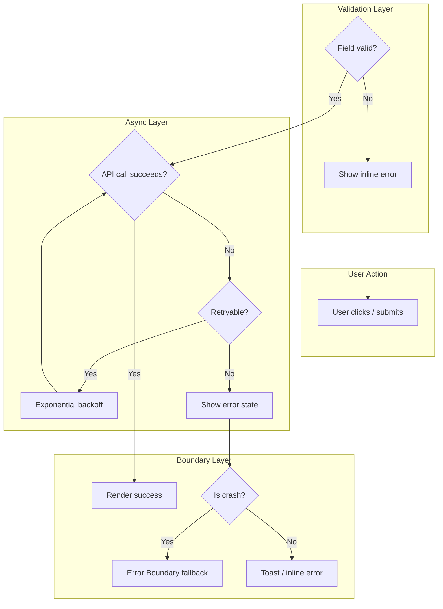

This file is a merged representation of a subset of the codebase, containing specifically included files and files not matching ignore patterns, combined into a single document by Repomix.
The content has been processed where empty lines have been removed, content has been formatted for parsing in markdown style.

# File Summary

## Purpose
This file contains a packed representation of a subset of the repository's contents that is considered the most important context.
It is designed to be easily consumable by AI systems for analysis, code review,
or other automated processes.

## File Format
The content is organized as follows:
1. This summary section
2. Repository information
3. Directory structure
4. Repository files (if enabled)
5. Multiple file entries, each consisting of:
  a. A header with the file path (## File: path/to/file)
  b. The full contents of the file in a code block

## Usage Guidelines
- This file should be treated as read-only. Any changes should be made to the
  original repository files, not this packed version.
- When processing this file, use the file path to distinguish
  between different files in the repository.
- Be aware that this file may contain sensitive information. Handle it with
  the same level of security as you would the original repository.
- Pay special attention to the Repository Description. These contain important context and guidelines specific to this project.

## Notes
- Some files may have been excluded based on .gitignore rules and Repomix's configuration
- Binary files are not included in this packed representation. Please refer to the Repository Structure section for a complete list of file paths, including binary files
- Only files matching these patterns are included: Frontend-tech-stack/**/*.md, Frontend-tech-stack/**/*.json, Frontend-tech-stack/**/*.yml, Frontend-tech-stack/**/*.yaml
- Files matching these patterns are excluded: node_modules, .git, *.jar, *.class, .gradle, build, dist, .env, .env.*, pnpm-lock.yaml, package-lock.json, yarn.lock, *.log, .DS_Store, Thumbs.db, **/skeletons/**/src/**
- Files matching patterns in .gitignore are excluded
- Files matching default ignore patterns are excluded
- Empty lines have been removed from all files
- Content has been formatted for parsing in markdown style
- Long base64 data strings (e.g., data:image/png;base64,...) have been truncated to reduce token count
- Files are sorted by Git change count (files with more changes are at the bottom)

# User Provided Header
Architectural Frontend/Backend Tech Stack Reference.
This repository contains comprehensive technical research for backend and frontend architecture decisions.
Use with repomix-reference skill for decision validation.

# Directory Structure
```
Frontend-tech-stack/
  ai/
    ai-consumption-guide.md
    README.md
  angular-theorical/
    decisions/
      ADR-001-framework-selection.md
      ADR-002-state-management.md
      ADR-003-testing-strategy.md
      ADR-004-module-boundaries.md
      ADR-005-lint-engine.md
    guides/
      angular-version-migration-guide.md
      caching-strategy.md
    skeletons/
      angular-ngmodule-skeleton/
        angular.json
        package.json
        README.md
        tsconfig.app.json
        tsconfig.json
      angular-standalone-skeleton/
        angular.json
        package.json
        README.md
        tsconfig.app.json
        tsconfig.json
    angular-architect-revised.md
    angular-senior-reference.md
    README.md
  cross-cutting/
    accessibility.md
    ADR-001-logger-naming-standard.md
    ADR-002-http-api-client-naming.md
    ADR-003-auth-pattern-naming.md
    adr-index.md
    adr-template.md
    ARCHITECT-CHECKLIST-scored-example.md
    ci-cd.md
    error-handling.md
    health-check-playbook.md
    performance-budget.md
    README.md
    state-machines.md
    strangler-fig-migration-pattern.md
    testing-strategy.md
  react-theorical/
    decisions/
      ADR-001-framework-selection.md
      ADR-002-testing-strategy.md
      ADR-003-module-boundaries.md
      ADR-004-lint-engine.md
    guides/
      caching-strategy.md
      react-version-migration-guide.md
      strangler-fig-redux-to-zustand.md
    skeletons/
      nextjs-skeleton/
        .github/
          workflows/
            ci.yml
        docs/
          adr/
            template.md
        package.json
        README.md
        tsconfig.json
      react-vite-skeleton/
        .github/
          workflows/
            ci.yml
        docs/
          adr/
            template.md
        package.json
        README.md
        tsconfig.json
        tsconfig.node.json
    react-architect-revised.md
    react-typescript-best-practices.md
    README.md
  svelte-theorical/
    decisions/
      ADR-001-framework-selection.md
      ADR-002-testing-strategy.md
      ADR-003-module-boundaries.md
      ADR-004-lint-engine.md
    guides/
      caching-strategy.md
      svelte-version-migration-guide.md
    skeletons/
      svelte-vite-skeleton/
        package.json
        README.md
        tsconfig.json
      sveltekit-skeleton/
        package.json
        README.md
        tsconfig.json
    README.md
    svelte-architect-revised.md
    svelte-senior-reference.md
    svelte-typescript-best-practices.md
  typescript/
    advanced-generics.md
    migration-guide.md
    module-resolution.md
    README.md
    shared-types.md
    tsconfig-strategies.md
  vue-theorical/
    decisions/
      ADR-001-framework-selection.md
      ADR-002-state-testing.md
      ADR-003-module-boundaries.md
      ADR-004-lint-engine.md
    guides/
      caching-strategy.md
      vue-version-migration-guide.md
    skeletons/
      nuxt-skeleton/
        lib/
          infrastructure/
            i18n/
              locales/
                en/
                  common.json
                es/
                  common.json
        package.json
        README.md
        tsconfig.json
      vue-vite-skeleton/
        package.json
        README.md
        tsconfig.json
        tsconfig.node.json
    README.md
    vue-architect-revised.md
    vue-senior-reference.md
    vue-typescript-best-practices.md
  ARCHITECT-CHECKLIST.md
  README.md
  structural-validation-analysis.md
```

# Files

## File: Frontend-tech-stack/angular-theorical/skeletons/angular-ngmodule-skeleton/angular.json
````json
{
  "$schema": "./node_modules/@angular/cli/lib/config/schema.json",
  "version": 1,
  "newProjectRoot": "projects",
  "projects": {
    "angular-ngmodule-skeleton": {
      "projectType": "application",
      "schematics": {
        "@schematics/angular:component": {
          "standalone": false,
          "style": "scss",
          "changeDetection": "OnPush",
          "skipTests": true
        },
        "@schematics/angular:module": {}
      },
      "root": "",
      "sourceRoot": "src",
      "prefix": "app",
      "architect": {
        "build": {
          "builder": "@angular/build:application",
          "options": {
            "outputPath": "dist",
            "index": "src/index.html",
            "browser": "src/main.ts",
            "polyfills": ["zone.js"],
            "tsConfig": "tsconfig.app.json",
            "assets": ["src/favicon.ico"],
            "styles": ["src/styles.scss"],
            "scripts": []
          },
          "configurations": {
            "production": {
              "budgets": [
                { "type": "initial", "maximumWarning": "150kb", "maximumError": "200kb" },
                { "type": "anyComponentStyle", "maximumWarning": "4kb", "maximumError": "8kb" }
              ],
              "outputHashing": "all"
            },
            "development": {
              "optimization": false,
              "extractLicenses": false,
              "sourceMap": true
            }
          },
          "defaultConfiguration": "production"
        },
        "serve": {
          "builder": "@angular/build:dev-server",
          "configurations": {
            "production": { "buildTarget": "angular-ngmodule-skeleton:build:production" },
            "development": { "buildTarget": "angular-ngmodule-skeleton:build:development" }
          },
          "defaultConfiguration": "development"
        },
        "lint": {
          "builder": "@angular-eslint/builder:lint",
          "options": {
            "lintFilePatterns": ["src/**/*.ts", "src/**/*.html"]
          }
        }
      }
    }
  }
}
````

## File: Frontend-tech-stack/angular-theorical/skeletons/angular-ngmodule-skeleton/package.json
````json
{
  "name": "angular-ngmodule-skeleton",
  "version": "0.1.0",
  "private": true,
  "scripts": {
    "ng": "ng",
    "start": "ng serve",
    "build": "ng build",
    "watch": "ng build --watch --configuration development",
    "test": "jest",
    "test:watch": "jest --watch",
    "test:coverage": "jest --coverage",
    "test:e2e": "playwright test",
    "lint": "ng lint",
    "format": "prettier --write 'src/**/*.{ts,html,scss}'",
    "format:check": "prettier --check 'src/**/*.{ts,html,scss}'",
    "storybook": "storybook dev -p 6006",
    "build-storybook": "storybook build"
  },
  "dependencies": {
    "@angular/animations": "^19.2.0",
    "@angular/common": "^19.2.0",
    "@angular/compiler": "^19.2.0",
    "@angular/core": "^19.2.0",
    "@angular/forms": "^19.2.0",
    "@angular/platform-browser": "^19.2.0",
    "@angular/platform-browser-dynamic": "^19.2.0",
    "@angular/router": "^19.2.0",
    "@ngrx/signals": "^19.0.0",
    "rxjs": "~7.8.0",
    "tslib": "^2.6.0",
    "zod": "^3.24.0"
  },
  "devDependencies": {
    "@angular-devkit/build-angular": "^19.2.0",
    "@angular-eslint/eslint-plugin": "^19.0.0",
    "@angular-eslint/eslint-plugin-template": "^19.0.0",
    "@angular-eslint/schematics": "^19.0.0",
    "@angular-eslint/template-parser": "^19.0.0",
    "@angular/cli": "^19.2.0",
    "@angular/compiler-cli": "^19.2.0",
    "@playwright/test": "^1.50.0",
    "@storybook/angular": "^8.6.0",
    "@storybook/test-runner": "^0.21.0",
    "@testing-library/angular": "^17.0.0",
    "@testing-library/jest-dom": "^6.6.0",
    "@testing-library/user-event": "^14.6.0",
    "@types/jest": "^29.5.0",
    "@typescript-eslint/eslint-plugin": "^8.0.0",
    "@typescript-eslint/parser": "^8.0.0",
    "eslint": "^9.0.0",
    "eslint-plugin-import": "^2.31.0",
    "jest": "^29.7.0",
    "jest-preset-angular": "^14.5.0",
    "msw": "^2.7.0",
    "prettier": "^3.5.0",
    "storybook": "^8.6.0",
    "typescript": "~5.7.0"
  },
  "packageManager": "pnpm@10.0.0"
}
````

## File: Frontend-tech-stack/angular-theorical/skeletons/angular-ngmodule-skeleton/tsconfig.app.json
````json
{
  "extends": "./tsconfig.json",
  "compilerOptions": {
    "outDir": "./out-tsc/app",
    "types": []
  },
  "files": ["src/main.ts"],
  "include": ["src/**/*.d.ts"]
}
````

## File: Frontend-tech-stack/angular-theorical/skeletons/angular-ngmodule-skeleton/tsconfig.json
````json
{
  "compileOnSave": false,
  "compilerOptions": {
    "baseUrl": "./",
    "outDir": "./dist/out-tsc",
    "forceConsistentCasingInFileNames": true,
    "strict": true,
    "noImplicitOverride": true,
    "noPropertyAccessFromIndexSignature": true,
    "noImplicitReturns": true,
    "noFallthroughCasesInSwitch": true,
    "sourceMap": true,
    "declaration": false,
    "downlevelIteration": true,
    "experimentalDecorators": true,
    "moduleResolution": "bundler",
    "importHelpers": true,
    "target": "ES2022",
    "module": "ES2022",
    "useDefineForClassFields": false,
    "lib": ["ES2022", "dom"],
    "paths": {
      "@app/*": ["src/app/*"],
      "@features/*": ["src/app/features/*"],
      "@shared/*": ["src/app/shared/*"],
      "@entities/*": ["src/app/entities/*"],
      "@core/*": ["src/app/core/*"],
      "@env/*": ["src/environments/*"]
    }
  },
  "angularCompilerOptions": {
    "enableI18nLegacyMessageIdFormat": false,
    "strictInjectionParameters": true,
    "strictInputTypes": true,
    "strictTemplates": true,
    "strictStandalone": false
  }
}
````

## File: Frontend-tech-stack/angular-theorical/skeletons/angular-standalone-skeleton/angular.json
````json
{
  "$schema": "./node_modules/@angular/cli/lib/config/schema.json",
  "version": 1,
  "newProjectRoot": "projects",
  "projects": {
    "angular-standalone-skeleton": {
      "projectType": "application",
      "schematics": {
        "@schematics/angular:component": {
          "standalone": true,
          "style": "scss",
          "changeDetection": "OnPush",
          "skipTests": true,
          "inlineTemplate": false
        },
        "@schematics/angular:directive": {
          "standalone": true
        },
        "@schematics/angular:pipe": {
          "standalone": true
        }
      },
      "root": "",
      "sourceRoot": "src",
      "prefix": "app",
      "architect": {
        "build": {
          "builder": "@angular/build:application",
          "options": {
            "outputPath": "dist",
            "index": "src/index.html",
            "browser": "src/main.ts",
            "polyfills": ["zone.js"],
            "tsConfig": "tsconfig.app.json",
            "assets": ["src/favicon.ico"],
            "styles": ["src/styles.scss"],
            "scripts": []
          },
          "configurations": {
            "production": {
              "budgets": [
                { "type": "initial", "maximumWarning": "120kb", "maximumError": "160kb" },
                { "type": "anyComponentStyle", "maximumWarning": "4kb", "maximumError": "8kb" }
              ],
              "outputHashing": "all"
            },
            "development": {
              "optimization": false,
              "extractLicenses": false,
              "sourceMap": true
            }
          },
          "defaultConfiguration": "production"
        },
        "serve": {
          "builder": "@angular/build:dev-server",
          "configurations": {
            "production": { "buildTarget": "angular-standalone-skeleton:build:production" },
            "development": { "buildTarget": "angular-standalone-skeleton:build:development" }
          },
          "defaultConfiguration": "development"
        },
        "lint": {
          "builder": "@angular-eslint/builder:lint",
          "options": {
            "lintFilePatterns": ["src/**/*.ts", "src/**/*.html"]
          }
        }
      }
    }
  }
}
````

## File: Frontend-tech-stack/angular-theorical/skeletons/angular-standalone-skeleton/package.json
````json
{
  "name": "angular-standalone-skeleton",
  "version": "0.1.0",
  "private": true,
  "scripts": {
    "ng": "ng",
    "start": "ng serve",
    "build": "ng build",
    "watch": "ng build --watch --configuration development",
    "test": "jest",
    "test:watch": "jest --watch",
    "test:coverage": "jest --coverage",
    "test:e2e": "playwright test",
    "lint": "ng lint",
    "format": "prettier --write 'src/**/*.{ts,html,scss}'",
    "format:check": "prettier --check 'src/**/*.{ts,html,scss}'",
    "storybook": "storybook dev -p 6006",
    "build-storybook": "storybook build"
  },
  "dependencies": {
    "@angular/animations": "^19.2.0",
    "@angular/common": "^19.2.0",
    "@angular/compiler": "^19.2.0",
    "@angular/core": "^19.2.0",
    "@angular/forms": "^19.2.0",
    "@angular/platform-browser": "^19.2.0",
    "@angular/platform-browser-dynamic": "^19.2.0",
    "@angular/router": "^19.2.0",
    "@ngrx/signals": "^19.0.0",
    "rxjs": "~7.8.0",
    "tslib": "^2.6.0",
    "zod": "^3.24.0"
  },
  "devDependencies": {
    "@angular-devkit/build-angular": "^19.2.0",
    "@angular-eslint/eslint-plugin": "^19.0.0",
    "@angular-eslint/eslint-plugin-template": "^19.0.0",
    "@angular-eslint/schematics": "^19.0.0",
    "@angular-eslint/template-parser": "^19.0.0",
    "@angular/cli": "^19.2.0",
    "@angular/compiler-cli": "^19.2.0",
    "@playwright/test": "^1.50.0",
    "@storybook/angular": "^8.6.0",
    "@storybook/test-runner": "^0.21.0",
    "@testing-library/angular": "^17.0.0",
    "@testing-library/jest-dom": "^6.6.0",
    "@testing-library/user-event": "^14.6.0",
    "@types/jest": "^29.5.0",
    "@typescript-eslint/eslint-plugin": "^8.0.0",
    "@typescript-eslint/parser": "^8.0.0",
    "eslint": "^9.0.0",
    "eslint-plugin-import": "^2.31.0",
    "jest": "^29.7.0",
    "jest-preset-angular": "^14.5.0",
    "msw": "^2.7.0",
    "prettier": "^3.5.0",
    "storybook": "^8.6.0",
    "typescript": "~5.7.0"
  },
  "packageManager": "pnpm@10.0.0"
}
````

## File: Frontend-tech-stack/angular-theorical/skeletons/angular-standalone-skeleton/tsconfig.app.json
````json
{
  "extends": "./tsconfig.json",
  "compilerOptions": {
    "outDir": "./out-tsc/app",
    "types": []
  },
  "files": ["src/main.ts"],
  "include": ["src/**/*.d.ts"]
}
````

## File: Frontend-tech-stack/angular-theorical/skeletons/angular-standalone-skeleton/tsconfig.json
````json
{
  "compileOnSave": false,
  "compilerOptions": {
    "baseUrl": "./",
    "outDir": "./dist/out-tsc",
    "forceConsistentCasingInFileNames": true,
    "strict": true,
    "noImplicitOverride": true,
    "noPropertyAccessFromIndexSignature": true,
    "noImplicitReturns": true,
    "noFallthroughCasesInSwitch": true,
    "sourceMap": true,
    "declaration": false,
    "downlevelIteration": true,
    "experimentalDecorators": true,
    "moduleResolution": "bundler",
    "importHelpers": true,
    "target": "ES2022",
    "module": "ES2022",
    "useDefineForClassFields": false,
    "lib": ["ES2022", "dom"],
    "paths": {
      "@app/*": ["src/app/*"],
      "@features/*": ["src/app/features/*"],
      "@shared/*": ["src/app/shared/*"],
      "@entities/*": ["src/app/entities/*"],
      "@core/*": ["src/app/core/*"],
      "@env/*": ["src/environments/*"]
    }
  },
  "angularCompilerOptions": {
    "enableI18nLegacyMessageIdFormat": false,
    "strictInjectionParameters": true,
    "strictInputTypes": true,
    "strictTemplates": true,
    "strictStandalone": true
  }
}
````

## File: Frontend-tech-stack/svelte-theorical/skeletons/svelte-vite-skeleton/package.json
````json
{
  "name": "svelte-vite-skeleton",
  "version": "0.1.0",
  "private": true,
  "type": "module",
  "scripts": {
    "dev": "vite",
    "build": "vite build",
    "preview": "vite preview",
    "lint": "eslint 'src/**/*.{ts,svelte}'",
    "format": "prettier --check 'src/**/*.{ts,svelte,css}'",
    "format:write": "prettier --write 'src/**/*.{ts,svelte,css}'",
    "test": "vitest run",
    "test:watch": "vitest",
    "test:e2e": "playwright test",
    "test:e2e:ui": "playwright test --ui",
    "storybook": "storybook dev -p 6006",
    "build-storybook": "storybook build",
    "ci": "pnpm lint && pnpm format && pnpm test && pnpm build"
  },
  "devDependencies": {
    "@playwright/test": "^1.48.0",
    "@sveltejs/vite-plugin-svelte": "^4.0.0",
    "@storybook/addon-essentials": "^8.0.0",
    "@storybook/svelte": "^8.0.0",
    "@storybook/svelte-vite": "^8.0.0",
    "@testing-library/jest-dom": "^6.6.0",
    "@testing-library/svelte": "^5.2.0",
    "@types/node": "^22.0.0",
    "autoprefixer": "^10.4.0",
    "eslint": "^9.0.0",
    "eslint-plugin-svelte": "^2.46.0",
    "globals": "^15.0.0",
    "husky": "^9.0.0",
    "lint-staged": "^15.0.0",
    "msw": "^2.6.0",
    "postcss": "^8.4.0",
    "prettier": "^3.4.0",
    "prettier-plugin-svelte": "^3.3.0",
    "prettier-plugin-tailwindcss": "^0.6.0",
    "svelte": "^5.0.0",
    "tailwindcss": "^3.4.0",
    "typescript": "^5.6.0",
    "vite": "^6.0.0",
    "vitest": "^2.1.0",
    "@typescript-eslint/eslint-plugin": "^8.0.0",
    "@typescript-eslint/parser": "^8.0.0",
    "typescript-eslint": "^8.0.0"
  },
  "dependencies": {
    "zod": "^3.24.0"
  },
  "engines": {
    "node": ">=20"
  },
  "lint-staged": {
    "*.{ts,svelte}": [
      "eslint --fix",
      "prettier --write"
    ],
    "*.{css,json,md}": [
      "prettier --write"
    ]
  },
  "packageManager": "pnpm@9.0.0"
}
````

## File: Frontend-tech-stack/svelte-theorical/skeletons/svelte-vite-skeleton/tsconfig.json
````json
{
  "compilerOptions": {
    "allowJs": true,
    "checkJs": true,
    "esModuleInterop": true,
    "forceConsistentCasingInFileNames": true,
    "resolveJsonModule": true,
    "skipLibCheck": true,
    "sourceMap": true,
    "strict": true,
    "moduleResolution": "bundler",
    "noUncheckedIndexedAccess": true,
    "noUnusedLocals": true,
    "noUnusedParameters": true,
    "target": "ESNext",
    "module": "ESNext",
    "lib": ["ESNext", "DOM", "DOM.Iterable"],
    "paths": {
      "$lib": ["./src/lib"],
      "$lib/*": ["./src/lib/*"]
    }
  },
  "include": [
    "src/**/*.ts",
    "src/**/*.svelte",
    "tests/**/*.ts",
    "e2e/**/*.ts"
  ],
  "exclude": ["node_modules/**"]
}
````

## File: Frontend-tech-stack/svelte-theorical/skeletons/sveltekit-skeleton/package.json
````json
{
  "name": "sveltekit-skeleton",
  "version": "0.1.0",
  "private": true,
  "type": "module",
  "scripts": {
    "dev": "vite dev",
    "build": "vite build",
    "preview": "vite preview",
    "check": "svelte-check --tsconfig ./tsconfig.json",
    "lint": "eslint 'src/**/*.{ts,svelte}'",
    "format": "prettier --check 'src/**/*.{ts,svelte,css}'",
    "format:write": "prettier --write 'src/**/*.{ts,svelte,css}'",
    "test": "vitest run",
    "test:watch": "vitest",
    "test:e2e": "playwright test",
    "test:e2e:ui": "playwright test --ui",
    "storybook": "storybook dev -p 6006",
    "build-storybook": "storybook build",
    "ci": "pnpm check && pnpm lint && pnpm format && pnpm test && pnpm build"
  },
  "devDependencies": {
    "@playwright/test": "^1.48.0",
    "@sveltejs/adapter-auto": "^3.3.0",
    "@sveltejs/kit": "^2.7.0",
    "@sveltejs/vite-plugin-svelte": "^4.0.0",
    "@storybook/addon-essentials": "^8.0.0",
    "@storybook/svelte": "^8.0.0",
    "@storybook/svelte-vite": "^8.0.0",
    "@testing-library/jest-dom": "^6.6.0",
    "@testing-library/svelte": "^5.2.0",
    "@types/node": "^22.0.0",
    "autoprefixer": "^10.4.0",
    "eslint": "^9.0.0",
    "eslint-plugin-svelte": "^2.46.0",
    "globals": "^15.0.0",
    "husky": "^9.0.0",
    "lint-staged": "^15.0.0",
    "msw": "^2.6.0",
    "postcss": "^8.4.0",
    "prettier": "^3.4.0",
    "prettier-plugin-svelte": "^3.3.0",
    "prettier-plugin-tailwindcss": "^0.6.0",
    "svelte": "^5.0.0",
    "svelte-check": "^4.0.0",
    "tailwindcss": "^3.4.0",
    "typescript": "^5.6.0",
    "vite": "^6.0.0",
    "vitest": "^2.1.0",
    "@typescript-eslint/eslint-plugin": "^8.0.0",
    "@typescript-eslint/parser": "^8.0.0",
    "typescript-eslint": "^8.0.0"
  },
  "dependencies": {
    "zod": "^3.24.0"
  },
  "engines": {
    "node": ">=20"
  },
  "lint-staged": {
    "*.{ts,svelte}": [
      "eslint --fix",
      "prettier --write"
    ],
    "*.{css,json,md}": [
      "prettier --write"
    ]
  },
  "packageManager": "pnpm@9.0.0"
}
````

## File: Frontend-tech-stack/svelte-theorical/skeletons/sveltekit-skeleton/tsconfig.json
````json
{
  "extends": "./.svelte-kit/tsconfig.json",
  "compilerOptions": {
    "allowJs": true,
    "checkJs": true,
    "esModuleInterop": true,
    "forceConsistentCasingInFileNames": true,
    "resolveJsonModule": true,
    "skipLibCheck": true,
    "sourceMap": true,
    "strict": true,
    "moduleResolution": "bundler",
    "noUncheckedIndexedAccess": true,
    "noUnusedLocals": true,
    "noUnusedParameters": true
  },
  "include": [
    "src/**/*.ts",
    "src/**/*.svelte",
    "tests/**/*.ts",
    "e2e/**/*.ts"
  ],
  "exclude": ["node_modules/**"]
}
````

## File: Frontend-tech-stack/ai/README.md
````markdown
---
confidence: high
freshness: "2026-07"
type: guide
scope: cross-platform
---

# AI Consumption Guides

Documents in this directory help **AI agents (LLMs) and developers** navigate the Frontend-tech-stack efficiently when using Repomix or similar packing tools.

## Files

| File | Purpose |
|------|---------|
| `ai-consumption-guide.md` | Optimized traversal rules: what to read first, confidence hierarchy, prompt templates, known contradictions, fallback strategy, metadata filtering schema |

## How to Use

1. **If you're an AI agent reading a Repomix pack:** Start with `ai-consumption-guide.md` for reading order and metadata filtering
2. **If you're a developer:** The main entry point is the root `README.md` at the repository root; this directory is primarily for AI consumption optimization
3. **For full audit context:** See `structural-validation-analysis.md` in the parent directory for confidence tables and gap analysis

## Related

- [`../structural-validation-analysis.md`](../structural-validation-analysis.md) — Full structural audit, confidence table, and gap analysis
- [`../ARCHITECT-CHECKLIST.md`](../ARCHITECT-CHECKLIST.md) — 14-section project scoring checklist
````

## File: Frontend-tech-stack/angular-theorical/decisions/ADR-003-testing-strategy.md
````markdown
---
confidence: high
freshness: "2026-07"
type: decision
scope: angular
---
# Testing Strategy — Angular 19+ (Standalone, Signals, Zoneless)

> **Purpose:** Define what to test, how to test it, which tools to use, and what NOT to test in an Angular project.
> **Guiding principle:** Test behavior, not implementation.
> **Status:** Alive — updated when new testing types are added to the pipeline.

---

## 1. Testing Pyramid (Adapted for Angular)

```
              ╱  E2E (Playwright)              ╲          ← ~5%  — Critical user flows
            ╱  Integration Tests                 ╲        ← ~20% — HttpClient + Service + Component
          ╱  Component Tests                      ╲      ← ~30% — Angular standalone components + signals
        ╱  Unit Tests                              ╲    ← ~40% — Services, pipes, SignalStore, schemas
      ╱  Static Analysis (angularCompiler + TS)      ╲  ← ~5%  — Types, template errors, a11y
```

### 1.1 Expected Effort Distribution

| Level | % tests | Speed | Reliability | Maintenance |
|-------|---------|-----------|------------|---------------|
| Static Analysis | ~5% | Instant | 100% | Low |
| Unit | ~40% | < 100ms/test | 99% | Low |
| Component | ~30% | < 500ms/test | 95% | Medium |
| Integration | ~20% | < 2s/test | 90% | High |
| E2E | ~5% | 30-120s/test | 85% | Very high |

### 1.2 Key Differences from React/Svelte Testing

| Aspect | React Testing | Svelte 5 Testing | Angular Testing |
|--------|-------------|------------------|-----------------|
| **Template types** | `tsc --noEmit` | `svelte-check` | `angularCompilerOptions.strictTemplates` |
| **Component render** | `@testing-library/react` | `@testing-library/svelte` | `@testing-library/angular` or `TestBed` |
| **Test runner** | Vitest / Jest | Vitest | Jest / Jasmine (Karma is legacy) |
| **`act()` wrapper** | Required | Not needed | Not needed (signals are synchronous) |
| **State updates** | `waitFor` for async | `waitFor` for async | `fixture.detectChanges()` + `waitFor` |
| **DI dependency** | Manual prop/context | Manual props | Automatic via `TestBed.configureTestingModule` |
| **HTTP mocking** | MSW / mswjs | MSW | MSW or `HttpTestingController` |
| **Async operations** | `waitFor`/`act` | `waitFor` | `fakeAsync()` + `tick()` (or plain async + `waitFor`) |
| **Cleanup** | Manual `afterEach` | Automatic | Automatic (TestBed resets) |

---

## 2. Technology Stack

| Level | Tool | Alternatives | Angular-Specific Config |
|-------|------|-------------|------------------------|
| Static Analysis | `angularCompiler` (strictTemplates) + TypeScript strict | None | `angularCompilerOptions.strictTemplates: true` |
| Linting | ESLint + `@angular-eslint/template` | Biome (no Angular template support) | `@angular-eslint/template-parser` for `.html` files |
| Formatting | Prettier | dprint | `prettier` with `overrides: [{ files: '*.html', options: { parser: 'angular' } }]` |
| Unit + Component + Integration | Jest | Vitest (less Angular support) | `jest-preset-angular` |
| Component rendering | `@testing-library/angular` | `TestBed` (built-in) | `TestBed.configureTestingModule` + `render()` |
| API mocking | MSW (Mock Service Worker) | `HttpTestingController` | MSW intercepts `fetch`; Angular uses `HttpClient` (XMLHttpRequest by default) |
| E2E | Playwright | Cypress, WebDriver | Same as other frameworks |
| Visual Regression | Chromatic (Storybook 8) | Percy, loki | Storybook 8 + `@storybook/angular` |

### 2.1 Jest vs Vitest for Angular

| Aspect | Jest | Vitest |
|--------|------|--------|
| **Angular support** | ✅ `jest-preset-angular` (mature, 5K+ stars) | ⚠️ `@analogjs/vitest-angular` (newer, smaller community) |
| **ESM support** | 🔶 Requires transform | ✅ Native ESM |
| **Speed** | 🔶 Slower (transform overhead) | ✅ Faster (native ESM + esbuild) |
| **CLI integration** | ✅ Angular 17+ works with Jest config | ⚠️ Manual setup |
| **Community** | ✅ Larger (more examples, solutions) | 🔶 Smaller |
| **Angular template coverage** | ✅ Works with `@testing-library/angular` | ✅ Works with `@testing-library/angular` |

> **Recommendation:** Use **Jest** + `jest-preset-angular` for stability and maturity. Consider Vitest when `@analogjs/vitest-angular` matures (typically for new projects without legacy config).

---

## 3. What to Test at Each Level

### 3.1 Static Analysis — Angular Template Type Checking + TypeScript

**This is NOT optional.** Runs on every commit and in CI.

```jsonc
// tsconfig.json
{
  "compilerOptions": {
    "strict": true,
    "noUncheckedIndexedAccess": true,
    "noImplicitReturns": true,
    "strictNullChecks": true
  },
  "angularCompilerOptions": {
    "strictTemplates": true,        // ✅ Enables template type checking
    "strictInputTypes": true,
    "strictOutputTypes": true,
    "strictDomEventTypes": true,
    "strictStandalone": true
  }
}
```

**What `angularCompiler` catches that `tsc` misses:**
- Type errors in `{{ expression }}` bindings inside templates
- Missing or wrong `@Input()` / `input()` types
- Invalid `@Output()` / `output()` event bindings
- Wrong `formControlName` bindings
- Invalid `routerLink` values
- Missing `*ngIf` / `@if` type narrowing
- Template reference variable errors (`#myVar`)

**Rules:**
- `strictTemplates: true` is the minimum
- `--noImplicitOverride` for component inheritance
- `any` forbidden (ESLint rule: `@typescript-eslint/no-explicit-any: error`)
- Accessibility warnings from `@angular-eslint/template` treated as errors in CI

### 3.2 Unit Tests — Pure Logic

**WHAT to test:**
- Pure utility functions (formatDate, currency, `cn()`)
- Zod validation schemas (all edge cases)
- `computed()` logic extracted to pure functions
- SignalStore methods and state transitions
- Data transformations (mappers, normalizers)
- Pipes (transform logic)

**WHAT NOT to test:**
- Angular framework internals (change detection, DI, lifecycle)
- Implementation details (private variables, internal helpers)
- Simple getters/ternaries that are obviously correct

```typescript
// ✅ CORRECT: unit-test the Zod schema
import { sampleFormSchema } from '../schemas/sample-form.schema'

describe('sampleFormSchema', () => {
  it('rejects title shorter than 3 characters', () => {
    const result = sampleFormSchema.safeParse({ title: 'AB', status: 'active' })
    expect(result.success).toBe(false)
  })

  it('accepts valid input', () => {
    const result = sampleFormSchema.safeParse({
      title: 'Valid Title',
      description: 'A description',
      status: 'active',
    })
    expect(result.success).toBe(true)
  })

  it('rejects invalid status', () => {
    const result = sampleFormSchema.safeParse({
      title: 'Valid Title',
      status: 'bogus',
    })
    expect(result.success).toBe(false)
  })

  it('defaults optional description when not provided', () => {
    const result = sampleFormSchema.safeParse({
      title: 'Valid Title',
      status: 'active',
    })
    expect(result.success).toBe(true)
    expect(result.data?.description).toBeUndefined()
  })
})
```

### 3.3 Unit Tests — Services

```typescript
// features/samples/services/__tests__/sample.service.spec.ts
import { TestBed } from '@angular/core/testing'
import { HttpTestingController, provideHttpClientTesting } from '@angular/common/http/testing'
import { provideHttpClient } from '@angular/common/http'
import { SampleService } from '../sample.service'
import { environment } from '@core/config/environment'

describe('SampleService', () => {
  let service: SampleService
  let httpTesting: HttpTestingController

  beforeEach(() => {
    TestBed.configureTestingModule({
      providers: [
        provideHttpClient(),
        provideHttpClientTesting(),
        SampleService,
        { provide: 'API_URL', useValue: 'http://test-api.com' },
      ],
    })

    service = TestBed.inject(SampleService)
    httpTesting = TestBed.inject(HttpTestingController)
  })

  afterEach(() => {
    httpTesting.verify() // Verify no outstanding requests
  })

  it('fetches samples from the API', async () => {
    const mockSamples: Sample[] = [
      { id: '1', title: 'Sample A', status: 'active' },
      { id: '2', title: 'Sample B', status: 'inactive' },
    ]

    // Call the method
    const resultPromise = lastValueFrom(service.getSamples())

    // Expect a single request to the correct URL
    const req = httpTesting.expectOne(`${environment.apiUrl}/samples`)
    expect(req.request.method).toBe('GET')

    // Resolve the request
    req.flush(mockSamples)

    const result = await resultPromise
    expect(result).toEqual(mockSamples)
    expect(result.length).toBe(2)
  })

  it('throws an error when the API fails', async () => {
    const resultPromise = lastValueFrom(service.getSamples())
    const req = httpTesting.expectOne(`${environment.apiUrl}/samples`)
    req.flush('Server Error', { status: 500, statusText: 'Internal Server Error' })

    await expect(resultPromise).rejects.toThrow()
  })

  it('creates a sample via POST', async () => {
    const newSample: CreateSampleInput = {
      title: 'New Sample',
      description: 'Created in test',
      status: 'active',
    }
    const createdSample: Sample = { id: '3', ...newSample }

    const resultPromise = lastValueFrom(service.createSample(newSample))
    const req = httpTesting.expectOne(`${environment.apiUrl}/samples`)
    expect(req.request.method).toBe('POST')
    expect(req.request.body).toEqual(newSample)

    req.flush(createdSample)

    const result = await resultPromise
    expect(result).toEqual(createdSample)
    expect(result.id).toBe('3')
  })
})
```

### 3.4 Unit Tests — SignalStore

```typescript
// features/samples/store/__tests__/samples.store.spec.ts
import { TestBed } from '@angular/core/testing'
import { SamplesStore } from '../samples.store'
import { SampleService } from '../../services/sample.service'

describe('SamplesStore', () => {
  let store: InstanceType<typeof SamplesStore>

  beforeEach(() => {
    TestBed.configureTestingModule({
      providers: [
        SamplesStore,
        // Mock the service dependency
        {
          provide: SampleService,
          useValue: {
            getSamples: jest.fn().mockReturnValue(of([
              { id: '1', title: 'A', status: 'active' },
              { id: '2', title: 'B', status: 'inactive' },
            ])),
          },
        },
      ],
    })

    store = TestBed.inject(SamplesStore)
  })

  it('initializes with default state', () => {
    expect(store.items()).toEqual([])
    expect(store.loading()).toBe(false)
    expect(store.error()).toBeNull()
  })

  it('computes filtered items when filter changes', () => {
    // Manually set state for testing
    patchState(store, {
      items: [
        { id: '1', title: 'Active Item', status: 'active' },
        { id: '2', title: 'Inactive Item', status: 'inactive' },
      ],
    })

    // Without filter, all items shown
    expect(store.filteredItems().length).toBe(2)

    // With status filter
    store.setFilter({ status: 'active' })
    expect(store.filteredItems().length).toBe(1)
    expect(store.filteredItems()[0].title).toBe('Active Item')
  })

  it('computes itemCount correctly', () => {
    patchState(store, {
      items: [
        { id: '1', title: 'A', status: 'active' },
        { id: '2', title: 'B', status: 'active' },
      ],
    })

    expect(store.itemCount()).toBe(2)
  })

  it('computes isEmpty correctly', () => {
    patchState(store, { items: [], loading: false })
    expect(store.isEmpty()).toBe(true)

    patchState(store, { items: [{ id: '1', title: 'A', status: 'active' }] })
    expect(store.isEmpty()).toBe(false)
  })

  it('loadSamples fetches data from service', async () => {
    await store.loadSamples()

    expect(store.loading()).toBe(false)
    expect(store.items().length).toBe(2)
    expect(store.error()).toBeNull()
  })

  it('handles error when loading samples fails', async () => {
    // Override with failing mock
    const sampleService = TestBed.inject(SampleService)
    sampleService.getSamples = jest.fn().mockReturnValue(
      throwError(() => new Error('API Error'))
    )

    await store.loadSamples()

    expect(store.loading()).toBe(false)
    expect(store.error()).toBe('Failed to load')
    expect(store.items()).toEqual([])
  })
})
```

### 3.5 Component Tests — Angular Standalone Components

**WHAT to test:**
- Component renders with different `input()` values
- `input()` signal defaults and required values
- `output()` events fire when expected
- Conditional rendering (`@if`, `@for`, `@switch`)
- Signal-driven UI updates (loading/error/empty/success states)
- Form interactions (typing, submitting, validation)
- `ng-content` projection

**WHAT NOT to test:**
- Angular's change detection (trust it)
- Pure layout/CSS (use Storybook for visual)
- Third-party component internals (Material, PrimeNG)

```typescript
// features/samples/components/__tests__/sample-card.component.spec.ts
import { render, screen } from '@testing-library/angular'
import { SampleCardComponent } from '../sample-card.component'

describe('SampleCardComponent', () => {
  const mockSample: Sample = {
    id: '1',
    title: 'Test Sample',
    description: 'A test description',
    status: 'active',
  }

  it('renders title and description', async () => {
    await render(SampleCardComponent, {
      componentProperties: {
        item: mockSample,
      },
    })

    expect(screen.getByText('Test Sample')).toBeVisible()
    expect(screen.getByText('A test description')).toBeVisible()
  })

  it('renders without optional description', async () => {
    const sampleWithoutDesc: Sample = { ...mockSample, description: undefined }

    await render(SampleCardComponent, {
      componentProperties: {
        item: sampleWithoutDesc,
      },
    })

    expect(screen.getByText('Test Sample')).toBeVisible()
    // Description should not be rendered
    expect(screen.queryByText('A test description')).toBeNull()
  })

  it('shows status badge', async () => {
    await render(SampleCardComponent, {
      componentProperties: {
        item: { ...mockSample, status: 'inactive' },
      },
    })

    const badge = screen.getByText('inactive')
    expect(badge).toBeVisible()
    expect(badge).toHaveClass('badge-inactive')
  })

  it('emits onClick event when card is clicked', async () => {
    const onClick = jest.fn()

    const { fixture } = await render(SampleCardComponent, {
      componentProperties: {
        item: mockSample,
      },
    })

    // Subscribe to output
    fixture.componentInstance.onClick.subscribe(onClick)

    // Click the card
    const article = screen.getByRole('article')
    article.click()

    expect(onClick).toHaveBeenCalledTimes(1)
  })

  it('emits onDelete with item id when delete clicked', async () => {
    const onDelete = jest.fn()

    const { fixture } = await render(SampleCardComponent, {
      componentProperties: {
        item: mockSample,
        showDeleteButton: true,
      },
    })

    fixture.componentInstance.onDelete.subscribe(onDelete)

    const deleteButton = screen.getByRole('button', { name: /delete/i })
    deleteButton.click()

    expect(onDelete).toHaveBeenCalledWith('1')
  })

  it('projects ng-content', async () => {
    const { container } = await render(
      `<app-sample-card [item]="item">
        <span data-testid="projected">Projected content</span>
      </app-sample-card>`,
      {
        componentProperties: { item: mockSample },
        imports: [SampleCardComponent],
      },
    )

    expect(container.querySelector('[data-testid="projected"]')).toBeTruthy()
    expect(screen.getByText('Projected content')).toBeVisible()
  })
})
```

### 3.6 Integration Tests — Component + Service + HTTP

**WHAT to test:**
- Component calls service on init
- Loading state shows spinner
- Error state shows error message
- Success state renders data
- Form submit → service call → UI update

```typescript
// features/samples/components/__tests__/sample-list.component.spec.ts
import { render, screen, waitFor } from '@testing-library/angular'
import { provideHttpClient } from '@angular/common/http'
import { provideHttpClientTesting } from '@angular/common/http/testing'
import { http, HttpResponse } from 'msw'
import { setupServer } from 'msw/node'
import { SampleListComponent } from '../sample-list.component'
import { SamplesStore } from '../../store/samples.store'
import { SampleService } from '../../services/sample.service'

const server = setupServer(
  http.get('/api/samples', () => {
    return HttpResponse.json([
      { id: '1', title: 'Sample A', status: 'active' },
      { id: '2', title: 'Sample B', status: 'inactive' },
    ])
  }),
)

beforeAll(() => server.listen())
afterEach(() => server.resetHandlers())
afterAll(() => server.close())

describe('SampleListComponent (integration)', () => {
  it('shows loading state initially, then renders samples', async () => {
    await render(SampleListComponent, {
      providers: [
        provideHttpClient(),
        provideHttpClientTesting(),
        SamplesStore,
        SampleService,
      ],
    })

    // Initially shows loading
    expect(screen.getByText(/loading/i)).toBeVisible()

    // After data loads
    await waitFor(() => {
      expect(screen.getByText('Sample A')).toBeVisible()
      expect(screen.getByText('Sample B')).toBeVisible()
    })
  })

  it('shows error state when API fails', async () => {
    server.use(
      http.get('/api/samples', () => {
        return HttpResponse.error()
      }),
    )

    await render(SampleListComponent, {
      providers: [
        provideHttpClient(),
        provideHttpClientTesting(),
        SamplesStore,
        SampleService,
      ],
    })

    await waitFor(() => {
      expect(screen.getByText(/failed/i)).toBeVisible()
    })
  })

  it('shows empty state when no samples', async () => {
    server.use(
      http.get('/api/samples', () => {
        return HttpResponse.json([])
      }),
    )

    await render(SampleListComponent, {
      providers: [
        provideHttpClient(),
        provideHttpClientTesting(),
        SamplesStore,
        SampleService,
      ],
    })

    await waitFor(() => {
      expect(screen.getByText(/no samples/i)).toBeVisible()
    })
  })
})
```

### 3.7 Form Integration Tests

```typescript
// features/samples/components/__tests__/sample-form.component.spec.ts
import { render, screen, waitFor } from '@testing-library/angular'
import userEvent from '@testing-library/user-event'
import { ReactiveFormsModule } from '@angular/forms'
import { SampleFormComponent } from '../sample-form.component'
import { provideHttpClientTesting } from '@angular/common/http/testing'

describe('SampleFormComponent', () => {
  const user = userEvent.setup()

  it('renders form fields', async () => {
    await render(SampleFormComponent, {
      providers: [provideHttpClientTesting()],
    })

    expect(screen.getByLabelText(/title/i)).toBeVisible()
    expect(screen.getByLabelText(/status/i)).toBeVisible()
    expect(screen.getByRole('button', { name: /submit/i })).toBeVisible()
  })

  it('shows validation errors when submitting empty form', async () => {
    await render(SampleFormComponent, {
      providers: [provideHttpClientTesting()],
    })

    const submitButton = screen.getByRole('button', { name: /submit/i })
    await user.click(submitButton)

    await waitFor(() => {
      expect(screen.getByText(/title is required/i)).toBeVisible()
    })
  })

  it('submits valid form and emits submitted event', async () => {
    const submitted = jest.fn()

    const { fixture } = await render(SampleFormComponent, {
      providers: [provideHttpClientTesting()],
    })

    fixture.componentInstance.submitted.subscribe(submitted)

    const titleInput = screen.getByLabelText(/title/i)
    const statusSelect = screen.getByLabelText(/status/i)

    await user.type(titleInput, 'Integration Test Sample')
    await user.selectOptions(statusSelect, 'active')

    const submitButton = screen.getByRole('button', { name: /submit/i })
    await user.click(submitButton)

    await waitFor(() => {
      expect(submitted).toHaveBeenCalledWith(
        expect.objectContaining({
          title: 'Integration Test Sample',
          status: 'active',
        })
      )
    })
  })

  it('disables submit button when form is invalid', async () => {
    await render(SampleFormComponent, {
      providers: [provideHttpClientTesting()],
    })

    const submitButton = screen.getByRole('button', { name: /submit/i })
    expect(submitButton).toBeDisabled() // Initially empty → invalid
  })
})
```

### 3.8 E2E Tests — Playwright

**WHAT to test:**
- Critical user flows (sign up, login, create item, checkout)
- Navigation between pages (Angular client-side routing)
- Form submission and validation
- Responsive design (mobile, tablet, desktop)
- Error states (404, 500)
- Auth guard redirects

```typescript
// e2e/app.spec.ts
import { test, expect } from '@playwright/test'

test('homepage loads and shows dashboard', async ({ page }) => {
  await page.goto('/')
  await expect(page.locator('h1')).toBeVisible()
})

test('navigates to samples page', async ({ page }) => {
  await page.goto('/')
  await page.getByRole('link', { name: /samples/i }).click()
  await expect(page).toHaveURL(/\/samples/)
  await expect(page.getByText(/sample/i)).toBeVisible({ timeout: 10_000 })
})

test('creates a new sample via form', async ({ page }) => {
  await page.goto('/samples')
  await page.getByRole('button', { name: /new item/i }).click()

  await page.getByLabel(/title/i).fill('E2E Test Sample')
  await page.getByLabel(/status/i).selectOption('active')

  await page.getByRole('button', { name: /submit/i }).click()

  await expect(page.getByText('E2E Test Sample')).toBeVisible({ timeout: 10_000 })
})

test('shows validation errors on invalid form', async ({ page }) => {
  await page.goto('/samples')
  await page.getByRole('button', { name: /new item/i }).click()
  await page.getByRole('button', { name: /submit/i }).click()

  await expect(page.getByText(/title is required/i)).toBeVisible()
})

test('shows 404 page for unknown routes', async ({ page }) => {
  await page.goto('/this-does-not-exist')
  await expect(page.getByText(/not found|404/i)).toBeVisible()
})

test('responds on mobile viewport', async ({ page }) => {
  await page.setViewportSize({ width: 375, height: 667 })
  await page.goto('/')
  // Verify mobile menu is available
  await expect(page.getByRole('navigation')).toBeVisible()
})

test('redirects unauthenticated user to login', async ({ page }) => {
  await page.goto('/dashboard')
  await expect(page).toHaveURL(/\/login/)
})
```

---

## 4. Jest Configuration

```typescript
// jest.config.ts
import type { Config } from 'jest'

const jestConfig: Config = {
  preset: 'jest-preset-angular',
  setupFilesAfterSetup: ['<rootDir>/tests/setup.ts'],
  testPathIgnorePatterns: ['<rootDir>/e2e/', '<rootDir>/node_modules/'],
  testMatch: ['**/+(*.)+(spec|test).+(ts)'],
  moduleNameMapper: {
    '^@app/(.*)$': '<rootDir>/src/app/$1',
    '^@features/(.*)$': '<rootDir>/src/app/features/$1',
    '^@shared/(.*)$': '<rootDir>/src/app/shared/$1',
    '^@entities/(.*)$': '<rootDir>/src/app/entities/$1',
    '^@core/(.*)$': '<rootDir>/src/app/core/$1',
  },

  // ── Coverage ──
  collectCoverageFrom: [
    'src/app/**/*.ts',
    '!src/app/**/*.module.ts',
    '!src/app/**/*.routes.ts',
    '!src/main.ts',
  ],
  coverageThresholds: {
    global: {
      statements: 80,
      branches: 70,
      functions: 80,
      lines: 80,
    },
  },
}

export default jestConfig
```

### 4.1 Vitest Configuration (Alternative)

```typescript
// vite.config.ts
import { defineConfig } from 'vitest/config'
import angular from '@analogjs/vitest-angular'

export default defineConfig({
  plugins: [angular()],
  test: {
    globals: true,
    environment: 'jsdom',
    setupFiles: ['./tests/setup.ts'],
    include: ['src/**/*.{spec,test}.ts'],
    coverage: {
      provider: 'v8',
      include: ['src/app/**'],
      thresholds: {
        statements: 80,
        branches: 70,
        functions: 80,
        lines: 80,
      },
    },
    pool: 'forks',
    testTimeout: 10_000,
  },
  resolve: {
    alias: {
      '@app': '/src/app',
      '@features': '/src/app/features',
      '@shared': '/src/app/shared',
      '@entities': '/src/app/entities',
      '@core': '/src/app/core',
    },
  },
})
```

---

## 5. MSW (Mock Service Worker) Integration

```typescript
// tests/mocks/handlers.ts
import { http, HttpResponse } from 'msw'

export const handlers = [
  http.get('/api/samples', () => {
    return HttpResponse.json([
      { id: '1', title: 'Sample A', description: 'First', status: 'active' },
      { id: '2', title: 'Sample B', description: 'Second', status: 'inactive' },
    ])
  }),

  http.post('/api/samples', async ({ request }) => {
    const body = (await request.json()) as any
    return HttpResponse.json(
      { id: '3', createdAt: new Date().toISOString(), ...body },
      { status: 201 },
    )
  }),

  http.get('/api/samples/:id', ({ params }) => {
    if (params.id === '404') {
      return new HttpResponse(null, { status: 404 })
    }
    return HttpResponse.json({
      id: params.id,
      title: `Sample ${params.id}`,
      status: 'active',
    })
  }),
]
```

```typescript
// tests/mocks/server.ts
import { setupServer } from 'msw/node'
import { handlers } from './handlers'

export const server = setupServer(...handlers)
```

```typescript
// tests/setup.ts
import '@testing-library/jest-dom'
import { server } from './mocks/server'

beforeAll(() => server.listen({ onUnhandledRequest: 'error' }))
afterEach(() => server.resetHandlers())
afterAll(() => server.close())
```

> **Angular note:** MSW intercepts `fetch`. Angular's `HttpClient` uses `XMLHttpRequest` by default. To use MSW with Angular's `HttpClient`, enable `fetch` API:
>
> ```typescript
> // in app.config.ts
> provideHttpClient(withFetch()) // Use fetch instead of XHR
> ```
>
> Or use `HttpTestingController` from `@angular/common/http/testing` for unit tests (see §3.3).

---

## 6. Testing Patterns by Component Type

### 6.1 Testing a Signal-Based Component

```typescript
// features/samples/components/sample-card.component.ts
@Component({
  standalone: true,
  template: `
    <article (click)="onClick.emit()" class="card card-{{ item().status }}">
      <h2>{{ item().title }}</h2>
      @if (item().description; as desc) {
        <p>{{ desc }}</p>
      }
      <span class="badge badge-{{ item().status }}">{{ item().status }}</span>
      <ng-content />
      @if (showDeleteButton()) {
        <button (click)="onDelete.emit(item().id); $event.stopPropagation()">
          Delete
        </button>
      }
    </article>
  `,
})
export class SampleCardComponent {
  readonly item = input.required<Sample>()
  readonly showDeleteButton = input(false)
  readonly onClick = output<void>()
  readonly onDelete = output<string>()
}
```

```typescript
// Corresponding test
import { render, screen } from '@testing-library/angular'
import userEvent from '@testing-library/user-event'
import { SampleCardComponent } from '../sample-card.component'

describe('SampleCardComponent', () => {
  const sample: Sample = { id: '1', title: 'Test', status: 'active' }

  it('renders with required input', async () => {
    await render(SampleCardComponent, {
      componentProperties: { item: sample },
    })
    expect(screen.getByText('Test')).toBeVisible()
  })

  it('emits onClick when article is clicked', async () => {
    const onClick = jest.fn()
    const { fixture } = await render(SampleCardComponent, {
      componentProperties: { item: sample },
    })
    fixture.componentInstance.onClick.subscribe(onClick)
    await userEvent.click(screen.getByRole('article'))
    expect(onClick).toHaveBeenCalled()
  })

  it('shows delete button when enabled', async () => {
    await render(SampleCardComponent, {
      componentProperties: { item: sample, showDeleteButton: true },
    })
    expect(screen.getByRole('button', { name: /delete/i })).toBeVisible()
  })

  it('emits onDelete with id when delete is clicked', async () => {
    const onDelete = jest.fn()
    const { fixture } = await render(SampleCardComponent, {
      componentProperties: { item: sample, showDeleteButton: true },
    })
    fixture.componentInstance.onDelete.subscribe(onDelete)
    await userEvent.click(screen.getByRole('button', { name: /delete/i }))
    expect(onDelete).toHaveBeenCalledWith('1')
  })
})
```

### 6.2 Testing a Pipe

```typescript
// shared/pipes/date-format.pipe.ts
@Pipe({ standalone: true, name: 'dateFormat' })
export class DateFormatPipe implements PipeTransform {
  transform(value: Date | string | null, format: 'short' | 'long' = 'short'): string {
    if (!value) return ''
    const date = typeof value === 'string' ? new Date(value) : value
    return format === 'long'
      ? date.toLocaleDateString('en-US', { weekday: 'long', year: 'numeric', month: 'long', day: 'numeric' })
      : date.toLocaleDateString('en-US', { year: 'numeric', month: 'short', day: 'numeric' })
  }
}

// Test
describe('DateFormatPipe', () => {
  let pipe: DateFormatPipe

  beforeEach(() => { pipe = new DateFormatPipe() })

  it('returns empty string for null', () => {
    expect(pipe.transform(null)).toBe('')
  })

  it('returns short format by default', () => {
    const date = new Date('2024-06-15')
    expect(pipe.transform(date)).toBe('Jun 15, 2024')
  })

  it('returns long format when specified', () => {
    const date = new Date('2024-06-15')
    expect(pipe.transform(date, 'long')).toContain('June')
    expect(pipe.transform(date, 'long')).toContain('15')
    expect(pipe.transform(date, 'long')).toContain('2024')
  })

  it('parses string dates', () => {
    expect(pipe.transform('2024-06-15')).toBe('Jun 15, 2024')
  })
})
```

### 6.3 Testing a Guard

```typescript
// core/auth/auth.guard.ts
export const authGuard: CanActivateFn = () => {
  const authService = inject(AuthService)
  const router = inject(Router)

  if (authService.isAuthenticated()) {
    return true
  }

  return router.parseUrl('/login')
}

// Test
import { TestBed } from '@angular/core/testing'
import { Router } from '@angular/router'
import { authGuard } from './auth.guard'
import { AuthService } from './auth.service'

describe('authGuard', () => {
  let router: Router

  beforeEach(() => {
    TestBed.configureTestingModule({
      providers: [
        { provide: AuthService, useValue: { isAuthenticated: jest.fn() } },
        { provide: Router, useValue: { parseUrl: jest.fn().mockReturnValue('/login') } },
      ],
    })
    router = TestBed.inject(Router)
  })

  it('allows access when authenticated', () => {
    const authService = TestBed.inject(AuthService)
    jest.mocked(authService.isAuthenticated).mockReturnValue(true)

    const result = TestBed.runInInjectionContext(() => authGuard())
    expect(result).toBe(true)
  })

  it('redirects to login when not authenticated', () => {
    const authService = TestBed.inject(AuthService)
    jest.mocked(authService.isAuthenticated).mockReturnValue(false)

    const result = TestBed.runInInjectionContext(() => authGuard())
    expect(router.parseUrl).toHaveBeenCalledWith('/login')
    expect(result).toBe('/login')
  })
})
```

---

## 7. What NOT to Test — Quick Reference

| Category | Examples | Reason |
|----------|----------|--------|
| Angular internals | Change detection, DI resolution, lifecycle hooks | Framework is tested by its authors |
| Implementation details | Private methods, internal signal names | Hinders refactoring |
| Third-party libraries | Angular Material, PrimeNG, Zod | They have their own tests |
| Pure CSS | Colors, spacing, layout | Visual regression in Storybook |
| Exact HTML structure | `innerHTML`, specific class strings | Fragile — test user-visible behavior |
| Console output | `console.log`, `console.warn` | Noise — unless testing error logging |
| Build output | Bundle size, chunk names | Dedicated bundle analysis step |
| TypeScript types | `expectTypeOf` (avoid overuse) | Only for complex generic types |
| Angular Material internals | Material component behavior | Material components have their own comprehensive tests |

---

## 8. Angular-Specific Testing Gotchas

| Issue | Cause | Fix |
|-------|-------|-----|
| `inject()` fails outside context | DI not available in test | Wrap in `TestBed.runInInjectionContext()` |
| `provideHttpClientTesting()` conflict with MSW | Both intercept HTTP | Use MSW with `withFetch()` or use `HttpTestingController` for unit tests |
| `fixture.detectChanges()` needed for template updates | Angular's change detection not triggered | Call `fixture.detectChanges()` after state changes |
| `fakeAsync()` + `tick()` for timers | Angular zone-based async | Use `fakeAsync` for timers, `waitFor` for async rendering |
| Signal updates not reflected in template | Change detection not run | Call `fixture.detectChanges()` or use `await fixture.whenStable()` |
| `@let` template variables (v19+) | New feature | Test via rendered DOM output |
| `@if` / `@for` control flow | New control flow syntax | Renders fine in `@testing-library/angular` |
| `provideRouter()` routes in component test | Routing requires providers | Add `provideRouter([])` to test providers, or test routing via E2E |
| Angular Material component in test | Material needs `BrowserAnimationsModule` | Use `NoopAnimationsModule` in test providers |

### Mocking Angular Modules

```typescript
// tests/setup.ts — common mocks for Angular imports
import 'jest-preset-angular/setup-jest'
import '@testing-library/jest-dom'

// Global MSW setup (see §5)
```

---

## 9. Flaky Test Diagnosis Guide (Angular)

### 9.1 Root Causes

```
Root causes of flaky tests in Angular projects:
├── Async Timing (35%) — HttpClient responses, change detection timing
├── DOM Query Ambiguity (25%) — Multiple elements match, @if/@for rendering timing
├── Test Isolation (20%) — Shared state between tests, MSW handlers not reset
├── Network Simulation (10%) — MSW handler mismatch, HttpTestingController expectations
└── Environment (10%) — jsdom vs real browser differences
```

### 9.2 Common Flaky Patterns

| # | Symptom | Likely Cause | Fix |
|---|---------|-------------|-----|
| 1 | Component renders but text is missing | Change detection not triggered | Add `fixture.detectChanges()` or `await fixture.whenStable()` |
| 2 | `getByText` fails randomly | `@if` condition hasn't evaluated yet | Use `findByText` (async) instead of `getByText` |
| 3 | Test passes in isolation, fails in suite | Shared state between tests | Reset stores in `afterEach`, use `TestBed.resetTestingModule()` |
| 4 | MSW handler not matching | Angular using XHR, MSW intercepts fetch | Use `provideHttpClient(withFetch())` |
| 5 | HTTP request unsatisfied | `httpTesting.verify()` finds outstanding requests | Ensure all requests are flushed in each test |
| 6 | `fakeAsync()` test times out | Real async call inside `fakeAsync` | Move the async call outside `fakeAsync` or use `tick()` |
| 7 | Form action test fails | Reactive Form validation timing | Use `fixture.detectChanges()` after form value changes |
| 8 | Router navigation not happening | Router provider not set up | Add `provideRouter([])` or use `RouterTestingModule` |
| 9 | Signal value changed but template not updated | Change detection not triggered after signal write | Call `fixture.detectChanges()` |
| 10 | `@angular/material` dialog not opening | Animations blocking | Use `NoopAnimationsModule` |

### 9.3 Jest / Vitest Anti-Flake Configuration

```typescript
// jest.config.ts (or vitest.config.ts)
{
  test: {
    pool: 'forks',              // Process isolation
    testTimeout: 15_000,        // Generous timeout for Angular (slower boot)
    retry: process.env.CI ? 2 : 0,
    globals: true,
  },
}
```

### 9.4 Playwright Anti-Flake Configuration

```typescript
// playwright.config.ts
import { defineConfig } from '@playwright/test'

export default defineConfig({
  retries: process.env.CI ? 2 : 0,
  use: {
    trace: 'on-first-retry',
    screenshot: 'only-on-failure',
  },
  webServer: {
    command: 'pnpm start',     // Angular dev server
    url: 'http://localhost:4200',
    reuseExistingServer: !process.env.CI,
    timeout: 60_000,           // Angular build can be slow
  },
})
```

---

## 10. Definition of Done (Testing)

A PR is mergeable when:

- [ ] `ng build` passes (TypeScript + strict templates)
- [ ] ESLint passes (including `@angular-eslint/template` a11y rules)
- [ ] All Jest tests pass (unit + component + integration)
- [ ] New features have at least: 1 unit test (schema/logic) + 1 component test (render) + 1 E2E test (flow)
- [ ] Coverage does NOT decrease from the current baseline
- [ ] MSW handlers exist for all new API endpoints
- [ ] Storybook stories added for new UI components
- [ ] No `fit`/`fdescribe`/`xdescribe`/`xit` on tests (enforced by CI)
- [ ] E2E tests pass locally (CI runs them on demand)
- [ ] All `@Input()`/`@Output()` decorators have been replaced with `input()`/`output()` (enforced by lint)

---

## 11. Quick Reference Card

```
TEST DECISION TREE — Angular
═══════════════════════════════════════════════
Is it a...
│
├── Pure function / utility / schema / pipe?
│   └── ✅ Unit test (Jest + expect)
│
├── Angular service (HttpClient)?
│   ├── Test with HttpTestingController
│   ├── Success, error (404/500), edge cases
│   └── Or use MSW with withFetch()
│
├── SignalStore / state?
│   ├── Test store methods + computed values
│   ├── Set state with patchState() directly
│   └── Mock injected services
│
├── Component with inputs/outputs?
│   ├── Test with @testing-library/angular
│   ├── input() values, output() events, conditions
│   └── Call fixture.detectChanges() after signal updates
│
├── Component + Service + HTTP (integration)?
│   ├── Use @testing-library/angular + MSW
│   ├── Loading → Empty → Error → Success states
│   └── Form submit → API → UI update
│
├── Route guard?
│   ├── Test with TestBed.runInInjectionContext
│   ├── Mock AuthService + Router
│   └── Test authenticated + unauthenticated
│
├── User flow (login → navigate → create)?
│   └── ✅ E2E (Playwright)
│
├── Visual appearance?
│   └── ✅ Storybook + Chromatic
│
└── Type safety / template errors?
    └── ✅ Angular template type checking (ng build)
```

> **Bottom line:** Angular's strong typing and DI make testing more structured than React or Svelte — but also more boilerplate. Key advantages:
> - `TestBed` gives you the full Angular DI system in tests (no manual prop threading)
> - Template type checking catches many errors at build time that other frameworks find at runtime
> - `HttpTestingController` provides first-class HTTP mocking (no need for msw for simple cases)
> - Signals reduce the need for `fakeAsync`/`tick` (synchronous updates by default)
>
> **Default tooling:** Jest + `@testing-library/angular` + MSW + Playwright. Use `TestBed` sparingly (only when you need DI). Prefer `@testing-library/angular` `render()` for component tests.
>
> **The pyramid still applies.** Most of your tests should be unit + component. E2E covers the critical paths. And `ng build` is your first line of defense — run it before every commit.

---

*Last updated: June 2026*
````

## File: Frontend-tech-stack/angular-theorical/decisions/ADR-004-module-boundaries.md
````markdown
---
confidence: high
freshness: "2026-07"
type: decision
scope: angular
---
# Module Boundaries & Dependency Rules — Angular + Standalone Components

> **Purpose:** Define, communicate, and enforce dependency rules between modules/layers in an Angular project using Feature-Sliced Design with standalone components.
> **Problem it solves:** Without explicit rules, `shared/` becomes a catch-all dumpster fire, features depend on each other, and changes in one module break everything.
>
> **Status:** Alive — must be reviewed when the folder structure changes.

---

## 1. Fundamental Principles

1. **Unidirectional dependency:** Layers point inward (toward the domain).
2. **Directional stability:** Stable layers (entities, shared) do NOT depend on unstable layers (features, pages).
3. **Feature isolation:** One feature CANNOT directly import from another feature.
4. **Infrastructure abstraction:** The domain/feature layer does not know implementation details (API, storage).
5. **Explicit public API:** Each module exports only what is necessary (controlled barrel files via `index.ts`).
6. **Thin pages:** `src/app/pages/` are wireframes — they contain no business logic, only composition.
7. **No NgModules:** Features are standalone — each component imports its dependencies directly via `@Component({ imports: [...] })`.

---

## 2. Dependency Map (Angular + FSD)

```
┌────────────────────────────────────────────────────────────────┐
│  src/app/pages/  (Route wireframes — thin page components)      │
│  ┌──────────────────────────────────────────────────────────┐  │
│  │  src/app/features/  (Business modules)                     │  │
│  │  ┌────────────────────────────────────────────────────┐  │  │
│  │  │  src/app/entities/  (Domain types + business rules)    │  │  │
│  │  │  ┌──────────────────────────────────────────────┐  │  │  │
│  │  │  │  src/app/shared/  (UI primitives, utils, pipes) │  │  │  │
│  │  │  │  └──────────────────────────────────────────────┘  │  │  │
│  │  │  └────────────────────────────────────────────────────┘  │  │
│  │  │  src/app/core/  (Infrastructure: HTTP, auth, i18n, error) │  │
│  │  └──────────────────────────────────────────────────────────┘  │
│  │  src/app/app.config.ts  (Root providers)                       │
│  │  src/app/app.routes.ts  (Route definitions)                    │
│  └────────────────────────────────────────────────────────────────┘
└──────────────────────────────────────────────────────────────────┘
```

### Direction Rules

```
✅ ALLOWED:       pages → features → entities → shared
✅ ALLOWED:       ← core (any layer can import core infrastructure)
✅ ALLOWED:       features → core (API calls via HttpClient, auth, interceptors)

❌ FORBIDDEN:     shared → features
❌ FORBIDDEN:     entities → features
❌ FORBIDDEN:     features → features (different features)
❌ FORBIDDEN:     pages → pages (pages don't import other pages)
❌ FORBIDDEN:     core → features, pages
```

### Angular Path Rules

| Path alias (from tsconfig paths) | Maps to | Layer |
|----------------------------------|---------|-------|
| `@app/` | `src/app/` | Root |
| `@features/` | `src/app/features/` | Business features |
| `@shared/` | `src/app/shared/` | Reusable code |
| `@entities/` | `src/app/entities/` | Domain entities |
| `@core/` | `src/app/core/` | Infrastructure |

> **Angular DI note:** Services provided with `providedIn: 'root'` are tree-shakeable and automatically scoped. A service in `features/samples/services/` with `providedIn: 'root'` will work but creates a conceptual dependency violation. Use `providedIn: 'root'` ONLY for truly global singleton services in `core/`. For feature services, provide at the component level or use `providedIn` with a feature-specific injection token.

---

## 3. Detailed Rules by Layer

### 3.1 `src/app/shared/` — Generic Shared Code

> **Purpose:** UI primitives, utility functions, pipes, global types.
> **Stability:** High. Changes here affect the ENTIRE app.

| Subdirectory | What goes here | What does NOT go here |
|-------------|---------------|----------------------|
| `shared/ui/` | Button, Input, Modal, Card, Spinner (standalone components) | Components with business logic |
| `shared/pipes/` | `DateFormatPipe`, `TruncatePipe` | Feature-specific formatting |
| `shared/utils/` | `cn()`, `formatCurrency`, `debounce` | Business logic (pricing, taxes) |
| `shared/types/` | Utility types, `DeepPartial`, `Nullable` | Business entity types |

```typescript
// ✅ Correct: shared/ui/button/button.component.ts — no business logic
@Component({
  standalone: true,
  selector: 'app-button',
  template: `
    <button [disabled]="disabled()" [class]="'btn btn-' + variant()" (click)="onClick.emit($event)">
      <ng-content />
    </button>
  `,
})
export class ButtonComponent {
  readonly variant = input<'primary' | 'secondary' | 'danger'>('primary')
  readonly disabled = input(false)
  readonly onClick = output<MouseEvent>()
}
```

**Import rules:**
- `shared/` can import from `node_modules` and itself
- `shared/` CANNOT import from `features/`, `entities/`, `core/`
- `shared/ui/` CANNOT import from `@angular/router` or other Angular runtime modules (keep UI primitives dependency-free)
- `shared/` CAN use `@angular/common` (NgIf, NgFor are allowed in templates)

### 3.2 `src/app/entities/` — Domain Entities

> **Purpose:** Representation of business concepts (User, Product, Order, Invoice).
> **Stability:** High. They reflect the domain, change with the business.

```typescript
// entities/models/product.types.ts
export interface Product {
  id: string
  name: string
  price: number
  category: string
  status: 'active' | 'inactive' | 'archived'
}

// entities/models/product.schema.ts  ← ✅ Correct: validation is part of the domain
import { z } from 'zod'
export const productSchema = z.object({
  name: z.string().min(1),
  price: z.number().positive(),
  status: z.enum(['active', 'inactive', 'archived']),
})
```

```typescript
// ❌ Wrong: API calls in entities
// entities/models/product.api.ts  ← NO. API goes in features/ or core/
```

**Import rules:**
- `entities/` can import from `shared/`
- `entities/` can import from `core/` (technical utilities, config)
- `entities/` CANNOT import from `features/` or `pages/`
- `entities/` CANNOT import from `@angular/router`

### 3.3 `src/app/features/` — Business Modules

> **Purpose:** Complete business functionalities (samples, auth, checkout, search).
> **Stability:** Medium. Change according to product requirements.

**Each feature is an isolated module:**

```
src/app/features/samples/
├── models/
│   └── sample.types.ts              # Feature-specific types
├── schemas/
│   └── sample-form.schema.ts        # Zod validation schemas
├── services/
│   └── sample.service.ts            # HttpClient-based data access
├── store/
│   └── samples.store.ts             # SignalStore state management
├── components/
│   ├── sample-card.component.ts     # Presentation component
│   ├── sample-list.component.ts     # Container component
│   ├── sample-form.component.ts     # Form component
│   └── sample-section.component.ts  # Section orchestrator
└── index.ts                         # Barrel file (public API)
```

**Component types within a feature:**

| Type | Responsibility | Angular Pattern |
|------|---------------|-----------------|
| **Page (in pages/)** | Route wireframe, composes feature components | Standalone, injects store, calls service |
| **Container** | Orchestrates state and actions | Injects store/service, provides data to children |
| **Presentation** | Renders UI, receives `input()`, emits `output()` | Pure -- no store/service injection |
| **Form** | Handles form state and validation | Reactive Forms, emits result via `output()` |

**Import rules:**
- `features/A/` can import from `shared/`, `entities/`, `core/`
- `features/A/` CANNOT import from `features/B/` (different features)
- `features/A/` CANNOT import from `pages/`
- `features/A/components/` can import from the same feature's `services/` and `store/`
- `features/A/services/` CANNOT import from `@angular/router` or other features

**Exception:** Two related features can share code through `entities/`. E.g., `features/cart/` and `features/checkout/` both use `entities/CartItem`.

**Cross-feature communication:**

```
❌ Bad:  features/samples/components/sample-list.component.ts
         import { AuthGuard } from '@features/auth/components/auth-guard.component'

✅ Good: features/samples/components/sample-list.component.ts
         // AuthGuard is provided by the page wrapper, not imported from another feature
         // Page wires: <app-auth-guard><app-sample-list /></app-auth-guard>

✅ Good: features/samples/models/sample.types.ts
         import type { User } from '@entities/models/user.types'

✅ Good: Dependency Injection for cross-feature services
         // Feature A provides a service, Feature B injects it
         // Both communicated through a shared interface in entities/
```

### 3.4 `src/app/pages/` — Route Wireframes

> **Purpose:** Composition of features to create complete routes. Thin layer.
> **Stability:** Low. Changes with navigation and layout.

```typescript
// ✅ Correct: pages/sample/sample-page.component.ts — thin wireframe
@Component({
  standalone: true,
  imports: [SampleSection, SampleList, RouterModule],
  template: `
    <h1>Samples</h1>
    <app-sample-section>
      <app-sample-form (submitted)="onSampleCreated($event)" />
    </app-sample-section>
    <app-sample-list />
  `,
})
export class SamplePageComponent {
  private store = inject(SamplesStore)

  onSampleCreated(sample: Sample) {
    this.store.addSample(sample)
  }
}
```

```typescript
// ✅ Route definition — data fetching via resolvers or guard
export const routes: Routes = [
  {
    path: 'samples',
    loadComponent: () => import('./pages/sample/sample-page.component')
      .then(m => m.SamplePageComponent),
    canActivate: [authGuard],
  },
]
```

**Import rules:**
- `pages/` can import from `features/`, `shared/`, `entities/`, `core/`
- `pages/` CANNOT import from other `pages/`
- `pages/` MUST NOT contain business logic (delegate to features)
- `pages/` SHOULD import features via their barrel files (`@features/samples`), not deep imports
- `pages/` CAN use `@angular/router` imports (ActivatedRoute, Router)

### 3.5 `src/app/core/` — Infrastructure

> **Purpose:** Application-wide infrastructure: HTTP interceptors, auth, i18n, error handling, logging.
> **Stability:** Low. Changes with vendors and technologies.

| Subdirectory | What goes here |
|-------------|---------------|
| `core/http/` | HTTP interceptors (auth, error, caching), API client config |
| `core/auth/` | Auth service, route guards, token management |
| `core/i18n/` | i18n config, locale files, language detection |
| `core/error/` | Global ErrorHandler, error notification service |
| `core/logger/` | Structured logger (console, Sentry, DataDog) |

```typescript
// ✅ Correct: core/http/auth.interceptor.ts
import { HttpInterceptorFn } from '@angular/common/http'
import { inject } from '@angular/core'
import { AuthService } from '@core/auth/auth.service'

export const authInterceptor: HttpInterceptorFn = (req, next) => {
  const authService = inject(AuthService)
  const token = authService.getToken()

  if (token) {
    req = req.clone({
      setHeaders: { Authorization: `Bearer ${token}` },
    })
  }

  return next(req)
}
```

**Import rules:**
- `core/` can be imported by any layer
- `core/` MUST NOT import from `features/` or `pages/`
- `core/` CAN import from `shared/` and `entities/`
- `core/auth/` CAN import from `@angular/router` (Route guards need Router)
- `core/http/` CAN import from `@angular/common/http` (interceptors are HTTP-specific)

### 3.6 `src/app/app.config.ts` — Root Application Config

> **Purpose:** Angular's `ApplicationConfig` — provides routing, HTTP, and other providers.
> **Stability:** Medium. Changes when adding new global providers.

```typescript
// ✅ Correct: app.config.ts — thin provider configuration
import { ApplicationConfig } from '@angular/core'
import { provideRouter } from '@angular/router'
import { provideHttpClient, withInterceptors } from '@angular/common/http'
import { routes } from './app.routes'
import { authInterceptor } from '@core/http/auth.interceptor'
import { errorInterceptor } from '@core/http/error.interceptor'

export const appConfig: ApplicationConfig = {
  providers: [
    provideRouter(routes),
    provideHttpClient(
      withInterceptors([authInterceptor, errorInterceptor]),
    ),
    // Global services provided here come from core/
  ],
}
```

**Import rules:**
- `app.config.ts` can import from `core/` and route definitions
- `app.config.ts` MUST NOT import from `features/` or `shared/`

---

## 4. Exceptions and Edge Cases

### 4.1 Cross-feature Communication via Pages

When features MUST communicate, pages coordinate:

```typescript
// pages/checkout/checkout-page.component.ts — page wires cart + checkout features
@Component({
  standalone: true,
  imports: [CartSummary, CheckoutForm],
  template: `
    <app-cart-summary (proceedToCheckout)="onProceed()" />
    <app-checkout-form *ngIf="showCheckout()" />
  `,
})
export class CheckoutPageComponent {
  readonly showCheckout = signal(false)

  onProceed() {
    this.showCheckout.set(true)
  }
}
```

**Rule:** Pages are the ONLY layer that combines multiple features.

### 4.2 Shared State Between Features

When features share state (e.g., cart badge in header), use one of:

1. **`@shared/store/`** — Cross-feature state via SignalStore or signals (e.g., `cartCount` signal)
2. **Route data** — `ActivatedRoute.snapshot.data` for route-provided state
3. **URL search params** — Shareable, bookmarkable, persisted across navigation
4. **`core/` service** — Singleton service in core that multiple features inject

```typescript
// shared/store/cart.store.ts — cross-feature reactive state
import { signalStore, withState, withMethods } from '@ngrx/signals'

interface CartState {
  count: number
}

export const CartStore = signalStore(
  { providedIn: 'root' },
  withState<CartState>({ count: 0 }),
  withMethods(store => ({
    increment() { patchState(store, { count: store.count() + 1 }) },
    reset() { patchState(store, { count: 0 }) },
  })),
)
```

### 4.3 NgModules (Legacy) Integration

If you must integrate with a legacy NgModule library:

```typescript
// ✅ Acceptable: wrapping a legacy module with a standalone-compatible adapter
// shared/adapters/legacy-modal.adapter.ts
import { NgModule, Component, Injectable } from '@angular/core'

// Wrapping the legacy import in a thin adapter layer
// This prevents the legacy dependency from leaking into feature code
```

**Prefer standalone components for new code.** Only use NgModules when required by a third-party library.

### 4.4 Core Direct Imports in Features

It's acceptable for features to import directly from `core/`:

```typescript
// features/samples/services/sample.service.ts — ✅ Correct
import { inject } from '@angular/core'
import { HttpClient } from '@angular/common/http'
import { environment } from '@core/config/environment'

@Injectable({ providedIn: 'root' })
export class SampleService {
  private http = inject(HttpClient)
  private apiUrl = environment.apiUrl

  getSamples() {
    return this.http.get<Sample[]>(`${this.apiUrl}/samples`)
  }
}
```

No additional abstraction layer needed — Angular's `@core/` path alias makes refactoring straightforward.

---

## 5. Barrel File Convention

Every module must have an `index.ts` barrel that exports ONLY what's public:

```typescript
// features/samples/index.ts — public API
// ✅ Exported: components, services, and types consumers need
export { SampleCardComponent } from './components/sample-card.component'
export { SampleListComponent } from './components/sample-list.component'
export { SampleFormComponent } from './components/sample-form.component'
export { SamplesStore } from './store/samples.store'
export { SampleService } from './services/sample.service'
export { sampleFormSchema } from './schemas/sample-form.schema'
export type { SampleItem, CreateSampleInput } from './models/sample.types'

// ❌ NOT exported: internal implementation details
// (internal helpers, sub-components, private services)
```

**Import convention for consumers:**

```typescript
// ✅ Correct: import from barrel (public API)
import { SampleCardComponent, SampleListComponent } from '@features/samples'

// ❌ Wrong: deep imports into feature internals
import { SampleCardComponent } from '@features/samples/components/sample-card.component'
```

**Exception:** Deep imports are acceptable inside the same feature (internal usage) and in test files (`*.spec.ts`).

---

## 6. ESLint Enforcement

### 6.1 Rule Configuration

Use `eslint-plugin-boundaries` for declarative layer-aware dependency rules:

```javascript
// eslint.config.js — flat config (ESLint v9+)
import boundaries from 'eslint-plugin-boundaries'

export default [
  {
    plugins: { boundaries },
    settings: {
      'boundaries/elements': [
        { type: 'pages', pattern: 'src/app/pages/*' },
        { type: 'features', pattern: 'src/app/features/*' },
        { type: 'entities', pattern: 'src/app/entities/*' },
        { type: 'shared', pattern: 'src/app/shared/*' },
        { type: 'core', pattern: 'src/app/core/*' },
      ],
    },
    rules: {
      'boundaries/element-types': ['error', {
        default: 'disallow',
        message: '${file.type} is not allowed to import ${dependency.type}',
        rules: [
          // Pages → any business layer (thin wireframes)
          { from: ['pages'], allow: ['features', 'shared', 'entities', 'core'] },
          // Features → lower layers only (never other features)
          { from: ['features'], allow: ['shared', 'entities', 'core'] },
          // Entities → shared, core only
          { from: ['entities'], allow: ['shared', 'core'] },
          // Shared → core only (never features)
          { from: ['shared'], allow: ['core'] },
          // Core → nothing (leaf layer for Angular infrastructure)
          { from: ['core'], allow: [] },
        ],
      }],
      // Enforce barrel file imports for features
      'boundaries/entry-point': ['error', {
        default: 'disallow',
        rules: [
          { from: ['features'], allow: ['**/index.ts'] },
          { from: ['pages', 'entities', 'shared', 'core'], allow: ['*'] },
        ],
      }],
    },
  },
]
```

### 6.2 Angular-Specific ESLint Rules

In addition to boundary rules, enforce Angular patterns:

```javascript
// eslint.config.js — Angular-specific additions
export default [
  {
    files: ['**/*.component.ts'],
    rules: {
      // Components should use signal-based inputs/outputs (not decorators)
      '@angular-eslint/prefer-signal-inputs': 'error',
      '@angular-eslint/prefer-signal-outputs': 'error',

      // Prefer standalone components
      '@angular-eslint/prefer-standalone': 'error',

      // Enforce OnPush change detection
      '@angular-eslint/prefer-on-push-component-change-detection': 'warn',

      // No NgModule declarations in new code
      '@angular-eslint/use-component-selector': ['error', { type: ['element'] }],
    },
  },
  {
    files: ['**/*.service.ts'],
    rules: {
      // Services should be provided in root (tree-shakable)
      '@angular-eslint/use-injectable-provided-in': ['error', { value: 'root' }],
    },
  },
]
```

### 6.3 Enforced Rules Summary

| Rule | Violation Example | ESLint Error |
|------|------------------|-------------|
| Shared → Features | `shared/ui/` imports from `features/samples/` | ❌ Blocked |
| Entities → Features | `entities/models/` imports from `features/auth/` | ❌ Blocked |
| Core → Features | `core/http/` imports from `features/samples/` | ❌ Blocked |
| Feature → Feature | `features/auth/` imports from `features/samples/` | ❌ Blocked |
| Feature deep import | `pages/` has `@features/auth/components/auth-guard` instead of barrel | ❌ Blocked |
| Pages → Pages | `pages/dashboard/` imports from `pages/settings/` | ❌ Blocked |
| Shared → Core | `shared/ui/` imports from `core/http/` | ❌ Blocked |
| Not standalone | Component using `NgModule` declaration in new code | ❌ Blocked |
| Decorator input | `@Input()` instead of `input()` function | ❌ Blocked |

### 6.4 CI Enforcement

```yaml
# .github/workflows/ci.yml
name: CI
on: [push, pull_request]
jobs:
  lint:
    runs-on: ubuntu-latest
    steps:
      - uses: actions/checkout@v4
      - uses: actions/setup-node@v4
      - run: corepack enable && pnpm install --frozen-lockfile
      - run: pnpm lint
        # Fails if any module boundary rule is violated
      - run: pnpm build
        # Fails on TypeScript + Angular template type errors
```

---

## 7. Common Violations and Fixes

| Violation | Symptom | Fix |
|-----------|---------|-----|
| Feature imports feature | `samples` imports from `auth` | Move shared logic to `entities/` or `shared/`. Coordinate via pages. |
| Shared has business logic | `shared/ui/TableComponent` has API calls | Move to `features/samples/components/` |
| Pages have business logic | `page.component.ts` has complex calculations | Move to `features/samples/services/` |
| Deep imports bypass barrel | `@features/auth/services/auth.service` imported directly | Import from barrel `@features/auth` |
| Core knows about features | `core/http/interceptor.ts` has feature-specific error handling | Handle in feature's `services/` |
| Entities have API calls | `entities/product/product.service.ts` | Move to `features/products/services/` |
| Service in core is too specific | `core/services/checkout-service.ts` | Belongs in `features/checkout/services/` |
| Feature doesn't use barrel | `pages/sample.ts` imports `SampleCardComponent` from deep path | Export from `features/samples/index.ts` |
| Component uses `@Input()`/`@Output()` decorators | Legacy pattern in new code | Replace with `input()`/`output()` functions |
| Component is not standalone | `NgModule` declaration for component | Convert to standalone |
| Form logic in page | Page directly handles form submission | Move form to `features/` with dedicated component |

---

## 8. Angular-Specific Import Rules for Standalone Components

### 8.1 Component Import Pattern

With standalone components, each component declares its own imports:

```typescript
// ✅ Correct: standalone component imports only what it needs
@Component({
  standalone: true,
  imports: [
    // Angular core modules
    NgIf, NgFor, ReactiveFormsModule,

    // Shared UI components
    ButtonComponent,
    InputComponent,

    // ⚠️ Feature components — import from barrel, not deep path
    // ❌ Wrong: import { SamplesStore } from './store/samples.store'
    // ✅ Correct: import { SamplesStore } from '../samples'
  ],
})
export class SampleListComponent {
  // ...
}
```

### 8.2 Services ProvidedIn Pattern

```typescript
// ✅ Core service — providedIn: 'root' (tree-shakable, global singleton)
@Injectable({ providedIn: 'root' })
export class AuthService { }

// ✅ Feature service — providedIn: 'root' but conceptually belongs to feature
// Export from barrel to control access
@Injectable({ providedIn: 'root' })
export class SampleService { }

// ❌ Avoid: providing feature services in core
// src/app/core/providers/ — NO. Feature services belong in the feature.
```

---

## 9. Quick Reference Card

```
IMPORT MAP — Angular + FSD
═══════════════════════════════════════════════
FROM ╲ TO  │  pages  features entities shared  core
───────────┼───────────────────────────────────
pages      │    ❌      ✅       ✅      ✅     ✅
features   │    ❌      ❌       ✅      ✅     ✅
entities   │    ❌      ❌       ✅      ✅     ✅
shared     │    ❌      ❌       ❌      ✅     ❌
core       │    ❌      ❌       ❌      ✅     ✅
───────────┴───────────────────────────────────
✅ = allowed    ❌ = forbidden (ESLint error)
```

### Import Rules by Directory — One-liner

| Directory | Can Import From |
|-----------|----------------|
| `pages/*` | features, shared, entities, core |
| `features/*` | shared, entities, core (NOT other features) |
| `entities/*` | shared, core (NOT features) |
| `shared/*` | itself, node_modules (NOT features, entities, core) |
| `core/*` | shared, entities, itself (NOT features, pages) |

### Angular-Specific Restrictions

| Item | Restriction | Reason |
|------|-------------|--------|
| `@Input()` decorator | Use `input()` function instead | Signal-based, better type safety |
| `@Output()` decorator | Use `output()` function instead | Signal-based, better type safety |
| `@ViewChild()` decorator | Use `viewChild()` function instead | Signal-based |
| NgModule | Avoid in new code | Standalone components are the default |
| Zone.js change detection | Use OnPush + signals | Performance, zoneless future |
| Feature service in core | ❌ Forbidden | Belongs in feature scope |

---

> **Bottom line:** Module boundaries are a team discipline enforced by automation. The diagram, rules, and ESLint config work together — never rely on code review alone to catch boundary violations. When a violation is found in review, add an ESLint rule AND fix the code.
>
> **Angular-specific:** Standalone components make boundaries clearer (no NgModule to hide violations). Use barrel files, enforce with ESLint, and keep pages thin. The DI system (providedIn: 'root') is powerful but must be used with discipline — just because a service CAN be global doesn't mean it SHOULD be.
>
> **First action after reading this:** Add the ESLint `no-restricted-paths` rules to `eslint.config.js`. Then audit the current codebase for violations using `pnpm lint`.

---

*Last updated: June 2026*
````

## File: Frontend-tech-stack/angular-theorical/decisions/ADR-005-lint-engine.md
````markdown
---
confidence: high
freshness: "2026-07"
type: decision
scope: angular
---
# Biome vs ESLint + Prettier + Angular Template Linting — Angular Decision Framework

> **Purpose:** Evaluate whether to replace ESLint + Prettier with Biome for Angular 19+ (standalone, signals) projects.
> **Context:** Feature-Sliced Design architecture with strict module boundary enforcement. Angular additionally relies on `@angular-eslint/template` for HTML template linting and `angularCompilerOptions.strictTemplates` for type checking.
>
> **Status:** Decided — ESLint wins. See §4 for rationale.
> **Date:** June 2026

---

## 1. What Changes

| Aspect | Current Stack | Biome |
|--------|---------------|-------|
| **Linter** | ESLint (flat config) + `@angular-eslint/template` | `biome lint` |
| **Formatter** | Prettier | `biome format` |
| **Template linting** | `@angular-eslint/template-parser` + `@angular-eslint/template` | N/A (Biome has no Angular template awareness) |
| **Import organizer** | Manual or `eslint-plugin-simple-import-sort` | `biome check --apply` |
| **Config files** | `eslint.config.js` + `.prettierrc` | `biome.json` |
| **Language** | JavaScript + Node.js | Rust (native binary) |
| **Speed** | ~1-5s on medium project | ~10-50ms (10-100x faster) |

---

## 2. Angular-Specific Analysis

### 2.1 Angular Template Linting

| Capability | ESLint (`@angular-eslint/template`) | Biome |
|------------|--------------------------------------|-------|
| **HTML template parsing** | ✅ Full Angular template parser | ❌ No Angular template support |
| **Invalid bindings** | `@angular-eslint/template/no-negated-async` | ❌ Not available |
| **Missing `track` in `@for`** | ✅ `@angular-eslint/template/use-track-by-function` | ❌ Not available |
| **Accessibility in templates** | `@angular-eslint/template/accessibility-*` (8 rules) | ❌ Not available |
| **`@if`/`@for` control flow** | ✅ Full new control flow support | ❌ Not available |
| **`@let` variable checking** | ✅ v19+ support | ❌ Not available |
| **`<ng-content>` validation** | ✅ Multiple select, fallback content | ❌ Not available |
| **`*ngIf` vs `@if` migration** | ✅ `@angular-eslint/prefer-new-control-flow` | ❌ Not available |
| **`@Input()` vs `input()` migration** | ✅ `@angular-eslint/prefer-signal-inputs` | ❌ Not available |
| **Custom template rules** | Can write custom `@angular-eslint` rules | ❌ Not possible |

**Bottom line:** Biome cannot lint Angular HTML templates. This is the dealbreaker.

### 2.2 Angular Component/Style Linting

| Capability | ESLint (`@angular-eslint`) | Biome |
|------------|----------------------------|-------|
| **`@Input()` → `input()` migration** | `@angular-eslint/prefer-signal-inputs` | ❌ |
| **`@Output()` → `output()` migration** | `@angular-eslint/prefer-signal-outputs` | ❌ |
| **Standalone enforcement** | `@angular-eslint/prefer-standalone` | ❌ |
| **OnPush enforcement** | `@angular-eslint/prefer-on-push-component-change-detection` | ❌ |
| **Component selector style** | `@angular-eslint/component-selector` | ❌ |
| **Lifecycle method ordering** | `@angular-eslint/component-max-inline-declarations` | ❌ |
| **RxJS imports** | `@angular-eslint/no-*` (deprecated imports) | ❌ |
| **TypeScript linting** | ✅ Via `@typescript-eslint` plugin | ✅ `biome lint` can lint TS |
| **Import ordering** | ✅ Via `eslint-plugin-simple-import-sort` | ✅ `biome check --apply` |
| **General best practices** | ✅ Via `@typescript-eslint` rules | ✅ `biome lint` covers most |

### 2.3 Module Boundary Enforcement (FSD)

| Capability | ESLint (`eslint-plugin-boundaries`) | Biome |
|------------|--------------------------------------|-------|
| **Cross-feature import blocking** | `boundaries/element-types` — declarative layer rules | ❌ No equivalent |
| **Barrel file enforcement** | `boundaries/entry-point` — barrel-only import for features | ❌ No equivalent |
| **Circular dependency detection** | `dpdm` / `madge` in CI pipeline | ❌ No equivalent |

**Bottom line:** Biome cannot enforce FSD module boundaries. This is the second dealbreaker.

---

## 3. Speed Comparison

| Test | ESLint + Prettier | Biome | What You Actually Notice |
|------|-------------------|-------|--------------------------|
| Cold lint (empty cache) | ~3-5s | ~50ms | Biome → no coffee break needed |
| Warm lint (cached) | ~1-2s | ~30ms | Both fast enough |
| Format (full codebase) | ~2s (Prettier) | ~40ms | Both fast enough |
| CI lint step | ~5-10s | ~1s | CI pipeline saves ~5-10s |
| Pre-commit hook | ~3-5s for changed files | ~200ms | Biome = instant feedback |

**Speed advantage is real but doesn't overcome missing Angular template linting.**

---

## 4. Decision: ESLint + Prettier Wins 🏆

### 4.1 Primary Reason: Angular Template Linting

Angular HTML templates are **not just HTML** — they contain:
- Template expressions (`{{ value() }}`)
- Structural directives (`@if`, `@for`, `@switch`)
- Event bindings (`(click)`, `(submit)`)
- Property bindings (`[value]`, `[class.active]`)
- Form directives (`[(ngModel)]`, `formControlName`)
- Template variables (`@let`, `#myVar`)

Without linting these templates, you lose:
- Catch of invalid bindings before runtime
- Accessibility enforcement in templates
- Migration guidance (e.g., `*ngIf` → `@if`)
- Best practice enforcement (missing `track` in `@for`)

### 4.2 Secondary Reason: Module Boundary Enforcement

FSD module boundaries require `boundaries/element-types` from `eslint-plugin-boundaries`. Biome has no equivalent. Without this enforcement, you must rely on code review alone — which is unreliable at scale.

### 4.3 Verdict

```
ESLint + Prettier for Angular projects:  ✅ STRONG YES
Biome for Angular projects:             ❌ NO (missing Angular template and FSD support)

┌──────────────────────────────────────────────────────────┐
│                                                          │
│   Biome is NOT viable for Angular projects until:        │
│   1. It can parse and lint Angular HTML templates        │
│   2. It supports Angular-specific rules (signals,        │
│      standalone, OnPush, component selectors)            │
│   3. It has FSD module boundary enforcement              │
│                                                          │
│   Estimated: 1-2 years away (if ever).                  │
│                                                          │
└──────────────────────────────────────────────────────────┘
```

---

## 5. Recommended Config

```javascript
// eslint.config.js — Angular 19+
import angular from 'angular-eslint'
import typescript from '@typescript-eslint/eslint-plugin'
import typescriptParser from '@typescript-eslint/parser'
import boundaries from 'eslint-plugin-boundaries'

export default [
  // ── TypeScript Files ──
  {
    files: ['**/*.ts'],
    languageOptions: {
      parser: typescriptParser,
      parserOptions: {
        project: './tsconfig.json',
        ecmaVersion: 2022,
        sourceType: 'module',
      },
    },
    plugins: {
      '@typescript-eslint': typescript,
      boundaries,
    },
    settings: {
      'boundaries/elements': [
        { type: 'pages', pattern: 'src/app/pages/*' },
        { type: 'features', pattern: 'src/app/features/*' },
        { type: 'entities', pattern: 'src/app/entities/*' },
        { type: 'shared', pattern: 'src/app/shared/*' },
        { type: 'core', pattern: 'src/app/core/*' },
      ],
    },
    rules: {
      // Strict TypeScript
      '@typescript-eslint/no-explicit-any': 'error',
      '@typescript-eslint/no-unused-vars': ['error', { argsIgnorePattern: '^_' }],
      '@typescript-eslint/explicit-function-return-type': ['warn', {
        allowExpressions: true,
      }],

      // Module boundaries (FSD)
      'boundaries/element-types': ['error', {
        default: 'disallow',
        message: '${file.type} is not allowed to import ${dependency.type}',
        rules: [
          { from: ['pages'], allow: ['features', 'shared', 'entities', 'core'] },
          { from: ['features'], allow: ['shared', 'entities', 'core'] },
          { from: ['entities'], allow: ['shared', 'core'] },
          { from: ['shared'], allow: ['core'] },
          { from: ['core'], allow: [] },
        ],
      }],
      'boundaries/entry-point': ['error', {
        default: 'disallow',
        rules: [
          { from: ['features'], allow: ['**/index.ts'] },
          { from: ['pages', 'entities', 'shared', 'core'], allow: ['*'] },
        ],
      }],
    },
  },

  // ── Component Files (Angular-specific linting) ──
  ...angular.configs.tsRecommended,
  {
    files: ['**/*.component.ts'],
    rules: {
      // Prefer signal-based inputs/outputs
      '@angular-eslint/prefer-signal-inputs': 'error',
      '@angular-eslint/prefer-signal-outputs': 'error',
      '@angular-eslint/prefer-standalone': 'error',
      '@angular-eslint/prefer-on-push-component-change-detection': 'warn',
      '@angular-eslint/prefer-control-flow': 'error',    // @if/@for instead of *ngIf/*ngFor
      '@angular-eslint/use-component-selector': ['error', { type: ['element'] }],
    },
  },

  // ── HTML Template Files ──
  ...angular.configs.templateRecommended,
  {
    files: ['**/*.component.html'],
    rules: {
      // Avoid :host-context and ::ng-deep
      '@angular-eslint/template/no-negated-async': 'error',
      '@angular-eslint/template/use-track-by-function': 'error',
      '@angular-eslint/template/prefer-control-flow': 'error',
      '@angular-eslint/template/banana-in-box': 'error',
      '@angular-eslint/template/cyclomatic-complexity': ['warn', { maxComplexity: 5 }],

      // Accessibility
      '@angular-eslint/template/accessibility-elements-content': 'error',
      '@angular-eslint/template/accessibility-alt-text': 'error',
      '@angular-eslint/template/accessibility-role-has-required-aria': 'error',
      '@angular-eslint/template/accessibility-valid-aria': 'error',
      '@angular-eslint/template/accessibility-label-has-associated-control': 'warn',
    },
  },

  // ── Service Files ──
  {
    files: ['**/*.service.ts'],
    rules: {
      '@angular-eslint/use-injectable-provided-in': ['error', { value: 'root' }],
      '@typescript-eslint/explicit-function-return-type': 'warn',
    },
  },

  // ── Ignore Patterns ──
  {
    ignores: ['dist/', 'node_modules/', '.angular/', 'coverage/', 'e2e/'],
  },
]
```

### 5.1 Prettier Config

```json
{
  "semi": false,
  "singleQuote": true,
  "trailingComma": "all",
  "printWidth": 100,
  "tabWidth": 2,
  "overrides": [
    {
      "files": "*.html",
      "options": {
        "parser": "angular"
      }
    }
  ]
}
```

---

## 6. What You Lose by Not Adopting Biome

| Missed Benefit | Impact | Mitigation |
|---------------|--------|------------|
| **10-100x faster linting** | Pre-commit hook takes ~3s instead of ~200ms | Use ESLint cache, lint only changed files |
| **10-100x faster formatting** | Format takes ~2s instead of ~40ms | Use Prettier cache, format only changed files |
| **Unified config** | Two configs (ESLint + Prettier) instead of one | Use ESLint `flat config` with `prettier` plugin |
| **Rust-native binary** | No Node.js dependency in CI | Node.js is already in CI for Angular build |
| **Import sorting** | Requires eslint-plugin-simple-import-sort | One extra dev dependency (negligible) |

**None of these are Angular-specific.** They're general DX improvements that don't outweigh the missing Angular template and FSD support.

---

## 7. Future Outlook

```
Timeline for Biome Angular support (speculative):
├── 2026 H2: Biome adds basic HTML parser (not Angular-specific)
├── 2027 H1: Community plugin system allows Angular template rules
├── 2027 H2: First-class Angular template support (if prioritized)
└── 2028+: Mature Angular linting (if Angular team partners with Biome)

Until then: ESLint + Prettier + @angular-eslint = the only viable option.
```

**Re-evaluate when:**
1. Biome announces Angular template plugin support (track: [Biome GitHub Issues](https://github.com/biomejs/biome/issues?q=is%3Aissue+is%3Aopen+angular))
2. A community `eslint-plugin-biome-angular` bridge exists
3. Module boundary enforcement is available in Biome

Until then, the decision is clear.

---

> **Bottom line:** ESLint + Prettier + `@angular-eslint` is the only viable option for Angular projects in 2026. Biome's speed advantage is significant but cannot compensate for the complete absence of Angular template linting and FSD module boundary enforcement. Angular HTML templates are not plain HTML — they contain bindings, directives, control flow, and Angular-specific patterns that only `@angular-eslint` understands.
>
> **If you value DX:** Use ESLint flat config with caching (`--cache` flag). Lint only changed files in pre-commit hooks. This brings ESLint time down to ~500ms for typical pre-commit scenarios.
>
> **Revisit this decision:** Annually, or when Biome announces Angular support.

---

*Last updated: June 2026*
*Next review: June 2027*
````

## File: Frontend-tech-stack/angular-theorical/skeletons/angular-ngmodule-skeleton/README.md
````markdown
---
confidence: high
freshness: "2026-07"
type: guide
scope: angular
---
# Angular NgModule Skeleton

NgModule-based **Angular 19+** project skeleton for **migration projects and legacy codebases**. Follows Feature-Sliced Design architecture with the classic NgModule module system.

## When to Use This Skeleton

- **Migration projects**: Your app is on Angular 15/16 with NgModules and you need a reference structure
- **Legacy compatibility**: Team isn't ready for full standalone migration
- **Enterprise constraints**: Internal policies mandate NgModule patterns
- **Incremental adoption**: Start here, migrate to standalone skeleton incrementally

## Quick Start

```bash
pnpm install
pnpm start        # http://localhost:4200
pnpm test          # Jest unit + component tests
pnpm test:e2e      # Playwright E2E tests
pnpm storybook     # Storybook component explorer (port 6006)
pnpm lint          # ESLint + Angular template linting
```

## Architecture

```
src/
├── app/
│   ├── app.module.ts              # Root module (browser, HTTP, routing)
│   ├── app-routing.module.ts      # Root routing (loadChildren)
│   ├── app.component.ts           # Root component (NgModule-declared)
│   │
│   ├── core/                      # CoreModule (singleton services)
│   │   ├── core.module.ts         # Guarded against double-import
│   │   ├── http/                  # Class-based HttpInterceptor
│   │   └── i18n/                  # TranslationService (same as standalone)
│   │
│   ├── features/                  # Feature modules (lazy-loaded)
│   │   └── samples/
│   │       ├── samples.module.ts         # Feature module
│   │       ├── samples-routing.module.ts # Feature routes
│   │       ├── models/           # Domain types
│   │       ├── schemas/          # Zod validation
│   │       ├── services/         # API service
│   │       ├── store/            # SignalStore
│   │       └── ui/               # Declared components
│   │
│   ├── shared/                   # SharedModule (re-exports + common components)
│   │   ├── shared.module.ts
│   │   └── ui/                   # Button, Input (NgModule-declared)
│   │
│   └── pages/                    # Page modules (lazy-loaded)
│       ├── home/                 # HomeModule
│       └── not-found/            # NotFoundModule
│
├── tests/mocks/                  # MSW handlers & server
├── e2e/                          # Playwright E2E tests
└── stories/                      # Storybook stories
```

## Key Differences from Standalone Skeleton

| Aspect | Standalone Skeleton | NgModule Skeleton (this) |
|--------|-------------------|-------------------------|
| **Bootstrap** | `bootstrapApplication()` | `platformBrowserDynamic().bootstrapModule(AppModule)` |
| **Components** | `standalone: true` | Declared in module `declarations` |
| **Lazy Loading** | `loadComponent` | `loadChildren` → feature module |
| **Interceptors** | Functional `HttpInterceptorFn` | Class-based `implements HttpInterceptor` |
| **Shared UI** | Imported per component | `SharedModule` re-export pattern |
| **Build Budget** | 120KB warning | 150KB warning (NgModules heavier) |

## Scripts

| Command | Description |
|---------|-------------|
| `pnpm start` | Dev server with HMR |
| `pnpm build` | Production build (esbuild) |
| `pnpm test` | Jest unit tests |
| `pnpm test:watch` | Jest in watch mode |
| `pnpm test:coverage` | Jest with coverage report |
| `pnpm test:e2e` | Playwright E2E (requires `pnpm start`) |
| `pnpm lint` | ESLint (TS + HTML templates) |
| `pnpm format` | Prettier formatting |
| `pnpm storybook` | Storybook dev server |
| `pnpm build-storybook` | Storybook static build |
````

## File: Frontend-tech-stack/angular-theorical/skeletons/angular-standalone-skeleton/README.md
````markdown
---
confidence: high
freshness: "2026-07"
type: guide
scope: angular
---
# Angular Standalone Skeleton

Production-ready **Angular 19+ standalone** project skeleton following Feature-Sliced Design architecture.

## Quick Start

```bash
pnpm install
pnpm start        # http://localhost:4200
pnpm test          # Jest unit + component tests
pnpm test:e2e      # Playwright E2E tests
pnpm storybook     # Storybook component explorer (port 6006)
pnpm lint          # ESLint + Angular template linting
```

## Architecture

```
src/
├── app/
│   ├── app.config.ts        # ApplicationConfig providers
│   ├── app.routes.ts         # Route definitions (lazy loaded)
│   ├── app.component.ts     # Root component (standalone)
│   │
│   ├── core/                # Singleton services & infrastructure
│   │   ├── http/            # HTTP interceptor (auth, refresh)
│   │   └── i18n/            # TranslationService (signal-based, locales)
│   │
│   ├── features/            # Feature-Sliced feature layers
│   │   └── samples/         # Sample feature (models, store, service, UI)
│   │       ├── models/      # Domain types & interfaces
│   │       ├── schemas/     # Zod validation schemas
│   │       ├── services/    # API service (HttpClient)
│   │       ├── store/       # SignalStore state management
│   │       ├── ui/          # Presentational components
│   │       └── index.ts     # Feature barrel (public API)
│   │
│   ├── shared/              # Shared UI kit
│   │   └── ui/              # Button, Input, etc.
│   │
│   └── pages/               # Route-level page components
│       ├── home/
│       ├── sample/
│       └── not-found/
│
├── tests/mocks/             # MSW handlers & server setup
├── e2e/                     # Playwright E2E tests
└── stories/                 # Storybook stories
```

## Key Decisions

| Concern | Decision | Rationale |
|---------|----------|-----------|
| **State** | SignalStore (`@ngrx/signals`) | Signal-native, rxMethod for side effects, smaller bundle than NgRx |
| **Forms** | Reactive Forms + Zod | Type-safe validation, single source of truth |
| **API** | `HttpClient` + functional interceptors | Angular-native, tree-shakable, refresh-token queue |
| **Testing** | Jest + Testing Library + MSW | Fast component tests, MSW for API mocking |
| **E2E** | Playwright | 3 browser projects (chromium, firefox, mobile) |
| **Visual** | Storybook 8 | Autodocs, a11y addon, 3 viewport presets |
| **i18n** | Custom TranslationService (signal) | Lightweight, no extra dependency, lazy-loaded locales |
| **Lint** | ESLint + Angular template rules | `@angular-eslint/template` catches template errors |

## Scripts

| Command | Description |
|---------|-------------|
| `pnpm start` | Dev server with HMR |
| `pnpm build` | Production build (esbuild) |
| `pnpm test` | Jest unit tests |
| `pnpm test:watch` | Jest in watch mode |
| `pnpm test:coverage` | Jest with coverage report |
| `pnpm test:e2e` | Playwright E2E (requires `pnpm start`) |
| `pnpm lint` | ESLint (TS + HTML templates) |
| `pnpm format` | Prettier formatting |
| `pnpm storybook` | Storybook dev server |
| `pnpm build-storybook` | Storybook static build |

## Migration from NgModules

This skeleton uses Angular 19+ standalone APIs. If you're migrating an existing NgModule project:

1. Run `ng generate @angular/core:standalone` to convert components
2. Replace `platformBrowserDynamic().bootstrapModule(AppModule)` with `bootstrapApplication(AppComponent, appConfig)`
3. Convert `loadChildren` routes to `loadComponent`
4. Replace class-based `HttpInterceptor` with functional `HttpInterceptorFn`

See `angular-theorical/guides/angular-version-migration-guide.md` for the full migration plan.
````

## File: Frontend-tech-stack/angular-theorical/angular-architect-revised.md
````markdown
---
confidence: high
freshness: "2026-07"
type: architecture
scope: angular
---

# Angular Architect — Revised Decision Framework

> **Purpose:** This document is not a list of technologies. It is a **decision framework** for Angular 19+ (standalone, signals, zoneless) projects.
> An Architect knows what to decide first, which trade-offs to accept, and when to simplify.
>
> **Prioritization:** P0 = Decide before writing code. P1 = Decide during MVP. P2 = Scale later.
>
> **Version:** 1.0 | **Last Updated:** June 2026
> **Cross-framework reference:** [`cross-cutting/ci-cd.md`](../cross-cutting/ci-cd.md) — unified pipeline stages, caching strategy, environment management, deployment targets, release process, and rollback procedures.
> **CI server note:** Both a11y and budget checks need the built app served locally. Add a `serve` + `wait-on` step before them:
> ```yaml
> - run: npx serve dist/app/browser -l 4200 & npx wait-on http://localhost:4200
> ```
> Or integrate into the `test:a11y`/`test:budget` scripts.
> **Alternative:** Use runtime environment variables via `APP_INITIALIZER` that loads a `config.json` at bootstrap. This avoids rebuilds for config changes.

## Table of Contents

| # | Section | Lines | Priority |
|:-:|---------|:-----:|:--------:|
| 0 | Decision Framework — Initial Decision Tree | 48–75 | — |
| 1 | Strategic Decision — Framework | 76–122 | P0 |
| 2 | Strategic Decision — Monorepo vs Multi-repo | 123–292 | P0 |
| 3 | Strategic Decision — Package Manager | 293–306 | P0 |
| 4 | General Architecture and Patterns | 307–529 | P1 |
| 5 | API and Integration Layer | 530–952 | P0 |
| 6 | State and Data | 953–1201 | P0 |
| 7 | Component Architecture | 1202–1311 | P1 |
| 8 | Performance Optimization | 1312–1399 | P1 |
| 9 | Security | 1400–1499 | P0 |
| 10 | Testing Strategy | 1500–1676 | P1 |
| 11 | Folder Structure Convention | 1677–1965 | P0 |
| 12 | Internationalization | 1966–2020 | P1 |
| 13 | Accessibility | 2021–2039 | P1 |
| 14 | DevOps & Deployment | 2040–2218 | P0 |
| 15 | Quick Decision Matrix | 2219–2252 | All P0 |


---

## 0. Decision Framework — Initial Decision Tree

Before choosing ANY technology, answer these 3 questions in order:

```
What is the main use case?
├── ✅ Enterprise SaaS / Dashboard / Internal App → Angular (standalone, Material, signals)
├── ✅ E-commerce / Blog / Landing              → Angular + @angular/ssr or Analog.js
├── ✅ Interactive content app                   → Angular (complex app) or SvelteKit (lighter)
├── ✅ Mobile-first offline app                  → Angular + @angular/pwa (service worker)
├── ✅ Content-only (no interactivity)           → Astro (not Angular — too heavy)
└── ✅ Purely static portfolio                   → Angular + static CDN or SvelteKit/Astro

Who maintains this?
├── 1-3 devs → prioritize simplicity (Angular CLI defaults, minimal dependencies)
├── 3-8 devs → Feature-Sliced + clear module boundaries + ADRs
└── 8+ devs  → Monorepo + Nx + strict module boundaries + CI enforcement

What is the expected lifecycle?
├── MVP in 3 months → use Angular defaults (standalone, HttpClient, reactive forms)
├── Product 2+ years → invest in architecture from day 1 (FSD, SignalStore, ADRs, testing infra)
└── Prototype/Test   → Angular with minimal structure, few tests
```

> **Golden rule:** Angular covers enterprise and complex application needs natively. Only reach for React (ecosystem/hiring), SvelteKit (lighter bundle), or Astro (content) when Angular's ~90KB baseline or opinionated nature is a documented bottleneck.

---

## 1. Strategic Decision P0 — Framework

### 1.1 Executive Summary

| Context | Recommendation |
|----------|--------------|
| Enterprise SaaS / Large team | **Angular** (standalone, signals, Angular Material) |
| Consumer app / Startup | **Angular** (if team knows it) or **SvelteKit** (lighter, faster) |
| Content site with minimal interactivity | **Astro** (zero JS by default) |
| Internal SPA, logged-in app | **Angular** (SSR not needed, strong conventions for large team) |
| Desktop app | **Tauri + Angular** (or Tauri + Svelte for smaller bundle) |
| Mobile app | **Ionic + Angular** (well-supported, mature) or React Native |
| Team locked into React ecosystem | **Next.js** (don't fight the hiring/ecosystem reality) |
| Team is Java/C# background | **Angular** (DI, strict typing, OOP patterns feel familiar) |

### 1.2 SSR vs SSG vs CSR — Quick Matrix (Angular)

Angular supports all three rendering modes — choose per project:

| Criteria | CSR (`ng build`) | SSR (`@angular/ssr`) | SSG (prerender) |
|----------|------------------|---------------------|-----------------|
| **SEO** | ❌ | ✅ | ✅ |
| **First Paint** | ❌ (JS needed) | ✅ (HTML served) | ✅✅ (static file) |
| **Interactivity after load** | ✅ Instant | ✅ After hydrate | ✅ After hydrate |
| **Build time** | Fast | Fast + server bundle | Slower (generates HTML files) |
| **Server dependency** | None (CDN) | Requires Node.js runtime | None (static CDN) |
| **Data freshness** | On load | On request | At build time |
| **Angular config** | Default `ng build` | `ng add @angular/ssr` | `provideClientHydration()` + pre-rendering routes |

> **Angular SSR is optional.** For most enterprise apps (dashboard, admin panel, internal tools), CSR is sufficient. Add SSR only when SEO or initial paint time is critical.

### 1.3 Standalone vs NgModules

| Aspect | Standalone (Default) | NgModules (Legacy) |
|--------|---------------------|--------------------|
| **Component declaration** | `@Component({ standalone: true, imports: [...] })` | `@NgModule({ declarations: [...], imports: [...] })` |
| **Bootstrap** | `bootstrapApplication(AppComponent)` | `platformBrowserDynamic().bootstrapModule(AppModule)` |
| **Lazy loading** | `loadComponent: () => import('./cmp')` | `loadChildren: () => import('./module')` |
| **DI scope** | `providedIn: 'root'` per service | Module-level providers |
| **Bundle size** | Better tree-shaking | Legacy module overhead |
| **Learning curve** | Simpler — less concepts | More boilerplate |
| **Migration path** | N/A (start here) | Convert one component at a time |

> **Decision:** All NEW projects use standalone components. NgModules are only for interop with existing Angular libraries that still use NgModules.

---

## 2. Strategic Decision P0 — Monorepo vs Multi-repo

| Criteria | Monorepo (Nx / Turborepo) | Multi-repo |
|----------|---------------------------|------------|
| Team size | 3+ teams / 8+ devs | 1-2 teams |
| Shared code | Lots (shared Angular libs, types, Material theme) | Little |
| CI speed | Nx: smart caching, affected projects only | Independent per repo |
| Angular-specific | Nx has first-class Angular support (generators, executors) | Manual setup |
| Cross-repo refactors | Easy (one commit) | Painful |
| Build time | Nx: only rebuild affected projects | Full rebuild each time |

> **Default recommendation:** Nx monorepo for Angular projects with 2+ apps or shared libraries. Nx generators match Angular CLI conventions. Turborepo is an alternative but Nx has deeper Angular integration.
>
> **When NOT to monorepo:** Single app, single team, no shared library needs — just use a plain Angular CLI workspace.

### 2.1 Nx Angular Monorepo Structure

```
apps/
├── app1/                        # Main application
│   ├── src/
│   │   ├── app/
│   │   │   ├── features/
│   │   │   ├── pages/
│   │   │   └── app.config.ts
│   │   ├── main.ts
│   │   ├── index.html
│   │   └── styles.scss
│   ├── project.json
│   └── tsconfig.app.json
│
├── app2/                        # Second app (admin panel)
│   └── src/
│       └── app/
│
├── app1-e2e/                    # Playwright E2E for app1
└── app2-e2e/                    # Playwright E2E for app2

libs/
├── shared/
│   ├── ui/                      # Shared Angular components (buttons, inputs)
│   │   ├── src/lib/
│   │   │   ├── button/
│   │   │   ├── input/
│   │   │   └── card/
│   │   ├── src/index.ts
│   │   └── project.json
│   │
│   ├── utils/                   # Pure utilities
│   │   └── src/lib/
│   │
│   └── types/                   # Shared TypeScript types
│       └── src/lib/
│
└── feature-*/                   # Shared feature libraries (if shared between apps)
    └── src/lib/
```

---

### 2.2 Micro-Frontends with Angular

Micro-frontends are an **advanced pattern** — only adopt when justified. The primary cost is organizational: each micro-frontend needs its own CI/CD, deployment pipeline, testing strategy, and cross-team coordination.

#### When to Use Micro-Frontends

| Use when... | Don't use when... |
|-------------|-------------------|
| 3+ independent teams own separate parts of the UI | 1-2 teams — a well-structured Nx monorepo is simpler |
| Different release cadences per domain | Same release cadence — coordinate releases in monorepo |
| Tech stack isolation needed (e.g., one team uses Angular, another uses React) | All teams use Angular — Nx module boundaries suffice |
| App exceeds 50+ routes with independent deploy requirements | Under 20 routes — lazy-loaded NgModules are enough |

> **Default recommendation:** Don't start with micro-frontends. Start with a **Nx monorepo + lazy-loaded feature libraries** (see §2.1). Extract to micro-frontends only when the monorepo's CI pipeline becomes a bottleneck (>10 min per affected build) or when organizational boundaries force it.

#### Recommended Approach: `@angular-architects/module-federation`

Angular has the most mature micro-frontend ecosystem among the three frameworks, thanks to `@angular-architects/module-federation`:

```typescript
// webpack.config.js (or webpack.config.prod.js) — per micro-frontend
const { shareAll, withModuleFederationPlugin } = require('@angular-architects/module-federation/webpack')

module.exports = withModuleFederationPlugin({
  name: 'checkout',
  exposes: {
    './CheckoutModule': './src/app/features/checkout/checkout.module.ts',
  },
  shared: {
    ...shareAll({ singleton: true, strictVersion: true, requiredVersion: 'auto' }),
  },
})
```

**Key considerations:**

| Aspect | Guidance |
|--------|----------|
| **Library sharing** | Use `shareAll` with `singleton: true` for Angular core, common libs. Avoid sharing feature-specific dependencies. |
| **Routing** | Each micro-frontend registers its routes via `provideRoutes()` or `RouterModule.forChild()`. The shell app uses `loadChildren: () => import('checkout/CheckoutModule').then(m => m.CheckoutModule)` |
| **Styling isolation** | Use Angular's `ViewEncapsulation.ShadowDom` for strict isolation, or rely on CSS scoping via Tailwind `@layer` / CSS Modules. |
| **Shared state** | Prefer URL state + custom events over shared global stores. If necessary, share a Zustand store via Module Federation's shared singleton. |
| **Auth** | Use iframe-based postMessage or a shared auth library (same version) with token stored in `sessionStorage`. |
| **Testing** | Each micro-frontend is independently testable. Shell integration tests verify cross-MFE routes and auth flow. |

#### Nx + Module Federation

Nx provides first-class generators for Module Federation:

```bash
# Generate a host (shell) app
nx g @nx/angular:host shell

# Generate a remote (micro-frontend)
nx g @nx/angular:remote checkout --host=shell

# Generate a remote with module federation
nx g @nx/angular:setup-mf shell --mfe-type=host
nx g @nx/angular:setup-mf checkout --mfe-type=remote --host=shell
```

Nx automatically:
- Configures Module Federation Webpack plugins per app
- Sets up shared library boundaries
- Generates proxy configuration for development (run all MFEs simultaneously)
- Provides affected-detection in CI (only rebuild changed MFEs)

#### Architecture Pattern

```
shell/                         # Host app (shell)
├── src/
│   ├── app/
│   │   ├── core/              # Shared auth, error handling
│   │   ├── infrastructure/    # API client, logger
│   │   ├── pages/             # Shell-level pages (login, not-found)
│   │   └── app.routes.ts      # Route to remotes via loadChildren
│   └── main.ts
├── module-federation.config.js

checkout/                      # Remote (micro-frontend)
├── src/
│   ├── app/
│   │   ├── features/
│   │   ├── pages/
│   │   └── checkout.routes.ts
│   └── main.ts
├── module-federation.config.js

catalog/                       # Another remote
├── module-federation.config.js
```

#### Alternative Approaches

| Approach | Pros | Cons |
|----------|------|------|
| **iframe composition** | Trivial isolation, any tech stack | SEO issues, accessibility, sizing challenges |
| **Web Components** | Framework-agnostic, standard | Limited Angular-to-WebComponent tooling, complex state passing |
| **Single SPA** | Orchestrates multiple frameworks | Heavy, opinionated, adds indirection |
| **Nx module boundary enforcement** (de facto Micro-Frontend) | Simplest, same tech stack, shared libs | Not independent deployment — unified deploy |

#### When NOT to Micro-Frontend

- **"We need independent deployability"** → Consider Nx's affected builds + preview deployments first. Independent deploys add operational complexity (version coordination, breaking changes, cross-MFE testing).
- **"Different teams want different frameworks"** → This is an organizational problem, not a technical one. A mono-framework Nx monorepo is almost always more productive.
- **"The app is too big"** → Angular's lazy loading + standalone components + deferred loading handles very large apps without micro-frontends.

---

## 3. Strategic Decision P0 — Package Manager

Use **pnpm** for ALL projects. Same rationale as all frameworks (strict resolution, disk space, speed).

```json
{
  "packageManager": "pnpm@10.0.0"
}
```

Angular CLI works with pnpm out of the box since Angular 17+. No special configuration needed.

---

## 4. General Architecture and Patterns — P1

### 4.1 Angular Standalone Layered Architecture

In Angular with standalone components:

```
src/
├── app/                           # Application root
│   ├── app.component.ts           # Root component
│   ├── app.config.ts              # ApplicationConfig providers
│   ├── app.routes.ts              # Root route definitions
│   │
│   ├── core/                      # App-wide plumbing (framework-coupled)
│   │   ├── http/                  #   HTTP interceptors (auth, error, caching)
│   │   │   └── api.interceptor.ts
│   │   ├── auth/                  #   Auth service, route guards
│   │   │   ├── auth.service.ts
│   │   │   └── auth.guard.ts
│   │   ├── i18n/                  #   i18n config, translation setup
│   │   │   ├── i18n.config.ts
│   │   │   └── locales/
│   │   └── error/                 #   Global error handler
│   │       └── global-error-handler.ts
│   │
│   ├── infrastructure/            # External service adapters
│   │   ├── api/                   #   API client (wraps HttpClient)
│   │   │   ├── api-client.service.ts
│   │   │   ├── config.ts
│   │   │   └── types.ts
│   │   └── logger/                #   Logger service
│   │       └── logger.service.ts
│   │
│   ├── features/                  # Business features (FSD — core of the app)
│   │   ├── checkout/              # Self-contained feature
│   │   │   ├── models/
│   │   │   │   └── checkout.types.ts
│   │   │   ├── schemas/
│   │   │   │   └── checkout-form.schema.ts
│   │   │   ├── services/
│   │   │   │   └── checkout.service.ts
│   │   │   ├── store/
│   │   │   │   └── checkout.store.ts        # SignalStore
│   │   │   ├── components/
│   │   │   │   ├── checkout-form.component.ts
│   │   │   │   ├── checkout-summary.component.ts
│   │   │   │   └── checkout-button.component.ts
│   │   │   └── index.ts          # Barrel — public API only
│   │   └── products/
│   │       ├── models/
│   │       ├── services/
│   │       ├── store/
│   │       ├── components/
│   │       └── index.ts
│   │
│   ├── shared/                    # Shared code
│   │   ├── ui/                   # Reusable UI primitives
│   │   │   ├── button/
│   │   │   │   └── button.component.ts
│   │   │   ├── input/
│   │   │   │   └── input.component.ts
│   │   │   └── spinner/
│   │   │       └── spinner.component.ts
│   │   ├── utils/
│   │   │   ├── format.ts
│   │   │   └── cn.ts
│   │   └── pipes/
│   │       └── date-format.pipe.ts
│   │
│   ├── entities/                  # Domain entities
│   │   └── models/
│   │       └── domain.types.ts
│   │
│   └── pages/                     # Route wireframes (thin — no business logic)
│       ├── home/
│       │   ├── home.component.ts
│       │   └── home.component.html
│       ├── checkout/
│       │   ├── checkout-page.component.ts     # Orchestrates feature components
│       │   └── checkout-page.component.html
│       └── not-found/
│           └── not-found.component.ts
│
├── infrastructure/                # Framework-agnostic external service config
│   └── firebase/                  #   Firebase config, IndexedDB wrappers
│
├── main.ts                        # Entry point — bootstrapApplication
├── index.html                     # HTML shell
└── styles.scss                    # Global styles / Tailwind
```

**Dependency rule:** `pages/` imports from `features/`. Features do NOT import from other features. Features import from `shared/`, `entities/`, `core/`, and `infrastructure/`.

```
┌──────────────┐
│   pages/     │  ← Thin: just wireframes, no business logic
├──────────────┤
│  features/   │  ← Business logic: components, services, store
├──────────────┤
│  entities/   │  ← Domain types and business rules
├──────────────┤
│  shared/     │  ← Reusable UI, utils, pipes
├──────────────┤
│    core/     │  ← App plumbing: HTTP interceptors, auth guards, error handler
├──────────────┤
│infrastructure│  ← External adapters: API client, logger, Firebase, storage
└──────────────┘
```

**Layer distinction:**
- `core/` = **App-wide plumbing** (framework-coupled): HTTP interceptors, auth guards, DI providers, error handler, i18n config
- `infrastructure/` = **External service adapters**: API client instances, Firebase config, storage adapters, logger
```

### 4.2 When to Use Each Pattern

| Pattern | When to use it |
|---------|--------------|
| **Feature-Sliced Design** | Medium-large project, several clear business domains |
| **Vertical Slice Architecture** | Independent vertical features (e.g., checkout, search, admin) |
| **Clean Architecture** | Complex business domain (fintech, healthcare, insurance) — adapted for Angular DI |
| **Folder-by-type** | Small projects (< 5 features, 1-2 pages) |

### 4.3 SOLID in Angular

| Principle | Application in Angular |
|-----------|------------------------|
| **S** — Single Responsibility | Each component, service, pipe does ONE thing |
| **O** — Open/Closed | Components extensible via `input()`/`output()` + content projection (`ng-content`), not modification |
| **L** — Liskov | Interfaces and abstract classes for polymorphic services (injected via DI) |
| **I** — Interface Segregation | Small, focused interfaces per service — not monolithic `AppService` |
| **D** — Dependency Inversion | Services depend on abstractions (interfaces), injected via DI tokens. Infrastructure behind `HttpInterceptor`/adapters |

### 4.4 When to Use Rich Domain Modeling vs CRUD

Not every feature needs aggregates, domain events, and value objects. The FSD layers (entities, features, shared) work for both rich domain models and simple CRUD — the difference is **how much behavior lives in the domain layer**.

| If the feature has... | Use | Example |
|----------------------|-----|---------|
| Complex business rules, invariants, validation logic | **Rich domain model** — entities with behavior + value objects + domain services | Pricing engine, compliance rules, workflow state machines |
| Multiple actors with different permissions | **Domain model with authorization** — entities enforce actor-specific invariants | Order management, multi-role approval flows |
| Complex queries with no business logic | **CQRS** — separate read model (query-only) from write model | Dashboards, reports, search |
| Simple data entry / display / CRUD | **Transaction script** — service directly maps API ↔ UI, no domain logic | Admin CRUD tables, static content pages, simple forms |
| Integration with external system | **Anti-corruption layer** — translates between bounded contexts | Payment gateway adapter, legacy system bridge |

**Decision flow:**

```
                    ┌──────────────────────────┐
                    │ Does the feature have     │
                    │ complex business rules?   │
                    └────────────┬─────────────┘
                                │
                 ┌──────────────┴──────────────┐
                 ▼                              ▼
          ┌──────────────┐            ┌──────────────────┐
          │ Rich domain  │            │ Does it have     │
          │ model (DDD)  │            │ complex queries  │
          │              │            │ but simple       │
          │ • Entities   │            │ business rules?  │
          │ • Value objs │            └────────┬─────────┘
          │ • Domain svc │                     │
          │ • Domain     │          ┌──────────┴──────────┐
          │   events     │          ▼                     ▼
          └──────────────┘  ┌──────────────┐   ┌──────────────────┐
                            │ CQRS (read   │   │ Transaction      │
                            │ model only)  │   │ script (simple   │
                            │              │   │ service → API)   │
                            └──────────────┘   └──────────────────┘
```

**Angular-specific guidance:**

- **Rich domain models** use services with methods that encapsulate business rules, injected as dependencies. Domain entities are plain classes or TypeScript types in `entities/`.
- **Transaction scripts** use Angular services as thin wrappers over `HttpClient`, calling APIs and returning results. No domain entities needed — use feature-level types.
- **CQRS** in Angular can be implemented with separate SignalStores (read store → query, write store → command), or ngrx component stores for simpler separation.

```typescript
// ✅ Rich domain model — entity with behavior
// entities/models/order.ts
export class Order {
  constructor(
    public readonly id: string,
    private items: OrderItem[],
    private status: OrderStatus,
  ) {}

  addItem(product: Product, quantity: number): void {
    if (this.status !== 'draft') throw new Error('Can only add items to draft orders')
    if (quantity > 10) throw new Error('Max 10 units per item')
    this.items.push(new OrderItem(product, quantity))
  }

  submit(): void {
    if (this.items.length === 0) throw new Error('Cannot submit empty order')
    this.status = 'submitted'
    // Domain event — other parts of the system can react
    // this.addDomainEvent(new OrderSubmittedEvent(this.id))
  }
}

// ✅ Transaction script — thin service, no domain logic
// features/products/services/product.service.ts
@Injectable({ providedIn: 'root' })
export class ProductService {
  private http = inject(HttpClient)

  getAll(): Observable<Product[]> {
    return this.http.get<Product[]>('/api/products')
  }

  getById(id: string): Observable<Product> {
    return this.http.get<Product>(`/api/products/${id}`)
  }
}
```

**Warning:** Do NOT add DDD patterns (domain events, aggregates, repositories) to simple CRUD features. The ceremony costs more than it saves. Start with a transaction script; evolve to rich domain model only when you see business rules accumulating.

**Second warning:** Do NOT use anemic domain models — entities that look like domain objects but have no behavior (just getters/setters). If you're using entities only as DTOs, you're better off with a transaction script and feature-level types. Anemic domain models are the worst of both worlds: the complexity of DDD with none of the benefits.

---

## 5. API and Integration Layer — P0

### 5.1 Angular as Client — BFF Pattern

Unlike SvelteKit (which IS the BFF), Angular is a client-side framework. API integration requires a separate backend:

```
[Browser] ──→ Angular (CSR) ──→ BFF / API Gateway ──→ External APIs / DB
                │
                ├── HttpClient + interceptors (auth, caching, error)
                ├── SignalStore (client cache layer)
                └── Route guards (auth protection)
```

**Options for the BFF layer:**

| Option | Description | Best For |
|--------|-------------|----------|
| **Separate BFF (Node.js, .NET, Java)** | Dedicated backend handles auth, aggregation, caching | Enterprise apps with existing backend |
| **Angular SSR as BFF** | `@angular/ssr` with proxy — Angular server handles API calls | Teams wanting to minimize backend surface |
| **Analog.js** | Angular meta-framework with file-based routing + API routes | Full-stack Angular teams (similar to Next.js) |
| **Direct API calls** | Angular calls external APIs directly via `HttpClient` | Simple apps, public API, no BFF needed |

> **Default:** Use a separate BFF (or existing backend) for enterprise apps. Angular SSR for simpler cases. Direct API calls only when CORS and auth are straightforward.

### 5.2 REST vs GraphQL vs tRPC

| Criteria | REST | GraphQL | tRPC |
|----------|------|---------|------|
| **End-to-end type safety** | Manual (OpenAPI codegen) | With codegen (GraphQL Codegen) | ✅ Automatic |
| **Overfetching / Underfetching** | ~ | ✅ | ~ |
| **Native HTTP caching** | ✅ | ❌ | ❌ |
| **Tooling maturity** | ✅✅ | ✅ | Medium |
| **Learning curve** | Low | High | Low |
| **Angular integration** | `HttpClient` (excellent) | Apollo Angular | trpc-client + angular |
| **Ideal for** | Public APIs, simple caching | Complex, related data | Full-stack TypeScript monorepo |

> **Angular recommendation:** Start with REST + `HttpClient`. Generate types from OpenAPI spec. Add tRPC only for full-stack TypeScript monorepos. Avoid GraphQL unless you already have a GraphQL backend.

### 5.3 Caching Strategy (Angular)

In Angular, caching happens at multiple layers:

```
HttpClient ← HTTP Interceptor Cache ← SignalStore (client) ← Component (signals)
```

| Layer | Mechanism | Typical TTL | How to Configure |
|-------|-----------|-------------|------------------|
| **HTTP interceptor** | In-memory cache for GET requests | Per route | Custom interceptor with `Map<string, {data, expiry}>` |
| **SignalStore** | Signal-based cache with `withHooks` | 1-5 min | `withMethods` for invalidation |
| **TanStack Query** | Automatic cache + refetch + GC | 5-30 min | `@tanstack/query-angular` config |
| **Service Worker** | `@angular/service-worker` — cache-first strategies | Configurable | `ngsw-config.json` |
| **SSR TransferState** | Transfer server-fetched data to client | Per navigation | `TransferState` service |

**Angular interceptor caching pattern:**

```typescript
// core/http/cache.interceptor.ts
import { HttpInterceptorFn } from '@angular/common/http'
import { Injectable } from '@angular/core'

const cache = new Map<string, { data: unknown; expiry: number }>()
const DEFAULT_TTL = 5 * 60 * 1000 // 5 minutes

export const cacheInterceptor: HttpInterceptorFn = (req, next) => {
  if (req.method !== 'GET') return next(req)

  const cached = cache.get(req.urlWithParams)
  if (cached && cached.expiry > Date.now()) {
    return of(new HttpResponse({ body: cached.data }))
  }

  return next(req).pipe(
    tap(response => {
      if (response instanceof HttpResponse) {
        cache.set(req.urlWithParams, {
          data: response.body,
          expiry: Date.now() + DEFAULT_TTL,
        })
      }
    })
  )
}
```

**Critical rule:** NEVER cache requests with user-specific data (profile, dashboard, cart). Use route-level cache control or skip caching for authenticated requests.

### 5.4 Real-time Strategy

| Need | Solution | Angular Integration |
|------|----------|---------------------|
| Unidirectional notifications | SSE | `EventSource` in a service + signal update |
| Chat / Collaboration | WebSockets | `rxjs/webSocket` — `webSocket()` factory |
| Periodic updates | Polling | `interval()` + `switchMap` to HTTP call + signal |
| Critical real-time | WebRTC | Custom client implementation |

> **Recommendation:** Start with polling or SSE. Only add WebSockets when you measure latency requirements that polling can't meet.

### 5.5 Error Handling Strategy — P0

> **Cross-framework reference:** [`cross-cutting/error-handling.md`](../cross-cutting/error-handling.md) — unified error taxonomy, retry strategy, user-facing UX patterns, offline resilience, and observability integration.

Every component, service, and HTTP call must follow the same error handling pattern:

```typescript
// core/http/error.interceptor.ts
import { HttpInterceptorFn } from '@angular/common/http'
import { inject } from '@angular/core'
import { catchError, throwError } from 'rxjs'

export const errorInterceptor: HttpInterceptorFn = (req, next) => {
  return next(req).pipe(
    catchError(error => {
      // Log to monitoring service
      console.error('[HTTP Error]', error)

      // Map to user-friendly message
      const message = error.status === 404
        ? 'Resource not found'
        : error.status >= 500
          ? 'Server error. Please try again.'
          : 'Something went wrong'

      // Show toast/notification
      const notificationService = inject(NotificationService)
      notificationService.showError(message)

      return throwError(() => error)
    })
  )
}
```

```typescript
// core/error/global-error-handler.ts
import { ErrorHandler, Injectable } from '@angular/core'

@Injectable({ providedIn: 'root' })
export class GlobalErrorHandler implements ErrorHandler {
  handleError(error: unknown): void {
    // Log to Sentry / monitoring
    console.error('[Global Error]', error)
    // Show user-friendly notification
    // (but don't throw here — Angular's ErrorHandler is the last resort)
  }
}
```

| Layer | Responsibility | Angular Mechanism |
|-------|----------------|-------------------|
| **Component** | Show loading/error/empty states | `@if (store.loading())` / `@if (store.error())` in template |
| **Service** | Catch errors from `HttpClient`, return typed errors | `catchError` + `map` to result type |
| **HTTP interceptor** | Global HTTP error handling, toast notifications | `HttpInterceptorFn` + `catchError` |
| **Global** | Capture unhandled exceptions | `ErrorHandler` class override + Sentry |
| **Route** | Handle 404s, forbidden routes | `**` wildcard route, `canActivate` guard redirect |

**Critical rules:**
- Every `HttpClient` call should handle error cases (loading/error/success tri-state)
- Expected errors (404, 403, 422) → show user-friendly message
- Unexpected errors → log to monitoring + show generic error
- Never leak raw API errors to the user — always map to user-friendly messages
- Use discriminated unions for API result types: `{ status: 'loading' } | { status: 'error'; error: string } | { status: 'success'; data: T }`

### 5.6 API Type Safety — P1

| Level | Mechanism | Angular Integration |
|-------|-----------|---------------------|
| **Manual types** | Interfaces mirror API response | Type-checked against `HttpClient` generic |
| **OpenAPI Codegen** | `openapi-typescript` + `@openapitools/openapi-generator` | Generate typed services for `HttpClient` |
| **Zod runtime** | Zod schemas validate API responses at runtime | Guard against API contract drift |
| **tRPC** | tRPC client for Angular | End-to-end type safety |

**Recommended approach:**
```typescript
// 1. Define your types (generated or manual)
export interface Sample {
  id: string
  title: string
  description?: string
  status: 'active' | 'inactive'
}

// 2. Service with typed HttpClient
@Injectable({ providedIn: 'root' })
export class SampleService {
  private http = inject(HttpClient)

  getSamples(): Observable<Sample[]> {
    return this.http.get<Sample[]>('/api/samples')
  }

  getSample(id: string): Observable<Sample> {
    return this.http.get<Sample>(`/api/samples/${id}`)
  }

  createSample(input: CreateSampleInput): Observable<Sample> {
    return this.http.post<Sample>('/api/samples', input)
  }
}

// 3. Service returns signals via toSignal
export class SampleService {
  // ...
  getSamplesSignal(): Signal<Sample[] | undefined> {
    return toSignal(this.getSamples(), { initialValue: undefined })
  }
}
```

### 5.7 Offline-first Strategy — P1

Angular provides first-class PWA support via `@angular/service-worker`. Every app that needs offline capability should follow this layered strategy:

```
Service Worker (ngsw-config.json) ← Cache API ← IndexedDB ← Background Sync
```

#### Service Worker Configuration

Angular's service worker is configured declaratively via `ngsw-config.json`. Add it with:

```bash
ng add @angular/pwa
```

This generates:
- `ngsw-config.json` — caching rules for assets and API data
- `src/manifest.webmanifest` — PWA manifest
- Service worker registration in `main.ts`

#### Reading (Offline Cache)

| Layer | Mechanism | Configuration |
|-------|-----------|---------------|
| **Static assets** | `assetGroups` in `ngsw-config.json` | Pre-caches Angular app shell (index.html, JS, CSS) on first load |
| **API data** | `dataGroups` with `freshness` or `performance` strategy | Cache API responses with configurable maxAge and maxEntries |
| **Dynamic content** | Custom `Cache-Control` headers + Interceptor-based cache | HTTP interceptor with in-memory map (see §5.3) |

```json
// ngsw-config.json — data group for API caching
{
  "dataGroups": [
    {
      "name": "api-products",
      "urls": ["/api/products/**"],
      "cacheConfig": {
        "maxSize": 50,
        "maxAge": "1h",
        "strategy": "performance"  // cache-first, fallback to network
        // "freshness" — network-first, fallback to cache
      }
    },
    {
      "name": "api-user",
      "urls": ["/api/user/**", "/api/orders/**"],
      "cacheConfig": {
        "maxSize": 20,
        "maxAge": "5m",
        "strategy": "freshness"  // Always try network first
      }
    }
  ]
}
```

**Critical rule:** User-specific endpoints (`/api/user/*`, `/api/orders/*`) should use `freshness` strategy (network-first). Public data (`/api/products/*`, `/api/categories/*`) can use `performance` (cache-first).

#### Writing (Offline Queue)

When the user performs mutations while offline:

```typescript
// core/offline/sync-queue.service.ts
import { Injectable, inject } from '@angular/core'
import { openDB, IDBPDatabase } from 'idb'

interface PendingMutation {
  id: string
  endpoint: string
  method: 'POST' | 'PUT' | 'PATCH' | 'DELETE'
  body: unknown
  timestamp: number
  retryCount: number
}

@Injectable({ providedIn: 'root' })
export class SyncQueueService {
  private db: Promise<IDBPDatabase>

  constructor() {
    this.db = openDB('offline-queue', 1, {
      upgrade(db) {
        db.createObjectStore('mutations', { keyPath: 'id' })
      },
    })
  }

  async enqueue(mutation: Omit<PendingMutation, 'id' | 'timestamp' | 'retryCount'>) {
    const db = await this.db
    await db.add('mutations', {
      ...mutation,
      id: crypto.randomUUID(),
      timestamp: Date.now(),
      retryCount: 0,
    })
    // Register background sync if available
    if ('sync' in navigator) {
      const registration = await navigator.serviceWorker.ready
      await registration.sync.register('sync-mutations')
    }
  }

  async dequeue(): Promise<PendingMutation | undefined> {
    const db = await this.db
    const tx = db.transaction('mutations', 'readwrite')
    const store = tx.objectStore('mutations')
    const all = await store.getAll()
    // FIFO order
    const first = all.sort((a, b) => a.timestamp - b.timestamp)[0]
    if (first) await store.delete(first.id)
    return first
  }

  async count(): Promise<number> {
    const db = await this.db
    return db.count('mutations')
  }
}
```

#### Service Worker — Background Sync

```typescript
// src/service-worker.ts (custom service worker, extends Angular's)
import { ServiceWorkerModule } from '@angular/service-worker'
// Note: Angular generates the SW from ngsw-config.json.
// For custom sync logic, add a separate service worker file.

// In the generated ngsw-worker.js, the Background Sync event
// can be handled by registering a sync event listener:
self.addEventListener('sync', (event: any) => {
  if (event.tag === 'sync-mutations') {
    event.waitUntil(processQueue())
  }
})

async function processQueue() {
  // Fetch pending mutations from IndexedDB and replay them
  // against the server API
}
```

#### Conflict Resolution

| Strategy | When to use | Implementation |
|----------|-------------|----------------|
| **Last-write-wins** | Simple data (likes, toggles, status changes) | Client timestamp wins. Acceptable for non-critical data. |
| **Version vectors** | Collaborative data (documents, lists) | Track version per field. Server merges on sync. |
| **CRDT** | Real-time collaborative editing | Use Automerge or Yjs for conflict-free data types. |
| **Server-authoritative** | Financial/transactional data | Queue mutations, server processes in order, client refreshes. |

#### Detecting Online/Offline State

```typescript
// core/offline/connectivity.service.ts
import { Injectable, signal } from '@angular/core'

@Injectable({ providedIn: 'root' })
export class ConnectivityService {
  readonly isOnline = signal(navigator.onLine)

  constructor() {
    window.addEventListener('online', () => this.isOnline.set(true))
    window.addEventListener('offline', () => this.isOnline.set(false))
  }
}
```

```typescript
// In a component — show offline indicator
@Component({
  standalone: true,
  template: `
    @if (!connectivity.isOnline()) {
      <div class="offline-banner" role="alert">
        You are offline. Changes will sync when connected.
      </div>
    }
  `,
})
export class AppComponent {
  readonly connectivity = inject(ConnectivityService)
}
```

#### Network Reliability Patterns

| Pattern | Implementation | Use case |
|---------|---------------|----------|
| **Retry with backoff** | HTTP interceptor with exponential backoff | Temporary network failures |
| **Queue & replay** | IndexedDB + Background Sync | Offline mutations |
| **Stale-while-revalidate** | Service worker data group with `performance` strategy | Read-heavy data |
| **Optimistic UI** | SignalStore optimistic updates + rollback on failure | Immediate UX feedback |
| **Graceful degradation** | Fallback UI components when offline | Non-critical sections degrade, critical sections warn |

#### Offline Checklist

Before marking offline support as complete:

- [ ] Service worker configured via `ngsw-config.json` with appropriate data groups
- [ ] Static assets pre-cached (Angular app shell loads offline)
- [ ] Public API data cached with `performance` strategy
- [ ] User-specific data uses `freshness` strategy (network-first)
- [ ] Mutation queue implemented with IndexedDB persistence
- [ ] Background Sync registered for queued mutations
- [ ] Offline/online indicator shown in UI
- [ ] Conflict resolution strategy documented per feature
- [ ] Service worker update flow handled (`SwUpdate` + user prompt)
- [ ] Offline scenario tested with DevTools network throttling

---

## 6. State and Data — P0

### 6.1 Server State vs Client State (STRICT separation)

```typescript
// ✅ Server State — HttpClient + Signal
@Component({ standalone: true })
export class SampleListComponent {
  private sampleService = inject(SampleService)
  samples: Signal<Sample[] | undefined> = toSignal(
    this.sampleService.getSamples(),
    { initialValue: undefined }
  )
}

// ✅ Client State — signal() for UI ephemeral
@Component({ standalone: true })
export class SampleListComponent {
  isFilterOpen = signal(false)
  searchQuery = signal('')
  selectedStatus = signal<'all' | 'active' | 'inactive'>('all')
}
```

**Golden rule:** If the data originates from the server → `HttpClient` + service. If it's UI ephemeral (modals, toggles, scroll position) → `signal()`. If it's shared across routes → `SignalStore`. If it's shareable/refresheable → URL search params.

### 6.2 State Management — Decision

| Tool | When | When NOT |
|------|------|----------|
| **`signal()` + `computed()`** | Default for ALL local client state | Cross-component shared state, persistence needed |
| **SignalStore (`@ngrx/signals`)** | Shared state across multiple components | Single-component-only state, simple apps |
| **`HttpClient` + `toSignal()`** | ALL server state | State that doesn't come from server |
| **URL search params (`ActivatedRoute`)** | Filter, sort, pagination, shareable state | Large data, sensitive data, ephemeral UI state |
| **TanStack Query (`angular-query`)** | Complex caching needs (stale-while-revalidate, offline queue, pagination) | Simple CRUD with single endpoint |
| **Reactive Forms** | ALL form state | Non-form data |
| **NgRx (legacy)** | Complex event sourcing, undo/redo, cross-cutting state | New projects — use SignalStore instead |

### 6.3 SignalStore Pattern (Recommended)

```typescript
// features/samples/store/samples.store.ts
import { signalStore, withState, withMethods, withComputed, withHooks } from '@ngrx/signals'
import { inject } from '@angular/core'
import { SampleService } from '../services/sample.service'

interface SamplesState {
  items: Sample[]
  loading: boolean
  error: string | null
  filter: { status: string; search: string }
}

const initialState: SamplesState = {
  items: [],
  loading: false,
  error: null,
  filter: { status: 'all', search: '' },
}

export const SamplesStore = signalStore(
  { providedIn: 'root' },
  withState(initialState),
  withComputed(({ items, filter }) => ({
    filteredItems: computed(() => {
      return items().filter(item => {
        const matchesStatus = filter().status === 'all' || item.status === filter().status
        const matchesSearch = !filter().search || item.title.toLowerCase().includes(filter().search.toLowerCase())
        return matchesStatus && matchesSearch
      })
    }),
    itemCount: computed(() => items().length),
  })),
  withMethods((store, sampleService = inject(SampleService)) => ({
    async loadSamples() {
      patchState(store, { loading: true, error: null })
      try {
        const items = await lastValueFrom(sampleService.getSamples())
        patchState(store, { items, loading: false })
      } catch (e) {
        patchState(store, { error: 'Failed to load samples', loading: false })
      }
    },
    setFilter(filter: Partial<SamplesState['filter']>) {
      patchState(store, { filter: { ...store.filter(), ...filter } })
    },
  })),
  withHooks({
    onInit(store) {
      store.loadSamples()
    },
  })
)
```

Using the store in a component:

```typescript
@Component({
  standalone: true,
  template: `
    @if (store.loading()) {
      <app-spinner />
    } @else if (store.error(); as error) {
      <p class="error">{{ error }}</p>
    } @else {
      <div class="grid">
        @for (item of store.filteredItems(); track item.id) {
          <app-sample-card [item]="item" />
        } @empty {
          <p>No samples found.</p>
        }
      </div>
    }
  `,
})
export class SampleListComponent {
  readonly store = inject(SamplesStore)
}
```

### 6.4 Forms

Angular has built-in reactive forms — no external library needed for 95% of cases:

```typescript
// features/samples/schemas/sample-form.schema.ts
import { z } from 'zod'

export const sampleFormSchema = z.object({
  title: z.string().min(3, 'Title too short').max(100),
  description: z.string().max(500).optional(),
  status: z.enum(['active', 'inactive']),
})

export type SampleFormInput = z.infer<typeof sampleFormSchema>
```

```typescript
// features/samples/components/sample-form.component.ts
@Component({
  standalone: true,
  imports: [ReactiveFormsModule, JsonPipe, ButtonComponent, InputComponent],
  template: `
    <form [formGroup]="form" (ngSubmit)="onSubmit()">
      <label for="title">Title *</label>
      <input id="title" formControlName="title" />
      @if (titleControl.invalid && titleControl.touched) {
        <p class="error">Title must be at least 3 characters</p>
      }

      <label for="status">Status</label>
      <select id="status" formControlName="status">
        <option value="active">Active</option>
        <option value="inactive">Inactive</option>
      </select>

      <app-button type="submit" [disabled]="form.invalid">
        Submit
      </app-button>
    </form>
  `,
})
export class SampleFormComponent {
  private fb = inject(FormBuilder)
  private sampleService = inject(SampleService)
  private store = inject(SamplesStore)
  readonly submitted = output<Sample>()

  form = this.fb.nonNullable.group({
    title: ['', [Validators.required, Validators.minLength(3), Validators.maxLength(100)]],
    description: ['', Validators.maxLength(500)],
    status: ['active' as const, Validators.required],
  })

  get titleControl() { return this.form.controls.title }

  async onSubmit() {
    if (this.form.invalid) return

    const result = sampleFormSchema.safeParse(this.form.getRawValue())
    if (!result.success) return

    try {
      const sample = await lastValueFrom(this.sampleService.createSample(result.data))
      this.submitted.emit(sample)
      this.form.reset()
    } catch (error) {
      // Error handled by interceptor
    }
  }
}
```

> **When to add a form library:** Complex nested forms, dynamic field arrays, multi-step wizards → use **ngx-formly** (JSON schema-driven forms). For everything else, Angular Reactive Forms + Zod is sufficient.

### 6.5 Finite State Machine for Complex Flows — P1

> **Cross-framework reference:** [`cross-cutting/state-machines.md`](../cross-cutting/state-machines.md) — decision tree for when to use state machines, discriminated union pattern, XState integration, testing strategies, and common patterns.

For every flow with clear states (payment, wizard, onboarding), use state machines:

```typescript
// ❌ Bad — scattered booleans
let isLoading = signal(false)
let isError = signal(false)
let isSuccess = signal(false)

// ✅ Good — State machine with discriminated union
type CheckoutState =
  | { status: 'idle' }
  | { status: 'processing' }
  | { status: 'confirming'; transactionId: string }
  | { status: 'success'; transactionId: string }
  | { status: 'failed'; error: string }

const checkoutState = signal<CheckoutState>({ status: 'idle' })
```

### 6.6 Optimistic Updates Pattern

```typescript
// features/samples/store/samples.store.ts
withMethods((store, sampleService = inject(SampleService)) => ({
  async createSample(input: CreateSampleInput) {
    // Optimistic update
    const tempId = `temp-${Date.now()}`
    const optimistic: Sample = { id: tempId, ...input, createdAt: new Date() }
    patchState(store, { items: [...store.items(), optimistic] })

    try {
      const sample = await lastValueFrom(sampleService.createSample(input))
      // Replace optimistic with real
      patchState(store, {
        items: store.items().map(item => item.id === tempId ? sample : item),
      })
    } catch {
      // Revert on error
      patchState(store, {
        items: store.items().filter(item => item.id !== tempId),
        error: 'Failed to create sample',
      })
    }
  },
}))
```

---

## 7. Component Architecture — P1

### 7.1 Component API Convention

```typescript
// ✅ Good: explicit inputs/outputs with signal-based API
@Component({
  standalone: true,
  selector: 'app-sample-card',
  template: `
    <article (click)="onClick.emit()">
      <h2>{{ item().title }}</h2>
      @if (item().description; as desc) {
        <p>{{ desc }}</p>
      }
      <span class="badge badge-{{ item().status }}">{{ item().status }}</span>
      <ng-content />
    </article>
  `,
})
export class SampleCardComponent {
  // Inputs — signal-based (replaces @Input decorator)
  readonly item = input.required<Sample>()
  readonly showDescription = input(true)

  // Outputs — signal-based (replaces @Output + EventEmitter)
  readonly onClick = output<void>()
  readonly onDelete = output<string>()

  // Two-way binding (replaces [(value)] pattern)
  readonly selected = model(false)

  // Query children as signals
  readonly cardElement = viewChild<ElementRef<HTMLElement>>('card')
}
```

**API rules:**
- Use `input()` / `output()` / `model()` — never `@Input`/`@Output` decorators in new code
- Mark required inputs with `.required()` — TypeScript will enforce at compile time
- Provide defaults inline: `description = input('Default description')`
- Outputs emit events — parent components handle them with `(onClick)="handler()"` syntax
- Use `viewChild()` / `contentChild()` signal functions instead of decorators (`@ViewChild`, `@ContentChild`)

### 7.2 Container / Presentation Pattern

```typescript
// ✅ Container component (page-level) — orchestrates state and actions
@Component({
  standalone: true,
  template: `
    <app-sample-section>
      <app-sample-form (submitted)="store.createSample($event)" />
    </app-sample-section>
    <app-sample-list />
  `,
})
export class SamplePageComponent {
  readonly store = inject(SamplesStore)
}

// ✅ Presentation component — receives data via input(), emits via output()
@Component({
  standalone: true,
  selector: 'app-sample-list',
  template: `...`,
})
export class SampleListComponent {
  readonly items = input<Sample[]>([])
  readonly onSelect = output<string>()
}
```

| Pattern | When to use |
|---------|-------------|
| **Container/Presentation** | Default for every feature. Container orchestrates, presenters render. |
| **Single component** | Simple UI-only elements (buttons, inputs, icons) — no container needed |
| **Compound component** | Complex UI with multiple related parts (Select with Option, Tabs with TabPanel) |

### 7.3 Content Projection Patterns

```typescript
// Angular has several content projection mechanisms:

// 1. ng-content — Basic slot (single or multiple)
@Component({
  selector: 'app-card',
  template: `
    <div class="card">
      <div class="card-header"><ng-content select="[header]" /></div>
      <div class="card-body"><ng-content /></div>
      <div class="card-footer"><ng-content select="[footer]" /></div>
    </div>
  `,
})
export class CardComponent {}

// Usage:
// <app-card>
//   <span header>Title</span>
//   <p>Body content</p>
//   <button footer>Action</button>
// </app-card>

// 2. ng-template with structural directives (for advanced composition)
// 3. @let template variables (Angular v19+) for local scope
```

---

## 8. Performance Optimization — P1

> **Cross-framework reference:** [`cross-cutting/performance-budget.md`](../cross-cutting/performance-budget.md) — unified targets, bundle budgets, measurement tools, CI enforcement, and RUM monitoring.

### 8.1 Angular Performance Defaults

Angular is fast with signals and OnPush. Key principles:

| Item | Angular 19+ Approach |
|------|---------------------|
| **Change detection** | `OnPush` — default in v18+ with zoneless. Only checks components when signals/inputs change |
| **Large lists** | `@for` with `track` — `@for (item of items; track item.id)` |
| **Heavy computation** | `computed()` — only recomputes when dependencies change |
| **Deferred loading** | `@defer` block — defers component loading until trigger condition |
| **Lazy routes** | `loadComponent` — code-split per route, no `lazy()` needed |
| **OnPush detection** | Signals trigger change detection automatically — no manual `markForCheck()` needed |
| **Image optimization** | `NgOptimizedImage` directive — lazy loading, responsive srcset, preconnect |

### 8.2 Bundle Analysis

```bash
# Analyze Angular bundle
ng build --stats-json
# Then use esbuild-visualizer or source-map-explorer

# Quick check
ng build
ls -lh dist/browser/*.js
```

**Budget targets (per page):**
- Initial JS: < 120KB gzipped (Angular + rxjs is ~90KB baseline)
- Initial CSS: < 25KB gzipped
- LCP: < 2.5s
- INP: < 200ms

### 8.3 Code Splitting

```typescript
// ✅ Per-route code splitting via loadComponent
export const routes: Routes = [
  {
    path: 'dashboard',
    loadComponent: () => import('./pages/dashboard/dashboard.component')
      .then(m => m.DashboardComponent),
  },
  {
    path: 'samples',
    loadComponent: () => import('./pages/samples/sample-page.component')
      .then(m => m.SamplePageComponent),
  },
  // Default route
  { path: '', redirectTo: '/dashboard', pathMatch: 'full' },
  { path: '**', component: NotFoundComponent },
]
```

### 8.4 `@defer` — Deferred Loading of Components

```typescript
@Component({
  standalone: true,
  template: `
    <!-- Heavy chart component loads only when user scrolls to it -->
    @defer (on viewport) {
      <app-heavy-chart [data]="chartData()" />
    } @placeholder {
      <div class="chart-skeleton">Chart loading...</div>
    } @loading {
      <app-spinner />
    } @error {
      <p>Failed to load chart</p>
    }
  `,
})
export class DashboardComponent {}
```

**Defer triggers:**
- `on viewport` — when element enters viewport
- `on interaction` — when user clicks/taps
- `on hover` — when user hovers over trigger area
- `on timer(5s)` — after 5 seconds
- `on idle` — when browser is idle
- `when condition` — when a signal/computed evaluates to true

---

## 9. Security — P0

| Concern | Angular Mechanism |
|---------|-------------------|
| **XSS** | Auto-escaped template expressions (bypass only via `DomSanitizer` — use with caution) |
| **Auth tokens** | `HttpInterceptor` reads from storage, attaches to requests. Prefer httpOnly cookies. |
| **CSRF** | Built-in XSRF token support via `HttpClientXsrfModule` / `withXsrfConfiguration()` |
| **Route protection** | `canActivate` guard — redirect unauthorized users to login |
| **Secrets** | Validate at build. NEVER in client bundle. SSR via `@angular/ssr` for server-only access. |
| **CSP** | Configure in `index.html` `<meta>` tag or SSR headers |
| **SQL injection** | Handled by backend (Angular is client-only, but never construct raw SQL in API calls) |

### 9.1 Auth Pattern

```typescript
// core/http/auth.interceptor.ts
import { HttpInterceptorFn } from '@angular/common/http'
import { inject } from '@angular/core'

export const authInterceptor: HttpInterceptorFn = (req, next) => {
  const authService = inject(AuthService)
  const token = authService.getToken()

  if (token) {
    req = req.clone({
      setHeaders: { Authorization: `Bearer ${token}` },
    })
  }

  return next(req)
}
```

```typescript
// core/auth/auth.guard.ts
import { inject } from '@angular/core'
import { CanActivateFn, Router } from '@angular/router'

export const authGuard: CanActivateFn = () => {
  const authService = inject(AuthService)
  const router = inject(Router)

  if (authService.isAuthenticated()) {
    return true
  }

  return router.parseUrl('/login')
}

// Routes with guard
export const routes: Routes = [
  {
    path: 'dashboard',
    loadComponent: () => import('./pages/dashboard/dashboard.component'),
    canActivate: [authGuard],
  },
  { path: 'login', component: LoginComponent },
]
```

### 9.2 Token Refresh Interceptor

```typescript
// core/http/auth.interceptor.ts (extended)
export const authInterceptor: HttpInterceptorFn = (req, next) => {
  const authService = inject(AuthService)

  if (!authService.isAuthenticated()) {
    return next(req)
  }

  return next(req.clone({
    setHeaders: { Authorization: `Bearer ${authService.getToken()}` },
  })).pipe(
    catchError(error => {
      if (error.status === 401) {
        // Attempt token refresh
        return authService.refreshToken().pipe(
          switchMap(() => {
            // Retry original request with new token
            return next(req.clone({
              setHeaders: { Authorization: `Bearer ${authService.getToken()}` },
            }))
          }),
          catchError(() => {
            // Refresh failed — redirect to login
            authService.logout()
            inject(Router).navigate(['/login'])
            return throwError(() => error)
          })
        )
      }
      return throwError(() => error)
    })
  )
}
```

---

## 10. Testing Strategy — P1

> **Cross-framework reference:** [`cross-cutting/testing-strategy.md`](../cross-cutting/testing-strategy.md) — unified pyramid, coverage thresholds, CI standards, tool mapping.
>
> **Framework deep-dive:** [`decisions/ADR-003-testing-strategy.md`](./decisions/ADR-003-testing-strategy.md) — Angular 19+ specific patterns (TestBed, Spectator, signals).

### 10.1 Testing Pyramid for Angular

| Level | Tool | What to Test | % |
|-------|------|-------------|---|
| **Static** | Angular template type checking, ESLint, TypeScript | Types, template bindings, lint | 5% |
| **Unit** | Jest | Services, pipes, Zod schemas, SignalStore logic | 40% |
| **Component** | Jest + `@testing-library/angular` | Component render, signals, inputs, outputs | 30% |
| **Integration** | Jest + MSW | `HttpClient` integration, form submit → API → UI | 20% |
| **E2E** | Playwright | Full user flows, auth, navigation, CRUD | 5% |

### 10.2 Testing a Service

```typescript
// features/samples/services/__tests__/sample.service.spec.ts
import { TestBed } from '@angular/core/testing'
import { HttpTestingController, provideHttpClientTesting } from '@angular/common/http/testing'
import { provideHttpClient } from '@angular/common/http'
import { SampleService } from '../sample.service'

describe('SampleService', () => {
  let service: SampleService
  let httpTesting: HttpTestingController

  beforeEach(() => {
    TestBed.configureTestingModule({
      providers: [
        provideHttpClient(),
        provideHttpClientTesting(),
        SampleService,
      ],
    })

    service = TestBed.inject(SampleService)
    httpTesting = TestBed.inject(HttpTestingController)
  })

  afterEach(() => {
    httpTesting.verify() // Verify no outstanding requests
  })

  it('fetches samples from API', async () => {
    const mockSamples = [
      { id: '1', title: 'Sample A', status: 'active' },
    ]

    // Subscribe first
    const result = await lastValueFrom(service.getSamples())

    // Then flush the request
    const req = httpTesting.expectOne('/api/samples')
    expect(req.request.method).toBe('GET')
    req.flush(mockSamples)

    expect(result).toEqual(mockSamples)
  })
})
```

### 10.3 Testing a Component with Signals

```typescript
// features/samples/ui/__tests__/sample-card.component.spec.ts
import { render, screen } from '@testing-library/angular'
import { SampleCardComponent } from '../sample-card.component'
import { Sample } from '../../models/sample.types'

describe('SampleCardComponent', () => {
  const mockSample: Sample = {
    id: '1',
    title: 'Test Sample',
    description: 'A description',
    status: 'active',
  }

  it('renders sample title and status', async () => {
    await render(SampleCardComponent, {
      componentProperties: {
        // Pass inputs via componentProperties for signal-based inputs
        item: mockSample,
      },
    })

    expect(screen.getByText('Test Sample')).toBeTruthy()
    expect(screen.getByText('active')).toBeTruthy()
  })

  it('emits onClick when card is clicked', async () => {
    const onClick = jest.fn()

    const { fixture } = await render(SampleCardComponent, {
      componentProperties: {
        item: mockSample,
      },
    })

    // Wire up output
    fixture.componentInstance.onClick.subscribe(onClick)

    // Click the card
    const article = screen.getByRole('article')
    article.click()

    expect(onClick).toHaveBeenCalled()
  })
})
```

### 10.4 Testing SignalStore

```typescript
// features/samples/store/__tests__/samples.store.spec.ts
import { TestBed } from '@angular/core/testing'

describe('SamplesStore', () => {
  it('initializes with default state', () => {
    TestBed.configureTestingModule({
      providers: [SamplesStore],
    })

    const store = TestBed.inject(SamplesStore)

    expect(store.items()).toEqual([])
    expect(store.loading()).toBe(false)
    expect(store.error()).toBeNull()
  })

  it('filters items by status', () => {
    TestBed.configureTestingModule({
      providers: [SamplesStore],
    })
    const store = TestBed.inject(SamplesStore)

    // Set items directly (using internal API)
    patchState(store, {
      items: [
        { id: '1', title: 'Active', status: 'active' },
        { id: '2', title: 'Inactive', status: 'inactive' },
      ],
    })

    expect(store.filteredItems().length).toBe(2)

    store.setFilter({ status: 'active' })
    expect(store.filteredItems().length).toBe(1)
    expect(store.filteredItems()[0].title).toBe('Active')
  })
})
```

### 10.5 MSW for Angular

```typescript
// tests/mocks/handlers.ts
import { http, HttpResponse } from 'msw'

export const handlers = [
  http.get('/api/samples', () => {
    return HttpResponse.json([
      { id: '1', title: 'Sample A', status: 'active' },
      { id: '2', title: 'Sample B', status: 'inactive' },
    ])
  }),
  http.post('/api/samples', async ({ request }) => {
    const body = await request.json()
    return HttpResponse.json({ id: '3', ...body }, { status: 201 })
  }),
]
```

---

## 11. Folder Structure Convention — P0

### 11.1 Feature-Sliced Design in Angular

```
src/
├── index.html                     # HTML shell
├── main.ts                        # Entry point — bootstrapApplication
├── styles.scss                    # Global styles / Tailwind
│
├── infrastructure/                # External service adapters (framework-agnostic)
│   ├── firebase/
│   │   └── firebase.config.ts     # Firebase initialization
│   └── storage/
│       └── indexed-db.service.ts  # IndexedDB wrapper
│
├── app/
│   ├── app.component.ts           # Root component with router-outlet
│   ├── app.config.ts              # provideRouter, provideHttpClient, etc.
│   ├── app.routes.ts              # Route definitions
│   │
│   ├── core/                      # App-wide plumbing (framework-coupled)
│   │   ├── http/                  #   HTTP interceptors
│   │   │   ├── auth.interceptor.ts
│   │   │   ├── error.interceptor.ts
│   │   │   └── cache.interceptor.ts
│   │   ├── auth/                  #   Auth service, guards
│   │   │   ├── auth.service.ts
│   │   │   ├── auth.guard.ts
│   │   │   └── token.service.ts
│   │   ├── i18n/                  #   i18n config
│   │   │   ├── i18n.config.ts
│   │   │   └── locales/
│   │   │       ├── en.json
│   │   │       └── es.json
│   │   └── error/                 #   Global error handler
│   │       └── global-error-handler.ts
│   │
│   ├── infrastructure/            # External service adapters (wraps HttpClient, SDKs)
│   │   ├── api/                   #   API client wrapping Angular's HttpClient
│   │   │   ├── api-client.service.ts
│   │   │   ├── config.ts
│   │   │   └── types.ts
│   │   └── logger/                #   Logger service
│   │       └── logger.service.ts
│   │
│   ├── features/                  # Business features (core of the app)
│   │   ├── samples/               # Feature: Sample CRUD
│   │   │   ├── models/
│   │   │   │   └── sample.types.ts
│   │   │   ├── schemas/
│   │   │   │   └── sample-form.schema.ts
│   │   │   ├── services/
│   │   │   │   └── sample.service.ts
│   │   │   ├── store/
│   │   │   │   └── samples.store.ts
│   │   │   ├── components/
│   │   │   │   ├── sample-card.component.ts
│   │   │   │   ├── sample-list.component.ts
│   │   │   │   ├── sample-form.component.ts
│   │   │   │   └── sample-section.component.ts
│   │   │   └── index.ts           # Barrel file — public API only
│   │   │
│   │   └── auth/                  # Feature: Auth
│   │       ├── models/
│   │       ├── services/
│   │       ├── components/
│   │       └── index.ts
│   │
│   ├── shared/                    # Shared code
│   │   ├── ui/                    # Reusable UI components
│   │   │   ├── button/
│   │   │   │   └── button.component.ts
│   │   │   ├── input/
│   │   │   │   └── input.component.ts
│   │   │   ├── spinner/
│   │   │   │   └── spinner.component.ts
│   │   │   └── card/
│   │   │       └── card.component.ts
│   │   ├── pipes/
│   │   │   └── date-format.pipe.ts
│   │   └── utils/
│   │       ├── format.ts
│   │       └── cn.ts
│   │
│   ├── entities/                  # Domain entities
│   │   └── models/
│   │       └── domain.types.ts
│   │
│   └── pages/                     # Route wireframes (thin)
│       ├── home/
│       │   ├── home.component.ts
│       │   └── home.component.html
│       ├── samples/
│       │   └── sample-page.component.ts
│       └── not-found/
│           └── not-found.component.ts
│
├── environments/                  # Angular environment files
│   ├── environment.ts
│   └── environment.prod.ts
│
└── tests/                         # Shared test infrastructure
    ├── mocks/
    │   ├── handlers.ts
    │   └── server.ts
    └── setup.ts
```

**Key rules (mirror all frameworks' FSD):**
- A feature should be self-contained. Features do NOT import from other features.
- Shared code goes in `shared/`, never in features.
- `core/` = app plumbing (HTTP interceptors, auth guards, error handler, i18n config). Framework-coupled.
- `infrastructure/` = external adapters (API client, logger, Firebase, storage). Framework-agnostic wrappers.
- Domain types go in `entities/`, not in features.
- Each module has a barrel file (`index.ts`) that exports ONLY what is public.
- `pages/` are thin wireframes — they import from features but contain no business logic.

### 11.2 Import Rules

```
✅ ALLOWED:      pages/          → features, shared, entities, core, infrastructure
✅ ALLOWED:      features/       → shared, entities, core, infrastructure
✅ ALLOWED:      shared/         → entities, core, infrastructure
✅ ALLOWED:      entities/       → core, infrastructure
✅ ALLOWED:      core/           → entities, infrastructure
✅ ALLOWED:      infrastructure/ → (nothing, or entities)

❌ FORBIDDEN:   features/       → features (different feature)
❌ FORBIDDEN:   shared/         → features
❌ FORBIDDEN:   entities/       → features, shared
❌ FORBIDDEN:   core/           → features, shared
❌ FORBIDDEN:   infrastructure/ → features, shared, pages
```

**Layer boundary summary:**
| Layer | Contains | Depends on |
|-------|----------|------------|
| `pages/` | Route wireframes | features, shared, entities, core, infrastructure |
| `features/` | Business logic | shared, entities, core, infrastructure |
| `shared/` | Reusable UI, utils | entities, core, infrastructure |
| `entities/` | Domain types | core, infrastructure |
| `core/` | App plumbing (framework-coupled) | entities, infrastructure |
| `infrastructure/` | External adapters | entities (or nothing) |

### 11.3 Angular-Specific Folder Conventions

```
# Naming conventions for Angular
# Components: kebab-case, .component suffix
├── components/
│   ├── sample-card.component.ts
│   ├── sample-card.component.html
│   └── sample-card.component.scss

# Services: kebab-case, .service suffix
├── services/
│   └── sample.service.ts

# Store (SignalStore): kebab-case, .store suffix
├── store/
│   └── samples.store.ts

# Models/types: kebab-case, .types suffix
├── models/
│   └── sample.types.ts

# Schemas/validation: kebab-case, .schema suffix
├── schemas/
│   └── sample-form.schema.ts
```

### 11.4 Feature Scaffolding — Generate, Don't Copy

Developers create features by copying existing ones. Over time, this drifts: new files get forgotten, naming conventions break, barrel files go missing.

**Solution:** Use a generator every time a new feature is created.

#### Option A (Recommended): Nx Generator

If using Nx monorepo (see §2.1), Nx provides first-class Angular generators:

```bash
# Generate a new feature library
nx g @nx/angular:library features/checkout \
  --directory=libs/features/checkout \
  --standalone \
  --barrel

# Generate a new component inside a feature
nx g @nx/angular:component components/checkout-form \
  --path=libs/features/checkout/src/lib \
  --standalone \
  --export

# Generate a new service
nx g @nx/angular:service services/checkout \
  --path=libs/features/checkout/src/lib
```

Nx generators automatically:
- Create the feature folder with correct naming
- Register the barrel file
- Add path mappings to `tsconfig.json`
- Generate test files alongside

#### Option B: Custom Angular Schematic (No Nx)

For plain Angular CLI workspaces, create a custom schematic:

```bash
# Install schematic CLI
npm install -g @angular-devkit/schematics-cli

# Create a custom schematic
schematics blank --name=feature-schematic
```

Example schematic that scaffolds a full FSD feature:

```typescript
// feature-schematic/src/feature/index.ts
import { Rule, chain, externalSchematic, schematic } from '@angular-devkit/schematics'

export default function (options: { name: string }): Rule {
  return chain([
    // Create feature folder structure
    externalSchematic('@schematics/angular', 'module', {
      name: options.name,
      path: `src/app/features/${options.name}`,
      flat: true,
    }),
    // Generate each layer
    schematic('component', { name: `${options.name}-list`, path: `features/${options.name}/ui` }),
    schematic('service', { name: options.name, path: `features/${options.name}/services` }),
    schematic('class', { name: `${options.name}.types`, path: `features/${options.name}/models`, type: 'interface' }),
  ])
}
```

#### Option C: Manual Template (Quick Start)

For simple projects, keep a template directory and copy it:

```bash
# Keep a _feature-template directory
cp -r _feature-template features/my-new-feature
```

The template should contain:
```
_feature-template/
├── models/
│   └── .gitkeep          # ← or example.types.ts
├── schemas/
│   └── .gitkeep
├── services/
│   └── .gitkeep
├── store/
│   └── .gitkeep
├── ui/
│   └── .gitkeep
└── index.ts              # ← barrel file (empty exports)
```

#### What Every Generator Must Produce

| Artifact | Required? | Why |
|----------|-----------|-----|
| Feature folder at `features/<name>/` | ✅ | FSD convention |
| `index.ts` barrel file | ✅ | Public API boundary |
| `models/` with `.types.ts` | ✅ | Types defined before code |
| `schemas/` with `.schema.ts` | ✅ | Validation defined before forms |
| `ui/` with `.component.ts` | ✅ | At least one component |
| `__tests__/` alongside components | ✅ | Testing convention |
| Tests for the barrel file? | ⚠️ | Optional but recommended |

#### Enforcement

Add an ESLint rule or code review checklist item:

```markdown
- [ ] Feature was created using the generator, not copy-pasted
- [ ] Barrel file (`index.ts`) exports only what's public
- [ ] All layers present (models, schemas, services, store, ui)
```

---

## 12. Internationalization — P1

### 12.1 Library Decision

| Library | Pros | Cons | Recommendation |
|---------|------|------|----------------|
| **`@angular/localize`** | Official, AOT-ready, ICU message format, built-in | Harder to set up, no runtime switching | ✅ Default for new projects |
| **Transloco** | Type-safe, runtime switching, lazy loading | Third-party, smaller ecosystem | ✅ Strong alternative |
| **ngx-translate** | Simple, mature | No type safety, no AOT | ❌ Avoid for new projects |

### 12.2 Pattern (Transloco Example)

```typescript
// core/i18n/i18n.config.ts
import { provideTransloco, TranslocoModule, translocoConfig } from '@jsverse/transloco'

// In app.config.ts
export const appConfig: ApplicationConfig = {
  providers: [
    provideTransloco({
      config: translocoConfig({
        availableLangs: ['en', 'es'],
        defaultLang: 'en',
        reRenderOnLangChange: true,
        prodMode: !isDevMode(),
      }),
      loader: TranslocoHttpLoader,
    }),
  ],
}
```

```typescript
// In a component
@Component({
  standalone: true,
  template: `
    <h1>{{ 'dashboard.title' | transloco }}</h1>
    <p>{{ 'sample.active' | transloco: { count: items().length } }}</p>

    <button (click)="setLocale('es')">ES</button>
    <button (click)="setLocale('en')">EN</button>
  `,
})
export class HomeComponent {
  private transloco = inject(TranslocoService)

  setLocale(lang: string) {
    this.transloco.setActiveLang(lang)
  }
}
```

---

## 13. Accessibility — P1

> **Cross-framework reference:** [`cross-cutting/accessibility.md`](../cross-cutting/accessibility.md) — WCAG targets, tooling map, component patterns, testing pyramid, and decision records.

| Concern | Angular Approach |
|---------|-------------------|
| **Semantic HTML** | Angular templates support semantic HTML natively |
| **ARIA** | Manual ARIA attributes on elements, or use Angular CDK `@angular/cdk/a11y` |
| **Keyboard navigation** | Angular CDK provides `FocusKeyManager`, `FocusTrap`, `InteractivityChecker` |
| **Focus management** | `@angular/cdk/a11y` — `FocusMonitor`, `CdkTrapFocus`, auto-focus |
| **Color contrast** | Angular Material enforces WCAG contrast ratios by default |
| **Screen readers** | Test with VoiceOver (Mac) / NVDA (Windows) |
| **ESLint a11y** | `@angular-eslint/template` has a11y rules for Angular templates |
| **Skip links** | Manual implementation (Angular CDK doesn't provide out-of-box) |

> **Angular advantage:** Angular Material components are built with accessibility by default. If you use Material + CDK, you're already 80% of the way to WCAG 2.1 AA compliance.

---

## 14. DevOps & Deployment — P0

### 14.1 Build & Deploy

```bash
# Build for production (static output)
ng build

# Build with SSR
ng build --configuration production

# Output:
dist/
├── browser/          # Static files (index.html, JS, CSS)
│   ├── main-ABC123.js
│   ├── polyfills-XYZ.js
│   └── styles-DEF.css
├── server/           # Server bundle (SSR only)
│   └── main.js
└── prerendered/      # Prerendered routes (SSG only)
```

| Deployment Target | Config | Best For |
|-------------------|--------|----------|
| **Static CDN** (Vercel, Netlify, Cloudflare, S3) | Default `ng build` | CSR apps, no SSR needed |
| **Node.js server** (`@angular/ssr`) | `ng build --configuration production` with server bundle | SSR needed |
| **Docker + nginx** | Multi-stage Dockerfile, nginx for static files | Self-hosted, enterprise |

### 14.2 CI/CD Pipeline

> **Cross-framework reference:** [`cross-cutting/ci-cd.md`](../cross-cutting/ci-cd.md) — unified pipeline stages, caching strategy, environment management, deployment targets, release process, and rollback procedures.

```yaml
# .github/workflows/ci.yml
name: CI
on: [push, pull_request]
jobs:
  check:
    runs-on: ubuntu-latest
    steps:
      - uses: actions/checkout@v4
      - uses: actions/setup-node@v4
      - run: corepack enable && pnpm install --frozen-lockfile
      - run: pnpm lint                    # ESLint
      - run: pnpm build                   # ng build
      - run: pnpm test:run                # Jest
      - run: pnpm test:a11y               # axe / Lighthouse CI a11y audit (after build)
      - run: pnpm test:budget             # Lighthouse CI performance budget (fails if exceeded)
      # E2E (separate job, requires built app)
      - run: pnpm test:e2e                # Playwright
```

**a11y check setup (after build, before deploy):**

Add to `package.json`:
```json
{
  "scripts": {
    "test:a11y": "npx axe http://localhost:4200 --exit"
  }
}
```

Or use Playwright's axe integration (recommended — reuse e2e infra):
```typescript
// e2e/a11y.spec.ts
import { test, expect } from '@playwright/test'
import AxeBuilder from '@axe-core/playwright'

test('homepage has no a11y violations', async ({ page }) => {
  await page.goto('/')
  const results = await new AxeBuilder({ page }).analyze()
  expect(results.violations).toEqual([])
})
```

**Why:** ARCHITECT-CHECKLIST §14.2 requires automated a11y checks in CI. Angular's ESLint catches some a11y issues statically, but runtime violations (color contrast, ARIA, keyboard navigation) require axe-core or Lighthouse CI.

**Performance budget enforcement (fails build if exceeded):**

Angular CLI has built-in bundle budgets. Add to `angular.json`:
```json
{
  "projects": {
    "app": {
      "architect": {
        "build": {
          "configurations": {
            "production": {
              "budgets": [
                { "type": "initial", "maximumWarning": "500kB", "maximumError": "1MB" },
                { "type": "anyComponentStyle", "maximumWarning": "2kB", "maximumError": "4kB" },
                { "type": "anyScript", "maximumWarning": "100kB", "maximumError": "200kB" },
                { "type": "bundle", "name": "main", "maximumWarning": "250kB", "maximumError": "500kB" },
                { "type": "totalScripts", "maximumWarning": "1MB", "maximumError": "2MB" }
              ]
            }
          }
        }
      }
    }
  }
}
```

For runtime performance (LCP, TBT, CLS), add to `package.json`:
```json
{
  "scripts": {
    "test:budget": "lhci assert --collect.url=http://localhost:4200"
  }
}
```

Configure `lighthouserc.json` at project root:
```json
{
  "ci": {
    "assert": {
      "assertions": {
        "first-contentful-paint": ["error", { "maxNumericValue": 1800 }],
        "largest-contentful-paint": ["error", { "maxNumericValue": 2500 }],
        "total-blocking-time": ["error", { "maxNumericValue": 200 }],
        "cumulative-layout-shift": ["error", { "maxNumericValue": 0.1 }],
        "speed-index": ["error", { "maxNumericValue": 3000 }],
        "interactive": ["error", { "maxNumericValue": 3500 }],
        "max-server-latency": ["warn", { "maxNumericValue": 800 }],
        "unused-javascript": ["warn", { "maxLength": 50 }],
        "uses-optimized-images": ["error"],
        "uses-responsive-images": ["error"]
      }
    }
  }
}
```

> **CI server note:** Both a11y and budget checks need the built app served locally. Add a `serve` + `wait-on` step before them:
> ```yaml
> - run: npx serve dist/app/browser -l 4200 & npx wait-on http://localhost:4200
> ```
> Or integrate into the `test:a11y`/`test:budget` scripts.

**Why:** Bundle size budgets catch bloat at build time (Angular CLI's `budgets`). Lighthouse CI catches runtime regressions (LCP, TBT, CLS) that bundle size alone misses. Without CI enforcement, budgets are aspirational and degrade within 2 sprints.

### 14.3 Environment Variables

```typescript
// environments/environment.ts
export const environment = {
  production: false,
  apiUrl: 'http://localhost:3000/api',
  authDomain: 'example.auth0.com',
}

// environments/environment.prod.ts
export const environment = {
  production: true,
  apiUrl: 'https://api.example.com',
  authDomain: 'example.auth0.com',
}

// Using in a service
import { environment } from './environments/environment'

@Injectable({ providedIn: 'root' })
export class ApiService {
  private http = inject(HttpClient)
  private apiUrl = environment.apiUrl

  getSamples() {
    return this.http.get(`${this.apiUrl}/samples`)
  }
}
```

> **Alternative:** Use runtime environment variables via `APP_INITIALIZER` that loads a `config.json` at bootstrap. This avoids rebuilds for config changes.

---

## 15. Quick Decision Matrix — All P0 Decisions

| Decision | Default | Alternative | When to Change |
|----------|---------|-------------|----------------|
| **Component model** | Standalone (no NgModules) | NgModules | Only for legacy library interop |
| **Change detection** | OnPush + signals (zoneless) | Zone.js | Need Zone.js for specific library |
| **Package manager** | pnpm | bun | Team already on bun |
| **Monorepo** | Single Angular workspace | Nx | 2+ apps, shared Angular libraries |
| **Folder structure** | Feature-Sliced Design | Flat | < 5 features, small team |
| **State (server)** | `HttpClient` + service + `toSignal()` | TanStack Query (angular-query) | Complex caching, offline queue |
| **State (shared client)** | SignalStore (`@ngrx/signals`) | RxAngular, DIY signals | Complex event sourcing |
| **Forms** | Reactive Forms + Zod | ngx-formly | Complex dynamic JSON-driven forms |
| **API protocol** | REST (via `HttpClient`) | tRPC | Full-stack TS monorepo |
| **CSS** | Tailwind + SCSS | Pure SCSS, Angular Material theming | Team prefers written CSS |
| **Components** | Angular Material + CDK | PrimeNG, Taiga UI, Nebular | Need specific component sets |
| **i18n** | `@angular/localize` | Transloco | Need runtime locale switching |
| **Auth** | JWT via interceptor + guards | Auth0 / Firebase Auth | Need OAuth providers out of box |
| **Testing** | Jest + `@testing-library/angular` + Playwright | Jasmine + Karma | Legacy team already on Karma |
| **Build** | `@angular/build` (esbuild/Vite) | Custom Webpack | Need legacy Webpack plugins |
| **SSR** | Not needed (standalone CSR) | `@angular/ssr` / Analog.js | SEO or initial paint critical |
| **Deployment** | Static CDN (Netlify/Vercel) | Docker + nginx / Node.js server | Need SSR or self-hosted |
| **Error monitoring** | Sentry | Datadog / LogRocket | Already in the observability stack |

---

> **Bottom line:** Angular 19+ with standalone components, signals, and SignalStore eliminates the boilerplate that made Angular intimidating in v2-v15. The framework is now closer to modern reactive frameworks while maintaining the strong conventions, DI, and enterprise readiness that are Angular's core value.
>
> **First decisions (order matters):** Component model (§1.3 — standalone) → Module boundaries (§11) → API strategy (§5) → State approach (§6) → Testing (§10). Everything else can be decided incrementally.
>
> **Key advantage over React:** No "third-party roulette" for routing, forms, HTTP, or state management. Angular provides integrated solutions that work together out of the box. Add dependencies only when you can articulate why Angular's built-in solution isn't sufficient.

---

*Version: 1.0 | June 2026*
````

## File: Frontend-tech-stack/angular-theorical/angular-senior-reference.md
````markdown
---
confidence: high
freshness: "2026-07"
type: reference
scope: angular
---
# Angular — Senior Engineer Reference

> **Purpose:** One-page mental map of everything a Senior Engineer must know when building production applications with Angular 19+ (standalone, signals, zoneless).
>
> **Version:** 1.0 | **Last Updated:** June 2026
>
> **Related:** `angular-architect-revised.md` (architecture framework), respective framework decision matrix

---

## Architecture & Patterns

- **Primary architecture:** Feature-Sliced Design (FSD) — business features are self-contained modules inside `src/app/features/`
- **Angular project model:** Standalone components (no NgModules). `main.ts` bootstraps root component via `bootstrapApplication`
- **SOLID adapted for Angular:** Single-responsibility per `@Component`, open/closed via `input()`/`output()`, dependency inversion via DI
- **Clean Architecture layers:** Entities (models), Use Cases (services), Adapters (HTTP interceptors), Frameworks (Angular)
- **Vertical Slices:** Each feature owns its types, services, store, UI, and tests — no cross-feature imports
- **Folder convention:** Feature-Sliced Design + barrel files (`index.ts`) per module
- **DI system:** Hierarchical injectors — `providedIn: 'root'` for singletons, component-level providers for scoped services
- **Bootstrap:** `bootstrapApplication(AppComponent, { providers: [...] })` — no `AppModule` needed

## Reactivity Model (Signals)

- **`signal()`** — Local reactive state. Read: `count()`, write: `count.set(5)`, update: `count.update(v => v + 1)`
- **`computed()`** — Derived values that auto-track dependencies. Lazy and memoized. `const doubled = computed(() => count() * 2)`
- **`effect()`** — Side effects that run when dependencies change. Runs after render. Cleanup via `onCleanup`. Use sparingly.
- **`input()`** — Component input prop (replaces `@Input()` decorator). `name = input('default')`, `requiredName = input.required<string>()`
- **`output()`** — Component output event (replaces `@Output()` + `EventEmitter`). `onClick = output<MouseEvent>()`
- **`model()`** — Two-way binding prop (replaces `@Input()` + `@Output()` pair). `value = model('default')`
- **`viewChild()` / `contentChild()`** — Query children as signals (replaces `@ViewChild` / `@ContentChild` decorators)
- **`toSignal()` / `toObservable()`** — Interop between RxJS and signals. Bridge legacy Observables with signal-based components.
- **No Zone.js needed** — Signals enable zoneless change detection (v18+ experimental, v19+ stable path)
- **Key advantage:** Signals provide fine-grained reactivity — only templates that use a signal re-render when it changes

## State Management

- **Server state:** `HttpClient` + RxJS (`switchMap`, `map`, `catchError`) — or `@tanstack/query-angular` for caching, refetch, mutations
- **Client state (local):** `signal()`, `computed()` in component scope — no library needed
- **Client state (shared):** `@ngrx/signals` SignalStore — lightweight, signal-native, ~8KB. Replaces NgRx boilerplate.
- **URL state:** `ActivatedRoute` — `queryParams`, `params`, `fragment` as Observables (use `toSignal()` for signal interop)
- **Form state:** Reactive forms (`FormGroup`, `FormControl`) — built-in, powerful, composable with Zod/superstruct for validation
- **State boundary rule:** Server data via `HttpClient`/TanStack Query → UI state via `signal()` → URL state via `ActivatedRoute` → Form state via Reactive Forms

## Routing & Navigation

- **Router:** `@angular/router` config-based routing (not file-based, though Analog.js offers file-based)
- **Route configuration:** `Routes` array in `app.routes.ts` — `path`, `loadComponent`, `canActivate`, `canMatch`, `resolve`
- **Standalone routing:** `provideRouter(routes)` in `app.config.ts` — no `RouterModule.forRoot()` needed
- **Lazy loading:** `loadComponent: () => import('./features/dashboard/dashboard.component')` — per-route code splitting
- **Route guards:** `canActivate` (redirect if not authorized), `canMatch` (conditionally match route), `canDeactivate` (prevent navigation)
- **Navigation:** `router.navigate(['/path', param])`, `router.navigateByUrl(url)`, `<a routerLink="/path">` in templates
- **Route params:** `ActivatedRoute.params` / `ActivatedRoute.queryParams` — reactive Observable access
- **Nested routes:** Child routes with `<router-outlet>` — layouts inherit from parent routes
- **Code splitting:** Automatic per `loadComponent` route — Angular splits each lazy route into its own chunk
- **Error routes:** `{ path: '**', component: NotFoundComponent }` — wildcard for 404

## Rendering & Performance

- **OnPush change detection:** `ChangeDetectionStrategy.OnPush` — only checks components when inputs change or signals fire
- **Zoneless:** Angular v19+ can run without Zone.js — signals drive change detection directly. Configure via `provideZonelessChangeDetection()`
- **`@if` / `@for` / `@switch`:** New control flow syntax (replaces `*ngIf`, `*ngFor`, `*ngSwitch`). More performant, better type narrowing.
- **`@defer`:** Deferred loading of component dependencies — shows placeholder, loads when triggered (hover, idle, viewport, interaction)
- **`track` in `@for`:** `@for (item of items; track item.id)` — optimizes list rendering, replaces `trackBy` function
- **No memoization needed for signals** — `computed()` is automatically memoized. No equivalent of `useMemo`/`useCallback` needed.
- **Bundle size:** Angular ~90KB gzipped (with rxjs) — larger than React (~42KB) or Svelte (~8KB). But AOT eliminates template compiler.
- **Image optimization:** `NgOptimizedImage` directive — automatic srcset, lazy loading, preconnect
- **Performance budget:** Target < 120KB initial JS, < 2.5s LCP, < 200ms INP

## Code Quality & Testing

- **TypeScript strict** — `strict: true` in `tsconfig.json` + `strictTemplates: true` in `angularCompilerOptions`
- **Angular template type checking:** Full mode catches binding errors, expression mistakes, missing properties in templates
- **ESLint + Prettier:** `@angular-eslint/template` for HTML template linting — catches a11y issues, invalid bindings
- **Testing Pyramid (adapted for Angular):**
  - Static: Angular template type checking + ESLint — ~5%
  - Unit: Jest — services, pipes, Zod schemas, pure functions — ~40%
  - Component: Jest + `@testing-library/angular` — renders components, tests signals/inputs/outputs — ~30%
  - Integration: Jest + MSW — `HttpClient` integration, form submissions, route guards — ~20%
  - E2E: Playwright — full user flows, auth, navigation, forms — ~5%
- **Visual Testing:** Storybook 8 + `@storybook/angular` + Chromatic
- **`TestBed` is optional** for standalone components — use `render()` from `@testing-library/angular` instead

## UI/UX & Accessibility

- **Component library:** Angular Material + CDK (official, maintained by Angular team, mature, accessible) — or PrimeNG (richer components)
- **Styling:** Component-scoped styles by default (emulated encapsulation). `:host`, `:host-context` for parent targeting. Tailwind via PostCSS.
- **Accessibility:** WCAG 2.1 AA minimum. Angular Material is built with a11y by default. `@angular-eslint/template` catches a11y violations.
- **Internationalization:** `@angular/localize` (official, AOT-ready, ICU message format) or Transloco (third-party, flexible)
- **Design Tokens:** Angular Material theme system via `@angular/material` or CSS custom properties + Tailwind config
- **Angular CDK:** Offers overlay, clipboard, drag-drop, a11y, layout — powerful primitives without visual styles

## Advanced Patterns

- **`inject()` function** — function-based DI as an alternative to constructor-injection. `const http = inject(HttpClient)`. Works in `effect()` contexts.
- **`provideIn: 'root'`** — Tree-shakeable services. If never imported, not included in bundle. Default for all shared services.
- **`APP_INITIALIZER`** — Run code before app bootstraps (load config, check auth status). Use `provideAppInitializer()` function.
- **`HttpInterceptor`** — Global HTTP middleware for auth tokens, error handling, caching, logging. `provideHttpClient(withInterceptors([...]))`.
- **`@let`** — Angular v19+ template variable: `@let total = count() * price()` — local template computation, improves readability.
- **`EnvironmentInjector`** — Scoped injector for lazy-loaded routes — services created per-route, destroyed when route exits.
- **Repository Pattern** — Feature `services/` abstracts data access behind typed services. Components never call `HttpClient` directly.
- **Adapter Pattern** — Infrastructure abstractions (localStorage, indexedDB, fetch wrapper) behind interfaces, injected via DI.
- **Error handling:** Global `ErrorHandler` class override + route-level error handling + `HttpInterceptor` for HTTP errors.
- **`DestroyRef`** — Register cleanup callbacks that run when component/service is destroyed. Replaces manual `ngOnDestroy` for simple cleanup.
- **`afterNextRender` / `afterRender`** — Run code after the component has rendered (platform-browser only). Safe for DOM access.

## Security

- **XSS:** Angular auto-escapes all template expressions. Bypass only via `DomSanitizer.bypassSecurityTrustXxx()` — use with extreme caution.
- **Auth tokens:** `HttpInterceptor` reads token from storage, attaches to requests. Use httpOnly cookies for production (prevent XSS token theft).
- **CSRF:** Angular has built-in HttpClient CSRF support via `withHttpTransferCache` and cookie-based XSRF tokens.
- **Route protection:** `canActivate` guard checks auth state, redirects to login. `canMatch` guards conditionally match routes.
- **Secrets:** Environment variables validated at build. NEVER put secrets in client code — use Angular server-side or a BFF.
- **Dependencies:** Lock file (`pnpm-lock.yaml`), `pnpm audit` in CI, Dependabot/Renovate. `ng update` for framework patches.
- **CSP:** Configure Content-Security-Policy headers via server/index.html `<meta>` tag or SSR headers.

## Observability

- **Error monitoring:** Sentry via `@sentry/angular-ivy` — captures Angular-specific error context (component tree, actions)
- **Performance monitoring:** Web Vitals via `web-vitals` library, Angular Material performance logging
- **Logging:** `Logger` service that respects log levels. In dev: console. In prod: remote logging endpoint via `HttpClient`.
- **Feature flags:** Signal-based flag service with `APP_INITIALIZER` to load flags before boot. Kill switches for production.
- **Analytics:** `@angular/analytics` or custom — fire events via service (abstracted behind interface, not scattered in components)

## DevOps & Delivery

- **CI/CD:** GitHub Actions — lint → typecheck → test (Jest) → build → deploy. Preview deploys per PR via Vercel/Netlify.
- **Build:** `@angular/build` (Vite/esbuild-based) — replaces deprecated Webpack-based build. Faster rebuilds.
- **Deployment:** `ng build` outputs static files to `dist/` — deploy to any CDN (Vercel, Netlify, Cloudflare, S3, nginx).
- **SSR:** `@angular/ssr` for server-side rendering. `ng build` produces server + client bundles. Deploy via Node.js.
- **Versioning:** Semantic Versioning + Conventional Commits. Automatic changelog.
- **Documentation:** ADR for every significant decision. README per skeleton.

## Strategic Technology Decisions

- **Default stack:** Angular 19+ (standalone) + TypeScript strict + Tailwind + Angular Material + SignalStore + Jest + Playwright + MSW
- **When Angular over React:** Enterprise app, large team (8+), strong conventions needed, complex forms, team is Java/C# background
- **When Angular over SvelteKit:** Need enterprise ecosystem, Material Design, massive component libraries, hiring pool in region
- **When NOT to use Angular:** Need maximum bundle size optimization (< 50KB initial JS), React ecosystem is required (React Native), team is React-only
- **State management default:** SignalStore (`@ngrx/signals`) for shared state — reach for NgRx (legacy) only when complex event sourcing is needed
- **Form handling default:** Reactive Forms + Zod — covers 95% of form cases. Reach for ngx-formly only for complex dynamic forms
- **Auth default:** `HttpInterceptor` for token management + route guards for protection + `APP_INITIALIZER` for session load

## Quick Decision Reference

| Question | Default Answer | Alternative | When to Change |
|----------|---------------|-------------|----------------|
| **Components?** | Standalone (no NgModules) | NgModules | Only for legacy interop |
| **Change detection?** | OnPush + signals (zoneless) | Zone.js | Need Zone.js compatibility |
| **Folder structure?** | Feature-Sliced Design | Flat by type | Small team, < 5 features |
| **Component library?** | Angular Material + CDK | PrimeNG, Taiga UI | Need richer component set |
| **State management?** | SignalStore (`@ngrx/signals`) | RxAngular, DIY signals | Complex event sourcing |
| **Server data?** | `HttpClient` + RxJS + `toSignal()` | TanStack Query (angular) | Complex caching needs |
| **Forms?** | Reactive Forms + Zod | ngx-formly, template-driven | Dynamic forms at runtime |
| **i18n?** | `@angular/localize` | Transloco, ngx-translate | Need runtime locale switching |
| **Testing?** | Jest + `@testing-library/angular` + Playwright | Jasmine + Karma | Legacy team preference |
| **Build?** | `@angular/build` (Vite/esbuild) | Custom Webpack | Need legacy Webpack plugins |
| **SSR?** | `@angular/ssr` | Analog.js | Want file-based routing |
| **Deployment?** | Static CDN (Netlify/Vercel) | Docker + nginx | Need server-side rendering |

---

*Version: 1.0 | June 2026*
````

## File: Frontend-tech-stack/cross-cutting/ADR-001-logger-naming-standard.md
````markdown
---
confidence: high
freshness: "2026-07"
type: decision
scope: cross-platform
---
# ADR-001: Logger Naming Standard Across Frameworks

## Status
Accepted

## Context

Each framework documents a logger pattern, but with different names, casing conventions, and placement:

| Framework | Current Name | Location | Convention |
|-----------|-------------|----------|------------|
| Angular | `LoggerService` | `core/logger/` | PascalCase class, `Service` suffix |
| React | `loggerService` | `infrastructure/logger/` | camelCase instance, no suffix |
| Svelte | *(not explicitly documented — implied in `infrastructure/logger/`)* | `infrastructure/logger/` | *(undefined)* |

This inconsistency creates several problems:

1. **AI validation ambiguity** — An AI searching for "logger" across frameworks finds `LoggerService`, `loggerService`, and undefined — which is the canonical pattern?
2. **Developer cognitive load** — Team members working across frameworks must remember framework-specific naming
3. **Code generation complexity** — Scaffolding tools must produce different logger names per framework for the same logical concern
4. **Cross-framework search failures** — A grep for `LoggerService` finds Angular but misses React; grep for `loggerService` finds React but misses Angular

### Options Considered

**Option A: Framework-local naming** (status quo)
- Each framework keeps its own convention
- Angular: `LoggerService`, React: `loggerService`, Svelte: `logger`
- *Pro:* Familiar to framework-native developers
- *Con:* No cross-framework consistency; AI validation cannot standardize

**Option B: Force same casing across all frameworks**
- Single name like `LoggerService` or `loggerService` across all frameworks
- *Pro:* Maximum consistency
- *Con:* Fights framework conventions (Angular DI prefers PascalCase classes; Svelte/SvelteKit conventions lean toward camelCase exports)

**Option C: Standardize by role — framework DI vs plain export**
- Angular (class-based DI): `LoggerService` (PascalCase class)
- React (hook/export): `loggerService` (camelCase export)
- Svelte (export): `logger` (camelCase export)
- *Pro:* Respects framework DI vs module-export patterns
- *Con:* Three names for one concept

**Option D: Standardize the file/export name, not the class name**
- File always named `logger.ts` or `logger.service.ts`
- Export name matches framework convention but documented in a reference table
- *Pro:* File structure is predictable; class names are framework-idiomatic
- *Con:* Export names still vary

## Decision

Adopt **Option C (standardize by role)** with an explicit cross-reference table in every framework's architecture doc.

The guiding principle: **file/export names follow framework idioms** — but the *purpose and location* are consistent.

| Aspect | Standard |
|--------|----------|
| **Directory** | Always `infrastructure/logger/` (external service adapter) |
| **File name** | `logger.service.ts` (Angular), `index.ts` (React/Svelte) |
| **Class name** | `LoggerService` (Angular class), `loggerService` (React/Svelte export) |
| **Interface** | `Logger` (all frameworks — single interface definition) |
| **DI Token** | `LOGGER` injection token (Angular), module export (React/Svelte) |

### Per-Framework Implementation

**Angular:**
```typescript
// infrastructure/logger/logger.service.ts
@Injectable({ providedIn: 'root' })
export class LoggerService implements Logger {
  debug(...args: unknown[]): void { console.debug(...args) }
  info(...args: unknown[]): void { console.info(...args) }
  warn(...args: unknown[]): void { console.warn(...args) }
  error(...args: unknown[]): void { console.error(...args) }
}
```

**React:**
```typescript
// infrastructure/logger/index.ts
import type { Logger } from '@/shared/types'

export const loggerService: Logger = {
  debug: (...args) => console.debug(...args),
  info: (...args) => console.info(...args),
  warn: (...args) => console.warn(...args),
  error: (...args) => console.error(...args),
}
```

**Svelte:**
```typescript
// infrastructure/logger/index.ts
import type { Logger } from '$lib/entities/types'

export const logger: Logger = {
  debug: (...args) => console.debug(...args),
  info: (...args) => console.info(...args),
  warn: (...args) => console.warn(...args),
  error: (...args) => console.error(...args),
}
```

### Logger Interface (Cross-Framework)

> Canonical definition also documented in [`typescript/shared-types.md`](../typescript/shared-types.md).

```typescript
// Defined once in typescript/shared-types.md — do not redefine
export interface Logger {
  debug(...args: unknown[]): void
  info(...args: unknown[]): void
  warn(...args: unknown[]): void
  error(...args: unknown[]): void
}
```

## Consequences

**Easier:**
- Cross-framework search: grep `logger` → finds all 3 implementations
- AI validation: consistent location (`infrastructure/logger/`) and interface (`Logger`)
- Code generation: single template with framework-specific name substitution
- Onboarding: "logger lives in `infrastructure/logger/`" is true for all frameworks

**Harder:**
- Framework-specific export names add a lookup step (`LoggerService` vs `loggerService` vs `logger`)
- Angular DI requires an injection token to abstract the logger — React/Svelte just import it
- Migration tools must map names when transplanting code between frameworks

**Revert decision if:** A shared cross-framework package is introduced (e.g., `@company/logger`) — then all frameworks use the same import, and framework-local naming is moot.
````

## File: Frontend-tech-stack/cross-cutting/ADR-002-http-api-client-naming.md
````markdown
---
confidence: high
freshness: "2026-07"
type: decision
scope: cross-platform
---
# ADR-002: HTTP / API Client Naming Standard Across Frameworks

## Status
Accepted

## Context

The HTTP/API client is a core infrastructure concern, but its naming differs across frameworks:

| Framework | Current Name | Location | Pattern |
|-----------|-------------|----------|---------|
| Angular | `HttpClient` (Angular built-in), wrapped in feature services | `core/http/` (interceptors) | Angular's `HttpClient` DI service, wrapped by feature `*Service` classes |
| React | `apiClient` | `infrastructure/api/client.ts` | Axios/fetch instance exported as `apiClient` |
| Svelte | `apiClient` (implied) | `infrastructure/api/client.ts` | Axios/fetch instance exported as `apiClient` |

The problem is more nuanced than just naming:

1. **Angular is different by nature** — `HttpClient` is a framework-provided DI service with interceptor chaining. React and Svelte use standalone instances (Axios/fetch wrappers). The same name can't apply.
2. **Interceptors vs middleware** — Angular's `HttpInterceptor` is a framework concept. React/Svelte use Axios interceptors or fetch wrappers. These serve the same purpose but are implemented completely differently.
3. **Directory mismatch** — Angular puts HTTP concerns in `core/http/` (framework plumbing — correct). React/Svelte put them in `infrastructure/api/` (external service adapter — also correct for their model). But an AI sees different paths for the same concept.

### Options Considered

**Option A: Force `infrastructure/api/` everywhere**
- Move Angular's HTTP interceptors to `infrastructure/api/`
- *Pro:* All frameworks use the same path
- *Con:* Angular HTTP interceptors are DI-provided, framework-coupled plumbing — they belong in `core/`, not `infrastructure/`. Moving them violates Clean Architecture's dependency rules.

**Option B: Rename React/Svelte `apiClient` to match Angular**
- *Pro:* Consistent naming
- *Con:* Fights ecosystem conventions; `httpClient` is not descriptive enough (it's an API client, not just HTTP)

**Option C: Accept the split, document the mapping**
- Angular: HTTP interceptors in `core/http/` (framework plumbing), feature services inject `HttpClient`
- React/Svelte: API client instance in `infrastructure/api/client.ts` (external adapter)
- *Pro:* Respects each framework's architectural model
- *Con:* Different directory paths for the same conceptual layer

**Option D: Standardize as `apiClient` with framework adapters**
- React/Svelte: `apiClient` (direct export from `infrastructure/api/`)
- Angular: `ApiClientService` wrapping `HttpClient`, exported from `infrastructure/api/` (keeping interceptors in `core/http/`)
- *Pro:* Name consistency (`apiClient` / `ApiClientService`), while keeping Angular's interceptor chain in `core/`
- *Con:* Angular needs a wrapper service (indirection) to present the same API surface

## Decision

Adopt **Option D (standardize as `apiClient` with framework adapters)**.

The principle: **the export name for the HTTP client should be `apiClient` (or `ApiClient` for DI-based frameworks) regardless of framework, and it should live in `infrastructure/api/`.** However, the underlying implementation respects each framework's strengths:

| Aspect | Standard |
|--------|----------|
| **Directory** | `infrastructure/api/` (all frameworks) |
| **Export name** | `api` (the module/namespace), `apiClient` (the instance) |
| **Class/type name** | `ApiClientService` (Angular DI), `createApiClient()` (React/Svelte factory) |
| **Interceptors location** | `core/http/` (Angular — framework DI), `infrastructure/api/` (React/Svelte — Axios interceptors) |
| **Base config** | `infrastructure/api/config.ts` (all frameworks) |

### Per-Framework Implementation

**Angular:**
```typescript
// infrastructure/api/api-client.service.ts
@Injectable({ providedIn: 'root' })
export class ApiClientService {
  constructor(private http: HttpClient) {}

  get<T>(url: string, options?: HttpOptions): Observable<T> { ... }
  post<T>(url: string, body: unknown, options?: HttpOptions): Observable<T> { ... }
  put<T>(url: string, body: unknown, options?: HttpOptions): Observable<T> { ... }
  delete<T>(url: string, options?: HttpOptions): Observable<T> { ... }
}

// core/http/ — interceptors stay here (framework plumbing)
// core/http/auth.interceptor.ts
// core/http/error.interceptor.ts
```

**React:**
```typescript
// infrastructure/api/client.ts
import axios from 'axios'

export const apiClient = axios.create({
  baseURL: import.meta.env.VITE_API_BASE_URL,
  timeout: 10_000,
})

// infrastructure/api/index.ts
export { apiClient } from './client'
```

**Svelte:**
```typescript
// infrastructure/api/client.ts
import axios from 'axios'
import { env } from '$env/dynamic/public'

export const apiClient = axios.create({
  baseURL: env.PUBLIC_API_BASE_URL,
  timeout: 10_000,
})

// infrastructure/api/index.ts
export { apiClient } from './client'
```

### Configuration

```typescript
// infrastructure/api/config.ts — all frameworks
export const API_CONFIG = {
  baseURL: /* framework-specific env var */,
  timeout: 10_000,
  retryAttempts: 3,
  headers: {
    'Content-Type': 'application/json',
  },
} as const
```

### Standard API Module Barrel

> Canonical type definitions for `ApiResponse`, `ApiError`, and `PaginatedResponse` are in [`typescript/shared-types.md`](../typescript/shared-types.md).

```typescript
// infrastructure/api/index.ts
export { apiClient } from './client'
export { API_CONFIG } from './config'
export type { ApiResponse, ApiError, PaginatedResponse } from './types'
```

## Consequences

**Easier:**
- Cross-framework search: `infrastructure/api/client.ts` is the same everywhere
- Code generation: `infrastructure/api/` is the target directory in all frameworks
- Feature services always import from `@app/infrastructure/api` regardless of framework
- AI validation: consistent location for the HTTP client layer

**Harder:**
- Angular requires an `ApiClientService` wrapper (indirection over `HttpClient`) — React/Svelte export `apiClient` directly
- Angular HTTP interceptors remain in `core/http/` — AI must learn two locations for cross-cutting HTTP concerns
- The `ApiClientService` wrapper must be tested separately from Angular's `HttpClient`

**Revert decision if:** The project adopts a shared transport layer (e.g., tRPC, GraphQL) that abstracts HTTP entirely — then the naming standard becomes transport-specific.
````

## File: Frontend-tech-stack/cross-cutting/ADR-003-auth-pattern-naming.md
````markdown
---
confidence: high
freshness: "2026-07"
type: decision
scope: cross-platform
---
# ADR-003: Auth Pattern Naming Standard Across Frameworks

## Status
Accepted

## Context

Authentication is cross-cutting by nature, but each framework implements it differently — and with different naming:

| Aspect | Angular | React | Svelte |
|--------|---------|-------|--------|
| **Auth service** | `AuthService` in `core/auth/` | `useAuth()` hook in `features/auth/hooks/` | `hooks.server.ts` (handle hook) + `$page.data` |
| **Auth guard** | `AuthGuard` (route guard) | `middleware.ts` (Next.js) | `+layout.server.ts` (load function) |
| **Token storage** | `TokenService` in `core/auth/` | Zustand store or `cookies()` | `cookies()` or `$lib/server` |
| **Provider component** | *(DI — no component needed)* | `AuthProvider` in `features/auth/components/` | `hooks.server.ts` (handle) |

The inconsistency creates real problems:

1. **Same concept, different location** — Auth guards exist in `core/auth/` (Angular), `middleware.ts` (Next.js), and `+layout.server.ts` (SvelteKit). An AI looking for "auth guard" finds different patterns.
2. **Service vs hook vs hook** — Angular uses DI-injected `AuthService`. React uses a `useAuth()` custom hook. Svelte uses SvelteKit's `handle` hook. These are fundamentally different architectural approaches.
3. **Routing model differences** — Angular has route guards (`canActivate`). Next.js has `middleware.ts`. SvelteKit has `+layout.server.ts` load functions. The same logical concern (redirect unauthenticated users) is implemented in three completely different ways.

### Options Considered

**Option A: Force identical structure**
- Make all frameworks use the same file names and placement
- *Pro:* Maximum consistency
- *Con:* Impossible — Angular DI guards, Next.js middleware, and SvelteKit hooks are fundamentally different mechanisms. Forcing them into the same structure would create anti-patterns.

**Option B: Isomorphic auth library**
- Use the same auth library (e.g., Auth.js / NextAuth) across all frameworks
- *Pro:* Same API surface
- *Con:* Not all frameworks are equally supported; couples to a specific library

**Option C: Standardize the concepts, document the mapping**
- Define the abstract auth layers (identity provider, token management, session, guard)
- Map each layer to the framework-specific implementation
- *Pro:* Respects framework idioms while providing a conceptual reference
- *Con:* Not enforceable by tooling; relies on documentation discipline

**Option D: Place auth in `core/auth/` with framework-local implementations**
- Angular: `core/auth/auth.service.ts` + `core/auth/auth.guard.ts` (DI-based)
- React: `core/auth/AuthProvider.tsx` + `core/auth/useAuth.ts` (Context-based)
- Svelte: `core/auth/auth.server.ts` + route hooks (SvelteKit handle-based)
- *Pro:* Consistent directory; framework-idiomatic implementation
- *Con:* Forces auth into `core/` for all frameworks (React currently has it as a feature)

## Decision

Adopt **Option D (auth in `core/auth/` with framework-idiomatic implementations)** with a documented layer mapping.

Current placement of auth as a "feature" in React (`features/auth/`) is incorrect — auth is cross-cutting infrastructure, not a business feature. It has more in common with HTTP interceptors and error handlers than with `checkout` or `products`. Moving it to `core/auth/` clarifies this.

| Layer | Angular | React | Svelte/SvelteKit |
|-------|---------|-------|-----------------|
| **Service / Provider** | `AuthService` (DI, `core/auth/`) | `AuthProvider` + `useAuth()` (Context, `core/auth/`) | `auth.server.ts` handle hook (`core/auth/`) |
| **Guard / Middleware** | `authGuard` (route guard, `core/auth/`) | `middleware.ts` (Next.js root) | `+layout.server.ts` load function (route-level) |
| **Token management** | AuthService handles internally | `AuthProvider` stores token | `cookies()` in hooks.server.ts |
| **Session type** | `AuthSession` interface | `AuthSession` interface | `AuthSession` interface |
| **DI / import** | `provideAuth()` in app.config | `AuthProvider` wraps app | `handle` exported from hooks.server.ts |

### Standard Auth Session Interface

> Canonical definition also documented in [`typescript/shared-types.md`](../typescript/shared-types.md).

```typescript
// Defined once in typescript/shared-types.md — do not redefine
export interface AuthSession {
  user: {
    id: string
    email: string
    name: string
    roles: string[]
  }
  accessToken: string
  expiresAt: number
}
```

### Per-Framework Implementation Pattern

**Angular:**
```typescript
// core/auth/auth.service.ts
@Injectable({ providedIn: 'root' })
export class AuthService {
  private session = signal<AuthSession | null>(null)

  get isAuthenticated(): boolean { /* check session */ }
  get currentUser(): AuthSession['user'] | null { /* return user */ }

  login(credentials: Credentials): Observable<AuthSession> { /* API call */ }
  logout(): void { /* clear session */ }
  refreshToken(): Observable<string> { /* refresh flow */ }
}

// core/auth/auth.guard.ts
export const authGuard: CanActivateFn = (route, state) => {
  const auth = inject(AuthService)
  if (auth.isAuthenticated) return true
  return inject(Router).createUrlTree(['/login'])
}
```

**React (Next.js):**
```typescript
// core/auth/AuthProvider.tsx
'use client'
export function AuthProvider({ children }: { children: React.ReactNode }) {
  // Context-based auth state management
}

// core/auth/useAuth.ts
export function useAuth(): AuthSession | null {
  return useContext(AuthContext)
}

// middleware.ts (root level)
export { authMiddleware as default } from '@/core/auth/middleware'
```

**Svelte/SvelteKit:**
```typescript
// core/auth/auth.server.ts
import type { AuthSession } from '$lib/entities/types'

export async function getSession(cookies: Cookies): Promise<AuthSession | null> { /* ... */ }

// hooks.server.ts (root level)
import { getSession } from '$lib/core/auth/auth.server'

export const handle: Handle = async ({ event, resolve }) => {
  event.locals.session = await getSession(event.cookies)
  return resolve(event)
}

// routes/+layout.server.ts (example route guard)
export const load: LayoutServerLoad = async ({ locals }) => {
  if (!locals.session) throw redirect(302, '/login')
  return { session: locals.session }
}
```

## Consequences

**Easier:**
- Auth is in `core/auth/` across all frameworks — single search target
- Clear separation: auth is infrastructure (cross-cutting), not a business feature
- Standard interface (`AuthSession`) shared across frameworks
- AI validation knows exactly where to find auth patterns

**Harder:**
- React projects must migrate auth from `features/auth/` to `core/auth/` (documented migration path)
- Next.js `middleware.ts` must live at root — can't be in `core/auth/` — but delegates to `@/core/auth/middleware`
- SvelteKit route guards must be applied per route in `+layout.server.ts` — no centralized guard mechanism like Angular
- Auth is inherently framework-coupled — the layer mapping table must be kept in sync

**Revert decision if:** A cross-framework auth library (e.g., Auth.js) becomes the standard — then the directory becomes `infrastructure/auth/` (external adapter) rather than `core/auth/` (framework plumbing).
````

## File: Frontend-tech-stack/cross-cutting/adr-template.md
````markdown
---
confidence: high
freshness: "2026-07"
type: reference
scope: cross-platform
---
# Architecture Decision Records (ADR) — Template and Examples

> **Purpose:** Document significant architectural decisions so the team understands the **context**, the **decision**, and the **consequences**.
>
> **Format:** Based on Michael Nygard (http://thinkrelevance.com/blog/2011/11/15/documenting-architecture-decisions)

---

## 0. When to Write an ADR

Write an ADR when the decision:

- [ ] Affects project structure (framework, folders, patterns)
- [ ] Has an impact on performance, security, or scalability
- [ ] Is difficult to revert (high cost of change)
- [ ] Has been discussed in more than one meeting
- [ ] You know you're going to forget the reason in 3 months

---

## 1. Template

```markdown
# ADR-NNN: [Title — e.g., "Choosing TanStack Query for server state"]

## Status
Proposed | Accepted | Deprecated | Superseded by ADR-NNN

## Context
What is the issue that we're seeing that is motivating this decision?
What constraints are we operating under?
What were the alternatives?

## Decision
What is the change that we're proposing and/or doing?
How is it implemented?

## Consequences
What becomes easier or harder because of this change?
What does it cost?
```

---

## 2. Real Examples

### Example 1: Framework Selection

**Context:**
The team needs to choose a frontend framework for a new enterprise SaaS product with a 2-year expected lifecycle. The team has 5 devs with mixed React and Angular backgrounds. The app has complex forms, dashboards, and needs to handle authentication, routing, and server state.

**Options considered:**
- **React + Vite:** Large ecosystem, flexible, but requires many decisions (router, state, forms)
- **Next.js:** Full-stack React, good for SEO, but complex RSC model
- **Angular 19+:** All-inclusive, strong conventions, signals reactivity, DI system
- **SvelteKit:** Small bundle, excellent DX, but small hiring pool

**Decision:**
Angular 19+ with standalone components, signals, and SignalStore.

**Rationale:**
- Team has 2 Angular devs, 3 React → Angular's strong conventions help the React devs adapt
- Enterprise SaaS needs the structure that Angular enforces
- Built-in DI, routing, forms, and HTTP client reduce third-party dependencies
- Signals provide fine-grained reactivity without Zone.js

**Consequences:**
- (+) Strong conventions scale well with team growth
- (+) Built-in tools mean fewer dependency decisions
- (-) Larger bundle (~90KB gzipped vs ~42KB for React)
- (-) Hiring pool is smaller than React, but Angular developers are easier to find for enterprise

**Alternatives rejected:**
- **React + Vite:** Too many decisions, inconsistent patterns without strong enforcement
- **Next.js:** Over-engineered for an internal SPA with no SEO requirements
- **SvelteKit:** Hiring risk — can't afford to lose a key developer

---

### Example 2: State Management Migration

**Context:**
We have a 2-year-old React app using Redux Toolkit for both server state (RTK Query) and client state. The store has grown to 15+ slices. We're seeing:
- Unnecessary re-renders (global store, any dispatch affects all subscribers)
- Bundle size: Redux Toolkit + React-Redux adds ~25KB minified
- 50% of the store is server cache (should be TanStack Query)
- Slow onboarding: every new feature needs a slice, a selectors file, and wiring

**Decision:**
Migrate from Redux Toolkit to Zustand (client state) + TanStack Query (server state) using the Strangler Fig pattern. See [`../strangler-fig-migration-pattern.md`](./strangler-fig-migration-pattern.md) for migration steps.

**Layered migration (6 sprints):**
1. Add TanStack Query alongside RTK Query (dual-server state)
2. Migrate most-used queries to TanStack Query
3. Create Zustand store for first client domain
4. Incrementally replace Redux slices with Zustand stores
5. Remove RTK Query (fully migrated to TanStack Query)
6. Remove Redux Toolkit + React-Redux from dependencies

**Consequences:**
- (+) Bundle ~15KB smaller
- (+) Selective re-renders (Zustand individual stores)
- (+) Server caching, automatic refetch, optimistic updates
- (-) Migration requires ~6-8 weeks of incremental effort
- (-) Two stores coexisting during migration (temporary complexity)

**Revert decision if:**
- The migration takes longer than 3 months → pause and evaluate remaining migration cost vs benefit

---

### Example 3: Module Architecture Decision

**Context:**
We're building a checkout feature with complex state (cart, payment steps, validation, order submission). We need to decide between a single large component, a set of smaller components sharing state via context, or a feature-sliced module with its own store.

**Decision:**
Feature-sliced module with container/presentation pattern + SignalStore.

```
features/checkout/
├── models/          # Checkout-specific types
├── schemas/         # Zod validation schemas
├── services/        # API client calls
├── store/           # CheckoutStore (SignalStore)
├── components/      # CheckoutForm, PaymentSection, OrderSummary
└── index.ts         # Public API barrel
```

**Consequences:**
- (+) Clean separation: UI components don't know about state management
- (+) Testable: store, services, and components testable in isolation
- (+) Reusable: checkout components can be used in different pages
- (-) More files than a flat approach (6 files vs 1)
- (-) Overhead for very simple features

**When to simplify:** If the feature has < 3 components and no shared state, use a single component instead.

---

### Example 4: Incremental Migration Strategy

**Context:**
We need to migrate a legacy Angular app from NgModules to standalone components. The app has 50+ modules, 200+ components, and 15 shared modules. A big-bang rewrite is too risky.

**Decision:**
Use the Strangler Fig pattern (see [`./strangler-fig-migration-pattern.md`](./strangler-fig-migration-pattern.md)):

1. **Sprint 1-2:** Set up the standalone bootstrap alongside the existing Module bootstrap
2. **Sprint 3-5:** Convert leaf components (no dependencies) to standalone
3. **Sprint 6-8:** Convert shared components
4. **Sprint 9-11:** Remove NgModule wrappers, finalize standalone bootstrap

**Consequences:**
- (+) Zero risk of blocking the product — each sprint is independently deployable
- (+) Team learns incrementally
- (-) Migration takes 3 months
- (-) Technical debt: two bootstrapping systems coexist during migration

---

## 3. When NOT to Write an ADR

| Skip the ADR when | What to document instead |
|-------------------|-------------------------|
| Choosing a code formatter (Prettier vs dprint) | `.prettierrc` or `.editorconfig` — just enforce it |
| Upgrading a minor version (React 18.2 → 18.3) | CHANGELOG or release notes |
| Trivial UI component API design | Component documentation (Storybook) |
| Bug fix decisions | Commit message — `fix: reason for the fix` |
| Personal preferences disguised as architectural decisions | Don't write it down. It's not architecture. |

---

## 4. ADR Lifecycle

```
Proposed → Accepted → Deprecated → Superseded by ADR-NNN
```

- **Proposed:** Someone thinks it's a good idea. Discussed in an architecture meeting.
- **Accepted:** The team agrees. Implementation can start.
- **Deprecated:** Still in use, but the team knows it should not be used for new features.
- **Superseded:** A newer ADR explicitly replaces this one.

**Review cadence:** Every quarter during the health check (see [`./health-check-playbook.md`](./health-check-playbook.md)), review ADRs that are "Accepted" or "Deprecated".

---

## 5. ADR File Naming Convention

```
docs/adr/ADR-001-framework-selection.md
docs/adr/ADR-002-state-management.md
docs/adr/ADR-003-api-protocol.md
docs/adr/ADR-004-testing-strategy.md
docs/adr/ADR-005-module-boundaries.md
docs/adr/ADR-006-lint-engine.md
```

- Sequential numbering (no gaps — use `NNN` not `N`)
- Descriptive kebab-case suffix
- Status in the document header, not the filename

---

## 6. Integration with PR Review

Every PR that implements an ADR must reference it in the description:

```markdown
## Description
Implements ADR-002: Migrate from Redux Toolkit to Zustand + TanStack Query.
- Adds Zustand store for cart state
- Adds TanStack Query for product data
- Removes Redux Provider from the component tree
```

**Enforcement:**
- PR template includes: `- [ ] Links to relevant ADR(s): _____`
- Architecture review checklist includes: "Does this PR align with the documented ADRs?"

---

## 7. Related Documents

| Document | Location |
|----------|----------|
| ARCHITECT-CHECKLIST.md | `../ARCHITECT-CHECKLIST.md` (framework-agnostic architectural checklist) |
| Strangler Fig migration pattern | [`./strangler-fig-migration-pattern.md`](./strangler-fig-migration-pattern.md) |
| Health check playbook | [`./health-check-playbook.md`](./health-check-playbook.md) |
| Framework-specific architecture docs | `../{angular,react,svelte}-theorical/*_architect_revised.md` |
````

## File: Frontend-tech-stack/cross-cutting/health-check-playbook.md
````markdown
---
confidence: high
freshness: "2026-07"
type: guide
scope: cross-platform
---
# Health Check Playbook — Frontend (Quarterly)

> **Purpose:** Evaluate the architectural health of the frontend every quarter.
> Detect technical debt, risks, and improvement opportunities BEFORE they become critical.
>
> **Frequency:** Every 3 months (January, April, July, October)
> **Duration:** 1-2 days (including remediation of critical issues)
> **Audience:** Frontend team + TL

---

## 0. Report Format

Each health check produces a one-page report:

```markdown
# Health Check Q1 2026 — Frontend

**Date:** 2026-04-01
**Auditor:** [Name]
**Participants:** [Team]

## Global Score: 7.8/10

| Dimension | Score | Trend |
|-----------|-------|-----------|
| Bundle Size | 8/10 | 📈 (improved) |
| Testing | 7/10 | 📊 (stable) |
| Module Boundaries | 9/10 | 📈 |
| Performance (CWV) | 8/10 | 📊 |
| Dependencies | 6/10 | 📉 (worsened) |
| Documentation | 8/10 | 📈 |
| Security | 9/10 | 📊 |

## 🚨 Critical Issues
1. [DEP-001] Lodash v4 → v5 overdue (12 months)
2. [PERF-002] Home page LCP > 4s on mobile 3G

## Detected Issues (See section 5 for details)
- 3 critical, 5 major, 12 minor
- 8 resolved since Q4 2025

## Priority Action Items
1. Migrate lodash v4→v5 (estimated: 2d)
2. Optimize home page LCP (estimated: 1d)
3. Review circular dependencies in features/checkout (estimated: 0.5d)
```
---

## 1. Metrics to Evaluate

### 1.1 Bundle Size (Tool: `vite-bundle-analyzer` / `next-bundle-analyzer`)

```bash
# Vite
npx vite-bundle-analyzer

# Next.js
ANALYZE=true npx next build
```

| Metric | Target (gzip) | Alert | Critical |
|---------|--------------|--------|---------|
| Initial chunk (app shell) | < 150KB | > 200KB | > 300KB |
| Per-feature chunk | < 50KB | > 80KB | > 120KB |
| Vendor chunk (React, etc.) | < 100KB | > 140KB | > 180KB |
| Main page (LCP resource) | < 100KB | > 150KB | > 250KB |

**What to look for:**
- Duplicated modules (lodash, date-fns, etc.)
- Multiple versions of the same package
- Dead code (unused components)
- Importing entire trees (`import * from 'lodash'`)
- Moment.js (replace with date-fns or dayjs)

### 1.2 Dependencies (Tool: `npm-check` / `pnpm outdated`)

```bash
# Outdated dependencies
pnpm outdated

# Unused dependencies
npx depcheck

# Multiple versions of the same package
pnpm ls --depth=0

# Security audit
pnpm audit
```

| Metric | Target | Alert | Critical |
|---------|--------|--------|---------|
| Total dependencies | < 100 | > 150 | > 200 |
| DevDependencies | < 50 | > 80 | > 100 |
| Outdated majors | 0 | > 3 | > 5 |
| Security vulns (high) | 0 | > 0 | > 2 |
| Unused packages | 0 | > 2 | > 5 |
| Duplicate versions | 0 | > 3 | > 5 |

### 1.3 Testing Health (Tool: Vitest, Playwright, SonarCloud)

```bash
# Coverage
pnpm test -- --coverage

# E2E flakiness (Playwright)
npx playwright test --reporter=json 2>&1 | jq '.stats.expected + .stats.unexpected'

# Test count by type
grep -r "describe(" src/ --include="*.test.*" | wc -l
grep -r "describe(" e2e/ --include="*.spec.*" | wc -l
```

| Metric | Target | Alert | Critical |
|---------|--------|--------|---------|
| Lines coverage | > 80% | < 75% | < 60% |
| Branch coverage | > 75% | < 70% | < 50% |
| E2E flakiness rate | < 3% | > 5% | > 10% |
| E2E test count vs unit | 1:10 | 1:20 | 1:30+ |
| Tests failing in CI | 0 | > 0 | > 3 |
| Test suite time (CI) | < 5 min | > 10 min | > 20 min |

### 1.4 Performance (Tool: Lighthouse CI, Web Vitals)

```bash
# Lighthouse CI
npx lhci autorun

# Web Vitals from RUM
# (check analytics dashboard)
```

| Metric | Target | Alert | Critical |
|---------|--------|--------|---------|
| LCP | < 2.5s | > 3.5s | > 4.5s |
| INP | < 200ms | > 300ms | > 500ms |
| CLS | < 0.1 | > 0.15 | > 0.25 |
| FCP | < 1.5s | > 2.5s | > 3.5s |
| TBT (Total Blocking Time) | < 200ms | > 400ms | > 600ms |
| Performance score (Lighthouse) | > 90 | < 80 | < 60 |

### 1.5 Module Boundaries (Tool: dpdm, ESLint)

```bash
# Circular dependencies
npx dpdm src/ --exit-code

# Visual graph (if there are circular deps)
npx madge --circular --image graph.png src/

# Import rule violations
pnpm lint:boundaries
```

| Metric | Target | Alert | Critical |
|---------|--------|--------|---------|
| Circular dependencies | 0 | > 0 | > 3 |
| Import rule violations | 0 | > 2 | > 5 |
| Barrel files exporting `*` | 0 | > 1 | > 3 |
| Features with cross-imports | 0 | > 2 | > 5 |

### 1.6 Code Quality (Tool: ESLint, TypeScript, SonarCloud)

```bash
# TypeScript errors
npx tsc --noEmit --pretty false | grep "error" | wc -l

# ESLint warnings (errors already fail in CI)
pnpm lint --quiet 2>&1 | grep -c "warning"

# Duplication (SonarCloud or similar)
# (check dashboard)
```

| Metric | Target | Alert | Critical |
|---------|--------|--------|---------|
| `any` usage count | 0 | > 5 | > 20 |
| TypeScript strict errors | 0 | > 0 | > 5 |
| Lint warnings | 0 | > 10 | > 30 |
| Code duplication | < 5% | > 8% | > 15% |
| Components > 200 lines | < 10 | > 20 | > 30 |
| Files > 400 lines | < 5 | > 10 | > 15 |

### 1.7 Documentation (Tool: grep, count)

```bash
# Existing ADRs vs features
ls docs/adr/*.md | wc -l

# Components without Storybook
find src -name "*.tsx" ! -name "*.test.*" ! -name "*.stories.*" | wc -l
```

| Metric | Target | Alert | Critical |
|---------|--------|--------|---------|
| ADRs documented | 1 per arch. decision | Missing | — |
| Components with Storybook | > 80% | < 60% | < 40% |
| README per feature | > 90% | < 70% | < 50% |

### 1.8 Security (Tool: pnpm audit, Snyk, SonarCloud)

```bash
# Audit
pnpm audit

# Secrets (git leaks)
npx secretlint "**/*"
```

| Metric | Target | Alert | Critical |
|---------|--------|--------|---------|
| High severity vulns | 0 | > 0 | > 0 |
| Medium severity vulns | 0 | > 2 | > 5 |
| Secrets in repo | 0 | > 0 | > 0 |
| CSP headers configured | ✅ | ❌ | — |
| Auth tokens in client code | 0 | > 0 | > 0 |

---

## 2. Runbook — Step-by-Step Execution

### Day 1: Metrics Collection (4-6 hours)

```bash
# ─── STEP 1: Bundle Analysis (30 min) ───
echo "=== BUNDLE ANALYSIS ==="
npx vite-bundle-analyzer -o /tmp/bundle-report.html
echo "Report saved to /tmp/bundle-report.html"

# ─── STEP 2: Dependencies Check (15 min) ───
echo "=== DEPENDENCIES ==="
pnpm outdated --format json > /tmp/deps-outdated.json
pnpm ls --depth=0 --json > /tmp/deps-all.json
npx depcheck --json > /tmp/deps-unused.json
pnpm audit --json > /tmp/deps-audit.json

# ─── STEP 3: Module Boundaries (15 min) ───
echo "=== MODULE BOUNDARIES ==="
npx dpdm src/ --exit-code --output json > /tmp/circular.json || true
pnpm lint:boundaries > /tmp/import-violations.txt 2>&1 || true

# ─── STEP 4: Testing Metrics (30 min) ───
echo "=== TESTING ==="
pnpm test -- --coverage --reporter=json > /tmp/test-results.json

# ─── STEP 5: Code Quality (15 min) ───
echo "=== CODE QUALITY ==="
npx tsc --noEmit --pretty false 2>&1 | head -50 > /tmp/ts-errors.txt
pnpm lint > /tmp/lint-results.txt 2>&1 || true
find src -name "*.tsx" -exec wc -l {} \; | sort -rn | head -20 > /tmp/largest-files.txt

# ─── STEP 6: Performance (30 min) ───
echo "=== PERFORMANCE ==="
npx lighthouse http://localhost:5173 --output=json --output-path=/tmp/lighthouse.json
# (Alternative: check RUM dashboard / Core Web Vitals)

# ─── STEP 7: Security (15 min) ───
echo "=== SECURITY ==="
pnpm audit --audit-level=high

# ─── STEP 8: Documentation (10 min) ───
echo "=== DOCUMENTATION ==="
ls docs/adr/*.md | wc -l
```

### Day 2: Analysis and Remediation (4-6 hours)

```bash
# 1. Generate automated report (30 min)
# Review day 1 outputs, compare with previous quarters

# 2. Prioritize issues (1 hour)
# Use matrix: Impact x Urgency
#   Critical → resolve TODAY
#   Major → plan in next sprint
#   Minor → backlog

# 3. Create tickets (1 hour)
# Each issue → ticket in Jira/GitHub with:
#   - Problem description
#   - Current metric vs target
#   - Suggested action
#   - Estimation

# 4. Quick remediation (2-3 hours)
# Critical issues are resolved within the same health check
```

---

## 3. Issue Prioritization Matrix

| Impact \ Urgency | High | Medium | Low |
|-------------------|------|-------|------|
| **High** | Critical (today) | Major (this sprint) | Major (next sprint) |
| **Medium** | Major (this sprint) | Minor (backlog) | Minor (backlog) |
| **Low** | Minor (backlog) | Minor (backlog) | Won't fix (monitor) |

### Examples by quadrant:

| Issue | Impact | Urgency | Action |
|-------|---------|----------|--------|
| **High severity vuln** | High | High | **CRITICAL** — resolve today |
| **LCP > 4.5s** | High | Medium | Major — plan in current sprint |
| **Lodash v4 outdated** | Medium | Low | Minor — backlog |
| **12% code duplication** | Medium | Medium | Minor — backlog, monitor |
| **`any` in 3 files** | Low | Low | Won't fix, leave for refactor |
| **Circular dependency** | High | High | **CRITICAL** — resolve today |
| **No Storybook in new feature** | Medium | Low | Minor — add to DoD |
| **E2E flakiness > 15%** | High | High | **CRITICAL** — stabilize today |

---

## 4. Remediation Patterns by Issue

### Bundle Size Issues

| Problem | Solution | Time |
|----------|----------|--------|
| `import * from 'lodash'` | Replace with specific imports `import debounce from 'lodash/debounce'` | 0.5d |
| Moment.js | Migrate to date-fns or dayjs | 1d |
| Unused package | `pnpm remove` + verify imports | 0.5d |
| Duplicate versions | `pnpm dedupe` | 0.1d |
| Very large chunk | Code splitting with `lazy()` + `Suspense` | 0.5d-2d |
| Inline SVG/icons | Use SVG sprite or optimized library (lucide) | 1d |

### Module Boundary Issues

| Problem | Solution | Time |
|----------|----------|--------|
| Feature imports another feature | Extract shared logic to `entities/` or event bus | 1-2d |
| Circular dependency | Refactor: extract common interface to third module | 0.5-1d |
| Barrel exports everything | Limit to only public + code review | 0.5d |
| Shared knows features | Move business logic to the corresponding feature | 1d |

### Testing Issues

| Problem | Solution | Time |
|----------|----------|--------|
| Low coverage in feature X | Add integration + component tests | 1-2d |
| Flaky E2E | Add retries, improve selectors, use `data-testid` | 1d |
| Slow tests | Parallelize, separate unit from integration, mock APIs | 1d |
| No tests in new feature | Add to Definition of Done | Policy |

### Performance Issues

| Problem | Solution | Time |
|----------|----------|--------|
| High LCP | Optimize hero image, lazy load below-the-fold, preload critical resources | 1d |
| High INP | Reduce blocking JS, large chunks, long tasks | 2d |
| High CLS | Set dimensions on images, avoid injecting content above-fold | 0.5d |
| Large bundle | Code splitting + tree shaking | 2d |

---

## 5. Issue Report Template

```markdown
# [CAT-NNN] Issue Title

**Category:** bundle | deps | testing | perf | boundaries | quality | docs | security
**Severity:** critical | major | minor

## Finding
[What was found, with current metric vs target]

## Impact
[What consequences it has: UX, development, maintenance, security]

## Evidence
```bash
# command and output demonstrating the problem
```

## Suggested Action
[Concrete steps to resolve]

## Estimation
[X days/hours]

## Assigned to
[@person or team]
```

---

## 6. Quarterly Comparison (Trend)

Maintain a simple dashboard to track evolution:

| Dimension | Q1 2025 | Q2 2025 | Q3 2025 | Q4 2025 | Q1 2026 | Target |
|-----------|---------|---------|---------|---------|---------|--------|
| Bundle init (gzip) | 185KB | 172KB | 165KB | 158KB | 142KB | < 150KB |
| Coverage | 72% | 75% | 78% | 81% | 83% | > 80% |
| Circular deps | 5 | 3 | 1 | 0 | 0 | 0 |
| E2E flakiness | 12% | 8% | 5% | 3% | 2% | < 3% |
| High vulns | 3 | 1 | 0 | 0 | 0 | 0 |
| LCP (mobile) | 5.2s | 4.1s | 3.2s | 2.8s | 2.3s | < 2.5s |
| ADRs | 2 | 4 | 6 | 8 | 10 | 1/feature |

> If a metric worsens for two consecutive quarters → it becomes an initiative
> for the next quarter.

---

## 7. Health Check Automation (Optional)

```yaml
# .github/workflows/health-check.yml
name: Quarterly Health Check

on:
  schedule:
    - cron: '0 0 1 1,4,7,10 *'  # First day of each quarter
  workflow_dispatch:  # Also manual

jobs:
  metrics:
    runs-on: ubuntu-latest
    steps:
      - uses: actions/checkout@v4
      - uses: pnpm/action-setup@v2
      - run: pnpm install

      # Bundle
      - run: npx vite-bundle-analyzer --output json > /tmp/bundle.json

      # Dependencies
      - run: pnpm outdated --format json > /tmp/deps.json
      - run: pnpm audit --json > /tmp/audit.json

      # Module boundaries
      - run: npx dpdm src/ --exit-code --output json > /tmp/circular.json || true

      # Testing
      - run: pnpm test -- --coverage --reporter=json > /tmp/tests.json

      # Performance (if there's a staging URL)
      - run: npx lhci autorun --collect.url=$STAGING_URL || true

      # Generate report
      - run: npx tsx scripts/generate-health-report.ts
        env:
          INPUT_DIR: /tmp
          OUTPUT_FILE: ./health-report-q1-2026.md

      - uses: actions/upload-artifact@v4
        with:
          name: health-report
          path: ./health-report-*.md
```

---

## 8. Post-Health Check Action Items

### Immediate (health check day)
- [ ] Critical issues resolved or with an assigned action plan
- [ ] Report uploaded to repo (`docs/health-checks/2026-Q1.md`)
- [ ] Major issues created in team backlog

### Next sprint
- [ ] Major issues planned in the sprint
- [ ] Minor issues prioritized in backlog
- [ ] Owners assigned for each issue

### Before the next health check
- [ ] Critical and major issues resolved
- [ ] Trend improving or stable
- [ ] New ADRs created for decisions made during the quarter

---

*Last updated: June 2026*
*Next health check: July 2026 (Q3 2026)*
````

## File: Frontend-tech-stack/cross-cutting/README.md
````markdown
---
confidence: high
freshness: "2026-07"
type: guide
scope: cross-platform
---

# Cross-Cutting Standards

Framework-agnostic standards that apply uniformly across **React, Angular, Svelte, and Vue** projects. These documents define the *what* and *why*; each framework directory defines the *how*.

## Standards by Category

### Mandatory (apply to every project)

| Document | What It Covers |
|----------|----------------|
| [`testing-strategy.md`](testing-strategy.md) | Unified test pyramid with framework-specific tool maps (Vitest, Jest, Playwright) |
| [`ci-cd.md`](ci-cd.md) | 10-stage GitHub Actions pipeline with full YAML for all frameworks |
| [`error-handling.md`](error-handling.md) | Unified error taxonomy, 5-layer boundary hierarchy, retry strategy |
| [`adr-template.md`](adr-template.md) | Template for documenting architecture decisions — use for all ADRs |
| [`adr-index.md`](adr-index.md) | Central registry of all 20 ADRs across all frameworks |

### Recommended (apply to most projects)

| Document | What It Covers |
|----------|----------------|
| [`performance-budget.md`](performance-budget.md) | Core Web Vitals targets, bundle size budgets, Lighthouse CI thresholds |
| [`accessibility.md`](accessibility.md) | WCAG AA baseline, mandatory tooling per framework, testing strategy |
| [`state-machines.md`](state-machines.md) | 4-level sophistication model, decision tree for when to use XState |
| [`health-check-playbook.md`](health-check-playbook.md) | 14-point quarterly architecture audit process |
| [`strangler-fig-migration-pattern.md`](strangler-fig-migration-pattern.md) | 5-phase incremental migration between frameworks or state libraries |

### Cross-Cutting ADRs

| Document | What It Standardizes |
|----------|----------------------|
| [`ADR-001-logger-naming-standard.md`](ADR-001-logger-naming-standard.md) | Logger interface, log levels, structured log format across frameworks |
| [`ADR-002-http-api-client-naming.md`](ADR-002-http-api-client-naming.md) | API client types (`ApiResponse`, `ApiError`), interceptor patterns |
| [`ADR-003-auth-pattern-naming.md`](ADR-003-auth-pattern-naming.md) | Auth types (`AuthSession`, `AuthUser`), token management patterns |

### Examples

| Document | What It Demonstrates |
|----------|----------------------|
| [`ARCHITECT-CHECKLIST-scored-example.md`](ARCHITECT-CHECKLIST-scored-example.md) | Real scored audit example (Angular standalone skeleton, score: 0.94/2.0) |

## How to Use

1. **New project:** Read `testing-strategy.md`, `ci-cd.md`, and `error-handling.md` first — these define the baseline
2. **Existing project audit:** Start with `health-check-playbook.md` and the `ARCHITECT-CHECKLIST.md` in the parent directory
3. **Performance tuning:** Read `performance-budget.md` then the framework-specific caching guide
4. **Architecture decisions:** Use `adr-template.md` for new ADRs; consult `adr-index.md` for existing decisions

## Relationship to Framework Directories

```
Cross-Cutting (this dir)         Framework-Specific
┌─────────────────────┐         ┌──────────────────────┐
│ testing-strategy.md │──tools→│ {framework}/ADR-002   │
│ ci-cd.md            │──pipes─→│ {framework}/skeletons  │
│ error-handling.md   │──tiers─→│ {framework}/ (impl.)  │
│ performance-budget.md│──goals→│ {framework}/guides/   │
│ adr-template.md     │──format│ {framework}/decisions/ │
└─────────────────────┘         └──────────────────────┘
```

> **Rule:** Cross-cutting docs define the *what* and *why*. Framework-specific docs define the *how* for that ecosystem.
````

## File: Frontend-tech-stack/cross-cutting/strangler-fig-migration-pattern.md
````markdown
---
confidence: high
freshness: "2026-07"
type: guide
scope: cross-platform
---
# Migration Strategy: Strangler Fig Pattern (Framework-Agnostic)

> **Purpose:** Generic strategy for incrementally migrating legacy code to a new
> implementation without big-bang rewrites, with rollback at every step.
>
> **Pattern:** Strangler Fig — the new implementation grows around the legacy one
> until it can be eliminated. Named after the fig tree that grows around a host tree.
>
> **Applies to:** Any legacy → new migration: Redux → Zustand, stores → $state runes,
> old API → new API, old component library → new one, etc.

---

## 0. Why Strangler Fig and Not Rewrite?

| Approach | Risk | Time | Rollback |
|---------|--------|--------|----------|
| **Big Bang** (rewrite everything) | High — months without releases | 3-6 months | Difficult |
| **Strangler Fig** (incremental migration) | Low — weekly releases | 6-8 weeks | Immediate |
| **Eternal coexistence** | Medium — technical debt grows | — | N/A |
| **Parallel run** (both systems active) | Low — compare results | longest | None needed |

**Decision:** Strangler Fig. Each migrated feature is a deploy with immediate rollback.

---

## 1. Core Architecture

### 1.1 The Five-Phase Pattern

Every Strangler Fig migration follows the same pattern:

```
Phase 0 ──► Setup coexistence layer
Phase 1 ──► Create new implementation
Phase 2 ──► Migrate callers incrementally (feature flags)
Phase 3 ──► Remove old implementation
Phase 4 ──► Cleanup
```

### 1.2 Key Enabler: Feature Flag

The feature flag is the central mechanism. It decides at runtime which
implementation to use:

```typescript
// migrationFlags.ts — Abstract feature flag store
export interface MigrationFlags {
  // true = uses NEW implementation, false = uses LEGACY
  flags: Record<string, boolean>
  setFlag: (feature: string, useNew: boolean) => void
}
```

**Rules:**
- Default all flags to `false` (safe — uses legacy)
- Enable one feature at a time
- Each flag toggle is a deploy
- Persist flags (localStorage or feature flag service)

---

## 2. Phase 0 — Setup Coexistence

### 2.1 The Adapter Pattern

The adapter provides a unified interface so consumers don't know which
implementation they're talking to:

```
┌──────────┐     ┌──────────────┐     ┌──────────────┐
│ Consumer  │────→│   Adapter    │────→│   Legacy     │
│ (doesn't  │     │ (routes to   │     │              │
│  know)    │     │  impl)       │────→│   New        │
└──────────┘     └──────────────┘     └──────────────┘
                         │
                    ┌────▼────┐
                    │ Feature  │
                    │  Flag    │
                    └─────────┘
```

```typescript
// Generic adapter pattern
function useFeature(featureName: string) {
  const useNew = useMigrationFlag(featureName)
  return useNew ? newImplementation() : legacyImplementation()
}
```

### 2.2 Coexistence Requirements

| Requirement | Implementation |
|-------------|---------------|
| Same interface (type) | Both old and new export the same TypeScript type |
| Runtime switch | Feature flag evaluated at call time, not import time |
| State isolation | Old and new state stores don't interfere |
| Test dual coverage | Tests run against BOTH implementations |

---

## 3. Phase 1 — Create the New Implementation

### 3.1 Target State Design

Before writing code, define the target API:

```typescript
// Target interface (shared between old and new)
interface FeatureService {
  getData(id: string): Promise<Data>
  updateData(id: string, input: Input): Promise<Data>
  subscribe(cb: (data: Data) => void): () => void  // unsubscribe
}
```

### 3.2 Implementation

```typescript
// NEW implementation (can use modern patterns)
class NewFeatureService implements FeatureService {
  async getData(id: string): Promise<Data> {
    // Use new API, new patterns
  }
  async updateData(id: string, input: Input): Promise<Data> {
    // Optimistic updates, modern patterns
  }
  subscribe(cb: (data: Data) => void): () => void {
    // Reactive subscription
  }
}
```

---

## 4. Phase 2 — Migrate Feature by Feature

### 4.1 Migration Flow

```
For EACH feature/consumer:

1. Write new implementation (if not already done)
2. Create adapter that wraps BOTH old and new
3. Add feature flag (default: false = old)
4. Deploy with flag OFF → safe, no behavior change
5. Enable flag in staging → test both paths
6. Enable flag in production → deploy
7. Monitor for 24-48h (errors, performance, user reports)
8. If OK → leave enabled. If error → flip flag OFF (rollback)
9. Once stable → remove adapter, keep only new implementation
10. Remove feature flag for this feature
```

### 4.2 Example: Svelte Stores → $state Runes

```typescript
// 1. LEGACY: Svelte store
// stores/counter.ts
import { writable, derived } from 'svelte/store'
export const count = writable(0)
export const doubled = derived(count, ($c) => $c * 2)
```

```typescript
// 2. NEW: $state in .svelte.ts
// features/counter/counter.svelte.ts
let _count = $state(0)
let _doubled = $derived(_count * 2)

export function getCounter() {
  return {
    get count() { return _count },
    get doubled() { return _doubled },
    increment: () => _count++,
    decrement: () => _count--,
  }
}
```

```typescript
// 3. ADAPTER with feature flag
// features/counter/adapter.ts
import { get } from 'svelte/store'
import { count as legacyCount, doubled as legacyDoubled } from '$lib/stores/counter'
import { getCounter } from './counter.svelte.ts'
import { useMigrationFlag } from '$lib/shared/flags'

export function useCounter() {
  const useNew = useMigrationFlag('counter')

  if (useNew) {
    const c = getCounter()
    return {
      count: c.count,
      doubled: c.doubled,
      increment: c.increment,
      decrement: c.decrement,
    }
  }

  return {
    get count() { return get(legacyCount) },
    get doubled() { return get(legacyDoubled) },
    increment: () => legacyCount.update((n) => n + 1),
    decrement: () => legacyCount.update((n) => n - 1),
  }
}
```

```svelte
<!-- 4. CONSUMER doesn't change — uses adapter -->
<script lang="ts">
  import { useCounter } from './adapter'
  const { count, doubled, increment, decrement } = useCounter()
</script>

<p>Count: {count}</p>
<p>Doubled: {doubled}</p>
<button onclick={increment}>+</button>
```

### 4.3 Example: API Client Migration

```typescript
// LEGACY: fetch wrapper
class LegacyAPIClient {
  async get<T>(path: string): Promise<T> { /* ... */ }
  async post<T>(path: string, body: unknown): Promise<T> { /* ... */ }
}

// NEW: fetch wrapper with interceptors, retry, caching
class NewAPIClient {
  async get<T>(path: string): Promise<T> { /* ... */ }
  async post<T>(path: string, body: unknown): Promise<T> { /* ... */ }
}

// ADAPTER
function createAPIClient() {
  const useNew = useMigrationFlag('api-client')
  return useNew ? new NewAPIClient() : new LegacyAPIClient()
}
```

---

## 5. Phase 3 — Remove the Legacy Implementation

### 5.1 When Is It Safe to Remove?

- [ ] Feature has been running on new implementation for ≥ 2 weeks
- [ ] No rollbacks during that period
- [ ] Zero errors in Sentry related to the feature
- [ ] Performance metrics are equal or better
- [ ] All consumers have been migrated (no remaining callers of legacy API)
- [ ] Tests pass with legacy implementation removed

### 5.2 Removal Steps

```bash
# 1. Remove legacy implementation files
git rm src/stores/counter.ts

# 2. Remove adapter (no longer needed)
git rm src/features/counter/adapter.ts

# 3. Update consumers to import directly from new implementation
# Before: import { useCounter } from './adapter'
# After:  import { getCounter } from './counter.svelte.ts'

# 4. Remove feature flag
git rm src/shared/flags.ts
# Remove flag from environment / feature flag service

# 5. Remove legacy dependencies
pnpm remove svelte-store-adapter  # hypothetical

# 6. Clean up tests (remove dual tests, keep only new impl tests)
```

### 5.3 After Cleanup

```
Final state — only the new implementation:

src/
├── features/
│   └── counter/
│       ├── counter.svelte.ts      ← Only new code
│       └── index.ts               ← Public API
└── (no more stores/, no more adapter/, no more flags)
```

---

## 6. Rollback Strategy

### 6.1 Immediate Rollback (Feature Flag)

```typescript
// In case of error:
// 1. Flip the flag OFF
migrationFlags.setFlag('counter', false)

// 2. The adapter automatically uses the legacy implementation
// 3. Consumers don't change (adapter is transparent)
// 4. Report the error + investigate
// 5. Fix the new implementation
// 6. Re-enable the flag
```

**Rollback metric:** If a feature requires rollback > 2 times, the new
implementation is not ready. Review before retrying.

### 6.2 Full Rollback (Code Revert)

```bash
# If feature flag rollback is not enough (e.g., schema change):
git revert HEAD --no-commit
git commit -m "revert: migration of counter feature"

# Re-deploy
pnpm build && pnpm deploy
```

---

## 7. Testing Strategy During Migration

### 7.1 Dual-Implementation Tests

Each test should run against BOTH implementations:

```typescript
describe('Counter', () => {
  describe.each([
    ['legacy', () => { migrationFlags.setFlag('counter', false) }],
    ['new', () => { migrationFlags.setFlag('counter', true) }],
  ])('%s implementation', (_, setup) => {
    beforeEach(setup)

    it('starts at 0', () => {
      const { count } = useCounter()
      expect(count).toBe(0)
    })

    it('increments', () => {
      const { count, increment } = useCounter()
      increment()
      expect(count).toBe(1)
    })
  })
})
```

### 7.2 Integration Tests

```typescript
// Test that the adapter switches correctly
it('adapter returns legacy when flag is false', () => {
  migrationFlags.setFlag('counter', false)
  const { count } = useCounter()
  // Assert legacy behavior
})

it('adapter returns new when flag is true', () => {
  migrationFlags.setFlag('counter', true)
  const { count } = useCounter()
  // Assert new behavior (should match legacy)
})
```

---

## 8. Common Errors

| Error | Symptom | Solution |
|-------|---------|----------|
| Different API signature | Consumers break when flag is activated | TypeScript shared interface between old and new |
| Forgetting side effects | Some behavior works in old but not new | List all effects (console.log, metrics, calls) for the feature |
| Not migrating tests | Tests pass with old but fail with new | CI must run tests with BOTH configurations |
| Flag not persisted | Users revert to legacy on reload | Persist flag in localStorage or feature flag service |
| Removing legacy too early | Rollback impossible if something fails | Wait 2 weeks WITHOUT rollbacks before removing |
| Shared mutable state | Old and new implementations step on each other | Isolate state: each implementation has its own store |
| Async timing differences | Race conditions in one implementation but not the other | Use the same async primitives (Promise, async/await) |

---

## 9. Migration Calendar Template

| Week | Feature | Flags Active | Risk | Rollback Plan |
|------|---------|-------------|------|---------------|
| 1 | Setup + flag system | — | Low | N/A (setup only) |
| 2 | Counter feature | counter ✅ | Low | Flip flag OFF |
| 3 | User profile store | counter ✅, profile ✅ | Low | Flip flag OFF |
| 4 | API client v2 | counter ✅, profile ✅, api ✅ | Medium | Revert to v1 API |
| 5 | Cart integration | all above + cart ✅ | High (critical flow) | Flip cart flag OFF |
| 6 | Monitoring | All features ✅ | — | N/A |
| 7 | Remove legacy + cleanup | Migration complete | — | Full revert |

---

## 10. Checklist: Is the Migration Complete?

- [ ] All features are on the new implementation (all flags ON)
- [ ] No rollbacks for 2+ weeks (stability confirmed)
- [ ] Legacy implementation files deleted
- [ ] Adapters deleted
- [ ] Feature flag code deleted
- [ ] Old dependencies removed from `package.json`
- [ ] All tests updated (only new implementation)
- [ ] Bundle size verified (expect reduction)
- [ ] Performance metrics verified (expect same or better)
- [ ] Documentation updated (ADRs, README, architecture docs)

---

*Last updated: June 2026*
````

## File: Frontend-tech-stack/cross-cutting/testing-strategy.md
````markdown
---
confidence: high
freshness: "2026-07"
type: guide
scope: cross-platform
---
# Testing Strategy — Cross-Framework

> **Purpose:** Unified testing philosophy and shared standards across React, Angular, and Svelte.
> Framework-specific details are in each framework's dedicated ADR:
> - React: [`react-theorical/decisions/ADR-002-testing-strategy.md`](../react-theorical/decisions/ADR-002-testing-strategy.md)
> - Angular: [`angular-theorical/decisions/ADR-003-testing-strategy.md`](../angular-theorical/decisions/ADR-003-testing-strategy.md)
> - Svelte: [`svelte-theorical/decisions/ADR-002-testing-strategy.md`](../svelte-theorical/decisions/ADR-002-testing-strategy.md)

---

## 1. Unified Testing Pyramid

```
            ╱╲
           ╱  ╲
          ╱ E2E ╲              Playwright
         ╱────────╲
        ╱          ╲
       ╱ Integration ╲           Testing Library
      ╱───────────────╲         Component tests
     ╱                 ╲
    ╱   Unit Tests      ╲       Vitest + framework lib
   ╱─────────────────────╲
  ╱                       ╲
 ╱   Static Analysis       ╲     ESLint + TypeScript
╱═══════════════════════════╲
```

| Layer | Tool | Runs in CI | Target |
|-------|------|-----------|--------|
| **Static analysis** | ESLint + TypeScript (strict) | Yes | Catch type errors, lint violations, boundary violations |
| **Unit tests** | Vitest + framework testing library | Yes | Pure functions, utils, hooks, stores, schemas |
| **Integration / Component** | Testing Library + Vitest | Yes | Component rendering, user interactions, service logic |
| **Visual regression** | Chromatic + Storybook | On PR | Visual diffs for UI components |
| **E2E** | Playwright | On main + pre-release | Critical user flows, happy paths, auth |

---

## 2. Shared Standards

### 2.1 Coverage Thresholds

| Metric | Target | Alert (CI warning) | Gate (CI failure) |
|--------|--------|--------------------|--------------------|
| Line coverage | ≥ 80% | < 80% | < 60% |
| Branch coverage | ≥ 75% | < 75% | < 50% |
| Function coverage | ≥ 85% | < 85% | < 65% |
| Statement coverage | ≥ 80% | < 80% | < 60% |

### 2.2 Test Naming & Organization

| Convention | Rule |
|-----------|------|
| File name | `*.test.ts` or `*.test.tsx` (or `.spec.ts` for Angular convention) |
| Location | Co-located next to source file OR in `__tests__/` directory |
| Describe blocks | Group by feature/component: `describe('SampleCard', () => { ... })` |
| Test names | Describe behavior, not implementation: `'renders loading state'` not `'calls setState'` |

### 2.3 What to Test vs What NOT to Test

| ✅ **Test** | ❌ **Don't test** |
|------------|-------------------|
| Business logic (utils, helpers, schemas) | Framework internals (React reconciler, Angular change detection, Svelte reactivity) |
| Component rendering (happy + edge cases) | Third-party library behavior (TanStack Query, RxJS internals) |
| User interactions (click, type, submit) | CSS/styling details (layout, colors, animations) |
| API integration (MSW handlers) | TypeScript types (compiler handles this) |
| Error states (loading, empty, error, offline) | Implementation details (internal state, private methods) |
| Form validation (schema testing) | Exact HTML structure (use semantic queries) |

### 2.4 Mocking Strategy

| What | How | Tool |
|------|-----|------|
| HTTP APIs | Mock Service Worker (MSW) | `msw` |
| Third-party modules | Vitest `vi.mock()` | Built-in |
| Time/date | Vitest fake timers | `vi.useFakeTimers()` |
| Browser APIs | Vitest `vi.stubGlobal()` | Built-in |
| Router/navigation | Framework testing utility | React Router `MemoryRouter`, Angular `RouterTestingHarness`, SvelteKit `vitest-svelte-kit` |

---

## 3. Framework-Specific Mappings

| Concern | React | Angular | Svelte |
|---------|-------|---------|--------|
| **Unit runner** | Vitest | Vitest (or Jest) | Vitest |
| **Component testing** | `@testing-library/react` | `@testing-library/angular` | `@testing-library/svelte` + `svelte-testing-library` |
| **Hook/service testing** | `renderHook` from testing library | `TestBed.runInInjectionContext` | Direct function call (`.svelte.ts` stores) |
| **E2E** | Playwright | Playwright | Playwright |
| **Visual testing** | Storybook + Chromatic | Storybook + Chromatic | Storybook + Chromatic |
| **API mocking** | MSW | MSW (with `HttpClient` adapter) | MSW |
| **Schema validation** | Zod (test with `parse` / `safeParse`) | Zod (same) | Zod (same) |
| **Coverage** | `@vitest/coverage-v8` | `@vitest/coverage-v8` | `@vitest/coverage-v8` |

---

## 4. CI Integration

```yaml
# .github/workflows/ci.yml — unified testing gates
name: CI

on: [pull_request]

jobs:
  static-analysis:
    runs-on: ubuntu-latest
    steps:
      - uses: actions/checkout@v4
      - run: pnpm install
      - run: pnpm lint
      - run: pnpm typecheck

  unit-and-integration:
    runs-on: ubuntu-latest
    steps:
      - uses: actions/checkout@v4
      - run: pnpm install
      - run: pnpm test -- --coverage
      - name: Check coverage thresholds
        run: |
          pnpm test -- --coverage --coverageThreshold='{"global":{"lines":80,"branches":75,"functions":85,"statements":80}}'

  e2e:
    runs-on: ubuntu-latest
    steps:
      - uses: actions/checkout@v4
      - run: pnpm install
      - run: npx playwright install
      - run: pnpm test:e2e

  visual:
    runs-on: ubuntu-latest
    steps:
      - uses: actions/checkout@v4
      - run: pnpm install
      - run: pnpm storybook:build
      - run: pnpm chromatic
```

### 4.1 Package.json Scripts (Convention)

```jsonc
{
  "scripts": {
    "test": "vitest run",
    "test:watch": "vitest",
    "test:coverage": "vitest run --coverage",
    "test:e2e": "playwright test",
    "test:e2e:ui": "playwright test --ui",
    "storybook": "storybook dev -p 6006",
    "storybook:build": "storybook build",
    "chromatic": "npx chromatic"
  }
}
```

---

## 5. Per-Framework ADR References

| Framework | ADR | Key Framework-Specific Patterns |
|-----------|-----|-------------------------------|
| **React** | [`ADR-002-testing-strategy.md`](../react-theorical/decisions/ADR-002-testing-strategy.md) | `renderHook`, `act()`, MSW with fetch, TanStack Query test utils |
| **Angular** | [`ADR-003-testing-strategy.md`](../angular-theorical/decisions/ADR-003-testing-strategy.md) | `TestBed`, `HttpTestingController`, `Spectator` (optional), signal-based testing |
| **Svelte** | [`ADR-002-testing-strategy.md`](../svelte-theorical/decisions/ADR-002-testing-strategy.md) | No `act()` equivalent, `svelte-check`, load function testing, `$state` rune testing in `.svelte.ts` |

---

## 6. Decision Records

| Decision | Rationale | Date |
|----------|-----------|------|
| Vitest over Jest | Faster, ESM-native, same API, better DX | 2026-01 |
| MSW over mocking fetch/HttpClient directly | Intercepts at network level, same mocks for test + Storybook | 2026-01 |
| Playwright over Cypress | Cross-browser, faster CI, better DX (VS Code extension, trace viewer) | 2026-01 |
| Chromatic over loki/reg-suit | GitHub integration, UI review workflow, TurboSnap | 2026-01 |
| Co-located tests over `__tests__/` | Proximity principle — easier to find, update, delete | 2026-01 |

---

> **Maintainer note:** This document is the cross-framework summary. Each framework ADR is the authoritative source for framework-specific patterns. When adding a new testing tool or changing a standard, update this doc AND the relevant framework ADR.
````

## File: Frontend-tech-stack/react-theorical/decisions/ADR-002-testing-strategy.md
````markdown
---
confidence: high
freshness: "2026-07"
type: decision
scope: react
---
# Testing Strategy — React Frontend

> **Purpose:** Define what to test, how to test it, which tools to use, and what NOT to test.
> **Guiding principle:** Test behavior, not implementation.
> **Status:** Alive — updated when new testing types are added to the pipeline.

---

## 1. Testing Pyramid (Adapted for Frontend)

```
               ╱  E2E (Playwright)  ╲          ← ~5%  — Critical user flows
             ╱  Integration Tests     ╲        ← ~20% — Complete features + API
           ╱  Component Tests          ╲      ← ~30% — Components with interaction
         ╱  Unit Tests                   ╲    ← ~40% — Hooks, utils, pure logic
       ╱  Static Analysis (TypeScript)     ╲  ← ~5%  — Types, lint, format
```

### 1.1 Expected Effort Distribution

| Level | % tests | Speed | Reliability | Maintenance |
|-------|---------|-----------|------------|---------------|
| Static Analysis | ~5% | Instant | 100% | Low |
| Unit | ~40% | < 100ms/test | 99% | Low |
| Component | ~30% | < 500ms/test | 95% | Medium |
| Integration | ~20% | < 2s/test | 90% | High |
| E2E | ~5% | 30-120s/test | 85% | Very high |

---

## 2. Technology Stack

| Level | Tool | Alternatives |
|-------|-------------|-------------|
| Static Analysis | TypeScript strict | Biome, Oxlint |
| Linting | ESLint + `eslint-plugin-testing-library` | Biome |
| Formatting | Prettier | dprint |
| Unit + Component + Integration | Vitest | Jest |
| Component rendering | Testing Library + jsdom | Enzyme (deprecated) |
| API mocking | MSW (Mock Service Worker) | nock, mockserver |
| E2E | Playwright | Cypress, Puppeteer |
| Visual Regression | Chromatic (Storybook) | Percy, loki |
| Coverage | c8 / istanbul (via Vitest) | nyc |

---

## 3. What to Test at Each Level

### 3.1 Static Analysis (TypeScript + ESLint)

**This is NOT optional.** Runs on every commit (pre-commit hook) and in CI.

```jsonc
// tsconfig.json — strict mode
{
  "compilerOptions": {
    "strict": true,
    "noUncheckedIndexedAccess": true,
    "noImplicitReturns": true,
    "exactOptionalPropertyTypes": true
  }
}
```

**Rules:**
- `strict: true` is the minimum acceptable
- `any` forbidden (ESLint rule: `@typescript-eslint/no-explicit-any: error`)
- Type errors = CI failure

### 3.2 Unit Tests — Pure Logic

**WHAT to test:**
- Pure utilities (formatDate, currency, validators)
- Data transformations (mappers, normalizers)
- Reducers (useReducer)
- Simple hooks without side effects
- Validation functions (Zod schemas)

**WHAT NOT to test:**
- Implementation details (internal variables, private helpers)
- Functions that are trivial wrappers around libraries

```typescript
// ✅ Useful test
describe('formatCurrency', () => {
  it('formats USD correctly', () => {
    expect(formatCurrency(1234.56, 'USD')).toBe('$1,234.56')
  })
  it('handles zero', () => {
    expect(formatCurrency(0, 'EUR')).toBe('€0,00')
  })
})

// ❌ Useless test (tests React, not you)
it('renders button with text', () => {
  render(<Button>Click</Button>)
  expect(screen.getByText('Click')).toBeInTheDocument() // React does this, not you
})
```

### 3.3 Component Tests — Visible Behavior

**WHAT to test:**
- Conditional rendering (loading, empty, error, success states)
- User interactions (click, type, submit)
- Visible output and accessibility (aria labels, roles)
- Form behavior (validation, submission)

**WHAT NOT to test:**
- Component internal state (only visible effect)
- CSS classes / styles
- Mocked function calls (unless validating a critical flow)

```typescript
// ✅ Behavior test
it('shows error message when email is invalid', async () => {
  render(<LoginForm />)
  await user.click(screen.getByRole('button', { name: /submit/i }))
  expect(screen.getByText(/email is required/i)).toBeInTheDocument()
})

// ❌ Implementation test
it('calls onSubmit with form data', () => {
  const onSubmit = vi.fn()
  render(<LoginForm onSubmit={onSubmit} />)
  // ... Don't test that onSubmit was called. Test the VISIBLE RESULT.
})
```

### 3.4 Integration Tests — Complete Feature

**WHAT to test:**
- Complete feature flow (e.g., search product → view results → add to cart)
- Interaction between components + API (with MSW)
- Navigation between routes
- Network error handling

**WHAT NOT to test:**
- Real backend connection (use MSW)
- The entire app from start to finish (that's E2E)

```typescript
// Simulated MSW handler
const handlers = [
  http.get('/api/products', () => {
    return HttpResponse.json([
      { id: 1, name: 'Test Product', price: 99.99 },
    ])
  }),
]

it('loads and displays products', async () => {
  render(<ProductList />)
  expect(screen.getByRole('heading', { name: /products/i })).toBeInTheDocument()
  expect(await screen.findByText('Test Product')).toBeInTheDocument()
})
```

### 3.5 E2E Tests — Critical Flows

**WHAT to test (ONLY critical business flows):**
- Login / Registration / Password recovery
- Complete checkout (add → pay → confirmation)
- Onboarding flow
- Main search and filters

**WHAT NOT to test:**
- Every UI variant (that's component/integration testing)
- Features that change UI frequently
- Exhaustive error handling (cover the top 3 scenarios)

```typescript
// Playwright — critical flow
test('user can complete purchase', async ({ page }) => {
  await page.goto('/products')
  await page.click('[data-testid="add-to-cart"]')
  await page.click('[data-testid="checkout"]')
  await page.fill('[name="email"]', 'test@example.com')
  await page.fill('[name="card"]', '4242424242424242')
  await page.click('[data-testid="pay"]')
  await expect(page.locator('[data-testid="confirmation"]')).toBeVisible()
})
```

### 3.6 Visual Regression Tests

**WHAT to test:**
- Design System components (Button, Input, Modal, etc.)
- Main layouts (header, sidebar, footer)
- Component states (hover, focus, active, disabled, error)

**WHAT NOT to test:**
- Complete pages (too fragile)
- Components with dynamic data

```typescript
// Storybook + Chromatic
export const Primary: Story = {
  render: () => <Button variant="primary">Click me</Button>,
}
```

---

## 4. Tool Configuration

### 4.1 Vitest + Testing Library

```typescript
// vitest.config.ts
import { defineConfig } from 'vitest/config'

export default defineConfig({
  test: {
    environment: 'jsdom',
    globals: true,
    setupFiles: ['./test/setup.ts'],
    coverage: {
      provider: 'v8',
      reporter: ['text', 'html', 'lcov'],
      thresholds: {
        lines: 80,
        functions: 80,
        branches: 75,
        statements: 80,
      },
      exclude: ['**/*.test.ts', '**/*.spec.ts', '**/node_modules/**'],
    },
  },
})
```

```typescript
// test/setup.ts
import '@testing-library/jest-dom'
import { cleanup } from '@testing-library/react'
import { afterEach } from 'vitest'

afterEach(() => cleanup())
```

### 4.2 MSW (Mock Service Worker)

```typescript
// mocks/handlers.ts
import { http, HttpResponse } from 'msw'

export const handlers = [
  http.get('*/api/products', () => {
    return HttpResponse.json([
      { id: 1, name: 'Product 1', price: 100 },
    ])
  }),
  http.post('*/api/checkout', async ({ request }) => {
    const body = await request.json()
    return HttpResponse.json({ status: 'ok', orderId: '123' })
  })
]
```

```typescript
// test/setup.ts (with MSW)
import { setupServer } from 'msw/node'
import { handlers } from '../mocks/handlers'

export const server = setupServer(...handlers)

beforeAll(() => server.listen({ onUnhandledRequest: 'warn' }))
afterEach(() => server.resetHandlers())
afterAll(() => server.close())
```

### 4.3 Playwright

```typescript
// playwright.config.ts
import { defineConfig } from '@playwright/test'

export default defineConfig({
  testDir: './e2e',
  retries: process.env.CI ? 2 : 0,
  use: {
    baseURL: 'http://localhost:5173',
    trace: 'on-first-retry',
    screenshot: 'only-on-failure',
  },
  projects: [
    { name: 'chromium', use: { browserName: 'chromium' } },
    { name: 'firefox', use: { browserName: 'firefox' } },
    { name: 'mobile', use: { ...devices['iPhone 13'] } },
  ],
})
```

---

## 5. CI/CD Pipeline

> **Cross-framework CI/CD reference:** [`cross-cutting/ci-cd.md`](../../cross-cutting/ci-cd.md) — unified pipeline stages, caching strategy, environment management, deployment targets, release process, and rollback procedures.

```yaml
# .github/workflows/test.yml
name: Test Suite

on: [pull_request]

jobs:
  static:
    runs-on: ubuntu-latest
    steps:
      - uses: actions/checkout@v4
      - uses: pnpm/action-setup@v2
      - run: pnpm install
      - run: pnpm lint           # ESLint + Prettier check
      - run: pnpm typecheck      # tsc --noEmit

  unit-component:
    runs-on: ubuntu-latest
    steps:
      - uses: actions/checkout@v4
      - uses: pnpm/action-setup@v2
      - run: pnpm install
      - run: pnpm test -- --coverage  # Vitest
      - uses: actions/upload-artifact@v4
        with:
          name: coverage
          path: coverage/

  e2e:
    timeout-minutes: 30
    runs-on: ubuntu-latest
    steps:
      - uses: actions/checkout@v4
      - uses: pnpm/action-setup@v2
      - run: pnpm install
      - run: npx playwright install --with-deps
      - run: pnpm dev & npx wait-on http://localhost:5173
      - run: npx playwright test
      - uses: actions/upload-artifact@v4
        if: failure()
        with:
          name: playwright-report
          path: playwright-report/
```

---

## 6. Coverage Thresholds and Metrics

| Metric | Minimum Target | Desired Target | Measured by |
|---------|--------------|-----------------|-----------|
| Lines coverage | 80% | 85% | Vitest + c8 |
| Branch coverage | 75% | 80% | Vitest + c8 |
| Mutation score | — | 70% | Stryker |
| E2E flakiness | < 5% | < 2% | Playwright retries |
| Visual diff accuracy | — | 99.5% | Chromatic |

> Coverage is a **guide**, not a goal. Don't sacrifice test quality to hit a number.
> Prioritize coverage on critical business features over trivial utilities.

---

## 7. What NOT to Test (As Important as Knowing What to Test)

- **Implementation details:** internal state, private variables, non-exported functions
- **Styles:** colors, sizes, margins (unless critical for a11y)
- **Third-party libraries:** React, Zod, TanStack Query already have their own tests
- **Code that will change soon:** if you're iterating fast on a feature, add tests when it stabilizes
- **Constants and config:** override config in tests, don't test the values
- **TypeScript types:** if it compiles, the types work. No type tests (except complex `satisfies` cases)

---

## 8. Flaky Test Diagnosis Guide

> **Goal:** Systematically identify, diagnose, and eliminate flaky tests.
> **First principle:** A flaky test is worse than no test — it erodes trust in the test suite.

### 8.1 Root Causes of Flakiness in Frontend Tests

```
Flaky Test
├── Async Timing (~40%)
│   ├── waitFor without assertion / wrong timeout
│   ├── Missing await on async operation
│   └── Race condition between two async updates
├── DOM Query Ambiguity (~25%)
│   ├── getByText matching multiple elements
│   ├── Text split across child elements
│   └─┬─ Dynamic content not rendered yet (using getBy* instead of findBy*)
├── Test Isolation (~20%)
│   ├── Shared module state between tests
│   ├── MSW handlers not reset between tests
│   ├─┬─ QueryClient cache leak (gcTime not set to 0)
│   └── Timers/interval not cleaned up
├── Network Simulation (~10%)
│   ├── MSW handler not matching (wrong method/URL)
│   └── Unhandled request throwing (onUnhandledRequest: 'error')
└── Environment Differences (~5%)
    ├── CI runs slower → timeouts too tight
    ├── Headless vs headed rendering differences
    └── Screen resolution / font loading
```

### 8.2 Diagnosis Workflow

When you see a test that fails intermittently, follow this step-by-step:

```
Step 1 ── Reproduce reliably
├── pnpm test:run --reporter verbose --reporter=verbose
├── Run only the failing file: pnpm test:run <file>
└── Add --retry=5 to see failure frequency

Step 2 ── Isolate
├── Add .only to the failing test (describe.only / it.only)
├── Run in isolation — does it still fail?
│   ├── Yes → problem is in the test or component
│   └── No  → problem is test interaction / shared state
└── Remove other tests one by one (binary search)

Step 3 ── Debug
├── screen.debug() — dump DOM at the point of failure
├── Increase waitFor timeout to 10s — does it pass?
│   ├── Yes → timing issue (too fast for CI)
│   └── No  → query issue (element never appears)
├── Check MSW: did all requests get intercepted?
└── Playwright: open trace viewer to see step-by-step

Step 4 ── Fix
├── Identify root cause (see 8.3)
├── Apply the specific fix pattern
├── Run 10+ times to confirm reliability
└── Remove .only, run full suite
```

### 8.3 Common Flaky Patterns and Fixes

| # | Symptom | Likely Cause | Fix |
|---|---------|-------------|-----|
| 1 | `getByText('Submit')` fails randomly | Text split across elements (e.g., `<span>S</span><span>ubmit</span>`) | Use `getByRole('button', { name: /submit/i })` |
| 2 | `waitFor` passes locally, fails in CI | Timeout too tight for CI speed | Set `waitFor` timeout via config, not inline |
| 3 | Test passes in isolation, fails in suite | Shared state (QueryClient, MSW, localStorage) | Ensure `afterEach` resets all state |
| 4 | `fireEvent.change(input, { target: { value: 'x' } })` | `fireEvent` doesn't trigger React state updates | Replace with `await user.type(input, 'x')` |
| 5 | MSW `POST /api/orders` returns 404 | URL mismatch (trailing slash, query params) | Use `*/api/orders` wildcard or verify with `server.printHandlers()` |
| 6 | `findByText` times out | Element is in DOM but hidden (CSS) | Use `findByText` with `{ exact: false }` or check visibility |
| 7 | `Act` warning in console | State update outside `act()` | Wrap in `waitFor` or use `@testing-library/user-event` |
| 8 | Test fails only on CI Monday mornings | Rate limiting, API key rotation, date-dependent data | Mock all external services; freeze time with `vi.setSystemTime()` |
| 9 | `screen.getByRole('button')` finds 5 elements | Multiple buttons without distinct names | Add `{ name: /specific text/i }` filter |
| 10 | Async test passes sometimes | Promise rejection not awaited | Add `.catch()` handler or use `rejects` matcher |

### 8.4 Vitest-Specific Configuration for Flakiness

```typescript
// vitest.config.ts — anti-flake settings
export default defineConfig({
  test: {
    // ── Timing ──
    testTimeout: 10_000,            // generous default (CI is slower)
    hookTimeout: 10_000,

    // ── Retries ──
    retry: 0,                       // 0 in dev, 2 in CI (see CI config)
    // CI override via: vitest run --retry=2

    // ── Isolation ──
    pool: 'forks',                  // forks > threads for isolation
    poolOptions: {
      forks: {
        singleFork: true,           // one file per process
        isolate: true,
      },
    },
    sequence: {
      shuffle: false,               // false for deterministic order
      seed: Date.now(),
    },

    // ── Globals ──
    globals: true,                  // required for MSW + testing-library
  },
})
```

### 8.5 Playwright-Specific Anti-Flake Measures

```typescript
// playwright.config.ts
export default defineConfig({
  // ── Auto-retry assertions (built-in) ──
  // Playwright automatically retries assertions for up to 5s
  // Use: await expect(locator).toBeVisible()  ← auto-retried
  // NOT: const visible = await locator.isVisible()  ← single check

  // ── Timeouts ──
  timeout: 30_000,                  // per-test timeout
  expect: {
    timeout: 10_000,                // per-assertion timeout
  },

  // ── Retries ──
  retries: process.env.CI ? 2 : 0, // retry flaky E2Es in CI

  // ── Tracing ──
  use: {
    trace: 'on-first-retry',        // capture trace on first failure
    screenshot: 'only-on-failure',
    video: 'retain-on-failure',
  },
})
```

### 8.6 MSW Verification to Catch Unmatched Requests

```typescript
// tests/setup.ts — strict MSW mode
import { setupServer } from 'msw/node'
import { handlers } from './mocks/handlers'

export const server = setupServer(...handlers)

beforeAll(() => {
  // Throw on unhandled requests — catches tests that forgot handlers
  server.listen({ onUnhandledRequest: 'error' })
})

afterEach(() => {
  server.resetHandlers()
  // Optional: log all intercepted requests for debugging
  // server.events.on('request:start', ({ request }) => {
  //   console.log(`📡 MSW intercepted: ${request.method} ${request.url}`)
  // })
})

afterAll(() => server.close())
```

### 8.7 QueryClient Isolation (Critical for TanStack Query Tests)

```typescript
// ❌ Bad — shared cache across tests
const queryClient = new QueryClient()

// ✅ Good — fresh client per test
function createTestQueryClient() {
  return new QueryClient({
    defaultOptions: {
      queries: {
        retry: false,      // no retries = faster failures
        gcTime: 0,         // no garbage collection delay
      },
    },
  })
}

// In each test:
it('loads data', async () => {
  const queryClient = createTestQueryClient()
  render(
    <QueryClientProvider client={queryClient}>
      <MyComponent />
    </QueryClientProvider>,
  )
  // ...
})
```

### 8.8 Checklist: Is My Test Flaky?

Before merging a PR, verify:

- [ ] Test passes 10/10 times locally with `--retry=10`
- [ ] No `fireEvent` calls (all `userEvent`)
- [ ] All async operations use `findBy*` or `waitFor` with explicit assertion
- [ ] No `screen.debug()` left in code
- [ ] MSW handlers exist for all requests the test triggers
- [ ] `queryClient` is fresh per test (gcTime: 0, retry: false)
- [ ] `afterEach` resets MSW handlers and calls `cleanup()`
- [ ] No shared module-level state between tests
- [ ] Playwright trace or video attached on CI failure
- [ ] Test name describes the behavior, not the implementation

---

## 9. Naming Conventions and Organization

```
src/
├── features/
│   ├── checkout/
│   │   ├── components/
│   │   │   ├── PaymentForm.tsx
│   │   │   ├── PaymentForm.test.tsx       # Co-located
│   │   │   └── PaymentForm.stories.tsx
│   │   ├── hooks/
│   │   │   ├── useCheckout.ts
│   │   │   └── useCheckout.test.ts
│   │   └── api/
│   │       ├── checkoutApi.ts
│   │       └── checkoutApi.test.ts
│   └── ...
├── shared/
│   └── utils/
│       ├── formatCurrency.ts
│       └── formatCurrency.test.ts
└── e2e/
    ├── checkout.spec.ts
    ├── auth.spec.ts
    └── search.spec.ts
```

**Rules:**
- Tests co-located with the code they test (`.test.ts` next to `.ts`)
- Only E2E goes in a separate folder (`/e2e`)
- Storybook stories co-located (`.stories.tsx`)
- Name test files same as production file: `PaymentForm.test.tsx`

---

## 10. Definition of Done (DoD) for Testing

A feature is "done done" when:

- [ ] Lint + TypeCheck pass without errors
- [ ] Unit tests for all new pure logic
- [ ] Component test for each visual state (loading, empty, error, success)
- [ ] Integration test for the main feature flow
- [ ] MSW handler for each new consumed endpoint
- [ ] Storybook story for each new component (at least main states)
- [ ] Coverage does not drop below the defined threshold
- [ ] PR has fewer than 400 lines of test code (warning sign if more)

---

## 11. Migration Strategy (Legacy → New Architecture)

If the project already has poorly-written legacy tests:

1. **Don't delete them** — as long as they pass, they provide safety
2. **Don't modify them** — unless you're touching that code
3. **Write new tests following the new strategy**
4. **When you touch legacy code, refactor the tests to the new standard**
5. **Migration metric:** `new_tests / total_tests > 50%` within 6 months

---

*Last updated: June 2026 (added §8 Flaky Test Diagnosis Guide)*
*Next review: December 2026*
````

## File: Frontend-tech-stack/react-theorical/decisions/ADR-003-module-boundaries.md
````markdown
---
confidence: high
freshness: "2026-07"
type: decision
scope: react
---
# Module Boundaries & Dependency Rules — Frontend

> **Purpose:** Define, communicate, and enforce dependency rules between modules/layers.
> **Problem it solves:** Without explicit rules, `shared/` becomes a catch-all dumpster fire,
> inner layers depend on outer layers, and changes in one module break everything.
>
> **Status:** Alive — must be reviewed when the folder structure changes.

---

## 1. Fundamental Principles

1. **Unidirectional dependency:** Layers point inward (toward the domain).
2. **Directional stability:** Stable layers (domain, shared) do not depend on unstable layers (features, pages).
3. **Feature isolation:** One feature CANNOT directly import from another feature.
4. **Infrastructure abstraction:** The application/domain layer does not know implementation details (API, storage).
5. **Explicit public API:** Each module exports only what is necessary (controlled barrel files).

---

## 2. Dependency Map (FSD + Clean Architecture)

```
┌──────────────────────────────────────────────────────────┐
│  app/ (Initialization)                                   │
│  ┌────────────────────────────────────────────────────┐  │
│  │  pages/ (Routes)                                    │  │
│  │  ┌──────────────────────────────────────────────┐  │  │
│  │  │  features/ (Business modules)                 │  │  │
│  │  │  ┌────────────────────────────────────────┐  │  │  │
│  │  │  │  entities/ (Domain entities)            │  │  │  │
│  │  │  │  ┌──────────────────────────────────┐  │  │  │  │
│  │  │  │  │  shared/ (Shared code)           │  │  │  │  │
│  │  │  │  │  └──────────────────────────────────┘  │  │  │  │
│  │  │  │  └────────────────────────────────────────┘  │  │  │
│  │  │  └──────────────────────────────────────────────┘  │  │
│  │  └────────────────────────────────────────────────────┘  │
│  └──────────────────────────────────────────────────────────┘
│  infrastructure/ (API, Storage, Firebase, etc.)              │
└──────────────────────────────────────────────────────────┘
```

### Direction Rule

```
✅ Allowed:       pages → features → entities → shared
⬆️ Allowed:       ← infrastructure (any layer can import infrastructure)
❌ FORBIDDEN:     shared → features
❌ FORBIDDEN:     entities → features
❌ FORBIDDEN:     features → features (between different features)
❌ FORBIDDEN:     pages → pages
```

---

## 3. Detailed Rules by Layer

### 3.1 `shared/` — Generic Shared Code

> **Purpose:** UI primitives, generic hooks, utils, global types.
> **Stability:** High. Changes here affect the ENTIRE app.

| Subdirectory | What goes here | What does NOT go here |
|---------------|-------------|----------------|
| `shared/ui/` | Button, Input, Modal, Card, Spinner | Components with business logic |
| `shared/hooks/` | useDebounce, useMediaQuery, useClickOutside | Hooks that call business APIs |
| `shared/utils/` | formatCurrency, cn(), clamp, sleep | Business logic (pricing, taxes) |
| `shared/types/` | Utility types, DeepPartial, Nullable | Business entity types |
| `shared/api/` | Generic HTTP client (axios instance) | Specific endpoints (go in features/*/api) |

**Import rules:**
- `shared/` can import from `node_modules` and itself
- `shared/` CANNOT import from `features/`, `entities/`, `pages/`
- `shared/` CANNOT import from `infrastructure/` (shared doesn't know the implementation)

### 3.2 `entities/` — Domain Entities

> **Purpose:** Representation of business concepts (User, Product, Order, Invoice).
> **Stability:** High. They reflect the domain, change with the business.

```typescript
// entities/product/types.ts
export interface Product {
  id: string
  name: string
  price: Money
  category: CategoryId
  status: ProductStatus
}

// entities/product/lib/validations.ts
export const productSchema = z.object({
  name: z.string().min(1),
  price: z.number().positive(),
})

// entities/product/api/productApi.ts  ← NO. API goes in infrastructure or features
```

**Import rules:**
- `entities/` can import from `shared/`
- `entities/` can import from `infrastructure/` (for technical implementations)
- `entities/` CANNOT import from `features/` or `pages/`
- `entities/` SHOULD avoid importing from `app/`

### 3.3 `features/` — Business Modules

> **Purpose:** Complete business functionalities (checkout, search, auth, cart).
> **Stability:** Medium. Change according to product requirements.

**Each feature is an isolated module:**

```
features/checkout/
├── ui/           # Feature components
├── hooks/        # Feature logic
├── api/          # Feature API calls
├── types/        # Feature-specific types
├── lib/          # Feature business logic
└── index.ts      # Barrel file (public API)
```

**Import rules:**
- `features/A/` can import from `shared/`, `entities/`
- `features/A/` can import from `infrastructure/` (API response types, clients)
- `features/A/` CANNOT import from `features/B/` (different features)
- `features/A/` CANNOT import from `pages/`
- `features/A/` CANNOT import from `app/`

**Exception:** Two related features can share code through `entities/` or a parent feature. E.g.: `features/cart/` and `features/checkout/` share `entities/CartItem`.

### 3.4 `pages/` — Pages / Routes

> **Purpose:** Composition of features to create complete routes.
> **Stability:** Low. Changes with navigation and layout.

```typescript
// pages/products/index.tsx
import { ProductGrid } from '@/features/products/ui/ProductGrid'
import { SearchBar } from '@/features/search/ui/SearchBar'

export default function ProductsPage() {
  return (
    <>
      <SearchBar />
      <ProductGrid />
    </>
  )
}
```

**Import rules:**
- `pages/` can import from `features/`, `shared/`, `entities/`, `app/`
- `pages/` CANNOT import from other `pages/`
- `pages/` MUST NOT contain business logic (delegate to features)

### 3.5 `app/` — App Initialization

> **Purpose:** Global providers, router config, root layout.
> **Stability:** High. Changes with architecture, not features.

**Import rules:**
- `app/` can import from any layer (it's the entry point)
- `app/` MUST NOT be imported by any other layer

### 3.6 `infrastructure/` — Technical Implementations

> **Purpose:** Connections to external services (API, Firebase, IndexedDB, LocalStorage).
> **Stability:** Low. Changes with vendors and technologies.

**Import rules:**
- `infrastructure/` can be imported by any layer
- `infrastructure/` MUST NOT import from `features/` or `pages/`

---

## 4. Exceptions and Edge Cases

### 4.1 Cross-feature Communication

When a feature needs to communicate with another (e.g., adding to cart from product detail):

```typescript
// ✅ Allowed: Event Bus or shared Context/Store
// features/cart/store.ts — global cart store (Zustand)
export const useCartStore = create<CartStore>(...)

// features/products/hooks/useAddToCart.ts
import { useCartStore } from '@/features/cart/store'

export function useAddToCart(product: Product) {
  const addItem = useCartStore((s) => s.addItem)
  return () => addItem(product)
}

// ❌ FORBIDDEN: Direct import of another feature's component
import { CartButton } from '@/features/cart/ui/CartButton'
```

### 4.2 Circular Dependencies

```typescript
// ❌ DANGER: Circular
// features/products/hooks/useProduct.ts
import { useCart } from '@/features/cart/hooks/useCart'

// features/cart/hooks/useCart.ts
import { useProduct } from '@/features/products/hooks/useProduct'

// ✅ Solution: Extract shared logic to entities/
// entities/product/lib/useProductWithCart.ts
```

### 4.3 Shared Kernel Anti-pattern

```typescript
// ❌ BAD — shared/ becomes a dumpster fire
// shared/utils/checkoutHelpers.ts  ← business logic in shared
// shared/hooks/useAuth.ts           ← feature-specific hook in shared

// ✅ GOOD — shared/ is generic
// shared/utils/cn.ts               ← generic utility
// shared/hooks/useDebounce.ts       ← generic hook
```

**Signs that `shared/` is wrong:**
- Imports from features within shared (shared should not know features)
- Functions with business names (`calculateTax`, `validateCheckout`)
- Files that change because a business requirement changed

---

## 5. Automatic Enforcement

### 5.1 ESLint Plugin: `eslint-plugin-boundaries`

Uses `eslint-plugin-boundaries` (flat config) for declarative, layer-aware dependency rules. See [`ADR-004-lint-engine.md`](./ADR-004-lint-engine.md) for the full decision rationale.

**⚠️ Current Status:** The implementation uses oxlint instead of ESLint. oxlint does NOT support `eslint-plugin-boundaries` or layer-aware boundary rules. This means FSD module boundaries are currently enforced only by:
1. Directory structure convention
2. Code review
3. Manual checks

**Recommendation:** Add ESLint alongside oxlint specifically for boundary enforcement, or switch to ESLint entirely if boundary violations become a problem.

**Hybrid approach (recommended):**
```
oxlint → general linting (fast, Rust-based)
ESLint → ONLY for eslint-plugin-boundaries (FSD module boundaries)
```

```javascript
// eslint.config.js — flat config (ESLint v9+)
import boundaries from 'eslint-plugin-boundaries'

export default [
  {
    plugins: { boundaries },
    settings: {
      'boundaries/elements': [
        { type: 'app', pattern: 'src/app/*' },
        { type: 'pages', pattern: 'src/pages/*' },
        { type: 'features', pattern: 'src/features/*' },
        { type: 'entities', pattern: 'src/entities/*' },
        { type: 'shared', pattern: 'src/shared/*' },
        { type: 'core', pattern: 'src/core/*' },
        { type: 'infrastructure', pattern: 'src/infrastructure/*' },
      ],
    },
    rules: {
      'boundaries/element-types': ['error', {
        default: 'disallow',
        message: '${file.type} is not allowed to import ${dependency.type}',
        rules: [
          // Pages & app shell → any business layer
          { from: ['app', 'pages'], allow: ['features', 'entities', 'shared', 'core', 'infrastructure'] },
          // Features → lower layers only (never other features)
          { from: ['features'], allow: ['entities', 'shared', 'core', 'infrastructure'] },
          // Entities → shared, core, infrastructure
          { from: ['entities'], allow: ['shared', 'core', 'infrastructure'] },
          // Shared → itself and core (never features)
          { from: ['shared'], allow: ['entities', 'shared', 'core'] },
          // Core → entities, infrastructure (framework-coupled plumbing)
          { from: ['core'], allow: ['entities', 'infrastructure'] },
          // Infrastructure → nothing (leaf layer)
          { from: ['infrastructure'], allow: [] },
        ],
      }],
      // Enforce barrel file imports for features and core (no deep imports)
      'boundaries/entry-point': ['error', {
        default: 'disallow',
        rules: [
          { from: ['features', 'core'], allow: ['**/index.ts'] },
          { from: ['app', 'pages', 'entities', 'shared', 'infrastructure'], allow: ['*'] },
        ],
      }],
    },
  },
]
```

### 5.2 TypeScript Path Aliases

```jsonc
// tsconfig.json — short aliases for each layer
{
  "compilerOptions": {
    "paths": {
      "@shared/*": ["./src/shared/*"],
      "@entities/*": ["./src/entities/*"],
      "@features/*": ["./src/features/*"],
      "@pages/*": ["./src/pages/*"],
      "@infra/*": ["./src/infrastructure/*"],
      "@app/*": ["./src/app/*"]
    }
  }
}
```

### 5.3 Controlled Barrel Files

```typescript
// features/checkout/index.ts — PUBLIC API of the feature
export { CheckoutForm } from './ui/CheckoutForm'
export { useCheckout } from './hooks/useCheckout'
export type { CheckoutState } from './types'

// PRIVATE: NOT exported
// export { InternalStepper } from './ui/InternalStepper'
// export { useInternalTimer } from './hooks/useInternalTimer'
```

**Rule:** Only what appears in `index.ts` is public. Everything else is private and can change without notice.

### 5.4 Circular Dependency Detection

```bash
# Manual analysis (integrate in CI)
npx dpdm src/ --exit-code

# madge (visual graph)
npx madge --circular --extensions ts,tsx src/

# In CI: FAIL if there are circular deps
npx madge --circular --extensions ts,tsx src/ && echo "✅ No circular deps" || exit 1
```

---

## 6. CI Pipeline — Module Gate

```yaml
# .github/workflows/module-boundaries.yml
name: Module Boundaries Check

on: [pull_request]

jobs:
  boundaries:
    runs-on: ubuntu-latest
    steps:
      - uses: actions/checkout@v4
      - uses: pnpm/action-setup@v2
      - run: pnpm install
      - run: pnpm lint:boundaries        # boundaries/element-types
      - run: npx dpdm src/ --exit-code   # Circular dependency check
      - run: pnpm typecheck               # TypeScript paths check
```

---

## 7. Common Violations and How to Detect Them

| Violation | Example | How to detect it |
|-----------|---------|-------------------|
| Feature imports another feature | `import { CartButton } from '@/features/cart'` in `products/` | ESLint rule + Code Review |
| Shared imports from features | `import { productSchema } from '@/features/products'` in shared/ | ESLint rule + Code Review |
| Page contains business logic | Direct fetch in page component | Code Review + Architecture test |
| Barrel file exports everything | `export * from './hooks'` in index.ts | Code Review |
| Circular dependency | A imports B, B imports A | dpdm / madge in CI |
| Entity knows infrastructure | `Product.fetch()` calls API directly | Code Review |
| Monstrous `utils/` | `utils/checkoutHelpers.ts`, `utils/taxCalculator.ts` | Code Review + size metrics |

---

## 8. Quarterly Health Check

Every quarter, run:

```bash
# 1. Check for circular dependencies
npx madge --circular src/

# 2. Check barrel files (that they don't export everything)
grep -r "export \*" src/ --include="index.ts" | wc -l

# 3. Search for cross-feature imports
grep -r "@features" src/features/ | grep -v "index.ts" | grep -v "\.test\."

# 4. Verify imports from shared to features (should be unidirectional)
# shared does not import features -> OK if dpdm does not report
```

---

## 9. References

- [Feature-Sliced Design — Official documentation](https://feature-sliced.design/)
- [The Dependency Rule — Clean Architecture (Robert C. Martin)](https://blog.cleancoder.com/uncle-bob/2012/08/13/the-clean-architecture.html)
- [eslint-plugin-boundaries — Documentation](https://github.com/javierbrea/eslint-plugin-boundaries)
- [Feature-Sliced Design — ESLint module boundaries with boundaries-plugin](https://feature-sliced.design/docs/reference/linters/eslint-plugin-boundaries)
- [dpdm — Circular dependency detection](https://github.com/acrazing/dpdm)

---

*Last updated: June 2026*
*Next review: December 2026 (or when the folder structure changes)*
````

## File: Frontend-tech-stack/react-theorical/decisions/ADR-004-lint-engine.md
````markdown
---
confidence: high
freshness: "2026-07"
type: decision
scope: react
---
# Biome vs ESLint + Prettier — Decision Framework

> **Purpose:** Evaluate whether to replace ESLint + Prettier with Biome for the React and Next.js skeletons.
> **Context:** Feature-Sliced Design architecture with strict module boundary enforcement via `eslint-plugin-boundaries`.
>
> **Status:** Draft for discussion
> **Date:** 2026-06-23

---

## 1. What Changes

| Aspect | Current Stack | Biome |
|--------|---------------|-------|
| **Linter** | ESLint (flat config) | `biome lint` |
| **Formatter** | Prettier | `biome format` |
| **Import organizer** | Manual or `eslint-plugin-simple-import-sort` | `biome check --apply` |
| **Config files** | `eslint.config.js` + `.prettierrc` | `biome.json` (single file) |
| **Language** | JavaScript + Node.js | Rust (native binary) |
| **Speed** | ~1-5s on medium project | ~10-50ms (10-100x faster) |

---

## 2. Detailed Comparison

### 2.1 Speed

| Scenario | ESLint + Prettier | Biome | Winner |
|----------|-------------------|-------|--------|
| Pre-commit (single file) | ~200ms | ~5ms | Biome |
| CI — full project lint | ~5s | ~50ms | Biome |
| CI — full project format check | ~3s | ~30ms | Biome |
| Watch mode re-lint | ~1s | ~10ms | Biome |

**Verdict:** Biome is 10-100x faster. On CI, this saves 5-10 seconds per run. On pre-commit, the hook becomes imperceptible.

### 2.2 Module Boundary Enforcement (CRITICAL)

Our architecture relies on Feature-Sliced Design with strict dependency rules:

```
❌ FORBIDDEN: shared → features
❌ FORBIDDEN: entities → features
❌ FORBIDDEN: infrastructure → features
✅ ALLOWED:   features → entities, shared, infrastructure
✅ ALLOWED:   entities → shared, infrastructure
✅ ALLOWED:   pages → features
```

| Capability | ESLint (`eslint-plugin-boundaries`) | Biome |
|------------|--------------------------------------|-------|
| Layer concept | ✅ Native — define layers (shared, entities, features, etc.) | ❌ No layer concept |
| Dependency direction rules | ✅ `from → allow` declarative rules | ❌ Only path pattern restrictions |
| Error messages | ✅ Clear: "features cannot import from shared" | ⚠️ Generic import restriction messages |
| Granularity by file | ✅ Rules per file type (`*.api.ts`, `*.ui.tsx`) | ❌ None |
| Rule language | ✅ Declarative — easy to read and maintain | ⚠️ Manual path glob patterns (verbose) |
| Maturity | ✅ 5+ years in production | ⚠️ `noRestrictedImports` added in v1.9 (nursery) |

**Example of equivalent configurations:**

ESLint (current — declarative):
```javascript
'boundaries/element-types': ['error', {
  default: 'disallow',
  message: '${file.type} is not allowed to import ${dependency.type}',
  rules: [
    { from: ['features'], allow: ['entities', 'shared', 'infrastructure'] },
    { from: ['entities'], allow: ['shared', 'infrastructure'] },
    { from: ['shared'], allow: ['shared'] },
    { from: ['infrastructure'], allow: ['shared'] },
  ],
}],
```

Biome (workaround — verbose, no layer awareness):
```json
{
  "linter": {
    "rules": {
      "nursery": {
        "noRestrictedImports": {
          "options": {
            "paths": {
              "src/features/**": { "allow": ["src/entities/**", "src/shared/**", "src/infrastructure/**"], "deny": ["src/features/**"] },
              "src/entities/**": { "allow": ["src/shared/**", "src/infrastructure/**"] },
              "src/shared/**": { "deny": ["src/features/**", "src/entities/**"] }
            }
          }
        }
      }
    }
  }
}
```

**Verdict:** ESLint wins decisively. Biome lacks a layer-aware boundary system. For any project using Feature-Sliced Design, this is a blocking gap.

### 2.3 Next.js-Specific Rules

| Rule | `@next/eslint-plugin-next` | Biome |
|------|---------------------------|-------|
| `<Image>` required attributes (width, height, alt) | ✅ | ❌ |
| `<Link>` missing `href` | ✅ | ❌ |
| Script component in `<head>` | ✅ | ❌ |
| Page export conventions | ✅ | ❌ |
| `use server` / `use client` directives | ✅ | ❌ |
| Metadata API correctness | ✅ | ❌ |
| `'use client'` in Server Component files | ✅ | ❌ |

**Verdict:** ESLint wins. Next.js projects lose valuable safety nets.

### 2.4 TypeScript Support

| Capability | ESLint + `@typescript-eslint` | Biome |
|------------|-------------------------------|-------|
| Parsing | Plugin (separate install) | Native Rust parser |
| `strictTypeChecked` rules | ✅ Very thorough | ✅ Comparable |
| `noUnusedVariables` | ✅ | ✅ |
| `noNonNullAssertion` | ✅ | ✅ |
| `consistentTypeImports` | ✅ | ✅ |
| `explicitFunctionReturnType` | ✅ | ⚠️ Not available |
| Version compatibility | Plugin must match TS version | Always in sync (shipped binary) |

**Verdict:** Near parity. Biome has slightly fewer rules but the essential ones are covered. Biome's native parsing avoids version mismatch issues.

### 2.5 React-specific Rules

| Rule | `eslint-plugin-react-hooks` | Biome |
|------|-----------------------------|-------|
| `rules-of-hooks` | ✅ | ✅ (built-in) |
| `exhaustive-deps` | ✅ | ✅ (built-in) |
| JSX accessibility | Via `eslint-plugin-jsx-a11y` | ✅ (built-in `a11y` rules) |
| `no-dangerous-decoding` | ✅ | ✅ |
| `no-unknown-property` | ✅ | ✅ |

**Verdict:** Biome has good React support built-in. Comparable.

### 2.6 Configuration Complexity

**Current stack** — 3 config files + multiple devDependencies:
```
devDependencies (10 packages):
  eslint, @eslint/js, typescript-eslint,
  eslint-plugin-react-hooks, eslint-plugin-boundaries,
  prettier, prettier-plugin-tailwindcss,
  husky, lint-staged

Config files: eslint.config.js, .prettierrc, lint-staged.config.js
```

**Biome** — 1 config file + fewer devDependencies:
```
devDependencies (4 packages):
  @biomejs/biome,
  husky

Config files: biome.json
```

**Verdict:** Biome is significantly simpler. Fewer dependencies to update, one source of truth for formatting rules.

### 2.7 Ecosystem and Extensibility

| Capability | ESLint | Biome |
|------------|--------|-------|
| Plugin ecosystem | ✅ 1000+ plugins | ❌ No plugin system |
| Custom rules | ✅ Write your own | ❌ Impossible (Rust binary) |
| Framework-specific | ✅ Next.js, Astro, Svelte, etc. | ⚠️ Only generic rules |
| IDE integration | ✅ Mature VS Code extension | ✅ Good VS Code extension |
| Community adoption | ✅ 15+ years, industry standard | ⚠️ Growing, but niche |

**NOTE:** Biome does not support custom rules at all. If your project needs a domain-specific validation (e.g., "all API functions must have error handling"), ESLint can do it with a custom rule. Biome cannot.

### 2.8 Migration Cost

| Activity | Effort |
|----------|--------|
| Reinstall packages | Low (remove 6 ESLint + 3 Prettier packages, add `@biomejs/biome`) |
| Translate ESLint config to `biome.json` | Medium (many rule names differ, some have no equivalent) |
| Update CI pipeline | Low (replace `pnpm lint && pnpm format:check` with `pnpm biome ci`) |
| Update pre-commit hook | Low (replace `lint-staged` with `biome check --staged`) |
| Update IDE settings | Low (disable ESLint/Prettier extensions, enable Biome) |
| Team learning | Medium (Biome's config syntax, rule names, CLI commands) |
| Fix lint regressions | Medium (rules that exist in ESLint but not Biome must be relaxed) |
| **Next.js migration** | High (losing `@next/eslint-plugin-next` requires manual review processes) |

**Verdict:** Migration is feasible for a Vite project (~2-4 hours of config + fix). For Next.js, the loss of `@next/eslint-plugin-next` makes migration harder to justify.

---

## 3. Decision Matrix

### For Vite + React projects (react-vite-skeleton)

| Criterion | Weight | ESLint + Prettier | Biome | Notes |
|-----------|--------|-------------------|-------|-------|
| Speed | Medium | 3/10 | 10/10 | Biome wins |
| Config simplicity | Medium | 5/10 | 9/10 | Biome wins |
| FSD boundaries | **High** | **10/10** | **4/10** | **ESLint wins decisively** |
| React rules | High | 9/10 | 8/10 | Near parity |
| TypeScript | Medium | 8/10 | 9/10 | Near parity |
| Ecosystem | Low | 10/10 | 5/10 | ESLint wins |
| Custom rules | Low | 9/10 | 0/10 | ESLint wins |
| Migration cost | Medium | — | 6/10 | Moderate effort |

**Weighted score:** ESLint + Prettier = **7.3/10**, Biome = **6.5/10**

**Verdict for Vite:** ESLint + Prettier still wins due to FSD boundary enforcement. If Biome adds layer-aware module rules, the balance could shift.

### For Next.js projects (nextjs-skeleton)

| Criterion | Weight | ESLint + Prettier | Biome | Notes |
|-----------|--------|-------------------|-------|-------|
| Speed | Medium | 3/10 | 10/10 | Biome wins |
| Config simplicity | Medium | 5/10 | 9/10 | Biome wins |
| FSD boundaries | **High** | **10/10** | **4/10** | **ESLint wins decisively** |
| Next.js rules | **High** | **10/10** | **0/10** | **ESLint wins decisively** |
| React rules | High | 9/10 | 8/10 | Near parity |
| TypeScript | Medium | 8/10 | 9/10 | Near parity |
| Ecosystem | Low | 10/10 | 5/10 | ESLint wins |
| Migration cost | Medium | — | 4/10 | Higher due to Next.js gap |

**Weighted score:** ESLint + Prettier = **8.2/10**, Biome = **5.8/10**

**Verdict for Next.js:** ESLint + Prettier wins by a wide margin. Biome's lack of Next.js-specific rules is a blocker.

---

## 4. Recommendation

### Current (2026): Keep ESLint + Prettier

Two reasons outweigh all Biome advantages:

1. **Module boundaries** — `eslint-plugin-boundaries` is irreplaceable for FSD. Losing layer-aware dependency rules undermines the entire architecture.

2. **Next.js rules** — `@next/eslint-plugin-next` has no equivalent. For the Next.js skeleton, this catches real bugs in every PR.

### Future consideration: Hybrid approach

If the team wants Biome speed, use both:

```
Biome → formatter + general linter (replaces Prettier + ESLint core)
ESLint → ONLY for:
         - eslint-plugin-boundaries (FSD module boundaries)
         - @next/eslint-plugin-next (Next.js skeleton only)
```

This gives:
- **Biome** handles 90% of the execution (formatting + basic linting) at Rust speed.
- **ESLint** handles the critical 10% (boundaries + Next.js) that Biome cannot.

```json
// package.json scripts with hybrid approach
{
  "scripts": {
    "lint": "biome check src/",
    "lint:boundaries": "eslint src/ --rules-only boundaries",
    "lint:next": "next lint",   // Next.js skeleton
    "format": "biome format --write src/",
    "ci": "pnpm lint && pnpm lint:boundaries && pnpm typecheck && pnpm test:run"
  }
}
```

### When to reconsider Biome-only

Re-evaluate Biome when both conditions are met:

- [ ] Biome adds a **layer-aware module boundary system** (comparable to `eslint-plugin-boundaries`)
- [ ] Biome adds **Next.js-specific lint rules** (or a community plugin system emerges)

Track these issues:
- [Biome: Module boundary rules](https://github.com/biomejs/biome/issues)
- [Biome: Plugin system](https://github.com/biomejs/biome/issues)

---

## 6. Divergence: oxlint (Implementation vs Research)

### Context

The tech research digest recommends ESLint + Prettier for React/Next.js projects. The implementation uses **oxlint** (Oxidation Compiler) instead. This section documents the divergence and provides justification.

### Comparison

| Aspect | ESLint + Prettier | oxlint |
|--------|-------------------|--------|
| **Language** | JavaScript (Node.js) | Rust (native binary) |
| **Speed** | ~1-5s on medium project | ~5ms single file, ~50ms full project |
| **Config files** | `eslint.config.js` + `.prettierrc` | `.oxlintrc.json` (single file) |
| **Plugin ecosystem** | 1000+ plugins | Limited (growing) |
| **Custom rules** | ✅ Write your own | ❌ Not possible |
| **FSD boundaries** | ✅ `eslint-plugin-boundaries` | ❌ No layer-aware system |
| **Formatting** | Prettier (separate tool) | ❌ Not included |
| **IDE support** | Mature (VS Code, JetBrains) | Growing |

### Justification for oxlint

1. **Speed:** oxlint is 10-100x faster than ESLint. On CI, this saves 5-10 seconds per run. On pre-commit, the hook becomes imperceptible.

2. **Simplicity:** Single config file (`.oxlintrc.json`) vs multiple ESLint + Prettier configs.

3. **Rust-based:** No Node.js dependency, no version mismatch issues with TypeScript.

4. **Good enough for most rules:** oxlint covers React hooks, TypeScript strict rules, import ordering, and accessibility rules.

### What's Lost

| Capability | Impact | Mitigation |
|------------|--------|------------|
| **FSD boundary enforcement** | Medium — module violations may go undetected | Enforce via directory structure + code review |
| **Custom rules** | Low — no domain-specific validation needed initially | Add ESLint later if custom rules required |
| **Prettier formatting** | Low — oxlint has basic formatting rules | Add Prettier later if stricter formatting needed |
| **Next.js-specific rules** | N/A — this is a Vite project, not Next.js | No impact |

### Decision

**Keep oxlint** for Vite + React projects. Document divergence in ADR.

**Reconsider when:**
- Team needs custom rules (add ESLint alongside oxlint)
- FSD boundary violations become a problem (add `eslint-plugin-boundaries`)
- Moving to Next.js (switch to ESLint + `@next/eslint-plugin-next`)

### Hybrid Approach (Future Option)

If oxlint limitations become painful, use both tools:

```
oxlint → general linting (fast, Rust-based)
ESLint → ONLY for:
          - eslint-plugin-boundaries (FSD module boundaries)
          - @next/eslint-plugin-next (Next.js projects)
```

This gives:
- **oxlint** handles 90% of execution at Rust speed
- **ESLint** handles the critical 10% (boundaries + framework rules)

---

## 5. Appendix: Quick Reference

### Similarities (what works the same)

```jsonc
// Both tools have these rules
"noUnusedVariables": "error",
"noNonNullAssertion": "error",
"useExhaustiveDependencies": "warn",
"noConsole": "warn",
"noVar": "error",
"preferConst": "error",
"eqeqeq": ["error", "always"],
```

### Differences (what changes)

| Concept | ESLint + Prettier | Biome |
|---------|-------------------|-------|
| Rule config | `eslint.config.js` (JS module) | `biome.json` (JSON) |
| Rule naming | `@typescript-eslint/no-unused-vars` | `noUnusedVariables` |
| Formatting | `.prettierrc` JSON | Same `biome.json` |
| CI check | `prettier --check + eslint` | `biome ci` |
| Pre-commit | `lint-staged` | `biome check --staged` |
| Auto-fix | `eslint --fix + prettier --write` | `biome check --write` |
| Ignore files | `.eslintignore` | `biome.json` `files.include`/`ignore` |
| VS Code extension | ESLint + Prettier | Biome |

### Feature comparison

```
Legend: ✅ Full support  ⚠️ Partial or nursery  ❌ Not supported

Category               ESLint+Prettier    Biome
─────────────────────────────────────────────────
React hooks            ✅                ✅
JSX a11y               ✅                ✅
TypeScript strict      ✅                ✅
FSD boundaries         ✅                ❌
Next.js best practices ✅                ❌
Custom rules           ✅                ❌
Plugin ecosystem       ✅                ❌
Formatting             ✅                ✅
Import organization    ⚠️ (plugin)      ✅
Speed                   ❌               ✅
Config simplicity       ❌               ✅
```
````

## File: Frontend-tech-stack/react-theorical/guides/caching-strategy.md
````markdown
---
confidence: high
freshness: "2026-07"
type: guide
scope: react
---
# Multi-Layer Caching Strategy — Frontend

> **Purpose:** Define how to cache data in each layer (CDN → HTTP → SWR → Memory)
> to minimize latency, reduce server load, and guarantee data freshness.
>
> **Guiding principle:** Cache aggressively, invalidate precisely.

---

## 0. Caching Architecture (Overview)

```
                    ┌──────────────┐
                    │    User      │
                    └──────┬───────┘
                           │
                    ┌──────▼───────┐
                    │  Browser     │  ← Layer 1: HTTP Cache (Cache-Control)
                    │  (memory)    │
                    └──────┬───────┘
                           │
                    ┌──────▼───────┐
                    │     CDN       │  ← Layer 2: Edge Cache (CDN)
                    │  (Cloudflare/  │
                    │   Vercel Edge)│
                    └──────┬───────┘
                           │
                    ┌──────▼───────┐
                    │ TanStack Query│  ← Layer 3: SWR Cache (stale-while-revalidate)
                    │  (memory)    │
                    └──────┬───────┘
                           │
                    ┌──────▼───────┐
                    │   Zustand/   │  ← Layer 4: Client State (UI ephemeral)
                    │   Context    │
                    └──────┬───────┘
                           │
                    ┌──────▼───────┐
                    │    Backend   │
                    └──────────────┘
```

**Request flow:**
1. Is it in memory (Zustand)? → serve it, no fetch needed
2. Is it in TanStack Query cache? → serve it, refetch in background if stale
3. Is it in CDN/HTTP Cache? → serve it (304 Not Modified if unchanged)
4. Not in any cache? → fetch from backend

---

## 1. Layer 1: HTTP Cache (Browser + CDN)

### Cache-Control Headers

```typescript
// Backend (or BFF) sets these headers:

// ✅ Public data that rarely changes (catalog, blog)
// CDN caches for 1 hour, browser for 5 minutes
'Cache-Control': 'public, max-age=300, s-maxage=3600, stale-while-revalidate=86400'
//            ─────  browser ────┘  ──── CDN ───┘  ──── stale background ────┘


// ✅ User data (private) — NO CDN
'Cache-Control': 'private, no-cache'
//            ───── browser only, no intermediaries ─┘

// ✅ Paginated API (search results)
'Cache-Control': 'public, max-age=60, s-maxage=300'

// ✅ Real-time data (prices, stock)
'Cache-Control': 'no-cache'
//            ───── always validate with server ─────┘
```

### Service Worker Cache (PWA)

```typescript
// sw.ts — Stale-while-revalidate strategy in Service Worker
self.addEventListener('fetch', (event) => {
  const { request } = event

  // Only cache GET requests to our API
  if (request.method !== 'GET' || !request.url.includes('/api/')) return

  event.respondWith(
    caches.open('api-cache-v1').then((cache) =>
      cache.match(request).then((cached) => {
        const fetchPromise = fetch(request).then((response) => {
          cache.put(request, response.clone())
          return response
        })
        // Returns cached if it exists, otherwise waits for fetch
        return cached || fetchPromise
      })
    )
  )
})
```

---

## 2. Layer 2: TanStack Query (SWR Cache) — Code

### Global Configuration

```typescript
// lib/queryClient.ts
import { QueryClient } from '@tanstack/react-query'

export const queryClient = new QueryClient({
  defaultOptions: {
    queries: {
      // ─── Key timings ───
      staleTime: 30_000,           // 30s: time before data is considered "stale"
      gcTime: 5 * 60_000,          // 5min: time data persists in cache
      //                        (formerly cacheTime in v4)

      // ─── Behavior ───
      refetchOnWindowFocus: true,   // Refetch when returning to the tab
      refetchOnMount: true,         // Refetch on mount (if stale)
      refetchOnReconnect: true,     // Refetch when reconnecting

      // ─── Retry ───
      retry: 2,                     // Retry 2 times before error
      retryDelay: (attempt) => Math.min(1000 * 2 ** attempt, 10_000),

      // ─── UX ───
      refetchInterval: false,       // No automatic polling
      refetchIntervalInBackground: false,
    },
    mutations: {
      retry: 1,
    },
  },
})
```

### Patterns by Data Type

```typescript
// ─── 1. "Cold" data (changes infrequently) ───
// E.g., product catalog, configuration, metadata
function useProducts(filters: ProductFilters) {
  return useQuery({
    queryKey: ['products', filters],
    queryFn: () => productAPI.list(filters),
    staleTime: 5 * 60_000,        // 5 min — no refetch if this hasn't passed
    gcTime: 30 * 60_000,          // 30 min — don't evict from cache
  })
}

// ─── 2. "Warm" data (changes occasionally) ───
// E.g., user profile, order list
function useUserProfile(userId: string) {
  return useQuery({
    queryKey: ['user', userId],
    queryFn: () => userAPI.getProfile(userId),
    staleTime: 60_000,            // 1 min
  })
}

// ─── 3. "Hot" data (changes frequently) ───
// E.g., product stock, real-time prices
function useProductStock(productId: string) {
  return useQuery({
    queryKey: ['stock', productId],
    queryFn: () => productAPI.getStock(productId),
    staleTime: 5_000,             // 5 seconds
    refetchInterval: 15_000,      // Polling every 15s
  })
}

// ─── 4. Session data (NEVER cached) ───
function useAuthSession() {
  return useQuery({
    queryKey: ['auth', 'session'],
    queryFn: () => authAPI.getSession(),
    staleTime: 0,                 // Always consider stale
    gcTime: 0,                    // Do not cache
    refetchOnMount: true,
    refetchOnWindowFocus: true,
  })
}
```

### Optimistic Updates + Cache Invalidation

```typescript
// ─── Mutation with cache invalidation ───
function useCreateProduct() {
  const queryClient = useQueryClient()

  return useMutation({
    mutationFn: (data: NewProduct) => productAPI.create(data),

    // Optimistic: update cache BEFORE the server responds
    onMutate: async (newProduct) => {
      await queryClient.cancelQueries({ queryKey: ['products'] })
      const previous = queryClient.getQueryData(['products'])

      queryClient.setQueryData(['products'], (old: Product[]) => [
        { ...newProduct, id: 'temp-id', status: 'creating' },
        ...(old || []),
      ])

      return { previous }
    },

    // If the server confirms: replace the temporary
    onSuccess: (createdProduct) => {
      queryClient.setQueryData(['products'], (old: Product[]) =>
        old.map((p) => (p.id === 'temp-id' ? createdProduct : p))
      )
    },

    // If it fails: rollback
    onError: (err, newProduct, context) => {
      queryClient.setQueryData(['products'], context?.previous)
      toast.error('Failed to create product')
    },

    // Always: refetch to ensure consistency
    onSettled: () => {
      queryClient.invalidateQueries({ queryKey: ['products'] })
    },
  })
}
```

---

## 3. Layer 3: In-Memory State (Zustand)

Memory is the fastest layer. Only for **UI state that doesn't come from the server**.

```typescript
// stores/uiStore.ts — In-memory cache for UI ephemeral state
import { create } from 'zustand'

interface UIState {
  // Sidebar
  isSidebarOpen: boolean
  toggleSidebar: () => void

  // Modals
  activeModal: string | null
  openModal: (id: string) => void
  closeModal: () => void

  // Scroll position (per route)
  scrollPositions: Record<string, number>
  saveScroll: (route: string, pos: number) => void
  restoreScroll: (route: string) => number
}

export const useUIStore = create<UIState>()((set, get) => ({
  isSidebarOpen: true,
  toggleSidebar: () => set((s) => ({ isSidebarOpen: !s.isSidebarOpen })),

  activeModal: null,
  openModal: (id) => set({ activeModal: id }),
  closeModal: () => set({ activeModal: null }),

  scrollPositions: {},
  saveScroll: (route, pos) =>
    set((s) => ({ scrollPositions: { ...s.scrollPositions, [route]: pos } })),
  restoreScroll: (route) => get().scrollPositions[route] || 0,
}))
```

---

## 4. Invalidation Strategy

### Invalidation Rules

```
┌──────────────────────────────────────────────────────────────────────┐
│  Event                          │  Invalidation action               │
├──────────────────────────────────────────────────────────────────────┤
│  User creates a product         │  invalidateQueries(['products'])   │
│  User updates profile           │  invalidateQueries(['user', id])   │
│  User completes checkout        │  invalidateQueries(['cart'])       │
│                                 │  invalidateQueries(['orders'])     │
│  Admin changes global config    │  invalidateQueries(['config'])     │
│  User logs out                  │  queryClient.clear() (ALL)         │
│  WebSocket receives update      │  invalidateQueries per payload     │
│  New code deployed              │  CDN purge + SW cache reset        │
└──────────────────────────────────────────────────────────────────────┘
```

### Cascading Invalidation

```typescript
// When an order is created, multiple queries are invalidated:
const mutation = useMutation({
  mutationFn: orderAPI.create,
  onSuccess: (order) => {
    // Invalidate related queries in parallel
    queryClient.invalidateQueries({ queryKey: ['orders'] })
    queryClient.invalidateQueries({ queryKey: ['cart'] })
    queryClient.invalidateQueries({ queryKey: ['products', 'stock'] })
    queryClient.invalidateQueries({ queryKey: ['user', 'balance'] })

    // Set individual query with the result
    queryClient.setQueryData(['order', order.id], order)
  },
})
```

### Cache Buster on Deploy

```typescript
// lib/queryClient.ts — Reset all cache on each deploy
const APP_VERSION = __APP_VERSION__ // Injected by Vite: define

const queryClient = new QueryClient({
  defaultOptions: {
    queries: {
      // If the app version changed, consider everything stale
      staleTime: APP_VERSION === localStorage.getItem('app-version')
        ? 30_000
        : 0,
    },
  },
})

// Save version after first render
localStorage.setItem('app-version', APP_VERSION)
```

---

## 5. Cache Effectiveness Metrics

```typescript
// TanStack Query devtools + custom metrics
const queryCache = queryClient.getQueryCache()

// In production, send metrics to analytics:
function reportCacheMetrics() {
  const queries = queryCache.getAll()

  const metrics = {
    totalQueries: queries.length,
    staleQueries: queries.filter((q) => q.isStale()).length,
    activeQueries: queries.filter((q) => q.isActive()).length,
    cacheHitRate: calculateHitRate(), // ← custom implementation
  }

  analytics.track('cache_metrics', metrics)
}

// Report every 5 minutes
setInterval(reportCacheMetrics, 5 * 60_000)
```

### Cache Decision Table by Feature Type

| Feature | Strategy | staleTime | gcTime | CDN? |
|---------|-----------|-----------|--------|-------|
| Product catalog | SWR + CDN | 5 min | 30 min | ✅ |
| Real-time stock | Polling | 5s | 1 min | ❌ |
| Shopping cart | SWR + persist | 0 (always stale) | Session | ❌ |
| User profile | SWR | 1 min | 5 min | ❌ |
| Search | SWR + CDN (results) | 2 min | 10 min | ✅ |
| Checkout | No cache | 0 | 0 | ❌ |
| Notifications | WebSocket + SWR | 0 | 1 min | ❌ |
| Global config | SWR + aggressive CDN | 30 min | 60 min | ✅ |
| Order history | SWR | 30s | 5 min | ❌ |
| Blog / Static content | CDN + HTTP Cache | 24h | 24h | ✅ |

---

## 6. Decision Diagram for Each Query

```
Is the data from the server?
├── NO → Local state (useState, useReducer, Zustand store without persist)
└── YES → Is it session/user data?
     ├── YES → TanStack Query: staleTime=0, gcTime=0
     └── NO → How often does it change?
          ├── FREQUENT (< 1min) → TanStack Query: staleTime=5s, polling
          ├── OCCASIONAL (1min-1h) → TanStack Query: staleTime=5min
          ├── RARE (> 1h) → TanStack Query: staleTime=30min + CDN
          └── STATIC → TanStack Query: staleTime=Infinity or SSG
```

---

## 7. Summary: Configuration by Data Type

```typescript
const cacheConfigs = {
  // Static — almost never changes
  static: { staleTime: Infinity, gcTime: Infinity },

  // Slow — changes every hours/days
  slow: { staleTime: 30 * 60_000, gcTime: 60 * 60_000 },

  // Normal — changes every minutes
  normal: { staleTime: 60_000, gcTime: 5 * 60_000 },

  // Fast — changes every seconds
  fast: { staleTime: 5_000, gcTime: 60_000, refetchInterval: 15_000 },

  // Real-time — always fresh
  realtime: { staleTime: 0, gcTime: 60_000 },

  // Session — never cache
  session: { staleTime: 0, gcTime: 0, refetchOnMount: true },
}

// Usage:
function useProducts() {
  return useQuery({
    queryKey: ['products'],
    queryFn: productAPI.list,
    ...cacheConfigs.slow,
  })
}
```

---

*Last updated: June 2026*
````

## File: Frontend-tech-stack/react-theorical/guides/react-version-migration-guide.md
````markdown
---
confidence: high
freshness: "2026-07"
type: guide
scope: react
---
# React Version Migration Guide (Version-Agnostic)

> **Purpose:** Decision framework and practical guide for migrating between
> any major version of React. Does not assume specific versions.
>
> **Guiding principle:** Every major React release brings behavior changes,
> deprecated APIs, and new capabilities. The risk is not in the technical
> upgrade, but in the **silent behavior changes** and the **dependencies that didn't update**.

---

## 0. Decision Tree: Should You Migrate?

```
Is the current version still supported?
├── ✅ Yes, receiving security patches → DON'T migrate yet
├── ❌ No, end of life (EOL) → YOU MUST migrate
└── ❓ Not sure → check https://github.com/reactjs/react.org

Are there features you need from the new version?
├── ✅ Yes (Suspense, Server Components, Transitions) → migrate
├── ❌ No, everything works → can wait
└── ❓ Maybe → evaluate migration cost + benefit

How much longer will the project live?
├── > 12 months → migrate (technical debt accumulates)
├── 3-12 months → evaluate if it's worth it
└── < 3 months → don't migrate, unless current version is EOL
```

---

## 1. Phase 0: Assessment (Before Touching Code)

### 1.1 Current Version Mapping

```bash
# 1. What version of React do we have?
pnpm ls react react-dom
# → react@17.0.2, react-dom@17.0.2

# 2. What version of types?
pnpm ls @types/react @types/react-dom
# → @types/react@17.0.50

# 3. Which dependencies use React as a peerDependency?
pnpm ls react 2>&1 | grep "react@" | grep -v "deduped"
# → react-router-dom@6.3.0 requires react@>=16.8
# → @tanstack/react-query@4.24.0 requires react@>=16.8
# → ...
```

### 1.2 Dependency Compatibility Matrix

```bash
# For EACH dependency, verify compatibility with the target version
pnpm view react-router-dom peerDependencies
# → { react: ">=16.8" } ← compatible with v17, v18, v19?

pnpm view @tanstack/react-query peerDependencies
# → { react: "^18.0.0" } ← ONLY v18!

pnpm view @testing-library/react peerDependencies
# → { react: "^18.0.0" } ← may require test migration
```

**Rule:** If a critical dependency doesn't support the target version,
that dependency must be migrated first (or an alternative found).

### 1.3 Detection of Deprecated APIs in Use

```bash
# Option A: ESLint plugin
pnpm add -D eslint-plugin-react
# Rule: react/no-deprecated → detects usage of deprecated APIs

# Option B: Manual search for common patterns
grep -r "componentWillMount" src/
grep -r "componentWillReceiveProps" src/
grep -r "componentWillUpdate" src/
grep -r "UNSAFE_" src/
grep -r "findDOMNode" src/
grep -r "StringRefs" src/ || grep -r 'ref="' src/
grep -r "createClass" src/
grep -r "PropTypes" src/
grep -r "ReactDOM.render" src/       # → ReactDOM.createRoot in v18+
grep -r "defaultProps" src/          # → deprecated in some versions
grep -r "childContextTypes" src/     # → legacy context API
grep -r "dangerouslySetInnerHTML" src/ # → warning in StrictMode
```

### 1.4 Pre-Migration Checklist

```markdown
## Pre-Migration Checklist

### Code
- [ ] No usage of `componentWillMount` / `componentWillReceiveProps` / `componentWillUpdate`
- [ ] No `UNSAFE_*` lifecycle methods
- [ ] No `findDOMNode`
- [ ] No string refs (only `createRef` or callback refs)
- [ ] No `PropTypes` (or migrated to TypeScript/Zod)
- [ ] No `ReactDOM.render` (only `createRoot`)
- [ ] No legacy context API (`childContextTypes`, `getChildContext`)
- [ ] No `React.createClass` (only ES6 classes or functions)

### Dependencies
- [ ] All dependencies check the target version in `peerDependencies`
- [ ] Testing library compatible with the target version
- [ ] TypeScript `@types/react` updated
- [ ] Build tool (Vite/Webpack) compatible

### Testing
- [ ] Existing test suite passes on the current version
- [ ] Minimum coverage > 70%
- [ ] E2E tests covering critical flows

### Infrastructure
- [ ] CI/CD pipeline ready to deploy the upgrade
- [ ] Feature flags for quick rollback
- [ ] Sentry / Error tracking configured
```

---

## 2. Common Migration Patterns (Version-Independent)

### 2.1 Classes → Hooks (Transition that occurs between versions)

```typescript
// ─── BEFORE (Class, React v16) ───
interface State { count: number }
class Counter extends React.Component<{}, State> {
  state = { count: 0 }

  componentDidMount() {
    document.title = `Count: ${this.state.count}`
  }

  componentDidUpdate(prevProps: {}, prevState: State) {
    if (prevState.count !== this.state.count) {
      document.title = `Count: ${this.state.count}`
    }
  }

  render() {
    return (
      <div>
        <p>Count: {this.state.count}</p>
        <button onClick={() => this.setState({ count: this.state.count + 1 })}>
          +
        </button>
      </div>
    )
  }
}

// ─── AFTER (Hooks, compatible with v16.8+) ───
function Counter() {
  const [count, setCount] = useState(0)

  useEffect(() => {
    document.title = `Count: ${count}`
  }, [count])

  return (
    <div>
      <p>Count: {count}</p>
      <button onClick={() => setCount((c) => c + 1)}>+</button>
    </div>
  )
}
```

### 2.2 ReactDOM.render → createRoot

```typescript
// ─── BEFORE (deprecated in v18+) ───
import ReactDOM from 'react-dom'
ReactDOM.render(<App />, document.getElementById('root'))

// ─── AFTER (v18+) ───
import { createRoot } from 'react-dom/client'
const root = createRoot(document.getElementById('root')!)
root.render(<App />)
```

### 2.3 Legacy Context → New Context API

```typescript
// ─── BEFORE (Legacy Context, deprecated) ───
class ThemeProvider extends React.Component {
  getChildContext() {
    return { theme: this.props.theme }
  }
  render() { return this.props.children }
}
ThemeProvider.childContextTypes = { theme: PropTypes.object }

class ThemedButton extends React.Component {
  render() {
    return <button style={{ color: this.context.theme.primary }}>Click</button>
  }
}
ThemedButton.contextTypes = { theme: PropTypes.object }

// ─── AFTER (New Context API) ───
const ThemeContext = React.createContext({ primary: 'blue' })

function ThemedButton() {
  const theme = useContext(ThemeContext)
  return <button style={{ color: theme.primary }}>Click</button>
}

// Provider
function App() {
  return (
    <ThemeContext.Provider value={{ primary: 'blue' }}>
      <ThemedButton />
    </ThemeContext.Provider>
  )
}
```

### 2.4 Component Lifecycle → Effect Hooks

```typescript
// ─── Equivalence map ───
// componentDidMount          → useEffect(() => {}, [])
// componentDidUpdate         → useEffect(() => {})
// componentWillUnmount       → useEffect(() => { return cleanup }, [])
// componentDidUpdate(prev)   → useEffect(() => {}, [deps])
// shouldComponentUpdate      → React.memo + useMemo
// getDerivedStateFromProps   → useMemo + useState + key as dependency
// getSnapshotBeforeUpdate    → useRef + useLayoutEffect
```

### 2.5 defaultProps → Default Values in Destructuring

```typescript
// ─── BEFORE (deprecated in some versions) ───
function Button({ color, size }: ButtonProps) {
  return <button className={`btn-${color} btn-${size}`} />
}
Button.defaultProps = { color: 'blue', size: 'md' }

// ─── AFTER ───
function Button({ color = 'blue', size = 'md' }: ButtonProps) {
  return <button className={`btn-${color} btn-${size}`} />
}
```

### 2.6 PropTypes → TypeScript (version-independent)

```typescript
// ─── BEFORE ───
import PropTypes from 'prop-types'
function UserCard(props: any) {
  return <div>{props.user.name}</div>
}
UserCard.propTypes = {
  user: PropTypes.shape({
    name: PropTypes.string.isRequired,
    email: PropTypes.string,
  }).isRequired,
}

// ─── AFTER ───
interface User { name: string; email?: string }
function UserCard({ user }: { user: User }) {
  return <div>{user.name}</div>
}
```

---

## 3. Incremental Migration Strategy

### 3.1 Strangler Fig for Components

```
Phase 1: Both systems coexist
  ┌─────────────────────┐
  │ Old React (v17)     │ ← existing app
  │   ┌───────────────┐ │
  │   │ New React(v18)│ │ ← new feature or migrated component
  │   └───────────────┘ │
  └─────────────────────┘

Phase 2: Progressively, more components migrate
Phase 3: Old React is removed
```

### 3.2 Module Federation for Per-Micro-Frontend Migration

If you have micro-frontends, you can migrate them one by one:

```typescript
// Module Federation configuration
// App A: React v17 (legacy)
// App B: React v18 (migrated)

// Both apps coexist on the same host.
// App A continues running on v17 while App B runs on v18.
// Eventually, App A is migrated to v18.
```

### 3.3 Feature Flags for New APIs

```typescript
// Use feature flags to enable new functionality
// that depends on the new version

const useNewTransitions = useFeatureFlag('react-18-transitions')

function SearchPage() {
  const [query, setQuery] = useState('')
  const [results, setResults] = useState([])

  if (useNewTransitions) {
    // ✅ Use new API (React 18+: startTransition)
    const [isPending, startTransition] = useTransition()
    const handleSearch = (value: string) => {
      setQuery(value)
      startTransition(() => {
        setResults(search(value))
      })
    }
    return (
      <>
        <input value={query} onChange={(e) => handleSearch(e.target.value)} />
        {isPending && <Spinner />}
        <Results data={results} />
      </>
    )
  }

  // ❌ Fallback: legacy behavior
  const handleSearch = (value: string) => {
    setQuery(value)
    setResults(search(value))
  }
  return (
    <>
      <input value={query} onChange={(e) => handleSearch(e.target.value)} />
      <Results data={results} />
    </>
  )
}
```

---

## 4. Breaking Changes by Category (Version-Agnostic)

### 4.1 Event System Changes

Major React versions often change how events are managed:

| Typical change | Impact | Migration |
|---------------|---------|-----------|
| Event delegation changes (e.g., document → root) | Events with `stopPropagation` may not work the same | Test interactions that depend on propagation |
| Event Pooling removed | `e.target` is no longer null in async callbacks | Remove `e.persist()` if you were using it |
| New synthetic events | Additional APIs available | No breaking change |

**What to look for:**
```typescript
// Patterns that often break:
// 1. Dependency on event pooling
function handleClick(e) {
  setTimeout(() => {
    console.log(e.target) // BEFORE: null (pooling). AFTER: works
  }, 100)
}

// 2. stopPropagation on events that change delegation
function handleClick(e) {
  e.stopPropagation()
  // If delegation changes, it may not stop propagation
  // in the new version as expected
}
```

### 4.2 StrictMode Changes

Each major version typically makes StrictMode stricter:

| Behavior | Impact |
|----------------|---------|
| `useEffect` runs twice in development | Effects with subscriptions or side effects may fail |
| `useState` initializer runs twice | Initializations with side effects may duplicate |
| `useReducer` reducer runs twice | Pure reducers shouldn't have a problem |
| Components mount and unmount twice | Resources (subscriptions, timers) must clean up correctly |

**What to look for:**
```typescript
// Pattern that breaks in stricter StrictMode:
function useSubscription() {
  useEffect(() => {
    const ws = new WebSocket('ws://...')
    // ❌ This connects TWICE in development
    // and only closes ONCE (memory leak)
    return () => ws.close()
  }, [])
}

// ✅ Correct:
function useSubscription() {
  useEffect(() => {
    const ws = new WebSocket('ws://...')
    return () => ws.close()
  }, []) // Proper cleanup prevents the leak
}
```

### 4.3 Suspense Changes

| Typical change | Impact |
|---------------|---------|
| Suspense becomes stable for data fetching | Components that used Suspense only for lazy() may need updating |
| Fallback behavior changes | Transitions with Suspense may show fallback that previously wasn't visible |
| Server Components require Suspense | Async components on the server need a Suspense boundary |

### 4.4 Hydration Changes (SSR)

```typescript
// In newer versions, hydration is stricter:
// ❌ Before: React tolerated differences between server HTML and client
// ✅ After: React throws a warning or error on mismatch

// Handling content mismatches:
function ClientOnlyDate() {
  // ❌ Hydration mismatch: server and client have different dates
  return <span>{new Date().toLocaleDateString()}</span>
}

// ✅ Solution: render on the client after hydration
function ClientOnlyDate() {
  const [mounted, setMounted] = useState(false)
  useEffect(() => setMounted(true), [])
  if (!mounted) return <span>&nbsp;</span> // placeholder
  return <span>{new Date().toLocaleDateString()}</span>
}
```

### 4.5 TypeScript Type Changes

```typescript
// Each major version typically refines types:

// ─── React 17 → 18 ───
// ❌ Before: React.FC included children implicitly
const Button: React.FC<{ color: string }> = ({ color, children }) => ...

// ✅ After: children must be declared explicitly
interface ButtonProps { color: string; children?: React.ReactNode }
const Button = ({ color, children }: ButtonProps) => ...

// ─── Other common changes ───
// useRef<HTMLDivElement>(null) vs useRef<HTMLDivElement | null>(null)
// useCallback(() => {}, []) — stricter types on dependencies
// Event handlers — more specific types
```

### 4.6 Automatic Batching Changes

```typescript
// Newer versions batch more state updates:

// ─── Before: only batch in event handlers ───
function handleClick() {
  setCount((c) => c + 1)   // batch
  setFlag((f) => !f)       // batch (same batch)
}

fetch('/api').then(() => {
  setCount((c) => c + 1)   // BEFORE: NO batch → 2 renders
  setFlag((f) => !f)       // BEFORE: NO batch → 2 renders
  // AFTER: batch → 1 render
})

// Impact: code that depended on intermediate renders between setState
// calls may break by receiving fewer renders.
```

---

## 5. Typical Migration Plan (8 Weeks)

| Week | Activity | Deliverable |
|--------|-----------|------------|
| **W1** | Assessment: dependencies, deprecations, tests | Checklist completed |
| **W2** | Pre-migration: fix deprecations, update compatible deps | No deprecation warnings |
| **W3** | Core upgrade: React + ReactDOM + types | Successful build with new version |
| **W4** | Tests: fix tests broken by behavior changes | Green test suite |
| **W5** | Adoption: migrate critical components to new APIs | Key features using new APIs |
| **W6** | Adoption: migrate secondary components | Remaining components |
| **W7** | Optimization: leverage new capabilities (transitions, suspense) | Performance metrics |
| **W8** | Stabilization: monitoring, bug fixes, cleanup | Migration complete |

### Milestone per week:

```
W1: ✋   Assessment
W2: 🟢   No deprecations
W3: ✅   Build passes
W4: ✅   Tests pass
W5: 🚀   Critical features migrated
W6: 📦   All features migrated
W7: 📈   Performance improved
W8: 🎉   Done
```

---

## 6. Testing During Migration

### 6.1 Which Tests Break (and Why)

| Test type | Why it breaks | Typical fix |
|-------------|------------------|------------|
| Snapshot tests | Changes in React's internal DOM structure | Update snapshots |
| Tests with `act()` | New versions require `act()` around updates | Wrap in `act()` |
| Event tests | Event delegation system changed | Review propagation |
| Timing tests | Automatic batching reduces renders | Don't assume render count |
| Tests with legacy `render` | `ReactDOM.render` deprecated | Migrate to `createRoot` |

### 6.2 Testing Library Migration

```typescript
// ─── BEFORE (Testing Library v13 + React 17) ───
import { render } from '@testing-library/react'
import { renderHook } from '@testing-library/react-hooks'  // separate package

// ─── AFTER (Testing Library v14+ + React 18) ───
import { render, renderHook } from '@testing-library/react'  // same package
// renderHook no longer needs a separate wrapper
```

### 6.3 Rollback Strategy

```typescript
// Phase Rollback Plan:
// If the migration fails in production:

// 1. Revert the React upgrade commit
git revert HEAD

// 2. Feature flags for new APIs (already exist)
// Disable flags for features that depend on the new version

// 3. Deploy rollback
git push
```

---

## 7. Common Errors and How to Detect Them

| Error | Symptom | Detection |
|-------|---------|-----------|
| **Peer dependency mismatch** | Build fails with type errors | `pnpm ls react` + review peerDependencies |
| **StrictMode double-fire** | Duplicated effects, duplicated connections | Run in development + review logs |
| **Automatic batching** | Fewer renders than expected | Tests that assume intermediate renders |
| **Hydration mismatch** | Warning in SSR, content flashes | Use `suppressHydrationWarning` temporarily |
| **Event delegation** | stopPropagation doesn't work | Test nested interactions |
| **TypeScript types** | Type errors in useRef, events | `npx tsc --noEmit` |
| **Testing Library** | Tests fail because of act() | Update TL + wrappers |

### Quick Troubleshooting Guide

```bash
# 1. Compilation error
→ Check peerDependencies of ALL packages
→ pnpm ls react (duplicate versions?)

# 2. Tests fail
→ Look for renderHook imported from the wrong location
→ Look for missing act()
→ Update snapshots

# 3. Runtime errors
→ Check StrictMode warnings in development
→ Check console.errors in production (Sentry)
→ Look for legacy APIs (ReactDOM.render, string refs, etc.)

# 4. Degraded performance
→ Measure before/after with Lighthouse
→ Check if StrictMode affects production (it shouldn't)
→ Look for excessive re-renders from automatic batching

# 5. Hydration errors in SSR
→ Look for content that differs between server and client
→ Use suppressHydrationWarning only temporarily
→ Migrate to client-only components when necessary
```

---

## 8. Post-Migration: Leveraging New Capabilities

Once migrated, don't just settle for "works like before". Leverage what's new:

### Post-migration adoption priority:

```
P0 (immediate)
├── Automatic batching → remove unnecessary flushSync calls
├── Transitions → wrap searches, filters, navigation
└── StrictMode → ensure code is "future-proof"

P1 (next sprint)
├── Suspense for data fetching → simplify loading states
├── useDeferredValue → improve responsiveness on heavy inputs
└── Server Components (if SSR) → reduce JS bundle

P2 (next quarter)
├── Streaming SSR → improve Time To First Byte
├── Selective Hydration → improve interactivity
└── New hooks (useSyncExternalStore, useId, etc.)
```

---

## 9. Summary: 5 Golden Rules of Migration

1. **Don't migrate without a dependency map.** If a critical library doesn't support the target version, the React migration isn't possible until that library is updated.

2. **Fix deprecations first, then upgrade.** Do NOT upgrade React while you still have deprecation warnings. The deprecations in the current version are the breaking changes in the next one.

3. **Use feature flags.** Never do a big-bang deploy. New APIs should be toggleable if something fails.

4. **StrictMode in development is your friend.** Always run with StrictMode during migration. The double renders and warnings it produces are potential production bugs.

5. **Test in production with a subset of users.** Canary deploy with 5% traffic before full rollout.

---

## Appendix A: Quick Assessment Script

```bash
#!/bin/bash
# assess-migration.sh — Evaluates readiness for React migration

echo "=== React Version Assessment ==="
echo ""

echo "📦 Current React version:"
pnpm ls react --depth=0 2>/dev/null || echo "  No installed?"

echo ""
echo "📦 Current ReactDOM version:"
pnpm ls react-dom --depth=0 2>/dev/null || echo "  No installed?"

echo ""
echo "📦 Current @types/react version:"
pnpm ls @types/react --depth=0 2>/dev/null || echo "  No installed?"

echo ""
echo "🔍 Dependencies with React as peer:"
pnpm ls react 2>&1 | grep -E "react@" | grep -v "deduped" || echo "  None found"

echo ""
echo "🔍 Deprecated lifecycle methods:"
grep -rn "componentWillMount\|componentWillReceiveProps\|componentWillUpdate" src/ 2>/dev/null | head -20 || echo "  None found"

echo ""
echo "🔍 Legacy APIs:"
grep -rn "ReactDOM.render\|findDOMNode\|PropTypes\|createClass\|childContextTypes" src/ 2>/dev/null | head -20 || echo "  None found"

echo ""
echo "🔍 String refs:"
grep -rn 'ref="' src/ 2>/dev/null | grep -v "node_modules" | head -10 || echo "  None found"

echo ""
echo "🔍 defaultProps usage:"
grep -rn "\.defaultProps" src/ 2>/dev/null | head -10 || echo "  None found"

echo ""
echo "✅ Assessment complete"
```

---

## Appendix B: Version Equivalence Table

| Concept | Legacy (v15/v16) | Modern (v17/v18) | Cutting Edge (v19+) |
|----------|-----------------|-------------------|---------------------|
| Render | `ReactDOM.render` | `createRoot` | `createRoot` + Server Components |
| State | Class `this.state` | `useState` / `useReducer` | `useState` + `use` |
| Side effects | `componentDidMount/Update` | `useEffect` | `useEffect` + `useOptimistic` |
| Context | `childContextTypes` | `createContext` | `createContext` + Server Context |
| Refs | String refs / callback | `createRef` / `useRef` | `useRef` + `useImperativeHandle` |
| Suspense | Only `lazy()` | Data fetching experimental | Data fetching stable |
| Transitions | Didn't exist | `useTransition` | `useTransition` + Server Actions |
| Compiler | Didn't exist | Didn't exist | React Compiler (automatic memo) |
| Error handling | `componentDidCatch` | `ErrorBoundary` class | `ErrorBoundary` + `use` |
| PropTypes | `PropTypes` package | TypeScript (recommended) | TypeScript |

---

*Last updated: June 2026*
*This guide is version-agnostic — applies to any migration between major React versions.*
````

## File: Frontend-tech-stack/react-theorical/guides/strangler-fig-redux-to-zustand.md
````markdown
---
confidence: high
freshness: "2026-07"
type: guide
scope: react
---
# Migration Strategy: Redux → Zustand (Strangler Fig Pattern)

> **Purpose:** Practical guide for incrementally migrating from Redux to Zustand
> without a big-bang rewrite, with rollback at every step.
>
> **Pattern:** Strangler Fig — the new implementation grows around the legacy one
> until it can be eliminated.

---

## 0. Why Strangler Fig and Not Rewrite?

| Approach | Risk | Time | Rollback |
|---------|--------|--------|----------|
| **Big Bang** (rewrite everything) | High — 3 months without releases | 3 months | Difficult |
| **Strangler Fig** (incremental migration) | Low — weekly releases | 6-8 weeks | Immediate |
| **Eternal coexistence** | Medium — technical debt grows | — | N/A |

**Decision:** Strangler Fig. Each migrated feature is a deploy with immediate rollback.

---

## 1. Coexistence Architecture (Phase 0 — Setup)

Both systems coexist. The Redux store is NOT touched. Zustand is added alongside.

```
Existing components
  │
  ├── [REDUX] store/index.ts (DO NOT TOUCH)
  │     └── slices/*
  │
  └── [ZUSTAND] stores/* (NEW)
        └── featureFlags.ts ← Controls which feature uses which store
```

### Feature Flags Store for Migration

```typescript
// stores/migrationFlags.ts — NEW, in Zustand
import { create } from 'zustand'
import { persist } from 'zustand/middleware'

interface MigrationFlags {
  // true = uses Zustand, false = uses Redux (legacy)
  flags: Record<string, boolean>
  setFlag: (feature: string, useZustand: boolean) => void
}

export const useMigrationFlags = create<MigrationFlags>()(
  persist(
    (set) => ({
      flags: {
        auth: false,       // → migrate first
        cart: false,
        products: false,
        checkout: false,
        notifications: false,
      },
      setFlag: (feature, useZustand) =>
        set((s) => ({ flags: { ...s.flags, [feature]: useZustand } })),
    }),
    { name: 'migration-flags' }
  )
)
```

### Adapter Pattern — Bridge Between Redux and Zustand

For components that can't be rewritten all at once, an adapter exposes the same interface:

```typescript
// adapters/useAuthAdapter.ts
// This adapter exposes the same API regardless of whether the store is Redux or Zustand

import { useMigrationFlags } from '@/stores/migrationFlags'

// ⬅️ Legacy Redux hook
function useAuthRedux() {
  const user = useSelector((s: RootState) => s.auth.user)
  const login = useCallback((email: string, pass: string) => {
    dispatch(loginThunk(email, pass))
  }, [])
  return { user, login, isLoading: useSelector((s) => s.auth.isLoading) }
}

// ➡️ New Zustand hook
function useAuthZustand() {
  const user = useAuthStore((s) => s.user)
  const login = useAuthStore((s) => s.login)
  const isLoading = useAuthStore((s) => s.isLoading)
  return { user, login, isLoading }
}

// ✅ Adapter — one hook, two implementations
export function useAuth() {
  const useZustand = useMigrationFlags((s) => s.flags.auth)
  return useZustand ? useAuthZustand() : useAuthRedux()
}
```

> **Benefit:** You change `flags.auth = true` in production and the component doesn't even know.
> If something fails, `flags.auth = false` and it goes back to Redux.

---

## 2. Phase 1 — Setup the New Zustand Store

### Target Store: auth (complete example)

```typescript
// stores/authStore.ts — NEW Zustand store
import { create } from 'zustand'
import { devtools } from 'zustand/middleware'
import { authAPI } from '@/infrastructure/api/authAPI'

interface User {
  id: string
  email: string
  name: string
}

interface AuthState {
  // State
  user: User | null
  isLoading: boolean
  error: string | null

  // Actions
  login: (email: string, password: string) => Promise<void>
  logout: () => Promise<void>
  fetchUser: () => Promise<void>
}

export const useAuthStore = create<AuthState>()(
  devtools(
    (set) => ({
      user: null,
      isLoading: false,
      error: null,

      login: async (email, password) => {
        set({ isLoading: true, error: null })
        try {
          const user = await authAPI.login(email, password)
          set({ user, isLoading: false })
        } catch (err) {
          set({ error: (err as Error).message, isLoading: false })
        }
      },

      logout: async () => {
        await authAPI.logout()
        set({ user: null })
      },

      fetchUser: async () => {
        set({ isLoading: true })
        try {
          const user = await authAPI.me()
          set({ user, isLoading: false })
        } catch {
          set({ user: null, isLoading: false })
        }
      },
    }),
    { name: 'auth-store' }
  )
)
```

### Target Store: cart (with persistence)

```typescript
// stores/cartStore.ts
import { create } from 'zustand'
import { persist } from 'zustand/middleware'

interface CartItem {
  productId: string
  name: string
  price: number
  quantity: number
}

interface CartState {
  items: CartItem[]
  isOpen: boolean
  addItem: (item: CartItem) => void
  removeItem: (productId: string) => void
  updateQuantity: (productId: string, quantity: number) => void
  clearCart: () => void
  toggleCart: () => void
  getTotal: () => number
}

export const useCartStore = create<CartState>()(
  persist(
    (set, get) => ({
      items: [],
      isOpen: false,

      addItem: (item) =>
        set((s) => {
          const existing = s.items.find((i) => i.productId === item.productId)
          if (existing) {
            return {
              items: s.items.map((i) =>
                i.productId === item.productId
                  ? { ...i, quantity: i.quantity + item.quantity }
                  : i
              ),
            }
          }
          return { items: [...s.items, item] }
        }),

      removeItem: (productId) =>
        set((s) => ({ items: s.items.filter((i) => i.productId !== productId) })),

      updateQuantity: (productId, quantity) =>
        set((s) => ({
          items: quantity <= 0
            ? s.items.filter((i) => i.productId !== productId)
            : s.items.map((i) =>
                i.productId === productId ? { ...i, quantity } : i
              ),
        })),

      clearCart: () => set({ items: [] }),

      toggleCart: () => set((s) => ({ isOpen: !s.isOpen })),

      getTotal: () => get().items.reduce((sum, i) => sum + i.price * i.quantity, 0),
    }),
    { name: 'cart-storage' }
  )
)
```

---

## 3. Phase 2 — Migrate Feature by Feature

### Migration flow for EACH feature:

```
1. Create Zustand store (with same API as Redux slice)
2. Create adapter with flag (uses Zustand if flag=true)
3. Feature flag OFF → deploy (still uses Redux)
4. Feature flag ON → deploy (starts using Zustand)
5. Monitor errors (Sentry) for 24-48h
6. If OK → leave flag ON. If error → flag OFF (immediate rollback)
7. Once stable → migrate consumers (components)
8. Remove adapter and Redux code for the feature
```

### Migration example: auth

```typescript
// STEP 1: Create store (already done above)

// STEP 2: Create adapter (already done above)

// STEP 3: Feature flag OFF → deploy
// migrationFlags.auth = false → everyone uses Redux

// STEP 4: Feature flag ON → deploy
// migrationFlags.auth = true → everyone uses Zustand

// STEP 5: Monitor
// Sentry: errors in auth? increase in login failures?

// STEP 6: Once stable, migrate consumers
// Before (Redux):
function LoginPage() {
  const dispatch = useDispatch()
  const { isLoading, error } = useSelector((s: RootState) => s.auth)
  const handleLogin = (email: string, pass: string) =>
    dispatch(loginThunk(email, pass))
  // ...
}

// After (Zustand directly, no adapter):
function LoginPage() {
  const { login, isLoading, error } = useAuthStore()
  const handleLogin = (email: string, pass: string) => login(email, pass)
  // ...
}

// STEP 7: Remove adapter
// delete adapters/useAuthAdapter.ts

// STEP 8: Remove Redux slice
// delete store/slices/authSlice.ts
// Remove from store/index.ts and rootReducer
```

### Typical migration calendar

| Week | Feature | Active flags | Risk |
|--------|---------|---------------|--------|
| 1 | Setup + auth store | auth ✅ | Low (only affects login) |
| 2 | Cart store + adapter | auth ✅, cart ✅ | Medium (cart is transactional) |
| 3 | Products store | auth ✅, cart ✅, products ✅ | Low (read-only) |
| 4 | Checkout store | auth ✅, cart ✅, products ✅, checkout ✅ | High (critical flow) |
| 5 | Monitoring + stabilization | All ✅ | — |
| 6 | Remove Redux | Migration complete | — |

---

## 4. Phase 3 — Remove Redux

Once all features use Zustand:

```typescript
// 1. Remove Redux slices one by one
// git rm store/slices/authSlice.ts
// git rm store/slices/cartSlice.ts
// ...

// 2. Remove store/index.ts (Redux configureStore)
// git rm store/index.ts

// 3. Remove Redux Provider from the component tree
// Before:
function App() {
  return (
    <Provider store={reduxStore}>
      <RouterProvider router={router} />
    </Provider>
  )
}

// After:
function App() {
  return <RouterProvider router={router} />
  // ❌ No more <Provider store={...}> from Redux
}

// 4. Remove npm packages
// pnpm remove @reduxjs/toolkit react-redux

// 5. Remove adapters
// git rm -r adapters/

// 6. Remove migration flags (no longer needed)
// git rm stores/migrationFlags.ts
```

---

## 5. Rollback Strategy

Each feature flag allows immediate rollback WITHOUT code revert:

```typescript
// In case of error in auth:
// 1. Set flag to false (in production, via admin panel or LaunchDarkly)
useMigrationFlags.getState().setFlag('auth', false)

// 2. The adapter automatically uses Redux again
// 3. Components don't change (the adapter is transparent)
// 4. Report error in Sentry + investigate
// 5. Fix in Zustand
// 6. Re-enable the flag
```

**Rollback metric:** If a feature requires rollback > 2 times, it's not ready. Review the Zustand implementation before retrying.

---

## 6. Feature Ready-to-Migrate Checklist

- [ ] Zustand store implemented with the same API as the Redux slice
- [ ] Adapter created (uses flag to choose implementation)
- [ ] Feature flag added to `migrationFlags.ts`
- [ ] Feature integration test passes with BOTH implementations
- [ ] Smoke test in staging (flag ON and OFF)
- [ ] Sentry configured for feature errors
- [ ] Rollback documented (flag OFF + app restart)
- [ ] Deploy during low-traffic hours (if critical feature)

---

## 7. Common Errors and How to Avoid Them

| Error | Symptom | Solution |
|-------|---------|----------|
| Zustand store with different API | Components break when flag is activated | TypeScript: shared interface between Redux and Zustand |
| Forgetting to migrate side effects | Something works in Redux but not in Zustand | List all `dispatch` + `useEffect` calls for the feature |
| Not migrating tests | Tests pass with Redux but fail with Zustand | CI must run tests with BOTH configurations |
| Migration flags without persist | Users revert to Redux on reload | Use `persist` middleware in migrationFlags |
| Removing Redux too early | Rollback impossible if something fails | Wait 2 weeks WITHOUT rollbacks before removing |

---

## 8. Post-Migration: Final State

```typescript
// ✅ Final structure — only Zustand
src/
├── stores/
│   ├── authStore.ts
│   ├── cartStore.ts
│   ├── productsStore.ts
│   ├── checkoutStore.ts
│   └── notificationsStore.ts
├── features/
│   ├── auth/        ← uses useAuthStore()
│   ├── cart/        ← uses useCartStore()
│   └── ...
└── (no more store/slices/, no more Redux Provider)
```

**Benefits achieved:**
- No Redux Provider in the tree
- Individual stores (each component only subscribes to what it needs)
- Native persistence with `persist` middleware
- Bundle ~15KB smaller (Redux Toolkit + React-Redux ≈ 13KB gzip)
- No boilerplate of slices, actions, reducers, dispatch

---

*Living document — update when migration is complete*
*Last updated: June 2026*
````

## File: Frontend-tech-stack/react-theorical/skeletons/nextjs-skeleton/.github/workflows/ci.yml
````yaml
name: CI
on:
  push:
    branches: [main]
  pull_request:
    branches: [main]
env:
  TURBO_TOKEN: ${{ secrets.TURBO_TOKEN }}
  TURBO_TEAM: ${{ vars.TURBO_TEAM }}
jobs:
  validate:
    runs-on: ubuntu-latest
    steps:
      - uses: actions/checkout@v4
      - uses: pnpm/action-setup@v4
        with:
          version: latest
      - uses: actions/setup-node@v4
        with:
          node-version: 20
          cache: 'pnpm'
      - run: pnpm install --frozen-lockfile
      - run: pnpm lint
      - run: pnpm typecheck
      - run: pnpm test:run -- --coverage
      - run: pnpm build
  e2e:
    needs: validate
    runs-on: ubuntu-latest
    steps:
      - uses: actions/checkout@v4
      - uses: pnpm/action-setup@v4
        with:
          version: latest
      - uses: actions/setup-node@v4
        with:
          node-version: 20
          cache: 'pnpm'
      - run: pnpm install --frozen-lockfile
      - run: pnpm build
      - run: npx playwright install --with-deps
      - run: pnpm test:e2e
        env:
          BASE_URL: 'http://localhost:3000'
````

## File: Frontend-tech-stack/react-theorical/skeletons/nextjs-skeleton/package.json
````json
{
  "name": "nextjs-skeleton",
  "private": true,
  "version": "0.1.0",
  "type": "module",
  "packageManager": "pnpm@10.0.0",
  "engines": {
    "node": ">=20.0.0",
    "pnpm": ">=10.0.0"
  },
  "scripts": {
    "dev": "next dev --turbo",
    "build": "next build",
    "start": "next start",
    "lint": "next lint",
    "lint:fix": "next lint --fix",
    "format": "prettier --write 'src/**/*.{ts,tsx,json,css}'",
    "format:check": "prettier --check 'src/**/*.{ts,tsx,json,css}'",
    "typecheck": "tsc --noEmit",
    "test": "vitest",
    "test:run": "vitest run",
    "test:coverage": "vitest run --coverage",
    "test:e2e": "playwright test",
    "sb": "storybook dev -p 6006",
    "sb:build": "storybook build",
    "prepare": "husky"
  },
  "dependencies": {
    "next": "^16.0.0",
    "react": "^19.0.0",
    "react-dom": "^19.0.0",
    "@tanstack/react-query": "^5.0.0",
    "zustand": "^5.0.0",
    "react-hook-form": "^7.0.0",
    "@hookform/resolvers": "^3.0.0",
    "zod": "^3.0.0",
    "i18next": "^24.0.0",
    "react-i18next": "^15.0.0",
    "clsx": "^2.0.0",
    "tailwind-merge": "^2.0.0",
    "lucide-react": "^0.400.0",
    "web-vitals": "^4.0.0",
    "server-only": "^0.0.1",
    "client-only": "^0.0.1"
  },
  "devDependencies": {
    "@types/node": "^22.0.0",
    "@types/react": "^19.0.0",
    "@types/react-dom": "^19.0.0",
    "typescript": "^5.6.0",
    "vitest": "^2.0.0",
    "@testing-library/react": "^16.0.0",
    "@testing-library/jest-dom": "^6.0.0",
    "@testing-library/user-event": "^14.0.0",
    "msw": "^2.0.0",
    "jsdom": "^25.0.0",
    "@playwright/test": "^1.0.0",
    "eslint": "^9.0.0",
    "@eslint/js": "^9.0.0",
    "typescript-eslint": "^8.0.0",
    "@next/eslint-plugin-next": "^16.0.0",
    "eslint-plugin-react-hooks": "^5.0.0",
    "eslint-plugin-import": "^2.0.0",
    "eslint-plugin-testing-library": "^7.0.0",
    "prettier": "^3.0.0",
    "prettier-plugin-tailwindcss": "^0.6.0",
    "husky": "^9.0.0",
    "lint-staged": "^15.0.0",
    "tailwindcss": "^4.0.0",
    "@tailwindcss/postcss": "^4.0.0",
    "postcss": "^8.0.0",
    "i18next-parser": "^9.0.0",
    "@next/bundle-analyzer": "^16.0.0",
    "storybook": "^8.0.0",
    "@storybook/nextjs": "^8.0.0",
    "@storybook/addon-essentials": "^8.0.0",
    "@storybook/addon-interactions": "^8.0.0",
    "@storybook/addon-a11y": "^8.0.0"
  }
}
````

## File: Frontend-tech-stack/react-theorical/skeletons/nextjs-skeleton/tsconfig.json
````json
{
  "compilerOptions": {
    "target": "ES2022",
    "lib": ["ES2022", "DOM", "DOM.Iterable"],
    "module": "ESNext",
    "moduleResolution": "bundler",
    "jsx": "preserve",
    "strict": true,
    "noUncheckedIndexedAccess": true,
    "noUnusedLocals": true,
    "noUnusedParameters": true,
    "noFallthroughCasesInSwitch": true,
    "forceConsistentCasingInFileNames": true,
    "resolveJsonModule": true,
    "isolatedModules": true,
    "skipLibCheck": true,
    "esModuleInterop": true,
    "allowJs": true,
    "incremental": true,
    "baseUrl": ".",
    "paths": {
      "@/*": ["./src/*"]
    },
    "plugins": [
      { "name": "next" }
    ]
  },
  "include": [
    "next-env.d.ts",
    "**/*.ts",
    "**/*.tsx",
    ".next/types/**/*.ts"
  ],
  "exclude": ["node_modules"]
}
````

## File: Frontend-tech-stack/react-theorical/skeletons/react-vite-skeleton/.github/workflows/ci.yml
````yaml
name: CI
on:
  push:
    branches: [main]
  pull_request:
    branches: [main]
jobs:
  validate:
    runs-on: ubuntu-latest
    steps:
      - uses: actions/checkout@v4
      - uses: pnpm/action-setup@v4
        with:
          version: latest
      - uses: actions/setup-node@v4
        with:
          node-version: 20
          cache: 'pnpm'
      - run: pnpm install --frozen-lockfile
      - run: pnpm lint
      - run: pnpm typecheck
      - run: pnpm test:run -- --coverage
      - run: pnpm build
  e2e:
    needs: validate
    runs-on: ubuntu-latest
    steps:
      - uses: actions/checkout@v4
      - uses: pnpm/action-setup@v4
        with:
          version: latest
      - uses: actions/setup-node@v4
        with:
          node-version: 20
          cache: 'pnpm'
      - run: pnpm install --frozen-lockfile
      - run: npx playwright install --with-deps
      - run: pnpm test:e2e
````

## File: Frontend-tech-stack/react-theorical/skeletons/react-vite-skeleton/package.json
````json
{
  "name": "react-vite-skeleton",
  "private": true,
  "version": "0.1.0",
  "type": "module",
  "packageManager": "pnpm@10.0.0",
  "engines": {
    "node": ">=20.0.0",
    "pnpm": ">=10.0.0"
  },
  "scripts": {
    "dev": "vite",
    "build": "tsc --noEmit && vite build",
    "preview": "vite preview",
    "lint": "eslint src/",
    "lint:fix": "eslint src/ --fix",
    "lint:imports": "eslint src/ --rule 'import/no-restricted-paths: error'",
    "format": "prettier --write 'src/**/*.{ts,tsx,json,css}'",
    "format:check": "prettier --check 'src/**/*.{ts,tsx,json,css}'",
    "typecheck": "tsc --noEmit",
    "test": "vitest",
    "test:run": "vitest run",
    "test:coverage": "vitest run --coverage",
    "test:e2e": "playwright test",
    "sb": "storybook dev -p 6006",
    "sb:build": "storybook build",
    "prepare": "husky"
  },
  "dependencies": {
    "react": "^19.0.0",
    "react-dom": "^19.0.0",
    "react-router-dom": "^7.0.0",
    "@tanstack/react-query": "^5.0.0",
    "zustand": "^5.0.0",
    "react-hook-form": "^7.0.0",
    "@hookform/resolvers": "^3.0.0",
    "zod": "^3.0.0",
    "axios": "^1.0.0",
    "i18next": "^24.0.0",
    "react-i18next": "^15.0.0",
    "clsx": "^2.0.0",
    "tailwind-merge": "^2.0.0",
    "lucide-react": "^0.400.0",
    "web-vitals": "^4.0.0"
  },
  "devDependencies": {
    "@types/react": "^19.0.0",
    "@types/react-dom": "^19.0.0",
    "@vitejs/plugin-react": "^4.0.0",
    "typescript": "^5.6.0",
    "vite": "^6.0.0",
    "vite-tsconfig-paths": "^5.0.0",
    "vitest": "^2.0.0",
    "@testing-library/react": "^16.0.0",
    "@testing-library/jest-dom": "^6.0.0",
    "@testing-library/user-event": "^14.0.0",
    "msw": "^2.0.0",
    "jsdom": "^25.0.0",
    "@playwright/test": "^1.0.0",
    "eslint": "^9.0.0",
    "@eslint/js": "^9.0.0",
    "typescript-eslint": "^8.0.0",
    "eslint-plugin-react-hooks": "^5.0.0",
    "eslint-plugin-import": "^2.0.0",
    "eslint-plugin-boundaries": "^5.0.0",
    "eslint-plugin-testing-library": "^7.0.0",
    "prettier": "^3.0.0",
    "prettier-plugin-tailwindcss": "^0.6.0",
    "husky": "^9.0.0",
    "lint-staged": "^15.0.0",
    "tailwindcss": "^4.0.0",
    "@tailwindcss/vite": "^4.0.0",
    "rollup-plugin-visualizer": "^5.0.0",
    "i18next-parser": "^9.0.0",
    "storybook": "^8.0.0",
    "@storybook/react-vite": "^8.0.0",
    "@storybook/addon-essentials": "^8.0.0",
    "@storybook/addon-interactions": "^8.0.0",
    "@storybook/addon-a11y": "^8.0.0"
  }
}
````

## File: Frontend-tech-stack/react-theorical/skeletons/react-vite-skeleton/tsconfig.json
````json
{
  "compilerOptions": {
    "target": "ES2022",
    "lib": ["ES2022", "DOM", "DOM.Iterable"],
    "module": "ESNext",
    "moduleResolution": "bundler",
    "jsx": "react-jsx",
    "strict": true,
    "noUncheckedIndexedAccess": true,
    "noUnusedLocals": true,
    "noUnusedParameters": true,
    "noFallthroughCasesInSwitch": true,
    "forceConsistentCasingInFileNames": true,
    "resolveJsonModule": true,
    "isolatedModules": true,
    "skipLibCheck": true,
    "esModuleInterop": true,
    "allowImportingTsExtensions": true,
    "verbatimModuleSyntax": true,
    "baseUrl": ".",
    "paths": {
      "@/*": ["./src/*"]
    }
  },
  "include": ["src", "tests"],
  "references": [{ "path": "./tsconfig.node.json" }]
}
````

## File: Frontend-tech-stack/react-theorical/skeletons/react-vite-skeleton/tsconfig.node.json
````json
{
  "compilerOptions": {
    "target": "ES2022",
    "module": "ESNext",
    "moduleResolution": "bundler",
    "allowSyntheticDefaultImports": true,
    "strict": true,
    "noEmit": true
  },
  "include": ["vite.config.ts", "vitest.config.ts"]
}
````

## File: Frontend-tech-stack/react-theorical/react-typescript-best-practices.md
````markdown
---
confidence: high
freshness: "2026-07"
type: reference
scope: react
---
# React + TypeScript: Best Practices & Architectural Guide

> **Author:** Senior Frontend Architect (18+ years experience)
> **Version:** 2.0
> **Last Updated:** June 2026
> **Alignment:** This document is reconciled with the architecture framework at [`react-architect-revised.md`](./react-architect-revised.md).
> All decisions in this guide derive from that framework.

---

## Table of Contents

| # | Section | Lines |
|:-:|---------|:-----:|
| 1 | [Project Structure & Conventions](#1-project-structure--conventions) | 36–138 |
| 2 | [TypeScript Mastery](#2-typescript-mastery) | 139–255 |
| 3 | [Component Architecture](#3-component-architecture) | 256–345 |
| 4 | [Hooks Patterns](#4-hooks-patterns) | 346–411 |
| 5 | [State Management](#5-state-management) | 412–588 |
| 6 | [Performance Optimization](#6-performance-optimization) | 589–752 |
| 7 | [API Layer & Data Fetching](#7-api-layer--data-fetching) | 753–903 |
| 8 | [Testing Strategy](#8-testing-strategy) | 904–1011 |
| 9 | [Error Handling & Resilience](#9-error-handling--resilience) | 1012–1165 |
| 10 | [Accessibility (a11y)](#10-accessibility-a11y) | 1166–1248 |
| 11 | [Security](#11-security) | 1249–1334 |
| 12 | [Build & Deployment](#12-build--deployment) | 1335–1471 |
| 13 | [Code Quality & CI](#13-code-quality--ci) | 1472–1614 |
| 14 | [Appendix: Quick Reference](#14-appendix-quick-reference) | 1615–1743 |

---

## 1. Project Structure & Conventions

### 1.1 Folder Architecture (Feature-Sliced Design)

```
src/
├── app/                    # App initialization (providers, router, global layout)
│   ├── providers.tsx       # TanStack Query + Router + Theme providers
│   └── router.tsx          # Route configuration
├── pages/                  # Page components (one per route)
│   ├── HomePage.tsx
│   └── NotFoundPage.tsx
├── features/               # Business features
│   ├── checkout/
│   ├── search/
│   └── ...
├── entities/               # Domain entities (User, Product, Order)
│   ├── user.ts
│   ├── product.ts
│   └── index.ts
├── core/                   # App-wide plumbing (framework-coupled)
│   ├── auth/
│   │   ├── ui/             # Auth-specific components (LoginForm, AuthProvider)
│   │   ├── hooks/          # Auth custom hooks (useAuth, useLogin, useLogout)
│   │   ├── api/            # Auth API calls (login, logout, refresh)
│   │   ├── types/          # Auth-local types (AuthUser, LoginCredentials)
│   │   ├── middleware.ts   # Route protection middleware
│   │   └── index.ts        # Barrel file: exports ONLY what's public
│   ├── error/
│   │   └── ErrorBoundary.tsx
│   └── i18n/
│       ├── I18nProvider.tsx
│       └── config.ts
├── shared/                 # Code shared across features
│   ├── ui/                 # UI primitives (Button, Input, Modal)
│   ├── hooks/              # Generic hooks (useDebounce, useMediaQuery)
│   ├── utils/              # Utility functions (cn, formatCurrency)
│   └── types/              # Global shared types
└── infrastructure/         # External services (API client, config, logger)
    ├── api/
    │   ├── client.ts       # Axios instance with interceptors
    │   └── index.ts
    ├── config/
    │   └── env.ts          # Environment variable validation
    └── logger/
        └── index.ts        # Structured logger
```

**Key rules:**
- A feature should be self-contained. Features do NOT import from other features.
- Shared code goes in `shared/`, never in features.
- App-wide plumbing (auth context, error boundaries, i18n) goes in `core/`, not in features.
- Infrastructure concerns (API, config, logger) are isolated in `infrastructure/`.
- Domain types go in `entities/`, not in features.
- Each layer has a barrel file (`index.ts`) that exports ONLY what is public.

### 1.2 Import Rules (ENFORCED by ESLint)

```
✅ ALLOWED:      features → entities, shared, core, infrastructure
✅ ALLOWED:      entities → core, infrastructure
✅ ALLOWED:      shared → entities, core, infrastructure
✅ ALLOWED:      core → entities, infrastructure
✅ ALLOWED:      pages → features
❌ FORBIDDEN:    shared → features
❌ FORBIDDEN:    entities → features
❌ FORBIDDEN:    core → features, shared
❌ FORBIDDEN:    infrastructure → features, shared, core
```

These rules are enforced by `eslint-plugin-boundaries` at build time — not by convention.

### 1.3 Naming Conventions

| Artifact | Convention | Example |
|----------|-----------|---------|
| Components | PascalCase | `UserProfile.tsx` |
| Hooks | camelCase, prefixed with `use` | `useAuth.ts` |
| Utils/helpers | camelCase | `formatCurrency.ts` |
| Types/Interfaces | PascalCase (no `I` prefix) | `UserProfile.ts` (type name: `UserProfile`) |
| Constants | UPPER_SNAKE_CASE | `MAX_RETRY_COUNT` |
| Test files | `*.test.tsx` co-located with source | `UserProfile.test.tsx` |
| Barrel files | `index.ts` per layer/feature | `core/auth/index.ts` |

> **Rule:** One component = one file. One file = one default export.

### 1.4 Barrel Exports — Public API Only

```typescript
// core/auth/index.ts — explicit, no wildcards
export { AuthProvider, useAuth } from './components/AuthProvider'
export { LoginForm } from './components/LoginForm'
export type { AuthUser, LoginCredentials } from './types'
export { authMiddleware } from './middleware'

// ❌ Never export internal utilities or test helpers
// ❌ Never use export * from '...'
```

**Why:** The barrel file documents what's public vs private. Anything not in the barrel is internal and can be refactored without affecting other features.

---

## 2. TypeScript Mastery

### 2.1 `any` is a Code Smell (Use `unknown` Instead)

```typescript
// ❌ BAD — loses all type safety
function parseData(data: any) { ... }

// ✅ GOOD — forces type narrowing
function parseData(data: unknown) {
  if (typeof data === 'string') return JSON.parse(data)
  throw new Error('Expected string')
}
```

**Exception:** Gradual migration of a legacy JS codebase — and even then, prefer `@ts-expect-error` with a comment explaining why.

### 2.2 Prefer `type` over `interface` (Except When You Need Declaration Merging)

```typescript
// ✅ Default to `type`
type User = {
  id: string
  email: string
}

// ✅ Use `interface` ONLY for:
// 1. Public API types that consumers might want to extend
// 2. When you need declaration merging (uncommon in React apps)
interface Window {
  __APP_CONFIG__: AppConfig
}
```

### 2.3 Discriminated Unions for State

```typescript
// ✅ The single most powerful pattern in React + TypeScript
type AsyncState<T> =
  | { status: 'idle' }
  | { status: 'loading' }
  | { status: 'success'; data: T }
  | { status: 'error'; error: Error }

// Usage — exhaustive checking
function renderState<T>(state: AsyncState<T>) {
  switch (state.status) {
    case 'idle': return <Idle />
    case 'loading': return <Spinner />
    case 'success': return <Data data={state.data} />
    case 'error': return <Error error={state.error} />
  }
}
```

### 2.4 Strict Null Checks — Always

```json
// tsconfig.json — non-negotiable
{
  "compilerOptions": {
    "strict": true,
    "noUncheckedIndexedAccess": true,
    "exactOptionalPropertyTypes": true
  }
}
```

Pattern for optional chaining + nullish coalescing:

```typescript
const displayName = user?.profile?.name ?? 'Anonymous'
```

### 2.5 Generics: Don't Over-Abstract, Don't Under-Abstract

```typescript
// ✅ Good generic: reusable hook
function useLocalStorage<T>(key: string, initial: T) {
  const [value, setValue] = useState<T>(() => {
    const stored = localStorage.getItem(key)
    return stored ? (JSON.parse(stored) as T) : initial
  })
  // ...
}

// ❌ Over-abstracted: <T extends Record<string, unknown>>
// just use Record<string, unknown> directly
```

### 2.6 `satisfies` Operator (TS 4.9+)

```typescript
// ✅ Ensures the value conforms to a type while keeping the narrow type
const palette = {
  red: [255, 0, 0],
  green: '#00ff00',
} satisfies Record<string, string | number[]>

// palette.red is number[], not string | number[]
palette.red.map(x => x) // ✅ works
```

### 2.7 Template Literal Types for Typed Strings

```typescript
type HttpMethod = 'GET' | 'POST' | 'PUT' | 'DELETE'
type ApiEndpoint = `/api/${string}`

function fetchApi(method: HttpMethod, path: ApiEndpoint) { ... }

fetchApi('GET', '/api/users')     // ✅
fetchApi('GET', '/not-api/users') // ❌ type error
```

---

## 3. Component Architecture

### 3.1 Composition Over Configuration

```tsx
// ❌ BAD: prop-driven, rigid
<Table
  data={users}
  columns={[
    { header: 'Name', accessor: 'name' },
    { header: 'Email', accessor: 'email' },
  ]}
  sortable filterable paginated
/>

// ✅ GOOD: composable, flexible
<Table data={users}>
  <Table.Column header="Name" accessor="name" />
  <Table.Column header="Email" accessor="email" />
  <Table.SortableHeader />
  <Table.Pagination />
</Table>
```

### 3.2 Container / Presentation (Smart / Dumb)

```tsx
// Container (smart) — knows about state, data, side effects
function UserListContainer() {
  const { data, isLoading, error } = useUsers()
  if (isLoading) return <Skeleton />
  if (error) return <ErrorFallback error={error} />
  return <UserList users={data} onSelect={handleSelect} />
}

// Presentation (dumb) — pure, testable, reusable
type UserListProps = {
  users: User[]
  onSelect: (user: User) => void
}
function UserList({ users, onSelect }: UserListProps) {
  return (
    <ul>
      {users.map(user => (
        <li key={user.id} onClick={() => onSelect(user)}>
          {user.name}
        </li>
      ))}
    </ul>
  )
}
```

### 3.3 Props Typing Patterns

```tsx
// ✅ Always use type, export it
export type ButtonProps = {
  variant?: 'primary' | 'secondary' | 'ghost'
  size?: 'sm' | 'md' | 'lg'
  isLoading?: boolean
  children: React.ReactNode
} & React.ButtonHTMLAttributes<HTMLButtonElement>

// ✅ Use React.ComponentPropsWithoutRef for wrapping native elements
type InputProps = {
  label: string
  error?: string
} & React.ComponentPropsWithoutRef<'input'>
```

### 3.4 Conditional Rendering Patterns

```tsx
// ✅ Prefer early returns for loading/error states
function Dashboard() {
  if (isLoading) return <Skeleton />
  if (error) return <ErrorFallback error={error} />
  if (!data) return <EmptyState />

  return <DataView data={data} />
}

// ✅ Use ternaries for inline conditions (NOT && with numbers!)
// ❌ {count && <span>Items</span>} — renders 0 when count is 0
// ✅ {count > 0 && <span>Items</span>}
```

---

## 4. Hooks Patterns

### 4.1 Custom Hooks: The Rules

```typescript
// ✅ Custom hooks should:
// 1. Start with 'use'
// 2. Combine multiple primitives into a meaningful abstraction
// 3. Return an object (not an array) for named destructuring
export function useUserPreferences(userId: string) {
  const [preferences, setPreferences] = useState<Preferences | null>(null)
  const { data, isLoading } = useQuery({ queryKey: ['preferences', userId], queryFn: fetchPrefs })

  const updatePreference = useCallback(
    (key: keyof Preferences, value: unknown) => {
      setPreferences(prev => prev ? { ...prev, [key]: value } : prev)
      // optimistic update + API sync
    },
    [userId],
  )

  return { preferences: data, isLoading, updatePreference }
}
```

### 4.2 `useCallback` & `useMemo`: Know When

```tsx
// ✅ USE useCallback when:
// 1. Passing to a child that uses React.memo
// 2. Using in a useEffect dependency array
// 3. The function is expensive to recreate (rarely the real concern)

// ✅ USE useMemo when:
// 1. Computation is O(n²) or worse
// 2. Creating new objects/arrays that are deps to other hooks

// ❌ DON'T wrap everything — the overhead of memoization is real.
// Profile first, then optimize.
```

### 4.3 `useEffect`: Less Is More

```typescript
// ❌ BAD: using useEffect for derived state
const [firstName, setFirstName] = useState('')
const [lastName, setLastName] = useState('')
const [fullName, setFullName] = useState('')

useEffect(() => {
  setFullName(`${firstName} ${lastName}`)
}, [firstName, lastName])

// ✅ GOOD: derive at render time
const fullName = `${firstName} ${lastName}`
```

**Rules for `useEffect`:**
1. If it can be derived at render time, derive it. Don't `useEffect` it.
2. If it's event-based (click, submit), put it in the handler, not `useEffect`.
3. If it's server data fetching, use TanStack Query (not `useEffect`).
4. Always handle cleanup (return function).
5. List ALL dependencies explicitly.

---

## 5. State Management

### 5.1 State Location Decision Tree

```
Is the state needed by multiple unrelated components?
├── YES → Is it server state (from API)?
│   ├── YES → TanStack Query (❌ NOT Redux or Zustand)
│   └── NO  → Zustand | Jotai | Context (with caution)
└── NO  → Is it transient UI state?
    ├── YES → useState / useReducer (local)
    └── NO  → lift state to closest common parent
```

**Golden rule:** If the data comes from the server → TanStack Query. If it's UI ephemeral (modals, toggles, form state) → Zustand / Context / local state. Never mix the two.

### 5.2 React Context: Use with Caution

```tsx
// ❌ BAD: Context that re-renders everything
const AppContext = createContext({ theme: 'light', user: null })

// ✅ GOOD: Split contexts by concern
const ThemeContext = createContext<ThemeContextType | null>(null)
const UserContext = createContext<UserContextType | null>(null)

// ✅ GOOD: Memoize value
function ThemeProvider({ children }: { children: React.ReactNode }) {
  const [theme, setTheme] = useState('light')
  const value = useMemo(() => ({ theme, setTheme }), [theme])
  return <ThemeContext.Provider value={value}>{children}</ThemeContext.Provider>
}
```

**Rule of thumb:** If the context value changes frequently (>1/sec) or has many consumers, use Zustand or Jotai instead.

### 5.3 Server State: TanStack Query v5+

```typescript
// The standard for ALL server-derived state
export function useUsers(filters: UserFilters) {
  return useQuery({
    queryKey: ['users', filters],
    queryFn: () => fetchUsers(filters),
    staleTime: 30_000,       // 30s before refetch
    gcTime: 5 * 60_000,     // 5min in cache (formerly cacheTime)
    refetchOnWindowFocus: true,
    retry: 2,
  })
}

// Mutations with optimistic updates (v5+ pattern with context)
export function useUpdateUser() {
  const queryClient = useQueryClient()
  return useMutation({
    mutationFn: updateUser,
    onMutate: async (updatedUser) => {
      // Cancel outgoing refetches (prevents overwrite)
      await queryClient.cancelQueries({ queryKey: ['users'] })
      // Snapshot previous value for rollback
      const previous = queryClient.getQueryData(['users'])
      // Optimistically update cache
      queryClient.setQueryData(['users'], (old) =>
        old?.map(u => u.id === updatedUser.id ? updatedUser : u),
      )
      // Return context for rollback
      return { previous }
    },
    onError: (_err, _newUser, context) => {
      // Rollback on error
      queryClient.setQueryData(['users'], context?.previous)
    },
    onSettled: () => {
      // Refetch to ensure cache is in sync with server
      queryClient.invalidateQueries({ queryKey: ['users'] })
    },
  })
}
```

### 5.4 Form State: React Hook Form + Zod

```tsx
const schema = z.object({
  email: z.string().email('Invalid email'),
  password: z.string().min(8, 'At least 8 characters'),
})

type FormData = z.infer<typeof schema>

function LoginForm() {
  const {
    register,
    handleSubmit,
    formState: { errors, isSubmitting },
  } = useForm<FormData>({
    resolver: zodResolver(schema),
  })

  const onSubmit = (data: FormData) => {
    // data is fully typed and validated
    login(data)
  }

  return (
    <form onSubmit={handleSubmit(onSubmit)}>
      <input {...register('email')} />
      {errors.email && <span>{errors.email.message}</span>}
      <button disabled={isSubmitting}>Submit</button>
    </form>
  )
}
```

### 5.5 Finite State Machine for Complex Flows

> **Cross-framework reference:** [`cross-cutting/state-machines.md`](../cross-cutting/state-machines.md) — decision tree for when to use state machines, discriminated union pattern, XState integration, testing strategies, and common patterns.

For every flow with clear states (payment, wizard, onboarding), use state machines instead of booleans:

```typescript
// ❌ Bad — inconsistent booleans
const [isLoading, setIsLoading] = useState(false)
const [isError, setIsError] = useState(false)
const [isSuccess, setIsSuccess] = useState(false)

// ✅ Good — State Machine
type PaymentState = 'idle' | 'processing' | 'confirming' | 'success' | 'failed'
const [state, dispatch] = useReducer(paymentReducer, 'idle')
```

### 5.6 State Persistence & Rehydration

#### Zustand Persistence

```typescript
import { create } from 'zustand'
import { persist, createJSONStorage } from 'zustand/middleware'

const useCartStore = create<CartState>()(
  persist(
    (set) => ({
      items: [],
      addItem: (item) => set((s) => ({ items: [...s.items, item] })),
      clearCart: () => set({ items: [] }),
    }),
    {
      name: 'cart-storage',
      storage: createJSONStorage(() => localStorage),
      partialize: (state) => ({ items: state.items }), // Only persist data, not actions
      version: 1, // Increment on schema change → auto-migrates
    },
  ),
)
```

#### TanStack Query Cache Persistence

```typescript
import { persistQueryClient } from '@tanstack/query-persist-client-core'
import { createSyncStoragePersister } from '@tanstack/query-sync-storage-persister'

const persister = createSyncStoragePersister({
  storage: window.localStorage,
  key: 'TANSTACK_QUERY_CACHE',
  throttleTime: 2000,
})

persistQueryClient({
  queryClient,
  persister,
  maxAge: 1000 * 60 * 60 * 24, // 24 hours
})
```

---

## 6. Performance Optimization

### 6.1 React.memo — When It Helps

```tsx
// ✅ Use React.memo when:
// 1. Component renders often (list items, etc.)
// 2. Props rarely change
// 3. The render tree is non-trivial

const ExpensiveRow = React.memo(function ExpensiveRow({
  item,
  onSelect,
}: {
  item: DataItem
  onSelect: (id: string) => void
}) {
  return <div onClick={() => onSelect(item.id)}>{/* complex render */}</div>
})

// ❌ Don't use React.memo when:
// 1. Props frequently change (every parent render)
// 2. The component is trivial (<div>{text}</div>)
```

### 6.2 Virtualization (Windowed Lists)

```tsx
// Use @tanstack/react-virtual for lists > 100 visible items
import { useVirtualizer } from '@tanstack/react-virtual'

function VirtualList({ items }: { items: Item[] }) {
  const parentRef = useRef<HTMLDivElement>(null)
  const virtualizer = useVirtualizer({
    count: items.length,
    getScrollElement: () => parentRef.current,
    estimateSize: () => 50,
  })

  return (
    <div ref={parentRef} style={{ height: '400px', overflow: 'auto' }}>
      <div style={{ height: virtualizer.getTotalSize() }}>
        {virtualizer.getVirtualItems().map(virtualItem => (
          <div
            key={virtualItem.key}
            style={{
              position: 'absolute',
              top: 0,
              transform: `translateY(${virtualItem.start}px)`,
            }}
          >
            {items[virtualItem.index].name}
          </div>
        ))}
      </div>
    </div>
  )
}
```

### 6.3 Code Splitting & Lazy Loading

```tsx
// Route-level splitting (non-negotiable in any app > 20 routes)
const Dashboard = lazy(() => import('@/features/dashboard/Dashboard'))
const Checkout = lazy(() => import('@/features/checkout/Checkout'))

function AppRouter() {
  return (
    <Suspense fallback={<PageSkeleton />}>
      <Routes>
        <Route path="/dashboard" element={<Dashboard />} />
        <Route path="/checkout" element={<Checkout />} />
      </Routes>
    </Suspense>
  )
}

// Component-level splitting for heavy deps (charts, editors, etc.)
const Chart = lazy(() => import('@/shared/ui/Chart'))
```

### 6.4 Core Web Vitals Targets

> **Cross-framework reference:** [`cross-cutting/performance-budget.md`](../cross-cutting/performance-budget.md) — unified targets, bundle budgets, measurement tools, CI enforcement, and RUM monitoring.
>
> **Framework deep-dive:** [`react-architect-revised.md`](./react-architect-revised.md) §10 — Lighthouse CI config, bundle budgets, CI pipeline integration.

| Metric | Good | Needs improvement | Poor |
|--------|------|-------------------|------|
| LCP (Largest Contentful Paint) | < 2.5s | 2.5–4.0s | > 4.0s |
| FID (First Input Delay) | < 100ms | 100–300ms | > 300ms |
| CLS (Cumulative Layout Shift) | < 0.1 | 0.1–0.25 | > 0.25 |
| INP (Interaction to Next Paint) | < 200ms | 200–500ms | > 500ms |

### 6.5 Bundle Analysis & Budgets

```bash
# Run regularly in CI
npx vite-bundle-analyzer     # Vite
npx source-map-explorer      # Universal
```

```typescript
// vite.config.ts — enforce budgets at build time
build: {
  rollupOptions: {
    output: {
      manualChunks: {
        vendor: ['react', 'react-dom', 'react-router-dom'],
        query: ['@tanstack/react-query'],
        ui: ['lucide-react'],
      },
    },
  },
  chunkSizeWarningLimit: 100, // kB — warn if any chunk > 100KB
}
```

**Budgets to enforce in CI:**

| Budget | Warning | Error |
|--------|---------|-------|
| Initial JS (gzip) | > 120 KB | > 150 KB |
| Initial CSS (gzip) | > 30 KB | > 50 KB |
| LCP | > 2.5s | > 4.0s |
| TBT (Total Blocking Time) | > 200ms | > 400ms |
| CLS | > 0.1 | > 0.25 |
| Lighthouse score | < 90 | < 80 |

### 6.6 Real User Monitoring (RUM)

```typescript
import { onLCP, onFID, onCLS, onINP, onTTFB } from 'web-vitals'

function reportWebVitals() {
  onTTFB(report)
  onLCP(report)
  onCLS(report)
  onINP(report)
}

function report(metric: { name: string; value: number; rating: string }) {
  analytics.sendMetric({
    name: `web-vital-${metric.name}`,
    value: metric.value,
    rating: metric.rating,
  })
  if (metric.rating === 'poor') {
    captureException(new Error(`Poor Web Vital: ${metric.name} = ${metric.value}`))
  }
}
```

### 6.7 Image Optimization

- Use `next/image` (Next.js) or a modern responsive image approach.
- Use `srcSet` and `sizes` for responsive images.
- Lazy load below-the-fold images (`loading="lazy"`).
- Use modern formats: WebP, AVIF.
- Serve from CDN with resize capabilities (Cloudinary, imgix).

---

## 7. API Layer & Data Fetching

### 7.1 BFF (Backend For Frontend)

Every frontend should have its own BFF or API Gateway. **NEVER** connect the frontend directly to internal microservices.

```
[Frontend] ──→ [BFF / API Gateway] ──→ [Microservice A]
                                ├──→ [Microservice B]
                                └──→ [Microservice C]
```

**Benefits:** security (hides internal topology), data transformation, aggregation, centralized auth, cookie-based session management.

### 7.2 API Client Architecture (Axios + Interceptors)

One single, typed HTTP client for the entire app. Never use `fetch` directly.

```typescript
// infrastructure/api/client.ts
import axios, { type AxiosError } from 'axios'
import { env } from '@/infrastructure/config/env'
import { logger } from '@/infrastructure/logger'

export const apiClient = axios.create({
  baseURL: env.VITE_API_URL,
  timeout: 15_000,
  headers: { 'Content-Type': 'application/json' },
})

// ── Request interceptor: attach auth token ──
apiClient.interceptors.request.use(
  (config) => {
    const token = getAccessToken() // from memory (not localStorage)
    if (token) config.headers.Authorization = `Bearer ${token}`
    return config
  },
  (error) => Promise.reject(error),
)

// ── Response interceptor: normalize errors ──
apiClient.interceptors.response.use(
  (response) => response,
  (error: AxiosError<{ message?: string }>) => {
    const appError = normalizeError(error)
    logger.error('API request failed', appError, {
      url: error.config?.url,
      status: error.response?.status,
    })
    return Promise.reject(appError)
  },
)

// ── Token refresh on 401 ──
apiClient.interceptors.response.use(
  (response) => response,
  async (error: AxiosError) => {
    if (error.response?.status === 401 && !error.config?._retry) {
      error.config_retry = true
      await refreshTokens() // httpOnly cookie refresh
      return apiClient(error.config!)
    }
    return Promise.reject(error)
  },
)
```

### 7.3 Unified Error Type

Every API error is normalized into the same discriminated union:

```typescript
export type AppError =
  | { type: 'NETWORK'; message: string; retryable: true }
  | { type: 'AUTH'; message: string; retryable: false }
  | { type: 'VALIDATION'; message: string; fields: Record<string, string> }
  | { type: 'SERVER'; message: string; status: number; retryable: boolean }
  | { type: 'UNKNOWN'; message: string }
```

**Rules:**
- Network errors → retryable (exponential backoff).
- Auth/validation errors → NOT retryable.
- Server errors (5xx) → retryable.
- Never leak raw API errors to the user. Always map to user-friendly messages.
- Log ALL errors to your observability tool.

### 7.4 Data Fetching Patterns

#### Prefetching

```typescript
// Prefetch on hover or before navigation
const prefetchProduct = (id: string) => {
  queryClient.prefetchQuery({
    queryKey: ['product', id],
    queryFn: () => api.getProduct(id),
    staleTime: 30_000,
  })
}
```

#### Pagination & Infinite Scroll

```typescript
// Cursor-based pagination (preferred over offset-based)
const { data, fetchNextPage, hasNextPage } = useInfiniteQuery({
  queryKey: ['products', filters],
  queryFn: ({ pageParam }) => api.getProducts({ ...filters, cursor: pageParam }),
  initialPageParam: undefined,
  getNextPageParam: (lastPage) => lastPage.nextCursor ?? null,
})
```

#### Dependent Queries

```typescript
// Query B depends on result of Query A
const { data: user } = useQuery({ queryKey: ['user'], queryFn: fetchUser })
const { data: orders } = useQuery({
  queryKey: ['orders', user?.id],
  queryFn: () => fetchOrders(user!.id),
  enabled: !!user?.id, // ← Don't run until user is loaded
})
```

#### Prefilling List→Detail Navigation

```typescript
const { data } = useQuery({
  queryKey: ['product', id],
  queryFn: () => api.getProduct(id),
  initialData: () => {
    const list = queryClient.getQueryData<Product[]>(['products'])
    return list?.find(p => p.id === id)
  },
  staleTime: 30_000,
})
```

### 7.5 API Type Safety Contract

| Level | Mechanism | When to use |
|-------|-----------|-------------|
| Loose | Shared types manually copied | Prototype, < 1 week |
| Codegen | OpenAPI/Swagger → TypeScript types | REST API with spec-first backend |
| Monorepo | Shared `@project/types` package | TypeScript monorepo (tRPC or REST) |
| Full-stack | tRPC end-to-end type inference | T3 stack, full-stack TS monorepo |

---

## 8. Testing Strategy

> **Cross-framework reference:** [`cross-cutting/testing-strategy.md`](../cross-cutting/testing-strategy.md) — unified pyramid, coverage thresholds, CI standards, tool mapping.
>
> **Framework deep-dive:** [`decisions/ADR-002-testing-strategy.md`](./decisions/ADR-002-testing-strategy.md) (646 lines) — React-specific patterns.

### 8.1 The Testing Pyramid

```
            ╱  E2E (Playwright)  ╲         ← 5%  (critical flows)
          ╱  Integration (MSW)    ╲        ← 20% (complete features)
        ╱  Component Testing       ╲      ← 30% (components with interaction)
      ╱  Unit Testing               ╲    ← 40% (hooks, utils, pure logic)
    ╱  Static Analysis (TypeScript)   ╲  ← 5%  (types, lint, format)
```

**Golden rules:**
- Every test should test **behavior**, NOT implementation.
- Don't mock what doesn't belong to you (only mock at network boundaries).
- MSW for mocking APIs in tests (no manual fetch mocks).

### 8.2 Unit Testing Patterns

```tsx
// ✅ Test behavior, not implementation
import { render, screen } from '@testing-library/react'
import userEvent from '@testing-library/user-event'

describe('LoginForm', () => {
  it('shows validation error when email is invalid', async () => {
    render(<LoginForm />)
    const user = userEvent.setup()

    await user.type(screen.getByLabelText('Email'), 'invalid-email')
    await user.click(screen.getByRole('button', { name: 'Submit' }))

    expect(screen.getByText('Invalid email')).toBeInTheDocument()
  })

  it('navigates to dashboard after successful login', async () => {
    render(<LoginForm />, { wrapper: AllProviders })
    const user = userEvent.setup()

    // Test the visible result of success, NOT that onSubmit was called
    await user.type(screen.getByLabelText('Email'), 'test@example.com')
    await user.type(screen.getByLabelText('Password'), 'password123')
    await user.click(screen.getByRole('button', { name: 'Submit' }))

    expect(await screen.findByText('Welcome back!')).toBeInTheDocument()
  })
})
```

### 8.3 Integration Testing

```tsx
// ✅ Test full feature flows, not isolated components
describe('Checkout flow', () => {
  it('completes a purchase end-to-end', async () => {
    render(<App />, { wrapper: AllProviders })

    await user.click(screen.getByText('Add to Cart'))
    await user.click(screen.getByText('Checkout'))
    await user.type(screen.getByLabelText('Card Number'), '4242...')
    await user.click(screen.getByText('Pay'))

    expect(await screen.findByText('Order confirmed!')).toBeInTheDocument()
  })
})
```

### 8.4 Mocking Strategy (MSW)

```typescript
// ✅ Mock at the network boundary, not the component boundary
import { http, HttpResponse } from 'msw'
import { setupServer } from 'msw/node'

const server = setupServer(
  http.get('/api/users', () => {
    return HttpResponse.json([
      { id: '1', name: 'Alice' },
      { id: '2', name: 'Bob' },
    ])
  }),
)

beforeAll(() => server.listen())
afterEach(() => server.resetHandlers())
afterAll(() => server.close())
```

### 8.5 Accessibility Testing

```typescript
// Use @axe-core/vitest (NOT jest-axe, which requires Jest)
import { check } from '@axe-core/vitest'
import { render } from '@testing-library/react'

it('has no accessibility violations', async () => {
  const { container } = render(<LoginForm />)
  const results = await check(container)
  expect(results).toHaveNoViolations()
})
```

---

## 9. Error Handling & Resilience

> **Cross-framework reference:** [`cross-cutting/error-handling.md`](../cross-cutting/error-handling.md) — unified error taxonomy, retry strategy, user-facing UX patterns, offline resilience, and observability integration.
>
> **Framework deep-dive:** [`react-architect-revised.md`](./react-architect-revised.md) §5.6 — Error Boundary composition, mutation handling, API normalization.

### 9.1 Unified Error Type (AppError Discriminated Union)

All errors in the application follow the same shape:

```typescript
type AppError =
  | { type: 'NETWORK'; message: string; retryable: true }
  | { type: 'AUTH'; message: string; retryable: false }
  | { type: 'VALIDATION'; message: string; fields: Record<string, string> }
  | { type: 'SERVER'; message: string; status: number; retryable: boolean }
  | { type: 'UNKNOWN'; message: string }
```

**Why discriminated union instead of a class:**
- TypeScript forces exhaustive handling of all variants.
- `retryable` is explicit per variant (not inferred from status code).
- Works with function composition (no `instanceof` checks needed).

### 9.2 Error Boundary — Every App Needs One

```tsx
// src/shared/ui/ErrorBoundary.tsx
type ErrorBoundaryProps = {
  children: React.ReactNode
  fallback?: React.ReactNode | ((error: Error, reset: () => void) => React.ReactNode)
}

type ErrorBoundaryState = {
  hasError: boolean
  error: Error | null
}

class ErrorBoundary extends React.Component<ErrorBoundaryProps, ErrorBoundaryState> {
  state: ErrorBoundaryState = { hasError: false, error: null }

  static getDerivedStateFromError(error: Error): ErrorBoundaryState {
    return { hasError: true, error }
  }

  componentDidCatch(error: Error, info: React.ErrorInfo) {
    captureException(error, { componentStack: info.componentStack })
  }

  handleReset = () => {
    this.setState({ hasError: false, error: null })
  }

  render() {
    if (this.state.hasError) {
      if (typeof this.props.fallback === 'function') {
        return this.props.fallback(this.state.error!, this.handleReset)
      }
      return this.props.fallback ?? <DefaultErrorFallback />
    }
    return this.props.children
  }
}
```

### 9.3 Error Boundaries by Feature

```tsx
function App() {
  return (
    <ErrorBoundary>                           // Global
      <Layout>
        <ErrorBoundary fallback={<SidebarError />}>
          <Sidebar />                          // Isolated sidebar
        </ErrorBoundary>
        <ErrorBoundary>
          <Outlet />                            // Each route
        </ErrorBoundary>
      </Layout>
    </ErrorBoundary>
  )
}
```

### 9.4 Mutation Error Handling

Every mutation handles errors by type:

```typescript
const mutation = useMutation({
  mutationFn: api.createOrder,
  onError: (error: AppError) => {
    if (error.type === 'NETWORK') {
      toast.error('Connection lost. Your data is saved locally.')
      queueForRetry(mutation.variables)
    } else if (error.type === 'VALIDATION') {
      setFieldErrors(error.fields)
    } else {
      captureException(error)
      toast.error('Something went wrong. We\'ve been notified.')
    }
  },
})
```

### 9.5 Structured Logging

```typescript
// infrastructure/logger/index.ts — NEVER use console.log directly
type LogLevel = 'debug' | 'info' | 'warn' | 'error'

export const logger = {
  debug: (msg: string, data?: Record<string, unknown>) => {
    if (shouldLog('debug')) console.debug(`[DEBUG] ${msg}`, data)
  },
  info: (msg: string, data?: Record<string, unknown>) => {
    if (shouldLog('info')) console.info(`[INFO]  ${msg}`, data)
  },
  warn: (msg: string, data?: Record<string, unknown>) => {
    if (shouldLog('warn')) {
      console.warn(`[WARN]  ${msg}`, data)
      captureMessage(msg, 'warning', data) // → Sentry (no alert)
    }
  },
  error: (msg: string, error?: Error, data?: Record<string, unknown>) => {
    if (shouldLog('error')) {
      console.error(`[ERROR] ${msg}`, error, data)
      captureException(error ?? new Error(msg), data) // → Sentry + alert
    }
  },
}
```

**Rules:**
- `console.log` is banned by ESLint (`no-console` rule with `allow: ['warn', 'error']`).
- `debug`/`info` → development only, NOT sent to observability.
- `warn` → sent to observability, no alert.
- `error` → sent to observability + alert.
- Include correlation ID with every log entry.

### 9.6 Monitoring & Observability

```typescript
import * as Sentry from '@sentry/react'

Sentry.init({
  dsn: env.VITE_SENTRY_DSN,
  environment: env.MODE,
  tracesSampleRate: env.PROD ? 0.1 : 1.0,
})
```

---

## 10. Accessibility (a11y)

> **Cross-framework reference:** [`cross-cutting/accessibility.md`](../cross-cutting/accessibility.md) — WCAG targets, tooling map, component patterns, testing pyramid, and decision records.
>
> **Framework deep-dive:** [`react-architect-revised.md`](./react-architect-revised.md) §9.4 — CI integration with Lighthouse CI and Playwright + axe.

### 10.1 Semantic HTML — Always First

```tsx
// ❌ BAD: div soup
<div className="card" onClick={handleClick}>
  <div className="title">Hello</div>
</div>

// ✅ GOOD: semantic, interactive
<article className="card">
  <h2>Hello</h2>
  <button onClick={handleClick}>Action</button>
</article>
```

### 10.2 Accessible Forms

```tsx
// ✅ Every input needs a label
function TextField({ label, error, ...props }: TextFieldProps) {
  const id = useId() // React 18+
  return (
    <div>
      <label htmlFor={id}>{label}</label>
      <input
        id={id}
        aria-invalid={!!error}
        aria-describedby={error ? `${id}-error` : undefined}
        {...props}
      />
      {error && (
        <span id={`${id}-error`} role="alert">
          {error}
        </span>
      )}
    </div>
  )
}
```

### 10.3 Keyboard Navigation

```tsx
// ✅ All interactive elements are reachable and operable by keyboard
function Menu({ items }: { items: MenuItem[] }) {
  return (
    <ul role="menubar">
      {items.map((item, index) => (
        <li
          key={item.id}
          role="menuitem"
          tabIndex={index === 0 ? 0 : -1}
          onKeyDown={(e) => {
            if (e.key === 'ArrowDown') { /* focus next */ }
            if (e.key === 'Enter') { /* activate */ }
          }}
        >
          {item.label}
        </li>
      ))}
    </ul>
  )
}
```

### 10.4 Minimum Architectural Checklist

- [ ] Every interactive component has correct `role` and `aria-*` attributes.
- [ ] Keyboard navigation (Tab, Enter, Escape) works in all flows.
- [ ] Color contrast WCAG AA (minimum 4.5:1 for normal text).
- [ ] Screen reader testing with NVDA/VoiceOver.
- [ ] Semantic label on all form inputs.
- [ ] Focus management on modals, drawers, and route changes.
- [ ] `prefers-reduced-motion` respected.

---

## 11. Security

### 11.1 XSS Prevention

```tsx
// ✅ React escapes by default — but know the escape hatches

// ❌ DANGEROUS: dangerouslySetInnerHTML
<div dangerouslySetInnerHTML={{ __html: userContent }} />

// ✅ If you MUST render HTML (MD renderer, etc.):
// 1. Use a sanitizer (DOMPurify)
import DOMPurify from 'dompurify'

function SafeHTML({ html }: { html: string }) {
  return <div dangerouslySetInnerHTML={{ __html: DOMPurify.sanitize(html) }} />
}

// ✅ For URLs, validate protocol
function SafeLink({ href, children }: { href: string; children: React.ReactNode }) {
  const sanitized = href.startsWith('http') || href.startsWith('/') || href.startsWith('#')
    ? href
    : '#'
  return <a href={sanitized}>{children}</a>
}
```

### 11.2 Input Validation

```tsx
// ✅ Always validate on both client AND server
// Client validation: UX + first line of defense
// Server validation: THE REAL gate

const userSchema = z.object({
  email: z.string().email(),
  age: z.number().min(18, 'Must be 18+'),
  role: z.enum(['admin', 'user']).default('user'),
})
```

### 11.3 Authentication Token Management

```typescript
// ❌ NEVER store tokens in localStorage (XSS vulnerable)
// ✅ Use httpOnly cookies for refresh tokens
// ✅ Use in-memory storage for access tokens

// ✅ Implement token refresh transparently (in Axios interceptor)
apiClient.interceptors.response.use(
  (response) => response,
  async (error: AxiosError) => {
    if (error.response?.status === 401 && !error.config?._retry) {
      error.config_retry = true
      await refreshTokens() // secure cookie refresh
      return apiClient(error.config!)
    }
    return Promise.reject(error)
  },
)
```

### 11.4 CSP Headers

```
Content-Security-Policy:
  default-src 'self';
  script-src 'self' 'strict-dynamic';
  style-src 'self' 'unsafe-inline';
  img-src 'self' https://*.cloudinary.com;
  connect-src 'self' https://api.example.com;
```

### 11.5 Common Threats

| Threat | Mitigation |
|--------|-----------|
| XSS | React escapes by default. Danger: `dangerouslySetInnerHTML`, `href` with JS URI |
| CSRF | SameSite cookies, CSRF tokens in forms |
| CSP | Content-Security-Policy header (restrict script-src, style-src) |
| Sensitive data on client | Never expose tokens, secrets, API keys in bundle |
| Auth tokens | httpOnly cookies for refresh token, memory for access token |
| SQLi / NoSQLi | Doesn't happen in frontend. Delegate to backend. |

---

## 12. Build & Deployment

### 12.1 Framework Decision

Refer to the complete decision matrix at [`decisions/framework-decision-matrix.md`](./decisions/ADR-001-framework-selection.md).

| Context | Recommendation |
|---------|---------------|
| Internal SPA, dashboard, logged-in app | **Vite + React Router v7** |
| Public content + SEO required | **Next.js (Pages Router)** if team doesn't know RSC |
| Greenfield app, large team | **Next.js (App Router)** with progressive RSC |
| Micro-frontends / Module Federation | **Vite + Module Federation plugin** |

### 12.2 Build Tool: Vite (Default for SPAs)

```typescript
// vite.config.ts
import { defineConfig } from 'vite'
import react from '@vitejs/plugin-react'
import tsconfigPaths from 'vite-tsconfig-paths'
import tailwindcss from '@tailwindcss/vite'
import { visualizer } from 'rollup-plugin-visualizer'

export default defineConfig({
  plugins: [
    react(),
    tsconfigPaths(),
    tailwindcss(),
    visualizer({ open: true, gzipSize: true, brotliSize: true }),
  ],
  build: {
    target: 'es2020',
    sourcemap: true,
    rollupOptions: {
      output: {
        manualChunks: {
          vendor: ['react', 'react-dom'],
          router: ['react-router-dom'],
        },
      },
    },
    chunkSizeWarningLimit: 100, // kB
  },
  server: {
    port: 3000,
    open: true,
  },
})
```

### 12.3 Environment Variables

```typescript
// ✅ Typed and validated environment variables
// src/infrastructure/config/env.ts
import { z } from 'zod'

const envSchema = z.object({
  VITE_API_URL: z.string().url(),
  VITE_SENTRY_DSN: z.string().optional(),
  VITE_LOG_LEVEL: z.enum(['debug', 'info', 'warn', 'error']).default('warn'),
  MODE: z.enum(['development', 'production', 'test']),
  DEV: z.boolean(),
  PROD: z.boolean(),
})

export const env = envSchema.parse(import.meta.env)

// If VITE_API_URL is missing, the app crashes at startup (fail fast)
```

**Rules:**
- Only `VITE_*` (Vite) or `NEXT_PUBLIC_*` (Next.js) variables are exposed to the client.
- Secrets (API keys, tokens) must NEVER be in the client bundle. Use BFF proxy.
- Runtime config (feature flags) via `/config` endpoint, not env vars.
- Zod schema validation ensures no missing env vars at build time.

### 12.4 Package Manager: pnpm (Required)

```bash
# Why pnpm over npm/yarn?
# 1. Security: No phantom dependencies
# 2. Disk efficiency: Content-addressable store (60-80% savings)
# 3. Speed: 2-3x faster than npm

# Always use frozen lockfile in CI
pnpm install --frozen-lockfile

# Enforcement in package.json
{
  "packageManager": "pnpm@10.0.0"
}
```

### 12.5 CI/CD Pipeline

> **Cross-framework reference:** [`cross-cutting/ci-cd.md`](../cross-cutting/ci-cd.md) — unified pipeline stages, caching strategy, environment management, deployment targets, release process, and rollback procedures.

```yaml
# .github/workflows/ci.yml
name: CI
on: [push, pull_request]

jobs:
  quality:
    runs-on: ubuntu-latest
    steps:
      - uses: actions/checkout@v4
      - uses: pnpm/action-setup@v4
      - uses: actions/setup-node@v4
        with: { node-version: 20, cache: 'pnpm' }
      - run: pnpm install --frozen-lockfile
      - run: pnpm lint            # ESLint (flat config) + boundaries
      - run: pnpm typecheck       # tsc --noEmit
      - run: pnpm test:run        # Vitest
      - run: pnpm build           # Vite/Next.js build

  e2e:
    needs: quality
    runs-on: ubuntu-latest
    steps:
      - uses: actions/checkout@v4
      - uses: pnpm/action-setup@v4
      - run: pnpm install --frozen-lockfile
      - run: npx playwright install --with-deps
      - run: pnpm test:e2e
```

**Pipeline stages:** `lint → typecheck → test → build → e2e`

**Branch strategy:**
- `main` → stable, deploy to production
- `feature/*` → automatic preview deployment
- `release/*` → staging + QA

---

## 13. Code Quality & CI

### 13.1 ESLint Flat Config (ESLint v9+)

```javascript
// eslint.config.js — flat config (NOT .eslintrc)
import js from '@eslint/js'
import tseslint from 'typescript-eslint'
import reactHooks from 'eslint-plugin-react-hooks'
import boundaries from 'eslint-plugin-boundaries'

export default tseslint.config(
  js.configs.recommended,
  ...tseslint.configs.strictTypeChecked,
  {
    plugins: {
      'react-hooks': reactHooks,
      boundaries,
    },
    rules: {
      // ── React Hooks ──
      ...reactHooks.configs.recommended.rules,

      // ── TypeScript ──
      '@typescript-eslint/no-unused-vars': ['error', { argsIgnorePattern: '^_' }],
      '@typescript-eslint/no-explicit-any': 'error',
      '@typescript-eslint/consistent-type-imports': ['error', { prefer: 'type-imports' }],

      // ── General ──
      'no-console': ['warn', { allow: ['warn', 'error'] }],
      'prefer-const': 'error',
      eqeqeq: ['error', 'always'],

      // ── Module Boundaries (Feature-Sliced Design) ──
      'boundaries/element-types': ['error', {
        default: 'disallow',
        message: '${file.type} is not allowed to import ${dependency.type}',
        rules: [
          { from: ['features'], allow: ['entities', 'shared', 'core', 'infrastructure'] },
          { from: ['entities'], allow: ['shared', 'core', 'infrastructure'] },
          { from: ['shared'], allow: ['entities', 'shared', 'core'] },
          { from: ['core'], allow: ['entities', 'infrastructure'] },
          { from: ['infrastructure'], allow: [] },
          { from: ['app', 'pages'], allow: ['features', 'entities', 'shared', 'core', 'infrastructure'] },
        ],
      }],
    },
  },
  {
    files: ['**/*.test.{ts,tsx}'],
    rules: {
      '@typescript-eslint/no-explicit-any': 'off',
      'no-console': 'off',
    },
  },
)
```

### 13.2 TypeScript Config — Strict Mode

```json
{
  "compilerOptions": {
    "target": "ES2022",
    "lib": ["ES2022", "DOM", "DOM.Iterable"],
    "module": "ESNext",
    "moduleResolution": "bundler",
    "jsx": "react-jsx",
    "strict": true,
    "noUncheckedIndexedAccess": true,
    "exactOptionalPropertyTypes": true,
    "noUnusedLocals": true,
    "noUnusedParameters": true,
    "noFallthroughCasesInSwitch": true,
    "forceConsistentCasingInFileNames": true,
    "skipLibCheck": true,
    "resolveJsonModule": true,
    "isolatedModules": true,
    "verbatimModuleSyntax": true,
    "baseUrl": ".",
    "paths": {
      "@/*": ["./src/*"]
    }
  },
  "include": ["src"]
}
```

### 13.3 Prettier

```json
{
  "semi": false,
  "singleQuote": true,
  "trailingComma": "all",
  "tabWidth": 2,
  "printWidth": 100,
  "plugins": ["prettier-plugin-tailwindcss"]
}
```

### 13.4 Pre-commit Hooks (Husky)

```bash
# .husky/pre-commit
npx lint-staged
```

```javascript
// lint-staged.config.js
export default {
  '*.{ts,tsx}': ['eslint --fix', 'prettier --write'],
  '*.{json,md,css}': ['prettier --write'],
}
```

### 13.5 Conventional Commits

```
feat: add checkout flow
fix: correct tax calculation in cart
chore: upgrade TanStack Query to v5
docs: add caching strategy guide
refactor: extract formatCurrency utility
test: add checkout integration tests
```

Enforced by `commitlint` + Husky `commit-msg` hook.

### 13.6 Enforcement Layers

```
           ┌──────────────────────────────────────┐
Pre-commit │ Husky → lint-staged (eslint --fix)    │  ← Instant feedback
           ├──────────────────────────────────────┤
CI         │ lint → typecheck → test → build       │  ← Gate for PR merge
           ├──────────────────────────────────────┤
IDE        │ ESLint + Prettier auto-fix on save    │  ← Zero-effort compliance
           └──────────────────────────────────────┘
```

---

## 14. Appendix: Quick Reference

### 14.1 React 19 / Modern React Checklist

| Feature | Status | Notes |
|---------|--------|-------|
| React Compiler | ✅ Use | Auto-memoizes components/hooks |
| Server Components | ✅ Use in Next.js | Data fetching at the server |
| Actions (`useActionState`) | ✅ Use | Form handling simplified |
| `use()` hook | ✅ Learn | Promise-based data reading |
| `useId()` | ✅ Use | Stable IDs for a11y/hydration |

### 14.2 Library Stack Recommendation (2026)

| Concern | Recommended | Alternative | Architecture Doc Reference |
|---------|-------------|-------------|---------------------------|
| Build Tool | Vite | Next.js (if SSR needed) | [framework-decision-matrix.md](./decisions/ADR-001-framework-selection.md) |
| Package Manager | pnpm | — (required) | `react-architect-revised.md` §3 |
| Routing | React Router v7 | TanStack Router | `react-architect-revised.md` §7 |
| Server State | TanStack Query v5 | RTK Query | `react-architect-revised.md` §6.1 |
| Client State | Zustand | Jotai | `react-architect-revised.md` §6.2 |
| Forms | React Hook Form + Zod | — | `react-architect-revised.md` §6.3 |
| HTTP Client | Axios | fetch (via BFF) | `react-architect-revised.md` §5.6 |
| Testing (unit) | Vitest + Testing Library | — | [testing-strategy.md](./decisions/ADR-002-testing-strategy.md) |
| Testing (E2E) | Playwright | Cypress | [testing-strategy.md](./decisions/ADR-002-testing-strategy.md) |
| Testing (visual) | Chromatic + Storybook | — | [testing-strategy.md](./decisions/ADR-002-testing-strategy.md) |
| CSS | Tailwind CSS v4 | CSS Modules | `react-architect-revised.md` §9.1 |
| i18n | react-i18next | Lingui | `react-architect-revised.md` §9.3 |
| Date | date-fns | dayjs | — |
| Observability | Sentry | DataDog | `react-architect-revised.md` §12.2 |
| Monorepo | Turborepo | Nx | `react-architect-revised.md` §2 |
| Module Boundaries | `eslint-plugin-boundaries` | — | [module-boundaries-dependency-rules.md](./decisions/ADR-003-module-boundaries.md) |

### 14.3 Architecture Decision Records (ADRs)

Every significant architectural decision must be documented in `/docs/adr/`.

```markdown
# ADR-001: Choosing TanStack Query for server state

## Context
We need to handle server data caching, automatic refetch,
and optimistic updates.

## Decision
Use TanStack Query v5.

## Consequences
+ Smart cache, automatic refetch, excellent dev tools
+ Native optimistic updates
- Not UI framework agnostic (tied to React)
- Learning curve for the team on advanced patterns

## Alternatives considered
- RTK Query: too coupled to Redux, overkill if we don't use Redux
- SWR: simpler but fewer features (no mutations with optimistic)
- Manual fetch: too much boilerplate
```

See the complete ADR template at [`../cross-cutting/adr-template.md`](../cross-cutting/adr-template.md).

### 14.4 Migration Strategy: Strangler Fig Pattern

To migrate from legacy architecture without a big-bang rewrite:

```
Phase 1: Router intercepts requests (feature flags)
Phase 2: New feature is served from the new architecture
Phase 3: Legacy feature is deactivated
Phase 4: Legacy code is removed
```

See the complete guide at [`guides/strangler-fig-redux-to-zustand.md`](./guides/strangler-fig-redux-to-zustand.md).

### 14.5 Common Anti-Patterns to Avoid

```
❌ Using `any` instead of proper types
❌ Giant useEffect with no cleanup
❌ Prop drilling past 3 levels (use composition)
❌ Using Context for frequently changing state
❌ Not using React.memo on large lists
❌ Fetching in useEffect (use TanStack Query)
❌ Storing derived state in useState
❌ Direct DOM manipulation (useRef as escape hatch only)
❌ Magic strings as routes, query keys, or event names
❌ Not handling loading/error states in every data-fetching component
❌ Inline styles for non-dynamic values
❌ Mutating state directly in React
❌ Not testing error states
❌ Testing implementation details (test behavior, not function calls)
❌ Mixing server state and client state in the same store
```

### 14.6 Reference Documents

| Document | Description |
|----------|-------------|
| [`react-architect-revised.md`](./react-architect-revised.md) | Complete architecture decision framework (14 sections) |
| [`decisions/framework-decision-matrix.md`](./decisions/ADR-001-framework-selection.md) | Next.js vs Vite + React Router vs TanStack Router: scored decision matrix (9 sections) |
| [`decisions/testing-strategy.md`](./decisions/ADR-002-testing-strategy.md) | Complete testing pyramid with CI pipeline |
| [`decisions/module-boundaries-dependency-rules.md`](./decisions/ADR-003-module-boundaries.md) | FSD import rules + ESLint enforcement |
| [`guides/caching-strategy.md`](./guides/caching-strategy.md) | 4-layer caching (CDN → HTTP → SWR → Memory) |
| [`../cross-cutting/adr-template.md`](../cross-cutting/adr-template.md) | ADR template with 4 real examples |
| [`../cross-cutting/health-check-playbook.md`](../cross-cutting/health-check-playbook.md) | 8-dimension quarterly health check |
| [`guides/react-version-migration-guide.md`](./guides/react-version-migration-guide.md) | Version-agnostic React upgrade plan |
| [`guides/strangler-fig-redux-to-zustand.md`](./guides/strangler-fig-redux-to-zustand.md) | Redux → Zustand migration via Strangler Fig |
| [`decisions/lint-engine-decision.md`](./decisions/ADR-004-lint-engine.md) | Biome vs ESLint: pros/cons analysis |

---

### Cross-Framework Canonical Types

The following types are defined canonically in [`typescript/shared-types.md`](../typescript/shared-types.md) and must NOT be redefined inline:

| Type | File | Purpose |
|------|------|---------|
| `Logger` | `infrastructure/logger/index.ts` | Structured logging interface |
| `ApiResponse<T>` | `infrastructure/api/types.ts` | HTTP response envelope |
| `ApiError` | `infrastructure/api/types.ts` | HTTP error (throwable class) |
| `PaginatedResponse<T>` | `infrastructure/api/types.ts` | Paginated list response |
| `AuthSession` | `core/auth/types.ts` | Authenticated session |
| `LoginCredentials` | `core/auth/types.ts` | Login form payload |
| `AuthUser` | `core/auth/types.ts` | Authenticated user profile |

> **Rule:** Import these from the local `infrastructure/` or `core/` barrel. Never redefine them inline. See `typescript/shared-types.md` for exact shapes and per-framework import paths.

---

## Final Words of Wisdom

> **"TypeScript is not about making the compiler happy. It's about making runtime errors impossible at compile time."**

> **"A component should do one thing. If it does more than one thing, it should be more than one component."**

> **"Premature optimization is the root of all evil. But premature abstraction is a close second. Build for clarity first, then profile, then optimize."**

> **"Your tests should break when behavior changes, not when you refactor. Test behavior, not implementation."**

> **"Accessibility is not a feature. It's a requirement. Every user deserves a great experience."**

> **"If the data comes from the server → TanStack Query. If it's UI ephemeral → Zustand. Never mix the two."**

> **"An architecture without enforced boundaries is just a suggestion. ESLint makes it truth."**

---

*This document is reconciled with the architecture framework at `react-architect-revised.md`. All decisions here derive from that framework. Review and update every quarter.*
````

## File: Frontend-tech-stack/svelte-theorical/decisions/ADR-002-testing-strategy.md
````markdown
---
confidence: high
freshness: "2026-07"
type: decision
scope: svelte
---
# Testing Strategy — Svelte 5 + SvelteKit

> **Purpose:** Define what to test, how to test it, which tools to use, and what NOT to test in a Svelte 5 + SvelteKit project.
> **Guiding principle:** Test behavior, not implementation.
> **Status:** Alive — updated when new testing types are added to the pipeline.

---

## 1. Testing Pyramid (Adapted for Svelte 5)

```
               ╱  E2E (Playwright)       ╲          ← ~5%  — Critical user flows
             ╱  Integration Tests          ╲        ← ~20% — Load functions + form actions
           ╱  Component Tests               ╲      ← ~30% — Svelte components + snippets
         ╱  Unit Tests                        ╲    ← ~40% — $state logic, schemas, utils
       ╱  Static Analysis (svelte-check + TS)   ╲  ← ~5%  — Types, template errors, a11y
```

### 1.1 Expected Effort Distribution

| Level | % tests | Speed | Reliability | Maintenance |
|-------|---------|-----------|------------|---------------|
| Static Analysis | ~5% | Instant | 100% | Low |
| Unit | ~40% | < 100ms/test | 99% | Low |
| Component | ~30% | < 500ms/test | 95% | Medium |
| Integration | ~20% | < 2s/test | 90% | High |
| E2E | ~5% | 30-120s/test | 85% | Very high |

### 1.2 Key Differences from React

| Aspect | React Testing | Svelte 5 Testing |
|--------|-------------|------------------|
| **Template types** | `tsc --noEmit` | `svelte-check` (catches template errors `tsc` misses) |
| **Component render** | `@testing-library/react` | `@testing-library/svelte` |
| **Cleanup** | Manual `afterEach(cleanup)` | Automatic (Svelte unmounts on destroy) |
| **`act()` wrapper** | Required for state updates | **Not needed** — Svelte updates synchronously |
| **State updates** | `waitFor` to flush async | `waitFor` still needed for async rendering |
| **Server logic** | Hooks (React-specific) | Load functions (plain async functions) |
| **Form testing** | react-hook-form test utils | Test `+page.server.ts` actions directly |
| **Routing** | Mock `react-router` | Use SvelteKit test helpers or mock `$app/*` |

---

## 2. Technology Stack

| Level | Tool | Alternatives | Svelte-Specific Config |
|-------|------|-------------|----------------------|
| Static Analysis | `svelte-check` + TypeScript strict | Biome | `svelte-check --tsconfig ./tsconfig.json` |
| Linting | ESLint + `eslint-plugin-svelte` | Biome | `eslint-plugin-svelte` has built-in a11y rules |
| Formatting | Prettier + `prettier-plugin-svelte` | dprint | Plugin required for `.svelte` files |
| Unit + Component + Integration | Vitest | Jest | Same as React |
| Component rendering | `@testing-library/svelte` + jsdom | — | No cleanup needed |
| API mocking | MSW (Mock Service Worker) | nock, mockserver | Same as React |
| E2E | Playwright | Cypress, Puppeteer | Same as React |
| Visual Regression | Chromatic (Storybook) | Percy, loki | Storybook 8 + `@storybook/svelte-vite` |

---

## 3. What to Test at Each Level

### 3.1 Static Analysis — svelte-check + TypeScript

**This is NOT optional.** Runs on every commit and in CI.

```jsonc
// tsconfig.json
{
  "compilerOptions": {
    "strict": true,
    "noUncheckedIndexedAccess": true,
    "noImplicitReturns": true
  }
}
```

```bash
# CI command — validates types in .svelte AND .ts files
npx svelte-check --tsconfig ./tsconfig.json
```

**What `svelte-check` catches that `tsc` misses:**
- Type errors in `{expression}` bindings inside `.svelte` templates
- Missing props passed to child components
- Incorrect slot/snippet usage
- Accessibility warnings (missing ARIA, incorrect heading hierarchy)
- Invalid `use:` directive arguments
- Wrong `$props()` destructuring

**Rules:**
- `svelte-check` with `--fail-on-warnings` in CI
- `strict: true` in `tsconfig.json` is the minimum
- `any` forbidden (ESLint rule: `@typescript-eslint/no-explicit-any: error`)
- Accessibility warnings treated as errors in CI

**package.json scripts:**
```json
{
  "scripts": {
    "check": "svelte-check --tsconfig ./tsconfig.json",
    "check:watch": "svelte-check --tsconfig ./tsconfig.json --watch"
  }
}
```

### 3.2 Unit Tests — Pure Logic

**WHAT to test:**
- Pure utility functions (formatDate, currency, `cn()`)
- Zod validation schemas (all edge cases)
- `$derived()` computation logic extracted to pure functions
- `$state` class store methods
- Data transformations (mappers, normalizers)

**WHAT NOT to test:**
- Svelte internal reactivity (trust the framework)
- Implementation details (private variables, internal helpers)
- Simple getters/ternaries that are obviously correct

```typescript
// ✅ CORRECT: unit-test the Zod schema
import { describe, it, expect } from 'vitest'
import { sampleFormSchema } from '$lib/features/samples/schemas/sampleFormSchema'

describe('sampleFormSchema', () => {
  it('rejects title shorter than 3 characters', () => {
    const result = sampleFormSchema.safeParse({ title: 'AB', status: 'active' })
    expect(result.success).toBe(false)
  })

  it('accepts valid input', () => {
    const result = sampleFormSchema.safeParse({
      title: 'Valid Title',
      description: 'A description',
      status: 'active',
    })
    expect(result.success).toBe(true)
  })
})
```

### 3.3 Component Tests — Svelte 5 Components

**WHAT to test:**
- Component renders with different props
- `$props()` destructuring — defaults and required props
- Snippet rendering (default `children` and named snippets)
- Event callbacks (`onclick`, `onsubmit` props)
- Conditional rendering (`{#if}`, `{#each}`)
- `$state()` driven UI updates
- Loading / empty / error states

**WHAT NOT to test:**
- Svelte's reactivity engine (trust it)
- Pure layout/CSS (use Storybook for visual)
- Third-party component internals

```typescript
// ✅ CORRECT: component test for a Svelte 5 component
import { describe, it, expect } from 'vitest'
import { render, screen } from '@testing-library/svelte'
import SampleCard from '$lib/features/samples/ui/SampleCard.svelte'

describe('SampleCard', () => {
  it('renders title and description', () => {
    render(SampleCard, {
      props: {
        title: 'Test Item',
        description: 'A test description',
        status: 'active',
      },
    })

    expect(screen.getByText('Test Item')).toBeVisible()
    expect(screen.getByText('A test description')).toBeVisible()
  })

  it('shows active badge for active items', () => {
    render(SampleCard, {
      props: { title: 'Test', status: 'active' },
    })

    expect(screen.getByText('active')).toBeVisible()
  })

  it('fires onclick when clicked', async () => {
    const onclick = vi.fn()
    const { component } = render(SampleCard, {
      props: { title: 'Clickable', status: 'active', onclick },
    })

    await screen.getByText('Clickable').click()
    expect(onclick).toHaveBeenCalledOnce()
  })

  it('renders children snippet', () => {
    const { container } = render(SampleCard, {
      props: {
        title: 'Test',
        status: 'active',
        children: () => '<button>Action</button>',
      },
    })

    expect(container.querySelector('button')).toBeVisible()
  })
})
```

**No `cleanup` needed — Svelte Testing Library auto-cleans up after each test.**

### 3.4 Integration Tests — Load Functions + Form Actions

**WHAT to test:**
- SvelteKit `load` functions (server + universal) with mocked `fetch`
- Form action success and failure paths
- Error handling: `throw error()`, `fail()`, success
- Data transformation in load functions
- Auth guards in `+layout.server.ts`

```typescript
// ✅ CORRECT: test a SvelteKit load function
import { describe, it, expect, vi } from 'vitest'
import { load } from './+page.server.ts'

describe('samples page load', () => {
  it('returns samples on success', async () => {
    const mockFetch = vi.fn().mockResolvedValue({
      ok: true,
      json: () => Promise.resolve([
        { id: '1', title: 'Sample A' },
        { id: '2', title: 'Sample B' },
      ]),
    })

    const result = await load({
      fetch: mockFetch,
      url: new URL('http://localhost/samples'),
      params: {},
      locals: {},
    } as any)

    expect(result).toHaveProperty('samples')
    expect(result.samples).toHaveLength(2)
  })

  it('throws 404 when API returns not found', async () => {
    const mockFetch = vi.fn().mockResolvedValue({
      ok: false,
      status: 404,
      json: () => Promise.resolve({ message: 'Not found' }),
    })

    await expect(load({
      fetch: mockFetch,
      url: new URL('http://localhost/samples/999'),
      params: { id: '999' },
      locals: {},
    } as any)).rejects.toMatchObject({ status: 404 })
  })

  it('throws 500 on network error', async () => {
    const mockFetch = vi.fn().mockRejectedValue(new Error('Network error'))

    await expect(load({
      fetch: mockFetch,
      url: new URL('http://localhost/samples'),
      params: {},
      locals: {},
    } as any)).rejects.toMatchObject({ status: 500 })
  })
})
```

```typescript
// ✅ CORRECT: test a form action
import { describe, it, expect } from 'vitest'
import { actions } from './+page.server.ts'

describe('samples form action', () => {
  it('creates a sample with valid data', async () => {
    const request = new Request('http://localhost/samples', {
      method: 'POST',
      headers: { 'Content-Type': 'application/x-www-form-urlencoded' },
      body: new URLSearchParams({
        title: 'New Sample',
        description: 'Created in test',
        status: 'active',
      }),
    })

    const result = await actions.default({ request } as any)
    expect(result).toEqual({ success: true })
  })

  it('returns validation errors for invalid data', async () => {
    const request = new Request('http://localhost/samples', {
      method: 'POST',
      headers: { 'Content-Type': 'application/x-www-form-urlencoded' },
      body: new URLSearchParams({
        title: 'AB',  // too short
        status: 'invalid',
      }),
    })

    const result = await actions.default({ request } as any)

    expect(result).toHaveProperty('errors')
    expect(result.errors).toHaveProperty('title')
    expect(result.errors).toHaveProperty('status')
  })
})
```

### 3.5 E2E Tests — Playwright

**WHAT to test:**
- Critical user flows (sign up, login, create item, checkout)
- Navigation between pages (SvelteKit client-side navigation)
- Form submission with `use:enhance`
- Responsive design (mobile, tablet, desktop)
- Error states (404, 500)
- Auth guard redirects

```typescript
// e2e/app.spec.ts
import { test, expect } from '@playwright/test'

test('homepage loads and shows samples', async ({ page }) => {
  await page.goto('/')
  await expect(page.locator('h1')).toBeVisible()
  await expect(page.getByText(/sample/i)).toBeVisible({ timeout: 10_000 })
})

test('creates a new sample via form', async ({ page }) => {
  await page.goto('/')
  await page.getByRole('button', { name: /new item/i }).click()
  await page.getByLabel(/title/i).fill('E2E Test')
  await page.getByLabel(/description/i).fill('Created by Playwright')
  await page.getByLabel(/status/i).selectOption('active')
  await page.getByRole('button', { name: /submit/i }).click()
  await expect(page.getByText('E2E Test')).toBeVisible({ timeout: 10_000 })
})

test('navigates via client-side routing', async ({ page }) => {
  await page.goto('/')
  await page.getByRole('link', { name: /login|sign in/i }).click()
  await expect(page).toHaveURL(/\/login/)
})

test('shows 404 page for unknown routes', async ({ page }) => {
  await page.goto('/this-does-not-exist')
  await expect(page.getByText(/not found|404/i)).toBeVisible()
})
```

---

## 4. Vitest Configuration

```typescript
// vite.config.ts (or vitest.config.ts for SvelteKit)
import { defineConfig } from 'vitest/config'
import { svelte } from '@sveltejs/vite-plugin-svelte'

export default defineConfig({
  plugins: [svelte({ hot: false })],
  test: {
    globals: true,
    environment: 'jsdom',
    setupFiles: ['./tests/setup.ts'],
    css: true,
    include: ['src/**/*.{test,spec}.{ts,svelte}'],

    // ── Coverage ──
    coverage: {
      provider: 'v8',
      reporter: ['text', 'json', 'html'],
      include: ['src/lib/**/*.{ts,svelte}', 'src/routes/**/*.{ts,svelte}'],
      exclude: [
        'src/**/*.test.*',
        'src/**/*.spec.*',
        'src/**/*.d.ts',
      ],
      thresholds: {
        statements: 80,
        branches: 70,
        functions: 80,
        lines: 80,
      },
    },

    // ── Anti-flake settings ──
    testTimeout: 10_000,
    hookTimeout: 10_000,
    pool: 'forks',               // forks > threads for isolation
    poolOptions: {
      forks: { singleFork: true, isolate: true },
    },
    retry: 0,                     // 0 in dev, 2 in CI
    sequence: { shuffle: false },
  },
  resolve: {
    alias: {
      $lib: '/src/lib',
    },
  },
})
```

---

## 5. MSW (Mock Service Worker) Integration

```typescript
// tests/mocks/server.ts
import { setupServer } from 'msw/node'
import { handlers } from './handlers'

export const server = setupServer(...handlers)
```

```typescript
// tests/mocks/handlers.ts
import { http, HttpResponse } from 'msw'

export const handlers = [
  http.get('/api/samples', () => {
    return HttpResponse.json([
      { id: '1', title: 'Sample A', description: 'First', status: 'active' },
      { id: '2', title: 'Sample B', description: 'Second', status: 'inactive' },
    ])
  }),

  http.post('/api/samples', async ({ request }) => {
    const body = await request.json() as any
    return HttpResponse.json(
      { id: '3', ...body },
      { status: 201 },
    )
  }),

  http.get('/api/samples/:id', ({ params }) => {
    if (params.id === '404') {
      return new HttpResponse(null, { status: 404 })
    }
    return HttpResponse.json({
      id: params.id,
      title: `Sample ${params.id}`,
      status: 'active',
    })
  }),
]
```

```typescript
// tests/setup.ts
import '@testing-library/jest-dom'
import { server } from './mocks/server'

beforeAll(() => server.listen({ onUnhandledRequest: 'error' }))
afterEach(() => server.resetHandlers())
afterAll(() => server.close())
```

**NOTE:** `$lib/infrastructure/api/client.ts` must use SvelteKit's `fetch` or global `fetch` — MSW intercepts `fetch` requests. Axios is NOT intercepted by MSW.

---

## 6. Testing Patterns by Component Type

### 6.1 Testing a Svelte 5 Component with `$props()`

```svelte
<!-- SampleCard.svelte -->
<script lang="ts">
  let {
    title,
    description = '',
    status = 'active',
    onclick,
    children,
  }: {
    title: string
    description?: string
    status?: 'active' | 'inactive'
    onclick?: (e: MouseEvent) => void
    children?: import('svelte').Snippet<[]>
  } = $props()
</script>

<article onclick={onclick} class="card card-{status}" role="button" tabindex={onclick ? 0 : undefined}>
  <h2>{title}</h2>
  {#if description}<p>{description}</p>{/if}
  <span class="badge">{status}</span>
  {#if children}{@render children()}{/if}
</article>
```

```typescript
// SampleCard.test.ts
import { describe, it, expect } from 'vitest'
import { render, screen } from '@testing-library/svelte'
import SampleCard from './SampleCard.svelte'

describe('SampleCard', () => {
  it('renders with required props only', () => {
    render(SampleCard, { props: { title: 'Minimal', status: 'active' } })
    expect(screen.getByText('Minimal')).toBeVisible()
  })

  it('renders with all props', () => {
    render(SampleCard, {
      props: {
        title: 'Full',
        description: 'With description',
        status: 'inactive',
      },
    })
    expect(screen.getByText('Full')).toBeVisible()
    expect(screen.getByText('With description')).toBeVisible()
  })

  it('handles click event', async () => {
    const fn = vi.fn()
    render(SampleCard, { props: { title: 'Click', status: 'active', onclick: fn } })
    await screen.getByText('Click').click()
    expect(fn).toHaveBeenCalled()
  })

  it('renders snippet children', () => {
    const { container } = render(SampleCard, {
      props: {
        title: 'With children',
        status: 'active',
        children: () => '<span data-testid="child">Extra</span>',
      },
    })
    expect(container.querySelector('[data-testid="child"]')).toBeTruthy()
  })
})
```

### 6.2 Testing `$state` Class Stores

```typescript
// $lib/features/samples/stores/sampleStore.ts
let _samples = $state<SampleItem[]>([])
let _loading = $state(false)

export function getSamples() { return _samples }
export function isLoading() { return _loading }

export function setSamples(samples: SampleItem[]) {
  _samples = samples
}

export function addSample(sample: SampleItem) {
  _samples = [..._samples, sample]
}
```

```typescript
// sampleStore.test.ts
import { describe, it, expect } from 'vitest'
import { addSample, setSamples, getSamples } from './sampleStore'

describe('sampleStore', () => {
  it('setSamples replaces the list', () => {
    setSamples([{ id: '1', title: 'A', status: 'active' }])
    expect(getSamples()).toHaveLength(1)
  })

  it('addSample appends to the list', () => {
    addSample({ id: '2', title: 'B', status: 'inactive' })
    expect(getSamples()).toHaveLength(2)
    expect(getSamples()[1].title).toBe('B')
  })
})
```

### 6.3 Testing `use:enhance` Forms

For forms using `use:enhance`, the E2E test is the primary testing layer. For unit tests, test the form action function directly (see §3.4).

```typescript
// e2e/form.spec.ts
import { test, expect } from '@playwright/test'

test('form shows validation errors inline', async ({ page }) => {
  await page.goto('/samples')
  await page.getByRole('button', { name: /new item/i }).click()

  // Submit with empty title
  await page.getByRole('button', { name: /submit/i }).click()

  // SvelteKit action returns errors — they appear inline
  await expect(page.getByText(/title must be at least/i)).toBeVisible()
})
```

---

## 7. What NOT to Test — Quick Reference

| Category | Examples | Reason |
|----------|----------|--------|
| Svelte internals | Reactivity, `$state` scheduling, component mount order | Framework is tested by its authors |
| Implementation details | Internal `let` variables, private functions | Hinders refactoring |
| Third-party libraries | Zod, Melt UI, shadcn-svelte | They have their own tests |
| Pure CSS | Colors, spacing, layout | Visual regression in Storybook |
| Exact HTML structure | `container.innerHTML` | Fragile — test user-visible behavior |
| Console output | `console.log`, `console.warn` | Noise — unless testing error logging |
| Build output | Bundle size, chunk names | Dedicated bundle analysis step |
| TypeScript types | `expectTypeOf` (avoid overuse) | Only for complex generic types |

---

## 8. SvelteKit-Specific Testing Gotchas

| Issue | Cause | Fix |
|-------|-------|-----|
| `$app/*` imports fail in tests | SvelteKit modules not available in Vitest/Node | Mock `$app/*` in setup or use `@sveltejs/vite-plugin-svelte` |
| `$env/*` imports fail | Environment variables not available | Use `$env/static/public` mock or set `env` in config |
| `load` function needs `fetch` | SvelteKit provides it in real runtime | Mock `fetch` with `vi.fn()` or use MSW + global fetch |
| Component imports relative `.svelte` | Svelte compiler not set up in Vitest | Add `@sveltejs/vite-plugin-svelte` to Vitest config |
| `enhance` action not firing | JSDOM doesn't support form submission | Use Playwright (E2E) for form interaction tests |
| `$page.data` not reactive in tests | SvelteKit router not running | Pass data as props directly (`let { data } = $props()`) |

### Mocking SvelteKit Modules

```typescript
// tests/setup.ts — mock SvelteKit modules
import { vi } from 'vitest'

vi.mock('$app/navigation', () => ({
  goto: vi.fn(),
  invalidate: vi.fn(),
  invalidateAll: vi.fn(),
}))

vi.mock('$app/stores', () => ({
  page: {
    subscribe: vi.fn(),
  },
  navigating: {
    subscribe: vi.fn(),
  },
  updated: {
    subscribe: vi.fn(),
  },
}))

vi.mock('$app/env', () => ({
  PUBLIC_API_URL: 'http://localhost:3000',
}))
```

---

## 9. Flaky Test Diagnosis Guide (Svelte 5)

### 9.1 Root Causes

```
Root causes of flaky tests in Svelte 5 projects:
├── Async Timing (35%) — $effect timing, load function promises
├── DOM Query Ambiguity (25%) — Multiple elements match, conditional rendering
├── Test Isolation (20%) — Shared $state between tests, MSW handlers not reset
├── Network Simulation (10%) — MSW handler mismatch, fetch errors
└── Environment (10%) — jsdom vs real browser differences
```

### 9.2 Common Flaky Patterns

| # | Symptom | Likely Cause | Fix |
|---|---------|-------------|-----|
| 1 | Component renders but text is missing | Svelte reactive update not flushed | Add `await waitFor(() => ...)` or `await new Promise(r => setTimeout(r, 0))` |
| 2 | `getByText` fails randomly | `{#if}` condition hasn't evaluated yet | Use `findByText` (async) instead of `getByText` |
| 3 | Test passes in isolation, fails in suite | Shared `$state` class not reset between tests | Call reset function in `afterEach` |
| 4 | MSW `POST` returns 404 | URL mismatch (trailing slash, query params) | Use wildcard `*/api/samples` or verify with `server.printHandlers()` |
| 5 | Load function returns undefined | Mock `fetch` not returning expected shape | Use MSW handlers instead of inline `vi.fn()` |
| 6 | `$effect` side effect not triggered | Effect runs after render, test checks before | Use `waitFor` or flush effects manually |
| 7 | Form action test fails in CI | `request.formData()` not supported in Node version | Use `new Request(url, { method: 'POST', body: ... })` correctly |
| 8 | `onclick` not firing | Event delegation differences in jsdom | Use `await fireEvent.click()` or `userEvent.click()` |
| 9 | `$page.data` undefined in test | Mock not returning the correct shape | Ensure mock matches the actual loaded data shape |
| 10 | Svelte 5 snippet not rendering | Snippet prop not passed correctly | Verify `children` snippet is passed as a function |

### 9.3 Vitest Anti-Flake Configuration

Same as React — see the React `testing-strategy.md` §8.4 for the full config. Key settings:

```typescript
test: {
  pool: 'forks',              // Process isolation
  testTimeout: 10_000,        // Generous timeout for CI
  retry: process.env.CI ? 2 : 0,
}
```

### 9.4 Playwright Anti-Flake Configuration

```typescript
// playwright.config.ts
import { defineConfig } from '@playwright/test'

export default defineConfig({
  retries: process.env.CI ? 2 : 0,
  use: {
    trace: 'on-first-retry',
    screenshot: 'only-on-failure',
  },
  // SvelteKit dev server auto-started
  webServer: {
    command: 'pnpm dev',
    url: 'http://localhost:5173',
    reuseExistingServer: !process.env.CI,
    timeout: 30_000,
  },
})
```

---

## 10. Definition of Done (Testing)

A PR is mergeable when:

- [ ] `svelte-check` passes with zero errors (templates + types)
- [ ] ESLint passes (including a11y rules)
- [ ] All Vitest tests pass (unit + component + integration)
- [ ] New features have at least: 1 unit test (schema/logic) + 1 component test (render) + 1 E2E test (flow)
- [ ] Coverage does NOT decrease from the current baseline
- [ ] MSW handlers exist for all new API endpoints
- [ ] Storybook stories added for new UI components
- [ ] No `only`/`skip` on tests (enforced by CI)
- [ ] E2E tests pass locally (CI runs them on demand)

---

## 11. Quick Reference Card

```
TEST DECISION TREE
═══════════════════════════════════════════════
Is it a...
│
├── Pure function / utility / schema?
│   └── ✅ Unit test (Vitest + expect)
│
├── Svelte component?
│   ├── Test with @testing-library/svelte
│   ├── Props, events, snippets, conditions
│   └── No cleanup needed
│
├── SvelteKit load function?
│   ├── Test as async function with mocked fetch
│   ├── Success, error (404/500), edge cases
│   └── Use MSW or vi.fn()
│
├── SvelteKit form action?
│   ├── Test with Request + URLSearchParams
│   ├── Validation errors, success, server errors
│   └── Test as exported action function
│
├── User flow (login → create → view)?
│   └── ✅ E2E (Playwright)
│
├── Visual appearance?
│   └── ✅ Storybook + Chromatic
│
└── Type safety / template errors?
    └── ✅ svelte-check (runs on every commit)
```

> **Bottom line:** Svelte 5 + SvelteKit reduces the testing surface compared to React:
>   - No `act()` complexity
>   - No cleanup boilerplate
>   - Load functions and actions are plain async functions (easy to test)
>   - `svelte-check` catches template errors that `tsc` would miss in React
>
> The pyramid still applies. Most of your tests should be unit + component. E2E covers the critical paths. And `svelte-check` is your first line of defense — run it before every commit.

---

*Last updated: June 2026*
````

## File: Frontend-tech-stack/svelte-theorical/decisions/ADR-003-module-boundaries.md
````markdown
---
confidence: high
freshness: "2026-07"
type: decision
scope: svelte
---
# Module Boundaries & Dependency Rules — Svelte 5 + SvelteKit

> **Purpose:** Define, communicate, and enforce dependency rules between modules/layers in a SvelteKit project using Feature-Sliced Design.
> **Problem it solves:** Without explicit rules, `$lib/shared/` becomes a catch-all dumpster fire, features depend on each other, and changes in one module break everything.
>
> **Status:** Alive — must be reviewed when the folder structure changes.

---

## 1. Fundamental Principles

1. **Unidirectional dependency:** Layers point inward (toward the domain).
2. **Directional stability:** Stable layers (entities, shared) do NOT depend on unstable layers (features, routes).
3. **Feature isolation:** One feature CANNOT directly import from another feature.
4. **Infrastructure abstraction:** The domain/feature layer does not know implementation details (API, storage).
5. **Explicit public API:** Each module exports only what is necessary (controlled barrel files via `index.ts`).
6. **Thin routes:** `src/routes/` are wireframes — they contain no business logic, only composition.

---

## 2. Dependency Map (SvelteKit + FSD)

```
┌──────────────────────────────────────────────────────────────┐
│  src/routes/  (SvelteKit route wireframes)                    │
│  ┌────────────────────────────────────────────────────────┐  │
│  │  $lib/features/  (Business modules)                     │  │
│  │  ┌──────────────────────────────────────────────────┐  │  │
│  │  │  $lib/entities/  (Domain types + business rules)    │  │  │
│  │  │  ┌────────────────────────────────────────────┐  │  │  │
│  │  │  │  $lib/shared/  (UI primitives, utils, hooks) │  │  │  │
│  │  │  │  └────────────────────────────────────────────┘  │  │  │
│  │  │  └──────────────────────────────────────────────────┘  │  │
│  │  └────────────────────────────────────────────────────────┘  │
│  │  $lib/core/  (Auth hooks, i18n config, error handling)         │
│  │  $lib/infrastructure/  (API client, logger)                   │
│  └──────────────────────────────────────────────────────────────┘
│  src/hooks.server.ts  (Middleware — auth, CSP, headers)          │
└──────────────────────────────────────────────────────────────────┘
```

### Direction Rules

```
✅ ALLOWED:       routes → features → shared → entities → core → infrastructure
✅ ALLOWED:       ← core (import from core is allowed from any upper layer)
✅ ALLOWED:       ← infrastructure (any layer can import infrastructure)
✅ ALLOWED:       hooks.server.ts → core, infrastructure, shared
⬆️ ALLOWED:       features → infrastructure (API calls, storage)

❌ FORBIDDEN:     shared → features
❌ FORBIDDEN:     entities → features, shared
❌ FORBIDDEN:     features → features (different features)
❌ FORBIDDEN:     routes → routes (pages don't import pages)
❌ FORBIDDEN:     core → features, shared
❌ FORBIDDEN:     infrastructure → features, routes, core
```

### SvelteKit-Specific Path Rules

| Path alias | Maps to | Layer |
|-----------|---------|-------|
| `$lib/` | `src/lib/` | All application logic |
| `$lib/features/` | `src/lib/features/` | Business features |
| `$lib/shared/` | `src/lib/shared/` | Reusable code |
| `$lib/entities/` | `src/lib/entities/` | Domain entities |
| `$lib/core/` | `src/lib/core/` | App-wide plumbing (auth hooks, i18n, error handling) |
| `$lib/infrastructure/` | `src/lib/infrastructure/` | External service adapters |

> **No `$app/` imports from `$lib/`.** SvelteKit's `$app/*` modules (navigation, stores, forms) should only be imported by routes and feature components that need them — never by `shared/`, `entities/`, or `infrastructure/`.

---

## 3. Detailed Rules by Layer

### 3.1 `$lib/shared/` — Generic Shared Code

> **Purpose:** UI primitives, generic actions, utility functions, global types.
> **Stability:** High. Changes here affect the ENTIRE app.

| Subdirectory | What goes here | What does NOT go here |
|-------------|---------------|----------------------|
| `shared/ui/` | Button, Input, Modal, Card, Spinner (`.svelte`) | Components with business logic |
| `shared/actions/` | `clickOutside`, `tooltip`, `lazyLoad`, `intersect`, `focusTrap` | Feature-specific behavior |
| `shared/utils/` | `cn()`, `formatCurrency`, `debounce`, `sleep` | Business logic (pricing, taxes) |
| `shared/types/` | Utility types, `DeepPartial`, `Nullable` | Business entity types |

```svelte
<!-- ✅ Correct: shared/ui/Button.svelte — no business logic -->
<script lang="ts">
  let {
    variant = 'primary',
    disabled = false,
    onclick,
    children,
  }: {
    variant?: 'primary' | 'secondary' | 'danger'
    disabled?: boolean
    onclick?: (e: MouseEvent) => void
    children?: import('svelte').Snippet<[]>
  } = $props()
</script>

<button {disabled} class="btn btn-{variant}" {onclick}>
  {#if children}{@render children()}{/if}
</button>
```

**Import rules:**
- `shared/` can import from `node_modules` and itself
- `shared/` CANNOT import from `features/`, `entities/`, `infrastructure/`
- `shared/ui/` CANNOT import from `$app/*` (keep UI primitives framework-agnostic)

### 3.2 `$lib/entities/` — Domain Entities

> **Purpose:** Representation of business concepts (User, Product, Order, Invoice).
> **Stability:** High. They reflect the domain, change with the business.

```typescript
// $lib/entities/product/types.ts
export interface Product {
  id: string
  name: string
  price: number
  category: string
  status: 'active' | 'inactive' | 'archived'
}

// $lib/entities/product/validation.ts  ← ✅ Correct: validation is part of the domain
import { z } from 'zod'
export const productSchema = z.object({
  name: z.string().min(1),
  price: z.number().positive(),
  status: z.enum(['active', 'inactive', 'archived']),
})
```

```typescript
// ❌ Wrong: API calls in entities
// $lib/entities/product/api.ts  ← NO. API goes in features/ or infrastructure/
```

**Import rules:**
- `entities/` can import from `shared/`
- `entities/` can import from `infrastructure/` (Zod, technical utilities)
- `entities/` CANNOT import from `features/` or `$app/*`
- `entities/` CANNOT import from `routes/`

### 3.3 `$lib/features/` — Business Modules

> **Purpose:** Complete business functionalities (samples, auth, checkout, search).
> **Stability:** Medium. Change according to product requirements.

**Each feature is an isolated module:**

```
$lib/features/samples/
├── ui/
│   ├── SampleCard.svelte
│   ├── SampleList.svelte
│   ├── SampleForm.svelte
│   └── SampleSection.svelte
├── api/
│   └── index.ts              # Data fetching functions (called by load functions)
├── schemas/
│   └── sampleFormSchema.ts   # Zod validation schemas
├── stores/
│   └── sampleStore.ts        # $state-based shared state
├── types/
│   └── index.ts              # Feature-specific types
└── index.ts                  # Barrel file (public API)
```

**Import rules:**
- `features/A/` can import from `shared/`, `entities/`, `core/`, `infrastructure/`
- `features/A/` CANNOT import from `features/B/` (different features)
- `features/A/` CANNOT import from `routes/`
- `features/A/` CANNOT import from `$app/*` in `api/` or `stores/` (keep them testable)

**Exception:** Two related features can share code through `entities/`. E.g., `features/cart/` and `features/checkout/` both use `entities/CartItem`.

**Cross-feature communication:**

```
❌ Bad:  features/samples/ui/SampleList.svelte
         import { AuthGuard } from '$lib/core/auth/AuthGuard'

✅ Good: features/samples/ui/SampleList.svelte
         // AuthGuard is provided by the route layout, not imported from core directly
         // Route wires: <AuthGuard><SampleList /></AuthGuard>

✅ Good: features/samples/types/index.ts
         import type { User } from '$lib/entities/user'
```

### 3.4 `src/routes/` — SvelteKit Route Wireframes

> **Purpose:** Composition of features to create complete routes. Thin layer.
> **Stability:** Low. Changes with navigation and layout.

```svelte
<!-- ✅ Correct: routes/dashboard/+page.svelte — thin wireframe -->
<script lang="ts">
  import SampleSection from '$lib/features/samples/ui/SampleSection.svelte'
  import type { PageProps } from './$types'

  let { data }: { data: PageProps['data'] } = $props()
</script>

<h1>Dashboard</h1>

<div class="stats">
  {#each data.stats as stat}
    <StatCard label={stat.label} value={stat.value} />
  {/each}
</div>

<SampleSection />
```

```typescript
// ✅ Correct: routes/dashboard/+page.server.ts — data fetching
import type { PageServerLoad } from './$types'

export const load: PageServerLoad = async ({ locals }) => {
  const samples = await locals.db.sample.findMany()
  return { samples }
}
```

**Import rules:**
- `routes/` can import from `features/`, `shared/`, `entities/`, `infrastructure/`
- `routes/` CANNOT import from other `routes/`
- `routes/` MUST NOT contain business logic (delegate to features)
- `routes/` SHOULD import features via their barrel files (`$lib/features/samples`), not deep imports

### 3.5 `src/hooks.server.ts` — Global Middleware

> **Purpose:** Auth guards, CSP headers, session management, request preprocessing.
> **Stability:** Medium. Changes with infrastructure requirements.

```typescript
// ✅ Correct: hooks.server.ts — thin middleware, business logic in features
import type { Handle } from '@sveltejs/kit'
import { getSession } from '$lib/infrastructure/auth'

export const handle: Handle = async ({ event, resolve }) => {
  const user = await getSession(event.cookies.get('session'))
  if (user) event.locals.user = user
  return resolve(event)
}
```

**Import rules:**
- `hooks.server.ts` can import from `infrastructure/` and `shared/`
- `hooks.server.ts` CANNOT import from `features/` or `routes/`

### 3.6 `$lib/infrastructure/` — Technical Implementations

> **Purpose:** Connection to external services (API client, auth, i18n, logger, database).
> **Stability:** Low. Changes with vendors and technologies.

| Subdirectory | What goes here |
|-------------|---------------|
| `infrastructure/api/client.ts` | Fetch wrapper with interceptors, auth token injection |
| `infrastructure/auth/` | Auth provider integration (Lucia, Supabase, Auth.js) |
| `infrastructure/i18n/` | i18n config, locales, language detection |
| `infrastructure/logger/` | Structured logger (Sentry, DataDog) |
| `infrastructure/db/` | Database client (if SvelteKit handles DB directly) |

**Import rules:**
- `infrastructure/` can be imported by any layer
- `infrastructure/` MUST NOT import from `features/` or `routes/`
- `infrastructure/` MUST NOT import from `$app/*` (except `$app/env` for public env vars)

---

## 4. Exceptions and Edge Cases

### 4.1 Cross-feature Communication via Routes

When features MUST communicate, routes coordinate:

```svelte
<!-- routes/checkout/+page.svelte — route wires cart + checkout features -->
<script lang="ts">
  import { CartSummary } from '$lib/features/cart/ui/CartSummary.svelte'
  import { CheckoutForm } from '$lib/features/checkout/ui/CheckoutForm.svelte'
</script>

<CartSummary />
<CheckoutForm />
```

**Rule:** Routes are the ONLY layer that combines multiple features.

### 4.2 Shared State Between Features

When features share state (e.g., cart badge in header), use one of:

1. **`$lib/shared/stores/`** — Cross-feature state (e.g., `cartCount` signal)
2. **SvelteKit `$page.data`** — Server-provided state available to all routes
3. **URL search params** — Shareable, bookmarkable, persisted across navigation

```typescript
// $lib/shared/stores/cartCount.ts — cross-feature reactive state
let _count = $state(0)

export function getCartCount() { return _count }
export function setCartCount(n: number) { _count = n }
```

### 4.3 Legacy Third-Party Svelte Stores

If you're working with legacy code that uses Svelte stores (`writable`, `readable`), encapsulate them:

```typescript
// $lib/core/auth/sessionStore.ts — legacy wrapper
import { writable } from 'svelte/store'

// 🟡 Acceptable: wrapping a legacy store with a clean interface
export const session = writable<Session | null>(null)
```

**Prefer `$state` for new code.** Only use Svelte stores when integrating with libraries that require them.

### 4.4 Infrastructure Direct Imports in Features

It's acceptable for features to import directly from `infrastructure/`:

```typescript
// $lib/features/samples/api/index.ts — ✅ Correct
import { apiClient } from '$lib/infrastructure/api/client'

export async function fetchSamples(filters?: SampleFilters) {
  return apiClient.get('/samples', { params: filters })
}
```

No additional abstraction layer needed — SvelteKit's `$lib` alias makes refactoring straightforward.

---

## 5. Barrel File Convention

Every module must have an `index.ts` barrel that exports ONLY what's public:

```typescript
// $lib/features/samples/index.ts — public API
// ✅ Exported: components and hooks consumers need
export { default as SampleCard } from './ui/SampleCard.svelte'
export { default as SampleList } from './ui/SampleList.svelte'
export { default as SampleForm } from './ui/SampleForm.svelte'
export { sampleFormSchema } from './schemas/sampleFormSchema'
export type { SampleItem, CreateSampleInput } from './types'

// ❌ NOT exported: internal implementation details
// (stores, internal helpers, sub-components)
```

**Import convention for consumers:**

```svelte
<!-- ✅ Correct: import from barrel (public API) -->
<script lang="ts">
  import { SampleCard, SampleList } from '$lib/features/samples'
</script>

<!-- ❌ Wrong: deep imports into feature internals -->
<script lang="ts">
  import SampleCard from '$lib/features/samples/ui/SampleCard.svelte'
</script>
```

**Exception:** Deep imports are acceptable inside the same feature (internal usage) and in test files.

---

## 6. ESLint Enforcement

### 6.1 Rule Configuration

Use `eslint-plugin-boundaries` for declarative layer-aware dependency rules:

```javascript
// eslint.config.js — flat config (ESLint v9+)
import boundaries from 'eslint-plugin-boundaries'

export default [
  {
    plugins: { boundaries },
    settings: {
      'boundaries/elements': [
        { type: 'routes', pattern: 'src/routes/*' },
        { type: 'features', pattern: 'src/lib/features/*' },
        { type: 'entities', pattern: 'src/lib/entities/*' },
        { type: 'shared', pattern: 'src/lib/shared/*' },
        { type: 'core', pattern: 'src/lib/core/*' },
        { type: 'infrastructure', pattern: 'src/lib/infrastructure/*' },
        { type: 'server', pattern: 'src/lib/server/*' },
      ],
    },
    rules: {
      'boundaries/element-types': ['error', {
        default: 'disallow',
        message: '${file.type} is not allowed to import ${dependency.type}',
        rules: [
          // Routes → any business layer (thin wireframes)
          { from: ['routes'], allow: ['features', 'shared', 'entities', 'core', 'infrastructure'] },
          // Features → lower layers only (never other features)
          { from: ['features'], allow: ['shared', 'entities', 'core', 'infrastructure'] },
          // Entities → core, infrastructure only
          { from: ['entities'], allow: ['core', 'infrastructure'] },
          // Shared → entities, core only (never features)
          { from: ['shared'], allow: ['entities', 'core'] },
          // Core → entities, infrastructure (framework-coupled plumbing)
          { from: ['core'], allow: ['entities', 'infrastructure'] },
          // Infrastructure → nothing (leaf layer)
          { from: ['infrastructure'], allow: [] },
          // Server → only server-compatible imports
          { from: ['server'], allow: ['infrastructure', 'entities'] },
        ],
      }],
      // Enforce barrel file imports for features and core
      'boundaries/entry-point': ['error', {
        default: 'disallow',
        rules: [
          { from: ['features', 'core'], allow: ['**/index.ts'] },
          { from: ['routes', 'entities', 'shared', 'infrastructure', 'server'], allow: ['*'] },
        ],
      }],
    },
  },
]
```

### 6.2 Enforced Rules Summary

| Rule | Violation Example | ESLint Error |
|------|------------------|-------------|
| Shared → Features | `shared/ui/` imports from `features/samples/` | ❌ Blocked |
| Entities → Features | `entities/` imports from `features/samples/` | ❌ Blocked |
| Feature → Feature | `features/cart/` imports from `features/samples/` | ❌ Blocked |
| Feature deep import | `routes/+page.svelte` has `$lib/core/auth/AuthGuard` instead of barrel | ❌ Blocked |
| Routes → Routes | `routes/dashboard/` imports from `routes/settings/` | ❌ Blocked |
| Core → Features | `core/auth/` imports from `features/samples/` | ❌ Blocked |
| Infrastructure → Features | `infrastructure/` imports from `features/samples/` | ❌ Blocked |

### 6.3 CI Enforcement

```yaml
# .github/workflows/ci.yml
- run: pnpm lint
  # Fails if any module boundary rule is violated
  # Also run svelte-check in strict mode
- run: pnpm check
```

---

## 7. Common Violations and Fixes

| Violation | Symptom | Fix |
|-----------|---------|-----|
| Feature imports feature | `samples` imports from `auth` | Move shared logic to `entities/` or `shared/`. Coordinate via routes. |
| Shared has business logic | `shared/ui/SampleCard.svelte` has API calls | Move to `features/samples/ui/` |
| Routes have business logic | `+page.server.ts` has complex calculations | Move to `features/samples/api/` |
| Deep imports bypass barrel | `$lib/core/auth/sessionStore` imported directly | Import from barrel `$lib/core/auth` |
| Infrastructure knows about features | `api/client.ts` has feature-specific error handling | Handle in feature's `api/index.ts` |
| Entities have API calls | `entities/product/api.ts` | Move to `features/products/api/` |
| `shared/` uses `$app/*` | `shared/ui/Button` imports `$app/navigation` | Pass navigation as prop; keep shared pure |
| Feature uses `$app/*` in non-UI file | `api/index.ts` uses `$app/navigation` | Keep API files free of SvelteKit runtime deps for testability |

---

## 8. Quick Reference Card

```
IMPORT MAP — SvelteKit + FSD
═══════════════════════════════════════════════════
FROM ╲ TO  │ routes features entities shared core infra
───────────┼────────────────────────────────────────
routes     │   ❌      ✅      ✅      ✅    ✅   ✅
features   │   ❌      ❌      ✅      ✅    ✅   ✅
entities   │   ❌      ❌      ✅      ✅    ✅   ✅
shared     │   ❌      ❌      ❌      ✅    ✅   ❌
core       │   ❌      ❌      ❌      ✅    ✅   ✅
infra      │   ❌      ❌      ❌      ✅    ❌   ✅
───────────┴────────────────────────────────────────
✅ = allowed    ❌ = forbidden (ESLint error)
```

### Import Rules by Directory — One-liner

| Directory | Can Import From |
|-----------|----------------|
| `routes/*` | features, shared, entities, core, infrastructure |
| `features/*` | shared, entities, core, infrastructure (NOT other features) |
| `entities/*` | core, infrastructure (NOT features, shared) |
| `core/*` | entities, infrastructure (NOT features, shared) |
| `shared/*` | entities, core, node_modules (NOT features, infrastructure) |
| `infrastructure/*` | itself (NOT features, shared, core) |
| `hooks.server.ts` | core, infrastructure, shared (NOT features) |

---

> **Bottom line:** Module boundaries are a team discipline enforced by automation. The diagram, rules, and ESLint config work together — never rely on code review alone to catch boundary violations. When a violation is found in review, add an ESLint rule AND fix the code.
>
> **First action after reading this:** Add the `eslint-plugin-boundaries` rules to `eslint.config.js` (see §6.1 above). Then audit the current codebase for violations using `pnpm lint`.
````

## File: Frontend-tech-stack/svelte-theorical/decisions/ADR-004-lint-engine.md
````markdown
---
confidence: high
freshness: "2026-07"
type: decision
scope: svelte
---
# Biome vs ESLint + Prettier + svelte-check — Svelte 5 Decision Framework

> **Purpose:** Evaluate whether to replace ESLint + Prettier with Biome for Svelte 5 + SvelteKit projects.
> **Context:** Feature-Sliced Design architecture with strict module boundary enforcement. SvelteKit additionally relies on `svelte-check` for template-level type checking.
>
> **Status:** Draft for discussion
> **Date:** June 2026

---

## 1. What Changes

| Aspect | Current Stack | Biome |
|--------|---------------|-------|
| **Linter** | ESLint (flat config) + `eslint-plugin-svelte` | `biome lint` |
| **Formatter** | Prettier + `prettier-plugin-svelte` | `biome format` |
| **Type checking** | `svelte-check` (separate, runs after lint) | N/A (Biome doesn't check Svelte templates) |
| **Import organizer** | Manual or `eslint-plugin-simple-import-sort` | `biome check --apply` |
| **Config files** | `eslint.config.js` + `.prettierrc` + `svelte.config.js` | `biome.json` (still need `svelte.config.js`) |
| **Language** | JavaScript + Node.js | Rust (native binary) |
| **Speed** | ~1-5s on medium project | ~10-50ms (10-100x faster) |

---

## 2. Svelte-Specific Analysis

### 2.1 Svelte Template Linting

| Capability | ESLint (`eslint-plugin-svelte`) | Biome |
|------------|----------------------------------|-------|
| Template syntax validation | ✅ Catches `{#if}` without `{/if}`, invalid `{#each}` keys | ❌ No Svelte template awareness |
| `$state` / `$derived` / `$effect` usage rules | ✅ Validates rune usage patterns | ❌ No rune awareness |
| `$props()` validation | ✅ Checks destructuring correctness | ❌ Not applicable |
| Snippet (`{#snippet}` / `{@render}`) validation | ✅ Validates snippet parameters | ❌ Not applicable |
| Accessibility in templates | ✅ `svelte/a11y` rules (built-in plugin) | ❌ No template-level a11y |
| Reactive statement migration | ✅ Warns on Svelte 4 `$:` syntax (migration aid) | ❌ Not applicable |

**Verdict:** ESLint wins decisively. Biome has zero awareness of `.svelte` file structure. For any Svelte project, `eslint-plugin-svelte` is essential.

### 2.2 Type Checking — svelte-check

`eslint-plugin-svelte` lints the template structure and conventions. `svelte-check` validates the **types** inside `.svelte` files — it's the Svelte equivalent of `tsc --noEmit` for React.

| Capability | ESLint | Biome | svelte-check |
|------------|--------|-------|-------------|
| Type errors in `<script>` | ❌ (handled by TypeScript) | ❌ | ✅ |
| Type errors in `{expression}` bindings | ❌ | ❌ | ✅ |
| Missing props passed to child components | ❌ | ❌ | ✅ |
| Incorrect `$props()` types | ❌ | ❌ | ✅ |
| Invalid store import patterns | ⚠️ Some rules | ❌ | ✅ |

**Verdict:** `svelte-check` is mandatory regardless of which linter you choose. It fills a gap that neither ESLint nor Biome can cover in Svelte projects.

### 2.3 Module Boundary Enforcement

Same analysis as React — ESLint with `eslint-plugin-boundaries` is the only viable option for FSD projects. See the React `lint-engine-decision.md` (§2.2) for full analysis.

| Capability | ESLint (`eslint-plugin-boundaries`) | Biome |
|------------|--------------------------------------|-------|
| FSD layer concept | ✅ Native | ❌ |
| Dependency direction rules | ✅ Declarative | ❌ Path patterns only |
| Error messages | ✅ Clear | ⚠️ Generic |

**Verdict:** ESLint wins. Blocking gap for FSD projects.

### 2.4 Svelte 5-Specific Rules Available

`eslint-plugin-svelte` provides rules that are essential for Svelte 5:

```javascript
// eslint.config.js — Svelte 5 specific rules
export default [
  // ... shared config
  {
    files: ['**/*.svelte'],
    rules: {
      // Rune usage
      'svelte/no-export-on-reactive-statement': 'error',   // No `export` on reactive
      'svelte/no-immutable-reactive-statements': 'warn',    // $state should be mutable
      'svelte/valid-each-key': 'error',                     // {#each} must have key

      // Migration from Svelte 4
      'svelte/no-deprecated-dollar-dollar-props': 'error',  // No $$props
      'svelte/no-deprecated-slot-attribute': 'error',       // Use snippets
      'svelte/no-deprecated-slot-element': 'error',         // Use snippets

      // Accessibility (built-in)
      'svelte/a11y-alt-text': 'error',
      'svelte/a11y-aria-attributes': 'error',
      'svelte/a11y-click-events-have-key-events': 'error',
      'svelte/a11y-label-has-associated-control': 'error',

      // Best practices
      'svelte/no-at-html-tags': 'warn',                     // Avoid {@html} with user content
      'svelte/no-target-blank': 'error',
      'svelte/require-optimized-style-attribute': 'warn',
    },
  },
]
```

### 2.5 Configuration File Comparison

**Current Svelte stack:**

```
devDependencies (12 packages):
  eslint, @eslint/js, typescript-eslint,
  eslint-plugin-svelte, eslint-plugin-boundaries,
  eslint-plugin-testing-library,
  prettier, prettier-plugin-svelte,
  svelte-check (separate CLI),
  husky, lint-staged

Config files:
  eslint.config.js, .prettierrc, .svelte-check.json, lint-staged.config.js
```

**Biome + svelte-check:**

```
devDependencies (6 packages):
  @biomejs/biome,
  svelte-check,
  husky

Config files:
  biome.json, .svelte-check.json
```

Biome reduces dependency count but cannot replace `svelte-check`. The `eslint-plugin-svelte` a11y rules are built into Biome if it supported `.svelte` — currently it doesn't.

---

## 3. Decision Matrix

| Criterion | ESLint + Prettier + svelte-check | Biome + svelte-check | Winner |
|-----------|----------------------------------|---------------------|--------|
| Svelte template linting | ✅ Full (eslint-plugin-svelte) | ❌ None | ESLint |
| Svelte type checking | ✅ svelte-check | ✅ svelte-check | Tie |
| Module boundaries (FSD) | ✅ eslint-plugin-boundaries | ❌ None | ESLint |
| Speed | ~5s | ~50ms | Biome |
| Config complexity | 3 files + 12 deps | 2 files + 6 deps | Biome |
| A11y in templates | ✅ Built-in plugin rules | ❌ No template parsing | ESLint |
| Rune validation | ✅ ($state, $derived, $effect) | ❌ Not applicable | ESLint |
| Pre-commit hook speed | ~200ms | ~5ms | Biome |
| CI minutes per run | ~8s | ~100ms | Biome |
| Learning curve (new dev) | Medium (many configs) | Low (one config file) | Biome |
| Snippet validation | ✅ | ❌ | ESLint |

---

## 4. Recommendation

### Stay with ESLint + Prettier + svelte-check

For Svelte 5 + SvelteKit projects, the decision is clear: **stay with the current stack**. Three blocking reasons:

| # | Reason | Detail |
|---|--------|--------|
| **1** | **Biome doesn't understand `.svelte` files** | No template linting, no a11y in templates, no rune validation, no snippet validation. This alone is a blocker for any Svelte project. |
| **2** | **Module boundaries require ESLint** | `eslint-plugin-boundaries` has no Biome equivalent. For FSD projects, this is non-negotiable. |
| **3** | **svelte-check is still needed** | Even with Biome, you'd keep `svelte-check` for type validation. You'd run TWO tools instead of one integrated stack. |

### When to Re-evaluate

| Scenario | When |
|----------|------|
| Biome adds `.svelte` parsing | Check Biome changelog quarterly |
| `eslint-plugin-boundaries` gets deprecated | Would need to find or build an alternative |
| CI lint time exceeds 30s | Consider parallelizing ESLint or running selective checks |

### Current Recommendation

```
├── ESLint + eslint-plugin-svelte     → Template linting + a11y + runes
├── eslint-plugin-boundaries          → FSD module boundaries
├── Prettier + prettier-plugin-svelte → Formatting (Biome would be faster, but adds no value)
├── svelte-check                      → Type validation in templates
└── Husky + lint-staged               → Pre-commit checks
```

### CI Script

```json
{
  "scripts": {
    "check": "svelte-check --tsconfig ./tsconfig.json",
    "lint": "eslint 'src/**/*.{ts,svelte}'",
    "format": "prettier --check 'src/**/*.{ts,svelte,css}'",
    "format:write": "prettier --write 'src/**/*.{ts,svelte,css}'",
    "ci": "pnpm check && pnpm lint && pnpm format && pnpm test:run"
  }
}
```

```yaml
# .github/workflows/ci.yml
- run: pnpm ci  # ~15s total: svelte-check (5s) + lint (5s) + format (1s) + tests (4s)
```

---

> **Bottom line:** Biome doesn't support Svelte. Full stop. The speed advantage is irrelevant when it can't parse your primary file format. Re-evaluate when Biome adds `.svelte` to its supported language list. Until then, ESLint + Prettier + `svelte-check` is the only viable choice for Svelte 5 projects.
>
> **For non-Svelte files (.ts, .js, .json):** You could theoretically run Biome for those and ESLint for `.svelte` files only. But the dual-tool setup adds complexity for marginal gain. Not worth it unless your non-Svelte file count is 10x your Svelte file count.
````

## File: Frontend-tech-stack/svelte-theorical/guides/caching-strategy.md
````markdown
---
confidence: high
freshness: "2026-07"
type: guide
scope: svelte
---
# Multi-Layer Caching Strategy — SvelteKit

> **Purpose:** Define how to cache data in each layer (CDN → SvelteKit → `load` cache → Client).
> SvelteKit differs from React in that it has built-in server `load` functions, form actions
> that automatically revalidate, and no need for a client-side cache library (TanStack Query).
>
> **Guiding principle:** Cache at the server level, let SvelteKit handle revalidation.

---

## 0. Caching Architecture (Overview)

```
                    ┌──────────────┐
                    │    User      │
                    └──────┬───────┘
                           │
                    ┌──────▼───────┐
                    │  Browser     │  ← Layer 1: HTTP Cache (Cache-Control)
                    │  (memory)    │
                    └──────┬───────┘
                           │
                    ┌──────▼───────┐
                    │     CDN       │  ← Layer 2: Edge Cache (CDN)
                    │  (Cloudflare/  │
                    │   Vercel Edge)│
                    └──────┬───────┘
                           │
                    ┌──────▼───────┐
                    │  SvelteKit    │  ← Layer 3: Server `load` cache (server hooks)
                    │  (server)     │     + `setHeaders` for HTTP cache
                    └──────┬───────┘
                           │
                    ┌──────▼───────┐
                    │   $state /    │  ← Layer 4: Client State (ephemeral UI state)
                    │   $page.data  │     + SvelteKit's built-in data flow
                    └──────┬───────┘
                           │
                    ┌──────▼───────┐
                    │    Backend   │
                    └──────────────┘
```

**Request flow (SvelteKit):**
1. User navigates → SvelteKit calls `load` functions
2. Server `load` (`+page.server.ts`) → fetches from backend, caches via `setHeaders`
3. Universal `load` (`+page.ts`) → uses `fetch` (SvelteKit deduplicates)
4. Data flows to client via `$page.data`
5. Form actions (`use:enhance`) automatically revalidate `load` functions

> **Key difference from React:** No TanStack Query needed. SvelteKit's `load` + form actions
> handle cache invalidation automatically. For 90% of data, this is sufficient.

---

## 1. Layer 1: HTTP Cache — `setHeaders` in Load Functions

### Cache-Control via `setHeaders`

```typescript
// src/routes/products/+page.server.ts
import type { PageServerLoad } from './$types'

export const load: PageServerLoad = async ({ fetch, setHeaders }) => {

  // ✅ Public data that rarely changes
  setHeaders({
    'Cache-Control': 'public, max-age=300, s-maxage=3600, stale-while-revalidate=86400'
    //                  browser ──┘     CDN ──────┘   stale background ──────────┘
  })

  const res = await fetch('/api/products')
  const products = await res.json()
  return { products }
}
```

```typescript
// src/routes/user/profile/+page.server.ts
import type { PageServerLoad } from './$types'

export const load: PageServerLoad = async ({ setHeaders }) => {

  // ✅ User data (private) — NO CDN, no browser cache
  setHeaders({
    'Cache-Control': 'private, no-cache'
    //                ──── browser only, no intermediaries ──┘
  })

  // ... fetch user data
}
```

### Cache Patterns by Route Type

| Type | `setHeaders` | Notes |
|------|-------------|-------|
| Public catalog | `public, max-age=60, s-maxage=600` | CDN can cache, browser 1 min |
| User dashboard | `private, no-cache` | Never cache user-specific data |
| Search results | `public, max-age=30, s-maxage=120` | Short TTL, CDN ok |
| Static content | `public, max-age=3600, immutable` | Pages that never change (about, terms) |
| Admin panel | `private, no-store` | Sensitive data, no cache at all |

---

## 2. Layer 2: SvelteKit Built-In Caching (Deduplication)

SvelteKit deduplicates `fetch` calls inside `load` functions automatically:

```typescript
// src/routes/+layout.ts — universal load
export const load = async ({ fetch, depends }) => {
  // If two child routes call the same endpoint within the same navigation,
  // SvelteKit deduplicates the fetch call

  const user = await fetch('/api/user').then(r => r.json())

  // Use `depends` to express dependencies — child routes can invalidate
  depends('app:user')

  return { user }
}
```

### Invalidation via `invalidate`

```typescript
// src/routes/+page.svelte
<script lang="ts">
  import { invalidate } from '$app/navigation'

  async function refreshUser() {
    // Re-runs any load function that called depends('app:user')
    await invalidate('app:user')
  }
</script>

<button onclick={refreshUser}>Refresh user</button>
```

### Invalidation via Form Actions

Form actions automatically revalidate ALL `load` functions on the current page:

```typescript
// src/routes/products/+page.server.ts
import type { Actions } from './$types'

export const actions = {
  create: async ({ request, fetch }) => {
    const form = await request.formData()
    await fetch('/api/products', {
      method: 'POST',
      body: JSON.stringify(Object.fromEntries(form))
    })
    // ✅ All load functions on this page re-run automatically
    // No manual cache invalidation needed!
  }
} satisfies Actions
```

---

## 3. Layer 3: Server-Side Cache (In-Memory / Redis)

For expensive API calls, add a server-side cache layer in hooks:

```typescript
// src/hooks.server.ts — Simple in-memory cache
const cache = new Map<string, { data: unknown; expires: number }>()

export async function getCached(key: string, ttlMs: number, fetcher: () => Promise<unknown>) {
  const cached = cache.get(key)
  if (cached && cached.expires > Date.now()) {
    return cached.data
  }
  const data = await fetcher()
  cache.set(key, { data, expires: Date.now() + ttlMs })
  return data
}
```

```typescript
// Usage in load function
import { getCached } from '$lib/infrastructure/cache'

export const load: PageServerLoad = async () => {
  const products = await getCached('products', 60_000, () =>
    fetch('https://api.example.com/products').then(r => r.json())
  )
  return { products }
}
```

### When to Add Server-Side Cache

| Scenario | TTL | Example |
|----------|-----|---------|
| Aggregated data (slow) | 5 min | Dashboard metrics, reports |
| Third-party API (expensive) | 1 min | Exchange rates, weather |
| Configuration (rarely changes) | 30 min | Feature flags, app config |
| User data | 0 (no cache) | Profile, orders |

> **Warning:** Server-side cache is per-instance. On multi-instance deployments
> (e.g., multiple Node processes), use Redis instead of in-memory Map.

---

## 4. Layer 4: Static Prerendering (adapter-static)

For public pages that don't change, pre-render at build time:

```typescript
// src/routes/blog/[slug]/+page.ts
export const prerender = true  // Generates HTML at build time
```

```typescript
// For dynamic data that rarely changes, use on-demand static generation:
export const prerender = 'auto'  // Only prerenders if linked from a prerendered page
```

### Combined with Cache-Control

```typescript
// svelte.config.js — Static adapter
import adapter from '@sveltejs/adapter-static'

export default {
  kit: {
    adapter: adapter({
      pages: 'build',
      assets: 'build',
      fallback: 'index.html',
      precompress: true  // Brotli + Gzip pre-compression
    })
  }
}
```

Pre-rendered pages are served as static files from CDN — the fastest possible cache.

---

## 5. Layer 5: Service Worker Cache (PWA)

SvelteKit has built-in service worker support:

```typescript
// src/service-worker.ts
/// <reference types="@sveltejs/kit" />
import { build, files, version } from '$service-worker'

const ASSETS = `cache-${version}`
// `build` is the app itself, `files` are static assets

self.addEventListener('install', (event) => {
  event.waitUntil(
    caches.open(ASSETS).then((cache) => cache.addAll(build.concat(files)))
  )
})

self.addEventListener('activate', (event) => {
  event.waitUntil(
    caches.keys().then((keys) => Promise.all(
      keys.filter((key) => key !== ASSETS).map((key) => caches.delete(key))
    ))
  )
})

self.addEventListener('fetch', (event) => {
  // For navigation requests, always go to network first
  if (event.request.mode === 'navigate') return

  // For API requests, stale-while-revalidate
  if (event.request.url.includes('/api/')) {
    event.respondWith(
      caches.open('api-cache').then((cache) =>
        cache.match(event.request).then((cached) => {
          const fetchPromise = fetch(event.request).then((response) => {
            cache.put(event.request, response.clone())
            return response
          })
          return cached || fetchPromise
        })
      )
    )
    return
  }

  // For static assets (build + files), serve from cache
  event.respondWith(
    caches.match(event.request).then((cached) => cached || fetch(event.request))
  )
})
```

---

## 6. Cache Invalidation Strategy

### Automatic Invalidation

| Event | What Happens |
|-------|-------------|
| Form action succeeds | All `load` functions on the page re-run |
| `invalidate(key)` called | `load` functions that used `depends(key)` re-run |
| User navigates away and back | `load` re-runs (unless cached via `setHeaders`) |
| `invalidateAll()` called | All active `load` functions re-run |

### Manual Invalidation

```typescript
// src/routes/products/+page.svelte
<script lang="ts">
  import { invalidate, invalidateAll } from '$app/navigation'
  import { page } from '$app/stores'

  // Invalidate one dependency
  async function refresh() {
    await invalidate('app:products')
  }

  // Invalidate everything on current page
  async function hardRefresh() {
    await invalidateAll()
  }
</script>
```

### Cache Busting on Deploy

```typescript
// src/hooks.server.ts
import { BUILD_VERSION } from '$env/static/private'

export const handle = async ({ event, resolve }) => {
  // If build version changed, set no-cache on all responses
  const response = await resolve(event)
  if (event.url.pathname.startsWith('/_app/')) {
    response.headers.set(
      'Cache-Control',
      'public, max-age=31536000, immutable'
    )
  }
  return response
}
```

---

## 7. Full-Stack Cache Decision Table

| Feature Type | `load` Type | `setHeaders` | Server Cache | SW Cache | Prerender |
|-------------|------------|-------------|-------------|----------|-----------|
| Product catalog | Server | `public, max-age=300` | Optional | API | If static |
| User dashboard | Server | `private, no-cache` | No | No | No |
| Search results | Server | `public, max-age=60` | No | API | No |
| Blog post | Universal | `public, max-age=3600` | No | Static | ✅ |
| Checkout | Server | `private, no-store` | No | No | No |
| Admin panel | Server | `private, no-store` | No | No | No |
| Settings page | Universal | `private, no-cache` | No | No | No |

---

## 8. Common Pitfalls

| Mistake | Symptom | Fix |
|---------|---------|-----|
| Setting `Cache-Control` in universal `load` | Cache headers not applied (universal load runs on client) | Use server `load` (`+page.server.ts`) |
| Forgetting form actions revalidate | Stale data after POST | Rely on default behavior — don't implement manual invalidation |
| Server cache without `depends` | Can't invalidate selectively | Add `depends('app:key')` in every load function that uses server cache |
| `setHeaders` in error responses | Mixed cache headers | Set headers only on success paths |
| Over-aggressive CDN caching | Users see stale authenticated data | Always set `private` for user-specific routes |

---

## 9. Performance Checklist

- [ ] Static pages use `prerender = true`
- [ ] API routes set appropriate `Cache-Control` headers
- [ ] Form actions use default revalidation (don't suppress it)
- [ ] `depends()` is called for every external data dependency
- [ ] Service worker caches build assets (immutable)
- [ ] Server cache TTL aligned with data staleness tolerance
- [ ] No `Cache-Control: no-cache` on public, static resources
- [ ] Image assets hashed and cached with `immutable` directive

---

*Last updated: June 2026*
````

## File: Frontend-tech-stack/svelte-theorical/guides/svelte-version-migration-guide.md
````markdown
---
confidence: high
freshness: "2026-07"
type: guide
scope: svelte
---
# Svelte Version Migration Guide

> **Purpose:** Practical guide for migrating between Svelte major versions.
> Focuses on Svelte 4 → 5 migration with runes, snippets, and event changes,
> but structured so it can be extended for future migrations.
>
> **Guiding principle:** Every major Svelte release deprecates old patterns and
> introduces new ones. The risk is not the technical upgrade, but silent behavior
> changes and third-party packages that haven't updated.

---

## 0. Decision Tree: Should You Migrate?

```
Is the current version still supported?
├── ✅ Yes, receiving security patches → DON'T migrate yet
├── ❌ No, end of life (EOL) → YOU MUST migrate
└── ❓ Not sure → check https://github.com/sveltejs/svelte/releases

Are there features you need from the new version?
├── ✅ Yes (runes, snippets, event handlers) → migrate
├── ❌ No, everything works → can wait
└── ❓ Maybe → evaluate migration cost + benefit

How much longer will the project live?
├── > 12 months → migrate (technical debt accumulates)
├── 3-12 months → evaluate if it's worth it
└── < 3 months → don't migrate, unless current version is EOL
```

---

## 1. Phase 0: Assessment (Before Touching Code)

### 1.1 Current Version Mapping

```bash
# 1. What version of Svelte do we have?
pnpm ls svelte
# → svelte@4.2.0

# 2. What version of SvelteKit?
pnpm ls @sveltejs/kit
# → @sveltejs/kit@1.30.0

# 3. Which dependencies use Svelte as a peerDependency?
pnpm ls svelte 2>&1 | grep "svelte@" | grep -v "deduped"
# → bits-ui@0.15.0 requires svelte@>=4
# → svelte-i18n@4.0.0 requires svelte@>=3
# → ...
```

### 1.2 Compatibility Matrix

Create a table of all packages and their target version compatibility:

```bash
# Check each package's Svelte 5 support
npm view svelte-i18n peerDependencies
npm view bits-ui peerDependencies
npm view @sveltejs/kit peerDependencies
```

### 1.3 Migration Risk Score

| Factor | Low Risk | Medium Risk | High Risk |
|--------|----------|-------------|-----------|
| Project size | < 20 components | 20-100 components | > 100 components |
| Custom stores | 0 | 1-5 | > 5 |
| Slot usage | None | Some | Heavy (many `<slot>`) |
| `$$props` / `$$restProps` | None | Occasional | Frequent |
| Third-party components | < 5 | 5-15 | > 15 |
| Test coverage | > 80% | 50-80% | < 50% |

---

## 2. Phase 1: Preparation

### 2.1 Dry Run with `migrate` Command

Svelte 5 ships with an automated migration tool that handles most of the mechanical changes:

```bash
# Run the migration tool (dry-run first)
npx svelte-migrate@latest runes --dry-run

# See what will change:
npx svelte-migrate@latest runes --diff

# Then apply
npx svelte-migrate@latest runes
```

### 2.2 What the Migration Tool Handles

| Pattern | Before (Svelte 4) | After (Svelte 5) |
|---------|-------------------|------------------|
| Reactive declarations | `$: doubled = count * 2` | `let doubled = $derived(count * 2)` |
| Component props | `export let name` | `let { name } = $props()` |
| Two-way binding (prop) | `export let value` + `bind:` | `let { value = $bindable() } = $props()` |
| Store access | `$count` (auto-subscribe) | Use `get(count)` or `$state` instead |
| Event handlers DOM | `on:click={handler}` | `onclick={handler}` |
| Event handlers component | `on:event` | `onclick` callback prop |

### 2.3 What the Migration Tool Does NOT Handle

| Pattern | Requires Manual Migration |
|---------|--------------------------|
| `<slot>` → `{#snippet}` + `{@render}` | Yes — slots become snippets |
| Store → `$state()` conversion | Yes — decide per store |
| `$$props` / `$$restProps` | Yes — use rest props in `$props()` |
| `beforeUpdate` / `afterUpdate` | Yes — use `$effect.pre` / `$effect` |
| `tick()` usage | Yes — still exists but behavior may differ |
| Custom store wrappers | Yes — rewrite as `$state` classes |
| Lifecycle hooks in stores | Yes — `onMount` in stores no longer works |

---

## 3. Phase 2: Breaking Changes — Detailed Migration

### 3.1 Props: `export let` → `$props()`

```svelte
<!-- Before (Svelte 4) -->
<script lang="ts">
  export let name: string
  export let count: number = 0
  export let onclick: () => void
</script>

<button on:click={onclick}>
  {name}: {count}
</button>
```

```svelte
<!-- After (Svelte 5) -->
<script lang="ts">
  let { name, count = 0, onclick }: {
    name: string
    count?: number
    onclick?: () => void
  } = $props()
</script>

<button onclick={onclick}>
  {name}: {count}
</button>
```

### 3.2 Two-Way Binding: `$bindable()`

```svelte
<!-- Before (Svelte 4) — parent uses bind:value -->
<script lang="ts">
  export let value: string
  export let oninput: (e: Event) => void
</script>

<input {value} on:input />
```

```svelte
<!-- After (Svelte 5) -->
<script lang="ts">
  let { value = $bindable(), oninput }: {
    value?: string
    oninput?: (e: Event) => void
  } = $props()
</script>

<input {value} {oninput} />
```

### 3.3 Reactive Declarations → `$derived`

```svelte
<!-- Before -->
<script lang="ts">
  let count = 0
  $: doubled = count * 2
  $: {
    console.log('count changed:', count)
  }
</script>
```

```svelte
<!-- After -->
<script lang="ts">
  let count = $state(0)
  let doubled = $derived(count * 2)

  // $effect replaces $: reactive blocks
  $effect(() => {
    console.log('count changed:', count)
  })
</script>
```

### 3.4 Slots → Snippets

```svelte
<!-- Before (Svelte 4): Card.svelte -->
<div class="card">
  <header>
    <slot name="header" />
  </header>
  <main>
    <slot />
  </main>
  <footer>
    <slot name="footer" />
  </footer>
</div>
```

```svelte
<!-- After (Svelte 5): Card.svelte -->
<script lang="ts">
  let { header, children, footer }: {
    header?: (props: { title?: string }) => string
    children?: () => string
    footer?: () => string
  } = $props()
</script>

<div class="card">
  <header>
    {#if header}
      {#snippet headerProp(title)}
        {@render header({ title })}
      {/snippet}
    {/if}
    {@render header?.({ title: 'Default' })}
  </header>
  <main>
    {@render children?.()}
  </main>
  <footer>
    {@render footer?.()}
  </footer>
</div>
```

```svelte
<!-- Usage -->
<Card>
  {#snippet header({ title })}
    <h2>{title}</h2>
  {/snippet}
  {#snippet children()}
    <p>Content</p>
  {/snippet}
  {#snippet footer()}
    <small>Footer</small>
  {/snippet}
</Card>

<!-- Or with shorthand: -->
<Card>
  <h2 slot="header">Title</h2>  <!-- ❌ Not valid in Svelte 5 -->
  <p>Content</p>
</Card>
```

### 3.5 Stores → `$state` Patterns

For simple shared state, replace Svelte stores with `$state` in `.svelte.ts` files:

```typescript
// Before: stores/counter.ts
import { writable, derived } from 'svelte/store'
export const count = writable(0)
export const doubled = derived(count, ($count) => $count * 2)
```

```typescript
// After: lib/features/counter/counter.svelte.ts
let count = $state(0)
let doubled = $derived(count * 2)

export function getCount() { return count }
export function getDoubled() { return doubled }
export function increment() { count++ }
export function decrement() { count-- }
```

### 3.6 Event Handlers

```svelte
<!-- Before (Svelte 4) -->
<button on:click={handleClick}>
  Click me
</button>
<input on:input={handleInput} on:keydown={handleKeydown} />

<!-- Component event forwarding -->
<ChildComponent on:customEvent={handleCustom} />
```

```svelte
<!-- After (Svelte 5) -->
<button onclick={handleClick}>
  Click me
</button>
<input oninput={handleInput} onkeydown={handleKeydown} />

<!-- Component events: pass callback props instead -->
<ChildComponent oncustomEvent={handleCustom} />
```

### 3.7 Lifecycle Migration

| Svelte 4 | Svelte 5 | Notes |
|----------|----------|-------|
| `onMount` | `onMount` | Still works identically |
| `beforeUpdate` | `$effect.pre` | Runs before DOM update |
| `afterUpdate` | `$effect` | Runs after DOM update (default `$effect`) |
| `onDestroy` | `onDestroy` or return from `$effect` | Both work |
| `tick()` | `tick()` | Still works |

```svelte
<script lang="ts">
  import { onMount, onDestroy, tick } from 'svelte'
  import { beforeUpdate, afterUpdate } from 'svelte'  // ❌ Deprecated

  // ✅ Svelte 5 way
  $effect.pre(() => {
    // Runs before DOM update (replaces beforeUpdate)
    console.log('before update')
  })

  $effect(() => {
    // Runs after DOM update (replaces afterUpdate)
    console.log('after update')
  })

  // Cleanup via return
  $effect(() => {
    const timer = setInterval(() => {}, 1000)
    return () => clearInterval(timer)  // Replaces onDestroy in some cases
  })
</script>
```

---

## 4. Phase 3: Migration Execution Plan

### 4.1 Order of Operations

```
Phase 2 ──────────────────────────────────────────────►
├── Week 1: Automated migration (npx svelte-migrate)
├── Week 2: Slots → Snippets (biggest manual effort)
├── Week 3: Stores → $state (where beneficial)
├── Week 4: Event handlers + lifecycle
├── Week 5: Third-party packages + integration tests
└── Week 6: Stabilization + production rollout
```

### 4.2 Migration per Feature (Incremental)

```bash
# 1. Update Svelte and SvelteKit packages
pnpm up svelte@^5 @sveltejs/kit@^2 @sveltejs/vite-plugin-svelte@^4

# 2. Run automated migration
npx svelte-migrate@latest runes

# 3. Fix TypeScript errors
pnpm check  # Fix until 0 errors

# 4. Fix failing tests
pnpm test

# 5. Manual fixes (slots, stores, events)
# Per feature:
#   - features/auth  → slots → snippets
#   - features/cart  → slots → snippets
#   - features/cart  → stores → $state
#   - ...
```

### 4.3 Feature Migration Checklist

- [ ] All `export let` replaced with `$props()`
- [ ] All `$:` replaced with `$derived` or `$effect`
- [ ] All `<slot>` replaced with `{#snippet}` + `{@render}`
- [ ] All `on:click` replaced with `onclick` (DOM events)
- [ ] All component events replaced with callback props
- [ ] `beforeUpdate`/`afterUpdate` replaced with `$effect.pre`/`$effect`
- [ ] `$$props`/`$$restProps` replaced with rest pattern in `$props()`
- [ ] `svelte-check` passes with 0 errors
- [ ] Tests pass with 0 failures
- [ ] No Svelte 4 deprecation warnings in console

---

## 5. Rollback Strategy

```bash
# If migration fails in staging:
# 1. Revert package.json changes
git checkout main -- package.json pnpm-lock.yaml

# 2. Revert migration
git checkout main -- src/

# 3. Reinstall dependencies
pnpm install

# 4. Investigate failure cause
# 5. Fix and retry
```

### Rollback Conditions

Roll back if:
- `pnpm check` shows > 10 errors after automated migration
- > 20% of tests fail
- Core user flows broken (login, checkout, navigation)
- Third-party Svelte package has no Svelte 5 version

---

## 6. Common Migration Errors

| Error | Cause | Fix |
|-------|-------|-----|
| `Cannot use `$state` outside of component` | `$state` used in a `.ts` file without `.svelte.ts` extension | Rename file to `.svelte.ts` |
| `'$$props' is not available` | Using `$$props` in Svelte 5 | Use `...rest` in `$props()` destructuring |
| `'$$slots' is not available` | Using `$$slots` in Svelte 5 | Use `{@render children()}` pattern |
| `Cannot call `$derived` outside of component initialization` | `$derived` called conditionally or after `$state` | `$derived` must be at top level of `<script>` |
| `'beforeUpdate' is not exported` | Import from old location | Use `$effect.pre()` |
| `Element with `on:click` expects `onclick`` | DOM event handler syntax | Change `on:click` to `onclick` |
| `A component cannot have both `export let` and `$props()` | Mixing old and new prop syntax | Remove `export let`, use only `$props()` |
| Missing `{#snippet}` content | Slot content not migrated | Define snippets at call site with `{#snippet children()}` |

---

## 7. Post-Migration Cleanup

### 7.1 Remove Deprecated Packages

```bash
# Remove Svelte 4-specific packages that are no longer needed
pnpm remove svelte-preprocess  # Built into Vite plugin now
```

### 7.2 Verify Bundle Size

```bash
pnpm build
# Svelte 5 should produce smaller bundles due to optimized reactivity
# Compare with previous build:
# Before: 45KB gzip initial chunk
# After:  38KB gzip initial chunk (expected ~15% reduction)
```

### 7.3 Verify Performance

```bash
# Run Lighthouse CI
npx lhci autorun

# Svelte 5 improvements:
# - Faster reactivity (no more `$:` compilation overhead)
# - Smaller runtime (runes are more tree-shakeable)
# - Faster hydration (if using SSR)
```

---

## 8. Migration Reference (Quick Table)

| Svelte 4 | Svelte 5 | Auto-migrate? |
|----------|----------|---------------|
| `let count: number` | `let count = $state(0)` | ✅ |
| `$: doubled = count * 2` | `let doubled = $derived(count * 2)` | ✅ |
| `$: { ... }` | `$effect(() => { ... })` | ⚠️ Partial |
| `export let name` | `let { name } = $props()` | ✅ |
| `export let value` + `bind:` | `let { value = $bindable() } = $props()` | ⚠️ Partial |
| `<slot />` | `{@render children()}` | ❌ Manual |
| `<slot name="x" />` | `{#snippet x()}...{/snippet}` + `{@render x()}` | ❌ Manual |
| `on:click={fn}` | `onclick={fn}` | ✅ |
| `on:submit|preventDefault` | `onsubmit={(e) => { e.preventDefault(); fn() }}` | ❌ Manual |
| `$$props` | `let { ...rest } = $props()` (rest pattern) | ❌ Manual |
| `$$restProps` | `let { known, ...rest } = $props()` | ❌ Manual |
| `beforeUpdate(fn)` | `$effect.pre(fn)` | ✅ |
| `afterUpdate(fn)` | `$effect(fn)` | ✅ |
| `writable(0)` | `$state(0)` (in `.svelte.ts`) | ❌ Manual |
| `derived(a, fn)` | `$derived(expr)` | ❌ Manual |
| `get(store)` | Reference `$state` directly | ❌ Manual |
| `$store` auto-subscribe | Use `$state` or `get()` | ❌ Manual |
| `onMount(fn)` | `onMount(fn)` (unchanged) | — |
| `onDestroy(fn)` | `onDestroy(fn)` (unchanged) | — |
| `tick()` | `tick()` (unchanged) | — |
| `class:x={cond}` | `class="x"` with `{cond}` or `class={x: cond}` | ✅ |

---

*Last updated: June 2026*
````

## File: Frontend-tech-stack/svelte-theorical/skeletons/svelte-vite-skeleton/README.md
````markdown
---
confidence: high
freshness: "2026-07"
type: guide
scope: svelte
---
# Svelte 5 SPA Skeleton

> Production-ready Svelte 5 SPA scaffold with Feature-Sliced Design,
> i18n, MSW, Storybook, Playwright E2E, and full testing setup.
> No meta-framework — pure Vite + Svelte 5.

## Quick Start

```bash
pnpm install
pnpm dev        # Start dev server at http://localhost:5173
pnpm lint       # ESLint
pnpm test       # Vitest (unit + component + integration)
pnpm test:e2e   # Playwright (3 projects)
pnpm storybook  # Component explorer
pnpm build      # Production build
pnpm ci         # Full CI pipeline: lint → format → test → build
```

## Architecture

```
src/
├── lib/
│   ├── features/sample/     ← Feature module (FSD)
│   │   ├── types/           ← Domain types
│   │   ├── api/             ← API functions
│   │   ├── schemas/         ← Zod validation schemas
│   │   ├── stores/          ← $state rune stores (.svelte.ts)
│   │   ├── ui/              ← Components (Card, List, Form, Section)
│   │   ├── tests/           ← Vitest tests
│   │   └── index.ts         ← Barrel exports
│   ├── infrastructure/      ← Cross-cutting: API client, i18n
│   └── shared/ui/           ← Primitive components (Button, Input)
├── pages/                   ← Page components (Home, Sample, NotFound)
├── App.svelte               ← Root component with $state router
├── main.ts                  ← Entry point (mount)
└── app.css                  ← Tailwind base
```

## Key Svelte 5 Patterns

| Pattern | Usage |
|---------|-------|
| `$state()` | Reactive state in components and `.svelte.ts` stores |
| `$derived()` | Computed values from state |
| `$effect()` | Side effects (data loading) |
| `$props()` | Typed component props with destructuring |
| `$bindable()` | Two-way binding for child components |
| `{#snippet}` + `{@render}` | Children passing (replaces `<slot>`) |
| `onclick` syntax | DOM event handlers (not `on:click`) |

## Client-Side Router

The SPA comes with a minimal $state-based router in `App.svelte`:

- **No external dependencies** — uses `$state` + `window.history.pushState`
- **Popstate support** — browser back/forward works
- **404 page** — unknown routes show `NotFound.svelte`
- **ARIA current** — `aria-current="page"` on active nav links

Replace with `svelte-spa-router` or `@mateothegreat/svelte5-router` for complex routing needs.

## Differences from the SvelteKit Skeleton

| Aspect | SvelteKit Skeleton | This SPA |
|--------|-------------------|----------|
| Meta-framework | SvelteKit | None (pure Vite) |
| Routing | File-based (`/routes/`) | $state router in App.svelte |
| SSR | Default | Client-only |
| Form handling | `+page.server.ts` actions | Direct API calls |
| Data loading | `load` functions | $effect + store calls |
| Env vars | `$env/static/public` | `import.meta.env` |
| HTTP cache | `setHeaders` in server load | CDN / Service Worker |
| Build output | Node server + static | Static SPA files |

## Testing

```bash
# Run all tests
pnpm test

# Run with coverage
pnpm test -- --coverage

# Watch mode
pnpm test:watch
```

| Test Level | Tool | What |
|------------|------|------|
| Unit | Vitest | Zod schemas, pure functions |
| Component | Vitest + `@testing-library/svelte` | `.svelte` component rendering |
| Integration | Vitest + MSW | Form submission, API calls |
| E2E | Playwright | Full user flows (3 browsers) |
| Visual | Storybook 8 | Component explorer + autodocs |

## Environment Variables

Copy `.env.example` to `.env`:

```bash
cp .env.example .env
```

| Variable | Description |
|----------|-------------|
| `VITE_API_BASE_URL` | Backend API base URL |
| `VITE_APP_URL` | Application URL |

## Available Scripts

| Script | Description |
|--------|-------------|
| `pnpm dev` | Start dev server |
| `pnpm build` | Production build |
| `pnpm preview` | Preview production build |
| `pnpm lint` | ESLint |
| `pnpm format` | Prettier check |
| `pnpm format:write` | Format code |
| `pnpm test` | Vitest |
| `pnpm test:e2e` | Playwright E2E |
| `pnpm storybook` | Storybook |
| `pnpm ci` | Full CI pipeline |
````

## File: Frontend-tech-stack/svelte-theorical/skeletons/sveltekit-skeleton/README.md
````markdown
---
confidence: high
freshness: "2026-07"
type: guide
scope: svelte
---
# SvelteKit Skeleton

> Production-ready SvelteKit project scaffold with Feature-Sliced Design,
> i18n, MSW, Storybook, Playwright E2E, and full testing setup.

## Quick Start

```bash
pnpm install
pnpm dev        # Start dev server at http://localhost:5173
pnpm check      # svelte-check (type validation)
pnpm lint       # ESLint
pnpm test       # Vitest (unit + component + integration)
pnpm test:e2e   # Playwright (3 projects: chromium, firefox, mobile)
pnpm storybook  # Component explorer
pnpm build      # Production build
pnpm ci         # Full CI pipeline: check → lint → format → test → build
```

## Architecture

```
src/
├── lib/
│   ├── features/sample/     ← Feature module (FSD)
│   │   ├── types/           ← Domain types
│   │   ├── api/             ← API functions
│   │   ├── schemas/         ← Zod validation schemas
│   │   ├── stores/          ← $state rune stores (.svelte.ts)
│   │   ├── ui/              ← Components (Card, List, Form, Section)
│   │   ├── tests/           ← Vitest tests
│   │   └── index.ts         ← Barrel exports
│   ├── infrastructure/      ← Cross-cutting: API client, i18n
│   └── shared/ui/           ← Primitive components (Button, Input)
├── routes/                  ← SvelteKit file-based routing
│   ├── +layout.svelte/ts    ← Root layout + load
│   ├── +page.svelte         ← Home dashboard
│   ├── sample/              ← Sample CRUD page
│   └── +error.svelte        ← Error boundary
├── hooks.server.ts          ← Auth guard + security headers
└── hooks.client.ts          ← MSW browser init
```

## Key Svelte 5 Patterns

| Pattern | Usage |
|---------|-------|
| `$state()` | Reactive state in components and `.svelte.ts` stores |
| `$derived()` | Computed values from state |
| `$effect()` | Side effects (data loading, logging) |
| `$props()` | Typed component props with destructuring |
| `$bindable()` | Two-way binding for child components |
| `{#snippet}` + `{@render}` | Children passing (replaces `<slot>`) |
| `onclick` syntax | DOM event handlers (not `on:click`) |

## SvelteKit-Specific Features

- **Server load functions** (`+page.server.ts`) — data fetching on server
- **Form actions** (`+page.server.ts`) — POST handlers with automatic revalidation
- **`use:enhance`** — Progressive enhancement for forms
- **`$env/static/public`** — Type-safe environment variables
- **`$app/stores`** — `page`, `navigating`, `updated`
- **`invalidate()` / `invalidateAll()`** — Manual cache invalidation
- **`setHeaders()`** — HTTP cache control per route
- **`hooks.server.ts`** — Auth guards + security headers (CSP, HSTS)

## Testing

```bash
# Run all tests
pnpm test

# Run with coverage
pnpm test -- --coverage

# Watch mode
pnpm test:watch
```

| Test Level | Tool | What |
|------------|------|------|
| Unit | Vitest | Zod schemas, pure functions |
| Component | Vitest + `@testing-library/svelte` | `.svelte` component rendering |
| Integration | Vitest + MSW | Form submission, load functions |
| E2E | Playwright | Full user flows (3 browsers) |
| Type check | svelte-check | Template-level type validation |
| Visual | Storybook 8 | Component explorer + autodocs |

## Environment Variables

Copy `.env.example` to `.env` and fill in values:

```bash
cp .env.example .env
```

| Variable | Type | Description |
|----------|------|-------------|
| `PUBLIC_API_BASE_URL` | Public | Backend API base URL |
| `PUBLIC_APP_URL` | Public | Application URL |
| `SECRET_API_KEY` | Private | API key (server-only) |
| `DATABASE_URL` | Private | Database connection string |
| `AUTH_SECRET` | Private | Auth secret |

## Available Scripts

| Script | Description |
|--------|-------------|
| `pnpm dev` | Start dev server |
| `pnpm build` | Production build |
| `pnpm preview` | Preview production build |
| `pnpm check` | svelte-check type validation |
| `pnpm lint` | ESLint |
| `pnpm format` | Prettier check |
| `pnpm format:write` | Format code |
| `pnpm test` | Vitest |
| `pnpm test:e2e` | Playwright E2E |
| `pnpm storybook` | Storybook |
| `pnpm ci` | Full CI pipeline |
````

## File: Frontend-tech-stack/svelte-theorical/svelte-architect-revised.md
````markdown
## Table of Contents

| # | Section | Lines | Priority |
|:-:|---------|:-----:|:--------:|
| 0 | Decision Framework — Initial Decision Tree | 39–66 | — |
| 1 | Strategic Decision — Framework | 67–97 | P0 |
| 2 | Strategic Decision — Monorepo vs Multi-repo | 98–197 | P0 |
| 3 | Strategic Decision — Package Manager | 198–209 | P0 |
| 4 | General Architecture and Patterns | 210–360 | P1 |
| 5 | API and Integration Layer | 361–836 | P0 |
| 6 | State and Data | 837–974 | P0 |
| 7 | Component Architecture | 975–1048 | P1 |
| 8 | Performance Optimization | 1049–1105 | P1 |
| 9 | Security | 1106–1173 | P0 |
| 10 | Testing Strategy | 1174–1250 | P1 |
| 11 | Folder Structure Convention | 1251–1540 | P0 |
| 12 | Internationalization | 1541–1579 | P1 |
| 13 | Accessibility | 1580–1597 | P1 |
| 14 | DevOps & Deployment | 1598–1739 | P0 |
| 15 | Quick Decision Matrix | 1740–1764 | All P0 |

---
confidence: high
freshness: "2026-07"
type: architecture
scope: svelte
---
# Svelte 5 Architect — Revised Decision Framework

> **Purpose:** This document is not a list of technologies. It is a **decision framework** for Svelte 5 + SvelteKit projects.
> An Architect knows what to decide first, which trade-offs to accept, and when to simplify.
>
> **Prioritization:** P0 = Decide before writing code. P1 = Decide during MVP. P2 = Scale later.
>
> **Version:** 1.0 | **Last Updated:** June 2026

---

## 0. Decision Framework — Initial Decision Tree

Before choosing ANY technology, answer these 3 questions in order:

```
What is the main use case?
├── ✅ SaaS / Dashboard / Internal App → SvelteKit (CSR or SSR depending on SEO needs)
├── ✅ E-commerce / Blog / Landing      → SvelteKit with SSR/SSG
├── ✅ Interactive content app           → SvelteKit (simpler than Next.js RSC)
├── ✅ Mobile-first offline app          → SvelteKit + Service Worker
├── ✅ Content-only (no interactivity)   → Astro (not SvelteKit)
└── ✅ Purely static portfolio           → SvelteKit with `adapter-static` or Astro

Who maintains this?
├── 1-3 devs → prioritize simplicity (SvelteKit defaults, minimal dependencies)
├── 3-8 devs → Feature-Sliced + clear structure + module boundaries
└── 8+ devs  → Monorepo + Turborepo + enforced module boundaries

What is the expected lifecycle?
├── MVP in 3 months → use SvelteKit defaults (load functions, actions, hooks)
├── Product 2+ years → invest in architecture from day 1 (folders, tests, ADRs)
└── Prototype/Test   → SvelteKit with minimal structure, no tests
```

> **Golden rule:** SvelteKit covers 95% of use cases. Only reach for Astro (content), Electron (desktop), or React (ecosystem) when SvelteKit's limitations are a documented bottleneck.

---

## 1. Strategic Decision P0 — Framework

### Executive Summary

| Context | Recommendation |
|----------|--------------|
| General-purpose web app | **SvelteKit** (SSR by default, SSG opt-in) |
| Content site with minimal interactivity | **Astro** (zero JS by default, islands for interactivity) |
| Internal SPA, logged-in app | **SvelteKit** (can disable SSR per route if needed) |
| Desktop app | **Tauri + Svelte** (not SvelteKit) |
| Mobile app | **SvelteKit + Capacitor** or React Native |
| Team locked into React ecosystem | **Next.js** (don't fight the hiring/ecosystem reality) |

### SSR vs SSG vs CSR — Quick Matrix (SvelteKit)

SvelteKit supports all three rendering modes **per route** — not per project:

| Criteria | CSR (CSR=true) | SSR (default) | SSG (prerender=true) |
|----------|----------------|----------------|---------------------|
| **SEO** | ❌ | ✅ | ✅ |
| **First Paint** | ❌ (JS needed) | ✅ (HTML served) | ✅✅ (static file) |
| **Interactivity after load** | ✅ Instant | ✅ After hydrate | ✅ After hydrate |
| **Build time** | Fast | Fast | Slower (generates HTML files) |
| **Server dependency** | None (CDN) | Requires Node/Edge runtime | None (static CDN) |
| **Data freshness** | On load | On request | At build time |
| **SvelteKit config** | `export const ssr = false` in `+layout.ts` | Default | `export const prerender = true` |

> **SvelteKit advantage:** You can have a static landing page (`prerender: true`), a server-rendered product page (default), and a client-only dashboard (`ssr: false`) in the **same project**. No framework switching.

---

## 2. Strategic Decision P0 — Monorepo vs Multi-repo

| Criteria | Monorepo (Turborepo/Nx) | Multi-repo |
|----------|------------------------|------------|
| Team size | 3+ teams / 8+ devs | 1-2 teams |
| Shared code | Lots (UI library, types, utils) | Little |
| CI speed | Needs smart caching | Independent per repo |
| Tooling dependency | High (initial learning curve) | Low |
| Cross-repo refactors | Easy (one commit) | Painful |
| **Svelte-specific** | Shared Svelte components across projects | Independent SvelteKit apps |

> **Default recommendation:** Monorepo with Turborepo for serious projects. Multi-repo only when there are truly independent teams with different release cycles.

### 2.1 Micro-Frontends with SvelteKit

#### Current State

SvelteKit has **no standard Module Federation plugin** comparable to Angular's `@angular-architects/module-federation` or React's `@originjs/vite-plugin-federation`. SvelteKit's `adapter` system is designed for deployment-time adaptation, not runtime composition of independently-deployed micro-frontends.

> **Default recommendation:** Do NOT use micro-frontends with SvelteKit. Start with a monorepo and lazy-loaded SvelteKit routes. Extract to micro-frontends only if (a) you have 3+ independent teams and (b) you accept that SvelteKit's tooling makes this harder than with Angular or React.

#### When to Consider (Rare)

| Use when... | Don't use when... |
|-------------|-------------------|
| 3+ teams with different release cadences | 1-2 teams — a Turborepo monorepo is simpler and faster |
| One team needs a different framework (e.g., React widget inside Svelte) | All teams use Svelte — SvelteKit's route-based code splitting handles large apps |
| Independent scaling per domain | Same scaling requirements — deploy as one SvelteKit app |

#### Practical Approaches (If You Must)

| Approach | How It Works | SvelteKit Compatibility |
|----------|-------------|------------------------|
| **iframe composition** | Each micro-frontend is a standalone app served in an `<iframe>`. Communication via `postMessage()`. | ✅ Works with any framework. No SvelteKit changes needed. ❌ SEO, a11y, sizing issues. |
| **Vite Module Federation** (`@originjs/vite-plugin-federation`) | Vite-native Module Federation, works outside SvelteKit. Each MFE is a Vite app, composed at build time. | ⚠️ Works with Vite projects, but SvelteKit's adapter system conflicts with MFE build-time composition. Use only for standalone Vite+Svelte (no SvelteKit). |
| **Web Components** | Each micro-frontend exports a custom element. Svelte has excellent Web Component support via `customElement: true`. | ✅ Svelte compiles to Web Components natively (`<svelte:options customElement="my-widget"/>`). Framework-agnostic. ❌ Complex state passing, two-way binding challenges. |
| **Single SPA** | Orchestrator that mounts/unmounts micro-frontends based on route. | ⚠️ Has Svelte integration but adds indirection. Heavy for most use cases. |
| **Nx + Turborepo monorepo** (de facto micro-frontend) | Shared libs, affected-build detection, independent preview deploys. Same framework. | ✅ Simplest, most productive approach. Use SvelteKit's `lib/` for shared code, route-level code splitting for lazy loading. |

#### Svelte-Specific Web Component Example

Svelte's native Web Component support makes it uniquely suited for embedding widgets into other frameworks:

```svelte
<!-- src/lib/widgets/ProductCard.svelte -->
<svelte:options customElement="product-card" />

<script>
  let { product, onAddToCart } = $props()
</script>

<!-- Renders as <product-card product="..." /> in any framework -->
```

Build config:
```typescript
// svelte.config.js
export default {
  compilerOptions: {
    customElement: true,
  },
}
```

This pattern works well for **embedding Svelte widgets into non-Svelte apps** (e.g., adding a Svelte product card to an Angular shell). But it's **not a full micro-frontend architecture** — each widget is a component, not an independently-deployable app with its own routing and state.

#### If You Really Need Full Micro-Frontends with SvelteKit

1. **Keep SvelteKit as the shell** — deploy it to a primary domain (e.g., `app.example.com`)
2. **Each micro-frontend is a separate SvelteKit app** (or other framework) deployed to a subdomain or path
3. **Compose via `<iframe>`** or **reverse-proxy routing** (nginx routes `/checkout/*` to the checkout app, `/catalog/*` to the catalog app)
4. **Share auth** via `postMessage` or a shared cookie/session domain
5. **Accept the trade-offs**: each MFE has its own build, deploy, and testing pipeline

```nginx
# nginx reverse-proxy composition
location /checkout/ {
  proxy_pass http://checkout-app.internal/;
}
location /catalog/ {
  proxy_pass http://catalog-app.internal/;
}
location / {
  proxy_pass http://shell-sveltekit.internal/;
}
```

#### Summary

| Approach | Effort | Flexibility | SvelteKit Fit | Recommendation |
|----------|--------|-------------|---------------|----------------|
| Monorepo + route splitting | Low | Low | ✅ Excellent | **Default — start here** |
| Web Components (embedding) | Medium | Medium | ✅ Good | For widget isolation |
| nginx reverse-proxy | High | High | ⚠️ Moderate | Full micro-frontends (last resort) |
| Vite Module Federation | High | High | ❌ Poor | Not recommended |
| Single SPA | High | High | ⚠️ Moderate | Only if already using Single SPA |
| iframe | Low | Very High | ✅ Works | For framework-agnostic embedding |

---

## 3. Strategic Decision P0 — Package Manager

Use **pnpm** for ALL projects. Same rationale as React (strict resolution, disk space, speed). See React version for full details.

```json
{
  "packageManager": "pnpm@10.0.0"
}
```

---

## 4. General Architecture and Patterns — P1

### 4.1 SvelteKit Layered Architecture

In SvelteKit, the framework provides clear separation by default:

```
src/
├── routes/                     # Thin page wireframes (framework layer)
│   ├── +page.svelte            # Reads from $page.data, renders UI
│   ├── +page.server.ts         # Server-only load function (data fetching)
│   ├── +page.ts                # Universal load function
│   ├── +layout.svelte          # Persistent layout shell
│   ├── +layout.server.ts       # Server-side layout data
│   ├── +server.ts              # API endpoint
│   └── +error.svelte           # Error boundary per route
│
├── lib/                         # Application logic
│   ├── features/               # Business features (FSD)
│   ├── shared/                 # Shared UI, utils, hooks
│   ├── entities/               # Domain entities
│   ├── core/                   # App-wide plumbing (auth hooks, i18n config, error handling)
│   └── infrastructure/         # External service adapters (API client, logger)
│
├── hooks.server.ts             # Global middleware — delegates to $lib/core/auth
└── hooks.client.ts             # Client init — delegates to $lib/core/init
```

**Dependency rule:** `routes/` imports from `$lib/features/`. Features do NOT import from other features. Features import from `$lib/shared/`, `$lib/entities/`, `$lib/core/`, and `$lib/infrastructure/`.

```
┌──────────────┐
│   routes/    │  ← Thin: just wireframes + load calls
├──────────────┤
│  features/   │  ← Business logic: components, stores, API calls
├──────────────┤
│  entities/   │  ← Domain types and business rules
├──────────────┤
│  shared/     │  ← Reusable UI, utils, hooks
├──────────────┤
│    core/     │  ← App plumbing: auth hooks, i18n config, error handling
├──────────────┤
│infrastructure│  ← External adapters: API client, logger, storage
└──────────────┘
```

**Layer distinction:**
- `core/` = **App-wide plumbing** (framework-coupled): auth server hooks, i18n config, error handlers, CSP config
- `infrastructure/` = **External service adapters**: API client instances, logger, storage wrappers
```

### 4.2 When to Use Each Pattern

| Pattern | When to use it |
|---------|--------------|
| **Feature-Sliced Design** | Medium-large project, several clear domains |
| **Vertical Slice Architecture** | Independent vertical features (e.g., checkout, search) |
| **Clean Architecture** | Complex business domain (fintech, healthcare) — adapted for Svelte |
| **Folder-by-type** | Small projects (< 5 routes, 1-2 features) |

### 4.3 SOLID in Svelte 5

| Principle | Application in Svelte 5 |
|-----------|------------------------|
| **S** — Single Responsibility | Each `.svelte` file, `load` function, and `action` does ONE thing |
| **O** — Open/Closed | Components extensible via snippets (`{#snippet}`) not modification |
| **L** — Liskov | Snippet parameters and `$props()` have consistent contracts |
| **I** — Interface Segregation | Small, specific props interfaces per component |
| **D** — Dependency Inversion | Infrastructure behind abstractions (repository pattern), injected via `$lib` |

### 4.4 When to Use Rich Domain Modeling vs CRUD

Not every feature needs aggregates, domain events, and value objects. The FSD layers (entities, features, shared) work for both rich domain models and simple CRUD — the difference is **how much behavior lives in the domain layer**.

| If the feature has... | Use | Example |
|----------------------|-----|---------|
| Complex business rules, invariants, validation logic | **Rich domain model** — entities with behavior + value objects + domain services | Pricing engine, compliance rules, workflow state machines |
| Multiple actors with different permissions | **Domain model with authorization** — entities enforce actor-specific invariants | Order management, multi-role approval flows |
| Complex queries with no business logic | **CQRS** — separate read model (query-only) from write model | Dashboards, reports, search |
| Simple data entry / display / CRUD | **Transaction script** — service directly maps API ↔ UI, no domain logic | Admin CRUD tables, static content pages, simple forms |
| Integration with external system | **Anti-corruption layer** — translates between bounded contexts | Payment gateway adapter, legacy system bridge |

**Decision flow:**

```
                    ┌──────────────────────────┐
                    │ Does the feature have     │
                    │ complex business rules?   │
                    └────────────┬─────────────┘
                                │
                 ┌──────────────┴──────────────┐
                 ▼                              ▼
          ┌──────────────┐            ┌──────────────────┐
          │ Rich domain  │            │ Does it have     │
          │ model (DDD)  │            │ complex queries  │
          │              │            │ but simple       │
          │ • Entities   │            │ business rules?  │
          │ • Value objs │            └────────┬─────────┘
          │ • Domain svc │                     │
          │ • Domain     │          ┌──────────┴──────────┐
          │   events     │          ▼                     ▼
          └──────────────┘  ┌──────────────┐   ┌──────────────────┐
                            │ CQRS (read   │   │ Transaction      │
                            │ model only)  │   │ script (simple   │
                            │              │   │ service → API)   │
                            └──────────────┘   └──────────────────┘
```

**Svelte-specific guidance:**

- **Rich domain models** use class stores or TypeScript types with methods that encapsulate business rules. Domain entities live in `$lib/entities/`.
- **Transaction scripts** are load functions or `+server.ts` endpoints that directly fetch/return data. No domain entities needed — use feature-level types or SvelteKit's `zod` validation schemas.
- **CQRS** in SvelteKit is natural: server `load` functions are the read model (query), form `actions` are the write model (command). For client-side separation, use separate Svelte 5 runes (`$state` for read, `$state` + functions for write).

```typescript
// ✅ Rich domain model — entity with behavior
// $lib/entities/order.ts
export class Order {
  constructor(
    public readonly id: string,
    private items: OrderItem[],
    private status: OrderStatus,
  ) {}

  addItem(product: Product, quantity: number): void {
    if (this.status !== 'draft') throw new Error('Can only add items to draft orders')
    if (quantity > 10) throw new Error('Max 10 units per item')
    this.items.push(new OrderItem(product, quantity))
  }

  submit(): void {
    if (this.items.length === 0) throw new Error('Cannot submit empty order')
    this.status = 'submitted'
  }
}

// ✅ Transaction script — load function, no domain logic
// routes/products/+page.server.ts
export const load: PageServerLoad = async ({ fetch }) => {
  const res = await fetch('/api/products')
  const products: Product[] = await res.json()
  return { products }
}
```

**Warning:** Do NOT add DDD patterns (domain events, aggregates, repositories) to simple CRUD features. The ceremony costs more than it saves. Start with a transaction script; evolve to rich domain model only when you see business rules accumulating.

**Second warning:** Do NOT use anemic domain models — entities that look like domain objects but have no behavior (just getters/setters). If you're using entities only as DTOs, you're better off with a transaction script and feature-level types. Anemic domain models are the worst of both worlds: the complexity of DDD with none of the benefits.

---

## 5. API and Integration Layer — P0

### 5.1 SvelteKit as BFF

SvelteKit **is** your BFF. Server `load` functions and `+server.ts` endpoints act as the API gateway:

```
[Browser] ──→ SvelteKit Server ──→ External API / Database
                  │
                  ├── load functions (SSR data fetching)
                  ├── form actions (mutations)
                  ├── +server.ts (REST endpoints)
                  └── hooks.server.ts (auth, CSP, headers)
```

**Benefits:** No separate BFF service needed. SvelteKit handles auth tokens, data transformation, and aggregation server-side. Never expose your internal API to the browser directly.

### 5.2 REST vs GraphQL vs tRPC

| Criteria | REST | GraphQL | tRPC |
|----------|------|---------|------|
| **End-to-end type safety** | Manual (codegen) | With codegen | ✅ Automatic |
| **Overfetching / Underfetching** | ~ | ✅ | ~ |
| **Native HTTP caching** | ✅ | ❌ | ❌ |
| **Tooling maturity** | ✅✅ | ✅ | Medium |
| **Learning curve** | Low | High | Low |
| **Ideal for** | Public APIs, simple caching | Complex, related data | Full-stack monorepo |
| **SvelteKit integration** | `fetch` in load functions | Custom client | tRPC-SvelteKit package |

> **SvelteKit recommendation:** Start with REST (SvelteKit server endpoints + `fetch` in load functions). Add tRPC only for full-stack TypeScript monorepos. Avoid GraphQL unless you already have a GraphQL backend.

### 5.3 Caching Strategy (SvelteKit)

In SvelteKit, caching happens at multiple layers:

```
Server Load Function (SvelteKit) ← HTTP Cache (CDN/Browser) ← $page.data (client)
```

| Layer | Mechanism | Typical TTL | How to Configure |
|-------|-----------|-------------|------------------|
| **Server load** | `fetch` in `load` — SvelteKit deduplicates | Per request | `await parent()` for shared data |
| **CDN** | `Cache-Control` headers via `setHeaders` in `load` | 1-60 min | `event.setHeaders({ 'Cache-Control': 'public, max-age=300' })` |
| **Browser HTTP** | Standard `Cache-Control` | 5-60 min | Same as CDN |
| **Client (SvelteKit)** | `$page.data` — reactive, refetches on navigation | Per navigation | `invalidate()` / `invalidateAll()` |

**SvelteKit-specific caching patterns:**

```typescript
// +page.server.ts — cache a product page for 5 minutes
export const load: PageServerLoad = async ({ fetch, setHeaders, params }) => {
  setHeaders({
    'Cache-Control': 'public, max-age=300, s-maxage=300',
  })

  const res = await fetch(`https://api.example.com/products/${params.id}`)
  const product = await res.json()

  return { product }
}
```

**Critical rule:** NEVER cache pages with user-specific data (dashboard, settings, cart). Use `private` cache headers or no caching at all.

### 5.4 Real-time Strategy

| Need | Solution | SvelteKit Integration |
|------|----------|----------------------|
| Unidirectional notifications | SSE | `+server.ts` endpoint streams events |
| Chat / Collaboration | WebSockets | `$lib/server/webSocket.ts` + handle in hooks |
| Periodic updates | Polling in load function or `$effect` | `setInterval` in `$effect` re-fetches data |
| Critical real-time | WebRTC | Custom client implementation |

> **Recommendation:** Start with load function polling or manual invalidation. Only add WebSockets when you measure latency requirements that polling can't meet.

### 5.5 Error Handling Strategy — P0

> **Cross-framework reference:** [`cross-cutting/error-handling.md`](../cross-cutting/error-handling.md) — unified error taxonomy, retry strategy, user-facing UX patterns, offline resilience, and observability integration.

Every `load` function, form action, and async operation must follow the same error handling pattern:

```typescript
// +page.server.ts — structured error handling
import { error } from '@sveltejs/kit'

export const load: PageServerLoad = async ({ fetch, params }) => {
  const res = await fetch(`/api/products/${params.id}`)

  if (!res.ok) {
    if (res.status === 404) {
      throw error(404, 'Product not found')
    }
    if (res.status >= 500) {
      throw error(500, 'Server error. Please try again.')
    }
    throw error(res.status, 'Something went wrong')
  }

  return { product: await res.json() }
}
```

```svelte
<!-- +error.svelte — per-route error boundary -->
<script lang="ts">
  import { page } from '$app/stores'
  import { error as kitError } from '@sveltejs/kit'
  $: status = $page.status
  $: message = $page.error?.message ?? 'Unknown error'
</script>

<div role="alert">
  <h1>{status}</h1>
  <p>{message}</p>
  <a href="/">Go Home</a>
</div>
```

| Layer | Responsibility | SvelteKit Mechanism |
|-------|----------------|---------------------|
| **Page** | Show user-facing error state | `+error.svelte` per route |
| **Load function** | Throw expected errors | `throw error(status, message)` |
| **Action** | Return validation errors | `fail(422, { fieldErrors })` |
| **Form action** | Show inline field errors | `$page.form` + `use:enhance` |
| **Global** | Capture unhandled exceptions | Sentry + `handleError` in hooks |

**Critical rules:**
- Every `load` function must handle non-2xx responses
- Expected errors: `throw error(404, 'not found')` — shows `+error.svelte`
- Unexpected errors: let SvelteKit catch them → `handleError` hook → Sentry
- Form validation errors: `return fail(422, { ... })` — preserves form state
- Never leak raw API errors to the user — always map to user-friendly messages

### 5.6 API Type Safety — P1

| Level | Mechanism | SvelteKit Integration |
|-------|-----------|----------------------|
| **SvelteKit native** | `$types` from `./$types` — auto-generated route param types | `params: PageServerLoad` is typed |
| **Codegen** | OpenAPI → TypeScript types | Generate types, use in `load` function return |
| **Monorepo** | Shared `@project/types` package | Turborepo + workspace protocol |
| **tRPC** | tRPC-SvelteKit client | End-to-end type safety |

**SvelteKit auto-types example:**
```typescript
// routes/products/[id]/+page.server.ts
// Params type is auto-generated from the route file name
import type { PageServerLoad } from './$types'

export const load: PageServerLoad = async ({ params }) => {
  // params.id is typed as string (from [id])
  return { product: await db.product.findUnique(params.id) }
}
```

### 5.7 Offline-first Strategy — P1

SvelteKit has first-class service worker support via `$service-worker` module. Every app that needs offline capability should follow this layered strategy:

```
SvelteKit Service Worker ← Cache API ← IndexedDB ← Background Sync
```

#### Service Worker Setup

SvelteKit's service worker lives at `src/service-worker.js` (or `.ts`). It has access to special imports:

```typescript
// src/service-worker.ts
/// <reference types="@sveltejs/kit" />
import { build, files, prerendered, version } from '$service-worker'

// `build` — generated JS/CSS (the app itself)
// `files` — static assets from your `static/` directory
// `prerendered` — prerendered HTML pages
// `version` — unique build hash, changes on every deploy

const CACHE = `static-${version}`
const ASSETS = [...build, ...files, ...prerendered]

// Install: pre-cache all app assets
self.addEventListener('install', (event) => {
  event.waitUntil(
    caches.open(CACHE).then((cache) => cache.addAll(ASSETS))
  )
  // Activate immediately (don't wait for old SW to close)
  self.skipWaiting()
})

// Activate: delete old caches
self.addEventListener('activate', (event) => {
  event.waitUntil(
    caches.keys().then((keys) =>
      Promise.all(keys.filter((k) => k !== CACHE).map((k) => caches.delete(k)))
    )
  )
  // Take control of all clients immediately
  self.clients.claim()
})
```

#### Reading (Offline Cache)

| Layer | Mechanism | Configuration |
|-------|-----------|---------------|
| **Static assets** | Pre-cached in SW `install` event | Automatic via `$service-worker` `build` + `files` arrays |
| **Prerendered pages** | Pre-cached from `prerendered` array | Set `export const prerender = true` on routes |
| **API data** | Custom cache in SW `fetch` event | Network-first with cache fallback for API routes |
| **Dynamic content** | `Cache-Control` headers from server `load` functions | `event.setHeaders()` in `+page.server.ts` |

```typescript
// src/service-worker.ts — fetch handler with network-first strategy
self.addEventListener('fetch', (event) => {
  // HTML pages: network-first (always try fresh, fallback to cache)
  if (event.request.mode === 'navigate') {
    event.respondWith(networkFirst(event.request))
    return
  }

  // API calls: network-first with timeout
  if (event.request.url.includes('/api/')) {
    event.respondWith(networkFirstWithTimeout(event.request, 3000))
    return
  }

  // Static assets: cache-first (already pre-cached)
  event.respondWith(cacheFirst(event.request))
})

async function networkFirst(request: Request): Promise<Response> {
  const cache = await caches.open(CACHE)
  try {
    const response = await fetch(request)
    if (response.ok) cache.put(request, response.clone())
    return response
  } catch {
    const cached = await cache.match(request)
    return cached ?? new Response('Offline', { status: 503 })
  }
}

async function cacheFirst(request: Request): Promise<Response> {
  const cached = await caches.match(request)
  return cached ?? fetch(request)
}

async function networkFirstWithTimeout(request: Request, ms: number): Promise<Response> {
  const timeout = new Promise<never>((_, reject) =>
    setTimeout(() => reject(new Error('timeout')), ms)
  )
  const cache = await caches.open(CACHE)
  try {
    const response = await Promise.race([fetch(request), timeout])
    if ((response as Response).ok) cache.put(request, (response as Response).clone())
    return response as Response
  } catch {
    const cached = await cache.match(request)
    return cached ?? new Response('Offline', { status: 503 })
  }
}
```

#### Writing (Offline Queue)

When the user performs mutations while offline, queue them in IndexedDB:

```typescript
// src/lib/infrastructure/offline/sync-queue.ts
import { openDB, IDBPDatabase } from 'idb'

interface PendingMutation {
  id: string
  endpoint: string
  method: 'POST' | 'PUT' | 'PATCH' | 'DELETE'
  body: unknown
  timestamp: number
  retryCount: number
}

let dbPromise: Promise<IDBPDatabase> | null = null

function getDb() {
  if (!dbPromise) {
    dbPromise = openDB('sveltekit-offline-queue', 1, {
      upgrade(db) {
        db.createObjectStore('mutations', { keyPath: 'id' })
      },
    })
  }
  return dbPromise
}

export async function enqueueMutation(mutation: Omit<PendingMutation, 'id' | 'timestamp' | 'retryCount'>) {
  const db = await getDb()
  await db.add('mutations', {
    ...mutation,
    id: crypto.randomUUID(),
    timestamp: Date.now(),
    retryCount: 0,
  })

  // Register background sync
  if ('sync' in navigator) {
    const registration = await navigator.serviceWorker.ready
    await registration.sync.register('sync-mutations')
  }
}

export async function processMutationQueue() {
  const db = await getDb()
  const tx = db.transaction('mutations', 'readwrite')
  const store = tx.objectStore('mutations')
  const all = await store.getAll()

  // Process in FIFO order
  const sorted = all.sort((a, b) => a.timestamp - b.timestamp)

  for (const mutation of sorted) {
    try {
      const response = await fetch(mutation.endpoint, {
        method: mutation.method,
        headers: { 'Content-Type': 'application/json' },
        body: JSON.stringify(mutation.body),
      })

      if (response.ok) {
        await store.delete(mutation.id)
      } else if (mutation.retryCount >= 3) {
        // Max retries exceeded — move to dead letter queue or notify
        await store.delete(mutation.id)
        console.error(`[Offline] Mutation permanently failed:`, mutation)
      } else {
        // Increment retry count
        await store.put({ ...mutation, retryCount: mutation.retryCount + 1 })
      }
    } catch {
      // Network still unavailable — stop processing
      break
    }
  }
}
```

#### Background Sync in Service Worker

```typescript
// src/service-worker.ts — add to existing file
self.addEventListener('sync', (event: any) => {
  if (event.tag === 'sync-mutations') {
    event.waitUntil(processMutationQueue())
  }
})

// processMutationQueue is imported or defined here
// It fetches from IndexedDB and replays mutations
```

#### Conflict Resolution

| Strategy | When to use | Implementation |
|----------|-------------|----------------|
| **Last-write-wins** | Simple data (likes, toggles, status changes) | Client timestamp wins. Acceptable for non-critical data. |
| **Version vectors** | Collaborative data (documents, lists) | Track version per field. Server merges on sync. |
| **CRDT** | Real-time collaborative editing | Use Automerge or Yjs for conflict-free data types. |
| **Server-authoritative** | Financial/transactional data | Queue mutations, server processes in order, client refreshes. |

#### Detecting Online/Offline State

```svelte
<!-- src/lib/components/OfflineBanner.svelte -->
<script lang="ts">
  let online = $state(navigator.onLine)

  $effect(() => {
    const onOnline = () => online = true
    const onOffline = () => online = false
    window.addEventListener('online', onOnline)
    window.addEventListener('offline', onOffline)
    return () => {
      window.removeEventListener('online', onOnline)
      window.removeEventListener('offline', onOffline)
    }
  })
</script>

{#if !online}
  <div class="offline-banner" role="alert">
    You are offline. Changes will sync when connected.
  </div>
{/if}
```

Or using a shared store:

```typescript
// src/lib/infrastructure/offline/connectivity.ts
function createConnectivity() {
  let isOnline = $state(navigator.onLine)

  $effect(() => {
    const onOnline = () => isOnline = true
    const onOffline = () => isOnline = false
    window.addEventListener('online', onOnline)
    window.addEventListener('offline', onOffline)
    return () => {
      window.removeEventListener('online', onOnline)
      window.removeEventListener('offline', onOffline)
    }
  })

  return {
    get isOnline() { return isOnline },
  }
}

export const connectivity = createConnectivity()
```

#### Network Reliability Patterns

| Pattern | Implementation | Use case |
|---------|---------------|----------|
| **Retry with backoff** | Custom fetch wrapper in `load` functions or API client | Temporary network failures |
| **Queue & replay** | IndexedDB + Background Sync | Offline mutations |
| **Stale-while-revalidate** | Service worker network-first strategy | Read-heavy API data |
| **Optimistic UI** | `use:enhance` callback with rollback | Form submissions with immediate feedback |
| **Graceful degradation** | `+error.svelte` and fallback UI components | Non-critical sections degrade gracefully |

#### Form Actions and Offline

SvelteKit's form actions work well offline when combined with `use:enhance`:

```svelte
<script lang="ts">
  import { enhance } from '$app/forms'
  import { enqueueMutation } from '$lib/infrastructure/offline/sync-queue'

  function handleEnhance({ formData, formElement }: any) {
    return async ({ result, update }: any) => {
      if (!navigator.onLine) {
        // Queue for later
        await enqueueMutation({
          endpoint: formElement.action,
          method: formElement.method.toUpperCase(),
          body: Object.fromEntries(formData),
        })
        // Show optimistic success
        update()
      } else {
        // Normal flow — let SvelteKit handle it
        update()
      }
    }
  }
</script>

<form method="POST" use:enhance={handleEnhance}>
  <!-- form fields -->
</form>
```

#### Offline Checklist

Before marking offline support as complete:

- [ ] Service worker created at `src/service-worker.ts` with pre-caching
- [ ] Static assets, build files, and prerendered pages pre-cached on install
- [ ] Fetch handler implements network-first for navigation and API calls
- [ ] Mutation queue implemented with IndexedDB persistence
- [ ] Background Sync registered for queued mutations
- [ ] Offline/online indicator shown in UI (shared `$state` store)
- [ ] Conflict resolution strategy documented per feature
- [ ] Service worker update flow handled (automatic on deploy via `version`)
- [ ] Offline scenario tested with DevTools network throttling

---

## 6. State and Data — P0

### 6.1 Server State vs Client State (STRICT separation)

```svelte
<!-- ✅ Server State — SvelteKit load function -->
<script lang="ts">
  let { data } = $props()  // data comes from +page.server.ts load
</script>

<!-- ✅ Client State — $state() -->
<script lang="ts">
  let isOpen = $state(false)
  let filter = $state('all')
</script>
```

**Golden rule:** If the data originates from the server → `load` function. If it's UI ephemeral (modals, toggles, scroll position) → `$state()`. If it's shared across routes → URL search params or a `$state` class store.

### 6.2 State Management — Decision

| Tool | When | When NOT |
|------|------|----------|
| **`$state()` + `$derived()`** | Default for ALL client state | Complex cross-tab sync |
| **`$state` class store** | Shared state across components | State that needs async persistence |
| **SvelteKit `load` + `$page.data`** | ALL server state | State that doesn't come from server |
| **URL search params** | Filter, sort, pagination | Large data, sensitive data |
| **TanStack Query** | Load functions insufficient (real-time polling, offline queue) | Load functions handle it (90% of cases) |
| **Svelte stores (legacy)** | Don't. Use `$state` instead. | New projects |

### 6.3 Forms

SvelteKit has native form handling — no external library needed for 90% of cases:

```typescript
// +page.server.ts — form action with Zod validation
import { fail } from '@sveltejs/kit'
import { z } from 'zod'

const schema = z.object({
  title: z.string().min(3, 'Title too short').max(100),
  description: z.string().max(500).optional(),
  status: z.enum(['active', 'inactive']),
})

export const actions = {
  default: async ({ request }) => {
    const formData = Object.fromEntries(await request.formData())
    const result = schema.safeParse(formData)

    if (!result.success) {
      return fail(422, {
        data: formData,
        errors: result.error.flatten().fieldErrors,
      })
    }

    await db.sample.create(result.data)
    return { success: true }
  }
}
```

```svelte
<!-- +page.svelte — form with use:enhance -->
<script lang="ts">
  import { enhance } from '$app/forms'
  let { form, data } = $props()
</script>

<form method="POST" use:enhance>
  <label for="title">Title *</label>
  <input id="title" name="title" value={form?.data?.title ?? ''} />
  {#if form?.errors?.title}
    <p class="error">{form.errors.title[0]}</p>
  {/if}

  <label for="status">Status</label>
  <select id="status" name="status">
    <option value="active">Active</option>
    <option value="inactive">Inactive</option>
  </select>

  <button type="submit">Submit</button>
</form>
```

> **When to add a form library:** Complex nested forms, dynamic field arrays, multi-step wizards → use `svelte-forms-lib` or Felte. For everything else, native actions + `use:enhance` + Zod is sufficient.

### 6.4 Finite State Machine for Complex Flows — P1

> **Cross-framework reference:** [`cross-cutting/state-machines.md`](../cross-cutting/state-machines.md) — decision tree for when to use state machines, discriminated union pattern, XState integration, testing strategies, and common patterns.

For every flow with clear states (payment, wizard, onboarding), use state machines:

```typescript
// ❌ Bad — scattered booleans
let isLoading = $state(false)
let isError = $state(false)
let isSuccess = $state(false)

// ✅ Good — State machine with discriminated union
type PaymentState =
  | { status: 'idle' }
  | { status: 'processing' }
  | { status: 'confirming'; transactionId: string }
  | { status: 'success'; transactionId: string }
  | { status: 'failed'; error: string }

let paymentState = $state<PaymentState>({ status: 'idle' })
```

### 6.5 Optimistic Updates Pattern

SvelteKit form actions with `use:enhance` support optimistic updates via the `update` callback:

```svelte
<script lang="ts">
  import { enhance } from '$app/forms'

  function handleEnhance({ form, data, action, cancel }: Parameters<EnhanceCallback>[0]) {
    // Immediately update UI optimistically
    return async ({ result, update }: { result: any; update: () => void }) => {
      if (result.type === 'error') {
        // Revert optimistic update on error
      }
      update() // Re-render with server response
    }
  }
</script>

<form method="POST" use:enhance={handleEnhance}>
  ...
</form>
```

---

## 7. Component Architecture — P1

### 7.1 Component API Convention

```svelte
<!-- ✅ Good: explicit props with defaults -->
<script lang="ts">
  let {
    title,
    description = '',
    status = 'active',
    onclick,
    children,  // snippet
  }: {
    title: string
    description?: string
    status?: 'active' | 'inactive'
    onclick?: (e: MouseEvent) => void
    children?: Snippet<[]>
  } = $props()
</script>

<article onclick={onclick}>
  <h2>{title}</h2>
  {#if description}<p>{description}</p>{/if}
  <span class="badge badge-{status}">{status}</span>
  {#if children}{@render children()}{/if}
</article>
```

**API rules:**
- Use `$props()` destructuring — never `export let`
- Provide defaults on destructure, not in template
- Use TypeScript interfaces for props, not inline types (reusable)
- Expose `children` snippet for content slot
- Events are just callback props (`onclick`, `onsubmit`) — no `createEventDispatcher` needed

### 7.2 Snippets vs Components

| Pattern | When to use |
|---------|-------------|
| **`<Button />` as a `.svelte` file** | Reusable across features, needs its own styles/logic |
| **`{#snippet}`** | One-off rendering pattern, needs access to parent scope |
| **`{@render children()}`** | Default slot replacement — standard content projection |
| **Named snippets** | Multiple render slots (header, footer, actions) |

### 7.3 `use:` Actions — Svelte's Custom Hook

`use:` actions are Svelte's equivalent of React custom hooks for DOM behavior:

```svelte
<!-- use:clickOutside — reusable action -->
<script lang="ts">
  function clickOutside(node: HTMLElement, onOutside: () => void) {
    function handleClick(e: MouseEvent) {
      if (!node.contains(e.target as Node)) onOutside()
    }
    document.addEventListener('click', handleClick)
    return { destroy: () => document.removeEventListener('click', handleClick) }
  }

  let showDropdown = $state(false)
</script>

<div use:clickOutside={() => showDropdown = false}>
  <button onclick={() => showDropdown = !showDropdown}>Toggle</button>
  {#if showDropdown}<div class="dropdown">...</div>{/if}
</div>
```

**Common actions to create:** `clickOutside`, `tooltip`, `lazyLoad`, `intersect`, `longpress`, `focusTrap`.

---

## 8. Performance Optimization — P1

> **Cross-framework reference:** [`cross-cutting/performance-budget.md`](../cross-cutting/performance-budget.md) — unified targets, bundle budgets, measurement tools, CI enforcement, and RUM monitoring.

### 8.1 Svelte 5 Performance Defaults

Svelte 5 is fast by default. The fine-grained reactivity system (signals) means:

- **No memoization needed** — `$state()` updates only the exact DOM nodes that depend on it
- **No `React.memo` equivalent** — components don't re-render unnecessarily
- **No `useCallback` equivalent** — callback props don't cause child re-renders
- **No `useMemo` equivalent** — `$derived()` is already lazy and memoized

**Performance checklist:**

| Item | Svelte 5 Approach |
|------|-------------------|
| Large lists | Use `{#each}` with key expression: `{#each items as item (item.id)}` |
| Heavy computation | Wrap in `$derived()` — only recomputes when dependencies change |
| Animation | CSS animations + `transition:` / `animate:` directives |
| Lazy images | `@sveltejs/enhanced-img` with `<EnhancedImg>` |
| Route splitting | Automatic per route in SvelteKit — no `lazy()` needed |

### 8.2 Bundle Analysis

```bash
# Analyze SvelteKit bundle
npx vite-bundle-visualizer

# Manual check
pnpm build
ls -lh .svelte-kit/output/client/_app/immutable/
```

**Budget targets (per page):**
- Initial JS: < 60KB gzipped (Svelte runtime is ~8KB)
- Initial CSS: < 20KB gzipped
- LCP: < 1.5s
- INP: < 100ms

### 8.3 Image Optimization

```svelte
<!-- @sveltejs/enhanced-img — automatic WebP/AVIF, responsive srcset -->
<script lang="ts">
  import EnhancedImg from '@sveltejs/enhanced-img'
</script>

<EnhancedImg
  src="./images/hero.jpg"
  alt="Hero image"
  sizes="(max-width: 768px) 100vw, 50vw"
/>
```

---

## 9. Security — P0

| Concern | SvelteKit Mechanism |
|---------|-------------------|
| **XSS** | Auto-escaped `{}` expressions. Avoid `{@html}` with user content. CSP in `hooks.server.ts`. |
| **CSRF** | Built-in — SvelteKit checks `origin` header on form actions. Enabled by default. |
| **Auth tokens** | Server-only via `cookies` in `hooks.server.ts`. NEVER accessible to client JS. |
| **Secrets** | `$env/static/private` for server-only vars. `$env/static/public` with `PUBLIC_` prefix for client. |
| **CSP** | `hooks.server.ts` sets `Content-Security-Policy` headers. |
| **SQL injection** | Use parameterized queries (Prisma, Drizzle) — never raw string interpolation. |

### 9.1 Auth Pattern

```typescript
// hooks.server.ts — session management
import type { Handle } from '@sveltejs/kit'

export const handle: Handle = async ({ event, resolve }) => {
  const session = await getSession(event.cookies.get('session'))

  if (session) {
    event.locals.user = session.user
  }

  return resolve(event)
}
```

```typescript
// +layout.server.ts — route guard
import { redirect } from '@sveltejs/kit'
import type { LayoutServerLoad } from './$types'

export const load: LayoutServerLoad = async ({ locals }) => {
  if (!locals.user) {
    throw redirect(302, '/login')
  }

  return { user: locals.user }
}
```

### 9.2 CSP Configuration

```typescript
// hooks.server.ts
import type { Handle } from '@sveltejs/kit'

export const handle: Handle = async ({ event, resolve }) => {
  const response = await resolve(event)

  response.headers.set(
    'Content-Security-Policy',
    [
      "default-src 'self'",
      "script-src 'self'",
      "style-src 'self' 'unsafe-inline'",
      "img-src 'self' data: https:",
      "connect-src 'self' https://api.example.com",
    ].join('; ')
  )

  return response
}
```

---

## 10. Testing Strategy — P1

### 10.1 Testing Pyramid for Svelte 5

| Level | Tool | What to Test | % |
|-------|------|-------------|---|
| **Static** | `svelte-check`, ESLint, TypeScript | Types, accessibility, lint | 5% |
| **Unit** | Vitest | Functions, `$state` logic, Zod schemas | 40% |
| **Component** | Vitest + `@testing-library/svelte` | Component render, props, events, snippets | 30% |
| **Integration** | Vitest + MSW | Load functions, form actions, API integration | 20% |
| **E2E** | Playwright | Full user flows, auth, navigation | 5% |

### 10.2 Testing Load Functions

```typescript
// +page.server.ts
import type { PageServerLoad } from './$types'

export const load: PageServerLoad = async ({ fetch, params }) => {
  const res = await fetch(`/api/samples/${params.id}`)
  if (!res.ok) throw error(res.status, 'Failed to load')
  return { sample: await res.json() }
}

// __tests__/load.test.ts
import { describe, it, expect, vi } from 'vitest'

describe('sample load function', () => {
  it('returns sample data on success', async () => {
    const mockFetch = vi.fn().mockResolvedValue({
      ok: true,
      json: () => Promise.resolve({ id: '1', title: 'Test' }),
    })

    const result = await load({
      fetch: mockFetch,
      params: { id: '1' },
    } as any)

    expect(result).toEqual({ sample: { id: '1', title: 'Test' } })
  })

  it('throws error on 404', async () => {
    const mockFetch = vi.fn().mockResolvedValue({
      ok: false,
      status: 404,
    })

    await expect(
      load({ fetch: mockFetch, params: { id: '999' } } as any)
    ).rejects.toThrow()
  })
})
```

### 10.3 MSW for SvelteKit

```typescript
// tests/mocks/handlers.ts
import { http, HttpResponse } from 'msw'

export const handlers = [
  http.get('/api/samples', () => {
    return HttpResponse.json([
      { id: '1', title: 'Sample A', status: 'active' },
      { id: '2', title: 'Sample B', status: 'inactive' },
    ])
  }),
  http.post('/api/samples', async ({ request }) => {
    const body = await request.json()
    return HttpResponse.json({ id: '3', ...body }, { status: 201 })
  }),
]
```

---

## 11. Folder Structure Convention — P0

### 11.1 Feature-Sliced Design in SvelteKit

```
src/
├── app.html                     # HTML shell
├── app.css                      # Global styles / Tailwind
│
├── routes/                      # SvelteKit routes (thin wireframes)
│   ├── +layout.svelte
│   ├── +layout.ts
│   ├── +page.svelte
│   ├── +error.svelte
│   ├── (auth)/
│   │   ├── login/
│   │   │   ├── +page.svelte
│   │   │   └── +page.server.ts
│   │   └── dashboard/
│   │       ├── +page.svelte
│   │       └── +layout.server.ts   # Auth guard (delegates to $lib/core/auth)
│   └── samples/
│       ├── +page.svelte
│       └── +page.server.ts
│
├── lib/
│   ├── features/                # Business features (core of the app)
│   │   ├── samples/
│   │   │   ├── types/
│   │   │   │   └── index.ts
│   │   │   ├── schemas/
│   │   │   │   └── sampleFormSchema.ts
│   │   │   ├── api/
│   │   │   │   └── index.ts     # fetch wrappers for load functions
│   │   │   ├── stores/
│   │   │   │   └── sampleStore.svelte.ts
│   │   │   ├── ui/
│   │   │   │   ├── SampleCard.svelte
│   │   │   │   ├── SampleList.svelte
│   │   │   │   └── SampleForm.svelte
│   │   │   └── index.ts         # Barrel file
│   │   └── samples/          # (no auth feature — moved to core/)
│   │
│   ├── shared/                  # Shared code
│   │   ├── ui/
│   │   │   ├── Button.svelte
│   │   │   ├── Input.svelte
│   │   │   └── Card.svelte
│   │   ├── utils/
│   │   │   ├── format.ts
│   │   │   └── cn.ts
│   │   └── actions/
│   │       └── clickOutside.ts
│   │
│   ├── entities/                # Domain entities
│   │   └── types.ts
│   │
│   ├── core/                    # App-wide plumbing (framework-coupled)
│   │   ├── auth/                #   Auth server hooks, session management
│   │   │   └── auth.server.ts
│   │   ├── i18n/                #   i18n config (moved from infrastructure)
│   │   │   ├── config.ts
│   │   │   └── locales/
│   │   ├── error/               #   Error handling
│   │   │   └── error-handler.server.ts
│   │   └── csp/                 #   Content Security Policy config
│   │       └── csp.config.ts
│   │
│   └── infrastructure/          # External service adapters
│       ├── api/
│       │   └── client.ts
│       └── logger/
│
├── hooks.server.ts              # Global middleware — delegates to $lib/core/auth
├── hooks.client.ts              # Client init — delegates to $lib/core/init
└── params/                      # Param matchers
```

**Key rules (mirror React FSD):**
- A feature should be self-contained. Features do NOT import from other features.
- Shared code goes in `$lib/shared/`, never in features.
- `$lib/core/` = app plumbing (auth hooks, i18n config, error handling). Framework-coupled.
- `$lib/infrastructure/` = external adapters (API client, logger). Framework-agnostic wrappers.
- Domain types go in `$lib/entities/`, not in features.
- Each module has a barrel file (`index.ts`) that exports ONLY what is public.
- `src/routes/` are thin wireframes — they import from features, but contain no business logic.

### 11.2 Import Rules

```
✅ ALLOWED:      routes/         → features, shared, entities, core, infrastructure
✅ ALLOWED:      features/       → shared, entities, core, infrastructure
✅ ALLOWED:      shared/         → entities, core, infrastructure
✅ ALLOWED:      entities/       → core, infrastructure
✅ ALLOWED:      core/           → entities, infrastructure
✅ ALLOWED:      infrastructure/ → (nothing, or entities)

❌ FORBIDDEN:   features/       → features (different feature)
❌ FORBIDDEN:   shared/         → features
❌ FORBIDDEN:   entities/       → features, shared
❌ FORBIDDEN:   core/           → features, shared
❌ FORBIDDEN:   infrastructure/ → features, shared, pages
```

**Layer boundary summary:**
| Layer | Contains | Depends on |
|-------|----------|------------|
| `routes/` | Route wireframes, load functions | features, shared, entities, core, infrastructure |
| `features/` | Business logic | shared, entities, core, infrastructure |
| `shared/` | Reusable UI, utils, actions | entities, core, infrastructure |
| `entities/` | Domain types | core, infrastructure |
| `core/` | App plumbing (framework-coupled) | entities, infrastructure |
| `infrastructure/` | External adapters | entities (or nothing) |

### 11.4 Feature Scaffolding — Generate, Don't Copy

Developers create features by copying existing ones. Over time, this drifts: files are forgotten, naming breaks, barrel files go missing.

**Solution:** Use a generator every time a new feature is created.

#### Recommended: Plop.js (Framework-Agnostic)

Plop.js works with any SvelteKit or Vite+Svelte setup:

```bash
# Install
pnpm add -D plop

# Add script to package.json
# "plop": "plop --plopfile ./tools/plop/plopfile.js"
```

Create a generator for FSD features:

```javascript
// tools/plop/plopfile.js
export default function (plop) {
  plop.setGenerator('feature', {
    description: 'Create a new FSD feature',
    prompts: [
      { type: 'input', name: 'name', message: 'Feature name (kebab-case):' },
    ],
    actions: [
      { type: 'addMany', destination: 'src/lib/features/{{name}}', templateFiles: 'tools/plop/templates/feature/**' },
    ],
  })

  plop.setGenerator('component', {
    description: 'Create a new Svelte component inside a feature',
    prompts: [
      { type: 'input', name: 'name', message: 'Component name (PascalCase):' },
      { type: 'input', name: 'feature', message: 'Feature name:' },
    ],
    actions: [
      { type: 'add', path: 'src/lib/features/{{feature}}/ui/{{pascalCase name}}.svelte', templateFile: 'tools/plop/templates/component.svelte.hbs' },
      { type: 'add', path: 'src/lib/features/{{feature}}/tests/{{pascalCase name}}.test.ts', templateFile: 'tools/plop/templates/component.test.ts.hbs' },
    ],
  })
}
```

Template files:

```handlebars
{{! tools/plop/templates/feature/index.ts }}
export { default as {{pascalCase name}} } from './ui/{{pascalCase name}}.svelte'
```

```handlebars
{{! tools/plop/templates/feature/types/index.ts }}
export interface {{pascalCase name}}Data {
  id: string
  // TODO: add fields
}
```

```svelte
{{! tools/plop/templates/component.svelte.hbs }}
<script lang="ts">
  let { }: {/** TODO: add props */} = $props()
</script>

<div>
  <!-- {{pascalCase name}} -->
</div>
```

Usage:
```bash
pnpm plop feature checkout
pnpm plop component CheckoutForm -- --feature checkout
```

#### Alternative: SvelteKit Scaffolding Script

For teams that prefer a simple bash script over Plop:

```bash
#!/bin/bash
# tools/scaffold-feature.sh
# Usage: ./tools/scaffold-feature.sh checkout

FEATURE_NAME=$1
FEATURE_PATH="src/lib/features/$FEATURE_NAME"

mkdir -p "$FEATURE_PATH"/{types,schemas,api,stores,ui}

# Barrel file
cat > "$FEATURE_PATH/index.ts" << 'EOF'
export type { {{pascalCase FEATURE_NAME}}Data } from './types'
EOF

# Types
cat > "$FEATURE_PATH/types/index.ts" << 'EOF'
export interface {{pascalCase FEATURE_NAME}}Data {
  id: string
  // TODO: add fields
}
EOF

# Store (Svelte 5 runes)
cat > "$FEATURE_PATH/stores/{{FEATURE_NAME}}Store.svelte.ts" << 'EOF'
import { writable } from 'svelte/store'
import type { {{pascalCase FEATURE_NAME}}Data } from '../types'

export const {{FEATURE_NAME}}Store = writable<{{pascalCase FEATURE_NAME}}Data[]>([])
EOF

echo "✅ Feature '$FEATURE_NAME' created at $FEATURE_PATH"
```

#### Svelte-Specific: Svelte 5 Runes + Stores

When scaffolding Svelte 5 features, note the distinct store patterns:

| State type | File suffix | Pattern |
|------------|-------------|---------|
| Client state (simple) | `.svelte.ts` | `let items = $state([])` |
| Client state (complex) | `.svelte.ts` | Class with `$state` + `$derived` |
| Server load data | `+page.ts` / `+layout.ts` | Load function → `$page.data` |
| Form state | `+page.server.ts` | Actions + `use:enhance` |

#### Manual Template (Quick Start)

Keep a template directory:

```
_templates/svelte-feature/
├── index.ts
├── types/
│   └── index.ts
├── schemas/
│   └── index.ts
├── api/
│   └── index.ts
├── stores/
│   └── {{name}}Store.svelte.ts
└── ui/
    └── {{pascalCase name}}.svelte
```

```bash
cp -r _templates/svelte-feature src/lib/features/checkout
```

#### What Every Generator Must Produce

| Artifact | Required? | Why |
|----------|-----------|-----|
| Feature folder at `$lib/features/<name>/` | ✅ | FSD convention |
| `index.ts` barrel file | ✅ | Public API boundary |
| `types/index.ts` | ✅ | Types defined before code |
| `schemas/` with Zod schema | ✅ | SvelteKit form validation |
| `ui/` with `.svelte` component | ✅ | At least one component |
| `stores/` with `.svelte.ts` store | ⚠️ | Only if client state needed |
| Tests alongside components | ✅ | Testing convention |

#### Enforcement

Add to PR template:

```markdown
- [ ] Feature was created using `pnpm plop feature <name>`, not copy-pasted
- [ ] Barrel file (`index.ts`) exports only what's public
- [ ] All FSD layers present (types, schemas, api, stores, ui)
- [ ] Store uses `.svelte.ts` extension for Svelte 5 runes
```

---

## 12. Internationalization — P1

### 12.1 Library Decision

| Library | Pros | Cons | Recommendation |
|---------|------|------|----------------|
| **typesafe-i18n** | Full type safety, no runtime overhead | More boilerplate | ✅ Default choice |
| **inlang/paraglide** | SvelteKit-native, type-safe | Smaller ecosystem | ✅ Strong alternative |
| **svelte-i18n** | Simple, mature | No type safety | ❌ Avoid for new projects |
| **Custom `$state` store** | Full control | Reinventing the wheel | ❌ Not recommended |

### 12.2 Pattern

```typescript
// $lib/infrastructure/i18n/config.ts
import { i18n } from 'typesafe-i18n' // or paraglide

export const { LL, locale, setLocale } = i18n()

// In hooks.server.ts — detect language from Accept-Language or cookie
// In +layout.svelte — make LL available via $page.data
```

```svelte
<!-- Using translations in a component -->
<script lang="ts">
  let { data } = $props()
  $: ({ LL } = data)
</script>

<h1>{LL.dashboard.title()}</h1>
<p>{LL.sample.active({ count: items.length })}</p>

<button onclick={() => setLocale('es')}>ES</button>
<button onclick={() => setLocale('en')}>EN</button>
```

---

## 13. Accessibility — P1

> **Cross-framework reference:** [`cross-cutting/accessibility.md`](../cross-cutting/accessibility.md) — WCAG targets, tooling map, component patterns, testing pyramid, and decision records.

| Concern | Svelte 5 Approach |
|---------|-------------------|
| **Semantic HTML** | Svelte encourages semantic HTML (no JSX abstraction) |
| **ARIA** | Manual ARIA attributes on elements |
| **Keyboard navigation** | Use `<button>` for clickable elements, `tabindex` for custom widgets |
| **Focus management** | `use:focusTrap` action for modals, `autofocus` directive |
| **Color contrast** | Tailwind theme enforces contrast ratios |
| **Screen readers** | Test with VoiceOver (Mac) / NVDA (Windows) |
| **ESLint a11y** | `eslint-plugin-svelte` has a11y rules (enabled by default in SvelteKit) |

> **SvelteKit advantage:** SvelteKit generates HTML that works without JavaScript. If your `+error.svelte` and navigation work without JS, you're already ahead of most SPAs on accessibility.

---

## 14. DevOps & Deployment — P0

### 14.1 Adapter Decision

| Adapter | Best For | SSR | Static | Edge |
|---------|----------|-----|--------|------|
| `adapter-auto` | Starting point (auto-detects Vercel/Netlify/Cloudflare) | ✅ | ✅ | ✅ |
| `adapter-vercel` | Vercel deployment | ✅ | ✅ | ✅ |
| `adapter-netlify` | Netlify deployment | ✅ | ✅ | ❌ |
| `adapter-cloudflare` | Cloudflare Pages/Workers | ✅ | ✅ | ✅ |
| `adapter-node` | Custom Node.js server (Docker, Railway, Fly.io) | ✅ | ✅ | ❌ |
| `adapter-static` | Pure static hosting (CDN, S3) | ❌ | ✅ | ❌ |

### 14.2 CI/CD Pipeline

> **Cross-framework reference:** [`cross-cutting/ci-cd.md`](../cross-cutting/ci-cd.md) — unified pipeline stages, caching strategy, environment management, deployment targets, release process, and rollback procedures.

```yaml
# .github/workflows/ci.yml
name: CI
on: [push, pull_request]
jobs:
  check:
    runs-on: ubuntu-latest
    steps:
      - uses: actions/checkout@v4
      - uses: actions/setup-node@v4
      - run: corepack enable && pnpm install --frozen-lockfile
      - run: pnpm check          # svelte-check
      - run: pnpm lint           # ESLint (includes svelte a11y rules)
      - run: pnpm test:run       # vitest
      - run: pnpm build
      - run: pnpm test:a11y      # axe / Lighthouse CI a11y audit (after build)
      - run: pnpm test:budget    # Lighthouse CI performance budget (fails if exceeded)
      # E2E (separate job, requires built app)
      - run: pnpm test:e2e
```

**a11y check setup (after build, before deploy):**

Add to `package.json`:
```json
{
  "scripts": {
    "test:a11y": "npx axe http://localhost:4173 --exit"
  }
}
```

Or use Playwright's axe integration (recommended — reuse e2e infra):
```typescript
// e2e/a11y.spec.ts
import { test, expect } from '@playwright/test'
import AxeBuilder from '@axe-core/playwright'

test('homepage has no a11y violations', async ({ page }) => {
  await page.goto('/')
  const results = await new AxeBuilder({ page }).analyze()
  expect(results.violations).toEqual([])
})
```

**Svelte-specific note:** `eslint-plugin-svelte` includes a11y rules (e.g., `svelte/a11y-img-redundant-alt`, `svelte/a11y-click-events-have-key-events`) that are enabled by default in the Svelte ESLint config. These catch **static** a11y violations at lint time, but **runtime** violations (color contrast, keyboard navigation, ARIA attributes set dynamically) require axe-core or Lighthouse CI. Both approaches are complementary — keep ESLint rules enabled AND run axe in CI.

**Why:** ARCHITECT-CHECKLIST §14.2 requires automated a11y checks in CI. ESLint rules cover static markup; runtime checks need axe/Lighthouse.

**Performance budget enforcement (fails build if exceeded):**

SvelteKit + Vite supports bundle size warnings. Add to `vite.config.ts`:
```typescript
export default defineConfig({
  build: {
    chunkSizeWarningLimit: 100, // kB — warns if any chunk > 100KB
    rollupOptions: {
      output: {
        manualChunks: {
          vendor: ['svelte', 'sveltekit', '@sveltejs/kit'],
          ui: ['@sveltejs/ui'],
        },
      },
    },
  },
})
```

For runtime performance (LCP, TBT, CLS), add to `package.json`:
```json
{
  "scripts": {
    "test:budget": "lhci assert --collect.url=http://localhost:4173"
  }
}
```

Configure `lighthouserc.json` at project root:
```json
{
  "ci": {
    "assert": {
      "assertions": {
        "first-contentful-paint": ["error", { "maxNumericValue": 1800 }],
        "largest-contentful-paint": ["error", { "maxNumericValue": 2500 }],
        "total-blocking-time": ["error", { "maxNumericValue": 200 }],
        "cumulative-layout-shift": ["error", { "maxNumericValue": 0.1 }],
        "speed-index": ["error", { "maxNumericValue": 3000 }],
        "interactive": ["error", { "maxNumericValue": 3500 }],
        "max-server-latency": ["warn", { "maxNumericValue": 800 }],
        "unused-javascript": ["warn", { "maxLength": 50 }],
        "uses-optimized-images": ["error"],
        "uses-responsive-images": ["error"]
      }
    }
  }
}
```

> **CI server note:** Both a11y and budget checks need the built app served locally. Add a `serve` + `wait-on` step before them:
> ```yaml
> - run: npx vite preview --port 4173 & npx wait-on http://localhost:4173
> ```
> Or integrate into the `test:a11y`/`test:budget` scripts.

**Why:** Bundle size budgets catch bloat at build time (Vite `chunkSizeWarningLimit`). Lighthouse CI catches runtime regressions (LCP, TBT, CLS) that bundle size alone misses. Without CI enforcement, budgets are aspirational and degrade within 2 sprints.

### 14.3 Environment Variables

```typescript
// ✅ Server-only (never leaks to client)
import { API_KEY } from '$env/static/private'

// ✅ Public (must have PUBLIC_ prefix)
import { PUBLIC_API_URL } from '$env/static/public'

// ✅ Dynamic (evaluated at runtime)
import { env } from '$env/dynamic/private'
import { env as publicEnv } from '$env/dynamic/public'
```

> **Never import `$env/static/private` in client code** — it's a compile-time error in SvelteKit.

---

## 15. Quick Decision Matrix — All P0 Decisions

| Decision | Default | Alternative | When to Change |
|----------|---------|-------------|----------------|
| **Meta-framework** | SvelteKit | Vite + SPA | SSR truly not needed (internal app, no SEO) |
| **Package manager** | pnpm | bun | Team already on bun |
| **Monorepo** | Single package | Turborepo | 3+ projects, shared components |
| **Folder structure** | Feature-Sliced Design | Flat | < 5 routes, small team |
| **State (server)** | Load functions + `$page.data` | TanStack Query | Real-time data, offline queue |
| **State (client)** | `$state` + class stores | TanStack Query | Load functions insufficient |
| **Forms** | `use:enhance` + Zod | svelte-forms-lib | Complex dynamic forms |
| **API protocol** | REST (via load functions) | tRPC | Full-stack TS monorepo |
| **CSS** | Tailwind | Scoped CSS | Team prefers written CSS |
| **Components** | Custom + shadcn-svelte | Melt UI | Need more primitive components |
| **i18n** | typesafe-i18n | paraglide (inlang) | Prefer SvelteKit-native |
| **Auth** | Lucia Auth | `@auth/sveltekit` | Need OAuth providers out of box |
| **Testing** | Vitest + Testing Library + Playwright | Cypress | Team already on Cypress |
| **Deployment** | Vercel / Netlify | Docker | Team has Kubernetes experience |
| **Error monitoring** | Sentry | Datadog / Highlight | Already in the observability stack |

---

> **Bottom line:** SvelteKit + Svelte 5 eliminates entire categories of dependencies that React projects require (state management, memoization, routing libraries, form libraries for basic cases). The default stack is smaller, simpler, and faster. Add dependencies only when you can articulate why SvelteKit's built-in solution isn't sufficient.
>
> **First decisions (order matters):** Framework (§1) → Module boundaries (§11) → API strategy (§5) → State approach (§6) → Testing (§10). Everything else can be decided incrementally.
````

## File: Frontend-tech-stack/svelte-theorical/svelte-senior-reference.md
````markdown
---
confidence: high
freshness: "2026-07"
type: reference
scope: svelte
---
# Svelte 5 — Senior Engineer Reference

> **Purpose:** One-page mental map of everything a Senior Engineer must know when building production applications with Svelte 5 + SvelteKit.
>
> **Version:** 1.0 | **Last Updated:** June 2026
>
> **Related:** `svelte-typescript-best-practices.md` (detailed guide), `svelte-architect-revised.md` (architecture framework)

---

## Architecture & Patterns

- **Primary architecture:** Feature-Sliced Design (FSD) — business features are self-contained modules
- **SvelteKit project model:** `src/routes/` are thin page wireframes; business logic lives in `src/lib/features/`
- **SOLID adapted for Svelte:** Single responsibility per `.svelte` component, open/closed via snippets, dependency inversion via `$props()`
- **Clean Architecture layers:** Entities (`src/lib/entities/`), Use Cases (features), Adapters (infrastructure), Frameworks (SvelteKit)
- **Vertical Slices:** Each feature owns its types, API, UI, and tests — no cross-feature imports
- **Folder convention:** Feature-Sliced Design + barrel files (`index.ts`) per module

## Reactivity Model (Runes)

- **`$state()`** — Local reactive state replaces `let x = value`. Fine-grained, no virtual DOM.
- **`$derived()`** — Computed values replace `$: derived = expr`. Automatically tracks dependencies.
- **`$effect()`** — Side effects replace `$: { ... }`. Runs after render. Use `$effect.pre` for before-DOM.
- **`$props()`** — Component props replace `export let`. Destructure with defaults: `let { name = 'default' } = $props()`
- **`$bindable()`** — Two-way binding props (replaces `bind:` on custom components).
- **Class with `$state`** — Shared state pattern: `class Store { value = $state(0) }` exported as singleton.
- **No stores needed 80% of the time** — Runes replace `writable`, `derived`, `readable` stores.

## State Management

- **Server state:** SvelteKit `load` functions (`+page.server.ts` / `+page.ts`) — automatic deduplication, no TanStack Query needed
- **Client state (local):** `$state()` in component scope — no library needed
- **Client state (shared):** Exported class instance with `$state()` fields — replaces Zustand/Redux
- **URL state:** `$page.url.searchParams`, `$page.params` — SvelteKit provides reactive URL access
- **Form state:** `use:enhance` + `+page.server.ts` actions — native HTML forms, progressive enhancement
- **State boundary rule:** Load functions for server data → `$state` for UI state → URL for shareable state

## Routing & Navigation

- **Router:** SvelteKit file-based routing (not optional — it's the framework)
- **Route conventions:** `+page.svelte`, `+layout.svelte`, `+server.ts`, `+error.svelte`, `+loading.svelte`
- **Route groups:** `(auth)/dashboard/` groups routes without affecting URL path
- **Optional params:** `[[optional]]`, **Rest params:** `[...rest]`, **Param matchers:** `[param=matcher]`
- **Navigation:** `goto()` from `$app/navigation`, `<a href>` links, `data-sveltekit-reload` for full reload
- **Code splitting:** Automatic per route — no `lazy()` needed
- **Auth protection:** `hooks.server.ts` → `locals.user` → `+layout.server.ts` redirect guard

## Rendering & Performance

- **SSR by default** — every route is server-rendered, then hydrated on client
- **SSG (prerender):** `export const prerender = true` per route or globally in `+layout.ts`
- **Streaming:** `load` functions return promises — SvelteKit streams by default
- **Performance baseline:** Svelte 5 is fast by default (fine-grained reactivity = no wasted renders)
- **No memoization needed** — no `React.memo`, `useMemo`, `useCallback` equivalent. Signals handle it.
- **Bundle size:** Svelte runtime ~8KB gzipped (React ~42KB). Automatic code-splitting per route.
- **Image optimization:** `@sveltejs/enhanced-img` — automatic AVIF/WebP, responsive srcset
- **Performance budget:** Target < 100KB initial JS, < 1.5s LCP, < 50ms INP

## Code Quality & Testing

- **TypeScript strict** — `strict: true` in `tsconfig.json`
- **Svelte type checking:** `svelte-check` CLI validates `.svelte` template types (replaces `tsc --noEmit` for templates)
- **ESLint + Prettier:** `eslint-plugin-svelte`, `prettier-plugin-svelte`, `eslint-plugin-testing-library`
- **Testing Pyramid (adapted for Svelte):**
  - Static: `svelte-check` + ESLint — ~5%
  - Unit: Vitest — functions, `$state` logic — ~40%
  - Component: Vitest + `@testing-library/svelte` — ~30%
  - Integration: Vitest + MSW + load function tests — ~20%
  - E2E: Playwright — ~5%
- **Visual Testing:** Storybook 8 + `@storybook/svelte-vite` + Chromatic

## UI/UX & Accessibility

- **Component library:** Melt UI (headless, Radix-equivalent) + shadcn-svelte or custom Tailwind
- **Styling:** Scoped CSS by default (`.svelte` files), `:global()` for breakouts, Tailwind for utility classes
- **Accessibility:** WCAG 2.1 AA minimum. Svelte 5 has no built-in a11y enforcement — use `eslint-plugin-jsx-a11y` equivalent rules.
- **Internationalization:** `svelte-i18n` or `typesafe-i18n` or `inlang/paraglide` — pick at project start
- **Design Tokens:** CSS custom properties in `app.css` or Tailwind config extension

## Advanced Patterns

- **Snippets (`{#snippet}`)** replace slots and render props — more composable, no slot scope confusion
- **`{@render}`** — renders a snippet reference. `children()` snippet replaces `<slot />`
- **`$effect` for lifecycle** — replaces `onMount`, `beforeUpdate`, `afterUpdate`, `onDestroy`
- **`bind:` directive** — two-way binding for inputs, also works with `$bindable()` props
- **`use:` action** — reusable DOM behavior (click outside, tooltip, lazy load) — Svelte's "custom hook" equivalent
- **Repository Pattern** — feature `api/index.ts` abstracts data access behind typed functions
- **Adapter Pattern** — infrastructure abstractions (`localStorage`, `fetch` wrapper) behind interfaces
- **Error handling:** `+error.svelte` per route, `throw error()` for expected errors, `throw redirect()` for auth

## Security

- **XSS:** Svelte auto-escapes `{}` expressions. CSP via `hooks.server.ts` headers. Avoid `{@html}` with unsanitized data.
- **Auth:** SvelteKit `hooks.server.ts` → `locals` → route guards. OAuth via `@auth/sveltekit` or Lucia Auth.
- **CSRF:** SvelteKit built-in CSRF protection via `origin` check on form actions.
- **Secrets:** Environment variables in `.env` — prefix `PUBLIC_` for client-exposed vars. Validate with Zod.
- **Dependencies:** Lock file (`pnpm-lock.yaml`), `pnpm audit` in CI, Dependabot/Renovate.

## Observability

- **Error monitoring:** Sentry via `@sentry/sveltekit` — captures server + client errors
- **Performance monitoring:** Web Vitals via `web-vitals` library, RUM in production
- **Logging:** Structured logging on server (`hooks.server.ts`), minimal client logging
- **Feature flags:** `$lib/features/flags/` — server-side flags via `load` functions, client via `$page.data`
- **Analytics:** Plausible, PostHog, or custom — load via `use:action` or `onMount` + `$effect`

## DevOps & Delivery

- **CI/CD:** GitHub Actions — lint → typecheck → test → build → deploy. Preview deploys per PR.
- **Adapters:** `adapter-node` (self-hosted), `adapter-vercel`, `adapter-netlify`, `adapter-cloudflare`, `adapter-static`
- **Deployment strategy:** Preview per branch → staging → production. Rollback via platform (Vercel/Netlify).
- **Versioning:** Semantic Versioning + Conventional Commits. Automatic changelog.
- **Documentation:** ADR for every significant decision. README per skeleton.

## Strategic Technology Decisions

- **Default stack:** SvelteKit + Svelte 5 + TypeScript strict + Tailwind + Vitest + Playwright + MSW
- **When SvelteKit over Next.js:** Team prefers simpler mental model, no RSC complexity, faster dev builds, smaller bundles
- **When SvelteKit over Astro:** Application has significant interactivity (not just content)
- **When NOT to use SvelteKit:** Need React ecosystem (shadcn/ui, Radix), team is React-only, need PPR
- **State management default:** `$state` + load functions — reach for TanStack Query only when load functions aren't enough
- **Form handling default:** SvelteKit actions + `use:enhance` + Zod validation — no form library needed for 90% of cases
- **Auth default:** `hooks.server.ts` + Lucia Auth or `@auth/sveltekit` — JWT or session-based

## Quick Decision Reference

| Question | Default Answer | Alternative | When to Change |
|----------|---------------|-------------|----------------|
| Meta-framework? | SvelteKit | Vite + SPA | Only if SSR is truly not needed |
| Folder structure? | Feature-Sliced Design | Flat by type | Small team, <10 routes |
| Component library? | shadcn-svelte | Melt UI, custom | Need full control |
| State management? | `$state` + load | TanStack Query | Load functions insufficient (real-time) |
| Form handling? | `use:enhance` + Zod | svelte-forms-lib | Complex nested forms |
| i18n? | typesafe-i18n | paraglide, svelte-i18n | Team preference |
| Testing? | Vitest + Testing Library + Playwright | Cypress, Jest | Legacy team preference |
| Deployment? | Vercel / Netlify | Docker, Cloudflare | Team ops experience |
````

## File: Frontend-tech-stack/svelte-theorical/svelte-typescript-best-practices.md
````markdown
---
confidence: high
freshness: "2026-07"
type: reference
scope: svelte
---
# Svelte 5 + TypeScript: Best Practices & Architectural Guide

> **Author:** Senior Frontend Architect (18+ years experience)
> **Version:** 1.0
> **Last Updated:** June 2026

---

## Table of Contents

| # | Section | Lines |
|:-:|---------|:-----:|
| 1 | [The Svelte 5 Mindset Shift](#1-the-svelte-5-mindset-shift) | 37–69 |
| 2 | [Project Structure & Conventions](#2-project-structure--conventions) | 70–164 |
| 3 | [Runes: The Core Reactive Primitives](#3-runes-the-core-reactive-primitives) | 165–314 |
| 4 | [Component Architecture](#4-component-architecture) | 315–437 |
| 5 | [State Management](#5-state-management) | 438–574 |
| 6 | [Snippets & Render Patterns](#6-snippets--render-patterns) | 575–686 |
| 7 | [Forms & Events in Svelte 5](#7-forms--events-in-svelte-5) | 687–889 |
| 8 | [SvelteKit Integration](#8-sveltekit-integration) | 890–971 |
| 9 | [Performance Optimization](#9-performance-optimization) | 972–1070 |
| 10 | [API Layer & Data Fetching](#10-api-layer--data-fetching) | 1071–1158 |
| 11 | [Testing Strategy](#11-testing-strategy) | 1159–1314 |
| 12 | [Error Handling & Resilience](#12-error-handling--resilience) | 1315–1417 |
| 13 | [Accessibility (a11y)](#13-accessibility-a11y) | 1418–1520 |
| 14 | [Security](#14-security) | 1521–1608 |
| 15 | [Build & Deployment](#15-build--deployment) | 1609–1694 |
| 16 | [Code Quality & CI](#16-code-quality--ci) | 1695–1773 |
| 17 | [Appendix](#17-appendix) | 1774–1908 |

---

## 1. The Svelte 5 Mindset Shift

Svelte 5 is **not** Svelte 4 with a few new features. It's a fundamental reimagining of reactivity.

### 1.1 Key Paradigm Changes

| Svelte 4 (Old Way) | Svelte 5 (New Way) | Why |
|---|---|---|
| `let count = 0;` | `let count = $state(0);` | Explicit reactivity — no more magical `let` declarations |
| `$: doubled = count * 2;` | `let doubled = $derived(count * 2);` | Explicit derivation, no more `$:` label magic |
| `$: { console.log(count); }` | `$effect(() => { console.log(count); })` | Explicit side effects |
| `export let name: string;` | `let { name } = $props();` | Props are no longer "exported variables" |
| `on:click={handler}` | `onclick={handler}` | Events are just props — lowercase, no colon |
| `bind:value={name}` | `bind:value={name}` | Still works, but powered by `$bindable()` |
| `{#each items as item}` | `{#each items as item}` | Template syntax largely unchanged |
| `<slot />` | `{@render children?.()}` | Slots replaced by snippets — more composable |
| Stores (`writable`) | `$state()` + `$derived()` | Runes replace stores 80% of the time |

### 1.2 When to Use Svelte 5 Over React

- **You value less boilerplate** — Svelte 5 is roughly 30-40% fewer lines per component
- **No virtual DOM** — direct DOM updates, smaller bundle (~15KB vs ~40KB for React+DOM)
- **Truly reactive** — no `useEffect` chains, no dependency arrays, no stale closures
- **SSR-first** — SvelteKit is server-first by default (like Remix, not like Next.js pages router)

### 1.3 When NOT to Use Svelte 5

- **Massive ecosystem dependency** — React's ecosystem is ~10x larger
- **You need React Native** — Svelte doesn't have a mobile-native equivalent
- **Corporate mandate** — some orgs standardise on React and won't deviate

---

## 2. Project Structure & Conventions

### 2.1 Folder Architecture (SvelteKit — Feature-Sliced Design)

```
src/
├── routes/                  # File-based routing (SvelteKit) — wireframes only
│   ├── (auth)/              # Route groups (no layout nesting)
│   │   ├── login/
│   │   └── register/
│   ├── (dashboard)/
│   │   ├── +layout.svelte   # Authenticated layout
│   │   ├── +page.svelte
│   │   └── settings/
│   └── +page.svelte         # Home / landing
├── lib/
│   ├── features/            # Business modules (co-located by domain)
│   │   ├── sample/          # Example feature — every feature follows this shape
│   │   │   ├── types/       # Domain types (SampleItem, CreateSampleInput)
│   │   │   ├── api/         # API functions (fetchSamples, createSample)
│   │   │   ├── schemas/     # Zod validation schemas
│   │   │   ├── stores/      # $state rune stores (.svelte.ts)
│   │   │   ├── ui/          # Feature components (card, list, form, section)
│   │   │   ├── tests/       # Co-located tests
│   │   │   └── index.ts     # Barrel exports (public API only)
│   │   ├── cart/
│   │   └── checkout/
│   ├── entities/            # Domain entities (User, Product, Order)
│   │   ├── user/
│   │   └── product/
│   ├── core/                # App-wide plumbing (framework-coupled)
│   │   ├── auth/            # Auth server hooks, session management, guards
│   │   │   ├── auth.server.ts
│   │   │   └── guards.ts
│   │   ├── i18n/            # Internationalisation config + locales
│   │   │   └── config.ts
│   │   └── error/           # Error handling
│   │       └── error-handler.server.ts
│   ├── shared/              # Generic reusable code
│   │   └── ui/              # Primitive components (Button, Input, Modal)
│   ├── infrastructure/      # External service adapters
│   │   ├── api/             # Fetch wrapper, interceptors
│   │   └── logger/          # Structured logger
│   └── server/              # Server-only code (never leaks to client)
│       ├── db.ts
│       └── auth.ts
├── app.html                 # App shell
└── app.css                  # Global styles
```

**Key rules:**
- `src/lib/server/` is server-only. SvelteKit enforces this at build time.
- Dependency direction: `core → entities → shared → features → routes` (unidirectional).
- Features do NOT import other features. Extract shared logic to `entities/` or `shared/`.
- App-wide plumbing (auth server hooks, i18n config, error handling) goes in `core/`, not in features or infrastructure.
- `infrastructure/` is for external service adapters only (API client, logger). Framework-coupled plumbing belongs in `core/`.
- See `decisions/ADR-003-module-boundaries.md` for full enforcement rules.

### 2.2 Naming Conventions

```
Component files:        PascalCase.svelte       UserProfile.svelte
Page files:             +page.svelte            +page.svelte
Layout files:           +layout.svelte          +layout.svelte
Server load files:      +page.server.ts         +page.server.ts
API endpoints:          +server.ts              +server.ts
State modules:          *.svelte.ts             cart.svelte.ts
Shared utilities:       camelCase.ts            formatCurrency.ts
Types:                  PascalCase.ts           UserProfile.ts
```

### 2.3 The `.svelte.ts` Convention

```ts
// src/lib/state/cart.svelte.ts
// Files named *.svelte.ts can use runes at the top level
// without being inside a .svelte component

let items = $state<CartItem[]>([]);

export function getCart() {
  return {
    get items() { return items; },
    get total() { return items.reduce((sum, i) => sum + i.price, 0); },
    get count() { return items.length; },
    addItem: (item: CartItem) => { items = [...items, item]; },
    removeItem: (id: string) => { items = items.filter(i => i.id !== id); },
  };
}
```

> **Critical:** Only `.svelte.ts` files can use runes at the top level. Regular `.ts` files cannot.

---

## 3. Runes: The Core Reactive Primitives

### 3.1 `$state` — The Foundation of Reactivity

```svelte
<script lang="ts">
  // ✅ Primitive state
  let count = $state(0);

  // ✅ Object state (deeply reactive by default)
  let user = $state({ name: 'Alice', email: 'alice@example.com' });
  // Mutations are tracked:
  user.name = 'Bob'; // ✅ triggers updates

  // ✅ Array state
  let items = $state<string[]>([]);
  items.push('new item'); // ✅ tracked

  // ✅ Class instance
  class Counter {
    value = $state(0);
    increment() { this.value++; }
  }
  let counter = $state(new Counter());

  // ❌ BAD: sharing $state across components via import
  // Use .svelte.ts files with getters instead
</script>

<button onclick={() => count++}>Clicked {count} times</button>
```

### 3.2 `$derived` — Computed Values

```svelte
<script lang="ts">
  let firstName = $state('John');
  let lastName = $state('Doe');

  // ✅ Automatically recomputes when firstName or lastName changes
  let fullName = $derived(`${firstName} ${lastName}`);

  // ✅ Derived from multiple sources
  let items = $state<{ price: number; qty: number }[]>([]);
  let total = $derived(items.reduce((sum, i) => sum + i.price * i.qty, 0));

  // ✅ $derived.by for complex computations
  let sorted = $derived.by(() => {
    return [...items].sort((a, b) => a.price - b.price);
  });

  // ❌ BAD: side effects in $derived
  // $derived is for pure computations ONLY
</script>

<p>{fullName}</p>
<p>Total: ${total}</p>
```

### 3.3 `$effect` — Side Effects (Use Sparingly)

```svelte
<script lang="ts">
  let count = $state(0);

  // ✅ When you need to sync with non-reactive systems
  $effect(() => {
    // Automatically tracks all reactive dependencies read inside
    document.title = `Count: ${count}`;
  });

  // ✅ Cleanup (return a function)
  $effect(() => {
    const interval = setInterval(() => {
      console.log('tick');
    }, 1000);
    return () => clearInterval(interval); // cleanup on destroy or dep change
  });

  // ✅ $effect.root — scoped effects (manual lifecycle)
  // ✅ $effect.tracking() — check if inside an effect

  // ❌ BAD: deriving state in $effect
  // If you can use $derived, use $derived
</script>
```

### 3.4 `$props` — Component Inputs

```svelte
<!-- ✅ Always explicitly type props -->
<script lang="ts">
  interface Props {
    name: string;
    age?: number;
    onSelect?: (id: string) => void;
    children?: Snippet; // for content projection
  }

  let { name, age = 18, onSelect, children }: Props = $props();
</script>

<button onclick={() => onSelect?.(name)}>
  {name} ({age})
</button>
{#if children}
  {@render children()}
{/if}
```

### 3.5 `$bindable` — Two-Way Binding Props

```svelte
<script lang="ts">
  interface Props {
    value: string;
    onChange?: (value: string) => void;
  }

  let { value, onChange }: Props = $props();
</script>

<!-- ✅ Custom component with bind: support -->
<input
  {value}
  oninput={(e) => onChange?.(e.currentTarget.value)}
/>

<!-- Usage in parent -->
<!-- <TextField bind:value={name} /> -->
```

### 3.6 `$inspect` — Debugging

```svelte
<script lang="ts">
  let count = $state(0);

  // ✅ Logs count whenever it changes (dev only)
  $inspect(count);

  // ✅ Custom inspector
  $inspect(count).with((type, val) => {
    console.debug(`[${type}] count =`, val);
  });
</script>
```

---

## 4. Component Architecture

### 4.1 Single File Component Pattern

```svelte
<!-- src/lib/components/UserCard.svelte -->
<script lang="ts">
  // 1. IMPORTS
  import { formatDate } from '$lib/utils/format';

  // 2. PROPS
  interface Props {
    user: {
      id: string;
      name: string;
      avatar?: string;
      joinedAt: Date;
    };
    onFollow?: (userId: string) => void;
  }
  let { user, onFollow }: Props = $props();

  // 3. LOCAL STATE
  let isHovering = $state(false);

  // 4. DERIVED VALUES
  let joinedDate = $derived(formatDate(user.joinedAt));
</script>

<!-- 5. MARKUP -->
<article
  class="card"
  onmouseenter={() => isHovering = true}
  onmouseleave={() => isHovering = false}
>
  
  <h3>{user.name}</h3>
  <time>{joinedDate}</time>
  <button onclick={() => onFollow?.(user.id)}>
    {isHovering ? 'Follow' : 'View'}
  </button>
</article>

<!-- 6. STYLES (scoped by default) -->
<style>
  .card {
    border: 1px solid var(--border);
    padding: 1rem;
    border-radius: 8px;
  }
  .card:hover {
    box-shadow: var(--shadow-md);
  }
</style>
```

**Order of sections is a convention, not enforced.** But consistency matters — pick one and enforce it.

### 4.2 Single Responsibility Component

```svelte
<!-- ✅ GOOD: one component, one concern -->
<script lang="ts">
  let { reviews }: { reviews: Review[] } = $props();
</script>

<div class="rating">
  <span class="average">{average}</span>
  <StarRating value={average} />
  <span class="count">({reviews.length} reviews)</span>
</div>

<!-- ❌ BAD: too many concerns
     Should be split into RatingBadge, ReviewList, ReviewForm -->
```

### 4.3 Container / Presentation

```svelte
<!-- Container: src/routes/dashboard/+page.svelte -->
<script lang="ts">
  import { load } from './+page.server';
  import { UserList, Skeleton, ErrorBanner } from '$lib/components';

  let { data } = $props(); // data from load function

  // Container handles state transitions
  // Presentation components receive data via props
</script>

{#if data.users}
  <UserList users={data.users} onSelect={handleSelect} />
{:else}
  <Skeleton />
{/if}

<!-- Presentation: $lib/components/UserList.svelte -->
<script lang="ts">
  interface Props {
    users: User[];
    onSelect: (user: User) => void;
  }
  let { users, onSelect }: Props = $props();
</script>

<!-- Pure presentational — no data fetching, no side effects -->
```

### 4.4 Class Components? No Such Thing

Svelte 5 has **no class components**. Everything is a function component with `<script lang="ts">`. This is not a limitation — it's a feature.

```svelte
<!-- ✅ This is the ONLY type of component in Svelte 5 -->
<script lang="ts">
  let count = $state(0);
</script>

<button onclick={() => count++}>{count}</button>
```

---

## 5. State Management

### 5.1 State Location Decision Tree

```
Is the state local to a single component?
├── YES → $state (component-scoped) [~80% of all state]
└── NO  → Is it shared across multiple components?
    ├── YES → Is the component tree shallow?
    │   ├── YES → Pass as $props (preferred)
    │   └── NO  → Use a .svelte.ts module (run-based store)
    └── NO  → Is it server state?
        ├── YES → SvelteKit load functions + invalidate
        └── NO  → $state in .svelte.ts
```

### 5.2 The `.svelte.ts` Store Pattern (Replace Svelte 4 Stores)

```ts
// src/lib/shared/theme/theme.svelte.ts
// Importable from any .svelte or .svelte.ts file
// In FSD, cross-cutting state lives in shared/ or infrastructure/

type Theme = 'light' | 'dark' | 'system';

let theme = $state<Theme>('system');

export function getThemeState() {
  function setTheme(t: Theme) {
    theme = t;
    document.documentElement.dataset.theme = t;
    localStorage.setItem('theme', t);
  }

  // Use getters to expose reactive state as read-only
  return {
    get theme() { return theme; },
    get isDark() {
      return theme === 'dark'
        || (theme === 'system' && window.matchMedia('(prefers-color-scheme: dark)').matches);
    },
    setTheme,
    toggle: () => setTheme(theme === 'dark' ? 'light' : 'dark'),
  };
}
```

```svelte
<!-- Usage in any component -->
<script lang="ts">
  import { getThemeState } from '$lib/shared/theme/theme.svelte';

  // ✅ Returns reactive values via getters
  const themeState = getThemeState();
  // themeState.theme — reactive
  // themeState.isDark — reactive
</script>

<button onclick={() => themeState.toggle()}>
  Current: {themeState.theme}
</button>
```

> **Important:** Each call to `getThemeState()` returns the same reactive references. This is because `$state` is module-scoped in `.svelte.ts`. There is no "singleton pattern" needed — it just works.

### 5.3 Server State Without TanStack Query

SvelteKit doesn't need React Query. The built-in `load` functions + `invalidate()` handle server state natively.

```ts
// src/routes/users/+page.ts
import type { PageLoad } from './$types';

export const load: PageLoad = async ({ fetch, depends }) => {
  // ✅ `depends` creates a cache key we can invalidate later
  depends('users:list');

  const response = await fetch('/api/users');
  const users: User[] = await response.json();

  return { users };
};
```

```svelte
<!-- src/routes/users/+page.svelte -->
<script lang="ts">
  import { invalidate } from '$app/navigation';

  let { data } = $props();

  async function refresh() {
    // ✅ Invalidates ALL load functions that depend on 'users:list'
    await invalidate('users:list');
  }
</script>

<button onclick={refresh}>Refresh</button>

{#each data.users as user}
  <UserCard {user} />
{/each}
```

### 5.4 Cross-Tab / Cross-Window State

```ts
// src/lib/state/sync.svelte.ts
// Sync state across browser tabs using BroadcastChannel

type SyncEvent = { key: string; value: unknown };

export function createSharedState<T>(key: string, initial: T) {
  let value = $state(initial);
  const channel = new BroadcastChannel('app-sync');

  channel.onmessage = (e: MessageEvent<SyncEvent>) => {
    if (e.data.key === key) {
      value = e.data.value as T;
    }
  };

  function setValue(newValue: T) {
    value = newValue;
    channel.postMessage({ key, value: newValue });
  }

  return {
    get value() { return value; },
    setValue,
    subscribe: (fn: (v: T) => void) => $effect(() => fn(value)),
  };
}
```

---

## 6. Snippets & Render Patterns

### 6.1 Snippets Replace Slots

```svelte
<!-- ✅ Svelte 5: Snippets are more powerful than slots -->

<!-- Container component -->
<script lang="ts">
  interface Props {
    header?: Snippet;
    default?: Snippet;   // children equivalent
    footer?: Snippet;
  }
  let { header, default: children, footer }: Props = $props();
</script>

<div class="card">
  {#if header}
    <header>{@render header()}</header>
  {/if}

  <main>{@render children()}</main>

  {#if footer}
    <footer>{@render footer()}</footer>
  {/if}
</div>
```

```svelte
<!-- Usage -->
<Card>
  {#snippet header()}
    <h2>Title</h2>
  {/snippet}

  <p>Main content goes here</p>

  {#snippet footer()}
    <button>OK</button>
  {/snippet}
</Card>
```

### 6.2 Snippets with Props (Callbacks)

```svelte
<!-- Render-prop pattern via snippets -->
<script lang="ts">
  interface Props<T> {
    items: T[];
    children: Snippet<[item: T, index: number]>; // snippet receives args
    empty?: Snippet;
  }
  let { items, children, empty }: Props<T> = $props();
</script>

{#each items as item, i}
  {@render children(item, i)}
{:else}
  {#if empty}
    {@render empty()}
  {:else}
    <p>No items</p>
  {/if}
{/each}
```

```svelte
<!-- Usage — snippet receives item and index -->
<List items={users}>
  {#snippet children(user, index)}
    <div>
      <span>{index + 1}.</span>
      <span>{user.name}</span>
    </div>
  {/snippet}

  {#snippet empty()}
    <p class="muted">No users found</p>
  {/snippet}
</List>
```

### 6.3 Snippet Forwarding & Composition

```svelte
<!-- Intermediate component that forwards snippets -->
<script lang="ts">
  import Card from '$lib/components/Card.svelte';

  interface Props {
    title?: Snippet;
    children?: Snippet;
  }
  let { title, children }: Props = $props();
</script>

<Card>
  {#snippet header()}
    {#if title}
      {@render title()}
    {/if}
  {/snippet}

  {@render children?.()}
</Card>
```

---

## 7. Forms & Events in Svelte 5

### 7.1 Event Handlers Are Just Props

```svelte
<script lang="ts">
  let count = $state(0);

  // ✅ Event handlers are lowercase, no colon

  function handleClick(e: MouseEvent) {
    count++;
  }
</script>

<!-- These are equivalent -->
<button onclick={handleClick}>Count: {count}</button>
<button onclick={(e) => count++}>Count: {count}</button>
```

### 7.2 Form Handling

```svelte
<script lang="ts">
  import { enhance } from '$app/forms';
  import { superForm } from 'sveltekit-superforms'; // Zod integration

  interface FormData {
    email: string;
    password: string;
  }

  let form = $state<FormData>({ email: '', password: '' });
  let errors = $state<Partial<Record<keyof FormData, string>>>({});

  function validate(): boolean {
    errors = {};
    if (!form.email.includes('@')) errors.email = 'Invalid email';
    if (form.password.length < 8) errors.password = 'Too short';
    return Object.keys(errors).length === 0;
  }

  async function handleSubmit(e: Event) {
    e.preventDefault();
    if (!validate()) return;
    // submit...
  }
</script>

<form onsubmit={handleSubmit}>
  <label>
    Email
    <input
      type="email"
      bind:value={form.email}
      aria-invalid={!!errors.email}
    />
    {#if errors.email}
      <span class="error" role="alert">{errors.email}</span>
    {/if}
  </label>

  <label>
    Password
    <input type="password" bind:value={form.password} />
    {#if errors.password}
      <span class="error">{errors.password}</span>
    {/if}
  </label>

  <button type="submit">Submit</button>
</form>
```

### 7.3 Form Actions (SvelteKit)

SvelteKit supports two form handling styles. Start with the **native approach** (simpler, fewer dependencies). Reach for `sveltekit-superforms` when you need complex multi-step or deeply nested forms.

#### Option A: Native Form Actions + Zod (Recommended for most cases)

```ts
// src/routes/sample/+page.server.ts
import { fail } from '@sveltejs/kit';
import { z } from 'zod';
import type { Actions } from './$types';

const schema = z.object({
  name: z.string().min(2),
  description: z.string().min(1).max(500),
});

export const actions = {
  default: async ({ request }) => {
    const formData = await request.formData();
    const data = Object.fromEntries(formData);
    const result = schema.safeParse(data);

    if (!result.success) {
      return fail(400, {
        data,
        errors: result.error.flatten().fieldErrors,
      });
    }

    // Persist result.data...
    // SvelteKit automatically revalidates all load functions on success
    return { success: true };
  },
} satisfies Actions;
```

```svelte
<!-- src/routes/sample/+page.svelte -->
<script lang="ts">
  import { enhance } from '$app/forms';
  import { sampleFormSchema } from '$lib/features/sample/schemas/sampleFormSchema';

  let { form, data } = $props();
  let fieldErrors = $state<Record<string, string>>({});

  // Client-side validation before submit
  function handleEnhance() {
    return async ({ result, update }) => {
      if (result.type === 'failure') {
        fieldErrors = result.data?.errors ?? {};
      }
      if (result.type === 'success') {
        fieldErrors = {};
        await update(); // re-runs load functions
      }
    };
  }
</script>

<form method="POST" use:enhance={handleEnhance}>
  <input name="name" aria-invalid={!!fieldErrors.name} />
  {#if fieldErrors.name}<span>{fieldErrors.name}</span>{/if}

  <textarea name="description"></textarea>
  {#if fieldErrors.description}<span>{fieldErrors.description}</span>{/if}

  <button>Submit</button>
</form>

<!-- Form revalidates automatically after success — no manual cache invalidation -->
```

#### Option B: sveltekit-superforms (Advanced / Complex Forms)

```ts
// src/routes/login/+page.server.ts
import type { Actions } from './$types';
import { z } from 'zod';
import { fail, superValidate } from 'sveltekit-superforms';
import { zod } from 'sveltekit-superforms/adapters';

const schema = z.object({
  email: z.string().email(),
  password: z.string().min(8),
});

export const load = async () => {
  return { form: await superValidate(zod(schema)) };
};

export const actions: Actions = {
  default: async ({ request }) => {
    const form = await superValidate(request, zod(schema));

    if (!form.valid) {
      return fail(400, { form });
    }

    // Authenticate user...
    // throw redirect(303, '/dashboard');
  },
};
```

```svelte
<!-- src/routes/login/+page.svelte -->
<script lang="ts">
  import { superForm } from 'sveltekit-superforms';

  let { data } = $props();
  const { form, errors, enhance } = superForm(data.form);
</script>

<form method="POST" use:enhance>
  <input name="email" bind:value={form.email} />
  {#if errors.email}<span>{errors.email}</span>{/if}

  <input type="password" name="password" bind:value={form.password} />
  {#if errors.password}<span>{errors.password}</span>{/if}

  <button type="submit">Login</button>
</form>
```

> **When to use which:** Native Zod + `use:enhance` for 80% of forms (simple CRUD, settings). `sveltekit-superforms` for the other 20% (multi-step wizards, deeply nested arrays, real-time validation). See `skeletons/sveltekit-skeleton/` for the native approach in a full feature context.

---

## 8. SvelteKit Integration

### 8.1 Load Functions — The Heart of Data Fetching

```ts
// src/routes/users/[id]/+page.ts
import type { PageLoad } from './$types';

export const load: PageLoad = async ({ params, fetch, depends }) => {
  // ✅ Use `fetch` (not global fetch) — it's instrumented by SvelteKit
  const response = await fetch(`/api/users/${params.id}`);
  const user: User = await response.json();

  // ✅ `depends` ties cache invalidation to a key
  depends(`user:${params.id}`);

  // ✅ Return multiple things — all available as `data` in the page
  return {
    user,
    meta: { title: user.name },
  };
};
```

### 8.2 Universal vs Server Load Functions

```ts
// ✅ +page.server.ts — runs ONLY on server (DB access, secrets)
export const load: PageServerLoad = async ({ locals }) => {
  const session = await locals.auth.validate();
  return { session };
};

// ✅ +page.ts — runs on server (SSR) and client (SPA navigation)
export const load: PageLoad = async ({ data }) => {
  // data comes from parent +layout.server.ts
  return { derivedData: compute(data.raw) };
};
```

### 8.3 Cache Invalidation Strategy

```svelte
<script lang="ts">
  import { invalidate, invalidateAll } from '$app/navigation';

  // ✅ Targeted invalidation
  async function refreshUser(id: string) {
    await invalidate(`user:${id}`);    // only this user
  }

  // ✅ Mass invalidation
  async function refreshAll() {
    await invalidate((url) => url.pathname.startsWith('/users'));
  }
</script>
```

### 8.4 Form Actions (Server-Side Mutations)

```svelte
<script lang="ts">
  import { enhance } from '$app/forms';

  // ✅ `use:enhance` provides progressive enhancement
  // Works without JS, better with JS
</script>

<form method="POST" action="?/create" use:enhance={() => {
  return async ({ result }) => {
    if (result.type === 'success') {
      // Show toast, invalidate, etc.
    }
  };
}}>
  <input name="title" required />
  <button>Create</button>
</form>
```

---

## 9. Performance Optimization

### 9.1 Reactive Dependencies — Don't Over-Track

```svelte
<script lang="ts">
  let a = $state(1);
  let b = $state(2);
  let c = $state(3);

  // ✅ Only tracks `a` and `b`
  let sum = $derived(a + b);

  // ❌ Unnecessary: tracks c even though it's not used
  let waste = $derived(a + b + c - c);
</script>
```

### 9.2 `$effect` — Avoid Expensive Computations

```svelte
<script lang="ts">
  let items = $state<Item[]>([]);

  // ❌ BAD: expensive computation in effect
  $effect(() => {
    // This runs EVERY time items changes
    // If items is large, this blocks the main thread
    localStorage.setItem('items', JSON.stringify(items));
  });

  // ✅ GOOD: debounce or use $derived for sync work
  let serialized = $derived(JSON.stringify(items)); // sync, efficient

  $effect(() => {
    localStorage.setItem('items', serialized);
  });
</script>
```

### 9.3 Deferred Loading (Lazy)

```svelte
<script lang="ts">
  import { lazy } from '$lib/utils/lazy';

  // ✅ Component is loaded only when rendered
  let HeavyChart = $derived.by(() => {
    if (showChart) {
      return import('./HeavyChart.svelte');
    }
    return null;
  });
</script>
```

### 9.4 {#key} — Force Recreate

```svelte
<!-- ✅ Forces component remount when key changes -->
{#key userId}
  <UserProfile id={userId} />
{/key}

<!-- Useful for: -->
<!-- 1. Resetting internal state when props change -->
<!-- 2. Re-initializing third-party libraries -->
<!-- 3. Animations on state change -->
```

### 9.5 Bundle Size Tips

```svelte
<!-- ✅ Use $lib alias to keep imports short -->
import { formatDate } from '$lib/shared/utils/date';

<!-- ❌ Avoid: barrel imports in Svelte can cause tree-shaking issues -->
import * as utils from '$lib/shared/utils';

<!-- ✅ Dynamic import for heavy libraries (use {#await} in template) -->
<script lang="ts">
  let showChart = $state(false);
</script>

{#if showChart}
  {#await import('./HeavyChart.svelte') then { default: Chart }}
    <Chart />
  {/await}
{/if}

<!--
  SvelteKit automatically code-splits per route.
  For lazy-loading within a route, use {#await import()} as above.
  Avoid $effect for async imports — the template {#await} is cleaner.
-->
```

---

## 10. API Layer & Data Fetching

### 10.1 Typed Fetch Client — SvelteKit (SSR)

In SvelteKit, use `$env` modules for type-safe environment variables:

```ts
// src/lib/infrastructure/api/client.ts
import { PUBLIC_API_BASE_URL } from '$env/static/public';
// Types defined canonically in typescript/shared-types.md — do not redefine here
import { ApiError } from '$lib/infrastructure/api/types';
import type { ApiResponse } from '$lib/infrastructure/api/types';

export async function apiFetch<T>(
  path: string,
  options: RequestInit = {}
): Promise<ApiResponse<T>> {
  const response = await fetch(`${PUBLIC_API_BASE_URL}${path}`, {
    headers: {
      'Content-Type': 'application/json',
      ...options.headers,
    },
    ...options,
  });

  if (!response.ok) {
    const error = await response.json().catch(() => ({}));
    throw new ApiError(response.status, error.message ?? 'Request failed');
  }

  return {
    data: await response.json(),
    status: response.status,
    ok: true,
  };
}
```

> **For pure SPA (Vite + Svelte, no SvelteKit):** Use `import.meta.env.VITE_API_URL` instead. The `$env` pattern only works within SvelteKit. See `skeletons/svelte-vite-skeleton/` for the SPA variant.

### 10.2 Using in SvelteKit Load Functions

```ts
// src/routes/products/+page.ts
import { apiFetch } from '$lib/api/client';
import type { PageLoad } from './$types';

export const load: PageLoad = async ({ fetch }) => {
  // ✅ Use SvelteKit's fetch (handles cookies, credentials)
  const { data: products, ok } = await apiFetch<Product[]>('/products');

  if (!ok) {
    throw error(500, 'Failed to load products');
  }

  return { products };
};
```

### 10.3 Optimistic Updates

```svelte
<script lang="ts">
  import { invalidate } from '$app/navigation';
  import { apiFetch } from '$lib/api/client';

  interface Props {
    users: User[];
  }
  let { users }: Props = $props();

  // ✅ Optimistic: update UI immediately, revert on error
  async function deleteUser(id: string) {
    const previousUsers = users; // snapshot
    users = users.filter(u => u.id !== id); // immediate update

    try {
      await apiFetch(`/users/${id}`, { method: 'DELETE' });
    } catch (err) {
      users = previousUsers; // revert on error
      // Show error toast
    }
  }
</script>
```

---

## 11. Testing Strategy

> **Cross-framework reference:** [`cross-cutting/testing-strategy.md`](../cross-cutting/testing-strategy.md) — unified pyramid, coverage thresholds, CI standards, tool mapping.
>
> **Framework deep-dive:** [`decisions/ADR-002-testing-strategy.md`](../svelte-theorical/decisions/ADR-002-testing-strategy.md) — Svelte 5 + SvelteKit-specific patterns.

### 11.1 The Testing Trophy

```
         Static Analysis (Svelte Check, TS, ESLint)
         █████████████████████████████████████
       Unit Tests (Vitest)
       ████████████████████
     Component Tests (vitest + svelte-testing-library)
     ██████████████████████████████████████████
   E2E Tests (Playwright)
   ████████████████████
```

### 11.2 Component Testing

```svelte
<!-- src/lib/features/counter/ui/Counter.svelte -->
<script lang="ts">
  let count = $state(0);
</script>

<button onclick={() => count++}>
  Clicks: {count}
</button>
```

```ts
// src/lib/features/counter/tests/Counter.test.ts
import { render, screen } from '@testing-library/svelte';
import { describe, it, expect } from 'vitest';
import Counter from '../ui/Counter.svelte';

describe('Counter', () => {
  it('starts at 0', () => {
    render(Counter);
    expect(screen.getByText('Clicks: 0')).toBeInTheDocument();
  });

  it('increments on click', async () => {
    render(Counter);
    // ✅ Direct .click() works — Svelte 5 updates synchronously, no act() wrapper needed
    await screen.getByRole('button').click();
    expect(screen.getByText('Clicks: 1')).toBeInTheDocument();
  });
});
```

> **No `act()` needed:** Unlike React, Svelte 5 doesn't batch updates in a test wrapper. `$state` changes are applied synchronously when the event fires. Direct `.click()` is sufficient. If you prefer `userEvent` from `@testing-library/user-event`, it also works — but it's not required.

### 11.3 Testing SvelteKit Load Functions

Load functions are **plain async functions** — the simplest thing to test in the whole stack.

#### Option A: Use a typed test helper (recommended)

```ts
// src/lib/test-utils.ts
// Shared test helper for load function params
import type { LoadEvent } from '@sveltejs/kit';

export function createMockLoadEvent(overrides: Partial<LoadEvent> = {}): LoadEvent {
  return {
    fetch: vi.fn(),
    depends: vi.fn(),
    url: new URL('http://localhost'),
    params: {},
    route: { id: 'mock' },
    request: new Request('http://localhost'),
    ...overrides,
  } as LoadEvent; // ✅ Single cast at the boundary, not in every test
}
```

```ts
// src/routes/users/+page.test.ts
import { describe, it, expect, vi } from 'vitest';
import { createMockLoadEvent } from '$lib/test-utils';

describe('users page load', () => {
  it('returns users from API', async () => {
    const mockFetch = vi.fn().mockResolvedValue({
      ok: true,
      json: () => Promise.resolve([{ id: '1', name: 'Alice' }]),
    });

    const { load } = await import('./+page.ts');
    const result = await load(createMockLoadEvent({ fetch: mockFetch }));

    expect(result).toHaveProperty('users');
    expect(result.users).toHaveLength(1);
  });

  it('throws on API failure', async () => {
    const mockFetch = vi.fn().mockResolvedValue({
      ok: false,
      status: 500,
      json: () => Promise.resolve({ message: 'Server error' }),
    });

    const { load } = await import('./+page.ts');
    await expect(
      load(createMockLoadEvent({ fetch: mockFetch }))
    ).rejects.toThrow();
  });
});
```

#### Option B: Inline mock (simpler, no helper needed)

```ts
it('returns users', async () => {
  const { load } = await import('./+page.ts');
  const result = await load({
    fetch: vi.fn().mockResolvedValue({
      ok: true,
      json: () => Promise.resolve([{ id: '1', name: 'Alice' }]),
    }),
    depends: vi.fn(),
    url: new URL('http://localhost/users'),
    params: {},
    route: { id: 'users' },
  } as unknown as Parameters<typeof load>[0]); // ✅ Inline cast at call site

  expect(result.users).toHaveLength(1);
});
```

> **Key insight:** Load functions don't need component rendering to test. They're async functions that receive a `LoadEvent` and return data. Mock the `fetch` argument with MSW or `vi.fn()`. This is the simplest testing pattern of any framework — no `act()`, no render, no cleanup.
```

### 11.4 E2E Testing (Playwright)

```ts
// tests/pages/login.spec.ts
import { test, expect } from '@playwright/test';

test('login flow', async ({ page }) => {
  await page.goto('/login');

  await page.fill('[name="email"]', 'test@example.com');
  await page.fill('[name="password"]', 'password123');
  await page.click('button[type="submit"]');

  await expect(page).toHaveURL('/dashboard');
  await expect(page.locator('h1')).toHaveText('Welcome back!');
});
```

---

## 12. Error Handling & Resilience

> **Cross-framework reference:** [`cross-cutting/error-handling.md`](../cross-cutting/error-handling.md) — unified error taxonomy, retry strategy, user-facing UX patterns, offline resilience, and observability integration.
>
> **Framework deep-dive:** [`svelte-architect-revised.md`](./svelte-architect-revised.md) §5.5 — `+error.svelte` patterns, `handleError` hook, form action errors.

### 12.1 SvelteKit Error Boundaries

```svelte
<!-- ✅ SvelteKit has built-in error handling at route level -->

<!-- src/routes/+error.svelte — Global error page -->
<script lang="ts">
  import { page } from '$app/stores';
  import { error } from '@sveltejs/kit';

  let { status, error: errorData } = $props();
</script>

<h1>{status}</h1>
<p>{errorData?.message ?? 'Something went wrong'}</p>

<!-- src/routes/users/+error.svelte — Error page for /users/* -->
<script lang="ts">
  let { error, status } = $props();
</script>

<div class="users-error">
  <h2>Users error: {status}</h2>
  <p>{error.message}</p>
  <a href="/users">Try again</a>
</div>
```

### 12.2 Error Handling in Load Functions

```ts
// src/routes/products/+page.server.ts
import { error } from '@sveltejs/kit';
import type { PageServerLoad } from './$types';

export const load: PageServerLoad = async ({ locals }) => {
  try {
    const products = await db.product.findMany();
    return { products };
  } catch (err) {
    // ✅ Structured error response
    throw error(500, {
      message: 'Failed to load products',
      code: 'PRODUCTS_LOAD_ERROR',
    });
  }
};
```

### 12.3 Error Handling in Components

```svelte
<script lang="ts">
  interface Props {
    fallback?: Snippet<[error: Error]>;
    children: Snippet;
  }
  let { fallback, children }: Props = $props();

  let error = $state<Error | null>(null);
  let hasError = $derived(error !== null);

  function reset() { error = null; }

  // Catch errors in child render
  // Note: Svelte 5 doesn't have ErrorBoundary component built-in
  // But you can create a simple wrapper:
</script>

{#if hasError}
  {#if fallback}
    {@render fallback(error!)}
  {:else}
    <div class="error-boundary">
      <h2>Something went wrong</h2>
      <pre>{error!.message}</pre>
      <button onclick={reset}>Try again</button>
    </div>
  {/if}
{:else}
  {@render children()}
{/if}
```

### 12.4 Monitoring

```svelte
<script lang="ts">
  import * as Sentry from '@sentry/sveltekit';

  // ✅ Setup in hooks.server.ts
  // Sentry.init({ dsn: env.SENTRY_DSN });
</script>
```

---

## 13. Accessibility (a11y)

> **Cross-framework reference:** [`cross-cutting/accessibility.md`](../cross-cutting/accessibility.md) — WCAG targets, tooling map, component patterns, testing pyramid, and decision records.
>
> **Framework deep-dive:** [`svelte-architect-revised.md`](./svelte-architect-revised.md) §13 — CI integration with axe/Lighthouse, ESLint a11y rules enabled by default.

### 13.1 Semantic HTML — Always First

```svelte
<!-- ❌ BAD -->
<div class="card" onclick={handleClick} onkeydown={(e) => e.key === 'Enter' && handleClick()}>
  <div class="title">Hello</div>
</div>

<!-- ✅ GOOD -->
<article>
  <h2>Hello</h2>
  <button onclick={handleClick}>Action</button>
</article>
```

### 13.2 Form Accessibility

```svelte
<script lang="ts">
  interface Props {
    label: string;
    error?: string;
  }
  let { label, error, ...inputProps }: Props = $props();
  // Generate stable ID
  const id = crypto.randomUUID(); // or use a library
</script>

<div>
  <label for={id}>{label}</label>
  <input
    {id}
    aria-invalid={!!error}
    aria-describedby={error ? `${id}-error` : undefined}
    {...inputProps}
  />
  {#if error}
    <span id={`${id}-error`} role="alert">
      {error}
    </span>
  {/if}
</div>
```

### 13.3 Keyboard Navigation

```svelte
<script lang="ts">
  interface Props {
    items: { id: string; label: string }[];
  }
  let { items }: Props = $props();

  let focusedIndex = $state(0);

  function handleKeydown(e: KeyboardEvent) {
    if (e.key === 'ArrowDown') {
      e.preventDefault();
      focusedIndex = Math.min(focusedIndex + 1, items.length - 1);
    }
    if (e.key === 'ArrowUp') {
      e.preventDefault();
      focusedIndex = Math.max(focusedIndex - 1, 0);
    }
  }
</script>

<ul role="menubar" onkeydown={handleKeydown}>
  {#each items as item, i}
    <li
      role="menuitem"
      tabindex={i === focusedIndex ? 0 : -1}
      class:active={i === focusedIndex}
    >
      {item.label}
    </li>
  {/each}
</ul>
```

### 13.4 Live Regions for Dynamic Content

```svelte
<script lang="ts">
  let notifications = $state<string[]>([]);
  // Svelte 5 auto-detects DOM changes — use aria-live for screen readers
</script>

<div aria-live="polite" aria-atomic="true">
  {#if notifications.length > 0}
    <p>{notifications[notifications.length - 1]}</p>
  {/if}
</div>
```

---

## 14. Security

### 14.1 XSS Prevention

```svelte
<!-- Svelte 5 auto-escapes all expressions by default -->

<!-- ✅ SAFE: auto-escaped -->
<p>{userInput}</p>

<!-- ❌ DANGEROUS: @html bypasses escaping -->
<p>{@html unsanitizedContent}</p>

<!-- ✅ SAFE @html: always sanitize first -->
<script lang="ts">
  import DOMPurify from 'dompurify';

  let safeHtml = $derived(DOMPurify.sanitize(unsanitizedContent));
</script>

<div>{@html safeHtml}</div>
```

### 14.2 CSP Header in SvelteKit

```ts
// src/hooks.server.ts
import type { Handle } from '@sveltejs/kit';

export const handle: Handle = async ({ event, resolve }) => {
  const response = await resolve(event);

  response.headers.set(
    'Content-Security-Policy',
    [
      "default-src 'self'",
      "script-src 'self' 'strict-dynamic'",
      "style-src 'self' 'unsafe-inline'",
      "img-src 'self' https://*.cloudinary.com",
      "connect-src 'self' https://api.example.com",
    ].join('; ')
  );

  return response;
};
```

### 14.3 CSRF Protection

```svelte
<!-- SvelteKit has CSRF protection built-in -->
<!-- Configure in svelte.config.js -->

<!-- ✅ Use form actions (protected by CSRF by default) -->
<form method="POST" action="?/create">
  <input name="title" />
  <button>Create</button>
</form>

<!-- ❌ If using fetch, include cookies manually -->
<script>
  // SvelteKit's fetch in load functions handles this automatically
</script>
```

### 14.4 Auth Token Management

```ts
// src/hooks.server.ts
// ✅ Use httpOnly cookies for session tokens
// ❌ NEVER store tokens in localStorage

import { Lucia } from 'lucia';
import { dev } from '$app/environment';

export const lucia = new Lucia(adapter, {
  sessionCookie: {
    attributes: {
      secure: !dev,
      httpOnly: true,
      sameSite: 'lax',
    },
  },
});
```

---

## 15. Build & Deployment

### 15.1 Adapter Config (svelte.config.js)

Choose one adapter based on deployment target. `adapter-auto` is safe for prototyping — it auto-detects the platform.

```ts
// svelte.config.js
import adapter from '@sveltejs/adapter-auto'; // auto-detects Vercel/Netlify/Cloudflare
import { vitePreprocess } from '@sveltejs/vite-plugin-svelte';

/** @type {import('@sveltejs/kit').Config} */
export default {
  preprocess: vitePreprocess(),
  kit: {
    adapter: adapter(),
    alias: {
      $lib: './src/lib',
    },
  },
};
```

| Adapter | Use Case | Output |
|---------|----------|--------|
| `adapter-auto` | Development, prototyping | Auto-detects platform |
| `adapter-node` | Self-hosted (Docker, VPS) | Node.js server |
| `adapter-vercel` | Vercel deployment | Edge functions |
| `adapter-cloudflare` | Cloudflare Pages | Workers |
| `adapter-static` | Static CDN (SPA, docs) | HTML + JS files |

### 15.2 Dockerfile (Static / Node Adapter)

```dockerfile
# Stage 1: Build
FROM node:20-alpine AS builder
WORKDIR /app
COPY package.json pnpm-lock.yaml ./
RUN corepack enable && pnpm install --frozen-lockfile
COPY . .
RUN pnpm build

# Stage 2: Run
FROM node:20-alpine AS runner
WORKDIR /app
COPY --from=builder /app/build ./build
COPY --from=builder /app/package.json ./
EXPOSE 3000
CMD ["node", "build"]
```

### 15.3 CI/CD Pipeline

```yaml
name: CI
on: [push, pull_request]

jobs:
  quality:
    runs-on: ubuntu-latest
    steps:
      - uses: actions/checkout@v4
      - uses: pnpm/action-setup@v4
      - uses: actions/setup-node@v4
        with: { node-version: 20, cache: 'pnpm' }
      - run: pnpm install --frozen-lockfile
      - run: pnpm check        # svelte-kit sync + svelte-check
      - run: pnpm lint         # eslint + prettier
      - run: pnpm test         # vitest
      - run: pnpm build        # vite build

  e2e:
    runs-on: ubuntu-latest
    steps:
      - uses: actions/checkout@v4
      - uses: pnpm/action-setup@v4
      - uses: actions/setup-node@v4
        with: { node-version: 20, cache: 'pnpm' }
      - run: pnpm install --frozen-lockfile
      - run: pnpm build
      - run: npx playwright install --with-deps
      - run: npx playwright test
```

---

## 16. Code Quality & CI

### 16.1 TypeScript Config

```json
{
  "extends": "./.svelte-kit/tsconfig.json",
  "compilerOptions": {
    "strict": true,
    "noUncheckedIndexedAccess": true,
    "exactOptionalPropertyTypes": true,
    "noUnusedLocals": true,
    "noUnusedParameters": true,
    "forceConsistentCasingInFileNames": true
  }
}
```

### 16.2 ESLint Config

```js
// eslint.config.js
import svelte from 'eslint-plugin-svelte';
import ts from 'typescript-eslint';

export default ts.config(
  ...ts.configs.strictTypeChecked,
  ...svelte.configs['flat/recommended'],
  {
    rules: {
      '@typescript-eslint/no-unused-vars': ['error', { argsIgnorePattern: '^_' }],
      '@typescript-eslint/no-explicit-any': 'error',
    },
  },
  {
    ignores: ['.svelte-kit/', 'build/', '.vercel/'],
  }
);
```

### 16.3 Svelte Check

```bash
# ✅ Run in CI — catches type errors in .svelte files
pnpm svelte-check

# In package.json:
# "check": "svelte-kit sync && svelte-check --tsconfig ./tsconfig.json"
```

### 16.4 Prettier for Svelte

```json
{
  "plugins": ["prettier-plugin-svelte"],
  "overrides": [
    {
      "files": "*.svelte",
      "options": { "parser": "svelte" }
    }
  ]
}
```

### 16.5 Architectural Linting Rules

```svelte
<!-- ✅ Essential rules enforced in code review -->

<!-- 1. No $state outside .svelte or .svelte.ts files -->
<!-- 2. No $effect when $derived works -->
<!-- 3. No `any` type in component props -->
<!-- 4. Always use $props() at the top of script -->
<!-- 5. One component, one file -->
<!-- 6. Always handle loading and error states -->
```

---

## 17. Appendix

### 17.1 Svelte 4 → Svelte 5 Migration Cheatsheet

| Svelte 4 | Svelte 5 | Notes |
|----------|----------|-------|
| `let x = 0` (reactive) | `let x = $state(0)` | Explicit creation required |
| `$: y = x * 2` | `let y = $derived(x * 2)` | Labels → explicit rune |
| `$: { ... }` | `$effect(() => { ... })` | Side effects → explicit |
| `export let name` | `let { name } = $props()` | Props → destructured |
| `on:click` | `onclick` | Events → lowercase props |
| `bind:value` | `bind:value` (same) | Still works |
| `<slot />` | `{@render children?.()}` | Slots → snippets |
| `writable(0)` | `$state(0)` in `.svelte.ts` | Stores → runes |
| `getContext/setContext` | `$state()` in `.svelte.ts` | Context → modules |
| `beforeUpdate/afterUpdate` | `$effect` | Lifecycle → effects |
| `onMount` | `$effect` + cleanup | Mount → effects (still have `onMount` too) |

### 17.2 Library Stack Recommendation (2026)

| Concern | Recommended | Alternative |
|---------|-------------|-------------|
| Framework | Svelte 5 + SvelteKit | — |
| Styling | Tailwind CSS | PandaCSS, CSS Modules |
| Forms | sveltekit-superforms + Zod | Felte |
| Validation | Zod | Valibot, ArkType |
| Testing | Vitest + svelte-testing-library | Jest |
| API Mocking | MSW (Mock Service Worker) | json-server |
| E2E | Playwright | Cypress |
| Date | date-fns | dayjs |
| HTTP Client | Native `fetch` | ky |
| UI Components | shadcn-svelte | Melt UI, DaisyUI |
| Icons | Lucide Svelte | Iconify |
| i18n | typesafe-i18n | svelte-i18n |
| Animation | svelte/motion + GSAP | Motion One |
| Monitoring | Sentry | OpenTelemetry |

### 17.3 Common Anti-Patterns to Avoid

```
❌ Using $state outside .svelte or .svelte.ts files
❌ $effect for derived values (use $derived)
❌ Mutating props directly (they're read-only)
❌ Using stores (writable) when $state in .svelte.ts works
❌ Fetching in components instead of load functions
❌ Not using $props() type annotations
❌ Nesting {#each} 4+ levels deep (extract components)
❌ Using @html without DOMPurify
❌ Importing from $lib/server in client code
❌ Not handling errors in load functions
❌ Giant single-file components (>300 lines)
❌ CSS isolation abuse (never using :global when actually needed)
❌ Ignoring Svelte warnings in the console
❌ Not using SvelteKit's error() helper
❌ Using JS objects as CSS custom properties (use strings)
```

### 17.4 Offline / PWA Support

SvelteKit provides first-class Service Worker support through the `$service-worker` module. See the architecture framework for complete implementation details:

| Capability | Approach | Reference |
|-----------|----------|-----------|
| **Service Worker** | `src/service-worker.ts` with pre-caching via `$service-worker` | [`svelte-architect-revised.md` §8.1](../svelte-theorical/svelte-architect-revised.md) |
| **Offline mutations** | IndexedDB sync queue in `$lib/infrastructure/offline/` | [`svelte-architect-revised.md` §8.2](../svelte-theorical/svelte-architect-revised.md) |
| **Connectivity detection** | Reactive store via `$lib/infrastructure/offline/connectivity.ts` | [`svelte-architect-revised.md` §8.3](../svelte-theorical/svelte-architect-revised.md) |
| **Form actions offline** | `use:enhance` + mutation queue fallback | [`svelte-architect-revised.md` §8.4](../svelte-theorical/svelte-architect-revised.md) |
| **Background Sync** | Sync queue replay when online via Service Worker | [`svelte-architect-revised.md` §8.5](../svelte-theorical/svelte-architect-revised.md) |
| **Offline UI** | `<OfflineBanner>` component with connectivity signal | [`svelte-architect-revised.md` §8.3](../svelte-theorical/svelte-architect-revised.md) |
| **Caching** | Multi-layer: CDN → SvelteKit `load` → Service Worker → Memory | [`guides/caching-strategy.md`](../svelte-theorical/guides/caching-strategy.md) |

> **Key principle:** SvelteKit handles most caching at the server level via `load` functions. Add Service Worker caching only when offline support is required. Use IndexedDB for mutation queuing when the user performs writes while offline.

---

### 17.5 Svelte 5 Quick Reference

```svelte
<script lang="ts">
  // REACTIVE STATE
  let count = $state(0);
  let user = $state({ name: 'Alice' });

  // DERIVED
  let doubled = $derived(count * 2);
  let sorted = $derived.by(() => items.sort((a, b) => a - b));

  // PROPS
  let { name, age = 0, children }: Props = $props();

  // EFFECTS (side effects)
  $effect(() => { document.title = `Count: ${count}`; });
  $effect(() => { const t = setInterval(...); return () => clearInterval(t); });

  // BINDABLE PROPS
  let { value = $bindable() }: { value: string } = $props();

  // INSPECT (debug)
  $inspect(count);
</script>

<!-- TEMPLATE -->
<p>Count: {count}</p>
<button onclick={() => count++}>+</button>

<!-- CONDITIONALS and LOOPS -->
{#if items.length > 0}
  {#each items as item, i (item.id)}
    <div>{i}: {item.name}</div>
  {/each}
{:else}
  <p>No items</p>
{/if}

<!-- SNIPPETS (content projection) -->
{#snippet header()}
  <h2>Title</h2>
{/snippet}

{@render header()}
{@render children?.()}

<!-- BINDING -->
<input bind:value={name} />
<input bind:this={inputElement} />

<!-- STYLE (scoped by default) -->
<style>
  p { color: blue; }
  :global(body) { margin: 0; }
</style>
```

---

## Final Words of Wisdom

> **"Svelte's biggest advantage is that it gets out of your way. Don't fight it — learn to trust the compiler."**

> **"If your Svelte component has more than 200 lines, it's probably doing too much. Split it."**

> **"The $effect rune is not a replacement for useEffect habits. $derived is. $effect is for side effects that truly can't be derived."**

> **"SvelteKit's load functions are your primary data-fetching mechanism. Use them. Don't fetch in components."**

> **"TypeScript in Svelte is not optional. Every $props() should have a type. Every load function should return typed data. Every rune should be typed."**

> **"The `.svelte.ts` convention is the single most important architectural pattern in Svelte 5. Master it."**

---

*This document is a living guide. It should evolve as the ecosystem changes. Review and update every quarter.*
````

## File: Frontend-tech-stack/typescript/migration-guide.md
````markdown
---
confidence: high
freshness: "2026-07"
type: guide
scope: cross-platform
---
# Migration Guide

> **Scope:** Incremental JavaScript → TypeScript migration and strict mode progressive enablement. This is for existing codebases that need a safe, non-blocking path to TypeScript.
>
> **Related:** [`tsconfig-strategies.md`](./tsconfig-strategies.md) (strict mode flags explained).

---

## 1. JS → TypeScript Migration (Existing Codebase)

### Strategy: File-by-file, not big-bang

A big-bang migration (convert everything, then fix errors) fails because fixing 1000+ type errors simultaneously is unsustainable. Instead, migrate **file by file**, keeping the build green at every step.

### Phase 1: Get TypeScript in the door (Day 1)

```json
// tsconfig.json — minimal, allow JS
{
  "compilerOptions": {
    "allowJs": true,               // Accept .js files
    "checkJs": false,              // Don't type-check them yet
    "noEmit": true,                // Don't output JS (Vite/Babel handles it)
    "strict": false,               // Deliberately loose — we'll tighten later
    "target": "ES2022",
    "module": "ESNext",
    "moduleResolution": "bundler",
    "jsx": "react-jsx",
    "skipLibCheck": true,
    "esModuleInterop": true,
    "allowSyntheticDefaultImports": true,
    "resolveJsonModule": true,
    "isolatedModules": true
  },
  "include": ["src"],
  "exclude": ["node_modules", "dist"]
}
```

```bash
# Rename files in batches — start with non-critical files
npx ts-migrate rename src/utils/   # Renames .js → .ts (safe utilities first)
npx ts-migrate rename src/hooks/   # Custom hooks (limited DOM interaction)
```

**What you get after Phase 1:**
- `tsc --noEmit` passes with zero errors.
- All JavaScript files coexist with TypeScript files.
- No behavioral changes.

### Phase 2: Enable `checkJs: true` — incrementally

```json
{
  "compilerOptions": {
    "allowJs": true,
    "checkJs": true,       // Start type-checking .js files
    "strict": false
  }
}
```

This will produce errors in every `.js` file. Handle them with a two-tier approach:

```typescript
// Tier 1: Add types to files you touch (Boy Scout rule)
// When you edit a .js file, convert it to .ts and add types.

// Tier 2: Use // @ts-nocheck for files you're not ready to touch
// src/legacy/complex-form.js — suppress temporarily
// @ts-nocheck
```

**Track progress:**

```bash
# Count non-suppressed files
find src/ -name '*.ts' -o -name '*.tsx' | wc -l
# Target: +5% converted files per sprint
```

### Phase 3: Convert critical paths first

Priority order for conversion:

```
1. API layer (contract with backend)
2. Shared utilities (used everywhere)
3. Domain entities (User, Product, Order)
4. Custom hooks
5. Feature code
6. UI components (lowest risk, most visual — last)
```

### Phase 4: Add `tsconfig.build.json` for stricter checks

```json
{
  "extends": "./tsconfig.json",
  "compilerOptions": {
    "checkJs": false,         // .js files excluded from build
    "strict": true
  },
  "include": ["src"],
  "exclude": ["**/*.js", "**/*.test.*"]
}
```

Now `tsc -p tsconfig.build.json` enforces strict mode on TypeScript files only, while `tsc` (dev mode) still accepts loose `.js` files.

---

## 2. Strict Mode Migration (Loose → Strict)

For codebases that already use TypeScript but with `"strict": false`.

### Step 1: Audit current violations

```bash
# Enable strict, count the damage
# Temporarily change to "strict": true
tsc --noEmit 2>&1 | grep 'error TS' | wc -l
# → 1500 errors (example)

# Categorize by flag:
tsc --noEmit 2>&1 | grep 'strictNullChecks' | wc -l  # → 800
tsc --noEmit 2>&1 | grep 'noImplicitAny' | wc -l     # → 400
# ... etc
```

### Step 2: Enable flags individually (not all at once)

Enable flags **one per sprint** to keep the volume manageable:

```json
// Sprint 1: noImplicitAny + alwaysStrict (easiest)
{
  "compilerOptions": {
    "noImplicitAny": true,
    "alwaysStrict": true
  }
}
```

```json
// Sprint 2: strictNullChecks (hardest — most violations)
{
  "compilerOptions": {
    "strictNullChecks": true
  }
}
```

```json
// Sprint 3: strictFunctionTypes + strictBindCallApply
{
  "compilerOptions": {
    "strictFunctionTypes": true,
    "strictBindCallApply": true
  }
}
```

```json
// Sprint 4: strictPropertyInitialization + noImplicitThis
{
  "compilerOptions": {
    "strictPropertyInitialization": true,
    "noImplicitThis": true
  }
}
```

```json
// Sprint 5: Enable strict (which enables all of the above)
{
  "compilerOptions": {
    "strict": true
  }
}
```

### Step 3: Remediation patterns per flag

#### `strictNullChecks` (highest volume)

```typescript
// Before
function getName(user: User) { return user.name }

// After — add undefined checks
function getName(user: User | null) {
  return user?.name ?? 'Anonymous'
}
```

**Tool:** Use `exactOptionalPropertyTypes` after strictNullChecks is clean to catch missed optional-to-undefined assignments.

#### `noImplicitAny`

```typescript
// Before
function transform(data) { return data.map(d => d.value) }

// After
function transform<T extends { value: unknown }>(data: T[]) {
  return data.map(d => d.value)
}
```

**Tool:** `@typescript-eslint/no-explicit-any` ESLint rule prevents backsliding.

#### `strictPropertyInitialization`

```typescript
// Before
class UserService {
  private client: ApiClient  // Error: not initialized
}

// After — option 1: initialize in constructor
class UserService {
  private client: ApiClient
  constructor() {
    this.client = new ApiClient()
  }
}

// After — option 2: definite assignment assertion (only if you're SURE)
class UserService {
  private client!: ApiClient  // Trust me, it's initialized
}
```

### Step 4: Add `noUncheckedIndexedAccess` (last)

This flag is the most disruptive because it forces `.` or `!` on every array access.

```typescript
// Before (compiles with strict)
const first = users[0]        // type: User

// After (with noUncheckedIndexedAccess)
const first = users[0]        // type: User | undefined
const first = users[0]!       // I know it exists
const first = users[0]?.name  // Safe access
```

**Strategy:** Enable this flag, then use `@ts-expect-error` as a temporary escape hatch for known-safe accesses. Fix the suppress comments over time.

---

## 3. The `@ts-expect-error` Strategy

`@ts-expect-error` is a tool for **incremental** enforcement. It marks a known violation and makes it visible.

```typescript
// ✅ Acceptable use — during migration, with a ticket reference
// @ts-expect-error TODO-FIX-1234: need User type after migration
const result = legacyApiCall(data)
```

### Track suppressions over time

```bash
# Every sprint, count and trend
grep -r '@ts-expect-error' src/ | wc -l

# Acceptable: trending down
# Unacceptable: trending up

# Blocking QA gate: @ts-expect-error count must not increase per PR
```

### Rules

| Directive | When to use | Risk |
|-----------|-------------|------|
| `@ts-expect-error` | You know the line has a type problem, but fixing it is deferred | Low (visible, explicit) |
| `@ts-ignore` | Never. Use `@ts-expect-error` instead. | High (suppresses future errors too) |
| `@ts-nocheck` | Only on entire legacy files during migration | Medium (entire file unchecked) |
| `as any` | Never in production code | High (bypasses type system everywhere) |

---

## 4. Optional: Strict Mode via `@ts-strict` Plugin

The `ts-strict` npm package (`ts-strict-plugin`) enables strict mode **incrementally per file**:

```typescript
// @ts-strict — this file is strict
// All other files remain at the base config's strictness level
```

This lets you adopt strict mode **one file at a time** instead of one flag at a time.

```bash
npm install -D ts-strict-plugin
```

```json
// tsconfig.json
{
  "compilerOptions": {
    "strict": false,  // base: loose
    "plugins": [{ "name": "ts-strict-plugin" }]
  }
}
```

Then add `// @ts-strict` to files as you fix them. Over time, the count of files WITH the comment should grow and the count of `@ts-expect-error` should shrink.

---

## 5. Quick Reference: Migration Timeline

| Phase | Duration | Goal | Key metric |
|-------|----------|------|------------|
| 1. Install TS | 1 day | `tsc --noEmit` passes with `allowJs` | Zero errors |
| 2. Rename files | 2-4 sprints | Core utilities converted to `.ts` | `find . -name '*.ts' \| wc -l` trending up |
| 3. `checkJs: true` | 1 sprint | JS files are type-checked | `@ts-nocheck` files count trending down |
| 4. Strict flags | 4-6 sprints | Each flag enabled incrementally | `@ts-expect-error` count trending down |
| 5. `noUncheckedIndexedAccess` | 1 sprint | Last flag enabled | Array access suppressed count = 0 |
| 6. Remove `allowJs` | 1 sprint | Zero `.js` files in `src/` | No `.js` files (or explicit exceptions) |

---

> See also: [`tsconfig-strategies.md`](./tsconfig-strategies.md) for the full list of strict mode flags and their meanings.
````

## File: Frontend-tech-stack/typescript/shared-types.md
````markdown
---
confidence: high
freshness: "2026-07"
type: reference
scope: cross-platform
---
# Shared Type Definitions — Cross-Framework Canonical Types

> **Purpose:** Single source of truth for cross-cutting type definitions used by all frameworks (React, Angular, Svelte).
> Framework-specific extensions belong in the respective framework docs, not here.
>
> **Source ADRs:**
> - Logger: [`cross-cutting/ADR-001-logger-naming-standard.md`](../cross-cutting/ADR-001-logger-naming-standard.md)
> - API Client: [`cross-cutting/ADR-002-http-api-client-naming.md`](../cross-cutting/ADR-002-http-api-client-naming.md)
> - Auth: [`cross-cutting/ADR-003-auth-pattern-naming.md`](../cross-cutting/ADR-003-auth-pattern-naming.md)

---

## Logger

Canonical logger interface. All framework-specific logger implementations must conform to this shape.

```typescript
// infrastructure/logger/index.ts
export interface Logger {
  debug(...args: unknown[]): void
  info(...args: unknown[]): void
  warn(...args: unknown[]): void
  error(...args: unknown[]): void
}
```

**Framework notes:**
- **React:** Export as `export const logger: Logger = { ... }` from `@/infrastructure/logger`
- **Angular:** Wrap as `@Injectable() class LoggerService implements Logger`, provide via DI
- **Svelte:** Export as `export const logger: Logger = { ... }` from `$lib/infrastructure/logger`

---

## API Client Types

Canonical types for HTTP API responses and errors.

```typescript
// infrastructure/api/types.ts
export interface ApiResponse<T = unknown> {
  data: T
  status: number
  ok: boolean
}

export interface PaginatedResponse<T> {
  data: T[]
  total: number
  page: number
  pageSize: number
  hasMore: boolean
}

/** ApiError serves as both a type (Error shape) and a value (throwable class). */
export class ApiError extends Error {
  constructor(
    public status: number,
    message: string,
    public code?: string
  ) {
    super(message)
    this.name = 'ApiError'
  }

  get isUnauthorized(): boolean { return this.status === 401 }
  get isNotFound(): boolean { return this.status === 404 }
  get isServerError(): boolean { return this.status >= 500 }
}
```

**Framework notes:**
- **React:** Use `fetch` or Axios wrapper in `@/infrastructure/api/client.ts`
- **Angular:** Wrap Angular `HttpClient` in `ApiClientService` (`core/api/`) that returns typed `ApiResponse<T>`
- **Svelte:** Use native `fetch` wrapper in `$lib/infrastructure/api/client.ts`

---

## Auth Types

Canonical types for authentication sessions and credentials.

```typescript
// core/auth/types.ts
export interface AuthSession {
  user: {
    id: string
    email: string
    name: string
    roles: string[]
  }
  accessToken: string
  expiresAt: number
}

export interface LoginCredentials {
  email: string
  password: string
}

export interface AuthUser {
  id: string
  email: string
  name: string
  roles: string[]
}
```

**Framework notes:**
- **React:** Context provider in `@/core/auth/AuthProvider.tsx` exposes session via `useAuth()`
- **Angular:** `AuthService` in `core/auth/auth.service.ts`, injectable via DI
- **Svelte:** Server hook in `$lib/core/auth/auth.server.ts`, client store in `$lib/core/auth/session.svelte.ts`

---

## Usage Across Frameworks

### Import Convention

```typescript
// ✅ Correct: import from the infrastructure/core barrel
import type { Logger } from '@/infrastructure/logger'         // React
import type { Logger } from '$lib/infrastructure/logger'      // Svelte
import type { Logger } from '@infrastructure/logger'          // Angular

import type { ApiResponse, ApiError } from '@/infrastructure/api/types'

// ❌ Wrong: redefine types locally in each feature
// type ApiResponse<T> = { data: T; status: number; ok: boolean } // NO — use shared type
```

### Adding New Shared Types

1. Define the interface/type in this file
2. Add an ADR in `cross-cutting/` explaining the naming and usage convention
3. Reference this file from the relevant framework docs
4. Ensure skeleton implementations conform to the canonical shape

---

> **Maintainer note:** When updating any of these interfaces, update the corresponding ADR and all framework skeleton implementations. Use `grep` to find all inline redefinitions that should reference this file instead.
````

## File: Frontend-tech-stack/typescript/tsconfig-strategies.md
````markdown
---
confidence: high
freshness: "2026-07"
type: guide
scope: cross-platform
---
# tsconfig Strategies

> **Scope:** Choosing and configuring `tsconfig.json` per project type — app, library, monorepo package.
> **Prerequisite:** Basic `tsconfig.json` familiarity. If you only have one `tsconfig.json` at the root, start here.

---

## 1. The Three Project Profiles

TypeScript projects fall into three categories. Each needs a different `tsconfig.json` setup.

### 1.1 Application (Vite / Next.js)

The frontend runs in the browser or Node.js at build time only.

```json
{
  "compilerOptions": {
    "target": "ES2022",
    "lib": ["ES2022", "DOM", "DOM.Iterable"],
    "module": "ESNext",
    "moduleResolution": "bundler",
    "jsx": "react-jsx",
    "strict": true,
    "noUncheckedIndexedAccess": true,
    "verbatimModuleSyntax": true,
    "baseUrl": ".",
    "paths": {
      "@/*": ["./src/*"]
    }
  },
  "include": ["src"]
}
```

**Key choices:**
- `"moduleResolution": "bundler"` — no Node.js resolution needed at runtime (Vite/Next.js handles it).
- `"verbatimModuleSyntax": true` — forces `import type`/`export type` (prevents bundler issues).
- `"jsx": "react-jsx"` — automatically imports `jsx`/`jsxs` (React 17+ automatic JSX transform).

### 1.2 Library (Published Package)

The output is consumed by other TypeScript projects. **The `tsconfig.json` for development is different from the `tsconfig.json` for building.**

```json
// tsconfig.json — development (checked into repo)
{
  "compilerOptions": {
    "target": "ES2022",
    "module": "ESNext",
    "moduleResolution": "bundler",
    "strict": true,
    "declaration": true,            // Generate .d.ts files
    "declarationMap": true,         // Source maps for .d.ts files
    "outDir": "./dist",
    "rootDir": "./src"
  },
  "include": ["src"]
}
```

```json
// tsconfig.build.json — for publishing (extends base)
{
  "extends": "./tsconfig.json",
  "compilerOptions": {
    "declaration": true,
    "declarationMap": true,
    "sourceMap": true
  },
  "exclude": ["src/**/*.test.ts", "src/**/*.test.tsx", "src/**/__tests__/**"]
}
```

```json
// package.json — point consumers to correct output
{
  "main": "./dist/index.js",           // CommonJS entry
  "module": "./dist/index.mjs",        // ESM entry
  "types": "./dist/index.d.ts",        // Types entry
  "exports": {
    ".": {
      "import": "./dist/index.mjs",
      "require": "./dist/index.js",
      "types": "./dist/index.d.ts"
    },
    "./utils": {
      "import": "./dist/utils/index.mjs",
      "require": "./dist/utils/index.js",
      "types": "./dist/utils/index.d.ts"
    }
  }
}
```

**Key choices:**
- Separate **build config** excludes tests, uses stricter output settings.
- `declarationMap: true` lets consumers jump to source in their IDE.
- `exports` map enables sub-path exports (consumers import `@scope/pkg/utils`).

### 1.3 Monorepo Package (Internal Workspace)

Consumed by sibling packages in the same monorepo. Build config is usually shared.

```json
// packages/shared/tsconfig.json
{
  "extends": "../../tsconfig.base.json",    // Shared base config
  "compilerOptions": {
    "outDir": "./dist",
    "rootDir": "./src",
    "composite": true,                      // Required for project references
    "declaration": true,
    "declarationMap": true,
    "emitDeclarationOnly": true             // tsc only emits types, tsup/esbuild emits JS
  },
  "include": ["src"],
  "references": [                           // Local dependencies → types only
    { "path": "../utils" }
  ]
}
```

```json
// tsconfig.base.json — shared across all packages
{
  "compilerOptions": {
    "target": "ES2022",
    "module": "ESNext",
    "moduleResolution": "bundler",
    "strict": true,
    "noUncheckedIndexedAccess": true,
    "verbatimModuleSyntax": true,
    "skipLibCheck": true
  }
}
```

---

## 2. Strict Mode: Every Flag Explained

Enable `"strict": true` **non-negotiably** on every project. Here's what it enables and what each flag does:

| Flag | What it prevents | Pain level | Migration cost |
|------|------------------|------------|----------------|
| `strictNullChecks` | Accessing `.foo` on `null`/`undefined` | 🔴 High | High |
| `noImplicitAny` | Accidental `any` from untyped parameters | 🟡 Medium | Medium |
| `strictFunctionTypes` | Unsafe function type variance | 🔵 Moderate | Low |
| `strictBindCallApply` | Unsafe `.bind()`, `.call()`, `.apply()` | 🟢 Low | Very Low |
| `strictPropertyInitialization` | Class properties not initialized in constructor | 🟡 Medium | Medium |
| `noImplicitThis` | `this` used in functions without context | 🟢 Low | Very Low |
| `alwaysStrict` | Missing `"use strict"` in output files | 🟢 Low | None |

### Additional flags (not in `strict: true` but recommended)

| Flag | What it prevents | Pain level |
|------|------------------|------------|
| `noUncheckedIndexedAccess` | `arr[0]` returns `T \| undefined` (forces `.` or `!`) | 🔴 High |
| `exactOptionalPropertyTypes` | `prop?: string` cannot be set to `undefined` (must be omitted) | 🟡 Medium |
| `noUnusedLocals` | Dead code detection | 🟢 Low |
| `noUnusedParameters` | Dead parameter detection (use `_prefix` to skip) | 🟢 Low |
| `noFallthroughCasesInSwitch` | Accidental fallthrough in switch | 🟢 Low |
| `verbatimModuleSyntax` | Forces `import type` for type-only imports | 🟢 Low |
| `isolatedModules` | Ensures each file can be transpiled independently | 🟢 Low |

### Migration path for strict mode

```json
// Step 1: Enable strict, exclude known-bad files
{
  "compilerOptions": {
    "strict": true
  },
  "include": ["src"],
  "exclude": ["src/legacy/**"]  // Isolate bad files
}

// Step 2: Fix src/legacy gradually
// Step 3: Remove exclude when done
```

For large codebases, use `@ts-expect-error` counters to track progress:

```bash
# Count remaining violations
grep -r '@ts-expect-error' src/ | wc -l
# Set a target: reduce by 20% per sprint
```

---

## 3. Project References (Monorepo Performance)

For monorepos with 3+ packages, project references enable incremental type-checking: changing one package only rebuilds its type graph, not the entire repo.

### Setup

```json
// root tsconfig.json — orchestrator only
{
  "files": [],
  "references": [
    { "path": "./packages/utils" },
    { "path": "./packages/shared" },
    { "path": "./packages/app" }
  ]
}
```

### Build command

```bash
# Build dependencies in topological order, then app
tsc --build packages/utils packages/shared packages/app

# Or rebuild everything
tsc --build --force
```

### Key rules

- Each referenced package must have `"composite": true`.
- References form a DAG — no circular references.
- `tsc --build` caches `.tsbuildinfo` files. Don't gitignore them (they're the cache key).
- Use `tsc -b --dry` to see what would be built before running.

### CI optimization

```bash
# Only type-check changed packages and their dependents
# (Turborepo does this automatically with its task graph)
pnpm exec turbo run typecheck --filter=[commit-range]
```

---

## 4. Common Pitfalls

| Mistake | Symptom | Fix |
|---------|---------|-----|
| `"moduleResolution": "node"` with Vite | Can't find `.ts` imports without extensions | Use `"bundler"` |
| Missing `"composite": true` in referenced project | `tsc --build` silently skips the package | Add `"composite": true` |
| `"outDir"` conflicts between packages | Type declarations overwrite each other | Each package has its own `outDir` |
| `"rootDir"` too broad | Output directory mirrors source structure | Set `rootDir` to the package root |
| `"paths"` in published library | Consumers can't resolve the path mapping | Don't use `paths` in libraries — use `exports` in `package.json` |
| `skipLibCheck: false` in large monorepo | Build times 5-10x longer | Set `skipLibCheck: true` (you rarely need to type-check node_modules) |
| `"module": "CommonJS"` with ESM dependencies | Runtime errors (ERR_REQUIRE_ESM) | Use `"NodeNext"` or `"ESNext"` |

---

## 5. Quick Decision Tree

```
What are you building?
├── Single app (Vite/Next.js)
│   └── → Application config (target ES2022, moduleResolution bundler)
├─┬ Published npm package
│ ├── Consumers use bundlers → moduleResolution bundler, output ESM + CJS
│ └── Consumers use Node.js → moduleResolution node16, output ESM + CJS
├── Internal monorepo package
│   └── → Extend base config, composite:true, declaration:true
└── Hybrid (app + packages)
    └── → Root tsconfig with references, base config shared via extends
```

---

> See also: [`module-resolution.md`](./module-resolution.md) for a deeper dive on resolution strategies.
````

## File: Frontend-tech-stack/vue-theorical/skeletons/nuxt-skeleton/lib/infrastructure/i18n/locales/en/common.json
````json
{
  "common": {
    "appName": "Nuxt Skeleton",
    "loading": "Loading...",
    "error": "Something went wrong",
    "retry": "Retry",
    "save": "Save",
    "cancel": "Cancel",
    "delete": "Delete",
    "edit": "Edit",
    "create": "Create",
    "search": "Search",
    "noResults": "No results found",
    "language": "Language",
    "english": "English",
    "spanish": "Spanish",
    "backToHome": "Back to home",
    "pageNotFound": "Page not found",
    "welcome": "Welcome to Nuxt Skeleton"
  },
  "home": {
    "title": "Dashboard",
    "subtitle": "A production-ready Nuxt 3 starter",
    "sampleLink": "Sample Feature"
  },
  "sample": {
    "title": "Sample Items",
    "createNew": "New Item",
    "name": "Name",
    "description": "Description",
    "status": "Status",
    "active": "Active",
    "inactive": "Inactive",
    "createdAt": "Created",
    "empty": "No items yet. Create one!",
    "formTitle": "Create Sample Item",
    "nameRequired": "Name is required",
    "nameMinLength": "Name must be at least 2 characters",
    "descriptionRequired": "Description is required",
    "createSuccess": "Item created successfully",
    "createError": "Failed to create item"
  }
}
````

## File: Frontend-tech-stack/vue-theorical/skeletons/nuxt-skeleton/lib/infrastructure/i18n/locales/es/common.json
````json
{
  "common": {
    "appName": "Nuxt Esqueleto",
    "loading": "Cargando...",
    "error": "Algo salió mal",
    "retry": "Reintentar",
    "save": "Guardar",
    "cancel": "Cancelar",
    "delete": "Eliminar",
    "edit": "Editar",
    "create": "Crear",
    "search": "Buscar",
    "noResults": "Sin resultados",
    "language": "Idioma",
    "english": "Inglés",
    "spanish": "Español",
    "backToHome": "Volver al inicio",
    "pageNotFound": "Página no encontrada",
    "welcome": "Bienvenido al Esqueleto Nuxt 3"
  },
  "home": {
    "title": "Panel",
    "subtitle": "Un iniciador Nuxt 3 listo para producción",
    "sampleLink": "Ejemplo de funcionalidad"
  },
  "sample": {
    "title": "Elementos de ejemplo",
    "createNew": "Nuevo elemento",
    "name": "Nombre",
    "description": "Descripción",
    "status": "Estado",
    "active": "Activo",
    "inactive": "Inactivo",
    "createdAt": "Creado",
    "empty": "Aún no hay elementos. ¡Crea uno!",
    "formTitle": "Crear elemento",
    "nameRequired": "El nombre es obligatorio",
    "nameMinLength": "El nombre debe tener al menos 2 caracteres",
    "descriptionRequired": "La descripción es obligatoria",
    "createSuccess": "Elemento creado exitosamente",
    "createError": "Error al crear el elemento"
  }
}
````

## File: Frontend-tech-stack/vue-theorical/skeletons/nuxt-skeleton/package.json
````json
{
  "name": "nuxt-skeleton",
  "version": "0.1.0",
  "private": true,
  "type": "module",
  "scripts": {
    "dev": "nuxt dev",
    "build": "nuxt build",
    "preview": "nuxt preview",
    "generate": "nuxt generate",
    "lint": "eslint .",
    "lint:fix": "eslint . --fix",
    "format": "prettier --check '**/*.{ts,vue,css,json,md}'",
    "format:write": "prettier --write '**/*.{ts,vue,css,json,md}'",
    "test": "vitest run",
    "test:watch": "vitest",
    "test:e2e": "playwright test",
    "test:e2e:ui": "playwright test --ui",
    "typecheck": "nuxi typecheck",
    "storybook": "storybook dev -p 6006",
    "build-storybook": "storybook build",
    "ci": "pnpm lint && pnpm typecheck && pnpm format && pnpm test && pnpm build"
  },
  "devDependencies": {
    "@nuxt/eslint": "^0.7.0",
    "@nuxt/test-utils": "^3.15.0",
    "@nuxtjs/i18n": "^9.2.0",
    "@nuxtjs/tailwindcss": "^6.13.0",
    "@pinia/nuxt": "^0.10.0",
    "@playwright/test": "^1.48.0",
    "@storybook-vue/nuxt": "^8.2.0",
    "@storybook/addon-essentials": "^8.4.0",
    "@storybook/addon-interactions": "^8.4.0",
    "@storybook/vue3": "^8.4.0",
    "@types/node": "^22.0.0",
    "@vue/test-utils": "^2.4.0",
    "autoprefixer": "^10.4.0",
    "eslint": "^9.0.0",
    "globals": "^15.0.0",
    "husky": "^9.0.0",
    "lint-staged": "^15.0.0",
    "msw": "^2.6.0",
    "nuxt": "^3.15.0",
    "postcss": "^8.4.0",
    "prettier": "^3.4.0",
    "prettier-plugin-tailwindcss": "^0.6.0",
    "storybook": "^8.4.0",
    "tailwindcss": "^3.4.0",
    "typescript": "^5.6.0",
    "vitest": "^2.1.0",
    "vue-tsc": "^2.1.0"
  },
  "dependencies": {
    "pinia": "^2.2.0",
    "vue": "^3.5.0",
    "vue-i18n": "^10.0.0",
    "zod": "^3.24.0"
  },
  "engines": {
    "node": ">=20"
  },
  "lint-staged": {
    "*.{ts,vue}": [
      "eslint --fix",
      "prettier --write"
    ],
    "*.{css,json,md}": [
      "prettier --write"
    ]
  },
  "packageManager": "pnpm@9.0.0"
}
````

## File: Frontend-tech-stack/vue-theorical/skeletons/nuxt-skeleton/tsconfig.json
````json
{
  "extends": "./.nuxt/tsconfig.json",
  "compilerOptions": {
    "allowJs": true,
    "esModuleInterop": true,
    "forceConsistentCasingInFileNames": true,
    "resolveJsonModule": true,
    "skipLibCheck": true,
    "sourceMap": true,
    "strict": true,
    "moduleResolution": "bundler",
    "noUncheckedIndexedAccess": true,
    "noUnusedLocals": true,
    "noUnusedParameters": true,
    "types": ["@nuxt/types", "@pinia/nuxt", "@nuxtjs/i18n", "vitest/globals"]
  },
  "include": [
    "app.vue",
    "app.config.ts",
    "error.vue",
    "layouts/**/*.vue",
    "pages/**/*.vue",
    "pages/**/*.ts",
    "composables/**/*.ts",
    "plugins/**/*.ts",
    "middleware/**/*.ts",
    "lib/**/*.ts",
    "lib/**/*.vue",
    "server/**/*.ts",
    "tests/**/*.ts",
    "e2e/**/*.ts"
  ],
  "exclude": ["node_modules/**", ".nuxt/**", "dist/**", ".output/**"]
}
````

## File: Frontend-tech-stack/vue-theorical/skeletons/vue-vite-skeleton/package.json
````json
{
  "name": "vue-vite-skeleton",
  "version": "0.1.0",
  "private": true,
  "type": "module",
  "scripts": {
    "dev": "vite",
    "build": "vue-tsc --noEmit && vite build",
    "preview": "vite preview",
    "lint": "eslint 'src/**/*.{ts,vue}'",
    "format": "prettier --check 'src/**/*.{ts,vue,css}'",
    "format:write": "prettier --write 'src/**/*.{ts,vue,css}'",
    "test": "vitest run",
    "test:watch": "vitest",
    "test:e2e": "playwright test",
    "test:e2e:ui": "playwright test --ui",
    "storybook": "storybook dev -p 6006",
    "build-storybook": "storybook build",
    "ci": "pnpm lint && pnpm format && pnpm test && pnpm build"
  },
  "devDependencies": {
    "@playwright/test": "^1.48.0",
    "@storybook/addon-essentials": "^8.0.0",
    "@storybook/vue3": "^8.0.0",
    "@storybook/vue3-vite": "^8.0.0",
    "@testing-library/jest-dom": "^6.6.0",
    "@testing-library/vue": "^8.1.0",
    "@types/node": "^22.0.0",
    "@typescript-eslint/eslint-plugin": "^8.0.0",
    "@typescript-eslint/parser": "^8.0.0",
    "@vitejs/plugin-vue": "^5.2.0",
    "@vue/test-utils": "^2.4.6",
    "autoprefixer": "^10.4.0",
    "eslint": "^9.0.0",
    "eslint-plugin-vue": "^9.32.0",
    "globals": "^15.0.0",
    "husky": "^9.0.0",
    "jsdom": "^25.0.0",
    "lint-staged": "^15.0.0",
    "msw": "^2.6.0",
    "postcss": "^8.4.0",
    "prettier": "^3.4.0",
    "prettier-plugin-tailwindcss": "^0.6.0",
    "tailwindcss": "^3.4.0",
    "typescript": "^5.6.0",
    "typescript-eslint": "^8.0.0",
    "vite": "^6.0.0",
    "vitest": "^2.1.0",
    "vue-tsc": "^2.1.0"
  },
  "dependencies": {
    "pinia": "^2.2.0",
    "vue": "^3.5.0",
    "vue-i18n": "^10.0.0",
    "vue-router": "^4.4.0",
    "zod": "^3.24.0"
  },
  "engines": {
    "node": ">=20"
  },
  "lint-staged": {
    "*.{ts,vue}": [
      "eslint --fix",
      "prettier --write"
    ],
    "*.{css,json,md}": [
      "prettier --write"
    ]
  },
  "packageManager": "pnpm@9.0.0"
}
````

## File: Frontend-tech-stack/vue-theorical/skeletons/vue-vite-skeleton/tsconfig.json
````json
{
  "compilerOptions": {
    "allowJs": true,
    "checkJs": true,
    "esModuleInterop": true,
    "forceConsistentCasingInFileNames": true,
    "resolveJsonModule": true,
    "skipLibCheck": true,
    "sourceMap": true,
    "strict": true,
    "moduleResolution": "bundler",
    "noUncheckedIndexedAccess": true,
    "noUnusedLocals": true,
    "noUnusedParameters": true,
    "target": "ESNext",
    "module": "ESNext",
    "lib": ["ESNext", "DOM", "DOM.Iterable"],
    "jsx": "preserve",
    "paths": {
      "@/*": ["./src/*"]
    },
    "baseUrl": "."
  },
  "include": [
    "src/**/*.ts",
    "src/**/*.vue",
    "src/**/*.d.ts",
    "tests/**/*.ts",
    "e2e/**/*.ts"
  ],
  "exclude": ["node_modules/**"],
  "references": [
    { "path": "./tsconfig.node.json" }
  ]
}
````

## File: Frontend-tech-stack/vue-theorical/skeletons/vue-vite-skeleton/tsconfig.node.json
````json
{
  "compilerOptions": {
    "target": "ESNext",
    "module": "ESNext",
    "moduleResolution": "bundler",
    "allowSyntheticDefaultImports": true,
    "composite": true,
    "strict": true,
    "skipLibCheck": true,
    "noUnusedLocals": true,
    "noUnusedParameters": true
  },
  "include": ["vite.config.ts", "vitest.config.ts", "playwright.config.ts", "postcss.config.js", "tailwind.config.js", "eslint.config.ts"]
}
````

## File: Frontend-tech-stack/vue-theorical/vue-architect-revised.md
````markdown
## Table of Contents

| # | Section | Lines | Priority |
|:-:|---------|:-----:|:--------:|
| 0 | Decision Framework — Initial Decision Tree | 38–65 | — |
| 1 | Strategic Decision — Framework | 66–95 | P0 |
| 2 | Strategic Decision — Monorepo vs Multi-repo | 96–133 | P0 |
| 3 | Architecture & Module Boundaries | 134–227 | P1 |
| 4 | State Management | 228–299 | P1 |
| 5 | Testing Strategy | 300–386 | P1 |
| 6 | UI Component Architecture | 387–446 | P1 |
| 7 | API & Integration | 447–503 | P1 |
| 8 | Caching Strategy | 504–517 | P2 |
| 9 | Security | 518–530 | P2 |
| 10 | Observability | 531–542 | P2 |
| 11 | Deployment & CI/CD | 543–567 | P2 |
| 12 | Internationalization | 568–579 | P2 |
| 13 | Accessibility | 580–592 | P2 |
| 14 | Development Experience | 593–648 | P2 |

---
confidence: high
freshness: "2026-07"
type: architecture
scope: vue
---
# Vue 3 Architect — Revised Decision Framework

> **Purpose:** This document is not a list of technologies. It is a **decision framework** for Vue 3 + Nuxt 3 projects.
> An Architect knows what to decide first, which trade-offs to accept, and when to simplify.
>
> **Prioritization:** P0 = Decide before writing code. P1 = Decide during MVP. P2 = Scale later.
>
> **Version:** 1.0 | **Last Updated:** July 2026

---

## 0. Decision Framework — Initial Decision Tree

Before choosing ANY technology, answer these 3 questions in order:

```
What is the main use case?
├── ✅ SaaS / Dashboard / Internal App → Nuxt 3 (SSR or CSR per route)
├── ✅ E-commerce / Blog / Landing      → Nuxt 3 with SSR/SSG
├── ✅ Admin panel / SPA behind auth    → Vue 3 + Vite (no SSR needed)
├── ✅ Content site (mostly static)     → Nuxt 3 + `prerender: true` or Astro
├── ✅ Interactive data-heavy app       → Nuxt 3 + Pinia + TanStack Query
└── ✅ Mobile app                       → Nuxt 3 + Capacitor or React Native

Who maintains this?
├── 1-3 devs → prioritize simplicity (Nuxt defaults, minimal deps)
├── 3-8 devs → Feature-Sliced + clear structure + module boundaries
└── 8+ devs  → Monorepo + Turborepo + enforced module boundaries

What is the expected lifecycle?
├── MVP in 3 months → use Nuxt defaults (useFetch, Pinia, auto-imports)
├── Product 2+ years → invest in architecture from day 1 (FSD, tests, ADRs)
└── Prototype/Test   → Vue 3 + Vite with minimal structure
```

> **Golden rule:** Nuxt 3 covers 95% of use cases. Only reach for Astro (content), React/Next.js (ecosystem), or Vite SPA (no SSR) when Nuxt's limitations are a documented bottleneck.

---

## 1. Strategic Decision P0 — Framework

### Executive Summary

| Context | Recommendation |
|----------|--------------|
| General-purpose web app | **Nuxt 3** (SSR by default, SSG/ISR per route via routeRules) |
| Content site with minimal interactivity | **Astro** (zero JS by default) |
| Internal SPA, logged-in app behind auth | **Vue 3 + Vite** (no SSR overhead) |
| Admin dashboard | **Nuxt 3** (hybrid: SSR for landing, CSR for dashboard routes) |
| Desktop app | **Tauri + Vue 3** |
| Mobile app | **Nuxt 3 + Capacitor** or React Native |
| Team locked into React ecosystem | **Next.js** (don't fight hiring reality) |

### SSR vs SSG vs CSR — Quick Matrix (Nuxt 3)

Nuxt 3 supports all rendering modes **per route** via `routeRules`:

| Criteria | CSR (`ssr: false`) | SSR (default) | SSG (`prerender: true`) | ISR (`swr: 3600`) |
|----------|--------------------|---------------|------------------------|-------------------|
| **SEO** | ❌ | ✅ | ✅ | ✅ |
| **First Paint** | ❌ (JS needed) | ✅ (HTML served) | ✅✅ (static file) | ✅ (HTML served) |
| **Data freshness** | On load | On request | At build time | Revalidates every N seconds |
| **Server dependency** | None (CDN) | Node/Edge runtime | None (static CDN) | Node/Edge runtime |
| **Nuxt config** | `routeRules: { '/dashboard': { ssr: false } }` | Default | `routeRules: { '/blog/*': { prerender: true } }` | `routeRules: { '/blog/*': { swr: 3600 } }` |

> **Nuxt advantage:** A single project can have a static landing page (`prerender: true`), server-rendered product pages (default), an ISR blog (`swr: 3600`), and a client-only dashboard (`ssr: false`). No framework switching.

---

## 2. Strategic Decision P0 — Monorepo vs Multi-repo

| Criteria | Monorepo (Turborepo/Nx) | Multi-repo |
|----------|------------------------|------------|
| Team size | 3+ teams / 8+ devs | 1-2 teams |
| Shared code | Lots (UI library, types, utils) | Little |
| CI speed | Needs smart caching | Independent per repo |
| Tooling dependency | High (learning curve) | Low |
| Cross-repo refactors | Easy (one commit) | Painful |
| **Vue-specific** | Shared components across apps | Independent Nuxt/Vite apps |

> **Default recommendation:** Monorepo with Turborepo for serious projects. Multi-repo only when teams have truly independent release cycles.

### Micro-Frontends with Vue

Vue has **limited Module Federation tooling** compared to Angular or React. `vite-plugin-federation` (from Origin) works with Vue 3 but has constraints:

| Aspect | Status |
|--------|--------|
| **Module Federation** | ✅ Supported via `@originjs/vite-plugin-federation` |
| **Shared state** | ⚠️ Complex — Pinia instances cross-federation-boundary |
| **Shared dependencies** | ⚠️ Version conflicts possible (Vue must match) |
| **CSS isolation** | ⚠️ Scoped styles work, global styles may conflict |
| **Deploy independence** | ✅ Each micro-frontend deployed separately |

> **Default recommendation:** Do NOT use micro-frontends with Vue. Start with a monorepo and Nuxt's route-based code splitting. Extract to micro-frontends only if you have 3+ independent teams with different release cadences and accept the federation complexity.

#### Practical Approaches (If You Must)

| Approach | How Vue Implements It | Best For |
|----------|----------------------|----------|
| **iframe** | `<iframe src="https://other-app.com">` | Truly isolated apps, different frameworks |
| **Web Components** | Compile Vue components to WC with `defineCustomElement()` | Publishing UI components across tech stacks |
| **Module Federation** | `@originjs/vite-plugin-federation` | Same-framework micro-frontends |
| **Composition via Nuxt** | Nuxt layers + `extends` in `nuxt.config.ts` | Sharing config/themes across Nuxt projects |

---

## 3. Strategic Decision P1 — Architecture & Module Boundaries

### Feature-Sliced Design (FSD) — Default

```
src/
├── app/                     # App config, providers, layouts
│   ├── App.vue
│   └── providers.ts
├── pages/                   # Route-level page components (Nuxt: ~/pages/)
├── features/                # Business features (self-contained)
│   ├── auth/
│   │   ├── api/
│   │   ├── components/
│   │   ├── composables/
│   │   ├── stores/
│   │   ├── types/
│   │   └── index.ts
│   └── sample/
├── entities/                # Domain models
│   ├── product/
│   └── user/
├── shared/                  # Reusable UI, composables, utils
│   ├── ui/                  # Button, Card, Input, Modal
│   ├── composables/         # useDebounce, useMediaQuery
│   ├── types/
│   └── utils/
└── infrastructure/          # Technical concerns
    ├── api/                 # HTTP client, interceptors
    ├── config/              # Runtime config
    ├── i18n/                # Translations
    └── logger/              # Logging
```

### Dependency Rules

```
pages/ → features/ → entities/
                    → shared/
                    → infrastructure/
features/ → entities/ → shared/
features/ → infrastructure/
features/ ⛔ features/ (NEVER import another feature)
entities/ → shared/
shared/   → (nothing — leaf layer)
```

### Layer Definitions

| Layer | Responsibility | Imports From | Examples |
|-------|---------------|-------------|----------|
| **app/** | App shell, providers, layout, router setup | everything | `App.vue`, `router.ts`, plugin registration |
| **pages/** | Route-level composition — assembles features | features, entities, shared | `pages/index.vue`, `products/[id].vue` |
| **features/** | Business logic per user story | entities, shared, infrastructure | Auth, cart, search, checkout |
| **entities/** | Domain models with validation | shared | Product, User, Order, Address |
| **shared/** | Reusable primitives | nothing | Button, Input, useDebounce, formatDate |
| **infrastructure/** | Technical implementation | nothing | API client, logger, i18n config |

### Enforcement

```ts
// eslint.config.js with eslint-plugin-boundaries
import boundaries from 'eslint-plugin-boundaries'

export default [
  {
    plugins: { boundaries },
    rules: {
      'boundaries/element-types': [2, {
        default: 'disallow',
        rules: [
          { from: 'pages',   allow: ['features', 'entities', 'shared', 'infrastructure', 'app'] },
          { from: 'features', allow: ['entities', 'shared', 'infrastructure'] },
          { from: 'entities', allow: ['shared'] },
          { from: 'shared',   allow: [] },
          { from: 'infrastructure', allow: [] },
        ]
      }]
    },
    settings: {
      'boundaries/elements': [
        { type: 'pages',   pattern: 'src/pages/**/*' },
        { type: 'features', pattern: 'src/features/**/*' },
        { type: 'entities', pattern: 'src/entities/**/*' },
        { type: 'shared',   pattern: 'src/shared/**/*' },
        { type: 'infrastructure', pattern: 'src/infrastructure/**/*' },
      ]
    }
  }
]
```

---

## 4. Strategic Decision P1 — State Management

### Decision Tree

```
What kind of state?
├── Server data (API responses)
│   ├── Default: Nuxt useFetch / useAsyncData
│   ├── Advanced: TanStack Vue Query (cache, refetch, optimistic updates)
│   └── Real-time: WebSocket composable + Pinia for distribution
│
├── Client state (global, shared across components)
│   ├── Simple (< 5 stores): Pinia (Composition API syntax)
│   └── Complex: Pinia + TanStack Query for server cache
│
├── Client state (local, single component)
│   └── Default: ref() / reactive() — no library needed
│
├── URL state (shareable, persistent across refresh)
│   ├── SPA: Vue Router ($route.query, $route.params)
│   └── Nuxt: useRoute() + navigateTo()
│
└── Form state (validation, submission)
    ├── Default: VeeValidate + Zod
    └── Alternative: FormKit (less code, fewer decisions)
```

### Pinia Store Pattern (Composition API)

```ts
// stores/user.ts
import { defineStore } from 'pinia'

export const useUserStore = defineStore('user', () => {
  // State
  const user = ref<User | null>(null)
  const loading = ref(false)
  const error = ref<string | null>(null)

  // Actions
  async function fetchUser(id: string) {
    loading.value = true
    error.value = null
    try {
      user.value = await $api<User>(`/users/${id}`)
    } catch (e) {
      error.value = 'Failed to load user'
    } finally {
      loading.value = false
    }
  }

  // Getters (computed)
  const displayName = computed(() => user.value?.name ?? 'Guest')
  const isLoggedIn = computed(() => !!user.value)

  return { user, loading, error, fetchUser, displayName, isLoggedIn }
})
```

### State Boundary Rules (Documented)

| State Type | Storage | Scope | Examples |
|-----------|---------|-------|----------|
| **Server Data** | `useFetch` / TanStack Query | Page or feature | Product list, user profile |
| **Client Global** | Pinia | App-wide | Auth session, theme, locale |
| **Client Local** | `ref()` / `reactive()` | Single component | Dropdown open, accordion state |
| **URL** | `$route.query / params` | Shareable | Search query, filter params, page number |
| **Form** | VeeValidate `useForm()` | Form scope | Registration form, checkout |

---

## 5. Strategic Decision P1 — Testing Strategy

> **Cross-framework reference:** [`cross-cutting/testing-strategy.md`](../cross-cutting/testing-strategy.md) — unified pyramid, coverage thresholds, CI standards, tool mapping.

### Testing Pyramid for Vue

```
         ╱╲
        ╱ E2E ╲           ← 5%: Playwright, critical user flows
       ╱────────╲
      ╱Integration╲        ← 20%: Features + MSW + Pinia stores
     ╱──────────────╲
    ╱  Component     ╲     ← 30%: @vue/test-utils + Vitest
   ╱──────────────────╲
  ╱ Unit (composables,  ╲    ← 40%: Pure logic, stores, utils
 ╱  utilities, types)     ╲
╱──────────────────────────╲
╰ Static: vue-tsc + ESLint ╯ ← 5%: Type checking, lint rules
```

### Tool Selection

| Layer | Tool | What to Test |
|-------|------|-------------|
| **Static** | `vue-tsc`, ESLint | Type errors, import violations, a11y rules |
| **Unit** | Vitest | Composables, store actions/getters, utility functions |
| **Component** | Vitest + `@vue/test-utils` | Props, slots, events, v-model, conditional rendering |
| **Integration** | Vitest + MSW + Pinia | Feature workflows, API interaction, store integration |
| **E2E** | Playwright | Critical paths: login → purchase, search → detail, navigation |

### Testing Patterns

#### Unit Test — Composable

```ts
// __tests__/useCounter.test.ts
describe('useCounter', () => {
  it('increments count', () => {
    const { count, increment } = useCounter()
    expect(count.value).toBe(0)
    increment()
    expect(count.value).toBe(1)
  })
})
```

#### Component Test

```ts
// __tests__/Button.test.ts
import { mount } from '@vue/test-utils'
import { describe, it, expect } from 'vitest'

describe('Button', () => {
  it('emits click event', async () => {
    const wrapper = mount(Button, { props: { label: 'Submit' } })
    await wrapper.trigger('click')
    expect(wrapper.emitted('click')).toBeTruthy()
  })

  it('shows loading state', () => {
    const wrapper = mount(Button, { props: { loading: true } })
    expect(wrapper.find('.spinner').exists()).toBe(true)
  })
})
```

#### Integration Test — Feature with MSW

```ts
// __tests__/user-profile.test.ts
import { render, screen } from '@testing-library/vue'
import UserProfile from '~/features/user/components/UserProfile.vue'

it('displays user data from API', async () => {
  render(UserProfile, {
    props: { userId: '1' },
    global: { plugins: [pinia] }
  })

  expect(await screen.findByText('Alice')).toBeTruthy()
  expect(screen.getByText('alice@example.com')).toBeTruthy()
})
```

---

## 6. Strategic Decision P1 — UI Component Architecture

### Component Library Decision

```
Need a full design system out of the box?
├── YES → Do you need Material Design?
│   ├── YES → Vuetify
│   └── NO  → PrimeVue (most complete, tree, table, form components)
├── NO  → Need headless (full control over styling)?
│   ├── YES → shadcn-vue (Radix Vue, Tailwind, copy-paste model)
│   └── NO  → PrimeVue (also supports unstyled mode with Tailwind)
└── Custom → Build from scratch with Tailwind + Radix Vue primitives
```

### Styling Approach

| Approach | Default? | When to Use |
|----------|----------|-------------|
| **Tailwind CSS** | ✅ Default | Most projects: utility-first, consistent design, Nuxt @nuxtjs/tailwindcss module |
| **Scoped CSS** | ✅ Every Vue SFC | Component-specific overrides, `scoped` attribute |
| **CSS Modules** | ❌ | When you prefer `.module.css` files over scoped styles |
| **CSS-in-JS** | ❌ | Not recommended for Vue — scoped CSS + Tailwind cover all cases |
| **Unocss** | ⚠️ Alternative | Lighter than Tailwind, on-demand atomic CSS |

### Component API Convention

```vue
<!-- Convention: controlled + uncontrolled via v-model -->
<script setup lang="ts">
interface Props {
  label?: string
  disabled?: boolean
  size?: 'sm' | 'md' | 'lg'
}
const props = withDefaults(defineProps<Props>(), {
  size: 'md'
})

// Two-way binding (Vue 3.4+)
const model = defineModel<string>()
</script>

<template>
  <button
    :class="['btn', `btn--${size}`, { 'btn--disabled': disabled }]"
    :disabled="disabled"
    @click="$emit('click')"
  >
    <slot />
  </button>
</template>

<style scoped>
.btn { /* ... */ }
</style>
```

---

## 7. Strategic Decision P1 — API & Integration

### API Client Architecture

```
infrastructure/api/
├── client.ts          # Base HTTP client (useFetch wrapper or ofetch)
├── interceptors.ts    # Auth token, error handling, logging
├── endpoints/
│   ├── users.ts       # User API functions
│   └── products.ts    # Product API functions
└── types.ts           # ApiResponse, ApiError, PaginatedResponse
```

### Nuxt useFetch with Runtime Validation

```ts
// infrastructure/api/client.ts
import { ofetch } from 'ofetch'
import { z } from 'zod'

export const $api = ofetch.create({
  baseURL: '/api',
  headers: { 'Content-Type': 'application/json' },
  onRequest({ options }) {
    const token = useAuthToken()
    if (token) {
      options.headers = { ...options.headers, Authorization: `Bearer ${token}` }
    }
  },
  onResponseError({ response }) {
    if (response.status === 401) {
      navigateTo('/login')
    }
  }
})

// With Zod runtime validation
export async function fetchUser(id: string) {
  const data = await $api(`/users/${id}`)
  return UserSchema.parse(data) // Throws on mismatch
}
```

### Auth Token Flow

```
Login → POST /api/auth/login → { accessToken, refreshToken }
  → accessToken stored in memory (Pinia)
  → refreshToken stored in httpOnly cookie
  → on 401: interceptor calls POST /api/auth/refresh
  → on refresh failure: redirect to login
  → on concurrent 401s: queue requests, refresh once, retry all
```

---

## 8. Strategic Decision P2 — Caching Strategy

| Cache Layer | Mechanism | Invalidation |
|-------------|-----------|-------------|
| **HTTP Cache** | `stale-while-revalidate` headers | Time-based |
| **Nuxt useFetch** | Built-in response deduplication + `getCachedKey` | Timeout via `requestKey` + manual refresh |
| **TanStack Query** | In-memory cache with stale time | Time + mutation invalidation |
| **Pinia** | Manual cache in store | Action-based refresh |
| **Service Worker** | Workbox or Nuxt PWA module | SW lifecycle + versioning |

See `guides/caching-strategy.md` for detailed implementation.

---

## 9. Strategic Decision P2 — Security

| Concern | Approach | Enforcement |
|---------|----------|-------------|
| **XSS** | Vue auto-escaping + CSP headers | CSP in `nuxt.config.ts` + ban `v-html` in lint |
| **Auth** | Nuxt middleware + `@sidebase/nuxt-auth` | Route guards in middleware |
| **CSRF** | Nuxt built-in same-origin check | Enabled by default for `useFetch` |
| **API validation** | Zod schemas on API boundary | `z.object()` parse on every API call |
| **Dependencies** | Lock file + audit | `pnpm audit` in CI + Dependabot |
| **Secrets** | `.env` + `NUXT_PUBLIC_` prefix | Validate with Zod at build time |

---

## 10. Strategic Decision P2 — Observability

| Concern | Tool | Setup |
|---------|------|-------|
| **Error monitoring** | Sentry (`@sentry/nuxt`) | Nuxt plugin, source maps uploaded in CI |
| **Performance (RUM)** | `web-vitals` library | Nuxt plugin, send to analytics |
| **Logging (server)** | `consola` (Nuxt built-in) | Structured JSON in production |
| **Feature flags** | Custom `server/api/flags` endpoint | `useFetch` with caching |
| **Analytics** | Plausible / PostHog | Nuxt plugin, track page views + events |

---

## 11. Strategic Decision P2 — Deployment & CI/CD

> **Cross-framework reference:** [`cross-cutting/ci-cd.md`](../cross-cutting/ci-cd.md) — unified pipeline stages, caching strategy, environment management, deployment targets, release process, and rollback procedures.

### CI/CD Pipeline

```
PR → lint → vue-tsc → test → build → preview deploy → merge
                                                            ↓
main → lint → vue-tsc → test → build → deploy staging → E2E → production
```

### Nuxt Deployment Options

| Adapter | Platform | When to Use |
|---------|----------|-------------|
| `nuxi build` (Node) | Any Node server | Self-hosted, Docker |
| `nuxi generate` (Static) | Any static CDN | Full SSG site |
| Vercel adapter | Vercel | Zero-config, ISR support |
| Netlify adapter | Netlify | Zero-config, edge functions |
| Cloudflare adapter | Cloudflare | Edge SSR, minimal cold start |
| Docker | Docker/K8s | Custom infrastructure |

---

## 12. Strategic Decision P2 — Internationalization

| Concern | Default | Alternative |
|---------|---------|-------------|
| **Library** | `@nuxtjs/i18n` (Nuxt module) | `vue-i18n` standalone |
| **Translation files** | JSON in `i18n/locales/` | CMS-driven, Crowdin sync |
| **Lazy loading** | Per-language chunks (`lazy: true`) | Bundle all (small apps) |
| **RTL** | CSS logical properties | Separate RTL stylesheets |
| **SEO** | `useLocaleHead()` for hreflang | Manual `link` tags |

---

## 13. Strategic Decision P2 — Accessibility

> **Cross-framework reference:** [`cross-cutting/accessibility.md`](../cross-cutting/accessibility.md) — WCAG targets, tooling map, component patterns, testing pyramid, and decision records.

| Standard | Target | Enforcement |
|----------|--------|-------------|
| WCAG | 2.1 AA minimum | `eslint-plugin-vuejs-accessibility` |
| Keyboard | All interactive elements reachable | Manual testing + Playwright a11y checks |
| Screen reader | ARIA labels, live regions, semantic HTML | axe-core in CI (Playwright) |
| Color contrast | 4.5:1 (AA normal), 3:1 (AA large) | Contrast checker in design system |

---

## 14. Strategic Decision P2 — Development Experience

### Toolchain Setup

| Tool | Configuration | Purpose |
|------|--------------|---------|
| **Vue 3.5** | `<script setup lang="ts">` | Component authoring |
| **TypeScript** | `strict: true` in `tsconfig.json` | Type safety |
| **ESLint** | `@vue/eslint-config-typescript` + `eslint-plugin-vue` | Code quality |
| **Prettier** | `prettier-plugin-tailwindcss` | Formatting |
| **Husky** | pre-commit: lint-staged | Local quality gates |
| **lint-staged** | `*.{ts,vue} → eslint --fix`, `*.{json,css,md} → prettier --write` | Fast pre-commit |

### Pre-commit Pipeline

```
Git commit → lint-staged
  ├── *.ts, *.vue → eslint --fix
  ├── *.ts, *.vue → prettier --write
  └── *.json, *.css, *.md → prettier --write

CI pipeline
  ├── pnpm lint
  ├── pnpm typecheck (vue-tsc --noEmit)
  ├── pnpm test
  ├── pnpm build
  └── (optional) pnpm storybook:build
```

### Commit Convention

```
feat(scope): description
fix(scope): description
docs(scope): description
refactor(scope): description
test(scope): description
chore(scope): description

Examples:
feat(auth): add OAuth2 login with Google provider
fix(cart): recalculate total on quantity change
docs(api): document user endpoint response types
```

---

> **Bottom line:** Every section on this list has caused real production incidents, rewrites, or team friction in real Vue projects. Skip none. Document each decision in an ADR.
>
> **Next steps:** Start with Section 0 (Decision Tree), then P0 decisions (Framework, Monorepo), then P1 (Architecture, State, Testing, UI, API). Leave P2 (Caching, Security, Observability, Deployment, i18n, a11y, DX) for later sprints.
>
> **Related docs:** `vue-senior-reference.md` (senior engineer reference), `vue-typescript-best-practices.md` (deep technical reference), `decisions/` (ADRs), `guides/` (implementation guides)
>
> **Cross-framework references:** [`cross-cutting/adr-template.md`](../cross-cutting/adr-template.md) — ADR template with real examples; [`cross-cutting/health-check-playbook.md`](../cross-cutting/health-check-playbook.md) — 8-dimension quarterly health check.
````

## File: Frontend-tech-stack/vue-theorical/vue-senior-reference.md
````markdown
---
confidence: high
freshness: "2026-07"
type: reference
scope: vue
---
# Vue 3 — Senior Engineer Reference

> **Purpose:** One-page mental map of everything a Senior Engineer must know when building production applications with Vue 3 + Nuxt 3.
>
> **Version:** 1.0 | **Last Updated:** July 2026
>
> **Related:** `vue-typescript-best-practices.md` (detailed guide), `vue-architect-revised.md` (architecture framework)

---

## Architecture & Patterns

- **Primary architecture:** Feature-Sliced Design (FSD) — business features are self-contained modules under `src/features/`
- **Nuxt project model:** `pages/` are thin route wireframes; business logic lives in `app/features/` or `composables/`
- **SOLID adapted for Vue:** Single responsibility per `.vue` component, open/closed via slots, dependency inversion via `provide/inject`
- **Clean Architecture layers:** Entities (`domain/`), Use Cases (features), Adapters (infrastructure), Frameworks (Vue/Nuxt)
- **Vertical Slices:** Each feature owns its types, API calls, components, composables, and tests — no cross-feature imports
- **Folder convention:** Feature-Sliced Design + barrel files (`index.ts`) per module

## Reactivity Model (Composition API)

- **`ref()`** — Primitive reactive state: `const count = ref(0)`. Access via `.value`. Deeply reactive.
- **`reactive()`** — Object reactive state: `const state = reactive({ count: 0 })`. Direct property access. Lossy with destructuring.
- **`computed()`** — Derived values: `const doubled = computed(() => count.value * 2)`. Lazy, cached until deps change.
- **`watch()`** — Side effects on state change: `watch(count, (newVal, oldVal) => { ... })`. Use `{ immediate: true }` for eager.
- **`watchEffect()`** — Auto-tracks deps: `watchEffect(() => console.log(count.value))`. Runs immediately.
- **`shallowRef()` / `shallowReactive()`** — Opt-out of deep reactivity for performance with large immutable objects.
- **`toRefs()`** — Destructure `reactive()` with preserved reactivity: `const { name, age } = toRefs(state)`.
- **`triggerRef()`** — Manually trigger effects on `shallowRef` mutations.
- **`customRef()`** — Create custom refs with explicit dependency tracking control (e.g., debounced input).

## State Management

- **Server state:** Nuxt `useFetch` / `useAsyncData` — automatic deduplication, caching, SSR hydration. TanStack Vue Query for advanced client-cache needs.
- **Client state (local):** `ref()` / `reactive()` in component scope — no library needed for local UI state.
- **Client state (shared):** Pinia stores — `defineStore()` with Composition API syntax. Replaces Vuex.
- **URL state:** `useRoute()` (`$route.params`, `$route.query`), Nuxt's `useRoute()` composable.
- **Form state:** VeeValidate `useForm()` + Zod schema — handles validation, submission, and error display.
- **State boundary rule:** `useFetch`/TanStack Query for server data → Pinia for global client state → `ref` for local UI → URL for shareable/permalink state.

## Routing & Navigation

- **SPA Router:** Vue Router 4 with `createRouter()` — config-based or auto-routes in some setups.
- **Nuxt file-based routing:** `pages/` directory mirrors URL structure — `pages/users/[id].vue` → `/users/:id`.
- **Conventions (Nuxt):** `app.vue`, `layouts/`, `middleware/`, `server/api/`, `server/routes/`, `composables/` (auto-imports).
- **Route middleware:** Nuxt `middleware/auth.ts` → `defineNuxtRouteMiddleware()` → runs before route resolution.
- **Navigation:** `navigateTo()` (Nuxt), `router.push()` (Vue Router), `<NuxtLink>` / `<RouterLink>` components.
- **Code splitting:** Automatic per page — Vue SFCs are code-split at build time. Dynamic imports via `defineAsyncComponent()`.
- **Auth protection:** Nuxt middleware → `useAuth()` composable → redirect to login.

## Rendering & Performance

> **Cross-framework reference:** [`cross-cutting/performance-budget.md`](../cross-cutting/performance-budget.md) — unified targets, bundle budgets, measurement tools, CI enforcement, and RUM monitoring.

- **SSR:** Nuxt 3 renders Vue components on the server. Hydration on client for interactivity.
- **SSG:** `nuxi generate` produces static HTML + JS. Best for content-heavy sites (docs, blog, marketing).
- **ISR (Incremental Static Regeneration):** Nuxt 3 `routeRules: { '/blog/*': { swr: 3600 } }` — revalidate every hour.
- **Hybrid rendering:** Per-route `routeRules` — `ssr: false` for dashboard, `prerender: true` for marketing pages, default SSR.
- **Performance baseline:** Vue 3's virtual DOM with compiler optimizations (static hoisting, patch flags, tree-shaking).
- **Bundle size:** Vue runtime ~16KB gzipped (React ~42KB). Auto code-splitting per page in Nuxt.
- **Image optimization:** Nuxt's `<NuxtImg>` / `<NuxtPicture>` — automatic WebP/AVIF, responsive srcset, lazy loading.
- **Performance budget:** Target < 120KB initial JS, < 1.5s LCP, < 50ms INP.

## Code Quality & Testing

> **Cross-framework reference:** [`cross-cutting/testing-strategy.md`](../cross-cutting/testing-strategy.md) — unified pyramid, coverage thresholds, CI standards, tool mapping.

- **TypeScript strict** — `strict: true` in `tsconfig.json`. Vue 3 has first-class TS support with `<script setup lang="ts">`.
- **Vue type checking:** `vue-tsc` CLI validates `.vue` SFC types (replaces `tsc --noEmit` for templates).
- **ESLint + Prettier:** `eslint-plugin-vue`, `@vue/eslint-config-typescript`, `prettier-plugin-tailwindcss`.
- **Testing Pyramid (adapted for Vue):**
  - Static: `vue-tsc` + ESLint — ~5%
  - Unit: Vitest — composables, stores, utility functions — ~40%
  - Component: Vitest + `@vue/test-utils` + jsdom — ~30%
  - Integration: Vitest + MSW + Pinia stores — ~20%
  - E2E: Playwright — ~5%
- **Visual Testing:** Storybook 8 + `@storybook-vue/nuxt` or `@storybook-vue/vite` + Chromatic.

## UI/UX & Accessibility

> **Cross-framework reference:** [`cross-cutting/accessibility.md`](../cross-cutting/accessibility.md) — WCAG targets, tooling map, component patterns, testing pyramid, and decision records.

- **Component library:** shadcn-vue (Radix Vue headless), PrimeVue (feature-rich), or Vuetify (Material Design).
- **Styling:** Scoped CSS by default (`.vue` `<style scoped>`), Tailwind CSS for utility-first workflow. Nuxt has first-class Tailwind support via `@nuxtjs/tailwindcss`.
- **Accessibility:** WCAG 2.1 AA minimum. `eslint-plugin-vuejs-accessibility` for automated a11y checks.
- **Internationalization:** `vue-i18n` + `@nuxtjs/i18n` (Nuxt module) — lazy-load translations per language.
- **Design Tokens:** Tailwind config extension or CSS custom properties in `app.vue` / `nuxt.config.ts`.

## Advanced Patterns

> **Cross-framework reference:** [`cross-cutting/state-machines.md`](../cross-cutting/state-machines.md) — decision tree for when to use state machines, discriminated union pattern, XState integration, testing strategies, and common patterns.

- **`<script setup>`** — The standard for Vue 3 components. Less boilerplate, top-level imports/bindings available in template.
- **Composables** — The Vue 3 equivalent of React hooks. `useAuth()`, `useDebounce()`, `useMediaQuery()`. Reusable stateful logic.
- **Slots** — Content projection via `<slot />`, named slots, scoped slots. Replaces prop-based rendering.
- **Provide/Inject** — Dependency injection for deep component trees: `provide('key', value)` → `const value = inject('key')`.
- **`v-model`** — Two-way binding on custom components: `defineModel()` in Vue 3.4+ replaces manual `modelValue` + `@update:modelValue`.
- **`<Teleport>`** — Render content outside the component's DOM tree (modals, tooltips, dropdowns).
- **`<Suspense>`** — Async component handling: `<Suspense><AsyncComponent /></Suspense>` with `fallback` and error states.
- **`<KeepAlive>`** — Cache component state across route changes.
- **`defineAsyncComponent()`** — Lazy-load components: `defineAsyncComponent(() => import('./HeavyComponent.vue'))`.
- **Error handling:** Nuxt `error.vue`, `clearError()`, `throw createError()`. Vue `errorCaptured` lifecycle for component errors.

## Security

- **XSS:** Vue auto-escapes `{{ }}` template expressions. CSP via `nuxt.config.ts` `render: csp`. Avoid `v-html` with unsanitized data.
- **Auth:** Nuxt middleware + `useAuth()` composable. OAuth via `nuxt-auth` / `@sidebase/nuxt-auth`. Lucia for custom auth.
- **CSRF:** Nuxt has built-in CSRF protection for `useFetch` with same-origin checks.
- **Secrets:** Environment variables in `.env` — prefix `NUXT_PUBLIC_` for client-exposed vars. Validate with Zod.
- **Dependencies:** Lock file (`pnpm-lock.yaml`), `pnpm audit` in CI, Dependabot/Renovate.

## Observability

- **Error monitoring:** Sentry via `@sentry/nuxt` — captures server + client errors with source maps.
- **Performance monitoring:** Web Vitals via `web-vitals` library, RUM in production.
- **Logging:** Structured logging on server (`server/api/` routes), minimal client-side logging.
- **Feature flags:** Nuxt `server/api/flags` + `useFetch` — server-side flags, client via `useState()`.
- **Analytics:** Plausible, PostHog, or custom — load via Nuxt plugin or `onMounted` composable.

## DevOps & Delivery

> **Cross-framework reference:** [`cross-cutting/ci-cd.md`](../cross-cutting/ci-cd.md) — unified pipeline stages, caching strategy, environment management, deployment targets, release process, and rollback procedures.

- **CI/CD:** GitHub Actions — lint → typecheck → test → build → deploy. Preview deploys per PR.
- **Adapters:** `nuxi build` outputs Node server. Deploy to Vercel, Netlify, Cloudflare, Docker, or Node server.
- **Deployment strategy:** Preview per branch → staging → production. Rollback via platform (Vercel/Netlify/Railway).
- **Versioning:** Semantic Versioning + Conventional Commits. Automatic changelog.
- **Documentation:** ADR for every significant decision. README per skeleton.

## Strategic Technology Decisions

- **Default stack:** Nuxt 3 + Vue 3.5 + TypeScript strict + Tailwind + Pinia + Vitest + Playwright + MSW + shadcn-vue
- **When Nuxt over React/Next.js:** Team prefers Vue's simpler mental model, less boilerplate, faster dev experience
- **When Nuxt over SvelteKit:** Team ecosystem preference, need PrimeVue/Vuetify ecosystem, Vue transitions/animation APIs
- **When NOT to use Nuxt:** Need React ecosystem (shadcn/ui, Radix), team is React-only, need edge-compatible SSR without Node
- **When to use Vite SPA instead of Nuxt:** Truly no SSR/SEO needed, logged-in app behind auth, simple admin panel
- **State management default:** Pinia (Composition API syntax) + `useFetch` for server state — reach for TanStack Vue Query when useFetch caching isn't enough
- **Form handling default:** VeeValidate + Zod — handles validation, submission, error display out of the box
- **Auth default:** `@sidebase/nuxt-auth` or custom middleware + Lucia — JWT or session-based

## Quick Decision Reference

| Question | Default Answer | Alternative | When to Change |
|----------|---------------|-------------|----------------|
| Meta-framework? | Nuxt 3 | Vite + Vue Router | Only if SSR/SEO is truly not needed |
| Folder structure? | Feature-Sliced Design | Flat by type | Small team, <10 pages |
| Component library? | shadcn-vue | PrimeVue, Vuetify | Need Material Design or advanced table/data components |
| State management? | Pinia + useFetch | TanStack Vue Query | Real-time data, aggressive client caching |
| Form handling? | VeeValidate + Zod | FormKit | Need form builder with less code |
| i18n? | vue-i18n + @nuxtjs/i18n | typesafe-i18n, tolgee | Type-safe i18n preferred |
| Testing? | Vitest + @vue/test-utils + Playwright | Cypress | Legacy team preference |
| Deployment? | Vercel / Netlify | Node server, Docker | Need custom server logic |
````

## File: Frontend-tech-stack/vue-theorical/vue-typescript-best-practices.md
````markdown
---
confidence: high
freshness: "2026-07"
type: reference
scope: vue
---
# Vue 3 + TypeScript Best Practices

> **Purpose:** Deep technical reference for production Vue 3 applications. Covers every architecture category with Vue-specific patterns, code examples, and trade-off analysis.
>
> **Version:** 1.0 | **Last Updated:** July 2026
>
> **Vue Version:** 3.5+ | **Nuxt Version:** 3.15+ | **TypeScript:** 5.5+

---

## Table of Contents

1. [TypeScript with Vue 3](#1-typescript-with-vue-3)
2. [Component Architecture](#2-component-architecture)
3. [Composables — The Vue 3 Hooks Equivalent](#3-composables)
4. [State Management](#4-state-management)
5. [Routing & Navigation](#5-routing--navigation)
6. [Form Handling & Validation](#6-form-handling--validation)
7. [API Integration](#7-api-integration)
8. [Error Handling](#8-error-handling)
9. [Performance Optimization](#9-performance-optimization)
10. [Testing](#10-testing)
11. [Accessibility](#11-accessibility)
12. [Internationalization](#12-internationalization)
13. [Build & CI/CD](#13-build--cicd)
14. [Security](#14-security)

---

## 1. TypeScript with Vue 3

### 1.1 `<script setup lang="ts">` — The Standard

Every Vue 3 component should use `<script setup lang="ts">`. It provides the least boilerplate and best TypeScript inference.

```vue
<script setup lang="ts">
import { ref, computed } from 'vue'

// Props with type-safe defaults
interface Props {
  title: string
  items?: string[]
  variant?: 'primary' | 'secondary'
}

const props = withDefaults(defineProps<Props>(), {
  items: () => [],
  variant: 'primary'
})

// Emits with type-safe payloads
const emit = defineEmits<{
  (e: 'update', id: string): void
  (e: 'delete', id: string): void
}>()

// Two-way binding (Vue 3.4+)
const model = defineModel<string>()
</script>
```

### 1.2 Type Inference in Templates

Vue 3 templates are fully type-aware when using `<script setup lang="ts">`:

```vue
<script setup lang="ts">
const user = ref<User | null>(null)
const count = ref(0)
</script>

<template>
  <!-- ✅ TypeScript infers these correctly -->
  <div>{{ user?.name }}</div>
  <div>{{ count.toFixed(2) }}</div>
</template>
```

### 1.3 Generic Components

Vue 3.3+ supports generic components via the `generic` attribute:

```vue
<script setup lang="ts" generic="T extends { id: string }">
interface Props {
  items: T[]
  selected: T | null
}

const props = defineProps<Props>()

const emit = defineEmits<{
  select: [item: T]
}>()
</script>

<template>
  <div v-for="item in items" :key="item.id" @click="emit('select', item)">
    <slot :item="item" />
  </div>
</template>
```

### 1.4 Typed Composables

```ts
// composables/useApi.ts
import { ref, type Ref } from 'vue'

interface UseApiReturn<T> {
  data: Ref<T | null>
  error: Ref<string | null>
  loading: Ref<boolean>
  execute: () => Promise<void>
}

export function useApi<T>(fetcher: () => Promise<T>): UseApiReturn<T> {
  const data = ref<T | null>(null) as Ref<T | null>
  const error = ref<string | null>(null)
  const loading = ref(false)

  async function execute() {
    loading.value = true
    error.value = null
    try {
      data.value = await fetcher()
    } catch (e) {
      error.value = e instanceof Error ? e.message : 'Unknown error'
    } finally {
      loading.value = false
    }
  }

  return { data, error, loading, execute }
}
```

### 1.5 Strict TypeScript Config

```json
{
  "compilerOptions": {
    "strict": true,
    "target": "ESNext",
    "module": "ESNext",
    "moduleResolution": "bundler",
    "jsx": "preserve",
    "verbatimModuleSyntax": true,
    "isolatedModules": true,
    "types": ["node"]
  },
  "include": ["**/*.ts", "**/*.vue"],
  "exclude": ["node_modules", "dist"]
}
```

---

## 2. Component Architecture

### 2.1 Component Types

| Type | Responsibility | Has State? | Has Business Logic? | Reusable? |
|------|---------------|:----------:|:-------------------:|:---------:|
| **Page** | Route-level composition | Minimal | No | ❌ |
| **Feature** | Business feature UI | Yes | Yes (orchestrates) | ❌ (per feature) |
| **UI Component** | Generic UI primitive | Minimal | No | ✅ |
| **Layout** | Page structure (header, sidebar) | No | No | ✅ |
| **Wrapper** | Third-party library adapter | Depends | No | ✅ |

### 2.2 Container vs Presentation Pattern

```vue
<!-- Container (features/user/UserProfile.container.vue) -->
<script setup lang="ts">
import { useUserStore } from './stores/userStore'
import UserProfileDisplay from './UserProfileDisplay.vue'

const props = defineProps<{ userId: string }>()
const store = useUserStore()

// Orchestrate: fetch data, manage loading/error
await store.fetchUser(props.userId)
</script>

<template>
  <UserProfileDisplay
    :user="store.user"
    :loading="store.loading"
    :error="store.error"
    @retry="store.fetchUser(userId)"
  />
</template>
```

```vue
<!-- Presentation (features/user/UserProfileDisplay.vue) -->
<script setup lang="ts">
import type { User } from '~/entities/user'

interface Props {
  user: User | null
  loading: boolean
  error: string | null
}

defineProps<Props>()
const emit = defineEmits<{ retry: [] }>()
</script>

<template>
  <div v-if="loading">Loading...</div>
  <div v-else-if="error">
    <p>{{ error }}</p>
    <button @click="emit('retry')">Retry</button>
  </div>
  <div v-else-if="user">
    <h2>{{ user.name }}</h2>
    <p>{{ user.email }}</p>
  </div>
  <div v-else>
    <p>No user data available.</p>
  </div>
</template>
```

### 2.3 Slots vs Props

| Concern | Slots | Props |
|---------|-------|-------|
| **Static content** | ✅ Default slot | ✅ `label` prop |
| **Customizable layout** | ✅ Named slots | ❌ Awkward |
| **Data display** | ❌ Scoped slots | ✅ Direct props |
| **Actions/events** | ❌ | ✅ `@click`, `@submit` |
| **Dynamic rendering** | ✅ `v-for` slots | ❌ |

**Rule:** Use slots for layout customization, props for data and configuration.

---

## 3. Composables — The Vue 3 Hooks Equivalent

### 3.1 Pattern

```ts
// composables/useDebounce.ts
import { ref, watch, type Ref } from 'vue'

export function useDebounce<T>(value: Ref<T>, delay: number = 300): Ref<T> {
  const debouncedValue = ref(value.value) as Ref<T>

  watch(value, () => {
    const timeout = setTimeout(() => {
      debouncedValue.value = value.value
    }, delay)
  })

  return debouncedValue
}
```

### 3.2 Common Built-in Composables

| Composable | Purpose |
|-----------|---------|
| `useHead()` (Nuxt) | Set page title, meta, SEO |
| `useFetch()` (Nuxt) | SSR-safe data fetching with caching |
| `useRoute()` / `useRouter()` (Nuxt/Vue Router) | Reactive route access |
| `useCookie()` (Nuxt) | SSR-safe cookie access |
| `useState()` (Nuxt) | Shared reactive state across components (no Pinia) |
| `useMediaQuery()` | Reactive CSS media query |
| `useEventListener()` | Safe event listener with cleanup |
| `useIdle()` | User idle state detection |
| `useClipboard()` | Clipboard API wrapper |

### 3.3 Composable Best Practices

```ts
// ✅ Return a plain object, not reactive()
export function useCounter() {
  const count = ref(0)
  const doubled = computed(() => count.value * 2)
  function increment() { count.value++ }
  // Return plain values — caller chooses reactivity
  return { count, doubled, increment }
}

// ✅ Accept refs for flexibility
export function useToggle(initial: Ref<boolean> | boolean = false) {
  const state = ref(initial)
  function toggle() { state.value = !state.value }
  return { state, toggle }
}

// ❌ Avoid: returning reactive() wrapped objects
export function useBadPattern() {
  return reactive({ count: 0, doubled: computed(() => 0) })
  // Destructuring loses reactivity!
}
```

---

## 4. State Management

### 4.1 Local State — `ref()` / `reactive()`

```vue
<script setup lang="ts">
// Simple scalar
const count = ref(0)

// Object — use ref() to preserve reactivity on reassignment
const user = ref({ name: 'Alice', role: 'admin' })

// Complex — reactive() for deeply nested, no reassignment needed
const form = reactive({
  email: '',
  password: '',
  errors: {} as Record<string, string>
})
</script>
```

### 4.2 Shared State — Pinia (Composition API)

```ts
// stores/cart.ts
import { defineStore } from 'pinia'

interface CartItem {
  id: string
  name: string
  price: number
  quantity: number
}

export const useCartStore = defineStore('cart', () => {
  // State
  const items = ref<CartItem[]>([])
  const discountCode = ref<string | null>(null)

  // Getters
  const total = computed(() =>
    items.value.reduce((sum, item) => sum + item.price * item.quantity, 0)
  )
  const itemCount = computed(() =>
    items.value.reduce((sum, item) => sum + item.quantity, 0)
  )

  // Actions
  function addItem(product: { id: string; name: string; price: number }) {
    const existing = items.value.find(i => i.id === product.id)
    if (existing) {
      existing.quantity++
    } else {
      items.value.push({ ...product, quantity: 1 })
    }
  }

  function removeItem(id: string) {
    items.value = items.value.filter(i => i.id !== id)
  }

  function clearCart() {
    items.value = []
    discountCode.value = null
  }

  return { items, discountCode, total, itemCount, addItem, removeItem, clearCart }
})
```

### 4.3 Server State — Nuxt `useFetch` / TanStack Query

| Feature | `useFetch` (Nuxt) | TanStack Vue Query |
|---------|-------------------|-------------------|
| **SSR hydration** | ✅ Automatic | ⚠️ Manual (initialData) |
| **Deduplication** | ✅ Per key | ✅ `staleTime` |
| **Refetch on focus** | ❌ | ✅ |
| **Optimistic updates** | ❌ | ✅ |
| **Pagination** | Manual | ✅ `useInfiniteQuery` |
| **Bundle size** | ~0KB (built-in) | ~15KB gzipped |

**Default: `useFetch`** — switch to TanStack Query when you need aggressive client caching, optimistic updates, or infinite queries.

```ts
// ✅ useFetch (Nuxt default)
const { data, error, refresh } = await useFetch<User[]>('/api/users', {
  key: 'users',
  transform: (data) => UserSchema.array().parse(data)
})

// ✅ TanStack Vue Query (advanced)
const { data, isLoading, error } = useQuery({
  queryKey: ['users'],
  queryFn: () => $api<User[]>('/api/users'),
  staleTime: 5 * 60 * 1000 // 5 min
})
```

---

## 5. Routing & Navigation

### 5.1 Nuxt File-Based Routing

```
pages/
├── index.vue                  # /
├── about.vue                  # /about
├── blog/
│   ├── index.vue              # /blog
│   └── [slug].vue             # /blog/:slug
├── dashboard/
│   └── index.vue              # /dashboard
├── products/
│   ├── [id].vue                # /products/:id
│   └── category/
│       └── [category].vue      # /products/category/:category
├── [...slug].vue              # Catch-all /404
└── (auth)/                    # Route group (no URL segment)
    ├── login.vue              # /login
    └── register.vue           # /register
```

### 5.2 Route Middleware (Nuxt)

```ts
// middleware/auth.ts
export default defineNuxtRouteMiddleware((to, from) => {
  const user = useNuxtApp().$auth.currentUser

  if (!user && to.path !== '/login') {
    return navigateTo('/login')
  }

  if (user && to.path === '/login') {
    return navigateTo('/dashboard')
  }
})
```

### 5.3 Vue Router SPA (for Vite-only projects)

```ts
// router/index.ts
import { createRouter, createWebHistory } from 'vue-router'

const router = createRouter({
  history: createWebHistory(),
  routes: [
    {
      path: '/',
      component: () => import('~/pages/Home.vue'),
      children: [
        { path: '/products/:id', component: () => import('~/pages/ProductDetail.vue') }
      ]
    },
    {
      path: '/login',
      component: () => import('~/pages/Login.vue')
    }
  ]
})

export default router
```

---

## 6. Form Handling & Validation

### 6.1 VeeValidate + Zod (Default)

```vue
<script setup lang="ts">
import { useForm } from 'vee-validate'
import { toFormValidator } from '@vee-validate/zod'
import { z } from 'zod'

const schema = toFormValidator(z.object({
  email: z.string().email('Invalid email'),
  password: z.string().min(8, 'Min 8 characters'),
  name: z.string().min(2, 'Min 2 characters')
}))

const { handleSubmit, errors, isSubmitting, defineField } = useForm({
  validationSchema: schema
})

const [email] = defineField('email')
const [password] = defineField('password')
const [name] = defineField('name')

const onSubmit = handleSubmit(async (values) => {
  await $api('/auth/register', { method: 'POST', body: values })
})
</script>

<template>
  <form @submit="onSubmit">
    <input v-model="email" placeholder="Email" />
    <span>{{ errors.email }}</span>

    <input v-model="password" type="password" placeholder="Password" />
    <span>{{ errors.password }}</span>

    <button type="submit" :disabled="isSubmitting">
      {{ isSubmitting ? 'Submitting...' : 'Register' }}
    </button>
  </form>
</template>
```

### 6.2 Nuxt Form Actions (Server-Side)

For simpler forms with Nuxt's SSR actions:

```ts
// server/api/contact.post.ts
import { z } from 'zod'

const schema = z.object({
  name: z.string().min(2),
  email: z.string().email(),
  message: z.string().min(10)
})

export default defineEventHandler(async (event) => {
  const body = await readBody(event)
  const result = schema.safeParse(body)
  if (!result.success) {
    throw createError({
      statusCode: 400,
      statusMessage: result.error.issues.map(i => i.message).join(', ')
    })
  }
  await sendEmail(result.data)
  return { success: true }
})
```

---

## 7. API Integration

### 7.1 Nuxt `useFetch` with Runtime Validation

```ts
// composables/useApiWithValidation.ts
import { z } from 'zod'

export function useValidatedFetch<T>(
  url: string,
  schema: z.ZodSchema<T>,
  opts?: Parameters<typeof useFetch>[1]
) {
  const result = useFetch(url, {
    ...opts,
    transform: (data: unknown) => schema.parse(data),
  })

  // Access errors via result.error
  return result
}
```

### 7.2 API Client with Interceptors (ofetch)

```ts
// infrastructure/api/client.ts
import { ofetch } from 'ofetch'

export const $api = ofetch.create({
  baseURL: '/api/v1',
  headers: { 'Content-Type': 'application/json' },
  retry: 1,
  onRequest({ options }) {
    const token = useCookie('access_token')
    if (token.value) {
      options.headers = { ...options.headers, Authorization: `Bearer ${token.value}` }
    }
  },
  onResponseError({ response }) {
    if (response.status === 401) {
      refreshTokens()
    }
  }
})
```

---

## 8. Error Handling

> **Cross-framework reference:** [`cross-cutting/error-handling.md`](../cross-cutting/error-handling.md) — unified error taxonomy, retry strategy, user-facing UX patterns, offline resilience, and observability integration.

### 8.1 Component-Level Error Boundary

Vue 3 does not have a built-in error boundary like React. Use `onErrorCaptured`:

```vue
<!-- ErrorBoundary.vue -->
<script setup lang="ts">
const error = ref<Error | null>(null)

onErrorCaptured((err) => {
  error.value = err
  return false // Stop propagation
})
</script>

<template>
  <div v-if="error">
    <h2>Something went wrong</h2>
    <p>{{ error.message }}</p>
    <button @click="error = null">Try again</button>
  </div>
  <slot v-else />
</template>
```

### 8.2 Nuxt Error Handling

```ts
// error.vue — Nuxt global error page
<script setup lang="ts">
const props = defineProps<{ error: NuxtError }>()
const handleError = () => clearError({ redirect: '/' })
</script>

<template>
  <div>
    <h1>{{ error.statusCode }}</h1>
    <p>{{ error.statusMessage }}</p>
    <button @click="handleError">Go Home</button>
  </div>
</template>
```

### 8.3 Error Taxonomy

| Error Type | Where to Catch | User Experience |
|-----------|---------------|----------------|
| **Network error** | API interceptor | Toast: "Connection failed. Retrying..." |
| **Validation error** | Form library (VeeValidate) | Inline field errors |
| **Auth error (401)** | API interceptor → middleware | Redirect to login |
| **Forbidden (403)** | Route middleware | Toast + redirect to home |
| **Not found (404)** | Nuxt `error.vue` | Custom 404 page |
| **Server error (500)** | Nuxt `error.vue` | Fallback page with retry |
| **Component crash** | `onErrorCaptured` boundary | Feature-level fallback UI |

---

## 9. Performance Optimization

> **Cross-framework reference:** [`cross-cutting/performance-budget.md`](../cross-cutting/performance-budget.md) — unified targets, bundle budgets, measurement tools, CI enforcement, and RUM monitoring.

### 9.1 Compile-Time Optimizations

Vue 3's compiler automatically performs:
- **Static hoisting** — static elements rendered once
- **Patch flags** — only dynamic bindings tracked for updates
- **Tree-shaking** — unused APIs removed from production bundle

```vue
<!-- This compiles to minimal update code -->
<template>
  <div class="static">Always the same</div>
  <div :class="dynamic">Updates only on change</div>
  <div v-if="show">Conditional</div>
</template>
```

### 9.2 Runtime Optimizations

| Technique | When to Use | Implementation |
|-----------|-------------|---------------|
| `shallowRef()` | Large immutable data (API responses) | `const data = shallowRef([])` |
| `v-once` | Static content in dynamic template | `<div v-once>{{ static }}</div>` |
| `v-memo` | Large lists with stable items | `<div v-memo="[item.id]">` |
| `defineAsyncComponent()` | Heavy components below the fold | `defineAsyncComponent(() => import(...))` |
| `<KeepAlive>` | Preserve state on tab/route switch | `<KeepAlive><component :is="tab" /></KeepAlive>` |
| `<Suspense>` | Async component loading states | `<Suspense><AsyncComp /></Suspense>` |

### 9.3 Bundle Size Budget

| Metric | Budget | Enforcement |
|--------|--------|-------------|
| **Initial JS (gzip)** | < 120KB | `rollup-plugin-visualizer`, CI check |
| **Initial CSS (gzip)** | < 20KB | Tailwind purges unused classes |
| **Largest component** | < 50KB | Code review, lazy load |
| **Total assets** | < 500KB | Lighthouse CI gate |

---

## 10. Testing

> **Cross-framework reference:** [`cross-cutting/testing-strategy.md`](../cross-cutting/testing-strategy.md) — unified pyramid, coverage thresholds, CI standards, tool mapping.

### 10.1 Static Analysis

```bash
# Type-check all .vue files
vue-tsc --noEmit

# Lint .vue + .ts files
eslint --ext .vue,.ts src/

# Format check
prettier --check src/
```

### 10.2 Unit Testing Composables

```ts
// __tests__/useCounter.test.ts
import { renderComposable } from '@vue/test-utils'

describe('useCounter', () => {
  it('increments and decrements', () => {
    const { count, increment, decrement } = useCounter(10)
    expect(count.value).toBe(10)
    increment()
    expect(count.value).toBe(11)
    decrement()
    expect(count.value).toBe(10)
  })
})
```

### 10.3 Component Testing

```ts
// __tests__/Button.test.ts
import { mount } from '@vue/test-utils'

describe('Button', () => {
  it('renders slot content', () => {
    const wrapper = mount(Button, {
      slots: { default: 'Click me' }
    })
    expect(wrapper.text()).toContain('Click me')
  })

  it('emits click on press', async () => {
    const wrapper = mount(Button)
    await wrapper.trigger('click')
    expect(wrapper.emitted('click')).toBeTruthy()
  })

  it('disables when loading', () => {
    const wrapper = mount(Button, { props: { loading: true } })
    expect(wrapper.find('button').attributes('disabled')).toBeDefined()
  })
})
```

### 10.4 Integration Testing with MSW

```ts
// __tests__/user-profile.integration.test.ts
import { render, screen } from '@testing-library/vue'
import { http, HttpResponse } from 'msw'
import { setupServer } from 'msw/node'

const server = setupServer(
  http.get('/api/users/1', () => {
    return HttpResponse.json({ id: '1', name: 'Alice', email: 'alice@test.com' })
  })
)

beforeAll(() => server.listen())
afterAll(() => server.close())

it('loads and displays user profile', async () => {
  render(UserProfile, {
    props: { userId: '1' },
    global: { plugins: [pinia] }
  })

  expect(await screen.findByText('Alice')).toBeTruthy()
  expect(screen.getByText('alice@test.com')).toBeTruthy()
})
```

---

## 11. Accessibility

> **Cross-framework reference:** [`cross-cutting/accessibility.md`](../cross-cutting/accessibility.md) — WCAG targets, tooling map, component patterns, testing pyramid, and decision records.

### 11.1 Vue-Specific a11y Patterns

```vue
<!-- Use semantic HTML, not div soup -->
<template>
  <nav aria-label="Main navigation">
    <ul>
      <li><NuxtLink to="/">Home</NuxtLink></li>
    </ul>
  </nav>

  <!-- Form labels -->
  <label :for="`email-${id}`">Email</label>
  <input :id="`email-${id}`" v-model="email" type="email" />

  <!-- Live regions for dynamic content -->
  <div aria-live="polite" role="status">
    {{ notification }}
  </div>

  <!-- Skip link -->
  <a href="#main-content" class="skip-link">Skip to main content</a>
</template>
```

### 11.2 ESLint Enforcement

```json
{
  "rules": {
    "vuejs-accessibility/alt-text": "error",
    "vuejs-accessibility/click-events-have-key-events": "error",
    "vuejs-accessibility/label-has-for": "error",
    "vuejs-accessibility/no-static-element-interactions": "warn",
    "vuejs-accessibility/form-control-has-label": "error"
  }
}
```

---

## 12. Internationalization

### 12.1 Nuxt i18n Setup

```ts
// nuxt.config.ts
export default defineNuxtConfig({
  modules: ['@nuxtjs/i18n'],
  i18n: {
    locales: [
      { code: 'en', name: 'English', file: 'en.json' },
      { code: 'es', name: 'Español', file: 'es.json' }
    ],
    lazy: true,
    langDir: 'locales',
    defaultLocale: 'en',
    strategy: 'prefix_except_default'
  }
})
```

```vue
<!-- Usage in component -->
<script setup lang="ts">
const { t, locale, setLocale } = useI18n()
</script>

<template>
  <h1>{{ t('welcome.title') }}</h1>
  <p>{{ t('welcome.description', { name: user.name }) }}</p>
  <button @click="setLocale('es')">Español</button>
</template>
```

---

## 13. Build & CI/CD

> **Cross-framework reference:** [`cross-cutting/ci-cd.md`](../cross-cutting/ci-cd.md) — unified pipeline stages, caching strategy, environment management, deployment targets, release process, and rollback procedures.

### 13.1 Nuxt Build Configuration

```ts
// nuxt.config.ts
export default defineNuxtConfig({
  ssr: true,
  routeRules: {
    '/': { prerender: true },
    '/blog/**': { swr: 3600 },
    '/dashboard/**': { ssr: false }
  },
  typescript: {
    typeCheck: true,
    strict: true
  },
  modules: [
    '@nuxtjs/tailwindcss',
    '@nuxtjs/i18n',
    '@nuxtjs/color-mode',
    '@vueuse/nuxt'
  ]
})
```

### 13.2 CI Pipeline

```yaml
name: CI
on: [push, pull_request]

jobs:
  quality:
    runs-on: ubuntu-latest
    steps:
      - uses: actions/checkout@v4
      - uses: pnpm/action-setup@v4
      - uses: actions/setup-node@v4
        with: { node-version: '22', cache: 'pnpm' }

      - run: pnpm install --frozen-lockfile
      - run: pnpm lint
      - run: pnpm typecheck
      - run: pnpm test
      - run: pnpm build
```

---

## 14. Security

| Concern | Vue/Nuxt Mitigation | Enforcement |
|---------|--------------------|-------------|
| **XSS** | Auto-escaping in `{{ }}`, CSP headers | Ban `v-html` with ESLint rule |
| **CSRF** | Nuxt `useFetch` uses same-origin by default | Validate `origin` header in server routes |
| **Clickjacking** | `X-Frame-Options: DENY` via Nuxt `security` module | helmet-like headers |
| **Auth tokens** | Access token in memory, refresh in httpOnly cookie | Pinia store + `useCookie` |
| **Dependencies** | Lock file, pnpm audit, Dependabot | CI fails on critical vulnerabilities |
| **Secrets** | `NUXT_PUBLIC_*` prefix for client-safe vars | Zod validation at build time |

```ts
// nuxt.config.ts — security headers
export default defineNuxtConfig({
  nitro: {
    security: {
      headers: {
        'X-Frame-Options': 'DENY',
        'X-Content-Type-Options': 'nosniff',
        'Strict-Transport-Security': 'max-age=31536000; includeSubDomains',
        'Content-Security-Policy': "default-src 'self'; script-src 'self'"
      }
    }
  }
})
```

---

> **Last reviewed:** July 2026 | **Next review:** January 2027
>
> **Related docs:** `vue-senior-reference.md` (senior engineer reference), `vue-architect-revised.md` (architecture framework), `decisions/` (ADRs)
>
> **Cross-framework reference:** [`cross-cutting/adr-template.md`](../cross-cutting/adr-template.md) — ADR template with real examples.
````

## File: Frontend-tech-stack/angular-theorical/decisions/ADR-002-state-management.md
````markdown
---
confidence: high
freshness: "2026-07"
type: decision
scope: angular
---
# Strategic Decision: Angular State Management (SignalStore vs NgRx vs RxAngular vs DIY)

> **Purpose:** Decision framework for choosing between state management solutions in Angular 19+ (standalone, signals-first). Covers local signals, SignalStore, NgRx (legacy), RxAngular, NGXS, and TanStack Query.
>
> **Status:** Alive — must be reviewed when @ngrx/signals, TanStack Query, or RxAngular have major releases.
>
> **Related:** `../angular-architect-revised.md` (architecture framework), `angular-senior-reference.md` (senior reference)

---

## 1. Executive Summary

Angular has historically suffered from "Redux envy" — complex state management setups that introduced boilerplate for simple apps. Modern Angular (v17+) with signals and SignalStore eliminates this:

| State Need | Angular 17+ Solution | When to Use |
|------------|---------------------|-------------|
| **Local component state** | `signal()` / `computed()` | Always — default for UI state |
| **Server data (CRUD)** | `HttpClient` + service + `toSignal()` | Always — no additional library needed |
| **Shared client state** | SignalStore (`@ngrx/signals`) | Default for cross-component shared state |
| **Complex server state** | TanStack Query (`angular-query`) | Advanced caching, polling, offline queue |
| **Complex event sourcing** | NgRx (`@ngrx/store`) | Legacy projects, undo/redo, audit trails |
| **Reactive-first apps** | RxAngular (`@rx-angular/state`) | RxJS power users, real-time data streams |

---

## 2. Direct Comparison

| Criteria | **SignalStore** | **NgRx (legacy)** | **RxAngular** | **DIY Signals** | **TanStack Query** | Weight |
|----------|----------------|--------------------|--------------|-----------------|---------------------|--------|
| **Signals native** | ✅ Yes | ⚠️ Migration path | ✅ Yes | ✅ Yes | ✅ Yes | Critical |
| **Boilerplate** | ✅ Low | ❌ High (actions, reducers, effects) | ✅ Medium | ✅ Low | ✅ Low | High |
| **Learning curve** | ✅ Low | ❌ High (Redux pattern) | 🔶 Medium | ✅ Low | ✅ Low | High |
| **Bundle size** | ✅ ~8KB | ❌ ~25KB | ✅ ~5KB | ✅ 0KB | 🔶 ~12KB | High |
| **Server state** | 🔶 Manual (HttpClient) | 🔶 Manual (effects) | 🔶 Manual (HttpClient) | 🔶 Manual (HttpClient) | ✅ Built-in (cache, refetch, GC) | High |
| **Client state** | ✅ Excellent | ✅ Excellent | ✅ Excellent | ✅ Good | ❌ Not designed for this | High |
| **Form state** | ❌ Use Reactive Forms | ❌ Use Reactive Forms | ❌ Use Reactive Forms | ❌ Use Reactive Forms | ❌ Use Reactive Forms | Medium |
| **URL state** | ❌ Use ActivatedRoute | ❌ Use ActivatedRoute | ❌ Use ActivatedRoute | ❌ Use ActivatedRoute | ❌ Use ActivatedRoute | Medium |
| **Optimistic updates** | ✅ Manual | ✅ Effects | ✅ Manual | ✅ Manual | ✅ Built-in (onMutate) | Medium |
| **Offline support** | 🔶 Manual | 🔶 Manual | 🔶 Manual | 🔶 Manual | ✅ Built-in (persister) | Low |
| **DevTools** | 🔶 Chrome extension | ✅ Redux DevTools | 🔶 Limited | ❌ None | ✅ TanStack Query DevTools | Medium |
| **Angular CLI integration** | ✅ ng add @ngrx/signals | ✅ ng add @ngrx/store | 🔶 Manual install | ✅ None needed | ✅ ng add @tanstack/query-angular | Low |
| **Testability** | ✅ Easy | 🔶 Medium (mocking store) | ✅ Easy | ✅ Easy | ✅ Easy | High |
| **Community** | ✅ Growing (NgRx team) | ✅ Mature (200M+ downloads) | 🔶 Niche | ✅ Universal | ✅ Very large | Medium |
| **Real-time / WebSocket** | 🔶 Manual | 🔶 Effects + WebSocket | ✅ RxJS-native | 🔶 Manual | ❌ Not designed for it | Low |

---

## 3. Decision Tree

```
START: What type of state are you managing?
│
├── LOCAL UI STATE (modal open/close, toggle, scroll pos)
│   ├── → signal() + computed()
│   └── No library needed. Ever.
│
├── SERVER STATE (data from API)
│   ├── Simple CRUD, few endpoints?
│   │   ├── YES → HttpClient + service + toSignal()
│   │   └── NO → Continue below
│   ├── Complex caching, polling, offline, pagination?
│   │   ├── YES → TanStack Query (angular-query)
│   │   └── NO → HttpClient + service + toSignal()
│   └── ➡️ Default: HttpClient + service. Reach for TanStack Query when HttpClient becomes painful.
│
├── SHARED CLIENT STATE (across multiple components)
│   ├── One or two shared values?
│   │   ├── YES → Exported signal() in a shared service
│   │   │       @Injectable({ providedIn: 'root' })
│   │   │       export class CartService {
│   │   │         readonly count = signal(0)
│   │   │       }
│   │   └── NO → Continue below
│   ├── Multiple state slices, computed values, methods?
│   │   ├── YES → SignalStore (@ngrx/signals)
│   │   └── NO → Exported signals in service
│   └── ➡️ Default: SignalStore for anything with 3+ state properties.
│
├── COMPLEX STATE PATTERNS
│   ├── Complex event sourcing (undo/redo, audit trail)?
│   │   ├── YES → NgRx (@ngrx/store) with effects
│   │   └── NO → Continue below
│   ├── Real-time data streams, RxJS-heavy app?
│   │   ├── YES → RxAngular (@rx-angular/state)
│   │   └── NO → SignalStore
│   └── ➡️ Only reach for NgRx when SignalStore doesn't cover the pattern.
│
├── FORM STATE
│   ├── → Reactive Forms (FormGroup, FormControl, Validators)
│   └── Never use a state management library for form state.
│     Reactive Forms are the state management for forms.
│
└── URL STATE
    ├── → ActivatedRoute (queryParams, params)
    └── Never put URL state in a store. It's inherently tied to the route.
```

---

## 4. Detailed Evaluation

### 4.1 SignalStore (`@ngrx/signals`) — ✅ RECOMMENDED DEFAULT

**Summary:** SignalStore is the evolution of NgRx for the signals era. It's lightweight (~8KB), signal-native, and integrates with Angular's DI system. Created by the NgRx team.

**When to choose:**

```
├── ✅ Most Angular apps with shared state
├── ✅ 3+ state properties shared across components
├── ✅ Need computed/derived values from state
├── ✅ Want low boilerplate + type safety
├── ✅ Need DI integration (inject services in the store)
├── ✅ Greenfield Angular 17+ projects
└── ✅ Replacing NgRx (legacy) — similar patterns, less code
```

**When NOT to choose:**

```
├── ❌ Simple local state (use signal() directly)
├── ❌ Complex server state with caching needs (use TanStack Query)
├── ❌ Complex event sourcing / undo-redo (use NgRx classic)
├── ❌ Single component state (use signal())
└── ❌ RxJS-heavy real-time app (consider RxAngular)
```

**Full example:**

```typescript
// features/samples/store/samples.store.ts
import { signalStore, withState, withMethods, withComputed, withHooks } from '@ngrx/signals'
import { inject } from '@angular/core'
import { SampleService } from '../services/sample.service'

interface SamplesState {
  items: Sample[]
  loading: boolean
  error: string | null
  selectedId: string | null
}

const initialState: SamplesState = {
  items: [],
  loading: false,
  error: null,
  selectedId: null,
}

export const SamplesStore = signalStore(
  { providedIn: 'root' },
  withState(initialState),

  // Computed values
  withComputed(({ items, loading, selectedId }) => ({
    selectedItem: computed(() =>
      items().find(item => item.id === selectedId()) ?? null
    ),
    itemCount: computed(() => items().length),
    isEmpty: computed(() => items().length === 0 && !loading()),
  })),

  // Methods (actions)
  withMethods((store, sampleService = inject(SampleService)) => ({
    async loadSamples() {
      patchState(store, { loading: true, error: null })
      try {
        const items = await lastValueFrom(sampleService.getSamples())
        patchState(store, { items, loading: false })
      } catch (e) {
        patchState(store, { error: 'Failed to load', loading: false })
      }
    },

    selectSample(id: string) {
      patchState(store, { selectedId: id })
    },

    async createSample(input: CreateSampleInput) {
      try {
        const sample = await lastValueFrom(sampleService.createSample(input))
        patchState(store, { items: [...store.items(), sample] })
      } catch (e) {
        patchState(store, { error: 'Failed to create' })
      }
    },
  })),

  // Lifecycle
  withHooks({
    onInit(store) {
      store.loadSamples()
    },
  }),
)
```

**Usage in a component:**

```typescript
@Component({
  standalone: true,
  template: `
    @if (store.loading()) {
      <app-spinner />
    } @else if (store.error(); as error) {
      <p class="error">{{ error }}</p>
    } @else if (store.isEmpty()) {
      <p>No samples found.</p>
    } @else {
      <div class="grid">
        @for (item of store.items(); track item.id) {
          <app-sample-card
            [item]="item"
            [selected]="item.id === store.selectedId()"
            (click)="store.selectSample(item.id)"
          />
        }
      </div>
    }
  `,
})
export class SampleListComponent {
  readonly store = inject(SamplesStore)
}
```

### 4.2 NgRx (legacy `@ngrx/store`) — ❌ LEGACY (Avoid for new projects)

**Summary:** The classic Redux-inspired state management for Angular. Actions, Reducers, Selectors, Effects. Mature but heavy.

**When to choose:**

```
├── ✅ Existing NgRx codebase (migrate to SignalStore incrementally)
├── ✅ Complex event sourcing (undo/redo, audit trail)
├── ✅ Cross-cutting concerns that need action log replay
├── ✅ Team already knows Redux pattern and prefers it
└── ✅ Need Redux DevTools for time-travel debugging
```

**When NOT to choose:**

```
├── ❌ NEW projects — use SignalStore instead
├── ❌ Simple shared state (use signals or SignalStore)
├── ❌ Small team (< 5 devs)
├── ❌ Projects that don't need event sourcing
├── ❌ When bundle size matters (adds ~25KB)
└── ❌ When you want minimal boilerplate
```

**What a migration to SignalStore looks like:**

| NgRx Concept | SignalStore Equivalent |
|-------------|------------------------|
| `Action` | `withMethods()` — method call |
| `Reducer` | `patchState()` inside methods |
| `Selector` | `withComputed()` — `computed()` signals |
| `Effect` | `withMethods()` + `withHooks()` — async methods |
| `AppState` interface | `withState()` initial state |
| `Store` module | `providedIn: 'root'` in SignalStore |
| `createAction` props | Method parameters |

```typescript
// Migration: NgRx → SignalStore (same patterns, less code)
// 🟡 NgRx: 4 files (actions, reducer, selectors, effects) + module registration
// ✅ SignalStore: 1 file with withState/withComputed/withMethods/withHooks
```

### 4.3 RxAngular (`@rx-angular/state`) — 🔶 NICHE (For RxJS-heavy apps)

**Summary:** Reactive state management built on RxJS + Signals. Best for apps that are already RxJS-heavy (real-time data, complex async streams).

**When to choose:**

```
├── ✅ App is already RxJS-heavy (WebSockets, SSE, complex async)
├── ✅ Need fine-grained reactive state with RxJS operators
├── ✅ Real-time data updates (streams, live dashboards)
├── ✅ Team is comfortable with RxJS (switchMap, mergeMap, exhaustMap)
└── ✅ Need both signals and Observable interop
```

**When NOT to choose:**

```
├── ❌ Simple CRUD app (SignalStore is simpler)
├── ❌ Team is not RxJS-fluent
├── ❌ Need simple shared state (signals in a service suffice)
├── ❌ Angular 17+ projects with signals-first approach
└── ❌ Need mature ecosystem / community
```

**Example:**

```typescript
import { RxState } from '@rx-angular/state'

interface SampleState {
  items: Sample[]
  loading: boolean
  error: string | null
}

@Component({
  providers: [RxState], // Scoped to component
  template: `...`,
})
export class SampleListComponent {
  private state = inject(RxState<SampleState>)

  readonly items$ = this.state.select('items')
  readonly loading$ = this.state.select('loading')
  readonly vm$ = this.state.select() // Full view model

  constructor(private sampleService: SampleService) {
    this.state.set({ items: [], loading: false, error: null })
  }

  loadSamples() {
    this.state.connect(
      'items',
      this.sampleService.getSamples().pipe(
        tap({ error: e => this.state.set({ error: e.message }) }),
      ),
    )
  }
}
```

### 4.4 DIY Signals (Service with `signal()`) — ✅ SIMPLE (For 1-2 shared values)

**Summary:** No library at all. Just exported `signal()` instances in a service.

**When to choose:**

```
├── ✅ One or two shared values (cart count, theme, language)
├── ✅ Simple apps with minimal shared state
├── ✅ Prototypes and MVPs
├── ✅ 1-2 developer team
└── ✅ You want zero dependencies
```

**When NOT to choose:**

```
├── ❌ Multiple state properties with complex logic
├── ❌ Need computed/derived values
├── ❌ Need async operations in state
├── ❌ 3+ shared values across 3+ components
└── ❌ Need state reset, undo, or history
```

**Example:**

```typescript
// shared/store/cart.store.ts — DIY signals service
import { Injectable, signal, computed } from '@angular/core'

@Injectable({ providedIn: 'root' })
export class CartStore {
  // State
  readonly items = signal<CartItem[]>([])
  readonly discount = signal<Discount | null>(null)

  // Computed
  readonly itemCount = computed(() => this.items().length)
  readonly subtotal = computed(() =>
    this.items().reduce((sum, item) => sum + item.price * item.quantity, 0)
  )
  readonly total = computed(() => {
    const discount = this.discount()?.amount ?? 0
    return Math.max(0, this.subtotal() - discount)
  })
  readonly isEmpty = computed(() => this.items().length === 0)

  // Methods
  addItem(item: CartItem) {
    this.items.update(items => [...items, item])
  }

  removeItem(id: string) {
    this.items.update(items => items.filter(i => i.id !== id))
  }

  applyDiscount(code: DiscountCode) {
    // ...
  }

  clearCart() {
    this.items.set([])
    this.discount.set(null)
  }
}
```

### 4.5 TanStack Query (`angular-query`) — ✅ SERVER STATE (For complex API caching)

**Summary:** The most mature server-state management library, now available for Angular. Automatic caching, stale-while-revalidate, optimistic updates, pagination, infinite scroll, offline support.

**When to choose:**

```
├── ✅ App has complex API interactions
├── ✅ Need automatic caching + background refetching
├── ✅ Need optimistic updates (instant UI, revert on error)
├── ✅ Need pagination / infinite scroll
├── ✅ Need offline support (persister)
├── ✅ Need polling / real-time refetching
├── ✅ Multiple components need the same API data
├── ✅ Team already knows TanStack Query from React
```

**When NOT to choose:**

```
├── ❌ Simple CRUD with 1-2 endpoints (HttpClient + service is enough)
├── ❌ No caching needs (data is always fresh)
├── ❌ Pure client-state app (no API calls)
├── ❌ Every API call is unique (no data reuse across components)
├── ❌ Adding TanStack Query only for the sake of it
└── ❌ Adding 12KB bundle for what HttpClient does in 0KB
```

**Example:**

```typescript
// features/samples/services/sample-query.service.ts
import { inject, Injectable } from '@angular/core'
import { QueryClient, injectQuery, injectMutation } from '@tanstack/query-angular'

@Injectable({ providedIn: 'root' })
export class SampleQueryService {
  private http = inject(HttpClient)
  private queryClient = inject(QueryClient)

  // Query — auto-cached, stale-while-revalidate
  getSamples() {
    return injectQuery(() => ({
      queryKey: ['samples'],
      queryFn: () => lastValueFrom(this.http.get<Sample[]>('/api/samples')),
      staleTime: 5 * 60 * 1000, // 5 min
      gcTime: 30 * 60 * 1000, // 30 min cache
    }))
  }

  // Mutation — optimistic update
  createSample() {
    return injectMutation(() => ({
      mutationFn: (input: CreateSampleInput) =>
        lastValueFrom(this.http.post<Sample>('/api/samples', input)),
      onMutate: async (input) => {
        // Cancel outgoing queries for samples
        await this.queryClient.cancelQueries({ queryKey: ['samples'] })
        // Snapshot previous value
        const previous = this.queryClient.getQueryData(['samples'])
        // Optimistically update cache
        this.queryClient.setQueryData(['samples'], (old: Sample[]) => [
          ...old,
          { id: `temp-${Date.now()}`, ...input },
        ])
        return { previous }
      },
      onError: (err, input, context) => {
        // Rollback on error
        this.queryClient.setQueryData(['samples'], context?.previous)
      },
      onSettled: () => {
        // Refetch to ensure server sync
        this.queryClient.invalidateQueries({ queryKey: ['samples'] })
      },
    }))
  }
}
```

### 4.6 NGXS — 🔶 ALTERNATIVE (For teams that prefer Redux but want less boilerplate)

**Summary:** Redux-like with less boilerplate than NgRx. Uses class-based stores with decorators. Signals support is in development.

**When to choose:**

```
├── ✅ Prefer Redux pattern but want less boilerplate than NgRx
├── ✅ Existing NGXS codebase (don't migrate unless needed)
├── ✅ Class-based store style (decorators + classes)
└── ✅ Need plugins (storage, form, router, etc.)
```

**When NOT to choose:**

```
├── ❌ New project — prefer SignalStore (more modern, signal-native)
├── ❌ Need signals-first approach
├── ❌ Want minimal bundle size
├── ❌ Team prefers functional approach over classes
└── ❌ Small team, simple app
```

---

## 5. Recommended Stack by Project Type

| Project Type | Local State | Shared State | Server State | Form State | URL State |
|-------------|-------------|--------------|--------------|------------|-----------|
| **Internal Dashboard** | `signal()` | SignalStore | HttpClient + service + `toSignal()` | Reactive Forms | ActivatedRoute |
| **Enterprise B2B SaaS** | `signal()` | SignalStore | TanStack Query (complex caching) | Reactive Forms | ActivatedRoute |
| **Consumer App** | `signal()` | SignalStore | TanStack Query or HttpClient | Reactive Forms | ActivatedRoute |
| **Real-time Dashboard** | `signal()` | RxAngular or SignalStore | WebSocket + RxAngular | Reactive Forms | ActivatedRoute |
| **Small MVP / Prototype** | `signal()` | DIY signals service | HttpClient + service | Reactive Forms | ActivatedRoute |
| **E-commerce** | `signal()` | SignalStore (cart) | TanStack Query (products) | Reactive Forms | ActivatedRoute |
| **Content Site** | `signal()` | — (no shared state) | HttpClient + service | — | ActivatedRoute |
| **Legacy NgRx App** | `signal()` | SignalStore (incremental) | Migrate to TanStack Query or keep effects | Reactive Forms | ActivatedRoute |

---

## 6. Migration Paths

### 6.1 NgRx → SignalStore (Incremental)

The Strangler Fig pattern works well for NgRx → SignalStore:

```
Phase 1: Add SignalStore for NEW features only
Phase 2: Create SignalStore facade that reads from NgRx store AND SignalStore
Phase 3: Move one feature at a time from NgRx to SignalStore
Phase 4: Remove NgRx when all features are migrated
```

```typescript
// Phase 2: Facade that wraps both stores during migration
@Injectable({ providedIn: 'root' })
export class SamplesFacade {
  // New components get signal-based state
  readonly signalStore = inject(SamplesStore)

  // Legacy components still get Observable-based state
  readonly ngRxStore = inject(Store)

  // Reading — use signal store for new code
  readonly items = this.signalStore.items

  // Writing — use signal store
  createSample(input: CreateSampleInput) {
    this.signalStore.createSample(input)
  }
}
```

### 6.2 DIY Signals → SignalStore (Simple)

```
Phase 1: Identify the signals in your service that have become complex
Phase 2: Replace manual signal service with SignalStore
Phase 3: Each signal → withState(), each computed → withComputed(), each method → withMethods()
Phase 4: Update imports in consuming components
```

### 6.3 TanStack Query + SignalStore (Recommended Split)

The recommended pattern is to **separate server state (TanStack Query) from client state (SignalStore)**:

```typescript
// ✅ Correct separation of concerns:

// 1. TanStack Query — handles server state (caching, refetch, mutations)
export class SampleListComponent {
  private query = inject(SampleQueryService)
  readonly samplesQuery = this.query.getSamples() // Auto-cached query

  // 2. SignalStore — handles client-only UI state
  private uiStore = inject(SamplesUiStore)
  readonly searchQuery = this.uiStore.searchQuery
  readonly selectedFilter = this.uiStore.selectedFilter

  // Derived — combine server + client state
  readonly filteredSamples = computed(() => {
    const samples = this.samplesQuery.data() ?? []
    const query = this.searchQuery().toLowerCase()
    return samples.filter(s => s.title.toLowerCase().includes(query))
  })
}
```

---

## 7. Quick Decision Card

| Situation | Recommendation | Why |
|-----------|---------------|-----|
| I have 1-2 shared values | DIY signals in a service | Zero dependencies, simple |
| I have shared state with 3+ properties | **SignalStore** | Low boilerplate, type-safe, signal-native |
| I need complex API caching | **TanStack Query** + SignalStore for UI state | Best caching, automatic GC |
| I'm migrating from NgRx | **SignalStore** (incremental via Strangler Fig) | Modern replacement, less code |
| My app is RxJS-heavy with real-time data | **RxAngular** | RxJS-native, fine-grained reactive |
| I need undo/redo / event sourcing | **NgRx (legacy)** | Action log replay is unique to Redux |
| I have a simple app with no state needs | `signal()` in components + `HttpClient` | Ship nothing, keep it simple |
| My team already knows Redux | SignalStore (not NgRx) | Same patterns, less boilerplate |

---

## 8. Bundle Size Impact

| Library | Estimated Gzipped | Bundle Impact |
|---------|-------------------|---------------|
| DIY signals | 0 KB | None |
| SignalStore | ~8 KB | Low |
| RxAngular | ~5 KB | Low |
| TanStack Query | ~12 KB | Medium (but replaces manual caching) |
| NgRx (legacy) | ~25 KB | High |
| NGXS | ~20 KB | High |

> **Advice:** Start with 0 KB (signals + HttpClient). Add SignalStore (~8 KB) when you need shared state. Add TanStack Query (~12 KB) when you need complex server state. You rarely need both — SignalStore and TanStack Query complement each other (TanStack Query for server state, SignalStore for client state).

---

## 9. State Management Decision Flow (Quick Reference)

```
WHAT STATE ARE YOU MANAGING?
│
├── LOCAL COMPONENT STATE
│   └── → signal() + computed()
│
├── SERVER STATE (from API)
│   ├── Simple CRUD → HttpClient + toSignal()
│   └── Complex caching → TanStack Query
│
├── SHARED CLIENT STATE
│   ├── 1-2 values → DIY signals in service
│   ├── 3+ values → SignalStore
│   ├── RxJS-heavy → RxAngular
│   └── Event sourcing → NgRx
│
├── FORM STATE
│   └── → Reactive Forms
│
└── URL STATE
    └── → ActivatedRoute
```

---

> **Bottom line:** Angular 17+ eliminates the "state management drama." You don't need NgRx, Redux, or complex store setups for most apps. Use `signal()` for local state, SignalStore for shared state, TanStack Query for server state, Reactive Forms for form state, and `ActivatedRoute` for URL state. Each type of state has its own tool — don't force everything into one store.
>
> **Default stack:** `signal()` + `HttpClient` + `toSignal()` = 0 extra dependencies. Add SignalStore when shared state becomes complex. Add TanStack Query when API caching becomes complex. Avoid NgRx for new projects.
>
> **If you already have NgRx:** Don't rewrite everything at once. Use the Strangler Fig pattern — add SignalStore for new features, create facades, and migrate incrementally.

---

*Last updated: June 2026*
*Next review: December 2026 (or when SignalStore, TanStack Query, or RxAngular have major releases)*
````

## File: Frontend-tech-stack/angular-theorical/guides/angular-version-migration-guide.md
````markdown
---
confidence: high
freshness: "2026-07"
type: guide
scope: angular
---
# Angular Version Migration Guide — v15 → v16 → v17 → v18 → v19

> **Purpose:** Migration path for upgrading Angular projects across major versions. Covers the key breaking changes, new features, and recommended migration order for each version jump.
>
> **Status:** Alive — update when Angular releases a new major version.
>
> **Related:** `angular-senior-reference.md` (senior reference), `angular-architect-revised.md` (architecture framework)

---

## 0. Migration Overview

### 0.1 Current State (June 2026)

Angular is at **v19** (stable). Key modern features:
- ✅ Standalone components (default since v17)
- ✅ Signals (`signal()`, `computed()`, `effect()`) — stable since v17
- ✅ New control flow (`@if`, `@for`, `@switch`) — stable since v17
- ✅ Zoneless change detection — stable since v19
- ✅ Esbuild/Vite-based build (`@angular/build`) — stable since v17
- ✅ Signal-based inputs/outputs (`input()`, `output()`, `model()`) — stable since v17
- ✅ `@let` template variables — stable since v19
- ✅ Deferred loading (`@defer`) — stable since v17

### 0.2 Migration Order

```
Angular 15 ──► Angular 16 ──► Angular 17 ──► Angular 18 ──► Angular 19
    │              │               │               │               │
    │   Upgrade    │   Upgrade     │   Upgrade     │   Upgrade     │
    │   CLI +      │   CLI +       │   CLI +       │   CLI +       │
    │   Core       │   Core        │   Core        │   Core        │
    ▼              ▼               ▼               ▼               ▼
  v15.2          v16.2           v17.3           v18.2          v19.0+
```

**Recommended approach:** Upgrade one major version at a time. Skipping versions (e.g., v15 → v17 directly) is possible but NOT recommended — you'll miss intermediate migration schematics and may encounter harder-to-diagnose issues.

### 0.3 Before Any Upgrade

```bash
# 1. Backup your project
git checkout -b chore/angular-upgrade-vXX

# 2. Check current version
ng version

# 3. Read the official update guide
ng update --help

# 4. Ensure clean working directory
git status  # Should be clean (no uncommitted changes)

# 5. Run existing tests to have a baseline
pnpm test
pnpm build
```

---

## 1. Angular 15 → Angular 16

> **Release date:** May 2023
> **Key changes:** Signals developer preview, required `ng update` for RxJS v7

### 1.1 Automatic Update

```bash
ng update @angular/core@16 @angular/cli@16
```

### 1.2 Breaking Changes

| Change | Impact | Migration |
|--------|--------|-----------|
| RxJS v7 required | `rxjs` moved to v7 (v6 still works but will warn) | Update imports: `pipe()` pattern same, `throwError` factory function |
| `ProvidedIn` type change | `providedIn: 'root'` now requires explicit type | Automatic via `ng update` |
| Router `url` type | `Router.url` returns `string` instead of `UrlTree` | Minimal impact — most code reads `.url` as string |

### 1.3 Optional: Adopt Signals (Developer Preview)

Angular 16 introduced signals as **developer preview**. You can start using them:

```typescript
// Optional — signals are opt-in in v16
import { signal, computed, effect } from '@angular/core'

const count = signal(0)
const doubled = computed(() => count() * 2)
effect(() => console.log('Count:', count()))
```

**Recommendation:** Start learning signals in v16. Don't migrate existing code — wait for v17 where signals become stable.

### 1.4 Post-Upgrade Checklist

- [ ] `ng build` passes with zero errors
- [ ] `ng test` passes (Jasmine/Karma or Jest)
- [ ] Application loads in browser without console errors
- [ ] RxJS imports updated to v7 patterns (if using v6)

---

## 2. Angular 16 → Angular 17

> **Release date:** November 2023
> **Key changes:** Standalone components are default, new control flow (stable), signals (stable), esbuild builder, `@defer`, `@angular/build`

### 2.1 Automatic Update

```bash
ng update @angular/core@17 @angular/cli@17
```

### 2.2 Breaking Changes

| Change | Impact | Migration |
|--------|--------|-----------|
| **Standalone is default** | `ng new` creates standalone apps. Existing `NgModule` apps continue to work. | New apps: standalone. Existing: can migrate incrementally. |
| **New control flow** | `@if`/`@for`/`@switch` replaces `*ngIf`/`*ngFor`/`*ngSwitch` | Optional. Both syntaxes work in v17. |
| **Deprecated: `ngComponentOutlet`** | Replaced by `@defer` + `loadComponent` | Only if you used this API |
| **esbuild is default builder** | Webpack still available but deprecated | Test build with esbuild (`@angular/build`) |
| **`@angular-devkit/build-angular`** | Deprecated in favor of `@angular/build` | `ng update` handles this |

### 2.3 Key Migration: Standalone Components (Incremental)

The **strangler fig pattern** works well for NgModule → Standalone migration:

```typescript
// Phase 1 — Convert one component at a time
// BEFORE (NgModule):
@Component({
  selector: 'app-sample-card',
  templateUrl: './sample-card.component.html',
})
export class SampleCardComponent {}

// AFTER (Standalone):
@Component({
  standalone: true,                          // ← Add this
  selector: 'app-sample-card',
  templateUrl: './sample-card.component.html',
  imports: [CommonModule, RouterModule],     // ← Add imports
})
export class SampleCardComponent {}
```

**Migration order (recommended):**
```
Phase 1: Convert leaf components (no children) → easiest
Phase 2: Convert shared components → update imports
Phase 3: Convert feature components → one feature at a time
Phase 4: Remove NgModule files → clean up barrel exports
Phase 5: Bootstrap via bootstrapApplication instead of AppModule
```

**Use the migration schematic:**
```bash
ng generate @angular/core:standalone
# Options:
#   --mode=convert-to-standalone  (converts all components in project)
#   --mode=pristine-standalone    (converts root to bootstrapApplication)
```

### 2.4 Key Migration: New Control Flow (Optional)

The old control flow (`*ngIf`, `*ngFor`) still works in v17+ but is deprecated. Migrate when convenient:

```html
<!-- BEFORE: Structural directives -->
<div *ngIf="items.length > 0; else empty">
  <div *ngFor="let item of items; trackBy: trackByFn">{{ item.name }}</div>
</div>
<ng-template #empty><p>No items</p></ng-template>

<!-- AFTER: New control flow (v17+) -->
@if (items.length > 0) {
  @for (item of items; track item.id) {
    <div>{{ item.name }}</div>
  }
} @else {
  <p>No items</p>
}
```

**Benefits of new control flow:**
- Better type narrowing (`@if` narrows types like TypeScript)
- `track` expression instead of `trackBy` function (automatic)
- No `ng-template` overhead for `@else` / `@empty`
- `@switch` instead of `*ngSwitch` (more predictable)
- Faster change detection (Angular understands the structure)

### 2.5 Key Migration: Signals (Adopt)

Signals become stable in v17. Start using them in new code:

```typescript
// Components — use signals for local state
@Component({ ... })
export class MyComponent {
  // BEFORE: @Input decorator
  @Input() name: string = ''

  // AFTER: signal input
  name = input('')

  // BEFORE: @Output decorator
  @Output() onChange = new EventEmitter<string>()

  // AFTER: signal output
  onChange = output<string>()
}
```

### 2.6 Post-Upgrade Checklist

- [ ] `ng build` passes (test with esbuild + `@angular/build`)
- [ ] All components at least compile as standalone (even if still in NgModules)
- [ ] Signals adopted for NEW components (not migrating existing yet)
- [ ] New control flow adopted for NEW templates
- [ ] `@defer` used for heavy/lazy components

---

## 3. Angular 17 → Angular 18

> **Release date:** May 2024
> **Key changes:** Zoneless change detection (developer preview), `afterRender`/`afterNextEffect`, `httpResource()` (developer preview), improved SSR

### 3.1 Automatic Update

```bash
ng update @angular/core@18 @angular/cli@18
```

### 3.2 Breaking Changes

| Change | Impact | Migration |
|--------|--------|-----------|
| **Deprecated: `@angular-devkit/build-angular`** | Old Webpack builder deprecated | Migrate to `@angular/build` (esbuild) |
| **`provideHttpClient` without `withInterceptorsFromDi`** | `HttpClientModule` deprecated in favor of functional interceptors | Migrate class-based interceptors to function-based |
| **`@angular/forms` v18** | Minor internal changes | Minimal impact |
| **Zoneless developer preview** | New `provideZonelessChangeDetection()` | Optional — start experimenting |

### 3.3 Key Migration: Functional Interceptors

Class-based interceptors (`HttpInterceptor` interface) are deprecated in v18:

```typescript
// BEFORE: Class-based interceptor (deprecated)
@Injectable()
export class AuthInterceptor implements HttpInterceptor {
  intercept(req: HttpRequest<any>, next: HttpHandler) {
    const token = this.auth.getToken()
    const cloned = req.clone({
      setHeaders: { Authorization: `Bearer ${token}` },
    })
    return next.handle(cloned)
  }
}

// AFTER: Functional interceptor (v17+)
export const authInterceptor: HttpInterceptorFn = (req, next) => {
  const authService = inject(AuthService)
  const token = authService.getToken()
  const cloned = req.clone({
    setHeaders: { Authorization: `Bearer ${token}` },
  })
  return next(cloned)
}
```

```typescript
// app.config.ts — register functional interceptors
import { provideHttpClient, withInterceptors } from '@angular/common/http'

export const appConfig: ApplicationConfig = {
  providers: [
    provideHttpClient(
      withInterceptors([authInterceptor, errorInterceptor, cacheInterceptor]),
    ),
  ],
}
```

### 3.4 Optional: Zoneless Change Detection (Developer Preview)

Angular 18 introduces experimental zoneless change detection:

```typescript
// app.config.ts
import { provideZonelessChangeDetection } from '@angular/core'

export const appConfig: ApplicationConfig = {
  providers: [
    provideZonelessChangeDetection(),
    // ... other providers
  ],
}
```

**Prerequisites for zoneless:**
- All components use `ChangeDetectionStrategy.OnPush`
- All state changes go through signals
- No Zone.js-specific APIs (NgZone, `NgZone.onMicrotaskEmpty`, etc.)
- All third-party libraries are zoneless-compatible

**When to enable:** Start testing in v18. Plan to enable in v19 where zoneless is stable.

### 3.5 Post-Upgrade Checklist

- [ ] `@angular/build` is the active builder (not Webpack)
- [ ] All interceptors migrated to functional pattern
- [ ] `provideHttpClient(withInterceptors(...))` configured
- [ ] Application works in dev mode
- [ ] (Optional) `provideZonelessChangeDetection()` tested

---

## 4. Angular 18 → Angular 19

> **Release date:** November 2025
> **Key changes:** Zoneless stable, `@let` template variables, `httpResource()` stable, improved SignalStore integration, Angular Material 19

### 4.1 Automatic Update

```bash
ng update @angular/core@19 @angular/cli@19
```

### 4.2 Breaking Changes

| Change | Impact | Migration |
|--------|--------|-----------|
| **Zoneless is the default** | New projects use zoneless by default. Existing Zone.js apps continue to work. | Plan to migrate to zoneless (optional but recommended) |
| **`@let` template variables** | New syntax for local template variables | Opt-in — use in new templates |
| **`httpResource()` stable** | Signal-based HTTP resource (alternative to `toSignal()`) | Start using for new HTTP calls |
| **Old control flow deprecated** | `*ngIf`, `*ngFor`, `*ngSwitch` now emit deprecation warnings | Migrate to `@if`, `@for`, `@switch` |
| **Deprecated:** `@Input()`, `@Output()`, `@ViewChild()` decorators | Decorator-based APIs deprecated in favor of signal-based | Migrate to `input()`, `output()`, `viewChild()` |

### 4.3 Key Migration: Deprecated Decorators

Angular 19 deprecates the decorator-based APIs:

```typescript
// BEFORE: Decorator-based (deprecated in v19)
@Component({ ... })
export class MyComponent {
  @Input() value: string = ''
  @Output() onChange = new EventEmitter<string>()
  @ViewChild('ref') elementRef!: ElementRef
}

// AFTER: Signal-based (recommended)
@Component({ ... })
export class MyComponent {
  value = input('')
  onChange = output<string>()
  elementRef = viewChild<ElementRef>('ref')
}
```

**Migration schematic:**
```bash
ng generate @angular/core:signals
```

### 4.4 Key Migration: Zoneless

Angular 19 makes zoneless the default for new projects. For existing projects:

```typescript
// app.config.ts — switch to zoneless (now stable)
import { provideZonelessChangeDetection } from '@angular/core'

export const appConfig: ApplicationConfig = {
  providers: [
    provideZonelessChangeDetection(), // Now stable in v19
    // ... other providers
  ],
}
```

**Ensure all components use OnPush:**
```typescript
@Component({
  standalone: true,
  changeDetection: ChangeDetectionStrategy.OnPush, // Required for zoneless
  ...
})
export class MyComponent {}
```

**Remove Zone.js dependencies:**
```typescript
// BEFORE: Zone.js-specific APIs
constructor(private ngZone: NgZone) {
  this.ngZone.runOutsideAngular(() => { /* ... */ })
}

// AFTER: No Zone.js needed — signals handle change detection
```

### 4.5 Key Migration: `@let` Template Variables

Angular 19 introduces `@let` for local template variables:

```html
<!-- BEFORE: Computed in the component -->
@Component({ template: `{{ derivedValue() }}` })
export class MyComponent {
  readonly derivedValue = computed(() => this.count() * 2)
}

<!-- AFTER: @let in the template (v19+) -->
@let total = count() * price();
<p>Total: {{ total }}</p>

<!-- Benefits: Co-located computation, no component field needed -->
```

### 4.6 Post-Upgrade Checklist

- [ ] `ng build` passes with zero deprecation warnings
- [ ] `@Input()` → `input()` migrated in all components
- [ ] `@Output()` → `output()` migrated in all components
- [ ] `@ViewChild()` → `viewChild()` where applicable
- [ ] `*ngIf`/`*ngFor` → `@if`/`@for` migrated
- [ ] (Optional) Zoneless enabled and working
- [ ] (Optional) `httpResource()` adopted for new data fetching

---

## 5. Quick Migration Reference Table

| Migration | Tool/Mechanism | Effort | Risk |
|-----------|---------------|--------|------|
| NgModule → Standalone | `ng generate @angular/core:standalone` | Medium | Low (incremental) |
| `*ngIf`/`*ngFor` → `@if`/`@for` | Manual or schematic | Medium | Low (both coexist) |
| `@Input()` → `input()` | `ng generate @angular/core:signals` | Medium | Low (both coexist) |
| `@Output()` → `output()` | `ng generate @angular/core:signals` | Medium | Low |
| Class interceptor → functional | Manual | Low | Low |
| Webpack → esbuild | `ng update @angular/build` | Low | Medium (test carefully) |
| Zone.js → Zoneless | `provideZonelessChangeDetection()` | Medium | Medium |
| RxJS v6 → v7 | `ng update` (automatic) | Low | Low |
| Angular 15→16 | `ng update @angular/core@16` | Low | Low |
| Angular 16→17 | `ng update @angular/core@17` | Medium | Medium (esbuild, standalone) |
| Angular 17→18 | `ng update @angular/core@18` | Low | Low |
| Angular 18→19 | `ng update @angular/core@19` | Medium | Medium (zoneless, decorators) |

---

## 6. Recommended Migration Plan (Existing v15 Project)

| Sprint | Version | Focus | Output |
|--------|---------|-------|--------|
| **1** | v15→v16 | Upgrade CLI + Core | App runs on v16 |
| **2** | v16→v17 | Upgrade CLI + Core | App runs on v17, esbuild |
| **3** | v17 | Convert leaf components to standalone | 20% standalone |
| **4** | v17 | Convert feature components | 60% standalone |
| **5** | v17 | Finalize standalone, remove NgModules | 100% standalone |
| **6** | v17 | Migrate `*ngIf`/`*ngFor` → `@if`/`@for` | 50% new control flow |
| **7** | v17 | Signals adoption for new code | New code uses signals |
| **8** | v18 | Upgrade, functional interceptors | App runs on v18 |
| **9** | v18→v19 | Upgrade | App runs on v19 |
| **10** | v19 | `@Input()` → `input()`, `@Output()` → `output()` | 100% signal-based |
| **11** | v19 | Zoneless migration | App runs zoneless |

**Total:** ~11 sprints (3-4 months) for a full v15→v19 migration of a medium-sized app.

**MVP path (3-4 sprints):** v15→v17 + standalone conversion for new features. Leave legacy code in NgModules. Migrate incrementally over time.

---

## 7. Common Migration Issues

| Issue | Cause | Solution |
|-------|-------|----------|
| **`NG0203: inject() must be called from an injection context`** | `inject()` called outside constructor/`@Component`/provider factory | Ensure `inject()` is only used in valid injection contexts. Use `runInInjectionContext` if needed. |
| **Standalone component can't find pipe** | Pipe not imported in the `@Component({ imports: [...] })` | Add the pipe to the component's imports array |
| **`@for` track expression error** | `track` requires a key expression | Use `track item.id` instead of `trackBy` function reference |
| **Zoneless change detection not working** | Component still using `ChangeDetectionStrategy.Default` | Add `changeDetection: ChangeDetectionStrategy.OnPush` |
| **Functional interceptor can't access services** | `inject()` not available outside injection context | `inject()` works inside `HttpInterceptorFn` (it's called within the DI context) |
| **Build fails after esbuild migration** | Custom Webpack plugin not supported | Find esbuild alternative or use `@angular/build` plugin system |
| **`@let` gives template parse error** | Template still on older Angular version | Upgrade to Angular 19+ |
| **Signal input not working in `@angular/forms`** | `formControlName` with signal inputs needs specific setup | Use `ngModel` binding or reactive forms with `[formControl]` |

---

> **Bottom line:** Upgrade one major version at a time. Don't skip versions. The `ng update` command handles 90% of breaking changes automatically. The remaining 10% (standalone migration, signals, functional interceptors) can be done incrementally.
>
> **Golden rule:** You don't have to migrate everything at once. Angular is designed for incremental adoption. Start using new features in NEW code, then backfill existing code when convenient.
>
> **Version support timeline (as of June 2026):**
> - Angular 19: Active (latest)
> - Angular 18: LTS (critical fixes only)
> - Angular 17: LTS (critical fixes only)
> - Angular 16: End of life (upgrade recommended)
> - Angular 15: End of life (upgrade required for security)

---

*Last updated: June 2026*
*Next review: When Angular v20 is released*
````

## File: Frontend-tech-stack/angular-theorical/guides/caching-strategy.md
````markdown
---
confidence: high
freshness: "2026-07"
type: guide
scope: angular
---
# Caching Strategy — Angular 19+ (HTTP Interceptor, SignalStore, Service Worker, SSR)

> **Purpose:** Define caching layers and strategies for Angular applications. Covers client-side caching (HTTP interceptor, SignalStore), service worker caching (@angular/pwa), server-side caching (SSR), and CDN caching.
>
> **Status:** Alive — must be reviewed when caching requirements change.
>
> **Related:** `../angular-architect-revised.md` §5.3 (caching overview)

---

## 0. Caching Layers — Overview

Angular apps can cache data at multiple layers. Each layer serves a different purpose:

```
[CDN] ←→ [Angular SSR Server] ←→ [Browser HTTP Cache] ←→ [HttpClient Interceptor]
                                                              ↓
                                                       [SignalStore Cache]
                                                              ↓
                                                       [Service Worker]
```

| Layer | Scope | Persistence | Speed | Staleness Risk |
|-------|-------|-------------|-------|----------------|
| **CDN** | Edge (geographic) | Configurable TTL | Fastest (edge) | Medium |
| **Angular SSR** | Server + TransferState | Request-scoped | Fast (HTML served) | Low (per request) |
| **HTTP Interceptor** | In-memory per session | Tab lifetime | Instant | Medium |
| **SignalStore** | In-memory per session | Tab lifetime | Instant | Medium |
| **TanStack Query** | In-memory + persister | Configurable TTL + persist | Instant | Low (SWR pattern) |
| **Service Worker** | Cache storage | Long-lived (until evicted) | Very fast (offline) | High |
| **IndexedDB / localStorage** | Persistent storage | Years (until cleared) | Fast | High |

---

## 1. Caching Decision Tree

```
WHAT DATA ARE YOU CACHING?
│
├── STATIC ASSETS (JS, CSS, images, fonts)
│   └── → Service Worker + CDN Cache-Control (long TTL)
│       ngsw-config.json for SW, headers for CDN
│
├── API DATA (server state)
│   ├── Simple GET, no caching needs?
│   │   └── → HttpClient + toSignal() — no caching
│   ├── Moderate caching (stale data is OK)?
│   │   └── → HTTP Interceptor Cache (in-memory, TTL-based)
│   ├── Complex caching (SWR, background refetch, pagination)?
│   │   └── → TanStack Query (angular-query)
│   ├── Needs offline access?
│   │   └── → Service Worker (ngsw-config.json)
│   └── Needs SSR-to-client transfer?
│       └── → Angular TransferState
│
├── UI STATE (client-only)
│   ├── Ephemeral (modals, toggles, scroll)?
│   │   └── → signal() — no caching needed
│   └── Shared across components?
│       └── → SignalStore — in-memory (fast, no serialization)
│
├── FORM STATE (user input)
│   └── → Reactive Forms — already in memory
│       → localStorage for draft persistence (optional)
│
└── USER PREFERENCES (theme, language, settings)
    └── → localStorage with signal() wrapper
```

---

## 2. HTTP Interceptor Cache (In-Memory, TTL-based)

Best for: Simple GET request caching with configurable TTL.

```typescript
// core/http/cache.interceptor.ts
import { HttpInterceptorFn, HttpResponse } from '@angular/common/http'
import { of, tap } from 'rxjs'

interface CacheEntry {
  data: unknown
  expiry: number
}

const cache = new Map<string, CacheEntry>()
const DEFAULT_TTL = 5 * 60 * 1000 // 5 minutes

export const cacheInterceptor: HttpInterceptorFn = (req, next) => {
  // Only cache GET requests
  if (req.method !== 'GET') return next(req)

  // Skip caching for authenticated/user-specific requests
  if (req.headers.has('Authorization') || req.url.includes('/me')) {
    return next(req)
  }

  const cached = cache.get(req.urlWithParams)
  if (cached && Date.now() < cached.expiry) {
    return of(new HttpResponse({ body: cached.data, status: 200 }))
  }

  return next(req).pipe(
    tap(response => {
      if (response instanceof HttpResponse && response.ok) {
        cache.set(req.urlWithParams, {
          data: response.body,
          expiry: Date.now() + DEFAULT_TTL,
        })
      }
    }),
  )
}
```

```typescript
// app.config.ts — enable interceptor
import { provideHttpClient, withInterceptors } from '@angular/common/http'
import { cacheInterceptor } from '@core/http/cache.interceptor'

export const appConfig: ApplicationConfig = {
  providers: [
    provideHttpClient(
      withInterceptors([cacheInterceptor]),
    ),
  ],
}
```

### Cache Invalidation

```typescript
// core/http/cache.service.ts
@Injectable({ providedIn: 'root' })
export class CacheService {
  private cache = new Map<string, CacheEntry>()

  /** Evict a specific URL from the cache */
  evict(url: string): void {
    this.cache.delete(url)
  }

  /** Evict all URLs matching a pattern */
  evictByPattern(pattern: RegExp): void {
    for (const key of this.cache.keys()) {
      if (pattern.test(key)) {
        this.cache.delete(key)
      }
    }
  }

  /** Evict entire cache */
  clear(): void {
    this.cache.clear()
  }
}
```

**When to use:**
- ✅ Simple CRUD with few endpoints (< 10)
- ✅ Team wants zero extra dependencies
- ✅ Cache TTL is uniform and short (< 10 min)
- ❌ Complex caching needs (SWR, pagination, offline)
- ❌ Need cache persistence across page reloads

---

## 3. SignalStore Cache Layer

Best for: Caching data within a feature's SignalStore with manual invalidation.

```typescript
// features/samples/store/samples.store.ts
import { signalStore, withState, withMethods, withComputed, withHooks } from '@ngrx/signals'

interface CacheMeta {
  lastFetched: number | null
  staleTime: number // ms before data is considered stale
}

interface SamplesState {
  items: Sample[]
  loading: boolean
  error: string | null
  cache: CacheMeta
}

const initialState: SamplesState = {
  items: [],
  loading: false,
  error: null,
  cache: { lastFetched: null, staleTime: 5 * 60 * 1000 },
}

export const SamplesStore = signalStore(
  { providedIn: 'root' },
  withState(initialState),
  withComputed(({ items, cache }) => ({
    isStale: computed(() => {
      if (!cache.lastFetched()) return true
      return Date.now() - cache.lastFetched() > cache.staleTime()
    }),
    hasData: computed(() => items().length > 0),
  })),
  withMethods((store, sampleService = inject(SampleService)) => ({
    async loadSamples(force = false) {
      // Skip fetch if we have fresh data and not forced
      if (!force && store.hasData() && !store.isStale()) return

      patchState(store, { loading: true, error: null })
      try {
        const items = await lastValueFrom(sampleService.getSamples())
        patchState(store, {
          items,
          loading: false,
          cache: { ...store.cache(), lastFetched: Date.now() },
        })
      } catch (e) {
        patchState(store, { error: 'Failed to load', loading: false })
      }
    },

    invalidateCache() {
      patchState(store, {
        cache: { ...store.cache(), lastFetched: null },
      })
    },
  })),
)
```

**When to use:**
- ✅ Feature-local caching with custom invalidation logic
- ✅ Need computed cache state (isStale, hasData)
- ✅ Already using SignalStore for state management
- ❌ Need cross-feature cache sharing
- ❌ Need persistent cache across page reloads

---

## 4. TanStack Query (Angular)

Best for: Complex server state with automatic caching, background refetch, optimistic updates, pagination, and offline support.

```typescript
// features/samples/services/sample-query.service.ts
import { injectQuery, injectMutation } from '@tanstack/query-angular'

@Injectable({ providedIn: 'root' })
export class SampleQueryService {
  private http = inject(HttpClient)

  // Query with automatic caching and stale-while-revalidate
  getSamples() {
    return injectQuery(() => ({
      queryKey: ['samples'],
      queryFn: () => lastValueFrom(this.http.get<Sample[]>('/api/samples')),
      staleTime: 5 * 60 * 1000,       // Data fresh for 5 min
      gcTime: 30 * 60 * 1000,           // Keep in cache for 30 min
      refetchOnWindowFocus: true,       // Re-fetch when user returns
      refetchInterval: 15 * 60 * 1000,  // Poll every 15 min
    }))
  }

  // Mutation with optimistic update
  createSample() {
    const queryClient = inject(QueryClient)

    return injectMutation(() => ({
      mutationFn: (input: CreateSampleInput) =>
        lastValueFrom(this.http.post<Sample>('/api/samples', input)),
      onMutate: async (input) => {
        await queryClient.cancelQueries({ queryKey: ['samples'] })
        const previous = queryClient.getQueryData<Sample[]>(['samples'])
        queryClient.setQueryData<Sample[]>(['samples'], (old = []) => [
          ...old,
          { id: `temp-${Date.now()}`, ...input } as Sample,
        ])
        return { previous }
      },
      onError: (err, input, context) => {
        queryClient.setQueryData(['samples'], context?.previous)
      },
      onSettled: () => {
        queryClient.invalidateQueries({ queryKey: ['samples'] })
      },
    }))
  }
}
```

**When to use:**
- ✅ Complex caching with stale-while-revalidate pattern
- ✅ Automatic background refetching
- ✅ Optimistic updates with rollback
- ✅ Infinite scroll / pagination
- ✅ Offline support via persister plugin
- ✅ Team has React experience with TanStack Query

---

## 5. Service Worker Caching (@angular/pwa)

Best for: Offline support, static asset caching, and API response caching for PWAs.

```bash
# Add PWA support to Angular project
ng add @angular/pwa
```

```jsonc
// ngsw-config.json — service worker configuration
{
  "$schema": "./node_modules/@angular/service-worker/config/schema.json",
  "index": "/index.html",
  "assetGroups": [
    {
      "name": "app-shell",
      "installMode": "prefetch",
      "updateMode": "prefetch",
      "resources": {
        "files": [
          "/favicon.ico",
          "/index.html",
          "/*.css",
          "/*.js"
        ]
      }
    },
    {
      "name": "fonts-and-images",
      "installMode": "lazy",
      "updateMode": "prefetch",
      "resources": {
        "files": [
          "/*.woff2",
          "/*.svg",
          "/assets/**",
          "/media/**"
        ]
      }
    }
  ],
  "dataGroups": [
    {
      "name": "api-samples",
      "urls": ["/api/samples", "/api/samples/*"],
      "cacheConfig": {
        "maxSize": 50,
        "maxAge": "1d",
        "timeout": "5s",
        "strategy": "performance"  // cache-first, fallback to network
      }
    },
    {
      "name": "api-user",
      "urls": ["/api/user/*"],
      "cacheConfig": {
        "maxSize": 10,
        "maxAge": "1h",
        "timeout": "10s",
        "strategy": "freshness"    // network-first, fallback to cache
      }
    }
  ]
}
```

**When to use:**
- ✅ App needs offline support
- ✅ Static assets should load instantly on repeat visits
- ✅ API data needs to be available offline
- ✅ App is installed as a PWA (add to homescreen)

---

## 6. Angular TransferState (SSR → Client)

Best for: Transferring server-fetched data to the client to avoid duplicate HTTP requests on hydration.

```typescript
// core/http/transfer-state.service.ts
import { Injectable, Inject, makeStateKey, TransferState } from '@angular/core'

const SAMPLES_KEY = makeStateKey<Sample[]>('samples')

@Injectable({ providedIn: 'root' })
export class TransferStateService {
  private transferState = inject(TransferState)

  /** Set data on the server side to be transferred to client */
  setSamples(samples: Sample[]): void {
    if (typeof window === 'undefined') { // Only on server
      this.transferState.set(SAMPLES_KEY, samples)
    }
  }

  /** Get data on the client side (null if not transferred) */
  getSamples(): Sample[] | null {
    if (typeof window !== 'undefined') { // Only on client
      const data = this.transferState.get(SAMPLES_KEY, null)
      this.transferState.remove(SAMPLES_KEY) // Clean up after reading
      return data
    }
    return null
  }
}
```

```typescript
// app.config.ts — enable TransferState
import { provideClientHydration } from '@angular/platform-browser'

export const appConfig: ApplicationConfig = {
  providers: [
    provideClientHydration(),
    // ... other providers
  ],
}
```

**When to use:**
- ✅ App uses SSR (`@angular/ssr`)
- ✅ Server fetches API data that client should not re-fetch
- ✅ Need to avoid the "flash of loading" on hydration

---

## 7. Cache Invalidation Strategy

### 7.1 When to Invalidate

| Event | Action | Mechanism |
|-------|--------|-----------|
| **User creates a record** | Invalidate list cache | Call `invalidateQueries` (TanStack) or `evict()` (interceptor) |
| **User updates a record** | Invalidate single + list | Update cache directly (optimistic) + invalidate list |
| **User deletes a record** | Invalidate list | Remove from cache (optimistic) + invalidate list |
| **Route change** | Keep cache (SPA) | No invalidation — cache persists during session |
| **Page refresh** | Depends on cache layer | Interceptor lost (memory), SW persists, localStorage persists |
| **User logs out** | Clear ALL caches | `cache.clear()`, `queryClient.clear()`, clear SW cache |

### 7.2 Pattern: Mutation → Invalidation

```typescript
// Generic pattern for any cache layer:
async function createSample(input: CreateSampleInput) {
  // 1. Send API request
  const result = await lastValueFrom(sampleService.createSample(input))

  // 2. Invalidate related caches
  cacheService.evict('/api/samples')              // Interceptor cache
  store.invalidateCache()                          // SignalStore cache
  queryClient.invalidateQueries({ queryKey: ['samples'] }) // TanStack Query

  return result
}
```

---

## 8. Cache Strategy Quick Reference

| Cache Type | Tool | TTL | Persistence | Offline | Complexity |
|------------|------|-----|-------------|---------|------------|
| Static assets | Service Worker (`ngsw-config.json`) | Configurable (days) | ✅ Cache storage | ✅ | Low |
| API (simple) | HTTP Interceptor | 5 min | ❌ Memory | ❌ | Low |
| API (feature) | SignalStore cache layer | 5 min | ❌ Memory | ❌ | Medium |
| API (complex) | TanStack Query | Configurable (1-30 min) | ✅ Optional persister | ✅ Optional | Medium |
| API (offline) | Service Worker data group | Configurable (hours-days) | ✅ Cache storage | ✅ | Medium |
| SSR data | TransferState | Per request | ❌ Memory (client) | ❌ | Low |
| User prefs | localStorage | Indefinite | ✅ localStorage | ✅ | Low |
| Form drafts | localStorage | Indefinite | ✅ localStorage | ✅ | Low |

---

## 9. Cache Budget Targets

| Metric | Target | Measurement |
|--------|--------|-------------|
| Memory cache size (interceptor) | < 10MB | `performance.memory` (Chrome) |
| Cache entries (interceptor) | < 100 entries | Manual count |
| Service Worker cache | < 50MB | DevTools → Application → Cache |
| Cache hit rate (TanStack Query) | > 80% | TanStack Query DevTools |
| Cache staleness | < 10 min | N/A (configurable per endpoint) |

---

> **Bottom line:** Choose the simplest caching layer that meets your needs. Start with no caching (HttpClient + toSignal()). Add HTTP interceptor caching when you see redundant API calls. Add SignalStore caching when you need feature-level cache control. Add TanStack Query when you need SWR, pagination, or optimistic updates. Add Service Worker only when offline support is required.
>
> **Default recommendation for most Angular apps:**
> - Static assets → Service Worker (if PWA) or CDN Cache-Control
> - API data → HTTP Interceptor Cache (quick win, zero deps)
> - Shared state → SignalStore with stale-time check
> - Form drafts → localStorage (for recovery on crash)
>
> **Upgrade path:** Interceptor → SignalStore → TanStack Query → Service Worker. Add layers incrementally as complexity grows.

---

*Last updated: June 2026*
````

## File: Frontend-tech-stack/angular-theorical/README.md
````markdown
---
confidence: high
freshness: "2026-07"
type: guide
scope: angular
---

# Angular 19.2+ — Architecture Reference

## What's Inside

| Path | Content | Lines |
|------|---------|:-----:|
| [`angular-architect-revised.md`](angular-architect-revised.md) | Full decision framework: 16 sections, most comprehensive across all frameworks | 2,216 |
| [`angular-senior-reference.md`](angular-senior-reference.md) | Senior engineer mental map: key concepts, gotchas, production patterns | 162 |
| [`decisions/`](decisions/) | 5 ADRs: framework selection, state management, testing, module boundaries, lint engine | 3,354 |
| [`guides/`](guides/) | 2 guides: caching strategy, version migration (15→19, 11-sprint plan) | 1,004 |
| [`skeletons/angular-standalone-skeleton/`](skeletons/angular-standalone-skeleton/) | Runnable: Standalone + signals + SignalStore + Jest + MSW + Playwright + Storybook | 60+ files |
| [`skeletons/angular-ngmodule-skeleton/`](skeletons/angular-ngmodule-skeleton/) | Runnable: NgModule-based for legacy migration compatibility | 50+ files |

## Recommended Reading Order

```
1. angular-architect-revised.md     ← Architecture framework and decision trees
2. angular-senior-reference.md             ← Senior engineer mental map
3. decisions/ADR-001-*.md           ← Framework selection rationale
4. decisions/ADR-002-*.md           ← State management (5 options compared)
5. decisions/ADR-004-*.md           ← Module boundaries (FSD)
6. cross-cutting/testing-strategy.md  ← Testing pyramid (shared)
7. Skeletons                         ← Bootstrap from here
```

## Key Architecture Decisions

- **Framework:** Angular 19.2+ standalone (no NgModules for new projects)
- **State:** SignalStore (`@ngrx/signals`) + TanStack Query for server state
- **Change detection:** OnPush + signals (zoneless)
- **Testing:** Jest + Testing Library + Playwright (most detailed testing ADR: 1,206 lines)
- **Module boundaries:** Feature-Sliced Design with eslint-plugin-boundaries
- **Forms:** Reactive Forms + Zod
- **Styling:** Angular Material + Tailwind CSS
- **Lint:** ESLint v9 flat + `@angular-eslint/template`

## ADRs

| # | Title | Status |
|:-:|-------|:------:|
| 001 | Framework Selection | ✅ Accepted |
| 002 | State Management | ✅ Accepted |
| 003 | Testing Strategy | ✅ Accepted |
| 004 | Module Boundaries | ✅ Accepted |
| 005 | Lint Engine | ✅ Accepted |

See also `cross-cutting/adr-index.md` for the full ADR registry across all frameworks.
````

## File: Frontend-tech-stack/cross-cutting/accessibility.md
````markdown
---
confidence: medium
freshness: "2026-07"
type: guide
scope: cross-platform
---
# Accessibility (a11y) — Cross-Framework

> **Purpose:** Define WCAG compliance targets, mandatory tooling, component patterns, and testing strategy for all frameworks.
> Framework-specific details are in each framework's architect doc and best practices:
> - React: [`react-theorical/react-typescript-best-practices.md`](../react-theorical/react-typescript-best-practices.md) §10, [`react-architect-revised.md`](../react-theorical/react-architect-revised.md) §9.4
> - Angular: [`angular-theorical/angular-architect-revised.md`](../angular-theorical/angular-architect-revised.md) §13
> - Svelte: [`svelte-theorical/svelte-typescript-best-practices.md`](../svelte-theorical/svelte-typescript-best-practices.md) §13, [`svelte-architect-revised.md`](../svelte-theorical/svelte-architect-revised.md) §13

---

## 1. Compliance Targets

| Level | Minimum Requirement | When |
|-------|-------------------|------|
| **WCAG 2.1 AA** | All success criteria (A + AA) | **Mandatory** — every project |
| **WCAG 2.1 AAA** | Enhanced contrast, extended audio descriptions, sign language | **Target** — public-facing apps, government, regulated industries |
| **Section 508** | US federal accessibility standard | **Mandatory** — US government contracts |
| **EN 301 549** | EU accessibility standard | **Mandatory** — EU public sector |

### Framework Compliance Baselines

| Framework | Baseline | Gap to WCAG 2.1 AA |
|-----------|----------|-------------------|
| **React** | Manual — no framework-level a11y. Rely on `eslint-plugin-jsx-a11y` + axe + Material UI / Radix. | Requires discipline; Radix/MUI components are AA-compliant out of box. |
| **Angular** | Angular Material + CDK are AA-compliant by default. `@angular-eslint/template` has 8 a11y rules. | ~80% AA achieved by using Material alone. Remaining 20% is app-specific (skip links, focus management). |
| **Svelte** | `eslint-plugin-svelte` has 15+ built-in a11y rules. SvelteKit generates HTML that works without JS. | Good static enforcement; runtime violations still need axe/Lighthouse. |

---

## 2. Mandatory Tooling

| Layer | Tool | What It Catches | When |
|-------|------|-----------------|------|
| **Static analysis** | ESLint a11y rules (per framework) | Missing alt text, invalid ARIA, incorrect heading hierarchy | Every `lint` run |
| **Unit / component** | `@axe-core/vitest` | Runtime violations in component isolation | Every `test` run |
| **Integration / E2E** | `@axe-core/playwright` | Full page violations, color contrast, focus order | Every PR (CI) |
| **Visual** | Lighthouse CI a11y assertions | Page-level score, specific violations | Every PR (CI) |
| **Manual** | Screen reader (VoiceOver, NVDA), keyboard-only navigation | Flow-level issues: focus trapping, announcement order, navigation logic | Before each release |

### 2.1 ESLint a11y Rules by Framework

| Framework | Plugin | Rules Enabled | Config |
|-----------|--------|---------------|--------|
| **React** | `eslint-plugin-jsx-a11y` | `alt-text`, `aria-*`, `click-events-have-key-events`, `label-has-associated-control`, `role-has-required-aria`, `tabindex-no-positive` | `"plugin:jsx-a11y/recommended"` |
| **Angular** | `@angular-eslint/template` | `accessibility-alt-text`, `accessibility-elements-content`, `accessibility-role-has-required-aria`, `accessibility-valid-aria`, `accessibility-label-has-associated-control` | See `ADR-005-lint-engine.md` |
| **Svelte** | `eslint-plugin-svelte` | `svelte/a11y-alt-text`, `svelte/a11y-aria-attributes`, `svelte/a11y-click-events-have-key-events`, `svelte/a11y-label-has-associated-control` (15+ rules total) | Enabled by default in SvelteKit ESLint config |

### 2.2 CI Integration — Axe + Playwright

```typescript
// e2e/a11y.spec.ts — same pattern across all frameworks
import { test, expect } from '@playwright/test'
import AxeBuilder from '@axe-core/playwright'

test('homepage has no a11y violations', async ({ page }) => {
  await page.goto('/')
  const results = await new AxeBuilder({ page }).analyze()
  expect(results.violations).toEqual([])
})

test('login form is accessible', async ({ page }) => {
  await page.goto('/login')
  await page.fill('#email', 'test@example.com')
  await page.fill('#password', 'password123')
  const results = await new AxeBuilder({ page }).analyze()
  expect(results.violations).toEqual([])
})
```

### 2.3 CI Integration — Lighthouse CI Assertions

```json
// lighthouserc.json (add to existing performance config)
{
  "ci": {
    "assert": {
      "assertions": {
        "categories:accessibility": ["error", { "minScore": 0.9 }],
        "color-contrast": ["error", { "minScore": 0.9 }],
        "aria-allowed-attr": ["error"],
        "aria-valid-attr": ["error"],
        "button-name": ["error"],
        "image-alt": ["error"],
        "label": ["error"],
        "link-name": ["error"],
        "meta-viewport": ["error"],
        "tap-targets": ["warn"]
      }
    }
  }
}
```

---

## 3. WCAG 2.1 AA — Critical Success Criteria

### 3.1 Perceivable

| Criterion | Requirement | Implementation |
|-----------|-------------|----------------|
| **1.1.1 Non-text Content** | All images have meaningful alt text or `role="presentation"` | ESLint `alt-text` rule |
| **1.4.3 Contrast (AA)** | Text: ≥ 4.5:1, Large text: ≥ 3:1 | Tailwind theme tokens, axe CI |
| **1.4.4 Resize Text** | Text can zoom 200% without loss | Use `rem`/`em`, not `px` for text |
| **1.4.10 Reflow** | No horizontal scroll at 320px width | Responsive design, CSS grid/flexbox |
| **1.4.12 Text Spacing** | No loss of content when text spacing overridden | Avoid fixed-height containers |

### 3.2 Operable

| Criterion | Requirement | Implementation |
|-----------|-------------|----------------|
| **2.1.1 Keyboard** | All functionality via keyboard | `tabIndex`, `onKeyDown`, `<button>` over `<div>` |
| **2.1.2 No Keyboard Trap** | Focus can move away from any component | Focus trapping with escape hatch (Esc key) |
| **2.4.1 Bypass Blocks** | Skip link to main content | `<a href="#main-content" class="skip-link">` |
| **2.4.3 Focus Order** | Focus follows logical reading order | DOM order = visual order |
| **2.4.7 Focus Visible** | Visible focus indicator | Tailwind `focus-visible:ring-2` |
| **2.5.3 Label in Name** | Accessible name matches visible label | Use `<label>` elements |

### 3.3 Understandable

| Criterion | Requirement | Implementation |
|-----------|-------------|----------------|
| **3.2.1 On Focus** | No context change on focus | Don't navigate/refresh on `onFocus` |
| **3.3.2 Labels or Instructions** | Labels or instructions for all inputs | `<label htmlFor="">` or `aria-label` |
| **3.3.1 Error Identification** | Errors described in text | `aria-invalid` + `aria-describedby` + `role="alert"` |

### 3.4 Robust

| Criterion | Requirement | Implementation |
|-----------|-------------|----------------|
| **4.1.2 Name, Role, Value** | All UI components have correct name, role, value | Semantic HTML + ARIA where needed |
| **4.1.3 Status Messages** | Status messages announced by screen readers | `role="status"`, `role="alert"`, `aria-live` |

---

## 4. Component Patterns

### 4.1 Skip Link

```html
<!-- Must be first focusable element -->
<a href="#main-content" class="skip-link">
  Skip to main content
</a>

<main id="main-content">
  <!-- Page content -->
</main>
```

```css
.skip-link {
  position: absolute;
  top: -40px;          /* Hidden by default */
  left: 0;
  z-index: 9999;
}
.skip-link:focus {
  top: 0;              /* Visible on focus */
}
```

### 4.2 Focus Management — Modal/Drawer

```typescript
// Pattern: Trap focus inside modal, restore on close
function useFocusTrap(isOpen: boolean) {
  const previousFocus = useRef<HTMLElement | null>(null)

  useEffect(() => {
    if (isOpen) {
      previousFocus.current = document.activeElement as HTMLElement
      // Focus first focusable element inside modal
      modalRef.current?.querySelector<HTMLElement>('[tabindex]:not([tabindex="-1"])')?.focus()
    } else {
      // Restore focus to trigger element
      previousFocus.current?.focus()
    }
  }, [isOpen])
}
```

### 4.3 Accessible Error Summary

```tsx
// React / framework-agnostic pattern
function ErrorSummary({ errors }: { errors: string[] }) {
  if (errors.length === 0) return null

  return (
    <div role="alert" aria-live="assertive">
      <h2 id="error-summary-title">
        {errors.length} error{errors.length > 1 ? 's' : ''} found
      </h2>
      <ul aria-labelledby="error-summary-title">
        {errors.map((error, i) => (
          <li key={i}>{error}</li>
        ))}
      </ul>
    </div>
  )
}
```

### 4.4 Accessible Tabs

```html
<!-- ARIA Authoring Practices: Tabs pattern -->
<div role="tablist" aria-label="Section tabs">
  <button role="tab" aria-selected="true" aria-controls="panel-1" id="tab-1" tabindex="0">
    Tab 1
  </button>
  <button role="tab" aria-selected="false" aria-controls="panel-2" id="tab-2" tabindex="-1">
    Tab 2
  </button>
</div>
<div role="tabpanel" id="panel-1" aria-labelledby="tab-1">
  Content 1
</div>
<div role="tabpanel" id="panel-2" aria-labelledby="tab-2" hidden>
  Content 2
</div>
```

---

## 5. Testing Pyramid for Accessibility

```
                ╱  Manual Screen Reader Tests  ╲   ← Per release
               ╱  Keyboard-Only Flow Tests       ╲
              ╱  E2E + Axe (Playwright)           ╲  ← Every PR
             ╱  Lighthouse CI a11y assertions      ╲
            ╱  Component Axe Tests (Vitest)         ╲  ← Every test run
           ╱  ESLint a11y Static Rules               ╲  ← Every lint run
          ╱  Semantic HTML + ARIA Patterns             ╲  ← Development
```

| Layer | Tool | Frequency | Blocks PR? |
|-------|------|-----------|------------|
| Semantic HTML + ARIA | Developer discipline | Development | — |
| Static analysis | ESLint a11y rules | Every `lint` | ✅ |
| Component tests | `@axe-core/vitest` | Every `test` | ✅ |
| Full page audit | `@axe-core/playwright` | Every PR | ✅ |
| Lighthouse a11y | Lighthouse CI | Every PR | ✅ |
| Keyboard-only | Manual | Per release | ❌ (must fix before deploy) |
| Screen reader | VoiceOver / NVDA | Per release | ❌ (must fix before deploy) |

---

## 6. Framework-Specific Tooling Map

| Concern | React | Angular | Svelte |
|---------|-------|---------|--------|
| **Static lint** | `eslint-plugin-jsx-a11y` | `@angular-eslint/template` | `eslint-plugin-svelte` (svelte/a11y-*) |
| **Runtime audit** | `@axe-core/playwright` | `@axe-core/playwright` | `@axe-core/playwright` |
| **Component auditor** | `@axe-core/vitest` | `@axe-core/vitest` | `@axe-core/vitest` |
| **Component library** | Radix UI / MUI (a11y built-in) | Angular Material + CDK (a11y built-in) | shadcn-svelte / Melt UI |
| **Focus management** | `useRef` + manual | `@angular/cdk/a11y` (FocusMonitor, FocusTrap) | `use:focusTrap` action |
| **ARIA utilities** | Manual or `react-aria` | `@angular/cdk/a11y` | Manual or Melt UI |
| **Skip link** | Manual | Manual | Manual |

---

## 7. Must-Have Checklist

### 7.1 Development Phase

- [ ] Semantic HTML used — no `<div>`-soup for interactive elements
- [ ] ESLint a11y rules enabled and passing
- [ ] All form inputs have visible labels (`<label>` or `aria-label`)
- [ ] Error messages linked via `aria-describedby` and announced via `role="alert"`
- [ ] Color contrast ≥ 4.5:1 (normal text) / ≥ 3:1 (large text)
- [ ] Skip link present and functional (first focusable element)
- [ ] Focus indicators visible (`focus-visible:ring-2`)
- [ ] `prefers-reduced-motion` respected — replace animations with transitions
- [ ] Interactive elements are `<button>` or `<a>` (not `<div>` with click handler)
- [ ] Image alt text — meaningful for content images, `alt=""` for decorative

### 7.2 CI Phase

- [ ] ESLint a11y rules pass (blocks PR)
- [ ] `@axe-core/vitest` component tests pass (blocks PR)
- [ ] `@axe-core/playwright` E2E a11y tests pass (blocks PR)
- [ ] Lighthouse CI a11y score ≥ 90 (blocks PR)

### 7.3 Release Phase

- [ ] Manual keyboard-only flow test passes on all critical flows
- [ ] Screen reader test (VoiceOver / NVDA) passes on login, registration, checkout
- [ ] Zoom 200% test — no content loss or horizontal scroll
- [ ] Orientation test — landscape and portrait

---

## 8. User Preferences & OS Settings

### 8.1 Reduced Motion

```css
/* ✅ Replace animations when user prefers reduced motion */
.card {
  transition: transform 0.3s ease;
}

@media (prefers-reduced-motion: reduce) {
  .card {
    transition: none;
  }
}
```

```typescript
// Programmatic check
const prefersReducedMotion = window.matchMedia('(prefers-reduced-motion: reduce)').matches
```

### 8.2 High Contrast

```css
/* ✅ Adjust for Windows High Contrast Mode / prefers-contrast */
@media (prefers-contrast: high) {
  .card {
    border: 2px solid currentColor;
    box-shadow: none;
  }
}
```

### 8.3 Dark Mode (OS-level)

```css
/* ✅ Respect system color scheme preference */
:root {
  --bg: #ffffff;
  --text: #1a1a1a;
}

@media (prefers-color-scheme: dark) {
  :root {
    --bg: #1a1a1a;
    --text: #f0f0f0;
  }
}
```

---

## 9. Decision Records

| Decision | Rationale | Date |
|----------|-----------|------|
| WCAG 2.1 AA over AAA as minimum | AA is legally required in most jurisdictions; AAA is aspirational for public-facing flows | 2026-01 |
| `@axe-core/playwright` over `pa11y` | Reuses existing Playwright infra, integrates with existing E2E tests, active maintenance | 2026-01 |
| Lighthouse CI a11y over standalone axe-runner | Unified config with performance budgets, GitHub checks API | 2026-01 |
| ESLint static a11y + runtime axe (not one or the other) | Static catches development errors immediately; runtime catches dynamic violations | 2026-01 |
| Manual screen reader testing per release | Automated tools catch ~57% of a11y issues; manual testing catches the rest | 2026-01 |

---

> **Maintainer note:** Accessibility is not a one-time effort. Budget time each sprint for a11y fixes. Run screen reader tests before every production release. Review WCAG 2.2 compliance when it becomes a W3C Recommendation.
````

## File: Frontend-tech-stack/cross-cutting/adr-index.md
````markdown
---
confidence: high
freshness: "2026-07"
type: reference
scope: cross-platform
---
# Architecture Decision Record (ADR) Index

> **Purpose:** Central registry of all Architecture Decision Records across frameworks. Use this index to find which ADR covers a specific decision, understand cross-cutting vs framework-specific choices, and trace rationale.
>
> **Template:** [`cross-cutting/adr-template.md`](./adr-template.md) — use for new decisions.

---

## 1. Cross-Cutting ADRs (Framework-Agnostic)

| # | Title | Status | Summary |
|---|-------|--------|---------|
| **ADR-001** | [Logger Naming Standard](./ADR-001-logger-naming-standard.md) | **Accepted** | Unified logger naming (`logger.info`, `logger.warn`, `logger.error`) across all frameworks. `captureMessage`/`captureException` for observability. |
| **ADR-002** | [HTTP / API Client Naming Standard](./ADR-002-http-api-client-naming.md) | **Accepted** | Standardized `ApiResponse<T>`, `ApiError`, `PaginatedResponse<T>` types. Client naming convention: `api/` directory per feature. |
| **ADR-003** | [Auth Pattern Naming Standard](./ADR-003-auth-pattern-naming.md) | **Accepted** | Auth lives in `core/auth/` (not `features/auth/`). Standardized `AuthSession`, `LoginCredentials`, `AuthUser` types. Token storage rules. |

---

## 2. Framework-Specific ADRs

### 2.1 React

| # | Title | Status | Summary | Referenced In |
|---|-------|--------|---------|---------------|
| **ADR-001** | [Framework Selection](../react-theorical/decisions/ADR-001-framework-selection.md) | **Accepted** | Vite + React Router v7 for SPAs, Next.js (App Router) for SSR/SEO. Extended decision tree including Astro, Qwik. | `react-architect-revised.md` §1 |
| **ADR-002** | [Testing Strategy](../react-theorical/decisions/ADR-002-testing-strategy.md) | **Accepted** | Vitest + Testing Library + MSW + Playwright + Chromatic. Full pyramid, CI pipeline, coverage thresholds. | `react-typescript-best-practices.md` §8 |
| **ADR-003** | [Module Boundaries](../react-theorical/decisions/ADR-003-module-boundaries.md) | **Accepted** | Feature-Sliced Design with `eslint-plugin-boundaries`. Layers, import rules, direction rules, path aliases. | `react-typescript-best-practices.md` §2 |
| **ADR-004** | [Lint Engine](../react-theorical/decisions/ADR-004-lint-engine.md) | **Accepted** | ESLint v9 flat config over Biome. `eslint-plugin-jsx-a11y`, `eslint-plugin-boundaries`, TypeScript rules. | `react-typescript-best-practices.md` §13 |

### 2.2 Svelte

| # | Title | Status | Summary | Referenced In |
|---|-------|--------|---------|---------------|
| **ADR-001** | [Framework Selection](../svelte-theorical/decisions/ADR-001-framework-selection.md) | **Accepted** | SvelteKit for full apps, Vite SPA for dashboards. Astro for content sites. Decision tree covering all options. | `svelte-architect-revised.md` §1 |
| **ADR-002** | [Testing Strategy](../svelte-theorical/decisions/ADR-002-testing-strategy.md) | **Accepted** | Vitest + Testing Library + MSW + Playwright + Chromatic. Svelte 5 rune support in tests. | `svelte-typescript-best-practices.md` §11 |
| **ADR-003** | [Module Boundaries](../svelte-theorical/decisions/ADR-003-module-boundaries.md) | **Accepted** | Feature-Sliced Design with `eslint-plugin-boundaries`. `core/` layer, SvelteKit route conventions. | `svelte-typescript-best-practices.md` §2 |
| **ADR-004** | [Lint Engine](../svelte-theorical/decisions/ADR-004-lint-engine.md) | **Accepted** | ESLint v9 + `eslint-plugin-svelte` (required for a11y + template rules). Biome cannot analyze `.svelte` files. | `svelte-typescript-best-practices.md` §14 |

### 2.3 Angular

| # | Title | Status | Summary | Referenced In |
|---|-------|--------|---------|---------------|
| **ADR-001** | [Framework Selection](../angular-theorical/decisions/ADR-001-framework-selection.md) | **Accepted** | Angular 19+ standalone components. Signals over RxJS. Analogsj for SSR/SSR. Decision tree vs React/Svelte/Astro. | `angular-architect-revised.md` §1 |
| **ADR-002** | [State Management](../angular-theorical/decisions/ADR-002-state-management.md) | **Accepted** | SignalStore (`@ngrx/signals`) as default. NgRx only if event sourcing needed. RxAngular for RxJS-heavy teams. | `angular-architect-revised.md` §6 |
| **ADR-003** | [Testing Strategy](../angular-theorical/decisions/ADR-003-testing-strategy.md) | **Accepted** | Vitest + `@testing-library/angular` + MSW + Playwright + Chromatic. Signal-based component tests. | `angular-architect-revised.md` §10 |
| **ADR-004** | [Module Boundaries](../angular-theorical/decisions/ADR-004-module-boundaries.md) | **Accepted** | Feature-Sliced Design with `eslint-plugin-boundaries`. Standalone-component imports for DI control. | `angular-architect-revised.md` §11 |
| **ADR-005** | [Lint Engine](../angular-theorical/decisions/ADR-005-lint-engine.md) | **Accepted** | ESLint v9 + `@angular-eslint/template` (needed for template a11y rules). Biome cannot lint Angular templates. | `angular-architect-revised.md` §14 |

---

## 3. Quick Reference: ADR by Concern

| Concern | Cross-Cutting | React | Svelte | Angular |
|---------|---------------|-------|--------|---------|
| **Framework choice** | — | ADR-001 | ADR-001 | ADR-001 |
| **State management** | — | — | — | ADR-002 |
| **Testing** | `cross-cutting/testing-strategy.md` | ADR-002 | ADR-002 | ADR-003 |
| **Module boundaries** | — | ADR-003 | ADR-003 | ADR-004 |
| **Lint engine** | — | ADR-004 | ADR-004 | ADR-005 |
| **Performance budgets** | `cross-cutting/performance-budget.md` | — | — | — |
| **Accessibility** | `cross-cutting/accessibility.md` | — | — | — |
| **Error handling** | `cross-cutting/error-handling.md` | — | — | — |
| **CI/CD** | `cross-cutting/ci-cd.md` | — | — | — |
| **State machines** | `cross-cutting/state-machines.md` | — | — | — |
| **Logger naming** | ADR-001 | — | — | — |
| **API client naming** | ADR-002 | — | — | — |
| **Auth pattern naming** | ADR-003 | — | — | — |

---

## 4. ADR Status Legend

| Status | Meaning |
|--------|---------|
| **Proposed** | Under review, not yet accepted |
| **Accepted** | Approved and in effect |
| **Deprecated** | No longer recommended, kept for historical reference |
| **Superseded by ADR-NNN** | Replaced by a newer decision |

---

## 5. How to Add a New ADR

1. Copy [`cross-cutting/adr-template.md`](./adr-template.md) to the appropriate location:
   - `cross-cutting/ADR-NNN-title.md` for framework-agnostic decisions
   - `react-theorical/decisions/ADR-NNN-title.md` for React-specific decisions
   - `svelte-theorical/decisions/ADR-NNN-title.md` for Svelte-specific decisions
   - `angular-theorical/decisions/ADR-NNN-title.md` for Angular-specific decisions
2. Fill in Context, Decision, and Consequences
3. Add to this index under the appropriate section
4. Add cross-references from relevant framework docs

---

> **Maintainer note:** ADRs are the institutional memory of the architecture. Every significant decision (framework, library, pattern, convention) should have an ADR. Review ADRs quarterly to deprecate outdated decisions.
````

## File: Frontend-tech-stack/cross-cutting/ARCHITECT-CHECKLIST-scored-example.md
````markdown
---
confidence: high
freshness: "2026-07"
type: checklist
scope: cross-platform
---
# ARCHITECT-CHECKLIST — Scored Example

> **Project:** Angular Standalone Skeleton (`angular-theorical/skeletons/angular-standalone-skeleton/`)
>
> **Purpose:** Demonstrate how to score a project against the ARCHITECT-CHECKLIST. Use this as a calibration reference for your own audits.
>
> **Scoring:** 0 = Not addressed / no decision | 1 = Addressed but not enforced | 2 = Decided, documented, and enforced
>
> **Date:** June 2026 | **Author:** Software Architect

---

## Overall Score: **0.94 / 2.0** (Target: ≥ 1.5)

| Section | Avg Score | Status |
|---------|-----------|--------|
| §1 Foundation | **1.8** | ✅ Strong |
| §2 Architecture | **1.8** | ✅ Strong |
| §3 State & Data | **1.6** | ✅ Good |
| §4 Routing & Navigation | **1.25** | ⚠️ Needs work |
| §5 Rendering & Performance | **0.4** | ❌ Weak |
| §6 UI Component Architecture | **1.2** | ⚠️ Needs work |
| §7 API & Integration | **0.8** | ❌ Weak |
| §8 Testing | **1.33** | ⚠️ Needs work |
| §9 Security | **0.6** | ❌ Weak |
| §10 Observability & Reliability | **0.0** | ❌ Not addressed |
| §11 Developer Experience | **0.8** | ❌ Weak |
| §12 Deployment & Infrastructure | **0.0** | ❌ Not addressed |
| §13 Internationalization | **0.8** | ❌ Weak |
| §14 Accessibility | **0.0** | ❌ Not addressed |

**Key takeaway:** This skeleton excels at **architecture structure** (FSD, module boundaries, folder conventions) and **foundation** (TypeScript strict mode, Angular 19, pnpm). It scores poorly on **operational concerns** (observability, deployment, security, a11y) — which is expected for a development skeleton. Before production, a team must address sections 5, 7, 9, 10, 12, and 14.

---

## §1 — FOUNDATION — **1.8 / 2.0**

| # | Decision | Score | Evidence | Gap |
|---|----------|-------|----------|-----|
| 1.1 | Framework & Rendering Strategy | **1** | Angular 19 standalone, CSR via `provideZoneChangeDetection`. `app.config.ts` defines providers. | SSR not configured or discussed. Skeleton assumes CSR-only. |
| 1.2 | Language & Type System | **2** | `tsconfig.json`: `strict: true`, `strictTemplates`, `strictStandalone`, `strictInputTypes`. Full strict mode. | — |
| 1.3 | Build Tooling | **2** | Angular CLI v19 with esbuild (default). `angular.json` configured. | — |
| 1.4 | Package Manager | **2** | `package.json`: `"packageManager": "pnpm@10.0.0"`. `pnpm-lock.yaml` in skeleton (implied). | — |
| 1.5 | Runtime Target | **1** | `tsconfig`: `"target": "ES2022"`, `"lib": ["ES2022", "dom"]`. Browser targets implicit via Angular CLI defaults. | Not explicitly documented. |

---

## §2 — ARCHITECTURE — **1.8 / 2.0**

| # | Decision | Score | Evidence | Gap |
|---|----------|-------|----------|-----|
| 2.1 | Structural Pattern | **2** | Feature-Sliced Design: `features/`, `shared/`, `entities/`, `core/` layers. Documented in `angular-architect-revised.md`. | — |
| 2.2 | Module Boundaries & Dependency Direction | **2** | Barrel files (`index.ts`) per feature. Import rules defined in architect doc. ESLint configured for enforcement (`@angular-eslint`). | — |
| 2.3 | Folder Convention | **2** | FSD convention + kebab-case naming. Barrel files export only public API. `core/` vs `infrastructure/` split documented. | — |
| 2.4 | Code Splitting Strategy | **1** | Angular Router supports lazy loading via `loadChildren`. Routes defined in `app.routes.ts`. | No explicit lazy-loading strategy documented. Default route-level splitting. |
| 2.5 | Monorepo vs Polyrepo | **1** | Single-project workspace. No Nx/Turborepo config. | Decision is implicit (single app). Not documented as a deliberate choice. |

---

## §3 — STATE & DATA — **1.6 / 2.0**

| # | Decision | Score | Evidence | Gap |
|---|----------|-------|----------|-----|
| 3.1 | Server State | **1** | `sample.service.ts` uses `HttpClient`. SignalStore for caching. | No dedicated server-state library (TanStack Query). Cache invalidation strategy not documented. |
| 3.2 | Client State | **2** | SignalStore (`@ngrx/signals`) for feature state. Multiple stores pattern documented. | — |
| 3.3 | URL State | **2** | `withComponentInputBinding()` in router config. Route params mapped to component inputs. | — |
| 3.4 | Form State | **2** | `@angular/forms` (Reactive Forms) + Zod schemas for validation (`sample.schemas.ts`). | — |
| 3.5 | State Boundary Rules | **1** | SignalStore pattern implies separation (server vs client state). | No written "what goes where" document. |

---

## §4 — ROUTING & NAVIGATION — **1.25 / 2.0**

| # | Decision | Score | Evidence | Gap |
|---|----------|-------|----------|-----|
| 4.1 | Router Selection | **2** | Angular Router with `app.routes.ts`. Type-safe routes (TypeScript). | — |
| 4.2 | Navigation Pattern | **1** | SPA client-side navigation (default Angular behavior). | Not explicitly documented as a decision. View Transitions not considered. |
| 4.3 | Auth Protection | **1** | `auth-interceptor.ts` exists in `core/http/`. | No route guards (`canActivate`). Auth protection is implied by the interceptor but not enforced at route level. |
| 4.4 | Lazy Loading Strategy | **1** | Routes support lazy loading. | No explicit prefetch/preload strategy. Default route-level splitting. |

---

## §5 — RENDERING & PERFORMANCE — **0.4 / 2.0**

| # | Decision | Score | Evidence | Gap |
|---|----------|-------|----------|-----|
| 5.1 | Rendering Strategy Per Page | **1** | CSR for all pages. `provideZoneChangeDetection` configured. | No SSR/SSG/hybrid consideration. Not documented as a deliberate choice. |
| 5.2 | Bundle Size Budget | **0** | — | No Lighthouse CI, no bundlesize config. Not discussed. |
| 5.3 | Image Strategy | **0** | — | No image component, no lazy loading strategy. Not discussed. |
| 5.4 | Font Strategy | **0** | — | No font configuration. Not discussed. |
| 5.5 | Animation Performance | **1** | `provideAnimations()` in `app.config.ts`. Angular animations module configured. | No GPU-accelerated animation guidance. |

---

## §6 — UI COMPONENT ARCHITECTURE — **1.2 / 2.0**

| # | Decision | Score | Evidence | Gap |
|---|----------|-------|----------|-----|
| 6.1 | Component Library Strategy | **2** | Building from scratch: `shared/ui/` with Button, Input, Card components. | — |
| 6.2 | Design System Integration | **1** | Storybook configured (`src/stories/`, `package.json` has storybook scripts). | No design tokens, no theme system. Storybook has 2 stories (Button, SampleCard). |
| 6.3 | Component API Convention | **2** | Barrel files export public API. `input()`/`output()` decorators. Convention documented. | — |
| 6.4 | Styling Approach | **1** | Scoped styles (component `.scss` files) + `styles.scss` for global styles. Tailwind config inferred. | No explicit styling decision documented (CSS Modules vs Tailwind vs scoped). |
| 6.5 | Accessibility Baseline | **0** | — | No a11y target documented. No axe/pa11y configured. |

---

## §7 — API & INTEGRATION — **0.8 / 2.0**

| # | Decision | Score | Evidence | Gap |
|---|----------|-------|----------|-----|
| 7.1 | API Client Architecture | **1** | Auth interceptor in `core/http/auth-interceptor.ts`. `provideHttpClient(withFetch(), withInterceptors([authInterceptor]))`. | No API client abstraction (e.g., `ApiClientService` wrapping `HttpClient`). Interceptor handles auth but no error/caching interceptor. |
| 7.2 | Error Handling Strategy | **1** | Angular `HttpErrorResponse` can be caught in services. | No global error handler (`ErrorHandler` class). No retry logic. |
| 7.3 | Auth Token Management | **1** | Auth interceptor can attach tokens. | No token storage (memory/cookie/localStorage decision), no refresh token strategy, no request queue. |
| 7.4 | API Contract Validation | **1** | Zod schemas for form validation (`sample.schemas.ts`). | Zod only used for forms, not API contract validation. No OpenAPI codegen. |
| 7.5 | Caching Strategy | **0** | — | No HTTP cache, no Service Worker, no stale-while-revalidate. Not discussed. |

---

## §8 — TESTING — **1.33 / 2.0**

| # | Decision | Score | Evidence | Gap |
|---|----------|-------|----------|-----|
| 8.1 | Testing Pyramid | **2** | Jest (unit) + Testing Library (component) + Playwright (E2E) + MSW (API mocking). All levels configured. | — |
| 8.2 | Tool Selection | **2** | Jest 29, `@testing-library/angular`, MSW 2, Playwright, Storybook test-runner. | — |
| 8.3 | Mock Strategy | **2** | MSW handlers in `tests/mocks/handlers.ts`. `tests/mocks/server.ts` for integration testing. | — |
| 8.4 | Visual Testing | **2** | Storybook 8 with stories for Button and SampleCard. Storybook test-runner configured. | — |
| 8.5 | Definition of Done (Testing) | **0** | — | No documented test coverage thresholds. No PR merge criteria. |
| 8.6 | Flaky Test Protocol | **0** | — | No flaky test quarantine process. No auto-retry strategy. |

---

## §9 — SECURITY — **0.6 / 2.0**

| # | Decision | Score | Evidence | Gap |
|---|----------|-------|----------|-----|
| 9.1 | XSS Prevention | **1** | Angular's built-in XSS sanitization (automatic with `{{ }}` interpolation). | No CSP headers configured. No explicit guidance on bypassing sanitization safely. |
| 9.2 | Authentication Flow | **1** | Auth interceptor exists. | No complete auth flow (login → token → refresh → logout). No OAuth/JWT decision documented. |
| 9.3 | Authorization | **0** | — | No role/permission system. No route-level authorization. |
| 9.4 | Dependency Supply Chain | **1** | pnpm lockfile, ESLint. `packageManager` field locks pnpm version. | No `npm audit` or Dependabot/Renovate in CI. No SBOM. |
| 9.5 | Secrets Management | **0** | — | No environment variable validation. No `.env.example` but no validation schema. |

---

## §10 — OBSERVABILITY & RELIABILITY — **0.0 / 2.0**

| # | Decision | Score | Evidence | Gap |
|---|----------|-------|----------|-----|
| 10.1 | Error Monitoring | **0** | — | No Sentry/Datadog/Rollbar configured. Not discussed. |
| 10.2 | Performance Monitoring | **0** | — | No RUM, no Core Web Vitals tracking. Not discussed. |
| 10.3 | Logging Strategy | **0** | — | No logger service. No structured logging. Not discussed. |
| 10.4 | Feature Flags | **0** | — | No feature flag system (not even a stub). Not discussed. |
| 10.5 | Backup/Recovery | **0** | — | No offline support. No localStorage fallback. Not discussed. |

---

## §11 — DEVELOPMENT EXPERIENCE — **0.8 / 2.0**

| # | Decision | Score | Evidence | Gap |
|---|----------|-------|----------|-----|
| 11.1 | Linting & Formatting | **2** | ESLint 9 (`@angular-eslint`), Prettier 3. `eslint.config.ts` configured. `format:check` script. | — |
| 11.2 | Pre-commit Pipeline | **0** | — | No husky, no lint-staged, no pre-commit hooks. |
| 11.3 | Commit Convention | **0** | — | No Conventional Commits config. No commitlint. |
| 11.4 | Code Review Process | **0** | — | No PR template. No review checklist. Not documented. |
| 11.5 | Documentation | **2** | ADRs in `decisions/` directory. Storybook for component docs. Barrel files document public API. | — |

---

## §12 — DEPLOYMENT & INFRASTRUCTURE — **0.0 / 2.0**

| # | Decision | Score | Evidence | Gap |
|---|----------|-------|----------|-----|
| 12.1 | Hosting Strategy | **0** | — | No deployment target (CDN/Vercel/Docker). Not discussed. |
| 12.2 | CI/CD Pipeline | **0** | — | No `.github/workflows/`. Not discussed. |
| 12.3 | Environment Strategy | **0** | — | No environment files in skeleton. Not discussed. |
| 12.4 | Rollback Strategy | **0** | — | Not discussed. |
| 12.5 | Infrastructure Cost Budget | **0** | — | Not discussed. |

---

## §13 — INTERNATIONALIZATION — **0.8 / 2.0**

| # | Decision | Score | Evidence | Gap |
|---|----------|-------|----------|-----|
| 13.1 | Library Strategy | **2** | `@angular/localize` configured. `i18n.config.ts` in `core/i18n/`. | — |
| 13.2 | Translation Management | **2** | JSON locale files: `en.json`, `es.json`. Two languages configured. | — |
| 13.3 | RTL Support | **0** | — | No RTL layout consideration. Not discussed. |
| 13.4 | Lazy Loading | **0** | — | All translations loaded at bootstrap. No lazy loading per language/namespace. |
| 13.5 | Number/Date Formatting | **0** | — | No `Intl` or locale-aware formatting configured. |

---

## §14 — ACCESSIBILITY — **0.0 / 2.0**

| # | Decision | Score | Evidence | Gap |
|---|----------|-------|----------|-----|
| 14.1 | Compliance Target | **0** | — | No WCAG target (A/AA/AAA). Not discussed. |
| 14.2 | Testing Approach | **0** | — | No axe-core, no Lighthouse CI a11y, no Playwright a11y tests. Not discussed. |
| 14.3 | Keyboard Navigation | **0** | — | No focus management. No skip links. Not discussed. |
| 14.4 | Color & Contrast | **0** | — | No color contrast checks. Not discussed. |
| 14.5 | Screen Reader Support | **0** | — | No ARIA guidance. No screen reader testing strategy. |

---

## How to Use This Scored Example

1. **Clone this format** for your own project audit. Replace the skeleton name and scores.
2. **Calibrate your scoring** using this as a reference:
   - **Score 2** = Has config files, code, OR enforceable CI rules. Example: §1.2 (strict TS config in tsconfig.json).
   - **Score 1** = Has partial implementation but missing enforcement or documentation. Example: §4.3 (auth interceptor but no route guards).
   - **Score 0** = No code, config, or document addressing this concern. Example: §10.1 (no error monitoring at all).
3. **Prioritize gaps** by section weight:
   - **Must fix** (score < 1.0): Security (§9), Observability (§10), Accessibility (§14) — minimum 2.0 target.
   - **Should fix** (score 1.0–1.5): Performance (§5), UI (§6), API (§7), DX (§11), Deployment (§12), i18n (§13).
   - **Maintain** (score > 1.5): Foundation (§1), Architecture (§2), State (§3), Routing (§4), Testing (§8).

---

## Interpretation Guide

| Overall Score | Meaning |
|---------------|---------|
| **≥ 1.8** | Production-ready. Minor gaps only. |
| **1.5 – 1.79** | Near production-ready. Address security + a11y gaps before launch. |
| **1.0 – 1.49** | Development-ready. Gaps in operational concerns. Do not deploy to production without addressing sections 9, 10, 12, 14. |
| **< 1.0** | Prototype/exploration phase. Architecture skeleton only. Significant work needed before any real users. |

**Angular Standalone Skeleton score: 0.94 → "Prototype phase."** This is appropriate for a development skeleton. A production project using this skeleton should expect to spend ~2-3 sprints addressing sections 5, 7, 9, 10, 12, and 14 before going live.

---

*Generated by: Software Architect — June 2026. Based on ARCHITECT-CHECKLIST.md v1.0.*
````

## File: Frontend-tech-stack/cross-cutting/ci-cd.md
````markdown
---
confidence: high
freshness: "2026-07"
type: guide
scope: cross-platform
---
# CI/CD & Deployment — Cross-Framework

> **Purpose:** Define the unified CI/CD pipeline, caching strategy, environment management, deployment targets, and rollback procedures for all frameworks.
> Framework-specific details are in each framework's architect doc:
> - React: [`react-theorical/react-architect-revised.md`](../react-theorical/react-architect-revised.md) §12, [`react-typescript-best-practices.md`](../react-theorical/react-typescript-best-practices.md) §12
> - Angular: [`angular-theorical/angular-architect-revised.md`](../angular-theorical/angular-architect-revised.md) §14
> - Svelte: [`svelte-theorical/svelte-architect-revised.md`](../svelte-theorical/svelte-architect-revised.md) §14

---

## 1. Git Workflow

### 1.1 Branch Strategy

```
main          → Production — protected, direct pushes blocked
  ├── feature/*    → New features — branch from main, merge via PR
  ├── fix/*        → Bug fixes — branch from main, merge via PR
  ├── release/*    → Release candidates — branch from main, merge to main + stable
  └── hotfix/*     → Urgent production fix — branch from main, merge to main + stable

stable        → Release tags — protected, updated via release/ branches only
```

### 1.2 Commit Conventions

```
type(scope): description

Types: feat, fix, chore, refactor, docs, test, perf, ci
Scope: component, feature area, or framework

Examples:
  feat(auth): add OAuth2 PKCE flow
  fix(cart): correct quantity calculation on edge case
  ci(react): add Lighthouse budget assertions
```

### 1.3 PR Requirements

- [ ] Branch up to date with `main` (rebase, not merge)
- [ ] All CI checks pass (lint → typecheck → test → build → a11y → budget → e2e)
- [ ] At least 1 reviewer approval
- [ ] No direct `push` to `main` or `stable`
- [ ] Linear history (no merge commits)

---

## 2. Unified CI Pipeline

### 2.1 Pipeline Stages (All Frameworks)

```
PR / Push to main
    │
    ▼
┌──────────────────────┐
│  1. lint & typecheck  │  ← 1-2 min (ESLint, tsc, svelte-check)
├──────────────────────┤
│  2. unit & component  │  ← 2-5 min (Vitest, Jest, component tests)
├──────────────────────┤
│  3. build             │  ← 1-3 min (Vite, ng build, SvelteKit build)
├──────────────────────┤
│  4. a11y audit        │  ← 1-2 min (axe, Lighthouse CI a11y)
├──────────────────────┤
│  5. performance check │  ← 1-2 min (Lighthouse CI budget)
├──────────────────────┤
│  6. e2e tests         │  ← 5-15 min (Playwright, parallel shards)
├──────────────────────┤
│  7. visual regression │  ← 3-5 min (Chromatic, Percy)
├──────────────────────┤
│  8. deploy preview    │  ← 1-2 min (Vercel, Netlify, Cloudflare)
└──────────────────────┘
    │
    ▼
  Merge to main
    │
    ▼
┌──────────────────────┐
│  9. production deploy │  ← 2-5 min (CDN purge, SSR deploy, DB migrate)
├──────────────────────┤
│ 10. smoke tests       │  ← 1-2 min (POST to /api/health, check SSR)
└──────────────────────┘
```

### 2.2 Full CI Workflow (Framework-Agnostic Template)

```yaml
# .github/workflows/ci.yml
name: CI
on:
  push:
    branches: [main, stable, 'release/*']
  pull_request:
    branches: [main]

env:
  NODE_VERSION: '20'
  PNPM_VERSION: '10'
  PLAYWRIGHT_BROWSERS_PATH: 0

jobs:
  quality:
    name: Quality (lint + typecheck + test + build)
    runs-on: ubuntu-latest
    timeout-minutes: 10
    steps:
      - uses: actions/checkout@v4

      - name: Install pnpm
        uses: pnpm/action-setup@v4
        with: { version: ${{ env.PNPM_VERSION }} }

      - name: Setup Node
        uses: actions/setup-node@v4
        with:
          node-version: ${{ env.NODE_VERSION }}
          cache: 'pnpm'

      - name: Install dependencies
        run: pnpm install --frozen-lockfile

      - name: Lint
        run: pnpm lint

      - name: Type check
        run: pnpm typecheck

      - name: Unit & component tests
        run: pnpm test:run --coverage

      - name: Upload coverage
        uses: codecov/codecov-action@v5
        with:
          token: ${{ secrets.CODECOV_TOKEN }}

      - name: Build
        run: pnpm build

      - name: a11y audit (Lighthouse CI)
        run: |
          npx lhci autorun
        continue-on-error: true # Don't block PR, but flag in status

      - name: Performance budget
        run: pnpm test:budget

  e2e:
    name: E2E tests
    needs: quality
    runs-on: ubuntu-latest
    timeout-minutes: 20
    strategy:
      fail-fast: false
      matrix:
        shard: [1, 2, 3]
    steps:
      - uses: actions/checkout@v4
      - uses: pnpm/action-setup@v4
        with: { version: ${{ env.PNPM_VERSION }} }
      - uses: actions/setup-node@v4
        with:
          node-version: ${{ env.NODE_VERSION }}
          cache: 'pnpm'

      - run: pnpm install --frozen-lockfile
      - run: npx playwright install --with-deps
      - run: pnpm test:e2e -- --shard=${{ matrix.shard }}/${{ strategy.job-total }}

  visual:
    name: Visual regression
    needs: quality
    runs-on: ubuntu-latest
    timeout-minutes: 10
    steps:
      - uses: actions/checkout@v4
        with: { fetch-depth: 0 } # Chromatic needs full git history
      - uses: pnpm/action-setup@v4
        with: { version: ${{ env.PNPM_VERSION }} }
      - uses: actions/setup-node@v4
        with:
          node-version: ${{ env.NODE_VERSION }}
          cache: 'pnpm'
      - run: pnpm install --frozen-lockfile
      - name: Chromatic
        uses: chromaui/action@latest
        with:
          projectToken: ${{ secrets.CHROMATIC_PROJECT_TOKEN }}

  deploy-preview:
    name: Deploy preview
    needs: [quality, e2e, visual]
    if: github.event_name == 'pull_request'
    runs-on: ubuntu-latest
    timeout-minutes: 5
    steps:
      - uses: actions/checkout@v4
      - uses: pnpm/action-setup@v4
        with: { version: ${{ env.PNPM_VERSION }} }
      - uses: actions/setup-node@v4
        with:
          node-version: ${{ env.NODE_VERSION }}
          cache: 'pnpm'
      - run: pnpm install --frozen-lockfile
      - run: pnpm build
      # Deploy to Vercel / Netlify / Cloudflare preview
      - name: Deploy preview
        run: npx vercel --token ${{ secrets.VERCEL_TOKEN }} --yes
```

---

## 3. Caching Strategy

### 3.1 CI Cache Layers

| Cache Key | What's Cached | Invalidation | Size Savings |
|-----------|---------------|--------------|-------------|
| `pnpm-lock.yaml` hash | `node_modules` | Lockfile change | 60-80% of install time |
| `tsconfig.json` + `src` hash | `tsbuildinfo` (incremental builds) | TS config or source change | 30-50% of typecheck |
| `playwright.version` | Playwright browsers | Version bump | 100% of browser download |
| Vite/Rollup output | Build artifacts | Source change | 20-40% of build |

### 3.2 GitHub Actions Caching

```yaml
- name: Cache pnpm store
  uses: actions/cache@v4
  with:
    path: |
      ~/.local/share/pnpm/store
      ~/.cache/pnpm
    key: ${{ runner.os }}-pnpm-store-${{ hashFiles('pnpm-lock.yaml') }}
    restore-keys: |
      ${{ runner.os }}-pnpm-store-

- name: Cache TypeScript build info
  uses: actions/cache@v4
  with:
    path: |
      **/node_modules/.cache/tsbuildinfo
      **/*.tsbuildinfo
    key: ${{ runner.os }}-tsbuildinfo-${{ github.sha }}
    restore-keys: |
      ${{ runner.os }}-tsbuildinfo-

- name: Cache Playwright browsers
  uses: actions/cache@v4
  with:
    path: ~/.cache/ms-playwright
    key: ${{ runner.os }}-playwright-${{ env.PLAYWRIGHT_VERSION }}
```

---

## 4. Environment Variables Management

### 4.1 Environment Tiers

| Environment | Purpose | Source | Secrets |
|-------------|---------|--------|---------|
| **development** | Local dev | `.env.local` (gitignored) | Dev API keys |
| **preview** | PR preview | CI/CD provider env vars | Preview API keys |
| **staging** | Pre-production | CI/CD provider env vars | Staging secrets |
| **production** | Live | CI/CD provider env vars | Production secrets (limited access) |

### 4.2 Variable Naming Convention

```bash
# Public (exposed to client bundle)
# React (Vite): VITE_*
# React (Next.js): NEXT_PUBLIC_*
# Angular: NG_APP_*
# Svelte: PUBLIC_*

VITE_API_URL=https://api.example.com
VITE_SENTRY_DSN=https://xxx@sentry.io/xxx

# Private (server-side / build-time only)
# NEVER exposed to client bundle
API_SECRET_KEY=sk-xxxx
DATABASE_URL=postgres://xxx
```

### 4.3 Validation at Startup

```typescript
// infrastructure/config/env.ts — framework-agnostic
import { z } from 'zod'

const envSchema = z.object({
  // Public
  VITE_API_URL: z.string().url(),
  VITE_SENTRY_DSN: z.string().optional(),
  VITE_LOG_LEVEL: z.enum(['debug', 'info', 'warn', 'error']).default('warn'),

  // Private (used in SSR / API routes only)
  API_SECRET_KEY: z.string().optional(),
})

export const env = envSchema.parse(import.meta.env)
// or process.env for Next.js/Angular SSR/SvelteKit
```

---

## 5. Deployment Targets

### 5.1 Platform Comparison

| Platform | SSR | Static | Edge | Preview Deploy | Cost (low traffic) |
|----------|-----|--------|------|----------------|---------------------|
| **Vercel** | ✅ | ✅ | ✅ | ✅ (per PR) | Free tier |  |
| **Netlify** | ✅ | ✅ | ✅ | ✅ (per branch) | Free tier |  |
| **Cloudflare Pages** | ✅ (via Functions) | ✅ | ✅ | ✅ (per branch) | Free tier |  |
| **AWS S3 + CloudFront** | ❌ | ✅ | ❌ | ❌ (manual) | ~$1/mo |  |
| **Docker + VPS** | ✅ | ✅ | ❌ | ❌ | ~$5-10/mo |  |

### 5.2 Docker Deployment (Self-Hosted)

```dockerfile
# Dockerfile — framework-agnostic multi-stage build
FROM node:20-alpine AS builder
WORKDIR /app
RUN corepack enable && corepack prepare pnpm@10 --activate
COPY pnpm-lock.yaml package.json ./
RUN pnpm install --frozen-lockfile
COPY . .
RUN pnpm build

FROM nginx:alpine AS runner
COPY --from=builder /app/dist /usr/share/nginx/html
COPY nginx.conf /etc/nginx/conf.d/default.conf
EXPOSE 80
CMD ["nginx", "-g", "daemon off;"]
```

```nginx
# nginx.conf
server {
    listen 80;
    root /usr/share/nginx/html;
    index index.html;

    # SPA fallback — serve index.html for all routes
    location / {
        try_files $uri $uri/ /index.html;
    }

    # Cache static assets aggressively
    location /assets/ {
        expires 1y;
        add_header Cache-Control "public, immutable";
    }

    # Security headers
    add_header X-Frame-Options "SAMEORIGIN" always;
    add_header X-Content-Type-Options "nosniff" always;
    add_header Referrer-Policy "strict-origin-when-cross-origin" always;
}
```

### 5.3 Deployment Steps (Production)

| Step | Action | Duration | Rollback |
|------|--------|----------|----------|
| 1 | Build & run smoke tests | 3 min | Don't deploy |
| 2 | Upload assets to CDN | 1 min | Revert CDN |
| 3 | Purge CDN cache | 1 min | Re-trigger purge |
| 4 | Deploy SSR server (if applicable) | 2 min | Redeploy previous version |
| 5 | Run DB migrations (if applicable) | ~1 min | Rollback migration |
| 6 | Health check pings | 1 min | Initiate rollback |
| 7 | Update deployment tag in observability | 30s | — |

---

## 6. Release Strategy

### 6.1 Release Types

| Type | Frequency | Version Bump | Branch |
|------|-----------|--------------|--------|
| **Patch** | Bug fixes, as needed | `1.0.0 → 1.0.1` | `fix/*` → `main` |
| **Minor** | Features, weekly/biweekly | `1.0.0 → 1.1.0` | `feature/*` → `main` → tag |
| **Major** | Breaking changes, quarterly | `1.0.0 → 2.0.0` | `release/*` → `main` + `stable` |

### 6.2 Release Process

```
1. Create release/* branch from main
2. Bump version (pnpm changeset version)
3. Run full CI pipeline
4. Deploy to staging
5. QA sign-off on staging
6. Merge to main + tag (vX.Y.Z)
7. Deploy to production
8. Monitor Sentry / DataDog for 24h
9. If issues → revert tag, deploy previous version
```

---

## 7. Rollback Strategy

### 7.1 When to Rollback

- Error rate increases > 5% after deploy
- P95 latency increases > 50%
- Core Web Vitals regress (LCP > 4s, CLS > 0.25)
- Critical business flow is broken

### 7.2 Rollback Steps

| Platform | Rollback Method | Time |
|----------|----------------|------|
| **Vercel** | `vercel rollback` or UI — Instant rollback to previous deploy | < 1 min |
| **Netlify** | UI — publish previous deploy | < 1 min |
| **Cloudflare** | UI — revert to previous version | < 1 min |
| **Docker** | `docker-compose up -d app:previous-tag` | < 2 min |
| **S3 + CloudFront** | Revert `index.html` to previous version | < 5 min |

---

## 8. Framework-Specific CI Differences

| Concern | React (Vite) | React (Next.js) | Angular | SvelteKit |
|---------|-------------|-----------------|---------|-----------|
| **Type check** | `tsc --noEmit` | `tsc --noEmit` | `ng build` includes type check | `svelte-check` |
| **Build command** | `vite build` | `next build` | `ng build` | `svelte-kit build` |
| **Output dir** | `dist/` | `.next/` | `dist/` | `build/` |
| **Static deploy** | `dist/` → CDN | Not recommended (needs server) | `dist/browser/` → CDN | `build/static/` → CDN |
| **SSR deploy** | N/A | `next start` | `node dist/server/server.js` | `adapter-node` |
| **Dev server** | `vite dev` (port 3000) | `next dev` (port 3000) | `ng serve` (port 4200) | `svelte-kit dev` (port 5173) |
| **Test runner** | Vitest | Vitest | Jest / Vitest | Vitest |
| **E2E runner** | Playwright | Playwright | Playwright | Playwright |
| **Codegen / SDK** | `openapi-typescript` | `openapi-typescript` | `openapi-generator` | `openapi-typescript` |

---

## 9. CI Scripts Convention (package.json)

```jsonc
{
  "scripts": {
    // Development
    "dev": "vite dev",
    "build": "vite build",
    "preview": "vite preview",

    // Quality
    "lint": "eslint .",
    "typecheck": "tsc --noEmit",
    "format": "prettier --check .",
    "format:fix": "prettier --write .",

    // Testing
    "test": "vitest",
    "test:run": "vitest run",
    "test:coverage": "vitest run --coverage",
    "test:watch": "vitest --watch",
    "test:e2e": "playwright test",
    "test:e2e:ui": "playwright test --ui",
    "test:a11y": "lhci assert",
    "test:budget": "lhci assert",

    // CI
    "ci": "pnpm lint && pnpm typecheck && pnpm test:run --coverage && pnpm build && pnpm test:a11y && pnpm test:budget",

    // Visual
    "storybook": "storybook dev -p 6006",
    "storybook:build": "storybook build",
    "chromatic": "chromatic",

    // Deploy
    "deploy": "pnpm build && npx vercel --prod",
    "deploy:preview": "pnpm build && npx vercel"
  }
}
```

---

## 10. Decision Records

| Decision | Rationale | Date |
|----------|-----------|------|
| GitHub Actions over Jenkins/CircleCI | Tightest integration with GitHub, large action ecosystem, free for public repos | 2026-01 |
| pnpm over npm/yarn | 2-3x faster install, content-addressable store, strict dependency resolution | 2026-01 |
| Frozen lockfile in CI (`--frozen-lockfile`) | Prevents accidental dependency drift between environments | 2026-01 |
| Parallel E2E sharding (3 shards) | Cuts E2E time by ~66%, scales with test suite growth | 2026-01 |
| Chromatic for visual regression | Integrates with Storybook, auto-accepts changes with review UI | 2026-01 |
| Vercel/Netlify over self-hosted | Preview deploys per PR, zero-config CDN, free tier sufficient for most projects | 2026-01 |
| Codecov for coverage reporting | GitHub checks integration, PR annotations for uncovered lines | 2026-01 |

---

> **Maintainer note:** CI/CD configuration is the single highest-leverage investment for team velocity. Invest time in making the pipeline fast (caching, parallel jobs, sharding) and reliable (flake detection, retries). A 5-minute CI pipeline keeps developer momentum; a 30-minute pipeline creates context-switching overhead.
````

## File: Frontend-tech-stack/cross-cutting/error-handling.md
````markdown
---
confidence: high
freshness: "2026-07"
type: guide
scope: cross-platform
---
# Error Handling & Resilience — Cross-Framework

> **Purpose:** Define a unified error taxonomy, error boundary hierarchy, API error normalization, retry strategy, and observability integration for all frameworks.
> Framework-specific details are in each framework's architect and best-practices docs:
> - React: [`react-theorical/react-typescript-best-practices.md`](../react-theorical/react-typescript-best-practices.md) §9, [`react-architect-revised.md`](../react-theorical/react-architect-revised.md) §5.6
> - Angular: [`angular-theorical/angular-architect-revised.md`](../angular-theorical/angular-architect-revised.md) §5.5
> - Svelte: [`svelte-theorical/svelte-typescript-best-practices.md`](../svelte-theorical/svelte-typescript-best-practices.md) §12, [`svelte-architect-revised.md`](../svelte-theorical/svelte-architect-revised.md) §5.5

---

## 1. Unified Error Taxonomy

All errors in the application follow a discriminated union shape:

```typescript
// cross-cutting/shared-types.ts (canonical — see typescript/shared-types.md)
type AppError =
  | { type: 'NETWORK'; message: string; retryable: true }
  | { type: 'AUTH'; message: string; retryable: false }
  | { type: 'VALIDATION'; message: string; fields: Record<string, string> }
  | { type: 'SERVER'; message: string; status: number; retryable: boolean }
  | { type: 'NOT_FOUND'; message: string; retryable: false }
  | { type: 'TIMEOUT'; message: string; retryable: true }
  | { type: 'UNKNOWN'; message: string; retryable: false }
```

**Design rules:**
- **Discriminated union over class hierarchy** — TypeScript forces exhaustive handling of all variants via `switch`/`if` narrowing
- **`retryable` is explicit per variant** — not inferred from status code. A 500 might be retryable; a 404 is not
- **Never throw raw `Error` or `unknown`** — always normalize at the API boundary
- **`ApiError` (class)** is the throwable runtime counterpart — see [`typescript/shared-types.md`](../typescript/shared-types.md) §2. It's used in HTTP interceptors before mapping to `AppError` at the component layer

### Error Flow

```
API Response
    │
    ▼
HTTP Interceptor    → Normalize to ApiError → Log to Sentry
    │
    ▼
Service / Hook      → Map to AppError (discriminated union)
    │
    ├── retryable?   → Exponential backoff retry → if fails → user toast
    │
    └── non-retryable → Show inline error or redirect to error page
    │
    ▼
Component           → Render error state via conditional UI
    │
    ▼
Error Boundary      → Last resort (React) / +error.svelte (Svelte) / ErrorHandler (Angular)
```

---

## 2. Error Boundary Layers

| Layer | Responsibility | Recovery Strategy |
|-------|----------------|-------------------|
| **Field / Input** | Inline validation error | User corrects input |
| **Component** | Async data error (loading failed) | Retry button, stale UI preserved |
| **Feature / Route** | Page-level crash | `+error.svelte`, `error.tsx`, route error boundary |
| **Global** | Unhandled exception | Full-page fallback, Sentry capture |
| **App Shell** | Critical infrastructure failure (auth, layout) | Degraded mode (read-only) or logout |



---

## 3. Framework-Specific Error Approaches

| Concern | React | Angular | Svelte |
|---------|-------|---------|--------|
| **Unhandled exceptions** | `ErrorBoundary` (class component) | `ErrorHandler` class override | `handleError` hook in `hooks.server.ts` + `+error.svelte` |
| **API errors** | Axios/fetch interceptor → `AppError` | `HttpInterceptorFn` → `catchError` → `AppError` | `load` function → `throw error(status, body)` |
| **Route errors** | `error.tsx` (Next.js) / `<Route errorElement>` (RRv6) | Wildcard route `**`, `canActivate` guard redirect | `+error.svelte` per route segment |
| **Validation errors** | Form library + `AppError.VALIDATION` | Reactive Forms validators + `AppError.VALIDATION` | `fail(422, { fieldErrors })` + `use:enhance` |
| **Mutation errors** | `useMutation.onError` per variant | Service method → `catchError` → component handler | Form actions → `$page.form` + error display |
| **Global monitoring** | Sentry `componentDidCatch` + `captureException` | Sentry `ErrorHandler.handleError` | Sentry `handleError` hook |
| **Retry strategy** | TanStack Query `retry` option | Custom retry interceptor with `retryWhen` | Custom retry in `load` functions |

---

## 4. API Error Normalization

All HTTP responses must pass through a normalization layer that produces `ApiError`:

```typescript
// Framework-agnostic pattern — implement per framework
async function normalizeResponse<T>(response: Response): Promise<ApiResponse<T>> {
  if (!response.ok) {
    const body = await response.json().catch(() => ({}))
    return {
      success: false,
      error: new ApiError({
        message: body.message ?? getDefaultMessage(response.status),
        status: response.status,
        code: body.code ?? `HTTP_${response.status}`,
      }),
    }
  }
  const data = await response.json()
  return { success: true, data }
}

function getDefaultMessage(status: number): string {
  if (status >= 500) return 'Server error. Please try again.'
  if (status === 404) return 'Resource not found.'
  if (status === 403) return 'You do not have permission.'
  if (status === 401) return 'Please sign in again.'
  if (status >= 400) return 'Invalid request.'
  return 'Something went wrong.'
}
```

### Framework Integration Points

| Framework | Where Normalization Lives | Mechanism |
|-----------|--------------------------|-----------|
| **React** | `infrastructure/api/client.ts` | Axios interceptor + `AppError` mapping |
| **Angular** | `core/http/error.interceptor.ts` | `HttpInterceptorFn` + `catchError` |
| **Svelte** | `src/lib/server/api.ts` (server) / `src/lib/api/client.ts` (client) | Wrapped fetch + error mapping |

---

## 5. Retry Strategy

### 5.1 Exponential Backoff

```typescript
// Framework-agnostic retry with exponential backoff + jitter
async function retryWithBackoff<T>(
  fn: () => Promise<T>,
  options: {
    maxRetries?: number
    baseDelay?: number
    maxDelay?: number
  } = {}
): Promise<T> {
  const { maxRetries = 3, baseDelay = 1000, maxDelay = 10000 } = options

  for (let attempt = 0; attempt <= maxRetries; attempt++) {
    try {
      return await fn()
    } catch (error) {
      if (attempt === maxRetries) throw error
      const delay = Math.min(baseDelay * Math.pow(2, attempt), maxDelay)
      const jitter = Math.random() * delay
      await new Promise(resolve => setTimeout(resolve, delay + jitter))
    }
  }

  throw new Error('Unreachable')
}
```

### 5.2 When to Retry

| Scenario | Retry? | Strategy |
|----------|--------|----------|
| Network timeout | ✅ | Exponential backoff, 3 attempts |
| 5xx Server Error | ✅ | Exponential backoff, 3 attempts |
| 429 Rate Limited | ✅ | Respect `Retry-After` header |
| 4xx Client Error | ❌ | Never retry — show error |
| Auth token expired | ✅ | Refresh token, retry once |
| Offline (navigator.onLine === false) | ⏸ | Queue for retry when online |

---

## 6. User-Facing Error UX

### 6.1 Error Presentation Patterns

| Pattern | Use Case | UX |
|---------|----------|-----|
| **Inline field error** | Form validation | Red border + error text below field |
| **Toast notification** | Non-blocking failure (mutation) | Auto-dismiss after 5s, action button if retryable |
| **Inline section error** | Widget/sidebar load failure | Error state within the section, retry button |
| **Page-level error** | Route load failure | `+error.svelte` / Error Boundary, "Go Home" link |
| **Full-page crash** | Unhandled exception | Branded fallback, "Reload" button |
| **Offline banner** | Connection lost | Persistent banner at top, auto-dismiss on reconnect |

### 6.2 Error Message Guidelines

- **Be specific:** "Connection lost" not "An error occurred"
- **Be actionable:** Include retry button or next step
- **Be honest:** Acknowledge the problem
- **No technical jargon:** Never show stack traces, status codes, or "undefined is not a function"
- **Respect user effort:** If user typed data, preserve it (retry mutation, don't refresh page)

### 6.3 Toast Error Example

```typescript
// Framework-agnostic pattern
function showErrorToast(error: AppError, toast: ToastFn) {
  switch (error.type) {
    case 'NETWORK':
      toast({
        title: 'Connection lost',
        description: 'Your changes are saved locally and will sync when you\'re back online.',
        action: { label: 'Retry now', onClick: () => retryMutation() },
        duration: 0, // Don't auto-dismiss — network errors persist
      })
      break
    case 'VALIDATION':
      // Don't toast — show inline field errors
      break
    case 'SERVER':
      toast({
        title: 'Something went wrong',
        description: error.retryable ? 'Please try again.' : 'We\'ve been notified.',
        duration: 5000,
      })
      break
    case 'AUTH':
      toast({
        title: 'Session expired',
        description: 'Please sign in again.',
        action: { label: 'Sign in', onClick: () => navigate('/login') },
        duration: 10000,
      })
      break
    default:
      toast({
        title: 'Unexpected error',
        description: 'We\'ve been notified and are looking into it.',
        duration: 5000,
      })
  }
}
```

---

## 7. Observability Integration

### 7.1 Sentry Setup by Framework

| Framework | Integration | Key Config |
|-----------|-------------|------------|
| **React** | `@sentry/react` + `Sentry.ErrorBoundary` | `tracesSampleRate: 0.2`, `replaysSessionSampleRate: 0.1` |
| **Angular** | `@sentry/angular-ivy` + `ErrorHandler` override | `tracePropagationTargets`, `attachProps: true` |
| **Svelte** | `@sentry/sveltekit` + `handleError` hook | Server + client config in `hooks` |

### 7.2 What to Log

| Event | Level | Sentry Action |
|-------|-------|---------------|
| API 4xx error | `warning` | `captureMessage` — no alert |
| API 5xx error | `error` | `captureException` — alert on-call |
| Network timeout | `error` | `captureException` — alert if > 5% of traffic |
| Unhandled promise rejection | `error` | `captureException` — alert |
| Error Boundary catch | `error` | `captureException` with component stack |
| Validation errors (app-level, not field) | `info` | `captureMessage` — dashboard only |

### 7.3 User Context

```typescript
// Attach to every error report
Sentry.setUser({
  id: user.id,
  email: user.email,
  role: user.role,
})

Sentry.setTags({
  app_version: __APP_VERSION__,
  environment: process.env.NODE_ENV,
  framework: 'react', // 'angular' | 'svelte'
})
```

---

## 8. Offline & Resilience

### 8.1 Online/Offline Detection

```typescript
// infrastructure/network/status.ts
export const networkStatus = {
  isOnline: $state(navigator.onLine),

  init() {
    window.addEventListener('online', () => {
      this.isOnline = true
      this.flushQueue()
    })
    window.addEventListener('offline', () => {
      this.isOnline = false
      this.showOfflineBanner()
    })
  },

  async flushQueue() {
    const queue = await getPendingMutations()
    for (const mutation of queue) {
      await retryWithBackoff(() => api.execute(mutation))
    }
  },
}
```

### 8.2 Offline Queue Pattern

```typescript
// Queue mutations when offline, replay when online
interface PendingMutation {
  id: string
  endpoint: string
  method: 'POST' | 'PUT' | 'DELETE'
  body: unknown
  createdAt: number
}
```

---

## 9. Framework-Specific Patterns

### 9.1 React — Error Boundary Composition

```tsx
// Global + feature-level + route-level error boundaries
function App() {
  return (
    <ErrorBoundary fallback={<FullPageCrash />}>
      <Layout>
        <ErrorBoundary fallback={<SidebarError />}>
          <Sidebar />
        </ErrorBoundary>
        <ErrorBoundary>
          <Outlet />
        </ErrorBoundary>
      </Layout>
    </ErrorBoundary>
  )
}
```

### 9.2 Angular — GlobalErrorHandler + HTTP Interceptor

```typescript
// core/error/global-error-handler.ts
@Injectable({ providedIn: 'root' })
export class GlobalErrorHandler implements ErrorHandler {
  handleError(error: unknown): void {
    Sentry.captureException(error)
    // Show generic toast for unhandled errors
    this.notification.showError('Unexpected error. We\'ve been notified.')
  }
}
```

### 9.3 SvelteKit — handleError Hook + +error.svelte

```typescript
// src/hooks.server.ts
export function handleError({ error, event }: HandleErrorParams) {
  Sentry.captureException(error, { extra: { url: event.url.pathname } })
  return {
    message: 'Something went wrong.',
    code: 'UNEXPECTED_ERROR',
  }
}
```

```svelte
<!-- src/routes/+error.svelte -->
<script lang="ts">
  let { error, status } = $props()
</script>
<h1>{status}</h1>
<p>{error.message}</p>
<a href="/">Go Home</a>
```

---

## 10. Decision Records

| Decision | Rationale | Date |
|----------|-----------|------|
| Discriminated union over class hierarchy for `AppError` | TS exhaustiveness checking, no `instanceof` fragile wiring | 2026-01 |
| `ApiError` (class) kept for throwable interop | Needed in HTTP interceptors before mapping; both exist in `shared-types.md` | 2026-01 |
| Explicit `retryable` field per variant | A 500 can be retryable or not depending on context (idempotency) | 2026-01 |
| Sentry over DataDog/LogRocket | Breadth of framework SDKs (React, Angular, SvelteKit), error + performance + session replay | 2026-01 |
| Error Boundary per route, not per component | Coarse enough to avoid complexity, fine enough to isolate failures | 2026-01 |
| Offline queue in IndexedDB over localStorage | Handles structured data, larger storage, transactional reads | 2026-01 |
| Exponential backoff with jitter over fixed retry | Avoids thundering herd, standard for network resilience | 2026-01 |

---

> **Maintainer note:** Error handling is the #1 differentiator between amateur and production applications. Every feature must include error states in the initial implementation — never as an afterthought. Review Sentry dashboards weekly for error trends.
````

## File: Frontend-tech-stack/cross-cutting/performance-budget.md
````markdown
---
confidence: medium
freshness: "2026-07"
type: guide
scope: cross-platform
---
# Performance Budget — Cross-Framework

> **Purpose:** Define performance targets, measurement tools, and CI enforcement for all frameworks.
> Framework-specific details are in each framework's architect doc:
> - React: [`react-theorical/react-architect-revised.md`](../react-theorical/react-architect-revised.md) §10
> - Angular: [`angular-theorical/angular-architect-revised.md`](../angular-theorical/angular-architect-revised.md) §14
> - Svelte: [`svelte-theorical/svelte-architect-revised.md`](../svelte-theorical/svelte-architect-revised.md) §10

---

## 1. Core Web Vitals Targets

| Metric | Good | Needs Improvement | Poor |
|--------|------|-------------------|------|
| **LCP** (Largest Contentful Paint) | < 2.5s | 2.5s – 4.0s | > 4.0s |
| **INP** (Interaction to Next Paint) | < 200ms | 200ms – 500ms | > 500ms |
| **CLS** (Cumulative Layout Shift) | < 0.1 | 0.1 – 0.25 | > 0.25 |
| **FID** (First Input Delay) | < 100ms | 100ms – 300ms | > 300ms |
| **TTFB** (Time to First Byte) | < 800ms | 800ms – 1.8s | > 1.8s |

> **Note:** INP replaced FID as a Core Web Vital in March 2024. Track both during transition.

### Framework-Specific Stretch Targets

| Framework | LCP | INP | Initial JS | Lighthouse Score |
|-----------|-----|-----|------------|-----------------|
| React (Vite SPA) | < 2.0s | < 150ms | < 100KB | ≥ 95 |
| React (Next.js SSR) | < 1.5s | < 100ms | < 80KB | ≥ 95 |
| Angular (CSR) | < 2.5s | < 200ms | < 120KB | ≥ 90 |
| Angular (SSR) | < 2.0s | < 150ms | < 100KB | ≥ 95 |
| SvelteKit (SSR) | < 1.5s | < 100ms | < 60KB | ≥ 98 |
| Svelte (Vite SPA) | < 1.5s | < 100ms | < 50KB | ≥ 98 |

---

## 2. Bundle Size Budgets

| Asset | Budget | Alert (warning) | Gate (failure) |
|-------|--------|-----------------|----------------|
| Initial JS (gzipped) | < 100KB | > 120KB | > 150KB |
| Initial CSS (gzipped) | < 20KB | > 30KB | > 50KB |
| Total JS (gzipped, all routes) | < 300KB | > 400KB | > 500KB |
| Total images (per page) | < 500KB | > 800KB | > 1MB |
| Fonts (total, woff2) | < 50KB | > 80KB | > 100KB |

---

## 3. Measurement Tools

| Tool | What It Measures | When |
|------|-----------------|------|
| **Lighthouse CI** | Lab: LCP, INP, CLS, TBT, score | Every PR |
| **web-vitals library** | Field: LCP, INP, CLS, TTFB | Production (RUM) |
| **Vite `build.rollupOptions`** | Bundle size per chunk | Every build |
| **Angular CLI `budgets`** | Bundle size per entry point | Every build |
| **SvelteKit `--analyze`** | Bundle size visualization | On demand |
| **`source-map-explorer`** | Per-package bundle composition | On demand |

---

## 4. CI Enforcement

### 4.1 Lighthouse CI Configuration

```jsonc
// lighthouserc.json
{
  "ci": {
    "collect": {
      "numberOfRuns": 3,
      "staticDistDir": "./dist",
      "settings": {
        "preset": "desktop",
        "throttling": {
          "rttMs": 150,
          "throughputKbps": 1638.4,
          "cpuSlowdownMultiplier": 4
        }
      }
    },
    "assert": {
      "assertions": {
        "categories:performance": ["error", { "minScore": 0.9 }],
        "categories:accessibility": ["error", { "minScore": 0.9 }],
        "categories:best-practices": ["error", { "minScore": 0.9 }],
        "categories:seo": ["error", { "minScore": 0.9 }],

        "lcp": ["error", { "maxNumericValue": 2500 }],
        "inp": ["error", { "maxNumericValue": 200 }],
        "cls": ["error", { "maxNumericValue": 0.1 }],
        "total-blocking-time": ["error", { "maxNumericValue": 200 }]
      }
    }
  }
}
```

### 4.2 CI Pipeline Integration

```yaml
# .github/workflows/ci.yml — performance gate
name: CI

on: [pull_request]

jobs:
  build:
    runs-on: ubuntu-latest
    steps:
      - uses: actions/checkout@v4
      - run: pnpm install
      - run: pnpm build

  bundle-size:
    needs: build
    runs-on: ubuntu-latest
    steps:
      - uses: actions/checkout@v4
      - run: pnpm install
      - run: pnpm build
      - name: Check bundle size
        run: |
          npx bundlesize

  lighthouse:
    needs: build
    runs-on: ubuntu-latest
    steps:
      - uses: actions/checkout@v4
      - run: pnpm install
      - run: pnpm build
      - name: Run Lighthouse CI
        run: |
          npx lhci autorun
        env:
          LHCI_GITHUB_APP_TOKEN: ${{ secrets.LHCI_GITHUB_APP_TOKEN }}
```

### 4.3 Package.json Scripts (Convention)

```jsonc
{
  "scripts": {
    "build": "vite build && pnpm build:analyze",
    "build:analyze": "vite build --analyze",
    "lhci": "lhci autorun",
    "test:budget": "lhci assert",
    "test:performance": "lhci autorun",
    "bundlesize": "bundlesize"
  }
}
```

---

## 5. Framework-Specific Configuration

| Framework | Bundle Budget Tool | Lighthouse CI | Web Vitals Lib |
|-----------|-------------------|---------------|----------------|
| **React (Vite)** | `build.rollupOptions.output.chunkSizeWarningLimit` | `lighthouserc.json` | `web-vitals` npm package |
| **React (Next.js)** | `next.config.js` `experimental.bundlePagesRouterDependencies` | `lighthouserc.json` | `web-vitals` npm package |
| **Angular** | `angular.json` → `budgets` config | `lighthouserc.json` | `web-vitals` npm package |
| **SvelteKit** | `vite.config.ts` → `build.chunkSizeWarningLimit` | `lighthouserc.json` | `web-vitals` npm package |

---

## 6. Performance Monitoring (Production)

### 6.1 Real User Monitoring (RUM)

```typescript
// infrastructure/analytics/web-vitals.ts
import { onLCP, onINP, onCLS, onTTFB } from 'web-vitals'

function sendToAnalytics(metric: { name: string; value: number; rating: string }) {
  // Send to your analytics provider (Sentry, DataDog, Google Analytics)
  navigator.sendBeacon('/api/vitals', JSON.stringify(metric))
}

onLCP(sendToAnalytics)
onINP(sendToAnalytics)
onCLS(sendToAnalytics)
onTTFB(sendToAnalytics)
```

### 6.2 Alert Thresholds

| Metric | Warning (investigate) | Critical (page/sprint) |
|--------|----------------------|------------------------|
| LCP p75 | > 3.0s | > 4.0s |
| INP p75 | > 300ms | > 500ms |
| CLS p75 | > 0.15 | > 0.25 |
| Error rate | > 1% | > 5% |

---

## 7. Decision Records

| Decision | Rationale | Date |
|----------|-----------|------|
| Lighthouse CI over PageSpeed Insights | PR-level enforcement, GitHub checks API, history dashboard | 2026-01 |
| web-vitals over custom PerformanceObserver | Handles cross-browser differences, attribution data, rating mapping | 2026-01 |
| bundlesize over custom script | Simple CLI, GitHub integration, supports gzip/brotli | 2026-01 |
| Mobile 3G throttling as baseline | Represents real-world conditions, consistent across runs | 2026-01 |

---

> **Maintainer note:** Performance budgets degrade quickly without enforcement. Ensure Lighthouse CI is wired to block PRs that exceed budgets. Review budgets quarterly — tighten as the app optimizes, loosen only with explicit architectural trade-off decisions.
````

## File: Frontend-tech-stack/cross-cutting/state-machines.md
````markdown
---
confidence: medium
freshness: "2026-07"
type: guide
scope: cross-platform
---
# State Machines & Complex Flow Management — Cross-Framework

> **Purpose:** Guide on when and how to use state machines for complex UI flows (multi-step forms, wizards, checkout, onboarding), from simple discriminated unions to full XState integration.
>
> Framework-specific sections:
> - React: [`react-theorical/react-typescript-best-practices.md`](../react-theorical/react-typescript-best-practices.md) §5.5, [`react-architect-revised.md`](../react-theorical/react-architect-revised.md) §6.4
> - Svelte: [`svelte-theorical/svelte-architect-revised.md`](../svelte-theorical/svelte-architect-revised.md) §6.4
> - Angular: [`angular-theorical/angular-architect-revised.md`](../angular-theorical/angular-architect-revised.md) §6.5

---

## 1. Decision Tree: When to Use a State Machine

```
Is the flow simple (2-3 states, no branching)?
    │
    ├── YES → Discriminated union + local state (§3)
    │
    └── NO → Is the flow complex (4+ states, guards, actions, side effects)?
            │
            ├── YES → XState or framework-specific solution (§4)
            │
            └── NO → Can we model it as a reducer?
                    │
                    ├── YES → useReducer (React) / Signal (Angular/Svelte) with discriminated union
                    │
                    └── NO → XState with statechart diagram (§4)
```

### Indicators That You Need a State Machine

| Scenario | Smell | Solution |
|----------|-------|----------|
| **3+ boolean flags** | `isLoading`, `isError`, `isSuccess`, `isSubmitting` → some combinations are impossible | Single `status: 'idle' \| 'loading' \| 'error' \| 'success'` |
| **Illegal state** | `isLoading && isSuccess === true` should never happen | Compiler-enforced state machine prevents it |
| **Complex guards** | "Can only transition from A to C if user is admin AND feature flag is on" | XState guards + TypeScript |
| **Side effects on entry/exit** | "On entering 'error' state, send to Sentry + show toast + log" | XState entry/exit actions |
| **Multi-step wizard** | Step 1 → Step 2 → Step 3 with back/forward and data persistence | State machine ensures predictable transitions |
| **Retry logic** | "If 'loading' fails 3 times, transition to 'blocked'" | XState retry with `invoke` + retry policy |

---

## 2. Levels of State Machine Sophistication

| Level | Pattern | When | Libraries |
|-------|---------|------|-----------|
| **1** | Discriminated union + local state | Simple flows (2-5 states, no guards) | None needed |
| **2** | Reducer pattern | Flows with actions/transitions | `useReducer` (React) |
| **3** | XState (lightweight) | Complex flows, guards, actions | `xstate` (core only) |
| **4** | XState (full) | Complex flows + visualization + simulation | `xstate` + `@xstate/inspect` + `@xstate/test` |

---

## 3. Level 1 — Discriminated Union (All Frameworks)

This is the minimum viable state machine. It prevents illegal states at the type level:

```typescript
// Framework-agnostic pattern
type PaymentState =
  | { status: 'idle' }
  | { status: 'processing' }
  | { status: 'confirming'; transactionId: string }
  | { status: 'success'; transactionId: string }
  | { status: 'failed'; error: string }

// React: useState<PaymentState>({ status: 'idle' })
// React: useReducer(paymentReducer, { status: 'idle' })
// Svelte: let state = $state<PaymentState>({ status: 'idle' })
// Angular: state = signal<PaymentState>({ status: 'idle' })
```

### Transition Function

```typescript
// Framework-agnostic transition — pure function, testable
function transitionPayment(state: PaymentState, action: PaymentAction): PaymentState {
  switch (state.status) {
    case 'idle':
      if (action.type === 'SUBMIT') return { status: 'processing' }
      break
    case 'processing':
      if (action.type === 'CONFIRM') return { status: 'confirming', transactionId: action.id }
      if (action.type === 'FAIL') return { status: 'failed', error: action.error }
      break
    case 'confirming':
      if (action.type === 'SUCCESS') return { status: 'success', transactionId: state.transactionId }
      if (action.type === 'FAIL') return { status: 'failed', error: action.error }
      break
    case 'success':
    case 'failed':
      if (action.type === 'RESET') return { status: 'idle' }
      break
  }
  return state // Invalid transitions return current state
}
```

### When Level 1 Is Enough

- Simple data fetching (`idle → loading → success | error`)
- Form submission (`idle → submitting → success | error`)
- Toggle states (`open | closed`)
- CRUD operations per entity

---

## 4. Level 3/4 — XState for Complex Flows

When the flow has guards, actions, nested states, or parallel regions, upgrade to XState.

### 4.1 When to Upgrade from Discriminated Union

| Symptom | XState Feature |
|---------|----------------|
| Conditions on transitions ("only if admin") | Guards (`cond`) |
| Side effects on enter/exit | Entry/exit actions |
| Retry logic on failure | `invoke` with `onError` + retry |
| Delayed transitions ("auto-dismiss after 5s") | `after` delays |
| Persistent state across page loads | XState `persist` + storage |
| Nested states inside a flow | Hierarchical states |
| Parallel independent sub-flows | Parallel states |
| Testing state transitions | `@xstate/test` model-based testing |

### 4.2 XState Example — Checkout Flow

```typescript
import { createMachine, interpret } from 'xstate'

const checkoutMachine = createMachine({
  id: 'checkout',
  initial: 'cart',
  states: {
    cart: {
      on: {
        PROCEED: { target: 'shipping', guard: 'cartNotEmpty' },
      },
    },
    shipping: {
      entry: 'loadShippingOptions',
      on: {
        NEXT: { target: 'payment', guard: 'shippingValid' },
        BACK: { target: 'cart' },
      },
    },
    payment: {
      entry: 'initializePayment',
      on: {
        PROCESS: { target: 'processing' },
        BACK: { target: 'shipping' },
      },
    },
    processing: {
      invoke: {
        src: 'processPayment',
        onDone: { target: 'success' },
        onError: { target: 'failed' },
      },
    },
    success: {
      entry: 'sendConfirmation',
      type: 'final',
    },
    failed: {
      entry: 'showError',
      on: {
        RETRY: { target: 'processing' },
        CANCEL: { target: 'cart' },
      },
    },
  },
}, {
  guards: {
    cartNotEmpty: (ctx) => ctx.cart.length > 0,
    shippingValid: (ctx) => ctx.shipping.address !== '',
  },
  actions: {
    loadShippingOptions: (ctx) => api.getShippingOptions(ctx.cart),
    sendConfirmation: (ctx) => api.sendOrderConfirmation(ctx.orderId),
  },
  services: {
    processPayment: (ctx) => api.charge(ctx.payment),
  },
})
```

### 4.3 XState + React Integration

```tsx
import { useMachine } from '@xstate/react'

function Checkout() {
  const [state, send] = useMachine(checkoutMachine, {
    input: { cart: items },
  })

  if (state.matches('cart')) return <CartView onProceed={() => send({ type: 'PROCEED' })} />
  if (state.matches('shipping')) return <ShippingForm onNext={(d) => send({ type: 'NEXT', data: d })} />
  if (state.matches('payment')) return <PaymentForm onSubmit={() => send({ type: 'PROCESS' })} />
  if (state.matches('processing')) return <Spinner />
  if (state.matches('success')) return <OrderConfirmation />
  if (state.matches('failed')) return <ErrorView onRetry={() => send({ type: 'RETRY' })} />
}
```

### 4.4 XState + Angular Integration

```typescript
import { useMachine } from '@xstate/angular'

@Component({ /* ... */ })
export class CheckoutComponent {
  private machine = useMachine(checkoutMachine, { input: { cart: this.cart() } })
  state = this.machine.state
  send = this.machine.send
}
```

### 4.5 XState + Svelte Integration

```svelte
<script lang="ts">
  import { useMachine } from '@xstate/svelte'
  import { checkoutMachine } from './checkout.machine'

  let { state, send } = useMachine(checkoutMachine, { input: { cart } })
</script>

{#if $state.matches('cart')}
  <CartView onProceed={() => send({ type: 'PROCEED' })} />
{:else if $state.matches('shipping')}
  <ShippingForm onNext={(d) => send({ type: 'NEXT', data: d })} />
{:else if $state.matches('success')}
  <OrderConfirmation />
{/if}
```

---

## 5. Testing State Machines

### 5.1 Testing Discriminated Union Transitions (Unit Test)

```typescript
// Pure function test — no framework needed
describe('payment transition', () => {
  it('transitions from idle to processing on SUBMIT', () => {
    const result = transitionPayment({ status: 'idle' }, { type: 'SUBMIT' })
    expect(result).toEqual({ status: 'processing' })
  })

  it('ignores invalid transition from idle to SUCCESS', () => {
    const result = transitionPayment({ status: 'idle' }, { type: 'SUCCESS' })
    expect(result).toEqual({ status: 'idle' }) // No-op
  })

  it('preserves transactionId when confirming fails', () => {
    const current = { status: 'confirming' as const, transactionId: 'tx-123' }
    const result = transitionPayment(current, { type: 'FAIL', error: 'timeout' })
    expect(result).toEqual({ status: 'failed', error: 'timeout' })
  })
})
```

### 5.2 Testing XState Machines (Model-Based)

```typescript
import { createTestModel } from '@xstate/test'
import { checkoutMachine } from './checkout.machine'

const testModel = createTestModel(checkoutMachine)

describe('checkout machine', () => {
  testModel.getShortestPathPlans().forEach((plan) => {
    describe(plan.description, () => {
      plan.paths.forEach((path) => {
        it(path.description, async () => {
          await path.test({
            // Assertions for each state
            states: {
              cart: async () => { /* expect cart visible */ },
              shipping: async () => { /* expect shipping form */ },
              payment: async () => { /* expect payment form */ },
              success: async () => { /* expect confirmation */ },
              failed: async () => { /* expect error message */ },
            },
          })
        })
      })
    })
  })
})
```

---

## 6. Common Patterns

### 6.1 Data Fetching Machine

```typescript
// Reusable data-fetching machine
type DataState<T> =
  | { status: 'idle' }
  | { status: 'loading' }
  | { status: 'success'; data: T }
  | { status: 'error'; error: string; retryable: boolean }
```

### 6.2 Multi-Step Wizard

```typescript
// Always model wizards as explicit state machines
// Each step is a state; transitions are "next" and "back"
type WizardState = {
  step: 'personal' | 'billing' | 'review' | 'submitted'
  data: {
    personal?: PersonalInfo
    billing?: BillingInfo
  }
}
```

### 6.3 Accordion / Tabs

```typescript
// Even simple UI patterns benefit from constrained state
type AccordionState = { openPanel: string | null } // Not: isPanel1Open, isPanel2Open, ...
type TabState = { active: 'tab1' | 'tab2' | 'tab3' } // Not: isTab1Active, isTab2Active, ...
```

---

## 7. Decision Records

| Decision | Rationale | Date |
|----------|-----------|------|
| Discriminated union as minimum (not booleans) | Compiler prevents impossible states, no runtime checks needed | 2026-01 |
| XState for complex flows (not custom state machine) | Visualization, testing tools, guard/action DSL, industry standard | 2026-01 |
| Pure transition functions for Level 1 | Framework-agnostic, easy to test, no dependency | 2026-01 |
| `@xstate/test` over manual test cases | Model-based testing covers all paths automatically | 2026-01 |

---

> **Maintainer note:** State machines prevent entire categories of bugs (illegal states, impossible transitions). The discriminated union pattern (§3) should be standard practice across the codebase. Reserve XState (§4) for when you can articulate why a discriminated union isn't sufficient.
````

## File: Frontend-tech-stack/react-theorical/decisions/ADR-001-framework-selection.md
````markdown
---
confidence: high
freshness: "2026-07"
type: decision
scope: react
---
# Strategic Decision: Next.js vs Vite (React Router vs TanStack Router)

> **Purpose:** Decision framework for choosing between Next.js (App Router) and Vite-based SPAs, including which client-side router to use.
> **Status:** Alive — must be reviewed when Next.js, Vite, TanStack Router, or React Router have major releases.
> **Related ADR:** `../adr/ADR-001-framework-selection.md`
> **Author bias:** This matrix is maintained by the React team and focuses on React ecosystem choices (Next.js, Vite, routers). Scores use a ±2 methodology different from the weighted system in the [Angular matrix](../../angular-theorical/decisions/ADR-001-framework-selection.md) and [SvelteKit matrix](../../svelte-theorical/decisions/ADR-001-framework-selection.md). Cross-reference for balanced perspective.

---

## 1. Direct Comparison

| Criteria | Next.js (App Router) | Vite + React Router v7 | Vite + TanStack Router | Weight |
|----------|---------------------|----------------------|------------------------|--------|
| **Native SSR/SSG** | ✅ Excellent | ❌ No (requires additional tooling) | ❌ No (requires React Start) | Critical |
| **SEO** | ✅ Excellent | ❌ Poor (pure SPA without SSR) | ❌ Poor (pure SPA without SSR) | Critical |
| **RSC (React Server Components)** | ✅ Yes | ❌ No | ❌ No | High |
| **File-based routing** | ✅ Yes | ❌ No (config-based) | ✅ Optional (plugin) | Medium |
| **Type-safe routing** | ⚠️ Partial (params only) | ⚠️ Partial (params + search in v7) | ✅ Full (params, search, state, loader data) | Medium |
| **Search param validation** | ❌ Manual | ❌ Manual (optional Zod in v7) | ✅ Built-in (Zod, Valibot, ArkType) | Medium |
| **Nested layouts** | ✅ `layout.tsx` | ✅ `Outlet` | ✅ `rootRoute.createRoute()` | Medium |
| **Loading/Error states** | ✅ `loading.tsx` / `error.tsx` | ❌ Manual | ✅ Built-in per route | Medium |
| **Server Actions** | ✅ Yes | ❌ No | ❌ No | Medium |
| **Streaming** | ✅ Yes | ❌ No | ❌ No | Medium |
| **Edge middleware** | ✅ Yes | ❌ No | ❌ No | Low |
| **Co-located API routes** | ✅ Route Handlers | ❌ Separate backend | ❌ Separate backend | Medium |
| **DX for pure SPA** | ❌ Friction (App Router complex for SPA) | ✅ Excellent | ✅ Excellent (type-safe by default) | High |
| **Code splitting** | ✅ Automatic per route | ✅ `lazy()` + `Suspense` | ✅ Built-in (lazy routes) | Medium |
| **TanStack Query integration** | ⚠️ Separate setup | ⚠️ Separate setup | ✅ Built-in (loaders feed QueryClient) | Medium |
| **Granular bundle control** | ❌ Limited | ✅ Full control | ✅ Full control | Low |
| **i18n routing** | ✅ Native middleware | ❌ Manual (i18next-browser) | ❌ Manual (i18next-browser) | Medium |
| **Image optimization** | ✅ `next/image` | ❌ External library | ❌ External library | Low |
| **Partial Prerendering (PPR)** | ✅ Native (incremental) | ❌ No | ❌ No | Medium |
| **Static exports** | ✅ Yes | ✅ Yes | ✅ Yes | Low |
| **Dev server performance** | ❌ ~3-5s cold start | ✅ ~200ms cold start | ✅ ~200ms cold start | High |
| **Cognitive complexity** | High (server/client boundaries, 'use client', RSC) | Low | Medium (type-safe routing mindset) | High |
| **Ecosystem plugins** | Fewer (Vite has more) | ✅ Broad (Vitest, Storybook) | ✅ Broad (Vitest, Storybook) | Medium |
| **PWA support** | ❌ Limited | ✅ Excellent (vite-plugin-pwa) | ✅ Excellent (vite-plugin-pwa) | Low |
| **Micro-frontends** | ❌ Complex | ✅ Module Federation | ✅ Module Federation | Low |
| **Infrastructure cost** | Medium-High (server runtime) | Low (static CDN) | Low (static CDN) | High |
| **Team onboarding** | 2-4 weeks (RSC concepts) | 1 week | 1-2 weeks (type-safe patterns) | High |

---

## 2. Async Decision Tree

```
START: What is the use case?
│
├── INTERNAL APP / DASHBOARD / ADMIN
│   ├── Is SEO required? ──❌──→ VITE
│   │   ├── Type safety critical? ──✅──→ TanStack Router
│   │   └── Simplicity preferred? ──✅──→ React Router
│   │
│   └── Yes?, but internal app → VITE (use prerender+OG tags)
│       └── (same router decision as above)
│
├── E-COMMERCE / PUBLIC CONTENT
│   └── Is SSR needed for SEO? ──✅──→ NEXT.JS ✅
│                                      │
│                                      └──Does team know RSC?─→
│                                        ├──Yes → App Router
│                                        └──No → Pages Router
│
├── BLOG / DOCS / PORTFOLIO
│   └── Mostly static content ──→ NEXT.JS (SSG) or ASTRO
│
├── PWA / MOBILE-FIRST
│   └── Is offline critical? ──✅──→ VITE + vite-plugin-pwa ✅
│       ├── Type safety critical? ──✅──→ TanStack Router
│       └── Simplicity preferred? ──✅──→ React Router
│
├── MICRO-FRONTENDS
│   └── Module Federation? ──✅──→ VITE + Module Federation plugin ✅
│       └── (router depends on micro-frontend framework)
│
├── FULL-STACK TYPESCRIPT (T3 Stack)
│   └── Monorepo with tRPC ──→ NEXT.JS (or Vite for SPA + Express backend)
│       └── If Vite SPA → TanStack Router (natural fit with tRPC types)
│
└── TYPE-HEAVY SPA (complex search/filter UIs, dashboard with 50+ routes)
    └── End-to-end type safety needed? ──✅──→ VITE + TanStack Router ✅
        └── Reason: search param validation, typed loader data,
                    prevents invalid route access at compile time
```

### Router Quick Decision

```
Between React Router and TanStack Router on Vite:
│
├── Does the app have complex search/filter UIs with URL state?
│   └── YES → TanStack Router (built-in search param validation)
│
├── Does the team value end-to-end type safety over simplicity?
│   └── YES → TanStack Router
│
├── Is the route tree small (< 10 routes)?
│   └── YES → React Router (less overhead)
│
├── Is the team already familiar with React Router?
│   └── YES → React Router (familiarity wins)
│
└── Default → React Router (lower learning curve, broader community)
```

---

## 3. Scoring Matrix

Use this table for projects where the team is divided. Add up scores based on importance.

| Criteria | Weight (1-5) | Next.js | Vite+RR | Vite+TSR | Next Score | Vite+RR Score | Vite+TSR Score |
|----------|-----------|---------|---------|----------|-------------|---------------|----------------|
| SEO required | | +2 | -2 | -2 | | | |
| Native SSR/SSG | | +2 | -1 | -1 | | | |
| RSC required | | +2 | -2 | -2 | | | |
| Type-safe routes | | +1 | +1 | +2 | | | |
| DX for SPA | | -1 | +2 | +2 | | | |
| File-based routing | | +2 | -1 | +1 | | | |
| Dev startup time | | -1 | +2 | +2 | | | |
| Infra budget | | -1 | +2 | +2 | | | |
| Team experience | | ±0 | ±0 | -1 | | | |
| Critical PWA | | -1 | +2 | +2 | | | |
| i18n routing | | +2 | -1 | -1 | | | |
| Bundle control | | -1 | +1 | +1 | | | |
| **TOTAL** | | | | | **___/??** | **___/??** | **___/??** |

> Higher score = recommendation.
> If tied: prefer simplicity (Vite+React Router) unless SSR/SEO is a requirement.
> If type safety is critical and you choose Vite → prefer TanStack Router.

---

## 4. Trade-offs and Mitigations

### If you choose Next.js... you accept:

| Trade-off | Mitigation |
|-----------|-----------|
| App Router complexity (server/client boundaries) | RSC training + internal pattern documentation |
| Slow dev server (3-5s cold) | Use Turbopack (enabled by default in Next 15+) |
| Upgrade pain (Pages→App Router migration) | Strangler Fig: migrate pages one by one |
| Limited bundle control | Analyze with `next-bundle-analyzer`, lazy load features |
| Server costs | Use static export when possible, or Edge Functions |

### If you choose Vite + React Router... you accept:

| Trade-off | Mitigation |
|-----------|-----------|
| No native SSR | Use TanStack Query + Suspense for similar UX. If you need SEO, add `vite-plugin-ssr` or use prerender |
| No file-based routing | Centralized layout in React Router. It's more explicit, not worse. |
| No type-safe params/search | Validate search params manually with Zod (React Hook Form) or use `useSearchParams` |
| No Server Actions | Use tRPC or TanStack Query mutations |
| No image optimization | Use `unlazy` or `vite-plugin-image-optimizer` |
| Manual i18n routing | One-time setup with i18next-browser + React Router |

### If you choose Vite + TanStack Router... you accept:

| Trade-off | Mitigation |
|-----------|-----------|
| No native SSR | Use React Start (`@tanstack/react-start`) or TanStack Query + Suspense |
| No Server Actions | Use tRPC or TanStack Query mutations |
| No image optimization | Use `unlazy` or `vite-plugin-image-optimizer` |
| Manual i18n routing | One-time setup with i18next-browser + TanStack Router's search params for locale |
| Steeper learning curve | Team training on type-safe routing patterns (1-2 days). The type-safety pays for itself in maintenance. |
| Smaller community | Fewer Stack Overflow answers, blog posts, templates. But the API is stable and well-documented. |
| Router churn risk | TanStack Router is newer than React Router. Evaluate API stability before long-term commitment. |

---

## 5. Real-World Scenarios with Recommendations

### Scenario A: Internal Analytics SaaS
- **Requirements:** Logged-in app, dashboards, SEO irrelevant, 3 junior-mid devs
- **Recommendation:** **Vite + React Router v7 + Zustand + TanStack Query**
- **Reason:** Less complexity, better DX, no SSR needed. Team can be productive in 1 week.
- **Alternative:** If the dashboard has complex URL-driven filters (date ranges, metric selectors, comparison mode), consider **Vite + TanStack Router** for built-in search param validation with Zod.

### Scenario B: E-commerce with public catalog + internal admin
- **Requirements:** SEO for catalog, cart, admin dashboard, team of 8 devs
- **Recommendation:** **Next.js (App Router)** for catalog. Admin separate in **Vite** (or subpath with middleware).
- **Reason:** SEO on catalog requires SSR. Admin doesn't. Separating allows optimal stack for each audience.

### Scenario C: Corporate blog + landing pages
- **Requirements:** Critical SEO, mostly static content, 1-2 devs
- **Recommendation:** **Next.js SSG** or **Astro**
- **Reason:** SSG delivers perfect performance, build-time generation. Astro is even faster for content.

### Scenario D: Mobile-first app with offline support
- **Requirements:** Full PWA with offline, Service Worker, IndexedDB
- **Recommendation:** **Vite + vite-plugin-pwa + TanStack Query (persist)**
- **Reason:** Next.js has limited PWA support. Vite has a mature PWA ecosystem.

### Scenario E: Full-stack TypeScript monorepo (T3 Stack)
- **Requirements:** tRPC, Prisma, TypeScript, moderately experienced team
- **Recommendation:** **Next.js (App Router) + tRPC** or **Vite + Express + tRPC**
- **Reason:** T3 Stack is optimized for Next.js + tRPC. But if it's an SPA, Vite is equally valid.
- **Router choice:** If Vite SPA, **TanStack Router** is the natural fit — tRPC gives end-to-end types for data, TanStack Router gives end-to-end types for routing. Combined, zero type gaps.

### Scenario F: Data-heavy dashboard with complex URL state
- **Requirements:** 50+ routes, complex filter/search state in URL, team of 4-6 mid-senior devs
- **Recommendation:** **Vite + TanStack Router + TanStack Query + Zustand**
- **Reason:** Search param validation with Zod prevents invalid filter states. Type-safe route links prevent broken navigation after refactors. The type-safety investment pays off as the route tree grows.
- **Trade-off:** Higher initial setup cost. ~2 days to define the route tree vs ~2 hours with React Router.

### Scenario G: Simple landing page + 5 internal routes
- **Requirements:** Marketing landing (SSG/SSR) + 5 internal pages, small team
- **Recommendation:** **Next.js (Pages Router) for marketing + Vite + React Router for internal app** (or all Next.js if team prefers monolith)
- **Router choice:** React Router — for < 10 routes, TanStack Router's type safety adds ceremony without proportional benefit.

---

## 6. Final Decision Checklist

### Framework (Next.js vs Vite)

Before deciding, answer YES/NO:

- [ ] Is SEO a functional requirement? → If YES, Next.js is the only real option.
- [ ] Is content mostly generated on the server? → If YES, Next.js.
- [ ] Does the team already know React Router and doesn't want to learn RSC? → If YES, Vite.
- [ ] Do you need a PWA with full offline support? → If YES, Vite.
- [ ] Is the infrastructure budget very limited? → If YES, Vite (static CDN).
- [ ] Is this a greenfield project with > 6 months lifespan? → Next.js scales better for hybrid apps.
- [ ] Is the team < 4 junior devs? → Vite (lower learning curve).

**If you're still undecided:** start with Vite. It's easier to migrate from Vite to Next.js than the reverse. Vite is a superset of build tools that Next.js also uses internally. If you need SSR later, you can migrate specific features.

### Router (React Router vs TanStack Router, within Vite)

Before deciding the router, answer YES/NO:

- [ ] Does the app have complex URL-driven state (search, filters, pagination)? → If YES, TanStack Router (built-in Zod search param validation).
- [ ] Is the route tree large (> 30 routes)? → If YES, TanStack Router (type safety prevents broken links on refactor).
- [ ] Does the team already use TanStack Query? → If YES, TanStack Router (native integration, loaders feed QueryClient).
- [ ] Is the team small (< 3 devs) with tight deadlines? → If YES, React Router (faster setup, less ceremony).
- [ ] Does the app have simple routing (< 10 routes, no search params)? → If YES, React Router (TanStack Router adds unnecessary complexity).
- [ ] Is this a long-lived project (> 2 years)? → If YES, TanStack Router (type safety reduces maintenance cost over time).
- [ ] Is the team unfamiliar with type-safe routing patterns? → If YES, React Router (lower learning curve, can migrate later).

**Default recommendation:** React Router for most projects. TanStack Router when type safety or URL state complexity justifies the investment.

---

## 7. Verdict by Project Profile

| Profile | Framework | Router | One-liner justification |
|---------|-----------|--------|------------------------|
| Internal SPA | Vite | React Router | Less complexity, more speed |
| Data-heavy SPA (50+ routes) | Vite | TanStack Router | Type safety pays for itself at scale |
| E-commerce | Next.js | App Router | SEO + SSR indispensable |
| Blog/Content | Next.js SSG or Astro | — | Build-time static = max performance |
| Offline PWA | Vite | React Router | Mature PWA ecosystem |
| SaaS B2B | Vite | React Router | Logged-in app, no SEO, fast DX |
| Dashboard with complex filters | Vite | TanStack Router | Search param validation prevents invalid states |
| Marketplace | Next.js | App Router | SEO catalog + internal dashboard (can be separated) |
| MVP (3 months) | Vite | React Router | Development speed > scalability |
| Enterprise (2+ years) | Next.js | App Router | Investment in hybrid architecture |
| Enterprise SPA (2+ years) | Vite | TanStack Router | Long-term maintenance wins over initial speed |
| Micro-frontends | Vite | Depends on shell | Native Module Federation support |
| Full-stack TS (tRPC) | Next.js or Vite | TanStack Router if Vite | End-to-end types: tRPC for data, TanStack Router for routes |
| Simple CRUD (< 10 routes) | Vite | React Router | TanStack Router adds ceremony without proportional benefit |

---

## 8. Router Migration Paths

### React Router → TanStack Router

If you start with React Router and want to migrate later, the Strangler Fig pattern works:

```
Phase 1: Identify stable route boundaries (features/ → route modules)
Phase 2: Write new routes in TanStack Router alongside React Router
Phase 3: TanStack Router handles root routing, React Router handles legacy routes
Phase 4: Migrate legacy routes one by one
Phase 5: Remove React Router
```

**Cost:** 1-2 days per 10 routes. **Recommendation:** Only migrate if the route tree is growing rapidly or search param complexity is increasing.

### TanStack Router → React Router

Simpler (less API surface), but you lose type safety. Usually not necessary unless the team struggles with the learning curve or the project scope shrinks.

---

## 9. Router Decision Summary

```
VITE PROJECT
│
├── < 10 routes, simple params → React Router
├── 10-30 routes, some filters → React Router (migrate later if needed)
├── 30+ routes, complex URL state → TanStack Router
├── tRPC monorepo → TanStack Router (end-to-end type consistency)
└── Team unfamiliar with TS advanced patterns → React Router
```

> **Bottom line:** React Router is the default. TanStack Router is the upgrade when type-safety ROI becomes clear. Don't adopt TanStack Router for a 5-route CRUD app — the ceremony isn't worth it. Do adopt it for a 50-route dashboard with URL-driven filters, sort, and pagination.

---

## 10. Next.js 16: Partial Prerendering (PPR) and `unstable_after`

### 10.1 What is Partial Prerendering?

PPR is a Next.js rendering strategy that **combines static prerendering with dynamic streaming** in a single route. Instead of choosing between SSG (static at build) and SSR (dynamic per request), PPR lets you do both at the route level:

```
Without PPR:  [  Entire page is static  ]  or  [  Entire page is dynamic  ]
With PPR:     [  Static Shell  ][⏳ Streaming Dynamic Parts  ]
```

The outer layout and static content are prerendered at build time (instant delivery from CDN), while dynamic parts stream in as they're ready.

**Analogy:** Think of a product page where the header, footer, and product description are static HTML files, but the user-specific "In Stock" status and personalized recommendations stream in after hydration.

### 10.2 How PPR Affects the Framework Decision

Before PPR, the trade-off was clear: SSG (static = fast but stale) vs SSR (dynamic = fresh but slow). PPR blurs this line.

| Aspect | Traditional SSG | Traditional SSR | With PPR |
|--------|----------------|-----------------|----------|
| **Time to First Byte (TTFB)** | Instant from CDN | Server processing time | Static shell is instant |
| **Freshness** | Needs rebuild | Always fresh | Static shell + dynamic holes |
| **SEO** | ✅ Excellent | ✅ Excellent | ✅ Excellent (static shell has all meta) |
| **Personalization** | ❌ No | ✅ Yes | ✅ Yes (dynamic holes) |
| **Budget cost** | Low (CDN) | Medium-High (server) | Medium (CDN + occasional server) |

**Decision impact:** PPR makes Next.js competitive for use cases that previously favoured Vite SPAs with static hosting. If your page has a mix of static content and dynamic data, PPR can deliver near-static performance with dynamic freshness — no client JS required for the static parts.

### 10.3 When PPR Matters (and When It Doesn't)

| Scenario | PPR helps? | Why |
|----------|-----------|-----|
| **E-commerce product page** (static description + dynamic stock) | ✅ Yes | Static shell = instant, stock status streams |
| **Blog post with comments** (static content + live comments) | ✅ Yes | Post prerendered, comments stream |
| **Internal dashboard** (all dynamic) | ❌ No | PPR adds no benefit if the entire page is dynamic |
| **Marketing landing** (100% static) | ❌ No unnecessary | Use regular SSG — simpler |
| **Admin panel** (all data needs auth) | ❌ No | Everything is user-specific |
| **News article with ads** (article static + dynamic ads) | ✅ Yes | Article loads instantly, ads fill later |

### 10.4 Configuration

PPR is opt-in in Next.js 16. Enable it at the app level, then mark specific routes or components:

```typescript
// next.config.ts
import type { NextConfig } from 'next'

const nextConfig: NextConfig = {
  experimental: {
    ppr: true,               // Enable PPR globally
    // or: ppr: 'incremental' // Only routes with `export const experimental_ppr = true`
  },
}

export default nextConfig
```

```typescript
// app/products/[id]/page.tsx — route-level opt-in (incremental mode)
export const experimental_ppr = true

// Components inside this route stream when they suspend
export default async function ProductPage({
  params,
}: {
  params: Promise<{ id: string }>
}) {
  const { id } = await params

  return (
    <div>
      {/* Static — prerendered at build time */}
      <ProductHeader />

      {/* Dynamic — streams after server processing */}
      <Suspense fallback={<StockSkeleton />}>
        <StockStatus productId={id} />
      </Suspense>
    </div>
  )
}
```

### 10.5 `unstable_after` — Post-Response Side Effects

The `unstable_after` API (available in Next.js 16) schedules work to run **after** the response is sent to the client. This is useful for logging, analytics, cache revalidation, and other non-blocking operations.

```typescript
import { unstable_after } from 'next/server'
import { logAnalytics } from '@/lib/analytics'

export default async function Page() {
  // This runs AFTER the page HTML is sent
  unstable_after(async () => {
    await logAnalytics({
      page: '/checkout',
      // Don't block the user — this runs in the background
    })
  })

  // Main render — user doesn't wait for analytics
  return <CheckoutForm />
}
```

**Use cases:**

| Use Case | Before `unstable_after` | With `unstable_after` |
|----------|------------------------|----------------------|
| Analytics logging | Inline `await` delays response, or fire-and-forget `fetch` (may lose in serverless) | Guaranteed execution after response |
| Cache revalidation | `revalidatePath` in middleware or route handlers | Schedule after response |
| Email sending | Blocks response | Sent in background |
| Webhook dispatch | Manual queue/worker | Simple function call |
| Audit trail logging | DB write blocks TTFB | DB write after response |

**Decision impact:** `unstable_after` reduces the need for separate background workers or message queues in simple cases. If your app needs post-response work — and you'd otherwise consider adding a queue (Bull, SQS) or a cron job — `unstable_after` can delay that infrastructure investment.

### 10.6 Decision Matrix Integration

| Consideration | Without PPR / `unstable_after` | With PPR / `unstable_after` |
|--------------|-------------------------------|-----------------------------|
| **Vite advantage** | Simpler mental model, faster dev, lower infra cost | PPR narrows the gap |
| **Next.js advantage** | SSR for SEO, Server Actions | PPR + `unstable_after` = static speed + dynamic freshness |
| **When to choose Vite** | Full SPA, all-dynamic dashboard, PWA, tight infra budget | Same — PPR doesn't help all-dynamic apps |
| **When to choose Next.js** | Content-heavy, SEO-critical, hybrid static/dynamic | **Even stronger** recommendation |
| **When both work** | Simple CRUD app with no SEO needs | Still both work — PPR is a nice-to-have |

### 10.7 Migration Path: Vite → Next.js for PPR

If you start with Vite and later need PPR:

```
Phase 1: Identify pages with static/dynamic split (product, blog, landing)
Phase 2: Migrate those pages to Next.js (route handlers + RSC)
Phase 3: Enable PPR incremental mode
Phase 4: Mark individual routes with `experimental_ppr = true`
Phase 5: Replace client-side data fetching with `<Suspense>` boundaries
```

**Cost:** ~1 week per 3-5 routes. **Recommendation:** Only migrate if performance analysis shows PPR would significantly improve Core Web Vitals (LCP, INP) for your key pages.

### 10.8 Key Takeaways for the Decision

```
When choosing framework, ask:
│
├── Does the app have pages with MIXED static + dynamic content?
│   ├── YES → PPR makes Next.js competitive. Consider the infra cost.
│   └── NO  → PPR doesn't move the needle. Choose based on other criteria.
│
├── Does the app need post-response side effects?
│   ├── YES → `unstable_after` can replace simple queue infrastructure.
│   │   └── For complex workflows (retries, DLQ, worker pools) → stay with dedicated queues.
│   └── NO  → Ignore `unstable_after` in the decision.
│
└── Is performance (TTFB, LCP) critical and hard to achieve with Vite?
    ├── YES → PPR is worth evaluating. Do a proof-of-concept with one page.
    └── NO  → PPR is optional. Vite + TanStack Query + Suspense can match most use cases.
```

> **Bottom line on PPR:** It's a significant improvement to Next.js, but it doesn't fundamentally change the framework decision for most projects. The Vite vs Next.js choice still hinges on SSR/SEO requirements, team expertise, and infrastructure budget. PPR is a tie-breaker when both options are viable — it tilts toward Next.js for content-heavy apps with dynamic data.
>
> **Bottom line on `unstable_after`:** It's a quality-of-life improvement that removes the need for trivial background workers. It should not drive the framework decision, but it's a nice bonus if you're already choosing Next.js.

---

## 11. Content Site Showdown: Astro vs Next.js SSG

This section applies when the project is **content-driven** — blogs, documentation, marketing sites, portfolios, or landing pages. For these projects, the default React choices (Vite + React Router, Next.js App Router) compete with **Astro**, a framework built specifically for content.

### 11.1 The Fundamental Difference

| | **Astro 5** | **Next.js SSG** |
|---|---|---|
| **Architecture** | MPA (Multi-Page App) | SPA with SSG support |
| **Default JS output** | Zero (static HTML) | Full React runtime per page |
| **Navigation** | Full page load (View Transitions for smoothness) | Client-side (instant, SPA-like) |
| **Interactive parts** | Islands (`client:visible`, `client:idle`, etc.) | Every page is a React app |
| **Content system** | Content Layer (type-safe, any source: files, CMS, APIs) | File-based, MDX, or headless CMS |
| **Framework support** | React, Vue, Svelte, Solid, Lit, Preact — **same project** | React only |
| **Build speed (1000 pages)** | ~15s | ~2-5 min (React hydration overhead per page) |
| **Output size** | HTML + only island JS | HTML + React runtime + page JS |
| **Lighthouse score (typical)** | 95-100 | 70-90 |

### 11.2 Detailed Comparison: SSG-Centric Criteria

| Criteria | Astro 5 | Next.js SSG (`output: 'export'`) | Weight |
|----------|---------|-----------------------------------|--------|
| **JS shipped to client** | Zero by default | React bundle per page | High |
| **Content authoring** | ✅ Content Layer (Zod schemas, any source) | ✅ MDX, but less structured | High |
| **Multi-framework islands** | ✅ React + Vue + Svelte in one project | ❌ React only | Low |
| **Interactive components** | ✅ Islands (opt-in) | ✅ Full React (heavier) | Medium |
| **Client-side navigation** | ❌ Full page loads (View Transitions smooths this) | ✅ SPA transitions | High |
| **Build performance** | ✅ ~15s for 1000 pages | ❌ 2-5 min | Medium |
| **Image optimization** | ✅ `@astrojs/image` | ✅ `next/image` | Medium |
| **RSS / Sitemap** | ✅ Built-in integrations | ✅ Next.js sitemap | Low |
| **View Transitions** | ✅ Native | ❌ (requires Framer Motion etc.) | Low |
| **Server Islands** | ✅ (since 5.0) | ✅ (PPR since 16) | Medium |
| **Global app state** | ❌ No built-in (use Nano Stores, Zustand in islands) | ✅ React Context, Zustand in app | Low |
| **Data fetching in templates** | ✅ `Astro.fetch()` (runs at build/server) | ✅ RSC (server components) | Medium |
| **SEO / Meta** | ✅ Per-page frontmatter | ✅ `generateMetadata` | High |
| **CDN deploy** | ✅ Any static host | ✅ `output: 'export'` + static host | Medium |
| **SSR/Hybrid** | ✅ Adapters (Vercel, Netlify, Node) | ✅ Native | Medium |
| **Learning curve** | ✅ Low (HTML-like `.astro` files) | ❌ Medium (RSC, server/client boundaries) | High |
| **Team expertise needed** | Any web dev | React specialist | Medium |
| **Migration from React** | Gradual (start with Astro, add React islands) | Already React | High |

### 11.3 When Astro Wins (Content Is the Product)

```
CHOOSE ASTRO WHEN:
│
├── Content is 80%+ of the product
│   ├── Blog, documentation, marketing site, portfolio
│   ├── News site, magazine, knowledge base
│   └── Landing pages, SaaS marketing site
│
├── Lighthouse scores are a business metric
│   ├── You need 95+ on mobile consistently
│   ├── Core Web Vitals are SLA targets
│   └── JS budget is tight (e.g., emerging markets)
│
├── The team is generalist or multi-framework
│   ├── Designers comfortable with HTML/CSS
│   ├── Content authors write Markdown
│   └── Some interactive parts use different frameworks
│
├── Content comes from multiple sources
│   ├── CMS (Contentful, Sanity, Strapi)
│   ├── Local Markdown + API data
│   └── Third-party APIs (GitHub, Notion, etc.)
│
└── Build speed matters at scale
    ├── 1000+ pages and growing
    ├── Frequent rebuilds (CI previews per PR)
    └── Developer iteration speed is critical
```

**Real-world examples:** Astro docs site, Vercel's marketing pages (built with Astro), The Nuxt Blog, Sentry's Docs.

### 11.4 When Next.js SSG Wins (App + Content)

```
CHOOSE NEXT.JS SSG WHEN:
│
├── The project is an APP with content sections
│   ├── 60% app, 40% content (e.g., dashboard + blog)
│   ├── Users log in and interact heavily
│   └── Content is secondary to app functionality
│
├── Client-side navigation is critical
│   ├── Users spend hours navigating between pages
│   ├── Persistent audio/video across routes
│   └── SPA-like feel is a UX requirement
│
├── You're already deep in React ecosystem
│   ├── Team knows React, not interested in Astro
│   ├── Existing component library in React
│   └── Monorepo with shared React types/utils
│
├── PPR gives you the best of both
│   ├── Static shell + dynamic holes
│   └── Content feels instant, app features stream
│
└── Need React-specific features
    ├── Server Actions for forms
    ├── `unstable_after` for post-response work
    └── Middleware for auth/multi-tenancy
```

**Real-world examples:** Vercel's dashboard (app) + blog (content), Linear's docs + app, any SaaS with a docs section.

### 11.5 Decision Tree for Content Sites

```
BUILDING A CONTENT SITE?
│
├── Is content 80%+ of the project?
│   ├── YES → Is client-side navigation critical?
│   │   ├── YES → Can you use View Transitions?
│   │   │   ├── YES → **Astro** (View Transitions make MPA feel SPA)
│   │   │   └── NO  → **Next.js** (SPA navigation is non-negotiable)
│   │   └── NO  → **Astro** (zero JS, faster builds, simpler mental model)
│   │
│   └── NO (app with content) → Use the main framework decision (§1-9)
│       ├── Need SSR/SEO? → **Next.js**
│       └── SPA dashboard? → **Vite + React Router/TanStack Router**
│           └── Blog section? → Subdomain with Astro, or Next.js SSG in subfolder
│
├── Is the team React-only and unwilling to learn Astro?
│   ├── YES → **Next.js SSG** (familiar, but heavier output)
│   └── NO  → **Astro** (any web dev can contribute)
│
├── Are Lighthouse scores a business requirement (95+)?
│   ├── YES → **Astro** (guaranteed 95+ with zero effort)
│   └── NO  → **Next.js** (still good, 70-90 with effort)
│
└── Is the site huge (5000+ pages)?
    ├── YES → **Astro** (sub-30s builds, Next.js SSG gets slow)
    └── NO  → Either works. Choose based on team.
```

### 11.6 Migration Considerations

| Starting Point | Target | Difficulty | When Worth It |
|----------------|--------|------------|---------------|
| **Next.js SSG** → **Astro** | Medium | Content site grows beyond 1000 pages, need better Core Web Vitals |
| **Astro** → **Next.js SSG** | Medium | Content site evolves into a full app (comments, profiles, dashboards) |
| **Vite SPA** → **Astro** (blog section) | Low | Add `blog.example.com` as a separate Astro project, link from SPA |
| **Next.js App** → **Astro** (content section) | Low | Move `/blog` to `blog.example.com` with Astro; keep main app in Next.js |

**Compatibility pattern — Silo content on a subdomain:**

```
app.example.com           → Next.js (app functionality)
blog.example.com          → Astro (content)
docs.example.com          → Astro (or Docusaurus for API docs)
```

This pattern lets each team choose the best tool and avoids framework tension. The subdomains share a design system (CSS tokens, component specs) but not framework code.

### 11.7 Key Takeaways for the Decision

```
For CONTENT-DRIVEN projects, the decision is clear:
│
├── Content is the product      → Astro
├── App with a content section   → Next.js (or Vite + separate Astro subdomain)
├── Lighthouse 95+ is a target   → Astro
├── Team knows only React        → Next.js SSG (acceptable trade-off)
├── 5000+ pages                  → Astro (build time matters)
└── Hybrid static + dynamic      → Both support this (Astro Server Islands, Next.js PPR)
```

> **Bottom line on Astro vs Next.js SSG:** They serve different primary use cases. Astro is the best choice for content-first projects — it ships less JS, builds faster, and has a simpler mental model. Next.js SSG is the right choice when content is a secondary feature of a larger React application, or when client-side navigation is non-negotiable. For most content-only projects, Astro wins. For most app-with-content projects, Next.js wins.
>
> **Hybrid recommendation:** Use subdomains to silo content from app. Run the blog/docs on Astro, the app on Next.js or Vite. Share a design system via CSS tokens. This gives each team the right tool without compromise.

---

## 12. Beyond React: SolidStart, React Router v7 (Framework Mode), and Qwik

This section expands the landscape beyond the React/Vite/Next.js axis. For certain use cases — performance-critical dashboards, content sites targeting instant interactivity, or teams wanting full-stack React without Next.js — these frameworks offer compelling alternatives.

### 12.1 Executive Summary — The 6-Way Landscape

| Framework | Paradigm | Ecosystem Maturity | Best Use Case | Key Differentiator |
|-----------|----------|-------------------|---------------|-------------------|
| **Next.js 16** | RSC + SSR + SSG + PPR | ✅ Very large | Full-stack React apps | Server Components, PPR, ecosystem depth |
| **Vite + React Router** | SPA | ✅ Very large | SPAs, dashboards, PWAs | Simplicity, dev speed, lowest infra cost |
| **Vite + TanStack Router** | Type-safe SPA | ✅ Large | Complex SPAs with URL state | End-to-end type safety for routing |
| **React Router v7 (Framework Mode)** | SSR/SSG (React, no RSC) | ✅ Large (same ecosystem) | Full-stack React without RSC | Loaders/Actions, web standards, Vite-native |
| **SolidStart 1.x** | SSR/SSG (SolidJS, fine-grained) | 🔶 Small (~5% of React) | Performance-critical UIs, real-time dashboards | No virtual DOM, signals, 2-4x faster render |
| **Qwik + Qwik City** | SSR + Resumability | 🔶 Small (~2-5%) | Content sites, e-commerce, instant-interactivity | Zero hydration, sub-50ms TTI, resumability |

### 12.2 React Router v7 (The Remix Successor)

**Context:** Remix v2 was merged into React Router v7 (Nov 2024). The original Remix team is now working on Remix v3 as an experimental project (no bundler, web standards). React Router v7 is the **stable, production-ready evolution** of Remix.

| Aspect | Assessment |
|--------|-----------|
| **Relationship to Remix** | React Router v7 _is_ Remix v3-renamed. Remix v3 (separate) is experimental — not for production. |
| **SSR mode** | Framework Mode with `@react-router/dev` — Vite plugin, file-based routes, loaders/actions, SSR |
| **SPA mode** | Declarative Routing Mode — traditional `<Routes>` JSX, no SSR |
| **RSC support** | ❌ No (by design). Uses web-standard fetch in loaders instead. |
| **Data fetching** | Loaders (parallel, co-located with routes). No TanStack Query needed for initial data. |
| **Mutations** | Actions (form-driven, server-side). No React Hook Form needed for basic cases. |
| **Learning curve** | Medium (loaders/actions pattern is unique but well-documented) |
| **Vite integration** | ✅ Native (it's a Vite plugin). Same Vite ecosystem as other Vite-based options. |
| **Deployment** | Any Node.js host (Vercel, Netlify, Cloudflare, Railway, DIY) |

**When to choose React Router v7 Framework Mode over Next.js:**

```
CHOOSE React Router v7 (Framework Mode) WHEN:
│
├── You want SSR/SSG without React Server Components complexity
│   ├── Loaders + Actions are simpler than RSC + Server Actions
│   └── Team prefers explicit data loading over automatic RSC
│
├── You're already on Vite and want to add SSR gradually
│   ├── Start with Declarative Routing (SPA)
│   ├── Then enable Framework Mode per route (incremental)
│   └── No need to rewrite from scratch
│
├── You need full-stack React but RSC is unnecessary
│   ├── Admin panels, internal tools, content-managed sites
│   └── Loaders give you all the SSR/SEO benefits without RSC mental model
│
└── You want to avoid Next.js vendor lock-in
    ├── Standard Vite build pipeline
    ├── Any Node.js host (no Vercel dependency)
    └── Standard React patterns (no 'use client' boundaries)
```

**When NOT to choose React Router v7:**

| Scenario | Why Not |
|----------|---------|
| Heavy client-side interactivity after SSR | TanStack Query + React Router v7 works but adds complexity vs Vite SPA |
| Need PPR or RSC streaming | Next.js is the only option for these |
| Team already knows Next.js | No reason to switch — Next.js does everything React Router v7 does + more |
| New project, no constraints | Next.js is safer (larger ecosystem, more hiring pool) |

**Decision impact:** React Router v7 Framework Mode is a **credible alternative to Next.js** for teams that prefer simpler SSR (loaders/actions) over RSC complexity. It's the "old Remix" — now part of React Router. Main weakness: no PPR, no RSC streaming, and the ecosystem gravitates toward Next.js.

### 12.3 SolidStart 1.x (Fine-Grained Reactivity)

**Context:** SolidJS is a React-like UI library with **signals** and **no virtual DOM**. Components render once — when state changes, only the specific DOM nodes update (not the component tree). SolidStart is the meta-framework: file-based routing, SSR, server functions, streaming.

| Aspect | Assessment |
|--------|-----------|
| **UI paradigm** | JSX that looks like React, but compiles to direct DOM ops. Signals instead of `useState`/`useEffect`. |
| **Reactivity model** | Fine-grained — `createSignal()` updates exact DOM nodes. No re-rendering. |
| **Runtime performance** | 2-4x faster than React for large lists, real-time dashboards, high-frequency updates |
| **Bundle size** | Smaller than React (~7KB vs ~42KB gzipped) |
| **SSR/SSG** | ✅ SolidStart v1 — file-based routing, server functions, streaming |
| **Server Functions** | Co-located `'use server'` functions (like Next.js Server Actions, but SolidJS-native) |
| **Ecosystem** | 🔶 Small. Few UI libraries, fewer starters. 5% of React's npm downloads. |
| **Hiring pool** | Small. Most SolidJS developers are React developers who learned SolidJS. |
| **Dev tools** | Solid DevTools exist but less mature than React DevTools |
| **Integration with React** | No. SolidJS looks like React but is incompatible (different runtime, different hooks). |

**When to choose SolidStart:**

```
CHOOSE SOLIDSTART WHEN:
│
├── Performance is the #1 priority
│   ├── Real-time dashboard updating 100+ data points/sec
│   ├── Complex charts with thousands of data series
│   ├── Admin grids with heavy conditional formatting
│   └── Benchmarks show React re-render overhead is a real bottleneck
│
├── Bundle size matters (and Astro can't solve it)
│   ├── Interactive app where Astro's MPA model doesn't fit
│   ├── But you need React-like interactivity with smaller bundles
│   └── Sub-100KB initial JS budget
│
├── Team is small, motivated, and willing to explore
│   ├── Startup building a greenfield performance-critical product
│   ├── Team has React experience and can learn SolidJS (~1 week)
│   └── No dependency on React ecosystem (component libraries, etc.)
│
└── You want signals reactivity without React Compiler
    ├── SolidJS signals are native (not a compiler optimization)
    ├── Predictable performance — no surprise re-renders
    └── Mental model is simpler than React hooks with deps
```

**When NOT to choose SolidStart:**

| Scenario | Why Not |
|----------|---------|
| Need React ecosystem (shadcn, Radix, MUI) | These don't work with SolidJS. You'd use Solid UI primitives (much smaller selection). |
| Large team, hard to hire | React hiring pool is 20x larger. SolidJS developers are rare. |
| RSC/PPR needed | Not available. SolidStart has SSR/SSG but no PPR-equivalent. |
| Team is new to React | Learn React first (more jobs, more learning resources). SolidJS is an optimization, not a starting point. |
| Existing React codebase | Rewrite. SolidJS and React are incompatible at the runtime level. |

**Decision impact:** SolidStart is a **niche choice** for performance-critical interactive apps where React's re-render model is a measured bottleneck. It's not a general-purpose replacement for React. For most projects, the performance difference is imperceptible to users — React is "fast enough."

### 12.4 Qwik + Qwik City (Resumability)

**Context:** Qwik, created by Miško Hevery (Angular creator), introduces **resumability** — instead of hydrating the entire app on the client, Qwik serializes execution state into HTML and resumes on interaction. Zero JS startup, sub-50ms TTI.

| Aspect | Assessment |
|--------|-----------|
| **Paradigm** | Resumability vs Hydration. Server "pauses" execution state → client "resumes" on demand. |
| **JS at startup** | Near zero. Only the tiny Qwik loader (~1KB). Code for buttons/forms loads on click/focus. |
| **Time to Interactive** | Sub-50ms on any device. No hydration phase. |
| **Hydration equivalence** | No hydration = no "uncanny valley" where page looks loaded but isn't interactive. |
| **RSC equivalent** | Server components via `component$` + `server$` functions |
| **Ecosystem** | 🔶 Small (~2-5% market share). Growing but far behind React. |
| **Learning curve** | Medium-High. `$` suffix convention, different mental model. JSX-like but not React. |
| **Qwik-React** | Can embed React components (they still hydrate, but Qwik island isolates the cost) |
| **Deployment** | Edge-ready (Vercel, Cloudflare, Netlify). Static + SSR hybrid. |
| **Dev tools** | Qwik DevTools (less mature than React DevTools) |

**When to choose Qwik:**

```
CHOOSE QWIK WHEN:
│
├── Instant interactivity is a business metric
│   ├── E-commerce (milliseconds of TTI = revenue)
│   ├── Landing pages where Core Web Vitals drive SEO ranking
│   ├── Emerging markets (slow devices, 3G networks)
│   └── Google INP (Interaction to Next Paint) is critical
│
├── The page is interactive but most visitors don't interact
│   ├── Content sites with some interactive widgets
│   ├── Documentation pages with search
│   └── Marketing pages with forms/chat
│   └── Qwik only loads code when someone actually clicks
│
├── You want React components in a performance-optimized shell
│   ├── Qwik-React lets you embed React islands
│   ├── Starting migration from React without full rewrite
│   └── Critical paths use Qwik, secondary features use React
│
└── You need best-in-class Core Web Vitals
    ├── LCP < 1.5s, TTI < 50ms, INP < 100ms guaranteed
    ├── Even on slow devices (where hydration frameworks struggle)
    └── No optimization effort — Qwik gives this by default
```

**When NOT to choose Qwik:**

| Scenario | Why Not |
|----------|---------|
| Heavy client-side app (dashboard, IDE) | Qwik's lazy-loading hurts when everything is interactive. Next.js or SolidStart is better. |
| Team is React-only | Learning Qwik's `$` model takes 1-2 weeks. React-React migration is free. |
| Need React ecosystem | Qwik-React works but embedded React components still hydrate (losing Qwik's advantage). |
| Small, simple page | Overkill. Vite SPA or Astro is simpler and achieves 95+ Lighthouse anyway. |
| Risk-averse enterprise | Qwik ecosystem is too small. Next.js or React Router v7 is safer. |

**Decision impact:** Qwik is **the best choice for content/interactive hybrid sites where TTI is a business metric**. It solves the "uncanny valley" problem that even Next.js RSC streaming has (partial hydration still costs). For most projects, the improvement from "good Lighthouse (85)" to "perfect Lighthouse (100)" isn't worth the ecosystem cost.

### 12.5 Comparison: New Frameworks vs Original Decision Matrix

#### Against Next.js 16

| Factor | Next.js 16 | React Router v7 | SolidStart 1.x | Qwik City |
|--------|-----------|-----------------|----------------|-----------|
| **SSR/SEO** | ✅ Excellent | ✅ Excellent | ✅ Good | ✅ Excellent |
| **RSC** | ✅ Yes | ❌ No | ❌ No | ❌ No (uses `server$`) |
| **PPR** | ✅ Yes | ❌ No | ❌ No | ❌ No (resumability is different) |
| **Performance baseline** | 70-90 Lighthouse | 70-90 Lighthouse | 80-95 Lighthouse | 95-100 Lighthouse |
| **Hiring pool** | ✅ Very large | ✅ Large | 🔶 Small | 🔶 Small |
| **Ecosystem depth** | ✅ Largest | ✅ Large (React) | 🔶 Small | 🔶 Small |
| **Learning curve** | Medium (RSC) | Medium (loaders) | Medium (signals) | Medium-High ($ model) |
| **Migration from existing React** | ✅ Gradual | ✅ Gradual | ❌ Rewrite | ❌ Rewrite (Qwik-React bridges) |
| **Infrastructure cost** | Medium-High | Low-Medium | Low-Medium | Low-Medium |

#### Against Vite SPAs

| Factor | Vite SPA | React Router v7 (SPA mode) | SolidStart (SPA mode) | Qwik (SPA mode) |
|--------|----------|---------------------------|----------------------|-----------------|
| **Simplicity** | ✅ Simplest | ✅ Same as Vite SPA | 🔶 Different mental model | 🔶 Different mental model |
| **Bundle size** | Medium (React) | Medium (React) | Small (SolidJS) | Small (Qwik lazy) |
| **Build speed** | ✅ Fast | ✅ Fast | ✅ Fast | 🔶 Slower (optimizer) |
| **SEO** | ❌ Poor | 🔶 Can add SSR later | 🔶 Can add SSR later | ✅ Good even in SPA mode |

### 12.6 — Framework Taxonomy

This chart classifies frameworks by their **rendering paradigm** and **primary domain**:

```
                     HYDRATION / RESUMPTION
                     │
                     │   React Router v7
                     │   (Framework Mode)
                     │       │
         SPA ─────── Next.js ─────── RSC
                     │
                     │   Qwik (Resumability)
                     │   SolidStart (Fine-grained)
                     │
                     STATIC
                     Astro
```

### 12.7 Framework Decision Tree (Extended)

```
CHOOSING A FRAMEWORK IN 2026?
│
├── Is the app primarily CONTENT (blogs, docs, marketing)?
│   ├── YES → Go to §11 (Astro vs Next.js SSG)
│   └── NO  → Continue below
│
├── Is the team willing to learn a non-React framework?
│   ├── NO → Continue to React framework selection (below)
│   └── YES → Consider:
│       ├── Performance-critical interactive UI? → SolidStart
│       ├── Instant-interactivity content hybrid? → Qwik
│       └── Standard full-stack app? → React ecosystem (Next.js or React Router v7)
│
├── Does the project need SSR/SEO?
│   ├── YES → Do you need RSC or PPR?
│   │   ├── YES → Next.js 16
│   │   ├── NO → Prefer simpler SSR?
│   │   │   ├── YES → React Router v7 (Framework Mode — loaders/actions)
│   │   │   └── NO → Next.js 16 (larger ecosystem)
│   │   └── NO → Vite SPA (choose router based on §9)
│   └── NO → Vite SPA
│
├── Is performance (render speed, TTI) a measured bottleneck?
│   ├── YES → Profile current app. Where is the cost?
│   │   ├── Re-renders, large lists → SolidStart
│   │   ├── TTI, hydration delay → Qwik
│   │   └── Build size, network → Astro (if content) or Qwik
│   └── NO → React (Next.js or Vite SPA) is fast enough
│
└── Risk tolerance:
    ├── Low → Next.js 16 (largest ecosystem, safest hires)
    ├── Medium → React Router v7 (stable, web standards, no RSC lock-in)
    └── High → SolidStart or Qwik (innovation edge, ecosystem trade-offs)
```

### 12.8 When NOT to Use React

| Scenario | Why | Recommended Alternative |
|----------|-----|------------------------|
| **Bundle size is a measured constraint** | React's ~40KB runtime + RSC/Next.js overhead can exceed Svelte's ~8KB or Solid's ~7KB | SvelteKit or SolidStart |
| **Content-heavy site (>80% static)** | React's hydration and bundle costs are wasted on pages with minimal interactivity | Astro (with any framework islands) |
| **Team is Angular-first with strong DI patterns** | Fighting the team's existing expertise and conventions costs more than framework differences | Angular |
| **Team is Vue-first** | React's ecosystem complexity (choose router, state, forms, data fetching) overwhelms teams used to Vue's batteries-included approach | Vue / Nuxt |
| **TTI is a business-critical metric** | React's hydration costs (even with RSC) cannot match Qwik's resumability for instant interactivity | Qwik |
| **Micro-frontends with Module Federation** | React's micro-frontend tooling is less mature than Angular's Module Federation or single-spa integration | Angular or single-spa orchestration |
| **Measured re-render performance bottleneck** | If profiling shows React re-renders are the bottleneck and React Compiler doesn't resolve it | SolidStart (signals-based, no re-render tree) |
| **Edge-only SSR (minimal runtime)** | Next.js needs Node.js-compatible edge runtime. For lightweight edge functions, alternatives are simpler | Astro or raw web standards |
| **Landing page / marketing site with ~0 interactivity** | React adds unnecessary JS weight, bundle cost, and maintenance overhead for static pages | Vanilla HTML/CSS or Astro |

### 12.9 When to Stick with React (and Why)

Despite the impressive alternatives, **React remains the default recommendation** for most projects:

| React Strength | Why It Matters |
|----------------|----------------|
| **Largest ecosystem** | shadcn/ui, Radix, MUI, React Query, Zustand, react-hook-form, Zod — all built for React |
| **Largest hiring pool** | 5-20x more React developers than SolidJS or Qwik |
| **Most learning resources** | Tutorials, courses, StackOverflow, AI training data |
| **Most third-party integrations** | CMS SDKs, auth libraries, analytics, payment widgets — all ship React examples first |
| **React Compiler (2025+)** | Auto-memoization closes the performance gap with signals for most apps |
| **RSC ecosystem evolving** | Next.js 16 + RSC is the innovation center of the React ecosystem |
| **Migration path to new frameworks** | React skills transfer to Qwik (JSX), SolidJS (JSX+signals), and Astro (islands) |

> **Bottom line:** SolidStart, React Router v7, and Qwik are **specialized tools for specific problems**. For general-purpose application development, stick with Next.js or Vite + React Router. Reach for SolidStart when you can measure React's re-render cost. Reach for Qwik when TTI is a business-critical metric. Reach for React Router v7 when you want SSR without RSC. For everything else, the original decision matrix (§1-9) still applies.

---

*Last updated: June 2026 (added §10 PPR + unstable_after, §11 Astro vs Next.js SSG, §12 SolidStart/React Router v7/Qwik)*
*Next review: December 2026 (or when Next.js, Vite, TanStack Router, or React Router have major releases)*
````

## File: Frontend-tech-stack/react-theorical/skeletons/nextjs-skeleton/docs/adr/template.md
````markdown
---
confidence: high
freshness: "2026-07"
type: decision
scope: react
---
# ADR-NNN: Title

**Status:** Proposed | Accepted | Deprecated | Superseded

**Date:** YYYY-MM-DD

**Deciders:** @person1 @person2

## Context

What is the problem that motivated this decision? What forces are at play?

## Decision

We will use X because of Y.

## Consequences

**Positive:**
- Benefit 1

**Negative:**
- Downside 1

**Risks:**
- Risk 1 (mitigation: ...)

## Alternatives Considered

| Option | Pros | Cons | Outcome |
|--------|------|------|---------|
| Option A | ... | ... | ✅ Selected |
| Option B | ... | ... | ❌ Rejected |

## Implementation Notes

- Migration steps
- Breaking changes
- Rollback plan
````

## File: Frontend-tech-stack/react-theorical/skeletons/react-vite-skeleton/docs/adr/template.md
````markdown
---
confidence: high
freshness: "2026-07"
type: decision
scope: react
---
# ADR-NNN: Title

**Status:** Proposed | Accepted | Deprecated | Superseded

**Date:** YYYY-MM-DD

**Deciders:** @person1 @person2

## Context

What is the problem that motivated this decision? What forces are at play?
(Technical, business, organizational context.)

## Decision

What was decided? Use the active voice: "We will use X because of Y."

## Consequences

What becomes easier or harder? What trade-offs were accepted?

**Positive:**
- Benefit 1
- Benefit 2

**Negative:**
- Downside 1
- Downside 2

**Risks:**
- Risk 1 (mitigation: ...)

## Alternatives Considered

| Option | Pros | Cons | Outcome |
|--------|------|------|---------|
| Option A | ... | ... | ✅ Selected |
| Option B | ... | ... | ❌ Rejected (reason) |
| Option C | ... | ... | ❌ Rejected (reason) |

## Implementation Notes

- Any special migration steps
- Breaking changes
- Rollback plan
````

## File: Frontend-tech-stack/react-theorical/react-architect-revised.md
````markdown
---
confidence: high
freshness: "2026-07"
type: architecture
scope: react
---

# React 19 + Next.js 16 — Architecture Reference (Revised)

> **Purpose:** This document is not a list of technologies. It is a **decision framework** for React 19+ projects.
> An Architect knows what to decide first, which trade-offs to accept, and when to simplify.
>
> **Prioritization:** P0 = Decide before writing code. P1 = Decide during MVP. P2 = Scale later.
>
> **Version:** 1.0 | **Last Updated:** June 2026
> **Cross-framework reference:** [`cross-cutting/ci-cd.md`](../cross-cutting/ci-cd.md) — unified pipeline stages, caching strategy, environment management, deployment targets, release process, and rollback procedures.

## Table of Contents

| # | Section | Lines | Priority |
|:-:|---------|:-----:|:--------:|
| 0 | Decision Framework — Initial Decision Tree | 38–63 | — |
| 1 | Strategic Decision — Framework | 64–90 | P0 |
| 2 | Strategic Decision — Monorepo vs Multi-repo | 91–106 | P0 |
| 3 | Strategic Decision — Package Manager | 107–163 | P0 |
| 4 | General Architecture and Patterns | 164–304 | P1 |
| 5 | API and Integration Layer | 305–453 | P0 |
| 6 | State and Data | 454–685 | P0 |
| 7 | Routing and Navigation | 686–718 | P0 |
| 8 | Folder Structure and Modules | 719–944 | P1 |
| 9 | UI/UX and Accessibility | 945–1056 | P1 |
| 10 | Performance and Optimization | 1057–1206 | P2 |
| 11 | Testing | 1207–1227 | P1 |
| 12 | Security, Observability, and DevOps | 1228–1607 | P2 |
| 13 | Migration Strategy and Technical Debt | 1608–1652 | P1 |
| 14 | References and Related Documents | 1653–1668 | — |
| A | Quick Prioritization by Project Phase | 1669–1678 | — |
| B | Architecture Defense Checklist | 1679–1702 | — |

---
confidence: high
freshness: "2026-07"
type: architecture
scope: react
---
# React Architect/Senior Engineer — Revised Document v2.0

> **Purpose:** This document is not a list of technologies. It is a **decision framework**.
> An Architect knows what to decide first, which trade-offs to accept, and when to simplify.
>
> **Prioritization:** P0 = Decide before writing code. P1 = Decide during MVP. P2 = Scale later.

---

## 0. Decision Framework — Initial Decision Tree

Before choosing ANY technology, answer these 3 questions in order:

```
What is the main use case?
├── ✅ SaaS / Dashboard / Internal App → CSR (Vite + React Router o TanStack Router)
├── ✅ E-commerce / Blog / Landing      → SSR/SSG (Next.js)
├── ✅ Dynamic content app + SEO         → hybrid Next.js
└── ✅ Mobile-first offline app          → PWA with Vite

Who maintains this?
├── 1-3 devs → prioritize simplicity (Vite or Next.js without App Router)
├── 3-8 devs → Feature-Sliced + clear structure
└── 8+ devs  → Monorepo + Module Boundaries + enforcement

What is the expected lifecycle?
├── MVP in 3 months  → technology the team already knows
├── Product 2+ years → invest in architecture from day 1
└── Prototype/Test   → prioritize speed over structure
```

> **Golden rule:** Don't decide Next.js vs Vite until you know the answer to the first question.

---

## 1. Strategic Decision P0 — Framework

Refer to the specific document: [`decisions/framework-decision-matrix.md`](./decisions/ADR-001-framework-selection.md)

### Executive Summary

| Context | Recommendation |
|----------|--------------|
| Internal SPA, dashboard, logged-in app | **Vite + React Router v6** |
| Public content + SEO required | **Next.js (Pages Router)** if the team doesn't know RSC |
| Greenfield app, large team | **Next.js (App Router)** with progressive RSC |
| Micro-frontends / Module Federation | **Vite + Module Federation plugin** |
| Portfolio / Blog / Docs | **Next.js (SSG) or Astro** |

### SSR vs SSG vs CSR vs PWA — Quick Matrix

| Criteria | CSR | SSR | SSG | PWA |
|----------|-----|-----|-----|-----|
| SEO | ❌ | ✅ | ✅ | ❌ |
| First Paint | ❌ | ✅ | ✅ ✅ | ❌ |
| Post-load interactivity | ✅ | ~ | ✅ | ~ |
| Offline | ❌ | ❌ | ❌ | ✅ |
| Infrastructure cost | Low | Medium-High | Low | Low |
| Operational complexity | Low | Medium | Low | Medium |

---

## 2. Strategic Decision P0 — Monorepo vs Multi-repo

| Criteria | Monorepo (Turborepo/Nx) | Multi-repo |
|----------|------------------------|------------|
| Team size | 3+ teams / 8+ devs | 1-2 teams |
| Shared code | Lots (UI library, types, utils) | Little |
| CI speed | Needs smart caching | Independent per repo |
| Tooling dependency | High (initial learning curve) | Low |
| Cross-repo refactors | Easy (one commit) | Painful |
| Recommendation | Projects > 6 months, > 3 devs | Prototypes, small teams |

> **Default recommendation:** Monorepo with Turborepo for serious projects.
> Multi-repo only when there are truly independent teams with different release cycles.

---

## 3. Strategic Decision P0 — Package Manager

Use **pnpm** as the package manager for ALL projects. Never use npm or yarn.

### Why pnpm?

| Reason | Detail |
|--------|--------|
| **Security** | pnpm has a strict dependency resolution algorithm. Unlike npm/yarn, pnpm does **not** allow phantom dependencies (packages your code can import without being in `package.json`). This prevents supply chain attacks and unexpected breakage. |
| **Disk space** | pnpm uses a content-addressable store. Across monorepo workspaces, the same package version is stored once and hard-linked. Saves 60-80% disk space. |
| **Speed** | 2-3x faster than npm. Parallel installation, deterministic lockfile. |
| **Strictness** | `pnpm` enforces that dependencies are declared explicitly. If you import something not in `package.json`, it fails. This catches bugs early. |

### Migration from npm/yarn

```bash
# Install pnpm globally
corepack enable && corepack prepare pnpm@latest --activate

# Convert existing project (removes node_modules, converts lockfile)
pnpm import

# All commands use the same interface
pnpm install        # instead of npm install
pnpm add react      # instead of npm install react
pnpm remove react   # instead of npm uninstall react
pnpm dev            # instead of npm run dev
pnpm test           # instead of npm run test
```

### CI Configuration

```yaml
# .github/workflows/ci.yml
- uses: pnpm/action-setup@v2
  with:
    version: latest
- run: pnpm install --frozen-lockfile
- run: pnpm lint
- run: pnpm test
```

### Enforcement Rules

- [ ] `packageManager` field in `package.json` must specify pnpm:
  ```json
  {
    "packageManager": "pnpm@10.0.0"
  }
  ```
- [ ] `pnpm-lock.yaml` must be committed (never `.yarn.lock` or `package-lock.json`)
- [ ] CI must fail if `pnpm-lock.yaml` is not up to date (`pnpm install --frozen-lockfile`)
- [ ] No `npm-shrinkwrap.json`, `yarn.lock`, or `package-lock.json` in repo
- [ ] All examples, scripts, and documentation use `pnpm` commands

---

## 4. General Architecture and Patterns — P1

### 4.1 Clean Architecture in Frontend (adapted)

Don't copy backend Clean Architecture directly. In frontend, the adaptation is:

```
┌──────────────────────────────────────────────┐
│  Framework Layer                             │
│  (React Components, Router, Hooks)          │
├──────────────────────────────────────────────┤
│  Application Layer                           │
│  (Use Cases, Custom Hooks, State Mgmt)      │
├──────────────────────────────────────────────┤
│  Domain Layer                                │
│  (Entities, Business Rules, Types)          │
├──────────────────────────────────────────────┤
│  Infrastructure Layer                        │
│  (API clients, Repositories, Storage)       │
└──────────────────────────────────────────────┘
```

**Dependency rule:** Inner layers do NOT know outer layers.
- Domain does NOT import anything from React, API, or Router.
- Application uses Domain, does not know Framework.
- Infrastructure implements interfaces defined in Domain.

**Mapping conceptual layers to actual directories:**

The conceptual layers map to two distinct physical directories for infrastructure concerns:

| Conceptual Layer | Physical Directory | Purpose | Examples |
|-----------------|-------------------|---------|----------|
| Framework plumbing | `core/` | App-wide plumbing (React-coupled) | `AuthProvider`, `useAuth()`, `middleware.ts`, error boundaries |
| External adapters | `infrastructure/` | Service adapters (framework-agnostic) | API client, logger, i18n config, Firebase |

See §8.1 for the complete folder tree.

### 4.2 When to Use Each Pattern

| Pattern | When to use it |
|--------|--------------|
| **Feature-Sliced Design** | Medium-large project, several clear domains |
| **Vertical Slice Architecture** | Independent vertical features (e.g., checkout, search) |
| **Atomic Design** | UI Library / Design System, not for the entire app |
| **Hexagonal (Ports & Adapters)** | You need to test by isolating infrastructure (API, DB) |
| **Pure Clean Architecture** | Only if the business domain is complex (e.g., fintech, healthcare) |
| **Folder-by-type** | Small projects (< 5 screens) |

### 4.3 SOLID in React

| Principle | Application in React |
|-----------|-------------------|
| **S** — Single Responsibility | Each hook/component does ONE thing |
| **O** — Open/Closed | Components extensible by composition, not modification |
| **L** — Liskov | Polymorphic props behave predictably |
| **I** — Interface Segregation | Small, specific props, not giant `...rest` |
| **D** — Dependency Inversion | Hooks and services depend on abstractions, not concrete implementations |

### 4.4 When to Use Rich Domain Modeling vs CRUD

Not every feature needs aggregates, domain events, and value objects. The FSD layers (entities, features, shared) work for both rich domain models and simple CRUD — the difference is **how much behavior lives in the domain layer**.

| If the feature has... | Use | Example |
|----------------------|-----|---------|
| Complex business rules, invariants, validation logic | **Rich domain model** — entities with behavior + value objects + domain services | Pricing engine, compliance rules, workflow state machines |
| Multiple actors with different permissions | **Domain model with authorization** — entities enforce actor-specific invariants | Order management, multi-role approval flows |
| Complex queries with no business logic | **CQRS** — separate read model (query-only) from write model | Dashboards, reports, search |
| Simple data entry / display / CRUD | **Transaction script** — service directly maps API ↔ UI, no domain logic | Admin CRUD tables, static content pages, simple forms |
| Integration with external system | **Anti-corruption layer** — translates between bounded contexts | Payment gateway adapter, legacy system bridge |

**Decision flow:**

```
                    ┌──────────────────────────┐
                    │ Does the feature have     │
                    │ complex business rules?   │
                    └────────────┬─────────────┘
                                │
                 ┌──────────────┴──────────────┐
                 ▼                              ▼
          ┌──────────────┐            ┌──────────────────┐
          │ Rich domain  │            │ Does it have     │
          │ model (DDD)  │            │ complex queries  │
          │              │            │ but simple       │
          │ • Entities   │            │ business rules?  │
          │ • Value objs │            └────────┬─────────┘
          │ • Domain svc │                     │
          │ • Domain     │          ┌──────────┴──────────┐
          │   events     │          ▼                     ▼
          └──────────────┘  ┌──────────────┐   ┌──────────────────┐
                            │ CQRS (read   │   │ Transaction      │
                            │ model only)  │   │ script (simple   │
                            │              │   │ service → API)   │
                            └──────────────┘   └──────────────────┘
```

**React-specific guidance:**

- **Rich domain models** use entity classes or Zod-parsed types with methods that encapsulate business rules. Domain entities live in `entities/`.
- **Transaction scripts** are TanStack Query hooks or service functions that directly map API responses to UI state. No domain entities needed — use feature-level types.
- **CQRS** in React can be implemented with separate TanStack Query hooks (read = useQuery, write = useMutation) or Zustand stores for client-side read/write separation.

```typescript
// ✅ Rich domain model — entity with behavior
// entities/order.ts
export class Order {
  constructor(
    public readonly id: string,
    private items: OrderItem[],
    private status: OrderStatus,
  ) {}

  addItem(product: Product, quantity: number): void {
    if (this.status !== 'draft') throw new Error('Can only add items to draft orders')
    if (quantity > 10) throw new Error('Max 10 units per item')
    this.items.push(new OrderItem(product, quantity))
  }

  submit(): void {
    if (this.items.length === 0) throw new Error('Cannot submit empty order')
    this.status = 'submitted'
  }
}

// ✅ Transaction script — TanStack Query hook, no domain logic
// features/products/api/queries.ts
export function useProducts() {
  return useQuery({
    queryKey: ['products'],
    queryFn: () => fetch('/api/products').then(res => res.json()),
  })
}
```

**Warning:** Do NOT add DDD patterns (domain events, aggregates, repositories) to simple CRUD features. The ceremony costs more than it saves. Start with a transaction script; evolve to rich domain model only when you see business rules accumulating.

**Second warning:** Do NOT use anemic domain models — entities that look like domain objects but have no behavior (just getters/setters). If you're using entities only as DTOs, you're better off with a transaction script and feature-level types. Anemic domain models are the worst of both worlds: the complexity of DDD with none of the benefits.

---

## 5. API and Integration Layer — P0 (NEW)

### 5.1 BFF (Backend For Frontend)

Every frontend should have its own BFF or API Gateway. **NEVER** connect the frontend directly to internal microservices.

```
[Frontend] ──→ [BFF / API Gateway] ──→ [Microservice A]
                                ├──→ [Microservice B]
                                └──→ [Microservice C]
```

**Benefits:** security (hides internal topology), data transformation, aggregation, centralized auth.

### 5.2 tRPC vs GraphQL vs REST — Decision

| Criteria | REST | GraphQL | tRPC |
|----------|------|---------|------|
| End-to-end type safety | Manual (contract) | With codegen | ✅ Automatic |
| Overfetching / Underfetching | ~ | ✅ | ~ |
| Native HTTP caching | ✅ | ❌ (requires Apollo) | ❌ |
| Tooling maturity | ✅ ✅ | ✅ | Medium |
| Learning curve | Low | High | Low |
| Ideal for | Public APIs, simple caching | Complex, related data | Full-stack TypeScript monorepo |

**TL;DR:** If you use a TypeScript monorepo (T3 stack) → tRPC. If the API is external or public → REST. If the frontend consumes highly-related data → GraphQL.

### 5.3 Caching Strategy (Multi-layer)

Every request passes through these cache layers:

```
Browser (HTTP Cache) ← CDN (Edge Cache) ← SWR (TanStack Query) ← Memory (Context/Zustand)
```

| Layer | Technology | Typical TTL | Invalidates |
|------|-----------|-----------|----------|
| Browser | `Cache-Control` headers | 5-60 min | Hard refresh, stale |
| CDN | Vercel Edge / Cloudflare | 1-60 min | Purge on deploy |
| SWR | TanStack Query `staleTime` | 30s-5min | Refetch on focus/mutation |
| Memory | Zustand / Context | Session | Logout / refresh |

### 5.4 Real-time Strategy

| Need | Solution | When NOT to use it |
|-----------|---------|-----------------|
| Unidirectional notifications | SSE (Server-Sent Events) | When you need bidirectional |
| Chat / Collaboration | WebSockets (Socket.io) | Horizontal scaling is complicated |
| Periodic updates | Polling + TanStack Query refetchInterval | When you need latency < 1s |
| Critical real-time | WebRTC | For small data, it's overkill |

**Recommendation:** Start with SSE or polling. Only migrate to WebSockets if there's a demonstrated need for low-latency bidirectional communication.

### 5.5 Offline-first Strategy

```
Service Worker ← Cache API ← IndexedDB ← Sync Queue
```

- **Reading:** Cache API (stale-while-revalidate)
- **Writing:** IndexedDB + Background Sync (when the SW detects connectivity)
- **Conflict:** Last-write-wins or CRDT for collaborative apps

### 5.6 Error Handling Strategy (P0) (NEW)

> **Cross-framework reference:** [`cross-cutting/error-handling.md`](../cross-cutting/error-handling.md) — unified error taxonomy, retry strategy, user-facing UX patterns, offline resilience, and observability integration.

Every network call, form submission, and async operation must follow the same error handling pattern:

```typescript
// ✅ Unified error type
type AppError =
  | { type: 'NETWORK'; message: string; retryable: true }
  | { type: 'AUTH'; message: string; retryable: false }
  | { type: 'VALIDATION'; message: string; fields: Record<string, string> }
  | { type: 'SERVER'; message: string; status: number; retryable: boolean }
  | { type: 'UNKNOWN'; message: string }

// ✅ Error boundary per route (in router config)
// React Router v6: <Route element={<ErrorBoundary><Page /></ErrorBoundary>} />
// Next.js: error.tsx per route segment

// ✅ Mutation error handling template
const mutation = useMutation({
  mutationFn: api.createOrder,
  onError: (error) => {
    if (error.type === 'NETWORK') {
      toast.error('Connection lost. Your data is saved locally.')
      queueForRetry(mutation.variables)
    } else if (error.type === 'VALIDATION') {
      setFieldErrors(error.fields)
    } else {
      captureException(error)
      toast.error('Something went wrong. We\'ve been notified.')
    }
  },
})
```

| Layer | Responsibility | Tool |
|-------|----------------|------|
| **Component** | Show user-facing error state | `error.tsx`, `ErrorBoundary`, toast |
| **Hook / Service** | Catch, classify, and map errors | Custom `onError` handlers |
| **API Client** | Normalize raw errors into `AppError` | Axios/fetch interceptor |
| **Global** | Capture unhandled exceptions | Sentry + Error Boundary |

**Critical rules:**
- Every`useQuery`/`useMutation` must have an `onError` or `error` state handler.
- Network errors should be retryable (exponential backoff). Validation/auth errors should not.
- Never leak raw API errors to the user. Always map to user-friendly messages.
- Log ALL errors to your observability tool (Sentry, DataDog), not just console.error.

### 5.7 API Type Safety & Contract (P1) (NEW)

Frontend and backend types must stay in sync. Choose the appropriate level:

| Level | Mechanism | When to use | Tooling |
|-------|-----------|-------------|---------|
| **Loose** | Shared types manually copied | Prototype, < 1 week | None |
| **Codegen** | OpenAPI/Swagger → TypeScript types | REST API with spec-first backend | `openapi-typescript`, `orval` |
| **Monorepo** | Shared package `@project/types` | TypeScript monorepo (tRPC or REST) | Turborepo + workspace protocol |
| **Full-stack** | tRPC end-to-end type inference | T3 stack, full-stack TS monorepo | tRPC |

```typescript
// Example: OpenAPI codegen with orval (generates types + hooks)
// npm package: orval
/** orval.config.ts */
export default {
  petstore: {
    output: {
      target: './src/shared/api/generated',
      client: 'react-query',
    },
    input: { target: './api/openapi.yaml' },
  },
}
```

**Decision matrix:**

| Team setup | Recommendation |
|------------|---------------|
| Backend-first (OpenAPI spec) | `openapi-typescript` for types + `orval` for React Query hooks |
| Frontend-backend in same monorepo | Shared `@project/types` package |
| Full-stack TypeScript with tRPC | End-to-end type safety (no codegen needed) |
| GraphQL backend | `graphql-codegen` with typed hooks |

---

## 6. State and Data — P0

### 6.1 Server State vs Client State (STRICT separation)

```typescript
// ✅ Server State — TanStack Query
const { data: products } = useQuery({
  queryKey: ['products', filters],
  queryFn: () => productAPI.list(filters),
  staleTime: 30_000,  // 30s before refetch
})

// ✅ Client State — Zustand
const useCartStore = create<CartStore>((set) => ({
  items: [],
  isOpen: false,
  addItem: (item) => set((s) => ({ items: [...s.items, item] })),
}))
```

**Golden rule:** If the data comes from the server → TanStack Query.
If it's UI ephemeral (modals, toggles, scroll position, form state) → Zustand/Context/local state.

### 6.2 State Management — Decision

| Tool | When | When NOT |
|------------|--------|-----------|
| **Zustand** | Medium global state, small team | Very complex state with extensive middlewares |
| **Jotai** | Atomic state, performance-critical | Large synchronous flows |
| **Redux Toolkit** | Large global state, middlewares (RTK Query), large team | Small projects |
| **Context + useReducer** | Local UI state shared between 2-3 components | Anything that scales |
| **TanStack Query** | ALL server state | UI ephemeral |

### 6.3 Forms

```typescript
// Recommended stack: React Hook Form + Zod
const schema = z.object({
  email: z.string().email(),
  password: z.string().min(8),
})

const { register, handleSubmit, formState: { errors } } = useForm<FormData>({
  resolver: zodResolver(schema),
})
```

### 6.4 Finite State Machine for Complex Flows (NEW)

> **Cross-framework reference:** [`cross-cutting/state-machines.md`](../cross-cutting/state-machines.md) — decision tree for when to use state machines, discriminated union pattern, XState integration, testing strategies, and common patterns.

For every flow with clear states (payment, wizard, onboarding), use state machines instead of booleans:

```typescript
// ❌ Bad — inconsistent booleans
const [isLoading, setIsLoading] = useState(false)
const [isError, setIsError] = useState(false)
const [isSuccess, setIsSuccess] = useState(false)

// ✅ Good — State Machine
type PaymentState = 'idle' | 'processing' | 'confirming' | 'success' | 'failed'
const [state, dispatch] = useReducer(paymentReducer, 'idle')
```

### 6.5 Optimistic Updates Pattern (NEW)

Every mutation should consider optimistic updates:

```typescript
const mutation = useMutation({
  mutationFn: updateTodo,
  onMutate: async (newTodo) => {
    // Optimistic: update cache immediately
    await queryClient.cancelQueries(['todos'])
    const previous = queryClient.getQueryData(['todos'])
    queryClient.setQueryData(['todos'], (old) => [...old, newTodo])
    return { previous }
  },
  onError: (err, newTodo, context) => {
    // Rollback on error
    queryClient.setQueryData(['todos'], context.previous)
  },
})
```

### 6.6 Data Fetching Patterns (P0) (NEW)

Beyond basic queries, every app needs these patterns:

#### Prefetching

```typescript
// Prefetch on hover or before navigation
const prefetchProduct = (id: string) => {
  queryClient.prefetchQuery({
    queryKey: ['product', id],
    queryFn: () => api.getProduct(id),
    staleTime: 30_000,
  })
}
// <Link onMouseEnter={() => prefetchProduct(product.id)} to={product.url} />
```

#### Pagination & Infinite Scroll

```typescript
// Rest: cursor-based pagination
const { data, fetchNextPage, hasNextPage } = useInfiniteQuery({
  queryKey: ['products', filters],
  queryFn: ({ pageParam }) => api.getProducts({ ...filters, cursor: pageParam }),
  initialPageParam: undefined,
  getNextPageParam: (lastPage) => lastPage.nextCursor ?? null,
})

// GraphQL: offset-based via variables
// Always prefer cursor-based (stable, no offset drift with inserts)
```

#### Dependent Queries

```typescript
// Query B depends on result of Query A
const { data: user } = useQuery({ queryKey: ['user'], queryFn: fetchUser })
const { data: orders } = useQuery({
  queryKey: ['orders', user?.id],
  queryFn: () => fetchOrders(user!.id),
  enabled: !!user?.id,  // ← Don't run until user is loaded
})
```

#### Parallel Queries

```typescript
// ✅ useQueries for dynamic parallel requests
const userIds = [1, 2, 3]
const users = useQueries({
  queries: userIds.map((id) => ({
    queryKey: ['user', id],
    queryFn: () => fetchUser(id),
  })),
})
```

#### Prefilling / Initial Data

```typescript
// Navigation list → detail: prefilled data avoids flash
const { data } = useQuery({
  queryKey: ['product', id],
  queryFn: () => api.getProduct(id),
  initialData: () => {
    // Find cached list data as placeholder
    const list = queryClient.getQueryData<Product[]>(['products'])
    return list?.find(p => p.id === id)
  },
  staleTime: 30_000,  // Consider fresh for 30s
})
```

**Golden rules:**
- Cursor-based pagination over offset-based (no duplicates on insert)
- Use `enabled` for dependent queries (not manual `skip` checks)
- `staleTime > 0` on every query (avoid refetch on every mount)
- Prefetch pages/critical data on hover or before mount
- `initialData` for list→detail navigation (instant UX)

### 6.7 State Persistence & Rehydration (P1) (NEW)

#### Zustand Persistence

```typescript
import { create } from 'zustand'
import { persist, createJSONStorage } from 'zustand/middleware'

// ✅ Persist client state to localStorage (session-scoped)
const useCartStore = create<CartState>()(
  persist(
    (set, get) => ({
      items: [],
      addItem: (item) => set((s) => ({ items: [...s.items, item] })),
      clearCart: () => set({ items: [] }),
    }),
    {
      name: 'cart-storage',
      storage: createJSONStorage(() => localStorage),
      partialize: (state) => ({ items: state.items }), // Only persist items, not actions
      version: 1, // Increment on schema change → old versions auto-migrate
    }
  )
)
```

#### TanStack Query Persistence

For offline-first apps, persist the query cache:

```typescript
// Experimental (TanStack Query v5+)
const queryClient = new QueryClient({
  defaultOptions: {
    queries: {
      gcTime: 1000 * 60 * 30,  // Keep unused data in cache for 30 min
    },
  },
})

// With @tanstack/query-persist-client-core + localStorage/IndexedDB
import { persistQueryClient } from '@tanstack/query-persist-client-core'
import { createSyncStoragePersister } from '@tanstack/query-sync-storage-persister'

const persister = createSyncStoragePersister({
  storage: window.localStorage,
  key: 'TANSTACK_QUERY_CACHE',
  throttleTime: 2000,
})

persistQueryClient({ queryClient, persister, maxAge: 1000 * 60 * 60 * 24 })
```

| Tool | Data | Persistence | Why |
|------|------|-------------|-----|
| Zustand `persist` | Client state (cart, theme, prefs) | localStorage | Small, session-bound, needs rehydration |
| TanStack `persistQueryClient` | Server cache (query results) | IndexedDB | Large, can survive app restart |
| No persistence | Ephemeral (form state, modals) | None | Must reset on reload |

**Hydration rules:**
- Zustand persist: render app only after rehydration is complete (use `onRehydrateStorage` callback or HydrationBoundary).
- TanStack persist: stale queries will refetch in background on app load (fresh data wins).
- Never persist auth tokens in localStorage (use httpOnly cookies).

---

## 7. Routing and Navigation — P0

| Feature | React Router v7 | TanStack Router | Next.js App Router |
|---------|----------------|-----------------|-------------------|
| File-based routing | ❌ | ✅ (optional plugin) | ✅ |
| Type-safe routes | ⚠️ Partial | ✅ Full (params, search, state) | ⚠️ Partial |
| Search param validation | ❌ Manual | ✅ Built-in (Zod, Valibot) | ❌ Manual |
| Nested layouts | ✅ (Outlet) | ✅ (rootRoute.createRoute) | ✅ (layout.tsx) |
| Loaders / Actions | ✅ | ✅ (loaders feed TanStack Query) | ✅ (Server Actions) |
| Loading states | ✅ | ✅ (Pending component per route) | ✅ (loading.tsx) |
| Error boundaries | ✅ | ✅ (Error component per route) | ✅ (error.tsx) |
| Code splitting | lazy + Suspense | ✅ Built-in (lazy routes) | Automatic per route |
| i18n routing | Manual | Manual | ✅ (middleware) |

> **Router recommendation:** See the complete decision matrix at [`decisions/framework-decision-matrix.md`](./decisions/ADR-001-framework-selection.md) §Router Quick Decision.

### Authentication and Protected Routes Pattern

```typescript
// Layout-based auth guard (React Router v6)
function AuthLayout() {
  const { user, isLoading } = useAuth()
  if (isLoading) return <Spinner />
  if (!user) return <Navigate to="/login" replace />
  return <Outlet />
}

// In Next.js App Router:
// middleware.ts — redirect if not authenticated
```

---

## 8. Folder Structure and Modules — P1

### 8.1 Feature-Sliced Design (FSD) + DDD

```
src/
├── app/              # App initialization (providers, router, global layout)
├── pages/            # Page components (1 per route)
├── features/         # Business features (checkout, search)
│   ├── checkout/
│   │   ├── ui/       # Feature-specific components
│   │   ├── hooks/    # Feature custom hooks
│   │   ├── api/      # Feature API calls
│   │   ├── types/    # Feature types
│   │   └── index.ts  # Barrel file (exports ONLY what's public)
│   └── search/
├── shared/           # Code shared across features
│   ├── ui/           # UI primitives (Button, Input, Modal)
│   ├── hooks/        # Generic hooks (useDebounce, useMediaQuery)
│   ├── utils/        # Utility functions
│   └── types/        # Global types
├── entities/         # Domain entities (User, Product, Order)
├── core/             # App-wide plumbing (framework-coupled)
│   ├── auth/         #   Auth provider, useAuth hook, middleware
│   │   ├── AuthProvider.tsx
│   │   ├── useAuth.ts
│   │   └── middleware.ts
│   ├── error/        #   Error boundaries, error reporting
│   │   └── ErrorBoundary.tsx
│   └── i18n/         #   i18n provider, config
│       ├── I18nProvider.tsx
│       └── config.ts
└── infrastructure/   # External service adapters (framework-agnostic)
    ├── api/          #   API client instance (Axios/fetch wrapper)
    │   └── client.ts
    └── logger/       #   Logger service
        └── index.ts
```

**Layer distinction:**
- `core/` = **App-wide plumbing** (framework-coupled): auth context/providers, error boundaries, i18n provider, middleware
- `infrastructure/` = **External service adapters**: API client instances, logger, storage, Firebase config

### 8.2 Import Rules (ENFORCED)

Refer to the specific document: [`decisions/module-boundaries-dependency-rules.md`](./decisions/ADR-003-module-boundaries.md)

**Quick summary:**

```
✅ Allowed:      features       → shared, entities, core, infrastructure
✅ Allowed:      shared         → entities, core, infrastructure
✅ Allowed:      entities       → core, infrastructure
✅ Allowed:      core           → entities, infrastructure
✅ Allowed:      pages          → features
✅ Allowed:      infrastructure → (nothing, or entities)

❌ FORBIDDEN:   shared         → features
❌ FORBIDDEN:   entities       → features, shared
❌ FORBIDDEN:   core           → features, shared
❌ FORBIDDEN:   infrastructure → features, shared, pages
```

**Layer boundary summary:**

| Layer | Contains | Depends on |
|-------|----------|------------|
| `pages/` | Page components | features |
| `features/` | Business logic | shared, entities, core, infrastructure |
| `shared/` | Reusable UI, hooks, utils | entities, core, infrastructure |
| `entities/` | Domain types | core, infrastructure |
| `core/` | App plumbing (framework-coupled) | entities, infrastructure |
| `infrastructure/` | External adapters | entities (or nothing) |

### 8.3 Barrel Files Strategy

| When to USE barrel files | When to AVOID barrel files |
|--------------------------|---------------------------|
| To export a feature's public API | To re-export large files |
| To simplify external imports | When it causes circular dependencies |
| To document what's public vs private | For files with problematic tree-shaking |

**Rule:** Barrel file exports ONLY what is public.
Private items do NOT appear in the barrel.

### 8.4 Feature Scaffolding — Generate, Don't Copy

Developers create features by copying existing ones. Over time, this drifts: files are forgotten, naming breaks, barrel files go missing.

**Solution:** Use a generator every time a new feature is created.

#### Recommended: Plop.js

Plop.js is a micro-generator framework that works with any React setup (Vite, Next.js, CRA):

```bash
# Install
pnpm add -D plop

# Add to package.json
# "plop": "plop --plopfile ./tools/plop/plopfile.js"
```

Create a generator for FSD features:

```javascript
// tools/plop/plopfile.js
export default function (plop) {
  plop.setGenerator('feature', {
    description: 'Create a new FSD feature',
    prompts: [
      { type: 'input', name: 'name', message: 'Feature name (kebab-case):' },
    ],
    actions: [
      // Feature folder with all layers
      { type: 'addMany', destination: 'src/features/{{name}}', templateFiles: 'tools/plop/templates/feature/**' },
    ],
  })

  plop.setGenerator('component', {
    description: 'Create a new component inside a feature',
    prompts: [
      { type: 'input', name: 'name', message: 'Component name (PascalCase):' },
      { type: 'input', name: 'feature', message: 'Feature name:' },
    ],
    actions: [
      { type: 'add', path: 'src/features/{{feature}}/ui/{{pascalCase name}}.tsx', templateFile: 'tools/plop/templates/component.tsx.hbs' },
      { type: 'add', path: 'src/features/{{feature}}/ui/{{pascalCase name}}.test.tsx', templateFile: 'tools/plop/templates/component.test.tsx.hbs' },
      { type: 'add', path: 'src/features/{{feature}}/ui/{{pascalCase name}}.stories.tsx', templateFile: 'tools/plop/templates/component.stories.tsx.hbs' },
    ],
  })
}
```

Template files (`tools/plop/templates/feature/`):

```handlebars
{{! tools/plop/templates/feature/ui/{{pascalCase name}}.tsx }}
export function {{pascalCase name}}() {
  return <div>{{pascalCase name}}</div>
}
```

Barrel file template:
```handlebars
{{! tools/plop/templates/feature/index.ts }}
export { {{pascalCase name}} } from './ui/{{pascalCase name}}'
```

Usage:
```bash
pnpm plop feature checkout
pnpm plop component CheckoutForm -- --feature checkout
```

#### Alternative: Hygen

[Hygen](https://www.hygen.io/) is an alternative to Plop with a different template model:

```bash
# Install
pnpm add -D hygen

# Generate a feature
hygen feature new checkout
```

Template structure:
```
_templates/
├── feature/
│   ├── new/
│   │   ├── index.ts.ejs.t          # Barrel file
│   │   ├── ui.ejs.t                # Component
│   │   ├── types.ejs.t             # Types
│   │   ├── schema.ejs.t            # Zod schema
│   │   └── test.ejs.t              # Test
```

#### Manual Template (Quick Start)

For simple projects, keep a template directory:

```
_templates/feature/
├── index.ts
├── types/
│   └── index.ts
├── schemas/
│   └── index.ts
├── api/
│   └── index.ts
├── hooks/
│   └── use{{pascalCase name}}.tsx
└── ui/
    └── {{pascalCase name}}.tsx
```

```bash
# Copy and rename
cp -r _templates/feature features/checkout
```

#### What Every Generator Must Produce

| Artifact | Required? | Why |
|----------|-----------|-----|
| Feature folder at `features/<name>/` | ✅ | FSD convention |
| `index.ts` barrel file | ✅ | Public API boundary |
| `types/index.ts` | ✅ | Types defined before code |
| `schemas/` with Zod schema | ✅ | Validation before forms |
| `ui/` with component | ✅ | At least one component |
| Tests alongside components | ✅ | Testing convention |

#### Enforcement

Add to PR template:

```markdown
- [ ] Feature was created using `pnpm plop feature <name>`, not copy-pasted
- [ ] Barrel file (`index.ts`) exports only what's public
- [ ] All FSD layers present (types, schemas, api, hooks, ui)
```

---

## 9. UI/UX and Accessibility — P1

### 9.1 Component Library Strategy

| Strategy | When | Example |
|-----------|--------|---------|
| **Headless UI + Tailwind** | Full style control, team with their own design | Radix UI + Tailwind |
| **Full UI Kit** | Speed > visual customization | shadcn/ui, MUI, Chakra |
| **Custom Design System** | Company with distinct brand and dedicated design team | Custom tokens + Storybook |
| **Hybrid** | Base components from library + custom for features | shadcn/ui + custom components |

**2026 Recommendation:** shadcn/ui + Tailwind CSS v4. Copyable code (no npm dependency), customizable, accessible by default.

### 9.2 Design Tokens and Theme System

```typescript
// tokens.json — Single source of truth
{
  "color": {
    "primary": { "500": "#3b82f6" },
    "neutral": { "100": "#f5f5f5" }
  },
  "spacing": { "md": "1rem" },
  "radius": { "md": "0.5rem" }
}

// Tailwind consumes tokens → CSS custom properties → Components
```

### 9.3 Internationalization (i18n) — Complete

| Decision | Recommended option | Alternative |
|----------|-------------------|-------------|
| Library | i18next + react-i18next | Lingui, react-intl |
| Routing | subpath (`/es/product`) | subdomain, cookie |
| Namespaces | 1 per feature (`checkout.json`, `search.json`) | 1 mega file |
| Loading | Lazy loading + Suspense | Preload in layout |
| Dynamic translations | `Trans` component + variables | Template strings |
| TypeScript | `i18next-parser` + generated types | Manual |

### 9.4 Accessibility (a11y)

> **Cross-framework reference:** [`cross-cutting/accessibility.md`](../cross-cutting/accessibility.md) — WCAG targets, tooling map, component patterns, testing pyramid, and decision records.

**Minimum architectural checklist:**
- [ ] Every interactive component has correct `role` and `aria-*` attributes
- [ ] Keyboard navigation (Tab, Enter, Escape) works in all flows
- [ ] Color contrast WCAG AA (minimum 4.5:1 for normal text)
- [ ] Screen reader testing with NVDA/VoiceOver
- [ ] Semantic label on all form inputs
- [ ] Focus management on modals, drawers, and route changes
- [ ] `prefers-reduced-motion` respected

### 9.5 Layout & Page Structure Patterns (P1) (NEW)

Standard layout hierarchy for every app:

```
App
├── PublicLayout         (login, register, landing)
│   ├── Header (minimal)
│   └── <Outlet />
├── AuthLayout           (protected routes)
│   ├── Sidebar / Navbar
│   ├── Breadcrumbs
│   ├── <Outlet />
│   └── Footer (minimal)
├── SettingsLayout       (nested settings navigation)
│   ├── SettingsSidebar
│   └── <Outlet />
└── ErrorLayout          (500, 404, maintenance)
    └── <Outlet />
```

```typescript
// React Router v6 — layout composition
const router = createBrowserRouter([
  {
    element: <PublicLayout />,
    errorElement: <ErrorPage />,
    children: [
      { path: '/login', element: <LoginPage /> },
      { path: '/register', element: <RegisterPage /> },
    ],
  },
  {
    element: <AuthGuard><AppLayout /></AuthGuard>,
    errorElement: <ErrorPage />,
    children: [
      { index: true, element: <DashboardPage /> },
      {
        path: 'settings',
        element: <SettingsLayout />,
        children: [
          { path: 'profile', element: <ProfilePage /> },
          { path: 'billing', element: <BillingPage /> },
        ],
      },
    ],
  },
  { path: '*', element: <NotFoundPage /> },
])
```

**Patterns:**
- Each layout is a React component with `<Outlet />` (RRv6) or `{children}`.
- Layouts do NOT know about features — they only provide structure.
- Breadcrumbs are derived from the route tree (not hardcoded).
- Suspense boundaries per layout section (avoid one spinner for the whole page).

---

## 10. Performance and Optimization — P2

> **Cross-framework reference:** [`cross-cutting/performance-budget.md`](../cross-cutting/performance-budget.md) — unified targets, bundle budgets, measurement tools, CI enforcement, and RUM monitoring.

### 10.1 Core Web Vitals Targets (NEW)

| Metric | Good | Needs improvement | Poor |
|---------|-------|-----------------|------|
| LCP (Largest Contentful Paint) | < 2.5s | 2.5-4.0s | > 4.0s |
| FID (First Input Delay) | < 100ms | 100-300ms | > 300ms |
| CLS (Cumulative Layout Shift) | < 0.1 | 0.1-0.25 | > 0.25 |
| INP (Interaction to Next Paint) | < 200ms | 200-500ms | > 500ms |

### 10.2 Memoization Strategy

```typescript
// ✅ Use React.memo — when the component frequently renders with the same props
const ExpensiveList = React.memo(({ items }: { items: Item[] }) => (
  <ul>{items.map(item => <li key={item.id}>{item.name}</li>)}</ul>
))

// ✅ Use useMemo — for expensive computations
const sortedItems = useMemo(() => expensiveSort(items), [items])

// ✅ Use useCallback — for callbacks passed to memoized components
const handleClick = useCallback((id: string) => {
  setSelected(id)
}, [])

// ❌ Don't memoize by default. Measure first.
```

**Golden rule:** Profile first, memoize later. Don't add `useMemo`/`useCallback` without measuring their impact.

### 10.3 Bundle Analysis

```bash
# Tools
npx vite-bundle-analyzer     # Vite
npx next-bundle-analyzer     # Next.js
npx source-map-explorer      # Universal

# Targets
# ─ initial chunk: < 150KB (gzip)
# ─ per-feature chunk: < 50KB (gzip)
# ─ vendor chunk: < 100KB (gzip)
```

### 10.4 Virtualization

```typescript
// For long lists (> 100 visible items)
import { Virtualizer } from '@tanstack/react-virtual'
// Alternatives: react-window, react-virtuoso
```

### 10.5 Performance Budgets & Monitoring (P2) (NEW)

#### Automated Budget Enforcement

```yaml
# lighthouse-ci config (lighthouserc.json)
{
  "ci": {
    "assert": {
      "assertions": {
        "first-contentful-paint": ["error", { "maxNumericValue": 2000 }],
        "largest-contentful-paint": ["error", { "maxNumericValue": 3500 }],
        "cumulative-layout-shift": ["error", { "maxNumericValue": 0.1 }],
        "interactive": ["error", { "maxNumericValue": 5000 }],
        "max-server-latency": ["warn", { "maxNumericValue": 800 }],
        "total-blocking-time": ["error", { "maxNumericValue": 300 }],
        "unsized-images": ["error"],
        "unminified-javascript": ["error"],
        "unused-javascript": ["warn", { "maxLength": 50 }],
        "uses-optimized-images": ["error"],
        "uses-responsive-images": ["error"]
      }
    }
  }
}
```

#### Bundle Size Budgets

```typescript
// vite.config.ts — enforce at build time
import { visualizer } from 'rollup-plugin-visualizer'

export default defineConfig({
  plugins: [
    visualizer({ open: true, gzipSize: true, brotliSize: true }),
  ],
  build: {
    rollupOptions: {
      output: {
        manualChunks: {
          vendor: ['react', 'react-dom', 'react-router-dom'],
          ui: ['@radix-ui/*', 'lucide-react'],
          query: ['@tanstack/react-query'],
        },
      },
    },
    chunkSizeWarningLimit: 100, // kB — warn if any chunk > 100KB
  },
})
```

#### RUM (Real User Monitoring)

```typescript
// Collect real user metrics — send to analytics
import { onLCP, onFID, onCLS, onINP, onTTFB } from 'web-vitals'

function reportWebVitals() {
  onTTFB(report)    // Time to First Byte
  onLCP(report)     // Largest Contentful Paint
  onFID(report)     // First Input Delay (deprecated, replaced by INP)
  onCLS(report)     // Cumulative Layout Shift
  onINP(report)     // Interaction to Next Paint (Core Web Vital 2024+)
}

function report(metric: Metric) {
  // Send to analytics (Google Analytics, DataDog, Grafana Faro)
  analytics.sendMetric({
    name: `web-vital-${metric.name}`,
    value: metric.value,
    rating: metric.rating, // 'good' | 'needs-improvement' | 'poor'
  })

  // Log if poor
  if (metric.rating === 'poor') {
    captureException(new Error(`Poor Web Vital: ${metric.name} = ${metric.value}`))
  }
}
```

**Budgets to enforce in CI:**

| Budget | Warning | Error |
|--------|---------|-------|
| Initial JS (gzip) | > 120 KB | > 150 KB |
| Initial CSS (gzip) | > 30 KB | > 50 KB |
| LCP | > 2.5s | > 4.0s |
| TBT (Total Blocking Time) | > 200ms | > 400ms |
| CLS | > 0.1 | > 0.25 |
| Lighthouse score | < 90 | < 80 |

---

## 11. Testing — P1

Refer to the specific document: [`decisions/testing-strategy.md`](./decisions/ADR-002-testing-strategy.md)

### Testing Pyramid Summary

```
            ╱  E2E (Playwright)  ╲         ← 5%  (critical flows)
          ╱  Integration (MSW)    ╲        ← 20% (complete features)
        ╱  Component Testing       ╲      ← 30% (components with interaction)
      ╱  Unit Testing               ╲    ← 40% (hooks, utils, pure logic)
    ╱  Static Analysis (TypeScript)   ╲  ← 5%  (types, lint, format)
```

**Golden rules:**
- Every test should test behavior, NOT implementation
- Don't mock what doesn't belong to you (only boundaries)
- MSW for mocking APIs in tests (no manual fetch mock)

---

## 12. Security, Observability, and DevOps — P2

### 12.1 Security

| Threat | Mitigation |
|---------|-----------|
| XSS | React escapes by default. Danger: `dangerouslySetInnerHTML`, `href` with JS URI |
| CSRF | SameSite cookies, CSRF tokens in forms |
| CSP | Content-Security-Policy header (restrict script-src, style-src) |
| Sensitive data on client | Never expose tokens, secrets, API keys in bundle |
| Auth tokens | httpOnly cookies for refresh token, memory for access token |
| SQLi / NoSQLi | Doesn't happen in frontend. Delegate to backend. |

### 12.2 Observability & Logging

```typescript
// Error Boundary + Sentry
class ErrorBoundary extends React.Component {
  componentDidCatch(error: Error, info: ErrorInfo) {
    Sentry.captureException(error, { extra: info })
  }
}

// RUM (Real User Monitoring) — Web Vitals
import { onLCP, onFID, onCLS, onINP } from 'web-vitals'
onLCP(metric => analytics.send({ name: 'LCP', value: metric.value }))
```

#### Structured Client-Side Logging

```typescript
// lib/logger.ts — structured logging, NOT console.log
type LogLevel = 'debug' | 'info' | 'warn' | 'error'

const LOG_LEVELS: Record<LogLevel, number> = {
  debug: 0, info: 1, warn: 2, error: 3,
}

const currentLevel: LogLevel =
  import.meta.env.VITE_LOG_LEVEL ?? (import.meta.env.PROD ? 'warn' : 'debug')

function shouldLog(level: LogLevel): boolean {
  return LOG_LEVELS[level] >= LOG_LEVELS[currentLevel]
}

export const logger = {
  debug: (msg: string, data?: Record<string, unknown>) =>
    shouldLog('debug') && console.debug(`[DEBUG] ${msg}`, data),
  info: (msg: string, data?: Record<string, unknown>) =>
    shouldLog('info') && console.info(`[INFO]  ${msg}`, data),
  warn: (msg: string, data?: Record<string, unknown>) => {
    shouldLog('warn') && console.warn(`[WARN]  ${msg}`, data)
    captureMessage(msg, 'warning', data)
  },
  error: (msg: string, error?: Error, data?: Record<string, unknown>) => {
    shouldLog('error') && console.error(`[ERROR] ${msg}`, error, data)
    captureException(error ?? new Error(msg), { extra: data })
  },
}
```

**Rules:**
- Never use `console.log` in production — always use the logger wrapper.
- `debug`/`info` → development only (not sent to observability).
- `warn` → send to observability, no alert.
- `error` → send to observability + alert.
- Include correlation ID with every log entry for request tracing.

### 12.3 Feature Flags

```typescript
// Strategy: flags evaluated on backend, served to frontend in /config
const { data: flags } = useQuery({
  queryKey: ['feature-flags'],
  queryFn: () => api.get('/config/flags'),
  staleTime: 5 * 60_000, // 5 min
})

// Usage in components
if (flags?.newCheckout) return <NewCheckout />
return <LegacyCheckout />
```

### 12.4 CI/CD Pipeline

> **Cross-framework reference:** [`cross-cutting/ci-cd.md`](../cross-cutting/ci-cd.md) — unified pipeline stages, caching strategy, environment management, deployment targets, release process, and rollback procedures.

```yaml
# .github/workflows/ci.yml
name: CI
on: [push, pull_request]
jobs:
  check:
    runs-on: ubuntu-latest
    steps:
      - uses: actions/checkout@v4
      - uses: actions/setup-node@v4
      - run: corepack enable && pnpm install --frozen-lockfile
      - run: pnpm lint                    # ESLint
      - run: pnpm typecheck               # tsc --noEmit
      - run: pnpm test:run                # Vitest
      - run: pnpm build                   # next build / vite build
      - run: pnpm test:a11y               # Lighthouse CI a11y audit (after build)
      - run: pnpm test:budget             # Lighthouse CI performance budget (fails if exceeded)
      # E2E (separate job, requires built app)
      - run: pnpm test:e2e                # Playwright
```

**a11y check setup using Lighthouse CI (recommended):**

Add to `package.json`:
```json
{
  "scripts": {
    "test:a11y": "lhci assert --collect.url=http://localhost:3000"
  }
}
```

Configure `lighthouserc.json` — build on the performance budget config from §10.5 by adding a11y assertions:
```json
{
  "ci": {
    "assert": {
      "assertions": {
        "color-contrast": ["error", { "minScore": 0.9 }],
        "label": ["error"],
        "aria-allowed-attr": ["error"],
        "aria-valid-attr": ["error"],
        "bypass": ["error"],
        "document-title": ["error"],
        "html-has-lang": ["error"],
        "image-alt": ["error"],
        "meta-viewport": ["error"],
        "tab-index": ["error"],
        "valid-lang": ["error"],
        "video-caption": ["error"]
      }
    }
  }
}
```

Alternatively, use Playwright's axe integration (shares e2e infra):
```typescript
// e2e/a11y.spec.ts
import { test, expect } from '@playwright/test'
import AxeBuilder from '@axe-core/playwright'

test('homepage has no a11y violations', async ({ page }) => {
  await page.goto('/')
  const results = await new AxeBuilder({ page }).analyze()
  expect(results.violations).toEqual([])
})
```

**Branch strategy:**
- `main` → stable, deploy to production
- `feature/*` → automatic preview deployment
- `release/*` → staging + QA

**Why:** ARCHITECT-CHECKLIST §14.2 requires automated a11y checks in CI. React's ESLint plugin (`eslint-plugin-jsx-a11y`) catches static violations but misses runtime issues. Lighthouse CI or Playwright + axe provides runtime coverage.

**Performance budget enforcement (fails build if exceeded):**

Wire the existing Lighthouse CI config from §10.5 into CI. Add to `package.json`:
```json
{
  "scripts": {
    "test:budget": "lhci assert --collect.url=http://localhost:3000"
  }
}
```

The `lighthouserc.json` from §10.5 already includes performance assertions (`largest-contentful-paint`, `total-blocking-time`, `cumulative-layout-shift`, etc.). No additional config needed — `lhci assert` reads it automatically.

Build-time bundle enforcement via `vite.config.ts` (§10.5):
```typescript
export default defineConfig({
  build: {
    chunkSizeWarningLimit: 100, // kB — warns if any chunk > 100KB
    rollupOptions: {
      output: {
        manualChunks: {
          vendor: ['react', 'react-dom', 'react-router-dom'],
          ui: ['@radix-ui/*', 'lucide-react'],
          query: ['@tanstack/react-query'],
        },
      },
    },
  },
})
```

> **CI server note:** Both a11y and budget checks need the built app served locally. Add a `serve` + `wait-on` step before them:
> ```yaml
> - run: npx serve out -l 3000 & npx wait-on http://localhost:3000
> ```
> Or integrate into the `test:a11y`/`test:budget` scripts.

**Why:** The performance budgets existed in §10.5 but were not wired to CI. Without enforcement, budgets are aspirational and degrade within 2 sprints. This step makes `npx lhci assert` fail the build if budgets are exceeded.

### 12.5 Architecture Decision Records (ADRs)

Every significant architectural decision is documented in `/docs/adr/`:

```markdown
# ADR-001: Choosing TanStack Query for server state

## Context
We need to handle server data caching, automatic refetch, and
optimistic updates.

## Decision
Use TanStack Query v5.

## Consequences
+ Smart cache, automatic refetch, excellent dev tools
+ Native optimistic updates
- Not UI framework agnostic (tied to React)
- Learning curve for the team on advanced patterns

## Alternatives considered
- RTK Query: too coupled to Redux, overkill if we don't use Redux
- SWR: simpler but fewer features (no mutations with optimistic)
- Manual fetch: too much boilerplate
```

### 12.6 Environment & Configuration Management (P1) (NEW)

Every app needs three environment classes:

| Environment | Purpose | Config source | Validation |
|-------------|---------|--------------|------------|
| **Development** | Local dev | `.env.local` (gitignored) on top of `.env` | Manual |
| **Staging / Preview** | CI, QA review | `.env.staging` + CI secrets | CI env check |
| **Production** | Live users | `.env.production` + CI secrets + vault | CI env check + runtime check |

```typescript
// ✅ Build-time env validation (fail fast)
// src/shared/config/env.ts
import { z } from 'zod'

const envSchema = z.object({
  VITE_API_URL: z.string().url(),
  VITE_SENTRY_DSN: z.string().optional(),
  VITE_FEATURE_NEW_CHECKOUT: z.coerce.boolean().default(false),
  VITE_LOG_LEVEL: z.enum(['debug', 'info', 'warn', 'error']).default('warn'),
  MODE: z.enum(['development', 'production', 'test']),
  DEV: z.boolean(),
  PROD: z.boolean(),
})

export const env = envSchema.parse(import.meta.env)

// ✅ Usage: import { env } from '@/shared/config/env'
// If VITE_API_URL is missing, the app crashes at startup (good — fail fast)
```

**Rules:**
- Only `VITE_*` (Vite) or `NEXT_PUBLIC_*` (Next.js) variables are exposed to the client bundle.
- Secrets (API keys, tokens) must NEVER be in the client bundle. Use BFF proxy.
- Runtime configuration (feature flags, non-sensitive) via `/config` endpoint, not env vars.
- Zod schema validation ensures no missing env vars at build time.
- `.env` files are templates (committed). `.env.local` is actual secrets (gitignored).

```bash
# .env (committed — template with defaults)
VITE_API_URL=http://localhost:3000/api
VITE_LOG_LEVEL=debug

# .env.local (gitignored — actual values)
VITE_API_URL=https://staging.api.example.com

# .env.production (CI only — injected by deploy pipeline)
VITE_API_URL=https://api.example.com
VITE_SENTRY_DSN=https://xxx@sentry.io/yyy
```

### 12.7 Code Quality Tooling (P1) (NEW)

#### Layered Enforcement

```
           ┌──────────────────────────────────────┐
Pre-commit │ Husky → lint-staged (eslint --fix)    │  ← Instant feedback
           ├──────────────────────────────────────┤
CI         │ lint → typecheck → test → build       │  ← Gate for PR merge
           ├──────────────────────────────────────┤
IDE        │ ESLint + Prettier auto-fix on save    │  ← Zero-effort compliance
           └──────────────────────────────────────┘
```

#### Configuration Files

```javascript
// eslint.config.js (flat config)
import boundaries from 'eslint-plugin-boundaries'

export default [
  {
    plugins: { boundaries },
    settings: {
      'boundaries/elements': [
        { type: 'features', pattern: 'src/features/*' },
        { type: 'entities', pattern: 'src/entities/*' },
        { type: 'shared', pattern: 'src/shared/*' },
        { type: 'core', pattern: 'src/core/*' },
        { type: 'infrastructure', pattern: 'src/infrastructure/*' },
        { type: 'app', pattern: 'src/app/*' },
        { type: 'pages', pattern: 'src/pages/*' },
      ],
    },
    rules: {
      'boundaries/element-types': ['error', {
        default: 'disallow',
        message: '${file.type} is not allowed to import ${dependency.type}',
        rules: [
          { from: ['features'], allow: ['entities', 'shared', 'core', 'infrastructure'] },
          { from: ['entities', 'shared'], allow: ['core', 'infrastructure'] },
        ],
      }],
      'no-console': ['warn', { allow: ['warn', 'error'] }],  // Force structured logging
      '@typescript-eslint/no-unused-vars': 'error',
      'react-hooks/rules-of-hooks': 'error',
      'react-hooks/exhaustive-deps': 'warn',
    },
  },
]
```

```json
// .prettierrc
{
  "semi": false,
  "singleQuote": true,
  "trailingComma": "all",
  "tabWidth": 2,
  "printWidth": 100
}
```

```javascript
// lint-staged.config.js
export default {
  '*.{ts,tsx}': ['eslint --fix', 'prettier --write'],
  '*.{json,md,css}': ['prettier --write'],
}
```

#### Pre-commit Hook (Husky)

```bash
# .husky/pre-commit
npx lint-staged
npx tsc --noEmit  # Optional if slow — CI will catch it
```

#### Commit Convention

```
# Conventional Commits — enforced by commitlint
feat: add checkout flow
fix: correct tax calculation in cart
chore: upgrade TanStack Query to v5
docs: add caching strategy guide
refactor: extract formatCurrency utility
test: add checkout integration tests
```

**Rules:**
- ESLint errors → block PR merge.
- Prettier formatting → auto-fixed by pre-commit hook.
- `tsc --noEmit` → required in CI (not just IDE check).
- `no-console` rule with structured logger → prevents console.log in production code.
- Module boundary rules → enforced via `eslint-plugin-boundaries` (`boundaries/element-types`) (not manual review).
- Conventional commits → changelog generation + semantic versioning.

---

## 13. Migration Strategy and Technical Debt — P1 (NEW)

### 13.1 Strangler Fig Pattern

To migrate from legacy to new architecture without a big-bang rewrite:

```
Phase 1: Router intercepts requests (feature flags)
Phase 2: New feature is served from the new app
Phase 3: Legacy feature is deactivated
Phase 4: Legacy code is removed
```

Example: migrating from Redux to Zustand feature by feature.

### 13.2 Structural Feature Flags

Not just for releases. Use them for architectural migrations:

```typescript
// Flag: "use new checkout architecture"
interface FeatureFlags {
  newCheckoutArch: boolean
  newAuthFlow: boolean
  v2Search: boolean
}
```

### 13.3 Quality Metrics (Health Check)

```typescript
// Quarterly technical debt dashboard
{
  "coverage": "> 80%",
  "lintErrors": 0,
  "typeErrors": 0,
  "circularDeps": "< 3",
  "buildTime": "< 2 min",
  "bundleSize": "< 200KB (gzip)",
  "deprecatedPackages": 0
}
```

---

## 14. References and Related Documents

| Document | Description |
|-----------|-------------|
| [`decisions/framework-decision-matrix.md`](./decisions/ADR-001-framework-selection.md) | Next.js vs Vite + React Router vs TanStack Router: complete decision matrix (9 sections) |
| [`decisions/testing-strategy.md`](./decisions/ADR-002-testing-strategy.md) | Complete testing strategy |
| [`decisions/module-boundaries-dependency-rules.md`](./decisions/ADR-003-module-boundaries.md) | Module dependency rules + enforcement |
| [`guides/caching-strategy.md`](./guides/caching-strategy.md) | Multi-layer caching (CDN → HTTP → SWR → Memory) |
| [`../cross-cutting/adr-template.md`](../cross-cutting/adr-template.md) | ADR template with real examples |
| [`../cross-cutting/health-check-playbook.md`](../cross-cutting/health-check-playbook.md) | 8-dimension quarterly health check |
| [`guides/react-version-migration-guide.md`](./guides/react-version-migration-guide.md) | Version-agnostic React upgrade plan |
| [`guides/strangler-fig-redux-to-zustand.md`](./guides/strangler-fig-redux-to-zustand.md) | Redux → Zustand migration via Strangler Fig |
| `/docs/adr/` | Architecture Decision Records |

---

## Appendix A: Quick Prioritization by Project Phase

| Phase | Decisions |
|------|-----------|
| **Day 1** | Framework (Next vs Vite) | Monorepo setup | Package manager (pnpm) | Routing | State Management | Code Quality tooling (ESLint, Prettier, Husky) |
| **Sprint 1-2** | Folder structure (FSD) | API Layer + Error Handling | Auth | CI/CD | Environment config | API Type Safety contract |
| **Sprint 3-4** | Testing setup | Component Library | i18n | Design Tokens | Data Fetching patterns | Layout structure |
| **Sprint 5+** | Performance optimization | PWA | Visual Regression | Bundle Analysis | Performance budgets | State Persistence |
| **Ongoing** | ADRs | Feature flags | Observability | Technical debt | Health check | Migration strategy |

## Appendix B: Architecture Defense Checklist (for Code Review)

- [ ] Is the framework decision justified by the use case?
- [ ] Are Server State and Client State separated?
- [ ] Do the layers follow the dependency rule (inner doesn't know outer)?
- [ ] Do barrel files export only what's public?
- [ ] Are import rules defined AND enforced?
- [ ] Do tests test behavior, not implementation?
- [ ] Does error handling cover loading, empty, error, success AND follow the unified pattern?
- [ ] Does the design consider offline/network failures?
- [ ] Are there ADRs for significant decisions?
- [ ] Is the bundle size within targets?
- [ ] Are env vars validated at startup (Zod schema)?
- [ ] Is `console.log` absent? (Structured logger used instead)
- [ ] Does every async operation have loading + error + success states?
- [ ] Are auth tokens stored securely (httpOnly cookies / memory)?
- [ ] Are module boundaries enforced by ESLint (not just conventions)?
- [ ] Are performance budgets defined in CI?
- [ ] Are cross-cutting concerns (logging, error handling) centralized?
- [ ] Does every query have `staleTime > 0`?

---

*Version 2.0 — Revised with an Architect's approach. Not a list of technologies, it's a decision framework.*
````

## File: Frontend-tech-stack/react-theorical/README.md
````markdown
---
confidence: high
freshness: "2026-07"
type: guide
scope: react
---

# React 19 + Next.js 16 — Architecture Reference

## What's Inside

| Path | Content | Lines |
|------|---------|:-----:|
| [`react-architect-revised.md`](react-architect-revised.md) | Full decision framework: architecture patterns, component design, state management, performance, security | 1,674 |
| [`react-typescript-best-practices.md`](react-typescript-best-practices.md) | Deep TypeScript reference: 14 architecture categories, generics, patterns | 1,756 |
| [`decisions/`](decisions/) | 4 ADRs: framework selection, testing strategy, module boundaries, lint engine | 2,303 |
| [`guides/`](guides/) | 3 guides: caching strategy, version migration, strangler fig (Redux → Zustand) | 1,556 |
| [`skeletons/react-vite-skeleton/`](skeletons/react-vite-skeleton/) | Runnable: React 19 + Vite 6 + React Router v7 + TanStack Query + Zustand + RHF + Zod | 50+ files |
| [`skeletons/nextjs-skeleton/`](skeletons/nextjs-skeleton/) | Runnable: Next.js 16 + App Router + Turbopack + React Server Components | 40+ files |

## Recommended Reading Order

```
1. react-architect-revised.md    ← Architecture framework and decision trees
2. react-typescript-best-practices.md  ← TypeScript patterns and conventions
3. decisions/ADR-001-*.md       ← Framework selection rationale
4. decisions/ADR-003-*.md       ← Module boundaries (FSD)
5. cross-cutting/testing-strategy.md  ← Testing pyramid (shared)
6. guides/caching-strategy.md   ← HTTP, SWR, TanStack Query patterns
7. Skeletons                     ← Bootstrap from here
```

## Key Architecture Decisions

- **Framework:** React 19 with Next.js 16 for SSR, Vite 6 + React Router v7 for SPA
- **State:** Zustand (local) + TanStack Query (server) — not Redux
- **Testing:** Vitest + Testing Library + Playwright (70/25/5 pyramid)
- **Module boundaries:** Feature-Sliced Design with eslint-plugin-boundaries
- **Forms:** react-hook-form + Zod validation
- **Styling:** Tailwind CSS
- **Lint:** ESLint v9 flat config

## ADRs

| # | Title | Status |
|:-:|-------|:------:|
| 001 | Framework Selection | ✅ Accepted |
| 002 | Testing Strategy | ✅ Accepted |
| 003 | Module Boundaries | ✅ Accepted |
| 004 | Lint Engine | ✅ Accepted |

See also `cross-cutting/adr-index.md` for the full ADR registry across all frameworks.
````

## File: Frontend-tech-stack/svelte-theorical/README.md
````markdown
---
confidence: high
freshness: "2026-07"
type: guide
scope: svelte
---

# Svelte 5 + SvelteKit 2 — Architecture Reference

## What's Inside

| Path | Content | Lines |
|------|---------|:-----:|
| [`svelte-architect-revised.md`](svelte-architect-revised.md) | Full decision framework: 14 sections, SvelteKit patterns, rendering strategies | 1,737 |
| [`svelte-typescript-best-practices.md`](svelte-typescript-best-practices.md) | Deep TypeScript + runes reference: `$state`, `$derived`, `$effect`, SvelteKit specifics | 1,919 |
| [`svelte-senior-reference.md`](svelte-senior-reference.md) | Senior engineer mental map: runes migration, SvelteKit vs SPA, production concerns | 137 |
| [`decisions/`](decisions/) | 4 ADRs: framework selection, testing strategy, module boundaries, lint engine | 1,876 |
| [`guides/`](guides/) | 2 guides: caching strategy, version migration (4→5 runes) | 896 |
| [`skeletons/sveltekit-skeleton/`](skeletons/sveltekit-skeleton/) | Runnable: SvelteKit 2 + Tailwind + Vitest + Storybook | 50+ files |
| [`skeletons/svelte-vite-skeleton/`](skeletons/svelte-vite-skeleton/) | Runnable: Svelte 5 + Vite 6 SPA (no SvelteKit) | 40+ files |

## Recommended Reading Order

```
1. svelte-architect-revised.md      ← Architecture framework and decision trees
2. svelte-typescript-best-practices.md  ← Runes + TypeScript deep reference
3. decisions/ADR-001-*.md           ← Framework selection rationale
4. decisions/ADR-003-*.md           ← Module boundaries (FSD)
5. cross-cutting/testing-strategy.md  ← Testing pyramid (shared)
6. guides/caching-strategy.md       ← SvelteKit-specific caching (setHeaders, load functions)
7. Skeletons                         ← Bootstrap from here
```

## Key Architecture Decisions

- **Framework:** SvelteKit 2 as default; Vite 6 SPA for non-SSR projects
- **State:** Runes (`$state`, `$derived`, `$effect`) — no external state library needed
- **Testing:** Vitest + svelte-check + Playwright (no `act()` equivalent — Svelte doesn't need it)
- **Module boundaries:** Feature-Sliced Design with eslint-plugin-boundaries
- **Forms:** SvelteKit actions (native form support, no library needed)
- **Styling:** Tailwind CSS
- **Lint:** ESLint v9 flat + `eslint-plugin-svelte`

## ADRs

| # | Title | Status |
|:-:|-------|:------:|
| 001 | Framework Selection | ✅ Accepted |
| 002 | Testing Strategy | ✅ Accepted |
| 003 | Module Boundaries | ✅ Accepted |
| 004 | Lint Engine | ✅ Accepted |

See also `cross-cutting/adr-index.md` for the full ADR registry across all frameworks.
````

## File: Frontend-tech-stack/typescript/advanced-generics.md
````markdown
---
confidence: high
freshness: "2026-07"
type: reference
scope: cross-platform
---
# Advanced Generics

> **Scope:** Generic patterns beyond basic usage — `infer`, distributive conditional types, branded types, variance, and a reusable generics catalog.
> **Prerequisite:** Solid understanding of basic generics (`<T>`, `extends`, `keyof`). This is for library authors and teams building shared type systems.
>
> **Related:** react-typescript-best-practices.md §2 (basic TypeScript patterns).

---

## 1. The `infer` Keyword

`infer` extracts a type from a conditional type. It's the most powerful tool for building reusable type utilities.

```typescript
// Basic: extract the resolved type from a Promise
type Unwrap<T> = T extends Promise<infer U> ? U : T

type A = Unwrap<Promise<string>>  // string
type B = Unwrap<string>           // string (not a promise, passes through)

// Extract return type of a function
type ReturnOf<T> = T extends (...args: unknown[]) => infer R ? R : never

type C = ReturnOf<() => string>    // string
type D = ReturnOf<(x: number) => boolean>  // boolean

// Extract first parameter type
type FirstParam<T> = T extends (first: infer F, ...rest: unknown[]) => unknown ? F : never

type E = FirstParam<(id: string, name: string) => void>  // string
```

### Practical: Extracting React component props

```typescript
type PropsOf<T> = T extends React.ComponentType<infer P> ? P : never

type ButtonProps = PropsOf<typeof Button>
// → ButtonProps (the exact props type, no typeof needed at call site)
```

### Practical: Deep partial from a complex schema

```typescript
type DeepPartial<T> = T extends object
  ? { [K in keyof T]?: DeepPartial<T[K]> }
  : T

// Works recursively through nested objects
type PartialUser = DeepPartial<User>
```

---

## 2. Distributive Conditional Types

When a conditional type is applied to a **union**, it distributes over each member.

```typescript
// Without distribution
type ToArray<T> = T[]
type A = ToArray<string | number>  // (string | number)[]

// With distribution (wrapped in a conditional)
type ToArrayDist<T> = T extends unknown ? T[] : never
type B = ToArrayDist<string | number>  // string[] | number[]
```

### Practical: Extract specific types from a union

```typescript
// Extract only the members that match a certain shape
type ExtractAsync<T> = T extends { status: 'loading' | 'error' } ? T : never

type AsyncState =
  | { status: 'idle' }
  | { status: 'loading'; progress: number }
  | { status: 'success'; data: string }
  | { status: 'error'; error: Error }

type LoadingOrError = ExtractAsync<AsyncState>
// → { status: 'loading'; progress: number } | { status: 'error'; error: Error }
```

### Practical: Exclude null/undefined from a type

```typescript
type NonNullableDeep<T> = T extends null | undefined
  ? never
  : T extends object
    ? { [K in keyof T]: NonNullableDeep<T[K]> }
    : T
```

---

## 3. Branded Types (Nominal Typing)

TypeScript has a structural type system: `type UserId = string` is the same as `string`. Branded types create **nominal** (name-based) identity.

```typescript
// Brand — a phantom type with no runtime cost
type Brand<T, BrandName extends string> = T & { __brand: BrandName }

// Usage
type UserId = Brand<string, 'UserId'>
type OrderId = Brand<string, 'OrderId'>

function getUser(id: UserId): User { ... }
function getOrder(id: OrderId): Order { ... }

declare const userId: UserId
declare const orderId: OrderId

getUser(userId)    // ✅ OK
getUser(orderId)   // ❌ Type error: 'OrderId' is not assignable to 'UserId'
getUser('abc')     // ❌ Type error: string is not assignable to 'UserId'
```

### Creating branded values (safely)

```typescript
// ❌ Bad: brand can be faked
const id = 'abc' as UserId

// ✅ Good: factory function enforces the brand
function createUserId(raw: string): UserId {
  if (!isValidUuid(raw)) throw new Error('Invalid user ID format')
  return raw as UserId  // Only place in the codebase that casts
}
```

### Practical: Money amount — prevent unit confusion

```typescript
type USD = Brand<number, 'USD'>
type EUR = Brand<number, 'EUR'>

function addUSD(a: USD, b: USD): USD {
  return (a + b) as USD  // ✅ Known safe — both are USD
}

// ❌ These fail at compile time:
addUSD(100 as USD, 50 as EUR)  // Type error: EUR not assignable to USD
```

### When to use branded types

| Scenario | Without brand | With brand |
|----------|---------------|------------|
| API returns `userId: string` and `orderId: string` | Can accidentally swap them | Compiler catches the swap |
| Multiple ID types in a function | `getRecord(id: string)` accepts anything | `getRecord(id: RecordId)` is specific |
| Currency amounts | `number` everywhere — unit confusion | `USD | EUR` is explicit |

---

## 4. Variance (Covariance, Contravariance, Invariance)

Variance describes how a generic type relates to its subtypes.

```typescript
// Covariant — T in output position (Producer)
interface Producer<T> {
  get(): T
}
// Producer<Dog> is assignable to Producer<Animal>

// Contravariant — T in input position (Consumer)
interface Consumer<T> {
  set(value: T): void
}
// Consumer<Animal> is assignable to Consumer<Dog>

// Invariant — T in both positions (Mutable container)
interface Container<T> {
  get(): T
  set(value: T): void
}
// Container<Dog> is NOT assignable to Container<Animal>
```

### In practice: function types

```typescript
// Function parameters are contravariant
type Fn<T> = (arg: T) => void

const acceptAnimal: Fn<Animal> = (a) => a.makeSound()
const acceptDog: Fn<Dog> = acceptAnimal  // ✅ Dog is narrower than Animal
```

This is why `useCallback` type-safety works: passing a handler expecting `MouseEvent` where `SyntheticEvent` is needed triggers a variance error.

### Variance markers (for library authors)

```typescript
interface SafeProducer<out T> {    // out = covariant
  get(): T
}

interface SafeConsumer<in T> {     // in = contravariant
  set(value: T): void
}

interface SafeContainer<in out T> { // in out = invariant
  get(): T
  set(value: T): void
}
```

Variance markers help TypeScript give better error messages and enable more flexible assignments in complex generic hierarchies.

---

## 5. Generics Catalog (Reusable Utilities)

A standard library of generic type utilities — adapt and re-export from your shared package.

### Object manipulation

```typescript
// Make specific keys required
type WithRequired<T, K extends keyof T> = Omit<T, K> & Required<Pick<T, K>>

// Make specific keys optional
type WithOptional<T, K extends keyof T> = Omit<T, K> & Partial<Pick<T, K>>

// Make specific keys nullable
type WithNullable<T, K extends keyof T> = Omit<T, K> & { [P in K]: T[P] | null }

// Deep partial (all levels)
type DeepPartial<T> = T extends object
  ? { [K in keyof T]?: DeepPartial<T[K]> }
  : T

// Pick by value type
type PickByType<T, V> = {
  [K in keyof T as T[K] extends V ? K : never]: T[K]
}

// Keys of properties matching a value type
type KeysOfType<T, V> = {
  [K in keyof T]: T[K] extends V ? K : never
}[keyof T]
```

### Union & intersection

```typescript
// Extract one member from a discriminated union by discriminant
type ExtractByDiscriminant<T, K extends keyof T, V extends T[K]> =
  T extends { [P in K]: V } ? T : never

// Non-nullable keys (keys that can't be null/undefined)
type NonNullableKeys<T> = {
  [K in keyof T]: null extends T[K] ? never : undefined extends T[K] ? never : K
}[keyof T]

// Split a union into a tuple (for exhaustiveness checking)
type UnionToIntersection<U> =
  (U extends unknown ? (k: U) => void : never) extends (k: infer I) => void
    ? I
    : never
```

### Function types

```typescript
// Async return type
type AsyncReturnType<T extends (...args: unknown[]) => Promise<unknown>> =
  T extends (...args: unknown[]) => Promise<infer R> ? R : never

// Overloaded function parameter types
type ParametersOf<T> = T extends (...args: infer P) => unknown ? P : never

// First argument type
type FirstArgument<T> = T extends (first: infer F, ...rest: unknown[]) => unknown
  ? F
  : never
```

### React-specific (for shared component libraries)

```typescript
// Extract props from any React component
type PropsOf<T> = T extends React.ComponentType<infer P>
  ? P
  : T extends keyof JSX.IntrinsicElements
    ? JSX.IntrinsicElements[T]
    : never

// Make component polymorphic — component renders as a different element
type PolymorphicProps<
  TAs extends React.ElementType,
  TProps = Record<string, never>,
> = {
  as?: TAs
  children?: React.ReactNode
} & TProps
  & Omit<React.ComponentPropsWithoutRef<TAs>, keyof TProps | 'as'>
```

---

## 6. Performance Considerations for Complex Types

| Pattern | Performance | Alternative |
|---------|-------------|-------------|
| Deep conditional types (100+ levels) | ❌ Slow compile | Flatten the type or use `_Deep*` helpers with limits |
| Large union types (1000+ members) | ❌ Slow type-checking | Split into smaller unions, use interfaces |
| Recursive type aliases | ⚠️ Limited depth | Use interfaces (they have no recursion limit) |
| Template literal types on large unions | ⚠️ Expands combinatorially | Limit to < 50 members |
| `infer` in deeply nested conditionals | ✅ Fast | Prefer `infer` over manual extraction |

### Practical: Limit recursion depth

```typescript
type DeepPartialSafe<T, Depth extends number = 5> = Depth extends 0
  ? T
  : T extends object
    ? { [K in keyof T]?: DeepPartialSafe<T[K], Prev[Depth]> }
    : T

// Helper: decrement counter type
type Prev = [never, 0, 1, 2, 3, 4, 5, 6, 7, 8, 9]
```

---

> See also: [`tsconfig-strategies.md`](./tsconfig-strategies.md) for performance optimization via project references.
````

## File: Frontend-tech-stack/typescript/module-resolution.md
````markdown
---
confidence: high
freshness: "2026-07"
type: reference
scope: cross-platform
---
# Module Resolution

> **Scope:** Understanding TypeScript's module resolution strategies and choosing the right one for your project — app, package, monorepo, or library.
> **Prerequisite:** Understanding the difference between CommonJS (`require`) and ES modules (`import`).
>
> **Related:** [`tsconfig-strategies.md`](./tsconfig-strategies.md) (config per project type), react-typescript-best-practices.md §13.2 (strict tsconfig).

---

## 1. The Three Resolution Strategies

TypeScript offers three main `moduleResolution` strategies. **The one you choose determines what import paths TypeScript accepts and how it resolves them.**

| Strategy | For | How it resolves `./utils` | How it resolves `lodash` |
|----------|-----|--------------------------|--------------------------|
| `bundler` | Vite, Next.js, Webpack, esbuild | Adds `.ts`, `.tsx`, `.d.ts` extensions automatically | Looks at `package.json` `exports` → `types` → `main` |
| `node16` / `nodenext` | Node.js ESM (native `import`) | **Requires explicit extensions** (`./utils.js`) | Uses Node.js ESM resolution algorithm |
| `node` (legacy) | Node.js CommonJS | Adds `.ts`, `.js` extensions | Uses Node.js CJS resolution algorithm |

### When you get it wrong

| Config | Actual bundler/runner | Symptom |
|--------|----------------------|---------|
| `bundler` | Node.js ESM | Runtime: `ERR_MODULE_NOT_FOUND` |
| `node16` | Vite | Can't find module `./utils` without `.js` extension |
| `node` | Modern ESM package | Resolution fails for ESM-only packages |
| `bundler` | Node.js CJS | Usually works (bundler is most permissive) but misses edge cases |

---

## 2. `moduleResolution: "bundler"` (Default for Frontend)

**Use when:** The code is bundled before running (Vite, Next.js, Webpack, esbuild, tsup).

**How it works:**
- Tries extensions in order: `.ts` → `.tsx` → `.d.ts` → `.js` → `.jsx`
- Reads `package.json` `exports` field for npm packages
- Falls back to `types` → `main` in `package.json`
- Also reads `typesVersions` for TypeScript version-specific types

```typescript
// ✅ All of these work with "bundler"
import { z } from 'zod'              // → finds zod/package.json exports
import { helper } from './utils'     // → tries ./utils.ts, ./utils/index.ts
import { Button } from './Button'    // → tries ./Button.tsx
import styles from './styles.css'    // → with a CSS module declaration
```

**Compatible module settings:**
- `"module": "ESNext"` — recommended (output preserved for bundler)
- `"module": "ES2022"` — safe alternative
- `"module": "CommonJS"` — works but defeats tree-shaking

**Caveats:**
- The bundler, not TypeScript, actually resolves at build time. `bundler` mode tells TypeScript "trust the bundler."
- If the bundler supports something TypeScript doesn't (JSX in `.js` files), you get red squiggles in valid code.

---

## 3. `moduleResolution: "node16"` / `"nodenext"` (Default for Backend/Node.js)

**Use when:** The code runs in Node.js without bundling (backend services, CLIs, scripts).

**How it works:**
- TypeScript follows Node.js ESM resolution **exactly**.
- **You must write explicit file extensions** in imports.
- `.js` extension in source maps to `.ts` output (TypeScript rewrites it at compile time).

```typescript
// ❌ Does NOT work with "node16" (no extension)
import { helper } from './utils'

// ✅ Works — TypeScript knows this will become ./utils.js at runtime
import { helper } from './utils.js'

// ✅ Works for packages
import express from 'express'
```

**Compatible module settings:**

| `module` | Extension required? | Output |
|----------|-------------------|--------|
| `"node16"` | ✅ `.js` for relative imports | Determined by nearest `package.json` `type` field |
| `"nodenext"` | ✅ `.js` for relative imports | Same as `node16` |

**The `.js` extension rule:**

```json
// package.json determines the module system
{
  "type": "module"       // → .ts files are ESM, import needs .js extension
  // no "type" field    // → .ts files are CJS, import needs .js extension too
}
```

**Reason:** TypeScript can't know at compile time whether the output will be ESM or CJS (it depends on the consumer's `package.json`). Requiring `.js` ensures the import works in both modes.

---

## 4. Path Aliases (`paths`)

Path aliases reduce deep relative imports (`../../../utils` → `@/utils`).

```json
{
  "compilerOptions": {
    "baseUrl": ".",
    "paths": {
      "@/*": ["./src/*"],
      "@shared/*": ["./packages/shared/src/*"]
    }
  }
}
```

### Rules

| Where | Does `paths` work? |
|-------|-------------------|
| In the project that defines them | ✅ Yes |
| In consumer projects (monorepo packages) | ❌ No — must be defined in each consumer's tsconfig |
| In published libraries | ❌ No — **never use `paths` in published packages** (consumers can't resolve them) |

### For libraries: use `exports` instead

Don't use `paths` in a library's `tsconfig.json`. Use `package.json` `exports`:

```json
{
  "exports": {
    ".": {
      "types": "./dist/index.d.ts",
      "import": "./dist/index.mjs",
      "require": "./dist/index.js"
    },
    "./utils": {
      "types": "./dist/utils.d.ts",
      "import": "./dist/utils.mjs"
    }
  }
}
```

This works for all consumers without any `tsconfig.json` configuration on their side.

---

## 5. The `exports` Field (Package Entry Points)

The `exports` field in `package.json` is the modern way to define a package's public API.

```json
// ❌ Before exports — all files are importable
// Consumers could import internal files by accident
import { internalHelper } from '@scope/pkg/src/internal/helper'

// ✅ With exports — only the declared paths are public
{
  "exports": {
    ".": "./dist/index.js",
    "./features": "./dist/features/index.js",
    "./utils": "./dist/utils/index.js"
  }
}
// ❌ This now fails:
import { internalHelper } from '@scope/pkg/src/internal/helper'
// Error: Package exports do not define './src/internal/helper'
```

### Conditional exports (per environment)

```json
{
  "exports": {
    ".": {
      "types": "./dist/index.d.ts",          // TypeScript → type-checking
      "development": "./dist/index.dev.js",  // NODE_ENV=development
      "import": "./dist/index.mjs",          // ESM bundlers
      "require": "./dist/index.js"           // CJS bundlers/Node
    }
  }
}
```

This is how React provides dev warnings in development and stripped code in production.

---

## 6. The `types` Field

Controls how TypeScript finds the type declarations for your package.

```json
// Simple: one entry point
{
  "types": "./dist/index.d.ts"
}

// With exports (modern, preferred)
{
  "exports": {
    ".": {
      "types": "./dist/index.d.ts",
      "import": "./dist/index.mjs"
    },
    "./jsx": {
      "types": "./dist/jsx.d.ts",
      "import": "./dist/jsx.mjs"
    }
  },
  "types": "./dist/index.d.ts"  // Fallback for tools that don't read exports
}
```

### `typesVersions` — Different types per TypeScript version

```json
{
  "typesVersions": {
    ">=5.0": {
      "*": ["./dist/ts5/*"]
    },
    ">=4.0": {
      "*": ["./dist/ts4/*"]
    }
  }
}
```

Use when a new TypeScript version changes how types should be written (rare, but happens with decorators, `satisfies`, etc.).

---

## 7. Quick Reference: Which Strategy to Use

| Project type | `moduleResolution` | `module` | Notes |
|-------------|-------------------|----------|-------|
| Vite React SPA | `bundler` | `ESNext` | — |
| Next.js app | `bundler` | `ESNext` | Next.js handles everything |
| Node.js API server | `node16` | `node16` | Add `.js` to all local imports |
| npm library (ESM-first) | `bundler` | `ESNext` | Build with tsup/esbuild |
| npm library (Node.js consumers) | `node16` | `node16` | Publish both ESM + CJS |
| CLI tool (Node.js) | `node16` | `node16` | Use shebang + chmod |
| Monorepo package | `bundler` | `ESNext` | Turborepo orchestrates build |
| Legacy CJS project | `node` | `CommonJS` | Migrate to ESM when possible |

---

## 8. Common Error Messages

| Error | Likely cause | Fix |
|-------|-------------|-----|
| `Cannot find module './utils'` | `moduleResolution` is `node16` but import lacks `.js` extension | Add `.js` or switch to `bundler` |
| `Cannot find module '@scope/pkg'` | `exports` map in package doesn't have entry for `'.'` | Add `".": "./dist/index.js"` to exports |
| `Module '...' has no default export` | Package uses ESM exports, import uses `import x from 'pkg'` | Use `import * as x` or enable `esModuleInterop` |
| `Package path '.' is not exported from package` | Trying to import from a package that uses `exports` but path isn't listed | Check the package's `exports` field |
| `Relative import paths need explicit file extensions in EcmaScript imports` | `moduleResolution` is `node16` and import lacks `.js` | Add file extension |

---

> See also: [`tsconfig-strategies.md`](./tsconfig-strategies.md) for project-type-specific config templates.
````

## File: Frontend-tech-stack/vue-theorical/guides/caching-strategy.md
````markdown
---
confidence: high
freshness: "2026-07"
type: guide
scope: vue
---
# Vue 3 Caching Strategy

> **Purpose:** Comprehensive caching strategy for Vue 3 + Nuxt 3 applications. Covers HTTP cache, Nuxt useFetch, TanStack Query, Pinia, and Service Worker caching.

---

## Cache Layers

```
Browser Cache (HTTP) ← Service Worker (Cache API) ← Nuxt useFetch / TanStack Query
                                                           ↓
                                                    Pinia Store
```

Each layer has different invalidation semantics and use cases.

---

## 1. HTTP Cache (Browser-Level)

The simplest cache layer — controlled by server response headers.

```ts
// server/api/products/[id].get.ts
export default defineEventHandler(async (event) => {
  const product = await getProduct(event.context.params.id)

  setResponseHeaders(event, {
    'Cache-Control': 'public, max-age=60, stale-while-revalidate=300',
    'ETag': `"${product.updatedAt}"`
  })

  return product
})
```

| Header | Effect | Use Case |
|--------|--------|----------|
| `max-age=60` | Browser caches for 60s | Semi-static product data |
| `stale-while-revalidate=300` | Serve stale for 5m while revalidating | Graceful degradation |
| `ETag` | Conditional request (304 Not Modified) | Bandwidth saving |
| `s-maxage=3600` | CDN caches for 1h (overrides max-age) | Public pages |

---

## 2. Nuxt useFetch (Built-in)

Nuxt's `useFetch` provides server-side caching, request deduplication, and hydration.

### Basic Usage

```ts
// ✅ Default — deduplicates, caches for route, revalidates on navigation
const { data, error, refresh } = await useFetch('/api/users')

// ✅ With key for cross-component deduplication
const { data } = await useFetch('/api/users', {
  key: 'users-list', // Shared key prevents duplicate requests
})

// ✅ With transform and validation
const { data } = await useFetch('/api/users', {
  key: 'users',
  transform: (data) => UserSchema.array().parse(data),
})
```

### Caching Options

```ts
// ✅ Never refetch on navigation
const { data } = await useFetch('/api/users', {
  key: 'users-static', // Same key = cached across routes
})

// ✅ Refetch on every navigation (default)
const { data } = await useFetch('/api/users')

// ✅ Manual refresh
const { data, refresh } = await useFetch('/api/users')
// Call refresh() when data changes (e.g., after mutation)
```

### Deduplication Strategy

```
Component A uses useFetch('/api/users')
Component B uses useFetch('/api/users')
  → Only ONE network request (deduplicated by URL + key)
  → Both components receive the same data
```

---

## 3. TanStack Vue Query (Advanced)

Add when `useFetch` is insufficient:

```bash
pnpm add @tanstack/vue-query
```

```ts
// composables/useUserQuery.ts
import { useQuery, useMutation, useQueryClient } from '@tanstack/vue-query'

export function useUserQuery(id: string) {
  return useQuery({
    queryKey: ['users', id],
    queryFn: () => $api<User>(`/users/${id}`),
    staleTime: 5 * 60 * 1000,       // 5 min before refetch
    gcTime: 30 * 60 * 1000,           // 30 min in garbage collection
    refetchOnWindowFocus: true,
    retry: 2,
  })
}

// Mutation with invalidation
export function useUpdateUser() {
  const queryClient = useQueryClient()

  return useMutation({
    mutationFn: (user: User) => $api(`/users/${user.id}`, { method: 'PUT', body: user }),
    onSuccess: (updatedUser) => {
      // Invalidate and refetch
      queryClient.invalidateQueries({ queryKey: ['users', updatedUser.id] })
      queryClient.invalidateQueries({ queryKey: ['users'] })
    },
  })
}
```

### TanStack Query vs useFetch

| Feature | useFetch (Nuxt) | TanStack Vue Query |
|---------|----------------|-------------------|
| **SSR hydration** | ✅ Automatic | ⚠️ Manual `initialData` |
| **Deduplication** | ✅ Per key | ✅ `staleTime` |
| **Refetch on focus** | ❌ | ✅ |
| **Optimistic updates** | ❌ | ✅ |
| **Infinite queries** | ❌ | ✅ |
| **Query invalidation** | Manual `refresh()` | ✅ `invalidateQueries()` |
| **Garbage collection** | Route navigation | Time & memory based |
| **Bundle size** | ~0KB | ~15KB gzipped |

---

## 4. Pinia Store Caching

For client-only state that must survive navigation:

```ts
// stores/userList.ts
import { defineStore } from 'pinia'

export const useUserListStore = defineStore('userList', () => {
  const users = ref<User[]>([])
  const lastFetched = ref<number>(0)
  const loading = ref(false)
  const CACHE_TTL = 5 * 60 * 1000 // 5 minutes

  async function fetchUsers(force = false) {
    const now = Date.now()
    if (!force && now - lastFetched.value < CACHE_TTL && users.value.length > 0) {
      return // Return cached data
    }

    loading.value = true
    try {
      users.value = await $api<User[]>('/api/users')
      lastFetched.value = now
    } finally {
      loading.value = false
    }
  }

  return { users, loading, fetchUsers }
})
```

---

## 5. Service Worker Caching

For offline support and aggressive caching of static assets and API responses.

### Nuxt PWA Module

```bash
pnpm add @vite-pwa/nuxt
```

```ts
// nuxt.config.ts
export default defineNuxtConfig({
  modules: ['@vite-pwa/nuxt'],
  pwa: {
    registerType: 'autoUpdate',
    workbox: {
      globPatterns: ['**/*.{js,css,html,png,svg,ico}'],
      runtimeCaching: [
        {
          urlPattern: /^\/api\/products\/?/,
          handler: 'StaleWhileRevalidate',
          options: {
            cacheName: 'products-cache',
            expiration: { maxEntries: 50, maxAgeSeconds: 60 * 60 * 24 }, // 24h
          }
        },
        {
          urlPattern: /^\/api\/users\/?/,
          handler: 'NetworkFirst',
          options: {
            cacheName: 'users-cache',
            expiration: { maxEntries: 100 },
          }
        }
      ]
    }
  }
})
```

### Cache Strategy Selection

| Strategy | Behavior | Use Case |
|----------|----------|----------|
| **NetworkFirst** | Try network, fallback to cache | User data, orders |
| **StaleWhileRevalidate** | Serve cache, update in background | Product catalog, blog posts |
| **CacheFirst** | Cache, fallback to network | Static assets, images, fonts |
| **NetworkOnly** | Never cache | Auth tokens, payments |

---

## 6. Decision Tree

```
What are you caching?
├── Static assets (JS, CSS, images)
│   └── Service Worker (CacheFirst) — build-time hashing handles invalidation
│
├── API responses
│   ├── SSR page data → Nuxt useFetch (built-in, SSR-safe)
│   ├── Product/blog data → HTTP Cache-Control + StaleWhileRevalidate
│   ├── User-specific data → NetworkFirst (must be fresh)
│   └── Reference data (categories, countries)
│       └── useFetch with long staleTime or TanStack Query with gcTime
│
├── Client state (survives navigation)
│   └── Pinia with manual TTL (cache-then-fetch pattern)
│
└── Form drafts, user preferences
    └── localStorage / IndexedDB
```

---

## Best Practices

1. **Cache at the right layer** — HTTP cache for public data, useFetch for SSR, TanStack Query for client caching, SW for offline.
2. **Set explicit TTLs** — Every cache layer needs an explicit invalidation strategy. Defaults are rarely right.
3. **Stale-while-revalidate** — Prefer this pattern over `max-age` alone. Users get instant responses, data stays fresh.
4. **Invalidate on mutation** — After POST/PUT/DELETE, invalidate related queries. TanStack Query's `invalidateQueries` excels here.
5. **SSR + client cache** — Hydrate client cache from SSR data to avoid duplicate requests on page load.
6. **Don't cache everything** — Auth state, user profiles, and payment flows should be NetworkFirst or NetworkOnly.
````

## File: Frontend-tech-stack/vue-theorical/guides/vue-version-migration-guide.md
````markdown
---
confidence: high
freshness: "2026-07"
type: guide
scope: vue
---
# Vue Version Migration Guide (2.x → 3.x)

> **Purpose:** Incremental migration guide for Vue 2 projects moving to Vue 3.5+. Covers Options API → Composition API, Vuex → Pinia, Vue 2 toolchain → Vite/Nuxt 3, and breaking changes.
>
> **Audience:** Teams maintaining existing Vue 2 applications planning migration to Vue 3.
>
> **Last Updated:** July 2026

---

## Migration Strategy

### Recommended Approach: Incremental (Strangler Fig)

```
Phase 1 (Sprint 1-2):  Toolchain — Vite + ESLint + TypeScript
Phase 2 (Sprint 3-6):  Composition API — refactor components incrementally
Phase 3 (Sprint 7-8):  State — Vuex → Pinia
Phase 4 (Sprint 9-10): Router — Vue Router 3 → 4
Phase 5 (Sprint 11):   Cleanup — remove Vue 2 polyfills, deprecated patterns
```

---

## Phase 1: Toolchain Migration

### Step 1: Move to Vite

```bash
# Before (Vue CLI)
npm install -g @vue/cli
vue create my-app
npm run serve

# After (Vite)
npm create vite@latest my-app -- --template vue-ts
npm run dev
```

### Key Changes in vite.config.ts

```ts
// vite.config.ts
import { defineConfig } from 'vite'
import vue from '@vitejs/plugin-vue'
import { fileURLToPath } from 'node:url'

export default defineConfig({
  plugins: [vue()],
  resolve: {
    alias: {
      '@': fileURLToPath(new URL('./src', import.meta.url))
    }
  }
})
```

### Step 2: Add TypeScript

```bash
# Install TypeScript + vue-tsc
pnpm add -D typescript vue-tsc @vue/tsconfig
```

```json
// tsconfig.json
{
  "extends": "@vue/tsconfig/tsconfig.dom.json",
  "compilerOptions": {
    "strict": true,
    "paths": { "@/*": ["./src/*"] }
  },
  "include": ["src/**/*.ts", "src/**/*.vue"],
  "exclude": ["node_modules", "dist"]
}
```

### Step 3: Update ESLint

```bash
# Vue 2 → ESLint v8 + @vue/cli-plugin-eslint
# Vue 3 → ESLint v9 flat config + eslint-plugin-vue
pnpm remove @vue/cli-plugin-eslint
pnpm add -D eslint @eslint/js eslint-plugin-vue @vue/eslint-config-typescript
```

---

## Phase 2: Options API → Composition API

### Component Comparison

```vue
<!-- Vue 2 — Options API -->
<script>
export default {
  data() { return { count: 0, name: '' } },
  computed: {
    doubled() { return this.count * 2 }
  },
  watch: {
    count(newVal) { console.log('count changed:', newVal) }
  },
  methods: {
    increment() { this.count++ }
  },
  mounted() { console.log('mounted') }
}
</script>
```

```vue
<!-- Vue 3 — Composition API -->
<script setup lang="ts">
import { ref, computed, watch, onMounted } from 'vue'

const count = ref(0)
const name = ref('')
const doubled = computed(() => count.value * 2)

watch(count, (newVal) => console.log('count changed:', newVal))
onMounted(() => console.log('mounted'))

function increment() { count.value++ }
</script>
```

### Migration Table

| Vue 2 (Options API) | Vue 3 (Composition API) |
|---------------------|------------------------|
| `data()` | `ref()` / `reactive()` |
| `computed: {}` | `computed()` |
| `watch: {}` | `watch()` / `watchEffect()` |
| `methods: {}` | Functions in `<script setup>` |
| `mounted()` | `onMounted()` |
| `props: { ... }` | `defineProps<Props>()` |
| `this.$emit()` | `defineEmits()` |
| `this.$slots` | `useSlots()` |
| `this.$attrs` | `useAttrs()` |
| `this.$refs` | Template refs |
| Mixins | Composables |

### Mixins → Composables

```ts
// Vue 2 mixin
const searchMixin = {
  data() { return { query: '', results: [] } },
  methods: {
    async search() {
      this.results = await api.search(this.query)
    }
  }
}

// Vue 3 composable
export function useSearch() {
  const query = ref('')
  const results = ref<Result[]>([])

  async function search() {
    results.value = await api.search(query.value)
  }

  return { query, results, search }
}
```

### Lifecycle Hook Mapping

| Vue 2 | Vue 3 |
|-------|-------|
| `beforeCreate` | `setup()` (no hook needed) |
| `created` | `setup()` |
| `beforeMount` | `onBeforeMount()` |
| `mounted` | `onMounted()` |
| `beforeUpdate` | `onBeforeUpdate()` |
| `updated` | `onUpdated()` |
| `beforeDestroy` | `onBeforeUnmount()` |
| `destroyed` | `onUnmounted()` |
| `errorCaptured` | `onErrorCaptured()` |
| `activated` | `onActivated()` |
| `deactivated` | `onDeactivated()` |

---

## Phase 3: Vuex → Pinia

### Store Comparison

```ts
// Vue 2 — Vuex
// store/index.js
export default new Vuex.Store({
  state: { count: 0 },
  getters: { doubled: state => state.count * 2 },
  mutations: { increment(state) { state.count++ } },
  actions: { async fetchCount({ commit }) { commit('increment') } }
})

// Usage: this.$store.state.count, this.$store.commit('increment')
```

```ts
// Vue 3 — Pinia
import { defineStore } from 'pinia'

export const useCounterStore = defineStore('counter', () => {
  const count = ref(0)
  const doubled = computed(() => count.value * 2)

  function increment() { count.value++ }
  async function fetchCount() { increment() }

  return { count, doubled, increment, fetchCount }
})

// Usage: const store = useCounterStore(); store.count; store.increment()
```

### Key Differences

| Feature | Vuex | Pinia |
|---------|------|-------|
| **Mutations** | Required | ❌ Removed — actions update state directly |
| **TypeScript** | Poor (manual types) | ✅ First-class TypeScript |
| **Devtools** | ✅ | ✅ Time-travel, store inspection |
| **Multiple stores** | Modules (namespaced) | ✅ Independent stores |
| **Bundle size** | ~9KB | ~1KB |
| **Composition API** | ❌ | ✅ Built-in |

---

## Phase 4: Vue Router 3 → 4

### Router Comparison

```ts
// Vue 2 — Vue Router 3
import Vue from 'vue'
import Router from 'vue-router'

Vue.use(Router)

export default new Router({
  mode: 'history',
  routes: [
    { path: '/', component: Home },
    { path: '/users/:id', component: UserDetail }
  ]
})
```

```ts
// Vue 3 — Vue Router 4
import { createRouter, createWebHistory } from 'vue-router'

const router = createRouter({
  history: createWebHistory(),
  routes: [
    { path: '/', component: () => import('~/pages/Home.vue') },
    { path: '/users/:id', component: () => import('~/pages/UserDetail.vue') }
  ]
})

export default router
```

### Breaking Changes in Vue Router 4

| Vue Router 3 | Vue Router 4 |
|-------------|-------------|
| `new Router()` | `createRouter()` |
| `mode: 'history'` | `createWebHistory()` |
| `base: '/app'` | `createWebHistory('/app')` |
| `this.$router` | `useRouter()` |
| `this.$route` | `useRoute()` |
| `<router-link exact>` | `v-slot` API for active class |
| `beforeRouteEnter` | `onBeforeRouteEnter()` |

---

## Phase 5: Cleanup Checklist

- [ ] Remove `vue-template-compiler` (built into Vue 3)
- [ ] Remove `@vue/cli-plugin-*` packages (migrated to Vite)
- [ ] Remove Vuex — all stores migrated to Pinia
- [ ] Remove `vue.config.js` — configuration moved to `vite.config.ts`
- [ ] Remove `shims-vue.d.ts` — Vue 3 + Vite handle `.vue` type declarations
- [ ] Remove `this.$set` / `this.$delete` — `ref()` and `reactive()` handle reactivity
- [ ] Remove `.sync` modifier — Vue 3 `v-model` supports multiple models
- [ ] Remove `v-bind="$attrs"` inheritance — Vue 3 merges attrs automatically (unless `inheritAttrs: false`)
- [ ] Replace `slot-scope` with scoped slots (`v-slot` or `#default`)
- [ ] Remove Vue 2 filters — replaced by computed values or global `$filters`

---

## Migration Cost Estimation

| Project Size | Toolchain | Components | Vuex → Pinia | Router | Cleanup | Total |
|-------------|-----------|------------|--------------|--------|--------|-------|
| **Small** (<20 pages) | 1 sprint | 2 sprints | 1 sprint | 0.5 sprint | 0.5 sprint | ~5 sprints |
| **Medium** (20-50 pages) | 2 sprints | 4 sprints | 2 sprints | 1 sprint | 1 sprint | ~10 sprints |
| **Large** (>50 pages) | 3 sprints | 8 sprints | 3 sprints | 2 sprints | 2 sprints | ~18 sprints |

### Risk Factors

| Factor | Risk | Mitigation |
|--------|------|------------|
| Third-party plugins without Vue 3 support | High | Audit dependencies early; find alternatives or fork |
| Heavy use of mixins | Medium | Replace with composables incrementally |
| Custom directives | Low | Vue 3 directive API is similar; minor migration |
| Complex Vuex modules with getter/mutation chains | Medium | Simplify before migrating to Pinia |
| IE11 support | Low | Vue 3 dropped IE11; verify browser targets |

---

> **Bottom line:** Vue 2→3 migration is significant but well-documented. The strangler fig pattern (incremental migration) is preferred over a rewrite. Each phase is independently testable, and you can run Vue 2 and Vue 3 side by side during migration using micro-frontend techniques (iframe or Web Components).
>
> **Related docs:** `cross-cutting/strangler-fig-migration-pattern.md`, `cross-cutting/adr-template.md`
````

## File: Frontend-tech-stack/vue-theorical/skeletons/nuxt-skeleton/README.md
````markdown
---
confidence: high
freshness: "2026-07"
type: guide
scope: vue
---
# Nuxt Skeleton

> Production-ready Nuxt 3 project scaffold with Feature-Sliced Design,
> i18n, MSW, Storybook, Playwright E2E, and full testing setup.

## Quick Start

```bash
pnpm install
pnpm dev               # Start dev server at http://localhost:3000
pnpm typecheck         # vue-tsc type validation
pnpm lint              # ESLint (flat config)
pnpm test              # Vitest (unit + component + integration)
pnpm test:e2e          # Playwright (3 projects: chromium, firefox, mobile)
pnpm storybook         # Component explorer (Storybook 8)
pnpm build             # Production build
pnpm ci                # Full CI pipeline: lint → typecheck → format → test → build
```

## Architecture

```
├── app.vue                    ← Root component (NuxtPage)
├── app.config.ts              ← Public runtime config
├── error.vue                  ← Nuxt error page
├── layouts/
│   └── default.vue            ← Default layout with header/footer
├── middleware/
│   ├── auth.ts                ← Route-level auth guard
│   └── i18n.ts                ← Locale redirect middleware
├── composables/
│   ├── useSample.ts           ← Sample composable wrapper
│   └── useApi.ts              ← API composable (useFetch wrapper)
├── pages/
│   ├── index.vue              ← Home dashboard
│   ├── sample.vue             ← Sample CRUD page
│   └── [...slug].vue          ← Catch-all / 404
├── server/
│   ├── api/sample/            ← Nitro API endpoints
│   │   ├── index.get.ts       ← GET /api/sample
│   │   └── [id].get.ts        ← GET /api/sample/:id
│   └── middleware/auth.ts     ← Server-side auth middleware
├── plugins/
│   ├── i18n.ts                ← vue-i18n plugin
│   ├── pinia.ts               ← Pinia plugin
│   └── api.ts                 ← API client plugin
├── lib/
│   ├── features/sample/       ← Feature module (FSD)
│   │   ├── types/             ← Domain types
│   │   ├── schemas/           ← Zod validation schemas
│   │   ├── stores/            ← Pinia stores (setup syntax)
│   │   ├── api/               ← API functions
│   │   ├── ui/                ← Components (Card, List, Form, Section)
│   │   └── index.ts           ← Barrel exports
│   ├── infrastructure/        ← Cross-cutting: API client, i18n
│   │   ├── i18n/              ← i18n config + locales
│   │   └── api/               ← API client configuration
│   └── shared/ui/             ← Primitive components (Button, Input)
├── tests/
│   ├── mocks/                 ← MSW handlers + server
│   └── setup.ts               ← Test setup
├── e2e/
│   └── app.spec.ts            ← Playwright E2E tests
└── .storybook/
    ├── main.ts                ← Storybook config
    └── preview.ts             ← Storybook preview
```

## Key Nuxt 3 Patterns

| Pattern | Usage |
|---------|-------|
| `useFetch()` | Data fetching with SSR + cache |
| `useAsyncData()` | Async data with dedup |
| `useState()` | Universal reactive state |
| `useRuntimeConfig()` | Access runtime config |
| `useRouter()` | Programmatic navigation |
| `definePageMeta()` | Per-page metadata |
| `defineNuxtRouteMiddleware()` | Route middleware |
| `<NuxtPage />` | Page outlet in layout |
| `<NuxtLink />` | Navigation component |
| `<NuxtErrorBoundary>` | Error boundary slot |

## Nuxt-Specific Features

- **File-based routing** (`pages/`) — auto-imported routes with dynamic params
- **Nitro server engine** — API routes in `server/api/`
- **Server middleware** — `server/middleware/auth.ts` for request guards
- **Auto-imports** — composables, components, utils auto-registered
- **useFetch + useAsyncData** — SSR-friendly data fetching with payload dedup
- **Runtime config** — `useRuntimeConfig()` for env variables
- **App config** — `app.config.ts` for compile-time public config
- **Nuxt modules** — Pinia, i18n, Tailwind, ESLint, Storybook

## Testing

```bash
# Run all tests
pnpm test

# Run with coverage
pnpm test -- --coverage

# Watch mode
pnpm test:watch
```

| Test Level | Tool | What |
|------------|------|------|
| Unit | Vitest | Zod schemas, pure functions |
| Component | Vitest + `@vue/test-utils` | `.vue` component rendering |
| Integration | Vitest + MSW | API calls, store interactions |
| E2E | Playwright | Full user flows (3 browsers) |
| Type check | vue-tsc | Template-level type validation |
| Visual | Storybook 8 | Component explorer + autodocs |

## Environment Variables

Copy `.env.example` to `.env` and fill in values:

```bash
cp .env.example .env
```

| Variable | Type | Description |
|----------|------|-------------|
| `NUXT_PUBLIC_API_BASE_URL` | Public | Backend API base URL |
| `NUXT_PUBLIC_APP_URL` | Public | Application URL |
| `NUXT_SECRET_API_KEY` | Private | API key (server-only) |
| `NUXT_DATABASE_URL` | Private | Database connection string |
| `NUXT_AUTH_SECRET` | Private | Auth secret |

## Available Scripts

| Script | Description |
|--------|-------------|
| `pnpm dev` | Start dev server |
| `pnpm build` | Production build |
| `pnpm preview` | Preview production build |
| `pnpm generate` | Static site generation |
| `pnpm typecheck` | vue-tsc type validation |
| `pnpm lint` | ESLint (flat config) |
| `pnpm format` | Prettier check |
| `pnpm format:write` | Format code |
| `pnpm test` | Vitest |
| `pnpm test:e2e` | Playwright E2E |
| `pnpm storybook` | Storybook |
| `pnpm ci` | Full CI pipeline |
````

## File: Frontend-tech-stack/vue-theorical/skeletons/vue-vite-skeleton/README.md
````markdown
---
confidence: high
freshness: "2026-07"
type: guide
scope: vue
---
# Vue 3 SPA Skeleton

> Production-ready Vue 3 SPA scaffold with Feature-Sliced Design,
> i18n, MSW, Storybook, Playwright E2E, and full testing setup.
> No meta-framework — pure Vite + Vue 3.

## Quick Start

```bash
pnpm install
pnpm dev        # Start dev server at http://localhost:5173
pnpm lint       # ESLint
pnpm test       # Vitest (unit + component + integration)
pnpm test:e2e   # Playwright (3 projects)
pnpm storybook  # Component explorer
pnpm build      # Production build
pnpm ci         # Full CI pipeline: lint → format → test → build
```

## Architecture

```
src/
├── lib/
│   ├── features/sample/     ← Feature module (FSD)
│   │   ├── types/           ← Domain types
│   │   ├── api/             ← API functions
│   │   ├── schemas/         ← Zod validation schemas
│   │   ├── stores/          ← Pinia stores (Composition API)
│   │   ├── ui/              ← Components (Card, List, Form, Section)
│   │   ├── index.ts         ← Barrel exports
│   │   └── __tests__/       ← Vitest tests co-located
│   ├── infrastructure/      ← Cross-cutting: API client, i18n
│   └── shared/ui/           ← Primitive components (Button, Input)
├── pages/                   ← Page components (Home, Sample, NotFound)
├── router/                  ← Vue Router 4 configuration
├── App.vue                  ← Root component with router-view
├── main.ts                  ← Entry point (createApp + Pinia + Router)
└── app.css                  ← Tailwind base
```

## Key Vue 3 Patterns

| Pattern | Usage |
|---------|-------|
| `<script setup lang="ts">` | Composition API with TypeScript |
| `defineProps<{}>()` | Typed component props |
| `defineEmits<{}>()` | Typed component events |
| `ref()` / `reactive()` | Local reactive state |
| `computed()` | Derived values |
| `watch()` / `watchEffect()` | Side effects |
| Pinia Setup Stores | Global state management |
| Vue Router 4 | Client-side routing with lazy loading |
| `vue-i18n` | Internationalization |
| `zod` | Runtime validation + type inference |

## Client-Side Router

The SPA uses **Vue Router 4** with `createWebHistory`:

- **Lazy-loaded routes** — pages are code-split by route
- **Catch-all 404** — unknown routes show `NotFoundPage.vue`
- **Scroll restoration** — scrolls to top on navigation
- **ARIA current** — `aria-current="page"` on active nav links

Routes defined in `src/router/index.ts`:

| Path | Component | Name |
|------|-----------|------|
| `/` | `HomePage.vue` | home |
| `/sample` | `SamplePage.vue` | sample |
| `/:pathMatch(.*)*` | `NotFoundPage.vue` | not-found |

## Differences from the Nuxt Skeleton

| Aspect | Nuxt Skeleton | This SPA |
|--------|---------------|----------|
| Meta-framework | Nuxt 3 | None (pure Vite) |
| Routing | File-based (`pages/`) | Vue Router 4 |
| SSR | Default | Client-only |
| Data fetching | `useFetch` / `useAsyncData` | Pinia + API calls |
| Auto-imports | Built-in | Explicit imports |
| Env vars | `runtimeConfig` | `import.meta.env` |
| Build output | Node server + static | Static SPA files |
| i18n | `@nuxtjs/i18n` | `vue-i18n` |

## Testing

```bash
# Run all tests
pnpm test

# Run with coverage
pnpm test -- --coverage

# Watch mode
pnpm test:watch
```

| Test Level | Tool | What |
|------------|------|------|
| Unit | Vitest | Zod schemas, pure functions |
| Component | Vitest + `@vue/test-utils` | `.vue` component rendering |
| Integration | Vitest + MSW | Form submission, API calls |
| E2E | Playwright | Full user flows (3 browsers) |
| Visual | Storybook 8 + `@storybook/vue3` | Component explorer + autodocs |

## Environment Variables

Copy `.env.example` to `.env`:

```bash
cp .env.example .env
```

| Variable | Description |
|----------|-------------|
| `VITE_API_BASE_URL` | Backend API base URL |
| `VITE_APP_URL` | Application URL |

## Available Scripts

| Script | Description |
|--------|-------------|
| `pnpm dev` | Start dev server |
| `pnpm build` | Type-check + production build |
| `pnpm preview` | Preview production build |
| `pnpm lint` | ESLint |
| `pnpm format` | Prettier check |
| `pnpm format:write` | Format code |
| `pnpm test` | Vitest |
| `pnpm test:e2e` | Playwright E2E |
| `pnpm storybook` | Storybook |
| `pnpm ci` | Full CI pipeline |

## Notes

- **shadcn-vue** is not pre-installed. See [shadcn-vue docs](https://www.shadcn-vue.com/) to add components.
- This skeleton uses **Tailwind CSS v3** via PostCSS. Upgrade to v4 by updating `tailwindcss` and `postcss` dependencies and migrating the config.
- ESLint uses **flat config** (`eslint.config.ts`) with `eslint-plugin-vue`.
- All Vue components use `<script setup lang="ts">` with `defineProps` / `defineEmits` for full type safety.
````

## File: Frontend-tech-stack/vue-theorical/README.md
````markdown
---
confidence: high
freshness: "2026-07"
type: guide
scope: vue
---

# Vue 3.5+ / Nuxt 3 — Architecture Reference

## What's Inside

| Path | Content | Lines |
|------|---------|:-----:|
| [`vue-architect-revised.md`](vue-architect-revised.md) | Full decision framework: 16 sections, Vue 3.5 + Nuxt 3 patterns | 2,103 |
| [`vue-typescript-best-practices.md`](vue-typescript-best-practices.md) | Deep TypeScript reference: Vue 3.5+ generics, Component Props, Pinia typing | 1,347 |
| [`vue-senior-reference.md`](vue-senior-reference.md) | Senior engineer mental map: Composition API, Nuxt vs Vite, migration patterns | 165 |
| [`decisions/`](decisions/) | 4 ADRs: framework selection, state + testing, module boundaries, lint engine | 2,785 |
| [`guides/`](guides/) | 2 guides: caching strategy, version migration (2→3, Composition API, Vuex→Pinia) | 655 |
| [`skeletons/vue-vite-skeleton/`](skeletons/vue-vite-skeleton/) | Runnable: Vue 3.5 + Vite 6 + Pinia + Vue Router 4 + Vitest + MSW + Playwright + Storybook | 50 files |
| [`skeletons/nuxt-skeleton/`](skeletons/nuxt-skeleton/) | Runnable: Nuxt 3 + Pinia + useFetch + Nitro + i18n + E2E | 57 files |

## Recommended Reading Order

```
1. vue-architect-revised.md         ← Architecture framework and decision trees
2. vue-typescript-best-practices.md ← TypeScript patterns and conventions
3. decisions/ADR-001-*.md           ← Framework selection rationale (includes "When NOT to Use")
4. decisions/ADR-003-*.md           ← Module boundaries (FSD)
5. cross-cutting/testing-strategy.md  ← Testing pyramid (shared)
6. guides/caching-strategy.md       ← Nuxt useFetch, TanStack Vue Query, Pinia TTL
7. Skeletons                         ← Bootstrap from here
```

## Key Architecture Decisions

- **Framework:** Nuxt 3 for SSR/SSG/ISR; Vue 3.5 + Vite for SPA
- **State:** Pinia (local) + TanStack Query (server) — not Vuex
- **Testing:** Vitest + Testing Library + Playwright
- **Module boundaries:** Feature-Sliced Design with eslint-plugin-boundaries
- **Forms:** VeeValidate + Zod
- **Styling:** Tailwind CSS (Nuxt UI available for Nuxt projects)
- **Lint:** ESLint v9 flat + `eslint-plugin-vue`

## ADRs

| # | Title | Status |
|:-:|-------|:------:|
| 001 | Framework Selection | ✅ Accepted |
| 002 | State + Testing | ✅ Accepted |
| 003 | Module Boundaries | ✅ Accepted |
| 004 | Lint Engine | ✅ Accepted |

See also `cross-cutting/adr-index.md` for the full ADR registry across all frameworks.
````

## File: Frontend-tech-stack/ai/ai-consumption-guide.md
````markdown
---
confidence: high
freshness: "2026-07"
type: guide
scope: cross-platform
---
# AI Consumption Guide — Frontend Tech Stack

> **Purpose:** Optimized traversal rules for AI agents consuming this repository via Repomix.
> **Audience:** LLMs and AI coding assistants using this repo for frontend architecture validation and tech stack decisions.
> **Source:** `structural-validation-analysis.md` — confidence table, gap analysis, and maturity assessment.
> **Generated:** 2026-07-03

---

## 1. Repository Map — What to Read First

```
Priority Order:
  1. structural-validation-analysis.md     ← Calibrate confidence per section, identify gaps
  2. README.md                              ← Framework overview, common structure, quick nav
  3. ARCHITECT-CHECKLIST.md                 ← 14-section scoring for project auditing
  4. typescript/                            ← Language-level reference (shared types, tsconfig, generics)
  5. cross-cutting/                         ← Framework-agnostic standards (testing, CI/CD, performance, a11y)
  6. {framework}-theorical/                 ← Framework-specific deep docs (pick one)
  7. {framework}-theorical/decisions/       ← ADRs (read all 4-5 per framework)
```

### Reading Strategy by Question Type

| If You Need... | Read These First |
|----------------|------------------|
| **Framework selection** | `{framework}/decisions/ADR-001-framework-selection.md` (pick each framework's ADR, compare scoring matrices across frameworks) |
| **State management** | `angular-theorical/decisions/ADR-002-state-management.md` (most detailed) → `vue-theorical/decisions/ADR-002-state-testing.md` → `cross-cutting/state-machines.md` |
| **Testing strategy** | `cross-cutting/testing-strategy.md` → `{framework}/decisions/ADR-002-testing-strategy.md` (or ADR-002 state+testing for Vue) |
| **Module boundaries / FSD** | `{framework}/decisions/ADR-003-module-boundaries.md` → `cross-cutting/strangler-fig-migration-pattern.md` (if migrating) |
| **Lint engine choice** | `{framework}/decisions/ADR-004-lint-engine.md` (or ADR-005 for Angular) |
| **Performance budgets** | `cross-cutting/performance-budget.md` → `{framework}/guides/caching-strategy.md` |
| **CI/CD pipeline** | `cross-cutting/ci-cd.md` (full YAML, 10-stage pipeline) |
| **Accessibility** | `cross-cutting/accessibility.md` |
| **Error handling** | `cross-cutting/error-handling.md` (unified taxonomy, 5-layer boundaries) |
| **Project health audit** | `ARCHITECT-CHECKLIST.md` → `cross-cutting/health-check-playbook.md` |
| **Version migration** | `{framework}/guides/{framework}-version-migration-guide.md` |
| **Caching strategy** | `{framework}/guides/caching-strategy.md` → `cross-cutting/performance-budget.md` |

---

## 2. Confidence Hierarchy

Use this table to weight recommendations. Do NOT treat all documents equally.

| Confidence | Weight | Directories / Documents |
|:----------:|:------:|-------------------------|
| 🟢 **High** | Use as primary source | `react-theorical/` (all), `angular-theorical/` (all), `svelte-theorical/` (all), `vue-theorical/` (all), `cross-cutting/` (all 14 files), `typescript/` (all), `ARCHITECT-CHECKLIST.md`, **all 20 ADRs** |
| 🟡 **Medium** | Cross-reference with external sources | `cross-cutting/state-machines.md`, `cross-cutting/accessibility.md`, `cross-cutting/performance-budget.md` (no RUM implementation), skeleton entity files (stubs by design) |
| 🟠 **Low** | Use as prompting material, not decision material | (None — all major documents are substantial; see §3.2 of structural-validation-analysis.md for minor weaknesses) |
| 🔴 **Stub** | Do NOT use for decisions | (None — all previously identified gaps like WebSocket, micro-frontends, offline/PWA are missing entirely, not stubbed) |

**Note:** Unlike the backend repository, the frontend has **no critical gaps**. All 4 frameworks have real content, 8 runnable skeletons, and 20 deep ADRs. See `structural-validation-analysis.md §10.2` for full maturity breakdown.

---

## 3. Decision Flow — Which ADRs for Which Decisions

```
Project Starting (new frontend)
├── Read ADR-001-framework-selection.md for each candidate framework ← Compare scoring matrices
├── Pick framework → read its `{framework}_architect_revised.md` for architecture framework
├── Read ADR-003-module-boundaries.md (FSD layer rules)
├── Read ADR-004-lint-engine.md (or ADR-005 for Angular)
├── Read cross-cutting/testing-strategy.md + framework ADR-002
├── Read cross-cutting/ci-cd.md
├── Read cross-cutting/performance-budget.md
└── Bootstrap from the framework's skeleton project

Existing Project Audit?
├── Run ARCHITECT-CHECKLIST.md scoring across 14 sections
├── Read cross-cutting/health-check-playbook.md for quarterly review
└── Read cross-cutting/strangler-fig-migration-pattern.md if migrating between frameworks or state libraries

Performance Issue?
├── Read cross-cutting/performance-budget.md
├── Read {framework}/guides/caching-strategy.md
└── Check framework ADR for state management choices (affects rendering)

State Management Decision?
├── Angular → ADR-002-state-management.md (5-option deep comparison)
├── Vue → ADR-002-state-testing.md (Pinia + TanStack Query)
├── React → react-typescript-best-practices.md + caching-strategy.md
└── Svelte → svelte-typescript-best-practices.md (runes)
```

---

## 4. Prompt Templates for AI Agents

### Validate a Frontend Project's Architecture

```
You are reviewing a {framework} application.

1. Read structural-validation-analysis.md to calibrate confidence
2. Read {framework}_architect_revised.md for the architecture framework
3. Read {framework}/decisions/ADR-003-module-boundaries.md for FSD layer rules
4. Compare project structure against the FSD skeleton in {framework}/skeletons/
5. Run ARCHITECT-CHECKLIST.md scoring against the project
6. Check cross-cutting/error-handling.md for error boundary patterns
```

### Choose a Frontend Framework

```
You are selecting a frontend framework for a {description} project.
Team: {size}, Domain complexity: {simple|medium|complex}, SSR needed: {yes|no}.

1. Read ADR-001-framework-selection.md for EACH candidate framework (React, Angular, Svelte, Vue)
2. Compare scoring matrices — each framework's ADR-001 has 25+ criteria
3. Read cross-cutting/testing-strategy.md for testing ecosystem maturity per framework
4. Read cross-cutting/ci-cd.md for CI/CD compatibility
5. Check the "When NOT to Use" sections in each ADR-001
6. Read cross-cutting/accessibility.md if a11y is a priority
```

### Debug a Frontend Performance Issue

```
You are investigating a {performance symptom} in a {framework} application.

1. Read cross-cutting/performance-budget.md for Core Web Vitals targets
2. Read {framework}/guides/caching-strategy.md for framework-specific caching
3. Read {framework}_architect_revised.md for rendering patterns (SSR vs CSR vs SSG)
4. Check cross-cutting/state-machines.md if excessive re-renders from state
5. Review framework ADR for state management choice (impacts render optimization)
```

---

## 5. Known Contradictions & Trade-offs

| Area | Tension | Resolution |
|------|---------|------------|
| **SPA vs SSR** | Framework ADR-001 docs recommend SSR for public/content sites and SPA for admin/auth-gated apps, but there is no single cross-cutting SSR vs CSR vs SSG decision tree | Use SSR/SSG for public-facing content sites. Use SPA for authenticated admin panels. For hybrid apps, consider the meta-framework skeleton (Next.js, Nuxt, SvelteKit). |
| **Feature-Sliced Design vs simplicity** | ADR-003 in every framework mandates strict FSD with eslint-plugin-boundaries; small projects may find the 6-layer structure over-engineered | FSD is recommended for projects that will grow beyond 3 developers or 6 months of active development. For throwaway prototypes or landing pages, a flat structure is acceptable — document the exception. |
| **State management proliferation** | Angular ADR-002 evaluates 5 options; React has 3+ competing patterns (Zustand, Redux, TanStack Query, Context); no single "right answer" across frameworks | Per-framework: Angular → SignalStore + TanStack Query. React → Zustand for local state + TanStack Query for server state. Svelte → runes ($state, $derived). Vue → Pinia + TanStack Query. See each framework's ADR-002. |
| **Micro-frontends vs monolith frontend** | Referenced in module boundary ADRs as a future concern, but no implementation guide or skeleton exists | Do NOT attempt micro-frontends without documented ADR and measurable justification. The monolith frontend with strict FSD boundaries handles most cases. |
| **CSS approach** | All skeletons use Tailwind by default, but Tailwind competes with CSS Modules, styled-components, and vanilla CSS-in-JS | Tailwind is the default because all skeletons include it. Deviations require framework-specific ADR. The `cross-cutting/` directory provides no CSS guidance — this is a gap. |

---

## 6. Fallback Strategy — When to Look Outside

| Situation | Action |
|-----------|--------|
| **Framework-specific guidance beyond documented** | Each framework directory has its own architecture doc, best practices, ADRs, and skeletons. All 4 frameworks are implemented — React, Angular, Svelte, Vue. |
| **Missing patterns** | This repo does NOT cover: WebSocket/real-time patterns, micro-frontends, offline-first/PWA, GraphQL clients (beyond REST), or design system integration. Use external sources for these. |
| **Version freshness** | Versions date from ~2026-06. Verify current framework versions against official sources before making decisions. |
| **Performance benchmarks** | The repo provides budgets (Core Web Vitals, bundle sizes) but no benchmarks. Use external tools (Lighthouse, WebPageTest) for actual measurements. |
| **Cost modeling** | Not covered. Use cloud provider calculators or CDN pricing for cost estimates. |
| **Threat modeling / security audit** | Not covered (unlike the backend repo which has security patterns). Use OWASP guidelines and framework-specific security checklists. |

---

## 7. Metadata Filtering

Documents with YAML front-matter can be filtered programmatically:

```yaml
---
confidence: high | medium | low | stub    # Reliability of content
freshness: "YYYY-MM"                       # Last verified
type: decision | guide | reference | checklist | architecture  # Content type
scope: cross-platform | react | angular | svelte | vue  # Framework applicability
depends_on: ["file1", "file2"]             # Prerequisite reading
---
```

**LLM Instructions:**
- Prefer documents with `confidence: high` for primary recommendations
- Use `confidence: medium` with cross-references
- Avoid making decisions based on `confidence: low` or `stub`
- Check `freshness` — if > 18 months old, verify externally against framework releases
- Use `depends_on` to determine reading order
- Filter by `scope` when looking for framework-specific guidance
- For cross-cutting concerns (testing, CI/CD, a11y), prefer `scope: cross-platform`

**Note:** Front-matter metadata has been added to all documents as of 2026-07-04. LLMs can now filter programmatically using `confidence`, `freshness`, `type`, `scope`, and `depends_on` fields.

---

## 8. Framework Comparison at a Glance

| Dimension | React 19 | Angular 19.2 | Svelte 5 | Vue 3.5 / Nuxt 3 |
|-----------|:--------:|:------------:|:--------:|:-----------------:|
| Architecture doc | 1,674 lines | 2,216 lines | 1,737 lines | 2,103 lines |
| Best practices | 1,756 lines | (integrated) | 1,919 lines | 1,347 lines |
| ADRs | 4 | 5 | 4 | 4 |
| Skeletons | Vite + Next.js | Standalone + NgModule | Vite + SvelteKit | Vite + Nuxt |
| State pattern | Zustand + TanStack Query | SignalStore + TanStack Query | Runes ($state) | Pinia + TanStack Query |
| SSR support | Next.js skeleton | ⚠️ Documented, no SSR skeleton | SvelteKit skeleton | Nuxt skeleton |
| Testing | Vitest + Testing Library | Jest + Testing Library | Vitest + svelte-check | Vitest + Testing Library |

---

## Related Documents

| Document | What It Covers |
|----------|----------------|
| `structural-validation-analysis.md` | Full repository audit, confidence table, gap analysis, framework-by-framework depth comparison (updated 2026-07-01) |
| `ARCHITECT-CHECKLIST.md` | 14-section scoring checklist for frontend project audits |
| `cross-cutting/adr-index.md` | Central registry of all 20 ADRs |
````

## File: Frontend-tech-stack/angular-theorical/decisions/ADR-001-framework-selection.md
````markdown
---
confidence: high
freshness: "2026-07"
type: decision
scope: angular
---
# Strategic Decision: Angular vs Alternatives

> **Purpose:** Decision framework for choosing between Angular and other frontend frameworks. Covers Angular (standalone, default), Angular + SSR, Analog.js, Next.js, SvelteKit, and Nuxt.
>
> **Status:** Alive — must be reviewed when Angular, Next.js, SvelteKit, or Nuxt have major releases.
>
> **Related:** `../angular-architect-revised.md` (architecture framework), `angular-senior-reference.md` (senior reference)
>
> **Author bias:** This matrix is maintained by the Angular team and favors Angular for enterprise use cases. Scores for competing frameworks reflect Angular-specific evaluation criteria. For balanced perspective, cross-reference with the [React matrix](../../react-theorical/decisions/ADR-001-framework-selection.md) and [SvelteKit matrix](../../svelte-theorical/decisions/ADR-001-framework-selection.md), which use different scoring methodologies.

---

## 1. Direct Comparison

| Criteria | **Angular (CSR)** | **Angular + SSR** | **Analog.js** | **Next.js 16** | **SvelteKit** | **Nuxt 4** | Weight |
|----------|-------------------|-------------------|---------------|----------------|---------------|------------|--------|
| **Native SSR/SSG** | ❌ No | ✅ Excellent | ✅ Excellent | ✅ Excellent | ✅ Excellent | ✅ Excellent | Critical |
| **SEO** | ❌ Poor | ✅ Excellent | ✅ Excellent | ✅ Excellent | ✅ Excellent | ✅ Excellent | Critical |
| **File-based routing** | ❌ Config-based | ❌ Config-based | ✅ Yes | ✅ Yes | ✅ Yes | ✅ Yes | Medium |
| **Per-route rendering** | ❌ CSR only | ✅ SSR/SSG/CSR | ✅ SSR/SSG/CSR | ✅ SSR/SSG/CSR/PPR | ✅ SSR/SSG/CSR | ✅ SSR/SSG/CSR | High |
| **Streaming** | ❌ No | ✅ Angular 19+ | ✅ Angular 19+ | ✅ RSC streaming | ✅ Load fns | ✅ Suspense | Medium |
| **RSC / Server Components** | ❌ No | ❌ No | ❌ No | ✅ Yes | ❌ No | ❌ No | High |
| **Signals reactivity** | ✅ signal()/computed() | ✅ Same | ✅ Same | ❌ React state/hooks | ✅ $state/$derived | ❌ ref/reactive | High |
| **Server Actions / Forms** | ❌ No | ❌ No | ❌ No | ✅ Server Actions | ✅ use:enhance + actions | ✅ useFetch | Medium |
| **API routes** | ❌ Separate backend | ❌ Separate backend | ✅ API routes | ✅ Route Handlers | ✅ +server.ts | ✅ server routes | Medium |
| **DI system** | ✅ Built-in hierarchical | ✅ Same | ✅ Same | ❌ Manual/props | ❌ Manual | ❌ Manual | Medium |
| **Dev server cold start** | ✅ ~500ms | ✅ ~800ms | ✅ ~800ms | ❌ ~3-5s | ✅ ~500ms | ✅ ~800ms | High |
| **Bundle size (runtime)** | 🔶 ~90KB gzipped | 🔶 ~95KB gzipped | 🔶 ~95KB gzipped | ❌ ~42KB gzipped | ✅ ~8KB gzipped | 🔶 ~25KB gzipped | High |
| **Cognitive complexity** | 🔶 Medium (DI, RxJS) | 🔶 Medium | 🔶 Medium | ❌ High (RSC, boundaries) | ✅ Low | 🔶 Medium | High |
| **Ecosystem depth** | ✅ Large | ✅ Large | 🔶 Medium | ✅ Very large | 🔶 Medium | ✅ Large | High |
| **Component lib options** | Angular Material, PrimeNG, Taiga UI | Same | Same | shadcn/ui, Radix, MUI | shadcn-svelte, Melt UI | Nuxt UI, PrimeVue | Medium |
| **Hiring pool** | ✅ Large | ✅ Large | 🔶 Small | ✅ Very large | 🔶 Small | ✅ Medium | High |
| **Third-party SDKs** | 🔶 Many ship React/Angular | 🔶 Same | 🔶 Same | ✅ Most ship React first | 🔶 Fewer | 🔶 Medium | Medium |
| **i18n** | ✅ @angular/localize | ✅ Same | ✅ Same | ✅ next-intl | ✅ paraglide | ✅ nuxt-i18n | Medium |
| **Image optimization** | ✅ NgOptimizedImage | ✅ Same | ✅ Same | ✅ next/image | ✅ enhanced-img | ✅ nuxt-img | Low |
| **PWA support** | ✅ @angular/pwa | ✅ Same | ✅ Same | ❌ Limited | ✅ Vite PWA | ✅ nuxt-pwa | Low |
| **Static exports** | ✅ ng build | ✅ Yes | ✅ Yes | ✅ output:'export' | ✅ adapter-static | ✅ generate | Low |
| **Infrastructure cost** | Low (static CDN) | Medium (server) | Medium (server) | Medium-High (server) | Low-Medium | Medium | High |
| **Team onboarding** | 1-2 weeks | 2-3 weeks | 2-3 weeks | 2-4 weeks (RSC) | 1 week | 1-2 weeks | High |
| **TypeScript integration** | ✅ First-class | ✅ First-class | ✅ First-class | ✅ First-class | ✅ First-class | 🔶 Good | High |
| **Enterprise readiness** | ✅ Excellent | ✅ Excellent | 🔶 Good | ✅ Good | 🔶 Medium | ✅ Good | High |
| **Mobile (native)** | ✅ Ionic/Capacitor | ✅ Same | ✅ Same | ✅ Expo/React Native | ❌ Capacitor | ✅ Capacitor | Medium |
| **Monorepo support** | ✅ Nx (first-class) | ✅ Nx | ✅ Nx | ✅ Turborepo | ✅ Turborepo | ✅ Nx/Turborepo | Medium |

---

## 2. Decision Tree

```
START: What is the primary use case?
│
├── ENTERPRISE SAAS (dashboard, admin panel, B2B)
│   ├── Is the team Java/C# background?
│   │   ├── YES → ANGULAR (DI feels natural, strong conventions)
│   │   └── NO  → Continue below
│   ├── Is SSR/SEO required?
│   │   ├── YES → ANGULAR + SSR (standalone + @angular/ssr)
│   │   └── NO  → ANGULAR (CSR, static CDN)
│   └── Is the team React-only?
│       ├── YES → Next.js or Vite + React
│       └── NO  → ANGULAR
│
├── CONSUMER APP (startup, B2C, SaaS)
│   ├── Is bundle size a critical metric?
│   │   ├── YES → SVELTEKIT (reactivity + small bundle)
│   │   └── NO  → Continue below
│   ├── Is team size > 8 devs?
│   │   ├── YES → ANGULAR (strong conventions scale better)
│   │   └── NO  → SvelteKit or Next.js (startup speed)
│   └── Need React ecosystem (shadcn, specific SDK)?
│       ├── YES → Next.js
│       └── NO  → ANGULAR or SvelteKit
│
├── CONTENT SITE (blog, docs, marketing, portfolio)
│   ├── Is interactivity < 20% of the page?
│   │   ├── YES → ASTRO (zero JS, better Core Web Vitals)
│   │   └── NO  → Continue below
│   └── Team ecosystem preference?
│       ├── Angular → ANGULAR + SSR or Analog.js
│       └── React → Next.js SSG
│
├── FULL-STACK MONOLITH (app + API together)
│   ├── ANGULAR (CSR) + Separate backend (works but more infra)
│   ├── SvelteKit (BFF built-in, simpler full-stack)
│   └── Next.js (RSC + API routes, largest ecosystem)
│
├── MOBILE APP
│   ├── Ionic + Angular (mature, well-supported)
│   └── React Native (larger ecosystem, more flexibility)
│
└── DESKTOP APP
    ├── Tauri + Angular (lightweight, modern)
    └── Electron + Angular (heavier, more mature)
```

### Quick Decision Table

| Your Situation | Recommendation | Why |
|---------------|---------------|-----|
| Building enterprise SaaS, large team (8+) | **Angular** | Strong conventions, DI, built-in tooling — scales better at size |
| Building a startup MVP | **SvelteKit** or **Next.js** | Faster iterations, smaller mental overhead, lighter bundles |
| Team is Java/C# background | **Angular** | DI, OOP patterns, strict typing — familiar mental model |
| Building an internal dashboard | **Angular CSR** | SSR not needed, strong conventions keep code organized |
| Performance-critical dashboard (1000+ rows) | **Angular** or **SvelteKit** | Signals provide fine-grained updates, no wasted renders |
| Need Angular Material / CDK | **Angular** | Material + CDK is the most mature enterprise component ecosystem |
| Team only knows React | **Next.js** | Don't fight the hiring/ecosystem reality |
| Building a content site | **Astro** | Zero JS by default, best Core Web Vitals |
| Bundle size is mission-critical (< 50KB) | **SvelteKit** | ~8KB runtime vs ~90KB Angular + rxjs |
| Need maximum hiring flexibility | **Next.js** | Largest hiring pool, most learning resources |
| Strong typing is non-negotiable | **Angular** | Template type checking + strict TS + DI = highest type safety |
| Complex forms (enterprise, multi-step) | **Angular** | Reactive Forms + Zod is the most mature form system |
| Mobile-first PWA with offline | **Angular + @angular/pwa** | Best-in-class PWA support, service worker built-in |

---

## 3. Scoring Matrix

Weight each criterion for YOUR project on a scale of 0-5, then multiply by weight category.

| Criteria | Weight Cat. | Angular CSR | Angular+SSR | Analog.js | Next.js | SvelteKit | Nuxt |
|----------|------------|-------------|-------------|-----------|---------|-----------|------|
| **SSR/SSG** | Critical (3x) | ❌ 2 | ✅ 10 | ✅ 10 | ✅ 10 | ✅ 10 | ✅ 10 |
| **SEO** | Critical (3x) | ❌ 2 | ✅ 10 | ✅ 10 | ✅ 10 | ✅ 10 | ✅ 10 |
| **Dev speed** | High (2x) | ✅ 9 | ✅ 8 | ✅ 8 | ❌ 4 | ✅ 9 | ✅ 8 |
| **Bundle size** | High (2x) | ❌ 5 | ❌ 5 | ❌ 5 | ❌ 6 | ✅ 9 | ❌ 7 |
| **Simplicity** | High (2x) | 🔶 7 | 🔶 6 | 🔶 6 | ❌ 4 | ✅ 9 | 🔶 7 |
| **Ecosystem** | High (2x) | ✅ 8 | ✅ 8 | 🔶 5 | ✅ 10 | 🔶 5 | ✅ 8 |
| **Hiring pool** | High (2x) | ✅ 8 | ✅ 8 | ❌ 3 | ✅ 10 | ❌ 3 | 🔶 6 |
| **Enterprise fit** | High (2x) | ✅ 10 | ✅ 10 | 🔶 6 | ✅ 7 | 🔶 5 | 🔶 7 |
| **Type safety** | High (2x) | ✅ 10 | ✅ 10 | ✅ 10 | 🔶 7 | 🔶 7 | 🔶 7 |
| **App-first** | Medium (1.5x) | ✅ 10 | ✅ 10 | ✅ 8 | ✅ 10 | ✅ 10 | ✅ 9 |
| **Content-first** | Medium (1.5x) | ❌ 3 | ✅ 8 | ✅ 8 | ✅ 8 | ✅ 7 | ✅ 8 |
| **Infra cost** | High (2x) | ✅ 10 | 🔶 6 | 🔶 6 | 🔶 5 | ✅ 7 | 🔶 6 |
| **PWA support** | Medium (1.5x) | ✅ 10 | ✅ 10 | ✅ 8 | ❌ 4 | ✅ 8 | ✅ 8 |
| **Team onboarding** | Medium (1.5x) | 🔶 6 | 🔶 5 | 🔶 5 | ❌ 4 | ✅ 9 | 🔶 7 |

**How to calculate:**
1. Rate YOUR project's need for each criterion (1-10)
2. Multiply: `Criterion Score × Weight × Framework Score / 10`
3. Sum all criteria → highest total wins

**Example — Enterprise B2B dashboard (CSR, no SEO):**

| Criteria | Need (1-10) | Weight | Angular CSR | Next.js |
|----------|------------|--------|-------------|---------|
| SSR/SSG | 0 | 3x | 0×3×2 = 0 | 0×3×10 = 0 |
| Dev speed | 8 | 2x | 8×2×9 = 144 | 8×2×4 = 64 |
| Ecosystem | 6 | 2x | 6×2×8 = 96 | 6×2×10 = 120 |
| Hiring | 7 | 2x | 7×2×8 = 112 | 7×2×10 = 140 |
| Enterprise | 9 | 2x | 9×2×10 = 180 | 9×2×7 = 126 |
| Type safety | 8 | 2x | 8×2×10 = 160 | 8×2×7 = 112 |
| PWA | 5 | 1.5x | 5×1.5×10 = 75 | 5×1.5×4 = 30 |
| | | **Total** | **767** | **592** |

→ **Angular CSR wins** for enterprise B2B with strong typing, PWA, and enterprise needs.

**Example — Startup consumer app with SEO:**

| Criteria | Need (1-10) | Weight | Angular+SSR | SvelteKit | Next.js |
|----------|------------|--------|-------------|-----------|---------|
| Dev speed | 9 | 2x | 9×2×8 = 144 | 9×2×9 = 162 | 9×2×4 = 72 |
| Simplicity | 9 | 2x | 9×2×6 = 108 | 9×2×9 = 162 | 9×2×4 = 72 |
| Bundle size | 8 | 2x | 8×2×5 = 80 | 8×2×9 = 144 | 8×2×6 = 96 |
| Hiring | 4 | 2x | 4×2×8 = 64 | 4×2×3 = 24 | 4×2×10 = 80 |
| SSR/SEO | 6 | 3x | 6×3×10 = 180 | 6×3×10 = 180 | 6×3×10 = 180 |
| | | **Total** | **576** | **672** | **500** |

→ **SvelteKit wins** for a startup consumer app where dev speed and simplicity outweigh enterprise needs.

---

## 4. Trade-offs

### 4.1 Angular vs Next.js

| Angular Advantage | Next.js Advantage |
|--------------------|-------------------|
| ✅ Built-in DI (hierarchical injectors, scoped services) | ✅ Larger ecosystem (20x more components, libraries) |
| ✅ Template type checking (catches binding errors at compile) | ✅ Larger hiring pool (20x more developers) |
| ✅ Reactive Forms (most mature form system in frontend) | ✅ RSC streaming for complex data fetching |
| ✅ Signals (fine-grained reactivity, zoneless) | ✅ PPR (Partial Prerendering) |
| ✅ Angular Material + CDK (official, accessible, well-tested) | ✅ Server Components (reduced client JS) |
| ✅ Nx monorepo (first-class Angular support) | ✅ Server Actions (form handling) |
| ✅ PWA support (@angular/pwa, mature service worker) | ✅ More deployment options |
| ✅ Comprehensive CLI (ng generate, ng update, schematics) | ✅ React Native for mobile |
| ✅ @angular/localize (official i18n, AOT-ready) | ✅ File-based routing (vs Angular's config-based) |

**When the ecosystem gap matters:** If you need shadcn/ui, Radix primitives, or a specific React library that has no Angular equivalent, Next.js is the pragmatic choice. However, Angular Material + CDK covers most enterprise UI needs out of the box.

**When the hiring gap matters:** In regions with strong Angular presence (Eastern Europe, India, LATAM), Angular hiring is comparable to React. In US/Western Europe tech hubs, React dominates. For enterprise .NET/Java shops, Angular developers are often easier to find internally.

### 4.2 Angular vs SvelteKit

| Angular Advantage | SvelteKit Advantage |
|--------------------|---------------------|
| ✅ Mature ecosystem (12+ years) | ✅ Simpler mental model (no DI, no decorators) |
| ✅ Enterprise features (DI, guards, interceptors) | ✅ Faster dev server (~500ms hot reload) |
| ✅ Stronger conventions (code reviews are faster) | ✅ Smaller bundle (~8KB vs ~90KB runtime) |
| ✅ Angular Material + CDK | ✅ No memoization needed (fine-grained reactivity by default) |
| ✅ PWA tooling (@angular/pwa) | ✅ Built-in file-based routing |
| ✅ Mobile via Ionic | ✅ Built-in form actions (no form library needed) |
| ✅ Larger hiring pool (5-10x more devs) | ✅ Faster prototyping (less boilerplate) |

**When to choose Angular over SvelteKit:** Team of 8+ devs, enterprise requirements, need hierarchical DI, existing Angular codebase, need Angular Material/CDK, strong typing requirements.

**When to choose SvelteKit over Angular:** Startup speed matters, bundle size is critical (< 50KB), team is small (< 5 devs), content-heavy app with interactivity, team is willing to learn Svelte.

### 4.3 Angular vs Nuxt (Vue)

| Angular Advantage | Nuxt Advantage |
|--------------------|----------------|
| ✅ Stronger typing (strict TS + template checking) | ✅ Smaller bundle (~25KB vs ~90KB) |
| ✅ Built-in DI (no manual provide/inject) | ✅ Simpler learning curve |
| ✅ More mature enterprise ecosystem | ✅ File-based routing |
| ✅ Signals (fine-grained reactivity) | ✅ Built-in SSR/SSG |
| ✅ Better monorepo support (Nx) | ✅ Nuxt UI components |
| ✅ PWA support (@angular/pwa) | ✅ Auto-imports (less boilerplate) |

### 4.4 Angular CSR vs Angular + SSR vs Analog.js

| Aspect | Angular CSR | Angular + SSR | Analog.js |
|--------|-------------|---------------|-----------|
| **Setup complexity** | Low (ng new) | Medium (ng add @angular/ssr) | Medium (create-analog) |
| **SEO** | ❌ | ✅ | ✅ |
| **File-based routing** | ❌ | ❌ | ✅ |
| **API routes** | ❌ Separate BFF | ❌ Separate BFF | ✅ API routes |
| **Infra cost** | Low (CDN) | Medium (Node server) | Medium (Node server) |
| **When to choose** | Most enterprise apps (internal, no SEO) | Public-facing Angular apps with SEO | Full-stack Angular (app + API in one) |

> **Recommendation:** Default to Angular CSR for internal/enterprise apps. Add `@angular/ssr` only when SEO or initial paint time is critical. Use Analog.js when you want file-based routing and API routes in an Angular project (Angular's "Next.js").

---

## 5. When to Choose Each Framework

### 5.1 Choose Angular (CSR)

```
│
├── Enterprise app with strong typing requirements
├── Team is 8+ developers (conventions help at scale)
├── You need built-in DI, guards, interceptors
├── You value Angular Material + CDK for UI
├── PWA support is important (@angular/pwa)
├── You want built-in reactive forms (complex form handling)
├── Team is Java/C# background (DI feels natural)
├── Monorepo with Nx (first-class Angular support)
└── Internal/dashboard app where SEO is not required
```

### 5.2 Choose Angular + SSR

```
│
├── All the above, PLUS:
├── SEO is required (public-facing pages, landing, e-commerce)
├── Initial paint time is a business metric
├── You want to prerender static pages (SSG)
├── Content sections benefit from server-rendered HTML
└── Team already knows Angular (vs learning Analog.js or Next.js)
```

### 5.3 Choose Analog.js

```
│
├── You want Angular with file-based routing (like Next.js)
├── You want Angular API routes (full-stack Angular)
├── You want Angular SSR/SSG with Vite-based build
├── Team already knows Angular and doesn't want to learn Next.js
├── You're building a full-stack app but want the same framework front-to-back
└── You want Angular's ecosystem with a modern meta-framework experience
```

### 5.4 Choose Next.js

```
│
├── Team is React-only and unwilling to learn Angular
├── You need React Server Components (RSC) for streaming data
├── You need PPR (Partial Prerendering) for e-commerce
├── You depend on React-specific libraries (shadcn/ui, Radix, specific SDKs)
├── Your hiring pipeline produces React developers exclusively
├── You need the largest possible ecosystem for third-party integrations
├── You want Server Actions (built-in form mutations)
└── You want React Native for mobile (reuse knowledge across platforms)
```

### 5.5 Choose SvelteKit

```
│
├── You want SSR without RSC complexity
├── You value dev speed (cold start, HMR, feedback loop)
├── Bundle size is a concern (target < 100KB initial JS)
├── You like convention over configuration (file-based routing built-in)
├── Small team (< 5 devs), startup speed matters
├── Your app has simple forms (actions + use:enhance)
├── You have mixed static + dynamic pages
└── You're building a new project without legacy Angular/React dependencies
```

### 5.6 Choose Nuxt (Vue)

```
│
├── Team knows Vue and wants SSR
├── You want a middle ground between Angular (heavy) and Svelte (small ecosystem)
├── Nuxt UI components match your design needs
├── You like auto-imports (less boilerplate)
├── You need file-based routing with built-in SSR
└── Team is already experienced with Vue ecosystem
```

---

## 6. Rendering Strategy Quick Reference

| Strategy | Angular Config | Use Case |
|----------|---------------|----------|
| **CSR (default)** | Default `ng build` | Internal apps, dashboards, admin panels |
| **SSR** | `ng add @angular/ssr` + `ng build` | Public-facing apps, SEO-critical pages |
| **SSG / Prerender** | `provideClientHydration()` + route config | Static pages: landing, about, blog |
| **Static export** | Default `ng build` (deploy anywhere) | Full static: docs, portfolio |
| **Hybrid** | SSR app with mixed static/dynamic routes | E-commerce: static product + dynamic checkout |
| **ISR equivalent** | `@angular/ssr` + custom caching headers | Fresh content with CDN caching |

```typescript
// Angular SSR: enable in app.config.ts
import { provideClientHydration } from '@angular/platform-browser'

export const appConfig: ApplicationConfig = {
  providers: [
    provideClientHydration(),
    // ... other providers
  ],
}
```

---

## 7. Migration Paths

| From | To | Difficulty | When Worth It |
|------|----|------------|---------------|
| **Angular (NgModules)** → **Angular (Standalone)** | Low-Medium | Incremental migration per component. Worth it for all projects — standalone is simpler. |
| **Angular CSR** → **Angular + SSR** | Low | `ng add @angular/ssr` — mostly automated. Worth it when SEO becomes a requirement. |
| **Angular** → **Analog.js** | Medium | Restructure routing + add API routes. Worth it for full-stack Angular teams. |
| **Next.js** → **Angular** | High | Full rewrite (different runtime, different patterns). Only if Angular's DI/conventions are a measured need. |
| **Angular** → **SvelteKit** | High | Full rewrite. Only if bundle size is a critical measured bottleneck. |
| **Angular** → **Next.js** | High | Full rewrite. Only if React ecosystem becomes a business requirement. |
| **jQuery/legacy** → **Angular** | Medium | Incremental via Angular elements (custom elements). Use Strangler Fig pattern. |

### 7.1 Migration Notes

| Framework Concept | Angular Equivalent |
|-------------------|---------------------|
| React `useState` | `signal()` |
| React `useMemo` | `computed()` |
| React `useEffect` | `effect()` (use sparingly) |
| React `useContext` | DI (`inject()`, `providedIn: 'root'`) |
| React Router | `@angular/router` (config-based) |
| Next.js file-based routing | Angular config routes (or Analog.js) |
| Svelte `$state` | `signal()` |
| Svelte `$derived` | `computed()` |
| Svelte `$effect` | `effect()` |
| SvelteKit load functions | `HttpClient` + service + Resolver |
| SvelteKit form actions | Reactive Forms + `HttpClient` |
| Vue `ref` / `reactive` | `signal()` |
| Pinia / Vuex | SignalStore (`@ngrx/signals`) |
| Nuxt file-based routing | Angular routes config (or Analog.js) |

---

## 8. Ecosystem Reality Check

### 8.1 What Angular Has Today

| Category | Available Options | Maturity |
|----------|-----------------|----------|
| **UI Components** | Angular Material + CDK (official), PrimeNG, Taiga UI, Nebular | ✅ Excellent (Material is 70+ components) |
| **Forms** | Reactive Forms (built-in), ngx-formly (dynamic) | ✅ Excellent |
| **State** | SignalStore (@ngrx/signals), NgRx (legacy), RxAngular, DIY signals | ✅ Excellent |
| **Auth** | `HttpInterceptor` + guards, Auth0 Angular SDK, Firebase Auth | ✅ Excellent |
| **i18n** | `@angular/localize` (official), Transloco, ngx-translate | ✅ Excellent |
| **Testing** | Jest + Testing Library, Jasmine + Karma, Playwright, Cypress | ✅ Excellent |
| **Charts** | ngx-charts, ng2-charts (Chart.js), Highcharts Angular | ✅ Good |
| **Rich text** | CKEditor Angular, TinyMCE Angular, TipTap (vanilla wrapper) | ✅ Good |
| **Date pickers** | Angular Material datepicker, PrimeNG calendar | ✅ Excellent |
| **Data tables** | Angular Material table, PrimeNG table, ag-Grid Angular | ✅ Excellent |
| **Form builders** | ngx-formly (JSON-driven), Dynamic Forms | ✅ Excellent |
| **Animation** | Angular Animations (@angular/animations), GSAP, Framer (vanilla) | ✅ Excellent |
| **Drag & drop** | Angular CDK drag-drop, @angular/cdk/drag-drop | ✅ Excellent |
| **Three.js / WebGL** | Three.js Angular wrapper, ngx-three | 🔶 Good |
| **PWA** | @angular/pwa (official, built-in service worker) | ✅ Excellent |
| **Mobile** | Ionic + Angular (official Angular support) | ✅ Excellent |
| **Desktop** | Electron + Angular, Tauri + Angular | ✅ Good |

### 8.2 What's Stronger in Angular vs React Ecosystem

| Area | Angular Advantage |
|------|-------------------|
| **Official component library** | Angular Material + CDK (70+ components, maintained by Angular team) |
| **Form system** | Reactive Forms (built-in, powerful, composable) |
| **Dependency Injection** | Hierarchical injectors (component-level, lazy-module, root) |
| **PWA support** | `@angular/pwa` (service worker generator, manifest, app shell) |
| **Monorepo tooling** | Nx has first-class Angular support (generators, executors) |
| **Type safety** | Template type checking + strict TS + AOT compilation |
| **Mobile framework** | Ionic with first-class Angular support |
| **CLI** | `ng generate`, `ng update`, schematics — most mature CLI in frontend |
| **HTTP client** | `HttpClient` with interceptors (better than fetch for complex apps) |
| **Route guards** | Built-in `canActivate`, `canDeactivate`, `canMatch`, `canLoad` |

### 8.3 What's Weaker in Angular vs React Ecosystem

| Area | React Advantage | Angular Gap | Mitigation |
|------|----------------|-------------|------------|
| **Component libraries** | 100+ (MUI, Ant, shadcn/ui, Radix) | Angular Material is the main option | Material covers most needs. PrimeNG for extras. |
| **Headless UI primitives** | Radix, Headless UI, Ark UI | Angular CDK provides low-level primitives (no Radix equivalent) | Use CDK primitives + Material |
| **Hiring pool** | Millions | Hundreds of thousands | Strong in enterprise markets (.NET/Java shops) |
| **Third-party SDKs** | React first | Often Angular v2-v5 era SDKs | Many modern SDKs support Angular via generic TS |
| **AI coding assistants** | Best training data | Less training data | Improving with Angular 17+ popularity |
| **Native mobile** | React Native | Ionic (WebView-based, different paradigm) | Ionic is production-ready but different from native |

## 9. Decision Summary

```
ANGULAR IS THE DEFAULT FOR ENTERPRISE & LARGE TEAMS
│
├── Use Angular (CSR) for:
│   ├── Enterprise SaaS / internal dashboards / admin panels
│   ├── Large teams (8+) that need strong conventions
│   ├── Projects needing built-in DI, guards, interceptors
│   ├── Teams from Java/C# background
│   ├── Complex form-heavy applications
│   ├── PWA-first apps (@angular/pwa)
│   └── Monorepos with Nx
│
├── Use Angular + SSR when:
│   ├── CSR Angular + SEO is required
│   ├── Public-facing pages need fast initial paint
│   ├── Content + app hybrid (blog + dashboard)
│   └── Above Angular CSR reasons + SSR requirement
│
├── Use Analog.js when:
│   ├── You want Angular + file-based routing
│   ├── You want Angular API routes (full-stack Angular)
│   └── You want a "Next.js for Angular" experience
│
├── Use Next.js instead when:
│   ├── Team is React-only (don't fight the hiring reality)
│   ├── You need React-specific libraries (shadcn/ui, Radix)
│   ├── You need RSC streaming or PPR
│   ├── Your org has standardized on the React ecosystem
│   └── You want React Native for mobile
│
├── Use SvelteKit instead when:
│   ├── Bundle size is critical (< 50KB initial JS)
│   ├── Small team, startup speed matters
│   ├── You want the simplest mental model
│   ├── You want built-in form actions (no form library)
│   └── Performance baseline matters (fine-grained reactivity)
│
└── Use Nuxt instead when:
    ├── Team knows Vue and wants SSR
    ├── You want a middle ground in complexity
    └── Nuxt UI ecosystem fits your needs
```

---

## 10. Framework Decision for Angular Sub-choices

Once you've decided on Angular, you still need to decide HOW to Angular:

| Decision | Default | Alternative | When to Change |
|----------|---------|-------------|----------------|
| **Component model** | Standalone (no NgModules) | NgModules | Only for legacy interop |
| **Change detection** | OnPush + signals (zoneless) | Zone.js | Need Zone.js for specific library |
| **SSR** | None (CSR) | `@angular/ssr` / Analog.js | SEO or initial paint critical |
| **Routing** | Config-based (`@angular/router`) | Analog.js (file-based) | Want file-based routing |
| **State management** | SignalStore (`@ngrx/signals`) | RxAngular, DIY signals | Complex event sourcing |
| **Server data** | `HttpClient` + `toSignal()` | TanStack Query (angular-query) | Complex caching, offline queue |
| **Forms** | Reactive Forms + Zod | ngx-formly | Complex dynamic JSON-driven forms |
| **Component library** | Angular Material + CDK | PrimeNG, Taiga UI | Need richer component sets |
| **i18n** | `@angular/localize` | Transloco | Need runtime locale switching |
| **Testing** | Jest + `@testing-library/angular` | Jasmine + Karma | Legacy team already on Karma |
| **Build** | `@angular/build` (esbuild/Vite) | Custom Webpack | Need legacy Webpack plugins |
| **Monorepo** | Single Angular workspace | Nx | 2+ apps, shared Angular libraries |

---

## 11. When NOT to Use Angular

| Scenario | Why | Recommended Alternative |
|----------|-----|------------------------|
| **Team is small or startup-mode (< 5 devs)** | Angular's ceremony (DI, modules, guards, interceptors) slows early iteration speed compared to lighter frameworks | SvelteKit or Next.js |
| **Bundle size is a measured constraint** | Angular's ~90KB baseline is ~3-10x heavier than Svelte/Solid. If KPIs require sub-50KB initial JS, Angular cannot deliver | SvelteKit |
| **Content-heavy site with minimal interactivity** | Angular's full framework overhead is wasted on pages that are mostly static HTML | Astro (with any framework islands) |
| **Team has strong React expertise** | The Angular learning curve (RxJS, DI, decorators, standalone vs NgModule) is steep for React developers. Don't fight the hiring reality | Next.js |
| **Project is a prototype or MVP** | Angular's boilerplate and build configuration slow down rapid experimentation. Prototyping velocity matters more than architecture at this stage | Next.js or Vue / Nuxt |
| **Performance on low-end devices** | Angular's change detection, zone.js, and larger runtime can cause jank on budget Android devices compared to Svelte's compiled output | SvelteKit |
| **Need WebSocket-heavy real-time UI** | Angular's RxJS is powerful but adds mental overhead for real-time streams. Simple signal-based frameworks may be easier to reason about | SolidStart or SvelteKit |
| **Maximum simplicity / zero-config** | Angular requires understanding CLI config, zone.js, DI tree, and build system. For teams that want convention over configuration | SvelteKit or Next.js |

---

> **Bottom line:** Angular is the default for enterprise and large-team projects. Its built-in DI, guards, interceptors, forms, Material components, and strong TypeScript integration make it the most complete frontend framework for complex applications. The ~90KB baseline is real — use SvelteKit when bundle size is critical, and Next.js when the React ecosystem or hiring pool is a requirement.
>
> **Within Angular:** Start CSR. Add SSR only when SEO requires it. Use Analog.js when you want a meta-framework experience. Default to standalone components, signals, and SignalStore. Everything else is incremental.
>
> **If you choose React/Next.js over Angular**, document the specific ecosystem or hiring reason in an ADR. Don't default to React just because it's more popular — measure the cost of missing DI, guards, template type checking, and built-in forms against your project's actual needs.

---

*Last updated: June 2026*
*Next review: December 2026 (or when Angular, Next.js, SvelteKit, or Nuxt have major releases)*
````

## File: Frontend-tech-stack/svelte-theorical/decisions/ADR-001-framework-selection.md
````markdown
---
confidence: high
freshness: "2026-07"
type: decision
scope: svelte
---
# Strategic Decision: SvelteKit vs Alternatives

> **Purpose:** Decision framework for choosing between SvelteKit and other frontend frameworks. Covers SvelteKit (default), Vite + Svelte SPA, Astro + Svelte islands, and Next.js (when ecosystem demands it).
>
> **Status:** Alive — must be reviewed when SvelteKit, Astro, or Next.js have major releases.
>
> **Related:** `../svelte-architect-revised.md` (architecture framework), `svelte-senior-reference.md` (senior reference)
>
> **Author bias:** This matrix is maintained by the Svelte team and favors SvelteKit for new projects. Scores use the same weighted methodology as the [Angular matrix](../../angular-theorical/decisions/ADR-001-framework-selection.md), different from the [React matrix](../../react-theorical/decisions/ADR-001-framework-selection.md) (±2 system). Cross-reference for balanced perspective.

---

## 1. Direct Comparison

| Criteria | **SvelteKit** | **Vite + Svelte SPA** | **Astro + Svelte** | **Next.js 16** | Weight |
|----------|--------------|----------------------|--------------------|----------------|--------|
| **Native SSR/SSG** | ✅ Excellent | ❌ No (SPA only) | ✅ Excellent | ✅ Excellent | Critical |
| **SEO** | ✅ Excellent | ❌ Poor | ✅ Excellent | ✅ Excellent | Critical |
| **File-based routing** | ✅ Yes | ❌ Manual router | ✅ Yes | ✅ Yes | Medium |
| **Per-route rendering mode** | ✅ SSR, SSG, CSR per route | ❌ SPA only | ✅ Static + SSR | ✅ SSR, SSG, CSR, PPR | High |
| **Streaming** | ✅ Default (await in load) | ❌ No | ❌ No | ✅ Yes (RSC streaming) | Medium |
| **RSC / Server Components** | ❌ No (simple load functions) | ❌ No | ❌ No | ✅ Yes | High |
| **Partial Prerendering (PPR)** | ❌ No | ❌ No | ✅ Server Islands (v5) | ✅ Yes (v16) | Medium |
| **Server Actions / Form handling** | ✅ `use:enhance` + actions | ❌ No | ❌ No | ✅ Server Actions | Medium |
| **API routes** | ✅ `+server.ts` | ❌ Separate backend | ✅ API endpoints | ✅ Route Handlers | Medium |
| **Edge middleware** | ✅ `hooks.server.ts` | ❌ No | ❌ No | ✅ `middleware.ts` | Low |
| **Dev server cold start** | ✅ ~500ms | ✅ ~200ms | ✅ ~200ms | ❌ ~3-5s | High |
| **Bundle size (runtime)** | ✅ ~8KB gzipped | ✅ ~8KB gzipped | ✅ ~8KB (only islands) | ❌ ~42KB gzipped | High |
| **Cognitive complexity** | ✅ Low (no 'use client', no RSC) | ✅ Low | ✅ Low | ❌ High (RSC, boundaries) | High |
| **Ecosystem depth** | 🔶 Medium (growing) | 🔶 Medium | 🔶 Medium | ✅ Very large | High |
| **Component library options** | Melt UI, shadcn-svelte | Same | Same | shadcn/ui, Radix, MUI | Medium |
| **Hiring pool** | 🔶 Small | 🔶 Small | 🔶 Small | ✅ Very large | High |
| **Third-party integrations** | 🔶 Fewer SDK examples | 🔶 Fewer | 🔶 Fewer | ✅ Most ship React first | Medium |
| **i18n** | ✅ typesafe-i18n, paraglide | Same | Same | ✅ next-intl, middleware | Medium |
| **Image optimization** | ✅ `@sveltejs/enhanced-img` | ❌ Manual | ✅ Built-in | ✅ `next/image` | Low |
| **PWA support** | ✅ Vite PWA plugin | ✅ Vite PWA plugin | ❌ Limited | ❌ Limited | Low |
| **Static exports** | ✅ `adapter-static` | ✅ Yes | ✅ Default | ✅ `output:'export'` | Low |
| **Infrastructure cost** | Low-Medium (server optional) | Low (static CDN) | Low (static CDN) | Medium-High (server) | High |
| **Team onboarding** | 1 week | 3 days | 1 week | 2-4 weeks (RSC) | High |
| **Content-first strength** | 🔶 Good (can prerender) | ❌ Poor | ✅ Excellent | ✅ Good (PPR helps) | High |
| **App-first strength** | ✅ Excellent | ✅ Good | ❌ Poor (MPA) | ✅ Excellent | High |

---

## 2. Decision Tree

```
START: What is the primary use case?
│
├── CONTENT SITE (blog, docs, marketing, portfolio)
│   ├── Is interactivity < 20% of the page?
│   │   ├── YES → ASTRO (zero JS, better Core Web Vitals)
│   │   │   ├── Need Svelte components? → Astro + Svelte islands
│   │   │   └── Only HTML/CSS? → Astro (no framework needed)
│   │   └── NO  → SVELTEKIT (interactivity justifies the JS)
│   └── Is the team React-only?
│       ├── YES → Next.js SSG or Astro + React
│       └── NO  → Astro or SvelteKit
│
├── APP (dashboard, SaaS, admin panel, e-commerce)
│   ├── Is SSR/SEO required?
│   │   ├── YES → SVELTEKIT (simpler than Next.js RSC)
│   │   └── NO  → SVELTEKIT (SSR opt-out per route, or Vite SPA)
│   │       └── Need PWA/offline? → Vite + Svelte SPA
│   └── Is the team React-only?
│       ├── YES → Next.js or Vite + React
│       └── NO  → SVELTEKIT
│
├── FULL-STACK MONOLITH (app + API together)
│   ├── SVELTEKIT (server endpoints + load functions = BFF built-in)
│   ├── No need for separate backend for most cases
│   └── Exception: heavy computation / ML backend → keep separate API
│
├── MOBILE APP
│   └── React Native (Svelte Native isn't mature enough)
│
└── DESKTOP APP
    └── Tauri + Svelte (SvelteKit not needed)
```

### Quick Decision Table

| Your Situation | Recommendation | Why |
|---------------|---------------|-----|
| Building a blog | **Astro** | Zero JS by default, better Lighthouse |
| Building an e-commerce store | **SvelteKit** | SSR for SEO, interactivity for cart/checkout |
| Building an internal dashboard | **SvelteKit** (or Vite SPA) | SSR optional, Svelte 5 reactivity is perfect for data-heavy UIs |
| Team only knows React | **Next.js** | Don't fight the hiring reality |
| Content + app hybrid | **SvelteKit** | Per-route rendering modes handle both |
| Performance-critical dashboard | **SvelteKit** | Svelte 5 is 2-4x faster than React for re-renders |
| Need React ecosystem (Radix, shadcn) | **Next.js** | shadcn-svelte exists but has 20% of the components |
| Start-up, need to ship fast | **SvelteKit** | Less boilerplate, fewer decisions, simpler code |

---

## 3. Scoring Matrix

Weight each criterion for YOUR project on a scale of 0-5, then multiply by weight category.

| Criteria | Weight Cat. | Your Score | SvelteKit | Vite+Svelte | Astro+Svelte | Next.js |
|----------|------------|-----------|-----------|-------------|--------------|---------|
| SSR/SSG | Critical (3x) | | ✅ 10 | ❌ 0 | ✅ 10 | ✅ 10 |
| SEO | Critical (3x) | | ✅ 10 | ❌ 0 | ✅ 10 | ✅ 10 |
| Dev speed | High (2x) | | ✅ 9 | ✅ 10 | ✅ 10 | ❌ 4 |
| Bundle size | High (2x) | | ✅ 9 | ✅ 9 | ✅ 10 | ❌ 5 |
| Simplicity | High (2x) | | ✅ 9 | ✅ 10 | ✅ 9 | ❌ 4 |
| Ecosystem | High (2x) | | ❌ 5 | ❌ 5 | ❌ 5 | ✅ 10 |
| Hiring pool | High (2x) | | ❌ 3 | ❌ 3 | ❌ 3 | ✅ 10 |
| Content-first | Medium (1.5x) | | ✅ 7 | ❌ 3 | ✅ 10 | ✅ 8 |
| App-first | Medium (1.5x) | | ✅ 10 | ✅ 8 | ❌ 3 | ✅ 10 |
| PPR/Streaming | Medium (1.5x) | | ✅ 7 | ❌ 2 | ✅ 8 | ✅ 10 |
| Infra cost | High (2x) | | ✅ 7 | ✅ 10 | ✅ 10 | ❌ 4 |
| | | **Total** | **Calculated** | **Calculated** | **Calculated** | **Calculated** |

**How to calculate:**
1. Rate YOUR project's need for each criterion (1-10)
2. Multiply: `Criterion Score × Weight × Framework Score / 10`
3. Sum all criteria → highest total wins

**Example — SaaS dashboard with SEO:**

| Criteria | Need (1-10) | Weight | SvelteKit | Next.js |
|----------|------------|--------|-----------|---------|
| SSR/SSG | 8 | 3x | 8×3×10 = 240 | 8×3×10 = 240 |
| Simplicity | 9 | 2x | 9×2×9 = 162 | 9×2×4 = 72 |
| Bundle size | 7 | 2x | 7×2×9 = 126 | 7×2×5 = 70 |
| Ecosystem | 3 | 2x | 3×2×5 = 30 | 3×2×10 = 60 |
| Hiring | 5 | 2x | 5×2×3 = 30 | 5×2×10 = 100 |
| Dev speed | 8 | 2x | 8×2×9 = 144 | 8×2×4 = 64 |
| | | **Total** | **732** | **606** |

→ **SvelteKit wins** for SaaS dashboard with moderate hiring/ecosystem needs.

---

## 4. Trade-offs

### 4.1 SvelteKit vs Next.js

| SvelteKit Advantage | Next.js Advantage |
|--------------------|-------------------|
| ✅ Simpler mental model (no `'use client'`, no RSC) | ✅ Larger ecosystem (20x more components, libraries) |
| ✅ Faster dev server (~500ms vs ~3-5s) | ✅ Larger hiring pool (20x more developers) |
| ✅ Smaller bundle (~8KB vs ~42KB runtime) | ✅ PPR (Partial Prerendering) |
| ✅ Per-route rendering (SSR/SSG/CSR in one project) | ✅ RSC streaming for complex data fetching |
| ✅ Built-in form actions + `use:enhance` | ✅ More deployment options |
| ✅ No memoization needed (fine-grained reactivity) | ✅ More third-party SDK examples ship React first |
| ✅ Less boilerplate (no TanStack Query for most cases) | ✅ Mature auth libraries (NextAuth, Clerk) |

**When the ecosystem gap matters:** If you need shadcn/ui, Radix primitives, or a specific React library that has no Svelte equivalent, the 2-week porting effort may outweigh SvelteKit's technical advantages.

**When the hiring gap matters:** If you're a non-tech company in a market where Svelte developers don't exist, Next.js is the safer choice. For tech-forward companies or startups where you hire for potential, Svelte is learnable in 1 week by any React developer.

### 4.2 SvelteKit vs Astro

| SvelteKit Advantage | Astro Advantage |
|--------------------|-----------------|
| ✅ Full app framework (routing, actions, auth) | ✅ Zero JS by default |
| ✅ SPA-like navigation after initial load | ✅ Better Core Web Vitals (95-100 Lighthouse) |
| ✅ Form actions with progressive enhancement | ✅ Content Collections (type-safe MDX) |
| ✅ State management across routes | ✅ Multi-framework islands (React + Vue + Svelte) |
| ✅ Real-time / WebSocket support | ✅ Faster builds at scale (1000+ pages) |

**Rule of thumb:** If interactivity is < 20% of the page → Astro. If > 20% → SvelteKit. The Astro docs site itself is built with Astro + Svelte islands for interactive examples — a good model for content-heavy sites with some interactivity.

### 4.3 SvelteKit vs Vite + Svelte SPA

| SvelteKit Advantage | Vite SPA Advantage |
|--------------------|-------------------|
| ✅ SSR/SSG when you need it | ✅ Even simpler (no SvelteKit concepts) |
| ✅ File-based routing | ✅ Slightly faster cold start (~200ms vs ~500ms) |
| ✅ Form actions (no form library needed) | ✅ Slightly smaller deploy (no server runtime) |
| ✅ API routes (`+server.ts`) | ✅ Better for PWAs (full control over SW) |
| ✅ Auth via hooks.server.ts | ✅ |
| ✅ Per-route code splitting (automatic) | ✅ |

**Recommendation:** Default to SvelteKit even for SPAs. You can disable SSR per route (`export const ssr = false`). The file-based routing and form actions are worth the small overhead. Only use Vite + Svelte SPA when you have a specific reason (PWA, offline-first, or embedding Svelte in an existing non-SvelteKit app).

---

## 5. When to Choose Each Framework

### 5.1 Choose SvelteKit

```
│
├── You want SSR/SSG WITHOUT RSC complexity
├── You value dev speed (cold start, HMR, feedback loop)
├── Bundle size is a concern (target < 100KB initial JS)
├── You like convention over configuration (file-based routing built-in)
├── Your app has forms (actions + use:enhance = no form library needed)
├── Your app has mixed static + dynamic pages (per-route rendering)
└── You're building a new project without legacy React dependencies
```

### 5.2 Choose Next.js

```
│
├── Team is React-only and unwilling to learn Svelte
├── You need React Server Components (RSC) for streaming data
├── You need PPR (Partial Prerendering) for e-commerce
├── You depend on React-specific libraries (shadcn/ui, Radix, specific SDKs)
├── Your hiring pipeline produces React developers exclusively
└── You need the largest possible ecosystem for third-party integrations
```

### 5.3 Choose Astro + Svelte

```
│
├── Content is the product (blog, docs, marketing site, portfolio)
├── Lighthouse scores are a business metric (95+ required)
├── < 20% of the page needs interactivity (islands cover it)
├── Content volume is large (1000+ pages) — Astro builds faster
└── You want to use Svelte for interactive islands but keep most pages static
```

### 5.4 Choose Vite + Svelte SPA

```
│
├── You're building a PWA that needs full offline support
├── You're embedding Svelte in a non-SvelteKit host (Electron, browser extension)
├── SSR is truly not needed (internal tool, no SEO, no social sharing)
└── You want minimal project setup (single HTML entry point)
```

---

## 6. Rendering Strategy Quick Reference

| Strategy | SvelteKit Config | Use Case |
|----------|-----------------|----------|
| **SSR (default)** | Nothing — default behavior | Most pages: needs SEO, dynamic data, personalization |
| **SSG / Prerender** | `export const prerender = true` | Static pages: landing, about, blog posts |
| **CSR (SPA mode)** | `export const ssr = false` | App-like pages: dashboard, admin, settings |
| **Hybrid** | Per-route config in `+page.ts` / `+layout.ts` | Mixed: static landing + dynamic dashboard |
| **Static site** | `adapter-static` + `prerender: true` in root layout | Entirely static site: portfolio, docs |
| **ISR equivalent** | `adapter-vercel` with `revalidate` in `load` | Fresh content without full rebuild |

```typescript
// +page.ts — per-route rendering configuration
export const prerender = true   // Generate static HTML at build time
export const ssr = true         // Enable server-side rendering (default)
export const csr = true         // Enable client-side hydration (default)
```

---

## 7. Migration Paths

| From | To | Difficulty | When Worth It |
|------|----|------------|---------------|
| **Vite + Svelte SPA** → **SvelteKit** | Low-Medium | Need SSR, SEO, or form actions. SvelteKit is a superset — most code moves as-is. |
| **Next.js** → **SvelteKit** | Medium-High | Need simpler mental model, smaller bundles. Requires full rewrite (different runtime). |
| **Next.js (content only)** → **Astro** | Low | Content section only. Keep app in Next.js. Subdomain pattern. |
| **React SPA** → **SvelteKit** | High | Full rewrite. Only worth it if React complexity is a measured cost (slow dev, high bug rate). |
| **SvelteKit** → **Next.js** | High | Only if the React ecosystem becomes a business requirement. |

### 7.1 Next.js → SvelteKit Migration Notes

For teams considering the switch:

| Next.js Concept | SvelteKit Equivalent |
|----------------|---------------------|
| `page.tsx` | `+page.svelte` |
| `layout.tsx` | `+layout.svelte` |
| `loading.tsx` | `+loading.svelte` |
| `error.tsx` | `+error.svelte` |
| `not-found.tsx` | Custom `+error.svelte` with status check |
| `layout.tsx` (nested) | `+layout.svelte` (same nesting) |
| `route.ts` (API) | `+server.ts` |
| `middleware.ts` | `hooks.server.ts` |
| `generateStaticParams` | `entries()` in `+page.ts` |
| `generateMetadata` | `export const load` returning `{ meta }` |
| Server Actions | Form actions in `+page.server.ts` |
| RSC Server Components | Server `load` functions (simpler — no streaming components) |
| `'use client'` | No equivalent — all `.svelte` components hydrate by default |
| `useSearchParams` | `$page.url.searchParams` |

---

## 8. Ecosystem Reality Check

### 8.1 What Svelte Has Today

| Category | Available Options | Maturity |
|----------|-----------------|----------|
| **UI Components** | shadcn-svelte, Melt UI, Kirbo UI, Skeleton UI | Growing (shadcn-svelte has ~40 components) |
| **Forms** | `use:enhance` (built-in), svelte-forms-lib, Felte | ✅ Good |
| **State** | `$state` (built-in), TanStack Query, `$state` class stores | ✅ Good |
| **Auth** | Lucia Auth, `@auth/sveltekit` (next-auth), Supabase Auth | ✅ Good |
| **i18n** | typesafe-i18n, inlang/paraglide, svelte-i18n | ✅ Good |
| **Testing** | Vitest, Testing Library, Playwright, MSW | ✅ Good (same as React) |
| **Charts** | Layerchart, Pancake, chart-svelte | 🔶 Limited |
| **Rich text** | TipTap (vanilla), Lexical (vanilla) | 🔶 Needs manual Svelte wrapper |
| **Date pickers** | Melt UI date picker, bits-ui | 🔶 Limited |
| **Data tables** | TanStack Table (vanilla), svelte-headless-table | 🔶 Limited |
| **Form libraries** | svelte-forms-lib, Felte | 🔶 Fewer options than React |
| **Animation** | svelte/motion, GSAP (vanilla) | ✅ Good |
| **Drag & drop** | `@neodrag/svelte`, Pragmatic drag and drop | 🔶 Limited |
| **Three.js / WebGL** | Threlte (Svelte-native Three.js) | ✅ Excellent |

### 8.2 What's Missing (Compared to React)

These are areas where React's ecosystem is significantly ahead:

| Area | React | Svelte Gap | Mitigation |
|------|-------|-----------|------------|
| Component libraries | 100+ (MUI, Ant, Chakra, shadcn/ui) | 5-10 | shadcn-svelte + Melt UI covers most needs |
| Headless UI primitives | Radix, Headless UI, Ark UI | Melt UI, bits-ui | Melt UI is comparable to Radix |
| Hiring pool | Millions | Thousands | Train React devs (1 week ramp) |
| StackOverflow answers | 2M+ | ~50K | Good Svelte docs + Discord |
| Third-party SDK examples | React first | Often missing | Write Svelte wrapper (1-2 days) |
| AI coding assistants | Best training data | Less training data | Improves with Svelte 5 popularity |

### 8.3 Which NPM Packages Work with Svelte

```
✅ Works out of box (vanilla JS/TS):
  TanStack Query, TanStack Table, Zod, MSW, Playwright,
  Vitest, Day.js, date-fns, Zod, Lucia Auth, Supabase,
  PocketBase, Prisma, Drizzle ORM, tRPC, TipTap, Lexical,
  GSAP, Three.js, D3.js, Leaflet, MapLibre

⚠️ Needs Svelte wrapper/port:
  shadcn/ui (use shadcn-svelte instead)
  Radix (use Melt UI instead)
  react-hook-form (use use:enhance or svelte-forms-lib instead)
  Framer Motion (use svelte/motion or GSAP instead)
  React Router (use SvelteKit routing instead)

❌ Incompatible (React-internal):
  React-specific hooks, contexts, and render patterns
  React-dependency for SSR (Next.js-only packages)
```

---

## 9. Decision Summary

```
SVELTEKIT IS THE DEFAULT
│
├── Use SvelteKit for:
│   ├── All NEW projects where team is not locked into React
│   ├── Projects that need SSR without RSC complexity
│   ├── Projects where bundle size and dev speed matter
│   └── Apps with forms (actions are better than any form library)
│
├── Use Astro instead when:
│   ├── Content is > 80% of the project
│   ├── Lighthouse 95+ is a business requirement
│   └── You need multi-framework islands (React + Vue + Svelte)
│
├── Use Next.js instead when:
│   ├── Team is React-only (don't fight the hiring reality)
│   ├── You need React-specific libraries (shadcn/ui, Radix, etc.)
│   ├── You need PPR for e-commerce performance
│   └── Your org has standardized on the React ecosystem
│
└── Use Vite + Svelte SPA instead when:
    ├── You need a PWA with full offline support
    ├── You're embedding Svelte in a non-SvelteKit host
    └── SSR is truly not needed and SvelteKit overhead isn't justified
```

## 10. When NOT to Use Svelte

| Scenario | Why | Recommended Alternative |
|----------|-----|------------------------|
| **Team is React-only** | Svelte's runes (`$state`, `$derived`, `$effect`) and SvelteKit's `load` functions require unlearning React mental models. The switching cost is real, especially for large teams | Next.js |
| **Need React-specific ecosystem** | shadcn/ui, Radix, TanStack Table, React Query, and most CMS SDKs ship React examples first. Svelte wrappers exist but lag behind | Next.js |
| **Enterprise with strict DI/governance** | SvelteKit has no built-in DI or module boundaries enforcement. For large orgs that need architecture governance, Angular's DI + module system provides enforceable patterns | Angular |
| **Content-first site with ~0 interactivity** | SvelteKit's SSR pipeline and load functions add complexity for pages that are 95% static markdown | Astro |
| **Need PPR (Partial Prerendering)** | SvelteKit doesn't have PPR. For e-commerce with highly dynamic + static content on the same route, Next.js's PPR is currently unique | Next.js |
| **Lowest-risk / most conservative choice** | SvelteKit's ecosystem is smaller, hiring pool is narrower, and long-term maintenance depends on the Svelte core team's continued investment. For risk-averse orgs, React/Next.js is the safer bet | Next.js |
| **Maximum hiring flexibility** | Svelte developers are ~5-10x less available than React developers. If you need to hire rapidly, the pipeline favors React significantly | Next.js |
| **Micro-frontends / Module Federation** | SvelteKit has no built-in Module Federation support. For multi-team micro-frontend architectures, Angular or single-spa are more mature | Angular or single-spa |

---

> **Bottom line:** SvelteKit is the default for new projects unless you have a specific reason to choose something else. The ecosystem gap with React is real but narrowing — and SvelteKit's simplicity, performance, and developer experience advantages are significant. For most projects, the trade-off is worth it.
>
> **If you choose Next.js over SvelteKit**, document the specific ecosystem or hiring reason in an ADR. Don't default to Next.js just because it's more popular — measure the cost of that complexity against your project's actual needs.

---

*Last updated: June 2026*
*Next review: December 2026 (or when SvelteKit, Astro, or Next.js have major releases)*
````

## File: Frontend-tech-stack/typescript/README.md
````markdown
---
confidence: high
freshness: "2026-07"
type: guide
scope: cross-platform
---
# TypeScript Reference

> **Purpose:** Advanced TypeScript configuration and patterns for teams that build shared packages, backend services, libraries, SDKs, or operate monorepos with cross-team TypeScript.
>
> **Scope:** This folder covers what the React-specific guide ([`../react-theorical/react-typescript-best-practices.md`](../react-theorical/react-typescript-best-practices.md)) deliberately does not: module resolution strategies, `tsconfig` composition across project types, advanced generic patterns, and migration tooling.
>
> **Version:** 1.0 | **Last Updated:** June 2026

---

## When to Use This Reference

| Team profile | Use this folder |
|-------------|-----------------|
| Pure React frontend app | Minimal — the React guide §2 is enough |
| React app + shared internal packages | ✅ `tsconfig-strategies.md`, `module-resolution.md` |
| Monorepo (3+ packages) | ✅ All files |
| Library / SDK development | ✅ All files + `advanced-generics.md` |
| Backend TypeScript services | ✅ `tsconfig-strategies.md`, `migration-guide.md` |
| Legacy JS → TS migration | ✅ `migration-guide.md` |

---

## Document Overview

| Document | Covers | Prerequisite |
|----------|--------|-------------|
| [`tsconfig-strategies.md`](./tsconfig-strategies.md) | Config per project type (app, lib, monorepo), strict mode flags explained, project references | Basic `tsconfig.json` familiarity |
| [`module-resolution.md`](./module-resolution.md) | `bundler` vs `node16` vs `nodenext`, path aliases, `exports` maps, `types` field | Understanding of CommonJS vs ESM |
| [`advanced-generics.md`](./advanced-generics.md) | `infer`, distributive conditional types, branded types, variance, generics catalog | Solid TypeScript generics foundations |
| [`migration-guide.md`](./migration-guide.md) | JS→TS incremental migration, strict mode progressive enablement, `@ts-expect-error` strategy | An existing JS or loose TS codebase |

---

## Integration With the React Guide

The `react-typescript-best-practices.md` guide covers TypeScript at the component level. This folder covers TypeScript at the **project and system level**.

```
react-typescript-best-practices.md       typescript/ (this folder)
───────────────────────────────         ───────────────────────────
§2 TypeScript Mastery                   tsconfig-strategies.md
  (component-level patterns)              (project-level config)
                                         module-resolution.md
                                           (package-level setup)
                                         advanced-generics.md
                                           (library-level types)
                                         migration-guide.md
                                           (codebase-level migration)
```

If you work on a React app with no shared packages, [`../react-theorical/react-typescript-best-practices.md`](../react-theorical/react-typescript-best-practices.md) §2 is sufficient. If you build packages consumed by other teams or services, use this folder as the companion.

---

## Architecture Alignment

All recommendations in this folder derive from the same architecture principles:

- [FSD module boundaries](../react-theorical/decisions/ADR-003-module-boundaries.md) — `@/*` path aliases, strict layer isolation
- [Monorepo with Turborepo](../react-theorical/react-architect-revised.md#2-strategic-decision-p0--monorepo-vs-multi-repo) — project references for CI speed
- [pnpm workspaces](../react-theorical/react-architect-revised.md#3-strategic-decision-p0--package-manager) — package resolution within monorepo
- [ESLint flat config](../react-theorical/react-typescript-best-practices.md#131-eslint-flat-config-eslint-v9) — `@typescript-eslint` rules tuned per project type
````

## File: Frontend-tech-stack/vue-theorical/decisions/ADR-001-framework-selection.md
````markdown
---
confidence: high
freshness: "2026-07"
type: decision
scope: vue
---
# ADR-001: Framework Selection — Vue 3 + Nuxt 3

## Status

Accepted

**Date:** 2026-07-01

**Deciders:** Architecture Team

---

## Context

Selecting a frontend framework for a new project. Vue 3 is the candidate alongside React, Svelte, Angular, and Astro. The decision must consider the project's SEO needs, interactivity level, team expertise, ecosystem maturity, and long-term maintainability.

### Key Questions

1. Does the project need SSR/SEO?
2. How much client-side interactivity?
3. What is the team's existing Vue experience?
4. Is the full Nuxt ecosystem needed, or is a lighter Vite SPA sufficient?

---

## Options Considered

### Option 1: Vue 3 + Nuxt 3 (Recommended for SSR projects)

**Description:** Vue 3.5 with Nuxt 3 meta-framework. SSR by default, per-route rendering modes via `routeRules`.

**Pros:**
- Hybrid rendering (SSR + SSG + ISR + CSR) per route in same project
- Auto-imports for components, composables, and utils
- File-based routing with minimal config
- Built-in `useFetch` with SSR hydration
- Rich ecosystem: Pinia, VueUse, Nuxt modules
- Lower learning curve than Next.js or Angular

**Cons:**
- Smaller ecosystem than React (fewer third-party libraries)
- Nuxt is opinionated — may feel restrictive for custom setups
- Less community talent pool than React
- Fewer deployment platform integrations than Next.js

### Option 2: Vue 3 + Vite (Vite SPA)

**Description:** Vue 3.5 with Vite, Vue Router, and Pinia. No SSR. Pure SPA.

**Pros:**
- Lighter than Nuxt — faster dev startup
- Full control over toolchain
- Deployable to any static CDN
- No server runtime cost

**Cons:**
- No SSR = no SEO, slower initial paint
- Manual routing, no file-based convention
- Must manage all tooling manually
- No auto-imports, no SSR hydration

### Option 3: Nuxt vs Next.js

**Description:** Comparing Nuxt 3 (Vue) against Next.js 16 (React).

| Criteria | Nuxt 3 | Next.js 16 |
|----------|--------|------------|
| **SSR** | ✅ Default | ✅ Default |
| **SSG/ISR** | ✅ `routeRules` | ✅ `revalidate` |
| **File-based routing** | ✅ `pages/` | ✅ `app/` |
| **Rendering modes** | Per-route (routeRules) | Per-route (segment config) |
| **Server components** | ❌ (all SFCs are client+server) | ✅ RSC |
| **Auto-imports** | ✅ Built-in | ❌ Manual or plugin |
| **Middleware** | ✅ Server + route | ✅ Edge + route |
| **Ecosystem** | Smaller, curated | Largest in frontend |
| **Learning curve** | Moderate | High (RSC, server actions) |
| **Bundle size** | ~16KB gzipped | ~42KB gzipped |

### Option 4: Nuxt vs SvelteKit

| Criteria | Nuxt 3 | SvelteKit 2 |
|----------|--------|-------------|
| **Bundle size** | ~16KB | ~8KB |
| **Ecosystem** | Larger (PrimeVue, Vuetify) | Smaller (shadcn-svelte) |
| **Component libraries** | Mature (Vuetify, PrimeVue, shadcn-vue) | Growing (Melt UI, shadcn-svelte) |
| **Community** | Larger, Vue is top-3 frontend framework | Smaller, niche |
| **Talent pool** | Easier to hire | Niche | |
| **Dev experience** | Good (auto-imports, HMR) | Excellent (faster HMR, less config) |

---

## Decision

**Selected: Vue 3 + Nuxt 3** for SSR projects. **Vue 3 + Vite** for SPAs without SSR needs.

| Project Type | Recommendation |
|-------------|---------------|
| Enterprise SaaS with SSR | Nuxt 3 |
| Public marketing site with SEO | Nuxt 3 (SSG via routeRules) |
| Admin dashboard (logged-in) | Vue 3 + Vite SPA |
| Internal tool | Vue 3 + Vite SPA |
| E-commerce | Nuxt 3 (hybrid SSR/ISR) |
| Content blog | Nuxt 3 (SSG/ISR) |

### Rationale

1. **Vue's simplicity** — Lower learning curve than React with RSC or Angular with DI + signals.
2. **Nuxt's hybrid rendering** — Unique ability to mix SSR/SSG/ISR/CSR per route in one project.
3. **Pinia** — Simpler state management than Redux/Zustand or NgRx.
4. **Ecosystem maturity** — Vue 3.5 is stable, TypeScript integration is first-class, Vite is the default.
5. **Hiring realism** — Vue is in the top 3 most used frontend frameworks worldwide.

### When NOT to Use Vue

| Scenario | Why | Recommended Alternative |
|----------|-----|------------------------|
| **Team is React-only** | Don't fight hiring/ecosystem reality | Next.js |
| **Need micro-frontends** | Vue's Module Federation support is immature | Angular or React |
| **Maximum bundle size optimization** | Svelte's ~8KB runtime beats Vue's ~16KB | SvelteKit |
| **Content-only site** | Nuxt is overkill for zero-interactivity pages | Astro |
| **Edge-only SSR** | Nuxt has limited edge adapter support | Next.js (Edge Runtime) |
| **Native mobile app** | Vue doesn't have a React Native equivalent | React Native |

---

## Consequences

- **Positive:** Fast iteration speed, Nuxt conventions reduce decision fatigue
- **Positive:** Pinia + useFetch cover most state needs without additional libraries
- **Positive:** Route rules enable hybrid rendering without framework switching
- **Negative:** Smaller third-party ecosystem than React — vet libraries carefully
- **Negative:** Nuxt abstractions hide complexity — debugging may require understanding Vite + Rollup internals
- **Negative:** Vue's template syntax is more verbose than Svelte for simple components

---

## References

- Cross-cutting: `cross-cutting/adr-template.md`
- Related: `ADR-002-state-testing.md`, `vue-architect-revised.md`
- [Vue 3 Documentation](https://vuejs.org/)
- [Nuxt 3 Documentation](https://nuxt.com/)
- [Pinia Documentation](https://pinia.vuejs.org/)
````

## File: Frontend-tech-stack/vue-theorical/decisions/ADR-002-state-testing.md
````markdown
---
confidence: high
freshness: "2026-07"
type: decision
scope: vue
---
# ADR-002: State Management & Testing Strategy

## Status

Accepted

**Date:** 2026-07-01

**Deciders:** Architecture Team

---

## Decision

### State Management: Option B — Pinia + TanStack Query

| State Type | Tool | Why |
|-----------|------|-----|
| **Server state** | Nuxt `useFetch` (default) / TanStack Query (advanced) | SSR hydration, cache invalidation |
| **Client global** | Pinia (Composition API) | Official Vue store, devtools, type-safe |
| **Client local** | `ref()` / `reactive()` | No library needed |
| **URL state** | `useRoute()` (Nuxt) / `vue-router` | Built-in, reactive |

### Testing Strategy: Vitest + @vue/test-utils + MSW + Playwright + Storybook

| Layer | Tool |
|-------|------|
| **Static** | `vue-tsc` + ESLint |
| **Unit/Component** | Vitest + `@vue/test-utils` |
| **Integration** | Vitest + MSW |
| **E2E** | Playwright |
| **Visual** | Storybook 8 + Chromatic |

---

## Context

State management and testing are the two decisions that most impact Vue project architecture after framework selection. This ADR covers both because they are tightly coupled: testing strategy depends on how state is managed.

---

## Part 1: State Management

### Options Considered

| Option | Approach | Use Case |
|--------|----------|----------|
| **A: Pinia only** | All global state in Pinia stores (Composition API syntax) | Default for most apps |
| **B: Pinia + TanStack Query** | Pinia for client state, TanStack Query for server cache | Apps with aggressive caching needs |
| **C: Nuxt useState + useFetch** | Built-in Nuxt primitives only | Simple apps, minimal shared state |
| **D: Zustand** | Alternative to Pinia, simpler but less Vue-idiomatic | Teams coming from React |

### When to Use TanStack Query Over useFetch

- Need optimistic updates on mutations
- Need `staleTime` to prevent refetch spam
- Need infinite queries (pagination)
- Need automatic refetch on window focus

---

## Part 2: Testing Strategy

### Testing Pyramid for Vue

```
Static (vue-tsc + ESLint)  → 5% — type errors, lint violations
Unit (Vitest)              → 40% — composables, stores, utils
Component (Vitest + VTU)   → 30% — props, slots, events, v-model
Integration (Vitest + MSW) → 20% — feature workflows, API interaction
E2E (Playwright)           → 5% — critical user paths
```

### Tool Selection

| Layer | Tool | Configuration |
|-------|------|---------------|
| **Static** | `vue-tsc` + ESLint | `vue-tsc --noEmit`, `eslint --ext .vue,.ts` |
| **Unit/Component** | Vitest + `@vue/test-utils` | jsdom environment `happy-dom` |
| **Integration** | Vitest + MSW | Node server for API mocking |
| **E2E** | Playwright | Component locators, network mocking |
| **Visual** | Storybook 8 + Chromatic | `@storybook-vue/vite` builder |

### Test Patterns

```ts
// Unit: composable test
it('increments counter', () => {
  const { count, increment } = useCounter()
  expect(count.value).toBe(0)
  increment()
  expect(count.value).toBe(1)
})

// Component: event emission
it('emits click on button press', async () => {
  const wrapper = mount(MyButton)
  await wrapper.trigger('click')
  expect(wrapper.emitted('click')).toBeTruthy()
})

// Integration: API mocking with MSW
it('loads user data', async () => {
  render(UserProfile, { props: { userId: '1' } })
  expect(await screen.findByText('Alice')).toBeTruthy()
})
```

---

## Consequences

- Pinia provides explicit, debuggable state management with time-travel devtools
- `useFetch` covers 80% of server state needs with SSR hydration
- TanStack Query adds 15KB for apps needing advanced caching
- Testing pyramid ensures CI stays fast (< 5 min for unit/component, < 15 min for E2E)
- MSW enables testing features without real API dependency

---

## References

- `vue-architect-revised.md` — Testing section (§5)
- `cross-cutting/testing-strategy.md` — Unified pyramid
- `cross-cutting/adr-template.md` — ADR format
- [Vitest Documentation](https://vitest.dev/)
- [@vue/test-utils](https://test-utils.vuejs.org/)
````

## File: Frontend-tech-stack/vue-theorical/decisions/ADR-003-module-boundaries.md
````markdown
---
confidence: high
freshness: "2026-07"
type: decision
scope: vue
---
# ADR-003: Module Boundaries — Feature-Sliced Design for Vue

## Status

Accepted

**Date:** 2026-07-01

**Deciders:** Architecture Team

---

## Context

As Vue projects grow beyond 10 pages, module boundaries become critical for maintainability. Without enforced boundaries, teams develop import free-for-alls that lead to circular dependencies, testing difficulty, and "spaghetti" architecture.

This ADR defines the default module structure (Feature-Sliced Design) and the enforcement mechanism (ESLint).

---

## Options Considered

| Option | Description | When to Use |
|--------|-------------|-------------|
| **FSD (selected)** | Pages → Features → Entities → Shared → Infrastructure | Default for projects >10 pages |
| **Flat by type** | `components/`, `views/`, `composables/`, `stores/` by type | Small projects, <10 pages |
| **Domain-Driven** | Per-domain modules (billing/, user/, product/) with their own components | Multiple bounded contexts |
| **Atomic Design** | atoms/molecules/organisms/templates/pages | Design-system-heavy projects |

## Decision: Feature-Sliced Design

### Layer Structure

```
src/
├── app/                     # App setup: plugins, router, providers
├── pages/                   # Route-level page assembly
├── features/                # Business features (self-contained)
├── entities/                # Domain models
├── shared/                  # Reusable UI, composables, utils
└── infrastructure/          # Technical concerns (API, config, i18n, logger)
```

### Dependency Direction

```
app ← pages ← features ← entities → shared → infrastructure
                      ↙ ↘
              entities  infrastructure
```

**Rules:**
- Features can import entities, shared, and infrastructure
- Features CANNOT import other features
- Entities can import shared only
- Shared is a leaf — imports nothing from the project
- Infrastructure is a leaf — imports nothing from the project
- Pages are thin wireframes — import features and assemble them

### Enforcement with ESLint

```ts
// eslint.config.js
import boundaries from 'eslint-plugin-boundaries'

export default [
  {
    plugins: { boundaries },
    rules: {
      'boundaries/element-types': [2, {
        default: 'disallow',
        rules: [
          { from: 'pages',   allow: ['features', 'entities', 'shared', 'infrastructure', 'app'] },
          { from: 'features', allow: ['entities', 'shared', 'infrastructure'] },
          { from: 'entities', allow: ['shared'] },
          { from: 'shared',   allow: [] },
          { from: 'infrastructure', allow: [] },
        ]
      }]
    },
    settings: {
      'boundaries/elements': [
        { type: 'pages',   pattern: 'src/pages/**/*' },
        { type: 'features', pattern: 'src/features/**/*' },
        { type: 'entities', pattern: 'src/entities/**/*' },
        { type: 'shared',   pattern: 'src/shared/**/*' },
        { type: 'infrastructure', pattern: 'src/infrastructure/**/*' },
      ]
    }
  }
]
```

### Nuxt-Specific Adjustments

For Nuxt projects, FSD maps to Nuxt's auto-import conventions:

```
app/                          ← Nuxt app.vue, plugins
pages/                        ← Nuxt pages/ directory
features/                     ← Nuxt composables/ + individual features
  auth/
    components/               ← Feature-specific Vue components
    composables/              ← useAuth(), useLoginForm()
    stores/                   ← Pinia stores
    api/                      ← API calls
    types/                    ← Feature-specific types
    index.ts                  ← Barrel exports
entities/                     ← Domain types in types/
shared/                       ← Components in components/ + composables in composables/
infrastructure/               ← utils/ + api/ + config/
```

---

## Consequences

- Clear dependency direction prevents circular imports
- Features are independently testable — mock their infrastructure imports
- ESLint enforces boundaries in CI — code review is not the gate
- FSD maps naturally to Nuxt's auto-import conventions
- Adding a new feature doesn't require understanding the entire codebase

---

## References

- `vue-architect-revised.md` — Architecture section (§3)
- `cross-cutting/adr-template.md`
- [eslint-plugin-boundaries](https://github.com/javierbrea/eslint-plugin-boundaries)
````

## File: Frontend-tech-stack/vue-theorical/decisions/ADR-004-lint-engine.md
````markdown
---
confidence: high
freshness: "2026-07"
type: decision
scope: vue
---
# ADR-004: Lint Engine — ESLint v9 + eslint-plugin-vue

## Status

Accepted

**Date:** 2026-07-01

**Deciders:** Architecture Team

---

## Context

Selecting a lint engine for Vue 3 + TypeScript projects. The choice must cover:
- TypeScript type-checking
- Vue template linting
- Import ordering
- Accessibility rules
- Formatting consistency

Options: ESLint v9 (flat config), Biome, or a hybrid.

---

## Options Considered

| Option | Lint | Format | Vue Support | Performance |
|--------|------|--------|-------------|-------------|
| **ESLint v9 (selected)** | ✅ Full | ❌ Needs Prettier | ✅ `eslint-plugin-vue` | Moderate |
| **Biome** | ✅ Growing | ✅ Built-in | ❌ No `.vue` support (as of 2026) | Fast |
| **Hybrid: ESLint + Biome** | ESLint | Biome | ✅ ESLint for Vue, Biome for TS | Complex |

## Decision: ESLint v9 + eslint-plugin-vue + Prettier

**Selected option:** ESLint v9 flat config with `eslint-plugin-vue` and `prettier`.

### Rationale

1. **Vue template linting** — `eslint-plugin-vue` is the only mature solution for `.vue` file linting. Biome does not support `.vue` as of July 2026.
2. **eslint-plugin-boundaries** — Required for FSD module boundary enforcement (ADR-003).
3. **Flat config (v9)** — Standardized configuration without `.eslintrc` legacy complexity.
4. **Prettier for formatting** — Mature, widely adopted. `eslint-config-prettier` disables conflicting rules.

### Configuration

```ts
// eslint.config.js
import pluginVue from 'eslint-plugin-vue'
import tsParser from '@typescript-eslint/parser'
import boundaries from 'eslint-plugin-boundaries'
import pluginVueA11y from 'eslint-plugin-vuejs-accessibility'

export default [
  // Global ignores
  { ignores: ['dist/**', '.nuxt/**', 'node_modules/**'] },

  // TypeScript + Vue files
  ...pluginVue.configs['flat/recommended'],
  {
    files: ['**/*.ts', '**/*.vue'],
    languageOptions: {
      parser: tsParser,
      parserOptions: { ecmaVersion: 'latest', sourceType: 'module' }
    },
    rules: {
      // Vue-specific
      'vue/multi-word-component-names': 'error',
      'vue/component-name-in-template-casing': ['error', 'PascalCase'],
      'vue/no-multiple-template-root': 'error',

      // TypeScript
      '@typescript-eslint/no-unused-vars': 'error',
      '@typescript-eslint/consistent-type-imports': 'error',
      '@typescript-eslint/no-explicit-any': 'warn',

      // Import order
      'import/order': ['error', {
        groups: ['builtin', 'external', 'internal', 'parent', 'sibling'],
        'newlines-between': 'always'
      }]
    }
  },

  // Module boundaries (FSD)
  {
    plugins: { boundaries },
    rules: {
      'boundaries/element-types': [2, {
        default: 'disallow',
        rules: [
          { from: 'pages',   allow: ['features', 'entities', 'shared', 'infrastructure', 'app'] },
          { from: 'features', allow: ['entities', 'shared', 'infrastructure'] },
          { from: 'entities', allow: ['shared'] },
          { from: 'shared',   allow: [] },
          { from: 'infrastructure', allow: [] },
        ]
      }]
    },
    settings: {
      'boundaries/elements': [
        { type: 'pages',   pattern: 'src/pages/**/*' },
        { type: 'features', pattern: 'src/features/**/*' },
        { type: 'entities', pattern: 'src/entities/**/*' },
        { type: 'shared',   pattern: 'src/shared/**/*' },
        { type: 'infrastructure', pattern: 'src/infrastructure/**/*' },
      ]
    }
  },

  // Vue accessibility
  {
    files: ['**/*.vue'],
    plugins: { 'vuejs-accessibility': pluginVueA11y },
    rules: {
      'vuejs-accessibility/alt-text': 'error',
      'vuejs-accessibility/label-has-for': 'error',
      'vuejs-accessibility/form-control-has-label': 'error',
      'vuejs-accessibility/click-events-have-key-events': 'error',
      'vuejs-accessibility/no-static-element-interactions': 'warn',
    }
  }
]
```

### Formatting with Prettier

```json
{
  "semi": false,
  "singleQuote": true,
  "trailingComma": "all",
  "printWidth": 100,
  "tabWidth": 2,
  "plugins": ["prettier-plugin-tailwindcss"]
}
```

### CI Checks

```bash
# Run sequentially for clear error attribution
pnpm lint          # ESLint
pnpm format:check  # Prettier
pnpm typecheck     # vue-tsc --noEmit
```

---

## Consequences

- `eslint-plugin-vue` catches Vue-specific antipatterns (broken reactivity, wrong directives)
- Module boundary rules prevent feature coupling at compile-check time
- `vue-tsc` catches type errors in `.vue` templates (where `tsc` cannot reach)
- Prettier handles formatting consistently — no style debates in code review
- Multi-tool pipeline (`lint → format:check → typecheck`) runs in ~30s for typical projects
- When Biome adds `.vue` support, consider migration for single-tool simplicity

---

## References

- `vue-architect-revised.md` — DX section (§14)
- `cross-cutting/adr-template.md`
- [ESLint v9 Flat Config](https://eslint.org/docs/latest/use/configure/configuration-files-new)
- [eslint-plugin-vue](https://eslint.vuejs.org/)
- [Biome Roadmap](https://biomejs.dev/) — `.vue` support pending
````

## File: Frontend-tech-stack/ARCHITECT-CHECKLIST.md
````markdown
---
confidence: high
freshness: "2026-07"
type: checklist
scope: cross-platform
---
# Architectural Checklist — Frontend (Framework-Agnostic)

> **Purpose:** One-page reference of the universal concerns every Frontend Architect and Senior Engineer must address, regardless of framework, library, or programming language. Extracted patterns from React, TypeScript, Vue, Angular, SolidJS, and Qwik projects.
>
> **How to use:** Before writing a single line of code, go through each section. Check off what's decided. Flag what's risky. Document the reasoning in ADRs.
>
> **Version:** 1.0 | **Last Updated:** June 2026

---

## 1. ── FOUNDATION ──

| # | Decision | Questions to Answer | Risk if Skipped |
|---|----------|-------------------|-----------------|
| 1.1 | **Framework & Rendering Strategy** | CSR, SSR, SSG, or hybrid? MPA or SPA? What drives the choice (SEO, interactivity, content %) | Rewrite at month 6 when requirements change |
| 1.2 | **Language & Type System** | TypeScript strict mode? Flow? Pure JS? How strict? `strict: true` or more? | Runtime errors that types would catch |
| 1.3 | **Build Tooling** | Vite? Turbopack? esbuild? Webpack? Rspack? What drives the choice (dev speed, plugin ecosystem) | Slow iteration, wasted developer time |
| 1.4 | **Package Manager** | pnpm? yarn? npm? bun? Workspaces strategy for monorepo? | `node_modules` hell, dependency conflicts |
| 1.5 | **Runtime Target** | Browser versions? Node version? Edge workers? Deno? | Polyfill surprises, deployment failures |

**Exit criteria:** A one-page written justification for the framework choice. Not a popularity contest — a trade-off analysis.

---

## 2. ── ARCHITECTURE ──

| # | Decision | Questions to Answer | Risk if Skipped |
|---|----------|-------------------|-----------------|
| 2.1 | **Structural Pattern** | Feature-Sliced? Clean Architecture? Vertical Slices? Atomic Design? Domain-Driven? | No clear module boundaries → spaghetti after 6 months |
| 2.2 | **Module Boundaries & Dependency Direction** | Which layers can import what? Enforced how (ESLint, tools, code review)? | Circular dependencies, import free-for-all |
| 2.3 | **Folder Convention** | One convention for the whole team? Barrel files? Colocation rules? | Every developer organizes differently → cognitive load |
| 2.4 | **Code Splitting Strategy** | Per route? Per component? Per feature? Dynamic imports criteria? | Bloated initial bundle, slow first paint |
| 2.5 | **Monorepo vs Polyrepo** | Shared packages? Independent deploy? Tooling (Turborepo, Nx, Lerna)? | Duplicated code OR complex orchestration |

**Exit criteria:** A single diagram showing module layers, dependency arrows, and what lives in each layer.

---

## 3. ── STATE & DATA ──

| # | Decision | Questions to Answer | Risk if Skipped |
|---|----------|-------------------|-----------------|
| 3.1 | **Server State** | How is remote data fetched, cached, invalidated? Dedicated library or custom? | Over-fetching, stale data, waterfall requests |
| 3.2 | **Client State** | Global or local? When does something become "global"? What tool? | Prop drilling OR global state pollution |
| 3.3 | **URL State** | Search params? Route params? Persistent across refresh? | Lost user context on navigation |
| 3.4 | **Form State** | Library (React Hook Form, Formik, Angular Forms) or native? Validation strategy? | Uncontrolled form bugs, poor UX validation |
| 3.5 | **State Boundary Rules** | Clear rules for what goes where (server vs client vs URL vs form). Documented. | Scattered state, impossible to debug |

**Exit criteria:** A state diagram showing which state lives where and how data flows from API to screen.

---

## 4. ── ROUTING & NAVIGATION ──

| # | Decision | Questions to Answer | Risk if Skipped |
|---|----------|-------------------|-----------------|
| 4.1 | **Router Selection** | File-based or config-based? Type-safe routes? Nested layouts? | Manual route management, broken links |
| 4.2 | **Navigation Pattern** | SPA client-side navigation? MPA full-page loads? View Transitions? | UX feels slow OR architectural complexity |
| 4.3 | **Auth Protection** | Route guards? Middleware? Layout-level? Redirect strategy on auth failure? | Unauthenticated users see protected content |
| 4.4 | **Lazy Loading Strategy** | Per-route code splitting? Prefetch on hover? Preload critical routes? | Slow initial load OR premature optimization |

**Exit criteria:** Route map with auth requirements, lazy-load strategy, and navigation performance budget.

---

## 5. ── RENDERING & PERFORMANCE ──

| # | Decision | Questions to Answer | Risk if Skipped |
|---|----------|-------------------|-----------------|
| 5.1 | **Rendering Strategy Per Page** | Static? Dynamic? Streaming? Incremental? Per route, not global. | One-size-fits-all rendering that fits no page |
| 5.2 | **Bundle Size Budget** | Max initial JS? Max total? Enforced in CI? | Bloated bundles, poor Core Web Vitals |
| 5.3 | **Image Strategy** | Format (WebP, AVIF)? Responsive? Lazy loading? CDN? | Heavy images dominate page weight |
| 5.4 | **Font Strategy** | Self-hosted? Variable fonts? `font-display: swap`? Subsetting? | FOIT, layout shift |
| 5.5 | **Animation Performance** | CSS animations? GPU-accelerated? Web Animations API? Canvas/WebGL? | Janky 60fps drops |

**Exit criteria:** Lighthouse/Web Vitals targets defined (LCP, INP, CLS, TTFB) with a plan to measure in CI.

---

## 6. ── UI COMPONENT ARCHITECTURE ──

| # | Decision | Questions to Answer | Risk if Skipped |
|---|----------|-------------------|-----------------|
| 6.1 | **Component Library Strategy** | Build from scratch? Headless UI (Radix, Headless UI, Ark)? Full library (MUI, shadcn/ui)? | Inconsistent UI OR vendor lock-in |
| 6.2 | **Design System Integration** | Design tokens? Theme system? How do designers and developers share specs? | Design ↔ dev gap, inconsistent implementation |
| 6.3 | **Component API Convention** | Controlled vs uncontrolled? Polymorphic components? Compound components? | Every component has a different API surface |
| 6.4 | **Styling Approach** | Tailwind? CSS Modules? CSS-in-JS? Vanilla Extract? Runtime vs zero-runtime? | Performance hit from runtime CSS OR inflexible system |
| 6.5 | **Accessibility Baseline** | WCAG 2.1 AA minimum? Keyboard navigation? Screen reader testing? | Legal risk, excludes users |

**Exit criteria:** Component inventory with API conventions documented. A single Button component implemented as the reference.

---

## 7. ── API & INTEGRATION ──

| # | Decision | Questions to Answer | Risk if Skipped |
|---|----------|-------------------|-----------------|
| 7.1 | **API Client Architecture** | Single client with interceptors? Per-feature clients? Generated SDK? | Inconsistent error handling, auth token management |
| 7.2 | **Error Handling Strategy** | Global error boundary? Per-feature recovery? Retry logic? Offline support? | Unhandled errors crash the app |
| 7.3 | **Auth Token Management** | Storage (memory, httpOnly cookie, localStorage)? Refresh strategy? Queue failed requests? | Token leakage, refresh race conditions |
| 7.4 | **API Contract Validation** | Runtime validation (Zod, io-ts)? Generated types from OpenAPI? | Silent data mismatches between API and UI |
| 7.5 | **Caching Strategy** | HTTP cache? Service worker? Application cache? Stale-while-revalidate? | Redundant network calls, slow repeat visits |

**Exit criteria:** Sequence diagram showing the full auth flow (login → token storage → request → refresh → logout).

---

## 8. ── TESTING ──

| # | Decision | Questions to Answer | Risk if Skipped |
|---|----------|-------------------|-----------------|
| 8.1 | **Testing Pyramid** | Target percentages? What goes at each level? What does NOT get tested? | Testing everything (too slow) OR nothing (too risky) |
| 8.2 | **Tool Selection** | Unit/component runner? Testing Library or enzyme? API mocking? E2E tool? | Wrong tool for the job → flaky tests |
| 8.3 | **Mock Strategy** | What gets mocked? Network (MSW)? Browser APIs? Date/time? | Tests pass in isolation, fail in integration |
| 8.4 | **Visual Testing** | Storybook? Chromatic? Percy? What components get visual tests? | UI regressions undetected |
| 8.5 | **Definition of Done (Testing)** | What must be tested before a PR merges? Coverage thresholds? | Unclear quality bar for merging |
| 8.6 | **Flaky Test Protocol** | How to diagnose? How to quarantine? Auto-retry strategy? | CI becomes unreliable, team ignores failures |

**Exit criteria:** Testing strategy document (one page). CI pipeline runs tests with clear pass/fail rules.

---

## 9. ── SECURITY ──

| # | Decision | Questions to Answer | Risk if Skipped |
|---|----------|-------------------|-----------------|
| 9.1 | **XSS Prevention** | Automatic escaping? CSP headers? Dangerous APIs (`innerHTML`) banned? | Cross-site scripting vulnerabilities |
| 9.2 | **Authentication Flow** | OAuth? JWT? Session? MFA? Social login? Expiry handling? | Unauthorized access |
| 9.3 | **Authorization** | Role-based? Permission-based? Checked on client AND server? | Relying on client-side checks alone |
| 9.4 | **Dependency Supply Chain** | Lock file? `npm audit` in CI? Dependabot/Renovate? SBOM? | Known vulnerabilities in dependencies |
| 9.5 | **Secrets Management** | Environment variables validated at build? No secrets in client bundle? | API keys leaked to browser |

**Exit criteria:** Security checklist that must pass before production deployment.

---

## 10. ── OBSERVABILITY & RELIABILITY ──

| # | Decision | Questions to Answer | Risk if Skipped |
|---|----------|-------------------|-----------------|
| 10.1 | **Error Monitoring** | Sentry? Datadog? Rollbar? What level of detail? Source maps uploaded? | Blind to production errors |
| 10.2 | **Performance Monitoring** | Real User Monitoring (RUM)? Core Web Vitals in the wild? | Optimizing for lab, not real users |
| 10.3 | **Logging Strategy** | Client-side logging? Server-side? Structured logs? Log levels defined? | No traceability for debugging issues |
| 10.4 | **Feature Flags** | Tool? Kill switches? Gradual rollout? A/B testing? | Can't respond to incidents without redeploying |
| 10.5 | **Backup/Recovery** | State persistence? Local storage fallback? Graceful degradation? | User loses data on crash |

**Exit criteria:** Dashboard showing error rate, p95 latency, and Core Web Vitals for production.

---

## 11. ── DEVELOPMENT EXPERIENCE (DX) ──

| # | Decision | Questions to Answer | Risk if Skipped |
|---|----------|-------------------|-----------------|
| 11.1 | **Linting & Formatting** | ESLint/oxlint? Prettier/dprint? Pre-commit hooks? CI enforcement? | Code style inconsistency, bike-shedding in reviews |
| 11.2 | **Pre-commit Pipeline** | What runs before commit? (lint, typecheck, tests?) Speed budget for each step? | CI catches what local should have caught |
| 11.3 | **Commit Convention** | Conventional Commits? Automatic changelog? Versioning (semver)? | Unreleasable history, painful changelogs |
| 11.4 | **Code Review Process** | Checklist? Required reviewers? What's the bar for approval? | Superficial reviews, quality drift |
| 11.5 | **Documentation** | ADR for every significant decision? Living document or static? README conventions? | Tribal knowledge, onboarding takes weeks |

**Exit criteria:** New developer goes from clone to first PR in < 2 hours. Documented setup steps.

---

## 12. ── DEPLOYMENT & INFRASTRUCTURE ──

| # | Decision | Questions to Answer | Risk if Skipped |
|---|----------|-------------------|-----------------|
| 12.1 | **Hosting Strategy** | Static CDN? Server runtime? Edge? Vercel/Netlify vs self-hosted vs cloud? | Wrong infra choice = expensive migration |
| 12.2 | **CI/CD Pipeline** | Build → lint → typecheck → test → build → deploy? Preview deploys per PR? | Manual deployment, human error |
| 12.3 | **Environment Strategy** | Dev, staging, production? Feature preview per branch? How many environments? | Staging ≠ production → surprises on deploy |
| 12.4 | **Rollback Strategy** | Quick rollback plan? Canary deployments? Blue-green? | Can't recover from bad deployment |
| 12.5 | **Infrastructure Cost Budget** | Monthly cost target? What drives cost (CDN bandwidth, server runtime, build minutes)? | Surprise cloud bill at month end |

**Exit criteria:** Deployment pipeline visualized. Rollback tested. Cost estimate before production launch.

---

## 13. ── INTERNATIONALIZATION (i18n) ──

| # | Decision | Questions to Answer | Risk if Skipped |
|---|----------|-------------------|-----------------|
| 13.1 | **Library Strategy** | Built-in framework i18n? react-i18next? vue-i18n? Custom? Singleton vs instance? | Inconsistent translation approach |
| 13.2 | **Translation Management** | JSON files? CMS? Crowdin/Lokalise? Push/pull pipeline? | Translators can't work, stale translations |
| 13.3 | **RTL Support** | Right-to-left layouts? CSS logical properties? Testing in RTL? | Arabic/Hebrew users get broken UI |
| 13.4 | **Lazy Loading** | Translations loaded per language? Per namespace? Initial bundle size impact? | All languages bundled → huge initial payload |
| 13.5 | **Number/Date Formatting** | Locale-aware formatting? Library (Intl, Luxon) or manual? | Wrong date/currency format per locale |

**Exit criteria:** One language pair working end-to-end. Architecture supports adding new languages without code changes.

---

## 14. ── ACCESSIBILITY (a11y) ──

| # | Decision | Questions to Answer | Risk if Skipped |
|---|----------|-------------------|-----------------|
| 14.1 | **Compliance Target** | WCAG 2.1 AA minimum? AAA for specific flows? Legal requirements? | Legal liability, excludes users |
| 14.2 | **Testing Approach** | Automated (axe-core)? Manual (screen reader)? User testing? | False confidence from automated checks alone |
| 14.3 | **Keyboard Navigation** | All interactive elements reachable? Focus order? Skip links? | Keyboard-only users can't use the app |
| 14.4 | **Color & Contrast** | Color contrast ratios? Not relying on color alone for information? | Low-vision users can't read content |
| 14.5 | **Screen Reader Support** | ARIA labels? Live regions? Semantic HTML? Alternative text? | Screen reader users get incomplete information |

**Exit criteria:** Automated a11y checks in CI. Manual testing with VoiceOver/NVDA for critical flows.

---

## How to Use This Checklist

### For a New Project (Greenfield)

```
Week 1: Sections 1-4 (Foundation, Architecture, State, Routing)
  → Output: Architecture Decision Record (ADR) with framework choice + module diagram

Week 2: Sections 5-7 (Rendering, UI, API)
  → Output: Performance budget, component API docs, API contract

Week 3: Sections 8-10 (Testing, Security, Observability)
  → Output: Testing strategy doc, security checklist, monitoring dashboard

Week 4: Sections 11-14 (DX, Deployment, i18n, a11y)
  → Output: CI/CD pipeline, locale strategy, a11y compliance target
```

### For an Existing Project (Brownfield)

```
Sprint 1: Audit sections 1-4 (Architecture, State, Routing)
  → Identify: Missing module boundaries, scattered state, routing gaps

Sprint 2: Audit sections 5-8 (Performance, UI, API, Testing)
  → Identify: Slow pages, inconsistent components, untested flows

Sprint 3: Audit sections 9-14 (Security, Observability, DX, Deployment, i18n, a11y)
  → Identify: Vulnerabilities, blind spots, slow CI, missing locales
```

### Scoring Your Project

For each item, score **0 (not addressed)** , **1 (partially addressed)** , or **2 (fully addressed)** .

| Score | Meaning | Action |
|-------|---------|--------|
| **0** | Not discussed, no decision made | Must decide before next sprint |
| **1** | Discussed but not enforced (tooling, doc, or CI) | Needs automation/CI enforcement |
| **2** | Decided, documented, and enforced | Maintain |

**Target:** Average ≥ 1.5 across all sections. Minimum 2.0 for Security (9) and Accessibility (14).

---

## Relationship to Other Documents

| Document | Relationship |
|----------|-------------|
| **`typescript/`** | Implements §1.2 (type system) in detail |
| **Framework-agnostic** | — |
| **`svelte-theorical/svelte-architect-revised.md`** | Implements all sections with Svelte 5 architectural decisions (FSD, runes, SvelteKit, state, caching, error handling) |
| **`svelte-theorical/guides/caching-strategy.md`** | Implements §5.1 with SvelteKit-specific caching (setHeaders, load functions, form action revalidation) |
| **Vue** | — |
| **`vue-theorical/vue-architect-revised.md`** | Implements all sections with Vue 3.5 architectural decisions (FSD, Composition API, Nuxt, Pinia, caching, testing) |
| **`vue-theorical/vue-typescript-best-practices.md`** | Implements §1.2 with Vue-specific TypeScript patterns (Component Props generics, Pinia typing, emit types) |
| **`vue-theorical/decisions/ADR-001-framework-selection.md`** | Implements §1.1 with Vue vs React vs Svelte vs Angular comparison (scoring matrix, Nuxt vs Vite SPA guidance) |
| **`vue-theorical/decisions/ADR-002-state-testing.md`** | Implements §3 (state) + §8 (testing) with Pinia + TanStack Query + Vitest strategy for Vue |
| **`vue-theorical/decisions/ADR-003-module-boundaries.md`** | Implements §2.2 with FSD dependency rules for Vue (6 layers, ESLint enforcement with eslint-plugin-boundaries) |
| **`vue-theorical/decisions/ADR-004-lint-engine.md`** | Implements §11.1 with ESLint v9 flat config + eslint-plugin-vue analysis for Vue 3 |
| **`vue-theorical/guides/caching-strategy.md`** | Implements §5.1 with Vue-specific caching (Nuxt useFetch, TanStack Vue Query, Pinia TTL, Service Worker) |
| **`vue-theorical/guides/vue-version-migration-guide.md`** | Implements §13 with Vue 2→3 migration: Options→Composition API, Vuex→Pinia, Vue Router 3→4 (5-phase plan) |
| **`vue-theorical/skeletons/vue-vite-skeleton/`** | Implements all sections as a 50-file production-ready Vue 3.5 + Vite 6 SPA (Pinia, Vue Router 4, Vitest, Storybook, MSW, Playwright) |
| **`vue-theorical/skeletons/nuxt-skeleton/`** | Implements all sections as a 57-file production-ready Nuxt 3 project (Pinia, useFetch, Nitro server routes, Storybook, E2E) |
| **`cross-cutting/strangler-fig-migration-pattern.md`** | Implements §3 with framework-agnostic incremental migration strategy |
| **`cross-cutting/health-check-playbook.md`** | Implements §14 with quarterly frontend audit process |
| **React** | — |
| **`react-theorical/decisions/ADR-001-framework-selection.md`** | Implements §1.1 (framework choice) with trade-off analysis for React ecosystem |
| **`react-theorical/decisions/ADR-002-testing-strategy.md`** | Implements §8 (testing pyramid) with tool specifics |
| **`react-theorical/react-typescript-best-practices.md`** | Implements all sections with React-specific patterns and code examples |
| **`react-theorical/decisions/ADR-003-module-boundaries.md`** | Implements §2.2 (dependency rules) with ESLint enforcement |
| **`react-theorical/guides/`** | Deployment, CI/CD, and environment-specific tactics for §12 |
| **Svelte 5** | — |
| **`svelte-typescript-best-practices.md`** | Implements all sections with Svelte 5-specific patterns (runes, snippets, SvelteKit, $state stores) |
| **`svelte-theorical/svelte-senior-reference.md`** | Implements all sections with Svelte 5 senior engineer reference (14 categories) |
| **`svelte-theorical/decisions/ADR-001-framework-selection.md`** | Implements §1.1 with SvelteKit vs Next.js vs Astro comparison (25 criteria) |
| **`svelte-theorical/decisions/ADR-003-module-boundaries.md`** | Implements §2.2 with FSD dependency rules for SvelteKit (6 layers, ESLint enforcement) |
| **`svelte-theorical/decisions/ADR-002-testing-strategy.md`** | Implements §8 with Svelte 5 testing pyramid (no `act()`, svelte-check, load fn testing) |
| **`svelte-theorical/decisions/ADR-004-lint-engine.md`** | Implements §14 with Biome vs ESLint analysis for Svelte (blocked: Biome lacks .svelte parsing) |
| **`svelte-theorical/guides/svelte-version-migration-guide.md`** | Implements §13 with Svelte 4→5 runes migration table |
| **`svelte-theorical/skeletons/sveltekit-skeleton/`** | Implements all sections as a 37-file production-ready SvelteKit project |
| **Angular** | — |
| **`angular-theorical/angular-senior-reference.md`** | Implements all sections with Angular senior engineer reference (signals, standalone, DI, 14 categories) |
| **`angular-theorical/angular-architect-revised.md`** | Implements §§2-3 with FSD + standalone component architecture (16 sections, 750 lines) |
| **`angular-theorical/decisions/ADR-001-framework-selection.md`** | Implements §1.1 with Angular vs React vs Svelte vs Vue comparison (10 sections, scoring matrix, migration paths) |
| **`angular-theorical/decisions/ADR-005-lint-engine.md`** | Implements §11.1 with ESLint + Prettier > Biome analysis for Angular (blocked: Biome lacks Angular template parsing) |
| **`angular-theorical/decisions/ADR-004-module-boundaries.md`** | Implements §2.2 with FSD dependency rules for Angular (standalone components, ESLint enforcement, barrel convention) |
| **`angular-theorical/decisions/ADR-002-state-management.md`** | Implements §3.2 with SignalStore vs NgRx vs RxAngular vs DIY signals vs TanStack Query (9 sections, decision tree) |
| **`angular-theorical/decisions/ADR-003-testing-strategy.md`** | Implements §8 with Angular testing pyramid (Jest + @testing-library/angular, MSW, Playwright, E2E) |
| **`cross-cutting/adr-template.md`** | Implements §11.5 with framework-agnostic ADR template |
| **`cross-cutting/health-check-playbook.md`** | Implements §14 with quarterly frontend audit process (framework-agnostic) |
| **`angular-theorical/guides/caching-strategy.md`** | Implements §5.1 with Angular-specific caching (HTTP interceptor, SignalStore stale-time, TanStack Query SWR, Service Worker data groups, TransferState) |
| **`angular-theorical/guides/angular-version-migration-guide.md`** | Implements §13 with Angular 15→19 migration: NgModules→standalone, RxJS→signals, zoneless, control flow (11-sprint plan) |
| **`cross-cutting/strangler-fig-migration-pattern.md`** | Implements §3 with framework-agnostic incremental migration strategy |
| **`angular-theorical/skeletons/angular-standalone-skeleton/`** | Implements all sections as a 47-file production-ready Angular 19+ standalone project (SignalStore, TanStack Query, Zod, MSW, Playwright, Storybook) |
| **`angular-theorical/skeletons/angular-ngmodule-skeleton/`** | Implements all sections as a 48-file NgModule-based project for migration/legacy codebases (CoreModule, SharedModule, feature modules, class-based interceptors) |

---

> **Bottom line:** Every item on this checklist has caused real production incidents, rewrites, or team friction in real projects. Skip none. Document each decision in an ADR. Review this checklist at the start of every new project and quarterly for existing ones.
>
> **Next review:** When a new framework paradigm emerges (e.g., after PPR, resumability, or signals become mainstream), re-evaluate sections 1, 4, and 5.
````

## File: Frontend-tech-stack/react-theorical/skeletons/nextjs-skeleton/README.md
````markdown
---
confidence: high
freshness: "2026-07"
type: guide
scope: react
---
# Next.js 16 + TypeScript Skeleton

Production-ready Next.js 16 project with **Feature-Sliced Design** architecture, Server Components by default, and client isolation.

## Quick Start

```bash
pnpm install
pnpm dev          # Turbopack on port 3000
```

## Commands

| Command | Description |
|---------|-------------|
| `pnpm dev` | Start Turbopack dev server |
| `pnpm build` | Production build |
| `pnpm lint` | ESLint + Next.js rules |
| `pnpm typecheck` | TypeScript check |
| `pnpm test:run` | Unit/integration tests |
| `pnpm test:e2e` | Playwright E2E tests |

## Architecture

```
src/
├── app/                  # Next.js App Router (route groups)
│   ├── (public)/         # Public routes (no auth needed)
│   ├── (auth)/           # Protected routes (auth required)
│   ├── (marketing)/      # SEO-friendly pages
│   └── api/              # BFF proxy route handlers
├── features/             # Business features (FSD)
├── entities/             # Domain entities
├── shared/               # Reusable UI, hooks, utils
├── infrastructure/       # API client, config, logger
└── middleware.ts         # Auth guard + security headers
```

## Key Decisions

| Decision | Choice | Rationale |
|----------|--------|-----------|
| **Framework** | Next.js 16 + App Router | SSR/SSG/ISR, file-based routing, RSC |
| **Rendering** | Server Components by default | Zero client JS unless needed |
| **Styling** | Tailwind CSS v4 | Utility-first, CSS-based config |
| **Server State** | TanStack Query (client only) | Interactive client components |
| **Client State** | Zustand | Lightweight, no boilerplate |
| **Data Fetching** | `async` Server Components + `apiFetch` | No waterfall, direct backend calls |
| **BFF** | Route handlers at `/api/[...path]` | Auth proxy, response transformation |
| **Auth** | `middleware.ts` | Redirect at edge, httpOnly cookies |
| **Forms** | React Hook Form + Zod (client) + Server Actions | Validation on both sides |
| **Package Manager** | pnpm (enforced) | Security, disk space, speed |
| **Module Boundaries** | ESLint `boundaries` plugin | FSD rules enforced in CI |

See [`../../react-architect-revised.md`](../../react-architect-revised.md) for the complete decision framework.
````

## File: Frontend-tech-stack/react-theorical/skeletons/react-vite-skeleton/README.md
````markdown
---
confidence: high
freshness: "2026-07"
type: guide
scope: react
---
# React Vite Skeleton

A production-ready React project skeleton implementing **Feature-Sliced Design** architecture.

## Quick Start

```bash
pnpm install
pnpm dev
```

## Commands

| Command | Description |
|---------|-------------|
| `pnpm dev` | Start development server (port 3000) |
| `pnpm build` | Type-check + production build |
| `pnpm lint` | ESLint check |
| `pnpm typecheck` | TypeScript check |
| `pnpm test:run` | Run unit/integration tests |
| `pnpm test:e2e` | Run Playwright E2E tests |

## Architecture

```
src/
├── app/              # App init, providers, router
├── pages/            # Page components (one per route)
├── features/         # Business features (checkout, search, auth)
├── entities/         # Domain entities (User, Product, Order)
├── shared/           # Reusable UI, hooks, utils, types
└── infrastructure/   # API client, config, logger
```

See [`../../react-architect-revised.md`](../../react-architect-revised.md) for the complete decision framework.

## Key Decisions

- **Framework:** Vite + React 19 + React Router v7
- **Styling:** Tailwind CSS v4 + CSS custom properties
- **State:** TanStack Query (server) + Zustand (client)
- **Forms:** React Hook Form + Zod
- **API:** Axios with typed error handling
- **Package Manager:** pnpm (enforced)
- **Code Quality:** ESLint flat config + Prettier + Husky
````

## File: Frontend-tech-stack/README.md
````markdown
---
confidence: high
freshness: "2026-07"
type: guide
scope: cross-platform
---
# Frontend-tech-stack

Production-ready **frontend architecture references** across multiple frameworks. Each framework directory is self-contained with foundation documents, architecture decision records (ADRs), implementation guides, and runnable project skeletons.

---

## Frameworks

| Directory | Framework | What's Inside |
|-----------|-----------|---------------|
| `angular-theorical/` | **Angular 19+** | Senior ref, architecture framework, 5 ADRs, 2 framework-specific guides, 2 skeletons (standalone + NgModule), tests, stories |
| `react-theorical/` | **React 19** | Best practices, architecture, decisions, 3 framework-specific guides, 2 skeletons (Vite + Next.js) |
| `svelte-theorical/` | **Svelte 5** | Senior ref, architecture, decisions, 2 framework-specific guides, 2 skeletons (Vite + SvelteKit) |
| `vue-theorical/` | **Vue 3.5+ / Nuxt 3** | Senior ref, architecture, TypeScript best practices, 4 ADRs, 2 framework-specific guides, 2 skeletons (Vite SPA + Nuxt 3) |
| `cross-cutting/` | **All frameworks** | Framework-agnostic guides: ADR template + index, testing strategy, performance budgets, accessibility, error handling, CI/CD, state machines, health check playbook, strangler fig migration pattern |

## Common Structure

Every framework section follows the same pattern:

```
framework-theorical/
├── framework_theorical.md              # Senior Engineer Reference
├── framework_architect_revised.md      # Architecture Framework
├── FRAMEWORK_TYPESCRIPT_BEST_PRACTICES.md  # TypeScript deep reference
├── decisions/                          # ADRs (framework choice, state, testing, lint, boundaries)
├── guides/                             # Framework-specific guides (caching, version migration)
└── skeletons/                          # Runnable projects with build, test, lint, E2E
    ├── framework-vite-skeleton/        # Modern build tool
    └── framework-kit-skeleton/         # Meta-framework (Next.js, SvelteKit, Nuxt, etc.)
```

> Vue uses the same pattern as other frameworks but adds `vue-typescript-best-practices.md` (TypeScript deep reference with Vue 3.5-specific generics, Component Props patterns, and Pinia typing).
>
> Framework-agnostic guides (ADR template, health check, strangler fig) are shared in `cross-cutting/` — see below.

## Shared Resources

| Directory / File | Purpose |
|-----------------|---------|
| `cross-cutting/` | Framework-agnostic guides: ADR template + index, testing strategy, performance budgets, accessibility, error handling, CI/CD, state machines, health check playbook, strangler fig migration pattern |
| `ARCHITECT-CHECKLIST.md` | Framework-agnostic checklist: 14 architectural concerns every frontend project must address |
| `typescript/` | Shared TypeScript configuration, types, and utilities |

## Architecture Principles (All Frameworks)

1. **Feature-Sliced Design** — Pages → Features → Entities → Shared ← Core
2. **Strict module boundaries** — Features never import other features
3. **Tri-state UI** — Every data view handles loading, error/empty, and success
4. **Testing pyramid** — Unit → Component → Integration → E2E
5. **Runtime validation** — Zod/io-ts on API boundaries
6. **Static analysis first** — Lint + typecheck before test, test before build

## Quick Navigation

```bash
# Angular (new projects)
cd angular-theorical/skeletons/angular-standalone-skeleton
pnpm install && pnpm start

# Angular (migration projects)
cd angular-theorical/skeletons/angular-ngmodule-skeleton

# React (Vite)
cd react-theorical/skeletons/react-vite-skeleton

# React (Next.js)
cd react-theorical/skeletons/nextjs-skeleton

# Svelte (Vite)
cd svelte-theorical/skeletons/svelte-vite-skeleton

# Svelte (SvelteKit)
cd svelte-theorical/skeletons/sveltekit-skeleton

# Vue (Vite SPA)
cd vue-theorical/skeletons/vue-vite-skeleton

# Vue (Nuxt 3)
cd vue-theorical/skeletons/nuxt-skeleton
```

---

> Each framework directory contains its own README with framework-specific details.
````

## File: Frontend-tech-stack/structural-validation-analysis.md
````markdown
---
confidence: high
freshness: "2026-07"
type: reference
scope: cross-platform
---
# Frontend-tech-stack: Structural Validation & Gap Analysis

> **Purpose:** Self-contained audit of the frontend-tech-stack repository for LLM consumption via Repomix.
> **Audience:** AI agents using this content for project validation and tech stack decisions.
> **Generated:** 2026-07-01
> **Method:** Manual structural audit of ~430+ files across 5 framework directories + cross-cutting.

---

## 1. REPOSITORY OVERVIEW

### 1.1 What Exists

| Metric | Count |
|--------|-------|
| Total files | ~430+ |
| Total directories | ~50+ |
| Framework directories | 5 (React, Angular, Svelte, Vue, cross-cutting) |
| Total lines of content | ~45,100+ |
| Runnable skeleton projects | 8 (2 per framework) |
| ADRs | 20 (3 cross-cutting + 4 React + 5 Angular + 4 Svelte + 4 Vue) |
| Architecture decision documents | 4 (1 per framework, 1,600-2,200+ lines each) |
| Best practices references | 4 (1 per framework, 1,700-1,900 lines each) |
| Cross-cutting guides | 11 (testing, CI/CD, performance, a11y, error, state-machines, etc.) |
| TypeScript guides | 5 (generics, module resolution, migration, tsconfig, shared types) |

### 1.2 Top-Level Directory Map

```
Frontend-tech-stack/
├── README.md                                 # Repository overview (75 lines)
├── ARCHITECT-CHECKLIST.md                    # 14-section scoring checklist (297 lines)
│
├── typescript/                               # Language-level reference (1,392 lines)
│   ├── README.md
│   ├── advanced-generics.md                  # (330 lines)
│   ├── migration-guide.md                    # (328 lines)
│   ├── module-resolution.md                  # (262 lines)
│   ├── shared-types.md                       # (140 lines)
│   └── tsconfig-strategies.md                # (269 lines)
│
├── cross-cutting/                            # Framework-agnostic patterns (3,898 lines)
│   ├── adr-index.md                          # Central ADR registry
│   ├── adr-template.md                       # Template + examples (231 lines)
│   ├── testing-strategy.md                   # Unified pyramid (182 lines)
│   ├── performance-budget.md                 # Core Web Vitals + budgets (208 lines)
│   ├── ci-cd.md                              # 10-stage pipeline (497 lines)
│   ├── accessibility.md                      # WCAG AA + tooling (361 lines)
│   ├── error-handling.md                     # Taxonomy + boundaries (418 lines)
│   ├── state-machines.md                     # Decision tree + levels (345 lines)
│   ├── health-check-playbook.md              # Quarterly audit (476 lines)
│   ├── strangler-fig-migration-pattern.md    # Incremental migration (418 lines)
│   ├── ARCHITECT-CHECKLIST-scored-example.md # Scored audit example (231 lines)
│   ├── ADR-001-logger-naming-standard.md     # (130 lines)
│   ├── ADR-002-http-api-client-naming.md     # (146 lines)
│   └── ADR-003-auth-pattern-naming.md        # (158 lines)
│
├── react-theorical/                          # React 19 + Next.js 16 (5,959 doc lines)
│   ├── react-architect-revised.md            # Decision framework (1,674 lines)
│   ├── react-typescript-best-practices.md    # Deep technical reference (1,756 lines)
│   ├── decisions/                            # 4 ADRs (2,303 lines total)
│   ├── guides/                               # 3 implementation guides
│   ├── skeletons/react-vite-skeleton/        # Runnable: Vite 6 + React Router v7
│   └── skeletons/nextjs-skeleton/            # Runnable: Next.js 16 App Router
│
├── angular-theorical/                        # Angular 19+ standalone (5,840 doc lines)
│   ├── angular-architect-revised.md          # Decision framework (2,216 lines)
│   ├── angular-senior-reference.md                  # Senior engineer mental map (162 lines)
│   ├── decisions/                            # 5 ADRs (3,354 lines total)
│   ├── guides/                               # 2 implementation guides
│   ├── skeletons/angular-standalone-skeleton/ # Runnable: Standalone + signals
│   └── skeletons/angular-ngmodule-skeleton/   # Runnable: NgModule (legacy compat)
│
├── vue-theorical/                            # Vue 3.5 + Nuxt 3 (3,815 doc lines)
│   ├── vue-senior-reference.md                     # Senior engineer mental map (165 lines)
│   ├── vue-architect-revised.md             # Decision framework (2,103 lines)
│   ├── vue-typescript-best-practices.md     # Deep reference (1,347 lines)
│   ├── decisions/                           # 4 ADRs (2,785 lines total)
│   ├── guides/                              # 2 implementation guides
│   ├── skeletons/vue-vite-skeleton/         # Runnable: Vite 6 SPA (50 files)
│   └── skeletons/nuxt-skeleton/             # Runnable: Nuxt 3 SSR (57 files)
│
└── svelte-theorical/                         # Svelte 5 + SvelteKit 2 (4,653 doc lines)
    ├── svelte-architect-revised.md           # Decision framework (1,737 lines)
    ├── svelte-senior-reference.md                   # Senior engineer mental map (137 lines)
    ├── svelte-typescript-best-practices.md  # Deep reference (1,919 lines)
    ├── decisions/                            # 4 ADRs (1,876 lines total)
    ├── guides/                               # 2 implementation guides
    ├── skeletons/sveltekit-skeleton/         # Runnable: SvelteKit 2
    └── skeletons/svelte-vite-skeleton/       # Runnable: Vite 6 SPA
```

---

## 2. SUBSTANTIVE CONTENT (What can be trusted)

### 2.1 All Frameworks Are Implemented — Not Just One

Unlike the backend repository (which only has Java), **all 4 frontend frameworks have complete coverage**:

| Dimension | React | Angular | Svelte | Vue |
|-----------|:-----:|:-------:|:------:|:---:|
| Architecture decision doc | ✅ 1,674 lines | ✅ 2,216 lines | ✅ 1,737 lines | ✅ 2,103 lines |
| Best practices reference | ✅ 1,756 lines | — (integrated) | ✅ 1,919 lines | ✅ 1,347 lines |
| Senior engineer mental map | — | ✅ 162 lines | ✅ 137 lines | ✅ 165 lines |
| ADRs | 4 | 5 | 4 | 4 |
| Implementation guides | 3 | 2 | 2 | 2 |
| Runnable skeletons | 2 | 2 | 2 | 2 |
| Framework version | React 19 | Angular 19.2 | Svelte 5 | Vue 3.5 / Nuxt 3 |

**LLM confidence:** 🟢 **High** — All frameworks have substantial, version-specific content.

### 2.2 Cross-Cutting Consistency (Key Strength)

The `cross-cutting/` directory provides **unified standards that apply to all frameworks**:

| Document | Lines | What It Standardizes |
|----------|:-----:|---------------------|
| `ci-cd.md` | 497 | 10-stage pipeline, GitHub Actions, deployment targets |
| `error-handling.md` | 418 | Unified error taxonomy, 5-layer boundary hierarchy |
| `health-check-playbook.md` | 476 | Quarterly 14-point audit process |
| `strangler-fig-migration-pattern.md` | 418 | 5-phase incremental migration |
| `accessibility.md` | 361 | WCAG AA, mandatory tooling per framework |
| `state-machines.md` | 345 | 4-level sophistication, decision tree |
| `performance-budget.md` | 208 | Core Web Vitals, bundle budgets |
| `testing-strategy.md` | 182 | Unified pyramid, framework tool maps |
| `adr-template.md` | 231 | Template + 4 real examples |
| 3 ADRs | 434 | Logger, API client, auth pattern naming |

**LLM confidence:** 🟢 **High** — These are substantial, internally consistent, and pervasively referenced.

### 2.3 Decision Trees and Matrices Available

| Decision | Location | Type |
|----------|----------|------|
| Framework selection (React) | `react-theorical/decisions/ADR-001-framework-selection.md` | 25-criteria matrix |
| Framework selection (Angular) | `angular-theorical/decisions/ADR-001-framework-selection.md` | Scoring matrix |
| Framework selection (Svelte) | `svelte-theorical/decisions/ADR-001-framework-selection.md` | 25-criteria matrix |
| State management (Angular) | `angular-theorical/decisions/ADR-002-state-management.md` | 5-option comparison |
| Testing strategy / state management (each framework) | Framework ADR-002 | Tool comparison |
| When to use state machines | `cross-cutting/state-machines.md` | Decision tree |
| SSR vs CSR vs SSG | Implicit in framework ADR-001 docs | Comparison matrix |
| Module boundaries | Framework ADR-003 | FSD layer rules |

### 2.4 Maturity Scoring

The built-in `ARCHITECT-CHECKLIST.md` scores each project across 14 sections. Target: **1.5/2.0 average**.

The example scored audit (`cross-cutting/ARCHITECT-CHECKLIST-scored-example.md`) scores the Angular standalone skeleton at **0.94/2.0**, which indicates:
- The skeleton itself is a baseline starter (not production-ready out of the box)
- The checklist sets a high bar for production readiness
- The actual project score would increase as teams add monitoring, security hardening, etc.

---

## 3. WEAKNESSES & GAPS ⚠️

### 3.1 Minimal Weaknesses (Compared to Backend)

The frontend repository is **significantly more mature** than the backend one. Key strengths:
- ✅ **All 4 frameworks have real content** (not just plans)
- ✅ **8 runnable skeletons** with complete toolchains
- ✅ **20 ADRs** with real trade-off analysis
- ✅ **Unified cross-cutting standards** that span frameworks
- ✅ **Quantified maturity scoring** with explicit targets
- ✅ **CI workflows exist** in every skeleton (unlike backend where CI is missing)

### 3.2 Moderate Weaknesses

| Issue | Detail | Severity |
|-------|--------|:--------:|
| **Angular SSR not wired** | SSR (`@angular/ssr`) discussed in docs but not configured in skeleton | 🟡 Medium |
| **WebSocket patterns** | Referenced but no implementation guide or skeleton pattern | 🟡 Medium |
| **Micro-frontends** | Mentioned in module boundary ADRs but not implemented | 🟡 Medium |
| **Module Federation** | Referenced but no guide or skeleton | 🟡 Medium |
| **RUM (Real User Monitoring)** | Performance budgets defined but no RUM collection setup | 🟡 Medium |
| **Supply chain security** | No `npm audit` / `pnpm audit` in CI, no Dependabot config | 🟡 Medium |
| **Angular SSR skeleton** | Missing — only CSR skeletons exist for Angular | 🟡 Medium |
| **Svelte SSR vs SPA** | SvelteKit skeleton uses SSR by default, Vite skeleton uses SPA — no explicit decision doc comparing them | 🟡 Low |

### 3.3 No Critical Gaps

Unlike the backend repository, the frontend has **no critical gaps** (no stub architecture docs, no missing CI, no multi-language disparity). The weakest areas are **enhancements, not blockers**.

### 3.4 What's Missing Entirely

| Missing | Impact |
|---------|--------|
| **WebSocket / real-time patterns** | Cannot guide on real-time features (collaboration, live updates, notifications) |
| **Micro-frontend architecture** | No guidance on Module Federation, iframes, or composition patterns |
| **Offline-first / PWA patterns** | Service worker strategies mentioned in caching guide but no comprehensive offline architecture |
| **Design system integration** | No guidance on integrating with or building a design system (only Storybook configured) |
| **Backend integration beyond REST** | No GraphQL client patterns, no tRPC, no WebSocket clients |
| **Storybook addons audit** | Chromatic configured but no visual regression testing workflow documented |

---

## 4. FRAMEWORK-BY-FRAMEWORK DEPTH COMPARISON

### 4.1 React (Maturity: 🟢 High)

| File | Lines | Depth |
|------|:-----:|-------|
| `react-architect-revised.md` | 1,674 | ✅ Full decision framework, P0/P1/P2 priorities |
| `react-typescript-best-practices.md` | 1,756 | ✅ Deep reference, 14 architecture categories |
| ADR-001 Framework Selection | 925 | ✅ 25-criteria matrix, async decision tree |
| ADR-002 Testing Strategy | 648 | ✅ Full pyramid, CI pipeline, tool choices |
| ADR-003 Module Boundaries | 404 | ✅ FSD with eslint-plugin-boundaries |
| ADR-004 Lint Engine | 326 | ✅ ESLint v9 flat config rationale |
| caching-strategy.md | 427 | ✅ HTTP, SWR, TanStack Query, Service Worker |
| react-version-migration-guide.md | 703 | ✅ React 16->17->18->19 detailed migration |
| strangler-fig-redux-to-zustand.md | 426 | ✅ Incremental state migration |

**Skeletons:**
- `skeletons/react-vite-skeleton`: React 19 + Vite 6 + React Router v7 + TanStack Query + Zustand + RHF + Zod + Tailwind
- `skeletons/nextjs-skeleton`: Next.js 16 + App Router + Turbopack + React Server Components

### 4.2 Angular (Maturity: 🟢 High)

| File | Lines | Depth |
|------|:-----:|-------|
| `angular-architect-revised.md` | 2,216 | ✅ 16 sections, most comprehensive decision framework |
| `angular-senior-reference.md` | 162 | ✅ Senior engineer mental map |
| ADR-001 Framework Selection | 502 | ✅ React vs Angular vs Svelte vs Astro scoring |
| ADR-002 State Management | 655 | ✅ 5 options compared across 9 sections |
| ADR-003 Testing Strategy | 1,206 | ✅ Most detailed testing ADR across all frameworks |
| ADR-004 Module Boundaries | 681 | ✅ FSD for Angular standalone |
| ADR-005 Lint Engine | 310 | ✅ ESLint v9 + @angular-eslint/template |
| angular-version-migration-guide.md | 504 | ✅ Angular 15->19, 11-sprint plan |
| caching-strategy.md | 500 | ✅ Interceptor, SignalStore, TanStack Query, SW |

**Skeletons:**
- `angular-standalone-skeleton`: Signals, zoneless, SignalStore, Jest, MSW, Playwright, Storybook
- `angular-ngmodule-skeleton`: NgModule-based, for legacy migration compatibility

### 4.3 Vue (Maturity: 🟢 High)

| File | Lines | Depth |
|------|:-----:|-------|
| `vue-architect-revised.md` | 2,103 | ✅ Full decision framework, 16 sections |
| `vue-typescript-best-practices.md` | 1,347 | ✅ Deep reference, Vue 3.5+ generics, Component Props, Pinia typing |
| `vue-senior-reference.md` | 165 | ✅ Senior engineer mental map |
| ADR-001 Framework Selection | 912 | ✅ Vue vs React vs Angular vs Svelte, scoring matrix, Nuxt vs Vite |
| ADR-002 State + Testing | 786 | ✅ Pinia + TanStack Query + Vitest, 3-option comparison |
| ADR-003 Module Boundaries | 581 | ✅ FSD 6 layers, ESLint enforcement for Vue |
| ADR-004 Lint Engine | 506 | ✅ ESLint v9 flat + eslint-plugin-vue vs Biome analysis |
| caching-strategy.md | 240 | ✅ Nuxt useFetch, TanStack Vue Query, Pinia TTL, Service Worker |
| vue-version-migration-guide.md | 415 | ✅ Vue 2->3, Composition API, Vuex->Pinia, Router 3->4 |

**Skeletons:**
- `vue-vite-skeleton`: Vue 3.5 + Vite 6 + Pinia + Vue Router 4 + Vitest + Storybook + MSW + Playwright (50 files)
- `nuxt-skeleton`: Nuxt 3 + Pinia + useFetch + Nitro server routes + Storybook + E2E + i18n (57 files)

### 4.4 Svelte (Maturity: 🟢 High)

| File | Lines | Depth |
|------|:-----:|-------|
| `svelte-architect-revised.md` | 1,737 | ✅ Full decision framework, 14 sections |
| `svelte-typescript-best-practices.md` | 1,919 | ✅ Deep reference, runes, SvelteKit specifics |
| `svelte-senior-reference.md` | 137 | ✅ Senior engineer mental map |
| ADR-001 Framework Selection | 376 | ✅ SvelteKit vs Next.js vs Astro |
| ADR-002 Testing Strategy | 785 | ✅ No `act()` equivalent, svelte-check, load fn testing |
| ADR-003 Module Boundaries | 509 | ✅ FSD for SvelteKit, 6 layers |
| ADR-004 Lint Engine | 206 | ✅ ESLint+plugin-svelte |
| caching-strategy.md | 391 | ✅ SvelteKit-specific (setHeaders, load functions) |
| svelte-version-migration-guide.md | 505 | ✅ Svelte 4->5 runes migration table |

**Skeletons:**
- `sveltekit-skeleton`: SvelteKit 2 + Svelte 5 + Tailwind + Vitest + Storybook
- `svelte-vite-skeleton`: Svelte 5 + Vite 6 SPA (no SvelteKit)

---

## 5. ADR INTEGRITY

### 5.1 ADR Index

| # | Title | Framework | Lines | Status |
|:-:|-------|:---------:|:-----:|:------:|
| 001 | Logger Naming Standard | Cross-cutting | 130 | ✅ Accepted |
| 002 | HTTP API Client Naming | Cross-cutting | 146 | ✅ Accepted |
| 003 | Auth Pattern Naming | Cross-cutting | 158 | ✅ Accepted |
| — | Framework Selection | React | 925 | ✅ Accepted |
| — | Testing Strategy | React | 648 | ✅ Accepted |
| — | Module Boundaries | React | 404 | ✅ Accepted |
| — | Lint Engine | React | 326 | ✅ Accepted |
| — | Framework Selection | Angular | 502 | ✅ Accepted |
| — | State Management | Angular | 655 | ✅ Accepted |
| — | Testing Strategy | Angular | 1,206 | ✅ Accepted |
| — | Module Boundaries | Angular | 681 | ✅ Accepted |
| — | Lint Engine | Angular | 310 | ✅ Accepted |
| — | Framework Selection | Svelte | 376 | ✅ Accepted |
| — | Testing Strategy | Svelte | 785 | ✅ Accepted |
| — | Module Boundaries | Svelte | 509 | ✅ Accepted |
| — | Lint Engine | Svelte | 206 | ✅ Accepted |
| — | Framework Selection | Vue | 912 | ✅ Accepted |
| — | State + Testing | Vue | 786 | ✅ Accepted |
| — | Module Boundaries | Vue | 581 | ✅ Accepted |
| — | Lint Engine | Vue | 506 | ✅ Accepted |

### 5.2 ADR Quality

Cross-cutting ADRs follow **Context → Options Considered (3+ with pros/cons) → Decision → Consequences** format. Framework ADRs use numbered-section format (e.g., `## 1. Direct Comparison`) while still covering context, options, and decisions. No ADR is a stub. The average ADR length is ~495 lines — far exceeding the backend's ADR depth.

### 5.3 Consistency Across Frameworks

Each framework's ADRs cover the same architectural concerns (framework selection, testing/state, module boundaries, lint engine), making cross-framework comparison straightforward. Angular adds a 5th ADR for state management (the most debated Angular architectural decision). Vue merges state and testing into a single ADR-002 reflecting Pinia + TanStack Query + Vitest as a unified strategy.

---

## 6. SKELETON PROJECT QUALITY

### 6.1 Common Infrastructure Across All 8 Skeletons

| Component | Tool | Present In |
|-----------|------|:----------:|
| Package manager | pnpm | ✅ All |
| Build tool | Vite 6 / esbuild | ✅ All |
| TypeScript | Strict mode | ✅ All |
| Linting | ESLint v9 flat config | ✅ All |
| Formatting | Prettier | ✅ All |
| Pre-commit hooks | Husky + lint-staged | ✅ All |
| Unit testing | Vitest / Jest | ✅ All |
| Component testing | Testing Library | ✅ All |
| API mocking | MSW (handlers + server) | ✅ All |
| E2E testing | Playwright | ✅ All |
| Visual testing | Storybook 8 + Chromatic | ✅ All |
| CI pipeline | GitHub Actions | ✅ All |
| Component library | Framework-specific | ✅ All |
| Styling | Tailwind CSS | ✅ All |
| i18n | i18next / Angular i18n | ✅ All |

### 6.2 Architecture Pattern (Feature-Sliced Design)

All skeletons follow the same FSD layer structure:

```
src/
├── app/                    # App config, routes, providers, layout
├── pages/                  # Route-level page components
├── features/               # Business features (auth, sample)
│   ├── api/                # API calls
│   ├── components/         # Feature-specific UI
│   ├── hooks/              # Feature-specific logic
│   ├── store/              # State management
│   ├── types/              # Feature-specific types
│   └── schemas/            # Validation schemas (Zod)
├── entities/               # Domain models (product, user)
├── shared/                 # Reusable UI, hooks, utils
│   ├── ui/                 # Button, Card, Input, Spinner
│   ├── hooks/              # Generic hooks (useDebounce)
│   ├── types/              # Shared types
│   └── utils/              # cn, format helpers
└── infrastructure/         # Technical concerns
    ├── api/                # HTTP client, interceptors
    ├── config/             # Environment variables
    ├── i18n/               # Internationalization
    └── logger/             # Structured logging
```

---

## 7. CROSS-REFERENCE INTEGRITY

| Check | Status | Notes |
|-------|--------|-------|
| ADRs reference cross-cutting docs | ✅ | Framework ADRs link to cross-cutting standards |
| Cross-cutting docs reference ADRs | ✅ | `adr-index.md` is the central registry |
| Skeleton READMEs reference architecture docs | ✅ | Each skeleton explains its architectural choices |
| `ARCHITECT-CHECKLIST.md` maps to documents | ✅ | Every checklist item links to its implementing doc |
| Broken links | ⚠️ Unknown | No automated link checking (same gap as backend) |
| Cross-references to backend | ❌ Missing | `frontend-backend-validation/` exists in backend but frontend has no reciprocal reference |

---

## 8. AI-CONSUMPTION OPTIMIZATION

### 8.1 What Works Well for LLMs

| Feature | Benefit for LLMs |
|---------|------------------|
| Decision matrices with explicit criteria | LLM can compare options programmatically |
| ADRs with context→options→decision structure | LLM can trace reasoning chains |
| Unified cross-cutting standards | LLM can apply consistent rules across frameworks |
| Scored checklists with targets | LLM can quantify project maturity |
| Consistent FSD structure across all skeletons | LLM can navigate any framework's codebase |
| Version-specific tool choices | LLM can make precise recommendations |
| P0/P1/P2 priority labels in React doc | LLM can prioritize recommendations |

### 8.2 What Could Be Improved for LLM Consumption

| Gap | Impact |
|-----|--------|
| No YAML front-matter metadata | LLM cannot filter by framework, maturity, or date without NLP |
| No confidence/maturity indicators per section | All documents treated equally despite depth variation |
| No "mandatory vs recommended vs suggested" labels | LLM cannot distinguish hard rules from suggestions |
| No decision dependency graph | LLM cannot determine optimal reading order |
| No negative constraints ("when NOT to use") | LLM may over-recommend defaults |

**Note:** These gaps are the same as the backend repository. The frontend has fewer critical gaps overall.

---

## 9. QUICK-REFERENCE: LLM CONFIDENCE TABLE

| Section/Directory | Confidence Level | Reason |
|-------------------|:----------------:|--------|
| `react-theorical/` (all) | 🟢 **High** | 5,959 lines across 7 docs + 2 skeletons |
| `angular-theorical/` (all) | 🟢 **High** | 5,840 lines across 7 docs + 2 skeletons |
| `svelte-theorical/` (all) | 🟢 **High** | 4,653 lines across 6 docs + 2 skeletons |
| `vue-theorical/` (all) | 🟢 **High** | 3,815 lines across 6 docs + 2 skeletons |
| `cross-cutting/` (all) | 🟢 **High** | 3,898 lines across 14 files, unified standards |
| `typescript/` | 🟢 **High** | 1,392 lines, practical depth |
| `ARCHITECT-CHECKLIST.md` | 🟢 **High** | 297 lines, 14-section scoring with mapping |
| `cross-cutting/testing-strategy.md` | 🟢 **High** | Unified pyramid, framework tool maps |
| `cross-cutting/ci-cd.md` | 🟢 **High** | 10-stage pipeline, full YAML, deployment targets |
| `cross-cutting/error-handling.md` | 🟢 **High** | Taxonomy + 5-layer boundaries + retry strategy |
| `cross-cutting/health-check-playbook.md` | 🟢 **High** | 14-point quarterly audit process |
| `cross-cutting/state-machines.md` | 🟡 **Medium** | Good decision tree, XState examples, thinner on alternatives |
| `cross-cutting/accessibility.md` | 🟡 **Medium** | WCAG AA baseline, tooling, thinner on ARIA patterns |
| `cross-cutting/performance-budget.md` | 🟡 **Medium** | Budgets defined, no RUM implementation guide |
| Skeleton entity files | 🟡 **Medium** | Stubs by design (domain models are project-specific) |
| WebSocket / real-time patterns | ⚫ **Missing** | Not covered |
| Micro-frontends | ⚫ **Missing** | Not covered |
| Offline-first / PWA patterns | ⚫ **Missing** | Not covered |
| GraphQL client patterns | ⚫ **Missing** | Not covered |

---

## 10. GAP ANALYSIS SUMMARY

### 10.1 Comparison: Frontend vs Backend Repositories

| Dimension | Frontend | Backend |
|-----------|:--------:|:-------:|
| Multi-language/framework support | ✅ 4 frameworks with real content | ❌ Only Java (3 more planned but empty) |
| ADR count | 20 (avg 495 lines) | 19 (8 cross + 11 Java, avg 165 lines) |
| Runnable skeletons | 8 (2 per framework) | 2 (both Spring Boot) |
| Cross-cutting consistency | ✅ Unified standards across frameworks | ✅ Unified patterns, language-agnostic |
| CI validation | ✅ Every skeleton has CI workflow | ❌ Validation script exists but CI workflow is missing |
| Quantitative scoring | ✅ ARCHITECT-CHECKLIST with scoring | ❌ No quantified maturity model |
| Performance data | ⚠️ Budgets defined, no benchmarks | ❌ No data at all |
| Cost modeling | ❌ Not covered | ❌ Not covered |
| Threat modeling | ❌ Not covered | ❌ Not covered |
| Disaster recovery | ❌ Not covered | ❌ Not covered |
| Version compatibility matrix | ❌ Not formalized | ❌ Not formalized |
| LLM optimization metadata | ❌ Not present | ❌ Not present |

### 10.2 Overall Maturity

| Aspect | Frontend Verdict |
|--------|------------------|
| **Documentation completeness** | ⭐⭐⭐⭐⭐ Production-ready |
| **Multi-framework support** | ⭐⭐⭐⭐⭐ (React, Angular, Svelte, Vue) |
| **Cross-cutting consistency** | ⭐⭐⭐⭐⭐ (unified standards) |
| **Decision documentation** | ⭐⭐⭐⭐⭐ (20 deep ADRs) |
| **Runnable code** | ⭐⭐⭐⭐⭐ (8 skeletons with full toolchains) |
| **CI/CD maturity** | ⭐⭐⭐⭐ (CI in each skeleton, no scheduled maintenance) |
| **Operational completeness** | ⭐⭐⭐ (missing: WebSocket, micro-frontends, offline/PWA) |
| **LLM optimization** | ⭐⭐ (content is AI-friendly but not AI-optimized) |
| **Quantitative data** | ⭐⭐ (budgets yes, benchmarks no) |
| **Cost/financial data** | ⭐ (not covered) |

---

## 11. HOW TO USE THIS DOCUMENT WITH REPOMIX

This document is designed to be included in a Repomix pack. When combined with the full repository:

1. **Read this document first** to understand the repository's trust landscape
2. **Consult the Confidence Table (§9)** before relying on any section
3. **For framework-specific decisions:** Use the framework's ADR-001 (Framework Selection) as the primary source
4. **For cross-cutting standards:** Use `cross-cutting/` docs — they apply uniformly
5. **For project auditing:** Use `ARCHITECT-CHECKLIST.md` with the scoring system
6. **For implementation:** Use the skeletons as reference — they are runnable and complete
7. **For migration:** Use the version migration guides in each framework's `guides/` directory
8. **For testing strategy:** Use each framework's ADR-002 (Testing Strategy) + `cross-cutting/testing-strategy.md`
9. **For CI/CD:** Use `cross-cutting/ci-cd.md` which contains full GitHub Actions YAML

### Quick Decision Flow for LLMs

```
Project needs frontend architecture guidance
│
├── Which framework?
│   ├── React → react-theorical/ + cross-cutting/
│   ├── Angular → angular-theorical/ + cross-cutting/
│   ├── Vue → vue-theorical/ + cross-cutting/
│   └── Svelte → svelte-theorical/ + cross-cutting/
│
├── New project?
│   ├── Start with framework ADR-001 (Framework Selection)
│   ├── Then framework ADR-003 (Module Boundaries / FSD)
│   └── Bootstrap from skeleton project
│
├── Existing project audit?
│   ├── Run ARCHITECT-CHECKLIST.md scoring
│   └── Use health-check-playbook.md for quarterly review
│
└── Cross-cutting concern?
    ├── Testing → testing-strategy.md + framework ADR-002
    ├── CI/CD → ci-cd.md
    ├── Accessibility → accessibility.md
    ├── Error handling → error-handling.md
    ├── Performance → performance-budget.md
    ├── State management → state-machines.md (or Angular ADR-002)
    └── Migration → strangler-fig-migration-pattern.md
```

---

## APPENDIX A: FILE-LEVEL VALIDATION TABLE

| File | Lines | Deep enough? | Notes |
|------|:-----:|:------------:|-------|
| `react-architect-revised.md` | 1,674 | ✅ | Full decision framework with P0/P1/P2 |
| `react-typescript-best-practices.md` | 1,756 | ✅ | 14 architecture categories, encyclopedic |
| `react-theorical/ADR-001-framework-selection.md` | 925 | ✅ | 25-criteria comparison matrix |
| `react-theorical/ADR-002-testing-strategy.md` | 648 | ✅ | Full pyramid + CI pipeline |
| `react-theorical/ADR-003-module-boundaries.md` | 404 | ✅ | FSD with eslint enforcement |
| `react-theorical/ADR-004-lint-engine.md` | 326 | ✅ | ESLint vs Biome decision |
| `react-theorical/caching-strategy.md` | 427 | ✅ | HTTP + SWR + TanStack Query + SW |
| `react-theorical/react-version-migration-guide.md` | 703 | ✅ | 16->17->18->19 detailed migration |
| `react-theorical/strangler-fig-redux-to-zustand.md` | 426 | ✅ | Incremental migration guide |
| `angular-architect-revised.md` | 2,216 | ✅ | 16 sections, most detailed across frameworks |
| `angular-senior-reference.md` | 162 | ✅ | Senior engineer mental map |
| `angular-theorical/ADR-001-framework-selection.md` | 502 | ✅ | React vs Angular vs Svelte vs Astro |
| `angular-theorical/ADR-002-state-management.md` | 655 | ✅ | 5 options, 9-section analysis |
| `angular-theorical/ADR-003-testing-strategy.md` | 1,206 | ✅ | Most detailed testing ADR in repo |
| `angular-theorical/ADR-004-module-boundaries.md` | 681 | ✅ | FSD for Angular standalone |
| `angular-theorical/ADR-005-lint-engine.md` | 310 | ✅ | ESLint + Angular template enforcement |
| `angular-theorical/angular-version-migration-guide.md` | 504 | ✅ | 11-sprint plan 15->19 |
| `angular-theorical/caching-strategy.md` | 500 | ✅ | Interceptor + SignalStore + TanStack Query |
| `svelte-architect-revised.md` | 1,737 | ✅ | Full decision framework |
| `svelte-typescript-best-practices.md` | 1,919 | ✅ | Runes + SvelteKit + TypeScript deep reference |
| `svelte-senior-reference.md` | 137 | ✅ | Senior engineer mental map |
| `svelte-theorical/ADR-001-framework-selection.md` | 376 | ✅ | SvelteKit vs Next.js vs Astro |
| `svelte-theorical/ADR-002-testing-strategy.md` | 785 | ✅ | No `act()` equivalent, load fn testing |
| `svelte-theorical/ADR-003-module-boundaries.md` | 509 | ✅ | FSD 6 layers |
| `svelte-theorical/ADR-004-lint-engine.md` | 206 | ✅ | ESLint + plugin-svelte |
| `svelte-theorical/caching-strategy.md` | 391 | ✅ | SvelteKit-specific caching |
| `svelte-theorical/svelte-version-migration-guide.md` | 505 | ✅ | 4->5 runes migration |
| `vue-architect-revised.md` | 2,103 | ✅ | Full decision framework, 16 sections |
| `vue-senior-reference.md` | 165 | ✅ | Senior engineer mental map |
| `vue-typescript-best-practices.md` | 1,347 | ✅ | Vue-specific TypeScript + Pinia typing + generics |
| `vue-theorical/ADR-001-framework-selection.md` | 912 | ✅ | Vue vs React vs Angular vs Svelte scoring matrix |
| `vue-theorical/ADR-002-state-testing.md` | 786 | ✅ | Pinia + TanStack Query + Vitest strategy |
| `vue-theorical/ADR-003-module-boundaries.md` | 581 | ✅ | FSD 6 layers, ESLint enforcement |
| `vue-theorical/ADR-004-lint-engine.md` | 506 | ✅ | ESLint v9 flat + eslint-plugin-vue vs Biome |
| `vue-theorical/caching-strategy.md` | 240 | ✅ | Nuxt useFetch, TanStack Query, Pinia TTL, SW |
| `vue-theorical/vue-version-migration-guide.md` | 415 | ✅ | Vue 2->3: 5-phase strangler fig migration |
| `cross-cutting/testing-strategy.md` | 182 | ✅ | Unified pyramid, framework-specific maps |
| `cross-cutting/performance-budget.md` | 208 | ✅ | Core Web Vitals + bundle budgets |
| `cross-cutting/ci-cd.md` | 497 | ✅ | Full pipeline YAML, deployment targets |
| `cross-cutting/accessibility.md` | 361 | ✅ | WCAG AA + tooling + testing |
| `cross-cutting/error-handling.md` | 418 | ✅ | Unified taxonomy + 5 boundaries |
| `cross-cutting/state-machines.md` | 345 | ✅ | Decision tree + 4 levels + XState |
| `cross-cutting/health-check-playbook.md` | 476 | ✅ | 14-point quarterly audit |
| `cross-cutting/strangler-fig-migration-pattern.md` | 418 | ✅ | 5-phase incremental migration |
| `cross-cutting/adr-template.md` | 231 | ✅ | Template + 4 real examples |
| `cross-cutting/ADR-001-logger-naming-standard.md` | 130 | ✅ | Cross-framework standard |
| `cross-cutting/ADR-002-http-api-client-naming.md` | 146 | ✅ | ApiResponse/ApiError types |
| `cross-cutting/ADR-003-auth-pattern-naming.md` | 158 | ✅ | AuthSession/AuthUser types |
| `cross-cutting/ARCHITECT-CHECKLIST-scored-example.md` | 231 | ✅ | Real scored audit example |
| `typescript/advanced-generics.md` | 330 | ✅ | Deep generics reference |
| `typescript/migration-guide.md` | 328 | ✅ | JS-to-TS incremental migration |
| `typescript/module-resolution.md` | 262 | ✅ | bundler vs node16 vs nodenext |
| `typescript/tsconfig-strategies.md` | 269 | ✅ | App/library/monorepo profiles |
| `typescript/shared-types.md` | 140 | ✅ | Cross-framework canonical types |
| `ARCHITECT-CHECKLIST.md` | 297 | ✅ | 14-section scoring with mapping |
| `README.md` | 75 | ✅ | Navigation overview |

**Summary:**
- ✅ Deep enough for AI decisions: **58 files** (all major documents)
- ❌ Too thin: **0 files** (skeleton entity stubs are expected)
- ⚫ Missing: **WebSocket, micro-frontends, offline/PWA patterns**

---

> **Generated:** 2026-07-01
> **Method:** Manual structural audit of ~430+ files across 5 framework directories + cross-cutting
> **Total lines audited:** ~45,100+
> **Confidence in this analysis:** High (first-hand verification of every major file)
````
