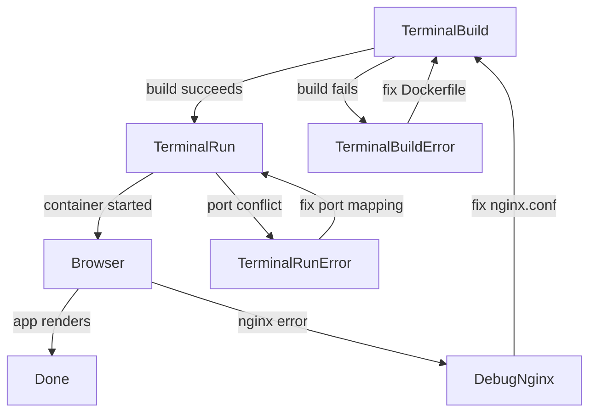
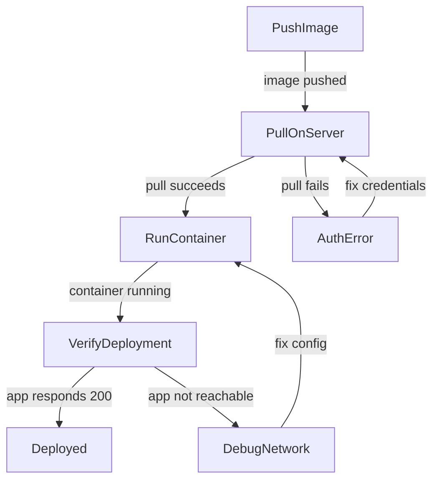

# User Flows — Add Dockerfile for Containerization

## Actors

| Actor | Description |
|-------|-------------|
| Developer | Builds and runs the Docker container for local preview or deployment |

## Flow Inventory

### Container Build & Run: DockerBuildFlow

**Actor**: Developer
**Entry**: Developer decides to build a container image
**Exit**: Container is running and serving the app

#### Screen List

| Screen | States Visited | Description |
|--------|----------------|-------------|
| Terminal (build) | running, success, error | Docker build output showing layer creation |
| Terminal (run) | running, success, error | Docker run output with container ID |
| Browser | loading, populated, error | Served app via nginx on mapped port |

#### Navigation Graph

#### State Transitions

| From | Action | To | Notes |
|------|--------|----|-------|
| Terminal (build) | `docker build -t linear-app-clone:latest .` | TerminalBuild running | Build context sent to Docker daemon |
| TerminalBuild running | Build succeeds (exit 0) | TerminalRun | Image tagged `linear-app-clone:latest` |
| TerminalBuild running | Build fails (non-zero exit) | TerminalBuildError | Review error output, fix Dockerfile |
| TerminalBuildError | Fix and re-run build | TerminalBuild running | Iterative fix cycle |
| TerminalRun | `docker run -p 8080:80 linear-app-clone:latest` | TerminalRun running | Container starts nginx on port 80 |
| TerminalRun running | Port 8080 already in use | TerminalRunError | Change host port mapping |
| TerminalRun running | Container starts successfully | Browser | Open `http://localhost:8080` |
| Browser | SPA loads correctly | Done | App is fully functional |
| Browser | 404 or 502 error | DebugNginx | nginx configuration issue |
| DebugNginx | Fix nginx.conf | TerminalBuild | Need to rebuild image |

### Deployment: DockerDeployFlow

**Actor**: Developer
**Entry**: Image is built and tagged
**Exit**: Container is deployed to target environment

#### Navigation Graph

#### State Transitions

| From | Action | To | Notes |
|------|--------|----|-------|
| PushImage | `docker push registry/linear-app-clone:latest` | Image in registry | Requires registry credentials |
| PullOnServer | `docker pull registry/linear-app-clone:latest` | Image on target host | Server needs Docker |
| RunContainer | `docker run -d -p 80:80 linear-app-clone` | Container running | Detached mode |
| VerifyDeployment | `curl http://localhost/` | Deployed | HTTP 200 confirms serving |
