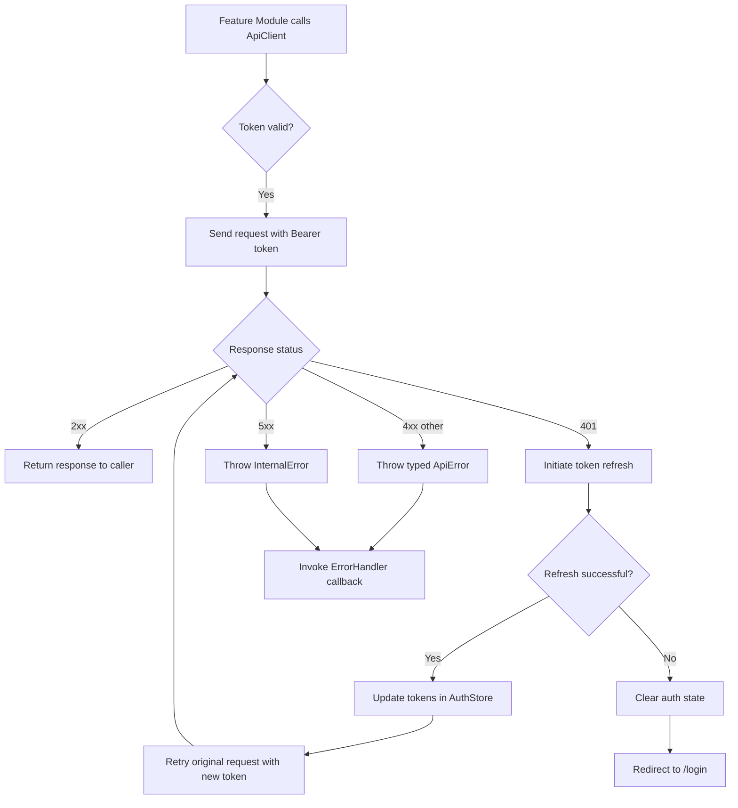
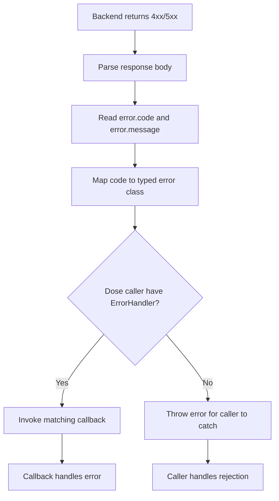
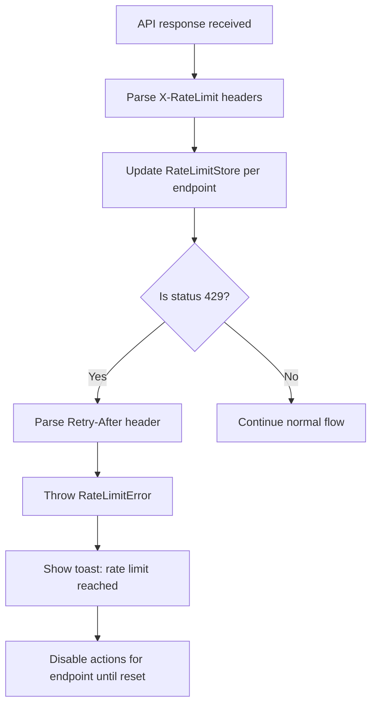

# User Flows — API Client & Error Handling Module

## Actors

| Actor | Description |
|-------|-------------|
| Authenticated User | Logged-in user whose requests carry a valid Bearer token |
| Unauthenticated User | User without a valid session who triggers public API calls |
| Feature Module | Any frontend module (Auth, Work, Project, Cycle) that consumes ApiClient |

## Flow Inventory

### API Client: Token Refresh Flow

**Actor**: Authenticated User / Feature Module  
**Entry**: Feature module calls ApiClient method (e.g., `get`, `post`, `patch`, `delete`)  
**Exit**: Caller receives successful response or is redirected to login

#### Screen List

| Screen | States Visited | Description |
|--------|----------------|-------------|
| Request Outbound | loading, success | Request is built with auth token and sent to backend |
| Token Refresh | loading, error, success | Access token is expired; ApiClient calls `/auth/refresh` |
| Request Retry | loading, success | Original request is retried with fresh access token |
| Login Redirect | — | Refresh also expired; user is logged out and redirected |

#### Navigation Graph

#### State Transitions

| From | Action | To | Notes |
|------|--------|----|-------|
| Feature Module | calls `apiClient.get(...)` | Request Outbound | Auth token injected from AuthStore |
| Request Outbound | backend returns 401 | Token Refresh | Single refresh at a time; concurrent 401s queue |
| Token Refresh | refresh endpoint returns 200 | Request Retry | New tokens stored, original request retried |
| Token Refresh | refresh endpoint returns 401 | Login Redirect | All queued requests fail with UnauthorizedError |
| Request Retry | backend returns 2xx | Response to caller | Original caller receives the successful result |
| Request Retry | backend returns 4xx/5xx | Error response | Typed error thrown and ErrorHandler invoked |
| Login Redirect | user logs in again | Feature Module | Full login flow re-establishes session |

---

### API Client: Error Handling Flow

**Actor**: Authenticated User / Feature Module  
**Entry**: Backend returns a 4xx or 5xx response  
**Exit**: ErrorHandler callback is invoked with typed error

#### Screen List

| Screen | States Visited | Description |
|--------|----------------|-------------|
| Response Parsing | loading, error, success | ApiClient reads status code and response body |
| Error Mapping | success | HTTP status mapped to typed error class |
| Callback Dispatch | success | Matching ErrorHandler callback is invoked |

#### Navigation Graph

#### State Transitions

| From | Action | To | Notes |
|------|--------|----|-------|
| Backend response | status >= 400 | Response Parsing | Body parsed as JSON |
| Response Parsing | missing/invalid body | Error thrown | `onUnknown` or `onNetworkError` fallback |
| Response Parsing | valid error shape | Error Mapping | `error.code` matched against taxonomy |
| Error Mapping | matching code found | Callback Dispatch | e.g., 404 → NotFoundError → onNotFound() |
| Error Mapping | no match | Callback Dispatch | `onUnknown(error)` invoked |

---

### API Client: Rate Limit Tracking Flow

**Actor**: Feature Module  
**Entry**: Any API response is received  
**Exit**: Rate limit state updated, optional 429 toast shown

#### Screen List

| Screen | States Visited | Description |
|--------|----------------|-------------|
| Header Parsing | success | X-RateLimit headers parsed from response |
| State Update | success | Per-endpoint rate limit state stored in RateLimitStore |
| Toast Display | success | On 429, toast notification shown with retry duration |

#### Navigation Graph

#### State Transitions

| From | Action | To | Notes |
|------|--------|----|-------|
| API Response | status != 429 | Normal flow | Headers still parsed for tracking |
| API Response | status = 429 | Toast Display | Retry-After duration shown in toast |
| Toast Display | window expires | Actions re-enabled | RateLimitStore tracks reset time per endpoint |
| Any | remaining = 0 | Warning threshold | Future concern — no UI action yet |
