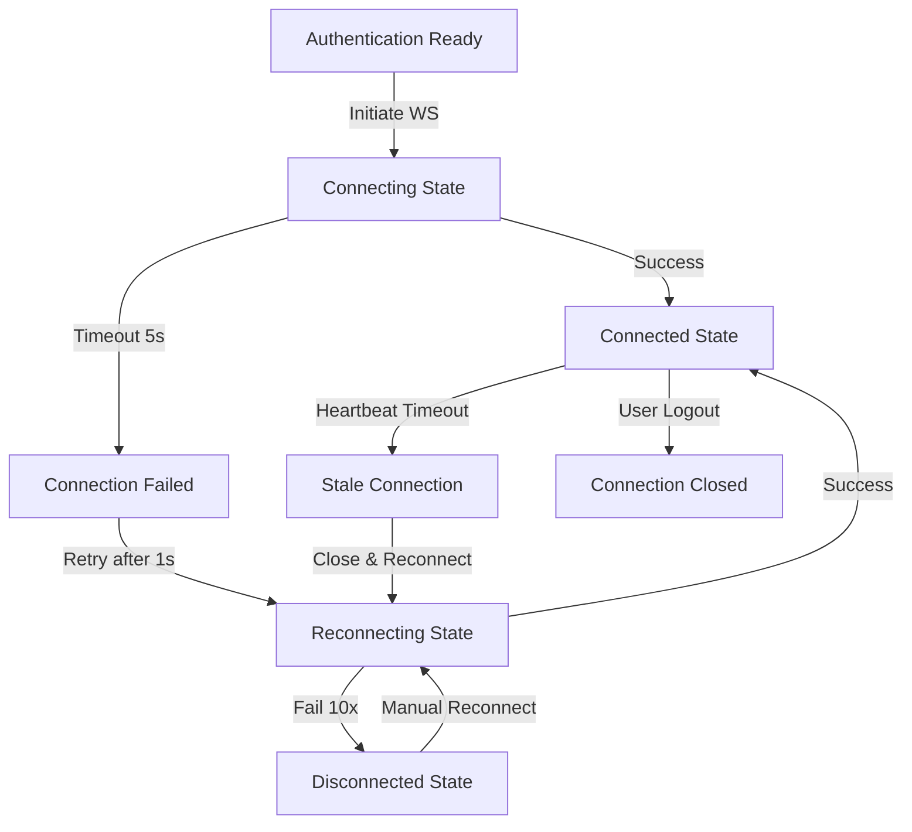
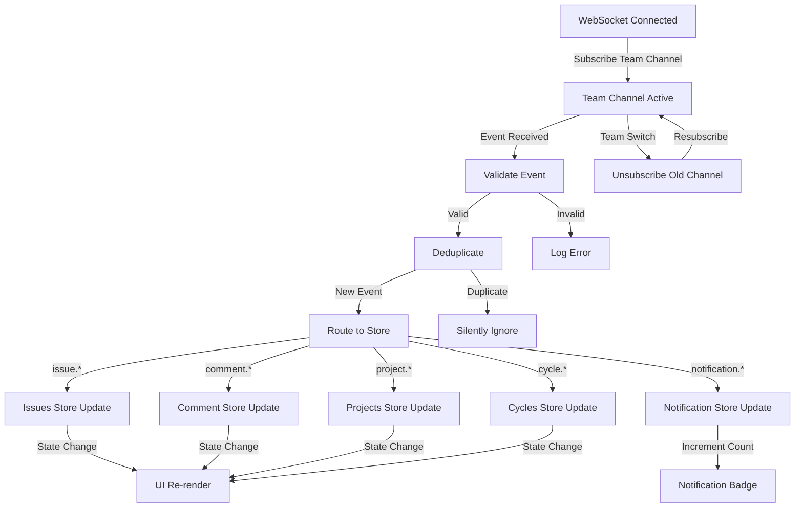
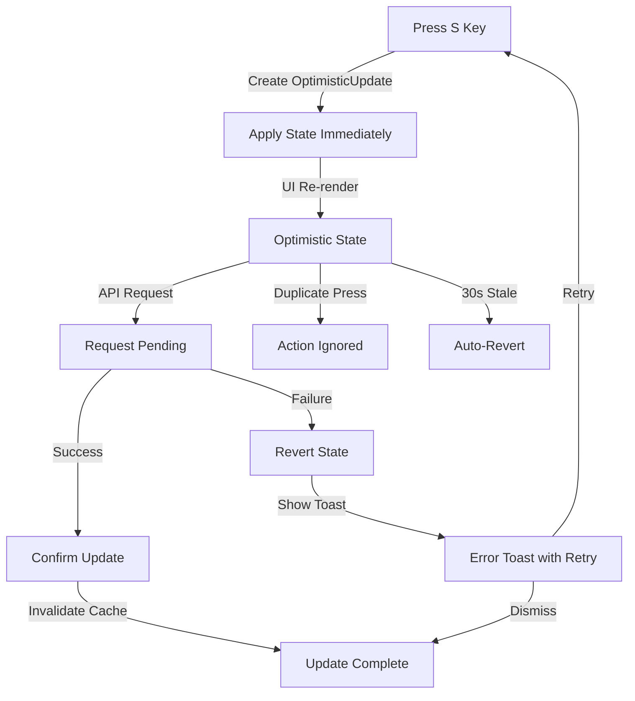
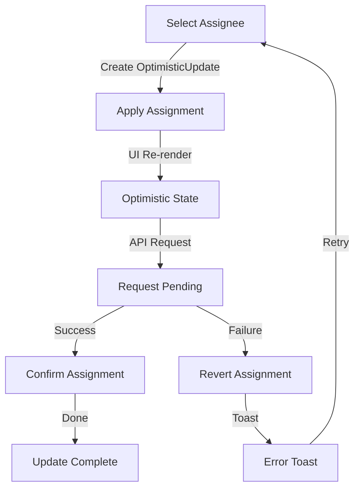
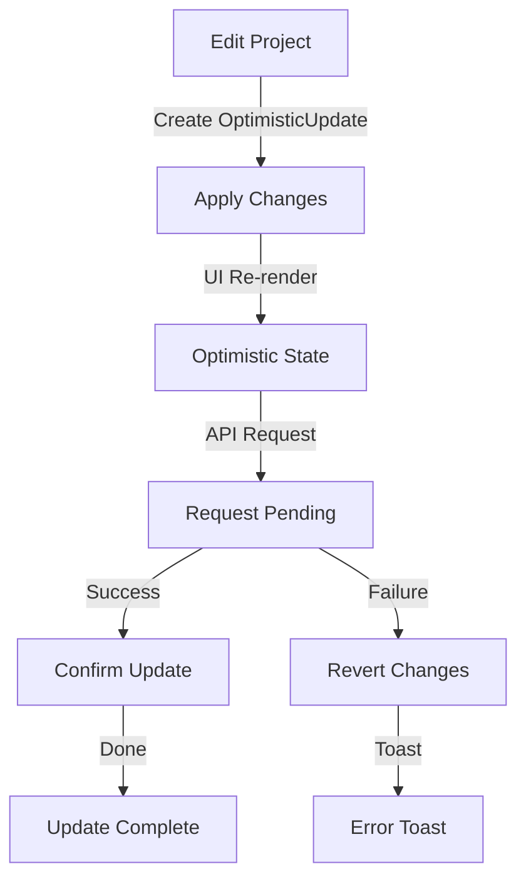
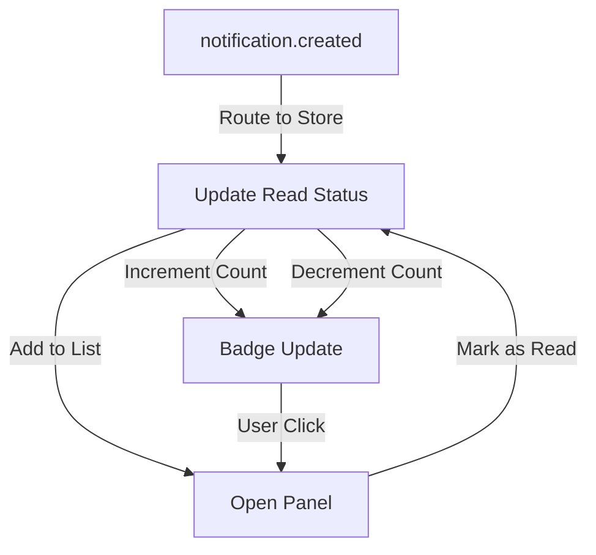

# User Flows — Realtime WebSocket & Events

## Actors

| Actor | Description |
|-------|-------------|
| Authenticated User | A logged-in team member who can create, update, and view issues, projects, and cycles. Receives real-time updates from other team members. |
| System (WebSocket) | The real-time connection manager that maintains WebSocket state, processes events, and handles optimistic updates. |

## Flow Inventory

### Connection: WebSocket Lifecycle Management

**Actor**: System (WebSocket)  
**Entry**: User authenticates successfully  
**Exit**: Connection established or user logs out

#### Screen List

| Screen | States Visited | Description |
|--------|----------------|-------------|
| ConnectionStatusIndicator | connected, connecting, reconnecting, disconnected | Visual indicator in header showing WebSocket connection state |
| ReconnectionToast | visible, dismissed | Toast notification shown when connection drops or reconnection fails |
| ConnectionErrorModal | visible, dismissed | Modal shown after 10 failed reconnection attempts |

#### Navigation Graph

#### State Transitions

| From | Action | To | Notes |
|------|--------|----|-------|
| disconnected | Auth ready, initiate WS | connecting | First connection attempt within 2s |
| connecting | Connection established | connected | Auth token sent in handshake |
| connecting | 5s timeout | disconnected | Triggers reconnection after 1s |
| connected | Heartbeat ping sent | connected | Every 30 seconds |
| connected | No pong within 10s | reconnecting | Stale connection detected |
| connected | Unexpected drop | reconnecting | Exponential backoff begins (1s, 2s, 4s...) |
| reconnecting | Connection success | connected | Counter resets, subscriptions re-established |
| reconnecting | 10 attempts exhausted | disconnected | Toast notification, manual reconnect available |
| connected | User logout | disconnected | Graceful close, subscriptions cleared |
| connected | Tab close | disconnected | Page unload closes connection |
| disconnected | Manual reconnect click | reconnecting | User-initiated reconnection |

---

### Events: Real-time Event Subscription

**Actor**: Authenticated User  
**Entry**: WebSocket connection established  
**Exit**: Events processed and UI updated

#### Screen List

| Screen | States Visited | Description |
|--------|----------------|-------------|
| IssueList | populated, updated, loading | Issue list that updates in real-time when events arrive |
| IssueDetail | populated, updated | Issue detail view with live comment and status updates |
| ProjectList | populated, updated | Project list reflecting real-time project changes |
| CycleList | populated, updated | Cycle list showing activation and completion events |
| NotificationPanel | empty, populated, unread | Notification panel with real-time notification delivery |

#### Navigation Graph

#### State Transitions

| From | Action | To | Notes |
|------|--------|----|-------|
| subscribed | Event received | processing | Enter validation pipeline |
| processing | Event valid | deduplicating | Check eventId against recent events |
| deduplicating | New event | routing | Route to appropriate store |
| deduplicating | Duplicate event | ignored | Silently discard |
| routing | Issue event | issues-updated | Issues Store updates state |
| routing | Comment event | comments-updated | Comments added to issue |
| routing | Project event | projects-updated | Projects Store updates state |
| routing | Cycle event | cycles-updated | Cycles Store updates state |
| routing | Notification event | notified | Notification count increments, toast shown |
| subscribed | Team selected | subscribing-new | Unsubscribe old, subscribe new |
| subscribing-new | Subscription success | subscribed | No events missed during transition |

---

### Optimistic: Issue Status Update

**Actor**: Authenticated User  
**Entry**: User presses 'S' keyboard shortcut on issue  
**Exit**: Status confirmed or reverted with error toast

#### Screen List

| Screen | States Visited | Description |
|--------|----------------|-------------|
| IssueCard | idle, optimistic, confirmed, reverted | Issue card showing immediate status change |
| StatusCycleIndicator | cycling, confirmed | Visual indicator of status cycling during optimistic state |
| RevertToast | visible, dismissed | Error toast with retry option on failure |

#### Navigation Graph

#### State Transitions

| From | Action | To | Notes |
|------|--------|----|-------|
| idle | Press S key | optimistic | Create OptimisticUpdate, apply immediately |
| optimistic | UI re-render | pending | API request sent in background |
| pending | API success | confirmed | Remove pending, invalidate cache |
| pending | API failure | reverted | Revert to previous state, show toast |
| pending | Network loss | reverted | Revert, show network error toast |
| pending | 30s timeout | reverted | Stale update auto-reverted |
| optimistic | Press S again | ignored | Duplicate action prevention |
| reverted | User clicks retry | idle | Re-initiate status change |
| reverted | User dismisses toast | idle | Continue working |

---

### Optimistic: Issue Assignment

**Actor**: Authenticated User  
**Entry**: User assigns issue to team member via UI  
**Exit**: Assignment confirmed or reverted

#### Screen List

| Screen | States Visited | Description |
|--------|----------------|-------------|
| IssueAssigneeSelector | open, selecting, applied | Dropdown for selecting issue assignee |
| IssueCard | idle, optimistic, confirmed, reverted | Issue card showing immediate assignee change |

#### Navigation Graph

#### State Transitions

| From | Action | To | Notes |
|------|--------|----|-------|
| idle | Select assignee | optimistic | Apply assignment immediately |
| optimistic | API success | confirmed | Assignment persisted |
| optimistic | API failure | reverted | Revert to previous assignee, show toast |

---

### Optimistic: Project Update

**Actor**: Authenticated User  
**Entry**: User updates project name or description  
**Exit**: Project update confirmed or reverted

#### Screen List

| Screen | States Visited | Description |
|--------|----------------|-------------|
| ProjectForm | idle, optimistic, confirmed, reverted | Project edit form with immediate state application |
| ProjectCard | idle, optimistic, confirmed, reverted | Project card reflecting real-time changes |

#### Navigation Graph

#### State Transitions

| From | Action | To | Notes |
|------|--------|----|-------|
| idle | Save project | optimistic | Apply changes immediately |
| optimistic | API success | confirmed | Project updated |
| optimistic | API failure | reverted | Revert to previous state, show toast |

---

### Events: Notification Delivery

**Actor**: Authenticated User  
**Entry**: notification.created event received via WebSocket  
**Exit**: Notification displayed in panel and badge count updated

#### Screen List

| Screen | States Visited | Description |
|--------|----------------|-------------|
| NotificationBadge | empty, counting | Badge in header showing unread notification count |
| NotificationPanel | empty, populated | Dropdown panel listing recent notifications |
| NotificationItem | new, read | Individual notification item with read/unread state |

#### Navigation Graph

#### State Transitions

| From | Action | To | Notes |
|------|--------|----|-------|
| empty | notification.created | populated | Add notification, increment badge |
| populated | notification.created | populated | Add to top, increment badge |
| populated | User clicks badge | panel-open | Show notification panel |
| panel-open | Mark as read | populated | Decrement badge count |
| panel-open | Click notification | navigated | Navigate to related entity |
