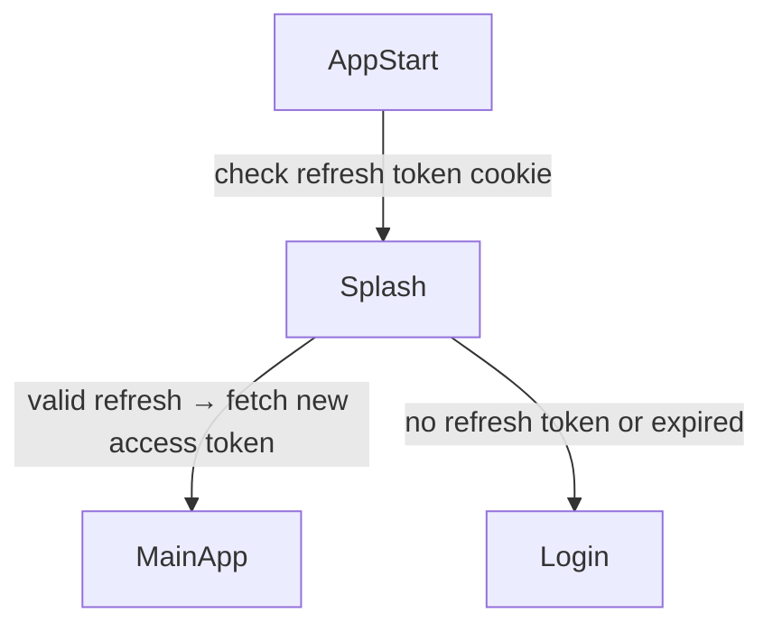
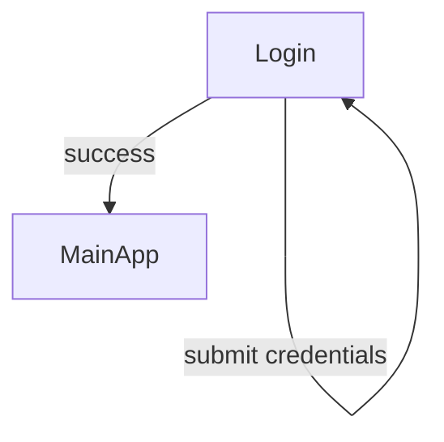
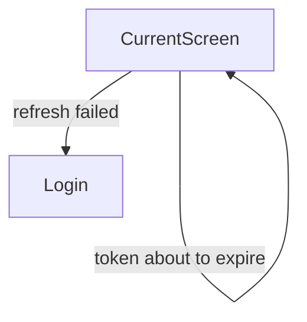
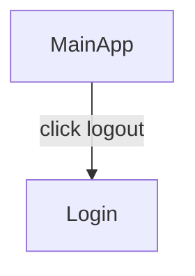

# User Flows — Auth Module

## Actors

| Actor | Description |
|-------|-------------|
| Unauthenticated User | Visitor with no valid session. Can only access the login page. |
| Authenticated User | User with a valid session (access token in memory, refresh token in cookie). Can access all protected app routes. |

## Flow Inventory

### Auth: App Start & Session Hydration

**Actor**: Unauthenticated User / Returning Authenticated User
**Entry**: User opens the application
**Exit**: User reaches main app (authenticated) or login page (unauthenticated)

#### Screen List

| Screen | States Visited | Description |
|--------|----------------|-------------|
| Splash/Loading | loading | Brief loading indicator while auth state is being hydrated |
| Main App | populated | Primary application view, shown if session is valid |
| Login | empty, error | Email/password form, shown if no valid session |

#### Navigation Graph

#### State Transitions

| From | Action | To | Notes |
|------|--------|----|-------|
| App start | Open app | Splash | `isLoading: true` |
| Splash | Valid refresh token found | Main App | `isAuthenticated: true`, `isLoading: false` |
| Splash | No valid refresh token | Login | `isAuthenticated: false`, `isLoading: false` |

---

### Auth: Login Flow

**Actor**: Unauthenticated User
**Entry**: Login page (after app start with no session, or after session expiry)
**Exit**: Main app (on success) or stays on Login (on error)

#### Screen List

| Screen | States Visited | Description |
|--------|----------------|-------------|
| Login | empty, loading, error | Email/password form with validation, submit button, error display |

#### Navigation Graph

#### State Transitions

| From | Action | To | Notes |
|------|--------|----|-------|
| Login (empty) | User enters credentials | Login (loading) | Form inputs disabled, button shows spinner |
| Login (loading) | API returns success | Main App | Tokens stored, state updated, redirect |
| Login (loading) | API returns error | Login (error) | Inline error message shown, inputs re-enabled |
| Login (loading) | Network failure | Login (error) | Network error message shown |
| Login (error) | User edits credentials | Login (empty) | Error cleared, form becomes editable |
| Login (loading) | Duplicate click | Login (loading) | No action, `isLoading` prevents re-submission |

---

### Auth: Token Refresh (Background)

**Actor**: Authenticated User
**Entry**: Any protected API call or time-based check
**Exit**: Silent continuation or redirect to login

#### Screen List

| Screen | States Visited | Description |
|--------|----------------|-------------|
| Current Screen | populated | User stays on whatever screen they were on |
| Login | empty | Only if refresh fails |

#### Navigation Graph

#### State Transitions

| From | Action | To | Notes |
|------|--------|----|-------|
| Current screen | Access token near expiry | Current screen | Silent refresh, new token in memory, no UI change |
| Current screen | Refresh token expired | Login | Auth state cleared, redirect to login |

---

### Auth: Logout Flow

**Actor**: Authenticated User
**Entry**: User clicks logout button (typically in UserAvatar dropdown)
**Exit**: Login page

#### Screen List

| Screen | States Visited | Description |
|--------|----------------|-------------|
| Main App | populated | User is on any protected page |
| Login | empty | Redirect destination after logout |

#### Navigation Graph

#### State Transitions

| From | Action | To | Notes |
|------|--------|----|-------|
| Main App | User clicks Logout | Login | Tokens cleared, state reset, redirect |
| Main App | Refresh token expires (see above) | Login | Automatic logout |
