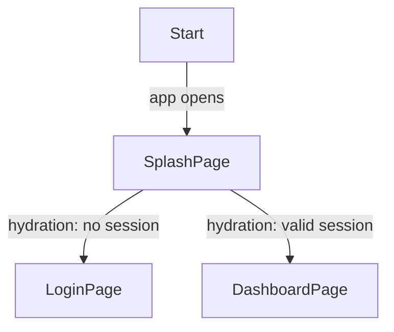
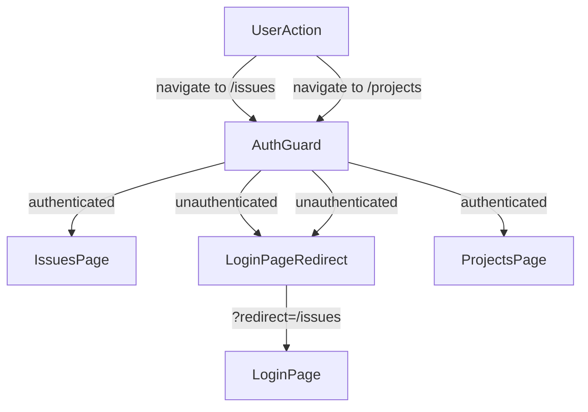
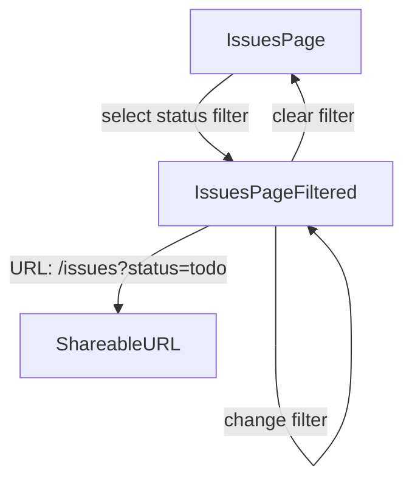
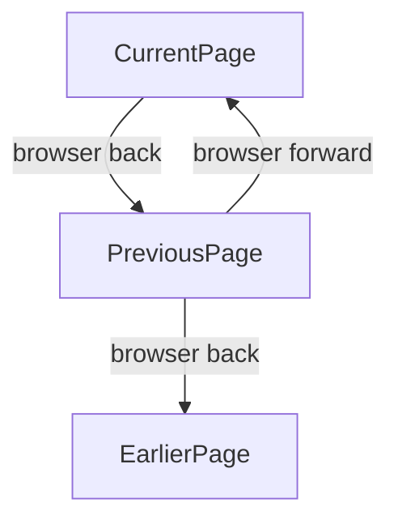

# User Flows — Routing Module

## Actors

| Actor | Description |
|-------|-------------|
| Unauthenticated User | Visitor without a valid session — can only access public routes |
| Authenticated User | Logged-in user with valid tokens — can access all protected routes |

## Flow Inventory

### Routing: App Bootstrap & Auth Hydration

**Actor**: Unauthenticated / Authenticated User
**Entry**: User opens the application
**Exit**: User lands on login page or main app

#### Screen List

| Screen | States Visited | Description |
|--------|----------------|-------------|
| SplashPage | loading | Full-screen loading indicator during auth hydration check |
| LoginPage | default, error, loading (submitting) | Email/password authentication form |
| DashboardPage | loading, populated | Main app dashboard (protected) |

#### Navigation Graph



#### State Transitions

| From | Action | To | Notes |
|------|--------|----|-------|
| (start) | App opens | SplashPage | AuthStore.hydrate() runs |
| SplashPage | Hydration complete — no session | LoginPage | Redirect param preserved if user came from protected route |
| SplashPage | Hydration complete — valid session | DashboardPage | Access token refreshed |

---

### Routing: Post-Login Redirect

**Actor**: Unauthenticated User
**Entry**: LoginPage after successful authentication
**Exit**: Original destination or default page

#### Screen List

| Screen | States Visited | Description |
|--------|----------------|-------------|
| LoginPage | default, loading, error, success (triggers redirect) | Auth login form |
| Target Page | loading, populated | The page user originally tried to access |

#### Navigation Graph

```mermaid
graph TD
    LoginPage -->|login success|{has redirect param?}
    {has redirect param?} -->|yes| TargetPage
    {has redirect param?} -->|no| DashboardPage
```

#### State Transitions

| From | Action | To | Notes |
|------|--------|----|-------|
| LoginPage | Successful login with `?redirect=/issues` | IssuesPage | Redirect URL preserved from auth guard |
| LoginPage | Successful login without redirect | DashboardPage | Default post-login destination |

---

### Routing: Protected Route Access

**Actor**: Authenticated User
**Entry**: User navigates to any protected route
**Exit**: Page renders or redirect to login

#### Screen List

| Screen | States Visited | Description |
|--------|----------------|-------------|
| Any Protected Page | loading, populated, error | IssuesPage, IssueDetailPage, ProjectsPage, etc. |
| LoginPage | default, error | Fallback when unauthenticated |

#### Navigation Graph



#### State Transitions

| From | Action | To | Notes |
|------|--------|----|-------|
| Any page | Navigate to `/issues` | IssuesPage | Guard passes if authenticated |
| Any page | Navigate to `/issues/abc-123` | IssueDetailPage | Route param `id` = "abc-123" |
| Any page | Navigate to `/projects` | ProjectsPage | Guard passes if authenticated |
| Any page | Navigate to `/projects/p1` | ProjectDetailPage | Route param `id` = "p1" |
| Any page | Navigate to `/cycles` | CyclesPage | Guard passes if authenticated |
| Any page | Navigate to `/settings` | SettingsPage | Guard passes if authenticated |
| Any page | Navigate to protected route (unauthenticated) | LoginPage | `?redirect=<original_url>` appended |

---

### Routing: 404 Handling

**Actor**: Any User
**Entry**: User navigates to an unmatched URL
**Exit**: User clicks "Go to Dashboard" or navigates elsewhere

#### Screen List

| Screen | States Visited | Description |
|--------|----------------|-------------|
| NotFoundPage | default | 404 page with message and navigation link |

#### Navigation Graph

```mermaid
graph TD
    UserAction -->|navigate to /unknown-path| Router
    Router -->|no match| NotFoundPage
    NotFoundPage -->|click "Go to Dashboard"| DashboardPage
```

#### State Transitions

| From | Action | To | Notes |
|------|--------|----|-------|
| Any page | Navigate to unmatched URL | NotFoundPage | All `*` routes resolve here |
| NotFoundPage | Click "Go to Dashboard" | DashboardPage | Auth guard applies |

---

### Routing: Query Parameter Filters

**Actor**: Authenticated User
**Entry**: User is on IssuesPage with active filters
**Exit**: URL reflects current filter selections

#### Screen List

| Screen | States Visited | Description |
|--------|----------------|-------------|
| IssuesPage | default, loading, populated, empty | Issue list with filter controls |

#### Navigation Graph



#### State Transitions

| From | Action | To | Notes |
|------|--------|----|-------|
| IssuesPage | Select "In Progress" filter | IssuesPage (filtered) | URL updates to `/issues?status=in-progress` |
| IssuesPage (filtered) | Clear filter | IssuesPage (unfiltered) | URL resets to `/issues` |
| IssuesPage (filtered) | Select additional assignee filter | IssuesPage (filtered) | URL updates to `/issues?status=in-progress&assignee=me` |

---

### Routing: Browser History Navigation

**Actor**: Any User
**Entry**: User has navigated through multiple pages
**Exit**: User lands on previous/next page in history

#### Screen List

| Screen | States Visited | Description |
|--------|----------------|-------------|
| Any Page | populated | Any previously visited page |

#### Navigation Graph



#### State Transitions

| From | Action | To | Notes |
|------|--------|----|-------|
| IssuesPage | Browser back button | ProjectsPage | Previous page in history stack |
| ProjectsPage | Browser forward button | IssuesPage | Next page in history stack (if exists) |

---

### Routing: Sidebar Navigation

**Actor**: Authenticated User
**Entry**: User clicks a sidebar nav link
**Exit**: Target page is rendered with sidebar highlight updated

#### Screen List

| Screen | States Visited | Description |
|--------|----------------|-------------|
| Any Protected Page | populated, loading | Current page with sidebar |

#### Navigation Graph

```mermaid
graph TD
    DashboardPage -->|click "Issues" in sidebar| IssuesPage
    DashboardPage -->|click "Projects" in sidebar| ProjectsPage
    DashboardPage -->|click "Cycles" in sidebar| CyclesPage
    DashboardPage -->|click "Settings" in sidebar| SettingsPage
    IssuesPage -->|click "Projects" in sidebar| ProjectsPage
    IssuesPage -->|click "Cycles" in sidebar| CyclesPage
    IssuesPage -->|click detail link| IssueDetailPage
    IssueDetailPage -->|back navigation| IssuesPage
```

#### State Transitions

| From | Action | To | Notes |
|------|--------|----|-------|
| DashboardPage | Click "Issues" nav link | IssuesPage | Sidebar highlights "Issues" |
| IssuesPage | Click "Projects" nav link | ProjectsPage | Sidebar highlights "Projects" |
| IssuesPage | Click issue row | IssueDetailPage | Sidebar keeps "Issues" highlighted |
| IssueDetailPage | Browser back | IssuesPage | History pop, sidebar highlights "Issues" |
