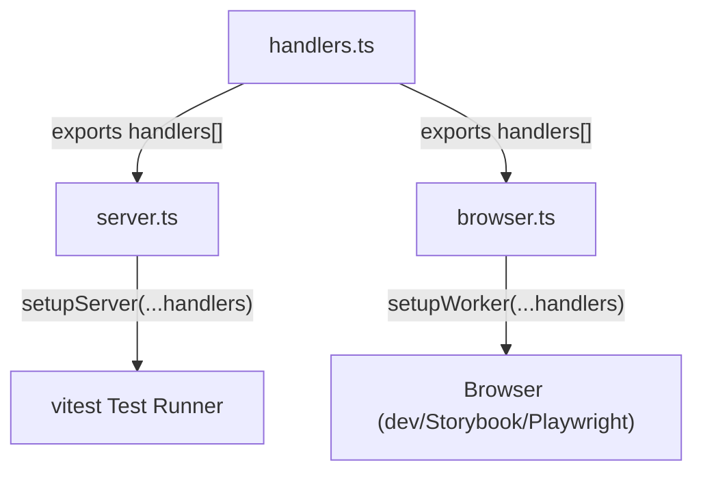
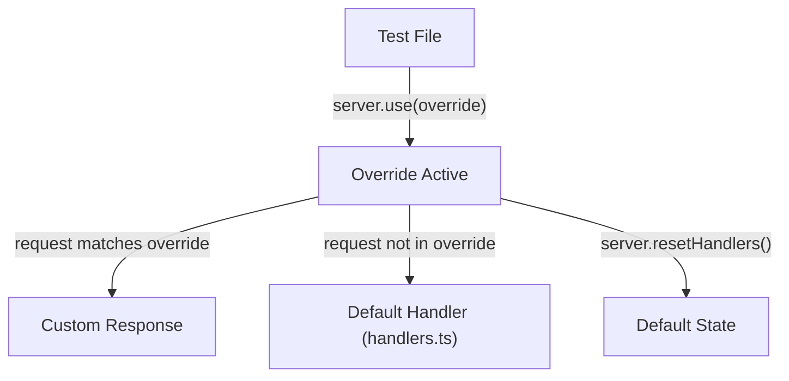
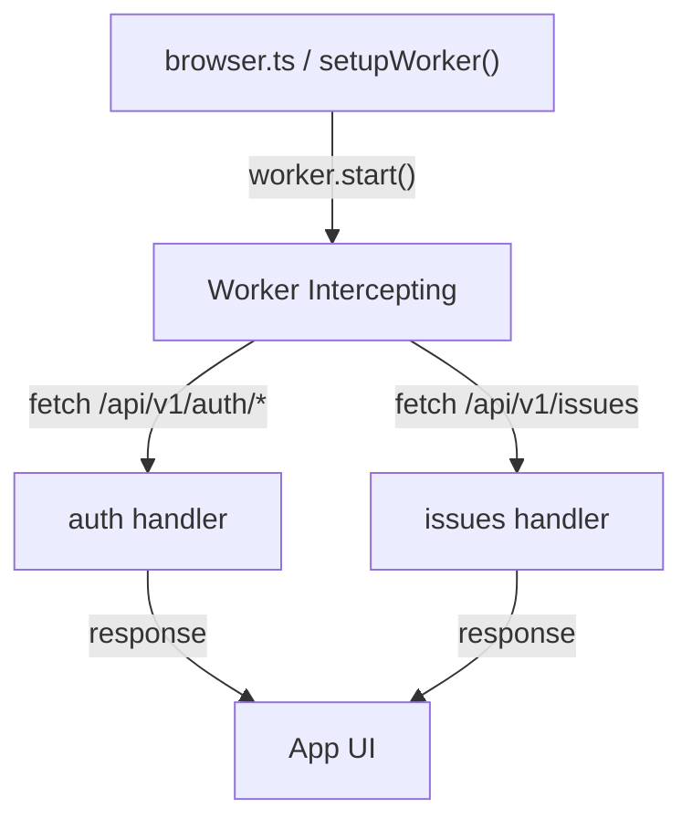

# User Flows — Centralize MSW Handlers

## Actors

| Actor | Description |
|-------|-------------|
| Developer | Writes or modifies MSW handlers in the shared module |
| Test Runner (vitest) | Executes test suites that consume centralized mocks via Node runtime |
| Browser (dev/Storybook/Playwright) | Runs the app with intercepted API requests via browser runtime |

## Flow Inventory

### Mock Management: Add a New Handler

**Actor**: Developer  
**Entry**: Developer identifies an API endpoint not yet covered by centralized handlers  
**Exit**: All consumers (vitest, browser) automatically pick up the new handler

#### Screen List

| Screen | States Visited | Description |
|--------|----------------|-------------|
| `handlers.ts` | edit | Developer adds a new `http.[method]()` handler to the shared array |
| `server.ts` | static | No change needed — re-exports `...handlers` automatically |
| `browser.ts` | static | No change needed — re-exports `...handlers` automatically |

#### Navigation Graph

#### State Transitions

| From | Action | To | Notes |
|------|--------|----|-------|
| `handlers.ts` | Developer adds/edits handler | `handlers.ts` | New handler is automatically in the spread |
| `server.ts` | vitest imports | vitest test | All default handlers available |
| `browser.ts` | browser imports | browser app | All default handlers intercepting requests |

---

### Mock Management: Override a Handler in a Test

**Actor**: Developer / Test Runner (vitest)  
**Entry**: Developer writes a test that needs different mock behavior for a specific endpoint  
**Exit**: Default handlers are restored for subsequent tests

#### Screen List

| Screen | States Visited | Description |
|--------|----------------|-------------|
| Test file | loading, populated | Developer calls `server.use(overrideHandler)` before the scenario |
| Test scenario | loading, populated, error | Overridden handler serves the custom response |
| `afterEach` | reset | `server.resetHandlers()` restores defaults |

#### Navigation Graph

#### State Transitions

| From | Action | To | Notes |
|------|--------|----|-------|
| Default state | `server.use(customHandler)` | Override active | Handler for matching endpoint is replaced |
| Override active | Request matches override | Custom response | Override handles the request |
| Override active | Request does not match | Default handler | Falls through to `handlers.ts` |
| Override active | `server.resetHandlers()` | Default state | All overrides cleared |

---

### Browser Mode: Launch Dev App with Mocked API

**Actor**: Browser (dev/Storybook/Playwright)  
**Entry**: App starts in browser with MSW worker initialized  
**Exit**: API requests are intercepted by centralized handlers

#### Screen List

| Screen | States Visited | Description |
|--------|----------------|-------------|
| `browser.ts` | started | Worker registered with `...handlers` |
| App | loading, populated | UI renders with mocked API data |
| API endpoint | success, error | Response served by matching handler |

#### Navigation Graph

#### State Transitions

| From | Action | To | Notes |
|------|--------|----|-------|
| `browser.ts` | `worker.start()` | Intercepting | All matching requests captured |
| Intercepting | App fetch request | Handler match | Handler from `handlers.ts` serves response |
| Intercepting | `worker.stop()` | Stopped | Real network requests resume |
