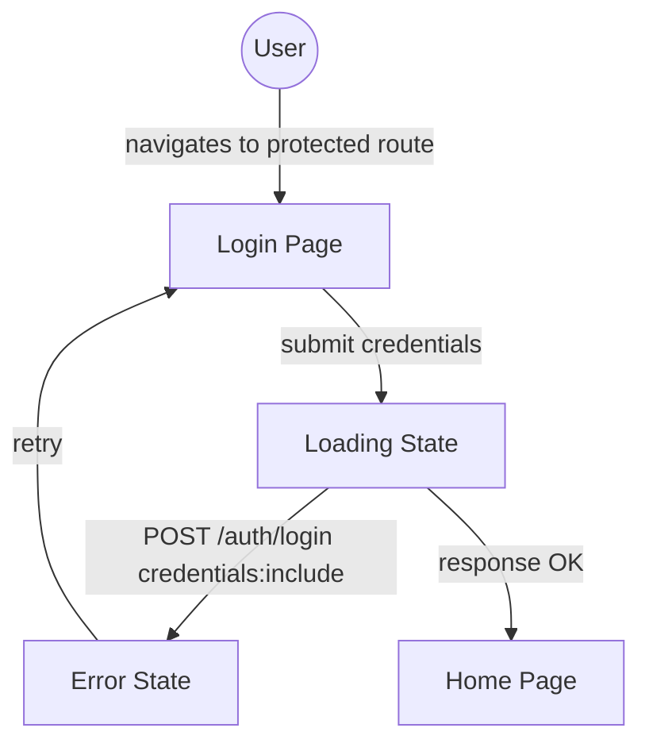
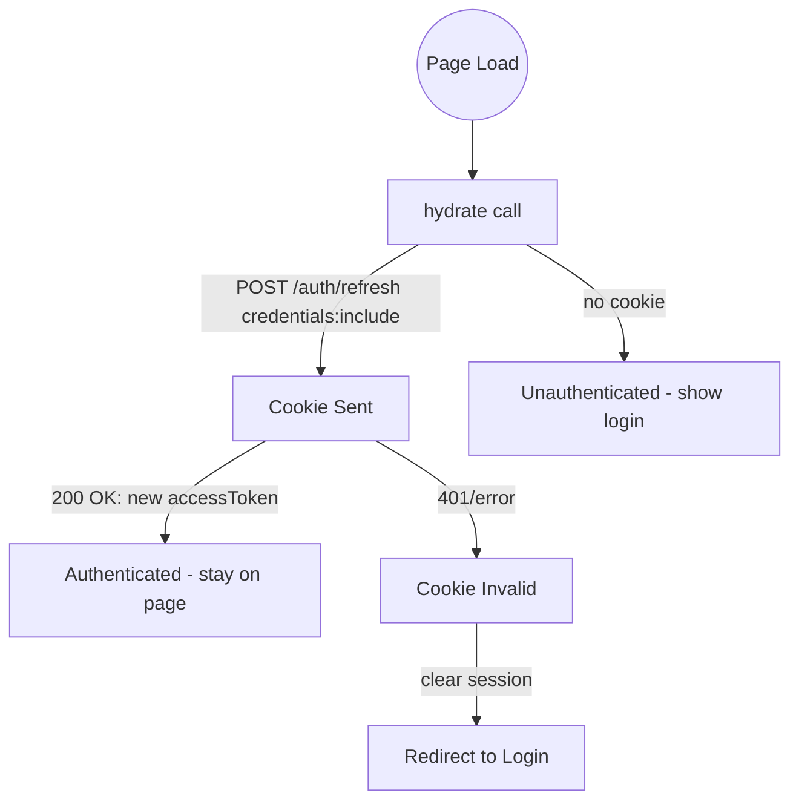
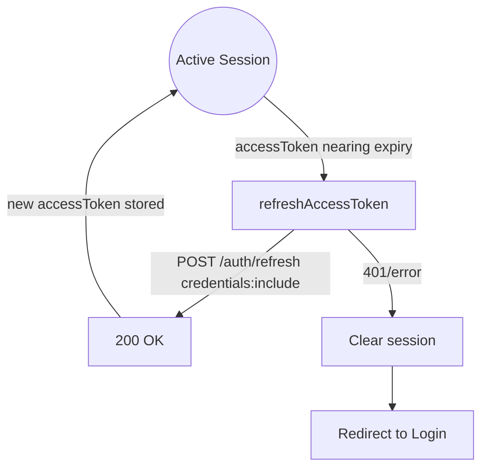
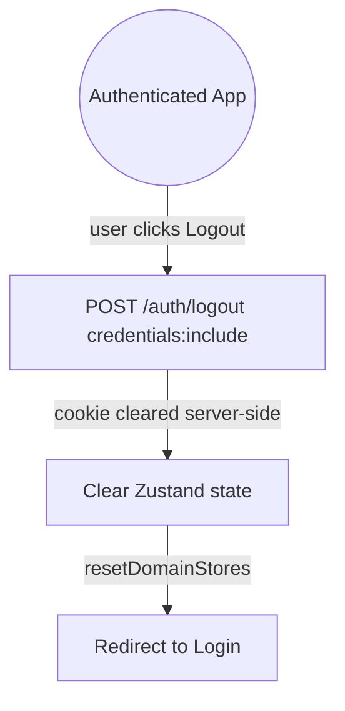
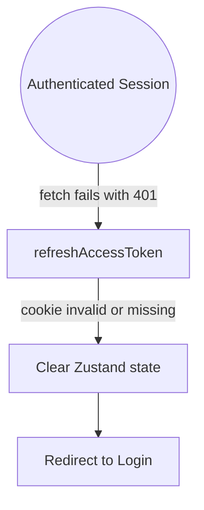

# User Flows — Remove localStorage Token Storage, Use HttpOnly Cookie via credentials: 'include'

## Actors

| Actor | Description |
|-------|-------------|
| Unauthenticated User | Visitor with no valid session |
| Authenticated User | User with a valid HttpOnly cookie (stored by browser) |
| Expired User | User whose cookie has expired or was cleared server-side |

## Flow Inventory

### Auth: Login

**Actor**: Unauthenticated User
**Entry**: Login page (`/login`)
**Exit**: Home page (`/`)

#### Screen List

| Screen | States Visited | Description |
|--------|----------------|-------------|
| Login | loading, error, success | User submits email + password; cookie set server-side |

#### Navigation Graph

#### State Transitions

| From | Action | To | Notes |
|------|--------|----|-------|
| Protected route | No session cookie | Login page | Redirect by auth guard |
| Login page | Submit valid credentials | Home page | Cookie set by `Set-Cookie` header; accessToken stored in Zustand |
| Login page | Submit invalid credentials | Login page (error) | Error banner shown; no cookie set |
| Login page | Network error | Login page (error) | "Connection error" message |

---

### Auth: Session Hydrate (Page Refresh)

**Actor**: Authenticated User / Expired User
**Entry**: Any page after full page load or refresh
**Exit**: Same page (authenticated) or login redirect

#### Screen List

| Screen | States Visited | Description |
|--------|----------------|-------------|
| Any | loading, success, error | App boot with no stored token—relies on cookie |

#### Navigation Graph

#### State Transitions

| From | Action | To | Notes |
|------|--------|----|-------|
| Page load | No cookie exists | Unauthenticated | Store sets `isAuthenticated: false` immediately |
| Page load | Cookie exists, valid | Authenticated | Cookie sent automatically via `credentials: 'include'`; accessToken returned |
| Page load | Cookie exists, expired/revoked | Unauthenticated | Server returns error; store clears any stale state |

---

### Auth: Silent Token Refresh

**Actor**: Authenticated User
**Entry**: During active session, before access token expires
**Exit**: Same session (new accessToken in Zustand) or session cleared

#### Screen List

| Screen | States Visited | Description |
|--------|----------------|-------------|
| Any (background) | loading, success, error | Transparent to user |

#### Navigation Graph

#### State Transitions

| From | Action | To | Notes |
|------|--------|----|-------|
| Any page | Token expires, cookie valid | Same page | New accessToken fetched in background |
| Any page | Token expired, cookie also invalid | Login page | Full session clear, auth guard redirect |

---

### Auth: Logout

**Actor**: Authenticated User
**Entry**: Any authenticated page
**Exit**: Login page

#### Screen List

| Screen | States Visited | Description |
|--------|----------------|-------------|
| Any | loading, success | User-initiated logout |

#### Navigation Graph

#### State Transitions

| From | Action | To | Notes |
|------|--------|----|-------|
| Any authenticated page | User clicks Log out | Login page | Cookie cleared by `Max-Age=0`; accessToken removed; domain stores reset |

---

### Auth: Session Expiry (Passive)

**Actor**: Authenticated User / Expired User
**Entry**: Any authenticated page
**Exit**: Login page

#### Screen List

| Screen | States Visited | Description |
|--------|----------------|-------------|
| Any | loading (failed refresh), error | User does not initiate—app detects stale session |

#### Navigation Graph

#### State Transitions

| From | Action | To | Notes |
|------|--------|----|-------|
| Any page (authenticated) | API call returns 401 | Login page | `refreshAccessToken` tries cookie; fails; session cleared |
