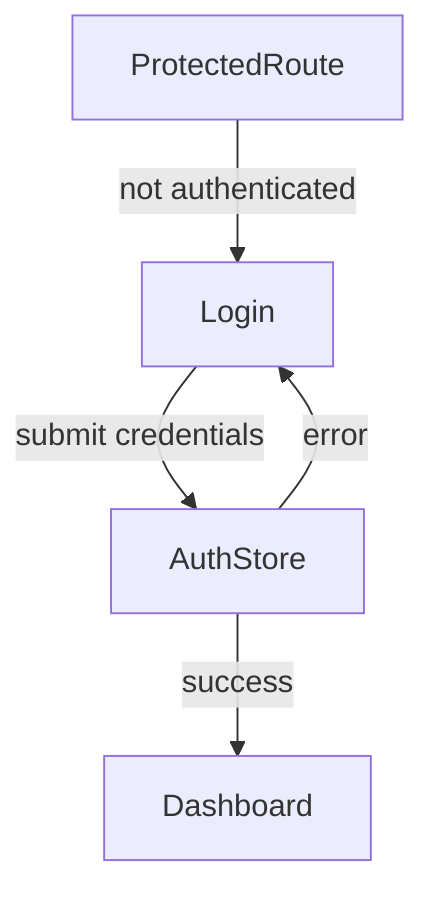
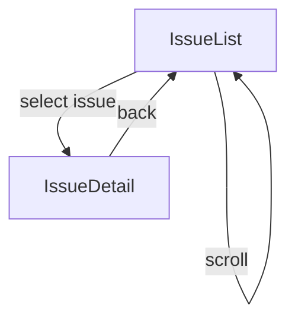
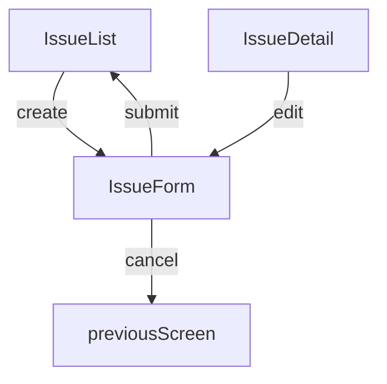
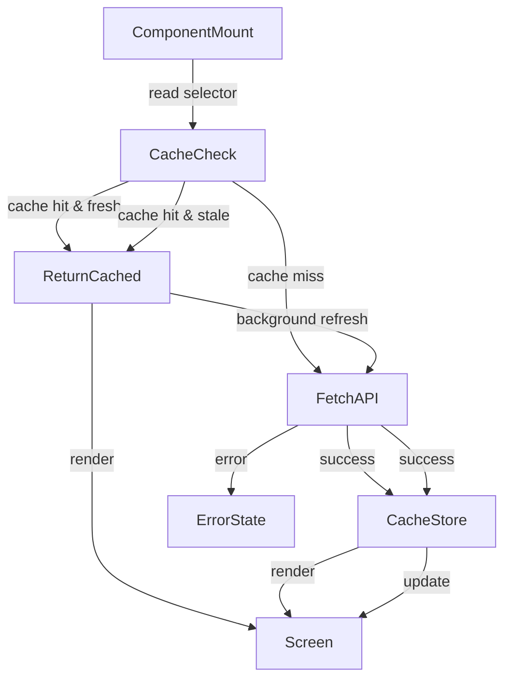

# User Flows — State Module: Cache & Selectors

## Actors

| Actor | Description |
|-------|-------------|
| Authenticated User | Logged-in user interacting with issues, projects, cycles |
| Anonymous User | Unauthenticated visitor, restricted to public routes |
| System | Background processes: cache hydration, token refresh, WebSocket reconnection |

## Flow Inventory

### Auth: Login Flow

**Actor**: Anonymous User  
**Entry**: User visits protected route or clicks Login  
**Exit**: Dashboard (issues list)

#### Screen List

| Screen | States Visited | Description |
|--------|----------------|-------------|
| Login | empty, loading, error | Credential submission form |
| Dashboard | loading, populated, error | Issues list after successful login |
| Login (redirect back) | - | Redirect to original target after login |

#### Navigation Graph

#### State Transitions

| From | Action | To | Notes |
|------|--------|----|-------|
| Protected route | Visit without token | Login | Auth gate redirect |
| Login | Submit valid credentials | Dashboard | Token stored, user hydrated |
| Login | Submit invalid credentials | Login | Error state shown, form preserved |
| Any | Logout click | Login | All stores reset, cache cleared |

---

### Issues: Browse & Filter

**Actor**: Authenticated User  
**Entry**: Clicks "Issues" in sidebar or navigates to `/issues`  
**Exit**: Issue detail view, board view, project view

#### Screen List

| Screen | States Visited | Description |
|--------|----------------|-------------|
| Issue List | loading, populated, empty, error | Paginated issue list with filters |
| Issue Detail | loading, populated, error | Single issue view |

#### Navigation Graph

#### State Transitions

| From | Action | To | Notes |
|------|--------|----|-------|
| Issue List | Mount | Issue List (loading) | Cache check → API call if miss or stale |
| Issue List (loading) | Data received | Issue List (populated) | Store updated, selectors recompute |
| Issue List (loading) | API error | Issue List (error) | Error state rendered |
| Issue List (populated) | Apply status filter | Issue List (populated) | Filter state updated, selector recomputes |
| Issue List (populated) | Click issue | Issue Detail | selectedIssueId set |
| Issue List (populated) | Scroll to bottom | Issue List (populated) | Pagination cursor advances |
| Issue Detail | Data loaded | Issue Detail (populated) | Issues from store rendered |
| Issue Detail | Back | Issue List | selectedIssueId cleared |

---

### Issues: Create / Update

**Actor**: Authenticated User  
**Entry**: Clicks "New Issue" or edits existing issue  
**Exit**: Issue detail or list with updated data

#### Screen List

| Screen | States Visited | Description |
|--------|----------------|-------------|
| Issue Form | empty, loading, error, success | Create or edit issue form (modal) |

#### Navigation Graph

#### State Transitions

| From | Action | To | Notes |
|------|--------|----|-------|
| Issue list/detail | Click create/edit | Issue Form | Modal opens (UI store: activeModal set) |
| Issue Form | Submit | Success | Store mutated, cache invalidated, refetch triggered |
| Issue Form | API error | Issue Form (error) | Error shown, form data preserved |
| Issue Form | Cancel | Previous screen | Modal closes (UI store: activeModal cleared) |

---

### System: Data Loading & Cache

**Actor**: System  
**Entry**: Component mounts or cache entry expires  
**Exit**: Store populated, component renders

#### Screen List

| Screen | States Visited | Description |
|--------|----------------|-------------|
| Any data-bound screen | loading, populated, error | Screen backed by cached API data |

#### Navigation Graph

#### State Transitions

| From | Action | To | Notes |
|------|--------|----|-------|
| Component | Mount | Cache check | Selector reads store |
| Cache check | Entry valid & within TTL | Return cached | No network request |
| Cache check | Entry valid & past TTL | Return stale + background refresh | Stale shown, fresh fetched |
| Cache check | No entry | Fetch from API | Loading state active |
| Fetch API | Success | Store update + cache | Store populated, selectors recompute |
| Fetch API | Error | Error state | Error displayed to user |

---

### System: Mutation & Cache Invalidation

**Actor**: Authenticated User  
**Entry**: User creates, updates, or deletes an entity  
**Exit**: UI reflects new data

#### Screen List

| Screen | States Visited | Description |
|--------|----------------|-------------|
| Any screen with mutations | loading, success, error | Optimistic or confirmed update |

#### State Transitions

| From | Action | To | Notes |
|------|--------|----|-------|
| Entity screen | User performs mutation | Store mutation | Store updated synchronously |
| Store mutation | Success | Cache invalidation | Related cache keys cleared |
| Cache invalidation | Keys cleared | Refetch | Fresh data loaded from API |
| Refetch complete | Data received | Store update | UI re-renders with latest data |

---

### System: Real-Time Updates

**Actor**: System  
**Entry**: WebSocket event received from server  
**Exit**: Store updated, UI reflects change

#### Screen List

| Screen | States Visited | Description |
|--------|----------------|-------------|
| Any active screen | - | Real-time push updates |

#### State Transitions

| From | Action | To | Notes |
|------|--------|----|-------|
| WebSocket connected | Event received | Store update | lastEvent set, notification appended |
| Store update | Selector recomputes | UI re-render | selectUnreadCount updates badge |
| WebSocket connected | Connection lost | Reconnecting | connectionStatus → "reconnecting" |
| Reconnecting | Backoff retry | Connected | reconnectAttempts increments on each try |

---

### UI: Layout & Preferences

**Actor**: Authenticated User  
**Entry**: User toggles sidebar, changes theme, opens modal  
**Exit**: Preference persisted, layout adjusts

#### Screen List

| Screen | States Visited | Description |
|--------|----------------|-------------|
| Any screen | - | UI state changes are global |

#### State Transitions

| From | Action | To | Notes |
|------|--------|----|-------|
| Any | Toggle sidebar | Sidebar collapsed/expanded | UI store updated, persisted to localStorage |
| Any | Switch theme | Theme applied | UI store updated, CSS variables swapped |
| Any | Open modal | Modal displayed | UI store: activeModal set, focus trapped |
| Modal | Press Escape | Modal closed | UI store: activeModal cleared, focus restored |
| Any | Keyboard shortcut | Context-dependent action | Keyboard context determines shortcut mapping |

---

### System: App Start & Hydration

**Actor**: System  
**Entry**: Application boots  
**Exit**: Stores hydrated, first render ready

#### Screen List

| Screen | States Visited | Description |
|--------|----------------|-------------|
| App shell | initialising, ready | Root layout after hydration |

#### State Transitions

| From | Action | To | Notes |
|------|--------|----|-------|
| App start | Hydrate auth | Auth store populated | Tokens restored from secure storage |
| App start | Hydrate UI prefs | UI store populated | Theme, sidebar state from localStorage |
| App start | Hydrate last viewed | Issue store selectedIssueId | From localStorage (7-day TTL) |
| Hydration complete | Render | App shell | Ready for user interaction |
