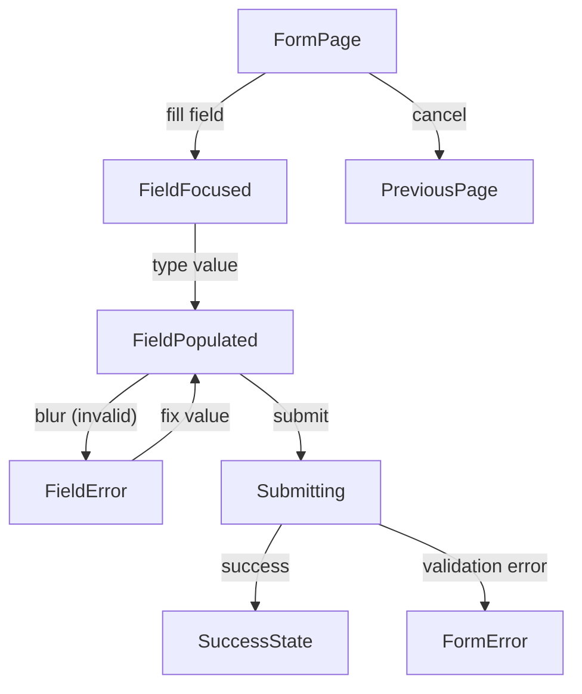
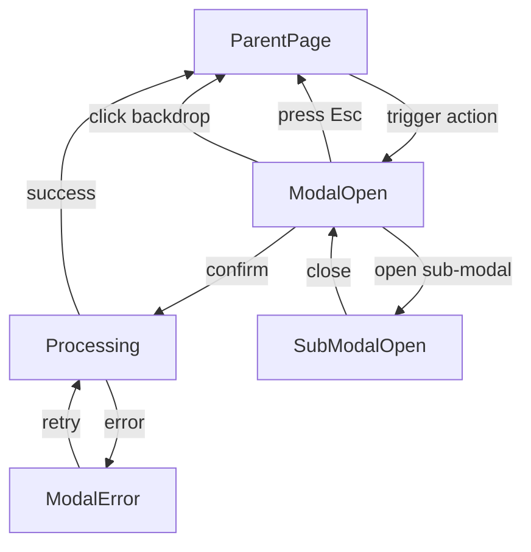
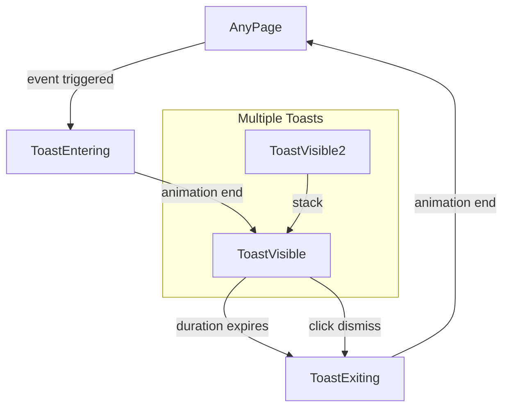
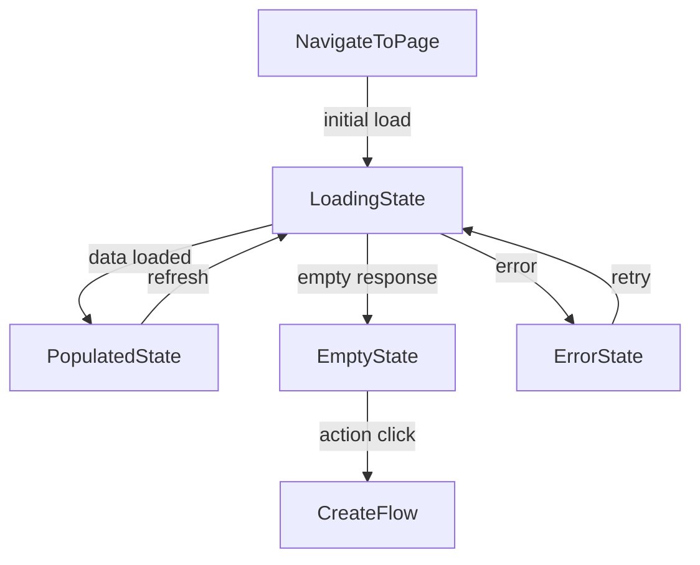

# User Flows — UI Generic Components

## Actors

| Actor | Description |
|-------|-------------|
| User | End-user interacting with the application UI |
| Developer | Engineer composing UI primitives into feature screens |

## Flow Inventory

### UI Module: Form Input Flow

**Actor**: User
**Entry**: User lands on a page with a form (e.g., issue creation, login)
**Exit**: Form submitted or cancelled

#### Screen List

| Screen | States Visited | Description |
|--------|----------------|-------------|
| Form Page | loading, populated, error | Page containing Input, Select, Checkbox, Textarea primitives wrapped by Form Module field wrappers |

#### Navigation Graph

#### State Transitions

| From | Action | To | Notes |
|------|--------|----|-------|
| Form Page | Focus a field | Field Focused | Field shows focus ring |
| Field Focused | Type value | Field Populated | Value updates, onChange fires |
| Field Populated | Blur with invalid value | Field Error | Error state shown on primitive |
| Field Error | Correct value and blur | Field Populated | Error state clears |
| Field Populated | Submit form | Submitting | Button shows loading state, fields disabled |
| Submitting | API success | Success State | Toast (success) shown |
| Submitting | Validation error | Form Error | Toast (error) shown, fields re-enabled |
| Form Page | Cancel/back | Previous Page | Modal confirmation if dirty |

---

### UI Module: Modal Dialog Flow

**Actor**: User
**Entry**: User triggers an action that opens a modal
**Exit**: Modal confirmed, cancelled, or dismissed

#### Screen List

| Screen | States Visited | Description |
|--------|----------------|-------------|
| Parent Page | populated | Page behind the modal backdrop |
| Modal | open, stacked | Overlay dialog with form or confirmation content |

#### Navigation Graph

#### State Transitions

| From | Action | To | Notes |
|------|--------|----|-------|
| Parent Page | Click trigger button | Modal Open | Body scroll locked, focus trapped |
| Modal Open | Press Escape | Parent Page | Focus returned to trigger element |
| Modal Open | Click backdrop | Parent Page | Only if closeOnBackdropClick enabled |
| Modal Open | Click confirm | Processing | Button shows loading state |
| Processing | API/action success | Parent Page | Toast (success) may appear |
| Processing | API/action error | Modal Error | Error toast, modal stays open |
| Modal Error | Click retry | Processing | Same flow as initial confirm |
| Modal Open | Trigger sub-action | Sub Modal Open | Second modal stacks on top |
| Sub Modal Open | Close | Modal Open | First modal visible beneath |

---

### UI Module: Toast Notification Flow

**Actor**: User
**Entry**: An application event triggers a toast (API error, success, info)
**Exit**: Toast auto-dismisses or user manually dismisses

#### Screen List

| Screen | States Visited | Description |
|--------|----------------|-------------|
| Any Page | populated | Current page with toast overlay |
| Toast | entering, visible, exiting | Transient notification at configured position |

#### Navigation Graph

#### State Transitions

| From | Action | To | Notes |
|------|--------|----|-------|
| Any Page | Event fires (success, error, info) | Toast Entering | Toast slides in at configured position |
| Toast Entering | Animation completes | Toast Visible | Toast is fully visible with icon and message |
| Toast Visible | Duration expires | Toast Exiting | Auto-dismiss countdown reached |
| Toast Visible | Click dismiss button | Toast Exiting | Manual dismissal |
| Toast Exiting | Animation completes | Any Page | Toast removed from DOM |
| Toast Visible | Another toast fires | Toast Visible (stacked) | Multiple toasts stack vertically |

---

### UI Module: Data Display Lifecycle Flow

**Actor**: User
**Entry**: User navigates to a screen that loads data
**Exit**: Data displayed, error shown, or empty state rendered

#### Screen List

| Screen | States Visited | Description |
|--------|----------------|-------------|
| Data Page | loading, empty, populated, error | Any page that fetches and displays a list or detail |

#### Navigation Graph

#### State Transitions

| From | Action | To | Notes |
|------|--------|----|-------|
| Navigate to Page | Route resolves | Loading State | LoadingIndicator shown (full page or inline) |
| Loading State | API returns data | Populated State | Data rendered, loading hidden |
| Loading State | API returns empty set | Empty State | EmptyState component with message and action |
| Loading State | API error | Error State | Error toast, inline error, or error state |
| Empty State | Click action button | Create Flow | Navigate to creation page or open modal |
| Error State | Click retry | Loading State | Retry the failed request |
| Populated State | User triggers refresh | Loading State | Inline loading, existing data stays visible |
