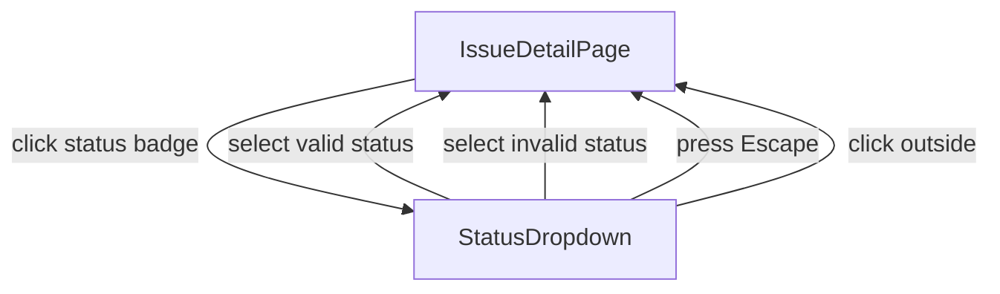

# User Flows — Implement Issue Status Transitions

## Actors

| Actor | Description |
|-------|-------------|
| Authenticated User | User with a valid session who can view and modify issues |

## Flow Inventory

### Issue Detail: Change Issue Status

**Actor**: Authenticated User  
**Entry**: User on `/issues/:id` detail page  
**Exit**: User remains on same detail page with updated status

#### Screen List

| Screen | States Visited | Description |
|--------|----------------|-------------|
| IssueDetailPage | populated, loading, error | User views issue details including current status badge |
| StatusDropdown | populated, empty | Dropdown list of workflow statuses triggered from the status badge |
| ToastNotification | success, error | Feedback overlay after transition attempt |

#### Navigation Graph

#### State Transitions

| From | Action | To | Notes |
|------|--------|----|-------|
| IssueDetailPage | User clicks status badge | StatusDropdown opened | Dropdown overlays the page |
| StatusDropdown | User selects valid target status | IssueDetailPage (updated) | Button shows spinner, on success status updates, toast appears |
| StatusDropdown | User selects invalid target status | IssueDetailPage (reverted) | Status badge reverts, error toast displays BUSINESS_RULE_ERROR |
| IssueDetailPage (loading) | API request completes | IssueDetailPage (populated or error) | Loading spinner on status button resolves |
| IssueDetailPage | Network failure during transition | StatusDropdown closed, IssueDetailPage | Status reverts, error toast shows |
