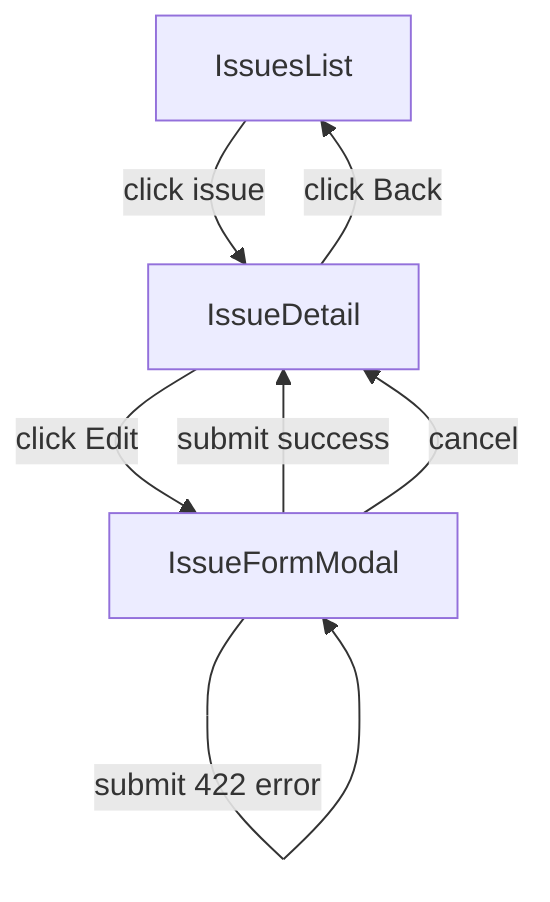

# User Flows — Implement PATCH /issues/{id}/assignee Endpoint

## Actors

| Actor | Description |
|-------|-------------|
| Authenticated User | Signed-in user who can view and edit issues within their team |

## Flow Inventory

### Issue Management: Change Assignee

**Actor**: Authenticated User  
**Entry**: Issue detail page (`/issues/:id`)  
**Exit**: Issue detail page with updated assignee, or back to issues list

#### Screen List

| Screen | States Visited | Description |
|--------|----------------|-------------|
| Issue Detail Page | populated, loading, error | Displays issue metadata including assignee; entry point for editing |
| Issue Form Modal (Edit) | populated, submitting, error | Overlay form with assignee selector; submit triggers `assignIssue` |
| Issues List | populated, loading, error | List view where assignee change is reflected after navigation back |

#### Navigation Graph



#### State Transitions

| From | Action | To | Notes |
|------|--------|----|-------|
| Issue Detail | Click "Edit" | Issue Form Modal | Modal opens pre-filled with current assignee |
| Issue Form Modal | Submit with valid assigneeId | Issue Detail | Optimistic update; on success assignee reflects new value; toast "Assignee updated" |
| Issue Form Modal | Submit with null assigneeId | Issue Detail | Optimistic unassign; on success assignee cleared; toast "Assignee updated" |
| Issue Form Modal | Submit with non-team member | Issue Form Modal | 422 BUSINESS_RULE_ERROR; toast shows error message; assignee rolls back; modal stays open |
| Issue Form Modal | Submit with network failure | Issue Detail | Rollback to previous assignee; toast "Failed to update assignee" |
| Issue Form Modal | Click Cancel | Issue Detail | No changes applied |
| Issue Detail | Click Back | Issues List | Returns to filtered issue list |

### Issue Management: Create Issue with Assignee

**Actor**: Authenticated User  
**Entry**: Issues list page  
**Exit**: Issues list with new issue visible

#### Screen List

| Screen | States Visited | Description |
|--------|----------------|-------------|
| Issues List | populated, loading, error | Shows existing issues; entry to create new |
| Issue Form Modal (Create) | populated, submitting | Create form with optional assignee field; uses existing `createIssue` API |

#### Navigation Graph

```mermaid
graph TD
    IssuesList -->|click "New Issue"| IssueFormCreate
    IssueFormCreate -->|submit success| IssuesList
    IssueFormCreate -->|cancel| IssuesList
```

#### State Transitions

| From | Action | To | Notes |
|------|--------|----|-------|
| Issues List | Click "New Issue" | Issue Form Create | Modal opens; assignee can be set on creation via existing `CreateIssueData.assigneeId` |
| Issue Form Create | Submit | Issues List | New issue appears in list with assignee set (uses existing create path — unchanged by this change) |
| Issue Form Create | Cancel | Issues List | No changes |
