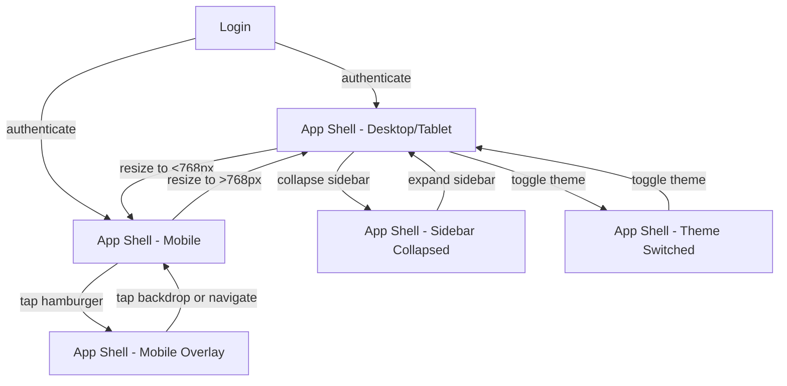
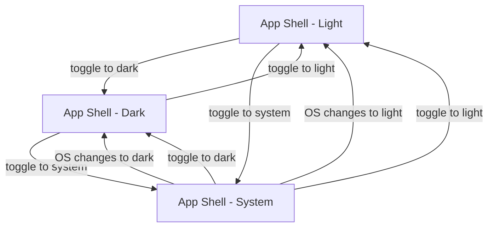

# User Flows — Layout Module: Page Structure & Theme

## Actors

| Actor | Description |
|-------|-------------|
| Authenticated User | Logged-in user with access to the application. The layout shell wraps all authenticated pages. |

## Flow Inventory

### Layout: Application Shell

**Actor**: Authenticated User  
**Entry**: User authenticates and is redirected to any authenticated page  
**Exit**: User logs out or navigates away

#### Screen List

| Screen | States Visited | Description |
|--------|----------------|-------------|
| App Shell (Desktop) | populated | Full layout: sidebar expanded, sticky header, content area. Side-by-side layout. |
| App Shell (Tablet) | populated | Same as desktop but sidebar can collapse to icon-only. Side-by-side layout. |
| App Shell (Mobile) | populated, sidebar-overlay | Sidebar hidden behind hamburger. Content takes full width. Sidebar opens as overlay. |

#### Navigation Graph



#### State Transitions

| From | Action | To | Notes |
|------|--------|----|-------|
| Login | User authenticates | App Shell (Desktop) | Default sidebar state: expanded |
| Login | User authenticates | App Shell (Mobile) | Viewport <768px; sidebar hidden |
| App Shell (Desktop) | Collapse toggle | App Shell (Sidebar Collapsed) | Sidebar reduces to icon width |
| App Shell (Sidebar Collapsed) | Expand toggle | App Shell (Desktop) | Sidebar returns to full width |
| App Shell (Sidebar Collapsed) | Page navigation | App Shell (Sidebar Collapsed) | Persisted state stays collapsed |
| App Shell (Desktop/Tablet) | Window resize <768px | App Shell (Mobile) | Sidebar auto-hides; hamburger appears |
| App Shell (Mobile) | Window resize >768px | App Shell (Desktop/Tablet) | Sidebar returns to side-by-side layout |
| App Shell (Mobile) | Tap hamburger | App Shell (Mobile Overlay) | Sidebar slides in with backdrop |
| App Shell (Mobile Overlay) | Tap nav link | App Shell (Mobile) | Navigate; overlay closes |
| App Shell (Mobile Overlay) | Tap backdrop | App Shell (Mobile) | Overlay closes; no navigation |
| App Shell (Mobile Overlay) | Press Escape | App Shell (Mobile) | Overlay closes |
| App Shell (any) | Select theme | App Shell (Theme Switched) | Theme applied instantly |
| App Shell (any) | Browser refresh | App Shell (any) | Theme and sidebar state restored from storage |

---

### Layout: Sidebar Navigation

**Actor**: Authenticated User  
**Entry**: User is on any authenticated page  
**Exit**: User navigates to a different page

#### Screen List

| Screen | States Visited | Description |
|--------|----------------|-------------|
| App Shell | populated | Sidebar shows navigation links: Issues, Projects, Cycles, and team selector |
| App Shell (Mobile Overlay) | populated | Same nav links displayed in overlay mode |

#### Navigation Graph

```mermaid
graph TD
    A[App Shell] -->|click Issues| B[/Issues Page]
    A -->|click Projects| C[/Projects Page]
    A -->|click Cycles| D[/Cycles Page]
    B -->|sidebar nav link| A
    C -->|sidebar nav link| A
    D -->|sidebar nav link| A
```

#### State Transitions

| From | Action | To | Notes |
|------|--------|----|-------|
| App Shell | Click Issues link | Issues Page | Active link highlighted in sidebar |
| App Shell | Click Projects link | Projects Page | Active link highlighted in sidebar |
| App Shell | Click Cycles link | Cycles Page | Active link highlighted in sidebar |
| Any page | Click team selector | Team page | Context switches to selected team |

---

### Layout: Theme Switching

**Actor**: Authenticated User  
**Entry**: User is on any page  
**Exit**: Theme is applied and preference is saved

#### Screen List

| Screen | States Visited | Description |
|--------|----------------|-------------|
| App Shell (Light) | populated | Default light theme applied |
| App Shell (Dark) | populated | Dark theme applied |
| App Shell (System) | populated | Follows OS preference dynamically |

#### Navigation Graph



#### State Transitions

| From | Action | To | Notes |
|------|--------|----|-------|
| App Shell (Light) | Select dark theme | App Shell (Dark) | Theme changes instantly |
| App Shell (Light) | Select system theme | App Shell (System) | Follows OS preference |
| App Shell (Dark) | Select light theme | App Shell (Light) | Theme changes instantly |
| App Shell (Dark) | Select system theme | App Shell (System) | Follows OS preference |
| App Shell (System) | OS switches to dark | App Shell (Dark) | Reactive to OS theme change |
| App Shell (System) | OS switches to light | App Shell (Light) | Reactive to OS theme change |
| App Shell (any) | Browser refresh | App Shell (saved theme) | Preference restored from local storage |
| App Shell (none — first visit) | — | App Shell (System) | Defaults to system preference |
