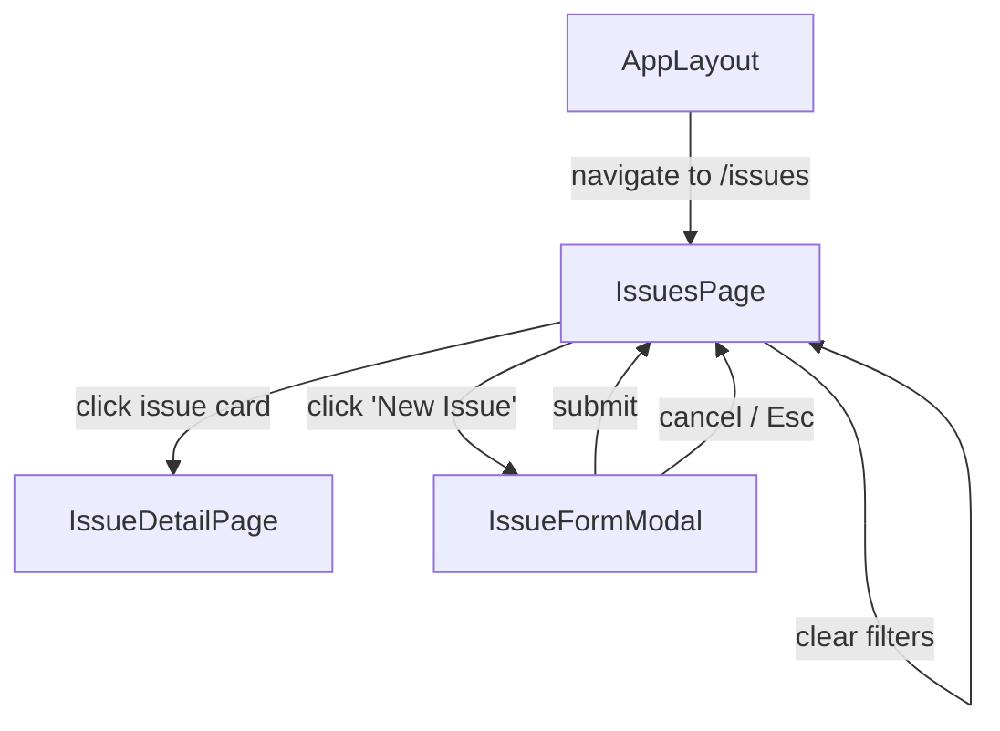
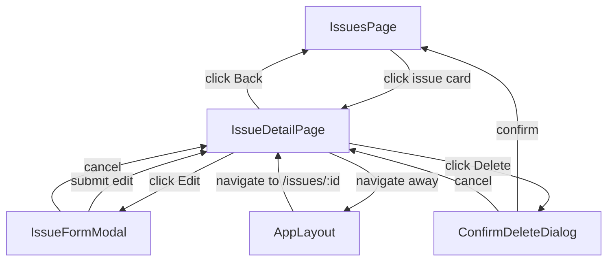
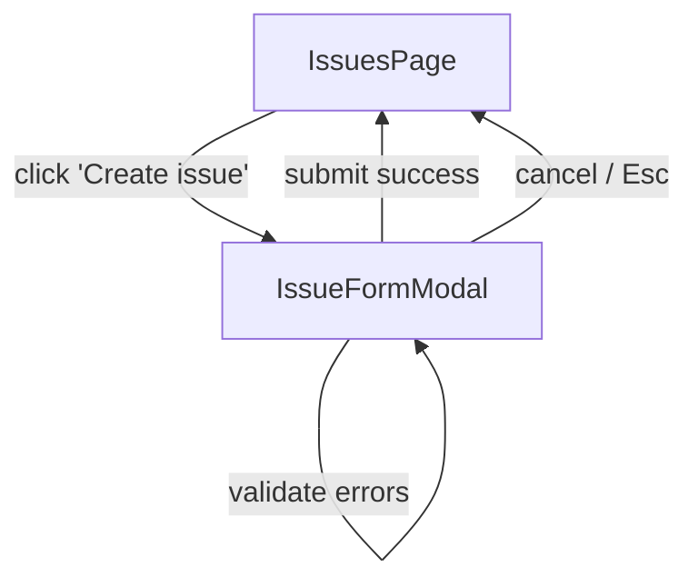
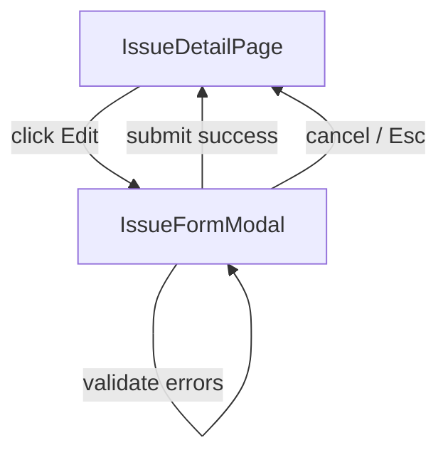

# User Flows — Work Module: Issues Store & UI Components

## Actors

| Actor | Description |
|-------|-------------|
| Authenticated User | User who has logged in and can view, create, edit, and filter issues |

## Flow Inventory

### Work Module: Browse and Filter Issues

**Actor**: Authenticated User  
**Entry**: Navigate to `/issues` (via sidebar link, keyboard shortcut `G then I`, or command palette)  
**Exit**: Click an issue card to navigate to detail, or navigate away via sidebar/header

#### Screen List

| Screen | States Visited | Description |
|--------|----------------|-------------|
| IssuesPage | loading, populated, empty, error | Displays IssueFilters bar + IssueList of filtered IssueCards |

#### Navigation Graph

#### State Transitions

| From | Action | To | Notes |
|------|--------|----|-------|
| AppLayout | Click "Issues" in sidebar | IssuesPage | Entry point |
| IssuesPage | Data loads successfully | IssuesPage (populated) | Issues render as IssueCards |
| IssuesPage | No data returned | IssuesPage (empty) | Show "No issues yet" + create button |
| IssuesPage | API request fails | IssuesPage (error) | Show error with retry option |
| IssuesPage | Select filter value | IssuesPage | IssuesStore filters update, list re-renders |
| IssuesPage | Click "Clear filters" | IssuesPage | All filters reset to defaults |
| IssuesPage | Click issue card | IssueDetailPage | Sets `selectedIssueId` |
| IssuesPage | Click "Create issue" | IssueFormModal | Modal opens in create mode |

---

### Work Module: View Issue Detail

**Actor**: Authenticated User  
**Entry**: Click an IssueCard on IssuesPage, or navigate directly to `/issues/:id`  
**Exit**: Navigate back to issues list, or navigate away via sidebar/header

#### Screen List

| Screen | States Visited | Description |
|--------|----------------|-------------|
| IssueDetailPage | loading, populated, not-found, error | Full issue view: title, description, metadata, labels, comments |

#### Navigation Graph

#### State Transitions

| From | Action | To | Notes |
|------|--------|----|-------|
| IssuesPage | Click issue card | IssueDetailPage | `selectedIssueId` set |
| Direct URL | Navigate to `/issues/:id` | IssueDetailPage (loading) | Fetch issue by ID |
| IssueDetailPage | Data loads | IssueDetailPage (populated) | Full detail rendered |
| IssueDetailPage | Issue not found | IssueDetailPage (not-found) | Show "Issue not found" |
| IssueDetailPage | API error | IssueDetailPage (error) | Retry option |
| IssueDetailPage | Click Edit | IssueFormModal | Pre-fills with current data |
| IssueFormModal | Submit edit | IssueDetailPage (populated) | Issue re-rendered with updates |
| IssueDetailPage | Click Delete | ConfirmDeleteDialog | Confirmation required |
| ConfirmDeleteDialog | Confirm delete | IssuesPage | Issue removed from store |
| ConfirmDeleteDialog | Cancel delete | IssueDetailPage | No change |

---

### Work Module: Create Issue

**Actor**: Authenticated User  
**Entry**: Click "Create issue" button on IssuesPage (or press `C` keyboard shortcut)  
**Exit**: Form submitted successfully and modal closes, or user cancels

#### Screen List

| Screen | States Visited | Description |
|--------|----------------|-------------|
| IssueFormModal | create-submitting, create-validation-error | Modal with IssueForm in create mode |

#### Navigation Graph

#### State Transitions

| From | Action | To | Notes |
|------|--------|----|-------|
| IssuesPage | Click "Create issue" | IssueFormModal (create) | Modal opens, backdrop covers page |
| IssueFormModal | Validation errors | IssueFormModal | Inline errors shown, form stays open |
| IssueFormModal | Submit valid form | IssueFormModal (submitting) | Button shows spinner, form disabled |
| IssueFormModal | API success | IssuesPage | Toast shown, new issue appears in list |
| IssueFormModal | API error | IssueFormModal | Error displayed, form remains filled |
| IssueFormModal | Cancel / Esc | IssuesPage | Modal closes, no state change |

---

### Work Module: Edit Issue

**Actor**: Authenticated User  
**Entry**: Click Edit button on IssueDetailPage  
**Exit**: Changes saved and modal closes, or user cancels

#### Screen List

| Screen | States Visited | Description |
|--------|----------------|-------------|
| IssueFormModal | edit, edit-submitting, edit-validation-error | Modal with IssueForm in edit mode |

#### Navigation Graph

#### State Transitions

| From | Action | To | Notes |
|------|--------|----|-------|
| IssueDetailPage | Click Edit | IssueFormModal (edit) | Form pre-filled with current values |
| IssueFormModal | Validation errors | IssueFormModal | Inline errors shown |
| IssueFormModal | Submit valid form | IssueFormModal (submitting) | Button spinner, form disabled |
| IssueFormModal | API success | IssueDetailPage | Toast, issue re-rendered |
| IssueFormModal | API error | IssueFormModal | Error, form preserved |
| IssueFormModal | Cancel / Esc | IssueDetailPage | No changes applied |
