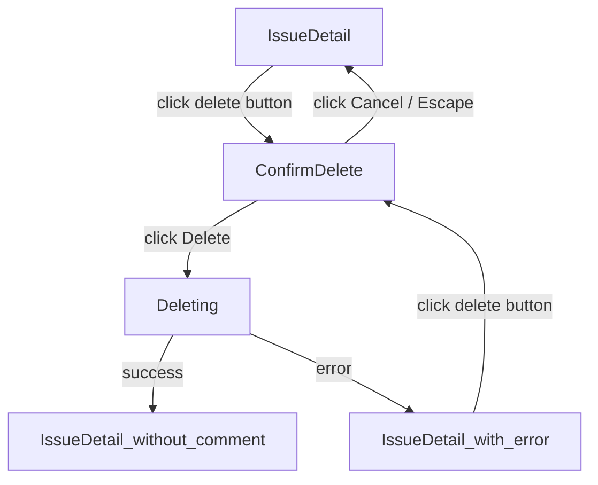

# User Flows — Delete Comment on Issue

## Actors

| Actor | Description |
|-------|-------------|
| Comment Author | Authenticated user who wrote the comment; can edit and delete their own comments |
| Reader | Authenticated user viewing the issue; cannot delete others' comments |

## Flow Inventory

### Issue Comments: Delete Comment

**Actor**: Comment Author  
**Entry**: Issue detail page (`/issues/:id`) with comments loaded  
**Exit**: Same page — comment removed from list, toast confirmation shown

#### Screen List

| Screen | States Visited | Description |
|--------|----------------|-------------|
| IssueDetail | loading, populated, error, success | Issue page with comment list; delete occurs inline |

#### Navigation Graph

#### State Transitions

| From | Action | To | Notes |
|------|--------|----|-------|
| IssueDetail (comment list) | Click delete button (author only) | ConfirmDelete | Delete button visible only for comment author |
| ConfirmDelete | Click "Cancel" | IssueDetail (comment list) | Focus returns to delete button |
| ConfirmDelete | Press Escape | IssueDetail (comment list) | Same as Cancel |
| ConfirmDelete | Click "Delete" | Deleting | Show loading state on confirm button |
| Deleting | API success (204) | IssueDetail (comment removed) | Comment removed from list; toast "Comment deleted"; focus moves to next comment or heading |
| Deleting | API error (403/500) | IssueDetail (with error) | Error message shown; comment remains; user can retry |
| IssueDetail (with error) | Click delete button | ConfirmDelete | Retry possible after error |
