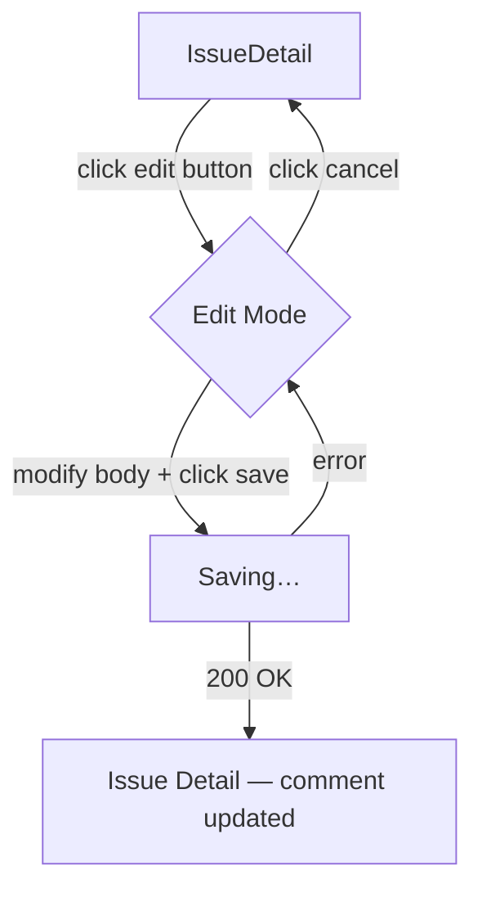

# User Flows — Edit Comment

## Actors

| Actor | Description |
|-------|-------------|
| Comment Author | Authenticated user viewing an issue who is the author of a comment |
| Non-Author Viewer | Authenticated user viewing an issue who is NOT the author of the comment |

## Flow Inventory

### Comments: Edit Own Comment

**Actor**: Comment Author  
**Entry**: Issue detail page (route `/issues/:id`) with comments section loaded  
**Exit**: Issue detail page — same screen, comment updated

#### Screen List

| Screen | States Visited | Description |
|--------|----------------|-------------|
| Issue Detail | loading, populated, error | Existing screen. Comments section shows `CommentList` with `CommentCard` per comment. Comment author sees an edit button on their own comment. |

#### Navigation Graph

#### State Transitions

| From | Action | To | Notes |
|------|--------|----|-------|
| Issue Detail (display mode) | Click edit button on own comment | Edit Mode | Comment body replaced with textarea; save + cancel buttons appear |
| Edit Mode | Modify body and click save | Saving | Textarea and save button disabled during request |
| Saving | PATCH returns 200 | Issue Detail (updated) | Comment body updated in local state; success toast; edit mode exits |
| Saving | PATCH fails (network/403) | Edit Mode | Error toast; textarea preserves unsaved edits |
| Edit Mode | Click cancel | Issue Detail (unchanged) | Original body restored; edit mode exits |
| Edit Mode | Press Escape | Issue Detail (unchanged) | Same as cancel |

---
