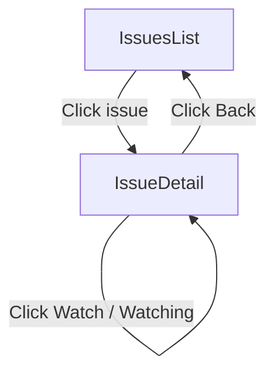

# User Flows — Issue Watchers

## Actors

| Actor | Description |
|-------|-------------|
| Authenticated User | Team member who can view issues and toggle watch state. Can only add/remove themselves as watchers. |

## Flow Inventory

### Issue Detail: Watch/Unwatch Issue

**Actor**: Authenticated User  
**Entry**: Navigate to `/issues/:id` (issue detail page)  
**Exit**: Stays on the same page

#### Screen List

| Screen | States Visited | Description |
|--------|----------------|-------------|
| IssueDetailPage | loading, populated, empty (no watchers), error | Displays issue metadata, watcher list, and a watch toggle button |

#### Navigation Graph

No new screens are introduced. All watcher interactions occur inline on the existing IssueDetailPage.

#### State Transitions

| From | Action | To | Notes |
|------|--------|----|-------|
| IssueDetail (loading) | Watchers fetched ok | IssueDetail (populated) | Watcher list + toggle rendered |
| IssueDetail (loading) | Watchers fetch fails | IssueDetail (error) | Error message + retry shown |
| IssueDetail (populated) | Click "Watch" | IssueDetail (populated) | Optimistic add; POST on success, revert on error |
| IssueDetail (populated) | Click "Watching" | IssueDetail (populated) | Optimistic remove; DELETE on success, revert on error |
| IssueDetail (populated) | Watch POST returns 409 | IssueDetail (populated) | Conflict handled; state reverted, server state re-fetched |
| IssueDetail (populated) | Watch action returns 422 | IssueDetail (populated) | Business rule error toast; state reverted |
| IssueDetail (error) | Click retry | IssueDetail (loading) | Re-fetches watchers |
| IssueDetail (empty) | Click "Watch" | IssueDetail (populated) | User added as first watcher |
| IssueDetail (populated) | No watchers remain after removal | IssueDetail (empty) | "No watchers yet" rendered |
