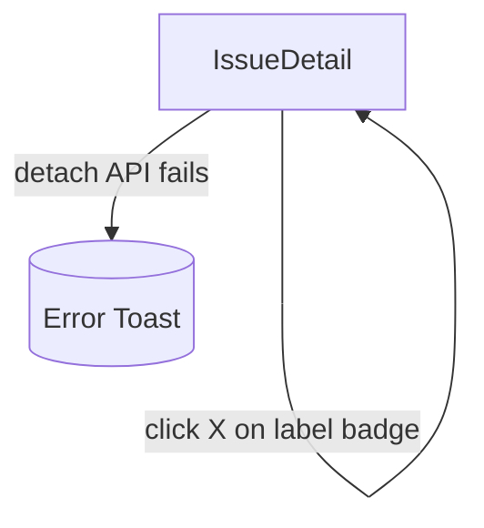

# User Flows — Label Management for Issues

## Actors

| Actor | Description |
|-------|-------------|
| Authenticated User | Logged-in user with access to view and edit issues on the issues board |

## Flow Inventory

### Issues: View Issue Labels

**Actor**: Authenticated User  
**Entry**: Navigate to `/issues/{id}` from issues list or direct URL  
**Exit**: Back to issues list, or stay to manage labels

#### Screen List

| Screen | States Visited | Description |
|--------|----------------|-------------|
| IssueDetailPage | loading, populated, error, not-found | Shows issue metadata, labels section, comments, and action buttons |

#### Navigation Graph

```mermaid
graph TD
    IssuesList[/issues] -->|click issue row| IssueDetail[/issues/:id]
    IssueDetail -->|click Back| IssuesList
    IssueDetail -->|click Edit| EditModal[(Edit Issue Modal)]
    EditModal -->|save/close| IssueDetail
    IssueDetail -->|click Delete| DeleteDialog[(Confirm Delete Dialog)]
    DeleteDialog -->|confirm| IssuesList
    DeleteDialog -->|cancel| IssueDetail
```

#### State Transitions

| From | Action | To | Notes |
|------|--------|----|-------|
| IssuesList | Click issue row | IssueDetail (loading) | Issue ID from URL param; `fetchIssueLabels` fires |
| IssueDetail (loading) | Data loaded | IssueDetail (populated) | Labels section renders label badges |
| IssueDetail (loading) | API error | IssueDetail (error) | Error banner displayed with retry |
| IssueDetail (loading) | Issue not found | IssueDetail (not-found) | "Issue not found" empty state |
| IssueDetail (populated) | Click Back | IssuesList | `deselectIssue` fires |

---

### Issues: Attach Label

**Actor**: Authenticated User  
**Entry**: Issue detail page with labels section visible  
**Exit**: Back to issue detail (updated labels)

#### Screen List

| Screen | States Visited | Description |
|--------|----------------|-------------|
| IssueDetailPage | populated (labels loaded) | Labels shown as removable badges |
| LabelPicker | closed, open-populated, open-empty | Dropdown/popover listing available label definitions |

#### Navigation Graph

```mermaid
graph TD
    IssueDetail -->|click "Add label"| LabelPicker[(Label Picker)]
    LabelPicker -->|select label| IssueDetail
    LabelPicker -->|click outside / Escape| IssueDetail
    IssueDetail -->|attach API fails| Toast[(Error Toast)]
```

#### State Transitions

| From | Action | To | Notes |
|------|--------|----|-------|
| IssueDetail (populated) | Click "Add label" | LabelPicker (open) | Focus trapped in picker |
| LabelPicker (open) | Select a label | IssueDetail (optimistic attach) | Label badge appears immediately |
| IssueDetail (optimistic) | API success | IssueDetail (confirmed) | No toast on success |
| IssueDetail (optimistic) | API failure | IssueDetail (rollback) | Label removed; toast "Failed to attach label" |
| LabelPicker (open) | Click outside / Escape | LabelPicker (closed) | Focus returns to "Add label" button |

---

### Issues: Detach Label

**Actor**: Authenticated User  
**Entry**: Issue detail page with label badges visible  
**Exit**: Back to issue detail (updated labels)

#### Screen List

| Screen | States Visited | Description |
|--------|----------------|-------------|
| IssueDetailPage | populated (one or more labels) | Each label badge has a remove (X) button |

#### Navigation Graph



#### State Transitions

| From | Action | To | Notes |
|------|--------|----|-------|
| IssueDetail (populated) | Click X on label badge | IssueDetail (optimistic detach) | Badge removed immediately |
| IssueDetail (optimistic) | API success | IssueDetail (confirmed, one fewer label) | If last label, fallback to empty state |
| IssueDetail (optimistic) | API failure | IssueDetail (rollback) | Badge restored; toast "Failed to detach label" |

---

### Issues: Manage Labels in Issue Form

**Actor**: Authenticated User  
**Entry**: Click "Edit" on issue detail or "Create Issue" on issues list  
**Exit**: Form closed or submitted

#### Screen List

| Screen | States Visited | Description |
|--------|----------------|-------------|
| IssueFormModal | create, edit | Modal with label multi-select field |

#### Navigation Graph

```mermaid
graph TD
    IssuesList -->|click "New Issue"| CreateForm[(Issue Form: Create)]
    IssueDetail -->|click Edit| EditForm[(Issue Form: Edit)]
    CreateForm -->|submit| IssuesList
    CreateForm -->|cancel| IssuesList
    EditForm -->|submit| IssueDetail
    EditForm -->|cancel| IssueDetail
```

#### State Transitions

| From | Action | To | Notes |
|------|--------|----|-------|
| IssuesList | Click "New Issue" | CreateForm | Labels field shows all available labels, none selected |
| IssueDetail | Click "Edit" | EditForm | Labels field pre-selected with current issue labels |
| CreateForm | Select/deselect labels in multi-select | CreateForm (updated) | Local state only; submitted with `labelIds` |
| EditForm | Select/deselect labels | EditForm (updated) | Local state only; submitted with `labelIds` |
| EditForm | Submit | IssueDetail | Optimistic update on the issue's labels list |
| CreateForm/EditForm | Cancel / close | Previous screen | Label selections discarded |
