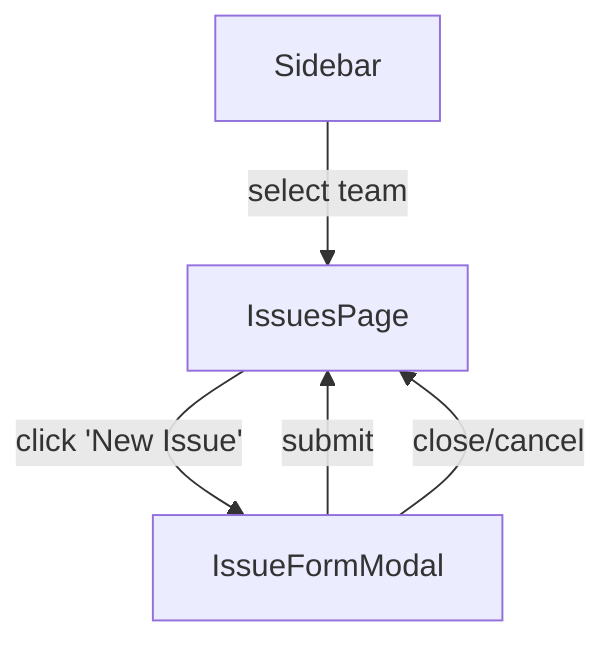

# User Flows — Fix: Create Issue Missing Required teamId Field

## Actors

| Actor | Description |
|-------|-------------|
| Authenticated User | Logged-in user who can select a team and create issues within that team |

## Flow Inventory

### Issue Creation: Create Issue with Team Context

**Actor**: Authenticated User  
**Entry**: User is on any page with the sidebar visible  
**Exit**: Issue created and visible in the issue list

#### Screen List

| Screen | States Visited | Description |
|--------|----------------|-------------|
| IssuesPage | loading, populated, error | Main issue list view; user clicks "New Issue" to trigger creation |
| IssueFormModal | open (populated), submitting, error | Modal with create-issue form; includes validation, submit, and error states |

#### Navigation Graph

#### State Transitions

| From | Action | To | Notes |
|------|--------|----|-------|
| Sidebar | Select a team | (same page) | Team ID stored in shared context/store; propagates across pages |
| IssuesPage | Click "New Issue" button | IssueFormModal | Team context must be available — if missing, show error |
| IssueFormModal | Submit form with valid data | IssuesPage | POST /issues includes teamId; success toast; issue added to list |
| IssueFormModal | Submit fails (network/validation) | IssueFormModal | Error toast; modal stays open; form data preserved |
| IssueFormModal | Click close / Escape | IssuesPage | No issue created; modal dismissed |
