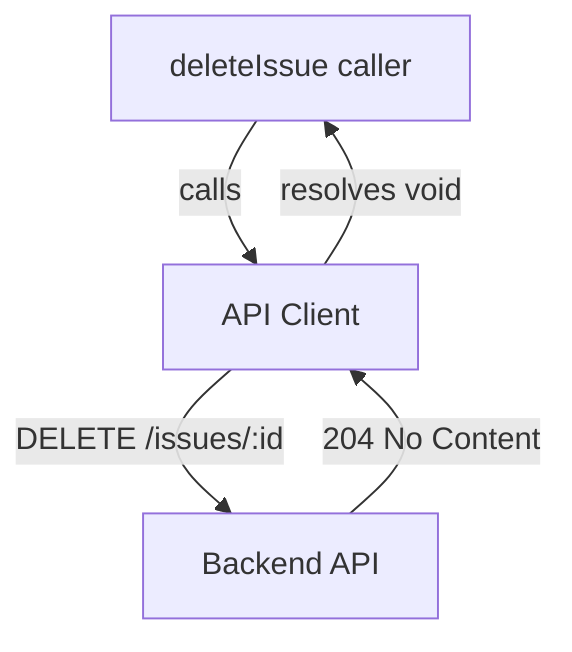

# User Flows — Fix Delete Issue Response Type

## Actors

| Actor | Description |
|-------|-------------|
| Developer | TypeScript consumer importing `deleteIssue` from the issue API module |

## Flow Inventory

### Issue Management: Delete Issue

**Actor**: Developer  
**Entry**: Import and call `deleteIssue(id)`  
**Exit**: Promise resolves with void

#### Screen List

| Screen | States Visited | Description |
|--------|----------------|-------------|
| N/A | N/A | API-layer change — no UI screens affected |

#### Navigation Graph

#### State Transitions

| From | Action | To | Notes |
|------|--------|----|-------|
| idle | `deleteIssue(id)` called | loading | Promise pending |
| loading | API returns 204 | success | Resolves with void (undefined) |
| loading | API returns error | error | Rejects with API error |
