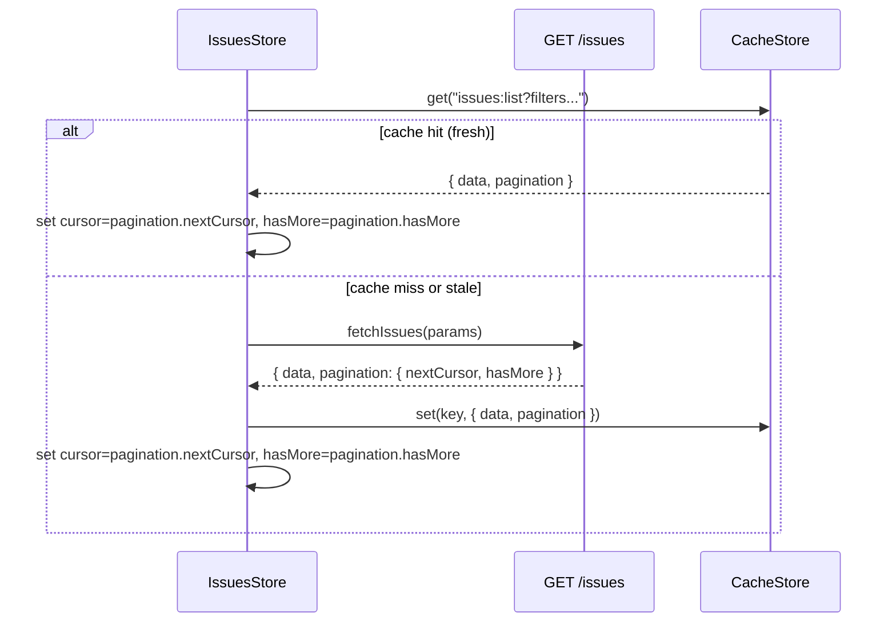

# User Flows — Fix Pagination Response Shape

## Actors

| Actor | Description |
|-------|-------------|
| User | Browses the issues list, scrolls to load more issues |

## Flow Inventory

### Issues: Browse Paginated List

**Actor**: User  
**Entry**: Navigate to `/issues`  
**Exit**: Click an issue card to view detail

#### Screen List

| Screen | States Visited | Description |
|--------|----------------|-------------|
| IssuesList | loading, populated, empty, error | Displays issues with paginated loading |

#### Navigation Graph

```mermaid
graph TD
    IssuesList -->|scroll to bottom| LoadMore
    LoadMore -->|hasMore=true| AppendIssues
    LoadMore -->|hasMore=false\|cursor=null| Stop
    AppendIssues --> IssuesList
```

#### State Transitions

| From | Action | To | Notes |
|------|--------|----|-------|
| IssuesList (populated) | User scrolls to bottom | LoadMore | `loadNextPage()` triggered |
| LoadMore | API returns `pagination.nextCursor` non-null + `hasMore: true` | AppendIssues | Issues appended, cursor updated |
| LoadMore | API returns `pagination.nextCursor` null + `hasMore: false` | Stop | No further page loads |
| IssuesList | User clicks an issue card | IssueDetail | Navigate to `/issues/:id` |

#### Data Flow (Pagination)



This is a data-layer-only change. No user-facing UI or navigation changes.
