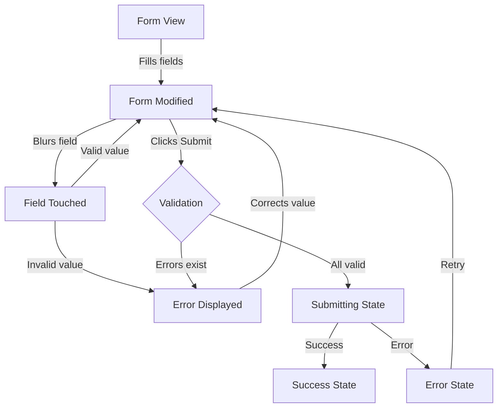
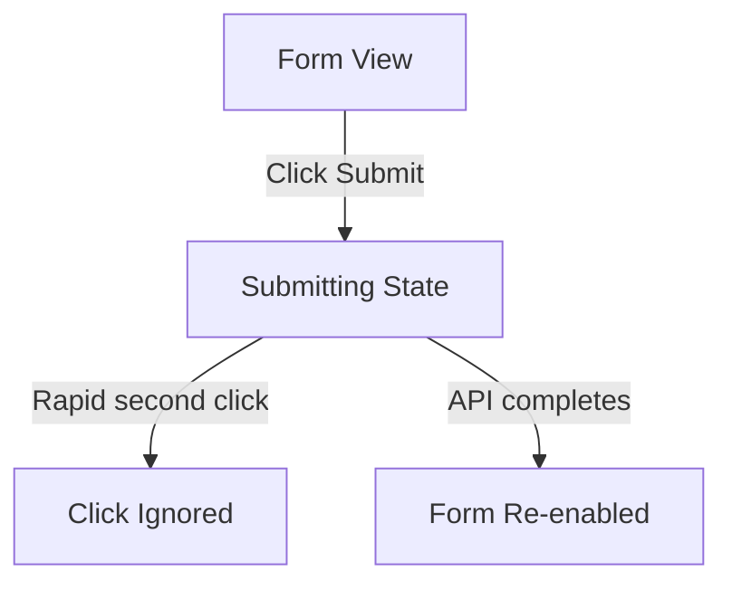

# User Flows — Form Module — Validation & Submission

## Actors

| Actor | Description |
|-------|-------------|
| End User | Interacts with forms to input data, triggers validation, submits forms |
| Developer | Configures form schemas, validation rules, and field wrappers |

## Flow Inventory

### Form: Standard Form Submission

**Actor**: End User  
**Entry**: User navigates to any page containing a form (issue create, project settings, profile edit)  
**Exit**: Form submitted successfully → success state or redirect; or user cancels

#### Screen List

| Screen | States Visited | Description |
|--------|----------------|-------------|
| Form View | populated, error, success | Initial form with default values; validation errors display on touched fields; success state after submission |

#### Navigation Graph



#### State Transitions

| From | Action | To | Notes |
|------|--------|----|-------|
| Form View | User focuses and blurs a field | Field Touched | touched[field] = true |
| Field Touched | User enters invalid value | Error Displayed | Error shown only for touched fields |
| Error Displayed | User corrects value | Form Modified | Error clears when valid |
| Form Modified | User clicks Submit | Submitting State | isSubmitting = true, form disabled |
| Submitting State | API success | Success State | isSubmitting = false, success callback |
| Submitting State | API failure | Error State | isSubmitting = false, error callback |

---

### Form: Double Submission Prevention

**Actor**: End User  
**Entry**: User rapidly clicks submit button  
**Exit**: Only one submission occurs

#### Screen List

| Screen | States Visited | Description |
|--------|----------------|-------------|
| Form View | populated, submitting | Submit button shows loading state, form is disabled |

#### Navigation Graph



#### State Transitions

| From | Action | To | Notes |
|------|--------|----|-------|
| Form View | First click on Submit | Submitting State | Button disabled, loading indicator |
| Submitting State | Second rapid click | Click Ignored | No action taken |
| Submitting State | API response received | Form Re-enabled | isSubmitting = false |

---

### Form: Async Validation Flow

**Actor**: End User  
**Entry**: User types in a field with async validation (e.g., username availability check)  
**Exit**: Async validation completes, field shows valid or invalid state

#### Screen List

| Screen | States Visited | Description |
|--------|----------------|-------------|
| Form View | populated, validating, valid, invalid | Field shows pending state during async check |

#### Navigation Graph

```mermaid
graph TD
    A[Form View] |User types| B[Validating State]
    B -->|Available| C[Valid State]
    B -->|Not available| D[Invalid State]
    D -->|User changes value| B
```

#### State Transitions

| From | Action | To | Notes |
|------|--------|----|-------|
| Form View | User types in async field | Validating State | Debounce applied |
| Validating State | Async check passes | Valid State | Error cleared |
| Validating State | Async check fails | Invalid State | Error displayed |
