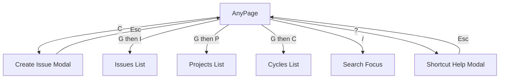
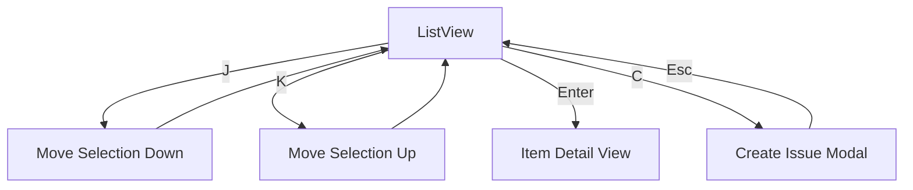
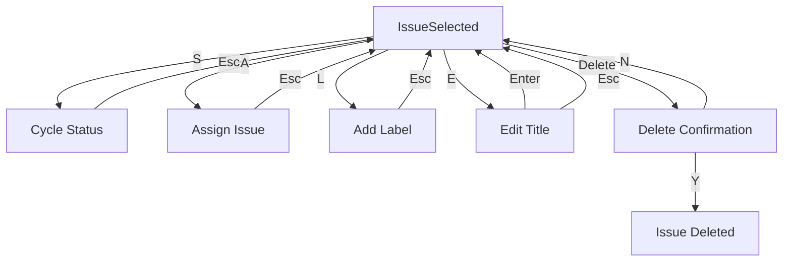
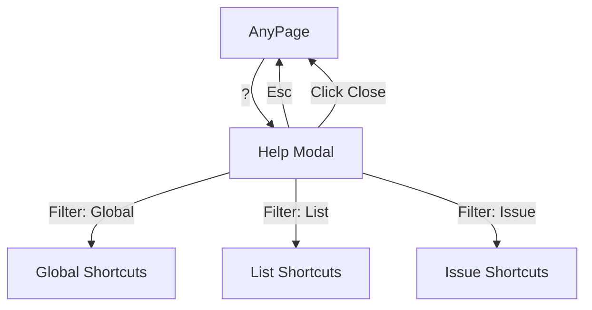
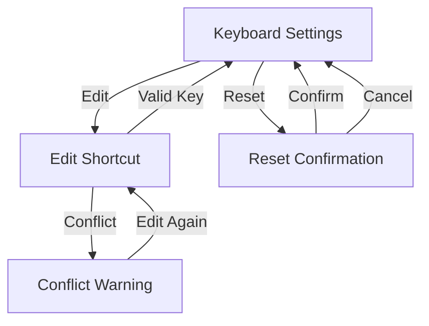
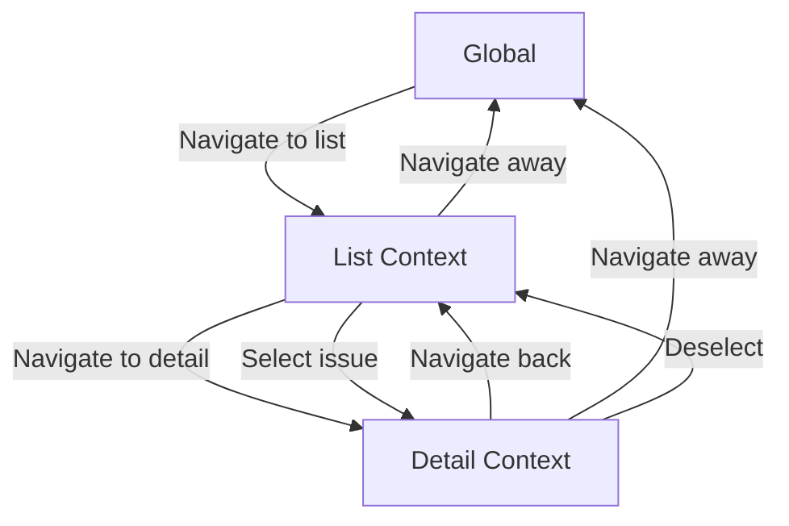

# User Flows — Keyboard Module

## Actors

| Actor | Description |
|-------|-------------|
| Power User | Keyboard-focused user who navigates and acts via shortcuts |
| Regular User | User who discovers and learns shortcuts via help modal |
| Customizer | User who personalizes keyboard shortcuts to their workflow |

## Flow Inventory

### Keyboard: Global Navigation

**Actor**: Power User  
**Entry**: Application loads on any page  
**Exit**: User navigates to target view

#### Screen List

| Screen | States Visited | Description |
|--------|----------------|-------------|
| Any Page | populated | Keyboard shortcuts are active |
| Navigation Target | loading, populated | Destination page after shortcut navigation |

#### Navigation Graph

#### State Transitions

| From | Action | To | Notes |
|------|--------|----|-------|
| Any Page | Press "C" | Create Issue Modal | Opens new issue form |
| Any Page | Press "G then I" | Issues List | Navigates to /issues |
| Any Page | Press "G then P" | Projects List | Navigates to /projects |
| Any Page | Press "G then C" | Cycles List | Navigates to /cycles |
| Any Page | Press "/" | Search Focus | Focuses search input |
| Any Page | Press "?" | Shortcut Help Modal | Opens help overlay |

---

### Keyboard: List Navigation

**Actor**: Power User  
**Entry**: User is on a list view (Issues, Projects, Cycles)  
**Exit**: User selects an item or navigates away

#### Screen List

| Screen | States Visited | Description |
|--------|----------------|-------------|
| List View | populated | List of items displayed |
| Selected Item | populated | Item highlighted/selected in list |

#### Navigation Graph

#### State Transitions

| From | Action | To | Notes |
|------|--------|----|-------|
| List View (no selection) | Press "J" | List View (first item selected) | Moves to first item |
| List View (item selected) | Press "J" | List View (next item selected) | Moves down one item |
| List View (item selected) | Press "K" | List View (previous item selected) | Moves up one item |
| List View (item selected) | Press "Enter" | Item Detail View | Opens selected item |
| List View (item selected) | Press "Esc" | List View (no selection) | Deselects current item |

---

### Keyboard: Issue Actions

**Actor**: Power User  
**Entry**: User has selected an issue in list view  
**Exit**: Action completes or user deselects

#### Screen List

| Screen | States Visited | Description |
|--------|----------------|-------------|
| List View (issue selected) | populated | Issue highlighted, shortcuts active |
| Status Change Modal | populated | Status cycle triggered |
| Assign Modal | populated | Assignee selection |
| Label Modal | populated | Label selection |
| Edit Title | populated | Inline title editing |
| Delete Confirm | populated | Deletion confirmation |

#### Navigation Graph

#### State Transitions

| From | Action | To | Notes |
|------|--------|----|-------|
| Issue Selected | Press "S" | Status Changed | Cycles to next status |
| Issue Selected | Press "A" | Assign Modal | Opens assignee picker |
| Issue Selected | Press "L" | Label Modal | Opens label picker |
| Issue Selected | Press "E" | Inline Edit | Title becomes editable |
| Issue Selected | Press "Delete" | Confirm Dialog | Asks for confirmation |
| Confirm Dialog | Press "Y" | Issue Deleted | Confirms deletion |
| Confirm Dialog | Press "N" | Issue Selected | Cancels deletion |

---

### Keyboard: Shortcut Help

**Actor**: Regular User  
**Entry**: User presses "?" on any page  
**Exit**: User closes modal

#### Screen List

| Screen | States Visited | Description |
|--------|----------------|-------------|
| Shortcut Help Modal | open | Displays all shortcuts by category |

#### Navigation Graph

#### State Transitions

| From | Action | To | Notes |
|------|--------|----|-------|
| Any Page | Press "?" | Help Modal (all) | Shows all shortcuts |
| Help Modal | Click "Global" filter | Help Modal (global) | Filters to global shortcuts |
| Help Modal | Click "List" filter | Help Modal (list) | Filters to list shortcuts |
| Help Modal | Click "Issue" filter | Help Modal (issue) | Filters to issue shortcuts |
| Help Modal | Press "Esc" | Any Page | Closes modal |

---

### Keyboard: Shortcut Customization

**Actor**: Customizer  
**Entry**: User navigates to Settings > Keyboard  
**Exit**: User saves changes or navigates away

#### Screen List

| Screen | States Visited | Description |
|--------|----------------|-------------|
| Keyboard Settings | populated | Lists all shortcuts with edit options |
| Edit Shortcut | editing | User inputs new key combination |
| Conflict Warning | error | Key combination conflict detected |
| Reset Confirmation | populated | Confirms reset to defaults |

#### Navigation Graph

#### State Transitions

| From | Action | To | Notes |
|------|--------|----|-------|
| Settings | Click "Edit" on shortcut | Edit Shortcut | Input becomes active |
| Edit Shortcut | Press valid key combo | Settings | Shortcut updated |
| Edit Shortcut | Press conflicting key | Conflict Warning | Shows error message |
| Settings | Click "Reset to defaults" | Reset Confirmation | Shows confirmation dialog |
| Reset Confirmation | Confirm reset | Settings (defaults) | All shortcuts reset |
| Reset Confirmation | Cancel | Settings | No changes made |

---

### Keyboard: Context Switching

**Actor**: Power User  
**Entry**: User navigates between views  
**Exit**: Context-appropriate shortcuts are active

#### Screen List

| Screen | States Visited | Description |
|--------|----------------|-------------|
| Global Context | active | Global shortcuts available |
| List Context | active | List + global shortcuts available |
| Detail Context | active | Detail + list + global shortcuts available |

#### Navigation Graph

#### State Transitions

| From | Action | To | Notes |
|------|--------|----|-------|
| Global Context | Navigate to /issues | List Context | J/K/Enter shortcuts active |
| List Context | Navigate to /issues/:id | Detail Context | S/A/L/E/Delete shortcuts active |
| Detail Context | Press "Esc" or navigate back | List Context | Returns to list view |
| List Context | Deselect issue | List Context | Issue shortcuts deactivate |
| List Context | Navigate to /projects | Global Context | Only global shortcuts active |
