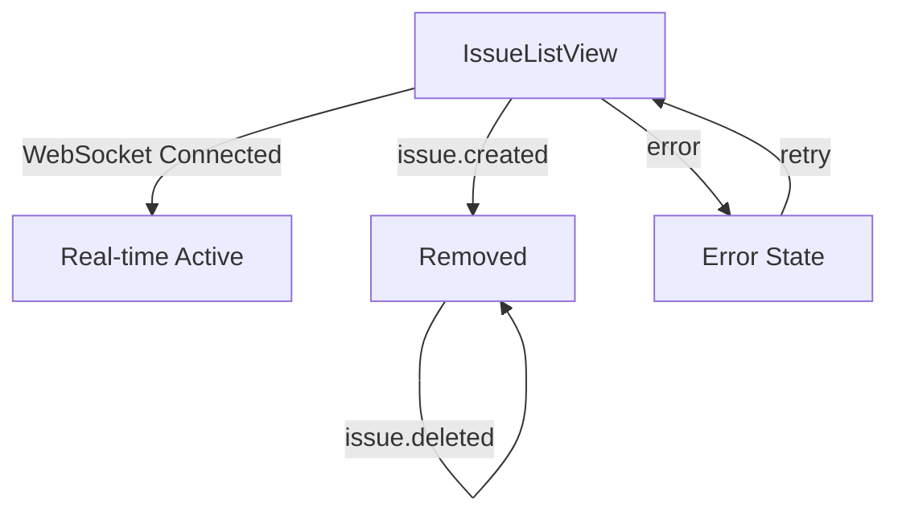
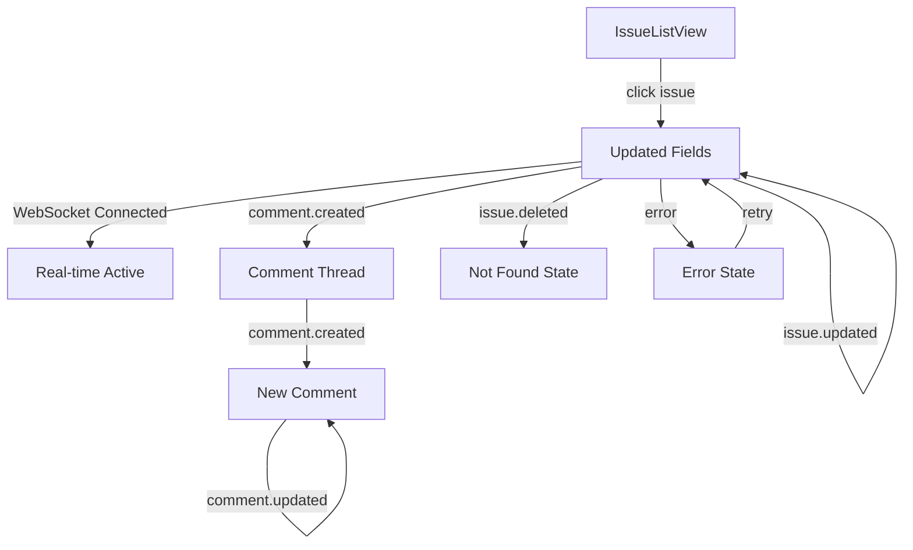
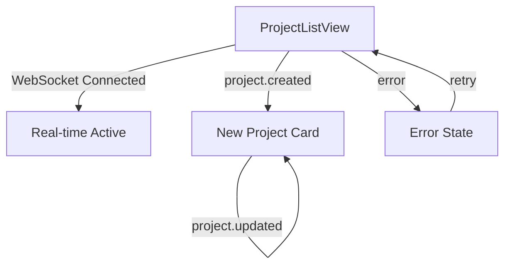
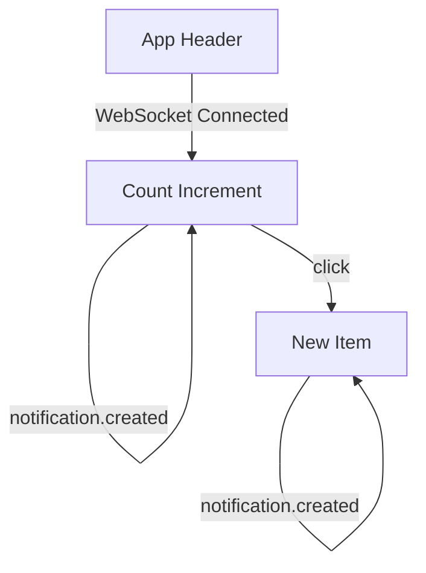

# User Flows — Real-time Issue Updates

## Actors

| Actor | Description |
|-------|-------------|
| Team Member | Authenticated user viewing and interacting with issues, projects, and cycles for their team |
| Team Lead | Team member with additional permissions to manage cycles and project assignments |

## Flow Inventory

### Issues: Real-time Issue List Updates

**Actor**: Team Member  
**Entry**: User navigates to /teams/:teamId/issues  
**Exit**: User navigates away or logs out

#### Screen List

| Screen | States Visited | Description |
|--------|----------------|-------------|
| IssueListView | loading, populated, error | Displays all issues for the team with real-time updates |
| IssueCard | populated, updated | Individual issue card showing live status and assignee changes |

#### Navigation Graph

#### State Transitions

| From | Action | To | Notes |
|------|--------|----|-------|
| loading | API response received | populated | Issues loaded and displayed |
| loading | API error | error | Show error message with retry option |
| populated | issue.created event | populated | New issue card appears at correct position |
| populated | issue.updated event | populated | Existing card updates fields in-place |
| populated | issue.statusChanged event | populated | Card moves to correct status column |
| populated | issue.deleted event | populated | Card removed from view |
| error | user clicks retry | loading | Re-fetch issues |

---

### Issues: Real-time Issue Detail Updates

**Actor**: Team Member  
**Entry**: User clicks on an issue card from the list  
**Exit**: User navigates back to issue list

#### Screen List

| Screen | States Visited | Description |
|--------|----------------|-------------|
| IssueDetailView | loading, populated, error, not-found | Displays full issue details with live comment updates |
| CommentThread | loading, populated, empty | Thread of comments with real-time additions |
| CommentCard | populated, edited | Individual comment showing edit indicators |

#### Navigation Graph

#### State Transitions

| From | Action | To | Notes |
|------|--------|----|-------|
| loading | API response received | populated | Issue details displayed |
| loading | API error | error | Show error message |
| loading | issue deleted | not-found | Show "Issue not found" state |
| populated | issue.updated event | populated | Fields update in real-time |
| populated | comment.created event | populated | New comment appears in thread |
| populated | comment.updated event | populated | Comment content updates, edited indicator shown |
| populated | issue.deleted event | not-found | Show "Issue not found" state |
| empty | comment.created event | populated | First comment added to thread |

---

### Projects: Real-time Project List Updates

**Actor**: Team Member  
**Entry**: User navigates to /teams/:teamId/projects  
**Exit**: User navigates away

#### Screen List

| Screen | States Visited | Description |
|--------|----------------|-------------|
| ProjectListView | loading, populated, error | Displays all projects for the team with real-time updates |
| ProjectCard | populated, updated | Individual project card showing live updates |

#### Navigation Graph

#### State Transitions

| From | Action | To | Notes |
|------|--------|----|-------|
| loading | API response received | populated | Projects loaded and displayed |
| loading | API error | error | Show error message with retry option |
| populated | project.created event | populated | New project card appears |
| populated | project.updated event | populated | Project card updates in-place |
| populated | project deleted | populated | Project card removed |

---

### Cycles: Real-time Cycle List Updates

**Actor**: Team Member  
**Entry**: User navigates to /teams/:teamId/cycles  
**Exit**: User navigates away

#### Screen List

| Screen | States Visited | Description |
|--------|----------------|-------------|
| CycleListView | loading, populated, error | Displays all cycles for the team with real-time updates |
| CycleCard | populated, upcoming, active, completed | Individual cycle card with status badge |

#### Navigation Graph

#### State Transitions

| From | Action | To | Notes |
|------|--------|----|-------|
| loading | API response received | populated | Cycles loaded and displayed |
| loading | API error | error | Show error message with retry option |
| populated | cycle.created event | populated | New cycle card appears as "Upcoming" |
| populated | cycle.activated event | populated | Cycle status changes to "Active" |
| populated | cycle.completed event | populated | Cycle status changes to "Completed" |

---

### Notifications: Real-time Notification Updates

**Actor**: Team Member  
**Entry**: User is authenticated and connected  
**Exit**: User logs out

#### Screen List

| Screen | States Visited | Description |
|--------|----------------|-------------|
| NotificationBadge | loading, populated | Header badge showing unread notification count |
| NotificationDropdown | loading, populated, empty | Dropdown list of recent notifications |

#### Navigation Graph

#### State Transitions

| From | Action | To | Notes |
|------|--------|----|-------|
| loading | initial state | populated | Badge shows current count |
| populated | notification.created event | populated | Badge count increments |
| populated | user clicks badge | populated dropdown | Dropdown opens showing notifications |
| populated dropdown | notification.created event | populated dropdown | New notification appears at top |
| populated dropdown | user clicks outside | populated | Dropdown closes |

---

## Authentication Gates

All real-time flows require:
1. User must be authenticated (valid session token)
2. WebSocket connection must be established
3. User must have access to the team being viewed

## Cross-Flow State Management

| Event Type | Stores Affected | Flows Impacted |
|------------|-----------------|----------------|
| issue.* | IssuesStore | Issue List, Issue Detail |
| comment.* | IssuesStore (nested) | Issue Detail |
| project.* | ProjectsStore | Project List |
| cycle.* | CyclesStore | Cycle List |
| notification.* | NotificationsStore | Notifications |
