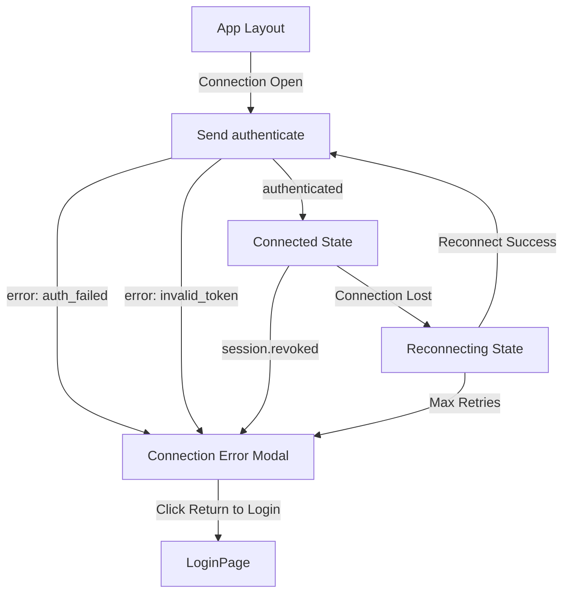
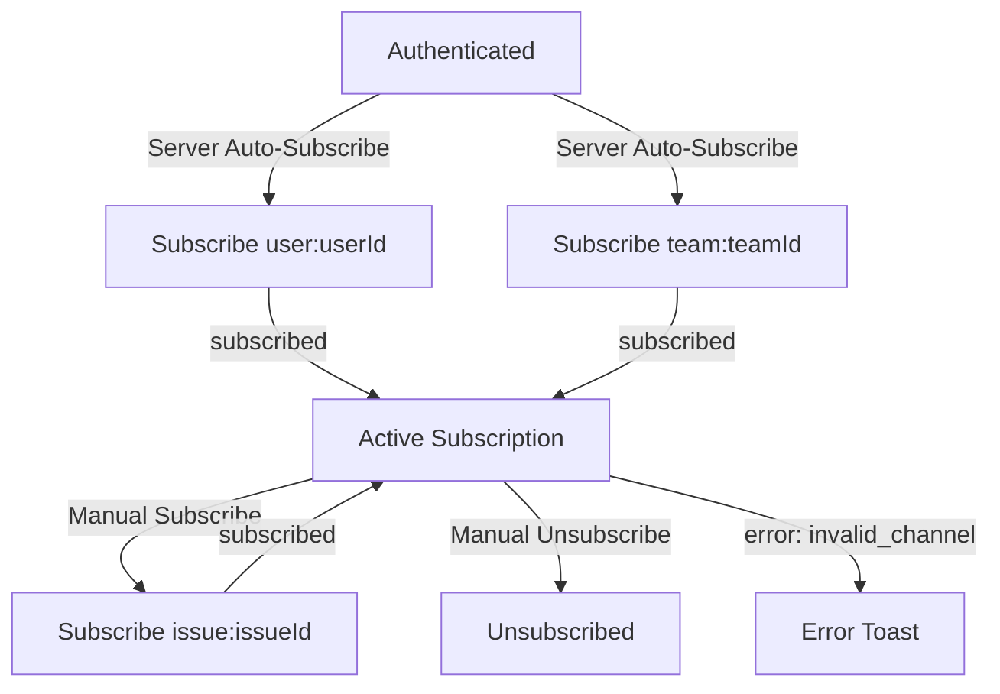
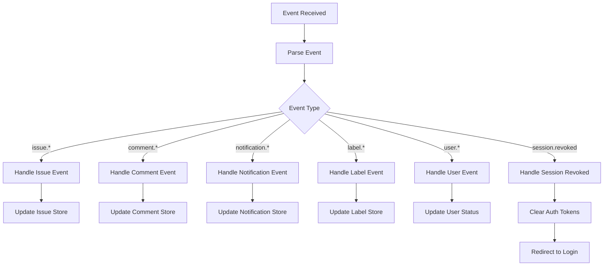
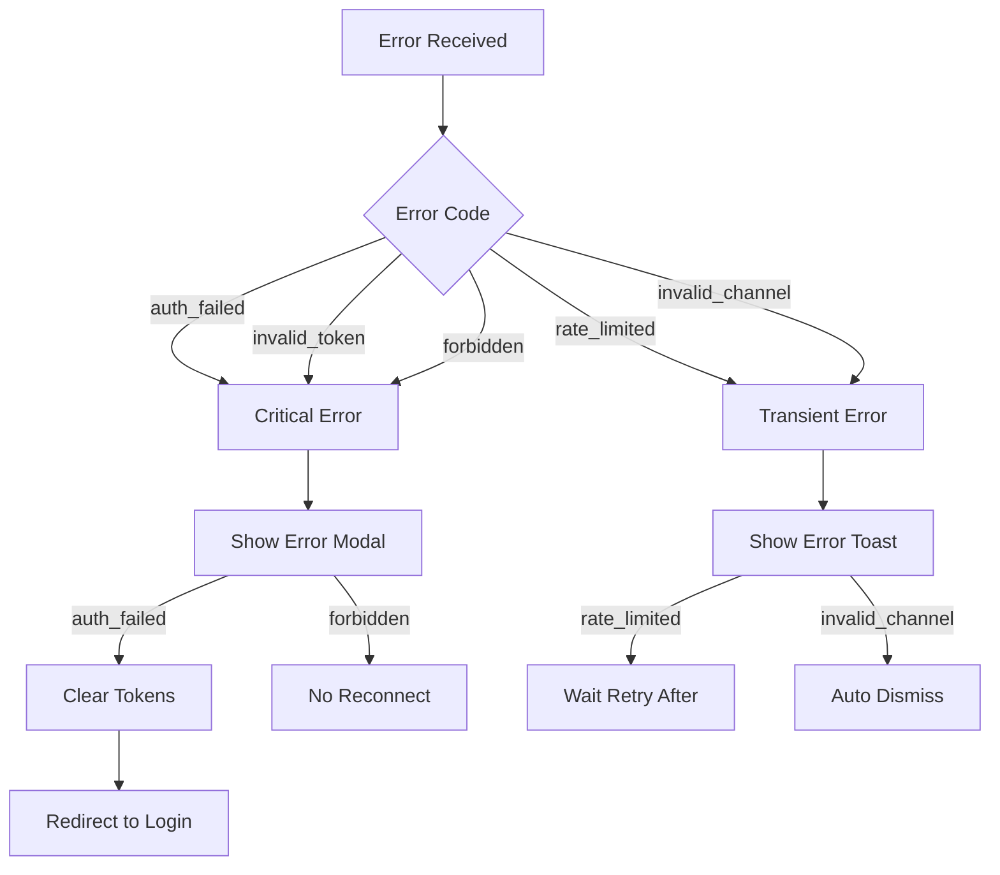
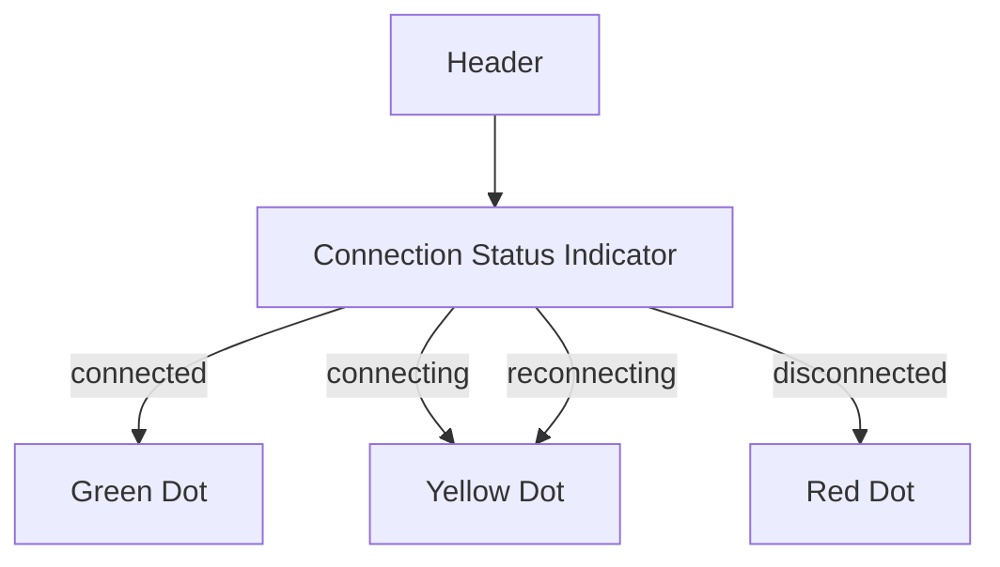

# User Flows — WebSocket Frontend Alignment

## Actors

| Actor | Description |
|-------|-------------|
| Authenticated User | User with valid JWT token who can access the application |
| WebSocket Client | Automated client that establishes and maintains real-time connection |

## Flow Inventory

### WebSocket: Authentication Flow

**Actor**: WebSocket Client  
**Entry**: Application loads with valid JWT token  
**Exit**: WebSocket connected and authenticated

#### Screen List

| Screen | States Visited | Description |
|--------|----------------|-------------|
| App Layout | loading, connected, disconnected, error | Main application shell with WebSocket status indicator |
| Connection Error Modal | hidden, visible | Modal displayed when authentication fails |

#### Navigation Graph

#### State Transitions

| From | Action | To | Notes |
|------|--------|----|-------|
| App Layout | WebSocket opens | Loading | Client prepares authenticate message |
| Loading | Send authenticate | Waiting | Awaiting server response |
| Waiting | Receive authenticated | Connected | Store userId and connectionId |
| Waiting | Receive error: auth_failed | Error Modal | Clear tokens, show modal |
| Waiting | Receive error: invalid_token | Error Modal | Close connection, show modal |
| Connected | Receive session.revoked | Error Modal | Clear tokens, redirect to login |
| Connected | Connection lost | Reconnecting | Start reconnection attempts |
| Reconnecting | Reconnect success | Loading | Send authenticate again |
| Reconnecting | Max retries exceeded | Error Modal | Show generic error |
| Error Modal | Click Return to Login | Login | Redirect to /login |

---

### WebSocket: Channel Subscription Flow

**Actor**: WebSocket Client  
**Entry**: WebSocket authenticated  
**Exit**: Subscribed to user/team channels

#### Screen List

| Screen | States Visited | Description |
|--------|----------------|-------------|
| App Layout | subscribed, unsubscribed | Application with active channel subscriptions |

#### Navigation Graph

#### State Transitions

| From | Action | To | Notes |
|------|--------|----|-------|
| Authenticated | Server auto-subscribes | Subscribed (user) | Receive subscribed confirmation |
| Authenticated | Server auto-subscribes | Subscribed (team) | Receive subscribed confirmation |
| Subscribed | Send subscribe: issue | Subscribed (issue) | Manual subscription for issue detail |
| Subscribed | Send unsubscribe | Unsubscribed | Stop receiving events for channel |
| Subscribed | Send invalid channel | Error Toast | Display error message |

---

### WebSocket: Event Processing Flow

**Actor**: WebSocket Client  
**Entry**: Event received from server  
**Exit**: UI updated with event data

#### Screen List

| Screen | States Visited | Description |
|--------|----------------|-------------|
| App Layout | idle, updating | Application receiving real-time updates |
| Issue Board | idle, issue-updated | Board updating with issue changes |
| Notification Panel | idle, new-notification | Notification list updating |
| Comment Thread | idle, new-comment | Comment thread updating |

#### Navigation Graph

#### State Transitions

| From | Action | To | Notes |
|------|--------|----|-------|
| Idle | Receive issue.updated | Issue Updated | Update issue in store |
| Idle | Receive issue.created | Issue Updated | Add issue to store |
| Idle | Receive issue.deleted | Issue Updated | Remove issue from store |
| Idle | Receive comment.created | Comment Updated | Add comment to store |
| Idle | Receive comment.deleted | Comment Updated | Remove comment from store |
| Idle | Receive notification.* | Notification Updated | Update notification store |
| Idle | Receive label.* | Label Updated | Update label store |
| Idle | Receive user.online | User Online | Update user status |
| Idle | Receive user.offline | User Offline | Update user status |
| Idle | Receive session.revoked | Session Expired | Clear tokens, redirect |

---

### WebSocket: Error Handling Flow

**Actor**: WebSocket Client  
**Entry**: Error received from server  
**Exit**: Appropriate UI feedback displayed

#### Screen List

| Screen | States Visited | Description |
|--------|----------------|-------------|
| App Layout | normal, error | Application with error state |
| Connection Error Modal | hidden, visible | Modal for critical errors |
| Error Toast | hidden, visible | Toast for transient errors |

#### Navigation Graph

#### State Transitions

| From | Action | To | Notes |
|------|--------|----|-------|
| Normal | Receive auth_failed | Error Modal | Clear tokens, show modal |
| Normal | Receive invalid_token | Error Modal | Close connection, show modal |
| Normal | Receive forbidden | Error Modal | Show access denied, no reconnect |
| Normal | Receive rate_limited | Error Toast | Show retry-after message |
| Normal | Receive invalid_channel | Error Toast | Show invalid channel message |
| Error Modal | Click Return to Login | Login | Redirect to /login |
| Error Toast | Auto dismiss (5s) | Normal | Remove toast from UI |
| Error Toast | Click dismiss | Normal | Remove toast from UI |

---

### WebSocket: Connection Status Display Flow

**Actor**: Authenticated User  
**Entry**: User views application header  
**Exit**: User sees current connection status

#### Screen List

| Screen | States Visited | Description |
|--------|----------------|-------------|
| Header | connected, connecting, reconnecting, disconnected | Application header with status indicator |

#### Navigation Graph

#### State Transitions

| From | Action | To | Notes |
|------|--------|----|-------|
| Header | WebSocket connected | Green Dot | aria-label: "Connected" |
| Header | WebSocket connecting | Yellow Dot | aria-label: "Connecting" |
| Header | WebSocket reconnecting | Yellow Dot | aria-label: "Reconnecting" |
| Header | WebSocket disconnected | Red Dot | aria-label: "Disconnected" |
