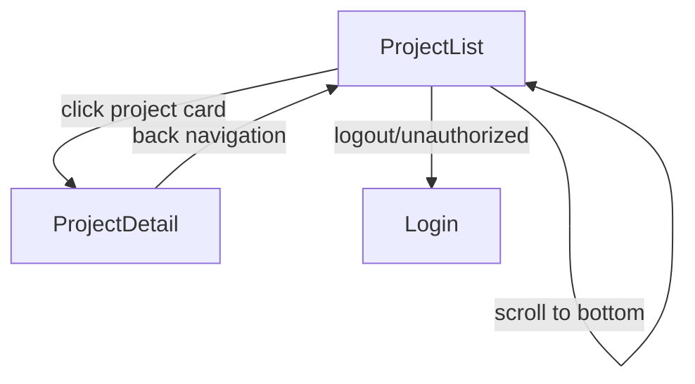

# User Flows — List Projects API

## Actors

| Actor | Description |
|-------|-------------|
| Authenticated User | A logged-in user who belongs to at least one team and can view projects for their team |

## Flow Inventory

### Projects: List Projects

**Actor**: Authenticated User  
**Entry**: User navigates to `/projects` route (via sidebar navigation or direct URL)  
**Exit**: User navigates to project detail (`/projects/:projectId`), applies filters, or leaves the page

#### Screen List

| Screen | States Visited | Description |
|--------|----------------|-------------|
| ProjectList | loading, populated, empty, error | Main screen displaying paginated list of projects with filter controls |

#### Navigation Graph

#### State Transitions

| From | Action | To | Notes |
|------|--------|----|-------|
| ProjectList (loading) | API success with projects | ProjectList (populated) | Projects rendered in list |
| ProjectList (loading) | API success with empty result | ProjectList (empty) | "No projects found" message shown |
| ProjectList (loading) | API error (400) | ProjectList (error) | Validation error message displayed |
| ProjectList (loading) | API error (401) | Login | Redirect to login page |
| ProjectList (populated) | User selects status filter | ProjectList (loading) | Refetch with new filter |
| ProjectList (populated) | User scrolls to bottom, hasMore=true | ProjectList (loading) | Append new projects on success |
| ProjectList (populated) | User scrolls to bottom, hasMore=false | ProjectList (populated) | Show "No more projects" indicator |
| ProjectList (empty) | User selects status filter | ProjectList (loading) | Refetch with new filter |
| ProjectList (error) | User clicks retry | ProjectList (loading) | Retry last fetch |
| ProjectList (any) | User clicks project card | ProjectDetail | Navigate to project detail |