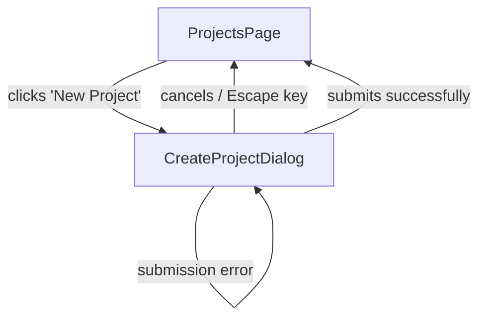

# User Flows — Create Project API

## Actors

| Actor | Description |
|-------|-------------|
| Authenticated User | Logged-in user with access to at least one team |

## Flow Inventory

### Projects: Create Project

**Actor**: Authenticated User  
**Entry**: User is on the Projects page (`/projects`)  
**Exit**: User remains on the Projects page with the new project visible in the list

#### Screen List

| Screen | States Visited | Description |
|--------|----------------|-------------|
| ProjectsPage | populated, error | Lists projects for the selected team, has "New Project" button |
| CreateProjectDialog | open (idle), open (submitting), open (error), closed | Modal overlay with create project form |

#### Navigation Graph

#### State Transitions

| From | Action | To | Notes |
|------|--------|----|-------|
| ProjectsPage | Click "New Project" | CreateProjectDialog (open) | Requires selected team context |
| CreateProjectDialog (open) | Click "Cancel" / press Escape | ProjectsPage | No project created |
| CreateProjectDialog (submitting) | API returns 201 | ProjectsPage | Success toast shown, project prepended to list |
| CreateProjectDialog (submitting) | API returns 4xx | CreateProjectDialog (error) | Server error displayed in form |
| CreateProjectDialog (submitting) | API returns 401 | LoginPage | Redirect to auth |
| CreateProjectDialog (error) | User edits fields | CreateProjectDialog (idle) | Errors cleared on field change |
