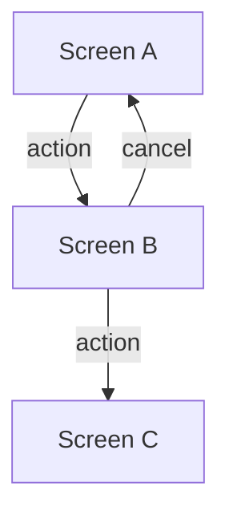

# Wireframes — {Domain}

## Screen: {ScreenName}

### Layout

```
+------------------------------------------+
|  Header — Logo / Nav / User              |
+------------------------------------------+
|                                          |
|  Main Content Area                       |
|  +------------------------------------+  |
|  |                                    |  |
|  |  {describe elements position}      |  |
|  |                                    |  |
|  +------------------------------------+  |
|                                          |
+------------------------------------------+
|  Footer                                  |
+------------------------------------------+
```

### Elements

| Element | Type | Purpose |
|---------|------|---------|
| {name}  | {button/input/link} | {purpose} |

### Navigation Flow



### States

- **Default**: {description}
- **Empty**: {description}
- **Error**: {description}
- **Loading**: {description}
